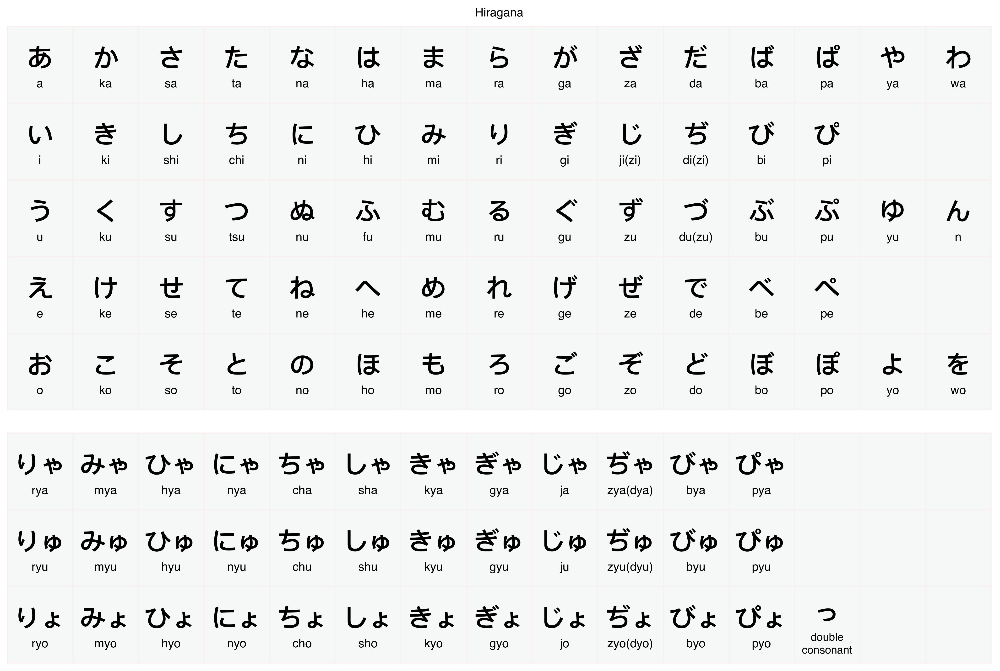
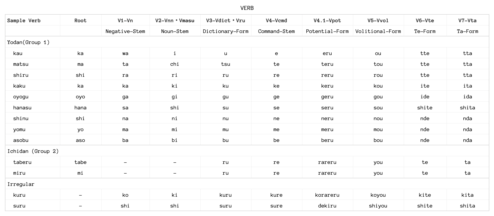

```{=html}
<style type="text/css">

body{
      font-size: 13px;
      font-family: "Anonymous Pro", "Roboto", "Helvetica Neue";
  }
</style>
```
<link rel="preconnect" href="https://fonts.gstatic.com">
<link href="https://fonts.googleapis.com/css2?family=M+PLUS+Rounded+1c:wght@100;300;400;500;700&display=swap" rel="stylesheet">
<link rel="preconnect" href="https://fonts.gstatic.com">
<link href="https://fonts.googleapis.com/css2?family=Anonymous+Pro&display=swap" rel="stylesheet">
<link href="https://fonts.googleapis.com/css2?family=Anonymous+Pro:ital,wght@0,400;1,700&display=swap" rel="stylesheet">
<link href="https://fonts.googleapis.com/css2?family=Anonymous+Pro:ital,wght@0,400;0,700;1,700&display=swap" rel="stylesheet">

```{css, echo=FALSE}
.my-tbl {
  border: 1px solid rgba(0, 0, 0, 0.1);
}

.my-header {
  border-width: 1px;
}

.my-col {
  border-right: 1px solid rgba(0, 0, 0, 0.05);
}

.my-row:hover {
  background-color: #f5f8ff;
}
```

```{r setup, include=FALSE}
knitr::opts_chunk$set(echo = TRUE)
```

```{css, echo=FALSE}
@media(prefers-color-scheme: light) {
  body {
    background-color: black;
    filter: invert(1);
  }
}
```

```{r, echo=FALSE, message=FALSE}
library(tidyverse)
library(reactable)
library(htmltools)
library(bslib)
library(dplyr)
library(purrr)
#library(bookdown)
#library(shiny)
```

```{r, echo=FALSE, message=FALSE, error=FALSE}
vnstx <- read_csv("vrbjp/Sheet 178-VNLST.csv")
vnstb <- read_csv("vrbjp/Sheet 83-VBPH.csv")
vnstc <- read_csv("vrbjp/Sheet 148-SSTNC.csv")
vnstd <- read_csv("vrbjp/Sheet 149-SSTNC.csv")
vnstg <- read_csv("vrbjp/Sheet 2-VGRM.csv")
vnsgg <- read_csv("vrbjp/Sheet 3-VGRM.csv")
vnsss <- read_csv("vrbjp/Sheet 1-VBPLS.csv")
knj <- read_csv("vrbjp/Sheet 5-KNJ.csv")
knjr <- read_csv("vrbjp/Sheet 6-KNJ.csv")
vnsst <- read_csv("vrbjp/Sheet 7-VPHS.csv")
klvl1 <- read_csv("vrbjp/Sheet 8-WBKNJ1.csv")
klvl2 <- read_csv("vrbjp/Sheet 9-WBKNJ2.csv")
klvl3 <- read_csv("vrbjp/Sheet 10-WBKNJ3.csv")
klv1 <- read_csv("vrbjp/Sheet 11-KNJD1.csv")
klv2 <- read_csv("vrbjp/Sheet 12-KNJD2.csv")
vnlr <- read_csv("vrbjp/Sheet 14-VNLST.csv")
dlgm <- read_csv("vrbjp/Sheet 13-TBE.csv")
nlgm <- read_csv("vrbjp/Sheet 15-JGRM.csv")
jlgm <- read_csv("vrbjp/Sheet 16-JGRM.csv")
mnlg <- read_csv("vrbjp/Sheet 17-MNLNG.csv")
onmp <- read_csv("vrbjp/Sheet 18-ONMP.csv")
cnmw <- read_csv("vrbjp/Sheet 19-CMNW.csv")
cnmw1 <- read_csv("vrbjp/Sheet 22-CMNW.csv")
cnmw2 <- read_csv("vrbjp/Sheet 23-CMNW.csv")
cnmw3 <- read_csv("vrbjp/Sheet 24-CMNW.csv")
cnmw4 <- read_csv("vrbjp/Sheet 25-CMNW.csv")
cnmw5 <- read_csv("vrbjp/Sheet 26-CMNW.csv")
cnmw6 <- read_csv("vrbjp/Sheet 27-CMNW.csv")
cmpnd <- read_csv("vrbjp/Sheet 35-CMPWD.csv")
cook <- read_csv("vrbjp/Sheet 20-MKOKT.csv")
diary <- read_csv("vrbjp/Sheet 21-FTRD.csv")
knjdl<- read_csv("vrbjp/Sheet 40-KNJD.csv")
expw<- read_csv("vrbjp/Sheet 36-EXPR.csv")
adjadv<- read_csv("vrbjp/Sheet 37-ADVADJ.csv")
cmwrdsn<- read_csv("vrbjp/Sheet 43-CMNWP.csv")
exppw<- read_csv("vrbjp/Sheet 42-EXPRP.csv")
jnrst <- read_csv("vrbjp/Sheet 44-JNRST.csv")
sntv <- read_csv("vrbjp/Sheet 98-MSNTC.csv")
rvvrb <- read_csv("vrbjp/Sheet 179-VNLST.csv")
rvwrd <- read_csv("vrbjp/Sheet 180-WRDSR.csv")
rvsnt <- read_csv("vrbjp/Sheet 181-WRDST.csv")
knjrvw <- read_csv("vrbjp/Sheet 50-WBKNRN.csv")
knjwrdx <- read_csv("vrbjp/Sheet 51-KNJWRD.csv")
icwrds <- read_csv("vrbjp/Sheet 128-VBPRHS.csv")
lvlg2 <- read_csv("vrbjp/Sheet 52-LVLGR.csv")
kjpen <- read_csv("vrbjp/Sheet 34-KJPEN.csv")
cmnknj <- read_csv("vrbjp/Sheet 70-CMKNJ.csv")
cmnknjv <- read_csv("vrbjp/Sheet 80-CMKNJV.csv")
cmnknjp <- read_csv("vrbjp/Sheet 81-CMKNJW.csv")
cmwpf <- read_csv("vrbjp/Sheet 90-CMKNJVM.csv")
cmwpg <- read_csv("vrbjp/Sheet 92-VGRM.csv")
cmwpc <- read_csv("vrbjp/Sheet 46-SSTBLM.csv")
cmwpu <- read_csv("vrbjp/Sheet 93-CMKNJVM.csv")
cmwpd <- read_csv("vrbjp/Sheet 95-CMKNJVM.csv")
cmwpe <- read_csv("vrbjp/Sheet 96-CMKNJVM.csv")
cmwpd2 <- read_csv("vrbjp/Sheet 97-CMKNJVM.csv")
cmwcpd <- read_csv("vrbjp/Sheet 49-WRDSCMN.csv")
fkanji <- read_csv("vrbjp/FRKJN-FREQ.csv")
ckanji <- read_csv("vrbjp/CKJN-KNJ.csv")
fwkanji <- read_csv("vrbjp/FRWKJN-FREQ.csv")
smpsnt <- read_csv("vrbjp/SMSNT-SNT.csv")
expspk <- read_csv("vrbjp/Sheet 77-ESNEXP.csv")
knjlst1 <- read_csv("vrbjp/KNJ1-WBKNJ1.csv")
knjlst2 <- read_csv("vrbjp/KNJ2-WBKNJ2.csv")
knjlst3 <- read_csv("vrbjp/KNJ3-WBKNJ3.csv")
knjlst4 <- read_csv("vrbjp/KNJ4-WBKNJ4.csv")
knjlst5 <- read_csv("vrbjp/KNJ5-WBKNJ5.csv")
knjlstr <- read_csv("vrbjp/KNJR-RNDMWV.csv")
spphr <- read_csv("vrbjp/SPPHR-HLPRS.csv")
chnkw <- read_csv("vrbjp/CHNK-RLWRD.csv")
lverbs <- read_csv("vrbjp/VERBS-VRBRNK.csv")
rknj <- read_csv("vrbjp/RKJN-KNJ.csv")

scknj5 <- read_csv("vrbjp/SKNJN5-KNJD1.csv")
scknj4 <- read_csv("vrbjp/SKNJN4-KNJD2.csv")
scknj3 <- read_csv("vrbjp/SKNJN3-KNJD3.csv")
scknj2 <- read_csv("vrbjp/SKNJN2-KNJD4.csv")
scknj1 <- read_csv("vrbjp/SKNJN1-KNJD5.csv")
nadj1 <- read_csv("vrbjp/ADJL-NAADJ1.csv")
nadj2 <- read_csv("vrbjp/ADJI-IADJ1.csv")
adv1 <- read_csv("vrbjp/ADV-ADV1.csv")
v1hme <- read_csv("vrbjp/CATG-VCBT1.csv")
v1hme <- read_csv("vrbjp/CATG-VCBT1.csv")
wrd5ex <- read_csv("vrbjp/WRDN5-WRD5.csv")
wrd4ex <- read_csv("vrbjp/WRDN4-WRD4.csv")
wrd3ex <- read_csv("vrbjp/WRDN3-WRD3.csv")
qsn5 <- read_csv("vrbjp/QSNTN5-QSNT1.csv")
knjcmm <- read_csv("vrbjp/CMPCH-KNJCMM.csv")

```

------------------------------------------------------------------------

# Introduction {.tabset}

## Foreword

This is a collection of notes taken from different books and online
reference materials related to Japanese learning. The aim of this
collection is to give an idea on how start learning the language and to
be able to progress at some level.

------------------------------------------------------------------------

## Disclaimer

In any doubts please do a cross-reference from other resources.

------------------------------------------------------------------------

## Version

Version 🆅.2.1

------------------------------------------------------------------------

# Scripts {.tabset}

There are 3 writing system used in Japanese namely the **Kanji**, **Hiragana** and the **Katakana** scripts.

## Hiragana {.tabset}

**Hiragana** is a phonetic script used to represent Japanese sound.



------------------------------------------------------------------------

## Katakana

**Katakana** is a phonetic script used to represent Foreign loan words.


------------------------------------------------------------------------

## Kanji {.tabset}

**Kanji** was based on Chinese characters which represents a word and a meaning.

### L5 {.tabset}

```{r, echo=FALSE, message=FALSE}

# scknj5 <- scknj5[sample(1:nrow(scknj5)),]

reactable(
  scknj5,
  columns = list(
    Kanji = colDef(
      # Show species under character names
      cell = function(value, index) {
        Meaning <- scknj5$Meaning[index]
        Meaning <- if (!is.na(Meaning)) Meaning else ""
        # Reading <- scknj5$Reading[index]
        # Reading <- if (!is.na(Reading)) Reading else ""
        # Asso <- scknj5$Asso[index]
        # Asso <- if (!is.na(Asso)) Asso else ""
        tagList(
          div(style = list(fontSize = 30, fontWeight = 600), value),
          # div(style = list(fontSize = 11), Reading),
          div(style = list(fontSize = 9), Meaning),
          # div(style = list(fontSize = 13, fontWeight = 600), value, Asso),
        )
      },
      align = "center"
    ),
    W1 = colDef(
      cell = function(value, index) {
        M1 <- scknj5$M1[index]
        M1 <- if (!is.na(M1)) M1 else ""
        R1 <- scknj5$R1[index]
        R1 <- if (!is.na(R1)) R1 else ""
        tagList(
          div(style = list(fontSize = 18, fontWeight = 600), value),
          div(style = list(fontSize = 10, fontWeight = 500), R1),
          div(style = list(fontSize = 9, fontWeight = 500), M1),
        )
      },
      align = "center"
    ),
    W2 = colDef(
      cell = function(value, index) {
        M2 <- scknj5$M2[index]
        M2 <- if (!is.na(M2)) M2 else ""
        R2 <- scknj5$R2[index]
        R2 <- if (!is.na(M2)) R2 else ""
        tagList(
          div(style = list(fontSize = 18, fontWeight = 600), value),
          div(style = list(fontSize = 10, fontWeight = 500), R2),
          div(style = list(fontSize = 9, fontWeight = 500), M2),
        )
      },
      align = "center"
    ),
    W3 = colDef(
      cell = function(value, index) {
        M3 <- scknj5$M3[index]
        M3 <- if (!is.na(M3)) M3 else ""
        R3 <- scknj5$R3[index]
        R3 <- if (!is.na(R3)) R3 else ""
        tagList(
          div(style = list(fontSize = 18, fontWeight = 600), value),
          div(style = list(fontSize = 10, fontWeight = 500), R3),
          div(style = list(fontSize = 9, fontWeight = 500), M3),
        )
      },
      align = "center"
    ),
    R1 = colDef(show = FALSE),
    R2 = colDef(show = FALSE),
    R3 = colDef(show = FALSE),
    M1 = colDef(show = FALSE),
    M2 = colDef(show = FALSE),
    M3 = colDef(show = FALSE),
    Meaning = colDef(show = FALSE)
    # Reading = colDef(show = FALSE),
    # Asso = colDef(show = FALSE)
  ),
  defaultPageSize = 5,
  theme = reactableTheme(
    cellStyle = list(display = "flex", flexDirection = "column", justifyContent = "center", fontSize = "11px", height = 85),
    searchInputStyle = list(
      paddingLeft = "8px",
      paddingTop = "8px",
      paddingBottom = "8px",
      width = "100%",
      fontSize = "11px"
    )
  ),
  showPageInfo = FALSE, bordered = TRUE, searchable = TRUE, sortable = FALSE, paginationType = "numbers",

  style = list(fontFamily = "Heiti SC, Hiragino Maru Gothic ProN, Anonymous Pro , monospace, Helvetica Neue", fontSize = "11px")
)

```

------------------------------------------------------------------------

### L4 {.tabset}

```{r, echo=FALSE, message=FALSE}

# scknj4 <- scknj4[sample(1:nrow(scknj4)),]

reactable(
  scknj4,
  columns = list(
    Kanji = colDef(
      # Show species under character names
      cell = function(value, index) {
        Meaning <- scknj4$Meaning[index]
        Meaning <- if (!is.na(Meaning)) Meaning else ""
        # Reading <- scknj4$Reading[index]
        # Reading <- if (!is.na(Reading)) Reading else ""
        # Asso <- scknj4$Asso[index]
        # Asso <- if (!is.na(Asso)) Asso else ""
        tagList(
          div(style = list(fontSize = 30, fontWeight = 600), value),
          # div(style = list(fontSize = 11), Reading),
          div(style = list(fontSize = 9), Meaning),
          # div(style = list(fontSize = 13, fontWeight = 600), value, Asso),
        )
      },
      align = "center"
    ),
    W1 = colDef(
      cell = function(value, index) {
        M1 <- scknj4$M1[index]
        M1 <- if (!is.na(M1)) M1 else ""
        R1 <- scknj4$R1[index]
        R1 <- if (!is.na(R1)) R1 else ""
        tagList(
          div(style = list(fontSize = 18, fontWeight = 600), value),
          div(style = list(fontSize = 10, fontWeight = 500), R1),
          div(style = list(fontSize = 9, fontWeight = 500), M1),
        )
      },
      align = "center"
    ),
    W2 = colDef(
      cell = function(value, index) {
        M2 <- scknj4$M2[index]
        M2 <- if (!is.na(M2)) M2 else ""
        R2 <- scknj4$R2[index]
        R2 <- if (!is.na(M2)) R2 else ""
        tagList(
          div(style = list(fontSize = 18, fontWeight = 600), value),
          div(style = list(fontSize = 10, fontWeight = 500), R2),
          div(style = list(fontSize = 9, fontWeight = 500), M2),
        )
      },
      align = "center"
    ),
    W3 = colDef(
      cell = function(value, index) {
        M3 <- scknj4$M3[index]
        M3 <- if (!is.na(M3)) M3 else ""
        R3 <- scknj4$R3[index]
        R3 <- if (!is.na(R3)) R3 else ""
        tagList(
          div(style = list(fontSize = 18, fontWeight = 600), value),
          div(style = list(fontSize = 10, fontWeight = 500), R3),
          div(style = list(fontSize = 9, fontWeight = 500), M3),
        )
      },
      align = "center"
    ),
    R1 = colDef(show = FALSE),
    R2 = colDef(show = FALSE),
    R3 = colDef(show = FALSE),
    M1 = colDef(show = FALSE),
    M2 = colDef(show = FALSE),
    M3 = colDef(show = FALSE),
    Meaning = colDef(show = FALSE)
    # Reading = colDef(show = FALSE),
    # Asso = colDef(show = FALSE)
  ),
  defaultPageSize = 5,
  theme = reactableTheme(
    cellStyle = list(display = "flex", flexDirection = "column", justifyContent = "center", fontSize = "11px", height = 85),
    searchInputStyle = list(
      paddingLeft = "8px",
      paddingTop = "8px",
      paddingBottom = "8px",
      width = "100%",
      fontSize = "11px"
    )
  ),
  showPageInfo = FALSE, bordered = TRUE, searchable = TRUE, sortable = FALSE, paginationType = "numbers",

  style = list(fontFamily = "Heiti SC, Hiragino Maru Gothic ProN, Anonymous Pro , monospace, Helvetica Neue", fontSize = "11px")
)

```

------------------------------------------------------------------------

### L3 {.tabset}

```{r, echo=FALSE, message=FALSE}

# scknj3 <- scknj3[sample(1:nrow(scknj3)),]

reactable(
  scknj3,
  columns = list(
    Kanji = colDef(
      # Show species under character names
      cell = function(value, index) {
        Meaning <- scknj3$Meaning[index]
        Meaning <- if (!is.na(Meaning)) Meaning else ""
        # Reading <- scknj3$Reading[index]
        # Reading <- if (!is.na(Reading)) Reading else ""
        # Asso <- scknj3$Asso[index]
        # Asso <- if (!is.na(Asso)) Asso else ""
        tagList(
          div(style = list(fontSize = 30, fontWeight = 600), value),
          # div(style = list(fontSize = 11), Reading),
          div(style = list(fontSize = 9), Meaning),
          # div(style = list(fontSize = 13, fontWeight = 600), value, Asso),
        )
      },
      align = "center"
    ),
    W1 = colDef(
      cell = function(value, index) {
        M1 <- scknj3$M1[index]
        M1 <- if (!is.na(M1)) M1 else ""
        R1 <- scknj3$R1[index]
        R1 <- if (!is.na(R1)) R1 else ""
        tagList(
          div(style = list(fontSize = 18, fontWeight = 600), value),
          div(style = list(fontSize = 10, fontWeight = 500), R1),
          div(style = list(fontSize = 9, fontWeight = 500), M1),
        )
      },
      align = "center"
    ),
    W2 = colDef(
      cell = function(value, index) {
        M2 <- scknj3$M2[index]
        M2 <- if (!is.na(M2)) M2 else ""
        R2 <- scknj3$R2[index]
        R2 <- if (!is.na(M2)) R2 else ""
        tagList(
          div(style = list(fontSize = 18, fontWeight = 600), value),
          div(style = list(fontSize = 10, fontWeight = 500), R2),
          div(style = list(fontSize = 9, fontWeight = 500), M2),
        )
      },
      align = "center"
    ),
    W3 = colDef(
      cell = function(value, index) {
        M3 <- scknj3$M3[index]
        M3 <- if (!is.na(M3)) M3 else ""
        R3 <- scknj3$R3[index]
        R3 <- if (!is.na(R3)) R3 else ""
        tagList(
          div(style = list(fontSize = 18, fontWeight = 600), value),
          div(style = list(fontSize = 10, fontWeight = 500), R3),
          div(style = list(fontSize = 9, fontWeight = 500), M3),
        )
      },
      align = "center"
    ),
    R1 = colDef(show = FALSE),
    R2 = colDef(show = FALSE),
    R3 = colDef(show = FALSE),
    M1 = colDef(show = FALSE),
    M2 = colDef(show = FALSE),
    M3 = colDef(show = FALSE),
    Meaning = colDef(show = FALSE)
    # Reading = colDef(show = FALSE),
    # Asso = colDef(show = FALSE)
  ),
  defaultPageSize = 5,
  theme = reactableTheme(
    cellStyle = list(display = "flex", flexDirection = "column", justifyContent = "center", fontSize = "11px", height = 85),
    searchInputStyle = list(
      paddingLeft = "8px",
      paddingTop = "8px",
      paddingBottom = "8px",
      width = "100%",
      fontSize = "11px"
    )
  ),
  showPageInfo = FALSE, bordered = TRUE, searchable = TRUE, sortable = FALSE, paginationType = "numbers",

  style = list(fontFamily = "Heiti SC, Hiragino Maru Gothic ProN, Anonymous Pro , monospace, Helvetica Neue", fontSize = "11px")
)

```

------------------------------------------------------------------------

### L2 {.tabset}

```{r, echo=FALSE, message=FALSE}

# scknj2 <- scknj2[sample(1:nrow(scknj2)),]

reactable(
  scknj2,
  columns = list(
    Kanji = colDef(
      # Show species under character names
      cell = function(value, index) {
        Meaning <- scknj2$Meaning[index]
        Meaning <- if (!is.na(Meaning)) Meaning else ""
        # Reading <- scknj2$Reading[index]
        # Reading <- if (!is.na(Reading)) Reading else ""
        # Asso <- scknj2$Asso[index]
        # Asso <- if (!is.na(Asso)) Asso else ""
        tagList(
          div(style = list(fontSize = 30, fontWeight = 600), value),
          # div(style = list(fontSize = 11), Reading),
          div(style = list(fontSize = 9), Meaning),
          # div(style = list(fontSize = 13, fontWeight = 600), value, Asso),
        )
      },
      align = "center"
    ),
    W1 = colDef(
      cell = function(value, index) {
        M1 <- scknj2$M1[index]
        M1 <- if (!is.na(M1)) M1 else ""
        R1 <- scknj2$R1[index]
        R1 <- if (!is.na(R1)) R1 else ""
        tagList(
          div(style = list(fontSize = 18, fontWeight = 600), value),
          div(style = list(fontSize = 10, fontWeight = 500), R1),
          div(style = list(fontSize = 9, fontWeight = 500), M1),
        )
      },
      align = "center"
    ),
    W2 = colDef(
      cell = function(value, index) {
        M2 <- scknj2$M2[index]
        M2 <- if (!is.na(M2)) M2 else ""
        R2 <- scknj2$R2[index]
        R2 <- if (!is.na(M2)) R2 else ""
        tagList(
          div(style = list(fontSize = 18, fontWeight = 600), value),
          div(style = list(fontSize = 10, fontWeight = 500), R2),
          div(style = list(fontSize = 9, fontWeight = 500), M2),
        )
      },
      align = "center"
    ),
    W3 = colDef(
      cell = function(value, index) {
        M3 <- scknj2$M3[index]
        M3 <- if (!is.na(M3)) M3 else ""
        R3 <- scknj2$R3[index]
        R3 <- if (!is.na(R3)) R3 else ""
        tagList(
          div(style = list(fontSize = 18, fontWeight = 600), value),
          div(style = list(fontSize = 10, fontWeight = 500), R3),
          div(style = list(fontSize = 9, fontWeight = 500), M3),
        )
      },
      align = "center"
    ),
    R1 = colDef(show = FALSE),
    R2 = colDef(show = FALSE),
    R3 = colDef(show = FALSE),
    M1 = colDef(show = FALSE),
    M2 = colDef(show = FALSE),
    M3 = colDef(show = FALSE),
    Meaning = colDef(show = FALSE)
    # Reading = colDef(show = FALSE),
    # Asso = colDef(show = FALSE)
  ),
  defaultPageSize = 5,
  theme = reactableTheme(
    cellStyle = list(display = "flex", flexDirection = "column", justifyContent = "center", fontSize = "11px", height = 85),
    searchInputStyle = list(
      paddingLeft = "8px",
      paddingTop = "8px",
      paddingBottom = "8px",
      width = "100%",
      fontSize = "11px"
    )
  ),
  showPageInfo = FALSE, bordered = TRUE, searchable = TRUE, sortable = FALSE, paginationType = "numbers",

  style = list(fontFamily = "Heiti SC, Hiragino Maru Gothic ProN, Anonymous Pro , monospace, Helvetica Neue", fontSize = "11px")
)

```

------------------------------------------------------------------------

### L1 {.tabset}

```{r, echo=FALSE, message=FALSE}

# scknj1 <- scknj1[sample(1:nrow(scknj1)),]

reactable(
  scknj1,
  columns = list(
    Kanji = colDef(
      # Show species under character names
      cell = function(value, index) {
        Meaning <- scknj1$Meaning[index]
        Meaning <- if (!is.na(Meaning)) Meaning else ""
        # Reading <- scknj1$Reading[index]
        # Reading <- if (!is.na(Reading)) Reading else ""
        # Asso <- scknj1$Asso[index]
        # Asso <- if (!is.na(Asso)) Asso else ""
        tagList(
          div(style = list(fontSize = 30, fontWeight = 600), value),
          # div(style = list(fontSize = 11), Reading),
          div(style = list(fontSize = 9), Meaning),
          # div(style = list(fontSize = 13, fontWeight = 600), value, Asso),
        )
      },
      align = "center"
    ),
    W1 = colDef(
      cell = function(value, index) {
        M1 <- scknj1$M1[index]
        M1 <- if (!is.na(M1)) M1 else ""
        R1 <- scknj1$R1[index]
        R1 <- if (!is.na(R1)) R1 else ""
        tagList(
          div(style = list(fontSize = 18, fontWeight = 600), value),
          div(style = list(fontSize = 10, fontWeight = 500), R1),
          div(style = list(fontSize = 9, fontWeight = 500), M1),
        )
      },
      align = "center"
    ),
    W2 = colDef(
      cell = function(value, index) {
        M2 <- scknj1$M2[index]
        M2 <- if (!is.na(M2)) M2 else ""
        R2 <- scknj1$R2[index]
        R2 <- if (!is.na(M2)) R2 else ""
        tagList(
          div(style = list(fontSize = 18, fontWeight = 600), value),
          div(style = list(fontSize = 10, fontWeight = 500), R2),
          div(style = list(fontSize = 9, fontWeight = 500), M2),
        )
      },
      align = "center"
    ),
    W3 = colDef(
      cell = function(value, index) {
        M3 <- scknj1$M3[index]
        M3 <- if (!is.na(M3)) M3 else ""
        R3 <- scknj1$R3[index]
        R3 <- if (!is.na(R3)) R3 else ""
        tagList(
          div(style = list(fontSize = 18, fontWeight = 600), value),
          div(style = list(fontSize = 10, fontWeight = 500), R3),
          div(style = list(fontSize = 9, fontWeight = 500), M3),
        )
      },
      align = "center"
    ),
    R1 = colDef(show = FALSE),
    R2 = colDef(show = FALSE),
    R3 = colDef(show = FALSE),
    M1 = colDef(show = FALSE),
    M2 = colDef(show = FALSE),
    M3 = colDef(show = FALSE),
    Meaning = colDef(show = FALSE)
    # Reading = colDef(show = FALSE),
    # Asso = colDef(show = FALSE)
  ),
  defaultPageSize = 5,
  theme = reactableTheme(
    cellStyle = list(display = "flex", flexDirection = "column", justifyContent = "center", fontSize = "11px", height = 85),
    searchInputStyle = list(
      paddingLeft = "8px",
      paddingTop = "8px",
      paddingBottom = "8px",
      width = "100%",
      fontSize = "11px"
    )
  ),
  showPageInfo = FALSE, bordered = TRUE, searchable = TRUE, sortable = FALSE, paginationType = "numbers",

  style = list(fontFamily = "Heiti SC, Hiragino Maru Gothic ProN, Anonymous Pro , monospace, Helvetica Neue", fontSize = "11px")
)

```

------------------------------------------------------------------------

# Structure {.tabset}

## Core

The **Core elements** of a sentence are the **Main Carriage** and **Engine** elements.

Initial carriage were introduced here as it sets the initial mood of the sentence which makes you sound more natural and not so boring. It also links up to the previous sentence or statement.

**①　Initial Carriage**

    Provides initial or introductory information about the sentence
    Includes the initial conjunctions, adverbial expressions, initial dependent clauses, etc

**②　Main Carriage**

    Describes the subject of the sentence
    Provides supplementary details about the engine on what action it does or the current state it is in
    Includes the subject, object, modifiers, adverbs, etc

**③　Engine**

    The driving force of the sentence
    It does tell the kind of sentence on whether it is a nominal, adjectival, or verbal sentence 
    Includes either a verb, an adjective, a noun or noun phrase plus copula, auxiliaries, particles, etc


------------------------------------------------------------------------

## Basic

Introduction of **A - Main Carriage** and **B - Engine**.

**①　Verbal Sentence**
`Verb as the engine`

###### **B describes the action/state of A**

    ・A does B  
    ・花子さんが来た  
    ・Hanako-san ga kita  
    ・Hanako came  

**②　Adjectival Sentence**
`I-Adjective as the engine`

###### **B describes A**

    ・A is B 
    ・空が青い 
    ・Sora ga aoi 
    ・The sky is blue 

**③　Adjectival Sentence**
`Na-Adjective (Adjectival Noun) as the engine`

###### **B describes A**

    ・A is B + Copula 
    ・地下鉄が便利だ 
    ・Chikatetsu ga benri da 
    ・The subway is convenient 

**④　Nominal Sentence**
`Noun as the engine`

###### **B defines/identifies/describes A**

    ・A is B + Copula
    ・ジョンさんがアメリカじんです
    ・John-san ga amerika-jin desu
    ・John is an American

###### 'da・desu' - copula

------------------------------------------------------------------------

## Compound

**Compound sentences** usually involves two or more simple sentences or clauses conjoined by conjunctions or connective form of verbs, adjectives or a copula. Compound sentences are usually connected through **AND or BUT** relation.

**①　AND-Relation**
`Connective forms of verbs, adjectives and copula`

###### **⚭　Sentence(I-Adj-Ending) + kute + Sentence**

    ・この辞書は安くて便利だ
    ・This dictionary is cheap and convenient

###### **⚭　Sentence(Na-Adj-Ending) + de + Sentence**

    ・りなさんはきれいでやさしいです
    ・Rina-san is beautiful and kind

###### **⚭　Sentence(Noun-Ending) + de + Sentence**

    ・ウンさんは中国人でキムさんは韓国人です 
    ・Mr.Wong is Chinese and Mr. Kim is Korean

###### **⚭　Sentence(Vnoun-base-Ending) + Sentence**

    ・私は朝六時に起き、夜十時ごろ寝る
    ・I get up at six in the morning and go to bed around ten at night

###### **⚭　Sentence(Vte-Ending) + Sentence**

    ・山田さんはラメンを食べてビールを飲む
    ・Yamada-san eats ramen and drinks beer

**②　AND-Relation**
`Conjunctive Particles`

###### **⚭　Sentence(V/I-Adj/(N/Na-Adj+Cop)-Ending) + shi + Sentence**

    ・この事件はほぼ終息したし二度と起こることはない
    ・このバッグは大きいしねだんも手頃だしいいですよ

<!-- <h> -->

    ・This incident has more or less ended and will never happen again
    ・This bag is large and the price is reasonable and so it's good

###### 'shi' particle - connects one or multiple reasons but not naming all of it

**③　BUT-Relation**
`Conjunctive Particles / Conjunctions`

###### **⚭　Sentence + ga + Sentence**

    ・家内はフランス語を話せるが私が話せない
    ・My wife can speak French but I can't

###### **⚭　Sentence + kedo + Sentence**

    ・入ってもいいけどしずかにしてくださいね
    ・You can come in but please be quiet

###### **⚭　Sentence + keredomo + Sentence**

    ・あそびたいけれども宿題はまだ終わってない
    ・I want to play but I haven't finished my homework yet

------------------------------------------------------------------------

## Complex

**Complex sentences** usually include any of the following items below.  
A more detailed explanations will be encountered along the way for each item.

**①　Relative Clauses**

###### **⚭　Relative Clause + Noun**

    ・私が昨日見た山
    ・これは友子が作ったケーキだ   

<!-- <h> -->

    ・The mountain I saw yesterday
    ・This is the cake Tomoko made

**②　Internal Sentences before 'toiu'**

###### **⚭　Noun/Sentence + toiu + Noun**

    ・富士山という山
    ・日本語は曖昧な言葉だという考えは珍しくない    

<!-- <h> -->

    ・A mountain called Mount Fuji
    ・The idea that Japanese is an ambiguous language is not uncommon

**③　Internal Sentences before Compound Particles (Pre-Nominal Form)**

###### **⚭　Noun/Verb + Compound Particle + Noun**

    ・コンピュータに関する彼の知識は相当なものだ
    ・ここにこの仕事をするに当たっての注意が書いてある    

<!-- <h> -->

    ・His knowledge of computers is quite impressive
    ・Here's a warning about doing this job

**④　Nominalized Sentences**

###### **⚭　Sentence +  no/koto**

    ・よく休むことが必要です
    ・光子がピアノを弾いているのを聞いた    
    ・ひかるさんが今日は来ることを知らなかった  

<!-- <h> -->

    ・I need to rest well
    ・I heard Mitsuko playing the piano
    ・I didn't know Hikaru-san was going to be here today

**⑤　Embedded Interrogative Sentences**

###### **⚭　Sentence + ka + ..**

    ・誰がそれをするかが問題だ
    ・いつ帰るかまだ決めていません    

<!-- <h> -->

    ・It's just a question of who's going to do it
    ・I haven't decided when I'm leaving yet

**⑥　Clauses before Adverbial Forms of Auxiliary Adjectives**

###### **⚭　Sentence + you ni/etc**

###### **Adverbial forms of Auxiliary Adjectives**

    ・みんながよく聞こえるようにマイクを使ってください
    ・Use the microphone so that everyone can hear you well

**⑦　Internal Sentences as Indirect Quotations**

###### **⚭　Sentence + toiu**

    ・山田さんは漢字は難しくないと言っている
    ・Mr. Yamada says kanji is not difficult

**⑧　Internal Sentences before Compound Particles (Pre-Verbal Form)**

###### **⚭　Noun/Verb + ni tsurete/etc**

    ・人は年を取るにつれて記憶力が衰える  
    ・As people get older, their memory declines

**⑨　Sentence-Initial Dependent Clauses**

###### **⚭　Sentence + temo/tara/toki ni/tame ni/etc**

###### **Represent such things as condition, time, reason, purpose and manner**

    ・質問されてもだまっていてください
    ・小林さんが来たら知らせてください    
    ・私がそこにいた時には異常はなかった    
    ・私は日本留学するために日本語を勉強しています

<!-- <h> -->

    ・If anyone asks you any questions, please keep quiet
    ・Let me know when Mr. Kobayashi gets here
    ・There was nothing unusual when I was there
    ・I'm studying Japanese in order to study in Japan

------------------------------------------------------------------------

# Elements {.tabset}

## Intial Carriage {.tabset}

### Connectives {.tabset}

**Connectives** appear at the beginning of an independent sentence and indicate how that sentence relates to the previous sentence.

#### Types

**① And**

    しかも　　◦ Moreover, Nevertheless             
    それも　　◦ In addition to that                
    さらに　　◦ Furthermore, Moreover              
    そのうえ　◦ In addition                        
    それに　　◦ Besides, In additon, Moreover      
    また　　　◦ In addition, Too, Also, Likewise   
    それから　◦ And then, After                      
    そして　　◦ And, And then                         

**② But**

    でも　　　◦ But             
    しかし　　◦ But             
    けれども　◦ But, However     

**③ Or**

    または　　◦ Or, Otherwise     
    それとも　◦ Or, Or else       
    あるいは　◦ Or, Either.. or    

**④ Cause & Reason, Effect & Result and Situation & Result**

    それで　　　◦ Thereupon, Because of that, That's why
    すると　　　◦ Thereupon, Hereupon        
    だから　　　◦ So, Therefore              
    そこで　　　◦ So, Therefore               
    したがって　◦ Therefore, Consequently    
    そのけっか　◦ As a result of that        
    そのために　◦ Hence, For that reason         

**⑤ Change the Subject**

    ところで　◦ By the way  

**⑥ Reason for Something**

    なぜなら　◦ The reason is  

**⑦ For Example**

    たとえば　◦ For example    

**⑧ Paraphrasing**

    つまり　　　◦ That is to say, In other words     
    ようするに　◦ In short, I a word, To sum up 
    ちなみに　　◦ By the way, in this connection, incidentally 

------------------------------------------------------------------------

#### Examples

**① And**

    ・彼女はフランス語が話せる。しかも流ちょうに話せる
    ・ちょっと話をしただけ。 それも小声で話ます  
    ・彼は料理を二人分も食べた。さらに、食後ケーキも食べた   
    ・あの人は頭がいい。そのうえ性格してもいい    
    ・小川さんは仕事が早い。 それに、正確だ  
    ・ノートパソコンは場所を取らない。また、持ち運びにも便利だ    
    ・8時まで日本語の宿題うおした。それから映画をみに出かけた    
    ・僕は駅前の喫茶店に行った。そしてそこで友達を待っていた    

<!-- <h> -->

    ・She speaks French. Moreover, she's speaks fluently
    ・We talked for a monment.In addition to that we did it in a low voice
    ・He ate two portions of food. Furthermore, he had an after-dinner cake
    ・He's a smart guy. In addition, he's got a great personality
    ・Mr. Ogawa is a fast worker. In addition, he's accurate
    ・Laptops do not take up much space. Likewise, they are convenient to carry around
    ・I worked on my Japanese homework until 8 o'clock. And then, I went out to see a movie
    ・I went to a coffee shop in front of the station. And there I was waiting for my friend

**② But**

    ・彼は新しい、いい車を持っている。でもめったに乗らない
    ・手紙を出した。しかし返事はこなかった    
    ・二時間待った。けれども、一郎は姿を現さなかった    

<!-- <h> -->

    ・He has a fine new car. But he almost never drives it
    ・I sent a letter. But no reply came
    ・I have waited for 2 hours. However Ichiro did not show up

**③ Or**

    ・手紙を書くか、または電話する
    ・車で行きますか。それとも飛行機で行きますか    
    ・この絵は彼が描いたのでしょうか。あるいはどこかから買って来たのでしょうか    

<!-- <h> -->

    ・Either write a letter or make a phone call
    ・will you go by car? Or will you go by plane?
    ・Did he draw this painting? Or did he buy it from somewhere

**④ Cause & Reason, Effect & Result and Situation & Result**

    ・昨日は京都へ出張していました。それでうちにいなかったんです
    ・私が別れようと言った。すると彼女雨は泣き出した    
    ・日本語を勉強すると役に立つ。だから日本をしている    
    ・おじいさんが大学卒業の日。3000ドルくれた。僕は日本へ行くことにした    
    ・先学期はあまり勉強しなかった。したがって、成績も悪かった    
    ・彼は遅く起きた。その結果、バスに乗り損なった    
    ・そして次は私の番でした    

<!-- <h> -->

    ・Yesterday, I was in Kyoto on business trip. That's why I wasn't at home
    ・I told her that we should break up. Thereupon, she started to cry
    ・If we study Japanese, it will be useful. So, I am studying Japanese
    ・My granfather gave me 3000 dollars on my graduation day. So I decided to go to Japan
    ・Last semester, I didn't study much. So my grades were bad
    ・He got up late. As a result of that, he missed the bus
    ・Then it was my turn

**⑤ Change the Subject**

    ・ところでじんじゃ神社をし知っていますか？
    ・By the way, do you know what a Shinto shrine is

**⑥ Reason for Something**

    ・なぜなら彼は病気だったからです
    ・The reason is because he was sick

**⑦ For Example**

    ・例えば、君は英語が好きですか
    ・For example, do you like English?

**⑧ Paraphrasing**

    ・金がない。つまり、貧乏なんです
    ・要するに彼らは間違っている    
    ・結局は金の問題だ    
    ・ちなみに、言わなくちゃいけないことがあるんだけどさ

<!-- <h> -->

    ・I don't have money. In other words, I am poor
    ・In a word, they are mistaken
    ・In the end, it's a question of money
    ・By the way, there's something I should tell you

------------------------------------------------------------------------

### Adverbial Expressions

**Adverbial Expressions** usually appears in the beginning of a sentence

**①　あいかわらず**

###### **as usual ◦ as always**

    ・相変わらず彼は公園でランチを食べています
    ・As always, he is eating lunch at the park

**② どうしても**

###### **by any means ◦ reason**

    ・どうしてもぼういはチップを取りませんでした
    ・For any reason, the bellboy would not accept a tip

**③ けっきょく**

###### **after all ◦ in the end**

    ・けっきょくだれにもわかりませんでした
    ・In the end, it wasn’t understood by anyone

**④ もちろん**

###### **of course**

    ・もちろんみんなに伝えておきます
    ・Of course, I will inform everyone

**⑤ もしかしたら**

###### **perhaps ◦ it may be that**

    ・もしかしたら来ないかも知れません
    ・Perhaps, he might not come for all we know

**⑥ なんて ＋ adjective**

###### **how ◦ what (exclamatory)**

    ・なんて可愛い子供でしょう
    ・What a cute child he is!

**⑦ なるほど**

###### **indeed ◦ that's right**

    ・なるほどいい計画ですね
    ・Indeed, it is a good plan

**⑧ せっかく**

###### **kindly ◦ with much effort**

    ・せっかくためたお金を使ってしまって残念です
    ・With much effort saving the money, it was used up unfortunately

**⑨ とにかく**

###### **anyway**

    ・とにかく遅いですから帰りましょう
    ・Anyway, since it is late lets go home

**⑩ とりあえず**

###### **for now ◦ fort the time being ◦ first of all ◦ at onc**e

    ・取り敢えず社長の返事待ちましょう
    ・For the time being, lets wait for presidents reply

**⑪ わざわざ**

###### **kindly ◦ especially**

    ・わざわざここまでご案内下さってありがとう
    ・Especially guiding me this far, thank you

**⑫ やはり**

###### **after all**

    ・やはり会社の代理人して会議にしなきゃ
    ・After all, as the company’s representative

**⑬ やっぱり**

###### **as expected**

    ・やっぱり彼が来なかった
    ・As expected, he did not come

------------------------------------------------------------------------

### Sentential Topic

The **topic** of a sentence usually appears in the beginning of a sentence and is what the whole sentence is about. It often overlaps with the subject of a sentence, but it can be other parts of speech as well. Topics are marked by **wa** particle.

    ・わたしは出かけます
    ・週末は買い物に行きます    
    ・晩ご飯は、たいていうちで食べます    
    ・この問題に関しては、これ以上議論しても無駄だ    

<!-- <h> -->

    ・As for me, I’m going out
    ・As for weekends, I go shopping
    ・As for dinner, I usually eat at home
    ・With regards to this problem, it is no use to discuss it further

------------------------------------------------------------------------

### Sentence Initial Dependent Clause

**Initial Dependent Clause** usually appears in the beginning of a complex sentence before the main clause.\
Represent such things as condition, time, reason, purpose and manner.

    ・質問されてもだまっていてください
    ・小林さんが来たら知らせてください    
    ・私がそこにいた時には異常はなかった    
    ・私は日本留学するために日本語を勉強しています    

<!-- <h> -->

    ・If anyone asks you any questions, please keep quiet
    ・Let me know when Mr. Kobayashi gets here
    ・There was nothing unusual when I was there
    ・I'm studying Japanese in order to study in Japan

------------------------------------------------------------------------

## Main Carriage {.tabset}

### Subject

The **subject** of a sentence is the animate or inanimate entity that performs the action or undergoes the process denoted by the verb. If the sentence denotes a state rather than an action, the subject is what the predicate (verb, adjective or copula phrase) describes. Subjects are marked by **ga** particle.

    ・今夜は月がきれいですね
    ・さっき田中さんが来ましたよ    

<!-- <h> -->

    ・The moon is beautiful tonight
    ・Mr/Ms Tanaka came just a little while ago

------------------------------------------------------------------------

### Object {.tabset}

#### Direct object

**Direct objects** are nouns and pronouns that are directly affected by the action of the verb. They are usually marked by **o** particle.

    ・私は友達にワインをあげた
    ・I gave my friend a bottle of wine

------------------------------------------------------------------------

#### Indirect object

**Indirect objects** are nouns and pronouns to which/whom an action is directed. They are generally marked by **ni** particle.

    ・私は友達にワインをあげた
    ・I gave my friend a bottle of wine

------------------------------------------------------------------------

### Particles

**Particles** are short functional words that are attached to nouns and indicates its grammatical role.

**①　Case Particles**

###### **Short functional words that indicates if the noun is the subject, object, indirect object or as noun modifier**

    が ⇢ Subject         
    を ⇢ Object          
    に ⇢ Indirect Object 
    の ⇢ Noun Affiliation 

<!-- <h> -->

    ・猫がいる
    ・手をさげる    
    ・週末におじいちゃんに会いに行こうよ    
    ・帰りの切符は買ったの？   

<!-- <h> -->

    ・There is a cat
    ・Put your hands down
    ・Let's visit my grandpa this weekend
    ・Did you buy a return ticket?

**②　Post Position Particles**

###### **Short functional words that follows a noun/pronoun expressing concepts such as time, manner, and location**

    で ⇢ at, in (place of action)
    で ⇢ by, with (means)
    に ⇢ at, to, for
    と ⇢ with      
    へ ⇢ to        

<!-- <h> -->

    ・居酒屋でビールを飲む
    ・新幹線で京都に行こう    
    ・新宿に行きます    
    ・家族と公園にいく
    ・北海道へ行く    

<!-- <h> -->

    ・Drinking beer at Izakaya
    ・Let's go to Kyoto by Shinkansen
    ・I'm going to Shinjuku
    ・I am ging to the park with my family
    ・I'm going to Hokkaido

<!-- <h> -->

    から ⇢ from 
    まで ⇢ until

<!-- <h> -->

    ・ここから出よう
    ・このバスは嵐山駅まで行く    

<!-- <h> -->

    ・Let's go out from here
    ・This bus goes until Arashiyama Station

**③　Conjunctive Particles**

###### **Short functional words that connect two or more clauses**

    と ⇢ and 
    が ⇢ but 
    し ⇢ and 

<!-- <h> -->

    ・私は英語と日本語を話す
    ・ビーりは飲むが酒は飲まない   
    ・日本はきれいだし好きです    

<!-- <h> -->

    ・I speak English and Japanese
    ・I drink beer but but don't drink sake
    ・Japan is clean and so I like it

<!-- <h> -->

    けど ⇢ but      
    から ⇢ because  
    のに ⇢ although 

<!-- <h> -->

    ・申し訳ないけど長居できないんですよ
    ・赤ん坊は今空腹だから泣いている    
    ・彼は若いのにしっかりしてるね    

<!-- <h> -->

    ・I'm sorry, but I can't stay long
    ・The baby is crying because it's hungry now
    ・Although he is young, he is responsible 

**④　Sentence Final Particles**

###### **Short functional words that are attached to the end of an utterance and convey various speaker sentiments and attitudes**

    ね ⇢ confirmation, agreement               
    よ ⇢ conviction, assertion                 
    よ ⇢ soften warning, command, request      
    か ⇢ interrogative                         
    わ ⇢ weak assertive, volition              
    ぞ ⇢ unswayed judgement, indicates command 
    ぜ ⇢ unswayed judgement                    
    さ ⇢ mark assertion, surprise               
    の ⇢ informal question                     

<!-- <h> -->

    ・読んでくださいね
    ・とても面白いですよ    
    ・読めよ    
    ・行きますか    
    ・この部屋はちさいわ    
    ・いくぞ   
    ・この魚旨いぜ    
    ・僕も日本語が話せるさ
    ・わからないの？   

<!-- <h> -->

    ・Please read it
    ・It's very interesting
    ・Read it
    ・Are you going?
    ・This room is small
    ・Let’s go
    ・This fish is tasty
    ・I can also speak Japanese
    ・Understand?

------------------------------------------------------------------------

### Demonstratives {.tabset}

**Demonstratives** are words that indicate entities to which a speaker is referring.

#### ko

**kore** `this・this one`\
**korera** `these・these ones`\
**kono (+noun)** `this (noun)`\
**koko** `here・this place`\
**kochira** `this way・this direction`\
**kouiu (+noun)** `such・this sort of・like this (noun)`\
**konna (+noun)** `such・this sort of・like this・this kind of (noun)`\
**konoyouna (+noun)** `such・this sort of・like this・this kind of (noun)`\
**konnani** `this (much)・to this degree・like this・in this way`\
**konoyouni** `in this manner・in this way・like this`\
**kou** `in this way・thus・such`

    ・これは本です
    ・これを見てくれ
    ・このペンは誰のです
    ・この雨の中を歩いてきたのですか
    ・ここから消えてくれ
    ・ここが私の通った学校だ
    ・ここまでは追ってこないだろう
    ・こちらへどうぞ
    ・こちらを向いてください
    ・こういうこと
    ・こういうふうにやるとうまくいくよ
    ・こんな大雪は珍しい
    ・こんな気持ちになったのは初めてだ
    ・このような話をどこかで聞いたことがある
    ・昔の夏はこんなに暑くなかった
    ・山手線がこんなに遅れることは珍しい
    ・このようにやってごらんなさい
    ・ラケットはこう持ってください
    ・いいかい, 説明書にこう書いてある

<!-- <h> -->

    ・This is a book
    ・Look at this
    ・Whose pen is this?
    ・Have you walked in this rain?
    ・Get out of here
    ・This is the school I went to
    ・They won't follow us this far
    ・This way, please
    ・Please turn around
    ・Things like this
    ・If you do it like this, it works
    ・Such heavy snow is rare
    ・I've never felt like this before
    ・I've heard stories like this somewhere before
    ・It wasn't always this hot in the summer
    ・It's rare for the Yamanote Line to be this late
    ・Try it this way
    ・Hold your racquet like this
    ・Listen! This is what it says in the explanation

------------------------------------------------------------------------

#### so

**sore** `that・that one`\
**sorera** `those・those ones`\
**sono (+noun)** `that (noun)`\
**soko** `there・that place`\
**sochira** `that way・that direction`\
**souiu (+noun)** `such・that sort of・like that (noun)`\
**sonna (+noun)** `such・that sort of・like that・that kind of (noun)`\
**sonoyouna (+noun)** `such・that sort of・like that・that kind of (noun)`\
**sonnani** `that (much)・to that degree・like that・in that way`\
**sonoyouni** `in that manner・in that way・like that`\
**sou** `in that way・thus・such`

    ・それ以前
    ・それ以後
    ・それについては後で述べる
    ・その意気だ
    ・それは僕がなくしたその時計だった
    ・そこが困ったところなんだよ
    ・そこから先は言わなくてもいい
    ・そこまでは考えなかった
    ・そちらのを見せてください
    ・今からそちらへ伺います
    ・そちらの様子はいかがですか
    ・そういう場合には
    ・若者には時々そういうことがあるんだけど
    ・そういうわけさ
    ・そんなことを言ったら誤解されるよ
    ・そんな自分がつくづくいやになる
    ・そんなつもりじゃなかったんだ
    ・そんなに使ったのか
    ・そんなに寒くない
    ・ほんとにそうなんですか
    ・そう考えると
    ・わかりました.そうします
    ・そう言われればそんな気がしてきた

<!-- <h> -->

    ・Before that
    ・After that
    ・We'll talk about that later
    ・That's the spirit!
    ・It was that watch I lost
    ・That's where the trouble lies
    ・You don't have to tell me where to go from there
    ・I didn't think that far ahead
    ・Please show me that
    ・I'm on my way there now
    ・How are things going over there?
    ・In that case
    ・I mean, that's what happens sometimes with young people
    ・That's how it is
    ・You'll be misunderstood if you say that
    ・I hate myself for that.
    ・I didn't mean it like that
    ・You've spent that much?
    ・It's not that cold
    ・Is it really so?
    ・When you think about it
    ・I understand. I will do that
    ・That's what I thought when you said that

------------------------------------------------------------------------

#### a

**are** `there・that one there`\
**arera** `those・those over there`\
**ano (+noun)** `that (noun) over there`\
**asoko** `over there・that place there`\
**achira** `that way・that direction`\
**auiu (+noun)** `such・that sort of・like that (noun)`\
**anna (+noun)** `such・that sort of・like that・that kind of (noun)`\
**anoyouna (+noun)** `such・that sort of・like that・that kind of (noun)`\
**annani** `that (much)・to that degree・like that・in that way`\
**anoyouni** `in that manner・in that way・like that`\
**aa** `in that way・thus・such`

    ・あれが今度の市長です
    ・あれは何の音だろう
    ・あれは何ですか
    ・あの山は何という山ですか
    ・あの後ずっと
    ・あの話はどうなってる?
    ・あそこまで競走しよう
    ・あそこのラーメン屋に入ろう
    ・普通あそこまで言わないよ
    ・あちらに見える山
    ・あちらが新製品でございます
    ・あちらの気候は日本より厳しい
    ・あんな正直な人
    ・あんな美しい絵
    ・私はあんなに偉い人は見たことがない

<!-- <h> -->

    ・That's the new mayor
    ・What was that sound?
    ・What is that?
    ・What is that mountain called?
    ・After all that time
    ・What's that story?
    ・Let's race up there!
    ・Let's go to that noodle shop
    ・They don't usually say that much.
    ・The mountain you can see over there
    ・That's the new product!
    ・The climate there is harsher than in Japan
    ・Such an honest man
    ・Such a beautiful picture
    ・I've never seen anyone that so great in my life

------------------------------------------------------------------------

#### do

**dore** `which・which one`\
**dorera** `which・which ones`\
**dono (+noun)** `which (noun)`\
**doko** `where・what place`\
**dochira** `which way・which direction・which one`\
**douiu (+noun)** `such what・what sort of・like what (noun)`\
**donna (+noun)** `such what・what sort of・like what・what kind of (noun)`\
**donoyouna (+noun)** `such what・what sort of・like what・what kind of (noun)`\
**donnani** `how (much)・to what degree・like what・in what way・no matter how`\
**donoyouni** `how・in what manner・in what way・like what`\
**dou** `in what way・ how about・how・no matter how`

    ・ジョッキは、大、中、小のどれがいいですか
    ・ビールは、ジョッキとボトルとどっちがいいですか
    ・どの車がいいですか
    ・どの部屋がいいですかか
    ・どこから来たの
    ・今日はどこからですか
    ・対戦相手はどこですか
    ・どちらへお出でですか
    ・光と音とどちらが速いか
    ・お国はどちらですか?
    ・どういう風に
    ・どういう訳で
    ・それはどういう訳ですか
    ・いったいこれはどういうこと?
    ・その人はどういう性格の人ですか
    ・どんな人ですか
    ・今日はどんな具合ですか
    ・子供にどんな本を読ませたらいいでしょうか
    ・どんなに金があっても
    ・どんなに勉強しても
    ・どうなさいましたか
    ・どうしたの
    ・どう考えてみても
    ・どう考えてみてもそれはおかしいよ

<!-- <h> -->

    ・Which one do you like a large, medium or small mug?
    ・Which one do you prefer a mug of beer or a bottle?
    ・Which car would you like to buy?
    ・Which room would you like?
    ・Where do you come from?
    ・Where do you come from today?
    ・Where are the opponents?
    ・Where are you going?
    ・Which is faster, light or sound?
    ・Where is your country?
    ・In what way?
    ・For what reason?
    ・What is the reason?
    ・What is this all about?
    ・What kind of person is he?
    ・What kind of person are you?
    ・How are you feeling today?
    ・What books should I read to my child?
    ・No matter how much money you have
    ・No matter how much you study
    ・How can I help you?
    ・What's the matter?
    ・No matter how you look at it
    ・No matter how you look at it, that's not right

------------------------------------------------------------------------

### Nouns {.tabset}

#### Noun

**Nouns** are words which denote people, animals, places, things, or concepts.

**Japanese nouns** doesn't conjugate it change it's form. In order to form a past tense, negative form or other forms, a copula is attach to it in order to suffice.

**Forms**

###### **Noun (Plain Form - Non Past)**

    ・hana  ⇢   hana da

###### **Noun (Polite Form - Non Past)**

    ・hana  ⇢   hana desu

###### **Noun (Plain Form - Past)**

    ・hana  ⇢   hana datta

###### **Noun (Polite Form - Past)**

    ・hana  ⇢   hana deshita

###### **Noun (Plain Form - Negative)**

    ・hana  ⇢   hana ja nai

###### **Noun (Polite Form - Negative)**

    ・hana  ⇢   hana dewa nai
    ・hana  ⇢   hana dewa arimasen

###### **Noun (Plain Form - Past Negative)**

    ・hana  ⇢   hana ja nakatta

###### **Noun (Polite Form - Past Negative)**

    ・hana  ⇢   hana dewa nakatta
    ・hana  ⇢   hana dewa arimasen deshita

###### **Noun (Connective Form)**

    ・hana  ⇢   hana de

###### **Noun(Connective Form - Negative)**

    ・hana  ⇢   hana ja nakute
    ・hana  ⇢   hana dewa nakute

------------------------------------------------------------------------

#### Pro-Nouns

A **pronoun** is a word that is used to replace a noun or noun phrase.

**①　First Person**   

    私　わたし　　・I,me 
    僕　ぼく　　　・I,me (M)
    俺　おれ　　　・I,me (M)
    私　わたくし　・I,me
    私　あたし　　・I,me (F)  

**②　Second Person**   

    あなた　　・you 
    きみ　　　・you  

**③　Third Person**   

    彼　　　かれ　　　・he,him   
    彼女　　かのじょ　・she,her  
    あの人　あのひと　・he,she,that person 

------------------------------------------------------------------------

#### Noun-Phrase

A **noun phrase** is a **modified noun**.  
A word or groups of words that modifies a noun comes before the noun.

**①　Demonstratives + Noun**
`Referencing a noun`

###### **⚭　kono/sono/ano/dono + Noun** → this/that/which Noun

###### **⚭　kouiu/souiu/auiu/douiu + Noun** → this/that/what kind of Noun

###### **⚭　konna/sonna/anna/donna + Noun** → this/that/what kind of Noun

    ・この本
    ・あの学生
    ・こんな辞書
    ・その時

<!-- <h> -->

    ・This book
    ・That student
    ・This kind of dictionary
    ・At that time

**②　Specialized Noun modifying words**
`Characterize a noun`

###### **⚭　arayuru + Noun** → every possible Noun

###### **⚭　iwayuru + Noun ** → so-called Noun

###### **⚭　onaji + Noun** → the same Noun

###### **⚭　saru + Noun** → the past/last Noun

    ・私たちはあらゆる問題を話しった
    ・彼はいわゆる立派な紳士だ
    ・同じ年の夫とは三円前に知り合った
    ・さる六月に私の姉は高校の教師と結婚した

<!-- <h> -->

    ・We have talked about all possible problems
    ・He's what we call a fine gentleman
    ・She met her husband of the same age three yen ago
    ・In June last year my sister married a high school teacher

**③　Noun + Noun **
`Affiliation/Characterization/Apposition`

###### **⚭　Noun1 + no + Noun2 ** → Noun1's Noun2/Noun2 of Noun1

    ・日本の山
    ・日本の政治
    ・最近の若者
    ・3時の電車に乗る
    ・ここの家の主人
    ・東京のアパートはとても高い

<!-- <h> -->

    ・Mountains of Japan
    ・Japan's politics
    ・Today's youth
    ・Catching the 3 o'clock train
    ・The owner of this house
    ・Flats in Tokyo are very expensive

**④　Pronoun + Noun**
`Possessing a noun`

###### **⚭　watashi/boku/ore + no + Noun ** → my Noun

###### **⚭　watashitachi + no + Noun** → our Noun

###### **⚭　anata/kimi + no + Noun** → your Noun

    ・私の車
    ・あなたの荷物
    ・私たちの家

<!-- <h> -->

    ・My car
    ・Your luggage
    ・Our home

**⑤　Adjective(Proper) + Noun**
`Describing a Noun`

###### **⚭　I-Adjective + Noun**

    ・高い山
    ・新しい体験
    ・古い家屋

<!-- <h> -->

    ・High mountains
    ・New experiences
    ・Old houses

**⑥　Adjective(Adjectival Noun) + Noun**
`Describing a Noun`

###### **⚭　Na-Adjective + na + Noun**

    ・きれいな山
    ・静かな朝
    ・柔軟な発想
    ・大変な問題

<!-- <h> -->

    ・Beautiful mountains
    ・A quiet morning
    ・Flexible thinking
    ・A serious problem

**⑦　Adjective(Converted Adjectival Noun) + Noun**
`Describing a Noun`

###### **⚭　Converted-Na-Adjective + (na) + Noun**

    ・精神的な強さ
    ・理想的な男性
    ・政治的問題
    ・社会的責任

<!-- <h> -->

    ・Mental strength
    ・The ideal man
    ・Political issues
    ・Social Responsibility

**⑧　Adjective(No Adjective) + Noun**
`Describing a Noun`

###### **⚭　No-Adjective + no + Noun**

    ・ピンクのフラミンゴ
    ・生のキノコ
    ・公の事実
    ・裸の真実
    ・本当の話
    ・最後の部分
    ・最初の出現

<!-- <h> -->

    ・Pink flamingos
    ・Raw mushrooms
    ・Public facts
    ・The naked truth
    ・The real story
    ・The last part
    ・First appearance

**⑨　Adjective(No Adjective・Adjective-Stem・Adverbial Noun) + Noun**
`Describing a Noun`

###### **⚭　No-Adjective + no + Noun**

    ・近くのスーパー 
    ・遠くの町
    ・多くの機種

<!-- <h> -->

    ・Nearby supermarkets
    ・A far away town 
    ・Many models

**⑩　Number + Counter + Noun**
`Characterizing a Noun`

###### **⚭　Number + Counter + no + Noun**

    ・一つの地域
    ・レンズ一枚の価格

<!-- <h> -->

    ・One region
    ・Price per lens

**⑪　Adverb + Noun**
`Describing a Noun`

###### **⚭　Adverb-te + no + Noun**

    ・全ての規制
    ・はじめての住居
    ・生まれて初めての体験だった

<!-- <h> -->

    ・All regulations
    ・Your first home
    ・It was the first time in my life

**⑪　Adverb + Noun**
`Describing a Noun`

###### **⚭　Adverb + (to) + shita + Noun**

    ・ふとしたことから寺山修司をした
    ・しゃきっとした歯ごたえは暑い夏にも向く
    ・漠とした不安に襲われる

<!-- <h> -->

    ・By chance I got to know Shuji Terayama
    ・The crunchy texture is ideal for hot summer days
    ・I get vague anxiety

**⑫ Onomatope + Noun (Onomatope as Noun Modifier)**
`Describing a Noun`

###### **⚭　Onomatope + no/na + Noun**

    ・ピカピカの靴
    ・パサパサの髪
    ・イライラの気持ち
    ・あつあつの食べ物

<!-- <h> -->

    ・Shiny shoes
    ・Dry hair
    ・Feelings of frustration
    ・Hot food

**⑬ Noun + Particle + Noun**
`Referencing a Noun`

###### **⚭　Noun + Particle + no + Noun**

    ・先生からの手紙
    ・図書化での勉強
    ・駅までのバス

<!-- <h> -->

    ・Letter from the teacher
    ・Study in the library
    ・Bus to the station

**⑭　Noun + Adjective/Verb + Noun**
`Describing a Noun`

###### **⚭　Noun + ga/no + Adjective/Verb + Noun**

    ・頭がいい人
    ・いい匂いがする魚
    ・説得力のあるコーチになるだろう
    ・背が高い女性が多くなっているのに対応したもの

<!-- <h> -->

    ・A smart person
    ・A fish that smells good
    ・He'll be a very convincing coach
    ・A response to the growing number of taller women

**⑮　Relative Clause + Noun**
`Providing information in relation to a Noun`

###### **⚭　Vta + Noun**

    ・題した作品
    ・発達した筋肉
    ・安定した生活
    ・私が昨日見た山
    ・自立した証券会社は育たない

<!-- <h> -->

    ・A entitled work
    ・Developing muscles
    ・A stable life
    ・The mountain I saw yesterday
    ・No independent brokerage firm can grow

**⑯　Internal sentences before compound particles (pre-nominal form) + Noun**
`Providing information in relation to a Noun`

###### **⚭　Noun/Verb + Compound Particle + Noun**

    ・日本語文法に関する論文
    ・この仕事をするに当たっての注意
    ・選手としての経歴はすごい
    ・このことについての大臣の考えは

<!-- <h> -->

    ・Articles in relation Japanese grammar
    ・Precautions for doing this job
    ・His career as a player is incredible
    ・The Minister's thoughts on this are..

**⑰　Adverbial Clause + Noun**
`Providing information in relation to a Noun`

###### **⚭　Clause-te + no + Noun**

    ・お客さんあっての商売
    ・ザックを背負ってのベトナム一人旅
    ・それでも豊かさを求めての逃走は続く

<!-- <h> -->

    ・Customers are our business
    ・Traveling alone in Vietnam with a backpack
    ・Yet the flight to riches continues

**⑱　Noun/Sentence toiu + Noun**
`Providing information in relation to a Noun`

###### **⚭　Noun/Sentence + toiu + Noun** → Noun named/called/that is Noun/Sentence

    ・富士山という山
    ・スズキという学生
    ・彼女の到着が一日遅れるという連絡が入った

<!-- <h> -->

    ・A mountain called Mt Fuji
    ・A student called Suzuki
    ・I was informed that her arrival would be delayed by one day

**⑲　Sentence + Nominalizer**
`Converting a sentence to a noun equivalent`

###### **⚭　Sentence + koto/no**

    ・光子がピアノを弾いているのを聞いた
    ・よく休むことが必要です

<!-- <h> -->

    ・I heard Mitsuko playing the piano
    ・You need to rest well

**⑳　Embedded Interrogative Sentences**
`Providing information in relation to a Noun in a form of a question`

###### **⚭　Sentence + ka**

    ・誰がそれをするかが問題だ
    ・読書がいかに大切かを教える必要がある

<!-- <h> -->

    ・It's just a question of who will do it
    ・We need to teach them how important reading is

**㉑　Multiple Nouns**
`Connecting Nouns`

###### **⚭　noun to noun (to)** → Noun and Noun

###### **⚭　noun ya noun (ya)** → Noun, Noun among others

###### **⚭　noun, noun, noun nado** → Noun, Noun, Noun and etc

###### **⚭　noun toka noun toka** → Noun, Noun and so on

###### **⚭　noun ka noun** → Noun or Noun

###### **⚭　noun, noun matawa noun** → Noun, Noun or Noun

    ・ぺんと本（と）
    ・寿司やラーメンやご飯（や）
    ・アメリカ,ドイツ,フランスなど
    ・天ぷらとかさしみとかうどんとか
    ・カタカナかひらがな（か）
    ・日本語,韓国語,または中国語

<!-- <h> -->

    ・Pen and book
    ・Sushi, ramen and rice
    ・USA, Germany, France, etc.
    ・Tempura, sashimi, udon...
    ・Katakana or Hiragana

------------------------------------------------------------------------

### Na-Adjectives {.tabset}

**Na-Adjectives** are adjectival nouns which describes other nouns and pronouns.

##### Structure

**Na-Adjectives** doesn't conjugate it change it's form. In order to form a past tense, negative form or other forms, a copula is attach to it in order to suffice.

**Forms**

###### **Na-Adj (Plain Form - Non Past)**

    ・genki  ⇢   genki da

###### **Na-Adj (Polite Form - Non Past)**

    ・genki  ⇢   genki desu

###### **Na-Adj (Plain Form - Past)**

    ・genki  ⇢   genki datta

###### **Na-Adj (Polite Form - Past)**

    ・genki  ⇢   genki deshita

###### **Na-Adj (Plain Form - Negative)**

    ・genki  ⇢   genki ja nai

###### **Na-Adj (Polite Form - Negative)**

    ・genki  ⇢   genki dewa nai
    ・genki  ⇢   genki dewa arimasen

###### **Na-Adj (Plain Form - Past Negative)**

    ・genki  ⇢   genki ja nakatta

###### **Na-Adj (Polite Form - Past Negative)**

    ・genki  ⇢   genki dewa nakatta
    ・genki  ⇢   genki dewa arimasen deshita

###### **Na-Adj (Connective Form)**

    ・genki  ⇢   genki de

###### **Na-Adj (Connective Form - Negative)**

    ・genki  ⇢   genki ja nakute
    ・genki  ⇢   genki dewa nakute

###### **Na-Adj (Adverbial Form)**

    ・genki  ⇢   genki ni

###### **Na-Adj (Adjectival Form)**

    ・genki  ⇢   genki na

------------------------------------------------------------------------

#### List

```{r, echo=FALSE, message=FALSE}

nadj1 <- nadj1 %>% slice(1:60)
nadj1 <- nadj1[sample(1:nrow(nadj1)),]

reactable(
  nadj1,
  columns = list(
    Word = colDef(
      # Show species under character names
      cell = function(value, index) {
        Reading <- nadj1$Reading[index]
        Reading <- if (!is.na(Reading)) Reading else ""
        Meaning <- nadj1$Meaning[index]
        Meaning <- if (!is.na(Meaning)) Meaning else ""
        tagList(
          div(style = list(fontSize = 17, fontWeight = 600), value),
          div(style = list(fontSize = 11), Reading),
          div(style = list(fontSize = 10), Meaning)
        )
      },
      align = "center"
    ),
    Meaning = colDef(show = FALSE),
    Reading = colDef(show = FALSE)

  ),
  defaultPageSize = 5,
  theme = reactableTheme(
    # Vertically center cells
    cellStyle = list(display = "flex", flexDirection = "column", justifyContent = "center", height = 85, fontSize = "11px"),
    searchInputStyle = list(
      paddingLeft = "8px",
      paddingTop = "8px",
      paddingBottom = "8px",
      width = "100%"
    )
  ),
  showPageInfo = FALSE, bordered = TRUE, searchable = TRUE, paginationType = "numbers",
  
  style = list(fontFamily = "Hiragino Maru Gothic ProN, Anonymous Pro , Helvetica Neue", fontSize = "11px")
)
```

------------------------------------------------------------------------

### I-Adjectives {.tabset}

**Adjectives** are words that describe nouns and pronouns.

#### Structure

**Forms**

###### **I-Adj (Plain Form - Non Past)**

    ・yasui  ⇢   yasui

###### **I-Adj (Polite Form - Non Past)**

    ・yasui  ⇢   yasui desu

###### **I-Adj (Plain Form - Past Tense)**

    ・yasui  ⇢   yasukatta

###### **I-Adj (Polite Form - Past Tense)**

    ・yasui  ⇢   yasukatta desu

###### **I-Adj (Plain Form - Negative)**

    ・yasui  ⇢   yasukunai

###### **I-Adj (Polite Form - Negative)**

    ・yasui  ⇢   yasukunai desu
    ・yasui  ⇢   yasukuarimasen

###### **I-Adj (Plain Form - Past Negative)**

    ・yasui  ⇢   yasukunakatta

###### **I-Adj (Polite Form - Past Negative)**

    ・yasui  ⇢   yasukunakatta desu
    ・yasui  ⇢   yasukuarimasen deshita

###### **I-Adj.ad (Adverbial Form)**

    ・yasui  ⇢   yasuku

###### **I-Adj (Connective Form)**

    ・yasui  ⇢   yasukute

###### **I-Adj (Connective Form - Negative)**

    ・yasui  ⇢   yasukunakute

###### **I-Adj (Conditional Form - ba)**

    ・yasui  ⇢   yasukereba

###### **I-Adj (Conditional Form - tara)**

    ・yasui  ⇢   yasukattara

###### **I-Adj (Root)**

    ・yasu

------------------------------------------------------------------------

#### List

```{r, echo=FALSE, message=FALSE}

# nadj2 <- nadj2 %>% slice(1:60)
nadj2 <- nadj2[sample(1:nrow(nadj2)),]

reactable(
  nadj2,
  columns = list(
    Word = colDef(
      # Show species under character names
      cell = function(value, index) {
        Reading <- nadj2$Reading[index]
        Reading <- if (!is.na(Reading)) Reading else ""
        Meaning <- nadj2$Meaning[index]
        Meaning <- if (!is.na(Meaning)) Meaning else ""
        tagList(
          div(style = list(fontSize = 17, fontWeight = 600), value),
          div(style = list(fontSize = 11), Reading),
          div(style = list(fontSize = 10), Meaning)
        )
      },
      align = "center"
    ),
    Meaning = colDef(show = FALSE),
    Reading = colDef(show = FALSE)

  ),
  defaultPageSize = 5,
  theme = reactableTheme(
    # Vertically center cells
    cellStyle = list(display = "flex", flexDirection = "column", justifyContent = "center", height = 85, fontSize = "11px"),
    searchInputStyle = list(
      paddingLeft = "8px",
      paddingTop = "8px",
      paddingBottom = "8px",
      width = "100%"
    )
  ),
  showPageInfo = FALSE, bordered = TRUE, searchable = TRUE, paginationType = "numbers",
  
  style = list(fontFamily = "Hiragino Maru Gothic ProN, Anonymous Pro , Helvetica Neue", fontSize = "11px")
)
```

------------------------------------------------------------------------

### Adverbs {.tabset}

**Adverbs** are words that precede and modify verbs, adjectives, other adverbs, and even whole clauses.

#### Structure

**① Adverbs Derivation**

###### **Adjective Stem ⇢ Adverb**

    ・うまい　　⇢　うまく　　◦ skillfully, well
    ・やすい　　⇢　やすく　　◦ inexpensively, cheaply
    ・ふかい　　⇢　ふかく　　◦ deeply, intimately
    ・はやい　　⇢　はやく　　◦ early, soon, quickly
    ・すごい　　⇢　すごく　　◦ awfully, very, immensely
    ・みじかい　⇢　みじかく　◦ shortly, briefly
    ・くわしい　⇢　くわしく　◦ in detail, fully

###### **Na Adjective ⇢ Adverb**

    ・きれい　　⇢　きれいに　　◦ neatly, carefully
    ・とくべつ　⇢　とくべつに　◦ speacilly, particularlly
    ・たいせつ　⇢　たいせつに　◦ carefully, with great care

###### **No Adjective ⇢ Adverb**

    ・はだか　⇢　はだかで　◦ nakedly

###### **Onomatope ⇢ Adverb**

    ・ちゃんと　⇢　ちゃんと　◦ properly, deligently, exactly
    ・ヨボヨボ　⇢　ヨボヨボ　◦ shaky, unsteadily
    ・すっかり　⇢　すっかり　◦ completely, entirely

<!-- <h> -->

    ・ゆっくり　⇢　ゆっくり(と)　◦ slowly, leisurely
    ・ピカピカ　⇢　ピカピカ(と)　◦ sparkly
    ・ふらふら　⇢　ふらふら(と)　◦ shaky, unsteadily

###### **Verbs ⇢ Adverb**

    ・はじめる　⇢　はきめて　◦ first time
    ・きわめる　⇢　きわめて　◦ extremely, exceedingly
    ・すぐれる　⇢　すぐれて　◦ exceedingly
    ・追う　　　⇢　追って　　◦ later on, shortly, in due course

###### **Verbs (Duplication) ⇢ Adverb**

    ・おそれる　⇢　おそる-おそる　◦ timidly 
    ・かわる　　⇢　かわる-がわ　　◦ in-turn
    ・みる　　　⇢　みる-みる　　　◦ as you look on

###### **Nouns (Adverbial Nouns) ⇢ Adverb**

###### These are used as an adeverb to express time

    ・いま　　⇢　いま　　◦ now 
    ・きょう　⇢　きょう　◦ today
    ・きのう　⇢　きのう　◦ yesterday
    ・あした　⇢　あした　◦ tomorrow
    ・あさ　　⇢　あさ　　◦ morning
    ・ひる　　⇢　ひる　　◦ noon
    ・よる　　⇢　よる　　◦ night
    ・はる　　⇢　はる　　◦ spring
    ・なつ　　⇢　なつ　　◦ summer
    ・あき　　⇢　あき　　◦ autumn
    ・ふゆ　　⇢　ふゆ　　◦ winter
    ・むかし　⇢　むかし　◦ old times

###### **Nouns/Verbs + Compound Particle (Pre-Verbal Form) ⇢ Adverbials**

###### Modifies, describes or gives more information about the verb it's closely connected

    ・日本の文化について話す
    ・年を取るにつれて記憶力が衰える

<!-- <h>   -->

    ・To talk about Japanese culture
    ・As one grows old one's memory fails

------------------------------------------------------------------------

#### Types

**② Different types of Adverbs**

###### **Adverbs of Manner**

###### Indicates the way some action is being performed

    ・きれい　　⇢　きれいに　◦ neatly
    ・すっかり　⇢　すっかり　◦ completely
    ・ゆっくり　⇢　ゆっくり　◦ well
    ・まっすぐ　⇢　まっすぐ　◦ straightly
    ・ちょうど　⇢　ちょうど　◦ exactly
    ・はっきり　⇢　はっきり　◦ clearly
    ・まったく　⇢　まったく　◦ really
    ・ちゃんと　⇢　ちゃんと　◦ properly
    ・きちんと　⇢　きちんと　◦ accurately
    ・ぶじ　　　⇢　ぶじに　　◦ safely
    ・さっそく　⇢　さっそく　◦ immediately      

###### **Adverbs of Degree**

###### Indicates the degree to which the word it modifies

    ・もっと　　⇢　もっと　　　◦ more, even more, further
    ・もっとも　⇢　もっとも　　◦ extremely, most
    ・いちばん　⇢　いちばん　　◦ most, number one
    ・だいぶ　　⇢　だいぶ　　　◦ pretty, considerably
    ・ひじょう　⇢　ひじょうに　◦ very, extremely
    ・ほとんど　⇢　ほとんど　　◦ almost, mostly
    ・いっさい　⇢　いっさい　　◦ entirety, (not) at all, never
    ・じつ　　　⇢　じつに　　　◦ really/very clever
    ・かなり　　⇢　かなり　　　◦ considerably, fairly
    ・けっこう　⇢　けっこう　　◦ quite, fairly, considerably
    ・きわめて　⇢　きわめて　　◦ extremely, exceedingly
    ・すっかり　⇢　すっかり　　◦ completely, entirely
    ・たいへん　⇢　たいへん　　◦ very, greatly, terribly
    ・とても　　⇢　とても　　　◦ very, exceedingly
    ・すごく　　⇢　すごく　　　◦ very, immensely
    ・たくさん　⇢　たくさん　　◦ a lot, sufficiently
    ・おおい　　⇢　おおいに　　◦ a lot, much, greatly
    ・わずか　　⇢　わずかに　　◦ a little, slightly
    ・ずいぶん　⇢　ずいぶん　　◦ very, etremely, terribly
    ・すこし　　⇢　すこし　　　◦ a little, a few
    ・あまり　　⇢　あまり　　　◦ (not) very much
    ・ぜんぜん　⇢　ぜんぜん　　◦ (not) at all
    ・なかなか　⇢　なかなか　　◦ pretty, fairly
    ・まあまあ　⇢　まあまあ　　◦ so-so

###### **Adverbial Nouns of time and frequency**

###### Indicates the time and frequency to which the word it modifies

    ・あらかじめ　　⇢ あらかじめ　　◦ beforehand, previously
    ・はじめ　　　　⇢ はじめに　　　◦ firstly, first of all
    ・いま　　　　　⇢ いま　　　　　◦ now
    ・いまにも　　　⇢ いまにも　　　◦ any moment
    ・このあいだ　　⇢ このあいだ　　◦ the other day, lately
    ・このところ　　⇢ このところ　　◦ lately, recently
    ・まだ　　　　　⇢ まだ　　　　　◦ still, as yet, only
    ・まもなく　　　⇢ まもなく　　　◦ soon, shortly, in a moment
    ・まれ　　　　　⇢ まれに　　　　◦ rarely
    ・また　　　　　⇢ また　　　　　◦ again
    ・もう　　　　　⇢ もう　　　　　◦ already
    ・むかし　　　　⇢ むかし　　　　◦ in the past
    ・さいご　　　　⇢ さいごに　　　◦ finally
    ・さいきん　　　⇢ さいきん　　　◦ recently
    ・さいしょ　　　⇢ さいしょに　　◦ first, onset
    ・さき　　　　　⇢ さきに　　　　◦ ahead (of), first
    ・さきほど　　　⇢ さきほど　　　◦ a while ago
    ・さっき　　　　⇢ さっき　　　　◦ a moment ago
    ・すぐ　　　　　⇢ すぐに　　　　◦ immediately
    ・すこし　　　　⇢ すこし　　　　◦ a little, a bit
    ・たびたび　　　⇢ たびたび  　　◦ often
    ・しばしば　　　⇢ しばしば　　　◦ frequently
    ・しょっちゅう　⇢ しょっちゅう　◦ always, frequently
    ・すで　　　　　⇢ すでに　　　　◦ already, too late
    ・つぎ　　　　　⇢ つぎに　　　　◦ next to
    ・よく　　　　　⇢ よく　　　　　◦ often
    ・やがて　　　　⇢ やがて　　　　◦ shortly
    ・ずっと　　　　⇢ ずっと　　　　◦ all along, throughout

------------------------------------------------------------------------

#### List

```{r, echo=FALSE, message=FALSE}

adv1 <- adv1 %>% slice(1:146)
adv1 <- adv1[sample(1:nrow(adv1)),]

reactable(
  adv1,
  columns = list(
    Word = colDef(
      # Show species under character names
      cell = function(value, index) {
        Reading <- adv1$Reading[index]
        Reading <- if (!is.na(Reading)) Reading else ""
        Meaning <- adv1$Meaning[index]
        Meaning <- if (!is.na(Meaning)) Meaning else ""
        tagList(
          div(style = list(fontSize = 17, fontWeight = 600), value),
          div(style = list(fontSize = 11), Reading),
          div(style = list(fontSize = 10), Meaning)
        )
      },
      align = "center"
    ),
    Meaning = colDef(show = FALSE),
    Reading = colDef(show = FALSE)

  ),
  defaultPageSize = 5,
  theme = reactableTheme(
    # Vertically center cells
    cellStyle = list(display = "flex", flexDirection = "column", justifyContent = "center", height = 85, fontSize = "11px"),
    searchInputStyle = list(
      paddingLeft = "8px",
      paddingTop = "8px",
      paddingBottom = "8px",
      width = "100%"
    )
  ),
  showPageInfo = FALSE, bordered = TRUE, searchable = TRUE, paginationType = "numbers",
  
  style = list(fontFamily = "Hiragino Maru Gothic ProN, Anonymous Pro , Helvetica Neue", fontSize = "11px")
)
```

------------------------------------------------------------------------

### Onomatope {.tabset}

**Onomatope** is a word or group of words which have their meaning indicated by the sounds they mimic.

    1.	日本語がペラペラになるぞ。  
        You will become fluent in Japanese.
    2.	漢字がすらすら読めた。  
        I can read kanji easily.
    3.	少しずつコツコツ勉強したからね。  
        I've studied hard, little by little.
    4.	これからも一生懸命練習しよう。  
        Let's keep practicing hard from now on.
    5.	どんどん日本語で話してみるよ。  
        Try to speak Japanese more and more
    6.	間違えても、くよくよしないで。  
        Don't worry if you make a mistake.
    7.	いやいや勉強しても、仕方がない。   
        You can't help it if you study it reluctantly.
    8.	だんだん上手になるからね。   
        You'll get better and better at it gradually
    9.	厳しい先生が、ビシビシ教えてくれるよ。   
        A strict teacher will teach you hard
    10.	学校の中はガヤガヤうるさかった。  
        It was clamorously noisy in the school.

<!-- <h> -->

    11.	みんな、ペチャクチャしゃべっていたし。   
        Everyone was chattering.
    12.	先生が来たら、シーンと静かになった。   
        When the teacher arrived, the scene became quiet.
    13.	ソワソワして落ち着かないね。   
        I'm so nervous and restless.
    14.	デートなんだ。ドキドキするなあ。   
        It's a date. I'm so excited
    15.	それでウキウキしてるんだ。   
        That's what's making me so happy.
    16.	もう行かなきゃ。バタバタだぁ。   
        I have to go. I'm in a flurry.
    17.	バタン！痛い、ドアに指をはさんだ。   
        Bang! Ouch, I stuck my finger in the door.
    18.	危ない。あ～、ハラハラする。   
        Dangerous. Oh, I'm on edge.
    19.	そんなにガミガミ言わないで。   
        Don't be so nagging.
    20.	グズグズしてるから、時間が無くなるんだよ。   
        You're goofing off, and you're running out of time.

<!-- <h> -->

    21.	てきぱき仕事ができる人になりたいな。  
        I want to be a person who can work quickly.
    22.	ブツブツ文句を言っても、しょうがない。  
        I can't help it if I complain about it.
    23.	明日から日本だ。ワクワクするなあ。  
        I'm going to Japan tomorrow. I'm so excited.
    24.	アタフタしないように、準備しようっと。  
        I'm going to get ready so I don't get caught off guard.
    25.	さっさとやることやろう。  
        I'll do what I have to do.
    26.	このスーツケースは、ずっしり重いね。  
        This suitcase is very heavy.
    27.	ヨイショ、ヨイショ。運ぶのが大変だよ。  
        Yosh, yosh. It's hard to carry
    28.	これぐらいだったら、楽々持てるけどな。  
        I could easily carry this much.
    29.	ゴロゴロ転がしていくから、だいじょうぶ。  
        I'll just roll it over. It'll be fine.
    30.	そろそろ寝ようかな。  
        I think I'll go to bed soon.

<!-- <h> -->

    31.	一日があっという間に終わっちゃったね。
        The day just flew by, didn't it?
    32.	パスポートはちゃんと持った?
        I got my passport in order.
    33.	しっかり家のカギも閉めて。
        Make sure the house is locked up.
    34.	まだ、時間はたっぷりあるよ。
        There's still plenty of time.
    35.	もうおなかがペコペコ。
        I'm already starving.
    36.	チャチャッとごはんを作ろうか。
        I'll make you a quick meal.
    37.	パクパクよく食べるね。
        You eat a lot of food.
    38.	うっ、食べすぎて、胃がムカムカする。
        Ugh, I ate too much. My stomach is upset.
    39.	頭がズキズキ痛い。
        My head is throbbing.
    40.	ブラブラ散歩でもしようかな。
        I think I'll go for a stroll.

<!-- <h> -->

    41.	のんびりその辺を歩いてくるよ。
        I'm gonna take a leisurely walk around the block.
    42.	明日は、予定がぎっしり詰まってるよ。
        I've got a jam-packed schedule tomorrow.
    43.	今日は、部屋でまったり映画でも見る?
        Do you want to sit in your room and watch a movie today?
    44.	映画を見ながら、ウトウトねむっちゃった。
        I fell asleep while watching the movie.
    45.	朝まで、ぐっすり眠れた?
        Did you get a good night's sleep?
    46.	時差ボケで、なかなか眠れなかった。
        Jet lag made it hard to sleep.
    47.	トイレに行ってすっきりした。
        I went to the bathroom to clear my head.
    48.	新宿の街はごちゃごちゃしてるね。
        It's a messy town in Shinjuku.
    49.	ヤバそうな人もウロウロしてる。
        There are some dangerous people walking around.
    50.	ぼんやりしてると、迷子になりそう。
        If you're in a daze, you'll get lost.

------------------------------------------------------------------------

### Inerrogatives


------------------------------------------------------------------------

### Nominalizer {.tabset}

**Nominalization** is the process of turning words/phrases into nouns/noun phrases that aren't nouns.\
The two nominalizers are **no** and **koto**.

#### no

**①　no**`to~・~ing・that`

###### **no** is use when referring to

`A specific instance of an activity`   
`A concrete or direct action`   
`A personal or familiar knowledge`   
`A back referral`   
`Using perception verbs`  

----

`A specific instance of an activity`

###### **⚭　Vru/Vta + no**

    ・来年日本へ行くのは田中さんです 
    ・田中さんが日本へ行くのは来年です 
    ・この手紙を書いたのは誰? 

<!-- <h>   -->

    ・It is Mr.Tanaka will go to Japan next year
    ・It is next year that Mr.Tanaka will go to Japan
    ・Who wrote this letter?

`A concrete or direct action`

###### **⚭　Vru + no**

    ・これを持ち上げるのを手伝ってくれ
    ・お母さんが晩御飯を作るのを手伝う
    ・彼女が化粧するのを待つ
    ・彼女が買い物を終えるのを待っています
    ・子供がテレビを見るのが止めた
    ・友達が帰るのを止めた
    ・宿題をするの忘れた
    
<!-- <h>   -->

    ・Help me to lift this
    ・I help my mom to cook dinner
    ・I wait for my girlfriend to put her make up on
    ・I'm waiting for her to finish her shopping
    ・I stopped my children from watching TV
    ・I stopped my friend to go home
    ・I forgot to do my homework

`A personal/familiar knowledge`

###### **⚭　Vru + no**

    ・田中さんは日本語を教えるのが上手です
    ・サッカーを見るのが好きです
    ・自転車に乗るのが嫌いです
    ・ピアノを弾くのが得意です
    ・ギターを弾くのが上手です
    ・お酒を飲むのが苦手です
    ・絵を描くのが下手です
    
<!-- <h>   -->

    ・Tanaka-san is good at teaching Japanese
    ・I like to watch football
    ・I don't like to ride a bicycle
    ・I am good at playing the piano
    ・I am good at playing the guitar
    ・I am not good in drinking alcohol
    ・I am not good at drawing
    
`A back referral`

###### **⚭　Vru + no**

    ・日本語を話すのは難しいです
    ・運転するのは簡単です
    ・野球をするのは楽しいです
    ・漢字を覚えるのは面白くない
    ・こうやって振り返るのって面白いよね
    
<!-- <h>   -->

    ・Speaking Japanese is difficult
    ・Driving is easy
    ・Playing baseball is fun
    ・Memorizing Kanji is not interesting
    ・Looking back like this is interesting

`Using perception verbs`

###### **⚭　Vru + no**

    ・彼が歩いているのを見た
    ・その人が私の財布を盗むのを見た
    ・僕はしずえが泳ぐのを見ていた
    ・白い車が走り去るのが見えた
    ・田中さんがバイオリンを弾くのを聞いた
    ・音が崩れるのが聞こえます
    ・誰かが歌っているのが聞こえます
    ・家が揺れるのを感じた

<!-- <h>   -->

    ・I saw him walking
    ・I saw that man steal my wallet
    ・I was watching Shizue swim
    ・I saw a white car drives off
    ・I heared Ms.Tanaka play the violin
    ・I hear a sound crumbling
    ・I hear someone singing
    ・I felt the house shake

------------------------------------------------------------------------

#### koto

**②　koto**`to~・~ing・that`

###### **koto** is use when referring to

`An abstract concept or thinking`   
`A significant knowledge or concept`   
`A notable experience`   
`A decision`   
`A potential or ability`  
`A nominalized Engine`   
`Following a grammatical pattern`

----

`A abstract concept or thinking`

###### **⚭　Vru + koto**

    ・娘に早く就職させることを考えた
    ・日本語では一つの漢字にの読み方があることを習った

<!-- <h>   -->
    
    ・I thought about getting my daughter a job as soon as possible
    ・I learnt that in Japanese there are different ways of reading a single kanji
    
`A significant knowledge or concept` 

###### **⚭　Vru + koto**

    ・毎日練習すること(は/が)大切です
    ・漢字をを伝教すること(は/が)必要だ   
    ・そんなことが可能なんだろうか

<!-- <h>   -->

    ・It’s important to practice everyday
    ・Studying Kanji is necessary
    ・Is that really possible?

`Following a grammatical pattern`・`A notable experience`  

###### **⚭　Vta + koto ga aru**

    ・日本に行ったことがあります
    ・寿司を食べたことがあります
    ・何度か日本食を食べたことがあります

<!-- <h>   -->
    
    ・I have been to Japan
    ・I've eaten sushi
    ・I've eaten Japanese food a few times

`Following a grammatical pattern`・`A potential or ability`  

###### **⚭　Vru + koto ga dekiru**

    ・日本語を話すことができる
    ・ギターを弾くことができる

<!-- <h>   -->

    ・I can speak Japanese
    ・I can play a guitar
    
`Following a grammatical pattern`・`A decision` 

###### **⚭　Vru + koto ni suru**   
###### **⚭　Vru + koto ni naru**  
###### **⚭　Vru + koto ni kimeru**  

    ・私は来年小坂に転勤することになりました
    ・毎日漢字を十覚えることにしました
    ・彼は自分で行くことに決めた

<!-- <h>   -->

    ・I has been decided that I will transfer to Kosaka next year
    ・I have decided to memorise ten kanji every day
    ・He decided to go by himself

`Following a grammatical pattern`・`A nominalized Engine`  

###### **⚭　.. + koto da/desu**

    ・趣味は写真を撮ることです
    ・夢は世界中を旅行することです
    ・この料理の特色はいろいろな材料が入っていることです
    
<!-- <h> -->

    ・My hobby is taking photos
    ・My dream is to travel around the world
    ・The feature of this dish is that it contains various ingredients

------------------------------------------------------------------------

### Counters {.tabset}

#### Numbers

**Numbers 1-10**

    ・一　ichi
    ・二　ni
    ・三　san
    ・四　yon
    ・五　go
    ・六　roku
    ・七　nana/shichi
    ・八　hachi
    ・九　kyuu
    ・十　juu

------------------------------------------------------------------------

#### Generic Counters

**Counters 1-10**

    ・ひとつ　　hitotsu
    ・ふたつ　　futatsu
    ・みっつ　　mittsu
    ・よっつ　　yottsu
    ・いつつ　　itsutsu
    ・むっつ　　muttsu
    ・ななつ　　nanatsu
    ・やっつ　　yatsu
    ・ここのつ　kokonotsu
    ・とお　　　too

------------------------------------------------------------------------

#### Unit Counters

**Time**

    ・秒　　びょう　　　　　◦ seconds
    ・分　　ふん/ぷん/ぶん　◦ minutes
    ・月　　かげつ　　　　　◦ number of months
    ・月　　つき　　　　　　◦ number of months
    ・年　　ねん　　　　　　◦ number of years
    ・時間　じかん　　　　　◦ number of hours
    ・週間　しゅうかん　　　◦ number of weeks

**Numerical Value**

    ・十　じゅう　◦ tens
    ・百　ひゃく　◦ hundreds
    ・千　せん　　◦ thousand
    ・万　まん　　◦ ten thousand

**Percentage**

    ・割　わり　◦ percent

**Weight**

    ・キロ　　　　キロ　　　　◦ kilo
    ・グラム　　　グラム　　　◦ gram
    ・ミリグラム　ミリグラム　◦ milligram

**Distance**

    ・メートル　　メートル　◦ meter
    ・センチ　　　センチ　　◦ centimeter

**Volume**

    ・リットル　　リットル　◦ liter

------------------------------------------------------------------------

#### Classifiers

**Classification**

    ・歳　さい　　　　　　　◦ age
    ・匹　ぴき・ひき・びき　◦ pets
    ・頭　とう　　　　　　　◦ big animals
    ・羽　わ　　　　　　　　◦ birds
    ・冊　さつ　　　　　　　◦ books, album, magazine
    ・枚　まい　　　　　　　◦ flat things
    ・回　かい　　　　　　　◦ number of times
    ・階　かい　　　　　　　◦ building floors
    ・個　こ　　　　　　　　◦ small objects, individual
    ・缶　かん　　　　　　　◦ cans
    ・本　ぽん・ほん・ぼん　◦ cylindrical things
    ・人　じん・り　　　　　◦ person
    ・名　めい　　　　　　　◦ person
    ・台　だい　　　　　　　◦ machines
    ・日　か・にち　　　　　◦ day
    ・月　がつ　　　　　　　◦ month
    ・年　ねん　　　　　　　◦ years
    ・席　せき　　　　　　　◦ numbers of seats
    ・段　ふだん　　　　　　◦ stairs, steps, drawers, layer
    ・時　じ　　　　　　　　◦ o’clock
    ・点　てん　　　　　　　◦ points, mark
    ・杯　ぱい・はい・ばい　◦ liquid in glasses, bowls
    ・倍　ばい　　　　　　　◦ multiples, -fold as in “twofold"
    ・泊　はく・ぱく　　　　◦ night stay
    ・軒　けん　　　　　　　◦ buildings, houses
    ・番　ばん　　　　　　　◦ number (ex. no. 2 - ni ban)
    ・課　か　　　　　　　　◦ chapter, lesson
    ・次　じ　　　　　　　　◦ stage, order, times

------------------------------------------------------------------------

#### Ordinals

**Suffix**
`目 ◦ め ◦ is added to indicate order`

    ・3 杯目　◦ Third bowl
    ・3 回目　◦ Third time
    ・1 軒目　◦ First house/building
    ・4 個目　◦ Fourth one
    ・2 人目　◦ The second person

<!-- <h> -->

    ・一列目の席　　◦ The first row seat
    ・一番目の子　　◦ The first girl
    ・一つ目の信号　◦ The first traffic light
    ・いくつ目の駅　◦ The nth station (How many stations?)

**Prefix**
`第 ◦ だい ◦ is added to indicate order`

    ・第一課　　　◦ The first chapter
    ・第二期　　　◦ The second term
    ・第二段階　　◦ The second stage
    ・第一次産業　◦ Primary industry
    ・第一次予防　◦ Primary prevention
    ・第二次集団　◦ Secondary group
    ・第二次製品　◦ Secondary product

------------------------------------------------------------------------

#### Adverbial Quantifiers

**Adverbs**

    ・多い　　　おおい　　◦ many
    ・少し　　　すこし　　◦ a few, a little
    ・ちょっと　ちょっと　◦ a few, a little
    ・たくさん　たくさん　◦ a lot, plenty, many

------------------------------------------------------------------------

### Affixes {.tabset}

#### Prefix

A **prefix** is a short element that is attached to the beginning of a word to add an additional meaning to or to change the meaning of the word.  

    ・お　　olite prefix      
    ・可　　able, ible        
    ・各　　each, several     
    ・片　　one               
    ・逆　　counter, reverse  
    ・ご　　polite prefix      
    ・準　　semi, quasi, assoc 
    ・諸　　many, various
    ・素　　bare               
    ・全　　whole, entire
    ・総　　grand, general     
    ・数　　several, a number of     

<!-- <h> -->

    ・お手紙・letter・お上手・skillful・お忙しい・busy
    ・可燃物・flammable thing・可溶性・solubility
    ・各国・each country・各部屋・each room
    ・片手・one hand・片一方・one of the two・片時・a monent
    ・逆効果・counter productive・逆コース・reverse course
    ・ご家族・your family・ご結婚・marriage
    ・準決勝・semi-final・準会員・associate member
    ・諸設備・many facilities・諸物価・various prices
    ・素足・bare foot・素焼き・unglazed pottery
    ・全国民・the whole nation・全人口・entire population
    ・総選挙・general election・総合計・grand total
    ・数多く・in large numbers・数校・several schools

------------------------------------------------------------------------

#### Suffix

A **suffix** is a short element that is attached to the end of a word to change the meaning of or to add an additional meaning to the word.   

    ・家　　er, ian, ist      
    ・限り　limited to, only  
    ・方　　how to, a way of  
    ・方　　plural marker     
    ・形　　shaped            
    ・型　　type, model       
    ・がち　tend to, often    
    ・ぎみ　verging on        

<!-- <h> -->

    ・音楽家・musician・専門家・specialist・資本家・capilist
    ・今週限り・limited to this week・一度限り・only once
    ・読み方・how to read・way of reading
    ・あなた方・you・先生方・the teachers
    ・卵形・egg-shaped・三日月形・cresent
    ・箱型・box type・A型・type A・1990年型・1990 model
    ・忘れがち・tend to・病気がち・often get ill
    ・太りぎみ・verging on obesity・風邪ぎみ・have a slight cold

------------------------------------------------------------------------

### Time {.tabset}

#### Hours

**Nanjikan desu ka?**`How many hours?`

    ・一時間　　ichijikan
    ・二時間　　nijikan
    ・三時間　　sanjikan
    ・四時間　　yojikan
    ・五時間　　gojikan
    ・六時間　　rokujikan
    ・七時間　　shichijikan
    ・八時間　　hachijikan
    ・九時間　　kujikan
    ・十時間　　juujikan
    ・十一時間　juuichijikan
    ・十二時間　juunijikan

------------------------------------------------------------------------

#### Minutes

**Nanpun desu ka?**`How many minutes?`

    ・一分　　ippun
    ・二分　　nifun
    ・三分　　sanpun
    ・四分　　yonpun
    ・五分　　gofun
    ・六分　　roppun
    ・七分　　nanafun
    ・八分　　happun
    ・九分　　kyuufun
    ・十分　　juppun
    ・十一分　juuichipun
    ・十二分　juunifun
    ・十五分　juugofun
    ・三十分　sanjuppun

------------------------------------------------------------------------

#### Seconds

**Nanbyou desu ka?**`How many seconds?`

    ・一秒　　ichibyou
    ・二秒　　nibyou
    ・三秒　　sanbyou
    ・四秒　　yonbyou
    ・五秒　　gobyou
    ・六秒　　rokubyou
    ・七秒　　nanabyou
    ・八秒　　hachibyou
    ・九秒　　kyuubyou
    ・十秒　　juubyou
    ・十一秒　juuichibyou
    ・十二秒　juunibyou

------------------------------------------------------------------------

#### Time Expression

**Nanji desu ka?**`What time is it`

    ・１時　　　　　いちじ　　　　　　　　1 o'clock
    ・２時　　　　　にじ　　　　　　　　　2 o'clock
    ・３時　　　　　さんじ　　　　　　　　3 o'clock
    ・３時５分　　　さんじごふん　　　　　3:05
    ・３時半　　　　さんじはん　　　　　　3:30
    ・午後３時５分　ごご　さんじごふん　　3:05 pm
    ・午前３時５分　ごぜん　さんじごふん　3:05 am

<!-- <h>  -->
    
    ・もう７時だ　　　It's 7 o'clock already
    ・もう７時すぎだ　It's already past 7
    ・７時頃にね　　　See you about 7
    ・７時前にね　　　See you a liitle before 7
    ・７時過ぎにね　　See you a little past 7
    ・７時５分前　　　5 minutes before 7 o'clock
    ・７時５分過ぎ　　5 minutes past 7 o'clock

<!-- <h>  -->

    ・９時に終わる　　　　　I'll be done at 9:00
    ・９時に終わった　　　　I finished at 9:00
    ・９時で終わる　　　　　It will be over at 9:00
    ・９時まで終わる　　　　It will be until 9:00
    ・６時まで待ちなさい　　Wait till 6:00
    ・７時に起きた　　　　　I woke up at 7:00
    ・７時に帰ってきた　　　I'll be back at 7:00
    ・今晩６時まで暇です　　I'm free until 6:00 this evening
    ・普通午後１１時に寝る　I usually go to bed at 11:00pm

------------------------------------------------------------------------

### Location {.tabset}

#### Place of existence

**Place of existence**

    ・駅の前にお店があります
    ・ペンをテーブルの上に置く
    ・私の家族は香港にいます
    ・机の上に本があります
    ・私たちは東京駅の近くに住んでいます

<!-- <h> -->

    ・There is a store in front of the station
    ・Place the pen on the table
    ・My family is in Hongkong
    ・There is a book on my desk
    ・We live near Tokyo Station

------------------------------------------------------------------------

#### Place of action

**Place of action**

    ・図書館で勉強しています
    ・喫茶店で話しています
    ・映画館で映画を見ています
    ・レストランでケーキを食べています

<!-- <h> -->

    ・I'm studying in the library
    ・Talking in a coffee shop
    ・Watching a movie at the cinema
    ・Eating a cake at a restaurant

------------------------------------------------------------------------

#### Place of destination

**Place of destination**

    ・私は日本に行きます
    ・ヨーロッパに行きたいです
    ・昨日早く家に帰りました
    ・日本に戻ってきてください

<!-- <h> -->

    ・I'm going to Japan
    ・I want to go to Europe
    ・I went home early yesterday
    ・Please come back to Japan

------------------------------------------------------------------------

#### Place of direction

**Place of direction**

    ・こちらへどうぞ
    ・日本へ来てください
    ・私たちは秋田県へ行きます
    ・こちらへお進みください

<!-- <h> -->

    ・Please come this way
    ・Please come to Japan!
    ・We're going to Akita Prefecture
    ・Please proceed this way

------------------------------------------------------------------------

#### Relative Position

    ・箱の中　　　　　・Inside the box
    ・箱の外　　　　　・Outside the box
    ・テーブルの上　　・On top of the table
    ・テーブルの下　　・Under the table

<!-- <h> -->

    ・駅の前　　　　　・In front of the station
    ・駅の後ろ　　　　・Behind the station
    ・道の左側　　　　・Left side of the road
    ・道の右側　　　　・Right side of the road

<!-- <h> -->
   
    ・箱の中の猫は眠っている　・The cat inside the box is asleep 
    ・山の上の教会が美しい　　・The church on top of the mountain is beautiful
    ・隣の席の女の子が美しい　・The girl sitting next to me is beautiful

<!-- <h> -->

    ・表　　　　　　　front
    ・裏　　　　　　　back
    ・中央　　　　　　center
    ・道路の端　　　　road edge/shoulder
    ・部屋の隅　　　　room center
    ・奥　　　　　　　back/inner/depth
    ・底　　　　　　　bottom
    ・正面　　　　　　front
    ・向かいの家　　　house opposite
    ・斜め　　　　　　diagonal
    ・斜めに切る　　　cut diagonal
    ・隣の席　　　　　seat next to
    ・手前　　　　　　before/this side of
    ・先　　　　　　　ahead/beyond
    ・辺り　　　　　　vicinity
    ・側　　　　　　　side
    ・公園の周り　　　around the park
    ・周辺の環境　　　surrounding environment
    ・同じ方向　　　　same direction
    ・逆の方向　　　　opposite direction
    ・向き　　　　　　direction/orientation
    ・右向き　　　　　facing right
    ・南向き　　　　　facing south
    ・向きを変える　　change direction
    ・交差点　　　　　intersection
    ・四角　　　　　　crossroads, street corner
    ・歩道　　　　　　sidewalk
    ・横断歩道　　　　pedestrian crossing
    ・車道　　　　　　road
    ・突き当たり　　　end of the road
    ・踏切り　　　　　railroad crossing
    ・横切り　　　　　to cross
    ・沿って　　　　　to follow
    ・道に迷う　　　　to get lost

向こう: "beyond" or "other side"

    ・海は木の向こうです
    ・The ocean is beyond the trees

ちかく: "near" or "close"

    ・そのがっこうはいえのちかくです
    ・That school is near the house
    
となり: "next" or "beside"

    ・いえのとなりはきょうかいです
    ・Next door to the house is the church
    
そば："near" or "beside"

    ・いえのそばに川があります
    ・There is a river near the house
    
よこ："beside"

    ・いえのよこにでんちゅうがあります
    ・There is a utility pole beside the house 

反対側："other side" or "opposite side"

    ・道路の反対側にお店があります
    ・The store is on the other side of the road 

------------------------------------------------------------------------

## Engine {.tabset}

### Nouns/Adjectives

**Nouns** or **Adjectives** as the **Engine**.

**①　Nouns**

    ・高橋さんが大学生です
    ・Takahashi-san is a university student

**②　Noun Phrases**

    ・のぶりさんがスマと野球選手です
    ・Noburi-san is a smart baseball player

**③　Adjectival Nouns**

    ・花は綺麗です
    ・The flower is beautiful

**④　Adjectives**

    ・カバンが安いです
    ・The bag is cheap

------------------------------------------------------------------------

### Verbs {.tabset}

A **verb** is a word that expresses the physical or mental activities
carried out by the subject of a sentence.

#### Groups

**Godan**`Consonant-Stem`\
In the dictionary form, Godan verbs may end with
**u**,**tsu**,**ru**,**mu**,**bu**,**nu**,**ku**,**gu**,**su**.

    ・買う・待つ・知る・読む・遊ぶ・死ぬ・書く・泳ぐ・話す
    ・buy・wait・know・read・play・die・write・swim・talk

**Ichidan**`Vowel-Stem`\
In the dictionary form, Ichidan verbs all ends with either **eru** or
**iru**.

(❖) eru

    ・あげる・出る・晴れる・食べる
    ・to raise・to leave・to clear up・to eat

(❖) iru

    ・きる・見る・落ちる・いる
    ・to wear・to see・to fall・be located

**Irregular**\
There are only 2 irregular verbs in Japanese: **suru(do)**,
**kuru(come)**.

    ・来る・勉強する・電話する
    ・to come・to study・to call

------------------------------------------------------------------------

#### Types

**Transitive**`Action`\
Transitive verbs are verbs that take a direct object. They express what
an agent does.

    ・私はよく本を借ります
    ・父は新しい車を買った    

<!-- <h>  -->

    ・I often borrow books
    ・My father bought a new car

**Intransitive**`Descriptive`\
Intransitive verbs are verbs that do not take a direct object.\
They express events, movements or the spontaneous changes undergone by
the subject.

    ・昨日から新学期が始まりました
    ・台風で木が倒れた

<!-- <h>  -->

    ・The new semester started yesterday
    ・Trees fell because of the typhoon

------------------------------------------------------------------------

#### Classification {.tabset}

##### Stative

**Stative verbs**\
Describes the state of a person, animal or thing.

    ・いる・いる・ある・できる・飲める
    ・need・to exist/have (animate things)・to exist/have (inanimate things)・can do・can drink (all potential verbs) 

<!-- <h>  -->

    ・公園にブランコがあります
    ・私は妹がいます 

<!-- <h>  -->

    ・There are swings in the park
    ・I have a younger sister

------------------------------------------------------------------------

##### Active

**Active・Durative・Continual verbs**\
Expresses actions that a person, animal, organization, etc. performs. I
takes some time or duration to complete the action.

    ・食べる・飲む・歩く・走る・踊る
    ・歌う・泳ぐ・まつ・話す・聞く
    ・読む・書く・見る・泣く・教える
    ・見せる・使う・作る・笑う・休む
    ・飛ぶ・考える・会う・住む・勉強する

<!-- <h>  -->

    ・eat・drink・walk・run・dance
    ・sing・swim・wait・talk・hear
    ・read・write・see・cry・teach
    ・show・use・make・laugh・rest
    ・fly・think・meet・live・study

<!-- <h>  -->

    ・私は晩ご飯を食べました
    ・犬が吠えました    

<!-- <h>  -->

    ・I ate dinner
    ・A dog barked

------------------------------------------------------------------------

##### Stative-Active

**Stative-Active verbs**\
Can be either a stative or active verb.

    ・見える・聞こえろ・分かる・違う・似合う
    ・be visible・be audible・understand・differ・be suitable

------------------------------------------------------------------------

##### Punctual

**Punctual・Momentary verbs**\
Are events that takes place in a moment.\
(1) Transition from one state to another\
(2) Start of action or motion from static state\
(3) Arrival of completion

<!-- <h>  -->

    ・知る・死ぬ・入る・出る・咲く・空く・開く・閉じる・壊れる 
    ・散る・立つ・落ちる・倒れる・行く・来る・始まる・付く
    ・着く・届く・触れる・止める・終わる・座る・打つ・跳ぶ・寝る
    ・困る・乗る・上げる・もらう・疲れる・起きる・結婚する
    ・帰る・言う・忘れる・貸す・借りる・覚える・なる・ける・合う

<!-- <h>  -->

    ・to realize・to die・to enter・to gout・to bloom・to be vacant・to open・to close・to break apart
    ・to fall/scatter・to stand up・to fall (from height)・to fall over ・to go・to come・to begin・to attach
    ・to arrive・to reach・to touch・to stop・to end・to sit・to hit・to jump・to go to bed
    ・to get in trouble・to get on・to give・to receive・to get tired・to wake up・to marry
    ・to go home・to say・to forget・to lend・to borrow・to remember・to become・to kick・to match

------------------------------------------------------------------------

##### Non-Volitional

**Non-Volitional verbs** The outcome of the action is not controlled by
the subject in any case.\
In onset, development and outcome are out of the subject´s control.\
Usually does not take the volitional form, the imperative and potential
form.\
(1) Emotive\
(2) Non-Emotive

<!-- <h>  -->

    ・喜ぶ・悲しむ・怒る・嫌う・好む・困る・苦しむ
    ・できる・いる・知る・見える・聞こえる・分かる・違う・似合う・疲れる

<!-- <h>  -->

    ・be pleased・be sad・be angry・hate・like・trouble・suffer
    ・can do・need・to know・be visible・be audible・understand・differ・suitable・get tired

------------------------------------------------------------------------

##### Reciprocal

**Reciprocal verbs**\
Takes the particle "to" for the direct object.

    ・結婚する・喧嘩する・会う・合う・打つかる・相談する    
    ・marry・fight・meet・match・bump into・consult

<!-- <h>  -->

    ・親友と結婚する
    ・駅前で友達と待ち合わせる

<!-- <h>  -->

    ・I'm marrying my best friend
    ・I’ll meet my friends in front of the station

------------------------------------------------------------------------

##### Movement

**Movement verbs**\
Use particle ni to indicate the destination of the movement.\
Use particle e to indicate the direction of the movement.\
Can take V~~masu~~ ni to express purpose.

    ・行く・来る・帰る・入る・出る・立ち寄る  
    ・go・come・return・enter・get out・stop by

<!-- <h>  -->

    ・日本に行きます
    ・韓国へ行きます
    ・日本に勉強に行きます
    ・ご飯を食べに帰りましょう
    ・日本へ英語を教えに来ます

<!-- <h>  -->

    ・I'm going to Japan
    ・I'm going to Korea
    ・I'm going to Japan to study
    ・Let's go home for dinner
    ・I'm coming to Japan to teach English

------------------------------------------------------------------------

##### Active-Punctual

**Active-Punctual**\
Can be either be a active or punctual verb.

    ・着る・取る・変わる・注文する
    ・wear・take・change・order

<!-- <h>  -->

------------------------------------------------------------------------

##### Resultative

**Vte + iru**

**Continuous-State・Existing-Condition**`Resultative`

Describes the current state or condition of the subject due to
consequence of past occurrence.

    ・いい天気です。空が晴れています
    ・妹は結婚しています    
    ・お店が開いています
    ・ドアがしまっていて入れない
    ・水槽の魚が死んでいる

<!-- <h>  -->

    ・It's a beautiful day. The sky is clear
    ・My sister is married
    ・The shop is open!
    ・The door is locked and I can't get in
    ・The fish in the tank is dead

**Vte + aru**

**Existing-Condition**`Resultative`

Describes the current condition of the subject due to consequence of
past occurrence. Transitive verbs are being used in this case. Indicates
that the past occurrence was done by someone and not by you.

    ・戸が開けてある
    ・ビールはもう冷やしてありますよ
    ・壁にカレンダーがかけてありますよ  
    ・冷蔵庫に昼ごはんは用意してあるから、チンして食べてね

<!-- <h>  -->

    ・The door has been opened (by someone)
    ・The beer is already chilled
    ・The calendar has been changed on the wall
    ・The lunch have been prepared in the fridge, so just chill and eat

------------------------------------------------------------------------

##### Progressive

**Continuous-Action**`Progressive`

Describes the progressive action that is taking place.

    ・弟は今勉強をしています
    ・私は今絵を描いています    
    ・昨日9時ごろバーで酒を飲んでいました
    ・けいが本を読んでいる
    ・母は今台所で食事の仕度をしています  
    ・父は貿易会社に勤めています 

<!-- <h>  -->

    ・My brother is studying now.
    ・I'm painting now
    ・I was in a bar drinking yesterday around nine o'clock
    ・Kei is reading a book
    ・My mother is in the kitchen preparing a meal
    ・My father works for a trading company

------------------------------------------------------------------------

##### Repititive

**Habitual・Routine**`Repititive`

Describes a habitual or repeated action.

    ・あの店では新しい野菜を売っています
    ・弟は中学に行っています    
    ・お宅ではどんな新聞を読んでいますか
    ・健康のために毎日一時間ぐらい歩いています

<!-- <h>  -->

    ・That vegetable store sells fresh vegetables
    ・My younger brother attends junior high school
    ・Which newspaper do you read?
    ・I walk for about an hour every day to keep fit

------------------------------------------------------------------------

#### Forms/Endings {.tabset}

**Endings** are added to the end of verbs to create special forms which
gives more a specific meaning or function.

##### Table



------------------------------------------------------------------------

##### Stems {.tabset}

###### V1: Negative-Stem

<p style="font-size:12px;">(❖) **Godan Verb (Negative Stem)**</p>
   
    ・買う　　⇢   買わ
    ・待つ　　⇢   待た
    ・知る　　⇢   知ら
    ・書く　　⇢   書か
    ・泳ぐ　　⇢   泳が
    ・話す　　⇢   話さ
    ・死ぬ　　⇢   死な
    ・読む　　⇢   読ま
    ・遊ぶ　　⇢   遊ば

<p style="font-size:12px;">(❖) **Ichidan Verb (Negative Stem)**</p>

    ・食べる　⇢   食べ
    ・見る　　⇢   見

<p style="font-size:12px;">(❖) **Irregular Verb (Negative Stem)**</p>

    ・来る　　⇢   こ
    ・する　　⇢   し

------------------------------------------------------------------------

###### V2: Noun-Stem

<p style="font-size:12px;">

(❖) **Godan Verb (Noun Stem)**

</p>

    ・買う　　⇢   買い
    ・待つ　　⇢   待ち
    ・知る　　⇢   知り
    ・書く　　⇢   書き
    ・泳ぐ　　⇢   泳ぎ
    ・話す　　⇢   話し
    ・死ぬ　　⇢   死に
    ・読む　　⇢   読み
    ・遊ぶ　　⇢   遊び

<p style="font-size:12px;">

(❖) **Ichidan Verb (Noun Stem)**

</p>

    ・食べる　⇢   食べ
    ・見る　　⇢   見

<p style="font-size:12px;">

(❖) **Irregular Verb (Noun Stem)**

</p>

    ・来る　　⇢   き
    ・する　　⇢   し

------------------------------------------------------------------------

###### V4: Command-Stem

<p style="font-size:12px;">

(❖) **Godan Verb (Command Stem)**

</p>

    ・買う　　⇢   買え
    ・待つ　　⇢   待て
    ・知る　　⇢   知れ
    ・書く　　⇢   書け
    ・泳ぐ　　⇢   泳げ
    ・話す　　⇢   話せ
    ・死ぬ　　⇢   死ね
    ・読む　　⇢   読め
    ・遊ぶ　　⇢   遊べ

<p style="font-size:12px;">

(❖) **Ichidan Verb (Command Stem)**

</p>

    ・食べる　⇢   食べれ
    ・見る　　⇢   見れ

<p style="font-size:12px;">

(❖) **Ichidan Verb (Command Stem)**

</p>

    ・来る　　⇢   来れ
    ・する　　⇢   すれ

------------------------------------------------------------------------

##### Forms {.tabset}

###### Vnai

<p style="font-size:12px;">

(❖) **Vnai-Form (Negative Non Past Casual)**

</p>

    ・買う　　⇢　買わない
    ・食べる　⇢　食べない
    ・見る　　⇢　見ない
    ・来る　　⇢　来ない
    ・する　　⇢　しない

------------------------------------------------------------------------

###### Vnakatta

<p style="font-size:12px;">

(❖) **Vnakatta-Form (Negative Past Casual)**

</p>

    ・買う　　⇢　買わなかった
    ・食べる　⇢　食べなかった
    ・見る　　⇢　見なかった
    ・来る　　⇢　来なかった
    ・する　　⇢　しなかった

------------------------------------------------------------------------

###### Vmasu

<p style="font-size:12px;">

(❖) **Vmasu-Form (Non Past Polite)**

</p>

    ・買う　　⇢　買います
    ・食べる　⇢　食べます
    ・見る　　⇢　見ます
    ・来る　　⇢　きます
    ・する　　⇢　します

------------------------------------------------------------------------

###### Vmasen

<p style="font-size:12px;">

(❖) **Vmasen-Form (Negative Non Past Polite)**

</p>

    ・買う　　⇢　買いません
    ・食べる　⇢　食べません
    ・見る　　⇢　見ません
    ・来る　　⇢　きません
    ・する　　⇢　しません

------------------------------------------------------------------------

###### Vmashita

<p style="font-size:12px;">

(❖) **Vmashita-Form (Past Polite)**

</p>

    ・買う　　⇢　買いました
    ・食べる　⇢　食べました
    ・見る　　⇢　見ました
    ・来る　　⇢　きました
    ・する　　⇢　しました

------------------------------------------------------------------------

###### Vmasendeshita

<p style="font-size:12px;">

(❖) **Vmasendeshita-Form (Negative Non Past Polite)**

</p>

    ・買う　　⇢　買いませんでした
    ・食べる　⇢　食べませんでした
    ・見る　　⇢　見ませんでした
    ・来る　　⇢　きませんでした
    ・する　　⇢　しませんでした

------------------------------------------------------------------------

###### Vdictionay

<p style="font-size:12px;">

(❖) **Vdict-Form (Dictionary Form)**

</p>

    ・買う　　⇢　買う
    ・食べる　⇢　食べる
    ・見る　　⇢　見る
    ・来る　　⇢　来る
    ・する　　⇢　する

------------------------------------------------------------------------

###### Vte-form

<p style="font-size:12px;">

(❖) **Vte-Form (Te Form)**

</p>

    ・買う　　⇢   買って
    ・待つ　　⇢   待って
    ・知る　　⇢   知って
    ・書く　　⇢   書いて
    ・泳ぐ　　⇢   泳いで
    ・話す　　⇢   話して
    ・死ぬ　　⇢   死んで
    ・読む　　⇢   読んで
    ・遊ぶ　　⇢   遊んで
    ・食べる　⇢   食べて
    ・見る　　⇢   見て
    ・来る　　⇢   来て
    ・する　　⇢   して

------------------------------------------------------------------------

###### Vta-form

<p style="font-size:12px;">

(❖) **Vta-Form (Ta Form)**

</p>

    ・買う　　⇢   買った
    ・待つ　　⇢   待った
    ・知る　　⇢   知った
    ・書く　　⇢   書いた
    ・泳ぐ　　⇢   泳いだ
    ・話す　　⇢   話した
    ・死ぬ　　⇢   死んだ
    ・読む　　⇢   読んだ
    ・遊ぶ　　⇢   遊んだ
    ・食べる　⇢   食べた
    ・見る　　⇢   見た
    ・来る　　⇢   来た
    ・する　　⇢   した

------------------------------------------------------------------------

#### Compound Verbs {.tabset}

A **compound verb** is a verb that consists of two verbs creating a
specific meaning.\
**Forms**: **(G1) V~~masu~~ + V**, **(G2) Vte + V**, **(G3) prefix +
V**, **(G4) V**(regarded as one word)

##### komu

**komu**`in・into・deeply`

<p style="font-size:12px;">

**⚭　V~~masu~~ + komu**

</p>

<p style="font-size:12px;">

(❖) Creates an inward direction or

</p>

<p style="font-size:12px;">

(❖) An action takes place deep in something or someone

</p>

    ・知らない男が部屋に入り込んできた
    ・昨日は風邪で寝込んでしまった
    ・彼は落とし穴に落ち込んだ
    ・彼はプールに飛び込んだ
    ・彼女は洗濯物を家の中に取り込んだ 
    ・彼らはコンクリートを型に流し込んだ
    ・雪解け水が山から川に流れ込んだ
    ・遅れていた乗客が機内に走り込んで来た
    ・ギターは弾き込めば弾き込むほど良い音になる
    ・電車の中で友達と話し込んで、駅を乗り過ごしてしまった
    ・ワニは人を川の中に引きずり込んだ
    ・窓が開いていたので、雨が降り込んだ
    ・彼は、自分の靴を磨き込んで、ピカピカにした
    ・私はマニュアルを何度も読み込んだ
    ・オリンピックを前に、選手たちは泳ぎ込んだ

<!-- <h> -->

    ・A stranger came into the room
    ・Yesterday I was completly put into sleep due to colds
    ・He fell into the hole
    ・He jumped into the pool
    ・She brought her laundry back into the house
    ・They poured the concrete into the mold
    ・The newly-melted slush flowed into the river from the mountain
    ・A delayed passenger came running into the cabin
    ・A guitar's sound gets better the more you play it
    ・I was talking with my friends on the train and missed the station
    ・The crocodile dragged the man into the river
    ・The window was open, and the rain poured in
    ・He polished his shoes, making them shine
    ・I read the manual over and over
    ・The swimmers drilled themselves in swimming ahead of the Olympics

------------------------------------------------------------------------

##### ageru

**ageru**`doing something for someone`・`completion`・`raising up・going up`

<p style="font-size:12px;">

**⚭　Vte + ageru** `doing something for someone`

</p>

<p style="font-size:12px;">

(❖) Someone gives an action as a favor to someone not within the group

</p>

<p style="font-size:12px;">

(❖) The status of giver and receiver is about equal

</p>

    ・靴をはかせてあげよう
    ・私はなおみさんに英語を教えてあげた
    ・田中さんはスミスさんに本を貸してあげた

<!-- <h> -->

    ・Let me help you get your shoes on
    ・I taught Naomi some English
    ・Mr. Tanaka lent Mr. Smith a book

<p style="font-size:12px;">

**⚭　V~~masu~~ + ageru**`completion`

</p>

<p style="font-size:12px;">

(❖) Indicates completion

</p>

    ・論文をかき上げたら、連絡します
    ・私はたくさんの洗濯物を洗い上げた
    ・料理人は野菜を炒め上げた

<!-- <h> -->

    ・I'll let you know when I've finished my paper
    ・I washed up a lot of laundry
    ・The cook finished stir-frying the vegetables

<p style="font-size:12px;">

**⚭　V~~masu~~ + ageru**`raising up・going up`

</p>

<p style="font-size:12px;">

(❖) Indicates something raising up or going up

</p>

    ・消費の拡大は経済成長を上方向に押し上げる
    ・男は、近くにあった大きな岩を抱え上げ、投げ飛ばした
    ・彼女は大きな魚を釣り上げた

<!-- <h> -->

    ・An increase in consumption will push economic growth upward
    ・The man lifted up a nearby boulder and hurled it
    ・She reeled in a big fish

------------------------------------------------------------------------

##### au

**au**`do something together・do something to each other`

<p style="font-size:12px;">

**⚭　V~~masu~~ + au**

</p>

<p style="font-size:12px;">

(❖) To do something mutually together

</p>

    ・喜び合ってくれる人、監視みあってくれる人が本当の友達だ
    ・二人は小さなことで言い合っていた
    ・この家庭では両親と子供がよく話し合う
    ・僕たちはお金を出し合って、アパートを借りている
    ・男女が公園の ベンチで抱き合っている
    ・剣士は互いに打ち合った
    ・子供たちは押し合った
    ・彼は店員に値引きを掛け合った
    ・私はニューヨークで彼と知り合った
    ・彼らは友達と手を取り合って喜んだ
    ・二人は向かい合って座った
    ・私の家は友達の家と向かい合って建っている
    ・私は昔の友達とばったり行き合った
    ・キミは、彼女と気持ちを分かり合う努力が必要だ
    ・喜びも悲しみも分け合うのが本当の友達だ

<!-- <h> -->

    ・People who rejoice and watch each other are true friends
    ・They were arguing over the smallest things
    ・In this family, parents and children talk a lot
    ・We jointly contribute money to rent an apartment
    ・A man and a woman are hugging on a park bench
    ・The kendoka struck each other
    ・The children pushed each other
    ・He tried to haggle with the shopkeeper to lower the price
    ・I first got to know him in New York
    ・They grasped their friends' hands and rejoiced
    ・The two of them sat facing each other
    ・My house and my friend's house face each other
    ・I happened to run into an old friend
    ・You need to try to understand each others feelings
    ・True friends share all of their joys and sorrows.

------------------------------------------------------------------------

##### iku/kuru

**iku/kuru**`sequential`

<p style="font-size:12px;">

**⚭　Vte + iku** `go after doing`

</p>

<p style="font-size:12px;">

**⚭　Vte + kuru** `come back after doing`

</p>

<p style="font-size:12px;">

(❖) The agent does something in some point in time and moves from there

</p>

<p style="font-size:12px;">

(❖) The agent goes and does something and then returns

</p>

    ・ここでご飯食べていく
    ・コンビニで買っていくね
    ・中国へ行く前に中国語を勉強していきます
    ・病院へ行く途中で、お見舞いの花を買っていきます    
    ・ご飯食べてくる
    ・駅まで食べてきた
    ・えっ、もうお茶の時間ですか。じゃ、ちょっと手を洗ってきます
    ・あっ、コーヒーの豆がない。ちょっと待っていてください。すぐ近くの店で買っていきますから

<!-- <h> -->

    ・I'm going to have dinner here and go
    ・I'll get some at the convenience store and go there
    ・I will study Chinese before I go to China
    ・On the way to the hospital, I'll buy some flowers
    ・I'm gonna go get some food and will come back
    ・I ate my way to the station and came here
    ・What, is it time for tea already? I'm going to go wash my hands
    ・Oh, I don't have any coffee beans. Please wait for a moment. I'll go buy some at a store nearbyい

**iku/kuru**`simulataneous`

<p style="font-size:12px;">

**⚭　Vte + iku** `do go`

</p>

<p style="font-size:12px;">

**⚭　Vte + kuru** `do come`

</p>

<p style="font-size:12px;">

(❖) Indicates a means or state of movement or that the agent is doing
some action during the movement

</p>

    ・時間がないから、タクシー乗っていきます
    ・飛行機のなかで眠ってきました
    ・明日は、お弁当を持ってきてください
    ・日曜日に弟を動物園へ連れていきました

<!-- <h> -->

    ・I don't have time, so I'll take a taxi
    ・I fell asleep on the plane
    ・Tomorrow, please bring your lunch
    ・I took my brother to the zoo on Sunday

**iku/kuru**`directional (movement)`

<p style="font-size:12px;">

**⚭　Vte + iku** `go away・go out/in`

</p>

<p style="font-size:12px;">

**⚭　Vte + kuru** `come out/in`

</p>

<p style="font-size:12px;">

(❖) Gives directionality to verbs of movement and to verbs have the
nuance of movement

</p>

<p style="font-size:12px;">

(❖) Shows the proximity or estrangement toward or away from someone or
something

</p>

    ・落ちてきた
    ・飛んでいちゃった
    ・落ちていっちゃった
    ・蝶々が飛んできた
    ・授業が終わって、学生たちが教室から出てきます
    ・授業が始まって、学生たちが教室に入っていきます
    ・授業が始まって、学生たちが教室に入ってきます
    ・授業が終わって、学生たちが教室から出ていきます

<!-- <h> -->

    ・It's falling in
    ・It just flew away
    ・It just fell off
    ・A butterfly flew over me
    ・Students are coming out of the classroom after class
    ・Students enter the classroom at the beginning of class
    ・Students come into the classroom at the beginning of class
    ・Students are leaving the classroom at the end of the class

**iku/kuru**`directional (change)`

<p style="font-size:12px;">

**⚭　Vte + iku** `go (change)`

</p>

<p style="font-size:12px;">

**⚭　Vte + kuru** `become (change)`

</p>

<p style="font-size:12px;">

(❖) Gives directional change to verbs and have the nuance of going
up/down or become something

</p>

    ・N4になると漢字がだんだん多くなっていきます
    ・薬を飲んだらだんだん具合が良くなってきた

<!-- <h> -->

    ・When it comes to N4, the number of kanji will gradually increase
    ・I took some medicine and I'm feeling better and better

**iku/kuru**`directional (time)`

<p style="font-size:12px;">

**⚭　Vte + iku** `(from here) to keep/continue`

</p>

<p style="font-size:12px;">

**⚭　Vte + kuru** `(until now) to keep/continue`

</p>

<p style="font-size:12px;">

(❖) Expresses a continuation of some action from present to future

</p>

<p style="font-size:12px;">

(❖) Expresses a continuation of some action from the past into the
future

</p>

    ・例文を守っていきましょう
    ・十年間日本語を勉強してきました
    ・日本人は漢字使ってきた
    ・これからも、漢字を使っていくだろう
    ・今日まで1人で頑張ってきました。これからはあなたと一緒になかよくやっていきましょう

<!-- <h> -->

    ・Let's follow the example
    ・I've been studying Japanese for ten years
    ・The Japanese have always used Kanji
    ・From now on, I will continue to use kanji
    ・I've been doing my best by myself until today. Let's do well with you from now on

**iku/kuru**`perceptional (change)`

<p style="font-size:12px;">

**⚭　Vte + kuru** `started to・(I'm/It's) getting`

</p>

<p style="font-size:12px;">

(❖) Indicates a beginning of a change perceive through senses

</p>

<p style="font-size:12px;">

(❖) Indicates an appearance or a beginning of change

</p>

    ・雨が降ってきた
    ・暗くなってきた
    ・お腹が空いてきた
    ・頭が痛くなってきた
    ・左に方に山が見えてくるでしょう
    ・寒いと思ったら、ほら、雪が降ってきましたよ

<!-- <h> -->

    ・It's starting to rain
    ・It's getting dark
    ・I'm getting hungry
    ・My head is starting to hurt
    ・You will see a mountain to the left
    ・If you think it's cold, look, it's snowing!

### Copula

**①　da**`Informal`

    このビーチはサーファーのパラダイスだ
    This beach is a surfer's paradise

**②　desu**`Formal`

    ジャックダニエルはテネシーのウイスキーです
    Jack Daniels is a Tennessee whiskey

**③　dearu**`Literary`

    スキーをすることは良いレクリエーションである
    Skiing is a good recreation

------------------------------------------------------------------------

### Connective-Forms

**①　Copula**
`da ⇢ de`

###### **⚭　Noun/Na-Adj + de**

    ・どうぶつ　⇢　どうぶつで 
    ・きれい　　⇢　きれいで

<!-- <h> -->

    ・ウンさんは中国人でキムさんは韓国人です 
    ・りなさんはきれいでやさしいです

<!-- <h> -->

    ・Wong-san is Chinese and Mr. Kim is Korean
    ・Rina-san is beautiful and kind

**②　I-Adjective**
`i ⇢ kute`

###### **⚭　I-Adj + kute**

    ・やすい　　⇢　やすくて
    ・おおきい　⇢　おおきくて

<!-- <h> -->

    ・この辞書は安くて便利だ
    ・あの家は大きくて美しい

<!-- <h> -->

    ・This dictionary is cheap and convenient
    ・That house is big and beautiful

**③　Verb**
`Verb ⇢ Noun-base form`
`Verb ⇢ Te-form`

###### **⚭　Vnoun/Vte**

    ・おきる　⇢　おき
    ・たべる　⇢　たべて

<!-- <h> -->

    ・私は朝六時に起き、夜十時ごろ寝る
    ・山田さんはラメンを食べてビールを飲む

<!-- <h> -->

    ・I get up at six in the morning and go to bed around ten at night
    ・Yamada-san eats ramen and drinks beer

------------------------------------------------------------------------

### Auxiliaries/Helpers {.tabset}

**Auxiliaries** or **Helpers** are attached at the end of a word or a sentence to give nuance.

#### Aux-Adj {.tabset}

##### rashii

**rashii**`seem・look like・apparently`

<p style="font-size:12px;">**⚭　V/I-Adj/Na-Adj/N + rashii + (da/desu)**</p> 

<p style="font-size:12px;">(❖) The preceding sentence is the speakers conjecture base on what he has heard, read or seen</p> 

    ・杉本さんはもう帰ったらしいです
    ・このあたりはとても静からしいです
    ・その話は本当らしい

<!-- <h> -->

    ・Sugimoto-san seems to have gone home already
    ・It seems that this area is very quiet
    ・Apparently the story is true

<p style="font-size:12px;">**⚭　N + rashii**</p> 

<p style="font-size:12px;">(❖) Attached to a noun to describe likeness (intrinsic characteristics)</p> 

    ・男らしい男が好きだ
    ・今日は冬らしい寒い日です
    ・女らしい仕草

<!-- <h> -->

    ・I like a manly man
    ・It's a cold, wintery day today
    ・feminine/girly gesture

------------------------------------------------------------------------

##### souda

**souda**`seem・look・look like・appear`

<p style="font-size:12px;">**⚭　V~~masu~~/I-Adj~~i~~/Na-Adj/N + sou + (da/desu)**</p> 

<p style="font-size:12px;">(❖) The preceding sentence is the speakers conjecture base on what he sees or feels</p> 

    ・雨が降りそうだ
    ・あの車は高そうだ
    ・あのステーキは美味しそうだった
    ・この辺りは静かそうだ
    
<!-- <h> -->

    ・It looks like it will rain
    ・That car looks expensive
    ・That steak looked delicious
    ・This neighborhood looks quiet
    
<p style="font-size:12px;">**⚭　I-Adj~~i~~ + kuna~~i~~ + sasou + (da/desu)**</p> 

<p style="font-size:12px;">**⚭　I-Adj~~i~~/Na-Adj/N + sou + janai/jaarimasen**</p> 

<p style="font-size:12px;">**⚭　V~~masu~~ + sou + (ni)(mo) + nai/arimasen**</p> 

<p style="font-size:12px;">(❖) Negative Expression</p> 

    ・そのケーキは美味しくなさそうです
    ・そのケーキは美味おいしそうじゃない
    ・雨が降ふりそうにもない 
    ・雨が降ふりそうにない 
    ・雨が降ふりそうもない 
    
<!-- <h> -->
    
    ・That cake doesn't look delicious
    ・That cake doesn't look delicious
    ・It doesn't look like it's going to rain
    ・It's not gonna rain
    ・It's not gonna rain 

------------------------------------------------------------------------

##### youda

**youda**`seem・look as if・look like・appear`

<p style="font-size:12px;">**⚭　V/I-Adj/Na-Adj+na/N+no + you + (da/desu)**</p> 

<p style="font-size:12px;">(❖) The preceding sentence is the speakers conjecture base on what he sees in connection with logical reasoning and judgment</p> 
<p style="font-size:12px;">(❖) Expresses the likelihood of something or the likeness of something to something</p> 

    ・杉山さんはアメリカへいくようだ
    ・この問題は学生にはちょっと難しいようだ
    ・木村さんは昨日お酒を飲んだようだ
    ・ここは昔学校だったようだ
    
<!-- <h> -->

    ・It appears that Mr. Sugiyama is going to America
    ・This problem seems to be a bit difficult for students
    ・It seems that Mr. Kimura drank sake yesterday
    ・Looks like this place used to be a school

------------------------------------------------------------------------

##### mitai   

**mitai**`looks like・seems・look`

<p style="font-size:12px;">**⚭　V/I-Adj/Na-Adj/N + mitai desu**</p> 

<p style="font-size:12px;">(❖) Indicates that the information expressed by the preceding sentence is what the speaker sees</p> 

    ・おじいちゃんは散歩に行くみたいです
    ・青木さん会社を辞めたみたいですよ
    ・赤ちゃんが寝ているみたいだから静かにした方がいい
    ・彼女は猫みたいですね

<!-- <h> -->

    ・Grandpa seems to be going for a walk
    ・Mr. Aoki seems to have quit the company
    ・It looks like the baby's sleeping, so you'd better be quiet
    ・She looks like a cat

<p style="font-size:12px;">**⚭　N + mitai**</p> 
<p style="font-size:12px;">**⚭　N + mitai + na + Noun** </p>   
<p style="font-size:12px;">**⚭　N + mitai + ni + Verb/Adj** </p>   

<p style="font-size:12px;">(❖) Attached to a noun to describe likeness in appearance</p> 

    ・猫みたいな彼女が欲しい
    ・彼女はモデルみたいに美しい
    ・あの子はまるで犬みたいに食べる

<!-- <h> -->

    ・I want a girlfriend who looks like a cat
    ・She's beautiful, like a model
    ・That girl eats like a dog

------------------------------------------------------------------------

##### tai

**tai**`want・would like`

<p style="font-size:12px;">**⚭　V~~masu~~ + tai + (da/desu)**</p> 

<p style="font-size:12px;">(❖) Expresses a desire to something</p>  

    ・ケーキが食べたいです
    ・コーヒーが飲みたいです
    ・つめたい水が飲みたいです
    
<!-- <h> -->

    ・I want to eat cake
    ・I'd like some coffee
    ・I'd like to drink some cold water
    
<p style="font-size:12px;">(❖) Logical translation of the sentences</p> 

    ・(As for me), Cake is desirable to eat
    ・(As for me), Coffee is desirable to drink
    ・(As for me), Cold water is desirable to drink

<p style="font-size:12px;">(❖) Use particle o when indicating place of passage</p> 

    ・私は早くこの電車を降りたい
    ・私は公園を歩きたい
    ・鳥になって空を飛びたいです
    
<!-- <h> -->

    ・I want to get off this train
    ・I want to walk in the park
    ・I want to be a bird and fly in the sky

<p style="font-size:12px;">(❖) Use particle o when a passive verb was used i the sentence</p> 

    ・ジョンに顔面を殴られたい
    ・蛇に足を噛まれたい
    ・私は先生にこの絵を褒められたい
    
<!-- <h> -->
   
    ・I want to get hit at the face by John
    ・I want to get bitten at my legs by a snake
    ・I want to have this picture praised by my teacher

------------------------------------------------------------------------

##### garu

**garu**`show signs of`

<p style="font-size:12px;">**⚭　Vta~~i~~/I-Adj-~~i~~/Na-Adj + garu**</p> 

<p style="font-size:12px;">(❖) Showing a sign of something</p> 

    ・子供が眠たがっている    
    ・和男はスポーツかーを欲しがった
    ・スーザンは一人でさびしがっています
    ・上田さんはアイスクリむを食べたがった
    
<!-- <h> -->

    ・The child wants to sleep
    ・Kazuo wanted a sports car
    ・Susan is alone and lonely
    ・Ueda-san wanted to eat ice cream

------------------------------------------------------------------------

#### Aux-Verbs  {.tabset}

##### ageru

**ageru**`doing something for someone`  

<p style="font-size:12px;">**⚭　Vte + ageru**</p> 

<p style="font-size:12px;">(❖) Someone gives an action as a favor to someone not within the group</p> 
<p style="font-size:12px;">(❖) The status of giver and receiver is about equal</p> 

    ・私は信雄さんにネクタイを買ってあげた
    ・リマさんに英語を教えてあげました
    ・田中さんはスミスさんに本を貸してあげた
    
<!-- <h> -->

    ・I bought a tie for Nobuo
    ・I taught Rima English
    ・Mr. Tanaka lent Mr. Smith a book

------------------------------------------------------------------------

##### kureru

**kureru**`someone doing something for me`  

<p style="font-size:12px;">**⚭　Vte + kureru**</p> 

<p style="font-size:12px;">(❖) Someone gives an action as a favor to someone within the group</p> 

    ・父はカメラを買ってくれた
    ・母はケーキを焼いてくれた
    ・友達は日本語を教えてくている
    
<!-- <h> -->

    ・My father bought me a camera
    ・My mother baked a cake for me
    ・My friend is teaching me Japanese

<p style="font-size:12px;">(❖) When the main verb is intransitive don't use ni rather use no tame ni as marker for recipient</p> 

    ・みんなは私のために働いてくれた
    ・Everyone worked for my sake

------------------------------------------------------------------------

##### morau

**morau**`receive something from someone`  

<p style="font-size:12px;">**⚭　Vte + morau**</p> 

<p style="font-size:12px;">(❖) Someone receives some benefit from someone not within the group</p>   
<p style="font-size:12px;">(❖) The status of giver and receiver is about equal</p>   

    ・父にカメラを買ってもらった
    ・友達に来てもらいました
    ・木村さんは大野さんに車を貸してもらった
    
<!-- <h> -->

    ・I had my father bought a camera for me
    ・I had my friend come over for me
    ・Mr. Kimura had Mr. Ono to lend him his car

<p style="font-size:12px;">(❖) When the giver is of higher status than the receiver use itadaku instead of kureru</p> 

    ・私は先生に本を貸していただいた
    ・I had a teacher who lend me a book

------------------------------------------------------------------------

#### Aux-Others  {.tabset}

##### souda

**souda**`I hear that・I heard that`

<p style="font-size:12px;">**⚭　V/I-Adj/Na-Adj+da/N+da + sou da/desu**</p> 

<p style="font-size:12px;">(❖) Indicates that the information expressed by the preceding sentence is what the speaker heard</p> 

    ・日本の肉はとても高いそうだ
    ・清水さんはお酒を飲まないそうです
    ・長澤さんは英語がとても上手だそうです
    ・キングさんは英語の先生だそうだ

<!-- <h> -->

    ・I heard that meat in Japan is very expensive
    ・I heard that Shimizu-san doesn't drink alcohol
    ・I heard that Ms. Nagasawa speaks very good English
    ・I heard that Mr. King is a teacher of English

------------------------------------------------------------------------

##### kamo

**kamo**`might`

<p style="font-size:12px;">**⚭　V/I-Adj/Na-Adj/N + kamo** </p>   
<p style="font-size:12px;">**⚭　V/I-Adj/Na-Adj/N + kamoshirenai** </p>    
<p style="font-size:12px;">**⚭　V/I-Adj/Na-Adj/N + kamoshiremasen** </p>    

<p style="font-size:12px;">(❖) Indicates that the information expressed by the preceding sentence might happen or not</p> 

    ・そろそろ梅雨入りかもね
    ・これは無料じゃないかも
    ・週末は雪がふるかもしれませんね
    ・母は今頃寝てるかもしれません
    ・うちに財布を忘れたかもしれない
    ・今セールやってるかもしれない

<!-- <h> -->

    ・The rainy season might start soon
    ・This might not be free
    ・It might snow this weekend
    ・Mother might be sleeping rigth now
    ・I might have left my wallet at home
    ・There might be a sale going on right now

------------------------------------------------------------------------

##### darou

**darou**`probably・guess`

<p style="font-size:12px;">**⚭　V/I-Adj/Na-Adj/N + darou/deshou**</p>  

<p style="font-size:12px;">(❖) Indicates that the information expressed by the preceding sentence is not based on any particular info or evidence</p> 

    ・あのアパートは高いでしょう
    ・かこちんさんはスキーが上手だろう
    ・あの人は韓国人だろう

<!-- <h> -->

    ・That apartment probably expensive
    ・Kakocin-san is probably good at skiing
    ・That man is probably Korean

------------------------------------------------------------------------

##### noda

**no da・nda**`the fact is that・It is that・The reason is that`

<p style="font-size:12px;">**⚭　V/I-Adj/Na-Adj+(na/datta)/N+(na/datta) + noda/nda/nodesu/ndesu**</p>  

<p style="font-size:12px;">(❖) Sentence ender which explains or asking some explanation about some information</p> 

    ・どうしてお酒を飲まないんですか
    ・私はまだ十七なんです
    ・あなたと結婚したいんです

<!-- <h> -->

    ・Why don't you drink alcohol?
    ・I'm only seventeen years old
    ・I want to marry you

------------------------------------------------------------------------

### Conjuctions {.tabset}

#### atode

**atode** `after・afterwards`

###### **⚭　Vta/N+no + atode**

###### A state or action happens after a state or action takes place but not always immediately

    ・日本へ行った後で病気になりました
    ・授業の後で図書館に行きました
    ・ご飯を食べた後ですぐ勉強しました
    ・食事の後でテニスをした 

<!-- <h> -->

    ・I got sick after I went to Japan
    ・I went to the library after class
    ・I studied right after I ate my dinner
    ・We played tennis after dinner

------------------------------------------------------------------------

#### kara

**kara** `after・since`

###### **⚭　Vte + kara**

###### After or since a point in time at which something takes place (happens almost immediately)

    ・雪子は晩御飯を食べてから映画に行った
    ・私は友達に電話してから家に出た
    ・彼女はいつもシャワーを浴びてから寝ます
    ・私たちがこの家を買ってからもう10年になる 

<!-- <h> -->

    ・After eating her dinner, Yukiko  went to a movie
    ・After I calling my friend, I left for home
    ・After taking a shower, She went to bed
    ・It's been ten years since we bought this house

------------------------------------------------------------------------

# Verbs {.tabset}

## Forms {.tabset}

### V1 {.tabset}

#### Stem

**Negative-Stem**

<p style="font-size:12px;">(❖) **Godan Verb (Negative Stem)**</p>
   
    ・買う　　⇢   買わ
    ・待つ　　⇢   待た
    ・知る　　⇢   知ら
    ・書く　　⇢   書か
    ・泳ぐ　　⇢   泳が
    ・話す　　⇢   話さ
    ・死ぬ　　⇢   死な
    ・読む　　⇢   読ま
    ・遊ぶ　　⇢   遊ば

<p style="font-size:12px;">(❖) **Ichidan Verb (Negative Stem)**</p>

    ・食べる　⇢   食べ
    ・見る　　⇢   見

<p style="font-size:12px;">(❖) **Irregular Verb (Negative Stem)**</p>

    ・来る　　⇢   こ
    ・する　　⇢   し

------------------------------------------------------------------------

#### Forms {.tabset}

##### Vnai

**① Vnai** `informal negative`  
**⚭ Vneg-stem + nai**

    ・買う　　⇢   買わない
    ・食べる　⇢   食べない
    ・見る　　⇢   見ない
    ・来る　　⇢   来ない
    ・する　　⇢   しない
    
<!-- <h>     -->

    ・日本語が分からない
    ・私は遺伝子組み替え食品は買わない

    
<!-- <h>     -->

    ・I don't understand Japanese
    ・I will not buy genetically modified foods

**② Vnai hou ga ii** `better not to`  
**⚭ Vneg-stem + nai hou ga ii (desu)**

    ・買う　　⇢   買わないほうがいい
    ・食べる　⇢   食べないほうがいい
    ・見る　　⇢   見ないほうがいい
    ・来る　　⇢   来ないほうがいい
    ・する　　⇢   しないほうがいい
    
<!-- <h>     -->

    ・無理しないほうがいいです
 
<!-- <h>     -->
	
    ・It’s better not to work too hard

------------------------------------------------------------------------

##### Vnakatta

**① Vnakatta** `informal past negative`  
**⚭ Vneg-stem + nakatta**

    ・買う　　⇢   買わなかった
    ・食べる　⇢   食べなかった
    ・見る　　⇢   見なかった
    ・来る　　⇢   来なかった
    ・する　　⇢   しなかった
    
<!-- <h>     -->

    ・お金がなかった  
    ・英語がわらなかった	
    ・お友達は昨日来なかった	
    
<!-- <h>     -->
	
    ・I didn't have any money.
    ・I didn't understand English.
    ・Your friend didn't show up yesterday.

------------------------------------------------------------------------

##### Vnaide

**① Vnaide** `without doing, without having done`  
**⚭ Vneg-stem + naide**

    ・買う　　⇢   買わないで
    ・食べる　⇢   食べないで
    ・見る　　⇢   見ないで
    ・来る　　⇢   来ないで
    ・する　　⇢   しないで
    
<!-- <h>     -->

    ・宿題をしないで学校に出かけてしまいました  
 
<!-- <h>     -->
	
    ・I left for school without doing my homework.

**② Vnaide kudasai** `please don’t, negative request`  
**⚭ Vneg-stem + naide kudasai**

    ・買う　　⇢   買わないでください
    ・食べる　⇢   食べないでください
    ・見る　　⇢   見ないでください
    ・来る　　⇢   来ないでください
    ・する　　⇢   しないでください
    
<!-- <h>     -->

    ・ここでタバコを吸わないでください
    ・時間に遅れないでください
 
<!-- <h>     -->
	
    ・Please don't smoke in here.
    ・Please don’t be late.

**③ Vnaide sumu** `get by without doing, you don’t have to, it doesn’t matter if you don’t have to`  
**⚭ Vneg-stem + naide sumu**

    ・買う　　⇢   買わないですむ
    ・食べる　⇢   食べないですむ
    ・見る　　⇢   見ないですむ
    ・来る　　⇢   来ないですむ
    ・する　　⇢   しないですむ
    
<!-- <h>     -->

    ・人身事故で電車が遅れたがあまり待たないで済んだ

<!-- <h>     -->
	
    ・The train was delayed due to a personal injury, but we didn't have to wait too long

------------------------------------------------------------------------

##### Vnakute

**① Vnakute** `since not/without doing/having, not this but that`  
**⚭ Vneg-stem + nakute**

    ・買う　　⇢   買わなくて
    ・食べる　⇢   食べなくて
    ・見る　　⇢   見なくて
    ・来る　　⇢   来なくて
    ・する　　⇢   しなくて
    
<!-- <h>     -->

    ・お客さんが来なくてどうしますか  
    ・手紙を書かなくて電話をしました
    ・家族に会えなくて寂しいです
    ・今日は寒くなくてよかったです
    
<!-- <h>     -->
	
    ・If your guest does not come, What will you do?
    ・I didn’t write a letter, I telephoned.
    ・Since I couldn't see my see my family, I feel lonely.
    ・Since it's not cold today, I'm glad.

------------------------------------------------------------------------

### V1.1 {.tabset}

#### Vpass

**Passive-Form**

<p style="font-size:12px;">

(❖) **Godan Verb (Passive・Receptive Form)**

</p>

    ・買う　　⇢   買われる
    ・待つ　　⇢   待たれる
    ・知る　　⇢   知られる
    ・書く　　⇢   書かれる
    ・泳ぐ　　⇢   泳がれる
    ・話す　　⇢   話される
    ・死ぬ　　⇢   死なれる
    ・読む　　⇢   読まれる
    ・遊ぶ　　⇢   遊ばれる

<p style="font-size:12px;">

(❖) **Ichidan Verb (Passive・Receptive Form)**

</p>

    ・食べる　⇢   食べられる
    ・見る　　⇢   見られる

<p style="font-size:12px;">

(❖) **Irregular Verb (Passive・Receptive Form)**

</p>

    ・来る　　⇢   来られる
    ・する　　⇢   される
    
------------------------------------------------------------------------

#### Details

------------------------------------------------------------------------

### V1.2 {.tabset}

#### Vcau

**Causative-Form**

<p style="font-size:12px;">

(❖) **Godan Verb (Causative Form)**

</p>

    ・買う　　⇢   買わせる
    ・待つ　　⇢   待たせる
    ・知る　　⇢   知らせる
    ・書く　　⇢   書かせる
    ・泳ぐ　　⇢   泳がせる
    ・話す　　⇢   話させる
    ・死ぬ　　⇢   死なせる
    ・読む　　⇢   読ませる
    ・遊ぶ　　⇢   遊ばせる

<p style="font-size:12px;">

(❖) **Ichidan Verb (Causative Form)**

</p>

    ・食べる　⇢   食べさせる
    ・見る　　⇢   見させる

<p style="font-size:12px;">

(❖) **Irregular Verb (Causative Form)**

</p>

    ・来る　　⇢   来させる
    ・する　　⇢   させる

------------------------------------------------------------------------

#### Details

**① Vsaseru/seru** `coercion, instruction, non-interference`  
**⚭ N ga N ni N o + Vneg-stem + saseru/seru (V - transitive)**

    ・買う　　⇢   買わせる
    ・食べる　⇢   食べさせる
    ・見る　　⇢   見させる
    ・来る　　⇢   来させる
    ・する　　⇢   させる
    
<!-- <h>     -->

    ・教師が学生に賓を読ませた
    ・親が子供に宿題をさせた
    ・私は妹に昼ご飯を作らせた

<!-- <h>     -->

    ・The teacher made the students read the book.
    ・The parent made the child do homework.
    ・I made my sister make lunch.

**② Vsaseru/seru** `coercion, instruction, non-interference`  
**⚭ N ga N ni/o + Vneg-stem + saseru/seru (V - intransitive)**

    ・買う　　⇢   買わせる
    ・食べる　⇢   食べさせる
    ・見る　　⇢   見させる
    ・来る　　⇢   来させる
    ・する　　⇢   させる
    
<!-- <h>     -->

    ・私が子供を買い物に行かせた
    ・私は仲間を死なせてしまったことを後悔している
    ・大きな契約だから新入社員に行かせるのは心配だ
 
<!-- <h>     -->
	
    ・I had the children go shopping.
    ・I regret that I let my friend die.
    ・It's a big contract, and I'm worried about letting the new guy go.

**③ Vsaseru/seru** `induce someone to do`   
**⚭ N ga N o + Vneg-stem + saseru/seru (V - intransitive, involuntary)**

    ・買う　　⇢   買わせる
    ・食べる　⇢   食べさせる
    ・見る　　⇢   見させる
    ・来る　　⇢   来させる
    ・する　　⇢   させる
    
<!-- <h>     -->

    ・彼はいつも冗談を言ってみんなを笑わせる
    ・私は子供の頃は乱暴で、近所の子をよく泣かせれいた

<!-- <h>     -->

    ・He always telling jokes and making everyone laugh.
    ・When I was a child I was wild and unruly and often made the children in my neighbourhood cry.

------------------------------------------------------------------------

### V1.3 {.tabset}

#### Vcau-pass

**Causative-Passive-Form**

<p style="font-size:12px;">

(❖) **Godan Verb (Causative Form)**

</p>

    ・買う　　⇢   買わせられる
    ・待つ　　⇢   待たせられる
    ・知る　　⇢   知らせられる
    ・書く　　⇢   書かせられる
    ・泳ぐ　　⇢   泳がせられる
    ・話す　　⇢   話させられる
    ・死ぬ　　⇢   死なせられる
    ・読む　　⇢   読ませられる
    ・遊ぶ　　⇢   遊ばせられる

<p style="font-size:12px;">

(❖) **Ichidan Verb (Causative Form)**

</p>

    ・食べる　⇢   食べさせられる
    ・見る　　⇢   見させられる

<p style="font-size:12px;">

(❖) **Irregular Verb (Causative Form)**

</p>

    ・来る　　⇢   来させられる
    ・する　　⇢   させられる

------------------------------------------------------------------------

#### Details

------------------------------------------------------------------------

### V2 {.tabset}

#### Stem

**Noun-Stem**

<p style="font-size:12px;">

(❖) **Godan Verb (Noun Stem)**

</p>

    ・買う　　⇢   買い
    ・待つ　　⇢   待ち
    ・知る　　⇢   知り
    ・書く　　⇢   書き
    ・泳ぐ　　⇢   泳ぎ
    ・話す　　⇢   話し
    ・死ぬ　　⇢   死に
    ・読む　　⇢   読み
    ・遊ぶ　　⇢   遊び

<p style="font-size:12px;">

(❖) **Ichidan Verb (Noun Stem)**

</p>

    ・食べる　⇢   食べ
    ・見る　　⇢   見

<p style="font-size:12px;">

(❖) **Irregular Verb (Noun Stem)**

</p>

    ・来る　　⇢   き
    ・する　　⇢   し

------------------------------------------------------------------------

#### Forms {.tabset}

##### Vnagara

<p style="font-size:12px;">

(❖) **Vnagara-Form (Non Past) ⚭ Vnn + nagara**

</p>

    ・買う　　⇢   買いながら
    ・食べる　⇢   食べながら
    ・見る　　⇢   見ながら
    ・来る　　⇢   来ながら
    ・する　　⇢   しながら

<p style="font-size:12px;">

------------------------------------------------------------------------

##### Vnikui

(❖) **Vnikui-Form (Negative Non Past) ⚭ Vnn + nikui**

</p>

    ・買う　　⇢   買いにくい
    ・食べる　⇢   食べにくい
    ・見る　　⇢   見にくい
    ・来る　　⇢   来にくい
    ・する　　⇢   しにくい

<p style="font-size:12px;">

------------------------------------------------------------------------

##### Vsugiru

(❖) **Vsugiru-Form (Negative Non Past) ⚭ Vnn + sugiru**

</p>

    ・買う　　⇢   買いすぎる
    ・食べる　⇢   食べすぎる
    ・見る　　⇢   見すぎる
    ・来る　　⇢   来すぎる
    ・する　　⇢   しすぎる

<p style="font-size:12px;">

------------------------------------------------------------------------

##### Vtai

(❖) **Vtai-Form (Negative Non Past) ⚭ Vnn + tai**

</p>

    ・買う　　⇢   買いたい
    ・食べる　⇢   食べたい
    ・見る　　⇢   見たい
    ・来る　　⇢   来たい
    ・する　　⇢   したい

<p style="font-size:12px;">

(❖) **More Endings/Forms**

</p>

------------------------------------------------------------------------

### V2.1 {.tabset}

#### Vmasu

**Masu-Form**

<p style="font-size:12px;">

(❖) **Godan Verb (Masu Form)**

</p>

    ・買う　　⇢   買います
    ・待つ　　⇢   待ちます
    ・知る　　⇢   知ります
    ・書く　　⇢   書きます
    ・泳ぐ　　⇢   泳ぎます
    ・話す　　⇢   話します
    ・死ぬ　　⇢   死にます
    ・読む　　⇢   読みます
    ・遊ぶ　　⇢   遊びます

<p style="font-size:12px;">

(❖) **Ichidan Verb (Masu Form)**

</p>

    ・食べる　⇢   食べます
    ・見る　　⇢   見ます

<p style="font-size:12px;">

(❖) **Irregular Verb (Masu Form)**

</p>

    ・来る　　⇢   来ます
    ・する　　⇢   します

------------------------------------------------------------------------

#### Vmashita

<p style="font-size:12px;">

(❖) **Vmashita-Form (Past) ⚭ Vnn + mashita**

</p>

    ・買う　　⇢   買いました
    ・食べる　⇢   食べました
    ・見る　　⇢   見ました
    ・来る　　⇢   来ました
    ・する　　⇢   しました

------------------------------------------------------------------------

#### Vnakatta

<p style="font-size:12px;">

(❖) **Vnakatta-Form (Negative) ⚭ Vnn + masen**

</p>

    ・買う　　⇢   買いません
    ・食べる　⇢   食べません
    ・見る　　⇢   見ません
    ・来る　　⇢   来ません
    ・する　　⇢   しません

------------------------------------------------------------------------

#### Vmasendeshita

<p style="font-size:12px;">

(❖) **Vmasendeshita-Form (Negative Past) ⚭ Vnn + masen deshita**

</p>

    ・買う　　⇢   買いませんでした
    ・食べる　⇢   食べませんでした
    ・見る　　⇢   見ませんでした
    ・来る　　⇢   来ませんでした
    ・する　　⇢   しませんでした

------------------------------------------------------------------------

### V3 {.tabset}

#### Vru

**Dictionary-Form**

<p style="font-size:12px;">

(❖) **Godan Verb (Dictionary Form)**

</p>

    ・買う　　⇢   買う
    ・待つ　　⇢   待つ
    ・知る　　⇢   知る
    ・書く　　⇢   書く
    ・泳ぐ　　⇢   泳ぐ
    ・話す　　⇢   話す
    ・死ぬ　　⇢   死ぬ
    ・読む　　⇢   読む
    ・遊ぶ　　⇢   遊ぶ

<p style="font-size:12px;">

(❖) **Ichidan Verb (Dictionary Form)**

</p>

    ・食べる　⇢   食べる
    ・見る　　⇢   見る

<p style="font-size:12px;">

(❖) **Irregular Verb (Dictionary Form)**

</p>

    ・来る　　⇢   来る
    ・する　　⇢   する

<p style="font-size:12px;">

(❖) **More Endings/Forms**

</p>

------------------------------------------------------------------------

#### Details

------------------------------------------------------------------------

### V4.1 {.tabset}

#### Stem

**Command-Stem**

<p style="font-size:12px;">

(❖) **Godan Verb (Command Stem)**

</p>

    ・買う　　⇢   買え
    ・待つ　　⇢   待て
    ・知る　　⇢   知れ
    ・書く　　⇢   書け
    ・泳ぐ　　⇢   泳げ
    ・話す　　⇢   話せ
    ・死ぬ　　⇢   死ね
    ・読む　　⇢   読め
    ・遊ぶ　　⇢   遊べ

<p style="font-size:12px;">

(❖) **Ichidan Verb (Command Stem)**

</p>

    ・食べる　⇢   食べれ
    ・見る　　⇢   見れ

<p style="font-size:12px;">

(❖) **Ichidan Verb (Command Stem)**

</p>

    ・来る　　⇢   来れ
    ・する　　⇢   すれ

------------------------------------------------------------------------

#### Forms

------------------------------------------------------------------------

### V4.2 {.tabset}

#### Vpot

**Potential-Form**

<p style="font-size:12px;">

(❖) **Godan Verb (Volitional Form)**

</p>

    ・買う　　⇢   買える
    ・待つ　　⇢   待てる
    ・知る　　⇢   知れる
    ・書く　　⇢   書ける
    ・泳ぐ　　⇢   泳げる
    ・話す　　⇢   話せる
    ・死ぬ　　⇢   死ねる
    ・読む　　⇢   読める
    ・遊ぶ　　⇢   遊べる

<p style="font-size:12px;">

(❖) **Ichidan Verb (Volitional Form)**

</p>

    ・食べる　⇢   食べられる
    ・見る　　⇢   見られる

<p style="font-size:12px;">

(❖) **Irregular Verb (Volitional Form)**

</p>

    ・来る　　⇢   来られる
    ・する　　⇢   できる

------------------------------------------------------------------------

### V5 {.tabset}

#### Vvol

**Volitional-Form**

<p style="font-size:12px;">

(❖) **Godan Verb (Volitional Form)**

</p>

    ・買う　　⇢   買おう
    ・待つ　　⇢   待おう
    ・知る　　⇢   知ろう
    ・書く　　⇢   書こう
    ・泳ぐ　　⇢   泳ごう
    ・話す　　⇢   話そう
    ・死ぬ　　⇢   死のう
    ・読む　　⇢   読もう
    ・遊ぶ　　⇢   遊ぼう

<p style="font-size:12px;">

(❖) **Ichidan Verb (Volitional Form)**

</p>

    ・食べる　⇢   食べよう
    ・見る　　⇢   見よう

<p style="font-size:12px;">

(❖) **Irregular Verb (Volitional Form)**

</p>

    ・来る　　⇢   来よう
    ・する　　⇢   しよう

------------------------------------------------------------------------

### V6 {.tabset}

#### Vte

**Te-Form**

<p style="font-size:12px;">

(❖) **Godan Verb (Te Form)**

</p>

    ・買う　　⇢   買って
    ・待つ　　⇢   待って
    ・知る　　⇢   知って
    ・書く　　⇢   書いて
    ・泳ぐ　　⇢   泳いで
    ・話す　　⇢   話して
    ・死ぬ　　⇢   死んで
    ・読む　　⇢   読んで
    ・遊ぶ　　⇢   遊んで

<p style="font-size:12px;">

(❖) **Ichidan Verb (Te Form)**

</p>

    ・食べる　⇢   食べて
    ・見る　　⇢   見て

<p style="font-size:12px;">

(❖) **Irregular Verb (Te Form)**

</p>

    ・来る　　⇢   来て
    ・する　　⇢   して

------------------------------------------------------------------------

### V7 {.tabset}

#### Vta

**Ta-Form**

<p style="font-size:12px;">

(❖) **Godan Verb (Ta Form)**

</p>

    ・買う　　⇢   買った
    ・待つ　　⇢   待った
    ・知る　　⇢   知った
    ・書く　　⇢   書いた
    ・泳ぐ　　⇢   泳いだ
    ・話す　　⇢   話した
    ・死ぬ　　⇢   死んだ
    ・読む　　⇢   読んだ
    ・遊ぶ　　⇢   遊んだ

<p style="font-size:12px;">

(❖) **Ichidan Verb (Ta Form)**

</p>

    ・食べる　⇢   食べた
    ・見る　　⇢   見た

<p style="font-size:12px;">

(❖) **Irregular Verb (Ta Form)**

</p>

    ・来る　　⇢   来た
    ・する　　⇢   した

------------------------------------------------------------------------

### Vcnd {.tabset}

#### to

**Conditional-Form**

**①　to**`if・when`

**⚭　Vdict + to**

(1) When the result of the condition can be predicted naturally
(2) When the result is known to happen customarily
(3) When the result occurs generally and repeatedly

<!-- <h> -->

    ・まっすぐ行くと学校があります
    ・朝起きると顔を洗います
    ・冬になると寒くなります

<!-- <h> -->

    ・If you go straight, you will find a school
    ・When I wake up in the morning, I wash my face
    ・When winter comes, It gets cold

(✖︎) It cannot be used if it includes speakers intention, judgment,
permission, opinion, request and etc.

------------------------------------------------------------------------

#### tara

**②　tara**`if・when`

**⚭　Vta + ra**

(1) When the result of the condition can be predicted naturally
(2) When the condition and result occurs only once
(3) When you express volition, requests, invitations, make suggestions
(4) When you express hypothetical conditions

<!-- <h> -->

    ・まっすぐ行ったら学校があります
    ・明日雨が降ったら家にいます
    ・暇だったら山へ行きたいです
    ・何を買ったらいいですか
    ・よかったら食べてみてください
    ・コーヒーにしたらどう

<!-- <h> -->

    ・If you go straight, there is a school
    ・If it rains tomorrow, I'll stay home
    ・When I'm free, I want to go to the mountains
    ・What should I buy?
    ・You can try it if you want
    ・How about a cup of coffee?

(✖︎) It cannot be used if it is not chronological order

------------------------------------------------------------------------

#### ba

**③　ba**`if・when`

**⚭　Vcmd-stem + ba**

(1) When the result of the condition can be predicted naturally
(2) When the result occurs generally and repeatedly
(3) When you express universal truth and customs
(4) When you express to do something (should/wish)
(5) When you are seeking advice (how to/when to/where to/whom/what to)

<!-- <h> -->

    ・まっすぐ行けば学校があります
    ・冬になれば寒くなります
    ・もっと勉強すれば日本語が上手なります
    ・もっと勉強すればよかった
    ・どうやって注文すればいいですか
    ・いつ申し込めばいいですか
    ・誰に聞けばいいですか
    ・いくら払えばいいですか
    ・何時に来ればいいですか
    ・新宿へどう行けばいいですか

<!-- <h> -->

    ・If you go straight, there is a school
    ・When winter comes, it gets cold
    ・If I study more, my Japanese will improve
    ・I should have studied harder
    ・How do I place an order?
    ・When do I need to apply?
    ・Who should I ask?
    ・How much do I have to pay?
    ・What time should I come?
    ・How can I get to Shinjuku?

(✖︎) It cannot be used if S2 includes something negative (S2 is usually
a positive outcome)

------------------------------------------------------------------------

#### nara

**④　nara**

**⚭　Vdict + nara**`if・if it is the case`

(1) When you express advice, requests, invitations
(2) When you express S1-\>S2, or S2-\>S1
(3) When you include what the other person said or thoughts is confirmed
    and used as condition

<!-- <h> -->

    ・頭が痛いなら寝た方がいいです
    ・お酒を飲むなら運転しません
    ・田中さんが行くなら私も行きます
    ・コンビニに行くならおやつ買ってくれませんか

<!-- <h> -->

    ・If your head hurts, you'd better get some sleep
    ・I don't drive if I'm going to drink
    ・If Mr. Tanaka is going, I'm going too
    ・If you're going to the convenience store, could you please buy me a snack?

(✖︎) It cannot be used if the results mere fact which occurs naturally

------------------------------------------------------------------------

## List {.tabset}

```{r, echo=FALSE, message=FALSE}

lverbs <- lverbs %>% slice(1:50)
# lverbs <- lverbs[sample(1:nrow(lverbs)),]

reactable(
  lverbs,
  columns = list(
    Verbs = colDef(
      # Show species under character names
      cell = function(value, index) {
        Meaning <- lverbs$Meaning[index]
        Meaning <- if (!is.na(Meaning)) Meaning else ""
        Reading <- lverbs$Reading[index]
        Reading <- if (!is.na(Reading)) Reading else ""
        Words <- lverbs$Words[index]
        Words <- if (!is.na(Words)) Words else ""
        T1 <- lverbs$T1[index]
        T1 <- if (!is.na(T1)) T1 else ""
        T2 <- lverbs$T2[index]
        T2 <- if (!is.na(T2)) T2 else ""
        T3 <- lverbs$T3[index]
        T3 <- if (!is.na(T3)) T3 else ""
        S1 <- lverbs$S1[index]
        S1 <- if (!is.na(S1)) S1 else ""
        S2 <- lverbs$S2[index]
        S2 <- if (!is.na(S2)) S2 else ""
        S3 <- lverbs$S3[index]
        S3 <- if (!is.na(S3)) S3 else ""
        Type <- lverbs$Type[index]
        Type <- if (!is.na(Type)) Type else ""
        tagList(
          div(style = list(fontSize = 16, fontWeight = 600), value),
          div(style = list(fontSize = 11), Reading),
          div(style = list(fontSize = 10), Meaning),
          div(style = list(fontSize = 14), S1),
          div(style = list(fontSize = 9), T1),
          # div(style = list(fontSize = 14), S2),
          # div(style = list(fontSize = 10), T2),
          # div(style = list(fontSize = 14), S3),
          # div(style = list(fontSize = 10), T3),
          # div(style = list(fontSize = 11), Type),
          # div(style = list(fontSize = 14), Words),
        )
      },
      align = "center"
    ),
    Reading = colDef(show = FALSE),
    Meaning = colDef(show = FALSE),
    Type = colDef(show = FALSE),
    S1 = colDef(show = FALSE),
    S2 = colDef(show = FALSE),
    S3 = colDef(show = FALSE),
    T1 = colDef(show = FALSE),
    T2 = colDef(show = FALSE),
    T3 = colDef(show = FALSE),
    Words = colDef(show = FALSE),
    Rank = colDef(show = FALSE)
  ),
  defaultPageSize = 5,
  theme = reactableTheme(
    # Vertically center cells
    cellStyle = list(display = "flex", flexDirection = "column", justifyContent = "center", height = 98),
    searchInputStyle = list(
      paddingLeft = "8px",
      paddingTop = "8px",
      paddingBottom = "8px",
      width = "100%"
    )
  ),
  showPageInfo = FALSE, bordered = TRUE, searchable = TRUE, sortable = FALSE, paginationType = "numbers",
  
  style = list(fontFamily = "Heiti SC, Hiragino Maru Gothic ProN, Anonymous Pro , monospace, Helvetica Neue", fontSize = "11px")
)

```

------------------------------------------------------------------------

## Random {.tabset}

```{r, echo=FALSE, message=FALSE}

vnstx1 <- vnstx %>% slice(1:2272)
vnstx1 <- vnstx1[sample(1:nrow(vnstx1)),]

reactable(
  vnstx1,
  columns = list(
    Words = colDef(
      # Show species under character names
      cell = function(value, index) {
        Meaning <- vnstx1$Meaning[index]
        Meaning <- if (!is.na(Meaning)) Meaning else ""
        Reading <- vnstx1$Reading[index]
        Reading <- if (!is.na(Reading)) Reading else ""
        W1 <- vnstx1$W1[index]
        W1 <- if (!is.na(W1)) W1 else ""
        W2 <- vnstx1$W2[index]
        W2 <- if (!is.na(W2)) W2 else ""
        W3 <- vnstx1$W3[index]
        W3 <- if (!is.na(W3)) W3 else ""
        T1 <- vnstx1$T1[index]
        T1 <- if (!is.na(T1)) T1 else ""
        T2 <- vnstx1$T2[index]
        T2 <- if (!is.na(T2)) T2 else ""
        T3 <- vnstx1$T3[index]
        T3 <- if (!is.na(T3)) T3 else ""
        S1 <- vnstx1$S1[index]
        S1 <- if (!is.na(S1)) S1 else ""
        S2 <- vnstx1$S2[index]
        S2 <- if (!is.na(S2)) S2 else ""
        S3 <- vnstx1$S3[index]
        S3 <- if (!is.na(S3)) S3 else ""
        Type <- vnstx1$Type[index]
        Type <- if (!is.na(Type)) Type else ""
        tagList(
          div(style = list(fontSize = 16, fontWeight = 600), value),
          # div(style = list(fontSize = 13), Reading),
          div(style = list(fontSize = 10), Meaning),
          div(style = list(fontSize = 14), S1),
          div(style = list(fontSize = 9), T1),
          # div(style = list(fontSize = 14), S2),
          # div(style = list(fontSize = 10), T2),
          # div(style = list(fontSize = 14), S3),
          # div(style = list(fontSize = 10), T3),
          # div(style = list(fontSize = 11), Type),
          # div(style = list(fontSize = 14), W1," ", W2," ", W3),
        )
      },
      align = "center"
    ),
    Reading = colDef(show = FALSE),
    Meaning = colDef(show = FALSE),
    Type = colDef(show = FALSE),
    S1 = colDef(show = FALSE),
    S2 = colDef(show = FALSE),
    S3 = colDef(show = FALSE),
    T1 = colDef(show = FALSE),
    T2 = colDef(show = FALSE),
    T3 = colDef(show = FALSE),
    W1 = colDef(show = FALSE),
    W2 = colDef(show = FALSE),
    W3 = colDef(show = FALSE)
  ),
  defaultPageSize = 5,
  theme = reactableTheme(
    # Vertically center cells
    cellStyle = list(display = "flex", flexDirection = "column", justifyContent = "center", height = 85),
    searchInputStyle = list(
      paddingLeft = "8px",
      paddingTop = "8px",
      paddingBottom = "8px",
      width = "100%"
    )
  ),
  showPageInfo = FALSE, bordered = TRUE, searchable = TRUE, sortable = FALSE, paginationType = "numbers",
  
  style = list(fontFamily = "Heiti SC, Hiragino Maru Gothic ProN, Anonymous Pro , monospace, Helvetica Neue", fontSize = "11px")
)

```

------------------------------------------------------------------------

## Details {.tabset}

<!-- ### 01 -->

```{r, echo=FALSE, message=FALSE}

vnstx2 <- vnstx %>% slice(1:2272)

reactable(
  vnstx2,
  columns = list(
    Words = colDef(
      # Show species under character names
      cell = function(value, index) {
        Meaning <- vnstx2$Meaning[index]
        Meaning <- if (!is.na(Meaning)) Meaning else ""
        Reading <- vnstx2$Reading[index]
        Reading <- if (!is.na(Reading)) Reading else ""
        W1 <- vnstx2$W1[index]
        W1 <- if (!is.na(W1)) W1 else ""
        W2 <- vnstx2$W2[index]
        W2 <- if (!is.na(W2)) W2 else ""
        W3 <- vnstx2$W3[index]
        W3 <- if (!is.na(W3)) W3 else ""
        T1 <- vnstx2$T1[index]
        T1 <- if (!is.na(T1)) T1 else ""
        T2 <- vnstx2$T2[index]
        T2 <- if (!is.na(T2)) T2 else ""
        T3 <- vnstx2$T3[index]
        T3 <- if (!is.na(T3)) T3 else ""
        S1 <- vnstx2$S1[index]
        S1 <- if (!is.na(S1)) S1 else ""
        S2 <- vnstx2$S2[index]
        S2 <- if (!is.na(S2)) S2 else ""
        S3 <- vnstx2$S3[index]
        S3 <- if (!is.na(S3)) S3 else ""
        Type <- vnstx2$Type[index]
        Type <- if (!is.na(Type)) Type else ""
        tagList(
          div(style = list(fontSize = 20, fontWeight = 600), value),
          div(style = list(fontSize = 11), Reading),
          div(style = list(fontSize = 9), Meaning),
          div(style = list(fontSize = 9), Type),
          div(style = list(fontSize = 15, fontWeight = 600), S1),
          div(style = list(fontSize = 9), T1),
          div(style = list(fontSize = 15, fontWeight = 600), S2),
          div(style = list(fontSize = 9), T2),
          div(style = list(fontSize = 15, fontWeight = 600), S3),
          div(style = list(fontSize = 9), T3),
          div(style = list(fontSize = 15, fontWeight = 600), W1," ", W2," ", W3),
        )
      },
      align = "center"
    ),
    Reading = colDef(show = FALSE),
    Meaning = colDef(show = FALSE),
    Type = colDef(show = FALSE),
    S1 = colDef(show = FALSE),
    S2 = colDef(show = FALSE),
    S3 = colDef(show = FALSE),
    T1 = colDef(show = FALSE),
    T2 = colDef(show = FALSE),
    T3 = colDef(show = FALSE),
    W1 = colDef(show = FALSE),
    W2 = colDef(show = FALSE),
    W3 = colDef(show = FALSE)
  ),
  defaultPageSize = 1,
  theme = reactableTheme(
    # Vertically center cells
    cellStyle = list(display = "flex", flexDirection = "column", justifyContent = "center", height = 250),
    searchInputStyle = list(
      paddingLeft = "8px",
      paddingTop = "8px",
      paddingBottom = "8px",
      width = "100%"
    )
  ),
  showPageInfo = FALSE, bordered = TRUE, searchable = TRUE, sortable = FALSE, paginationType = "numbers",
  
  style = list(fontFamily = "Heiti SC, Hiragino Maru Gothic ProN, Anonymous Pro , monospace, Helvetica Neue", fontSize = "11px")
)

```

------------------------------------------------------------------------

<!-- ### 02 -->

<!-- ```{r, echo=FALSE, message=FALSE} -->

<!-- vnstx <- vnstx[sample(1:nrow(vnstx)),] -->

<!-- reactable( -->
<!--   vnstx, -->
<!--   columns = list( -->
<!--     Words = colDef( -->
<!--       # Show species under character names -->
<!--       cell = function(value, index) { -->
<!--         Meaning <- vnstx$Meaning[index] -->
<!--         Meaning <- if (!is.na(Meaning)) Meaning else "" -->
<!--         Reading <- vnstx$Reading[index] -->
<!--         Reading <- if (!is.na(Reading)) Reading else "" -->
<!--         W1 <- vnstx$W1[index] -->
<!--         W1 <- if (!is.na(W1)) W1 else "" -->
<!--         W2 <- vnstx$W2[index] -->
<!--         W2 <- if (!is.na(W2)) W2 else "" -->
<!--         W3 <- vnstx$W3[index] -->
<!--         W3 <- if (!is.na(W3)) W3 else "" -->
<!--         T1 <- vnstx$T1[index] -->
<!--         T1 <- if (!is.na(T1)) T1 else "" -->
<!--         T2 <- vnstx$T2[index] -->
<!--         T2 <- if (!is.na(T2)) T2 else "" -->
<!--         T3 <- vnstx$T3[index] -->
<!--         T3 <- if (!is.na(T3)) T3 else "" -->
<!--         S1 <- vnstx$S1[index] -->
<!--         S1 <- if (!is.na(S1)) S1 else "" -->
<!--         S2 <- vnstx$S2[index] -->
<!--         S2 <- if (!is.na(S2)) S2 else "" -->
<!--         S3 <- vnstx$S3[index] -->
<!--         S3 <- if (!is.na(S3)) S3 else "" -->
<!--         Type <- vnstx$Type[index] -->
<!--         Type <- if (!is.na(Type)) Type else "" -->
<!--         tagList( -->
<!--           div(style = list(fontSize = 20, fontWeight = 600), value), -->
<!--           div(style = list(fontSize = 11), Reading), -->
<!--           div(style = list(fontSize = 9), Meaning), -->
<!--           div(style = list(fontSize = 9), Type), -->
<!--           div(style = list(fontSize = 15, fontWeight = 600), S1), -->
<!--           div(style = list(fontSize = 9), T1), -->
<!--           div(style = list(fontSize = 15, fontWeight = 600), S2), -->
<!--           div(style = list(fontSize = 9), T2), -->
<!--           div(style = list(fontSize = 15, fontWeight = 600), S3), -->
<!--           div(style = list(fontSize = 9), T3), -->
<!--           div(style = list(fontSize = 15, fontWeight = 600), W1," ", W2," ", W3), -->
<!--         ) -->
<!--       }, -->
<!--       align = "center" -->
<!--     ), -->
<!--     Reading = colDef(show = FALSE), -->
<!--     Meaning = colDef(show = FALSE), -->
<!--     Type = colDef(show = FALSE), -->
<!--     S1 = colDef(show = FALSE), -->
<!--     S2 = colDef(show = FALSE), -->
<!--     S3 = colDef(show = FALSE), -->
<!--     T1 = colDef(show = FALSE), -->
<!--     T2 = colDef(show = FALSE), -->
<!--     T3 = colDef(show = FALSE), -->
<!--     W1 = colDef(show = FALSE), -->
<!--     W2 = colDef(show = FALSE), -->
<!--     W3 = colDef(show = FALSE) -->
<!--   ), -->
<!--   defaultPageSize = 1, -->
<!--   theme = reactableTheme( -->
<!--     # Vertically center cells -->
<!--     cellStyle = list(display = "flex", flexDirection = "column", justifyContent = "center", height = 250), -->
<!--     searchInputStyle = list( -->
<!--       paddingLeft = "8px", -->
<!--       paddingTop = "8px", -->
<!--       paddingBottom = "8px", -->
<!--       width = "100%" -->
<!--     ) -->
<!--   ), -->
<!--   showPageInfo = FALSE, bordered = TRUE, searchable = TRUE, sortable = FALSE, paginationType = "numbers", -->

<!--   style = list(fontFamily = "Heiti SC, Hiragino Maru Gothic ProN, Anonymous Pro , monospace, Helvetica Neue", fontSize = "11px") -->
<!-- ) -->

<!-- ``` -->

<!-- ------------------------------------------------------------------------ -->

<!-- ### 03 -->

<!-- ```{r, echo=FALSE, message=FALSE} -->

<!-- vnstx <- vnstx[sample(1:nrow(vnstx)),] -->

<!-- reactable( -->
<!--   vnstx, -->
<!--   columns = list( -->
<!--     Words = colDef( -->
<!--       # Show species under character names -->
<!--       cell = function(value, index) { -->
<!--         Meaning <- vnstx$Meaning[index] -->
<!--         Meaning <- if (!is.na(Meaning)) Meaning else "" -->
<!--         Reading <- vnstx$Reading[index] -->
<!--         Reading <- if (!is.na(Reading)) Reading else "" -->
<!--         W1 <- vnstx$W1[index] -->
<!--         W1 <- if (!is.na(W1)) W1 else "" -->
<!--         W2 <- vnstx$W2[index] -->
<!--         W2 <- if (!is.na(W2)) W2 else "" -->
<!--         W3 <- vnstx$W3[index] -->
<!--         W3 <- if (!is.na(W3)) W3 else "" -->
<!--         T1 <- vnstx$T1[index] -->
<!--         T1 <- if (!is.na(T1)) T1 else "" -->
<!--         T2 <- vnstx$T2[index] -->
<!--         T2 <- if (!is.na(T2)) T2 else "" -->
<!--         T3 <- vnstx$T3[index] -->
<!--         T3 <- if (!is.na(T3)) T3 else "" -->
<!--         S1 <- vnstx$S1[index] -->
<!--         S1 <- if (!is.na(S1)) S1 else "" -->
<!--         S2 <- vnstx$S2[index] -->
<!--         S2 <- if (!is.na(S2)) S2 else "" -->
<!--         S3 <- vnstx$S3[index] -->
<!--         S3 <- if (!is.na(S3)) S3 else "" -->
<!--         Type <- vnstx$Type[index] -->
<!--         Type <- if (!is.na(Type)) Type else "" -->
<!--         tagList( -->
<!--           div(style = list(fontSize = 30, fontWeight = 600), value), -->
<!--           div(style = list(fontSize = 13), Reading), -->
<!--           div(style = list(fontSize = 11), Meaning), -->
<!--           div(style = list(fontSize = 11), Type), -->
<!--           div(style = list(fontSize = 14, fontWeight = 600), S1), -->
<!--           div(style = list(fontSize = 10), T1), -->
<!--           div(style = list(fontSize = 14, fontWeight = 600), S2), -->
<!--           div(style = list(fontSize = 10), T2), -->
<!--           div(style = list(fontSize = 14, fontWeight = 600), S3), -->
<!--           div(style = list(fontSize = 10), T3), -->
<!--           div(style = list(fontSize = 14, fontWeight = 600), W1," ", W2," ", W3), -->
<!--         ) -->
<!--       }, -->
<!--       align = "center" -->
<!--     ), -->
<!--     Reading = colDef(show = FALSE), -->
<!--     Meaning = colDef(show = FALSE), -->
<!--     Type = colDef(show = FALSE), -->
<!--     S1 = colDef(show = FALSE), -->
<!--     S2 = colDef(show = FALSE), -->
<!--     S3 = colDef(show = FALSE), -->
<!--     T1 = colDef(show = FALSE), -->
<!--     T2 = colDef(show = FALSE), -->
<!--     T3 = colDef(show = FALSE), -->
<!--     W1 = colDef(show = FALSE), -->
<!--     W2 = colDef(show = FALSE), -->
<!--     W3 = colDef(show = FALSE) -->
<!--   ), -->
<!--   defaultPageSize = 1, -->
<!--   theme = reactableTheme( -->
<!--     # Vertically center cells -->
<!--     cellStyle = list(display = "flex", flexDirection = "column", justifyContent = "center", height = 300), -->
<!--     searchInputStyle = list( -->
<!--       paddingLeft = "8px", -->
<!--       paddingTop = "8px", -->
<!--       paddingBottom = "8px", -->
<!--       width = "100%" -->
<!--     ) -->
<!--   ), -->
<!--   showPageInfo = FALSE, bordered = TRUE, searchable = TRUE, sortable = FALSE, paginationType = "numbers", -->

<!--   style = list(fontFamily = "Heiti SC, Hiragino Maru Gothic ProN, Anonymous Pro , monospace, Helvetica Neue", fontSize = "11px") -->
<!-- ) -->

<!-- ``` -->

<!-- ------------------------------------------------------------------------ -->

<!-- ### 04 -->

<!-- ```{r, echo=FALSE, message=FALSE} -->

<!-- vnstx <- vnstx[sample(1:nrow(vnstx)),] -->

<!-- reactable( -->
<!--   vnstx, -->
<!--   columns = list( -->
<!--     Words = colDef( -->
<!--       # Show species under character names -->
<!--       cell = function(value, index) { -->
<!--         Meaning <- vnstx$Meaning[index] -->
<!--         Meaning <- if (!is.na(Meaning)) Meaning else "" -->
<!--         Reading <- vnstx$Reading[index] -->
<!--         Reading <- if (!is.na(Reading)) Reading else "" -->
<!--         W1 <- vnstx$W1[index] -->
<!--         W1 <- if (!is.na(W1)) W1 else "" -->
<!--         W2 <- vnstx$W2[index] -->
<!--         W2 <- if (!is.na(W2)) W2 else "" -->
<!--         W3 <- vnstx$W3[index] -->
<!--         W3 <- if (!is.na(W3)) W3 else "" -->
<!--         T1 <- vnstx$T1[index] -->
<!--         T1 <- if (!is.na(T1)) T1 else "" -->
<!--         T2 <- vnstx$T2[index] -->
<!--         T2 <- if (!is.na(T2)) T2 else "" -->
<!--         T3 <- vnstx$T3[index] -->
<!--         T3 <- if (!is.na(T3)) T3 else "" -->
<!--         S1 <- vnstx$S1[index] -->
<!--         S1 <- if (!is.na(S1)) S1 else "" -->
<!--         S2 <- vnstx$S2[index] -->
<!--         S2 <- if (!is.na(S2)) S2 else "" -->
<!--         S3 <- vnstx$S3[index] -->
<!--         S3 <- if (!is.na(S3)) S3 else "" -->
<!--         Type <- vnstx$Type[index] -->
<!--         Type <- if (!is.na(Type)) Type else "" -->
<!--         tagList( -->
<!--           div(style = list(fontSize = 30, fontWeight = 600), value), -->
<!--           div(style = list(fontSize = 13), Reading), -->
<!--           div(style = list(fontSize = 11), Meaning), -->
<!--           div(style = list(fontSize = 11), Type), -->
<!--           div(style = list(fontSize = 14, fontWeight = 600), S1), -->
<!--           div(style = list(fontSize = 10), T1), -->
<!--           div(style = list(fontSize = 14, fontWeight = 600), S2), -->
<!--           div(style = list(fontSize = 10), T2), -->
<!--           div(style = list(fontSize = 14, fontWeight = 600), S3), -->
<!--           div(style = list(fontSize = 10), T3), -->
<!--           div(style = list(fontSize = 14, fontWeight = 600), W1," ", W2," ", W3), -->
<!--         ) -->
<!--       }, -->
<!--       align = "center" -->
<!--     ), -->
<!--     Reading = colDef(show = FALSE), -->
<!--     Meaning = colDef(show = FALSE), -->
<!--     Type = colDef(show = FALSE), -->
<!--     S1 = colDef(show = FALSE), -->
<!--     S2 = colDef(show = FALSE), -->
<!--     S3 = colDef(show = FALSE), -->
<!--     T1 = colDef(show = FALSE), -->
<!--     T2 = colDef(show = FALSE), -->
<!--     T3 = colDef(show = FALSE), -->
<!--     W1 = colDef(show = FALSE), -->
<!--     W2 = colDef(show = FALSE), -->
<!--     W3 = colDef(show = FALSE) -->
<!--   ), -->
<!--   defaultPageSize = 1, -->
<!--   theme = reactableTheme( -->
<!--     # Vertically center cells -->
<!--     cellStyle = list(display = "flex", flexDirection = "column", justifyContent = "center", height = 300), -->
<!--     searchInputStyle = list( -->
<!--       paddingLeft = "8px", -->
<!--       paddingTop = "8px", -->
<!--       paddingBottom = "8px", -->
<!--       width = "100%" -->
<!--     ) -->
<!--   ), -->
<!--   showPageInfo = FALSE, bordered = TRUE, searchable = TRUE, sortable = FALSE, paginationType = "numbers", -->

<!--   style = list(fontFamily = "Heiti SC, Hiragino Maru Gothic ProN, Anonymous Pro , monospace, Helvetica Neue", fontSize = "11px") -->
<!-- ) -->

<!-- ``` -->

<!-- ------------------------------------------------------------------------ -->

<!-- ### 05 -->

<!-- ```{r, echo=FALSE, message=FALSE} -->

<!-- vnstx <- vnstx[sample(1:nrow(vnstx)),] -->

<!-- reactable( -->
<!--   vnstx, -->
<!--   columns = list( -->
<!--     Words = colDef( -->
<!--       # Show species under character names -->
<!--       cell = function(value, index) { -->
<!--         Meaning <- vnstx$Meaning[index] -->
<!--         Meaning <- if (!is.na(Meaning)) Meaning else "" -->
<!--         Reading <- vnstx$Reading[index] -->
<!--         Reading <- if (!is.na(Reading)) Reading else "" -->
<!--         W1 <- vnstx$W1[index] -->
<!--         W1 <- if (!is.na(W1)) W1 else "" -->
<!--         W2 <- vnstx$W2[index] -->
<!--         W2 <- if (!is.na(W2)) W2 else "" -->
<!--         W3 <- vnstx$W3[index] -->
<!--         W3 <- if (!is.na(W3)) W3 else "" -->
<!--         T1 <- vnstx$T1[index] -->
<!--         T1 <- if (!is.na(T1)) T1 else "" -->
<!--         T2 <- vnstx$T2[index] -->
<!--         T2 <- if (!is.na(T2)) T2 else "" -->
<!--         T3 <- vnstx$T3[index] -->
<!--         T3 <- if (!is.na(T3)) T3 else "" -->
<!--         S1 <- vnstx$S1[index] -->
<!--         S1 <- if (!is.na(S1)) S1 else "" -->
<!--         S2 <- vnstx$S2[index] -->
<!--         S2 <- if (!is.na(S2)) S2 else "" -->
<!--         S3 <- vnstx$S3[index] -->
<!--         S3 <- if (!is.na(S3)) S3 else "" -->
<!--         Type <- vnstx$Type[index] -->
<!--         Type <- if (!is.na(Type)) Type else "" -->
<!--         tagList( -->
<!--           div(style = list(fontSize = 30, fontWeight = 600), value), -->
<!--           div(style = list(fontSize = 13), Reading), -->
<!--           div(style = list(fontSize = 11), Meaning), -->
<!--           div(style = list(fontSize = 11), Type), -->
<!--           div(style = list(fontSize = 14, fontWeight = 600), S1), -->
<!--           div(style = list(fontSize = 10), T1), -->
<!--           div(style = list(fontSize = 14, fontWeight = 600), S2), -->
<!--           div(style = list(fontSize = 10), T2), -->
<!--           div(style = list(fontSize = 14, fontWeight = 600), S3), -->
<!--           div(style = list(fontSize = 10), T3), -->
<!--           div(style = list(fontSize = 14, fontWeight = 600), W1," ", W2," ", W3), -->
<!--         ) -->
<!--       }, -->
<!--       align = "center" -->
<!--     ), -->
<!--     Reading = colDef(show = FALSE), -->
<!--     Meaning = colDef(show = FALSE), -->
<!--     Type = colDef(show = FALSE), -->
<!--     S1 = colDef(show = FALSE), -->
<!--     S2 = colDef(show = FALSE), -->
<!--     S3 = colDef(show = FALSE), -->
<!--     T1 = colDef(show = FALSE), -->
<!--     T2 = colDef(show = FALSE), -->
<!--     T3 = colDef(show = FALSE), -->
<!--     W1 = colDef(show = FALSE), -->
<!--     W2 = colDef(show = FALSE), -->
<!--     W3 = colDef(show = FALSE) -->
<!--   ), -->
<!--   defaultPageSize = 1, -->
<!--   theme = reactableTheme( -->
<!--     # Vertically center cells -->
<!--     cellStyle = list(display = "flex", flexDirection = "column", justifyContent = "center", height = 300), -->
<!--     searchInputStyle = list( -->
<!--       paddingLeft = "8px", -->
<!--       paddingTop = "8px", -->
<!--       paddingBottom = "8px", -->
<!--       width = "100%" -->
<!--     ) -->
<!--   ), -->
<!--   showPageInfo = FALSE, bordered = TRUE, searchable = TRUE, sortable = FALSE, paginationType = "numbers", -->

<!--   style = list(fontFamily = "Heiti SC, Hiragino Maru Gothic ProN, Anonymous Pro , monospace, Helvetica Neue", fontSize = "11px") -->
<!-- ) -->

<!-- ``` -->

<!-- ------------------------------------------------------------------------ -->

<!-- ### 06 -->

<!-- ```{r, echo=FALSE, message=FALSE} -->

<!-- vnstx <- vnstx[sample(1:nrow(vnstx)),] -->

<!-- reactable( -->
<!--   vnstx, -->
<!--   columns = list( -->
<!--     Words = colDef( -->
<!--       # Show species under character names -->
<!--       cell = function(value, index) { -->
<!--         Meaning <- vnstx$Meaning[index] -->
<!--         Meaning <- if (!is.na(Meaning)) Meaning else "" -->
<!--         Reading <- vnstx$Reading[index] -->
<!--         Reading <- if (!is.na(Reading)) Reading else "" -->
<!--         W1 <- vnstx$W1[index] -->
<!--         W1 <- if (!is.na(W1)) W1 else "" -->
<!--         W2 <- vnstx$W2[index] -->
<!--         W2 <- if (!is.na(W2)) W2 else "" -->
<!--         W3 <- vnstx$W3[index] -->
<!--         W3 <- if (!is.na(W3)) W3 else "" -->
<!--         T1 <- vnstx$T1[index] -->
<!--         T1 <- if (!is.na(T1)) T1 else "" -->
<!--         T2 <- vnstx$T2[index] -->
<!--         T2 <- if (!is.na(T2)) T2 else "" -->
<!--         T3 <- vnstx$T3[index] -->
<!--         T3 <- if (!is.na(T3)) T3 else "" -->
<!--         S1 <- vnstx$S1[index] -->
<!--         S1 <- if (!is.na(S1)) S1 else "" -->
<!--         S2 <- vnstx$S2[index] -->
<!--         S2 <- if (!is.na(S2)) S2 else "" -->
<!--         S3 <- vnstx$S3[index] -->
<!--         S3 <- if (!is.na(S3)) S3 else "" -->
<!--         Type <- vnstx$Type[index] -->
<!--         Type <- if (!is.na(Type)) Type else "" -->
<!--         tagList( -->
<!--           div(style = list(fontSize = 16, fontWeight = 600), value), -->
<!--           # div(style = list(fontSize = 13), Reading), -->
<!--           div(style = list(fontSize = 10), Meaning), -->
<!--           # div(style = list(fontSize = 14), S1), -->
<!--           # div(style = list(fontSize = 10), T1), -->
<!--           # div(style = list(fontSize = 14), S2), -->
<!--           # div(style = list(fontSize = 10), T2), -->
<!--           # div(style = list(fontSize = 14), S3), -->
<!--           # div(style = list(fontSize = 10), T3), -->
<!--           # div(style = list(fontSize = 11), Type), -->
<!--           # div(style = list(fontSize = 14), W1," ", W2," ", W3), -->
<!--         ) -->
<!--       }, -->
<!--       align = "center" -->
<!--     ), -->
<!--     Reading = colDef(show = FALSE), -->
<!--     Meaning = colDef(show = FALSE), -->
<!--     Type = colDef(show = FALSE), -->
<!--     S1 = colDef(show = FALSE), -->
<!--     S2 = colDef(show = FALSE), -->
<!--     S3 = colDef(show = FALSE), -->
<!--     T1 = colDef(show = FALSE), -->
<!--     T2 = colDef(show = FALSE), -->
<!--     T3 = colDef(show = FALSE), -->
<!--     W1 = colDef(show = FALSE), -->
<!--     W2 = colDef(show = FALSE), -->
<!--     W3 = colDef(show = FALSE) -->
<!--   ), -->
<!--   defaultPageSize = 7, -->
<!--   theme = reactableTheme( -->
<!--     # Vertically center cells -->
<!--     cellStyle = list(display = "flex", flexDirection = "column", justifyContent = "center", height = 40), -->
<!--     searchInputStyle = list( -->
<!--       paddingLeft = "8px", -->
<!--       paddingTop = "8px", -->
<!--       paddingBottom = "8px", -->
<!--       width = "100%" -->
<!--     ) -->
<!--   ), -->
<!--   showPageInfo = FALSE, bordered = TRUE, searchable = TRUE, sortable = FALSE, paginationType = "numbers", -->

<!--   style = list(fontFamily = "Heiti SC, Hiragino Maru Gothic ProN, Anonymous Pro , monospace, Helvetica Neue", fontSize = "11px") -->
<!-- ) -->

<!-- ``` -->

<!-- ------------------------------------------------------------------------ -->

<!-- ### 07 -->

<!-- ```{r, echo=FALSE, message=FALSE} -->

<!-- vnstx <- vnstx[sample(1:nrow(vnstx)),] -->

<!-- reactable( -->
<!--   vnstx, -->
<!--   columns = list( -->
<!--     Words = colDef( -->
<!--       # Show species under character names -->
<!--       cell = function(value, index) { -->
<!--         Meaning <- vnstx$Meaning[index] -->
<!--         Meaning <- if (!is.na(Meaning)) Meaning else "" -->
<!--         Reading <- vnstx$Reading[index] -->
<!--         Reading <- if (!is.na(Reading)) Reading else "" -->
<!--         W1 <- vnstx$W1[index] -->
<!--         W1 <- if (!is.na(W1)) W1 else "" -->
<!--         W2 <- vnstx$W2[index] -->
<!--         W2 <- if (!is.na(W2)) W2 else "" -->
<!--         W3 <- vnstx$W3[index] -->
<!--         W3 <- if (!is.na(W3)) W3 else "" -->
<!--         T1 <- vnstx$T1[index] -->
<!--         T1 <- if (!is.na(T1)) T1 else "" -->
<!--         T2 <- vnstx$T2[index] -->
<!--         T2 <- if (!is.na(T2)) T2 else "" -->
<!--         T3 <- vnstx$T3[index] -->
<!--         T3 <- if (!is.na(T3)) T3 else "" -->
<!--         S1 <- vnstx$S1[index] -->
<!--         S1 <- if (!is.na(S1)) S1 else "" -->
<!--         S2 <- vnstx$S2[index] -->
<!--         S2 <- if (!is.na(S2)) S2 else "" -->
<!--         S3 <- vnstx$S3[index] -->
<!--         S3 <- if (!is.na(S3)) S3 else "" -->
<!--         Type <- vnstx$Type[index] -->
<!--         Type <- if (!is.na(Type)) Type else "" -->
<!--         tagList( -->
<!--           div(style = list(fontSize = 16, fontWeight = 600), value), -->
<!--           # div(style = list(fontSize = 13), Reading), -->
<!--           div(style = list(fontSize = 10), Meaning), -->
<!--           # div(style = list(fontSize = 14), S1), -->
<!--           # div(style = list(fontSize = 10), T1), -->
<!--           # div(style = list(fontSize = 14), S2), -->
<!--           # div(style = list(fontSize = 10), T2), -->
<!--           # div(style = list(fontSize = 14), S3), -->
<!--           # div(style = list(fontSize = 10), T3), -->
<!--           # div(style = list(fontSize = 11), Type), -->
<!--           # div(style = list(fontSize = 14), W1," ", W2," ", W3), -->
<!--         ) -->
<!--       }, -->
<!--       align = "center" -->
<!--     ), -->
<!--     Reading = colDef(show = FALSE), -->
<!--     Meaning = colDef(show = FALSE), -->
<!--     Type = colDef(show = FALSE), -->
<!--     S1 = colDef(show = FALSE), -->
<!--     S2 = colDef(show = FALSE), -->
<!--     S3 = colDef(show = FALSE), -->
<!--     T1 = colDef(show = FALSE), -->
<!--     T2 = colDef(show = FALSE), -->
<!--     T3 = colDef(show = FALSE), -->
<!--     W1 = colDef(show = FALSE), -->
<!--     W2 = colDef(show = FALSE), -->
<!--     W3 = colDef(show = FALSE) -->
<!--   ), -->
<!--   defaultPageSize = 7, -->
<!--   theme = reactableTheme( -->
<!--     # Vertically center cells -->
<!--     cellStyle = list(display = "flex", flexDirection = "column", justifyContent = "center", height = 40), -->
<!--     searchInputStyle = list( -->
<!--       paddingLeft = "8px", -->
<!--       paddingTop = "8px", -->
<!--       paddingBottom = "8px", -->
<!--       width = "100%" -->
<!--     ) -->
<!--   ), -->
<!--   showPageInfo = FALSE, bordered = TRUE, searchable = TRUE, sortable = FALSE, paginationType = "numbers", -->

<!--   style = list(fontFamily = "Heiti SC, Hiragino Maru Gothic ProN, Anonymous Pro , monospace, Helvetica Neue", fontSize = "11px") -->
<!-- ) -->

<!-- ``` -->

<!-- ------------------------------------------------------------------------ -->

<!-- ### 08 -->

<!-- ```{r, echo=FALSE, message=FALSE} -->

<!-- vnstx <- vnstx[sample(1:nrow(vnstx)),] -->

<!-- reactable( -->
<!--   vnstx, -->
<!--   columns = list( -->
<!--     Words = colDef( -->
<!--       # Show species under character names -->
<!--       cell = function(value, index) { -->
<!--         Meaning <- vnstx$Meaning[index] -->
<!--         Meaning <- if (!is.na(Meaning)) Meaning else "" -->
<!--         Reading <- vnstx$Reading[index] -->
<!--         Reading <- if (!is.na(Reading)) Reading else "" -->
<!--         W1 <- vnstx$W1[index] -->
<!--         W1 <- if (!is.na(W1)) W1 else "" -->
<!--         W2 <- vnstx$W2[index] -->
<!--         W2 <- if (!is.na(W2)) W2 else "" -->
<!--         W3 <- vnstx$W3[index] -->
<!--         W3 <- if (!is.na(W3)) W3 else "" -->
<!--         T1 <- vnstx$T1[index] -->
<!--         T1 <- if (!is.na(T1)) T1 else "" -->
<!--         T2 <- vnstx$T2[index] -->
<!--         T2 <- if (!is.na(T2)) T2 else "" -->
<!--         T3 <- vnstx$T3[index] -->
<!--         T3 <- if (!is.na(T3)) T3 else "" -->
<!--         S1 <- vnstx$S1[index] -->
<!--         S1 <- if (!is.na(S1)) S1 else "" -->
<!--         S2 <- vnstx$S2[index] -->
<!--         S2 <- if (!is.na(S2)) S2 else "" -->
<!--         S3 <- vnstx$S3[index] -->
<!--         S3 <- if (!is.na(S3)) S3 else "" -->
<!--         Type <- vnstx$Type[index] -->
<!--         Type <- if (!is.na(Type)) Type else "" -->
<!--         tagList( -->
<!--           div(style = list(fontSize = 20, fontWeight = 600), value), -->
<!--           # div(style = list(fontSize = 13), Reading), -->
<!--           # div(style = list(fontSize = 11), Meaning), -->
<!--           # div(style = list(fontSize = 14), S1), -->
<!--           # div(style = list(fontSize = 14), S2), -->
<!--           # div(style = list(fontSize = 14), S3), -->
<!--           # div(style = list(fontSize = 11), Type), -->
<!--           # div(style = list(fontSize = 14), W1," ", W2," ", W3), -->
<!--         ) -->
<!--       }, -->
<!--       align = "center" -->
<!--     ), -->
<!--     Reading = colDef(show = FALSE), -->
<!--     Meaning = colDef(show = FALSE), -->
<!--     Type = colDef(show = FALSE), -->
<!--     S1 = colDef(show = FALSE), -->
<!--     S2 = colDef(show = FALSE), -->
<!--     S3 = colDef(show = FALSE), -->
<!--     T1 = colDef(show = FALSE), -->
<!--     T2 = colDef(show = FALSE), -->
<!--     T3 = colDef(show = FALSE), -->
<!--     W1 = colDef(show = FALSE), -->
<!--     W2 = colDef(show = FALSE), -->
<!--     W3 = colDef(show = FALSE) -->
<!--   ), -->
<!--   defaultPageSize = 8, -->
<!--   theme = reactableTheme( -->
<!--     # Vertically center cells -->
<!--     cellStyle = list(display = "flex", flexDirection = "column", justifyContent = "center", height = 40), -->
<!--     searchInputStyle = list( -->
<!--       paddingLeft = "8px", -->
<!--       paddingTop = "8px", -->
<!--       paddingBottom = "8px", -->
<!--       width = "100%" -->
<!--     ) -->
<!--   ), -->
<!--   showPageInfo = FALSE, bordered = TRUE, searchable = TRUE, sortable = FALSE, paginationType = "numbers", -->

<!--   style = list(fontFamily = "Heiti SC, Hiragino Maru Gothic ProN, Anonymous Pro , monospace, Helvetica Neue", fontSize = "11px") -->
<!-- ) -->

<!-- ``` -->

<!-- ------------------------------------------------------------------------ -->

<!-- ### 09 -->

<!-- ```{r, echo=FALSE, message=FALSE} -->

<!-- vnstx <- vnstx[sample(1:nrow(vnstx)),] -->

<!-- reactable( -->
<!--   vnstx, -->
<!--   columns = list( -->
<!--     Words = colDef( -->
<!--       # Show species under character names -->
<!--       cell = function(value, index) { -->
<!--         Meaning <- vnstx$Meaning[index] -->
<!--         Meaning <- if (!is.na(Meaning)) Meaning else "" -->
<!--         Reading <- vnstx$Reading[index] -->
<!--         Reading <- if (!is.na(Reading)) Reading else "" -->
<!--         W1 <- vnstx$W1[index] -->
<!--         W1 <- if (!is.na(W1)) W1 else "" -->
<!--         W2 <- vnstx$W2[index] -->
<!--         W2 <- if (!is.na(W2)) W2 else "" -->
<!--         W3 <- vnstx$W3[index] -->
<!--         W3 <- if (!is.na(W3)) W3 else "" -->
<!--         T1 <- vnstx$T1[index] -->
<!--         T1 <- if (!is.na(T1)) T1 else "" -->
<!--         T2 <- vnstx$T2[index] -->
<!--         T2 <- if (!is.na(T2)) T2 else "" -->
<!--         T3 <- vnstx$T3[index] -->
<!--         T3 <- if (!is.na(T3)) T3 else "" -->
<!--         S1 <- vnstx$S1[index] -->
<!--         S1 <- if (!is.na(S1)) S1 else "" -->
<!--         S2 <- vnstx$S2[index] -->
<!--         S2 <- if (!is.na(S2)) S2 else "" -->
<!--         S3 <- vnstx$S3[index] -->
<!--         S3 <- if (!is.na(S3)) S3 else "" -->
<!--         Type <- vnstx$Type[index] -->
<!--         Type <- if (!is.na(Type)) Type else "" -->
<!--         tagList( -->
<!--           div(style = list(fontSize = 20, fontWeight = 600), value), -->
<!--           # div(style = list(fontSize = 13), Reading), -->
<!--           # div(style = list(fontSize = 11), Meaning), -->
<!--           # div(style = list(fontSize = 14), S1), -->
<!--           # div(style = list(fontSize = 14), S2), -->
<!--           # div(style = list(fontSize = 14), S3), -->
<!--           # div(style = list(fontSize = 11), Type), -->
<!--           # div(style = list(fontSize = 14), W1," ", W2," ", W3), -->
<!--         ) -->
<!--       }, -->
<!--       align = "center" -->
<!--     ), -->
<!--     Reading = colDef(show = FALSE), -->
<!--     Meaning = colDef(show = FALSE), -->
<!--     Type = colDef(show = FALSE), -->
<!--     S1 = colDef(show = FALSE), -->
<!--     S2 = colDef(show = FALSE), -->
<!--     S3 = colDef(show = FALSE), -->
<!--     T1 = colDef(show = FALSE), -->
<!--     T2 = colDef(show = FALSE), -->
<!--     T3 = colDef(show = FALSE), -->
<!--     W1 = colDef(show = FALSE), -->
<!--     W2 = colDef(show = FALSE), -->
<!--     W3 = colDef(show = FALSE) -->
<!--   ), -->
<!--   defaultPageSize = 8, -->
<!--   theme = reactableTheme( -->
<!--     # Vertically center cells -->
<!--     cellStyle = list(display = "flex", flexDirection = "column", justifyContent = "center", height = 40), -->
<!--     searchInputStyle = list( -->
<!--       paddingLeft = "8px", -->
<!--       paddingTop = "8px", -->
<!--       paddingBottom = "8px", -->
<!--       width = "100%" -->
<!--     ) -->
<!--   ), -->
<!--   showPageInfo = FALSE, bordered = TRUE, searchable = TRUE, sortable = FALSE, paginationType = "numbers", -->

<!--   style = list(fontFamily = "Heiti SC, Hiragino Maru Gothic ProN, Anonymous Pro , monospace, Helvetica Neue", fontSize = "11px") -->
<!-- ) -->

<!-- ``` -->

<!-- ------------------------------------------------------------------------ -->

<!-- ### 10 -->

<!-- ```{r, echo=FALSE, message=FALSE} -->

<!-- vnstx <- vnstx[sample(1:nrow(vnstx)),] -->

<!-- reactable( -->
<!--   vnstx, -->
<!--   columns = list( -->
<!--     Words = colDef( -->
<!--       # Show species under character names -->
<!--       cell = function(value, index) { -->
<!--         Meaning <- vnstx$Meaning[index] -->
<!--         Meaning <- if (!is.na(Meaning)) Meaning else "" -->
<!--         Reading <- vnstx$Reading[index] -->
<!--         Reading <- if (!is.na(Reading)) Reading else "" -->
<!--         W1 <- vnstx$W1[index] -->
<!--         W1 <- if (!is.na(W1)) W1 else "" -->
<!--         W2 <- vnstx$W2[index] -->
<!--         W2 <- if (!is.na(W2)) W2 else "" -->
<!--         W3 <- vnstx$W3[index] -->
<!--         W3 <- if (!is.na(W3)) W3 else "" -->
<!--         T1 <- vnstx$T1[index] -->
<!--         T1 <- if (!is.na(T1)) T1 else "" -->
<!--         T2 <- vnstx$T2[index] -->
<!--         T2 <- if (!is.na(T2)) T2 else "" -->
<!--         T3 <- vnstx$T3[index] -->
<!--         T3 <- if (!is.na(T3)) T3 else "" -->
<!--         S1 <- vnstx$S1[index] -->
<!--         S1 <- if (!is.na(S1)) S1 else "" -->
<!--         S2 <- vnstx$S2[index] -->
<!--         S2 <- if (!is.na(S2)) S2 else "" -->
<!--         S3 <- vnstx$S3[index] -->
<!--         S3 <- if (!is.na(S3)) S3 else "" -->
<!--         Type <- vnstx$Type[index] -->
<!--         Type <- if (!is.na(Type)) Type else "" -->
<!--         tagList( -->
<!--           div(style = list(fontSize = 20, fontWeight = 600), value), -->
<!--           # div(style = list(fontSize = 13), Reading), -->
<!--           # div(style = list(fontSize = 11), Meaning), -->
<!--           # div(style = list(fontSize = 14), S1), -->
<!--           # div(style = list(fontSize = 14), S2), -->
<!--           # div(style = list(fontSize = 14), S3), -->
<!--           # div(style = list(fontSize = 11), Type), -->
<!--           # div(style = list(fontSize = 14), W1," ", W2," ", W3), -->
<!--         ) -->
<!--       }, -->
<!--       align = "center" -->
<!--     ), -->
<!--     Reading = colDef(show = FALSE), -->
<!--     Meaning = colDef(show = FALSE), -->
<!--     Type = colDef(show = FALSE), -->
<!--     S1 = colDef(show = FALSE), -->
<!--     S2 = colDef(show = FALSE), -->
<!--     S3 = colDef(show = FALSE), -->
<!--     T1 = colDef(show = FALSE), -->
<!--     T2 = colDef(show = FALSE), -->
<!--     T3 = colDef(show = FALSE), -->
<!--     W1 = colDef(show = FALSE), -->
<!--     W2 = colDef(show = FALSE), -->
<!--     W3 = colDef(show = FALSE) -->
<!--   ), -->
<!--   defaultPageSize = 8, -->
<!--   theme = reactableTheme( -->
<!--     # Vertically center cells -->
<!--     cellStyle = list(display = "flex", flexDirection = "column", justifyContent = "center", height = 40), -->
<!--     searchInputStyle = list( -->
<!--       paddingLeft = "8px", -->
<!--       paddingTop = "8px", -->
<!--       paddingBottom = "8px", -->
<!--       width = "100%" -->
<!--     ) -->
<!--   ), -->
<!--   showPageInfo = FALSE, bordered = TRUE, searchable = TRUE, sortable = FALSE, paginationType = "numbers", -->

<!--   style = list(fontFamily = "Heiti SC, Hiragino Maru Gothic ProN, Anonymous Pro , monospace, Helvetica Neue", fontSize = "11px") -->
<!-- ) -->

<!-- ``` -->

------------------------------------------------------------------------

<!-- ## Basic {.tabset} -->

<!-- ### 01 -->

<!-- ```{r, echo=FALSE, message=FALSE} -->

<!-- # vnstb <- vnstb[sample(1:nrow(vnstb)),] -->

<!-- reactable( -->
<!--   vnstb, -->
<!--   columns = list( -->
<!--     Phrase = colDef( -->
<!--       cell = function(value, index) { -->
<!--         Translation <- vnstb$Translation[index] -->
<!--         Translation <- if (!is.na(Translation)) Translation else "Unknown" -->
<!--         tagList( -->
<!--           div(style = list(fontSize = 16, fontWeight = 600), value), -->
<!--           div(style = list(fontSize = 10), Translation) -->
<!--         ) -->
<!--       }, -->
<!--       align = "center" -->
<!--     ), -->
<!--     Translation = colDef(show = FALSE) -->
<!--   ), -->
<!--   defaultPageSize = 7, -->
<!--   theme = reactableTheme( -->
<!--     cellStyle = list(display = "flex", flexDirection = "column", justifyContent = "center", fontSize = "11px"), -->
<!--     searchInputStyle = list( -->
<!--       paddingLeft = "8px", -->
<!--       paddingTop = "8px", -->
<!--       paddingBottom = "8px", -->
<!--       width = "100%", -->
<!--       fontSize = "11px" -->
<!--     ) -->
<!--   ), -->
<!--   showPageInfo = FALSE, bordered = TRUE, searchable = TRUE, sortable = FALSE, paginationType = "numbers", -->

<!--   style = list(fontFamily = "Heiti SC, Hiragino Maru Gothic ProN, Anonymous Pro , monospace, Helvetica Neue", fontSize = "11px") -->
<!-- ) -->

<!-- ``` -->

<!-- ------------------------------------------------------------------------ -->

<!-- ### 02 -->

<!-- ```{r, echo=FALSE, message=FALSE} -->

<!-- vnstb <- vnstb[sample(1:nrow(vnstb)),] -->

<!-- reactable( -->
<!--   vnstb, -->
<!--   columns = list( -->
<!--     Phrase = colDef( -->
<!--       cell = function(value, index) { -->
<!--         Translation <- vnstb$Translation[index] -->
<!--         Translation <- if (!is.na(Translation)) Translation else "Unknown" -->
<!--         tagList( -->
<!--           div(style = list(fontSize = 16, fontWeight = 600), value), -->
<!--           div(style = list(fontSize = 10), Translation) -->
<!--         ) -->
<!--       }, -->
<!--       align = "center" -->
<!--     ), -->
<!--     Translation = colDef(show = FALSE) -->
<!--   ), -->
<!--   defaultPageSize = 7, -->
<!--   theme = reactableTheme( -->
<!--     cellStyle = list(display = "flex", flexDirection = "column", justifyContent = "center", fontSize = "11px"), -->
<!--     searchInputStyle = list( -->
<!--       paddingLeft = "8px", -->
<!--       paddingTop = "8px", -->
<!--       paddingBottom = "8px", -->
<!--       width = "100%", -->
<!--       fontSize = "11px" -->
<!--     ) -->
<!--   ), -->
<!--   showPageInfo = FALSE, bordered = TRUE, searchable = TRUE, sortable = FALSE, paginationType = "numbers", -->

<!--   style = list(fontFamily = "Heiti SC, Hiragino Maru Gothic ProN, Anonymous Pro , monospace, Helvetica Neue", fontSize = "11px") -->
<!-- ) -->

<!-- ``` -->

<!-- ------------------------------------------------------------------------ -->

<!-- ### 03 -->

<!-- ```{r, echo=FALSE, message=FALSE} -->

<!-- vnstb <- vnstb[sample(1:nrow(vnstb)),] -->

<!-- reactable( -->
<!--   vnstb, -->
<!--   columns = list( -->
<!--     Phrase = colDef( -->
<!--       cell = function(value, index) { -->
<!--         Translation <- vnstb$Translation[index] -->
<!--         Translation <- if (!is.na(Translation)) Translation else "Unknown" -->
<!--         tagList( -->
<!--           div(style = list(fontSize = 16, fontWeight = 600), value), -->
<!--           div(style = list(fontSize = 10), Translation) -->
<!--         ) -->
<!--       }, -->
<!--       align = "center" -->
<!--     ), -->
<!--     Translation = colDef(show = FALSE) -->
<!--   ), -->
<!--   defaultPageSize = 7, -->
<!--   theme = reactableTheme( -->
<!--     cellStyle = list(display = "flex", flexDirection = "column", justifyContent = "center", fontSize = "11px"), -->
<!--     searchInputStyle = list( -->
<!--       paddingLeft = "8px", -->
<!--       paddingTop = "8px", -->
<!--       paddingBottom = "8px", -->
<!--       width = "100%", -->
<!--       fontSize = "11px" -->
<!--     ) -->
<!--   ), -->
<!--   showPageInfo = FALSE, bordered = TRUE, searchable = TRUE, sortable = FALSE, paginationType = "numbers", -->

<!--   style = list(fontFamily = "Heiti SC, Hiragino Maru Gothic ProN, Anonymous Pro , monospace, Helvetica Neue", fontSize = "11px") -->
<!-- ) -->

<!-- ``` -->

<!-- ------------------------------------------------------------------------ -->

<!-- ### 04 -->

<!-- ```{r, echo=FALSE, message=FALSE} -->

<!-- vnstb <- vnstb[sample(1:nrow(vnstb)),] -->

<!-- reactable( -->
<!--   vnstb, -->
<!--   columns = list( -->
<!--     Phrase = colDef( -->
<!--       cell = function(value, index) { -->
<!--         Translation <- vnstb$Translation[index] -->
<!--         Translation <- if (!is.na(Translation)) Translation else "Unknown" -->
<!--         tagList( -->
<!--           div(style = list(fontSize = 18, fontWeight = 600), value), -->
<!--           div(style = list(fontSize = 11), Translation) -->
<!--         ) -->
<!--       }, -->
<!--       align = "center" -->
<!--     ), -->
<!--     Translation = colDef(show = FALSE) -->
<!--   ), -->
<!--   defaultPageSize = 5, -->
<!--   theme = reactableTheme( -->
<!--     cellStyle = list(display = "flex", flexDirection = "column", justifyContent = "center", fontSize = "11px"), -->
<!--     searchInputStyle = list( -->
<!--       paddingLeft = "8px", -->
<!--       paddingTop = "8px", -->
<!--       paddingBottom = "8px", -->
<!--       width = "100%", -->
<!--       fontSize = "11px" -->
<!--     ) -->
<!--   ), -->
<!--   showPageInfo = FALSE, bordered = TRUE, searchable = TRUE, sortable = FALSE, paginationType = "numbers", -->

<!--   style = list(fontFamily = "Heiti SC, Hiragino Maru Gothic ProN, Anonymous Pro , monospace, Helvetica Neue", fontSize = "11px") -->
<!-- ) -->

<!-- ``` -->

<!-- ------------------------------------------------------------------------ -->

<!-- ### 05 -->

<!-- ```{r, echo=FALSE, message=FALSE} -->

<!-- vnstb <- vnstb[sample(1:nrow(vnstb)),] -->

<!-- reactable( -->
<!--   vnstb, -->
<!--   columns = list( -->
<!--     Phrase = colDef( -->
<!--       cell = function(value, index) { -->
<!--         Translation <- vnstb$Translation[index] -->
<!--         Translation <- if (!is.na(Translation)) Translation else "Unknown" -->
<!--         tagList( -->
<!--           div(style = list(fontSize = 18, fontWeight = 600), value), -->
<!--           div(style = list(fontSize = 11), Translation) -->
<!--         ) -->
<!--       }, -->
<!--       align = "center" -->
<!--     ), -->
<!--     Translation = colDef(show = FALSE) -->
<!--   ), -->
<!--   defaultPageSize = 5, -->
<!--   theme = reactableTheme( -->
<!--     cellStyle = list(display = "flex", flexDirection = "column", justifyContent = "center", fontSize = "11px"), -->
<!--     searchInputStyle = list( -->
<!--       paddingLeft = "8px", -->
<!--       paddingTop = "8px", -->
<!--       paddingBottom = "8px", -->
<!--       width = "100%", -->
<!--       fontSize = "11px" -->
<!--     ) -->
<!--   ), -->
<!--   showPageInfo = FALSE, bordered = TRUE, searchable = TRUE, sortable = FALSE, paginationType = "numbers", -->

<!--   style = list(fontFamily = "Heiti SC, Hiragino Maru Gothic ProN, Anonymous Pro , monospace, Helvetica Neue", fontSize = "11px") -->
<!-- ) -->

<!-- ``` -->

<!-- ------------------------------------------------------------------------ -->

<!-- ### 06 -->

<!-- ```{r, echo=FALSE, message=FALSE} -->

<!-- vnstb <- vnstb[sample(1:nrow(vnstb)),] -->

<!-- reactable( -->
<!--   vnstb, -->
<!--   columns = list( -->
<!--     Phrase = colDef( -->
<!--       cell = function(value, index) { -->
<!--         Translation <- vnstb$Translation[index] -->
<!--         Translation <- if (!is.na(Translation)) Translation else "Unknown" -->
<!--         tagList( -->
<!--           div(style = list(fontSize = 16, fontWeight = 600), value), -->
<!--           div(style = list(fontSize = 10), Translation) -->
<!--         ) -->
<!--       }, -->
<!--       align = "center" -->
<!--     ), -->
<!--     Translation = colDef(show = FALSE) -->
<!--   ), -->
<!--   defaultPageSize = 7, -->
<!--   theme = reactableTheme( -->
<!--     cellStyle = list(display = "flex", flexDirection = "column", justifyContent = "center", fontSize = "11px"), -->
<!--     searchInputStyle = list( -->
<!--       paddingLeft = "8px", -->
<!--       paddingTop = "8px", -->
<!--       paddingBottom = "8px", -->
<!--       width = "100%", -->
<!--       fontSize = "11px" -->
<!--     ) -->
<!--   ), -->
<!--   showPageInfo = FALSE, bordered = TRUE, searchable = TRUE, sortable = FALSE, paginationType = "numbers", -->

<!--   style = list(fontFamily = "Heiti SC, Hiragino Maru Gothic ProN, Anonymous Pro , monospace, Helvetica Neue", fontSize = "11px") -->
<!-- ) -->

<!-- ``` -->

<!-- ------------------------------------------------------------------------ -->

<!-- ### 07 -->

<!-- ```{r, echo=FALSE, message=FALSE} -->

<!-- vnstb <- vnstb[sample(1:nrow(vnstb)),] -->

<!-- reactable( -->
<!--   vnstb, -->
<!--   columns = list( -->
<!--     Phrase = colDef( -->
<!--       cell = function(value, index) { -->
<!--         Translation <- vnstb$Translation[index] -->
<!--         Translation <- if (!is.na(Translation)) Translation else "Unknown" -->
<!--         tagList( -->
<!--           div(style = list(fontSize = 16, fontWeight = 600), value), -->
<!--           div(style = list(fontSize = 10), Translation) -->
<!--         ) -->
<!--       }, -->
<!--       align = "center" -->
<!--     ), -->
<!--     Translation = colDef(show = FALSE) -->
<!--   ), -->
<!--   defaultPageSize = 7, -->
<!--   theme = reactableTheme( -->
<!--     cellStyle = list(display = "flex", flexDirection = "column", justifyContent = "center", fontSize = "11px"), -->
<!--     searchInputStyle = list( -->
<!--       paddingLeft = "8px", -->
<!--       paddingTop = "8px", -->
<!--       paddingBottom = "8px", -->
<!--       width = "100%", -->
<!--       fontSize = "11px" -->
<!--     ) -->
<!--   ), -->
<!--   showPageInfo = FALSE, bordered = TRUE, searchable = TRUE, sortable = FALSE, paginationType = "numbers", -->

<!--   style = list(fontFamily = "Heiti SC, Hiragino Maru Gothic ProN, Anonymous Pro , monospace, Helvetica Neue", fontSize = "11px") -->
<!-- ) -->

<!-- ``` -->

<!-- ------------------------------------------------------------------------ -->

<!-- ### 08 -->

<!-- ```{r, echo=FALSE, message=FALSE} -->

<!-- vnstb <- vnstb[sample(1:nrow(vnstb)),] -->

<!-- reactable( -->
<!--   vnstb, -->
<!--   columns = list( -->
<!--     Phrase = colDef( -->
<!--       cell = function(value, index) { -->
<!--         Translation <- vnstb$Translation[index] -->
<!--         Translation <- if (!is.na(Translation)) Translation else "Unknown" -->
<!--         tagList( -->
<!--           div(style = list(fontSize = 18, fontWeight = 600), value), -->
<!--           # div(style = list(fontSize = 11), Translation) -->
<!--         ) -->
<!--       }, -->
<!--       align = "center" -->
<!--     ), -->
<!--     Translation = colDef(show = FALSE) -->
<!--   ), -->
<!--   defaultPageSize = 8, -->
<!--   theme = reactableTheme( -->
<!--     cellStyle = list(display = "flex", flexDirection = "column", justifyContent = "center", fontSize = "11px"), -->
<!--     searchInputStyle = list( -->
<!--       paddingLeft = "8px", -->
<!--       paddingTop = "8px", -->
<!--       paddingBottom = "8px", -->
<!--       width = "100%", -->
<!--       fontSize = "11px" -->
<!--     ) -->
<!--   ), -->
<!--   showPageInfo = FALSE, bordered = TRUE, searchable = TRUE, sortable = FALSE, paginationType = "numbers", -->

<!--   style = list(fontFamily = "Heiti SC, Hiragino Maru Gothic ProN, Anonymous Pro , monospace, Helvetica Neue", fontSize = "11px") -->
<!-- ) -->

<!-- ``` -->

<!-- ------------------------------------------------------------------------ -->

<!-- ### 09 -->

<!-- ```{r, echo=FALSE, message=FALSE} -->

<!-- vnstb <- vnstb[sample(1:nrow(vnstb)),] -->

<!-- reactable( -->
<!--   vnstb, -->
<!--   columns = list( -->
<!--     Phrase = colDef( -->
<!--       cell = function(value, index) { -->
<!--         Translation <- vnstb$Translation[index] -->
<!--         Translation <- if (!is.na(Translation)) Translation else "Unknown" -->
<!--         tagList( -->
<!--           div(style = list(fontSize = 18, fontWeight = 600), value), -->
<!--           # div(style = list(fontSize = 11), Translation) -->
<!--         ) -->
<!--       }, -->
<!--       align = "center" -->
<!--     ), -->
<!--     Translation = colDef(show = FALSE) -->
<!--   ), -->
<!--   defaultPageSize = 8, -->
<!--   theme = reactableTheme( -->
<!--     cellStyle = list(display = "flex", flexDirection = "column", justifyContent = "center", fontSize = "11px"), -->
<!--     searchInputStyle = list( -->
<!--       paddingLeft = "8px", -->
<!--       paddingTop = "8px", -->
<!--       paddingBottom = "8px", -->
<!--       width = "100%", -->
<!--       fontSize = "11px" -->
<!--     ) -->
<!--   ), -->
<!--   showPageInfo = FALSE, bordered = TRUE, searchable = TRUE, sortable = FALSE, paginationType = "numbers", -->

<!--   style = list(fontFamily = "Heiti SC, Hiragino Maru Gothic ProN, Anonymous Pro , monospace, Helvetica Neue", fontSize = "11px") -->
<!-- ) -->

<!-- ``` -->

<!-- ------------------------------------------------------------------------ -->

<!-- ### 10 -->

<!-- ```{r, echo=FALSE, message=FALSE} -->

<!-- vnstb <- vnstb[sample(1:nrow(vnstb)),] -->

<!-- reactable( -->
<!--   vnstb, -->
<!--   columns = list( -->
<!--     Phrase = colDef( -->
<!--       cell = function(value, index) { -->
<!--         Translation <- vnstb$Translation[index] -->
<!--         Translation <- if (!is.na(Translation)) Translation else "Unknown" -->
<!--         tagList( -->
<!--           div(style = list(fontSize = 18, fontWeight = 600), value), -->
<!--           # div(style = list(fontSize = 11), Translation) -->
<!--         ) -->
<!--       }, -->
<!--       align = "center" -->
<!--     ), -->
<!--     Translation = colDef(show = FALSE) -->
<!--   ), -->
<!--   defaultPageSize = 8, -->
<!--   theme = reactableTheme( -->
<!--     cellStyle = list(display = "flex", flexDirection = "column", justifyContent = "center", fontSize = "11px"), -->
<!--     searchInputStyle = list( -->
<!--       paddingLeft = "8px", -->
<!--       paddingTop = "8px", -->
<!--       paddingBottom = "8px", -->
<!--       width = "100%", -->
<!--       fontSize = "11px" -->
<!--     ) -->
<!--   ), -->
<!--   showPageInfo = FALSE, bordered = TRUE, searchable = TRUE, sortable = FALSE, paginationType = "numbers", -->

<!--   style = list(fontFamily = "Heiti SC, Hiragino Maru Gothic ProN, Anonymous Pro , monospace, Helvetica Neue", fontSize = "11px") -->
<!-- ) -->

<!-- ``` -->

<!-- ------------------------------------------------------------------------ -->


<!-- ### 02 -->

<!-- ```{r, echo=FALSE, message=FALSE} -->

<!-- cmpnd <- cmpnd[sample(1:nrow(cmpnd)),] -->

<!-- reactable( -->
<!--   cmpnd, -->
<!--   columns = list( -->
<!--     Words = colDef( -->
<!--       cell = function(value, index) { -->
<!--         Meaning <- cmpnd$Meaning[index] -->
<!--         Meaning <- if (!is.na(Meaning)) Meaning else "" -->
<!--         Sentences <- cmpnd$Sentences[index] -->
<!--         Sentences <- if (!is.na(Sentences)) Sentences else "" -->
<!--         Translation <- cmpnd$Translation[index] -->
<!--         Translation <- if (!is.na(Translation)) Translation else "" -->
<!--         tagList( -->
<!--           div(style = list(fontSize = 21, fontWeight = 600), value), -->
<!--           div(style = list(fontSize = 11), Meaning), -->
<!--           # div(style = list(fontSize = 14, fontWeight = 600), Sentences), -->
<!--           # div(style = list(fontSize = 10), Translation), -->
<!--         ) -->
<!--       }, -->
<!--       align = "center" -->
<!--     ), -->
<!--     Meaning = colDef(show = FALSE), -->
<!--     Sentences = colDef(show = FALSE), -->
<!--     Translation = colDef(show = FALSE) -->
<!--   ), -->
<!--   defaultPageSize = 5, -->
<!--   theme = reactableTheme( -->
<!--     cellStyle = list(display = "flex", flexDirection = "column", justifyContent = "center", fontSize = "11px"), -->
<!--     searchInputStyle = list( -->
<!--       paddingLeft = "8px", -->
<!--       paddingTop = "8px", -->
<!--       paddingBottom = "8px", -->
<!--       width = "100%", -->
<!--       fontSize = "11px" -->
<!--     ) -->
<!--   ), -->
<!--   showPageInfo = FALSE, bordered = TRUE, searchable = TRUE, sortable = FALSE, paginationType = "numbers", -->

<!--   style = list(fontFamily = "Heiti SC, Hiragino Maru Gothic ProN, Anonymous Pro , monospace, Helvetica Neue", fontSize = "11px") -->
<!-- ) -->

<!-- ``` -->

<!-- ------------------------------------------------------------------------ -->

<!-- ### 03 -->

<!-- ```{r, echo=FALSE, message=FALSE} -->

<!-- cmpnd <- cmpnd[sample(1:nrow(cmpnd)),] -->

<!-- reactable( -->
<!--   cmpnd, -->
<!--   columns = list( -->
<!--     Words = colDef( -->
<!--       cell = function(value, index) { -->
<!--         Meaning <- cmpnd$Meaning[index] -->
<!--         Meaning <- if (!is.na(Meaning)) Meaning else "" -->
<!--         Sentences <- cmpnd$Sentences[index] -->
<!--         Sentences <- if (!is.na(Sentences)) Sentences else "" -->
<!--         Translation <- cmpnd$Translation[index] -->
<!--         Translation <- if (!is.na(Translation)) Translation else "" -->
<!--         tagList( -->
<!--           div(style = list(fontSize = 21, fontWeight = 600), value), -->
<!--           div(style = list(fontSize = 11), Meaning), -->
<!--           div(style = list(fontSize = 14, fontWeight = 600), Sentences), -->
<!--           div(style = list(fontSize = 10), Translation), -->
<!--         ) -->
<!--       }, -->
<!--       align = "center" -->
<!--     ), -->
<!--     Meaning = colDef(show = FALSE), -->
<!--     Sentences = colDef(show = FALSE), -->
<!--     Translation = colDef(show = FALSE) -->
<!--   ), -->
<!--   defaultPageSize = 4, -->
<!--   theme = reactableTheme( -->
<!--     cellStyle = list(display = "flex", flexDirection = "column", justifyContent = "center", fontSize = "11px"), -->
<!--     searchInputStyle = list( -->
<!--       paddingLeft = "8px", -->
<!--       paddingTop = "8px", -->
<!--       paddingBottom = "8px", -->
<!--       width = "100%", -->
<!--       fontSize = "11px" -->
<!--     ) -->
<!--   ), -->
<!--   showPageInfo = FALSE, bordered = TRUE, searchable = TRUE, sortable = FALSE, paginationType = "numbers", -->

<!--   style = list(fontFamily = "Heiti SC, Hiragino Maru Gothic ProN, Anonymous Pro , monospace, Helvetica Neue", fontSize = "11px") -->
<!-- ) -->

<!-- ``` -->

<!-- ------------------------------------------------------------------------ -->

<!-- ### 04 -->

<!-- ```{r, echo=FALSE, message=FALSE} -->

<!-- cmpnd <- cmpnd[sample(1:nrow(cmpnd)),] -->

<!-- reactable( -->
<!--   cmpnd, -->
<!--   columns = list( -->
<!--     Words = colDef( -->
<!--       cell = function(value, index) { -->
<!--         Meaning <- cmpnd$Meaning[index] -->
<!--         Meaning <- if (!is.na(Meaning)) Meaning else "" -->
<!--         Sentences <- cmpnd$Sentences[index] -->
<!--         Sentences <- if (!is.na(Sentences)) Sentences else "" -->
<!--         Translation <- cmpnd$Translation[index] -->
<!--         Translation <- if (!is.na(Translation)) Translation else "" -->
<!--         tagList( -->
<!--           div(style = list(fontSize = 21, fontWeight = 600), value), -->
<!--           div(style = list(fontSize = 11), Meaning), -->
<!--           div(style = list(fontSize = 14, fontWeight = 600), Sentences), -->
<!--           div(style = list(fontSize = 10), Translation), -->
<!--         ) -->
<!--       }, -->
<!--       align = "center" -->
<!--     ), -->
<!--     Meaning = colDef(show = FALSE), -->
<!--     Sentences = colDef(show = FALSE), -->
<!--     Translation = colDef(show = FALSE) -->
<!--   ), -->
<!--   defaultPageSize = 4, -->
<!--   theme = reactableTheme( -->
<!--     cellStyle = list(display = "flex", flexDirection = "column", justifyContent = "center", fontSize = "11px"), -->
<!--     searchInputStyle = list( -->
<!--       paddingLeft = "8px", -->
<!--       paddingTop = "8px", -->
<!--       paddingBottom = "8px", -->
<!--       width = "100%", -->
<!--       fontSize = "11px" -->
<!--     ) -->
<!--   ), -->
<!--   showPageInfo = FALSE, bordered = TRUE, searchable = TRUE, sortable = FALSE, paginationType = "numbers", -->

<!--   style = list(fontFamily = "Heiti SC, Hiragino Maru Gothic ProN, Anonymous Pro , monospace, Helvetica Neue", fontSize = "11px") -->
<!-- ) -->

<!-- ``` -->

<!-- ------------------------------------------------------------------------ -->

<!-- ### 05 -->

<!-- ```{r, echo=FALSE, message=FALSE} -->

<!-- cmpnd <- cmpnd[sample(1:nrow(cmpnd)),] -->

<!-- reactable( -->
<!--   cmpnd, -->
<!--   columns = list( -->
<!--     Words = colDef( -->
<!--       cell = function(value, index) { -->
<!--         Meaning <- cmpnd$Meaning[index] -->
<!--         Meaning <- if (!is.na(Meaning)) Meaning else "" -->
<!--         Sentences <- cmpnd$Sentences[index] -->
<!--         Sentences <- if (!is.na(Sentences)) Sentences else "" -->
<!--         Translation <- cmpnd$Translation[index] -->
<!--         Translation <- if (!is.na(Translation)) Translation else "" -->
<!--         tagList( -->
<!--           div(style = list(fontSize = 21, fontWeight = 600), value), -->
<!--           div(style = list(fontSize = 11), Meaning), -->
<!--           div(style = list(fontSize = 14, fontWeight = 600), Sentences), -->
<!--           div(style = list(fontSize = 10), Translation), -->
<!--         ) -->
<!--       }, -->
<!--       align = "center" -->
<!--     ), -->
<!--     Meaning = colDef(show = FALSE), -->
<!--     Sentences = colDef(show = FALSE), -->
<!--     Translation = colDef(show = FALSE) -->
<!--   ), -->
<!--   defaultPageSize = 4, -->
<!--   theme = reactableTheme( -->
<!--     cellStyle = list(display = "flex", flexDirection = "column", justifyContent = "center", fontSize = "11px"), -->
<!--     searchInputStyle = list( -->
<!--       paddingLeft = "8px", -->
<!--       paddingTop = "8px", -->
<!--       paddingBottom = "8px", -->
<!--       width = "100%", -->
<!--       fontSize = "11px" -->
<!--     ) -->
<!--   ), -->
<!--   showPageInfo = FALSE, bordered = TRUE, searchable = TRUE, sortable = FALSE, paginationType = "numbers", -->

<!--   style = list(fontFamily = "Heiti SC, Hiragino Maru Gothic ProN, Anonymous Pro , monospace, Helvetica Neue", fontSize = "11px") -->
<!-- ) -->

<!-- ``` -->

------------------------------------------------------------------------

## Sentences {.tabset}

### 1

```{r, echo=FALSE, message=FALSE}

vnstg <- vnstg[sample(1:nrow(vnstg)),]

reactable(
  vnstg,
  columns = list(
    Phrases = colDef(
      cell = function(value, index) {
        Translation <- vnstg$Translation[index]
        Translation <- if (!is.na(Translation)) Translation else "Unknown"
        tagList(
          div(style = list(fontSize = 16, fontWeight = 600), value),
          div(style = list(fontSize = 10), Translation)
        )
      },
      align = "center"
    ),
    Translation = colDef(show = FALSE)
  ),
  defaultPageSize = 7,
  theme = reactableTheme(
    cellStyle = list(display = "flex", flexDirection = "column", justifyContent = "center", fontSize = "11px"),
    searchInputStyle = list(
      paddingLeft = "8px",
      paddingTop = "8px",
      paddingBottom = "8px",
      width = "100%",
      fontSize = "11px"
    )
  ),
  showPageInfo = FALSE, bordered = TRUE, searchable = TRUE, sortable = FALSE, paginationType = "numbers",

  style = list(fontFamily = "Heiti SC, Hiragino Maru Gothic ProN, Anonymous Pro , monospace, Helvetica Neue", fontSize = "11px")
)

```

------------------------------------------------------------------------

<!-- ### 02 -->

<!-- ```{r, echo=FALSE, message=FALSE} -->

<!-- vnstg <- vnstg[sample(1:nrow(vnstg)),] -->

<!-- reactable( -->
<!--   vnstg, -->
<!--   columns = list( -->
<!--     Phrases = colDef( -->
<!--       cell = function(value, index) { -->
<!--         Translation <- vnstg$Translation[index] -->
<!--         Translation <- if (!is.na(Translation)) Translation else "Unknown" -->
<!--         tagList( -->
<!--           div(style = list(fontSize = 18, fontWeight = 600), value), -->
<!--           div(style = list(fontSize = 11), Translation) -->
<!--         ) -->
<!--       }, -->
<!--       align = "center" -->
<!--     ), -->
<!--     Translation = colDef(show = FALSE) -->
<!--   ), -->
<!--   defaultPageSize = 5, -->
<!--   theme = reactableTheme( -->
<!--     cellStyle = list(display = "flex", flexDirection = "column", justifyContent = "center", fontSize = "11px"), -->
<!--     searchInputStyle = list( -->
<!--       paddingLeft = "8px", -->
<!--       paddingTop = "8px", -->
<!--       paddingBottom = "8px", -->
<!--       width = "100%", -->
<!--       fontSize = "11px" -->
<!--     ) -->
<!--   ), -->
<!--   showPageInfo = FALSE, bordered = TRUE, searchable = TRUE, sortable = FALSE, paginationType = "numbers", -->

<!--   style = list(fontFamily = "Heiti SC, Hiragino Maru Gothic ProN, Anonymous Pro , monospace, Helvetica Neue", fontSize = "11px") -->
<!-- ) -->

<!-- ``` -->

<!-- ------------------------------------------------------------------------ -->

<!-- ### 03 -->

<!-- ```{r, echo=FALSE, message=FALSE} -->

<!-- vnstg <- vnstg[sample(1:nrow(vnstg)),] -->

<!-- reactable( -->
<!--   vnstg, -->
<!--   columns = list( -->
<!--     Phrases = colDef( -->
<!--       cell = function(value, index) { -->
<!--         Translation <- vnstg$Translation[index] -->
<!--         Translation <- if (!is.na(Translation)) Translation else "Unknown" -->
<!--         tagList( -->
<!--           div(style = list(fontSize = 18, fontWeight = 600), value), -->
<!--           div(style = list(fontSize = 11), Translation) -->
<!--         ) -->
<!--       }, -->
<!--       align = "center" -->
<!--     ), -->
<!--     Translation = colDef(show = FALSE) -->
<!--   ), -->
<!--   defaultPageSize = 5, -->
<!--   theme = reactableTheme( -->
<!--     cellStyle = list(display = "flex", flexDirection = "column", justifyContent = "center", fontSize = "11px"), -->
<!--     searchInputStyle = list( -->
<!--       paddingLeft = "8px", -->
<!--       paddingTop = "8px", -->
<!--       paddingBottom = "8px", -->
<!--       width = "100%", -->
<!--       fontSize = "11px" -->
<!--     ) -->
<!--   ), -->
<!--   showPageInfo = FALSE, bordered = TRUE, searchable = TRUE, sortable = FALSE, paginationType = "numbers", -->

<!--   style = list(fontFamily = "Heiti SC, Hiragino Maru Gothic ProN, Anonymous Pro , monospace, Helvetica Neue", fontSize = "11px") -->
<!-- ) -->

<!-- ``` -->

<!-- ------------------------------------------------------------------------ -->

<!-- ### 04 -->

<!-- ```{r, echo=FALSE, message=FALSE} -->

<!-- vnstg <- vnstg[sample(1:nrow(vnstg)),] -->

<!-- reactable( -->
<!--   vnstg, -->
<!--   columns = list( -->
<!--     Phrases = colDef( -->
<!--       cell = function(value, index) { -->
<!--         Translation <- vnstg$Translation[index] -->
<!--         Translation <- if (!is.na(Translation)) Translation else "Unknown" -->
<!--         tagList( -->
<!--           div(style = list(fontSize = 18, fontWeight = 600), value), -->
<!--           div(style = list(fontSize = 11), Translation) -->
<!--         ) -->
<!--       }, -->
<!--       align = "center" -->
<!--     ), -->
<!--     Translation = colDef(show = FALSE) -->
<!--   ), -->
<!--   defaultPageSize = 5, -->
<!--   theme = reactableTheme( -->
<!--     cellStyle = list(display = "flex", flexDirection = "column", justifyContent = "center", fontSize = "11px"), -->
<!--     searchInputStyle = list( -->
<!--       paddingLeft = "8px", -->
<!--       paddingTop = "8px", -->
<!--       paddingBottom = "8px", -->
<!--       width = "100%", -->
<!--       fontSize = "11px" -->
<!--     ) -->
<!--   ), -->
<!--   showPageInfo = FALSE, bordered = TRUE, searchable = TRUE, sortable = FALSE, paginationType = "numbers", -->

<!--   style = list(fontFamily = "Heiti SC, Hiragino Maru Gothic ProN, Anonymous Pro , monospace, Helvetica Neue", fontSize = "11px") -->
<!-- ) -->

<!-- ``` -->

<!-- ------------------------------------------------------------------------ -->

<!-- ### 05 -->

<!-- ```{r, echo=FALSE, message=FALSE} -->

<!-- vnstg <- vnstg[sample(1:nrow(vnstg)),] -->

<!-- reactable( -->
<!--   vnstg, -->
<!--   columns = list( -->
<!--     Phrases = colDef( -->
<!--       cell = function(value, index) { -->
<!--         Translation <- vnstg$Translation[index] -->
<!--         Translation <- if (!is.na(Translation)) Translation else "Unknown" -->
<!--         tagList( -->
<!--           div(style = list(fontSize = 18, fontWeight = 600), value), -->
<!--           div(style = list(fontSize = 11), Translation) -->
<!--         ) -->
<!--       }, -->
<!--       align = "center" -->
<!--     ), -->
<!--     Translation = colDef(show = FALSE) -->
<!--   ), -->
<!--   defaultPageSize = 5, -->
<!--   theme = reactableTheme( -->
<!--     cellStyle = list(display = "flex", flexDirection = "column", justifyContent = "center", fontSize = "11px"), -->
<!--     searchInputStyle = list( -->
<!--       paddingLeft = "8px", -->
<!--       paddingTop = "8px", -->
<!--       paddingBottom = "8px", -->
<!--       width = "100%", -->
<!--       fontSize = "11px" -->
<!--     ) -->
<!--   ), -->
<!--   showPageInfo = FALSE, bordered = TRUE, searchable = TRUE, sortable = FALSE, paginationType = "numbers", -->

<!--   style = list(fontFamily = "Heiti SC, Hiragino Maru Gothic ProN, Anonymous Pro , monospace, Helvetica Neue", fontSize = "11px") -->
<!-- ) -->

<!-- ``` -->

<!-- ------------------------------------------------------------------------ -->

<!-- ### 06 -->

<!-- ```{r, echo=FALSE, message=FALSE} -->

<!-- vnstg <- vnstg[sample(1:nrow(vnstg)),] -->

<!-- reactable( -->
<!--   vnstg, -->
<!--   columns = list( -->
<!--     Phrases = colDef( -->
<!--       cell = function(value, index) { -->
<!--         Translation <- vnstg$Translation[index] -->
<!--         Translation <- if (!is.na(Translation)) Translation else "Unknown" -->
<!--         tagList( -->
<!--           div(style = list(fontSize = 18, fontWeight = 600), value), -->
<!--           # div(style = list(fontSize = 11), Translation) -->
<!--         ) -->
<!--       }, -->
<!--       align = "center" -->
<!--     ), -->
<!--     Translation = colDef(show = FALSE) -->
<!--   ), -->
<!--   defaultPageSize = 8, -->
<!--   theme = reactableTheme( -->
<!--     cellStyle = list(display = "flex", flexDirection = "column", justifyContent = "center", fontSize = "11px"), -->
<!--     searchInputStyle = list( -->
<!--       paddingLeft = "8px", -->
<!--       paddingTop = "8px", -->
<!--       paddingBottom = "8px", -->
<!--       width = "100%", -->
<!--       fontSize = "11px" -->
<!--     ) -->
<!--   ), -->
<!--   showPageInfo = FALSE, bordered = TRUE, searchable = TRUE, sortable = FALSE, paginationType = "numbers", -->

<!--   style = list(fontFamily = "Heiti SC, Hiragino Maru Gothic ProN, Anonymous Pro , monospace, Helvetica Neue", fontSize = "11px") -->
<!-- ) -->

<!-- ``` -->

<!-- ------------------------------------------------------------------------ -->

<!-- ### 07 -->

<!-- ```{r, echo=FALSE, message=FALSE} -->

<!-- vnstg <- vnstg[sample(1:nrow(vnstg)),] -->

<!-- reactable( -->
<!--   vnstg, -->
<!--   columns = list( -->
<!--     Phrases = colDef( -->
<!--       cell = function(value, index) { -->
<!--         Translation <- vnstg$Translation[index] -->
<!--         Translation <- if (!is.na(Translation)) Translation else "Unknown" -->
<!--         tagList( -->
<!--           div(style = list(fontSize = 18, fontWeight = 600), value), -->
<!--           # div(style = list(fontSize = 11), Translation) -->
<!--         ) -->
<!--       }, -->
<!--       align = "center" -->
<!--     ), -->
<!--     Translation = colDef(show = FALSE) -->
<!--   ), -->
<!--   defaultPageSize = 8, -->
<!--   theme = reactableTheme( -->
<!--     cellStyle = list(display = "flex", flexDirection = "column", justifyContent = "center", fontSize = "11px"), -->
<!--     searchInputStyle = list( -->
<!--       paddingLeft = "8px", -->
<!--       paddingTop = "8px", -->
<!--       paddingBottom = "8px", -->
<!--       width = "100%", -->
<!--       fontSize = "11px" -->
<!--     ) -->
<!--   ), -->
<!--   showPageInfo = FALSE, bordered = TRUE, searchable = TRUE, sortable = FALSE, paginationType = "numbers", -->

<!--   style = list(fontFamily = "Heiti SC, Hiragino Maru Gothic ProN, Anonymous Pro , monospace, Helvetica Neue", fontSize = "11px") -->
<!-- ) -->

<!-- ``` -->

<!-- ------------------------------------------------------------------------ -->

<!-- ### 08 -->

<!-- ```{r, echo=FALSE, message=FALSE} -->

<!-- vnstg <- vnstg[sample(1:nrow(vnstg)),] -->

<!-- reactable( -->
<!--   vnstg, -->
<!--   columns = list( -->
<!--     Phrases = colDef( -->
<!--       cell = function(value, index) { -->
<!--         Translation <- vnstg$Translation[index] -->
<!--         Translation <- if (!is.na(Translation)) Translation else "Unknown" -->
<!--         tagList( -->
<!--           div(style = list(fontSize = 18, fontWeight = 600), value), -->
<!--           # div(style = list(fontSize = 11), Translation) -->
<!--         ) -->
<!--       }, -->
<!--       align = "center" -->
<!--     ), -->
<!--     Translation = colDef(show = FALSE) -->
<!--   ), -->
<!--   defaultPageSize = 8, -->
<!--   theme = reactableTheme( -->
<!--     cellStyle = list(display = "flex", flexDirection = "column", justifyContent = "center", fontSize = "11px"), -->
<!--     searchInputStyle = list( -->
<!--       paddingLeft = "8px", -->
<!--       paddingTop = "8px", -->
<!--       paddingBottom = "8px", -->
<!--       width = "100%", -->
<!--       fontSize = "11px" -->
<!--     ) -->
<!--   ), -->
<!--   showPageInfo = FALSE, bordered = TRUE, searchable = TRUE, sortable = FALSE, paginationType = "numbers", -->

<!--   style = list(fontFamily = "Heiti SC, Hiragino Maru Gothic ProN, Anonymous Pro , monospace, Helvetica Neue", fontSize = "11px") -->
<!-- ) -->

<!-- ``` -->

<!-- ------------------------------------------------------------------------ -->

<!-- ### 09 -->

<!-- ```{r, echo=FALSE, message=FALSE} -->

<!-- vnstg <- vnstg[sample(1:nrow(vnstg)),] -->

<!-- reactable( -->
<!--   vnstg, -->
<!--   columns = list( -->
<!--     Phrases = colDef( -->
<!--       cell = function(value, index) { -->
<!--         Translation <- vnstg$Translation[index] -->
<!--         Translation <- if (!is.na(Translation)) Translation else "Unknown" -->
<!--         tagList( -->
<!--           div(style = list(fontSize = 18, fontWeight = 600), value), -->
<!--           # div(style = list(fontSize = 11), Translation) -->
<!--         ) -->
<!--       }, -->
<!--       align = "center" -->
<!--     ), -->
<!--     Translation = colDef(show = FALSE) -->
<!--   ), -->
<!--   defaultPageSize = 8, -->
<!--   theme = reactableTheme( -->
<!--     cellStyle = list(display = "flex", flexDirection = "column", justifyContent = "center", fontSize = "11px"), -->
<!--     searchInputStyle = list( -->
<!--       paddingLeft = "8px", -->
<!--       paddingTop = "8px", -->
<!--       paddingBottom = "8px", -->
<!--       width = "100%", -->
<!--       fontSize = "11px" -->
<!--     ) -->
<!--   ), -->
<!--   showPageInfo = FALSE, bordered = TRUE, searchable = TRUE, sortable = FALSE, paginationType = "numbers", -->

<!--   style = list(fontFamily = "Heiti SC, Hiragino Maru Gothic ProN, Anonymous Pro , monospace, Helvetica Neue", fontSize = "11px") -->
<!-- ) -->

<!-- ``` -->

<!-- ------------------------------------------------------------------------ -->

<!-- ### 10 -->

<!-- ```{r, echo=FALSE, message=FALSE} -->

<!-- vnstg <- vnstg[sample(1:nrow(vnstg)),] -->

<!-- reactable( -->
<!--   vnstg, -->
<!--   columns = list( -->
<!--     Phrases = colDef( -->
<!--       cell = function(value, index) { -->
<!--         Translation <- vnstg$Translation[index] -->
<!--         Translation <- if (!is.na(Translation)) Translation else "Unknown" -->
<!--         tagList( -->
<!--           div(style = list(fontSize = 18, fontWeight = 600), value), -->
<!--           # div(style = list(fontSize = 11), Translation) -->
<!--         ) -->
<!--       }, -->
<!--       align = "center" -->
<!--     ), -->
<!--     Translation = colDef(show = FALSE) -->
<!--   ), -->
<!--   defaultPageSize = 8, -->
<!--   theme = reactableTheme( -->
<!--     cellStyle = list(display = "flex", flexDirection = "column", justifyContent = "center", fontSize = "11px"), -->
<!--     searchInputStyle = list( -->
<!--       paddingLeft = "8px", -->
<!--       paddingTop = "8px", -->
<!--       paddingBottom = "8px", -->
<!--       width = "100%", -->
<!--       fontSize = "11px" -->
<!--     ) -->
<!--   ), -->
<!--   showPageInfo = FALSE, bordered = TRUE, searchable = TRUE, sortable = FALSE, paginationType = "numbers", -->

<!--   style = list(fontFamily = "Heiti SC, Hiragino Maru Gothic ProN, Anonymous Pro , monospace, Helvetica Neue", fontSize = "11px") -->
<!-- ) -->

<!-- ``` -->

------------------------------------------------------------------------

<!-- ### More -->

<!-- ```{r, echo=FALSE, message=FALSE} -->

<!-- vnact <- vnact[sample(1:nrow(vnact)),] -->

<!-- reactable( -->
<!--   vnact, -->
<!--   columns = list( -->
<!--     Phrases = colDef( -->
<!--       cell = function(value, index) { -->
<!--         Translation <- vnact$Translation[index] -->
<!--         Translation <- if (!is.na(Translation)) Translation else "" -->
<!--         Reading <- vnact$Reading[index] -->
<!--         Reading <- if (!is.na(Reading)) Reading else "" -->
<!--         tagList( -->
<!--           div(style = list(fontSize = 16, fontWeight = 600), value), -->
<!--           # div(style = list(fontSize = 11), Reading), -->
<!--           div(style = list(fontSize = 10), Translation) -->
<!--         ) -->
<!--       }, -->
<!--       align = "center" -->
<!--     ), -->
<!--     Translation = colDef(show = FALSE), -->
<!--     Reading = colDef(show = FALSE) -->
<!--   ), -->
<!--   defaultPageSize = 7, -->
<!--   theme = reactableTheme( -->
<!--     cellStyle = list(display = "flex", flexDirection = "column", justifyContent = "center", fontSize = "11px"), -->
<!--     searchInputStyle = list( -->
<!--       paddingLeft = "8px", -->
<!--       paddingTop = "8px", -->
<!--       paddingBottom = "8px", -->
<!--       width = "100%", -->
<!--       fontSize = "11px" -->
<!--     ) -->
<!--   ), -->
<!--   showPageInfo = FALSE, bordered = TRUE, searchable = TRUE, sortable = FALSE, paginationType = "numbers", -->

<!--   style = list(fontFamily = "Heiti SC, Hiragino Maru Gothic ProN, Anonymous Pro , monospace, Helvetica Neue", fontSize = "11px") -->
<!-- ) -->

<!-- ``` -->

<!-- ------------------------------------------------------------------------ -->

<!-- ### 12 -->

<!-- ```{r, echo=FALSE, message=FALSE} -->

<!-- vnact <- vnact[sample(1:nrow(vnact)),] -->

<!-- reactable( -->
<!--   vnact, -->
<!--   columns = list( -->
<!--     Phrases = colDef( -->
<!--       cell = function(value, index) { -->
<!--         Translation <- vnact$Translation[index] -->
<!--         Translation <- if (!is.na(Translation)) Translation else "" -->
<!--         Reading <- vnact$Reading[index] -->
<!--         Reading <- if (!is.na(Reading)) Reading else "" -->
<!--         tagList( -->
<!--           div(style = list(fontSize = 18, fontWeight = 600), value), -->
<!--           # div(style = list(fontSize = 11), Reading), -->
<!--           div(style = list(fontSize = 11), Translation) -->
<!--         ) -->
<!--       }, -->
<!--       align = "center" -->
<!--     ), -->
<!--     Translation = colDef(show = FALSE), -->
<!--     Reading = colDef(show = FALSE) -->
<!--   ), -->
<!--   defaultPageSize = 5, -->
<!--   theme = reactableTheme( -->
<!--     cellStyle = list(display = "flex", flexDirection = "column", justifyContent = "center", fontSize = "11px"), -->
<!--     searchInputStyle = list( -->
<!--       paddingLeft = "8px", -->
<!--       paddingTop = "8px", -->
<!--       paddingBottom = "8px", -->
<!--       width = "100%", -->
<!--       fontSize = "11px" -->
<!--     ) -->
<!--   ), -->
<!--   showPageInfo = FALSE, bordered = TRUE, searchable = TRUE, sortable = FALSE, paginationType = "numbers", -->

<!--   style = list(fontFamily = "Heiti SC, Hiragino Maru Gothic ProN, Anonymous Pro , monospace, Helvetica Neue", fontSize = "11px") -->
<!-- ) -->

<!-- ``` -->

<!-- ------------------------------------------------------------------------ -->

<!-- ### 13 -->

<!-- ```{r, echo=FALSE, message=FALSE} -->

<!-- vnact <- vnact[sample(1:nrow(vnact)),] -->

<!-- reactable( -->
<!--   vnact, -->
<!--   columns = list( -->
<!--     Phrases = colDef( -->
<!--       cell = function(value, index) { -->
<!--         Translation <- vnact$Translation[index] -->
<!--         Translation <- if (!is.na(Translation)) Translation else "" -->
<!--         Reading <- vnact$Reading[index] -->
<!--         Reading <- if (!is.na(Reading)) Reading else "" -->
<!--         tagList( -->
<!--           div(style = list(fontSize = 18, fontWeight = 600), value), -->
<!--           # div(style = list(fontSize = 11), Reading), -->
<!--           div(style = list(fontSize = 11), Translation) -->
<!--         ) -->
<!--       }, -->
<!--       align = "center" -->
<!--     ), -->
<!--     Translation = colDef(show = FALSE), -->
<!--     Reading = colDef(show = FALSE) -->
<!--   ), -->
<!--   defaultPageSize = 5, -->
<!--   theme = reactableTheme( -->
<!--     cellStyle = list(display = "flex", flexDirection = "column", justifyContent = "center", fontSize = "11px"), -->
<!--     searchInputStyle = list( -->
<!--       paddingLeft = "8px", -->
<!--       paddingTop = "8px", -->
<!--       paddingBottom = "8px", -->
<!--       width = "100%", -->
<!--       fontSize = "11px" -->
<!--     ) -->
<!--   ), -->
<!--   showPageInfo = FALSE, bordered = TRUE, searchable = TRUE, sortable = FALSE, paginationType = "numbers", -->

<!--   style = list(fontFamily = "Heiti SC, Hiragino Maru Gothic ProN, Anonymous Pro , monospace, Helvetica Neue", fontSize = "11px") -->
<!-- ) -->

<!-- ``` -->

<!-- ------------------------------------------------------------------------ -->

<!-- ### 14 -->

<!-- ```{r, echo=FALSE, message=FALSE} -->

<!-- vnact <- vnact[sample(1:nrow(vnact)),] -->

<!-- reactable( -->
<!--   vnact, -->
<!--   columns = list( -->
<!--     Phrases = colDef( -->
<!--       cell = function(value, index) { -->
<!--         Translation <- vnact$Translation[index] -->
<!--         Translation <- if (!is.na(Translation)) Translation else "" -->
<!--         Reading <- vnact$Reading[index] -->
<!--         Reading <- if (!is.na(Reading)) Reading else "" -->
<!--         tagList( -->
<!--           div(style = list(fontSize = 18, fontWeight = 600), value), -->
<!--           # div(style = list(fontSize = 11), Reading), -->
<!--           div(style = list(fontSize = 11), Translation) -->
<!--         ) -->
<!--       }, -->
<!--       align = "center" -->
<!--     ), -->
<!--     Translation = colDef(show = FALSE), -->
<!--     Reading = colDef(show = FALSE) -->
<!--   ), -->
<!--   defaultPageSize = 5, -->
<!--   theme = reactableTheme( -->
<!--     cellStyle = list(display = "flex", flexDirection = "column", justifyContent = "center", fontSize = "11px"), -->
<!--     searchInputStyle = list( -->
<!--       paddingLeft = "8px", -->
<!--       paddingTop = "8px", -->
<!--       paddingBottom = "8px", -->
<!--       width = "100%", -->
<!--       fontSize = "11px" -->
<!--     ) -->
<!--   ), -->
<!--   showPageInfo = FALSE, bordered = TRUE, searchable = TRUE, sortable = FALSE, paginationType = "numbers", -->

<!--   style = list(fontFamily = "Heiti SC, Hiragino Maru Gothic ProN, Anonymous Pro , monospace, Helvetica Neue", fontSize = "11px") -->
<!-- ) -->

<!-- ``` -->

<!-- ------------------------------------------------------------------------ -->

<!-- ### 15 -->

<!-- ```{r, echo=FALSE, message=FALSE} -->

<!-- vnact <- vnact[sample(1:nrow(vnact)),] -->

<!-- reactable( -->
<!--   vnact, -->
<!--   columns = list( -->
<!--     Phrases = colDef( -->
<!--       cell = function(value, index) { -->
<!--         Translation <- vnact$Translation[index] -->
<!--         Translation <- if (!is.na(Translation)) Translation else "" -->
<!--         Reading <- vnact$Reading[index] -->
<!--         Reading <- if (!is.na(Reading)) Reading else "" -->
<!--         tagList( -->
<!--           div(style = list(fontSize = 18, fontWeight = 600), value), -->
<!--           # div(style = list(fontSize = 11), Reading), -->
<!--           div(style = list(fontSize = 11), Translation) -->
<!--         ) -->
<!--       }, -->
<!--       align = "center" -->
<!--     ), -->
<!--     Translation = colDef(show = FALSE), -->
<!--     Reading = colDef(show = FALSE) -->
<!--   ), -->
<!--   defaultPageSize = 5, -->
<!--   theme = reactableTheme( -->
<!--     cellStyle = list(display = "flex", flexDirection = "column", justifyContent = "center", fontSize = "11px"), -->
<!--     searchInputStyle = list( -->
<!--       paddingLeft = "8px", -->
<!--       paddingTop = "8px", -->
<!--       paddingBottom = "8px", -->
<!--       width = "100%", -->
<!--       fontSize = "11px" -->
<!--     ) -->
<!--   ), -->
<!--   showPageInfo = FALSE, bordered = TRUE, searchable = TRUE, sortable = FALSE, paginationType = "numbers", -->

<!--   style = list(fontFamily = "Heiti SC, Hiragino Maru Gothic ProN, Anonymous Pro , monospace, Helvetica Neue", fontSize = "11px") -->
<!-- ) -->

<!-- ``` -->

<!-- ------------------------------------------------------------------------ -->

<!-- ## Sentences {.tabset} -->

### 2

```{r, echo=FALSE, message=FALSE}

# vnstb <- vnstb[sample(1:nrow(vnstb)),]

reactable(
  vnstb,
  columns = list(
    Phrase = colDef(
      cell = function(value, index) {
        Translation <- vnstb$Translation[index]
        Translation <- if (!is.na(Translation)) Translation else "Unknown"
        tagList(
          div(style = list(fontSize = 16, fontWeight = 600), value),
          div(style = list(fontSize = 10), Translation)
        )
      },
      align = "center"
    ),
    Translation = colDef(show = FALSE)
  ),
  defaultPageSize = 7,
  theme = reactableTheme(
    cellStyle = list(display = "flex", flexDirection = "column", justifyContent = "center", fontSize = "11px"),
    searchInputStyle = list(
      paddingLeft = "8px",
      paddingTop = "8px",
      paddingBottom = "8px",
      width = "100%",
      fontSize = "11px"
    )
  ),
  showPageInfo = FALSE, bordered = TRUE, searchable = TRUE, sortable = FALSE, paginationType = "numbers",

  style = list(fontFamily = "Heiti SC, Hiragino Maru Gothic ProN, Anonymous Pro , monospace, Helvetica Neue", fontSize = "11px")
)

```

<!-- # ```{r, echo=FALSE, message=FALSE} -->
<!-- #  -->
<!-- # vnsss <- vnsss[sample(1:nrow(vnsss)),] -->
<!-- #  -->
<!-- # reactable( -->
<!-- #   vnsss, -->
<!-- #   columns = list( -->
<!-- #     Sentences = colDef( -->
<!-- #       cell = function(value, index) { -->
<!-- #         Translation <- vnsss$Translation[index] -->
<!-- #         Translation <- if (!is.na(Translation)) Translation else "Unknown" -->
<!-- #         tagList( -->
<!-- #           div(style = list(fontSize = 18, fontWeight = 600), value), -->
<!-- #           div(style = list(fontSize = 11), Translation) -->
<!-- #         ) -->
<!-- #       }, -->
<!-- #       align = "center" -->
<!-- #     ), -->
<!-- #     Translation = colDef(show = FALSE) -->
<!-- #   ), -->
<!-- #   defaultPageSize = 5, -->
<!-- #   theme = reactableTheme( -->
<!-- #     cellStyle = list(display = "flex", flexDirection = "column", justifyContent = "center", fontSize = "11px"), -->
<!-- #     searchInputStyle = list( -->
<!-- #       paddingLeft = "8px", -->
<!-- #       paddingTop = "8px", -->
<!-- #       paddingBottom = "8px", -->
<!-- #       width = "100%", -->
<!-- #       fontSize = "11px" -->
<!-- #     ) -->
<!-- #   ), -->
<!-- #   showPageInfo = FALSE, bordered = TRUE, searchable = TRUE, sortable = FALSE, paginationType = "numbers", -->
<!-- #  -->
<!-- #   style = list(fontFamily = "Heiti SC, Hiragino Maru Gothic ProN, Anonymous Pro , monospace, Helvetica Neue", fontSize = "11px") -->
<!-- # ) -->
<!-- #  -->
<!-- # ``` -->
<!-- #  -->
<!-- # ------------------------------------------------------------------------ -->
<!-- #  -->
<!-- # ### 02 -->
<!-- #  -->
<!-- # ```{r, echo=FALSE, message=FALSE} -->
<!-- #  -->
<!-- # vnsss <- vnsss[sample(1:nrow(vnsss)),] -->
<!-- #  -->
<!-- # reactable( -->
<!-- #   vnsss, -->
<!-- #   columns = list( -->
<!-- #     Sentences = colDef( -->
<!-- #       cell = function(value, index) { -->
<!-- #         Translation <- vnsss$Translation[index] -->
<!-- #         Translation <- if (!is.na(Translation)) Translation else "Unknown" -->
<!-- #         tagList( -->
<!-- #           div(style = list(fontSize = 18, fontWeight = 600), value), -->
<!-- #           div(style = list(fontSize = 11), Translation) -->
<!-- #         ) -->
<!-- #       }, -->
<!-- #       align = "center" -->
<!-- #     ), -->
<!-- #     Translation = colDef(show = FALSE) -->
<!-- #   ), -->
<!-- #   defaultPageSize = 5, -->
<!-- #   theme = reactableTheme( -->
<!-- #     cellStyle = list(display = "flex", flexDirection = "column", justifyContent = "center", fontSize = "11px"), -->
<!-- #     searchInputStyle = list( -->
<!-- #       paddingLeft = "8px", -->
<!-- #       paddingTop = "8px", -->
<!-- #       paddingBottom = "8px", -->
<!-- #       width = "100%", -->
<!-- #       fontSize = "11px" -->
<!-- #     ) -->
<!-- #   ), -->
<!-- #   showPageInfo = FALSE, bordered = TRUE, searchable = TRUE, sortable = FALSE, paginationType = "numbers", -->
<!-- #  -->
<!-- #   style = list(fontFamily = "Heiti SC, Hiragino Maru Gothic ProN, Anonymous Pro , monospace, Helvetica Neue", fontSize = "11px") -->
<!-- # ) -->
<!-- #  -->
<!-- # ``` -->
<!-- #  -->
<!-- # ------------------------------------------------------------------------ -->
<!-- #  -->
<!-- # ### 03 -->
<!-- #  -->
<!-- # ```{r, echo=FALSE, message=FALSE} -->
<!-- #  -->
<!-- # vnsss <- vnsss[sample(1:nrow(vnsss)),] -->
<!-- #  -->
<!-- # reactable( -->
<!-- #   vnsss, -->
<!-- #   columns = list( -->
<!-- #     Sentences = colDef( -->
<!-- #       cell = function(value, index) { -->
<!-- #         Translation <- vnsss$Translation[index] -->
<!-- #         Translation <- if (!is.na(Translation)) Translation else "Unknown" -->
<!-- #         tagList( -->
<!-- #           div(style = list(fontSize = 18, fontWeight = 600), value), -->
<!-- #           div(style = list(fontSize = 11), Translation) -->
<!-- #         ) -->
<!-- #       }, -->
<!-- #       align = "center" -->
<!-- #     ), -->
<!-- #     Translation = colDef(show = FALSE) -->
<!-- #   ), -->
<!-- #   defaultPageSize = 5, -->
<!-- #   theme = reactableTheme( -->
<!-- #     cellStyle = list(display = "flex", flexDirection = "column", justifyContent = "center", fontSize = "11px"), -->
<!-- #     searchInputStyle = list( -->
<!-- #       paddingLeft = "8px", -->
<!-- #       paddingTop = "8px", -->
<!-- #       paddingBottom = "8px", -->
<!-- #       width = "100%", -->
<!-- #       fontSize = "11px" -->
<!-- #     ) -->
<!-- #   ), -->
<!-- #   showPageInfo = FALSE, bordered = TRUE, searchable = TRUE, sortable = FALSE, paginationType = "numbers", -->
<!-- #  -->
<!-- #   style = list(fontFamily = "Heiti SC, Hiragino Maru Gothic ProN, Anonymous Pro , monospace, Helvetica Neue", fontSize = "11px") -->
<!-- # ) -->
<!-- #  -->
<!-- # ``` -->

<!-- ------------------------------------------------------------------------ -->

<!-- ### 04 -->

<!-- ```{r, echo=FALSE, message=FALSE} -->

<!-- vnsss <- vnsss[sample(1:nrow(vnsss)),] -->

<!-- reactable( -->
<!--   vnsss, -->
<!--   columns = list( -->
<!--     Sentences = colDef( -->
<!--       cell = function(value, index) { -->
<!--         Translation <- vnsss$Translation[index] -->
<!--         Translation <- if (!is.na(Translation)) Translation else "Unknown" -->
<!--         tagList( -->
<!--           div(style = list(fontSize = 18, fontWeight = 600), value), -->
<!--           div(style = list(fontSize = 11), Translation) -->
<!--         ) -->
<!--       }, -->
<!--       align = "center" -->
<!--     ), -->
<!--     Translation = colDef(show = FALSE) -->
<!--   ), -->
<!--   defaultPageSize = 5, -->
<!--   theme = reactableTheme( -->
<!--     cellStyle = list(display = "flex", flexDirection = "column", justifyContent = "center", fontSize = "11px"), -->
<!--     searchInputStyle = list( -->
<!--       paddingLeft = "8px", -->
<!--       paddingTop = "8px", -->
<!--       paddingBottom = "8px", -->
<!--       width = "100%", -->
<!--       fontSize = "11px" -->
<!--     ) -->
<!--   ), -->
<!--   showPageInfo = FALSE, bordered = TRUE, searchable = TRUE, sortable = FALSE, paginationType = "numbers", -->

<!--   style = list(fontFamily = "Heiti SC, Hiragino Maru Gothic ProN, Anonymous Pro , monospace, Helvetica Neue", fontSize = "11px") -->
<!-- ) -->

<!-- ``` -->

<!-- ------------------------------------------------------------------------ -->

<!-- ### 05 -->

<!-- ```{r, echo=FALSE, message=FALSE} -->

<!-- vnsss <- vnsss[sample(1:nrow(vnsss)),] -->

<!-- reactable( -->
<!--   vnsss, -->
<!--   columns = list( -->
<!--     Sentences = colDef( -->
<!--       cell = function(value, index) { -->
<!--         Translation <- vnsss$Translation[index] -->
<!--         Translation <- if (!is.na(Translation)) Translation else "Unknown" -->
<!--         tagList( -->
<!--           div(style = list(fontSize = 18, fontWeight = 600), value), -->
<!--           div(style = list(fontSize = 11), Translation) -->
<!--         ) -->
<!--       }, -->
<!--       align = "center" -->
<!--     ), -->
<!--     Translation = colDef(show = FALSE) -->
<!--   ), -->
<!--   defaultPageSize = 5, -->
<!--   theme = reactableTheme( -->
<!--     cellStyle = list(display = "flex", flexDirection = "column", justifyContent = "center", fontSize = "11px"), -->
<!--     searchInputStyle = list( -->
<!--       paddingLeft = "8px", -->
<!--       paddingTop = "8px", -->
<!--       paddingBottom = "8px", -->
<!--       width = "100%", -->
<!--       fontSize = "11px" -->
<!--     ) -->
<!--   ), -->
<!--   showPageInfo = FALSE, bordered = TRUE, searchable = TRUE, sortable = FALSE, paginationType = "numbers", -->

<!--   style = list(fontFamily = "Heiti SC, Hiragino Maru Gothic ProN, Anonymous Pro , monospace, Helvetica Neue", fontSize = "11px") -->
<!-- ) -->

<!-- ``` -->

<!-- ------------------------------------------------------------------------ -->

<!-- ### 06 -->

<!-- ```{r, echo=FALSE, message=FALSE} -->

<!-- vnsst <- vnsst[sample(1:nrow(vnsst)),] -->

<!-- reactable( -->
<!--   vnsst, -->
<!--   columns = list( -->
<!--     Sentences = colDef( -->
<!--       cell = function(value, index) { -->
<!--         Translation <- vnsst$Translation[index] -->
<!--         Translation <- if (!is.na(Translation)) Translation else "Unknown" -->
<!--         tagList( -->
<!--           div(style = list(fontSize = 18, fontWeight = 600), value), -->
<!--           div(style = list(fontSize = 11), Translation) -->
<!--         ) -->
<!--       }, -->
<!--       align = "center" -->
<!--     ), -->
<!--     Translation = colDef(show = FALSE) -->
<!--   ), -->
<!--   defaultPageSize = 5, -->
<!--   theme = reactableTheme( -->
<!--     cellStyle = list(display = "flex", flexDirection = "column", justifyContent = "center", fontSize = "11px"), -->
<!--     searchInputStyle = list( -->
<!--       paddingLeft = "8px", -->
<!--       paddingTop = "8px", -->
<!--       paddingBottom = "8px", -->
<!--       width = "100%", -->
<!--       fontSize = "11px" -->
<!--     ) -->
<!--   ), -->
<!--   showPageInfo = FALSE, bordered = TRUE, searchable = TRUE, sortable = FALSE, paginationType = "numbers", -->

<!--   style = list(fontFamily = "Heiti SC, Hiragino Maru Gothic ProN, Anonymous Pro , monospace, Helvetica Neue", fontSize = "11px") -->
<!-- ) -->

<!-- ``` -->

<!-- ------------------------------------------------------------------------ -->

<!-- ### 07 -->

<!-- ```{r, echo=FALSE, message=FALSE} -->

<!-- vnsst <- vnsst[sample(1:nrow(vnsst)),] -->

<!-- reactable( -->
<!--   vnsst, -->
<!--   columns = list( -->
<!--     Sentences = colDef( -->
<!--       cell = function(value, index) { -->
<!--         Translation <- vnsst$Translation[index] -->
<!--         Translation <- if (!is.na(Translation)) Translation else "Unknown" -->
<!--         tagList( -->
<!--           div(style = list(fontSize = 18, fontWeight = 600), value), -->
<!--           div(style = list(fontSize = 11), Translation) -->
<!--         ) -->
<!--       }, -->
<!--       align = "center" -->
<!--     ), -->
<!--     Translation = colDef(show = FALSE) -->
<!--   ), -->
<!--   defaultPageSize = 5, -->
<!--   theme = reactableTheme( -->
<!--     cellStyle = list(display = "flex", flexDirection = "column", justifyContent = "center", fontSize = "11px"), -->
<!--     searchInputStyle = list( -->
<!--       paddingLeft = "8px", -->
<!--       paddingTop = "8px", -->
<!--       paddingBottom = "8px", -->
<!--       width = "100%", -->
<!--       fontSize = "11px" -->
<!--     ) -->
<!--   ), -->
<!--   showPageInfo = FALSE, bordered = TRUE, searchable = TRUE, sortable = FALSE, paginationType = "numbers", -->

<!--   style = list(fontFamily = "Heiti SC, Hiragino Maru Gothic ProN, Anonymous Pro , monospace, Helvetica Neue", fontSize = "11px") -->
<!-- ) -->

<!-- ``` -->

<!-- ------------------------------------------------------------------------ -->

<!-- ### 08 -->

<!-- ```{r, echo=FALSE, message=FALSE} -->

<!-- vnsst <- vnsst[sample(1:nrow(vnsst)),] -->

<!-- reactable( -->
<!--   vnsst, -->
<!--   columns = list( -->
<!--     Sentences = colDef( -->
<!--       cell = function(value, index) { -->
<!--         Translation <- vnsst$Translation[index] -->
<!--         Translation <- if (!is.na(Translation)) Translation else "Unknown" -->
<!--         tagList( -->
<!--           div(style = list(fontSize = 18, fontWeight = 600), value), -->
<!--           div(style = list(fontSize = 11), Translation) -->
<!--         ) -->
<!--       }, -->
<!--       align = "center" -->
<!--     ), -->
<!--     Translation = colDef(show = FALSE) -->
<!--   ), -->
<!--   defaultPageSize = 5, -->
<!--   theme = reactableTheme( -->
<!--     cellStyle = list(display = "flex", flexDirection = "column", justifyContent = "center", fontSize = "11px"), -->
<!--     searchInputStyle = list( -->
<!--       paddingLeft = "8px", -->
<!--       paddingTop = "8px", -->
<!--       paddingBottom = "8px", -->
<!--       width = "100%", -->
<!--       fontSize = "11px" -->
<!--     ) -->
<!--   ), -->
<!--   showPageInfo = FALSE, bordered = TRUE, searchable = TRUE, sortable = FALSE, paginationType = "numbers", -->

<!--   style = list(fontFamily = "Heiti SC, Hiragino Maru Gothic ProN, Anonymous Pro , monospace, Helvetica Neue", fontSize = "11px") -->
<!-- ) -->

<!-- ``` -->

<!-- ------------------------------------------------------------------------ -->

<!-- ### 09 -->

<!-- ```{r, echo=FALSE, message=FALSE} -->

<!-- vnsst <- vnsst[sample(1:nrow(vnsst)),] -->

<!-- reactable( -->
<!--   vnsst, -->
<!--   columns = list( -->
<!--     Sentences = colDef( -->
<!--       cell = function(value, index) { -->
<!--         Translation <- vnsst$Translation[index] -->
<!--         Translation <- if (!is.na(Translation)) Translation else "Unknown" -->
<!--         tagList( -->
<!--           div(style = list(fontSize = 18, fontWeight = 600), value), -->
<!--           div(style = list(fontSize = 11), Translation) -->
<!--         ) -->
<!--       }, -->
<!--       align = "center" -->
<!--     ), -->
<!--     Translation = colDef(show = FALSE) -->
<!--   ), -->
<!--   defaultPageSize = 5, -->
<!--   theme = reactableTheme( -->
<!--     cellStyle = list(display = "flex", flexDirection = "column", justifyContent = "center", fontSize = "11px"), -->
<!--     searchInputStyle = list( -->
<!--       paddingLeft = "8px", -->
<!--       paddingTop = "8px", -->
<!--       paddingBottom = "8px", -->
<!--       width = "100%", -->
<!--       fontSize = "11px" -->
<!--     ) -->
<!--   ), -->
<!--   showPageInfo = FALSE, bordered = TRUE, searchable = TRUE, sortable = FALSE, paginationType = "numbers", -->

<!--   style = list(fontFamily = "Heiti SC, Hiragino Maru Gothic ProN, Anonymous Pro , monospace, Helvetica Neue", fontSize = "11px") -->
<!-- ) -->

<!-- ``` -->

<!-- ------------------------------------------------------------------------ -->

<!-- ### 10 -->

<!-- ```{r, echo=FALSE, message=FALSE} -->

<!-- vnsst <- vnsst[sample(1:nrow(vnsst)),] -->

<!-- reactable( -->
<!--   vnsst, -->
<!--   columns = list( -->
<!--     Sentences = colDef( -->
<!--       cell = function(value, index) { -->
<!--         Translation <- vnsst$Translation[index] -->
<!--         Translation <- if (!is.na(Translation)) Translation else "Unknown" -->
<!--         tagList( -->
<!--           div(style = list(fontSize = 18, fontWeight = 600), value), -->
<!--           div(style = list(fontSize = 11), Translation) -->
<!--         ) -->
<!--       }, -->
<!--       align = "center" -->
<!--     ), -->
<!--     Translation = colDef(show = FALSE) -->
<!--   ), -->
<!--   defaultPageSize = 5, -->
<!--   theme = reactableTheme( -->
<!--     cellStyle = list(display = "flex", flexDirection = "column", justifyContent = "center", fontSize = "11px"), -->
<!--     searchInputStyle = list( -->
<!--       paddingLeft = "8px", -->
<!--       paddingTop = "8px", -->
<!--       paddingBottom = "8px", -->
<!--       width = "100%", -->
<!--       fontSize = "11px" -->
<!--     ) -->
<!--   ), -->
<!--   showPageInfo = FALSE, bordered = TRUE, searchable = TRUE, sortable = FALSE, paginationType = "numbers", -->

<!--   style = list(fontFamily = "Heiti SC, Hiragino Maru Gothic ProN, Anonymous Pro , monospace, Helvetica Neue", fontSize = "11px") -->
<!-- ) -->

<!-- ``` -->

------------------------------------------------------------------------

### 3

```{r, echo=FALSE, message=FALSE}

sntv <- sntv[sample(1:nrow(sntv)),]

reactable(
  sntv,
  columns = list(
    Sentences = colDef(
      cell = function(value, index) {
        Translation <- sntv$Translation[index]
        Translation <- if (!is.na(Translation)) Translation else "Unknown"
        tagList(
          div(style = list(fontSize = 16, fontWeight = 600), value),
          div(style = list(fontSize = 10), Translation)
        )
      },
      align = "center"
    ),
    Translation = colDef(show = FALSE)
  ),
  defaultPageSize = 7,
  theme = reactableTheme(
    cellStyle = list(display = "flex", flexDirection = "column", justifyContent = "center", fontSize = "11px"),
    searchInputStyle = list(
      paddingLeft = "8px",
      paddingTop = "8px",
      paddingBottom = "8px",
      width = "100%",
      fontSize = "11px"
    )
  ),
  showPageInfo = FALSE, bordered = TRUE, searchable = TRUE, sortable = FALSE, paginationType = "numbers",

  style = list(fontFamily = "Heiti SC, Hiragino Maru Gothic ProN, Anonymous Pro , monospace, Helvetica Neue", fontSize = "11px")
)

```

------------------------------------------------------------------------

## Compounds {.tabset}

<!-- ### 01 -->

```{r, echo=FALSE, message=FALSE}

cmpnd <- cmpnd[sample(1:nrow(cmpnd)),]

reactable(
  cmpnd,
  columns = list(
    Words = colDef(
      cell = function(value, index) {
        Meaning <- cmpnd$Meaning[index]
        Meaning <- if (!is.na(Meaning)) Meaning else ""
        Sentences <- cmpnd$Sentences[index]
        Sentences <- if (!is.na(Sentences)) Sentences else ""
        Translation <- cmpnd$Translation[index]
        Translation <- if (!is.na(Translation)) Translation else ""
        tagList(
          div(style = list(fontSize = 16, fontWeight = 600), value),
          div(style = list(fontSize = 10), Meaning),
          # div(style = list(fontSize = 14, fontWeight = 600), Sentences),
          # div(style = list(fontSize = 10), Translation),
        )
      },
      align = "center"
    ),
    Meaning = colDef(show = FALSE),
    Sentences = colDef(show = FALSE),
    Translation = colDef(show = FALSE)
  ),
  defaultPageSize = 7,
  theme = reactableTheme(
    cellStyle = list(display = "flex", flexDirection = "column", justifyContent = "center", fontSize = "11px"),
    searchInputStyle = list(
      paddingLeft = "8px",
      paddingTop = "8px",
      paddingBottom = "8px",
      width = "100%",
      fontSize = "11px"
    )
  ),
  showPageInfo = FALSE, bordered = TRUE, searchable = TRUE, sortable = FALSE, paginationType = "numbers",

  style = list(fontFamily = "Heiti SC, Hiragino Maru Gothic ProN, Anonymous Pro , monospace, Helvetica Neue", fontSize = "11px")
)

```

------------------------------------------------------------------------

# Grammar {.tabset}

## Particles {.tabset}

### Single Particle {.tabset}

#### が

The **general concept** of **ga** particle is that it marks the **main actor** or **the noun being described** in the sentence.

**①　Subject of the sentence**

###### **⚭　Noun + ga**

    ・あそこに犬がいます
    ・今朝雨が降ります
    ・本がある
    ・紅葉がきれいです
    ・今日友達が来ます

<!-- <h> -->

    ・There is a dog over there
    ・It rained this morning
    ・There is a book 
    ・The color of the leaves are beautiful
    ・A friend of mine is coming today

**②　Expresses desire, need, ability or option**

###### **⚭　Noun + ga + Vtai/Vpot**

###### **⚭　Noun + ga + suki/kirai/hoshii**

###### **⚭　Noun + ga + dekiru/wakaru/iru**

    ・アイスクリームが食べたい
    ・英語が話せます
    ・すしが好き
    ・車がほしい
    ・やさいが嫌いです
    ・料理ができません
    ・この漢字の意味が分かりますか
    ・日本に行くにはお金がいります
    ・何か刺激がほしい
    ・他の仕事がやりたい

<!-- <h> -->

    ・I want to eat ice cream
    ・I can speak english
    ・I like sushi
    ・I want a car
    ・I don’t like vegetable
    ・I can’t cook
    ・Do you understand the meaning of this kanji?
    ・To go to Japan, one needs money
    ・I want some stimulus
    ・I want to do a different job

**③　Ga follows an interrogative pronoun**

###### **⚭　Question-word + ga + verb/adjective/noun**

    ・誰が来ましたか
    ・誰が本ですか
    ・どれがいいですか
    ・何が問題なのか
    ・背景には何があるのか

<!-- <h> -->

    ・Who came?
    ・Whose book is this?
    ・Which is better?
    ・What is the problem?
    ・What is in the background?  

**④　Modifying clause uses Ga instead of Wa**

###### **⚭　Noun Phrase + ga**

    ・私が撮った写真です
    ・This is a photograph that I took

**⑤　Ga follows a noun that describe by an adjective**

###### **⚭　Noun + ga + adjective**

    ・空が暗いです
    ・部屋があつい
    ・公園お花がきれいです

<!-- <h> -->

    ・The sky is dark
    ・The room is hot
    ・The flowers in the park are beautiful

**⑥　Ga with intransitive verbs**

###### **⚭　Noun + ga + verb**

    ・電気が消えた
    ・ドアが閉まる

<!-- <h> -->

    ・The lights went off
    ・The door closes

**⑦　Describing five senses**

###### **⚭　Noun (senses) + ga + verb**

    ・いい匂いがする
    ・甘い味がする
    ・波の音がする

<!-- <h> -->

    ・It smells good
    ・It tastes sweet
    ・I hear the sound of the waves

**⑧　Introductory Clause**

###### **⚭　desu + ga**

    ・その点ですがもっと詳しく説明して下さい
    ・As for that point, please explain more in detail

**⑨　But - conjunction**

###### **⚭　sentence + ga + sentence**

    ・僕は一晩中考えたが名案は浮かばなかった
    ・I pondered all night but could not come up with any great ideas

**⑩　Explanatory, Reasoning, Opinion, Request, Fetching Information**

###### **⚭　ndesu + ga**

    ・もう一日休暇をとりたいんですが…
    ・I would like to take one more day of vacation..

------------------------------------------------------------------------

#### は

**①　Topic marker followed by comment or explanation**

###### **⚭　Noun + wa**

    ・私は学生です  
    ・あの人は大山さんです  
    ・この本は難しいです 

<!-- <h> -->

    ・I am a student
    ・That person is Oyama-san
    ・This book is difficult

**②　Negative sentence**

###### **⚭　Noun + wa + .. ~nai**

    ・私はいきません   
    ・私は車は持っていません
    ・野菜は食べていません

<!-- <h> -->

    ・I won’t go
    ・I do not have a car
    ・I am not eating vegetables

**③　Emphatic particle**

###### **⚭　Noun + wa**

    ・お金は僕が払うよ
    ・宿題はもう済んだ

<!-- <h> -->

    ・As for the money, I will pay for it
    ・As for the homework, I have already finished it

**④　Contrastive sentence**

###### **⚭　X wa .. ga , Y wa**

    ・英語はわかりますが中国語はわかりません
    ・I understand English but I don’t understand Chinese

------------------------------------------------------------------------

#### を

**①　Direct object of the verb(*vt*)**

###### **⚭　Noun + wo + .. + verb**

    ・毎朝はパンと卵を食べます
    ・コーヒーを飲みましょう
    ・僕は一昨日フランス映画を見た

<!-- <h> -->

    ・Every morning I eat eggs and bread
    ・Let's drink coffee
    ・I saw a French moview the day before yesterday

**②　Indicates place of passage**

###### **⚭　Noun + wo + .. + verb(walk/cross)**

    ・あの橋を渡ります
    ・犬と一緒に公園を散歩しました
    ・鳥になって空を飛びたいです

<!-- <h> -->

    ・Cross that bridge
    ・I went walking in the park with the dog
    ・I want to be a bird and fly

**③　Place of departure**

###### **⚭　Noun + wo + .. + verb(get off/out of/go out/leave)**

    ・地下鉄を降りてバスに乗ります
    ・バスを降りて5分くらい歩きます
    ・仕事終わって会社を出ました
    ・トイレはこの部屋を出て左側にあります
    ・あなたは毎朝何時に家を出ますか
    ・明日ロンドンを発ってパリに行きます
    ・あなたはいつこの大学を卒業しますか

<!-- <h> -->

    ・I get off the subway and get on a bus
    ・I get off the bus and walk for about 5 minutes
    ・After finishing my work, I left the office
    ・Get out from this room and in the left hand side there is the toilet
    ・Every morning, what time do you leave the house?
    ・Tomorrow, I will leave London and go to Paris
    ・When will you be graduating from this university

------------------------------------------------------------------------

#### に

The **general concept** of **ni** is indicating a **contact**.

**①　Place of existence**
`in・at・on`

###### **⚭　Place + ni + verb**

###### **⚭　Stative Verb: いる・ある**

###### **⚭　Verb-te + iru/aru: 暮らす・根ざす・残る・落ち着く・住む・泊まる・勤める・浮かぶ・横たわる・座る・立つ**

    ・駅の前にデパートがあります
    ・私の家族は香港にいます
    ・机の上に本があります
    ・私たちは東京駅の近くに住んでいます
    ・見てごらんこの池にコイがたくさんいるよ
    ・大昔火星に水があったそうだ
    ・道に雪がたくさん残っています
    ・あそこに立っている男の人は今川さんです
    ・あの壁にかかっている絵は綺麗ですね
    ・庭に桜の木が立っている
    ・あなたはどこにお勤めてですか

<!-- <h> -->

    ・There is a department store in front of the station
    ・My family is in Hongkong
    ・There is a book on the desk
    ・We live in a place near Tokyo station
    ・Look, there are many carp in this pond
    ・They say that a long time ago, there water on Mars
    ・There is a lot of snow left on the street
    ・The man standing over there is Mr. Imagawa
    ・The painting hanging on that wall is beautiful
    ・There is a cherry tree standing in the yard
    ・Where do you work?

**②　A point in time**
`in・at・on`

###### **⚭　Time + ni**

    ・昨夜12時に寝ました
    ・毎週金曜日にテストがあります
    ・今朝は5時半に家を出ました
    ・私は毎朝六時半に起きる
    ・日曜日に映画を見に行きます
    ・今年4月に日本へ来ました

<!-- <h> -->

    ・I went to bed at midnight last night
    ・There is a test every Friday
    ・I left the house at 5:30 this morning
    ・I wake up at 6:30 every morning
    ・I'm going to see a movie on Sunday
    ・I came to Japan in April of this year

**③　Direction・Destination**
`go to・come to・return to`

###### **⚭　Place + ni**

    ・今晩友達が私の家に来ます
    ・渋谷に行きます
    ・毎日会社に行って働いています
    ・夜家に帰ってシャワーを浴びます

<!-- <h> -->

    ・My friends are coming to my house tonight
    ・I'm going to Shibuya
    ・I go to the office every day to work
    ・I'll go home at night and take a shower 

**④　Indirect Object・Recipient of Action**
`in・on・to`

###### **⚭　Person/Object + ni**

    ・友達に電話かけました
    ・太郎は花子に本を貸した
    ・私は妹にお金を少しやりました
    ・ここに名前を書いてください
    ・黒板に絵を描いた
    ・さあ、飛行機に乗る時間ですよ

<!-- <h> -->

    ・I called a friend
    ・Taro lent Hanako a book
    ・I gave some money to my sister
    ・Write your name here
    ・I drew a picture on the blackboard
    ・Come on, it's time to get on the plane

**⑤　Source・Agent**
`by・from`

###### **⚭　Person + ni + (passive・receptive verb)**

    ・私は父に車を買ってもらった
    ・僕はアメリカ人に英語を教えてもらった
    ・私はすりに財布をすられた
    ・私は車に泥をはねられた

<!-- <h> -->

    ・I got/had my car bought by my father
    ・I got/had my English taught by an American 
    ・I got/had my wallet robbed by a pickpocket
    ・I got/had splashed with mud by a car

------------------------------------------------------------------------

#### の

**①　Relative position**
`in・at・on`

###### **⚭　Noun + no + ue上・shita下・tonari隣・mae前・yoko横・ushiro後ろ・mukou向こう・sobaそば・naka中・aida間**

    ・箱の中に猫がいます
    ・机の上にペンがあります
    ・テーブルの下に犬がいます
    ・駅の前にラーメん屋があります

<!-- <h> -->

    ・There's a cat in the box
    ・There's a pen on top of the desk.
    ・There's a dog under the table
    ・There is a ramen shop in front of the station

**②　Possession**
`of・with・belong to`

###### **⚭　Noun + no + Noun**

    ・私の車
    ・父の靴
    ・波の音
    ・君の本

<!-- <h> -->

    ・My car
    ・My Father's Shoes
    ・Sound of waves
    ・Your book

**③　Affiliation・Description**
`of・by・noun’s noun`

###### **⚭　Noun + no + Noun**

    ・学校の水泳クラブ
    ・鈴木さんの本
    ・彼女は社長の秘書です
    ・理科の先生です
    ・日本語の教科書です
    ・北海道の冬は寒いでしょうね
    ・秋田の海岸は綺麗ですね
    ・この紫の花はなと言いますか

<!-- <h> -->

    ・School's swimming club
    ・Book by Mr.suzuki/Suzuki-san's book
    ・She's the president's secretary
    ・A science teacher
    ・Japanese textbook
    ・Hokkaido’s winter must be cold, isn't it?
    ・The coast of Akita is beautiful
    ・What do you call this purple flower?

**④　Informal question**
`? (rising intonation)`

###### **⚭　Noun + no + Noun**

    ・明日来ないの?
    ・青森に行かないの?
    ・この手紙君が書いたの?

<!-- <h> -->

    ・You are not coming tomorrow?
    ・Aren't you going to Aomori?
    ・Was it you wrote this letter?

------------------------------------------------------------------------

#### で

The **general concept** of **de** is setting a **limit** or a **boundary**.

**①　Place of action**
`at`

###### **⚭　Place + de**

    ・学校で勉強する
    ・オフィスで電話をかける
    ・喫茶店でコーヒーを飲みました
    ・図書館で本を二冊借りました

<!-- <h> -->

    ・I study at school
    ・I make a phone call at the office
    ・I drank coffee at the coffee shop
    ・I borrowed two books at the library

**②　Instrument・Means**
`by・with・in`

###### **⚭　Object + de**

    ・ナイフで肉を切ります
    ・漢字で名前を書きます
    ・電車でここへ来ました
    ・駅からバスで大学へ行きます

<!-- <h> -->

    ・Cut the meat with a knife
    ・Write your name in kanji
    ・I came here by train
    ・I take a bus from the station to the university

**③　Ingredient・Material**
`by・with`

###### **⚭　Object + de**

    ・肉と野菜で料理を作りました
    ・きで机や椅子を作ります
    ・これはプラスチックでできた箱です
    ・それは粘土で作った器です

<!-- <h> -->

    ・I cooked with meat and vegetables
    ・Wood is used to make a desk or chair
    ・This is a box made of plastic
    ・It's a vessel made of clay

**④　Amount of time・Time termination**
`in・at`

###### **⚭　Time duration/Time + de**

    ・もう二週間で夏休みになります
    ・この仕事は20分でできますか
    ・このコンサートは10時で終わります
    ・私のパスポートは六月できれる

<!-- <h> -->

    ・It will be summer vacation in two weeks
    ・Can this job be done in 20 minutes?
    ・This concert ends at 10:00
    ・My passport will expire in June

**⑤　Cause・Reason**
`beacuse・since・due`

###### **⚭　Noun + de**

    ・病気で学校を休みました
    ・雪で電車が止まりました
    ・強い風でドアが開きました
    ・来週仕事こうべに意味ます

<!-- <h> -->

    ・I missed school because I was sick
    ・Because of the snow, the train stopped
    ・Due to strong wind, the door open
    ・Next week, I'll be in Kobe because of work 

**⑥　Cost**
`at・for`

###### **⚭　Amount + de**

    ・この本を十ドルで買った
    ・ハワイへはいくらで行けますか

<!-- <h> -->

    ・I bought this book for ten dollars
    ・How much does it cost for a trip to Hawaii

**⑦　Quantity for a unit**
`for`

###### **⚭　Counter + de + amount/number + desu**

    ・そのりんごは二つで五百円です
    ・学生はみんなで１３０人です
    ・全部で千五百円でした

<!-- <h> -->

    ・Those apples are 500 yen for two
    ・There are 130 students all in all
    ・The total cost was 1,500 yen

------------------------------------------------------------------------

#### と

**①　Connect multiple nouns**
`and`

###### **⚭　Noun + to + Noun + (to)**

    ・今朝パンと卵を食べました
    ・冷蔵庫とテレビを買い物に行きました
    ・りんごとぶどうがテーブルの上にあります
    ・赤いりんごと緑のぶどうもテーブルの上にあります

<!-- <h> -->

    ・I had some bread and eggs this morning
    ・I went shopping for a refrigerator and a TV
    ・There are apples and grapes on the table
    ・Red apples and green grapes are also on the table

**②　Doing together**
`to・with`

###### **⚭　Noun + to**

    ・昨日山下さんが奥さんとここへ来ました
    ・休みの日は子供と一緒に遊びます
    ・北山さんと色々話しました
    ・妹は会社の人と結婚します

<!-- <h> -->

    ・Mr.Yamashita came here yesterday with his wife
    ・I play with my kids on my days off.
    ・I talked a lot with Kitayama-san
    ・My sister is marrying someone from work

------------------------------------------------------------------------

#### か

**①　Either・Or**

###### **⚭　Noun + ka + Noun + (ka)**

###### **⚭　Vru + ka + Vnai + ka**

    ・夏休み海か山へ行きます
    ・父か母と一緒に行きます
    ・鉛筆かボールペンで書いてください
    ・右のか左のか早く決めてよ
    ・行くか行かないかどっちなの
    ・飲むか飲まないかわかりません
    ・来るか来ないかわかりません

<!-- <h> -->

    ・I will either go to the beach or mountains on summer vacation
    ・I will go together with my father or mother
    ・Please write with pencil or ballpen
    ・The right one or the left one, Please decide immediately
    ・Are you going or not going, which is it?
    ・To drink or not, I don't know
    ・To come or not, I don't know   

**②　Question marker**

###### **⚭　Sentence + ka**

    ・昨日はどうして来なかったのですか
    ・どちら様でいらっしゃいますか
    ・明日は行きますか
    ・どこか行きますか

<!-- <h> -->

    ・Why didn't you come yesterday?
    ・May I ask who this is?
    ・Are you going tomorrow?
    ・Are you going somewhere?

**③　Uncertainty of action/situation**

###### **⚭　Question-word + Vplain + ka**

    ・何時に終わるかわかりません
    ・いつ帰るかまだ決めていません
    ・誰に頼むかわかりません
    ・ここまでどうやって来たか覚えていません

<!-- <h> -->

    ・I don't know what time I'll be done
    ・I haven't decided when I'm going back yet
    ・I don't know who to ask
    ・I don't remember how we got here

------------------------------------------------------------------------

#### よ

**①　Informing・Conviction**

###### **⚭　Sentence + yo**

    ・とても面白いですよ
    ・高かったよ
    ・静かだったわよ

<!-- <h> -->

    ・It's very interesting, I tell you
    ・It was expesinsive, you know
    ・It was quite, you know

------------------------------------------------------------------------

#### ね

**①　Seeking confirmation**

###### **⚭　Sentence + ne**

    ・今日は寒いですね
    ・このラメンはとても美味しいですね

<!-- <h> -->

    ・Today, it's cold, isn't it
    ・This ramen is very delicious

------------------------------------------------------------------------

### Double particles {.tabset}

#### には

**には** `target & emphasize`

    ・春には桜が咲きます
    ・十時には帰ってくると思います   

<!-- <h>     -->

    ・In spring, the sakura trees bloom
    ・By ten o'clock, she should come back

------------------------------------------------------------------------

#### にも

**にも**`target & inclusion`

    ・箱根にも日光にも行きました
    ・あそこにも人がいます    

<!-- <h>   -->

    ・I went to Hakone and also to Nikko
    ・There are people there too

------------------------------------------------------------------------

#### とは

**とは** `partner & emphasize`

    ・よく母とデパートへ行きます。でも父とはあまり行きません
    ・I often go with my mother to the department sore but rarely go with my father

------------------------------------------------------------------------

#### とも

**とも**`partner & inclusion`

    ・ビルさんと話した。それから、キムさんとも話しました
    ・I spoke to Bill, and I also spoke to Kim

------------------------------------------------------------------------

#### では

**では**`location & emphasize`

    ・レストランでは食べません。会社の食堂で食べます
    ・I don't eat at restaurants. I eat at the company's cafeteria

------------------------------------------------------------------------

#### でも

**でも**`location & inclusion`

    ・私がプールでも泳ぐ
    ・I will swim in the pool too

------------------------------------------------------------------------

#### への

**への** `direction & affiliation`　

    ・秋田への旅行
    ・友達へのプレゼント   

<!-- <h> -->

    ・Travel to Akita
    ・A present to a friend

------------------------------------------------------------------------

#### での

**での**`location of action & affiliation`

    ・居酒屋での飲み会
    ・Drinking party at Izakaya

------------------------------------------------------------------------

#### との

**との**`partner & affiliation`

    ・彼女との結婚
    ・Marriage to my girlfriend

------------------------------------------------------------------------

#### からの

**からの**`origin & affiliation`

    ・お母さんからの手紙
    ・A letter from my monther

------------------------------------------------------------------------

#### までの

**までの**`destination・ending & affiliation`

    ・東京駅までのバス
    ・A bus until Tokyo station

------------------------------------------------------------------------

### Others {.tabset}

#### から

**から**`origin - from`

###### **⚭　place + kara**

    ・来週国から父が来ます
    ・このバスは駅の前から出ます

<!-- <h> -->

    ・Next week, my father is coming from home (home country)
    ・This bus leaves from in front of the station

###### **⚭　time + kara**

    ・今晩8時からテレビを見ます
    ・銀行は朝9時です

<!-- <h> -->

    ・I will watch television from 8 o'clock tonight
    ・The bank opens at nine o'clock in the morning

###### **⚭　person + kara**

    ・この花は私の友達からです
    ・This flower is from my friend

------------------------------------------------------------------------

#### まで

**まで**`end point of a duration or motion - until・up to`

###### **⚭　place + made**

    ・この飛行機はロンドンまで行きます
    ・駅まで自転車で行きます

<!-- <h> -->

    ・This plane is going to London
    ・I will go by bicycle until the train station

###### **⚭　time + made**

    ・5時半まで会社で働きます
    ・9月まで日本にいます    

<!-- <h> -->

    ・I work at the company until five thirty
    ・I will be in Japan until September

###### **⚭　Number-Counter + made**

    ・このホールは二千人まで入れます
    ・五枚までコピーしてください    

<!-- <h> -->

    ・This hall can accommodate up to 2,000 people
    ・Please make up to five copies
    
###### **⚭　Vru/Vnai + made**

    ・飛行機が出るまでロビーで友達と話ていた
    ・私が行くまでうちで待っていてください    

<!-- <h> -->

    ・I was talking to a friend in the lobby until the plane left
    ・Please wait at home until I get there
    
**までに**`end point of a quick duration or motion - by・by the time・before`

###### **⚭　N/Vru/Vnai + made**

    ・友達がうちに来るまでに、会社にメールを送ります
    ・明日の昼までに銀行に行かなきゃいけません    

<!-- <h> -->

    ・I'll send an email to the company by the time my friend comes
    ・I have to go to the bank by/before noon tomorrow

------------------------------------------------------------------------

#### だけ

**だけ**`limitation - just・only・merely・that's all`

###### **⚭　Noun/Adj/Verb + dake**

    ・ゆきさんだけ来ました
    ・魚だけを食べた    
    ・魚を食べただけだ    
    ・本だけを借りた
    ・本を借りただけです  
    ・この家は大きいだけです   
    ・あの人だけが私を理解してくれる   
    ・ちょっとだけお借りします   
    ・このお菓子はいろが綺麗なだけです    
    ・朝はコーヒーを一杯飲むだけです    

<!-- <h>     -->

    ・Only Yuki-san came
    ・I ate only fish
    ・I just ate a fish
    ・I borrowed only books 
    ・I just borrowed a book
    ・This house is just big
    ・Only he undestands me
    ・I'll borrow it for just a little while
    ・This cake is just pretty colors
    ・I just drink a cup of coffee in the morning

------------------------------------------------------------------------

## Combined Particles {.tabset}

**Combined particles** are short functional words which indicates grammatical relations between sentence elements or propositional relations between statements.

### Structure

**①　Prt. + Vte・Vnn-stem・Vru**

    ・に関して・に関し・に関する

**②　Prt. + Noun + Prt.**

    ・のために・を中心に

**③　Noun + Prt.**

    ・次第で・上で

------------------------------------------------------------------------

### General Info

**①　Preceding elements**

###### Mostly compound particle marks only nouns; some compound particle marks verbs or sentences as well as nouns

**②　Form**

###### Combine particles appear in either pre-nominal or pre-verbal form

<u>**Pre-Nominal Form**</u> `Modifying a noun`

###### **Noun/Verb + Compound Particle (Prt. + Vru/Vte+no) + Noun**
###### **Noun/Verb + Compound Particle (Prt. + Noun+no) + Noun**

    ・将来についての夢を語った
    ・この仕事をするに当たっての注意がある
    ・コンピュータに関する彼の知識は相当なものだ  
    ・今外国人のための和英辞典を書いています 

<!-- <h> -->

    ・He talked about his dreams for the future
    ・There's a caveat in doing this job
    ・His knowledge of computers is quite impressive
    ・I am writing a Japanese-English dictionary for foreigners

<u>**Pre-Verbal Form**</u> `Modifying a verb`

###### **Noun/Verb + Compound Particle + .. + Verb**

    ・人は年を取るにつれて記憶力が衰える  
    ・店員さんはお客様に対して丁寧な言葉を使います
    ・先生によって教え方が違う   

<!-- <h> -->

    ・As people get older, their memory declines
    ・With the customers, the shop assistant uses polite language
    ・Depending on a teacher, the teacher method differs

<u>**Additional Notes**</u>:

###### **Noun Modification (Pre-Nominal Form)**

###### ni yoru + noun

    ✖ インターネットによる申し込む                
    ✔ インターネットによる申し込みをする           

###### **Verb Modification (Pre-Verbal Form)**

###### ni yotte

    ✔ インターネットによって申し込む              
    ✔ インターネットによって申し込みをする     

**③　Topic marker**

###### Some pre-verbal compound particles are followed by the topic marker は to introduce topical phrases

    ・にかけては・については

------------------------------------------------------------------------

### Examples {.tabset}

------------------------------------------------------------------------

## Grammatical Patterns {.tabset}

### Usage {.tabset}

#### Beginner・Intermediate {.tabset}

##### Time Related

**①　時 ◦ When**

###### **⚭　Vplain/I-Adj/Na-Adj+na/N+no + toki**

###### Event takes place concurrently

###### Event occurs after the first action (Vta)

    ・母は本を読む時めがねをかけます
    ・私が結婚した時祖母は泣きました
    ・嬉しい時も寂しい時も私はよくこの音楽を聞きます
    ・地震の時はすぐに火を消しなさい
    ・子供の時田舎の小さな村に住んでていた
    ・暇な時にはどんなことをして過ごしますか
    ・東京にいた時はいろいろ楽しい経験をした
    ・家を出た時に忘れ物気がついた
    ・韓国へ行く時成田ででカメラを買いました
    ・韓国へ行った時南山タワーの前で写真を撮りました
<!--     ・When my mother read books, she wears glasses -->
<!--     ・When I got married, my grandmother cried -->
<!--     ・When I am happy or sad, I often listen to this music -->
<!--     ・When there is an earthquake, put out the fire immediately -->
<!--     ・When I was a child, I lived in a small village in the country -->
<!--     ・When it is your spare time, what do you do ? -->
<!--     ・When I was in Tokyo, I had a lot of fun experiences -->
<!--     ・When I left home, I realized I forgot something  -->
<!--     ・When I went to Korea, I bought a camera at Narita Airport -->
<!--     ・When I went to Korea, I took a picture in front of the Namsan Tower -->

**②　ながら ◦ While doing (Verb)**

###### **⚭　V~~masu~~ + nagara**

###### Two actions perform simultaneously

###### Emphasis is placed on what is said after Vnagara pattern

###### Vnagara cannot usually use momentary verbs

###### The action is being performed only by a single presom

    ・私はいつも料理の本を見ながら料理を作ります
    ・毎晩父はビルを飲みながらテレビを見ます
    ・私はこれからも医者の仕事をしながらこの子を育てます
    ・私はアルナイトをしながら日本語学校に通っていた
    ・寝ながら小説を読むのが好きだ
    ・その辺でお茶でも飲みながら話しましょう
    ・母は鼻歌を歌いながら夕飯の用意をしている
    ・よそ見をしながら運転するのは危険です

**③　前に ◦ Before doing (Verb)**

###### **⚭　Vru/N+no + maeni**

###### Two actions, one is to be performed first

###### Action following pattern occurs first

    ・食事の前に手を洗いましょう
    ・寝る前に歯を磨きなさい
    ・私は日本へ行く前に少し日本語を勉強しました
    ・昨日会社に行く前に歯医者に行った
    ・旅行の前に風邪を引いた
    ・食事の前に軽く飲みませんか
    ・伺う前にお電話します
    ・試験の前に映画を見に行った

**④　後で・後に・後 ◦ After**

###### **⚭　Vta/N+no + atode/atoni/ato**

###### One action or condition succeeds the other

###### Second action or condition comes after the first

###### When action or condition is continuing ato is used rather than atode

###### ato ni refers to a specific point in time (i.e. at the end of an event)

###### ato de refers to time after an event in general

    ・食事の後で少し算法しませんか
    ・この薬は食べた後で飲みませんか
    ・このビデオあなたが見た後で私にも貸してください
    ・祭りの後ゴミがいっぱいだった
    ・祖父はみんなとお茶を飲んだ後ずっと本を読んでいます
    ・食たべた後に歯をみがきます
    ・晩ばんごはんの後にアイスを食べた
    ・私宿題をした後でテレビを見ます
    ・学校の後あとで勉強します

**⑤　てから ◦ After doing (Verb)**

###### **⚭　Vte + kara**

###### Two actions, one is to be performed first (first action)

###### Action following pattern Vtekara comes next & will be performed by the agent

###### Verbs expresses action should action after the pattern

    ・この仕事を全部やってからビルを飲みます
    ・新しい家を買うときはよく調べてから買いましょう
    ・先にお金を払ってから3番窓口に行ってください
    ・バスが止まってから席を立ってください
    ・先に風呂に入ってから食事にしおう
    ・仕事が終わってから遊びに行く
    ・日本に来てから経済の勉強を始めた
    ・夏休みになってから一度も学校に行っていない

**⑥　てから ◦ After doing (Verb)**

###### **⚭　Vte + kara**

###### This construction indicates the starting point of a certain change or continuing state

    ・私が日本に来てからもう３年たちました
    ・林さんがこの会社に入ってから会社の中が明るくなった
    ・タバコをやめてから体重が急に増えた
    ・赤ちゃんが生まれてから私は毎日とても忙しいです

**⑦　ところです ◦ Phase of situation**

###### **⚭　Vru/Vteiru/Vta/Vteita + tokoro da/desu**

###### Vru - About to (verb) ◦ Used usually with 今、ちょうど、これから

###### Vteiru - Midst of doing (verb) ◦ Action currently in progress

###### Vta - Have just done (verb) ◦ Used usually with 今、さっき、ちょっと前

###### Vteita - Have been doing (verb) ◦ Continuation of action from past til now

###### V tokoro da/desu indicates only a point in time following the action

    ・いいえ、これからするところです
    ・ちょうど会議が始まるところだ
    ・会場の用意をしているところです
    ・今、手紙を買いているところなので後で飲みます
    ・ええ、今ファックスを送ったところです
    ・今、帰ってきたところなの
    ・私もちょうどあなたに電話しよう持っていたところです
    ・三章まで読んだところで寝てしまった
    ・ご飯食べ終わったところにまり子が訪ねて来た

**⑧　ばかりです ◦ Just did (Verb)**

###### **⚭　Vta + bakari da/desu**

###### Used to express brevity (shortness of time) of the action

    ・今うちに帰ってきたばかりなのでもう見ましたか
    ・入社したばかりなのに毎日とても忙しいです
    ・日本に来たばかりの頃は日本語全然わかりませんでした
    ・うちには生まれたばかりの子犬が三匹います
    ・さっき着いたばかりです
    ・この間買ったばかりなのにテレビが壊れてしまった
    ・まだ3時になったばかりなのに外は暗くなってきた
    ・昼ごはんを食べたばかりです

**⑨　間・間に ◦ During・While**

###### **⚭　Vru/Vteiru/I-Adj/Na-Adj+na/N+no + aida/aida ni**

###### Aida - Throughout the time, Concurrently another action/condition happens

###### Aida ni - During the time remaining, Another action/condition happens

    ・私は夏の間ずっと北海道にいました
    ・両親が旅行をしている間僕は毎日食事を作りました
    ・兄がゲームしている間弟はそばで見ています
    ・夏休みに隣の家が賑やかな間は私も楽しい気分になる
    ・夏休みの間に引っ越ししたいです
    ・日本にいる間に1度富士山に登りたい
    ・暇な間に本棚を片付けてしまおう
    ・私がいない間に誰か来たのでしょうか

**⑩　うちに ◦ During・While・Before**

###### **⚭　Vru/Vnai/Vteiru/I-Adj/Na-Adj+na/N+no + uchi ni**

###### Expresses a notion that during a period of continuation, some unforeseen change occurred

###### Unless some does something before what comes ahead, the subsequent opposite state will make a realization

    ・独身のうちに、いろいろなことをやってみたいです 
    ・体が丈夫なうちに、1度富士山に登ってみたい
    ・タンさんが東京にいるうちにぜひ3人で食事をしませんか
    ・暗くならならないうちに家に帰らなければなりません 
    ・ふと外を見ると気がつかないうちに雨が降り出していた
    ・今は上手に話せなくても練習を重ねるうちに上手になる

------------------------------------------------------------------------

##### Comparison

**①　より ◦ is more or less.. than**

###### **⚭　N1 wa ~ N2 + yori + (mo)**

###### N1 is more or less than N2 (standard)

###### Compares a topic to a separate standard

###### Superlatives are expressed by interrogatives

    ・今日はきのうより暖かいです
    ・このアパートは前のアパートより便利です
    ・水は空気より重い
    ・かたかなの言葉は漢字の言葉より易しいですか
    ・父は家族の中でだれよりも早く起きます 
    ・人間の命は何よりたいせつです
    ・僕はステーキより魚の方が好きだ
    ・今年の冬は昨年よりも寒い
    ・仕事は思ったよりも大変だった
<!-- <h> -->
<!--     ・It's warmer today than yesterday -->
<!--     ・This apartment is more convenient than the last one -->
<!--     ・Water is heavier than air -->
<!--     ・Are words in katakana easier than words in kanji? -->
<!--     ・My father wakes up earlier than anyone else in the family -->
<!--     ・Human life is most important than anything else -->
<!--     ・I like fish better than steak -->
<!--     ・This winter is colder than last year -->
<!--     ・The job was harder than I thought it would be -->

**②　より~の方が ◦ than ~ is better**

###### **⚭　N1 + yori + N2 nohouga**

###### **⚭　V1 + yori + V2 houga**

###### Compares two things and wants to say that one item is a greater or lesser degree of some attribute than the other

###### Can be appended on other parts of speech other than nouns

    ・デパートの品物よりスーパーの品物の方が安い 
    ・私は海より山の方が好きです 
    ・私は日本酒よりビールの方をよく飲みます
    ・この店は日曜日より月曜日や火曜日の方がお客さんが多いです
    ・やらずに後悔するよりは無理にでもやってみた方がいい
    ・一人で食べるよりみんなと一緒に食べる方が楽しいです
    ・東京駅に行く時はバスで行くより電車で行くほうが早いです
    ・このシャツの方がさっき見たより色がきれいだ
<!-- <h> -->
<!--     ・Supermarket goods are cheaper than department store goods -->
<!--     ・I prefer the mountains to the sea -->
<!--     ・I drink beer more often than sake -->
<!--     ・This store has more customers on Mondays and Tuesdays than on Sundays -->
<!--     ・It's better to force yourself to try than to not try and regret it -->
<!--     ・It's more fun to eat with others than alone -->
<!--     ・When I go to Tokyo Station, it's faster to go by train than by bus -->
<!--     ・This shirt is more colorful than the one I saw earlier -->

**③　と~とどちら ◦ which is..?**

###### **⚭　N1 + to + N2 to dochira**

###### Comparison of two topical items

    ・A:あなたは紅茶とコーヒーとどちらが好きですか　B:紅茶の方が好きです
    ・A:土曜日と日曜日とどちらがつごうがいいですか　B:どちらでもいいですよ 
    ・A:このセーターとあのセーターとどっちがいい?　 B:あっちの方がきれいよ
    ・A:あなたはスポーツをするのと見るのとどちらが好きですか　B:どちらも好きです

**④　ほど〜ない ◦ not as..as**

###### **⚭　N1 + wa + N2 + hodo ~nai/masen**

###### Two topics, N1 and N2, are not very different, but topic being taken up N1 is not same degree as N2

###### Not used to compare completely different things

    ・今日も風が強いです。でも、今日はきのうほど寒くないです
    ・わたしはテイさんほど速く走れません 
    ・この町は今も人が多いですが、むかしほどにぎやかではありません
    ・A:今度の社長はきびしいですか B:ええ、でも、前の社長ほどではありません
    ・この番組は思っていたほどおもしろくなかったです
    ・このテスト問題はあなたが考えているほど易しくないです

------------------------------------------------------------------------
    
#### Intermediate・Advance {.tabset}

##### Object of Action

**①　について ◦ About**

###### **⚭　N + nitsuite** `pre-verbal form`

###### **⚭　N + nitsuite + no + N** `pre-nominal form`

###### Express the meaning of ‘about or regarding something’

    ・この町の歴史について調べてみようと思っている
    ・あの人について私は何も知らない
    ・この日本文化史について話します
    ・今夜は国の教育制度について考えてみましょう
    ・この日本文化史についてのレポートは大変できている
    ・その点については全面的に賛成は出来ない
    ・事故の原因について究明する
    ・将来についての夢を語った
<!-- <h> -->

<!--     ・I'm going to do some research about the history of this town -->
<!--     ・I don't know anything about that man -->
<!--     ・I'm going to talk about this history of Japanese culture -->
<!--     ・Tonight, let's think about our country's education system -->
<!--     ・This report about the history of Japanese culture is very well done -->
<!--     ・I can't fully agree with you about that point -->
<!--     ・I will investigate about the cause of the accident -->
<!--     ・He talked about his dreams concerning his future -->

**②　に関して ◦ About・Regarding・ In Relation to**

###### **⚭　N + nikanshite** `pre-verbal form`

###### **⚭　N + nikansuru + N** `pre-nominal form`

###### **⚭　N + nikanshite + no + N** `pre-nominal form`

###### Express the meaning of ‘concerning something’ or ‘as to something’

    ・この問題に関してもう少し考える必要がある
    ・その事件に関して学校から報告があった
    ・本件に関しては現在調査しております
    ・その問題に関して質問したいことがある
    ・コンピュータに関する彼の知識は相当なものだ
    ・その事件に関しての報告はまだ受けていない
    ・地質学に関しての本を読んでいる
    ・車の修理に関してどうしましたか
<!-- <h> -->
<!--     ・I need to think about this issue some more -->
<!--     ・I got a report from the school about the incident -->
<!--     ・We are currently investigating in relation this matter -->
<!--     ・I'd like to ask you a few questions about that issue -->
<!--     ・His knowledge regarding computers is quite impressive -->
<!--     ・I haven't received a report in relation to that incident yet -->
<!--     ・I'm reading a book about geology -->
<!--     ・What did you do about repairing your car? -->

**③　に対して ◦ Towards・Against・Regarding**

###### **⚭　N + nitaishite** `pre-verbal form`

###### **⚭　N + nitaisuru + N** `pre-nominal form`

###### **⚭　N + nitaishite + no + N** `pre-nominal form`

###### Express the meaning of ‘toward something/state/event’

    ・私の質問に対して何も答えてくれなかった
    ・彼は女性に対しては親切に指導してくれる
    ・私の発言に対して彼は猛烈に攻撃を加えてきた
    ・砂3に対して1の割合で土を混ぜます
    ・学生一人に対して20平米のスペースが確保されている
    ・子供に対して短気を起こしてはいけない
    ・私の疑問に対する答えはなかなか得られない
    ・書画に対する造詣が深い
    ・店員さんはお客様に対して丁寧な言葉を使います
    ・お年寄りに対してもっと親切にするべきです
<!-- <h> -->
<!--     ・He didn't answer in reagrds to any of my questions -->
<!--     ・He's a kind mentor towards women -->
<!--     ・He has been fiercely against my remarks -->
<!--     ・Mix the soil at a ratio of 1 to 3 sand -->
<!--     ・20 square meters of space is secured for each student -->
<!--     ・Don't lose your temper with your children -->
<!--     ・Answers to my questions are hard to come by -->
<!--     ・Profound knowledge regarding calligraphy -->
<!--     ・Shopkeepers use polite words towards the customers -->
<!--     ・We should be more kind towards the elderly -->

**④　に応えて ◦ In Response to・In Accordance with**

###### **⚭　N + nikotaete** `pre-verbal form`

###### **⚭　N + nikotaeru + N** `pre-nominal form`

###### Taking action in accordance with nouns expressing question, expectation, hope

###### Express the meaning of ‘to realise something’

    ・両親の期待に応えて私はイギリスに留学した
    ・社員の要求に応えて労働時間を短縮した
    ・消費者のニーズに応えてわが社は新製品を開発した
    ・私の要望に応えて父はお昼ご飯にラーメンを作った
<!-- <h> -->
<!--     ・In response to my parents' expectations, I went to England to study -->
<!--     ・Reduced working hours in response to employees' demands -->
<!--     ・In response to consumer needs, we have developed a new product -->
<!--     ・In response to my request, my father made ramen noodles for lunch -->

**⑤　に応じて ◦ For・depending on・in Accordance with**

###### **⚭　N + nioujite** `pre-verbal form`

###### **⚭　N + nioujita + N** `pre-nominal form`

###### Appends mainly to words expressing difference in level or category

###### Shows that if N changes, what follows will change accordingly

###### When followed by a noun, becomes に応じた N

    ・人は年齢に応じて社会性を身につけていくものだ
    ・アルバイト料は労働時間に応じて計算される
    ・当店ではお客さまのご予算に応じてお料理をご用意いたします
    ・登山をするには、当日の天候に応じた服装をしてくること
    ・予算に応じて、旅行のコースを決める
    ・この店では、買った量に応じて商品の値段が安くなります
    ・旅行のプランは、お客様のご希望に応じて変更できます
    ・車の速さに応じてガソリンの消費量が変わる
    ・君がする仕事の量に応じて給料を払おう
    ・みなさんのご希望におうじて商品を生産していくつもりです

**⑥　をめぐって ◦ Concerning・In regards to・Centering around**

###### **⚭　N + wo + megutte** `pre-verbal form`

###### **⚭　N + wo + meguru + N** `pre-nominal form`

###### Debates and conflicts occurring around certain issue

###### Often verbs with meanings of conflict in opinion, various debates, or struggles follow

    ・この規則改正をめぐってまだ討論が続いている
    ・土地の利用をめぐって二つの対立した意見が見られる
    ・町の再開発をめぐり、住民が争っている
    ・マンション建設をめぐる争いがようやく解決に向かった

**⑦　向けに ◦ For・Intended for・To aim at**

###### **⚭　N + muke + (ni/da)** 

###### **⚭　N + muke + no + N** `N intended for N`

###### Intended for the noun it is associated with 

    ・これは幼児向けに書かれた本です
    ・この文には専門家向けの用語が多いので一般の人にはわかりにくい
    ・この説明書は外国人向けだが日本人が読んでもとてもおもしろくためになる

**⑧　にかかわる ◦ To relate to・To have to do with・To concerned with**

###### **⚭　N + nikakawaru + N** `N to have to do with N`

###### Something is not only related, but has great impact on what comes before pattern

    ・人の名誉にかかわるようなことを言うな
    ・プライバシーを守るということは人権にかかわる大切な問題です
    ・教育こそは国の将来にかかわる重要なことではないでしょうか

------------------------------------------------------------------------

##### Purpose

**①　ように ◦ In order to・so that**

###### **⚭　Vru/Vnai + youni**

###### Expectation of realizing objective

    ・風邪が早く治るように注射を打ってもらいました
    ・黒板の字がよく見えるように前の席に座りましょう
    ・だれにもわからないようにそっと家を出たのだが母に見つかってしまった
    ・たくさんの人がバザーに参加するように広い会場を用意した

**②　上で ◦ For・In order to**

###### **⚭　Vru/N+no + uede**

###### Indicates purpose and then explain on how to achieve it

    ・今度の企画を成功させる上でぜひみんなの協力が必要なのだ
    ・数学を学習する上で大切なことは基礎的な事項をしっかり身につけることだ
    ・有意義な留学生活を送る上での注意点は下記のとおりです
    ・テレビは外国語の勉強の上でかなり役に立ちます
    ・食料品の保存の上で次のことに注意してください

**③　べく ◦ For the purpose of・In order to・Thinking to**

###### **⚭　Vru + beku**

###### **⚭　Vsuru + beku → Vsubeku**

###### Someone tries to achieve goal they set

###### Clauses of requests, commands, or appeals do not follow

    ・ひとこと鈴木さんに別れの言葉を言うべく彼のマンションを訪れたのですが彼はすでに出発した後でした
    ・彼女は新しい気持ちで再出発するべく長野県の山村に引っ越して行った
    ・田中氏は記者会見場に向かうべく上着を着て部屋を出た
    ・ラムさんを迎えるべく空港まで行ったが会えなかった

**④　んがため(に) ◦ In order to**

###### **⚭　V~~nai~~ + ngatame(ni)** `pre-verbal form`

###### **⚭　V~~nai~~ + ngatame + no + N** `pre-nominal form`

###### **⚭　Vshinai + ngatame → Vsengatame**

###### Person in question has proactive goal he truly wishes to accomplish

###### Clauses containing requests, commands, or urgings do not follow

    ・研究を完成させんがため彼は昼夜寝ずにがんばった
    ・1日も早く自分の店を持たんがために必死で働いているのだ
    ・これも勝たんがための練習だからがんばるしかない
    ・災害から1週間たった。避難先のこの地で生きんがための方法をあれこれ考えて昨夜はよく眠れなかった

**⑤　ため(に) ◦ In order to**

###### **⚭　Vru/N+no + tame(ni)** `pre-verbal form`

###### Objective of an action. Objective is given before ために and action to be taken follows

###### ために appends to verbs that include volition

    ・西洋美術を勉強するためにイタリア語を習っています
    ・田中さんはサッカーの試合に勝つために毎日10キロ走っています
    ・国際会議に出席のため、ドイツのフランクフルトへ行きました
    ・人は何のために生きているのだろう

------------------------------------------------------------------------

##### Means・Media

**①　によって ◦ By・By means of・Through**

###### **⚭　N + niyotte**

###### **⚭　N + niyoru + N**

###### Describes methods or means

###### Not used for familiar tools or means

###### When followed by a noun, becomes による N

    ・その問題は話し合いによって解決できると思います
    ・アンケート調査によって学生たちの希望や不満を知る
    ・ボランティア活動に参加することによって自分自身も多くのことを学んだ
    ・彼は両親の死後、叔父の援助と励ましにより、自分の目指す道に進むことができた

**②　によって ◦ By**

###### **⚭　N + niyotte + .. (passive verb)**

###### Subject of action of passive verb in a passive sentence

###### In sentences in which subjects are not living, によって is often used where focus is on agent of action

    ・「リア王」はシェークスピアによって書かれた三大悲劇の一つです
    ・このボランティア活動はある宗教団体によって運営されている
    ・地震予知の研究はアメリカ、中国、日本などの専門家によって進められてきた
    ・この伝統文化はこの地方の民衆によって受け継がれてきた

**③　によると◦ According to**

###### **⚭　N + niyoruto**

###### **⚭　N + niyoreba**

###### Source of information of hearsay

###### Pattern によると is interchangeable with によれば.

    ・レビの長期予報によると、今年の夏は特に東北地方において冷夏が予想されるそうです
    ・経済専門家の予想によると、円高傾向は今後も続くということだ
    ・妹からの手紙によれば、 弟 は今年、オーストラリアの自転車旅行を計画しているそうだ

**③　を通じて◦ Through**

###### **⚭　N + wo + tsuujite**

###### Person who acts as intermediary, or something that serves as means to cause some event to happen

###### Often patterns をつうじて and をとおして can be used same way, but 

###### をつうじて is understood as intermediary or means when something occurs

###### をとおして often has proactive meaning of acting as intermediary for doing

    ・わたしはそのことをテレビのニュースを通じて知りました
    ・彼とは共通の友人を通じて知り合った
    ・このような民間レベルの国際交流を通じて、両国の相互理解が少しずつでも進んねがでいくことを願っています

**④　を通じて◦ Through**

###### **⚭　N + wo + tooshite**

###### Person or thing is used as intermediary to cause something to happen

###### Often can be used same way as をつうじて, but

###### をつうじて means something is taken to be intermediary or means for some development

###### をとおして often has proactive meaning of acting as intermediary for doing something

    ・社長に会うときは、秘書を通してアポイントメントを取ってください
    ・田中さんを通しての就職の話は残念ながらうまくいかなかった
    ・業務に関するお問い合わせは、事務局を通して行ってください

------------------------------------------------------------------------

##### Start・End・Limit・Range

**①　をはじめ ◦ Starting with・Including**

###### **⚭　N + wo + hajime(toshite)**

###### Takes up some representative item; indicates everything in same group is included

###### Emphasizes breadth of range outside of representative element 

    ・ご両親をはじめ、家族の皆さんによろしくお伝えください
    ・アンケート調査によって学生たちの希望や不満を知る
    ・わたしは日本に来てから保証人をはじめ多くの方のお世話になって暮らしています

------------------------------------------------------------------------

##### Time・Place of action

**①　折(に) ◦ Whenever there is an occasion・when・at the time・on the occasion**

###### **⚭　Vplain/Na-Adj+na/N+no + ori(ni)(wa)**

###### Favorable occasion; negative phrasing usually does not follow

    ・このことは今度お目にかかった折に詳しくお話しいたします
    ・先月北海道に行った折、偶然昔の友達に会った
    ・何かの折にわたしのことを思い出したら手紙をくださいね
    ・寒さ厳しい折から、くれぐれもお体を大切にしてください
    ・次回、お目にかかった折に旅行の話を聞かせてくださいね
    ・今度、東京に来る折にはお立ち寄りください
    ・来日の折には、私がご案内します
    ・お暇の折にはぜひ遊びに来てください
    ・大阪に出張の折に大学時代の友人に会った

**②　際(に) ◦ When・on the occasion of・at the time of・in the case of**

###### **⚭ Vplain/Vta/Na-Adj+na/N+no + sai(ni)(wa)**

###### To be in a special condition or when something has become a certain state

###### Same meaning as ときに , but because it is a formal expression, is not usually used in everyday speech

    ・非常の際はエレベーターを使わずに階段をご利用ください
    ・これは昨年、ある大臣がアメリカを訪問した際に現地の子どもたちから受け取ったメッセージである
    ・申込用紙は3月1日までにお送りください。その際、返信用封筒を忘れずに同封してください
    ・昨年、わたしがボランティアセミナーを行った際の記録をお見せいたします
    ・国を出る際に、友人、知人からたくさんのお金を借りたのです
    ・あなたが日本へ来る際には連絡ください
    ・お帰りの際には忘れ物のないようご注意ください
    ・お困りの際は、いつでもご連絡ください
    ・勉強の際には、静かな場所が勉強の効率を上げるのに最適である

------------------------------------------------------------------------

##### Concurrent action

**①　たとたん(に) ◦ Just at the very moment・as soon as・ just as..**

###### **⚭　Vta + tatotan(ni)**

###### Some unanticipated event begins to occur almost simultaneously with the ending of another

###### Describes actual events

###### Sentence ending cannot take expressions of willful actions, volitional words such as よう or つもり, commands, or negatives

    ・ずっと本を読んでいて急に立ち上がったとたん、めまいがしました
    ・わたしが「さようなら」と言ったとたん、彼女は泣き出した
    ・出かけようと思って家を出たとたんに、雨が降ってきた
    ・電話のベルが鳴ったとたんに、みんなは急にシーンとなった。みんなが待っていた電話なのだ
    ・窓を開けたとたん、強い風が入ってきた
    ・彼女に会った途端、僕は恋に落ちた
    ・講演者がそう言った途端、聴衆はどっと笑った
    ・先生が教室から離れた途端、ガヤガヤと騒がしくなった
    ・暗いトンネルに入った途端、私たちは何も見えなかった

------------------------------------------------------------------------

##### Sequential action

**①　てはじめて◦ It is/was not until.. that・not until・only after**

###### **⚭　Vte + hajimete**

###### After speaker does something, becomes an impetus that leads to realization or new development

    ・入院してはじめて健康のありがたさがわかりました
    ・スポーツは自分でやってみてはじめてそのおもしろさがわかるのです
    ・大きな仕事は十分な準備があってはじめて成功するのだ
    ・日本に来てはじめてラーメンを食べた
    ・日本語を勉強してはじめて、勉強の楽しさが分かった
    ・先生に教えていただいてはじめて、プログラミングの面白さが分かりました
    ・働らくに入ってはじめて彼女と知り合いにになった
    ・試験に落ちてはじめて、ちゃんと勉強しないといけないと思った

**②　上で◦ After having・upon・after**

###### **⚭ Vplain/Vta/N+no + uede**

###### After first doing one thing, another action based on the first will occur

###### Verbs of volition precede or follow うえで

    ・詳しいことはお目にかかった上で、説明いたします
    ・申込書の書き方をよく読んだ上で、記入してください
    ・どの大学を受験するか、両親との相談の上で、決めます
    ・これは一晩考えた上での決心だから、気持ちが変わることはない
    ・この薬は説明書をよく読んだ上で、ご使用ください
    ・実物を見た上で買うかどうか決めるつもりだ
    ・留学の件は家族と相談した上でご返事いたします
    ・予約の時間を確認の上で、ご来店ください
    ・この書類に署名の上で、窓口に提出してください

------------------------------------------------------------------------

##### Progressive action

**①　一方だ◦ Will just continue・more and more・continue to**

###### **⚭　Vru + ippouda**

###### Change in condition will continue to proceed in one direction

###### Connects to verbs expressing change

    ・これからは寒くなる一方です。風邪をひかないよう、お体を大切に
    ・ノップさんの日本語の成績は上がる一方です
    ・この駅ビルのデパートは人気が出て、毎年客が増える一方だ
    ・この10年ほどの間に、日本の海岸の砂浜は狭くなっていく一方だそうだ
    ・私は全然勉強していないので、成績は下がる一方だ
    ・広告を出しているのに、お客さんは減る一方だ
    ・増税により、生活は苦しくなる一方だ
    ・地球環境は、年々悪くなる一方だ
    ・日本に来る外国人の数は増える一方のようだ

**②　ばかりだ◦ Just continues to**

###### **⚭ Vru + bakari da**

###### Some change continues in bad direction

###### Connects with verbs expressing change

    ・このままではジムの日本語の成績は下がるばかりだ。なんとかしなくてはならない
    ・最近の田中委員長の行動はよいとは言えない。彼への不信感は増すばかりだ
    ・選挙のときの対立が原因で、党内の二つのグループの関係は悪くなるばかりだ

**③　つつある◦ Be doing (progression)・to be in the process of doing**

###### **⚭ V~~masu~~ + tsutsu aru**

###### Some event progresses in a certain direction

###### Specifically denotes something is in process of progression

    ・わたしはホテルの窓から山の向こうに沈みつつある夕日を眺めながら、1杯のコーヒーをゆっくりと楽しんだ
    ・わたしの会社では、休み時間が長くなり、明るい社員食堂もできた。職場の環境は改善されつつある
    ・この国はこの 1 年ほどの間に政治的に安定した。経済も次第に安定しつつある
    ・スマホの登場で、デジタルカメラの人気がなくなりつつある
    ・事故から一週間が経ち、原因などが明らかになりつつある
    ・新しいビルはどんどん建てられつつある
    ・政府は景気が緩やかに回復しつつあると発表した
    ・株式市場は、非常に低迷した月の後、持ち直しつつある

------------------------------------------------------------------------

##### Correlations

**①　ば~ほど◦ The more..the more・the less..the less**

###### **⚭　Vba+Vru/I-Adj+kereba+I-Adj/Na-Adj+nara+Na-Adj+na + hodo**

###### As degree of one thing changes, so does another. ナ-adjectives become ~なら~なほど 

###### Also used for results contrary to what is usually expected

    ・山は登れば登るほど、気温が低くなる
    ・お礼の手紙を出すのは早ければ早いほどいい
    ・毎日使う道具の使い方は簡単なら簡単なほどいい
    ・この ABC 社で仕事をするには、外国語が上手なら上手なほどいい
    ・あの人の話は聞けば聞くほどわからなくなる
    ・考えれば考えるほどわからなくなる
    ・勉強すればするほど、日本語が上手になりますよ
    ・日本語は話せば話すほど上手になります
    ・日本語は勉強すれば勉強するほど面白くなります
    ・そこに居れば居るほどその土地が好きになる
    ・やればやるほど悪くなる

**②　につれて◦ As・in proportion to・with**

###### **⚭　Vru/N + nitsurete/nitsure**

###### As level expressed before pattern changes, becomes reason for change arising after pattern

###### Words expressing change come before and after pattern

###### Phrases expressing speaker's intentions(つもり) or appeals to others (Vましょう , let's V) do not follow

    ・時間がたつにつれてあのときのことを忘れてしまうから、今のうちに書いておこう
    ・日本語が上手になるにつれて、友達が増え、日本での生活が楽しくなってきた
    ・温度が上がるにつれて、水の分子の動きが活発になってくる
    ・調査が進むにつれ、震災の被害のひどさが明らかになってきた
    ・台風が近づくにつれて、どんどん風が強くなってきた
    ・日本語が上手になるにつれて、日本での生活が楽しくなってきた
    ・時がたつにつれて、愛が深くなる
    ・試験が近づくにつれて彼は不安になってきた
    ・夜がふけるにつれて、嵐はますます激しさを増した
    ・興奮するにつれて、彼はますます早口になった
    ・だから山は高くなるにつれて、気温が下がる
    ・高く昇るにつれて大気は薄くなる
    ・経験を積むにつれて更に知恵が身につく
    ・時代の変化につれて結婚の形も変わってきた

**③　にしにがって◦ As・in consequence・therefore・in accordance with・in proportion to**

###### **⚭　Vru/N + nishitagatte/nishigai**

###### Some change will occur as consequence of another

###### Words expressing change both precede and follow pattern

    ・警察の調べが進むに従って、次々と新しい疑問点が出てきた
    ・今後、通勤客が増えるに従って、バスの本数を増やしていこうと思っている
    ・ごみの問題が深刻になるに従い、リサイクル運動への関心が高まってきた
    ・試験の日が近づくに従って、だんだん緊張してきた
    ・高く登るに従って、見晴らしがよくなった
    ・契約に従い、雇用期間を三年とする
    ・契約に従い、雇用期間を三年とする
    ・収入が増えるに従って、支出も増える
    ・南に行くにしたがって気温が高くなる
    ・経験を積むにしたがって給料があがる
    ・医学が進歩するにしたがって平均寿命が延びた

**④　に伴って◦ As・with・therefore・due to**

###### **⚭　Vru/N + nitomonatte/nitomonai/nitomonau**

###### Something changes in response to another change

###### Words expressing change come before and after pattern

    ・彼は成長するに伴って、だんだん無口になってきた
    ・病気の回復に伴って、働く時間を少しずつ延ばしていくつもりだ
    ・社会の情報化に伴い、数学的な考え方が重要性を増してきた
    ・人口が増えるに伴って、いろいろな問題が起こってきた
    ・インターネットの普及に伴って、ネットで買い物をする人が増えた
    ・経済の不況に伴って、失業した人が増えている
    ・人口の増加に伴い、資源の消費量も増える
    ・秋が深まるに伴って、山の紅葉が進む
    ・地震に伴って火災が発生することが多い
    ・経済発展に伴う環境破壊が問題になっている
    ・少子化に伴い高齢者が高齢者を介護するようになるだろう

**⑤　とともに◦ As..gradually..**

###### **⚭　Vru/N + totomoni**

###### When one thing changes, another does, too

###### Words expressing change appear both before and after

    ・日差しが強まり、気温が高くなるとともに次々と花が開き始める
    ・秋の深まりとともに今年も柿がおいしくなってきた
    ・この国では内戦の拡大とともに、人々の生活の安定は次第に失われていった
    ・体が慣れていくとともに、トレーニングの種類を増やそうと思っている

**⑥　とともに◦ Together with・at the same time・as well as**

###### **⚭　Vru/I-Adj/Na-Adj/N + totomoni**

###### Two actions occur nearly simultaneously

    ・ベルが鳴るとともに、子どもたちはいっせいに運動場へ飛び出し
    ・彼は京都に転勤するとともに、結婚して家庭を持った
    ・試合の終了とともに、観客は総立ちとなって勝者に盛大な拍手を送った
    ・佐藤さんはわたしの親友であるとともに、人生の大先輩でもある
    ・この賞をいただいて、うれしいとともに感謝の気持ちでいっぱいです
    ・病気が回復すると共に食欲も出てきた
    ・大阪は東京とともに日本経済の中心地である

------------------------------------------------------------------------

##### With・Without

**①　ついでに◦ While・incidentally・at the same time**

###### **⚭　Vru/Vta/N+no + tsuideni**

###### Uses opportunity of one event to conveniently accomplish something else as well

###### Clause preceding ついでに contains originally planned action, while clause succeeding describes supplementary action

    ・パリの国際会議に出席するついでに、パリ大学の森先生をお訪ねしてみよう
    ・買い物のついでに図書館に寄って本を借りてきた
    ・上野の美術館に行ったついでに久しぶりに公園を散歩した
    ・林:森さん、悪いけど、立ったついでにお茶いれて
    ・買い物のついでに、本屋に寄りました
    ・引っ越しのついでに、新しい家具を買いたいです
    ・実家に帰ったついでに昔の学校に行ってみた
    ・出て行くついでに頼むのは悪いけど、ゴミを捨ててくれる？

**②　つつ◦ While・even though・despite**

###### **⚭　V~~masu~~ + tsutsu**

###### Something is done even though such is not expected. Often used when speaker regrets or confesses something

###### Someone does two things at the same time. Second action listed is main action

    ・悪いと知りつつ、友達の宿題の答えを書いてそのまま出してしまった
    ・毎日お返事を書かなければと思いつつ、今日まで日がたってしまいました
    ・悪いと知りつつも、ごみを分別せずに捨ててしまう
    ・佐藤さんの顔色の悪いことが気になりつつも、急いでいたので何も聞かずに帰ってきてしまった
    ・電車に揺られつつ、2時間ほどいい気持ちで眠った
    ・夜、仕事を終えてウイスキーを味わいつつ、お気に入りの推理小説を読むひとときは最高である
    ・この問題については、会員の皆さんと話し合いつつよく考えてみましょう
    ・山に登りつつ、人は人生についてさまざまなことを考える
    ・最近わたしはCDで好きな音楽を聞きつつ、小説の構想を練る
    ・彼は時々車を運転しつつ、電話をする
    ・彼は忙しいと言いつつ、長電話をしている

**③　をこめて◦ With・filled with・full of**

###### **⚭　N + wo + komete**

###### Put love, hopes, or other feelings into something

###### Also often used in 心をこめて, 祈りをこめて, 思いをこめて, 恨みをこめて, or 力をこめて (with strength)

    ・先生、ありがとうございました。わたしたちの感謝を込めてこの文集を作りました
    ・あなたに、愛を込めてこの指輪を贈ります
    ・彼女に愛を込めて手紙を書きました
    ・私は夫のために毎日愛情を込めてお弁当を作っています
    ・彼女は故郷への思いを込めて、その曲を作ったそうだ
    ・当店の製品は全て職人が心を込めて手作業で作っています

**④　ことなく◦ Without・without doing**

###### **⚭　Vru + kotonaku**

###### (I) usually do... (or) end up doing..., but in this case (I) didn't

    ・ニコさんの部屋の電気は3時を過ぎても消えることなく、朝までついていた
    ・彼らは生活のため、休日も休むことなく働いた
    ・敵に知られることなく、島に上陸するのは難しい
    ・タノムさんは先生にも友だちにも相談することなく、学校をやめて帰国してしまった
    ・彼は何度失敗してもあきらめることなく、研究を続けた
    ・今回は非常に危険な作業になりましたが、一人もけがをすることなく、終えることができました

**⑤　抜き(で・に・の)◦ Without・leaving out・cutting out・omitting**

###### **⚭　N + nuki(de/ni)(wa)**

###### **⚭　N + nuki + no + N**

###### **⚭　N + nuki + nishite(wa)**

###### Something that is normally or should be included is not

###### Something that should be included as a matter of course was omitted

    ・あいさつぬきでいきなり食事となった
    ・食事ぬきで1時間も会議をしている
    ・あのレストランの昼食は税金・サービス料ぬきで、2,000 円です
    ・A:今晩の会はアルコールぬきのパーティーですよ B:えっ、お酒なし? アルコールぬきじゃつまらないね
    ・田中君の就職について本人ぬきにいくら話し合っても意味がない
    ・交通機関の問題は乗客の安全を抜きにして論じることはできない
    ・今日は硬い話を抜きにして、気楽に楽しく飲みましょう
    ・政治の問題は抜きにして、とにかく集まろうということだった
    ・冗談は抜きにして、もっとまじめに考えてください

------------------------------------------------------------------------

##### Limiting conditions

**①　に限り◦ Only for**

###### **⚭　N + nikagiri**

###### Something special will be done for only a certain category

    ・この券をご持参のお客さまに限り、200 円割り引きいたします
    ・電話取り次ぎは8時まで。ただし、急用の場合に限り、11 時まで受け付ける
    ・朝9時までにご来店の方に限り、コーヒーのサービスがあります

**②　に限って◦ Only・only in the case of・only at times when**

###### **⚭　N + nikagitte**

###### Emphasizes something happens only in certain occasions or in particular cases

    ・自信があると言う人に限って、試験はあまりよくできていないようだ
    ・ハイキングに行こうという日に限って雨が降る。わたしはいつも運が悪いなあ
    ・あの先生に限ってそんなしかり方はしないと思う
    ・S社の製品に限ってすぐに壊れるなんてことはないだろうと思っていたのに..

------------------------------------------------------------------------

##### Standpoint of judgement

**①　にとって◦ To・For・from the viewpoint of・concerning**

###### **⚭　N + nitotte**

###### Mainly appends to nouns describing people

###### Describes how someone in this position thinks of many ideas or inter- pretations

###### Often phrases (mainly adjectival phrases) expressing evaluation or value judgments follow

    ・現代人にとって、ごみをどう処理するかは大きな問題です
    ・これは普通の絵かもしれないが、わたしにとっては大切な思い出のものだ
    ・石油は現代の工業にとってなくてはならない原料である
    ・うちの家族にとって、この犬はもうペット以上の存在なのです
    ・水は人間の体にとって必要なものだ
    ・スポーツ選手にとって、健康管理はとても重要です
    ・タバコの煙や匂いは、吸わない人にとっては苦痛だ

**②　として◦ As・in the role of**

###### **⚭　N + toahite**

###### As stating a position, qualification, or name when doing something

###### As when evaluating something

    ・わたしは前に1度観光客として日本に来たことがある
    ・わたしは卒業論文のテーマとして資源の再利用の問題を取り上げることにした
    ・今回の事故につきましては、会社側としてもできるだけのことをさせていただきます
    ・古代ギリシャで初めて学問としての数学が始まった
    ・この問題についてわたしとしては特に意見はありません
    ・S氏は医者としてよりも小説家として有名だ
    ・彼は教師として働いている
    ・デパートの店員として商品をきちんとお客様に説明できることは当たり前です
    ・京都は歴史の古い町として知られている

**③　の上で◦ In terms of・as far as..is concerned**

###### **⚭　N + no + uede**

###### **⚭　N + jou**

###### Judgment based on seeing or thinking of what precedes pattern

###### Other examples of relationships with what comes before pattern are: 

###### 法律上 (in terms of the law), 習慣上 (in terms of customs)

###### 都合上 (in terms of economics), 健康上 (in terms of health), and ~の関係上 (because of)

    ・この機械は見かけの上では使い方が難しそうですが、実際はとても簡単なのです
    ・この会に参加するには、形式上面倒な手続きを取らなければならない
    ・お手元の決算報告書をごらんください。計算上のミスはないつもりですが
    ・古代ギリシャで初めて学問としての数学が始まった

------------------------------------------------------------------------

##### Viewpoint of evaluation

**①　わりに(は)◦ Considering**

###### **⚭　Vplain/Na-Adj+(na/dearu)/N+(no/dearu) + warini(wa)**

###### Something is inappropriate considering what would be natural degree

###### Similar in meaning and usage to にしては , but わりに(は)is unique in that it poses problem of inappropriateness

    ・わたしの母は、年を取っているわりには新しいことに意欲的です
    ・きのうの講演会は、思ったわりには人が集まらなかった
    ・このくつは値段が高いわりによく売れる
    ・彼女は年齢のわりには若く見えます
    ・今日は休日のわりに人が少ないね
    ・この寿司は高い割にまずい
    ・テストの勉強をしなかった割にはよく出来た

**②　にしては◦ For・considering**

###### **⚭ Vplain/Na-Adj+dearu/N+dearu/N + nishitewa**

###### Something can't be considered as matter of course considering the facts

###### For criticizing or evaluating outsiders; not often used about speaker

    ・あの人は新入社員にしては、客の応対がうまい
    ・彼は力士にしては体が小さい
    ・この作品は文学賞を取った彼が書いたにしては、おもしろくない
    ・このレポートは時間をかけて調査したにしては、詳しいデータが集まっていない
    ・あの人は５０歳にしては、ずいぶん若く見える
    ・彼は勉強しなかったにしては、いい点が取れた

------------------------------------------------------------------------

##### Topics

**①　とは◦ Is defined as**

###### **⚭　N + towa**

###### For meaning or definition of phrases

###### Often found in patterns ~ とは..ことだ (N is), ものだ (is), という意味だ (has the meaning)

###### Same meaning and usage as というのは , but とは is written form 

###### In informal speech become って

    ・水蒸気とは気体の状態に変わった水のことである
    ・季語とは季節を表す言葉で、俳句の中で必ず使われるものです
    ・赤字とは収入より支出が多いことです
    ・ねえ、エンゲル係数って何?

**②　というのは◦ A..is..**

###### **⚭　N + toiunowa**

###### Explains meaning or definition of phrase

###### Often in patterns ~というのは..ことだ,..ものだ..という意味だ 

###### More colloquial than とは, but has same meaning and usage

###### In informal speech becomes っていうのは, or って

    ・教育ママというのは自分の子どもの教育に熱心な母親のことです
    ・「いたしかたがない」というのはどういう意味ですか
    ・パソコンで「上書き保存」というのは訂正した文書を保存するという意味です
    ・A:空梅雨って何ですか B:空梅雨っていうのは、ほとんど雨が降らない梅雨のことだよ

**③　というものは・ということは◦ Is・are・that is to say・so that means**

###### **⚭　N + toiumonowa**

###### **⚭　Vplain + toiukotowa**

###### Raises issues to describe with emotion essence or universal nature of something

###### Words expressing speaker's impressions or deep-felt emotions follow

###### When describing nouns, というものは is used. For phrases, ということは is used

###### In informal speech, becomes ってことは or って

    ・親というものはありがたいものだ
    ・外国で一人で暮らす大変さというものは、経験しないとわからない
    ・ふるさとというものは遠く離れるといっそう懐かしくなる
    ・社会を変えるということは大変なことだ
    ・体が丈夫だということはありがたいことだと思っています
    ・自由時間が十分にあるってことはほんとうにいいことだ

------------------------------------------------------------------------

##### Emphatic Expression

**①　さえ・でさえ◦ Even・so much as**

###### **⚭　N + sae/desae**

###### Cites an extreme case to express that naturally there are other factors

###### Often appends to the nominative as でさえ

    ・ジムは日本に長くいるので会話は上手だが、文字はひらがなさえ読めない
    ・彼女は親友の花子にさえ知らせずに一人で外国へ旅立った
    ・息子を失った彼女は生きる希望さえなくしてしまった
    ・の本は小学生でさえ読めるのだから高校生のあなたは簡単に読めるでしょう
    ・山の上には夏でさえ雪が残っている
    ・食べ過ぎてイチゴさえ食べられない
    ・そんなこと子供でさえ知ってい
    ・彼らは教室にいる時でさえも携帯を使う

**②　として~ない◦ Not even**

###### **⚭　1+counter + toshite + .. Vnai**

###### Strong overall negation given by selecting some minimal unit as example

    ・火事で焼けてしまったので、わたしの子どものころの写真は1枚として残っていない
    ・ぼくは1日として君のことを考えない日はない。愛しているよ
    ・犯人が通った出入り口の近くに人が何人かいたのだが、だれ一人として気がついた人はいなかった
    ・僕は一日として学校を休んだことがない
    ・彼女は一度として宿題を忘れたことがない

------------------------------------------------------------------------

##### Unrelated Exp・Exceptions

**①　を問わず・は問わず◦ regardless of・irrespective of・no matter**

###### **⚭　N + wo/wa + towazu**

###### Regardless of how something was or what came before, what follows will occur

###### Often appends to antonyms such as night and day, or rain or not rain

###### Patterns にかかわらず and にかかわりなく have nearly same meaning and usage

    ・この辺りは若者に人気がある町で、昼夜を問わずいつもにぎわっている
    ・「オール・ウエザー・コート」というのは、天候を問わず使える運動場のことだ
    ・近年、文化財保護の問題は、国の内外を問わず大きな関心を呼んでいる
    ・この会には年齢、性別は問わず、いろいろな人を集めたいのです
    ・この公園では季節を問わず美しい花が見られます
    ・高い安いの値段を問わず、私はいいものを買いたいです
    ・この島には、季節を問わず、多くの観光客が訪れ
    ・その小説は、年齢や性別を問わず,多くの人々に読まれている

**②　にかかわらず◦ regardless of・doesn't matter whether**

###### **⚭　N + ni + kakawarazu**

###### Whatever follows after pattern will occur no matter what happens before pattern

###### Often used in contrasting relationships

###### Same meaning and usage as にかかわりなく and をとわず

    ・このデパートは、曜日にかかわらず、いつも込んでいる
    ・金額の多少にかかわらず、寄付は大歓迎です
    ・値段の高い安いにかかわらず、いい物は売れるという傾向があります
    ・明日来る来ないにかかわらず、必ずわたしに電話してください
    ・経験のあるなしにかかわらず、誰でも参加することができます
    ・金額の多少にかかわらずいつでもご相談下さい
    ・その計画は強い反対にもかかわらず続行された
    ・ひどい渋滞にもかかわらず、私は定刻に間に合った

**③　にかかわりなく◦  regardless of**

###### **⚭　N + ni + kakawarinaku**

###### Whatever follows after pattern will occur no matter what happens before pattern

###### Often used in contrasting relationships

###### Same meaning and usage as にかかわらず and をとわず

    ・田中さんは相手の都合にかかわりなく仕事を頼んでくるので本当に困る
    ・当社は学校の成績のいい悪いにかかわりなく、やる気のある人材を求めています
    ・今回の研修旅行に参加するしないにかかわりなく、このアンケートに答えてください

------------------------------------------------------------------------

#### Quick Reference {.tabset}

##### Tense・Situation

    とき　　　　　　　・母は本を読むとき、めがねをかけます　　　　　　　　　　　　　　・When
    ながら　　　　　　・わたしはいつも料理の本を見ながら料理を作ります　　　　　　　　・While
    あいだ　　　　　　・わたしは夏の間、ずっと北海道にいました　　　　　　　　　　　　・Throughout the time
    あいだに　　　　　・夏休みの間に引っ越ししたいです　　　　　　　　　　　　　　　　・During, When
    ところだ　　　　　・時刻は間もなく３時になるところです　　　　　　　　　　　　　　・About to, In the midst of, Just
    おり（に）　　　　・このことは今度お目にかかった折に詳しくお話しいたします　　　　・Whenever there is an occasion
    さい（に）　　　　・非常の際はエレベーターを使わずに、階段をご利用ください　　　　・When, On the occasion of
    において　　　　　・式典は４あ会館において行われる予定　　　　　　　　　　　　　　・In, At
    にあたって　　　　・新学期にあたって、皆さんに言っておきたいことがあります　　　　・On the occasion of
    うちに　　　　　　・今は上手に話せなくても練習を重ねるうちに上手になります　　　　・Before you know it
    さいちゅう（に）　・新入社員の小林さんは、会議の最中にいねむりを始めてしまった　　・In the middle of
    つつ　　　　　　　・電車に揺られつつ、２時間ほどいい気持ちで眠った　　　　　　　　・While
    にあって　　　　　・今、国は経済成長期にあって、人々の表情も生き生きとしている　　・In, At

<!-- <h> -->

    とき　　　　　　　・地震のときは、すぐに火を消しなさい　　　　　　　　　　　　　　・⚭ Vplain.I.Na+na.N+no
    ながら　　　　　　・発音のテープを聞きながら、日本語の勉強をした　　　　　　　　　・⚭ Vnn
    あいだ　　　　　　・両親が旅行をしている間、ぼくが毎日食事を作りました　　　　　　・⚭ Vru.Vteiru.I.Na+na.N+no
    あいだに　　　　　・暇な間に本だなをかたづけてしまおう　　　　　　　　　　　　　　・⚭ Vru.Vteiru.I.Na+na.N+no
    ところだ　　　　　・ご飯を食べているところに電話がかかってきた　　　　　　　　　　・⚭ Vru.Vteiru.Vta.Vteita
    おり（に）　　　　・このことは今度お目にかかった折に詳しくお話しいたします　　　　・⚭ Vplain.I.Na+na.N+no
    さい（に）　　　　・国を出る際に、友人、知人からたくさんのお金を借りたのです　　　・⚭ Vplain.I.Na+na.N+no
    において　　　　　・この植物は、ある一定の環境においてしか花を咲かせない　　　　　・⚭ N
    にあたって　　　　・研究発表をするにあたって、しっかり準備をすることが必要だ　　　・⚭ Vru.N
    うちに　　　　　　・ふと外を見ると、気がつかないうちに雨が降り出していた　　　　　・⚭ Vru.Vteiru.Vnai.N+no
    さいちゅう（に）　・今考えごとをしている最中だから、少し静かにしてください　　　　・⚭ Vteiru.N+no
    つつ　　　　　　　・山に登りつつ、人は人生についてさまざまなことを考える　　　　　・⚭ Vnn
    にあって　　　　　・数学は高度情報社会にあって、必要な学問的教養となっている　　　・⚭ N

------------------------------------------------------------------------

##### Time Order

    まえに　　　　　　・食事の前に手を洗いましょう　　　　　　　　　　　　　　　　　　・Before
    あとで　　　　　　・食事の後で、少し散歩しませんか　　　　　　　　　　　　　　　　・After        
    て　　　　　　　　・電気を消して、部屋を出ます　　　　　　　　　　　　　　　　　　・Then 
    てから　　　　　　・この仕事をぜんぶやってからビールを飲みます　　　　　　　　　　・After
    てから　　　　　　・わたしが日本に来てから、もう４年たちました　　　　　　　　　　・Since
    たばかりだ　　　　・今うちに帰ってきたばかりなのでもう見ましたか　　　　　　　　　・Just finished, Just did
    たら　　　　　　　・夏休みになったら、国へ帰ります　　　　　　　　　　　　　　　　・After
    うちに　　　　　　・独身のうちに、いろいろなことをやってみたいです　　　　　　　　・While
    にさきだって　　　・出発に先立って、大きい荷物は全部送っておきました　　　　　　　・As a precursor to, Before
    たとたん（に）　　・ずっと本を読んでいて急に立ち上がったとたん、めまいがしました　・At the very moment, As soon as
    とともに　　　　　・ベルが鳴るとともに、子どもたちはいっせいに運動場へ飛び出した　・At the same time, Together with
    とおもうと　　　　・急に空が暗くなったかと思うと、激しく雨が降り始めた　　　　　　・No sooner than, Just when
    か〜ないかのうちに・授業が終わるか終わらないかのうちに彼は教室を出た　　　　　　　・Just barely when, As soon as
    しだい　　　　　　・スケジュールが決まり次第、すぐ知らせてください　　　　　　　　・As soon as, the moment that
    てからでないと　　・野菜を生で食べるなら、よく洗ってからでないと、農薬が心配だ　　・Not until after
    てはじめて　　　　・入院してはじめて健康のありがたさがわかりました　　　　　　　　・It is/was not until..that, Only after
    うえで　　　　　　・詳しいことはお目にかかった上で、説明いたします　　　　　　　　・After having
    ていらい　　　　　・大学を卒業して以来、田中さんには１度も会っていません　　　　　・Ever since
    てからは　　　　　・先月、禁煙してからは、１度もたばこを吸っていません　　　　　　・Ever since
    がはやいか　　　　・小田先生はチャイムが鳴るが早いか、教室に入ってきます　　　　　・No sooner than, As soon as
    やいなや　　　　　・ドアを開けるやいなやその猫は飛び出していった　　　　　　　　　・No sooner than, As soon as, themoment that
    なり　　　　　　　・子どもは母親の顔を見るなり、ワッと泣き出しました　　　　　　　・As soon as
    そばから　　　　　・私は聞いたそばから人の名前を忘れてしまう　　　　　　　　　　　・As soon as
    てからというもの　・たばこを止めてからというもの、食欲が出て体の調子がとてもいい　・From the time.., After, Since

<!-- <h> -->

    まえに　　　　　　・寝る前に歯をみがきなさい　　　　　　　　　　　　　　　　　　　・⚭ Vru.N+no
    あとで　　　　　　・この薬はご飯を食べる前に飲みますか、食べた後で飲みますか　　　・⚭ Vta.N+no      
    て　　　　　　　　・スーパーへ行って、たまごを買った　　　　　　　　　　　　　　　・⚭ Vte
    てから　　　　　　・新しい家を買うときは、よく調べてから買いましょう　　　　　　　・⚭ Vte
    てから　　　　　　・たばこをやめてから、体重が急に増えた　　　　　　　　　　　　　・⚭ Vte
    たばかりだ　　　　・去年日本に来たばかりなので、まだ敬語がじょうずに使えません　　・⚭ Vta
    たら　　　　　　　・今撮った写真ができたら、わたしにも１枚ください　　　　　　　　・⚭ Vta
    うちに　　　　　　・暗くならならないうちに家に帰らなければなりません　　　　　　　・⚭ Vru.Vnai.I.Na+na.N+no
    にさきだって　　　・計画実行に先立って、周りの人たちの許可を求める必要がある　　　・⚭ Vru.N
    たとたん（に）　　・出かけようと思って家を出たとたんに、雨が降ってきた　　　　　　・⚭ Vta
    とともに　　　　　・佐藤さんはわたしの親友であるとともに、人生の大先輩でもある　　・⚭ Vru.I.Na+dearu.N+dearu
    とおもうと　　　　・あの子はやっと勉強を始めたかと思ったら、もういねむりをしている・⚭ Vta
    か〜ないかのうちに・娘が出かけるか出かけないかのうちに雨が降り出した　　　　　　　・⚭ Vru.Vnai.Vta
    しだい　　　　　　・向こうから連絡があり次第、出発しましょう　　　　　　　　　　　・⚭ Vnn
    てからでないと　　・田中さんは出張中だから、来週からでないと出社しません　　　　　・⚭ Vte
    てはじめて　　　　・大きな仕事は十分な準備があってはじめて成功するのだ　　　　　　・⚭ Vte
    うえで　　　　　　・どの大学を受験するか、両親との相談の上で、決めます　　　　　　・⚭ Vta.N+no
    ていらい　　　　　・来日以来、父の友人のお宅にホームステイしています　　　　　　　・⚭ Vte+irai.N+irai
    てからは　　　　　・２年前に社会人になってからは、ひまな時間はほとんどありません　・⚭ Vte
    がはやいか　　　　・ひろ子は自転車に乗るが早いか、どんどん行ってしまった　　　　　・⚭ Vru
    やいなや　　　　　・その男の人は部屋に入るや否や、いきなり大声で怒鳴り始めた　　　・⚭ Vru
    なり　　　　　　　・今度は横になるなりほぼ即座に寝ついていた　　　　　　　　　　　・⚭ Vru
    そばから　　　　　・片付けるそばから子供がおもちゃを散らかす　　　　　　　　　　　・⚭ Vru.Vta
    てからというもの　・息子が大学に入り家を出ていってからというもの、寂しくなった　　・⚭ Vte

------------------------------------------------------------------------

##### Parallel・Repetition

    て　　　　　　　　・朝はパンを食べて、コーヒーを飲みます　　　　　　　　　　　　　・Then
    て　　　　　　　　・新幹線は速くて、安全です　　　　　　　　　　　　　　　　　　　・Both, And        
    たり～たりする　　・日曜日には、本を読んだり、テレビを見たりします　　　　　　　　・Do..and do..
    たり～たりする　　・子どもたちがプールで、水から出たり入ったりしています　　　　　・Repeatedly do..and..
    ては　　　　　　　・正月は食べては寝、飲んでは寝の日を過ごしていた　　　　　　　　・Alternately did..and..
    とともに　　　　　・手紙とともに当日の写真も同封した　　　　　　　　　　　　　　　・Together with, At the same time
    とともに　　　　　・親は教育問題とともに子どもの健康や安全について頭を悩ませている・And in addition
    つ〜つ　　　　　　・変な男の人がうちの前を行きつ戻りつしている。何をしているかな　・And, Or, Now..now

<!-- <h> -->

    て　　　　　　　　・３時にヤンさんが来て、４時にカンさんが来ました　　　　　　　　・⚭ Vte
    て　　　　　　　　・この部屋は広くて、明るい　　　　　　　　　　　　　　　　　　　・⚭ I+kute.Na+de.N+de
    たり～たりする　　・去年は大雨が降ったり、地震が起きたりして、大変でした　　　　　・⚭ Vta+ri..Vta+ri+suru
    ては　　　　　　　・石田さんは報告書を課長に出しちゃ直されてるよ　　　　　　　　　・⚭ Vte+wa
    とともに　　　　　・彼はその薬をコップ１杯の水とともに飲んだ　　　　　　　　　　　・⚭ Vru.I.Na.N
    とともに　　　　　・現代の親は教育問題とともに子どもの健康を悩ませている　　　　　・⚭ Vplain.N
    つ〜つ　　　　　　・どうしても欲しいゲームがあって、店の前を行きつ戻りつした　　　・⚭ Vnn+tsu..Vnn+tsu

------------------------------------------------------------------------

##### Degree・Comparison

    は～より　　　　　・今日はきのうより暖かいです　　　　　　　　　　　　　　　　　　・More than, Less than
    より～のほう　　　・デパートの品物よりスーパーの品物の方が安い　　　　　　　　　　・Is more/less than    
    と～とどちら　　　・あなたは紅茶とコーヒーとどちらが好きですか　　　　　　　　　　・Of A and B.. which
    ほど～ない　　　　・今日も風が強いです。でも、今日はきのうほど寒くないです　　　　・Not as..as
    がいちばん　　　　・この課の中でだれがいちばん早く会社に来ます　　　　　　　　　　・Best
    すぎる　　　　　　・このケーキはちょっと甘すぎます　　　　　　　　　　　　　　　　・Too much
    にくらべて　　　　・本が好きでおとなしい兄に比べて、弟は活動的で、スポーツが得意だ・Compared to
    ほど～はない　　　・暑いわねえ。。まったく今年の夏ほど暑い夏はないね　　　　　　　・Nothing is as supremely..as

------------------------------------------------------------------------

##### Contrasts

    は～が、～は　　　・この本はもう読みましたが、あの本はまだです　　　　　　　　　　・(Does) this, but not that
    どころか　　　　　・専門家どころか小学生がこの難しいゲームソフトを作ったのだそうだ・(Exact opposite) hardly the case that, Far from
    どころか　　　　　・この製品はアジア諸国どころか南米やアフリカにまで輸出されている・(Contrast in level) of course.., but also.. can’t even
    いっぽう（で）　　・いい親は厳しくしかる一方で、ほめることも忘れない　　　　　　　・On the one hand
    にたいして　　　　・活発な姉に対して、妹は静かなタイプです　　　　　　　　　　　　・(Contrast) as opposed to, In contrast to
    にはんして　　　　・予想に反して試験はとても易しかったです　　　　　　　　　　　　・Contrary to    
    はんめん　　　　　・彼女はいつもは明るい反面、寂しがりやでもあります　　　　　　　・At the same time, On the other hand
    というより　　　　・にぎやかというより、人通りや車の音でうるさいくらいなんです　　・More than calling it.., Rather than calling it..
    かわりに　　　　　・この辺は買い物などに不便な代わりに、自然が豊かで気持ちがいい　・The other side is, In exchange, In lieu of
    かわりに　　　　　・出張中の課長の代わりに、わたしが会議に出ます　　　　　　　　　・In place of
    にかわって　　　　・来週の出張は大阪にかわって、京都に行くことになりました　　　　・Instead of, In place of
    にひきかえ　　　　・ひどい米不足だった去年にひきかえ、今年は豊作のようです　　　　・In contrast to

------------------------------------------------------------------------

##### Cause・Reason

    から　　　　　　　・スープが熱いから、気をつけて持っていきなさい　　　　　　　　　・So, Since, Because
    て　　　　　　　　・用事があって会には参加できません　　　　　　　　　　　　　　　・For, Because
    なくて　　　　　　・きのうは夜遅くまで仕事が終わらなくて、大変でした　　　　　　　・Since, The fact that
    ので　　　　　　　・すみません。ちょっと寒いので、窓を閉めてくださいませんか　　　・So, Since, Because
    し　　　　　　　　・きょうは雨も降っているし、ジョギングはやめよう　　　　　　　　・And, Besides
    ため（に）　　　　・大雪のため、電車が遅れています　　　　　　　　　　　　　　　　・Because of, Due to
    によって　　　　　・支店は一昨年からの不景気によって、ついに店を閉めることとなった・Because of, Owing to
    から　　　　　　　・たばこの火の不始末から火事になった　　　　　　　　　　　　　　・From, On account of
    ことだし　　　　　・時間もあることだし、お茶でも飲みましょうよ　　　　　　　　　　・Since, Because
    ものだから　　　　・目覚まし時計が壊れたものだから、遅刻してしまった　　　　　　　・Because
    もの　　　　　　　・今日は早く帰ってきたんです。体調がよくないんだもの　　　　　　・Because
    からこそ　　　　　・あなただからこそお話しするのです。ほかの人には言いません　　　・It is precisely because, That
    につき　　　　　　・店内改装中につき、しばらく休業いたします　　　　　　　　　　　・Because of, On account of
    おかげで　　　　　・薬を飲んだおかげで、すっかり元気になりました　　　　　　　　　・Thanks to, Owing to
    せいで　　　　　　・兄さんが今日晩ご飯を全然食べなかったのは病気のせいだと思う　　・On account of
    ばかりに　　　　　・うっかり生水を飲んだばかりに、おなかを悪くしてしまった　　　　・Simply because
    あまり　　　　　　・試験の問題は易しかったのに、考えすぎたあまり、間違えてしまった・So..that
    あまりの〜に　　　・今年の夏はあまりの暑さに食欲もなくなってしまった　　　　　　　・So..that
    が〜だけに　　　　・期待が大きかっただけに、落選とわかったときの失望も大きかった　・On account of
    だけに　　　　　　・快晴の大型連休だけに、道路は行楽地へ向かう車でいっぱいだ　　　・As befitting
    だけに　　　　　　・この品物は品質がよいだけに値段も高い　　　　　　　　　　　　　・Precisely because, Contrary to expectations
    
------------------------------------------------------------------------

##### Change・Irregularity

    になる　　　　　　・この仕事が終わったら、少しひまになると思います　　　　　　　　・Become
    たり～たりする　　・庭のそうじは父がしたり、母がしたり、兄がしたりします　　　　　・Sometimes.. and sometimes..  
    ようになる　　　　・最近、日本の食事に慣れて、さしみが食べられるようになりました　・Become such that, Start to do   
    てくる　　　　　　・日本語の授業は、だんだん難しくなってきました　　　　　　　　　・Has become, It's getting
    ことがある　　　　・会社まで近いので、ときどき自転車で行くことがあります　　　　　・There are times

------------------------------------------------------------------------

##### Determination

    にする　　　　　　・テニス部の部長：雨がやまないので、練習は午後からにします　　　・Will have, Decide on
    ことにする　　　　・桜の木の下で拾ってきたねこだから、「さくら」と呼ぶことにしよう・Make up one’s mind to, I decide to
    ことになる　　　　・町の料理教室には中学生以上の子どもも参加できることになりました・Has been decide that
    ことになっている　・この会社では社員は１年に１回健康診断を受けることになっています・The case that.., The custom that..

------------------------------------------------------------------------

##### Possibility・Difficaulty Level

    ことができる　　　・わたしは今、すこし日本語を話すことができます　　　　　　　　　・Can
    られる　　　　　　・この入り口からは入れません。あちらの入り口からお入りください　・Can
    られる　　　　　　・このパンは安くておいしいから、よく売れます　　　　　　　　　　・Can, Do
    やすい　　　　　　・この本は字が大きくて読みやすいです　　　　　　　　　　　　　　・Easy to
    にくい　　　　　　・このくつは重くて歩きにくいです　　　　　　　　　　　　　　　　・Hard to
    わけにはいかない　・あしたは試験があるから、今日は遊んでいるわけにはいかない　　　・Can’t
    ようがない　　　　・この時計はもう部品がないから、直しようがない　　　　　　　　　・No way to
    かねる　　　　　　・親の希望を考えると、結婚のことを両親に言い出しかねています　　・Cannot deal with
    がたい　　　　　　・あの元気なひろしが病気になるなんて信じがたいことです　　　　　・Difficult to
    うる　　　　　　　・これは仕事を成功させるために考え得る最上の方法です　　　　　　・Can
    ようにも〜ない　　・なにしろ言葉が通じないのだから、道を聞こうにも聞けなくて困った・Can’t even though want to
    にかたくない　　　・父がわたしの変わりようを見て、どんなに驚いたか想像にかたくない・Can, Easy to
    にたる　　　　　　・これはわざわざ議論するに足る問題だろうか　　　　　　　　　　　・Suffice, Worthy of
    にたえる　　　　　・早く専門家の批評に耐える小説が書けるようになりたいと思う　　　・Worthy of, Equal to

------------------------------------------------------------------------

##### Objectives

    に　　　　　　　　・あした、デパートへくつを買いに行きます　　　　　　　　　　　　・To, For the purpose of
    のに　　　　　　　・電子辞書は言葉の意味を急いで調べるのに役に立ちます　　　　　　・For
    ため（に）　　　　・西洋美術を勉強するために、イタリア語を習っています　　　　　　・In order to
    うえで　　　　　　・今度の企画を成功させる上で、ぜひみんなの協力が必要なのだ　　　・For, In order to
    ように　　　　　　・風邪が早く治るように注射を打ってもらいました　　　　　　　　　・In order to, So that
    んがため（に）　　・研究を完成させんがため、彼は昼夜寝ずにがんばった　　　　　　　・In order to
    べく　　　　　　　・田中氏は記者会見場に向かうべく、上着を着て部屋を出た　　　　　・Thinking to, For the purpose of

------------------------------------------------------------------------

##### Experiences

    たことがある　　　・わたしは３年前に１度日本へ来たことがあります　　　　　　　　　・Have the experience of, Have..
    たことがある　　　・５年前にこの地方で山火事が起こったことがあります　　　　　　　・Have the situation of..in the past
    ている　　　　　　・アポロ１１号は１９６９年に月に着陸している　　　　　　　　　　・Narrative present tense

------------------------------------------------------------------------

##### Adversative conjuctions・consession

    が　　　　　　　　・１０月になりましたが、毎日暑い日が続いています　　　　　　　　・But
    けれど（も）　　　・この道具、説明書を読んだけれど使い方がよくわかりませんでした　・Although, Nevertheless, But
    のに　　　　　　　・わたしが３時間もかけてケーキを焼いたのに、だれも食べません　　・In spite of the fact
    ても　　　　　　　・この仕事は日本語が上手に話せなくても、できますよ　　　　　　　・Even if
    ながら　　　　　　・松下さんは本当のことを知りながら、知らないふりをしている　　　・Even while, Although
    くせに　　　　　　・竹内さんは本当はテニスが上手なくせに、わざと負けたんだ　　　　・Despite the fact that
    つつ　　　　　　　・悪いと知りつつ、友達の宿題の答えを書いてそのまま出してしまった・Even though
    ものの　　　　　　・新しい服を買ったものの、なかなか着ていく機会がない　　　　　　・Although, Not withstanding
    とはいうものの　　・立春とはいうものの、春はまだ遠い　　　　　　　　　　　　　　　・Granted that, It’s true, But
    にもかかわらず　　・交通問題の深刻化にもかかわらず、改善される見込みが全然ない　　・Even though
    にしても　　　　　・いくら忙しかったにしても、電話をかける時間くらいはあったと思う・No matter how (concession), Even if
    といっても　　　　・旅費は高いといっても払えない額ではなかった　　　　　　　　　　・May be, But..in name only
    からといって　　　・大学を出たからといって、必ずしも教養があるわけではない　　　　・Just because..doesn’t necessarily mean
    といえども　　　　・高齢者といえども、まだまだ意欲的な人が大勢いる　　　　　　　　・Even though
    とはいえ　　　　　・彼は留学生とはいえ、日本語を読む力は普通の日本人以上です　　　・Nevertheless, Be that as it may
    ながらも　　　　　・彼は金持ちでありながらも、とても地味な生活をしている　　　　　・Even though
    ところを　　　　　・お忙しいところをご出席くださり、ありがとうございました　　　　・Even though
    ものを　　　　　　・知っていれば教えてあげたものを。わたしも知らなかったんです　　・Even though..how could
    とおもいきや　　　・このレストランは安いと思いきや、会計は５千円以上だった　　　　・Though (I) thought.., It wasn’t the case

------------------------------------------------------------------------

##### Conditions

    たら　　　　　　　・もし、おもしろい本があったら、買ってきてください　　　　　　　・If
    ば　　　　　　　　・よく読めば、わかります　　　　　　　　　　　　　　　　　　　　・If
    なら　　　　　　　・図書館に行くなら、わたしも返したい本があるんですが　　　　　　・If, If in case
    と　　　　　　　　・暖かくなると、桜の花が咲きます　　　　　　　　　　　　　　　　・If, Once, When
    と〜た　　　　　　・ドアを開けると、大きい犬がいました　　　　　　　　　　　　　　・When, Whenever
    と　　　　　　　　・兄は上着を着ると、だまって出ていきました　　　　　　　　　　　・When (conditions) 

<!-- <h> -->

    たら　　　　　　　・気分が悪かったら、帰ってもいいんですよ　　　　　　　　　　　　・⚭ Vtara.I+kattara.Na+dattara.N+datttara
    ば　　　　　　　　・部屋が静かでなければ、わたしは勉強できません　　　　　　　　　・⚭ Vba.I+kereba.Na+naraba.N+naraba
    なら　　　　　　　・まだ仕事があるなら、お弁当と熱いお茶を買ってきましょうか　　　・⚭ Vplain.I.Na.N
    と　　　　　　　　・ここを強く押さないと、電気はつきません　　　　　　　　　　　　・⚭ Vru.Vnai.I.I+kunai.Na+da.Na+denai.N+da.N+denai
    と〜た　　　　　　・部屋に入ると、会議はもう始まっていた　　　　　　　　　　　　　・⚭ Vru+..~ta
    と　　　　　　　　・次郎は手紙を読み終わると、すぐに返事を書き始めました　　　　　・⚭ Vru

------------------------------------------------------------------------

##### Conditions for Adversative conjuctions

------------------------------------------------------------------------

##### Intentional action

    てみる　　　　　　・この新しいボールペンを使ってみました。とても書きやすいですよ　・Try doing
    てしまう　　　　　・ええ、もうぜんぶ読んでしまいましたから、どうぞ　　　　　　　　・Do the whole thing, End up
    ておく　　　　　　・山田君、コピー用紙がないから、買っておいてください　　　　　　・In advance, Leave
    ないでおく　　　　・午後から会議の続きをするので、資料はかたづけないでおきました　・Refrain from
    はじめる　　　　　・もう７時だから、そろそろ食べ始めましょう　　　　　　　　　　　・Begin to
    つづける　　　　　・わたしは小学校から高校まで 12 年間もこの学校に通い続けました　・Keep on, Do on and on
    おわる　　　　　　・作文を書き終わった人は、この箱に入れてください　　　　　　　　・Finished
    だす　　　　　　　・雨がやんだら、たくさんの鳥が鳴き出しました　　　　　　　　　　・Suddenly begin to
    てみせる　　　　　・ぼくはあしたの柔道の試合で必ず勝ってみせる。がんばるぞ　　　　・Determined to accomplish
    きる　　　　　　　・３巻から成る小説を夏休み中に全部読みきった　　　　　　　　　　・Completely, Finish the whole..
    ぬく　　　　　　　・マラソンの精神というのは、試合に負けても最後まで走りぬくことだ・From beginning to end
    かける　　　　　　・母は夕食を作りかけて、長電話をしている　　　　　　　　　　　　・Partially, In the process of

------------------------------------------------------------------------

##### Appearance

------------------------------------------------------------------------

##### Comparison・Likeness

------------------------------------------------------------------------

##### Tendency

    がち　　　　　　　・田中さんは留守がちだから、電話してもいないことが多い　　　　　・Liable to, Prone to, Tend to
    っぽい　　　　　　・きみ子はもう２０歳なのに話すことが子どもっぽい　　　　　　　　・-ish, Somewhat
    ぎみ　　　　　　　・今日はちょっと風邪気味なので、早めに帰らせてください　　　　　・Be a little, Have a touch of, -looking
    きらいがある　　　・あの人の話はいつも大げさになるきらいがある　　　　　　　　　　・Be liable to, Be inclined to, Have a tendency to
    めく　　　　　　　・まゆみはいつも謎めいたことを言って周りの人を困らせる　　　　　・Take on the air of, Seems, Show signs of

<!-- <h> -->

    がち　　　　　　　・パソコンの使いすぎで目が疲れがちです　　　　　　　　　　　　　・⚭ Vnn.N
    っぽい　　　　　　・花子は飽きっぽくて何をやってもすぐやめてしまう　　　　　　　　・⚭ Vnn.N
    ぎみ　　　　　　　・最近、忙しい仕事が続いたので少し疲れ気味です　　　　　　　　　・⚭ Vnn.N
    きらいがある　　　・最近の選挙では投票率低下のきらいがある　　　　　　　　　　　　・⚭ Vru.N+no
    めく　　　　　　　・暑くなって、ずいぶん夏めいてきましたね　　　　　　　　　　　　・⚭ N

------------------------------------------------------------------------

##### Wishes

    がほしい　　　　　・わたしは新しいノートパソコンがほしいです　　　　　　　　　　　・(I) want
    たい　　　　　　　・夏休みには富士山に登りたいです　　　　　　　　　　　　　　　　・(I) want to
    がる　　　　　　　・赤ちゃんがミルクをほしがって、泣いています　　　　　　　　　　・(He, She, It is) Eager to, Tends to
    たらいい　　　　　・結婚式の日まで、おばあさんが元気だったらいいんだけど　　　　　・It would be nice if
    といい　　　　　　・学校がもうちょっと駅から近いといいんだけど　　　　　　　　　　・(Hope) Would be good if
    ばいい　　　　　　・そんなに欲しいのなら、自分で買えばいいじゃないか　　　　　　　・Hope that, Would if be good if
    てほしい　　　　　・毎日、寒い日が続いています。早く暖かくなってほしいですね　　　・Want to happen or bedone
    てほしいものだ　　・親は生まれた子に、早く歩けるようになってほしいものだと願う　　・Really wish
    たいものだ　　　　・なんとか早くギターが上手に弾けるようになりたいもんだ　　　　　・(I) really want to
    ないものか　　　　・なんとか母の病気が治らないものかと、家族はみんな願っている　　・Isn’t there some way?

------------------------------------------------------------------------

##### Volition

    つもりだ　　　　　・今度のレポートで、君は何について書くつもりですか　　　　　　　・Intends to
    よう　　　　　　　・熱があるから、今日は早く帰ろう　　　　　　　　　　　　　　　　・I think I will, I'll do, Let’s do
    ようとおもう　　　・会社をやめて、１年ぐらい留学しようと思っています　　　　　　　・I think I will
    ようとする　　　　・おふろに入ろうとしたとき、電話のベルが鳴った　　　　　　　　　・Just when about to, Try to, Attempt to
    ようにする　　　　・人に会うときは、約束の時間を守るようにしましょう　　　　　　　・Make a point of. Try to 
    ようとしない　　　・リーさんは病気のときでも、医者に行こうとしません　　　　　　　・Doesn’t even think about, Not make an effort to
    つもりだ　　　　　・食べたつもりになって、がまんしなさい　　　　　　　　　　　　　・Supposed to be, But
    まい　　　　　　　・鈴木さんは無責任な人だ。もう２度とあんな人に仕事を頼むまい　　・I (we) will never, Will not, Will probably not
    ようか〜まいか　　・この季節には、かさを持っていこうかいくまいかと毎朝迷ってしまう・Whether to..or not

<!-- <h> -->

    つもりだ　　　　　・弟は東京で仕事を探すつもりらしい　　　　　　　　　　　　　　　・⚭ Vru.Vnai
    よう　　　　　　　・田中君のうちへ行く前に、ちょっと電話をしよう　　　　　　　　　・⚭ Vvol
    ようとおもう　　　・そうですね、今日はまっすぐ帰ろうと思います　　　　　　　　　　・⚭ Vvol+to+omou
    ようとする　　　　・けさ、6 時に起きようとしましたが、起きられませんでした　　　　・⚭ Vvol+to+suru
    ようにする　　　　・わたしは健康のために、毎晩、１時間ぐらい歩くようにしている　　・⚭ Vvol+ni+suru
    ようとしない　　　・あの子はしかられても、決してあやまろうとしない　　　　　　　　・⚭ Vvol+to+shinai
    つもりだ　　　　　・父は元気なつもりでいるけれど、やはり年を取りましたね　　　　　・⚭ Vplain.Na+na.N+no
    まい　　　　　　　・もう決して戦争を起こすまいと、わが国は固く決心したはずです　　・⚭ Vru(Grp1).Vn(Grp2).Suru->sumai.Kuru->komai
    ようか〜まいか　　・今晩９時からのテレビの特別番組を見ようか見まいか、迷っています・⚭ Vvol+ka+..Vru+mai+ka

------------------------------------------------------------------------

##### Persuasion・proposal・advice

------------------------------------------------------------------------

##### Requests・Orders

------------------------------------------------------------------------

##### Permission・prohibition・obligation

------------------------------------------------------------------------

##### Conjecture

------------------------------------------------------------------------

##### Hersay・quotation

------------------------------------------------------------------------

##### Explanation

------------------------------------------------------------------------

##### Giving and receiving

------------------------------------------------------------------------

##### Causative

------------------------------------------------------------------------

##### Passive・causative passive

------------------------------------------------------------------------

##### Polite

------------------------------------------------------------------------

##### Object concerned

------------------------------------------------------------------------

##### Topics

------------------------------------------------------------------------

##### Means・Mediation

------------------------------------------------------------------------

##### Origin・End point・Limits・range

------------------------------------------------------------------------

##### Limitations

    にかぎり　　　　　・この券をご持参のお客さまに限り、２００円割り引きいたします　　・Only for
    にかぎって　　　　・自信があると言う人に限って、試験はあまりよくできていないようだ・Only in the case of, Only at times when
    かぎりでは　　　　・私の知っている限りでは彼はまだ東京にいるはずです　　　　　　　・As far as can be deduced
    かぎり（は）　　　・体が丈夫なかぎり、思いきり社会活動をしたいものだ　　　　　　　・So long as (range of conditions)
    ただ〜のみ　　　　・マラソン当日の天気、選手にとってはただそれのみが心配だ　　　　・The only thing that..
    ならでは　　　　　・この絵には子どもならでは表せない無邪気さがある　　　　　　　　・If not, Unless
    をおいて　　　　　・この仕事をやれる人はあなたをおいてほかにいないと思います　　　・Nothing/no one besides

------------------------------------------------------------------------

##### Non-Limitations

------------------------------------------------------------------------

##### Additions

------------------------------------------------------------------------

##### (Non-)Incidental situation

------------------------------------------------------------------------

##### Interralations

------------------------------------------------------------------------

##### Progression

------------------------------------------------------------------------

##### Standpoint for judgement

------------------------------------------------------------------------

##### Point of view of evaluation

    にしては　　　　　・あの人は新入社員にしては、客の応対がうまい　　　　　　　　　　・For
    わりに（は）　　　・わたしの母は、年を取っているわりには新しいことに意欲的です　　・Considering
    だけあって　　　　・彼はスポーツの選手だけあって、体格がいい　　　　　　　　　　　・As expected, being the case, (precisely) because
    ともなると　　　　・あのような一流レストランともなると、男性はネクタイが必要です　・When you get to the position of, if, when it comes to
    ともあろう　　　　・大会社の社長ともあろう人が、軽々しい発言をしてはいけない　　　・For such a prestigious..
    たる　　　　　　　・一国一城の主たる者、１回や２回の失敗であきらめてはならぬ　　　・Has the job of, Who is

<!-- <h> -->

    にしては　　　　　・この作品は文学賞を取った彼が書いたにしては、おもしろくない　　・⚭ Vplain.N.Na+dearu.N+dearu
    わりに（は）　　　・このくつは値段が高いわりによく売れる　　　　　　　　　　　　　・⚭ Vplain.N+no.Na+dearu.N+dearu
    だけあって　　　　・鈴木さんは歴史が好きなだけあって、歴史の点数はとても高い　　　・⚭ Vplain.N.Na+dearu.N+dearu
    ともなると　　　　・休日ともなると、朝から観光客の車で道路が渋滞する　　　　　　　・⚭ Vplain.N
    ともあろう　　　　・国会ともあろう機関であのような強行な採決をするとは許せない　　・⚭ N
    たる　　　　　　　・国の代表たる機関で働くのだから誇りと覚悟を持ってください　　　・⚭ N

------------------------------------------------------------------------

##### Relattions・correspondence

------------------------------------------------------------------------

##### Non-relationship・exception

------------------------------------------------------------------------

##### Illustrations

------------------------------------------------------------------------

##### Relative emphasis

------------------------------------------------------------------------

##### Process・conclusion

------------------------------------------------------------------------

##### Negation

------------------------------------------------------------------------

##### Partial negation

------------------------------------------------------------------------

##### Emphasis・conclusion

------------------------------------------------------------------------

##### Emotional

------------------------------------------------------------------------

##### Compulsion

    ないわけにはいかない　・明日はお客さんが来るから掃除をしないわけにはいかない　　　　　・Can’t avoid, Can’t help, Must
    ざるをえない　　　　　・会社が倒産したのは社長に責任があると言わざるをえない　　　　　・Cannot avoid, Have no choice but
    ないではいられない　　・動物園のサルを見ると、いつもわたしは笑わないではいられない　　・Can’t help but, Feel must
    ずにはいられない　　　・おなかが痛くて声を出さずにはいられなかった　　　　　　　　　　・Just had to
    ずにはすまない　　　　・検査の結果によっては、手術せずにはすまないだろう　　　　　　　・Must certainly
    ずにはおかない　　　　・あの泣ける映画は見る人を感動させずにはおかない　　　　　　　　・Can’t help but
    をきんじえない　　　　・兄の建てたばかりの家が地震で壊れてしまった。同情を禁じ得ない　・Can’t help but
    をよぎなくされる　　　・津波で家を失った人々は公園でのテント暮らしを余儀なくされた　　・Be compelled to, Forced to
    をよぎなくさせる　　　・人件費の高騰が新しい支店開設の中止を余儀なくさせた　　　　　　・Compel

<!-- <h> -->

    ないわけにはいかない　・あんなに面白そうな映画を、見に行かないわけにはいかない　　　　・⚭ Vnai+wakeniwaikanai
    ざるをえない　　　　　・化学は好きではないが、必修だから取らざるをえない　　　　　　　・⚭ Vn+zaru+wo+enai
    ないではいられない　　・会議中だったが、気分が悪くて体を横にしないではいられなかった　・⚭ Vnaide+wa+irarenai
    ずにはいられない　　　・私はいらだちを覚えずにはいられなかった　　　　　　　　　　　　・⚭ Vn+zuni+wa+irarenai
    ずにはすまない　　　　・彼はかなり怒っているよ。ぼくらが謝らないではすまないと思う　　・⚭ Vn+zuni+wa+sumanai
    ずにはおかない　　　　・彼の美しく繊細な詩は、人々の心を揺さぶらずにはおかない　　　　・⚭ Vn+zuni+wa+okanai
    をきんじえない　　　　・部長の冗談に、失笑を禁じえなかった　　　　　　　　　　　　　　・⚭ N+wo+kinjienai
    をよぎなくされる　　　・台風によって交通機関が止まってしまい旅行の中止を余儀なくされた・⚭ N+wo+yoginakusareru
    をよぎなくさせる　　　・試合中の怪我は彼に２６の若さで現役引退を余儀なくさせた　　　　・⚭ N+wo+yoginakusaseru

------------------------------------------------------------------------

##### Exclamation

    ことに（は）　　　・うれしいことに、来年カナダに留学できそうだ　　　　　　　　　　・Terribly, Extremely
    ことだ　　　　　　・ここで遊んだのは、もう３０年も前のことだ。懐かしいことだ　　　・How very　(deep emotion) 
    ことか　　　　　　・１点差で優勝を逃したとは、なんと残念なことか　　　　　　　　　・How..!
    ものだ　　　　　　・子どものころ、寝る前に父がよく昔話をしてくれたものだ　　　　　・Used to
    ものだ　　　　　　・知らない国を旅して、知らない人々に会うのは楽しいものだ　　　　・Really.., Truly something
    ものがある　　　　・あの若さであのテクニック! 彼の演奏にはすごいものがある　　　　・Very, Somehow feel (deep emotion, enthusiasm)
    だろう　　　　　　・ああ、なんときれいな夕焼けだろう　　　　　　　　　　　　　　　・How very!
    ではないか　　　　・彼の引っ越し先はなんと人口１０００人の小さな孤島ではないか　　・To (my) amazement
    とは　　　　　　　・驚きました。先生がわたしの誕生日を覚えていてくださったとは　　・The fact that
    なんて　　　　　　・子どもの遊び相手もロボットがやってくれるなんて　　　　　　　　・I had no idea!

------------------------------------------------------------------------

### Situational  {.tabset}

#### Request

**①　morau** `get・have`

###### to receive, to take

###### **⚭　Vte + itadakitai ndesu ga **

###### **⚭　Vte + itadakemasen ka**

###### **⚭　Vte + itadakemasu ka **

###### **⚭　Vte + moraitai ndesu ga **

###### **⚭　Vte + moraemasen ka **

###### **⚭　Vte + moraemasu ka **

###### **⚭　Vte + moraenai **

###### **⚭　Vte + moraeru **

    ・写真を撮ってもらえませんか
    ・ぺんを貸してもらえますか  

<!-- <h> -->
      
    ・Could you take a picture for me?
    ・Can I borrow your pen?

**②　kureru** `give (me)`

###### to give, to let (one) have

###### **⚭　Vte + kudaimasen ka **

###### **⚭　Vte + kuremasen ka **

###### **⚭　Vte + kuremasu ka **

###### **⚭　Vte + kurenai **

###### **⚭　Vte + kureru **

###### **⚭　Vte + kure **

    ・日本語を教えてくれませんか
    ・Can you please teach me Japanese?

**③　onegai** `please`

###### request, favour (to ask), wish

###### **⚭　O + Vnoun-base + negaishimasu **

###### **⚭　O + Vnoun-base + negaimasu **

    ・これをお持ち願いします
    ・お立ち願います    

<!-- <h> -->
  
    ・Please take this
    ・Please stand up
    
**④　kudasai** `please`

###### please (give me, do for me)

###### **⚭　O + Vnoun-base + kudasai **

###### **⚭　Vte + kudasai **

###### **⚭　Vte **

    ・お座りください
    ・漢字で書いてください  
    ・食べて   

<!-- <h> -->
  
    ・Please have a seat
    ・Please write in kanji
    ・Eat

------------------------------------------------------------------------

#### Wants

**①　tai** `I want to・I would like to`

###### **⚭　V~~masu~~  + tai**

###### Expresses a person desire to do something (First person)

    ・僕は野球が見たい
    ・僕はラーメンが食べたい  

<!-- <h> -->
  
    ・I want to watch baseball
    ・I want to eat ramen

**②　tagatteiru** `Someone wants to・Someone would like to`

###### **⚭　V~~masu~~  + tagatteiru**

###### Expresses a person desire to do something (Third person)

    ・みきさんは車を買いたがっている
    ・三木は釣りをしたがっている  

<!-- <h> -->
  
    ・Miki wants to buy a car
    ・Miki wants to go fishing
    
(❖) Exceptions   
(1) In the paste tense   
(2) In indirect speech   
(3) In semi-direct speech   
(4) In explanatory situation   
(5) In conjecture expression   

    ・和男はとても行きたかった
    ・一郎も行きたいと言っている  
    ・敏子は日本へ帰りたいそうだ 
    ・野村さんはあなたと話したいんですよ 
    ・丸山さんは紀子と踊りたいらしい 

<!-- <h> -->
  
    ・Kazuo wanted to go so badly
    ・Ichiro says he wants to go, too
    ・I heard that Toshiko wants to go back to Japan
    ・Mr. Nomura wants to talk with you
    ・It seems like Maruyama-san wants to dance with Noriko

**③　tehoshii** `I want you want to・I would like you to`    
**③　temoraitai** `I want you want to・I would like you to`    
**③　teitadakitai** `I want you want to・I would like you to`    

###### **⚭　Vte + hoshii/moraitai/itadakitai**

###### Expresses a person desire for someone to do something (First person)

###### Use **teitadakitai** when you want someone with higher status to do something

    ・私は子供達に私と一緒に住んでほしい
    ・私はあなたに英語を教えてもらおたい
    ・私は吉田先生に来ていただきたい  

<!-- <h> -->
  
    ・I want my children to live with me
    ・I want you to teach me English
    ・I would like Prof. Yoshida to come
    
**④　tehoshigatteiru** `Someone wants you to do・Someone would like to you to do`    
**④　temoraitagatteiru** `Someone wants you to do・Someone would like to you to do`    

###### **⚭　Vte + hoshigatteiru/moraitagatteiru**

###### Expresses a person desire for someone to do something (Third person)

    ・アダムスさんはフランシスにこの仕事をしてもらいたがっている
    ・弘子さんは木村さんにこの花を買ってほしがっている

<!-- <h> -->
  
    ・Mr. Adams wants Francis to do this job for him
    ・Hiroko-san wants Kimura-san to buy these flowers

(❖) Exceptions   
(1) In the paste tense   
(2) In indirect speech   
(3) In semi-direct speech   
(4) In explanatory situation   
(5) In conjecture expression    

**⑤　hoshii** `I want something`    

###### **⚭　N + ga + hoshii**

###### Expresses a person desire for something (First person)

    ・私は車が欲しい
    ・私は日本人の友達が欲しい

<!-- <h> -->
  
    ・I want a car
    ・I want a Japanese friend

**⑥　hoshigatteiru** `Someone want something`  

###### **⚭　N + ga + hoshigatteiru**

###### Expresses a person desire for something (Third person)

    ・弟は僕の自転車をほし欲しがっている
    ・みちこさんはパソコンを欲しがっている

<!-- <h> -->
  
    ・My brother wants my bike
    ・Michiko wants a computer

(❖) Exceptions   
(1) In the paste tense   
(2) In indirect speech   
(3) In semi-direct speech   
(4) In explanatory situation   
(5) In conjecture expression   

    ・モーリスさんはいいスマホが欲しかった
    ・ジョイも欲しいと言っている 
    ・オスカーも欲しいそうだ 
    ・パメラはイヤリングが欲しいんです
    ・フランシスは腕時計が欲しいらしい 

<!-- <h> -->
  
    ・Mr. Maurice wanted a good phone
    ・Joy says she wants it, too
    ・I heard that Oscar wants it, too
    ・Pamela wants a pair of earrings
    ・It seems like Francis wants a watch
 
------------------------------------------------------------------------

#### Desire

**①　beki** `Should・Must`  

###### **⚭　Vru + beki (da)**

###### Expresses a person desire to do something

    ・約束は守るべきだ
    ・早く帰宅すべきだ

<!-- <h> -->
  
    ・You should keep your promises
    ・You should go home early

**②　bayokatta** `Should have・I wish`  

###### **⚭　Vba + yokatta**

###### Expresses a person wish to do something or should have done

    ・傘を持ってくればよかった
    ・いまは電話があればよかったと思っている

<!-- <h> -->
  
    ・I should have brought an umbrella
    ・Now I wish I had my phone

------------------------------------------------------------------------

#### Obligation

**①　nakeraba/nakute/naito ikenai/naranai/dame desu** `Must do・Have to do`  

###### **⚭　Vnakereba/Vnakute/Vnaito + (ha) + ikenai/naranai/dame desu**

    ・毎日学校に行かなくてはなりません
    ・宿題をしなくてはいけなかった
    
<!-- <h>   -->

    ・I must to go to school every day
    ・I had to do my homework

**②　nakucha/nakya/naito** `Must do・Have to do`  

###### **⚭　Vn + nakucha/nakya/naito**

------------------------------------------------------------------------

#### Ordering

**①　Verb command stem** `Do`  

###### **⚭　Vcmd**

    ・英語で書け(よ)
    ・Write it in English

**②　Verb noun stem (Grp2)** `Do`  

###### **⚭　Vnn + ro**

    ・これを見ろ(よ)
    ・Look at this

**③　Verb noun stem (Grp2)** `Do`  

###### **⚭　Vnn + yo**

    ・図１を見よ
    ・See Figure 1

------------------------------------------------------------------------

#### Prohibit

**①　Verb dictionary form** `Don't`  

###### **⚭　Vru + na**

    ・食べるな
    ・Don't eat it

**②　tewaikenai** `Must not・Should not・Don't do`  

###### **⚭　Vte + wa + ikenai/naranai/dame da**

    ・窓を開けてはいけない
    ・Don't open the window

------------------------------------------------------------------------

#### Your-Welcome

**①　Zen-zen iiyou** `No problem・Not at all`  

###### **⚭　Zenzen iiyou**

    ・家まで送ってくれてありがとう。全然いいよー
    ・Thanks for the ride home. No problem at all

**②　O-yakunitatete ureshii desu** `Im glad I could help`  

###### **⚭　Oyakunitatete + ureshii/kouei/saiwai desu**

    ・昨日は助かったよ。ありがとう。いえ、お役に立てて嬉しいです
    ・Thank you for your help yesterday. Thank you. No, I'm glad I could help

------------------------------------------------------------------------

### Noun Expression

    うえの棚には辞書ばかり置いてあります　　　　　　　　　　　　　　・⚭ Noun + bakari only
    りんごだけを買いました　　　　　　　　　　　　　　　　　　　　　・⚭ Noun + dake only
    花ばかりでなく花瓶も売っています　　　　　　　　　　　　　　　　・⚭ Noun + bakari de naku not only
    洋服だけでなく靴も必要ですう　　　　　　　　　　　　　　　　　　・⚭ Noun + dake de naku not only
    社長さんでも行きました　　　　　　　　　　　　　　　　　　　　　・⚭ Noun + demo	even
    なおこほど上手ではありません　　　　　　　　　　　　　　　　　　・⚭ Noun + hodo	as much as
    コーラを三本ほど飲みました　　　　　　　　　　　　　　　　　　　・⚭ Noun + hodo	about, approximately
    歴史上の重要さを考えておきましょう　　　　　　　　　　　　　　　・⚭ Noun + jou from the standpoint of
    台所は魚くさいです　　　　　　　　　　　　　　　　　　　　　　　・⚭ Noun + kusai smell of
    お医者さんは外人みたいです　　　　　　　　　　　　　　　　　　　・⚭ Noun + mitai look like, appear to be, (noun)-like
    鈴木さんの主人はとてもおとこらしい人です　　　　　　　　　　　　・⚭ Noun + rashii look like, appear to be
    セーターなしで出かけてしまいました　　　　　　　　　　　　　　　・⚭ Noun + nashi (de) without
    コンピューターなんてわからないのです　　　　　　　　　　　　　　・⚭ Noun + nante such (things) as
    その問題に関する正確な資料が得られない　　　　　　　　　　　　　・⚭ Noun + ni kansuru as far as, related to, concerning, about
    鈴木さんは日本の歴史に関して話しました　　　　　　　　　　　　　・⚭ Noun + ni kanshite as far as, related to, concerning, about
    経済に対する報告書はまだ読んでいません　　　　　　　　　　　　　・⚭ Noun + ni taisuru towards, against, regarding, in contrast with
    彼の意見に対して反対の人は手をあげてください　　　　　　　　　　・⚭ Noun + ni taishite towards, against, regarding, in contrast with
    試験の結果について先生に聞いてください　　　　　　　　　　　　　・⚭ Noun + ni tsuite	about
    とても好きだったので値段に気がづきませんでした　　　　　　　　　・⚭ Noun + ni ki ga tsuku	notice, take notice of
    足元に気をつけてください　　　　　　　　　　　　　　　　　　　　・⚭ Noun + ni ki wo tsukeru	pay attention to, be careful of, watch out for
    日本における最も有名な歌手です　　　　　　　　　　　　　　　　　・⚭ Noun + ni okeru	in, at, on (a specific area)
    飲み物はアイスコーヒーにします　　　　　　　　　　　　　　　　　・⚭ Noun + ni suru decide on
    私にとってゴルフは一番楽しいです　　　　　　　　　　　　　　　　・⚭ Noun + ni totte	(as) for, from the standpoint of
    みんなの協力によってできました　　　　　　　　　　　　　　　　　・⚭ Noun + ni yotte	through, by the way of, by means of, depending on
    新聞によって世界の出来事をなります　　　　　　　　　　　　　　　・⚭ Noun + ni yotte	through, by the way of, by means of, depending on
    人によって違います　　　　　　　　　　　　　　　　　　　　　　　・⚭ Noun + ni yotte	through, by the way of, by means of, depending on
    自転車の代わりにオートバイを借りました　　　　　　　　　　　　　・⚭ Noun + no kawari (ni)	instead of, in place of
    お父さんお代わりにお兄さんが行ってもいいです　　　　　　　　　　・⚭ Noun + no kawari (ni)	instead of, in place of
    今日一日中お姉さんのことを考えていました　　　　　　　　　　　　・⚭ Noun + no koto about (little things of)
    男性のことがわからないのです　　　　　　　　　　　　　　　　　　・⚭ Noun + no koto about (little things of)
<!-- ⚭ Noun + no naka	among, (with) in -->
<!-- ⚭ Noun + no uchi	among, (with) in -->
<!-- ⚭ Noun + no tame ni	for, in behalf of, for the sake of, because of -->
<!-- ⚭ Noun + no ue (ni)	in addition to, on top of -->
<!-- ⚭ Noun + no you ni	like -->
<!-- ⚭ Noun + wo moto ni shite	based on -->
<!-- ⚭ Noun + o toshite	through, with (by means of, by way of) -->
<!-- ⚭ Noun + shika	(nothing / anything) except -->
<!-- ⚭ Noun + teki	-like, -ish, having the qualities of, -ical, ically -->
<!-- ⚭ Noun + to chigatte	unike, differing from -->
<!-- ⚭ Noun + to iu	called, so-called -->
<!-- ⚭ Noun + to iu you (na)	such(things) as, like -->
<!-- ⚭ Noun + to shite	as, in the capacity of -->
<!-- ⚭ Noun + to tomo ni	(along) with, in the company of -->
<!-- ⚭ Noun + de aru koto de	because someone is (noun) -->
<!-- ⚭ Noun + shidai de	instead of, in place of, in exchange for -->
<!-- ⚭ Noun + to gyaku ni	against, contrast to, reverse, opposite -->
<!-- ⚭ Noun + to gyaku no Noun	against, contrast to, reverse, opposite -->
<!-- ⚭ Noun + to kurabete	compared with/to, in comparison to -->
<!-- ⚭ Noun + to shite	as, in the capacity of -->
<!-- ⚭ Noun + to shite wa	for -->
<!-- ⚭ Noun + to chigatte	Unlike, different from -->
<!-- ⚭ Noun + to chigai	Unlike, different from -->
<!-- ⚭ Noun + to chigau Noun	Unlike, different from -->
<!-- ⚭ Noun + to chigatta Noun	Unlike, different from -->
<!-- ⚭ Noun + to douji ni	at the (same) time, when, as , while, as well as -->
<!-- ⚭ Noun + to tomo ni	as well as, with, along with, at the same time, when -->
<!-- ⚭ Noun + to narande 	as well as -->
<!-- ⚭ Noun + to narabi	as well as -->
<!-- ⚭ Noun + to narabu Noun	as well as -->
<!-- ⚭ Noun + to heikoushite	parallel to -->
<!-- ⚭ Noun + nashide (wa)	without -->
<!-- ⚭ Noun + nashini (wa)	without -->
<!-- ⚭ Noun + ni attate	when, at , in the occasion of, before, prior to -->
<!-- ⚭ Noun + ni atari	when, at , in the occasion of, before, prior to -->
<!-- ⚭ Noun + ni attate no Noun	when, at , in the occasion of, before, prior to -->
<!-- ⚭ Noun + ni awasete	according to, to -->
<!-- ⚭ Noun + ni oite	at, on, in, during -->
<!-- ⚭ Noun + ni okeru Noun	at, on, in, during -->
<!-- ⚭ Noun + ni oite no Noun	at, on, in, during -->
<!-- ⚭ Noun + ni ouji(te)	in proportion to, in accordance with, in compliance with -->
<!-- ⚭ Noun + ni oujita Noun	in proportion to, in accordance with, in compliance with -->
<!-- ⚭ Noun + ni oujite no Noun	in proportion to, in accordance with, in compliance with -->
<!-- ⚭ Noun + ni kakawarazu	regardless of, independently of, whether or not -->
<!-- ⚭ Noun + ni kakawaru Noun	related to, concerning -->
<!-- ⚭ Noun + ni kagirazu	not limited, not only -->
<!-- ⚭ Noun + ni kagitte	the last, particular only -->
<!-- ⚭ Noun + ni kakete (wa)	to, over, when it comes to, in, at, in the matter of -->
<!-- ⚭ Noun + ni kawatte	for, in place of, instead of -->
<!-- ⚭ Noun + ni kawari	for, in place of, instead of -->
<!-- ⚭ Noun + ni kawaru Noun	for, in place of, instead of -->
<!-- ⚭ Noun + ni kawatte no Noun	for, in place of, instead of -->
<!-- ⚭ Noun + ni kanshite (wa)	concerning, with -->
<!-- ⚭ Noun + ni kansuru Noun	concerning, with -->
<!-- ⚭ Noun + ni kanshite no Noun	concerning, with -->
<!-- ⚭ Noun + ni kansuru kagiri	as far as ~is concerned -->
<!-- ⚭ Noun + ni kurabe(te)	compared with / to, in comparison to -->
<!-- ⚭ Noun + ni kuwae(te)	in addition to -->
<!-- ⚭ Noun + ni saishi(te)	in case of, on, when, at, in -->
<!-- ⚭ Noun + ni saishite no Noun	in case of, on, when, at, in -->
<!-- ⚭ Noun + ni shitagatte	as, with, in accordance with, in proportion to, following -->
<!-- ⚭ Noun + ni shitagai	as, with, in accordance with, in proportion to, following -->
<!-- ⚭ Noun + ni shitewa	for, considering that -->
<!-- ⚭ Noun + ni sotte	along, by, parallel to, in accordance with -->
<!-- ⚭ Noun + ni sotta Noun	along, by, parallel to, in accordance with -->
<!-- ⚭ Noun + ni sotte no Noun	along, by, parallel to, in accordance with -->
<!-- ⚭ Noun + ni taishite (wa)	toward, to, for, against, in contrast with, with regard to -->
<!-- ⚭ Noun + ni taisuru Noun	toward, to, for, against, in contrast with, with regard to -->
<!-- ⚭ Noun + ni tashite no Noun	toward, to, for, against, in contrast with, with regard to -->
<!-- ⚭ Noun + ni tsuite (wa)	about, on, over, concerning, regarding, with respect to -->
<!-- ⚭ Noun + ni tsuite no Noun	about, on, over, concerning, regarding, with respect to -->
<!-- ⚭ Noun + ni tsuki	a, per, for, on, to -->
<!-- ⚭ Noun + ni tsure(te)	as, with, in proportion to, accompanied by -->
<!-- ⚭ Noun + ni totte	to, for -->
<!-- ⚭ Noun + ni hanshite	contrary to, in contrast to, against, in violation of, whereas -->
<!-- ⚭ Noun + ni hansuru Noun	contrary to, in contrast to, against, in violation of, whereas -->
<!-- ⚭ Noun + ni tomonatte	as, along, with, accompanying, attendant upon -->
<!-- ⚭ Noun + ni tomonai	as, along, with, accompanying, attendant upon -->
<!-- ⚭ Noun + ni tomonau Noun	as, along, with, accompanying, attendant upon -->
<!-- ⚭ Noun + ni wa	for, to, inorder to -->
<!-- ⚭ Noun + ni mukatte	toward, to, at, heading for -->
<!-- ⚭ Noun + ni muke(te)	toward, for, aimed for -->
<!-- ⚭ Noun + ni mukete no oun	toward, for, aimed for -->
<!-- ⚭ Noun + ni mo kakawarazu	inspire of, despite, although, though -->
<!-- ⚭ Noun + ni moto dzuite	based on -->
<!-- ⚭ Noun + ni moto dzuki	based on -->
<!-- ⚭ Noun + ni moto dzuku Noun	based on -->
<!-- ⚭ Noun + ni moto dzuita Noun	based on -->
<!-- ⚭ Noun + ni yotte	due to, because of, according to, depending on, by means of -->
<!-- ⚭ Noun + ni yori	due to, because of, according to, depending on, by means of -->
<!-- ⚭ Noun + ni yoru Noun	due to, because of, according to, depending on, by means of -->
<!-- ⚭ Noun + ni yorazu	regardless of, independently of, whether or not -->
<!-- ⚭ Noun + ni yoru to	according to -->
<!-- ⚭ Noun + ni watatte	extending for / over / through, for, over -->
<!-- ⚭ Noun + ni watari	extending for / over / through, for, over -->
<!-- ⚭ Noun + ni wataru Noun	extending for / over / through, for, over -->
<!-- ⚭ Noun + ni watatte no Noun	extending for / over / through, for, over -->
<!-- ⚭ Noun + no ue de (wa)	upon, after -->
<!-- ⚭ Noun + no kawarini	for, in place of, instead of -->
<!-- ⚭ Noun + no kawarino Noun	for, in place of, instead of -->
<!-- ⚭ Noun + no kekka	as a result of, after, upon -->
<!-- ⚭ Noun + no sai (ni)	at the time of, when -->
<!-- ⚭ Noun + no sei de	because of, due to -->
<!-- ⚭ Noun + no tabi ni	every time, each time -->
<!-- ⚭ Noun + no tame (ni)	for the purpose of, in order to, because of, for the benefit, on behalf of -->
<!-- ⚭ Noun + no tameno Noun	for the purpose of, in order to, because of, for the benefit, on behalf of -->
<!-- ⚭ Noun + no hoka  ni	besides, other than -->
<!-- ⚭ Noun + no moto de	in, with, under -->
<!-- ⚭ Noun + wo oite	except, but, other than -->
<!-- ⚭ Noun + wo kaishi(te)	by way of, through -->
<!-- ⚭ Noun + wo kaishita Noun	by way of, through -->
<!-- ⚭ Noun + wo kaisuru Noun	by way of, through -->
<!-- ⚭ Noun + wo kaishite no Noun	by way of, through -->
<!-- ⚭ Noun + wo chuushin ni	around, with ~as the center -->
<!-- ⚭ Noun + wo tsuuji(te)	through, throughout -->
<!-- ⚭ Noun + wo tsuujite no Noun	through, throughout -->
<!-- ⚭ Noun + wo tooshi(te)	through, throughout, by means of, via -->
<!-- ⚭ Noun + wo tooshita Noun	through, throughout, by means of, via -->
<!-- ⚭ Noun + wo tooshite no Noun	through, throughout, by means of, via -->
<!-- ⚭ Noun + wo nozoite	excluding, except (for), but -->
<!-- ⚭ Noun + wo nozoki	excluding, except (for), but -->
<!-- ⚭ Noun + wo nozoku Noun	excluding, except (for), but -->
<!-- ⚭ Noun + wo nozoita Noun	excluding, except (for), but -->
<!-- ⚭ Noun + wo hajime(toshite)	including, and other, starting with -->
<!-- ⚭ Noun + wo hajimetosuru Noun	including, and other, starting with -->
<!-- ⚭ Noun + wo hajimetoshita Noun	including, and other, starting with -->
<!-- ⚭ Noun + wo hete	by way of , via , through -->
<!-- ⚭ Noun + wo mezashi(te)	aiming at, heading for, toward, for -->
<!-- ⚭ Noun ⚭ Noun + wo mezashita Noun	aiming at, heading for, toward, for -->
<!-- ⚭ Noun + wo mezashite no  Noun	aiming at, heading for, toward, for -->
<!-- ⚭ Noun + wo motte	with, by means of, using, as of -->
<!-- ⚭ Noun + wo motoni(shite)	based on -->
<!-- ⚭ Noun + wo motonishita Noun	based on -->
<!-- ⚭ Noun + wo motonishite no Noun	based on -->

------------------------------------------------------------------------

### Adj Expression

    高かったら、買いません　　　　　　　　　　　　　　　・⚭ I-Adj-i + kattara・if, if it were, if it is
    欲しかったら、差し上げます　　　　　　　　　　　　　・⚭ I-Adj-i + kattara・if, if it were, if it is
    よかったら、明日電話をします　　　　　　　　　　　　・⚭ Yokattara・if it’s okay (with you)
    金持ちだったら、よかったと思います　　　　　　　　　・⚭ No/Na-Adj + dattara・if, if it were, if it is
    明日暑ければ、泳ぎに行きましょうか　　　　　　　　　・⚭ I-Adj-i + kereba・if it is
    静かであれば、昼寝ができるでしょう　　　　　　　　　・⚭ No/Na-Adj + de areba・if it is
    病気ならば、休んだ方がいいと思います　　　　　　　　・⚭ No/Na-Adj + naraba・if it is
    コーヒーは暑ければ、暑いほどいいと思います　　　　　・⚭ I-Adj-i + kereba + adj + hodo・the more adj the better
    便利なんらば、便利なほどいいです　　　　　　　　　　・⚭ No/Na-Adj + naraba + adj + na + hodo・the more adj the better
    コーヒーが暑ければ、よかったです　　　　　　　　　　・⚭ I-Adj-i + kereba + yokatta desu・it would be better if it were, i wish it were
    駅に便利ならば、よかったです　　　　　　　　　　　　・⚭ No/Na-Adj + naraba + yokatta desu・it would be better if it were, i wish it were

------------------------------------------------------------------------

### Verb Expression

    サッカーを見るのが好きです　　　　　　　　　　　　　　・⚭ Vdict + no ga suki desu I like to
    自転車に乗るのが嫌いです　　　　　　　　　　　　　　　・⚭ Vdict + no ga kirai desu I don’t like to
    ピアノを弾くのが得意です　　　　　　　　　　　　　　　・⚭ Vdict + no ga tokui desu I am good at (one’s forte)
    ピアノを弾くのが上手です　　　　　　　　　　　　　　　・⚭ Vdict + no ga jouzu desu I am good at
    絵を描くのが苦手です　　　　　　　　　　　　　　　　　・⚭ Vdict + no ga nigate desu	I am not good at
    絵を描くのが下手です　　　　　　　　　　　　　　　　　・⚭ Vdict + no ga heta desu	I am bad at
    パーティーに行くつもりです　　　　　　　　　　　　　　・⚭ Vdict + tsumori	I intend to
    寝る前に本を読みます　　　　　　　　　　　　　　　　　・⚭ Vdict + mae ni Before doing
    荷物を持ちましょうか　　　　　　　　　　　　　　　　　・⚭ Vnoun + mashouka Shall I / Shall we
    新宿に映画を見に行きます　　　　　　　　　　　　　　　・⚭ Vnoun + ni ikimasu Go to do
    昨日ケーキを食べすぎました　　　　　　　　　　　　　　・⚭ Vnoun + sugiru Too much
    ラーメンが食べたいです　　　　　　　　　　　　　　　　・⚭ Vnoun + tai	I want to
    ラーメンが食べて欲しいです　　　　　　　　　　　　　　・⚭ Vte + hoshii I want you to
    ゆっくり話してください　　　　　　　　　　　　　　　　・⚭ Vte + kudasai	Please do
    ひらがなで書いてもらえませんか　　　　　　　　　　　　・⚭ Vte + moraemasen ka	Could I have you
    渋谷に行ってご飯を食べる　　　　　　　　　　　　　　　・⚭ Vte + .. Verb	do and do
    今日早く帰ってもいいですか　　　　　　　　　　　　　　・⚭ Vte + mo ii desu ka May I
    充電器を借りってもいいですか　　　　　　　　　　　　　・⚭ Vte + mo ii desu ka	Is it ok to
    今日本語を勉強している　　　　　　　　　　　　　　　　・⚭ Vte + iru	-ing (continuous action)
    埼玉に住んでいる　　　　　　　　　　　　　　　　　　　・⚭ Vte + iru	-ing (continuous state)
    昨日の夜８時ごろお風呂に入っていた　　　　　　　　　　・⚭ Vte + ita	I was -ing (continuous action in the past) 
    １０年前パリに住んでいた　　　　　　　　　　　　　　　・⚭ Vte + ita	I used to (continuous state in the past)
    まだ昼ごはんを食べていません　　　　　　　　　　　　　・⚭ mada ~ Vte + imasen	I haven’t yet
    富士山位登ったことがあります　　　　　　　　　　　　　・⚭ Vta + koto ga arimasu	I have been to / have done
    駅まではバス行ったほうがいいですよ　　　　　　　　　　・⚭ Vta + hou ga ii desu Its better to
    映画を見たり、買い物をしたりします　　　　　　　　　　・⚭ Vtari + .. Vtari shimasu I do things like -ing, -ing
    お金があったら、世界中旅行します　　　　　　　　　　　・⚭ Vtara If I Verb (conditional form)
    駅に着いたら、電話して下さい　　　　　　　　　　　　　・⚭ Vtara When you Verb (conditional form)
    時間に遅れないでください　　　　　　　　　　　　　　　・⚭ Vnai + de kudasai	Please do not
    今日は早めに帰らなきゃいけません　　　　　　　　　　　・⚭ Vnakya + ikemasen	I should / must / have to
    無理しないほうがいいです　　　　　　　　　　　　　　　・⚭ Vnai + hou ga ii desu	It's better not to
    日本語で書きなくてもいいです　　　　　　　　　　　　　・⚭ Vnakute + mo ii desu You don’t have to
    いいえ、予約しなくてもいいです　　　　　　　　　　　　・⚭ Vnakute + mo ii desu It’ok not to
    田中さんは会社にいると思います　　　　　　　　　　　　・⚭ Vplain-nonpast + to omou / to omoimasu I think..
    明日は雨が降るかもしれません　　　　　　　　　　　　　・⚭ Vplain-nonpast + kamoshiremasen	It might..
    この曲は人気があるみたいです　　　　　　　　　　　　　・⚭ Vplain-nonpast + mitai desu	Seems to be..
    部長はもう帰ったと思います　　　　　　　　　　　　　　・⚭ Vplain-past + to omou / to omoimasu	I think..
    セールは昨日までだったかもしれません　　　　　　　　　・⚭ Vplain-past + kamoshiremasen Might have been…
    じょんさんは恣意ごとを辞めたみたいです　　　　　　　　・⚭ Vplain-past + mitai desu Seems to have been..
    ギターが弾けます　　　　　　　　　　　　　　　　　　　・⚭ Vpot I can (potential form)
    まいにちれんしゅうすれば、およげるようになります　　　・⚭ Vpot + you ni naru To be able to
    漢字が読めるようになりました　　　　　　　　　　　　　・⚭ Vpot + you ni narimashita	I became able to
    ここから富士山が見えます　　　　　　　　　　　　　　　・⚭ Vpot Can be seen / heard (potential form - see / hear)
    部長はまだ会議室にいるはずです　　　　　　　　　　　　・⚭ Vplain + hazu desu Should Verb (expectation)
    仕事が遺書がしのでレッスンを休みます　　　　　　　　　・⚭ Vplain + node	Since / Because
    これは沖縄で撮った写真です　　　　　　　　　　　　　　・⚭ Vplain + Noun	(Noun modifation)
    試験を受けるかどうかわかりません　　　　　　　　　　　・⚭ Vplain + kadouka wakaranai I don’t know whether or not to
    近藤さんの送別会に行くかどうかまだ決めていません　　　・⚭ Vplain + kadouka kimeteinai	I haven’t decided whether or not to
    出かける前に鍵をかけましたかどうか覚えていない　　　　・⚭ Vplain + kadouka oboeteinai	I don’t remember whether or not
    何時に来るか分からない　　　　　　　　　　　　　　　　・⚭ Vplain + ka wakaranai	I don't know (what / where / who)
    いつ帰るかまだ決めていません　　　　　　　　　　　　　・⚭ Vplain + ka (mada) kimeteimasen	I haven’t decided to (yet) (QW)
    ここまでどうやって来ましたか覚えていません　　　　　　・⚭ Vplain + ka oboeteimasen　I don’t remember (QW)
    自分で作ってみます　　　　　　　　　　　　　　　　　　・⚭ Vte + miru / mimasu	Try to
    予約しておきます　　　　　　　　　　　　　　　　　　　・⚭ Vte + oku / okimasu	Do in advance
    桜が咲いています　　　　　　　　　　　　　　　　　　　・⚭ Vte + iru / imasu	Has been -ing
    財布を落としてしました　　　　　　　　　　　　　　　　・⚭ Vte + shimaishita / chatta / jatta	Ended up / Unfortunately doing
    タクシーに乗れば、間に合います　　　　　　　　　　　　・⚭ Vconditional If (conditional form)
    もっと勉強すればよかった　　　　　　　　　　　　　　　・⚭ Vconditional + yokatta	I should / must / have to
    どうやって注文すればいいですか　　　　　　　　　　　　・⚭ Vconditional + ii desu ka	How / when / what should I 
    私は友達に花をあげました　　　　　　　　　　　　　　　・⚭ Ageru	I give (give to someone)
    友達が私にお菓子をくれました　　　　　　　　　　　　　・⚭ Kureru Gives me (someone gives me )
    友達に映画のチケットをもらいました　　　　　　　　　　・⚭ Morau	I receive (receive from someone)
    私は友達に英語教えてあげました　　　　　　　　　　　　・⚭ Vte + ageru	I do (to someone)
    友達が私に日本語教えてくれました　　　　　　　　　　　・⚭ Vte + kureru Someone do (to me)
    友達に宿題を手伝ってもらいました　　　　　　　　　　　・⚭ Vte + morau	I have someone do
    今週は行こうと思っています　　　　　　　　　　　　　　・⚭ Vvolitional + to omotteiru I am thinking of..
    予約しようと思ったら、いっぱいでした　　　　　　　　　・⚭ Vvolitional + to omottara	When I tried to do..
    外に行きましょうか・外に行こう　　　　　　　　　　　　・⚭ Vvolitional	Shall / Let’s / I will (volitional form)
    ポリッジが誰かに食べられた　　　　　　　　　　　　　　・⚭ Vpassive Get / done by (passive - reru / rareru)
    先生が学生に宿題をたくさんさせた　　　　　　　　　　　・⚭ Vcausative Let / Made someone (causative - seru / saseru)
    私は田中さんに運転させてあげる　　　　　　　　　　　　・⚭ Vcausative + ageru I let someone (causative - seru / saseru)
    田中さんは私に運転させてくれる　　　　　　　　　　　　・⚭ Vcausative + kureru	Someone let me (causative - seru / saseru)
    私は田中さんに運転させてもらう　　　　　　　　　　　　・⚭ Vcausative + morau I have/had someone let me (causative - seru / saseru)
    朝ご飯は食べたくなかったのに、食べさせられた　　　　　・⚭ Vcausative-passive Get / got made to (causative-passive)

------------------------------------------------------------------------

## Special Topics {.tabset}

### あいだ

**①　Space** `Between・Among`

###### **⚭　N+no + aida/aida ni**

###### Indicates space between two places/things ◦ N to N no aida used for 2 things

    ・ステレオと本棚の間にテレビを置いた
    ・古本を買ったらページの間に万円札が挟まっていた
    ・大阪までの間のどこかで駅弁を買った食べよう

<!-- <h> -->

    ・Between the stereo and the bookshelf, I placed the television
    ・When I bought a secondhand book, I found a 10 thousand yen bill between the pages
    ・Between somewhere before Osaka and eat it, I’ll buy lunch at a station

**②　Relationship** `Between・Among`

###### **⚭　N+no + aida/aida ni**

###### Indicates relationship between among several people or matters

    ・最近二人の間はうまくいっていないようだ
    ・そのホテルは安くて清潔なので旅行者たちの間で人気がある
    ・二つの事件の間には何か関係があるらしい

<!-- <h> -->

    ・Between the two hasn’t gone well recently, it seems that the relationship
    ・Since its cheap and clean, Among travelers, it is popular
    ・Between the two incidents, It seems that there is some relationship 

**③　Time** `During・While・Throughout`

###### **⚭　Vru/Vteiru/I-Adj/Na-Adj+na/N+no + aida**

###### Indicates space between two places/things ◦ N to N no aida used for 2 things

###### Indicates relationship between among several people or matters

    ・彼は会議の間ずっと眠りをしていた
    ・彼女が戻ってくるまでの間喫茶店で本を読むことにした    
    ・一生懸命泳いでいる間は嫌なことも忘れてしまう
    ・子供が小さい間はなかなか夫婦での外出ができなかった    
    ・智子は大阪にいる間は元気だった    
    ・私たちがお茶の用意をする間彼らは緊張して一言も喋らずに    

<!-- <h> -->

    ・Throughout the meeting, he was dozing off
    ・While until she returns, I decided to read a book at the coffee shop
    ・While swimming hard, I can forget about unpleasant things
    ・When my child was small, I could hardly ever go out with just my husband
    ・When Tomoko was in Osaka, she was fine
    ・While we prepared a tea, they were nervous and didn’t say a word

###### ✔︎︎　**Correct Usage**

    ・彼は留学していた間スウェーデン人女の子と一緒に生活していた
    ・私は勉強している間弟は遊んでいた

<!-- <h> -->

    ・While he was studying abroad, he was living together with a Swedish girl
    ・While I was studying, my younger brother was playing

###### ✖︎　**Wrong Usage**

    ・私は勉強している間弟は遊んだ
    ・While I was studying, my younger brother played

------------------------------------------------------------------------

### のに

**①　Converse Cause** `Though・Despite・Even though・Inspite of the fact that`

###### **⚭　Vru/Vta/I-Adj/I-Adj+katta/Na-Adj+na/N+na + noni**

###### The two expression must be an established fact <real situation>

###### Questions, commands, requests, invitations, intentions, desires, suppositions are not used in the second expression

    ・5月なのに真夏のように暑い
    ・家が近いのによく遅刻する    
    ・雨が降っているのに出かけていった    
    ・真夜中すぎたのにまだ帰ってこない    
    ・今日は日曜日なのに会社に行くんです
    ・５月なのになんでこんなに暑いんだろう    

<!-- <h> -->

    ・Though it’s May, it is as hot as the middle of the summer
    ・Though she lives close by, she’s often late
    ・Despite the rain, I went out
    ・Though it’s already midnight, he hasn’t come back yet
    ・Even though today is Sunday, I am going to work
    ・Even though it’s still May, Why it’s so hot

###### ✖︎　**Wrong Usage**

    ・雨が降っているのに出かけなさい
    ・雨が降っているのに出かけたい    
    ・雨が降っているのに出かけるだろう

<!-- <h> -->

    ・Even though it’s raining, go out
    ・Even though it’s raining, I want to go ou
    ・Even though it’s raining, I’ll probably go out

**②　Contrast** `But・Even though`

###### **⚭　Vru/Vta/I-Adj/I-Adj+katta/Na-Adj+na/N+na + noni**

###### Express a contrast between two expression, not a casual relation

###### Implies that the relation between the two expression deviates from one usually expected and that speaker feels it is unusual

    ・昨日はいい天気だったのに今日は雨だ
    ・あの中国人は日本語はあまり上手でないのに英語はうまい    
    ・お兄さんはよく勉強するのに弟は授業をよくサボる    

<!-- <h> -->

    ・It was nice yesterday but today it’s raining
    ・That Chinese person isn’t very good in Japanese but his English is good
    ・Even though the oder brother studies had, the younger one often skips class

**③　Unexpected** `But・Even though`

###### **⚭　Vru/Vta/I-Adj/I-Adj+katta/Na-Adj+na/N+na + noni**

###### Express that the outcome is different from what was expected or predicted

###### Expression of expectation, intention, or desire such as:

###### と思っていた(I thought), つもりだった(I intended), てほしかった(I wanted someone to)

    ・合格すると思っていたのに、不合格だった
    ・今晩中に電話するつもりだったのに、うっかり忘れました    
    ・和子さんには来てほしかったのに来てくれなかった    

<!-- <h> -->

    ・I thought I was going to pass, but I didn't
    ・I was going to call you this evening, but I forgot
    ・I wanted Kazuko to come, but she didn't
    
**④　Regret**`Should・Would・Could have`

###### **⚭　Vru/Vta/I-Adj/I-Adj+katta/Na-Adj+na/N+na + noni**

###### Express a feeling of regret regarding or the result that differs from is expected

###### Often used wheb the speaker is critizing or complaining about someone else's actions

###### End of a counter-factual conditional sentence

    ・スピードを出すから事故を起こしたんだ。ゆっくり走れと行っておいたのに
    ・絶対来るとあんなに固く約束したのに   
    ・もっと早く出発すればよかったのに    
    ・あなたも来ればいいのに 
    
<!-- <h> -->

    ・You caused the accident because you were driving too fast. I told you to drive slowly
    ・I promised so firmly that I would come
    ・We should have left earlier
    ・You should have come too

**⑤　Logical Argument**`So`

###### **⚭　N+demo.. noni**

###### Expresses the development of a logical argument if it’s is such-and-such,

###### But that was not result/case for others (could be less or more)

    ・電気屋でも直せないのにあなたに直せるはずがないじゃないの
    ・九州でもこんなに寒いのにまして北海道はどんなに寒いだろう   
    ・こんな簡単な問題学生でも解けるのにどうして間違えたりしたの    
    
<!-- <h> -->

    ・Even an electrician can’t fix it, so how should you able to fix it
    ・If it’s this cold even in Kyushu, how cold must it be in Hokkaido
    ・Even an the student could solve this easy problem, so why you got it wrong

**⑥　Purpose**`In order to・For・To`

###### **⚭　Vru + noni**

###### Expresses purpose but with limited expressions comes after like:

###### 使う(use), 役立つ(useful), 必要(necessary), 不可欠(essential) and かかる(to indicate how much time is needed)

    ・この道具はパイプを切るのに使います
    ・暖房は冬を快適に過ごすのに不可欠です   
    ・彼を説得するのには時間が必要です    
    ・このレポートを書くのに一ヶ月かかりました 

<!-- <h> -->

    ・This tool is used for cutting pipe
    ・In order to pass the winter comfortably, (Indoor) heating is essential
    ・To convince him, time is necessary
    ・To write this paper, it takes a month
    
###### ✖︎　**Wrong Usage**

    ・留学するのに英語を習っている
    ・生きるのに食べる    

<!-- <h> -->

    ・In order to study abroad, I am learning English
    ・In order to live, we eat

**Ⓡ　Related Expression**

###### **keredomo/kedo**`But・Although`

    ・あの中国人は日本語はあまり上手でないけど英語はうまい
    ・That Chinese person isn’t very good in Japanese but his English is good

###### **temo**`Even・Even if`

###### Comparison:

###### *noni* more leans to a factual situation

###### *temo* to a hypothetical situation or with less expectations

###### *temo* is use with a question-words

    ・中山さんは本を買っても読みません
    ・中山さんは本を買うけれど読みません
    ・中山さんは本を買うのに読みません
    ・何を食べてもおいしいです    

<!-- <h> -->

    ・Even if Nakayama-san buys books, he doesn't read it
    ・Although Nakayama-san buys books, he doesn't read it    
    ・Even though Nakayama-san buys books, he doesn't read it    
    ・No matter what I eat, it taste good

------------------------------------------------------------------------

### ために

**①　Benefit** `For the sake of・For the benefit of`

###### **⚭　N+no + tame(ni)**

###### Follows a noun denoting a person or a thing and in dictates some kind of benefit for it

    ・こんなにきついことをいうのも君のためだ
    ・みんなのためを思ってやったことだ
    ・家族のために働いている
    ・子供たちのためには自然のある田舎で暮らす方がいい

<!-- <h> -->

    ・It’s for your sake that I say such harsh things
    ・I did it with everyone’s good in mind
    ・I’m working for the sake of my family
    ・For children, It’s better to live in the countryside surrounded by nature

**②　Purpose** `In order to・For・So that`

###### **⚭　Vru/N+no + tameni**

###### Expresses purpose but both subject of both clauses must be the same

###### Express something that can be done by one's will (volitional)

###### Express of wanting to become a (profession) (N + ni naru + tameni)

###### It's flatter or more neutral

    ・世界平和のために国際会議が開かれる
    ・小学校では遺文化理解のために留学生をクラスに招待している
    ・外国語を習っためにこれまでずいぶん時間とお金を使った    
    ・入場券を手に入れるために朝早くから並んだ    
    ・家を買うために朝から晩まで働く    
    ・小説家になるために本をたくさん読みます    

<!-- <h> -->

    ・An international conference for world peace will be held
    ・The elementary school invited ex-change students for cultural understanding
    ・I have used a quite a lot of time and money to learn foreign language
    ・I queued from early morning in order to get an entrance ticket
    ・I work from dawn to dusk in order to buy a house
    ・In order to become a novelist, I read a lot of books

###### ✖︎　**Wrong Usage**

    ・聞こえるために大きい声で話した
    ・よく冷えるためにに冷蔵庫に入れておいた

<!-- <h> -->

    ・I spoke loudly for hearing
    ・I put it in fridge to get cold

**Ⓡ　Related Expression**

###### **youni**`In order to・So that`

    ・聞こえるように大きい声で話した
    ・よく冷えるように冷蔵庫に入れておいた

<!-- <h> -->

    ・I spoke loudly in order to be heard
    ・I put it in the fridge  so that it will get would get cold
    
------------------------------------------------------------------------

### ように

**①　Purpose** `In order to・for・So that`

###### **⚭　Vru/Vnai/Vpot + you(ni)**

###### Expresses purpose, both subject of both clauses may differ

###### Preceding verb uses non-volitional verbs, potential verbs and negative verbs

###### Non-volitional: 見える(seen), 聞こえる (heard), 分かる(understand), できる(to be able), なる(to become)

###### Potential: 話せる(can speak), 読める(can read), 書ける(can write), 泳げる(can swim)

###### Use with a change of state ( I-Adj+ku/Na-Adj+ni + naru + youni)

    ・後ろの席も人にも聞こえるように大きいな声で話した
    ・子供にも読めるように名前にふりがなをつけた
    ・赤ちゃんを起こさないようにそっと布団を出た
    ・忘れないようにノートにメモしておく
    ・日本語がよく話せるように毎日練習しています
    ・日本語が上手になるように毎日勉強しています
    ・意子が家で仕事ができるように父親は家を改築した

<!-- <h> -->

    ・I said it in a loud voice so that even the people sit at the back could hear
    ・I put my name in furigana so that eve children would be able to read it
    ・I got out of the futon softly, so as not to wake the baby
    ・I will make a note of this so I won’t forget
    ・So that I can speak Japanese well, I am practicing everyday
    ・In order to improve my Japanese, I am studying everyday
    ・The father renovated the house so that his son could work from home

**②　Admonition** `(Please) do・(Please) not do`

###### **⚭　Vru/Vnai + you(ni)**

###### Used to give advice to or to remonstrate with the listener

###### Often use しない, してください, お願いします but can be omitted

###### "Ni" in youni is possible to be omitted but negative clause (Vnai+youni) it’s unusual

    ・忘れ物をしないようにしてください
    ・時間内に終了するようにお願いしなす
    ・風邪を引かないようにご注意ください
    ・風邪を引かないようにあたたかくしてね
    ・私語は慎むようにしなさい
    ・集合時間は守るように
    ・授業中はお喋りしなさいように

<!-- <h> -->

    ・Don’t leave anything behind
    ・For within the allotted time, please finish
    ・So that you don’t catch a cold, please be careful
    ・So that you don’t catch a cold, keep warm
    ・For whispering among your selves, please don’t do ◦ Refrain from whispering
    ・Keep to the appointed time
    ・No chatting during class

**③　Pray・Hope・Wish** `Pray・Hope・Wish`

###### **⚭　Vru/Vnai/Vpot + you(ni)**

###### Expresses one’s or another’s hopes, prayers and wishes 

###### Often uses 折る(pray), 折念(say a prayer), 望む(desire),　願う(wish), 希望(hope), 期待(expect) in the latter verb

###### Often used to bring a speech or letter to a close

    ・息子が大学に合格できるように神に祈った
    ・現状がさらに改善されるよう期待している
    ・新しい年が多きとしでありますよう祈っております
    ・早く全快なさいますよう祈念いたしております
    ・どうか合格できますように
    ・全てがうまくいきますよう
    ・明日は雨が降り間専ように

<!-- <h> -->

    ・I prayed to god that my son would pass the university exam
    ・I hope the present situation will improve again
    ・Wishing you a joyful new year
    ・I am praying for your swift ad complete recovery
    ・Wishing you success in the exams
    ・Hoping alleges well
    ・Praying that it does not rain tomorrow

**④　Simile** `Like・As`

###### **⚭　Vplain/I-Adj/Na-Adj+na/N+no + you(ni)　+　Adj/V**

###### Liken to something

    ・彼女心は氷のように冷たい
    ・赤ちゃんは火がついたように泣き出した
    ・新製品は面白いようによく売れた

<!-- <h> -->

    ・Her heart is as cold as ice
    ・The baby burst out crying as if she were on fire
    ・The new product sold like hot cakes
  
**⑤　Example** `Like・As`

###### **⚭　Vplain/I-Adj/Na-Adj+na/N+no + you(ni)　+　Adj/V**

###### Give specific example of a person or a thing

    ・私が発音するようにあとについて言ってください
    ・あの人のように英語がペラペラ話せたらいいのに
    ・先生がおっしゃったようにお伝えしておきました

<!-- <h> -->

    ・Please pronounce it as I do, after me
    ・I wish I could speak English as. fluently as that person
    ・I told it as my teacher told it to me

**Related Expression**

**Ⓡ　youna**`Like・As`

###### **⚭　Vplain/I-Adj/Na-Adj+na/N+no + youna　+　N**

    ・あなたのようなご親切な方はなかなか出会えません
    ・彼はあなたが思っているような人ではない
    ・彼は城のような家に住んでいる
    ・6月がきたばかりなのに真夏のような暑さだ

<!-- <h> -->

    ・It’s not very often we meet people as kind as you
    ・He is not the kind of person you think he is
    ・He lives In a house that looks like a castle
    ・June has just arrived and it's as hot as the middle of summer
    
**Ⓡ　youda**`Apparently・It seems that・Looks like`

###### **⚭　Vplain/I-Adj/Na-Adj+na/N+no + youda**

###### Speaker makes conjecture based on what is felt or observed

    ・この雪はまるで綿のようです
    ・あれ、この牛乳、ちょっと悪くなっているようです
    ・この風邪薬を飲むとどうも眠くなるようだ
    ・玄関のベルが鳴ったようだよ
    ・森さんは今日元気がないようでした
    ・この酒は水のようだ
    ・ここは昔学校だったようだ

<!-- <h> -->

    ・This snow looks like cotton
    ・Oh, this milk seems to have gone a bit bad
    ・This cold medicine seems to make me sleepy
    ・Looks like the doorbell rang
    ・Mr. Mori did not look well today
    ・This sake is like water
    ・It seems that this palce used to be a school
    
**Ⓡ　youni naru**`get to a point・reach to a point where・come to ・started to`

###### **⚭　Vru/Vnai/Vpot + youni naru**

###### **⚭　~~Vnai~~ → Vnaku + naru**

###### Abilities, conditions, or customs change

###### When indicating prior state no longer exists

###### Not appended to verbs expressing change

    ・日本語が話せるようになりました
    ・眼鏡をかければ、黒板の字が見えるようになります
    ・赤ちゃんはずいぶん活発に動くようになりました
    ・隣の子供最近きちんと挨拶するようになった
    ・注意したら文句を言わないようになった
    ・最近、日本の食事に慣れて、さしみが食べられるようになりました
    ・来月からこの駅にも急行が止まるようになります
    ・母もやっとパソコンが使えるようになって、よろこんでいる
    ・もうすぐ面白さが分かるようになりますよ
    ・この道は今通れないようになっている
    ・工事が始まって、あの道は通れなくなりました
    ・最近、あまり勉強しないから、授業がわからなくなりました

<!-- <h> -->

    ・I have become able speak Japanese
    ・If I wear glasses, I can be able to see the writing on the blackboard
    ・The baby has become much more active
    ・The neighbour's child has recently begun make a proper greeting
    ・After I had a word, he stopped complaining
    ・I have recently become accustomed to Japanese food and can now eat sashimi!
    ・Express trains will be stopping at this station from next month
    ・My mother is happy to finally be able to use a computer
    ・You'll start to see the fun in it soon!
    ・This road is now impassable
    ・Construction work has started and that road is no longer passable
    ・I don't study much these days, so I don't understand the lessons anymore
    
**Ⓡ　youni suru**`make a point of doing・do in such away that・to try to, make sure to`

###### **⚭　Vru/Vnai/Vpot + youni suru**

###### Make an efforts with the aim of or aim to to see to it that an action or situation occurs

###### Habitual attitude toward something

    ・できるだけ英会おテレビを見るようにしている
    ・油ものは食べないようにしている
    ・できるだけ日本語で話すようにしています
    ・わからないことは先生にいくようにしている
    ・成績がよくなるようにした
    ・人に会うときは、約束の時間を守るようにしましょう
    ・パソコンは長い時間、続けてしないようにしています
    ・わたしは健康のために、毎晩、1 時間ぐらい歩くようにしているい
    ・私は肉を小さく切って、子供にも食べられるようにした
    ・ジョンはメアリが行けるようにした

<!-- <h> -->

    ・I try to watch as much Eikaiwa TV as possible
    ・I try not to eat fried foods
    ・I try to speak in Japanese as much as possible
    ・I make a point of asking my teacher about things I don't understand
    ・I made sure my grades were good
    ・When you meet people, try to keep your appointments
    ・I try not to use the computer for long periods of time
    ・I try to walk for about an hour every evening to keep fit
    ・I cut the meat into small pieces and made sure that even children could eat it
    ・John made sure that Mary could go

------------------------------------------------------------------------

### という {.tabset}

#### General Concept

**toiu** is a added to link an external relative clause which provides information about a noun.

###### ① Never take toiu with nouns expressing feelings (sound, smell, pain) or those perceive through senses (photo, music)

    ・腐った魚の匂いがひどいです
    ・ビートの強い音楽が好きだ

<!-- <h> -->

    ・The smell of rotten fish is disgusting
    ・I like music with a strong beat

###### ② Always take toiu with abstract concepts expressing thoughts or assertions (rumor, fact/thing, opinion, reason, thought)

    ・政府が悪いという意見はありますか
    ・彼らがラスベガで結婚したいってうわさは本当かな？

<!-- <h> -->

    ・Is your opinion that the government is bad?
    ・Is the rumor that they want to get married in Las Vegas true?

###### ③ In other cases or events like work or incident, It doesn't really matter whether you use toiu or not

    ・漫画を翻訳する(って)仕事は楽しい
    ・男が死んだ(という)事件があった

<!-- <h> -->

    ・The job of translating manga is fun
    ・There was an incident in which a man died

------------------------------------------------------------------------

#### Usage

**①　Naming** `Called・Named`

###### **⚭　N1 + toiu + N2**

###### Specify the name of second nominal (N2)

    ・エビスという小さい町だった
    ・むかしむかし、桃太郎という男の子がいました
    ・雪国という小説を読んだ
    ・山口県の萩という所へ行ってきました

<!-- <h> -->

    ・It was a small town called Ebisu
    ・Once upon a time, there was a boy called Momotaro
    ・I read a novel called Snow Country
    ・I went to a place called Hagi in Yamaguchi prefecture

**②　Emphasis** 

###### **⚭　N　+ toiu + N**

###### Empasizing the nominal by mentioning twice

    ・道路という道路は車であふれていた
    ・家という家は飾りをいっぱいつけて独立の喜びをあらわしていた
    ・ビルの窓という窓に人の顔が見えた
    ・会場を出てくる選手の顔という顔に満足感がみちあふれていた

<!-- <h> -->

    ・The road that was full of cars
    ・The house that was full of decorations to show the joy of independence
    ・The window of the building that has face in it
    ・The face of each and every player leaving the venue was filled with satisfaction
    
**③　Direct & Indirect Speech** `Says・Saying・Said`

###### **⚭　Clause + toiu **

###### Quoting or reporting what other person says, saying or said

**Direct**

    ・彼女は「いいお天気だね」と言いました
    ・彼女は「これ、おいしい」と言いました
    ・彼女は「お腹がすいた」と言いました
    ・彼女は「今、すごく忙しいです」と言った

<!-- <h> -->

    ・She said, "The weather is nice!"
    ・She said, "This is delicious!"
    ・She said, "I'm hungry!"
    ・She said, "I'm very busy right now"

**Indirect**

    ・彼女はいいお天気だねと言いました
    ・彼女はこれ、おいしいと言いました
    ・雪国という小説を読んだ
    ・彼女は今、すごく忙しいですと言った

<!-- <h> -->

    ・She said (that) the weather was nice
    ・She said (that) it was delicious
    ・She said (that) she was hungry
    ・She said (that) she was very busy right now

**④　Content** `that`

###### **⚭　Clause + toiu + N**

###### Describes the content of the nominal or what it does represents

###### Example of nominals:  
`talk 話, rumor うわさ, talk/rumor 評判, regulation 規則 , article 記事 , info 情報`  
`reason 理由, fact こと, opinion 意見 , message 連絡, notice しらせ, thought 考え`  

    ・母から来月日本へ来るという手紙が来ました
    ・兄から結婚するという知らせが来た
    ・日本では少子化がもっと進むだろうという記事を読んだ
    ・この学校には、生徒は髪を染めてはいけないっていう規則があるんだ
    ・この会社には、仕事は5時までだという規則がる
    ・山田さんは自分で画家だといってるが、本当は会社経営者だといううわさが流れている
    ・彼女の到着が一日遅れるという連絡が入った

<!-- <h> -->

    ・My mother has written to say she is coming to Japan next month
    ・I got the news from my brother that he was getting married
    ・I read an article that the birthrate will be even lower in Japan
    ・There's a rule in this school that students can't dye their hair
    ・There is a rule in this company that you have to work until 5 o'clock
    ・Mr. Yamada says he's an artist, but there are rumours that he's really a company manager 
    ・A message came that she would be arriving a day late  

------------------------------------------------------------------------

#### More

**①　というか** `or rather・or perhaps I should say・I mean `

###### **⚭　Vplain/I-Adj/Na-Adj/N + toiuka**

###### Use to make a parenthetical statement of an impression or judgement about a person or event, etc.

    ・そんなことをするなんて、ほんとにばかというか、困った人だ
    ・本をなくした、というかどこかに置いてきたというのは確かですか
    ・つまみ食いと言うか、完食していたように見えたが
    ・たぶん行かないと思う。というか、お金がないから、行けない
    ・それは、面白いというか、珍しいというか、とにかく変わったものだ

<!-- <h> -->

    ・He's really stupid or troubled to do such a thing
    ・Are you sure you lost your book, or rather, left it somewhere?
    ・I'd say he was nibbling, but it looked like he was finishing the meal
    ・I probably won't go. I mean, I can't go because I don't have the money
    ・That's interesting, or unusual, or just plain weird

**②　というのは** `this means・the meaning of..is・because・that is to say`

###### **⚭　Clause/N + toiu no wa + (reason/explanation/definition)**

###### This expression links to the preceeding sentence and is used to explain the cause or reason

###### This expression does not necessarily require a clear cause-effect relationship but

###### Used to provide supplementary explanation

    ・コンタクトを入れるというのはいかがでしょう？
    ・あなたはそれをしようとしているというのは、本当ですか
    ・彼女がアメリカで成長したというのは有名だ
    ・わたしは肉は食べません。というのは、菜食主義だからです
    ・未来を予測するというのは、まさに非常に難しいことですよ
    ・僕は卵を食べないんです。というのは、アレルギーがあるんですよ
    ・結婚しようと思う誰もが結婚できるというのは、とても大事なことです
    ・お金を稼ぎ、それを貯めて何かを買うというのはすばらしいと思ったよ

<!-- <h> -->

    ・How about putting in a contact?
    ・Is it true that you're going to do it?
    ・It's well known that she grew up in America.
    ・I don't eat meat. I don't eat meat, because I'm a vegetarian.
    ・Predicting the future is indeed a very difficult thing to do.
    ・I don't eat eggs, because I'm allergic to them. I don't eat eggs, because I'm allergic to them.
    ・It's very important that everyone who wants to get married can get married.
    ・I thought it was wonderful to earn money and save it to buy something.

------------------------------------------------------------------------

### なんか

You can replace **nanka** with **nante**
The meaning and nuances are pretty exactly the same with slight difference

###### **なんか**

**① tatoeba**

###### When you are suggesting something ◦ How about this

    ・この間オープンしたイタリアンなんかどう
    ・この帽子なんかどう

<!-- <h> -->

    ・How about the Italian restaurant that opened recently?
    ・How about this hat? 

**②　keishi**

###### When you are disregarding something ◦ Look down on something

    ・学校なんか行きたくない
    ・勉強なんかしたくない
    ・帽子なんかかぶるかな？

<!-- <h> -->

    ・I don't want to go to school
    ・I don't want to study
    ・Do you think he'll wear a hat?

**③ kenson**

###### Humility ◦ Modesty

    ・私の日本語なんかまだまだですよ
    ・だから私なんかが選ぶよりミシェルが選んだ方がいいよ

<!-- <h> -->

    ・My Japanese is not good enough
    ・So it's better for Michelle to choose than for me to choose

###### **なんて**

**④　odoroki ◦ kandou**

###### When you are surprised ◦ Excitement ◦ Impressed with a fact

    ・毎日ステーキを食べるなんてすごいお金持ちなんだね
    ・毎日ランニングなんて偉いね
    ・なんて美味しそうなケーキだろう
    ・今日はなんて良い1日だろう
    ・わぁ！なんて豪華なランチだろう
    ・え！3000円なんて高すぎでしょ
    ・私なんてミシェルと違って貧乏なんだから

<!-- <h> -->

    ・You must be very rich to eat steak every day!
    ・Good on you for running every day!
    ・What a delicious looking cake!
    ・What a good day!
    ・Wow! What a sumptuous lunch!
    ・What! 3000 yen is too much!
    ・I'm not like Michelle, I'm poor!
    
------------------------------------------------------------------------

### まま

**①　To leave** `to leave.. someting on`

###### **⚭　Vta + mama**

###### Expresses leaving something on

    ・けしょうしたままねた
    ・まどをあけたままだ
    ・電気つけたままだ
    ・電気つけたままだったよ
    ・電気つけたままにしないで
    ・テレビをつけたまま仕事に行ってしまった

<!-- <h> -->

    ・I slept with my make-up on
    ・I left the window open
    ・I left the lights on
    ・You left the light  on
    ・Don’t leave the light on
    ・I went to work, leaving the TV on

**②　As it is** `the way it is・as it is`

###### **⚭　kono/sono/arino + mama**

###### Expresses something as it is

    ・そのままでいいよ
    ・そのままでかんぺきだよ
    ・ありのままでかんぺきだよ
    ・このまままっすぐいってください
    ・このままでいたら
    ・そのままでいいよ

<!-- <h> -->

    ・You are perfect the way you are
    ・You are perfect the way you are
    ・You are perfect the way you are
    ・Please keep going straight
    ・If I stay like this..
    ・Leave it like that..(it’s ok)

**③  Stay as** `stay as`

###### **⚭　I-Adj/Na-Adj+na/N+no + mama**

###### Expresses something as it is

    ・若いままでいたい
    ・けんこうなままでいてね
    ・ずっと学生のままでいたい

<!-- <h> -->

    ・I want to stay young
    ・Please stay healthy
    ・I’d like to be a student forever

**④　Without (leaving)** `without.. ing`

###### **⚭　Vnai + mama**

###### Expresses without doing or leaving something on

    ・英語が話せないままアメリカに行った
    ・彼は休まないままずっと働いている

<!-- <h> -->

    ・I went to US without being able to speak English
    ・He works constantly without taking a break

------------------------------------------------------------------------

### ないで

**①　naide** `without doing・not doing`

###### **⚭　Vnai + de + S**

###### Without doing or not doing the first clause proceed with doing the second clause as it is

###### A ないで B → A を しません. B を します

    ・めがねをかけないで教えています
    ・砂糖を入れないでコーヒーを飲みます
    ・傘を持たないで出かけました
    ・教科書を見ないで答えてください

<!-- <h> -->

    ・I teach without wearing glasses
    ・I drink my coffee without sugar
    ・I went out without an umbrella
    ・Please answer without looking at the textbook

**②　nakute** `due to/since (not doing/having)`

###### **⚭　V~~nai~~/I-Adj~~i~~+ku/Na-Adj+de・ja/N+ga + nakute + S**

###### First clause is the reason that causes the second clause

###### Second clause often use to show feelings or emotions

###### A なくて B → A は B の理由です

    ・家族に会えなくて寂しいです
    ・お金がなくて友達借りました
    ・今日は寒くなくてよかったです
    ・おばけじゃなくて安心しました　

<!-- <h> -->

    ・Since I couldn't see my see my family, I feel lonely
    ・Since I didn't have any money, I borrowed from a friend
    ・Since it's not cold today, I'm glad 
    ・Since it's not a ghost, I'm relieved

**③　zuni** `without doing・not doing`

###### **⚭　Vn + zuni + S**

###### Without doing or not doing the first clause proceed with doing the second clause as it is

###### Primarily used in written language

###### A ないで B → A を しません. B を します

    ・めがねをかけずに教えています
    ・砂糖を入れずにコーヒーを飲みます
    ・傘を持たずに出かけました
    ・教科書を見ずに答えてください

<!-- <h> -->

    ・I teach without wearing glasses
    ・I drink my coffee without sugar
    ・I went out without an umbrella
    ・Please answer without looking at the textbook

------------------------------------------------------------------------

## Verbs {.tabset}

```{r, echo=FALSE, message=FALSE}

vnsgg <- vnsgg[sample(1:nrow(vnsgg)),]

reactable(
  vnsgg,
  columns = list(
    Concept = colDef(
      cell = function(value, index) {
        Sentences <- vnsgg$Sentences[index]
        Sentences <- if (!is.na(Sentences)) Sentences else ""
        Translation <- vnsgg$Translation[index]
        Translation <- if (!is.na(Translation)) Translation else ""
        Meaning <- vnsgg$Meaning[index]
        Meaning <- if (!is.na(Meaning)) Meaning else ""
        Structure <- vnsgg$Structure[index]
        Structure <- if (!is.na(Structure)) Structure else ""
        tagList(

          div(style = list(fontSize = 14, fontWeight = 600), value),
          div(style = list(fontSize = 9), Meaning),
          div(style = list(fontSize = 10), Structure),
          
          div(style = list(fontSize = 16, fontWeight = 600), Sentences),
          div(style = list(fontSize = 9), Translation),
        )
      },
      align = "center"
    ),
    Sentences = colDef(show = FALSE),
    Translation = colDef(show = FALSE),
    Meaning = colDef(show = FALSE),
    Structure = colDef(show = FALSE)
  ),
  defaultPageSize = 3,
  theme = reactableTheme(
    cellStyle = list(display = "flex", flexDirection = "column", justifyContent = "center", fontSize = "11px"),
    searchInputStyle = list(
      paddingLeft = "8px",
      paddingTop = "8px",
      paddingBottom = "8px",
      width = "100%",
      fontSize = "11px"
    )
  ),
  showPageInfo = FALSE, bordered = TRUE, searchable = TRUE, sortable = FALSE, paginationType = "numbers",

  style = list(fontFamily = "Heiti SC, Hiragino Maru Gothic ProN, Anonymous Pro , monospace, Helvetica Neue", fontSize = "11px")
)

```

------------------------------------------------------------------------

## Nouns {.tabset}

### List

```{r, echo=FALSE, message=FALSE}

jlgm <- jlgm[sample(1:nrow(jlgm)),]

reactable(
  jlgm,
  columns = list(
    Grammar = colDef(
      cell = function(value, index) {
        Meaning <- jlgm$Meaning[index]
        Meaning <- if (!is.na(Meaning)) Meaning else ""
        Structure <- jlgm$Structure[index]
        Structure <- if (!is.na(Structure)) Structure else ""
        tagList(
          div(style = list(fontSize = 16, fontWeight = 600), value),
          div(style = list(fontSize = 10), Meaning),
          div(style = list(fontSize = 10), Structure),
        )
      },
      align = "center"
    ),
    Meaning = colDef(show = FALSE),
    S1 = colDef(show = FALSE),
    S2 = colDef(show = FALSE),
    T1 = colDef(show = FALSE),
    T2 = colDef(show = FALSE),
    Structure = colDef(show = FALSE)
  ),
  defaultPageSize = 5,
  theme = reactableTheme(
    cellStyle = list(display = "flex", flexDirection = "column", justifyContent = "center", fontSize = "11px"),
    searchInputStyle = list(
      paddingLeft = "8px",
      paddingTop = "8px",
      paddingBottom = "8px",
      width = "100%",
      fontSize = "11px"
    )
  ),
  showPageInfo = FALSE, bordered = TRUE, searchable = TRUE, sortable = FALSE, paginationType = "numbers",

  style = list(fontFamily = "Heiti SC, Hiragino Maru Gothic ProN, Anonymous Pro , monospace, Helvetica Neue", fontSize = "11px")
)

```

------------------------------------------------------------------------

<!-- ### 02 -->

<!-- ```{r, echo=FALSE, message=FALSE} -->

<!-- jlgm <- jlgm[sample(1:nrow(jlgm)),] -->

<!-- reactable( -->
<!--   jlgm, -->
<!--   columns = list( -->
<!--     Grammar = colDef( -->
<!--       cell = function(value, index) { -->
<!--         Meaning <- jlgm$Meaning[index] -->
<!--         Meaning <- if (!is.na(Meaning)) Meaning else "" -->
<!--         Structure <- jlgm$Structure[index] -->
<!--         Structure <- if (!is.na(Structure)) Structure else "" -->
<!--         tagList( -->
<!--           div(style = list(fontSize = 19, fontWeight = 600), value), -->
<!--           div(style = list(fontSize = 11), Meaning), -->
<!--           div(style = list(fontSize = 11), Structure), -->
<!--         ) -->
<!--       }, -->
<!--       align = "center" -->
<!--     ), -->
<!--     Meaning = colDef(show = FALSE), -->
<!--     S1 = colDef(show = FALSE), -->
<!--     S2 = colDef(show = FALSE), -->
<!--     T1 = colDef(show = FALSE), -->
<!--     T2 = colDef(show = FALSE), -->
<!--     Structure = colDef(show = FALSE) -->
<!--   ), -->
<!--   defaultPageSize = 5, -->
<!--   theme = reactableTheme( -->
<!--     cellStyle = list(display = "flex", flexDirection = "column", justifyContent = "center", fontSize = "11px"), -->
<!--     searchInputStyle = list( -->
<!--       paddingLeft = "8px", -->
<!--       paddingTop = "8px", -->
<!--       paddingBottom = "8px", -->
<!--       width = "100%", -->
<!--       fontSize = "11px" -->
<!--     ) -->
<!--   ), -->
<!--   showPageInfo = FALSE, bordered = TRUE, searchable = TRUE, sortable = FALSE, paginationType = "numbers", -->

<!--   style = list(fontFamily = "Heiti SC, Hiragino Maru Gothic ProN, Anonymous Pro , monospace, Helvetica Neue", fontSize = "11px") -->
<!-- ) -->

<!-- ``` -->

<!-- ------------------------------------------------------------------------ -->

<!-- ### 03 -->

<!-- ```{r, echo=FALSE, message=FALSE} -->

<!-- jlgm <- jlgm[sample(1:nrow(jlgm)),] -->

<!-- reactable( -->
<!--   jlgm, -->
<!--   columns = list( -->
<!--     Grammar = colDef( -->
<!--       cell = function(value, index) { -->
<!--         Meaning <- jlgm$Meaning[index] -->
<!--         Meaning <- if (!is.na(Meaning)) Meaning else "" -->
<!--         Structure <- jlgm$Structure[index] -->
<!--         Structure <- if (!is.na(Structure)) Structure else "" -->
<!--         tagList( -->
<!--           div(style = list(fontSize = 19, fontWeight = 600), value), -->
<!--           div(style = list(fontSize = 11), Meaning), -->
<!--           # div(style = list(fontSize = 11), Structure), -->
<!--         ) -->
<!--       }, -->
<!--       align = "center" -->
<!--     ), -->
<!--     Meaning = colDef(show = FALSE), -->
<!--     S1 = colDef(show = FALSE), -->
<!--     S2 = colDef(show = FALSE), -->
<!--     T1 = colDef(show = FALSE), -->
<!--     T2 = colDef(show = FALSE), -->
<!--     Structure = colDef(show = FALSE) -->
<!--   ), -->
<!--   defaultPageSize = 6, -->
<!--   theme = reactableTheme( -->
<!--     cellStyle = list(display = "flex", flexDirection = "column", justifyContent = "center", fontSize = "11px"), -->
<!--     searchInputStyle = list( -->
<!--       paddingLeft = "8px", -->
<!--       paddingTop = "8px", -->
<!--       paddingBottom = "8px", -->
<!--       width = "100%", -->
<!--       fontSize = "11px" -->
<!--     ) -->
<!--   ), -->
<!--   showPageInfo = FALSE, bordered = TRUE, searchable = TRUE, sortable = FALSE, paginationType = "numbers", -->

<!--   style = list(fontFamily = "Heiti SC, Hiragino Maru Gothic ProN, Anonymous Pro , monospace, Helvetica Neue", fontSize = "11px") -->
<!-- ) -->

<!-- ``` -->

<!-- ------------------------------------------------------------------------ -->

<!-- ### 04 -->

<!-- ```{r, echo=FALSE, message=FALSE} -->

<!-- jlgm <- jlgm[sample(1:nrow(jlgm)),] -->

<!-- reactable( -->
<!--   jlgm, -->
<!--   columns = list( -->
<!--     Grammar = colDef( -->
<!--       cell = function(value, index) { -->
<!--         Meaning <- jlgm$Meaning[index] -->
<!--         Meaning <- if (!is.na(Meaning)) Meaning else "" -->
<!--         Structure <- jlgm$Structure[index] -->
<!--         Structure <- if (!is.na(Structure)) Structure else "" -->
<!--         tagList( -->
<!--           div(style = list(fontSize = 19, fontWeight = 600), value), -->
<!--           div(style = list(fontSize = 11), Meaning), -->
<!--           # div(style = list(fontSize = 11), Structure), -->
<!--         ) -->
<!--       }, -->
<!--       align = "center" -->
<!--     ), -->
<!--     Meaning = colDef(show = FALSE), -->
<!--     S1 = colDef(show = FALSE), -->
<!--     S2 = colDef(show = FALSE), -->
<!--     T1 = colDef(show = FALSE), -->
<!--     T2 = colDef(show = FALSE), -->
<!--     Structure = colDef(show = FALSE) -->
<!--   ), -->
<!--   defaultPageSize = 6, -->
<!--   theme = reactableTheme( -->
<!--     cellStyle = list(display = "flex", flexDirection = "column", justifyContent = "center", fontSize = "11px"), -->
<!--     searchInputStyle = list( -->
<!--       paddingLeft = "8px", -->
<!--       paddingTop = "8px", -->
<!--       paddingBottom = "8px", -->
<!--       width = "100%", -->
<!--       fontSize = "11px" -->
<!--     ) -->
<!--   ), -->
<!--   showPageInfo = FALSE, bordered = TRUE, searchable = TRUE, sortable = FALSE, paginationType = "numbers", -->

<!--   style = list(fontFamily = "Heiti SC, Hiragino Maru Gothic ProN, Anonymous Pro , monospace, Helvetica Neue", fontSize = "11px") -->
<!-- ) -->

<!-- ``` -->

<!-- ------------------------------------------------------------------------ -->

<!-- ### 05 -->

<!-- ```{r, echo=FALSE, message=FALSE} -->

<!-- jlgm <- jlgm[sample(1:nrow(jlgm)),] -->

<!-- reactable( -->
<!--   jlgm, -->
<!--   columns = list( -->
<!--     Grammar = colDef( -->
<!--       cell = function(value, index) { -->
<!--         Meaning <- jlgm$Meaning[index] -->
<!--         Meaning <- if (!is.na(Meaning)) Meaning else "" -->
<!--         Structure <- jlgm$Structure[index] -->
<!--         Structure <- if (!is.na(Structure)) Structure else "" -->
<!--         tagList( -->
<!--           div(style = list(fontSize = 19, fontWeight = 600), value), -->
<!--           # div(style = list(fontSize = 11), Meaning), -->
<!--           # div(style = list(fontSize = 11), Structure), -->
<!--         ) -->
<!--       }, -->
<!--       align = "center" -->
<!--     ), -->
<!--     Meaning = colDef(show = FALSE), -->
<!--     S1 = colDef(show = FALSE), -->
<!--     S2 = colDef(show = FALSE), -->
<!--     T1 = colDef(show = FALSE), -->
<!--     T2 = colDef(show = FALSE), -->
<!--     Structure = colDef(show = FALSE) -->
<!--   ), -->
<!--   defaultPageSize = 8, -->
<!--   theme = reactableTheme( -->
<!--     cellStyle = list(display = "flex", flexDirection = "column", justifyContent = "center", fontSize = "11px"), -->
<!--     searchInputStyle = list( -->
<!--       paddingLeft = "8px", -->
<!--       paddingTop = "8px", -->
<!--       paddingBottom = "8px", -->
<!--       width = "100%", -->
<!--       fontSize = "11px" -->
<!--     ) -->
<!--   ), -->
<!--   showPageInfo = FALSE, bordered = TRUE, searchable = TRUE, sortable = FALSE, paginationType = "numbers", -->

<!--   style = list(fontFamily = "Heiti SC, Hiragino Maru Gothic ProN, Anonymous Pro , monospace, Helvetica Neue", fontSize = "11px") -->
<!-- ) -->

<!-- ``` -->

<!-- ------------------------------------------------------------------------ -->

<!-- ### 06 -->

<!-- ```{r, echo=FALSE, message=FALSE} -->

<!-- jlgm <- jlgm[sample(1:nrow(jlgm)),] -->

<!-- reactable( -->
<!--   jlgm, -->
<!--   columns = list( -->
<!--     Grammar = colDef( -->
<!--       cell = function(value, index) { -->
<!--         Meaning <- jlgm$Meaning[index] -->
<!--         Meaning <- if (!is.na(Meaning)) Meaning else "" -->
<!--         Structure <- jlgm$Structure[index] -->
<!--         Structure <- if (!is.na(Structure)) Structure else "" -->
<!--         tagList( -->
<!--           div(style = list(fontSize = 19, fontWeight = 600), value), -->
<!--           # div(style = list(fontSize = 11), Meaning), -->
<!--           # div(style = list(fontSize = 11), Structure), -->
<!--         ) -->
<!--       }, -->
<!--       align = "center" -->
<!--     ), -->
<!--     Meaning = colDef(show = FALSE), -->
<!--     S1 = colDef(show = FALSE), -->
<!--     S2 = colDef(show = FALSE), -->
<!--     T1 = colDef(show = FALSE), -->
<!--     T2 = colDef(show = FALSE), -->
<!--     Structure = colDef(show = FALSE) -->
<!--   ), -->
<!--   defaultPageSize = 8, -->
<!--   theme = reactableTheme( -->
<!--     cellStyle = list(display = "flex", flexDirection = "column", justifyContent = "center", fontSize = "11px"), -->
<!--     searchInputStyle = list( -->
<!--       paddingLeft = "8px", -->
<!--       paddingTop = "8px", -->
<!--       paddingBottom = "8px", -->
<!--       width = "100%", -->
<!--       fontSize = "11px" -->
<!--     ) -->
<!--   ), -->
<!--   showPageInfo = FALSE, bordered = TRUE, searchable = TRUE, sortable = FALSE, paginationType = "numbers", -->

<!--   style = list(fontFamily = "Heiti SC, Hiragino Maru Gothic ProN, Anonymous Pro , monospace, Helvetica Neue", fontSize = "11px") -->
<!-- ) -->

<!-- ``` -->

<!-- ------------------------------------------------------------------------ -->

### Details

```{r, echo=FALSE, message=FALSE}

# jlgm <- jlgm[sample(1:nrow(jlgm)),]

reactable(
  jlgm,
  columns = list(
    Grammar = colDef(
      cell = function(value, index) {
        Meaning <- jlgm$Meaning[index]
        Meaning <- if (!is.na(Meaning)) Meaning else ""
        Structure <- jlgm$Structure[index]
        Structure <- if (!is.na(Structure)) Structure else ""
        S1 <- jlgm$S1[index]
        S1 <- if (!is.na(S1)) S1 else ""
        S2 <- jlgm$S2[index]
        S2 <- if (!is.na(S2)) S2 else ""
        T1 <- jlgm$T1[index]
        T1 <- if (!is.na(T1)) T1 else ""
        T2 <- jlgm$T2[index]
        T2 <- if (!is.na(T2)) T2 else ""
        tagList(
          div(style = list(fontSize = 16, fontWeight = 600), value),
          div(style = list(fontSize = 10), Meaning),
          div(style = list(fontSize = 10), Structure),
          div(style = list(fontSize = 12, fontWeight = 600), S1),
          div(style = list(fontSize = 9), T1),
          div(style = list(fontSize = 12, fontWeight = 600), S2),
          div(style = list(fontSize = 9), T2),
        )
      },
      align = "center"
    ),
    Meaning = colDef(show = FALSE),
    S1 = colDef(show = FALSE),
    S2 = colDef(show = FALSE),
    T1 = colDef(show = FALSE),
    T2 = colDef(show = FALSE),
    Structure = colDef(show = FALSE)
  ),
  defaultPageSize = 1,
  theme = reactableTheme(
    cellStyle = list(display = "flex", flexDirection = "column", justifyContent = "center", fontSize = "11px", height = 300),
    searchInputStyle = list(
      paddingLeft = "8px",
      paddingTop = "8px",
      paddingBottom = "8px",
      width = "100%",
      fontSize = "11px"
    )
  ),
  showPageInfo = FALSE, bordered = TRUE, searchable = TRUE, sortable = FALSE, paginationType = "numbers",

  style = list(fontFamily = "Heiti SC, Hiragino Maru Gothic ProN, Anonymous Pro , monospace, Helvetica Neue", fontSize = "11px")
)

```

------------------------------------------------------------------------

<!-- ### 08 -->

<!-- ```{r, echo=FALSE, message=FALSE} -->

<!-- jlgm <- jlgm[sample(1:nrow(jlgm)),] -->

<!-- reactable( -->
<!--   jlgm, -->
<!--   columns = list( -->
<!--     Grammar = colDef( -->
<!--       cell = function(value, index) { -->
<!--         Meaning <- jlgm$Meaning[index] -->
<!--         Meaning <- if (!is.na(Meaning)) Meaning else "" -->
<!--         Structure <- jlgm$Structure[index] -->
<!--         Structure <- if (!is.na(Structure)) Structure else "" -->
<!--         S1 <- jlgm$S1[index] -->
<!--         S1 <- if (!is.na(S1)) S1 else "" -->
<!--         S2 <- jlgm$S2[index] -->
<!--         S2 <- if (!is.na(S2)) S2 else "" -->
<!--         T1 <- jlgm$T1[index] -->
<!--         T1 <- if (!is.na(T1)) T1 else "" -->
<!--         T2 <- jlgm$T2[index] -->
<!--         T2 <- if (!is.na(T2)) T2 else "" -->
<!--         tagList( -->
<!--           div(style = list(fontSize = 19, fontWeight = 600), value), -->
<!--           div(style = list(fontSize = 11), Meaning), -->
<!--           div(style = list(fontSize = 11), Structure), -->
<!--           div(style = list(fontSize = 13), S1), -->
<!--           div(style = list(fontSize = 9), T1), -->
<!--           div(style = list(fontSize = 13), S2), -->
<!--           div(style = list(fontSize = 9), T2), -->
<!--         ) -->
<!--       }, -->
<!--       align = "center" -->
<!--     ), -->
<!--     Meaning = colDef(show = FALSE), -->
<!--     S1 = colDef(show = FALSE), -->
<!--     S2 = colDef(show = FALSE), -->
<!--     T1 = colDef(show = FALSE), -->
<!--     T2 = colDef(show = FALSE), -->
<!--     Structure = colDef(show = FALSE) -->
<!--   ), -->
<!--   defaultPageSize = 1, -->
<!--   theme = reactableTheme( -->
<!--     cellStyle = list(display = "flex", flexDirection = "column", justifyContent = "center", fontSize = "11px", height = 300), -->
<!--     searchInputStyle = list( -->
<!--       paddingLeft = "8px", -->
<!--       paddingTop = "8px", -->
<!--       paddingBottom = "8px", -->
<!--       width = "100%", -->
<!--       fontSize = "11px" -->
<!--     ) -->
<!--   ), -->
<!--   showPageInfo = FALSE, bordered = TRUE, searchable = TRUE, sortable = FALSE, paginationType = "numbers", -->

<!--   style = list(fontFamily = "Heiti SC, Hiragino Maru Gothic ProN, Anonymous Pro , monospace, Helvetica Neue", fontSize = "11px") -->
<!-- ) -->

<!-- ``` -->

<!-- ------------------------------------------------------------------------ -->

<!-- ## Jlpt {.tabset} -->

<!-- ### N3 {.tabset} -->

<!-- #### 01 -->

<!-- ```{r, echo=FALSE, message=FALSE} -->

<!-- nlgm <- nlgm[sample(1:nrow(nlgm)),] -->

<!-- reactable( -->
<!--   nlgm, -->
<!--   columns = list( -->
<!--     Grammar = colDef( -->
<!--       cell = function(value, index) { -->
<!--         Meaning <- nlgm$Meaning[index] -->
<!--         Meaning <- if (!is.na(Meaning)) Meaning else "" -->
<!--         Structure <- nlgm$Structure[index] -->
<!--         Structure <- if (!is.na(Structure)) Structure else "" -->
<!--         S1 <- nlgm$S1[index] -->
<!--         S1 <- if (!is.na(S1)) S1 else "" -->
<!--         S2 <- nlgm$S2[index] -->
<!--         S2 <- if (!is.na(S2)) S2 else "" -->
<!--         S3 <- nlgm$S3[index] -->
<!--         S3 <- if (!is.na(S3)) S3 else "" -->
<!--         S4 <- nlgm$S4[index] -->
<!--         S4 <- if (!is.na(S4)) S4 else "" -->
<!--         T1 <- nlgm$T1[index] -->
<!--         T1 <- if (!is.na(T1)) T1 else "" -->
<!--         T2 <- nlgm$T2[index] -->
<!--         T2 <- if (!is.na(T2)) T2 else "" -->
<!--         T3 <- nlgm$T3[index] -->
<!--         T3 <- if (!is.na(T3)) T3 else "" -->
<!--         T4 <- nlgm$T4[index] -->
<!--         T4 <- if (!is.na(T4)) T4 else "" -->
<!--         tagList( -->
<!--           div(style = list(fontSize = 19, fontWeight = 600), value), -->
<!--           div(style = list(fontSize = 11), Meaning), -->
<!--           div(style = list(fontSize = 11), Structure), -->
<!--           div(style = list(fontSize = 14, fontWeight = 600), S1), -->
<!--           div(style = list(fontSize = 10), T1), -->
<!--           div(style = list(fontSize = 14, fontWeight = 600), S2), -->
<!--           div(style = list(fontSize = 10), T2), -->
<!--           div(style = list(fontSize = 14, fontWeight = 600), S3), -->
<!--           div(style = list(fontSize = 10), T3), -->
<!--           div(style = list(fontSize = 14, fontWeight = 600), S4), -->
<!--           div(style = list(fontSize = 10), T4), -->
<!--         ) -->
<!--       }, -->
<!--       align = "center" -->
<!--     ), -->
<!--     Meaning = colDef(show = FALSE), -->
<!--     S1 = colDef(show = FALSE), -->
<!--     S2 = colDef(show = FALSE), -->
<!--     T1 = colDef(show = FALSE), -->
<!--     T2 = colDef(show = FALSE), -->
<!--     S3 = colDef(show = FALSE), -->
<!--     S4 = colDef(show = FALSE), -->
<!--     T3 = colDef(show = FALSE), -->
<!--     T4 = colDef(show = FALSE), -->
<!--     Structure = colDef(show = FALSE) -->
<!--   ), -->
<!--   defaultPageSize = 1, -->
<!--   theme = reactableTheme( -->
<!--     cellStyle = list(display = "flex", flexDirection = "column", justifyContent = "center", fontSize = "11px", height = 300), -->
<!--     searchInputStyle = list( -->
<!--       paddingLeft = "8px", -->
<!--       paddingTop = "8px", -->
<!--       paddingBottom = "8px", -->
<!--       width = "100%", -->
<!--       fontSize = "11px" -->
<!--     ) -->
<!--   ), -->
<!--   showPageInfo = FALSE, bordered = TRUE, searchable = TRUE, sortable = FALSE, paginationType = "numbers", -->

<!--   style = list(fontFamily = "Heiti SC, Hiragino Maru Gothic ProN, Anonymous Pro , monospace, Helvetica Neue", fontSize = "11px") -->
<!-- ) -->

<!-- ``` -->

<!-- ------------------------------------------------------------------------ -->

<!-- #### 02 -->

<!-- ```{r, echo=FALSE, message=FALSE} -->

<!-- nlgm <- nlgm[sample(1:nrow(nlgm)),] -->

<!-- reactable( -->
<!--   nlgm, -->
<!--   columns = list( -->
<!--     Grammar = colDef( -->
<!--       cell = function(value, index) { -->
<!--         Meaning <- nlgm$Meaning[index] -->
<!--         Meaning <- if (!is.na(Meaning)) Meaning else "" -->
<!--         Structure <- nlgm$Structure[index] -->
<!--         Structure <- if (!is.na(Structure)) Structure else "" -->
<!--         S1 <- nlgm$S1[index] -->
<!--         S1 <- if (!is.na(S1)) S1 else "" -->
<!--         S2 <- nlgm$S2[index] -->
<!--         S2 <- if (!is.na(S2)) S2 else "" -->
<!--         S3 <- nlgm$S3[index] -->
<!--         S3 <- if (!is.na(S3)) S3 else "" -->
<!--         S4 <- nlgm$S4[index] -->
<!--         S4 <- if (!is.na(S4)) S4 else "" -->
<!--         T1 <- nlgm$T1[index] -->
<!--         T1 <- if (!is.na(T1)) T1 else "" -->
<!--         T2 <- nlgm$T2[index] -->
<!--         T2 <- if (!is.na(T2)) T2 else "" -->
<!--         T3 <- nlgm$T3[index] -->
<!--         T3 <- if (!is.na(T3)) T3 else "" -->
<!--         T4 <- nlgm$T4[index] -->
<!--         T4 <- if (!is.na(T4)) T4 else "" -->
<!--         tagList( -->
<!--           div(style = list(fontSize = 19, fontWeight = 600), value), -->
<!--           div(style = list(fontSize = 11), Meaning), -->
<!--           div(style = list(fontSize = 11), Structure), -->
<!--           div(style = list(fontSize = 14, fontWeight = 600), S1), -->
<!--           div(style = list(fontSize = 10), T1), -->
<!--           div(style = list(fontSize = 14, fontWeight = 600), S2), -->
<!--           div(style = list(fontSize = 10), T2), -->
<!--           div(style = list(fontSize = 14, fontWeight = 600), S3), -->
<!--           div(style = list(fontSize = 10), T3), -->
<!--           div(style = list(fontSize = 14, fontWeight = 600), S4), -->
<!--           div(style = list(fontSize = 10), T4), -->
<!--         ) -->
<!--       }, -->
<!--       align = "center" -->
<!--     ), -->
<!--     Meaning = colDef(show = FALSE), -->
<!--     S1 = colDef(show = FALSE), -->
<!--     S2 = colDef(show = FALSE), -->
<!--     T1 = colDef(show = FALSE), -->
<!--     T2 = colDef(show = FALSE), -->
<!--     S3 = colDef(show = FALSE), -->
<!--     S4 = colDef(show = FALSE), -->
<!--     T3 = colDef(show = FALSE), -->
<!--     T4 = colDef(show = FALSE), -->
<!--     Structure = colDef(show = FALSE) -->
<!--   ), -->
<!--   defaultPageSize = 1, -->
<!--   theme = reactableTheme( -->
<!--     cellStyle = list(display = "flex", flexDirection = "column", justifyContent = "center", fontSize = "11px", height = 300), -->
<!--     searchInputStyle = list( -->
<!--       paddingLeft = "8px", -->
<!--       paddingTop = "8px", -->
<!--       paddingBottom = "8px", -->
<!--       width = "100%", -->
<!--       fontSize = "11px" -->
<!--     ) -->
<!--   ), -->
<!--   showPageInfo = FALSE, bordered = TRUE, searchable = TRUE, sortable = FALSE, paginationType = "numbers", -->

<!--   style = list(fontFamily = "Heiti SC, Hiragino Maru Gothic ProN, Anonymous Pro , monospace, Helvetica Neue", fontSize = "11px") -->
<!-- ) -->

<!-- ``` -->

<!-- ------------------------------------------------------------------------ -->

<!-- #### 03 -->

<!-- ```{r, echo=FALSE, message=FALSE} -->

<!-- nlgm <- nlgm[sample(1:nrow(nlgm)),] -->

<!-- reactable( -->
<!--   nlgm, -->
<!--   columns = list( -->
<!--     Grammar = colDef( -->
<!--       cell = function(value, index) { -->
<!--         Meaning <- nlgm$Meaning[index] -->
<!--         Meaning <- if (!is.na(Meaning)) Meaning else "" -->
<!--         Structure <- nlgm$Structure[index] -->
<!--         Structure <- if (!is.na(Structure)) Structure else "" -->
<!--         S1 <- nlgm$S1[index] -->
<!--         S1 <- if (!is.na(S1)) S1 else "" -->
<!--         S2 <- nlgm$S2[index] -->
<!--         S2 <- if (!is.na(S2)) S2 else "" -->
<!--         S3 <- nlgm$S3[index] -->
<!--         S3 <- if (!is.na(S3)) S3 else "" -->
<!--         S4 <- nlgm$S4[index] -->
<!--         S4 <- if (!is.na(S4)) S4 else "" -->
<!--         T1 <- nlgm$T1[index] -->
<!--         T1 <- if (!is.na(T1)) T1 else "" -->
<!--         T2 <- nlgm$T2[index] -->
<!--         T2 <- if (!is.na(T2)) T2 else "" -->
<!--         T3 <- nlgm$T3[index] -->
<!--         T3 <- if (!is.na(T3)) T3 else "" -->
<!--         T4 <- nlgm$T4[index] -->
<!--         T4 <- if (!is.na(T4)) T4 else "" -->
<!--         tagList( -->
<!--           div(style = list(fontSize = 19, fontWeight = 600), value), -->
<!--           div(style = list(fontSize = 11), Meaning), -->
<!--           div(style = list(fontSize = 11), Structure), -->
<!--           # div(style = list(fontSize = 11), S1), -->
<!--           # div(style = list(fontSize = 11), T1), -->
<!--           # div(style = list(fontSize = 11), S2), -->
<!--           # div(style = list(fontSize = 11), T2), -->
<!--           # div(style = list(fontSize = 11), S3), -->
<!--           # div(style = list(fontSize = 11), T3), -->
<!--           # div(style = list(fontSize = 11), S4), -->
<!--           # div(style = list(fontSize = 11), T4), -->
<!--         ) -->
<!--       }, -->
<!--       align = "center" -->
<!--     ), -->
<!--     Meaning = colDef(show = FALSE), -->
<!--     S1 = colDef(show = FALSE), -->
<!--     S2 = colDef(show = FALSE), -->
<!--     T1 = colDef(show = FALSE), -->
<!--     T2 = colDef(show = FALSE), -->
<!--     S3 = colDef(show = FALSE), -->
<!--     S4 = colDef(show = FALSE), -->
<!--     T3 = colDef(show = FALSE), -->
<!--     T4 = colDef(show = FALSE), -->
<!--     Structure = colDef(show = FALSE) -->
<!--   ), -->
<!--   defaultPageSize = 5, -->
<!--   theme = reactableTheme( -->
<!--     cellStyle = list(display = "flex", flexDirection = "column", justifyContent = "center", fontSize = "11px"), -->
<!--     searchInputStyle = list( -->
<!--       paddingLeft = "8px", -->
<!--       paddingTop = "8px", -->
<!--       paddingBottom = "8px", -->
<!--       width = "100%", -->
<!--       fontSize = "11px" -->
<!--     ) -->
<!--   ), -->
<!--   showPageInfo = FALSE, bordered = TRUE, searchable = TRUE, sortable = FALSE, paginationType = "numbers", -->

<!--   style = list(fontFamily = "Heiti SC, Hiragino Maru Gothic ProN, Anonymous Pro , monospace, Helvetica Neue", fontSize = "11px") -->
<!-- ) -->

<!-- ``` -->

<!-- ------------------------------------------------------------------------ -->

<!-- #### 04 -->

<!-- ```{r, echo=FALSE, message=FALSE} -->

<!-- nlgm <- nlgm[sample(1:nrow(nlgm)),] -->

<!-- reactable( -->
<!--   nlgm, -->
<!--   columns = list( -->
<!--     Grammar = colDef( -->
<!--       cell = function(value, index) { -->
<!--         Meaning <- nlgm$Meaning[index] -->
<!--         Meaning <- if (!is.na(Meaning)) Meaning else "" -->
<!--         Structure <- nlgm$Structure[index] -->
<!--         Structure <- if (!is.na(Structure)) Structure else "" -->
<!--         S1 <- nlgm$S1[index] -->
<!--         S1 <- if (!is.na(S1)) S1 else "" -->
<!--         S2 <- nlgm$S2[index] -->
<!--         S2 <- if (!is.na(S2)) S2 else "" -->
<!--         S3 <- nlgm$S3[index] -->
<!--         S3 <- if (!is.na(S3)) S3 else "" -->
<!--         S4 <- nlgm$S4[index] -->
<!--         S4 <- if (!is.na(S4)) S4 else "" -->
<!--         T1 <- nlgm$T1[index] -->
<!--         T1 <- if (!is.na(T1)) T1 else "" -->
<!--         T2 <- nlgm$T2[index] -->
<!--         T2 <- if (!is.na(T2)) T2 else "" -->
<!--         T3 <- nlgm$T3[index] -->
<!--         T3 <- if (!is.na(T3)) T3 else "" -->
<!--         T4 <- nlgm$T4[index] -->
<!--         T4 <- if (!is.na(T4)) T4 else "" -->
<!--         tagList( -->
<!--           div(style = list(fontSize = 19, fontWeight = 600), value), -->
<!--           div(style = list(fontSize = 11), Meaning), -->
<!--           div(style = list(fontSize = 11), Structure), -->
<!--           # div(style = list(fontSize = 11), S1), -->
<!--           # div(style = list(fontSize = 11), T1), -->
<!--           # div(style = list(fontSize = 11), S2), -->
<!--           # div(style = list(fontSize = 11), T2), -->
<!--           # div(style = list(fontSize = 11), S3), -->
<!--           # div(style = list(fontSize = 11), T3), -->
<!--           # div(style = list(fontSize = 11), S4), -->
<!--           # div(style = list(fontSize = 11), T4), -->
<!--         ) -->
<!--       }, -->
<!--       align = "center" -->
<!--     ), -->
<!--     Meaning = colDef(show = FALSE), -->
<!--     S1 = colDef(show = FALSE), -->
<!--     S2 = colDef(show = FALSE), -->
<!--     T1 = colDef(show = FALSE), -->
<!--     T2 = colDef(show = FALSE), -->
<!--     S3 = colDef(show = FALSE), -->
<!--     S4 = colDef(show = FALSE), -->
<!--     T3 = colDef(show = FALSE), -->
<!--     T4 = colDef(show = FALSE), -->
<!--     Structure = colDef(show = FALSE) -->
<!--   ), -->
<!--   defaultPageSize = 5, -->
<!--   theme = reactableTheme( -->
<!--     cellStyle = list(display = "flex", flexDirection = "column", justifyContent = "center", fontSize = "11px"), -->
<!--     searchInputStyle = list( -->
<!--       paddingLeft = "8px", -->
<!--       paddingTop = "8px", -->
<!--       paddingBottom = "8px", -->
<!--       width = "100%", -->
<!--       fontSize = "11px" -->
<!--     ) -->
<!--   ), -->
<!--   showPageInfo = FALSE, bordered = TRUE, searchable = TRUE, sortable = FALSE, paginationType = "numbers", -->

<!--   style = list(fontFamily = "Heiti SC, Hiragino Maru Gothic ProN, Anonymous Pro , monospace, Helvetica Neue", fontSize = "11px") -->
<!-- ) -->

<!-- ``` -->

<!-- ------------------------------------------------------------------------ -->

<!-- ## Situation {.tabset} -->

<!-- ------------------------------------------------------------------------ -->

## Sentences {.tabset}

### Beginner {.tabset}

<!-- #### 01 -->

```{r, echo=FALSE, message=FALSE}

vnstc <- vnstc[sample(1:nrow(vnstc)),]

reactable(
  vnstc,
  columns = list(
    Sentence = colDef(
      cell = function(value, index) {
        Translation <- vnstc$Translation[index]
        Translation <- if (!is.na(Translation)) Translation else "Unknown"
        tagList(
          div(style = list(fontSize = 16, fontWeight = 600), value),
          div(style = list(fontSize = 10), Translation)
        )
      },
      align = "center"
    ),
    Translation = colDef(show = FALSE)
  ),
  defaultPageSize = 7,
  theme = reactableTheme(
    cellStyle = list(display = "flex", flexDirection = "column", justifyContent = "center", fontSize = "11px"),
    searchInputStyle = list(
      paddingLeft = "8px",
      paddingTop = "8px",
      paddingBottom = "8px",
      width = "100%",
      fontSize = "11px"
    )
  ),
  showPageInfo = FALSE, bordered = TRUE, searchable = TRUE, sortable = FALSE, paginationType = "numbers",

  style = list(fontFamily = "Heiti SC, Hiragino Maru Gothic ProN, Anonymous Pro , monospace, Helvetica Neue", fontSize = "11px")
)

```

------------------------------------------------------------------------

<!-- #### 02 -->

<!-- ```{r, echo=FALSE, message=FALSE} -->

<!-- vnstc <- vnstc[sample(1:nrow(vnstc)),] -->

<!-- reactable( -->
<!--   vnstc, -->
<!--   columns = list( -->
<!--     Sentence = colDef( -->
<!--       cell = function(value, index) { -->
<!--         Translation <- vnstc$Translation[index] -->
<!--         Translation <- if (!is.na(Translation)) Translation else "Unknown" -->
<!--         tagList( -->
<!--           div(style = list(fontSize = 19, fontWeight = 600), value), -->
<!--           div(style = list(fontSize = 11), Translation) -->
<!--         ) -->
<!--       }, -->
<!--       align = "center" -->
<!--     ), -->
<!--     Translation = colDef(show = FALSE) -->
<!--   ), -->
<!--   defaultPageSize = 5, -->
<!--   theme = reactableTheme( -->
<!--     cellStyle = list(display = "flex", flexDirection = "column", justifyContent = "center", fontSize = "11px"), -->
<!--     searchInputStyle = list( -->
<!--       paddingLeft = "8px", -->
<!--       paddingTop = "8px", -->
<!--       paddingBottom = "8px", -->
<!--       width = "100%", -->
<!--       fontSize = "11px" -->
<!--     ) -->
<!--   ), -->
<!--   showPageInfo = FALSE, bordered = TRUE, searchable = TRUE, sortable = FALSE, paginationType = "numbers", -->

<!--   style = list(fontFamily = "Heiti SC, Hiragino Maru Gothic ProN, Anonymous Pro , monospace, Helvetica Neue", fontSize = "11px") -->
<!-- ) -->

<!-- ``` -->

<!-- ------------------------------------------------------------------------ -->

<!-- #### 03 -->

<!-- ```{r, echo=FALSE, message=FALSE} -->

<!-- vnstc <- vnstc[sample(1:nrow(vnstc)),] -->

<!-- reactable( -->
<!--   vnstc, -->
<!--   columns = list( -->
<!--     Sentence = colDef( -->
<!--       cell = function(value, index) { -->
<!--         Translation <- vnstc$Translation[index] -->
<!--         Translation <- if (!is.na(Translation)) Translation else "Unknown" -->
<!--         tagList( -->
<!--           div(style = list(fontSize = 19, fontWeight = 600), value), -->
<!--           div(style = list(fontSize = 11), Translation) -->
<!--         ) -->
<!--       }, -->
<!--       align = "center" -->
<!--     ), -->
<!--     Translation = colDef(show = FALSE) -->
<!--   ), -->
<!--   defaultPageSize = 5, -->
<!--   theme = reactableTheme( -->
<!--     cellStyle = list(display = "flex", flexDirection = "column", justifyContent = "center", fontSize = "11px"), -->
<!--     searchInputStyle = list( -->
<!--       paddingLeft = "8px", -->
<!--       paddingTop = "8px", -->
<!--       paddingBottom = "8px", -->
<!--       width = "100%", -->
<!--       fontSize = "11px" -->
<!--     ) -->
<!--   ), -->
<!--   showPageInfo = FALSE, bordered = TRUE, searchable = TRUE, sortable = FALSE, paginationType = "numbers", -->

<!--   style = list(fontFamily = "Heiti SC, Hiragino Maru Gothic ProN, Anonymous Pro , monospace, Helvetica Neue", fontSize = "11px") -->
<!-- ) -->

<!-- ``` -->

<!-- ------------------------------------------------------------------------ -->

<!-- #### 04 -->

<!-- ```{r, echo=FALSE, message=FALSE} -->

<!-- vnstc <- vnstc[sample(1:nrow(vnstc)),] -->

<!-- reactable( -->
<!--   vnstc, -->
<!--   columns = list( -->
<!--     Sentence = colDef( -->
<!--       cell = function(value, index) { -->
<!--         Translation <- vnstc$Translation[index] -->
<!--         Translation <- if (!is.na(Translation)) Translation else "Unknown" -->
<!--         tagList( -->
<!--           div(style = list(fontSize = 19, fontWeight = 600), value), -->
<!--           div(style = list(fontSize = 11), Translation) -->
<!--         ) -->
<!--       }, -->
<!--       align = "center" -->
<!--     ), -->
<!--     Translation = colDef(show = FALSE) -->
<!--   ), -->
<!--   defaultPageSize = 5, -->
<!--   theme = reactableTheme( -->
<!--     cellStyle = list(display = "flex", flexDirection = "column", justifyContent = "center", fontSize = "11px"), -->
<!--     searchInputStyle = list( -->
<!--       paddingLeft = "8px", -->
<!--       paddingTop = "8px", -->
<!--       paddingBottom = "8px", -->
<!--       width = "100%", -->
<!--       fontSize = "11px" -->
<!--     ) -->
<!--   ), -->
<!--   showPageInfo = FALSE, bordered = TRUE, searchable = TRUE, sortable = FALSE, paginationType = "numbers", -->

<!--   style = list(fontFamily = "Heiti SC, Hiragino Maru Gothic ProN, Anonymous Pro , monospace, Helvetica Neue", fontSize = "11px") -->
<!-- ) -->

<!-- ``` -->

<!-- ------------------------------------------------------------------------ -->

<!-- #### 05 -->

<!-- ```{r, echo=FALSE, message=FALSE} -->

<!-- vnstc <- vnstc[sample(1:nrow(vnstc)),] -->

<!-- reactable( -->
<!--   vnstc, -->
<!--   columns = list( -->
<!--     Sentence = colDef( -->
<!--       cell = function(value, index) { -->
<!--         Translation <- vnstc$Translation[index] -->
<!--         Translation <- if (!is.na(Translation)) Translation else "Unknown" -->
<!--         tagList( -->
<!--           div(style = list(fontSize = 19, fontWeight = 600), value), -->
<!--           div(style = list(fontSize = 11), Translation) -->
<!--         ) -->
<!--       }, -->
<!--       align = "center" -->
<!--     ), -->
<!--     Translation = colDef(show = FALSE) -->
<!--   ), -->
<!--   defaultPageSize = 5, -->
<!--   theme = reactableTheme( -->
<!--     cellStyle = list(display = "flex", flexDirection = "column", justifyContent = "center", fontSize = "11px"), -->
<!--     searchInputStyle = list( -->
<!--       paddingLeft = "8px", -->
<!--       paddingTop = "8px", -->
<!--       paddingBottom = "8px", -->
<!--       width = "100%", -->
<!--       fontSize = "11px" -->
<!--     ) -->
<!--   ), -->
<!--   showPageInfo = FALSE, bordered = TRUE, searchable = TRUE, sortable = FALSE, paginationType = "numbers", -->

<!--   style = list(fontFamily = "Heiti SC, Hiragino Maru Gothic ProN, Anonymous Pro , monospace, Helvetica Neue", fontSize = "11px") -->
<!-- ) -->

<!-- ``` -->

<!-- ------------------------------------------------------------------------ -->

<!-- #### 06 -->

<!-- ```{r, echo=FALSE, message=FALSE} -->

<!-- vnstc <- vnstc[sample(1:nrow(vnstc)),] -->

<!-- reactable( -->
<!--   vnstc, -->
<!--   columns = list( -->
<!--     Sentence = colDef( -->
<!--       cell = function(value, index) { -->
<!--         Translation <- vnstc$Translation[index] -->
<!--         Translation <- if (!is.na(Translation)) Translation else "Unknown" -->
<!--         tagList( -->
<!--           div(style = list(fontSize = 19, fontWeight = 600), value), -->
<!--           # div(style = list(fontSize = 11), Translation) -->
<!--         ) -->
<!--       }, -->
<!--       align = "center" -->
<!--     ), -->
<!--     Translation = colDef(show = FALSE) -->
<!--   ), -->
<!--   defaultPageSize = 8, -->
<!--   theme = reactableTheme( -->
<!--     cellStyle = list(display = "flex", flexDirection = "column", justifyContent = "center", fontSize = "11px"), -->
<!--     searchInputStyle = list( -->
<!--       paddingLeft = "8px", -->
<!--       paddingTop = "8px", -->
<!--       paddingBottom = "8px", -->
<!--       width = "100%", -->
<!--       fontSize = "11px" -->
<!--     ) -->
<!--   ), -->
<!--   showPageInfo = FALSE, bordered = TRUE, searchable = TRUE, sortable = FALSE, paginationType = "numbers", -->

<!--   style = list(fontFamily = "Heiti SC, Hiragino Maru Gothic ProN, Anonymous Pro , monospace, Helvetica Neue", fontSize = "11px") -->
<!-- ) -->

<!-- ``` -->

<!-- ------------------------------------------------------------------------ -->

<!-- #### 07 -->

<!-- ```{r, echo=FALSE, message=FALSE} -->

<!-- vnstc <- vnstc[sample(1:nrow(vnstc)),] -->

<!-- reactable( -->
<!--   vnstc, -->
<!--   columns = list( -->
<!--     Sentence = colDef( -->
<!--       cell = function(value, index) { -->
<!--         Translation <- vnstc$Translation[index] -->
<!--         Translation <- if (!is.na(Translation)) Translation else "Unknown" -->
<!--         tagList( -->
<!--           div(style = list(fontSize = 19, fontWeight = 600), value), -->
<!--           # div(style = list(fontSize = 11), Translation) -->
<!--         ) -->
<!--       }, -->
<!--       align = "center" -->
<!--     ), -->
<!--     Translation = colDef(show = FALSE) -->
<!--   ), -->
<!--   defaultPageSize = 8, -->
<!--   theme = reactableTheme( -->
<!--     cellStyle = list(display = "flex", flexDirection = "column", justifyContent = "center", fontSize = "11px"), -->
<!--     searchInputStyle = list( -->
<!--       paddingLeft = "8px", -->
<!--       paddingTop = "8px", -->
<!--       paddingBottom = "8px", -->
<!--       width = "100%", -->
<!--       fontSize = "11px" -->
<!--     ) -->
<!--   ), -->
<!--   showPageInfo = FALSE, bordered = TRUE, searchable = TRUE, sortable = FALSE, paginationType = "numbers", -->

<!--   style = list(fontFamily = "Heiti SC, Hiragino Maru Gothic ProN, Anonymous Pro , monospace, Helvetica Neue", fontSize = "11px") -->
<!-- ) -->

<!-- ``` -->

<!-- ------------------------------------------------------------------------ -->

<!-- #### 08 -->

<!-- ```{r, echo=FALSE, message=FALSE} -->

<!-- vnstc <- vnstc[sample(1:nrow(vnstc)),] -->

<!-- reactable( -->
<!--   vnstc, -->
<!--   columns = list( -->
<!--     Sentence = colDef( -->
<!--       cell = function(value, index) { -->
<!--         Translation <- vnstc$Translation[index] -->
<!--         Translation <- if (!is.na(Translation)) Translation else "Unknown" -->
<!--         tagList( -->
<!--           div(style = list(fontSize = 19, fontWeight = 600), value), -->
<!--           # div(style = list(fontSize = 11), Translation) -->
<!--         ) -->
<!--       }, -->
<!--       align = "center" -->
<!--     ), -->
<!--     Translation = colDef(show = FALSE) -->
<!--   ), -->
<!--   defaultPageSize = 8, -->
<!--   theme = reactableTheme( -->
<!--     cellStyle = list(display = "flex", flexDirection = "column", justifyContent = "center", fontSize = "11px"), -->
<!--     searchInputStyle = list( -->
<!--       paddingLeft = "8px", -->
<!--       paddingTop = "8px", -->
<!--       paddingBottom = "8px", -->
<!--       width = "100%", -->
<!--       fontSize = "11px" -->
<!--     ) -->
<!--   ), -->
<!--   showPageInfo = FALSE, bordered = TRUE, searchable = TRUE, sortable = FALSE, paginationType = "numbers", -->

<!--   style = list(fontFamily = "Heiti SC, Hiragino Maru Gothic ProN, Anonymous Pro , monospace, Helvetica Neue", fontSize = "11px") -->
<!-- ) -->

<!-- ``` -->

<!-- ------------------------------------------------------------------------ -->

<!-- #### 09 -->

<!-- ```{r, echo=FALSE, message=FALSE} -->

<!-- vnstc <- vnstc[sample(1:nrow(vnstc)),] -->

<!-- reactable( -->
<!--   vnstc, -->
<!--   columns = list( -->
<!--     Sentence = colDef( -->
<!--       cell = function(value, index) { -->
<!--         Translation <- vnstc$Translation[index] -->
<!--         Translation <- if (!is.na(Translation)) Translation else "Unknown" -->
<!--         tagList( -->
<!--           div(style = list(fontSize = 19, fontWeight = 600), value), -->
<!--           # div(style = list(fontSize = 11), Translation) -->
<!--         ) -->
<!--       }, -->
<!--       align = "center" -->
<!--     ), -->
<!--     Translation = colDef(show = FALSE) -->
<!--   ), -->
<!--   defaultPageSize = 8, -->
<!--   theme = reactableTheme( -->
<!--     cellStyle = list(display = "flex", flexDirection = "column", justifyContent = "center", fontSize = "11px"), -->
<!--     searchInputStyle = list( -->
<!--       paddingLeft = "8px", -->
<!--       paddingTop = "8px", -->
<!--       paddingBottom = "8px", -->
<!--       width = "100%", -->
<!--       fontSize = "11px" -->
<!--     ) -->
<!--   ), -->
<!--   showPageInfo = FALSE, bordered = TRUE, searchable = TRUE, sortable = FALSE, paginationType = "numbers", -->

<!--   style = list(fontFamily = "Heiti SC, Hiragino Maru Gothic ProN, Anonymous Pro , monospace, Helvetica Neue", fontSize = "11px") -->
<!-- ) -->

<!-- ``` -->

<!-- ------------------------------------------------------------------------ -->

<!-- #### 10 -->

<!-- ```{r, echo=FALSE, message=FALSE} -->

<!-- vnstc <- vnstc[sample(1:nrow(vnstc)),] -->

<!-- reactable( -->
<!--   vnstc, -->
<!--   columns = list( -->
<!--     Sentence = colDef( -->
<!--       cell = function(value, index) { -->
<!--         Translation <- vnstc$Translation[index] -->
<!--         Translation <- if (!is.na(Translation)) Translation else "Unknown" -->
<!--         tagList( -->
<!--           div(style = list(fontSize = 19, fontWeight = 600), value), -->
<!--           # div(style = list(fontSize = 11), Translation) -->
<!--         ) -->
<!--       }, -->
<!--       align = "center" -->
<!--     ), -->
<!--     Translation = colDef(show = FALSE) -->
<!--   ), -->
<!--   defaultPageSize = 8, -->
<!--   theme = reactableTheme( -->
<!--     cellStyle = list(display = "flex", flexDirection = "column", justifyContent = "center", fontSize = "11px"), -->
<!--     searchInputStyle = list( -->
<!--       paddingLeft = "8px", -->
<!--       paddingTop = "8px", -->
<!--       paddingBottom = "8px", -->
<!--       width = "100%", -->
<!--       fontSize = "11px" -->
<!--     ) -->
<!--   ), -->
<!--   showPageInfo = FALSE, bordered = TRUE, searchable = TRUE, sortable = FALSE, paginationType = "numbers", -->

<!--   style = list(fontFamily = "Heiti SC, Hiragino Maru Gothic ProN, Anonymous Pro , monospace, Helvetica Neue", fontSize = "11px") -->
<!-- ) -->

<!-- ``` -->

------------------------------------------------------------------------

### Intermediate {.tabset}

<!-- #### 01 -->

```{r, echo=FALSE, message=FALSE}

vnstd <- vnstd[sample(1:nrow(vnstd)),]

reactable(
  vnstd,
  columns = list(
    Sentence = colDef(
      cell = function(value, index) {
        Translation <- vnstd$Translation[index]
        Translation <- if (!is.na(Translation)) Translation else "Unknown"
        tagList(
          div(style = list(fontSize = 16, fontWeight = 600), value),
          div(style = list(fontSize = 10), Translation)
        )
      },
      align = "center"
    ),
    Translation = colDef(show = FALSE)
  ),
  defaultPageSize = 7,
  theme = reactableTheme(
    cellStyle = list(display = "flex", flexDirection = "column", justifyContent = "center", fontSize = "11px"),
    searchInputStyle = list(
      paddingLeft = "8px",
      paddingTop = "8px",
      paddingBottom = "8px",
      width = "100%",
      fontSize = "11px"
    )
  ),
  showPageInfo = FALSE, bordered = TRUE, searchable = TRUE, sortable = FALSE, paginationType = "numbers",

  style = list(fontFamily = "Heiti SC, Hiragino Maru Gothic ProN, Anonymous Pro , monospace, Helvetica Neue", fontSize = "11px")
)

```

------------------------------------------------------------------------

<!-- #### 02 -->

<!-- ```{r, echo=FALSE, message=FALSE} -->

<!-- vnstd <- vnstd[sample(1:nrow(vnstd)),] -->

<!-- reactable( -->
<!--   vnstd, -->
<!--   columns = list( -->
<!--     Sentence = colDef( -->
<!--       cell = function(value, index) { -->
<!--         Translation <- vnstd$Translation[index] -->
<!--         Translation <- if (!is.na(Translation)) Translation else "Unknown" -->
<!--         tagList( -->
<!--           div(style = list(fontSize = 19, fontWeight = 600), value), -->
<!--           div(style = list(fontSize = 11), Translation) -->
<!--         ) -->
<!--       }, -->
<!--       align = "center" -->
<!--     ), -->
<!--     Translation = colDef(show = FALSE) -->
<!--   ), -->
<!--   defaultPageSize = 5, -->
<!--   theme = reactableTheme( -->
<!--     cellStyle = list(display = "flex", flexDirection = "column", justifyContent = "center", fontSize = "11px"), -->
<!--     searchInputStyle = list( -->
<!--       paddingLeft = "8px", -->
<!--       paddingTop = "8px", -->
<!--       paddingBottom = "8px", -->
<!--       width = "100%", -->
<!--       fontSize = "11px" -->
<!--     ) -->
<!--   ), -->
<!--   showPageInfo = FALSE, bordered = TRUE, searchable = TRUE, sortable = FALSE, paginationType = "numbers", -->

<!--   style = list(fontFamily = "Heiti SC, Hiragino Maru Gothic ProN, Anonymous Pro , monospace, Helvetica Neue", fontSize = "11px") -->
<!-- ) -->

<!-- ``` -->

<!-- ------------------------------------------------------------------------ -->

<!-- #### 03 -->

<!-- ```{r, echo=FALSE, message=FALSE} -->

<!-- vnstd <- vnstd[sample(1:nrow(vnstd)),] -->

<!-- reactable( -->
<!--   vnstd, -->
<!--   columns = list( -->
<!--     Sentence = colDef( -->
<!--       cell = function(value, index) { -->
<!--         Translation <- vnstd$Translation[index] -->
<!--         Translation <- if (!is.na(Translation)) Translation else "Unknown" -->
<!--         tagList( -->
<!--           div(style = list(fontSize = 19, fontWeight = 600), value), -->
<!--           div(style = list(fontSize = 11), Translation) -->
<!--         ) -->
<!--       }, -->
<!--       align = "center" -->
<!--     ), -->
<!--     Translation = colDef(show = FALSE) -->
<!--   ), -->
<!--   defaultPageSize = 5, -->
<!--   theme = reactableTheme( -->
<!--     cellStyle = list(display = "flex", flexDirection = "column", justifyContent = "center", fontSize = "11px"), -->
<!--     searchInputStyle = list( -->
<!--       paddingLeft = "8px", -->
<!--       paddingTop = "8px", -->
<!--       paddingBottom = "8px", -->
<!--       width = "100%", -->
<!--       fontSize = "11px" -->
<!--     ) -->
<!--   ), -->
<!--   showPageInfo = FALSE, bordered = TRUE, searchable = TRUE, sortable = FALSE, paginationType = "numbers", -->

<!--   style = list(fontFamily = "Heiti SC, Hiragino Maru Gothic ProN, Anonymous Pro , monospace, Helvetica Neue", fontSize = "11px") -->
<!-- ) -->

<!-- ``` -->

<!-- ------------------------------------------------------------------------ -->

### Advance {.tabset}

------------------------------------------------------------------------

### More {.tabset}

```{r, echo=FALSE, message=FALSE}

vnsgg <- vnsgg[sample(1:nrow(vnsgg)),]

reactable(
  vnsgg,
  columns = list(
    Concept = colDef(
      cell = function(value, index) {
        Sentences <- vnsgg$Sentences[index]
        Sentences <- if (!is.na(Sentences)) Sentences else ""
        Translation <- vnsgg$Translation[index]
        Translation <- if (!is.na(Translation)) Translation else ""
        Meaning <- vnsgg$Meaning[index]
        Meaning <- if (!is.na(Meaning)) Meaning else ""
        Structure <- vnsgg$Structure[index]
        Structure <- if (!is.na(Structure)) Structure else ""
        tagList(

          # div(style = list(fontSize = 13, fontWeight = 600), value),
          # div(style = list(fontSize = 9), Meaning),
          # div(style = list(fontSize = 10), Structure),
          
          div(style = list(fontSize = 16, fontWeight = 600), Sentences),
          div(style = list(fontSize = 10), Translation),
        )
      },
      align = "center"
    ),
    Sentences = colDef(show = FALSE),
    Translation = colDef(show = FALSE),
    Meaning = colDef(show = FALSE),
    Structure = colDef(show = FALSE)
  ),
  defaultPageSize = 7,
  theme = reactableTheme(
    cellStyle = list(display = "flex", flexDirection = "column", justifyContent = "center", fontSize = "11px"),
    searchInputStyle = list(
      paddingLeft = "8px",
      paddingTop = "8px",
      paddingBottom = "8px",
      width = "100%",
      fontSize = "11px"
    )
  ),
  showPageInfo = FALSE, bordered = TRUE, searchable = TRUE, sortable = FALSE, paginationType = "numbers",

  style = list(fontFamily = "Heiti SC, Hiragino Maru Gothic ProN, Anonymous Pro , monospace, Helvetica Neue", fontSize = "11px")
)

```


<!-- ## Level {.tabset} -->

<!-- ### L2 {.tabset} -->

<!-- ```{r, echo=FALSE, message=FALSE} -->

<!-- lvlg2 <- lvlg2[sample(1:nrow(lvlg2)),] -->

<!-- reactable( -->
<!--   lvlg2, -->
<!--   columns = list( -->
<!--     Sentences = colDef( -->
<!--       cell = function(value, index) { -->
<!--         Translation <- lvlg2$Translation[index] -->
<!--         Translation <- if (!is.na(Translation)) Translation else "" -->
<!--         tagList( -->
<!--           div(style = list(fontSize = 16, fontWeight = 600), value), -->
<!--           div(style = list(fontSize = 11), Translation), -->
<!--         ) -->
<!--       }, -->
<!--       align = "center" -->
<!--     ), -->
<!--     Translation = colDef(show = FALSE) -->
<!--   ), -->
<!--   defaultPageSize = 7, -->
<!--   theme = reactableTheme( -->
<!--     cellStyle = list(display = "flex", flexDirection = "column", justifyContent = "center", fontSize = "11px"), -->
<!--     searchInputStyle = list( -->
<!--       paddingLeft = "8px", -->
<!--       paddingTop = "8px", -->
<!--       paddingBottom = "8px", -->
<!--       width = "100%", -->
<!--       fontSize = "11px" -->
<!--     ) -->
<!--   ), -->
<!--   showPageInfo = FALSE, bordered = TRUE, searchable = TRUE, sortable = FALSE, paginationType = "numbers", -->

<!--   style = list(fontFamily = "Heiti SC, Hiragino Maru Gothic ProN, Anonymous Pro , monospace, Helvetica Neue", fontSize = "11px") -->
<!-- ) -->

<!-- ``` -->


------------------------------------------------------------------------

# Memorize {.tabset}

## Kanji {.tabset}

### Introduction

```{r, echo=FALSE, message=FALSE}

# fkanji <- fkanji[sample(1:nrow(fkanji)),]

reactable(
  fkanji,
  columns = list(
    K1 = colDef(
      cell = function(value, index) {
        M1 <- fkanji$M1[index]
        M1 <- if (!is.na(M1)) M1 else ""
        tagList(
          div(style = list(fontSize = 25, fontWeight = 600), value),
          div(style = list(fontSize = 9, fontWeight = 500), M1),
        )
      },
      align = "center"
    ),
    K2 = colDef(
      cell = function(value, index) {
        M2 <- fkanji$M2[index]
        M2 <- if (!is.na(M2)) M2 else ""
        tagList(
          div(style = list(fontSize = 25, fontWeight = 600), value),
          div(style = list(fontSize = 9, fontWeight = 500), M2),
        )
      },
      align = "center"
    ),    
    K3 = colDef(
      cell = function(value, index) {
        M3 <- fkanji$M3[index]
        M3 <- if (!is.na(M3)) M3 else ""
        tagList(
          div(style = list(fontSize = 25, fontWeight = 600), value),
          div(style = list(fontSize = 9, fontWeight = 500), M3),
        )
      },
      align = "center"
    ),       
    K4 = colDef(
      cell = function(value, index) {
        M4 <- fkanji$M4[index]
        M4 <- if (!is.na(M4)) M4 else ""
        tagList(
          div(style = list(fontSize = 25, fontWeight = 600), value),
          div(style = list(fontSize = 9, fontWeight = 500), M4),
        )
      },
      align = "center"
    ),
    K5 = colDef(
      cell = function(value, index) {
        M5 <- fkanji$M5[index]
        M5 <- if (!is.na(M5)) M5 else ""
        tagList(
          div(style = list(fontSize = 25, fontWeight = 600), value),
          div(style = list(fontSize = 9, fontWeight = 500), M5),
        )
      },
      align = "center"
    ),    
    
    M1 = colDef(show = FALSE),
    M2 = colDef(show = FALSE),
    M3 = colDef(show = FALSE),
    M4 = colDef(show = FALSE),
    M5 = colDef(show = FALSE)
  ),
  defaultPageSize = 5,
  theme = reactableTheme(
    cellStyle = list(display = "flex", flexDirection = "column", justifyContent = "center", fontSize = "11px", height = 85),
    searchInputStyle = list(
      paddingLeft = "8px",
      paddingTop = "8px",
      paddingBottom = "8px",
      width = "100%",
      fontSize = "11px"
    )
  ),
  showPageInfo = FALSE, bordered = TRUE, searchable = TRUE, sortable = FALSE, paginationType = "numbers",

  style = list(fontFamily = "Heiti SC, Hiragino Maru Gothic ProN, Anonymous Pro , monospace, Helvetica Neue", fontSize = "11px")
)

```

------------------------------------------------------------------------

### W/Words


```{r, echo=FALSE, message=FALSE}

# fwkanji <- fwkanji[sample(1:nrow(fwkanji)),]

reactable(
  fwkanji,
  columns = list(
    K1 = colDef(
      cell = function(value, index) {
        M1 <- fwkanji$M1[index]
        M1 <- if (!is.na(M1)) M1 else ""
        W1 <- fwkanji$W1[index]
        W1 <- if (!is.na(W1)) W1 else ""
        tagList(
          div(style = list(fontSize = 25, fontWeight = 600), value),
          div(style = list(fontSize = 9, fontWeight = 500), M1),
          div(style = list(fontSize = 13, fontWeight = 500), W1),
        )
      },
      align = "center"
    ),
    K2 = colDef(
      cell = function(value, index) {
        M2 <- fwkanji$M2[index]
        M2 <- if (!is.na(M2)) M2 else ""
        W2 <- fwkanji$W2[index]
        W2 <- if (!is.na(W2)) W2 else ""
        tagList(
          div(style = list(fontSize = 25, fontWeight = 600), value),
          div(style = list(fontSize = 9, fontWeight = 500), M2),
          div(style = list(fontSize = 13, fontWeight = 500), W2),
        )
      },
      align = "center"
    ),    
    K3 = colDef(
      cell = function(value, index) {
        M3 <- fwkanji$M3[index]
        M3 <- if (!is.na(M3)) M3 else ""
        W3 <- fwkanji$W3[index]
        W3 <- if (!is.na(W3)) W3 else ""
        tagList(
          div(style = list(fontSize = 25, fontWeight = 600), value),
          div(style = list(fontSize = 9, fontWeight = 500), M3),
          div(style = list(fontSize = 13, fontWeight = 500), W3),
        )
      },
      align = "center"
    ),       
    K4 = colDef(
      cell = function(value, index) {
        M4 <- fwkanji$M4[index]
        M4 <- if (!is.na(M4)) M4 else ""
        W4 <- fwkanji$W4[index]
        W4 <- if (!is.na(W4)) W4 else ""
        tagList(
          div(style = list(fontSize = 25, fontWeight = 600), value),
          div(style = list(fontSize = 9, fontWeight = 500), M4),
          div(style = list(fontSize = 13, fontWeight = 500), W4),
        )
      },
      align = "center"
    ),
    K5 = colDef(
      cell = function(value, index) {
        M5 <- fwkanji$M5[index]
        M5 <- if (!is.na(M5)) M5 else ""
        W5 <- fwkanji$W5[index]
        W5 <- if (!is.na(W5)) W5 else ""
        tagList(
          div(style = list(fontSize = 25, fontWeight = 600), value),
          div(style = list(fontSize = 9, fontWeight = 500), M5),
          div(style = list(fontSize = 13, fontWeight = 500), W5),
        )
      },
      align = "center"
    ),    
    
    M1 = colDef(show = FALSE),
    M2 = colDef(show = FALSE),
    M3 = colDef(show = FALSE),
    M4 = colDef(show = FALSE),
    M5 = colDef(show = FALSE),
    W1 = colDef(show = FALSE),
    W2 = colDef(show = FALSE),
    W3 = colDef(show = FALSE),
    W4 = colDef(show = FALSE),
    W5 = colDef(show = FALSE)
  ),
  defaultPageSize = 5,
  theme = reactableTheme(
    cellStyle = list(display = "flex", flexDirection = "column", justifyContent = "center", fontSize = "11px", height = 85),
    searchInputStyle = list(
      paddingLeft = "8px",
      paddingTop = "8px",
      paddingBottom = "8px",
      width = "100%",
      fontSize = "11px"
    )
  ),
  showPageInfo = FALSE, bordered = TRUE, searchable = TRUE, sortable = FALSE, paginationType = "numbers",

  style = list(fontFamily = "Heiti SC, Hiragino Maru Gothic ProN, Anonymous Pro , monospace, Helvetica Neue", fontSize = "11px")
)

```

------------------------------------------------------------------------

### W/Readings


```{r, echo=FALSE, message=FALSE}

# ckanji <- ckanji[sample(1:nrow(ckanji)),]

reactable(
  ckanji,
  columns = list(
    Kanji = colDef(
      # Show species under character names
      cell = function(value, index) {
        Meaning <- ckanji$Meaning[index]
        Meaning <- if (!is.na(Meaning)) Meaning else ""
        Reading <- ckanji$Reading[index]
        Reading <- if (!is.na(Reading)) Reading else ""
        Asso <- ckanji$Asso[index]
        Asso <- if (!is.na(Asso)) Asso else ""
        tagList(
          div(style = list(fontSize = 30, fontWeight = 600), value),
          div(style = list(fontSize = 11), Reading),
          div(style = list(fontSize = 9), Meaning),
          # div(style = list(fontSize = 13, fontWeight = 600), value, Asso),
        )
      },
      align = "center"
    ),
    W1 = colDef(
      cell = function(value, index) {
        M1 <- ckanji$M1[index]
        M1 <- if (!is.na(M1)) M1 else ""
        R1 <- ckanji$R1[index]
        R1 <- if (!is.na(R1)) R1 else ""
        tagList(
          div(style = list(fontSize = 20, fontWeight = 600), value),
          div(style = list(fontSize = 10, fontWeight = 500), R1),
          div(style = list(fontSize = 9, fontWeight = 500), M1),
        )
      },
      align = "center"
    ),
    W2 = colDef(
      cell = function(value, index) {
        M2 <- ckanji$M2[index]
        M2 <- if (!is.na(M2)) M2 else ""
        R2 <- ckanji$R2[index]
        R2 <- if (!is.na(M2)) R2 else ""
        tagList(
          div(style = list(fontSize = 20, fontWeight = 600), value),
          div(style = list(fontSize = 10, fontWeight = 500), R2),
          div(style = list(fontSize = 9, fontWeight = 500), M2),
        )
      },
      align = "center"
    ),
    W3 = colDef(
      cell = function(value, index) {
        M3 <- ckanji$M3[index]
        M3 <- if (!is.na(M3)) M3 else ""
        R3 <- ckanji$R3[index]
        R3 <- if (!is.na(R3)) R3 else ""
        tagList(
          div(style = list(fontSize = 20, fontWeight = 600), value),
          div(style = list(fontSize = 10, fontWeight = 500), R3),
          div(style = list(fontSize = 9, fontWeight = 500), M3),
        )
      },
      align = "center"
    ),
    # W4 = colDef(
    #   cell = function(value, index) {
    #     M4 <- ckanji$M4[index]
    #     M4 <- if (!is.na(M4)) M4 else ""
    #     R4 <- ckanji$R4[index]
    #     R4 <- if (!is.na(R4)) R4 else ""
    #     tagList(
    #       div(style = list(fontSize = 25, fontWeight = 600), value),
    #       div(style = list(fontSize = 9, fontWeight = 500), R4),
    #       div(style = list(fontSize = 9, fontWeight = 500), M4),
    #     )
    #   },
    #   align = "center"
    # ),
    # W5 = colDef(
    #   cell = function(value, index) {
    #     M5 <- ckanji$M5[index]
    #     M5 <- if (!is.na(M5)) M5 else ""
    #     R5 <- ckanji$R5[index]
    #     R5 <- if (!is.na(R5)) R5 else ""
    #     tagList(
    #       div(style = list(fontSize = 25, fontWeight = 600), value),
    #       div(style = list(fontSize = 9, fontWeight = 500), R5),
    #       div(style = list(fontSize = 9, fontWeight = 500), M5),
    #     )
    #   },
    #   align = "center"
    # ),
    R1 = colDef(show = FALSE),
    R2 = colDef(show = FALSE),
    R3 = colDef(show = FALSE),
    # R4 = colDef(show = FALSE),
    # R5 = colDef(show = FALSE),
    M1 = colDef(show = FALSE),
    M2 = colDef(show = FALSE),
    M3 = colDef(show = FALSE),
    # M4 = colDef(show = FALSE),
    # M5 = colDef(show = FALSE),
    Meaning = colDef(show = FALSE),
    Reading = colDef(show = FALSE),
    Asso = colDef(show = FALSE)
  ),
  defaultPageSize = 5,
  theme = reactableTheme(
    cellStyle = list(display = "flex", flexDirection = "column", justifyContent = "center", fontSize = "11px", height = 85),
    searchInputStyle = list(
      paddingLeft = "8px",
      paddingTop = "8px",
      paddingBottom = "8px",
      width = "100%",
      fontSize = "11px"
    )
  ),
  showPageInfo = FALSE, bordered = TRUE, searchable = TRUE, sortable = FALSE, paginationType = "numbers",

  style = list(fontFamily = "Heiti SC, Hiragino Maru Gothic ProN, Anonymous Pro , monospace, Helvetica Neue", fontSize = "11px")
)

```

------------------------------------------------------------------------

### W/Details {.tabset}

<!-- #### 01 -->

```{r, echo=FALSE, message=FALSE}

knj <- knj[sample(1:nrow(knj)),]

reactable(
  knj,
  columns = list(
    Kanji = colDef(
      # Show species under character names
      cell = function(value, index) {
        Meaning <- knj$Meaning[index]
        Meaning <- if (!is.na(Meaning)) Meaning else ""
        Reading <- knj$Reading[index]
        Reading <- if (!is.na(Reading)) Reading else ""
        W1 <- knj$W1[index]
        W1 <- if (!is.na(W1)) W1 else ""
        W2 <- knj$W2[index]
        W2 <- if (!is.na(W2)) W2 else ""
        W3 <- knj$W3[index]
        W3 <- if (!is.na(W3)) W3 else ""
        W4 <- knj$W4[index]
        W4 <- if (!is.na(W4)) W4 else ""
        W5 <- knj$W5[index]
        W5 <- if (!is.na(W5)) W5 else ""
        W6 <- knj$W6[index]
        W6 <- if (!is.na(W6)) W6 else ""
        W7 <- knj$W7[index]
        W7 <- if (!is.na(W7)) W7 else ""
        W8 <- knj$W8[index]
        W8 <- if (!is.na(W8)) W8 else ""
        W9 <- knj$W9[index]
        W9 <- if (!is.na(W9)) W9 else ""
        W10 <- knj$W10[index]
        W10 <- if (!is.na(W10)) W10 else ""
        W11 <- knj$W11[index]
        W11 <- if (!is.na(W11)) W11 else ""
        W12 <- knj$W12[index]
        W12 <- if (!is.na(W12)) W12 else ""
        W13 <- knj$W13[index]
        W13 <- if (!is.na(W13)) W13 else ""
        W14 <- knj$W14[index]
        W14 <- if (!is.na(W14)) W14 else ""
        W15 <- knj$W15[index]
        W15 <- if (!is.na(W15)) W15 else ""
        W16 <- knj$W16[index]
        W16 <- if (!is.na(W16)) W16 else ""
        tagList(
          div(style = list(fontSize = 60, fontWeight = 600), value),
          div(style = list(fontSize = 13), Reading),
          div(style = list(fontSize = 12), Meaning),
          div(style = list(fontSize = 11), W1),
          div(style = list(fontSize = 11), W2),
          div(style = list(fontSize = 11), W3),
          div(style = list(fontSize = 11), W4),
          div(style = list(fontSize = 11), W5),
          div(style = list(fontSize = 11), W6),
          div(style = list(fontSize = 11), W7),
          div(style = list(fontSize = 11), W8),
          div(style = list(fontSize = 11), W9),
          div(style = list(fontSize = 11), W10),
          div(style = list(fontSize = 11), W11),
          div(style = list(fontSize = 11), W12),
          div(style = list(fontSize = 11), W13),
          div(style = list(fontSize = 11), W14),
          div(style = list(fontSize = 11), W15),
          div(style = list(fontSize = 11), W16),
        )
      },
      align = "center"
    ),
    Reading = colDef(show = FALSE),
    Meaning = colDef(show = FALSE),
    W4 = colDef(show = FALSE),
    W5 = colDef(show = FALSE),
    W6 = colDef(show = FALSE),
    W7 = colDef(show = FALSE),
    W8 = colDef(show = FALSE),
    W9 = colDef(show = FALSE),
    W10 = colDef(show = FALSE),
    W11 = colDef(show = FALSE),
    W12 = colDef(show = FALSE),
    W13 = colDef(show = FALSE),
    W14 = colDef(show = FALSE),
    W15 = colDef(show = FALSE),
    W16 = colDef(show = FALSE),
    W1 = colDef(show = FALSE),
    W2 = colDef(show = FALSE),
    W3 = colDef(show = FALSE)
  ),
  defaultPageSize = 1,
  theme = reactableTheme(
    # Vertically center cells
    cellStyle = list(display = "flex", flexDirection = "column", justifyContent = "center", height = 400),
    searchInputStyle = list(
      paddingLeft = "8px",
      paddingTop = "8px",
      paddingBottom = "8px",
      width = "100%"
    )
  ),
  showPageInfo = FALSE, bordered = TRUE, searchable = TRUE, sortable = FALSE, paginationType = "numbers",
  
  style = list(fontFamily = "Heiti SC, Hiragino Maru Gothic ProN, Anonymous Pro , monospace, Helvetica Neue", fontSize = "11px")
)

```

------------------------------------------------------------------------

### Level {.tabset}

#### List {.tabset}

##### L5

```{r, echo=FALSE, message=FALSE}

# set.seed(1361)
knjlst1 <- knjlst1[sample(1:nrow(na.omit(knjlst1))),]

reactable(
  knjlst1,
  columns = list(
    Words = colDef(
      cell = function(value, index) {

        w2 <- knjlst1$w2[index]
        w2 <- if (!is.na(w2)) w2 else "Unknown"
        w3 <- knjlst1$w3[index]
        w3 <- if (!is.na(w3)) w3 else "Unknown"
        w4 <- knjlst1$w4[index]
        w4 <- if (!is.na(w4)) w4 else "Unknown"
        w5 <- knjlst1$w5[index]
        w5 <- if (!is.na(w5)) w5 else "Unknown"
        w6 <- knjlst1$w6[index]
        w6 <- if (!is.na(w6)) w6 else "Unknown"
        w7 <- knjlst1$w7[index]
        w7 <- if (!is.na(w7)) w7 else "Unknown"
        w8 <- knjlst1$w8[index]
        w8 <- if (!is.na(w8)) w8 else "Unknown"
        tagList(
          div(style = list(fontSize = 15, fontWeight = 500), value, "。", w2, "。", w3, "。", w4),
          div(style = list(fontSize = 15, fontWeight = 500), w5, "。", w6, "。", w7, "。", w8),
        )
      },
      align = "center"
    ),

    w2 = colDef(show = FALSE),
    w3 = colDef(show = FALSE),
    w4 = colDef(show = FALSE),
    w5 = colDef(show = FALSE),
    w6 = colDef(show = FALSE),
    w7 = colDef(show = FALSE),
    w8 = colDef(show = FALSE)

  ),
  defaultPageSize = 5,
  theme = reactableTheme(
    # Vertically center cells
    cellStyle = list(display = "flex", flexDirection = "column", justifyContent = "center", height = 50),
    searchInputStyle = list(
      paddingLeft = "8px",
      paddingTop = "8px",
      paddingBottom = "8px",
      width = "100%"
    )
  ),
  showPageInfo = FALSE, bordered = TRUE, searchable = TRUE, sortable = FALSE, paginationType = "numbers",

  style = list(fontFamily = "Heiti SC, Hiragino Maru Gothic ProN, Anonymous Pro , monospace, Helvetica Neue", fontSize = "11px")
)

```

------------------------------------------------------------------------

##### L4

```{r, echo=FALSE, message=FALSE}

# set.seed(1361)
knjlst2 <- knjlst2[sample(1:nrow(na.omit(knjlst2))),]

reactable(
  knjlst2,
  columns = list(
    Words = colDef(
      cell = function(value, index) {

        w2 <- knjlst2$w2[index]
        w2 <- if (!is.na(w2)) w2 else "Unknown"
        w3 <- knjlst2$w3[index]
        w3 <- if (!is.na(w3)) w3 else "Unknown"
        w4 <- knjlst2$w4[index]
        w4 <- if (!is.na(w4)) w4 else "Unknown"
        w5 <- knjlst2$w5[index]
        w5 <- if (!is.na(w5)) w5 else "Unknown"
        w6 <- knjlst2$w6[index]
        w6 <- if (!is.na(w6)) w6 else "Unknown"
        w7 <- knjlst2$w7[index]
        w7 <- if (!is.na(w7)) w7 else "Unknown"
        w8 <- knjlst2$w8[index]
        w8 <- if (!is.na(w8)) w8 else "Unknown"
        tagList(
          div(style = list(fontSize = 15, fontWeight = 500), value, "。", w2, "。", w3, "。", w4),
          div(style = list(fontSize = 15, fontWeight = 500), w5, "。", w6, "。", w7, "。", w8),
        )
      },
      align = "center"
    ),

    w2 = colDef(show = FALSE),
    w3 = colDef(show = FALSE),
    w4 = colDef(show = FALSE),
    w5 = colDef(show = FALSE),
    w6 = colDef(show = FALSE),
    w7 = colDef(show = FALSE),
    w8 = colDef(show = FALSE)

  ),
  defaultPageSize = 5,
  theme = reactableTheme(
    # Vertically center cells
    cellStyle = list(display = "flex", flexDirection = "column", justifyContent = "center", height = 50),
    searchInputStyle = list(
      paddingLeft = "8px",
      paddingTop = "8px",
      paddingBottom = "8px",
      width = "100%"
    )
  ),
  showPageInfo = FALSE, bordered = TRUE, searchable = TRUE, sortable = FALSE, paginationType = "numbers",

  style = list(fontFamily = "Heiti SC, Hiragino Maru Gothic ProN, Anonymous Pro , monospace, Helvetica Neue", fontSize = "11px")
)

```

------------------------------------------------------------------------

##### L3

```{r, echo=FALSE, message=FALSE}

# set.seed(1361)
knjlst3 <- knjlst3[sample(1:nrow(na.omit(knjlst3))),]

reactable(
  knjlst3,
  columns = list(
    Words = colDef(
      cell = function(value, index) {

        w2 <- knjlst3$w2[index]
        w2 <- if (!is.na(w2)) w2 else "Unknown"
        w3 <- knjlst3$w3[index]
        w3 <- if (!is.na(w3)) w3 else "Unknown"
        w4 <- knjlst3$w4[index]
        w4 <- if (!is.na(w4)) w4 else "Unknown"
        w5 <- knjlst3$w5[index]
        w5 <- if (!is.na(w5)) w5 else "Unknown"
        w6 <- knjlst3$w6[index]
        w6 <- if (!is.na(w6)) w6 else "Unknown"
        w7 <- knjlst3$w7[index]
        w7 <- if (!is.na(w7)) w7 else "Unknown"
        w8 <- knjlst3$w8[index]
        w8 <- if (!is.na(w8)) w8 else "Unknown"
        tagList(
          div(style = list(fontSize = 15, fontWeight = 500), value, "。", w2, "。", w3, "。", w4),
          div(style = list(fontSize = 15, fontWeight = 500), w5, "。", w6, "。", w7, "。", w8),
        )
      },
      align = "center"
    ),

    w2 = colDef(show = FALSE),
    w3 = colDef(show = FALSE),
    w4 = colDef(show = FALSE),
    w5 = colDef(show = FALSE),
    w6 = colDef(show = FALSE),
    w7 = colDef(show = FALSE),
    w8 = colDef(show = FALSE)

  ),
  defaultPageSize = 5,
  theme = reactableTheme(
    # Vertically center cells
    cellStyle = list(display = "flex", flexDirection = "column", justifyContent = "center", height = 50),
    searchInputStyle = list(
      paddingLeft = "8px",
      paddingTop = "8px",
      paddingBottom = "8px",
      width = "100%"
    )
  ),
  showPageInfo = FALSE, bordered = TRUE, searchable = TRUE, sortable = FALSE, paginationType = "numbers",

  style = list(fontFamily = "Heiti SC, Hiragino Maru Gothic ProN, Anonymous Pro , monospace, Helvetica Neue", fontSize = "11px")
)

```

------------------------------------------------------------------------

##### L2

```{r, echo=FALSE, message=FALSE}

# set.seed(1361)
knjlst4 <- knjlst4[sample(1:nrow(na.omit(knjlst4))),]

reactable(
  knjlst4,
  columns = list(
    Words = colDef(
      cell = function(value, index) {

        w2 <- knjlst4$w2[index]
        w2 <- if (!is.na(w2)) w2 else "Unknown"
        w3 <- knjlst4$w3[index]
        w3 <- if (!is.na(w3)) w3 else "Unknown"
        w4 <- knjlst4$w4[index]
        w4 <- if (!is.na(w4)) w4 else "Unknown"
        w5 <- knjlst4$w5[index]
        w5 <- if (!is.na(w5)) w5 else "Unknown"
        w6 <- knjlst4$w6[index]
        w6 <- if (!is.na(w6)) w6 else "Unknown"
        w7 <- knjlst4$w7[index]
        w7 <- if (!is.na(w7)) w7 else "Unknown"
        w8 <- knjlst4$w8[index]
        w8 <- if (!is.na(w8)) w8 else "Unknown"
        tagList(
          div(style = list(fontSize = 15, fontWeight = 500), value, "。", w2, "。", w3, "。", w4),
          div(style = list(fontSize = 15, fontWeight = 500), w5, "。", w6, "。", w7, "。", w8),
        )
      },
      align = "center"
    ),

    w2 = colDef(show = FALSE),
    w3 = colDef(show = FALSE),
    w4 = colDef(show = FALSE),
    w5 = colDef(show = FALSE),
    w6 = colDef(show = FALSE),
    w7 = colDef(show = FALSE),
    w8 = colDef(show = FALSE)

  ),
  defaultPageSize = 5,
  theme = reactableTheme(
    # Vertically center cells
    cellStyle = list(display = "flex", flexDirection = "column", justifyContent = "center", height = 50),
    searchInputStyle = list(
      paddingLeft = "8px",
      paddingTop = "8px",
      paddingBottom = "8px",
      width = "100%"
    )
  ),
  showPageInfo = FALSE, bordered = TRUE, searchable = TRUE, sortable = FALSE, paginationType = "numbers",

  style = list(fontFamily = "Heiti SC, Hiragino Maru Gothic ProN, Anonymous Pro , monospace, Helvetica Neue", fontSize = "11px")
)

```

------------------------------------------------------------------------

##### L1

```{r, echo=FALSE, message=FALSE}

# set.seed(1361)
knjlst5 <- knjlst5[sample(1:nrow(na.omit(knjlst5))),]

reactable(
  knjlst5,
  columns = list(
    Words = colDef(
      cell = function(value, index) {

        w2 <- knjlst5$w2[index]
        w2 <- if (!is.na(w2)) w2 else "Unknown"
        w3 <- knjlst5$w3[index]
        w3 <- if (!is.na(w3)) w3 else "Unknown"
        w4 <- knjlst5$w4[index]
        w4 <- if (!is.na(w4)) w4 else "Unknown"
        w5 <- knjlst5$w5[index]
        w5 <- if (!is.na(w5)) w5 else "Unknown"
        w6 <- knjlst5$w6[index]
        w6 <- if (!is.na(w6)) w6 else "Unknown"
        w7 <- knjlst5$w7[index]
        w7 <- if (!is.na(w7)) w7 else "Unknown"
        w8 <- knjlst5$w8[index]
        w8 <- if (!is.na(w8)) w8 else "Unknown"
        tagList(
          div(style = list(fontSize = 15, fontWeight = 500), value, "。", w2, "。", w3, "。", w4),
          div(style = list(fontSize = 15, fontWeight = 500), w5, "。", w6, "。", w7, "。", w8),
        )
      },
      align = "center"
    ),

    w2 = colDef(show = FALSE),
    w3 = colDef(show = FALSE),
    w4 = colDef(show = FALSE),
    w5 = colDef(show = FALSE),
    w6 = colDef(show = FALSE),
    w7 = colDef(show = FALSE),
    w8 = colDef(show = FALSE)

  ),
  defaultPageSize = 5,
  theme = reactableTheme(
    # Vertically center cells
    cellStyle = list(display = "flex", flexDirection = "column", justifyContent = "center", height = 50),
    searchInputStyle = list(
      paddingLeft = "8px",
      paddingTop = "8px",
      paddingBottom = "8px",
      width = "100%"
    )
  ),
  showPageInfo = FALSE, bordered = TRUE, searchable = TRUE, sortable = FALSE, paginationType = "numbers",

  style = list(fontFamily = "Heiti SC, Hiragino Maru Gothic ProN, Anonymous Pro , monospace, Helvetica Neue", fontSize = "11px")
)

```

------------------------------------------------------------------------

#### Random {.tabset}

##### L5

```{r, echo=FALSE, message=FALSE}

klvl1 <- klvl1[sample(1:nrow(klvl1)),]

reactable(
  klvl1,

  columns = list(
    W1 = colDef(minWidth = 83, style = list(fontSize = 14, fontWeight = 500), align = "center"), 
    W2 = colDef(minWidth = 83, style = list(fontSize = 14, fontWeight = 500), align = "center"), 
    W3 = colDef(minWidth = 83, style = list(fontSize = 14, fontWeight = 500), align = "center"), 
    W4 = colDef(minWidth = 83, style = list(fontSize = 14, fontWeight = 500), align = "center"), 
    W5 = colDef(minWidth = 83, style = list(fontSize = 14, fontWeight = 500), align = "center"), 
    W6 = colDef(minWidth = 83, style = list(fontSize = 14, fontWeight = 500), align = "center"), 
    W7 = colDef(minWidth = 83, style = list(fontSize = 14, fontWeight = 500), align = "center"), 
    W8 = colDef(minWidth = 83, style = list(fontSize = 14, fontWeight = 500), align = "center")

  ),
  defaultPageSize = 7,
  theme = reactableTheme(
    # Vertically center cells
    cellStyle = list(display = "flex", flexDirection = "column", justifyContent = "center", height = 40),
    searchInputStyle = list(
      paddingLeft = "8px",
      paddingTop = "8px",
      paddingBottom = "8px",
      width = "100%"
    )
  ),
  showPageInfo = FALSE, bordered = TRUE, searchable = TRUE, sortable = FALSE, paginationType = "numbers",
  
  style = list(fontFamily = "Heiti SC, Hiragino Maru Gothic ProN, Anonymous Pro , monospace, Helvetica Neue", fontSize = "11px")
)

```

------------------------------------------------------------------------

##### L4

```{r, echo=FALSE, message=FALSE}

klvl2 <- klvl2[sample(1:nrow(klvl2)),]

reactable(
  klvl2,
  columns = list(
    W1 = colDef(minWidth = 83, style = list(fontSize = 14, fontWeight = 500), align = "center"), 
    W2 = colDef(minWidth = 83, style = list(fontSize = 14, fontWeight = 500), align = "center"), 
    W3 = colDef(minWidth = 83, style = list(fontSize = 14, fontWeight = 500), align = "center"), 
    W4 = colDef(minWidth = 83, style = list(fontSize = 14, fontWeight = 500), align = "center"), 
    W5 = colDef(minWidth = 83, style = list(fontSize = 14, fontWeight = 500), align = "center"), 
    W6 = colDef(minWidth = 83, style = list(fontSize = 14, fontWeight = 500), align = "center"), 
    W7 = colDef(minWidth = 83, style = list(fontSize = 14, fontWeight = 500), align = "center"), 
    W8 = colDef(minWidth = 83, style = list(fontSize = 14, fontWeight = 500), align = "center")

  ),
  defaultPageSize = 7,
  theme = reactableTheme(
    # Vertically center cells
    cellStyle = list(display = "flex", flexDirection = "column", justifyContent = "center", height = 40),
    searchInputStyle = list(
      paddingLeft = "8px",
      paddingTop = "8px",
      paddingBottom = "8px",
      width = "100%"
    )
  ),
  showPageInfo = FALSE, bordered = TRUE, searchable = TRUE, sortable = FALSE, paginationType = "numbers",
  
  style = list(fontFamily = "Heiti SC, Hiragino Maru Gothic ProN, Anonymous Pro , monospace, Helvetica Neue", fontSize = "11px")
)

```

------------------------------------------------------------------------

##### L3

```{r, echo=FALSE, message=FALSE}

klvl3 <- klvl3[sample(1:nrow(klvl3)),]

reactable(
  klvl3,

  columns = list(
    W1 = colDef(minWidth = 83, style = list(fontSize = 14, fontWeight = 500), align = "center"), 
    W2 = colDef(minWidth = 83, style = list(fontSize = 14, fontWeight = 500), align = "center"), 
    W3 = colDef(minWidth = 83, style = list(fontSize = 14, fontWeight = 500), align = "center"), 
    W4 = colDef(minWidth = 83, style = list(fontSize = 14, fontWeight = 500), align = "center"), 
    W5 = colDef(minWidth = 83, style = list(fontSize = 14, fontWeight = 500), align = "center"), 
    W6 = colDef(minWidth = 83, style = list(fontSize = 14, fontWeight = 500), align = "center"), 
    W7 = colDef(minWidth = 83, style = list(fontSize = 14, fontWeight = 500), align = "center"), 
    W8 = colDef(minWidth = 83, style = list(fontSize = 14, fontWeight = 500), align = "center")

  ),
  defaultPageSize = 7,
  theme = reactableTheme(
    # Vertically center cells
    cellStyle = list(display = "flex", flexDirection = "column", justifyContent = "center", height = 40),
    searchInputStyle = list(
      paddingLeft = "8px",
      paddingTop = "8px",
      paddingBottom = "8px",
      width = "100%"
    )
  ),
  showPageInfo = FALSE, bordered = TRUE, searchable = TRUE, sortable = FALSE, paginationType = "numbers",
  
  style = list(fontFamily = "Heiti SC, Hiragino Maru Gothic ProN, Anonymous Pro , monospace, Helvetica Neue", fontSize = "11px")
)

```

------------------------------------------------------------------------

#### More {.tabset}

```{r, echo=FALSE, message=FALSE}

knjlstr <- knjlstr[sample(1:nrow(na.omit(knjlstr))),]

reactable(
  knjlstr,
  columns = list(
    Words = colDef(
      cell = function(value, index) {
        w1 <- knjlstr$w1[index]
        w1 <- if (!is.na(w1)) w1 else "Unknown"
        w2 <- knjlstr$w2[index]
        w2 <- if (!is.na(w2)) w2 else "Unknown"
        w3 <- knjlstr$w3[index]
        w3 <- if (!is.na(w3)) w3 else "Unknown"
        w4 <- knjlstr$w4[index]
        w4 <- if (!is.na(w4)) w4 else "Unknown"
        w5 <- knjlstr$w5[index]
        w5 <- if (!is.na(w5)) w5 else "Unknown"
        w6 <- knjlstr$w6[index]
        w6 <- if (!is.na(w6)) w6 else "Unknown"
        w7 <- knjlstr$w7[index]
        w7 <- if (!is.na(w7)) w7 else "Unknown"
        w8 <- knjlstr$w8[index]
        w8 <- if (!is.na(w8)) w8 else "Unknown"
        tagList(
          div(style = list(fontSize = 16, fontWeight = 500), value, "。", w1, "。", w2),
          div(style = list(fontSize = 16, fontWeight = 500), w3, "。", w4, "。", w5),
          div(style = list(fontSize = 16, fontWeight = 500), w6, "。", w7, "。", w8),
        )
      },
      align = "center"
    ),
    w1 = colDef(show = FALSE),
    w2 = colDef(show = FALSE),
    w3 = colDef(show = FALSE),
    w4 = colDef(show = FALSE),
    w5 = colDef(show = FALSE),
    w6 = colDef(show = FALSE),
    w7 = colDef(show = FALSE),
    w8 = colDef(show = FALSE)
  ),
  defaultPageSize = 3,
  theme = reactableTheme(
    # Vertically center cells
    cellStyle = list(display = "flex", flexDirection = "column", justifyContent = "center", height = 100),
    searchInputStyle = list(
      paddingLeft = "8px",
      paddingTop = "8px",
      paddingBottom = "8px",
      width = "100%"
    )
  ),
  showPageInfo = FALSE, bordered = TRUE, searchable = TRUE, sortable = FALSE, paginationType = "numbers",

  style = list(fontFamily = "Heiti SC, Hiragino Maru Gothic ProN, Anonymous Pro , monospace, Helvetica Neue", fontSize = "11px")
)

```

------------------------------------------------------------------------

### Review {.tabset}

```{r, echo=FALSE, message=FALSE}

rknj <- rknj[sample(1:nrow(rknj)),]

reactable(
  rknj,

  columns = list(
    W1 = colDef(minWidth = 83, style = list(fontSize = 14, fontWeight = 500), align = "center"), 
    W2 = colDef(minWidth = 83, style = list(fontSize = 14, fontWeight = 500), align = "center"), 
    W3 = colDef(minWidth = 83, style = list(fontSize = 14, fontWeight = 500), align = "center"), 
    W4 = colDef(minWidth = 83, style = list(fontSize = 14, fontWeight = 500), align = "center"), 
    W5 = colDef(minWidth = 83, style = list(fontSize = 14, fontWeight = 500), align = "center")

  ),
  defaultPageSize = 7,
  theme = reactableTheme(
    # Vertically center cells
    cellStyle = list(display = "flex", flexDirection = "column", justifyContent = "center", height = 40),
    searchInputStyle = list(
      paddingLeft = "8px",
      paddingTop = "8px",
      paddingBottom = "8px",
      width = "100%"
    )
  ),
  showPageInfo = FALSE, bordered = TRUE, searchable = TRUE, sortable = FALSE, paginationType = "numbers",
  
  style = list(fontFamily = "Heiti SC, Hiragino Maru Gothic ProN, Anonymous Pro , monospace, Helvetica Neue", fontSize = "11px")
)

```

------------------------------------------------------------------------

<!-- #### 02 -->

<!-- ```{r, echo=FALSE, message=FALSE} -->

<!-- knj <- knj[sample(1:nrow(knj)),] -->

<!-- reactable( -->
<!--   knj, -->
<!--   columns = list( -->
<!--     Kanji = colDef( -->
<!--       # Show species under character names -->
<!--       cell = function(value, index) { -->
<!--         Meaning <- knj$Meaning[index] -->
<!--         Meaning <- if (!is.na(Meaning)) Meaning else "" -->
<!--         Reading <- knj$Reading[index] -->
<!--         Reading <- if (!is.na(Reading)) Reading else "" -->
<!--         W1 <- knj$W1[index] -->
<!--         W1 <- if (!is.na(W1)) W1 else "" -->
<!--         W2 <- knj$W2[index] -->
<!--         W2 <- if (!is.na(W2)) W2 else "" -->
<!--         W3 <- knj$W3[index] -->
<!--         W3 <- if (!is.na(W3)) W3 else "" -->
<!--         W4 <- knj$W4[index] -->
<!--         W4 <- if (!is.na(W4)) W4 else "" -->
<!--         W5 <- knj$W5[index] -->
<!--         W5 <- if (!is.na(W5)) W5 else "" -->
<!--         W6 <- knj$W6[index] -->
<!--         W6 <- if (!is.na(W6)) W6 else "" -->
<!--         W7 <- knj$W7[index] -->
<!--         W7 <- if (!is.na(W7)) W7 else "" -->
<!--         W8 <- knj$W8[index] -->
<!--         W8 <- if (!is.na(W8)) W8 else "" -->
<!--         W9 <- knj$W9[index] -->
<!--         W9 <- if (!is.na(W9)) W9 else "" -->
<!--         W10 <- knj$W10[index] -->
<!--         W10 <- if (!is.na(W10)) W10 else "" -->
<!--         W11 <- knj$W11[index] -->
<!--         W11 <- if (!is.na(W11)) W11 else "" -->
<!--         W12 <- knj$W12[index] -->
<!--         W12 <- if (!is.na(W12)) W12 else "" -->
<!--         W13 <- knj$W13[index] -->
<!--         W13 <- if (!is.na(W13)) W13 else "" -->
<!--         W14 <- knj$W14[index] -->
<!--         W14 <- if (!is.na(W14)) W14 else "" -->
<!--         W15 <- knj$W15[index] -->
<!--         W15 <- if (!is.na(W15)) W15 else "" -->
<!--         W16 <- knj$W16[index] -->
<!--         W16 <- if (!is.na(W16)) W16 else "" -->
<!--         tagList( -->
<!--           div(style = list(fontSize = 60, fontWeight = 600), value), -->
<!--           div(style = list(fontSize = 13), Reading), -->
<!--           div(style = list(fontSize = 12), Meaning), -->
<!--           div(style = list(fontSize = 11), W1), -->
<!--           div(style = list(fontSize = 11), W2), -->
<!--           div(style = list(fontSize = 11), W3), -->
<!--           div(style = list(fontSize = 11), W4), -->
<!--           div(style = list(fontSize = 11), W5), -->
<!--           div(style = list(fontSize = 11), W6), -->
<!--           div(style = list(fontSize = 11), W7), -->
<!--           div(style = list(fontSize = 11), W8), -->
<!--           div(style = list(fontSize = 11), W9), -->
<!--           div(style = list(fontSize = 11), W10), -->
<!--           div(style = list(fontSize = 11), W11), -->
<!--           div(style = list(fontSize = 11), W12), -->
<!--           div(style = list(fontSize = 11), W13), -->
<!--           div(style = list(fontSize = 11), W14), -->
<!--           div(style = list(fontSize = 11), W15), -->
<!--           div(style = list(fontSize = 11), W16), -->
<!--         ) -->
<!--       }, -->
<!--       align = "center" -->
<!--     ), -->
<!--     Reading = colDef(show = FALSE), -->
<!--     Meaning = colDef(show = FALSE), -->
<!--     W4 = colDef(show = FALSE), -->
<!--     W5 = colDef(show = FALSE), -->
<!--     W6 = colDef(show = FALSE), -->
<!--     W7 = colDef(show = FALSE), -->
<!--     W8 = colDef(show = FALSE), -->
<!--     W9 = colDef(show = FALSE), -->
<!--     W10 = colDef(show = FALSE), -->
<!--     W11 = colDef(show = FALSE), -->
<!--     W12 = colDef(show = FALSE), -->
<!--     W13 = colDef(show = FALSE), -->
<!--     W14 = colDef(show = FALSE), -->
<!--     W15 = colDef(show = FALSE), -->
<!--     W16 = colDef(show = FALSE), -->
<!--     W1 = colDef(show = FALSE), -->
<!--     W2 = colDef(show = FALSE), -->
<!--     W3 = colDef(show = FALSE) -->
<!--   ), -->
<!--   defaultPageSize = 1, -->
<!--   theme = reactableTheme( -->
<!--     # Vertically center cells -->
<!--     cellStyle = list(display = "flex", flexDirection = "column", justifyContent = "center", height = 400), -->
<!--     searchInputStyle = list( -->
<!--       paddingLeft = "8px", -->
<!--       paddingTop = "8px", -->
<!--       paddingBottom = "8px", -->
<!--       width = "100%" -->
<!--     ) -->
<!--   ), -->
<!--   showPageInfo = FALSE, bordered = TRUE, searchable = TRUE, sortable = FALSE, paginationType = "numbers", -->

<!--   style = list(fontFamily = "Heiti SC, Hiragino Maru Gothic ProN, Anonymous Pro , monospace, Helvetica Neue", fontSize = "11px") -->
<!-- ) -->

<!-- ``` -->

<!-- ------------------------------------------------------------------------ -->

<!-- #### 03 -->

<!-- ```{r, echo=FALSE, message=FALSE} -->

<!-- knj <- knj[sample(1:nrow(knj)),] -->

<!-- reactable( -->
<!--   knj, -->
<!--   columns = list( -->
<!--     Kanji = colDef( -->
<!--       # Show species under character names -->
<!--       cell = function(value, index) { -->
<!--         Meaning <- knj$Meaning[index] -->
<!--         Meaning <- if (!is.na(Meaning)) Meaning else "" -->
<!--         Reading <- knj$Reading[index] -->
<!--         Reading <- if (!is.na(Reading)) Reading else "" -->
<!--         W1 <- knj$W1[index] -->
<!--         W1 <- if (!is.na(W1)) W1 else "" -->
<!--         W2 <- knj$W2[index] -->
<!--         W2 <- if (!is.na(W2)) W2 else "" -->
<!--         W3 <- knj$W3[index] -->
<!--         W3 <- if (!is.na(W3)) W3 else "" -->
<!--         W4 <- knj$W4[index] -->
<!--         W4 <- if (!is.na(W4)) W4 else "" -->
<!--         W5 <- knj$W5[index] -->
<!--         W5 <- if (!is.na(W5)) W5 else "" -->
<!--         W6 <- knj$W6[index] -->
<!--         W6 <- if (!is.na(W6)) W6 else "" -->
<!--         W7 <- knj$W7[index] -->
<!--         W7 <- if (!is.na(W7)) W7 else "" -->
<!--         W8 <- knj$W8[index] -->
<!--         W8 <- if (!is.na(W8)) W8 else "" -->
<!--         W9 <- knj$W9[index] -->
<!--         W9 <- if (!is.na(W9)) W9 else "" -->
<!--         W10 <- knj$W10[index] -->
<!--         W10 <- if (!is.na(W10)) W10 else "" -->
<!--         W11 <- knj$W11[index] -->
<!--         W11 <- if (!is.na(W11)) W11 else "" -->
<!--         W12 <- knj$W12[index] -->
<!--         W12 <- if (!is.na(W12)) W12 else "" -->
<!--         W13 <- knj$W13[index] -->
<!--         W13 <- if (!is.na(W13)) W13 else "" -->
<!--         W14 <- knj$W14[index] -->
<!--         W14 <- if (!is.na(W14)) W14 else "" -->
<!--         W15 <- knj$W15[index] -->
<!--         W15 <- if (!is.na(W15)) W15 else "" -->
<!--         W16 <- knj$W16[index] -->
<!--         W16 <- if (!is.na(W16)) W16 else "" -->
<!--         tagList( -->
<!--           div(style = list(fontSize = 60, fontWeight = 600), value), -->
<!--           div(style = list(fontSize = 13), Reading), -->
<!--           div(style = list(fontSize = 12), Meaning), -->
<!--           div(style = list(fontSize = 11), W1), -->
<!--           div(style = list(fontSize = 11), W2), -->
<!--           div(style = list(fontSize = 11), W3), -->
<!--           div(style = list(fontSize = 11), W4), -->
<!--           div(style = list(fontSize = 11), W5), -->
<!--           div(style = list(fontSize = 11), W6), -->
<!--           div(style = list(fontSize = 11), W7), -->
<!--           div(style = list(fontSize = 11), W8), -->
<!--           div(style = list(fontSize = 11), W9), -->
<!--           div(style = list(fontSize = 11), W10), -->
<!--           div(style = list(fontSize = 11), W11), -->
<!--           div(style = list(fontSize = 11), W12), -->
<!--           div(style = list(fontSize = 11), W13), -->
<!--           div(style = list(fontSize = 11), W14), -->
<!--           div(style = list(fontSize = 11), W15), -->
<!--           div(style = list(fontSize = 11), W16), -->
<!--         ) -->
<!--       }, -->
<!--       align = "center" -->
<!--     ), -->
<!--     Reading = colDef(show = FALSE), -->
<!--     Meaning = colDef(show = FALSE), -->
<!--     W4 = colDef(show = FALSE), -->
<!--     W5 = colDef(show = FALSE), -->
<!--     W6 = colDef(show = FALSE), -->
<!--     W7 = colDef(show = FALSE), -->
<!--     W8 = colDef(show = FALSE), -->
<!--     W9 = colDef(show = FALSE), -->
<!--     W10 = colDef(show = FALSE), -->
<!--     W11 = colDef(show = FALSE), -->
<!--     W12 = colDef(show = FALSE), -->
<!--     W13 = colDef(show = FALSE), -->
<!--     W14 = colDef(show = FALSE), -->
<!--     W15 = colDef(show = FALSE), -->
<!--     W16 = colDef(show = FALSE), -->
<!--     W1 = colDef(show = FALSE), -->
<!--     W2 = colDef(show = FALSE), -->
<!--     W3 = colDef(show = FALSE) -->
<!--   ), -->
<!--   defaultPageSize = 1, -->
<!--   theme = reactableTheme( -->
<!--     # Vertically center cells -->
<!--     cellStyle = list(display = "flex", flexDirection = "column", justifyContent = "center", height = 400), -->
<!--     searchInputStyle = list( -->
<!--       paddingLeft = "8px", -->
<!--       paddingTop = "8px", -->
<!--       paddingBottom = "8px", -->
<!--       width = "100%" -->
<!--     ) -->
<!--   ), -->
<!--   showPageInfo = FALSE, bordered = TRUE, searchable = TRUE, sortable = FALSE, paginationType = "numbers", -->

<!--   style = list(fontFamily = "Heiti SC, Hiragino Maru Gothic ProN, Anonymous Pro , monospace, Helvetica Neue", fontSize = "11px") -->
<!-- ) -->

<!-- ``` -->

<!-- ------------------------------------------------------------------------ -->

<!-- #### 04 -->

<!-- ```{r, echo=FALSE, message=FALSE} -->

<!-- knj <- knj[sample(1:nrow(knj)),] -->

<!-- reactable( -->
<!--   knj, -->
<!--   columns = list( -->
<!--     Kanji = colDef( -->
<!--       # Show species under character names -->
<!--       cell = function(value, index) { -->
<!--         Meaning <- knj$Meaning[index] -->
<!--         Meaning <- if (!is.na(Meaning)) Meaning else "" -->
<!--         Reading <- knj$Reading[index] -->
<!--         Reading <- if (!is.na(Reading)) Reading else "" -->
<!--         W1 <- knj$W1[index] -->
<!--         W1 <- if (!is.na(W1)) W1 else "" -->
<!--         W2 <- knj$W2[index] -->
<!--         W2 <- if (!is.na(W2)) W2 else "" -->
<!--         W3 <- knj$W3[index] -->
<!--         W3 <- if (!is.na(W3)) W3 else "" -->
<!--         W4 <- knj$W4[index] -->
<!--         W4 <- if (!is.na(W4)) W4 else "" -->
<!--         W5 <- knj$W5[index] -->
<!--         W5 <- if (!is.na(W5)) W5 else "" -->
<!--         W6 <- knj$W6[index] -->
<!--         W6 <- if (!is.na(W6)) W6 else "" -->
<!--         W7 <- knj$W7[index] -->
<!--         W7 <- if (!is.na(W7)) W7 else "" -->
<!--         W8 <- knj$W8[index] -->
<!--         W8 <- if (!is.na(W8)) W8 else "" -->
<!--         W9 <- knj$W9[index] -->
<!--         W9 <- if (!is.na(W9)) W9 else "" -->
<!--         W10 <- knj$W10[index] -->
<!--         W10 <- if (!is.na(W10)) W10 else "" -->
<!--         W11 <- knj$W11[index] -->
<!--         W11 <- if (!is.na(W11)) W11 else "" -->
<!--         W12 <- knj$W12[index] -->
<!--         W12 <- if (!is.na(W12)) W12 else "" -->
<!--         W13 <- knj$W13[index] -->
<!--         W13 <- if (!is.na(W13)) W13 else "" -->
<!--         W14 <- knj$W14[index] -->
<!--         W14 <- if (!is.na(W14)) W14 else "" -->
<!--         W15 <- knj$W15[index] -->
<!--         W15 <- if (!is.na(W15)) W15 else "" -->
<!--         W16 <- knj$W16[index] -->
<!--         W16 <- if (!is.na(W16)) W16 else "" -->
<!--         tagList( -->
<!--           div(style = list(fontSize = 60, fontWeight = 600), value), -->
<!--           div(style = list(fontSize = 13), Reading), -->
<!--           div(style = list(fontSize = 12), Meaning), -->
<!--           div(style = list(fontSize = 11), W1), -->
<!--           div(style = list(fontSize = 11), W2), -->
<!--           div(style = list(fontSize = 11), W3), -->
<!--           div(style = list(fontSize = 11), W4), -->
<!--           div(style = list(fontSize = 11), W5), -->
<!--           div(style = list(fontSize = 11), W6), -->
<!--           div(style = list(fontSize = 11), W7), -->
<!--           div(style = list(fontSize = 11), W8), -->
<!--           div(style = list(fontSize = 11), W9), -->
<!--           div(style = list(fontSize = 11), W10), -->
<!--           div(style = list(fontSize = 11), W11), -->
<!--           div(style = list(fontSize = 11), W12), -->
<!--           div(style = list(fontSize = 11), W13), -->
<!--           div(style = list(fontSize = 11), W14), -->
<!--           div(style = list(fontSize = 11), W15), -->
<!--           div(style = list(fontSize = 11), W16), -->
<!--         ) -->
<!--       }, -->
<!--       align = "center" -->
<!--     ), -->
<!--     Reading = colDef(show = FALSE), -->
<!--     Meaning = colDef(show = FALSE), -->
<!--     W4 = colDef(show = FALSE), -->
<!--     W5 = colDef(show = FALSE), -->
<!--     W6 = colDef(show = FALSE), -->
<!--     W7 = colDef(show = FALSE), -->
<!--     W8 = colDef(show = FALSE), -->
<!--     W9 = colDef(show = FALSE), -->
<!--     W10 = colDef(show = FALSE), -->
<!--     W11 = colDef(show = FALSE), -->
<!--     W12 = colDef(show = FALSE), -->
<!--     W13 = colDef(show = FALSE), -->
<!--     W14 = colDef(show = FALSE), -->
<!--     W15 = colDef(show = FALSE), -->
<!--     W16 = colDef(show = FALSE), -->
<!--     W1 = colDef(show = FALSE), -->
<!--     W2 = colDef(show = FALSE), -->
<!--     W3 = colDef(show = FALSE) -->
<!--   ), -->
<!--   defaultPageSize = 1, -->
<!--   theme = reactableTheme( -->
<!--     # Vertically center cells -->
<!--     cellStyle = list(display = "flex", flexDirection = "column", justifyContent = "center", height = 400), -->
<!--     searchInputStyle = list( -->
<!--       paddingLeft = "8px", -->
<!--       paddingTop = "8px", -->
<!--       paddingBottom = "8px", -->
<!--       width = "100%" -->
<!--     ) -->
<!--   ), -->
<!--   showPageInfo = FALSE, bordered = TRUE, searchable = TRUE, sortable = FALSE, paginationType = "numbers", -->

<!--   style = list(fontFamily = "Heiti SC, Hiragino Maru Gothic ProN, Anonymous Pro , monospace, Helvetica Neue", fontSize = "11px") -->
<!-- ) -->

<!-- ``` -->

<!-- ------------------------------------------------------------------------ -->

<!-- #### 05 -->

<!-- ```{r, echo=FALSE, message=FALSE} -->

<!-- knj <- knj[sample(1:nrow(knj)),] -->

<!-- reactable( -->
<!--   knj, -->
<!--   columns = list( -->
<!--     Kanji = colDef( -->
<!--       # Show species under character names -->
<!--       cell = function(value, index) { -->
<!--         Meaning <- knj$Meaning[index] -->
<!--         Meaning <- if (!is.na(Meaning)) Meaning else "" -->
<!--         Reading <- knj$Reading[index] -->
<!--         Reading <- if (!is.na(Reading)) Reading else "" -->
<!--         W1 <- knj$W1[index] -->
<!--         W1 <- if (!is.na(W1)) W1 else "" -->
<!--         W2 <- knj$W2[index] -->
<!--         W2 <- if (!is.na(W2)) W2 else "" -->
<!--         W3 <- knj$W3[index] -->
<!--         W3 <- if (!is.na(W3)) W3 else "" -->
<!--         W4 <- knj$W4[index] -->
<!--         W4 <- if (!is.na(W4)) W4 else "" -->
<!--         W5 <- knj$W5[index] -->
<!--         W5 <- if (!is.na(W5)) W5 else "" -->
<!--         W6 <- knj$W6[index] -->
<!--         W6 <- if (!is.na(W6)) W6 else "" -->
<!--         W7 <- knj$W7[index] -->
<!--         W7 <- if (!is.na(W7)) W7 else "" -->
<!--         W8 <- knj$W8[index] -->
<!--         W8 <- if (!is.na(W8)) W8 else "" -->
<!--         W9 <- knj$W9[index] -->
<!--         W9 <- if (!is.na(W9)) W9 else "" -->
<!--         W10 <- knj$W10[index] -->
<!--         W10 <- if (!is.na(W10)) W10 else "" -->
<!--         W11 <- knj$W11[index] -->
<!--         W11 <- if (!is.na(W11)) W11 else "" -->
<!--         W12 <- knj$W12[index] -->
<!--         W12 <- if (!is.na(W12)) W12 else "" -->
<!--         W13 <- knj$W13[index] -->
<!--         W13 <- if (!is.na(W13)) W13 else "" -->
<!--         W14 <- knj$W14[index] -->
<!--         W14 <- if (!is.na(W14)) W14 else "" -->
<!--         W15 <- knj$W15[index] -->
<!--         W15 <- if (!is.na(W15)) W15 else "" -->
<!--         W16 <- knj$W16[index] -->
<!--         W16 <- if (!is.na(W16)) W16 else "" -->
<!--         tagList( -->
<!--           div(style = list(fontSize = 60, fontWeight = 600), value), -->
<!--           div(style = list(fontSize = 13), Reading), -->
<!--           div(style = list(fontSize = 12), Meaning), -->
<!--           div(style = list(fontSize = 11), W1), -->
<!--           div(style = list(fontSize = 11), W2), -->
<!--           div(style = list(fontSize = 11), W3), -->
<!--           div(style = list(fontSize = 11), W4), -->
<!--           div(style = list(fontSize = 11), W5), -->
<!--           div(style = list(fontSize = 11), W6), -->
<!--           div(style = list(fontSize = 11), W7), -->
<!--           div(style = list(fontSize = 11), W8), -->
<!--           div(style = list(fontSize = 11), W9), -->
<!--           div(style = list(fontSize = 11), W10), -->
<!--           div(style = list(fontSize = 11), W11), -->
<!--           div(style = list(fontSize = 11), W12), -->
<!--           div(style = list(fontSize = 11), W13), -->
<!--           div(style = list(fontSize = 11), W14), -->
<!--           div(style = list(fontSize = 11), W15), -->
<!--           div(style = list(fontSize = 11), W16), -->
<!--         ) -->
<!--       }, -->
<!--       align = "center" -->
<!--     ), -->
<!--     Reading = colDef(show = FALSE), -->
<!--     Meaning = colDef(show = FALSE), -->
<!--     W4 = colDef(show = FALSE), -->
<!--     W5 = colDef(show = FALSE), -->
<!--     W6 = colDef(show = FALSE), -->
<!--     W7 = colDef(show = FALSE), -->
<!--     W8 = colDef(show = FALSE), -->
<!--     W9 = colDef(show = FALSE), -->
<!--     W10 = colDef(show = FALSE), -->
<!--     W11 = colDef(show = FALSE), -->
<!--     W12 = colDef(show = FALSE), -->
<!--     W13 = colDef(show = FALSE), -->
<!--     W14 = colDef(show = FALSE), -->
<!--     W15 = colDef(show = FALSE), -->
<!--     W16 = colDef(show = FALSE), -->
<!--     W1 = colDef(show = FALSE), -->
<!--     W2 = colDef(show = FALSE), -->
<!--     W3 = colDef(show = FALSE) -->
<!--   ), -->
<!--   defaultPageSize = 1, -->
<!--   theme = reactableTheme( -->
<!--     # Vertically center cells -->
<!--     cellStyle = list(display = "flex", flexDirection = "column", justifyContent = "center", height = 400), -->
<!--     searchInputStyle = list( -->
<!--       paddingLeft = "8px", -->
<!--       paddingTop = "8px", -->
<!--       paddingBottom = "8px", -->
<!--       width = "100%" -->
<!--     ) -->
<!--   ), -->
<!--   showPageInfo = FALSE, bordered = TRUE, searchable = TRUE, sortable = FALSE, paginationType = "numbers", -->

<!--   style = list(fontFamily = "Heiti SC, Hiragino Maru Gothic ProN, Anonymous Pro , monospace, Helvetica Neue", fontSize = "11px") -->
<!-- ) -->

<!-- ``` -->

<!-- ------------------------------------------------------------------------ -->

<!-- #### 06 -->

<!-- ```{r, echo=FALSE, message=FALSE} -->

<!-- knjr <- knjr[sample(1:nrow(knjr)),] -->

<!-- reactable( -->
<!--   knjr, -->
<!--   columns = list( -->
<!--     W1 = colDef( -->
<!--       # Show species under character names -->
<!--       cell = function(value, index) { -->

<!--         W2 <- knjr$W2[index] -->
<!--         W2 <- if (!is.na(W2)) W2 else "" -->
<!--         W3 <- knjr$W3[index] -->
<!--         W3 <- if (!is.na(W3)) W3 else "" -->
<!--         W4 <- knjr$W4[index] -->
<!--         W4 <- if (!is.na(W4)) W4 else "" -->
<!--         W5 <- knjr$W5[index] -->
<!--         W5 <- if (!is.na(W5)) W5 else "" -->
<!--         W6 <- knjr$W6[index] -->
<!--         W6 <- if (!is.na(W6)) W6 else "" -->
<!--         W7 <- knjr$W7[index] -->
<!--         W7 <- if (!is.na(W7)) W7 else "" -->
<!--         W8 <- knjr$W8[index] -->
<!--         W8 <- if (!is.na(W8)) W8 else "" -->
<!--         W9 <- knjr$W9[index] -->
<!--         W9 <- if (!is.na(W9)) W9 else "" -->
<!--         W10 <- knjr$W10[index] -->
<!--         W10 <- if (!is.na(W10)) W10 else "" -->
<!--         W11 <- knjr$W11[index] -->
<!--         W11 <- if (!is.na(W11)) W11 else "" -->
<!--         W12 <- knjr$W12[index] -->
<!--         W12 <- if (!is.na(W12)) W12 else "" -->
<!--         W13 <- knjr$W13[index] -->
<!--         W13 <- if (!is.na(W13)) W13 else "" -->
<!--         W14 <- knjr$W14[index] -->
<!--         W14 <- if (!is.na(W14)) W14 else "" -->
<!--         W15 <- knjr$W15[index] -->
<!--         W15 <- if (!is.na(W15)) W15 else "" -->
<!--         W16 <- knjr$W16[index] -->
<!--         W16 <- if (!is.na(W16)) W16 else "" -->
<!--         tagList( -->
<!--           div(style = list(fontSize = 16), value), -->
<!--           div(style = list(fontSize = 16), W2), -->
<!--           div(style = list(fontSize = 16), W3), -->
<!--           div(style = list(fontSize = 16), W4), -->
<!--           div(style = list(fontSize = 16), W5), -->
<!--           div(style = list(fontSize = 16), W6), -->
<!--           div(style = list(fontSize = 16), W7), -->
<!--           div(style = list(fontSize = 16), W8), -->
<!--           div(style = list(fontSize = 16), W9), -->
<!--           div(style = list(fontSize = 16), W10), -->
<!--           div(style = list(fontSize = 16), W11), -->
<!--           div(style = list(fontSize = 16), W12), -->
<!--           div(style = list(fontSize = 16), W13), -->
<!--           div(style = list(fontSize = 16), W14), -->
<!--           div(style = list(fontSize = 16), W15), -->
<!--           div(style = list(fontSize = 16), W16), -->
<!--         ) -->
<!--       }, -->
<!--       align = "center" -->
<!--     ), -->
<!--     W4 = colDef(show = FALSE), -->
<!--     W5 = colDef(show = FALSE), -->
<!--     W6 = colDef(show = FALSE), -->
<!--     W7 = colDef(show = FALSE), -->
<!--     W8 = colDef(show = FALSE), -->
<!--     W9 = colDef(show = FALSE), -->
<!--     W10 = colDef(show = FALSE), -->
<!--     W11 = colDef(show = FALSE), -->
<!--     W12 = colDef(show = FALSE), -->
<!--     W13 = colDef(show = FALSE), -->
<!--     W14 = colDef(show = FALSE), -->
<!--     W15 = colDef(show = FALSE), -->
<!--     W16 = colDef(show = FALSE), -->
<!--     W2 = colDef(show = FALSE), -->
<!--     W3 = colDef(show = FALSE) -->
<!--   ), -->
<!--   defaultPageSize = 1, -->
<!--   theme = reactableTheme( -->
<!--     # Vertically center cells -->
<!--     cellStyle = list(display = "flex", flexDirection = "column", justifyContent = "center", height = 400), -->
<!--     searchInputStyle = list( -->
<!--       paddingLeft = "8px", -->
<!--       paddingTop = "8px", -->
<!--       paddingBottom = "8px", -->
<!--       width = "100%" -->
<!--     ) -->
<!--   ), -->
<!--   showPageInfo = FALSE, bordered = TRUE, searchable = TRUE, sortable = FALSE, paginationType = "numbers", -->

<!--   style = list(fontFamily = "Heiti SC, Hiragino Maru Gothic ProN, Anonymous Pro , monospace, Helvetica Neue", fontSize = "11px") -->
<!-- ) -->

<!-- ``` -->

<!-- ------------------------------------------------------------------------ -->

<!-- #### 07 -->

<!-- ```{r, echo=FALSE, message=FALSE} -->

<!-- knjr <- knjr[sample(1:nrow(knjr)),] -->

<!-- reactable( -->
<!--   knjr, -->
<!--   columns = list( -->
<!--     W1 = colDef( -->
<!--       # Show species under character names -->
<!--       cell = function(value, index) { -->

<!--         W2 <- knjr$W2[index] -->
<!--         W2 <- if (!is.na(W2)) W2 else "" -->
<!--         W3 <- knjr$W3[index] -->
<!--         W3 <- if (!is.na(W3)) W3 else "" -->
<!--         W4 <- knjr$W4[index] -->
<!--         W4 <- if (!is.na(W4)) W4 else "" -->
<!--         W5 <- knjr$W5[index] -->
<!--         W5 <- if (!is.na(W5)) W5 else "" -->
<!--         W6 <- knjr$W6[index] -->
<!--         W6 <- if (!is.na(W6)) W6 else "" -->
<!--         W7 <- knjr$W7[index] -->
<!--         W7 <- if (!is.na(W7)) W7 else "" -->
<!--         W8 <- knjr$W8[index] -->
<!--         W8 <- if (!is.na(W8)) W8 else "" -->
<!--         W9 <- knjr$W9[index] -->
<!--         W9 <- if (!is.na(W9)) W9 else "" -->
<!--         W10 <- knjr$W10[index] -->
<!--         W10 <- if (!is.na(W10)) W10 else "" -->
<!--         W11 <- knjr$W11[index] -->
<!--         W11 <- if (!is.na(W11)) W11 else "" -->
<!--         W12 <- knjr$W12[index] -->
<!--         W12 <- if (!is.na(W12)) W12 else "" -->
<!--         W13 <- knjr$W13[index] -->
<!--         W13 <- if (!is.na(W13)) W13 else "" -->
<!--         W14 <- knjr$W14[index] -->
<!--         W14 <- if (!is.na(W14)) W14 else "" -->
<!--         W15 <- knjr$W15[index] -->
<!--         W15 <- if (!is.na(W15)) W15 else "" -->
<!--         W16 <- knjr$W16[index] -->
<!--         W16 <- if (!is.na(W16)) W16 else "" -->
<!--         tagList( -->
<!--           div(style = list(fontSize = 16), value), -->
<!--           div(style = list(fontSize = 16), W2), -->
<!--           div(style = list(fontSize = 16), W3), -->
<!--           div(style = list(fontSize = 16), W4), -->
<!--           div(style = list(fontSize = 16), W5), -->
<!--           div(style = list(fontSize = 16), W6), -->
<!--           div(style = list(fontSize = 16), W7), -->
<!--           div(style = list(fontSize = 16), W8), -->
<!--           div(style = list(fontSize = 16), W9), -->
<!--           div(style = list(fontSize = 16), W10), -->
<!--           div(style = list(fontSize = 16), W11), -->
<!--           div(style = list(fontSize = 16), W12), -->
<!--           div(style = list(fontSize = 16), W13), -->
<!--           div(style = list(fontSize = 16), W14), -->
<!--           div(style = list(fontSize = 16), W15), -->
<!--           div(style = list(fontSize = 16), W16), -->
<!--         ) -->
<!--       }, -->
<!--       align = "center" -->
<!--     ), -->
<!--     W4 = colDef(show = FALSE), -->
<!--     W5 = colDef(show = FALSE), -->
<!--     W6 = colDef(show = FALSE), -->
<!--     W7 = colDef(show = FALSE), -->
<!--     W8 = colDef(show = FALSE), -->
<!--     W9 = colDef(show = FALSE), -->
<!--     W10 = colDef(show = FALSE), -->
<!--     W11 = colDef(show = FALSE), -->
<!--     W12 = colDef(show = FALSE), -->
<!--     W13 = colDef(show = FALSE), -->
<!--     W14 = colDef(show = FALSE), -->
<!--     W15 = colDef(show = FALSE), -->
<!--     W16 = colDef(show = FALSE), -->
<!--     W2 = colDef(show = FALSE), -->
<!--     W3 = colDef(show = FALSE) -->
<!--   ), -->
<!--   defaultPageSize = 1, -->
<!--   theme = reactableTheme( -->
<!--     # Vertically center cells -->
<!--     cellStyle = list(display = "flex", flexDirection = "column", justifyContent = "center", height = 400), -->
<!--     searchInputStyle = list( -->
<!--       paddingLeft = "8px", -->
<!--       paddingTop = "8px", -->
<!--       paddingBottom = "8px", -->
<!--       width = "100%" -->
<!--     ) -->
<!--   ), -->
<!--   showPageInfo = FALSE, bordered = TRUE, searchable = TRUE, sortable = FALSE, paginationType = "numbers", -->

<!--   style = list(fontFamily = "Heiti SC, Hiragino Maru Gothic ProN, Anonymous Pro , monospace, Helvetica Neue", fontSize = "11px") -->
<!-- ) -->

<!-- ``` -->

<!-- ------------------------------------------------------------------------ -->

<!-- #### 08 -->

<!-- ```{r, echo=FALSE, message=FALSE} -->

<!-- knjr <- knjr[sample(1:nrow(knjr)),] -->

<!-- reactable( -->
<!--   knjr, -->
<!--   columns = list( -->
<!--     W1 = colDef( -->
<!--       # Show species under character names -->
<!--       cell = function(value, index) { -->

<!--         W2 <- knjr$W2[index] -->
<!--         W2 <- if (!is.na(W2)) W2 else "" -->
<!--         W3 <- knjr$W3[index] -->
<!--         W3 <- if (!is.na(W3)) W3 else "" -->
<!--         W4 <- knjr$W4[index] -->
<!--         W4 <- if (!is.na(W4)) W4 else "" -->
<!--         W5 <- knjr$W5[index] -->
<!--         W5 <- if (!is.na(W5)) W5 else "" -->
<!--         W6 <- knjr$W6[index] -->
<!--         W6 <- if (!is.na(W6)) W6 else "" -->
<!--         W7 <- knjr$W7[index] -->
<!--         W7 <- if (!is.na(W7)) W7 else "" -->
<!--         W8 <- knjr$W8[index] -->
<!--         W8 <- if (!is.na(W8)) W8 else "" -->
<!--         W9 <- knjr$W9[index] -->
<!--         W9 <- if (!is.na(W9)) W9 else "" -->
<!--         W10 <- knjr$W10[index] -->
<!--         W10 <- if (!is.na(W10)) W10 else "" -->
<!--         W11 <- knjr$W11[index] -->
<!--         W11 <- if (!is.na(W11)) W11 else "" -->
<!--         W12 <- knjr$W12[index] -->
<!--         W12 <- if (!is.na(W12)) W12 else "" -->
<!--         W13 <- knjr$W13[index] -->
<!--         W13 <- if (!is.na(W13)) W13 else "" -->
<!--         W14 <- knjr$W14[index] -->
<!--         W14 <- if (!is.na(W14)) W14 else "" -->
<!--         W15 <- knjr$W15[index] -->
<!--         W15 <- if (!is.na(W15)) W15 else "" -->
<!--         W16 <- knjr$W16[index] -->
<!--         W16 <- if (!is.na(W16)) W16 else "" -->
<!--         tagList( -->
<!--           div(style = list(fontSize = 16), value), -->
<!--           div(style = list(fontSize = 16), W2), -->
<!--           div(style = list(fontSize = 16), W3), -->
<!--           div(style = list(fontSize = 16), W4), -->
<!--           div(style = list(fontSize = 16), W5), -->
<!--           div(style = list(fontSize = 16), W6), -->
<!--           div(style = list(fontSize = 16), W7), -->
<!--           div(style = list(fontSize = 16), W8), -->
<!--           div(style = list(fontSize = 16), W9), -->
<!--           div(style = list(fontSize = 16), W10), -->
<!--           div(style = list(fontSize = 16), W11), -->
<!--           div(style = list(fontSize = 16), W12), -->
<!--           div(style = list(fontSize = 16), W13), -->
<!--           div(style = list(fontSize = 16), W14), -->
<!--           div(style = list(fontSize = 16), W15), -->
<!--           div(style = list(fontSize = 16), W16), -->
<!--         ) -->
<!--       }, -->
<!--       align = "center" -->
<!--     ), -->
<!--     W4 = colDef(show = FALSE), -->
<!--     W5 = colDef(show = FALSE), -->
<!--     W6 = colDef(show = FALSE), -->
<!--     W7 = colDef(show = FALSE), -->
<!--     W8 = colDef(show = FALSE), -->
<!--     W9 = colDef(show = FALSE), -->
<!--     W10 = colDef(show = FALSE), -->
<!--     W11 = colDef(show = FALSE), -->
<!--     W12 = colDef(show = FALSE), -->
<!--     W13 = colDef(show = FALSE), -->
<!--     W14 = colDef(show = FALSE), -->
<!--     W15 = colDef(show = FALSE), -->
<!--     W16 = colDef(show = FALSE), -->
<!--     W2 = colDef(show = FALSE), -->
<!--     W3 = colDef(show = FALSE) -->
<!--   ), -->
<!--   defaultPageSize = 1, -->
<!--   theme = reactableTheme( -->
<!--     # Vertically center cells -->
<!--     cellStyle = list(display = "flex", flexDirection = "column", justifyContent = "center", height = 400), -->
<!--     searchInputStyle = list( -->
<!--       paddingLeft = "8px", -->
<!--       paddingTop = "8px", -->
<!--       paddingBottom = "8px", -->
<!--       width = "100%" -->
<!--     ) -->
<!--   ), -->
<!--   showPageInfo = FALSE, bordered = TRUE, searchable = TRUE, sortable = FALSE, paginationType = "numbers", -->

<!--   style = list(fontFamily = "Heiti SC, Hiragino Maru Gothic ProN, Anonymous Pro , monospace, Helvetica Neue", fontSize = "11px") -->
<!-- ) -->

<!-- ``` -->

<!-- ------------------------------------------------------------------------ -->

<!-- #### 09 -->

<!-- ```{r, echo=FALSE, message=FALSE} -->

<!-- knjr <- knjr[sample(1:nrow(knjr)),] -->

<!-- reactable( -->
<!--   knjr, -->
<!--   columns = list( -->
<!--     W1 = colDef( -->
<!--       # Show species under character names -->
<!--       cell = function(value, index) { -->

<!--         W2 <- knjr$W2[index] -->
<!--         W2 <- if (!is.na(W2)) W2 else "" -->
<!--         W3 <- knjr$W3[index] -->
<!--         W3 <- if (!is.na(W3)) W3 else "" -->
<!--         W4 <- knjr$W4[index] -->
<!--         W4 <- if (!is.na(W4)) W4 else "" -->
<!--         W5 <- knjr$W5[index] -->
<!--         W5 <- if (!is.na(W5)) W5 else "" -->
<!--         W6 <- knjr$W6[index] -->
<!--         W6 <- if (!is.na(W6)) W6 else "" -->
<!--         W7 <- knjr$W7[index] -->
<!--         W7 <- if (!is.na(W7)) W7 else "" -->
<!--         W8 <- knjr$W8[index] -->
<!--         W8 <- if (!is.na(W8)) W8 else "" -->
<!--         W9 <- knjr$W9[index] -->
<!--         W9 <- if (!is.na(W9)) W9 else "" -->
<!--         W10 <- knjr$W10[index] -->
<!--         W10 <- if (!is.na(W10)) W10 else "" -->
<!--         W11 <- knjr$W11[index] -->
<!--         W11 <- if (!is.na(W11)) W11 else "" -->
<!--         W12 <- knjr$W12[index] -->
<!--         W12 <- if (!is.na(W12)) W12 else "" -->
<!--         W13 <- knjr$W13[index] -->
<!--         W13 <- if (!is.na(W13)) W13 else "" -->
<!--         W14 <- knjr$W14[index] -->
<!--         W14 <- if (!is.na(W14)) W14 else "" -->
<!--         W15 <- knjr$W15[index] -->
<!--         W15 <- if (!is.na(W15)) W15 else "" -->
<!--         W16 <- knjr$W16[index] -->
<!--         W16 <- if (!is.na(W16)) W16 else "" -->
<!--         tagList( -->
<!--           div(style = list(fontSize = 16), value), -->
<!--           div(style = list(fontSize = 16), W2), -->
<!--           div(style = list(fontSize = 16), W3), -->
<!--           div(style = list(fontSize = 16), W4), -->
<!--           div(style = list(fontSize = 16), W5), -->
<!--           div(style = list(fontSize = 16), W6), -->
<!--           div(style = list(fontSize = 16), W7), -->
<!--           div(style = list(fontSize = 16), W8), -->
<!--           div(style = list(fontSize = 16), W9), -->
<!--           div(style = list(fontSize = 16), W10), -->
<!--           div(style = list(fontSize = 16), W11), -->
<!--           div(style = list(fontSize = 16), W12), -->
<!--           div(style = list(fontSize = 16), W13), -->
<!--           div(style = list(fontSize = 16), W14), -->
<!--           div(style = list(fontSize = 16), W15), -->
<!--           div(style = list(fontSize = 16), W16), -->
<!--         ) -->
<!--       }, -->
<!--       align = "center" -->
<!--     ), -->
<!--     W4 = colDef(show = FALSE), -->
<!--     W5 = colDef(show = FALSE), -->
<!--     W6 = colDef(show = FALSE), -->
<!--     W7 = colDef(show = FALSE), -->
<!--     W8 = colDef(show = FALSE), -->
<!--     W9 = colDef(show = FALSE), -->
<!--     W10 = colDef(show = FALSE), -->
<!--     W11 = colDef(show = FALSE), -->
<!--     W12 = colDef(show = FALSE), -->
<!--     W13 = colDef(show = FALSE), -->
<!--     W14 = colDef(show = FALSE), -->
<!--     W15 = colDef(show = FALSE), -->
<!--     W16 = colDef(show = FALSE), -->
<!--     W2 = colDef(show = FALSE), -->
<!--     W3 = colDef(show = FALSE) -->
<!--   ), -->
<!--   defaultPageSize = 1, -->
<!--   theme = reactableTheme( -->
<!--     # Vertically center cells -->
<!--     cellStyle = list(display = "flex", flexDirection = "column", justifyContent = "center", height = 400), -->
<!--     searchInputStyle = list( -->
<!--       paddingLeft = "8px", -->
<!--       paddingTop = "8px", -->
<!--       paddingBottom = "8px", -->
<!--       width = "100%" -->
<!--     ) -->
<!--   ), -->
<!--   showPageInfo = FALSE, bordered = TRUE, searchable = TRUE, sortable = FALSE, paginationType = "numbers", -->

<!--   style = list(fontFamily = "Heiti SC, Hiragino Maru Gothic ProN, Anonymous Pro , monospace, Helvetica Neue", fontSize = "11px") -->
<!-- ) -->

<!-- ``` -->

<!-- ------------------------------------------------------------------------ -->

<!-- #### 10 -->

<!-- ```{r, echo=FALSE, message=FALSE} -->

<!-- knjr <- knjr[sample(1:nrow(knjr)),] -->

<!-- reactable( -->
<!--   knjr, -->
<!--   columns = list( -->
<!--     W1 = colDef( -->
<!--       # Show species under character names -->
<!--       cell = function(value, index) { -->

<!--         W2 <- knjr$W2[index] -->
<!--         W2 <- if (!is.na(W2)) W2 else "" -->
<!--         W3 <- knjr$W3[index] -->
<!--         W3 <- if (!is.na(W3)) W3 else "" -->
<!--         W4 <- knjr$W4[index] -->
<!--         W4 <- if (!is.na(W4)) W4 else "" -->
<!--         W5 <- knjr$W5[index] -->
<!--         W5 <- if (!is.na(W5)) W5 else "" -->
<!--         W6 <- knjr$W6[index] -->
<!--         W6 <- if (!is.na(W6)) W6 else "" -->
<!--         W7 <- knjr$W7[index] -->
<!--         W7 <- if (!is.na(W7)) W7 else "" -->
<!--         W8 <- knjr$W8[index] -->
<!--         W8 <- if (!is.na(W8)) W8 else "" -->
<!--         W9 <- knjr$W9[index] -->
<!--         W9 <- if (!is.na(W9)) W9 else "" -->
<!--         W10 <- knjr$W10[index] -->
<!--         W10 <- if (!is.na(W10)) W10 else "" -->
<!--         W11 <- knjr$W11[index] -->
<!--         W11 <- if (!is.na(W11)) W11 else "" -->
<!--         W12 <- knjr$W12[index] -->
<!--         W12 <- if (!is.na(W12)) W12 else "" -->
<!--         W13 <- knjr$W13[index] -->
<!--         W13 <- if (!is.na(W13)) W13 else "" -->
<!--         W14 <- knjr$W14[index] -->
<!--         W14 <- if (!is.na(W14)) W14 else "" -->
<!--         W15 <- knjr$W15[index] -->
<!--         W15 <- if (!is.na(W15)) W15 else "" -->
<!--         W16 <- knjr$W16[index] -->
<!--         W16 <- if (!is.na(W16)) W16 else "" -->
<!--         tagList( -->
<!--           div(style = list(fontSize = 16), value), -->
<!--           div(style = list(fontSize = 16), W2), -->
<!--           div(style = list(fontSize = 16), W3), -->
<!--           div(style = list(fontSize = 16), W4), -->
<!--           div(style = list(fontSize = 16), W5), -->
<!--           div(style = list(fontSize = 16), W6), -->
<!--           div(style = list(fontSize = 16), W7), -->
<!--           div(style = list(fontSize = 16), W8), -->
<!--           div(style = list(fontSize = 16), W9), -->
<!--           div(style = list(fontSize = 16), W10), -->
<!--           div(style = list(fontSize = 16), W11), -->
<!--           div(style = list(fontSize = 16), W12), -->
<!--           div(style = list(fontSize = 16), W13), -->
<!--           div(style = list(fontSize = 16), W14), -->
<!--           div(style = list(fontSize = 16), W15), -->
<!--           div(style = list(fontSize = 16), W16), -->
<!--         ) -->
<!--       }, -->
<!--       align = "center" -->
<!--     ), -->
<!--     W4 = colDef(show = FALSE), -->
<!--     W5 = colDef(show = FALSE), -->
<!--     W6 = colDef(show = FALSE), -->
<!--     W7 = colDef(show = FALSE), -->
<!--     W8 = colDef(show = FALSE), -->
<!--     W9 = colDef(show = FALSE), -->
<!--     W10 = colDef(show = FALSE), -->
<!--     W11 = colDef(show = FALSE), -->
<!--     W12 = colDef(show = FALSE), -->
<!--     W13 = colDef(show = FALSE), -->
<!--     W14 = colDef(show = FALSE), -->
<!--     W15 = colDef(show = FALSE), -->
<!--     W16 = colDef(show = FALSE), -->
<!--     W2 = colDef(show = FALSE), -->
<!--     W3 = colDef(show = FALSE) -->
<!--   ), -->
<!--   defaultPageSize = 1, -->
<!--   theme = reactableTheme( -->
<!--     # Vertically center cells -->
<!--     cellStyle = list(display = "flex", flexDirection = "column", justifyContent = "center", height = 400), -->
<!--     searchInputStyle = list( -->
<!--       paddingLeft = "8px", -->
<!--       paddingTop = "8px", -->
<!--       paddingBottom = "8px", -->
<!--       width = "100%" -->
<!--     ) -->
<!--   ), -->
<!--   showPageInfo = FALSE, bordered = TRUE, searchable = TRUE, sortable = FALSE, paginationType = "numbers", -->

<!--   style = list(fontFamily = "Heiti SC, Hiragino Maru Gothic ProN, Anonymous Pro , monospace, Helvetica Neue", fontSize = "11px") -->
<!-- ) -->

<!-- ``` -->

<!-- ------------------------------------------------------------------------ -->

<!-- ### Daily {.tabset} -->

<!-- ```{r, echo=FALSE, message=FALSE} -->

<!-- knjdl <- knjdl[sample(1:nrow(knjdl)),] -->

<!-- reactable( -->
<!--   knjdl, -->
<!--   columns = list( -->
<!--     Kanji = colDef( -->
<!--       # Show species under character names -->
<!--       cell = function(value, index) { -->
<!--         Reading <- knjdl$Reading[index] -->
<!--         Reading <- if (!is.na(Reading)) Reading else "" -->
<!--         M1 <- knjdl$M1[index] -->
<!--         M1 <- if (!is.na(M1)) M1 else "" -->
<!--         N1 <- knjdl$N1[index] -->
<!--         N1 <- if (!is.na(N1)) N1 else "" -->
<!--         M2 <- knjdl$M2[index] -->
<!--         M2 <- if (!is.na(M2)) M2 else "" -->
<!--         N2 <- knjdl$N2[index] -->
<!--         N2 <- if (!is.na(N2)) N2 else "" -->
<!--         M3 <- knjdl$M3[index] -->
<!--         M3 <- if (!is.na(M3)) M3 else "" -->
<!--         N3 <- knjdl$N3[index] -->
<!--         N3 <- if (!is.na(N3)) N3 else "" -->
<!--         M4 <- knjdl$M4[index] -->
<!--         M4 <- if (!is.na(M4)) M4 else "" -->
<!--         N4 <- knjdl$N4[index] -->
<!--         N4 <- if (!is.na(N4)) N4 else "" -->
<!--         M5 <- knjdl$M5[index] -->
<!--         M5 <- if (!is.na(M5)) M5 else "" -->
<!--         N5 <- knjdl$N5[index] -->
<!--         N5 <- if (!is.na(N5)) N5 else "" -->
<!--         M6 <- knjdl$M6[index] -->
<!--         M6 <- if (!is.na(M6)) M6 else "" -->
<!--         N6 <- knjdl$N6[index] -->
<!--         N6 <- if (!is.na(N6)) N6 else "" -->
<!--         M7 <- knjdl$M7[index] -->
<!--         M7 <- if (!is.na(M7)) M7 else "" -->
<!--         N7 <- knjdl$N7[index] -->
<!--         N7 <- if (!is.na(N7)) N7 else "" -->
<!--         M8 <- knjdl$M8[index] -->
<!--         M8 <- if (!is.na(M8)) M8 else "" -->
<!--         N8 <- knjdl$N8[index] -->
<!--         N8 <- if (!is.na(N8)) N8 else "" -->
<!--         M9 <- knjdl$M9[index] -->
<!--         M9 <- if (!is.na(M9)) M9 else "" -->
<!--         N9 <- knjdl$N9[index] -->
<!--         N9 <- if (!is.na(N9)) N9 else "" -->
<!--         M10 <- knjdl$M10[index] -->
<!--         M10 <- if (!is.na(M10)) M10 else "" -->
<!--         N10 <- knjdl$N10[index] -->
<!--         N10 <- if (!is.na(N10)) N10 else "" -->
<!--         M11 <- knjdl$M11[index] -->
<!--         M11 <- if (!is.na(M11)) M11 else "" -->
<!--         N11 <- knjdl$N11[index] -->
<!--         N11 <- if (!is.na(N11)) N11 else "" -->
<!--         M12 <- knjdl$M12[index] -->
<!--         M12 <- if (!is.na(M12)) M12 else "" -->
<!--         N12 <- knjdl$N12[index] -->
<!--         N12 <- if (!is.na(N12)) N12 else "" -->
<!--         S1 <- knjdl$S1[index] -->
<!--         S1 <- if (!is.na(S1)) S1 else "" -->
<!--         T1 <- knjdl$T1[index] -->
<!--         T1 <- if (!is.na(T1)) T1 else "" -->
<!--         tagList( -->
<!--           div(style = list(fontSize = 31, fontWeight = 600), value), -->
<!--           div(style = list(fontSize = 10), Reading), -->
<!--           div(style = list(fontSize = 16, fontWeight = 600), M1), -->
<!--           div(style = list(fontSize = 9), N1), -->
<!--           div(style = list(fontSize = 16, fontWeight = 600), M2), -->
<!--           div(style = list(fontSize = 9), N2), -->
<!--           div(style = list(fontSize = 16, fontWeight = 600), M3), -->
<!--           div(style = list(fontSize = 9), N3), -->
<!--           div(style = list(fontSize = 16, fontWeight = 600), M4), -->
<!--           div(style = list(fontSize = 9), N4), -->
<!--           div(style = list(fontSize = 16, fontWeight = 600), M5), -->
<!--           div(style = list(fontSize = 9), N5), -->
<!--           div(style = list(fontSize = 16, fontWeight = 600), M6), -->
<!--           div(style = list(fontSize = 9), N6), -->
<!--           div(style = list(fontSize = 16, fontWeight = 600), M7), -->
<!--           div(style = list(fontSize = 9), N7), -->
<!--           div(style = list(fontSize = 16, fontWeight = 600), M8), -->
<!--           div(style = list(fontSize = 9), N8), -->
<!--           div(style = list(fontSize = 16, fontWeight = 600), M9), -->
<!--           div(style = list(fontSize = 9), N9), -->
<!--           div(style = list(fontSize = 16, fontWeight = 600), M10), -->
<!--           div(style = list(fontSize = 9), N10), -->
<!--           div(style = list(fontSize = 16, fontWeight = 600), M11), -->
<!--           div(style = list(fontSize = 9), N11), -->
<!--           div(style = list(fontSize = 16, fontWeight = 600), M12), -->
<!--           div(style = list(fontSize = 9), N12), -->
<!--           div(style = list(fontSize = 16, fontWeight = 600), S1), -->
<!--           div(style = list(fontSize = 9), T1), -->
<!--         ) -->
<!--       }, -->
<!--       align = "center" -->
<!--     ), -->
<!--     Reading = colDef(show = FALSE), -->
<!--     M1 = colDef(show = FALSE), -->
<!--     M2 = colDef(show = FALSE), -->
<!--     M3 = colDef(show = FALSE), -->
<!--     M4 = colDef(show = FALSE), -->
<!--     M5 = colDef(show = FALSE), -->
<!--     M6 = colDef(show = FALSE), -->
<!--     M7 = colDef(show = FALSE), -->
<!--     M8 = colDef(show = FALSE), -->
<!--     M9 = colDef(show = FALSE), -->
<!--     M10 = colDef(show = FALSE), -->
<!--     M11 = colDef(show = FALSE), -->
<!--     M12 = colDef(show = FALSE), -->
<!--     N1 = colDef(show = FALSE), -->
<!--     N2 = colDef(show = FALSE), -->
<!--     N3 = colDef(show = FALSE), -->
<!--     N4 = colDef(show = FALSE), -->
<!--     N5 = colDef(show = FALSE), -->
<!--     N6 = colDef(show = FALSE), -->
<!--     N7 = colDef(show = FALSE), -->
<!--     N8 = colDef(show = FALSE), -->
<!--     N9 = colDef(show = FALSE), -->
<!--     N10 = colDef(show = FALSE), -->
<!--     N11 = colDef(show = FALSE), -->
<!--     N12 = colDef(show = FALSE), -->
<!--     S1 = colDef(show = FALSE), -->
<!--     T1 = colDef(show = FALSE) -->
<!--   ), -->
<!--   defaultPageSize = 1, -->
<!--   theme = reactableTheme( -->
<!--     # Vertically center cells -->
<!--     cellStyle = list(display = "flex", flexDirection = "column", justifyContent = "center", height = 530), -->
<!--     searchInputStyle = list( -->
<!--       paddingLeft = "8px", -->
<!--       paddingTop = "8px", -->
<!--       paddingBottom = "8px", -->
<!--       width = "100%" -->
<!--     ) -->
<!--   ), -->
<!--   showPageInfo = FALSE, bordered = TRUE, searchable = TRUE, sortable = FALSE, paginationType = "numbers", -->

<!--   style = list(fontFamily = "Heiti SC, Hiragino Maru Gothic ProN, Anonymous Pro , monospace, Helvetica Neue", fontSize = "11px") -->
<!-- ) -->

<!-- ``` -->

<!-- ------------------------------------------------------------------------ -->

## Words {.tabset}

### List {.tabset}

<!-- #### L1 -->

<!-- ```{r, echo=FALSE, message=FALSE} -->

<!-- klv1 <- klv1[sample(1:nrow(klv1)),] -->

<!-- reactable( -->
<!--   klv1, -->
<!--   columns = list( -->
<!--     Words = colDef( -->
<!--       cell = function(value, index) { -->
<!--         Hiragana <- klv1$Hiragana[index] -->
<!--         Hiragana <- if (!is.na(Hiragana)) Hiragana else "" -->
<!--         Meaning <- klv1$Meaning[index] -->
<!--         Meaning <- if (!is.na(Meaning)) Meaning else "" -->
<!--         tagList( -->
<!--           div(style = list(fontSize = 18, fontWeight = 600), value), -->
<!--           div(style = list(fontSize = 10), Hiragana), -->
<!--           div(style = list(fontSize = 10), Meaning), -->
<!--         ) -->
<!--       }, -->
<!--       align = "center" -->
<!--     ), -->
<!--     Hiragana = colDef(show = FALSE), -->
<!--     Meaning = colDef(show = FALSE), -->
<!--     Kanji = colDef(show = FALSE), -->
<!--     Core = colDef(show = FALSE) -->
<!--   ), -->
<!--   defaultPageSize = 5, -->
<!--   theme = reactableTheme( -->
<!--     cellStyle = list(display = "flex", flexDirection = "column", justifyContent = "center", fontSize = "11px"), -->
<!--     searchInputStyle = list( -->
<!--       paddingLeft = "8px", -->
<!--       paddingTop = "8px", -->
<!--       paddingBottom = "8px", -->
<!--       width = "100%", -->
<!--       fontSize = "11px" -->
<!--     ) -->
<!--   ), -->
<!--   showPageInfo = FALSE, bordered = TRUE, searchable = TRUE, sortable = FALSE, paginationType = "numbers", -->

<!--   style = list(fontFamily = "Heiti SC, Hiragino Maru Gothic ProN, Anonymous Pro , monospace, Helvetica Neue", fontSize = "11px") -->
<!-- ) -->

<!-- ``` -->

<!-- ------------------------------------------------------------------------ -->

<!-- #### L2 -->

<!-- ```{r, echo=FALSE, message=FALSE} -->

<!-- klv2 <- klv2[sample(1:nrow(klv2)),] -->

<!-- reactable( -->
<!--   klv2, -->
<!--   columns = list( -->
<!--     Words = colDef( -->
<!--       cell = function(value, index) { -->
<!--         Hiragana <- klv2$Hiragana[index] -->
<!--         Hiragana <- if (!is.na(Hiragana)) Hiragana else "" -->
<!--         Meaning <- klv2$Meaning[index] -->
<!--         Meaning <- if (!is.na(Meaning)) Meaning else "" -->
<!--         tagList( -->
<!--           div(style = list(fontSize = 18, fontWeight = 600), value), -->
<!--           div(style = list(fontSize = 10), Hiragana), -->
<!--           div(style = list(fontSize = 10), Meaning), -->
<!--         ) -->
<!--       }, -->
<!--       align = "center" -->
<!--     ), -->
<!--     Hiragana = colDef(show = FALSE), -->
<!--     Meaning = colDef(show = FALSE), -->
<!--     Kanji = colDef(show = FALSE), -->
<!--     Core = colDef(show = FALSE) -->
<!--   ), -->
<!--   defaultPageSize = 5, -->
<!--   theme = reactableTheme( -->
<!--     cellStyle = list(display = "flex", flexDirection = "column", justifyContent = "center", fontSize = "11px"), -->
<!--     searchInputStyle = list( -->
<!--       paddingLeft = "8px", -->
<!--       paddingTop = "8px", -->
<!--       paddingBottom = "8px", -->
<!--       width = "100%", -->
<!--       fontSize = "11px" -->
<!--     ) -->
<!--   ), -->
<!--   showPageInfo = FALSE, bordered = TRUE, searchable = TRUE, sortable = FALSE, paginationType = "numbers", -->

<!--   style = list(fontFamily = "Heiti SC, Hiragino Maru Gothic ProN, Anonymous Pro , monospace, Helvetica Neue", fontSize = "11px") -->
<!-- ) -->

<!-- ``` -->

<!-- ------------------------------------------------------------------------ -->


<!-- ------------------------------------------------------------------------ -->

#### 1

```{r, echo=FALSE, message=FALSE}

# chnkw <- chnkw[sample(1:nrow(chnkw)),]

reactable(
  chnkw,
  columns = list(
    W1 = colDef(
      cell = function(value, index) {
        T1 <- chnkw$T1[index]
        T1 <- if (!is.na(T1)) T1 else ""
        tagList(
          div(style = list(fontSize = 13, fontWeight = 500), value),
          div(style = list(fontSize = 8, fontWeight = 500), T1),
        )
      },
      align = "center"
    ),
    W2 = colDef(
      cell = function(value, index) {
        T2 <- chnkw$T2[index]
        T2 <- if (!is.na(T2)) T2 else ""
        tagList(
          div(style = list(fontSize = 13, fontWeight = 500), value),
          div(style = list(fontSize = 8, fontWeight = 500), T2),
        )
      },
      align = "center"
    ),    
    W3 = colDef(
      cell = function(value, index) {
        T3 <- chnkw$T3[index]
        T3 <- if (!is.na(T3)) T3 else ""
        tagList(
          div(style = list(fontSize = 13, fontWeight = 500), value),
          div(style = list(fontSize = 8, fontWeight = 500), T3),
        )
      },
      align = "center"
    ),       
    W4 = colDef(
      cell = function(value, index) {
        T4 <- chnkw$T4[index]
        T4 <- if (!is.na(T4)) T4 else ""
        tagList(
          div(style = list(fontSize = 13, fontWeight = 500), value),
          div(style = list(fontSize = 8, fontWeight = 500), T4),
        )
      },
      align = "center"
    ),
    W5 = colDef(
      cell = function(value, index) {
        T5 <- chnkw$T5[index]
        T5 <- if (!is.na(T5)) T5 else ""
        tagList(
          div(style = list(fontSize = 13, fontWeight = 500), value),
          div(style = list(fontSize = 8, fontWeight = 500), T5),
        )
      },
      align = "center"
    ),    
    W6 = colDef(
      cell = function(value, index) {
        T6 <- chnkw$T6[index]
        T6 <- if (!is.na(T6)) T6 else ""
        tagList(
          div(style = list(fontSize = 13, fontWeight = 500), value),
          div(style = list(fontSize = 8, fontWeight = 500), T6),
        )
      },
      align = "center"
    ),      
    
    T1 = colDef(show = FALSE),
    T2 = colDef(show = FALSE),
    T3 = colDef(show = FALSE),
    T4 = colDef(show = FALSE),
    T5 = colDef(show = FALSE),
    T6 = colDef(show = FALSE)
  ),
  defaultPageSize = 6,
  theme = reactableTheme(
    cellStyle = list(display = "flex", flexDirection = "column", justifyContent = "center", fontSize = "11px", height = 47),
    searchInputStyle = list(
      paddingLeft = "8px",
      paddingTop = "8px",
      paddingBottom = "8px",
      width = "100%",
      fontSize = "11px"
    )
  ),
  showPageInfo = FALSE, bordered = TRUE, searchable = TRUE, sortable = FALSE, paginationType = "numbers",

  style = list(fontFamily = "Heiti SC, Hiragino Maru Gothic ProN, Anonymous Pro , monospace, Helvetica Neue", fontSize = "11px")
)

```

------------------------------------------------------------------------

#### 2

```{r, echo=FALSE, message=FALSE}

cmwpf <- cmwpf[sample(1:nrow(cmwpf)),]

reactable(
  cmwpf,
  columns = list(
    W1 = colDef(
      cell = function(value, index) {
        T1 <- cmwpf$T1[index]
        T1 <- if (!is.na(T1)) T1 else ""
        tagList(
          div(style = list(fontSize = 13, fontWeight = 500), value),
          div(style = list(fontSize = 8, fontWeight = 500), T1),
        )
      },
      align = "center"
    ),
    W2 = colDef(
      cell = function(value, index) {
        T2 <- cmwpf$T2[index]
        T2 <- if (!is.na(T2)) T2 else ""
        tagList(
          div(style = list(fontSize = 13, fontWeight = 500), value),
          div(style = list(fontSize = 8, fontWeight = 500), T2),
        )
      },
      align = "center"
    ),    
    W3 = colDef(
      cell = function(value, index) {
        T3 <- cmwpf$T3[index]
        T3 <- if (!is.na(T3)) T3 else ""
        tagList(
          div(style = list(fontSize = 13, fontWeight = 500), value),
          div(style = list(fontSize = 8, fontWeight = 500), T3),
        )
      },
      align = "center"
    ),       
    W4 = colDef(
      cell = function(value, index) {
        T4 <- cmwpf$T4[index]
        T4 <- if (!is.na(T4)) T4 else ""
        tagList(
          div(style = list(fontSize = 13, fontWeight = 500), value),
          div(style = list(fontSize = 8, fontWeight = 500), T4),
        )
      },
      align = "center"
    ),
    W5 = colDef(
      cell = function(value, index) {
        T5 <- cmwpf$T5[index]
        T5 <- if (!is.na(T5)) T5 else ""
        tagList(
          div(style = list(fontSize = 13, fontWeight = 500), value),
          div(style = list(fontSize = 8, fontWeight = 500), T5),
        )
      },
      align = "center"
    ),    
    W6 = colDef(
      cell = function(value, index) {
        T6 <- cmwpf$T6[index]
        T6 <- if (!is.na(T6)) T6 else ""
        tagList(
          div(style = list(fontSize = 13, fontWeight = 500), value),
          div(style = list(fontSize = 8, fontWeight = 500), T6),
        )
      },
      align = "center"
    ),      
    
    T1 = colDef(show = FALSE),
    T2 = colDef(show = FALSE),
    T3 = colDef(show = FALSE),
    T4 = colDef(show = FALSE),
    T5 = colDef(show = FALSE),
    T6 = colDef(show = FALSE)
  ),
  defaultPageSize = 6,
  theme = reactableTheme(
    cellStyle = list(display = "flex", flexDirection = "column", justifyContent = "center", fontSize = "11px", height = 47),
    searchInputStyle = list(
      paddingLeft = "8px",
      paddingTop = "8px",
      paddingBottom = "8px",
      width = "100%",
      fontSize = "11px"
    )
  ),
  showPageInfo = FALSE, bordered = TRUE, searchable = TRUE, sortable = FALSE, paginationType = "numbers",

  style = list(fontFamily = "Heiti SC, Hiragino Maru Gothic ProN, Anonymous Pro , monospace, Helvetica Neue", fontSize = "11px")
)

```

------------------------------------------------------------------------

#### 3

```{r, echo=FALSE, message=FALSE}

cmwpu <- cmwpu[sample(1:nrow(cmwpu)),]

reactable(
  cmwpu,
  columns = list(
    W1 = colDef(
      cell = function(value, index) {
        T1 <- cmwpu$T1[index]
        T1 <- if (!is.na(T1)) T1 else ""
        tagList(
          div(style = list(fontSize = 13, fontWeight = 500), value),
          div(style = list(fontSize = 8, fontWeight = 500), T1),
        )
      },
      align = "center"
    ),
    W2 = colDef(
      cell = function(value, index) {
        T2 <- cmwpu$T2[index]
        T2 <- if (!is.na(T2)) T2 else ""
        tagList(
          div(style = list(fontSize = 13, fontWeight = 500), value),
          div(style = list(fontSize = 8, fontWeight = 500), T2),
        )
      },
      align = "center"
    ),    
    W3 = colDef(
      cell = function(value, index) {
        T3 <- cmwpu$T3[index]
        T3 <- if (!is.na(T3)) T3 else ""
        tagList(
          div(style = list(fontSize = 13, fontWeight = 500), value),
          div(style = list(fontSize = 8, fontWeight = 500), T3),
        )
      },
      align = "center"
    ),       
    W4 = colDef(
      cell = function(value, index) {
        T4 <- cmwpu$T4[index]
        T4 <- if (!is.na(T4)) T4 else ""
        tagList(
          div(style = list(fontSize = 13, fontWeight = 500), value),
          div(style = list(fontSize = 8, fontWeight = 500), T4),
        )
      },
      align = "center"
    ),
    W5 = colDef(
      cell = function(value, index) {
        T5 <- cmwpu$T5[index]
        T5 <- if (!is.na(T5)) T5 else ""
        tagList(
          div(style = list(fontSize = 13, fontWeight = 500), value),
          div(style = list(fontSize = 8, fontWeight = 500), T5),
        )
      },
      align = "center"
    ),    
    W6 = colDef(
      cell = function(value, index) {
        T6 <- cmwpu$T6[index]
        T6 <- if (!is.na(T6)) T6 else ""
        tagList(
          div(style = list(fontSize = 13, fontWeight = 500), value),
          div(style = list(fontSize = 8, fontWeight = 500), T6),
        )
      },
      align = "center"
    ),      
    
    T1 = colDef(show = FALSE),
    T2 = colDef(show = FALSE),
    T3 = colDef(show = FALSE),
    T4 = colDef(show = FALSE),
    T5 = colDef(show = FALSE),
    T6 = colDef(show = FALSE)
  ),
  defaultPageSize = 6,
  theme = reactableTheme(
    cellStyle = list(display = "flex", flexDirection = "column", justifyContent = "center", fontSize = "11px", height = 47),
    searchInputStyle = list(
      paddingLeft = "8px",
      paddingTop = "8px",
      paddingBottom = "8px",
      width = "100%",
      fontSize = "11px"
    )
  ),
  showPageInfo = FALSE, bordered = TRUE, searchable = TRUE, sortable = FALSE, paginationType = "numbers",

  style = list(fontFamily = "Heiti SC, Hiragino Maru Gothic ProN, Anonymous Pro , monospace, Helvetica Neue", fontSize = "11px")
)

```

------------------------------------------------------------------------

#### 4

```{r, echo=FALSE, message=FALSE}

cmwpd <- cmwpd[sample(1:nrow(cmwpd)),]

reactable(
  cmwpd,
  columns = list(
    W1 = colDef(
      cell = function(value, index) {
        T1 <- cmwpd$T1[index]
        T1 <- if (!is.na(T1)) T1 else ""
        tagList(
          div(style = list(fontSize = 13, fontWeight = 500), value),
          div(style = list(fontSize = 8, fontWeight = 500), T1),
        )
      },
      align = "center"
    ),
    W2 = colDef(
      cell = function(value, index) {
        T2 <- cmwpd$T2[index]
        T2 <- if (!is.na(T2)) T2 else ""
        tagList(
          div(style = list(fontSize = 13, fontWeight = 500), value),
          div(style = list(fontSize = 8, fontWeight = 500), T2),
        )
      },
      align = "center"
    ),    
    W3 = colDef(
      cell = function(value, index) {
        T3 <- cmwpd$T3[index]
        T3 <- if (!is.na(T3)) T3 else ""
        tagList(
          div(style = list(fontSize = 13, fontWeight = 500), value),
          div(style = list(fontSize = 8, fontWeight = 500), T3),
        )
      },
      align = "center"
    ),       
    W4 = colDef(
      cell = function(value, index) {
        T4 <- cmwpd$T4[index]
        T4 <- if (!is.na(T4)) T4 else ""
        tagList(
          div(style = list(fontSize = 13, fontWeight = 500), value),
          div(style = list(fontSize = 8, fontWeight = 500), T4),
        )
      },
      align = "center"
    ),
    W5 = colDef(
      cell = function(value, index) {
        T5 <- cmwpd$T5[index]
        T5 <- if (!is.na(T5)) T5 else ""
        tagList(
          div(style = list(fontSize = 13, fontWeight = 500), value),
          div(style = list(fontSize = 8, fontWeight = 500), T5),
        )
      },
      align = "center"
    ),    
    W6 = colDef(
      cell = function(value, index) {
        T6 <- cmwpd$T6[index]
        T6 <- if (!is.na(T6)) T6 else ""
        tagList(
          div(style = list(fontSize = 13, fontWeight = 500), value),
          div(style = list(fontSize = 8, fontWeight = 500), T6),
        )
      },
      align = "center"
    ),      
    
    T1 = colDef(show = FALSE),
    T2 = colDef(show = FALSE),
    T3 = colDef(show = FALSE),
    T4 = colDef(show = FALSE),
    T5 = colDef(show = FALSE),
    T6 = colDef(show = FALSE)
  ),
  defaultPageSize = 6,
  theme = reactableTheme(
    cellStyle = list(display = "flex", flexDirection = "column", justifyContent = "center", fontSize = "11px", height = 47),
    searchInputStyle = list(
      paddingLeft = "8px",
      paddingTop = "8px",
      paddingBottom = "8px",
      width = "100%",
      fontSize = "11px"
    )
  ),
  showPageInfo = FALSE, bordered = TRUE, searchable = TRUE, sortable = FALSE, paginationType = "numbers",

  style = list(fontFamily = "Heiti SC, Hiragino Maru Gothic ProN, Anonymous Pro , monospace, Helvetica Neue", fontSize = "11px")
)

```

------------------------------------------------------------------------

<!-- ------------------------------------------------------------------------ -->

<!-- #### D2 -->

<!-- ```{r, echo=FALSE, message=FALSE} -->

<!-- # cmwpd2 <- cmwpd2[sample(1:nrow(cmwpd2)),] -->

<!-- reactable( -->
<!--   cmwpd2, -->
<!--   columns = list( -->
<!--     W1 = colDef( -->
<!--       cell = function(value, index) { -->
<!--         T1 <- cmwpd2$T1[index] -->
<!--         T1 <- if (!is.na(T1)) T1 else "" -->
<!--         tagList( -->
<!--           div(style = list(fontSize = 13, fontWeight = 500), value), -->
<!--           div(style = list(fontSize = 8, fontWeight = 500), T1), -->
<!--         ) -->
<!--       }, -->
<!--       align = "center" -->
<!--     ), -->
<!--     W2 = colDef( -->
<!--       cell = function(value, index) { -->
<!--         T2 <- cmwpd2$T2[index] -->
<!--         T2 <- if (!is.na(T2)) T2 else "" -->
<!--         tagList( -->
<!--           div(style = list(fontSize = 13, fontWeight = 500), value), -->
<!--           div(style = list(fontSize = 8, fontWeight = 500), T2), -->
<!--         ) -->
<!--       }, -->
<!--       align = "center" -->
<!--     ),     -->
<!--     W3 = colDef( -->
<!--       cell = function(value, index) { -->
<!--         T3 <- cmwpd2$T3[index] -->
<!--         T3 <- if (!is.na(T3)) T3 else "" -->
<!--         tagList( -->
<!--           div(style = list(fontSize = 13, fontWeight = 500), value), -->
<!--           div(style = list(fontSize = 8, fontWeight = 500), T3), -->
<!--         ) -->
<!--       }, -->
<!--       align = "center" -->
<!--     ),        -->

<!--     T1 = colDef(show = FALSE), -->
<!--     T2 = colDef(show = FALSE), -->
<!--     T3 = colDef(show = FALSE) -->

<!--   ), -->
<!--   defaultPageSize = 7, -->
<!--   theme = reactableTheme( -->
<!--     cellStyle = list(display = "flex", flexDirection = "column", justifyContent = "center", fontSize = "11px", height = 47), -->
<!--     searchInputStyle = list( -->
<!--       paddingLeft = "8px", -->
<!--       paddingTop = "8px", -->
<!--       paddingBottom = "8px", -->
<!--       width = "100%", -->
<!--       fontSize = "11px" -->
<!--     ) -->
<!--   ), -->
<!--   showPageInfo = FALSE, bordered = TRUE, searchable = TRUE, sortable = FALSE, paginationType = "numbers", -->

<!--   style = list(fontFamily = "Heiti SC, Hiragino Maru Gothic ProN, Anonymous Pro , monospace, Helvetica Neue", fontSize = "11px") -->
<!-- ) -->

<!-- ``` -->

------------------------------------------------------------------------

#### 5

```{r, echo=FALSE, message=FALSE}

cmwcpd <- cmwcpd[sample(1:nrow(cmwcpd)),]

reactable(
  cmwcpd,
  columns = list(
    W1 = colDef(
      cell = function(value, index) {
        R1 <- cmwcpd$R1[index]
        R1 <- if (!is.na(R1)) R1 else ""
        T1 <- cmwcpd$T1[index]
        T1 <- if (!is.na(T1)) T1 else ""
        tagList(
          div(style = list(fontSize = 13, fontWeight = 500), value),
          div(style = list(fontSize = 8, fontWeight = 500), R1),
          div(style = list(fontSize = 8, fontWeight = 500), T1),
        )
      },
      align = "center"
    ),
    W2 = colDef(
      cell = function(value, index) {
        T2 <- cmwcpd$T2[index]
        T2 <- if (!is.na(T2)) T2 else ""
        R2 <- cmwcpd$R2[index]
        R2 <- if (!is.na(R2)) R2 else ""
        tagList(
          div(style = list(fontSize = 13, fontWeight = 500), value),
          div(style = list(fontSize = 8, fontWeight = 500), R2),
          div(style = list(fontSize = 8, fontWeight = 500), T2),
        )
      },
      align = "center"
    ),
    W3 = colDef(
      cell = function(value, index) {
        T3 <- cmwcpd$T3[index]
        T3 <- if (!is.na(T3)) T3 else ""
        R3 <- cmwcpd$R3[index]
        R3 <- if (!is.na(R3)) R3 else ""
        tagList(
          div(style = list(fontSize = 13, fontWeight = 500), value),
          div(style = list(fontSize = 8, fontWeight = 500), R3),
          div(style = list(fontSize = 8, fontWeight = 500), T3),
        )
      },
      align = "center"
    ),
    W4 = colDef(
      cell = function(value, index) {
        T4 <- cmwcpd$T4[index]
        T4 <- if (!is.na(T4)) T4 else ""
        R4 <- cmwcpd$R4[index]
        R4 <- if (!is.na(R4)) R4 else ""
        tagList(
          div(style = list(fontSize = 13, fontWeight = 500), value),
          div(style = list(fontSize = 8, fontWeight = 500), R4),
          div(style = list(fontSize = 8, fontWeight = 500), T4),
        )
      },
      align = "center"
    ),

    T1 = colDef(show = FALSE),
    T2 = colDef(show = FALSE),
    T3 = colDef(show = FALSE),
    T4 = colDef(show = FALSE),
    R1 = colDef(show = FALSE),
    R2 = colDef(show = FALSE),
    R3 = colDef(show = FALSE),
    R4 = colDef(show = FALSE)
  ),
  defaultPageSize = 6,
  theme = reactableTheme(
    cellStyle = list(display = "flex", flexDirection = "column", justifyContent = "center", fontSize = "11px", height = 55),
    searchInputStyle = list(
      paddingLeft = "8px",
      paddingTop = "8px",
      paddingBottom = "8px",
      width = "100%",
      fontSize = "11px"
    )
  ),
  showPageInfo = FALSE, bordered = TRUE, searchable = TRUE, sortable = FALSE, paginationType = "numbers",

  style = list(fontFamily = "Heiti SC, Hiragino Maru Gothic ProN, Anonymous Pro , monospace, Helvetica Neue", fontSize = "11px")
)

```

------------------------------------------------------------------------

#### 6

```{r, echo=FALSE, message=FALSE}

cmnknj <- cmnknj[sample(1:nrow(cmnknj)),]

reactable(
  cmnknj,
  columns = list(
    W1 = colDef(minWidth = 83, style = list(fontSize = 12, fontWeight = 500), align = "center"), 
    W2 = colDef(minWidth = 83, style = list(fontSize = 12, fontWeight = 500), align = "center"), 
    W3 = colDef(minWidth = 83, style = list(fontSize = 12, fontWeight = 500), align = "center"), 
    W4 = colDef(minWidth = 83, style = list(fontSize = 12, fontWeight = 500), align = "center"), 
    W5 = colDef(minWidth = 83, style = list(fontSize = 12, fontWeight = 500), align = "center"), 
    W6 = colDef(minWidth = 83, style = list(fontSize = 12, fontWeight = 500), align = "center"), 
    W7 = colDef(minWidth = 83, style = list(fontSize = 12, fontWeight = 500), align = "center"), 
    W8 = colDef(minWidth = 83, style = list(fontSize = 12, fontWeight = 500), align = "center")

  ),
  defaultPageSize = 7,
  theme = reactableTheme(
    # Vertically center cells
    cellStyle = list(display = "flex", flexDirection = "column", justifyContent = "center", height = 47),
    searchInputStyle = list(
      paddingLeft = "8px",
      paddingTop = "8px",
      paddingBottom = "8px",
      width = "100%"
    )
  ),
  showPageInfo = FALSE, bordered = TRUE, searchable = TRUE, sortable = FALSE, paginationType = "numbers",
  
  style = list(fontFamily = "Heiti SC, Hiragino Maru Gothic ProN, Anonymous Pro , monospace, Helvetica Neue", fontSize = "11px")
)

```

------------------------------------------------------------------------

<!-- #### X1 -->

<!-- ```{r, echo=FALSE, message=FALSE} -->

<!-- cmwpf <- cmwpf[sample(1:nrow(cmwpf)),] -->

<!-- reactable( -->
<!--   cmwpf, -->
<!--   columns = list( -->
<!--     W1 = colDef( -->
<!--       cell = function(value, index) { -->
<!--         T1 <- cmwpf$T1[index] -->
<!--         T1 <- if (!is.na(T1)) T1 else "" -->
<!--         tagList( -->
<!--           div(style = list(fontSize = 13, fontWeight = 500), value), -->
<!--           # div(style = list(fontSize = 8, fontWeight = 500), T1), -->
<!--         ) -->
<!--       }, -->
<!--       align = "center" -->
<!--     ), -->
<!--     W2 = colDef( -->
<!--       cell = function(value, index) { -->
<!--         T2 <- cmwpf$T2[index] -->
<!--         T2 <- if (!is.na(T2)) T2 else "" -->
<!--         tagList( -->
<!--           div(style = list(fontSize = 13, fontWeight = 500), value), -->
<!--           # div(style = list(fontSize = 8, fontWeight = 500), T2), -->
<!--         ) -->
<!--       }, -->
<!--       align = "center" -->
<!--     ),     -->
<!--     W3 = colDef( -->
<!--       cell = function(value, index) { -->
<!--         T3 <- cmwpf$T3[index] -->
<!--         T3 <- if (!is.na(T3)) T3 else "" -->
<!--         tagList( -->
<!--           div(style = list(fontSize = 13, fontWeight = 500), value), -->
<!--           # div(style = list(fontSize = 8, fontWeight = 500), T3), -->
<!--         ) -->
<!--       }, -->
<!--       align = "center" -->
<!--     ),        -->
<!--     W4 = colDef( -->
<!--       cell = function(value, index) { -->
<!--         T4 <- cmwpf$T4[index] -->
<!--         T4 <- if (!is.na(T4)) T4 else "" -->
<!--         tagList( -->
<!--           div(style = list(fontSize = 13, fontWeight = 500), value), -->
<!--           # div(style = list(fontSize = 8, fontWeight = 500), T4), -->
<!--         ) -->
<!--       }, -->
<!--       align = "center" -->
<!--     ), -->
<!--     W5 = colDef( -->
<!--       cell = function(value, index) { -->
<!--         T5 <- cmwpf$T5[index] -->
<!--         T5 <- if (!is.na(T5)) T5 else "" -->
<!--         tagList( -->
<!--           div(style = list(fontSize = 13, fontWeight = 500), value), -->
<!--           # div(style = list(fontSize = 8, fontWeight = 500), T5), -->
<!--         ) -->
<!--       }, -->
<!--       align = "center" -->
<!--     ),     -->
<!--     W6 = colDef( -->
<!--       cell = function(value, index) { -->
<!--         T6 <- cmwpf$T6[index] -->
<!--         T6 <- if (!is.na(T6)) T6 else "" -->
<!--         tagList( -->
<!--           div(style = list(fontSize = 13, fontWeight = 500), value), -->
<!--           # div(style = list(fontSize = 8, fontWeight = 500), T6), -->
<!--         ) -->
<!--       }, -->
<!--       align = "center" -->
<!--     ),       -->

<!--     T1 = colDef(show = FALSE), -->
<!--     T2 = colDef(show = FALSE), -->
<!--     T3 = colDef(show = FALSE), -->
<!--     T4 = colDef(show = FALSE), -->
<!--     T5 = colDef(show = FALSE), -->
<!--     T6 = colDef(show = FALSE) -->
<!--   ), -->
<!--   defaultPageSize = 7, -->
<!--   theme = reactableTheme( -->
<!--     cellStyle = list(display = "flex", flexDirection = "column", justifyContent = "center", fontSize = "11px", height = 47), -->
<!--     searchInputStyle = list( -->
<!--       paddingLeft = "8px", -->
<!--       paddingTop = "8px", -->
<!--       paddingBottom = "8px", -->
<!--       width = "100%", -->
<!--       fontSize = "11px" -->
<!--     ) -->
<!--   ), -->
<!--   showPageInfo = FALSE, bordered = TRUE, searchable = TRUE, sortable = FALSE, paginationType = "numbers", -->

<!--   style = list(fontFamily = "Heiti SC, Hiragino Maru Gothic ProN, Anonymous Pro , monospace, Helvetica Neue", fontSize = "11px") -->
<!-- ) -->

<!-- ``` -->

<!-- ------------------------------------------------------------------------ -->


<!-- #### E1 -->

<!-- ```{r, echo=FALSE, message=FALSE} -->

<!-- cmwpe <- cmwpe[sample(1:nrow(cmwpe)),] -->

<!-- reactable( -->
<!--   cmwpe, -->

<!--   columns = list( -->
<!--     W1 = colDef(minWidth = 83, style = list(fontSize = 11, fontWeight = 500), align = "center"),  -->
<!--     W2 = colDef(minWidth = 83, style = list(fontSize = 11, fontWeight = 500), align = "center"),  -->
<!--     W3 = colDef(minWidth = 83, style = list(fontSize = 11, fontWeight = 500), align = "center"),  -->
<!--     W4 = colDef(minWidth = 83, style = list(fontSize = 11, fontWeight = 500), align = "center"),  -->
<!--     W5 = colDef(minWidth = 83, style = list(fontSize = 11, fontWeight = 500), align = "center"),  -->
<!--     W6 = colDef(minWidth = 83, style = list(fontSize = 11, fontWeight = 500), align = "center") -->

<!--   ), -->
<!--   defaultPageSize = 10, -->
<!--   theme = reactableTheme( -->
<!--     # Vertically center cells -->
<!--     cellStyle = list(display = "flex", flexDirection = "column", justifyContent = "center", height = 32), -->
<!--     searchInputStyle = list( -->
<!--       paddingLeft = "8px", -->
<!--       paddingTop = "8px", -->
<!--       paddingBottom = "8px", -->
<!--       width = "100%" -->
<!--     ) -->
<!--   ), -->
<!--   showPageInfo = FALSE, bordered = TRUE, searchable = TRUE, sortable = FALSE, paginationType = "numbers", -->

<!--   style = list(fontFamily = "Heiti SC, Hiragino Maru Gothic ProN, Anonymous Pro , monospace, Helvetica Neue", fontSize = "11px") -->
<!-- ) -->

<!-- ``` -->

<!-- ------------------------------------------------------------------------ -->

### Common {.tabset}

#### List

```{r, echo=FALSE, message=FALSE}

cnmw <- cnmw[sample(1:nrow(cnmw)),]

reactable(
  cnmw,
  columns = list(
    Words = colDef(
      cell = function(value, index) {
        Meaning <- cnmw$Meaning[index]
        Meaning <- if (!is.na(Meaning)) Meaning else ""
        Sentences <- cnmw$Sentences[index]
        Sentences <- if (!is.na(Sentences)) Sentences else ""
        Translation <- cnmw$Translation[index]
        Translation <- if (!is.na(Translation)) Translation else ""
        tagList(
          div(style = list(fontSize = 16, fontWeight = 600), value),
          div(style = list(fontSize = 11), Meaning),
          div(style = list(fontSize = 14, fontWeight = 600), Sentences),
          div(style = list(fontSize = 10), Translation),
        )
      },
      align = "center"
    ),
    Meaning = colDef(show = FALSE),
    Sentences = colDef(show = FALSE),
    Translation = colDef(show = FALSE)
  ),
  defaultPageSize = 5,
  theme = reactableTheme(
    cellStyle = list(display = "flex", flexDirection = "column", justifyContent = "center", fontSize = "11px"),
    searchInputStyle = list(
      paddingLeft = "8px",
      paddingTop = "8px",
      paddingBottom = "8px",
      width = "100%",
      fontSize = "11px"
    )
  ),
  showPageInfo = FALSE, bordered = TRUE, searchable = TRUE, sortable = FALSE, paginationType = "numbers",

  style = list(fontFamily = "Heiti SC, Hiragino Maru Gothic ProN, Anonymous Pro , monospace, Helvetica Neue", fontSize = "11px")
)

```

------------------------------------------------------------------------

<!-- #### 02 -->

<!-- ```{r, echo=FALSE, message=FALSE} -->

<!-- cnmw <- cnmw[sample(1:nrow(cnmw)),] -->

<!-- reactable( -->
<!--   cnmw, -->
<!--   columns = list( -->
<!--     Words = colDef( -->
<!--       cell = function(value, index) { -->
<!--         Meaning <- cnmw$Meaning[index] -->
<!--         Meaning <- if (!is.na(Meaning)) Meaning else "" -->
<!--         Sentences <- cnmw$Sentences[index] -->
<!--         Sentences <- if (!is.na(Sentences)) Sentences else "" -->
<!--         Translation <- cnmw$Translation[index] -->
<!--         Translation <- if (!is.na(Translation)) Translation else "" -->
<!--         tagList( -->
<!--           div(style = list(fontSize = 21, fontWeight = 600), value), -->
<!--           div(style = list(fontSize = 11), Meaning), -->
<!--           div(style = list(fontSize = 14, fontWeight = 600), Sentences), -->
<!--           div(style = list(fontSize = 10), Translation), -->
<!--         ) -->
<!--       }, -->
<!--       align = "center" -->
<!--     ), -->
<!--     Meaning = colDef(show = FALSE), -->
<!--     Sentences = colDef(show = FALSE), -->
<!--     Translation = colDef(show = FALSE) -->
<!--   ), -->
<!--   defaultPageSize = 5, -->
<!--   theme = reactableTheme( -->
<!--     cellStyle = list(display = "flex", flexDirection = "column", justifyContent = "center", fontSize = "11px"), -->
<!--     searchInputStyle = list( -->
<!--       paddingLeft = "8px", -->
<!--       paddingTop = "8px", -->
<!--       paddingBottom = "8px", -->
<!--       width = "100%", -->
<!--       fontSize = "11px" -->
<!--     ) -->
<!--   ), -->
<!--   showPageInfo = FALSE, bordered = TRUE, searchable = TRUE, sortable = FALSE, paginationType = "numbers", -->

<!--   style = list(fontFamily = "Heiti SC, Hiragino Maru Gothic ProN, Anonymous Pro , monospace, Helvetica Neue", fontSize = "11px") -->
<!-- ) -->

<!-- ``` -->

<!-- ------------------------------------------------------------------------ -->

<!-- #### 03 -->

<!-- ```{r, echo=FALSE, message=FALSE} -->

<!-- cnmw <- cnmw[sample(1:nrow(cnmw)),] -->

<!-- reactable( -->
<!--   cnmw, -->
<!--   columns = list( -->
<!--     Words = colDef( -->
<!--       cell = function(value, index) { -->
<!--         Meaning <- cnmw$Meaning[index] -->
<!--         Meaning <- if (!is.na(Meaning)) Meaning else "" -->
<!--         Sentences <- cnmw$Sentences[index] -->
<!--         Sentences <- if (!is.na(Sentences)) Sentences else "" -->
<!--         Translation <- cnmw$Translation[index] -->
<!--         Translation <- if (!is.na(Translation)) Translation else "" -->
<!--         tagList( -->
<!--           div(style = list(fontSize = 21, fontWeight = 600), value), -->
<!--           div(style = list(fontSize = 11), Meaning), -->
<!--           div(style = list(fontSize = 14, fontWeight = 600), Sentences), -->
<!--           div(style = list(fontSize = 10), Translation), -->
<!--         ) -->
<!--       }, -->
<!--       align = "center" -->
<!--     ), -->
<!--     Meaning = colDef(show = FALSE), -->
<!--     Sentences = colDef(show = FALSE), -->
<!--     Translation = colDef(show = FALSE) -->
<!--   ), -->
<!--   defaultPageSize = 5, -->
<!--   theme = reactableTheme( -->
<!--     cellStyle = list(display = "flex", flexDirection = "column", justifyContent = "center", fontSize = "11px"), -->
<!--     searchInputStyle = list( -->
<!--       paddingLeft = "8px", -->
<!--       paddingTop = "8px", -->
<!--       paddingBottom = "8px", -->
<!--       width = "100%", -->
<!--       fontSize = "11px" -->
<!--     ) -->
<!--   ), -->
<!--   showPageInfo = FALSE, bordered = TRUE, searchable = TRUE, sortable = FALSE, paginationType = "numbers", -->

<!--   style = list(fontFamily = "Heiti SC, Hiragino Maru Gothic ProN, Anonymous Pro , monospace, Helvetica Neue", fontSize = "11px") -->
<!-- ) -->

<!-- ``` -->

<!-- ------------------------------------------------------------------------ -->

<!-- #### 04 -->

<!-- ```{r, echo=FALSE, message=FALSE} -->

<!-- cnmw <- cnmw[sample(1:nrow(cnmw)),] -->

<!-- reactable( -->
<!--   cnmw, -->
<!--   columns = list( -->
<!--     Words = colDef( -->
<!--       cell = function(value, index) { -->
<!--         Meaning <- cnmw$Meaning[index] -->
<!--         Meaning <- if (!is.na(Meaning)) Meaning else "" -->
<!--         Sentences <- cnmw$Sentences[index] -->
<!--         Sentences <- if (!is.na(Sentences)) Sentences else "" -->
<!--         Translation <- cnmw$Translation[index] -->
<!--         Translation <- if (!is.na(Translation)) Translation else "" -->
<!--         tagList( -->
<!--           # div(style = list(fontSize = 21, fontWeight = 600), value), -->
<!--           # div(style = list(fontSize = 11), Meaning), -->
<!--           div(style = list(fontSize = 15, fontWeight = 600), Sentences), -->
<!--           div(style = list(fontSize = 10), Translation), -->
<!--         ) -->
<!--       }, -->
<!--       align = "center" -->
<!--     ), -->
<!--     Meaning = colDef(show = FALSE), -->
<!--     Sentences = colDef(show = FALSE), -->
<!--     Translation = colDef(show = FALSE) -->
<!--   ), -->
<!--   defaultPageSize = 7, -->
<!--   theme = reactableTheme( -->
<!--     cellStyle = list(display = "flex", flexDirection = "column", justifyContent = "center", fontSize = "11px"), -->
<!--     searchInputStyle = list( -->
<!--       paddingLeft = "8px", -->
<!--       paddingTop = "8px", -->
<!--       paddingBottom = "8px", -->
<!--       width = "100%", -->
<!--       fontSize = "11px" -->
<!--     ) -->
<!--   ), -->
<!--   showPageInfo = FALSE, bordered = TRUE, searchable = TRUE, sortable = FALSE, paginationType = "numbers", -->

<!--   style = list(fontFamily = "Heiti SC, Hiragino Maru Gothic ProN, Anonymous Pro , monospace, Helvetica Neue", fontSize = "11px") -->
<!-- ) -->

<!-- ``` -->

<!-- ------------------------------------------------------------------------ -->

<!-- #### 05 -->

<!-- ```{r, echo=FALSE, message=FALSE} -->

<!-- cnmw <- cnmw[sample(1:nrow(cnmw)),] -->

<!-- reactable( -->
<!--   cnmw, -->
<!--   columns = list( -->
<!--     Words = colDef( -->
<!--       cell = function(value, index) { -->
<!--         Meaning <- cnmw$Meaning[index] -->
<!--         Meaning <- if (!is.na(Meaning)) Meaning else "" -->
<!--         Sentences <- cnmw$Sentences[index] -->
<!--         Sentences <- if (!is.na(Sentences)) Sentences else "" -->
<!--         Translation <- cnmw$Translation[index] -->
<!--         Translation <- if (!is.na(Translation)) Translation else "" -->
<!--         tagList( -->
<!--           # div(style = list(fontSize = 21, fontWeight = 600), value), -->
<!--           # div(style = list(fontSize = 11), Meaning), -->
<!--           div(style = list(fontSize = 15, fontWeight = 600), Sentences), -->
<!--           # div(style = list(fontSize = 10), Translation), -->
<!--         ) -->
<!--       }, -->
<!--       align = "center" -->
<!--     ), -->
<!--     Meaning = colDef(show = FALSE), -->
<!--     Sentences = colDef(show = FALSE), -->
<!--     Translation = colDef(show = FALSE) -->
<!--   ), -->
<!--   defaultPageSize = 9, -->
<!--   theme = reactableTheme( -->
<!--     cellStyle = list(display = "flex", flexDirection = "column", justifyContent = "center", fontSize = "11px", height = 40), -->
<!--     searchInputStyle = list( -->
<!--       paddingLeft = "8px", -->
<!--       paddingTop = "8px", -->
<!--       paddingBottom = "8px", -->
<!--       width = "100%", -->
<!--       fontSize = "11px" -->
<!--     ) -->
<!--   ), -->
<!--   showPageInfo = FALSE, bordered = TRUE, searchable = TRUE, sortable = FALSE, paginationType = "numbers", -->

<!--   style = list(fontFamily = "Heiti SC, Hiragino Maru Gothic ProN, Anonymous Pro , monospace, Helvetica Neue", fontSize = "11px") -->
<!-- ) -->

<!-- ``` -->

<!-- ------------------------------------------------------------------------ -->

<!-- #### 06 -->

<!-- ```{r, echo=FALSE, message=FALSE} -->

<!-- cnmw1 <- cnmw1[sample(1:nrow(cnmw1)),] -->

<!-- reactable( -->
<!--   cnmw1, -->
<!--   columns = list( -->
<!--     Words = colDef( -->
<!--       cell = function(value, index) { -->
<!--         Meaning <- cnmw1$Meaning[index] -->
<!--         Meaning <- if (!is.na(Meaning)) Meaning else "" -->
<!--         Sentences <- cnmw1$Sentences[index] -->
<!--         Sentences <- if (!is.na(Sentences)) Sentences else "" -->
<!--         Translation <- cnmw1$Translation[index] -->
<!--         Translation <- if (!is.na(Translation)) Translation else "" -->
<!--         tagList( -->
<!--           div(style = list(fontSize = 21, fontWeight = 600), value), -->
<!--           div(style = list(fontSize = 11), Meaning), -->
<!--           div(style = list(fontSize = 14, fontWeight = 600), Sentences), -->
<!--           div(style = list(fontSize = 10), Translation), -->
<!--         ) -->
<!--       }, -->
<!--       align = "center" -->
<!--     ), -->
<!--     Meaning = colDef(show = FALSE), -->
<!--     Sentences = colDef(show = FALSE), -->
<!--     Translation = colDef(show = FALSE) -->
<!--   ), -->
<!--   defaultPageSize = 5, -->
<!--   theme = reactableTheme( -->
<!--     cellStyle = list(display = "flex", flexDirection = "column", justifyContent = "center", fontSize = "11px"), -->
<!--     searchInputStyle = list( -->
<!--       paddingLeft = "8px", -->
<!--       paddingTop = "8px", -->
<!--       paddingBottom = "8px", -->
<!--       width = "100%", -->
<!--       fontSize = "11px" -->
<!--     ) -->
<!--   ), -->
<!--   showPageInfo = FALSE, bordered = TRUE, searchable = TRUE, sortable = FALSE, paginationType = "numbers", -->

<!--   style = list(fontFamily = "Heiti SC, Hiragino Maru Gothic ProN, Anonymous Pro , monospace, Helvetica Neue", fontSize = "11px") -->
<!-- ) -->

<!-- ``` -->

<!-- ------------------------------------------------------------------------ -->

<!-- #### 07 -->

<!-- ```{r, echo=FALSE, message=FALSE} -->

<!-- cnmw1 <- cnmw1[sample(1:nrow(cnmw1)),] -->

<!-- reactable( -->
<!--   cnmw1, -->
<!--   columns = list( -->
<!--     Words = colDef( -->
<!--       cell = function(value, index) { -->
<!--         Meaning <- cnmw1$Meaning[index] -->
<!--         Meaning <- if (!is.na(Meaning)) Meaning else "" -->
<!--         Sentences <- cnmw1$Sentences[index] -->
<!--         Sentences <- if (!is.na(Sentences)) Sentences else "" -->
<!--         Translation <- cnmw1$Translation[index] -->
<!--         Translation <- if (!is.na(Translation)) Translation else "" -->
<!--         tagList( -->
<!--           div(style = list(fontSize = 21, fontWeight = 600), value), -->
<!--           div(style = list(fontSize = 11), Meaning), -->
<!--           div(style = list(fontSize = 14, fontWeight = 600), Sentences), -->
<!--           div(style = list(fontSize = 10), Translation), -->
<!--         ) -->
<!--       }, -->
<!--       align = "center" -->
<!--     ), -->
<!--     Meaning = colDef(show = FALSE), -->
<!--     Sentences = colDef(show = FALSE), -->
<!--     Translation = colDef(show = FALSE) -->
<!--   ), -->
<!--   defaultPageSize = 5, -->
<!--   theme = reactableTheme( -->
<!--     cellStyle = list(display = "flex", flexDirection = "column", justifyContent = "center", fontSize = "11px"), -->
<!--     searchInputStyle = list( -->
<!--       paddingLeft = "8px", -->
<!--       paddingTop = "8px", -->
<!--       paddingBottom = "8px", -->
<!--       width = "100%", -->
<!--       fontSize = "11px" -->
<!--     ) -->
<!--   ), -->
<!--   showPageInfo = FALSE, bordered = TRUE, searchable = TRUE, sortable = FALSE, paginationType = "numbers", -->

<!--   style = list(fontFamily = "Heiti SC, Hiragino Maru Gothic ProN, Anonymous Pro , monospace, Helvetica Neue", fontSize = "11px") -->
<!-- ) -->

<!-- ``` -->

<!-- ------------------------------------------------------------------------ -->

<!-- #### 08 -->

<!-- ```{r, echo=FALSE, message=FALSE} -->

<!-- cnmw2 <- cnmw2[sample(1:nrow(cnmw2)),] -->

<!-- reactable( -->
<!--   cnmw2, -->
<!--   columns = list( -->
<!--     Words = colDef( -->
<!--       cell = function(value, index) { -->
<!--         Meaning <- cnmw2$Meaning[index] -->
<!--         Meaning <- if (!is.na(Meaning)) Meaning else "" -->
<!--         Sentences <- cnmw2$Sentences[index] -->
<!--         Sentences <- if (!is.na(Sentences)) Sentences else "" -->
<!--         Translation <- cnmw2$Translation[index] -->
<!--         Translation <- if (!is.na(Translation)) Translation else "" -->
<!--         tagList( -->
<!--           div(style = list(fontSize = 21, fontWeight = 600), value), -->
<!--           div(style = list(fontSize = 11), Meaning), -->
<!--           div(style = list(fontSize = 14, fontWeight = 600), Sentences), -->
<!--           div(style = list(fontSize = 10), Translation), -->
<!--         ) -->
<!--       }, -->
<!--       align = "center" -->
<!--     ), -->
<!--     Meaning = colDef(show = FALSE), -->
<!--     Sentences = colDef(show = FALSE), -->
<!--     Translation = colDef(show = FALSE) -->
<!--   ), -->
<!--   defaultPageSize = 5, -->
<!--   theme = reactableTheme( -->
<!--     cellStyle = list(display = "flex", flexDirection = "column", justifyContent = "center", fontSize = "11px"), -->
<!--     searchInputStyle = list( -->
<!--       paddingLeft = "8px", -->
<!--       paddingTop = "8px", -->
<!--       paddingBottom = "8px", -->
<!--       width = "100%", -->
<!--       fontSize = "11px" -->
<!--     ) -->
<!--   ), -->
<!--   showPageInfo = FALSE, bordered = TRUE, searchable = TRUE, sortable = FALSE, paginationType = "numbers", -->

<!--   style = list(fontFamily = "Heiti SC, Hiragino Maru Gothic ProN, Anonymous Pro , monospace, Helvetica Neue", fontSize = "11px") -->
<!-- ) -->

<!-- ``` -->

<!-- ------------------------------------------------------------------------ -->

<!-- #### 09 -->

<!-- ```{r, echo=FALSE, message=FALSE} -->

<!-- cnmw2 <- cnmw2[sample(1:nrow(cnmw2)),] -->

<!-- reactable( -->
<!--   cnmw2, -->
<!--   columns = list( -->
<!--     Words = colDef( -->
<!--       cell = function(value, index) { -->
<!--         Meaning <- cnmw2$Meaning[index] -->
<!--         Meaning <- if (!is.na(Meaning)) Meaning else "" -->
<!--         Sentences <- cnmw2$Sentences[index] -->
<!--         Sentences <- if (!is.na(Sentences)) Sentences else "" -->
<!--         Translation <- cnmw2$Translation[index] -->
<!--         Translation <- if (!is.na(Translation)) Translation else "" -->
<!--         tagList( -->
<!--           div(style = list(fontSize = 21, fontWeight = 600), value), -->
<!--           div(style = list(fontSize = 11), Meaning), -->
<!--           div(style = list(fontSize = 14, fontWeight = 600), Sentences), -->
<!--           div(style = list(fontSize = 10), Translation), -->
<!--         ) -->
<!--       }, -->
<!--       align = "center" -->
<!--     ), -->
<!--     Meaning = colDef(show = FALSE), -->
<!--     Sentences = colDef(show = FALSE), -->
<!--     Translation = colDef(show = FALSE) -->
<!--   ), -->
<!--   defaultPageSize = 5, -->
<!--   theme = reactableTheme( -->
<!--     cellStyle = list(display = "flex", flexDirection = "column", justifyContent = "center", fontSize = "11px"), -->
<!--     searchInputStyle = list( -->
<!--       paddingLeft = "8px", -->
<!--       paddingTop = "8px", -->
<!--       paddingBottom = "8px", -->
<!--       width = "100%", -->
<!--       fontSize = "11px" -->
<!--     ) -->
<!--   ), -->
<!--   showPageInfo = FALSE, bordered = TRUE, searchable = TRUE, sortable = FALSE, paginationType = "numbers", -->

<!--   style = list(fontFamily = "Heiti SC, Hiragino Maru Gothic ProN, Anonymous Pro , monospace, Helvetica Neue", fontSize = "11px") -->
<!-- ) -->

<!-- ``` -->

<!-- ------------------------------------------------------------------------ -->

<!-- #### 10 -->

<!-- ```{r, echo=FALSE, message=FALSE} -->

<!-- cnmw3 <- cnmw3[sample(1:nrow(cnmw3)),] -->

<!-- reactable( -->
<!--   cnmw3, -->
<!--   columns = list( -->
<!--     Words = colDef( -->
<!--       cell = function(value, index) { -->
<!--         Meaning <- cnmw3$Meaning[index] -->
<!--         Meaning <- if (!is.na(Meaning)) Meaning else "" -->
<!--         Sentences <- cnmw3$Sentences[index] -->
<!--         Sentences <- if (!is.na(Sentences)) Sentences else "" -->
<!--         Translation <- cnmw3$Translation[index] -->
<!--         Translation <- if (!is.na(Translation)) Translation else "" -->
<!--         tagList( -->
<!--           div(style = list(fontSize = 21, fontWeight = 600), value), -->
<!--           div(style = list(fontSize = 11), Meaning), -->
<!--           div(style = list(fontSize = 14, fontWeight = 600), Sentences), -->
<!--           div(style = list(fontSize = 10), Translation), -->
<!--         ) -->
<!--       }, -->
<!--       align = "center" -->
<!--     ), -->
<!--     Meaning = colDef(show = FALSE), -->
<!--     Sentences = colDef(show = FALSE), -->
<!--     Translation = colDef(show = FALSE) -->
<!--   ), -->
<!--   defaultPageSize = 5, -->
<!--   theme = reactableTheme( -->
<!--     cellStyle = list(display = "flex", flexDirection = "column", justifyContent = "center", fontSize = "11px"), -->
<!--     searchInputStyle = list( -->
<!--       paddingLeft = "8px", -->
<!--       paddingTop = "8px", -->
<!--       paddingBottom = "8px", -->
<!--       width = "100%", -->
<!--       fontSize = "11px" -->
<!--     ) -->
<!--   ), -->
<!--   showPageInfo = FALSE, bordered = TRUE, searchable = TRUE, sortable = FALSE, paginationType = "numbers", -->

<!--   style = list(fontFamily = "Heiti SC, Hiragino Maru Gothic ProN, Anonymous Pro , monospace, Helvetica Neue", fontSize = "11px") -->
<!-- ) -->

<!-- ``` -->

<!-- ------------------------------------------------------------------------ -->

<!-- #### 11 -->

<!-- ```{r, echo=FALSE, message=FALSE} -->

<!-- cnmw3 <- cnmw3[sample(1:nrow(cnmw3)),] -->

<!-- reactable( -->
<!--   cnmw3, -->
<!--   columns = list( -->
<!--     Words = colDef( -->
<!--       cell = function(value, index) { -->
<!--         Meaning <- cnmw3$Meaning[index] -->
<!--         Meaning <- if (!is.na(Meaning)) Meaning else "" -->
<!--         Sentences <- cnmw3$Sentences[index] -->
<!--         Sentences <- if (!is.na(Sentences)) Sentences else "" -->
<!--         Translation <- cnmw3$Translation[index] -->
<!--         Translation <- if (!is.na(Translation)) Translation else "" -->
<!--         tagList( -->
<!--           div(style = list(fontSize = 21, fontWeight = 600), value), -->
<!--           div(style = list(fontSize = 11), Meaning), -->
<!--           div(style = list(fontSize = 14, fontWeight = 600), Sentences), -->
<!--           div(style = list(fontSize = 10), Translation), -->
<!--         ) -->
<!--       }, -->
<!--       align = "center" -->
<!--     ), -->
<!--     Meaning = colDef(show = FALSE), -->
<!--     Sentences = colDef(show = FALSE), -->
<!--     Translation = colDef(show = FALSE) -->
<!--   ), -->
<!--   defaultPageSize = 5, -->
<!--   theme = reactableTheme( -->
<!--     cellStyle = list(display = "flex", flexDirection = "column", justifyContent = "center", fontSize = "11px"), -->
<!--     searchInputStyle = list( -->
<!--       paddingLeft = "8px", -->
<!--       paddingTop = "8px", -->
<!--       paddingBottom = "8px", -->
<!--       width = "100%", -->
<!--       fontSize = "11px" -->
<!--     ) -->
<!--   ), -->
<!--   showPageInfo = FALSE, bordered = TRUE, searchable = TRUE, sortable = FALSE, paginationType = "numbers", -->

<!--   style = list(fontFamily = "Heiti SC, Hiragino Maru Gothic ProN, Anonymous Pro , monospace, Helvetica Neue", fontSize = "11px") -->
<!-- ) -->

<!-- ``` -->

<!-- ------------------------------------------------------------------------ -->

<!-- #### 12 -->

<!-- ```{r, echo=FALSE, message=FALSE} -->

<!-- cnmw4 <- cnmw4[sample(1:nrow(cnmw4)),] -->

<!-- reactable( -->
<!--   cnmw4, -->
<!--   columns = list( -->
<!--     Words = colDef( -->
<!--       cell = function(value, index) { -->
<!--         Meaning <- cnmw4$Meaning[index] -->
<!--         Meaning <- if (!is.na(Meaning)) Meaning else "" -->
<!--         Sentences <- cnmw4$Sentences[index] -->
<!--         Sentences <- if (!is.na(Sentences)) Sentences else "" -->
<!--         Translation <- cnmw4$Translation[index] -->
<!--         Translation <- if (!is.na(Translation)) Translation else "" -->
<!--         tagList( -->
<!--           div(style = list(fontSize = 21, fontWeight = 600), value), -->
<!--           div(style = list(fontSize = 11), Meaning), -->
<!--           div(style = list(fontSize = 14, fontWeight = 600), Sentences), -->
<!--           div(style = list(fontSize = 10), Translation), -->
<!--         ) -->
<!--       }, -->
<!--       align = "center" -->
<!--     ), -->
<!--     Meaning = colDef(show = FALSE), -->
<!--     Sentences = colDef(show = FALSE), -->
<!--     Translation = colDef(show = FALSE) -->
<!--   ), -->
<!--   defaultPageSize = 5, -->
<!--   theme = reactableTheme( -->
<!--     cellStyle = list(display = "flex", flexDirection = "column", justifyContent = "center", fontSize = "11px"), -->
<!--     searchInputStyle = list( -->
<!--       paddingLeft = "8px", -->
<!--       paddingTop = "8px", -->
<!--       paddingBottom = "8px", -->
<!--       width = "100%", -->
<!--       fontSize = "11px" -->
<!--     ) -->
<!--   ), -->
<!--   showPageInfo = FALSE, bordered = TRUE, searchable = TRUE, sortable = FALSE, paginationType = "numbers", -->

<!--   style = list(fontFamily = "Heiti SC, Hiragino Maru Gothic ProN, Anonymous Pro , monospace, Helvetica Neue", fontSize = "11px") -->
<!-- ) -->

<!-- ``` -->

<!-- ------------------------------------------------------------------------ -->

<!-- #### 13 -->

<!-- ```{r, echo=FALSE, message=FALSE} -->

<!-- cnmw4 <- cnmw4[sample(1:nrow(cnmw4)),] -->

<!-- reactable( -->
<!--   cnmw4, -->
<!--   columns = list( -->
<!--     Words = colDef( -->
<!--       cell = function(value, index) { -->
<!--         Meaning <- cnmw4$Meaning[index] -->
<!--         Meaning <- if (!is.na(Meaning)) Meaning else "" -->
<!--         Sentences <- cnmw4$Sentences[index] -->
<!--         Sentences <- if (!is.na(Sentences)) Sentences else "" -->
<!--         Translation <- cnmw4$Translation[index] -->
<!--         Translation <- if (!is.na(Translation)) Translation else "" -->
<!--         tagList( -->
<!--           div(style = list(fontSize = 21, fontWeight = 600), value), -->
<!--           div(style = list(fontSize = 11), Meaning), -->
<!--           div(style = list(fontSize = 14, fontWeight = 600), Sentences), -->
<!--           div(style = list(fontSize = 10), Translation), -->
<!--         ) -->
<!--       }, -->
<!--       align = "center" -->
<!--     ), -->
<!--     Meaning = colDef(show = FALSE), -->
<!--     Sentences = colDef(show = FALSE), -->
<!--     Translation = colDef(show = FALSE) -->
<!--   ), -->
<!--   defaultPageSize = 5, -->
<!--   theme = reactableTheme( -->
<!--     cellStyle = list(display = "flex", flexDirection = "column", justifyContent = "center", fontSize = "11px"), -->
<!--     searchInputStyle = list( -->
<!--       paddingLeft = "8px", -->
<!--       paddingTop = "8px", -->
<!--       paddingBottom = "8px", -->
<!--       width = "100%", -->
<!--       fontSize = "11px" -->
<!--     ) -->
<!--   ), -->
<!--   showPageInfo = FALSE, bordered = TRUE, searchable = TRUE, sortable = FALSE, paginationType = "numbers", -->

<!--   style = list(fontFamily = "Heiti SC, Hiragino Maru Gothic ProN, Anonymous Pro , monospace, Helvetica Neue", fontSize = "11px") -->
<!-- ) -->

<!-- ``` -->

<!-- ------------------------------------------------------------------------ -->

<!-- #### 14 -->

<!-- ```{r, echo=FALSE, message=FALSE} -->

<!-- cnmw5 <- cnmw5[sample(1:nrow(cnmw5)),] -->

<!-- reactable( -->
<!--   cnmw5, -->
<!--   columns = list( -->
<!--     Words = colDef( -->
<!--       cell = function(value, index) { -->
<!--         Meaning <- cnmw5$Meaning[index] -->
<!--         Meaning <- if (!is.na(Meaning)) Meaning else "" -->
<!--         Sentences <- cnmw5$Sentences[index] -->
<!--         Sentences <- if (!is.na(Sentences)) Sentences else "" -->
<!--         Translation <- cnmw5$Translation[index] -->
<!--         Translation <- if (!is.na(Translation)) Translation else "" -->
<!--         tagList( -->
<!--           div(style = list(fontSize = 21, fontWeight = 600), value), -->
<!--           div(style = list(fontSize = 11), Meaning), -->
<!--           div(style = list(fontSize = 14, fontWeight = 600), Sentences), -->
<!--           div(style = list(fontSize = 10), Translation), -->
<!--         ) -->
<!--       }, -->
<!--       align = "center" -->
<!--     ), -->
<!--     Meaning = colDef(show = FALSE), -->
<!--     Sentences = colDef(show = FALSE), -->
<!--     Translation = colDef(show = FALSE) -->
<!--   ), -->
<!--   defaultPageSize = 5, -->
<!--   theme = reactableTheme( -->
<!--     cellStyle = list(display = "flex", flexDirection = "column", justifyContent = "center", fontSize = "11px"), -->
<!--     searchInputStyle = list( -->
<!--       paddingLeft = "8px", -->
<!--       paddingTop = "8px", -->
<!--       paddingBottom = "8px", -->
<!--       width = "100%", -->
<!--       fontSize = "11px" -->
<!--     ) -->
<!--   ), -->
<!--   showPageInfo = FALSE, bordered = TRUE, searchable = TRUE, sortable = FALSE, paginationType = "numbers", -->

<!--   style = list(fontFamily = "Heiti SC, Hiragino Maru Gothic ProN, Anonymous Pro , monospace, Helvetica Neue", fontSize = "11px") -->
<!-- ) -->

<!-- ``` -->

<!-- ------------------------------------------------------------------------ -->

<!-- #### 15 -->

<!-- ```{r, echo=FALSE, message=FALSE} -->

<!-- cnmw5 <- cnmw5[sample(1:nrow(cnmw5)),] -->

<!-- reactable( -->
<!--   cnmw5, -->
<!--   columns = list( -->
<!--     Words = colDef( -->
<!--       cell = function(value, index) { -->
<!--         Meaning <- cnmw5$Meaning[index] -->
<!--         Meaning <- if (!is.na(Meaning)) Meaning else "" -->
<!--         Sentences <- cnmw5$Sentences[index] -->
<!--         Sentences <- if (!is.na(Sentences)) Sentences else "" -->
<!--         Translation <- cnmw5$Translation[index] -->
<!--         Translation <- if (!is.na(Translation)) Translation else "" -->
<!--         tagList( -->
<!--           div(style = list(fontSize = 21, fontWeight = 600), value), -->
<!--           div(style = list(fontSize = 11), Meaning), -->
<!--           div(style = list(fontSize = 14, fontWeight = 600), Sentences), -->
<!--           div(style = list(fontSize = 10), Translation), -->
<!--         ) -->
<!--       }, -->
<!--       align = "center" -->
<!--     ), -->
<!--     Meaning = colDef(show = FALSE), -->
<!--     Sentences = colDef(show = FALSE), -->
<!--     Translation = colDef(show = FALSE) -->
<!--   ), -->
<!--   defaultPageSize = 5, -->
<!--   theme = reactableTheme( -->
<!--     cellStyle = list(display = "flex", flexDirection = "column", justifyContent = "center", fontSize = "11px"), -->
<!--     searchInputStyle = list( -->
<!--       paddingLeft = "8px", -->
<!--       paddingTop = "8px", -->
<!--       paddingBottom = "8px", -->
<!--       width = "100%", -->
<!--       fontSize = "11px" -->
<!--     ) -->
<!--   ), -->
<!--   showPageInfo = FALSE, bordered = TRUE, searchable = TRUE, sortable = FALSE, paginationType = "numbers", -->

<!--   style = list(fontFamily = "Heiti SC, Hiragino Maru Gothic ProN, Anonymous Pro , monospace, Helvetica Neue", fontSize = "11px") -->
<!-- ) -->

<!-- ``` -->

<!-- ------------------------------------------------------------------------ -->

<!-- #### 16 -->

<!-- ```{r, echo=FALSE, message=FALSE} -->

<!-- cnmw6 <- cnmw6[sample(1:nrow(cnmw6)),] -->

<!-- reactable( -->
<!--   cnmw6, -->
<!--   columns = list( -->
<!--     Words = colDef( -->
<!--       cell = function(value, index) { -->
<!--         Meaning <- cnmw6$Meaning[index] -->
<!--         Meaning <- if (!is.na(Meaning)) Meaning else "" -->
<!--         Sentences <- cnmw6$Sentences[index] -->
<!--         Sentences <- if (!is.na(Sentences)) Sentences else "" -->
<!--         Translation <- cnmw6$Translation[index] -->
<!--         Translation <- if (!is.na(Translation)) Translation else "" -->
<!--         tagList( -->
<!--           div(style = list(fontSize = 21, fontWeight = 600), value), -->
<!--           div(style = list(fontSize = 11), Meaning), -->
<!--           div(style = list(fontSize = 14, fontWeight = 600), Sentences), -->
<!--           div(style = list(fontSize = 10), Translation), -->
<!--         ) -->
<!--       }, -->
<!--       align = "center" -->
<!--     ), -->
<!--     Meaning = colDef(show = FALSE), -->
<!--     Sentences = colDef(show = FALSE), -->
<!--     Translation = colDef(show = FALSE) -->
<!--   ), -->
<!--   defaultPageSize = 5, -->
<!--   theme = reactableTheme( -->
<!--     cellStyle = list(display = "flex", flexDirection = "column", justifyContent = "center", fontSize = "11px"), -->
<!--     searchInputStyle = list( -->
<!--       paddingLeft = "8px", -->
<!--       paddingTop = "8px", -->
<!--       paddingBottom = "8px", -->
<!--       width = "100%", -->
<!--       fontSize = "11px" -->
<!--     ) -->
<!--   ), -->
<!--   showPageInfo = FALSE, bordered = TRUE, searchable = TRUE, sortable = FALSE, paginationType = "numbers", -->

<!--   style = list(fontFamily = "Heiti SC, Hiragino Maru Gothic ProN, Anonymous Pro , monospace, Helvetica Neue", fontSize = "11px") -->
<!-- ) -->

<!-- ``` -->

<!-- ------------------------------------------------------------------------ -->

<!-- #### 17 -->

<!-- ```{r, echo=FALSE, message=FALSE} -->

<!-- cnmw6 <- cnmw6[sample(1:nrow(cnmw6)),] -->

<!-- reactable( -->
<!--   cnmw6, -->
<!--   columns = list( -->
<!--     Words = colDef( -->
<!--       cell = function(value, index) { -->
<!--         Meaning <- cnmw6$Meaning[index] -->
<!--         Meaning <- if (!is.na(Meaning)) Meaning else "" -->
<!--         Sentences <- cnmw6$Sentences[index] -->
<!--         Sentences <- if (!is.na(Sentences)) Sentences else "" -->
<!--         Translation <- cnmw6$Translation[index] -->
<!--         Translation <- if (!is.na(Translation)) Translation else "" -->
<!--         tagList( -->
<!--           div(style = list(fontSize = 21, fontWeight = 600), value), -->
<!--           div(style = list(fontSize = 11), Meaning), -->
<!--           div(style = list(fontSize = 14, fontWeight = 600), Sentences), -->
<!--           div(style = list(fontSize = 10), Translation), -->
<!--         ) -->
<!--       }, -->
<!--       align = "center" -->
<!--     ), -->
<!--     Meaning = colDef(show = FALSE), -->
<!--     Sentences = colDef(show = FALSE), -->
<!--     Translation = colDef(show = FALSE) -->
<!--   ), -->
<!--   defaultPageSize = 5, -->
<!--   theme = reactableTheme( -->
<!--     cellStyle = list(display = "flex", flexDirection = "column", justifyContent = "center", fontSize = "11px"), -->
<!--     searchInputStyle = list( -->
<!--       paddingLeft = "8px", -->
<!--       paddingTop = "8px", -->
<!--       paddingBottom = "8px", -->
<!--       width = "100%", -->
<!--       fontSize = "11px" -->
<!--     ) -->
<!--   ), -->
<!--   showPageInfo = FALSE, bordered = TRUE, searchable = TRUE, sortable = FALSE, paginationType = "numbers", -->

<!--   style = list(fontFamily = "Heiti SC, Hiragino Maru Gothic ProN, Anonymous Pro , monospace, Helvetica Neue", fontSize = "11px") -->
<!-- ) -->

<!-- ``` -->

<!-- ------------------------------------------------------------------------ -->

#### Random

```{r, echo=FALSE, message=FALSE}

cmwrdsn <- cmwrdsn[sample(1:nrow(cmwrdsn)),]

reactable(
  cmwrdsn,
  columns = list(
    Sentences = colDef(
      cell = function(value, index) {
        Remarks <- cmwrdsn$Remarks[index]
        Remarks <- if (!is.na(Remarks)) Remarks else ""
        Translation <- cmwrdsn$Translation[index]
        Translation <- if (!is.na(Translation)) Translation else ""
        tagList(
          div(style = list(fontSize = 16, fontWeight = 600), value),
          div(style = list(fontSize = 10), Translation),
          div(style = list(fontSize = 9, fontWeight = 600), Remarks),
        )
      },
      align = "center"
    ),
    Remarks = colDef(show = FALSE),
    Translation = colDef(show = FALSE)
  ),
  defaultPageSize = 5,
  theme = reactableTheme(
    cellStyle = list(display = "flex", flexDirection = "column", justifyContent = "center", fontSize = "11px"),
    searchInputStyle = list(
      paddingLeft = "8px",
      paddingTop = "8px",
      paddingBottom = "8px",
      width = "100%",
      fontSize = "11px"
    )
  ),
  showPageInfo = FALSE, bordered = TRUE, searchable = TRUE, sortable = FALSE, paginationType = "numbers",

  style = list(fontFamily = "Heiti SC, Hiragino Maru Gothic ProN, Anonymous Pro , monospace, Helvetica Neue", fontSize = "11px")
)

```

------------------------------------------------------------------------

#### Verbs

```{r, echo=FALSE, message=FALSE}

cmnknjv <- cmnknjv[sample(1:nrow(cmnknjv)),]

reactable(
  cmnknjv,
  columns = list(
    W1 = colDef(minWidth = 83, style = list(fontSize = 12, fontWeight = 500), align = "center"), 
    W2 = colDef(minWidth = 83, style = list(fontSize = 12, fontWeight = 500), align = "center"), 
    W3 = colDef(minWidth = 83, style = list(fontSize = 12, fontWeight = 500), align = "center"), 
    W4 = colDef(minWidth = 83, style = list(fontSize = 12, fontWeight = 500), align = "center"), 
    W5 = colDef(minWidth = 83, style = list(fontSize = 12, fontWeight = 500), align = "center"), 
    W6 = colDef(minWidth = 83, style = list(fontSize = 12, fontWeight = 500), align = "center"), 
    W7 = colDef(minWidth = 83, style = list(fontSize = 12, fontWeight = 500), align = "center"), 
    W8 = colDef(minWidth = 83, style = list(fontSize = 12, fontWeight = 500), align = "center")

  ),
  defaultPageSize = 10,
  theme = reactableTheme(
    # Vertically center cells
    cellStyle = list(display = "flex", flexDirection = "column", justifyContent = "center", height = 32),
    searchInputStyle = list(
      paddingLeft = "8px",
      paddingTop = "8px",
      paddingBottom = "8px",
      width = "100%"
    )
  ),
  showPageInfo = FALSE, bordered = TRUE, searchable = TRUE, sortable = FALSE, paginationType = "numbers",
  
  style = list(fontFamily = "Heiti SC, Hiragino Maru Gothic ProN, Anonymous Pro , monospace, Helvetica Neue", fontSize = "11px")
)

```

------------------------------------------------------------------------


#### Adj-Adv {.tabset}

```{r, echo=FALSE, message=FALSE}

adjadv <- adjadv[sample(1:nrow(adjadv)),]

reactable(
  adjadv,
  columns = list(
    Sentences = colDef(
      cell = function(value, index) {
        Translation <- adjadv$Translation[index]
        Translation <- if (!is.na(Translation)) Translation else ""
        tagList(
          div(style = list(fontSize = 16, fontWeight = 600), value),
          div(style = list(fontSize = 10), Translation),
        )
      },
      align = "center"
    ),
    Translation = colDef(show = FALSE)
  ),
  defaultPageSize = 7,
  theme = reactableTheme(
    cellStyle = list(display = "flex", flexDirection = "column", justifyContent = "center", fontSize = "11px"),
    searchInputStyle = list(
      paddingLeft = "8px",
      paddingTop = "8px",
      paddingBottom = "8px",
      width = "100%",
      fontSize = "11px"
    )
  ),
  showPageInfo = FALSE, bordered = TRUE, searchable = TRUE, sortable = FALSE, paginationType = "numbers",

  style = list(fontFamily = "Heiti SC, Hiragino Maru Gothic ProN, Anonymous Pro , monospace, Helvetica Neue", fontSize = "11px")
)

```

------------------------------------------------------------------------

#### Onomatope {.tabset}

<!-- #### Various-Situations {.tabset} -->

```{r, echo=FALSE, message=FALSE}

onmp <- onmp[sample(1:nrow(onmp)),]

reactable(
  onmp,
  columns = list(
    Words = colDef(
      cell = function(value, index) {
        Meaning <- onmp$Meaning[index]
        Meaning <- if (!is.na(Meaning)) Meaning else ""
        S1 <- onmp$S1[index]
        S1 <- if (!is.na(S1)) S1 else ""
        S2 <- onmp$S2[index]
        S2 <- if (!is.na(S2)) S2 else ""
        S3 <- onmp$S3[index]
        S3 <- if (!is.na(S3)) S3 else ""
        T1 <- onmp$T1[index]
        T1 <- if (!is.na(T1)) T1 else ""
        T2 <- onmp$T2[index]
        T2 <- if (!is.na(T2)) T2 else ""
        T3 <- onmp$T3[index]
        T3 <- if (!is.na(T3)) T3 else ""
        tagList(
          div(style = list(fontSize = 21, fontWeight = 600), value),
          div(style = list(fontSize = 11), Meaning),
          div(style = list(fontSize = 14, fontWeight = 600), S1),
          div(style = list(fontSize = 9), T1),
          div(style = list(fontSize = 14, fontWeight = 600), S2),
          div(style = list(fontSize = 9), T2),
          div(style = list(fontSize = 14, fontWeight = 600), S3),
          div(style = list(fontSize = 9), T3),
        )
      },
      align = "center"
    ),
    Meaning = colDef(show = FALSE),
    S1 = colDef(show = FALSE),
    S2 = colDef(show = FALSE),
    S3 = colDef(show = FALSE),
    T1 = colDef(show = FALSE),
    T2 = colDef(show = FALSE),
    T3 = colDef(show = FALSE)
  ),
  defaultPageSize = 1,
  theme = reactableTheme(
    cellStyle = list(display = "flex", flexDirection = "column", justifyContent = "center", fontSize = "11px", height = 300),
    searchInputStyle = list(
      paddingLeft = "8px",
      paddingTop = "8px",
      paddingBottom = "8px",
      width = "100%",
      fontSize = "11px"
    )
  ),
  showPageInfo = FALSE, bordered = TRUE, searchable = TRUE, sortable = FALSE, paginationType = "numbers",

  style = list(fontFamily = "Heiti SC, Hiragino Maru Gothic ProN, Anonymous Pro , monospace, Helvetica Neue", fontSize = "11px")
)

```

------------------------------------------------------------------------

#### Compound Characters

```{r, echo=FALSE, message=FALSE}

# knjcmm <- knjcmm[sample(1:nrow(na.omit(knjcmm))),]

reactable(
  knjcmm,
  columns = list(
    Kanji = colDef(
      # Show species under character names
      cell = function(value, index) {
        Meaning <- knjcmm$Meaning[index]
        Meaning <- if (!is.na(Meaning)) Meaning else "Unknown"
        Reading <- knjcmm$Reading[index]
        Reading <- if (!is.na(Reading)) Reading else "Unknown"
        Knj1 <- knjcmm$Knj1[index]
        Knj1 <- if (!is.na(Knj1)) Knj1 else "Unknown"
        Knj2 <- knjcmm$Knj2[index]
        Knj2 <- if (!is.na(Knj2)) Knj2 else "Unknown"
        tagList(
          div(style = list(fontSize = 13), Knj1, "・", Knj2),
          div(style = list(fontSize = 22, fontWeight = 700), value),
          div(style = list(fontSize = 11), Reading),
          div(style = list(fontSize = 11), Meaning)
        )
      },
      align = "center"
    ),
    Meaning = colDef(show = FALSE),
    Reading = colDef(show = FALSE),
    Knj1 = colDef(show = FALSE),
    Knj2 = colDef(show = FALSE)
  ),
  defaultPageSize = 3,
  theme = reactableTheme(
    # Vertically center cells
    cellStyle = list(display = "flex", flexDirection = "column", justifyContent = "center", height = 110),
    searchInputStyle = list(
      paddingLeft = "8px",
      paddingTop = "8px",
      paddingBottom = "8px",
      width = "100%"
    )
  ),
  showPageInfo = FALSE, bordered = TRUE, searchable = TRUE, sortable = FALSE, paginationType = "numbers",

  style = list(fontFamily = "Heiti SC, Hiragino Maru Gothic ProN, Anonymous Pro , monospace, Helvetica Neue", fontSize = "11px")
)

```

------------------------------------------------------------------------

## Sentences {.tabset}

### 1

```{r, echo=FALSE, message=FALSE}

vnlr <- vnlr[sample(1:nrow(vnlr)),]

reactable(
  vnlr,
  columns = list(
    Sentences = colDef(
      cell = function(value, index) {
        Translation <- vnlr$Translation[index]
        Translation <- if (!is.na(Translation)) Translation else ""
        tagList(
          div(style = list(fontSize = 16, fontWeight = 600), value),
          div(style = list(fontSize = 10), Translation),
        )
      },
      align = "center"
    ),
    Translation = colDef(show = FALSE)
  ),
  defaultPageSize = 7,
  theme = reactableTheme(
    cellStyle = list(display = "flex", flexDirection = "column", justifyContent = "center", fontSize = "11px"),
    searchInputStyle = list(
      paddingLeft = "8px",
      paddingTop = "8px",
      paddingBottom = "8px",
      width = "100%",
      fontSize = "11px"
    )
  ),
  showPageInfo = FALSE, bordered = TRUE, searchable = TRUE, sortable = FALSE, paginationType = "numbers",

  style = list(fontFamily = "Heiti SC, Hiragino Maru Gothic ProN, Anonymous Pro , monospace, Helvetica Neue", fontSize = "11px")
)

```

------------------------------------------------------------------------

### 2

```{r, echo=FALSE, message=FALSE}

icwrds <- icwrds[sample(1:nrow(icwrds)),]

reactable(
  icwrds,
  columns = list(
    Script = colDef(
      cell = function(value, index) {
        Translation <- icwrds$Translation[index]
        Translation <- if (!is.na(Translation)) Translation else ""
        tagList(
          div(style = list(fontSize = 16, fontWeight = 600), value),
          div(style = list(fontSize = 10), Translation),
        )
      },
      align = "center"
    ),
    Translation = colDef(show = FALSE)
  ),
  defaultPageSize = 7,
  theme = reactableTheme(
    cellStyle = list(display = "flex", flexDirection = "column", justifyContent = "center", fontSize = "11px"),
    searchInputStyle = list(
      paddingLeft = "8px",
      paddingTop = "8px",
      paddingBottom = "8px",
      width = "100%",
      fontSize = "11px"
    )
  ),
  showPageInfo = FALSE, bordered = TRUE, searchable = TRUE, sortable = FALSE, paginationType = "numbers",

  style = list(fontFamily = "Heiti SC, Hiragino Maru Gothic ProN, Anonymous Pro , monospace, Helvetica Neue", fontSize = "11px")
)

```

------------------------------------------------------------------------

### 3 

```{r, echo=FALSE, message=FALSE}

expw <- expw[sample(1:nrow(expw)),]

reactable(
  expw,
  columns = list(
    Expression = colDef(
      cell = function(value, index) {
        Translation <- expw$Translation[index]
        Translation <- if (!is.na(Translation)) Translation else ""
        tagList(
          div(style = list(fontSize = 16, fontWeight = 600), value),
          div(style = list(fontSize = 10), Translation),
        )
      },
      align = "center"
    ),
    Translation = colDef(show = FALSE)
  ),
  defaultPageSize = 7,
  theme = reactableTheme(
    cellStyle = list(display = "flex", flexDirection = "column", justifyContent = "center", fontSize = "11px"),
    searchInputStyle = list(
      paddingLeft = "8px",
      paddingTop = "8px",
      paddingBottom = "8px",
      width = "100%",
      fontSize = "11px"
    )
  ),
  showPageInfo = FALSE, bordered = TRUE, searchable = TRUE, sortable = FALSE, paginationType = "numbers",

  style = list(fontFamily = "Heiti SC, Hiragino Maru Gothic ProN, Anonymous Pro , monospace, Helvetica Neue", fontSize = "11px")
)

```

------------------------------------------------------------------------

### 4

```{r, echo=FALSE, message=FALSE}

cmwpg <- cmwpg[sample(1:nrow(cmwpg)),]

reactable(
  cmwpg,
  columns = list(
    P1 = colDef(
      cell = function(value, index) {
        T1 <- cmwpg$T1[index]
        T1 <- if (!is.na(T1)) T1 else ""
        tagList(
          div(style = list(fontSize = 12, fontWeight = 600), value),
          div(style = list(fontSize = 8, fontWeight = 500), T1),
        )
      },
      align = "center"
    ),
    P2 = colDef(
      cell = function(value, index) {
        T2 <- cmwpg$T2[index]
        T2 <- if (!is.na(T2)) T2 else ""
        tagList(
          div(style = list(fontSize = 12, fontWeight = 600), value),
          div(style = list(fontSize = 8, fontWeight = 500), T2),
        )
      },
      align = "center"
    ),    
    P3 = colDef(
      cell = function(value, index) {
        T3 <- cmwpg$T3[index]
        T3 <- if (!is.na(T3)) T3 else ""
        tagList(
          div(style = list(fontSize = 12, fontWeight = 600), value),
          div(style = list(fontSize = 8, fontWeight = 500), T3),
        )
      },
      align = "center"
    ),       
    
    T1 = colDef(show = FALSE),
    T2 = colDef(show = FALSE),
    T3 = colDef(show = FALSE)

  ),
  defaultPageSize = 7,
  theme = reactableTheme(
    cellStyle = list(display = "flex", flexDirection = "column", justifyContent = "center", fontSize = "11px", height = 47),
    searchInputStyle = list(
      paddingLeft = "8px",
      paddingTop = "8px",
      paddingBottom = "8px",
      width = "100%",
      fontSize = "11px"
    )
  ),
  showPageInfo = FALSE, bordered = TRUE, searchable = TRUE, sortable = FALSE, paginationType = "numbers",

  style = list(fontFamily = "Heiti SC, Hiragino Maru Gothic ProN, Anonymous Pro , monospace, Helvetica Neue", fontSize = "11px")
)

```

------------------------------------------------------------------------

### 5

```{r, echo=FALSE, message=FALSE}

cmwpc <- cmwpc[sample(1:nrow(cmwpc)),]

reactable(
  cmwpc,
  columns = list(
    P1 = colDef(
      cell = function(value, index) {
        T1 <- cmwpc$T1[index]
        T1 <- if (!is.na(T1)) T1 else ""
        tagList(
          div(style = list(fontSize = 12, fontWeight = 600), value),
          div(style = list(fontSize = 8, fontWeight = 500), T1),
        )
      },
      align = "center"
    ),
    P2 = colDef(
      cell = function(value, index) {
        T2 <- cmwpc$T2[index]
        T2 <- if (!is.na(T2)) T2 else ""
        tagList(
          div(style = list(fontSize = 12, fontWeight = 600), value),
          div(style = list(fontSize = 8, fontWeight = 500), T2),
        )
      },
      align = "center"
    ),    
    P3 = colDef(
      cell = function(value, index) {
        T3 <- cmwpc$T3[index]
        T3 <- if (!is.na(T3)) T3 else ""
        tagList(
          div(style = list(fontSize = 12, fontWeight = 600), value),
          div(style = list(fontSize = 8, fontWeight = 500), T3),
        )
      },
      align = "center"
    ),       
    
    T1 = colDef(show = FALSE),
    T2 = colDef(show = FALSE),
    T3 = colDef(show = FALSE)

  ),
  defaultPageSize = 7,
  theme = reactableTheme(
    cellStyle = list(display = "flex", flexDirection = "column", justifyContent = "center", fontSize = "11px", height = 47),
    searchInputStyle = list(
      paddingLeft = "8px",
      paddingTop = "8px",
      paddingBottom = "8px",
      width = "100%",
      fontSize = "11px"
    )
  ),
  showPageInfo = FALSE, bordered = TRUE, searchable = TRUE, sortable = FALSE, paginationType = "numbers",

  style = list(fontFamily = "Heiti SC, Hiragino Maru Gothic ProN, Anonymous Pro , monospace, Helvetica Neue", fontSize = "11px")
)

```

------------------------------------------------------------------------

## Categories {.tabset}

### Time

```{r, echo=FALSE, message=FALSE}

v1hme1 <- v1hme %>% select(Time) %>%
  separate(Time, into = c('Script','Transcript'), sep = '\\#') %>%
  select(Script,Transcript)
v1hme1 <- v1hme1[sample(1:nrow(na.omit(v1hme1))),]

reactable(
  v1hme1,
  columns = list(
    Script = colDef(
      # Show species under character names
      cell = function(value, index) {
        Transcript <- v1hme1$Transcript[index]
        Transcript <- if (!is.na(Transcript)) Transcript else "Unknown"
        tagList(
          div(style = list(fontSize = 16, fontWeight = 600), value),
          div(style = list(fontSize = 10), Transcript)
        )
      },
      align = "center"
    ),
    Transcript = colDef(show = FALSE)

  ),
  defaultPageSize = 5,
  theme = reactableTheme(
    # Vertically center cells
    cellStyle = list(display = "flex", flexDirection = "column", justifyContent = "center", height = 60),
    searchInputStyle = list(
      paddingLeft = "8px",
      paddingTop = "8px",
      paddingBottom = "8px",
      width = "100%"
    )
  ),
  showPageInfo = FALSE, bordered = TRUE, searchable = TRUE, sortable = FALSE, paginationType = "numbers",

  style = list(fontFamily = "Heiti SC, Hiragino Maru Gothic ProN, Anonymous Pro , monospace, Helvetica Neue", fontSize = "11px")
)

```

------------------------------------------------------------------------

### Home

```{r, echo=FALSE, message=FALSE}

v1hme3 <- v1hme %>% select(Home) %>%
  separate(Home, into = c('Script','Transcript'), sep = '\\#') %>%
  select(Script,Transcript)
v1hme3 <- v1hme3[sample(1:nrow(na.omit(v1hme3))),]

reactable(
  v1hme3,
  columns = list(
    Script = colDef(
      # Show species under character names
      cell = function(value, index) {
        Transcript <- v1hme3$Transcript[index]
        Transcript <- if (!is.na(Transcript)) Transcript else "Unknown"
        tagList(
          div(style = list(fontSize = 16, fontWeight = 600), value),
          div(style = list(fontSize = 10), Transcript)
        )
      },
      align = "center"
    ),
    Transcript = colDef(show = FALSE)

  ),
  defaultPageSize = 5,
  theme = reactableTheme(
    # Vertically center cells
    cellStyle = list(display = "flex", flexDirection = "column", justifyContent = "center", height = 60),
    searchInputStyle = list(
      paddingLeft = "8px",
      paddingTop = "8px",
      paddingBottom = "8px",
      width = "100%"
    )
  ),
  showPageInfo = FALSE, bordered = TRUE, searchable = TRUE, sortable = FALSE, paginationType = "numbers",

  style = list(fontFamily = "Heiti SC, Hiragino Maru Gothic ProN, Anonymous Pro , monospace, Helvetica Neue", fontSize = "11px")
)

```

------------------------------------------------------------------------

### Kitchen

```{r, echo=FALSE, message=FALSE}

v1hme6 <- v1hme %>% select(Kitchen) %>%
  separate(Kitchen, into = c('Script','Transcript'), sep = '\\#') %>%
  select(Script,Transcript)
v1hme6 <- v1hme6[sample(1:nrow(na.omit(v1hme6))),]

reactable(
  v1hme6,
  columns = list(
    Script = colDef(
      # Show species under character names
      cell = function(value, index) {
        Transcript <- v1hme6$Transcript[index]
        Transcript <- if (!is.na(Transcript)) Transcript else "Unknown"
        tagList(
          div(style = list(fontSize = 16, fontWeight = 600), value),
          div(style = list(fontSize = 10), Transcript)
        )
      },
      align = "center"
    ),
    Transcript = colDef(show = FALSE)

  ),
  defaultPageSize = 5,
  theme = reactableTheme(
    # Vertically center cells
    cellStyle = list(display = "flex", flexDirection = "column", justifyContent = "center", height = 60),
    searchInputStyle = list(
      paddingLeft = "8px",
      paddingTop = "8px",
      paddingBottom = "8px",
      width = "100%"
    )
  ),
  showPageInfo = FALSE, bordered = TRUE, searchable = TRUE, sortable = FALSE, paginationType = "numbers",

  style = list(fontFamily = "Heiti SC, Hiragino Maru Gothic ProN, Anonymous Pro , monospace, Helvetica Neue", fontSize = "11px")
)

```

------------------------------------------------------------------------

### Food

```{r, echo=FALSE, message=FALSE}

v1hme2 <- v1hme %>% select(Food) %>%
  separate(Food, into = c('Script','Transcript'), sep = '\\#') %>%
  select(Script,Transcript)
v1hme2 <- v1hme2[sample(1:nrow(na.omit(v1hme2))),]

reactable(
  na.omit(v1hme2),
  columns = list(
    Script = colDef(
      # Show species under character names
      cell = function(value, index) {
        Transcript <- v1hme2$Transcript[index]
        Transcript <- if (!is.na(Transcript)) Transcript else "Unknown"
        tagList(
          div(style = list(fontSize = 16, fontWeight = 600), value),
          div(style = list(fontSize = 10), Transcript)
        )
      },
      align = "center"
    ),
    Transcript = colDef(show = FALSE)

  ),
  defaultPageSize = 5,
  theme = reactableTheme(
    # Vertically center cells
    cellStyle = list(display = "flex", flexDirection = "column", justifyContent = "center", height = 60),
    searchInputStyle = list(
      paddingLeft = "8px",
      paddingTop = "8px",
      paddingBottom = "8px",
      width = "100%"
    )
  ),
  showPageInfo = FALSE, bordered = TRUE, searchable = TRUE, sortable = FALSE, paginationType = "numbers",

  style = list(fontFamily = "Heiti SC, Hiragino Maru Gothic ProN, Anonymous Pro , monospace, Helvetica Neue", fontSize = "11px")
)

```

------------------------------------------------------------------------

### Cooking

```{r, echo=FALSE, message=FALSE}

v1hme7 <- v1hme %>% select(Cooking) %>%
  separate(Cooking, into = c('Script','Transcript'), sep = '\\#') %>%
  select(Script,Transcript)
# v1hme7 <- v1hme7[sample(1:nrow(na.omit(v1hme7))),]

reactable(
  na.omit(v1hme7),
  columns = list(
    Script = colDef(
      # Show species under character names
      cell = function(value, index) {
        Transcript <- v1hme7$Transcript[index]
        Transcript <- if (!is.na(Transcript)) Transcript else "Unknown"
        tagList(
          div(style = list(fontSize = 16, fontWeight = 600), value),
          div(style = list(fontSize = 10), Transcript)
        )
      },
      align = "center"
    ),
    Transcript = colDef(show = FALSE)

  ),
  defaultPageSize = 5,
  theme = reactableTheme(
    # Vertically center cells
    cellStyle = list(display = "flex", flexDirection = "column", justifyContent = "center", height = 60),
    searchInputStyle = list(
      paddingLeft = "8px",
      paddingTop = "8px",
      paddingBottom = "8px",
      width = "100%"
    )
  ),
  showPageInfo = FALSE, bordered = TRUE, searchable = TRUE, sortable = FALSE, paginationType = "numbers",

  style = list(fontFamily = "Heiti SC, Hiragino Maru Gothic ProN, Anonymous Pro , monospace, Helvetica Neue", fontSize = "11px")
)

```

------------------------------------------------------------------------

### Daily

```{r, echo=FALSE, message=FALSE}

v1hme4 <- v1hme %>% select(Daily) %>%
  separate(Daily, into = c('Script','Transcript'), sep = '\\#') %>%
  select(Script,Transcript)
v1hme4 <- v1hme4[sample(1:nrow(na.omit(v1hme4))),]

reactable(
  v1hme4,
  columns = list(
    Script = colDef(
      # Show species under character names
      cell = function(value, index) {
        Transcript <- v1hme4$Transcript[index]
        Transcript <- if (!is.na(Transcript)) Transcript else "Unknown"
        tagList(
          div(style = list(fontSize = 16, fontWeight = 600), value),
          div(style = list(fontSize = 10), Transcript)
        )
      },
      align = "center"
    ),
    Transcript = colDef(show = FALSE)

  ),
  defaultPageSize = 5,
  theme = reactableTheme(
    # Vertically center cells
    cellStyle = list(display = "flex", flexDirection = "column", justifyContent = "center", height = 60),
    searchInputStyle = list(
      paddingLeft = "8px",
      paddingTop = "8px",
      paddingBottom = "8px",
      width = "100%"
    )
  ),
  showPageInfo = FALSE, bordered = TRUE, searchable = TRUE, sortable = FALSE, paginationType = "numbers",

  style = list(fontFamily = "Heiti SC, Hiragino Maru Gothic ProN, Anonymous Pro , monospace, Helvetica Neue", fontSize = "11px")
)

```

------------------------------------------------------------------------

### Supermarket

```{r, echo=FALSE, message=FALSE}

v1hme8 <- v1hme %>% select(Supermarket) %>%
  separate(Supermarket, into = c('Script','Transcript'), sep = '\\#') %>%
  select(Script,Transcript)
# v1hme8 <- v1hme8[sample(1:nrow(na.omit(v1hme8))),]
  v1hme8 <- na.omit(v1hme8)
reactable(
  v1hme8,
  columns = list(
    Script = colDef(
      # Show species under character names
      cell = function(value, index) {
        Transcript <- v1hme8$Transcript[index]
        Transcript <- if (!is.na(Transcript)) Transcript else "Unknown"
        tagList(
          div(style = list(fontSize = 16, fontWeight = 600), value),
          div(style = list(fontSize = 10), Transcript)
        )
      },
      align = "center"
    ),
    Transcript = colDef(show = FALSE)

  ),
  defaultPageSize = 5,
  theme = reactableTheme(
    # Vertically center cells
    cellStyle = list(display = "flex", flexDirection = "column", justifyContent = "center", height = 60),
    searchInputStyle = list(
      paddingLeft = "8px",
      paddingTop = "8px",
      paddingBottom = "8px",
      width = "100%"
    )
  ),
  showPageInfo = FALSE, bordered = TRUE, searchable = TRUE, sortable = FALSE, paginationType = "numbers",

  style = list(fontFamily = "Heiti SC, Hiragino Maru Gothic ProN, Anonymous Pro , monospace, Helvetica Neue", fontSize = "11px")
)

```

------------------------------------------------------------------------

### Weather

```{r, echo=FALSE, message=FALSE}

v1hme5 <- v1hme %>% select(Weather) %>%
  separate(Weather, into = c('Script','Transcript'), sep = '\\#') %>%
  select(Script,Transcript)
v1hme5 <- v1hme5[sample(1:nrow(na.omit(v1hme5))),]

reactable(
  v1hme5,
  columns = list(
    Script = colDef(
      # Show species under character names
      cell = function(value, index) {
        Transcript <- v1hme5$Transcript[index]
        Transcript <- if (!is.na(Transcript)) Transcript else "Unknown"
        tagList(
          div(style = list(fontSize = 16, fontWeight = 600), value),
          div(style = list(fontSize = 10), Transcript)
        )
      },
      align = "center"
    ),
    Transcript = colDef(show = FALSE)

  ),
  defaultPageSize = 5,
  theme = reactableTheme(
    # Vertically center cells
    cellStyle = list(display = "flex", flexDirection = "column", justifyContent = "center", height = 60),
    searchInputStyle = list(
      paddingLeft = "8px",
      paddingTop = "8px",
      paddingBottom = "8px",
      width = "100%"
    )
  ),
  showPageInfo = FALSE, bordered = TRUE, searchable = TRUE, sortable = FALSE, paginationType = "numbers",

  style = list(fontFamily = "Heiti SC, Hiragino Maru Gothic ProN, Anonymous Pro , monospace, Helvetica Neue", fontSize = "11px")
)

```

------------------------------------------------------------------------

### Health

```{r, echo=FALSE, message=FALSE}

v1hme9 <- v1hme %>% select(Health) %>%
  separate(Health, into = c('Script','Transcript'), sep = '\\#') %>%
  select(Script,Transcript)
v1hme9 <- v1hme9[sample(1:nrow(na.omit(v1hme9))),]

reactable(
  v1hme9,
  columns = list(
    Script = colDef(
      # Show species under character names
      cell = function(value, index) {
        Transcript <- v1hme9$Transcript[index]
        Transcript <- if (!is.na(Transcript)) Transcript else "Unknown"
        tagList(
          div(style = list(fontSize = 16, fontWeight = 600), value),
          div(style = list(fontSize = 10), Transcript)
        )
      },
      align = "center"
    ),
    Transcript = colDef(show = FALSE)

  ),
  defaultPageSize = 5,
  theme = reactableTheme(
    # Vertically center cells
    cellStyle = list(display = "flex", flexDirection = "column", justifyContent = "center", height = 60),
    searchInputStyle = list(
      paddingLeft = "8px",
      paddingTop = "8px",
      paddingBottom = "8px",
      width = "100%"
    )
  ),
  showPageInfo = FALSE, bordered = TRUE, searchable = TRUE, sortable = FALSE, paginationType = "numbers",

  style = list(fontFamily = "Heiti SC, Hiragino Maru Gothic ProN, Anonymous Pro , monospace, Helvetica Neue", fontSize = "11px")
)

```

------------------------------------------------------------------------

### Places

```{r, echo=FALSE, message=FALSE}

v1hme10 <- v1hme %>% select(Places) %>%
  separate(Places, into = c('Script','Transcript'), sep = '\\#') %>%
  select(Script,Transcript)
v1hme10  <- v1hme10 [sample(1:nrow(na.omit(v1hme10 ))),]

reactable(
  v1hme10 ,
  columns = list(
    Script = colDef(
      # Show species under character names
      cell = function(value, index) {
        Transcript <- v1hme10$Transcript[index]
        Transcript <- if (!is.na(Transcript)) Transcript else "Unknown"
        tagList(
          div(style = list(fontSize = 16, fontWeight = 600), value),
          div(style = list(fontSize = 10), Transcript)
        )
      },
      align = "center"
    ),
    Transcript = colDef(show = FALSE)

  ),
  defaultPageSize = 5,
  theme = reactableTheme(
    # Vertically center cells
    cellStyle = list(display = "flex", flexDirection = "column", justifyContent = "center", height = 60),
    searchInputStyle = list(
      paddingLeft = "8px",
      paddingTop = "8px",
      paddingBottom = "8px",
      width = "100%"
    )
  ),
  showPageInfo = FALSE, bordered = TRUE, searchable = TRUE, sortable = FALSE, paginationType = "numbers",

  style = list(fontFamily = "Heiti SC, Hiragino Maru Gothic ProN, Anonymous Pro , monospace, Helvetica Neue", fontSize = "11px")
)

```

------------------------------------------------------------------------

### Transportation

```{r, echo=FALSE, message=FALSE}

v1hme11 <- v1hme %>% select(Transportation) %>%
  separate(Transportation, into = c('Script','Transcript'), sep = '\\#') %>%
  select(Script,Transcript)
v1hme11  <- v1hme11 [sample(1:nrow(na.omit(v1hme11 ))),]

reactable(
  na.omit(v1hme11) ,
  columns = list(
    Script = colDef(
      # Show species under character names
      cell = function(value, index) {
        Transcript <- v1hme11$Transcript[index]
        Transcript <- if (!is.na(Transcript)) Transcript else "Unknown"
        tagList(
          div(style = list(fontSize = 16, fontWeight = 600), value),
          div(style = list(fontSize = 10), Transcript)
        )
      },
      align = "center"
    ),
    Transcript = colDef(show = FALSE)

  ),
  defaultPageSize = 5,
  theme = reactableTheme(
    # Vertically center cells
    cellStyle = list(display = "flex", flexDirection = "column", justifyContent = "center", height = 60),
    searchInputStyle = list(
      paddingLeft = "8px",
      paddingTop = "8px",
      paddingBottom = "8px",
      width = "100%"
    )
  ),
  showPageInfo = FALSE, bordered = TRUE, searchable = TRUE, sortable = FALSE, paginationType = "numbers",

  style = list(fontFamily = "Heiti SC, Hiragino Maru Gothic ProN, Anonymous Pro , monospace, Helvetica Neue", fontSize = "11px")
)

```

------------------------------------------------------------------------

### School

```{r, echo=FALSE, message=FALSE}

v1hme13 <- v1hme %>% select(School) %>%
  separate(School, into = c('Script','Transcript'), sep = '\\#') %>%
  select(Script,Transcript)
v1hme13  <- v1hme13 [sample(1:nrow(na.omit(v1hme13 ))),]

reactable(
  na.omit(v1hme13) ,
  columns = list(
    Script = colDef(
      # Show species under character names
      cell = function(value, index) {
        Transcript <- v1hme13$Transcript[index]
        Transcript <- if (!is.na(Transcript)) Transcript else "Unknown"
        tagList(
          div(style = list(fontSize = 16, fontWeight = 600), value),
          div(style = list(fontSize = 10), Transcript)
        )
      },
      align = "center"
    ),
    Transcript = colDef(show = FALSE)

  ),
  defaultPageSize = 5,
  theme = reactableTheme(
    # Vertically center cells
    cellStyle = list(display = "flex", flexDirection = "column", justifyContent = "center", height = 60),
    searchInputStyle = list(
      paddingLeft = "8px",
      paddingTop = "8px",
      paddingBottom = "8px",
      width = "100%"
    )
  ),
  showPageInfo = FALSE, bordered = TRUE, searchable = TRUE, sortable = FALSE, paginationType = "numbers",

  style = list(fontFamily = "Heiti SC, Hiragino Maru Gothic ProN, Anonymous Pro , monospace, Helvetica Neue", fontSize = "11px")
)

```

------------------------------------------------------------------------

### Interests

```{r, echo=FALSE, message=FALSE}

v1hme15 <- v1hme %>% select(Interest) %>%
  separate(Interest, into = c('Script','Transcript'), sep = '\\#') %>%
  select(Script,Transcript)
v1hme15  <- v1hme15 [sample(1:nrow(na.omit(v1hme15 ))),]

reactable(
  na.omit(v1hme15) ,
  columns = list(
    Script = colDef(
      # Show species under character names
      cell = function(value, index) {
        Transcript <- v1hme15$Transcript[index]
        Transcript <- if (!is.na(Transcript)) Transcript else "Unknown"
        tagList(
          div(style = list(fontSize = 16, fontWeight = 600), value),
          div(style = list(fontSize = 10), Transcript)
        )
      },
      align = "center"
    ),
    Transcript = colDef(show = FALSE)

  ),
  defaultPageSize = 5,
  theme = reactableTheme(
    # Vertically center cells
    cellStyle = list(display = "flex", flexDirection = "column", justifyContent = "center", height = 60),
    searchInputStyle = list(
      paddingLeft = "8px",
      paddingTop = "8px",
      paddingBottom = "8px",
      width = "100%"
    )
  ),
  showPageInfo = FALSE, bordered = TRUE, searchable = TRUE, sortable = FALSE, paginationType = "numbers",

  style = list(fontFamily = "Heiti SC, Hiragino Maru Gothic ProN, Anonymous Pro , monospace, Helvetica Neue", fontSize = "11px")
)

```

------------------------------------------------------------------------

### Nature

```{r, echo=FALSE, message=FALSE}

v1hme14 <- v1hme %>% select(Nature) %>%
  separate(Nature, into = c('Script','Transcript'), sep = '\\#') %>%
  select(Script,Transcript)
v1hme14  <- v1hme14 [sample(1:nrow(na.omit(v1hme14 ))),]

reactable(
  na.omit(v1hme14) ,
  columns = list(
    Script = colDef(
      # Show species under character names
      cell = function(value, index) {
        Transcript <- v1hme14$Transcript[index]
        Transcript <- if (!is.na(Transcript)) Transcript else "Unknown"
        tagList(
          div(style = list(fontSize = 16, fontWeight = 600), value),
          div(style = list(fontSize = 10), Transcript)
        )
      },
      align = "center"
    ),
    Transcript = colDef(show = FALSE)

  ),
  defaultPageSize = 5,
  theme = reactableTheme(
    # Vertically center cells
    cellStyle = list(display = "flex", flexDirection = "column", justifyContent = "center", height = 60),
    searchInputStyle = list(
      paddingLeft = "8px",
      paddingTop = "8px",
      paddingBottom = "8px",
      width = "100%"
    )
  ),
  showPageInfo = FALSE, bordered = TRUE, searchable = TRUE, sortable = FALSE, paginationType = "numbers",

  style = list(fontFamily = "Heiti SC, Hiragino Maru Gothic ProN, Anonymous Pro , monospace, Helvetica Neue", fontSize = "11px")
)

```

------------------------------------------------------------------------

### Work

```{r, echo=FALSE, message=FALSE}

v1hme16 <- v1hme %>% select(Work) %>%
  separate(Work, into = c('Script','Transcript'), sep = '\\#') %>%
  select(Script,Transcript)
v1hme16  <- v1hme16 [sample(1:nrow(na.omit(v1hme16 ))),]

reactable(
  na.omit(v1hme16) ,
  columns = list(
    Script = colDef(
      # Show species under character names
      cell = function(value, index) {
        Transcript <- v1hme16$Transcript[index]
        Transcript <- if (!is.na(Transcript)) Transcript else "Unknown"
        tagList(
          div(style = list(fontSize = 16, fontWeight = 600), value),
          div(style = list(fontSize = 10), Transcript)
        )
      },
      align = "center"
    ),
    Transcript = colDef(show = FALSE)

  ),
  defaultPageSize = 5,
  theme = reactableTheme(
    # Vertically center cells
    cellStyle = list(display = "flex", flexDirection = "column", justifyContent = "center", height = 60),
    searchInputStyle = list(
      paddingLeft = "8px",
      paddingTop = "8px",
      paddingBottom = "8px",
      width = "100%"
    )
  ),
  showPageInfo = FALSE, bordered = TRUE, searchable = TRUE, sortable = FALSE, paginationType = "numbers",

  style = list(fontFamily = "Heiti SC, Hiragino Maru Gothic ProN, Anonymous Pro , monospace, Helvetica Neue", fontSize = "11px")
)

```

------------------------------------------------------------------------

### Person

```{r, echo=FALSE, message=FALSE}

v1hme12 <- v1hme %>% select(Person) %>%
  separate(Person, into = c('Script','Transcript'), sep = '\\#') %>%
  select(Script,Transcript)
v1hme12  <- v1hme12 [sample(1:nrow(na.omit(v1hme12 ))),]

reactable(
  na.omit(v1hme12) ,
  columns = list(
    Script = colDef(
      # Show species under character names
      cell = function(value, index) {
        Transcript <- v1hme12$Transcript[index]
        Transcript <- if (!is.na(Transcript)) Transcript else "Unknown"
        tagList(
          div(style = list(fontSize = 16, fontWeight = 600), value),
          div(style = list(fontSize = 10), Transcript)
        )
      },
      align = "center"
    ),
    Transcript = colDef(show = FALSE)

  ),
  defaultPageSize = 5,
  theme = reactableTheme(
    # Vertically center cells
    cellStyle = list(display = "flex", flexDirection = "column", justifyContent = "center", height = 60),
    searchInputStyle = list(
      paddingLeft = "8px",
      paddingTop = "8px",
      paddingBottom = "8px",
      width = "100%"
    )
  ),
  showPageInfo = FALSE, bordered = TRUE, searchable = TRUE, sortable = FALSE, paginationType = "numbers",

  style = list(fontFamily = "Heiti SC, Hiragino Maru Gothic ProN, Anonymous Pro , monospace, Helvetica Neue", fontSize = "11px")
)

```

------------------------------------------------------------------------

### Similars

```{r, echo=FALSE, message=FALSE}

v1hme18 <- v1hme %>% select(Similars) %>%
  separate(Similars, into = c('Script','Transcript'), sep = '\\#') %>%
  select(Script,Transcript)
# v1hme18  <- v1hme18 [sample(1:nrow(na.omit(v1hme18 ))),]

reactable(
  na.omit(v1hme18) ,
  columns = list(
    Script = colDef(
      # Show species under character names
      cell = function(value, index) {
        Transcript <- v1hme18$Transcript[index]
        Transcript <- if (!is.na(Transcript)) Transcript else "Unknown"
        tagList(
          div(style = list(fontSize = 16, fontWeight = 600), value),
          div(style = list(fontSize = 10), Transcript)
        )
      },
      align = "center"
    ),
    Transcript = colDef(show = FALSE)

  ),
  defaultPageSize = 5,
  theme = reactableTheme(
    # Vertically center cells
    cellStyle = list(display = "flex", flexDirection = "column", justifyContent = "center", height = 60),
    searchInputStyle = list(
      paddingLeft = "8px",
      paddingTop = "8px",
      paddingBottom = "8px",
      width = "100%"
    )
  ),
  showPageInfo = FALSE, bordered = TRUE, searchable = TRUE, sortable = FALSE, paginationType = "numbers",

  style = list(fontFamily = "Heiti SC, Hiragino Maru Gothic ProN, Anonymous Pro , monospace, Helvetica Neue", fontSize = "11px")
)

```

------------------------------------------------------------------------

### Mastery

```{r, echo=FALSE, message=FALSE}

v1hme17 <- v1hme %>% select(Mastery) %>%
  separate(Mastery, into = c('Script','Transcript'), sep = '\\#') %>%
  select(Script,Transcript)
v1hme17  <- v1hme17 [sample(1:nrow(na.omit(v1hme17 ))),]

reactable(
  na.omit(v1hme17) ,
  columns = list(
    Script = colDef(
      # Show species under character names
      cell = function(value, index) {
        Transcript <- v1hme17$Transcript[index]
        Transcript <- if (!is.na(Transcript)) Transcript else "Unknown"
        tagList(
          div(style = list(fontSize = 16, fontWeight = 600), value),
          div(style = list(fontSize = 10), Transcript)
        )
      },
      align = "center"
    ),
    Transcript = colDef(show = FALSE)

  ),
  defaultPageSize = 5,
  theme = reactableTheme(
    # Vertically center cells
    cellStyle = list(display = "flex", flexDirection = "column", justifyContent = "center", height = 60),
    searchInputStyle = list(
      paddingLeft = "8px",
      paddingTop = "8px",
      paddingBottom = "8px",
      width = "100%"
    )
  ),
  showPageInfo = FALSE, bordered = TRUE, searchable = TRUE, sortable = FALSE, paginationType = "numbers",

  style = list(fontFamily = "Heiti SC, Hiragino Maru Gothic ProN, Anonymous Pro , monospace, Helvetica Neue", fontSize = "11px")
)

```

------------------------------------------------------------------------

### Random {.tabset}

<!-- #### Words/Phras-&Meaning -->

```{r, echo=FALSE, message=FALSE}

v1hmec <- v1hme %>% select(Categories) %>%
  separate(Categories, into = c('Script','Transcript'), sep = '\\#') %>%
  select(Script,Transcript)
set.seed(2957)
v1hmec  <- v1hmec [sample(1:nrow(na.omit(v1hmec ))),]

reactable(
  na.omit(v1hmec) ,
  columns = list(
    Script = colDef(
      # Show species under character names
      cell = function(value, index) {
        Transcript <- v1hmec$Transcript[index]
        Transcript <- if (!is.na(Transcript)) Transcript else "Unknown"
        tagList(
          div(style = list(fontSize = 16, fontWeight = 600), value),
          div(style = list(fontSize = 10), Transcript)
        )
      },
      align = "center"
    ),
    Transcript = colDef(show = FALSE)

  ),
  defaultPageSize = 5,
  theme = reactableTheme(
    # Vertically center cells
    cellStyle = list(display = "flex", flexDirection = "column", justifyContent = "center", height = 60),
    searchInputStyle = list(
      paddingLeft = "8px",
      paddingTop = "8px",
      paddingBottom = "8px",
      width = "100%"
    )
  ),
  showPageInfo = FALSE, bordered = TRUE, searchable = TRUE, sortable = FALSE, paginationType = "numbers",

  style = list(fontFamily = "Heiti SC, Hiragino Maru Gothic ProN, Anonymous Pro , monospace, Helvetica Neue", fontSize = "11px")
)

```

------------------------------------------------------------------------

## Notes {.tabset}

### Dialouge {.tabset}

#### Restaurant

    ・お飲み物は何になさいますか?  
    ・What would you like to drink?  
    ・かしこまりました。こちらがメニューです。それでは、お水をお持ちします  
    ・Cetainly. Here is the menu. And I'll get you some water  
    ・お水です。ご注文はお決まりですか?  
    ・Here is the water. Have you decided what to order?  
    ・いえ、まだです。もう少し時間をください  
    ・No, not yet. Just give me a little more time  
    ・もちろんです。ごゆっくりどうぞ。  
    ・Of course. Please take your time  
    ・もう少し後の方がよろしいですか?  
    ・Would you like me to do it a little later?  
    ・それでは、ご注文は何になさいますか?  
    ・What would you like to order?  
    ・チキンのスプリング、グリーンサラダをください  
    ・Chicken springs, green salad, please  
    ・かしこまりました。こちらのサラダにはスープが付きます  
    ・Certainly. This salad is served with soup  
    ・クリーミー、トマトスープとミネストローネ、どちらになさいますか?  
    ・Would you like creamy tomato soup or minestrone?  
    
<!-- <h> -->

    ・その他にご注文はございますか?  
    ・Do you have any other orders?  
    ・いえ、以上です  
    ・No, more than that  
    ・お待たせしました。スープとサラダでございます  
    ・Thank you for waiting. Here is the soup and the salad  
    ・御用のある時にはお知らせください  
    ・Please let me know if you need anything else  
    ・お食事はお済みでしょうか?  
    ・Are you done with your meal?  
    ・デザートのメニューはご覧になりますか?  
    ・Would you like to see the dessert menu?  
    ・いえ、結構です。お会計をお願いします  
    ・No, thank you. Can I have the bill, please?  

------------------------------------------------------------------------

#### Icecream

    ・アイスクリームをお試しになりますか?  
    ・Would you like to try some ice cream?  
    ・はい。でも、何にしようか迷っています  
    ・Yes. But I'm not sure what to choose  
    ・何かお好きなお味はありますか?  
    ・Do you have a favorite flavor?  
    ・チョコレートとストロベリー、バニラを試食してみませんか?  
    ・Why don't you try chocolate, strawberry and vanilla?  
    ・私には少し甘すぎるみたいです  
    ・It's a little too sweet for me  
    ・次はバニラを試してみてもいいですか?  
    ・Can I try the vanilla next?  
    ・チョコレートよりこちらのほうが好みです  
    ・Than the chocolate, I prefer this one  
    ・ストロベリーが一 番 人気なんですよ  
    ・Strawberry is the most popular  
    ・良かったです!どれになさいますか?  
    ・Great! Which one would you like?  
    ・コーンとカップ、どちらになさいますか?  
    ・Would you like a cone or a cup?  

------------------------------------------------------------------------

#### Newcar

    ・そんなに高くなくて、信頼性の高い車がいいな  
    ・I'd like a car that's not that expensive and reliable  
    ・うん、ネットで探してみようか  
    ・Yeah, I'll look for it online  
    ・これ見て。4,000ドルで、1万マイルはしか走っていないよ  
    ・Look at this one. It’s $4,000 and it only has ten thousand miles on it  
    ・とても安いね。何か問 題があるのかもしれないよ?  
    ・It's very cheap. Maybe there's something wrong with it?  
    ・そうかもね。もう少し見てみよう  
    ・Maybe so. Let's take a closer look  
    ・何年式の車?  
    ・What year is it?  
    ・そんなに古くないね  
    ・It's not that old  
    ・良い色だね!リストに追加しておこう  
    ・Oh, that’s a good color. Let’s add that car to our list  
    ・かなり走ってるね  
    ・That's quite a run  
    ・そうだね。でも、この会社の車は耐久性があるよ  
    ・Yes, it is. But this company's cars are very durable  
    
<!-- <h> -->

    ・確かにそうだね。車の状態はいいの?  
    ・That's for sure. Is the car in good condition?  
    ・リアバンパーに小さな凹みがある。でも、それ以外は大丈夫みたい  
    ・There is a small dent in the rear bumper. But other than that it looks fine  
    ・そうしよう  
    ・Let's do that  

------------------------------------------------------------------------

#### Kitten

    ・ちょっとこっちに来て、これを見て!  
    ・Come here for a minute and look at this!
    ・何を見つけたの?
    ・What did you find?
    ・子猫だよ! 
    ・It's a kitten!
    ・えー!かわいい!お母さん猫はどこにいるの?
    ・Ew! So cute! Where's the mother cat? 
    ・わからないんだ。とっても小さいな
    ・I don't know. It's so small 
    ・かわいそうに!お母さんを探してあげようよ 
    ・Oh, you poor thing! Let's go find your mother 
    ・そうだね。僕が子猫を抱くから、この辺りを探してみよう
    ・That's right. I'll hold the kitten. We'll look around here.Okay.
    ・そうね。あなたはあっちを探してみて
    ・Right. You can look over there
    ・私はこっちを探してみるから。15分後にここに戻ってきてね
    ・I'm going to look this way, and I'll be back here in 15 minutes.
    ・お母さん猫見つかった? 
    ・Did you find the mother cat?
    
<!-- <h> -->

    ・ううん。「迷子のねこ」のチラシを作って、近所に貼ってみようよ。 
    ・No, I don't think so. Let's make flyers for "Lost Cat" and post them around the neighborhood
    ・そうだね。ミラは字がきれいだよね。チラシ書いてみる? 
    ・That's right. Mira has beautiful handwriting, doesn't she? Do you want to write a flyer? 
    ・誰か猫がいなくなった人がいないかSNSを見てみるね 
    ・I'll check social media to see if anyone's missing a cat 
    ・じゃあ、私はチラシを作り始めるね
    ・Okay, I'll start making flyers     
    ・この子猫のお家を見つけてあげられるといいね 
    ・I hope you can find a home for this kitty 
    ・もし見つからなかったら、ダウンタウンにある動物保護センターに連れて行こう 
    ・If we can't find them, we'll take them to the animal shelter downtown
    ・私から名前をとって、「ミラ」っていう名前を付けてくれないかな
    ・I hope they name her “Mira” after me

------------------------------------------------------------------------

#### Pizza

    ・私たちがニューヨークにいるなんて信じられない!
    ・I can't believe we're in New York!
    ・あちこち見回るの、わくわくしちゃう!
    ・I'm so excited to look around!
    ・僕も。今すごくハッピーだよ!
    ・Me too. I'm so happy right now!
    ・じゃあ、まず何がしたい?
    ・So what do you want to do first?
    ・とてもお腹が空いたな。何か食べない?
    ・I'm very hungry. Do you want something to eat?
    ・そうだね!何が食べたい?
    ・Oh, yeah! What do you want to eat?
    ・せっかくニューヨークにいるんだから、ピザを食べようよ!
    ・Since we're in New York, let's have some pizza!
    ・ニューヨークのピザは最 高だって聞いたことがある
    ・I've heard that the pizza in New York is the best
    ・道の向こうにあるレストランに 行い ってみようよ
    ・Let's go to the restaurant across the street
    ・ここまでピザの匂いがする!
    ・It smells like pizza up here!
    
<!-- <h> -->

    ・どれを注 文したらいいかな?
    ・Which one should I order?
    ・チーズピザがおいしそう
    ・The cheese pizza looks delicious!
    ・確かに。君は何を頼むの?
    ・Certainly. What are you going to ask for?
    ・ペパロニにしようかな
    ・I think I'll have pepperoni
    ・何枚頼もうか?
    ・How many do you want?
    ・チーズのスライス2枚とペパロニのスライスを2枚頼もうよ
    ・I'll ask for two slices of cheese and two slices of pepperoni
    ・いい考えだね!二人ともチーズピザとペパロニの両方を試せるね
    ・That's a good idea! We can both try both cheese pizza and pepperoni
    ・見て! 私 たちのオーダーが出来たよ!
    ・Look! We've made our order!
    ・一枚食べてみようかな
    ・I think I'll try one
    ・このピザ、すごく美味しい!
    ・This pizza is so good!
    
<!-- <h> -->

    ・本当、すごく美味しいね!
    ・It's really very tasty!
    ・今まで食べたピザで、一 番美味しい!
    ・It's the best pizza I've ever had!
    ・私もそう思う!このピザ最高!
    ・I think so too! This pizza is the best!

------------------------------------------------------------------------

#### Roommate

    ・うん、元気。でも、ちょっと困りごとがあって
    ・Yeah, I'm fine. But I'm having a little trouble
    ・すぐに新しいルームメイトを探さなくちゃいけないの
    ・I need to find a new roommate soon
    ・サラが引っ越したの?
    ・Sarah moved out?
    ・そうなの。彼女、ロサンゼルスで仕事が見つかって
    ・That's right. She got a job in Los Angeles
    ・そうなんだ!それはよかったね
    ・Oh, yeah! That's good to know
    ・うん、彼女にとってはね
    ・Yes, for her
    ・サラはパーフェクトなルームメイトだったし
    ・And Sarah was the perfect roommate.
    ・どうやったらサラと同じくらい良い人が見つけられるんだろう
    ・I don't know how I'm going to find someone as good as Sara
    ・うーん、パーフェクトなルームメイトが見つかるかはわからないけど
    ・Hmm, I don't know if I'll ever find the perfect roommate
    ・誰か良い人が見つかるよ
    ・You'll find someone good
    
<!-- <h> -->

    ・そうだといいんだけど
    ・I hope you're right
    ・誰か住むところを探している人、知ってる?
    ・Do you know anyone who is looking for a place to live? Do you know anyone?
    ・うーん、友 達のレベッカに聞いてみるよ
    ・Hmm, I'll ask my friend Rebecca
    ・町に近いところに住みたいって言ってたから。すぐ連絡するね
    ・She said she wanted to live closer to town. I'll be in touch soon
    ・リズ、まだルームメイト探してる?
    ・Liz, are you still looking for a roommate?
    ・レベッカに聞いてみたけど、興味あるって言ってたよ
    ・I asked Rebecca about it. She said she'd be interested
    ・君に会って話をして、アパートを見たいって
    ・He wants to meet you, talk to you, see your apartment
    ・それはいいニュースね!もちろん。私の電話番号伝えてくれる?
    ・That's good news! Of course. Can you give them my phone number? Will you?
    ・いいよ。でも、一つ問題があって
    ・It's fine. But there's just one problem
    ・レベッカは猫を飼っているんだ。君は猫が嫌いだよね
    ・Rebecca has a cat. I know you don't like cats
    
<!-- <h> -->

    ・その猫っていい猫?
    ・Is that a good cat?
    ・うん、良い子だよ。いかした猫だよ。犬みたいにふるまうんだ
    ・Yeah, he's a good boy. He's a nice cat. He acts like a dog
    ・レベッカと猫に会ってみる。もしかしたら猫を好きになるかもしれないし!
    ・Rebecca and I are going to meet a cat. Maybe you'll even like the cat!
    ・そうだね!まあ、最初から決めつけないようにね
    ・Yes, it is! Well, don't be the first to assume
    ・ルームメイトが必要なんだから
    ・Because I need a roommate
    ・そうだよね。そうする
    ・You're right. I will

------------------------------------------------------------------------

#### Picnic

    ・南カリフォルニアで暮らすのが大好きなの。ここの夏は本当にいいよね!
    ・I love living in Southern California. The summers here are really nice!
    ・そうだね。今日は天気がいいね
    ・Yes, it is. It's a beautiful day
    ・今日は外で何かしたいな。一 緒にどう?
    ・I want to do something outside today. Would you like to join me?
    ・ピクニックがしたいな。ピクニック用のバスケットとブランケットを持っているの
    ・I'd like to have a picnic. I have a picnic basket and a blanket
    ・それはいいね。公園に行こうか
    ・That's a good idea. Let's go to the park
    ・公園か、いいね!ピクニックで何を食べる?
    ・Park, great! What to eat at the picnic?
    ・サンドイッチがいいんじゃないかな
    ・I think a sandwich would be good
    ・パン屋さんで焼き立てのパンを買ってくる
    ・I'll go to the bakery and get some fresh bread
    ・僕のところにはハムとスライスしたターキーがあるよ。レタスとトマトもあるし
    ・I have some ham and sliced turkey at my place. Lettuce I've got some lettuce and tomatoes
    ・家にマスタードはある?
    ・Do you have any mustard in the house?
    
<!-- <h> -->

    ・ない。じゃあ、マスタードを買おう
    ・I don't have any. Then let's get some mustard
    ・マヨネーズは好き?
    ・Do you like mayonnaise?
    ・あるよ。マヨネーズを持って行くね
    ・There is. I'll bring the mayonnaise
    ・ピクニックで何か飲みたいものはある?
    ・Do you want something to drink at the picnic?
    ・そうだな。水とソーダでいいんじゃない?
    ・Yeah, I guess so. Water and soda will do, right?
    ・水はあるけど、ソーダはないな
    ・I've got water, but no soda
    ・うちにソーダはあるよ。じゃあ、水を持ってきてね。僕はソーダを持って行くから
    ・I have soda at home. Then bring me some water. I'll bring the soda
    ・何時に公園で会う?
    ・What time do you want to meet at the park?
    ・午前10時にしよう
    ・Let's make it 10:00 a.m
    ・いいよ。じゃあ、あとでね!
    ・All right. I'll see you later!

------------------------------------------------------------------------

#### Trip

    ・退屈だよ
    ・I'm bored
    ・何しようか?
    ・What do we do?
    ・どこかに行きたい
    ・I want to go somewhere
    ・わからない。でも、車でどこかに行きたいな
    ・I don't know. But I'd love to take the car somewhere
    ・いいね! 車で遠出しようよ!
    ・Great! Let's go on a road trip!
    ・いいね!どこに行こうか?
    ・Great! Where do you want to go?
    ・どこがいいかな。北の方に行ってみようよ
    ・Where do you want to go? Let's go up north
    ・いいよ。海沿いをずっと走って、サンフランシスコに行こうか
    ・All right. Let's drive all the way along the coast to San Francisco
    ・賛成。モントレーにも立ち寄れるし!
    ・Agree. And we can stop in Monterey!
    ・うん!モントレー・ベイ水族館に行ってみたい
    ・Yeah! I want to go to the Monterey Bay Aquarium
    
<!-- <h> -->

    ・僕も。モントレー・ベイ水族館でラッコが見たいんだ
    ・Me too. I want to see the sea otters at the Monterey Bay Aquarium
    ・ラッコってかわいいよね!
    ・Otters are so cute!
    ・今すぐ行きたい。今から出かけられる?
    ・I want to go now. Can we go now?
    ・もちろん!何かおやつが必要だね
    ・Of course! I think I need a snack
    ・どんなスナックが好き?
    ・What kind of snacks do you like?
    ・ビーフ・ジャーキーとポテトチップがいいな
    ・I'll take beef jerky and potato chips
    ・ビーフ・ジャーキーはドライブに最 高だよね!
    ・Beef jerky is the best for driving!
    ・楽しみだな!
    ・I'm looking forward to it!
    ・じゃあ、出発!
    ・Let's go!

------------------------------------------------------------------------

#### Beach

    ・なんて素敵な日なんでしょう!
    ・What a wonderful day!
    ・そのとおりだね。浜辺を散歩するのに最高の日だね!
    ・That's right. It's a perfect day for a walk on the beach!
    ・浜辺の近くに住んでいる私たちはとてもラッキーね
    ・We're so lucky to live so close to the beach
    ・そうだね。もっと頻繁に来ようよ
    ・That's right. We should come more often
    ・そのとおりね。足に感じる砂の感触が大好き
    ・That's right. I love the feel of the sand on my feet
    ・僕も。でも、砂が熱いこともあるよね!
    ・Me too. But the sand can be hot!
    ・確かに。でも、今はちょうどいいよ。
    ・Indeed. But right now, it's just fine
    ・貝殻を集めてみようかな
    ・Maybe I'll collect some shells
    ・楽しそうだね。僕はちょっと泳いでこようかな。海が呼んでいるみたいだから
    ・That sounds like fun. I think I'll go for a swim. It's like the ocean is calling me
    ・わかった!気を付けてね!
    ・All right! Be careful!
    
<!-- <h> -->

    ・遠くへは行かないよ。ほんの数分泳ぎたいだけなんだ。それに、泳ぎは得意だし
    ・I'm not going far. I just want to swim for a few minutes. And I'm a good swimmer
    ・うん、いくつか。これ見て
    ・Yeah, a few. Look at this
    ・わー、きれいだね!とてもカラフルだね
    ・Wow, it's beautiful! So colorful!
    ・水は冷たかった?
    ・Was the water cold?
    ・最 初は冷たかったけれど、そのあとは気持ちよかった。波は少し強かったけどね
    ・It was cold at first, but after that it felt good. The waves were a little strong, though
    ・うん、強そうに見えた
    ・Yeah, he looked strong
    ・しばらく浜辺でゆっくりして、体を乾かすよ
    ・I'm going to relax on the beach for a while, dry off
    ・わかった。また貝 殻を探してくるね。すぐ戻るから!
    ・Okay, I'll go look for more shells. I'll go look for more shells. I'll be right back!

------------------------------------------------------------------------

# Speaking {.tabset}

## Basic Communication

###### **Attract someone’s attention**

    あのう。	
    Umm..
    あのう、すみませんが..
    Uh,  excuse  me  (but)..
    あのう、失礼ですが..
    Uh,  excuse  me/(I  am)  sorry  to  be  rude  (but)..
    ちょっと。	Say!
    ねえ。	Tell  you  what  /  Listen,
	
###### **Response to someone’s asking an attention**

    はい、何でしょうか。	
    Yes,  what  is  it?
    え、何？ 	
    What  is  it?
	
###### **Initiating a conversation**	

    ちょっとお話したいことがあるんですが、	
    I  have  something  I  would  like  to  talk  to  you  about.
    ちょっと話があるんだけど、	
    I  have  something  I  want  to  tell  you.
    今二、三分よろしいでしょうか。	
    Do  you  have  two  or  three  minutes  now?
    今ちょっといい？ 	
    Are  you  free  right  now?
    今お忙しいでしょうか。	
    Are  you  busy  now?
    今忙しい？ 	
    Are  you  busy  now?
    ちょっとお聞きしたいことがあるんですが、	
    I  have  something  I  would  like  to  ask  you.
    ちょっと聞きたいんだけど、	
    I  want  to  ask  you  something.
    お仕事中すみませんが、	
    I  am  sorry  to  bother  you  in  the  middle  of  your  work,
    仕事中いんだけど、	
    I  am  sorry  to  bother  you  in  the  middle  of  your  work,
	
###### **Ending a conversation**	

    では/じゃ、そろそろこのんで。
    Well.., I  should  be  going  soon..
    では/じゃ、そろそろ。	
    Well.., (I  should  be  going  soon.)
    では/じゃ、今日はこんなところで。	
    OK,  then,  this  is  it  for  today.
    じゃあね。	
    Ok,  then.
	
###### **Introducing a topic**	

    実は今度の試験のことなんですけど	
    Well  (lit.  actually),  it’s  about  the  upcoming  exam
    実は今度の試験のことなんですが
    Well  (lit.  actually),  it’s  about  the  upcoming  exam

###### **Changing the topic**		

    ところで	
    by  the  way,
    話は変わりますが	
    not  to  change  the  subject,
    それはそうと	
    be  that  as  it  may,
    話は違うけど	
    not  to  change  the  topic,
    ちなみに	
    by  the  way,

###### **Opening remarks**

    今日は~についてお話したいと思います。	
    Today  I  would  like  to  talk  about..
    ~について述べたいと思います。	
    I  would  like  to  talk  about..
    ~に関して考察をしたいと思います。	
    I  would  like  to  look  at..
    本日は..につきましてお話をさせて戴きます。	
    I  should  like  to  talk  about..today.

###### **Establishing a sequence**		

    まず始めに	
    first (of  all)
    まず最初に	
    first (of  all)
    次に	
    next
    第一に	
    firstly
    第二点として	
    as  my  second  point  /  secondly
    最後に	
    lastly

###### **Giving examples**

    例えば	
    for example
    いくつか例をあげたいと思います。	
    I  would  like  to  give  a  few  examples.

###### **Summarizing and concluding**

    結論を述べますと、	
    to  conclude,
    結論として次のことが言えると思います。	
    As  a  conclusion,  I  can  say  the  following.
    以上のことから~ということが明らかになると思います。	
    From  what  I’ve  said  so  far,  I  believe  it  is  clear  that..
    以上のことをまとめますと	
    to  summarize  (what  I  have  said  so  far)
    つまり~ということだと思います。	
    In  other  words,  it  means..

###### **To end a presentation**

    以上です。ご清聴ありがとうございました。	
    This  concludes  my  (presentation,  speech).  Thank  you  for  listening.
    これで終わらせていただきたいと思います。	
    I  would  like  to  end  (my  presentation,  speech).
    
------------------------------------------------------------------------

## Daily {.tabset}

### Introduction

###### **Self Introduction**

    🅼 はじめまして。私の名前はジョンです
    🅼 アメリカから来ました
    🅼 旅行会社です
    🅼 よろしくお願いします

<!-- <h> -->

    🅼 Nice to meet you. My name is John　
    🅼 I came from America
    🅼 I am a travel agent
    🅼 Glad to meet you all

###### **Meeting a person for the first time**

    🅼 はじめまして。私はジョンです。よろしくお願いします
    🅵 はじめまして。りなと申します。こちらこそ。よろしくお願いします

<!-- <h> -->

    🅼 How do you do. I am John. Nice to meet you　
    🅵 How do you do. I am Rina. Nice to meet you too..

###### **Small talk during the first meeting**

    🅼 りなさん、ご出身はどこですか　
    🅵 ロンドンです。ジョンさんは？
    🅼 シカゴです。学生ですか、もう働いていますか　
    🅵 学生です。ジョンさんは？
    🅼 働いています。旅行会社に勤めています

<!-- <h> -->

    🅼 Rina-san, Where are you from?　
    🅵 I am from London. How about John-san?
    🅼 I am from Chicago. Are a student or working already?　
    🅵 I am a student. How about John-san?
    🅼 I am working. I work at a travel agency

###### **More questions during the first meeting**

    🆀 お仕事はなんですか
    🆀 お国はなんです
    🆀 お住居はどこですか
    🆀 何歳ですか
    🆀 いくつですか
    🆀 何されてるんですか？

<!-- <h> -->

    🆀 What is your job?
    🆀 What country are you from?
    🆀 Where do you live?
    🆀 What is your age?
    🆀 How old are you?
    🆀 What do you do?

###### **More information during the first meeting**

    🆂 私は会社員です   
    🆂 僕は今年で23です
    🆂 私は大学４年生です
    🆂 私の趣味は世界中を旅することです

<!-- <h> -->

    🆂 I'm an office worker     
    🆂 I'll be 23 this year    
    🆂 I'm in my fourth year of universitygg
    🆂 My hobby is travelling around the world

------------------------------------------------------------------------

### Greetings

###### **Meeting a person for the first time**

    🅼 初めまして。マイクです。けいたのルームメイトです
    🅵 初めまして。りんです。けいたの大学の友達です
    🅼 こちらこそ、どうぞよろしく

<!-- <h> -->

    🅼 Nice to meet you. I'm Mike. I'm Keita's roommate.
    🅵 Nice to meet you. I'm Rin. I'm Keita's friend from college.
    🅼 Nice to meet you too.

###### **Talking to a neighbor**

    🅼 おはようございます
    🅵 あ、マイクさん、おはようございます。お出かけますか
    🅼 ええ、ちょっと出張で
    🅵 そうですか。いっていらっしゃい。お気をつけて

<!-- <h> -->

    🅼 Good morning.
    🅵 Oh, Mike, good morning. Are you going out?
    🅼 Yeah, just on a business trip.
    🅵 Oh, I see. Have a good day. Take care.

------------------------------------------------------------------------

### Restaurant

###### **Reservation**

    🆃 はい、レストランみやこでございます　
    🅲 あのう、予約お願いしたいんですが..
    🆃 かしこまりました。いつの予約ですか
    🅲 20日の7時に2名でお願いします

<!-- <h> -->

    🆃 Hello, this is Miyako restaurant　
    🅲 Uhmm, I would like to make a reservation
    🆃 Most certainly, When would you like to make a reservation?
    🅲 On the 20th, at 7 o'clock for 2 people please

###### **Telling the reservation**

    🆃 いらっしゃいませ　
    🅲 マイク・ジョンソンです。7時2名で予約しました
    🆃 マイク様ですね。お待ちしておりました。こちらへどうぞ

<!-- <h> -->

    🆃 Welcome!　
    🅲 I'm Mike Johnson and I have a reservation for two at 7:00
    🆃 You must be Mike. We've been expecting you. This way, please

###### **Recommendation**

    🆃 このレストランのおすすめ料理はなんですか　
    🅲 豚骨ラーメンでございます
    🆃 いいですね。ではそれをお願いします
    🅲 かしこまりました

<!-- <h> -->

    🆃 What is the best dish in this restaurant?　
    🅲 Pork bone ramen, sir.
    🆃 That sounds good. I'll have some of that, please.
    🅲 Most certainly

###### **Seating preference**

    🆃 いらっしゃいませ。何名様ですか
    🅲 えーっと。6人あのう、できれば、個室がいいんですが..
    🆃 かしこまりました。少々お待ちください

<!-- <h> -->

    🆃 Welcome. How many people are in your party?
    🅲 Well, 6 peoplw. Uhm, if possible, we would like to have a private room 
    🆃 Most certainly. Please wait a moment

###### **Asking a menu**

    🆃 すみません。メニューお願いします
    🅲 はい、かしこまりました
    🆃 あ、英語のメニューはありますか
    🅲 はい、ございます。今、お持ちします

<!-- <h> -->

    🆃 Excuse me. Menu, please
    🅲 Yes, most certainly
    🆃 Oh, do you have a menu in English?
    🅲 Yes, we do. I'll bring one immediately

###### **Asking food if contains..**

    🅲 この料理に豚肉入っていますか
    🆃 いいえ、入っていません。それは鶏肉です
    🅲 そうですか。では、これをお願いします

<!-- <h> -->

    🅲 Is there any pork in this dish?
    🆃 No, there is no pork in this dish. It's chicken
    🅲 I see. I'll have this one, please

###### **Asking about the food dish**

    🆃 すみません。「板わさ」ってなんですか
    🅲 かまぼこですよ。醤油とわさび召し上がってください
    🆃 「かまぼこ」って肉ですか
    🅲 いいえ、違います。魚です

<!-- <h> -->

    🆃 I'm sorry. What's "itawasa"?
    🅲 It's kamaboko. Please enjoy it with soy sauce and wasabi
    🆃 Is "kamaboko" meat?
    🅲 No, it's not. It's fish

###### **Ordering**

    🆃 すみません。ビール4つとウーロン茶2つ、お願いします
    🅲 ビールを4つとウーロン茶を2つですね
    🆃 それから、焼き鳥の盛り合わせとサラダ、お願いします
    🅲 焼き鳥の盛り合わせとサラダですね。かしこまりました

<!-- <h> -->

    🆃 Excuse me. Four beers and two oolong teas, please.
    🅲 Four beers and two oolong teas, please.
    🆃 And some assorted grilled chicken and salad, please.
    🅲 Assorted yakitori and salad. Most certainly

###### **Asking food that has not arrived**

    🅲 サラダ遅いね
    🅲 そうだね。すみません、サラダがまだなんですけど
    🆃 お待たせして申し訳ありません。すぐお持ちします

<!-- <h> -->

    🅲 The salad is late isn't it?
    🅲 That's right. Excuse me, the salad has not arrived yet
    🆃 I'm sorry to keep you waiting. It will be brought out soon

###### **Paying the bill**

    🅲 すみません。お会計、お願いします
    🆃 はい、9,000円になります
    🅲 みんな、割り勘でいいかな
    🅲 えーっと、1人1,500円ずつ

<!-- <h> -->

    🅲 Excuse me. Can I have the bill, please?
    🆃 Yes, that'll be 9,000 yen
    🅲 Let's split the bill, shall we?
    🅲 Let's see, 1,500 yen each

###### **More phrases**

    🆀 何名様ですか
    🆀 2人です
    🆀 申し訳ございません。只今、満席です
    🆀 待ち時間はどのくらいですか
    🆀 どのくらい待ちますか
    🆀 ご予約はされていますか
    🆀 7時に予約している~です
    🆀 いいえ、予約はしていないです
    🆀 ご案内いたします
    🆀 お好きな席どうぞ
    🆀 お好きな席お座りください

<!-- <h> -->

    🆀 How many people?
    🆀 Two, person
    🆀 We're sorry. We are full right now
    🆀 How long is the wait time?
    🆀 How long will I have to wait?
    🆀 Do you have a reservation?
    🆀 I have a reservation at 7:00
    🆀 No, I don't have a reservation
    🆀 Follow me, please
    🆀 Please have a seat anywhere you like
    🆀 Please have a seat anywhere you like    

<!-- <h> -->
   
    🆀 メニューもらえますか
    🆀 ご注文はお決まりですか
    🆀 いいえ、まだ決まってないです
    🆀 また後で言います
    🆀 では、また後でお伺いいたします
    🆀 天ぷら定食ください    
    🆀 チーズハンバーグで    
    🆀 チーズハンバーグとコーヒー
    🆀 これをください
    🆀 何がおすすめですか
    🆀 お飲み物は何なさいますか
    🆀 コーヒーください
    🆀 いいえ、大丈夫

<!-- <h> -->
      
    🆀 Can I have a menu?
    🆀 Are you ready to order?
    🆀 No, I haven't decided yet
    🆀 I'll tell you later
    🆀 Then I'll ask you again later
    🆀 Tempura set meal, please 
    🆀 Cheese hamburger, please  
    🆀 Cheese hamburger and coffee
    🆀 I'll have this one, please
    🆀 What do you recommend?
    🆀 What would you like to drink?
    🆀 Coffee, please
    🆀 No, I'm fine

<!-- <h> -->
      
    🆀 この料理に卵は入っていますか
    🆀 アレルギーなので、卵抜きで作ってもらえますか
    🆀 お飲み物はいつお待ちしましょうか
    🆀 先にお願いします
    🆀 一緒にお願いします
    🆀 食後にお願いします
    🆀 以上です
    🆀 とりあえずこれで大丈夫です
    🆀 すみません。注文したものがまだ来ないんですが
    🆀 すみません。これ注文したものと違います
    🆀 これ注文していないです

<!-- <h> -->

    🆀 Do you have any eggs in this dish?
    🆀 I'm allergic to eggs, can you make it without them?
    🆀 When would you like your drinks?
    🆀 Before the meal, please
    🆀 With the meal, please
    🆀 After the meal, please
    🆀 That's all
    🆀 That would be all for now
    🆀 Excuse me. My order hasn't come yet
    🆀 Excuse me. This is not what I ordered
    🆀 I didn't order this

<!-- <h> -->
 
    🆀 取り皿もらえますか
    🆀 お水もらえますか
    🆀 おしぼりもらえますか
    🆀 お手洗いはどこですか
    🆀 タバコはどこで吸えますか
    🆀 こちらのお皿、お下げしてもよろしいですか
    🆀 はい、お願いします
    🆀 まだ食べています
    🆀 お会計お願いします
    🆀 カード使えますか
    🆀 お会計、別々にできますか
    🆀 領収書もらえますか

<!-- <h> -->

    🆀 Can I have some small plates?
    🆀 Can I have a glass of water?
    🆀 Can I have a wet towel?
    🆀 Where is the restroom?
    🆀 Where can I smoke?
    🆀 May I take your plates?
    🆀 Yes, please
    🆀 I'm still eating
    🆀 Can I have the bill please
    🆀 Do you accept credit cards?
    🆀 Can we pay separately?
    🆀 Can I get a receipt?

------------------------------------------------------------------------

### Travel

###### **Flight**

    🆀 この搭乗券の席はどちらにありますか
    🆀 搭乗券を拝見してもよろしいでしょうか
    🆀 荷物を棚に入れてくれませんか
    🆀 すみません、ここは私の席です
    🆀 他の席に移ってもいいですか
    🆀 すみません、毛布もう一枚もらえますか
    🆀 新聞がありますか
    🆀 どうやってシートを倒すのですか
    🆀 リモコンの使い方を知りたいのですが
    🆀 イヤホンの調子が悪いのですが
    🆀 違うものと交換していただけませんか
    🆀 すみません、お水もらえますか
    🆀 はい、すぐにお持ちいたします
    🆀 入国カードの書き方を教えてもらえますか
    🆀 税関申告書の用紙をください
    🆀 ペンをお借りできますか
    
<!-- <h> -->

    🆀 Where are the seats on this boarding pass?
    🆀 May I see your boarding pass, please?
    🆀 Could you please put my luggage on the shelf?
    🆀 Excuse me, this is my seat.
    🆀 May I move to another seat?
    🆀 Excuse me, can I have another blanket?
    🆀 Do you have a newspaper?
    🆀 How do I fold down the seat?
    🆀 I'd like to know how to use the remote control.
    🆀 What's wrong with my earphones?
    🆀 Can you replace the earphone with a different one?
    🆀 Excuse me, can I have some water?
    🆀 Yes, I'll bring it right away.
    🆀 Can you teach me how to fill out the immigration card?
    🆀 Can I have a customs declaration form?
    🆀 Can I borrow a pen?
    
###### **In-Flight-Food**   

    🆀 お食事は何なさいますか
    🆀 日本の食事は和食と洋食のご用意があります
    🆀 和食のメインは魚、洋食のメインは通り肉です
    🆀 お食事はお済みでしょうか
    🆀 お飲み物はいかがですか
    🆀 紅茶はいかがですか
    🆀 どんなジュースがありますか
    🆀 ジュースはオレンジジュース、アップルジュースとトマトジュースがあります
    🆀 コーラをください
    🆀 赤ワインをお願いします
    🆀 いいえ、結構です
    🆀 コーヒーをいただけますか
    🆀 砂糖とミルク入りますか
    🆀 はい、両方お願いします
    🆀 お暑いのでお気をつけください
    
<!-- <h> -->

    🆀 What kind of meal will you have?
    🆀 Japanese food is available in Japanese and Western style.
    🆀 The main course of Japanese food is fish, while the main course of Western food is meat.
    🆀 Have you eaten yet?
    🆀 Would you like a drink?
    🆀 Would you like a cup of tea?
    🆀 What kind of juice do you have?
    🆀 We have orange juice, apple juice and tomato juice.
    🆀 Can I have a Coke, please?
    🆀 Can I have a glass of red wine, please?
    🆀 No, thank you.
    🆀 Can I have a cup of coffee, please?
    🆀 Can I have sugar and milk?
    🆀 Yes, both please.
    🆀 Please be careful, it's very hot.

###### **Immigration**   

    🆀 パスポーととチケットを見せてください
    🅰 はい、これです
    🆀 観光ですか？
    🅰 はい、観光です
    🆀 どのぐらい滞在しますか？
    🅰 ２ヶ月です
    🆀 どこに宿泊の予定ですか？
    🅰 富士旅館です
    
<!-- <h> -->

    🆀 Please show me your passport and ticket.
    🅰 Yes, here you go.
    🆀 Are you sightseeing?
    🅰 Yes, sightseeing.
    🆀 How long will you be staying?
    🅰 Two months.
    🆀 Where do you plan to stay?
    🅰 Fuji Ryokan.

------------------------------------------------------------------------

## Phrase

```{r, echo=FALSE, message=FALSE}

spphr <- spphr[sample(1:nrow(spphr)),]

reactable(
  spphr,
  columns = list(
    P1 = colDef(
      cell = function(value, index) {
        T1 <- spphr$T1[index]
        T1 <- if (!is.na(T1)) T1 else ""
        tagList(
          div(style = list(fontSize = 13, fontWeight = 600), value),
          div(style = list(fontSize = 8, fontWeight = 500), T1),
        )
      },
      align = "center"
    ),
    P2 = colDef(
      cell = function(value, index) {
        T2 <- spphr$T2[index]
        T2 <- if (!is.na(T2)) T2 else ""
        tagList(
          div(style = list(fontSize = 13, fontWeight = 600), value),
          div(style = list(fontSize = 8, fontWeight = 500), T2),
        )
      },
      align = "center"
    ),    
    P3 = colDef(
      cell = function(value, index) {
        T3 <- spphr$T3[index]
        T3 <- if (!is.na(T3)) T3 else ""
        tagList(
          div(style = list(fontSize = 13, fontWeight = 600), value),
          div(style = list(fontSize = 8, fontWeight = 500), T3),
        )
      },
      align = "center"
    ),   
    
    T1 = colDef(show = FALSE),
    T2 = colDef(show = FALSE),
    T3 = colDef(show = FALSE)

  ), 
  
  
  defaultPageSize = 7,
  theme = reactableTheme(
    # Vertically center cells
    cellStyle = list(display = "flex", flexDirection = "column", justifyContent = "center", height = 50),
    searchInputStyle = list(
      paddingLeft = "8px",
      paddingTop = "8px",
      paddingBottom = "8px",
      width = "100%"
    )
  ),
  showPageInfo = FALSE, bordered = TRUE, searchable = TRUE, sortable = FALSE, paginationType = "numbers",
  
  style = list(fontFamily = "Heiti SC, Hiragino Maru Gothic ProN, Anonymous Pro , monospace, Helvetica Neue", fontSize = "11px")
)

```

------------------------------------------------------------------------

## Simple

```{r, echo=FALSE, message=FALSE}

smpsnt <- smpsnt[sample(1:nrow(smpsnt)),]

reactable(
  smpsnt,
  columns = list(
    S1 = colDef(
      cell = function(value, index) {
        T1 <- smpsnt$T1[index]
        T1 <- if (!is.na(T1)) T1 else ""
        tagList(
          div(style = list(fontSize = 13, fontWeight = 600), value),
          div(style = list(fontSize = 8, fontWeight = 500), T1),
        )
      },
      align = "center"
    ),
    S2 = colDef(
      cell = function(value, index) {
        T2 <- smpsnt$T2[index]
        T2 <- if (!is.na(T2)) T2 else ""
        tagList(
          div(style = list(fontSize = 13, fontWeight = 600), value),
          div(style = list(fontSize = 8, fontWeight = 500), T2),
        )
      },
      align = "center"
    ),    
    S3 = colDef(
      cell = function(value, index) {
        T3 <- smpsnt$T3[index]
        T3 <- if (!is.na(T3)) T3 else ""
        tagList(
          div(style = list(fontSize = 13, fontWeight = 600), value),
          div(style = list(fontSize = 8, fontWeight = 500), T3),
        )
      },
      align = "center"
    ),   
    
    T1 = colDef(show = FALSE),
    T2 = colDef(show = FALSE),
    T3 = colDef(show = FALSE)

  ), 
  
  
  defaultPageSize = 7,
  theme = reactableTheme(
    # Vertically center cells
    cellStyle = list(display = "flex", flexDirection = "column", justifyContent = "center", height = 50),
    searchInputStyle = list(
      paddingLeft = "8px",
      paddingTop = "8px",
      paddingBottom = "8px",
      width = "100%"
    )
  ),
  showPageInfo = FALSE, bordered = TRUE, searchable = TRUE, sortable = FALSE, paginationType = "numbers",
  
  style = list(fontFamily = "Heiti SC, Hiragino Maru Gothic ProN, Anonymous Pro , monospace, Helvetica Neue", fontSize = "11px")
)

```

------------------------------------------------------------------------

## Practice

```{r, echo=FALSE, message=FALSE}

cmnknjp <- cmnknjp[sample(1:nrow(cmnknjp)),]

reactable(
  cmnknjp,
  columns = list(
    W1 = colDef(
      cell = function(value, index) {
        T1 <- cmnknjp$T1[index]
        T1 <- if (!is.na(T1)) T1 else ""
        tagList(
          div(style = list(fontSize = 13, fontWeight = 600), value),
          div(style = list(fontSize = 8, fontWeight = 500), T1),
        )
      },
      align = "center"
    ),
    W2 = colDef(
      cell = function(value, index) {
        T2 <- cmnknjp$T2[index]
        T2 <- if (!is.na(T2)) T2 else ""
        tagList(
          div(style = list(fontSize = 13, fontWeight = 600), value),
          div(style = list(fontSize = 8, fontWeight = 500), T2),
        )
      },
      align = "center"
    ),    
    W3 = colDef(
      cell = function(value, index) {
        T3 <- cmnknjp$T3[index]
        T3 <- if (!is.na(T3)) T3 else ""
        tagList(
          div(style = list(fontSize = 13, fontWeight = 600), value),
          div(style = list(fontSize = 8, fontWeight = 500), T3),
        )
      },
      align = "center"
    ),   
    
    T1 = colDef(show = FALSE),
    T2 = colDef(show = FALSE),
    T3 = colDef(show = FALSE)

  ), 
  
  
  defaultPageSize = 7,
  theme = reactableTheme(
    # Vertically center cells
    cellStyle = list(display = "flex", flexDirection = "column", justifyContent = "center", height = 50),
    searchInputStyle = list(
      paddingLeft = "8px",
      paddingTop = "8px",
      paddingBottom = "8px",
      width = "100%"
    )
  ),
  showPageInfo = FALSE, bordered = TRUE, searchable = TRUE, sortable = FALSE, paginationType = "numbers",
  
  style = list(fontFamily = "Heiti SC, Hiragino Maru Gothic ProN, Anonymous Pro , monospace, Helvetica Neue", fontSize = "11px")
)

```

------------------------------------------------------------------------

## Expressions

```{r echo=FALSE, message=FALSE}

reactable(
  expspk,
  columns = list(
      Expression = colDef(
       cell = function(value, index) {
        Expn <- expspk$Expn[index]
        Expn <- if (!is.na(Expn)) Expn else ""
        Trans <- expspk$Trans[index]
        Trans <- if (!is.na(Trans)) Trans else ""
        Convo1 <- expspk$Convo1[index]
        Convo1 <- if (!is.na(Convo1)) Convo1 else ""
        Convo2 <- expspk$Convo2[index]
        Convo2 <- if (!is.na(Convo2)) Convo2 else ""
        Convo3 <- expspk$Convo3[index]
        Convo3 <- if (!is.na(Convo3)) Convo3 else ""
        Convo4 <- expspk$Convo4[index]
        Convo4 <- if (!is.na(Convo4)) Convo4 else ""
        Convo5 <- expspk$Convo5[index]
        Convo5 <- if (!is.na(Convo5)) Convo5 else ""
        Convo6 <- expspk$Convo6[index]
        Convo6 <- if (!is.na(Convo6)) Convo6 else ""
        Convo7 <- expspk$Convo7[index]
        Convo7 <- if (!is.na(Convo7)) Convo7 else ""
        Convo8 <- expspk$Convo8[index]
        Convo8 <- if (!is.na(Convo8)) Convo8 else ""
        Convo9 <- expspk$Convo9[index]
        Convo9 <- if (!is.na(Convo9)) Convo9 else ""
        T1 <- expspk$T1[index]
        T1 <- if (!is.na(T1)) T1 else ""
        T2 <- expspk$T2[index]
        T2 <- if (!is.na(T2)) T2 else ""
        T3 <- expspk$T3[index]
        T3 <- if (!is.na(T3)) T3 else ""
        T4 <- expspk$T4[index]
        T4 <- if (!is.na(T4)) T4 else ""
        T5 <- expspk$T5[index]
        T5 <- if (!is.na(T5)) T5 else ""
        T6 <- expspk$T6[index]
        T6 <- if (!is.na(T6)) T6 else ""
        T7 <- expspk$T7[index]
        T7 <- if (!is.na(T7)) T7 else ""
        T8 <- expspk$T8[index]
        T8 <- if (!is.na(T8)) T8 else ""
        T9 <- expspk$T9[index]
        T9 <- if (!is.na(T9)) T9 else ""
        tagList(
          div(style = list(fontSize = 24, fontWeight = 800), value),
          div(style = list(fontSize = 15, fontWeight = 700), Expn),
          div(style = list(fontSize = 11, fontWeight = 200), Trans),
          div("•"),
          div(style = list(fontSize = 15, fontWeight = 600), Convo1),
          div(style = list(fontSize = 10, fontWeight = 500), T1),
          div(style = list(fontSize = 15, fontWeight = 600), Convo2),
          div(style = list(fontSize = 10, fontWeight = 500), T2),
          div(style = list(fontSize = 15, fontWeight = 600), Convo3),
          div(style = list(fontSize = 10, fontWeight = 500), T3),
          div(style = list(fontSize = 15, fontWeight = 600), Convo4),
          div(style = list(fontSize = 10, fontWeight = 500), T4),
          div(style = list(fontSize = 15, fontWeight = 600), Convo5),
          div(style = list(fontSize = 10, fontWeight = 500), T5),
          div(style = list(fontSize = 15, fontWeight = 600), Convo6),
          div(style = list(fontSize = 10, fontWeight = 500), T6),
          div(style = list(fontSize = 15, fontWeight = 600), Convo7),
          div(style = list(fontSize = 10, fontWeight = 500), T7),
          div(style = list(fontSize = 15, fontWeight = 600), Convo8),
          div(style = list(fontSize = 10, fontWeight = 500), T8),
          div(style = list(fontSize = 15, fontWeight = 600), Convo9),
          div(style = list(fontSize = 10, fontWeight = 500), T9),
        )
      },
      align = "left", minWidth = 400
      ),
      Expn = colDef(show = FALSE),
      Trans = colDef(show = FALSE),

      Convo1 = colDef(show = FALSE),
      Convo2 = colDef(show = FALSE),
      Convo3 = colDef(show = FALSE),
      Convo4 = colDef(show = FALSE),
      Convo5 = colDef(show = FALSE),
      Convo6 = colDef(show = FALSE),
      Convo7 = colDef(show = FALSE),
      Convo8 = colDef(show = FALSE),
      Convo9 = colDef(show = FALSE),
      T1 = colDef(show = FALSE),
      T2 = colDef(show = FALSE),
      T3 = colDef(show = FALSE),
      T4 = colDef(show = FALSE),
      T5 = colDef(show = FALSE),
      T6 = colDef(show = FALSE),
      T7 = colDef(show = FALSE),
      T8 = colDef(show = FALSE),
      T9 = colDef(show = FALSE)
  ),
  outlined = TRUE, defaultPageSize = 1, compact = FALSE, highlight = TRUE, fullWidth = TRUE,
  showPageInfo = FALSE, bordered = TRUE, searchable = TRUE, sortable = FALSE, paginationType = "numbers",
  style = list(fontFamily = "Heiti SC, Hiragino Maru Gothic ProN, Anonymous Pro , monospace, Helvetica Neue", fontSize = "11px"),
    theme = reactableTheme(
    # Vertically center cells
    cellStyle = list(display = "flex", flexDirection = "column", justifyContent = "center", height = 460),
    searchInputStyle = list(
      paddingLeft = "8px",
      paddingTop = "8px",
      paddingBottom = "8px",
      width = "100%"
    ),
    headerStyle = list(
      # "&:hover[aria-sort]" = list(background = "hsl(0, 0%, 96%)"),
      # "&[aria-sort='ascending'], &[aria-sort='descending']" = list(background = "hsl(0, 0%, 96%)"),
      # borderColor = "#555",
      height = 30, fontSize = "11px"
    )
  )
)


```

------------------------------------------------------------------------

# Exam Guide {.tabset}

## Words {.tabset}

###### **Try to read each word in a fast pace**

### N5

```{r, echo=FALSE, message=FALSE}

wrd5ex <- wrd5ex[sample(1:nrow(wrd5ex)),]

reactable(
  wrd5ex,
  columns = list(
    W1 = colDef(minWidth = 83, style = list(fontSize = 16, fontWeight = 500), align = "center"), 
    W2 = colDef(minWidth = 83, style = list(fontSize = 16, fontWeight = 500), align = "center"), 
    W3 = colDef(minWidth = 83, style = list(fontSize = 16, fontWeight = 500), align = "center"), 
    W4 = colDef(minWidth = 83, style = list(fontSize = 16, fontWeight = 500), align = "center"), 
    W5 = colDef(minWidth = 83, style = list(fontSize = 16, fontWeight = 500), align = "center")

  ),
  defaultPageSize = 7,
  theme = reactableTheme(
    # Vertically center cells
    cellStyle = list(display = "flex", flexDirection = "column", justifyContent = "center", height = 55),
    searchInputStyle = list(
      paddingLeft = "8px",
      paddingTop = "8px",
      paddingBottom = "8px",
      width = "100%"
    )
  ),
  showPageInfo = FALSE, bordered = TRUE, searchable = TRUE, sortable = FALSE, paginationType = "numbers",
  
  style = list(fontFamily = "Hiragino Maru Gothic ProN, Anonymous Pro , monospace, Helvetica Neue", fontSize = "11px")
)

```

------------------------------------------------------------------------

### N4

```{r, echo=FALSE, message=FALSE}

wrd4ex <- wrd4ex[sample(1:nrow(wrd4ex)),]

reactable(
  wrd4ex,
  columns = list(
    W1 = colDef(minWidth = 83, style = list(fontSize = 16, fontWeight = 500), align = "center"), 
    W2 = colDef(minWidth = 83, style = list(fontSize = 16, fontWeight = 500), align = "center"), 
    W3 = colDef(minWidth = 83, style = list(fontSize = 16, fontWeight = 500), align = "center"), 
    W4 = colDef(minWidth = 83, style = list(fontSize = 16, fontWeight = 500), align = "center"), 
    W5 = colDef(minWidth = 83, style = list(fontSize = 16, fontWeight = 500), align = "center")

  ),
  defaultPageSize = 7,
  theme = reactableTheme(
    # Vertically center cells
    cellStyle = list(display = "flex", flexDirection = "column", justifyContent = "center", height = 55),
    searchInputStyle = list(
      paddingLeft = "8px",
      paddingTop = "8px",
      paddingBottom = "8px",
      width = "100%"
    )
  ),
  showPageInfo = FALSE, bordered = TRUE, searchable = TRUE, sortable = FALSE, paginationType = "numbers",
  
  style = list(fontFamily = "Hiragino Maru Gothic ProN, Anonymous Pro , monospace, Helvetica Neue", fontSize = "11px")
)

```

------------------------------------------------------------------------

### N3

```{r, echo=FALSE, message=FALSE}

wrd3ex <- wrd3ex[sample(1:nrow(wrd3ex)),]

reactable(
  wrd3ex,
  columns = list(
    W1 = colDef(minWidth = 83, style = list(fontSize = 16, fontWeight = 500), align = "center"), 
    W2 = colDef(minWidth = 83, style = list(fontSize = 16, fontWeight = 500), align = "center"), 
    W3 = colDef(minWidth = 83, style = list(fontSize = 16, fontWeight = 500), align = "center"), 
    W4 = colDef(minWidth = 83, style = list(fontSize = 16, fontWeight = 500), align = "center"), 
    W5 = colDef(minWidth = 83, style = list(fontSize = 16, fontWeight = 500), align = "center")

  ),
  defaultPageSize = 7,
  theme = reactableTheme(
    # Vertically center cells
    cellStyle = list(display = "flex", flexDirection = "column", justifyContent = "center", height = 55),
    searchInputStyle = list(
      paddingLeft = "8px",
      paddingTop = "8px",
      paddingBottom = "8px",
      width = "100%"
    )
  ),
  showPageInfo = FALSE, bordered = TRUE, searchable = TRUE, sortable = FALSE, paginationType = "numbers",
  
  style = list(fontFamily = "Hiragino Maru Gothic ProN, Anonymous Pro , monospace, Helvetica Neue", fontSize = "11px")
)

```

------------------------------------------------------------------------

### N2

------------------------------------------------------------------------

### N1

------------------------------------------------------------------------

## Similar Words {.tabset}

------------------------------------------------------------------------

## Grammar {.tabset}

------------------------------------------------------------------------

## Practice Questions {.tabset}

### N5

```{r, echo=FALSE, message=FALSE}

# set.seed(3841)
qsn5 <- qsn5[sample(1:nrow(qsn5)),]

reactable(
  qsn5,
  columns = list(
       Question = colDef(
         #style = list(fontSize = "50px", fontWeight = 700), align = "center"
         
        style = JS("function(rowInfo, colInfo, state) {
        var firstSorted = state.sorted[0]
        if (!firstSorted || firstSorted.id === 'Question') {
          var prevRow = state.pageRows[rowInfo.viewIndex - 1]
          if (prevRow && rowInfo.row['Question'] === prevRow['Question']) {
            return { visibility: 'Question' }
          }
        }
      }"),
      cell = function(value, index) {
        A <- qsn5$A[index]
        A  <- if (!is.na(A )) A  else "Unknown"
        B <- qsn5$B[index]
        B  <- if (!is.na(B )) B  else "Unknown"
        C <- qsn5$C[index]
        C  <- if (!is.na(C )) C  else "Unknown"
        D <- qsn5$D[index]
        D  <- if (!is.na(D )) D  else "Unknown"
        tagList(
          div(style = list(fontSize = 18, fontWeight = 500), value),
          div(style = list(fontSize = 12, fontWeight = 200), A),
          div(style = list(fontSize = 12, fontWeight = 200), B),
          div(style = list(fontSize = 12, fontWeight = 200), C),
          div(style = list(fontSize = 12, fontWeight = 200), D)
        )
      },
      align = "center", minWidth = 400
      ),
      A = colDef(show = FALSE),
      B = colDef(show = FALSE),
      C = colDef(show = FALSE),
      D = colDef(show = FALSE)
  ),
    outlined = TRUE, defaultPageSize = 3, compact = FALSE, highlight = TRUE, fullWidth = TRUE,
  showPageInfo = FALSE, bordered = TRUE, searchable = TRUE, sortable = FALSE, paginationType = "numbers",
  style = list(fontFamily = "Hiragino Maru Gothic ProN, Anonymous Pro , monospace, Helvetica Neue", fontSize = "11px"),
    theme = reactableTheme(
    # Vertically center cells
    cellStyle = list(display = "flex", flexDirection = "column", justifyContent = "center", height = 135),
    searchInputStyle = list(
      paddingLeft = "8px",
      paddingTop = "8px",
      paddingBottom = "8px",
      width = "100%"
    ),
    headerStyle = list(
      # "&:hover[aria-sort]" = list(background = "hsl(0, 0%, 96%)"),
      # "&[aria-sort='ascending'], &[aria-sort='descending']" = list(background = "hsl(0, 0%, 96%)"),
      # borderColor = "#555", 
      height = 30, fontSize = "11px"
    )
  )
)
```

------------------------------------------------------------------------

## Readings {.tabset}

------------------------------------------------------------------------

# 

ϞϞ(๑⚈ ․̫ ⚈๑)∩
