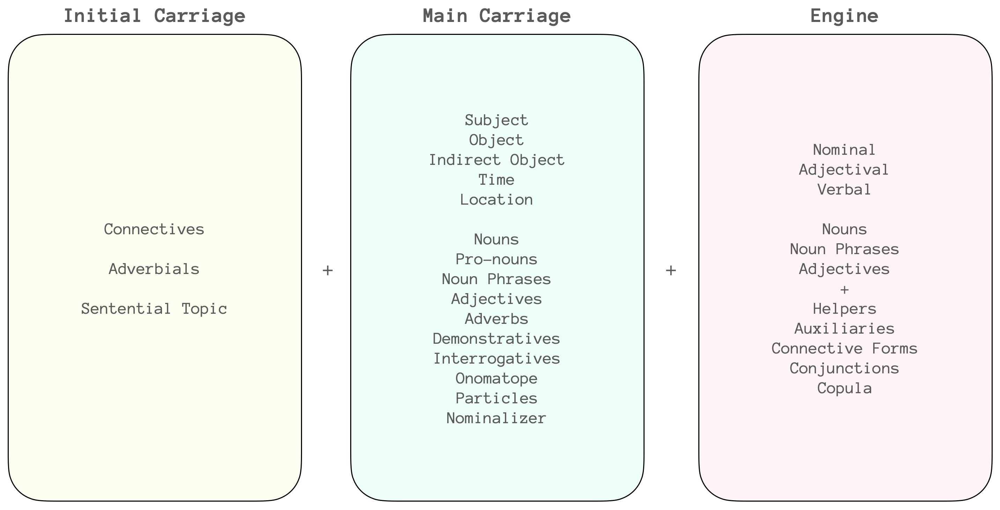
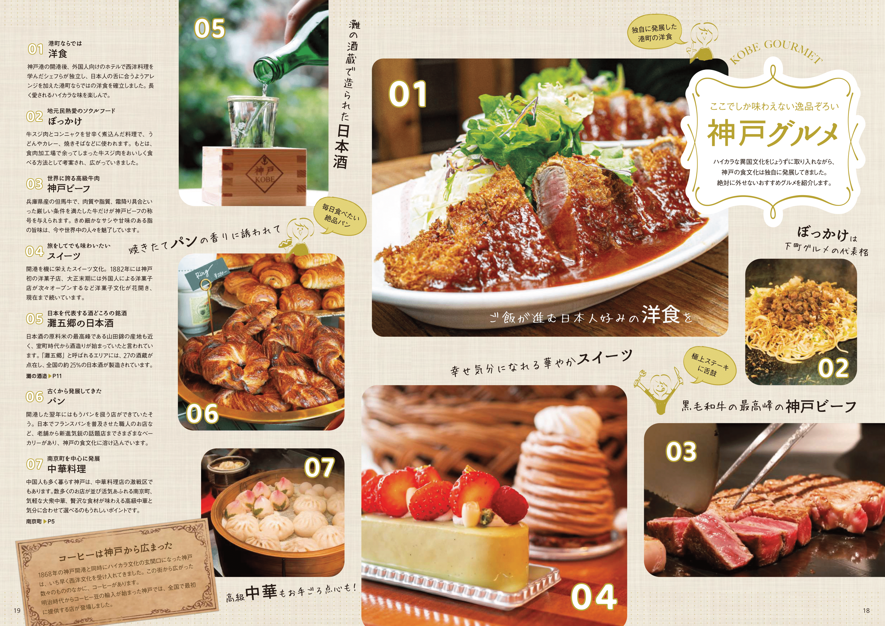

```{=html}
<style type="text/css">

body{
      font-size: 13px;
      font-family: "Anonymous Pro", "Roboto", "Helvetica Neue";
  }
</style>
```
<link rel="preconnect" href="https://fonts.googleapis.com"> <link rel="preconnect" href="https://fonts.gstatic.com" crossorigin> <link href="https://fonts.googleapis.com/css2?family=Hina+Mincho&family=Klee+One:wght@400;600&family=New+Tegomin&family=Sawarabi+Gothic&family=Shippori+Mincho+B1:wght@400;500&family=Yomogi&display=swap" rel="stylesheet"> <link rel="preconnect" href="https://fonts.googleapis.com"> <link rel="preconnect" href="https://fonts.gstatic.com" crossorigin> <link href="https://fonts.googleapis.com/css2?family=Noto+Sans+JP:wght@100;300;400;500;700&display=swap" rel="stylesheet"> <link rel="preconnect" href="https://fonts.gstatic.com"> <link href="https://fonts.googleapis.com/css2?family=M+PLUS+Rounded+1c:wght@100;300;400;500;700&display=swap" rel="stylesheet"> <link rel="preconnect" href="https://fonts.gstatic.com"> <link href="https://fonts.googleapis.com/css2?family=Anonymous+Pro&display=swap" rel="stylesheet"> <link href="https://fonts.googleapis.com/css2?family=Anonymous+Pro:ital,wght@0,400;1,700&display=swap" rel="stylesheet"> <link href="https://fonts.googleapis.com/css2?family=Anonymous+Pro:ital,wght@0,400;0,700;1,700&display=swap" rel="stylesheet">

```{css, echo=FALSE}
.my-tbl {
  border: 1px solid rgba(0, 0, 0, 0.1);
}

.my-header {
  border-width: 1px;
}

.my-col {
  border-right: 1px solid rgba(0, 0, 0, 0.05);
}

.my-row:hover {
  background-color: #f5f8ff;
}

.toc-content {
    padding-left: 10px;
    padding-right: 10px;
}
```

```{r setup, include=FALSE}
knitr::opts_chunk$set(echo = TRUE)
```

```{css, echo=FALSE}
@media(prefers-color-scheme: dark) {
  body {
    background-color: black;
    filter: invert(1);
  }
}
```

```{r, echo=FALSE, message=FALSE}
library(tidyverse)
library(reactable)
library(htmltools)
library(bslib)
library(dplyr)
library(purrr)
library(readr)
library(vembedr)
options(readr.show_col_types = FALSE)
```

```{r, echo=FALSE, message=FALSE, error=FALSE}
knj <- read_csv("vrbjp/Sheet 5-KNJ.csv")

adjadv<- read_csv("vrbjp/Sheet 37-ADVADJ.csv")

cmnknj <- read_csv("vrbjp/Sheet 70-CMKNJ.csv")
cmnknjv <- read_csv("vrbjp/Sheet 80-CMKNJV.csv")

cmwpf <- read_csv("vrbjp/Sheet 90-CMKNJVM.csv")
cmwpg <- read_csv("vrbjp/Sheet 92-VGRM.csv")
cmwpc <- read_csv("vrbjp/Sheet 46-SSTBLM.csv")
cmwpu <- read_csv("vrbjp/Sheet 93-CMKNJVM.csv")
cmwpd <- read_csv("vrbjp/Sheet 95-CMKNJVM.csv")
cmwpe <- read_csv("vrbjp/Sheet 96-CMKNJVM.csv")
cmwpd2 <- read_csv("vrbjp/Sheet 97-CMKNJVM.csv")
cmwcpd <- read_csv("vrbjp/Sheet 49-WRDSCMN.csv")
fkanji <- read_csv("vrbjp/FRKJN-FREQ.csv")
ckanji <- read_csv("vrbjp/CKJN-KNJ.csv")
fwkanji <- read_csv("vrbjp/FRWKJN-FREQ.csv")
smpsnt <- read_csv("vrbjp/SMSNT-SNT.csv")
expspk <- read_csv("vrbjp/Sheet 77-ESNEXP.csv")
knjlst1 <- read_csv("vrbjp/KNJ1-WBKNJ1.csv")
knjlst2 <- read_csv("vrbjp/KNJ2-WBKNJ2.csv")
knjlst3 <- read_csv("vrbjp/KNJ3-WBKNJ3.csv")
knjlst4 <- read_csv("vrbjp/KNJ4-WBKNJ4.csv")
knjlst5 <- read_csv("vrbjp/KNJ5-WBKNJ5.csv")
knjlstr <- read_csv("vrbjp/KNJR-RNDMWV.csv")
spphr <- read_csv("vrbjp/SPPHR-HLPRS.csv")
chnkw <- read_csv("vrbjp/CHNK-RLWRD.csv")

v1hme <- read_csv("vrbjp/CATG-VCBT1.csv")
v1hme <- read_csv("vrbjp/CATG-VCBT1.csv")
wrd5ex <- read_csv("vrbjp/WRDN5-WRD5.csv")
wrd4ex <- read_csv("vrbjp/WRDN4-WRD4.csv")
wrd3ex <- read_csv("vrbjp/WRDN3-WRD3.csv")
wrd2ex <- read_csv("vrbjp/WRDN2-WRD2.csv")
wrd1ex <- read_csv("vrbjp/WRDN1-WRD1.csv")
knjcmm <- read_csv("vrbjp/CMPCH-KNJCMM.csv")
jyknj <- read_csv("vrbjp/JYKNJ-JYKNJI.csv")
jyknjon <- read_csv("vrbjp/JYKNJS-JYKNJI.csv")
jyknjkn <- read_csv("vrbjp/JYKNJK-JYKNJI.csv")
wrcll <- read_csv("vrbjp/RCLL-RCLL.csv")
shpe <- read_csv("vrbjp/SHPE-SHPE.csv")
vusge <- read_csv("vrbjp/VUSGE-VUSGE.csv")
kjlpt <- read_csv("vrbjp/JLPTW-PTWRD.csv")
wjlpt <- read_csv("vrbjp/JLPTWR-PTWRDS.csv")
grphrs <- read_csv("vrbjp/GRPHR-GRMPH.csv")
vwrbst <- read_csv("vrbjp/WVRBSH-WVBRN.csv")
tnkwrd <- read_csv("vrbjp/WTNK-WRDS.csv")
cmnvrb <- read_csv("vrbjp/CMVRB-CMVRB.csv")
sylvrb <- read_csv("vrbjp/WVRBSYL-WVBSYL.csv")
vrcll <- read_csv("vrbjp/VRCLL-WVBRN.csv")
vrbxt <- read_csv("vrbjp/VRBXT-VWRBXT.csv")
dlyknj <- read_csv("vrbjp/DLYKNJ-JYKDL.csv")
bscknj <- read_csv("vrbjp/BSCKNJ-JYKDL.csv")
vrbrvws <- read_csv("vrbjp/VRWK-KRVW.csv")
ivrbs <- read_csv("vrbjp/IVRBS-IVRBS.csv")
gvrbs <- read_csv("vrbjp/GVRBS-GVRBS.csv")
vfrsyl <- read_csv("vrbjp/WVFRSYL-WVBRN.csv")

sndknj <- read_csv("vrbjp/KNSND-KNSND.csv")
vrbxte <- read_csv("vrbjp/VRBXTE-VWRBXT.csv")
dct <- read_csv("vrbjp/DCT-MEM.csv")
kana <- read_csv("vrbjp/KANA-CHR.csv")
kcmb <- read_csv("vrbjp/CMBD-CHR.csv")
verbrw <- read_csv("vrbjp/VRBRVS-WRB.csv")
dictny <- read_csv("vrbjp/DCTNY-MEM.csv")
wrdmm <- read_csv("vrbjp/WRDMM-MEM.csv")
exwrd <- read_csv("vrbjp/EXRVW-EXWRD.csv")
mcmndc <- read_csv("vrbjp/MNWRDC-CMNWRDS.csv")
tchwrd <- read_csv("vrbjp/TCWRDS-NWRDS.csv")
expvcb <- read_csv("vrbjp/EXPTB-EXPTB.csv")
skmscn <- read_csv("vrbjp/SKMSCN-SKSC.csv")
# knjrndx <- read_csv("vrbjp/RNMDKNJX-TBL.csv")
# dlywrds <- read_csv("vrbjp/DLYWD-TBL.csv")

mem <- read_csv("jpdb/MEM-MEM.csv")
vnsgg <- read_csv("jpdb/VRB1-VGRM.csv")
vnlr <- read_csv("jpdb/MMYSNT-SNT.csv")
scknj5 <- read_csv("jpdb/SCRPT1-KNJD5.csv")
scknj4 <- read_csv("jpdb/SCRPT2-KNJD4.csv")
scknj3 <- read_csv("jpdb/SCRPT3-KNJD3.csv")
scknj2 <- read_csv("jpdb/SCRPT4-KNJD2.csv")
scknj1 <- read_csv("jpdb/SCRPT5-KNJD1.csv")
nadj1 <- read_csv("jpdb/ADJNA-ADJNA.csv")
nadj2 <- read_csv("jpdb/ADJI-ADJI.csv")
adv1 <- read_csv("jpdb/ADV-ADV.csv")
jlgm <- read_csv("jpdb/GRMRN-JGRM.csv")
onmp <- read_csv("jpdb/ONTPE1-ONMP.csv")
corew <- read_csv("jpdb/CRWRD-CRSWRD.csv")
cnmw <- read_csv("jpdb/CMWRD-CMNW.csv")
cmwrdsn<- read_csv("jpdb/RNWRD-CMNWP.csv")
cmnknjp <- read_csv("jpdb/SPKCSL-CSLSNT.csv")
spksnt <- read_csv("jpdb/SPKDLY-DLYSNT.csv")
cvnptn <- read_csv("jpdb/SPKPTNB-GRML.csv")
```

------------------------------------------------------------------------

# Introduction {.tabset}

## Foreword

This is a collection of notes taken from different books and online reference materials related to Japanese learning. The aim of this collection is to give an idea on how start learning the language and to be able to progress at some level.

------------------------------------------------------------------------

## Disclaimer

In any doubts please do a cross-reference from other resources.

------------------------------------------------------------------------

## Version

Version 🆅.2.5

------------------------------------------------------------------------

# Learning {.tabset}

## Terms

<h6>

**Terminologies**

</h6>

```{r, echo=FALSE, message=FALSE}

memb <- mem %>% slice(120:124)

reactable(
  memb,
  columns = list(
    Concept = colDef(align = "left"),
    Information = colDef(minWidth = 320,align = "left")

  ),
  defaultPageSize = 9,
  theme = reactableTheme(
    # Vertically center cells
    cellStyle = list(display = "flex", flexDirection = "column", justifyContent = "center"),
    searchInputStyle = list(
      paddingLeft = "8px",
      paddingTop = "8px",
      paddingBottom = "8px",
      width = "100%"
    )
  ),
  showPageInfo = FALSE, bordered = TRUE, searchable = FALSE, sortable = FALSE, paginationType = "numbers",
  
  style = list(fontFamily = "Noto Sans JP, Heiti SC, Hiragino Maru Gothic ProN, Anonymous Pro , monospace, Helvetica Neue", fontSize = "11px")
)

```

------------------------------------------------------------------------

## Concepts

<h6>

**Language Learning Concept**

</h6>

```{r, echo=FALSE, message=FALSE}

memb <- mem %>% slice(81:89)

reactable(
  memb,
  columns = list(
    Concept = colDef(align = "left"),
    Information = colDef(minWidth = 320,align = "left")

  ),
  defaultPageSize = 9,
  theme = reactableTheme(
    # Vertically center cells
    cellStyle = list(display = "flex", flexDirection = "column", justifyContent = "center"),
    searchInputStyle = list(
      paddingLeft = "8px",
      paddingTop = "8px",
      paddingBottom = "8px",
      width = "100%"
    )
  ),
  showPageInfo = FALSE, bordered = TRUE, searchable = FALSE, sortable = FALSE, paginationType = "numbers",
  
  style = list(fontFamily = "Noto Sans JP, Heiti SC, Hiragino Maru Gothic ProN, Anonymous Pro , monospace, Helvetica Neue", fontSize = "11px")
)

```

------------------------------------------------------------------------

## Strategy

<h6>

**Strategy for learning Japanese**

</h6>

```{r, echo=FALSE, message=FALSE}

memb <- mem %>% slice(126:140)

reactable(
  memb,
  columns = list(
    Concept = colDef(align = "left"),
    Information = colDef(minWidth = 320,align = "left")

  ),
  defaultPageSize = 15,
  theme = reactableTheme(
    cellStyle = list(display = "flex", flexDirection = "column", justifyContent = "center"),
    searchInputStyle = list(
      paddingLeft = "8px",
      paddingTop = "8px",
      paddingBottom = "8px",
      width = "100%"
    )
  ),
  showPageInfo = FALSE, bordered = TRUE, searchable = FALSE, sortable = FALSE, paginationType = "numbers",
  
  style = list(fontFamily = "Noto Sans JP, Heiti SC, Hiragino Maru Gothic ProN, Anonymous Pro , monospace, Helvetica Neue", fontSize = "11px")
)

```

------------------------------------------------------------------------

# Scripts {.tabset}

There are 3 writing system used in Japanese namely the **Kanji**, **Hiragana** and the **Katakana** scripts.

## Kanji {.tabset}

**Kanji** was based on Chinese characters which represents a word and a meaning.

### L5 {.tabset}

```{r, echo=FALSE, message=FALSE}

# scknj5 <- scknj5[sample(1:nrow(scknj5)),]

reactable(
  scknj5,
  columns = list(
    Kanji = colDef(
      # Show species under character names
      cell = function(value, index) {
        Meaning <- scknj5$Meaning[index]
        Meaning <- if (!is.na(Meaning)) Meaning else ""
        NR <- scknj5$NR[index]
        NR <- if (!is.na(NR)) NR else ""
        KR <- scknj5$KR[index]
        KR <- if (!is.na(KR)) KR else ""
        tagList(
          div(style = list(fontSize = 30, fontWeight = 500), value),
          div(style = list(fontSize = 9, color = '#008000'), NR),
          div(style = list(fontSize = 9, color = '#800000'), KR),
          div(style = list(fontSize = 9, fontWeight = 500), Meaning)
        )
      },
      align = "center"
    ),
    W1 = colDef(
      cell = function(value, index) {
        M1 <- scknj5$M1[index]
        M1 <- if (!is.na(M1)) M1 else ""
        R1 <- scknj5$R1[index]
        R1 <- if (!is.na(R1)) R1 else ""
        tagList(
          div(style = list(fontSize = 19, fontWeight = 500), value),
          div(style = list(fontSize = 9, fontWeight = 400), R1),
          div(style = list(fontSize = 9, fontWeight = 400), M1),
        )
      },
      align = "center"
    ),
    W2 = colDef(
      cell = function(value, index) {
        M2 <- scknj5$M2[index]
        M2 <- if (!is.na(M2)) M2 else ""
        R2 <- scknj5$R2[index]
        R2 <- if (!is.na(M2)) R2 else ""
        tagList(
          div(style = list(fontSize = 19, fontWeight = 500), value),
          div(style = list(fontSize = 9, fontWeight = 400), R2),
          div(style = list(fontSize = 9, fontWeight = 400), M2),
        )
      },
      align = "center"
    ),
    W3 = colDef(
      cell = function(value, index) {
        M3 <- scknj5$M3[index]
        M3 <- if (!is.na(M3)) M3 else ""
        R3 <- scknj5$R3[index]
        R3 <- if (!is.na(R3)) R3 else ""
        tagList(
          div(style = list(fontSize = 19, fontWeight = 500), value),
          div(style = list(fontSize = 9, fontWeight = 400), R3),
          div(style = list(fontSize = 9, fontWeight = 400), M3),
        )
      },
      align = "center"
    ),
    R1 = colDef(show = FALSE),
    R2 = colDef(show = FALSE),
    R3 = colDef(show = FALSE),
    M1 = colDef(show = FALSE),
    M2 = colDef(show = FALSE),
    M3 = colDef(show = FALSE),
    Meaning = colDef(show = FALSE),
    NR = colDef(show = FALSE),
    KR = colDef(show = FALSE)
  ),
  defaultPageSize = 5,
  theme = reactableTheme(
    cellStyle = list(display = "flex", flexDirection = "column", justifyContent = "center", fontSize = "11px", height = 100),
    searchInputStyle = list(
      paddingLeft = "8px",
      paddingTop = "8px",
      paddingBottom = "8px",
      width = "100%",
      fontSize = "11px"
    )
  ),
  showPageInfo = FALSE, bordered = TRUE, searchable = TRUE, sortable = FALSE, paginationType = "numbers",

  style = list(fontFamily = "Noto Sans JP, Heiti SC, Hiragino Maru Gothic ProN, Anonymous Pro , monospace, Helvetica Neue", fontSize = "11px")
)

```

------------------------------------------------------------------------

### L4 {.tabset}

```{r, echo=FALSE, message=FALSE}

# scknj4 <- scknj4[sample(1:nrow(scknj4)),]

reactable(
  scknj4,
  columns = list(
    Kanji = colDef(
      # Show species under character names
      cell = function(value, index) {
        Meaning <- scknj4$Meaning[index]
        Meaning <- if (!is.na(Meaning)) Meaning else ""
        NR <- scknj4$NR[index]
        NR <- if (!is.na(NR)) NR else ""
        KR <- scknj4$KR[index]
        KR <- if (!is.na(KR)) KR else ""
        tagList(
          div(style = list(fontSize = 30, fontWeight = 500), value),
          div(style = list(fontSize = 9, color = '#008000'), NR),
          div(style = list(fontSize = 9, color = '#800000'), KR),
          div(style = list(fontSize = 9, fontWeight = 500), Meaning)
        )
      },
      align = "center"
    ),
    W1 = colDef(
      cell = function(value, index) {
        M1 <- scknj4$M1[index]
        M1 <- if (!is.na(M1)) M1 else ""
        R1 <- scknj4$R1[index]
        R1 <- if (!is.na(R1)) R1 else ""
        tagList(
          div(style = list(fontSize = 19, fontWeight = 500), value),
          div(style = list(fontSize = 9, fontWeight = 400), R1),
          div(style = list(fontSize = 9, fontWeight = 400), M1),
        )
      },
      align = "center"
    ),
    W2 = colDef(
      cell = function(value, index) {
        M2 <- scknj4$M2[index]
        M2 <- if (!is.na(M2)) M2 else ""
        R2 <- scknj4$R2[index]
        R2 <- if (!is.na(M2)) R2 else ""
        tagList(
          div(style = list(fontSize = 19, fontWeight = 500), value),
          div(style = list(fontSize = 9, fontWeight = 400), R2),
          div(style = list(fontSize = 9, fontWeight = 400), M2),
        )
      },
      align = "center"
    ),
    W3 = colDef(
      cell = function(value, index) {
        M3 <- scknj4$M3[index]
        M3 <- if (!is.na(M3)) M3 else ""
        R3 <- scknj4$R3[index]
        R3 <- if (!is.na(R3)) R3 else ""
        tagList(
          div(style = list(fontSize = 19, fontWeight = 500), value),
          div(style = list(fontSize = 9, fontWeight = 400), R3),
          div(style = list(fontSize = 9, fontWeight = 400), M3),
        )
      },
      align = "center"
    ),
    R1 = colDef(show = FALSE),
    R2 = colDef(show = FALSE),
    R3 = colDef(show = FALSE),
    M1 = colDef(show = FALSE),
    M2 = colDef(show = FALSE),
    M3 = colDef(show = FALSE),
    Meaning = colDef(show = FALSE),
    NR = colDef(show = FALSE),
    KR = colDef(show = FALSE)
  ),
  defaultPageSize = 5,
  theme = reactableTheme(
    cellStyle = list(display = "flex", flexDirection = "column", justifyContent = "center", fontSize = "11px", height = 100),
    searchInputStyle = list(
      paddingLeft = "8px",
      paddingTop = "8px",
      paddingBottom = "8px",
      width = "100%",
      fontSize = "11px"
    )
  ),
  showPageInfo = FALSE, bordered = TRUE, searchable = TRUE, sortable = FALSE, paginationType = "numbers",

  style = list(fontFamily = "Noto Sans JP, Heiti SC, Hiragino Maru Gothic ProN, Anonymous Pro , monospace, Helvetica Neue", fontSize = "11px")
)

```

------------------------------------------------------------------------

### L3 {.tabset}

```{r, echo=FALSE, message=FALSE}

# scknj3 <- scknj3[sample(1:nrow(scknj3)),]

reactable(
  scknj3,
  columns = list(
    Kanji = colDef(
      # Show species under character names
      cell = function(value, index) {
        Meaning <- scknj3$Meaning[index]
        Meaning <- if (!is.na(Meaning)) Meaning else ""
        NR <- scknj3$NR[index]
        NR <- if (!is.na(NR)) NR else ""
        KR <- scknj3$KR[index]
        KR <- if (!is.na(KR)) KR else ""
        tagList(
          div(style = list(fontSize = 30, fontWeight = 500), value),
          div(style = list(fontSize = 9, color = '#008000'), NR),
          div(style = list(fontSize = 9, color = '#800000'), KR),
          div(style = list(fontSize = 9, fontWeight = 500), Meaning)
        )
      },
      align = "center"
    ),
    W1 = colDef(
      cell = function(value, index) {
        M1 <- scknj3$M1[index]
        M1 <- if (!is.na(M1)) M1 else ""
        R1 <- scknj3$R1[index]
        R1 <- if (!is.na(R1)) R1 else ""
        tagList(
          div(style = list(fontSize = 19, fontWeight = 500), value),
          div(style = list(fontSize = 9, fontWeight = 400), R1),
          div(style = list(fontSize = 9, fontWeight = 400), M1),
        )
      },
      align = "center"
    ),
    W2 = colDef(
      cell = function(value, index) {
        M2 <- scknj3$M2[index]
        M2 <- if (!is.na(M2)) M2 else ""
        R2 <- scknj3$R2[index]
        R2 <- if (!is.na(M2)) R2 else ""
        tagList(
          div(style = list(fontSize = 19, fontWeight = 500), value),
          div(style = list(fontSize = 9, fontWeight = 400), R2),
          div(style = list(fontSize = 9, fontWeight = 400), M2),
        )
      },
      align = "center"
    ),
    W3 = colDef(
      cell = function(value, index) {
        M3 <- scknj3$M3[index]
        M3 <- if (!is.na(M3)) M3 else ""
        R3 <- scknj3$R3[index]
        R3 <- if (!is.na(R3)) R3 else ""
        tagList(
          div(style = list(fontSize = 19, fontWeight = 500), value),
          div(style = list(fontSize = 9, fontWeight = 400), R3),
          div(style = list(fontSize = 9, fontWeight = 400), M3),
        )
      },
      align = "center"
    ),
    R1 = colDef(show = FALSE),
    R2 = colDef(show = FALSE),
    R3 = colDef(show = FALSE),
    M1 = colDef(show = FALSE),
    M2 = colDef(show = FALSE),
    M3 = colDef(show = FALSE),
    Meaning = colDef(show = FALSE),
    NR = colDef(show = FALSE),
    KR = colDef(show = FALSE)
    
  ),
  defaultPageSize = 5,
  theme = reactableTheme(
    cellStyle = list(display = "flex", flexDirection = "column", justifyContent = "center", fontSize = "11px", height = 100),
    searchInputStyle = list(
      paddingLeft = "8px",
      paddingTop = "8px",
      paddingBottom = "8px",
      width = "100%",
      fontSize = "11px"
    )
  ),
  showPageInfo = FALSE, bordered = TRUE, searchable = TRUE, sortable = FALSE, paginationType = "numbers",

  style = list(fontFamily = "Noto Sans JP, Heiti SC, Hiragino Maru Gothic ProN, Anonymous Pro , monospace, Helvetica Neue", fontSize = "11px")
)

```

------------------------------------------------------------------------

### L2 {.tabset}

```{r, echo=FALSE, message=FALSE}

# scknj2 <- scknj2[sample(1:nrow(scknj2)),]

reactable(
  scknj2,
  columns = list(
    Kanji = colDef(
      # Show species under character names
      cell = function(value, index) {
        Meaning <- scknj2$Meaning[index]
        Meaning <- if (!is.na(Meaning)) Meaning else ""
        NR <- scknj2$NR[index]
        NR <- if (!is.na(NR)) NR else ""
        KR <- scknj2$KR[index]
        KR <- if (!is.na(KR)) KR else ""
        tagList(
          div(style = list(fontSize = 30, fontWeight = 500), value),
          div(style = list(fontSize = 9, color = '#008000'), NR),
          div(style = list(fontSize = 9, color = '#800000'), KR),
          div(style = list(fontSize = 9, fontWeight = 500), Meaning)
        )
      },
      align = "center"
    ),
    W1 = colDef(
      cell = function(value, index) {
        M1 <- scknj2$M1[index]
        M1 <- if (!is.na(M1)) M1 else ""
        R1 <- scknj2$R1[index]
        R1 <- if (!is.na(R1)) R1 else ""
        tagList(
          div(style = list(fontSize = 19, fontWeight = 500), value),
          div(style = list(fontSize = 9, fontWeight = 400), R1),
          div(style = list(fontSize = 9, fontWeight = 400), M1),
        )
      },
      align = "center"
    ),
    W2 = colDef(
      cell = function(value, index) {
        M2 <- scknj2$M2[index]
        M2 <- if (!is.na(M2)) M2 else ""
        R2 <- scknj2$R2[index]
        R2 <- if (!is.na(M2)) R2 else ""
        tagList(
          div(style = list(fontSize = 19, fontWeight = 500), value),
          div(style = list(fontSize = 9, fontWeight = 400), R2),
          div(style = list(fontSize = 9, fontWeight = 400), M2),
        )
      },
      align = "center"
    ),
    W3 = colDef(
      cell = function(value, index) {
        M3 <- scknj2$M3[index]
        M3 <- if (!is.na(M3)) M3 else ""
        R3 <- scknj2$R3[index]
        R3 <- if (!is.na(R3)) R3 else ""
        tagList(
          div(style = list(fontSize = 19, fontWeight = 500), value),
          div(style = list(fontSize = 9, fontWeight = 400), R3),
          div(style = list(fontSize = 9, fontWeight = 400), M3),
        )
      },
      align = "center"
    ),
    R1 = colDef(show = FALSE),
    R2 = colDef(show = FALSE),
    R3 = colDef(show = FALSE),
    M1 = colDef(show = FALSE),
    M2 = colDef(show = FALSE),
    M3 = colDef(show = FALSE),
    Meaning = colDef(show = FALSE),
    NR = colDef(show = FALSE),
    KR = colDef(show = FALSE)
  ),
  defaultPageSize = 5,
  theme = reactableTheme(
    cellStyle = list(display = "flex", flexDirection = "column", justifyContent = "center", fontSize = "11px", height = 100),
    searchInputStyle = list(
      paddingLeft = "8px",
      paddingTop = "8px",
      paddingBottom = "8px",
      width = "100%",
      fontSize = "11px"
    )
  ),
  showPageInfo = FALSE, bordered = TRUE, searchable = TRUE, sortable = FALSE, paginationType = "numbers",

  style = list(fontFamily = "Noto Sans JP, Heiti SC, Hiragino Maru Gothic ProN, Anonymous Pro , monospace, Helvetica Neue", fontSize = "11px")
)

```

------------------------------------------------------------------------

### L1 {.tabset}

```{r, echo=FALSE, message=FALSE}

# scknj1 <- scknj1[sample(1:nrow(scknj1)),]

reactable(
  scknj1,
  columns = list(
    Kanji = colDef(
      # Show species under character names
      cell = function(value, index) {
        Meaning <- scknj1$Meaning[index]
        Meaning <- if (!is.na(Meaning)) Meaning else ""
        NR <- scknj1$NR[index]
        NR <- if (!is.na(NR)) NR else ""
        KR <- scknj1$KR[index]
        KR <- if (!is.na(KR)) KR else ""
        tagList(
          div(style = list(fontSize = 30, fontWeight = 500), value),
          div(style = list(fontSize = 9, color = '#008000'), NR),
          div(style = list(fontSize = 9, color = '#800000'), KR),
          div(style = list(fontSize = 9, fontWeight = 500), Meaning)
        )
      },
      align = "center"
    ),
    W1 = colDef(
      cell = function(value, index) {
        M1 <- scknj1$M1[index]
        M1 <- if (!is.na(M1)) M1 else ""
        R1 <- scknj1$R1[index]
        R1 <- if (!is.na(R1)) R1 else ""
        tagList(
          div(style = list(fontSize = 19, fontWeight = 500), value),
          div(style = list(fontSize = 9, fontWeight = 400), R1),
          div(style = list(fontSize = 9, fontWeight = 400), M1),
        )
      },
      align = "center"
    ),
    W2 = colDef(
      cell = function(value, index) {
        M2 <- scknj1$M2[index]
        M2 <- if (!is.na(M2)) M2 else ""
        R2 <- scknj1$R2[index]
        R2 <- if (!is.na(M2)) R2 else ""
        tagList(
          div(style = list(fontSize = 19, fontWeight = 500), value),
          div(style = list(fontSize = 9, fontWeight = 400), R2),
          div(style = list(fontSize = 9, fontWeight = 400), M2),
        )
      },
      align = "center"
    ),
    W3 = colDef(
      cell = function(value, index) {
        M3 <- scknj1$M3[index]
        M3 <- if (!is.na(M3)) M3 else ""
        R3 <- scknj1$R3[index]
        R3 <- if (!is.na(R3)) R3 else ""
        tagList(
          div(style = list(fontSize = 19, fontWeight = 500), value),
          div(style = list(fontSize = 9, fontWeight = 400), R3),
          div(style = list(fontSize = 9, fontWeight = 400), M3),
        )
      },
      align = "center"
    ),
    R1 = colDef(show = FALSE),
    R2 = colDef(show = FALSE),
    R3 = colDef(show = FALSE),
    M1 = colDef(show = FALSE),
    M2 = colDef(show = FALSE),
    M3 = colDef(show = FALSE),
    Meaning = colDef(show = FALSE),
    NR = colDef(show = FALSE),
    KR = colDef(show = FALSE)
  ),
  defaultPageSize = 5,
  theme = reactableTheme(
    cellStyle = list(display = "flex", flexDirection = "column", justifyContent = "center", fontSize = "11px", height = 100),
    searchInputStyle = list(
      paddingLeft = "8px",
      paddingTop = "8px",
      paddingBottom = "8px",
      width = "100%",
      fontSize = "11px"
    )
  ),
  showPageInfo = FALSE, bordered = TRUE, searchable = TRUE, sortable = FALSE, paginationType = "numbers",

  style = list(fontFamily = "Noto Sans JP, Heiti SC, Hiragino Maru Gothic ProN, Anonymous Pro , monospace, Helvetica Neue", fontSize = "11px")
)

```

------------------------------------------------------------------------

## Hiragana {.tabset}

**Hiragana** is a phonetic script used to represent Japanese sound.


------------------------------------------------------------------------

## Katakana

**Katakana** is a phonetic script used to represent Foreign loan words.


------------------------------------------------------------------------

# Structure {.tabset}

## Core

The **Core elements** of a sentence are the **Main Carriage** and **Engine** elements.

Initial carriage were introduced here as it sets the initial mood of the sentence which makes you sound more natural and not so boring. It also links up to the previous sentence or statement.

**①　Initial Carriage**

    Provides initial or introductory information about the sentence
    Includes the initial conjunctions, adverbial expressions, setential topic, initial dependent clauses, etc

**②　Main Carriage**

    Describes the subject of the sentence
    Provides supplementary details about the engine on what action it does or the current state it is in
    Includes the subject, object, modifiers, adverbs, etc

**③　Engine**

    The driving force of the sentence
    It does tell the kind of sentence on whether it is a nominal, adjectival, or verbal sentence 
    Includes either a verb, an adjective, a noun or noun phrase plus copula, auxiliaries, particles, etc



------------------------------------------------------------------------

## Basic

Introduction of **I - Initial Carriage**, **M - Main Carriage** and **E - Engine**.\
Copula - da (plain form)・desu (polite form)・dearu (literary form).

**①　Verbal Sentence** `Verb as the engine`

###### **M describes the action/state E**

    ・E does M
    ・桜さんが来た  
    ・Sakura-san ga kita  
    ・Sakura came  

###### **M does the action E**

    ・E does M 
    ・桜さんが寿司を食べた 
    ・Sakura-san ga sushi wo tabeta  
    ・Sakura ate the sushi

**②　Adjectival Sentence** `I-Adjective as the engine`

###### **M describes E**

    ・M is E 
    ・空が青い 
    ・Sora ga aoi 
    ・The sky is blue 

**③　Adjectival Sentence** `Na-Adjective as the engine`

###### **M describes E**

    ・M is E + Copula 
    ・地下鉄が便利だ 
    ・Chikatetsu ga benri da 
    ・The subway is convenient 

**④　Nominal Sentence** `Noun as the engine`

###### **M defines・identifies/describes E**

    ・M is E + Copula
    ・ジョンさんがアメリカじんです
    ・John-san ga amerika-jin desu
    ・John is an American

**⑤　Topic-Comment Sentence** `Initial carriage as the topic, Main carriage and Engine as the comment`

###### **I denotes the general talking point describe by M and E**

    ・As for I, M is E
    ・日本は春と秋がいい
    ・Nihon wa haru to aki ga ii
    ・As for Japan, spring and fall are good

------------------------------------------------------------------------

## Compound

**Compound sentences** usually involves two or more simple sentences or clauses connected through **AND or BUT** relation.\
It is usually conjoined by conjunctions or connective form of verbs, adjectives or copula.

**①　AND-Relation** `Connective forms of verbs, adjectives and copula`

###### **⚭　Sentence(I-Adj-Ending) + kute + Sentence**

    ・この辞書は安くて便利だ
    ・This dictionary is cheap and convenient

###### **⚭　Sentence(Na-Adj-Ending) + de + Sentence**

    ・りなさんはきれいでやさしいです
    ・Rina-san is beautiful and kind

###### **⚭　Sentence(Noun-Ending) + de + Sentence**

    ・ウンさんは中国人でキムさんは韓国人です 
    ・Mr.Wong is Chinese and Mr. Kim is Korean

###### **⚭　Sentence(Vnoun-base-Ending) + Sentence**

    ・私は朝六時に起き、夜十時ごろ寝る
    ・I get up at six in the morning and go to bed around ten at night

###### **⚭　Sentence(Vte-Ending) + Sentence**

    ・山田さんはラメンを食べてビールを飲む
    ・Yamada-san eats ramen and drinks beer

**②　AND-Relation** `Conjunctive Particles`

###### **⚭　Sentence(V/I-Adj/(N/Na-Adj+Cop)-Ending) + shi + Sentence**

###### **shi** particle connects one or multiple reasons but not naming all of it

    ・この事件はほぼ終息したし二度と起こることはない
    ・このバッグは大きいしねだんも手頃だしいいですよ

<!-- <h> -->

    ・This incident has more or less ended and will never happen again
    ・This bag is large and the price is reasonable and so it's good

###### **⚭　Sentence(V/I-Adj/N/Na-Adj) + toka + Sentence**

###### **toka** cite a thing or an instance amongs other things or situation

    ・じゃあ映画を字幕なしで見るとか日本の音楽を聞くとかはどう？
    ・交流会に行くとかサークルに入るとかしたら？

<!-- <h> -->

    ・So how about watching movies without subtitles or listening to Japanese music?
    ・Why don't you go to a social event or join a club?

**③　BUT-Relation** `Conjunctive Particles・Conjunctions`

###### **⚭　Sentence + ga + Sentence**

    ・家内はフランス語を話せるが私が話せない
    ・My wife can speak French but I can't

###### **⚭　Sentence + kedo + Sentence**

    ・入ってもいいけどしずかにしてくださいね
    ・You can come in but please be quiet

###### **⚭　Sentence + keredomo + Sentence**

    ・あそびたいけれども宿題はまだ終わってない
    ・I want to play but I haven't finished my homework yet

------------------------------------------------------------------------

## Complex

**Complex sentences** usually include any of the following items below.\
A more detailed explanations will be encountered along the way for each item.

**①　Relative Clauses**

###### **⚭　Relative Clause + Noun**

    ・これは友子が作ったケーキだ   
    ・私が昨日見た犬はかわいいだ

<!-- <h> -->

    ・This is the cake Tomoko made
    ・I saw a dog yesterday that was adorable

**②　Relative Clauses with toiu**

###### **⚭　Relative Clause + toiu + Noun**

    ・日本語は曖昧な言葉だという考えは珍しくない  
    ・来年消費税が上がるという記事を読よんだ

<!-- <h> -->

    ・The idea that Japanese is an ambiguous language is not uncommon
    ・I read an article about the sales tax going up next year

**③　Sentences with Compound Particles (Pre-Nominal Form)**

###### **⚭　Noun/Verb + Compound Particle + Noun**

    ・コンピュータに関する彼の知識は相当なものだ
    ・ここにこの仕事をするに当たっての注意が書いてある    

<!-- <h> -->

    ・His knowledge of computers is quite impressive
    ・Here's a warning about doing this job

**④　Nominalized Sentences**

###### **⚭　Sentence + no/koto**

    ・光子がピアノを弾いているのを聞いた   
    ・ひかるさんが今日は来ることを知らなかった  

<!-- <h> -->

    ・I heard Mitsuko playing the piano
    ・I didn't know Hikaru-san was going to be here today

**⑤　Embedded Interrogative Sentences**

###### **⚭　Sentence + ka**

    ・誰がそれをするかが問題だ
    ・いつ帰るかまだ決めていません    

<!-- <h> -->

    ・It's just a question of who's going to do it
    ・I haven't decided when I'm leaving yet

**⑥　Clauses before Adverbial Forms of Auxiliary Adjectives**

###### **⚭　Clause + you ni**

###### **Adverbial forms of Auxiliary Adjectives**

    ・みんながよく聞こえるようにマイクを使ってください
    ・日本語を話せるようになりたいので一生懸命勉強しています

<!-- <h> -->

    ・Use the microphone so that everyone can hear you well
    ・I am studying hard because I want to be able to speak Japanese

**⑦　Sentences as Indirect Quotations**

###### **⚭　Sentence + toiu**

    ・彼女は幸せであると言っている
    ・彼は漢字は難しくないと言っている

<!-- <h> -->

    ・She says she is happy
    ・He says Kanji is not difficult

**⑧　Sentences with Compound Particles (Pre-Verbal Form)**

###### **⚭　Noun/Verb + Compound Particle + Noun**

    ・人は年を取るにつれて記憶力が衰える  
    ・状況によって敬語やカジュアルな表現を使い分ける必要がある

<!-- <h> -->

    ・Memory declines as people get older
    ・Need to use honorific and casual expressions depending on the situation

**⑨　Sentence-Initial Dependent Clauses**

###### **⚭　Sentence + conjunctions**

###### **Represent such things as condition, time, reason, purpose and manner**

    ・質問されてもだまっていてください
    ・小林さんが来たら知らせてください    
    ・私がそこにいた時には異常はなかった    
    ・私は日本留学するために日本語を勉強しています

<!-- <h> -->

    ・If anyone asks you any questions, please keep quiet
    ・Let me know when Mr. Kobayashi gets here
    ・There was nothing unusual when I was there
    ・I'm studying Japanese in order to study in Japan

------------------------------------------------------------------------

## Format {.tabset}

This gives an overview of each **elements** that could be included in a sentence.\
More details will be presented for each element as we go along.

<center>

<ins>

**Connectives**

</ins>

</center>

<p>

</p>

```{=html}
<pre align="center">
<code>しかも。それも。さらに。そのうえ。それに。また。それから。そして。でも。しかし。
けれども。または。それとも。あるいは。それで。すると。だから。そこで。したがって。
そのけっか。そのために。ところで。なぜなら。たとえば。つまり。ようするに。ちなみに。</code>
</pre>
```
<center>

<ins>

**Adverbials**

</ins>

</center>

<p>

</p>

```{=html}
<pre align="center">
<code> あいかわらず。どうしても。けっきょく。もちろん。もしかしたら。
なるほど。せっかく。とにかく。とりあえず。わざわざ。やはり。やっぱり。
あらかじめ。はじめに。いま。いまにも。このあいだ。このところ。まだ。まもなく。まれに。
また。むかし。さいごに。さいきん。さいしょに。さきに。さきほど。さっき。すぐに。やがて。やっと。</code>
</pre>
```

<center>

<ins>

**Demonstratives**

</ins>

</center>

<p>

</p>

```{=html}
<pre align="center">
<code> これ。これら。この。ここ。こちら。こういう。こんな。このような。こんなに。このように。こう。
それ。それら。その。そこ。そちら。そういう。そんない。そのような。そんなに。そのように。そう。
あれ。あれら。あの。あそこ。あちら。あういう。あんな。あのような。あんなに。あのように。ああ。
どれ。どれら。どの。どこ。どちら。どういう。どんな。どのような。どんなに。どのように。どう</code>
</pre>
```
<center>

<ins>

**Interrogatives**

</ins>

</center>

<p>

</p>

```{=html}
<pre align="center">
<code> だれ。どなた。どう。どちら。どこ。どんな。どういう。どの。どれ。いくら。いくつ。いつ。なに。
だれか。どなたか。どうか。どちらか。どこか。どっか。どれか。いくらか。いくつか。いつか。なにか。
だれも。どなたも。どうにも。どちらも。どこも。どれも。いくらも。いくつも。けっして。なにも。
だれでも。どなたでも。どちらでも。どこでも。どれでも。いくらでも。いくつでも。いつでも。なんでも。</code>
</pre>
```
<center>

<ins>

**Adjectives**

</ins>

</center>

<p>

</p>

```{=html}
<pre align="center">
<code> 広い。長い。大きい。高い。安い。新しい。可愛い。難しい。詳しい。美しい。幅広い。良い。
細かい。明るい。鋭い。苦い。古い。好ましい。素早い。愛しい。危ない。低い。熱い。暑い。寒い。冷たい。
涼しい。優しい。強い。楽しい。少ない。早い。細い。痛い。苦しい。厳しい。遅い。貧しい。忙しい。欲しい。
甘い。望ましい。面白い。怖い。丸い。喜ばしい。恐ろしい。近い。太い。薄い。柔らかい。生々しい。快い。
名高い。激しい。黒っぽい。疑わしい。手堅い。深い。浅い。手痛い。懐かしい。弱い。小さい。親しい。
辛い。正しい。薄暗い。手ごわい。真新しい。何気ない。重い。短い。痛ましい。手厚い。湿っぽい。悔しい。</code>
</pre>
```
<center>

<ins>

**Adjectival-Noun**

</ins>

</center>

<p>

</p>

```{=html}
<pre align="center">
<code> 安全。一般的。可能。具体的。自然。自由。重要。積極的。大幅。特別。反対。必要。
不況。平和。明らか。安定。確実。簡単。危険。共通。緊急。健康。国際的。主要。十分。深刻。
正式。正常。大切。大変。直接。独自。非常。不安。不足。不満。不明。普通。豊か。本当。名誉。
明確。有効。有力。一定。活発。急速。公明。好調。合同。残念。重大。多様。太陽。当然。微妙。</code>
</pre>
```
<center>

<ins>

**Pronouns**

</ins>

</center>

<p>

</p>

```{=html}
<pre align="center">
<code> 私。僕。俺。あなた。君。彼。彼女。あの人。私達。僕達。俺達。彼ら。我々。</code>
</pre>
```
<center>

<ins>

**Prefix**

</ins>

</center>

<p>

</p>

```{=html}
<pre align="center">
<code> お。可。各。片。逆。ご。準。諸。素。全。総。数。</code>
</pre>
```
<center>

<ins>

**Nouns**

</ins>

</center>

<p>

</p>

```{=html}
<pre align="center">
<code> 全国。平均。意向。基準。気持ち。共同。協力。国。事態。総合。取引。話。見通し。労働。
夫。妻。兄。女。舞台。部長。部分。部門。分野。文化。変化。保護。母。報告。報道。放送。方向。
方針。方法。訪問。貿易。防衛。体制。対策。対象。代表。大会。大学。団体。段階。男子。男性。
知事。地域。地球。地元。地方。調査。調整。長男。通信。産業。農業。派遣。背景。発言。宣言。</code>
</pre>
```
<center>

<ins>

**Suffix**

</ins>

</center>

<p>

</p>

```{=html}
<pre align="center">
<code> 家。限り。方。形。型。がち。ぎみ。</code>
</pre>
```
<center>

<ins>

**Counters**

</ins>

</center>

<p>

</p>

```{=html}
<pre align="center">
<code> 一。二。三。四。五。六。七。八。九。十。
一つ。二つ。三つ。四つ。五つ。六つ。七つ。八つ。九つ。十。
十。百。千。万。
キロ。グラム。ミリグラム。メートル。センチ。リットル。
歳。匹。頭。羽。冊。回。個。本。人。名。台。日。
月。年。段。時。杯。倍。泊。番。課。次。
目。第。</code>
</pre>
```
<center>

<ins>

**Time-Indicator**

</ins>

</center>

<p>

</p>

```{=html}
<pre align="center">
<code> 時間。分。秒。時。
前。過ぎ。午前。午後。半。</code>
</pre>
```
<center>

<ins>

**Location-Indicator**

</ins>

</center>

<p>

</p>

```{=html}
<pre align="center">
<code> 中。外。上。下。前。後ろ。側。表。裏。端。隅。奥。底。正面。
向かい。斜め。隣。手前。周り。方向。向き。横。向こう。そば。反対側。中央。</code>
</pre>
```
<center>

<ins>

**Nominalizer**

</ins>

</center>

<p>

</p>

```{=html}
<pre align="center">
<code> の。こと。</code>
</pre>
```
<center>

<ins>

**Particles**

</ins>

</center>

<p>

</p>

```{=html}
<pre align="center">
<code> が。は。を。に。で。の。と。
には。にも。とは。とも。では。でも。への。での。との。からの。までの。
から。まで。だけ。こそ。しか。し。とか。など。ほど。くらい。</code>
</pre>
```
<center>

<ins>

**Combined-Particles**

</ins>

</center>

<p>

</p>

```{=html}
<pre align="center">
<code> 次第で。と逆に。と比べて。と違って。と同情に。と並んで。
に当たって。に合わせて。において。に応じて。に関わる。に関わらず。に限る。に限らず。
に限って。にかけて。に代わって。に代わる。に関する。に関して。に関する限り。に比べって。
に加えて。に際して。に従って。にしては。に沿って。に対して。について。につれて。にとって。
に反して。に伴って。に向け。に向き。に向かって。に基づいて。による。によって。によらず。
によると。にわたって。に気がつく。に気をつける。における。
のせいで。のために。の間。の間に。のうちに。の通り。の上に。</code>
</pre>
```
<center>

<ins>

**Adverbs**

</ins>

</center>

<p>

</p>

```{=html}
<pre align="center">
<code> 上手く。安く。深く。早く。すごく。短く。詳しく。きれいに。特別に。大切に。ちゃんと。きちんと。すっかり。やっと。
直ぐ。余り。全く。先ず。初めて。最も。とても。ずっと。はっきり。かなり。たくさん。けっして。</code>
</pre>
```
<center>

<ins>

**Verbs**

</ins>

</center>

<p>

</p>

```{=html}
<pre align="center">
<code> 居る。要る。有る。成る。する。読む。食べる。見る。買う。歩く。走る。売る。泳ぐ。寝る。洗う。起きる。踊る。歌う。飛ぶ。
言う。来る。行く。思う。出る。出す。出かける。出来る。待つ。持つ。分かる。考える。教える。</code>
</pre>
```
<center>

<ins>

**Connective-Form**

</ins>

</center>

<p>

</p>

```{=html}
<pre align="center">
<code> くて。て。で。</code>
</pre>
```
<center>

<ins>

**Conjunctions**

</ins>

</center>

<p>

</p>

```{=html}
<pre align="center">
<code> が。し。か。ば。と。なら。たら。とか。から。ので。のに。
ながら。まえに。あとで。けど。けれども。だの。とき。間。つつ。うえで。
あげくに。ばかりに。くせに。際に。間に。おりに。さいちゅうに。とともに。だけに。
だからといって。からといって。かというと。とおもうと。てからでないと。たとたんに。ていらい。
がはやいか。やいなや。なり。くらいなら。おかげで。ことだし。いじょう。</code>
</pre>
```
<center>

<ins>

**Helpers**

</ins>

</center>

<p>

</p>

```{=html}
<pre align="center">
<code> ある。いる。おる。おく。いく。くる。みる。あげる。くれる。もらう。くだる。いただく。
から。まで。だけ。こそ。しか。し。とか。ほしい。がる。べく。
かねる。</code>
</pre>
```
<center>

<ins>

**Auxiliaries**

</ins>

</center>

<p>

</p>

```{=html}
<pre align="center">
<code> かも。かもしれない。だろう。そうだ。ようだ。みたい。らしい。っぱなし。
ように。みたいに。ような。みたいな。
はず。べき。もの。こと。まい。
べからず。べからざる。</code>
</pre>
```
<center>

<ins>

**Grammatical-Phrases**

</ins>

</center>

<p>

</p>

```{=html}
<pre align="center">
<code> ことがある。ことにする。ことになる。ようにする。ようになる。ことによる。ことはない。そうになる。ことができる。
と思う。という。というか。ということ。といわれる。
までもない。に過ぎない。べくもない。だけのことはある。ようがない。
でもあるまいし。じゃあるまいし。どこではない。わけにはいかない。</code>
</pre>
```
<center>

<ins>

**Ending-Particles**

</ins>

</center>

<p>

</p>

```{=html}
<pre align="center">
<code> よ。ね。わ。ぞ。か。ぜ。さ。の。</code>
</pre>
```
<center>

<ins>

**Copula**

</ins>

</center>

<p>

</p>

```{=html}
<pre align="center">
<code> だ。です。だった。でした。</code>
</pre>
```

------------------------------------------------------------------------

# Elements {.tabset}

## Intial Carriage {.tabset}

### Connectives {.tabset}

**Connectives** appear at the beginning of an independent sentence and indicates how that sentence relates to the previous one.

#### Types

**① And**

    しかも　　◦ Moreover, Nevertheless             
    それも　　◦ In addition to that                
    さらに　　◦ Furthermore, Moreover              
    そのうえ　◦ In addition                        
    それに　　◦ Besides, In additon, Moreover      
    また　　　◦ In addition, Too, Also, Likewise   
    それから　◦ And then, After                      
    そして　　◦ And, And then                         

**② But**

    でも　　　◦ But             
    しかし　　◦ But             
    ところが　◦ However     
    けれども　◦ But, However     
    それでも　◦ But still, Nevertheless     

**③ Or**

    または　　◦ Or, Otherwise     
    それとも　◦ Or, Or else       
    あるいは　◦ Or, Either.. or    

**④ Cause & Reason, Effect & Result and Situation & Result**

    それで　　　◦ Thereupon, Because of that, That's why
    すると　　　◦ Thereupon, Hereupon        
    だから　　　◦ So, Therefore              
    そこで　　　◦ So, Therefore               
    したがって　◦ Therefore, Consequently    
    そのけっか　◦ As a result of that        
    そのために　◦ Hence, For that reason         

**⑤ Change the Subject**

    ところで　◦ By the way  

**⑥ Reason for Something**

    なぜなら　◦ The reason is  

**⑦ For Example**

    たとえば　◦ For example    

**⑧ Paraphrasing**

    つまり　　　◦ That is to say, In other words     
    ようするに　◦ In short, I a word, To sum up 
    ちなみに　　◦ By the way, in this connection, incidentally 

------------------------------------------------------------------------

#### Examples

**① And**

    ・彼女はフランス語が話せる。しかも流ちょうに話せる
    ・ちょっと話をしただけ。 それも小声で話ます  
    ・彼は料理を二人分も食べた。さらに、食後ケーキも食べた   
    ・あの人は頭がいい。そのうえ性格してもいい    
    ・小川さんは仕事が早い。 それに、正確だ  
    ・ノートパソコンは場所を取らない。また、持ち運びにも便利だ    
    ・8時まで日本語の宿題うおした。それから映画をみに出かけた   
    ・僕は駅前の喫茶店に行った。そしてそこで友達を待っていた   

<!-- <h> -->

    ・She speaks French. Moreover, she's speaks fluently
    ・We talked for a monment.In addition to that we did it in a low voice
    ・He ate two portions of food. Furthermore, he had an after-dinner cake
    ・He's a smart guy. In addition, he's got a great personality
    ・Mr. Ogawa is a fast worker. In addition, he's accurate
    ・Laptops do not take up much space. Likewise, they are convenient to carry around
    ・I worked on my Japanese homework until 8 o'clock. And then, I went out to see a movie
    ・I went to a coffee shop in front of the station. And there I was waiting for my friend

**② But**

    ・彼は新しい、いい車を持っている。でもめったに乗らない
    ・手紙を出した。しかし返事はこなかった    
    ・息子は出掛けたと思っていた。ところが２階で昼寝していたんだ
    ・二時間待った。けれども、一郎は姿を現さなかった   
    ・雨が激しく降っています。それでも私は行かなければならない。

<!-- <h> -->

    ・He has a fine new car. But he almost never drives it
    ・I sent a letter. But no reply came
    ・I thought my son had gone out. However, he was upstairs taking a nap
    ・I have waited for 2 hours. However Ichiro did not show up
    ・It is raining heavily. But still I must go

**③ Or**

    ・手紙を書くか、または電話する
    ・車で行きますか。それとも飛行機で行きますか    
    ・この絵は彼が描いたのでしょうか。あるいはどこかから買って来たのでしょうか    

<!-- <h> -->

    ・Either write a letter or make a phone call
    ・will you go by car? Or will you go by plane?
    ・Did he draw this painting? Or did he buy it from somewhere

**④ Cause & Reason, Effect & Result and Situation & Result**

    ・昨日は京都へ出張していました。それでうちにいなかったんです
    ・私が別れようと言った。すると彼女雨は泣き出した   
    ・日本語を勉強すると役に立つ。だから日本をしている    
    ・おじいさんが大学卒業の日。3000ドルくれた。僕は日本へ行くことにした   
    ・先学期はあまり勉強しなかった。したがって、成績も悪かった    
    ・彼は遅く起きた。その結果、バスに乗り損なった    
    ・そして次は私の番でした   

<!-- <h> -->

    ・Yesterday, I was in Kyoto on business trip. That's why I wasn't at home
    ・I told her that we should break up. Thereupon, she started to cry
    ・If we study Japanese, it will be useful. So, I am studying Japanese
    ・My granfather gave me 3000 dollars on my graduation day. So I decided to go to Japan
    ・Last semester, I didn't study much. So my grades were bad
    ・He got up late. As a result of that, he missed the bus
    ・Then it was my turn

**⑤ Change the Subject**

    ・ところでじんじゃ神社をし知っていますか？
    ・By the way, do you know what a Shinto shrine is

**⑥ Reason for Something**

    ・なぜなら彼は病気だったからです
    ・The reason is because he was sick

**⑦ For Example**

    ・例えば、君は英語が好きですか
    ・For example, do you like English?

**⑧ Paraphrasing**

    ・金がない。つまり、貧乏なんです
    ・要するに彼らは間違っている    
    ・結局は金の問題だ    
    ・ちなみに、言わなくちゃいけないことがあるんだけどさ

<!-- <h> -->

    ・I don't have money. In other words, I am poor
    ・In a word, they are mistaken
    ・In the end, it's a question of money
    ・By the way, there's something I should tell you

------------------------------------------------------------------------

### Adverbials

**Adverbials** usually appears in the beginning of a sentence

**①　あいかわらず**

###### **as usual ◦ as always**

    ・相変わらず彼は公園でランチを食べています
    ・As always, he is eating lunch at the park

**② どうしても**

###### **by any means ◦ reason**

    ・どうしてもぼういはチップを取りませんでした
    ・For any reason, the bellboy would not accept a tip

**③ けっきょく**

###### **after all ◦ in the end**

    ・けっきょくだれにもわかりませんでした
    ・In the end, it wasn’t understood by anyone

**④ もちろん**

###### **of course**

    ・もちろんみんなに伝えておきます
    ・Of course, I will inform everyone

**⑤ もしかしたら**

###### **perhaps ◦ it may be that**

    ・もしかしたら来ないかも知れません
    ・Perhaps, he might not come for all we know

**⑥ なるほど**

###### **indeed ◦ that's right**

    ・なるほどいい計画ですね
    ・Indeed, it is a good plan

**⑦ せっかく**

###### **kindly ◦ with much effort**

    ・せっかくためたお金を使ってしまって残念です
    ・With much effort saving the money, it was used up unfortunately

**⑧ とにかく**

###### **anyway**

    ・とにかく遅いですから帰りましょう
    ・Anyway, since it is late lets go home

**⑨ とりあえず**

###### **for now ◦ fort the time being ◦ first of all ◦ at onc**e

    ・取り敢えず社長の返事待ちましょう
    ・For the time being, lets wait for presidents reply

**⑩ わざわざ**

###### **kindly ◦ especially**

    ・わざわざここまでご案内下さってありがとう
    ・Especially guiding me this far, thank you

**⑪ やはり**

###### **after all**

    ・やはり会社の代理人して会議にしなきゃ
    ・After all, as the company’s representative

**⑫ やっぱり**

###### **as expected**

    ・やっぱり彼が来なかった
    ・As expected, he did not come

------------------------------------------------------------------------

### Sentential Topic

The **topic** of a sentence usually appears in the beginning of a sentence and is what the whole sentence is about.\
Topics are marked by **wa** particle.

    ・私は、出かけます
    ・彼女は、看護師です
    ・週末は、買い物に行きます    
    ・晩ご飯は、たいてい家で食べます    

<!-- <h> -->

    ・As for me, I’m going out
    ・As for her, She is a nurse
    ・As for weekends, I go shopping
    ・As for dinner, I usually eat at home

------------------------------------------------------------------------

## Main Carriage {.tabset}

### Subject

The **subject** of a sentence is the animate or inanimate entity that performs the action or undergoes the process denoted by the verb. If the sentence denotes a state rather than an action, the subject is what the predicate (verb, adjective or copula phrase) describes. Subjects are marked by **ga** particle.

    ・今夜は月がきれいですね
    ・さっき田中さんが来ましたよ    

<!-- <h> -->

    ・The moon is beautiful tonight
    ・Mr/Ms Tanaka came just a little while ago

------------------------------------------------------------------------

### Object {.tabset}

#### Direct object

**Direct objects** are nouns and pronouns that are directly affected by the action of the verb and usually marked by **o** particle.

    ・私は友達にワインをあげた
    ・I gave my friend a bottle of wine

------------------------------------------------------------------------

#### Indirect object

**Indirect objects** are nouns and pronouns to which/whom an action is directed and generally marked by **ni** particle.

    ・私は友達にワインをあげた
    ・I gave my friend a bottle of wine

------------------------------------------------------------------------

### Particles

**Particles** are short functional words that are attached to nouns and indicates its grammatical role.

**①　Case Particles**

###### **Short functional words that indicates if the noun is the subject, object, indirect object or as noun modifier**

    が ⇢ Subject         
    を ⇢ Object          
    に ⇢ Indirect Object 
    の ⇢ Noun Affiliation 

<!-- <h> -->

    ・猫がいる
    ・手をさげる    
    ・週末におじいちゃんに会いに行こうよ    
    ・帰りの切符は買ったの？   

<!-- <h> -->

    ・There is a cat
    ・Put your hands down
    ・Let's visit my grandpa this weekend
    ・Did you buy a return ticket?

**②　Post Position Particles**

###### **Short functional words that follows a noun/pronoun expressing concepts such as time, manner, and location**

    で ⇢ at, in (place of action)
    で ⇢ by, with (means)
    に ⇢ at, to, for
    と ⇢ with      
    へ ⇢ to        

<!-- <h> -->

    ・居酒屋でビールを飲む
    ・新幹線で京都に行こう   
    ・新宿に行きます    
    ・家族と公園にいく
    ・北海道へ行く    

<!-- <h> -->

    ・Drinking beer at Izakaya
    ・Let's go to Kyoto by Shinkansen
    ・I'm going to Shinjuku
    ・I am ging to the park with my family
    ・I'm going to Hokkaido

<!-- <h> -->

    から ⇢ from 
    まで ⇢ until

<!-- <h> -->

    ・ここから出よう
    ・このバスは嵐山駅まで行く    

<!-- <h> -->

    ・Let's go out from here
    ・This bus goes until Arashiyama Station

**③　Conjunctive Particles**

###### **Short functional words that connect two or more clauses**

    と ⇢ and 
    が ⇢ but 
    し ⇢ and 

<!-- <h> -->

    ・私は英語と日本語を話す
    ・ビーりは飲むが酒は飲まない   
    ・日本はきれいだし好きです    

<!-- <h> -->

    ・I speak English and Japanese
    ・I drink beer but but don't drink sake
    ・Japan is clean and so I like it

<!-- <h> -->

    けど ⇢ but      
    から ⇢ because  
    のに ⇢ although 

<!-- <h> -->

    ・申し訳ないけど長居できないんですよ
    ・赤ん坊は今空腹だから泣いている    
    ・彼は若いのにしっかりしてるね    

<!-- <h> -->

    ・I'm sorry, but I can't stay long
    ・The baby is crying because it's hungry now
    ・Although he is young, he is responsible 

**④　Sentence Final Particles**

###### **Short functional words that are attached to the end of an utterance and convey various speaker sentiments and attitudes**

    ね ⇢ confirmation, agreement               
    よ ⇢ conviction, assertion                 
    よ ⇢ soften warning, command, request      
    か ⇢ interrogative                         
    わ ⇢ weak assertive, volition              
    ぞ ⇢ unswayed judgement, indicates command 
    ぜ ⇢ unswayed judgement                    
    さ ⇢ mark assertion, surprise               
    の ⇢ informal question                     

<!-- <h> -->

    ・読んでくださいね
    ・とても面白いですよ    
    ・読めよ    
    ・行きますか    
    ・この部屋はちさいわ    
    ・いくぞ   
    ・この魚旨いぜ   
    ・僕も日本語が話せるさ
    ・わからないの？   

<!-- <h> -->

    ・Please read it
    ・It's very interesting
    ・Read it
    ・Are you going?
    ・This room is small
    ・Let’s go
    ・This fish is tasty
    ・I can also speak Japanese
    ・Understand?

------------------------------------------------------------------------

### Demonstratives {.tabset}

**Demonstratives** are words that indicate entities to which a speaker is referring.

#### ko

**kore** `this・this one`\
**korera** `these・these ones`\
**kono (+noun)** `this (noun)`\
**koko** `here・this place`\
**kochira** `this way・this direction`\
**kouiu (+noun)** `such・this sort of・like this (noun)`\
**konna (+noun)** `such・this sort of・like this・this kind of (noun)`\
**konoyouna (+noun)** `such・this sort of・like this・this kind of (noun)`\
**konnani** `this (much)・to this degree・like this・in this way`\
**konoyouni** `in this manner・in this way・like this`\
**kou** `in this way・thus・such`

    ・これは本です
    ・これを見てくれ
    ・このペンは誰のです
    ・この雨の中を歩いてきたのですか
    ・ここから消えてくれ
    ・ここが私の通った学校だ
    ・ここまでは追ってこないだろう
    ・こちらへどうぞ
    ・こちらを向いてください
    ・こういうこと
    ・こういうふうにやるとうまくいくよ
    ・こんな大雪は珍しい
    ・こんな気持ちになったのは初めてだ
    ・このような話をどこかで聞いたことがある
    ・昔の夏はこんなに暑くなかった
    ・山手線がこんなに遅れることは珍しい
    ・このようにやってごらんなさい
    ・ラケットはこう持ってください
    ・いいかい, 説明書にこう書いてある

<!-- <h> -->

    ・This is a book
    ・Look at this
    ・Whose pen is this?
    ・Have you walked in this rain?
    ・Get out of here
    ・This is the school I went to
    ・They won't follow us this far
    ・This way, please
    ・Please turn around
    ・Things like this
    ・If you do it like this, it works
    ・Such heavy snow is rare
    ・I've never felt like this before
    ・I've heard stories like this somewhere before
    ・It wasn't always this hot in the summer
    ・It's rare for the Yamanote Line to be this late
    ・Try it this way
    ・Hold your racquet like this
    ・Listen! This is what it says in the explanation

------------------------------------------------------------------------

#### so

**sore** `that・that one`\
**sorera** `those・those ones`\
**sono (+noun)** `that (noun)`\
**soko** `there・that place`\
**sochira** `that way・that direction`\
**souiu (+noun)** `such・that sort of・like that (noun)`\
**sonna (+noun)** `such・that sort of・like that・that kind of (noun)`\
**sonoyouna (+noun)** `such・that sort of・like that・that kind of (noun)`\
**sonnani** `that (much)・to that degree・like that・in that way`\
**sonoyouni** `in that manner・in that way・like that`\
**sou** `in that way・thus・such`

    ・それ以前
    ・それ以後
    ・それについては後で述べる
    ・その意気だ
    ・それは僕がなくしたその時計だった
    ・そこが困ったところなんだよ
    ・そこから先は言わなくてもいい
    ・そこまでは考えなかった
    ・そちらのを見せてください
    ・今からそちらへ伺います
    ・そちらの様子はいかがですか
    ・そういう場合には
    ・若者には時々そういうことがあるんだけど
    ・そういうわけさ
    ・そんなことを言ったら誤解されるよ
    ・そんな自分がつくづくいやになる
    ・そんなつもりじゃなかったんだ
    ・そんなに使ったのか
    ・そんなに寒くない
    ・ほんとにそうなんですか
    ・そう考えると
    ・わかりました.そうします
    ・そう言われればそんな気がしてきた

<!-- <h> -->

    ・Before that
    ・After that
    ・We'll talk about that later
    ・That's the spirit!
    ・It was that watch I lost
    ・That's where the trouble lies
    ・You don't have to tell me where to go from there
    ・I didn't think that far ahead
    ・Please show me that
    ・I'm on my way there now
    ・How are things going over there?
    ・In that case
    ・I mean, that's what happens sometimes with young people
    ・That's how it is
    ・You'll be misunderstood if you say that
    ・I hate myself for that.
    ・I didn't mean it like that
    ・You've spent that much?
    ・It's not that cold
    ・Is it really so?
    ・When you think about it
    ・I understand. I will do that
    ・That's what I thought when you said that

------------------------------------------------------------------------

#### a

**are** `there・that one there`\
**arera** `those・those over there`\
**ano (+noun)** `that (noun) over there`\
**asoko** `over there・that place there`\
**achira** `that way・that direction`\
**auiu (+noun)** `such・that sort of・like that (noun)`\
**anna (+noun)** `such・that sort of・like that・that kind of (noun)`\
**anoyouna (+noun)** `such・that sort of・like that・that kind of (noun)`\
**annani** `that (much)・to that degree・like that・in that way`\
**anoyouni** `in that manner・in that way・like that`\
**aa** `in that way・thus・such`

    ・あれが今度の市長です
    ・あれは何の音だろう
    ・あれは何ですか
    ・あの山は何という山ですか
    ・あの後ずっと
    ・あの話はどうなってる?
    ・あそこまで競走しよう
    ・あそこのラーメン屋に入ろう
    ・普通あそこまで言わないよ
    ・あちらに見える山
    ・あちらが新製品でございます
    ・あちらの気候は日本より厳しい
    ・あんな正直な人
    ・あんな美しい絵
    ・私はあんなに偉い人は見たことがない

<!-- <h> -->

    ・That's the new mayor
    ・What was that sound?
    ・What is that?
    ・What is that mountain called?
    ・After all that time
    ・What's that story?
    ・Let's race up there!
    ・Let's go to that noodle shop
    ・They don't usually say that much.
    ・The mountain you can see over there
    ・That's the new product!
    ・The climate there is harsher than in Japan
    ・Such an honest man
    ・Such a beautiful picture
    ・I've never seen anyone that so great in my life

------------------------------------------------------------------------

#### do

**dore** `which・which one`\
**dorera** `which・which ones`\
**dono (+noun)** `which (noun)`\
**doko** `where・what place`\
**dochira** `which way・which direction・which one`\
**douiu (+noun)** `such what・what sort of・like what (noun)`\
**donna (+noun)** `such what・what sort of・like what・what kind of (noun)`\
**donoyouna (+noun)** `such what・what sort of・like what・what kind of (noun)`\
**donnani** `how (much)・to what degree・like what・in what way・no matter how`\
**donoyouni** `how・in what manner・in what way・like what`\
**dou** `in what way・ how about・how・no matter how`

    ・ジョッキは、大、中、小のどれがいいですか
    ・ビールは、ジョッキとボトルとどっちがいいですか
    ・どの車がいいですか
    ・どの部屋がいいですかか
    ・どこから来たの
    ・今日はどこからですか
    ・対戦相手はどこですか
    ・どちらへお出でですか
    ・光と音とどちらが速いか
    ・お国はどちらですか?
    ・どういう風に
    ・どういう訳で
    ・それはどういう訳ですか
    ・いったいこれはどういうこと?
    ・その人はどういう性格の人ですか
    ・どんな人ですか
    ・今日はどんな具合ですか
    ・子供にどんな本を読ませたらいいでしょうか
    ・どんなに金があっても
    ・どんなに勉強しても
    ・どうなさいましたか
    ・どうしたの
    ・どう考えてみても
    ・どう考えてみてもそれはおかしいよ

<!-- <h> -->

    ・Which one do you like a large, medium or small mug?
    ・Which one do you prefer a mug of beer or a bottle?
    ・Which car would you like to buy?
    ・Which room would you like?
    ・Where do you come from?
    ・Where do you come from today?
    ・Where are the opponents?
    ・Where are you going?
    ・Which is faster, light or sound?
    ・Where is your country?
    ・In what way?
    ・For what reason?
    ・What is the reason?
    ・What is this all about?
    ・What kind of person is he?
    ・What kind of person are you?
    ・How are you feeling today?
    ・What books should I read to my child?
    ・No matter how much money you have
    ・No matter how much you study
    ・How can I help you?
    ・What's the matter?
    ・No matter how you look at it
    ・No matter how you look at it, that's not right

------------------------------------------------------------------------

### Nouns {.tabset}

#### Noun

**Nouns** are words which denote people, animals, places, things, or concepts and doesn't conjugate or change it's form.\
In order to form a past tense, negative form or other forms, a copula is attach to it in order to suffice it.

**Forms**

###### **Noun (Plain Form - Non Past)**

    ・hana  ⇢   hana da

###### **Noun (Polite Form - Non Past)**

    ・hana  ⇢   hana desu

###### **Noun (Plain Form - Past)**

    ・hana  ⇢   hana datta

###### **Noun (Polite Form - Past)**

    ・hana  ⇢   hana deshita

###### **Noun (Plain Form - Negative)**

    ・hana  ⇢   hana ja nai

###### **Noun (Polite Form - Negative)**

    ・hana  ⇢   hana dewa nai
    ・hana  ⇢   hana dewa arimasen

###### **Noun (Plain Form - Past Negative)**

    ・hana  ⇢   hana ja nakatta

###### **Noun (Polite Form - Past Negative)**

    ・hana  ⇢   hana dewa nakatta
    ・hana  ⇢   hana dewa arimasen deshita

###### **Noun (Connective Form)**

    ・hana  ⇢   hana de

###### **Noun(Connective Form - Negative)**

    ・hana  ⇢   hana ja nakute
    ・hana  ⇢   hana dewa nakute

------------------------------------------------------------------------

#### Pro-Nouns

A **pronoun** is a word that is used to replace a noun or noun phrase.

**①　First Person**

    私　わたし　　・I,me 
    僕　ぼく　　　・I,me (M)
    俺　おれ　　　・I,me (M)
    私　わたくし　・I,me
    私　あたし　　・I,me (F)  

**②　Second Person**

    貴方　あなた　・you 
    君　　きみ　　・you  

**③　Third Person**

    彼　　　かれ　　　・he,him   
    彼女　　かのじょ　・she,her  
    あの人　あのひと　・he,she,that person 

------------------------------------------------------------------------

#### Noun-Phrase

A **noun phrase** is a **modified noun**.\
A word or groups of words that modifies a noun comes before the noun.

**①　Demonstratives + Noun** `Referencing a noun`

###### **⚭　kono/sono/ano/dono + Noun** → this/that/which Noun

###### **⚭　kouiu/souiu/auiu/douiu + Noun** → this/that/what kind of Noun

###### **⚭　konna/sonna/anna/donna + Noun** → this/that/what kind of Noun

    ・この本は普通の読者向けだ
    ・あの学生はとても積極的だ
    ・そんな場所は愛するに値しない
    ・その時にはすべてが変わります

<!-- <h> -->

    ・This book is for the average reader
    ・That student is very active
    ・A place like that doesn't deserve to be loved
    ・At that time everything will change

**②　Specialized Noun modifying words** `Characterize a noun`

###### **⚭　arayuru + Noun** → every possible Noun

###### **⚭　iwayuru + Noun**  → so-called Noun

###### **⚭　onaji + Noun** → the same Noun

###### **⚭　saru + Noun** → the past/last Noun

    ・私たちはあらゆる問題を話しった
    ・彼はいわゆる立派な紳士だ
    ・同じ年の夫とは三円前に知り合った
    ・さる六月に私の姉は高校の教師と結婚した

<!-- <h> -->

    ・We have talked about all possible problems
    ・He's what we call a fine gentleman
    ・She met her husband of the same age three yen ago
    ・In June last year my sister married a high school teacher

**③　Noun + Noun** `Affiliation/Characterization/Apposition`

###### **⚭　Noun1 + no + Noun2**  → Noun1's Noun2 / Noun2 of Noun1

    ・日本の山
    ・日本の政治
    ・最近の若者
    ・3時の電車に乗る
    ・ここの家の主人
    ・東京のアパートはとても高い

<!-- <h> -->

    ・Mountains of Japan
    ・Japan's politics
    ・Today's youth
    ・Catching the 3 o'clock train
    ・The owner of this house
    ・Flats in Tokyo are very expensive

**④　Pronoun + Noun** `Possessing a noun`

###### **⚭　watashi/boku/ore + no + Noun**  → my Noun

###### **⚭　watashitachi + no + Noun** → our Noun

###### **⚭　anata/kimi + no + Noun** → your Noun

    ・私の車
    ・あなたの荷物
    ・私たちの家

<!-- <h> -->

    ・My car
    ・Your luggage
    ・Our home

**⑤　Adjective(Proper) + Noun** `Describing a Noun`

###### **⚭　I-Adjective + Noun**

    ・高い山
    ・新しい体験
    ・古い家屋

<!-- <h> -->

    ・High mountains
    ・New experiences
    ・Old houses

**⑥　Adjective(Adjectival Noun) + Noun** `Describing a Noun`

###### **⚭　Na-Adjective + na + Noun**

    ・きれいな山
    ・静かな朝
    ・柔軟な発想
    ・大変な問題

<!-- <h> -->

    ・Beautiful mountains
    ・A quiet morning
    ・Flexible thinking
    ・A serious problem

**⑦　Adjective(Converted Adjectival Noun) + Noun** `Describing a Noun`

###### **⚭　Converted-Na-Adjective + (na) + Noun**

    ・精神的な強さ
    ・理想的な男性
    ・政治的問題
    ・社会的責任

<!-- <h> -->

    ・Mental strength
    ・The ideal man
    ・Political issues
    ・Social Responsibility

**⑧　Adjective(No Adjective) + Noun** `Describing a Noun`

###### **⚭　No-Adjective + no + Noun**

    ・ピンクのフラミンゴ
    ・生のキノコ
    ・公の事実
    ・裸の真実
    ・本当の話
    ・最後の部分
    ・最初の出現

<!-- <h> -->

    ・Pink flamingos
    ・Raw mushrooms
    ・Public facts
    ・The naked truth
    ・The real story
    ・The last part
    ・First appearance

**⑨　Adjective(No Adjective・Adjective-Stem・Adverbial Noun) + Noun** `Describing a Noun`

###### **⚭　No-Adjective + no + Noun**

    ・近くのスーパー 
    ・遠くの町
    ・多くの機種

<!-- <h> -->

    ・Nearby supermarkets
    ・A far away town 
    ・Many models

**⑩　Number + Counter + Noun** `Characterizing a Noun`

###### **⚭　Number + Counter + no + Noun**

    ・一つの地域
    ・レンズ一枚の価格

<!-- <h> -->

    ・One region
    ・Price per lens

**⑪　Adverb + Noun** `Describing a Noun`

###### **⚭　Adverb-te + no + Noun**

    ・全ての規制
    ・はじめての住居
    ・生まれて初めての体験だった

<!-- <h> -->

    ・All regulations
    ・Your first home
    ・It was the first time in my life

**⑪　Adverb + Noun** `Describing a Noun`

###### **⚭　Adverb + (to) + shita + Noun**

    ・ふとしたことから寺山修司をした
    ・しゃきっとした歯ごたえは暑い夏にも向く
    ・漠とした不安に襲われる

<!-- <h> -->

    ・By chance I got to know Shuji Terayama
    ・The crunchy texture is ideal for hot summer days
    ・I get vague anxiety

**⑫ Onomatope (Onomatope as Noun Modifier) + Noun** `Describing a Noun`

###### **⚭　Onomatope + no/na + Noun**

    ・ピカピカの靴
    ・パサパサの髪
    ・イライラの気持ち
    ・あつあつの食べ物

<!-- <h> -->

    ・Shiny shoes
    ・Dry hair
    ・Feelings of frustration
    ・Hot food

**⑬ Noun + Particle + Noun** `Referencing a Noun`

###### **⚭　Noun + Particle + no + Noun**

    ・先生からの手紙
    ・図書化での勉強
    ・駅までのバス

<!-- <h> -->

    ・Letter from the teacher
    ・Study in the library
    ・Bus to the station

**⑭　Noun + Adjective/Verb + Noun** `Describing a Noun`

###### **⚭　Noun + ga/no + Adjective/Verb + Noun**

    ・頭がいい人
    ・いい匂いがする魚
    ・説得力のあるコーチになるだろう
    ・背が高い女性が多くなっているのに対応したもの

<!-- <h> -->

    ・A smart person
    ・A fish that smells good
    ・He'll be a very convincing coach
    ・A response to the growing number of taller women

**⑮　Relative Clause + Noun** `Providing information in relation to a Noun`

###### **⚭　Vta + Noun**

    ・題した作品
    ・発達した筋肉
    ・安定した生活
    ・私が昨日見た山
    ・自立した証券会社は育たない

<!-- <h> -->

    ・A entitled work
    ・Developing muscles
    ・A stable life
    ・The mountain I saw yesterday
    ・No independent brokerage firm can grow

**⑯　Sentences before compound particles (pre-nominal form) + Noun** `Providing information in relation to a Noun`

###### **⚭　Noun/Verb + Compound Particle + Noun**

    ・日本語文法に関する論文
    ・この仕事をするに当たっての注意
    ・選手としての経歴はすごい
    ・このことについての大臣の考えは

<!-- <h> -->

    ・Articles in relation Japanese grammar
    ・Precautions for doing this job
    ・His career as a player is incredible
    ・The Minister's thoughts on this are..

**⑰　Adverbial Clause + Noun** `Providing information in relation to a Noun`

###### **⚭　Clause-te + no + Noun**

    ・お客さんあっての商売
    ・ザックを背負ってのベトナム一人旅
    ・それでも豊かさを求めての逃走は続く

<!-- <h> -->

    ・Customers are our business
    ・Traveling alone in Vietnam with a backpack
    ・Yet the flight to riches continues

**⑱　Noun/Clause toiu + Noun** `Providing information in relation to a Noun`

###### **⚭　Noun1/Clause + toiu + Noun** → Noun2 named/called/that is Noun1/Clause

    ・富士山という山
    ・スズキという学生
    ・彼女の到着が一日遅れるという連絡が入った

<!-- <h> -->

    ・A mountain called Mt Fuji
    ・A student called Suzuki
    ・I was informed that her arrival would be delayed by one day

**⑲　Sentence + Nominalizer** `Converting a sentence to a noun equivalent`

###### **⚭　Sentence + koto/no**

    ・光子がピアノを弾いているのを聞いた
    ・よく休むことが必要です

<!-- <h> -->

    ・I heard Mitsuko playing the piano
    ・You need to rest well

**⑳　Embedded Interrogative Sentences** `Providing information in relation to a Noun in a form of a question`

###### **⚭　Sentence + ka**

    ・誰がそれをするかが問題だ
    ・読書がいかに大切かを教える必要がある

<!-- <h> -->

    ・It's just a question of who will do it
    ・We need to teach them how important reading is

**㉑　Multiple Nouns** `Connecting Nouns`

###### **⚭　noun to noun (to)** → Noun and Noun

###### **⚭　noun ya noun (ya)** → Noun, Noun among others

###### **⚭　noun, noun, noun nado** → Noun, Noun, Noun and etc

###### **⚭　noun toka noun toka** → Noun, Noun and so on

###### **⚭　noun ka noun** → Noun or Noun

###### **⚭　noun, noun matawa noun** → Noun, Noun or Noun

    ・ぺんと本（と）
    ・寿司やラーメンやご飯（や）
    ・アメリカ,ドイツ,フランスなど
    ・天ぷらとかさしみとかうどんとか
    ・カタカナかひらがな（か）
    ・日本語,韓国語,または中国語

<!-- <h> -->

    ・Pen and book
    ・Sushi, ramen and rice
    ・USA, Germany, France, etc.
    ・Tempura, sashimi, udon...
    ・Katakana or Hiragana

------------------------------------------------------------------------

### Na-Adjectives {.tabset}

**Na-Adjectives** are adjectival nouns which describes other nouns and pronouns.

#### Structure

**Na-Adjectives** doesn't conjugate it change it's form. In order to form a past tense, negative form or other forms, a copula is attach to it in order to suffice.

**Forms**

###### **Na-Adj (Plain Form - Non Past)**

    ・genki  ⇢   genki da

###### **Na-Adj (Polite Form - Non Past)**

    ・genki  ⇢   genki desu

###### **Na-Adj (Plain Form - Past)**

    ・genki  ⇢   genki datta

###### **Na-Adj (Polite Form - Past)**

    ・genki  ⇢   genki deshita

###### **Na-Adj (Plain Form - Negative)**

    ・genki  ⇢   genki ja nai

###### **Na-Adj (Polite Form - Negative)**

    ・genki  ⇢   genki dewa nai
    ・genki  ⇢   genki dewa arimasen

###### **Na-Adj (Plain Form - Past Negative)**

    ・genki  ⇢   genki ja nakatta

###### **Na-Adj (Polite Form - Past Negative)**

    ・genki  ⇢   genki dewa nakatta
    ・genki  ⇢   genki dewa arimasen deshita

###### **Na-Adj (Connective Form)**

    ・genki  ⇢   genki de

###### **Na-Adj (Connective Form - Negative)**

    ・genki  ⇢   genki ja nakute
    ・genki  ⇢   genki dewa nakute

###### **Na-Adj (Adverbial Form)**

    ・genki  ⇢   genki ni

###### **Na-Adj (Adjectival Form)**

    ・genki  ⇢   genki na

------------------------------------------------------------------------

#### List

```{r, echo=FALSE, message=FALSE}

nadj1 <- nadj1 %>% slice(1:200) %>% rename(Sentences = S1)
# nadj1 <- nadj1[sample(1:nrow(nadj1)),]

reactable(
  nadj1,
  columns = list(
    Words = colDef(
      # Show species under character names
      cell = function(value, index) {
        Reading <- nadj1$Reading[index]
        Reading <- if (!is.na(Reading)) Reading else ""
        Meaning <- nadj1$Meaning[index]
        Meaning <- if (!is.na(Meaning)) Meaning else ""
        tagList(
          div(style = list(fontSize = 22, fontWeight = 500), value),
          div(style = list(fontSize = 11), Reading),
          div(style = list(fontSize = 10), Meaning)
        )
      },
      align = "center"
    ),

    Sentences = colDef(
      minWidth = 180,
      cell = function(value, index) {
        T1 <- nadj1$T1[index]
        T1 <- if (!is.na(T1)) T1 else ""
        tagList(
          div(style = list(fontSize = 16, fontWeight = 500), value),
          div(style = list(fontSize = 9), T1)
        )
      },
      align = "left"
    ),

    T1 = colDef(show = FALSE),
    Meaning = colDef(show = FALSE),
    Reading = colDef(show = FALSE)

  ),
  defaultPageSize = 5,
  theme = reactableTheme(
    # Vertically center cells
    cellStyle = list(display = "flex", flexDirection = "column", justifyContent = "center", height = 90, fontSize = "11px"),
    searchInputStyle = list(
      paddingLeft = "8px",
      paddingTop = "8px",
      paddingBottom = "8px",
      width = "100%"
    )
  ),
  showPageInfo = FALSE, bordered = TRUE, searchable = TRUE, paginationType = "numbers",
  
  style = list(fontFamily = "Noto Sans JP, Hiragino Maru Gothic ProN, Anonymous Pro , Helvetica Neue", fontSize = "11px")
)
```

------------------------------------------------------------------------

#### Review

<div class = "row">
<div class = "col-sm-4">

```{r, echo=FALSE, message=FALSE}

nadj1 <- nadj1[sample(1:nrow(nadj1)),]

reactable(
  nadj1,
  columns = list(
    Words = colDef(
      # Show species under character names
      cell = function(value, index) {
        Reading <- nadj1$Reading[index]
        Reading <- if (!is.na(Reading)) Reading else ""
        Meaning <- nadj1$Meaning[index]
        Meaning <- if (!is.na(Meaning)) Meaning else ""
        tagList(
          div(style = list(fontSize = 30, fontWeight = 600), value),
          div(style = list(fontSize = 11), Reading),
          div(style = list(fontSize = 10), Meaning)
        )
      },
      align = "center"
    ),

    # Sentences = colDef(
    #   minWidth = 180,
    #   cell = function(value, index) {
    #     T1 <- nadj1$T1[index]
    #     T1 <- if (!is.na(T1)) T1 else ""
    #     tagList(
    #       div(style = list(fontSize = 16, fontWeight = 500), value),
    #       div(style = list(fontSize = 9), T1)
    #     )
    #   },
    #   align = "left"
    # ),

    T1 = colDef(show = FALSE),
    Meaning = colDef(show = FALSE),
    Sentences = colDef(show = FALSE),
    Reading = colDef(show = FALSE)

  ),
  defaultPageSize = 1,
  theme = reactableTheme(
    # Vertically center cells
    cellStyle = list(display = "flex", flexDirection = "column", justifyContent = "center", height = 250, fontSize = "11px"),
    searchInputStyle = list(
      paddingLeft = "8px",
      paddingTop = "8px",
      paddingBottom = "8px",
      width = "100%"
    )
  ),
  showPageInfo = FALSE, bordered = TRUE, searchable = TRUE, paginationType = "simple",
  
  style = list(fontFamily = "Noto Sans JP, Hiragino Maru Gothic ProN, Anonymous Pro , Helvetica Neue", fontSize = "11px")
)

```

</div>

<div class = "col-sm-8">

```{r, echo=FALSE, message=FALSE}

nadj1 <- nadj1[sample(1:nrow(nadj1)),]

reactable(
  nadj1,
  columns = list(
    Words = colDef(
      # Show species under character names
      cell = function(value, index) {
        Reading <- nadj1$Reading[index]
        Reading <- if (!is.na(Reading)) Reading else ""
        Meaning <- nadj1$Meaning[index]
        Meaning <- if (!is.na(Meaning)) Meaning else ""
        tagList(
          div(style = list(fontSize = 30, fontWeight = 600), value),
          # div(style = list(fontSize = 11), Reading),
          # div(style = list(fontSize = 10), Meaning)
        )
      },
      align = "center"
    ),

    # Sentences = colDef(
    #   minWidth = 180,
    #   cell = function(value, index) {
    #     T1 <- nadj1$T1[index]
    #     T1 <- if (!is.na(T1)) T1 else ""
    #     tagList(
    #       div(style = list(fontSize = 16, fontWeight = 500), value),
    #       div(style = list(fontSize = 9), T1)
    #     )
    #   },
    #   align = "left"
    # ),

    T1 = colDef(show = FALSE),
    Meaning = colDef(show = FALSE),
    Sentences = colDef(show = FALSE),
    Reading = colDef(show = FALSE)

  ),
  defaultPageSize = 1,
  theme = reactableTheme(
    # Vertically center cells
    cellStyle = list(display = "flex", flexDirection = "column", justifyContent = "center", height = 250, fontSize = "11px"),
    searchInputStyle = list(
      paddingLeft = "8px",
      paddingTop = "8px",
      paddingBottom = "8px",
      width = "100%"
    )
  ),
  showPageInfo = FALSE, bordered = TRUE, searchable = TRUE, paginationType = "simple",
  
  style = list(fontFamily = "Noto Sans JP, Hiragino Maru Gothic ProN, Anonymous Pro , Helvetica Neue", fontSize = "11px")
)

```

</div>
</div>

------------------------------------------------------------------------

### I-Adjectives {.tabset}

**Adjectives** are words that describe nouns and pronouns.

#### Structure

**Forms**

###### **I-Adj (Plain Form - Non Past)**

    ・yasui  ⇢   yasui

###### **I-Adj (Polite Form - Non Past)**

    ・yasui  ⇢   yasui desu

###### **I-Adj (Plain Form - Past Tense)**

    ・yasui  ⇢   yasukatta

###### **I-Adj (Polite Form - Past Tense)**

    ・yasui  ⇢   yasukatta desu

###### **I-Adj (Plain Form - Negative)**

    ・yasui  ⇢   yasukunai

###### **I-Adj (Polite Form - Negative)**

    ・yasui  ⇢   yasukunai desu
    ・yasui  ⇢   yasuku arimasen

###### **I-Adj (Plain Form - Past Negative)**

    ・yasui  ⇢   yasuku nakatta

###### **I-Adj (Polite Form - Past Negative)**

    ・yasui  ⇢   yasuku nakatta desu
    ・yasui  ⇢   yasuku arimasen deshita

###### **I-Adj.ad (Adverbial Form)**

    ・yasui  ⇢   yasuku

###### **I-Adj (Connective Form)**

    ・yasui  ⇢   yasukute

###### **I-Adj (Connective Form - Negative)**

    ・yasui  ⇢   yasuku nakute

###### **I-Adj (Conditional Form - ba)**

    ・yasui  ⇢   yasukereba

###### **I-Adj (Conditional Form - tara)**

    ・yasui  ⇢   yasukattara

###### **I-Adj (Root)**

    ・yasu

------------------------------------------------------------------------

#### List

```{r, echo=FALSE, message=FALSE}

# nadj2 <- nadj2 %>% slice(1:60) %>% rename(Sentences = S1)
# nadj2 <- nadj2[sample(1:nrow(nadj2)),]

nadj2 <- nadj2  %>% rename(Sentences = S1)

reactable(
  nadj2,
  columns = list(
    Words = colDef(
      # Show species under character names
      cell = function(value, index) {
        Reading <- nadj2$Reading[index]
        Reading <- if (!is.na(Reading)) Reading else ""
        Meaning <- nadj2$Meaning[index]
        Meaning <- if (!is.na(Meaning)) Meaning else ""
        tagList(
          div(style = list(fontSize = 22, fontWeight = 500), value),
          div(style = list(fontSize = 11), Reading),
          div(style = list(fontSize = 10), Meaning)
        )
      },
      align = "center"
    ),
    
    Sentences = colDef(
      minWidth = 180,
      cell = function(value, index) {
        T1 <- nadj2$T1[index]
        T1 <- if (!is.na(T1)) T1 else ""
        tagList(
          div(style = list(fontSize = 16, fontWeight = 500), value),
          div(style = list(fontSize = 9), T1)
        )
      },
      align = "left"
    ),

    T1 = colDef(show = FALSE),
    Meaning = colDef(show = FALSE),
    Reading = colDef(show = FALSE)

  ),
  defaultPageSize = 5,
  theme = reactableTheme(
    # Vertically center cells
    cellStyle = list(display = "flex", flexDirection = "column", justifyContent = "center", height = 90, fontSize = "11px"),
    searchInputStyle = list(
      paddingLeft = "8px",
      paddingTop = "8px",
      paddingBottom = "8px",
      width = "100%"
    )
  ),
  showPageInfo = FALSE, bordered = TRUE, searchable = TRUE, paginationType = "numbers",
  
  style = list(fontFamily = "Noto Sans JP, Hiragino Maru Gothic ProN, Anonymous Pro , Helvetica Neue", fontSize = "11px")
)
```

------------------------------------------------------------------------

#### Review

<div class = "row">
<div class = "col-sm-4">

```{r, echo=FALSE, message=FALSE}

nadj2 <- nadj2[sample(1:nrow(nadj2)),]

reactable(
  nadj2,
  columns = list(
    Words = colDef(
      # Show species under character names
      cell = function(value, index) {
        Reading <- nadj2$Reading[index]
        Reading <- if (!is.na(Reading)) Reading else ""
        Meaning <- nadj2$Meaning[index]
        Meaning <- if (!is.na(Meaning)) Meaning else ""
        tagList(
          div(style = list(fontSize = 30, fontWeight = 600), value),
          div(style = list(fontSize = 11), Reading),
          div(style = list(fontSize = 10), Meaning)
        )
      },
      align = "center"
    ),
    
    # Sentences = colDef(
    #   minWidth = 180,
    #   cell = function(value, index) {
    #     T1 <- nadj2$T1[index]
    #     T1 <- if (!is.na(T1)) T1 else ""
    #     tagList(
    #       div(style = list(fontSize = 16, fontWeight = 500), value),
    #       div(style = list(fontSize = 9), T1)
    #     )
    #   },
    #   align = "left"
    # ),

    T1 = colDef(show = FALSE),
    Meaning = colDef(show = FALSE),
    Sentences = colDef(show = FALSE),
    Reading = colDef(show = FALSE)

  ),
  defaultPageSize = 1,
  theme = reactableTheme(
    # Vertically center cells
    cellStyle = list(display = "flex", flexDirection = "column", justifyContent = "center", height = 250, fontSize = "11px"),
    searchInputStyle = list(
      paddingLeft = "8px",
      paddingTop = "8px",
      paddingBottom = "8px",
      width = "100%"
    )
  ),
  showPageInfo = FALSE, bordered = TRUE, searchable = TRUE, paginationType = "simple",
  
  style = list(fontFamily = "Noto Sans JP, Hiragino Maru Gothic ProN, Anonymous Pro , Helvetica Neue", fontSize = "11px")
)

```

</div>

<div class = "col-sm-8">

```{r, echo=FALSE, message=FALSE}

nadj2 <- nadj2[sample(1:nrow(nadj2)),]

reactable(
  nadj2,
  columns = list(
    Words = colDef(
      # Show species under character names
      cell = function(value, index) {
        Reading <- nadj2$Reading[index]
        Reading <- if (!is.na(Reading)) Reading else ""
        Meaning <- nadj2$Meaning[index]
        Meaning <- if (!is.na(Meaning)) Meaning else ""
        tagList(
          div(style = list(fontSize = 30, fontWeight = 600), value),
          # div(style = list(fontSize = 11), Reading),
          # div(style = list(fontSize = 10), Meaning)
        )
      },
      align = "center"
    ),
    
    # Sentences = colDef(
    #   minWidth = 180,
    #   cell = function(value, index) {
    #     T1 <- nadj2$T1[index]
    #     T1 <- if (!is.na(T1)) T1 else ""
    #     tagList(
    #       div(style = list(fontSize = 16, fontWeight = 500), value),
    #       div(style = list(fontSize = 9), T1)
    #     )
    #   },
    #   align = "left"
    # ),

    T1 = colDef(show = FALSE),
    Meaning = colDef(show = FALSE),
    Sentences = colDef(show = FALSE),
    Reading = colDef(show = FALSE)

  ),
  defaultPageSize = 1,
  theme = reactableTheme(
    # Vertically center cells
    cellStyle = list(display = "flex", flexDirection = "column", justifyContent = "center", height = 250, fontSize = "11px"),
    searchInputStyle = list(
      paddingLeft = "8px",
      paddingTop = "8px",
      paddingBottom = "8px",
      width = "100%"
    )
  ),
  showPageInfo = FALSE, bordered = TRUE, searchable = TRUE, paginationType = "simple",
  
  style = list(fontFamily = "Noto Sans JP, Hiragino Maru Gothic ProN, Anonymous Pro , Helvetica Neue", fontSize = "11px")
)

```

</div>
</div>

------------------------------------------------------------------------

### Adverbs {.tabset}

**Adverbs** are words that precede and modify verbs, adjectives, other adverbs, and even whole clauses.

#### Structure

**① Adverbs Derivation**

###### **Adjective Stem ⇢ Adverb**

    ・うまい　　⇢　うまく　　◦ skillfully, well
    ・やすい　　⇢　やすく　　◦ inexpensively, cheaply
    ・ふかい　　⇢　ふかく　　◦ deeply, intimately
    ・はやい　　⇢　はやく　　◦ early, soon, quickly
    ・すごい　　⇢　すごく　　◦ awfully, very, immensely
    ・みじかい　⇢　みじかく　◦ shortly, briefly
    ・くわしい　⇢　くわしく　◦ in detail, fully

###### **Na Adjective ⇢ Adverb**

    ・きれい　　⇢　きれいに　　◦ neatly, carefully
    ・とくべつ　⇢　とくべつに　◦ speacilly, particularlly
    ・たいせつ　⇢　たいせつに　◦ carefully, with great care

###### **No Adjective ⇢ Adverb**

    ・はだか　⇢　はだかで　◦ nakedly

###### **Onomatope ⇢ Adverb**

    ・ちゃんと　⇢　ちゃんと　◦ properly, deligently, exactly
    ・ヨボヨボ　⇢　ヨボヨボ　◦ shaky, unsteadily
    ・すっかり　⇢　すっかり　◦ completely, entirely

<!-- <h> -->

    ・ゆっくり　⇢　ゆっくり(と)　◦ slowly, leisurely
    ・ピカピカ　⇢　ピカピカ(と)　◦ sparkly
    ・ふらふら　⇢　ふらふら(と)　◦ shaky, unsteadily

###### **Verbs ⇢ Adverb**

    ・はじめる　⇢　はじめて　◦ first time
    ・きわめる　⇢　きわめて　◦ extremely, exceedingly
    ・すぐれる　⇢　すぐれて　◦ exceedingly
    ・追う　　　⇢　おって　　◦ later on, shortly, in due course

###### **Verbs (Duplication) ⇢ Adverb**

    ・おそれる　⇢　おそる-おそる　◦ timidly 
    ・かわる　　⇢　かわる-がわる　◦ in-turn
    ・みる　　　⇢　みる-みる　　　◦ as you look on

###### **Nouns (Adverbial Nouns) ⇢ Adverb**

###### These are used as an adeverb to express time

    ・いま　　⇢　いま　　◦ now 
    ・きょう　⇢　きょう　◦ today
    ・きのう　⇢　きのう　◦ yesterday
    ・あした　⇢　あした　◦ tomorrow
    ・あさ　　⇢　あさ　　◦ morning
    ・ひる　　⇢　ひる　　◦ noon
    ・よる　　⇢　よる　　◦ night
    ・はる　　⇢　はる　　◦ spring
    ・なつ　　⇢　なつ　　◦ summer
    ・あき　　⇢　あき　　◦ autumn
    ・ふゆ　　⇢　ふゆ　　◦ winter
    ・むかし　⇢　むかし　◦ old times

###### **Nouns/Verbs + Compound Particle (Pre-Verbal Form) ⇢ Adverbials**

###### Modifies, describes or gives more information about the verb it's closely connected

    ・日本の文化について話す
    ・年を取るにつれて記憶力が衰える

<!-- <h>   -->

    ・To talk about Japanese culture
    ・As one grows old one's memory fails

------------------------------------------------------------------------

#### Types

**② Different types of Adverbs**

###### **Adverbs of Manner**

###### Indicates the way some action is being performed

    ・きれい　　⇢　きれいに　◦ neatly
    ・すっかり　⇢　すっかり　◦ completely
    ・ゆっくり　⇢　ゆっくり　◦ well
    ・まっすぐ　⇢　まっすぐ　◦ straightly
    ・ちょうど　⇢　ちょうど　◦ exactly
    ・はっきり　⇢　はっきり　◦ clearly
    ・まったく　⇢　まったく　◦ really
    ・ちゃんと　⇢　ちゃんと　◦ properly
    ・きちんと　⇢　きちんと　◦ accurately
    ・ぶじ　　　⇢　ぶじに　　◦ safely
    ・さっそく　⇢　さっそく　◦ immediately      

###### **Adverbs of Degree**

###### Indicates the degree to which the word it modifies

    ・もっと　　⇢　もっと　　　◦ more, even more, further
    ・もっとも　⇢　もっとも　　◦ extremely, most
    ・いちばん　⇢　いちばん　　◦ most, number one
    ・だいぶ　　⇢　だいぶ　　　◦ pretty, considerably
    ・ひじょう　⇢　ひじょうに　◦ very, extremely
    ・ほとんど　⇢　ほとんど　　◦ almost, mostly
    ・いっさい　⇢　いっさい　　◦ entirety, (not) at all, never
    ・じつ　　　⇢　じつに　　　◦ really/very clever
    ・かなり　　⇢　かなり　　　◦ considerably, fairly
    ・けっこう　⇢　けっこう　　◦ quite, fairly, considerably
    ・きわめて　⇢　きわめて　　◦ extremely, exceedingly
    ・すっかり　⇢　すっかり　　◦ completely, entirely
    ・たいへん　⇢　たいへん　　◦ very, greatly, terribly
    ・とても　　⇢　とても　　　◦ very, exceedingly
    ・すごく　　⇢　すごく　　　◦ very, immensely
    ・たくさん　⇢　たくさん　　◦ a lot, sufficiently
    ・おおい　　⇢　おおいに　　◦ a lot, much, greatly
    ・わずか　　⇢　わずかに　　◦ a little, slightly
    ・ずいぶん　⇢　ずいぶん　　◦ very, etremely, terribly
    ・すこし　　⇢　すこし　　　◦ a little, a few
    ・あまり　　⇢　あまり　　　◦ (not) very much
    ・ぜんぜん　⇢　ぜんぜん　　◦ (not) at all
    ・なかなか　⇢　なかなか　　◦ pretty, fairly
    ・まあまあ　⇢　まあまあ　　◦ so-so

###### **Adverbial Nouns of time and frequency**

###### Indicates the time and frequency to which the word it modifies

    ・あらかじめ　　⇢ あらかじめ　　◦ beforehand, previously
    ・はじめ　　　　⇢ はじめに　　　◦ firstly, first of all
    ・いま　　　　　⇢ いま　　　　　◦ now
    ・いまにも　　　⇢ いまにも　　　◦ any moment
    ・このあいだ　　⇢ このあいだ　　◦ the other day, lately
    ・このところ　　⇢ このところ　　◦ lately, recently
    ・まだ　　　　　⇢ まだ　　　　　◦ still, as yet, only
    ・まもなく　　　⇢ まもなく　　　◦ soon, shortly, in a moment
    ・まれ　　　　　⇢ まれに　　　　◦ rarely
    ・また　　　　　⇢ また　　　　　◦ again
    ・もう　　　　　⇢ もう　　　　　◦ already
    ・むかし　　　　⇢ むかし　　　　◦ in the past
    ・さいご　　　　⇢ さいごに　　　◦ finally
    ・さいきん　　　⇢ さいきん　　　◦ recently
    ・さいしょ　　　⇢ さいしょに　　◦ first, onset
    ・さき　　　　　⇢ さきに　　　　◦ ahead (of), first
    ・さきほど　　　⇢ さきほど　　　◦ a while ago
    ・さっき　　　　⇢ さっき　　　　◦ a moment ago
    ・すぐ　　　　　⇢ すぐに　　　　◦ immediately
    ・すこし　　　　⇢ すこし　　　　◦ a little, a bit
    ・たびたび　　　⇢ たびたび  　　◦ often
    ・しばしば　　　⇢ しばしば　　　◦ frequently
    ・しょっちゅう　⇢ しょっちゅう　◦ always, frequently
    ・すで　　　　　⇢ すでに　　　　◦ already, too late
    ・つぎ　　　　　⇢ つぎに　　　　◦ next to
    ・よく　　　　　⇢ よく　　　　　◦ often
    ・やがて　　　　⇢ やがて　　　　◦ shortly
    ・ずっと　　　　⇢ ずっと　　　　◦ all along, throughout

------------------------------------------------------------------------

#### List

```{r, echo=FALSE, message=FALSE}

adv1 <- adv1 %>% slice(1:369) %>% rename(Sentences = S1)
# adv1 <- adv1[sample(1:nrow(adv1)),]

reactable(
  adv1,
  columns = list(
    Word = colDef(
      cell = function(value, index) {
        Reading <- adv1$Reading[index]
        Reading <- if (!is.na(Reading)) Reading else ""
        Meaning <- adv1$Meaning[index]
        Meaning <- if (!is.na(Meaning)) Meaning else ""
        tagList(
          div(style = list(fontSize = 22, fontWeight = 500), value),
          div(style = list(fontSize = 11), Reading),
          div(style = list(fontSize = 10), Meaning)
        )
      },
      align = "center"
    ),
    
    Sentences = colDef(
      minWidth = 180,
      cell = function(value, index) {
        T1 <- adv1$T1[index]
        T1 <- if (!is.na(T1)) T1 else ""
        tagList(
          div(style = list(fontSize = 16, fontWeight = 500), value),
          div(style = list(fontSize = 9), T1)
        )
      },
      align = "left"
    ),
    
    T1 = colDef(show = FALSE),
    Meaning = colDef(show = FALSE),
    Reading = colDef(show = FALSE)

  ),
  defaultPageSize = 5,
  theme = reactableTheme(
    # Vertically center cells
    cellStyle = list(display = "flex", flexDirection = "column", justifyContent = "center", height = 90, fontSize = "11px"),
    searchInputStyle = list(
      paddingLeft = "8px",
      paddingTop = "8px",
      paddingBottom = "8px",
      width = "100%"
    )
  ),
  showPageInfo = FALSE, bordered = TRUE, searchable = TRUE, paginationType = "numbers",
  
  style = list(fontFamily = "Noto Sans JP, Hiragino Maru Gothic ProN, Anonymous Pro , Helvetica Neue", fontSize = "11px")
)
```

------------------------------------------------------------------------

### Onomatope {.tabset}

**Onomatope** is a word or group of words which have their meaning indicated by the sounds they mimic.

#### 01

    1.  日本語がペラペラになるぞ。  
    2.  漢字がすらすら読めた。  
    3.  少しずつコツコツ勉強したからね。  
    4.  これからも一生懸命練習しよう。  
    5.  どんどん日本語で話してみるよ。  
    6.  間違えても、くよくよしないで。  
    7.  いやいや勉強しても、仕方がない。   
    8.  だんだん上手になるからね。   
    9.  厳しい先生が、ビシビシ教えてくれるよ。   
    10. 学校の中はガヤガヤうるさかった。  

<!-- <h>   -->

    1.  You will become fluent in Japanese.
    2.  I can read kanji easily.
    3.  I've studied hard, little by little.  
    4.  Let's keep practicing hard from now on.
    5.  Try to speak Japanese more and more.
    6.  Don't worry if you make a mistake.
    7.  You can't help it if you study it reluctantly.
    8.  You'll get better and better at it gradually.
    9.  A strict teacher will teach you hard.  
    10. It was clamorously noisy in the school.

------------------------------------------------------------------------

#### 02

    11. みんな、ペチャクチャしゃべっていたし。   
    12. 先生が来たら、シーンと静かになった。   
    13. ソワソワして落ち着かないね。   
    14. デートなんだ。ドキドキするなあ。   
    15. それでウキウキしてるんだ。   
    16. もう行かなきゃ。バタバタだぁ。   
    17. バタン！痛い、ドアに指をはさんだ。   
    18. 危ない。あ～、ハラハラする。   
    19. そんなにガミガミ言わないで。   
    20. グズグズしてるから、時間が無くなるんだよ。   

<!-- <h>   -->

    11. Everyone was chattering.   
    12. When the teacher arrived, the scene became quiet.   
    13. I'm so nervous and restless.  
    14. It's a date. I'm so excited.  
    15. That's what's making me so happy. 
    16. I have to go. I'm in a flurry.  
    17. Bang! Ouch, I stuck my finger in the door.   
    18. Dangerous. Oh, I'm on edge.
    19. Don't be so nagging.
    20. You're goofing off, and you're running out of time.   

------------------------------------------------------------------------

#### 03

    21. てきぱき仕事ができる人になりたいな。  
        I want to be a person who can work quickly.
    22. ブツブツ文句を言っても、しょうがない。  
        I can't help it if I complain about it.
    23. 明日から日本だ。ワクワクするなあ。  
        I'm going to Japan tomorrow. I'm so excited.
    24. アタフタしないように、準備しようっと。  
        I'm going to get ready so I don't get caught off guard.
    25. さっさとやることやろう。  
        I'll do what I have to do.
    26. このスーツケースは、ずっしり重いね。  
        This suitcase is very heavy.
    27. ヨイショ、ヨイショ。運ぶのが大変だよ。  
        Yosh, yosh. It's hard to carry
    28. これぐらいだったら、楽々持てるけどな。  
        I could easily carry this much.
    29. ゴロゴロ転がしていくから、だいじょうぶ。  
        I'll just roll it over. It'll be fine.
    30. そろそろ寝ようかな。  
        I think I'll go to bed soon.

------------------------------------------------------------------------

#### 04

    31. 一日があっという間に終わっちゃったね。
        The day just flew by, didn't it?
    32. パスポートはちゃんと持った?
        I got my passport in order.
    33. しっかり家のカギも閉めて。
        Make sure the house is locked up.
    34. まだ、時間はたっぷりあるよ。
        There's still plenty of time.
    35. もうおなかがペコペコ。
        I'm already starving.
    36. チャチャッとごはんを作ろうか。
        I'll make you a quick meal.
    37. パクパクよく食べるね。
        You eat a lot of food.
    38. うっ、食べすぎて、胃がムカムカする。
        Ugh, I ate too much. My stomach is upset.
    39. 頭がズキズキ痛い。
        My head is throbbing.
    40. ブラブラ散歩でもしようかな。
        I think I'll go for a stroll.

------------------------------------------------------------------------

#### 05

    41. のんびりその辺を歩いてくるよ。
        I'm gonna take a leisurely walk around the block.
    42. 明日は、予定がぎっしり詰まってるよ。
        I've got a jam-packed schedule tomorrow.
    43. 今日は、部屋でまったり映画でも見る?
        Do you want to sit in your room and watch a movie today?
    44. 映画を見ながら、ウトウトねむっちゃった。
        I fell asleep while watching the movie.
    45. 朝まで、ぐっすり眠れた?
        Did you get a good night's sleep?
    46. 時差ボケで、なかなか眠れなかった。
        Jet lag made it hard to sleep.
    47. トイレに行ってすっきりした。
        I went to the bathroom to clear my head.
    48. 新宿の街はごちゃごちゃしてるね。
        It's a messy town in Shinjuku.
    49. ヤバそうな人もウロウロしてる。
        There are some dangerous people walking around.
    50. ぼんやりしてると、迷子になりそう。
        If you're in a daze, you'll get lost.

------------------------------------------------------------------------

### Inerrogatives

 **Exceptions:**\
1. Ikaga is formal way of "how".\
2. Ikutsu mo means several with positive verb.\
3. Itsumo means always.\
4. Itsumademo means forever.

**Indefinite:**

    1. だれかがでんわをしました
    2. どこかへいきましょうか
    3. いくつかかわせていただけますか

<!-- <h>   -->

    1. Somebody telephoned
    2. Shall we go somewhere"
    3. May i buy some

**Negatives:**\
1. Daremo and nanimo are used only with a negative verb or adjective.\
2. Others may use with either negative or positive.

    1. だれもきませんでした                                                
    2. どうにもできないとおもいます                    
    3. 時計をいくつももっています        
    4. 時計をいくつももっていません     

<!-- <h>   -->

    1. Nobody came
    2. I think there is no way it can be done
    3. I have several watches
    4. I don’t have any watches

**Distributive:**

    1. 何でも食べられます   
    2. どれでもいいとおもいます   
    3. どのカメラでも高いです  

<!-- <h>   -->

    1. I can eat anything
    2. I think either one of them is okay
    3. Any camera would be expensive

------------------------------------------------------------------------

### Nominalizer {.tabset}

**Nominalization** is the process of turning words/phrases into nouns/noun phrases that aren't nouns.\
The two nominalizers are **no** and **koto**.

#### no

**①　no**`to~・~ing・that`

###### **no** is use when referring to

`A specific instance of an activity`\
`A concrete or direct action`\
`A personal or familiar knowledge`\
`A back referral`\
`Using perception verbs`

------------------------------------------------------------------------

`A specific instance of an activity`

###### **⚭　Vru/Vta + no**

    ・来年日本へ行くのは田中さんです 
    ・田中さんが日本へ行くのは来年です 
    ・この手紙を書いたのは誰? 

<!-- <h>   -->

    ・It is Mr.Tanaka will go to Japan next year
    ・It is next year that Mr.Tanaka will go to Japan
    ・Who wrote this letter?

`A concrete or direct action`

###### **⚭　Vru + no**

    ・これを持ち上げるのを手伝ってくれ
    ・お母さんが晩御飯を作るのを手伝う
    ・彼女が化粧するのを待つ
    ・彼女が買い物を終えるのを待っています
    ・子供がテレビを見るのが止めた
    ・友達が帰るのを止めた
    ・宿題をするの忘れた

<!-- <h>   -->

    ・Help me to lift this
    ・I help my mom to cook dinner
    ・I wait for my girlfriend to put her make up on
    ・I'm waiting for her to finish her shopping
    ・I stopped my children from watching TV
    ・I stopped my friend to go home
    ・I forgot to do my homework

`A personal/familiar knowledge`

###### **⚭　Vru + no**

    ・田中さんは日本語を教えるのが上手です
    ・サッカーを見るのが好きです
    ・自転車に乗るのが嫌いです
    ・ピアノを弾くのが得意です
    ・ギターを弾くのが上手です
    ・お酒を飲むのが苦手です
    ・絵を描くのが下手です

<!-- <h>   -->

    ・Tanaka-san is good at teaching Japanese
    ・I like to watch football
    ・I don't like to ride a bicycle
    ・I am good at playing the piano
    ・I am good at playing the guitar
    ・I am not good in drinking alcohol
    ・I am not good at drawing

`A back referral`

###### **⚭　Vru + no**

    ・日本語を話すのは難しいです
    ・運転するのは簡単です
    ・野球をするのは楽しいです
    ・漢字を覚えるのは面白くない
    ・こうやって振り返るのって面白いよね

<!-- <h>   -->

    ・Speaking Japanese is difficult
    ・Driving is easy
    ・Playing baseball is fun
    ・Memorizing Kanji is not interesting
    ・Looking back like this is interesting

`Using perception verbs`

###### **⚭　Vru + no**

    ・彼が歩いているのを見た
    ・その人が私の財布を盗むのを見た
    ・僕はしずえが泳ぐのを見ていた
    ・白い車が走り去るのが見えた
    ・田中さんがバイオリンを弾くのを聞いた
    ・音が崩れるのが聞こえます
    ・誰かが歌っているのが聞こえます
    ・家が揺れるのを感じた

<!-- <h>   -->

    ・I saw him walking
    ・I saw that man steal my wallet
    ・I was watching Shizue swim
    ・I saw a white car drives off
    ・I heared Ms.Tanaka play the violin
    ・I hear a sound crumbling
    ・I hear someone singing
    ・I felt the house shake

------------------------------------------------------------------------

#### koto

**②　koto**`to~・~ing・that`

###### **koto** is use when referring to

`An abstract concept or thinking`\
`A significant knowledge or concept`\
`A notable experience`\
`A decision`\
`A potential or ability`\
`A nominalized Engine`\
`Following a grammatical pattern`

------------------------------------------------------------------------

`A abstract concept or thinking`

###### **⚭　Vru + koto**

    ・娘に早く就職させることを考えた
    ・日本語では一つの漢字にの読み方があることを習った

<!-- <h>   -->

    ・I thought about getting my daughter a job as soon as possible
    ・I learnt that in Japanese there are different ways of reading a single kanji

`A significant knowledge or concept`

###### **⚭　Vru + koto**

    ・毎日練習すること(は/が)大切です
    ・漢字をを伝教すること(は/が)必要だ   
    ・そんなことが可能なんだろうか

<!-- <h>   -->

    ・It’s important to practice everyday
    ・Studying Kanji is necessary
    ・Is that really possible?

`Following a grammatical pattern`・`A notable experience`

###### **⚭　Vta + koto ga aru**

    ・日本に行ったことがあります
    ・寿司を食べたことがあります
    ・何度か日本食を食べたことがあります

<!-- <h>   -->

    ・I have been to Japan
    ・I've eaten sushi
    ・I've eaten Japanese food a few times

`Following a grammatical pattern`・`A potential or ability`

###### **⚭　Vru + koto ga dekiru**

    ・日本語を話すことができる
    ・ギターを弾くことができる

<!-- <h>   -->

    ・I can speak Japanese
    ・I can play a guitar

`Following a grammatical pattern`・`A decision`

###### **⚭　Vru + koto ni suru**

###### **⚭　Vru + koto ni naru**

###### **⚭　Vru + koto ni kimeru**

    ・私は来年小坂に転勤することになりました
    ・毎日漢字を十覚えることにしました
    ・彼は自分で行くことに決めた

<!-- <h>   -->

    ・I has been decided that I will transfer to Kosaka next year
    ・I have decided to memorise ten kanji every day
    ・He decided to go by himself

`Following a grammatical pattern`・`A nominalized Engine`

###### **⚭　.. + koto da/desu**

    ・趣味は写真を撮ることです
    ・夢は世界中を旅行することです
    ・この料理の特色はいろいろな材料が入っていることです

<!-- <h> -->

    ・My hobby is taking photos
    ・My dream is to travel around the world
    ・The feature of this dish is that it contains various ingredients

------------------------------------------------------------------------

### Counters {.tabset}

#### Numbers

**Numbers 1-10**

    ・一　ichi
    ・二　ni
    ・三　san
    ・四　yon
    ・五　go
    ・六　roku
    ・七　nana/shichi
    ・八　hachi
    ・九　kyuu
    ・十　juu

------------------------------------------------------------------------

#### Generic Counters

**Counters 1-10**

    ・ひとつ　　hitotsu
    ・ふたつ　　futatsu
    ・みっつ　　mittsu
    ・よっつ　　yottsu
    ・いつつ　　itsutsu
    ・むっつ　　muttsu
    ・ななつ　　nanatsu
    ・やっつ　　yatsu
    ・ここのつ　kokonotsu
    ・とお　　　too

------------------------------------------------------------------------

#### Unit Counters

**Time**

    ・秒　　びょう　　　　　　◦ seconds
    ・分　　ふん・ぷん・ぶん　◦ minutes
    ・月　　かげつ　　　　　　◦ number of months
    ・月　　つき　　　　　　　◦ number of months
    ・年　　ねん　　　　　　　◦ number of years
    ・時間　じかん　　　　　　◦ number of hours
    ・週間　しゅうかん　　　　◦ number of weeks

**Numerical Value**

    ・十　　じゅう　　◦ tens
    ・百　　ひゃく　　◦ hundreds
    ・千　　せん　　　◦ thousand
    ・万　　まん　　　◦ ten thousand

**Percentage**

    ・割　　わり　　　◦ percent

**Weight**

    ・キロ　　　　キロ　　　　◦ kilo
    ・グラム　　　グラム　　　◦ gram
    ・ミリグラム　ミリグラム　◦ milligram

**Distance**

    ・メートル　　メートル　　◦ meter
    ・センチ　　　センチ　　　◦ centimeter

**Volume**

    ・リットル　　リットル　　◦ liter

------------------------------------------------------------------------

#### Classifiers

**Classification**

    ・歳　さい　　　　　　　◦ age
    ・匹　ぴき・ひき・びき　◦ pets
    ・頭　とう　　　　　　　◦ big animals
    ・羽　わ　　　　　　　　◦ birds
    ・冊　さつ　　　　　　　◦ books, album, magazine
    ・枚　まい　　　　　　　◦ flat things
    ・回　かい　　　　　　　◦ number of times
    ・階　かい　　　　　　　◦ building floors
    ・個　こ　　　　　　　　◦ small objects, individual
    ・缶　かん　　　　　　　◦ cans
    ・本　ぽん・ほん・ぼん　◦ cylindrical things
    ・人　じん・り　　　　　◦ person
    ・名　めい　　　　　　　◦ person
    ・台　だい　　　　　　　◦ machines
    ・日　か・にち　　　　　◦ day
    ・月　がつ　　　　　　　◦ month
    ・年　ねん　　　　　　　◦ years
    ・席　せき　　　　　　　◦ numbers of seats
    ・段　ふだん　　　　　　◦ stairs, steps, drawers, layer
    ・時　じ　　　　　　　　◦ o’clock
    ・点　てん　　　　　　　◦ points, mark
    ・杯　ぱい・はい・ばい　◦ liquid in glasses, bowls
    ・倍　ばい　　　　　　　◦ multiples, -fold as in “twofold"
    ・泊　はく・ぱく　　　　◦ night stay
    ・軒　けん　　　　　　　◦ buildings, houses
    ・番　ばん　　　　　　　◦ number (ex. no. 2 - ni ban)
    ・課　か　　　　　　　　◦ chapter, lesson
    ・次　じ　　　　　　　　◦ stage, order, times

------------------------------------------------------------------------

#### Ordinals

**Suffix** `目 ◦ め ◦ is added to indicate order`

    ・3 杯目　◦ Third bowl
    ・3 回目　◦ Third time
    ・1 軒目　◦ First house/building
    ・4 個目　◦ Fourth one
    ・2 人目　◦ The second person

<!-- <h> -->

    ・一列目の席　　◦ The first row seat
    ・一番目の子　　◦ The first girl
    ・一つ目の信号　◦ The first traffic light
    ・いくつ目の駅　◦ The nth station (How many stations?)

**Prefix** `第 ◦ だい ◦ is added to indicate order`

    ・第一課　　　◦ The first chapter
    ・第二期　　　◦ The second term
    ・第二段階　　◦ The second stage
    ・第一次産業　◦ Primary industry
    ・第一次予防　◦ Primary prevention
    ・第二次集団　◦ Secondary group
    ・第二次製品　◦ Secondary product

------------------------------------------------------------------------

#### Adverbial Quantifiers

**Adverbs**

    ・多い　　　おおい　　◦ many
    ・少し　　　すこし　　◦ a few, a little
    ・ちょっと　ちょっと　◦ a few, a little
    ・たくさん　たくさん　◦ a lot, plenty, many

------------------------------------------------------------------------

### Affixes {.tabset}

#### Prefix

A **prefix** is a short element that is attached to the beginning of a word to add an additional meaning to or to change the meaning of the word.

    ・お　　olite prefix      
    ・可　　able, ible        
    ・各　　each, several     
    ・片　　one               
    ・逆　　counter, reverse  
    ・ご　　polite prefix      
    ・準　　semi, quasi, assoc 
    ・諸　　many, various
    ・素　　bare               
    ・全　　whole, entire
    ・総　　grand, general     
    ・数　　several, a number of     

<!-- <h> -->

    ・お手紙・letter・お上手・skillful・お忙しい・busy
    ・可燃物・flammable thing・可溶性・solubility
    ・各国・each country・各部屋・each room
    ・片手・one hand・片一方・one of the two・片時・a monent
    ・逆効果・counter productive・逆コース・reverse course
    ・ご家族・your family・ご結婚・marriage
    ・準決勝・semi-final・準会員・associate member
    ・諸設備・many facilities・諸物価・various prices
    ・素足・bare foot・素焼き・unglazed pottery
    ・全国民・the whole nation・全人口・entire population
    ・総選挙・general election・総合計・grand total
    ・数多く・in large numbers・数校・several schools

------------------------------------------------------------------------

#### Suffix

A **suffix** is a short element that is attached to the end of a word to change the meaning of or to add an additional meaning to the word.

    ・家　　er, ian, ist      
    ・限り　limited to, only  
    ・方　　how to, a way of  
    ・方　　plural marker     
    ・形　　shaped            
    ・型　　type, model       
    ・がち　tend to, often    
    ・ぎみ　verging on        

<!-- <h> -->

    ・音楽家・musician・専門家・specialist・資本家・capilist
    ・今週限り・limited to this week・一度限り・only once
    ・読み方・how to read・way of reading
    ・あなた方・you・先生方・the teachers
    ・卵形・egg-shaped・三日月形・cresent
    ・箱型・box type・A型・type A・1990年型・1990 model
    ・忘れがち・tend to・病気がち・often get ill
    ・太りぎみ・verging on obesity・風邪ぎみ・have a slight cold

------------------------------------------------------------------------

### Time {.tabset}

#### Years

**Nan nen(kan) desu ka?**`How many weeks?`

    ・一年(間)　　・ichi-nen(kan)
    ・二年(間)　　・ni-nen(kan)
    ・三年(間)　　・san-nen(kan)
    ・四年(間)　　・yo-nen(kan)
    ・五年(間)　　・go-nen(kan)
    ・六年(間)　　・roku-nen(kan)
    ・七年(間)　　・nana-nen(kan)
    ・八年(間)　　・hachi-nen(kan)
    ・九年(間)　　・kyuu-nen(kan)
    ・十年(間)　　・juu-nen(kan)
    ・十一年(間)　・juuichi-nen(kan)

------------------------------------------------------------------------

#### Months

**Nan kagetsu(kan) desu ka?**`How many months?`

    ・一か月(間)　　・ik-kagetsu(kan)
    ・二か月(間)　　・ni-kagetsu(kan)
    ・三か月(間)　　・san-kagetsu(kan)
    ・四か月(間)　　・yon-kagetsu(kan)
    ・五か月(間)　　・go-kagetsu(kan)
    ・六か月(間)　　・rok-kagetsu(kan)
    ・七か月(間)　　・nana-kagetsu(kan)
    ・八か月(間)　　・hachi-kagetsu(kan)
    ・九か月(間)　　・kyuu-kagetsu(kan)
    ・十か月(間)　　・juk-kagetsu(kan)
    ・十一か月(間)　・juuik-kagetsu(kan)

------------------------------------------------------------------------

#### Weeks

**Nan shuu(kan) desu ka?**`How many weeks?`

    ・一週(間)　　・is-shuu(kan)
    ・二週(間)　　・ni-shuu(kan)
    ・三週(間)　　・san-shuu(kan)
    ・四週(間)　　・yon-shuu(kan)
    ・五週(間)　　・go-shuu(kan)
    ・六週(間)　　・roku-shuu(kan)
    ・七週(間)　　・nana-shuu(kan)
    ・八週(間)　　・has-shuu(kan)
    ・九週(間)　　・kyuu-shuu(kan)
    ・十週(間)　　・jus-shuu(kan)
    ・十一週(間)　・juuis-shuu(kan)

------------------------------------------------------------------------

#### Days

**Nan nichi(kan) desu ka?**`How many days?`

    ・一日(間)　　・ichi-nichi(kan)
    ・二日(間)　　・futsu-ka(kan)
    ・三日(間)　　・mik-ka(kan)
    ・四日(間)　　・yok-ka(kan)
    ・五日(間)　　・itsu-ka(kan)
    ・六日(間)　　・mui-ka(kan)
    ・七日(間)　　・nano-ka(kan)
    ・八日(間)　　・you-ka(kan)
    ・九日(間)　　・kokono-ka(kan)
    ・十日(間)　　・too-ka(kan)
 
<!-- <h>  -->
   
    ・十一時(間)　・juuichi-nichi(kan)
    ・十二時(間)　・juuni-nichi(kan)
    ・十三時(間)　・juusan-nichi(kan)
    ・十四時(間)　・juuyok-ka(kan)
    ・十五時(間)　・juugo-nichi(kan)
    ・十六時(間)　・juuroku-nichi(kan)
    ・十七時(間)　・juusichi-nichi(kan)
    ・十八時(間)　・juuhachi-nichi(kan)
    ・十九時(間)　・juuku-nichi(kan)
    ・二十時(間)　・hatsu-ka(kan)

------------------------------------------------------------------------

#### Hours

**Nan jikan desu ka?**`How many hours?`

    ・一時間　　・ichi-jikan
    ・二時間　　・ni-jikan
    ・三時間　　・san-jikan
    ・四時間　　・yo-jikan
    ・五時間　　・go-jikan
    ・六時間　　・roku-jikan
    ・七時間　　・shichi-jikan
    ・八時間　　・hachi-jikan
    ・九時間　　・ku-jikan
    ・十時間　　・juu-jikan
    ・十一時間　・juuichi-jikan
    ・十二時間　・juuni-jikan

------------------------------------------------------------------------

#### Minutes

**Nan pun desu ka?**`How many minutes?`

    ・一分　　・ip-pun
    ・二分　　・ni-fun
    ・三分　　・san-pun
    ・四分　　・yon-pun
    ・五分　　・go-fun
    ・六分　　・rop-pun
    ・七分　　・nana-fun
    ・八分　　・hap-pun
    ・九分　　・kyuu-fun
    ・十分　　・jup-pun
    ・十一分　・juuichi-pun
    ・十二分　・juuni-fun
    ・十五分　・juugo-fun
    ・三十分　・sanju-pun

------------------------------------------------------------------------

#### Seconds

**Nan byou desu ka?**`How many seconds?`

    ・一秒　　・ichi-byou
    ・二秒　　・ni-byou
    ・三秒　　・san-byou
    ・四秒　　・yon-byou
    ・五秒　　・go-byou
    ・六秒　　・roku-byou
    ・七秒　　・nana-byou
    ・八秒　　・hachi-byou
    ・九秒　　・kyuu-byou
    ・十秒　　・juu-byou
    ・十一秒　・juuichi-byou
    ・十二秒　・juuni-byou

------------------------------------------------------------------------

#### Time Expression {.tabset}

##### Time of the day

**Nan ji desu ka?**`What time is it?`

    ・１時　　　　　　　　　・いちじ　　　　　　　・1 o'clock
    ・２時　　　　　　　　　・にじ　　　　　　　　・2 o'clock
    ・３時　　　　　　　　　・さんじ　　　　　　　・3 o'clock
    ・３時５分　　　　　　　・さんじごふん　　　　・3:05
    ・３時半　　　　　　　　・さんじはん　　　　　・3:30
    ・午後３時５分　　　　　・ごごさんじごふん　　・3:05 pm
    ・午前３時５分　　　　　・ごぜんさんじごふん　・3:05 am

<!-- <h>  -->

    ・もう７時だ　　　　　　・It's 7 o'clock already
    ・もう７時すぎだ　　　　・It's already past 7
    ・７時頃にね　　　　　　・See you about 7
    ・７時前にね　　　　　　・See you a liitle before 7
    ・７時過ぎにね　　　　　・See you a little past 7
    ・７時５分前　　　　　　・5 minutes before 7 o'clock
    ・７時５分過ぎ　　　　　・5 minutes past 7 o'clock

<!-- <h>  -->

    ・９時に終わる　　　　　・I'll be done at 9:00
    ・９時に終わった　　　　・I finished at 9:00
    ・９時で終わる　　　　　・It will be over at 9:00
    ・９時まで終わる　　　　・It will be until 9:00
    ・６時まで待ちなさい　　・Wait till 6:00
    ・７時に起きた　　　　　・I woke up at 7:00
    ・７時に帰ってきた　　　・I'll be back at 7:00
    ・今晩６時まで暇です　　・I'm free until 6:00 this evening
    ・普通午後１１時に寝る　・I usually go to bed at 11:00pm

------------------------------------------------------------------------

##### Days of the week

**Kyou wa nan youbi desu ka?**`What day is today?`

    ・月曜日　　・げつようび　　　・Monday
    ・火曜日　　・かようび　　　　・Tuesday
    ・水曜日　　・すいようび　　　・Wednesday
    ・木曜日　　・もくようび　　　・Thursday
    ・金曜日　　・きんようび　　　・Friday
    ・土曜日　　・どようび　　　　・Saturday
    ・日曜日　　・にちようび　　　・Sunday

------------------------------------------------------------------------

##### Days of the month

**Kyou wa nan nichi desu ka?**`What is the date today?`


------------------------------------------------------------------------

##### Months of a year

**Nan gatsu desu ka?**`What month is it?`

    ・一月　　　・いちがつ　　　　・January
    ・二月　　　・にがつ　　　　　・Febuary
    ・三月　　　・さんがつ　　　　・March
    ・四月　　　・しがつ　　　　　・April
    ・五月　　　・ごがつ　　　　　・May
    ・六月　　　・ろくがつ　　　　・June
    ・七月　　　・しちがつ　　　　・July
    ・八月　　　・はちがつ　　　　・August
    ・九月　　　・くがつ　　　　　・September
    ・十月　　　・じゅうがつ　　　・October
    ・十一月　　・じゅういちがつ　・November
    ・十二月　　・じゅうにがつ　　・December

------------------------------------------------------------------------

### Location {.tabset}

#### Existence

**Place of existence**

    ・机の上に本があります
    ・駅の前にお店があります

<!-- <h> -->

    ・There is a book on my desk
    ・There is a store in front of the station

------------------------------------------------------------------------

#### Location

**Place of location**

    ・私の家族は香港にいます
    ・私たちは東京駅の近くに住んでいます

<!-- <h> -->

    ・My family is in Hongkong
    ・We live near Tokyo Station

------------------------------------------------------------------------

#### Action

**Place of action**

    ・図書館で勉強しています
    ・喫茶店で話しています
    ・映画館で映画を見ています
    ・レストランでケーキを食べています

<!-- <h> -->

    ・I'm studying in the library
    ・Talking in a coffee shop
    ・Watching a movie at the cinema
    ・Eating a cake at a restaurant

------------------------------------------------------------------------

#### Recipient

**Place of recipient of the object acted upon**

    ・ペンをテーブルの上に置く
    ・財布にお金入れます
    ・ノートに名前を書きます

<!-- <h> -->

    ・Place the pen on the table
    ・Put the money in the wallet
    ・Write the name in the notebook

------------------------------------------------------------------------

#### Occurrence

**Place of occurrence of an event**

    ・明日このホールで説明会があります
    ・体育館でスポーツ大会があります

<!-- <h> -->

    ・There will be a briefing at this hall tomorrow
    ・There is a sports competition at the gymnasium

------------------------------------------------------------------------

#### Destination

**Place of destination**

    ・私は日本に行きます
    ・ヨーロッパに行きたいです
    ・昨日早く家に帰りました
    ・日本に戻ってきてください

<!-- <h> -->

    ・I'm going to Japan
    ・I want to go to Europe
    ・I went home early yesterday
    ・Please come back to Japan

------------------------------------------------------------------------

#### Direction

**Place of direction**

    ・こちらへどうぞ
    ・日本へ来てください
    ・私たちは秋田県へ行きます
    ・こちらへお進みください

<!-- <h> -->

    ・Please come this way
    ・Please come to Japan!
    ・We're going to Akita Prefecture
    ・Please proceed this way

------------------------------------------------------------------------

#### Relative 

**Relative position**

    ・中　　　　　　　・inside
    ・外　　　　　　　・outside
    ・上　　　　　　　・top
    ・下　　　　　　　・below/under
    ・前　　　　　　　・in front
    ・後ろ　　　　　　・back
    ・側　　　　　　　・side
    ・表　　　　　　　・front
    ・裏　　　　　　　・back
    ・中央　　　　　　・center
    ・端　　　　　　　・edge
    ・隅　　　　　　　・corner/nook
    ・奥　　　　　　　・back/inner/depth
    ・底　　　　　　　・bottom
    ・正面　　　　　　・front
    ・向かい　　　　　・opposite
    ・向こう　　　　　・beyond/other side
    ・斜め　　　　　　・diagonal
    ・隣　　　　　　　・next/beside
    ・そば　　　　　　・near/beside
    ・横　　　　　　　・beside
    ・反対　　　　　　・opposite
    ・手前　　　　　　・before/this side of
    ・先　　　　　　　・ahead/beyond
    ・辺り　　　　　　・vicinity
    ・周り　　　　　　・around
    ・周辺　　　　　　・surrounding
    ・近く　　　　　　・near/close
    ・同じ　　　　　　・same
    ・逆　　　　　　　・opposite
    ・方向　　　　　　・direction
    ・向き　　　　　　・direction/orientation
    ・右　　　　　　　・right
    ・左　　　　　　　・left
    ・北　　　　　　　・north
    ・南　　　　　　　・south
    ・東　　　　　　　・east
    ・西　　　　　　　・west
    ・沿って　　　　　・along/parallel to/following

<!-- <h> -->
   
    ・交差点　　　　　・intersection
    ・四角　　　　　　・crossroads, street corner
    ・歩道　　　　　　・sidewalk
    ・横断歩道　　　　・pedestrian crossing
    ・車道　　　　　　・road
    ・踏切り　　　　　・railroad crossing
    ・横切り　　　　　・crrossing

<!-- <h> -->
   
    ・箱の中　　　　　・inside the box
    ・箱の外　　　　　・outside the box
    ・駅の前　　　　　・In front of the station
    ・駅の後ろ　　　　・behind the station
    ・道の左側　　　　・left side of the road
    ・道の右側　　　　・right side of the road
    ・テーブルの上　　・on top of the table
    ・テーブルの下　　・under the table
    ・道路の端　　　　・road edge/shoulder
    ・部屋の隅　　　　・room center
    ・向かいの家　　　・house opposite
    ・隣の席　　　　　・seat next to
    ・公園の周り　　　・around the park
    ・周辺の環境　　　・surrounding environment
    ・同じ方向　　　　・same direction
    ・逆の方向　　　　・opposite direction  
    ・右向き　　　　　・facing right
    ・南向き　　　　　・facing south

<!-- <h> -->
  
    ・道に迷う　　　　・to get lost
    ・斜めに切る　　　・cut diagonal
    ・突き当たり　　　・end of the road/hallway/etc
    ・向きを変える　　・change direction

<!-- <h> -->
  
    ・箱の中の猫は眠っている　・The cat inside the box is asleep 
    ・山の上の教会が美しい　　・The church on top of the mountain is beautiful
    ・隣の席の女の子が美しい　・The girl sitting next to me is beautiful

<!-- <h> -->
  
    ・海は木の向こうです　　　　　　　　・The ocean is beyond the trees
    ・そのがっこうはいえのちかくです　　・That school is near the house
    ・いえのとなりはきょうかいです　　　・Next door to the house is the church
    ・いえのそばに川があります　　　　　・There is a river near the house
    ・いえのよこにでんちゅうがあります　・There is a utility pole beside the house 
    ・道路の反対側にお店があります　　　・The store is on the other side of the road 

------------------------------------------------------------------------

## Engine {.tabset}

### Nouns

**Nouns** as the **Engine**.

**①　Nouns**

    ・高橋さんが大学生です
    ・Takahashi-san is a university student

**②　Noun Phrases**

    ・のぶりさんがスマと野球選手です
    ・Noburi-san is a smart baseball player

------------------------------------------------------------------------

### Adjectives

**Adjectives** as the **Engine**.

**①　Adjectival Nouns**

    ・花は綺麗です
    ・The flower is beautiful

**②　Adjectives**

    ・カバンが安いです
    ・The bag is cheap

------------------------------------------------------------------------

### Verbs {.tabset}

A **verb** is a word that expresses the physical or mental activities carried out by the subject of a sentence.

#### Groups

**Godan**`Consonant-Stem`\
In the dictionary form, Godan verbs may end with **u**,**tsu**,**ru**,**mu**,**bu**,**nu**,**ku**,**gu**,**su**.

    ・買う・待つ・知る・読む・遊ぶ・死ぬ・書く・泳ぐ・話す
    ・buy・wait・know・read・play・die・write・swim・talk

**Ichidan**`Vowel-Stem`\
In the dictionary form, Ichidan verbs all ends with either **eru** or **iru**.

(❖) eru

    ・あげる・出る・晴れる・食べる
    ・to raise・to leave・to clear up・to eat

(❖) iru

    ・きる・見る・落ちる・いる
    ・to wear・to see・to fall・be located

**Irregular**\
There are only 2 irregular verbs in Japanese: **suru(do)**, **kuru(come)**.

    ・来る・勉強する・電話する
    ・to come・to study・to call

------------------------------------------------------------------------

#### Types

**Transitive**`Action`\
Transitive verbs are verbs that take a direct object. They express what an agent does.

    ・私はよく本を借ります
    ・父は新しい車を買った    

<!-- <h>  -->

    ・I often borrow books
    ・My father bought a new car

**Intransitive**`Descriptive`\
Intransitive verbs are verbs that do not take a direct object.\
They express events, movements or the spontaneous changes undergone by the subject.

    ・昨日から新学期が始まりました
    ・台風で木が倒れた

<!-- <h>  -->

    ・The new semester started yesterday
    ・Trees fell because of the typhoon

------------------------------------------------------------------------

#### Classification {.tabset}

##### Stative

**Stative verbs**\
Describes the state of a person, animal or thing.

    ・いる・いる・ある・できる・飲める
    ・need・to exist/have (animate things)・to exist/have (inanimate things)・can do・can drink (all potential verbs) 

<!-- <h>  -->

    ・私は妹がいます 
    ・公園にブランコがあります

<!-- <h>  -->

    ・I have a younger sister
    ・There are swings in the park

------------------------------------------------------------------------

##### Active

**Active・Durative・Continual verbs**\
Expresses actions that a person, animal, organization, etc. performs. I takes some time or duration to complete the action.

    ・食べる・飲む・歩く・走る・踊る
    ・歌う・泳ぐ・まつ・話す・聞く
    ・読む・書く・見る・泣く・教える
    ・見せる・使う・作る・笑う・休む
    ・飛ぶ・考える・会う・住む・勉強する

<!-- <h>  -->

    ・eat・drink・walk・run・dance
    ・sing・swim・wait・talk・hear
    ・read・write・see・cry・teach
    ・show・use・make・laugh・rest
    ・fly・think・meet・live・study

<!-- <h>  -->

    ・犬が吠えました   
    ・私は晩ご飯を食べました

<!-- <h>  -->

    ・A dog barked
    ・I ate dinner

------------------------------------------------------------------------

##### Stative-Active

**Stative-Active verbs**\
Can be either a stative or active verb.

    ・見える・聞こえろ・分かる・違う・似合う
    ・be visible・be audible・understand・differ・be suitable

------------------------------------------------------------------------

##### Punctual

**Punctual・Momentary verbs**\
Are events that takes place in a moment.\
(1) Transition from one state to another\
(2) Start of action or motion from static state\
(3) Arrival of completion

<!-- <h>  -->

    ・知る・死ぬ・入る・出る・咲く・空く・開く・閉じる・壊れる 
    ・散る・立つ・落ちる・倒れる・行く・来る・始まる・付く
    ・着く・届く・触れる・止める・終わる・座る・打つ・跳ぶ・寝る
    ・困る・乗る・上げる・もらう・疲れる・起きる・結婚する
    ・帰る・言う・忘れる・貸す・借りる・覚える・なる・ける・合う

<!-- <h>  -->

    ・to realize・to die・to enter・to gout・to bloom・to be vacant・to open・to close・to break apart
    ・to fall/scatter・to stand up・to fall (from height)・to fall over ・to go・to come・to begin・to attach
    ・to arrive・to reach・to touch・to stop・to end・to sit・to hit・to jump・to go to bed
    ・to get in trouble・to get on・to give・to receive・to get tired・to wake up・to marry
    ・to go home・to say・to forget・to lend・to borrow・to remember・to become・to kick・to match

------------------------------------------------------------------------

##### Non-Volitional

**Non-Volitional verbs** The outcome of the action is not controlled by the subject in any case.\
In onset, development and outcome are out of the subject´s control.\
Usually does not take the volitional form, the imperative and potential form.\
(1) Emotive\
(2) Non-Emotive

<!-- <h>  -->

    ・喜ぶ・悲しむ・怒る・嫌う・好む・困る・苦しむ
    ・できる・いる・知る・見える・聞こえる・分かる・違う・似合う・疲れる

<!-- <h>  -->

    ・be pleased・be sad・be angry・hate・like・trouble・suffer
    ・can do・need・to know・be visible・be audible・understand・differ・suitable・get tired

------------------------------------------------------------------------

##### Reciprocal

**Reciprocal verbs**\
Takes the particle "to" for the direct object.

    ・結婚する・喧嘩する・会う・合う・打つかる・相談する    
    ・marry・fight・meet・match・bump into・consult

<!-- <h>  -->

    ・親友と結婚する
    ・駅前で友達と待ち合わせる

<!-- <h>  -->

    ・I'm marrying my best friend
    ・I’ll meet my friends in front of the station

------------------------------------------------------------------------

##### Movement

**Movement verbs**\
Use particle ni to indicate the destination of the movement.\
Use particle e to indicate the direction of the movement.\
Can take V~~masu~~ ni to express purpose.

    ・行く・来る・帰る・入る・出る・立ち寄る  
    ・go・come・return・enter・get out・stop by

<!-- <h>  -->

    ・日本に行きます
    ・韓国へ行きます
    ・彼女は東京に出る
    ・日本に勉強に行きます
    ・ご飯を食べに帰りましょう
    ・日本へ英語を教えに来ます

<!-- <h>  -->

    ・I'm going to Japan
    ・I'm going to Korea
    ・She leaves for Tokyo
    ・I'm going to Japan to study
    ・Let's go home for dinner
    ・I'm coming to Japan to teach English

------------------------------------------------------------------------

##### Active-Punctual

**Active-Punctual**\
Can be either be a active or punctual verb.

    ・着る・取る・変わる・注文する
    ・wear・take・change・order

------------------------------------------------------------------------

#### Forms.Endings {.tabset}

**Endings** are added to the end of verbs to create special forms which gives more a specific meaning or function.

##### Table


------------------------------------------------------------------------

##### Stems {.tabset}

###### V1: Negative-Stem

<p style="font-size:12px;">

(❖) **Godan Verb (Negative Stem)**

</p>

    ・買う　　⇢   買わ
    ・待つ　　⇢   待た
    ・知る　　⇢   知ら
    ・書く　　⇢   書か
    ・泳ぐ　　⇢   泳が
    ・話す　　⇢   話さ
    ・死ぬ　　⇢   死な
    ・読む　　⇢   読ま
    ・遊ぶ　　⇢   遊ば

<p style="font-size:12px;">

(❖) **Ichidan Verb (Negative Stem)**

</p>

    ・食べる　⇢   食べ
    ・見る　　⇢   見

<p style="font-size:12px;">

(❖) **Irregular Verb (Negative Stem)**

</p>

    ・来る　　⇢   こ
    ・する　　⇢   し

------------------------------------------------------------------------

###### V2: Noun-Stem

<p style="font-size:12px;">

(❖) **Godan Verb (Noun Stem)**

</p>

    ・買う　　⇢   買い
    ・待つ　　⇢   待ち
    ・知る　　⇢   知り
    ・書く　　⇢   書き
    ・泳ぐ　　⇢   泳ぎ
    ・話す　　⇢   話し
    ・死ぬ　　⇢   死に
    ・読む　　⇢   読み
    ・遊ぶ　　⇢   遊び

<p style="font-size:12px;">

(❖) **Ichidan Verb (Noun Stem)**

</p>

    ・食べる　⇢   食べ
    ・見る　　⇢   見

<p style="font-size:12px;">

(❖) **Irregular Verb (Noun Stem)**

</p>

    ・来る　　⇢   き
    ・する　　⇢   し

------------------------------------------------------------------------

###### V4: Command-Stem

<p style="font-size:12px;">

(❖) **Godan Verb (Command Stem)**

</p>

    ・買う　　⇢   買え
    ・待つ　　⇢   待て
    ・知る　　⇢   知れ
    ・書く　　⇢   書け
    ・泳ぐ　　⇢   泳げ
    ・話す　　⇢   話せ
    ・死ぬ　　⇢   死ね
    ・読む　　⇢   読め
    ・遊ぶ　　⇢   遊べ

<p style="font-size:12px;">

(❖) **Ichidan Verb (Command Stem)**

</p>

    ・食べる　⇢   食べれ
    ・見る　　⇢   見れ

<p style="font-size:12px;">

(❖) **Ichidan Verb (Command Stem)**

</p>

    ・来る　　⇢   来れ
    ・する　　⇢   すれ

------------------------------------------------------------------------

##### Forms {.tabset}

###### Vnai

<p style="font-size:12px;">

(❖) **Vnai-Form (Negative Non Past Casual)**

</p>

    ・買う　　⇢　買わない
    ・食べる　⇢　食べない
    ・見る　　⇢　見ない
    ・来る　　⇢　来ない
    ・する　　⇢　しない

------------------------------------------------------------------------

###### Vnakatta

<p style="font-size:12px;">

(❖) **Vnakatta-Form (Negative Past Casual)**

</p>

    ・買う　　⇢　買わなかった
    ・食べる　⇢　食べなかった
    ・見る　　⇢　見なかった
    ・来る　　⇢　来なかった
    ・する　　⇢　しなかった

------------------------------------------------------------------------

###### Vmasu

<p style="font-size:12px;">

(❖) **Vmasu-Form (Non Past Polite)**

</p>

    ・買う　　⇢　買います
    ・食べる　⇢　食べます
    ・見る　　⇢　見ます
    ・来る　　⇢　きます
    ・する　　⇢　します

------------------------------------------------------------------------

###### Vmasen

<p style="font-size:12px;">

(❖) **Vmasen-Form (Negative Non Past Polite)**

</p>

    ・買う　　⇢　買いません
    ・食べる　⇢　食べません
    ・見る　　⇢　見ません
    ・来る　　⇢　きません
    ・する　　⇢　しません

------------------------------------------------------------------------

###### Vmashita

<p style="font-size:12px;">

(❖) **Vmashita-Form (Past Polite)**

</p>

    ・買う　　⇢　買いました
    ・食べる　⇢　食べました
    ・見る　　⇢　見ました
    ・来る　　⇢　きました
    ・する　　⇢　しました

------------------------------------------------------------------------

###### Vmasendeshita

<p style="font-size:12px;">

(❖) **Vmasendeshita-Form (Negative Non Past Polite)**

</p>

    ・買う　　⇢　買いませんでした
    ・食べる　⇢　食べませんでした
    ・見る　　⇢　見ませんでした
    ・来る　　⇢　きませんでした
    ・する　　⇢　しませんでした

------------------------------------------------------------------------

###### Vdictionay

<p style="font-size:12px;">

(❖) **Vdict-Form (Dictionary Form)**

</p>

    ・買う　　⇢　買う
    ・食べる　⇢　食べる
    ・見る　　⇢　見る
    ・来る　　⇢　来る
    ・する　　⇢　する

------------------------------------------------------------------------

###### Vte-form

<p style="font-size:12px;">

(❖) **Vte-Form (Te Form)**

</p>

    ・買う　　⇢   買って
    ・待つ　　⇢   待って
    ・知る　　⇢   知って
    ・書く　　⇢   書いて
    ・泳ぐ　　⇢   泳いで
    ・話す　　⇢   話して
    ・死ぬ　　⇢   死んで
    ・読む　　⇢   読んで
    ・遊ぶ　　⇢   遊んで
    ・食べる　⇢   食べて
    ・見る　　⇢   見て
    ・来る　　⇢   来て
    ・する　　⇢   して

------------------------------------------------------------------------

###### Vta-form

<p style="font-size:12px;">

(❖) **Vta-Form (Ta Form)**

</p>

    ・買う　　⇢   買った
    ・待つ　　⇢   待った
    ・知る　　⇢   知った
    ・書く　　⇢   書いた
    ・泳ぐ　　⇢   泳いだ
    ・話す　　⇢   話した
    ・死ぬ　　⇢   死んだ
    ・読む　　⇢   読んだ
    ・遊ぶ　　⇢   遊んだ
    ・食べる　⇢   食べた
    ・見る　　⇢   見た
    ・来る　　⇢   来た
    ・する　　⇢   した

------------------------------------------------------------------------

#### Compound Verbs {.tabset}

A **compound verb** is a verb that consists of two verbs creating a specific meaning.\
**Forms**: **(G1) V~~masu~~ + V**, **(G2) Vte + V**, **(G3) prefix + V**, **(G4) V**(regarded as one word)

##### ageru

**ageru**`doing something for someone`・`completion`・`raising up・going up`

<p style="font-size:12px;">

**⚭　Vte + ageru** `doing something for someone`

</p>

<p style="font-size:12px;">

(❖) Someone gives an action as a favor to someone not within the group

</p>

<p style="font-size:12px;">

(❖) The status of giver and receiver is about equal

</p>

    ・靴をはかせてあげよう
    ・私はなおみさんに英語を教えてあげた
    ・田中さんはスミスさんに本を貸してあげた

<!-- <h> -->

    ・Let me help you get your shoes on
    ・I taught Naomi some English
    ・Mr. Tanaka lent Mr. Smith a book

<p style="font-size:12px;">

**⚭　V~~masu~~ + ageru**`completion`

</p>

<p style="font-size:12px;">

(❖) Indicates completion

</p>

    ・論文をかき上げたら、連絡します
    ・私はたくさんの洗濯物を洗い上げた
    ・料理人は野菜を炒め上げた

<!-- <h> -->

    ・I'll let you know when I've finished my paper
    ・I washed up a lot of laundry
    ・The cook finished stir-frying the vegetables

<p style="font-size:12px;">

**⚭　V~~masu~~ + ageru**`raising up・going up`

</p>

<p style="font-size:12px;">

(❖) Indicates something raising up or going up

</p>

    ・消費の拡大は経済成長を上方向に押し上げる
    ・男は、近くにあった大きな岩を抱え上げ、投げ飛ばした
    ・彼女は大きな魚を釣り上げた

<!-- <h> -->

    ・An increase in consumption will push economic growth upward
    ・The man lifted up a nearby boulder and hurled it
    ・She reeled in a big fish

------------------------------------------------------------------------

##### au

**au**`do something together・do something to each other`

<p style="font-size:12px;">

**⚭　V~~masu~~ + au**

</p>

<p style="font-size:12px;">

(❖) To do something mutually together

</p>

    ・喜び合ってくれる人、監視みあってくれる人が本当の友達だ
    ・二人は小さなことで言い合っていた
    ・この家庭では両親と子供がよく話し合う
    ・僕たちはお金を出し合って、アパートを借りている
    ・男女が公園の ベンチで抱き合っている
    ・剣士は互いに打ち合った
    ・子供たちは押し合った
    ・彼は店員に値引きを掛け合った
    ・私はニューヨークで彼と知り合った
    ・彼らは友達と手を取り合って喜んだ
    ・二人は向かい合って座った
    ・私の家は友達の家と向かい合って建っている
    ・私は昔の友達とばったり行き合った
    ・キミは、彼女と気持ちを分かり合う努力が必要だ
    ・喜びも悲しみも分け合うのが本当の友達だ

<!-- <h> -->

    ・People who rejoice and watch each other are true friends
    ・They were arguing over the smallest things
    ・In this family, parents and children talk a lot
    ・We jointly contribute money to rent an apartment
    ・A man and a woman are hugging on a park bench
    ・The kendoka struck each other
    ・The children pushed each other
    ・He tried to haggle with the shopkeeper to lower the price
    ・I first got to know him in New York
    ・They grasped their friends' hands and rejoiced
    ・The two of them sat facing each other
    ・My house and my friend's house face each other
    ・I happened to run into an old friend
    ・You need to try to understand each others feelings
    ・True friends share all of their joys and sorrows.

------------------------------------------------------------------------

##### komu

**komu**`in・into・deeply`

<p style="font-size:12px;">

**⚭　V~~masu~~ + komu**

</p>

<p style="font-size:12px;">

(❖) Creates an inward direction or

</p>

<p style="font-size:12px;">

(❖) An action takes place deep in something or someone

</p>

    ・知らない男が部屋に入り込んできた
    ・昨日は風邪で寝込んでしまった
    ・彼は落とし穴に落ち込んだ
    ・彼はプールに飛び込んだ
    ・彼女は洗濯物を家の中に取り込んだ 
    ・彼らはコンクリートを型に流し込んだ
    ・雪解け水が山から川に流れ込んだ
    ・遅れていた乗客が機内に走り込んで来た
    ・ギターは弾き込めば弾き込むほど良い音になる
    ・電車の中で友達と話し込んで、駅を乗り過ごしてしまった
    ・ワニは人を川の中に引きずり込んだ
    ・窓が開いていたので、雨が降り込んだ
    ・彼は、自分の靴を磨き込んで、ピカピカにした
    ・私はマニュアルを何度も読み込んだ
    ・オリンピックを前に、選手たちは泳ぎ込んだ

<!-- <h> -->

    ・A stranger came into the room
    ・Yesterday I was completly put into sleep due to colds
    ・He fell into the hole
    ・He jumped into the pool
    ・She brought her laundry back into the house
    ・They poured the concrete into the mold
    ・The newly-melted slush flowed into the river from the mountain
    ・A delayed passenger came running into the cabin
    ・A guitar's sound gets better the more you play it
    ・I was talking with my friends on the train and missed the station
    ・The crocodile dragged the man into the river
    ・The window was open, and the rain poured in
    ・He polished his shoes, making them shine
    ・I read the manual over and over
    ・The swimmers drilled themselves in swimming ahead of the Olympics

------------------------------------------------------------------------

##### iku/kuru

**iku/kuru**`sequential`

<p style="font-size:12px;">

**⚭　Vte + iku** `go after doing`

</p>

<p style="font-size:12px;">

**⚭　Vte + kuru** `come back after doing`

</p>

<p style="font-size:12px;">

(❖) The agent does something in some point in time and moves from there

</p>

<p style="font-size:12px;">

(❖) The agent goes and does something and then returns

</p>

    ・ここでご飯食べていく
    ・コンビニで買っていくね
    ・中国へ行く前に中国語を勉強していきます
    ・病院へ行く途中で、お見舞いの花を買っていきます    
    ・ご飯食べてくる
    ・駅まで食べてきた
    ・えっ、もうお茶の時間ですか。じゃ、ちょっと手を洗ってきます
    ・あっ、コーヒーの豆がない。ちょっと待っていてください。すぐ近くの店で買っていきますから

<!-- <h> -->

    ・I'm going to have dinner here and go
    ・I'll get some at the convenience store and go there
    ・I will study Chinese before I go to China
    ・On the way to the hospital, I'll buy some flowers
    ・I'm gonna go get some food and will come back
    ・I ate my way to the station and came here
    ・What, is it time for tea already? I'm going to go wash my hands
    ・Oh, I don't have any coffee beans. Please wait for a moment. I'll go buy some at a store nearbyい

**iku/kuru**`simulataneous`

<p style="font-size:12px;">

**⚭　Vte + iku** `do go`

</p>

<p style="font-size:12px;">

**⚭　Vte + kuru** `do come`

</p>

<p style="font-size:12px;">

(❖) Indicates a means or state of movement or that the agent is doing some action during the movement

</p>

    ・時間がないから、タクシー乗っていきます
    ・飛行機のなかで眠ってきました
    ・明日は、お弁当を持ってきてください
    ・日曜日に弟を動物園へ連れていきました

<!-- <h> -->

    ・I don't have time, so I'll take a taxi
    ・I fell asleep on the plane
    ・Tomorrow, please bring your lunch
    ・I took my brother to the zoo on Sunday

**iku/kuru**`directional (movement)`

<p style="font-size:12px;">

**⚭　Vte + iku** `go away・go out/in`

</p>

<p style="font-size:12px;">

**⚭　Vte + kuru** `come out/in`

</p>

<p style="font-size:12px;">

(❖) Gives directionality to verbs of movement and to verbs have the nuance of movement

</p>

<p style="font-size:12px;">

(❖) Shows the proximity or estrangement toward or away from someone or something

</p>

    ・落ちてきた
    ・飛んでいちゃった
    ・落ちていっちゃった
    ・蝶々が飛んできた
    ・授業が終わって、学生たちが教室から出てきます
    ・授業が始まって、学生たちが教室に入っていきます
    ・授業が始まって、学生たちが教室に入ってきます
    ・授業が終わって、学生たちが教室から出ていきます

<!-- <h> -->

    ・It's falling in
    ・It just flew away
    ・It just fell off
    ・A butterfly flew over me
    ・Students are coming out of the classroom after class
    ・Students enter the classroom at the beginning of class
    ・Students come into the classroom at the beginning of class
    ・Students are leaving the classroom at the end of the class

**iku/kuru**`directional (change)`

<p style="font-size:12px;">

**⚭　Vte + iku** `go (change)`

</p>

<p style="font-size:12px;">

**⚭　Vte + kuru** `become (change)`

</p>

<p style="font-size:12px;">

(❖) Gives directional change to verbs and have the nuance of going up/down or become something

</p>

    ・N4になると漢字がだんだん多くなっていきます
    ・薬を飲んだらだんだん具合が良くなってきた

<!-- <h> -->

    ・When it comes to N4, the number of kanji will gradually increase
    ・I took some medicine and I'm feeling better and better

**iku/kuru**`directional (time)`

<p style="font-size:12px;">

**⚭　Vte + iku** `(from here) to keep/continue`

</p>

<p style="font-size:12px;">

**⚭　Vte + kuru** `(until now) to keep/continue`

</p>

<p style="font-size:12px;">

(❖) Expresses a continuation of some action from present to future

</p>

<p style="font-size:12px;">

(❖) Expresses a continuation of some action from the past into the future

</p>

    ・例文を守っていきましょう
    ・十年間日本語を勉強してきました
    ・日本人は漢字使ってきた
    ・これからも、漢字を使っていくだろう
    ・今日まで1人で頑張ってきました。これからはあなたと一緒になかよくやっていきましょう

<!-- <h> -->

    ・Let's follow the example
    ・I've been studying Japanese for ten years
    ・The Japanese have always used Kanji
    ・From now on, I will continue to use kanji
    ・I've been doing my best by myself until today. Let's do well with you from now on

**iku/kuru**`perceptional (change)`

<p style="font-size:12px;">

**⚭　Vte + kuru** `started to・(I'm/It's) getting`

</p>

<p style="font-size:12px;">

(❖) Indicates a beginning of a change perceive through senses

</p>

<p style="font-size:12px;">

(❖) Indicates an appearance or a beginning of change

</p>

    ・雨が降ってきた
    ・暗くなってきた
    ・お腹が空いてきた
    ・頭が痛くなってきた
    ・左に方に山が見えてくるでしょう
    ・寒いと思ったら、ほら、雪が降ってきましたよ

<!-- <h> -->

    ・It's starting to rain
    ・It's getting dark
    ・I'm getting hungry
    ・My head is starting to hurt
    ・You will see a mountain to the left
    ・If you think it's cold, look, it's snowing!

------------------------------------------------------------------------

### Connective-Forms

**①　Copula** `da ⇢ de`

###### **⚭　Noun/Na-Adj + de**

    ・どうぶつ　⇢　どうぶつで 
    ・きれい　　⇢　きれいで

<!-- <h> -->

    ・ウンさんは中国人でキムさんは韓国人です 
    ・りなさんはきれいでやさしいです

<!-- <h> -->

    ・Wong-san is Chinese and Mr. Kim is Korean
    ・Rina-san is beautiful and kind

**②　I-Adjective** `i ⇢ kute`

###### **⚭　I-Adj + kute**

    ・やすい　　⇢　やすくて
    ・おおきい　⇢　おおきくて

<!-- <h> -->

    ・この辞書は安くて便利だ
    ・あの家は大きくて美しい

<!-- <h> -->

    ・This dictionary is cheap and convenient
    ・That house is big and beautiful

**③　Verb** `Verb ⇢ Noun-base form` `Verb ⇢ Te-form`

###### **⚭　Vnoun/Vte**

    ・おきる　⇢　おき
    ・たべる　⇢　たべて

<!-- <h> -->

    ・私は朝六時に起き、夜十時ごろ寝る
    ・山田さんはラメンを食べてビールを飲む

<!-- <h> -->

    ・I get up at six in the morning and go to bed around ten at night
    ・Yamada-san eats ramen and drinks beer

------------------------------------------------------------------------

### Auxiliaries/Helpers {.tabset}

**Auxiliaries** or **Helpers** are attached at the end of a word or a sentence to give nuance.

#### Aux-Adj {.tabset}

##### rashii

**rashii**`seem・look like・apparently`

<p style="font-size:12px;">

**⚭　V/I-Adj/Na-Adj/N + rashii + (da/desu)**

</p>

<p style="font-size:12px;">

(❖) The preceding sentence is the speakers conjecture base on what he has heard, read or seen

</p>

    ・杉本さんはもう帰ったらしいです
    ・このあたりはとても静からしいです
    ・その話は本当らしい

<!-- <h> -->

    ・Sugimoto-san seems to have gone home already
    ・It seems that this area is very quiet
    ・Apparently the story is true

<p style="font-size:12px;">

**⚭　N + rashii**

</p>

<p style="font-size:12px;">

(❖) Attached to a noun to describe likeness (intrinsic characteristics)

</p>

    ・男らしい男が好きだ
    ・今日は冬らしい寒い日です
    ・女らしい仕草

<!-- <h> -->

    ・I like a manly man
    ・It's a cold, wintery day today
    ・feminine/girly gesture

------------------------------------------------------------------------

##### souda

**souda**`seem・look・look like・appear`

<p style="font-size:12px;">

**⚭　V~~masu~~/I-Adj~~i~~/Na-Adj/N + sou + (da/desu)**

</p>

<p style="font-size:12px;">

(❖) The preceding sentence is the speakers conjecture base on what he sees or feels

</p>

    ・雨が降りそうだ
    ・あの車は高そうだ
    ・あのステーキは美味しそうだった
    ・この辺りは静かそうだ

<!-- <h> -->

    ・It looks like it will rain
    ・That car looks expensive
    ・That steak looked delicious
    ・This neighborhood looks quiet

<p style="font-size:12px;">

**⚭　I-Adj~~i~~ + kuna~~i~~ + sasou + (da/desu)**

</p>

<p style="font-size:12px;">

**⚭　I-Adj~~i~~/Na-Adj/N + sou + janai/jaarimasen**

</p>

<p style="font-size:12px;">

**⚭　V~~masu~~ + sou + (ni)(mo) + nai/arimasen**

</p>

<p style="font-size:12px;">

(❖) Negative Expression

</p>

    ・そのケーキは美味しくなさそうです
    ・そのケーキは美味おいしそうじゃない
    ・雨が降ふりそうにもない 
    ・雨が降ふりそうにない 
    ・雨が降ふりそうもない 

<!-- <h> -->

    ・That cake doesn't look delicious
    ・That cake doesn't look delicious
    ・It doesn't look like it's going to rain
    ・It's not gonna rain
    ・It's not gonna rain 

------------------------------------------------------------------------

##### youda

**youda**`seem・look as if・look like・appear`

<p style="font-size:12px;">

**⚭　V/I-Adj/Na-Adj+na/N+no + you + (da/desu)**

</p>

<p style="font-size:12px;">

(❖) The preceding sentence is the speakers conjecture base on what he sees in connection with logical reasoning and judgment

</p>

<p style="font-size:12px;">

(❖) Expresses the likelihood of something or the likeness of something to something

</p>

    ・杉山さんはアメリカへいくようだ
    ・この問題は学生にはちょっと難しいようだ
    ・木村さんは昨日お酒を飲んだようだ
    ・ここは昔学校だったようだ

<!-- <h> -->

    ・It appears that Mr. Sugiyama is going to America
    ・This problem seems to be a bit difficult for students
    ・It seems that Mr. Kimura drank sake yesterday
    ・Looks like this place used to be a school

------------------------------------------------------------------------

##### mitai

**mitai**`looks like・seems・look`

<p style="font-size:12px;">

**⚭　V/I-Adj/Na-Adj/N + mitai desu**

</p>

<p style="font-size:12px;">

(❖) Indicates that the information expressed by the preceding sentence is what the speaker sees

</p>

    ・おじいちゃんは散歩に行くみたいです
    ・青木さん会社を辞めたみたいですよ
    ・赤ちゃんが寝ているみたいだから静かにした方がいい
    ・彼女は猫みたいですね

<!-- <h> -->

    ・Grandpa seems to be going for a walk
    ・Mr. Aoki seems to have quit the company
    ・It looks like the baby's sleeping, so you'd better be quiet
    ・She looks like a cat

<p style="font-size:12px;">

**⚭　N + mitai**

</p>

<p style="font-size:12px;">

**⚭　N + mitai + na + Noun**

</p>

<p style="font-size:12px;">

**⚭　N + mitai + ni + Verb/Adj**

</p>

<p style="font-size:12px;">

(❖) Attached to a noun to describe likeness in appearance

</p>

    ・猫みたいな彼女が欲しい
    ・彼女はモデルみたいに美しい
    ・あの子はまるで犬みたいに食べる

<!-- <h> -->

    ・I want a girlfriend who looks like a cat
    ・She's beautiful, like a model
    ・That girl eats like a dog

------------------------------------------------------------------------

##### tai

**tai**`want・would like`

<p style="font-size:12px;">

**⚭　V~~masu~~ + tai + (da/desu)**

</p>

<p style="font-size:12px;">

(❖) Expresses a desire to something

</p>

    ・ケーキが食べたいです
    ・コーヒーが飲みたいです
    ・つめたい水が飲みたいです

<!-- <h> -->

    ・I want to eat cake
    ・I'd like some coffee
    ・I'd like to drink some cold water

<p style="font-size:12px;">

(❖) Logical translation of the sentences

</p>

    ・(As for me), Cake is desirable to eat
    ・(As for me), Coffee is desirable to drink
    ・(As for me), Cold water is desirable to drink

<p style="font-size:12px;">

(❖) Use particle o when indicating place of passage

</p>

    ・私は早くこの電車を降りたい
    ・私は公園を歩きたい
    ・鳥になって空を飛びたいです

<!-- <h> -->

    ・I want to get off this train
    ・I want to walk in the park
    ・I want to be a bird and fly in the sky

<p style="font-size:12px;">

(❖) Use particle o when a passive verb was used i the sentence

</p>

    ・ジョンに顔面を殴られたい
    ・蛇に足を噛まれたい
    ・私は先生にこの絵を褒められたい

<!-- <h> -->

    ・I want to get hit at the face by John
    ・I want to get bitten at my legs by a snake
    ・I want to have this picture praised by my teacher

------------------------------------------------------------------------

##### garu

**garu**`show signs of`

<p style="font-size:12px;">

**⚭　Vta~~i~~/I-Adj-~~i~~/Na-Adj + garu**

</p>

<p style="font-size:12px;">

(❖) Showing a sign of something

</p>

    ・子供が眠たがっている    
    ・和男はスポーツかーを欲しがった
    ・スーザンは一人でさびしがっています
    ・上田さんはアイスクリむを食べたがった

<!-- <h> -->

    ・The child wants to sleep
    ・Kazuo wanted a sports car
    ・Susan is alone and lonely
    ・Ueda-san wanted to eat ice cream

------------------------------------------------------------------------

#### Aux-Verbs {.tabset}

##### ageru

**ageru**`doing something for someone`

<p style="font-size:12px;">

**⚭　Vte + ageru**

</p>

<p style="font-size:12px;">

(❖) Someone gives an action as a favor to someone not within the group

</p>

<p style="font-size:12px;">

(❖) The status of giver and receiver is about equal

</p>

    ・私は信雄さんにネクタイを買ってあげた
    ・リマさんに英語を教えてあげました
    ・田中さんはスミスさんに本を貸してあげた

<!-- <h> -->

    ・I bought a tie for Nobuo
    ・I taught Rima English
    ・Mr. Tanaka lent Mr. Smith a book

------------------------------------------------------------------------

##### kureru

**kureru**`someone doing something for me`

<p style="font-size:12px;">

**⚭　Vte + kureru**

</p>

<p style="font-size:12px;">

(❖) Someone gives an action as a favor to someone within the group

</p>

    ・父はカメラを買ってくれた
    ・母はケーキを焼いてくれた
    ・友達は日本語を教えてくている

<!-- <h> -->

    ・My father bought me a camera
    ・My mother baked a cake for me
    ・My friend is teaching me Japanese

<p style="font-size:12px;">

(❖) When the main verb is intransitive don't use ni rather use no tame ni as marker for recipient

</p>

    ・みんなは私のために働いてくれた
    ・Everyone worked for my sake

------------------------------------------------------------------------

##### morau

**morau**`receive something from someone`

<p style="font-size:12px;">

**⚭　Vte + morau**

</p>

<p style="font-size:12px;">

(❖) Someone receives some benefit from someone not within the group

</p>

<p style="font-size:12px;">

(❖) The status of giver and receiver is about equal

</p>

    ・父にカメラを買ってもらった
    ・友達に来てもらいました
    ・木村さんは大野さんに車を貸してもらった

<!-- <h> -->

    ・I had my father bought a camera for me
    ・I had my friend come over for me
    ・Mr. Kimura had Mr. Ono to lend him his car

<p style="font-size:12px;">

(❖) When the giver is of higher status than the receiver use itadaku instead of kureru

</p>

    ・私は先生に本を貸していただいた
    ・I had a teacher who lend me a book

------------------------------------------------------------------------

#### Aux-Others {.tabset}

##### souda

**souda**`I hear that・I heard that`

<p style="font-size:12px;">

**⚭　V/I-Adj/Na-Adj+da/N+da + sou da/desu**

</p>

<p style="font-size:12px;">

(❖) Indicates that the information expressed by the preceding sentence is what the speaker heard

</p>

    ・日本の肉はとても高いそうだ
    ・清水さんはお酒を飲まないそうです
    ・長澤さんは英語がとても上手だそうです
    ・キングさんは英語の先生だそうだ

<!-- <h> -->

    ・I heard that meat in Japan is very expensive
    ・I heard that Shimizu-san doesn't drink alcohol
    ・I heard that Ms. Nagasawa speaks very good English
    ・I heard that Mr. King is a teacher of English

------------------------------------------------------------------------

##### kamo

**kamo**`might`

<p style="font-size:12px;">

**⚭　V/I-Adj/Na-Adj/N + kamo**

</p>

<p style="font-size:12px;">

**⚭　V/I-Adj/Na-Adj/N + kamoshirenai**

</p>

<p style="font-size:12px;">

**⚭　V/I-Adj/Na-Adj/N + kamoshiremasen**

</p>

<p style="font-size:12px;">

(❖) Indicates that the information expressed by the preceding sentence might happen or not

</p>

    ・そろそろ梅雨入りかもね
    ・これは無料じゃないかも
    ・週末は雪がふるかもしれませんね
    ・母は今頃寝てるかもしれません
    ・うちに財布を忘れたかもしれない
    ・今セールやってるかもしれない

<!-- <h> -->

    ・The rainy season might start soon
    ・This might not be free
    ・It might snow this weekend
    ・Mother might be sleeping rigth now
    ・I might have left my wallet at home
    ・There might be a sale going on right now

------------------------------------------------------------------------

##### darou

**darou**`probably・guess`

<p style="font-size:12px;">

**⚭　V/I-Adj/Na-Adj/N + darou/deshou**

</p>

<p style="font-size:12px;">

(❖) Indicates that the information expressed by the preceding sentence is not based on any particular info or evidence

</p>

    ・あのアパートは高いでしょう
    ・かこちんさんはスキーが上手だろう
    ・あの人は韓国人だろう

<!-- <h> -->

    ・That apartment probably expensive
    ・Kakocin-san is probably good at skiing
    ・That man is probably Korean

------------------------------------------------------------------------

##### noda

**no da・nda**`the fact is that・It is that・The reason is that`

<p style="font-size:12px;">

**⚭　V/I-Adj/Na-Adj+(na/datta)/N+(na/datta) + noda/nda/nodesu/ndesu**

</p>

<p style="font-size:12px;">

(❖) Sentence ender which explains or asking some explanation about some information

</p>

    ・どうしてお酒を飲まないんですか
    ・私はまだ十七なんです
    ・あなたと結婚したいんです

<!-- <h> -->

    ・Why don't you drink alcohol?
    ・I'm only seventeen years old
    ・I want to marry you

------------------------------------------------------------------------

### Conjuctions {.tabset}

#### atode

**atode** `after・afterwards`

###### **⚭　Vta/N+no + atode**

###### A state or action happens after a state or action takes place but not always immediately

    ・日本へ行った後で病気になりました
    ・授業の後で図書館に行きました
    ・ご飯を食べた後ですぐ勉強しました
    ・食事の後でテニスをした

<!-- <h> -->

    ・I got sick after I went to Japan
    ・I went to the library after class
    ・I studied right after I ate my dinner
    ・We played tennis after dinner

------------------------------------------------------------------------

#### kara

**kara** `after・since・because`

###### **⚭　Vte + kara**

###### After or since a point in time at which something takes place (happens almost immediately)

    ・雪子は晩御飯を食べてから映画に行った
    ・私は友達に電話してから家に出た
    ・彼女はいつもシャワーを浴びてから寝ます
    ・私たちがこの家を買ってからもう10年になる 

<!-- <h> -->

    ・After eating her dinner, Yukiko  went to a movie
    ・After I calling my friend, I left for home
    ・After taking a shower, She went to bed
    ・It's been ten years since we bought this house

###### **⚭　Vplain/I-Adj/Na-Adj+da/N+da + kara**

###### Express a cause or a reason

    ・たばこの火の不始末から火事になった
    ・寒いから窓を閉めてください
    ・天気がいいから散歩しよう
    ・明日テストがあるから今夜勉強つもりだ
    ・ミルクティーが大好きだから毎日飲みます
    ・後で使いますからそのままでけっこうです
    ・ちょっと疲れたから休みましょう

<!-- <h> -->

    ・A fire broke out because of a cigarette fire carelessness
    ・Since it's cold, please close the window
    ・Since it's a nice day, let's go for a walk
    ・I'm going to study tonight because I have a test tomorrow
    ・Since I like milk tea, I drink it every day
    ・Since I'll use it later, you can leave it as is
    ・Since I'm a little tired, let's take a break

------------------------------------------------------------------------

#### node

**node** `since・because`

###### **⚭　Vplain・I-Adj・Na-Adj+na・N+na + kara**

###### Express a cause or a reason

    ・コーヒーが好きなのでよく飲みます
    ・明日は休みなので友だちと映画を見に行きます
    ・仕事が終わったのでそろそろ帰ります
    ・暑いのでエアコンをつけてもいいですか
    ・台風が近づいているので明日は休みです
    ・間違いが多すぎるのでやり直してください

<!-- <h> -->

    ・Because I like coffee, I drink it often
    ・Since tomorrow is my day off, I'm going to see a movie with friends
    ・Since my work is done, I'll be leaving soon
    ・Because It's hot, may I turn on the air conditioner?
    ・Because typhoon is approaching, I'm taking tomorrow off
    ・Since there are too many mistakes, please redo it

------------------------------------------------------------------------

#### noni

**noni** `though・despite・even though`

###### **⚭　Vru/Vta/I-Adj/I-Adj+katta/Na-Adj+na/N+na + noni**

###### Express a constrast on two established facts

    ・雨が降っているのに出かけていった  
    ・今日は日曜日なのに会社に行くんです
    ・昨日はいい天気だったのに今日は雨だ

<!-- <h> -->

    ・He went out even though it was raining
    ・Even though today is Sunday, I am going to work
    ・Yesterday was a beautiful day but today it's raining

------------------------------------------------------------------------

#### toka

**toka** `and・like`

###### **⚭　V/I-Adj/Na-Adj/N + toka**

###### Cite examples among others

    ・昨日デパートで、セーターとかくつとかを買った
    ・休みにはジョギングをするとか、テニスをするとかしています    
    ・音楽を聞くとか、本を読むとかしています    


<!-- <h>     -->

    ・I went to a department store yesterday and bought a sweater and some shoes
    ・When I’m off work, I do things like jogging and playing tennis
    ・I listen to music, read books, etc.

------------------------------------------------------------------------

#### shi

**shi** `and`

###### **⚭　V/I-Adj/Na-Adj+da/N+da + shi**

###### Gives non-exhausitive multiple reasons

    ・日本は綺麗だし、人が施設だし、好きです
    ・このバッグは大きいし、値段も手ごろだし、いいです
    ・あの人は怖いし乱暴だし、苦手です

<!-- <h> -->

    ・I like Japan because it is beautiful and the people are friendly
    ・I like this bag because it is big and reasonably priced
    ・I don't like that man because he is scary and violent

------------------------------------------------------------------------

### Copula

**①　da**`Informal`

    このビーチはサーファーのパラダイスだ
    This beach is a surfer's paradise

**②　desu**`Formal`

    ジャックダニエルはテネシーのウイスキーです
    Jack Daniels is a Tennessee whiskey

**③　dearu**`Literary`

    スキーをすることは良いレクリエーションである
    Skiing is a good recreation

------------------------------------------------------------------------

# Grammar {.tabset}

## Particles {.tabset}

### Single Particle {.tabset}

#### が

The **general concept** of **ga** particle is that it marks the **main actor** or **the noun being described** in the sentence.

**①　Subject of the sentence**

###### **⚭　Noun + ga**

    ・あそこに犬がいます
    ・今朝雨が降ります
    ・本がある
    ・紅葉がきれいです
    ・今日友達が来ます

<!-- <h> -->

    ・There is a dog over there
    ・It rained this morning
    ・There is a book 
    ・The color of the leaves are beautiful
    ・A friend of mine is coming today

**②　Expresses desire, need, ability or option**

###### **⚭　Noun + ga + Vtai/Vpot**

###### **⚭　Noun + ga + suki/kirai/hoshii**

###### **⚭　Noun + ga + dekiru/wakaru/iru**

    ・アイスクリームが食べたい
    ・英語が話せます
    ・すしが好き
    ・車がほしい
    ・やさいが嫌いです
    ・料理ができません
    ・この漢字の意味が分かりますか
    ・日本に行くにはお金がいります
    ・何か刺激がほしい
    ・他の仕事がやりたい

<!-- <h> -->

    ・I want to eat ice cream
    ・I can speak english
    ・I like sushi
    ・I want a car
    ・I don’t like vegetable
    ・I can’t cook
    ・Do you understand the meaning of this kanji?
    ・To go to Japan, one needs money
    ・I want some stimulus
    ・I want to do a different job

**③　Ga follows an interrogative pronoun**

###### **⚭　Question-word + ga + verb/adjective/noun**

    ・誰が来ましたか
    ・誰が本ですか
    ・どれがいいですか
    ・何が問題なのか
    ・背景には何があるのか

<!-- <h> -->

    ・Who came?
    ・Whose book is this?
    ・Which is better?
    ・What is the problem?
    ・What is in the background?  

**④　Modifying clause uses Ga instead of Wa**

###### **⚭　Noun Phrase + ga**

    ・私が撮った写真です
    ・This is a photograph that I took

**⑤　Ga follows a noun that describe by an adjective**

###### **⚭　Noun + ga + adjective**

    ・空が暗いです
    ・部屋があつい
    ・公園お花がきれいです

<!-- <h> -->

    ・The sky is dark
    ・The room is hot
    ・The flowers in the park are beautiful

**⑥　Ga with intransitive verbs**

###### **⚭　Noun + ga + verb**

    ・電気が消えた
    ・ドアが閉まる

<!-- <h> -->

    ・The lights went off
    ・The door closes

**⑦　Describing five senses**

###### **⚭　Noun (senses) + ga + verb**

    ・いい匂いがする
    ・甘い味がする
    ・波の音がする

<!-- <h> -->

    ・It smells good
    ・It tastes sweet
    ・I hear the sound of the waves

**⑧　Introductory Clause**

###### **⚭　desu + ga**

    ・その点ですがもっと詳しく説明して下さい
    ・As for that point, please explain more in detail

**⑨　But - conjunction**

###### **⚭　sentence + ga + sentence**

    ・僕は一晩中考えたが名案は浮かばなかった
    ・I pondered all night but could not come up with any great ideas

**⑩　Explanatory, Reasoning, Opinion, Request, Fetching Information**

###### **⚭　ndesu + ga**

    ・もう一日休暇をとりたいんですが…
    ・I would like to take one more day of vacation..

------------------------------------------------------------------------

#### は

**①　Topic marker followed by comment or explanation**

###### **⚭　Noun + wa**

    ・私は学生です  
    ・あの人は大山さんです  
    ・この本は難しいです 

<!-- <h> -->

    ・I am a student
    ・That person is Oyama-san
    ・This book is difficult

**②　Negative sentence**

###### **⚭　Noun + wa + .. \~nai**

    ・私はいきません   
    ・私は車は持っていません
    ・野菜は食べていません

<!-- <h> -->

    ・I won’t go
    ・I do not have a car
    ・I am not eating vegetables

**③　Emphatic particle**

###### **⚭　Noun + wa**

    ・お金は僕が払うよ
    ・宿題はもう済んだ

<!-- <h> -->

    ・As for the money, I will pay for it
    ・As for the homework, I have already finished it

**④　Contrastive sentence**

###### **⚭　X wa .. ga , Y wa**

    ・英語はわかりますが中国語はわかりません
    ・I understand English but I don’t understand Chinese

------------------------------------------------------------------------

#### を

**①　Direct object of the verb(transitive)**

###### **⚭　Noun + wo + .. + verb**

    ・毎朝はパンと卵を食べます
    ・コーヒーを飲みましょう
    ・僕は一昨日フランス映画を見た

<!-- <h> -->

    ・Every morning I eat eggs and bread
    ・Let's drink coffee
    ・I saw a French moview the day before yesterday

**②　Indicates place of passage or passing point**

###### **⚭　Noun + wo + .. + verb** (ex. 散歩する・渡る・飛ぶ・経る)

    ・あの橋を渡ります
    ・犬と一緒に公園を散歩しました
    ・鳥になって空を飛びたいです

<!-- <h> -->

    ・Cross that bridge
    ・I went walking in the park with the dog
    ・I want to be a bird and fly

**③　Indicates  place of departure or starting point**

###### **⚭　Noun + wo + .. + verb** (ex. 降りる・出る・発つ・卒業する)

    ・地下鉄を降りてバスに乗ります
    ・バスを降りて5分くらい歩きます
    ・仕事終わって会社を出ました
    ・トイレはこの部屋を出て左側にあります
    ・あなたは毎朝何時に家を出ますか
    ・明日ロンドンを発ってパリに行きます
    ・あなたはいつこの大学を卒業しますか

<!-- <h> -->

    ・I get off the subway and get on a bus
    ・I get off the bus and walk for about 5 minutes
    ・After finishing my work, I left the office
    ・Get out from this room and in the left hand side there is the toilet
    ・Every morning, what time do you leave the house?
    ・Tomorrow, I will leave London and go to Paris
    ・When will you be graduating from this university

------------------------------------------------------------------------

#### に

The **general concept** of **ni** is indicating a **contact**.

**①　Place of existence (animate/in-animate thing or situation)** `in・at・on`

###### **⚭　Place + ni + Noun + ga + Stative verb・Vte+iru/aru**

###### Stative Verb: iru・aru

###### Verb-te + iru・aru

###### Ex. 暮らす・根ざす・残る・落ち着く・住む・泊まる・勤める・浮かぶ・横たわる・座る・立つ

    ・駅の前にデパートがあります
    ・机の上に本があります
    ・池にコイがたくさんいるよ
    ・大昔火星に水があったそうだ
    ・道に雪がたくさん残っています
    ・あそこに立っている人がいます
    ・あの壁にかかっている絵が綺麗ですね
    ・庭に桜の木が立っている

<!-- <h> -->

    ・There is a department store in front of the station
    ・There is a book on the desk
    ・There's a lot of carp in the pond
    ・They say there was water on Mars a long time ago
    ・There is a lot of snow left on the street
    ・There is man standing over there
    ・There is a beautiful painting hanging on that wall
    ・There is a cherry tree standing in the yard

**②　Place of location (animate/in-animate thing or situation)** `in・at・on`

###### **⚭　Noun + wa + Place + ni + Stative verb・Vte+iru/aru**

###### Stative Verb: iru・aru

###### Verb-te + iru・aru

###### Ex. 暮らす・根ざす・残る・落ち着く・住む・泊まる・勤める・浮かぶ・横たわる・座る・立つ

    ・私の家族は香港にいます
    ・学校はあそこにある
    ・私たちは東京駅の近くに住んでいます

<!-- <h> -->

    ・My family is in Hongkong
    ・The school is over there
    ・We live in a place near Tokyo station

**③　A point in time** `in・at・on`

###### **⚭　Time + ni**

    ・昨夜12時に寝ました
    ・毎週金曜日にテストがあります
    ・今朝は5時半に家を出ました
    ・私は毎朝六時半に起きる
    ・日曜日に映画を見に行きます
    ・今年4月に日本へ来ました

<!-- <h> -->

    ・I went to bed at midnight last night
    ・There is a test every Friday
    ・I left the house at 5:30 this morning
    ・I wake up at 6:30 every morning
    ・I'm going to see a movie on Sunday
    ・I came to Japan in April of this year

**④　Destination・Terminating point** `go to・come to・return to`

###### **⚭　Place + ni**

    ・今晩友達が私の家に来ます
    ・渋谷に行きます
    ・毎日会社に行って働いています
    ・夜家に帰ってシャワーを浴びます

<!-- <h> -->

    ・My friends are coming to my house tonight
    ・I'm going to Shibuya
    ・I go to the office every day to work
    ・I'll go home at night and take a shower 

**⑤　Indirect Object・Recipient of Action** `in・on・to`

###### **⚭　Person/Object + ni**

    ・友達に電話かけました
    ・太郎は花子に本を貸した
    ・私は妹にお金を少しやりました
    ・ここに名前を書いてください
    ・黒板に絵を描いた
    ・さあ、飛行機に乗る時間ですよ

<!-- <h> -->

    ・I called a friend
    ・Taro lent Hanako a book
    ・I gave some money to my sister
    ・Write your name here
    ・I drew a picture on the blackboard
    ・Come on, it's time to get on the plane

**⑥　Source・Agent** `by・from`

###### **⚭　Person + ni + (passive・receptive verb)**

    ・私は父に車を買ってもらった
    ・僕はアメリカ人に英語を教えてもらった
    ・私はすりに財布をすられた
    ・私は車に泥をはねられた

<!-- <h> -->

    ・I got/had my car bought by my father
    ・I got/had my English taught by an American 
    ・I got/had my wallet robbed by a pickpocket
    ・I got/had splashed with mud by a car

------------------------------------------------------------------------

#### の

**①　Relative position** `in・at・on`

###### **⚭　Noun + no + ue上・shita下・tonari隣・mae前・yoko横・ushiro後ろ・mukou向こう・sobaそば・naka中・aida間**

    ・箱の中に猫がいます
    ・机の上にペンがあります
    ・テーブルの下に犬がいます
    ・駅の前にラーメん屋があります

<!-- <h> -->

    ・There's a cat in the box
    ・There's a pen on top of the desk.
    ・There's a dog under the table
    ・There is a ramen shop in front of the station

**②　Possession** `of・with・belong to`

###### **⚭　Noun + no + Noun**

    ・私の車
    ・父の靴
    ・波の音
    ・君の本

<!-- <h> -->

    ・My car
    ・My Father's Shoes
    ・Sound of waves
    ・Your book

**③　Affiliation・Description** `of・by・noun’s noun`

###### **⚭　Noun + no + Noun**

    ・学校の水泳クラブ
    ・鈴木さんの本
    ・彼女は社長の秘書です
    ・理科の先生です
    ・日本語の教科書です
    ・北海道の冬は寒いでしょうね
    ・秋田の海岸は綺麗ですね
    ・この紫の花は何と言いますか

<!-- <h> -->

    ・School's swimming club
    ・Book by Mr.suzuki/Suzuki-san's book
    ・She's the president's secretary
    ・A science teacher
    ・Japanese textbook
    ・Hokkaido’s winter must be cold, isn't it?
    ・The coast of Akita is beautiful
    ・What do you call this purple flower?

**④　Informal question** `? (rising intonation)`

###### **⚭　Noun + no + Noun**

    ・明日来ないの?
    ・青森に行かないの?
    ・この手紙君が書いたの?

<!-- <h> -->

    ・You are not coming tomorrow?
    ・Aren't you going to Aomori?
    ・Was it you wrote this letter?

------------------------------------------------------------------------

#### で

The **general concept** of **de** is setting a **limit** or a **boundary**.

**①　Place of action** `at`

###### **⚭　Place + de**

    ・学校で勉強する
    ・オフィスで電話をかける
    ・喫茶店でコーヒーを飲みました
    ・図書館で本を二冊借りました

<!-- <h> -->

    ・I study at school
    ・I make a phone call at the office
    ・I drank coffee at the coffee shop
    ・I borrowed two books at the library

**②　Place of occurrence of an event** `at`

###### **⚭　Place + de**

    ・明日このホールで説明会があります
    ・体育館でスポーツ大会があります

<!-- <h> -->

    ・There will be a briefing at this hall tomorrow
    ・There is a sports competition at the gymnasium

**③　Instrument・Means** `by・with・in`

###### **⚭　Object + de**

    ・ナイフで肉を切ります
    ・漢字で名前を書きます
    ・電車でここへ来ました
    ・駅からバスで大学へ行きます

<!-- <h> -->

    ・Cut the meat with a knife
    ・Write your name in kanji
    ・I came here by train
    ・I take a bus from the station to the university

**④　Ingredient・Material** `by・with`

###### **⚭　Object + de**

    ・肉と野菜で料理を作りました
    ・きで机や椅子を作ります
    ・これはプラスチックでできた箱です
    ・それは粘土で作った器です

<!-- <h> -->

    ・I cooked with meat and vegetables
    ・Wood is used to make a desk or chair
    ・This is a box made of plastic
    ・It's a vessel made of clay

**⑤　Amount of time・Time termination** `in・at`

###### **⚭　Time duration/limit + de**

    ・もう二週間で夏休みになります
    ・この仕事は20分でできますか
    ・このコンサートは10時で終わります
    ・私のパスポートは六月できれる

<!-- <h> -->

    ・It will be summer vacation in two weeks
    ・Can this job be done in 20 minutes?
    ・This concert ends at 10:00
    ・My passport will expire in June

**⑥　Cause・Reason** `beacuse・since・due`

###### **⚭　Noun + de**

    ・病気で学校を休みました
    ・雪で電車が止まりました
    ・強い風でドアが開きました
    ・来週仕事こうべに意味ます

<!-- <h> -->

    ・I missed school because I was sick
    ・Because of the snow, the train stopped
    ・Due to strong wind, the door open
    ・Next week, I'll be in Kobe because of work 

**⑦　Cost** `at・for`

###### **⚭　Amount + de**

    ・この本を十ドルで買った
    ・ハワイへはいくらで行けますか

<!-- <h> -->

    ・I bought this book for ten dollars
    ・How much does it cost for a trip to Hawaii

**⑧　Quantity for a unit** `for`

###### **⚭　Counter + de + amount/number + desu**

    ・そのりんごは二つで五百円です
    ・学生はみんなで１３０人です
    ・全部で千五百円でした

<!-- <h> -->

    ・Those apples are 500 yen for two
    ・There are 130 students all in all
    ・The total cost was 1,500 yen

------------------------------------------------------------------------

#### と

**①　Connect multiple nouns** `and`

###### **⚭　Noun + to + Noun + (to)**

    ・今朝パンと卵を食べました
    ・冷蔵庫とテレビを買い物に行きました
    ・りんごとぶどうがテーブルの上にあります
    ・赤いりんごと緑のぶどうもテーブルの上にあります

<!-- <h> -->

    ・I had some bread and eggs this morning
    ・I went shopping for a refrigerator and a TV
    ・There are apples and grapes on the table
    ・Red apples and green grapes are also on the table

**②　Doing together** `to・with`

###### **⚭　Noun + to**

    ・昨日山下さんが奥さんとここへ来ました
    ・休みの日は子供と一緒に遊びます
    ・北山さんと色々話しました
    ・妹は会社の人と結婚します

<!-- <h> -->

    ・Mr.Yamashita came here yesterday with his wife
    ・I play with my kids on my days off.
    ・I talked a lot with Kitayama-san
    ・My sister is marrying someone from work

**③　Phrasing a clause** `that・to`

###### **⚭　Verb + to + Verb (思う, 言う, 決める, 予想する, 頼む, 注意する, 努める, etc.)**

    ・彼女は誕生会に来くると言いました
    ・便利だと思います
    ・新しい仕事を探すと決めました
    ・この数はさらに増えると予想される
    ・興奮するまいと努める

<!-- <h> -->

    ・She said (that) she would come to the birthday party
    ・I think (that) it's convenient
    ・I decided to look for a new job
    ・This number is expected to grow even more
    ・Try not to get excited

**④　Marks nouns into it's final state** `that・to`

###### **⚭　Noun + to + naru**

    ・当該処分の原因となる事実
    ・その他当該金融商品等に関し参考となる書類

<!-- <h> -->

    ・The facts that give cause for the relevant disposition.
    ・Other documents that can be used as reference regarding the relevant financial instruments.

------------------------------------------------------------------------

#### か

**①　Either・Or**

###### **⚭　Noun + ka + Noun + (ka)**

###### **⚭　Vru + ka + Vnai + ka**

    ・夏休み海か山へ行きます
    ・父か母と一緒に行きます
    ・鉛筆かボールペンで書いてください
    ・右のか左のか早く決めてよ
    ・行くか行かないかどっちなの
    ・飲むか飲まないかわかりません
    ・来るか来ないかわかりません

<!-- <h> -->

    ・I will either go to the beach or mountains on summer vacation
    ・I will go together with my father or mother
    ・Please write with pencil or ballpen
    ・The right one or the left one, Please decide immediately
    ・Are you going or not going, which is it?
    ・To drink or not, I don't know
    ・To come or not, I don't know   

**②　Question marker**

###### **⚭　Sentence + ka**

    ・昨日はどうして来なかったのですか
    ・どちら様でいらっしゃいますか
    ・明日は行きますか
    ・どこか行きますか

<!-- <h> -->

    ・Why didn't you come yesterday?
    ・May I ask who this is?
    ・Are you going tomorrow?
    ・Are you going somewhere?

**③　Uncertainty of action/situation**

###### **⚭　Question-word + Vplain + ka**

    ・何時に終わるかわかりません
    ・いつ帰るかまだ決めていません
    ・誰に頼むかわかりません
    ・ここまでどうやって来たか覚えていません

<!-- <h> -->

    ・I don't know what time I'll be done
    ・I haven't decided when I'm going back yet
    ・I don't know who to ask
    ・I don't remember how we got here

------------------------------------------------------------------------

#### よ

**①　Informing・Conviction**

###### **⚭　Sentence + yo**

    ・とても面白いですよ
    ・高かったよ
    ・静かだったわよ

<!-- <h> -->

    ・It's very interesting, I tell you
    ・It was expesinsive, you know
    ・It was quite, you know

------------------------------------------------------------------------

#### ね

**①　Seeking confirmation**

###### **⚭　Sentence + ne**

    ・今日は寒いですね
    ・このラメンはとても美味しいですね

<!-- <h> -->

    ・Today, it's cold, isn't it
    ・This ramen is very delicious

------------------------------------------------------------------------

#### も

**①　Inclusion** `too・also`

###### **⚭　Noun + mo**

    ・私も犬が好きです
    ・私は日本語も英語も話せます

<!-- <h> -->

    ・I like dogs too
    ・I speak Japanese as well as English

------------------------------------------------------------------------

#### や

**①　Connect multiple nouns** `and`

###### **⚭　Noun + ya + Noun**

    ・秋には葉が赤や黄色に変わる
    ・スーパーで肉や野菜を買いました

<!-- <h> -->

    ・Leaves turn red and yellow in fall
    ・I bought meat and vegetables at the supermarket

------------------------------------------------------------------------

### Double particles {.tabset}

#### には

**には** `target & emphasize`

    ・春には桜が咲きます
    ・十時には帰ってくると思います   

<!-- <h>     -->

    ・In spring, the sakura trees bloom
    ・By ten o'clock, she should come back

------------------------------------------------------------------------

#### にも

**にも** `target & inclusion`

    ・箱根にも日光にも行きました
    ・あそこにも人がいます    

<!-- <h>   -->

    ・I went to Hakone and also to Nikko
    ・There are people there too

------------------------------------------------------------------------

#### とは

**とは** `partner & emphasize`

    ・よく母とデパートへ行きます。でも父とはあまり行きません
    ・I often go with my mother to the department sore but rarely go with my father

------------------------------------------------------------------------

#### とも

**とも** `partner & inclusion`

    ・ビルさんと話した。それから、キムさんとも話しました
    ・I spoke to Bill, and I also spoke to Kim

------------------------------------------------------------------------

#### では

**では** `location & emphasize`

    ・レストランでは食べません。会社の食堂で食べます
    ・I don't eat at restaurants. I eat at the company's cafeteria

------------------------------------------------------------------------

#### でも

**でも** `location & inclusion`

    ・私がプールでも泳ぐ
    ・I will swim in the pool too

------------------------------------------------------------------------

#### への

**への** `direction & affiliation`　

    ・秋田への旅行
    ・友達へのプレゼント   

<!-- <h> -->

    ・Travel to Akita
    ・A present to a friend

------------------------------------------------------------------------

#### での

**での** `location of action & affiliation`

    ・居酒屋での飲み会
    ・Drinking party at Izakaya

------------------------------------------------------------------------

#### との

**との** `partner & affiliation`

    ・彼女との結婚
    ・Marriage to my girlfriend

------------------------------------------------------------------------

#### からの

**からの** `origin & affiliation`

    ・お母さんからの手紙
    ・A letter from my monther

------------------------------------------------------------------------

#### までの

**までの** `destination・ending & affiliation`

    ・東京駅までのバス
    ・A bus until Tokyo station

------------------------------------------------------------------------

### More Particles {.tabset}

#### から

**から** `origin - from`

###### **⚭　place + kara**

    ・来週国から父が来ます
    ・このバスは駅の前から出ます

<!-- <h> -->

    ・Next week, my father is coming from home (home country)
    ・This bus leaves from in front of the station

###### **⚭　time + kara**

    ・今晩8時からテレビを見ます
    ・銀行は朝9時です

<!-- <h> -->

    ・I will watch television from 8 o'clock tonight
    ・The bank opens at nine o'clock in the morning

###### **⚭　person + kara**

    ・この花は私の友達からです
    ・This flower is from my friend

###### **⚭　material + kara**

    ・日本酒は米から作ります
    ・I make this Japanese alcohol from flour

------------------------------------------------------------------------

#### まで

**まで** `end point of a duration or motion - until・up to`

###### **⚭　place + made**

    ・この飛行機はロンドンまで行きます
    ・駅まで自転車で行きます

<!-- <h> -->

    ・This plane is going to London
    ・I will go by bicycle until the train station

###### **⚭　time + made**

    ・5時半まで会社で働きます
    ・9月まで日本にいます    

<!-- <h> -->

    ・I work at the company until five thirty
    ・I will be in Japan until September

###### **⚭　Number-Counter + made**

    ・このホールは二千人まで入れます
    ・五枚までコピーしてください    

<!-- <h> -->

    ・This hall can accommodate up to 2,000 people
    ・Please make up to five copies

###### **⚭　Vru/Vnai + made**

    ・飛行機が出るまでロビーで友達と話ていた
    ・私が行くまでうちで待っていてください    

<!-- <h> -->

    ・I was talking to a friend in the lobby until the plane left
    ・Please wait at home until I get there

**までに** `end point of a quick duration or motion - by・by the time・before`

###### **⚭　N/Vru/Vnai + made**

    ・友達がうちに来るまでに、会社にメールを送ります
    ・明日の昼までに銀行に行かなきゃいけません    

<!-- <h> -->

    ・I'll send an email to the company by the time my friend comes
    ・I have to go to the bank by/before noon tomorrow

------------------------------------------------------------------------

#### だけ

**だけ** `limitation - just・only・merely・that's all`

###### **⚭　Noun/Adj/Verb + dake**

    ・ゆきさんだけ来ました
    ・魚だけを食べた    
    ・魚を食べただけだ    
    ・本だけを借りた
    ・本を借りただけです  
    ・この家は大きいだけです   
    ・あの人だけが私を理解してくれる   
    ・ちょっとだけお借りします   
    ・このお菓子はいろが綺麗なだけです    
    ・朝はコーヒーを一杯飲むだけです    

<!-- <h>     -->

    ・Only Yuki-san came
    ・I ate only fish
    ・I just ate a fish
    ・I borrowed only books 
    ・I just borrowed a book
    ・This house is just big
    ・Only he undestands me
    ・I'll borrow it for just a little while
    ・This cake is just pretty colors
    ・I just drink a cup of coffee in the morning

------------------------------------------------------------------------

#### こそ

**こそ** `emphasizes what is preceded - it is・that・precisely・indeed`

###### **⚭　Noun + koso**

    ・来年こそ日本へ行ってみよう
    ・これこそ探していたものです    
    ・彼こそその使命にうってつけだ    
    ・今年こそがんばろう
    ・彼はそれこそびっくりした 

<!-- <h>     -->

    ・Next year, let's go to Japan
    ・This is exactly what I was looking for
    ・He is the perfect man for the job
    ・Let's do our best this year!
    ・That's what took him by surprise

###### **⚭　Verb + koto/kara/ba + koso**

    ・毎日歩くことこそ1番良い健康法だ
    ・海外に住んだからこそ自分の国の良さがわかるんだ    
    ・あなたのことを考えればこそ決断を思いとどまったのよ   

<!-- <h>     -->

    ・Walking every day is the best health practice
    ・I understand the goodness of my country precisely because I live abroad

###### **⚭　Adj + kara + koso**

    ・若いからこそたくさんチャレンジした方がいい
    ・忙しいからこそ休みがあるのは嬉しいものだ    
    ・あなたのことを考えればこそ決断を思いとどまったのよ   

<!-- <h>     -->

    ・You should take on a lot of challenges　precisely because you are young
    ・It's nice to have a break from being so busy

------------------------------------------------------------------------

### Combined Particles {.tabset}

**Combined particles** are short functional words which indicates grammatical relations between sentence elements or propositional relations between statements.

#### Structure

**①　Prt. + Vte・Vnn-stem・Vru**

    ・に関して・に関し・に関する

**②　Prt. + Noun + Prt.**

    ・のために・を中心に

**③　Noun + Prt.**

    ・次第で・上で・抜きで

------------------------------------------------------------------------

#### General Info

**①　Preceding elements**

###### Mostly compound particle marks only nouns; some compound particle marks verbs or sentences

**②　Form**

###### Combine particles appear in either pre-nominal or pre-verbal form

<u>**Pre-Nominal Form**</u> `Modifying a noun`

###### **Noun/Verb + Compound Particle (Prt. + Vru/Vte+no) + Noun**

###### **Noun/Verb + Compound Particle (Prt. + Noun+no) + Noun**

    ・将来についての夢を語った
    ・この仕事をするに当たっての注意がある
    ・コンピュータに関する彼の知識は相当なものだ  
    ・今外国人のための和英辞典を書いています 

<!-- <h> -->

    ・He talked about his dreams for the future
    ・There's a caveat in doing this job
    ・His knowledge of computers is quite impressive
    ・I am writing a Japanese-English dictionary for foreigners

<u>**Pre-Verbal Form**</u> `Modifying a verb`

###### **Noun/Verb + Compound Particle + .. + Verb**

    ・人は年を取るにつれて記憶力が衰える  
    ・店員さんはお客様に対して丁寧な言葉を使います
    ・先生によって教え方が違う   

<!-- <h> -->

    ・As people get older, their memory declines
    ・With the customers, the shop assistant uses polite language
    ・Depending on a teacher, the teacher method differs

<u>**Additional Notes**</u>:

###### **Noun Modification (Pre-Nominal Form)**

###### ni yoru + noun

    ✖ インターネットによる申し込む                
    ✔ インターネットによる申し込みをする           

###### **Verb Modification (Pre-Verbal Form)**

###### ni yotte

    ✔ インターネットによって申し込む              
    ✔ インターネットによって申し込みをする     

**③　Topic marker**

###### Some pre-verbal compound particles are followed by the topic marker は to introduce topical phrases

    ・にかけては・については

------------------------------------------------------------------------

#### Examples {.tabset}

**①　にあたって ◦ on the occasion・when・in・for**

    ・売却にあたって建物は除去する
    ・利用にあたっては財布の審査がある
    ・リーグ設立にあたっての手腕を高く評価されている

<!-- <h> -->

    ・Buildings are to be removed upon sale
    ・The use of this service is subject to the Foundation's review
    ・He is highly regarded for his work in establishing the league

**②　に反して ◦ contrary to・inversely to**

    ・期待に反して地方の支社に配属させられた
    ・親の意に反して二人は国際結婚した
    ・彼らは彼の意志に反して酒を飲ませた

<!-- <h> -->

    ・I was assigned to a local branch office against my expectations
    ・They married internationally against their parents' wishes
    ・They made him drink against his will

------------------------------------------------------------------------

## Patterns {.tabset}

### Usage {.tabset}

#### Beginner・Intermediate {.tabset}

##### Time Related

**①　時 ◦ When**

###### **⚭　Vplain/I-Adj/Na-Adj+na/N+no + toki**

###### Event takes place concurrently

###### Event occurs after the first action (Vta)

    ・母は本を読む時めがねをかけます
    ・私が結婚した時祖母は泣きました
    ・嬉しい時も寂しい時も私はよくこの音楽を聞きます
    ・地震の時はすぐに火を消しなさい
    ・子供の時田舎の小さな村に住んでていた
    ・暇な時にはどんなことをして過ごしますか
    ・東京にいた時はいろいろ楽しい経験をした
    ・家を出た時に忘れ物気がついた
    ・韓国へ行く時成田ででカメラを買いました
    ・韓国へ行った時南山タワーの前で写真を撮りました

<!--     ・When my mother read books, she wears glasses -->

<!--     ・When I got married, my grandmother cried -->

<!--     ・When I am happy or sad, I often listen to this music -->

<!--     ・When there is an earthquake, put out the fire immediately -->

<!--     ・When I was a child, I lived in a small village in the country -->

<!--     ・When it is your spare time, what do you do ? -->

<!--     ・When I was in Tokyo, I had a lot of fun experiences -->

<!--     ・When I left home, I realized I forgot something  -->

<!--     ・When I went to Korea, I bought a camera at Narita Airport -->

<!--     ・When I went to Korea, I took a picture in front of the Namsan Tower -->

**②　ながら ◦ While doing (Verb)**

###### **⚭　V~~masu~~ + nagara**

###### Two actions perform simultaneously

###### Emphasis is placed on what is said after Vnagara pattern

###### Vnagara cannot usually use momentary verbs

###### The action is being performed only by a single presom

    ・私はいつも料理の本を見ながら料理を作ります
    ・毎晩父はビルを飲みながらテレビを見ます
    ・私はこれからも医者の仕事をしながらこの子を育てます
    ・私はアルナイトをしながら日本語学校に通っていた
    ・寝ながら小説を読むのが好きだ
    ・その辺でお茶でも飲みながら話しましょう
    ・母は鼻歌を歌いながら夕飯の用意をしている
    ・よそ見をしながら運転するのは危険です

**③　前に ◦ Before doing (Verb)**

###### **⚭　Vru/N+no + maeni**

###### Two actions, one is to be performed first

###### Action following pattern occurs first

    ・食事の前に手を洗いましょう
    ・寝る前に歯を磨きなさい
    ・私は日本へ行く前に少し日本語を勉強しました
    ・昨日会社に行く前に歯医者に行った
    ・旅行の前に風邪を引いた
    ・食事の前に軽く飲みませんか
    ・伺う前にお電話します
    ・試験の前に映画を見に行った

**④　後で・後に・後 ◦ After**

###### **⚭　Vta/N+no + atode/atoni/ato**

###### One action or condition succeeds the other

###### Second action or condition comes after the first

###### When action or condition is continuing ato is used rather than atode

###### ato ni refers to a specific point in time (i.e. at the end of an event)

###### ato de refers to time after an event in general

    ・食事の後で少し算法しませんか
    ・この薬は食べた後で飲みませんか
    ・このビデオあなたが見た後で私にも貸してください
    ・祭りの後ゴミがいっぱいだった
    ・祖父はみんなとお茶を飲んだ後ずっと本を読んでいます
    ・食たべた後に歯をみがきます
    ・晩ばんごはんの後にアイスを食べた
    ・私宿題をした後でテレビを見ます
    ・学校の後あとで勉強します

**⑤　てから ◦ After doing (Verb)**

###### **⚭　Vte + kara**

###### Two actions, one is to be performed first (first action)

###### Action following pattern Vtekara comes next & will be performed by the agent

###### Verbs expresses action should action after the pattern

    ・この仕事を全部やってからビルを飲みます
    ・新しい家を買うときはよく調べてから買いましょう
    ・先にお金を払ってから3番窓口に行ってください
    ・バスが止まってから席を立ってください
    ・先に風呂に入ってから食事にしおう
    ・仕事が終わってから遊びに行く
    ・日本に来てから経済の勉強を始めた
    ・夏休みになってから一度も学校に行っていない

**⑥　てから ◦ After doing (Verb)**

###### **⚭　Vte + kara**

###### This construction indicates the starting point of a certain change or continuing state

    ・私が日本に来てからもう３年たちました
    ・林さんがこの会社に入ってから会社の中が明るくなった
    ・タバコをやめてから体重が急に増えた
    ・赤ちゃんが生まれてから私は毎日とても忙しいです

**⑦　ところです ◦ Phase of situation**

###### **⚭　Vru/Vteiru/Vta/Vteita + tokoro da/desu**

###### Vru - About to (verb) ◦ Used usually with 今、ちょうど、これから

###### Vteiru - Midst of doing (verb) ◦ Action currently in progress

###### Vta - Have just done (verb) ◦ Used usually with 今、さっき、ちょっと前

###### Vteita - Have been doing (verb) ◦ Continuation of action from past til now

###### V tokoro da/desu indicates only a point in time following the action

    ・いいえ、これからするところです
    ・ちょうど会議が始まるところだ
    ・会場の用意をしているところです
    ・今、手紙を買いているところなので後で飲みます
    ・ええ、今ファックスを送ったところです
    ・今、帰ってきたところなの
    ・私もちょうどあなたに電話しよう持っていたところです
    ・三章まで読んだところで寝てしまった
    ・ご飯食べ終わったところにまり子が訪ねて来た

**⑧　ばかりです ◦ Just did (Verb)**

###### **⚭　Vta + bakari da/desu**

###### Used to express brevity (shortness of time) of the action

    ・今うちに帰ってきたばかりなのでもう見ましたか
    ・入社したばかりなのに毎日とても忙しいです
    ・日本に来たばかりの頃は日本語全然わかりませんでした
    ・うちには生まれたばかりの子犬が三匹います
    ・さっき着いたばかりです
    ・この間買ったばかりなのにテレビが壊れてしまった
    ・まだ3時になったばかりなのに外は暗くなってきた
    ・昼ごはんを食べたばかりです

**⑨　間・間に ◦ During・While**

###### **⚭　Vru/Vteiru/I-Adj/Na-Adj+na/N+no + aida/aida ni**

###### Aida - Throughout the time, Concurrently another action/condition happens

###### Aida ni - During the time remaining, Another action/condition happens

    ・私は夏の間ずっと北海道にいました
    ・両親が旅行をしている間僕は毎日食事を作りました
    ・兄がゲームしている間弟はそばで見ています
    ・夏休みに隣の家が賑やかな間は私も楽しい気分になる
    ・夏休みの間に引っ越ししたいです
    ・日本にいる間に1度富士山に登りたい
    ・暇な間に本棚を片付けてしまおう
    ・私がいない間に誰か来たのでしょうか

**⑩　うちに ◦ During・While・Before**

###### **⚭　Vru/Vnai/Vteiru/I-Adj/Na-Adj+na/N+no + uchi ni**

###### Expresses a notion that during a period of continuation, some unforeseen change occurred

###### Unless some does something before what comes ahead, the subsequent opposite state will make a realization

    ・独身のうちに、いろいろなことをやってみたいです 
    ・体が丈夫なうちに、1度富士山に登ってみたい
    ・タンさんが東京にいるうちにぜひ3人で食事をしませんか
    ・暗くならならないうちに家に帰らなければなりません 
    ・ふと外を見ると気がつかないうちに雨が降り出していた
    ・今は上手に話せなくても練習を重ねるうちに上手になる

------------------------------------------------------------------------

##### Comparison

**①　より ◦ is more or less.. than**

###### **⚭　N1 wa \~ N2 + yori + (mo)**

###### N1 is more or less than N2 (standard)

###### Compares a topic to a separate standard

###### Superlatives are expressed by interrogatives

    ・今日はきのうより暖かいです
    ・このアパートは前のアパートより便利です
    ・水は空気より重い
    ・かたかなの言葉は漢字の言葉より易しいですか
    ・父は家族の中でだれよりも早く起きます 
    ・人間の命は何よりたいせつです
    ・僕はステーキより魚の方が好きだ
    ・今年の冬は昨年よりも寒い
    ・仕事は思ったよりも大変だった

<!-- <h> -->

    ・It's warmer today than yesterday
    ・This apartment is more convenient than the last one
    ・Water is heavier than air
    ・Are words in katakana easier than words in kanji?
    ・My father wakes up earlier than anyone else in the family
    ・Human life is most important than anything else
    ・I like fish better than steak
    ・This winter is colder than last year
    ・The job was harder than I thought it would be

**②　より\~の方が ◦ than \~ is better**

###### **⚭　N1 + yori + N2 nohouga**

###### **⚭　V1 + yori + V2 houga**

###### Compares two things and wants to say that one item is a greater or lesser degree of some attribute than the other

###### Can be appended on other parts of speech other than nouns

    ・デパートの品物よりスーパーの品物の方が安い 
    ・私は海より山の方が好きです 
    ・私は日本酒よりビールの方をよく飲みます
    ・この店は日曜日より月曜日や火曜日の方がお客さんが多いです
    ・やらずに後悔するよりは無理にでもやってみた方がいい
    ・一人で食べるよりみんなと一緒に食べる方が楽しいです
    ・東京駅に行く時はバスで行くより電車で行くほうが早いです
    ・このシャツの方がさっき見たより色がきれいだ

<!-- <h> -->

    ・Supermarket goods are cheaper than department store goods
    ・I prefer the mountains to the sea
    ・I drink beer more often than sake
    ・This store has more customers on Mondays and Tuesdays than on Sundays
    ・It's better to force yourself to try than to not try and regret it
    ・It's more fun to eat with others than alone
    ・When I go to Tokyo Station, it's faster to go by train than by bus
    ・This shirt is more colorful than the one I saw earlier

**③　と\~とどちら ◦ which is..?**

###### **⚭　N1 + to + N2 to dochira**

###### Comparison of two topical items

    ・A:あなたは紅茶とコーヒーとどちらが好きですか　B:紅茶の方が好きです
    ・A:土曜日と日曜日とどちらがつごうがいいですか　B:どちらでもいいですよ
    ・A:このセーターとあのセーターとどっちがいい?　 B:あっちの方がきれいよ
    ・A:あなたはスポーツをするのと見るのとどちらが好きですか　B:どちらも好きです

<!-- <h> -->

    ・A: Do you prefer tea or coffee?  B: I prefer tea
    ・A: Would you prefer to work on Saturday or Sunday?  B: Either one is fine
    ・A: Do you want this sweater or that sweater?  B: It's more beautiful over there
    ・A: Do you prefer to play or watch sports?  B: I like both

**④　ほど〜ない ◦ not as..as**

###### **⚭　N1 + wa + N2 + hodo \~nai/masen**

###### Two topics, N1 and N2, are not very different, but topic being taken up N1 is not same degree as N2

###### Not used to compare completely different things

    ・今日も風が強いです。でも、今日はきのうほど寒くないです
    ・わたしはテイさんほど速く走れません 
    ・この町は今も人が多いですが、むかしほどにぎやかではありません
    ・A:今度の社長はきびしいですか B:ええ、でも、前の社長ほどではありません
    ・この番組は思っていたほどおもしろくなかったです
    ・このテスト問題はあなたが考えているほど易しくないです

<!-- <h> -->

    ・It is windy again today. But today is not as cold as yesterday.
    ・I can't run as fast as Mr. Tei. 
    ・This town is still crowded, but not as lively as it used to be.
    ・A: Is the new boss tough? B: Yes, but not as tough as the old boss.
    ・This program was not as interesting as I thought it would be.
    ・This test question is not as easy as you think.

------------------------------------------------------------------------

#### Intermediate・Advance {.tabset}

##### Object of Action

**①　について ◦ About**

###### **⚭　N + nitsuite** `pre-verbal form`

###### **⚭　N + nitsuite + no + N** `pre-nominal form`

###### Express the meaning of 'about or regarding something'

    ・この町の歴史について調べてみようと思っている
    ・あの人について私は何も知らない
    ・この日本文化史について話します
    ・今夜は国の教育制度について考えてみましょう
    ・この日本文化史についてのレポートは大変できている
    ・その点については全面的に賛成は出来ない
    ・事故の原因について究明する
    ・将来についての夢を語った

<!-- <h> -->

<!--     ・I'm going to do some research about the history of this town -->

<!--     ・I don't know anything about that man -->

<!--     ・I'm going to talk about this history of Japanese culture -->

<!--     ・Tonight, let's think about our country's education system -->

<!--     ・This report about the history of Japanese culture is very well done -->

<!--     ・I can't fully agree with you about that point -->

<!--     ・I will investigate about the cause of the accident -->

<!--     ・He talked about his dreams concerning his future -->

**②　に関して ◦ About・Regarding・ In Relation to**

###### **⚭　N + nikanshite** `pre-verbal form`

###### **⚭　N + nikansuru + N** `pre-nominal form`

###### **⚭　N + nikanshite + no + N** `pre-nominal form`

###### Express the meaning of 'concerning something' or 'as to something'

    ・この問題に関してもう少し考える必要がある
    ・その事件に関して学校から報告があった
    ・本件に関しては現在調査しております
    ・その問題に関して質問したいことがある
    ・コンピュータに関する彼の知識は相当なものだ
    ・その事件に関しての報告はまだ受けていない
    ・地質学に関しての本を読んでいる
    ・車の修理に関してどうしましたか

<!-- <h> -->

<!--     ・I need to think about this issue some more -->

<!--     ・I got a report from the school about the incident -->

<!--     ・We are currently investigating in relation this matter -->

<!--     ・I'd like to ask you a few questions about that issue -->

<!--     ・His knowledge regarding computers is quite impressive -->

<!--     ・I haven't received a report in relation to that incident yet -->

<!--     ・I'm reading a book about geology -->

<!--     ・What did you do about repairing your car? -->

**③　に対して ◦ Towards・Against・Regarding**

###### **⚭　N + nitaishite** `pre-verbal form`

###### **⚭　N + nitaisuru + N** `pre-nominal form`

###### **⚭　N + nitaishite + no + N** `pre-nominal form`

###### Express the meaning of 'toward something/state/event'

    ・私の質問に対して何も答えてくれなかった
    ・彼は女性に対しては親切に指導してくれる
    ・私の発言に対して彼は猛烈に攻撃を加えてきた
    ・砂3に対して1の割合で土を混ぜます
    ・学生一人に対して20平米のスペースが確保されている
    ・子供に対して短気を起こしてはいけない
    ・私の疑問に対する答えはなかなか得られない
    ・書画に対する造詣が深い
    ・店員さんはお客様に対して丁寧な言葉を使います
    ・お年寄りに対してもっと親切にするべきです

<!-- <h> -->

<!--     ・He didn't answer in reagrds to any of my questions -->

<!--     ・He's a kind mentor towards women -->

<!--     ・He has been fiercely against my remarks -->

<!--     ・Mix the soil at a ratio of 1 to 3 sand -->

<!--     ・20 square meters of space is secured for each student -->

<!--     ・Don't lose your temper with your children -->

<!--     ・Answers to my questions are hard to come by -->

<!--     ・Profound knowledge regarding calligraphy -->

<!--     ・Shopkeepers use polite words towards the customers -->

<!--     ・We should be more kind towards the elderly -->

**④　に応えて ◦ In Response to・In Accordance with**

###### **⚭　N + nikotaete** `pre-verbal form`

###### **⚭　N + nikotaeru + N** `pre-nominal form`

###### Taking action in accordance with nouns expressing question, expectation, hope

###### Express the meaning of 'to realise something'

    ・両親の期待に応えて私はイギリスに留学した
    ・社員の要求に応えて労働時間を短縮した
    ・消費者のニーズに応えてわが社は新製品を開発した
    ・私の要望に応えて父はお昼ご飯にラーメンを作った

<!-- <h> -->

<!--     ・In response to my parents' expectations, I went to England to study -->

<!--     ・Reduced working hours in response to employees' demands -->

<!--     ・In response to consumer needs, we have developed a new product -->

<!--     ・In response to my request, my father made ramen noodles for lunch -->

**⑤　に応じて ◦ For・depending on・in Accordance with**

###### **⚭　N + nioujite** `pre-verbal form`

###### **⚭　N + nioujita + N** `pre-nominal form`

###### Appends mainly to words expressing difference in level or category

###### Shows that if N changes, what follows will change accordingly

###### When followed by a noun, becomes に応じた N

    ・人は年齢に応じて社会性を身につけていくものだ
    ・アルバイト料は労働時間に応じて計算される
    ・当店ではお客さまのご予算に応じてお料理をご用意いたします
    ・登山をするには、当日の天候に応じた服装をしてくること
    ・予算に応じて、旅行のコースを決める
    ・この店では、買った量に応じて商品の値段が安くなります
    ・旅行のプランは、お客様のご希望に応じて変更できます
    ・車の速さに応じてガソリンの消費量が変わる
    ・君がする仕事の量に応じて給料を払おう
    ・みなさんのご希望におうじて商品を生産していくつもりです

**⑥　をめぐって ◦ Concerning・In regards to・Centering around**

###### **⚭　N + wo + megutte** `pre-verbal form`

###### **⚭　N + wo + meguru + N** `pre-nominal form`

###### Debates and conflicts occurring around certain issue

###### Often verbs with meanings of conflict in opinion, various debates, or struggles follow

    ・この規則改正をめぐってまだ討論が続いている
    ・土地の利用をめぐって二つの対立した意見が見られる
    ・町の再開発をめぐり、住民が争っている
    ・マンション建設をめぐる争いがようやく解決に向かった

**⑦　向けに ◦ For・Intended for・To aim at**

###### **⚭　N + muke + (ni/da)**

###### **⚭　N + muke + no + N** `N intended for N`

###### Intended for the noun it is associated with

    ・これは幼児向けに書かれた本です
    ・この文には専門家向けの用語が多いので一般の人にはわかりにくい
    ・この説明書は外国人向けだが日本人が読んでもとてもおもしろくためになる

**⑧　にかかわる ◦ To relate to・To have to do with・To concerned with**

###### **⚭　N + nikakawaru + N** `N to have to do with N`

###### Something is not only related, but has great impact on what comes before pattern

    ・人の名誉にかかわるようなことを言うな
    ・プライバシーを守るということは人権にかかわる大切な問題です
    ・教育こそは国の将来にかかわる重要なことではないでしょうか

------------------------------------------------------------------------

##### Purpose

**①　ように ◦ In order to・so that**

###### **⚭　Vru/Vnai + youni**

###### Expectation of realizing objective

    ・風邪が早く治るように注射を打ってもらいました
    ・黒板の字がよく見えるように前の席に座りましょう
    ・だれにもわからないようにそっと家を出たのだが母に見つかってしまった
    ・たくさんの人がバザーに参加するように広い会場を用意した

**②　上で ◦ For・In order to**

###### **⚭　Vru/N+no + uede**

###### Indicates purpose and then explain on how to achieve it

    ・今度の企画を成功させる上でぜひみんなの協力が必要なのだ
    ・数学を学習する上で大切なことは基礎的な事項をしっかり身につけることだ
    ・有意義な留学生活を送る上での注意点は下記のとおりです
    ・テレビは外国語の勉強の上でかなり役に立ちます
    ・食料品の保存の上で次のことに注意してください

**③　べく ◦ For the purpose of・In order to・Thinking to**

###### **⚭　Vru + beku**

###### **⚭　Vsuru + beku → Vsubeku**

###### Someone tries to achieve goal they set

###### Clauses of requests, commands, or appeals do not follow

    ・ひとこと鈴木さんに別れの言葉を言うべく彼のマンションを訪れたのですが彼はすでに出発した後でした
    ・彼女は新しい気持ちで再出発するべく長野県の山村に引っ越して行った
    ・田中氏は記者会見場に向かうべく上着を着て部屋を出た
    ・ラムさんを迎えるべく空港まで行ったが会えなかった

**④　んがため(に) ◦ In order to**

###### **⚭　V~~nai~~ + ngatame(ni)** `pre-verbal form`

###### **⚭　V~~nai~~ + ngatame + no + N** `pre-nominal form`

###### **⚭　Vshinai + ngatame → Vsengatame**

###### Person in question has proactive goal he truly wishes to accomplish

###### Clauses containing requests, commands, or urgings do not follow

    ・研究を完成させんがため彼は昼夜寝ずにがんばった
    ・1日も早く自分の店を持たんがために必死で働いているのだ
    ・これも勝たんがための練習だからがんばるしかない
    ・災害から1週間たった。避難先のこの地で生きんがための方法をあれこれ考えて昨夜はよく眠れなかった

**⑤　ため(に) ◦ In order to**

###### **⚭　Vru/N+no + tame(ni)** `pre-verbal form`

###### Objective of an action. Objective is given before ために and action to be taken follows

###### ために appends to verbs that include volition

    ・西洋美術を勉強するためにイタリア語を習っています
    ・田中さんはサッカーの試合に勝つために毎日10キロ走っています
    ・国際会議に出席のため、ドイツのフランクフルトへ行きました
    ・人は何のために生きているのだろう

------------------------------------------------------------------------

##### Means・Media

**①　によって ◦ By・By means of・Through**

###### **⚭　N + niyotte**

###### **⚭　N + niyoru + N**

###### Describes methods or means

###### Not used for familiar tools or means

###### When followed by a noun, becomes による N

    ・その問題は話し合いによって解決できると思います
    ・アンケート調査によって学生たちの希望や不満を知る
    ・ボランティア活動に参加することによって自分自身も多くのことを学んだ
    ・彼は両親の死後、叔父の援助と励ましにより、自分の目指す道に進むことができた

**②　によって ◦ By**

###### **⚭　N + niyotte + .. (passive verb)**

###### Subject of action of passive verb in a passive sentence

###### In sentences in which subjects are not living, によって is often used where focus is on agent of action

    ・「リア王」はシェークスピアによって書かれた三大悲劇の一つです
    ・このボランティア活動はある宗教団体によって運営されている
    ・地震予知の研究はアメリカ、中国、日本などの専門家によって進められてきた
    ・この伝統文化はこの地方の民衆によって受け継がれてきた

**③　によると◦ According to**

###### **⚭　N + niyoruto**

###### **⚭　N + niyoreba**

###### Source of information of hearsay

###### Pattern によると is interchangeable with によれば.

    ・レビの長期予報によると、今年の夏は特に東北地方において冷夏が予想されるそうです
    ・経済専門家の予想によると、円高傾向は今後も続くということだ
    ・妹からの手紙によれば、 弟 は今年、オーストラリアの自転車旅行を計画しているそうだ

**③　を通じて◦ Through**

###### **⚭　N + wo + tsuujite**

###### Person who acts as intermediary, or something that serves as means to cause some event to happen

###### Often patterns をつうじて and をとおして can be used same way, but

###### をつうじて is understood as intermediary or means when something occurs

###### をとおして often has proactive meaning of acting as intermediary for doing

    ・わたしはそのことをテレビのニュースを通じて知りました
    ・彼とは共通の友人を通じて知り合った
    ・このような民間レベルの国際交流を通じて、両国の相互理解が少しずつでも進んねがでいくことを願っています

**④　を通じて◦ Through**

###### **⚭　N + wo + tooshite**

###### Person or thing is used as intermediary to cause something to happen

###### Often can be used same way as をつうじて, but

###### をつうじて means something is taken to be intermediary or means for some development

###### をとおして often has proactive meaning of acting as intermediary for doing something

    ・社長に会うときは、秘書を通してアポイントメントを取ってください
    ・田中さんを通しての就職の話は残念ながらうまくいかなかった
    ・業務に関するお問い合わせは、事務局を通して行ってください

------------------------------------------------------------------------

##### Start・End・Limit・Range

**①　をはじめ ◦ Starting with・Including**

###### **⚭　N + wo + hajime(toshite)**

###### Takes up some representative item; indicates everything in same group is included

###### Emphasizes breadth of range outside of representative element

    ・ご両親をはじめ、家族の皆さんによろしくお伝えください
    ・アンケート調査によって学生たちの希望や不満を知る
    ・わたしは日本に来てから保証人をはじめ多くの方のお世話になって暮らしています

------------------------------------------------------------------------

##### Time・Place of action

**①　折(に) ◦ Whenever there is an occasion・when・at the time・on the occasion**

###### **⚭　Vplain/Na-Adj+na/N+no + ori(ni)(wa)**

###### Favorable occasion; negative phrasing usually does not follow

    ・このことは今度お目にかかった折に詳しくお話しいたします
    ・先月北海道に行った折、偶然昔の友達に会った
    ・何かの折にわたしのことを思い出したら手紙をくださいね
    ・寒さ厳しい折から、くれぐれもお体を大切にしてください
    ・次回、お目にかかった折に旅行の話を聞かせてくださいね
    ・今度、東京に来る折にはお立ち寄りください
    ・来日の折には、私がご案内します
    ・お暇の折にはぜひ遊びに来てください
    ・大阪に出張の折に大学時代の友人に会った

**②　際(に) ◦ When・on the occasion of・at the time of・in the case of**

###### **⚭ Vplain/Vta/Na-Adj+na/N+no + sai(ni)(wa)**

###### To be in a special condition or when something has become a certain state

###### Same meaning as ときに , but because it is a formal expression, is not usually used in everyday speech

    ・非常の際はエレベーターを使わずに階段をご利用ください
    ・これは昨年、ある大臣がアメリカを訪問した際に現地の子どもたちから受け取ったメッセージである
    ・申込用紙は3月1日までにお送りください。その際、返信用封筒を忘れずに同封してください
    ・昨年、わたしがボランティアセミナーを行った際の記録をお見せいたします
    ・国を出る際に、友人、知人からたくさんのお金を借りたのです
    ・あなたが日本へ来る際には連絡ください
    ・お帰りの際には忘れ物のないようご注意ください
    ・お困りの際は、いつでもご連絡ください
    ・勉強の際には、静かな場所が勉強の効率を上げるのに最適である

------------------------------------------------------------------------

##### Concurrent action

**①　たとたん(に) ◦ Just at the very moment・as soon as・ just as..**

###### **⚭　Vta + tatotan(ni)**

###### Some unanticipated event begins to occur almost simultaneously with the ending of another

###### Describes actual events

###### Sentence ending cannot take expressions of willful actions, volitional words such as よう or つもり, commands, or negatives

    ・ずっと本を読んでいて急に立ち上がったとたん、めまいがしました
    ・わたしが「さようなら」と言ったとたん、彼女は泣き出した
    ・出かけようと思って家を出たとたんに、雨が降ってきた
    ・電話のベルが鳴ったとたんに、みんなは急にシーンとなった。みんなが待っていた電話なのだ
    ・窓を開けたとたん、強い風が入ってきた
    ・彼女に会った途端、僕は恋に落ちた
    ・講演者がそう言った途端、聴衆はどっと笑った
    ・先生が教室から離れた途端、ガヤガヤと騒がしくなった
    ・暗いトンネルに入った途端、私たちは何も見えなかった

------------------------------------------------------------------------

##### Sequential action

**①　てはじめて◦ It is/was not until.. that・not until・only after**

###### **⚭　Vte + hajimete**

###### After speaker does something, becomes an impetus that leads to realization or new development

    ・入院してはじめて健康のありがたさがわかりました
    ・スポーツは自分でやってみてはじめてそのおもしろさがわかるのです
    ・大きな仕事は十分な準備があってはじめて成功するのだ
    ・日本に来てはじめてラーメンを食べた
    ・日本語を勉強してはじめて、勉強の楽しさが分かった
    ・先生に教えていただいてはじめて、プログラミングの面白さが分かりました
    ・働らくに入ってはじめて彼女と知り合いにになった
    ・試験に落ちてはじめて、ちゃんと勉強しないといけないと思った

**②　上で◦ After having・upon・after**

###### **⚭ Vplain/Vta/N+no + uede**

###### After first doing one thing, another action based on the first will occur

###### Verbs of volition precede or follow うえで

    ・詳しいことはお目にかかった上で、説明いたします
    ・申込書の書き方をよく読んだ上で、記入してください
    ・どの大学を受験するか、両親との相談の上で、決めます
    ・これは一晩考えた上での決心だから、気持ちが変わることはない
    ・この薬は説明書をよく読んだ上で、ご使用ください
    ・実物を見た上で買うかどうか決めるつもりだ
    ・留学の件は家族と相談した上でご返事いたします
    ・予約の時間を確認の上で、ご来店ください
    ・この書類に署名の上で、窓口に提出してください

------------------------------------------------------------------------

##### Progressive action

**①　一方だ◦ Will just continue・more and more・continue to**

###### **⚭　Vru + ippouda**

###### Change in condition will continue to proceed in one direction

###### Connects to verbs expressing change

    ・これからは寒くなる一方です。風邪をひかないよう、お体を大切に
    ・ノップさんの日本語の成績は上がる一方です
    ・この駅ビルのデパートは人気が出て、毎年客が増える一方だ
    ・この10年ほどの間に、日本の海岸の砂浜は狭くなっていく一方だそうだ
    ・私は全然勉強していないので、成績は下がる一方だ
    ・広告を出しているのに、お客さんは減る一方だ
    ・増税により、生活は苦しくなる一方だ
    ・地球環境は、年々悪くなる一方だ
    ・日本に来る外国人の数は増える一方のようだ

**②　ばかりだ◦ Just continues to**

###### **⚭ Vru + bakari da**

###### Some change continues in bad direction

###### Connects with verbs expressing change

    ・このままではジムの日本語の成績は下がるばかりだ。なんとかしなくてはならない
    ・最近の田中委員長の行動はよいとは言えない。彼への不信感は増すばかりだ
    ・選挙のときの対立が原因で、党内の二つのグループの関係は悪くなるばかりだ

**③　つつある◦ Be doing (progression)・to be in the process of doing**

###### **⚭ V~~masu~~ + tsutsu aru**

###### Some event progresses in a certain direction

###### Specifically denotes something is in process of progression

    ・わたしはホテルの窓から山の向こうに沈みつつある夕日を眺めながら、1杯のコーヒーをゆっくりと楽しんだ
    ・わたしの会社では、休み時間が長くなり、明るい社員食堂もできた。職場の環境は改善されつつある
    ・この国はこの 1 年ほどの間に政治的に安定した。経済も次第に安定しつつある
    ・スマホの登場で、デジタルカメラの人気がなくなりつつある
    ・事故から一週間が経ち、原因などが明らかになりつつある
    ・新しいビルはどんどん建てられつつある
    ・政府は景気が緩やかに回復しつつあると発表した
    ・株式市場は、非常に低迷した月の後、持ち直しつつある

------------------------------------------------------------------------

##### Correlations

**①　ば\~ほど◦ The more..the more・the less..the less**

###### **⚭　Vba+Vru/I-Adj+kereba+I-Adj/Na-Adj+nara+Na-Adj+na + hodo**

###### As degree of one thing changes, so does another. ナ-adjectives become ~なら~なほど

###### Also used for results contrary to what is usually expected

    ・山は登れば登るほど、気温が低くなる
    ・お礼の手紙を出すのは早ければ早いほどいい
    ・毎日使う道具の使い方は簡単なら簡単なほどいい
    ・この ABC 社で仕事をするには、外国語が上手なら上手なほどいい
    ・あの人の話は聞けば聞くほどわからなくなる
    ・考えれば考えるほどわからなくなる
    ・勉強すればするほど、日本語が上手になりますよ
    ・日本語は話せば話すほど上手になります
    ・日本語は勉強すれば勉強するほど面白くなります
    ・そこに居れば居るほどその土地が好きになる
    ・やればやるほど悪くなる

**②　につれて◦ As・in proportion to・with**

###### **⚭　Vru/N + nitsurete/nitsure**

###### As level expressed before pattern changes, becomes reason for change arising after pattern

###### Words expressing change come before and after pattern

###### Phrases expressing speaker's intentions(つもり) or appeals to others (Vましょう , let's V) do not follow

    ・時間がたつにつれてあのときのことを忘れてしまうから、今のうちに書いておこう
    ・日本語が上手になるにつれて、友達が増え、日本での生活が楽しくなってきた
    ・温度が上がるにつれて、水の分子の動きが活発になってくる
    ・調査が進むにつれ、震災の被害のひどさが明らかになってきた
    ・台風が近づくにつれて、どんどん風が強くなってきた
    ・日本語が上手になるにつれて、日本での生活が楽しくなってきた
    ・時がたつにつれて、愛が深くなる
    ・試験が近づくにつれて彼は不安になってきた
    ・夜がふけるにつれて、嵐はますます激しさを増した
    ・興奮するにつれて、彼はますます早口になった
    ・だから山は高くなるにつれて、気温が下がる
    ・高く昇るにつれて大気は薄くなる
    ・経験を積むにつれて更に知恵が身につく
    ・時代の変化につれて結婚の形も変わってきた

**③　にしにがって◦ As・in consequence・therefore・in accordance with・in proportion to**

###### **⚭　Vru/N + nishitagatte/nishigai**

###### Some change will occur as consequence of another

###### Words expressing change both precede and follow pattern

    ・警察の調べが進むに従って、次々と新しい疑問点が出てきた
    ・今後、通勤客が増えるに従って、バスの本数を増やしていこうと思っている
    ・ごみの問題が深刻になるに従い、リサイクル運動への関心が高まってきた
    ・試験の日が近づくに従って、だんだん緊張してきた
    ・高く登るに従って、見晴らしがよくなった
    ・契約に従い、雇用期間を三年とする
    ・契約に従い、雇用期間を三年とする
    ・収入が増えるに従って、支出も増える
    ・南に行くにしたがって気温が高くなる
    ・経験を積むにしたがって給料があがる
    ・医学が進歩するにしたがって平均寿命が延びた

**④　に伴って◦ As・with・therefore・due to**

###### **⚭　Vru/N + nitomonatte/nitomonai/nitomonau**

###### Something changes in response to another change

###### Words expressing change come before and after pattern

    ・彼は成長するに伴って、だんだん無口になってきた
    ・病気の回復に伴って、働く時間を少しずつ延ばしていくつもりだ
    ・社会の情報化に伴い、数学的な考え方が重要性を増してきた
    ・人口が増えるに伴って、いろいろな問題が起こってきた
    ・インターネットの普及に伴って、ネットで買い物をする人が増えた
    ・経済の不況に伴って、失業した人が増えている
    ・人口の増加に伴い、資源の消費量も増える
    ・秋が深まるに伴って、山の紅葉が進む
    ・地震に伴って火災が発生することが多い
    ・経済発展に伴う環境破壊が問題になっている
    ・少子化に伴い高齢者が高齢者を介護するようになるだろう

**⑤　とともに◦ As..gradually..**

###### **⚭　Vru/N + totomoni**

###### When one thing changes, another does, too

###### Words expressing change appear both before and after

    ・日差しが強まり、気温が高くなるとともに次々と花が開き始める
    ・秋の深まりとともに今年も柿がおいしくなってきた
    ・この国では内戦の拡大とともに、人々の生活の安定は次第に失われていった
    ・体が慣れていくとともに、トレーニングの種類を増やそうと思っている

**⑥　とともに◦ Together with・at the same time・as well as**

###### **⚭　Vru/I-Adj/Na-Adj/N + totomoni**

###### Two actions occur nearly simultaneously

    ・ベルが鳴るとともに、子どもたちはいっせいに運動場へ飛び出し
    ・彼は京都に転勤するとともに、結婚して家庭を持った
    ・試合の終了とともに、観客は総立ちとなって勝者に盛大な拍手を送った
    ・佐藤さんはわたしの親友であるとともに、人生の大先輩でもある
    ・この賞をいただいて、うれしいとともに感謝の気持ちでいっぱいです
    ・病気が回復すると共に食欲も出てきた
    ・大阪は東京とともに日本経済の中心地である

------------------------------------------------------------------------

##### With・Without

**①　ついでに◦ While・incidentally・at the same time**

###### **⚭　Vru/Vta/N+no + tsuideni**

###### Uses opportunity of one event to conveniently accomplish something else as well

###### Clause preceding ついでに contains originally planned action, while clause succeeding describes supplementary action

    ・パリの国際会議に出席するついでに、パリ大学の森先生をお訪ねしてみよう
    ・買い物のついでに図書館に寄って本を借りてきた
    ・上野の美術館に行ったついでに久しぶりに公園を散歩した
    ・林:森さん、悪いけど、立ったついでにお茶いれて
    ・買い物のついでに、本屋に寄りました
    ・引っ越しのついでに、新しい家具を買いたいです
    ・実家に帰ったついでに昔の学校に行ってみた
    ・出て行くついでに頼むのは悪いけど、ゴミを捨ててくれる？

**②　つつ◦ While・even though・despite**

###### **⚭　V~~masu~~ + tsutsu**

###### Something is done even though such is not expected. Often used when speaker regrets or confesses something

###### Someone does two things at the same time. Second action listed is main action

    ・悪いと知りつつ、友達の宿題の答えを書いてそのまま出してしまった
    ・毎日お返事を書かなければと思いつつ、今日まで日がたってしまいました
    ・悪いと知りつつも、ごみを分別せずに捨ててしまう
    ・佐藤さんの顔色の悪いことが気になりつつも、急いでいたので何も聞かずに帰ってきてしまった
    ・電車に揺られつつ、2時間ほどいい気持ちで眠った
    ・夜、仕事を終えてウイスキーを味わいつつ、お気に入りの推理小説を読むひとときは最高である
    ・この問題については、会員の皆さんと話し合いつつよく考えてみましょう
    ・山に登りつつ、人は人生についてさまざまなことを考える
    ・最近わたしはCDで好きな音楽を聞きつつ、小説の構想を練る
    ・彼は時々車を運転しつつ、電話をする
    ・彼は忙しいと言いつつ、長電話をしている

**③　をこめて◦ With・filled with・full of**

###### **⚭　N + wo + komete**

###### Put love, hopes, or other feelings into something

###### Also often used in 心をこめて, 祈りをこめて, 思いをこめて, 恨みをこめて, or 力をこめて (with strength)

    ・先生、ありがとうございました。わたしたちの感謝を込めてこの文集を作りました
    ・あなたに、愛を込めてこの指輪を贈ります
    ・彼女に愛を込めて手紙を書きました
    ・私は夫のために毎日愛情を込めてお弁当を作っています
    ・彼女は故郷への思いを込めて、その曲を作ったそうだ
    ・当店の製品は全て職人が心を込めて手作業で作っています

**④　ことなく◦ Without・without doing**

###### **⚭　Vru + kotonaku**

###### (I) usually do... (or) end up doing..., but in this case (I) didn't

    ・ニコさんの部屋の電気は3時を過ぎても消えることなく、朝までついていた
    ・彼らは生活のため、休日も休むことなく働いた
    ・敵に知られることなく、島に上陸するのは難しい
    ・タノムさんは先生にも友だちにも相談することなく、学校をやめて帰国してしまった
    ・彼は何度失敗してもあきらめることなく、研究を続けた
    ・今回は非常に危険な作業になりましたが、一人もけがをすることなく、終えることができました

**⑤　抜き(で・に・の)◦ Without・leaving out・cutting out・omitting**

###### **⚭　N + nuki(de/ni)(wa)**

###### **⚭　N + nuki + no + N**

###### **⚭　N + nuki + nishite(wa)**

###### Something that is normally or should be included is not

###### Something that should be included as a matter of course was omitted

    ・あいさつぬきでいきなり食事となった
    ・食事ぬきで1時間も会議をしている
    ・あのレストランの昼食は税金・サービス料ぬきで、2,000 円です
    ・A:今晩の会はアルコールぬきのパーティーですよ B:えっ、お酒なし? アルコールぬきじゃつまらないね
    ・田中君の就職について本人ぬきにいくら話し合っても意味がない
    ・交通機関の問題は乗客の安全を抜きにして論じることはできない
    ・今日は硬い話を抜きにして、気楽に楽しく飲みましょう
    ・政治の問題は抜きにして、とにかく集まろうということだった
    ・冗談は抜きにして、もっとまじめに考えてください

------------------------------------------------------------------------

##### Limiting conditions

**①　に限り◦ Only for**

###### **⚭　N + nikagiri**

###### Something special will be done for only a certain category

    ・この券をご持参のお客さまに限り、200 円割り引きいたします
    ・電話取り次ぎは8時まで。ただし、急用の場合に限り、11 時まで受け付ける
    ・朝9時までにご来店の方に限り、コーヒーのサービスがあります

**②　に限って◦ Only・only in the case of・only at times when**

###### **⚭　N + nikagitte**

###### Emphasizes something happens only in certain occasions or in particular cases

    ・自信があると言う人に限って、試験はあまりよくできていないようだ
    ・ハイキングに行こうという日に限って雨が降る。わたしはいつも運が悪いなあ
    ・あの先生に限ってそんなしかり方はしないと思う
    ・S社の製品に限ってすぐに壊れるなんてことはないだろうと思っていたのに..

------------------------------------------------------------------------

##### Standpoint of judgement

**①　にとって◦ To・For・from the viewpoint of・concerning**

###### **⚭　N + ni totte**

###### Mainly appends to nouns describing people

###### Describes how someone in this position thinks of many ideas or interpretations

###### Often phrases (mainly adjectival phrases) expressing evaluation or value judgments follow

    ・現代人にとって、ごみをどう処理するかは大きな問題です
    ・これは普通の絵かもしれないが、わたしにとっては大切な思い出のものだ
    ・石油は現代の工業にとってなくてはならない原料である
    ・うちの家族にとって、この犬はもうペット以上の存在なのです
    ・水は人間の体にとって必要なものだ
    ・スポーツ選手にとって、健康管理はとても重要です
    ・タバコの煙や匂いは、吸わない人にとっては苦痛だ

<!-- <h> -->

    ・How to dispose of garbage is a big problem for people today
    ・This may be an ordinary picture, but for me it is a precious memory
    ・Oil is an indispensable raw material for modern industry
    ・For my family, this dog is more than a pet
    ・Water is necessary for the human body
    ・Health care is very important for athletes
    ・The smoke and smell of cigarettes are painful for those who do not smoke

**②　として◦ As・in the role of**

###### **⚭　N + to shite**

###### As stating a position, qualification, or name when doing something

###### As when evaluating something

    ・わたしは前に1度観光客として日本に来たことがある
    ・わたしは卒業論文のテーマとして資源の再利用の問題を取り上げることにした
    ・今回の事故につきましては、会社側としてもできるだけのことをさせていただきます
    ・古代ギリシャで初めて学問としての数学が始まった
    ・この問題についてわたしとしては特に意見はありません
    ・渡辺さんは医者としてよりも小説家として有名だ
    ・彼は教師として働いている
    ・デパートの店員として商品をきちんとお客様に説明できることは当たり前です
    ・京都は歴史の古い町として知られている

<!-- <h> -->

    ・I have been to Japan once before as a tourist
    ・I have decided to write my graduation thesis on the issue of resource recycling
    ・The company will do everything we can to help with this accident
    ・Mathematics as a discipline first began in ancient Greece
    ・I have no opinion on this issue
    ・Mr. Watanabe is better known as a novelist than as a doctor
    ・He works as a teacher
    ・As a clerk in a department store, it is a matter of course that I can explain the products to customers
    ・Kyoto is known as a town with a long history

**③　の上で◦ In terms of・as far as..is concerned**

###### **⚭　N + no + uede**

###### **⚭　N + jou**

###### Judgment based on seeing or thinking of what precedes pattern

###### Other examples of relationships with what comes before pattern are:

###### 法律上 (in terms of the law), 習慣上 (in terms of customs)

###### 都合上 (in terms of economics), 健康上 (in terms of health), and \~の関係上 (because of)

    ・この機械は見かけの上では使い方が難しそうですが、実際はとても簡単なのです
    ・この会に参加するには、形式上面倒な手続きを取らなければならない
    ・お手元の決算報告書をごらんください。計算上のミスはないつもりですが
    ・古代ギリシャで初めて学問としての数学が始まった

<!-- <h> -->

    ・This machine looks difficult to use, but it is actually very easy
    ・To participate in this meeting, you have to go through a formal and tedious procedure
    ・Please take a look at the financial report in your hand. I don't intend to make any mistakes in the calculation
    ・Mathematics as a discipline first began in ancient Greece

------------------------------------------------------------------------

##### Viewpoint of evaluation

**①　わりに(は)◦ Considering**

###### **⚭　Vplain/Na-Adj+(na/dearu)/N+(no/dearu) + warini(wa)**

###### Something is inappropriate considering what would be natural degree

###### Similar in meaning and usage to にしては , but わりに(は)is unique in that it poses problem of inappropriateness

    ・わたしの母は、年を取っているわりには新しいことに意欲的です
    ・きのうの講演会は、思ったわりには人が集まらなかった
    ・このくつは値段が高いわりによく売れる
    ・彼女は年齢のわりには若く見えます
    ・今日は休日のわりに人が少ないね
    ・この寿司は高い割にまずい
    ・テストの勉強をしなかった割にはよく出来た

**②　にしては◦ For・considering**

###### **⚭ Vplain/Na-Adj+dearu/N+dearu/N + nishitewa**

###### Something can't be considered as matter of course considering the facts

###### For criticizing or evaluating outsiders; not often used about speaker

    ・あの人は新入社員にしては、客の応対がうまい
    ・彼は力士にしては体が小さい
    ・この作品は文学賞を取った彼が書いたにしては、おもしろくない
    ・このレポートは時間をかけて調査したにしては、詳しいデータが集まっていない
    ・あの人は５０歳にしては、ずいぶん若く見える
    ・彼は勉強しなかったにしては、いい点が取れた

------------------------------------------------------------------------

##### Topics

**①　とは◦ Is defined as**

###### **⚭　N + towa**

###### For meaning or definition of phrases

###### Often found in patterns \~ とは..ことだ (N is), ものだ (is), という意味だ (has the meaning)

###### Same meaning and usage as というのは , but とは is written form

###### In informal speech become って

    ・水蒸気とは気体の状態に変わった水のことである
    ・季語とは季節を表す言葉で、俳句の中で必ず使われるものです
    ・赤字とは収入より支出が多いことです
    ・ねえ、エンゲル係数って何?

**②　というのは◦ A..is..**

###### **⚭　N + toiunowa**

###### Explains meaning or definition of phrase

###### Often in patterns \~というのは..ことだ,..ものだ..という意味だ

###### More colloquial than とは, but has same meaning and usage

###### In informal speech becomes っていうのは, or って

    ・教育ママというのは自分の子どもの教育に熱心な母親のことです
    ・「いたしかたがない」というのはどういう意味ですか
    ・パソコンで「上書き保存」というのは訂正した文書を保存するという意味です
    ・A:空梅雨って何ですか B:空梅雨っていうのは、ほとんど雨が降らない梅雨のことだよ

**③　というものは・ということは◦ Is・are・that is to say・so that means**

###### **⚭　N + toiumonowa**

###### **⚭　Vplain + toiukotowa**

###### Raises issues to describe with emotion essence or universal nature of something

###### Words expressing speaker's impressions or deep-felt emotions follow

###### When describing nouns, というものは is used. For phrases, ということは is used

###### In informal speech, becomes ってことは or って

    ・親というものはありがたいものだ
    ・外国で一人で暮らす大変さというものは、経験しないとわからない
    ・ふるさとというものは遠く離れるといっそう懐かしくなる
    ・社会を変えるということは大変なことだ
    ・体が丈夫だということはありがたいことだと思っています
    ・自由時間が十分にあるってことはほんとうにいいことだ

------------------------------------------------------------------------

##### Emphatic Expression

**①　さえ・でさえ◦ Even・so much as**

###### **⚭　N + sae/desae**

###### Cites an extreme case to express that naturally there are other factors

###### Often appends to the nominative as でさえ

    ・ジムは日本に長くいるので会話は上手だが、文字はひらがなさえ読めない
    ・彼女は親友の花子にさえ知らせずに一人で外国へ旅立った
    ・息子を失った彼女は生きる希望さえなくしてしまった
    ・の本は小学生でさえ読めるのだから高校生のあなたは簡単に読めるでしょう
    ・山の上には夏でさえ雪が残っている
    ・食べ過ぎてイチゴさえ食べられない
    ・そんなこと子供でさえ知ってい
    ・彼らは教室にいる時でさえも携帯を使う

**②　として\~ない◦ Not even**

###### **⚭　1+counter + toshite + .. Vnai**

###### Strong overall negation given by selecting some minimal unit as example

    ・火事で焼けてしまったので、わたしの子どものころの写真は1枚として残っていない
    ・ぼくは1日として君のことを考えない日はない。愛しているよ
    ・犯人が通った出入り口の近くに人が何人かいたのだが、だれ一人として気がついた人はいなかった
    ・僕は一日として学校を休んだことがない
    ・彼女は一度として宿題を忘れたことがない

------------------------------------------------------------------------

##### Unrelated Exp・Exceptions

**①　を問わず・は問わず◦ regardless of・irrespective of・no matter**

###### **⚭　N + wo/wa + towazu**

###### Regardless of how something was or what came before, what follows will occur

###### Often appends to antonyms such as night and day, or rain or not rain

###### Patterns にかかわらず and にかかわりなく have nearly same meaning and usage

    ・この辺りは若者に人気がある町で、昼夜を問わずいつもにぎわっている
    ・「オール・ウエザー・コート」というのは、天候を問わず使える運動場のことだ
    ・近年、文化財保護の問題は、国の内外を問わず大きな関心を呼んでいる
    ・この会には年齢、性別は問わず、いろいろな人を集めたいのです
    ・この公園では季節を問わず美しい花が見られます
    ・高い安いの値段を問わず、私はいいものを買いたいです
    ・この島には、季節を問わず、多くの観光客が訪れ
    ・その小説は、年齢や性別を問わず,多くの人々に読まれている

**②　にかかわらず◦ regardless of・doesn't matter whether**

###### **⚭　N + ni + kakawarazu**

###### Whatever follows after pattern will occur no matter what happens before pattern

###### Often used in contrasting relationships

###### Same meaning and usage as にかかわりなく and をとわず

    ・このデパートは、曜日にかかわらず、いつも込んでいる
    ・金額の多少にかかわらず、寄付は大歓迎です
    ・値段の高い安いにかかわらず、いい物は売れるという傾向があります
    ・明日来る来ないにかかわらず、必ずわたしに電話してください
    ・経験のあるなしにかかわらず、誰でも参加することができます
    ・金額の多少にかかわらずいつでもご相談下さい
    ・その計画は強い反対にもかかわらず続行された
    ・ひどい渋滞にもかかわらず、私は定刻に間に合った

**③　にかかわりなく◦ regardless of**

###### **⚭　N + ni + kakawarinaku**

###### Whatever follows after pattern will occur no matter what happens before pattern

###### Often used in contrasting relationships

###### Same meaning and usage as にかかわらず and をとわず

    ・田中さんは相手の都合にかかわりなく仕事を頼んでくるので本当に困る
    ・当社は学校の成績のいい悪いにかかわりなく、やる気のある人材を求めています
    ・今回の研修旅行に参加するしないにかかわりなく、このアンケートに答えてください

------------------------------------------------------------------------

#### Quick Reference {.tabset}

##### Tense・Situation

    とき　　　　　　　・母は本を読むとき、めがねをかけます　　　　　　　　　　　　　　・When
    ながら　　　　　　・わたしはいつも料理の本を見ながら料理を作ります　　　　　　　　・While
    あいだ　　　　　　・わたしは夏の間、ずっと北海道にいました　　　　　　　　　　　　・Throughout the time
    あいだに　　　　　・夏休みの間に引っ越ししたいです　　　　　　　　　　　　　　　　・During, When
    ところだ　　　　　・時刻は間もなく３時になるところです　　　　　　　　　　　　　　・About to, In the midst of, Just
    おり（に）　　　　・このことは今度お目にかかった折に詳しくお話しいたします　　　　・Whenever there is an occasion
    さい（に）　　　　・非常の際はエレベーターを使わずに、階段をご利用ください　　　　・When, On the occasion of
    において　　　　　・式典は４あ会館において行われる予定　　　　　　　　　　　　　　・In, At
    にあたって　　　　・新学期にあたって、皆さんに言っておきたいことがあります　　　　・On the occasion of
    うちに　　　　　　・今は上手に話せなくても練習を重ねるうちに上手になります　　　　・Before you know it
    さいちゅう（に）　・新入社員の小林さんは、会議の最中にいねむりを始めてしまった　　・In the middle of
    つつ　　　　　　　・電車に揺られつつ、２時間ほどいい気持ちで眠った　　　　　　　　・While
    にあって　　　　　・今、国は経済成長期にあって、人々の表情も生き生きとしている　　・In, At

<!-- <h> -->

    とき　　　　　　　・地震のときは、すぐに火を消しなさい　　　　　　　　　　　　　　・⚭ Vplain.I.Na+na.N+no
    ながら　　　　　　・発音のテープを聞きながら、日本語の勉強をした　　　　　　　　　・⚭ Vnn
    あいだ　　　　　　・両親が旅行をしている間、ぼくが毎日食事を作りました　　　　　　・⚭ Vru.Vteiru.I.Na+na.N+no
    あいだに　　　　　・暇な間に本だなをかたづけてしまおう　　　　　　　　　　　　　　・⚭ Vru.Vteiru.I.Na+na.N+no
    ところだ　　　　　・ご飯を食べているところに電話がかかってきた　　　　　　　　　　・⚭ Vru.Vteiru.Vta.Vteita
    おり（に）　　　　・このことは今度お目にかかった折に詳しくお話しいたします　　　　・⚭ Vplain.I.Na+na.N+no
    さい（に）　　　　・国を出る際に、友人、知人からたくさんのお金を借りたのです　　　・⚭ Vplain.I.Na+na.N+no
    において　　　　　・この植物は、ある一定の環境においてしか花を咲かせない　　　　　・⚭ N
    にあたって　　　　・研究発表をするにあたって、しっかり準備をすることが必要だ　　　・⚭ Vru.N
    うちに　　　　　　・ふと外を見ると、気がつかないうちに雨が降り出していた　　　　　・⚭ Vru.Vteiru.Vnai.N+no
    さいちゅう（に）　・今考えごとをしている最中だから、少し静かにしてください　　　　・⚭ Vteiru.N+no
    つつ　　　　　　　・山に登りつつ、人は人生についてさまざまなことを考える　　　　　・⚭ Vnn
    にあって　　　　　・数学は高度情報社会にあって、必要な学問的教養となっている　　　・⚭ N

------------------------------------------------------------------------

##### Time Order

    まえに　　　　　　・食事の前に手を洗いましょう　　　　　　　　　　　　　　　　　　・Before
    あとで　　　　　　・食事の後で、少し散歩しませんか　　　　　　　　　　　　　　　　・After        
    て　　　　　　　　・電気を消して、部屋を出ます　　　　　　　　　　　　　　　　　　・Then 
    てから　　　　　　・この仕事をぜんぶやってからビールを飲みます　　　　　　　　　　・After
    てから　　　　　　・わたしが日本に来てから、もう４年たちました　　　　　　　　　　・Since
    たばかりだ　　　　・今うちに帰ってきたばかりなのでもう見ましたか　　　　　　　　　・Just finished, Just did
    たら　　　　　　　・夏休みになったら、国へ帰ります　　　　　　　　　　　　　　　　・After
    うちに　　　　　　・独身のうちに、いろいろなことをやってみたいです　　　　　　　　・While
    にさきだって　　　・出発に先立って、大きい荷物は全部送っておきました　　　　　　　・As a precursor to, Before
    たとたん（に）　　・ずっと本を読んでいて急に立ち上がったとたん、めまいがしました　・At the very moment, As soon as
    とともに　　　　　・ベルが鳴るとともに、子どもたちはいっせいに運動場へ飛び出した　・At the same time, Together with
    とおもうと　　　　・急に空が暗くなったかと思うと、激しく雨が降り始めた　　　　　　・No sooner than, Just when
    か〜ないかのうちに・授業が終わるか終わらないかのうちに彼は教室を出た　　　　　　　・Just barely when, As soon as
    しだい　　　　　　・スケジュールが決まり次第、すぐ知らせてください　　　　　　　　・As soon as, the moment that
    てからでないと　　・野菜を生で食べるなら、よく洗ってからでないと、農薬が心配だ　　・Not until after
    てはじめて　　　　・入院してはじめて健康のありがたさがわかりました　　　　　　　　・It is/was not until..that, Only after
    うえで　　　　　　・詳しいことはお目にかかった上で、説明いたします　　　　　　　　・After having
    ていらい　　　　　・大学を卒業して以来、田中さんには１度も会っていません　　　　　・Ever since
    てからは　　　　　・先月、禁煙してからは、１度もたばこを吸っていません　　　　　　・Ever since
    がはやいか　　　　・小田先生はチャイムが鳴るが早いか、教室に入ってきます　　　　　・No sooner than, As soon as
    やいなや　　　　　・ドアを開けるやいなやその猫は飛び出していった　　　　　　　　　・No sooner than, As soon as, themoment that
    なり　　　　　　　・子どもは母親の顔を見るなり、ワッと泣き出しました　　　　　　　・As soon as
    そばから　　　　　・私は聞いたそばから人の名前を忘れてしまう　　　　　　　　　　　・As soon as
    てからというもの　・たばこを止めてからというもの、食欲が出て体の調子がとてもいい　・From the time.., After, Since

<!-- <h> -->

    まえに　　　　　　・寝る前に歯をみがきなさい　　　　　　　　　　　　　　　　　　　・⚭ Vru.N+no
    あとで　　　　　　・この薬はご飯を食べる前に飲みますか、食べた後で飲みますか　　　・⚭ Vta.N+no      
    て　　　　　　　　・スーパーへ行って、たまごを買った　　　　　　　　　　　　　　　・⚭ Vte
    てから　　　　　　・新しい家を買うときは、よく調べてから買いましょう　　　　　　　・⚭ Vte
    てから　　　　　　・たばこをやめてから、体重が急に増えた　　　　　　　　　　　　　・⚭ Vte
    たばかりだ　　　　・去年日本に来たばかりなので、まだ敬語がじょうずに使えません　　・⚭ Vta
    たら　　　　　　　・今撮った写真ができたら、わたしにも１枚ください　　　　　　　　・⚭ Vta
    うちに　　　　　　・暗くならならないうちに家に帰らなければなりません　　　　　　　・⚭ Vru.Vnai.I.Na+na.N+no
    にさきだって　　　・計画実行に先立って、周りの人たちの許可を求める必要がある　　　・⚭ Vru.N
    たとたん（に）　　・出かけようと思って家を出たとたんに、雨が降ってきた　　　　　　・⚭ Vta
    とともに　　　　　・佐藤さんはわたしの親友であるとともに、人生の大先輩でもある　　・⚭ Vru.I.Na+dearu.N+dearu
    とおもうと　　　　・あの子はやっと勉強を始めたかと思ったら、もういねむりをしている・⚭ Vta
    か〜ないかのうちに・娘が出かけるか出かけないかのうちに雨が降り出した　　　　　　　・⚭ Vru.Vnai.Vta
    しだい　　　　　　・向こうから連絡があり次第、出発しましょう　　　　　　　　　　　・⚭ Vnn
    てからでないと　　・田中さんは出張中だから、来週からでないと出社しません　　　　　・⚭ Vte
    てはじめて　　　　・大きな仕事は十分な準備があってはじめて成功するのだ　　　　　　・⚭ Vte
    うえで　　　　　　・どの大学を受験するか、両親との相談の上で、決めます　　　　　　・⚭ Vta.N+no
    ていらい　　　　　・来日以来、父の友人のお宅にホームステイしています　　　　　　　・⚭ Vte+irai.N+irai
    てからは　　　　　・２年前に社会人になってからは、ひまな時間はほとんどありません　・⚭ Vte
    がはやいか　　　　・ひろ子は自転車に乗るが早いか、どんどん行ってしまった　　　　　・⚭ Vru
    やいなや　　　　　・その男の人は部屋に入るや否や、いきなり大声で怒鳴り始めた　　　・⚭ Vru
    なり　　　　　　　・今度は横になるなりほぼ即座に寝ついていた　　　　　　　　　　　・⚭ Vru
    そばから　　　　　・片付けるそばから子供がおもちゃを散らかす　　　　　　　　　　　・⚭ Vru.Vta
    てからというもの　・息子が大学に入り家を出ていってからというもの、寂しくなった　　・⚭ Vte

------------------------------------------------------------------------

##### Parallel・Repetition

    て　　　　　　　　・朝はパンを食べて、コーヒーを飲みます　　　　　　　　　　　　　・Then
    て　　　　　　　　・新幹線は速くて、安全です　　　　　　　　　　　　　　　　　　　・Both, And        
    たり～たりする　　・日曜日には、本を読んだり、テレビを見たりします　　　　　　　　・Do..and do..
    たり～たりする　　・子どもたちがプールで、水から出たり入ったりしています　　　　　・Repeatedly do..and..
    ては　　　　　　　・正月は食べては寝、飲んでは寝の日を過ごしていた　　　　　　　　・Alternately did..and..
    とともに　　　　　・手紙とともに当日の写真も同封した　　　　　　　　　　　　　　　・Together with, At the same time
    とともに　　　　　・親は教育問題とともに子どもの健康や安全について頭を悩ませている・And in addition
    つ〜つ　　　　　　・変な男の人がうちの前を行きつ戻りつしている。何をしているかな　・And, Or, Now..now

<!-- <h> -->

    て　　　　　　　　・３時にヤンさんが来て、４時にカンさんが来ました　　　　　　　　・⚭ Vte
    て　　　　　　　　・この部屋は広くて、明るい　　　　　　　　　　　　　　　　　　　・⚭ I+kute.Na+de.N+de
    たり～たりする　　・去年は大雨が降ったり、地震が起きたりして、大変でした　　　　　・⚭ Vta+ri..Vta+ri+suru
    ては　　　　　　　・石田さんは報告書を課長に出しちゃ直されてるよ　　　　　　　　　・⚭ Vte+wa
    とともに　　　　　・彼はその薬をコップ１杯の水とともに飲んだ　　　　　　　　　　　・⚭ Vru.I.Na.N
    とともに　　　　　・現代の親は教育問題とともに子どもの健康を悩ませている　　　　　・⚭ Vplain.N
    つ〜つ　　　　　　・どうしても欲しいゲームがあって、店の前を行きつ戻りつした　　　・⚭ Vnn+tsu..Vnn+tsu

------------------------------------------------------------------------

##### Degree・Comparison

    は～より　　　　　・今日はきのうより暖かいです　　　　　　　　　　　　　　　　　　・More than, Less than
    より～のほう　　　・デパートの品物よりスーパーの品物の方が安い　　　　　　　　　　・Is more/less than    
    と～とどちら　　　・あなたは紅茶とコーヒーとどちらが好きですか　　　　　　　　　　・Of A and B.. which
    ほど～ない　　　　・今日も風が強いです。でも、今日はきのうほど寒くないです　　　　・Not as..as
    がいちばん　　　　・この課の中でだれがいちばん早く会社に来ます　　　　　　　　　　・Best
    すぎる　　　　　　・このケーキはちょっと甘すぎます　　　　　　　　　　　　　　　　・Too much
    にくらべて　　　　・本が好きでおとなしい兄に比べて、弟は活動的で、スポーツが得意だ・Compared to
    ほど～はない　　　・暑いわねえ。。まったく今年の夏ほど暑い夏はないね　　　　　　　・Nothing is as supremely..as

------------------------------------------------------------------------

##### Contrasts

    は～が、～は　　　・この本はもう読みましたが、あの本はまだです　　　　　　　　　　・(Does) this, but not that
    どころか　　　　　・専門家どころか小学生がこの難しいゲームソフトを作ったのだそうだ・(Exact opposite) hardly the case that, Far from
    どころか　　　　　・この製品はアジア諸国どころか南米やアフリカにまで輸出されている・(Contrast in level) of course.., but also.. can’t even
    いっぽう（で）　　・いい親は厳しくしかる一方で、ほめることも忘れない　　　　　　　・On the one hand
    にたいして　　　　・活発な姉に対して、妹は静かなタイプです　　　　　　　　　　　　・(Contrast) as opposed to, In contrast to
    にはんして　　　　・予想に反して試験はとても易しかったです　　　　　　　　　　　　・Contrary to    
    はんめん　　　　　・彼女はいつもは明るい反面、寂しがりやでもあります　　　　　　　・At the same time, On the other hand
    というより　　　　・にぎやかというより、人通りや車の音でうるさいくらいなんです　　・More than calling it.., Rather than calling it..
    かわりに　　　　　・この辺は買い物などに不便な代わりに、自然が豊かで気持ちがいい　・The other side is, In exchange, In lieu of
    かわりに　　　　　・出張中の課長の代わりに、わたしが会議に出ます　　　　　　　　　・In place of
    にかわって　　　　・来週の出張は大阪にかわって、京都に行くことになりました　　　　・Instead of, In place of
    にひきかえ　　　　・ひどい米不足だった去年にひきかえ、今年は豊作のようです　　　　・In contrast to

------------------------------------------------------------------------

##### Cause・Reason

    から　　　　　　　・スープが熱いから、気をつけて持っていきなさい　　　　　　　　　・So, Since, Because
    て　　　　　　　　・用事があって会には参加できません　　　　　　　　　　　　　　　・For, Because
    なくて　　　　　　・きのうは夜遅くまで仕事が終わらなくて、大変でした　　　　　　　・Since, The fact that
    ので　　　　　　　・すみません。ちょっと寒いので、窓を閉めてくださいませんか　　　・So, Since, Because
    し　　　　　　　　・きょうは雨も降っているし、ジョギングはやめよう　　　　　　　　・And, Besides
    ため（に）　　　　・大雪のため、電車が遅れています　　　　　　　　　　　　　　　　・Because of, Due to
    によって　　　　　・支店は一昨年からの不景気によって、ついに店を閉めることとなった・Because of, Owing to
    から　　　　　　　・たばこの火の不始末から火事になった　　　　　　　　　　　　　　・From, On account of
    ことだし　　　　　・時間もあることだし、お茶でも飲みましょうよ　　　　　　　　　　・Since, Because
    ものだから　　　　・目覚まし時計が壊れたものだから、遅刻してしまった　　　　　　　・Because
    もの　　　　　　　・今日は早く帰ってきたんです。体調がよくないんだもの　　　　　　・Because
    からこそ　　　　　・あなただからこそお話しするのです。ほかの人には言いません　　　・It is precisely because, That
    につき　　　　　　・店内改装中につき、しばらく休業いたします　　　　　　　　　　　・Because of, On account of
    おかげで　　　　　・薬を飲んだおかげで、すっかり元気になりました　　　　　　　　　・Thanks to, Owing to
    せいで　　　　　　・兄さんが今日晩ご飯を全然食べなかったのは病気のせいだと思う　　・On account of
    ばかりに　　　　　・うっかり生水を飲んだばかりに、おなかを悪くしてしまった　　　　・Simply because
    あまり　　　　　　・試験の問題は易しかったのに、考えすぎたあまり、間違えてしまった・So..that
    あまりの〜に　　　・今年の夏はあまりの暑さに食欲もなくなってしまった　　　　　　　・So..that
    が〜だけに　　　　・期待が大きかっただけに、落選とわかったときの失望も大きかった　・On account of
    だけに　　　　　　・快晴の大型連休だけに、道路は行楽地へ向かう車でいっぱいだ　　　・As befitting
    だけに　　　　　　・この品物は品質がよいだけに値段も高い　　　　　　　　　　　　　・Precisely because, Contrary to expectations

------------------------------------------------------------------------

##### Change・Irregularity

    になる　　　　　　・この仕事が終わったら、少しひまになると思います　　　　　　　　・Become
    たり～たりする　　・庭のそうじは父がしたり、母がしたり、兄がしたりします　　　　　・Sometimes.. and sometimes..  
    ようになる　　　　・最近、日本の食事に慣れて、さしみが食べられるようになりました　・Become such that, Start to do   
    てくる　　　　　　・日本語の授業は、だんだん難しくなってきました　　　　　　　　　・Has become, It's getting
    ことがある　　　　・会社まで近いので、ときどき自転車で行くことがあります　　　　　・There are times

------------------------------------------------------------------------

##### Determination

    にする　　　　　　・テニス部の部長：雨がやまないので、練習は午後からにします　　　・Will have, Decide on
    ことにする　　　　・桜の木の下で拾ってきたねこだから、「さくら」と呼ぶことにしよう・Make up one’s mind to, I decide to
    ことになる　　　　・町の料理教室には中学生以上の子どもも参加できることになりました・Has been decide that
    ことになっている　・この会社では社員は１年に１回健康診断を受けることになっています・The case that.., The custom that..

------------------------------------------------------------------------

##### Possibility・Difficaulty Level

    ことができる　　　・わたしは今、すこし日本語を話すことができます　　　　　　　　　・Can
    られる　　　　　　・この入り口からは入れません。あちらの入り口からお入りください　・Can
    られる　　　　　　・このパンは安くておいしいから、よく売れます　　　　　　　　　　・Can, Do
    やすい　　　　　　・この本は字が大きくて読みやすいです　　　　　　　　　　　　　　・Easy to
    にくい　　　　　　・このくつは重くて歩きにくいです　　　　　　　　　　　　　　　　・Hard to
    わけにはいかない　・あしたは試験があるから、今日は遊んでいるわけにはいかない　　　・Can’t
    ようがない　　　　・この時計はもう部品がないから、直しようがない　　　　　　　　　・No way to
    かねる　　　　　　・親の希望を考えると、結婚のことを両親に言い出しかねています　　・Cannot deal with
    がたい　　　　　　・あの元気なひろしが病気になるなんて信じがたいことです　　　　　・Difficult to
    うる　　　　　　　・これは仕事を成功させるために考え得る最上の方法です　　　　　　・Can
    ようにも〜ない　　・なにしろ言葉が通じないのだから、道を聞こうにも聞けなくて困った・Can’t even though want to
    にかたくない　　　・父がわたしの変わりようを見て、どんなに驚いたか想像にかたくない・Can, Easy to
    にたる　　　　　　・これはわざわざ議論するに足る問題だろうか　　　　　　　　　　　・Suffice, Worthy of
    にたえる　　　　　・早く専門家の批評に耐える小説が書けるようになりたいと思う　　　・Worthy of, Equal to

------------------------------------------------------------------------

##### Objectives

    に　　　　　　　　・あした、デパートへくつを買いに行きます　　　　　　　　　　　　・To, For the purpose of
    のに　　　　　　　・電子辞書は言葉の意味を急いで調べるのに役に立ちます　　　　　　・For
    ため（に）　　　　・西洋美術を勉強するために、イタリア語を習っています　　　　　　・In order to
    うえで　　　　　　・今度の企画を成功させる上で、ぜひみんなの協力が必要なのだ　　　・For, In order to
    ように　　　　　　・風邪が早く治るように注射を打ってもらいました　　　　　　　　　・In order to, So that
    んがため（に）　　・研究を完成させんがため、彼は昼夜寝ずにがんばった　　　　　　　・In order to
    べく　　　　　　　・田中氏は記者会見場に向かうべく、上着を着て部屋を出た　　　　　・Thinking to, For the purpose of

------------------------------------------------------------------------

##### Experiences

    たことがある　　　・わたしは３年前に１度日本へ来たことがあります　　　　　　　　　・Have the experience of, Have..
    たことがある　　　・５年前にこの地方で山火事が起こったことがあります　　　　　　　・Have the situation of..in the past
    ている　　　　　　・アポロ１１号は１９６９年に月に着陸している　　　　　　　　　　・Narrative present tense

------------------------------------------------------------------------

##### Adversative conjuctions・consession

    が　　　　　　　　・１０月になりましたが、毎日暑い日が続いています　　　　　　　　・But
    けれど（も）　　　・この道具、説明書を読んだけれど使い方がよくわかりませんでした　・Although, Nevertheless, But
    のに　　　　　　　・わたしが３時間もかけてケーキを焼いたのに、だれも食べません　　・In spite of the fact
    ても　　　　　　　・この仕事は日本語が上手に話せなくても、できますよ　　　　　　　・Even if
    ながら　　　　　　・松下さんは本当のことを知りながら、知らないふりをしている　　　・Even while, Although
    くせに　　　　　　・竹内さんは本当はテニスが上手なくせに、わざと負けたんだ　　　　・Despite the fact that
    つつ　　　　　　　・悪いと知りつつ、友達の宿題の答えを書いてそのまま出してしまった・Even though
    ものの　　　　　　・新しい服を買ったものの、なかなか着ていく機会がない　　　　　　・Although, Not withstanding
    とはいうものの　　・立春とはいうものの、春はまだ遠い　　　　　　　　　　　　　　　・Granted that, It’s true, But
    にもかかわらず　　・交通問題の深刻化にもかかわらず、改善される見込みが全然ない　　・Even though
    にしても　　　　　・いくら忙しかったにしても、電話をかける時間くらいはあったと思う・No matter how (concession), Even if
    といっても　　　　・旅費は高いといっても払えない額ではなかった　　　　　　　　　　・May be, But..in name only
    からといって　　　・大学を出たからといって、必ずしも教養があるわけではない　　　　・Just because..doesn’t necessarily mean
    といえども　　　　・高齢者といえども、まだまだ意欲的な人が大勢いる　　　　　　　　・Even though
    とはいえ　　　　　・彼は留学生とはいえ、日本語を読む力は普通の日本人以上です　　　・Nevertheless, Be that as it may
    ながらも　　　　　・彼は金持ちでありながらも、とても地味な生活をしている　　　　　・Even though
    ところを　　　　　・お忙しいところをご出席くださり、ありがとうございました　　　　・Even though
    ものを　　　　　　・知っていれば教えてあげたものを。わたしも知らなかったんです　　・Even though..how could
    とおもいきや　　　・このレストランは安いと思いきや、会計は５千円以上だった　　　　・Though (I) thought.., It wasn’t the case

------------------------------------------------------------------------

##### Conditions

    たら　　　　　　　・もし、おもしろい本があったら、買ってきてください　　　　　　　・If
    ば　　　　　　　　・よく読めば、わかります　　　　　　　　　　　　　　　　　　　　・If
    なら　　　　　　　・図書館に行くなら、わたしも返したい本があるんですが　　　　　　・If, If in case
    と　　　　　　　　・暖かくなると、桜の花が咲きます　　　　　　　　　　　　　　　　・If, Once, When
    と〜た　　　　　　・ドアを開けると、大きい犬がいました　　　　　　　　　　　　　　・When, Whenever
    と　　　　　　　　・兄は上着を着ると、だまって出ていきました　　　　　　　　　　　・When (conditions) 

<!-- <h> -->

    たら　　　　　　　・気分が悪かったら、帰ってもいいんですよ　　　　　　　　　　　　・⚭ Vtara.I+kattara.Na+dattara.N+datttara
    ば　　　　　　　　・部屋が静かでなければ、わたしは勉強できません　　　　　　　　　・⚭ Vba.I+kereba.Na+naraba.N+naraba
    なら　　　　　　　・まだ仕事があるなら、お弁当と熱いお茶を買ってきましょうか　　　・⚭ Vplain.I.Na.N
    と　　　　　　　　・ここを強く押さないと、電気はつきません　　　　　　　　　　　　・⚭ Vru.Vnai.I.I+kunai.Na+da.Na+denai.N+da.N+denai
    と〜た　　　　　　・部屋に入ると、会議はもう始まっていた　　　　　　　　　　　　　・⚭ Vru+..~ta
    と　　　　　　　　・次郎は手紙を読み終わると、すぐに返事を書き始めました　　　　　・⚭ Vru

------------------------------------------------------------------------

##### Conditions for Adversative conjuctions

------------------------------------------------------------------------

##### Intentional action

    てみる　　　　　　・この新しいボールペンを使ってみました。とても書きやすいですよ　・Try doing
    てしまう　　　　　・ええ、もうぜんぶ読んでしまいましたから、どうぞ　　　　　　　　・Do the whole thing, End up
    ておく　　　　　　・山田君、コピー用紙がないから、買っておいてください　　　　　　・In advance, Leave
    ないでおく　　　　・午後から会議の続きをするので、資料はかたづけないでおきました　・Refrain from
    はじめる　　　　　・もう７時だから、そろそろ食べ始めましょう　　　　　　　　　　　・Begin to
    つづける　　　　　・わたしは小学校から高校まで 12 年間もこの学校に通い続けました　・Keep on, Do on and on
    おわる　　　　　　・作文を書き終わった人は、この箱に入れてください　　　　　　　　・Finished
    だす　　　　　　　・雨がやんだら、たくさんの鳥が鳴き出しました　　　　　　　　　　・Suddenly begin to
    てみせる　　　　　・ぼくはあしたの柔道の試合で必ず勝ってみせる。がんばるぞ　　　　・Determined to accomplish
    きる　　　　　　　・３巻から成る小説を夏休み中に全部読みきった　　　　　　　　　　・Completely, Finish the whole..
    ぬく　　　　　　　・マラソンの精神というのは、試合に負けても最後まで走りぬくことだ・From beginning to end
    かける　　　　　　・母は夕食を作りかけて、長電話をしている　　　　　　　　　　　　・Partially, In the process of

------------------------------------------------------------------------

##### Appearance

------------------------------------------------------------------------

##### Comparison・Likeness

------------------------------------------------------------------------

##### Tendency

    がち　　　　　　　・田中さんは留守がちだから、電話してもいないことが多い　　　　　・Liable to, Prone to, Tend to
    っぽい　　　　　　・きみ子はもう２０歳なのに話すことが子どもっぽい　　　　　　　　・-ish, Somewhat
    ぎみ　　　　　　　・今日はちょっと風邪気味なので、早めに帰らせてください　　　　　・Be a little, Have a touch of, -looking
    きらいがある　　　・あの人の話はいつも大げさになるきらいがある　　　　　　　　　　・Be liable to, Be inclined to, Have a tendency to
    めく　　　　　　　・まゆみはいつも謎めいたことを言って周りの人を困らせる　　　　　・Take on the air of, Seems, Show signs of

<!-- <h> -->

    がち　　　　　　　・パソコンの使いすぎで目が疲れがちです　　　　　　　　　　　　　・⚭ Vnn.N
    っぽい　　　　　　・花子は飽きっぽくて何をやってもすぐやめてしまう　　　　　　　　・⚭ Vnn.N
    ぎみ　　　　　　　・最近、忙しい仕事が続いたので少し疲れ気味です　　　　　　　　　・⚭ Vnn.N
    きらいがある　　　・最近の選挙では投票率低下のきらいがある　　　　　　　　　　　　・⚭ Vru.N+no
    めく　　　　　　　・暑くなって、ずいぶん夏めいてきましたね　　　　　　　　　　　　・⚭ N

------------------------------------------------------------------------

##### Wishes

    がほしい　　　　　・わたしは新しいノートパソコンがほしいです　　　　　　　　　　　・(I) want
    たい　　　　　　　・夏休みには富士山に登りたいです　　　　　　　　　　　　　　　　・(I) want to
    がる　　　　　　　・赤ちゃんがミルクをほしがって、泣いています　　　　　　　　　　・(He, She, It is) Eager to, Tends to
    たらいい　　　　　・結婚式の日まで、おばあさんが元気だったらいいんだけど　　　　　・It would be nice if
    といい　　　　　　・学校がもうちょっと駅から近いといいんだけど　　　　　　　　　　・(Hope) Would be good if
    ばいい　　　　　　・そんなに欲しいのなら、自分で買えばいいじゃないか　　　　　　　・Hope that, Would if be good if
    てほしい　　　　　・毎日、寒い日が続いています。早く暖かくなってほしいですね　　　・Want to happen or bedone
    てほしいものだ　　・親は生まれた子に、早く歩けるようになってほしいものだと願う　　・Really wish
    たいものだ　　　　・なんとか早くギターが上手に弾けるようになりたいもんだ　　　　　・(I) really want to
    ないものか　　　　・なんとか母の病気が治らないものかと、家族はみんな願っている　　・Isn’t there some way?

------------------------------------------------------------------------

##### Volition

    つもりだ　　　　　・今度のレポートで、君は何について書くつもりですか　　　　　　　・Intends to
    よう　　　　　　　・熱があるから、今日は早く帰ろう　　　　　　　　　　　　　　　　・I think I will, I'll do, Let’s do
    ようとおもう　　　・会社をやめて、１年ぐらい留学しようと思っています　　　　　　　・I think I will
    ようとする　　　　・おふろに入ろうとしたとき、電話のベルが鳴った　　　　　　　　　・Just when about to, Try to, Attempt to
    ようにする　　　　・人に会うときは、約束の時間を守るようにしましょう　　　　　　　・Make a point of. Try to 
    ようとしない　　　・リーさんは病気のときでも、医者に行こうとしません　　　　　　　・Doesn’t even think about, Not make an effort to
    つもりだ　　　　　・食べたつもりになって、がまんしなさい　　　　　　　　　　　　　・Supposed to be, But
    まい　　　　　　　・鈴木さんは無責任な人だ。もう２度とあんな人に仕事を頼むまい　　・I (we) will never, Will not, Will probably not
    ようか〜まいか　　・この季節には、かさを持っていこうかいくまいかと毎朝迷ってしまう・Whether to..or not

<!-- <h> -->

    つもりだ　　　　　・弟は東京で仕事を探すつもりらしい　　　　　　　　　　　　　　　・⚭ Vru.Vnai
    よう　　　　　　　・田中君のうちへ行く前に、ちょっと電話をしよう　　　　　　　　　・⚭ Vvol
    ようとおもう　　　・そうですね、今日はまっすぐ帰ろうと思います　　　　　　　　　　・⚭ Vvol+to+omou
    ようとする　　　　・けさ、6 時に起きようとしましたが、起きられませんでした　　　　・⚭ Vvol+to+suru
    ようにする　　　　・わたしは健康のために、毎晩、１時間ぐらい歩くようにしている　　・⚭ Vvol+ni+suru
    ようとしない　　　・あの子はしかられても、決してあやまろうとしない　　　　　　　　・⚭ Vvol+to+shinai
    つもりだ　　　　　・父は元気なつもりでいるけれど、やはり年を取りましたね　　　　　・⚭ Vplain.Na+na.N+no
    まい　　　　　　　・もう決して戦争を起こすまいと、わが国は固く決心したはずです　　・⚭ Vru(Grp1).Vn(Grp2).Suru->sumai.Kuru->komai
    ようか〜まいか　　・今晩９時からのテレビの特別番組を見ようか見まいか、迷っています・⚭ Vvol+ka+..Vru+mai+ka

------------------------------------------------------------------------

##### Persuasion・proposal・advice

------------------------------------------------------------------------

##### Requests・Orders

------------------------------------------------------------------------

##### Permission・prohibition・obligation

------------------------------------------------------------------------

##### Conjecture

------------------------------------------------------------------------

##### Hersay・quotation

------------------------------------------------------------------------

##### Explanation

------------------------------------------------------------------------

##### Giving and receiving

------------------------------------------------------------------------

##### Causative

------------------------------------------------------------------------

##### Passive・causative passive

------------------------------------------------------------------------

##### Polite

------------------------------------------------------------------------

##### Object concerned

------------------------------------------------------------------------

##### Topics

------------------------------------------------------------------------

##### Means・Mediation

------------------------------------------------------------------------

##### Origin・End point・Limits・range

------------------------------------------------------------------------

##### Limitations

    にかぎり　　　　　・この券をご持参のお客さまに限り、２００円割り引きいたします　　・Only for
    にかぎって　　　　・自信があると言う人に限って、試験はあまりよくできていないようだ・Only in the case of, Only at times when
    かぎりでは　　　　・私の知っている限りでは彼はまだ東京にいるはずです　　　　　　　・As far as can be deduced
    かぎり（は）　　　・体が丈夫なかぎり、思いきり社会活動をしたいものだ　　　　　　　・So long as (range of conditions)
    ただ〜のみ　　　　・マラソン当日の天気、選手にとってはただそれのみが心配だ　　　　・The only thing that..
    ならでは　　　　　・この絵には子どもならでは表せない無邪気さがある　　　　　　　　・If not, Unless
    をおいて　　　　　・この仕事をやれる人はあなたをおいてほかにいないと思います　　　・Nothing/no one besides

------------------------------------------------------------------------

##### Non-Limitations

------------------------------------------------------------------------

##### Additions

------------------------------------------------------------------------

##### (Non-)Incidental situation

------------------------------------------------------------------------

##### Interralations

------------------------------------------------------------------------

##### Progression

------------------------------------------------------------------------

##### Standpoint for judgement

------------------------------------------------------------------------

##### Point of view of evaluation

    にしては　　　　　・あの人は新入社員にしては、客の応対がうまい　　　　　　　　　　・For
    わりに（は）　　　・わたしの母は、年を取っているわりには新しいことに意欲的です　　・Considering
    だけあって　　　　・彼はスポーツの選手だけあって、体格がいい　　　　　　　　　　　・As expected, being the case, (precisely) because
    ともなると　　　　・あのような一流レストランともなると、男性はネクタイが必要です　・When you get to the position of, if, when it comes to
    ともあろう　　　　・大会社の社長ともあろう人が、軽々しい発言をしてはいけない　　　・For such a prestigious..
    たる　　　　　　　・一国一城の主たる者、１回や２回の失敗であきらめてはならぬ　　　・Has the job of, Who is

<!-- <h> -->

    にしては　　　　　・この作品は文学賞を取った彼が書いたにしては、おもしろくない　　・⚭ Vplain.N.Na+dearu.N+dearu
    わりに（は）　　　・このくつは値段が高いわりによく売れる　　　　　　　　　　　　　・⚭ Vplain.N+no.Na+dearu.N+dearu
    だけあって　　　　・鈴木さんは歴史が好きなだけあって、歴史の点数はとても高い　　　・⚭ Vplain.N.Na+dearu.N+dearu
    ともなると　　　　・休日ともなると、朝から観光客の車で道路が渋滞する　　　　　　　・⚭ Vplain.N
    ともあろう　　　　・国会ともあろう機関であのような強行な採決をするとは許せない　　・⚭ N
    たる　　　　　　　・国の代表たる機関で働くのだから誇りと覚悟を持ってください　　　・⚭ N

------------------------------------------------------------------------

##### Relattions・correspondence

------------------------------------------------------------------------

##### Non-relationship・exception

------------------------------------------------------------------------

##### Illustrations

------------------------------------------------------------------------

##### Relative emphasis

------------------------------------------------------------------------

##### Process・conclusion

------------------------------------------------------------------------

##### Negation

------------------------------------------------------------------------

##### Partial negation

------------------------------------------------------------------------

##### Emphasis・conclusion

------------------------------------------------------------------------

##### Emotional

------------------------------------------------------------------------

##### Compulsion

    ないわけにはいかない　・明日はお客さんが来るから掃除をしないわけにはいかない　　　　　・Can’t avoid, Can’t help, Must
    ざるをえない　　　　　・会社が倒産したのは社長に責任があると言わざるをえない　　　　　・Cannot avoid, Have no choice but
    ないではいられない　　・動物園のサルを見ると、いつもわたしは笑わないではいられない　　・Can’t help but, Feel must
    ずにはいられない　　　・おなかが痛くて声を出さずにはいられなかった　　　　　　　　　　・Just had to
    ずにはすまない　　　　・検査の結果によっては、手術せずにはすまないだろう　　　　　　　・Must certainly
    ずにはおかない　　　　・あの泣ける映画は見る人を感動させずにはおかない　　　　　　　　・Can’t help but
    をきんじえない　　　　・兄の建てたばかりの家が地震で壊れてしまった。同情を禁じ得ない　・Can’t help but
    をよぎなくされる　　　・津波で家を失った人々は公園でのテント暮らしを余儀なくされた　　・Be compelled to, Forced to
    をよぎなくさせる　　　・人件費の高騰が新しい支店開設の中止を余儀なくさせた　　　　　　・Compel

<!-- <h> -->

    ないわけにはいかない　・あんなに面白そうな映画を、見に行かないわけにはいかない　　　　・⚭ Vnai+wakeniwaikanai
    ざるをえない　　　　　・化学は好きではないが、必修だから取らざるをえない　　　　　　　・⚭ Vn+zaru+wo+enai
    ないではいられない　　・会議中だったが、気分が悪くて体を横にしないではいられなかった　・⚭ Vnaide+wa+irarenai
    ずにはいられない　　　・私はいらだちを覚えずにはいられなかった　　　　　　　　　　　　・⚭ Vn+zuni+wa+irarenai
    ずにはすまない　　　　・彼はかなり怒っているよ。ぼくらが謝らないではすまないと思う　　・⚭ Vn+zuni+wa+sumanai
    ずにはおかない　　　　・彼の美しく繊細な詩は、人々の心を揺さぶらずにはおかない　　　　・⚭ Vn+zuni+wa+okanai
    をきんじえない　　　　・部長の冗談に、失笑を禁じえなかった　　　　　　　　　　　　　　・⚭ N+wo+kinjienai
    をよぎなくされる　　　・台風によって交通機関が止まってしまい旅行の中止を余儀なくされた・⚭ N+wo+yoginakusareru
    をよぎなくさせる　　　・試合中の怪我は彼に２６の若さで現役引退を余儀なくさせた　　　　・⚭ N+wo+yoginakusaseru

------------------------------------------------------------------------

##### Exclamation

    ことに（は）　　　・うれしいことに、来年カナダに留学できそうだ　　　　　　　　　　・Terribly, Extremely
    ことだ　　　　　　・ここで遊んだのは、もう３０年も前のことだ。懐かしいことだ　　　・How very　(deep emotion) 
    ことか　　　　　　・１点差で優勝を逃したとは、なんと残念なことか　　　　　　　　　・How..!
    ものだ　　　　　　・子どものころ、寝る前に父がよく昔話をしてくれたものだ　　　　　・Used to
    ものだ　　　　　　・知らない国を旅して、知らない人々に会うのは楽しいものだ　　　　・Really.., Truly something
    ものがある　　　　・あの若さであのテクニック! 彼の演奏にはすごいものがある　　　　・Very, Somehow feel (deep emotion, enthusiasm)
    だろう　　　　　　・ああ、なんときれいな夕焼けだろう　　　　　　　　　　　　　　　・How very!
    ではないか　　　　・彼の引っ越し先はなんと人口１０００人の小さな孤島ではないか　　・To (my) amazement
    とは　　　　　　　・驚きました。先生がわたしの誕生日を覚えていてくださったとは　　・The fact that
    なんて　　　　　　・子どもの遊び相手もロボットがやってくれるなんて　　　　　　　　・I had no idea!

------------------------------------------------------------------------

### Situational {.tabset}

#### Request

**①　morau** `get・have・receive`

###### to receive, to take, have someone to let you have or do

###### **⚭　Vte + itadakitai ndesu ga** 

###### **⚭　Vte + itadakemasen ka**

###### **⚭　Vte + itadakemasu ka** 

###### **⚭　Vte + moraitai ndesu ga** 

###### **⚭　Vte + moraemasen ka** 

###### **⚭　Vte + moraemasu ka** 

###### **⚭　Vte + moraenai** 

###### **⚭　Vte + moraeru** 

    ・写真を撮ってもらえませんか
    ・ぺんを貸してもらえますか  

<!-- <h> -->

    ・Could I have you to take a picture for me?
    ・Can I borrow your pen?

**②　kureru** `give (me)`

###### to give, to let someone have or do

###### **⚭　Vte + kudaimasen ka** 

###### **⚭　Vte + kuremasen ka** 

###### **⚭　Vte + kuremasu ka** 

###### **⚭　Vte + kurenai** 

###### **⚭　Vte + kureru** 

###### **⚭　Vte + kure** 

    ・日本語を教えてくれませんか
    ・Could you please teach me Japanese?

**③　onegai** `please`

###### request, favour (to ask), wish

###### **⚭　O + Vnoun-base + negaishimasu** 

###### **⚭　O + Vnoun-base + negaimasu** 

    ・これをお持ち願いします
    ・お立ち願います    

<!-- <h> -->

    ・Please take this
    ・Please stand up

**④　kudasai** `please`

###### please (give me, do for me)

###### **⚭　O + Vnoun-base + kudasai** 

###### **⚭　Vte + kudasai** 

###### **⚭　Vte** 

    ・お座りください
    ・漢字で書いてください  
    ・食べて   

<!-- <h> -->

    ・Please have a seat
    ・Please write in kanji
    ・Eat

------------------------------------------------------------------------

#### Wants

**①　tai** `I want to・I would like to`

###### **⚭　V~~masu~~ + tai**

###### Expresses a person desire to do something (First person)

    ・僕は野球が見たい
    ・僕はラーメンが食べたい  

<!-- <h> -->

    ・I want to watch baseball
    ・I want to eat ramen

**②　tagatteiru** `Someone wants to・Someone would like to`

###### **⚭　V~~masu~~ + tagatteiru**

###### Expresses a person desire to do something (Third person)

    ・みきさんは車を買いたがっている
    ・三木は釣りをしたがっている  

<!-- <h> -->

    ・Miki wants to buy a car
    ・Miki wants to go fishing

(❖) Exceptions\
(1) In the paste tense\
(2) In indirect speech\
(3) In semi-direct speech\
(4) In explanatory situation\
(5) In conjecture expression

    ・和男はとても行きたかった
    ・一郎も行きたいと言っている  
    ・敏子は日本へ帰りたいそうだ 
    ・野村さんはあなたと話したいんですよ 
    ・丸山さんは紀子と踊りたいらしい 

<!-- <h> -->

    ・Kazuo wanted to go so badly
    ・Ichiro says he wants to go, too
    ・I heard that Toshiko wants to go back to Japan
    ・Mr. Nomura wants to talk with you
    ・It seems like Maruyama-san wants to dance with Noriko

**③　tehoshii** `I want you want to・I would like you to`\
**③　temoraitai** `I want you want to・I would like you to`\
**③　teitadakitai** `I want you want to・I would like you to`

###### **⚭　Vte + hoshii/moraitai/itadakitai**

###### Expresses a person desire for someone to do something (First person)

###### Use **teitadakitai** when you want someone with higher status to do something

    ・私は子供達に私と一緒に住んでほしい
    ・私はあなたに英語を教えてもらおたい
    ・私は吉田先生に来ていただきたい  

<!-- <h> -->

    ・I want my children to live with me
    ・I want you to teach me English
    ・I would like Prof. Yoshida to come

**④　tehoshigatteiru** `Someone wants you to do・Someone would like to you to do`\
**④　temoraitagatteiru** `Someone wants you to do・Someone would like to you to do`

###### **⚭　Vte + hoshigatteiru/moraitagatteiru**

###### Expresses a person desire for someone to do something (Third person)

    ・アダムスさんはフランシスにこの仕事をしてもらいたがっている
    ・弘子さんは木村さんにこの花を買ってほしがっている

<!-- <h> -->

    ・Mr. Adams wants Francis to do this job for him
    ・Hiroko-san wants Kimura-san to buy these flowers

(❖) Exceptions\
(1) In the paste tense\
(2) In indirect speech\
(3) In semi-direct speech\
(4) In explanatory situation\
(5) In conjecture expression

**⑤　hoshii** `I want something`

###### **⚭　N + ga + hoshii**

###### Expresses a person desire for something (First person)

    ・私は車が欲しい
    ・私は日本人の友達が欲しい

<!-- <h> -->

    ・I want a car
    ・I want a Japanese friend

**⑥　hoshigatteiru** `Someone want something`

###### **⚭　N + ga + hoshigatteiru**

###### Expresses a person desire for something (Third person)

    ・弟は僕の自転車をほし欲しがっている
    ・みちこさんはパソコンを欲しがっている

<!-- <h> -->

    ・My brother wants my bike
    ・Michiko wants a computer

(❖) Exceptions\
(1) In the paste tense\
(2) In indirect speech\
(3) In semi-direct speech\
(4) In explanatory situation\
(5) In conjecture expression

    ・モーリスさんはいいスマホが欲しかった
    ・ジョイも欲しいと言っている 
    ・オスカーも欲しいそうだ 
    ・パメラはイヤリングが欲しいんです
    ・フランシスは腕時計が欲しいらしい 

<!-- <h> -->

    ・Mr. Maurice wanted a good phone
    ・Joy says she wants it, too
    ・I heard that Oscar wants it, too
    ・Pamela wants a pair of earrings
    ・It seems like Francis wants a watch

------------------------------------------------------------------------

#### Desire

**①　beki** `Should・Must`

###### **⚭　Vru + beki (da)**

###### Expresses a person desire to do something

    ・約束は守るべきだ
    ・早く帰宅すべきだ

<!-- <h> -->

    ・You should keep your promises
    ・You should go home early

**②　bayokatta** `Should have・I wish`

###### **⚭　Vba + yokatta**

###### Expresses a person wish to do something or should have done

    ・傘を持ってくればよかった
    ・いまは電話があればよかったと思っている

<!-- <h> -->

    ・I should have brought an umbrella
    ・Now I wish I had my phone

------------------------------------------------------------------------

#### Obligation

**①　nakeraba/nakute/naito ikenai/naranai/dame desu** `Must do・Have to do`

###### **⚭　Vnakereba/Vnakute/Vnaito + (ha) + ikenai/naranai/dame desu**

    ・毎日学校に行かなくてはなりません
    ・宿題をしなくてはいけなかった

<!-- <h>   -->

    ・I must to go to school every day
    ・I had to do my homework

**②　nakucha/nakya/naito** `Must do・Have to do`

###### **⚭　Vn + nakucha/nakya/naito**

------------------------------------------------------------------------

#### Ordering

**①　Verb command stem** `Do`

###### **⚭　Vcmd**

    ・英語で書け(よ)
    ・Write it in English

**②　Verb noun stem (Grp2)** `Do`

###### **⚭　Vnn + ro**

    ・これを見ろ(よ)
    ・Look at this

**③　Verb noun stem (Grp2)** `Do`

###### **⚭　Vnn + yo**

    ・図１を見よ
    ・See Figure 1

------------------------------------------------------------------------

#### Prohibit

**①　Verb dictionary form** `Don't`

###### **⚭　Vru + na**

    ・食べるな
    ・Don't eat it

**②　tewaikenai** `Must not・Should not・Don't do`

###### **⚭　Vte + wa + ikenai/naranai/dame da**

    ・窓を開けてはいけない
    ・Don't open the window

------------------------------------------------------------------------

#### Your-Welcome

**①　Zen-zen iiyou** `No problem・Not at all`

###### **⚭　Zenzen iiyou**

    ・家まで送ってくれてありがとう。全然いいよー
    ・Thanks for the ride home. No problem at all

**②　O-yakunitatete ureshii desu** `Im glad I could help`

###### **⚭　Oyakunitatete + ureshii/kouei/saiwai desu**

    ・昨日は助かったよ。ありがとう。いえ、お役に立てて嬉しいです
    ・Thank you for your help yesterday. Thank you. No, I'm glad I could help

------------------------------------------------------------------------

### Noun Expression

    ・うえの棚には辞書ばかり置いてあります　　　　　　　　　・⚭ Noun + bakari【only】  
    ・りんごだけを買いました　　　　　　　　　　　　　　　　・⚭ Noun + dake【only】  
    ・花ばかりでなく花瓶も売っています　　　　　　　　　　　・⚭ Noun + bakari de naku【not only】  
    ・洋服だけでなく靴も必要ですう　　　　　　　　　　　　　・⚭ Noun + dake de naku【not only】  
    ・社長さんでも行きました　　　　　　　　　　　　　　　　・⚭ Noun + demo【even】  
    ・なおこほど上手ではありません　　　　　　　　　　　　　・⚭ Noun + hodo【as much as】  
    ・コーラを三本ほど飲みました　　　　　　　　　　　　　　・⚭ Noun + hodo【about, approximately】  
    ・歴史上の重要さを考えておきましょう　　　　　　　　　　・⚭ Noun + jou【from the standpoint of】  
    ・台所は魚くさいです　　　　　　　　　　　　　　　　　　・⚭ Noun + kusai【smell of】  
    ・お医者さんは外人みたいです　　　　　　　　　　　　　　・⚭ Noun + mitai【look like, appear to be, (noun)-like】  

<!-- <h> -->

    ・鈴木さんの主人はとてもおとこらしい人です　　　　　　　・⚭ Noun + rashii【look like, appear to be】  
    ・セーターなしで出かけてしまいました　　　　　　　　　　・⚭ Noun + nashi (de)【without】  
    ・コンピューターなんてわからないのです　　　　　　　　　・⚭ Noun + nante【such (things) as】  
    ・その問題に関する正確な資料が得られない　　　　　　　　・⚭ Noun + ni kansuru【as far as, related to, concerning, about】  
    ・鈴木さんは日本の歴史に関して話しました　　　　　　　　・⚭ Noun + ni kanshite【as far as, related to, concerning, about】  
    ・経済に対する報告書はまだ読んでいません　　　　　　　　・⚭ Noun + ni taisuru【towards, against, regarding, in contrast with】  
    ・彼の意見に対して反対の人は手をあげてください　　　　　・⚭ Noun + ni taishite【towards, against, regarding, in contrast with】  
    ・試験の結果について先生に聞いてください　　　　　　　　・⚭ Noun + ni tsuite【about】  
    ・とても好きだったので値段に気がづきませんでした　　　　・⚭ Noun + ni ki ga tsuku【notice, take notice of】  
    ・足元に気をつけてください　　　　　　　　　　　　　　　・⚭ Noun + ni ki wo tsukeru【pay attention to, watch out for】  

<!-- <h> -->

    ・日本における最も有名な歌手です　　　　　　　　　　　　・⚭ Noun + ni okeru【in, at, on (a specific area)】  
    ・飲み物はアイスコーヒーにします　　　　　　　　　　　　・⚭ Noun + ni suru【decide on】  
    ・私にとってゴルフは一番楽しいです　　　　　　　　　　　・⚭ Noun + ni totte【(as) for, from the standpoint of】  
    ・みんなの協力によってできました　　　　　　　　　　　　・⚭ Noun + ni yotte【through, by way of, by means of, depending on】  
    ・新聞によって世界の出来事をなります　　　　　　　　　　・⚭ Noun + ni yotte【through, by way of, by means of, depending on】  
    ・人によって違います　　　　　　　　　　　　　　　　　　・⚭ Noun + ni yotte【through, by way of, by means of, depending on】  
    ・自転車の代わりにオートバイを借りました　　　　　　　　・⚭ Noun + no kawari (ni)【instead of, in place of】  
    ・お父さんお代わりにお兄さんが行ってもいいです　　　　　・⚭ Noun + no kawari (ni)【instead of, in place of】  
    ・今日一日中お姉さんのことを考えていました　　　　　　　・⚭ Noun + no koto【about (little things of)】  
    ・男性のことがわからないのです　　　　　　　　　　　　　・⚭ Noun + no koto【about (little things of)】  

<!-- ・⚭ Noun + no naka【among, (with) in】 -->
<!-- ・⚭ Noun + no uchi【among, (with) in】 -->
<!-- ・⚭ Noun + no tame ni【for, in behalf of, for the sake of, because of】 -->
<!-- ・⚭ Noun + no ue (ni)【in addition to, on top of】 -->
<!-- ・⚭ Noun + no you ni【like】 -->
<!-- ・⚭ Noun + o moto ni shite【based on】 -->
<!-- ・⚭ Noun + o toshite【through, with (by means of, by way of)】 -->
<!-- ・⚭ Noun + shika【(nothing / anything) except】 -->
<!-- ・⚭ Noun + teki【-like, -ish, having the qualities of, -ical, ically】 -->
<!-- ・⚭ Noun + to chigatte【unike, differing from】 -->
<!-- ⚭ Noun + to iu called, so-called -->
<!-- ⚭ Noun + to iu you (na)    such(things) as, like -->
<!-- ⚭ Noun + to shite  as, in the capacity of -->
<!-- ⚭ Noun + to tomo ni    (along) with, in the company of -->
<!-- ⚭ Noun + de aru koto de    because someone is (noun) -->
<!-- ⚭ Noun + shidai de instead of, in place of, in exchange for -->
<!-- ⚭ Noun + to gyaku ni   against, contrast to, reverse, opposite -->
<!-- ⚭ Noun + to gyaku no Noun  against, contrast to, reverse, opposite -->
<!-- ⚭ Noun + to kurabete   compared with/to, in comparison to -->
<!-- ⚭ Noun + to shite  as, in the capacity of -->
<!-- ⚭ Noun + to shite wa   for -->
<!-- ⚭ Noun + to chigatte   Unlike, different from -->
<!-- ⚭ Noun + to chigai Unlike, different from -->
<!-- ⚭ Noun + to chigau Noun    Unlike, different from -->
<!-- ⚭ Noun + to chigatta Noun  Unlike, different from -->
<!-- ⚭ Noun + to douji ni   at the (same) time, when, as , while, as well as -->
<!-- ⚭ Noun + to tomo ni    as well as, with, along with, at the same time, when -->
<!-- ⚭ Noun + to narande    as well as -->
<!-- ⚭ Noun + to narabi as well as -->
<!-- ⚭ Noun + to narabu Noun    as well as -->
<!-- ⚭ Noun + to heikoushite    parallel to -->
<!-- ⚭ Noun + nashide (wa)  without -->
<!-- ⚭ Noun + nashini (wa)  without -->
<!-- ⚭ Noun + ni attate when, at , in the occasion of, before, prior to -->
<!-- ⚭ Noun + ni atari  when, at , in the occasion of, before, prior to -->
<!-- ⚭ Noun + ni attate no Noun when, at , in the occasion of, before, prior to -->
<!-- ⚭ Noun + ni awasete    according to, to -->
<!-- ⚭ Noun + ni oite   at, on, in, during -->
<!-- ⚭ Noun + ni okeru Noun at, on, in, during -->
<!-- ⚭ Noun + ni oite no Noun   at, on, in, during -->
<!-- ⚭ Noun + ni ouji(te)   in proportion to, in accordance with, in compliance with -->
<!-- ⚭ Noun + ni oujita Noun    in proportion to, in accordance with, in compliance with -->
<!-- ⚭ Noun + ni oujite no Noun in proportion to, in accordance with, in compliance with -->
<!-- ⚭ Noun + ni kakawarazu regardless of, independently of, whether or not -->
<!-- ⚭ Noun + ni kakawaru Noun  related to, concerning -->
<!-- ⚭ Noun + ni kagirazu   not limited, not only -->
<!-- ⚭ Noun + ni kagitte    the last, particular only -->
<!-- ⚭ Noun + ni kakete (wa)    to, over, when it comes to, in, at, in the matter of -->
<!-- ⚭ Noun + ni kawatte    for, in place of, instead of -->
<!-- ⚭ Noun + ni kawari for, in place of, instead of -->
<!-- ⚭ Noun + ni kawaru Noun    for, in place of, instead of -->
<!-- ⚭ Noun + ni kawatte no Noun    for, in place of, instead of -->
<!-- ⚭ Noun + ni kanshite (wa)  concerning, with -->
<!-- ⚭ Noun + ni kansuru Noun   concerning, with -->
<!-- ⚭ Noun + ni kanshite no Noun   concerning, with -->
<!-- ⚭ Noun + ni kansuru kagiri as far as ~is concerned -->
<!-- ⚭ Noun + ni kurabe(te) compared with / to, in comparison to -->
<!-- ⚭ Noun + ni kuwae(te)  in addition to -->
<!-- ⚭ Noun + ni saishi(te) in case of, on, when, at, in -->
<!-- ⚭ Noun + ni saishite no Noun   in case of, on, when, at, in -->
<!-- ⚭ Noun + ni shitagatte as, with, in accordance with, in proportion to, following -->
<!-- ⚭ Noun + ni shitagai   as, with, in accordance with, in proportion to, following -->
<!-- ⚭ Noun + ni shitewa    for, considering that -->
<!-- ⚭ Noun + ni sotte  along, by, parallel to, in accordance with -->
<!-- ⚭ Noun + ni sotta Noun along, by, parallel to, in accordance with -->
<!-- ⚭ Noun + ni sotte no Noun  along, by, parallel to, in accordance with -->
<!-- ⚭ Noun + ni taishite (wa)  toward, to, for, against, in contrast with, with regard to -->
<!-- ⚭ Noun + ni taisuru Noun   toward, to, for, against, in contrast with, with regard to -->
<!-- ⚭ Noun + ni tashite no Noun    toward, to, for, against, in contrast with, with regard to -->
<!-- ⚭ Noun + ni tsuite (wa)    about, on, over, concerning, regarding, with respect to -->
<!-- ⚭ Noun + ni tsuite no Noun about, on, over, concerning, regarding, with respect to -->
<!-- ⚭ Noun + ni tsuki  a, per, for, on, to -->
<!-- ⚭ Noun + ni tsure(te)  as, with, in proportion to, accompanied by -->
<!-- ⚭ Noun + ni totte  to, for -->
<!-- ⚭ Noun + ni hanshite   contrary to, in contrast to, against, in violation of, whereas -->
<!-- ⚭ Noun + ni hansuru Noun   contrary to, in contrast to, against, in violation of, whereas -->
<!-- ⚭ Noun + ni tomonatte  as, along, with, accompanying, attendant upon -->
<!-- ⚭ Noun + ni tomonai    as, along, with, accompanying, attendant upon -->
<!-- ⚭ Noun + ni tomonau Noun   as, along, with, accompanying, attendant upon -->
<!-- ⚭ Noun + ni wa for, to, inorder to -->
<!-- ⚭ Noun + ni mukatte    toward, to, at, heading for -->
<!-- ⚭ Noun + ni muke(te)   toward, for, aimed for -->
<!-- ⚭ Noun + ni mukete no oun  toward, for, aimed for -->
<!-- ⚭ Noun + ni mo kakawarazu  inspire of, despite, although, though -->
<!-- ⚭ Noun + ni moto dzuite    based on -->
<!-- ⚭ Noun + ni moto dzuki based on -->
<!-- ⚭ Noun + ni moto dzuku Noun    based on -->
<!-- ⚭ Noun + ni moto dzuita Noun   based on -->
<!-- ⚭ Noun + ni yotte  due to, because of, according to, depending on, by means of -->
<!-- ⚭ Noun + ni yori   due to, because of, according to, depending on, by means of -->
<!-- ⚭ Noun + ni yoru Noun  due to, because of, according to, depending on, by means of -->
<!-- ⚭ Noun + ni yorazu regardless of, independently of, whether or not -->
<!-- ⚭ Noun + ni yoru to    according to -->
<!-- ⚭ Noun + ni watatte    extending for / over / through, for, over -->
<!-- ⚭ Noun + ni watari extending for / over / through, for, over -->
<!-- ⚭ Noun + ni wataru Noun    extending for / over / through, for, over -->
<!-- ⚭ Noun + ni watatte no Noun    extending for / over / through, for, over -->
<!-- ⚭ Noun + no ue de (wa) upon, after -->
<!-- ⚭ Noun + no kawarini   for, in place of, instead of -->
<!-- ⚭ Noun + no kawarino Noun  for, in place of, instead of -->
<!-- ⚭ Noun + no kekka  as a result of, after, upon -->
<!-- ⚭ Noun + no sai (ni)   at the time of, when -->
<!-- ⚭ Noun + no sei de because of, due to -->
<!-- ⚭ Noun + no tabi ni    every time, each time -->
<!-- ⚭ Noun + no tame (ni)  for the purpose of, in order to, because of, for the benefit, on behalf of -->
<!-- ⚭ Noun + no tameno Noun    for the purpose of, in order to, because of, for the benefit, on behalf of -->
<!-- ⚭ Noun + no hoka  ni   besides, other than -->
<!-- ⚭ Noun + no moto de    in, with, under -->
<!-- ⚭ Noun + wo oite   except, but, other than -->
<!-- ⚭ Noun + wo kaishi(te) by way of, through -->
<!-- ⚭ Noun + wo kaishita Noun  by way of, through -->
<!-- ⚭ Noun + wo kaisuru Noun   by way of, through -->
<!-- ⚭ Noun + wo kaishite no Noun   by way of, through -->
<!-- ⚭ Noun + wo chuushin ni    around, with ~as the center -->
<!-- ⚭ Noun + wo tsuuji(te) through, throughout -->
<!-- ⚭ Noun + wo tsuujite no Noun   through, throughout -->
<!-- ⚭ Noun + wo tooshi(te) through, throughout, by means of, via -->
<!-- ⚭ Noun + wo tooshita Noun  through, throughout, by means of, via -->
<!-- ⚭ Noun + wo tooshite no Noun   through, throughout, by means of, via -->
<!-- ⚭ Noun + wo nozoite    excluding, except (for), but -->
<!-- ⚭ Noun + wo nozoki excluding, except (for), but -->
<!-- ⚭ Noun + wo nozoku Noun    excluding, except (for), but -->
<!-- ⚭ Noun + wo nozoita Noun   excluding, except (for), but -->
<!-- ⚭ Noun + wo hajime(toshite)    including, and other, starting with -->
<!-- ⚭ Noun + wo hajimetosuru Noun  including, and other, starting with -->
<!-- ⚭ Noun + wo hajimetoshita Noun including, and other, starting with -->
<!-- ⚭ Noun + wo hete   by way of , via , through -->
<!-- ⚭ Noun + wo mezashi(te)    aiming at, heading for, toward, for -->
<!-- ⚭ Noun ⚭ Noun + wo mezashita Noun  aiming at, heading for, toward, for -->
<!-- ⚭ Noun + wo mezashite no  Noun aiming at, heading for, toward, for -->
<!-- ⚭ Noun + wo motte  with, by means of, using, as of -->
<!-- ⚭ Noun + wo motoni(shite)  based on -->
<!-- ⚭ Noun + wo motonishita Noun   based on -->
<!-- ⚭ Noun + wo motonishite no Noun    based on -->

------------------------------------------------------------------------

### Adj Expression

    ・高かったら、買いません　　　　　　　　　　　　　・⚭ I-Adj-i + kattara【if, if it were, if it is】
    ・欲しかったら、差し上げます　　　　　　　　　　　・⚭ I-Adj-i + kattara【if, if it were, if it is】
    ・よかったら、明日電話をします　　　　　　　　　　・⚭ Yokattara【if it’s okay (with you)】
    ・金持ちだったら、よかったと思います　　　　　　　・⚭ No/Na-Adj + dattara【if, if it were, if it is】
    ・明日暑ければ、泳ぎに行きましょうか　　　　　　　・⚭ I-Adj-i + kereba【if it is】
    ・静かであれば、昼寝ができるでしょう　　　　　　　・⚭ No/Na-Adj + de areba【if it is】
    ・病気ならば、休んだ方がいいと思います　　　　　　・⚭ No/Na-Adj + naraba【if it is】
    ・コーヒーは暑ければ、暑いほどいいと思います　　　・⚭ I-Adj-i + kereba + adj + hodo【the more adj the better】
    ・便利なんらば、便利なほどいいです　　　　　　　　・⚭ No/Na-Adj + naraba + adj + na + hodo【the more adj the better】
    ・コーヒーが暑ければ、よかったです　　　　　　　　・⚭ I-Adj-i + kereba + yokatta desu【it would be better if it were, i wish it were】
    ・駅に便利ならば、よかったです　　　　　　　　　　・⚭ No/Na-Adj + naraba + yokatta desu【it would be better if it were, i wish it were】

------------------------------------------------------------------------

### Verb Expression

    ・サッカーを見るのが好きです　　　　　　　　　　　　　　・⚭ Vdict + no ga suki desu【I like to】
    ・自転車に乗るのが嫌いです　　　　　　　　　　　　　　　・⚭ Vdict + no ga kirai desu【I don’t like to】
    ・ピアノを弾くのが得意です　　　　　　　　　　　　　　　・⚭ Vdict + no ga tokui desu【I am good at (one’s forte)】
    ・ピアノを弾くのが上手です　　　　　　　　　　　　　　　・⚭ Vdict + no ga jouzu desu【I am good at】
    ・絵を描くのが苦手です　　　　　　　　　　　　　　　　　・⚭ Vdict + no ga nigate desu【I am not good at】
    ・絵を描くのが下手です　　　　　　　　　　　　　　　　　・⚭ Vdict + no ga heta desu【I am bad at】
    ・パーティーに行くつもりです　　　　　　　　　　　　　　・⚭ Vdict + tsumori【I intend to】
    ・寝る前に本を読みます　　　　　　　　　　　　　　　　　・⚭ Vdict + mae ni【Before doing】
    ・荷物を持ちましょうか　　　　　　　　　　　　　　　　　・⚭ Vnoun + mashouka【Shall I / Shall we】
    ・新宿に映画を見に行きます　　　　　　　　　　　　　　　・⚭ Vnoun + ni ikimasu【Go to do】

<!-- <h> -->

    ・昨日ケーキを食べすぎました　　　　　　　　　　　　　　・⚭ Vnoun + sugiru【Too much】
    ・ラーメンが食べたいです　　　　　　　　　　　　　　　　・⚭ Vnoun + tai【I want to】
    ・ラーメンが食べて欲しいです　　　　　　　　　　　　　　・⚭ Vte + hoshii【I want you to】
    ・ゆっくり話してください　　　　　　　　　　　　　　　　・⚭ Vte + kudasai【Please do】
    ・ひらがなで書いてもらえませんか　　　　　　　　　　　　・⚭ Vte + moraemasen ka【Could I have you】
    ・渋谷に行ってご飯を食べる　　　　　　　　　　　　　　　・⚭ Vte + .. Verb【do and do】
    ・今日早く帰ってもいいですか　　　　　　　　　　　　　　・⚭ Vte + mo ii desu ka【May I】
    ・充電器を借りってもいいですか　　　　　　　　　　　　　・⚭ Vte + mo ii desu ka【Is it ok to】
    ・今日本語を勉強している　　　　　　　　　　　　　　　　・⚭ Vte + iru【-ing (continuous action)】
    ・埼玉に住んでいる　　　　　　　　　　　　　　　　　　　・⚭ Vte + iru【-ing (continuous state)】

<!-- <h> -->

    ・昨日の夜８時ごろお風呂に入っていた　　　　　　　　　　・⚭ Vte + ita【I was -ing (continuous action in the past)】
    ・１０年前パリに住んでいた　　　　　　　　　　　　　　　・⚭ Vte + ita【I used to (continuous state in the past)】
    ・まだ昼ごはんを食べていません　　　　　　　　　　　　　・⚭ mada ~ Vte + imasen【I haven’t yet】
    ・富士山位登ったことがあります　　　　　　　　　　　　　・⚭ Vta + koto ga arimasu【I have been to / have done】
    ・駅まではバス行ったほうがいいですよ　　　　　　　　　　・⚭ Vta + hou ga ii desu【Its better to】
    ・映画を見たり、買い物をしたりします　　　　　　　　　　・⚭ Vtari + .. Vtari shimasu【I do things like -ing, -ing】
    ・お金があったら、世界中旅行します　　　　　　　　　　　・⚭ Vtara【If I Verb (conditional form)】
    ・駅に着いたら、電話して下さい　　　　　　　　　　　　　・⚭ Vtara【When you Verb (conditional form)】
    ・時間に遅れないでください　　　　　　　　　　　　　　　・⚭ Vnai + de kudasai【Please do not】
    ・今日は早めに帰らなきゃいけません　　　　　　　　　　　・⚭ Vnakya + ikemasen【I should / must / have to】

<!-- <h> -->

    ・無理しないほうがいいです　　　　　　　　　　　　　　　・⚭ Vnai + hou ga ii desu【It's better not to】
    ・日本語で書きなくてもいいです　　　　　　　　　　　　　・⚭ Vnakute + mo ii desu【You don’t have to】
    ・いいえ、予約しなくてもいいです　　　　　　　　　　　　・⚭ Vnakute + mo ii desu【It’ok not to】
    ・田中さんは会社にいると思います　　　　　　　　　　　　・⚭ Vplain-nonpast + to omou / to omoimasu【I think..】
    ・明日は雨が降るかもしれません　　　　　　　　　　　　　・⚭ Vplain-nonpast + kamoshiremasen【It might..】
    ・この曲は人気があるみたいです　　　　　　　　　　　　　・⚭ Vplain-nonpast + mitai desu【Seems to be..】
    ・部長はもう帰ったと思います　　　　　　　　　　　　　　・⚭ Vplain-past + to omou / to omoimasu【I think..】
    ・セールは昨日までだったかもしれません　　　　　　　　　・⚭ Vplain-past + kamoshiremasen【Might have been..】
    ・じょんさんは恣意ごとを辞めたみたいです　　　　　　　　・⚭ Vplain-past + mitai desu【Seems to have been..】
    ・ギターが弾けます　　　　　　　　　　　　　　　　　　　・⚭ Vpot【I can (potential form)】

<!-- <h> -->

    ・まいにちれんしゅうすれば、およげるようになります　　　・⚭ Vpot + you ni naru【To be able to】
    ・漢字が読めるようになりました　　　　　　　　　　　　　・⚭ Vpot + you ni narimashita【I became able to】
    ・ここから富士山が見えます　　　　　　　　　　　　　　　・⚭ Vpot【Can be seen / heard (potential form - see / hear)】
    ・部長はまだ会議室にいるはずです　　　　　　　　　　　　・⚭ Vplain + hazu desu【Should Verb (expectation)】
    ・仕事が遺書がしのでレッスンを休みます　　　　　　　　　・⚭ Vplain + node【Since / Because】
    ・これは沖縄で撮った写真です　　　　　　　　　　　　　　・⚭ Vplain + Noun【(Noun modifation)】
    ・試験を受けるかどうかわかりません　　　　　　　　　　　・⚭ Vplain + kadouka wakaranai【I don’t know whether or not to】
    ・近藤さんの送別会に行くかどうかまだ決めていません　　　・⚭ Vplain + kadouka kimeteinai【I haven’t decided whether or not to】
    ・出かける前に鍵をかけましたかどうか覚えていない　　　　・⚭ Vplain + kadouka oboeteinai【I don’t remember whether or not】
    ・何時に来るか分からない　　　　　　　　　　　　　　　　・⚭ Vplain + ka wakaranai【I don't know (what / where / who)】

<!-- <h> -->

    ・いつ帰るかまだ決めていません　　　　　　　　　　　　　・⚭ Vplain + ka (mada) kimeteimasen【I haven’t decided to (yet) (QW)】
    ・ここまでどうやって来ましたか覚えていません　　　　　　・⚭ Vplain + ka oboeteimasen【I don’t remember (QW)】
    ・自分で作ってみます　　　　　　　　　　　　　　　　　　・⚭ Vte + miru / mimasu【Try to】
    ・予約しておきます　　　　　　　　　　　　　　　　　　　・⚭ Vte + oku / okimasu【Do in advance】
    ・桜が咲いています　　　　　　　　　　　　　　　　　　　・⚭ Vte + iru / imasu【Has been -ing】
    ・財布を落としてしました　　　　　　　　　　　　　　　　・⚭ Vte + shimaishita / chatta / jatta【Ended up / Unfortunately doing】
    ・タクシーに乗れば、間に合います　　　　　　　　　　　　・⚭ Vcond【If (conditional form)】
    ・もっと勉強すればよかった　　　　　　　　　　　　　　　・⚭ Vcond + yokatta【I should / must / have to】
    ・どうやって注文すればいいですか　　　　　　　　　　　　・⚭ Vcond + ii desu ka【How / when / what should I 】

<!-- <h> -->

    ・私は友達に花をあげました　　　　　　　　　　　　　　　・⚭ Ageru【I give (give to someone)】
    ・友達が私にお菓子をくれました　　　　　　　　　　　　　・⚭ Kureru【Gives me (someone gives me )】
    ・友達に映画のチケットをもらいました　　　　　　　　　　・⚭ Morau【I receive (receive from someone)】
    ・私は友達に英語教えてあげました　　　　　　　　　　　　・⚭ Vte + ageru【I do (to someone)】
    ・友達が私に日本語教えてくれました　　　　　　　　　　　・⚭ Vte + kureru【Someone do (to me)】
    ・友達に宿題を手伝ってもらいました　　　　　　　　　　　・⚭ Vte + morau【I have someone do】
    ・今週は行こうと思っています　　　　　　　　　　　　　　・⚭ Vvol + to omotteiru【I am thinking of..】
    ・予約しようと思ったら、いっぱいでした　　　　　　　　　・⚭ Vvol + to omottara【When I tried to do..】
    ・外に行きましょうか・外に行こう　　　　　　　　　　　　・⚭ Vvol【Shall / Let’s / I will (volitional form)】
    ・ポリッジが誰かに食べられた　　　　　　　　　　　　　　・⚭ Vpass【Get / done by (passive - reru / rareru)】

<!-- <h> -->

    ・先生が学生に宿題をたくさんさせた　　　　　　　　　　　・⚭ Vcau【Let / Made someone (causative - seru / saseru)】
    ・私は田中さんに運転させてあげる　　　　　　　　　　　　・⚭ Vcau + ageru【I let someone (causative - seru / saseru)】
    ・田中さんは私に運転させてくれる　　　　　　　　　　　　・⚭ Vcau + kureru【Someone let me (causative - seru / saseru)】
    ・私は田中さんに運転させてもらう　　　　　　　　　　　　・⚭ Vcau + morau【I have/had someone let me (causative - seru / saseru)】
    ・朝ご飯は食べたくなかったのに、食べさせられた　　　　　・⚭ Vcau-pass【Get / got made to (causative-passive)】

------------------------------------------------------------------------

## Groups {.tabset}

### Verbs {.tabset}

#### V1:Neg-stem {.tabset}

```{r, echo=FALSE, message=FALSE}

vnsggng <- vnsgg %>% slice(1:28)
# vnsggng <- vnsggng[sample(1:nrow(vnsggng)),]

reactable(
  vnsggng,
  columns = list(
    Concept = colDef(
      cell = function(value, index) {
        Meaning <- vnsggng$Meaning[index]
        Meaning <- if (!is.na(Meaning)) Meaning else ""
        Structure <- vnsggng$Structure[index]
        Structure <- if (!is.na(Structure)) Structure else ""
        Remarks <- vnsggng$Remarks[index]
        Remarks <- if (!is.na(Remarks)) Remarks else ""
        tagList(
          div(style = list(fontSize = 21, fontWeight = 600), value),
          div(style = list(fontSize = 10, fontWeight = 500), Meaning),
          div(style = list(fontSize = 9), Remarks),
          div(style = list(fontSize = 10), Structure),
        )
      },
      align = "center"
    ),
    Sentences = colDef(
      minWidth = 150,
      cell = function(value, index) {
        Translation <- vnsggng$Translation[index]
        Translation <- if (!is.na(Translation)) Translation else ""
        S1 <- vnsggng$S1[index]
        S1 <- if (!is.na(S1)) S1 else ""
        T1 <- vnsggng$T1[index]
        T1 <- if (!is.na(T1)) T1 else ""
        S2 <- vnsggng$S2[index]
        S2 <- if (!is.na(S2)) S2 else ""
        T2 <- vnsggng$T2[index]
        T2 <- if (!is.na(T2)) T2 else ""
        tagList(
          div(style = list(fontSize = 14.5, fontWeight = 500), value),
          div(style = list(fontSize = 9, color = '#787878'), Translation),
          div(style = list(fontSize = 1), "."),
          div(style = list(fontSize = 1), "."),
          div(style = list(fontSize = 1), "."),
          div(style = list(fontSize = 1), "."),
          div(style = list(fontSize = 14.5, fontWeight = 500), S1),
          div(style = list(fontSize = 9, color = '#787878'), T1),
          div(style = list(fontSize = 1), "."),
          div(style = list(fontSize = 1), "."),
          div(style = list(fontSize = 1), "."),
          div(style = list(fontSize = 1), "."),
          div(style = list(fontSize = 14.5, fontWeight = 500), S2),
          div(style = list(fontSize = 9, color = '#787878'), T2),
        )
      },
      align = "left"
    ),
    Sentences = colDef(show = FALSE),
    Translation = colDef(show = FALSE),
    Meaning = colDef(show = FALSE),
    Structure = colDef(show = FALSE),
    Remarks = colDef(show = FALSE),
    S1 = colDef(show = FALSE),
    T1 = colDef(show = FALSE),
    S2 = colDef(show = FALSE),
    T2 = colDef(show = FALSE)
  ),
  defaultPageSize = 3,
  theme = reactableTheme(
    cellStyle = list(display = "flex", flexDirection = "column", justifyContent = "center", fontSize = "11px", height = 150),
    searchInputStyle = list(
      paddingLeft = "8px",
      paddingTop = "8px",
      paddingBottom = "8px",
      width = "100%",
      fontSize = "11px"
    )
  ),
  showPageInfo = FALSE, bordered = TRUE, searchable = TRUE, sortable = FALSE, paginationType = "numbers",

  style = list(fontFamily = "Noto Sans JP, Heiti SC, Hiragino Maru Gothic ProN, Anonymous Pro , monospace, Helvetica Neue", fontSize = "11px")
)

```

------------------------------------------------------------------------

#### V1.1:Passive {.tabset}

```{r, echo=FALSE, message=FALSE}

vnsggps <- vnsgg %>% slice(29:34)
# vnsggps <- vnsggps[sample(1:nrow(vnsggps)),]

reactable(
  vnsggps,
  columns = list(
    Concept = colDef(
      cell = function(value, index) {
        Meaning <- vnsggps$Meaning[index]
        Meaning <- if (!is.na(Meaning)) Meaning else ""
        Structure <- vnsggps$Structure[index]
        Structure <- if (!is.na(Structure)) Structure else ""
        Remarks <- vnsggps$Remarks[index]
        Remarks <- if (!is.na(Remarks)) Remarks else ""
        tagList(
          div(style = list(fontSize = 21, fontWeight = 600), value),
          div(style = list(fontSize = 10, fontWeight = 500), Meaning),
          div(style = list(fontSize = 9), Remarks),
          div(style = list(fontSize = 10), Structure),
        )
      },
      align = "center"
    ),
    Sentences = colDef(
      minWidth = 150,
      cell = function(value, index) {
        Translation <- vnsggps$Translation[index]
        Translation <- if (!is.na(Translation)) Translation else ""
        S1 <- vnsggps$S1[index]
        S1 <- if (!is.na(S1)) S1 else ""
        T1 <- vnsggps$T1[index]
        T1 <- if (!is.na(T1)) T1 else ""
        S2 <- vnsggps$S2[index]
        S2 <- if (!is.na(S2)) S2 else ""
        T2 <- vnsggps$T2[index]
        T2 <- if (!is.na(T2)) T2 else ""
        tagList(
          div(style = list(fontSize = 14.5, fontWeight = 500), value),
          div(style = list(fontSize = 9, color = '#787878'), Translation),
          div(style = list(fontSize = 1), "."),
          div(style = list(fontSize = 1), "."),
          div(style = list(fontSize = 1), "."),
          div(style = list(fontSize = 1), "."),
          div(style = list(fontSize = 14.5, fontWeight = 500), S1),
          div(style = list(fontSize = 9, color = '#787878'), T1),
          div(style = list(fontSize = 1), "."),
          div(style = list(fontSize = 1), "."),
          div(style = list(fontSize = 1), "."),
          div(style = list(fontSize = 1), "."),
          div(style = list(fontSize = 14.5, fontWeight = 500), S2),
          div(style = list(fontSize = 9, color = '#787878'), T2),
        )
      },
      align = "left"
    ),
    Sentences = colDef(show = FALSE),
    Translation = colDef(show = FALSE),
    Meaning = colDef(show = FALSE),
    Structure = colDef(show = FALSE),
    Remarks = colDef(show = FALSE),
    S1 = colDef(show = FALSE),
    T1 = colDef(show = FALSE),
    S2 = colDef(show = FALSE),
    T2 = colDef(show = FALSE)
  ),
  defaultPageSize = 3,
  theme = reactableTheme(
    cellStyle = list(display = "flex", flexDirection = "column", justifyContent = "center", fontSize = "11px", height = 150),
    searchInputStyle = list(
      paddingLeft = "8px",
      paddingTop = "8px",
      paddingBottom = "8px",
      width = "100%",
      fontSize = "11px"
    )
  ),
  showPageInfo = FALSE, bordered = TRUE, searchable = TRUE, sortable = FALSE, paginationType = "numbers",

  style = list(fontFamily = "Noto Sans JP, Heiti SC, Hiragino Maru Gothic ProN, Anonymous Pro , monospace, Helvetica Neue", fontSize = "11px")
)

```

------------------------------------------------------------------------

#### V1.2:Causative {.tabset}

```{r, echo=FALSE, message=FALSE}

vnsggcs <- vnsgg %>% slice(35:50)
# vnsggcs <- vnsggcs[sample(1:nrow(vnsggcs)),]

reactable(
  vnsggcs,
  columns = list(
    Concept = colDef(
      cell = function(value, index) {
        Meaning <- vnsggcs$Meaning[index]
        Meaning <- if (!is.na(Meaning)) Meaning else ""
        Structure <- vnsggcs$Structure[index]
        Structure <- if (!is.na(Structure)) Structure else ""
        Remarks <- vnsggcs$Remarks[index]
        Remarks <- if (!is.na(Remarks)) Remarks else ""
        tagList(
          div(style = list(fontSize = 21, fontWeight = 600), value),
          div(style = list(fontSize = 10, fontWeight = 500), Meaning),
          div(style = list(fontSize = 9), Remarks),
          div(style = list(fontSize = 10), Structure),
        )
      },
      align = "center"
    ),
    
    Sentences = colDef(
      minWidth = 150,
      cell = function(value, index) {
        Translation <- vnsggcs$Translation[index]
        Translation <- if (!is.na(Translation)) Translation else ""
        S1 <- vnsggcs$S1[index]
        S1 <- if (!is.na(S1)) S1 else ""
        T1 <- vnsggcs$T1[index]
        T1 <- if (!is.na(T1)) T1 else ""
        S2 <- vnsggcs$S2[index]
        S2 <- if (!is.na(S2)) S2 else ""
        T2 <- vnsggcs$T2[index]
        T2 <- if (!is.na(T2)) T2 else ""
        tagList(
          div(style = list(fontSize = 14.5, fontWeight = 500), value),
          div(style = list(fontSize = 9, color = '#787878'), Translation),
          div(style = list(fontSize = 2), "."),
          div(style = list(fontSize = 1), "."),
          div(style = list(fontSize = 14.5, fontWeight = 500), S1),
          div(style = list(fontSize = 9, color = '#787878'), T1),
          div(style = list(fontSize = 2), "."),
          div(style = list(fontSize = 1), "."),
          div(style = list(fontSize = 14.5, fontWeight = 500), S2),
          div(style = list(fontSize = 9, color = '#787878'), T2),
        )
      },
      align = "left"
    ),
    Sentences = colDef(show = FALSE),
    Translation = colDef(show = FALSE),
    Meaning = colDef(show = FALSE),
    Structure = colDef(show = FALSE),
    Remarks = colDef(show = FALSE),
    S1 = colDef(show = FALSE),
    T1 = colDef(show = FALSE),
    S2 = colDef(show = FALSE),
    T2 = colDef(show = FALSE)
  ),
  defaultPageSize = 3,
  theme = reactableTheme(
    cellStyle = list(display = "flex", flexDirection = "column", justifyContent = "center", fontSize = "11px", height = 140),
    searchInputStyle = list(
      paddingLeft = "8px",
      paddingTop = "8px",
      paddingBottom = "8px",
      width = "100%",
      fontSize = "11px"
    )
  ),
  showPageInfo = FALSE, bordered = TRUE, searchable = TRUE, sortable = FALSE, paginationType = "numbers",

  style = list(fontFamily = "Noto Sans JP, Heiti SC, Hiragino Maru Gothic ProN, Anonymous Pro , monospace, Helvetica Neue", fontSize = "11px")
)

```

------------------------------------------------------------------------

#### V1.3:Causative-Passive {.tabset}

```{r, echo=FALSE, message=FALSE}

vnsggcsps <- vnsgg %>% slice(51:53)
# vnsggcsps <- vnsggcsps[sample(1:nrow(vnsggcsps)),]

reactable(
  vnsggcsps,
  columns = list(
    Concept = colDef(
      cell = function(value, index) {
        Meaning <- vnsggcsps$Meaning[index]
        Meaning <- if (!is.na(Meaning)) Meaning else ""
        Structure <- vnsggcsps$Structure[index]
        Structure <- if (!is.na(Structure)) Structure else ""
        Remarks <- vnsggcsps$Remarks[index]
        Remarks <- if (!is.na(Remarks)) Remarks else ""
        tagList(
          div(style = list(fontSize = 21, fontWeight = 600), value),
          div(style = list(fontSize = 10, fontWeight = 500), Meaning),
          div(style = list(fontSize = 9), Remarks),
          div(style = list(fontSize = 10), Structure),
        )
      },
      align = "center"
    ),
    
    Sentences = colDef(
      minWidth = 150,
      cell = function(value, index) {
        Translation <- vnsggcsps$Translation[index]
        Translation <- if (!is.na(Translation)) Translation else ""
        S1 <- vnsggcsps$S1[index]
        S1 <- if (!is.na(S1)) S1 else ""
        T1 <- vnsggcsps$T1[index]
        T1 <- if (!is.na(T1)) T1 else ""
        S2 <- vnsggcsps$S2[index]
        S2 <- if (!is.na(S2)) S2 else ""
        T2 <- vnsggcsps$T2[index]
        T2 <- if (!is.na(T2)) T2 else ""
        tagList(
          div(style = list(fontSize = 14.5, fontWeight = 500), value),
          div(style = list(fontSize = 9, color = '#787878'), Translation),
          div(style = list(fontSize = 2), "."),
          div(style = list(fontSize = 1), "."),
          div(style = list(fontSize = 14.5, fontWeight = 500), S1),
          div(style = list(fontSize = 9, color = '#787878'), T1),
          div(style = list(fontSize = 2), "."),
          div(style = list(fontSize = 1), "."),
          div(style = list(fontSize = 14.5, fontWeight = 500), S2),
          div(style = list(fontSize = 9, color = '#787878'), T2),
        )
      },
      align = "left"
    ),
    Sentences = colDef(show = FALSE),
    Translation = colDef(show = FALSE),
    Meaning = colDef(show = FALSE),
    Structure = colDef(show = FALSE),
    Remarks = colDef(show = FALSE),
    S1 = colDef(show = FALSE),
    T1 = colDef(show = FALSE),
    S2 = colDef(show = FALSE),
    T2 = colDef(show = FALSE)
  ),
  defaultPageSize = 3,
  theme = reactableTheme(
    cellStyle = list(display = "flex", flexDirection = "column", justifyContent = "center", fontSize = "11px", height = 120),
    searchInputStyle = list(
      paddingLeft = "8px",
      paddingTop = "8px",
      paddingBottom = "8px",
      width = "100%",
      fontSize = "11px"
    )
  ),
  showPageInfo = FALSE, bordered = TRUE, searchable = TRUE, sortable = FALSE, paginationType = "numbers",

  style = list(fontFamily = "Noto Sans JP, Heiti SC, Hiragino Maru Gothic ProN, Anonymous Pro , monospace, Helvetica Neue", fontSize = "11px")
)

```

------------------------------------------------------------------------

#### V2:Noun-stem {.tabset}

```{r, echo=FALSE, message=FALSE}

vnsggnn <- vnsgg %>% slice(54:115)
# vnsggnn <- vnsggnn[sample(1:nrow(vnsggnn)),]

reactable(
  vnsggnn,
  columns = list(
    Concept = colDef(
      cell = function(value, index) {
        Meaning <- vnsggnn$Meaning[index]
        Meaning <- if (!is.na(Meaning)) Meaning else ""
        Structure <- vnsggnn$Structure[index]
        Structure <- if (!is.na(Structure)) Structure else ""
        Remarks <- vnsggnn$Remarks[index]
        Remarks <- if (!is.na(Remarks)) Remarks else ""
        tagList(
          div(style = list(fontSize = 21, fontWeight = 600), value),
          div(style = list(fontSize = 10, fontWeight = 500), Meaning),
          div(style = list(fontSize = 9), Remarks),
          div(style = list(fontSize = 10), Structure),
        )
      },
      align = "center"
    ),
    
    Sentences = colDef(
      minWidth = 150,
      cell = function(value, index) {
        Translation <- vnsggnn$Translation[index]
        Translation <- if (!is.na(Translation)) Translation else ""
        S1 <- vnsggnn$S1[index]
        S1 <- if (!is.na(S1)) S1 else ""
        T1 <- vnsggnn$T1[index]
        T1 <- if (!is.na(T1)) T1 else ""
        S2 <- vnsggnn$S2[index]
        S2 <- if (!is.na(S2)) S2 else ""
        T2 <- vnsggnn$T2[index]
        T2 <- if (!is.na(T2)) T2 else ""
        tagList(
          div(style = list(fontSize = 14.5, fontWeight = 500), value),
          div(style = list(fontSize = 9, color = '#787878'), Translation),
          div(style = list(fontSize = 2), "."),
          div(style = list(fontSize = 1), "."),
          div(style = list(fontSize = 14.5, fontWeight = 500), S1),
          div(style = list(fontSize = 9, color = '#787878'), T1),
          div(style = list(fontSize = 2), "."),
          div(style = list(fontSize = 1), "."),
          div(style = list(fontSize = 14.5, fontWeight = 500), S2),
          div(style = list(fontSize = 9, color = '#787878'), T2),
        )
      },
      align = "left"
    ),
    Sentences = colDef(show = FALSE),
    Translation = colDef(show = FALSE),
    Meaning = colDef(show = FALSE),
    Structure = colDef(show = FALSE),
    Remarks = colDef(show = FALSE),
    S1 = colDef(show = FALSE),
    T1 = colDef(show = FALSE),
    S2 = colDef(show = FALSE),
    T2 = colDef(show = FALSE)
  ),
  defaultPageSize = 3,
  theme = reactableTheme(
    cellStyle = list(display = "flex", flexDirection = "column", justifyContent = "center", fontSize = "11px", height = 120),
    searchInputStyle = list(
      paddingLeft = "8px",
      paddingTop = "8px",
      paddingBottom = "8px",
      width = "100%",
      fontSize = "11px"
    )
  ),
  showPageInfo = FALSE, bordered = TRUE, searchable = TRUE, sortable = FALSE, paginationType = "numbers",

  style = list(fontFamily = "Noto Sans JP, Heiti SC, Hiragino Maru Gothic ProN, Anonymous Pro , monospace, Helvetica Neue", fontSize = "11px")
)

```

------------------------------------------------------------------------

#### V3:Dictionary {.tabset}

```{r, echo=FALSE, message=FALSE}

vnsggd <- vnsgg %>% slice(164:247)
# vnsggd <- vnsggd[sample(1:nrow(vnsggd)),]

reactable(
  vnsggd,
  columns = list(
    Concept = colDef(
      cell = function(value, index) {
        Meaning <- vnsggd$Meaning[index]
        Meaning <- if (!is.na(Meaning)) Meaning else ""
        Structure <- vnsggd$Structure[index]
        Structure <- if (!is.na(Structure)) Structure else ""
        Remarks <- vnsggd$Remarks[index]
        Remarks <- if (!is.na(Remarks)) Remarks else ""
        tagList(
          div(style = list(fontSize = 21, fontWeight = 600), value),
          div(style = list(fontSize = 10, fontWeight = 500), Meaning),
          div(style = list(fontSize = 9), Remarks),
          div(style = list(fontSize = 10), Structure),
        )
      },
      align = "center"
    ),
    
    Sentences = colDef(
      minWidth = 150,
      cell = function(value, index) {
        Translation <- vnsggd$Translation[index]
        Translation <- if (!is.na(Translation)) Translation else ""
        S1 <- vnsggd$S1[index]
        S1 <- if (!is.na(S1)) S1 else ""
        T1 <- vnsggd$T1[index]
        T1 <- if (!is.na(T1)) T1 else ""
        S2 <- vnsggd$S2[index]
        S2 <- if (!is.na(S2)) S2 else ""
        T2 <- vnsggd$T2[index]
        T2 <- if (!is.na(T2)) T2 else ""
        tagList(
          div(style = list(fontSize = 14.5, fontWeight = 500), value),
          div(style = list(fontSize = 9, color = '#787878'), Translation),
          div(style = list(fontSize = 2), "."),
          div(style = list(fontSize = 1), "."),
          div(style = list(fontSize = 14.5, fontWeight = 500), S1),
          div(style = list(fontSize = 9, color = '#787878'), T1),
          div(style = list(fontSize = 2), "."),
          div(style = list(fontSize = 1), "."),
          div(style = list(fontSize = 14.5, fontWeight = 500), S2),
          div(style = list(fontSize = 9, color = '#787878'), T2),
        )
      },
      align = "left"
    ),
    Sentences = colDef(show = FALSE),
    Translation = colDef(show = FALSE),
    Meaning = colDef(show = FALSE),
    Structure = colDef(show = FALSE),
    Remarks = colDef(show = FALSE),
    S1 = colDef(show = FALSE),
    T1 = colDef(show = FALSE),
    S2 = colDef(show = FALSE),
    T2 = colDef(show = FALSE)
  ),
  defaultPageSize = 3,
  theme = reactableTheme(
    cellStyle = list(display = "flex", flexDirection = "column", justifyContent = "center", fontSize = "11px", height = 140),
    searchInputStyle = list(
      paddingLeft = "8px",
      paddingTop = "8px",
      paddingBottom = "8px",
      width = "100%",
      fontSize = "11px"
    )
  ),
  showPageInfo = FALSE, bordered = TRUE, searchable = TRUE, sortable = FALSE, paginationType = "numbers",

  style = list(fontFamily = "Noto Sans JP, Heiti SC, Hiragino Maru Gothic ProN, Anonymous Pro , monospace, Helvetica Neue", fontSize = "11px")
)

```

------------------------------------------------------------------------

#### V4.1:Conditional-ba {.tabset}

```{r, echo=FALSE, message=FALSE}

vnsggba <- vnsgg %>% slice(248:252)
# vnsggba <- vnsggba[sample(1:nrow(vnsggba)),]

reactable(
  vnsggba,
  columns = list(
    Concept = colDef(
      cell = function(value, index) {
        Meaning <- vnsggba$Meaning[index]
        Meaning <- if (!is.na(Meaning)) Meaning else ""
        Structure <- vnsggba$Structure[index]
        Structure <- if (!is.na(Structure)) Structure else ""
        Remarks <- vnsggba$Remarks[index]
        Remarks <- if (!is.na(Remarks)) Remarks else ""
        tagList(
          div(style = list(fontSize = 21, fontWeight = 600), value),
          div(style = list(fontSize = 10, fontWeight = 500), Meaning),
          div(style = list(fontSize = 9), Remarks),
          div(style = list(fontSize = 10), Structure),
        )
      },
      align = "center"
    ),
    
    Sentences = colDef(
      minWidth = 150,
      cell = function(value, index) {
        Translation <- vnsggba$Translation[index]
        Translation <- if (!is.na(Translation)) Translation else ""
        S1 <- vnsggba$S1[index]
        S1 <- if (!is.na(S1)) S1 else ""
        T1 <- vnsggba$T1[index]
        T1 <- if (!is.na(T1)) T1 else ""
        S2 <- vnsggba$S2[index]
        S2 <- if (!is.na(S2)) S2 else ""
        T2 <- vnsggba$T2[index]
        T2 <- if (!is.na(T2)) T2 else ""
        tagList(
          div(style = list(fontSize = 14.5, fontWeight = 500), value),
          div(style = list(fontSize = 9, color = '#787878'), Translation),
          div(style = list(fontSize = 2), " "),
          div(style = list(fontSize = 1), "."),
          div(style = list(fontSize = 14.5, fontWeight = 500), S1),
          div(style = list(fontSize = 9, color = '#787878'), T1),
          div(style = list(fontSize = 2), " "),
          div(style = list(fontSize = 1), "."),
          div(style = list(fontSize = 14.5, fontWeight = 500), S2),
          div(style = list(fontSize = 9, color = '#787878'), T2),
        )
      },
      align = "left"
    ),
    Sentences = colDef(show = FALSE),
    Translation = colDef(show = FALSE),
    Meaning = colDef(show = FALSE),
    Structure = colDef(show = FALSE),
    Remarks = colDef(show = FALSE),
    S1 = colDef(show = FALSE),
    T1 = colDef(show = FALSE),
    S2 = colDef(show = FALSE),
    T2 = colDef(show = FALSE)
  ),
  defaultPageSize = 3,
  theme = reactableTheme(
    cellStyle = list(display = "flex", flexDirection = "column", justifyContent = "center", fontSize = "11px", height = 140),
    searchInputStyle = list(
      paddingLeft = "8px",
      paddingTop = "8px",
      paddingBottom = "8px",
      width = "100%",
      fontSize = "11px"
    )
  ),
  showPageInfo = FALSE, bordered = TRUE, searchable = TRUE, sortable = FALSE, paginationType = "numbers",

  style = list(fontFamily = "Noto Sans JP, Heiti SC, Hiragino Maru Gothic ProN, Anonymous Pro , monospace, Helvetica Neue", fontSize = "11px")
)

```

------------------------------------------------------------------------

#### V4.2:Potential {.tabset}

```{r, echo=FALSE, message=FALSE}

vnsggpt <- vnsgg %>% slice(253:264)
# vnsggpt <- vnsggpt[sample(1:nrow(vnsggpt)),]

reactable(
  vnsggpt,
  columns = list(
    Concept = colDef(
      cell = function(value, index) {
        Meaning <- vnsggpt$Meaning[index]
        Meaning <- if (!is.na(Meaning)) Meaning else ""
        Structure <- vnsggpt$Structure[index]
        Structure <- if (!is.na(Structure)) Structure else ""
        Remarks <- vnsggpt$Remarks[index]
        Remarks <- if (!is.na(Remarks)) Remarks else ""
        tagList(
          div(style = list(fontSize = 21, fontWeight = 600), value),
          div(style = list(fontSize = 10, fontWeight = 500), Meaning),
          div(style = list(fontSize = 9), Remarks),
          div(style = list(fontSize = 10), Structure),
        )
      },
      align = "center"
    ),
    
    Sentences = colDef(
      minWidth = 150,
      cell = function(value, index) {
        Translation <- vnsggpt$Translation[index]
        Translation <- if (!is.na(Translation)) Translation else ""
        S1 <- vnsggpt$S1[index]
        S1 <- if (!is.na(S1)) S1 else ""
        T1 <- vnsggpt$T1[index]
        T1 <- if (!is.na(T1)) T1 else ""
        S2 <- vnsggpt$S2[index]
        S2 <- if (!is.na(S2)) S2 else ""
        T2 <- vnsggpt$T2[index]
        T2 <- if (!is.na(T2)) T2 else ""
        tagList(
          div(style = list(fontSize = 14.5, fontWeight = 500), value),
          div(style = list(fontSize = 9, color = '#787878'), Translation),
          div(style = list(fontSize = 2), " "),
          div(style = list(fontSize = 1), "."),
          div(style = list(fontSize = 14.5, fontWeight = 500), S1),
          div(style = list(fontSize = 9, color = '#787878'), T1),
          div(style = list(fontSize = 2), " "),
          div(style = list(fontSize = 1), "."),
          div(style = list(fontSize = 14.5, fontWeight = 500), S2),
          div(style = list(fontSize = 9, color = '#787878'), T2),
        )
      },
      align = "left"
    ),
    Sentences = colDef(show = FALSE),
    Translation = colDef(show = FALSE),
    Meaning = colDef(show = FALSE),
    Structure = colDef(show = FALSE),
    Remarks = colDef(show = FALSE),
    S1 = colDef(show = FALSE),
    T1 = colDef(show = FALSE),
    S2 = colDef(show = FALSE),
    T2 = colDef(show = FALSE)
  ),
  defaultPageSize = 3,
  theme = reactableTheme(
    cellStyle = list(display = "flex", flexDirection = "column", justifyContent = "center", fontSize = "11px", height = 140),
    searchInputStyle = list(
      paddingLeft = "8px",
      paddingTop = "8px",
      paddingBottom = "8px",
      width = "100%",
      fontSize = "11px"
    )
  ),
  showPageInfo = FALSE, bordered = TRUE, searchable = TRUE, sortable = FALSE, paginationType = "numbers",

  style = list(fontFamily = "Noto Sans JP, Heiti SC, Hiragino Maru Gothic ProN, Anonymous Pro , monospace, Helvetica Neue", fontSize = "11px")
)

```

------------------------------------------------------------------------

#### V5:Volitional {.tabset}

```{r, echo=FALSE, message=FALSE}

vnsggvl <- vnsgg %>% slice(265:281)
# vnsggvl <- vnsggvl[sample(1:nrow(vnsggvl)),]

reactable(
  vnsggvl,
  columns = list(
    Concept = colDef(
      cell = function(value, index) {
        Meaning <- vnsggvl$Meaning[index]
        Meaning <- if (!is.na(Meaning)) Meaning else ""
        Structure <- vnsggvl$Structure[index]
        Structure <- if (!is.na(Structure)) Structure else ""
        Remarks <- vnsggvl$Remarks[index]
        Remarks <- if (!is.na(Remarks)) Remarks else ""
        tagList(
          div(style = list(fontSize = 21, fontWeight = 600), value),
          div(style = list(fontSize = 10, fontWeight = 500), Meaning),
          div(style = list(fontSize = 9), Remarks),
          div(style = list(fontSize = 10), Structure),
        )
      },
      align = "center"
    ),
    
    Sentences = colDef(
      minWidth = 150,
      cell = function(value, index) {
        Translation <- vnsggvl$Translation[index]
        Translation <- if (!is.na(Translation)) Translation else ""
        S1 <- vnsggvl$S1[index]
        S1 <- if (!is.na(S1)) S1 else ""
        T1 <- vnsggvl$T1[index]
        T1 <- if (!is.na(T1)) T1 else ""
        S2 <- vnsggvl$S2[index]
        S2 <- if (!is.na(S2)) S2 else ""
        T2 <- vnsggvl$T2[index]
        T2 <- if (!is.na(T2)) T2 else ""
        tagList(
          div(style = list(fontSize = 14.5, fontWeight = 500), value),
          div(style = list(fontSize = 9, color = '#787878'), Translation),
          div(style = list(fontSize = 2), " "),
          div(style = list(fontSize = 1), "."),
          div(style = list(fontSize = 14.5, fontWeight = 500), S1),
          div(style = list(fontSize = 9, color = '#787878'), T1),
          div(style = list(fontSize = 2), " "),
          div(style = list(fontSize = 1), "."),
          div(style = list(fontSize = 14.5, fontWeight = 500), S2),
          div(style = list(fontSize = 9, color = '#787878'), T2),
        )
      },
      align = "left"
    ),
    Sentences = colDef(show = FALSE),
    Translation = colDef(show = FALSE),
    Meaning = colDef(show = FALSE),
    Structure = colDef(show = FALSE),
    Remarks = colDef(show = FALSE),
    S1 = colDef(show = FALSE),
    T1 = colDef(show = FALSE),
    S2 = colDef(show = FALSE),
    T2 = colDef(show = FALSE)
  ),
  defaultPageSize = 3,
  theme = reactableTheme(
    cellStyle = list(display = "flex", flexDirection = "column", justifyContent = "center", fontSize = "11px", height = 140),
    searchInputStyle = list(
      paddingLeft = "8px",
      paddingTop = "8px",
      paddingBottom = "8px",
      width = "100%",
      fontSize = "11px"
    )
  ),
  showPageInfo = FALSE, bordered = TRUE, searchable = TRUE, sortable = FALSE, paginationType = "numbers",

  style = list(fontFamily = "Noto Sans JP, Heiti SC, Hiragino Maru Gothic ProN, Anonymous Pro , monospace, Helvetica Neue", fontSize = "11px")
)

```

------------------------------------------------------------------------

#### V6:Te-form {.tabset}

```{r, echo=FALSE, message=FALSE}

vnsggte <- vnsgg %>% slice(314:387)
# vnsggte <- vnsggte[sample(1:nrow(vnsggte)),]

reactable(
  vnsggte,
  columns = list(
    Concept = colDef(
      cell = function(value, index) {
        Meaning <- vnsggte$Meaning[index]
        Meaning <- if (!is.na(Meaning)) Meaning else ""
        Structure <- vnsggte$Structure[index]
        Structure <- if (!is.na(Structure)) Structure else ""
        Remarks <- vnsggte$Remarks[index]
        Remarks <- if (!is.na(Remarks)) Remarks else ""
        tagList(
          div(style = list(fontSize = 21, fontWeight = 600), value),
          div(style = list(fontSize = 10, fontWeight = 500), Meaning),
          div(style = list(fontSize = 9), Remarks),
          div(style = list(fontSize = 10), Structure),
        )
      },
      align = "center"
    ),
    
    Sentences = colDef(
      minWidth = 150,
      cell = function(value, index) {
        Translation <- vnsggte$Translation[index]
        Translation <- if (!is.na(Translation)) Translation else ""
        S1 <- vnsggte$S1[index]
        S1 <- if (!is.na(S1)) S1 else ""
        T1 <- vnsggte$T1[index]
        T1 <- if (!is.na(T1)) T1 else ""
        S2 <- vnsggte$S2[index]
        S2 <- if (!is.na(S2)) S2 else ""
        T2 <- vnsggte$T2[index]
        T2 <- if (!is.na(T2)) T2 else ""
        tagList(
          div(style = list(fontSize = 14.5, fontWeight = 500), value),
          div(style = list(fontSize = 9, color = '#787878'), Translation),
          div(style = list(fontSize = 2), " "),
          div(style = list(fontSize = 1), "."),
          div(style = list(fontSize = 14.5, fontWeight = 500), S1),
          div(style = list(fontSize = 9, color = '#787878'), T1),
          div(style = list(fontSize = 2), " "),
          div(style = list(fontSize = 1), "."),
          div(style = list(fontSize = 14.5, fontWeight = 500), S2),
          div(style = list(fontSize = 9, color = '#787878'), T2),
        )
      },
      align = "left"
    ),
    Sentences = colDef(show = FALSE),
    Translation = colDef(show = FALSE),
    Meaning = colDef(show = FALSE),
    Structure = colDef(show = FALSE),
    Remarks = colDef(show = FALSE),
    S1 = colDef(show = FALSE),
    T1 = colDef(show = FALSE),
    S2 = colDef(show = FALSE),
    T2 = colDef(show = FALSE)
  ),
  defaultPageSize = 3,
  theme = reactableTheme(
    cellStyle = list(display = "flex", flexDirection = "column", justifyContent = "center", fontSize = "11px", height = 120),
    searchInputStyle = list(
      paddingLeft = "8px",
      paddingTop = "8px",
      paddingBottom = "8px",
      width = "100%",
      fontSize = "11px"
    )
  ),
  showPageInfo = FALSE, bordered = TRUE, searchable = TRUE, sortable = FALSE, paginationType = "numbers",

  style = list(fontFamily = "Noto Sans JP, Heiti SC, Hiragino Maru Gothic ProN, Anonymous Pro , monospace, Helvetica Neue", fontSize = "11px")
)

```

------------------------------------------------------------------------

#### V7:Ta-form {.tabset}

```{r, echo=FALSE, message=FALSE}

vnsggta <- vnsgg %>% slice(282:313)
# vnsggta <- vnsggta[sample(1:nrow(vnsggta)),]

reactable(
  vnsggta,
  columns = list(
    Concept = colDef(
      cell = function(value, index) {
        Meaning <- vnsggta$Meaning[index]
        Meaning <- if (!is.na(Meaning)) Meaning else ""
        Structure <- vnsggta$Structure[index]
        Structure <- if (!is.na(Structure)) Structure else ""
        Remarks <- vnsggta$Remarks[index]
        Remarks <- if (!is.na(Remarks)) Remarks else ""
        tagList(
          div(style = list(fontSize = 21, fontWeight = 600), value),
          div(style = list(fontSize = 10, fontWeight = 500), Meaning),
          div(style = list(fontSize = 9), Remarks),
          div(style = list(fontSize = 10), Structure),
        )
      },
      align = "center"
    ),
    
    Sentences = colDef(
      minWidth = 150,
      cell = function(value, index) {
        Translation <- vnsggta$Translation[index]
        Translation <- if (!is.na(Translation)) Translation else ""
        S1 <- vnsggta$S1[index]
        S1 <- if (!is.na(S1)) S1 else ""
        T1 <- vnsggta$T1[index]
        T1 <- if (!is.na(T1)) T1 else ""
        S2 <- vnsggta$S2[index]
        S2 <- if (!is.na(S2)) S2 else ""
        T2 <- vnsggta$T2[index]
        T2 <- if (!is.na(T2)) T2 else ""
        tagList(
          div(style = list(fontSize = 14.5, fontWeight = 500), value),
          div(style = list(fontSize = 9, color = '#787878'), Translation),
          div(style = list(fontSize = 2), " "),
          div(style = list(fontSize = 1), "."),
          div(style = list(fontSize = 14.5, fontWeight = 500), S1),
          div(style = list(fontSize = 9, color = '#787878'), T1),
          div(style = list(fontSize = 2), " "),
          div(style = list(fontSize = 1), "."),
          div(style = list(fontSize = 14.5, fontWeight = 500), S2),
          div(style = list(fontSize = 9, color = '#787878'), T2),
        )
      },
      align = "left"
    ),
    Sentences = colDef(show = FALSE),
    Translation = colDef(show = FALSE),
    Meaning = colDef(show = FALSE),
    Structure = colDef(show = FALSE),
    Remarks = colDef(show = FALSE),
    S1 = colDef(show = FALSE),
    T1 = colDef(show = FALSE),
    S2 = colDef(show = FALSE),
    T2 = colDef(show = FALSE)
  ),
  defaultPageSize = 3,
  theme = reactableTheme(
    cellStyle = list(display = "flex", flexDirection = "column", justifyContent = "center", fontSize = "11px", height = 140),
    searchInputStyle = list(
      paddingLeft = "8px",
      paddingTop = "8px",
      paddingBottom = "8px",
      width = "100%",
      fontSize = "11px"
    )
  ),
  showPageInfo = FALSE, bordered = TRUE, searchable = TRUE, sortable = FALSE, paginationType = "numbers",

  style = list(fontFamily = "Noto Sans JP, Heiti SC, Hiragino Maru Gothic ProN, Anonymous Pro , monospace, Helvetica Neue", fontSize = "11px")
)

```

------------------------------------------------------------------------

#### V8:Plain-form {.tabset}

```{r, echo=FALSE, message=FALSE}

vnsggpl <- vnsgg %>% slice(117:163)
# vnsggpl <- vnsggpl[sample(1:nrow(vnsggpl)),]

reactable(
  vnsggpl,
  columns = list(
    Concept = colDef(
      cell = function(value, index) {
        Meaning <- vnsggpl$Meaning[index]
        Meaning <- if (!is.na(Meaning)) Meaning else ""
        Structure <- vnsggpl$Structure[index]
        Structure <- if (!is.na(Structure)) Structure else ""
        Remarks <- vnsggpl$Remarks[index]
        Remarks <- if (!is.na(Remarks)) Remarks else ""
        tagList(
          div(style = list(fontSize = 21, fontWeight = 600), value),
          div(style = list(fontSize = 10, fontWeight = 500), Meaning),
          div(style = list(fontSize = 9), Remarks),
          div(style = list(fontSize = 10), Structure),
        )
      },
      align = "center"
    ),
    
    Sentences = colDef(
      minWidth = 150,
      cell = function(value, index) {
        Translation <- vnsggpl$Translation[index]
        Translation <- if (!is.na(Translation)) Translation else ""
        S1 <- vnsggpl$S1[index]
        S1 <- if (!is.na(S1)) S1 else ""
        T1 <- vnsggpl$T1[index]
        T1 <- if (!is.na(T1)) T1 else ""
        S2 <- vnsggpl$S2[index]
        S2 <- if (!is.na(S2)) S2 else ""
        T2 <- vnsggpl$T2[index]
        T2 <- if (!is.na(T2)) T2 else ""
        tagList(
          div(style = list(fontSize = 14.5, fontWeight = 500), value),
          div(style = list(fontSize = 9, color = '#787878'), Translation),
          div(style = list(fontSize = 2), " "),
          div(style = list(fontSize = 1), "."),
          div(style = list(fontSize = 14.5, fontWeight = 500), S1),
          div(style = list(fontSize = 9, color = '#787878'), T1),
          div(style = list(fontSize = 2), " "),
          div(style = list(fontSize = 1), "."),
          div(style = list(fontSize = 14.5, fontWeight = 500), S2),
          div(style = list(fontSize = 9, color = '#787878'), T2),
        )
      },
      align = "left"
    ),
    Sentences = colDef(show = FALSE),
    Translation = colDef(show = FALSE),
    Meaning = colDef(show = FALSE),
    Structure = colDef(show = FALSE),
    Remarks = colDef(show = FALSE),
    S1 = colDef(show = FALSE),
    T1 = colDef(show = FALSE),
    S2 = colDef(show = FALSE),
    T2 = colDef(show = FALSE)
  ),
  defaultPageSize = 3,
  theme = reactableTheme(
    cellStyle = list(display = "flex", flexDirection = "column", justifyContent = "center", fontSize = "11px", height = 140),
    searchInputStyle = list(
      paddingLeft = "8px",
      paddingTop = "8px",
      paddingBottom = "8px",
      width = "100%",
      fontSize = "11px"
    )
  ),
  showPageInfo = FALSE, bordered = TRUE, searchable = TRUE, sortable = FALSE, paginationType = "numbers",

  style = list(fontFamily = "Noto Sans JP, Heiti SC, Hiragino Maru Gothic ProN, Anonymous Pro , monospace, Helvetica Neue", fontSize = "11px")
)

```

------------------------------------------------------------------------

#### V9:Others {.tabset}

```{r, echo=FALSE, message=FALSE}

vnsggth <- vnsgg %>% slice(388:424)
vnsggth <- vnsggth[sample(1:nrow(vnsggth)),]

reactable(
  vnsggth,
  columns = list(
    Concept = colDef(
      cell = function(value, index) {
        Meaning <- vnsggth$Meaning[index]
        Meaning <- if (!is.na(Meaning)) Meaning else ""
        Structure <- vnsggth$Structure[index]
        Structure <- if (!is.na(Structure)) Structure else ""
        Remarks <- vnsggth$Remarks[index]
        Remarks <- if (!is.na(Remarks)) Remarks else ""
        tagList(
          div(style = list(fontSize = 21, fontWeight = 600), value),
          div(style = list(fontSize = 10, fontWeight = 500), Meaning),
          div(style = list(fontSize = 9), Remarks),
          div(style = list(fontSize = 10), Structure),
        )
      },
      align = "center"
    ),
    
    Sentences = colDef(
      minWidth = 150,
      cell = function(value, index) {
        Translation <- vnsggth$Translation[index]
        Translation <- if (!is.na(Translation)) Translation else ""
        S1 <- vnsggth$S1[index]
        S1 <- if (!is.na(S1)) S1 else ""
        T1 <- vnsggth$T1[index]
        T1 <- if (!is.na(T1)) T1 else ""
        S2 <- vnsggth$S2[index]
        S2 <- if (!is.na(S2)) S2 else ""
        T2 <- vnsggth$T2[index]
        T2 <- if (!is.na(T2)) T2 else ""
        tagList(
          div(style = list(fontSize = 14.5, fontWeight = 500), value),
          div(style = list(fontSize = 9, color = '#787878'), Translation),
          div(style = list(fontSize = 2), " "),
          div(style = list(fontSize = 1), "."),
          div(style = list(fontSize = 14.5, fontWeight = 500), S1),
          div(style = list(fontSize = 9, color = '#787878'), T1),
          div(style = list(fontSize = 2), " "),
          div(style = list(fontSize = 1), "."),
          div(style = list(fontSize = 14.5, fontWeight = 500), S2),
          div(style = list(fontSize = 9, color = '#787878'), T2),
        )
      },
      align = "left"
    ),
    Sentences = colDef(show = FALSE),
    Translation = colDef(show = FALSE),
    Meaning = colDef(show = FALSE),
    Structure = colDef(show = FALSE),
    Remarks = colDef(show = FALSE),
    S1 = colDef(show = FALSE),
    T1 = colDef(show = FALSE),
    S2 = colDef(show = FALSE),
    T2 = colDef(show = FALSE)
  ),
  defaultPageSize = 3,
  theme = reactableTheme(
    cellStyle = list(display = "flex", flexDirection = "column", justifyContent = "center", fontSize = "11px", height = 140),
    searchInputStyle = list(
      paddingLeft = "8px",
      paddingTop = "8px",
      paddingBottom = "8px",
      width = "100%",
      fontSize = "11px"
    )
  ),
  showPageInfo = FALSE, bordered = TRUE, searchable = TRUE, sortable = FALSE, paginationType = "numbers",

  style = list(fontFamily = "Noto Sans JP, Heiti SC, Hiragino Maru Gothic ProN, Anonymous Pro , monospace, Helvetica Neue", fontSize = "11px")
)

```

------------------------------------------------------------------------

### Nouns {.tabset}

```{r, echo=FALSE, message=FALSE}

# jlgm <- jlgm[sample(1:nrow(jlgm)),]

reactable(
  jlgm,
  columns = list(
    Grammar = colDef(
      cell = function(value, index) {
        Meaning <- jlgm$Meaning[index]
        Meaning <- if (!is.na(Meaning)) Meaning else ""
        Structure <- jlgm$Structure[index]
        Structure <- if (!is.na(Structure)) Structure else ""
        S1 <- jlgm$S1[index]
        S1 <- if (!is.na(S1)) S1 else ""
        S2 <- jlgm$S2[index]
        S2 <- if (!is.na(S2)) S2 else ""
        T1 <- jlgm$T1[index]
        T1 <- if (!is.na(T1)) T1 else ""
        T2 <- jlgm$T2[index]
        T2 <- if (!is.na(T2)) T2 else ""
        tagList(
          div(style = list(fontSize = 21, fontWeight = 600), value),
          div(style = list(fontSize = 10, fontWeight = 500), Meaning),
          div(style = list(fontSize = 10), Structure),
        )
      },
      align = "center"
    ),
    
    Sentence = colDef(
      minWidth = 150,
      cell = function(value, index) {
        Translation <- jlgm$Translation[index]
        Translation <- if (!is.na(Translation)) Translation else ""
        S1 <- jlgm$S1[index]
        S1 <- if (!is.na(S1)) S1 else ""
        S2 <- jlgm$S2[index]
        S2 <- if (!is.na(S2)) S2 else ""
        T1 <- jlgm$T1[index]
        T1 <- if (!is.na(T1)) T1 else ""
        T2 <- jlgm$T2[index]
        T2 <- if (!is.na(T2)) T2 else ""
        tagList(
          div(style = list(fontSize = 14.5, fontWeight = 500), value),
          div(style = list(fontSize = 9, color = '#787878'), Translation),
          div(style = list(fontSize = 1), " "),
          div(style = list(fontSize = 1), "."),
          div(style = list(fontSize = 1), " "),
          div(style = list(fontSize = 1), "."),
          div(style = list(fontSize = 14.5, fontWeight = 500), S1),
          div(style = list(fontSize = 9, color = '#787878'), T1),
          div(style = list(fontSize = 1), " "),
          div(style = list(fontSize = 1), "."),
          div(style = list(fontSize = 1), " "),
          div(style = list(fontSize = 1), "."),
          div(style = list(fontSize = 14.5, fontWeight = 500), S2),
          div(style = list(fontSize = 9, color = '#787878'), T2),
        )
      },
      align = "left"
    ),
    Meaning = colDef(show = FALSE),
    Translation = colDef(show = FALSE),
    S1 = colDef(show = FALSE),
    S2 = colDef(show = FALSE),
    T1 = colDef(show = FALSE),
    T2 = colDef(show = FALSE),
    Structure = colDef(show = FALSE)
  ),
  defaultPageSize = 3,
  theme = reactableTheme(
    cellStyle = list(display = "flex", flexDirection = "column", justifyContent = "center", fontSize = "11px", height = 130),
    searchInputStyle = list(
      paddingLeft = "8px",
      paddingTop = "8px",
      paddingBottom = "8px",
      width = "100%",
      fontSize = "11px"
    )
  ),
  showPageInfo = FALSE, bordered = TRUE, searchable = TRUE, sortable = FALSE, paginationType = "numbers",

  style = list(fontFamily = "Noto Sans JP, Heiti SC, Hiragino Maru Gothic ProN, Anonymous Pro , monospace, Helvetica Neue", fontSize = "11px")
)

```

------------------------------------------------------------------------

## Special Topics {.tabset}

### あいだ

**①　Space** `Between・Among`

###### **⚭　N+no + aida/aida ni**

###### Indicates space between two places/things ◦ N to N no aida used for 2 things

    ・ステレオと本棚の間にテレビを置いた
    ・古本を買ったらページの間に万円札が挟まっていた
    ・大阪までの間のどこかで駅弁を買った食べよう

<!-- <h> -->

    ・Between the stereo and the bookshelf, I placed the television
    ・When I bought a secondhand book, I found a 10 thousand yen bill between the pages
    ・Between somewhere before Osaka and eat it, I’ll buy lunch at a station

**②　Relationship** `Between・Among`

###### **⚭　N+no + aida/aida ni**

###### Indicates relationship between among several people or matters

    ・最近二人の間はうまくいっていないようだ
    ・そのホテルは安くて清潔なので旅行者たちの間で人気がある
    ・二つの事件の間には何か関係があるらしい

<!-- <h> -->

    ・Between the two hasn’t gone well recently, it seems that the relationship
    ・Since its cheap and clean, Among travelers, it is popular
    ・Between the two incidents, It seems that there is some relationship 

**③　Time** `During・While・Throughout`

###### **⚭　Vru/Vteiru/I-Adj/Na-Adj+na/N+no + aida**

###### Indicates space between two places/things ◦ N to N no aida used for 2 things

###### Indicates relationship between among several people or matters

    ・彼は会議の間ずっと眠りをしていた
    ・彼女が戻ってくるまでの間喫茶店で本を読むことにした   
    ・一生懸命泳いでいる間は嫌なことも忘れてしまう
    ・子供が小さい間はなかなか夫婦での外出ができなかった    
    ・智子は大阪にいる間は元気だった    
    ・私たちがお茶の用意をする間彼らは緊張して一言も喋らずに    

<!-- <h> -->

    ・Throughout the meeting, he was dozing off
    ・While until she returns, I decided to read a book at the coffee shop
    ・While swimming hard, I can forget about unpleasant things
    ・When my child was small, I could hardly ever go out with just my husband
    ・When Tomoko was in Osaka, she was fine
    ・While we prepared a tea, they were nervous and didn’t say a word

###### ✔︎︎　**Correct Usage**

    ・彼は留学していた間スウェーデン人女の子と一緒に生活していた
    ・私は勉強している間弟は遊んでいた

<!-- <h> -->

    ・While he was studying abroad, he was living together with a Swedish girl
    ・While I was studying, my younger brother was playing

###### ✖︎　**Wrong Usage**

    ・私は勉強している間弟は遊んだ
    ・While I was studying, my younger brother played

------------------------------------------------------------------------

### のに

**①　Converse Cause** `Though・Despite・Even though・Inspite of the fact that`

###### **⚭　Vru/Vta/I-Adj/I-Adj+katta/Na-Adj+na/N+na + noni**

###### The two expression must be an established fact <real situation>

###### Questions, commands, requests, invitations, intentions, desires, suppositions are not used in the second expression

    ・5月なのに真夏のように暑い
    ・家が近いのによく遅刻する    
    ・雨が降っているのに出かけていった    
    ・真夜中すぎたのにまだ帰ってこない    
    ・今日は日曜日なのに会社に行くんです
    ・５月なのになんでこんなに暑いんだろう   

<!-- <h> -->

    ・Though it’s May, it is as hot as the middle of the summer
    ・Though she lives close by, she’s often late
    ・Despite the rain, I went out
    ・Though it’s already midnight, he hasn’t come back yet
    ・Even though today is Sunday, I am going to work
    ・Even though it’s still May, Why it’s so hot

###### ✖︎　**Wrong Usage**

    ・雨が降っているのに出かけなさい
    ・雨が降っているのに出かけたい    
    ・雨が降っているのに出かけるだろう

<!-- <h> -->

    ・Even though it’s raining, go out
    ・Even though it’s raining, I want to go ou
    ・Even though it’s raining, I’ll probably go out

**②　Contrast** `But・Even though`

###### **⚭　Vru/Vta/I-Adj/I-Adj+katta/Na-Adj+na/N+na + noni**

###### Express a contrast between two expression, not a casual relation

###### Implies that the relation between the two expression deviates from one usually expected and that speaker feels it is unusual

    ・昨日はいい天気だったのに今日は雨だ
    ・あの中国人は日本語はあまり上手でないのに英語はうまい    
    ・お兄さんはよく勉強するのに弟は授業をよくサボる    

<!-- <h> -->

    ・It was nice yesterday but today it’s raining
    ・That Chinese person isn’t very good in Japanese but his English is good
    ・Even though the oder brother studies had, the younger one often skips class

**③　Unexpected** `But・Even though`

###### **⚭　Vru/Vta/I-Adj/I-Adj+katta/Na-Adj+na/N+na + noni**

###### Express that the outcome is different from what was expected or predicted

###### Expression of expectation, intention, or desire such as:

###### と思っていた(I thought), つもりだった(I intended), てほしかった(I wanted someone to)

    ・合格すると思っていたのに、不合格だった
    ・今晩中に電話するつもりだったのに、うっかり忘れました   
    ・和子さんには来てほしかったのに来てくれなかった    

<!-- <h> -->

    ・I thought I was going to pass, but I didn't
    ・I was going to call you this evening, but I forgot
    ・I wanted Kazuko to come, but she didn't

**④　Regret**`Should・Would・Could have`

###### **⚭　Vru/Vta/I-Adj/I-Adj+katta/Na-Adj+na/N+na + noni**

###### Express a feeling of regret regarding or the result that differs from is expected

###### Often used wheb the speaker is critizing or complaining about someone else's actions

###### End of a counter-factual conditional sentence

    ・スピードを出すから事故を起こしたんだ。ゆっくり走れと行っておいたのに
    ・絶対来るとあんなに固く約束したのに   
    ・もっと早く出発すればよかったのに    
    ・あなたも来ればいいのに 

<!-- <h> -->

    ・You caused the accident because you were driving too fast. I told you to drive slowly
    ・I promised so firmly that I would come
    ・We should have left earlier
    ・You should have come too

**⑤　Logical Argument**`So`

###### **⚭　N+demo.. noni**

###### Expresses the development of a logical argument if it's is such-and-such,

###### But that was not result/case for others (could be less or more)

    ・電気屋でも直せないのにあなたに直せるはずがないじゃないの
    ・九州でもこんなに寒いのにまして北海道はどんなに寒いだろう  
    ・こんな簡単な問題学生でも解けるのにどうして間違えたりしたの    

<!-- <h> -->

    ・Even an electrician can’t fix it, so how should you able to fix it
    ・If it’s this cold even in Kyushu, how cold must it be in Hokkaido
    ・Even an the student could solve this easy problem, so why you got it wrong

**⑥　Purpose**`In order to・For・To`

###### **⚭　Vru + noni**

###### Expresses purpose but with limited expressions comes after like:

###### 使う(use), 役立つ(useful), 必要(necessary), 不可欠(essential) and かかる(to indicate how much time is needed)

    ・この道具はパイプを切るのに使います
    ・暖房は冬を快適に過ごすのに不可欠です   
    ・彼を説得するのには時間が必要です    
    ・このレポートを書くのに一ヶ月かかりました

<!-- <h> -->

    ・This tool is used for cutting pipe
    ・In order to pass the winter comfortably, (Indoor) heating is essential
    ・To convince him, time is necessary
    ・To write this paper, it takes a month

###### ✖︎　**Wrong Usage**

    ・留学するのに英語を習っている
    ・生きるのに食べる    

<!-- <h> -->

    ・In order to study abroad, I am learning English
    ・In order to live, we eat

**Ⓡ　Related Expression**

###### **keredomo/kedo**`But・Although`

    ・あの中国人は日本語はあまり上手でないけど英語はうまい
    ・That Chinese person isn’t very good in Japanese but his English is good

###### **temo**`Even・Even if`

###### Comparison:

###### *noni* more leans to a factual situation

###### *temo* to a hypothetical situation or with less expectations

###### *temo* is use with a question-words

    ・中山さんは本を買っても読みません
    ・中山さんは本を買うけれど読みません
    ・中山さんは本を買うのに読みません
    ・何を食べてもおいしいです    

<!-- <h> -->

    ・Even if Nakayama-san buys books, he doesn't read it
    ・Although Nakayama-san buys books, he doesn't read it    
    ・Even though Nakayama-san buys books, he doesn't read it    
    ・No matter what I eat, it taste good

------------------------------------------------------------------------

### ために

**①　Benefit** `For the sake of・For the benefit of`

###### **⚭　N+no + tame(ni)**

###### Follows a noun denoting a person or a thing and in dictates some kind of benefit for it

    ・こんなにきついことをいうのも君のためだ
    ・みんなのためを思ってやったことだ
    ・家族のために働いている
    ・子供たちのためには自然のある田舎で暮らす方がいい

<!-- <h> -->

    ・It’s for your sake that I say such harsh things
    ・I did it with everyone’s good in mind
    ・I’m working for the sake of my family
    ・For children, It’s better to live in the countryside surrounded by nature

**②　Purpose** `In order to・For・So that`

###### **⚭　Vru/N+no + tameni**

###### Expresses purpose but both subject of both clauses must be the same

###### Express something that can be done by one's will (volitional)

###### Express of wanting to become a (profession) (N + ni naru + tameni)

###### It's flatter or more neutral

    ・世界平和のために国際会議が開かれる
    ・小学校では遺文化理解のために留学生をクラスに招待している
    ・外国語を習っためにこれまでずいぶん時間とお金を使った    
    ・入場券を手に入れるために朝早くから並んだ    
    ・家を買うために朝から晩まで働く    
    ・小説家になるために本をたくさん読みます    

<!-- <h> -->

    ・An international conference for world peace will be held
    ・The elementary school invited ex-change students for cultural understanding
    ・I have used a quite a lot of time and money to learn foreign language
    ・I queued from early morning in order to get an entrance ticket
    ・I work from dawn to dusk in order to buy a house
    ・In order to become a novelist, I read a lot of books

###### ✖︎　**Wrong Usage**

    ・聞こえるために大きい声で話した
    ・よく冷えるためにに冷蔵庫に入れておいた

<!-- <h> -->

    ・I spoke loudly for hearing
    ・I put it in fridge to get cold

**Ⓡ　Related Expression**

###### **youni**`In order to・So that`

    ・聞こえるように大きい声で話した
    ・よく冷えるように冷蔵庫に入れておいた

<!-- <h> -->

    ・I spoke loudly in order to be heard
    ・I put it in the fridge  so that it will get would get cold

------------------------------------------------------------------------

### ように

**①　Purpose** `In order to・for・So that`

###### **⚭　Vru/Vnai/Vpot + you(ni)**

###### Expresses purpose, both subject of both clauses may differ

###### Preceding verb uses non-volitional verbs, potential verbs and negative verbs

###### Non-volitional: 見える(seen), 聞こえる (heard), 分かる(understand), できる(to be able), なる(to become)

###### Potential: 話せる(can speak), 読める(can read), 書ける(can write), 泳げる(can swim)

###### Use with a change of state ( I-Adj+ku/Na-Adj+ni + naru + youni)

    ・後ろの席も人にも聞こえるように大きいな声で話した
    ・子供にも読めるように名前にふりがなをつけた
    ・赤ちゃんを起こさないようにそっと布団を出た
    ・忘れないようにノートにメモしておく
    ・日本語がよく話せるように毎日練習しています
    ・日本語が上手になるように毎日勉強しています
    ・意子が家で仕事ができるように父親は家を改築した

<!-- <h> -->

    ・I said it in a loud voice so that even the people sit at the back could hear
    ・I put my name in furigana so that eve children would be able to read it
    ・I got out of the futon softly, so as not to wake the baby
    ・I will make a note of this so I won’t forget
    ・So that I can speak Japanese well, I am practicing everyday
    ・In order to improve my Japanese, I am studying everyday
    ・The father renovated the house so that his son could work from home

**②　Admonition** `(Please) do・(Please) not do`

###### **⚭　Vru/Vnai + you(ni)**

###### Used to give advice to or to remonstrate with the listener

###### Often use しない, してください, お願いします but can be omitted

###### "Ni" in youni is possible to be omitted but negative clause (Vnai+youni) it's unusual

    ・忘れ物をしないようにしてください
    ・時間内に終了するようにお願いしなす
    ・風邪を引かないようにご注意ください
    ・風邪を引かないようにあたたかくしてね
    ・私語は慎むようにしなさい
    ・集合時間は守るように
    ・授業中はお喋りしなさいように

<!-- <h> -->

    ・Don’t leave anything behind
    ・For within the allotted time, please finish
    ・So that you don’t catch a cold, please be careful
    ・So that you don’t catch a cold, keep warm
    ・For whispering among your selves, please don’t do ◦ Refrain from whispering
    ・Keep to the appointed time
    ・No chatting during class

**③　Pray・Hope・Wish** `Pray・Hope・Wish`

###### **⚭　Vru/Vnai/Vpot + you(ni)**

###### Expresses one's or another's hopes, prayers and wishes

###### Often uses 折る(pray), 折念(say a prayer), 望む(desire),　願う(wish), 希望(hope), 期待(expect) in the latter verb

###### Often used to bring a speech or letter to a close

    ・息子が大学に合格できるように神に祈った
    ・現状がさらに改善されるよう期待している
    ・新しい年が多きとしでありますよう祈っております
    ・早く全快なさいますよう祈念いたしております
    ・どうか合格できますように
    ・全てがうまくいきますよう
    ・明日は雨が降り間専ように

<!-- <h> -->

    ・I prayed to god that my son would pass the university exam
    ・I hope the present situation will improve again
    ・Wishing you a joyful new year
    ・I am praying for your swift ad complete recovery
    ・Wishing you success in the exams
    ・Hoping alleges well
    ・Praying that it does not rain tomorrow

**④　Simile** `Like・As`

###### **⚭　Vplain/I-Adj/Na-Adj+na/N+no + you(ni)　+　Adj/V**

###### Liken to something

    ・彼女心は氷のように冷たい
    ・赤ちゃんは火がついたように泣き出した
    ・新製品は面白いようによく売れた

<!-- <h> -->

    ・Her heart is as cold as ice
    ・The baby burst out crying as if she were on fire
    ・The new product sold like hot cakes

**⑤　Example** `Like・As`

###### **⚭　Vplain/I-Adj/Na-Adj+na/N+no + you(ni)　+　Adj/V**

###### Give specific example of a person or a thing

    ・私が発音するようにあとについて言ってください
    ・あの人のように英語がペラペラ話せたらいいのに
    ・先生がおっしゃったようにお伝えしておきました

<!-- <h> -->

    ・Please pronounce it as I do, after me
    ・I wish I could speak English as. fluently as that person
    ・I told it as my teacher told it to me

**Related Expression**

**Ⓡ　youna**`Like・As`

###### **⚭　Vplain/I-Adj/Na-Adj+na/N+no + youna　+　N**

    ・あなたのようなご親切な方はなかなか出会えません
    ・彼はあなたが思っているような人ではない
    ・彼は城のような家に住んでいる
    ・6月がきたばかりなのに真夏のような暑さだ

<!-- <h> -->

    ・It’s not very often we meet people as kind as you
    ・He is not the kind of person you think he is
    ・He lives In a house that looks like a castle
    ・June has just arrived and it's as hot as the middle of summer

**Ⓡ　youda**`Apparently・It seems that・Looks like`

###### **⚭　Vplain/I-Adj/Na-Adj+na/N+no + youda**

###### Speaker makes conjecture based on what is felt or observed

    ・この雪はまるで綿のようです
    ・あれ、この牛乳、ちょっと悪くなっているようです
    ・この風邪薬を飲むとどうも眠くなるようだ
    ・玄関のベルが鳴ったようだよ
    ・森さんは今日元気がないようでした
    ・この酒は水のようだ
    ・ここは昔学校だったようだ

<!-- <h> -->

    ・This snow looks like cotton
    ・Oh, this milk seems to have gone a bit bad
    ・This cold medicine seems to make me sleepy
    ・Looks like the doorbell rang
    ・Mr. Mori did not look well today
    ・This sake is like water
    ・It seems that this palce used to be a school

**Ⓡ　youni naru**`get to a point・reach to a point where・come to ・started to`

###### **⚭　Vru/Vnai/Vpot + youni naru**

###### **⚭　~~Vnai~~ → Vnaku + naru**

###### Abilities, conditions, or customs change

###### When indicating prior state no longer exists

###### Not appended to verbs expressing change

    ・日本語が話せるようになりました
    ・眼鏡をかければ、黒板の字が見えるようになります
    ・赤ちゃんはずいぶん活発に動くようになりました
    ・隣の子供最近きちんと挨拶するようになった
    ・注意したら文句を言わないようになった
    ・最近、日本の食事に慣れて、さしみが食べられるようになりました
    ・来月からこの駅にも急行が止まるようになります
    ・母もやっとパソコンが使えるようになって、よろこんでいる
    ・もうすぐ面白さが分かるようになりますよ
    ・この道は今通れないようになっている
    ・工事が始まって、あの道は通れなくなりました
    ・最近、あまり勉強しないから、授業がわからなくなりました

<!-- <h> -->

    ・I have become able speak Japanese
    ・If I wear glasses, I can be able to see the writing on the blackboard
    ・The baby has become much more active
    ・The neighbour's child has recently begun make a proper greeting
    ・After I had a word, he stopped complaining
    ・I have recently become accustomed to Japanese food and can now eat sashimi!
    ・Express trains will be stopping at this station from next month
    ・My mother is happy to finally be able to use a computer
    ・You'll start to see the fun in it soon!
    ・This road is now impassable
    ・Construction work has started and that road is no longer passable
    ・I don't study much these days, so I don't understand the lessons anymore

**Ⓡ　youni suru**`make a point of doing・do in such away that・to try to, make sure to`

###### **⚭　Vru/Vnai/Vpot + youni suru**

###### Make an efforts with the aim of or aim to to see to it that an action or situation occurs

###### Habitual attitude toward something

    ・できるだけ英会おテレビを見るようにしている
    ・油ものは食べないようにしている
    ・できるだけ日本語で話すようにしています
    ・わからないことは先生にいくようにしている
    ・成績がよくなるようにした
    ・人に会うときは、約束の時間を守るようにしましょう
    ・パソコンは長い時間、続けてしないようにしています
    ・わたしは健康のために、毎晩、1 時間ぐらい歩くようにしているい
    ・私は肉を小さく切って、子供にも食べられるようにした
    ・ジョンはメアリが行けるようにした

<!-- <h> -->

    ・I try to watch as much Eikaiwa TV as possible
    ・I try not to eat fried foods
    ・I try to speak in Japanese as much as possible
    ・I make a point of asking my teacher about things I don't understand
    ・I made sure my grades were good
    ・When you meet people, try to keep your appointments
    ・I try not to use the computer for long periods of time
    ・I try to walk for about an hour every evening to keep fit
    ・I cut the meat into small pieces and made sure that even children could eat it
    ・John made sure that Mary could go

------------------------------------------------------------------------

### という {.tabset}

#### General Concept

**toiu** is a added to link an external relative clause which provides information about a noun.

###### ① Never take toiu with nouns expressing feelings (sound, smell, pain) or those perceive through senses (photo, music)

    ・腐った魚の匂いがひどいです
    ・ビートの強い音楽が好きだ

<!-- <h> -->

    ・The smell of rotten fish is disgusting
    ・I like music with a strong beat

###### ② Always take toiu with abstract concepts expressing thoughts or assertions (rumor, fact/thing, opinion, reason, thought)

    ・政府が悪いという意見はありますか
    ・彼らがラスベガで結婚したいってうわさは本当かな？

<!-- <h> -->

    ・Is your opinion that the government is bad?
    ・Is the rumor that they want to get married in Las Vegas true?

###### ③ In other cases or events like work or incident, It doesn't really matter whether you use toiu or not

    ・漫画を翻訳する(って)仕事は楽しい
    ・男が死んだ(という)事件があった

<!-- <h> -->

    ・The job of translating manga is fun
    ・There was an incident in which a man died

------------------------------------------------------------------------

#### Usage

**①　Naming** `Called・Named`

###### **⚭　N1 + toiu + N2**

###### Specify the name of second nominal (N2)

    ・エビスという小さい町だった
    ・むかしむかし、桃太郎という男の子がいました
    ・雪国という小説を読んだ
    ・山口県の萩という所へ行ってきました

<!-- <h> -->

    ・It was a small town called Ebisu
    ・Once upon a time, there was a boy called Momotaro
    ・I read a novel called Snow Country
    ・I went to a place called Hagi in Yamaguchi prefecture

**②　Emphasis**

###### **⚭　N　+ toiu + N**

###### Empasizing the nominal by mentioning twice

    ・道路という道路は車であふれていた
    ・家という家は飾りをいっぱいつけて独立の喜びをあらわしていた
    ・ビルの窓という窓に人の顔が見えた
    ・会場を出てくる選手の顔という顔に満足感がみちあふれていた

<!-- <h> -->

    ・The road that was full of cars
    ・The house that was full of decorations to show the joy of independence
    ・The window of the building that has face in it
    ・The face of each and every player leaving the venue was filled with satisfaction

**③　Direct & Indirect Speech** `Says・Saying・Said`

###### **⚭　Clause + toiu** 

###### Quoting or reporting what other person says, saying or said

**Direct**

    ・彼女は「いいお天気だね」と言いました
    ・彼女は「これ、おいしい」と言いました
    ・彼女は「お腹がすいた」と言いました
    ・彼女は「今、すごく忙しいです」と言った

<!-- <h> -->

    ・She said, "The weather is nice!"
    ・She said, "This is delicious!"
    ・She said, "I'm hungry!"
    ・She said, "I'm very busy right now"

**Indirect**

    ・彼女はいいお天気だねと言いました
    ・彼女はこれ、おいしいと言いました
    ・雪国という小説を読んだ
    ・彼女は今、すごく忙しいですと言った

<!-- <h> -->

    ・She said (that) the weather was nice
    ・She said (that) it was delicious
    ・She said (that) she was hungry
    ・She said (that) she was very busy right now

**④　Content** `that`

###### **⚭　Clause + toiu + N**

###### Describes the content of the nominal or what it does represents

###### Example of nominals:

`talk 話, rumor うわさ, talk/rumor 評判, regulation 規則, article 記事, info 情報`\
`reason 理由, fact こと, opinion 意見, message 連絡, notice しらせ, thought 考え`

    ・母から来月日本へ来るという手紙が来ました
    ・兄から結婚するという知らせが来た
    ・日本では少子化がもっと進むだろうという記事を読んだ
    ・この学校には、生徒は髪を染めてはいけないっていう規則があるんだ
    ・この会社には、仕事は5時までだという規則がる
    ・山田さんは自分で画家だといってるが、本当は会社経営者だといううわさが流れている
    ・彼女の到着が一日遅れるという連絡が入った

<!-- <h> -->

    ・My mother has written to say she is coming to Japan next month
    ・I got the news from my brother that he was getting married
    ・I read an article that the birthrate will be even lower in Japan
    ・There's a rule in this school that students can't dye their hair
    ・There is a rule in this company that you have to work until 5 o'clock
    ・Mr. Yamada says he's an artist, but there are rumours that he's really a company manager 
    ・A message came that she would be arriving a day late  

------------------------------------------------------------------------

#### More

**①　というか** `or rather・or perhaps I should say・I mean`

###### **⚭　Vplain/I-Adj/Na-Adj/N + toiuka**

###### Use to make a parenthetical statement of an impression or judgement about a person or event, etc.

    ・そんなことをするなんて、ほんとにばかというか、困った人だ
    ・本をなくした、というかどこかに置いてきたというのは確かですか
    ・つまみ食いと言うか、完食していたように見えたが
    ・たぶん行かないと思う。というか、お金がないから、行けない
    ・それは、面白いというか、珍しいというか、とにかく変わったものだ

<!-- <h> -->

    ・He's really stupid or troubled to do such a thing
    ・Are you sure you lost your book, or rather, left it somewhere?
    ・I'd say he was nibbling, but it looked like he was finishing the meal
    ・I probably won't go. I mean, I can't go because I don't have the money
    ・That's interesting, or unusual, or just plain weird

**②　というのは** `this means・the meaning of..is・because・that is to say`

###### **⚭　Clause/N + toiu no wa + (reason/explanation/definition)**

###### This expression links to the preceeding sentence and is used to explain the cause or reason

###### This expression does not necessarily require a clear cause-effect relationship but

###### Used to provide supplementary explanation

    ・コンタクトを入れるというのはいかがでしょう？
    ・あなたはそれをしようとしているというのは、本当ですか
    ・彼女がアメリカで成長したというのは有名だ
    ・わたしは肉は食べません。というのは、菜食主義だからです
    ・未来を予測するというのは、まさに非常に難しいことですよ
    ・僕は卵を食べないんです。というのは、アレルギーがあるんですよ
    ・結婚しようと思う誰もが結婚できるというのは、とても大事なことです
    ・お金を稼ぎ、それを貯めて何かを買うというのはすばらしいと思ったよ

<!-- <h> -->

    ・How about putting in a contact?
    ・Is it true that you're going to do it?
    ・It's well known that she grew up in America.
    ・I don't eat meat. I don't eat meat, because I'm a vegetarian.
    ・Predicting the future is indeed a very difficult thing to do.
    ・I don't eat eggs, because I'm allergic to them. I don't eat eggs, because I'm allergic to them.
    ・It's very important that everyone who wants to get married can get married.
    ・I thought it was wonderful to earn money and save it to buy something.

------------------------------------------------------------------------

### なんか

You can replace **nanka** with **nante** The meaning and nuances are pretty exactly the same with slight difference

###### **なんか**

**① tatoeba**

###### When you are suggesting something ◦ How about this

    ・この間オープンしたイタリアンなんかどう
    ・この帽子なんかどう

<!-- <h> -->

    ・How about the Italian restaurant that opened recently?
    ・How about this hat? 

**②　keishi**

###### When you are disregarding something ◦ Look down on something

    ・学校なんか行きたくない
    ・勉強なんかしたくない
    ・帽子なんかかぶるかな？

<!-- <h> -->

    ・I don't want to go to school
    ・I don't want to study
    ・Do you think he'll wear a hat?

**③ kenson**

###### Humility ◦ Modesty

    ・私の日本語なんかまだまだですよ
    ・だから私なんかが選ぶよりミシェルが選んだ方がいいよ

<!-- <h> -->

    ・My Japanese is not good enough
    ・So it's better for Michelle to choose than for me to choose

###### **なんて**

**④　odoroki ◦ kandou**

###### When you are surprised ◦ Excitement ◦ Impressed with a fact

    ・毎日ステーキを食べるなんてすごいお金持ちなんだね
    ・毎日ランニングなんて偉いね
    ・なんて美味しそうなケーキだろう
    ・今日はなんて良い1日だろう
    ・わぁ！なんて豪華なランチだろう
    ・え！3000円なんて高すぎでしょ
    ・私なんてミシェルと違って貧乏なんだから

<!-- <h> -->

    ・You must be very rich to eat steak every day!
    ・Good on you for running every day!
    ・What a delicious looking cake!
    ・What a good day!
    ・Wow! What a sumptuous lunch!
    ・What! 3000 yen is too much!
    ・I'm not like Michelle, I'm poor!

------------------------------------------------------------------------

### まま

**①　To leave** `to leave.. someting on`

###### **⚭　Vta + mama**

###### Expresses leaving something on

    ・けしょうしたままねた
    ・まどをあけたままだ
    ・電気つけたままだ
    ・電気つけたままだったよ
    ・電気つけたままにしないで
    ・テレビをつけたまま仕事に行ってしまった

<!-- <h> -->

    ・I slept with my make-up on
    ・I left the window open
    ・I left the lights on
    ・You left the light  on
    ・Don’t leave the light on
    ・I went to work, leaving the TV on

**②　As it is** `the way it is・as it is`

###### **⚭　kono/sono/arino + mama**

###### Expresses something as it is

    ・そのままでいいよ
    ・そのままでかんぺきだよ
    ・ありのままでかんぺきだよ
    ・このまままっすぐいってください
    ・このままでいたら
    ・そのままでいいよ

<!-- <h> -->

    ・You are perfect the way you are
    ・You are perfect the way you are
    ・You are perfect the way you are
    ・Please keep going straight
    ・If I stay like this..
    ・Leave it like that..(it’s ok)

**③ Stay as** `stay as`

###### **⚭　I-Adj/Na-Adj+na/N+no + mama**

###### Expresses something as it is

    ・若いままでいたい
    ・けんこうなままでいてね
    ・ずっと学生のままでいたい

<!-- <h> -->

    ・I want to stay young
    ・Please stay healthy
    ・I’d like to be a student forever

**④　Without (leaving)** `without.. ing`

###### **⚭　Vnai + mama**

###### Expresses without doing or leaving something on

    ・英語が話せないままアメリカに行った
    ・彼は休まないままずっと働いている

<!-- <h> -->

    ・I went to US without being able to speak English
    ・He works constantly without taking a break

------------------------------------------------------------------------

### っぱなし

**①　To leave** `to leave.. someting on`

###### **⚭　V*masu* + ppanashi**

###### Expresses leaving something on

###### Have emotional conotation

    ・テレビをつけっぱなしで寝た
    ・冷蔵庫を開けっぱなしだよ
    ・窓を開けっぱなしにして出かけちゃった

<!-- <h> -->

    ・I slept with the TV on
    ・You left the fridge open
    ・I left the window open

**②　Continuous action** `keeps doing`

###### Talk a bout continous action

###### Have emotional conotation

    ・彼女はずっと話しっぱなしだ
    ・5時間歩きっぱなしで足が痛くなった

<!-- <h> -->

    ・She keeps talking the whole time
    ・My feet hurt after walking for 5 hours

------------------------------------------------------------------------

### ないで

**①　naide** `without doing・not doing`

###### **⚭　Vnai + de + S**

###### Without doing or not doing the first clause proceed with doing the second clause as it is

###### A ないで B → A を しません. B を します

    ・めがねをかけないで教えています
    ・砂糖を入れないでコーヒーを飲みます
    ・傘を持たないで出かけました
    ・教科書を見ないで答えてください

<!-- <h> -->

    ・I teach without wearing glasses
    ・I drink my coffee without sugar
    ・I went out without an umbrella
    ・Please answer without looking at the textbook

**②　nakute** `due to/since (not doing/having)`

###### **⚭　V~~nai~~/I-Adj~~i~~+ku/Na-Adj+de・ja/N+ga + nakute + S**

###### First clause is the reason that causes the second clause

###### Second clause often use to show feelings or emotions

###### A なくて B → A は B の理由です

    ・家族に会えなくて寂しいです
    ・お金がなくて友達借りました
    ・今日は寒くなくてよかったです
    ・おばけじゃなくて安心しました　

<!-- <h> -->

    ・Since I couldn't see my see my family, I feel lonely
    ・Since I didn't have any money, I borrowed from a friend
    ・Since it's not cold today, I'm glad 
    ・Since it's not a ghost, I'm relieved

**③　zuni** `without doing・not doing`

###### **⚭　Vn + zuni + S**

###### Without doing or not doing the first clause proceed with doing the second clause as it is

###### Primarily used in written language

###### A ないで B → A を しません. B を します

    ・めがねをかけずに教えています
    ・砂糖を入れずにコーヒーを飲みます
    ・傘を持たずに出かけました
    ・教科書を見ずに答えてください

<!-- <h> -->

    ・I teach without wearing glasses
    ・I drink my coffee without sugar
    ・I went out without an umbrella
    ・Please answer without looking at the textbook

------------------------------------------------------------------------

### あと

**①　atoni** `After`

###### **⚭　Vplain/N+no + ato ni**

###### Something happens after an event

###### Refers to a specific point in time at the end of an event

    ・食べた後に歯をみがきます
    ・実行した後にお風呂に入る
    ・映画を観た後に寝る
    ・晩ごはんの後にアイスを食たべた

<!-- <h> -->

    ・I brush my teeth after eating
    ・I take a shower after exercising
    ・I sleep after watching the movie
    ・I ate an icecream after dinner

**②　atode** `After・Afterwards・Later`

###### **⚭　Vplain/N+no + ato de**

###### Something happens after an event

###### Refers to time after an event in general

    ・学校の後あとで勉強します
    ・仕事の後で居酒屋に行きます
    ・昼ごはんの後で友達とコーヒーを飲んだ 
    ・お風呂の後あとで音楽は聞きます

<!-- <h> -->

    ・I will study later after school
    ・After work we go to the pub
    ・After lunch I had coffee with a friend
    ・I will listen to music later after my bath

**Ⓡ　Related Expression**

###### **tekara**`After`

###### **⚭　Vte + kara**

###### Something happens after an event

###### Refers to an event that almost or immediately after an event

    ・買い物をしてから家に帰ります
    ・ご飯を食べてから散歩しました

<!-- <h> -->

    ・I'll come home after I finish shopping
    ・After eating I went for a walk

------------------------------------------------------------------------

### によって

**①　手段・方法** `Means・Method`

###### **⚭　N + ni yotte**

###### Expresses means and methods

    ・テストの結果によってクラスを分けます。
    ・インターネットによってどにいても連絡が取れるようになった
    ・少子化によって様々な問題が起きている
    ・未成年者の飲酒と喫煙は法律によって禁止されている
    ・アンケートの調査によって色々なことがわかってきた

<!-- <h> -->

    ・Classes are divided by the result of the test
    ・It possible to contact people wherever they are by means of internet
    ・A number of problems occurs by declining birthrate 
    ・Underage drinking and smoking are prohibited by law
    ・Many things have been revealed by the survey research

**②　基準・条件** `Base・Condition`

###### **⚭　N + ni yotte**

###### Expresses base ans condiition

    ・文化は国によって異なります
    ・料金は荷物の重さや大きさによって変わります
    ・状況によって敬語やカジュアルな表現を使い分ける必要がある
    ・天候によっては明日のイベントは中止になるかもしれない

<!-- <h> -->

    ・Culture varies depending on a country
    ・Fees vary depending on the weight and size of the luggage
    ・Need to use honorific and casual expressions depending on the situation
    ・Depending on the weather, tomorrow's event may be cancelled

**③　原因・理由** `Cause・Reason`

###### **⚭　N + ni yotte/yoru/yori**

###### Expresses one's or another's hopes, prayers and wishes

    ・地震による津波の心配はありません
    ・その台風によって多くの人が亡くなった
    ・大雨による影響で電車が遅延した。
    ・消費税の値上げにより私たちの生活はますます苦しくなるだろう

<!-- <h> -->

    ・There is no concern about tsunamis caused by earthquakes
    ・Many people were killed due to typhoon
    ・Heavy rains caused train delays
    ・Our lives will be made more difficult because of consumption tax hike

------------------------------------------------------------------------

# Memorize {.tabset}

## Concepts {.tabset}

### Brain

```{r, echo=FALSE, message=FALSE}

memb <- mem %>% slice(2:7)

reactable(
  memb,
  columns = list(
    Concept = colDef(align = "left"),
    Information = colDef(minWidth = 320,align = "left")

  ),
  defaultPageSize = 7,
  theme = reactableTheme(
    # Vertically center cells
    cellStyle = list(display = "flex", flexDirection = "column", justifyContent = "center"),
    searchInputStyle = list(
      paddingLeft = "8px",
      paddingTop = "8px",
      paddingBottom = "8px",
      width = "100%"
    )
  ),
  showPageInfo = FALSE, bordered = TRUE, searchable = FALSE, sortable = FALSE, paginationType = "numbers",
  
  style = list(fontFamily = "Noto Sans JP, Heiti SC, Hiragino Maru Gothic ProN, Anonymous Pro , monospace, Helvetica Neue", fontSize = "11px")
)

```

------------------------------------------------------------------------

### Cerebrum

```{r, echo=FALSE, message=FALSE}

memb <- mem %>% slice(9:16)

reactable(
  memb,
  columns = list(
    Concept = colDef(align = "left"),
    Information = colDef(minWidth = 320,align = "left")

  ),
  defaultPageSize = 8,
  theme = reactableTheme(
    # Vertically center cells
    cellStyle = list(display = "flex", flexDirection = "column", justifyContent = "center"),
    searchInputStyle = list(
      paddingLeft = "8px",
      paddingTop = "8px",
      paddingBottom = "8px",
      width = "100%"
    )
  ),
  showPageInfo = FALSE, bordered = TRUE, searchable = FALSE, sortable = FALSE, paginationType = "numbers",
  
  style = list(fontFamily = "Noto Sans JP, Heiti SC, Hiragino Maru Gothic ProN, Anonymous Pro , monospace, Helvetica Neue", fontSize = "11px")
)

```

------------------------------------------------------------------------

### Brain mapping

```{r, echo=FALSE, message=FALSE}

memb <- mem %>% slice(18:28)

reactable(
  memb,
  columns = list(
    Concept = colDef(align = "left"),
    Information = colDef(minWidth = 320,align = "left")

  ),
  defaultPageSize = 11,
  theme = reactableTheme(
    # Vertically center cells
    cellStyle = list(display = "flex", flexDirection = "column", justifyContent = "center"),
    searchInputStyle = list(
      paddingLeft = "8px",
      paddingTop = "8px",
      paddingBottom = "8px",
      width = "100%"
    )
  ),
  showPageInfo = FALSE, bordered = TRUE, searchable = FALSE, sortable = FALSE, paginationType = "numbers",
  
  style = list(fontFamily = "Noto Sans JP, Heiti SC, Hiragino Maru Gothic ProN, Anonymous Pro , monospace, Helvetica Neue", fontSize = "11px")
)

```

------------------------------------------------------------------------

### Memory concept

```{r, echo=FALSE, message=FALSE}

memb <- mem %>% slice(30:38)

reactable(
  memb,
  columns = list(
    Concept = colDef(align = "left"),
    Information = colDef(minWidth = 320,align = "left")

  ),
  defaultPageSize = 9,
  theme = reactableTheme(
    # Vertically center cells
    cellStyle = list(display = "flex", flexDirection = "column", justifyContent = "center"),
    searchInputStyle = list(
      paddingLeft = "8px",
      paddingTop = "8px",
      paddingBottom = "8px",
      width = "100%"
    )
  ),
  showPageInfo = FALSE, bordered = TRUE, searchable = FALSE, sortable = FALSE, paginationType = "numbers",
  
  style = list(fontFamily = "Noto Sans JP, Heiti SC, Hiragino Maru Gothic ProN, Anonymous Pro , monospace, Helvetica Neue", fontSize = "11px")
)

```

------------------------------------------------------------------------

### Memories

```{r, echo=FALSE, message=FALSE}

memb <- mem %>% slice(40:44)

reactable(
  memb,
  columns = list(
    Concept = colDef(align = "left"),
    Information = colDef(minWidth = 320,align = "left")

  ),
  defaultPageSize = 5,
  theme = reactableTheme(
    # Vertically center cells
    cellStyle = list(display = "flex", flexDirection = "column", justifyContent = "center"),
    searchInputStyle = list(
      paddingLeft = "8px",
      paddingTop = "8px",
      paddingBottom = "8px",
      width = "100%"
    )
  ),
  showPageInfo = FALSE, bordered = TRUE, searchable = FALSE, sortable = FALSE, paginationType = "numbers",
  
  style = list(fontFamily = "Noto Sans JP, Heiti SC, Hiragino Maru Gothic ProN, Anonymous Pro , monospace, Helvetica Neue", fontSize = "11px")
)

```

------------------------------------------------------------------------

### Encoding

```{r, echo=FALSE, message=FALSE}

memb <- mem %>% slice(46:52)

reactable(
  memb,
  columns = list(
    Concept = colDef(align = "left"),
    Information = colDef(minWidth = 320,align = "left")

  ),
  defaultPageSize = 7,
  theme = reactableTheme(
    # Vertically center cells
    cellStyle = list(display = "flex", flexDirection = "column", justifyContent = "center"),
    searchInputStyle = list(
      paddingLeft = "8px",
      paddingTop = "8px",
      paddingBottom = "8px",
      width = "100%"
    )
  ),
  showPageInfo = FALSE, bordered = TRUE, searchable = FALSE, sortable = FALSE, paginationType = "numbers",
  
  style = list(fontFamily = "Noto Sans JP, Heiti SC, Hiragino Maru Gothic ProN, Anonymous Pro , monospace, Helvetica Neue", fontSize = "11px")
)

```

------------------------------------------------------------------------

### Techniques

<h6>

**Memorization techniques**

</h6>

```{r, echo=FALSE, message=FALSE}

memb <- mem %>% slice(57:62)

reactable(
  memb,
  columns = list(
    Concept = colDef(align = "left"),
    Information = colDef(minWidth = 320,align = "left")

  ),
  defaultPageSize = 6,
  theme = reactableTheme(
    # Vertically center cells
    cellStyle = list(display = "flex", flexDirection = "column", justifyContent = "center"),
    searchInputStyle = list(
      paddingLeft = "8px",
      paddingTop = "8px",
      paddingBottom = "8px",
      width = "100%"
    )
  ),
  showPageInfo = FALSE, bordered = TRUE, searchable = FALSE, sortable = FALSE, paginationType = "numbers",
  
  style = list(fontFamily = "Noto Sans JP, Heiti SC, Hiragino Maru Gothic ProN, Anonymous Pro , monospace, Helvetica Neue", fontSize = "11px")
)

```

<h6>

**Learning techniques**

</h6>

```{r, echo=FALSE, message=FALSE}

memb <- mem %>% slice(64:69)

reactable(
  memb,
  columns = list(
    Concept = colDef(align = "left"),
    Information = colDef(minWidth = 320,align = "left")

  ),
  defaultPageSize = 6,
  theme = reactableTheme(
    # Vertically center cells
    cellStyle = list(display = "flex", flexDirection = "column", justifyContent = "center"),
    searchInputStyle = list(
      paddingLeft = "8px",
      paddingTop = "8px",
      paddingBottom = "8px",
      width = "100%"
    )
  ),
  showPageInfo = FALSE, bordered = TRUE, searchable = FALSE, sortable = FALSE, paginationType = "numbers",
  
  style = list(fontFamily = "Noto Sans JP, Heiti SC, Hiragino Maru Gothic ProN, Anonymous Pro , monospace, Helvetica Neue", fontSize = "11px")
)

```

<!-- ------------------------------------------------------------------------ -->

<!-- ### Encapsulation -->

<!-- ```{r, echo=FALSE, message=FALSE} -->

<!-- memb <- mem %>% slice(117:118) -->

<!-- reactable( -->
<!--   memb, -->
<!--   columns = list( -->
<!--     Concept = colDef(align = "left"), -->
<!--     Information = colDef(minWidth = 320,align = "left") -->

<!--   ), -->
<!--   defaultPageSize = 2, -->
<!--   theme = reactableTheme( -->
<!--     # Vertically center cells -->
<!--     cellStyle = list(display = "flex", flexDirection = "column", justifyContent = "center"), -->
<!--     searchInputStyle = list( -->
<!--       paddingLeft = "8px", -->
<!--       paddingTop = "8px", -->
<!--       paddingBottom = "8px", -->
<!--       width = "100%" -->
<!--     ) -->
<!--   ), -->
<!--   showPageInfo = FALSE, bordered = TRUE, searchable = FALSE, sortable = FALSE, paginationType = "numbers", -->

<!--   style = list(fontFamily = "Noto Sans JP, Heiti SC, Hiragino Maru Gothic ProN, Anonymous Pro , monospace, Helvetica Neue", fontSize = "11px") -->
<!-- ) -->

<!-- ``` -->

<!-- ------------------------------------------------------------------------ -->

<!-- ### Processing -->

<!-- ```{r, echo=FALSE, message=FALSE} -->

<!-- memb <- mem %>% slice(54:55) -->

<!-- reactable( -->
<!--   memb, -->
<!--   columns = list( -->
<!--     Concept = colDef(align = "left"), -->
<!--     Information = colDef(minWidth = 320, align = "left") -->

<!--   ), -->
<!--   defaultPageSize = 2, -->
<!--   theme = reactableTheme( -->
<!--     # Vertically center cells -->
<!--     cellStyle = list(display = "flex", flexDirection = "column", justifyContent = "center"), -->
<!--     searchInputStyle = list( -->
<!--       paddingLeft = "8px", -->
<!--       paddingTop = "8px", -->
<!--       paddingBottom = "8px", -->
<!--       width = "100%" -->
<!--     ) -->
<!--   ), -->
<!--   showPageInfo = FALSE, bordered = TRUE, searchable = FALSE, sortable = FALSE, paginationType = "numbers", -->

<!--   style = list(fontFamily = "Noto Sans JP, Heiti SC, Hiragino Maru Gothic ProN, Anonymous Pro , monospace, Helvetica Neue", fontSize = "11px") -->
<!-- ) -->

<!-- ``` -->

------------------------------------------------------------------------

## Kanji {.tabset}

### List

```{r, echo=FALSE, message=FALSE}

# ckanji <- ckanji[sample(1:nrow(ckanji)),]

reactable(
  ckanji,
  columns = list(
    Kanji = colDef(
      # Show species under character names
      cell = function(value, index) {
        Meaning <- ckanji$Meaning[index]
        Meaning <- if (!is.na(Meaning)) Meaning else ""
        Reading <- ckanji$Reading[index]
        Konyumi <- ckanji$Konyumi[index]
        Konyumi <- if (!is.na(Konyumi)) Konyumi else ""
        tagList(
          div(style = list(fontSize = 30, fontWeight = 500), value),
          div(style = list(fontSize = 9, color = '#008000'), Reading),
          div(style = list(fontSize = 9, color = '#800000'), Konyumi),
          div(style = list(fontSize = 9, fontWeight = 500), Meaning),
        )
      },
      align = "center"
    ),
    W1 = colDef(
      cell = function(value, index) {
        M1 <- ckanji$M1[index]
        M1 <- if (!is.na(M1)) M1 else ""
        R1 <- ckanji$R1[index]
        R1 <- if (!is.na(R1)) R1 else ""
        tagList(
          div(style = list(fontSize = 19, fontWeight = 500), value),
          div(style = list(fontSize = 9, fontWeight = 400), R1),
          div(style = list(fontSize = 9, fontWeight = 400), M1),
        )
      },
      align = "center"
    ),
    W2 = colDef(
      cell = function(value, index) {
        M2 <- ckanji$M2[index]
        M2 <- if (!is.na(M2)) M2 else ""
        R2 <- ckanji$R2[index]
        R2 <- if (!is.na(M2)) R2 else ""
        tagList(
          div(style = list(fontSize = 19, fontWeight = 500), value),
          div(style = list(fontSize = 9, fontWeight = 400), R2),
          div(style = list(fontSize = 9, fontWeight = 400), M2),
        )
      },
      align = "center"
    ),
    W3 = colDef(
      cell = function(value, index) {
        M3 <- ckanji$M3[index]
        M3 <- if (!is.na(M3)) M3 else ""
        R3 <- ckanji$R3[index]
        R3 <- if (!is.na(R3)) R3 else ""
        tagList(
          div(style = list(fontSize = 19, fontWeight = 500), value),
          div(style = list(fontSize = 9, fontWeight = 400), R3),
          div(style = list(fontSize = 9, fontWeight = 400), M3),
        )
      },
      align = "center"
    ),
    W4 = colDef(
      cell = function(value, index) {
        M4 <- ckanji$M4[index]
        M4 <- if (!is.na(M4)) M4 else ""
        R4 <- ckanji$R4[index]
        R4 <- if (!is.na(R4)) R4 else ""
        tagList(
          div(style = list(fontSize = 19, fontWeight = 500), value),
          div(style = list(fontSize = 9, fontWeight = 400), R4),
          div(style = list(fontSize = 9, fontWeight = 400), M4),
        )
      },
      align = "center"
    ),
    # W5 = colDef(
    #   cell = function(value, index) {
    #     M5 <- ckanji$M5[index]
    #     M5 <- if (!is.na(M5)) M5 else ""
    #     R5 <- ckanji$R5[index]
    #     R5 <- if (!is.na(R5)) R5 else ""
    #     tagList(
    #       div(style = list(fontSize = 25, fontWeight = 600), value),
    #       div(style = list(fontSize = 9, fontWeight = 500), R5),
    #       div(style = list(fontSize = 9, fontWeight = 500), M5),
    #     )
    #   },
    #   align = "center"
    # ),
    R1 = colDef(show = FALSE),
    R2 = colDef(show = FALSE),
    R3 = colDef(show = FALSE),
    R4 = colDef(show = FALSE),
    # R5 = colDef(show = FALSE),
    M1 = colDef(show = FALSE),
    M2 = colDef(show = FALSE),
    M3 = colDef(show = FALSE),
    M4 = colDef(show = FALSE),
    # M5 = colDef(show = FALSE),
    Meaning = colDef(show = FALSE),
    Reading = colDef(show = FALSE),
    Konyumi = colDef(show = FALSE)
  ),
  defaultPageSize = 5,
  theme = reactableTheme(
    cellStyle = list(display = "flex", flexDirection = "column", justifyContent = "center", fontSize = "11px", height = 110),
    searchInputStyle = list(
      paddingLeft = "8px",
      paddingTop = "8px",
      paddingBottom = "8px",
      width = "100%",
      fontSize = "11px"
    )
  ),
  showPageInfo = FALSE, bordered = TRUE, searchable = TRUE, sortable = FALSE, paginationType = "numbers",

  style = list(fontFamily = "Noto Sans JP, Heiti SC, Hiragino Maru Gothic ProN, Anonymous Pro , monospace, Helvetica Neue", fontSize = "11px")
)

```

------------------------------------------------------------------------

### Freq {.tabset}

<!-- #### Intro -->

<!-- ```{r, echo=FALSE, message=FALSE} -->

<!-- # fkanji <- fkanji[sample(1:nrow(fkanji)),] -->

<!-- reactable( -->
<!--   fkanji, -->
<!--   columns = list( -->
<!--     K1 = colDef( -->
<!--       cell = function(value, index) { -->
<!--         M1 <- fkanji$M1[index] -->
<!--         M1 <- if (!is.na(M1)) M1 else "" -->
<!--         tagList( -->
<!--           div(style = list(fontSize = 25, fontWeight = 500), value), -->
<!--           div(style = list(fontSize = 9, fontWeight = 400), M1), -->
<!--         ) -->
<!--       }, -->
<!--       align = "center" -->
<!--     ), -->
<!--     K2 = colDef( -->
<!--       cell = function(value, index) { -->
<!--         M2 <- fkanji$M2[index] -->
<!--         M2 <- if (!is.na(M2)) M2 else "" -->
<!--         tagList( -->
<!--           div(style = list(fontSize = 25, fontWeight = 500), value), -->
<!--           div(style = list(fontSize = 9, fontWeight = 400), M2), -->
<!--         ) -->
<!--       }, -->
<!--       align = "center" -->
<!--     ),     -->
<!--     K3 = colDef( -->
<!--       cell = function(value, index) { -->
<!--         M3 <- fkanji$M3[index] -->
<!--         M3 <- if (!is.na(M3)) M3 else "" -->
<!--         tagList( -->
<!--           div(style = list(fontSize = 25, fontWeight = 500), value), -->
<!--           div(style = list(fontSize = 9, fontWeight = 400), M3), -->
<!--         ) -->
<!--       }, -->
<!--       align = "center" -->
<!--     ),        -->
<!--     K4 = colDef( -->
<!--       cell = function(value, index) { -->
<!--         M4 <- fkanji$M4[index] -->
<!--         M4 <- if (!is.na(M4)) M4 else "" -->
<!--         tagList( -->
<!--           div(style = list(fontSize = 25, fontWeight = 500), value), -->
<!--           div(style = list(fontSize = 9, fontWeight = 400), M4), -->
<!--         ) -->
<!--       }, -->
<!--       align = "center" -->
<!--     ), -->
<!--     K5 = colDef( -->
<!--       cell = function(value, index) { -->
<!--         M5 <- fkanji$M5[index] -->
<!--         M5 <- if (!is.na(M5)) M5 else "" -->
<!--         tagList( -->
<!--           div(style = list(fontSize = 25, fontWeight = 500), value), -->
<!--           div(style = list(fontSize = 9, fontWeight = 400), M5), -->
<!--         ) -->
<!--       }, -->
<!--       align = "center" -->
<!--     ),     -->

<!--     M1 = colDef(show = FALSE), -->
<!--     M2 = colDef(show = FALSE), -->
<!--     M3 = colDef(show = FALSE), -->
<!--     M4 = colDef(show = FALSE), -->
<!--     M5 = colDef(show = FALSE) -->
<!--   ), -->
<!--   defaultPageSize = 5, -->
<!--   theme = reactableTheme( -->
<!--     cellStyle = list(display = "flex", flexDirection = "column", justifyContent = "center", fontSize = "11px", height = 85), -->
<!--     searchInputStyle = list( -->
<!--       paddingLeft = "8px", -->
<!--       paddingTop = "8px", -->
<!--       paddingBottom = "8px", -->
<!--       width = "100%", -->
<!--       fontSize = "11px" -->
<!--     ) -->
<!--   ), -->
<!--   showPageInfo = FALSE, bordered = TRUE, searchable = TRUE, sortable = FALSE, paginationType = "numbers", -->

<!--   style = list(fontFamily = "Noto Sans JP, Heiti SC, Hiragino Maru Gothic ProN, Anonymous Pro , monospace, Helvetica Neue", fontSize = "11px") -->
<!-- ) -->

<!-- ``` -->

<!-- ------------------------------------------------------------------------ -->

<!-- #### W/Words -->

```{r, echo=FALSE, message=FALSE}

# fwkanji <- fwkanji[sample(1:nrow(fwkanji)),]

fwkanji <- fwkanji %>% slice(1:40)

reactable(
  fwkanji,
  columns = list(
    K1 = colDef(
      cell = function(value, index) {
        M1 <- fwkanji$M1[index]
        M1 <- if (!is.na(M1)) M1 else ""
        W1 <- fwkanji$W1[index]
        W1 <- if (!is.na(W1)) W1 else ""
        tagList(
          div(style = list(fontSize = 25, fontWeight = 500), value),
          div(style = list(fontSize = 9, fontWeight = 400), M1),
          div(style = list(fontSize = 13, fontWeight = 400), W1),
        )
      },
      align = "center"
    ),
    K2 = colDef(
      cell = function(value, index) {
        M2 <- fwkanji$M2[index]
        M2 <- if (!is.na(M2)) M2 else ""
        W2 <- fwkanji$W2[index]
        W2 <- if (!is.na(W2)) W2 else ""
        tagList(
          div(style = list(fontSize = 25, fontWeight = 500), value),
          div(style = list(fontSize = 9, fontWeight = 400), M2),
          div(style = list(fontSize = 13, fontWeight = 400), W2),
        )
      },
      align = "center"
    ),    
    K3 = colDef(
      cell = function(value, index) {
        M3 <- fwkanji$M3[index]
        M3 <- if (!is.na(M3)) M3 else ""
        W3 <- fwkanji$W3[index]
        W3 <- if (!is.na(W3)) W3 else ""
        tagList(
          div(style = list(fontSize = 25, fontWeight = 500), value),
          div(style = list(fontSize = 9, fontWeight = 400), M3),
          div(style = list(fontSize = 13, fontWeight = 400), W3),
        )
      },
      align = "center"
    ),       
    K4 = colDef(
      cell = function(value, index) {
        M4 <- fwkanji$M4[index]
        M4 <- if (!is.na(M4)) M4 else ""
        W4 <- fwkanji$W4[index]
        W4 <- if (!is.na(W4)) W4 else ""
        tagList(
          div(style = list(fontSize = 25, fontWeight = 500), value),
          div(style = list(fontSize = 9, fontWeight = 400), M4),
          div(style = list(fontSize = 13, fontWeight = 400), W4),
        )
      },
      align = "center"
    ),
    K5 = colDef(
      cell = function(value, index) {
        M5 <- fwkanji$M5[index]
        M5 <- if (!is.na(M5)) M5 else ""
        W5 <- fwkanji$W5[index]
        W5 <- if (!is.na(W5)) W5 else ""
        tagList(
          div(style = list(fontSize = 25, fontWeight = 500), value),
          div(style = list(fontSize = 9, fontWeight = 400), M5),
          div(style = list(fontSize = 13, fontWeight = 400), W5),
        )
      },
      align = "center"
    ),    
    
    M1 = colDef(show = FALSE),
    M2 = colDef(show = FALSE),
    M3 = colDef(show = FALSE),
    M4 = colDef(show = FALSE),
    M5 = colDef(show = FALSE),
    W1 = colDef(show = FALSE),
    W2 = colDef(show = FALSE),
    W3 = colDef(show = FALSE),
    W4 = colDef(show = FALSE),
    W5 = colDef(show = FALSE)
  ),
  defaultPageSize = 5,
  theme = reactableTheme(
    cellStyle = list(display = "flex", flexDirection = "column", justifyContent = "center", fontSize = "11px", height = 85),
    searchInputStyle = list(
      paddingLeft = "8px",
      paddingTop = "8px",
      paddingBottom = "8px",
      width = "100%",
      fontSize = "11px"
    )
  ),
  showPageInfo = FALSE, bordered = TRUE, searchable = TRUE, sortable = FALSE, paginationType = "numbers",

  style = list(fontFamily = "Noto Sans JP, Heiti SC, Hiragino Maru Gothic ProN, Anonymous Pro , monospace, Helvetica Neue", fontSize = "11px")
)

```

------------------------------------------------------------------------

### Jouyou {.tabset}

#### Core-Meaning {.tabset}

```{r, echo=FALSE, message=FALSE}

# jyknj <- jyknj[sample(1:nrow(jyknj)),]

reactable(
  jyknj,
  columns = list(
    K1 = colDef(
      cell = function(value, index) {
        M1 <- jyknj$M1[index]
        M1 <- if (!is.na(M1)) M1 else "."
        tagList(
          div(style = list(fontSize = 25, fontWeight = 500), value),
          div(style = list(fontSize = 9, fontWeight = 400), M1),
        )
      },
      align = "center"
    ),
    K2 = colDef(
      cell = function(value, index) {
        M2 <- jyknj$M2[index]
        M2 <- if (!is.na(M2)) M2 else "."
        tagList(
          div(style = list(fontSize = 25, fontWeight = 500), value),
          div(style = list(fontSize = 9, fontWeight = 400), M2),
        )
      },
      align = "center"
    ),    
    K3 = colDef(
      cell = function(value, index) {
        M3 <- jyknj$M3[index]
        M3 <- if (!is.na(M3)) M3 else "."
        tagList(
          div(style = list(fontSize = 25, fontWeight = 500), value),
          div(style = list(fontSize = 9, fontWeight = 400), M3),
        )
      },
      align = "center"
    ),       
    K4 = colDef(
      cell = function(value, index) {
        M4 <- jyknj$M4[index]
        M4 <- if (!is.na(M4)) M4 else "."
        tagList(
          div(style = list(fontSize = 25, fontWeight = 500), value),
          div(style = list(fontSize = 9, fontWeight = 400), M4),
        )
      },
      align = "center"
    ),
    K5 = colDef(
      cell = function(value, index) {
        M5 <- jyknj$M5[index]
        M5 <- if (!is.na(M5)) M5 else "."
        tagList(
          div(style = list(fontSize = 25, fontWeight = 500), value),
          div(style = list(fontSize = 9, fontWeight = 400), M5),
        )
      },
      align = "center"
    ),    
    K6 = colDef(
      cell = function(value, index) {
        M6 <- jyknj$M6[index]
        M6 <- if (!is.na(M6)) M6 else "."
        tagList(
          div(style = list(fontSize = 25, fontWeight = 500), value),
          div(style = list(fontSize = 9, fontWeight = 400), M6),
        )
      },
      align = "center"
    ),       
    K7 = colDef(
      cell = function(value, index) {
        M7 <- jyknj$M7[index]
        M7 <- if (!is.na(M7)) M7 else "."
        tagList(
          div(style = list(fontSize = 25, fontWeight = 500), value),
          div(style = list(fontSize = 9, fontWeight = 400), M7),
        )
      },
      align = "center"
    ),
    K8 = colDef(
      cell = function(value, index) {
        M8 <- jyknj$M8[index]
        M8 <- if (!is.na(M8)) M8 else "."
        tagList(
          div(style = list(fontSize = 25, fontWeight = 500), value),
          div(style = list(fontSize = 9, fontWeight = 400), M8),
        )
      },
      align = "center"
    ),    
    
    M1 = colDef(show = FALSE),
    M2 = colDef(show = FALSE),
    M3 = colDef(show = FALSE),
    M4 = colDef(show = FALSE),
    M5 = colDef(show = FALSE),
    M6 = colDef(show = FALSE),
    M7 = colDef(show = FALSE),
    M8 = colDef(show = FALSE)
  ),
  defaultPageSize = 5,
  theme = reactableTheme(
    cellStyle = list(display = "flex", flexDirection = "column", justifyContent = "center", fontSize = "11px", height = 85),
    searchInputStyle = list(
      paddingLeft = "8px",
      paddingTop = "8px",
      paddingBottom = "8px",
      width = "100%",
      fontSize = "11px"
    )
  ),
  showPageInfo = FALSE, bordered = TRUE, searchable = TRUE, sortable = FALSE, paginationType = "numbers",

  style = list(fontFamily = "Noto Sans JP, Heiti SC, Hiragino Maru Gothic ProN, Anonymous Pro , monospace, Helvetica Neue", fontSize = "11px")
)

```

------------------------------------------------------------------------

#### ON-Words {.tabset}

```{r, echo=FALSE, message=FALSE}

# jyknjon <- jyknjon[sample(1:nrow(jyknjon)),]

reactable(
  jyknjon,
  columns = list(
    K1 = colDef(
      cell = function(value, index) {
        M1 <- jyknjon$M1[index]
        M1 <- if (!is.na(M1)) M1 else "."
        S1 <- jyknjon$S1[index]
        S1 <- if (!is.na(S1)) S1 else "."
        W1 <- jyknjon$W1[index]
        W1 <- if (!is.na(W1)) W1 else "."
        tagList(
          div(style = list(fontSize = 25, fontWeight = 500), value),
          # div(style = list(fontSize = 8, fontWeight = 500), M1),
          div(style = list(fontSize = 9, fontWeight = 400), S1),
          div(style = list(fontSize = 13, fontWeight = 400), W1),
        )
      },
      align = "center"
    ),
    K2 = colDef(
      cell = function(value, index) {
        M2 <- jyknjon$M2[index]
        M2 <- if (!is.na(M2)) M2 else "."
        S2 <- jyknjon$S2[index]
        S2 <- if (!is.na(S2)) S2 else "."
        W2 <- jyknjon$W2[index]
        W2 <- if (!is.na(W2)) W2 else "."
        tagList(
          div(style = list(fontSize = 25, fontWeight = 500), value),
          # div(style = list(fontSize = 8, fontWeight = 500), M2),
          div(style = list(fontSize = 9, fontWeight = 400), S2),
          div(style = list(fontSize = 13, fontWeight = 400), W2),
        )
      },
      align = "center"
    ),    
    K3 = colDef(
      cell = function(value, index) {
        M3 <- jyknjon$M3[index]
        M3 <- if (!is.na(M3)) M3 else "."
        S3 <- jyknjon$S3[index]
        S3 <- if (!is.na(S3)) S3 else "."
        W3 <- jyknjon$W3[index]
        W3 <- if (!is.na(W3)) W3 else "."
        tagList(
          div(style = list(fontSize = 25, fontWeight = 500), value),
          # div(style = list(fontSize = 8, fontWeight = 500), M3),
          div(style = list(fontSize = 9, fontWeight = 400), S3),
          div(style = list(fontSize = 13, fontWeight = 400), W3),
        )
      },
      align = "center"
    ),       
    K4 = colDef(
      cell = function(value, index) {
        M4 <- jyknjon$M4[index]
        M4 <- if (!is.na(M4)) M4 else "."
        S4 <- jyknjon$S4[index]
        S4 <- if (!is.na(S4)) S4 else "."
        W4 <- jyknjon$W4[index]
        W4 <- if (!is.na(W4)) W4 else "."
        tagList(
          div(style = list(fontSize = 25, fontWeight = 500), value),
          # div(style = list(fontSize = 8, fontWeight = 500), M4),
          div(style = list(fontSize = 9, fontWeight = 400), S4),
          div(style = list(fontSize = 13, fontWeight = 400), W4),
        )
      },
      align = "center"
    ),
    K5 = colDef(
      cell = function(value, index) {
        M5 <- jyknjon$M5[index]
        M5 <- if (!is.na(M5)) M5 else "."
        S5 <- jyknjon$S5[index]
        S5 <- if (!is.na(S5)) S5 else "."
        W5 <- jyknjon$W5[index]
        W5 <- if (!is.na(W5)) W5 else "."
        tagList(
          div(style = list(fontSize = 25, fontWeight = 500), value),
          # div(style = list(fontSize = 8, fontWeight = 500), M5),
          div(style = list(fontSize = 9, fontWeight = 400), S5),
          div(style = list(fontSize = 13, fontWeight = 400), W5),
        )
      },
      align = "center"
    ),    
    K6 = colDef(
      cell = function(value, index) {
        M6 <- jyknjon$M6[index]
        M6 <- if (!is.na(M6)) M6 else "."
        S6 <- jyknjon$S6[index]
        S6 <- if (!is.na(S6)) S6 else "."
        W6 <- jyknjon$W6[index]
        W6 <- if (!is.na(W6)) W6 else "."
        tagList(
          div(style = list(fontSize = 25, fontWeight = 500), value),
          # div(style = list(fontSize = 8, fontWeight = 500), M6),
          div(style = list(fontSize = 9, fontWeight = 400), S6),
          div(style = list(fontSize = 13, fontWeight = 400), W6),
        )
      },
      align = "center"
    ),       
    K7 = colDef(
      cell = function(value, index) {
        M7 <- jyknjon$M7[index]
        M7 <- if (!is.na(M7)) M7 else "."
        S7 <- jyknjon$S7[index]
        S7 <- if (!is.na(S7)) S7 else "."
        W7 <- jyknjon$W7[index]
        W7 <- if (!is.na(W7)) W7 else "."
        tagList(
          div(style = list(fontSize = 25, fontWeight = 500), value),
          # div(style = list(fontSize = 8, fontWeight = 500), M7),
          div(style = list(fontSize = 9, fontWeight = 400), S7),
          div(style = list(fontSize = 13, fontWeight = 400), W7),
        )
      },
      align = "center"
    ),
    K8 = colDef(
      cell = function(value, index) {
        M8 <- jyknjon$M8[index]
        M8 <- if (!is.na(M8)) M8 else "."
        S8 <- jyknjon$S8[index]
        S8 <- if (!is.na(S8)) S8 else "."
        W8 <- jyknjon$W8[index]
        W8 <- if (!is.na(W8)) W8 else "."
        tagList(
          div(style = list(fontSize = 25, fontWeight = 500), value),
          # div(style = list(fontSize = 8, fontWeight = 500), M8),
          div(style = list(fontSize = 9, fontWeight = 400), S8),
          div(style = list(fontSize = 13, fontWeight = 400), W8),
        )
      },
      align = "center"
    ),    
    
    M1 = colDef(show = FALSE),
    M2 = colDef(show = FALSE),
    M3 = colDef(show = FALSE),
    M4 = colDef(show = FALSE),
    M5 = colDef(show = FALSE),
    M6 = colDef(show = FALSE),
    M7 = colDef(show = FALSE),
    M8 = colDef(show = FALSE),
    S1 = colDef(show = FALSE),
    S2 = colDef(show = FALSE),
    S3 = colDef(show = FALSE),
    S4 = colDef(show = FALSE),
    S5 = colDef(show = FALSE),
    S6 = colDef(show = FALSE),
    S7 = colDef(show = FALSE),
    S8 = colDef(show = FALSE),
    W1 = colDef(show = FALSE),
    W2 = colDef(show = FALSE),
    W3 = colDef(show = FALSE),
    W4 = colDef(show = FALSE),
    W5 = colDef(show = FALSE),
    W6 = colDef(show = FALSE),
    W7 = colDef(show = FALSE),
    W8 = colDef(show = FALSE)
  ),
  defaultPageSize = 5,
  theme = reactableTheme(
    cellStyle = list(display = "flex", flexDirection = "column", justifyContent = "center", fontSize = "11px", height = 85),
    searchInputStyle = list(
      paddingLeft = "8px",
      paddingTop = "8px",
      paddingBottom = "8px",
      width = "100%",
      fontSize = "11px"
    )
  ),
  showPageInfo = FALSE, bordered = TRUE, searchable = TRUE, sortable = FALSE, paginationType = "numbers",

  style = list(fontFamily = "Noto Sans JP, Heiti SC, Hiragino Maru Gothic ProN, Anonymous Pro , monospace, Helvetica Neue", fontSize = "11px")
)

```

------------------------------------------------------------------------

#### KUN-Words {.tabset}

```{r, echo=FALSE, message=FALSE}

# jyknjkn <- jyknjkn[sample(1:nrow(jyknjkn)),]

reactable(
  jyknjkn,
  columns = list(
    K1 = colDef(
      cell = function(value, index) {
        M1 <- jyknjkn$M1[index]
        M1 <- if (!is.na(M1)) M1 else "."
        S1 <- jyknjkn$S1[index]
        S1 <- if (!is.na(S1)) S1 else "."
        W1 <- jyknjkn$W1[index]
        W1 <- if (!is.na(W1)) W1 else "."
        tagList(
          div(style = list(fontSize = 25, fontWeight = 500), value),
          # div(style = list(fontSize = 8, fontWeight = 500), M1),
          div(style = list(fontSize = 9, fontWeight = 400), S1),
          div(style = list(fontSize = 13, fontWeight = 400), W1),
        )
      },
      align = "center"
    ),
    K2 = colDef(
      cell = function(value, index) {
        M2 <- jyknjkn$M2[index]
        M2 <- if (!is.na(M2)) M2 else "."
        S2 <- jyknjkn$S2[index]
        S2 <- if (!is.na(S2)) S2 else "."
        W2 <- jyknjkn$W2[index]
        W2 <- if (!is.na(W2)) W2 else "."
        tagList(
          div(style = list(fontSize = 25, fontWeight = 500), value),
          # div(style = list(fontSize = 8, fontWeight = 500), M2),
          div(style = list(fontSize = 9, fontWeight = 400), S2),
          div(style = list(fontSize = 13, fontWeight = 400), W2),
        )
      },
      align = "center"
    ),    
    K3 = colDef(
      cell = function(value, index) {
        M3 <- jyknjkn$M3[index]
        M3 <- if (!is.na(M3)) M3 else "."
        S3 <- jyknjkn$S3[index]
        S3 <- if (!is.na(S3)) S3 else "."
        W3 <- jyknjkn$W3[index]
        W3 <- if (!is.na(W3)) W3 else "."
        tagList(
          div(style = list(fontSize = 25, fontWeight = 500), value),
          # div(style = list(fontSize = 8, fontWeight = 500), M3),
          div(style = list(fontSize = 9, fontWeight = 400), S3),
          div(style = list(fontSize = 13, fontWeight = 400), W3),
        )
      },
      align = "center"
    ),       
    K4 = colDef(
      cell = function(value, index) {
        M4 <- jyknjkn$M4[index]
        M4 <- if (!is.na(M4)) M4 else "."
        S4 <- jyknjkn$S4[index]
        S4 <- if (!is.na(S4)) S4 else "."
        W4 <- jyknjkn$W4[index]
        W4 <- if (!is.na(W4)) W4 else "."
        tagList(
          div(style = list(fontSize = 25, fontWeight = 500), value),
          # div(style = list(fontSize = 8, fontWeight = 500), M4),
          div(style = list(fontSize = 9, fontWeight = 400), S4),
          div(style = list(fontSize = 13, fontWeight = 400), W4),
        )
      },
      align = "center"
    ),
    K5 = colDef(
      cell = function(value, index) {
        M5 <- jyknjkn$M5[index]
        M5 <- if (!is.na(M5)) M5 else "."
        S5 <- jyknjkn$S5[index]
        S5 <- if (!is.na(S5)) S5 else "."
        W5 <- jyknjkn$W5[index]
        W5 <- if (!is.na(W5)) W5 else "."
        tagList(
          div(style = list(fontSize = 25, fontWeight = 500), value),
          # div(style = list(fontSize = 8, fontWeight = 500), M5),
          div(style = list(fontSize = 9, fontWeight = 400), S5),
          div(style = list(fontSize = 13, fontWeight = 400), W5),
        )
      },
      align = "center"
    ),    
    K6 = colDef(
      cell = function(value, index) {
        M6 <- jyknjkn$M6[index]
        M6 <- if (!is.na(M6)) M6 else "."
        S6 <- jyknjkn$S6[index]
        S6 <- if (!is.na(S6)) S6 else "."
        W6 <- jyknjkn$W6[index]
        W6 <- if (!is.na(W6)) W6 else "."
        tagList(
          div(style = list(fontSize = 25, fontWeight = 500), value),
          # div(style = list(fontSize = 8, fontWeight = 500), M6),
          div(style = list(fontSize = 9, fontWeight = 400), S6),
          div(style = list(fontSize = 13, fontWeight = 400), W6),
        )
      },
      align = "center"
    ),       
    K7 = colDef(
      cell = function(value, index) {
        M7 <- jyknjkn$M7[index]
        M7 <- if (!is.na(M7)) M7 else "."
        S7 <- jyknjkn$S7[index]
        S7 <- if (!is.na(S7)) S7 else "."
        W7 <- jyknjkn$W7[index]
        W7 <- if (!is.na(W7)) W7 else "."
        tagList(
          div(style = list(fontSize = 25, fontWeight = 500), value),
          # div(style = list(fontSize = 8, fontWeight = 500), M7),
          div(style = list(fontSize = 9, fontWeight = 400), S7),
          div(style = list(fontSize = 13, fontWeight = 400), W7),
        )
      },
      align = "center"
    ),
    K8 = colDef(
      cell = function(value, index) {
        M8 <- jyknjkn$M8[index]
        M8 <- if (!is.na(M8)) M8 else "."
        S8 <- jyknjkn$S8[index]
        S8 <- if (!is.na(S8)) S8 else "."
        W8 <- jyknjkn$W8[index]
        W8 <- if (!is.na(W8)) W8 else "."
        tagList(
          div(style = list(fontSize = 25, fontWeight = 500), value),
          # div(style = list(fontSize = 8, fontWeight = 500), M8),
          div(style = list(fontSize = 9, fontWeight = 400), S8),
          div(style = list(fontSize = 13, fontWeight = 400), W8),
        )
      },
      align = "center"
    ),    
    
    M1 = colDef(show = FALSE),
    M2 = colDef(show = FALSE),
    M3 = colDef(show = FALSE),
    M4 = colDef(show = FALSE),
    M5 = colDef(show = FALSE),
    M6 = colDef(show = FALSE),
    M7 = colDef(show = FALSE),
    M8 = colDef(show = FALSE),
    S1 = colDef(show = FALSE),
    S2 = colDef(show = FALSE),
    S3 = colDef(show = FALSE),
    S4 = colDef(show = FALSE),
    S5 = colDef(show = FALSE),
    S6 = colDef(show = FALSE),
    S7 = colDef(show = FALSE),
    S8 = colDef(show = FALSE),
    W1 = colDef(show = FALSE),
    W2 = colDef(show = FALSE),
    W3 = colDef(show = FALSE),
    W4 = colDef(show = FALSE),
    W5 = colDef(show = FALSE),
    W6 = colDef(show = FALSE),
    W7 = colDef(show = FALSE),
    W8 = colDef(show = FALSE)
  ),
  defaultPageSize = 5,
  theme = reactableTheme(
    cellStyle = list(display = "flex", flexDirection = "column", justifyContent = "center", fontSize = "11px", height = 85),
    searchInputStyle = list(
      paddingLeft = "8px",
      paddingTop = "8px",
      paddingBottom = "8px",
      width = "100%",
      fontSize = "11px"
    )
  ),
  showPageInfo = FALSE, bordered = TRUE, searchable = TRUE, sortable = FALSE, paginationType = "numbers",

  style = list(fontFamily = "Noto Sans JP, Heiti SC, Hiragino Maru Gothic ProN, Anonymous Pro , monospace, Helvetica Neue", fontSize = "11px")
)

```

------------------------------------------------------------------------

### Groups {.tabset}

#### Shape {.tabset}

```{r, echo=FALSE, message=FALSE}

# shpe <- shpe[sample(1:nrow(shpe)),]

# shpe <- shpe %>% slice(1:25)

reactable(
  shpe,
  columns = list(
    K1 = colDef(
      cell = function(value, index) {
        M1 <- shpe$M1[index]
        M1 <- if (!is.na(M1)) M1 else ""
        W1 <- shpe$W1[index]
        W1 <- if (!is.na(W1)) W1 else ""
        N1 <- shpe$N1[index]
        N1 <- if (!is.na(N1)) N1 else ""
        tagList(
          div(style = list(fontSize = 25, fontWeight = 500), value),
          div(style = list(fontSize = 9, fontWeight = 400), M1),
          div(style = list(fontSize = 9, fontWeight = 400), N1),
          div(style = list(fontSize = 13, fontWeight = 400), W1),
        )
      },
      align = "center"
    ),
    K2 = colDef(
      cell = function(value, index) {
        M2 <- shpe$M2[index]
        M2 <- if (!is.na(M2)) M2 else ""
        W2 <- shpe$W2[index]
        W2 <- if (!is.na(W2)) W2 else ""
        N2 <- shpe$N2[index]
        N2 <- if (!is.na(N2)) N2 else ""
        tagList(
          div(style = list(fontSize = 25, fontWeight = 500), value),
          div(style = list(fontSize = 9, fontWeight = 400), M2),
          div(style = list(fontSize = 9, fontWeight = 400), N2),
          div(style = list(fontSize = 13, fontWeight = 400), W2),
        )
      },
      align = "center"
    ),    
    K3 = colDef(
      cell = function(value, index) {
        M3 <- shpe$M3[index]
        M3 <- if (!is.na(M3)) M3 else ""
        W3 <- shpe$W3[index]
        W3 <- if (!is.na(W3)) W3 else ""
        N3 <- shpe$N3[index]
        N3 <- if (!is.na(N3)) N3 else ""
        tagList(
          div(style = list(fontSize = 25, fontWeight = 500), value),
          div(style = list(fontSize = 9, fontWeight = 400), M3),
          div(style = list(fontSize = 9, fontWeight = 400), N3),
          div(style = list(fontSize = 13, fontWeight = 400), W3),
        )
      },
      align = "center"
    ),       
    K4 = colDef(
      cell = function(value, index) {
        M4 <- shpe$M4[index]
        M4 <- if (!is.na(M4)) M4 else ""
        W4 <- shpe$W4[index]
        W4 <- if (!is.na(W4)) W4 else ""
        N4 <- shpe$N4[index]
        N4 <- if (!is.na(N4)) N4 else ""
        tagList(
          div(style = list(fontSize = 25, fontWeight = 500), value),
          div(style = list(fontSize = 9, fontWeight = 400), M4),
          div(style = list(fontSize = 9, fontWeight = 400), N4),
          div(style = list(fontSize = 13, fontWeight = 400), W4),
        )
      },
      align = "center"
    ),
    K5 = colDef(
      cell = function(value, index) {
        M5 <- shpe$M5[index]
        M5 <- if (!is.na(M5)) M5 else ""
        W5 <- shpe$W5[index]
        W5 <- if (!is.na(W5)) W5 else ""
        N5 <- shpe$N5[index]
        N5 <- if (!is.na(N5)) N5 else ""
        tagList(
          div(style = list(fontSize = 25, fontWeight = 500), value),
          div(style = list(fontSize = 9, fontWeight = 400), M5),
          div(style = list(fontSize = 9, fontWeight = 400), N5),
          div(style = list(fontSize = 13, fontWeight = 400), W5),
        )
      },
      align = "center"
    ),    
    
    M1 = colDef(show = FALSE),
    M2 = colDef(show = FALSE),
    M3 = colDef(show = FALSE),
    M4 = colDef(show = FALSE),
    M5 = colDef(show = FALSE),
    N1 = colDef(show = FALSE),
    N2 = colDef(show = FALSE),
    N3 = colDef(show = FALSE),
    N4 = colDef(show = FALSE),
    N5 = colDef(show = FALSE),
    W1 = colDef(show = FALSE),
    W2 = colDef(show = FALSE),
    W3 = colDef(show = FALSE),
    W4 = colDef(show = FALSE),
    W5 = colDef(show = FALSE)
  ),
  defaultPageSize = 5,
  theme = reactableTheme(
    cellStyle = list(display = "flex", flexDirection = "column", justifyContent = "center", fontSize = "11px", height = 100),
    searchInputStyle = list(
      paddingLeft = "8px",
      paddingTop = "8px",
      paddingBottom = "8px",
      width = "100%",
      fontSize = "11px"
    )
  ),
  showPageInfo = FALSE, bordered = TRUE, searchable = TRUE, sortable = FALSE, paginationType = "numbers",

  style = list(fontFamily = "Noto Sans JP, Heiti SC, Hiragino Maru Gothic ProN, Anonymous Pro , monospace, Helvetica Neue", fontSize = "11px")
)

```

------------------------------------------------------------------------

#### Usage {.tabset}

```{r, echo=FALSE, message=FALSE}

# vusge <- vusge[sample(1:nrow(vusge)),]

# vusge <- vusge %>% slice(1:25)

reactable(
  vusge,
  columns = list(
    K1 = colDef(
      cell = function(value, index) {
        M1 <- vusge$M1[index]
        M1 <- if (!is.na(M1)) M1 else ""
        W1 <- vusge$W1[index]
        W1 <- if (!is.na(W1)) W1 else ""
        N1 <- vusge$N1[index]
        N1 <- if (!is.na(N1)) N1 else ""
        tagList(
          div(style = list(fontSize = 25, fontWeight = 500), value),
          div(style = list(fontSize = 9, fontWeight = 400), M1),
          div(style = list(fontSize = 9, fontWeight = 400), N1),
          div(style = list(fontSize = 13, fontWeight = 400), W1),
        )
      },
      align = "center"
    ),
    K2 = colDef(
      cell = function(value, index) {
        M2 <- vusge$M2[index]
        M2 <- if (!is.na(M2)) M2 else ""
        W2 <- vusge$W2[index]
        W2 <- if (!is.na(W2)) W2 else ""
        N2 <- vusge$N2[index]
        N2 <- if (!is.na(N2)) N2 else ""
        tagList(
          div(style = list(fontSize = 25, fontWeight = 500), value),
          div(style = list(fontSize = 9, fontWeight = 400), M2),
          div(style = list(fontSize = 9, fontWeight = 400), N2),
          div(style = list(fontSize = 13, fontWeight = 400), W2),
        )
      },
      align = "center"
    ),    
    K3 = colDef(
      cell = function(value, index) {
        M3 <- vusge$M3[index]
        M3 <- if (!is.na(M3)) M3 else ""
        W3 <- vusge$W3[index]
        W3 <- if (!is.na(W3)) W3 else ""
        N3 <- vusge$N3[index]
        N3 <- if (!is.na(N3)) N3 else ""
        tagList(
          div(style = list(fontSize = 25, fontWeight = 500), value),
          div(style = list(fontSize = 9, fontWeight = 400), M3),
          div(style = list(fontSize = 9, fontWeight = 400), N3),
          div(style = list(fontSize = 13, fontWeight = 400), W3),
        )
      },
      align = "center"
    ),       
    K4 = colDef(
      cell = function(value, index) {
        M4 <- vusge$M4[index]
        M4 <- if (!is.na(M4)) M4 else ""
        W4 <- vusge$W4[index]
        W4 <- if (!is.na(W4)) W4 else ""
        N4 <- vusge$N4[index]
        N4 <- if (!is.na(N4)) N4 else ""
        tagList(
          div(style = list(fontSize = 25, fontWeight = 500), value),
          div(style = list(fontSize = 9, fontWeight = 400), M4),
          div(style = list(fontSize = 9, fontWeight = 400), N4),
          div(style = list(fontSize = 13, fontWeight = 400), W4),
        )
      },
      align = "center"
    ),
    K5 = colDef(
      cell = function(value, index) {
        M5 <- vusge$M5[index]
        M5 <- if (!is.na(M5)) M5 else ""
        W5 <- vusge$W5[index]
        W5 <- if (!is.na(W5)) W5 else ""
        N5 <- vusge$N5[index]
        N5 <- if (!is.na(N5)) N5 else ""
        tagList(
          div(style = list(fontSize = 25, fontWeight = 500), value),
          div(style = list(fontSize = 9, fontWeight = 400), M5),
          div(style = list(fontSize = 9, fontWeight = 400), N5),
          div(style = list(fontSize = 13, fontWeight = 400), W5),
        )
      },
      align = "center"
    ),    
    
    M1 = colDef(show = FALSE),
    M2 = colDef(show = FALSE),
    M3 = colDef(show = FALSE),
    M4 = colDef(show = FALSE),
    M5 = colDef(show = FALSE),
    N1 = colDef(show = FALSE),
    N2 = colDef(show = FALSE),
    N3 = colDef(show = FALSE),
    N4 = colDef(show = FALSE),
    N5 = colDef(show = FALSE),
    W1 = colDef(show = FALSE),
    W2 = colDef(show = FALSE),
    W3 = colDef(show = FALSE),
    W4 = colDef(show = FALSE),
    W5 = colDef(show = FALSE)
  ),
  defaultPageSize = 5,
  theme = reactableTheme(
    cellStyle = list(display = "flex", flexDirection = "column", justifyContent = "center", fontSize = "11px", height = 100),
    searchInputStyle = list(
      paddingLeft = "8px",
      paddingTop = "8px",
      paddingBottom = "8px",
      width = "100%",
      fontSize = "11px"
    )
  ),
  showPageInfo = FALSE, bordered = TRUE, searchable = TRUE, sortable = FALSE, paginationType = "numbers",

  style = list(fontFamily = "Noto Sans JP, Heiti SC, Hiragino Maru Gothic ProN, Anonymous Pro , monospace, Helvetica Neue", fontSize = "11px")
)

```

------------------------------------------------------------------------

#### Sound {.tabset}

```{r, echo=FALSE, message=FALSE}

# sndknj <- sndknj[sample(1:nrow(sndknj)),]

reactable(
  sndknj,
  columns = list(
    Kanji = colDef(
      # Show species under character names
      cell = function(value, index) {
        Meaning <- sndknj$Meaning[index]
        Meaning <- if (!is.na(Meaning)) Meaning else ""
        NR <- sndknj$NR[index]
        NR <- if (!is.na(NR)) NR else ""
        tagList(
          div(style = list(fontSize = 30, fontWeight = 500), value),
          div(style = list(fontSize = 9), NR),
          div(style = list(fontSize = 9, fontWeight = 500), Meaning)
        )
      },
      align = "center"
    ),
    W1 = colDef(
      cell = function(value, index) {
        M1 <- sndknj$M1[index]
        M1 <- if (!is.na(M1)) M1 else ""
        R1 <- sndknj$R1[index]
        R1 <- if (!is.na(R1)) R1 else ""
        tagList(
          div(style = list(fontSize = 19, fontWeight = 500), value),
          div(style = list(fontSize = 9, fontWeight = 400), R1),
          div(style = list(fontSize = 9, fontWeight = 400), M1),
        )
      },
      align = "center"
    ),
    W2 = colDef(
      cell = function(value, index) {
        M2 <- sndknj$M2[index]
        M2 <- if (!is.na(M2)) M2 else ""
        R2 <- sndknj$R2[index]
        R2 <- if (!is.na(M2)) R2 else ""
        tagList(
          div(style = list(fontSize = 19, fontWeight = 500), value),
          div(style = list(fontSize = 9, fontWeight = 400), R2),
          div(style = list(fontSize = 9, fontWeight = 400), M2),
        )
      },
      align = "center"
    ),
    W3 = colDef(
      cell = function(value, index) {
        M3 <- sndknj$M3[index]
        M3 <- if (!is.na(M3)) M3 else ""
        R3 <- sndknj$R3[index]
        R3 <- if (!is.na(R3)) R3 else ""
        tagList(
          div(style = list(fontSize = 19, fontWeight = 500), value),
          div(style = list(fontSize = 9, fontWeight = 400), R3),
          div(style = list(fontSize = 9, fontWeight = 400), M3),
        )
      },
      align = "center"
    ),
    W4 = colDef(
      cell = function(value, index) {
        M4 <- sndknj$M4[index]
        M4 <- if (!is.na(M4)) M4 else ""
        R4 <- sndknj$R4[index]
        R4 <- if (!is.na(R4)) R4 else ""
        tagList(
          div(style = list(fontSize = 19, fontWeight = 500), value),
          div(style = list(fontSize = 9, fontWeight = 400), R4),
          div(style = list(fontSize = 9, fontWeight = 400), M4),
        )
      },
      align = "center"
    ),   
    R1 = colDef(show = FALSE),
    R2 = colDef(show = FALSE),
    R3 = colDef(show = FALSE),
    R4 = colDef(show = FALSE),
    M1 = colDef(show = FALSE),
    M2 = colDef(show = FALSE),
    M3 = colDef(show = FALSE),
    M4 = colDef(show = FALSE),
    Meaning = colDef(show = FALSE),
    NR = colDef(show = FALSE)

  ),
  defaultPageSize = 5,
  theme = reactableTheme(
    cellStyle = list(display = "flex", flexDirection = "column", justifyContent = "center", fontSize = "11px", height = 100),
    searchInputStyle = list(
      paddingLeft = "8px",
      paddingTop = "8px",
      paddingBottom = "8px",
      width = "100%",
      fontSize = "11px"
    )
  ),
  showPageInfo = FALSE, bordered = TRUE, searchable = TRUE, sortable = FALSE, paginationType = "numbers",

  style = list(fontFamily = "Noto Sans JP, Heiti SC, Hiragino Maru Gothic ProN, Anonymous Pro , monospace, Helvetica Neue", fontSize = "11px")
)

```

------------------------------------------------------------------------

#### Meaning {.tabset}

##### Opposites

**Adjectives**

    ・長期 ⭤ 短期　    ・　long term ⭤ short term  
    ・長所 ⭤ 短所　    ・　strong point ⭤ weak point  
    ・多数 ⭤ 少数　    ・　majority ⭤ minority  
    ・多量 ⭤ 少量　    ・　large quantity ⭤ small quantity  
    ・最大 ⭤ 最小　    ・　biggest ⭤ smallest  
    ・拡大 ⭤ 縮小　    ・　enlarge ⭤ reduce  
    ・硬化 ⭤ 軟化　    ・　stiffen ⭤ soften  
    ・強硬 ⭤ 柔軟　    ・　strong ⭤ flexible  
    ・強固 ⭤ 軟弱　    ・　strong ⭤ weak  
    ・強固 ⭤ 薄弱　    ・　strong ⭤ weak  
    ・最高 ⭤ 最低　    ・　highest ⭤ lowest  
    ・高気圧 ⭤ 低気圧　・　high atmospheric pressure ⭤ low atmospheric pressure

<!-- <h> -->

    ・強硬な態度        hard-line attitude
    ・強硬な手段        drastic measure
    ・強固な意志        strong will
    ・強固な基礎        strong foundation
    ・軟弱な外交        weak-kneed diplomacy

------------------------------------------------------------------------

### Daily {.tabset}

```{r, echo=FALSE, message=FALSE}

# dlyknj <- dlyknj[sample(1:nrow(dlyknj)),]

reactable(
  dlyknj,
  columns = list(
    K1 = colDef(
      cell = function(value, index) {
        M1 <- dlyknj$M1[index]
        M1 <- if (!is.na(M1)) M1 else "."
        R1 <- dlyknj$R1[index]
        R1 <- if (!is.na(R1)) R1 else "."
        S1 <- dlyknj$S1[index]
        S1 <- if (!is.na(S1)) S1 else "."
        W1 <- dlyknj$W1[index]
        W1 <- if (!is.na(W1)) W1 else "."
        tagList(
          div(style = list(fontSize = 25, fontWeight = 500), value),
          div(style = list(fontSize = 8, fontWeight = 500), M1),
          div(style = list(fontSize = 9, fontWeight = 400), R1),
          div(style = list(fontSize = 9, fontWeight = 400), S1),
          div(style = list(fontSize = 13, fontWeight = 400), W1),
        )
      },
      align = "center"
    ),
    K2 = colDef(
      cell = function(value, index) {
        M2 <- dlyknj$M2[index]
        M2 <- if (!is.na(M2)) M2 else "."
        R2 <- dlyknj$R2[index]
        R2 <- if (!is.na(R2)) R2 else "."
        S2 <- dlyknj$S2[index]
        S2 <- if (!is.na(S2)) S2 else "."
        W2 <- dlyknj$W2[index]
        W2 <- if (!is.na(W2)) W2 else "."
        tagList(
          div(style = list(fontSize = 25, fontWeight = 500), value),
          div(style = list(fontSize = 8, fontWeight = 500), M2),
          div(style = list(fontSize = 9, fontWeight = 400), R2),
          div(style = list(fontSize = 9, fontWeight = 400), S2),
          div(style = list(fontSize = 13, fontWeight = 400), W2),
        )
      },
      align = "center"
    ),    
    K3 = colDef(
      cell = function(value, index) {
        M3 <- dlyknj$M3[index]
        M3 <- if (!is.na(M3)) M3 else "."
        R3 <- dlyknj$R3[index]
        R3 <- if (!is.na(R3)) R3 else "."
        S3 <- dlyknj$S3[index]
        S3 <- if (!is.na(S3)) S3 else "."
        W3 <- dlyknj$W3[index]
        W3 <- if (!is.na(W3)) W3 else "."
        tagList(
          div(style = list(fontSize = 25, fontWeight = 500), value),
          div(style = list(fontSize = 8, fontWeight = 500), M3),
          div(style = list(fontSize = 9, fontWeight = 400), R3),
          div(style = list(fontSize = 9, fontWeight = 400), S3),
          div(style = list(fontSize = 13, fontWeight = 400), W3),
        )
      },
      align = "center"
    ),       
    K4 = colDef(
      cell = function(value, index) {
        M4 <- dlyknj$M4[index]
        M4 <- if (!is.na(M4)) M4 else "."
        R4 <- dlyknj$R4[index]
        R4 <- if (!is.na(R4)) R4 else "."
        S4 <- dlyknj$S4[index]
        S4 <- if (!is.na(S4)) S4 else "."
        W4 <- dlyknj$W4[index]
        W4 <- if (!is.na(W4)) W4 else "."
        tagList(
          div(style = list(fontSize = 25, fontWeight = 500), value),
          div(style = list(fontSize = 8, fontWeight = 500), M4),
          div(style = list(fontSize = 9, fontWeight = 400), R4),
          div(style = list(fontSize = 9, fontWeight = 400), S4),
          div(style = list(fontSize = 13, fontWeight = 400), W4),
        )
      },
      align = "center"
    ),
    K5 = colDef(
      cell = function(value, index) {
        M5 <- dlyknj$M5[index]
        M5 <- if (!is.na(M5)) M5 else "."
        R5 <- dlyknj$R5[index]
        R5 <- if (!is.na(R5)) R5 else "."
        S5 <- dlyknj$S5[index]
        S5 <- if (!is.na(S5)) S5 else "."
        W5 <- dlyknj$W5[index]
        W5 <- if (!is.na(W5)) W5 else "."
        tagList(
          div(style = list(fontSize = 25, fontWeight = 500), value),
          div(style = list(fontSize = 8, fontWeight = 500), M5),
          div(style = list(fontSize = 9, fontWeight = 400), R5),
          div(style = list(fontSize = 9, fontWeight = 400), S5),
          div(style = list(fontSize = 13, fontWeight = 400), W5),
        )
      },
      align = "center"
    ),    
    K6 = colDef(
      cell = function(value, index) {
        M6 <- dlyknj$M6[index]
        M6 <- if (!is.na(M6)) M6 else "."
        R6 <- dlyknj$R6[index]
        R6 <- if (!is.na(R6)) R6 else "."
        S6 <- dlyknj$S6[index]
        S6 <- if (!is.na(S6)) S6 else "."
        W6 <- dlyknj$W6[index]
        W6 <- if (!is.na(W6)) W6 else "."
        tagList(
          div(style = list(fontSize = 25, fontWeight = 500), value),
          div(style = list(fontSize = 8, fontWeight = 500), M6),
          div(style = list(fontSize = 9, fontWeight = 400), R6),
          div(style = list(fontSize = 9, fontWeight = 400), S6),
          div(style = list(fontSize = 13, fontWeight = 400), W6),
        )
      },
      align = "center"
    ),       

    M1 = colDef(show = FALSE),
    M2 = colDef(show = FALSE),
    M3 = colDef(show = FALSE),
    M4 = colDef(show = FALSE),
    M5 = colDef(show = FALSE),
    M6 = colDef(show = FALSE),
    R1 = colDef(show = FALSE),
    R2 = colDef(show = FALSE),
    R3 = colDef(show = FALSE),
    R4 = colDef(show = FALSE),
    R5 = colDef(show = FALSE),
    R6 = colDef(show = FALSE),
    S1 = colDef(show = FALSE),
    S2 = colDef(show = FALSE),
    S3 = colDef(show = FALSE),
    S4 = colDef(show = FALSE),
    S5 = colDef(show = FALSE),
    S6 = colDef(show = FALSE),
    W1 = colDef(show = FALSE),
    W2 = colDef(show = FALSE),
    W3 = colDef(show = FALSE),
    W4 = colDef(show = FALSE),
    W5 = colDef(show = FALSE),
    W6 = colDef(show = FALSE)
  ),
  defaultPageSize = 5,
  theme = reactableTheme(
    cellStyle = list(display = "flex", flexDirection = "column", justifyContent = "center", fontSize = "11px", height = 110),
    searchInputStyle = list(
      paddingLeft = "8px",
      paddingTop = "8px",
      paddingBottom = "8px",
      width = "100%",
      fontSize = "11px"
    )
  ),
  showPageInfo = FALSE, bordered = TRUE, searchable = TRUE, sortable = FALSE, paginationType = "numbers",

  style = list(fontFamily = "Noto Sans JP, Heiti SC, Hiragino Maru Gothic ProN, Anonymous Pro , monospace, Helvetica Neue", fontSize = "11px")
)

```

------------------------------------------------------------------------

### Basic {.tabset}

```{r, echo=FALSE, message=FALSE}

# bscknj <- bscknj[sample(1:nrow(bscknj)),]

reactable(
  bscknj,
  columns = list(
    K1 = colDef(
      cell = function(value, index) {
        M1 <- bscknj$M1[index]
        M1 <- if (!is.na(M1)) M1 else "."
        R1 <- bscknj$R1[index]
        R1 <- if (!is.na(R1)) R1 else "."
        S1 <- bscknj$S1[index]
        S1 <- if (!is.na(S1)) S1 else "."
        W1 <- bscknj$W1[index]
        W1 <- if (!is.na(W1)) W1 else "."
        tagList(
          div(style = list(fontSize = 25, fontWeight = 500), value),
          div(style = list(fontSize = 8, fontWeight = 500), M1),
          div(style = list(fontSize = 9, fontWeight = 400), R1),
          div(style = list(fontSize = 9, fontWeight = 400), S1),
          div(style = list(fontSize = 13, fontWeight = 400), W1),
        )
      },
      align = "center"
    ),
    K2 = colDef(
      cell = function(value, index) {
        M2 <- bscknj$M2[index]
        M2 <- if (!is.na(M2)) M2 else "."
        R2 <- bscknj$R2[index]
        R2 <- if (!is.na(R2)) R2 else "."
        S2 <- bscknj$S2[index]
        S2 <- if (!is.na(S2)) S2 else "."
        W2 <- bscknj$W2[index]
        W2 <- if (!is.na(W2)) W2 else "."
        tagList(
          div(style = list(fontSize = 25, fontWeight = 500), value),
          div(style = list(fontSize = 8, fontWeight = 500), M2),
          div(style = list(fontSize = 9, fontWeight = 400), R2),
          div(style = list(fontSize = 9, fontWeight = 400), S2),
          div(style = list(fontSize = 13, fontWeight = 400), W2),
        )
      },
      align = "center"
    ),    
    K3 = colDef(
      cell = function(value, index) {
        M3 <- bscknj$M3[index]
        M3 <- if (!is.na(M3)) M3 else "."
        R3 <- bscknj$R3[index]
        R3 <- if (!is.na(R3)) R3 else "."
        S3 <- bscknj$S3[index]
        S3 <- if (!is.na(S3)) S3 else "."
        W3 <- bscknj$W3[index]
        W3 <- if (!is.na(W3)) W3 else "."
        tagList(
          div(style = list(fontSize = 25, fontWeight = 500), value),
          div(style = list(fontSize = 8, fontWeight = 500), M3),
          div(style = list(fontSize = 9, fontWeight = 400), R3),
          div(style = list(fontSize = 9, fontWeight = 400), S3),
          div(style = list(fontSize = 13, fontWeight = 400), W3),
        )
      },
      align = "center"
    ),       
    K4 = colDef(
      cell = function(value, index) {
        M4 <- bscknj$M4[index]
        M4 <- if (!is.na(M4)) M4 else "."
        R4 <- bscknj$R4[index]
        R4 <- if (!is.na(R4)) R4 else "."
        S4 <- bscknj$S4[index]
        S4 <- if (!is.na(S4)) S4 else "."
        W4 <- bscknj$W4[index]
        W4 <- if (!is.na(W4)) W4 else "."
        tagList(
          div(style = list(fontSize = 25, fontWeight = 500), value),
          div(style = list(fontSize = 8, fontWeight = 500), M4),
          div(style = list(fontSize = 9, fontWeight = 400), R4),
          div(style = list(fontSize = 9, fontWeight = 400), S4),
          div(style = list(fontSize = 13, fontWeight = 400), W4),
        )
      },
      align = "center"
    ),
    K5 = colDef(
      cell = function(value, index) {
        M5 <- bscknj$M5[index]
        M5 <- if (!is.na(M5)) M5 else "."
        R5 <- bscknj$R5[index]
        R5 <- if (!is.na(R5)) R5 else "."
        S5 <- bscknj$S5[index]
        S5 <- if (!is.na(S5)) S5 else "."
        W5 <- bscknj$W5[index]
        W5 <- if (!is.na(W5)) W5 else "."
        tagList(
          div(style = list(fontSize = 25, fontWeight = 500), value),
          div(style = list(fontSize = 8, fontWeight = 500), M5),
          div(style = list(fontSize = 9, fontWeight = 400), R5),
          div(style = list(fontSize = 9, fontWeight = 400), S5),
          div(style = list(fontSize = 13, fontWeight = 400), W5),
        )
      },
      align = "center"
    ),    

    M1 = colDef(show = FALSE),
    M2 = colDef(show = FALSE),
    M3 = colDef(show = FALSE),
    M4 = colDef(show = FALSE),
    M5 = colDef(show = FALSE),
    R1 = colDef(show = FALSE),
    R2 = colDef(show = FALSE),
    R3 = colDef(show = FALSE),
    R4 = colDef(show = FALSE),
    R5 = colDef(show = FALSE),
    S1 = colDef(show = FALSE),
    S2 = colDef(show = FALSE),
    S3 = colDef(show = FALSE),
    S4 = colDef(show = FALSE),
    S5 = colDef(show = FALSE),
    W1 = colDef(show = FALSE),
    W2 = colDef(show = FALSE),
    W3 = colDef(show = FALSE),
    W4 = colDef(show = FALSE),
    W5 = colDef(show = FALSE)

  ),
  defaultPageSize = 5,
  theme = reactableTheme(
    cellStyle = list(display = "flex", flexDirection = "column", justifyContent = "center", fontSize = "11px", height = 110),
    searchInputStyle = list(
      paddingLeft = "8px",
      paddingTop = "8px",
      paddingBottom = "8px",
      width = "100%",
      fontSize = "11px"
    )
  ),
  showPageInfo = FALSE, bordered = TRUE, searchable = TRUE, sortable = FALSE, paginationType = "numbers",

  style = list(fontFamily = "Noto Sans JP, Heiti SC, Hiragino Maru Gothic ProN, Anonymous Pro , monospace, Helvetica Neue", fontSize = "11px")
)

```

------------------------------------------------------------------------

<!-- ### Review {.tabset} -->

<!-- <div class = "row"> -->
<!-- <div class = "col-sm-4"> -->

<!-- ```{r, echo=FALSE, message=FALSE} -->

<!-- Knjnl4 <- jyknj %>% slice(1:70) %>% select(K1, K2, K3, K4, K5, K6, K6, K7, K8) -->
<!-- Knjnl5 <- jyknj %>% slice(71:140) %>% select(K1, K2, K3, K4, K5, K6, K6, K7, K8) -->
<!-- Knjnl6 <- jyknj %>% slice(141:210) %>% select(K1, K2, K3, K4, K5, K6, K6, K7, K8) -->
<!-- Knjnl7 <- jyknj %>% slice(211:267) %>% select(K1, K2, K3, K4, K5, K6, K6, K7, K8) -->

<!-- Knjnl4 <- Knjnl4[sample(1:nrow(Knjnl4)),] -->
<!-- Knjnl5 <- Knjnl5[sample(1:nrow(Knjnl5)),] -->
<!-- Knjnl6 <- Knjnl6[sample(1:nrow(Knjnl6)),] -->
<!-- Knjnl7 <- Knjnl7[sample(1:nrow(Knjnl7)),] -->

<!-- scknj8 <- bind_rows(Knjnl4, Knjnl5) -->
<!-- scknj8 <- bind_rows(scknj8, Knjnl6) -->
<!-- scknj8 <- bind_rows(scknj8, Knjnl7) -->

<!-- scknj8 <- scknj8 %>% pivot_longer(everything()) -->
<!-- scknj8 <- scknj8 %>% rename(Kanji = value) -->
<!-- scknj8 <- na.omit(scknj8) %>% select(Kanji) -->

<!-- reactable( -->
<!--   na.omit(scknj8), -->
<!--   columns = list( -->
<!--     Kanji = colDef(align = "center", style = list(fontSize = 70, fontWeight = 500)) -->
<!--   ), -->
<!--   defaultPageSize = 1, -->
<!--   theme = reactableTheme( -->
<!--     # Vertically center cells -->
<!--     cellStyle = list(display = "flex", flexDirection = "column", justifyContent = "center", height = 184), -->
<!--     searchInputStyle = list( -->
<!--       paddingLeft = "8px", -->
<!--       paddingTop = "8px", -->
<!--       paddingBottom = "8px", -->
<!--       width = "100%" -->
<!--     ) -->
<!--   ), -->
<!--   showPageInfo = FALSE, bordered = TRUE, searchable = TRUE, sortable = FALSE, paginationType = "simple", -->

<!--   style = list(fontFamily = "Noto Sans JP, Heiti SC, Hiragino Maru Gothic ProN, Anonymous Pro , monospace, Helvetica Neue", fontSize = "11px") -->
<!-- ) -->

<!-- ``` -->

<!-- ```{r, echo=FALSE, message=FALSE} -->

<!-- knjrndx <- knjrndx[sample(1:nrow(knjrndx)),] -->

<!-- reactable( -->
<!--   knjrndx, -->
<!--   columns = list( -->
<!--     Kanji = colDef( -->
<!--       cell = function(value, index) { -->
<!--         Reading <- knjrndx$Reading[index] -->
<!--         Reading <- if (!is.na(Reading)) Reading else "" -->
<!--         Meaning <- knjrndx$Meaning[index] -->
<!--         Meaning <- if (!is.na(Meaning)) Meaning else "" -->
<!--         tagList( -->
<!--           div(style = list(fontSize = 32, fontWeight = 600), value), -->
<!--           div(style = list(fontSize = 9), Reading), -->
<!--           div(style = list(fontSize = 8), Meaning), -->
<!--         ) -->
<!--       }, -->
<!--       align = "center" -->
<!--     ), -->

<!--     Meaning = colDef(show = FALSE), -->
<!--     Reading = colDef(show = FALSE) -->

<!--   ), -->
<!--   defaultPageSize = 1, -->
<!--   theme = reactableTheme( -->
<!--     # Vertically center cells -->
<!--     cellStyle = list(display = "flex", flexDirection = "column", justifyContent = "center", height = 183), -->
<!--     searchInputStyle = list( -->
<!--       paddingLeft = "8px", -->
<!--       paddingTop = "8px", -->
<!--       paddingBottom = "8px", -->
<!--       width = "100%" -->
<!--     ) -->
<!--   ), -->
<!--   showPageInfo = FALSE, bordered = TRUE, searchable = TRUE, sortable = FALSE, paginationType = "simple", -->

<!--   style = list(fontFamily = "Noto Sans JP, Heiti SC, Hiragino Maru Gothic ProN, Anonymous Pro , monospace, Helvetica Neue", fontSize = "11px") -->
<!-- ) -->

<!-- ``` -->

<!-- </div> -->

<!-- <div class = "col-sm-8"> -->

<!-- ```{r, echo=FALSE, message=FALSE} -->

<!-- scknj6 <- bind_rows(scknj5, scknj4) -->
<!-- scknj6 <- bind_rows(scknj6, scknj3) -->
<!-- scknj6 <- bind_rows(scknj6, scknj2) -->
<!-- scknj6 <- bind_rows(scknj6, scknj1) -->
<!-- scknj6 <- scknj6[sample(1:nrow(scknj6)),] -->
<!-- reactable( -->
<!--   scknj6, -->
<!--   columns = list( -->
<!--     Kanji = colDef( -->
<!--       # Show species under character names -->
<!--       cell = function(value, index) { -->
<!--         Meaning <- scknj6$Meaning[index] -->
<!--         Meaning <- if (!is.na(Meaning)) Meaning else "" -->
<!--         NR <- scknj6$NR[index] -->
<!--         NR <- if (!is.na(NR)) NR else "" -->
<!--         KR <- scknj6$KR[index] -->
<!--         KR <- if (!is.na(KR)) KR else "" -->
<!--         tagList( -->
<!--           div(style = list(fontSize = 30, fontWeight = 500), value), -->
<!--           div(style = list(fontSize = 8), NR), -->
<!--           div(style = list(fontSize = 8), KR), -->
<!--           div(style = list(fontSize = 8, fontWeight = 500), Meaning) -->
<!--         ) -->
<!--       }, -->
<!--       align = "center" -->
<!--     ), -->
<!--     W1 = colDef( -->
<!--       cell = function(value, index) { -->
<!--         M1 <- scknj6$M1[index] -->
<!--         M1 <- if (!is.na(M1)) M1 else "" -->
<!--         R1 <- scknj6$R1[index] -->
<!--         R1 <- if (!is.na(R1)) R1 else "" -->
<!--         tagList( -->
<!--           div(style = list(fontSize = 19, fontWeight = 500), value), -->
<!--           div(style = list(fontSize = 8, fontWeight = 400), R1), -->
<!--           div(style = list(fontSize = 8, fontWeight = 400), M1), -->
<!--         ) -->
<!--       }, -->
<!--       align = "center" -->
<!--     ), -->
<!--     W2 = colDef( -->
<!--       cell = function(value, index) { -->
<!--         M2 <- scknj6$M2[index] -->
<!--         M2 <- if (!is.na(M2)) M2 else "" -->
<!--         R2 <- scknj6$R2[index] -->
<!--         R2 <- if (!is.na(M2)) R2 else "" -->
<!--         tagList( -->
<!--           div(style = list(fontSize = 19, fontWeight = 500), value), -->
<!--           div(style = list(fontSize = 8, fontWeight = 400), R2), -->
<!--           div(style = list(fontSize = 8, fontWeight = 400), M2), -->
<!--         ) -->
<!--       }, -->
<!--       align = "center" -->
<!--     ), -->
<!--     W3 = colDef( -->
<!--       cell = function(value, index) { -->
<!--         M3 <- scknj6$M3[index] -->
<!--         M3 <- if (!is.na(M3)) M3 else "" -->
<!--         R3 <- scknj6$R3[index] -->
<!--         R3 <- if (!is.na(R3)) R3 else "" -->
<!--         tagList( -->
<!--           div(style = list(fontSize = 19, fontWeight = 500), value), -->
<!--           div(style = list(fontSize = 8, fontWeight = 400), R3), -->
<!--           div(style = list(fontSize = 8, fontWeight = 400), M3), -->
<!--         ) -->
<!--       }, -->
<!--       align = "center" -->
<!--     ), -->
<!--     R1 = colDef(show = FALSE), -->
<!--     R2 = colDef(show = FALSE), -->
<!--     R3 = colDef(show = FALSE), -->
<!--     M1 = colDef(show = FALSE), -->
<!--     M2 = colDef(show = FALSE), -->
<!--     M3 = colDef(show = FALSE), -->
<!--     Meaning = colDef(show = FALSE), -->
<!--     NR = colDef(show = FALSE), -->
<!--     KR = colDef(show = FALSE) -->
<!--   ), -->
<!--   defaultPageSize = 5, -->
<!--   theme = reactableTheme( -->
<!--     cellStyle = list(display = "flex", flexDirection = "column", justifyContent = "center", fontSize = "11px", height = 100), -->
<!--     searchInputStyle = list( -->
<!--       paddingLeft = "8px", -->
<!--       paddingTop = "8px", -->
<!--       paddingBottom = "8px", -->
<!--       width = "100%", -->
<!--       fontSize = "11px" -->
<!--     ) -->
<!--   ), -->
<!--   showPageInfo = FALSE, bordered = TRUE, searchable = TRUE, sortable = FALSE, paginationType = "numbers", -->

<!--   style = list(fontFamily = "Noto Sans JP, Heiti SC, Hiragino Maru Gothic ProN, Anonymous Pro , monospace, Helvetica Neue", fontSize = "11px") -->
<!-- ) -->

<!-- ``` -->

<!-- </div> -->
<!-- </div> -->

<!-- ------------------------------------------------------------------------ -->

<!-- ### Review {.tabset} -->

<!-- ```{r, echo=FALSE, message=FALSE} -->

<!-- fwkanji <- fwkanji[sample(1:nrow(fwkanji)),] -->

<!-- fwkanji <- fwkanji %>% slice(1:20) -->

<!-- reactable( -->

<!--   fwkanji, -->

<!--   columns = list( -->

<!--     K1 = colDef( -->

<!--       cell = function(value, index) { -->

<!--         M1 <- fwkanji$M1[index] -->

<!--         M1 <- if (!is.na(M1)) M1 else "" -->

<!--         W1 <- fwkanji$W1[index] -->

<!--         W1 <- if (!is.na(W1)) W1 else "" -->

<!--         tagList( -->

<!--           # div(style = list(fontSize = 25, fontWeight = 600), value), -->

<!--           # div(style = list(fontSize = 9, fontWeight = 500), M1), -->

<!--           div(style = list(fontSize = 14, fontWeight = 600), W1), -->

<!--         ) -->

<!--       }, -->

<!--       align = "center" -->

<!--     ), -->

<!--     K2 = colDef( -->

<!--       cell = function(value, index) { -->

<!--         M2 <- fwkanji$M2[index] -->

<!--         M2 <- if (!is.na(M2)) M2 else "" -->

<!--         W2 <- fwkanji$W2[index] -->

<!--         W2 <- if (!is.na(W2)) W2 else "" -->

<!--         tagList( -->

<!--           # div(style = list(fontSize = 25, fontWeight = 600), value), -->

<!--           # div(style = list(fontSize = 9, fontWeight = 500), M2), -->

<!--           div(style = list(fontSize = 14, fontWeight = 600), W2), -->

<!--         ) -->

<!--       }, -->

<!--       align = "center" -->

<!--     ),     -->

<!--     K3 = colDef( -->

<!--       cell = function(value, index) { -->

<!--         M3 <- fwkanji$M3[index] -->

<!--         M3 <- if (!is.na(M3)) M3 else "" -->

<!--         W3 <- fwkanji$W3[index] -->

<!--         W3 <- if (!is.na(W3)) W3 else "" -->

<!--         tagList( -->

<!--           # div(style = list(fontSize = 25, fontWeight = 600), value), -->

<!--           # div(style = list(fontSize = 9, fontWeight = 500), M3), -->

<!--           div(style = list(fontSize = 14, fontWeight = 600), W3), -->

<!--         ) -->

<!--       }, -->

<!--       align = "center" -->

<!--     ),        -->

<!--     K4 = colDef( -->

<!--       cell = function(value, index) { -->

<!--         M4 <- fwkanji$M4[index] -->

<!--         M4 <- if (!is.na(M4)) M4 else "" -->

<!--         W4 <- fwkanji$W4[index] -->

<!--         W4 <- if (!is.na(W4)) W4 else "" -->

<!--         tagList( -->

<!--           # div(style = list(fontSize = 25, fontWeight = 600), value), -->

<!--           # div(style = list(fontSize = 9, fontWeight = 500), M4), -->

<!--           div(style = list(fontSize = 14, fontWeight = 600), W4), -->

<!--         ) -->

<!--       }, -->

<!--       align = "center" -->

<!--     ), -->

<!--     K5 = colDef( -->

<!--       cell = function(value, index) { -->

<!--         M5 <- fwkanji$M5[index] -->

<!--         M5 <- if (!is.na(M5)) M5 else "" -->

<!--         W5 <- fwkanji$W5[index] -->

<!--         W5 <- if (!is.na(W5)) W5 else "" -->

<!--         tagList( -->

<!--           # div(style = list(fontSize = 25, fontWeight = 600), value), -->

<!--           # div(style = list(fontSize = 9, fontWeight = 500), M5), -->

<!--           div(style = list(fontSize = 14, fontWeight = 600), W5), -->

<!--         ) -->

<!--       }, -->

<!--       align = "center" -->

<!--     ),     -->

<!--     M1 = colDef(show = FALSE), -->

<!--     M2 = colDef(show = FALSE), -->

<!--     M3 = colDef(show = FALSE), -->

<!--     M4 = colDef(show = FALSE), -->

<!--     M5 = colDef(show = FALSE), -->

<!--     W1 = colDef(show = FALSE), -->

<!--     W2 = colDef(show = FALSE), -->

<!--     W3 = colDef(show = FALSE), -->

<!--     W4 = colDef(show = FALSE), -->

<!--     W5 = colDef(show = FALSE) -->

<!--   ), -->

<!--   defaultPageSize = 5, -->

<!--   theme = reactableTheme( -->

<!--     cellStyle = list(display = "flex", flexDirection = "column", justifyContent = "center", fontSize = "11px", height = 60), -->

<!--     searchInputStyle = list( -->

<!--       paddingLeft = "8px", -->

<!--       paddingTop = "8px", -->

<!--       paddingBottom = "8px", -->

<!--       width = "100%", -->

<!--       fontSize = "11px" -->

<!--     ) -->

<!--   ), -->

<!--   showPageInfo = FALSE, bordered = TRUE, searchable = TRUE, sortable = FALSE, paginationType = "numbers", -->

<!--   style = list(fontFamily = "Heiti SC, Hiragino Maru Gothic ProN, Anonymous Pro , monospace, Helvetica Neue", fontSize = "11px") -->

<!-- ) -->

<!-- ``` -->

<!-- ------------------------------------------------------------------------ -->

## Words {.tabset}

### Core {.tabset}

```{r, echo=FALSE, message=FALSE}

corew <- corew %>% rename(Sentences = S1)
corew <- corew[sample(1:nrow(corew)),]

reactable(
  corew,
  columns = list(
    Words = colDef(
      # Show species under character names
      cell = function(value, index) {
        Reading <- corew$Reading[index]
        Reading <- if (!is.na(Reading)) Reading else ""
        M1 <- corew$M1[index]
        M1 <- if (!is.na(M1)) M1 else ""
        M2 <- corew$M2[index]
        M2 <- if (!is.na(M2)) M2 else ""
        M3 <- corew$M3[index]
        M3 <- if (!is.na(M3)) M3 else ""
        tagList(
          div(style = list(fontSize = 21, fontWeight = 500), value),
          div(style = list(fontSize = 10), Reading),
          div(style = list(fontSize = 9), M1),
          div(style = list(fontSize = 9), M2),
          div(style = list(fontSize = 9), M3)
        )
      },
      align = "center"
    ),

    Sentences = colDef(
      minWidth = 180,
      cell = function(value, index) {
        T1 <- corew$T1[index]
        T1 <- if (!is.na(T1)) T1 else ""
        tagList(
          div(style = list(fontSize = 16, fontWeight = 500), value),
          div(style = list(fontSize = 9), T1)
        )
      },
      align = "left"
    ),

    T1 = colDef(show = FALSE),
    M1 = colDef(show = FALSE),
    M2 = colDef(show = FALSE),
    M3 = colDef(show = FALSE),
    Reading = colDef(show = FALSE)

  ),
  defaultPageSize = 5,
  theme = reactableTheme(
    # Vertically center cells
    cellStyle = list(display = "flex", flexDirection = "column", justifyContent = "center", height = 105, fontSize = "11px"),
    searchInputStyle = list(
      paddingLeft = "8px",
      paddingTop = "8px",
      paddingBottom = "8px",
      width = "100%"
    )
  ),
  showPageInfo = FALSE, bordered = TRUE, searchable = TRUE, paginationType = "numbers",
  
  style = list(fontFamily = "Noto Sans JP, Hiragino Maru Gothic ProN, Anonymous Pro , Helvetica Neue", fontSize = "11px")
)
```

------------------------------------------------------------------------

### Common {.tabset}

```{r, echo=FALSE, message=FALSE}

cnmw <- cnmw[sample(1:nrow(cnmw)),]

reactable(
  cnmw,
  columns = list(
    Words = colDef(
      cell = function(value, index) {
        Meaning <- cnmw$Meaning[index]
        Meaning <- if (!is.na(Meaning)) Meaning else ""
        Reading <- cnmw$Reading[index]
        Reading <- if (!is.na(Reading)) Reading else ""
        Sentences <- cnmw$Sentences[index]
        Sentences <- if (!is.na(Sentences)) Sentences else ""
        Translation <- cnmw$Translation[index]
        Translation <- if (!is.na(Translation)) Translation else ""
        tagList(
          div(style = list(fontSize = 21, fontWeight = 500), value),
          div(style = list(fontSize = 9), Reading),
          div(style = list(fontSize = 10), Meaning),
        )
      },
      align = "center"
    ),
    
    Sentences = colDef(
      minWidth = 180,
      cell = function(value, index) {
        Translation <- cnmw$Translation[index]
        Translation <- if (!is.na(Translation)) Translation else ""
        tagList(
          div(style = list(fontSize = 16, fontWeight = 500), value),
          div(style = list(fontSize = 9), Translation),
        )
      },
      align = "left"
    ),
    Meaning = colDef(show = FALSE),
    Reading = colDef(show = FALSE),
    Sentences = colDef(show = FALSE),
    Translation = colDef(show = FALSE)
  ),
  defaultPageSize = 5,
  theme = reactableTheme(
    cellStyle = list(display = "flex", flexDirection = "column", justifyContent = "center", fontSize = "11px", height = 105),
    searchInputStyle = list(
      paddingLeft = "8px",
      paddingTop = "8px",
      paddingBottom = "8px",
      width = "100%",
      fontSize = "11px"
    )
  ),
  showPageInfo = FALSE, bordered = TRUE, searchable = TRUE, sortable = FALSE, paginationType = "numbers",

  style = list(fontFamily = "Noto Sans JP, Heiti SC, Hiragino Maru Gothic ProN, Anonymous Pro , monospace, Helvetica Neue", fontSize = "11px")
)

```

------------------------------------------------------------------------

### Random {.tabset}

```{r, echo=FALSE, message=FALSE}

cmwrdsn <- cmwrdsn[sample(1:nrow(cmwrdsn)),]

reactable(
  cmwrdsn,
  columns = list(
    Words = colDef(
      cell = function(value, index) {
        Note <- cmwrdsn$Note[index]
        Note <- if (!is.na(Note)) Note else ""
        tagList(
          div(style = list(fontSize = 21, fontWeight = 500), value),
          div(style = list(fontSize = 10), Note),
        )
      },
      align = "center"
    ),
    
    Sentences = colDef(
      minWidth = 180,
      cell = function(value, index) {
        Remarks <- cmwrdsn$Remarks[index]
        Remarks <- if (!is.na(Remarks)) Remarks else ""
        Translation <- cmwrdsn$Translation[index]
        Translation <- if (!is.na(Translation)) Translation else ""
        tagList(
          div(style = list(fontSize = 16, fontWeight = 500), value),
          div(style = list(fontSize = 9), Translation),
          # div(style = list(fontSize = 9, fontWeight = 500), Remarks),
        )
      },
      align = "left"
    ),
    
    Rank = colDef(show = FALSE),
    Note = colDef(show = FALSE),
    Remarks = colDef(show = FALSE),
    Translation = colDef(show = FALSE)
  ),
  defaultPageSize = 5,
  theme = reactableTheme(
    cellStyle = list(display = "flex", flexDirection = "column", justifyContent = "center", fontSize = "11px", height = 105),
    searchInputStyle = list(
      paddingLeft = "8px",
      paddingTop = "8px",
      paddingBottom = "8px",
      width = "100%",
      fontSize = "11px"
    )
  ),
  showPageInfo = FALSE, bordered = TRUE, searchable = TRUE, sortable = FALSE, paginationType = "numbers",

  style = list(fontFamily = "Noto Sans JP, Heiti SC, Hiragino Maru Gothic ProN, Anonymous Pro , monospace, Helvetica Neue", fontSize = "11px")
)

```

------------------------------------------------------------------------

### Groups {.tabset}

#### Characters

```{r, echo=FALSE, message=FALSE}

# knjcmm <- knjcmm[sample(1:nrow(na.omit(knjcmm))),]

reactable(
  knjcmm,
  columns = list(
    Kanji = colDef(
      # Show species under character names
      cell = function(value, index) {
        Meaning <- knjcmm$Meaning[index]
        Meaning <- if (!is.na(Meaning)) Meaning else "Unknown"
        Reading <- knjcmm$Reading[index]
        Reading <- if (!is.na(Reading)) Reading else "Unknown"
        Knj1 <- knjcmm$Knj1[index]
        Knj1 <- if (!is.na(Knj1)) Knj1 else "Unknown"
        Knj2 <- knjcmm$Knj2[index]
        Knj2 <- if (!is.na(Knj2)) Knj2 else "Unknown"
        tagList(
          div(style = list(fontSize = 11), Knj1),
          div(style = list(fontSize = 11), Knj2),
          div(style = list(fontSize = 21, fontWeight = 500), value),
          div(style = list(fontSize = 9), Reading),
          div(style = list(fontSize = 10, fontWeight = 500), Meaning)
        )
      },
      align = "center"
    ),
    
    Sentence = colDef(
      minWidth = 180,
      cell = function(value, index) {
        Translation <- knjcmm$Translation[index]
        Translation <- if (!is.na(Translation)) Translation else ""
        tagList(
          div(style = list(fontSize = 16, fontWeight = 500), value),
          div(style = list(fontSize = 9), Translation)
        )
      },
      align = "left"
    ),
    
    Meaning = colDef(show = FALSE),
    Reading = colDef(show = FALSE),
    Translation = colDef(show = FALSE),
    Knj1 = colDef(show = FALSE),
    Knj2 = colDef(show = FALSE)
  ),
  defaultPageSize = 3,
  theme = reactableTheme(
    # Vertically center cells
    cellStyle = list(display = "flex", flexDirection = "column", justifyContent = "center", height = 130),
    searchInputStyle = list(
      paddingLeft = "8px",
      paddingTop = "8px",
      paddingBottom = "8px",
      width = "100%"
    )
  ),
  showPageInfo = FALSE, bordered = TRUE, searchable = TRUE, sortable = FALSE, paginationType = "numbers",

  style = list(fontFamily = "Noto Sans JP, Heiti SC, Hiragino Maru Gothic ProN, Anonymous Pro , monospace, Helvetica Neue", fontSize = "11px")
)

```

------------------------------------------------------------------------

#### Tech-Words

```{r, echo=FALSE, message=FALSE}

tchwrd <- tchwrd[sample(1:nrow(na.omit(tchwrd))),]

reactable(
  tchwrd,
  columns = list(
    Words = colDef(
      cell = function(value, index) {
        Meaning <- tchwrd$Meaning[index]
        Meaning <- if (!is.na(Meaning)) Meaning else "Unknown"
        Reading <- tchwrd$Reading[index]
        Reading <- if (!is.na(Reading)) Reading else "Unknown"
        tagList(
          div(style = list(fontSize = 21, fontWeight = 500), value),
          div(style = list(fontSize = 9), Reading),
          div(style = list(fontSize = 10, fontWeight = 500), Meaning)
        )
      },
      align = "center"
    ),
    
    Sentence = colDef(
      minWidth = 180,
      cell = function(value, index) {
        Translation <- tchwrd$Translation[index]
        Translation <- if (!is.na(Translation)) Translation else ""
        tagList(
          div(style = list(fontSize = 16, fontWeight = 500), value),
          div(style = list(fontSize = 9), Translation)
        )
      },
      align = "left"
    ),
    
    Meaning = colDef(show = FALSE),
    Reading = colDef(show = FALSE),
    Translation = colDef(show = FALSE)
  ),
  defaultPageSize = 3,
  theme = reactableTheme(
    # Vertically center cells
    cellStyle = list(display = "flex", flexDirection = "column", justifyContent = "center", height = 130),
    searchInputStyle = list(
      paddingLeft = "8px",
      paddingTop = "8px",
      paddingBottom = "8px",
      width = "100%"
    )
  ),
  showPageInfo = FALSE, bordered = TRUE, searchable = TRUE, sortable = FALSE, paginationType = "numbers",

  style = list(fontFamily = "Noto Sans JP, Heiti SC, Hiragino Maru Gothic ProN, Anonymous Pro , monospace, Helvetica Neue", fontSize = "11px")
)

```

------------------------------------------------------------------------

#### Verbs

```{r, echo=FALSE, message=FALSE}

cmnvrb <- cmnvrb[sample(1:nrow(cmnvrb)),]

reactable(
  cmnvrb,
  columns = list(
    W1 = colDef(
      cell = function(value, index) {
        # R1 <- cmnvrb$R1[index]
        # R1 <- if (!is.na(R1)) R1 else ""
        T1 <- cmnvrb$T1[index]
        T1 <- if (!is.na(T1)) T1 else ""
        tagList(
          div(style = list(fontSize = 18, fontWeight = 500), value),
          # div(style = list(fontSize = 8), R1),
          div(style = list(fontSize = 8), T1),
        )
      },
      align = "center"
    ),
    W2 = colDef(
      cell = function(value, index) {
        T2 <- cmnvrb$T2[index]
        T2 <- if (!is.na(T2)) T2 else ""
        # R2 <- cmnvrb$R2[index]
        # R2 <- if (!is.na(R2)) R2 else ""
        tagList(
          div(style = list(fontSize = 18, fontWeight = 500), value),
          # div(style = list(fontSize = 8), R2),
          div(style = list(fontSize = 8), T2),
        )
      },
      align = "center"
    ),
    W3 = colDef(
      cell = function(value, index) {
        T3 <- cmnvrb$T3[index]
        T3 <- if (!is.na(T3)) T3 else ""
        # R3 <- cmnvrb$R3[index]
        # R3 <- if (!is.na(R3)) R3 else ""
        tagList(
          div(style = list(fontSize = 18, fontWeight = 500), value),
          # div(style = list(fontSize = 8), R3),
          div(style = list(fontSize = 8), T3),
        )
      },
      align = "center"
    ),
    W4 = colDef(
      cell = function(value, index) {
        T4 <- cmnvrb$T4[index]
        T4 <- if (!is.na(T4)) T4 else ""
        # R4 <- cmnvrb$R4[index]
        # R4 <- if (!is.na(R4)) R4 else ""
        tagList(
          div(style = list(fontSize = 18, fontWeight = 500), value),
          # div(style = list(fontSize = 8), R4),
          div(style = list(fontSize = 8), T4),
        )
      },
      align = "center"
    ),

    T1 = colDef(show = FALSE),
    T2 = colDef(show = FALSE),
    T3 = colDef(show = FALSE),
    T4 = colDef(show = FALSE)
  ),
  defaultPageSize = 5,
  theme = reactableTheme(
    cellStyle = list(display = "flex", flexDirection = "column", justifyContent = "center", fontSize = "11px", height = 80),
    searchInputStyle = list(
      paddingLeft = "8px",
      paddingTop = "8px",
      paddingBottom = "8px",
      width = "100%",
      fontSize = "11px"
    )
  ),
  showPageInfo = FALSE, bordered = TRUE, searchable = TRUE, sortable = FALSE, paginationType = "numbers",

  style = list(fontFamily = "Noto Sans JP, Heiti SC, Hiragino Maru Gothic ProN, Anonymous Pro , monospace, Helvetica Neue", fontSize = "11px")
)

```

------------------------------------------------------------------------

#### Adj-Adv {.tabset}

```{r, echo=FALSE, message=FALSE}

adjadv <- adjadv[sample(1:nrow(adjadv)),]

reactable(
  adjadv,
  columns = list(
    Sentences = colDef(
      cell = function(value, index) {
        Translation <- adjadv$Translation[index]
        Translation <- if (!is.na(Translation)) Translation else ""
        tagList(
          div(style = list(fontSize = 17, fontWeight = 500), value),
          div(style = list(fontSize = 9), Translation),
        )
      },
      align = "center"
    ),
    Translation = colDef(show = FALSE)
  ),
  defaultPageSize = 5,
  theme = reactableTheme(
    cellStyle = list(display = "flex", flexDirection = "column", justifyContent = "center", fontSize = "11px", height = 70),
    searchInputStyle = list(
      paddingLeft = "8px",
      paddingTop = "8px",
      paddingBottom = "8px",
      width = "100%",
      fontSize = "11px"
    )
  ),
  showPageInfo = FALSE, bordered = TRUE, searchable = TRUE, sortable = FALSE, paginationType = "numbers",

  style = list(fontFamily = "Noto Sans JP, Heiti SC, Hiragino Maru Gothic ProN, Anonymous Pro , monospace, Helvetica Neue", fontSize = "11px")
)

```

------------------------------------------------------------------------

#### Onomatope {.tabset}

```{r, echo=FALSE, message=FALSE}

onmp <- onmp[sample(1:nrow(onmp)),]

reactable(
  onmp,
  columns = list(
    Words = colDef(
      cell = function(value, index) {
        M1 <- onmp$M1[index]
        M1 <- if (!is.na(M1)) M1 else ""
        M2 <- onmp$M2[index]
        M2 <- if (!is.na(M2)) M2 else ""
        M3 <- onmp$M3[index]
        M3 <- if (!is.na(M3)) M3 else ""
        tagList(
          div(style = list(fontSize = 21, fontWeight = 500), value),
          div(style = list(fontSize = 10), M1),
          div(style = list(fontSize = 10), M2),
          div(style = list(fontSize = 10), M3),
        )
      },
      align = "center"
    ),
    
    S1 = colDef(
      minWidth = 180,
      cell = function(value, index) {
        S2 <- onmp$S2[index]
        S2 <- if (!is.na(S2)) S2 else ""
        S3 <- onmp$S3[index]
        S3 <- if (!is.na(S3)) S3 else ""
        T1 <- onmp$T1[index]
        T1 <- if (!is.na(T1)) T1 else ""
        T2 <- onmp$T2[index]
        T2 <- if (!is.na(T2)) T2 else ""
        T3 <- onmp$T3[index]
        T3 <- if (!is.na(T3)) T3 else ""
        tagList(
          div(style = list(fontSize = 16, fontWeight = 500), value),
          div(style = list(fontSize = 9), T1),
          div(style = list(fontSize = 2), "."),
          div(style = list(fontSize = 1), "."),
          div(style = list(fontSize = 16, fontWeight = 500), S2),
          div(style = list(fontSize = 9), T2),
          div(style = list(fontSize = 2), "."),
          div(style = list(fontSize = 1), "."),
          div(style = list(fontSize = 16, fontWeight = 500), S3),
          div(style = list(fontSize = 9), T3),
        )
      },
      align = "left"
    ),
    
    M1 = colDef(show = FALSE),
    M2 = colDef(show = FALSE),
    M3 = colDef(show = FALSE),
    S1 = colDef(show = FALSE),
    S2 = colDef(show = FALSE),
    S3 = colDef(show = FALSE),
    T1 = colDef(show = FALSE),
    T2 = colDef(show = FALSE),
    T3 = colDef(show = FALSE)
  ),
  defaultPageSize = 3,
  theme = reactableTheme(
    cellStyle = list(display = "flex", flexDirection = "column", justifyContent = "center", fontSize = "11px", height = 150),
    searchInputStyle = list(
      paddingLeft = "8px",
      paddingTop = "8px",
      paddingBottom = "8px",
      width = "100%",
      fontSize = "11px"
    )
  ),
  showPageInfo = FALSE, bordered = TRUE, searchable = TRUE, sortable = FALSE, paginationType = "numbers",

  style = list(fontFamily = "Noto Sans JP, Heiti SC, Hiragino Maru Gothic ProN, Anonymous Pro , monospace, Helvetica Neue", fontSize = "11px")
)

```

------------------------------------------------------------------------

### Table {.tabset}

<!-- #### Common {.tabset} -->

<!-- ##### L5 -->

<!-- ```{r, echo=FALSE, message=FALSE} -->

<!-- mcmndca <- mcmndc %>% slice(1:5) -->
<!-- mcmndca <- mcmndca[sample(1:nrow(mcmndca)),] -->

<!-- reactable( -->
<!--   na.omit(mcmndca), -->
<!--   columns = list( -->
<!--     W1 = colDef( -->
<!--       cell = function(value, index) { -->
<!--         M1 <- mcmndca$M1[index] -->
<!--         M1 <- if (!is.na(M1)) M1 else "" -->
<!--         R1 <- mcmndca$R1[index] -->
<!--         R1 <- if (!is.na(R1)) R1 else "" -->
<!--         tagList( -->
<!--           div(style = list(fontSize = 18, fontWeight = 500), value), -->
<!--           div(style = list(fontSize = 9, fontWeight = 400), R1), -->
<!--           div(style = list(fontSize = 8, fontWeight = 400), M1), -->
<!--         ) -->
<!--       }, -->
<!--       align = "center" -->
<!--     ), -->
<!--     W2 = colDef( -->
<!--       cell = function(value, index) { -->
<!--         M2 <- mcmndca$M2[index] -->
<!--         M2 <- if (!is.na(M2)) M2 else "" -->
<!--         R2 <- mcmndca$R2[index] -->
<!--         R2 <- if (!is.na(R2)) R2 else "" -->
<!--         tagList( -->
<!--           div(style = list(fontSize = 18, fontWeight = 500), value), -->
<!--           div(style = list(fontSize = 9, fontWeight = 400), R2), -->
<!--           div(style = list(fontSize = 8, fontWeight = 400), M2), -->
<!--         ) -->
<!--       }, -->
<!--       align = "center" -->
<!--     ),     -->
<!--     W3 = colDef( -->
<!--       cell = function(value, index) { -->
<!--         M3 <- mcmndca$M3[index] -->
<!--         M3 <- if (!is.na(M3)) M3 else "" -->
<!--         R3 <- mcmndca$R3[index] -->
<!--         R3 <- if (!is.na(R3)) R3 else "" -->
<!--         tagList( -->
<!--           div(style = list(fontSize = 18, fontWeight = 500), value), -->
<!--           div(style = list(fontSize = 9, fontWeight = 400), R3), -->
<!--           div(style = list(fontSize = 8, fontWeight = 400), M3), -->
<!--         ) -->
<!--       }, -->
<!--       align = "center" -->
<!--     ),        -->
<!--     W4 = colDef( -->
<!--       cell = function(value, index) { -->
<!--         M4 <- mcmndca$M4[index] -->
<!--         M4 <- if (!is.na(M4)) M4 else "" -->
<!--         R4 <- mcmndca$R4[index] -->
<!--         R4 <- if (!is.na(R4)) R4 else "" -->
<!--         tagList( -->
<!--           div(style = list(fontSize = 18, fontWeight = 500), value), -->
<!--           div(style = list(fontSize = 9, fontWeight = 400), R4), -->
<!--           div(style = list(fontSize = 8, fontWeight = 400), M4), -->
<!--         ) -->
<!--       }, -->
<!--       align = "center" -->
<!--     ), -->

<!--     M1 = colDef(show = FALSE), -->
<!--     M2 = colDef(show = FALSE), -->
<!--     M3 = colDef(show = FALSE), -->
<!--     M4 = colDef(show = FALSE), -->
<!--     R1 = colDef(show = FALSE), -->
<!--     R2 = colDef(show = FALSE), -->
<!--     R3 = colDef(show = FALSE), -->
<!--     R4 = colDef(show = FALSE) -->

<!--   ), -->
<!--   defaultPageSize = 5, -->
<!--   theme = reactableTheme( -->
<!--     cellStyle = list(display = "flex", flexDirection = "column", justifyContent = "center", fontSize = "11px", height = 90), -->
<!--     searchInputStyle = list( -->
<!--       paddingLeft = "8px", -->
<!--       paddingTop = "8px", -->
<!--       paddingBottom = "8px", -->
<!--       width = "100%", -->
<!--       fontSize = "11px" -->
<!--     ) -->
<!--   ), -->
<!--   showPageInfo = FALSE, bordered = TRUE, searchable = TRUE, sortable = FALSE, paginationType = "numbers", -->

<!--   style = list(fontFamily = "Noto Sans JP, Heiti SC, Hiragino Maru Gothic ProN, Anonymous Pro , monospace, Helvetica Neue", fontSize = "11px") -->
<!-- ) -->

<!-- ``` -->

<!-- ------------------------------------------------------------------------ -->

<!-- ##### L4 -->

<!-- ```{r, echo=FALSE, message=FALSE} -->

<!-- mcmndca <- mcmndc %>% slice(201:205) -->
<!-- mcmndca <- mcmndca[sample(1:nrow(mcmndca)),] -->

<!-- reactable( -->
<!--   na.omit(mcmndca), -->
<!--   columns = list( -->
<!--     W1 = colDef( -->
<!--       cell = function(value, index) { -->
<!--         M1 <- mcmndca$M1[index] -->
<!--         M1 <- if (!is.na(M1)) M1 else "" -->
<!--         R1 <- mcmndca$R1[index] -->
<!--         R1 <- if (!is.na(R1)) R1 else "" -->
<!--         tagList( -->
<!--           div(style = list(fontSize = 18, fontWeight = 500), value), -->
<!--           div(style = list(fontSize = 9, fontWeight = 400), R1), -->
<!--           div(style = list(fontSize = 8, fontWeight = 400), M1), -->
<!--         ) -->
<!--       }, -->
<!--       align = "center" -->
<!--     ), -->
<!--     W2 = colDef( -->
<!--       cell = function(value, index) { -->
<!--         M2 <- mcmndca$M2[index] -->
<!--         M2 <- if (!is.na(M2)) M2 else "" -->
<!--         R2 <- mcmndca$R2[index] -->
<!--         R2 <- if (!is.na(R2)) R2 else "" -->
<!--         tagList( -->
<!--           div(style = list(fontSize = 18, fontWeight = 500), value), -->
<!--           div(style = list(fontSize = 9, fontWeight = 400), R2), -->
<!--           div(style = list(fontSize = 8, fontWeight = 400), M2), -->
<!--         ) -->
<!--       }, -->
<!--       align = "center" -->
<!--     ),     -->
<!--     W3 = colDef( -->
<!--       cell = function(value, index) { -->
<!--         M3 <- mcmndca$M3[index] -->
<!--         M3 <- if (!is.na(M3)) M3 else "" -->
<!--         R3 <- mcmndca$R3[index] -->
<!--         R3 <- if (!is.na(R3)) R3 else "" -->
<!--         tagList( -->
<!--           div(style = list(fontSize = 18, fontWeight = 500), value), -->
<!--           div(style = list(fontSize = 9, fontWeight = 400), R3), -->
<!--           div(style = list(fontSize = 8, fontWeight = 400), M3), -->
<!--         ) -->
<!--       }, -->
<!--       align = "center" -->
<!--     ),        -->
<!--     W4 = colDef( -->
<!--       cell = function(value, index) { -->
<!--         M4 <- mcmndca$M4[index] -->
<!--         M4 <- if (!is.na(M4)) M4 else "" -->
<!--         R4 <- mcmndca$R4[index] -->
<!--         R4 <- if (!is.na(R4)) R4 else "" -->
<!--         tagList( -->
<!--           div(style = list(fontSize = 18, fontWeight = 500), value), -->
<!--           div(style = list(fontSize = 9, fontWeight = 400), R4), -->
<!--           div(style = list(fontSize = 8, fontWeight = 400), M4), -->
<!--         ) -->
<!--       }, -->
<!--       align = "center" -->
<!--     ), -->

<!--     M1 = colDef(show = FALSE), -->
<!--     M2 = colDef(show = FALSE), -->
<!--     M3 = colDef(show = FALSE), -->
<!--     M4 = colDef(show = FALSE), -->
<!--     R1 = colDef(show = FALSE), -->
<!--     R2 = colDef(show = FALSE), -->
<!--     R3 = colDef(show = FALSE), -->
<!--     R4 = colDef(show = FALSE) -->

<!--   ), -->
<!--   defaultPageSize = 5, -->
<!--   theme = reactableTheme( -->
<!--     cellStyle = list(display = "flex", flexDirection = "column", justifyContent = "center", fontSize = "11px", height = 90), -->
<!--     searchInputStyle = list( -->
<!--       paddingLeft = "8px", -->
<!--       paddingTop = "8px", -->
<!--       paddingBottom = "8px", -->
<!--       width = "100%", -->
<!--       fontSize = "11px" -->
<!--     ) -->
<!--   ), -->
<!--   showPageInfo = FALSE, bordered = TRUE, searchable = TRUE, sortable = FALSE, paginationType = "numbers", -->

<!--   style = list(fontFamily = "Noto Sans JP, Heiti SC, Hiragino Maru Gothic ProN, Anonymous Pro , monospace, Helvetica Neue", fontSize = "11px") -->
<!-- ) -->

<!-- ``` -->

<!-- ------------------------------------------------------------------------ -->

<!-- ##### L3 -->

<!-- ```{r, echo=FALSE, message=FALSE} -->

<!-- mcmndca <- mcmndc %>% slice(401:405) -->
<!-- mcmndca <- mcmndca[sample(1:nrow(mcmndca)),] -->

<!-- reactable( -->
<!--   na.omit(mcmndca), -->
<!--   columns = list( -->
<!--     W1 = colDef( -->
<!--       cell = function(value, index) { -->
<!--         M1 <- mcmndca$M1[index] -->
<!--         M1 <- if (!is.na(M1)) M1 else "" -->
<!--         R1 <- mcmndca$R1[index] -->
<!--         R1 <- if (!is.na(R1)) R1 else "" -->
<!--         tagList( -->
<!--           div(style = list(fontSize = 18, fontWeight = 500), value), -->
<!--           div(style = list(fontSize = 9, fontWeight = 400), R1), -->
<!--           div(style = list(fontSize = 8, fontWeight = 400), M1), -->
<!--         ) -->
<!--       }, -->
<!--       align = "center" -->
<!--     ), -->
<!--     W2 = colDef( -->
<!--       cell = function(value, index) { -->
<!--         M2 <- mcmndca$M2[index] -->
<!--         M2 <- if (!is.na(M2)) M2 else "" -->
<!--         R2 <- mcmndca$R2[index] -->
<!--         R2 <- if (!is.na(R2)) R2 else "" -->
<!--         tagList( -->
<!--           div(style = list(fontSize = 18, fontWeight = 500), value), -->
<!--           div(style = list(fontSize = 9, fontWeight = 400), R2), -->
<!--           div(style = list(fontSize = 8, fontWeight = 400), M2), -->
<!--         ) -->
<!--       }, -->
<!--       align = "center" -->
<!--     ),     -->
<!--     W3 = colDef( -->
<!--       cell = function(value, index) { -->
<!--         M3 <- mcmndca$M3[index] -->
<!--         M3 <- if (!is.na(M3)) M3 else "" -->
<!--         R3 <- mcmndca$R3[index] -->
<!--         R3 <- if (!is.na(R3)) R3 else "" -->
<!--         tagList( -->
<!--           div(style = list(fontSize = 18, fontWeight = 500), value), -->
<!--           div(style = list(fontSize = 9, fontWeight = 400), R3), -->
<!--           div(style = list(fontSize = 8, fontWeight = 400), M3), -->
<!--         ) -->
<!--       }, -->
<!--       align = "center" -->
<!--     ),        -->
<!--     W4 = colDef( -->
<!--       cell = function(value, index) { -->
<!--         M4 <- mcmndca$M4[index] -->
<!--         M4 <- if (!is.na(M4)) M4 else "" -->
<!--         R4 <- mcmndca$R4[index] -->
<!--         R4 <- if (!is.na(R4)) R4 else "" -->
<!--         tagList( -->
<!--           div(style = list(fontSize = 18, fontWeight = 500), value), -->
<!--           div(style = list(fontSize = 9, fontWeight = 400), R4), -->
<!--           div(style = list(fontSize = 8, fontWeight = 400), M4), -->
<!--         ) -->
<!--       }, -->
<!--       align = "center" -->
<!--     ), -->

<!--     M1 = colDef(show = FALSE), -->
<!--     M2 = colDef(show = FALSE), -->
<!--     M3 = colDef(show = FALSE), -->
<!--     M4 = colDef(show = FALSE), -->
<!--     R1 = colDef(show = FALSE), -->
<!--     R2 = colDef(show = FALSE), -->
<!--     R3 = colDef(show = FALSE), -->
<!--     R4 = colDef(show = FALSE) -->

<!--   ), -->
<!--   defaultPageSize = 5, -->
<!--   theme = reactableTheme( -->
<!--     cellStyle = list(display = "flex", flexDirection = "column", justifyContent = "center", fontSize = "11px", height = 90), -->
<!--     searchInputStyle = list( -->
<!--       paddingLeft = "8px", -->
<!--       paddingTop = "8px", -->
<!--       paddingBottom = "8px", -->
<!--       width = "100%", -->
<!--       fontSize = "11px" -->
<!--     ) -->
<!--   ), -->
<!--   showPageInfo = FALSE, bordered = TRUE, searchable = TRUE, sortable = FALSE, paginationType = "numbers", -->

<!--   style = list(fontFamily = "Noto Sans JP, Heiti SC, Hiragino Maru Gothic ProN, Anonymous Pro , monospace, Helvetica Neue", fontSize = "11px") -->
<!-- ) -->

<!-- ``` -->

<!-- ------------------------------------------------------------------------ -->

<!-- ##### L2 -->

<!-- ```{r, echo=FALSE, message=FALSE} -->

<!-- mcmndca <- mcmndc %>% slice(601:605) -->
<!-- mcmndca <- mcmndca[sample(1:nrow(mcmndca)),] -->

<!-- reactable( -->
<!--   na.omit(mcmndca), -->
<!--   columns = list( -->
<!--     W1 = colDef( -->
<!--       cell = function(value, index) { -->
<!--         M1 <- mcmndca$M1[index] -->
<!--         M1 <- if (!is.na(M1)) M1 else "" -->
<!--         R1 <- mcmndca$R1[index] -->
<!--         R1 <- if (!is.na(R1)) R1 else "" -->
<!--         tagList( -->
<!--           div(style = list(fontSize = 18, fontWeight = 500), value), -->
<!--           div(style = list(fontSize = 9, fontWeight = 400), R1), -->
<!--           div(style = list(fontSize = 8, fontWeight = 400), M1), -->
<!--         ) -->
<!--       }, -->
<!--       align = "center" -->
<!--     ), -->
<!--     W2 = colDef( -->
<!--       cell = function(value, index) { -->
<!--         M2 <- mcmndca$M2[index] -->
<!--         M2 <- if (!is.na(M2)) M2 else "" -->
<!--         R2 <- mcmndca$R2[index] -->
<!--         R2 <- if (!is.na(R2)) R2 else "" -->
<!--         tagList( -->
<!--           div(style = list(fontSize = 18, fontWeight = 500), value), -->
<!--           div(style = list(fontSize = 9, fontWeight = 400), R2), -->
<!--           div(style = list(fontSize = 8, fontWeight = 400), M2), -->
<!--         ) -->
<!--       }, -->
<!--       align = "center" -->
<!--     ),     -->
<!--     W3 = colDef( -->
<!--       cell = function(value, index) { -->
<!--         M3 <- mcmndca$M3[index] -->
<!--         M3 <- if (!is.na(M3)) M3 else "" -->
<!--         R3 <- mcmndca$R3[index] -->
<!--         R3 <- if (!is.na(R3)) R3 else "" -->
<!--         tagList( -->
<!--           div(style = list(fontSize = 18, fontWeight = 500), value), -->
<!--           div(style = list(fontSize = 9, fontWeight = 400), R3), -->
<!--           div(style = list(fontSize = 8, fontWeight = 400), M3), -->
<!--         ) -->
<!--       }, -->
<!--       align = "center" -->
<!--     ),        -->
<!--     W4 = colDef( -->
<!--       cell = function(value, index) { -->
<!--         M4 <- mcmndca$M4[index] -->
<!--         M4 <- if (!is.na(M4)) M4 else "" -->
<!--         R4 <- mcmndca$R4[index] -->
<!--         R4 <- if (!is.na(R4)) R4 else "" -->
<!--         tagList( -->
<!--           div(style = list(fontSize = 18, fontWeight = 500), value), -->
<!--           div(style = list(fontSize = 9, fontWeight = 400), R4), -->
<!--           div(style = list(fontSize = 8, fontWeight = 400), M4), -->
<!--         ) -->
<!--       }, -->
<!--       align = "center" -->
<!--     ), -->

<!--     M1 = colDef(show = FALSE), -->
<!--     M2 = colDef(show = FALSE), -->
<!--     M3 = colDef(show = FALSE), -->
<!--     M4 = colDef(show = FALSE), -->
<!--     R1 = colDef(show = FALSE), -->
<!--     R2 = colDef(show = FALSE), -->
<!--     R3 = colDef(show = FALSE), -->
<!--     R4 = colDef(show = FALSE) -->

<!--   ), -->
<!--   defaultPageSize = 5, -->
<!--   theme = reactableTheme( -->
<!--     cellStyle = list(display = "flex", flexDirection = "column", justifyContent = "center", fontSize = "11px", height = 90), -->
<!--     searchInputStyle = list( -->
<!--       paddingLeft = "8px", -->
<!--       paddingTop = "8px", -->
<!--       paddingBottom = "8px", -->
<!--       width = "100%", -->
<!--       fontSize = "11px" -->
<!--     ) -->
<!--   ), -->
<!--   showPageInfo = FALSE, bordered = TRUE, searchable = TRUE, sortable = FALSE, paginationType = "numbers", -->

<!--   style = list(fontFamily = "Noto Sans JP, Heiti SC, Hiragino Maru Gothic ProN, Anonymous Pro , monospace, Helvetica Neue", fontSize = "11px") -->
<!-- ) -->

<!-- ``` -->

<!-- ------------------------------------------------------------------------ -->

<!-- ##### L1 -->

<!-- ```{r, echo=FALSE, message=FALSE} -->

<!-- mcmndca <- mcmndc %>% slice(801:805) -->
<!-- mcmndca <- mcmndca[sample(1:nrow(mcmndca)),] -->

<!-- reactable( -->
<!--   na.omit(mcmndca), -->
<!--   columns = list( -->
<!--     W1 = colDef( -->
<!--       cell = function(value, index) { -->
<!--         M1 <- mcmndca$M1[index] -->
<!--         M1 <- if (!is.na(M1)) M1 else "" -->
<!--         R1 <- mcmndca$R1[index] -->
<!--         R1 <- if (!is.na(R1)) R1 else "" -->
<!--         tagList( -->
<!--           div(style = list(fontSize = 18, fontWeight = 500), value), -->
<!--           div(style = list(fontSize = 9, fontWeight = 400), R1), -->
<!--           div(style = list(fontSize = 8, fontWeight = 400), M1), -->
<!--         ) -->
<!--       }, -->
<!--       align = "center" -->
<!--     ), -->
<!--     W2 = colDef( -->
<!--       cell = function(value, index) { -->
<!--         M2 <- mcmndca$M2[index] -->
<!--         M2 <- if (!is.na(M2)) M2 else "" -->
<!--         R2 <- mcmndca$R2[index] -->
<!--         R2 <- if (!is.na(R2)) R2 else "" -->
<!--         tagList( -->
<!--           div(style = list(fontSize = 18, fontWeight = 500), value), -->
<!--           div(style = list(fontSize = 9, fontWeight = 400), R2), -->
<!--           div(style = list(fontSize = 8, fontWeight = 400), M2), -->
<!--         ) -->
<!--       }, -->
<!--       align = "center" -->
<!--     ),     -->
<!--     W3 = colDef( -->
<!--       cell = function(value, index) { -->
<!--         M3 <- mcmndca$M3[index] -->
<!--         M3 <- if (!is.na(M3)) M3 else "" -->
<!--         R3 <- mcmndca$R3[index] -->
<!--         R3 <- if (!is.na(R3)) R3 else "" -->
<!--         tagList( -->
<!--           div(style = list(fontSize = 18, fontWeight = 500), value), -->
<!--           div(style = list(fontSize = 9, fontWeight = 400), R3), -->
<!--           div(style = list(fontSize = 8, fontWeight = 400), M3), -->
<!--         ) -->
<!--       }, -->
<!--       align = "center" -->
<!--     ),        -->
<!--     W4 = colDef( -->
<!--       cell = function(value, index) { -->
<!--         M4 <- mcmndca$M4[index] -->
<!--         M4 <- if (!is.na(M4)) M4 else "" -->
<!--         R4 <- mcmndca$R4[index] -->
<!--         R4 <- if (!is.na(R4)) R4 else "" -->
<!--         tagList( -->
<!--           div(style = list(fontSize = 18, fontWeight = 500), value), -->
<!--           div(style = list(fontSize = 9, fontWeight = 400), R4), -->
<!--           div(style = list(fontSize = 8, fontWeight = 400), M4), -->
<!--         ) -->
<!--       }, -->
<!--       align = "center" -->
<!--     ), -->

<!--     M1 = colDef(show = FALSE), -->
<!--     M2 = colDef(show = FALSE), -->
<!--     M3 = colDef(show = FALSE), -->
<!--     M4 = colDef(show = FALSE), -->
<!--     R1 = colDef(show = FALSE), -->
<!--     R2 = colDef(show = FALSE), -->
<!--     R3 = colDef(show = FALSE), -->
<!--     R4 = colDef(show = FALSE) -->

<!--   ), -->
<!--   defaultPageSize = 5, -->
<!--   theme = reactableTheme( -->
<!--     cellStyle = list(display = "flex", flexDirection = "column", justifyContent = "center", fontSize = "11px", height = 90), -->
<!--     searchInputStyle = list( -->
<!--       paddingLeft = "8px", -->
<!--       paddingTop = "8px", -->
<!--       paddingBottom = "8px", -->
<!--       width = "100%", -->
<!--       fontSize = "11px" -->
<!--     ) -->
<!--   ), -->
<!--   showPageInfo = FALSE, bordered = TRUE, searchable = TRUE, sortable = FALSE, paginationType = "numbers", -->

<!--   style = list(fontFamily = "Noto Sans JP, Heiti SC, Hiragino Maru Gothic ProN, Anonymous Pro , monospace, Helvetica Neue", fontSize = "11px") -->
<!-- ) -->

<!-- ``` -->

<!-- ------------------------------------------------------------------------ -->

#### Daily

```{r, echo=FALSE, message=FALSE}

# chnkw <- chnkw[sample(1:nrow(chnkw)),]

reactable(
  chnkw,
  columns = list(
    W1 = colDef(
      cell = function(value, index) {
        T1 <- chnkw$T1[index]
        T1 <- if (!is.na(T1)) T1 else ""
        tagList(
          div(style = list(fontSize = 18, fontWeight = 500), value),
          div(style = list(fontSize = 8, fontWeight = 400), T1),
        )
      },
      align = "center"
    ),
    W2 = colDef(
      cell = function(value, index) {
        T2 <- chnkw$T2[index]
        T2 <- if (!is.na(T2)) T2 else ""
        tagList(
          div(style = list(fontSize = 18, fontWeight = 500), value),
          div(style = list(fontSize = 8, fontWeight = 400), T2),
        )
      },
      align = "center"
    ),    
    W3 = colDef(
      cell = function(value, index) {
        T3 <- chnkw$T3[index]
        T3 <- if (!is.na(T3)) T3 else ""
        tagList(
          div(style = list(fontSize = 18, fontWeight = 500), value),
          div(style = list(fontSize = 8, fontWeight = 400), T3),
        )
      },
      align = "center"
    ),       
    W4 = colDef(
      cell = function(value, index) {
        T4 <- chnkw$T4[index]
        T4 <- if (!is.na(T4)) T4 else ""
        tagList(
          div(style = list(fontSize = 18, fontWeight = 500), value),
          div(style = list(fontSize = 8, fontWeight = 400), T4),
        )
      },
      align = "center"
    ),
    W5 = colDef(
      cell = function(value, index) {
        T5 <- chnkw$T5[index]
        T5 <- if (!is.na(T5)) T5 else ""
        tagList(
          div(style = list(fontSize = 18, fontWeight = 500), value),
          div(style = list(fontSize = 8, fontWeight = 400), T5),
        )
      },
      align = "center"
    ),    
    W6 = colDef(
      cell = function(value, index) {
        T6 <- chnkw$T6[index]
        T6 <- if (!is.na(T6)) T6 else ""
        tagList(
          div(style = list(fontSize = 18, fontWeight = 500), value),
          div(style = list(fontSize = 8, fontWeight = 400), T6),
        )
      },
      align = "center"
    ),      
    
    T1 = colDef(show = FALSE),
    T2 = colDef(show = FALSE),
    T3 = colDef(show = FALSE),
    T4 = colDef(show = FALSE),
    T5 = colDef(show = FALSE),
    T6 = colDef(show = FALSE)
  ),
  defaultPageSize = 5,
  theme = reactableTheme(
    cellStyle = list(display = "flex", flexDirection = "column", justifyContent = "center", fontSize = "11px", height = 90),
    searchInputStyle = list(
      paddingLeft = "8px",
      paddingTop = "8px",
      paddingBottom = "8px",
      width = "100%",
      fontSize = "11px"
    )
  ),
  showPageInfo = FALSE, bordered = TRUE, searchable = TRUE, sortable = FALSE, paginationType = "numbers",

  style = list(fontFamily = "Noto Sans JP, Heiti SC, Hiragino Maru Gothic ProN, Anonymous Pro , monospace, Helvetica Neue", fontSize = "11px")
)

```

------------------------------------------------------------------------

#### Random {.tabset}

##### 1

```{r, echo=FALSE, message=FALSE}

cmwpf <- cmwpf[sample(1:nrow(cmwpf)),]

reactable(
  cmwpf,
  columns = list(
    W1 = colDef(
      cell = function(value, index) {
        T1 <- cmwpf$T1[index]
        T1 <- if (!is.na(T1)) T1 else ""
        tagList(
          div(style = list(fontSize = 16, fontWeight = 500), value),
          div(style = list(fontSize = 8, fontWeight = 400), T1),
        )
      },
      align = "center"
    ),
    W2 = colDef(
      cell = function(value, index) {
        T2 <- cmwpf$T2[index]
        T2 <- if (!is.na(T2)) T2 else ""
        tagList(
          div(style = list(fontSize = 16, fontWeight = 500), value),
          div(style = list(fontSize = 8, fontWeight = 400), T2),
        )
      },
      align = "center"
    ),    
    W3 = colDef(
      cell = function(value, index) {
        T3 <- cmwpf$T3[index]
        T3 <- if (!is.na(T3)) T3 else ""
        tagList(
          div(style = list(fontSize = 16, fontWeight = 500), value),
          div(style = list(fontSize = 8, fontWeight = 400), T3),
        )
      },
      align = "center"
    ),       
    W4 = colDef(
      cell = function(value, index) {
        T4 <- cmwpf$T4[index]
        T4 <- if (!is.na(T4)) T4 else ""
        tagList(
          div(style = list(fontSize = 16, fontWeight = 500), value),
          div(style = list(fontSize = 8, fontWeight = 400), T4),
        )
      },
      align = "center"
    ),
    W5 = colDef(
      cell = function(value, index) {
        T5 <- cmwpf$T5[index]
        T5 <- if (!is.na(T5)) T5 else ""
        tagList(
          div(style = list(fontSize = 16, fontWeight = 500), value),
          div(style = list(fontSize = 8, fontWeight = 400), T5),
        )
      },
      align = "center"
    ),    
    W6 = colDef(
      cell = function(value, index) {
        T6 <- cmwpf$T6[index]
        T6 <- if (!is.na(T6)) T6 else ""
        tagList(
          div(style = list(fontSize = 16, fontWeight = 500), value),
          div(style = list(fontSize = 8, fontWeight = 400), T6),
        )
      },
      align = "center"
    ),      
    
    T1 = colDef(show = FALSE),
    T2 = colDef(show = FALSE),
    T3 = colDef(show = FALSE),
    T4 = colDef(show = FALSE),
    T5 = colDef(show = FALSE),
    T6 = colDef(show = FALSE)
  ),
  defaultPageSize = 5,
  theme = reactableTheme(
    cellStyle = list(display = "flex", flexDirection = "column", justifyContent = "center", fontSize = "11px", height = 90),
    searchInputStyle = list(
      paddingLeft = "8px",
      paddingTop = "8px",
      paddingBottom = "8px",
      width = "100%",
      fontSize = "11px"
    )
  ),
  showPageInfo = FALSE, bordered = TRUE, searchable = TRUE, sortable = FALSE, paginationType = "numbers",

  style = list(fontFamily = "Noto Sans JP, Heiti SC, Hiragino Maru Gothic ProN, Anonymous Pro , monospace, Helvetica Neue", fontSize = "11px")
)

```

------------------------------------------------------------------------

##### 2

```{r, echo=FALSE, message=FALSE}

cmwpu <- cmwpu[sample(1:nrow(cmwpu)),]

reactable(
  cmwpu,
  columns = list(
    W1 = colDef(
      cell = function(value, index) {
        T1 <- cmwpu$T1[index]
        T1 <- if (!is.na(T1)) T1 else ""
        tagList(
          div(style = list(fontSize = 16, fontWeight = 500), value),
          div(style = list(fontSize = 8, fontWeight = 400), T1),
        )
      },
      align = "center"
    ),
    W2 = colDef(
      cell = function(value, index) {
        T2 <- cmwpu$T2[index]
        T2 <- if (!is.na(T2)) T2 else ""
        tagList(
          div(style = list(fontSize = 16, fontWeight = 500), value),
          div(style = list(fontSize = 8, fontWeight = 400), T2),
        )
      },
      align = "center"
    ),    
    W3 = colDef(
      cell = function(value, index) {
        T3 <- cmwpu$T3[index]
        T3 <- if (!is.na(T3)) T3 else ""
        tagList(
          div(style = list(fontSize = 16, fontWeight = 500), value),
          div(style = list(fontSize = 8, fontWeight = 400), T3),
        )
      },
      align = "center"
    ),       
    W4 = colDef(
      cell = function(value, index) {
        T4 <- cmwpu$T4[index]
        T4 <- if (!is.na(T4)) T4 else ""
        tagList(
          div(style = list(fontSize = 16, fontWeight = 500), value),
          div(style = list(fontSize = 8, fontWeight = 400), T4),
        )
      },
      align = "center"
    ),
    W5 = colDef(
      cell = function(value, index) {
        T5 <- cmwpu$T5[index]
        T5 <- if (!is.na(T5)) T5 else ""
        tagList(
          div(style = list(fontSize = 16, fontWeight = 500), value),
          div(style = list(fontSize = 8, fontWeight = 400), T5),
        )
      },
      align = "center"
    ),    
    W6 = colDef(
      cell = function(value, index) {
        T6 <- cmwpu$T6[index]
        T6 <- if (!is.na(T6)) T6 else ""
        tagList(
          div(style = list(fontSize = 16, fontWeight = 500), value),
          div(style = list(fontSize = 8, fontWeight = 500), T6),
        )
      },
      align = "center"
    ),      
    
    T1 = colDef(show = FALSE),
    T2 = colDef(show = FALSE),
    T3 = colDef(show = FALSE),
    T4 = colDef(show = FALSE),
    T5 = colDef(show = FALSE),
    T6 = colDef(show = FALSE)
  ),
  defaultPageSize = 5,
  theme = reactableTheme(
    cellStyle = list(display = "flex", flexDirection = "column", justifyContent = "center", fontSize = "11px", height = 90),
    searchInputStyle = list(
      paddingLeft = "8px",
      paddingTop = "8px",
      paddingBottom = "8px",
      width = "100%",
      fontSize = "11px"
    )
  ),
  showPageInfo = FALSE, bordered = TRUE, searchable = TRUE, sortable = FALSE, paginationType = "numbers",

  style = list(fontFamily = "Noto Sans JP, Heiti SC, Hiragino Maru Gothic ProN, Anonymous Pro , monospace, Helvetica Neue", fontSize = "11px")
)

```

------------------------------------------------------------------------

##### 3

```{r, echo=FALSE, message=FALSE}

cmwpd <- cmwpd[sample(1:nrow(cmwpd)),]

reactable(
  cmwpd,
  columns = list(
    W1 = colDef(
      cell = function(value, index) {
        T1 <- cmwpd$T1[index]
        T1 <- if (!is.na(T1)) T1 else ""
        tagList(
          div(style = list(fontSize = 16, fontWeight = 500), value),
          div(style = list(fontSize = 8, fontWeight = 400), T1),
        )
      },
      align = "center"
    ),
    W2 = colDef(
      cell = function(value, index) {
        T2 <- cmwpd$T2[index]
        T2 <- if (!is.na(T2)) T2 else ""
        tagList(
          div(style = list(fontSize = 16, fontWeight = 500), value),
          div(style = list(fontSize = 8, fontWeight = 400), T2),
        )
      },
      align = "center"
    ),    
    W3 = colDef(
      cell = function(value, index) {
        T3 <- cmwpd$T3[index]
        T3 <- if (!is.na(T3)) T3 else ""
        tagList(
          div(style = list(fontSize = 16, fontWeight = 500), value),
          div(style = list(fontSize = 8, fontWeight = 400), T3),
        )
      },
      align = "center"
    ),       
    W4 = colDef(
      cell = function(value, index) {
        T4 <- cmwpd$T4[index]
        T4 <- if (!is.na(T4)) T4 else ""
        tagList(
          div(style = list(fontSize = 16, fontWeight = 500), value),
          div(style = list(fontSize = 8, fontWeight = 400), T4),
        )
      },
      align = "center"
    ),
    W5 = colDef(
      cell = function(value, index) {
        T5 <- cmwpd$T5[index]
        T5 <- if (!is.na(T5)) T5 else ""
        tagList(
          div(style = list(fontSize = 16, fontWeight = 500), value),
          div(style = list(fontSize = 8, fontWeight = 400), T5),
        )
      },
      align = "center"
    ),    
    # W6 = colDef(
    #   cell = function(value, index) {
    #     T6 <- cmwpd$T6[index]
    #     T6 <- if (!is.na(T6)) T6 else ""
    #     tagList(
    #       div(style = list(fontSize = 16, fontWeight = 500), value),
    #       div(style = list(fontSize = 8, fontWeight = 400), T6),
    #     )
    #   },
    #   align = "center"
    # ),      
    
    T1 = colDef(show = FALSE),
    T2 = colDef(show = FALSE),
    T3 = colDef(show = FALSE),
    T4 = colDef(show = FALSE),
    T5 = colDef(show = FALSE)
    # T6 = colDef(show = FALSE)
  ),
  defaultPageSize = 5,
  theme = reactableTheme(
    cellStyle = list(display = "flex", flexDirection = "column", justifyContent = "center", fontSize = "11px", height = 90),
    searchInputStyle = list(
      paddingLeft = "8px",
      paddingTop = "8px",
      paddingBottom = "8px",
      width = "100%",
      fontSize = "11px"
    )
  ),
  showPageInfo = FALSE, bordered = TRUE, searchable = TRUE, sortable = FALSE, paginationType = "numbers",

  style = list(fontFamily = "Noto Sans JP, Heiti SC, Hiragino Maru Gothic ProN, Anonymous Pro , monospace, Helvetica Neue", fontSize = "11px")
)

```

------------------------------------------------------------------------

##### 4

```{r, echo=FALSE, message=FALSE}

cmwcpd <- cmwcpd[sample(1:nrow(cmwcpd)),]

reactable(
  cmwcpd,
  columns = list(
    W1 = colDef(
      cell = function(value, index) {
        R1 <- cmwcpd$R1[index]
        R1 <- if (!is.na(R1)) R1 else ""
        T1 <- cmwcpd$T1[index]
        T1 <- if (!is.na(T1)) T1 else ""
        tagList(
          div(style = list(fontSize = 18, fontWeight = 500), value),
          div(style = list(fontSize = 8), R1),
          div(style = list(fontSize = 8), T1),
        )
      },
      align = "center"
    ),
    W2 = colDef(
      cell = function(value, index) {
        T2 <- cmwcpd$T2[index]
        T2 <- if (!is.na(T2)) T2 else ""
        R2 <- cmwcpd$R2[index]
        R2 <- if (!is.na(R2)) R2 else ""
        tagList(
          div(style = list(fontSize = 18, fontWeight = 500), value),
          div(style = list(fontSize = 8), R2),
          div(style = list(fontSize = 8), T2),
        )
      },
      align = "center"
    ),
    W3 = colDef(
      cell = function(value, index) {
        T3 <- cmwcpd$T3[index]
        T3 <- if (!is.na(T3)) T3 else ""
        R3 <- cmwcpd$R3[index]
        R3 <- if (!is.na(R3)) R3 else ""
        tagList(
          div(style = list(fontSize = 18, fontWeight = 500), value),
          div(style = list(fontSize = 8), R3),
          div(style = list(fontSize = 8), T3),
        )
      },
      align = "center"
    ),
    W4 = colDef(
      cell = function(value, index) {
        T4 <- cmwcpd$T4[index]
        T4 <- if (!is.na(T4)) T4 else ""
        R4 <- cmwcpd$R4[index]
        R4 <- if (!is.na(R4)) R4 else ""
        tagList(
          div(style = list(fontSize = 18, fontWeight = 500), value),
          div(style = list(fontSize = 8), R4),
          div(style = list(fontSize = 8), T4),
        )
      },
      align = "center"
    ),

    T1 = colDef(show = FALSE),
    T2 = colDef(show = FALSE),
    T3 = colDef(show = FALSE),
    T4 = colDef(show = FALSE),
    R1 = colDef(show = FALSE),
    R2 = colDef(show = FALSE),
    R3 = colDef(show = FALSE),
    R4 = colDef(show = FALSE)
  ),
  defaultPageSize = 5,
  theme = reactableTheme(
    cellStyle = list(display = "flex", flexDirection = "column", justifyContent = "center", fontSize = "11px", height = 90),
    searchInputStyle = list(
      paddingLeft = "8px",
      paddingTop = "8px",
      paddingBottom = "8px",
      width = "100%",
      fontSize = "11px"
    )
  ),
  showPageInfo = FALSE, bordered = TRUE, searchable = TRUE, sortable = FALSE, paginationType = "numbers",

  style = list(fontFamily = "Noto Sans JP, Heiti SC, Hiragino Maru Gothic ProN, Anonymous Pro , monospace, Helvetica Neue", fontSize = "11px")
)

```

------------------------------------------------------------------------

##### 5

```{r, echo=FALSE, message=FALSE}

cmwcpd <- cmwcpd[sample(1:nrow(cmwcpd)),]

reactable(
  cmwcpd,
  columns = list(
    W1 = colDef(
      cell = function(value, index) {
        R1 <- cmwcpd$R1[index]
        R1 <- if (!is.na(R1)) R1 else ""
        T1 <- cmwcpd$T1[index]
        T1 <- if (!is.na(T1)) T1 else ""
        tagList(
          div(style = list(fontSize = 14, fontWeight = 500), R1),
          div(style = list(fontSize = 8, fontWeight = 300), T1),
          div(style = list(fontSize = 9, fontWeight = 300), value),
        )
      },
      align = "center"
    ),
    W2 = colDef(
      cell = function(value, index) {
        T2 <- cmwcpd$T2[index]
        T2 <- if (!is.na(T2)) T2 else ""
        R2 <- cmwcpd$R2[index]
        R2 <- if (!is.na(R2)) R2 else ""
        tagList(
          div(style = list(fontSize = 14, fontWeight = 500), R2),
          div(style = list(fontSize = 8, fontWeight = 300), T2),
          div(style = list(fontSize = 9, fontWeight = 300), value),
        )
      },
      align = "center"
    ),
    W3 = colDef(
      cell = function(value, index) {
        T3 <- cmwcpd$T3[index]
        T3 <- if (!is.na(T3)) T3 else ""
        R3 <- cmwcpd$R3[index]
        R3 <- if (!is.na(R3)) R3 else ""
        tagList(

          div(style = list(fontSize = 14, fontWeight = 500), R3),
          div(style = list(fontSize = 8, fontWeight = 300), T3),
          div(style = list(fontSize = 9, fontWeight = 300), value),
        )
      },
      align = "center"
    ),
    W4 = colDef(
      cell = function(value, index) {
        T4 <- cmwcpd$T4[index]
        T4 <- if (!is.na(T4)) T4 else ""
        R4 <- cmwcpd$R4[index]
        R4 <- if (!is.na(R4)) R4 else ""
        tagList(
          div(style = list(fontSize = 14, fontWeight = 500), R4),
          div(style = list(fontSize = 8, fontWeight = 300), T4),
          div(style = list(fontSize = 9, fontWeight = 300), value),
        )
      },
      align = "center"
    ),

    T1 = colDef(show = FALSE),
    T2 = colDef(show = FALSE),
    T3 = colDef(show = FALSE),
    T4 = colDef(show = FALSE),
    R1 = colDef(show = FALSE),
    R2 = colDef(show = FALSE),
    R3 = colDef(show = FALSE),
    R4 = colDef(show = FALSE)
  ),
  defaultPageSize = 5,
  theme = reactableTheme(
    cellStyle = list(display = "flex", flexDirection = "column", justifyContent = "center", fontSize = "11px", height = 90),
    searchInputStyle = list(
      paddingLeft = "8px",
      paddingTop = "8px",
      paddingBottom = "8px",
      width = "100%",
      fontSize = "11px"
    )
  ),
  showPageInfo = FALSE, bordered = TRUE, searchable = TRUE, sortable = FALSE, paginationType = "numbers",

  style = list(fontFamily = "Noto Sans JP, Heiti SC, Hiragino Maru Gothic ProN, Anonymous Pro , monospace, Helvetica Neue", fontSize = "11px")
)

```

<!-- ------------------------------------------------------------------------ -->

<!-- #### Review {.tabset} -->

<!-- ##### 1 -->

<!-- ```{r, echo=FALSE, message=FALSE} -->

<!-- dlywrds <- dlywrds[sample(1:nrow(dlywrds)),] -->

<!-- reactable( -->
<!--   dlywrds, -->
<!--   columns = list( -->
<!--     Words = colDef(align = "center", style = list(fontSize = 32, fontWeight = 600)), -->
<!--     Meaning = colDef(show = FALSE) -->
<!--   ), -->
<!--   defaultPageSize = 1, -->
<!--   theme = reactableTheme( -->
<!--     # Vertically center cells -->
<!--     cellStyle = list(display = "flex", flexDirection = "column", justifyContent = "center", height = 250), -->
<!--     searchInputStyle = list( -->
<!--       paddingLeft = "8px", -->
<!--       paddingTop = "8px", -->
<!--       paddingBottom = "8px", -->
<!--       width = "100%" -->
<!--     ) -->
<!--   ), -->
<!--   showPageInfo = FALSE, bordered = TRUE, searchable = TRUE, sortable = FALSE, paginationType = "numbers", -->

<!--   style = list(fontFamily = "Noto Sans JP, Heiti SC, Hiragino Maru Gothic ProN, Anonymous Pro , monospace, Helvetica Neue", fontSize = "11px") -->
<!-- ) -->

<!-- ``` -->

<!-- ------------------------------------------------------------------------ -->

<!-- ##### 2 -->

<!-- ```{r, echo=FALSE, message=FALSE} -->

<!-- dlywrds4 <- cmwpf %>% select(W1, W2, W3, W4, W5, W6) -->
<!-- dlywrds4 <- dlywrds4 %>% pivot_longer(everything()) -->
<!-- dlywrds4 <- dlywrds4 %>% rename(Words = value) -->
<!-- dlywrds4 <- na.omit(dlywrds4) %>% select(Words) -->
<!-- dlywrds4 <- dlywrds4[sample(1:nrow(dlywrds4)),] -->

<!-- reactable( -->
<!--   na.omit(dlywrds4), -->
<!--   columns = list( -->
<!--     Words = colDef(align = "center", style = list(fontSize = 32, fontWeight = 600)) -->
<!--   ), -->
<!--   defaultPageSize = 1, -->
<!--   theme = reactableTheme( -->
<!--     # Vertically center cells -->
<!--     cellStyle = list(display = "flex", flexDirection = "column", justifyContent = "center", height = 220), -->
<!--     searchInputStyle = list( -->
<!--       paddingLeft = "8px", -->
<!--       paddingTop = "8px", -->
<!--       paddingBottom = "8px", -->
<!--       width = "100%" -->
<!--     ) -->
<!--   ), -->
<!--   showPageInfo = FALSE, bordered = TRUE, searchable = TRUE, sortable = FALSE, paginationType = "numbers", -->

<!--   style = list(fontFamily = "Noto Sans JP, Heiti SC, Hiragino Maru Gothic ProN, Anonymous Pro , monospace, Helvetica Neue", fontSize = "11px") -->
<!-- ) -->

<!-- ``` -->

------------------------------------------------------------------------

### Review {.tabset}

<!-- ### Sentences {.tabset} -->

```{r, echo=FALSE, message=FALSE}

wrdmm <- wrdmm %>% select(Words)
wrdmm <- wrdmm[sample(1:nrow(wrdmm)),]

reactable(
  wrdmm,
  columns = list(
    Words = colDef(align = "center", style = list(fontSize = 26, fontWeight = 600))
  ),
  defaultPageSize = 1,
  theme = reactableTheme(
    # Vertically center cells
    cellStyle = list(display = "flex", flexDirection = "column", justifyContent = "center", height = 250),
    searchInputStyle = list(
      paddingLeft = "8px",
      paddingTop = "8px",
      paddingBottom = "8px",
      width = "100%"
    )
  ),
  showPageInfo = FALSE, bordered = TRUE, searchable = TRUE, sortable = FALSE, paginationType = "numbers",
  
  style = list(fontFamily = "Noto Sans JP, Heiti SC, Hiragino Maru Gothic ProN, Anonymous Pro , monospace, Helvetica Neue", fontSize = "11px")
)

```

------------------------------------------------------------------------

## Sentences {.tabset}

<!-- ### 1 -->

```{r, echo=FALSE, message=FALSE}

vnlr <- vnlr[sample(1:nrow(vnlr)),]

reactable(
  vnlr,
  columns = list(
    Sentences = colDef(
      cell = function(value, index) {
        Translation <- vnlr$Translation[index]
        Translation <- if (!is.na(Translation)) Translation else ""
        tagList(
          div(style = list(fontSize = 24, fontWeight =600), value),
          div(style = list(fontSize = 9), Translation),
        )
      },
      align = "center"
    ),
    Translation = colDef(show = FALSE)
  ),
  defaultPageSize = 1,
  theme = reactableTheme(
    cellStyle = list(display = "flex", flexDirection = "column", justifyContent = "center", fontSize = "11px", height = 250),
    searchInputStyle = list(
      paddingLeft = "8px",
      paddingTop = "8px",
      paddingBottom = "8px",
      width = "100%",
      fontSize = "11px"
    )
  ),
  showPageInfo = FALSE, bordered = TRUE, searchable = TRUE, sortable = FALSE, paginationType = "numbers",

  style = list(fontFamily = "Noto Sans JP, Heiti SC, Hiragino Maru Gothic ProN, Anonymous Pro , monospace, Helvetica Neue", fontSize = "11px")
)

```

------------------------------------------------------------------------

## Categories {.tabset}

### Time

```{r, echo=FALSE, message=FALSE}

v1hme1 <- v1hme %>% select(Time) %>%
  separate(Time, into = c('Script','Transcript'), sep = '\\#') %>%
  select(Script,Transcript)
v1hme1 <- v1hme1[sample(1:nrow(na.omit(v1hme1))),]

reactable(
  v1hme1,
  columns = list(
    Script = colDef(
      # Show species under character names
      cell = function(value, index) {
        Transcript <- v1hme1$Transcript[index]
        Transcript <- if (!is.na(Transcript)) Transcript else "Unknown"
        tagList(
          div(style = list(fontSize = 26, fontWeight = 600), value),
          div(style = list(fontSize = 10), Transcript)
        )
      },
      align = "center"
    ),
    Transcript = colDef(show = FALSE)

  ),
  defaultPageSize = 1,
  theme = reactableTheme(
    # Vertically center cells
    cellStyle = list(display = "flex", flexDirection = "column", justifyContent = "center", height = 250),
    searchInputStyle = list(
      paddingLeft = "8px",
      paddingTop = "8px",
      paddingBottom = "8px",
      width = "100%"
    )
  ),
  showPageInfo = FALSE, bordered = TRUE, searchable = TRUE, sortable = FALSE, paginationType = "numbers",

  style = list(fontFamily = "Noto Sans JP, Heiti SC, Hiragino Maru Gothic ProN, Anonymous Pro , monospace, Helvetica Neue", fontSize = "11px")
)

```

------------------------------------------------------------------------

### Home

```{r, echo=FALSE, message=FALSE}

v1hme3 <- v1hme %>% select(Home) %>%
  separate(Home, into = c('Script','Transcript'), sep = '\\#') %>%
  select(Script,Transcript)
v1hme3 <- v1hme3[sample(1:nrow(na.omit(v1hme3))),]

reactable(
  v1hme3,
  columns = list(
    Script = colDef(
      # Show species under character names
      cell = function(value, index) {
        Transcript <- v1hme3$Transcript[index]
        Transcript <- if (!is.na(Transcript)) Transcript else "Unknown"
        tagList(
          div(style = list(fontSize = 26, fontWeight = 600), value),
          div(style = list(fontSize = 10), Transcript)
        )
      },
      align = "center"
    ),
    Transcript = colDef(show = FALSE)

  ),
  defaultPageSize = 1,
  theme = reactableTheme(
    # Vertically center cells
    cellStyle = list(display = "flex", flexDirection = "column", justifyContent = "center", height = 250),
    searchInputStyle = list(
      paddingLeft = "8px",
      paddingTop = "8px",
      paddingBottom = "8px",
      width = "100%"
    )
  ),
  showPageInfo = FALSE, bordered = TRUE, searchable = TRUE, sortable = FALSE, paginationType = "numbers",

  style = list(fontFamily = "Noto Sans JP, Heiti SC, Hiragino Maru Gothic ProN, Anonymous Pro , monospace, Helvetica Neue", fontSize = "11px")
)

```

------------------------------------------------------------------------

### Kitchen

```{r, echo=FALSE, message=FALSE}

v1hme6 <- v1hme %>% select(Kitchen) %>%
  separate(Kitchen, into = c('Script','Transcript'), sep = '\\#') %>%
  select(Script,Transcript)
v1hme6 <- v1hme6[sample(1:nrow(na.omit(v1hme6))),]

reactable(
  v1hme6,
  columns = list(
    Script = colDef(
      # Show species under character names
      cell = function(value, index) {
        Transcript <- v1hme6$Transcript[index]
        Transcript <- if (!is.na(Transcript)) Transcript else "Unknown"
        tagList(
          div(style = list(fontSize = 26, fontWeight = 600), value),
          div(style = list(fontSize = 10), Transcript)
        )
      },
      align = "center"
    ),
    Transcript = colDef(show = FALSE)

  ),
  defaultPageSize = 1,
  theme = reactableTheme(
    # Vertically center cells
    cellStyle = list(display = "flex", flexDirection = "column", justifyContent = "center", height = 250),
    searchInputStyle = list(
      paddingLeft = "8px",
      paddingTop = "8px",
      paddingBottom = "8px",
      width = "100%"
    )
  ),
  showPageInfo = FALSE, bordered = TRUE, searchable = TRUE, sortable = FALSE, paginationType = "numbers",

  style = list(fontFamily = "Noto Sans JP, Heiti SC, Hiragino Maru Gothic ProN, Anonymous Pro , monospace, Helvetica Neue", fontSize = "11px")
)

```

------------------------------------------------------------------------

### Food

```{r, echo=FALSE, message=FALSE}

v1hme2 <- v1hme %>% select(Food) %>%
  separate(Food, into = c('Script','Transcript'), sep = '\\#') %>%
  select(Script,Transcript)
v1hme2 <- v1hme2[sample(1:nrow(na.omit(v1hme2))),]

reactable(
  na.omit(v1hme2),
  columns = list(
    Script = colDef(
      # Show species under character names
      cell = function(value, index) {
        Transcript <- v1hme2$Transcript[index]
        Transcript <- if (!is.na(Transcript)) Transcript else "Unknown"
        tagList(
          div(style = list(fontSize = 26, fontWeight = 600), value),
          div(style = list(fontSize = 10), Transcript)
        )
      },
      align = "center"
    ),
    Transcript = colDef(show = FALSE)

  ),
  defaultPageSize = 1,
  theme = reactableTheme(
    # Vertically center cells
    cellStyle = list(display = "flex", flexDirection = "column", justifyContent = "center", height = 250),
    searchInputStyle = list(
      paddingLeft = "8px",
      paddingTop = "8px",
      paddingBottom = "8px",
      width = "100%"
    )
  ),
  showPageInfo = FALSE, bordered = TRUE, searchable = TRUE, sortable = FALSE, paginationType = "numbers",

  style = list(fontFamily = "Noto Sans JP, Heiti SC, Hiragino Maru Gothic ProN, Anonymous Pro , monospace, Helvetica Neue", fontSize = "11px")
)

```

------------------------------------------------------------------------

### Cooking

```{r, echo=FALSE, message=FALSE}

v1hme7 <- v1hme %>% select(Cooking) %>%
  separate(Cooking, into = c('Script','Transcript'), sep = '\\#') %>%
  select(Script,Transcript)
# v1hme7 <- v1hme7[sample(1:nrow(na.omit(v1hme7))),]

reactable(
  na.omit(v1hme7),
  columns = list(
    Script = colDef(
      # Show species under character names
      cell = function(value, index) {
        Transcript <- v1hme7$Transcript[index]
        Transcript <- if (!is.na(Transcript)) Transcript else "Unknown"
        tagList(
          div(style = list(fontSize = 26, fontWeight = 600), value),
          div(style = list(fontSize = 10), Transcript)
        )
      },
      align = "center"
    ),
    Transcript = colDef(show = FALSE)

  ),
  defaultPageSize = 1,
  theme = reactableTheme(
    # Vertically center cells
    cellStyle = list(display = "flex", flexDirection = "column", justifyContent = "center", height = 250),
    searchInputStyle = list(
      paddingLeft = "8px",
      paddingTop = "8px",
      paddingBottom = "8px",
      width = "100%"
    )
  ),
  showPageInfo = FALSE, bordered = TRUE, searchable = TRUE, sortable = FALSE, paginationType = "numbers",

  style = list(fontFamily = "Noto Sans JP, Heiti SC, Hiragino Maru Gothic ProN, Anonymous Pro , monospace, Helvetica Neue", fontSize = "11px")
)

```

------------------------------------------------------------------------

### Daily

```{r, echo=FALSE, message=FALSE}

v1hme4 <- v1hme %>% select(Daily) %>%
  separate(Daily, into = c('Script','Transcript'), sep = '\\#') %>%
  select(Script,Transcript)
v1hme4 <- v1hme4[sample(1:nrow(na.omit(v1hme4))),]

reactable(
  v1hme4,
  columns = list(
    Script = colDef(
      # Show species under character names
      cell = function(value, index) {
        Transcript <- v1hme4$Transcript[index]
        Transcript <- if (!is.na(Transcript)) Transcript else "Unknown"
        tagList(
          div(style = list(fontSize = 26, fontWeight = 600), value),
          div(style = list(fontSize = 10), Transcript)
        )
      },
      align = "center"
    ),
    Transcript = colDef(show = FALSE)

  ),
  defaultPageSize = 1,
  theme = reactableTheme(
    # Vertically center cells
    cellStyle = list(display = "flex", flexDirection = "column", justifyContent = "center", height = 250),
    searchInputStyle = list(
      paddingLeft = "8px",
      paddingTop = "8px",
      paddingBottom = "8px",
      width = "100%"
    )
  ),
  showPageInfo = FALSE, bordered = TRUE, searchable = TRUE, sortable = FALSE, paginationType = "numbers",

  style = list(fontFamily = "Noto Sans JP, Heiti SC, Hiragino Maru Gothic ProN, Anonymous Pro , monospace, Helvetica Neue", fontSize = "11px")
)

```

------------------------------------------------------------------------

### Supermarket

```{r, echo=FALSE, message=FALSE}

v1hme8 <- v1hme %>% select(Supermarket) %>%
  separate(Supermarket, into = c('Script','Transcript'), sep = '\\#') %>%
  select(Script,Transcript)
# v1hme8 <- v1hme8[sample(1:nrow(na.omit(v1hme8))),]
  v1hme8 <- na.omit(v1hme8)
reactable(
  v1hme8,
  columns = list(
    Script = colDef(
      # Show species under character names
      cell = function(value, index) {
        Transcript <- v1hme8$Transcript[index]
        Transcript <- if (!is.na(Transcript)) Transcript else "Unknown"
        tagList(
          div(style = list(fontSize = 26, fontWeight = 600), value),
          div(style = list(fontSize = 10), Transcript)
        )
      },
      align = "center"
    ),
    Transcript = colDef(show = FALSE)

  ),
  defaultPageSize = 1,
  theme = reactableTheme(
    # Vertically center cells
    cellStyle = list(display = "flex", flexDirection = "column", justifyContent = "center", height = 250),
    searchInputStyle = list(
      paddingLeft = "8px",
      paddingTop = "8px",
      paddingBottom = "8px",
      width = "100%"
    )
  ),
  showPageInfo = FALSE, bordered = TRUE, searchable = TRUE, sortable = FALSE, paginationType = "numbers",

  style = list(fontFamily = "Noto Sans JP, Heiti SC, Hiragino Maru Gothic ProN, Anonymous Pro , monospace, Helvetica Neue", fontSize = "11px")
)

```

------------------------------------------------------------------------

### Weather

```{r, echo=FALSE, message=FALSE}

v1hme5 <- v1hme %>% select(Weather) %>%
  separate(Weather, into = c('Script','Transcript'), sep = '\\#') %>%
  select(Script,Transcript)
v1hme5 <- v1hme5[sample(1:nrow(na.omit(v1hme5))),]

reactable(
  v1hme5,
  columns = list(
    Script = colDef(
      # Show species under character names
      cell = function(value, index) {
        Transcript <- v1hme5$Transcript[index]
        Transcript <- if (!is.na(Transcript)) Transcript else "Unknown"
        tagList(
          div(style = list(fontSize = 26, fontWeight = 600), value),
          div(style = list(fontSize = 10), Transcript)
        )
      },
      align = "center"
    ),
    Transcript = colDef(show = FALSE)

  ),
  defaultPageSize = 1,
  theme = reactableTheme(
    # Vertically center cells
    cellStyle = list(display = "flex", flexDirection = "column", justifyContent = "center", height =250),
    searchInputStyle = list(
      paddingLeft = "8px",
      paddingTop = "8px",
      paddingBottom = "8px",
      width = "100%"
    )
  ),
  showPageInfo = FALSE, bordered = TRUE, searchable = TRUE, sortable = FALSE, paginationType = "numbers",

  style = list(fontFamily = "Noto Sans JP, Heiti SC, Hiragino Maru Gothic ProN, Anonymous Pro , monospace, Helvetica Neue", fontSize = "11px")
)

```

------------------------------------------------------------------------

### Health

```{r, echo=FALSE, message=FALSE}

v1hme9 <- v1hme %>% select(Health) %>%
  separate(Health, into = c('Script','Transcript'), sep = '\\#') %>%
  select(Script,Transcript)
v1hme9 <- v1hme9[sample(1:nrow(na.omit(v1hme9))),]

reactable(
  v1hme9,
  columns = list(
    Script = colDef(
      # Show species under character names
      cell = function(value, index) {
        Transcript <- v1hme9$Transcript[index]
        Transcript <- if (!is.na(Transcript)) Transcript else "Unknown"
        tagList(
          div(style = list(fontSize = 26, fontWeight = 600), value),
          div(style = list(fontSize = 10), Transcript)
        )
      },
      align = "center"
    ),
    Transcript = colDef(show = FALSE)

  ),
  defaultPageSize = 1,
  theme = reactableTheme(
    # Vertically center cells
    cellStyle = list(display = "flex", flexDirection = "column", justifyContent = "center", height = 250),
    searchInputStyle = list(
      paddingLeft = "8px",
      paddingTop = "8px",
      paddingBottom = "8px",
      width = "100%"
    )
  ),
  showPageInfo = FALSE, bordered = TRUE, searchable = TRUE, sortable = FALSE, paginationType = "numbers",

  style = list(fontFamily = "Noto Sans JP, Heiti SC, Hiragino Maru Gothic ProN, Anonymous Pro , monospace, Helvetica Neue", fontSize = "11px")
)

```

------------------------------------------------------------------------

### Places

```{r, echo=FALSE, message=FALSE}

v1hme10 <- v1hme %>% select(Places) %>%
  separate(Places, into = c('Script','Transcript'), sep = '\\#') %>%
  select(Script,Transcript)
v1hme10  <- v1hme10 [sample(1:nrow(na.omit(v1hme10 ))),]

reactable(
  v1hme10 ,
  columns = list(
    Script = colDef(
      # Show species under character names
      cell = function(value, index) {
        Transcript <- v1hme10$Transcript[index]
        Transcript <- if (!is.na(Transcript)) Transcript else "Unknown"
        tagList(
          div(style = list(fontSize = 26, fontWeight = 600), value),
          div(style = list(fontSize = 10), Transcript)
        )
      },
      align = "center"
    ),
    Transcript = colDef(show = FALSE)

  ),
  defaultPageSize = 1,
  theme = reactableTheme(
    # Vertically center cells
    cellStyle = list(display = "flex", flexDirection = "column", justifyContent = "center", height = 250),
    searchInputStyle = list(
      paddingLeft = "8px",
      paddingTop = "8px",
      paddingBottom = "8px",
      width = "100%"
    )
  ),
  showPageInfo = FALSE, bordered = TRUE, searchable = TRUE, sortable = FALSE, paginationType = "numbers",

  style = list(fontFamily = "Noto Sans JP, Heiti SC, Hiragino Maru Gothic ProN, Anonymous Pro , monospace, Helvetica Neue", fontSize = "11px")
)

```

------------------------------------------------------------------------

### Transportation

```{r, echo=FALSE, message=FALSE}

v1hme11 <- v1hme %>% select(Transportation) %>%
  separate(Transportation, into = c('Script','Transcript'), sep = '\\#') %>%
  select(Script,Transcript)
v1hme11  <- v1hme11 [sample(1:nrow(na.omit(v1hme11 ))),]

reactable(
  na.omit(v1hme11) ,
  columns = list(
    Script = colDef(
      # Show species under character names
      cell = function(value, index) {
        Transcript <- v1hme11$Transcript[index]
        Transcript <- if (!is.na(Transcript)) Transcript else "Unknown"
        tagList(
          div(style = list(fontSize = 26, fontWeight = 600), value),
          div(style = list(fontSize = 10), Transcript)
        )
      },
      align = "center"
    ),
    Transcript = colDef(show = FALSE)

  ),
  defaultPageSize = 1,
  theme = reactableTheme(
    # Vertically center cells
    cellStyle = list(display = "flex", flexDirection = "column", justifyContent = "center", height = 250),
    searchInputStyle = list(
      paddingLeft = "8px",
      paddingTop = "8px",
      paddingBottom = "8px",
      width = "100%"
    )
  ),
  showPageInfo = FALSE, bordered = TRUE, searchable = TRUE, sortable = FALSE, paginationType = "numbers",

  style = list(fontFamily = "Noto Sans JP, Heiti SC, Hiragino Maru Gothic ProN, Anonymous Pro , monospace, Helvetica Neue", fontSize = "11px")
)

```

------------------------------------------------------------------------

### School

```{r, echo=FALSE, message=FALSE}

v1hme13 <- v1hme %>% select(School) %>%
  separate(School, into = c('Script','Transcript'), sep = '\\#') %>%
  select(Script,Transcript)
v1hme13  <- v1hme13 [sample(1:nrow(na.omit(v1hme13 ))),]

reactable(
  na.omit(v1hme13) ,
  columns = list(
    Script = colDef(
      # Show species under character names
      cell = function(value, index) {
        Transcript <- v1hme13$Transcript[index]
        Transcript <- if (!is.na(Transcript)) Transcript else "Unknown"
        tagList(
          div(style = list(fontSize = 260, fontWeight = 500), value),
          div(style = list(fontSize = 10), Transcript)
        )
      },
      align = "center"
    ),
    Transcript = colDef(show = FALSE)

  ),
  defaultPageSize = 1,
  theme = reactableTheme(
    # Vertically center cells
    cellStyle = list(display = "flex", flexDirection = "column", justifyContent = "center", height = 250),
    searchInputStyle = list(
      paddingLeft = "8px",
      paddingTop = "8px",
      paddingBottom = "8px",
      width = "100%"
    )
  ),
  showPageInfo = FALSE, bordered = TRUE, searchable = TRUE, sortable = FALSE, paginationType = "numbers",

  style = list(fontFamily = "Noto Sans JP, Heiti SC, Hiragino Maru Gothic ProN, Anonymous Pro , monospace, Helvetica Neue", fontSize = "11px")
)

```

------------------------------------------------------------------------

### Interests

```{r, echo=FALSE, message=FALSE}

v1hme15 <- v1hme %>% select(Interest) %>%
  separate(Interest, into = c('Script','Transcript'), sep = '\\#') %>%
  select(Script,Transcript)
v1hme15  <- v1hme15 [sample(1:nrow(na.omit(v1hme15 ))),]

reactable(
  na.omit(v1hme15) ,
  columns = list(
    Script = colDef(
      # Show species under character names
      cell = function(value, index) {
        Transcript <- v1hme15$Transcript[index]
        Transcript <- if (!is.na(Transcript)) Transcript else "Unknown"
        tagList(
          div(style = list(fontSize = 26, fontWeight = 600), value),
          div(style = list(fontSize = 10), Transcript)
        )
      },
      align = "center"
    ),
    Transcript = colDef(show = FALSE)

  ),
  defaultPageSize = 1,
  theme = reactableTheme(
    # Vertically center cells
    cellStyle = list(display = "flex", flexDirection = "column", justifyContent = "center", height = 250),
    searchInputStyle = list(
      paddingLeft = "8px",
      paddingTop = "8px",
      paddingBottom = "8px",
      width = "100%"
    )
  ),
  showPageInfo = FALSE, bordered = TRUE, searchable = TRUE, sortable = FALSE, paginationType = "numbers",

  style = list(fontFamily = "Noto Sans JP, Heiti SC, Hiragino Maru Gothic ProN, Anonymous Pro , monospace, Helvetica Neue", fontSize = "11px")
)

```

------------------------------------------------------------------------

### Nature

```{r, echo=FALSE, message=FALSE}

v1hme14 <- v1hme %>% select(Nature) %>%
  separate(Nature, into = c('Script','Transcript'), sep = '\\#') %>%
  select(Script,Transcript)
v1hme14  <- v1hme14 [sample(1:nrow(na.omit(v1hme14 ))),]

reactable(
  na.omit(v1hme14) ,
  columns = list(
    Script = colDef(
      # Show species under character names
      cell = function(value, index) {
        Transcript <- v1hme14$Transcript[index]
        Transcript <- if (!is.na(Transcript)) Transcript else "Unknown"
        tagList(
          div(style = list(fontSize = 26, fontWeight = 600), value),
          div(style = list(fontSize = 10), Transcript)
        )
      },
      align = "center"
    ),
    Transcript = colDef(show = FALSE)

  ),
  defaultPageSize = 1,
  theme = reactableTheme(
    # Vertically center cells
    cellStyle = list(display = "flex", flexDirection = "column", justifyContent = "center", height = 250),
    searchInputStyle = list(
      paddingLeft = "8px",
      paddingTop = "8px",
      paddingBottom = "8px",
      width = "100%"
    )
  ),
  showPageInfo = FALSE, bordered = TRUE, searchable = TRUE, sortable = FALSE, paginationType = "numbers",

  style = list(fontFamily = "Noto Sans JP, Heiti SC, Hiragino Maru Gothic ProN, Anonymous Pro , monospace, Helvetica Neue", fontSize = "11px")
)

```

------------------------------------------------------------------------

### Work

```{r, echo=FALSE, message=FALSE}

v1hme16 <- v1hme %>% select(Work) %>%
  separate(Work, into = c('Script','Transcript'), sep = '\\#') %>%
  select(Script,Transcript)
v1hme16  <- v1hme16 [sample(1:nrow(na.omit(v1hme16 ))),]

reactable(
  na.omit(v1hme16) ,
  columns = list(
    Script = colDef(
      # Show species under character names
      cell = function(value, index) {
        Transcript <- v1hme16$Transcript[index]
        Transcript <- if (!is.na(Transcript)) Transcript else "Unknown"
        tagList(
          div(style = list(fontSize = 26, fontWeight = 600), value),
          div(style = list(fontSize = 10), Transcript)
        )
      },
      align = "center"
    ),
    Transcript = colDef(show = FALSE)

  ),
  defaultPageSize = 1,
  theme = reactableTheme(
    # Vertically center cells
    cellStyle = list(display = "flex", flexDirection = "column", justifyContent = "center", height = 250),
    searchInputStyle = list(
      paddingLeft = "8px",
      paddingTop = "8px",
      paddingBottom = "8px",
      width = "100%"
    )
  ),
  showPageInfo = FALSE, bordered = TRUE, searchable = TRUE, sortable = FALSE, paginationType = "numbers",

  style = list(fontFamily = "Noto Sans JP, Heiti SC, Hiragino Maru Gothic ProN, Anonymous Pro , monospace, Helvetica Neue", fontSize = "11px")
)

```

------------------------------------------------------------------------

### Person

```{r, echo=FALSE, message=FALSE}

v1hme12 <- v1hme %>% select(Person) %>%
  separate(Person, into = c('Script','Transcript'), sep = '\\#') %>%
  select(Script,Transcript)
v1hme12  <- v1hme12 [sample(1:nrow(na.omit(v1hme12 ))),]

reactable(
  na.omit(v1hme12) ,
  columns = list(
    Script = colDef(
      # Show species under character names
      cell = function(value, index) {
        Transcript <- v1hme12$Transcript[index]
        Transcript <- if (!is.na(Transcript)) Transcript else "Unknown"
        tagList(
          div(style = list(fontSize = 26, fontWeight = 600), value),
          div(style = list(fontSize = 10), Transcript)
        )
      },
      align = "center"
    ),
    Transcript = colDef(show = FALSE)

  ),
  defaultPageSize = 1,
  theme = reactableTheme(
    # Vertically center cells
    cellStyle = list(display = "flex", flexDirection = "column", justifyContent = "center", height = 250),
    searchInputStyle = list(
      paddingLeft = "8px",
      paddingTop = "8px",
      paddingBottom = "8px",
      width = "100%"
    )
  ),
  showPageInfo = FALSE, bordered = TRUE, searchable = TRUE, sortable = FALSE, paginationType = "numbers",

  style = list(fontFamily = "Noto Sans JP, Heiti SC, Hiragino Maru Gothic ProN, Anonymous Pro , monospace, Helvetica Neue", fontSize = "11px")
)

```

------------------------------------------------------------------------

### Similars

```{r, echo=FALSE, message=FALSE}

v1hme18 <- v1hme %>% select(Similars) %>%
  separate(Similars, into = c('Script','Transcript'), sep = '\\#') %>%
  select(Script,Transcript)
# v1hme18  <- v1hme18 [sample(1:nrow(na.omit(v1hme18 ))),]

reactable(
  na.omit(v1hme18) ,
  columns = list(
    Script = colDef(
      # Show species under character names
      cell = function(value, index) {
        Transcript <- v1hme18$Transcript[index]
        Transcript <- if (!is.na(Transcript)) Transcript else "Unknown"
        tagList(
          div(style = list(fontSize = 26, fontWeight = 600), value),
          div(style = list(fontSize = 10), Transcript)
        )
      },
      align = "center"
    ),
    Transcript = colDef(show = FALSE)

  ),
  defaultPageSize = 1,
  theme = reactableTheme(
    # Vertically center cells
    cellStyle = list(display = "flex", flexDirection = "column", justifyContent = "center", height = 250),
    searchInputStyle = list(
      paddingLeft = "8px",
      paddingTop = "8px",
      paddingBottom = "8px",
      width = "100%"
    )
  ),
  showPageInfo = FALSE, bordered = TRUE, searchable = TRUE, sortable = FALSE, paginationType = "numbers",

  style = list(fontFamily = "Noto Sans JP, Heiti SC, Hiragino Maru Gothic ProN, Anonymous Pro , monospace, Helvetica Neue", fontSize = "11px")
)

```

<!-- ------------------------------------------------------------------------ -->

<!-- ### Mastery -->

<!-- ```{r, echo=FALSE, message=FALSE} -->

<!-- v1hme17 <- v1hme %>% select(Mastery) %>% -->
<!--   separate(Mastery, into = c('Script','Transcript'), sep = '\\#') %>% -->
<!--   select(Script,Transcript) -->
<!-- v1hme17  <- v1hme17 [sample(1:nrow(na.omit(v1hme17 ))),] -->

<!-- reactable( -->
<!--   na.omit(v1hme17) , -->
<!--   columns = list( -->
<!--     Script = colDef( -->
<!--       # Show species under character names -->
<!--       cell = function(value, index) { -->
<!--         Transcript <- v1hme17$Transcript[index] -->
<!--         Transcript <- if (!is.na(Transcript)) Transcript else "Unknown" -->
<!--         tagList( -->
<!--           div(style = list(fontSize = 17, fontWeight = 500), value), -->
<!--           div(style = list(fontSize = 10), Transcript) -->
<!--         ) -->
<!--       }, -->
<!--       align = "center" -->
<!--     ), -->
<!--     Transcript = colDef(show = FALSE) -->

<!--   ), -->
<!--   defaultPageSize = 5, -->
<!--   theme = reactableTheme( -->
<!--     # Vertically center cells -->
<!--     cellStyle = list(display = "flex", flexDirection = "column", justifyContent = "center", height = 70), -->
<!--     searchInputStyle = list( -->
<!--       paddingLeft = "8px", -->
<!--       paddingTop = "8px", -->
<!--       paddingBottom = "8px", -->
<!--       width = "100%" -->
<!--     ) -->
<!--   ), -->
<!--   showPageInfo = FALSE, bordered = TRUE, searchable = TRUE, sortable = FALSE, paginationType = "numbers", -->

<!--   style = list(fontFamily = "Noto Sans JP, Heiti SC, Hiragino Maru Gothic ProN, Anonymous Pro , monospace, Helvetica Neue", fontSize = "11px") -->
<!-- ) -->

<!-- ``` -->

------------------------------------------------------------------------

### Review {.tabset}

<!-- #### Words/Phras-&Meaning -->

```{r, echo=FALSE, message=FALSE}

v1hmec <- v1hme %>% select(Categories) %>%
  separate(Categories, into = c('Script','Transcript'), sep = '\\#') %>%
  select(Script,Transcript)
set.seed(2957)
v1hmec  <- v1hmec [sample(1:nrow(na.omit(v1hmec ))),]

reactable(
  na.omit(v1hmec) ,
  columns = list(
    Script = colDef(
      # Show species under character names
      cell = function(value, index) {
        Transcript <- v1hmec$Transcript[index]
        Transcript <- if (!is.na(Transcript)) Transcript else "Unknown"
        tagList(
          div(style = list(fontSize = 26, fontWeight = 600), value),
          # div(style = list(fontSize = 10), Transcript)
        )
      },
      align = "center"
    ),
    Transcript = colDef(show = FALSE)

  ),
  defaultPageSize = 1,
  theme = reactableTheme(
    # Vertically center cells
    cellStyle = list(display = "flex", flexDirection = "column", justifyContent = "center", height = 250),
    searchInputStyle = list(
      paddingLeft = "8px",
      paddingTop = "8px",
      paddingBottom = "8px",
      width = "100%"
    )
  ),
  showPageInfo = FALSE, bordered = TRUE, searchable = TRUE, sortable = FALSE, paginationType = "numbers",

  style = list(fontFamily = "Noto Sans JP, Heiti SC, Hiragino Maru Gothic ProN, Anonymous Pro , monospace, Helvetica Neue", fontSize = "11px")
)

```

<!-- ------------------------------------------------------------------------ -->

<!-- ## Dictionary {.tabset} -->

<!-- <h6 style="color: #00000000">**.**</h6> -->

<!-- ```{r, echo=FALSE, message=FALSE} -->

<!-- # dictny <- dictny %>% slice(1:40) -->

<!-- reactable( -->
<!--   dictny, -->
<!--   columns = list( -->
<!--     Words = colDef(style = list(fontFamily = "Yomogi", fontSize = 14, fontWeight = 400), align = "left"), -->
<!--     Reading = colDef(align = "left"), -->
<!--     Meaning = colDef(minWidth = 250, align = "left") -->

<!--   ), -->
<!--   defaultPageSize = 10, -->
<!--   theme = reactableTheme( -->
<!--     # Vertically center cells -->
<!--     cellStyle = list(display = "flex", flexDirection = "column", justifyContent = "center"), -->
<!--     searchInputStyle = list( -->
<!--       paddingLeft = "8px", -->
<!--       paddingTop = "8px", -->
<!--       paddingBottom = "8px", -->
<!--       width = "100%" -->
<!--     ) -->
<!--   ), -->
<!--   showPageInfo = FALSE, bordered = TRUE, searchable = TRUE, sortable = FALSE, paginationType = "numbers", -->

<!--   style = list(fontFamily = "Noto Sans JP, Heiti SC, Hiragino Maru Gothic ProN, Anonymous Pro , monospace, Helvetica Neue", fontSize = "11px") -->
<!-- ) -->

<!-- ``` -->

------------------------------------------------------------------------

## Notes {.tabset}

### Restaurant

    ・お飲み物は何になさいますか?  
    ・What would you like to drink?  
    ・かしこまりました。こちらがメニューです。それでは、お水をお持ちします  
    ・Cetainly. Here is the menu. And I'll get you some water  
    ・お水です。ご注文はお決まりですか?  
    ・Here is the water. Have you decided what to order?  
    ・いえ、まだです。もう少し時間をください  
    ・No, not yet. Just give me a little more time  
    ・もちろんです。ごゆっくりどうぞ。  
    ・Of course. Please take your time  
    ・もう少し後の方がよろしいですか?  
    ・Would you like me to do it a little later?  
    ・それでは、ご注文は何になさいますか?  
    ・What would you like to order?  
    ・チキンのスプリング、グリーンサラダをください  
    ・Chicken springs, green salad, please  
    ・かしこまりました。こちらのサラダにはスープが付きます  
    ・Certainly. This salad is served with soup  
    ・クリーミー、トマトスープとミネストローネ、どちらになさいますか?  
    ・Would you like creamy tomato soup or minestrone?  

<!-- <h> -->

    ・その他にご注文はございますか?  
    ・Do you have any other orders?  
    ・いえ、以上です  
    ・No, more than that  
    ・お待たせしました。スープとサラダでございます  
    ・Thank you for waiting. Here is the soup and the salad  
    ・御用のある時にはお知らせください  
    ・Please let me know if you need anything else  
    ・お食事はお済みでしょうか?  
    ・Are you done with your meal?  
    ・デザートのメニューはご覧になりますか?  
    ・Would you like to see the dessert menu?  
    ・いえ、結構です。お会計をお願いします  
    ・No, thank you. Can I have the bill, please?  

------------------------------------------------------------------------

### Icecream

    ・アイスクリームをお試しになりますか?  
    ・Would you like to try some ice cream?  
    ・はい。でも、何にしようか迷っています  
    ・Yes. But I'm not sure what to choose  
    ・何かお好きなお味はありますか?  
    ・Do you have a favorite flavor?  
    ・チョコレートとストロベリー、バニラを試食してみませんか?  
    ・Why don't you try chocolate, strawberry and vanilla?  
    ・私には少し甘すぎるみたいです  
    ・It's a little too sweet for me  
    ・次はバニラを試してみてもいいですか?  
    ・Can I try the vanilla next?  
    ・チョコレートよりこちらのほうが好みです  
    ・Than the chocolate, I prefer this one  
    ・ストロベリーが一 番 人気なんですよ  
    ・Strawberry is the most popular  
    ・良かったです!どれになさいますか?  
    ・Great! Which one would you like?  
    ・コーンとカップ、どちらになさいますか?  
    ・Would you like a cone or a cup?  

------------------------------------------------------------------------

### Newcar

    ・そんなに高くなくて、信頼性の高い車がいいな 
    ・I'd like a car that's not that expensive and reliable  
    ・うん、ネットで探してみようか  
    ・Yeah, I'll look for it online  
    ・これ見て。4,000ドルで、1万マイルはしか走っていないよ  
    ・Look at this one. It’s $4,000 and it only has ten thousand miles on it  
    ・とても安いね。何か問 題があるのかもしれないよ?  
    ・It's very cheap. Maybe there's something wrong with it?  
    ・そうかもね。もう少し見てみよう  
    ・Maybe so. Let's take a closer look  
    ・何年式の車?  
    ・What year is it?  
    ・そんなに古くないね  
    ・It's not that old  
    ・良い色だね!リストに追加しておこう 
    ・Oh, that’s a good color. Let’s add that car to our list  
    ・かなり走ってるね  
    ・That's quite a run  
    ・そうだね。でも、この会社の車は耐久性があるよ  
    ・Yes, it is. But this company's cars are very durable  

<!-- <h> -->

    ・確かにそうだね。車の状態はいいの?  
    ・That's for sure. Is the car in good condition?  
    ・リアバンパーに小さな凹みがある。でも、それ以外は大丈夫みたい  
    ・There is a small dent in the rear bumper. But other than that it looks fine  
    ・そうしよう 
    ・Let's do that  

------------------------------------------------------------------------

### Kitten

    ・ちょっとこっちに来て、これを見て!  
    ・Come here for a minute and look at this!
    ・何を見つけたの?
    ・What did you find?
    ・子猫だよ! 
    ・It's a kitten!
    ・えー!かわいい!お母さん猫はどこにいるの?
    ・Ew! So cute! Where's the mother cat? 
    ・わからないんだ。とっても小さいな
    ・I don't know. It's so small 
    ・かわいそうに!お母さんを探してあげようよ 
    ・Oh, you poor thing! Let's go find your mother 
    ・そうだね。僕が子猫を抱くから、この辺りを探してみよう
    ・That's right. I'll hold the kitten. We'll look around here.Okay.
    ・そうね。あなたはあっちを探してみて
    ・Right. You can look over there
    ・私はこっちを探してみるから。15分後にここに戻ってきてね
    ・I'm going to look this way, and I'll be back here in 15 minutes.
    ・お母さん猫見つかった? 
    ・Did you find the mother cat?

<!-- <h> -->

    ・ううん。「迷子のねこ」のチラシを作って、近所に貼ってみようよ。 
    ・No, I don't think so. Let's make flyers for "Lost Cat" and post them around the neighborhood
    ・そうだね。ミラは字がきれいだよね。チラシ書いてみる? 
    ・That's right. Mira has beautiful handwriting, doesn't she? Do you want to write a flyer? 
    ・誰か猫がいなくなった人がいないかSNSを見てみるね 
    ・I'll check social media to see if anyone's missing a cat 
    ・じゃあ、私はチラシを作り始めるね
    ・Okay, I'll start making flyers     
    ・この子猫のお家を見つけてあげられるといいね 
    ・I hope you can find a home for this kitty 
    ・もし見つからなかったら、ダウンタウンにある動物保護センターに連れて行こう
    ・If we can't find them, we'll take them to the animal shelter downtown
    ・私から名前をとって、「ミラ」っていう名前を付けてくれないかな
    ・I hope they name her “Mira” after me

------------------------------------------------------------------------

### Pizza

    ・私たちがニューヨークにいるなんて信じられない!
    ・I can't believe we're in New York!
    ・あちこち見回るの、わくわくしちゃう!
    ・I'm so excited to look around!
    ・僕も。今すごくハッピーだよ!
    ・Me too. I'm so happy right now!
    ・じゃあ、まず何がしたい?
    ・So what do you want to do first?
    ・とてもお腹が空いたな。何か食べない?
    ・I'm very hungry. Do you want something to eat?
    ・そうだね!何が食べたい?
    ・Oh, yeah! What do you want to eat?
    ・せっかくニューヨークにいるんだから、ピザを食べようよ!
    ・Since we're in New York, let's have some pizza!
    ・ニューヨークのピザは最 高だって聞いたことがある
    ・I've heard that the pizza in New York is the best
    ・道の向こうにあるレストランに 行い ってみようよ
    ・Let's go to the restaurant across the street
    ・ここまでピザの匂いがする!
    ・It smells like pizza up here!

<!-- <h> -->

    ・どれを注 文したらいいかな?
    ・Which one should I order?
    ・チーズピザがおいしそう
    ・The cheese pizza looks delicious!
    ・確かに。君は何を頼むの?
    ・Certainly. What are you going to ask for?
    ・ペパロニにしようかな
    ・I think I'll have pepperoni
    ・何枚頼もうか?
    ・How many do you want?
    ・チーズのスライス2枚とペパロニのスライスを2枚頼もうよ
    ・I'll ask for two slices of cheese and two slices of pepperoni
    ・いい考えだね!二人ともチーズピザとペパロニの両方を試せるね
    ・That's a good idea! We can both try both cheese pizza and pepperoni
    ・見て! 私 たちのオーダーが出来たよ!
    ・Look! We've made our order!
    ・一枚食べてみようかな
    ・I think I'll try one
    ・このピザ、すごく美味しい!
    ・This pizza is so good!

<!-- <h> -->

    ・本当、すごく美味しいね!
    ・It's really very tasty!
    ・今まで食べたピザで、一 番美味しい!
    ・It's the best pizza I've ever had!
    ・私もそう思う!このピザ最高!
    ・I think so too! This pizza is the best!

------------------------------------------------------------------------

### Roommate

    ・うん、元気。でも、ちょっと困りごとがあって
    ・Yeah, I'm fine. But I'm having a little trouble
    ・すぐに新しいルームメイトを探さなくちゃいけないの
    ・I need to find a new roommate soon
    ・サラが引っ越したの?
    ・Sarah moved out?
    ・そうなの。彼女、ロサンゼルスで仕事が見つかって
    ・That's right. She got a job in Los Angeles
    ・そうなんだ!それはよかったね
    ・Oh, yeah! That's good to know
    ・うん、彼女にとってはね
    ・Yes, for her
    ・サラはパーフェクトなルームメイトだったし
    ・And Sarah was the perfect roommate.
    ・どうやったらサラと同じくらい良い人が見つけられるんだろう
    ・I don't know how I'm going to find someone as good as Sara
    ・うーん、パーフェクトなルームメイトが見つかるかはわからないけど
    ・Hmm, I don't know if I'll ever find the perfect roommate
    ・誰か良い人が見つかるよ
    ・You'll find someone good

<!-- <h> -->

    ・そうだといいんだけど
    ・I hope you're right
    ・誰か住むところを探している人、知ってる?
    ・Do you know anyone who is looking for a place to live? Do you know anyone?
    ・うーん、友 達のレベッカに聞いてみるよ
    ・Hmm, I'll ask my friend Rebecca
    ・町に近いところに住みたいって言ってたから。すぐ連絡するね
    ・She said she wanted to live closer to town. I'll be in touch soon
    ・リズ、まだルームメイト探してる?
    ・Liz, are you still looking for a roommate?
    ・レベッカに聞いてみたけど、興味あるって言ってたよ
    ・I asked Rebecca about it. She said she'd be interested
    ・君に会って話をして、アパートを見たいって
    ・He wants to meet you, talk to you, see your apartment
    ・それはいいニュースね!もちろん。私の電話番号伝えてくれる?
    ・That's good news! Of course. Can you give them my phone number? Will you?
    ・いいよ。でも、一つ問題があって
    ・It's fine. But there's just one problem
    ・レベッカは猫を飼っているんだ。君は猫が嫌いだよね
    ・Rebecca has a cat. I know you don't like cats

<!-- <h> -->

    ・その猫っていい猫?
    ・Is that a good cat?
    ・うん、良い子だよ。いかした猫だよ。犬みたいにふるまうんだ
    ・Yeah, he's a good boy. He's a nice cat. He acts like a dog
    ・レベッカと猫に会ってみる。もしかしたら猫を好きになるかもしれないし!
    ・Rebecca and I are going to meet a cat. Maybe you'll even like the cat!
    ・そうだね!まあ、最初から決めつけないようにね
    ・Yes, it is! Well, don't be the first to assume
    ・ルームメイトが必要なんだから
    ・Because I need a roommate
    ・そうだよね。そうする
    ・You're right. I will

------------------------------------------------------------------------

### Picnic

    ・南カリフォルニアで暮らすのが大好きなの。ここの夏は本当にいいよね!
    ・I love living in Southern California. The summers here are really nice!
    ・そうだね。今日は天気がいいね
    ・Yes, it is. It's a beautiful day
    ・今日は外で何かしたいな。一 緒にどう?
    ・I want to do something outside today. Would you like to join me?
    ・ピクニックがしたいな。ピクニック用のバスケットとブランケットを持っているの
    ・I'd like to have a picnic. I have a picnic basket and a blanket
    ・それはいいね。公園に行こうか
    ・That's a good idea. Let's go to the park
    ・公園か、いいね!ピクニックで何を食べる?
    ・Park, great! What to eat at the picnic?
    ・サンドイッチがいいんじゃないかな
    ・I think a sandwich would be good
    ・パン屋さんで焼き立てのパンを買ってくる
    ・I'll go to the bakery and get some fresh bread
    ・僕のところにはハムとスライスしたターキーがあるよ。レタスとトマトもあるし
    ・I have some ham and sliced turkey at my place. Lettuce I've got some lettuce and tomatoes
    ・家にマスタードはある?
    ・Do you have any mustard in the house?

<!-- <h> -->

    ・ない。じゃあ、マスタードを買おう
    ・I don't have any. Then let's get some mustard
    ・マヨネーズは好き?
    ・Do you like mayonnaise?
    ・あるよ。マヨネーズを持って行くね
    ・There is. I'll bring the mayonnaise
    ・ピクニックで何か飲みたいものはある?
    ・Do you want something to drink at the picnic?
    ・そうだな。水とソーダでいいんじゃない?
    ・Yeah, I guess so. Water and soda will do, right?
    ・水はあるけど、ソーダはないな
    ・I've got water, but no soda
    ・うちにソーダはあるよ。じゃあ、水を持ってきてね。僕はソーダを持って行くから
    ・I have soda at home. Then bring me some water. I'll bring the soda
    ・何時に公園で会う?
    ・What time do you want to meet at the park?
    ・午前10時にしよう
    ・Let's make it 10:00 a.m
    ・いいよ。じゃあ、あとでね!
    ・All right. I'll see you later!

------------------------------------------------------------------------

### Trip

    ・退屈だよ
    ・I'm bored
    ・何しようか?
    ・What do we do?
    ・どこかに行きたい
    ・I want to go somewhere
    ・わからない。でも、車でどこかに行きたいな
    ・I don't know. But I'd love to take the car somewhere
    ・いいね! 車で遠出しようよ!
    ・Great! Let's go on a road trip!
    ・いいね!どこに行こうか?
    ・Great! Where do you want to go?
    ・どこがいいかな。北の方に行ってみようよ
    ・Where do you want to go? Let's go up north
    ・いいよ。海沿いをずっと走って、サンフランシスコに行こうか
    ・All right. Let's drive all the way along the coast to San Francisco
    ・賛成。モントレーにも立ち寄れるし!
    ・Agree. And we can stop in Monterey!
    ・うん!モントレー・ベイ水族館に行ってみたい
    ・Yeah! I want to go to the Monterey Bay Aquarium

<!-- <h> -->

    ・僕も。モントレー・ベイ水族館でラッコが見たいんだ
    ・Me too. I want to see the sea otters at the Monterey Bay Aquarium
    ・ラッコってかわいいよね!
    ・Otters are so cute!
    ・今すぐ行きたい。今から出かけられる?
    ・I want to go now. Can we go now?
    ・もちろん!何かおやつが必要だね
    ・Of course! I think I need a snack
    ・どんなスナックが好き?
    ・What kind of snacks do you like?
    ・ビーフ・ジャーキーとポテトチップがいいな
    ・I'll take beef jerky and potato chips
    ・ビーフ・ジャーキーはドライブに最 高だよね!
    ・Beef jerky is the best for driving!
    ・楽しみだな!
    ・I'm looking forward to it!
    ・じゃあ、出発!
    ・Let's go!

------------------------------------------------------------------------

### Beach

    ・なんて素敵な日なんでしょう!
    ・What a wonderful day!
    ・そのとおりだね。浜辺を散歩するのに最高の日だね!
    ・That's right. It's a perfect day for a walk on the beach!
    ・浜辺の近くに住んでいる私たちはとてもラッキーね
    ・We're so lucky to live so close to the beach
    ・そうだね。もっと頻繁に来ようよ
    ・That's right. We should come more often
    ・そのとおりね。足に感じる砂の感触が大好き
    ・That's right. I love the feel of the sand on my feet
    ・僕も。でも、砂が熱いこともあるよね!
    ・Me too. But the sand can be hot!
    ・確かに。でも、今はちょうどいいよ。
    ・Indeed. But right now, it's just fine
    ・貝殻を集めてみようかな
    ・Maybe I'll collect some shells
    ・楽しそうだね。僕はちょっと泳いでこようかな。海が呼んでいるみたいだから
    ・That sounds like fun. I think I'll go for a swim. It's like the ocean is calling me
    ・わかった!気を付けてね!
    ・All right! Be careful!

<!-- <h> -->

    ・遠くへは行かないよ。ほんの数分泳ぎたいだけなんだ。それに、泳ぎは得意だし
    ・I'm not going far. I just want to swim for a few minutes. And I'm a good swimmer
    ・うん、いくつか。これ見て
    ・Yeah, a few. Look at this
    ・わー、きれいだね!とてもカラフルだね
    ・Wow, it's beautiful! So colorful!
    ・水は冷たかった?
    ・Was the water cold?
    ・最 初は冷たかったけれど、そのあとは気持ちよかった。波は少し強かったけどね
    ・It was cold at first, but after that it felt good. The waves were a little strong, though
    ・うん、強そうに見えた
    ・Yeah, he looked strong
    ・しばらく浜辺でゆっくりして、体を乾かすよ
    ・I'm going to relax on the beach for a while, dry off
    ・わかった。また貝 殻を探してくるね。すぐ戻るから!
    ・Okay, I'll go look for more shells. I'll go look for more shells. I'll be right back!

------------------------------------------------------------------------

# Reading {.tabset}

## Concepts {.tabset}

### Scanning {.tabset}

**Scanning**  

```{r, echo=FALSE, message=FALSE}

memb <- mem %>% slice(142:145)

reactable(
  memb,
  columns = list(
    Concept = colDef(align = "left"),
    Information = colDef(minWidth = 320,align = "left")

  ),
  defaultPageSize = 4,
  theme = reactableTheme(
    # Vertically center cells
    cellStyle = list(display = "flex", flexDirection = "column", justifyContent = "center"),
    searchInputStyle = list(
      paddingLeft = "8px",
      paddingTop = "8px",
      paddingBottom = "8px",
      width = "100%"
    )
  ),
  showPageInfo = FALSE, bordered = TRUE, searchable = FALSE, sortable = FALSE, paginationType = "numbers",
  
  style = list(fontFamily = "Noto Sans JP, Heiti SC, Hiragino Maru Gothic ProN, Anonymous Pro , monospace, Helvetica Neue", fontSize = "11px")
)
```

------------------------------------------------------------------------

### Skimming {.tabset}

**Skimming**  

```{r, echo=FALSE, message=FALSE}

memb <- mem %>% slice(147:152)

reactable(
  memb,
  columns = list(
    Concept = colDef(align = "left"),
    Information = colDef(minWidth = 320,align = "left")

  ),
  defaultPageSize = 6,
  theme = reactableTheme(
    # Vertically center cells
    cellStyle = list(display = "flex", flexDirection = "column", justifyContent = "center"),
    searchInputStyle = list(
      paddingLeft = "8px",
      paddingTop = "8px",
      paddingBottom = "8px",
      width = "100%"
    )
  ),
  showPageInfo = FALSE, bordered = TRUE, searchable = FALSE, sortable = FALSE, paginationType = "numbers",
  
  style = list(fontFamily = "Noto Sans JP, Heiti SC, Hiragino Maru Gothic ProN, Anonymous Pro , monospace, Helvetica Neue", fontSize = "11px")
)

```

------------------------------------------------------------------------

### Comparison {.tabset}

**Scanning vs Skimming**

```{r, echo=FALSE, message=FALSE}

reactable(
  skmscn,
  columns = list(
    Basis = colDef(minWidth = 90,align = "left"),
    Skimming = colDef(minWidth = 300,align = "left"),
    Scanning = colDef(minWidth = 300,align = "left")

  ),
  defaultPageSize = 5,
  theme = reactableTheme(
    # Vertically center cells
    cellStyle = list(display = "flex", flexDirection = "column", justifyContent = "center"),
    searchInputStyle = list(
      paddingLeft = "8px",
      paddingTop = "8px",
      paddingBottom = "8px",
      width = "100%"
    )
  ),
  showPageInfo = FALSE, bordered = TRUE, searchable = FALSE, sortable = FALSE, paginationType = "numbers",
  
  style = list(fontFamily = "Noto Sans JP, Heiti SC, Hiragino Maru Gothic ProN, Anonymous Pro , monospace, Helvetica Neue", fontSize = "11px")
)

```
<!-- <p align = "center">[**keydifferences.com**](https://keydifferences.com/difference-between-skimming-and-scanning.html)</p> -->

------------------------------------------------------------------------

### Noun Phrase {.tabset}

**Modifier + Noun** `Providing information in relation to a Noun`

1. **Adjectives + Noun**
2. **Relative Clause + Noun**
3. **Relative Clause + toiu + Noun**
4. **Adverbial Clause + no + Noun**

<pre><code><span style="font-size:18px; line-height: 1.4; font-family: Noto Sans JP; font-weight: 300; color:#800000">熱帯魚を買うときは目や体を見れば健康な</span><span style="font-size:18px; line-height: 1.4; font-family: Noto Sans JP; font-weight: 300; color:#202020"><b>魚</b></span><span style="font-size:18px; line-height: 1.4; font-family: Noto Sans JP; font-weight: 300; color:#00435b">がわかる</span>
<span style="font-size:18px; line-height: 1.4; font-family: Noto Sans JP; font-weight: 300; color:#800000">ガーデニングで丹精した我が家の庭の</span><span style="font-size:18px; line-height: 1.4; font-family: Noto Sans JP; font-weight: 300; color:#202020"><b>我</b></span><span style="font-size:18px; line-height: 1.4; font-family: Noto Sans JP; font-weight: 300; color:#800000">が家の庭の</span><span style="font-size:18px; line-height: 1.4; font-family: Noto Sans JP; font-weight: 300; color:#202020"><b>花</b></span><span style="font-size:18px; line-height: 1.4; font-family: Noto Sans JP; font-weight: 300; color:#00435b">写すなら</span>
<span style="font-size:18px; line-height: 1.4; font-family: Noto Sans JP; font-weight: 300; color:#800000">自分でオーディオシステムを組む</span><span style="font-size:18px; line-height: 1.4; font-family: Noto Sans JP; font-weight: 300; color:#202020"><b>人</b></span><span style="font-size:18px; line-height: 1.4; font-family: Noto Sans JP; font-weight: 300; color:#00435b">が多い</span></code></pre>

------------------------------------------------------------------------

## Shorts {.tabset}

### 01

```{=html}
<p style="font-size:20px; line-height: 1.4; font-family: Yomogi; color: #202020">
東日本、東海、西日本のJR各社は、寝台特急「あさかぜ」を２００５年３月１日のダイヤ改正で廃止することにした。「あさかぜ」は１９５６年に登場、５８年に新型の各社が導入され、日本で初めて全室冷暖房完備の個室新台を連結し、食堂車も備えて「走るホテル」と言われたが、最近は新幹線や飛行機に押されて乗車率は減少し、ここ数年は約３０％にさがっていた。また、上り列車が首都圏に乗り入れるのが朝のラッシュ時に重なり、遅れた場合は通勤電車の過密ダイヤに影響するため、改正が考えられていた。
</p>
```

------------------------------------------------------------------------

```{=html}
<p style="font-size:12px; font-family: Klee One;">
East Japan, Tokai, and West Japan JR companies have decided to discontinue the new platform express "Asakaze" with the March 1, 2005 timetable revision. The "Asakaze" was introduced in 1956, and in 1958, a new model of each company was introduced, and for the first time in Japan, a new private car with air-conditioning and heating in all rooms was connected to the train, which was also equipped with a dining car and was called a "running hotel. Recently, ridership has been declining due to the Shinkansen and airplanes, and has dropped to about 30% in the past few years. In addition, the up trains enter the Tokyo metropolitan area during the morning rush hour, and any delays would affect the overcrowded commuter train schedule, so a revision was contemplated.
</p>
```

<h6 style="color: #00000000">

**.**

</h6>

```{r, echo=FALSE, message=FALSE}

dctb <- dct %>% slice(1:40)

reactable(
  dctb,
  columns = list(
    Words = colDef(style = list(fontFamily = "Yomogi",fontSize = 14, fontWeight = 400), align = "left"),
    Reading = colDef(align = "left"),
    Meaning = colDef(minWidth = 250, align = "left")

  ),
  defaultPageSize = 5,
  theme = reactableTheme(
    # Vertically center cells
    cellStyle = list(display = "flex", flexDirection = "column", justifyContent = "center"),
    searchInputStyle = list(
      paddingLeft = "8px",
      paddingTop = "8px",
      paddingBottom = "8px",
      width = "100%"
    )
  ),
  showPageInfo = FALSE, bordered = TRUE, searchable = FALSE, sortable = FALSE, paginationType = "numbers",
  
  style = list(fontFamily = "Noto Sans JP, Heiti SC, Hiragino Maru Gothic ProN, Anonymous Pro , monospace, Helvetica Neue", fontSize = "11px")
)

```

------------------------------------------------------------------------

### 02

```{=html}
<p style="font-size:20px; line-height: 1.4; font-family: Yomogi; color: #202020">
｢ハクトウワシ｣米国ワイオミング州, グランドティトン国立公園 北米大陸に広く分布するハクトウワシはアメリカ合衆国の国鳥。米国の国章やさまざまな機関の記章にあしらわれているほか、ロサンゼルスオリンピックではイーグルサムというマスコットキャラクターにもなりました. ハクトウワシは翼をひろげると2メートルを上回る大型の鳥。普段は水辺に生息し、かぎ爪を使って魚を捕らえます。森林伐採や乱獲などによって1967年に絶滅危機に分類されましたが、その後、その数を回復し、現在では絶滅危惧リストからははずされています。
</p>
```

------------------------------------------------------------------------

```{=html}
<p style="font-size:12px; font-family: Klee One;">
Bald Eagle, Grand Teton National Park, Wyoming, USA Widely distributed across the North American continent, the bald eagle is the national bird of the United States. It is featured on the U.S. national emblem and on the insignia of various organizations, and was the mascot of the Los Angeles Olympics as Eagle Sam. The bald eagle is a large bird with a wingspan of over two meters. It usually lives near water and uses its talons to catch fish. It was classified as endangered in 1967 due to deforestation and overfishing, but it has since recovered and is now off the endangered list.
</p>
```

<h6 style="color: #00000000">

**.**

</h6>

```{r, echo=FALSE, message=FALSE}

dctb <- dct %>% slice(41:80)

reactable(
  dctb,
  columns = list(
    Words = colDef(style = list(fontFamily = "Yomogi",fontSize = 14, fontWeight = 400), align = "left"),
    Reading = colDef(align = "left"),
    Meaning = colDef(minWidth = 250, align = "left")

  ),
  defaultPageSize = 5,
  theme = reactableTheme(
    # Vertically center cells
    cellStyle = list(display = "flex", flexDirection = "column", justifyContent = "center"),
    searchInputStyle = list(
      paddingLeft = "8px",
      paddingTop = "8px",
      paddingBottom = "8px",
      width = "100%"
    )
  ),
  showPageInfo = FALSE, bordered = TRUE, searchable = FALSE, sortable = FALSE, paginationType = "numbers",
  
  style = list(fontFamily = "Noto Sans JP, Heiti SC, Hiragino Maru Gothic ProN, Anonymous Pro , monospace, Helvetica Neue", fontSize = "11px")
)

```

------------------------------------------------------------------------

### 03

```{=html}
<p style="font-size:20px; line-height: 1.4; font-family: Yomogi; color: #202020">
訪日外国人に「日本で一番お気に入りの場所はどこか」質問すると多くの人が「居酒屋」と答えます。私たち日本人も居酒屋はよく利用します。居酒屋では飲み放題プランや宴会プランなどがあるので、大勢での食事会などで利用することが多いです。 居酒屋の特徴は、メニューの種類がとても豊富です。おにぎり、お寿司、刺身、うどん、焼き鳥など、代表的な日本食が揃っています。また、お酒やデザートの種類も豊富に揃っています。メニューも写真付きやタブレットで品を見ながら選ぶ事ができ、外国人も注文しやすくなっています。 また、居酒屋は普通のレストランよりも値段が安く、内装も和風なので日本の雰囲気も楽しめ、手軽にリアルな日本料理を楽しむことが出来ます。
</p>
```

------------------------------------------------------------------------

```{=html}
<p style="font-size:12px; font-family: Klee One;">
If you ask foreigners visiting Japan "Where is your favorite place in Japan?", many of them will answer 'izakaya'. We Japanese also often visit izakaya. Izakaya offer all-you-can-drink plans and banquet plans, so they'are often used for dinner parties with many people. Izakaya are characterized by a wide variety of menu items. Typical Japanese dishes such as onigiri (rice balls), sushi, sashimi, udon, and yakitori are available. There is also a wide variety of drinks and desserts on offer. You can choose from a menu with pictures or view the items on a tablet, making it easy for foreigners to order. Izakaya are cheaper than restaurants, and the decor is Japanese, so you can enjoy a Japanese atmosphere and real Japanese food easily.
</p>
```

<h6 style="color: #00000000">

**.**

</h6>

```{r, echo=FALSE, message=FALSE}

dctb <- dct %>% slice(81:143)

reactable(
  dctb,
  columns = list(
    Words = colDef(style = list(fontFamily = "Yomogi",fontSize = 14, fontWeight = 400), align = "left"),
    Reading = colDef(align = "left"),
    Meaning = colDef(minWidth = 250, align = "left")

  ),
  defaultPageSize = 5,
  theme = reactableTheme(
    # Vertically center cells
    cellStyle = list(display = "flex", flexDirection = "column", justifyContent = "center"),
    searchInputStyle = list(
      paddingLeft = "8px",
      paddingTop = "8px",
      paddingBottom = "8px",
      width = "100%"
    )
  ),
  showPageInfo = FALSE, bordered = TRUE, searchable = FALSE, sortable = FALSE, paginationType = "numbers",
  
  style = list(fontFamily = "Noto Sans JP, Heiti SC, Hiragino Maru Gothic ProN, Anonymous Pro , monospace, Helvetica Neue", fontSize = "11px")
)

```

------------------------------------------------------------------------

### 04

```{=html}
<p style="font-size:20px; line-height: 1.4; font-family: Yomogi; color: #202020">
日本の観光名所の一つである奈良公園。毎日たくさんの観光客が訪れます。奈良公園には公園に住んでいる自然の鹿がたくさんいます。観光客は鹿たちに鹿用のせんべいをあげることが出来ます。鹿も観光客からせんべいをもらえる事を知っているので、たくさんの鹿が観光客に寄ってきます。 ですが、ここ数ヶ月はコロナウイルスの影響で、観光客が激減してしまいました。鹿せんべいを食べる事が減った鹿たちですが、これは鹿にとって良い事だったようです。実は奈良公園の鹿たちは鹿せんべいの食べ過ぎでお腹を壊し気味だったようでした。少し柔らかいふんをしていたのです。食べ過ぎがなくなった現在は健康的な丸くて黒いふんが出るようになり、お腹の調子がよくなったようです。
</p>
```

------------------------------------------------------------------------

```{=html}
<p style="font-size:12px; font-family: Klee One;">
Nara Park is one of the most popular tourist attractions in Japan. It is visited by many tourists every day. In Nara Park, there are many natural deer that live in the park. Tourists can give crackers to the deer. The deer know that they can get crackers from tourists, so many of them come close to the tourists. However, the number of tourists has decreased drastically in recent months due to the coronavirus. The deer have been eating fewer rice crackers, but this seems to have been a good thing for them. In fact, the deer in Nara Park seemed to have an upset stomach due to eating too many rice crackers. They were a little soft and lumpy. Now that they have stopped overeating, they produce healthy round and black feces, and their stomachs seem to have improved.
</p>
```

<h6 style="color: #00000000">

**.**

</h6>

```{r, echo=FALSE, message=FALSE}

dctb <- dct %>% slice(144:195)

reactable(
  dctb,
  columns = list(
    Words = colDef(style = list(fontFamily = "Yomogi",fontSize = 14, fontWeight = 400), align = "left"),
    Reading = colDef(align = "left"),
    Meaning = colDef(minWidth = 250, align = "left")

  ),
  defaultPageSize = 5,
  theme = reactableTheme(
    # Vertically center cells
    cellStyle = list(display = "flex", flexDirection = "column", justifyContent = "center"),
    searchInputStyle = list(
      paddingLeft = "8px",
      paddingTop = "8px",
      paddingBottom = "8px",
      width = "100%"
    )
  ),
  showPageInfo = FALSE, bordered = TRUE, searchable = FALSE, sortable = FALSE, paginationType = "numbers",
  
  style = list(fontFamily = "Noto Sans JP, Heiti SC, Hiragino Maru Gothic ProN, Anonymous Pro , monospace, Helvetica Neue", fontSize = "11px")
)

```

------------------------------------------------------------------------

### 05

```{=html}
<p style="font-size:20px; line-height: 1.4; font-family: Yomogi; color: #202020">
長野県の北部に上信越高原国立公園の地獄谷があります。標高８５０メートルのところに雪と雪に覆われた崖と渓谷の高原にあります。この場所は、1年のほぼ３分の１が雪に覆われています。そこにはたくさんの天然温泉があります。 この天然温泉を発見したのは人間だけはありません。１９６０年代の初めにニホンザルは渓谷の上にある高い森から降りてきました。そして体を温めるために温泉を利用し始めました。 現在もニホンザルたちが体を温めるために、温泉に入りにやってきます。今では世界中の人々に愛され、多くの研究家や写真家なども温泉に入る猿を観察しに地獄谷を訪れます。
</p>
```

------------------------------------------------------------------------

```{=html}
<p style="font-size:12px; font-family: Klee One;">
In the northern part of Nagano Prefecture, there is Jigokudani in Joshinetsu Kogen National Park. It is located at an altitude of 850 meters on a plateau of snow and snow covered cliffs and valleys. This place is covered with snow for almost a third of the year. There are many natural hot springs there. Humans are not the only ones who have discovered these natural hot springs. In the early 1960s, Japanese monkeys came down from the high forests above the canyon and started using the hot springs to warm themselves. Even today, Japanese monkeys still come to take a bath in the hot spring to warm up their bodies. Many researchers and photographers visit Jigokudani to observe the monkeys bathing in the hot springs.
</p>
```

<h6 style="color: #00000000">

**.**

</h6>

```{r, echo=FALSE, message=FALSE}

dctb <- dct %>% slice(196:245)

reactable(
  dctb,
  columns = list(
    Words = colDef(style = list(fontFamily = "Yomogi",fontSize = 14, fontWeight = 400), align = "left"),
    Reading = colDef(align = "left"),
    Meaning = colDef(minWidth = 250, align = "left")

  ),
  defaultPageSize = 5,
  theme = reactableTheme(
    # Vertically center cells
    cellStyle = list(display = "flex", flexDirection = "column", justifyContent = "center"),
    searchInputStyle = list(
      paddingLeft = "8px",
      paddingTop = "8px",
      paddingBottom = "8px",
      width = "100%"
    )
  ),
  showPageInfo = FALSE, bordered = TRUE, searchable = FALSE, sortable = FALSE, paginationType = "numbers",
  
  style = list(fontFamily = "Noto Sans JP, Heiti SC, Hiragino Maru Gothic ProN, Anonymous Pro , monospace, Helvetica Neue", fontSize = "11px")
)

```

------------------------------------------------------------------------

### 06

```{=html}
<p style="font-size:20px; line-height: 1.4; font-family: Yomogi; color: #202020">
冬の寒い日は、鍋料理を食べて体を温めたくなります。鍋料理の一つであるちゃんこ鍋は、お相撲さんが毎日食べる料理として知られています。 お相撲さんはこのちゃんこ鍋を食べて、大きな体を作ります。お相撲さんはいっぱい食べることも修行の一つです。大きな体を作ることはお相撲さんにとってとても大切です。お相撲さんはちゃんこ鍋を丼で１０杯くらい食べます。 「ちゃん」と言うのは「お父さん」と言う意味で、「こ」は子供の意味です。子供と一緒に食べる鍋で、鍋の中にはいろんな野菜や魚、肉などが入っています。味の種類もたくさんあり、飽きる事がありません。
</p>
```

------------------------------------------------------------------------

```{=html}
<p style="font-size:12px; font-family: Klee One;">
On cold winter days, we like to eat hot pot dishes to warm ourselves up. Chanko-nabe, one of the hot pot dishes, is known as a dish that sumo wrestlers eat every day. Sumo wrestlers build their big bodies by eating chanko-nabe. Eating a lot of food is part of the training for sumo wrestlers. Building a big body is very important for sumo wrestlers. Sumo wrestlers eat about 10 bowls of chanko-nabe. The word "chan" means "father" and "ko" means "child. It is a nabe that is eaten with children, and the nabe is filled with various vegetables, fish, and meat. There are many different flavors to choose from, so you will never get bored.
</p>
```

------------------------------------------------------------------------

### 07

<p style="font-size:20px; line-height: 1.4; font-family: Yomogi; color: #202020">
登山家は、山にある小屋で暮らしています。一人で元気に暮らしています。毎朝、三時間山を登ります。そして、野菜を育てて、食べています。登山家は、病院に行ったことがありません。とても元気なので、病気になったことがありません。今日も昼にキノコをとりに行きます。登山家は、キノコについてよく知っています。食べられるキノコと食べられないキノコがあります。その夜、登山家は病気になって、初めて救急車を電話で呼びました。病院に着いたとき、医者は言いました。「食べられないキノコを食べましたか?キノコはとても危険なので、気を付けてください。でも、もう大丈夫です。でも、目が悪くなっています。知っていましたか?休んだ方がいいですよ。」そして、登山家は毎年病院に行って、健康診断を受けます。
</p>

------------------------------------------------------------------------

<p style="font-size:12px; font-family: Klee One;">
A mountaineer lives in his hut in the mountains. He lives alone and has a very healthy life. Every morning, he goes on a hike for three hours. He grows vegetables and eats them. The mountaineer has never been to the hospital before. Because he lives a healthy life, he has never gotten sick. This afternoon, he goes to pick mushrooms in the mountains. The mountaineer knows a lot about mushrooms. There are mushrooms that are edible as well as mushrooms that are inedible. When he arrived at the hospital, the doctor said: "Did you eat inedible mushrooms? You have to be careful since mushrooms can be very dangerous. But everything is fine now. By the way, your eyes are getting weak. Did you know that? You should take a good rest." Since then, the mountaineer goes to the hospital to receive a checkup every year.
</p>

------------------------------------------------------------------------

### 08

<p style="font-size:20px; line-height: 1.4; font-family: Yomogi; color: #202020">
車の排気ガス規制が強化されている東京で、光化学スモッグが増えている。光化学スモッグの原因となる光化学オキシダンとは、喉や目の痛みなどを引き起こす。都で原因を究明した結果、猛暑の影響に加えて、排気ガス対策で減ってきた窒素酸化物と、あまり減っていないVOC（揮発性有機化合物）の濃度バランスが変化して、光化学オキシダントが発生しやすくなっていることがわかった。VOCの排出源は塗料や印刷インキ、衣服のクリーニングのドライ液などで、これらを使う中小企業での対策は手付かずなのが現状だ。
</p>

------------------------------------------------------------------------

<p style="font-size:12px; font-family: Klee One;">
Photochemical smog is increasing in Tokyo, where vehicle emission regulations are being tightened. Photochemical oxidants, which cause photochemical smog, cause sore throats and eyes. The Tokyo Metropolitan Government has investigated the causes of photochemical smog and found that, in addition to the effects of the extremely hot summer, changes in the balance between the concentrations of nitrogen oxides, which have been decreasing due to emission control measures, and volatile organic compounds (VOCs), which have not decreased much, have made it easier for photochemical oxidants to be generated. The sources of VOC emissions include paint, printing ink, and dry cleaning solutions for clothes, and small and medium-sized enterprises that use these products have not taken any measures to prevent VOC emissions.
</p>

------------------------------------------------------------------------

### 09

<p style="font-size:20px; line-height: 1.4; font-family: Yomogi; color: #202020">
食品を選ぶとき気にするのは生産地より賞味期限。東洋大学が食生活について１０月に１、２年生の学生を対象に調査し１００人の回答をまとめた結果である。回答者は男女ほぼ半数ずつで、自宅通学は５６％だった。食品を選ぶとき気にしている点では「賞味期限」が７３％だった。社会心通学の稲木教授は「最近の若者は安全なものしか口にしないので、五感で確かめることができないのではないか。数字にゆだねるのは、自分の判断への自信のなさの表れ。安全か安全ではないか、という二者択一的感覚が背景にある」と分析している。
</p>

------------------------------------------------------------------------

<p style="font-size:12px; font-family: Klee One;">
When choosing food products, expiration dates are more important than the place of production. This is the result of a survey conducted by Toyo University on eating habits among first- and second-year students in October, and the responses of 100 people were compiled. The results of the survey are as follows. Almost half of the respondents were male and half female, and 56% of them commuted to school at home. When choosing foods, 73% of the respondents were concerned about "best-before" date. Professor Inaki, a professor of social psychology, commented, "Young people these days eat only safe food, so they may not be able to use their five senses to confirm what they eat. They rely on numbers as a sign of their lack of confidence in their own judgment. This is the background of their feeling of having to choose between safety and unsafety.
</p>

------------------------------------------------------------------------

### 10

<p style="font-size:20px; line-height: 1.4; font-family: Yomogi; color: #202020">
青森大学では、新年度から講義への学生の出欠を携帯電話で確認するシステムを導入する。特定の講義で携帯電話で出欠を確認する例はあるが、全学で導入するのはめずらしい。講義中、教員の指定があった時点で、学生が携帯電話から大学の専用サイトにアクセスする。教員がその場で告げる数字を入力すれば出席が記録される。記録されるのは数字が指示されてから約１分間なのので、外部にいる欠席者に数字を伝えても、時間差のため出席を装うことはできない。
</p>

------------------------------------------------------------------------

<p style="font-size:12px; font-family: Klee One;">
Aomori University will introduce a system to check students' attendance at lectures by cell phone from the new academic year. While there have been cases of students using their cell phones to check attendance at specific lectures, it is rare for the entire university to introduce such a system. During a lecture, students access the university's dedicated website from their cell phones at the time designated by the instructor. The attendance is recorded by entering a number that the instructor tells them on the spot. Since attendance is only recorded for approximately one minute after the number is entered, it is not possible to fake attendance even if the number is given to an absent student outside of the lecture due to the time difference.
</p>

------------------------------------------------------------------------

### 11

<p style="font-size:20px; line-height: 1.4; font-family: Yomogi; color: #202020">
海外旅行のときに入る保険は、自分と行き先に合わせたバラ掛けで。海外旅行に行くとき、ふつう、海外旅行傷害保険に入る。この保険は、旅行代理店などで、いろいろセットになったものをすすめられることが多いが、セット保険は、必要のないものも組み合わされていて、割高になりがちだ。そこで、旅行通は、必要なものだけ選んで入る「バラ掛け」で加入する。第三世界に行くなら、「傷害死亡」「傷害治療」「疾病治療」の三つに入るのが、いちばん安上がりで現実的。盗難の多い国に行くなら、これに「携行品保険」を加えるとよい。保険会社への請求は、医師の診断書や領収書、盗難なら、現地の警察の盗難証明書が必要となる。保険会社は、いざというとき、対応がスムーズにいくところを選ぶのも大切だ。
</p>

------------------------------------------------------------------------

<p style="font-size:12px; font-family: Klee One;">
When you travel abroad, you should buy insurance in bulk, tailored to you and your destination. When you travel abroad, you usually purchase travel insurance. Travel agents often recommend a set of insurance policies that includes a variety of items, but these policies tend to be relatively expensive because they include some items that are not necessary. Therefore, travelers tend to purchase insurance by selecting only the items they need. If you are going to a third world country, the cheapest and most realistic option is to purchase three policies: "accidental death," "accidental death benefits," and "sickness benefits. If you are going to a country where theft is common, you may want to add "personal belongings insurance" to the three. To file a claim with the insurance company, you will need a doctor's note, receipts, or, in the case of theft, a theft certificate from the local police. It is also important to choose an insurance company that can respond smoothly in case of an emergency.
</p>

------------------------------------------------------------------------

### 12

<p style="font-size:20px; line-height: 1.4; font-family: Yomogi; color: #202020">
寿司にしょう油をつけるときはネタにつける握り寿司を食べるとき、シャリのほうにしょう油をつけていないだろうか。ごはんには、ふつう、しょう油をつけて食べないが、刺身にはしょう油をつけて食べる。だから、握り寿司も、シャリではなく、ネタのほうに少ししょう油をつけて食べるのが通といえる。しょう油のつけ方は、手や箸で持ってつけるのが一般的だが、ガリをハケのように使って、しょう油をネタにつけてもよい。とくに、軍艦巻きの寿司にしょう油をつけたいときは、このつけ方がやりやすい。食べるときは、一口で食べるのが通の食べ方。でもどうしても一口で食べきれなかったら、箸でシャリを二つに分け、先にシャリの半分だけ食べて、あとの半分のシャリをネタで包んで食べるとよい。
</p>

------------------------------------------------------------------------

<p style="font-size:12px; font-family: Klee One;">
When you put shoyu on sushi, you put it on the main dish. Normally, we do not eat rice with soy sauce, but we do eat sashimi with soy sauce. Therefore, it is customary to eat nigirizushi with a little shoyu on the neta (the fish), not on the rice. The usual way of dipping sushi is to dip it in shoyu with your hands or chopsticks, but you can also dip the neta in shoyu using a gari (a small piece of pickled ginger) like a brush. This is especially easy when you want to dip sushi wrapped in a gunkan-maki. When eating the sushi, it is customary to eat it in one bite. If you can't finish the sushi in one bite, use chopsticks to divide the rice into two halves, eat only half of the rice first, and then wrap the other half around the neta and eat it.
</p>

------------------------------------------------------------------------

### 13

<p style="font-size:20px; line-height: 1.4; font-family: Yomogi; color: #202020">
桜島を望む絶景温泉！贅沢な夕食と朝食ビュッフェも魅力の「霧島観光ホテル」【宿泊レポ】 鹿児島空港から車で約30分。霧島錦江湾国立公園の雄大な自然の中にあるのが「霧島観光ホテル」です。最上階の展望大浴場からは、霧島の大自然と晴れた日には桜島の絶景を満喫できます。地元の食材と鹿児島産黒豚を使った夕食や、約35種の料理が並ぶ朝食ビュッフェも魅力。神話の大地でもある霧島を、思いきり満喫できる宿に滞在してきました。
</p>

------------------------------------------------------------------------

<p style="font-size:12px; font-family: Klee One;">
Spectacular hot spring with a view of Sakurajima! Kirishima Kanko Hotel" also offers a sumptuous dinner and breakfast buffet [Accommodation Report]. About 30 minutes by car from Kagoshima Airport. Kirishima Kanko Hotel is located in the magnificent nature of Kirishima Kinko Bay National Park. From the large bath on the top floor, you can enjoy the magnificent view of Kirishima's nature and Sakurajima on a clear day. Dinner featuring local ingredients and Kagoshima Kurobuta pork, and a breakfast buffet with about 35 different dishes are also attractive. We have stayed at an inn where you can enjoy Kirishima, the land of myths, to the fullest.
</p>

------------------------------------------------------------------------

### 14

<p style="font-size:20px; line-height: 1.4; font-family: Yomogi; color: #202020">
ビールをおいしく飲むなら、泡はグラスの二～三割が目安ビールをおいしく飲むヒケツは、注ぐときに、泡をうまく作ることにある。泡は、ビールに含まれる炭酸ガスが外に逃げるのを防ぐ働きをするからだ。泡の量は、グラス全体の二～三割ぐらいの厚さになるのがいい。それぐらいの泡を作るには、グラスをまっすぐに立て、はじめはゆっくり、しだいに勢いよく注ぐ。泡が立ちはじめたら、その泡を下から持ち上げるように静かに注ぐ。グラスが泡だらけになりそうなら、ビールを半分ぐらい注いだところでいったん止め、四～五秒おいてから注ぐとよい。泡が消えないうちに飲んでしまうのが、おいしいビールの飲み方だ。
</p>

------------------------------------------------------------------------

<p style="font-size:12px; font-family: Klee One;">
The key to good beer drinking lies in creating the right amount of foam when pouring. This is because foam prevents the carbon dioxide gas contained in the beer from escaping. The amount of foam should be about 20 to 30% of the thickness of the entire glass. To create that amount of foam, hold the glass upright and pour slowly at first, then more and more vigorously. When bubbles begin to form, pour gently, lifting the bubbles from below. If the glass seems full of bubbles, stop pouring when the beer is about half-full and let it sit for four or five seconds before pouring. Drink the beer before the bubbles disappear.
</p>

------------------------------------------------------------------------

### 15

<p style="font-size:20px; line-height: 1.4; font-family: Yomogi; color: #202020">
天ぷらに最適の油の温度を確かめるには、衣を油に落としてみる天ぷらやフライは、一般的に、油の温度が180℃ぐらいのとき、カラッとおいしく揚げることができる。この最適温度になっているかどうかを確かめるには、衣を少し油のなかに落としてみるとわかる。油の温度が低すぎると、衣は底に沈んで、なかなか浮き上がってこない。逆に、温度が高すぎると、はじめから浮いたままで、沈まない。衣が底に着くかつかないかというところで、浮き上がってくるのが、170～180℃。揚げ物に最適の温度だ。ただし、海苔やシソや三ツ葉などは厚みがないので、すぐになかまで火が通るから、少し低めの160℃ぐらいが最適。これは、衣が底に沈んでから、ゆっくり浮き上がってくる温度だ。
</p>

------------------------------------------------------------------------

<p style="font-size:12px; font-family: Klee One;">
To check the optimum oil temperature for tempura, drop the batter into the oil. To check if the temperature is at the optimum level, try dropping the batter into the oil a little. If the oil temperature is too low, the batter will sink to the bottom and not rise to the surface. On the other hand, if the temperature is too high, the batter will stay floating and not sink. The temperature at which the batter floats to the bottom is 170-180℃. This is the optimal temperature for deep frying. However, nori, shiso and mitsuba are not as thick, so they are cooked right through, so a slightly lower temperature of about 160°C is optimal. This is the temperature at which the batter sinks to the bottom and then slowly rises to the top.
</p>

------------------------------------------------------------------------

### 16

<p style="font-size:20px; line-height: 1.4; font-family: Yomogi; color: #202020">
包丁を選ぶときは、「ひずみ直し」と「ゆがみ」をチェック 切れ味のいい包丁で作った料理は、見た目が美しいばかりでなく、味だってよくなるものだ。こまめに研いで、スッと使える状態にしたいが、いくら研いでも切れ味の戻らないものが、たまにある。それがゆがんだ包丁。買う前に包丁を目の高さまで持ち上げて、縦・横にして見よう。とくに刃先から柄までがまっすぐかどうか、「ゆがみ」がないのを確認して買うようにしたい。ほかのチェックポイントは刃のもっとも先端の部分の「ひずみ直し」ができているかどうか。それを確認する。片刃の包丁の場合、裏を上にして手のひらに寝かせ、太陽や照明に向けて目の高さまで持ち上げて光を反射させてみる。スキの部分に刃先に沿うように山形の影が見えるようなら、その包丁はひずみ直しのできていない不良品である。
</p>

------------------------------------------------------------------------

<p style="font-size:12px; font-family: Klee One;">
When choosing a kitchen knife, check for "strain correction" and "distortion Food prepared with a sharp knife not only looks beautiful, but also tastes good. However, there are some knives that do not regain their sharpness no matter how often they are sharpened. That is a warped knife. Before buying a knife, lift it up to your eye level and look at it horizontally and vertically. In particular, you want to make sure that the blade is straight from the tip to the handle, and that there is no distortion. Another point to check is whether the tip of the blade has been "straightened" or not. Check it. In the case of single-edged knives, lay the back side up in the palm of your hand, point it toward the sun or a light and lift it up to eye level to see if it reflects the light. If you can see a shadow of a mountain along the edge of the knife, the knife is defective.
</p>

------------------------------------------------------------------------

### 17

<p style="font-size:20px; line-height: 1.4; font-family: Yomogi; color: #202020">
干物は、丸みを帯びた形のもの、自然なツヤのあるものを選ぶ 新鮮で脂が乗っていて肉の厚みのあるもの。これはどんな種類の魚にも共通するおいしい干物の見分け方だ。 色は魚の種類によって少し異なるが、ツヤのいいものを選びたい。 形では、開きにしたとき側面が丸みを持っているかどうかで、材料の魚のよしあしを見極める。 やせた魚を開くと腹が薄いため細長い印象になり、身が厚いものほど円形に近い形に見えるのだ。 色はアジやイワシのような青魚の場合、赤みがかったベッコウ色、カマスに代表される白身魚は白みがかったアメ色で、透明感のあるツヤを持つものがおいしい。 鮮度を見るには、においをかいでみるのがいちばんだが、脂焼けして黄色がかったり鉄サビのような色になっているものは、できてから時間がたったものと考えていい。
</p>

------------------------------------------------------------------------

<p style="font-size:12px; font-family: Klee One;">
Dried fish should be rounded in shape and have a natural luster. It should be fresh, fatty, and have thick meat. This is the same way to recognize good dried fish of any kind. The color varies slightly depending on the type of fish, but you want to choose the ones with a good luster. In terms of shape, you can tell if the fish is good or not by the roundness of the sides when it is opened. A skinny fish with a thin belly will give the impression of being long and thin, while a thicker fish will look more circular. Blue fish such as horse mackerels and sardines are reddish-bekko, while white fish such as barracuda are a white amber color with a translucent sheen. The best way to check freshness is to smell the fish. If the fish is yellowish or has a rusty iron color due to fat burning, you can assume that it has been fresh for some time.
</p>

------------------------------------------------------------------------

### 18

<p style="font-size:20px; line-height: 1.4; font-family: Yomogi; color: #202020">
コーヒーはよく売れている店で、一～二週間で飲みきれる量を買う コーヒーを量り売りで買うとき、おいしい店を選ぶには、まず、よく売れている店を選ぼう。店頭の豆を見て、炒りムラがなくて、粒がそろっていれば、いいコーヒーだと思っていいだろう。 豆は、自分の好みの銘柄があれば、それを買えばいいし、とくになければ、好みを伝えて選んでもらうとよい。 買う量は、豆の場合は一～二週間で飲みきれる量を買うこと。ひとり一回分の使用量の目安は八～一〇グラム。新しいうちに飲みきるのが、コーヒーをおいしく飲むヒケツだ。 とくに、豆を挽いてもらうときは、一週間～十日で飲みきる量にする。抽出器具によって挽き方も変わるから、どんな抽出器具を使うのか、ちゃんと伝えよう。
</p>

------------------------------------------------------------------------

<p style="font-size:12px; font-family: Klee One;">
Buy coffee in quantities that you can drink in a week or two at stores that sell well. When buying coffee by weight, the first step in choosing a good coffee shop is to choose one that sells well. If the beans are evenly roasted and the grain is uniform, it is safe to assume that the coffee is good. If there is a brand of beans that you prefer, buy it. If there is no particular brand, tell the shop what you like and ask them to choose for you. If there is no particular brand, you can let them know your preferences and ask them to select one for you. The standard amount for one serving for one person is 8 to 10 grams. The key to good coffee is to drink it while it is still fresh. In particular, when you have the beans ground, you should use up the amount within one week to ten days. The grinding method varies depending on the brewing equipment, so be sure to tell them what kind of brewing equipment you will be using.
</p>

------------------------------------------------------------------------

### 19

<p style="font-size:20px; line-height: 1.4; font-family: Yomogi; color: #202020">
海で泳ぐときは、浜辺と平行に泳ぐと安全 海水浴場では、波打ち際は混雑していて、ゆっくり泳げないが、沖に向かってどんどん泳いでいって、はっと気がついたら岸から離れすぎていた...なんていうのは危険だ。 そこで、波打ち際の混雑を抜けたところで、浜辺と平行に泳ぐといい。広々したところを長い距離泳げて、岸から離れすぎてしまう心配もない。「監視台からあの岩まで」など、区間を決めて泳ぐといいだろう。 オレンジ色や黄色などの目立つ色のキャップをかぶると、もっと安全だ。 もし、遠泳できる力をつけたいと思ったら、本当に遠くまで泳いでいかなくても、二十分とか三十分と、時間を決めてトレーニングすると効果がある。
</p>

------------------------------------------------------------------------

<p style="font-size:12px; font-family: Klee One;">
When swimming in the ocean, it is safer to swim parallel to the beach. At the beach, the surf is so crowded that it is difficult to swim slowly, but it is dangerous to swim out to sea and then realize that you are too far from the shore .... It is better to swim parallel to the beach after the surf, when you get out of the crowd. You can swim a long distance in a wide open area and not worry about being too far from the shore. It is best to swim in sections, such as "from the watchtower to that rock. Wearing a cap of a conspicuous color, such as orange or yellow, will make it safer. If you want to improve your ability to swim long distances, you don't have to swim really far, but training for 20 or 30 minutes at a time can be effective.
</p>

------------------------------------------------------------------------

### 20

<p style="font-size:20px; line-height: 1.4; font-family: Yomogi; color: #202020">
わかりやすい略地図を書くコツは、進行方向を上にすること 地図は、ふつう、北を上に書くものだが、人に道順を教えるときに書く略地図は、その地図を見ながら歩く人のことを考え、進行方向を上にするとわかりやすい。 電車で来る場合は、最寄り駅から。また、バスターミナルのあるような大きな駅をスタート地点として書く場合は、出口がたくさんあり、目的の出口にたどり着くのもたいへんなので、地下鉄の出口番号とか、東口とか西口といった出口名を入れておくとよい。 駅近くや途中の道筋に、銀行、デパート、ファーストフード店など、すぐにわかるような目立つ建物があれば、それらも書き込み、歩く方向の矢印も入れ、それらを目標としながら歩けるようにすると、わかりやすい。
</p>

------------------------------------------------------------------------

<p style="font-size:12px; font-family: Klee One;">
The key to drawing an easy-to-understand abbreviated map is to put the direction of travel on top. Maps are usually drawn with the north side up, but when drawing an abbreviated map to give directions to others, it is easier to understand if the direction of travel is placed on top, considering the people who will be walking while looking at the map. If coming by train, start from the nearest station. If the starting point is a large station with a bus terminal, there are many exits and it is difficult to reach the desired exit, so it is better to include the exit number of the subway or the name of the exit, such as East Exit or West Exit. If there are any prominent buildings near the station or along the way, such as banks, department stores, fast food restaurants, etc., write them down and include an arrow pointing in the direction you will be walking so that you can walk while keeping them as your goal.
</p>

------------------------------------------------------------------------

### 21

<p style="font-size:20px; line-height: 1.4; font-family: Yomogi; color: #202020">
大学緊急事態宣言でオンラインと学校での授業に分かれる。新しいコロナウイルスの問題で、去年はオンラインで授業をしていた大学も、今年の４月から、学生が大学に来て受ける授業を増やす予定でした。しかし、３回目の緊急事態宣言が出て、オンラインの授業に戻る大学と、学校で授業を続ける大学に分かれています。東京の上智大学や法政大学は、多くの授業をオンラインにします。早稲田大学は、宣言が出たあとも、学生が大学で受ける授業を70％にしたいと考えています。多くの学生が大学に来て授業を受けたいと言っていることなどが理由です。文部科学省は「ウイルスが広がらないように気をつけながら教室で授業をすることもできると思います。オンライン授業にするかどうかは、学生のことを考えて決めてください」と言っています。
</p>

------------------------------------------------------------------------

<p style="font-size:12px; font-family: Klee One;">
University State of emergency declared, split between online and in-school teaching. Because of the new coronavirus problem, the university, which last year offered classes online, was planning to increase the number of classes that students could come to the university to take from April this year. However, a third emergency has been declared, dividing the universities into those that will return to online classes and those that will continue to offer classes in schools. In Tokyo, Sophia University and Hosei University will put many of their classes online. Waseda University wants to keep 70% of the classes students take at the university after the declaration is issued. This is due to a number of reasons, including the fact that many students have said they want to come to university to attend classes. The Ministry of Education, Culture, Sports, Science and Technology (MEXT) says: "We believe that classes can be held in classrooms, taking care not to spread the virus. The decision to have online classes should be made with the students in mind".
</p>

------------------------------------------------------------------------

### 22

<p style="font-size:20px; line-height: 1.4; font-family: Yomogi; color: #202020">
「趣味が多いお年寄りは長く生きる」。東京医科歯科大学などの研究グループは、お年寄りの趣味と亡くなる危険の高さの関係を調べました。愛知県や千葉県などの4万8000人ぐらいを2010年から6年調べました。趣味がない人と比べて、趣味が2つの人は亡くなる危険が10％低く、5つの人は31％低くなりました。趣味が多くなると、長く生きる可能性が高くなることがわかりました。趣味が1つでも、囲碁や将棋やゲートボールなど、ほかの人と一緒に楽しむ趣味の場合は、趣味がない人より亡くなる危険が13％低くなりました。グループは「趣味が多いと、脳にいろいろな刺激があります。人と一緒に散歩するなど、簡単な趣味から始めてください」と話しています。
</p>

------------------------------------------------------------------------

<p style="font-size:12px; font-family: Klee One;">
"Older people with more hobbies live longer. A group of researchers from Tokyo Medical and Dental University and other institutions have studied the relationship between the hobbies of the elderly and their risk of dying. About 48,000 people in Aichi, Chiba and other prefectures were studied for six years from 2010. Compared to those with no hobbies, those with two hobbies had a 10% lower risk of dying, and those with five had a 31% lower risk. The more hobbies you have, the more likely you are to live longer, the study found. If you have one hobby, but it is a hobby that you enjoy with other people, such as playing Go, chess or gateball, your risk of dying is 13% lower than if you have no hobby. The group says: "The more hobbies you have, the more different stimulation there is for your brain. Start with simple hobbies, such as going for walks with other people".
</p>

------------------------------------------------------------------------

### 23

<p style="font-size:20px; line-height: 1.4; font-family: Yomogi; color: #202020">
緊急事態宣言が出た大阪　小学校はオンラインと教室で授業。緊急事態宣言が出ている大阪市の浪速区にある小学校は、26日からオンライン授業を始めています。しかし、親が仕事を休むことができない家庭の生徒は、学校で授業を受けました。26日の朝は、70%以上の生徒が学校に来て、教室で授業を受けました。6年生のクラスは、オンラインで国語の授業を行いました。教室に来た生徒と家でオンライン授業を受けている生徒が一緒に漢字の書き方などを習っていました。この学校では、1時間目、2時間目と午後の授業をオンラインで行います。3時間目、4時間目の授業と給食の時間は、全員学校に来ます。校長は「家庭の都合で学校に来る生徒が多くなっています」と話していました。
</p>

------------------------------------------------------------------------

<p style="font-size:12px; font-family: Klee One;">
Osaka declares state of emergency Primary schools teach online and in classrooms. A primary school in Naniwa Ward, Osaka City, where a state of emergency has been declared, began offering online classes on the 26th. However, students from families whose parents could not take time off work attended classes at the school. On the morning of the 26th, over 70% of the students came to school and attended classes in the classroom. The 6th grade class had an online Japanese lesson. Students who came to the classroom and those who took the online class at home worked together to learn how to write kanji characters. In this school, the first and second hours and the afternoon classes are held online; all students come to school for the third and fourth hours of classes and for lunch.The headmaster said, "More and more students are coming to school for family reasons.
</p>

------------------------------------------------------------------------

### 24

<p style="font-size:20px; line-height: 1.4; font-family: Yomogi; color: #202020">
青森県の弘前公園　桜の花が咲いて満開になる。青森県弘前市には、桜が有名な弘前公園があります。弘前公園には、50種類ぐらいの桜の木が全部で2600本あります。19日、ソメイヨシノという種類の桜の花がたくさん咲いて満開になりました。公園ではたくさんの人たちが散歩をしたり、写真を撮ったりして、桜の花を楽しんでいました。千葉県から来た女性は「桜が咲いているときに初めて来ました。古い木にも、たくさん花が咲いていてすばらしいです」と話していました。弘前市によると、満開になったのは去年より8日早くて、3日ぐらい続きます。そのあとは、花びらが風で飛んで雪が降っているように見える様子や、お掘の水の上が桜でいっぱいになる様子などを楽しむことができます。
</p>

------------------------------------------------------------------------

<p style="font-size:12px; font-family: Klee One;">
Hirosaki Park, Aomori Prefecture: Cherry blossoms in bloom and full bloom. Hirosaki City in Aomori Prefecture is home to Hirosaki Park, famous for its cherry blossoms. Hirosaki City in Aomori Prefecture is home to Hirosaki Park, famous for its cherry blossoms. Many people were enjoying the cherry blossoms in the park, taking a walk and taking photos. A woman from Chiba Prefecture said: "This is the first time I have been here when the cherry trees are in bloom. It's wonderful to see so many flowers on the old trees". According to Hirosaki City, the cherry blossoms are in full bloom eight days earlier than last year and last about three days. After that, visitors can enjoy the sight of petals flying in the wind, making it look like it's snowing, and the top of the water in the dugouts being filled with cherry blossoms.
</p>

------------------------------------------------------------------------

### 25

<p style="font-size:20px; line-height: 1.4; font-family: Yomogi; color: #202020">
時刻は5時6分を回っております。ここからはお天気情報をお知らせいたします。現在、島原半島三市には、警報・注意報は発表されておりません。続きまして島原地方今日これからのお天気は曇り、現在の気温は23度、北の風、風速4メートルです。続きまして明日、7月18日土曜日から24日金曜日までの週間お天気です。明日は晴れ時々曇り、予想最高気温29度、最低気温21度、降水確率10%。明日は日差しが届いて、夏を感じる暑さになりそうです。猛暑日になる可能性もあります。こまめに水分を摂って、熱中症対策を心がけてください。
</p>

------------------------------------------------------------------------

<p style="font-size:12px; font-family: Klee One;">
The time has turned to 5:06. Now, we will let you know the weather forecast. Currently, no warnings or advisories are issued for the three cities of Shimabara peninsula. Continuing on, Shimabara region's weather from now is cloudy. Current temperature is 23°C with a northerly wind, and wind speed is 4 meters. Continuing on, the week's weather from tomorrow, Saturday July 18th until Friday the 24th; Tomorrow will be mostly to partly-sunny, the expected high is 29°C, the expected low is 21°C with a 10% chance of precipitation. Tomorrow the sunlight will return and it's likely we'll experience summer heat. There is the possibility that it will become an extremely hot day. Please frequently drink liquids and take precautions against heatstroke.
</p>

------------------------------------------------------------------------

### 26

<p style="font-size:20px; line-height: 1.4; font-family: Yomogi; color: #202020">
パンの香ばしさを長持ちさせるには、買うときに紙袋を持参する。パンの香ばしさを長持ちさせて、おいしく食べようと思ったら、買いにいくときから、ちょっとひと工夫しよう。紙袋を何枚かと、バゲット（長い棒状のフランスパン）を買うなら布製のバゲット袋、それに布製の買い物バッグを持ってパン屋に行き、買ったパンは、持参した紙袋やバゲット袋に、じかに入れてもらう。ビニール袋に入れると、カリッとした香ばしさがなくなって、全体的にしっとりしてしまうので、紙袋のほうがいい。これを布製のバッグに入れて帰り、その日に食べないパンは、すぐに冷凍してしまう。ラップかビニールでパンが空気に触れないように包み、さらにビニール袋に入れて冷凍し、なるべく早めに食べることだ。
</p>

------------------------------------------------------------------------

<p style="font-size:12px; font-family: Klee One;">
To prolong the aroma of bread, bring a paper bag when you buy it. If you want your bread to last longer and taste better, make a little effort when you go to the store to buy it. Take several paper bags, a cloth baguette bag if you are buying baguettes (long French bread sticks), and a cloth shopping bag with you to the bakery. If you put the bread in a plastic bag, it loses its crispy aroma and becomes generally moist, so a paper bag is better. I put this into a cloth bag and leave, and immediately freeze any bread I don't eat that day. Wrap the bread in plastic wrap or plastic so that it is not exposed to air, put it in another plastic bag, freeze it, and eat it as soon as possible.
</p>

------------------------------------------------------------------------

### 27

<p style="font-size:20px; line-height: 1.4; font-family: Yomogi; color: #202020">
バスの製造メーカーを知りたかったら、フロントのマークを探す。
バスは、どこのバス会社のバスかは一目瞭然でわかるが、どのメーカーが製造したバスかは、よく注意して見なければわからない。メーカー名を知る数少ない手がかりのひとつは、フロントにあるエンジンメーカーのマーク。エンジンメーカーから車体のメーカーを推測することができる。もうひとつは、実際に乗ってみて、前のドアから乗車するときに、左の足元あたりを注意して見よう。ここに、メーカー名が記されていることが多い。また、観光バスの一部には、車体の愛称が記されていることもあり、そこからメーカーがわかることがある。
</p>

------------------------------------------------------------------------

<p style="font-size:12px; font-family: Klee One;">
If you want to know the manufacturer of a bus, look for the markings on the front.
Although it is easy to tell at a glance which bus company a bus belongs to, it is difficult to tell which manufacturer manufactured the bus unless you look very carefully. One of the few clues to the name of the manufacturer is the engine manufacturer's mark on the front. From the engine manufacturer, it is possible to guess the manufacturer of the body. Another clue is to look carefully at the left foot area when you get in the car through the front door. This is often marked with the name of the manufacturer. Some sightseeing buses are also marked with the nickname of the vehicle body, which may help you identify the manufacturer.
</p>

------------------------------------------------------------------------

## Exerpts {.tabset}

### 1

<p style="font-size:20px; line-height: 1.4; font-family: Yomogi; color: #202020">
中国で生まれ、日本で育ち、世界に進出した「ラーメン」世界に数多ある料理の中で、「ラーメン」という料理ほど独特な存在はなく、同時に「ラーメン店」という業態も他の飲食店には見られない独特な業態である。 ラーメンの源流が中国の麺料理にあることは、客観的に見ても間違いのないところである。日本で最初にラーメンを出したと言われる『来々軒』（浅草・1910年創業）は、焼売（シューマイ）や中華丼なども提供する大衆向けの中華料理店であった。ラーメン店のルーツは大衆中華料理店だったのだ。 戦後になると日本蕎麦（そば）の流れをくむラーメン店も登場するようになった。つけ麺発祥の『大勝軒』のルーツでもある『丸長中華そば店』（荻窪・1948年創業）や、東京ラーメンの代表格として知られる『春木屋』（荻窪・1948年創業）などは、いずれも蕎麦の名産地である信州出身者が創業した店であり、中華料理の文脈は入って来ない。ラーメンのアイコンとしても知られる「なると」は、元来日本蕎麦に用いられていた具材の転用だ。 さらに日本全国の土地土地の文化と密接につながった「ご当地ラーメン」の存在も見逃せない。地域ごとに異なる歴史を経て生み出されたラーメンの数々は、インターネットの普及とともに全国に知れ渡り、一躍「ご当地ラーメンブーム」が興った。 中国で生まれた麺料理が日本の食文化と融合し、今ではフレンチやイタリアン、あるいは東南アジアの料理などの技術も包含しながら加速度的に進化し続けている。ヴィーガン（完全菜食主義者）やSDGs（持続可能な開発目標）などライフスタイルや時代のトレンドもキャッチしつつ、世界各国で人気となり、代表的日本食としての地位を獲得した。それでいて、麺もスープも具材も一つとして同じラーメンはない多様性を持つ。このようにものすごいスピードで進化、変化し続けて、バリエーションも無限にある料理はラーメンしかないと言っても良いだろう。
</p>

------------------------------------------------------------------------

<p style="font-size:12px; font-family: Klee One;">
"Born in China, Raised in Japan, Ramen" Makes Its Way Around the World Among the many cuisines in the world, none is more unique than "ramen," and at the same time, the "ramen restaurant" is a unique type of business not found in any other restaurant. There is no doubt that ramen originated in Chinese noodle cuisine, even if one looks at it objectively. Rairaiken" (Asakusa, established in 1910), which is said to be the first restaurant in Japan to serve ramen, was a Chinese restaurant for the masses that also served shao mai (fried pork dumplings) and Chinese rice bowls. Ramen restaurants had their roots in popular Chinese restaurants. In the postwar period, ramen restaurants that were derived from Japanese soba (buckwheat noodles) also began to appear. Marunaga Chinese Ramen Shop" (Ogikubo, established in 1948), which is also the root of "Daisho-ken," the birthplace of tsukemen, and "Harukiya" (Ogikubo, established in 1948), known as a representative of Tokyo ramen, were both founded by people from Shinshu, a famous soba noodle production area, and do not include Chinese cuisine in their context. Naruto, also known as the iconic ramen, is a diversion of an ingredient originally used in Japanese soba noodles. Furthermore, one cannot overlook the existence of "local ramen," which is closely connected to the local culture of each region throughout Japan. The ramen that has been created in different regions through different histories became well known throughout Japan with the spread of the Internet, and a "local ramen boom" was born. Noodle cuisine, which originated in China, has fused with Japanese food culture and is now evolving at an accelerated pace, incorporating techniques from French, Italian, and Southeast Asian cuisines. It has also caught on to lifestyle and current trends such as veganism and the Sustainable Development Goals (SDGs), becoming popular in countries around the world and gaining a position as a representative Japanese food. Yet, no two ramen dishes are alike in terms of noodles, soup, and ingredients. It is safe to say that ramen is the only cuisine that continues to evolve and change at such a rapid pace and offers unlimited variations.
</p>

------------------------------------------------------------------------

### 2

<p style="font-size:20px; line-height: 1.4; font-family: Yomogi; color: #202020">
豚骨ラーメンが世界を制した理由とは そのような背景がありつつも、やはりラーメンやラーメン店自体に魅力がなければ、飲食店が多いニューヨークの街で受け入れられることはなかっただろう。その魅力の一つとして考えられるのは「豚骨スープ」が持つ圧倒的な旨味だ。 豚の骨を炊いたスープはイノシン酸を豊富に含んでいる。そこに昆布などのグルタミン酸やシイタケなどのグアニル酸を含んだタレを加えることで、旨味の相乗効果が生まれる。旨味こそ日本食最大のアドバンテージであり、他の料理ではなかなかまねのできないことだ。 実際、前述した『IPPUDO』をはじめ、海外に進出している日本のラーメンチェーンの多くは豚骨ラーメン店である。また、宗教上などの理由で豚骨スープを出せないエリアでは鶏を白濁するまで煮込んだ「鶏白湯（とりぱいたん）」と呼ばれるスープで提供している店が多い。今でこそ白濁していないスープを出すラーメン店も増えているが、ブレイクスルーするタイミングで豚骨スープや鶏白湯などの「白濁スープ」が与えた影響は少なくないと考えられる。 豚骨スープとは、その名の通り豚の骨を煮込んで白濁乳化させたものだ。これは他の料理には見られないスープであり、しかも一杯あたり300cc以上もの量が提供されるような料理はなかなかない。そのため当初米国や欧州では、ラーメンは麺料理というよりもスープ料理として認知されていた。日本では麺は全て食べてスープを残すことがあるが、欧米ではスープは全て飲み干されて麺が残されることもある。 これまで海外では日本のラーメンを模倣したり、日本のラーメン店が進出したりするケースがほとんどであったが、最近では、その国オリジナルのラーメン店も生まれている。日本各地のご当地ラーメンのように、その国の文化や食生活に根付いた、その国ならではの個性豊かなラーメンが、今後急速に増えていくことだろう。
</p>

------------------------------------------------------------------------

<p style="font-size:12px; font-family: Klee One;">
What is the reason why Tonkotsu Ramen has conquered the world? Even with this background, if ramen and ramen restaurants themselves were not appealing, they would not have been accepted in New York City, where there are many restaurants and eateries. One of the possible reasons is the overwhelming flavor of the "pork bone soup. Soup made from cooked pork bones is rich in inosinic acid. The addition of a sauce containing glutamic acid from kelp and guanylic acid from shiitake mushrooms creates a synergistic effect of umami. Umami is the greatest advantage of Japanese cuisine, and it is something that is difficult to imitate in other cuisines. In fact, many of the Japanese ramen chains that have expanded overseas, including the aforementioned "IPPUDO," are pork-based ramen restaurants. In areas where pork bone broth cannot be served for religious or other reasons, many restaurants use a soup called "toripaitan," in which chicken is boiled until it becomes cloudy. Although there are now an increasing number of ramen stores that serve soup that is not cloudy, the influence of "cloudy soups" such as pork bone soup and chicken white soup on the timing of breakthroughs is not small. Pork bone soup, as the name implies, is made by boiling pork bones and emulsifying them into a cloudy white emulsion. This is a soup that cannot be found in any other dish, and it is not easy to find a dish in which more than 300 cc of soup is served per serving. For this reason, ramen was initially recognized in the United States and Europe as a soup dish rather than a noodle dish. In Japan, the noodles are sometimes eaten in their entirety and the soup is left behind, whereas in the West, the soup is sometimes drunk in its entirety and the noodles are left behind. In the past, most ramen restaurants in other countries have imitated Japanese ramen or Japanese ramen restaurants have expanded into other countries, but recently, original ramen restaurants in those countries have been created. Like the local ramen of other parts of Japan, we can expect to see a rapid increase in the number of unique ramen restaurants that are rooted in the culture and dietary habits of the country in which they are located.
</p>

------------------------------------------------------------------------

### 3

------------------------------------------------------------------------

### 4

------------------------------------------------------------------------

### 5

------------------------------------------------------------------------

## Dialogue {.tabset}

### 1

<!-- <p style="font-size:20px; line-height: 1.4; font-family: Yomogi; color: #202020"> -->
<!-- サービス係：いらっしゃいませ。ご用を承りましょうか？ -->
<!-- 女性：こんにちは。ええ、あの……私、20分前ぐらいに子ども服売り場にいたんですけど、そこから移動した後で、バッグをなくしたことに気づいたんです。うっかりそこに置き忘れてしまったのかなと思って。何か届いていませんか？ -->
<!-- サ：ちょっとお待ちください、お調べしますね。もう少し詳しく教えていただけますか？　なくされたのはハンドバッグですか？ -->
<!-- 女：いいえ。大きなビニールのバッグです。無地の白いバッグで、男物のシャツが２枚入っているはずです。 -->
<!-- サ：４階に電話して、見つかったかどうか聞いてみますね。 -->
<!-- 女：そうしてくれると助かるわ、ありがとう。 -->

<!-- サ：朗報です。あるお客様が子ども服売り場のスタッフに届けてくださったそうです。お客様のバッグのようですよ。そちらでお預かりしております。 -->
<!-- 女：ああ、よかった！　午前中に行ったお店を全部回らなければならないかと心配していたの！ -->
<!-- サ：誰でも結構ですので、４階のスタッフにお声を掛けてください。 -->
<!-- 女：探していただいて本当にありがとう。 -->
<!-- サ：どういたしまして。 -->
<!-- </p> -->

<!-- ------------------------------------------------------------------------ -->

<!-- <p style="font-size:12px; font-family: Klee One;"> -->
<!-- Service: Good afternoon. How may I help you, madam? -->
<!-- Woman: Hello. Yes, umm ... I was here maybe 20 minutes ago, in your children’s clothing department and when I left, I realised that I was missing a bag. I was wondering if I’d left it up there by mistake. Has anything been handed in? -->
<!-- S: Just a moment and I’ll check for you. Can I ask for a few more details? Is it a handbag you’ve lost? -->
<!-- W: No. ①It’s a large plastic bag. It’s plain white and ②there should be two men’s shirts in it. -->
<!-- S: I’ll just call up to the third floor for you and ask if it has been found. -->
<!-- W: That would be great, thanks. -->

<!-- S: Good news. ③A customer handed a bag in to staff in the children’s department. It sounds like yours. They’re holding it up there for you. -->
<!-- W: Phew. What a relief! I thought I was going to have to go back to every shop I’ve been in this morning! -->
<!-- S: Just ask any member of staff on the third floor. -->
<!-- W: Thanks very much for your help. -->
<!-- S: You’re welcome. -->
<!-- </p> -->

------------------------------------------------------------------------

### 2 

------------------------------------------------------------------------

### 3 

------------------------------------------------------------------------

### 4 

------------------------------------------------------------------------

### 5 

------------------------------------------------------------------------

## Series {.tabset}

<!-- ------------------------------------------------------------------------ -->

<!-- ## Practice {.tabset} -->

<!-- ### 01 -->

<!-- <center>  </center> -->

<!-- ------------------------------------------------------------------------ -->

<!-- ### 02 -->

<!-- <center>  </center> -->

<!-- ------------------------------------------------------------------------ -->

<!-- ### 03 -->

<!-- ------------------------------------------------------------------------ -->

<!-- ### 04 -->

<!-- ------------------------------------------------------------------------ -->

<!-- ### 05 -->

------------------------------------------------------------------------

<!-- # Listening {.tabset} -->

<!-- ## Video {.tabset} -->

<!-- ### Weather {.tabset} -->

<!-- **Weather** -->

<!-- <div> -->
<!-- <center> -->
<!-- <iframe width="714px" height="400px" src="https://www.youtube.com/embed/qLhie_9RSq4" frameborder="0" allowfullscreen> -->
<!-- </iframe> -->
<!-- </center> -->
<!-- </div> -->
<!-- <br> -->
<!-- <div class = "row"> -->
<!-- <div class = "col-sm-4"> -->

<!-- ```{r, echo=FALSE, message=FALSE} -->

<!-- expvcba <- expvcb %>% slice(21:63) -->

<!-- reactable( -->
<!--   expvcba, -->
<!--   columns = list( -->
<!--     Words = colDef( -->
<!--       cell = function(value, index) { -->
<!--         Reading <- expvcba$Reading[index] -->
<!--         Reading <- if (!is.na(Reading)) Reading else "" -->
<!--         tagList( -->
<!--           div(style = list(fontSize = 7), Reading), -->
<!--           div(style = list(fontSize = 13.5), value), -->
<!--         ) -->
<!--       }, -->
<!--       align = "left" -->
<!--     ), -->
<!--     Meaning = colDef(minWidth = 300,align = "left"), -->
<!--     Reading = colDef(show = FALSE) -->

<!--   ), -->
<!--   defaultPageSize = 5, -->
<!--   theme = reactableTheme( -->
<!--     # Vertically center cells -->
<!--     cellStyle = list(display = "flex", flexDirection = "column", justifyContent = "center"), -->
<!--     searchInputStyle = list( -->
<!--       paddingLeft = "8px", -->
<!--       paddingTop = "8px", -->
<!--       paddingBottom = "8px", -->
<!--       width = "100%" -->
<!--     ) -->
<!--   ), -->
<!--   showPageInfo = FALSE, bordered = TRUE, searchable = FALSE, sortable = FALSE, paginationType = "simple", -->

<!--   style = list(fontFamily = "Noto Sans JP, Heiti SC, Hiragino Maru Gothic ProN, Anonymous Pro , monospace, Helvetica Neue", fontSize = "11px") -->
<!-- ) -->

<!-- ``` -->

<!-- </div> -->
<!-- <div class = "col-sm-8"> -->
<!-- <div align="center"> -->
<!-- <iframe width="550" height="309.375" src="https://www.youtube.com/embed/qLhie_9RSq4" frameborder="0" allowfullscreen> -->
<!-- </iframe> -->
<!-- </div> -->
<!-- </div> -->
<!-- </div> -->

<!-- ------------------------------------------------------------------------ -->

<!-- ### Food {.tabset} -->

<!-- ------------------------------------------------------------------------ -->

<!-- ### Travel {.tabset} -->

<!-- ------------------------------------------------------------------------ -->

# Speaking {.tabset}

## Concepts

```{r, echo=FALSE, message=FALSE}

memb <- mem %>% slice(71:79)

reactable(
  memb,
  columns = list(
    Concept = colDef(align = "left"),
    Information = colDef(minWidth = 320,align = "left")

  ),
  defaultPageSize = 9,
  theme = reactableTheme(
    # Vertically center cells
    cellStyle = list(display = "flex", flexDirection = "column", justifyContent = "center"),
    searchInputStyle = list(
      paddingLeft = "8px",
      paddingTop = "8px",
      paddingBottom = "8px",
      width = "100%"
    )
  ),
  showPageInfo = FALSE, bordered = TRUE, searchable = FALSE, sortable = FALSE, paginationType = "numbers",
  
  style = list(fontFamily = "Noto Sans JP, Heiti SC, Hiragino Maru Gothic ProN, Anonymous Pro , monospace, Helvetica Neue", fontSize = "11px")
)

```

------------------------------------------------------------------------

## Communication {.tabset}

```{r, echo=FALSE, message=FALSE}

memb <- mem %>% slice(105:115)

reactable(
  memb,
  columns = list(
    Concept = colDef(align = "left"),
    Information = colDef(minWidth = 300,align = "left")

  ),
  defaultPageSize = 11,
  theme = reactableTheme(
    # Vertically center cells
    cellStyle = list(display = "flex", flexDirection = "column", justifyContent = "center"),
    searchInputStyle = list(
      paddingLeft = "8px",
      paddingTop = "8px",
      paddingBottom = "8px",
      width = "100%"
    )
  ),
  showPageInfo = FALSE, bordered = TRUE, searchable = FALSE, sortable = FALSE, paginationType = "numbers",
  
  style = list(fontFamily = "Noto Sans JP, Heiti SC, Hiragino Maru Gothic ProN, Anonymous Pro , monospace, Helvetica Neue", fontSize = "11px")
)

```

### Attention

**Different ways to attract someone’s attention**

    ・あのう、すみませんが　　・uh, excuse me but
    ・あのう、失礼ですが　　　・uh, I am sorry to be rude but
    ・あのう　　　　　　　　　・umm
    ・ねえ　　　　　　　　　　・hey
    ・ちょっと　　　　　　　　・just a minute

------------------------------------------------------------------------

### Response

**How to respond if some is calling your attention**

    ・はい、何でしょうか？　　・yes, what is it?
    ・え、何？　　　　　　　　・what is it?

------------------------------------------------------------------------

### Start a Conversation

**How to initiate a conversation**

    ・ちょっとお話したいことがあるんですが　　　　　　・I have something I would like to talk to you about
    ・ちょっと話があるんだけど　　　　　　　　　　　　・I have something I want to tell you
    ・今二、三分よろしいでしょうか　　　　　　　　　　・do you have two or three minutes now?
    ・今ちょっといい？　　　　　　　　　　　　　　　　・are you free right now?
    ・今お忙しいでしょうか　　　　　　　　　　　　　　・are you busy now?
    ・今忙しい？　　　　　　　　　　　　　　　　　　　・are you busy now?
    ・ちょっとお聞きしたいことがあるんですが　　　　　・I have something I would like to ask you
    ・ちょっと聞きたいんだけど　　　　　　　　　　　　・I want to ask you something
    ・お仕事中すみませんが　　　　　　　　　　　　　　・I am sorry to bother you in the middle of your work
    ・仕事中いんだけど　　　　　　　　　　　　　　　　・I am sorry to bother you in the middle of your work

------------------------------------------------------------------------

### End a Conversation

**How to end a conversation**

    ・では・じゃ、そろそろこのんで　　　　・well.., I should be going soon
    ・では・じゃ、そろそろ　　　　　　　　・well.., I should be going soon
    ・では・じゃ、今日はこんなところで。　・ok, then, this is it for today
    ・じゃあね。　　　　　　　　　　　　　・ok, then

------------------------------------------------------------------------

### Topic Introduction

**How to introduce a topic**

    ・実は今度の試験のことなんですけど　　・well, it’s about the upcoming exam
    ・実は今度の試験のことなんですが　　　・well, it’s about the upcoming exam

### Topic Change

**How to change a topic**

    ・ところで　　　　　　・by the way
    ・話は変わりますが　　・not to change the subject
    ・それはそうと　　　　・be that as it may
    ・話は違うけど　　　　・not to change the topic
    ・ちなみに　　　　　　・by the way

------------------------------------------------------------------------

### Opening

**Make an opening remarks**

    ・今日は〜についてお話したいと思います　　　　・today, I would like to talk about
    ・〜について述べたいと思います　　　　　　　　・I would like to talk about
    ・〜に関して考察をしたいと思います　　　　　　・I would like to look at
    ・本日は。。につきましてお話をさせて戴きます　・I should like to talk about..today

------------------------------------------------------------------------

### Sequence

**How to establishing a sequence**

    ・まず始めに　　・first of all
    ・まず最初に　　・first of all
    ・次に　　　　　・next
    ・第一に　　　　・firstly
    ・第二点として　・secondly, as my second point 
    ・最後に　　　　・lastly

------------------------------------------------------------------------

### Examples

**How to cite examples**

    ・例えば　　　　　　　　　　　　　　・for example
    ・いくつか例をあげたいと思います　　・I would like to give a few examples

------------------------------------------------------------------------

### Summarize

**How to summarise and conclude a statement**

    ・結論を述べますと　　　　　　　　　　　　　　　　　　・to conclude
    ・結論として次のことが言えると思います　　　　　　　　・as a conclusion, I can say the following
    ・以上のことから〜ということが明らかになると思います　・from what I’ve said so far, I believe it is clear that
    ・以上のことをまとめますと　　　　　　　　　　　　　　・to summarize from what I have said so far
    ・つまり〜ということだと思います　　　　　　　　　　　・in other words, it means

------------------------------------------------------------------------

### End a presentation

**How to end a presentation**

    ・以上です。ご清聴ありがとうございました　　　・that is all. Thank you very much for your attention
    ・これで終わらせていただきたいと思います　　　・I would like to end with this

------------------------------------------------------------------------

### Vague or Indirect

**Being vague or indirect**

###### **nanka** `something`

    ・ラッシュアワーの時なんかもういっぱいで　　　　　　　　　　・it’s so crowded during the rush hour, for example
    ・スーパーでおすしなんかも売っています　　　　　　　　　　　・at the supermarket they sell things like sushi
    ・もう言い訳なんか聞きたくないね　　　　　　　　　　　　　　・I don't want to hear any more excuses or something
    ・この間オープンしたイタリアンなんかどう　　　　　　　　　　・how about that Italian place that just opened?
    ・なんか楽しいことないかなあ　　　　　　　　　　　　　　　　・I wonder if it will be fun to do

###### **demo・toka** `something`

    ・お茶でもいかがですか　　　　　　　　　　　　　　　　　　　・how about tea or something?
    ・散歩でもしようかなと思っています　　　　　　　　　　　　　・I am thinking of taking a walk or something
    ・勉強とかしてるのかな？　　　　　　　　　　　　　　　　　　・are you studying or something?
    ・好きな人とかいないの？　　　　　　　　　　　　　　　　　　・don't you have a crush on someone?

###### **n ja nai deshou ka・ka na to omoimasu** `stating one's opinion indirectly`

    ・日本に行くなら小さい町の方がいいんじゃないでしょうか　　　・I think a smaller town might be better if you are going to Japan
    ・大学は大きい大学の方がいいかなと思います　　　　　　　　　・I think a bigger university might be better

------------------------------------------------------------------------

## Expressions {.tabset}

```{r echo=FALSE, message=FALSE}

reactable(
  expspk,
  columns = list(
      Expression = colDef(
       cell = function(value, index) {
        Expn <- expspk$Expn[index]
        Expn <- if (!is.na(Expn)) Expn else ""
        Trans <- expspk$Trans[index]
        Trans <- if (!is.na(Trans)) Trans else ""
        Convo1 <- expspk$Convo1[index]
        Convo1 <- if (!is.na(Convo1)) Convo1 else ""
        Convo2 <- expspk$Convo2[index]
        Convo2 <- if (!is.na(Convo2)) Convo2 else ""
        Convo3 <- expspk$Convo3[index]
        Convo3 <- if (!is.na(Convo3)) Convo3 else ""
        Convo4 <- expspk$Convo4[index]
        Convo4 <- if (!is.na(Convo4)) Convo4 else ""
        Convo5 <- expspk$Convo5[index]
        Convo5 <- if (!is.na(Convo5)) Convo5 else ""
        Convo6 <- expspk$Convo6[index]
        Convo6 <- if (!is.na(Convo6)) Convo6 else ""
        Convo7 <- expspk$Convo7[index]
        Convo7 <- if (!is.na(Convo7)) Convo7 else ""
        Convo8 <- expspk$Convo8[index]
        Convo8 <- if (!is.na(Convo8)) Convo8 else ""
        Convo9 <- expspk$Convo9[index]
        Convo9 <- if (!is.na(Convo9)) Convo9 else ""
        T1 <- expspk$T1[index]
        T1 <- if (!is.na(T1)) T1 else ""
        T2 <- expspk$T2[index]
        T2 <- if (!is.na(T2)) T2 else ""
        T3 <- expspk$T3[index]
        T3 <- if (!is.na(T3)) T3 else ""
        T4 <- expspk$T4[index]
        T4 <- if (!is.na(T4)) T4 else ""
        T5 <- expspk$T5[index]
        T5 <- if (!is.na(T5)) T5 else ""
        T6 <- expspk$T6[index]
        T6 <- if (!is.na(T6)) T6 else ""
        T7 <- expspk$T7[index]
        T7 <- if (!is.na(T7)) T7 else ""
        T8 <- expspk$T8[index]
        T8 <- if (!is.na(T8)) T8 else ""
        T9 <- expspk$T9[index]
        T9 <- if (!is.na(T9)) T9 else ""
        tagList(
          div(style = list(fontSize = 26, fontWeight = 800), value),
          div(style = list(fontSize = 15, fontWeight = 500), Expn),
          div(style = list(fontSize = 11, fontWeight = 300), Trans),
          div("•"),
          div(style = list(fontSize = 15, fontWeight = 500), Convo1),
          div(style = list(fontSize = 9, fontWeight = 400), T1),
          div(style = list(fontSize = 2), "."),
          div(style = list(fontSize = 2), "."),
          div(style = list(fontSize = 15, fontWeight = 500), Convo2),
          div(style = list(fontSize = 9, fontWeight = 400), T2),
          div(style = list(fontSize = 2), "."),
          div(style = list(fontSize = 2), "."),
          div(style = list(fontSize = 15, fontWeight = 500), Convo3),
          div(style = list(fontSize = 9, fontWeight = 400), T3),
          div(style = list(fontSize = 2), "."),
          div(style = list(fontSize = 2), "."),
          div(style = list(fontSize = 15, fontWeight = 500), Convo4),
          div(style = list(fontSize = 9, fontWeight = 400), T4),
          div(style = list(fontSize = 2), "."),
          div(style = list(fontSize = 2), "."),
          div(style = list(fontSize = 15, fontWeight = 500), Convo5),
          div(style = list(fontSize = 9, fontWeight = 400), T5),
          div(style = list(fontSize = 2), "."),
          div(style = list(fontSize = 2), "."),
          div(style = list(fontSize = 15, fontWeight = 500), Convo6),
          div(style = list(fontSize = 9, fontWeight = 400), T6),
          div(style = list(fontSize = 2), "."),
          div(style = list(fontSize = 2), "."),
          div(style = list(fontSize = 15, fontWeight = 500), Convo7),
          div(style = list(fontSize = 9, fontWeight = 400), T7),
          div(style = list(fontSize = 2), "."),
          div(style = list(fontSize = 2), "."),
          div(style = list(fontSize = 15, fontWeight = 500), Convo8),
          div(style = list(fontSize = 9, fontWeight = 400), T8),
          div(style = list(fontSize = 2), "."),
          div(style = list(fontSize = 2), "."),
          div(style = list(fontSize = 15, fontWeight = 500), Convo9),
          div(style = list(fontSize = 9, fontWeight = 400), T9),
        )
      },
      align = "left", minWidth = 400
      ),
      Expn = colDef(show = FALSE),
      Trans = colDef(show = FALSE),

      Convo1 = colDef(show = FALSE),
      Convo2 = colDef(show = FALSE),
      Convo3 = colDef(show = FALSE),
      Convo4 = colDef(show = FALSE),
      Convo5 = colDef(show = FALSE),
      Convo6 = colDef(show = FALSE),
      Convo7 = colDef(show = FALSE),
      Convo8 = colDef(show = FALSE),
      Convo9 = colDef(show = FALSE),
      T1 = colDef(show = FALSE),
      T2 = colDef(show = FALSE),
      T3 = colDef(show = FALSE),
      T4 = colDef(show = FALSE),
      T5 = colDef(show = FALSE),
      T6 = colDef(show = FALSE),
      T7 = colDef(show = FALSE),
      T8 = colDef(show = FALSE),
      T9 = colDef(show = FALSE)
  ),
  outlined = TRUE, defaultPageSize = 1, compact = FALSE, highlight = TRUE, fullWidth = TRUE,
  showPageInfo = FALSE, bordered = TRUE, searchable = TRUE, sortable = FALSE, paginationType = "numbers",
  style = list(fontFamily = "Noto Sans JP, Heiti SC, Hiragino Maru Gothic ProN, Anonymous Pro , monospace, Helvetica Neue", fontSize = "11px"),
    theme = reactableTheme(
    # Vertically center cells
    cellStyle = list(display = "flex", flexDirection = "column", justifyContent = "center", height = 490),
    searchInputStyle = list(
      paddingLeft = "8px",
      paddingTop = "8px",
      paddingBottom = "8px",
      width = "100%"
    ),
    headerStyle = list(
      # "&:hover[aria-sort]" = list(background = "hsl(0, 0%, 96%)"),
      # "&[aria-sort='ascending'], &[aria-sort='descending']" = list(background = "hsl(0, 0%, 96%)"),
      # borderColor = "#555",
      height = 30, fontSize = "11px"
    )
  )
)

```

------------------------------------------------------------------------

## Daily Conversation {.tabset}

### Introduction {.tabset}

#### Self Introduction

###### **Self Introduction**

    🅼 はじめまして。私の名前はジョンです
    🅼 アメリカから来ました
    🅼 旅行会社です
    🅼 よろしくお願いします

<!-- <h> -->

    🅼 Nice to meet you. My name is John　
    🅼 I came from America
    🅼 I am a travel agent
    🅼 Glad to meet you all

------------------------------------------------------------------------

#### First Meeting

###### **Meeting a person for the first time**

    🅼 はじめまして。私はジョンです。よろしくお願いします
    🅵 はじめまして。りなと申します。こちらこそ。よろしくお願いします

<!-- <h> -->

    🅼 How do you do. I am John. Nice to meet you　
    🅵 How do you do. I am Rina. Nice to meet you too..

------------------------------------------------------------------------

#### Small Talk

###### **Small talk during the first meeting**

    🅼 りなさん、ご出身はどこですか　
    🅵 ロンドンです。ジョンさんは？
    🅼 シカゴです。学生ですか、もう働いていますか　
    🅵 学生です。ジョンさんは？
    🅼 働いています。旅行会社に勤めています

<!-- <h> -->

    🅼 Rina-san, Where are you from?　
    🅵 I am from London. How about John-san?
    🅼 I am from Chicago. Are a student or working already?　
    🅵 I am a student. How about John-san?
    🅼 I am working. I work at a travel agency

------------------------------------------------------------------------

#### More Questions

###### **More questions during the first meeting**

    🆀 お仕事はなんですか
    🆀 お国はなんです
    🆀 お住居はどこですか
    🆀 何歳ですか
    🆀 いくつですか
    🆀 何されてるんですか？

<!-- <h> -->

    🆀 What is your job?
    🆀 What country are you from?
    🆀 Where do you live?
    🆀 What is your age?
    🆀 How old are you?
    🆀 What do you do?

------------------------------------------------------------------------

#### More Information

###### **More information during the first meeting**

    🆂 私は会社員です   
    🆂 僕は今年で23です
    🆂 私は大学４年生です
    🆂 私の趣味は世界中を旅することです

<!-- <h> -->

    🆂 I'm an office worker     
    🆂 I'll be 23 this year    
    🆂 I'm in my fourth year of universitygg
    🆂 My hobby is travelling around the world

------------------------------------------------------------------------

### Greetings {.tabset}

#### First Meeting

###### **Meeting a person for the first time**

    🅼 初めまして。マイクです。けいたのルームメイトです
    🅵 初めまして。りんです。けいたの大学の友達です
    🅼 こちらこそ、どうぞよろしく

<!-- <h> -->

    🅼 Nice to meet you. I'm Mike. I'm Keita's roommate.
    🅵 Nice to meet you. I'm Rin. I'm Keita's friend from college.
    🅼 Nice to meet you too.

------------------------------------------------------------------------

#### Talking to Neighbors

###### **Talking to a neighbor**

    🅼 おはようございます
    🅵 あ、マイクさん、おはようございます。お出かけますか
    🅼 ええ、ちょっと出張で
    🅵 そうですか。いっていらっしゃい。お気をつけて

<!-- <h> -->

    🅼 Good morning.
    🅵 Oh, Mike, good morning. Are you going out?
    🅼 Yeah, just on a business trip.
    🅵 Oh, I see. Have a good day. Take care.

------------------------------------------------------------------------

### Restaurant {.tabset}

#### Reservation

###### **Reservation**

    🆃 はい、レストランみやこでございます　
    🅲 あのう、予約お願いしたいんですが..
    🆃 かしこまりました。いつの予約ですか
    🅲 20日の7時に2名でお願いします

<!-- <h> -->

    🆃 Hello, this is Miyako restaurant　
    🅲 Uhmm, I would like to make a reservation
    🆃 Most certainly, When would you like to make a reservation?
    🅲 On the 20th, at 7 o'clock for 2 people please

------------------------------------------------------------------------

#### Informing your reservation

###### **Telling the reservation**

    🆃 いらっしゃいませ　
    🅲 マイク・ジョンソンです。7時2名で予約しました
    🆃 マイク様ですね。お待ちしておりました。こちらへどうぞ

<!-- <h> -->

    🆃 Welcome!　
    🅲 I'm Mike Johnson and I have a reservation for two at 7:00
    🆃 You must be Mike. We've been expecting you. This way, please

------------------------------------------------------------------------

#### Recommendation

###### **Recommendation**

    🆃 このレストランのおすすめ料理はなんですか　
    🅲 豚骨ラーメンでございます
    🆃 いいですね。ではそれをお願いします
    🅲 かしこまりました

<!-- <h> -->

    🆃 What is the best dish in this restaurant?　
    🅲 Pork bone ramen, sir.
    🆃 That sounds good. I'll have some of that, please.
    🅲 Most certainly

#### Seating

###### **Seating preference**

    🆃 いらっしゃいませ。何名様ですか
    🅲 えーっと。6人あのう、できれば、個室がいいんですが..
    🆃 かしこまりました。少々お待ちください

<!-- <h> -->

    🆃 Welcome. How many people are in your party?
    🅲 Well, 6 peoplw. Uhm, if possible, we would like to have a private room 
    🆃 Most certainly. Please wait a moment

------------------------------------------------------------------------

#### Menu

###### **Asking a menu**

    🆃 すみません。メニューお願いします
    🅲 はい、かしこまりました
    🆃 あ、英語のメニューはありますか
    🅲 はい、ございます。今、お持ちします

<!-- <h> -->

    🆃 Excuse me. Menu, please
    🅲 Yes, most certainly
    🆃 Oh, do you have a menu in English?
    🅲 Yes, we do. I'll bring one immediately

------------------------------------------------------------------------

#### Food

###### **Asking food if contains..**

    🅲 この料理に豚肉入っていますか
    🆃 いいえ、入っていません。それは鶏肉です
    🅲 そうですか。では、これをお願いします

<!-- <h> -->

    🅲 Is there any pork in this dish?
    🆃 No, there is no pork in this dish. It's chicken
    🅲 I see. I'll have this one, please

#### Asking about food

###### **Asking about the food dish**

    🆃 すみません。「板わさ」ってなんですか
    🅲 かまぼこですよ。醤油とわさび召し上がってください
    🆃 「かまぼこ」って肉ですか
    🅲 いいえ、違います。魚です

<!-- <h> -->

    🆃 I'm sorry. What's "itawasa"?
    🅲 It's kamaboko. Please enjoy it with soy sauce and wasabi
    🆃 Is "kamaboko" meat?
    🅲 No, it's not. It's fish

------------------------------------------------------------------------

#### Ordering

###### **Ordering**

    🆃 すみません。ビール4つとウーロン茶2つ、お願いします
    🅲 ビールを4つとウーロン茶を2つですね
    🆃 それから、焼き鳥の盛り合わせとサラダ、お願いします
    🅲 焼き鳥の盛り合わせとサラダですね。かしこまりました

<!-- <h> -->

    🆃 Excuse me. Four beers and two oolong teas, please.
    🅲 Four beers and two oolong teas, please.
    🆃 And some assorted grilled chicken and salad, please.
    🅲 Assorted yakitori and salad. Most certainly

------------------------------------------------------------------------

#### Asking about the order

###### **Asking food that has not arrived**

    🅲 サラダ遅いね
    🅲 そうだね。すみません、サラダがまだなんですけど
    🆃 お待たせして申し訳ありません。すぐお持ちします

<!-- <h> -->

    🅲 The salad is late isn't it?
    🅲 That's right. Excuse me, the salad has not arrived yet
    🆃 I'm sorry to keep you waiting. It will be brought out soon

------------------------------------------------------------------------

#### Paying

###### **Paying the bill**

    🅲 すみません。お会計、お願いします
    🆃 はい、9,000円になります
    🅲 みんな、割り勘でいいかな
    🅲 えーっと、1人1,500円ずつ

<!-- <h> -->

    🅲 Excuse me. Can I have the bill, please?
    🆃 Yes, that'll be 9,000 yen
    🅲 Let's split the bill, shall we?
    🅲 Let's see, 1,500 yen each

------------------------------------------------------------------------

#### More Phrases

###### **More phrases**

    🆀 何名様ですか
    🆀 2人です
    🆀 申し訳ございません。只今、満席です
    🆀 待ち時間はどのくらいですか
    🆀 どのくらい待ちますか
    🆀 ご予約はされていますか
    🆀 7時に予約している~です
    🆀 いいえ、予約はしていないです
    🆀 ご案内いたします
    🆀 お好きな席どうぞ
    🆀 お好きな席お座りください

<!-- <h> -->

    🆀 How many people?
    🆀 Two, person
    🆀 We're sorry. We are full right now
    🆀 How long is the wait time?
    🆀 How long will I have to wait?
    🆀 Do you have a reservation?
    🆀 I have a reservation at 7:00
    🆀 No, I don't have a reservation
    🆀 Follow me, please
    🆀 Please have a seat anywhere you like
    🆀 Please have a seat anywhere you like    

<!-- <h> -->

    🆀 メニューもらえますか
    🆀 ご注文はお決まりですか
    🆀 いいえ、まだ決まってないです
    🆀 また後で言います
    🆀 では、また後でお伺いいたします
    🆀 天ぷら定食ください    
    🆀 チーズハンバーグで    
    🆀 チーズハンバーグとコーヒー
    🆀 これをください
    🆀 何がおすすめですか
    🆀 お飲み物は何なさいますか
    🆀 コーヒーください
    🆀 いいえ、大丈夫

<!-- <h> -->

    🆀 Can I have a menu?
    🆀 Are you ready to order?
    🆀 No, I haven't decided yet
    🆀 I'll tell you later
    🆀 Then I'll ask you again later
    🆀 Tempura set meal, please 
    🆀 Cheese hamburger, please  
    🆀 Cheese hamburger and coffee
    🆀 I'll have this one, please
    🆀 What do you recommend?
    🆀 What would you like to drink?
    🆀 Coffee, please
    🆀 No, I'm fine

<!-- <h> -->

    🆀 この料理に卵は入っていますか
    🆀 アレルギーなので、卵抜きで作ってもらえますか
    🆀 お飲み物はいつお待ちしましょうか
    🆀 先にお願いします
    🆀 一緒にお願いします
    🆀 食後にお願いします
    🆀 以上です
    🆀 とりあえずこれで大丈夫です
    🆀 すみません。注文したものがまだ来ないんですが
    🆀 すみません。これ注文したものと違います
    🆀 これ注文していないです

<!-- <h> -->

    🆀 Do you have any eggs in this dish?
    🆀 I'm allergic to eggs, can you make it without them?
    🆀 When would you like your drinks?
    🆀 Before the meal, please
    🆀 With the meal, please
    🆀 After the meal, please
    🆀 That's all
    🆀 That would be all for now
    🆀 Excuse me. My order hasn't come yet
    🆀 Excuse me. This is not what I ordered
    🆀 I didn't order this

<!-- <h> -->

    🆀 取り皿もらえますか
    🆀 お水もらえますか
    🆀 おしぼりもらえますか
    🆀 お手洗いはどこですか
    🆀 タバコはどこで吸えますか
    🆀 こちらのお皿、お下げしてもよろしいですか
    🆀 はい、お願いします
    🆀 まだ食べています
    🆀 お会計お願いします
    🆀 カード使えますか
    🆀 お会計、別々にできますか
    🆀 領収書もらえますか

<!-- <h> -->

    🆀 Can I have some small plates?
    🆀 Can I have a glass of water?
    🆀 Can I have a wet towel?
    🆀 Where is the restroom?
    🆀 Where can I smoke?
    🆀 May I take your plates?
    🆀 Yes, please
    🆀 I'm still eating
    🆀 Can I have the bill please
    🆀 Do you accept credit cards?
    🆀 Can we pay separately?
    🆀 Can I get a receipt?

------------------------------------------------------------------------

### Travel {.tabset}

#### Flight

###### **Flight**

    🆀 この搭乗券の席はどちらにありますか
    🆀 搭乗券を拝見してもよろしいでしょうか
    🆀 荷物を棚に入れてくれませんか
    🆀 すみません、ここは私の席です
    🆀 他の席に移ってもいいですか
    🆀 すみません、毛布もう一枚もらえますか
    🆀 新聞がありますか
    🆀 どうやってシートを倒すのですか
    🆀 リモコンの使い方を知りたいのですが
    🆀 イヤホンの調子が悪いのですが
    🆀 違うものと交換していただけませんか
    🆀 すみません、お水もらえますか
    🆀 はい、すぐにお持ちいたします
    🆀 入国カードの書き方を教えてもらえますか
    🆀 税関申告書の用紙をください
    🆀 ペンをお借りできますか

<!-- <h> -->

    🆀 Where are the seats on this boarding pass?
    🆀 May I see your boarding pass, please?
    🆀 Could you please put my luggage on the shelf?
    🆀 Excuse me, this is my seat.
    🆀 May I move to another seat?
    🆀 Excuse me, can I have another blanket?
    🆀 Do you have a newspaper?
    🆀 How do I fold down the seat?
    🆀 I'd like to know how to use the remote control.
    🆀 What's wrong with my earphones?
    🆀 Can you replace the earphone with a different one?
    🆀 Excuse me, can I have some water?
    🆀 Yes, I'll bring it right away.
    🆀 Can you teach me how to fill out the immigration card?
    🆀 Can I have a customs declaration form?
    🆀 Can I borrow a pen?

------------------------------------------------------------------------

#### In-Flight Food

###### **In-Flight-Food**

    🆀 お食事は何なさいますか
    🆀 日本の食事は和食と洋食のご用意があります
    🆀 和食のメインは魚、洋食のメインは通り肉です
    🆀 お食事はお済みでしょうか
    🆀 お飲み物はいかがですか
    🆀 紅茶はいかがですか
    🆀 どんなジュースがありますか
    🆀 ジュースはオレンジジュース、アップルジュースとトマトジュースがあります
    🆀 コーラをください
    🆀 赤ワインをお願いします
    🆀 いいえ、結構です
    🆀 コーヒーをいただけますか
    🆀 砂糖とミルク入りますか
    🆀 はい、両方お願いします
    🆀 お暑いのでお気をつけください

<!-- <h> -->

    🆀 What kind of meal will you have?
    🆀 Japanese food is available in Japanese and Western style.
    🆀 The main course of Japanese food is fish, while the main course of Western food is meat.
    🆀 Have you eaten yet?
    🆀 Would you like a drink?
    🆀 Would you like a cup of tea?
    🆀 What kind of juice do you have?
    🆀 We have orange juice, apple juice and tomato juice.
    🆀 Can I have a Coke, please?
    🆀 Can I have a glass of red wine, please?
    🆀 No, thank you.
    🆀 Can I have a cup of coffee, please?
    🆀 Can I have sugar and milk?
    🆀 Yes, both please.
    🆀 Please be careful, it's very hot.

------------------------------------------------------------------------

#### Immigration

###### **Immigration**

    🆀 パスポーととチケットを見せてください
    🅰 はい、これです
    🆀 観光ですか？
    🅰 はい、観光です
    🆀 どのぐらい滞在しますか？
    🅰 ２ヶ月です
    🆀 どこに宿泊の予定ですか？
    🅰 富士旅館です

<!-- <h> -->

    🆀 Please show me your passport and ticket.
    🅰 Yes, here you go.
    🆀 Are you sightseeing?
    🅰 Yes, sightseeing.
    🆀 How long will you be staying?
    🅰 Two months.
    🆀 Where do you plan to stay?
    🅰 Fuji Ryokan.

------------------------------------------------------------------------

#### Ticket

###### **Buying a ticket**

    🅰 新大阪まで往復でお願いします
    🆀 今日のご出発ですか？
    🅰 はい、十時頃の「望み」をお願いします
    🅰 帰りは明後日の夕方五時頃です
    🆀 かしこまりました。少々お待ちください

<!-- <h> -->

    🅰 A round trip ticket o Shin-Osaka please.
    🆀 Are you leaving today?
    🅰 Yes, around ten o'clock "Nozomi" please.
    🅰 Return will be the day after tomorrow around 5pm.
    🆀 Most certainly. Please wait a moment.

<!-- <h> -->

    🅰 切符はどこで買えますか？
    🅰 どこで予約出来ますか？
    🅰 飛行機の切符はどこで買えますか？
    🅰 片道お願いします
    🅰 往復お願いします
    🅰 一等車お願いします
    🅰 二等車お願いします
    🅰 エコノミークラスお願いします
    🅰 ビジネスクラスお願いします
    🅰 座席を予約したいんですが
    🅰 寝台車を予約したいんですが
    🅰 通路側の席お願いします
    🅰 船室を予約したいんですが
    🅰 定期券もありますか？

<!-- <h> -->

    🅰 Where can I buy a ticket?
    🅰 Where can I make a reservation?
    🅰 Where can I buy a plane ticket?
    🅰 One way please.
    🅰 Round trip, please.
    🅰 First class car please.
    🅰 Second class car please.
    🅰 Economy class, please.
    🅰 Business class, please.
    🅰 I'd like to reserve a seat.
    🅰 I'd like to book a sleeper car.
    🅰 Aisle seat, please.
    🅰 I'd like to reserve a cabin.
    🅰 Do you also offer commuter passes?

------------------------------------------------------------------------

#### Destination

###### **Asking the destination**

    🆀 すみません。この電車中目黒へ行きますか？
    🅰 いいえ、行きません。3番線の電車に乗ってください
    🅰 3番線ですね。どうも。

<!-- <h> -->

    🆀 Excuse me. Does this train go to Nakameguro?
    🅰 No, It is not going. Please take the train on line 3.
    🅰 Track 3, right. Thank you.

------------------------------------------------------------------------

#### Directions

###### **Asking directions**

    🆀 すみません。お台場どう行ったらいいですか？
    🅰 おぢあばですか。山手線で新橋まで行って
    🅰 新橋でゆりかもめに乗り換えてください
    🆀 新橋でゆりかもめですね。ありがとうございます

<!-- <h> -->

    🆀 Excuse me. How do I get to Odaiba?
    🅰 Is it Ojiba? Take the Yamanote line to Shinbashi.
    🅰 Please change to Yurikamome at Shinbashi
    🆀 Yurikamome at Shinbashi, right? Thank you.

------------------------------------------------------------------------

#### Useful Phrases

###### **Useful phrases for travelling**

    🆀 ちょっと、すみません
    🆀 道に迷ってしまったんですが
    🆀 この辺にコンビニがありますか？
    🆀 この道は嵐山へ行くのか？
    🆀 銀座へどう行くか教えて下さいませんか？
    🆀 秋葉原への一番近道はどれですか？
    🆀 青森まで何キロぐらいですか？
    🆀 この地図で教えてもらえませんか？

<!-- <h> -->

    🆀 Excuse me.
    🆀 I've lost my way.
    🆀 Is there a convenience store around here?
    🆀 Is this road going to Arashiyama?
    🆀 Can you please tell me how to get to Ginza?
    🆀 Which is the shortest way to Akihabara?
    🆀 How many kilometers is it to Aomori?
    🆀 Can you tell me on this map?

<!-- <h> -->

    🅰 道が違います
    🅰 終点まで戻って下さい
    🅰 最後の交差点にお戻りください
    🅰 おぢあばですか。山手線で新橋まで行って
    🅰 おぢあばですか。山手線で新橋まで行って

<!-- <h> -->

    🅰 You’re going the wrong way.
    🅰 I've lost my way.
    🅰 Please return to the last stop
    🅰 Please go back to the last intersection
    🅰 Can you please tell me how to get to Ginza?

------------------------------------------------------------------------

## Construction {.tabset}

### Phrases

```{r, echo=FALSE, message=FALSE}

spphr <- spphr[sample(1:nrow(spphr)),]

reactable(
  spphr,
  columns = list(
    P1 = colDef(
      cell = function(value, index) {
        T1 <- spphr$T1[index]
        T1 <- if (!is.na(T1)) T1 else ""
        tagList(
          div(style = list(fontSize = 15.5, fontWeight = 500), value),
          div(style = list(fontSize = 9), T1),
        )
      },
      align = "center"
    ),
    P2 = colDef(
      cell = function(value, index) {
        T2 <- spphr$T2[index]
        T2 <- if (!is.na(T2)) T2 else ""
        tagList(
          div(style = list(fontSize = 15.5, fontWeight = 500), value),
          div(style = list(fontSize = 9), T2),
        )
      },
      align = "center"
    ),    
    P3 = colDef(
      cell = function(value, index) {
        T3 <- spphr$T3[index]
        T3 <- if (!is.na(T3)) T3 else ""
        tagList(
          div(style = list(fontSize = 15.5, fontWeight = 500), value),
          div(style = list(fontSize = 9), T3),
        )
      },
      align = "center"
    ),   
    
    T1 = colDef(show = FALSE),
    T2 = colDef(show = FALSE),
    T3 = colDef(show = FALSE)

  ), 
  
  
  defaultPageSize = 5,
  theme = reactableTheme(
    # Vertically center cells
    cellStyle = list(display = "flex", flexDirection = "column", justifyContent = "center", height = 70),
    searchInputStyle = list(
      paddingLeft = "8px",
      paddingTop = "8px",
      paddingBottom = "8px",
      width = "100%"
    )
  ),
  showPageInfo = FALSE, bordered = TRUE, searchable = TRUE, sortable = FALSE, paginationType = "numbers",
  
  style = list(fontFamily = "Noto Sans JP, Heiti SC, Hiragino Maru Gothic ProN, Anonymous Pro , monospace, Helvetica Neue", fontSize = "11px")
)

```

------------------------------------------------------------------------

### Simple Sentences

```{r, echo=FALSE, message=FALSE}

smpsnt <- smpsnt[sample(1:nrow(smpsnt)),]

reactable(
  smpsnt,
  columns = list(
    S1 = colDef(
      cell = function(value, index) {
        T1 <- smpsnt$T1[index]
        T1 <- if (!is.na(T1)) T1 else ""
        tagList(
          div(style = list(fontSize = 15.5, fontWeight = 500), value),
          div(style = list(fontSize = 9), T1),
        )
      },
      align = "center"
    ),
    S2 = colDef(
      cell = function(value, index) {
        T2 <- smpsnt$T2[index]
        T2 <- if (!is.na(T2)) T2 else ""
        tagList(
          div(style = list(fontSize = 15.5, fontWeight = 500), value),
          div(style = list(fontSize = 9), T2),
        )
      },
      align = "center"
    ),    
    S3 = colDef(
      cell = function(value, index) {
        T3 <- smpsnt$T3[index]
        T3 <- if (!is.na(T3)) T3 else ""
        tagList(
          div(style = list(fontSize = 15.5, fontWeight = 500), value),
          div(style = list(fontSize = 9), T3),
        )
      },
      align = "center"
    ),   
    
    T1 = colDef(show = FALSE),
    T2 = colDef(show = FALSE),
    T3 = colDef(show = FALSE)

  ), 
  
  
  defaultPageSize = 5,
  theme = reactableTheme(
    # Vertically center cells
    cellStyle = list(display = "flex", flexDirection = "column", justifyContent = "center", height = 70),
    searchInputStyle = list(
      paddingLeft = "8px",
      paddingTop = "8px",
      paddingBottom = "8px",
      width = "100%"
    )
  ),
  showPageInfo = FALSE, bordered = TRUE, searchable = TRUE, sortable = FALSE, paginationType = "numbers",
  
  style = list(fontFamily = "Noto Sans JP, Heiti SC, Hiragino Maru Gothic ProN, Anonymous Pro , monospace, Helvetica Neue", fontSize = "11px")
)

```

------------------------------------------------------------------------

### Casual Sentences

```{r, echo=FALSE, message=FALSE}

cmnknjp <- cmnknjp[sample(1:nrow(cmnknjp)),]

reactable(
  cmnknjp,
  columns = list(
    W1 = colDef(
      cell = function(value, index) {
        T1 <- cmnknjp$T1[index]
        T1 <- if (!is.na(T1)) T1 else ""
        tagList(
          div(style = list(fontSize = 15, fontWeight = 500), value),
          div(style = list(fontSize = 9), T1),
        )
      },
      align = "center"
    ),
    W2 = colDef(
      cell = function(value, index) {
        T2 <- cmnknjp$T2[index]
        T2 <- if (!is.na(T2)) T2 else ""
        tagList(
          div(style = list(fontSize = 15, fontWeight = 500), value),
          div(style = list(fontSize = 9), T2),
        )
      },
      align = "center"
    ),    
    W3 = colDef(
      cell = function(value, index) {
        T3 <- cmnknjp$T3[index]
        T3 <- if (!is.na(T3)) T3 else ""
        tagList(
          div(style = list(fontSize = 15, fontWeight = 500), value),
          div(style = list(fontSize = 9), T3),
        )
      },
      align = "center"
    ),   
    
    T1 = colDef(show = FALSE),
    T2 = colDef(show = FALSE),
    T3 = colDef(show = FALSE)

  ), 
  
  
  defaultPageSize = 5,
  theme = reactableTheme(
    # Vertically center cells
    cellStyle = list(display = "flex", flexDirection = "column", justifyContent = "center", height = 70),
    searchInputStyle = list(
      paddingLeft = "8px",
      paddingTop = "8px",
      paddingBottom = "8px",
      width = "100%"
    )
  ),
  showPageInfo = FALSE, bordered = TRUE, searchable = TRUE, sortable = FALSE, paginationType = "numbers",
  
  style = list(fontFamily = "Noto Sans JP, Heiti SC, Hiragino Maru Gothic ProN, Anonymous Pro , monospace, Helvetica Neue", fontSize = "11px")
)

```

------------------------------------------------------------------------

### Pattern Sentences {.tabset}

#### Basics {.tabset}

```{r, echo=FALSE, message=FALSE}

# cvnptn <- cvnptn[sample(1:nrow(cvnptn)),]

reactable(
  cvnptn,
  columns = list(
    Concept = colDef(
      cell = function(value, index) {
        Meaning <- cvnptn$Meaning[index]
        Meaning <- if (!is.na(Meaning)) Meaning else ""
        Structure <- cvnptn$Structure[index]
        Structure <- if (!is.na(Structure)) Structure else ""
        Remarks <- cvnptn$Remarks[index]
        Remarks <- if (!is.na(Remarks)) Remarks else ""
        S.Remarks <- cvnptn$S.Remarks[index]
        S.Remarks <- if (!is.na(S.Remarks)) S.Remarks else ""
        Info <- cvnptn$Info[index]
        Info <- if (!is.na(Info)) Info else ""
        tagList(
          div(style = list(fontSize = 26, fontWeight = 500), value),
          div(style = list(fontSize = 11, fontWeight = 500), Meaning),
          div(style = list(fontSize = 9, fontWeight = 400), Remarks),
          div(style = list(fontSize = 9), Info),
          # div(style = list(fontSize = 9), S.Remarks),
          div(style = list(fontSize = 10, fontWeight = 500, color = '#008000'), Structure),
        )
      },
      align = "center"
    ),
    Sentences = colDef(
      minWidth = 150,
      cell = function(value, index) {
        T1 <- cvnptn$T1[index]
        T1 <- if (!is.na(T1)) T1 else ""
        S2 <- cvnptn$S2[index]
        S2 <- if (!is.na(S2)) S2 else ""
        T2 <- cvnptn$T2[index]
        T2 <- if (!is.na(T2)) T2 else ""
        S3 <- cvnptn$S3[index]
        S3 <- if (!is.na(S3)) S3 else ""
        T3 <- cvnptn$T3[index]
        T3 <- if (!is.na(T3)) T3 else ""
        S4 <- cvnptn$S4[index]
        S4 <- if (!is.na(S4)) S4 else ""
        T4 <- cvnptn$T4[index]
        T4 <- if (!is.na(T4)) T4 else ""
        S5 <- cvnptn$S5[index]
        S5 <- if (!is.na(S5)) S5 else ""
        T5 <- cvnptn$T5[index]
        T5 <- if (!is.na(T5)) T5 else ""
        tagList(
          div(style = list(fontSize = 19, fontWeight = 500), value),
          div(style = list(fontSize = 9, color = '#787878'), T1),
          div(style = list(fontSize = 1), "."),
          div(style = list(fontSize = 1), "."),
          div(style = list(fontSize = 1), "."),
          div(style = list(fontSize = 1), "."),
          div(style = list(fontSize = 19, fontWeight = 500), S2),
          div(style = list(fontSize = 9, color = '#787878'), T2),
          div(style = list(fontSize = 1), "."),
          div(style = list(fontSize = 1), "."),
          div(style = list(fontSize = 1), "."),
          div(style = list(fontSize = 1), "."),
          div(style = list(fontSize = 19, fontWeight = 500), S3),
          div(style = list(fontSize = 9, color = '#787878'), T3),
          div(style = list(fontSize = 2), "."),
          div(style = list(fontSize = 1), "."),
          div(style = list(fontSize = 1), "."),
          div(style = list(fontSize = 1), "."),
          div(style = list(fontSize = 19, fontWeight = 500), S4),
          div(style = list(fontSize = 9, color = '#787878'), T4),
          div(style = list(fontSize = 1), "."),
          div(style = list(fontSize = 1), "."),
          div(style = list(fontSize = 1), "."),
          div(style = list(fontSize = 1), "."),
          div(style = list(fontSize = 19, fontWeight = 500), S5),
          div(style = list(fontSize = 9, color = '#787878'), T5),
        )
      },
      align = "left"
    ),
    Meaning = colDef(show = FALSE),
    Structure = colDef(show = FALSE),
    Remarks = colDef(show = FALSE),
    S.Remarks = colDef(show = FALSE),
    Info = colDef(show = FALSE),
    Sentences = colDef(show = FALSE),
    T1 = colDef(show = FALSE),
    S2 = colDef(show = FALSE),
    T2 = colDef(show = FALSE),
    S3 = colDef(show = FALSE),
    T3 = colDef(show = FALSE),
    S4 = colDef(show = FALSE),
    T4 = colDef(show = FALSE),
    S5 = colDef(show = FALSE),
    T5 = colDef(show = FALSE)
  ),
  defaultPageSize = 1,
  theme = reactableTheme(
    cellStyle = list(display = "flex", flexDirection = "column", justifyContent = "center", fontSize = "11px", height = 260),
    searchInputStyle = list(
      paddingLeft = "8px",
      paddingTop = "8px",
      paddingBottom = "8px",
      width = "100%",
      fontSize = "11px"
    )
  ),
  showPageInfo = FALSE, bordered = TRUE, searchable = TRUE, sortable = FALSE, paginationType = "numbers",

  style = list(fontFamily = "Noto Sans JP, Heiti SC, Hiragino Maru Gothic ProN, Anonymous Pro , monospace, Helvetica Neue", fontSize = "11px")
)

```

------------------------------------------------------------------------

#### Daily {.tabset}

------------------------------------------------------------------------

#### Intermediate {.tabset}

------------------------------------------------------------------------

#### Advanced {.tabset}

------------------------------------------------------------------------

### Daily Sentences {.tabset}

```{r, echo=FALSE, message=FALSE}

spksnt <- spksnt[sample(1:nrow(spksnt)),]

reactable(
  na.omit(spksnt),
  columns = list(
    Sentence = colDef(
      cell = function(value, index) {
        Meaning <- spksnt$Meaning[index]
        Meaning <- if (!is.na(Meaning)) Meaning else ""
        tagList(
          div(style = list(fontSize = 26, fontWeight = 600), value),
          div(style = list(fontSize = 9, color = '#787878'), Meaning),

        )
      },
      align = "center"
    ),
    Meaning = colDef(show = FALSE)
  ),
  defaultPageSize = 1,
  theme = reactableTheme(
    # Vertically center cells
    cellStyle = list(display = "flex", flexDirection = "column", justifyContent = "center", height = 220),
    searchInputStyle = list(
      paddingLeft = "8px",
      paddingTop = "8px",
      paddingBottom = "8px",
      width = "100%"
    )
  ),
  showPageInfo = FALSE, bordered = TRUE, searchable = TRUE, sortable = FALSE, paginationType = "numbers",
  
  style = list(fontFamily = "Noto Sans JP, Heiti SC, Hiragino Maru Gothic ProN, Anonymous Pro , monospace, Helvetica Neue", fontSize = "11px")
)

```

------------------------------------------------------------------------

### Review {.tabset}

```{r, echo=FALSE, message=FALSE}

spphrd4 <- spphr %>% select(P1, P2, P3)
spphrd5 <- spphr %>% select(T1, T2, T3)

smpsntd4 <- smpsnt %>% select(S1, S2, S3)
cmnknjpd4 <- cmnknjp %>% select(W1, W2, W3)

spphrd4 <- spphrd4 %>% rename(S1 = P1)
spphrd4 <- spphrd4 %>% rename(S2 = P2)
spphrd4 <- spphrd4 %>% rename(S3 = P3)

cmnknjpd4 <- cmnknjpd4 %>% rename(S1 = W1)
cmnknjpd4 <- cmnknjpd4 %>% rename(S2 = W2)
cmnknjpd4 <- cmnknjpd4 %>% rename(S3 = W3)

spphrd4d <- spphrd4 %>% pivot_longer(everything())
spphrd4d <- spphrd4d %>% rename(Words = value)
spphrd4d <- na.omit(spphrd4d) %>% select(Words)

spphrd5e <- spphrd5 %>% pivot_longer(everything())
spphrd5e <- spphrd5e %>% rename(Meaning = value)
spphrd5e <- na.omit(spphrd5e) %>% select(Meaning)

spphrd4f <- bind_cols(spphrd4d, spphrd5e)

rsentnc <- bind_rows(spphrd4, smpsntd4)
rsentnc <- bind_rows(rsentnc, cmnknjpd4)

rsentnc <- rsentnc %>% pivot_longer(everything())
rsentnc <- rsentnc %>% rename(Words = value)
rsentnc <- na.omit(rsentnc) %>% select(Words)
rsentnc <- rsentnc[sample(1:nrow(rsentnc)),]

```

<!-- <div class = "row"> -->
<!-- <div class = "col-sm-4"> -->

<!-- ```{r, echo=FALSE, message=FALSE} -->

<!-- spphrd4f <- spphrd4f[sample(1:nrow(spphrd4f)),] -->

<!-- reactable( -->
<!--   spphrd4f, -->
<!--   columns = list( -->
<!--     Words = colDef( -->
<!--       cell = function(value, index) { -->
<!--         Meaning <- spphrd4f$Meaning[index] -->
<!--         Meaning <- if (!is.na(Meaning)) Meaning else "" -->
<!--         tagList( -->
<!--           div(style = list(fontSize = 16, fontWeight = 600), value), -->
<!--           div(style = list(fontSize = 8), Meaning), -->
<!--         ) -->
<!--       }, -->
<!--       align = "center" -->
<!--     ), -->

<!--     Meaning = colDef(show = FALSE) -->

<!--   ), -->
<!--   defaultPageSize = 1, -->
<!--   theme = reactableTheme( -->
<!--     # Vertically center cells -->
<!--     cellStyle = list(display = "flex", flexDirection = "column", justifyContent = "center", height = 183), -->
<!--     searchInputStyle = list( -->
<!--       paddingLeft = "8px", -->
<!--       paddingTop = "8px", -->
<!--       paddingBottom = "8px", -->
<!--       width = "100%" -->
<!--     ) -->
<!--   ), -->
<!--   showPageInfo = FALSE, bordered = TRUE, searchable = TRUE, sortable = FALSE, paginationType = "simple", -->

<!--   style = list(fontFamily = "Noto Sans JP, Heiti SC, Hiragino Maru Gothic ProN, Anonymous Pro , monospace, Helvetica Neue", fontSize = "11px") -->
<!-- ) -->

<!-- ``` -->

<!-- </div> -->

<!-- <div class = "col-sm-4"> -->

<!-- ```{r, echo=FALSE, message=FALSE} -->

<!-- spphrd4f <- spphrd4f[sample(1:nrow(spphrd4f)),] -->

<!-- reactable( -->
<!--   spphrd4f, -->
<!--   columns = list( -->
<!--     Words = colDef( -->
<!--       cell = function(value, index) { -->
<!--         Meaning <- spphrd4f$Meaning[index] -->
<!--         Meaning <- if (!is.na(Meaning)) Meaning else "" -->
<!--         tagList( -->
<!--           div(style = list(fontSize = 16, fontWeight = 600), value), -->
<!--           div(style = list(fontSize = 8), Meaning), -->
<!--         ) -->
<!--       }, -->
<!--       align = "center" -->
<!--     ), -->

<!--     Meaning = colDef(show = FALSE) -->

<!--   ), -->
<!--   defaultPageSize = 1, -->
<!--   theme = reactableTheme( -->
<!--     # Vertically center cells -->
<!--     cellStyle = list(display = "flex", flexDirection = "column", justifyContent = "center", height = 183), -->
<!--     searchInputStyle = list( -->
<!--       paddingLeft = "8px", -->
<!--       paddingTop = "8px", -->
<!--       paddingBottom = "8px", -->
<!--       width = "100%" -->
<!--     ) -->
<!--   ), -->
<!--   showPageInfo = FALSE, bordered = TRUE, searchable = TRUE, sortable = FALSE, paginationType = "simple", -->

<!--   style = list(fontFamily = "Noto Sans JP, Heiti SC, Hiragino Maru Gothic ProN, Anonymous Pro , monospace, Helvetica Neue", fontSize = "11px") -->
<!-- ) -->

<!-- ``` -->

<!-- </div> -->

<!-- <div class = "col-sm-4"> -->

<!-- ```{r, echo=FALSE, message=FALSE} -->

<!-- spphrd4f <- spphrd4f[sample(1:nrow(spphrd4f)),] -->

<!-- reactable( -->
<!--   spphrd4f, -->
<!--   columns = list( -->
<!--     Words = colDef( -->
<!--       cell = function(value, index) { -->
<!--         Meaning <- spphrd4f$Meaning[index] -->
<!--         Meaning <- if (!is.na(Meaning)) Meaning else "" -->
<!--         tagList( -->
<!--           div(style = list(fontSize = 16, fontWeight = 600), value), -->
<!--           div(style = list(fontSize = 8), Meaning), -->
<!--         ) -->
<!--       }, -->
<!--       align = "center" -->
<!--     ), -->

<!--     Meaning = colDef(show = FALSE) -->

<!--   ), -->
<!--   defaultPageSize = 1, -->
<!--   theme = reactableTheme( -->
<!--     # Vertically center cells -->
<!--     cellStyle = list(display = "flex", flexDirection = "column", justifyContent = "center", height = 183), -->
<!--     searchInputStyle = list( -->
<!--       paddingLeft = "8px", -->
<!--       paddingTop = "8px", -->
<!--       paddingBottom = "8px", -->
<!--       width = "100%" -->
<!--     ) -->
<!--   ), -->
<!--   showPageInfo = FALSE, bordered = TRUE, searchable = TRUE, sortable = FALSE, paginationType = "simple", -->

<!--   style = list(fontFamily = "Noto Sans JP, Heiti SC, Hiragino Maru Gothic ProN, Anonymous Pro , monospace, Helvetica Neue", fontSize = "11px") -->
<!-- ) -->

<!-- ``` -->

<!-- </div> -->
<!-- </div> -->

```{r, echo=FALSE, message=FALSE}
reactable(
  rsentnc,
  columns = list(
    Words = colDef(align = "center", style = list(fontSize = 26, fontWeight = 600))
  ),
  defaultPageSize = 1,
  theme = reactableTheme(
    # Vertically center cells
    cellStyle = list(display = "flex", flexDirection = "column", justifyContent = "center", height = 220),
    searchInputStyle = list(
      paddingLeft = "8px",
      paddingTop = "8px",
      paddingBottom = "8px",
      width = "100%"
    )
  ),
  showPageInfo = FALSE, bordered = TRUE, searchable = TRUE, sortable = FALSE, paginationType = "numbers",

  style = list(fontFamily = "Noto Sans JP, Heiti SC, Hiragino Maru Gothic ProN, Anonymous Pro , monospace, Helvetica Neue", fontSize = "11px")
)
```

------------------------------------------------------------------------

## Presentation {.tabset}

### Basics {.tabset}

```{=html}
<p style="font-size:13px; line-height: 0.5; font-family: Noto Sans JP; font-weight: 300; color: #202020; font-weight: bold">プレゼンテーションの基礎</p>  
<p  style="font-size:13px; line-height: 1.6; font-family: Noto Sans JP; font-weight: 300; color: #202020">1. プレゼンテーションとは何か
<br>2. プレゼンテーションの構成要素
</p>
<br>
<p style="font-size:13px; line-height: 0.5; font-family: Noto Sans JP; font-weight: 300; color: #202020; font-weight: bold">プレゼンテーションとは何か</p> 
<p style="font-size:13px; line-height: 1.6; font-family: Noto Sans JP; font-weight: 300; color: #202020">
プレゼンテーションというのは、自分の調べたこと、研究したこと、あるいは主張したいことなどを、聞き手に対して口頭で発表を行うことです。最近では、情報を上手に相手に伝えることが重視され、特に、プレゼンテーションの重要性がよく言われるようになりました。日本の大学で学ぶ学生は皆、留学生の例外ではありません。授業やゼミなどでの発表はもちろん、本格的に専門分野の研究を始めるようになると、研究会や学会での発表をしなければなりません。
</p>
<br>
<p style="font-size:13px; line-height: 0.5; font-family: Noto Sans JP; font-weight: 300; color: #202020; font-weight: bold">プレゼンテーションの構成要素</p> 
<p style="font-size:13px; line-height: 1.6; font-family: Noto Sans JP; font-weight: 300; color: #202020">
プレゼンテーションは、図１のように、いろいろな要素から成り立っています。上手なプレゼンテーションをする場合には、これらの要素すべてについて、練習や準備をする必要があります。
</p>
<br>
<p style="font-size:13px; line-height: 0.5; font-family: Noto Sans JP; font-weight: 300; color: #202020; font-weight: bold">プレゼンテーション</p>  
<p  style="font-size:13px; line-height: 1.6; font-family: Noto Sans JP; font-weight: 300; color: #202020">1. プレゼンテーションの内容
<br>2. プレゼンテーションの方法
</p>
<pre>
<code  style="font-size:13px; line-height: 1.6; font-family: Noto Sans JP; font-weight: 300; color: #202020">必要な表現・伝える内容</code>
</pre>
<pre>
<code  style="font-size:13px; line-height: 1.6; font-family: Noto Sans JP; font-weight: 300; color: #202020">見せ方（スライド・ハンドアウトなど）<br>話し方や態度（声の大きいさ・話す速さ・発音・態度など）</code>
</pre>
```

---

**Presentation Basics**  
1. What is a presentation  
2. Components of a presentation  

**What is a presentation**  
To give a presentation is t explain orally to an audience what you have investigated, researched or claimed to be true. Recently, conveying information skillfully to others has become increasingly more important and it is frequently said that presentation skills are especially important. For not only Jpanaese students but also for international students studying Japanese universities, there are no exceptions. They are naturally expected to give presentations in their classes and seminars. They must also give presentations at academic meetings and conferences once they begin research in a specific field.

**Components of a presentation **  
A presentation, as shown in Figure 1, consists of various components. It is necessary to prepare and to practice for all of these components so that the presentation is effective and impressive.

**Presentation **  
1. Contents of a presentation  
2. Methods of giving a presentation  

<!-- <h> -->

    Necessary expressions・Contents to convey
    
<!-- <h> -->

    How to give presentation visually (slides, hand-outs, etc)
    How to speak and proper manners (voice level, speaking speed, pronounciation, manners, etc.)

------------------------------------------------------------------------

### Flow {.tabset}

```{=html}
<p style="font-size:13px; line-height: 0.5; font-family: Noto Sans JP; font-weight: 300; color: #202020; font-weight: bold">プレゼンテーションの流れと表現</p>  
<p  style="font-size:13px; line-height: 1.6; font-family: Noto Sans JP; font-weight: 300; color: #202020">1. プレゼンテーションの流れ
<br>2. 関連の表現
</p>
<br>
<p style="font-size:13px; line-height: 0.5; font-family: Noto Sans JP; font-weight: 300; color: #202020; font-weight: bold">プレゼンテーションの流れ</p> 
<p style="font-size:13px; line-height: 1.6; font-family: Noto Sans JP; font-weight: 300; color: #202020">
自分の調べたこと、研究したことあるいは主張したいことを聞いている人にわかりやすく発表するためには、内容の構成や順序をわかりやすくする必要があります。一般的に大学レベルでプレゼンテーションをする時の構成は、次の湯になります。
</p>
<pre>
<code  style="font-size:13px; line-height: 1.6; font-family: Noto Sans JP; font-weight: 300; color: #202020">イントロダクション　➔　本文　➔　結論・まとめ　➔　質疑応答</code>
</pre>
<br>
<p style="font-size:13px; line-height: 0.5; font-family: Noto Sans JP; font-weight: 300; color: #202020; font-weight: bold">関連の表現：イントロダクション</p> 
<p style="font-size:13px; line-height: 1.6; font-family: Noto Sans JP; font-weight: 300; color: #202020">
イントロダクション：これから発表することについて簡単に説明する。
</p>
<pre>
<code style="font-size:13px; line-height: 1.6; font-family: Noto Sans JP; font-weight: 300; color: #202020">・これから〜について話します。
・私は！について調べましたので、今から発表したいと思います。
・私は〜大学の〜と申します。よろしくお願いします。
・まずはじめに、発表の内容について簡単にご説明します。</code>
</pre>
<p style="font-size:13px; line-height: 1.6; font-family: Noto Sans JP; font-weight: 300; color: #202020">
イントロダクション：発表の背景、理由、目的、動機について説明する。
</p>
<pre>
<code style="font-size:13px; line-height: 1.6; font-family: Noto Sans JP; font-weight: 300; color: #202020">・私がこのテーマを選んだ理由は、〜からです。
・この研究の目的は、〜ということです。</code>
</pre>
<br>
<p style="font-size:13px; line-height: 0.5; font-family: Noto Sans JP; font-weight: 300; color: #202020; font-weight: bold">関連の表現：本文</p> 
<p style="font-size:13px; line-height: 1.6; font-family: Noto Sans JP; font-weight: 300; color: #202020">
本文：調査・研究の方法、結果、考察について説明する。
</p>
<pre>
<code style="font-size:13px; line-height: 1.6; font-family: Noto Sans JP; font-weight: 300; color: #202020">・まず、調査の方法について説明します。
・次に〜について説明したいと思います。〜について述べます。
・〜の結果、〜（だ）ということがわかりました。
・〜ではないかと考えます。
・〜と言えるのではないでしょうか。</code>
</pre>
```

---

**Presentation Flow and Related Expressions**   
1. The flow of a presentation   
2. Related expressions   

**The Flow of a Presentation**   
When you make a presentation about what you investigated, what you researched, or what you assert, it is necessary to make its structure and order clear so that an audience can easily follow.
Generally at the university level, the structure of a presentation is as follows.

------------------------------------------------------------------------

## Honorifics/Keigo {.tabset}

### Teineigo {.tabset}

**丁寧語** `polite keigo`

###### **⚭　Vmasu・desu**

###### Polite words that are applied by the use of prefixes and verb endings

**①　行きます・来ます・います** `【行く】【来る】【いる】`

    ・どこに行きますか。
    ・先週の土曜日は京都に来ましたか。
    ・猫が食卓にいります。

<!-- <h> -->

    ・Where are you going?
    ・Did you come to Kyoto last Saturday?
    ・The cat is at the table.

**②　知っています** `【知っている】`

    ・長野は有名な場所であることは知っていますか。
    ・Do you know that Nagano is a famous place?

**③　見ます** `【見る】`

    ・高層バルコニーから夕日を見ますか。
    ・Do you want to watch the sunset from a high-rise balcony?

**④　食べます** `【食べる】`

    ・朝ご飯を食べましたか。
    ・Have you eaten breakfast?

**⑤　言います** `【言う】`

    ・この動物は日本語で何と言いますか。
    ・What is this animal called in Japanese?

**⑥　くれます** `【くれる】`

    ・そう伝えてくれますか。
    ・Would you tell them that?

**⑦　します** `【する】`

    ・市場特性について説明します。
    ・Would you describe the market characteristics?

------------------------------------------------------------------------

### Sonkeigo {.tabset}

**尊敬語** `honorific keigo`

###### **⚭　o + V~~masu~~ + ni naru/narimasu**

###### **⚭　go + V~~suru~~ + ni naru/narimasu**

###### **⚭　go + V~~suru~~ + desu**

###### **⚭　Vspecial**

###### Used when you are talking to or talking about a person of higher authority.

**①　いらっしゃいます・おいでになります** `【行く】【来る】【いる】`

    ・部長、お客様がおいでになりました。
    ・山田さんは今そちらにいらっしゃいますか。

<!-- <h> -->

    ・To the manager, A customer is here.
    ・Is Mr. Yamada there?

**②　ご存知です** `【知っている】`

    ・鈴木さんが結婚したことをご存知ですか。
    ・Did you know that Mr. Suzuki has married?

**③　ご覧になります** `【見る】`

    ・どうぞ、ご覧になってください。
    ・Please, feel free to take a look.

**④　召し上がります** `【食べる】`

    ・どうぞ、召し上がってください。
    ・Please, help yourself.

**⑤　おっしゃいます** `【言う】`

    ・先生は、なんとおっしゃいましたか。
    ・What did the professor say.

**⑥　くださいます** `【くれる】`

    ・田中さん奥さんが、お祝いをくださいました。
    ・Mr. Tanaka's wife gave me her congratulations.

**⑦　なさいます** `【する】`

    ・課長、この書類はもう確認なさいますか。
    ・To section chief, Have you alread check this documnet?

------------------------------------------------------------------------

### Kenjougo {.tabset}

**謙譲語** `humble keigo`

###### **⚭　o + V~~masu~~ + shimasu**

###### **⚭　go + V~~suru~~ + shimasu**

###### **⚭　Vspecial**

###### Used when you are speaking to a person of a higher position about yourself.

**①　伺います** `【聞く】【訪問する】`

    ・ちっと、伺ってもいいですか。
    ・来週、先生のお宅に伺います。

<!-- <h> -->

    ・Excuse me, could I ask you a question?
    ・Next week I will visit teacher's home.

**②　さし上げます** `【あげる】`

    ・田中さの奥さんに、お祝いをさし上げました。
    ・I gave my congratulations to Mr. Tanaka's wife.

**③　拝見します** `【見る】`

    ・先生からのお手紙を拝見しました。
    ・To a teacher, I have read your letter

**④　申し上げます** `【言う】`

    ・残念ですが、今はこれしか申し上げられません。
    ・I'm sorry, but this is all i can tell you at the moment.

**⑤　参ります** `【行く】【来る】`

    ・佐藤は、二時にこちらに参ります。
    ・Mr. Sato will come at two o'clock.

**⑥　おります** `【いる】`

    ・息子はこちらの部屋におります。
    ・My son is in this room.

**⑦　いたします** `【する】`

    ・申し訳ありません、すぐに確認いたします。
    ・I'm sorry, I will check it right away.

------------------------------------------------------------------------

# 

ϞϞ(๑⚈ ․̫ ⚈๑)∩
