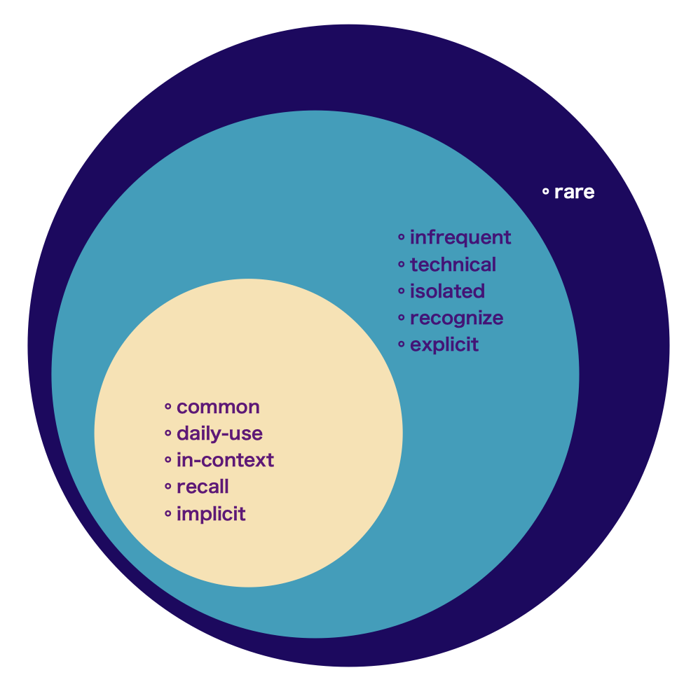

```{=html}
<style type="text/css">

body{
      font-size: 13px;
      font-family: "Roboto Condensed", "Anonymous Pro", "Roboto", "Helvetica Neue";
  }
</style>
```
<link rel="preconnect" href="https://fonts.googleapis.com"> <link rel="preconnect" href="https://fonts.gstatic.com" crossorigin> <link href="https://fonts.googleapis.com/css2?family=Hina+Mincho&family=Klee+One:wght@400;600&family=New+Tegomin&family=Sawarabi+Gothic&family=Shippori+Mincho+B1:wght@400;500&family=Yomogi&display=swap" rel="stylesheet"> <link rel="preconnect" href="https://fonts.googleapis.com"> <link rel="preconnect" href="https://fonts.gstatic.com" crossorigin> <link href="https://fonts.googleapis.com/css2?family=Noto+Sans+JP:wght@100;300;400;500;700&display=swap" rel="stylesheet"> <link rel="preconnect" href="https://fonts.gstatic.com"> <link href="https://fonts.googleapis.com/css2?family=M+PLUS+Rounded+1c:wght@100;300;400;500;700&display=swap" rel="stylesheet"> <link rel="preconnect" href="https://fonts.gstatic.com"> <link href="https://fonts.googleapis.com/css2?family=Anonymous+Pro&display=swap" rel="stylesheet"> <link href="https://fonts.googleapis.com/css2?family=Anonymous+Pro:ital,wght@0,400;1,700&display=swap" rel="stylesheet"> <link href="https://fonts.googleapis.com/css2?family=Anonymous+Pro:ital,wght@0,400;0,700;1,700&display=swap" rel="stylesheet">

<link rel="preconnect" href="https://fonts.googleapis.com">
<link rel="preconnect" href="https://fonts.gstatic.com" crossorigin>
<link href="https://fonts.googleapis.com/css2?family=Open+Sans:ital,wght@0,300;0,400;0,500;0,600;1,300;1,400;1,500;1,600&display=swap" rel="stylesheet">

<link rel="preconnect" href="https://fonts.googleapis.com">
<link rel="preconnect" href="https://fonts.gstatic.com" crossorigin>
<link href="https://fonts.googleapis.com/css2?family=Zen+Maru+Gothic:wght@300;400;500;600&display=swap" rel="stylesheet">
<link rel="preconnect" href="https://fonts.googleapis.com">
<link rel="preconnect" href="https://fonts.gstatic.com" crossorigin>
<link href="https://fonts.googleapis.com/css2?family=Open+Sans:ital,wght@0,300;0,400;0,500;0,600;1,300;1,400;1,500;1,600&display=swap" rel="stylesheet">
<link rel="preconnect" href="https://fonts.googleapis.com">
<link rel="preconnect" href="https://fonts.gstatic.com" crossorigin>
<link href="https://fonts.googleapis.com/css2?family=Shippori+Mincho+B1:wght@400;500;600;700&display=swap" rel="stylesheet">

<link rel="preconnect" href="https://fonts.googleapis.com">
<link rel="preconnect" href="https://fonts.gstatic.com" crossorigin>
<link href="https://fonts.googleapis.com/css2?family=Hina+Mincho&family=IBM+Plex+Sans+JP:wght@100;200;300;400;500;600&family=Kaisei+Tokumin&family=Klee+One&family=New+Tegomin&family=RocknRoll+One&family=Shippori+Antique+B1&family=Zen+Kaku+Gothic+Antique:wght@300;400;500;700&family=Zen+Kaku+Gothic+New:wght@300;400;500;700&display=swap" rel="stylesheet">

<link rel="preconnect" href="https://fonts.googleapis.com">
<link rel="preconnect" href="https://fonts.gstatic.com" crossorigin>
<link href="https://fonts.googleapis.com/css2?family=Roboto:wght@100;300;400;500;700&display=swap" rel="stylesheet">

<link rel="preconnect" href="https://fonts.googleapis.com">
<link rel="preconnect" href="https://fonts.gstatic.com" crossorigin>
<link href="https://fonts.googleapis.com/css2?family=Roboto+Condensed:wght@300;400;700&family=Roboto+Flex:wght@100;200;300;400;500;600;700&display=swap" rel="stylesheet">

<link rel="preconnect" href="https://fonts.googleapis.com">
<link rel="preconnect" href="https://fonts.gstatic.com" crossorigin>
<link href="https://fonts.googleapis.com/css2?family=Saira+Condensed:wght@100;200;300;400;500;600&display=swap" rel="stylesheet">

```{css, echo=FALSE}
.my-tbl {
  border: 1px solid rgba(0, 0, 0, 0.1);
}

.my-header {
  border-width: 1px;
}

.my-col {
  border-right: 1px solid rgba(0, 0, 0, 0.05);
}

.my-row:hover {
  background-color: #dee7e7;
  filter: invert(1);
}

.toc-content {
    padding-left: 10px;
    padding-right: 10px;
}

div.highlight-ur { background-color: #edede9; padding-left: 0px; padding-top: 7px; padding-bottom: 0.1px;
  border: 1px solid #264653;
  color: 	#0F2040;
  font-size: 12.5px;
  font-family: "Open Sans", "Roboto";
}

div.expressjp { outline-style: solid; outline-color: #0F2040; outline-width: 1px; border-radius: 5px; padding: 1px; padding-top: 10px;
  color: 	#404040;
  font-size: 14px;
  font-family: 'Rounded Mplus 1c', 'M PLUS Rounded 1c', sans-serif;
}

div.expresstr { outline-style: solid; outline-color: #0F2040; outline-width: 1px; border-radius: 5px; padding: 1px; padding-top: 10px; 
  color: 	#404040;
  font-size: 12.2px;
  font-family: 'Rounded Mplus 1c', 'M PLUS Rounded 1c', sans-serif;
}

div.add_info {
  padding-top: 0px; 
  padding-bottom: 0px;
  color: 	#264653;
  font-size: 12px;
  font-family: 'Roboto Condensed', 'Open Sans', 'Zen Kaku Gothic New', sans-serif;
}

div.add_infos {
  padding-top: 0px; 
  padding-bottom: 0px;
  color: 	#264653;
  font-size: 13px;
  font-family: 'Saira Condensed', 'Roboto Condensed', 'Open Sans', 'Zen Kaku Gothic New', sans-serif;
}

div.expresstrx { outline-style: solid; outline-color: #264653; outline-width: 0.5px; border-radius: 3px; padding: 1px; padding-top: 10px; 
  color: 	#264653;
  font-size: 13px;
  font-weight: 400;
  font-family: 'Zen Kaku Gothic New', 'Rounded Mplus 1c', 'M PLUS Rounded 1c', sans-serif;
}

div.expresstrz { outline-style: solid; outline-color: #264653; outline-width: 0.5px; border-radius: 3px; padding: 1px; padding-top: 10px; 
  color: 	#264653;
  font-size: 12.4px;
  font-weight: 400;
  font-family: 'Zen Kaku Gothic New', 'M PLUS Rounded 1c', sans-serif;
}

.detail-des_func_a {
  color: 	#800000;
  font-size: 20px;
  font-weight: 600;
  font-family: 'Righteous';
  background-color: #e0e1dd;
  padding-left: 8px;
  padding-right: 8px;
  padding-top: 20px;
  padding-bottom: 8px;
}

.detail-des_func_b {
  color: 	#0F2040;
  font-size: 16px;
  font-weight: 600;
  font-family: 'Open Sans';
  background-color: #edede9;
  padding-left: 8px;
  padding-right: 8px;
  padding-top: 20px;
  padding-bottom: 8px;
}

.detail-des_func_c {
  color: 	#0F2040;
  font-size: 11.5px;
  font-weight: 300;
  font-family: 'Zen Kaku Gothic New';
  background-color: #edede9;
  padding-left: 8px;
  padding-right: 8px;
  padding-top: 8px;
  padding-bottom: 20px;
}

.detail-des_func_d {
  color: 	#253f41;
  font-size: 11.5px;
  font-weight: 400;
  font-family: 'Open Sans';
  background-color: #e0e1dd;
  padding-left: 8px;
  padding-right: 8px;
  padding-top: 8px;
  padding-bottom: 8px;
}

.detail-des_func_e {
  color: 	#0b8282;
  font-size: 11.5px;
  font-weight: 400;
  font-family: 'Zen Kaku Gothic New';
  background-color: #e0e1dd;
  padding-left: 8px;
  padding-right: 8px;
  padding-top: 8px;
  padding-bottom: 20px;
}


```

```{r setup, include=FALSE}
knitr::opts_chunk$set(echo = TRUE)
```

```{css, echo=FALSE}
@media(prefers-color-scheme: light) {
  body {
    <!-- background-color: black; -->
    filter: invert(0);
  }
}
```

```{r, echo=FALSE, message=FALSE}
library(tidyverse)
library(reactable)
library(htmltools)
library(bslib)
library(dplyr)
library(purrr)
library(readr)
library(vembedr)
options(readr.show_col_types = FALSE)
```

```{r, echo=FALSE, message=FALSE, error=FALSE}
hnrtbl <- read_csv("cpdb/HNRFCTBL-TBL.csv")
comstrgyfnc <- read_csv("jpim/COMFNC-CMSTR.csv")
commsynrgy <- read_csv("jpdb/CMMSYNRGY-SIT.csv")

dliwrd <- read_csv("jpim/CMWRD-CMNW.csv")
cmmvrb <- read_csv("jpim/CMVRB-VRBS.csv")
dliphr <- read_csv("jpim/CMPHR-CMNW.csv")
cmmpnflct <- read_csv("jpim/CMPNFLCT-NFLCT.csv")
mstryfunc<- read_csv("jpim/COMMFNCZ-CMFNC.csv")
comstrgyfnc <- read_csv("jpim/COMFNC-CMSTR.csv")
cmmptrn <- read_csv("jpim/CMPTRN-LST.csv")
syntxm <- read_csv("jpim/SYNTX-SYNX.csv")
mstrypatrn <- read_csv("jpim/PTTRND-EXP.csv")
explcexp <- read_csv("jpim/EXPLCTMS-TRN.csv")
ntvspk <- read_csv("jpim/NTVSPK-EXP.csv")
honlang <- read_csv("cpdb/HMLNG-ETB.csv")
```

# <b> Communication </b>

### CM1.0: Comm.Skills {.tabset}

<p style="font-size:11px; line-height: 1; font-family: Noto Sans JP;  color: #202020;">**Communication Skills** is the ability to convey or share ideas and feelings effectively.</p>

#### Attention

<p style="font-size:13px; line-height: 1; font-family: Roboto Condensed;  color: #1e3842; font-weight: bold">**① Different ways to attract someone’s attention**</p>

<div class = "row">
<div class = "col-sm-6">

<div class = "expresstrz">
・Hey.  
・Uhmm.  
・Just a minute.  
・Excuse me.  
・Uh, excuse me but.   
・Uh, I am sorry to be rude but.  
</div>

</div>
<div class = "col-sm-6">

<div class = "expresstrz">
・ねえ.   
・あのう.   
・ちょっと.  
・すみませんが.  
・あのう、すみませんが.  
・あのう、失礼ですが.  
</div>

</div>
</div>

<h6> </h6>

------------------------------------------------------------------------

#### Response

<p style="font-size:13px; line-height: 1; font-family: Roboto Condensed;  color: #1e3842; font-weight: bold">**① How to respond if some is calling your attention**</p>

<div class = "row">
<div class = "col-sm-6">

<div class = "expresstrz">
・What is it?   
・Yes, what is it?   
</div>

</div>
<div class = "col-sm-6">

<div class = "expresstrz">
・え、何？   
・はい、何でしょうか？   
</div>

</div>
</div>

<h6> </h6>

------------------------------------------------------------------------

#### Start a Conversation

<p style="font-size:13px; line-height: 1; font-family: Roboto Condensed;  color: #1e3842; font-weight: bold">**① How to initiate a conversation**</p>

<div class = "row">
<div class = "col-sm-6">

<div class = "expresstrz">
・I have something I would like to talk to you about.  
・I have something I want to tell you.   
・Do you have two or three minutes now?   
・Are you free right now?   
・Are you busy now?   
・Are you busy now?   
・I am sorry to bother you in the middle of your work.  
・I am sorry to bother you in the middle of your work.  
・I want to ask you something.  
・I have something I would like to ask you.  
</div>

</div>
<div class = "col-sm-6">

<div class = "expresstrz">
・ちょっとお話したいことがあるんですが.   
・ちょっと話があるんだけど.  
・今二、三分よろしいでしょうか.  
・今ちょっといい？   
・今忙しい？   
・今お忙しいでしょうか.   
・お仕事中すみませんが.   
・仕事中いんだけど.   
・ちょっと聞きたいんだけど.   
・ちょっとお聞きしたいことがあるんですが.   
</div>

</div>
</div>

<h6> </h6>

------------------------------------------------------------------------

#### End a Conversation

<p style="font-size:13px; line-height: 1; font-family: Roboto Condensed;  color: #1e3842; font-weight: bold">**① How to end a conversation**</p>

<div class = "row">
<div class = "col-sm-6">

<div class = "expresstrz">
・Ok, then.   
・Ok, then, this is it for today.   
・Well.., I should be going soon.   
・Well.., I should be going soon.   
</div>

</div>
<div class = "col-sm-6">

<div class = "expresstrz">
・じゃあね.  
・では・じゃ、今日はこんなところで.   
・では・じゃ、そろそろ.   
・では・じゃ、そろそろこのんで.   
</div>

</div>
</div>

<h6> </h6>

------------------------------------------------------------------------

#### Topic Introduction

<p style="font-size:13px; line-height: 1; font-family: Roboto Condensed;  color: #1e3842; font-weight: bold">**① How to introduce a topic**</p>

<div class = "row">
<div class = "col-sm-6">

<div class = "expresstrz">
・Well, it’s about the upcoming exam.  
・Well, it’s about the upcoming exam.  
</div>

</div>
<div class = "col-sm-6">

<div class = "expresstrz">
・実は今度の試験のことなんですけど.   
・実は今度の試験のことなんですが.   
</div>

</div>
</div>

<h6> </h6>

------------------------------------------------------------------------

#### Topic Change

<p style="font-size:13px; line-height: 1; font-family: Roboto Condensed;  color: #1e3842; font-weight: bold">**① How to change a topic**</p>

<div class = "row">
<div class = "col-sm-6">

<div class = "expresstrz">
・By the way.   
・By the way.   
・Be that as it may.    
・Not to change the topic.    
・Not to change the subject.  
</div>

</div>
<div class = "col-sm-6">

<div class = "expresstrz">
・ところで.  
・ちなみに.  
・それはそうと.  
・話は違うけど.  
・話は変わりますが.  
</div>

</div>
</div>

<h6> </h6>

------------------------------------------------------------------------

#### Opening

<p style="font-size:13px; line-height: 1; font-family: Roboto Condensed;  color: #1e3842; font-weight: bold">**① Make an opening remarks**</p>

<div class = "row">
<div class = "col-sm-6">

<div class = "expresstrz">
・Today, I would like to talk about.    
・I would like to talk about.    
・I would like to look at.   
・I should like to talk about..today.  
</div>

</div>
<div class = "col-sm-6">

<div class = "expresstrz">
・今日は〜についてお話したいと思います.  
・〜について述べたいと思います.  
・〜に関して考察をしたいと思います.  
・本日は.. につきましてお話をさせて戴きます.  
</div>

</div>
</div>

<h6> </h6>

------------------------------------------------------------------------

#### Sequence

<p style="font-size:13px; line-height: 1; font-family: Roboto Condensed;  color: #1e3842; font-weight: bold">**① How to establishing a sequence**</p>

<div class = "row">
<div class = "col-sm-6">

<div class = "expresstrz">
・First of all.  
・First of all.  
・Next.  
・Firstly.  
・Secondly, as my second point    
・Lastly.  
</div>

</div>
<div class = "col-sm-6">

<div class = "expresstrz">
・まず始めに.  
・まず最初に.  
・次に.  
・第一に.  
・第二点として.  
・最後に.   
</div>

</div>
</div>

<h6> </h6>

------------------------------------------------------------------------

#### Examples

<p style="font-size:13px; line-height: 1; font-family: Roboto Condensed;  color: #1e3842; font-weight: bold">**① How to cite examples**</p>

<div class = "row">
<div class = "col-sm-6">

<div class = "expresstrz">
・For example.  
・I would like to give a few examples.  
</div>

</div>
<div class = "col-sm-6">

<div class = "expresstrz">
・例えば.  
・いくつか例をあげたいと思います.  
</div>

</div>
</div>

<h6> </h6>

------------------------------------------------------------------------

#### Summarize

<p style="font-size:13px; line-height: 1; font-family: Roboto Condensed;  color: #1e3842; font-weight: bold">**① How to summarize and conclude a statement**</p>

<div class = "row">
<div class = "col-sm-6">

<div class = "expresstrz">
・To conclude.  
・As a conclusion, I can say the following.  
・From what I’ve said so far, I believe it is clear that.  
・To summarize from what I have said so far.  
・In other words, it means.   
</div>

</div>
<div class = "col-sm-6">

<div class = "expresstrz">
・結論を述べますと.  
・結論として次のことが言えると思います.  
・以上のことから〜ということが明らかになると思います.   
・以上のことをまとめますと.  
・つまり〜ということだと思います.  
</div>

</div>
</div>

<h6> </h6>

------------------------------------------------------------------------

#### End a presentation

<p style="font-size:13px; line-height: 1; font-family: Roboto Condensed;  color: #1e3842; font-weight: bold">**① How to end a presentation**</p>

<div class = "row">
<div class = "col-sm-6">

<div class = "expresstrz">
・That is all. Thank you very much for your attention.  
・I would like to end with this.  
</div>

</div>
<div class = "col-sm-6">

<div class = "expresstrz">
・以上です. ご清聴ありがとうございました.  
・これで終わらせていただきたいと思います.  
</div>

</div>
</div>

<h6> </h6>

------------------------------------------------------------------------

#### Vague-Indirect

<p style="font-size:13px; line-height: 1; font-family: Roboto Condensed;  color: #1e3842; font-weight: bold">**① Being vague or indirect**</p>

<div class = "add_info">
**nanka** `something`
</div>

<div class = "row">
<div class = "col-sm-6">

<div class = "expresstrz">
・It’s so crowded during the rush hour, for example.  
・At the supermarket they sell things like sushi.  
・I don't want to hear any more excuses or something.  
・How about that Italian place that just opened?   
・I wonder if it will be fun to do.  
</div>

</div>
<div class = "col-sm-6">

<div class = "expresstrz">
・ラッシュアワーの時なんかもういっぱいで.  
・スーパーでおすしなんかも売っています.  
・もう言い訳なんか聞きたくないね.  
・この間オープンしたイタリアンなんかどう.  
・なんか楽しいことないかなあ.  
</div>

</div>
</div>

<h6> </h6>

<div class = "add_info">
**demo** `or something`
</div>

<div class = "row">
<div class = "col-sm-6">

<div class = "expresstrz">
・How about tea or something?   
・I am thinking of taking a walk or something.  
</div>

</div>
<div class = "col-sm-6">

<div class = "expresstrz">
・お茶でもいかがですか.  
・散歩でもしようかなと思っています.  
</div>

</div>
</div>

<h6> </h6>

<div class = "add_info">
**toka** `something like`
</div>

<div class = "row">
<div class = "col-sm-6">

<div class = "expresstrz">
・Are you studying or something?   
・Don't you have a crush on someone?   
</div>

</div>
<div class = "col-sm-6">

<div class = "expresstrz">
・勉強とかしてるのかな？   
・好きな人とかいないの？   
</div>

</div>
</div>

<h6> </h6>

<div class = "add_info">
**n ja nai deshou ka・ka na to omoimasu** `stating one's opinion indirectly`
</div>

<div class = "row">
<div class = "col-sm-6">

<div class = "expresstrz">
・If you are going to Japan, it's better to go to a small town.   
・I think a bigger university might be better.  
</div>

</div>
<div class = "col-sm-6">

<div class = "expresstrz">
・日本に行くなら小さい町の方がいいんじゃないでしょうか.  
・大学は大きい大学の方がいいかなと思います.  
</div>

</div>
</div>

<h6> </h6>

------------------------------------------------------------------------

#### Ask a Repeat

<p style="font-size:13px; line-height: 1; font-family: Roboto Condensed;  color: #1e3842; font-weight: bold">**① Asking for Repetition**</p>

<div class = "row">
<div class = "col-sm-6">

<div class = "expresstrz">
・What did you say just now?    
・I’m sorry, I couldn’t hear well, but.  
・I am sorry, but could I ask you to say that one more time?   
</div>

</div>
<div class = "col-sm-6">

<div class = "expresstrz">
・今何て言った?   
・すみません、今ちょっとよく聞こえなかったんですが.  
・すみません. もう一度言っていただけませんか.  
</div>

</div>
</div>

<h6> </h6>

------------------------------------------------------------------------

#### Afterthoughts

<p style="font-size:13px; line-height: 1; font-family: Roboto Condensed;  color: #1e3842; font-weight: bold">**① Express Afterthoughts**</p>

<div class = "row">
<div class = "col-sm-6">

<div class = "expresstrz">
・It was really tiring, my business trip this time.  
・It’s here, the bus.   
・Oh, I forgot, the umbrella.  
・I use the dictionary too, sometimes. 
</div>

</div>
<div class = "col-sm-6">

<div class = "expresstrz">
・本当に疲れたよ、今回の出張(は).   
・来ましたよ、バス(が).  
・あ、忘れちゃった、傘(を).   
・辞書も使いますよ、時々.  
</div>

</div>
</div>

<h6> </h6>

------------------------------------------------------------------------

### CM2.0: Comm.Synergies {.tabset}

<p style="font-size:11px; line-height: 1; font-family: Noto Sans JP;  color: #202020;">**Communication Synergies** are scenarios of interaction between two or more agents, organizations, etc.</p>

#### Introduction {.tabset}

<p style="font-size:13px; line-height: 1; font-family: Roboto Condensed;  color: #1e3842; font-weight: bold">**① How to do a self introduction**</p>

<div class = "row">
<div class = "col-sm-6">

<div class = "expresstrz">
🅼 Nice to meet you.      
🅼 My name is John.       
🅼 I came from America.       
🅼 I am a travel agent.      
🅼 Glad to meet you all.     
</div>

<h6> </h6>

</div>
<div class = "col-sm-6">

<div class = "expresstrz">
🅼 はじめまして.    
🅼 はジョンと申します.    
🅼 アメリカから来ました.   
🅼 旅行会社です.   
🅼 よろしくお願いします.  
</div>

</div>
</div>

<h6> </h6>

------------------------------------------------------------------------

#### Meeting {.tabset}

<p style="font-size:13px; line-height: 1; font-family: Roboto Condensed;  color: #1e3842; font-weight: bold">**① Meeting for the first time**</p>

<div class = "row">
<div class = "col-sm-6">

<div class = "expresstrz">
🅼 How do you do. I am John. Nice to meet you.   　  
🅵 How do you do. I am Rina. Nice to meet you.   
</div>

<h6> </h6>

</div>
<div class = "col-sm-6">

<div class = "expresstrz">
🅼 はじめまして. 私はジョンです. よろしくお願いします.   
🅵 はじめまして. りなと申します. よろしくお願いします.   
</div>

</div>
</div>

<h6> </h6>

------------------------------------------------------------------------

#### SmallTalk {.tabset}

<p style="font-size:13px; line-height: 1; font-family: Roboto Condensed;  color: #1e3842; font-weight: bold">**① Small talk during the first meeting**</p>

<div class = "row">
<div class = "col-sm-6">

<div class = "expresstrz">
🅼 Rina-san, Where are you from?      
🅵 I am from London. How about John-san?       
🅼 I am from Chicago. Are a student or working already?      
🅵 I am a student. How about John-san?        
🅼 I am working. I work at a travel agency.     
</div>

<h6> </h6>

</div>
<div class = "col-sm-6">

<div class = "expresstrz">
🅼 りなさん、ご出身はどこですか.    
🅵 ロンドンです. ジョンさんは？               
🅼 シカゴです. 学生ですか、もう働いていますか.       
🅵 学生です. ジョンさんは？        
🅼 働いています. 旅行会社に勤めています.       
</div>

</div>
</div>

<h6> </h6>

------------------------------------------------------------------------

#### Reservation

<p style="font-size:13px; line-height: 1; font-family: Roboto Condensed;  color: #1e3842; font-weight: bold">**① How to make a reservation**</p>

<div class = "row">
<div class = "col-sm-6">

<div class = "expresstrz">
🆃 Hello, this is Miyako restaurant.     
🅲 Uhmm, I would like to make a reservation.      
🆃 Most certainly, When would you like to make a reservation?     
🅲 On the 20th, at 7 o'clock for 2 people please.    
</div>

<h6> </h6>

</div>
<div class = "col-sm-6">

<div class = "expresstrz">
🆃 はい、レストランみやこでございます.       
🅲 あのう、予約お願いしたいんですが.       
🆃 かしこまりました. いつの予約ですか.   
🅲 ２０日の７時に２名でお願いします.   
</div>
  
</div>
</div>

<h6> </h6>

------------------------------------------------------------------------

#### Recommendation

<p style="font-size:13px; line-height: 1; font-family: Roboto Condensed;  color: #1e3842; font-weight: bold">**① Asking for a recommendation**</p>

<div class = "row">
<div class = "col-sm-6">

<div class = "expresstrz">
🆃 What is the best dish in this restaurant?       
🅲 Pork bone ramen, sir.      
🆃 That sounds good. I'll have some of that, please.     
🅲 Most certainly.      
</div>

<h6> </h6>

</div>
<div class = "col-sm-6">

<div class = "expresstrz">
🆃 このレストランのおすすめ料理はなんですか.     
🅲 豚骨ラーメンでございます.         
🆃 いいですね. ではそれをお願いします.   
🅲 かしこまりました.   
</div>

</div>
</div>

<h6> </h6>

------------------------------------------------------------------------

#### Menu

<p style="font-size:13px; line-height: 1; font-family: Roboto Condensed;  color: #1e3842; font-weight: bold">**① Asking for a menu**</p>

<div class = "row">
<div class = "col-sm-6">

<div class = "expresstrz">
🆃 Excuse me. Menu, please.   
🅲 Yes, most certainly.   
🆃 Oh, do you have a menu in English?    
🅲 Yes, we do. I'll bring one immediately.    
</div>

<h6> </h6>

</div>
<div class = "col-sm-6">

<div class = "expresstrz">
🆃 すみません. メニューお願いします.   
🅲 はい、かしこまりました.   
🆃 あ、英語のメニューはありますか.   
🅲 はい、ございます. 今、お持ちします.   
</div>

</div>
</div>

<h6> </h6>

------------------------------------------------------------------------

#### Food

<p style="font-size:13px; line-height: 1; font-family: Roboto CondensedP;  color: #1e3842; font-weight: bold">**① Asking food if contains something**</p>

<div class = "row">
<div class = "col-sm-6">

<div class = "expresstrz">
🅲 Is there any pork in this dish?    
🆃 No, there is no pork in this dish. It's chicken.   
🅲 I see. I'll have this one, please.   
</div>

<h6> </h6>

</div>
<div class = "col-sm-6">

<div class = "expresstrz">
🅲 この料理に豚肉入っていますか.   
🆃 いいえ、入っていません. それは鶏肉です.   
🅲 そうですか. では、これをお願いします.   
</div>

</div>
</div>

<h6> </h6>

------------------------------------------------------------------------

#### Ordering

<p style="font-size:13px; line-height: 1; font-family: Roboto Condensed;  color: #1e3842; font-weight: bold">**① How to make an order**</p>

<div class = "row">
<div class = "col-sm-6">

<div class = "expresstrz">
🆃 Excuse me. Four beers and two oolong teas, please.   
🅲 Four beers and two oolong teas, please.  
🆃 And some assorted grilled chicken and salad, please.   
🅲 Assorted yakitori and salad. Most certainly.   
</div>

<h6> </h6>

</div>
<div class = "col-sm-6">

<div class = "expresstrz">
🆃 すみません. ビール4つとウーロン茶2つ、お願いします.   
🅲 ビールを4つとウーロン茶を2つですね.   
🆃 それから、焼き鳥の盛り合わせとサラダ、お願いします.   
🅲 焼き鳥の盛り合わせとサラダですね. かしこまりました.   
</div>

</div>
</div>

<h6> </h6>

------------------------------------------------------------------------

#### Paying

<p style="font-size:13px; line-height: 1; font-family: Roboto Condensed;  color: #1e3842; font-weight: bold">**① Paying the bill**</p>

<div class = "row">
<div class = "col-sm-6">

<div class = "expresstrz">
🅲 Excuse me. Can I have the bill, please?    
🆃 Yes, that would be 9,000 yen.   
🅲 Let's split the bill, shall we?    
🅲 Let's see, 1,500 yen each.  
</div>

<h6> </h6>

</div>
<div class = "col-sm-6">

<div class = "expresstrz">
🅲 すみません. お会計、お願いします.   
🆃 はい、9,000円になります.   
🅲 みんな、割り勘でいいかな.  
🅲 えーっと、1人1,500円ずつ.   
</div>

</div>
</div>

<h6> </h6>

------------------------------------------------------------------------

#### Ticket

<p style="font-size:13px; line-height: 1; font-family: Roboto Condensed;  color: #1e3842; font-weight: bold">**① How to buy a ticket**</p>

<div class = "row">
<div class = "col-sm-6">

<div class = "expresstrz">
🅰 A round trip ticket to Shin-Osaka please.   
🆀 Are you leaving today?   
🅰 Yes, around ten o'clock "Nozomi" please.  
🅰 Return will be the day after tomorrow around 5pm.  
🆀 Most certainly. Please wait a moment.  
</div>

<h6> </h6>

</div>
<div class = "col-sm-6">

<div class = "expresstrz">
🅰 新大阪まで往復でお願いします.   
🆀 今日のご出発ですか？   
🅰 はい、十時頃の「望み」をお願いします.  
🅰 帰りは明後日の夕方五時頃です.  
🆀 かしこまりました. 少々お待ちください.   
</div>

</div>
</div>

<h6> </h6>

------------------------------------------------------------------------

#### Destination

<p style="font-size:13px; line-height: 1; font-family: Roboto Condensed;  color: #1e3842; font-weight: bold">**① Asking for the destination**</p>

<div class = "row">
<div class = "col-sm-6">

<div class = "expresstrz">
🆀 Excuse me. Does this train go to Nakameguro?   
🅰 No, It is not going. Please take the train on line 3.  
🅰 Track 3, right. Thank you.  
</div>

<h6> </h6>

</div>
<div class = "col-sm-6">

<div class = "expresstrz">
🆀 すみません. この電車中目黒へ行きますか？     
🅰 いいえ、行きません。3番線の電車に乗ってください.   
🅰 3番線ですね. どうも.   
</div>

</div>
</div>

<h6> </h6>

------------------------------------------------------------------------

#### Directions

<p style="font-size:13px; line-height: 1; font-family: Roboto Condensed;  color: #1e3842; font-weight: bold">**① Asking for directions**</p>

<div class = "row">
<div class = "col-sm-6">

<div class = "expresstrz">
🆀 Excuse me. How do I get to Odaiba?   
🅰 Is it Ojiba? Take the Yamanote line to Shinbashi.  
🅰 Please change to Yurikamome at Shinbashi.   
🆀 Yurikamome at Shinbashi, right? Thank you.   
</div>

<h6> </h6>

</div>
<div class = "col-sm-6">

<div class = "expresstrz">
🆀 すみません. お台場どう行ったらいいですか？   
🅰 おぢあばですか. 山手線で新橋まで行って.   
🅰 新橋でゆりかもめに乗り換えてください.   
🆀 新橋でゆりかもめですね. ありがとうございます.  
</div>

</div>
</div>

<h6> </h6>

------------------------------------------------------------------------

#### Expressions {.tabset}

##### Health

```{r, echo=FALSE, message=FALSE}

commsynrgy.a <- commsynrgy %>% select(Health.Translation, Health.Sentences) %>% rename(Translation = Health.Translation, Sentences = Health.Sentences)
commsynrgy.a <- commsynrgy.a %>% na.omit(commsynrgy.a)
commsynrgy.a <- commsynrgy.a[sample(1:nrow(commsynrgy.a)),]

reactable(
  commsynrgy.a,
  columns = list(
    Sentences = colDef(
      minWidth = 130,
      cell = function(value, index) {
        tagList(
          div(style = list(fontSize = 14, color = '#264653', fontWeight = 400, fontFamily = 'Zen Kaku Gothic New'), value),
        )
      },
      align = "left"
    ),
    Translation = colDef(minWidth = 115, align = "left", style = list(fontSize = 12.2, color = '#264653', fontFamily = 'Zen Kaku Gothic New'))
  ),
  rowClass = "my-row",
  defaultPageSize = 8,
  theme = reactableTheme(
    cellStyle = list(display = "flex", flexDirection = "column", justifyContent = "center"),
    searchInputStyle = list(
      paddingLeft = "8px",
      paddingTop = "8px",
      paddingBottom = "8px",
      width = "100%"
    )
  ),
  showPageInfo = FALSE, bordered = TRUE, searchable = FALSE, sortable = FALSE, paginationType = "simple", striped = TRUE, highlight = TRUE,
  
  style = list(fontFamily = "Noto Sans JP, Heiti SC, Hiragino Maru Gothic ProN, Anonymous Pro , monospace, Helvetica Neue", fontSize = "11px")
)

```

------------------------------------------------------------------------

##### Tours

```{r, echo=FALSE, message=FALSE}

commsynrgy.a <- commsynrgy %>% select(Sight.Translation, Sight.Sentences) %>% rename(Translation = Sight.Translation, Sentences = Sight.Sentences)
commsynrgy.a <- commsynrgy.a %>% na.omit(commsynrgy.a)
commsynrgy.a <- commsynrgy.a[sample(1:nrow(commsynrgy.a)),]

reactable(
  commsynrgy.a,
  columns = list(
    Sentences = colDef(
      minWidth = 130,
      cell = function(value, index) {
        tagList(
          div(style = list(fontSize = 14, color = '#264653', fontWeight = 400, fontFamily = 'Zen Kaku Gothic New'), value),
        )
      },
      align = "left"
    ),
    Translation = colDef(minWidth = 115, align = "left", style = list(fontSize = 12.2, color = '#264653', fontFamily = 'Zen Kaku Gothic New'))
  ),
  rowClass = "my-row",
  defaultPageSize = 8,
  theme = reactableTheme(
    cellStyle = list(display = "flex", flexDirection = "column", justifyContent = "center"),
    searchInputStyle = list(
      paddingLeft = "8px",
      paddingTop = "8px",
      paddingBottom = "8px",
      width = "100%"
    )
  ),
  showPageInfo = FALSE, bordered = TRUE, searchable = FALSE, sortable = FALSE, paginationType = "simple", striped = TRUE, highlight = TRUE,
  
  style = list(fontFamily = "Noto Sans JP, Heiti SC, Hiragino Maru Gothic ProN, Anonymous Pro , monospace, Helvetica Neue", fontSize = "11px")
)

```

------------------------------------------------------------------------

##### Travel

```{r, echo=FALSE, message=FALSE}

commsynrgy.a <- commsynrgy %>% select(Travel.Translation, Travel.Sentences) %>% rename(Translation = Travel.Translation, Sentences = Travel.Sentences)
commsynrgy.a <- commsynrgy.a %>% na.omit(commsynrgy.a)
commsynrgy.a <- commsynrgy.a[sample(1:nrow(commsynrgy.a)),]

reactable(
  commsynrgy.a,
  columns = list(
    Sentences = colDef(
      minWidth = 130,
      cell = function(value, index) {
        tagList(
          div(style = list(fontSize = 14, color = '#264653', fontWeight = 400, fontFamily = 'Zen Kaku Gothic New'), value),
        )
      },
      align = "left"
    ),
    Translation = colDef(minWidth = 115, align = "left", style = list(fontSize = 12.2, color = '#264653', fontFamily = 'Zen Kaku Gothic New'))
  ),
  rowClass = "my-row",
  defaultPageSize = 8,
  theme = reactableTheme(
    cellStyle = list(display = "flex", flexDirection = "column", justifyContent = "center"),
    searchInputStyle = list(
      paddingLeft = "8px",
      paddingTop = "8px",
      paddingBottom = "8px",
      width = "100%"
    )
  ),
  showPageInfo = FALSE, bordered = TRUE, searchable = FALSE, sortable = FALSE, paginationType = "simple", striped = TRUE, highlight = TRUE,
  
  style = list(fontFamily = "Noto Sans JP, Heiti SC, Hiragino Maru Gothic ProN, Anonymous Pro , monospace, Helvetica Neue", fontSize = "11px")
)

```

------------------------------------------------------------------------

##### Dining

```{r, echo=FALSE, message=FALSE}

commsynrgy.a <- commsynrgy %>% select(Dining.Translation, Dining.Sentences) %>% rename(Translation = Dining.Translation, Sentences = Dining.Sentences)
commsynrgy.a <- commsynrgy.a %>% na.omit(commsynrgy.a)
commsynrgy.a <- commsynrgy.a[sample(1:nrow(commsynrgy.a)),]

reactable(
  commsynrgy.a,
  columns = list(
    Sentences = colDef(
      minWidth = 130,
      cell = function(value, index) {
        tagList(
          div(style = list(fontSize = 14, color = '#264653', fontWeight = 400, fontFamily = 'Zen Kaku Gothic New'), value),
        )
      },
      align = "left"
    ),
    Translation = colDef(minWidth = 115, align = "left", style = list(fontSize = 12.2, color = '#264653', fontFamily = 'Zen Kaku Gothic New'))
  ),
  rowClass = "my-row",
  defaultPageSize = 8,
  theme = reactableTheme(
    cellStyle = list(display = "flex", flexDirection = "column", justifyContent = "center"),
    searchInputStyle = list(
      paddingLeft = "8px",
      paddingTop = "8px",
      paddingBottom = "8px",
      width = "100%"
    )
  ),
  showPageInfo = FALSE, bordered = TRUE, searchable = FALSE, sortable = FALSE, paginationType = "simple", striped = TRUE, highlight = TRUE,
  
  style = list(fontFamily = "Noto Sans JP, Heiti SC, Hiragino Maru Gothic ProN, Anonymous Pro , monospace, Helvetica Neue", fontSize = "11px")
)

```

------------------------------------------------------------------------

##### Shopping

```{r, echo=FALSE, message=FALSE}

commsynrgy.a <- commsynrgy %>% select(Shopping.Translation, Shopping.Sentences) %>% rename(Translation = Shopping.Translation, Sentences = Shopping.Sentences)
commsynrgy.a <- commsynrgy.a %>% na.omit(commsynrgy.a)
commsynrgy.a <- commsynrgy.a[sample(1:nrow(commsynrgy.a)),]

reactable(
  commsynrgy.a,
  columns = list(
    Sentences = colDef(
      minWidth = 130,
      cell = function(value, index) {
        tagList(
          div(style = list(fontSize = 14, color = '#264653', fontWeight = 400, fontFamily = 'Zen Kaku Gothic New'), value),
        )
      },
      align = "left"
    ),
    Translation = colDef(minWidth = 115, align = "left", style = list(fontSize = 12.2, color = '#264653', fontFamily = 'Zen Kaku Gothic New'))
  ),
  rowClass = "my-row",
  defaultPageSize = 8,
  theme = reactableTheme(
    cellStyle = list(display = "flex", flexDirection = "column", justifyContent = "center"),
    searchInputStyle = list(
      paddingLeft = "8px",
      paddingTop = "8px",
      paddingBottom = "8px",
      width = "100%"
    )
  ),
  showPageInfo = FALSE, bordered = TRUE, searchable = FALSE, sortable = FALSE, paginationType = "simple", striped = TRUE, highlight = TRUE,
  
  style = list(fontFamily = "Noto Sans JP, Heiti SC, Hiragino Maru Gothic ProN, Anonymous Pro , monospace, Helvetica Neue", fontSize = "11px")
)

```

------------------------------------------------------------------------

### CM3.0: Comm.Functions {.tabset}

<p style="font-size:11px; line-height: 1; font-family: Noto Sans JP;  color: #202020;">**Communication Functions** are ways to explain the purpose and details of the communication process.</p>

#### Questions {.tabset}

<p style="font-size:13px; line-height: 1; font-family: Roboto Condensed;  color: #1e3842; font-weight: bold">**① Who: 誰・だれ**</p>

<div class = "row">
<div class = "col-sm-6">

<div class = "expresstrz">
・Who do you think came?     
・Who are you looking for?     
・Who put you up to this?     
・Who is that person?     
・Do you know who this is?    
・Who would cross such a dangerous bridge?    
・Who are you spending time with?    
・Who would go there?     
・Who told you that?    
</div>
 
<h6> </h6>

</div>
<div class = "col-sm-6">

<div class = "expresstrz">
・誰が来たと思いますか.    
・誰を探しているのですか.   
・誰にそそのかされてやったのか.   
・あの人は誰ですか.    
・これが誰だか分かるか.    
・誰がそんな危ない橋を渡るものか.    
・誰と時間を過ごしているか.    
・誰がそんなとこ行くか.    
・そんなこと誰が言ったんですか.    
</div>
 
<h6> </h6>

</div>
</div>

<p style="font-size:13px; line-height: 1; font-family: Roboto Condensed;  color: #1e3842; font-weight: bold">**② How: どう**</p>

<div class = "row">
<div class = "col-sm-6">

<div class = "expresstrz">
・How are you feeling this morning?     
・How about a cup of tea?     
・How to deal with these well?    
・How to deal with them?    
・How does it feel to be on the run?    
・How science works?    
・How would you diagnose that interaction?    
</div>
 
<h6> </h6>

</div>
<div class = "col-sm-6">

<div class = "expresstrz">
・今朝の気分はどうですか.    
・お茶を１杯どうですか.    
・これらにどうよく対処するか.    
・彼らとどう向き合うか.    
・逃亡している気持ちはどう？    
・科学はどう成り立っているか.    
・そのやり取りをどう診断するか.    
</div>
 
<h6> </h6>

</div>
</div>

<p style="font-size:13px; line-height: 1; font-family: Roboto Condensed;  color: #1e3842; font-weight: bold">**③ How to do・In what way: どうやって**</p>

<div class = "row">
<div class = "col-sm-6">

<div class = "expresstrz">
・Please tell me how you do it?     
・How do we spend our time successfully?     
・How did they get in?     
・How do we change consumption patterns?    
</div>

<h6> </h6>

</div>
<div class = "col-sm-6">

<div class = "expresstrz">
・どうやってやるのか教えてください.    
・どうやって上手く過ごすのか.    
・どうやって侵入したのか.    
・どうやって消費パターンを変えるか.    
</div>
 
<h6> </h6>

</div>
</div>

<h6> </h6>

------------------------------------------------------------------------

#### Seeking {.tabset}

<p style="font-size:13px; line-height: 1; font-family: Roboto Condensed;  color: #1e3842; font-weight: bold">**① Asking a yes or no question**</p>

<div class = "row">
<div class = "col-sm-6">

<div class = "expresstrz">
・Do you drink beer?       
・Do you drink beer?     
・Is that person is Japanese?      
・Are you are going to the party?      
・Are you are going to the party?      
・Is it that you have a fever?    
</div>
 
<h6> </h6>

</div>
<div class = "col-sm-6">

<div class = "expresstrz">
・ビールをのむ？     
・ビールを飲みますか.     
・あの人は日本人ですか.   
・パーティーに行くんですか.    
・パーティーに行くの？       
・熱があるんですか.    
</div>
 
<h6> </h6>
 
</div>
</div>
 
<p style="font-size:13px; line-height: 1; font-family: Roboto Condensed;  color: #1e3842; font-weight: bold">**② Asking for a specific information**</p>

<div class = "row">
<div class = "col-sm-6">

<div class = "expresstrz">
・Who came?     
・What are you reading?     
・What shall we have for lunch?     
・Who came?     
・What are you reading?     
・What shall we have for lunch?      
</div>
 
</div>
<div class = "col-sm-6">

<div class = "expresstrz">
・だれが来たんですか.     
・何を読んでいるんですか.    
・お昼は何にしますか.    
・だれが来たの？     
・何読んでるの？      
・お昼は何にする？     
</div>
 
</div>
</div>
 
<h6> </h6>

------------------------------------------------------------------------

#### Reporting {.tabset}

<p style="font-size:13px; line-height: 1; font-family: Roboto Condensed;  color: #1e3842; font-weight: bold">**① Direct quotation**</p>

<div class = "row">
<div class = "col-sm-6">

<div class = "expresstrz">
・Ms Smith said, ‘How do you do,’ in Japanese.   
・Ms Tanaka said, ‘I will bring it on Monday’.   
・Ms Tanaka said, ‘French confectionery is good, I tell you’.   
・Ms Tanaka said, ‘I will do it’.  
・Ms Tanaka said, ‘I will hand in homework tomorrow’.   
</div>
 
<h6> </h6>

</div>
<div class = "col-sm-6">

<div class = "expresstrz">
・スミスさんは「初めまして」と日本語で言いました.    
・田中さんは「月曜日に持ってきます」と言いました.   
・田中さんが「フランスのお菓子はおいしいよ」と言いました.   
・田中さんは「私がやります」と言いました.   
・田中さんは「あした宿題を出します」と言いました.   
</div>
 
<h6> </h6>

</div>
</div>

<p style="font-size:13px; line-height: 1; font-family: Roboto Condensed;  color: #1e3842; font-weight: bold">**② Indirect quotation**</p>

<div class = "row">
<div class = "col-sm-6">

<div class = "expresstrz">
・Ms Tanaka said that she would bring it on Monday.   
・Ms Tanaka said that French confectionery is good.   
・Ms Tanaka said that she would do it.   
・Ms Tanaka said that she will hand in homework the next day.   
</div>
 
<h6> </h6>

</div>
<div class = "col-sm-6">

<div class = "expresstrz">
・田中さんは月曜日に持ってくると言いました.    
・田中さんがフランスのお菓子はおいしいと言いました.    
・田中さんは自分がやると言いました.   
・田中さんは次の日に宿題を出すと言いました.   
</div>
 
<h6> </h6>

</div>
</div>

<p style="font-size:13px; line-height: 1; font-family: Roboto Condensed;  color: #1e3842; font-weight: bold">**③ Reporting a statement**</p>

<div class = "row">
<div class = "col-sm-6">

<div class = "expresstrz">
・My friend said he would help me.   
・My friend said he would help me.   
・Written in newspaper that power outage due to a typhoon.     
・Mr. Tanaka said something like he was going to America.   
・I was told like I made too many mistakes with particles.   
・Mr. Smith was saying the he was going to study in Japan.   
・Mr. Smith said he was going to study in Japan.    
・According to the weather forecast, it will rain tomorrow.   
・According to the newspaper, working women is increasing.   
・According to one survey, international marriages are rising.     
</div>
 
<h6> </h6>

</div>
<div class = "col-sm-6">

<div class = "expresstrz">
・友達が手伝ってくれると言いました.    
・友達が手伝ってくれるって言いました.    
・台風で停電になったと新聞に書いてありました.    
・田中さんはアメリカに行くとか言っていました.    
・助詞の間違いが多いなんて言われました.      
・スミスさんは日本に留学すると言っていました.    
・スミスさんは日本に􏰵学すると言いました.    
・天気予報によるとあしたは雨だそうです.   
・新聞によると働く女性が増えているそうだ.   
・ある調査によると国際結婚が増えているとのこと.   
</div>
 
<h6> </h6>

</div>
</div>

<p style="font-size:13px; line-height: 1; font-family: Roboto Condensed;  color: #1e3842; font-weight: bold">**④ Reporting questions and answers**</p>

<div class = "row">
<div class = "col-sm-6">

<div class = "expresstrz">
・I asked my friends if they we homework but they didn't either.     
・Asked what kind of Japanese food I like, The answer is at loss.   
・I was asked if I had ever eaten sushi.   
・Let’s ask our teacher when the exam is.   
・I'm often asked if honorifics are difficult even for Japanese.  
・I received a reply from a friend that he could not attend.   
</div>
 
<h6> </h6>

</div>
<div class = "col-sm-6">

<div class = "expresstrz">
・友達に宿題があるかどうかと聞いたが、友達も知らなかった.    
・どんな日本食が好きかと聞かれて、答えに困った.   
・おすしを食べたことがあるかどうかと聞かれた.  
・試験はいつか先生に伺いましょう.   
・日本人にも敬語が難しいかという質問をよくされる.   
・友達から出席できないという返事をもらった.   
</div>
 
<h6> </h6>

</div>
</div>

<p style="font-size:13px; line-height: 1; font-family: Roboto Condensed;  color: #1e3842; font-weight: bold">**⑤ Reporting commands and requests**</p>
 
<div class = "row">
<div class = "col-sm-6">

<div class = "expresstrz">
・I was told to eat more vegetables.     
・I asked my roommate to clean up.   
・I asked him not to speak English.   
・I reminded him not to forget his meeting with the president.   
・They asked if they could get a higher price.  
・I told my child to come back home early.   
・I asked the teacher to correct my essay.    
・He was warned never to be late for school again.   
・I was asked to open the gate.   
・The secretary was asked to file past records.   
</div>
 
<h6> </h6>

</div>
<div class = "col-sm-6">

<div class = "expresstrz">
・もっと野菜を食べろと言われた.    
・ルームメイトに掃除をしてくれと頼んだ.   
・英語で話さないでくれと頼んだ.  
・僕は彼に社長との会見を忘れないようにと注意した.   
・もっと高い値段で買えないかと聞かれた.   
・子供に早く帰ってくるように言った.   
・先生に作文を直してくださるようにお願いした.    
・彼は二度と学校に遅刻しないように注意された.  
・僕は門を開けるように頼まれた.   
・秘書は過去の記録をファイルするように頼まれた.    
</div>
 
<h6> </h6>

</div>
</div>

<h6> </h6>

------------------------------------------------------------------------

#### Identifying {.tabset}

<p style="font-size:13px; line-height: 1; font-family: Roboto Condensed;  color: #1e3842; font-weight: bold">**① Identifying: Oneself or Others**</p>

<div class = "row">
<div class = "col-sm-6">

<div class = "expresstrz">
・I am Yamamoto.    
・I am Yamamoto.   
・I am Yamamoto.   
・This is Mr. Yamamoto.   
・That is Mr. Yamamoto.  
・That is President Yamamoto over there.   
</div>
 
<h6> </h6>

</div>
<div class = "col-sm-6">

<div class = "expresstrz">
・私は山本です.    
・私は山本と言います.   
・私は山本と申します.   
・こちらは山本さんです.   
・そちらは山本さんです.   
・あちらは山本社長でいらっしゃいます.   
</div>
 
<h6> </h6>

</div>
</div>

<p style="font-size:13px; line-height: 1; font-family: Roboto Condensed;  color: #1e3842; font-weight: bold">**② Identifying: Places**</p>

<div class = "row">
<div class = "col-sm-6">

<div class = "expresstrz">
・The consulate is that one.    
・The library is that one.    
・This is my home.   
・This place is my vacation home.   
</div>
 
<h6> </h6>

</div>
<div class = "col-sm-6">

<div class = "expresstrz">
・領事館はあれです.    
・図書館はあれです.    
・これが私の家です.   
・ここが私の別荘です.   
</div>
 
<h6> </h6>

</div>
</div>

<p style="font-size:13px; line-height: 1; font-family: Roboto Condensed;  color: #1e3842; font-weight: bold">**③ Identifying: Things**</p>

<div class = "row">
<div class = "col-sm-6">

<div class = "expresstrz">
・This is Mr. Tanaka's umbrella.    
・That is a Chinese dictionary.   
・That is Mr. Yamada's car.   
</div>
 
<h6> </h6>

</div>
<div class = "col-sm-6">

<div class = "expresstrz">
・これは田中さんの傘です.    
・それは中国語の辞書です.    
・あれは山田さんの車です.    
</div>
 
</div>
</div>

<h6> </h6>

------------------------------------------------------------------------

#### Describing {.tabset}

<p style="font-size:13px; line-height: 1; font-family: Roboto Condensed;  color: #1e3842; font-weight: bold">**① Describing: People**</p>

<div class = "row">
<div class = "col-sm-6">

<div class = "expresstrz">
・Speaking of Mr. Deguchi, He has big eyes.   
・Speaking of my big sister, She has long legs.   
・Speaking of Mr.Nozoki, He has a good personality.   
・Speaking of Ms. Kawaguchi, She is wearing a red sweater.  
・Ms. Inoue is the person who is wearing sunglasses.   
</div>
 
<h6> </h6>

</div>
<div class = "col-sm-6">

<div class = "expresstrz">
・出口さんは目が大きいです.    
・姉は足が長いです.   
・除きさんは性格がとてもいいですね.   
・川口さんは赤いセーターを着ています.   
・井上さんはサングラスをかけている人です.   
</div>
 
<h6> </h6>

</div>
</div>

<p style="font-size:13px; line-height: 1; font-family: Roboto Condensed;  color: #1e3842; font-weight: bold">**② Describing: Places**</p>

<div class = "row">
<div class = "col-sm-6">

<div class = "expresstrz">
・What is Australia like?     
・Australia has beautiful beaches.   
・This park is famous for roses.   
・Tokyo has a large population.   
・The pasta at that restaurant is delicious.   
</div>
 
<h6> </h6>

</div>
<div class = "col-sm-6">

<div class = "expresstrz">
・オーストラリアはどんな所ですか.    
・オーストラリアは海がきれいです.   
・この公園はバラで有名です.    
・東京は人口が多いです.    
・あのレストランはパスタがおいしいですよ.    
</div>
 
<h6> </h6>

</div>
</div>

<p style="font-size:13px; line-height: 1; font-family: Roboto Condensed;  color: #1e3842; font-weight: bold">**③ Describing: Weather**</p>

<div class = "row">
<div class = "col-sm-6">

<div class = "expresstrz">
・It's raining in Tokyo right now.    
・It's snowing in Hokkaido.   
・It's a little bit cloudy.   
・It's sunny in New York right now.   
・The wind is blowing.   
・It's a little cold today.   
・It's warm like spring today.   
・It's very hot today.   
・It's cool even in summer.   
</div>
 
<h6> </h6>

</div>
<div class = "col-sm-6">

<div class = "expresstrz">
・東京は今雨が降っています.    
・北海道は雪が降っています.   
・今ちょっと雲っています.   
・ニューヨークは今晴れています.   
・今風が吹いています.   
・今日はちょっと寒いです.   
・今日は春らしく暖かいですね.   
・今日は随分暑いですね.   
・夏でも涼しいですね.    
</div>

</div>
</div>

<h6> </h6>

------------------------------------------------------------------------

#### Comparison {.tabset}

<p style="font-size:13px; line-height: 1; font-family: Roboto Condensed;  color: #1e3842; font-weight: bold">**① Comparison: Inequality**</p>

<div class = "row">
<div class = "col-sm-6">

<div class = "expresstrz">
・Subways are more convenient than buses.    
・But that restaurant is even better.   
・That restaurant isn't as expensive as this one.  
・This train is faster than that train.   
・I like coffee better than tea.  
・Mt. Asama is not as high as Mt. Fuji.   
</div>
 
<h6> </h6>

</div>
<div class = "col-sm-6">

<div class = "expresstrz">
・地下鉄の方がバスより便利ですよ.    
・でもあのレストランはもっとおいしいですよ.   
・あのレストランはこのレストランほど高くありませんよ.   
・この電車の方があの電車より速いです.   
・コーヒーの方がお茶より好きです.   
・浅間山は富士山ほど高くない.  
</div>

</div>
</div>

<h6> </h6>

------------------------------------------------------------------------

#### Contrast {.tabset}

<p style="font-size:13px; line-height: 1; font-family: Roboto Condensed;  color: #1e3842; font-weight: bold">**① Contrast: Conjunctive**</p>

<div class = "row">
<div class = "col-sm-6">

<div class = "expresstrz">
・Although I was tired, I did my homework.  
・Although I asked everyone, I still couldn’t figure it out.  
・Although it was boring, I didn’t complain about it.  
・I’m Japanese, but I cannot speak Japanese.  
・My father is Japanese, but my mother is American.  
・This perspective is necessary but not sufficient.  
</div>
 
<h6> </h6>

</div>
<div class = "col-sm-6">

<div class = "expresstrz">
・疲れていたけれども宿題をしました.   
・皆さんに聞いてみましたけれどもよく分かりませんでした.   
・つまらなかったけれども文句は言わなかった.   
・私は日本人ですが、日本語が話せません.  
・父は日本人だが、母はアメリカ人だ.  
・この観点は必要ですが、これでは不十分です.  
</div>
 
<h6> </h6>

</div>
</div>

<p style="font-size:13px; line-height: 1; font-family: Roboto Condensed;  color: #1e3842; font-weight: bold">**② Contrast: Connectives**</p>

<div class = "row">
<div class = "col-sm-6">

<div class = "expresstrz">
・Ms Tanaka is tall. But Ms Sato is short.   
・Let’s go to play. But, I haven’t finished my homework.   
・It is possible. However, it is quite demanding.  
・Everyone was tired. However, they did not give up.  
・Nobody expected it. Nonetheless, that product sold well.  
</div>
 
<h6> </h6>

</div>
<div class = "col-sm-6">

<div class = "expresstrz">
・田中さんは背が高い。でも佐藤さんは背が低い.   
・遊びに行こうよ。でも、まだ宿題が終わってない.   
・可能性はある。しかし、かなり厳しい.   
・みんな疲れていた。だが、あきらめなかった.  
・誰も期待していなかった。ところが、その商品はよく売れた.  
</div>

</div>
</div>

<h6> </h6>

------------------------------------------------------------------------

#### Needs {.tabset}

<p style="font-size:13px; line-height: 1; font-family: Roboto Condensed;  color: #1e3842; font-weight: bold">**① Expressing needs**</p>

<div class = "row">
<div class = "col-sm-6">

<div class = "expresstrz">
 ・I will make depending on needs.   
 ・There is a need to be careful about one’s health.   
 ・If there is anything you need, please tell me.   
 ・It is necessary to practice every day.  
 ・How much money do you need?    
 ・You need courage to begin a new thing.   
 ・Since I don’t have money, I need to work.  
 ・How much money do you need?    
 ・I need to study more.   
</div>
 
<h6> </h6>

</div>
<div class = "col-sm-6">

<div class = "expresstrz">
・必要に応じて作ります.    
・健康に注意する必要がある.   
・何か必要なものがあったら、言ってください.   
・毎日練習することが必要だ.   
・お金はいくらぐらいいりますか.   
・新しいことを始めるには勇気がいる.   
・お金がないから仕事をしなければならない.    
・あした朝早いから、早く寝なければいけない.  
・もっと勉強しなくてはいけません.   
</div>

</div>
</div>

<h6> </h6>

------------------------------------------------------------------------

#### Suggestion {.tabset}

<p style="font-size:13px; line-height: 1; font-family: Roboto Condensed;  color: #1e3842; font-weight: bold">**① Advice・Suggestion: Seeking**</p>

<div class = "row">
<div class = "col-sm-6">

<div class = "expresstrz">
・What should I do?     
・what do you think I should do?   
・Any suggestions on what to do about it?    
・Could I consult you about something?   
・Please advise me.   
</div>
 
<h6> </h6>

</div>
<div class = "col-sm-6">

<div class = "expresstrz">
・どうすればいいでしょうか.   
・どうしたらいいと思う.   
・何かいい方法はないかな.   
・ちょっと相談にのってもらえませんか.   
・アドバイスをお願いします.   
</div>

</div>
</div>

<h6> </h6>

------------------------------------------------------------------------

#### Prohibition {.tabset}

<p style="font-size:13px; line-height: 1; font-family: Roboto Condensed;  color: #1e3842; font-weight: bold">**① Prohibition: Forbid to do**</p>

<div class = "row">
<div class = "col-sm-6">

<div class = "expresstrz">
・Don't take a day off without saying something.   
・No oversleeping.    
・Don't come to class unprepared.   
・Don't miss class without telling me.   
・Don't oversleep.   
・Don't come to class without doing your homework.   
</div>
 
<h6> </h6>

</div>
<div class = "col-sm-6">

<div class = "expresstrz">
・何も言わないで休んではいけません.   
・寝坊しては困ります.    
・予習しないで授業に来てはだめです.   
・何も言わないで休んじゃいけない.   
・寝坊しちゃ困る.   
・予習しないで授業に来てはだめ.   
</div>
 
<h6> </h6>

</div>
</div>

<p style="font-size:13px; line-height: 1; font-family: Roboto Condensed;  color: #1e3842; font-weight: bold">**② Prohibition: Prohibit by a rule**</p>

<div class = "row">
<div class = "col-sm-6">

<div class = "expresstrz">
・It is a rule that you must not smoke inside the buildings.    
・As a rule, you cannot check the magazines out.   
・You must notify the school when you are absent.
</div>
 
<h6> </h6>

</div>
<div class = "col-sm-6">

<div class = "expresstrz">
・建物の中ではたばこをすってはいけないことになっています.   
・雑誌は貸出できないことになっています.   
・休むときは学校に連絡しなければならないことになっています.   
</div>
 
<h6> </h6>

</div>
</div>

<p style="font-size:13px; line-height: 1; font-family: Roboto Condensed;  color: #1e3842; font-weight: bold">**③ Prohibition: Not Permitted by law or regulation**</p>

<div class = "row">
<div class = "col-sm-6">

<div class = "expresstrz">
・Removing clothing and shoes is prohibited.    
・Unauthorized persons are prohibited from entering.   
</div>
 
<h6> </h6>

</div>
<div class = "col-sm-6">

<div class = "expresstrz">
・衣服や靴を脱ぐことは禁止されています.    
・関係者以外の出入りは許されていない.    
</div>

</div>
</div>

<h6> </h6>

------------------------------------------------------------------------

#### Permission {.tabset}

<p style="font-size:13px; line-height: 1; font-family: Roboto Condensed;  color: #1e3842; font-weight: bold">**① Permission: Seeking with te mo ii**</p>

<div class = "row">
<div class = "col-sm-6">

<div class = "expresstrz">
・May I use this room?    
・May I use this room?    
・May I borrow a pen?    
・May I ask how it happened?    
・Can I pay you later?    
・May I smoke?   
</div>
 
<h6> </h6>

</div>
<div class = "col-sm-6">

<div class = "expresstrz">
・この部屋を使ってもいいですか.   
・この部屋を使ってもよろしいでしょうか.   
・ペン借りてもいい？    
・こうなったのか聞いてもいいですか.   
・お金はあとで払ってもかまいませんか.   
・たばこすってもかまわない？    
</div>
 
<h6> </h6>

</div>
</div>

<p style="font-size:13px; line-height: 1; font-family: Roboto Condensed;  color: #1e3842; font-weight: bold">**② Permission: Seeking with causative + itadaku・morau**</p>

<div class = "row">
<div class = "col-sm-6">

<div class = "expresstrz">
・May I use your computer?    
・Can I have a copy of that book?   
・Could you give us a moment please?   
・Can you let me keep my luggage here?    
</div>
 
<h6> </h6>

</div>
<div class = "col-sm-6">

<div class = "expresstrz">
・コンピューターを使わせていただけませんか.    
・その本ちょっとコピーさせてもらえませんか.   
・ちょっと待たせてもらえないかな.   
・荷物おかせてもらえる？    
</div>
 
<h6> </h6>

</div>
</div>

<p style="font-size:13px; line-height: 1; font-family: Roboto Condensed;  color: #1e3842; font-weight: bold">**③ Permission: Seeking with causative + itadakitai・moraitai + ndesu ga**</p>

<div class = "row">
<div class = "col-sm-6">

<div class = "expresstrz">
・I would like to ask you to let me put your name. Is it alright?    
・I would like you to let me take pictures. Is it ok?    
・I want to ask you to let me use the pen. ok?    
</div>
 
<h6> </h6>

</div>
<div class = "col-sm-6">

<div class = "expresstrz">
・お名前を書かせていただきたいんですが、よろしいでしょうか.   
・写真をとらせてもらいたいんですが、いいですか.   
・そのペン使わせてもらいたいんだけど、いい？   
</div>
 
<h6> </h6>

</div>
</div>

<p style="font-size:13px; line-height: 1; font-family: Roboto Condensed;  color: #1e3842; font-weight: bold">**④ Permission: Seeking with causative + itadaite・moratte + mo ii desu ka**</p>

<div class = "row">
<div class = "col-sm-6">

<div class = "expresstrz">
・Would you let me think about it a little more?    
・Would you let me say something?    
・Will you let me leave it here for a moment?    
</div>
 
<h6> </h6>

</div>
<div class = "col-sm-6">

<div class = "expresstrz">
・もう少し考えさせていただいてもよろしいでしょうか.   
・ちょっと言わせてもらってもいいですか.    
・ちょっとここにおかせてもらってもいい？    
</div>
 
<h6> </h6>

</div>
</div>

<p style="font-size:13px; line-height: 1; font-family: Roboto Condensed;  color: #1e3842; font-weight: bold">**⑤ Permission: Seeking with causative + itadaku・morau + koto (ga) dekiru**</p>

<div class = "row">
<div class = "col-sm-6">

<div class = "expresstrz">
・Can you let me wait here?    
・Can you let me think about it a little?     
</div>
 
<h6> </h6>

</div>
<div class = "col-sm-6">

<div class = "expresstrz">
・ここで待たせていただくこと、できますか.    
・ちょっと考えさせてもらうこと、できる？    
</div>
 
<h6> </h6>

</div>
</div>

<p style="font-size:13px; line-height: 1; font-family: Roboto Condensed;  color: #1e3842; font-weight: bold">**⑥ Permission: Seeking with causative + itadaku・morau + wake ni wa ikanai deshou ka**</p>

<div class = "row">
<div class = "col-sm-6">

<div class = "expresstrz">
・Could I be allowed to take the exam?     
・Is it at all possible for you to let me take a week vacation?    
・I wonder if it is at all possible for you to let me use your car?    
</div>
 
<h6> </h6>

</div>
<div class = "col-sm-6">

<div class = "expresstrz">
・試験を受けさせていただくわけにはいかないでしょうか.   
・一週間休暇とらせていただくわけにはいかないでしょうか.   
・車を使わせてもらうわけにはいかないかなあ.   
</div>
 
<h6> </h6>

</div>
</div>

<p style="font-size:13px; line-height: 1; font-family: Roboto Condensed;  color: #1e3842; font-weight: bold">**⑦ Permission: Seeking with causative + kudasaru・kureru**</p>

<div class = "row">
<div class = "col-sm-6">

<div class = "expresstrz">
・Please let me rest a little.    
・Can you let me think about it for a minute?    
</div>
 
<h6> </h6>

</div>
<div class = "col-sm-6">

<div class = "expresstrz">
・ちょっと休ませてください.    
・ちょっと考えさせてくれる？    
</div>

</div>
</div>

<h6> </h6>

------------------------------------------------------------------------

#### Opinion {.tabset}

<p style="font-size:13px; line-height: 1; font-family: Roboto Condensed;  color: #1e3842; font-weight: bold">**① Opinion: Express opinion with omou and kangaeru**</p>

<div class = "row">
<div class = "col-sm-6">

<div class = "expresstrz">
・I think that we should not do things that cause trouble to others.    
・I think that social welfare is important.       
・I feel that that idea seems too simplistic.       
・I believe that we need to carefully assess the situation.       
</div>
 
<h6> </h6>

</div>
<div class = "col-sm-6">

<div class = "expresstrz">
・他の人の迷惑になることはしてはいけないと思う.   
・社会福祉は重要だと考えます.   
・その考えは単純すぎるように思います.      
・慎重に見極めていく必要があるように考えます.   
</div>
 
<h6> </h6>

</div>
</div>

<p style="font-size:13px; line-height: 1; font-family: Roboto Condensed;  color: #1e3842; font-weight: bold">**② Opinion: Strong opinion with beki da**</p>

<div class = "row">
<div class = "col-sm-6">

<div class = "expresstrz">
・Every child should receive a child.    
・I think we should do everything we can.       
・I think you should take it on if that's what you want to do.       
・I think you should be hospitalized.       
</div>
 
<h6> </h6>

</div>
<div class = "col-sm-6">

<div class = "expresstrz">
・すべての子供が子供を受けるべきです.   
・やれることは全てやるべきだと思う.   
・そうしたいなら引き受けるべきだと思う.      
・君は入院すべきだと思うよ.   
</div>
 
<h6> </h6>

</div>
</div>

<p style="font-size:13px; line-height: 1; font-family: Roboto Condensed;  color: #1e3842; font-weight: bold">**③ Opinion: Indirect ways**</p>

<div class = "row">
<div class = "col-sm-6">

<div class = "expresstrz">
・I have a feeling this plan won't work.    
・I feel that this rule is unfair.       
・I think we should discuss this a little more.       
・I think it's not too late.       
・Maybe we should just give up?     
</div>
 
<h6> </h6>

</div>
<div class = "col-sm-6">

<div class = "expresstrz">
・この計画はうまくいかないような気がします.   
・この規則は不公平なように感じます.   
・もう少し話し合ったほうがいいのではないでしょうか.      
・まだ間に合うんじゃないでしょうか.   
・あきらめたほうがいいんじゃない？    
</div>

</div>
</div>
 
<h6> </h6>

<div class = "expresstrz">
・I feel bad saying this but I think that person is strange.    
・I may be overstating the case, but I think this system of buying is already bankrupt.    
・I wonder if there are may be some short-term trends but it is difficult to find a common denominator.   
</div>

<h6> </h6>

<div class = "expresstrz">
・言っちゃ悪いけどあの人変だと思う.    
・言い過ぎかもしれないけどこの系買うはすでに破綻していると思います.   
・短期的なトレンドとかはあるかもしれないですけど共通項を見いだすのは難しいんじゃないでしょうか.  
</div>
 
<h6> </h6>

------------------------------------------------------------------------

#### Expression {.tabset}

```{r, echo=FALSE, message=FALSE}

comstrgyfnc.b <- comstrgyfnc
comstrgyfnc.b <- comstrgyfnc.b[sample(1:nrow(comstrgyfnc.b)),]
comstrgyfnc.b <- comstrgyfnc.b[sample(1:nrow(comstrgyfnc.b)),]

row_details <- function(index) {
  pkg <- comstrgyfnc.b[index, ]

  pkg_field <- function(name, class_name, ...) {
    if (any(is.na(...))) NULL
    else div(class = class_name, ...)
  }

  detail <- div(
    # class = "package-detail",
    pkg_field("T1", "detail-descriptiond" , pkg$T1),
    pkg_field("S1", "detail-descriptionc" , pkg$S1),
    pkg_field("T2", "detail-descriptiond" , pkg$T2),
    pkg_field("S2", "detail-descriptionc" , pkg$S2),
    pkg_field("T3", "detail-descriptiond" , pkg$T3),
    pkg_field("S3", "detail-descriptionc" , pkg$S3),
    pkg_field("T4", "detail-descriptiond" , pkg$T4),
    pkg_field("S4", "detail-descriptionc" , pkg$S4),
    pkg_field("T5", "detail-descriptiond" , pkg$T5),
    pkg_field("S5", "detail-descriptionc" , pkg$S5),
    pkg_field("T6", "detail-descriptiond" , pkg$T6),
    pkg_field("S6", "detail-descriptionc" , pkg$S6)
  )
  detail
}

htmltools::browsable(
  tagList(
    div(
      div(class = "chartz", tags$label("【Category】", `for` = "cat-type-filter"),
      # div(
        tags$select(
          id = "cat-type-filter",
          onchange = "Reactable.setFilter('cat-filter-table', 'Category', this.value)",
          tags$option("All", value = ""),
          lapply(unique(comstrgyfnc.b$Category), tags$option)
        # )
      ))
    ),
    # tags$hr("aria-hidden" = "true"),

reactable(
  comstrgyfnc.b,
  onClick = "expand",
  columns = list(
    Function = colDef(minWidth = 300, align = "left", html = TRUE, style = list(fontSize = 16, fontWeight = 500, color = '#0F2040', fontFamily = 'Zen Kaku Gothic New', background = '#dee7e7')),
    T1 = colDef(show = FALSE),
    T2 = colDef(show = FALSE),
    T3 = colDef(show = FALSE),
    T4 = colDef(show = FALSE),
    T5 = colDef(show = FALSE),
    T6 = colDef(show = FALSE),
    S1 = colDef(show = FALSE),
    S2 = colDef(show = FALSE),
    S3 = colDef(show = FALSE),
    S4 = colDef(show = FALSE),
    S5 = colDef(show = FALSE),
    S6 = colDef(show = FALSE),
    Category = colDef(show = FALSE)
  ),
  details = row_details,
  rowClass = "my-row",
  class = "packages-table",
  defaultPageSize = 100,
  defaultSorted = "Category",
  elementId = "cat-filter-table",
  theme = reactableTheme(
    cellStyle = list(display = "flex", flexDirection = "column", justifyContent = "center", fontSize = "11px"),
    searchInputStyle = list(
      paddingLeft = "8px",
      paddingTop = "8px",
      paddingBottom = "8px",
      width = "100%",
      fontSize = "11px"
    ),
    headerStyle = list(
      backgroundColor = "#dee7e7",
      color = "#dee7e7",
      fontWeight = 100,
      fontFamily = 'Open Sans',
      fontSize = "0rem",
      padding = "0px"
    ),
  ),
  showPageInfo = FALSE, outlined = TRUE, borderless = FALSE, bordered = FALSE, searchable = FALSE, sortable = FALSE, highlight = TRUE, paginationType = "numbers", heigh = 345,

  style = list(fontFamily = "Noto Sans JP, Heiti SC, Hiragino Maru Gothic ProN, Anonymous Pro , monospace, Helvetica Neue", fontSize = "11px")
  )
  )
)

```

<!-- ------------------------------------------------------------------------ -->

<!-- #### ModeSetting {.tabset} -->

<!-- ```{r, echo=FALSE, message=FALSE} -->

<!-- setmodes.a <- setmodes -->
<!-- setmodes.a <- setmodes.a[sample(1:nrow(setmodes.a)),] -->

<!-- reactable( -->
<!--   setmodes.a, -->
<!--   columns = list( -->
<!--     Phrase = colDef(style= list(background = '#e0e1dd'), html = TRUE, minWidth = 200, -->
<!--       cell = function(value, index) { -->
<!--         Translate <- setmodes.a$Translate[index] -->
<!--         Translate <- if (!is.na(Translate)) Translate else "" -->
<!--         Details <- setmodes.a$Details[index] -->
<!--         Details <- if (!is.na(Details)) Details else "" -->
<!--         tag_list <- tagList( -->
<!--           div(class = "detail-des_func_f", HTML(setmodes.a$Phrase[index])), -->
<!--           div(class = "detail-des_func_h", HTML(setmodes.a$Translate[index])), -->
<!--           div(class = "detail-des_func_g", HTML(setmodes.a$Details[index])), -->
<!--         ) -->
<!--         as.character(tag_list) -->
<!--       }, -->
<!--       align = "left" -->
<!--     ), -->
<!--     Details = colDef(show = FALSE), -->
<!--     Translate = colDef(show = FALSE) -->
<!--   ), -->
<!--   rowClass = "my-row", -->
<!--   defaultPageSize = 3, -->
<!--   theme = reactableTheme( -->
<!--     cellStyle = list(display = "flex", flexDirection = "column", justifyContent = "center", padding = "0px", fontSize = "11px"), -->
<!--     searchInputStyle = list( -->
<!--       paddingLeft = "8px", -->
<!--       paddingTop = "8px", -->
<!--       paddingBottom = "8px", -->
<!--       width = "100%" -->
<!--     ), -->
<!--     headerStyle = list( -->
<!--       backgroundColor = "#e0e1dd", -->
<!--       color = "#e0e1dd", -->
<!--       fontWeight = 100, -->
<!--       fontFamily = 'Open Sans', -->
<!--       fontSize = "0rem", -->
<!--       padding = "0px" -->
<!--     ), -->
<!--   ), -->
<!--   showPageInfo = FALSE, outlined = TRUE, borderless = TRUE, bordered = FALSE, searchable = TRUE, paginationType = "simple", highlight = TRUE, -->

<!--   style = list(fontFamily = "Noto Sans JP, Hiragino Maru Gothic ProN, Anonymous Pro , Helvetica Neue", fontSize = "11px") -->
<!-- ) -->

<!-- ``` -->

------------------------------------------------------------------------

### CM4.0: Comm.Honorifics {.tabset}

<p style="font-size:11px; line-height: 1; font-family: Noto Sans JP;  color: #202020;">**Communication Honorifics** are ways of showing respect in an interaction.</p>

#### Teineigo {.tabset}

<p style="font-size:13px; line-height: 1; font-family: Roboto Condensed;  color: #1e3842; font-weight: bold">**丁寧語: Polite Keigo**</p>

<div class = "add_info">
**⚭ Vmasu・desu**    
・Polite words that are applied by the use of prefixes and verb endings.   
</div>

<div class = "add_info">
**① 行きます・来ます・います**【行く・来る・いる】
</div>

<div class = "row">
<div class = "col-sm-6">

<div class = "expresstrz">
・どこに行きますか.    
・先週の土曜日は京都に来ましたか.    
・猫が食卓にいります.    
</div>

<h6> </h6>

</div>
<div class = "col-sm-6">

<div class = "expresstrz">
・Where are you going?    
・Did you come to Kyoto last Saturday?   
・The cat is at the table.   
</div>
 
<h6> </h6>

</div>
</div>

<div class = "add_info">
**② 知っています**【知っている】
</div>

<div class = "row">
<div class = "col-sm-6">

<div class = "expresstrz">
・長野は有名な場所であることは知っていますか.   
・今日その疑問に対する答えを私たちは知っています.    
</div>
 
<h6> </h6>

</div>
<div class = "col-sm-6">

<div class = "expresstrz">
・Do you know that Nagano is a famous place?     
・Today we know the answer to that question.   
</div>
 
<h6> </h6>

</div>
</div>

<div class = "add_info">
**③ 見ます**【見る】
</div>

<div class = "row">
<div class = "col-sm-6">

<div class = "expresstrz">
・高層バルコニーから夕日を見ますか.    
・すぐに崩壊しているのを見ますか.   
</div>
 
<h6> </h6>

</div>
<div class = "col-sm-6">

<div class = "expresstrz">
・Do you want to watch the sunset from a high-rise balcony?    
・Do you see it disintegrating quickly?     
</div>
 
<h6> </h6>

</div>
</div>

<div class = "add_info">
**④ 食べます**【食べる】
</div>

<div class = "row">
<div class = "col-sm-6">

<div class = "expresstrz">
・朝ご飯を食べましたか.    
・このプログラムでは一緒にランチを食べます.   
</div>
 
<h6> </h6>

</div>
<div class = "col-sm-6">

<div class = "expresstrz">
・Have you eaten breakfast?     
・HIn this program we will have lunch together.    
</div>
 
<h6> </h6>

</div>
</div>

<div class = "add_info">
**⑤ 言います**【言う】
</div>

<div class = "row">
<div class = "col-sm-6">

<div class = "expresstrz">
・この動物は日本語で何と言いますか.    
・あの山脈の名前は何と言いますか.   
</div>
 
<h6> </h6>

</div>
<div class = "col-sm-6">

<div class = "expresstrz">
・What is this animal called in Japanese?     
・What is the name of that mountain range?    
</div>
 
<h6> </h6>

</div>
</div>

<div class = "add_info">
**⑥ くれます**【くれる】
</div>

<div class = "row">
<div class = "col-sm-6">

<div class = "expresstrz">
・そう伝えてくれますか.    
・終わりまで読み飛ばしてくれますか.    
</div>
 
<h6> </h6>

</div>
<div class = "col-sm-6">

<div class = "expresstrz">
・Would you tell them that?     
・Can you skip to the end?    
</div>
 
<h6> </h6>

</div>
</div>

<div class = "add_info">
**⑦ します**【する】
</div>

<div class = "row">
<div class = "col-sm-6">

<div class = "expresstrz">
・市場特性について説明しますか.   
・テーブルの見積価格を更新しますか.   
</div>
 
<h6> </h6>

</div>
<div class = "col-sm-6">

<div class = "expresstrz">
・Would you describe the market characteristics?     
・Do you want to update the quoted price in the table?    
</div>

</div>
</div>

<h6> </h6>

------------------------------------------------------------------------

#### Sonkeigo {.tabset}

<p style="font-size:13px; line-height: 1; font-family: Roboto Condensed;  color: #1e3842; font-weight: bold">**尊敬語: Honorific Keigo**</p>

<div class = "add_info">
**⚭ o + Vnoun-stem + ni naru・narimasu**    
**⚭ go + Vsuru-stem + ni naru・narimasu**    
**⚭ o + Vnoun-stem + desu**   
**⚭ go + Vsuru-stem + desu**   
**⚭ o + Vnoun-stem+ kudasai**   
**⚭ go + Vsuru-stem + kudasai**   
**⚭ Vspecial**   
・Used when you are talking to or talking about a person of higher authority.    
</div>

<div class = "add_info">
**① いらっしゃいます・おいでになります**【行く・来る・いる】
</div>

<div class = "row">
<div class = "col-sm-6">

<div class = "expresstrz">
・部長、お客様がおいでになりました。    
・山田さんは今そちらにいらっしゃいますか。    
・質問のある方はいらっしゃいますか。     
</div>
 
<h6> </h6>

</div>
<div class = "col-sm-6">

<div class = "expresstrz">
・To the manager, A customer is here.      
・Is Mr. Yamada there?     
・Does anyone have any questions?     
</div>
 
<h6> </h6>

</div>
</div>

<div class = "add_info">
**② ご存知です**【知っている】
</div>

<div class = "row">
<div class = "col-sm-6">

<div class = "expresstrz">
・鈴木さんが結婚したことをご存知ですか。      
・結果がいつ出るかご存知ですか。     
</div>

<h6> </h6>

</div>
<div class = "col-sm-6">    

<div class = "expresstrz">
・Did you know that Mr. Suzuki has married?     
・Do you know when the results will be available?     
</div>
 
<h6> </h6>

</div>
</div>

<div class = "add_info">
**③ ご覧になります**【見る】
</div>

<div class = "row">
<div class = "col-sm-6">

<div class = "expresstrz">
・どうぞ、ご覧になってください。     
・メニューはご覧になりますか。     
</div>
 
<h6> </h6>
    
</div>
<div class = "col-sm-6">    

<div class = "expresstrz">
・Please, feel free to take a look.     
・Would you like to see the menu?    
</div>
 
<h6> </h6>

</div>
</div>

<div class = "add_info">
**④ 召し上がります**【食べる】
</div>

<div class = "row">
<div class = "col-sm-6">

<div class = "expresstrz">
・どうぞ、召し上がってください。     
・自由に飲み物を召し上がってください。    
</div>
 
<h6> </h6>
    
</div>
<div class = "col-sm-6">    

<div class = "expresstrz">
・Please, help yourself.    
・Please feel free to have a drink.   
</div>
 
<h6> </h6>

</div>
</div>

<div class = "add_info">
**⑤ おっしゃいます**【言う】
</div>

<div class = "row">
<div class = "col-sm-6">

<div class = "expresstrz">
・先生は、なんとおっしゃいましたか。     
・そんなことは不可能だとおっしゃいますか。    
</div>
 
<h6> </h6>
    
</div>
<div class = "col-sm-6">    

<div class = "expresstrz">
・What did the professor say.    
・Are you saying that such a thing is impossible?    
</div>
 
<h6> </h6>

</div>
</div>

<div class = "add_info">
**⑥ くださいます**【くれる】
</div>

<div class = "row">
<div class = "col-sm-6">

<div class = "expresstrz">
・田中さん奥さんが、お祝いをくださいました。     
・コメントとしてくださいますか。    
</div>
 
<h6> </h6>
    
</div>
<div class = "col-sm-6">    

<div class = "expresstrz">
・Mr. Tanaka's wife gave me her congratulations.    
・Would you like to comment on this?    
</div>
 
<h6> </h6>

</div>
</div>

<div class = "add_info">
**⑦ なさいます**【する】
</div>

<div class = "row">
<div class = "col-sm-6">

<div class = "expresstrz">
・課長、この書類はもう確認なさいますか。     
・帰りの便を予約なさいますか。    
</div>
 
<h6> </h6>
    
</div>
<div class = "col-sm-6">    

<div class = "expresstrz">
・To section chief, Have you already check this document?    
・Would you like to book a return flight?     
</div>

<h6> </h6>

</div>
</div>

<h6> </h6>

------------------------------------------------------------------------

#### Kenjougo {.tabset}

<p style="font-size:13px; line-height: 1; font-family: Roboto Condensed;  color: #1e3842; font-weight: bold">**謙譲語: Humble Keigo**</p>

<div class = "add_info">
**⚭ o + Vnoun-stem + shimasu**      
**⚭ go + Vsuru-stem + shimasu**     
**⚭ Vspecial**    
・Used when you are speaking to a person of a higher position about yourself.     
</div>

<div class = "add_info">
**① 伺います**【聞く・訪問する】
</div>

<div class = "row">
<div class = "col-sm-6">

<div class = "expresstrz">
・ちっと、伺ってもいいですか。     
・来週、先生のお宅に伺います。    
・今回はその技術についてより詳しく伺います。     
</div>

<h6> </h6>
    
</div>
<div class = "col-sm-6">    

<div class = "expresstrz">
・Excuse me, could I ask you a question?     
・Next week I will visit teacher's home.     
・This time we want to delve a bit deeper into that technology.    
</div>
 
<h6> </h6>

</div>
</div>

<div class = "add_info">
**② さし上げます**【あげる】
</div>

<div class = "row">
<div class = "col-sm-6">

<div class = "expresstrz">
・田中さの奥さんに、お祝いをさし上げました。    
・建築の精緻さと豊かさについてご説明をさし上げます。    
</div>
 
<h6> </h6>
    
</div>
<div class = "col-sm-6">    

<div class = "expresstrz">
・I gave my congratulations to Mr. Tanaka's wife.    
・Will explain the exquisiteness and richness of the architecture.    
</div>
 
<h6> </h6>

</div>
</div>

<div class = "add_info">
**③ 拝見します**【見る】
</div>

<div class = "row">
<div class = "col-sm-6">

<div class = "expresstrz">
・先生からのお手紙を拝見しました。     
・以前の予約を拝見します。     
</div>
 
<h6> </h6>
    
</div>
<div class = "col-sm-6">    

<div class = "expresstrz">
・To a teacher, I have read your letter.    
・I will see your previous reservation.    
</div>
 
<h6> </h6>

</div>
</div>

<div class = "add_info">
**④ 申し上げます**【言う】
</div>

<div class = "row">
<div class = "col-sm-6">

<div class = "expresstrz">
・残念ですが、今はこれしか申し上げられません。    
・お客様にご案内申し上げます。    
</div>
 
<h6> </h6>
    
</div>
<div class = "col-sm-6">    

<div class = "expresstrz">
・I'm sorry, but this is all i can tell you at the moment.    
・We would like to inform our customers.    
</div>
 
<h6> </h6>

</div>
</div>

<div class = "add_info">
**⑤ 参ります**【行く・来る】
</div>

<div class = "row">
<div class = "col-sm-6">

<div class = "expresstrz">
・佐藤は、二時にこちらに参ります。    
・ここでもお手伝いをして参ります。    
</div>
 
<h6> </h6>
    
</div>
<div class = "col-sm-6">    

<div class = "expresstrz">
・Mr. Sato will come at two o'clock.     
・We will continue to assist here as well.    
</div>
 
<h6> </h6>

</div>
</div>

<div class = "add_info">
**⑥ おります**【いる】
</div>

<div class = "row">
<div class = "col-sm-6">

<div class = "expresstrz">
・息子はこちらの部屋におります。     
・現在も複数の案件をこなしております。    
</div>
 
<h6> </h6>
    
</div>
<div class = "col-sm-6">    

<div class = "expresstrz">
・My son is in this room.    
・We are still working on several projects.    
</div>
 
<h6> </h6>

</div>
</div>

<div class = "add_info">
**⑦ いたします**【する】
</div>

<div class = "row">
<div class = "col-sm-6">

<div class = "expresstrz">
・申し訳ありません、すぐに確認いたします。    
・本件の詳細について報告いたします。    
</div>

<h6> </h6>
    
</div>
<div class = "col-sm-6">    

<div class = "expresstrz">
・I'm sorry, I will check it right away.    
・We report the details of this case.    
</div>
 
<h6> </h6>

</div>
</div>

<h6> </h6>

------------------------------------------------------------------------

#### Tables {.tabset}

```{r, echo=FALSE, message=FALSE}

# hnrtbl <- hnrtbl[sample(1:nrow(hnrtbl)),]

reactable(
  na.omit(hnrtbl),
  columns = list(
    普通語 = colDef(align = "center", minWidth = 45, style = list(fontSize = 13, fontWeight = 600, color = '#0F2040', fontFamily = 'Open Sans', background = '#e0e1dd')),
    丁寧語 = colDef(align = "center", minWidth = 60, style = list(fontSize = 13, fontWeight = 600, color = '#0F2040', fontFamily = 'Open Sans', background = '#edede9')),
    尊敬語 = colDef(align = "center", minWidth = 70, style = list(fontSize = 13, fontWeight = 600, color = '#0F2040', fontFamily = 'Open Sans', background = '#e6e7e3')),
    謙譲語 = colDef(align = "center", minWidth = 90, style = list(fontSize = 13, fontWeight = 600, color = '#0F2040', fontFamily = 'Open Sans', background = '#edede9'))
  ),
  rowClass = "my-row",
  defaultPageSize = 13,
  theme = reactableTheme(
    cellStyle = list(display = "flex", flexDirection = "column", justifyContent = "center", height = 40),
    searchInputStyle = list(
      paddingLeft = "8px",
      paddingTop = "8px",
      paddingBottom = "8px",
      width = "100%"
    ),
    headerStyle = list(
      backgroundColor = "hsl(0, 0%, 10%)",
      color = "hsl(0, 0%, 95%)",
      fontSize = 19,
      fontWeight = 500,
      fontFamily = 'Open Sans',
      fontSize = "0.75rem",
      letterSpacing = "1px",
      textTransform = "uppercase",
      "&:hover, &:focus" = list(color = '#d6cdb0')
    ),
  ),
  showPageInfo = FALSE, bordered = FALSE, searchable = FALSE, sortable = FALSE, paginationType = "simple", highlight = TRUE,
  
  style = list(fontFamily = "Noto Sans JP, Heiti SC, Hiragino Maru Gothic ProN, Anonymous Pro , monospace, Helvetica Neue", fontSize = "11px")
)

```

<h6> </h6>

<p style="font-size:13px; line-height: 0.5; font-family: Roboto Condensed;  color: #1e3842;">**Sonkeigo:Respectful:** Used to refer to the actions of superiors.</p>

```{r, echo=FALSE, message=FALSE}

honlang.sonkei <- honlang %>% slice(1:6)

reactable(
  honlang.sonkei,
  columns = list(
    Casual = colDef(align = "left", style = list(fontSize = 13, fontWeight = 600, color = '#0F2040', fontFamily = 'Open Sans', background = '#e0e1dd')),
    Keigo = colDef(minWidth = 320,align = "left", html=TRUE, style = list(fontSize = 13, fontWeight = 400, color = '#0F2040', fontFamily = 'Open Sans', background = '#e6e7e3')),
    Translation = colDef(minWidth = 320,align = "left", html=TRUE, style = list(fontSize = 11, fontWeight = 400, color = '#266c6c', fontFamily = 'Open Sans', background = '#edede9'))
  ),
  defaultPageSize = 15,
  theme = reactableTheme(
    cellStyle = list(display = "flex", flexDirection = "column", justifyContent = "center", borderColor = "#f5f5f5", height = 36),
    searchInputStyle = list(
      paddingLeft = "8px",
      paddingTop = "8px",
      paddingBottom = "8px",
      width = "100%"
    ),
    headerStyle = list(
      backgroundColor = "hsl(0, 0%, 10%)",
      color = "hsl(0, 0%, 95%)",
      fontSize = 16,
      fontWeight = 600,
      fontFamily = 'Open Sans'
    ),
  ),
  showPageInfo = FALSE, outlined = TRUE, borderless = FALSE, bordered = TRUE, searchable = FALSE, sortable = FALSE, paginationType = "simple", highlight = TRUE,
  
  style = list(fontFamily = "Noto Sans JP, Heiti SC, Hiragino Maru Gothic ProN, Anonymous Pro , monospace, Helvetica Neue", fontSize = "11px")
)

```

------------------------------------------------------------------------

# <b> Comprehension </b>

### CS1.0: Comp.Reference {.tabset}

#### Specifics {.tabset}

##### youni

<p style="font-size:13px; line-height: 0.5; font-family: Roboto Condensed;  color: #1e3842; font-weight: bold">**<u>youni</u>** `like・do in such a way・to・in order to・so that`</p>

<div class = "add_infos">
・you: could mean a way, manner, form, design, like, appearing, looking.    
・ni: indicate a direction or purpose.    
・similar comparison of something or a given situation.    
・something is roughly the same to some extent or scale.    
・give a nuance of some preference to something or a given situation.    
・attaching an attribute to something or a way or manner is being done.    
・use in a context of expressing a purpose, admonition, request, demand, pray, hope and wish.    
・use in citing an example, liken to something, resemble something or illustrate something.   
</div>

<p style="font-size:13px; line-height: 0.5; font-family: Roboto Condensed;  color: #1e3842; font-weight: bold">**① Purpose** `In order to・To・So that`</p>

<div class = "add_infos">
Expresses a purpose but both subject of both clauses may differ.    
State a condition that is a desired result without implying direct fulfillment of those conditions through a specific exerted effort.    
</div>

<div class = "expresstrz">
・I got out of the futon quietly so as not to wake the baby.    
・I practice every day to speak Japanese well.    
・I study every day to improve my Japanese.    
・I put furigana on her name so that the child can read it.    
・Her father renovated the house so that she can work at home.    
</div>

<h6> </h6>

<div class = "expresstrz">
・赤ちゃんを起こさないようにそっと布団を出た.    
・日本語がよく話せるように毎日練習しています.   
・日本語が上手になるように毎日勉強しています.   
・子供にも読めるように名前にふりがなをつけた.  
・意子が家で仕事ができるように父親は家を改築した.  
</div>

<h6> </h6>

<p style="font-size:13px; line-height: 0.5; font-family: Roboto Condensed;  color: #1e3842; font-weight: bold">**② Admonition・Request・Demand** `Do・Do not do`</p>

<div class = "add_infos">
Used to give a firm warning, an advice, to remonstrate or to reprimand.    
Used to request, demand or ask to do something.    
</div>

<div class = "expresstrz">
・Turn down the music.    
・Keep to the appointed time.   
・No chatting during class.   
・Please don’t leave anything behind.    
・Please finish within the allotted time.   
・Please be careful not to catch a cold.    
・Please keep warm not to catch a cold.    
・I was asked to referee the match.   
</div>

<h6> </h6>

<div class = "expresstrz">
・音楽を小さくしてように.    
・集合時間は守るように.    
・授業中はお喋りしなさいように.  
・忘れ物をしないようにしてください.     
・時間内に終了するようにお願いしなす.    
・風邪を引かないようにご注意ください.    
・風邪を引かないようにあたたかくしてね.   
・僕はその試合の審判をするように頼まれた.   
</div>

<h6> </h6>

------------------------------------------------------------------------

##### koto
   
<p style="font-size:13px; line-height: 0.5; font-family: Roboto Condensed;  color: #1e3842; font-weight: bold">**① kotowanai** `there is no need to・never happens・no possibility that`</p>

<div class = "add_infos">
Indicate the lack necessity, frequency, possibility or probability.         
Indicate that there is no reason for action to be taken.       
Indicate that there is no general idea behind for something to happen.    
</div>

<div class = "expresstrz">
・There is no need to worry.    
・It is never too late to learn.    
・You can’t get into this restaurant without a reservation.    
</div>

<h6> </h6>

<div class = "expresstrz">
・心配することはない.    
・学ぶのに遅すぎることはない.   
・このレストランは予約しなくても入れることはない.    
</div>

<h6> </h6>

<p style="font-size:13px; line-height: 0.5; font-family: Roboto Condensed;  color: #1e3842; font-weight: bold">**② naikotowanai** `can do・it's not that・not impossible to`</p>

<div class = "add_infos">
Express a possibility or ability but with a sense of difficulty or reluctance.         
Indicate that there is some notion or idea behind for something to happen, possibility of something or for some action to taken.    
</div>

<div class = "expresstrz">
・This cake is not bad but it’s too sweet.    
・She can sing, but she’s not good at it.    
・This book is not unreadable but it’s very boring.    
</div>

<h6> </h6>

<div class = "expresstrz">
・このケーキはおいしくないことはないが、甘すぎる.    
・彼女は歌えないことはないけど、上手ではない.   
・この本は読めないことはないが、とても退屈だ.    
</div>

<h6> </h6>

------------------------------------------------------------------------

#### Functions {.tabset}

##### conditional

<p style="font-size:13px; line-height: 0.5; font-family: Roboto Condensed;  color: #1e3842; font-weight: bold">**① to** `if・when`</p>

<div class = "add_infos">
Is a generic condition with an outcome that is happens naturally, logically or customarily and that is applied in general.   
Is a generic condition with an outcome that is repetitive or habitual and that is applied to a particular instance.   
Is a generic condition with an outcome that has come about which was already realized or yet to be realized.   
Is a generic condition that if satisfied, it triggers an outcome or bring about the completed consequence.   
Used to express continuity of events and most temporal in nature.    
Used with directions, programmed actions, natural phenomenons, habit or repeated actions.     
Not used with assumptions or hypothetical condition or expressing a will in a post-condition.    
</div>

<div class = "expresstrz">
・Flowers bloom when spring comes.  
・It gets cold when winter comes.  
・My face turns red when I drink alcohol, .   
・Cherry blossoms don't bloom when the temperature is low.   
・My face always hurts when I drink.   
・She goes skiing every winter.   
・The door will open when you press this button.  
・There is school when you go straight ahead.   
・If it rains, tomorrow's game will be canceled.   
・When I arrived at the station, my friend was there to pick me up.   
・When I arrived at the meeting place, my friends had already arrived.   
</div>

<h6> </h6>

<div class = "expresstrz">
・春が来ると花が咲く.  
・冬になると寒くなります.  
・酒を飲むと顔が赤くなる.   
・気温が低いと桜はなかなか咲かない.   
・お酒を飲むといつも顔が痛くなる.   
・彼女は冬になると毎年スキーに行く.   
・このボタンを押すとドアは開きます.  
・まっすぐ行くと学校があります.   
・雨天だと明日の試合は中止になります.  
・駅に着くと友達が迎えに来ていた.   
・待ち合わせの場所につくと友達はもう来ていた.
</div>

------------------------------------------------------------------------

#### Suchlikes {.tabset}

##### younisuru

<p style="font-size:13px; line-height: 0.5; font-family: Roboto Condensed;  color: #1e3842; font-weight: bold">**<u>younisuru</u>** `to try to do something・to make an effort to do something`</p>
<p style="font-size:13px; line-height: 0.5; font-family: Roboto Condensed;  color: #1e3842; font-weight: bold">**<u>youninaru</u>** `to become like something・to end up like something`</p>
<p style="font-size:13px; line-height: 0.5; font-family: Roboto Condensed;  color: #1e3842; font-weight: bold">**<u>kotonisuru</u>** `to make something happen・to ensure something`</p>
<p style="font-size:13px; line-height: 0.5; font-family: Roboto Condensed;  color: #1e3842; font-weight: bold">**<u>kotoninaru</u>** `to have something decided・to have something set orarranged`</p>
<div class = "add_infos">
・<b>nisuru:</b>single or occasional action. carry out right after or in the future.    
・<b>ninaru:</b>single or to be completed action, event or situation. set to occur right after or soon in the future.         
・<b>nishita:</b>single completed action. carried out or done.    
・<b>ninatta:</b>single completed action, event or situation. occurred or happened.         
</div>

<p style="font-size:13px; line-height: 0.5; font-family: Roboto Condensed;  color: #1e3842; font-weight: bold">**<u>younishiteiru</u>** `to try to do something・to make an effort to do something`</p>
<p style="font-size:13px; line-height: 0.5; font-family: Roboto Condensed;  color: #1e3842; font-weight: bold">**<u>youninatteiru</u>** `to become like something・to end up like something`</p>
<p style="font-size:13px; line-height: 0.5; font-family: Roboto Condensed;  color: #1e3842; font-weight: bold">**<u>kotonishiteiru</u>** `to make something happen・to ensure something`</p>
<p style="font-size:13px; line-height: 0.5; font-family: Roboto Condensed;  color: #1e3842; font-weight: bold">**<u>kotoninatteiru</u>** `to have something decided・to have something set or arranged`</p>
<div class = "add_infos">
・<b>nishiteiru:</b>on going, continuous or habitual action.    
・<b>ninatteiru:</b>on going, continuous or habitual action, event or situation.        
</div>

<p style="font-size:13px; line-height: 0.5; font-family: Roboto Condensed;  color: #1e3842; font-weight: bold">**① younisuru**・**younishiteiru**</p>

<div class = "add_infos">
Express an intention or determination to do something.    
Implies some sense of pretense or exaggeration.       
</div>

<div class = "expresstrz">
・I will try to wake up early tomorrow.    
・I will make sure not to forget that.    
・I try to jog every day.    
・I am trying to improve my English.    
</div>

<h6> </h6>

<div class = "expresstrz">
・明日早く起きるようにします.    
・それを忘れないようにします.   
・毎日ジョギングをするようにしている.    
・僕は英語を上達するようにしている.    
</div>

<h6> </h6>

<p style="font-size:13px; line-height: 0.5; font-family: Roboto Condensed;  color: #1e3842; font-weight: bold">**② youninaru**・**youninatteiru**</p>

<div class = "add_infos">
Describe a change that occurs naturally or as a result of some effort.    
Implies some sense of comparison or similarity.    
</div>

<div class = "expresstrz">
・You will have memory and cognitive problems.    
・If you practice every day, you will eventually be able to swim.    
・I have become able to speak Japanese.    
・He has been quiet lately.    
</div>

<h6> </h6>

<div class = "expresstrz">
・記憶と認知の問題を抱えるようになります.    
・毎日練習すれば泳げるようになります.   
・日本語が話せるようになっている.    
・彼は最近おとなしいようになっている.    
</div>

<h6> </h6>

<p style="font-size:13px; line-height: 0.5; font-family: Roboto Condensed;  color: #1e3842; font-weight: bold">**③ kotonisuru**・**kotonishiteiru**</p>

<div class = "add_infos">
Used to indicate one’s decision or choice among various options.    
Implies a sense of intention, determination or decision to do it.    
</div>

<div class = "expresstrz">
・I will be running every day from now on.    
・I have decided not to drink alcohol anymore from today.    
・I make it a habit to eat breakfast.    
・She has to write in her journal every night.    
</div>

<h6> </h6>

<div class = "expresstrz">
・これから毎日ランニングをすることにします.    
・今日からお酒を飲まないことにします.   
・朝ご飯を食べることにしている.     
・彼女は毎晩日記を書くことにしている.    
</div>

<h6> </h6>

<p style="font-size:13px; line-height: 0.5; font-family: Roboto Condensed;  color: #1e3842; font-weight: bold">**④ kotoninaru**・**kotoninatteiru**</p>

<div class = "add_infos">
Describe a situation that is decided, established, arranged or set by someone else or by circumstances beyond one’s control.    
Implies a sense of passivity, inevitability. Expected, supposed or set to happen.    
</div>

<div class = "expresstrz">
・It has been decided that I will move to a new class from next week.    
・It turned out that the flight was cancelled because of the typhoon.     
・It has been decided that today is a holiday.    
・It has been decided that we will start a new project from next week.    
</div>

<h6> </h6>

<div class = "expresstrz">
・来週から新しいクラスに移ることになりました.    
・台風のためにフライトがキャンセルになることになりました.   
・今日は休みだということになっている.    
・来週から新しいプロジェクトを始めることになっている.    
</div>

------------------------------------------------------------------------

### CS2.0: Comp.Elements {.tabset}

#### Words {.tabset}

<!-- <div class = "row"> -->
<!-- <div class = "col-sm-8"> -->

```{r, echo=FALSE, message=FALSE}

dliwrd.a <- dliwrd %>% slice(1:1550)
dliwrd.a <- dliwrd.a[sample(1:nrow(dliwrd.a)),]

htmltools::browsable(
  tagList(
    div(
      div(class = "chartz", tags$label("【Level】", `for` = "words-level-filter"),
      # div(
        tags$select(
          id = "words-level-filter",
          onchange = "Reactable.setFilter('words-filter-table', 'Level', this.value)",
          tags$option("All", value = ""),
          lapply(unique(dliwrd.a$Level), tags$option)
        # )
      ))
    ),
    # tags$hr("aria-hidden" = "true"),

reactable(
  dliwrd.a,
  columns = list(
    Words = colDef(style= list(background = '#f9f6ed'), minWidth = 900,
      cell = function(value, index) {
        Meaning <- dliwrd.a$Meaning[index]
        Meaning <- if (!is.na(Meaning)) Meaning else ""
        Sentences <- dliwrd.a$Sentences[index]
        Sentences <- if (!is.na(Sentences)) Sentences else ""
        Translation <- dliwrd.a$Translation[index]
        Translation <- if (!is.na(Translation)) Translation else ""
        tagList(
          div(span(style = list(fontSize = 22, fontWeight = 600, color = '#101010', fontFamily = 'Open Sans'), value), " ", span(style = list(fontSize = 12, fontWeight = 600, color = '#800000', fontFamily = 'Open Sans'), Meaning)),
          div(style = list(fontSize = 11, fontWeight = 400, color = '#026450', fontFamily = 'Zen Kaku Gothic New'), Translation),
          div(style = list(fontSize = 14, fontWeight = 400, color = '#101010', fontFamily = 'Open Sans'), Sentences),

        )
      },
      align = "left"
    ),
    Level = colDef(show = FALSE),
    Meaning = colDef(show = FALSE),
    Sentences = colDef(show = FALSE),
    Translation = colDef(show = FALSE)
  ),
  rowClass = "my-row",
  defaultPageSize = 4,
  elementId = "words-filter-table",
  theme = reactableTheme(
    cellStyle = list(display = "flex", flexDirection = "column", justifyContent = "center", borderColor = "#e0e1dd"),
    searchInputStyle = list(
      paddingLeft = "8px",
      paddingTop = "8px",
      paddingBottom = "8px",
      width = "100%"
    ),
    headerStyle = list(
      backgroundColor = "#dee7e7",
      color = "#dee7e7",
      fontWeight = 100,
      fontFamily = 'Open Sans',
      fontSize = "0rem",
      padding = "0px"
    ),
  ),
  showPageInfo = FALSE, bordered = TRUE, searchable = FALSE, sortable = FALSE, paginationType = "simple", striped = TRUE, highlight = TRUE,
  
  style = list(fontFamily = "Noto Sans JP, Heiti SC, Hiragino Maru Gothic ProN, Anonymous Pro , monospace, Helvetica Neue", fontSize = "11px")
  )
  )
)

```

<!-- </div> -->
<!-- <div class = "col-sm-4"> -->

<!-- {width=400px} -->
<!-- <center><p style="font-size:11px; line-height: 1; font-family: Noto Sans JP;  color: #202020;">**Word-Diagram**</p></center> -->

<!-- ```{r, echo=FALSE, message=FALSE} -->

<!-- cmmpassc.a <- cmmpassc -->
<!-- cmmpassc.a <- cmmpassc.a %>% na.omit(cmmpassc.a) -->
<!-- cmmpassc.a <- cmmpassc.a[sample(1:nrow(cmmpassc.a)),] -->
<!-- cmmpassc.a <- cmmpassc.a[sample(1:nrow(cmmpassc.a)),] -->

<!-- htmltools::browsable( -->
<!--   tagList( -->
<!--     div( -->
<!--       div(class = "chartz", tags$label("【Level】", `for` = "assoc-level-filter"), -->
<!--       # div( -->
<!--         tags$select( -->
<!--           id = "assoc-level-filter", -->
<!--           onchange = "Reactable.setFilter('assoc-filter-table', 'Level', this.value)", -->
<!--           tags$option("All", value = ""), -->
<!--           lapply(unique(cmmpassc.a$Level), tags$option) -->
<!--         # ) -->
<!--       )) -->
<!--     ), -->
<!--     # tags$hr("aria-hidden" = "true"), -->

<!-- reactable( -->
<!--   cmmpassc.a, filterable = FALSE, -->
<!--   columns = list( -->
<!--     Words = colDef(style= list(background = '#e0e1dd'), -->
<!--       cell = function(value, index) { -->
<!--         Meaning <- cmmpassc.a$Meaning[index] -->
<!--         Meaning <- if (!is.na(Meaning)) Meaning else "" -->
<!--         Reading <- cmmpassc.a$Reading[index] -->
<!--         Reading <- if (!is.na(Reading)) Reading else "" -->
<!--         # Sentence <- cmmpassc.a$Sentence[index] -->
<!--         # Sentence <- if (!is.na(Sentence)) Sentence else "" -->
<!--         # Translation <- cmmpassc.a$Translation[index] -->
<!--         # Translation <- if (!is.na(Translation)) Translation else "" -->
<!--         Level <- cmmpassc.a$Level[index] -->
<!--         Level <- if (!is.na(Level)) Level else "" -->
<!--         tagList( -->
<!--           # div(span(style = list(fontSize = 22, fontWeight = 600, color = '#202020', fontFamily = 'Open Sans'), value), " ", span(style = list(fontSize = 12, fontWeight = 600, color = '#800000', fontFamily = 'Open Sans'), Meaning, " ", span(style = list(fontSize = 8, fontWeight = 500, color = '#008000', fontFamily = 'Open Sans'), "L", Level))), -->
<!--           # div(style = list(fontSize = 11, fontWeight = 300, color = '#202020', fontFamily = 'Open Sans'), Reading), -->
<!--           # div(style = list(fontSize = 14, fontWeight = 400, color = '#202020', fontFamily = 'Open Sans'), Sentence), -->
<!--           # div(style = list(fontSize = 10, fontWeight = 300, color = '#202020', fontFamily = 'Open Sans'), Translation), -->
<!--           div(style = list(fontSize = 22, fontWeight = 600, color = '#0F2040', fontFamily = 'Open Sans'), value,"。"), -->
<!--           div(style = list(fontSize = 12, fontWeight = 600, color = '#800000', fontFamily = 'Open Sans'), Meaning, "."), -->
<!--         ) -->
<!--       }, -->
<!--       align = "left" -->
<!--     ), -->
<!--     Level = colDef(show = FALSE), -->
<!--     Meaning = colDef(show = FALSE), -->
<!--     Reading = colDef(show = FALSE) -->
<!--     # Sentence = colDef(show = FALSE), -->
<!--     # Translation = colDef(show = FALSE) -->
<!--   ), -->
<!--   rowClass = "my-row", -->
<!--   defaultPageSize = 50, -->
<!--   elementId = "assoc-filter-table", -->
<!--   theme = reactableTheme( -->
<!--     cellStyle = list(display = "flex", flexDirection = "column", justifyContent = "center", height = 66), -->
<!--     searchInputStyle = list( -->
<!--       paddingLeft = "8px", -->
<!--       paddingTop = "8px", -->
<!--       paddingBottom = "8px", -->
<!--       width = "100%" -->
<!--     ), -->
<!--     headerStyle = list( -->
<!--       backgroundColor = "#dee7e7", -->
<!--       color = "#dee7e7", -->
<!--       fontWeight = 100, -->
<!--       fontFamily = 'Open Sans', -->
<!--       fontSize = "0rem", -->
<!--       padding = "0px" -->
<!--     ), -->
<!--   ), -->
<!--   showPageInfo = FALSE, bordered = TRUE, searchable = FALSE, sortable = FALSE, paginationType = "simple", striped = TRUE, highlight = TRUE, height = 372, -->

<!--   style = list(fontFamily = "Noto Sans JP, Heiti SC, Hiragino Maru Gothic ProN, Anonymous Pro, monospace, Helvetica Neue", fontSize = "11px") -->
<!--   ) -->
<!--   ) -->
<!-- ) -->

<!-- ``` -->

<!-- </div> -->
<!-- </div> -->

------------------------------------------------------------------------

#### Verbs {.tabset}

<!-- <div class = "row"> -->
<!-- <div class = "col-sm-8"> -->

```{r, echo=FALSE, message=FALSE}

cmmvrb.a <- cmmvrb
cmmvrb.a <- cmmvrb.a %>% na.omit(cmmvrb.a)
cmmvrb.a <- cmmvrb.a[sample(1:nrow(cmmvrb.a)),]

htmltools::browsable(
  tagList(
    div(
      div(class = "chartz", tags$label("【Level】", `for` = "verb-level-filter"),
      # div(
        tags$select(
          id = "verb-level-filter",
          onchange = "Reactable.setFilter('verb-filter-table', 'Level', this.value)",
          tags$option("All", value = ""),
          lapply(unique(cmmvrb.a$Level), tags$option)
        # )
      ))
    ),
    # tags$hr("aria-hidden" = "true"),

reactable(
  cmmvrb.a,
  columns = list(
    Verbs = colDef(style= list(background = '#f9f6ed'), minWidth = 900,
      cell = function(value, index) {
        Meaning <- cmmvrb.a$Meaning[index]
        Meaning <- if (!is.na(Meaning)) Meaning else ""
        Sentences <- cmmvrb.a$Sentences[index]
        Sentences <- if (!is.na(Sentences)) Sentences else ""
        Translation <- cmmvrb.a$Translation[index]
        Translation <- if (!is.na(Translation)) Translation else ""
        Level <- cmmvrb.a$Level[index]
        Level <- if (!is.na(Level)) Level else ""
        tagList(
          div(span(style = list(fontSize = 22, fontWeight = 600, color = '#101010', fontFamily = 'Open Sans'), value), " ", span(style = list(fontSize = 12, fontWeight = 600, color = '#800000', fontFamily = 'Open Sans'), Meaning, " ", span(style = list(fontSize = 8, fontWeight = 500, color = '#008000', fontFamily = 'Open Sans'), "L", Level))),
          div(style = list(fontSize = 11, fontWeight = 400, color = '#026450', fontFamily = 'Zen Kaku Gothic New'), Translation),
          div(style = list(fontSize = 14, fontWeight = 400, color = '#101010', fontFamily = 'Open Sans'), Sentences),

        )
      },
      align = "left"
    ),
    Level = colDef(show = FALSE),
    Meaning = colDef(show = FALSE),
    Sentences = colDef(show = FALSE),
    Translation = colDef(show = FALSE)
  ),
  rowClass = "my-row",
  defaultPageSize = 4,
  elementId = "verb-filter-table",
  theme = reactableTheme(
    cellStyle = list(display = "flex", flexDirection = "column", justifyContent = "center", borderColor = "#e0e1dd"),
    searchInputStyle = list(
      paddingLeft = "8px",
      paddingTop = "8px",
      paddingBottom = "8px",
      width = "100%"
    ),
    headerStyle = list(
      backgroundColor = "#dee7e7",
      color = "#dee7e7",
      fontWeight = 100,
      fontFamily = 'Open Sans',
      fontSize = "0rem",
      padding = "0px"
    ),
  ),
  showPageInfo = FALSE, bordered = TRUE, searchable = FALSE, sortable = FALSE, paginationType = "simple", striped = TRUE, highlight = TRUE, 
  
  style = list(fontFamily = "Noto Sans JP, Heiti SC, Hiragino Maru Gothic ProN, Anonymous Pro, monospace, Helvetica Neue", fontSize = "11px")
  )
  )
)

```

<!-- </div> -->
<!-- <div class = "col-sm-4"> -->

<!-- ```{r, echo=FALSE, message=FALSE} -->

<!-- # cmmvrb.a <- cmmvrb -->
<!-- # cmmvrb.a <- cmmvrb.a %>% na.omit(cmmvrb.a) -->
<!-- cmmvrb.a <- cmmvrb.a[sample(1:nrow(cmmvrb.a)),] -->

<!-- htmltools::browsable( -->
<!--   tagList( -->
<!--     div( -->
<!--       div(class = "chartz", tags$label("【Level】", `for` = "verbb-level-filter"), -->
<!--       # div( -->
<!--         tags$select( -->
<!--           id = "verbb-level-filter", -->
<!--           onchange = "Reactable.setFilter('verbb-filter-table', 'Level', this.value)", -->
<!--           tags$option("All", value = ""), -->
<!--           lapply(unique(cmmvrb.a$Level), tags$option) -->
<!--         # ) -->
<!--       )) -->
<!--     ), -->
<!--     # tags$hr("aria-hidden" = "true"), -->

<!-- reactable( -->
<!--   cmmvrb.a, -->
<!--   columns = list( -->
<!--     Verbs = colDef(style= list(background = '#e0e1dd'), -->
<!--       cell = function(value, index) { -->
<!--         Meaning <- cmmvrb.a$Meaning[index] -->
<!--         Meaning <- if (!is.na(Meaning)) Meaning else "" -->
<!--         # Sentences <- cmmvrb.a$Sentences[index] -->
<!--         # Sentences <- if (!is.na(Sentences)) Sentences else "" -->
<!--         # Translation <- cmmvrb.a$Translation[index] -->
<!--         # Translation <- if (!is.na(Translation)) Translation else "" -->
<!--         # Level <- cmmvrb.a$Level[index] -->
<!--         # Level <- if (!is.na(Level)) Level else "" -->
<!--         tagList( -->
<!--           div(style = list(fontSize = 32, fontWeight = 600, color = '#0F2040', fontFamily = 'Open Sans'), value), -->
<!--           # div(style = list(fontSize = 12, fontWeight = 600, color = '#800000', fontFamily = 'Open Sans'), Meaning), -->
<!--         ) -->
<!--       }, -->
<!--       align = "center" -->
<!--     ), -->
<!--     Level = colDef(show = FALSE), -->
<!--     Meaning = colDef(show = FALSE), -->
<!--     Sentences = colDef(show = FALSE), -->
<!--     Translation = colDef(show = FALSE) -->
<!--   ), -->
<!--   rowClass = "my-row", -->
<!--   defaultPageSize = 1, -->
<!--   elementId = "verbb-filter-table", -->
<!--   theme = reactableTheme( -->
<!--     cellStyle = list(display = "flex", flexDirection = "column", justifyContent = "center", height = 320), -->
<!--     searchInputStyle = list( -->
<!--       paddingLeft = "8px", -->
<!--       paddingTop = "8px", -->
<!--       paddingBottom = "8px", -->
<!--       width = "100%" -->
<!--     ), -->
<!--     headerStyle = list( -->
<!--       backgroundColor = "#dee7e7", -->
<!--       color = "#dee7e7", -->
<!--       fontWeight = 100, -->
<!--       fontFamily = 'Open Sans', -->
<!--       fontSize = "0rem", -->
<!--       padding = "0px" -->
<!--     ), -->
<!--   ), -->
<!--   showPageInfo = FALSE, bordered = TRUE, searchable = FALSE, sortable = FALSE, paginationType = "simple", striped = TRUE, highlight = TRUE, -->

<!--   style = list(fontFamily = "Noto Sans JP, Heiti SC, Hiragino Maru Gothic ProN, Anonymous Pro, monospace, Helvetica Neue", fontSize = "11px") -->
<!--   ) -->
<!--   ) -->
<!-- ) -->

<!-- ``` -->

<!-- {width=400px} -->
<!-- <center><p style="font-size:11px; line-height: 1; font-family: Noto Sans JP;  color: #202020;">**Word-Diagram**</p></center> -->

<!-- </div> -->
<!-- </div> -->

<!-- ```{r, echo=FALSE, message=FALSE, warning=FALSE} -->

<!-- cmmvrb.rc <- cmmvrb -->
<!-- cmmvrb.rc <- cmmvrb.rc %>% na.omit(cmmvrb.rc) -->
<!-- cmmvrb.rc <- cmmvrb.rc[sample(1:nrow(cmmvrb.rc)),] -->

<!-- cmmvrb.rc <- cmmvrb.rc %>% filter(Level==5) -->
<!-- # cmmvrb.rc -->
<!-- num.rows.rc = nrow(cmmvrb.rc) -->

<!-- datan.rc.1 <- cmmvrb.rc %>% -->
<!--   select(Verbs, Meaning, Sentences, Translation, Level) %>% -->
<!--   mutate( -->
<!--       x = rnorm(num.rows.rc, 1, 2),  -->
<!--       y = rnorm(num.rows.rc, 1, 4), -->
<!--       # x = sort(x, decreasing = FALSE), -->
<!--       # y = sort(y, decreasing = FALSE), -->
<!--   ) -->
<!-- # datan.rc.1 -->

<!-- num.char.rc = nchar(datan.rc.1$Verbs) -->
<!-- datan.rc.1 <- data.frame(datan.rc.1, num.char.rc) -->
<!-- # datan.rc.1 -->

<!-- p.rc <- ggplot(datan.rc.1, dynamicTicks = TRUE, aes(x=x, y=y, text = paste(Verbs, "<br>","<sup>", Sentences, "<br>","<sup>", Translation))) + geom_point(aes(size = num.char.rc, colour=num.char.rc, aplha=0.6))  + scale_colour_gradient(low="#EB455F", high="#060047") -->
<!-- # p.rc <- p.rc + geom_point(alpha = 0.5) -->
<!-- # p.rc <- p.rc + theme_wsj() -->
<!-- p.rc <- p.rc + theme(plot.background = element_rect(fill = "#e0e1dd"), legend.position="none", plot.margin = margin(t = 10, r = 30, b = 15, l = 25), axis.title.x = element_blank(), axis.title.y = element_blank(), axis.text.x = element_blank(),axis.text.y = element_blank(), axis.ticks = element_blank()) -->

<!-- ggplotly(p.rc, tooltip = c("text"), width=800, height=500)  %>% layout(hoverlabel = list(font=list(size=29,family="Zen Kaku Gothic New"))) -->

<!-- ``` -->

------------------------------------------------------------------------

### CS3.0: Comp.Grammars {.tabset}

#### Phrases {.tabset}

```{r, echo=FALSE, message=FALSE}

dliphr.a <- dliphr
dliphr.a <- dliphr.a[sample(1:nrow(dliphr.a)),]

htmltools::browsable(
  tagList(
    div(
      div(class = "chartz", tags$label("【Level】", `for` = "phrases-level-filter"),
      # div(
        tags$select(
          id = "phrases-level-filter",
          onchange = "Reactable.setFilter('phrases-filter-table', 'Level', this.value)",
          tags$option("All", value = ""),
          lapply(unique(dliphr.a$Level), tags$option)
        # )
      ))
    ),
    # tags$hr("aria-hidden" = "true"),

reactable(
  dliphr.a,
  columns = list(
    Phrases = colDef(style= list(background = '#f9f6ed'), minWidth = 900,
      cell = function(value, index) {
        Meaning <- dliphr.a$Meaning[index]
        Meaning <- if (!is.na(Meaning)) Meaning else ""
        Sentences <- dliphr.a$Sentences[index]
        Sentences <- if (!is.na(Sentences)) Sentences else ""
        Translation <- dliphr.a$Translation[index]
        Translation <- if (!is.na(Translation)) Translation else ""
        tagList(
          div(span(style = list(fontSize = 18, fontWeight = 600, color = '#101010', fontFamily = 'Open Sans'), value), " ", span(style = list(fontSize = 12, fontWeight = 600, color = '#800000', fontFamily = 'Open Sans'), Meaning)),
          div(style = list(fontSize = 10, fontWeight = 400, color = '#026450', fontFamily = 'Open Sans'), Translation),
          div(style = list(fontSize = 14, fontWeight = 400, color = '#101010', fontFamily = 'Open Sans'), Sentences),

        )
      },
      align = "left"
    ),
    Level = colDef(show = FALSE),
    Meaning = colDef(show = FALSE),
    Sentences = colDef(show = FALSE),
    Translation = colDef(show = FALSE)
  ),
  rowClass = "my-row",
  defaultPageSize = 4,
  elementId = "phrases-filter-table",
  theme = reactableTheme(
    cellStyle = list(display = "flex", flexDirection = "column", justifyContent = "center", borderColor = "#e0e1dd"),
    searchInputStyle = list(
      paddingLeft = "8px",
      paddingTop = "8px",
      paddingBottom = "8px",
      width = "100%"
    ),
    headerStyle = list(
      backgroundColor = "#dee7e7",
      color = "#dee7e7",
      fontWeight = 100,
      fontFamily = 'Open Sans',
      fontSize = "0rem",
      padding = "0px"
    ),
  ),
  showPageInfo = FALSE, bordered = TRUE, searchable = FALSE, sortable = FALSE, paginationType = "simple", striped = TRUE, highlight = TRUE,
  
  style = list(fontFamily = "Noto Sans JP, Heiti SC, Hiragino Maru Gothic ProN, Anonymous Pro, monospace, Helvetica Neue", fontSize = "11px")
  )
  )
)

```

------------------------------------------------------------------------

#### Syntax {.tabset}

```{r, echo=FALSE, message=FALSE}

cmmpnflct.a <- cmmpnflct
cmmpnflct.a <- cmmpnflct.a %>% na.omit(cmmpnflct.a)
cmmpnflct.a <- cmmpnflct.a[sample(1:nrow(cmmpnflct.a)),]

htmltools::browsable(
  tagList(
    div(
      div(class = "chartz", tags$label("【Level】", `for` = "inflect-level-filter"),
      # div(
        tags$select(
          id = "inflect-level-filter",
          onchange = "Reactable.setFilter('inflect-filter-table', 'Level', this.value)",
          tags$option("All", value = ""),
          lapply(unique(cmmpnflct.a$Level), tags$option)
        # )
      ))
    ),
    # tags$hr("aria-hidden" = "true"),

reactable(
  cmmpnflct.a, filterable = FALSE,
  columns = list(
    Words = colDef(style= list(background = '#f9f6ed'), 
      cell = function(value, index) {
        Meaning <- cmmpnflct.a$Meaning[index]
        Meaning <- if (!is.na(Meaning)) Meaning else ""
        Remarks <- cmmpnflct.a$Remarks[index]
        Remarks <- if (!is.na(Remarks)) Remarks else ""
        Sentence <- cmmpnflct.a$Sentence[index]
        Sentence <- if (!is.na(Sentence)) Sentence else ""
        Translation <- cmmpnflct.a$Translation[index]
        Translation <- if (!is.na(Translation)) Translation else ""
        Level <- cmmpnflct.a$Level[index]
        Level <- if (!is.na(Level)) Level else ""
        tagList(
          div(span(style = list(fontSize = 22, fontWeight = 600, color = '#122228', fontFamily = 'Open Sans'), value), " ", span(style = list(fontSize = 12, fontWeight = 600, color = '#800000', fontFamily = 'Open Sans'), Meaning, " ", span(style = list(fontSize = 5, fontWeight = 500, color = '#008000', fontFamily = 'Open Sans'), "L", Level))),
          div(style = list(fontSize = 12, fontWeight = 600, color = '#009A77', fontFamily = 'Open Sans'), Remarks),
          div(style = list(fontSize = 10.5, fontWeight = 400, color = '#0F2040', fontFamily = 'Open Sans'), Translation),
          div(style = list(fontSize = 14, fontWeight = 400, color = '#101010', fontFamily = 'Open Sans'), Sentence),
        )
      },
      align = "left", minWidth = 900
    ),
    Level = colDef(show = FALSE),
    Meaning = colDef(show = FALSE),
    Remarks = colDef(show = FALSE),
    Sentence = colDef(show = FALSE),
    Translation = colDef(show = FALSE)
  ),
  rowClass = "my-row",
  defaultPageSize = 3,
  elementId = "inflect-filter-table",
  theme = reactableTheme(
    cellStyle = list(display = "flex", flexDirection = "column", justifyContent = "center", borderColor = "#e0e1dd"),
    searchInputStyle = list(
      paddingLeft = "8px",
      paddingTop = "8px",
      paddingBottom = "8px",
      width = "100%"
    ),
    headerStyle = list(
      backgroundColor = "#dee7e7",
      color = "#dee7e7",
      fontWeight = 100,
      fontFamily = 'Open Sans',
      fontSize = "0rem",
      padding = "0px"
    ),
  ),
  showPageInfo = FALSE, bordered = TRUE, searchable = FALSE, sortable = FALSE, paginationType = "simple", striped = TRUE, highlight = TRUE,
  
  style = list(fontFamily = "Noto Sans JP, Heiti SC, Hiragino Maru Gothic ProN, Anonymous Pro, monospace, Helvetica Neue", fontSize = "11px")
  )
  )
)

```

------------------------------------------------------------------------

#### Patterns {.tabset}

```{r, echo=FALSE, message=FALSE}

cmmptrn.a <- cmmptrn
cmmptrn.a <- cmmptrn.a %>% na.omit(cmmptrn.a)
cmmptrn.a <- cmmptrn.a[sample(1:nrow(cmmptrn.a)),]

htmltools::browsable(
  tagList(
    div(
      div(class = "chartz", tags$label("【Level】", `for` = "element-level-filter"),
      # div(
        tags$select(
          id = "element-level-filter",
          onchange = "Reactable.setFilter('element-filter-table', 'Level', this.value)",
          tags$option("All", value = ""),
          lapply(unique(cmmptrn.a$Level), tags$option)
        # )
      ))
    ),
    # tags$hr("aria-hidden" = "true"),

reactable(
  cmmptrn.a, filterable = FALSE,
  columns = list(
    Words = colDef(style= list(background = '#f9f6ed'), 
      cell = function(value, index) {
        Meaning <- cmmptrn.a$Meaning[index]
        Meaning <- if (!is.na(Meaning)) Meaning else ""
        Sentence <- cmmptrn.a$Sentence[index]
        Sentence <- if (!is.na(Sentence)) Sentence else ""
        Translation <- cmmptrn.a$Translation[index]
        Translation <- if (!is.na(Translation)) Translation else ""
        Level <- cmmptrn.a$Level[index]
        Level <- if (!is.na(Level)) Level else ""
        tagList(
          div(span(style = list(fontSize = 22, fontWeight = 600, color = '#101010', fontFamily = 'Open Sans'), value), " ", span(style = list(fontSize = 12, fontWeight = 600, color = '#800000', fontFamily = 'Open Sans'), Meaning, " ", span(style = list(fontSize = 7, fontWeight = 500, color = '#008000', fontFamily = 'Open Sans'), "L", Level))),
          div(style = list(fontSize = 10, fontWeight = 400, color = '#026450', fontFamily = 'Open Sans'), Translation),
          div(style = list(fontSize = 14, fontWeight = 400, color = '#101010', fontFamily = 'Open Sans'), Sentence),
        )
      },
      align = "left", minWidth = 900
    ),
    Level = colDef(show = FALSE),
    Meaning = colDef(show = FALSE),
    Sentence = colDef(show = FALSE),
    Translation = colDef(show = FALSE)
  ),
  rowClass = "my-row",
  defaultPageSize = 4,
  elementId = "element-filter-table",
  theme = reactableTheme(
    cellStyle = list(display = "flex", flexDirection = "column", justifyContent = "center", borderColor = "#e0e1dd"),
    searchInputStyle = list(
      paddingLeft = "8px",
      paddingTop = "8px",
      paddingBottom = "8px",
      width = "100%"
    ),
    headerStyle = list(
      backgroundColor = "#dee7e7",
      color = "#dee7e7",
      fontWeight = 100,
      fontFamily = 'Open Sans',
      fontSize = "0rem",
      padding = "0px"
    ),
  ),
  showPageInfo = FALSE, bordered = TRUE, searchable = FALSE, sortable = FALSE, paginationType = "simple", striped = TRUE, highlight = TRUE,
  style = list(fontFamily = "Noto Sans JP, Heiti SC, Hiragino Maru Gothic ProN, Anonymous Pro, monospace, Helvetica Neue", fontSize = "11px")
)
  )
)

```

------------------------------------------------------------------------

### CS4.0: Comp.Functions {.tabset}

#### Various-Functions {.tabset}

```{r, echo=FALSE, message=FALSE}

mstryfunc.a <- mstryfunc
mstryfunc.a <- mstryfunc.a[sample(1:nrow(mstryfunc.a)),]

reactable(
  mstryfunc.a,
  columns = list(
    Function = colDef(style= list(background = '#e0e1dd'), html = TRUE, minWidth = 400,
      cell = function(value, index) {
        Pattern <- mstryfunc.a$Pattern[index]
        Pattern <- if (!is.na(Pattern)) Pattern else ""
        Details <- mstryfunc.a$Details[index]
        Details <- if (!is.na(Details)) Details else ""
        tag_list <- tagList(
          div(class = "detail-des_func_a", HTML(mstryfunc.a$Function[index])),
          div(class = "detail-des_func_d", HTML(mstryfunc.a$Pattern[index])),
          div(class = "detail-des_func_e", HTML(mstryfunc.a$Details[index])),
        )
        as.character(tag_list)
      },
      align = "left"
    ),
    Sample = colDef(style= list(background = '#edede9'), html = TRUE, minWidth = 500,
      cell = function(value, index) {
        Translate <- mstryfunc.a$Translate[index]
        Translate <- if (!is.na(Translate)) Translate else ""
        tag_list <- tagList(
          div(class = "detail-des_func_b", HTML(mstryfunc.a$Sample[index])),
          div(class = "detail-des_func_c", HTML(mstryfunc.a$Translate[index]))
        )
        as.character(tag_list)
      },
      align = "left"
    ), 
    Pattern = colDef(show = FALSE),
    Details = colDef(show = FALSE),
    Translate = colDef(show = FALSE)
  ),
  rowClass = "my-row",
  defaultPageSize = 1,
  theme = reactableTheme(
    cellStyle = list(display = "flex", flexDirection = "column", justifyContent = "center", padding = "0px", fontSize = "11px"),
    searchInputStyle = list(
      paddingLeft = "8px",
      paddingTop = "8px",
      paddingBottom = "8px",
      width = "100%"
    ),
    headerStyle = list(
      backgroundColor = "#edede9",
      color = "#edede9",
      fontWeight = 100,
      fontFamily = 'Open Sans',
      fontSize = "0rem",
      padding = "0px"
    ),
  ),
  showPageInfo = FALSE, outlined = TRUE, bordered = FALSE, searchable = FALSE, paginationType = "simple", highlight = TRUE,
  
  style = list(fontFamily = "Noto Sans JP, Hiragino Maru Gothic ProN, Anonymous Pro , Helvetica Neue", fontSize = "11px")
)

```

------------------------------------------------------------------------

### CS5.0: Comp.Scenarios {.tabset}

#### Scenario.01 {.tabset}

```{r, echo=FALSE, message=FALSE}

comstrgyfnc.b <- comstrgyfnc
comstrgyfnc.b <- comstrgyfnc.b[sample(1:nrow(comstrgyfnc.b)),]
comstrgyfnc.b <- comstrgyfnc.b[sample(1:nrow(comstrgyfnc.b)),]

row_details <- function(index) {
  pkg <- comstrgyfnc.b[index, ]

  pkg_field <- function(name, class_name, ...) {
    if (any(is.na(...))) NULL
    else div(class = class_name, ...)
  }

  detail <- div(
    # class = "package-detail",
    pkg_field("S1", "detail-descriptiona" , pkg$S1),
    pkg_field("T1", "detail-descriptionb" , pkg$T1),
    pkg_field("S2", "detail-descriptiona" , pkg$S2),
    pkg_field("T2", "detail-descriptionb" , pkg$T2),
    pkg_field("S3", "detail-descriptiona" , pkg$S3),
    pkg_field("T3", "detail-descriptionb" , pkg$T3),
    pkg_field("S4", "detail-descriptiona" , pkg$S4),
    pkg_field("T4", "detail-descriptionb" , pkg$T4),
    pkg_field("S5", "detail-descriptiona" , pkg$S5),
    pkg_field("T5", "detail-descriptionb" , pkg$T5),
    pkg_field("S6", "detail-descriptiona" , pkg$S6),
    pkg_field("T6", "detail-descriptionb" , pkg$T6)
  )
  detail
}

htmltools::browsable(
  tagList(
    div(
      div(class = "chartz", tags$label("【Category】", `for` = "cat-types-filter"),
      # div(
        tags$select(
          id = "cat-types-filter",
          onchange = "Reactable.setFilter('cats-filter-table', 'Category', this.value)",
          tags$option("All", value = ""),
          lapply(unique(comstrgyfnc.b$Category), tags$option)
        # )
      ))
    ),
    # tags$hr("aria-hidden" = "true"),

reactable(
  comstrgyfnc.b,
  onClick = "expand",
  columns = list(
    Function = colDef(minWidth = 900, align = "left", html = TRUE, style = list(fontSize = 16, fontWeight = 500, color = '#0F2040', fontFamily = 'Zen Kaku Gothic New', background = '#dee7e7')),
    T1 = colDef(show = FALSE),
    T2 = colDef(show = FALSE),
    T3 = colDef(show = FALSE),
    T4 = colDef(show = FALSE),
    T5 = colDef(show = FALSE),
    T6 = colDef(show = FALSE),
    S1 = colDef(show = FALSE),
    S2 = colDef(show = FALSE),
    S3 = colDef(show = FALSE),
    S4 = colDef(show = FALSE),
    S5 = colDef(show = FALSE),
    S6 = colDef(show = FALSE),
    Category = colDef(show = FALSE)
  ),
  details = row_details,
  rowClass = "my-row",
  class = "packages-table",
  defaultPageSize = 8,
  defaultSorted = "Category",
  elementId = "cats-filter-table",
  theme = reactableTheme(
    backgroundColor = "hsl(213, 20%, 99%)",
    borderColor = "hsl(213, 20%, 99%)",
    selectStyle = list(backgroundColor = "#061126"),
    paginationStyle = list(borderColor = "#061126"),
    pageButtonActiveStyle = list(background = "#dee7e7"),
    cellStyle = list(display = "flex", flexDirection = "column", justifyContent = "center", fontSize = "11px"),
    searchInputStyle = list(
      paddingLeft = "8px",
      paddingTop = "8px",
      paddingBottom = "8px",
      width = "100%",
      fontSize = "11px"
    ),
    headerStyle = list(
      backgroundColor = "#dee7e7",
      color = "#dee7e7",
      fontWeight = 100,
      fontFamily = 'Open Sans',
      fontSize = "0rem",
      padding = "0px"
    ),
  ),
  showPageInfo = FALSE, outlined = TRUE, borderless = FALSE, bordered = FALSE, searchable = FALSE, sortable = FALSE, highlight = TRUE, paginationType = "numbers", 

  style = list(fontFamily = "Noto Sans JP, Heiti SC, Hiragino Maru Gothic ProN, Anonymous Pro , monospace, Helvetica Neue", fontSize = "11px")
  )
  )
)

```

<!-- ------------------------------------------------------------------------ -->

<!-- ### Comm-Pat {.tabset} -->

<!-- ```{r, echo=FALSE, message=FALSE} -->

<!-- syntxm.a <- syntxm -->
<!-- # syntxm.a <- syntxm.a %>% slice(196:200) -->
<!-- # syntxm.a <- syntxm.a %>% na.omit(syntxm.a) -->
<!-- syntxm.a <- syntxm.a[sample(1:nrow(syntxm.a)),] -->

<!-- htmltools::browsable( -->
<!--   tagList( -->
<!--     div( -->
<!--       div(class = "chartz", tags$label("【Level】", `for` = "pattern-level-filter"), -->
<!--       # div( -->
<!--         tags$select( -->
<!--           id = "pattern-level-filter", -->
<!--           onchange = "Reactable.setFilter('pattern-filter-table', 'Level', this.value)", -->
<!--           tags$option("All", value = ""), -->
<!--           lapply(unique(syntxm.a$Level), tags$option) -->
<!--         # ) -->
<!--       )) -->
<!--     ), -->
<!--     # tags$hr("aria-hidden" = "true"), -->

<!-- reactable( -->
<!--   syntxm.a, -->
<!--   columns = list( -->
<!--     Meaning = colDef(style= list(background = '#edede9'), -->
<!--       cell = function(value, index) { -->
<!--         Expression <- syntxm.a$Expression[index] -->
<!--         Expression <- if (!is.na(Expression)) Expression else "" -->
<!--         Structure <- syntxm.a$Structure[index] -->
<!--         Structure <- if (!is.na(Structure)) Structure else "" -->
<!--         Structure.1 <- syntxm.a$Structure.1[index] -->
<!--         Structure.1 <- if (!is.na(Structure.1)) Structure.1 else "" -->
<!--         Sentence <- syntxm.a$Sentence[index] -->
<!--         Sentence <- if (!is.na(Sentence)) Sentence else "" -->
<!--         Korean <- syntxm.a$Korean[index] -->
<!--         Korean <- if (!is.na(Korean)) Korean else "" -->
<!--         English <- syntxm.a$English[index] -->
<!--         English <- if (!is.na(English)) English else "" -->
<!--         Remarks <- syntxm.a$Remarks[index] -->
<!--         Remarks <- if (!is.na(Remarks)) Remarks else "" -->
<!--         Remarks.1 <- syntxm.a$Remarks.1[index] -->
<!--         Remarks.1 <- if (!is.na(Remarks.1)) Remarks.1 else "" -->
<!--         Level <- syntxm.a$Level[index] -->
<!--         Level <- if (!is.na(Level)) Level else "" -->
<!--         Spanish <- syntxm.a$Spanish[index] -->
<!--         Spanish <- if (!is.na(Spanish)) Spanish else "" -->
<!--         tagList( -->
<!--           div(style = list(fontSize = 17, fontWeight = 900, color = '#0F2040', fontFamily = 'Righteous'), value), -->
<!--           div(style = list(fontSize = 12, fontWeight = 500, color = '#941b0c'), Expression), -->
<!--           div(style = list(fontSize = 11, fontWeight = 400, color = '#259999', fontFamily = 'Zen Kaku Gothic New'), Structure), -->
<!--           div(style = list(fontSize = 11, fontWeight = 400, color = '#259999', fontFamily = 'Zen Kaku Gothic New'), Structure.1), -->
<!--           div(style = list(fontSize = 11, fontWeight = 300, color = '#8C8C8C', fontFamily = 'Zen Kaku Gothic New'), Remarks), -->
<!--           div(style = list(fontSize = 11, fontWeight = 300, color = '#8C8C8C', fontFamily = 'Zen Kaku Gothic New'), Remarks.1), -->
<!--           div(style = list(fontSize = 1, color = '#edede9'), "."), -->
<!--           div(style = list(fontSize = 1, color = '#edede9'), "."), -->
<!--           div(style = list(fontSize = 1, color = '#edede9'), "."), -->
<!--           div(style = list(fontSize = 1, color = '#edede9'), "."), -->
<!--           div(style = list(fontSize = 1, color = '#edede9'), "."), -->
<!--           div(style = list(fontSize = 1, color = '#edede9'), "."), -->
<!--           div(style = list(fontSize = 20, fontWeight = 600, color = '#0F2040', fontFamily = 'Open Sans'), Sentence), -->
<!--           div(style = list(fontSize = 16, fontWeight = 400, color = '#0F2040'), Korean), -->
<!--           div(style = list(fontSize = 11, fontWeight = 400, color = '#0F2040'), English), -->
<!--           div(style = list(fontSize = 11, fontWeight = 400, color = '#259999', fontFamily = 'Zen Kaku Gothic New'), Spanish), -->
<!--         ) -->
<!--       }, -->
<!--       align = "center" -->
<!--     ), -->

<!--     Expression = colDef(show = FALSE), -->
<!--     Structure = colDef(show = FALSE), -->
<!--     Structure.1 = colDef(show = FALSE), -->
<!--     Sentence = colDef(show = FALSE), -->
<!--     Remarks = colDef(show = FALSE), -->
<!--     Remarks.1 = colDef(show = FALSE), -->
<!--     Korean = colDef(show = FALSE), -->
<!--     English = colDef(show = FALSE), -->
<!--     Spanish = colDef(show = FALSE), -->
<!--     Level = colDef(show = FALSE) -->
<!--   ), -->
<!--   rowClass = "my-row", -->
<!--   defaultPageSize = 1, -->
<!--   elementId = "pattern-filter-table", -->
<!--   theme = reactableTheme( -->
<!--     cellStyle = list(display = "flex", flexDirection = "column", justifyContent = "center", height = 290, fontSize = "11px"), -->
<!--     searchInputStyle = list( -->
<!--       paddingLeft = "8px", -->
<!--       paddingTop = "8px", -->
<!--       paddingBottom = "8px", -->
<!--       width = "100%" -->
<!--     ), -->
<!--     headerStyle = list( -->
<!--       backgroundColor = "#dee7e7", -->
<!--       color = "#dee7e7", -->
<!--       fontWeight = 100, -->
<!--       fontFamily = 'Open Sans', -->
<!--       fontSize = "0rem", -->
<!--       padding = "0px" -->
<!--     ), -->
<!--   ), -->
<!--   showPageInfo = FALSE, bordered = TRUE, searchable = FALSE, sortable = FALSE, paginationType = "numbers", highlight = TRUE, -->

<!--   style = list(fontFamily = "Noto Sans JP, Hiragino Maru Gothic ProN, Anonymous Pro , Helvetica Neue", fontSize = "11px") -->
<!--   ) -->
<!-- ) -->
<!-- ) -->

<!-- ``` -->

<!-- ------------------------------------------------------------------------ -->

<!-- ### More {.tabset} -->

<!-- #### Word-Rvw {.tabset} -->

<!-- <div class = "row"> -->
<!-- <div class = "col-sm-6"> -->

<!-- ```{r, echo=FALSE, message=FALSE, warning = FALSE} -->
<!-- # library(htmlwidgets) -->
<!-- # webshot::install_phantomjs() -->

<!-- td <- reactable( -->
<!--   datanw.a, defaultColDef = colDef(show = FALSE), -->
<!--   columns = list( -->
<!--     word = colDef(show = TRUE, style= list(background = '#e0e1dd'), -->
<!--       cell = function(value, index) { -->
<!--         tagList( -->
<!--           div(style = list(fontSize = 52, fontWeight = 500, fontFamily = 'RocknRoll One', color = '#0F2040'), value), -->
<!--         ) -->
<!--       }, -->
<!--       align = "center" -->
<!--     ), -->
<!--     freq = colDef(show = FALSE), -->
<!--     spread = colDef(show = FALSE) -->
<!--   ), -->
<!--   rowClass = "my-row", -->
<!--   defaultPageSize = 1, -->
<!--   theme = reactableTheme( -->
<!--     cellStyle = list(display = "flex", flexDirection = "column", justifyContent = "center", fontSize = "11px", height = 320), -->
<!--     searchInputStyle = list( -->
<!--       paddingLeft = "8px", -->
<!--       paddingTop = "8px", -->
<!--       paddingBottom = "8px", -->
<!--       width = "100%", -->
<!--       fontSize = "11px" -->
<!--     ), -->
<!--     headerStyle = list( -->
<!--       backgroundColor = "#1b1e1e", -->
<!--       color = "hsl(0, 0%, 95%)", -->
<!--       fontSize = 0.1, -->
<!--       fontWeight = 100, -->
<!--       fontFamily = 'Open Sans', -->
<!--       fontSize = "0.75rem", -->
<!--       letterSpacing = "1px", -->
<!--       textTransform = "lowercase", -->
<!--       padding = "0px", -->
<!--       "&:hover, &:focus" = list(color = '#1b1e1e') -->
<!--     ), -->
<!--   ), -->
<!--   showPageInfo = FALSE, bordered = TRUE, searchable = FALSE, sortable = FALSE, paginationType = "numbers", striped = TRUE, highlight = TRUE, -->

<!--   style = list(fontFamily = "Noto Sans JP, Heiti SC, Hiragino Maru Gothic ProN, Anonymous Pro , monospace, Helvetica Neue", fontSize = "11px") -->
<!-- ) -->

<!-- td -->

<!-- ``` -->

<!-- </div> -->
<!-- <div class = "col-sm-6"> -->

<!-- ```{r, echo=FALSE, message=FALSE, warning = FALSE} -->
<!-- # webshot::install_phantomjs() -->

<!-- p <- ggplot(datanw, dynamicTicks = TRUE, aes(x=spread, y=freq, colour=freq, text = paste(word))) + geom_point(aes(size = freq)) + scale_colour_gradient(low="#060047", high="#EB455F") -->
<!-- p <- p + scale_y_reverse() + aes(ymin=-0.1) -->
<!-- p <- p + theme(plot.background = element_rect(fill = "#e0e1dd"), legend.position="none", plot.margin = margin(r = 15)) -->

<!-- ggplotly(p, tooltip = "text", width=410, height=320)  %>% layout(hoverlabel = list(font=list(size=35,family="RocknRoll One"))) -->

<!-- ``` -->

<!-- </div> -->
<!-- </div> -->

<!-- ------------------------------------------------------------------------ -->

<!-- #### Word-Rcl {.tabset} -->

<!-- <div class = "row"> -->
<!-- <div class = "col-sm-6"> -->

<!-- ```{r, echo=FALSE, message=FALSE} -->

<!-- freqwrds.a <- freqwrds %>% select(Word, Meaning, Freq, Type) -->
<!-- freqwrds.a <- freqwrds.a[sample(1:nrow(freqwrds.a)),] -->

<!-- # htmltools::browsable( -->
<!-- #   tagList( -->
<!-- #     div( -->
<!-- #       div(class = "charts", tags$label("【Type】", `for` = "word-type-filter"), -->
<!-- #       # div( -->
<!-- #         tags$select( -->
<!-- #           id = "word-type-filter", -->
<!-- #           onchange = "Reactable.setFilter('word-filter-table', 'Type', this.value)", -->
<!-- #           tags$option("All", value = ""), -->
<!-- #           lapply(unique(freqwrds.a$Type), tags$option) -->
<!-- #         # ) -->
<!-- #       )) -->
<!-- #     ), -->

<!-- reactable( -->
<!--   freqwrds.a, -->
<!--   columns = list( -->
<!--     Word = colDef(style= list(background = '#DEE0DC'), -->
<!--       cell = function(value, index) { -->
<!--         Meaning <- freqwrds.a$Meaning[index] -->
<!--         Meaning <- if (!is.na(Meaning)) Meaning else "" -->
<!--         Freq <- freqwrds.a$Freq[index] -->
<!--         Freq <- if (!is.na(Freq)) Freq else "" -->
<!--         Type <- freqwrds.a$Type[index] -->
<!--         Type <- if (!is.na(Type)) Type else "" -->
<!--         tagList( -->
<!--           div(style = list(fontSize = 32, fontWeight = 500, color = '#0D1D3A', fontFamily = 'RocknRoll One'), value), -->
<!--           div(style = list(fontSize = 12, fontWeight = 600, color = '#821e1e', fontFamily = 'Open Sans'), Meaning), -->
<!--           # div(style = list(fontSize = 14, fontWeight = 400, color = '#101010', fontFamily = 'Open Sans'), Freq), -->
<!--           # div(style = list(fontSize = 10, fontWeight = 300, color = '#101010', fontFamily = 'Open Sans'), Type), -->
<!--         ) -->
<!--       }, -->
<!--       align = "center" -->
<!--     ), -->
<!--     Type = colDef(show = FALSE), -->
<!--     Meaning = colDef(show = FALSE), -->
<!--     Freq = colDef(show = FALSE) -->
<!--   ), -->
<!--   rowClass = "my-row", -->
<!--   defaultPageSize = 1, -->
<!--   # defaultSorted = "Freq", -->
<!--   # elementId = "word-filter-table", -->
<!--   theme = reactableTheme( -->
<!--     cellStyle = list(display = "flex", flexDirection = "column", justifyContent = "center", height = 320), -->
<!--     searchInputStyle = list( -->
<!--       paddingLeft = "8px", -->
<!--       paddingTop = "8px", -->
<!--       paddingBottom = "8px", -->
<!--       width = "100%" -->
<!--     ), -->
<!--     headerStyle = list( -->
<!--       backgroundColor = "#000015", -->
<!--       color = "hsl(0, 0%, 95%)", -->
<!--       fontSize = 0.1, -->
<!--       fontWeight = 100, -->
<!--       fontFamily = 'Open Sans', -->
<!--       fontSize = "0.75rem", -->
<!--       letterSpacing = "1px", -->
<!--       textTransform = "lowercase", -->
<!--       padding = "0px", -->
<!--       "&:hover, &:focus" = list(color = '#ffff00') -->
<!--     ), -->
<!--   ), -->
<!--   showPageInfo = FALSE, bordered = TRUE, searchable = FALSE, sortable = FALSE, paginationType = "simple", striped = TRUE, highlight = TRUE, -->

<!--   style = list(fontFamily = "Noto Sans JP, Heiti SC, Hiragino Maru Gothic ProN, Anonymous Pro , monospace, Helvetica Neue", fontSize = "11px") -->
<!--   ) -->
<!-- #   ) -->
<!-- # ) -->

<!-- ``` -->

<!-- </div> -->
<!-- <div class = "col-sm-6"> -->

<!-- ```{r, echo=FALSE, message=FALSE} -->

<!-- freqwrds.a <- freqwrds.a[sample(1:nrow(freqwrds.a)),] -->

<!-- # htmltools::browsable( -->
<!-- #   tagList( -->
<!-- #     div( -->
<!-- #       div(class = "charts", tags$label("【Type】", `for` = "words-level-filter"), -->
<!-- #       # div( -->
<!-- #         tags$select( -->
<!-- #           id = "words-level-filter", -->
<!-- #           onchange = "Reactable.setFilter('words-filter-table', 'Type', this.value)", -->
<!-- #           tags$option("All", value = ""), -->
<!-- #           lapply(unique(freqwrds.a$Type), tags$option) -->
<!-- #         # ) -->
<!-- #       )) -->
<!-- #     ), -->

<!-- reactable( -->
<!--   freqwrds.a, -->
<!--   columns = list( -->
<!--     Meaning = colDef(style= list(background = '#dee7e7'), -->
<!--       cell = function(value, index) { -->
<!--         Meaning <- freqwrds.a$Meaning[index] -->
<!--         Meaning <- if (!is.na(Meaning)) Meaning else "" -->
<!--         tagList( -->
<!--           div(style = list(fontSize = 13, fontWeight = 600, color = '#0F2040', fontFamily = 'RocknRoll One'), value), -->
<!--         ) -->
<!--       }, -->
<!--       align = "center" -->
<!--     ), -->
<!--     Type = colDef(show = FALSE), -->
<!--     Word = colDef(show = FALSE), -->
<!--     Freq = colDef(show = FALSE) -->
<!--   ), -->
<!--   rowClass = "my-row", -->
<!--   defaultPageSize = 1, -->
<!--   # elementId = "words-filter-table", -->
<!--   theme = reactableTheme( -->
<!--     cellStyle = list(display = "flex", flexDirection = "column", justifyContent = "center", height = 320), -->
<!--     searchInputStyle = list( -->
<!--       paddingLeft = "8px", -->
<!--       paddingTop = "8px", -->
<!--       paddingBottom = "8px", -->
<!--       width = "100%" -->
<!--     ), -->
<!--     headerStyle = list( -->
<!--       backgroundColor = "#000015", -->
<!--       color = "hsl(0, 0%, 95%)", -->
<!--       fontSize = 0.1, -->
<!--       fontWeight = 100, -->
<!--       fontFamily = 'Open Sans', -->
<!--       fontSize = "0.75rem", -->
<!--       letterSpacing = "1px", -->
<!--       textTransform = "lowercase", -->
<!--       padding = "0px", -->
<!--       "&:hover, &:focus" = list(color = '#ffff00') -->
<!--     ), -->
<!--   ), -->
<!--   showPageInfo = FALSE, bordered = TRUE, searchable = FALSE, sortable = FALSE, paginationType = "simple", striped = TRUE, highlight = TRUE, -->

<!--   style = list(fontFamily = "Noto Sans JP, Heiti SC, Hiragino Maru Gothic ProN, Anonymous Pro, monospace, Helvetica Neue", fontSize = "11px") -->
<!--   ) -->
<!-- #   ) -->
<!-- # ) -->

<!-- ``` -->

<!-- </div> -->
<!-- </div> -->

<!-- ------------------------------------------------------------------------ -->

#### Scenario.02 {.tabset}

```{r, echo=FALSE, message=FALSE}

mstrypatrn.b <- mstrypatrn  %>%  select(Expression, Translation)
mstrypatrn.b <- mstrypatrn.b[sample(1:nrow(mstrypatrn.b)),]
mstrypatrn.b <- mstrypatrn.b[sample(1:nrow(mstrypatrn.b)),]

reactable(
  mstrypatrn.b,
  onClick = "expand",
  columns = list(
    # Expression = colDef(minWidth = 50, align = "left", style = list(fontSize = 17, fontWeight = 500, color = '#0F2040', fontFamily = 'Zen Kaku Gothic New', background = '#e0e1dd')),
    # Expression = colDef(style= list(background = '#e8e7e2'),
    Translation = colDef(style= list(background = '#dee7e7'), minWidth = 900,
      cell = function(value, index) {
        tagList(
          # div(style = list(fontSize = 19, fontWeight = 400, fontFamily = 'RocknRoll One', color = '#2b3441', background = '#e8e7e2'), value),
          div(style = list(fontSize = 15, fontWeight = 600, fontFamily = 'Zen Kaku Gothic New', color = '#0F2040', background = '#dee7e7'), value),
        )
      },
      align = "left"
    ),
    Expression = colDef(show = FALSE)
  ),

  details = function(index){
    Expression <- mstrypatrn.b$Expression[index]
    Expression <- if (!is.na(Expression)) Expression else ""

    tagList(
      div(
        # htmltools::div(style = list(padding = 6, fontSize = 15, fontWeight = 400, color = '#1f1e22', fontFamily = 'Zen Kaku Gothic New', background = '#f5f5f5'), "・ ", Translation)
        htmltools::div(style = list(padding = 6, fontSize = 16, fontWeight = 600, color = '#0F2040', fontFamily = 'Open Sans', background = '#f5f5f5'), "・ ", Expression)
      )
    )
  },
  # rowClass = "my-row",
  defaultPageSize = 7,
  # defaultSorted = "Category",
  # class = "packages-table",
  theme = reactableTheme(
    cellStyle = list(display = "flex", flexDirection = "column", justifyContent = "center", fontSize = "11px", height = 45),
    searchInputStyle = list(
      paddingLeft = "8px",
      paddingTop = "8px",
      paddingBottom = "8px",
      width = "100%",
      fontSize = "11px"
    ),
    headerStyle = list(
      backgroundColor = "white",
      color = "white",
      fontWeight = 100,
      fontFamily = 'Open Sans',
      fontSize = "0rem",
      padding = "0px"
    ),
  ),
  showPageInfo = FALSE, outlined = TRUE, borderless = FALSE, bordered = FALSE, searchable = FALSE, sortable = FALSE, paginationType = "numbers", height = 355,

  style = list(fontFamily = "Noto Sans JP, Heiti SC, Hiragino Maru Gothic ProN, Anonymous Pro , monospace, Helvetica Neue", fontSize = "11px")
)

```

------------------------------------------------------------------------

#### Scenario.03 {.tabset}

```{r, echo=FALSE, message=FALSE}

explcexp.a <- explcexp
explcexp.a <- explcexp.a[sample(1:nrow(explcexp.a)),]

reactable(
  explcexp.a,
  onClick = "expand",
  columns = list(
    Expression = colDef(minWidth = 900, align = "left", style = list(fontSize = 15, fontWeight = 600, color = '#0F2040', fontFamily = 'Zen Kaku Gothic New', background = '#dee7e7')),
    Translation = colDef(show = FALSE)
  ),

  details = function(index){
    Translation <- explcexp.a$Translation[index]
    Translation <- if (!is.na(Translation)) Translation else ""

    tagList(
      div(
        htmltools::div(style = list(padding = 6, fontSize = 16, fontWeight = 600, color = '#0F2040', fontFamily = 'Open Sans', background = '#f5f5f5'), "・ ", Translation)
      )
    )
  },
  # rowClass = "my-row",
  defaultPageSize = 7,
  # defaultSorted = "Category",
  # class = "packages-table",
  theme = reactableTheme(
    cellStyle = list(display = "flex", flexDirection = "column", justifyContent = "center", fontSize = "11px", height = 45),
    searchInputStyle = list(
      paddingLeft = "8px",
      paddingTop = "8px",
      paddingBottom = "8px",
      width = "100%",
      fontSize = "11px"
    ),
    headerStyle = list(
      backgroundColor = "#DEE0DC",
      color = "hsl(0, 0%, 95%)",
      fontSize = 0.1,
      fontWeight = 100,
      fontFamily = 'Open Sans',
      fontSize = "0.75rem",
      letterSpacing = "1px",
      textTransform = "lowercase",
      padding = "0px",
      "&:hover, &:focus" = list(color = '#DEE0DC')
    ),
  ),
  showPageInfo = FALSE, outlined = TRUE, bordered = FALSE, searchable = FALSE, sortable = FALSE, paginationType = "numbers", height = 360,

  style = list(fontFamily = "Noto Sans JP, Heiti SC, Hiragino Maru Gothic ProN, Anonymous Pro , monospace, Helvetica Neue", fontSize = "11px")
)

```

------------------------------------------------------------------------

#### Scenario.04 {.tabset}

```{r, echo=FALSE, message=FALSE}

ntvspk.b <- ntvspk  %>%  select(Expression, Translation)
ntvspk.b <- ntvspk.b[sample(1:nrow(ntvspk.b)),]
ntvspk.b <- ntvspk.b[sample(1:nrow(ntvspk.b)),]

reactable(
  ntvspk.b,
  onClick = "expand",
  columns = list(
    # Expression = colDef(minWidth = 50, align = "left", style = list(fontSize = 17, fontWeight = 500, color = '#0F2040', fontFamily = 'Zen Kaku Gothic New', background = '#e0e1dd')),
    Expression = colDef(style= list(background = '#dee7e7'), minWidth = 900,
      cell = function(value, index) {
        tagList(
          div(style = list(fontSize = 16, fontWeight = 600, fontFamily = 'Open Sans', color = '#0F2040', background = '#dee7e7'), value, "。"),
        )
      },
      align = "left",
    ),
    Translation = colDef(show = FALSE)
  ),

  details = function(index){
    Translation <- ntvspk.b$Translation[index]
    Translation <- if (!is.na(Translation)) Translation else ""
    tagList(
      div(
        htmltools::div(style = list(padding = 6, fontSize = 15, fontWeight = 400, color = '#0F2040', fontFamily = 'Zen Kaku Gothic New', background = '#f5f5f5'), "・ ", Translation)
      )
    )
  },
  # rowClass = "my-row",
  defaultPageSize = 7,
  # defaultSorted = "Category",
  # class = "packages-table",
  theme = reactableTheme(
    cellStyle = list(display = "flex", flexDirection = "column", justifyContent = "center", fontSize = "11px", height = 45),
    searchInputStyle = list(
      paddingLeft = "8px",
      paddingTop = "8px",
      paddingBottom = "8px",
      width = "100%",
      fontSize = "11px"
    ),
    headerStyle = list(
      backgroundColor = "#dee7e7",
      color = "hsl(0, 0%, 95%)",
      fontSize = 0.1,
      fontWeight = 100,
      fontFamily = 'Open Sans',
      fontSize = "0.75rem",
      letterSpacing = "1px",
      textTransform = "lowercase",
      padding = "0px",
      "&:hover, &:focus" = list(color = '#dee7e7')
    ),
  ),
  showPageInfo = FALSE, outlined = TRUE, borderless = FALSE, bordered = FALSE, searchable = FALSE, sortable = FALSE, paginationType = "numbers", height = 360,

  style = list(fontFamily = "Noto Sans JP, Heiti SC, Hiragino Maru Gothic ProN, Anonymous Pro , monospace, Helvetica Neue", fontSize = "11px")
)

```