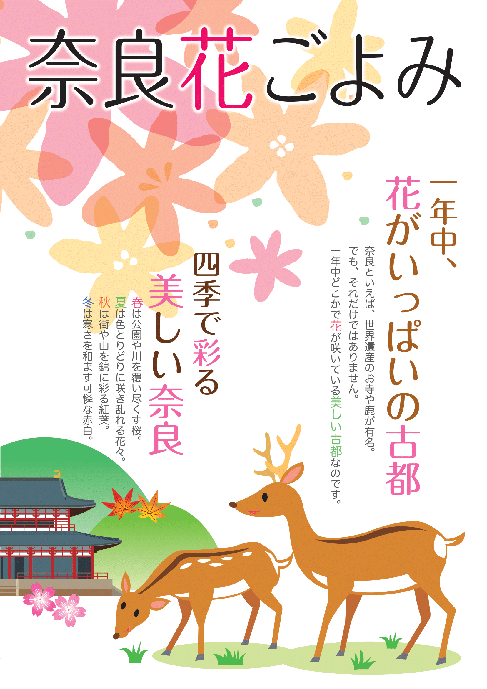
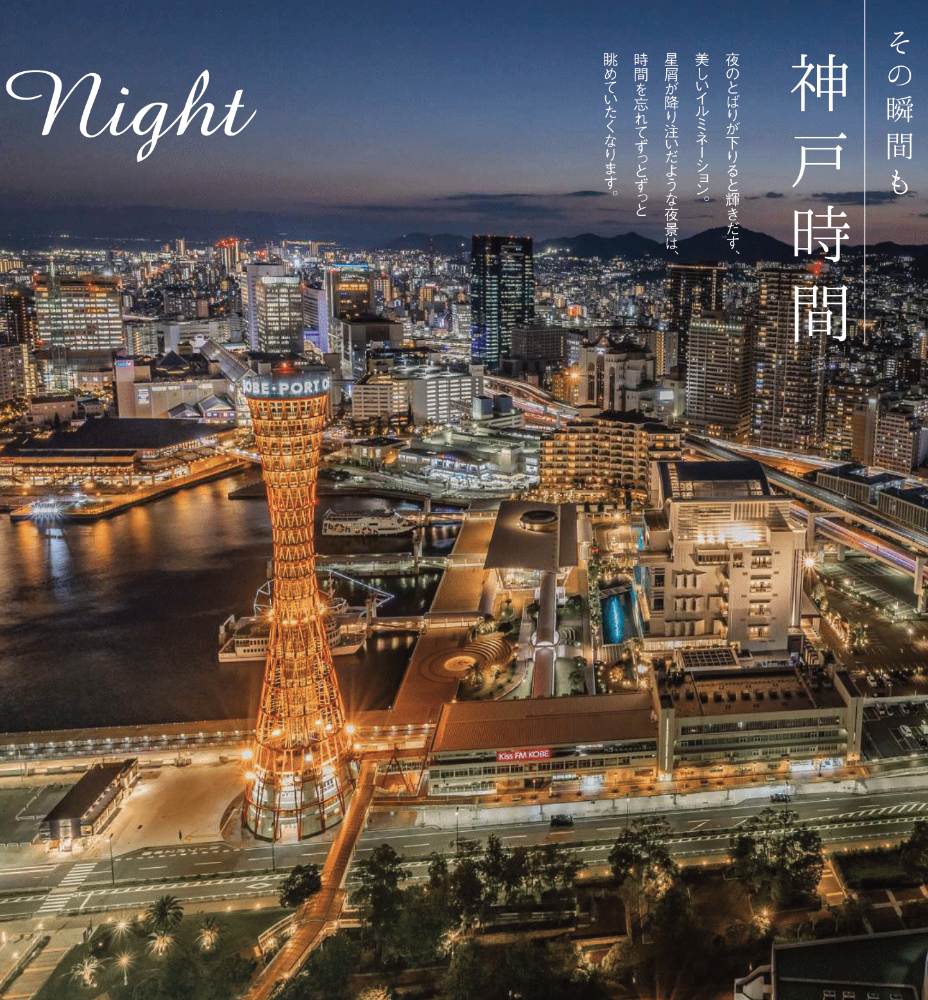
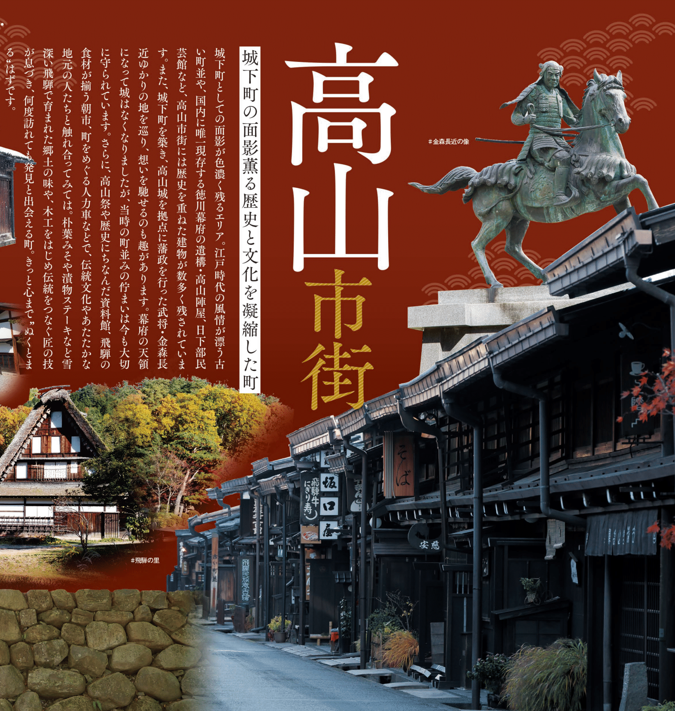

```{=html}
<style type="text/css">

body{
      font-size: 13px;
      font-family: "Roboto Condensed", "Anonymous Pro", "Roboto", "Helvetica Neue";
  }
</style>
```
<link rel="preconnect" href="https://fonts.googleapis.com"> <link rel="preconnect" href="https://fonts.gstatic.com" crossorigin> <link href="https://fonts.googleapis.com/css2?family=Hina+Mincho&family=Klee+One:wght@400;600&family=New+Tegomin&family=Sawarabi+Gothic&family=Shippori+Mincho+B1:wght@400;500&family=Yomogi&display=swap" rel="stylesheet"> <link rel="preconnect" href="https://fonts.googleapis.com"> <link rel="preconnect" href="https://fonts.gstatic.com" crossorigin> <link href="https://fonts.googleapis.com/css2?family=Noto+Sans+JP:wght@100;300;400;500;700&display=swap" rel="stylesheet"> <link rel="preconnect" href="https://fonts.gstatic.com"> <link href="https://fonts.googleapis.com/css2?family=M+PLUS+Rounded+1c:wght@100;300;400;500;700&display=swap" rel="stylesheet"> <link rel="preconnect" href="https://fonts.gstatic.com"> <link href="https://fonts.googleapis.com/css2?family=Anonymous+Pro&display=swap" rel="stylesheet"> <link href="https://fonts.googleapis.com/css2?family=Anonymous+Pro:ital,wght@0,400;1,700&display=swap" rel="stylesheet"> <link href="https://fonts.googleapis.com/css2?family=Anonymous+Pro:ital,wght@0,400;0,700;1,700&display=swap" rel="stylesheet">

<link rel="preconnect" href="https://fonts.googleapis.com">
<link rel="preconnect" href="https://fonts.gstatic.com" crossorigin>
<link href="https://fonts.googleapis.com/css2?family=Open+Sans:ital,wght@0,300;0,400;0,500;0,600;1,300;1,400;1,500;1,600&display=swap" rel="stylesheet">
<link rel="preconnect" href="https://fonts.googleapis.com">
<link rel="preconnect" href="https://fonts.gstatic.com" crossorigin>
<link href="https://fonts.googleapis.com/css2?family=Hina+Mincho&family=IBM+Plex+Sans+JP:wght@100;200;300;400;500;600&family=Kaisei+Tokumin&family=Klee+One&family=New+Tegomin&family=RocknRoll+One&family=Shippori+Antique+B1&family=Zen+Kaku+Gothic+Antique:wght@300;400;500;700&family=Zen+Kaku+Gothic+New:wght@300;400;500;700&display=swap" rel="stylesheet">

<link rel="preconnect" href="https://fonts.googleapis.com">
<link rel="preconnect" href="https://fonts.gstatic.com" crossorigin>
<link href="https://fonts.googleapis.com/css2?family=Roboto:wght@100;300;400;500;700&display=swap" rel="stylesheet">

<link rel="preconnect" href="https://fonts.googleapis.com">
<link rel="preconnect" href="https://fonts.gstatic.com" crossorigin>
<link href="https://fonts.googleapis.com/css2?family=Roboto+Condensed:wght@300;400;700&family=Roboto+Flex:wght@100;200;300;400;500;600;700&display=swap" rel="stylesheet">

```{css, echo=FALSE}
.my-tbl {
  border: 1px solid rgba(0, 0, 0, 0.1);
}

.my-header {
  border-width: 1px;
}

.my-col {
  border-right: 1px solid rgba(0, 0, 0, 0.05);
}

.my-row:hover {
  background-color: #f5f8ff;
}

.toc-content {
    padding-left: 10px;
    padding-right: 10px;
}

div.add_info {
  padding-top: 0px; 
  padding-bottom: 0px;
  color: 	#264653;
  font-size: 12px;
  font-family: 'Roboto Condensed', 'Zen Kaku Gothic New', sans-serif;
}

```

```{r setup, include=FALSE}
knitr::opts_chunk$set(echo = TRUE)
```

```{css, echo=FALSE}
@media(prefers-color-scheme: light) {
  body {
    <!-- background-color: black; -->
    filter: invert(0);
  }
}
```

```{r, echo=FALSE, message=FALSE}
library(tidyverse)
library(reactable)
library(htmltools)
library(bslib)
library(dplyr)
library(purrr)
library(readr)
library(vembedr)
options(readr.show_col_types = FALSE)
```

```{r, echo=FALSE, message=FALSE, error=FALSE}
expvcb <- read_csv("jpdb/EXPWRD-WRDS.csv")
```

# <b> Experience-Japan </b> {.tabset}

## <b> Places </b> {.tabset}

### Nara

**Nara**

<div class = "row">
<div class = "col-sm-4">
[Nara](https://www.city.nara.lg.jp) [【奈良】](https://www.city.nara.lg.jp) was the national capital of Japan from 710 to 784—when it was called Heijō-kyō—and retains the atmosphere of ancient Japan. The city is most noted for the many ancient Japanese Buddhist buildings, artifacts, pilgrimage routes, world heritage sites and deers.

**Vocabularies:**  

```{r, echo=FALSE, message=FALSE}

expvcba <- expvcb %>% slice(21:63)

reactable(
  expvcba,
  columns = list(
    Words = colDef(
      cell = function(value, index) {
        Reading <- expvcba$Reading[index]
        Reading <- if (!is.na(Reading)) Reading else ""
        tagList(
          div(style = list(fontSize = 7, color = '#008000'), Reading),
          div(style = list(fontSize = 13.5), value),
        )
      },
      align = "left"
    ),
    Meaning = colDef(minWidth = 115,align = "left"),
    Reading = colDef(show = FALSE)

  ),
  defaultPageSize = 10,
  theme = reactableTheme(
    # Vertically center cells
    cellStyle = list(display = "flex", flexDirection = "column", justifyContent = "center"),
    searchInputStyle = list(
      paddingLeft = "8px",
      paddingTop = "8px",
      paddingBottom = "8px",
      width = "100%"
    )
  ),
  showPageInfo = FALSE, bordered = TRUE, searchable = FALSE, sortable = FALSE, paginationType = "simple",
  
  style = list(fontFamily = "Noto Sans JP, Heiti SC, Hiragino Maru Gothic ProN, Anonymous Pro , monospace, Helvetica Neue", fontSize = "11px")
)

```

</div>

<div class = "col-sm-8">
{width=600px}
<br>
<center>**Visit** the official website of [**Nara**](https://www.city.nara.lg.jp) for more information.</center>
</div>
</div>

------------------------------------------------------------------------

### Kobe

**Kobe**

<div class = "row">
<div class = "col-sm-4">
[Kobe](https://www.city.kobe.lg.jp) [【神戸】](https://www.city.kobe.lg.jp) is the capital city of Hyōgo Prefecture and a prominent seaport city but it is close to Rokko mountain range as well. 

**Vocabularies:**  

```{r, echo=FALSE, message=FALSE}

expvcba <- expvcb %>% slice(64:82)

reactable(
  expvcba,
  columns = list(
    Words = colDef(
      cell = function(value, index) {
        Reading <- expvcba$Reading[index]
        Reading <- if (!is.na(Reading)) Reading else ""
        tagList(
          div(style = list(fontSize = 7), Reading),
          div(style = list(fontSize = 13.5), value),
        )
      },
      align = "left"
    ),
    Meaning = colDef(minWidth = 115,align = "left"),
    Reading = colDef(show = FALSE)

  ),
  defaultPageSize = 10,
  theme = reactableTheme(
    # Vertically center cells
    cellStyle = list(display = "flex", flexDirection = "column", justifyContent = "center"),
    searchInputStyle = list(
      paddingLeft = "8px",
      paddingTop = "8px",
      paddingBottom = "8px",
      width = "100%"
    )
  ),
  showPageInfo = FALSE, bordered = TRUE, searchable = FALSE, sortable = FALSE, paginationType = "simple",
  
  style = list(fontFamily = "Noto Sans JP, Heiti SC, Hiragino Maru Gothic ProN, Anonymous Pro , monospace, Helvetica Neue", fontSize = "11px")
)

```

</div>

<div class = "col-sm-8">
{width=600px}
<br>
<center>**Visit** the official website of [**Nara**](https://www.city.nara.lg.jp) and [**Feel-Kobe**](https://www.feel-kobe.jp) for more information.</center>
</div>
</div>

------------------------------------------------------------------------

### Aizu

**Aizu.Wakamatsu**

<div class = "row">
<div class = "col-sm-4">
[Aizu.Wakamatsu](https://www.japan-guide.com/e/e7700.html) [【会津若松】](https://www.city.aizuwakamatsu.fukushima.jp/zokusei/kanko/) is a castle town in the interior of Fukushima Prefecture which is known for its award-winning sake and its samurai tradition.

**Vocabularies:**  

```{r, echo=FALSE, message=FALSE}

expvcba <- expvcb %>% slice(1:20)

reactable(
  expvcba,
  columns = list(
    Words = colDef(
      cell = function(value, index) {
        Reading <- expvcba$Reading[index]
        Reading <- if (!is.na(Reading)) Reading else ""
        tagList(
          div(style = list(fontSize = 7), Reading),
          div(style = list(fontSize = 13.5), value),
        )
      },
      align = "left"
    ),
    Meaning = colDef(minWidth = 115,align = "left"),
    Reading = colDef(show = FALSE)

  ),
  defaultPageSize = 10,
  theme = reactableTheme(
    # Vertically center cells
    cellStyle = list(display = "flex", flexDirection = "column", justifyContent = "center"),
    searchInputStyle = list(
      paddingLeft = "8px",
      paddingTop = "8px",
      paddingBottom = "8px",
      width = "100%"
    )
  ),
  showPageInfo = FALSE, bordered = TRUE, searchable = FALSE, sortable = FALSE, paginationType = "simple",
  
  style = list(fontFamily = "Noto Sans JP, Heiti SC, Hiragino Maru Gothic ProN, Anonymous Pro , monospace, Helvetica Neue", fontSize = "11px")
)

```

</div>

<div class = "col-sm-8">
{width=600px}
<br>
<center>**Visit** the official website of [**Aizu.Wakamatsu**](https://www.city.aizuwakamatsu.fukushima.jp) for more information.</center>
<center>**Others**  [**Gokoju.Aizu**](https://gokujo-aizu.com/?doing_wp_cron=1671721577.6576550006866455078125) for more information.</center>
<center>**Others**  [**AizuKanko**](https://www.aizukanko.com) for more information.</center>
</div>
</div>

------------------------------------------------------------------------

### Takayama

**Takayama**

<div class = "row">
<div class = "col-sm-4">
[Takayama](https://www.hidatakayama.or.jp) [【高山】](https://www.hidatakayama.or.jp) s a city in the mountainous Hida region of Gifu Prefecture.

**Vocabularies:**  

```{r, echo=FALSE, message=FALSE}

expvcba <- expvcb %>% slice(82:92)

reactable(
  expvcba,
  columns = list(
    Words = colDef(
      cell = function(value, index) {
        Reading <- expvcba$Reading[index]
        Reading <- if (!is.na(Reading)) Reading else ""
        tagList(
          div(style = list(fontSize = 7), Reading),
          div(style = list(fontSize = 13.5), value),
        )
      },
      align = "left"
    ),
    Meaning = colDef(minWidth = 115,align = "left"),
    Reading = colDef(show = FALSE)

  ),
  defaultPageSize = 10,
  theme = reactableTheme(
    # Vertically center cells
    cellStyle = list(display = "flex", flexDirection = "column", justifyContent = "center"),
    searchInputStyle = list(
      paddingLeft = "8px",
      paddingTop = "8px",
      paddingBottom = "8px",
      width = "100%"
    )
  ),
  showPageInfo = FALSE, bordered = TRUE, searchable = FALSE, sortable = FALSE, paginationType = "simple",
  
  style = list(fontFamily = "Noto Sans JP, Heiti SC, Hiragino Maru Gothic ProN, Anonymous Pro , monospace, Helvetica Neue", fontSize = "11px")
)

```

</div>

<div class = "col-sm-8">
{width=600px}
<br>
<center>**Visit** the official website of [**Takayama**](https://www.hidatakayama.or.jp) for more information.</center>
</div>
</div>

------------------------------------------------------------------------

## <b> Food </b> {.tabset}

------------------------------------------------------------------------

## <b> Festival </b> {.tabset}

------------------------------------------------------------------------
