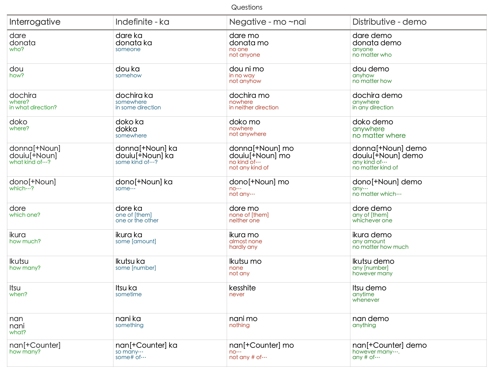

```{=html}
<style type="text/css">

body{
      font-size: 13px;
      font-family: "Anonymous Pro", "Roboto", "Helvetica Neue";
  }
</style>
```
<link rel="preconnect" href="https://fonts.googleapis.com"> <link rel="preconnect" href="https://fonts.gstatic.com" crossorigin> <link href="https://fonts.googleapis.com/css2?family=Hina+Mincho&family=Klee+One:wght@400;600&family=New+Tegomin&family=Sawarabi+Gothic&family=Shippori+Mincho+B1:wght@400;500&family=Yomogi&display=swap" rel="stylesheet"> <link rel="preconnect" href="https://fonts.googleapis.com"> <link rel="preconnect" href="https://fonts.gstatic.com" crossorigin> <link href="https://fonts.googleapis.com/css2?family=Noto+Sans+JP:wght@100;300;400;500;700&display=swap" rel="stylesheet"> <link rel="preconnect" href="https://fonts.gstatic.com"> <link href="https://fonts.googleapis.com/css2?family=M+PLUS+Rounded+1c:wght@100;300;400;500;700&display=swap" rel="stylesheet"> <link rel="preconnect" href="https://fonts.gstatic.com"> <link href="https://fonts.googleapis.com/css2?family=Anonymous+Pro&display=swap" rel="stylesheet"> <link href="https://fonts.googleapis.com/css2?family=Anonymous+Pro:ital,wght@0,400;1,700&display=swap" rel="stylesheet"> <link href="https://fonts.googleapis.com/css2?family=Anonymous+Pro:ital,wght@0,400;0,700;1,700&display=swap" rel="stylesheet">

```{css, echo=FALSE}
.my-tbl {
  border: 1px solid rgba(0, 0, 0, 0.1);
}

.my-header {
  border-width: 1px;
}

.my-col {
  border-right: 1px solid rgba(0, 0, 0, 0.05);
}

.my-row:hover {
  background-color: #f5f8ff;
}

.toc-content {
    padding-left: 10px;
    padding-right: 10px;
}
```

```{r setup, include=FALSE}
knitr::opts_chunk$set(echo = TRUE)
```

```{css, echo=FALSE}
@media(prefers-color-scheme: dark) {
  body {
    background-color: black;
    filter: invert(1);
  }
}
```

```{r, echo=FALSE, message=FALSE}
library(tidyverse)
library(reactable)
library(htmltools)
library(bslib)
library(dplyr)
library(purrr)
library(readr)
library(vembedr)
options(readr.show_col_types = FALSE)
```

```{r, echo=FALSE, message=FALSE, error=FALSE}
learn <- read_csv("jpdb/LEARN-MEM.csv")
scknj5 <- read_csv("jpdb/SCRPT1-KNJD5.csv")
scknj4 <- read_csv("jpdb/SCRPT2-KNJD4.csv")
scknj3 <- read_csv("jpdb/SCRPT3-KNJD3.csv")
scknj2 <- read_csv("jpdb/SCRPT4-KNJD2.csv")
scknj1 <- read_csv("jpdb/SCRPT5-KNJD1.csv")
knjsnt <- read_csv("jpdb/SCRPTSNV2-SNT.csv")
knjsnt <- read_csv("jpdb/SCRPTSNV2-SNT.csv")
inkwrds <- read_csv("jpdb/INKSITWRD-WRDS.csv")
inkexpr <- read_csv("jpdb/INKSITEXP-EXP.csv")
spphr <- read_csv("jpdb/NHGSPKPHR-PHRS.csv")
smpsnt <- read_csv("jpdb/NHGSPKSMP-SNTS.csv")
cmnknjp <- read_csv("jpdb/SPKCSL-CSLSNT.csv")
expspk <- read_csv("jpdb/EXPTSN-EXP.csv")
dct <- read_csv("jpdb/RDNSHRT-WRDS.csv")
nadj2 <- read_csv("jpdb/ADJI-ADJI.csv")
nadj1 <- read_csv("jpdb/ADJNA-ADJNA.csv")
adv1 <- read_csv("jpdb/ADV-ADV.csv")
```

------------------------------------------------------------------------

# <b> Introduction </b> {.tabset}

## Foreword

School in the countryside.

------------------------------------------------------------------------

## Scope

Intended for: Beginner to Intermediate  
Not for: Total Beginner

------------------------------------------------------------------------

## Version

Version 🆅.3.1A

------------------------------------------------------------------------

# <b> Learn </b> {.tabset}

## Terms

<h6>

**Terminologies**

</h6>

```{r, echo=FALSE, message=FALSE}

learn.terms <- learn %>% slice(2:7)

reactable(
  learn.terms,
  columns = list(
    Concept = colDef(align = "left"),
    Information = colDef(minWidth = 320,align = "left")

  ),
  defaultPageSize = 9,
  theme = reactableTheme(
    # Vertically center cells
    cellStyle = list(display = "flex", flexDirection = "column", justifyContent = "center"),
    searchInputStyle = list(
      paddingLeft = "8px",
      paddingTop = "8px",
      paddingBottom = "8px",
      width = "100%"
    )
  ),
  showPageInfo = FALSE, bordered = TRUE, searchable = FALSE, sortable = FALSE, paginationType = "numbers",
  
  style = list(fontFamily = "Noto Sans JP, Heiti SC, Hiragino Maru Gothic ProN, Anonymous Pro , monospace, Helvetica Neue", fontSize = "11px")
)

```

<h6> </h6>

------------------------------------------------------------------------

## Concepts

<h6>

**Methods**

</h6>

```{r, echo=FALSE, message=FALSE}

learn.method <- learn %>% slice(10:11)

reactable(
  learn.method,
  columns = list(
    Concept = colDef(align = "left"),
    Information = colDef(minWidth = 320,align = "left")

  ),
  defaultPageSize = 9,
  theme = reactableTheme(
    # Vertically center cells
    cellStyle = list(display = "flex", flexDirection = "column", justifyContent = "center"),
    searchInputStyle = list(
      paddingLeft = "8px",
      paddingTop = "8px",
      paddingBottom = "8px",
      width = "100%"
    )
  ),
  showPageInfo = FALSE, bordered = TRUE, searchable = FALSE, sortable = FALSE, paginationType = "numbers",
  
  style = list(fontFamily = "Noto Sans JP, Heiti SC, Hiragino Maru Gothic ProN, Anonymous Pro , monospace, Helvetica Neue", fontSize = "11px")
)

```

<h6>

**Ways**

</h6>


```{r, echo=FALSE, message=FALSE}

learn.ways <- learn %>% slice(14:17)

reactable(
  learn.ways,
  columns = list(
    Concept = colDef(align = "left"),
    Information = colDef(minWidth = 320,align = "left")

  ),
  defaultPageSize = 9,
  theme = reactableTheme(
    # Vertically center cells
    cellStyle = list(display = "flex", flexDirection = "column", justifyContent = "center"),
    searchInputStyle = list(
      paddingLeft = "8px",
      paddingTop = "8px",
      paddingBottom = "8px",
      width = "100%"
    )
  ),
  showPageInfo = FALSE, bordered = TRUE, searchable = FALSE, sortable = FALSE, paginationType = "numbers",
  
  style = list(fontFamily = "Noto Sans JP, Heiti SC, Hiragino Maru Gothic ProN, Anonymous Pro , monospace, Helvetica Neue", fontSize = "11px")
)

```

<h6> </h6>

------------------------------------------------------------------------

## Strategy {.tabset}

### Input Stacking {.tabset}

<h6>

**Approach**

</h6>

```{r, echo=FALSE, message=FALSE}

learn.approach <- learn %>% slice(20:21)

reactable(
  learn.approach,
  columns = list(
    Concept = colDef(align = "left"),
    Information = colDef(minWidth = 320,align = "left")

  ),
  defaultPageSize = 15,
  theme = reactableTheme(
    cellStyle = list(display = "flex", flexDirection = "column", justifyContent = "center"),
    searchInputStyle = list(
      paddingLeft = "8px",
      paddingTop = "8px",
      paddingBottom = "8px",
      width = "100%"
    )
  ),
  showPageInfo = FALSE, bordered = TRUE, searchable = FALSE, sortable = FALSE, paginationType = "numbers",
  
  style = list(fontFamily = "Noto Sans JP, Heiti SC, Hiragino Maru Gothic ProN, Anonymous Pro , monospace, Helvetica Neue", fontSize = "11px")
)

```

<h6>

**Learn the Script**

</h6>

```{r, echo=FALSE, message=FALSE}

learn.approach <- learn %>% slice(32:36)

reactable(
  learn.approach,
  columns = list(
    Concept = colDef(align = "left"),
    Information = colDef(minWidth = 320,align = "left")

  ),
  defaultPageSize = 15,
  theme = reactableTheme(
    cellStyle = list(display = "flex", flexDirection = "column", justifyContent = "center"),
    searchInputStyle = list(
      paddingLeft = "8px",
      paddingTop = "8px",
      paddingBottom = "8px",
      width = "100%"
    )
  ),
  showPageInfo = FALSE, bordered = TRUE, searchable = FALSE, sortable = FALSE, paginationType = "numbers",
  
  style = list(fontFamily = "Noto Sans JP, Heiti SC, Hiragino Maru Gothic ProN, Anonymous Pro , monospace, Helvetica Neue", fontSize = "11px")
)

```

<h6>

**Learn the importance of verbs**

</h6>

```{r, echo=FALSE, message=FALSE}

learn.verb <- learn %>% slice(104:104)

reactable(
  learn.approach,
  columns = list(
    Concept = colDef(align = "left"),
    Information = colDef(minWidth = 320,align = "left")

  ),
  defaultPageSize = 15,
  theme = reactableTheme(
    cellStyle = list(display = "flex", flexDirection = "column", justifyContent = "center"),
    searchInputStyle = list(
      paddingLeft = "8px",
      paddingTop = "8px",
      paddingBottom = "8px",
      width = "100%"
    )
  ),
  showPageInfo = FALSE, bordered = TRUE, searchable = FALSE, sortable = FALSE, paginationType = "numbers",
  
  style = list(fontFamily = "Noto Sans JP, Heiti SC, Hiragino Maru Gothic ProN, Anonymous Pro , monospace, Helvetica Neue", fontSize = "11px")
)

```

<h6>

**Learn on a given situation**

</h6>

```{r, echo=FALSE, message=FALSE}

learn.sit <- learn %>% slice(107:109)

reactable(
  learn.sit,
  columns = list(
    Concept = colDef(align = "left"),
    Information = colDef(minWidth = 320,align = "left")

  ),
  defaultPageSize = 15,
  theme = reactableTheme(
    cellStyle = list(display = "flex", flexDirection = "column", justifyContent = "center"),
    searchInputStyle = list(
      paddingLeft = "8px",
      paddingTop = "8px",
      paddingBottom = "8px",
      width = "100%"
    )
  ),
  showPageInfo = FALSE, bordered = TRUE, searchable = FALSE, sortable = FALSE, paginationType = "numbers",
  
  style = list(fontFamily = "Noto Sans JP, Heiti SC, Hiragino Maru Gothic ProN, Anonymous Pro , monospace, Helvetica Neue", fontSize = "11px")
)

```

<h6> </h6>

------------------------------------------------------------------------

### Output Stacking {.tabset}

<h6>

**Learn communication skills**

</h6>

```{r, echo=FALSE, message=FALSE}

learn.commskl <- learn %>% slice(112:112)

reactable(
  learn.commskl,
  columns = list(
    Concept = colDef(align = "left"),
    Information = colDef(minWidth = 320,align = "left")

  ),
  defaultPageSize = 15,
  theme = reactableTheme(
    cellStyle = list(display = "flex", flexDirection = "column", justifyContent = "center"),
    searchInputStyle = list(
      paddingLeft = "8px",
      paddingTop = "8px",
      paddingBottom = "8px",
      width = "100%"
    )
  ),
  showPageInfo = FALSE, bordered = TRUE, searchable = FALSE, sortable = FALSE, paginationType = "numbers",
  
  style = list(fontFamily = "Noto Sans JP, Heiti SC, Hiragino Maru Gothic ProN, Anonymous Pro , monospace, Helvetica Neue", fontSize = "11px")
)

```

<h6> </h6>

------------------------------------------------------------------------

## Techniques {.tabset}

<h6>

**Learning Techniques**

</h6>

```{r, echo=FALSE, message=FALSE}

learn.tech <- learn %>% slice(115:120)

reactable(
  learn.tech,
  columns = list(
    Concept = colDef(align = "left"),
    Information = colDef(minWidth = 320,align = "left")

  ),
  defaultPageSize = 15,
  theme = reactableTheme(
    cellStyle = list(display = "flex", flexDirection = "column", justifyContent = "center"),
    searchInputStyle = list(
      paddingLeft = "8px",
      paddingTop = "8px",
      paddingBottom = "8px",
      width = "100%"
    )
  ),
  showPageInfo = FALSE, bordered = TRUE, searchable = FALSE, sortable = FALSE, paginationType = "numbers",
  
  style = list(fontFamily = "Noto Sans JP, Heiti SC, Hiragino Maru Gothic ProN, Anonymous Pro , monospace, Helvetica Neue", fontSize = "11px")
)

```

<h6> </h6>

------------------------------------------------------------------------

# <b> Memorize </b> {.tabset}

## Concept {.tabset}

<h6>

**Memory Formation**

</h6>

```{r, echo=FALSE, message=FALSE}

learn.memform <- learn %>% slice(130:133)

reactable(
  learn.memform,
  columns = list(
    Concept = colDef(align = "left"),
    Information = colDef(minWidth = 320,align = "left")

  ),
  defaultPageSize = 15,
  theme = reactableTheme(
    cellStyle = list(display = "flex", flexDirection = "column", justifyContent = "center"),
    searchInputStyle = list(
      paddingLeft = "8px",
      paddingTop = "8px",
      paddingBottom = "8px",
      width = "100%"
    )
  ),
  showPageInfo = FALSE, bordered = TRUE, searchable = FALSE, sortable = FALSE, paginationType = "numbers",
  
  style = list(fontFamily = "Noto Sans JP, Heiti SC, Hiragino Maru Gothic ProN, Anonymous Pro , monospace, Helvetica Neue", fontSize = "11px")
)

```

<h6> </h6>

------------------------------------------------------------------------

## Memories {.tabset}

<h6>

**Types of memories**

</h6>

```{r, echo=FALSE, message=FALSE}

learn.memtype <- learn %>% slice(136:138)

reactable(
  learn.memtype,
  columns = list(
    Concept = colDef(align = "left"),
    Information = colDef(minWidth = 320,align = "left")

  ),
  defaultPageSize = 15,
  theme = reactableTheme(
    cellStyle = list(display = "flex", flexDirection = "column", justifyContent = "center"),
    searchInputStyle = list(
      paddingLeft = "8px",
      paddingTop = "8px",
      paddingBottom = "8px",
      width = "100%"
    )
  ),
  showPageInfo = FALSE, bordered = TRUE, searchable = FALSE, sortable = FALSE, paginationType = "numbers",
  
  style = list(fontFamily = "Noto Sans JP, Heiti SC, Hiragino Maru Gothic ProN, Anonymous Pro , monospace, Helvetica Neue", fontSize = "11px")
)

```

<h6>

**Kinds of memories**

</h6>

```{r, echo=FALSE, message=FALSE}

learn.memkind <- learn %>% slice(123:127)

reactable(
  learn.memkind,
  columns = list(
    Concept = colDef(align = "left"),
    Information = colDef(minWidth = 320,align = "left")

  ),
  defaultPageSize = 15,
  theme = reactableTheme(
    cellStyle = list(display = "flex", flexDirection = "column", justifyContent = "center"),
    searchInputStyle = list(
      paddingLeft = "8px",
      paddingTop = "8px",
      paddingBottom = "8px",
      width = "100%"
    )
  ),
  showPageInfo = FALSE, bordered = TRUE, searchable = FALSE, sortable = FALSE, paginationType = "numbers",
  
  style = list(fontFamily = "Noto Sans JP, Heiti SC, Hiragino Maru Gothic ProN, Anonymous Pro , monospace, Helvetica Neue", fontSize = "11px")
)

```

<h6> </h6>

------------------------------------------------------------------------

## Enconding {.tabset}

<h6>

**Encoding Process**

</h6>

```{r, echo=FALSE, message=FALSE}

learn.memencode <- learn %>% slice(141:147)

reactable(
  learn.memencode,
  columns = list(
    Concept = colDef(align = "left"),
    Information = colDef(minWidth = 320,align = "left")

  ),
  defaultPageSize = 15,
  theme = reactableTheme(
    cellStyle = list(display = "flex", flexDirection = "column", justifyContent = "center"),
    searchInputStyle = list(
      paddingLeft = "8px",
      paddingTop = "8px",
      paddingBottom = "8px",
      width = "100%"
    )
  ),
  showPageInfo = FALSE, bordered = TRUE, searchable = FALSE, sortable = FALSE, paginationType = "numbers",
  
  style = list(fontFamily = "Noto Sans JP, Heiti SC, Hiragino Maru Gothic ProN, Anonymous Pro , monospace, Helvetica Neue", fontSize = "11px")
)

```

<h6> </h6>


------------------------------------------------------------------------

## Techniques {.tabset}

<h6>

**Memorizing Techniques**

</h6>

```{r, echo=FALSE, message=FALSE}

learn.memtech <- learn %>% slice(154:159)

reactable(
  learn.memtech,
  columns = list(
    Concept = colDef(align = "left"),
    Information = colDef(minWidth = 320,align = "left")

  ),
  defaultPageSize = 15,
  theme = reactableTheme(
    cellStyle = list(display = "flex", flexDirection = "column", justifyContent = "center"),
    searchInputStyle = list(
      paddingLeft = "8px",
      paddingTop = "8px",
      paddingBottom = "8px",
      width = "100%"
    )
  ),
  showPageInfo = FALSE, bordered = TRUE, searchable = FALSE, sortable = FALSE, paginationType = "numbers",
  
  style = list(fontFamily = "Noto Sans JP, Heiti SC, Hiragino Maru Gothic ProN, Anonymous Pro , monospace, Helvetica Neue", fontSize = "11px")
)

```

<h6> </h6>

------------------------------------------------------------------------

# <b> Scripts </b> {.tabset}

There are 3 writing system used in Japanese namely the **Kanji**, **Hiragana** and the **Katakana** scripts.

## Kanji {.tabset}

**Kanji** was based on Chinese characters which represents a word and a meaning.

### L5 {.tabset}

```{r, echo=FALSE, message=FALSE}

scknj5 <- scknj5[sample(1:nrow(scknj5)),]

reactable(
  scknj5,
  columns = list(
    Kanji = colDef(
      # Show species under character names
      cell = function(value, index) {
        Meaning <- scknj5$Meaning[index]
        Meaning <- if (!is.na(Meaning)) Meaning else ""
        NR <- scknj5$NR[index]
        NR <- if (!is.na(NR)) NR else ""
        KR <- scknj5$KR[index]
        KR <- if (!is.na(KR)) KR else ""
        tagList(
          div(style = list(fontSize = 30, fontWeight = 500), value),
          div(style = list(fontSize = 9, color = '#008000'), NR),
          div(style = list(fontSize = 9, color = '#800000'), KR),
          div(style = list(fontSize = 9, fontWeight = 500), Meaning)
        )
      },
      align = "center"
    ),
    W1 = colDef(
      cell = function(value, index) {
        M1 <- scknj5$M1[index]
        M1 <- if (!is.na(M1)) M1 else ""
        R1 <- scknj5$R1[index]
        R1 <- if (!is.na(R1)) R1 else ""
        tagList(
          div(style = list(fontSize = 19, fontWeight = 500), value),
          div(style = list(fontSize = 9, fontWeight = 400), R1),
          div(style = list(fontSize = 9, fontWeight = 400), M1),
        )
      },
      align = "center"
    ),
    W2 = colDef(
      cell = function(value, index) {
        M2 <- scknj5$M2[index]
        M2 <- if (!is.na(M2)) M2 else ""
        R2 <- scknj5$R2[index]
        R2 <- if (!is.na(M2)) R2 else ""
        tagList(
          div(style = list(fontSize = 19, fontWeight = 500), value),
          div(style = list(fontSize = 9, fontWeight = 400), R2),
          div(style = list(fontSize = 9, fontWeight = 400), M2),
        )
      },
      align = "center"
    ),
    W3 = colDef(
      cell = function(value, index) {
        M3 <- scknj5$M3[index]
        M3 <- if (!is.na(M3)) M3 else ""
        R3 <- scknj5$R3[index]
        R3 <- if (!is.na(R3)) R3 else ""
        tagList(
          div(style = list(fontSize = 19, fontWeight = 500), value),
          div(style = list(fontSize = 9, fontWeight = 400), R3),
          div(style = list(fontSize = 9, fontWeight = 400), M3),
        )
      },
      align = "center"
    ),
    R1 = colDef(show = FALSE),
    R2 = colDef(show = FALSE),
    R3 = colDef(show = FALSE),
    M1 = colDef(show = FALSE),
    M2 = colDef(show = FALSE),
    M3 = colDef(show = FALSE),
    Meaning = colDef(show = FALSE),
    NR = colDef(show = FALSE),
    KR = colDef(show = FALSE)
  ),
  defaultPageSize = 5,
  theme = reactableTheme(
    cellStyle = list(display = "flex", flexDirection = "column", justifyContent = "center", fontSize = "11px", height = 100),
    searchInputStyle = list(
      paddingLeft = "8px",
      paddingTop = "8px",
      paddingBottom = "8px",
      width = "100%",
      fontSize = "11px"
    )
  ),
  showPageInfo = FALSE, bordered = TRUE, searchable = TRUE, sortable = FALSE, paginationType = "numbers",

  style = list(fontFamily = "Noto Sans JP, Heiti SC, Hiragino Maru Gothic ProN, Anonymous Pro , monospace, Helvetica Neue", fontSize = "11px")
)

```

------------------------------------------------------------------------

### L4 {.tabset}

```{r, echo=FALSE, message=FALSE}

scknj4 <- scknj4[sample(1:nrow(scknj4)),]

reactable(
  scknj4,
  columns = list(
    Kanji = colDef(
      # Show species under character names
      cell = function(value, index) {
        Meaning <- scknj4$Meaning[index]
        Meaning <- if (!is.na(Meaning)) Meaning else ""
        NR <- scknj4$NR[index]
        NR <- if (!is.na(NR)) NR else ""
        KR <- scknj4$KR[index]
        KR <- if (!is.na(KR)) KR else ""
        tagList(
          div(style = list(fontSize = 30, fontWeight = 500), value),
          div(style = list(fontSize = 9, color = '#008000'), NR),
          div(style = list(fontSize = 9, color = '#800000'), KR),
          div(style = list(fontSize = 9, fontWeight = 500), Meaning)
        )
      },
      align = "center"
    ),
    W1 = colDef(
      cell = function(value, index) {
        M1 <- scknj4$M1[index]
        M1 <- if (!is.na(M1)) M1 else ""
        R1 <- scknj4$R1[index]
        R1 <- if (!is.na(R1)) R1 else ""
        tagList(
          div(style = list(fontSize = 19, fontWeight = 500), value),
          div(style = list(fontSize = 9, fontWeight = 400), R1),
          div(style = list(fontSize = 9, fontWeight = 400), M1),
        )
      },
      align = "center"
    ),
    W2 = colDef(
      cell = function(value, index) {
        M2 <- scknj4$M2[index]
        M2 <- if (!is.na(M2)) M2 else ""
        R2 <- scknj4$R2[index]
        R2 <- if (!is.na(M2)) R2 else ""
        tagList(
          div(style = list(fontSize = 19, fontWeight = 500), value),
          div(style = list(fontSize = 9, fontWeight = 400), R2),
          div(style = list(fontSize = 9, fontWeight = 400), M2),
        )
      },
      align = "center"
    ),
    W3 = colDef(
      cell = function(value, index) {
        M3 <- scknj4$M3[index]
        M3 <- if (!is.na(M3)) M3 else ""
        R3 <- scknj4$R3[index]
        R3 <- if (!is.na(R3)) R3 else ""
        tagList(
          div(style = list(fontSize = 19, fontWeight = 500), value),
          div(style = list(fontSize = 9, fontWeight = 400), R3),
          div(style = list(fontSize = 9, fontWeight = 400), M3),
        )
      },
      align = "center"
    ),
    R1 = colDef(show = FALSE),
    R2 = colDef(show = FALSE),
    R3 = colDef(show = FALSE),
    M1 = colDef(show = FALSE),
    M2 = colDef(show = FALSE),
    M3 = colDef(show = FALSE),
    Meaning = colDef(show = FALSE),
    NR = colDef(show = FALSE),
    KR = colDef(show = FALSE)
  ),
  defaultPageSize = 5,
  theme = reactableTheme(
    cellStyle = list(display = "flex", flexDirection = "column", justifyContent = "center", fontSize = "11px", height = 100),
    searchInputStyle = list(
      paddingLeft = "8px",
      paddingTop = "8px",
      paddingBottom = "8px",
      width = "100%",
      fontSize = "11px"
    )
  ),
  showPageInfo = FALSE, bordered = TRUE, searchable = TRUE, sortable = FALSE, paginationType = "numbers",

  style = list(fontFamily = "Noto Sans JP, Heiti SC, Hiragino Maru Gothic ProN, Anonymous Pro , monospace, Helvetica Neue", fontSize = "11px")
)

```

------------------------------------------------------------------------

### L3 {.tabset}

```{r, echo=FALSE, message=FALSE}

scknj3 <- scknj3[sample(1:nrow(scknj3)),]

reactable(
  scknj3,
  columns = list(
    Kanji = colDef(
      # Show species under character names
      cell = function(value, index) {
        Meaning <- scknj3$Meaning[index]
        Meaning <- if (!is.na(Meaning)) Meaning else ""
        NR <- scknj3$NR[index]
        NR <- if (!is.na(NR)) NR else ""
        KR <- scknj3$KR[index]
        KR <- if (!is.na(KR)) KR else ""
        tagList(
          div(style = list(fontSize = 30, fontWeight = 500), value),
          div(style = list(fontSize = 9, color = '#008000'), NR),
          div(style = list(fontSize = 9, color = '#800000'), KR),
          div(style = list(fontSize = 9, fontWeight = 500), Meaning)
        )
      },
      align = "center"
    ),
    W1 = colDef(
      cell = function(value, index) {
        M1 <- scknj3$M1[index]
        M1 <- if (!is.na(M1)) M1 else ""
        R1 <- scknj3$R1[index]
        R1 <- if (!is.na(R1)) R1 else ""
        tagList(
          div(style = list(fontSize = 19, fontWeight = 500), value),
          div(style = list(fontSize = 9, fontWeight = 400), R1),
          div(style = list(fontSize = 9, fontWeight = 400), M1),
        )
      },
      align = "center"
    ),
    W2 = colDef(
      cell = function(value, index) {
        M2 <- scknj3$M2[index]
        M2 <- if (!is.na(M2)) M2 else ""
        R2 <- scknj3$R2[index]
        R2 <- if (!is.na(M2)) R2 else ""
        tagList(
          div(style = list(fontSize = 19, fontWeight = 500), value),
          div(style = list(fontSize = 9, fontWeight = 400), R2),
          div(style = list(fontSize = 9, fontWeight = 400), M2),
        )
      },
      align = "center"
    ),
    W3 = colDef(
      cell = function(value, index) {
        M3 <- scknj3$M3[index]
        M3 <- if (!is.na(M3)) M3 else ""
        R3 <- scknj3$R3[index]
        R3 <- if (!is.na(R3)) R3 else ""
        tagList(
          div(style = list(fontSize = 19, fontWeight = 500), value),
          div(style = list(fontSize = 9, fontWeight = 400), R3),
          div(style = list(fontSize = 9, fontWeight = 400), M3),
        )
      },
      align = "center"
    ),
    R1 = colDef(show = FALSE),
    R2 = colDef(show = FALSE),
    R3 = colDef(show = FALSE),
    M1 = colDef(show = FALSE),
    M2 = colDef(show = FALSE),
    M3 = colDef(show = FALSE),
    Meaning = colDef(show = FALSE),
    NR = colDef(show = FALSE),
    KR = colDef(show = FALSE)
    
  ),
  defaultPageSize = 5,
  theme = reactableTheme(
    cellStyle = list(display = "flex", flexDirection = "column", justifyContent = "center", fontSize = "11px", height = 100),
    searchInputStyle = list(
      paddingLeft = "8px",
      paddingTop = "8px",
      paddingBottom = "8px",
      width = "100%",
      fontSize = "11px"
    )
  ),
  showPageInfo = FALSE, bordered = TRUE, searchable = TRUE, sortable = FALSE, paginationType = "numbers",

  style = list(fontFamily = "Noto Sans JP, Heiti SC, Hiragino Maru Gothic ProN, Anonymous Pro , monospace, Helvetica Neue", fontSize = "11px")
)

```

------------------------------------------------------------------------

### L2 {.tabset}

```{r, echo=FALSE, message=FALSE}

scknj2 <- scknj2[sample(1:nrow(scknj2)),]

reactable(
  scknj2,
  columns = list(
    Kanji = colDef(
      # Show species under character names
      cell = function(value, index) {
        Meaning <- scknj2$Meaning[index]
        Meaning <- if (!is.na(Meaning)) Meaning else ""
        NR <- scknj2$NR[index]
        NR <- if (!is.na(NR)) NR else ""
        KR <- scknj2$KR[index]
        KR <- if (!is.na(KR)) KR else ""
        tagList(
          div(style = list(fontSize = 30, fontWeight = 500), value),
          div(style = list(fontSize = 9, color = '#008000'), NR),
          div(style = list(fontSize = 9, color = '#800000'), KR),
          div(style = list(fontSize = 9, fontWeight = 500), Meaning)
        )
      },
      align = "center"
    ),
    W1 = colDef(
      cell = function(value, index) {
        M1 <- scknj2$M1[index]
        M1 <- if (!is.na(M1)) M1 else ""
        R1 <- scknj2$R1[index]
        R1 <- if (!is.na(R1)) R1 else ""
        tagList(
          div(style = list(fontSize = 19, fontWeight = 500), value),
          div(style = list(fontSize = 9, fontWeight = 400), R1),
          div(style = list(fontSize = 9, fontWeight = 400), M1),
        )
      },
      align = "center"
    ),
    W2 = colDef(
      cell = function(value, index) {
        M2 <- scknj2$M2[index]
        M2 <- if (!is.na(M2)) M2 else ""
        R2 <- scknj2$R2[index]
        R2 <- if (!is.na(M2)) R2 else ""
        tagList(
          div(style = list(fontSize = 19, fontWeight = 500), value),
          div(style = list(fontSize = 9, fontWeight = 400), R2),
          div(style = list(fontSize = 9, fontWeight = 400), M2),
        )
      },
      align = "center"
    ),
    W3 = colDef(
      cell = function(value, index) {
        M3 <- scknj2$M3[index]
        M3 <- if (!is.na(M3)) M3 else ""
        R3 <- scknj2$R3[index]
        R3 <- if (!is.na(R3)) R3 else ""
        tagList(
          div(style = list(fontSize = 19, fontWeight = 500), value),
          div(style = list(fontSize = 9, fontWeight = 400), R3),
          div(style = list(fontSize = 9, fontWeight = 400), M3),
        )
      },
      align = "center"
    ),
    R1 = colDef(show = FALSE),
    R2 = colDef(show = FALSE),
    R3 = colDef(show = FALSE),
    M1 = colDef(show = FALSE),
    M2 = colDef(show = FALSE),
    M3 = colDef(show = FALSE),
    Meaning = colDef(show = FALSE),
    NR = colDef(show = FALSE),
    KR = colDef(show = FALSE)
  ),
  defaultPageSize = 5,
  theme = reactableTheme(
    cellStyle = list(display = "flex", flexDirection = "column", justifyContent = "center", fontSize = "11px", height = 100),
    searchInputStyle = list(
      paddingLeft = "8px",
      paddingTop = "8px",
      paddingBottom = "8px",
      width = "100%",
      fontSize = "11px"
    )
  ),
  showPageInfo = FALSE, bordered = TRUE, searchable = TRUE, sortable = FALSE, paginationType = "numbers",

  style = list(fontFamily = "Noto Sans JP, Heiti SC, Hiragino Maru Gothic ProN, Anonymous Pro , monospace, Helvetica Neue", fontSize = "11px")
)

```

------------------------------------------------------------------------

### L1 {.tabset}

```{r, echo=FALSE, message=FALSE}

scknj1 <- scknj1[sample(1:nrow(scknj1)),]

reactable(
  scknj1,
  columns = list(
    Kanji = colDef(
      # Show species under character names
      cell = function(value, index) {
        Meaning <- scknj1$Meaning[index]
        Meaning <- if (!is.na(Meaning)) Meaning else ""
        NR <- scknj1$NR[index]
        NR <- if (!is.na(NR)) NR else ""
        KR <- scknj1$KR[index]
        KR <- if (!is.na(KR)) KR else ""
        tagList(
          div(style = list(fontSize = 30, fontWeight = 500), value),
          div(style = list(fontSize = 9, color = '#008000'), NR),
          div(style = list(fontSize = 9, color = '#800000'), KR),
          div(style = list(fontSize = 9, fontWeight = 500), Meaning)
        )
      },
      align = "center"
    ),
    W1 = colDef(
      cell = function(value, index) {
        M1 <- scknj1$M1[index]
        M1 <- if (!is.na(M1)) M1 else ""
        R1 <- scknj1$R1[index]
        R1 <- if (!is.na(R1)) R1 else ""
        tagList(
          div(style = list(fontSize = 19, fontWeight = 500), value),
          div(style = list(fontSize = 9, fontWeight = 400), R1),
          div(style = list(fontSize = 9, fontWeight = 400), M1),
        )
      },
      align = "center"
    ),
    W2 = colDef(
      cell = function(value, index) {
        M2 <- scknj1$M2[index]
        M2 <- if (!is.na(M2)) M2 else ""
        R2 <- scknj1$R2[index]
        R2 <- if (!is.na(M2)) R2 else ""
        tagList(
          div(style = list(fontSize = 19, fontWeight = 500), value),
          div(style = list(fontSize = 9, fontWeight = 400), R2),
          div(style = list(fontSize = 9, fontWeight = 400), M2),
        )
      },
      align = "center"
    ),
    W3 = colDef(
      cell = function(value, index) {
        M3 <- scknj1$M3[index]
        M3 <- if (!is.na(M3)) M3 else ""
        R3 <- scknj1$R3[index]
        R3 <- if (!is.na(R3)) R3 else ""
        tagList(
          div(style = list(fontSize = 19, fontWeight = 500), value),
          div(style = list(fontSize = 9, fontWeight = 400), R3),
          div(style = list(fontSize = 9, fontWeight = 400), M3),
        )
      },
      align = "center"
    ),
    R1 = colDef(show = FALSE),
    R2 = colDef(show = FALSE),
    R3 = colDef(show = FALSE),
    M1 = colDef(show = FALSE),
    M2 = colDef(show = FALSE),
    M3 = colDef(show = FALSE),
    Meaning = colDef(show = FALSE),
    NR = colDef(show = FALSE),
    KR = colDef(show = FALSE)
  ),
  defaultPageSize = 5,
  theme = reactableTheme(
    cellStyle = list(display = "flex", flexDirection = "column", justifyContent = "center", fontSize = "11px", height = 100),
    searchInputStyle = list(
      paddingLeft = "8px",
      paddingTop = "8px",
      paddingBottom = "8px",
      width = "100%",
      fontSize = "11px"
    )
  ),
  showPageInfo = FALSE, bordered = TRUE, searchable = TRUE, sortable = FALSE, paginationType = "numbers",

  style = list(fontFamily = "Noto Sans JP, Heiti SC, Hiragino Maru Gothic ProN, Anonymous Pro , monospace, Helvetica Neue", fontSize = "11px")
)

```

------------------------------------------------------------------------

## Hiragana {.tabset}

**Hiragana** is a phonetic script used to represent Japanese sound.


------------------------------------------------------------------------

## Katakana

**Katakana** is a phonetic script used to represent Foreign loan words.


------------------------------------------------------------------------

## Review {.tabset}

### L5 {.tabset}

```{r, echo=FALSE, message=FALSE}

knjsnt.l5 <- knjsnt %>% select(L5, T5)  %>% rename(Sentences = L5, Translation = T5)
knjsnt.l5 <- knjsnt.l5 %>% na.omit(knjsnt.l5)
knjsnt.l5 <- knjsnt.l5[sample(1:nrow(knjsnt.l5)),]

reactable(
  knjsnt.l5,
  columns = list(
      Sentences = colDef(
      cell = function(value, index) {
        Translation <- knjsnt.l5$Translation[index]
        Translation <- if (!is.na(Translation)) Translation else ""
        tagList(
          div(style = list(fontSize = 24, fontWeight = 600), value),
          div(style = list(fontSize = 8, fontWeight = 400, color = '#787878'), Translation)
        )
      },
      align = "center"
    ),
    Translation = colDef(show = FALSE)
  ),
  defaultPageSize = 1,
  theme = reactableTheme(
    # Vertically center cells
    cellStyle = list(display = "flex", flexDirection = "column", justifyContent = "center", height = 250),
    searchInputStyle = list(
      paddingLeft = "8px",
      paddingTop = "8px",
      paddingBottom = "8px",
      width = "100%"
    )
  ),
  showPageInfo = FALSE, bordered = TRUE, searchable = TRUE, sortable = FALSE, paginationType = "numbers",
  
  style = list(fontFamily = "Noto Sans JP, Heiti SC, Hiragino Maru Gothic ProN, Anonymous Pro , monospace, Helvetica Neue", fontSize = "11px")
)

```

------------------------------------------------------------------------

### L4 {.tabset}

```{r, echo=FALSE, message=FALSE}

knjsnt.l4 <- knjsnt %>% select(L4, T4)  %>% rename(Sentences = L4, Translation = T4)
knjsnt.l4 <- knjsnt.l4 %>% na.omit(knjsnt.l4)
knjsnt.l4 <- knjsnt.l4[sample(1:nrow(knjsnt.l4)),]

reactable(
  knjsnt.l4,
  columns = list(
      Sentences = colDef(
      cell = function(value, index) {
        Translation <- knjsnt.l4$Translation[index]
        Translation <- if (!is.na(Translation)) Translation else ""
        tagList(
          div(style = list(fontSize = 24, fontWeight = 600), value),
          div(style = list(fontSize = 8, fontWeight = 400, color = '#787878'), Translation)
        )
      },
      align = "center"
    ),
    Translation = colDef(show = FALSE)
  ),
  defaultPageSize = 1,
  theme = reactableTheme(
    # Vertically center cells
    cellStyle = list(display = "flex", flexDirection = "column", justifyContent = "center", height = 250),
    searchInputStyle = list(
      paddingLeft = "8px",
      paddingTop = "8px",
      paddingBottom = "8px",
      width = "100%"
    )
  ),
  showPageInfo = FALSE, bordered = TRUE, searchable = TRUE, sortable = FALSE, paginationType = "numbers",
  
  style = list(fontFamily = "Noto Sans JP, Heiti SC, Hiragino Maru Gothic ProN, Anonymous Pro , monospace, Helvetica Neue", fontSize = "11px")
)

```

------------------------------------------------------------------------

### L3 {.tabset}

```{r, echo=FALSE, message=FALSE}

knjsnt.l3 <- knjsnt %>% select(L3, T3)  %>% rename(Sentences = L3, Translation = T3)
knjsnt.l3 <- knjsnt.l3 %>% na.omit(knjsnt.l3)
knjsnt.l3 <- knjsnt.l3[sample(1:nrow(knjsnt.l3)),]

reactable(
  knjsnt.l3,
  columns = list(
      Sentences = colDef(
      cell = function(value, index) {
        Translation <- knjsnt.l3$Translation[index]
        Translation <- if (!is.na(Translation)) Translation else ""
        tagList(
          div(style = list(fontSize = 24, fontWeight = 600), value),
          div(style = list(fontSize = 8, fontWeight = 400, color = '#787878'), Translation)
        )
      },
      align = "center"
    ),
    Translation = colDef(show = FALSE)
  ),
  defaultPageSize = 1,
  theme = reactableTheme(
    # Vertically center cells
    cellStyle = list(display = "flex", flexDirection = "column", justifyContent = "center", height = 250),
    searchInputStyle = list(
      paddingLeft = "8px",
      paddingTop = "8px",
      paddingBottom = "8px",
      width = "100%"
    )
  ),
  showPageInfo = FALSE, bordered = TRUE, searchable = TRUE, sortable = FALSE, paginationType = "numbers",
  
  style = list(fontFamily = "Noto Sans JP, Heiti SC, Hiragino Maru Gothic ProN, Anonymous Pro , monospace, Helvetica Neue", fontSize = "11px")
)

```

------------------------------------------------------------------------

### L2 {.tabset}

```{r, echo=FALSE, message=FALSE}

knjsnt.l2 <- knjsnt %>% select(L2, T2)  %>% rename(Sentences = L2, Translation = T2)
knjsnt.l2 <- knjsnt.l2 %>% na.omit(knjsnt.l2)
knjsnt.l2 <- knjsnt.l2[sample(1:nrow(knjsnt.l2)),]

reactable(
  knjsnt.l2,
  columns = list(
      Sentences = colDef(
      cell = function(value, index) {
        Translation <- knjsnt.l2$Translation[index]
        Translation <- if (!is.na(Translation)) Translation else ""
        tagList(
          div(style = list(fontSize = 24, fontWeight = 600), value),
          div(style = list(fontSize = 8, fontWeight = 400, color = '#787878'), Translation)
        )
      },
      align = "center"
    ),
    Translation = colDef(show = FALSE)
  ),
  defaultPageSize = 1,
  theme = reactableTheme(
    # Vertically center cells
    cellStyle = list(display = "flex", flexDirection = "column", justifyContent = "center", height = 250),
    searchInputStyle = list(
      paddingLeft = "8px",
      paddingTop = "8px",
      paddingBottom = "8px",
      width = "100%"
    )
  ),
  showPageInfo = FALSE, bordered = TRUE, searchable = TRUE, sortable = FALSE, paginationType = "numbers",
  
  style = list(fontFamily = "Noto Sans JP, Heiti SC, Hiragino Maru Gothic ProN, Anonymous Pro , monospace, Helvetica Neue", fontSize = "11px")
)

```

------------------------------------------------------------------------

### L1 {.tabset}

```{r, echo=FALSE, message=FALSE}

knjsnt.l1 <- knjsnt %>% select(L1, T1)  %>% rename(Sentences = L1, Translation = T1)
knjsnt.l1 <- knjsnt.l1 %>% na.omit(knjsnt.l1)
knjsnt.l1 <- knjsnt.l1[sample(1:nrow(knjsnt.l1)),]

reactable(
  knjsnt.l1,
  columns = list(
      Sentences = colDef(
      cell = function(value, index) {
        Translation <- knjsnt.l1$Translation[index]
        Translation <- if (!is.na(Translation)) Translation else ""
        tagList(
          div(style = list(fontSize = 24, fontWeight = 600), value),
          div(style = list(fontSize = 8, fontWeight = 400, color = '#787878'), Translation)
        )
      },
      align = "center"
    ),
    Translation = colDef(show = FALSE)
  ),
  defaultPageSize = 1,
  theme = reactableTheme(
    # Vertically center cells
    cellStyle = list(display = "flex", flexDirection = "column", justifyContent = "center", height = 250),
    searchInputStyle = list(
      paddingLeft = "8px",
      paddingTop = "8px",
      paddingBottom = "8px",
      width = "100%"
    )
  ),
  showPageInfo = FALSE, bordered = TRUE, searchable = TRUE, sortable = FALSE, paginationType = "numbers",
  
  style = list(fontFamily = "Noto Sans JP, Heiti SC, Hiragino Maru Gothic ProN, Anonymous Pro , monospace, Helvetica Neue", fontSize = "11px")
)

```

------------------------------------------------------------------------

# <b> Situation </b>

### Chap.01: House Visit {.tabset}

#### Vocabularies

```{r, echo=FALSE, message=FALSE}

inkwrds.1 <- inkwrds %>% slice(1:100)

reactable(
  na.omit(inkwrds.1),
  columns = list(
    Words = colDef(
      cell = function(value, index) {
        Reading <- inkwrds.1$Reading[index]
        Reading <- if (!is.na(Reading)) Reading else ""
        tagList(
          div(style = list(fontSize = 7), Reading),
          div(style = list(fontSize = 13.5), value),
        )
      },
      align = "left"
    ),
    Meaning = colDef(minWidth = 200,align = "left"),
    Reading = colDef(show = FALSE)

  ),
  defaultPageSize = 5,
  theme = reactableTheme(
    # Vertically center cells
    cellStyle = list(display = "flex", flexDirection = "column", justifyContent = "center", height = 40),
    searchInputStyle = list(
      paddingLeft = "8px",
      paddingTop = "8px",
      paddingBottom = "8px",
      width = "100%"
    )
  ),
  showPageInfo = FALSE, bordered = TRUE, searchable = FALSE, sortable = FALSE, paginationType = "simple",
  
  style = list(fontFamily = "Noto Sans JP, Heiti SC, Hiragino Maru Gothic ProN, Anonymous Pro , monospace, Helvetica Neue", fontSize = "11px")
)

```

------------------------------------------------------------------------

#### Expression

```{r, echo=FALSE, message=FALSE}

inkexpr.1 <- inkexpr %>% slice(1:100)

reactable(
  na.omit(inkexpr.1),
  columns = list(
    Expression = colDef(
      cell = function(value, index) {
        Translation <- inkexpr.1$Translation[index]
        Translation <- if (!is.na(Translation)) Translation else ""
        tagList(
          # div(style = list(fontSize = 7), Translation),
          div(style = list(fontSize = 13.5), value),
        )
      },
      align = "left"
    ),
    Translation = colDef(minWidth = 200,align = "left")
  ),
  defaultPageSize = 5,
  theme = reactableTheme(
    # Vertically center cells
    cellStyle = list(display = "flex", flexDirection = "column", justifyContent = "center", height = 40),
    searchInputStyle = list(
      paddingLeft = "8px",
      paddingTop = "8px",
      paddingBottom = "8px",
      width = "100%"
    )
  ),
  showPageInfo = FALSE, bordered = TRUE, searchable = FALSE, sortable = FALSE, paginationType = "simple",
  
  style = list(fontFamily = "Noto Sans JP, Heiti SC, Hiragino Maru Gothic ProN, Anonymous Pro , monospace, Helvetica Neue", fontSize = "11px")
)

```

------------------------------------------------------------------------

#### Dialogue

------------------------------------------------------------------------

#### Narration

------------------------------------------------------------------------

#### Interview

------------------------------------------------------------------------

### Chap.02: Meeting Outside {.tabset}

#### Vocabularies

------------------------------------------------------------------------

#### Expression

------------------------------------------------------------------------

#### Dialogue

------------------------------------------------------------------------

#### Narration

------------------------------------------------------------------------

#### Interview

------------------------------------------------------------------------

### Chap.03: Side Trip {.tabset}

#### Vocabularies

------------------------------------------------------------------------

#### Expression

------------------------------------------------------------------------

#### Dialogue

------------------------------------------------------------------------

#### Narration

------------------------------------------------------------------------

#### Interview

------------------------------------------------------------------------

### Chap.04: Store Order {.tabset}

#### Vocabularies

------------------------------------------------------------------------

#### Expression

------------------------------------------------------------------------

#### Dialogue

------------------------------------------------------------------------

#### Narration

------------------------------------------------------------------------

#### Interview

------------------------------------------------------------------------

### Chap.05: Sending Parcel {.tabset}

#### Vocabularies

------------------------------------------------------------------------

#### Expression

------------------------------------------------------------------------

#### Dialogue

------------------------------------------------------------------------

#### Narration

------------------------------------------------------------------------

#### Interview

------------------------------------------------------------------------

### Chap.06: Apartment Searching {.tabset}

#### Vocabularies

------------------------------------------------------------------------

#### Expression

------------------------------------------------------------------------

#### Dialogue

------------------------------------------------------------------------

#### Narration

------------------------------------------------------------------------

#### Interview

------------------------------------------------------------------------

### Chap.07: Talking Experience {.tabset}

#### Vocabularies

------------------------------------------------------------------------

#### Expression

------------------------------------------------------------------------

#### Dialogue

------------------------------------------------------------------------

#### Narration

------------------------------------------------------------------------

#### Interview

------------------------------------------------------------------------

### Chap.08: Habits Customs {.tabset}

#### Vocabularies

------------------------------------------------------------------------

#### Expression

------------------------------------------------------------------------

#### Dialogue

------------------------------------------------------------------------

#### Narration

------------------------------------------------------------------------

#### Interview

------------------------------------------------------------------------

### Chap.09: Travel {.tabset}

#### Vocabularies

------------------------------------------------------------------------

#### Expression

------------------------------------------------------------------------

#### Dialogue

------------------------------------------------------------------------

#### Narration

------------------------------------------------------------------------

#### Interview

------------------------------------------------------------------------

### Chap.10: Scholarship Information {.tabset}

#### Vocabularies

------------------------------------------------------------------------

#### Expression

------------------------------------------------------------------------

#### Dialogue

------------------------------------------------------------------------

#### Narration

------------------------------------------------------------------------

#### Interview

------------------------------------------------------------------------

### Chap.11: Onsen {.tabset}

#### Vocabularies

------------------------------------------------------------------------

#### Expression

------------------------------------------------------------------------

#### Dialogue

------------------------------------------------------------------------

#### Narration

------------------------------------------------------------------------

#### Interview

------------------------------------------------------------------------

### Chap.12: Discipline {.tabset}

#### Vocabularies

------------------------------------------------------------------------

#### Expression

------------------------------------------------------------------------

#### Dialogue

------------------------------------------------------------------------

#### Narration

------------------------------------------------------------------------

#### Interview

------------------------------------------------------------------------

### Chap.13: Trouble {.tabset}

#### Vocabularies

------------------------------------------------------------------------

#### Expression

------------------------------------------------------------------------

#### Dialogue

------------------------------------------------------------------------

#### Narration

------------------------------------------------------------------------

#### Interview

------------------------------------------------------------------------

### Chap.14: Seminar {.tabset}

#### Vocabularies

------------------------------------------------------------------------

#### Expression

------------------------------------------------------------------------

#### Dialogue

------------------------------------------------------------------------

#### Narration

------------------------------------------------------------------------

#### Interview

------------------------------------------------------------------------

### Chap.15: Laboratory {.tabset}

#### Vocabularies

------------------------------------------------------------------------

#### Expression

------------------------------------------------------------------------

#### Dialogue

------------------------------------------------------------------------

#### Narration

------------------------------------------------------------------------

#### Interview

------------------------------------------------------------------------

### Chap.16: Directions {.tabset}

#### Vocabularies

------------------------------------------------------------------------

#### Expression

------------------------------------------------------------------------

#### Sentences

------------------------------------------------------------------------

### Chap.17: Restaurant {.tabset}

#### Vocabularies

------------------------------------------------------------------------

#### Expression

------------------------------------------------------------------------

#### Sentences

------------------------------------------------------------------------

### Chap.18: Cooking {.tabset}

#### Vocabularies

------------------------------------------------------------------------

#### Expression

------------------------------------------------------------------------

#### Sentences

------------------------------------------------------------------------

### Chap.19: Health {.tabset}

#### Vocabularies

------------------------------------------------------------------------

#### Expression

------------------------------------------------------------------------

#### Sentences

------------------------------------------------------------------------

### Chap.20: Daily Routines {.tabset}

#### Vocabularies

------------------------------------------------------------------------

#### Expression

------------------------------------------------------------------------

#### Sentences

------------------------------------------------------------------------

# <b> Verbs </b>

### V1.0: Negative Stem {.tabset}

------------------------------------------------------------------------

### V1.1: Passive Form {.tabset}

------------------------------------------------------------------------

### V1.2: Causative Form {.tabset}

------------------------------------------------------------------------

### V1.3: Causative Passive Form {.tabset}

------------------------------------------------------------------------

### V2.0: Noun Stem {.tabset}

------------------------------------------------------------------------

### V2.1: Masu Form {.tabset}

------------------------------------------------------------------------

### V3.0: Dictionary Form {.tabset}

------------------------------------------------------------------------

### V4.0: Command Stem {.tabset}

------------------------------------------------------------------------

### V4.1: Ba Form {.tabset}

------------------------------------------------------------------------

### V4.2: Potential Form {.tabset}

------------------------------------------------------------------------

### V5.0: Volitional Form {.tabset}

------------------------------------------------------------------------

### V6.0: Te Form {.tabset}

------------------------------------------------------------------------

### V7.0: Ta Form {.tabset}

------------------------------------------------------------------------

### V8.0: Condional Form {.tabset}

------------------------------------------------------------------------

### V9.0: Others {.tabset}

------------------------------------------------------------------------

# <b> Elements </b>

### IC.1.0: Connectives {.tabset}
<p style="font-size:11px; line-height: 0.5; font-family: Noto Sans JP;  color: #202020;">**Connectives** appear at the beginning of an independent sentence and indicates how that sentence relates to the previous one.</p>

#### Types

<p style="font-size:13px; line-height: 0.5; font-family: Noto Sans JP;  color: #202020; font-weight: bold">**① And**</p>

    しかも　　◦ Moreover, Nevertheless             
    それも　　◦ In addition to that                
    さらに　　◦ Furthermore, Moreover              
    そのうえ　◦ In addition                        
    それに　　◦ Besides, In additon, Moreover      
    また　　　◦ In addition, Too, Also, Likewise   
    それから　◦ And then, After                      
    そして　　◦ And, And then                         

<p style="font-size:13px; line-height: 0.5; font-family: Noto Sans JP;  color: #202020; font-weight: bold">**② But**</p>

    でも　　　◦ But             
    しかし　　◦ But             
    ところが　◦ However     
    けれども　◦ But, However     
    それでも　◦ But still, Nevertheless     

<p style="font-size:13px; line-height: 0.5; font-family: Noto Sans JP;  color: #202020; font-weight: bold">**③ Or**</p>

    または　　◦ Or, Otherwise     
    それとも　◦ Or, Or else       
    あるいは　◦ Or, Either.. or    

<p style="font-size:13px; line-height: 0.5; font-family: Noto Sans JP;  color: #202020; font-weight: bold">**④ Cause & Reason, Effect & Result and Situation & Result**</p>

    それで　　　◦ Thereupon, Because of that, That's why
    すると　　　◦ Thereupon, Hereupon        
    だから　　　◦ So, Therefore              
    そこで　　　◦ So, Therefore               
    したがって　◦ Therefore, Consequently    
    そのけっか　◦ As a result of that        
    そのために　◦ Hence, For that reason         

<p style="font-size:13px; line-height: 0.5; font-family: Noto Sans JP;  color: #202020; font-weight: bold">**⑤ Change the Subject**</p>

    ところで　◦ By the way  

<p style="font-size:13px; line-height: 0.5; font-family: Noto Sans JP;  color: #202020; font-weight: bold">**⑥ Reason for Something**</p>

    なぜなら　◦ The reason is  

<p style="font-size:13px; line-height: 0.5; font-family: Noto Sans JP;  color: #202020; font-weight: bold">**⑦ Example**</p>

    たとえば　◦ For example    

<p style="font-size:13px; line-height: 0.5; font-family: Noto Sans JP;  color: #202020; font-weight: bold">**⑧ Paraphrasing**</p>

    つまり　　　◦ That is to say, In other words     
    ようするに　◦ In short, I a word, To sum up 
    ちなみに　　◦ By the way, in this connection, incidentally 

<h6> </h6>

------------------------------------------------------------------------

#### Examples

<p style="font-size:13px; line-height: 0.5; font-family: Noto Sans JP;  color: #202020; font-weight: bold">**① And**</p>

    ・彼女はフランス語が話せる。しかも流ちょうに話せる
    ・ちょっと話をしただけ。 それも小声で話ます  
    ・彼は料理を二人分も食べた。さらに、食後ケーキも食べた   
    ・あの人は頭がいい。そのうえ性格してもいい    
    ・小川さんは仕事が早い。 それに、正確だ  
    ・ノートパソコンは場所を取らない。また、持ち運びにも便利だ    
    ・8時まで日本語の宿題うおした。それから映画をみに出かけた    
    ・僕は駅前の喫茶店に行った。そしてそこで友達を待っていた    

<!-- <h> -->

    ・She speaks French. Moreover, she's speaks fluently
    ・We talked for a monment.In addition to that we did it in a low voice
    ・He ate two portions of food. Furthermore, he had an after-dinner cake
    ・He's a smart guy. In addition, he's got a great personality
    ・Mr. Ogawa is a fast worker. In addition, he's accurate
    ・Laptops do not take up much space. Likewise, they are convenient to carry around
    ・I worked on my Japanese homework until 8 o'clock. And then, I went out to see a movie
    ・I went to a coffee shop in front of the station. And there I was waiting for my friend

<p style="font-size:13px; line-height: 0.5; font-family: Noto Sans JP;  color: #202020; font-weight: bold">**② But**</p>

    ・彼は新しい、いい車を持っている。でもめったに乗らない
    ・手紙を出した。しかし返事はこなかった    
    ・息子は出掛けたと思っていた。ところが２階で昼寝していたんだ
    ・二時間待った。けれども、一郎は姿を現さなかった   
    ・雨が激しく降っています。それでも私は行かなければならない。

<!-- <h> -->

    ・He has a fine new car. But he almost never drives it
    ・I sent a letter. But no reply came
    ・I thought my son had gone out. However, he was upstairs taking a nap
    ・I have waited for 2 hours. However Ichiro did not show up
    ・It is raining heavily. But still I must go

<p style="font-size:13px; line-height: 0.5; font-family: Noto Sans JP;  color: #202020; font-weight: bold">**③ Or**</p>

    ・手紙を書くか、または電話する
    ・車で行きますか。それとも飛行機で行きますか    
    ・この絵は彼が描いたのでしょうか。あるいはどこかから買って来たのでしょうか    

<!-- <h> -->

    ・Either write a letter or make a phone call
    ・will you go by car? Or will you go by plane?
    ・Did he draw this painting? Or did he buy it from somewhere

<p style="font-size:13px; line-height: 0.5; font-family: Noto Sans JP;  color: #202020; font-weight: bold">**④ Cause & Reason, Effect & Result and Situation & Result**</p>

    ・昨日は京都へ出張していました。それでうちにいなかったんです
    ・私が別れようと言った。すると彼女雨は泣き出した    
    ・日本語を勉強すると役に立つ。だから日本をしている    
    ・おじいさんが大学卒業の日。3000ドルくれた。僕は日本へ行くことにした    
    ・先学期はあまり勉強しなかった。したがって、成績も悪かった    
    ・彼は遅く起きた。その結果、バスに乗り損なった    
    ・そして次は私の番でした    

<!-- <h> -->

    ・Yesterday, I was in Kyoto on business trip. That's why I wasn't at home
    ・I told her that we should break up. Thereupon, she started to cry
    ・If we study Japanese, it will be useful. So, I am studying Japanese
    ・My granfather gave me 3000 dollars on my graduation day. So I decided to go to Japan
    ・Last semester, I didn't study much. So my grades were bad
    ・He got up late. As a result of that, he missed the bus
    ・Then it was my turn

<p style="font-size:13px; line-height: 0.5; font-family: Noto Sans JP;  color: #202020; font-weight: bold">**⑤ Change the Subject**</p>

    ・ところでじんじゃ神社をし知っていますか？
    ・By the way, do you know what a Shinto shrine is

<p style="font-size:13px; line-height: 0.5; font-family: Noto Sans JP;  color: #202020; font-weight: bold">**⑥ Reason for Something**</p>

    ・なぜなら彼は病気だったからです
    ・The reason is because he was sick

<p style="font-size:13px; line-height: 0.5; font-family: Noto Sans JP;  color: #202020; font-weight: bold">**⑦ Example**</p>

    ・例えば、君は英語が好きですか
    ・For example, do you like English?

<p style="font-size:13px; line-height: 0.5; font-family: Noto Sans JP;  color: #202020; font-weight: bold">**⑧ Paraphrasing**</p>

    ・金がない。つまり、貧乏なんです
    ・要するに彼らは間違っている    
    ・結局は金の問題だ    
    ・ちなみに、言わなくちゃいけないことがあるんだけどさ

<!-- <h> -->

    ・I don't have money. In other words, I am poor
    ・In a word, they are mistaken
    ・In the end, it's a question of money
    ・By the way, there's something I should tell you

<h6> </h6>

------------------------------------------------------------------------

### IC.2.0: Adverials {.tabset}
<p style="font-size:11px; line-height: 0.5; font-family: Noto Sans JP;  color: #202020;">**Adverbials** usually appears in the beginning of a sentence.</p>

<h6> </h6>

<p style="font-size:13px; line-height: 0.5; font-family: Noto Sans JP;  color: #202020; font-weight: bold">**① あいかわらず**</p>

###### **・as usual ◦ as always**

    ・相変わらず彼は公園でランチを食べています
    ・As always, he is eating lunch at the park

<p style="font-size:13px; line-height: 0.5; font-family: Noto Sans JP;  color: #202020; font-weight: bold">**② どうしても**</p>

###### **・by any means ◦ reason**

    ・どうしてもぼういはチップを取りませんでした
    ・For any reason, the bellboy would not accept a tip

<p style="font-size:13px; line-height: 0.5; font-family: Noto Sans JP;  color: #202020; font-weight: bold">**③ けっきょく**</p>

###### **・after all ◦ in the end**

    ・けっきょくだれにもわかりませんでした
    ・In the end, it wasn’t understood by anyone

<p style="font-size:13px; line-height: 0.5; font-family: Noto Sans JP;  color: #202020; font-weight: bold">**④ もちろん**</p>

###### **・of course**

    ・もちろんみんなに伝えておきます
    ・Of course, I will inform everyone

<p style="font-size:13px; line-height: 0.5; font-family: Noto Sans JP;  color: #202020; font-weight: bold">**⑤ もしかしたら**</p>

###### **・perhaps ◦ it may be that**

    ・もしかしたら来ないかも知れません
    ・Perhaps, he might not come for all we know

<p style="font-size:13px; line-height: 0.5; font-family: Noto Sans JP;  color: #202020; font-weight: bold">**⑥ なるほど**</p>

###### **・indeed ◦ that's right**

    ・なるほどいい計画ですね
    ・Indeed, it is a good plan

<p style="font-size:13px; line-height: 0.5; font-family: Noto Sans JP;  color: #202020; font-weight: bold">**⑦ せっかく**</p>

###### **・kindly ◦ with much effort**

    ・せっかくためたお金を使ってしまって残念です
    ・With much effort saving the money, it was used up unfortunately

<p style="font-size:13px; line-height: 0.5; font-family: Noto Sans JP;  color: #202020; font-weight: bold">**⑧ とにかく**</p>

###### **・anyway**

    ・とにかく遅いですから帰りましょう
    ・Anyway, since it is late lets go home

<p style="font-size:13px; line-height: 0.5; font-family: Noto Sans JP;  color: #202020; font-weight: bold">**⑨ とりあえず**</p>

###### **・for now ◦ fort the time being ◦ first of all ◦ at onc**e

    ・取り敢えず社長の返事待ちましょう
    ・For the time being, lets wait for presidents reply

<p style="font-size:13px; line-height: 0.5; font-family: Noto Sans JP;  color: #202020; font-weight: bold">**⑩ わざわざ**</p>

###### **・kindly ◦ especially**

    ・わざわざここまでご案内下さってありがとう
    ・Especially guiding me this far, thank you

<p style="font-size:13px; line-height: 0.5; font-family: Noto Sans JP;  color: #202020; font-weight: bold">**⑪ やはり**</p>

###### **・after all**

    ・やはり会社の代理人して会議にしなきゃ
    ・After all, as the company’s representative

<p style="font-size:13px; line-height: 0.5; font-family: Noto Sans JP;  color: #202020; font-weight: bold">**⑫ やっぱり**</p>

###### **・as expected**

    ・やっぱり彼が来なかった
    ・As expected, he did not come

<h6> </h6>

------------------------------------------------------------------------

### MC.1.0: I-Adjectives {.tabset}
<p style="font-size:11px; line-height: 0.5; font-family: Noto Sans JP;  color: #202020;">**Adjectives**  are words that describe nouns and pronouns.</p>

#### Structure

<p style="font-size:13px; line-height: 0.5; font-family: Noto Sans JP;  color: #202020; font-weight: bold">**① Forms**</p>

###### **I-Adj (Plain Form - Non Past)**

    ・yasui  ⇢   yasui

###### **I-Adj (Polite Form - Non Past)**

    ・yasui  ⇢   yasui desu

###### **I-Adj (Plain Form - Past Tense)**

    ・yasui  ⇢   yasukatta

###### **I-Adj (Polite Form - Past Tense)**

    ・yasui  ⇢   yasukatta desu

###### **I-Adj (Plain Form - Negative)**

    ・yasui  ⇢   yasukunai

###### **I-Adj (Polite Form - Negative)**

    ・yasui  ⇢   yasukunai desu
    ・yasui  ⇢   yasuku arimasen

###### **I-Adj (Plain Form - Past Negative)**

    ・yasui  ⇢   yasuku nakatta

###### **I-Adj (Polite Form - Past Negative)**

    ・yasui  ⇢   yasuku nakatta desu
    ・yasui  ⇢   yasuku arimasen deshita

###### **I-Adj.ad (Adverbial Form)**

    ・yasui  ⇢   yasuku

###### **I-Adj (Connective Form)**

    ・yasui  ⇢   yasukute

###### **I-Adj (Connective Form - Negative)**

    ・yasui  ⇢   yasuku nakute

###### **I-Adj (Conditional Form - ba)**

    ・yasui  ⇢   yasukereba

###### **I-Adj (Conditional Form - tara)**

    ・yasui  ⇢   yasukattara

###### **I-Adj (Root)**

    ・yasu

<h6> </h6>

------------------------------------------------------------------------

#### Examples

```{r, echo=FALSE, message=FALSE}

nadj2 <- nadj2  %>% rename(Sentences = S1)
# nadj2 <- nadj2[sample(1:nrow(nadj2)),]

reactable(
  nadj2,
  columns = list(
    Words = colDef(
      cell = function(value, index) {
        Reading <- nadj2$Reading[index]
        Reading <- if (!is.na(Reading)) Reading else ""
        Meaning <- nadj2$Meaning[index]
        Meaning <- if (!is.na(Meaning)) Meaning else ""
        tagList(
          div(style = list(fontSize = 22, fontWeight = 500), value),
          div(style = list(fontSize = 11), Reading),
          div(style = list(fontSize = 10), Meaning)
        )
      },
      align = "center"
    ),
    
    Sentences = colDef(
      minWidth = 180,
      cell = function(value, index) {
        T1 <- nadj2$T1[index]
        T1 <- if (!is.na(T1)) T1 else ""
        tagList(
          div(style = list(fontSize = 16, fontWeight = 500), value),
          div(style = list(fontSize = 9), T1)
        )
      },
      align = "left"
    ),

    T1 = colDef(show = FALSE),
    Meaning = colDef(show = FALSE),
    Reading = colDef(show = FALSE)

  ),
  defaultPageSize = 5,
  theme = reactableTheme(
    # Vertically center cells
    cellStyle = list(display = "flex", flexDirection = "column", justifyContent = "center", height = 90, fontSize = "11px"),
    searchInputStyle = list(
      paddingLeft = "8px",
      paddingTop = "8px",
      paddingBottom = "8px",
      width = "100%"
    )
  ),
  showPageInfo = FALSE, bordered = TRUE, searchable = TRUE, paginationType = "numbers",
  
  style = list(fontFamily = "Noto Sans JP, Hiragino Maru Gothic ProN, Anonymous Pro , Helvetica Neue", fontSize = "11px")
)
```

------------------------------------------------------------------------

### MC.2.0: Na-Adjectives {.tabset}
<p style="font-size:11px; line-height: 0.5; font-family: Noto Sans JP;  color: #202020;">**Adjectives**  are words that describe nouns and pronouns.</p>

#### Structure

<p style="font-size:13px; line-height: 0.5; font-family: Noto Sans JP;  color: #202020; font-weight: bold">**① Forms**</p>

###### **Na-Adj (Plain Form - Non Past)**

    ・genki  ⇢   genki da

###### **Na-Adj (Polite Form - Non Past)**

    ・genki  ⇢   genki desu

###### **Na-Adj (Plain Form - Past)**

    ・genki  ⇢   genki datta

###### **Na-Adj (Polite Form - Past)**

    ・genki  ⇢   genki deshita

###### **Na-Adj (Plain Form - Negative)**

    ・genki  ⇢   genki ja nai

###### **Na-Adj (Polite Form - Negative)**

    ・genki  ⇢   genki dewa nai
    ・genki  ⇢   genki dewa arimasen

###### **Na-Adj (Plain Form - Past Negative)**

    ・genki  ⇢   genki ja nakatta

###### **Na-Adj (Polite Form - Past Negative)**

    ・genki  ⇢   genki dewa nakatta
    ・genki  ⇢   genki dewa arimasen deshita

###### **Na-Adj (Connective Form)**

    ・genki  ⇢   genki de

###### **Na-Adj (Connective Form - Negative)**

    ・genki  ⇢   genki ja nakute
    ・genki  ⇢   genki dewa nakute

###### **Na-Adj (Adverbial Form)**

    ・genki  ⇢   genki ni

###### **Na-Adj (Adjectival Form)**

    ・genki  ⇢   genki na

<h6> </h6>

------------------------------------------------------------------------

#### Examples

```{r, echo=FALSE, message=FALSE}

nadj1 <- nadj1 %>% slice(1:200) %>% rename(Sentences = S1)
# nadj1 <- nadj1[sample(1:nrow(nadj1)),]

reactable(
  nadj1,
  columns = list(
    Words = colDef(
      # Show species under character names
      cell = function(value, index) {
        Reading <- nadj1$Reading[index]
        Reading <- if (!is.na(Reading)) Reading else ""
        Meaning <- nadj1$Meaning[index]
        Meaning <- if (!is.na(Meaning)) Meaning else ""
        tagList(
          div(style = list(fontSize = 22, fontWeight = 500), value),
          div(style = list(fontSize = 11), Reading),
          div(style = list(fontSize = 10), Meaning)
        )
      },
      align = "center"
    ),

    Sentences = colDef(
      minWidth = 180,
      cell = function(value, index) {
        T1 <- nadj1$T1[index]
        T1 <- if (!is.na(T1)) T1 else ""
        tagList(
          div(style = list(fontSize = 16, fontWeight = 500), value),
          div(style = list(fontSize = 9), T1)
        )
      },
      align = "left"
    ),

    T1 = colDef(show = FALSE),
    Meaning = colDef(show = FALSE),
    Reading = colDef(show = FALSE)

  ),
  defaultPageSize = 5,
  theme = reactableTheme(
    # Vertically center cells
    cellStyle = list(display = "flex", flexDirection = "column", justifyContent = "center", height = 90, fontSize = "11px"),
    searchInputStyle = list(
      paddingLeft = "8px",
      paddingTop = "8px",
      paddingBottom = "8px",
      width = "100%"
    )
  ),
  showPageInfo = FALSE, bordered = TRUE, searchable = TRUE, paginationType = "numbers",
  
  style = list(fontFamily = "Noto Sans JP, Hiragino Maru Gothic ProN, Anonymous Pro , Helvetica Neue", fontSize = "11px")
)
```

------------------------------------------------------------------------

### MC.3.0: Nouns {.tabset}
<p style="font-size:11px; line-height: 0.5; font-family: Noto Sans JP;  color: #202020;">**Nouns**  are words which denote people, animals, places, things, or concepts and doesn't conjugate or change it's form.</p>

#### Structure

<p style="font-size:13px; line-height: 0.5; font-family: Noto Sans JP;  color: #202020; font-weight: bold">**① Forms**</p>

###### **Noun (Plain Form - Non Past)**

    ・hana  ⇢   hana da

###### **Noun (Polite Form - Non Past)**

    ・hana  ⇢   hana desu

###### **Noun (Plain Form - Past)**

    ・hana  ⇢   hana datta

###### **Noun (Polite Form - Past)**

    ・hana  ⇢   hana deshita

###### **Noun (Plain Form - Negative)**

    ・hana  ⇢   hana ja nai

###### **Noun (Polite Form - Negative)**

    ・hana  ⇢   hana dewa nai
    ・hana  ⇢   hana dewa arimasen

###### **Noun (Plain Form - Past Negative)**

    ・hana  ⇢   hana ja nakatta

###### **Noun (Polite Form - Past Negative)**

    ・hana  ⇢   hana dewa nakatta
    ・hana  ⇢   hana dewa arimasen deshita

###### **Noun (Connective Form)**

    ・hana  ⇢   hana de

###### **Noun(Connective Form - Negative)**

    ・hana  ⇢   hana ja nakute
    ・hana  ⇢   hana dewa nakute

<h6> </h6>

------------------------------------------------------------------------

#### Examples

------------------------------------------------------------------------

### MC.4.0: Adverbs {.tabset}
<p style="font-size:11px; line-height: 0.5; font-family: Noto Sans JP;  color: #202020;">**Adverbs**  are words that precede and modify verbs, adjectives, other adverbs, and even whole clauses.</p>

#### Structure

<p style="font-size:13px; line-height: 0.5; font-family: Noto Sans JP;  color: #202020; font-weight: bold">**① Forms: Derivation**</p>

###### **Adjective Stem ⇢ Adverb**

    ・うまい　　⇢　うまく　　◦ skillfully, well
    ・やすい　　⇢　やすく　　◦ inexpensively, cheaply
    ・ふかい　　⇢　ふかく　　◦ deeply, intimately
    ・はやい　　⇢　はやく　　◦ early, soon, quickly
    ・すごい　　⇢　すごく　　◦ awfully, very, immensely
    ・みじかい　⇢　みじかく　◦ shortly, briefly
    ・くわしい　⇢　くわしく　◦ in detail, fully

###### **Na Adjective ⇢ Adverb**

    ・きれい　　⇢　きれいに　　◦ neatly, carefully
    ・とくべつ　⇢　とくべつに　◦ speacilly, particularlly
    ・たいせつ　⇢　たいせつに　◦ carefully, with great care

###### **No Adjective ⇢ Adverb**

    ・はだか　⇢　はだかで　◦ nakedly

###### **Onomatope ⇢ Adverb**

    ・ちゃんと　⇢　ちゃんと　◦ properly, deligently, exactly
    ・ヨボヨボ　⇢　ヨボヨボ　◦ shaky, unsteadily
    ・すっかり　⇢　すっかり　◦ completely, entirely

<!-- <h> -->

    ・ゆっくり　⇢　ゆっくり(と)　◦ slowly, leisurely
    ・ピカピカ　⇢　ピカピカ(と)　◦ sparkly
    ・ふらふら　⇢　ふらふら(と)　◦ shaky, unsteadily

###### **Verbs ⇢ Adverb**

    ・はじめる　⇢　はじめて　◦ first time
    ・きわめる　⇢　きわめて　◦ extremely, exceedingly
    ・すぐれる　⇢　すぐれて　◦ exceedingly
    ・追う　　　⇢　おって　　◦ later on, shortly, in due course

###### **Verbs (Duplication) ⇢ Adverb**

    ・おそれる　⇢　おそる-おそる　◦ timidly 
    ・かわる　　⇢　かわる-がわる　◦ in-turn
    ・みる　　　⇢　みる-みる　　　◦ as you look on

###### **Nouns (Adverbial Nouns) ⇢ Adverb**

###### These are used as an adeverb to express time

    ・いま　　⇢　いま　　◦ now 
    ・きょう　⇢　きょう　◦ today
    ・きのう　⇢　きのう　◦ yesterday
    ・あした　⇢　あした　◦ tomorrow
    ・あさ　　⇢　あさ　　◦ morning
    ・ひる　　⇢　ひる　　◦ noon
    ・よる　　⇢　よる　　◦ night
    ・はる　　⇢　はる　　◦ spring
    ・なつ　　⇢　なつ　　◦ summer
    ・あき　　⇢　あき　　◦ autumn
    ・ふゆ　　⇢　ふゆ　　◦ winter
    ・むかし　⇢　むかし　◦ old times

###### **Nouns・Verbs + Compound Particle (Pre-Verbal Form) ⇢ Adverbials**

###### Modifies, describes or gives more information about the verb it's closely connected

    ・日本の文化について話す
    ・年を取るにつれて記憶力が衰える

<!-- <h>   -->

    ・To talk about Japanese culture
    ・As one grows old one's memory fails

<h6> </h6>

------------------------------------------------------------------------

#### Types

<p style="font-size:13px; line-height: 0.5; font-family: Noto Sans JP;  color: #202020; font-weight: bold">**① Adverbs of Manner**</p>

###### **Indicates the way some action is being performed**

    ・きれい　　⇢　きれいに　◦ neatly
    ・すっかり　⇢　すっかり　◦ completely
    ・ゆっくり　⇢　ゆっくり　◦ well
    ・まっすぐ　⇢　まっすぐ　◦ straightly
    ・ちょうど　⇢　ちょうど　◦ exactly
    ・はっきり　⇢　はっきり　◦ clearly
    ・まったく　⇢　まったく　◦ really
    ・ちゃんと　⇢　ちゃんと　◦ properly
    ・きちんと　⇢　きちんと　◦ accurately
    ・ぶじ　　　⇢　ぶじに　　◦ safely
    ・さっそく　⇢　さっそく　◦ immediately      

<p style="font-size:13px; line-height: 0.5; font-family: Noto Sans JP;  color: #202020; font-weight: bold">**② Adverbs of Degree**</p>

###### **Indicates the degree to which the word it modifies**

    ・もっと　　⇢　もっと　　　◦ more, even more, further
    ・もっとも　⇢　もっとも　　◦ extremely, most
    ・いちばん　⇢　いちばん　　◦ most, number one
    ・だいぶ　　⇢　だいぶ　　　◦ pretty, considerably
    ・ひじょう　⇢　ひじょうに　◦ very, extremely
    ・ほとんど　⇢　ほとんど　　◦ almost, mostly
    ・いっさい　⇢　いっさい　　◦ entirety, (not) at all, never
    ・じつ　　　⇢　じつに　　　◦ really/very clever
    ・かなり　　⇢　かなり　　　◦ considerably, fairly
    ・けっこう　⇢　けっこう　　◦ quite, fairly, considerably
    ・きわめて　⇢　きわめて　　◦ extremely, exceedingly
    ・すっかり　⇢　すっかり　　◦ completely, entirely
    ・たいへん　⇢　たいへん　　◦ very, greatly, terribly
    ・とても　　⇢　とても　　　◦ very, exceedingly
    ・すごく　　⇢　すごく　　　◦ very, immensely
    ・たくさん　⇢　たくさん　　◦ a lot, sufficiently
    ・おおい　　⇢　おおいに　　◦ a lot, much, greatly
    ・わずか　　⇢　わずかに　　◦ a little, slightly
    ・ずいぶん　⇢　ずいぶん　　◦ very, etremely, terribly
    ・すこし　　⇢　すこし　　　◦ a little, a few
    ・あまり　　⇢　あまり　　　◦ (not) very much
    ・ぜんぜん　⇢　ぜんぜん　　◦ (not) at all
    ・なかなか　⇢　なかなか　　◦ pretty, fairly
    ・まあまあ　⇢　まあまあ　　◦ so-so

<p style="font-size:13px; line-height: 0.5; font-family: Noto Sans JP;  color: #202020; font-weight: bold">**③ Adverbial Nouns of Time and Frequency**</p>

###### **Indicates the time and frequency to which the word it modifies**

    ・あらかじめ　　⇢ あらかじめ　　◦ beforehand, previously
    ・はじめ　　　　⇢ はじめに　　　◦ firstly, first of all
    ・いま　　　　　⇢ いま　　　　　◦ now
    ・いまにも　　　⇢ いまにも　　　◦ any moment
    ・このあいだ　　⇢ このあいだ　　◦ the other day, lately
    ・このところ　　⇢ このところ　　◦ lately, recently
    ・まだ　　　　　⇢ まだ　　　　　◦ still, as yet, only
    ・まもなく　　　⇢ まもなく　　　◦ soon, shortly, in a moment
    ・まれ　　　　　⇢ まれに　　　　◦ rarely
    ・また　　　　　⇢ また　　　　　◦ again
    ・もう　　　　　⇢ もう　　　　　◦ already
    ・むかし　　　　⇢ むかし　　　　◦ in the past
    ・さいご　　　　⇢ さいごに　　　◦ finally
    ・さいきん　　　⇢ さいきん　　　◦ recently
    ・さいしょ　　　⇢ さいしょに　　◦ first, onset
    ・さき　　　　　⇢ さきに　　　　◦ ahead (of), first
    ・さきほど　　　⇢ さきほど　　　◦ a while ago
    ・さっき　　　　⇢ さっき　　　　◦ a moment ago
    ・すぐ　　　　　⇢ すぐに　　　　◦ immediately
    ・すこし　　　　⇢ すこし　　　　◦ a little, a bit
    ・たびたび　　　⇢ たびたび  　　◦ often
    ・しばしば　　　⇢ しばしば　　　◦ frequently
    ・しょっちゅう　⇢ しょっちゅう　◦ always, frequently
    ・すで　　　　　⇢ すでに　　　　◦ already, too late
    ・つぎ　　　　　⇢ つぎに　　　　◦ next to
    ・よく　　　　　⇢ よく　　　　　◦ often
    ・やがて　　　　⇢ やがて　　　　◦ shortly
    ・ずっと　　　　⇢ ずっと　　　　◦ all along, throughout

<h6> </h6>

------------------------------------------------------------------------

#### Examples

```{r, echo=FALSE, message=FALSE}

adv1 <- adv1 %>% slice(1:369) %>% rename(Sentences = S1)
# adv1 <- adv1[sample(1:nrow(adv1)),]

reactable(
  adv1,
  columns = list(
    Word = colDef(
      cell = function(value, index) {
        Reading <- adv1$Reading[index]
        Reading <- if (!is.na(Reading)) Reading else ""
        Meaning <- adv1$Meaning[index]
        Meaning <- if (!is.na(Meaning)) Meaning else ""
        tagList(
          div(style = list(fontSize = 22, fontWeight = 500), value),
          div(style = list(fontSize = 11), Reading),
          div(style = list(fontSize = 10), Meaning)
        )
      },
      align = "center"
    ),
    
    Sentences = colDef(
      minWidth = 180,
      cell = function(value, index) {
        T1 <- adv1$T1[index]
        T1 <- if (!is.na(T1)) T1 else ""
        tagList(
          div(style = list(fontSize = 16, fontWeight = 500), value),
          div(style = list(fontSize = 9), T1)
        )
      },
      align = "left"
    ),
    
    T1 = colDef(show = FALSE),
    Meaning = colDef(show = FALSE),
    Reading = colDef(show = FALSE)

  ),
  defaultPageSize = 5,
  theme = reactableTheme(
    # Vertically center cells
    cellStyle = list(display = "flex", flexDirection = "column", justifyContent = "center", height = 90, fontSize = "11px"),
    searchInputStyle = list(
      paddingLeft = "8px",
      paddingTop = "8px",
      paddingBottom = "8px",
      width = "100%"
    )
  ),
  showPageInfo = FALSE, bordered = TRUE, searchable = TRUE, paginationType = "numbers",
  
  style = list(fontFamily = "Noto Sans JP, Hiragino Maru Gothic ProN, Anonymous Pro , Helvetica Neue", fontSize = "11px")
)
```

------------------------------------------------------------------------

### MC.5.0: Onomatope {.tabset}
<p style="font-size:11px; line-height: 0.5; font-family: Noto Sans JP;  color: #202020;">**Onomatope**  are group of words which have their meaning indicated by the sounds they mimic.</p>

#### Structure

------------------------------------------------------------------------

#### Examples

------------------------------------------------------------------------

### MC.6.0: Demonstratives {.tabset}
<p style="font-size:11px; line-height: 0.5; font-family: Noto Sans JP;  color: #202020;">**Demonstratives**  are words that indicate entities to which a speaker is referring.</p>

#### ko

###### **kore** `this・this one`
###### **korera** `these・these ones`
###### **kono (+noun)** `this (noun)`
###### **koko** `here・this place`
###### **kochira** `this way・this direction`
###### **kouiu (+noun)** `such・this sort of・like this (noun)`
###### **konna (+noun)** `such・this sort of・like this・this kind of (noun)`
###### **konoyouna (+noun)** `such・this sort of・like this・this kind of (noun)`
###### **konnani** `this (much)・to this degree・like this・in this way`
###### **konoyouni** `in this manner・in this way・like this`
###### **kou** `in this way・thus・such`

    ・これは本です
    ・これを見てくれ
    ・このペンは誰のです
    ・この雨の中を歩いてきたのですか
    ・ここから消えてくれ
    ・ここが私の通った学校だ
    ・ここまでは追ってこないだろう
    ・こちらへどうぞ
    ・こちらを向いてください
    ・こういうこと
    ・こういうふうにやるとうまくいくよ
    ・こんな大雪は珍しい
    ・こんな気持ちになったのは初めてだ
    ・このような話をどこかで聞いたことがある
    ・昔の夏はこんなに暑くなかった
    ・山手線がこんなに遅れることは珍しい
    ・このようにやってごらんなさい
    ・ラケットはこう持ってください
    ・いいかい, 説明書にこう書いてある

<!-- <h> -->

    ・This is a book
    ・Look at this
    ・Whose pen is this?
    ・Have you walked in this rain?
    ・Get out of here
    ・This is the school I went to
    ・They won't follow us this far
    ・This way, please
    ・Please turn around
    ・Things like this
    ・If you do it like this, it works
    ・Such heavy snow is rare
    ・I've never felt like this before
    ・I've heard stories like this somewhere before
    ・It wasn't always this hot in the summer
    ・It's rare for the Yamanote Line to be this late
    ・Try it this way
    ・Hold your racquet like this
    ・Listen! This is what it says in the explanation

<h6> </h6>

------------------------------------------------------------------------

#### so

###### **sore** `that・that one`
###### **sorera** `those・those ones`
###### **sono (+noun)** `that (noun)`
###### **soko** `there・that place`
###### **sochira** `that way・that direction`
###### **souiu (+noun)** `such・that sort of・like that (noun)`
###### **sonna (+noun)** `such・that sort of・like that・that kind of (noun)`
###### **sonoyouna (+noun)** `such・that sort of・like that・that kind of (noun)`
###### **sonnani** `that (much)・to that degree・like that・in that way`
###### **sonoyouni** `in that manner・in that way・like that`
###### **sou** `in that way・thus・such`

    ・それ以前
    ・それ以後
    ・それについては後で述べる
    ・その意気だ
    ・それは僕がなくしたその時計だった
    ・そこが困ったところなんだよ
    ・そこから先は言わなくてもいい
    ・そこまでは考えなかった
    ・そちらのを見せてください
    ・今からそちらへ伺います
    ・そちらの様子はいかがですか
    ・そういう場合には
    ・若者には時々そういうことがあるんだけど
    ・そういうわけさ
    ・そんなことを言ったら誤解されるよ
    ・そんな自分がつくづくいやになる
    ・そんなつもりじゃなかったんだ
    ・そんなに使ったのか
    ・そんなに寒くない
    ・ほんとにそうなんですか
    ・そう考えると
    ・わかりました.そうします
    ・そう言われればそんな気がしてきた

<!-- <h> -->

    ・Before that
    ・After that
    ・We'll talk about that later
    ・That's the spirit!
    ・It was that watch I lost
    ・That's where the trouble lies
    ・You don't have to tell me where to go from there
    ・I didn't think that far ahead
    ・Please show me that
    ・I'm on my way there now
    ・How are things going over there?
    ・In that case
    ・I mean, that's what happens sometimes with young people
    ・That's how it is
    ・You'll be misunderstood if you say that
    ・I hate myself for that.
    ・I didn't mean it like that
    ・You've spent that much?
    ・It's not that cold
    ・Is it really so?
    ・When you think about it
    ・I understand. I will do that
    ・That's what I thought when you said that

<h6> </h6>

------------------------------------------------------------------------

#### a

###### **are** `there・that one there`
###### **arera** `those・those over there`
###### **ano (+noun)** `that (noun) over there`
###### **asoko** `over there・that place there`
###### **achira** `that way・that direction`
###### **auiu (+noun)** `such・that sort of・like that (noun)`
###### **anna (+noun)** `such・that sort of・like that・that kind of (noun)`
###### **anoyouna (+noun)** `such・that sort of・like that・that kind of (noun)`
###### **annani** `that (much)・to that degree・like that・in that way`
###### **anoyouni** `in that manner・in that way・like that`
###### **aa** `in that way・thus・such`

    ・あれが今度の市長です
    ・あれは何の音だろう
    ・あれは何ですか
    ・あの山は何という山ですか
    ・あの後ずっと
    ・あの話はどうなってる?
    ・あそこまで競走しよう
    ・あそこのラーメン屋に入ろう
    ・普通あそこまで言わないよ
    ・あちらに見える山
    ・あちらが新製品でございます
    ・あちらの気候は日本より厳しい
    ・あんな正直な人
    ・あんな美しい絵
    ・私はあんなに偉い人は見たことがない

<!-- <h> -->

    ・That's the new mayor
    ・What was that sound?
    ・What is that?
    ・What is that mountain called?
    ・After all that time
    ・What's that story?
    ・Let's race up there!
    ・Let's go to that noodle shop
    ・They don't usually say that much.
    ・The mountain you can see over there
    ・That's the new product!
    ・The climate there is harsher than in Japan
    ・Such an honest man
    ・Such a beautiful picture
    ・I've never seen anyone that so great in my life

<h6> </h6>

------------------------------------------------------------------------

#### do

###### **dore** `which・which one`
###### **dorera** `which・which ones`
###### **dono (+noun)** `which (noun)`
###### **doko** `where・what place`
###### **dochira** `which way・which direction・which one`
###### **douiu (+noun)** `such what・what sort of・like what (noun)`
###### **donna (+noun)** `such what・what sort of・like what・what kind of (noun)`
###### **donoyouna (+noun)** `such what・what sort of・like what・what kind of (noun)`
###### **donnani** `how (much)・to what degree・like what・in what way・no matter how`
###### **donoyouni** `how・in what manner・in what way・like what`
###### **dou** `in what way・ how about・how・no matter how`

    ・ジョッキは、大、中、小のどれがいいですか
    ・ビールは、ジョッキとボトルとどっちがいいですか
    ・どの車がいいですか
    ・どの部屋がいいですかか
    ・どこから来たの
    ・今日はどこからですか
    ・対戦相手はどこですか
    ・どちらへお出でですか
    ・光と音とどちらが速いか
    ・お国はどちらですか?
    ・どういう風に
    ・どういう訳で
    ・それはどういう訳ですか
    ・いったいこれはどういうこと?
    ・その人はどういう性格の人ですか
    ・どんな人ですか
    ・今日はどんな具合ですか
    ・子供にどんな本を読ませたらいいでしょうか
    ・どんなに金があっても
    ・どんなに勉強しても
    ・どうなさいましたか
    ・どうしたの
    ・どう考えてみても
    ・どう考えてみてもそれはおかしいよ

<!-- <h> -->

    ・Which one do you like a large, medium or small mug?
    ・Which one do you prefer a mug of beer or a bottle?
    ・Which car would you like to buy?
    ・Which room would you like?
    ・Where do you come from?
    ・Where do you come from today?
    ・Where are the opponents?
    ・Where are you going?
    ・Which is faster, light or sound?
    ・Where is your country?
    ・In what way?
    ・For what reason?
    ・What is the reason?
    ・What is this all about?
    ・What kind of person is he?
    ・What kind of person are you?
    ・How are you feeling today?
    ・What books should I read to my child?
    ・No matter how much money you have
    ・No matter how much you study
    ・How can I help you?
    ・What's the matter?
    ・No matter how you look at it
    ・No matter how you look at it, that's not right

<h6> </h6>

------------------------------------------------------------------------

### MC.7.0: Interrogatives {.tabset}
<p style="font-size:11px; line-height: 0.5; font-family: Noto Sans JP;  color: #202020;">**Interrogatives**  are words used to ask questions or the words that represents the thing we don't know.</p>

 

<p style="font-size:13px; line-height: 0.5; font-family: Noto Sans JP;  color: #202020; font-weight: bold">**① Exceptions:**</p>

    1. Ikaga is formal way of "how".
    2. Ikutsu mo means several with positive verb.
    3. Itsumo means always.
    4. Itsumademo means forever.

<p style="font-size:13px; line-height: 0.5; font-family: Noto Sans JP;  color: #202020; font-weight: bold">**② Indefinite:**</p>

    1. だれかがでんわをしました
    2. どこかへいきましょうか
    3. いくつかかわせていただけますか

<!-- <h>   -->

    1. Somebody telephoned
    2. Shall we go somewhere?
    3. May i buy some

<p style="font-size:13px; line-height: 0.5; font-family: Noto Sans JP;  color: #202020; font-weight: bold">**③ Negatives:**</p>

    1. Daremo and nanimo are used only with a negative verb or adjective.
    2. Others may use with either negative or positive.

<!-- <h>   -->

    1. だれもきませんでした                                                 
    2. どうにもできないとおもいます                    
    3. 時計をいくつももっています        
    4. 時計をいくつももっていません     

<!-- <h>   -->

    1. Nobody came
    2. I think there is no way it can be done
    3. I have several watches
    4. I don’t have any watches

<p style="font-size:13px; line-height: 0.5; font-family: Noto Sans JP;  color: #202020; font-weight: bold">**④ Distributive:**</p>

    1. 何でも食べられます   
    2. どれでもいいとおもいます   
    3. どのカメラでも高いです  

<!-- <h>   -->

    1. I can eat anything
    2. I think either one of them is okay
    3. Any camera would be expensive

<h6> </h6>

------------------------------------------------------------------------

### MC.8.0: Nominalizer {.tabset}
<p style="font-size:11px; line-height: 0.5; font-family: Noto Sans JP;  color: #202020;">**Nominalization**  is the process of turning words/phrases into nouns/noun phrases that aren't nouns.</p>

#### no

**①　no**`to~・~ing・that`

###### **no** is use when referring to

`A specific instance of an activity`
`A concrete or direct action`
`A personal or familiar knowledge`
`A back referral`
`Using perception verbs`

------------------------------------------------------------------------

`A specific instance of an activity`

###### **⚭　Vru・Vta + no**

    ・来年日本へ行くのは田中さんです 
    ・田中さんが日本へ行くのは来年です 
    ・この手紙を書いたのは誰? 

<!-- <h>   -->

    ・It is Mr.Tanaka will go to Japan next year
    ・It is next year that Mr.Tanaka will go to Japan
    ・Who wrote this letter?

`A concrete or direct action`

###### **⚭　Vru + no**

    ・これを持ち上げるのを手伝ってくれ
    ・お母さんが晩御飯を作るのを手伝う
    ・彼女が化粧するのを待つ
    ・彼女が買い物を終えるのを待っています
    ・子供がテレビを見るのが止めた
    ・友達が帰るのを止めた
    ・宿題をするの忘れた

<!-- <h>   -->

    ・Help me to lift this
    ・I help my mom to cook dinner
    ・I wait for my girlfriend to put her make up on
    ・I'm waiting for her to finish her shopping
    ・I stopped my children from watching TV
    ・I stopped my friend to go home
    ・I forgot to do my homework

`A personal/familiar knowledge`

###### **⚭　Vru + no**

    ・田中さんは日本語を教えるのが上手です
    ・サッカーを見るのが好きです
    ・自転車に乗るのが嫌いです
    ・ピアノを弾くのが得意です
    ・ギターを弾くのが上手です
    ・お酒を飲むのが苦手です
    ・絵を描くのが下手です

<!-- <h>   -->

    ・Tanaka-san is good at teaching Japanese
    ・I like to watch football
    ・I don't like to ride a bicycle
    ・I am good at playing the piano
    ・I am good at playing the guitar
    ・I am not good in drinking alcohol
    ・I am not good at drawing

`A back referral`

###### **⚭　Vru + no**

    ・日本語を話すのは難しいです
    ・運転するのは簡単です
    ・野球をするのは楽しいです
    ・漢字を覚えるのは面白くない
    ・こうやって振り返るのって面白いよね

<!-- <h>   -->

    ・Speaking Japanese is difficult
    ・Driving is easy
    ・Playing baseball is fun
    ・Memorizing Kanji is not interesting
    ・Looking back like this is interesting

`Using perception verbs`

###### **⚭　Vru + no**

    ・彼が歩いているのを見た
    ・その人が私の財布を盗むのを見た
    ・僕はしずえが泳ぐのを見ていた
    ・白い車が走り去るのが見えた
    ・田中さんがバイオリンを弾くのを聞いた
    ・音が崩れるのが聞こえます
    ・誰かが歌っているのが聞こえます
    ・家が揺れるのを感じた

<!-- <h>   -->

    ・I saw him walking
    ・I saw that man steal my wallet
    ・I was watching Shizue swim
    ・I saw a white car drives off
    ・I heared Ms.Tanaka play the violin
    ・I hear a sound crumbling
    ・I hear someone singing
    ・I felt the house shake

<h6> </h6>


------------------------------------------------------------------------

#### koto

**②　koto**`to~・~ing・that`

###### **koto** is use when referring to

`An abstract concept or thinking`
`A significant knowledge or concept`
`A notable experience`
`A decision`
`A potential or ability`
`A nominalized Engine`
`Following a grammatical pattern`

------------------------------------------------------------------------

`A abstract concept or thinking`

###### **⚭　Vru + koto**

    ・娘に早く就職させることを考えた
    ・日本語では一つの漢字にの読み方があることを習った

<!-- <h>   -->

    ・I thought about getting my daughter a job as soon as possible
    ・I learnt that in Japanese there are different ways of reading a single kanji

`A significant knowledge or concept`

###### **⚭　Vru + koto**

    ・毎日練習すること(は/が)大切です
    ・漢字をを伝教すること(は/が)必要だ   
    ・そんなことが可能なんだろうか

<!-- <h>   -->

    ・It’s important to practice everyday
    ・Studying Kanji is necessary
    ・Is that really possible?

`Following a grammatical pattern`・`A notable experience`

###### **⚭　Vta + koto ga aru**

    ・日本に行ったことがあります
    ・寿司を食べたことがあります
    ・何度か日本食を食べたことがあります

<!-- <h>   -->

    ・I have been to Japan
    ・I've eaten sushi
    ・I've eaten Japanese food a few times

`Following a grammatical pattern`・`A potential or ability`

###### **⚭　Vru + koto ga dekiru**

    ・日本語を話すことができる
    ・ギターを弾くことができる

<!-- <h>   -->

    ・I can speak Japanese
    ・I can play a guitar

`Following a grammatical pattern`・`A decision`

###### **⚭　Vru + koto ni suru**
###### **⚭　Vru + koto ni naru**
###### **⚭　Vru + koto ni kimeru**

    ・私は来年小坂に転勤することになりました
    ・毎日漢字を十覚えることにしました
    ・彼は自分で行くことに決めた

<!-- <h>   -->

    ・I has been decided that I will transfer to Kosaka next year
    ・I have decided to memorise ten kanji every day
    ・He decided to go by himself

`Following a grammatical pattern`・`A nominalized Engine`

###### **⚭　.. + koto da・desu**

    ・趣味は写真を撮ることです
    ・夢は世界中を旅行することです
    ・この料理の特色はいろいろな材料が入っていることです

<!-- <h> -->

    ・My hobby is taking photos
    ・My dream is to travel around the world
    ・The feature of this dish is that it contains various ingredients

<h6> </h6>

------------------------------------------------------------------------

### MC.9.0: Counters {.tabset}

#### Numbers

<p style="font-size:13px; line-height: 0.5; font-family: Noto Sans JP;  color: #202020; font-weight: bold">**① Numbers: 1-10**</p>

    ・一　ichi
    ・二　ni
    ・三　san
    ・四　yon
    ・五　go
    ・六　roku
    ・七　nana/shichi
    ・八　hachi
    ・九　kyuu
    ・十　juu

<h6> </h6>

------------------------------------------------------------------------

#### Generic Counters

<p style="font-size:13px; line-height: 0.5; font-family: Noto Sans JP;  color: #202020; font-weight: bold">**① Counters: 1-10**</p>

    ・ひとつ　　hitotsu
    ・ふたつ　　futatsu
    ・みっつ　　mittsu
    ・よっつ　　yottsu
    ・いつつ　　itsutsu
    ・むっつ　　muttsu
    ・ななつ　　nanatsu
    ・やっつ　　yatsu
    ・ここのつ　kokonotsu
    ・とお　　　too

<h6> </h6>

------------------------------------------------------------------------

#### Unit Counters

<p style="font-size:13px; line-height: 0.5; font-family: Noto Sans JP;  color: #202020; font-weight: bold">**① Time**</p>

    ・秒　　びょう　　　　　　◦ seconds
    ・分　　ふん・ぷん・ぶん　◦ minutes
    ・月　　かげつ　　　　　　◦ number of months
    ・月　　つき　　　　　　　◦ number of months
    ・年　　ねん　　　　　　　◦ number of years
    ・時間　じかん　　　　　　◦ number of hours
    ・週間　しゅうかん　　　　◦ number of weeks

<p style="font-size:13px; line-height: 0.5; font-family: Noto Sans JP;  color: #202020; font-weight: bold">**② Numerical Value**</p>

    ・十　　じゅう　　　　　　◦ tens
    ・百　　ひゃく　　　　　　◦ hundreds
    ・千　　せん　　　　　　　◦ thousand
    ・万　　まん　　　　　　　◦ ten thousand

<p style="font-size:13px; line-height: 0.5; font-family: Noto Sans JP;  color: #202020; font-weight: bold">**③ Percentage**</p>

    ・割　　わり　　　　　　　◦ percent

<p style="font-size:13px; line-height: 0.5; font-family: Noto Sans JP;  color: #202020; font-weight: bold">**④ Weight**</p>

    ・キロ　　　　キロ　　　　◦ kilo
    ・グラム　　　グラム　　　◦ gram
    ・ミリグラム　ミリグラム　◦ milligram

<p style="font-size:13px; line-height: 0.5; font-family: Noto Sans JP;  color: #202020; font-weight: bold">**⑤ Distance**</p>

    ・メートル　　メートル　　◦ meter
    ・センチ　　　センチ　　　◦ centimeter

<p style="font-size:13px; line-height: 0.5; font-family: Noto Sans JP;  color: #202020; font-weight: bold">**⑥ Volume**</p>

    ・リットル　　リットル　　◦ liter

<h6> </h6>

------------------------------------------------------------------------

#### Classifiers

<p style="font-size:13px; line-height: 0.5; font-family: Noto Sans JP;  color: #202020; font-weight: bold">**① Classification**</p>

    ・歳　さい　　　　　　　◦ age
    ・匹　ぴき・ひき・びき　◦ pets
    ・頭　とう　　　　　　　◦ big animals
    ・羽　わ　　　　　　　　◦ birds
    ・冊　さつ　　　　　　　◦ books, album, magazine
    ・枚　まい　　　　　　　◦ flat things
    ・回　かい　　　　　　　◦ number of times
    ・階　かい　　　　　　　◦ building floors
    ・個　こ　　　　　　　　◦ small objects, individual
    ・缶　かん　　　　　　　◦ cans
    ・本　ぽん・ほん・ぼん　◦ cylindrical things
    ・人　じん・り　　　　　◦ person
    ・名　めい　　　　　　　◦ person
    ・台　だい　　　　　　　◦ machines
    ・日　か・にち　　　　　◦ day
    ・月　がつ　　　　　　　◦ month
    ・年　ねん　　　　　　　◦ years
    ・席　せき　　　　　　　◦ numbers of seats
    ・段　ふだん　　　　　　◦ stairs, steps, drawers, layer
    ・時　じ　　　　　　　　◦ o’clock
    ・点　てん　　　　　　　◦ points, mark
    ・杯　ぱい・はい・ばい　◦ liquid in glasses, bowls
    ・倍　ばい　　　　　　　◦ multiples, -fold as in “twofold"
    ・泊　はく・ぱく　　　　◦ night stay
    ・軒　けん　　　　　　　◦ buildings, houses
    ・番　ばん　　　　　　　◦ number (ex. no. 2 - ni ban)
    ・課　か　　　　　　　　◦ chapter, lesson
    ・次　じ　　　　　　　　◦ stage, order, times

<h6> </h6>

------------------------------------------------------------------------

#### Ordinals

<p style="font-size:13px; line-height: 0.5; font-family: Noto Sans JP;  color: #202020; font-weight: bold">**① Suffix: 目 ◦ is added to indicate order**</p>

    ・3 杯目　　　　◦ Third bowl
    ・3 回目　　　　◦ Third time
    ・1 軒目　　　　◦ First house/building
    ・4 個目　　　　◦ Fourth one
    ・2 人目　　　　◦ The second person

<!-- <h> -->

    ・一列目の席　　◦ The first row seat
    ・一番目の子　　◦ The first girl
    ・一つ目の信号　◦ The first traffic light
    ・いくつ目の駅　◦ The nth station (How many stations?)

<p style="font-size:13px; line-height: 0.5; font-family: Noto Sans JP;  color: #202020; font-weight: bold">**② Prefix: 第 ◦ is added to indicate order**</p>

    ・第一課　　　　◦ The first chapter
    ・第二期　　　　◦ The second term
    ・第二段階　　　◦ The second stage
    ・第一次産業　　◦ Primary industry
    ・第一次予防　　◦ Primary prevention
    ・第二次集団　　◦ Secondary group
    ・第二次製品　　◦ Secondary product

<h6> </h6>

------------------------------------------------------------------------

#### Adverbial Quantifiers

<p style="font-size:13px; line-height: 0.5; font-family: Noto Sans JP;  color: #202020; font-weight: bold">**① Adverbs**</p>

    ・多い　　　おおい　　◦ many
    ・少し　　　すこし　　◦ a few, a little
    ・ちょっと　ちょっと　◦ a few, a little
    ・たくさん　たくさん　◦ a lot, plenty, many

<h6> </h6>

------------------------------------------------------------------------

### MC.10: Affixes {.tabset}

#### Prefix

A **prefix** is a short element that is attached to the beginning of a word to add an additional meaning to or to change the meaning of the word.

    ・お　　olite prefix      
    ・可　　able, ible        
    ・各　　each, several     
    ・片　　one               
    ・逆　　counter, reverse  
    ・ご　　polite prefix      
    ・準　　semi, quasi, assoc 
    ・諸　　many, various
    ・素　　bare               
    ・全　　whole, entire
    ・総　　grand, general     
    ・数　　several, a number of     

<!-- <h> -->

    ・お手紙・letter・お上手・skillful・お忙しい・busy
    ・可燃物・flammable thing・可溶性・solubility
    ・各国・each country・各部屋・each room
    ・片手・one hand・片一方・one of the two・片時・a monent
    ・逆効果・counter productive・逆コース・reverse course
    ・ご家族・your family・ご結婚・marriage
    ・準決勝・semi-final・準会員・associate member
    ・諸設備・many facilities・諸物価・various prices
    ・素足・bare foot・素焼き・unglazed pottery
    ・全国民・the whole nation・全人口・entire population
    ・総選挙・general election・総合計・grand total
    ・数多く・in large numbers・数校・several schools

<h6> </h6>

------------------------------------------------------------------------

#### Suffix

A **suffix** is a short element that is attached to the end of a word to change the meaning of or to add an additional meaning to the word.

    ・家　　er, ian, ist      
    ・限り　limited to, only  
    ・方　　how to, a way of  
    ・方　　plural marker     
    ・形　　shaped            
    ・型　　type, model       
    ・がち　tend to, often    
    ・ぎみ　verging on        

<!-- <h> -->

    ・音楽家・musician・専門家・specialist・資本家・capilist
    ・今週限り・limited to this week・一度限り・only once
    ・読み方・how to read・way of reading
    ・あなた方・you・先生方・the teachers
    ・卵形・egg-shaped・三日月形・cresent
    ・箱型・box type・A型・type A・1990年型・1990 model
    ・忘れがち・tend to・病気がち・often get ill
    ・太りぎみ・verging on obesity・風邪ぎみ・have a slight cold

<h6> </h6>

------------------------------------------------------------------------

### MC.11: Time {.tabset}

#### Years

**Nan nen(kan) desu ka?**`How many weeks?`

    ・一年(間)　　・ichi-nen(kan)
    ・二年(間)　　・ni-nen(kan)
    ・三年(間)　　・san-nen(kan)
    ・四年(間)　　・yo-nen(kan)
    ・五年(間)　　・go-nen(kan)
    ・六年(間)　　・roku-nen(kan)
    ・七年(間)　　・nana-nen(kan)
    ・八年(間)　　・hachi-nen(kan)
    ・九年(間)　　・kyuu-nen(kan)
    ・十年(間)　　・juu-nen(kan)
    ・十一年(間)　・juuichi-nen(kan)

<h6> </h6>

------------------------------------------------------------------------

#### Months

**Nan kagetsu(kan) desu ka?**`How many months?`

    ・一か月(間)　　・ik-kagetsu(kan)
    ・二か月(間)　　・ni-kagetsu(kan)
    ・三か月(間)　　・san-kagetsu(kan)
    ・四か月(間)　　・yon-kagetsu(kan)
    ・五か月(間)　　・go-kagetsu(kan)
    ・六か月(間)　　・rok-kagetsu(kan)
    ・七か月(間)　　・nana-kagetsu(kan)
    ・八か月(間)　　・hachi-kagetsu(kan)
    ・九か月(間)　　・kyuu-kagetsu(kan)
    ・十か月(間)　　・juk-kagetsu(kan)
    ・十一か月(間)　・juuik-kagetsu(kan)

<h6> </h6>

------------------------------------------------------------------------

#### Weeks

**Nan shuu(kan) desu ka?**`How many weeks?`

    ・一週(間)　　・is-shuu(kan)
    ・二週(間)　　・ni-shuu(kan)
    ・三週(間)　　・san-shuu(kan)
    ・四週(間)　　・yon-shuu(kan)
    ・五週(間)　　・go-shuu(kan)
    ・六週(間)　　・roku-shuu(kan)
    ・七週(間)　　・nana-shuu(kan)
    ・八週(間)　　・has-shuu(kan)
    ・九週(間)　　・kyuu-shuu(kan)
    ・十週(間)　　・jus-shuu(kan)
    ・十一週(間)　・juuis-shuu(kan)

<h6> </h6>

------------------------------------------------------------------------

#### Days

**Nan nichi(kan) desu ka?**`How many days?`

    ・一日(間)　　・ichi-nichi(kan)
    ・二日(間)　　・futsu-ka(kan)
    ・三日(間)　　・mik-ka(kan)
    ・四日(間)　　・yok-ka(kan)
    ・五日(間)　　・itsu-ka(kan)
    ・六日(間)　　・mui-ka(kan)
    ・七日(間)　　・nano-ka(kan)
    ・八日(間)　　・you-ka(kan)
    ・九日(間)　　・kokono-ka(kan)
    ・十日(間)　　・too-ka(kan)
 
<!-- <h>  -->
   
    ・十一時(間)　・juuichi-nichi(kan)
    ・十二時(間)　・juuni-nichi(kan)
    ・十三時(間)　・juusan-nichi(kan)
    ・十四時(間)　・juuyok-ka(kan)
    ・十五時(間)　・juugo-nichi(kan)
    ・十六時(間)　・juuroku-nichi(kan)
    ・十七時(間)　・juusichi-nichi(kan)
    ・十八時(間)　・juuhachi-nichi(kan)
    ・十九時(間)　・juuku-nichi(kan)
    ・二十時(間)　・hatsu-ka(kan)

<h6> </h6>

------------------------------------------------------------------------

#### Hours

**Nan jikan desu ka?**`How many hours?`

    ・一時間　　・ichi-jikan
    ・二時間　　・ni-jikan
    ・三時間　　・san-jikan
    ・四時間　　・yo-jikan
    ・五時間　　・go-jikan
    ・六時間　　・roku-jikan
    ・七時間　　・shichi-jikan
    ・八時間　　・hachi-jikan
    ・九時間　　・ku-jikan
    ・十時間　　・juu-jikan
    ・十一時間　・juuichi-jikan
    ・十二時間　・juuni-jikan

<h6> </h6>

------------------------------------------------------------------------

#### Minutes

**Nan pun desu ka?**`How many minutes?`

    ・一分　　・ip-pun
    ・二分　　・ni-fun
    ・三分　　・san-pun
    ・四分　　・yon-pun
    ・五分　　・go-fun
    ・六分　　・rop-pun
    ・七分　　・nana-fun
    ・八分　　・hap-pun
    ・九分　　・kyuu-fun
    ・十分　　・jup-pun
    ・十一分　・juuichi-pun
    ・十二分　・juuni-fun
    ・十五分　・juugo-fun
    ・三十分　・sanju-pun

<h6> </h6>

------------------------------------------------------------------------

#### Seconds

**Nan byou desu ka?**`How many seconds?`

    ・一秒　　・ichi-byou
    ・二秒　　・ni-byou
    ・三秒　　・san-byou
    ・四秒　　・yon-byou
    ・五秒　　・go-byou
    ・六秒　　・roku-byou
    ・七秒　　・nana-byou
    ・八秒　　・hachi-byou
    ・九秒　　・kyuu-byou
    ・十秒　　・juu-byou
    ・十一秒　・juuichi-byou
    ・十二秒　・juuni-byou

<h6> </h6>

------------------------------------------------------------------------

#### Time Expression {.tabset}

##### Time of the day

**Nan ji desu ka?**`What time is it?`

    ・１時　　　　　　　　　・いちじ　　　　　　　・1 o'clock
    ・２時　　　　　　　　　・にじ　　　　　　　　・2 o'clock
    ・３時　　　　　　　　　・さんじ　　　　　　　・3 o'clock
    ・３時５分　　　　　　　・さんじごふん　　　　・3:05
    ・３時半　　　　　　　　・さんじはん　　　　　・3:30
    ・午後３時５分　　　　　・ごごさんじごふん　　・3:05 pm
    ・午前３時５分　　　　　・ごぜんさんじごふん　・3:05 am

<!-- <h>  -->

    ・もう７時だ　　　　　　・It's 7 o'clock already
    ・もう７時すぎだ　　　　・It's already past 7
    ・７時頃にね　　　　　　・See you about 7
    ・７時前にね　　　　　　・See you a liitle before 7
    ・７時過ぎにね　　　　　・See you a little past 7
    ・７時５分前　　　　　　・5 minutes before 7 o'clock
    ・７時５分過ぎ　　　　　・5 minutes past 7 o'clock

<!-- <h>  -->

    ・９時に終わる　　　　　・I'll be done at 9:00
    ・９時に終わった　　　　・I finished at 9:00
    ・９時で終わる　　　　　・It will be over at 9:00
    ・９時まで終わる　　　　・It will be until 9:00
    ・６時まで待ちなさい　　・Wait till 6:00
    ・７時に起きた　　　　　・I woke up at 7:00
    ・７時に帰ってきた　　　・I'll be back at 7:00
    ・今晩６時まで暇です　　・I'm free until 6:00 this evening
    ・普通午後１１時に寝る　・I usually go to bed at 11:00pm

<h6> </h6>

------------------------------------------------------------------------

##### Days of the week

**Kyou wa nan youbi desu ka?**`What day is today?`

    ・月曜日　　・げつようび　　　・Monday
    ・火曜日　　・かようび　　　　・Tuesday
    ・水曜日　　・すいようび　　　・Wednesday
    ・木曜日　　・もくようび　　　・Thursday
    ・金曜日　　・きんようび　　　・Friday
    ・土曜日　　・どようび　　　　・Saturday
    ・日曜日　　・にちようび　　　・Sunday

<h6> </h6>

------------------------------------------------------------------------

##### Days of the month

**Kyou wa nan nichi desu ka?**`What is the date today?`


<h6> </h6>

------------------------------------------------------------------------

##### Months of a year

**Nan gatsu desu ka?**`What month is it?`

    ・一月　　　・いちがつ　　　　・January
    ・二月　　　・にがつ　　　　　・Febuary
    ・三月　　　・さんがつ　　　　・March
    ・四月　　　・しがつ　　　　　・April
    ・五月　　　・ごがつ　　　　　・May
    ・六月　　　・ろくがつ　　　　・June
    ・七月　　　・しちがつ　　　　・July
    ・八月　　　・はちがつ　　　　・August
    ・九月　　　・くがつ　　　　　・September
    ・十月　　　・じゅうがつ　　　・October
    ・十一月　　・じゅういちがつ　・November
    ・十二月　　・じゅうにがつ　　・December

<h6> </h6>

------------------------------------------------------------------------

### MC.12: Location {.tabset}

#### Existence

**Place of existence**

    ・机の上に本があります
    ・駅の前にお店があります

<!-- <h> -->

    ・There is a book on my desk
    ・There is a store in front of the station

<h6> </h6>

------------------------------------------------------------------------

#### Location

**Place of location**

    ・私の家族は香港にいます
    ・私たちは東京駅の近くに住んでいます

<!-- <h> -->

    ・My family is in Hongkong
    ・We live near Tokyo Station

<h6> </h6>

------------------------------------------------------------------------

#### Action

**Place of action**

    ・図書館で勉強しています
    ・喫茶店で話しています
    ・映画館で映画を見ています
    ・レストランでケーキを食べています

<!-- <h> -->

    ・I'm studying in the library
    ・Talking in a coffee shop
    ・Watching a movie at the cinema
    ・Eating a cake at a restaurant

<h6> </h6>

------------------------------------------------------------------------

#### Recipient

**Place of recipient of the object acted upon**

    ・ペンをテーブルの上に置く
    ・財布にお金入れます
    ・ノートに名前を書きます

<!-- <h> -->

    ・Place the pen on the table
    ・Put the money in the wallet
    ・Write the name in the notebook

<h6> </h6>

------------------------------------------------------------------------

#### Occurrence

**Place of occurrence of an event**

    ・明日このホールで説明会があります
    ・体育館でスポーツ大会があります

<!-- <h> -->

    ・There will be a briefing at this hall tomorrow
    ・There is a sports competition at the gymnasium

<h6> </h6>

------------------------------------------------------------------------

#### Destination

**Place of destination**

    ・私は日本に行きます
    ・ヨーロッパに行きたいです
    ・昨日早く家に帰りました
    ・日本に戻ってきてください

<!-- <h> -->

    ・I'm going to Japan
    ・I want to go to Europe
    ・I went home early yesterday
    ・Please come back to Japan

<h6> </h6>

------------------------------------------------------------------------

#### Direction

**Place of direction**

    ・こちらへどうぞ
    ・日本へ来てください
    ・私たちは秋田県へ行きます
    ・こちらへお進みください

<!-- <h> -->

    ・Please come this way
    ・Please come to Japan!
    ・We're going to Akita Prefecture
    ・Please proceed this way

<h6> </h6>

------------------------------------------------------------------------

#### Relative 

**Relative position**

    ・中　　　　　　　・inside
    ・外　　　　　　　・outside
    ・上　　　　　　　・top
    ・下　　　　　　　・below/under
    ・前　　　　　　　・in front
    ・後ろ　　　　　　・back
    ・側　　　　　　　・side
    ・表　　　　　　　・front
    ・裏　　　　　　　・back
    ・中央　　　　　　・center
    ・端　　　　　　　・edge
    ・隅　　　　　　　・corner/nook
    ・奥　　　　　　　・back/inner/depth
    ・底　　　　　　　・bottom
    ・正面　　　　　　・front
    ・向かい　　　　　・opposite
    ・向こう　　　　　・beyond/other side
    ・斜め　　　　　　・diagonal
    ・隣　　　　　　　・next/beside
    ・そば　　　　　　・near/beside
    ・横　　　　　　　・beside
    ・反対　　　　　　・opposite
    ・手前　　　　　　・before/this side of
    ・先　　　　　　　・ahead/beyond
    ・辺り　　　　　　・vicinity
    ・周り　　　　　　・around
    ・周辺　　　　　　・surrounding
    ・近く　　　　　　・near/close
    ・同じ　　　　　　・same
    ・逆　　　　　　　・opposite
    ・方向　　　　　　・direction
    ・向き　　　　　　・direction/orientation
    ・右　　　　　　　・right
    ・左　　　　　　　・left
    ・北　　　　　　　・north
    ・南　　　　　　　・south
    ・東　　　　　　　・east
    ・西　　　　　　　・west
    ・沿って　　　　　・along/parallel to/following

<!-- <h> -->
   
    ・交差点　　　　　・intersection
    ・四角　　　　　　・crossroads, street corner
    ・歩道　　　　　　・sidewalk
    ・横断歩道　　　　・pedestrian crossing
    ・車道　　　　　　・road
    ・踏切り　　　　　・railroad crossing
    ・横切り　　　　　・crrossing

<!-- <h> -->
   
    ・箱の中　　　　　・inside the box
    ・箱の外　　　　　・outside the box
    ・駅の前　　　　　・In front of the station
    ・駅の後ろ　　　　・behind the station
    ・道の左側　　　　・left side of the road
    ・道の右側　　　　・right side of the road
    ・テーブルの上　　・on top of the table
    ・テーブルの下　　・under the table
    ・道路の端　　　　・road edge/shoulder
    ・部屋の隅　　　　・room center
    ・向かいの家　　　・house opposite
    ・隣の席　　　　　・seat next to
    ・公園の周り　　　・around the park
    ・周辺の環境　　　・surrounding environment
    ・同じ方向　　　　・same direction
    ・逆の方向　　　　・opposite direction  
    ・右向き　　　　　・facing right
    ・南向き　　　　　・facing south

<!-- <h> -->
  
    ・道に迷う　　　　・to get lost
    ・斜めに切る　　　・cut diagonal
    ・突き当たり　　　・end of the road/hallway/etc
    ・向きを変える　　・change direction

<!-- <h> -->
  
    ・箱の中の猫は眠っている　・The cat inside the box is asleep 
    ・山の上の教会が美しい　　・The church on top of the mountain is beautiful
    ・隣の席の女の子が美しい　・The girl sitting next to me is beautiful

<!-- <h> -->
  
    ・海は木の向こうです　　　　　　　　・The ocean is beyond the trees
    ・そのがっこうはいえのちかくです　　・That school is near the house
    ・いえのとなりはきょうかいです　　　・Next door to the house is the church
    ・いえのそばに川があります　　　　　・There is a river near the house
    ・いえのよこにでんちゅうがあります　・There is a utility pole beside the house 
    ・道路の反対側にお店があります　　　・The store is on the other side of the road 

<h6> </h6>

------------------------------------------------------------------------

### EC.1.0: Verbs {.tabset}
<p style="font-size:11px; line-height: 0.5; font-family: Noto Sans JP;  color: #202020;">**Verbs** are a words that expresses the physical or mental activities carried out by the subject of a sentence.</p>

#### Groups

**Godan**`Consonant-Stem`
In the dictionary form, Godan verbs may end with **u**,**tsu**,**ru**,**mu**,**bu**,**nu**,**ku**,**gu**,**su**.

    ・買う・待つ・知る・読む・遊ぶ・死ぬ・書く・泳ぐ・話す
    ・buy・wait・know・read・play・die・write・swim・talk

**Ichidan**`Vowel-Stem`
In the dictionary form, Ichidan verbs all ends with either **eru** or **iru**.

(❖) eru

    ・あげる・出る・晴れる・食べる
    ・to raise・to leave・to clear up・to eat

(❖) iru

    ・きる・見る・落ちる・いる
    ・to wear・to see・to fall・be located

**Irregular**
There are only 2 irregular verbs in Japanese: **suru(do)**, **kuru(come)**.

    ・来る・勉強する・電話する
    ・to come・to study・to call

<h6> </h6>

------------------------------------------------------------------------

#### Types

**Transitive**`Action`
Transitive verbs are verbs that take a direct object. They express what an agent does.

    ・私はよく本を借ります
    ・父は新しい車を買った    

<!-- <h>  -->

    ・I often borrow books
    ・My father bought a new car

**Intransitive**`Descriptive`
Intransitive verbs are verbs that do not take a direct object.
They express events, movements or the spontaneous changes undergone by the subject.

    ・昨日から新学期が始まりました
    ・台風で木が倒れた

<!-- <h>  -->

    ・The new semester started yesterday
    ・Trees fell because of the typhoon

<h6> </h6>

------------------------------------------------------------------------

#### Classification {.tabset}

##### Stative

**Stative verbs**
Describes the state of a person, animal or thing.

    ・いる・いる・ある・できる・飲める
    ・need・to exist/have (animate things)・to exist/have (inanimate things)・can do・can drink (all potential verbs) 

<!-- <h>  -->

    ・私は妹がいます 
    ・公園にブランコがあります

<!-- <h>  -->

    ・I have a younger sister
    ・There are swings in the park

<h6> </h6>

------------------------------------------------------------------------

##### Active

**Active・Durative・Continual verbs**
Expresses actions that a person, animal, organization, etc. performs. I takes some time or duration to complete the action.

    ・食べる・飲む・歩く・走る・踊る
    ・歌う・泳ぐ・まつ・話す・聞く
    ・読む・書く・見る・泣く・教える
    ・見せる・使う・作る・笑う・休む
    ・飛ぶ・考える・会う・住む・勉強する

<!-- <h>  -->

    ・eat・drink・walk・run・dance
    ・sing・swim・wait・talk・hear
    ・read・write・see・cry・teach
    ・show・use・make・laugh・rest
    ・fly・think・meet・live・study

<!-- <h>  -->

    ・犬が吠えました    
    ・私は晩ご飯を食べました

<!-- <h>  -->

    ・A dog barked
    ・I ate dinner

<h6> </h6>

------------------------------------------------------------------------

##### Stative-Active

**Stative-Active verbs**
Can be either a stative or active verb.

    ・見える・聞こえろ・分かる・違う・似合う
    ・be visible・be audible・understand・differ・be suitable

<h6> </h6>

------------------------------------------------------------------------

##### Punctual

**Punctual・Momentary verbs**
Are events that takes place in a moment.
(1) Transition from one state to another
(2) Start of action or motion from static state
(3) Arrival of completion

<!-- <h>  -->

    ・知る・死ぬ・入る・出る・咲く・空く・開く・閉じる・壊れる 
    ・散る・立つ・落ちる・倒れる・行く・来る・始まる・付く
    ・着く・届く・触れる・止める・終わる・座る・打つ・跳ぶ・寝る
    ・困る・乗る・上げる・もらう・疲れる・起きる・結婚する
    ・帰る・言う・忘れる・貸す・借りる・覚える・なる・ける・合う

<!-- <h>  -->

    ・to realize・to die・to enter・to gout・to bloom・to be vacant・to open・to close・to break apart
    ・to fall/scatter・to stand up・to fall (from height)・to fall over ・to go・to come・to begin・to attach
    ・to arrive・to reach・to touch・to stop・to end・to sit・to hit・to jump・to go to bed
    ・to get in trouble・to get on・to give・to receive・to get tired・to wake up・to marry
    ・to go home・to say・to forget・to lend・to borrow・to remember・to become・to kick・to match

<h6> </h6>

------------------------------------------------------------------------

##### Non-Volitional

**Non-Volitional verbs** The outcome of the action is not controlled by the subject in any case.
In onset, development and outcome are out of the subject´s control.
Usually does not take the volitional form, the imperative and potential form.
(1) Emotive
(2) Non-Emotive

<!-- <h>  -->

    ・喜ぶ・悲しむ・怒る・嫌う・好む・困る・苦しむ
    ・できる・いる・知る・見える・聞こえる・分かる・違う・似合う・疲れる

<!-- <h>  -->

    ・be pleased・be sad・be angry・hate・like・trouble・suffer
    ・can do・need・to know・be visible・be audible・understand・differ・suitable・get tired

<h6> </h6>

------------------------------------------------------------------------

##### Reciprocal

**Reciprocal verbs**
Takes the particle "to" for the direct object.

    ・結婚する・喧嘩する・会う・合う・打つかる・相談する    
    ・marry・fight・meet・match・bump into・consult

<!-- <h>  -->

    ・親友と結婚する
    ・駅前で友達と待ち合わせる

<!-- <h>  -->

    ・I'm marrying my best friend
    ・I’ll meet my friends in front of the station

<h6> </h6>

------------------------------------------------------------------------

##### Movement

**Movement verbs**
Use particle ni to indicate the destination of the movement.
Use particle e to indicate the direction of the movement.
Can take V~~masu~~ ni to express purpose.

    ・行く・来る・帰る・入る・出る・立ち寄る  
    ・go・come・return・enter・get out・stop by

<!-- <h>  -->

    ・日本に行きます
    ・韓国へ行きます
    ・彼女は東京に出る
    ・日本に勉強に行きます
    ・ご飯を食べに帰りましょう
    ・日本へ英語を教えに来ます

<!-- <h>  -->

    ・I'm going to Japan
    ・I'm going to Korea
    ・She leaves for Tokyo
    ・I'm going to Japan to study
    ・Let's go home for dinner
    ・I'm coming to Japan to teach English

<h6> </h6>

------------------------------------------------------------------------

##### Active-Punctual

**Active-Punctual**
Can be either be a active or punctual verb.

    ・着る・取る・変わる・注文する
    ・wear・take・change・order

<h6> </h6>

------------------------------------------------------------------------

### EC.2.0: Connetive-Forms {.tabset}

<p style="font-size:13px; line-height: 0.5; font-family: Noto Sans JP;  color: #202020; font-weight: bold">**① Copula: da ⇢ de**</p>

###### **⚭　Noun・Na-Adj + de**

    ・どうぶつ　⇢　どうぶつで 
    ・きれい　　⇢　きれいで

<!-- <h> -->

    ・ウンさんは中国人でキムさんは韓国人です 
    ・りなさんはきれいでやさしいです

<!-- <h> -->

    ・Wong-san is Chinese and Mr. Kim is Korean
    ・Rina-san is beautiful and kind

<p style="font-size:13px; line-height: 0.5; font-family: Noto Sans JP;  color: #202020; font-weight: bold">**② I-Adjective: i ⇢ kute**</p>

###### **⚭　I-Adj + kute**

    ・やすい　　⇢　やすくて
    ・おおきい　⇢　おおきくて

<!-- <h> -->

    ・この辞書は安くて便利だ
    ・あの家は大きくて美しい

<!-- <h> -->

    ・This dictionary is cheap and convenient
    ・That house is big and beautiful

<p style="font-size:13px; line-height: 0.5; font-family: Noto Sans JP;  color: #202020; font-weight: bold">**③ Verb: Verb ⇢ Noun-base form, Verb ⇢ Te-form**</p>

###### **⚭　Vnoun・Vte**

    ・おきる　⇢　おき
    ・たべる　⇢　たべて

<!-- <h> -->

    ・私は朝六時に起き、夜十時ごろ寝る
    ・山田さんはラメンを食べてビールを飲む

<!-- <h> -->

    ・I get up at six in the morning and go to bed around ten at night
    ・Yamada-san eats ramen and drinks beer

<h6> </h6>

------------------------------------------------------------------------

### EC.3.0: Auxiliaries.Helpers {.tabset}
<p style="font-size:11px; line-height: 0.5; font-family: Noto Sans JP;  color: #202020;">**Auxiliaries** or **Helpers** are attached at the end of a word or a sentence to give nuance.</p>

#### Aux-Adj {.tabset}

##### rashii

<p style="font-size:13px; line-height: 0.5; font-family: Noto Sans JP;  color: #202020; font-weight: bold">**① rashii: seem・look like・apparently**</p>

###### **⚭　V・I-Adj・Na-Adj・N + rashii + (da・desu)**

<p style="font-size:12px;">(❖) The preceding sentence is the speakers conjecture base on what he has heard, read or seen</p>

    ・杉本さんはもう帰ったらしいです
    ・このあたりはとても静からしいです
    ・その話は本当らしい

<!-- <h> -->

    ・Sugimoto-san seems to have gone home already
    ・It seems that this area is very quiet
    ・Apparently the story is true

###### **⚭　N + rashii**

<p style="font-size:12px;">(❖) Attached to a noun to describe likeness (intrinsic characteristics)</p>

    ・男らしい男が好きだ
    ・今日は冬らしい寒い日です
    ・女らしい仕草

<!-- <h> -->

    ・I like a manly man
    ・It's a cold, wintery day today
    ・feminine/girly gesture

<h6> </h6>

------------------------------------------------------------------------

#### Aux-Verbs {.tabset}

##### ageru

<p style="font-size:13px; line-height: 0.5; font-family: Noto Sans JP;  color: #202020; font-weight: bold">**① ageru: doing something for someone**</p>

###### **⚭　Vte + ageru**

<p style="font-size:12px;">

(❖) Someone gives an action as a favor to someone not within the group

</p>

<p style="font-size:12px;">(❖) The status of giver and receiver is about equal</p>

    ・私は信雄さんにネクタイを買ってあげた
    ・リマさんに英語を教えてあげました
    ・田中さんはスミスさんに本を貸してあげた

<!-- <h> -->

    ・I bought a tie for Nobuo
    ・I taught Rima English
    ・Mr. Tanaka lent Mr. Smith a book

<h6> </h6>

------------------------------------------------------------------------

##### kureru

<p style="font-size:13px; line-height: 0.5; font-family: Noto Sans JP;  color: #202020; font-weight: bold">**① kureru: someone doing something for me**</p>

###### **⚭　Vte + kureru**

<p style="font-size:12px;">(❖) Someone gives an action as a favor to someone within the group</p>

    ・父はカメラを買ってくれた
    ・母はケーキを焼いてくれた
    ・友達は日本語を教えてくている

<!-- <h> -->

    ・My father bought me a camera
    ・My mother baked a cake for me
    ・My friend is teaching me Japanese

<p style="font-size:12px;">(❖) When the main verb is intransitive don't use ni rather use no tame ni as marker for recipient</p>

    ・みんなは私のために働いてくれた
    ・Everyone worked for my sake

<h6> </h6>

------------------------------------------------------------------------

##### morau

<p style="font-size:13px; line-height: 0.5; font-family: Noto Sans JP;  color: #202020; font-weight: bold">**① morau: receive something from someone**</p>

###### **⚭　Vte + morau**

<p style="font-size:12px;">(❖) Someone receives some benefit from someone not within the group</p>
<p style="font-size:12px;">(❖) The status of giver and receiver is about equal</p>

    ・父にカメラを買ってもらった
    ・友達に来てもらいました
    ・木村さんは大野さんに車を貸してもらった

<!-- <h> -->

    ・I had my father bought a camera for me
    ・I had my friend come over for me
    ・Mr. Kimura had Mr. Ono to lend him his car

<p style="font-size:12px;">(❖) When the giver is of higher status than the receiver use itadaku instead of kureru</p>

    ・私は先生に本を貸していただいた
    ・I had a teacher who lend me a book

<h6> </h6>

------------------------------------------------------------------------

#### Aux-Others {.tabset}

##### souda

<p style="font-size:13px; line-height: 0.5; font-family: Noto Sans JP;  color: #202020; font-weight: bold">**① souda: I hear that・I heard that**</p>

###### **⚭　V・I-Adj・Na-Adj+da・N+da + sou da・desu**

<p style="font-size:12px;">(❖) Indicates that the information expressed by the preceding sentence is what the speaker heard</p>

    ・日本の肉はとても高いそうだ
    ・清水さんはお酒を飲まないそうです
    ・長澤さんは英語がとても上手だそうです
    ・キングさんは英語の先生だそうだ

<!-- <h> -->

    ・I heard that meat in Japan is very expensive
    ・I heard that Shimizu-san doesn't drink alcohol
    ・I heard that Ms. Nagasawa speaks very good English
    ・I heard that Mr. King is a teacher of English

<h6> </h6>

------------------------------------------------------------------------

### EC.4.0: Conjuctions {.tabset}

#### atode

<p style="font-size:13px; line-height: 0.5; font-family: Noto Sans JP;  color: #202020; font-weight: bold">**① atode: after・afterwards**</p>

###### **⚭　Vta・N+no + atode**

<p style="font-size:12px;">A state or action happens after a state or action takes place but not always immediately</p>

    ・日本へ行った後で病気になりました
    ・授業の後で図書館に行きました
    ・ご飯を食べた後ですぐ勉強しました
    ・食事の後でテニスをした 

<!-- <h> -->

    ・I got sick after I went to Japan
    ・I went to the library after class
    ・I studied right after I ate my dinner
    ・We played tennis after dinner

<h6> </h6>


------------------------------------------------------------------------

#### kara

<p style="font-size:13px; line-height: 0.5; font-family: Noto Sans JP;  color: #202020; font-weight: bold">**① kara: after・since**</p>

###### **⚭　Vte + kara**

<p style="font-size:12px;">After or since a point in time at which something takes place (happens almost immediately)</p>

    ・雪子は晩御飯を食べてから映画に行った
    ・私は友達に電話してから家に出た
    ・彼女はいつもシャワーを浴びてから寝ます
    ・私たちがこの家を買ってからもう10年になる 

<!-- <h> -->

    ・After eating her dinner, Yukiko  went to a movie
    ・After I calling my friend, I left for home
    ・After taking a shower, She went to bed
    ・It's been ten years since we bought this house

<p style="font-size:13px; line-height: 0.5; font-family: Noto Sans JP;  color: #202020; font-weight: bold">**② kara: because**</p>

###### **⚭　Vplain・I-Adj・Na-Adj+da・N+da + kara**

<p style="font-size:12px;">Express a cause or a reason</p>

    ・たばこの火の不始末から火事になった
    ・寒いから窓を閉めてください
    ・天気がいいから散歩しよう
    ・明日テストがあるから今夜勉強つもりだ
    ・ミルクティーが大好きだから毎日飲みます
    ・後で使いますからそのままでけっこうです
    ・ちょっと疲れたから休みましょう

<!-- <h> -->

    ・A fire broke out because of a cigarette fire carelessness
    ・Since it's cold, please close the window
    ・Since it's a nice day, let's go for a walk
    ・I'm going to study tonight because I have a test tomorrow
    ・Since I like milk tea, I drink it every day
    ・Since I'll use it later, you can leave it as is
    ・Since I'm a little tired, let's take a break

<h6> </h6>

------------------------------------------------------------------------

#### node

<p style="font-size:13px; line-height: 0.5; font-family: Noto Sans JP;  color: #202020; font-weight: bold">**① node: since・because**</p>

###### **⚭　Vplain・I-Adj・Na-Adj+na・N+na + kara**

<p style="font-size:12px;">Express a cause or a reason</p>

    ・コーヒーが好きなのでよく飲みます
    ・明日は休みなので友だちと映画を見に行きます
    ・仕事が終わったのでそろそろ帰ります
    ・暑いのでエアコンをつけてもいいですか
    ・台風が近づいているので明日は休みです
    ・間違いが多すぎるのでやり直してください

<!-- <h> -->

    ・Because I like coffee, I drink it often
    ・Since tomorrow is my day off, I'm going to see a movie with friends
    ・Since my work is done, I'll be leaving soon
    ・Because It's hot, may I turn on the air conditioner?
    ・Because typhoon is approaching, I'm taking tomorrow off
    ・Since there are too many mistakes, please redo it

<h6> </h6>

------------------------------------------------------------------------

#### noni

<p style="font-size:13px; line-height: 0.5; font-family: Noto Sans JP;  color: #202020; font-weight: bold">**① noni: though・despite・even though**</p>

###### **⚭　Vru・Vta・I-Adj・I-Adj+katta・Na-Adj+na・N+na + noni**

<p style="font-size:12px;">Express a contrast on two established facts</p>

    ・雨が降っているのに出かけていった  
    ・今日は日曜日なのに会社に行くんです
    ・昨日はいい天気だったのに今日は雨だ

<!-- <h> -->

    ・He went out even though it was raining
    ・Even though today is Sunday, I am going to work
    ・Yesterday was a beautiful day but today it's raining

<h6> </h6>

------------------------------------------------------------------------

#### toka

<p style="font-size:13px; line-height: 0.5; font-family: Noto Sans JP;  color: #202020; font-weight: bold">**① toka: and・like**</p>

###### **⚭　V・I-Adj・Na-Adj・N + toka**

<p style="font-size:12px;">Cite examples among others</p>

    ・昨日デパートで、セーターとかくつとかを買った
    ・休みにはジョギングをするとか、テニスをするとかしています    
    ・音楽を聞くとか、本を読むとかしています    


<!-- <h>     -->

    ・I went to a department store yesterday and bought a sweater and some shoes
    ・When I’m off work, I do things like jogging and playing tennis
    ・I listen to music, read books, etc.

<h6> </h6>

------------------------------------------------------------------------

#### shi

<p style="font-size:13px; line-height: 0.5; font-family: Noto Sans JP;  color: #202020; font-weight: bold">**① shi: and**</p>

###### **⚭　V・I-Adj・Na-Adj+da・N+da + shi**

<p style="font-size:12px;">Gives non-exhaustive multiple reasons</p>

    ・日本は綺麗だし、人が施設だし、好きです
    ・このバッグは大きいし、値段も手ごろだし、いいです
    ・あの人は怖いし乱暴だし、苦手です

<!-- <h> -->

    ・I like Japan because it is beautiful and the people are friendly
    ・I like this bag because it is big and reasonably priced
    ・I don't like that man because he is scary and violent

<h6> </h6>

------------------------------------------------------------------------

### EC.5.0: Copula {.tabset}

<p style="font-size:13px; line-height: 0.5; font-family: Noto Sans JP;  color: #202020; font-weight: bold">**① da: Informal**</p>

    このビーチはサーファーのパラダイスだ
    This beach is a surfer's paradise

<p style="font-size:13px; line-height: 0.5; font-family: Noto Sans JP;  color: #202020; font-weight: bold">**② desu: Formal**</p>

    ジャックダニエルはテネシーのウイスキーです
    Jack Daniels is a Tennessee whiskey

<p style="font-size:13px; line-height: 0.5; font-family: Noto Sans JP;  color: #202020; font-weight: bold">**③ dearu: Literary**</p>

    スキーをすることは良いレクリエーションである
    Skiing is a good recreation

<h6> </h6>

------------------------------------------------------------------------

# <b> Communication </b>

### Communication Skill {.tabset}

```{r, echo=FALSE, message=FALSE}

learn.comm <- learn %>% slice(162:174)

reactable(
  learn.comm,
  columns = list(
    Concept = colDef(align = "left"),
    Information = colDef(minWidth = 300,align = "left")

  ),
  defaultPageSize = 13,
  theme = reactableTheme(
    # Vertically center cells
    cellStyle = list(display = "flex", flexDirection = "column", justifyContent = "center"),
    searchInputStyle = list(
      paddingLeft = "8px",
      paddingTop = "8px",
      paddingBottom = "8px",
      width = "100%"
    )
  ),
  showPageInfo = FALSE, bordered = TRUE, searchable = FALSE, sortable = FALSE, paginationType = "numbers",
  
  style = list(fontFamily = "Noto Sans JP, Heiti SC, Hiragino Maru Gothic ProN, Anonymous Pro , monospace, Helvetica Neue", fontSize = "11px")
)

```

#### Attention

**Different ways to attract someone’s attention**

    ・ねえ　　　　　　　　　　・hey
    ・あのう　　　　　　　　　・umm
    ・ちょっと　　　　　　　　・just a minute
    ・すみませんが　　　　　　・excuse me
    ・あのう、すみませんが　　・uh, excuse me but
    ・あのう、失礼ですが　　　・uh, I am sorry to be rude but

<h6> </h6>

------------------------------------------------------------------------

#### Response

**How to respond if some is calling your attention**

    ・え、何？　　　　　　　　・what is it?
    ・はい、何でしょうか？　　・yes, what is it?

<h6> </h6>

------------------------------------------------------------------------

#### Start a Conversation

**How to initiate a conversation**

    ・ちょっとお話したいことがあるんですが　　　　　　・I have something I would like to talk to you about
    ・ちょっと話があるんだけど　　　　　　　　　　　　・I have something I want to tell you
    ・今二、三分よろしいでしょうか　　　　　　　　　　・Do you have two or three minutes now?
    ・今ちょっといい？　　　　　　　　　　　　　　　　・Are you free right now?
    ・今忙しい？　　　　　　　　　　　　　　　　　　　・Are you busy now?
    ・今お忙しいでしょうか　　　　　　　　　　　　　　・Are you busy now?
    ・お仕事中すみませんが　　　　　　　　　　　　　　・I am sorry to bother you in the middle of your work
    ・仕事中いんだけど　　　　　　　　　　　　　　　　・I am sorry to bother you in the middle of your work
    ・ちょっと聞きたいんだけど　　　　　　　　　　　　・I want to ask you something
    ・ちょっとお聞きしたいことがあるんですが　　　　　・I have something I would like to ask you

<h6> </h6>

------------------------------------------------------------------------

#### End a Conversation

**How to end a conversation**

    ・じゃあね。　　　　　　　　　　　　　・ok, then
    ・では・じゃ、今日はこんなところで。　・ok, then, this is it for today
    ・では・じゃ、そろそろ　　　　　　　　・well.., I should be going soon
    ・では・じゃ、そろそろこのんで　　　　・well.., I should be going soon

<h6> </h6>

------------------------------------------------------------------------

#### Topic Introduction

**How to introduce a topic**

    ・実は今度の試験のことなんですけど　　・well, it’s about the upcoming exam
    ・実は今度の試験のことなんですが　　　・well, it’s about the upcoming exam

<h6> </h6>

------------------------------------------------------------------------

#### Topic Change

**How to change a topic**

    ・ところで　　　　　　・by the way
    ・ちなみに　　　　　　・by the way
    ・それはそうと　　　　・be that as it may
    ・話は違うけど　　　　・not to change the topic
    ・話は変わりますが　　・not to change the subject

<h6> </h6>

------------------------------------------------------------------------

#### Opening

**Make an opening remarks**

    ・今日は〜についてお話したいと思います　　　　・today, I would like to talk about
    ・〜について述べたいと思います　　　　　　　　・I would like to talk about
    ・〜に関して考察をしたいと思います　　　　　　・I would like to look at
    ・本日は。。につきましてお話をさせて戴きます　・I should like to talk about..today

<h6> </h6>

------------------------------------------------------------------------

#### Sequence

**How to establishing a sequence**

    ・まず始めに　　・first of all
    ・まず最初に　　・first of all
    ・次に　　　　　・next
    ・第一に　　　　・firstly
    ・第二点として　・secondly, as my second point 
    ・最後に　　　　・lastly

<h6> </h6>

------------------------------------------------------------------------

#### Examples

**How to cite examples**

    ・例えば　　　　　　　　　　　　　　・for example
    ・いくつか例をあげたいと思います　　・I would like to give a few examples

<h6> </h6>

------------------------------------------------------------------------

#### Summarize

**How to summarise and conclude a statement**

    ・結論を述べますと　　　　　　　　　　　　　　　　　　・to conclude
    ・結論として次のことが言えると思います　　　　　　　　・as a conclusion, I can say the following
    ・以上のことから〜ということが明らかになると思います　・from what I’ve said so far, I believe it is clear that
    ・以上のことをまとめますと　　　　　　　　　　　　　　・to summarize from what I have said so far
    ・つまり〜ということだと思います　　　　　　　　　　　・in other words, it means

<h6> </h6>

------------------------------------------------------------------------

#### End a presentation

**How to end a presentation**

    ・以上です。ご清聴ありがとうございました　　　・that is all. Thank you very much for your attention
    ・これで終わらせていただきたいと思います　　　・I would like to end with this

<h6> </h6>

------------------------------------------------------------------------

#### Vague.Indirect

**Being vague or indirect**

###### **nanka** `something`

    ・ラッシュアワーの時なんかもういっぱいで　　　　　　　　　　・it’s so crowded during the rush hour, for example
    ・スーパーでおすしなんかも売っています　　　　　　　　　　　・at the supermarket they sell things like sushi
    ・もう言い訳なんか聞きたくないね　　　　　　　　　　　　　　・I don't want to hear any more excuses or something
    ・この間オープンしたイタリアンなんかどう　　　　　　　　　　・how about that Italian place that just opened?
    ・なんか楽しいことないかなあ　　　　　　　　　　　　　　　　・I wonder if it will be fun to do

###### **demo** `or something`

    ・お茶でもいかがですか　　　　　　　　　　　　　　　　　　　・how about tea or something?
    ・散歩でもしようかなと思っています　　　　　　　　　　　　　・I am thinking of taking a walk or something

###### **toka** `something like`

    ・勉強とかしてるのかな？　　　　　　　　　　　　　　　　　　・are you studying or something?
    ・好きな人とかいないの？　　　　　　　　　　　　　　　　　　・don't you have a crush on someone?

###### **n ja nai deshou ka・ka na to omoimasu** `stating one's opinion indirectly`

    ・日本に行くなら小さい町の方がいいんじゃないでしょうか　　　・I think a smaller town might be better if you are going to Japan
    ・大学は大きい大学の方がいいかなと思います　　　　　　　　　・I think a bigger university might be better

<h6> </h6>

------------------------------------------------------------------------

#### Others {.tabset}

##### Self Introduction {.tabset}

**How to do a self introduction**

    🅼 はじめまして。私の名前はジョンです
    🅼 アメリカから来ました
    🅼 旅行会社です
    🅼 よろしくお願いします

<!-- <h> -->

    🅼 Nice to meet you. My name is John　
    🅼 I came from America
    🅼 I am a travel agent
    🅼 Glad to meet you all

<h6> </h6>

------------------------------------------------------------------------

##### First Meeting {.tabset}

**Meeting a person for the first time**

    🅼 はじめまして。私はジョンです。よろしくお願いします
    🅵 はじめまして。りなと申します。こちらこそ。よろしくお願いします

<!-- <h> -->

    🅼 How do you do. I am John. Nice to meet you　
    🅵 How do you do. I am Rina. Nice to meet you too..

<h6> </h6>

------------------------------------------------------------------------

##### Small Talk {.tabset}

**Small talk during the first meeting**

    🅼 りなさん、ご出身はどこですか　
    🅵 ロンドンです。ジョンさんは？
    🅼 シカゴです。学生ですか、もう働いていますか　
    🅵 学生です。ジョンさんは？
    🅼 働いています。旅行会社に勤めています

<!-- <h> -->

    🅼 Rina-san, Where are you from?　
    🅵 I am from London. How about John-san?
    🅼 I am from Chicago. Are a student or working already?　
    🅵 I am a student. How about John-san?
    🅼 I am working. I work at a travel agency

<h6> </h6>

------------------------------------------------------------------------

##### Reservation

**How to make a reservation**

    🆃 はい、レストランみやこでございます　
    🅲 あのう、予約お願いしたいんですが..
    🆃 かしこまりました。いつの予約ですか
    🅲 20日の7時に2名でお願いします

<!-- <h> -->

    🆃 Hello, this is Miyako restaurant　
    🅲 Uhmm, I would like to make a reservation
    🆃 Most certainly, When would you like to make a reservation?
    🅲 On the 20th, at 7 o'clock for 2 people please

<h6> </h6>

------------------------------------------------------------------------

##### Recmomendation

**Asking for a recommendation**

    🆃 このレストランのおすすめ料理はなんですか　
    🅲 豚骨ラーメンでございます
    🆃 いいですね。ではそれをお願いします
    🅲 かしこまりました

<!-- <h> -->

    🆃 What is the best dish in this restaurant?　
    🅲 Pork bone ramen, sir.
    🆃 That sounds good. I'll have some of that, please.
    🅲 Most certainly

<h6> </h6>

------------------------------------------------------------------------

##### Menu

**Asking for a menu**

    🆃 すみません。メニューお願いします
    🅲 はい、かしこまりました
    🆃 あ、英語のメニューはありますか
    🅲 はい、ございます。今、お持ちします

<!-- <h> -->

    🆃 Excuse me. Menu, please
    🅲 Yes, most certainly
    🆃 Oh, do you have a menu in English?
    🅲 Yes, we do. I'll bring one immediately

<h6> </h6>

------------------------------------------------------------------------

##### Food

**Asking food if contains something**

    🅲 この料理に豚肉入っていますか
    🆃 いいえ、入っていません。それは鶏肉です
    🅲 そうですか。では、これをお願いします

<!-- <h> -->

    🅲 Is there any pork in this dish?
    🆃 No, there is no pork in this dish. It's chicken
    🅲 I see. I'll have this one, please

<h6> </h6>

------------------------------------------------------------------------

##### Ordering

**How to make an order**

    🆃 すみません。ビール4つとウーロン茶2つ、お願いします
    🅲 ビールを4つとウーロン茶を2つですね
    🆃 それから、焼き鳥の盛り合わせとサラダ、お願いします
    🅲 焼き鳥の盛り合わせとサラダですね。かしこまりました

<!-- <h> -->

    🆃 Excuse me. Four beers and two oolong teas, please.
    🅲 Four beers and two oolong teas, please.
    🆃 And some assorted grilled chicken and salad, please.
    🅲 Assorted yakitori and salad. Most certainly

<h6> </h6>

------------------------------------------------------------------------

##### Paying

**Paying the bill**

    🅲 すみません。お会計、お願いします
    🆃 はい、9,000円になります
    🅲 みんな、割り勘でいいかな
    🅲 えーっと、1人1,500円ずつ

<!-- <h> -->

    🅲 Excuse me. Can I have the bill, please?
    🆃 Yes, that'll be 9,000 yen
    🅲 Let's split the bill, shall we?
    🅲 Let's see, 1,500 yen each

<h6> </h6>

------------------------------------------------------------------------

##### Ticket

**How to buy a ticket**

    🅰 新大阪まで往復でお願いします
    🆀 今日のご出発ですか？
    🅰 はい、十時頃の「望み」をお願いします
    🅰 帰りは明後日の夕方五時頃です
    🆀 かしこまりました。少々お待ちください

<!-- <h> -->

    🅰 A round trip ticket to Shin-Osaka please.
    🆀 Are you leaving today?
    🅰 Yes, around ten o'clock "Nozomi" please.
    🅰 Return will be the day after tomorrow around 5pm.
    🆀 Most certainly. Please wait a moment.

<h6> </h6>
------------------------------------------------------------------------

##### Destination

**Asking for the destination**

    🆀 すみません。この電車中目黒へ行きますか？
    🅰 いいえ、行きません。3番線の電車に乗ってください
    🅰 3番線ですね。どうも。

<!-- <h> -->

    🆀 Excuse me. Does this train go to Nakameguro?
    🅰 No, It is not going. Please take the train on line 3.
    🅰 Track 3, right. Thank you.

<h6> </h6>

------------------------------------------------------------------------

##### Directions

**Asking for directions**

    🆀 すみません。お台場どう行ったらいいですか？
    🅰 おぢあばですか。山手線で新橋まで行って
    🅰 新橋でゆりかもめに乗り換えてください
    🆀 新橋でゆりかもめですね。ありがとうございます

<!-- <h> -->

    🆀 Excuse me. How do I get to Odaiba?
    🅰 Is it Ojiba? Take the Yamanote line to Shinbashi.
    🅰 Please change to Yurikamome at Shinbashi
    🆀 Yurikamome at Shinbashi, right? Thank you.

<h6> </h6>

------------------------------------------------------------------------

### Sentence Construction {.tabset}

#### Simple Sentences

<p style="font-size:13px; line-height: 0.5; font-family: Noto Sans JP;  color: #202020; font-weight: bold">**① Nominal Sentences:**</p>

###### **・NounⒶ + NounⒷ + Copula: Ⓑ describes or identifies Ⓐ**

    ・ジョンさんがアメリカじんです
    ・John-san ga amerika-jin desu
    ・John is an American

<h6> </h6>

<p style="font-size:13px; line-height: 0.5; font-family: Noto Sans JP;  color: #202020; font-weight: bold">**② Adjectival Sentences: I-Adjective**</p>

###### **・AdjectiveⒶ + NounⒷ: Ⓑ describes Ⓐ**

    ・空が青い 
    ・Sora ga aoi 
    ・The sky is blue

<h6> </h6>

<p style="font-size:13px; line-height: 0.5; font-family: Noto Sans JP;  color: #202020; font-weight: bold">**③ Adjectival Sentences: Na-Adjective**</p>

###### **・AdjectiveⒶ + NounⒷ + Copula: Ⓑ describes Ⓐ**

    ・地下鉄が便利だ 
    ・Chikatetsu ga benri da 
    ・The subway is convenient 

<h6> </h6>

<p style="font-size:13px; line-height: 0.5; font-family: Noto Sans JP;  color: #202020; font-weight: bold">**④ Verbal Sentences: Intransitive Verb**</p>

###### **・Topic・SubjectⒶ + VerbⒷ: Ⓑ describes the state of Ⓐ **

    ・桜さんが来た  
    ・Sakura-san ga kita  
    ・Sakura came  

<p style="font-size:13px; line-height: 0.5; font-family: Noto Sans JP;  color: #202020; font-weight: bold">**⑤ Verbal Sentences: Transitive Verb**</p>

###### **・Topic・SubjectⒶ + ObjectⒷ + VerbⒸ: Ⓐ does the action Ⓒ to Ⓑ**

    ・先生は授業を始めた  
    ・Sensei wa jugyou o hajimeta
    ・The teacher began teaching

<h6> </h6>

<p style="font-size:13px; line-height: 0.5; font-family: Noto Sans JP;  color: #202020; font-weight: bold">**⑥ Topic-Comment Sentences:**</p>

###### **・TopicⒶ + CommentⒷ: Ⓑ describes Ⓐ**

    ・日本は春と秋がいい
    ・Nihon wa haru to aki ga ii
    ・As for Japan, spring and fall are good

<h6> </h6>

------------------------------------------------------------------------

#### Compound Sentences

<p style="font-size:13px; line-height: 0.5; font-family: Noto Sans JP;  color: #202020; font-weight: bold">**① AND-Relation: Connective forms of verbs, adjectives and copula**</p>

###### **・Sentence(I-Adj-Ending) + kute + Sentence**

    ・この辞書は安くて便利だ
    ・This dictionary is cheap and convenient

###### **・Sentence(Na-Adj-Ending) + de + Sentence**

    ・りなさんはきれいでやさしいです
    ・Rina-san is beautiful and kind

###### **・Sentence(Noun-Ending) + de + Sentence**

    ・ウンさんは中国人でキムさんは韓国人です 
    ・Mr.Wong is Chinese and Mr. Kim is Korean

###### **・Sentence(Vnoun-base-Ending) + Sentence**

    ・私は朝六時に起き、夜十時ごろ寝る
    ・I get up at six in the morning and go to bed around ten at night

###### **・Sentence(Vte-Ending) + Sentence**

    ・山田さんはラメンを食べてビールを飲む
    ・Yamada-san eats ramen and drinks beer

<h6> </h6>

<p style="font-size:13px; line-height: 0.5; font-family: Noto Sans JP;  color: #202020; font-weight: bold">**② AND-Relation: Conjunctive Particles**</p>

###### **・Sentence(V/I-Adj/(N/Na-Adj+Cop)-Ending) + shi + Sentence**

###### **shi** particle connects one or multiple reasons but not naming all of it

    ・この事件はほぼ終息したし二度と起こることはない
    ・This incident has more or less ended and will never happen again

###### **・Sentence(V/I-Adj/N/Na-Adj) + toka + Sentence**

###### **toka** cite a thing or an instance amongs other things or situation

    ・じゃあ映画を字幕なしで見るとか日本の音楽を聞くとかはどう？
    ・So how about watching movies without subtitles or listening to Japanese music?

<h6> </h6>

<p style="font-size:13px; line-height: 0.5; font-family: Noto Sans JP;  color: #202020; font-weight: bold">**③ BUT-Relation: Conjunctive Particles**</p>

###### **・Sentence + ga + Sentence**

    ・家内はフランス語を話せるが私が話せない
    ・My wife can speak French but I can't

###### **・Sentence + kedo + Sentence**

    ・入ってもいいけどしずかにしてくださいね
    ・You can come in but please be quiet

###### **・Sentence + keredomo + Sentence**

    ・あそびたいけれども宿題はまだ終わってない
    ・I want to play but I haven't finished my homework yet

<h6> </h6>

<p style="font-size:13px; line-height: 0.5; font-family: Noto Sans JP;  color: #202020; font-weight: bold">**④ Connectives・Conjunctions**</p>

###### **・Sentence + connectives・conjunctions + Sentence**

    ・あの人は頭がいい。そのうえ性格してもいい 
    ・僕は駅前の喫茶店に行った。そしてそこで友達を待っていた    
    ・彼は新しい、いい車を持っている。でもめったに乗らない 
    ・手紙を出した。しかし返事はこなかった    
    ・車で行きますか。それとも飛行機で行きますか     
    ・私が別れようと言った。すると彼女雨は泣き出した         
    ・日本語を勉強すると役に立つ。だから日本をしている       
    ・金がない。つまり、貧乏なんです  

<!-- <h> -->

    ・He is smart. On top of that, he has a good personality. 
    ・I went to a coffee shop in front of the station. And there I waited for my friend.    
    ・He has a new, nice car, but he rarely drives it. 
    ・I sent him a letter. But he never wrote back.    
    ・Do you want to go by car? Or do you want to go by car or by plane?     
    ・I said goodbye. Then she started to cry.         
    ・I told her that studying Japanese would be useful for her. That's why I'm doing Japan.       
    ・I don't have money. I mean, we are poor.  

<h6> </h6>

------------------------------------------------------------------------

#### Complex Sentences

<p style="font-size:13px; line-height: 0.5; font-family: Noto Sans JP;  color: #202020; font-weight: bold">**① Relative Clause:**</p>

###### **・Relative Clause + Noun**

    ・私が昨日見た犬はかわいいだ
    ・I saw a dog yesterday that was adorable

<p style="font-size:13px; line-height: 0.5; font-family: Noto Sans JP;  color: #202020; font-weight: bold">**② Relative Clauses: With toiu**</p>

###### **・Relative Clause + toiu + Noun**

    ・日本語は曖昧な言葉だという考えは珍しくない  
    ・The idea that Japanese is an ambiguous language is not uncommon
    
<p style="font-size:13px; line-height: 0.5; font-family: Noto Sans JP;  color: #202020; font-weight: bold">**③ Compound Particles: Pre-Nominal Form**</p>

###### **・Noun・Verb + Compound Particle + Noun**

    ・コンピュータに関する彼の知識は相当なものだ
    ・His knowledge of computers is quite impressive

<p style="font-size:13px; line-height: 0.5; font-family: Noto Sans JP;  color: #202020; font-weight: bold">**④ Nominalized:**</p>

###### **・Sentence + no・koto**

    ・光子がピアノを弾いているのを聞いた    
    ・ひかるさんが今日は来ることを知らなかった  

<!-- <h> -->

    ・I heard Mitsuko playing the piano
    ・I didn't know Hikaru-san was going to be here today

<p style="font-size:13px; line-height: 0.5; font-family: Noto Sans JP;  color: #202020; font-weight: bold">**⑤ Embedded Interrogative:**</p>

###### **・Sentence + ka**

    ・誰がそれをするかが問題だ
    ・It's just a question of who's going to do it

<p style="font-size:13px; line-height: 0.5; font-family: Noto Sans JP;  color: #202020; font-weight: bold">**⑥ Auxiliary Adjectives: Adverbial Forms**</p>

###### **・Clause + you ni**

    ・日本語を話せるようになりたいので一生懸命勉強しています
    ・I am studying hard because I want to be able to speak Japanese

<p style="font-size:13px; line-height: 0.5; font-family: Noto Sans JP;  color: #202020; font-weight: bold">**⑦ Indirect Quotations:**</p>

###### **・Sentence + toiu**

    ・彼は漢字は難しくないと言っている
    ・He says Kanji is not difficult

<p style="font-size:13px; line-height: 0.5; font-family: Noto Sans JP;  color: #202020; font-weight: bold">**⑧ Compound Particles: Pre-Verbal Form**</p>

###### **・Noun・Verb + Compound Particle**

    ・人は年を取るにつれて記憶力が衰える  
    ・Memory declines as people get older

<p style="font-size:13px; line-height: 0.5; font-family: Noto Sans JP;  color: #202020; font-weight: bold">**⑨ Dependent Clauses: With Conjunctions**</p>

###### **・Dependent Clause + conjunctions**

    ・小林さんが来たら知らせてください    
    ・私がそこにいた時には異常はなかった    
    ・私は日本留学するために日本語を勉強しています

<!-- <h> -->

    ・Let me know when Mr. Kobayashi gets here
    ・There was nothing unusual when I was there
    ・I'm studying Japanese in order to study in Japan

<h6> </h6>

------------------------------------------------------------------------

### Honorifics.Keigo {.tabset}

#### Teineigo {.tabset}

**丁寧語** `polite keigo`

###### **⚭　Vmasu・desu**

###### Polite words that are applied by the use of prefixes and verb endings

**①　行きます・来ます・います** `【行く】【来る】【いる】`

    ・どこに行きますか。
    ・先週の土曜日は京都に来ましたか。
    ・猫が食卓にいります。

<!-- <h> -->

    ・Where are you going?
    ・Did you come to Kyoto last Saturday?
    ・The cat is at the table.

**②　知っています** `【知っている】`

    ・長野は有名な場所であることは知っていますか。
    ・Do you know that Nagano is a famous place?

**③　見ます** `【見る】`

    ・高層バルコニーから夕日を見ますか。
    ・Do you want to watch the sunset from a high-rise balcony?

**④　食べます** `【食べる】`

    ・朝ご飯を食べましたか。
    ・Have you eaten breakfast?

**⑤　言います** `【言う】`

    ・この動物は日本語で何と言いますか。
    ・What is this animal called in Japanese?

**⑥　くれます** `【くれる】`

    ・そう伝えてくれますか。
    ・Would you tell them that?

**⑦　します** `【する】`

    ・市場特性について説明します。
    ・Would you describe the market characteristics?

<h6> </h6>

------------------------------------------------------------------------

#### Sonkeigo {.tabset}

**尊敬語** `honorific keigo`

###### **⚭　o + V~~masu~~ + ni naru/narimasu**

###### **⚭　go + V~~suru~~ + ni naru/narimasu**

###### **⚭　go + V~~suru~~ + desu**

###### **⚭　Vspecial**

###### Used when you are talking to or talking about a person of higher authority.

**①　いらっしゃいます・おいでになります** `【行く】【来る】【いる】`

    ・部長、お客様がおいでになりました。
    ・山田さんは今そちらにいらっしゃいますか。

<!-- <h> -->

    ・To the manager, A customer is here.
    ・Is Mr. Yamada there?

**②　ご存知です** `【知っている】`

    ・鈴木さんが結婚したことをご存知ですか。
    ・Did you know that Mr. Suzuki has married?

**③　ご覧になります** `【見る】`

    ・どうぞ、ご覧になってください。
    ・Please, feel free to take a look.

**④　召し上がります** `【食べる】`

    ・どうぞ、召し上がってください。
    ・Please, help yourself.

**⑤　おっしゃいます** `【言う】`

    ・先生は、なんとおっしゃいましたか。
    ・What did the professor say.

**⑥　くださいます** `【くれる】`

    ・田中さん奥さんが、お祝いをくださいました。
    ・Mr. Tanaka's wife gave me her congratulations.

**⑦　なさいます** `【する】`

    ・課長、この書類はもう確認なさいますか。
    ・To section chief, Have you alread check this documnet?

<h6> </h6>

------------------------------------------------------------------------

#### Kenjougo {.tabset}

**謙譲語** `humble keigo`

###### **⚭　o + V~~masu~~ + shimasu**

###### **⚭　go + V~~suru~~ + shimasu**

###### **⚭　Vspecial**

###### Used when you are speaking to a person of a higher position about yourself.

**①　伺います** `【聞く】【訪問する】`

    ・ちっと、伺ってもいいですか。
    ・来週、先生のお宅に伺います。

<!-- <h> -->

    ・Excuse me, could I ask you a question?
    ・Next week I will visit teacher's home.

**②　さし上げます** `【あげる】`

    ・田中さの奥さんに、お祝いをさし上げました。
    ・I gave my congratulations to Mr. Tanaka's wife.

**③　拝見します** `【見る】`

    ・先生からのお手紙を拝見しました。
    ・To a teacher, I have read your letter

**④　申し上げます** `【言う】`

    ・残念ですが、今はこれしか申し上げられません。
    ・I'm sorry, but this is all i can tell you at the moment.

**⑤　参ります** `【行く】【来る】`

    ・佐藤は、二時にこちらに参ります。
    ・Mr. Sato will come at two o'clock.

**⑥　おります** `【いる】`

    ・息子はこちらの部屋におります。
    ・My son is in this room.

**⑦　いたします** `【する】`

    ・申し訳ありません、すぐに確認いたします。
    ・I'm sorry, I will check it right away.

<h6> </h6>

------------------------------------------------------------------------

### Sentences {.tabset}

#### Phrases {.tabset}

```{r, echo=FALSE, message=FALSE}

spphr <- spphr[sample(1:nrow(spphr)),]

reactable(
  spphr,
  columns = list(
    P1 = colDef(
      cell = function(value, index) {
        T1 <- spphr$T1[index]
        T1 <- if (!is.na(T1)) T1 else ""
        tagList(
          div(style = list(fontSize = 15.5, fontWeight = 500), value),
          div(style = list(fontSize = 9), T1),
        )
      },
      align = "center"
    ),
    P2 = colDef(
      cell = function(value, index) {
        T2 <- spphr$T2[index]
        T2 <- if (!is.na(T2)) T2 else ""
        tagList(
          div(style = list(fontSize = 15.5, fontWeight = 500), value),
          div(style = list(fontSize = 9), T2),
        )
      },
      align = "center"
    ),    
    P3 = colDef(
      cell = function(value, index) {
        T3 <- spphr$T3[index]
        T3 <- if (!is.na(T3)) T3 else ""
        tagList(
          div(style = list(fontSize = 15.5, fontWeight = 500), value),
          div(style = list(fontSize = 9), T3),
        )
      },
      align = "center"
    ),   
    
    T1 = colDef(show = FALSE),
    T2 = colDef(show = FALSE),
    T3 = colDef(show = FALSE)

  ), 
  
  
  defaultPageSize = 5,
  theme = reactableTheme(
    # Vertically center cells
    cellStyle = list(display = "flex", flexDirection = "column", justifyContent = "center", height = 80),
    searchInputStyle = list(
      paddingLeft = "8px",
      paddingTop = "8px",
      paddingBottom = "8px",
      width = "100%"
    )
  ),
  showPageInfo = FALSE, bordered = TRUE, searchable = TRUE, sortable = FALSE, paginationType = "numbers",
  
  style = list(fontFamily = "Noto Sans JP, Heiti SC, Hiragino Maru Gothic ProN, Anonymous Pro , monospace, Helvetica Neue", fontSize = "11px")
)

```

------------------------------------------------------------------------

#### Simple {.tabset}

```{r, echo=FALSE, message=FALSE}

smpsnt <- smpsnt[sample(1:nrow(smpsnt)),]

reactable(
  smpsnt,
  columns = list(
    S1 = colDef(
      cell = function(value, index) {
        T1 <- smpsnt$T1[index]
        T1 <- if (!is.na(T1)) T1 else ""
        tagList(
          div(style = list(fontSize = 15.5, fontWeight = 500), value),
          div(style = list(fontSize = 9), T1),
        )
      },
      align = "center"
    ),
    S2 = colDef(
      cell = function(value, index) {
        T2 <- smpsnt$T2[index]
        T2 <- if (!is.na(T2)) T2 else ""
        tagList(
          div(style = list(fontSize = 15.5, fontWeight = 500), value),
          div(style = list(fontSize = 9), T2),
        )
      },
      align = "center"
    ),    
    S3 = colDef(
      cell = function(value, index) {
        T3 <- smpsnt$T3[index]
        T3 <- if (!is.na(T3)) T3 else ""
        tagList(
          div(style = list(fontSize = 15.5, fontWeight = 500), value),
          div(style = list(fontSize = 9), T3),
        )
      },
      align = "center"
    ),   
    
    T1 = colDef(show = FALSE),
    T2 = colDef(show = FALSE),
    T3 = colDef(show = FALSE)

  ), 
  
  
  defaultPageSize = 5,
  theme = reactableTheme(
    # Vertically center cells
    cellStyle = list(display = "flex", flexDirection = "column", justifyContent = "center", height = 80),
    searchInputStyle = list(
      paddingLeft = "8px",
      paddingTop = "8px",
      paddingBottom = "8px",
      width = "100%"
    )
  ),
  showPageInfo = FALSE, bordered = TRUE, searchable = TRUE, sortable = FALSE, paginationType = "numbers",
  
  style = list(fontFamily = "Noto Sans JP, Heiti SC, Hiragino Maru Gothic ProN, Anonymous Pro , monospace, Helvetica Neue", fontSize = "11px")
)

```

------------------------------------------------------------------------

#### Casual {.tabset}

```{r, echo=FALSE, message=FALSE}

cmnknjp <- cmnknjp[sample(1:nrow(cmnknjp)),]

reactable(
  cmnknjp,
  columns = list(
    W1 = colDef(
      cell = function(value, index) {
        T1 <- cmnknjp$T1[index]
        T1 <- if (!is.na(T1)) T1 else ""
        tagList(
          div(style = list(fontSize = 15, fontWeight = 500), value),
          div(style = list(fontSize = 9), T1),
        )
      },
      align = "center"
    ),
    W2 = colDef(
      cell = function(value, index) {
        T2 <- cmnknjp$T2[index]
        T2 <- if (!is.na(T2)) T2 else ""
        tagList(
          div(style = list(fontSize = 15, fontWeight = 500), value),
          div(style = list(fontSize = 9), T2),
        )
      },
      align = "center"
    ),    
    W3 = colDef(
      cell = function(value, index) {
        T3 <- cmnknjp$T3[index]
        T3 <- if (!is.na(T3)) T3 else ""
        tagList(
          div(style = list(fontSize = 15, fontWeight = 500), value),
          div(style = list(fontSize = 9), T3),
        )
      },
      align = "center"
    ),   
    
    T1 = colDef(show = FALSE),
    T2 = colDef(show = FALSE),
    T3 = colDef(show = FALSE)

  ), 
  
  
  defaultPageSize = 5,
  theme = reactableTheme(
    # Vertically center cells
    cellStyle = list(display = "flex", flexDirection = "column", justifyContent = "center", height = 80),
    searchInputStyle = list(
      paddingLeft = "8px",
      paddingTop = "8px",
      paddingBottom = "8px",
      width = "100%"
    )
  ),
  showPageInfo = FALSE, bordered = TRUE, searchable = TRUE, sortable = FALSE, paginationType = "numbers",
  
  style = list(fontFamily = "Noto Sans JP, Heiti SC, Hiragino Maru Gothic ProN, Anonymous Pro , monospace, Helvetica Neue", fontSize = "11px")
)

```

------------------------------------------------------------------------

#### Daily {.tabset}

------------------------------------------------------------------------

# <b> Comprehension </b>

### PT1.0: Particles {.tabset}

<p style="font-size:11px; line-height: 0.5; font-family: Noto Sans JP;  color: #202020;">**Particles** are short functional words that are attached to nouns and indicates its grammatical role.</p>

#### Concept {.tabset}

<p style="font-size:13px; line-height: 0.5; font-family: Noto Sans JP;  color: #202020; font-weight: bold">**① Case Particles:**</p>

###### **・ga ⇢ Subject・o ⇢ Object・ni ⇢ Indirect Object・no ⇢ Noun Modifier**

    ・猫がいる
    ・手をさげる    
    ・週末におじいちゃんに会いに行こうよ    
    ・帰りの切符は買ったの？   

<!-- <h> -->

    ・There is a cat
    ・Put your hands down
    ・Let's visit my grandpa this weekend
    ・Did you buy a return ticket?

<h6> </h6>

<p style="font-size:13px; line-height: 0.5; font-family: Noto Sans JP;  color: #202020; font-weight: bold">**② Post Position Particles:**</p>

###### **・de ⇢ Place of Action, Means・ni ⇢ Destination・to ⇢ Companion・he ⇢ Direction・kara ⇢ Starting Location・made ⇢ Ending Location**

    ・居酒屋でビールを飲む
    ・新幹線で京都に行こう    
    ・新宿に行きます    
    ・家族と公園にいく
    ・北海道へ行く    
    ・ここから出よう
    ・このバスは嵐山駅まで行く   

<!-- <h> -->

    ・Drinking beer at Izakaya
    ・Let's go to Kyoto by Shinkansen
    ・I'm going to Shinjuku
    ・I am ging to the park with my family
    ・I'm going to Hokkaido
    ・Let's go out from here
    ・This bus goes until Arashiyama Station

<h6> </h6>

<p style="font-size:13px; line-height: 0.5; font-family: Noto Sans JP;  color: #202020; font-weight: bold">**③ Conjunctive Particles:**</p>

###### **・to ⇢ And・ga ⇢ But・shi ⇢ And・kedo ⇢ But・kara ⇢ Because・noni ⇢ Although**

    ・私は英語と日本語を話す
    ・ビーりは飲むが酒は飲まない   
    ・日本はきれいだし好きです    
    ・申し訳ないけど長居できないんですよ
    ・赤ん坊は今空腹だから泣いている    
    ・彼は若いのにしっかりしてるね    

<!-- <h> -->

    ・I speak English and Japanese
    ・I drink beer but but don't drink sake
    ・Japan is clean and so I like it
    ・I'm sorry, but I can't stay long
    ・The baby is crying because it's hungry now
    ・Although he is young, he is responsible 

<h6> </h6>

<p style="font-size:13px; line-height: 0.5; font-family: Noto Sans JP;  color: #202020; font-weight: bold">**④ Sentence Final Particles:**</p>

###### **・ne ⇢ Agreement・yo ⇢ Assertion, Request・ga ⇢ Interrogative・zo, ze ⇢ Unswayed Judgement・sa ⇢ Assertion・no ⇢ Question**

    ・読んでくださいね
    ・とても面白いですよ    
    ・読めよ    
    ・行きますか    
    ・この部屋はちさいわ    
    ・いくぞ   
    ・この魚旨いぜ    
    ・僕も日本語が話せるさ
    ・わからないの？   

<!-- <h> -->

    ・Please read it
    ・It's very interesting
    ・Read it
    ・Are you going?
    ・This room is small
    ・Let’s go
    ・This fish is tasty
    ・I can also speak Japanese
    ・Understand?

<h6> </h6>

------------------------------------------------------------------------

#### Single Particles {.tabset}

##### が

The **general concept** of **ga** particle is that it marks the **main actor** or **the noun being described** in the sentence.

<p style="font-size:13px; line-height: 0.5; font-family: Noto Sans JP;  color: #202020; font-weight: bold">**① Subject: Sentence**</p>

###### **⚭　Noun + ga**

    ・あそこに犬がいます
    ・今朝雨が降ります
    ・本がある
    ・紅葉がきれいです
    ・今日友達が来ます

<!-- <h> -->

    ・There is a dog over there
    ・It rained this morning
    ・There is a book 
    ・The color of the leaves are beautiful
    ・A friend of mine is coming today

<p style="font-size:13px; line-height: 0.5; font-family: Noto Sans JP;  color: #202020; font-weight: bold">**② Subject: Desires, Needs, Abilities, Options**</p>

###### **⚭　Noun + ga + Vtai・Vpot**
###### **⚭　Noun + ga + suki・kirai・hoshii**
###### **⚭　Noun + ga + dekiru・wakaru・iru**

    ・アイスクリームが食べたい
    ・英語が話せます
    ・すしが好き
    ・車がほしい
    ・やさいが嫌いです
    ・料理ができません
    ・この漢字の意味が分かりますか
    ・日本に行くにはお金がいります
    ・何か刺激がほしい
    ・他の仕事がやりたい

<!-- <h> -->

    ・I want to eat ice cream
    ・I can speak english
    ・I like sushi
    ・I want a car
    ・I don’t like vegetable
    ・I can’t cook
    ・Do you understand the meaning of this kanji?
    ・To go to Japan, one needs money
    ・I want some stimulus
    ・I want to do a different job

<p style="font-size:13px; line-height: 0.5; font-family: Noto Sans JP;  color: #202020; font-weight: bold">**③ Subject: Interrogative Pronouns**</p>

###### **⚭　Question-word + ga + verb・adjective・noun**

    ・誰が来ましたか
    ・誰が本ですか
    ・どれがいいですか
    ・何が問題なのか
    ・背景には何があるのか

<!-- <h> -->

    ・Who came?
    ・Whose book is this?
    ・Which is better?
    ・What is the problem?
    ・What is in the background?  

<p style="font-size:13px; line-height: 0.5; font-family: Noto Sans JP;  color: #202020; font-weight: bold">**④ Subject: Modifier Clause**</p>

###### **⚭　Noun Phrase + ga**

    ・私が撮った写真です
    ・This is a photograph that I took

<p style="font-size:13px; line-height: 0.5; font-family: Noto Sans JP;  color: #202020; font-weight: bold">**⑤ Subject: Adjectival Sentence**</p>

###### **⚭　Noun + ga + adjective**

    ・空が暗いです
    ・部屋があつい
    ・公園お花がきれいです

<!-- <h> -->

    ・The sky is dark
    ・The room is hot
    ・The flowers in the park are beautiful

<p style="font-size:13px; line-height: 0.5; font-family: Noto Sans JP;  color: #202020; font-weight: bold">**⑥ Subject: Verbal Sentence with Intransitive Verbs**</p>

###### **⚭　Noun + ga + verb**

    ・電気が消えた
    ・ドアが閉まる

<!-- <h> -->

    ・The lights went off
    ・The door closes

<p style="font-size:13px; line-height: 0.5; font-family: Noto Sans JP;  color: #202020; font-weight: bold">**⑦ Describing: Five Senses**</p>

###### **⚭　Noun (senses) + ga + verb**

    ・いい匂いがする
    ・甘い味がする
    ・波の音がする

<!-- <h> -->

    ・It smells good
    ・It tastes sweet
    ・I hear the sound of the waves

<p style="font-size:13px; line-height: 0.5; font-family: Noto Sans JP;  color: #202020; font-weight: bold">**⑧ Introductory Clause**</p>

###### **⚭　desu + ga**

    ・その点ですがもっと詳しく説明して下さい
    ・As for that point, please explain more in detail

<p style="font-size:13px; line-height: 0.5; font-family: Noto Sans JP;  color: #202020; font-weight: bold">**⑨ Introductory Clause: Explanatory, Reasoning, Opinion, Request, Fetching Information**</p>

###### **⚭　ndesu + ga**

    ・もう一日休暇をとりたいんですが..
    ・I would like to take one more day of vacation..

<p style="font-size:13px; line-height: 0.5; font-family: Noto Sans JP;  color: #202020; font-weight: bold">**⑩ But: Conjunction**</p>

###### **⚭　sentence + ga + sentence**

    ・僕は一晩中考えたが名案は浮かばなかった
    ・I pondered all night but could not come up with any great ideas

<h6> </h6>

------------------------------------------------------------------------

##### は

------------------------------------------------------------------------

##### を

------------------------------------------------------------------------

##### に

------------------------------------------------------------------------

##### の

------------------------------------------------------------------------

##### で

------------------------------------------------------------------------

##### と

------------------------------------------------------------------------

##### か

------------------------------------------------------------------------

##### よ

------------------------------------------------------------------------

##### ね

------------------------------------------------------------------------

##### も

------------------------------------------------------------------------

##### や

------------------------------------------------------------------------

#### Double Particles {.tabset}

##### には

<p style="font-size:13px; line-height: 0.5; font-family: Noto Sans JP;  color: #202020; font-weight: bold">**① には: Target & Emphasize**</p>

    ・春には桜が咲きます
    ・In spring, the sakura trees bloom

<h6> </h6>

------------------------------------------------------------------------

##### にも

<p style="font-size:13px; line-height: 0.5; font-family: Noto Sans JP;  color: #202020; font-weight: bold">**① にも: Target & Inclusion**</p>

    ・箱根にも日光にも行きました
    ・I went to Hakone and also to Nikko

<h6> </h6>

------------------------------------------------------------------------

##### とは

<p style="font-size:13px; line-height: 0.5; font-family: Noto Sans JP;  color: #202020; font-weight: bold">**① とは: Partner & Emphasize**</p>

    ・よく母とデパートへ行きます。でも父とはあまり行きません
    ・I often go with my mother to the department sore but rarely go with my father

<h6> </h6>

------------------------------------------------------------------------

##### とも

<p style="font-size:13px; line-height: 0.5; font-family: Noto Sans JP;  color: #202020; font-weight: bold">**① とも: Partner & Inclusion**</p>

    ・ビルさんと話した。それから、キムさんとも話しました
    ・I spoke to Bill, and I also spoke to Kim

<h6> </h6>

------------------------------------------------------------------------

##### では

<p style="font-size:13px; line-height: 0.5; font-family: Noto Sans JP;  color: #202020; font-weight: bold">**① では: Location & Emphasize**</p>

    ・レストランでは食べません。会社の食堂で食べます
    ・I don't eat at restaurants. I eat at the company's cafeteria

<h6> </h6>

------------------------------------------------------------------------

##### でも

<p style="font-size:13px; line-height: 0.5; font-family: Noto Sans JP;  color: #202020; font-weight: bold">**① でも: Location & Inclusion**</p>

    ・私がプールでも泳ぐ
    ・I will swim in the pool too

<h6> </h6>

------------------------------------------------------------------------

##### への

<p style="font-size:13px; line-height: 0.5; font-family: Noto Sans JP;  color: #202020; font-weight: bold">**① への: Direction & Affiliation**</p>

    ・秋田への旅行
    ・Travel to Akita

<h6> </h6>

------------------------------------------------------------------------

##### での

<p style="font-size:13px; line-height: 0.5; font-family: Noto Sans JP;  color: #202020; font-weight: bold">**① での: Location of action & Affiliation**</p>

    ・居酒屋での飲み会
    ・Drinking party at Izakaya

<h6> </h6>

------------------------------------------------------------------------

##### との

<p style="font-size:13px; line-height: 0.5; font-family: Noto Sans JP;  color: #202020; font-weight: bold">**① との: Partner & Affiliation**</p>

    ・彼女との結婚
    ・Marriage to my girlfriend

<h6> </h6>

------------------------------------------------------------------------

##### からの

<p style="font-size:13px; line-height: 0.5; font-family: Noto Sans JP;  color: #202020; font-weight: bold">**① からの: Origin & Affiliation**</p>

    ・お母さんからの手紙
    ・A letter from my monther

<h6> </h6>

------------------------------------------------------------------------

##### までの

<p style="font-size:13px; line-height: 0.5; font-family: Noto Sans JP;  color: #202020; font-weight: bold">**① までの: Destination, Ending & Affiliation**</p>

    ・東京駅までのバス
    ・A bus until Tokyo station

<h6> </h6>

------------------------------------------------------------------------

#### More Particles {.tabset}

##### から

<p style="font-size:13px; line-height: 0.5; font-family: Noto Sans JP;  color: #202020; font-weight: bold">**① から: Origin, From**</p>

###### **⚭　place + kara**

    ・来週国から父が来ます
    ・このバスは駅の前から出ます

<!-- <h> -->

    ・Next week, my father is coming from home (home country)
    ・This bus leaves from in front of the station

###### **⚭　time + kara**

    ・今晩8時からテレビを見ます
    ・銀行は朝9時です

<!-- <h> -->

    ・I will watch television from 8 o'clock tonight
    ・The bank opens at nine o'clock in the morning

###### **⚭　person + kara**

    ・この花は私の友達からです
    ・This flower is from my friend

###### **⚭　material + kara**

    ・日本酒は米から作ります
    ・I make this Japanese alcohol from flour

<h6> </h6>

------------------------------------------------------------------------

##### まで

<p style="font-size:13px; line-height: 0.5; font-family: Noto Sans JP;  color: #202020; font-weight: bold">**① まで: End point of a duration or motion, Until, Up to**</p>

###### **⚭　place + made**

    ・この飛行機はロンドンまで行きます
    ・駅まで自転車で行きます

<!-- <h> -->

    ・This plane is going to London
    ・I will go by bicycle until the train station

###### **⚭　time + made**

    ・5時半まで会社で働きます
    ・9月まで日本にいます    

<!-- <h> -->

    ・I work at the company until five thirty
    ・I will be in Japan until September

###### **⚭　Number-Counter + made**

    ・このホールは二千人まで入れます
    ・五枚までコピーしてください    

<!-- <h> -->

    ・This hall can accommodate up to 2,000 people
    ・Please make up to five copies

###### **⚭　Vru/Vnai + made**

    ・飛行機が出るまでロビーで友達と話ていた
    ・私が行くまでうちで待っていてください    

<!-- <h> -->

    ・I was talking to a friend in the lobby until the plane left
    ・Please wait at home until I get there

<p style="font-size:13px; line-height: 0.5; font-family: Noto Sans JP;  color: #202020; font-weight: bold">**② までに: End point of a quick duration or motion, By, By the time, Before**</p>

###### **⚭　Noun・Vru・Vnai + made**

    ・友達がうちに来るまでに、会社にメールを送ります
    ・明日の昼までに銀行に行かなきゃいけません    

<!-- <h> -->

    ・I'll send an email to the company by the time my friend comes
    ・I have to go to the bank by/before noon tomorrow

<h6> </h6>

------------------------------------------------------------------------

##### だけ

<p style="font-size:13px; line-height: 0.5; font-family: Noto Sans JP;  color: #202020; font-weight: bold">**① だけ: Limitation, Just, Only, Merely, That's All**</p>

###### **⚭　Noun・Adj・Verb + dake**

    ・ゆきさんだけ来ました
    ・魚だけを食べた    
    ・魚を食べただけだ    
    ・本だけを借りた
    ・本を借りただけです  
    ・この家は大きいだけです   
    ・あの人だけが私を理解してくれる   
    ・ちょっとだけお借りします   
    ・このお菓子はいろが綺麗なだけです    
    ・朝はコーヒーを一杯飲むだけです    

<!-- <h>     -->

    ・Only Yuki-san came
    ・I ate only fish
    ・I just ate a fish
    ・I borrowed only books 
    ・I just borrowed a book
    ・This house is just big
    ・Only he undestands me
    ・I'll borrow it for just a little while
    ・This cake is just pretty colors
    ・I just drink a cup of coffee in the morning

<h6> </h6>

------------------------------------------------------------------------

##### こそ

<p style="font-size:13px; line-height: 0.5; font-family: Noto Sans JP;  color: #202020; font-weight: bold">**① こそ: Emphasizes what is preceded, It is, That, Precisely, Indeed**</p>

###### **⚭　Noun + koso**

    ・来年こそ日本へ行ってみよう
    ・これこそ探していたものです    
    ・彼こそその使命にうってつけだ    
    ・今年こそがんばろう
    ・彼はそれこそびっくりした  

<!-- <h>     -->

    ・Next year, let's go to Japan
    ・This is exactly what I was looking for
    ・He is the perfect man for the job
    ・Let's do our best this year!
    ・That's what took him by surprise

###### **⚭　Verb + koto・kara・ba + koso**

    ・毎日歩くことこそ1番良い健康法だ
    ・海外に住んだからこそ自分の国の良さがわかるんだ    
    ・あなたのことを考えればこそ決断を思いとどまったのよ   

<!-- <h>     -->

    ・Walking every day is the best health practice
    ・I understand the goodness of my country precisely because I live abroad

###### **⚭　Adj + kara + koso**

    ・若いからこそたくさんチャレンジした方がいい
    ・忙しいからこそ休みがあるのは嬉しいものだ    
    ・あなたのことを考えればこそ決断を思いとどまったのよ   

<!-- <h>     -->

    ・You should take on a lot of challenges　precisely because you are young
    ・It's nice to have a break from being so busy
    ・It was only because I was thinking of you that I decided not to make the decision

<h6> </h6>

------------------------------------------------------------------------

#### Combined Particles {.tabset}

**Combined particles** are short functional words which indicates grammatical relations between sentence elements or propositional relations between statements.

##### Structure

<p style="font-size:13px; line-height: 0.5; font-family: Noto Sans JP;  color: #202020; font-weight: bold">**① General Structure**</p>

###### **⚭　Prt. + Vte・Vnn-stem・Vru**

    ・に関して・に関し・に関する

###### **⚭　Prt. + Noun + Prt.**

    ・のために・を中心に

###### **⚭　Noun + Prt.**

    ・次第で・上で・抜きで

<h6> </h6>

------------------------------------------------------------------------

##### Usage

<p style="font-size:13px; line-height: 0.5; font-family: Noto Sans JP;  color: #202020; font-weight: bold">**① Modifier: Pre-Nominal Form**</p>

###### **Noun・Verb + Compound Particle + Noun**

    ・将来についての夢を語った
    ・この仕事をするに当たっての注意がある
    ・コンピュータに関する彼の知識は相当なものだ  
    ・今外国人のための和英辞典を書いています 

<!-- <h> -->

    ・He talked about his dreams for the future
    ・There's a caveat in doing this job
    ・His knowledge of computers is quite impressive
    ・I am writing a Japanese-English dictionary for foreigners

<p style="font-size:13px; line-height: 0.5; font-family: Noto Sans JP;  color: #202020; font-weight: bold">**② Modifier: Pre-Verbal Form**</p>

###### **Noun・Verb + Compound Particle + .. + Verb**

    ・人は年を取るにつれて記憶力が衰える  
    ・店員さんはお客様に対して丁寧な言葉を使います
    ・先生によって教え方が違う   

<!-- <h> -->

    ・As people get older, their memory declines
    ・With the customers, the shop assistant uses polite language
    ・Depending on a teacher, the teacher method differs

<p style="font-size:13px; line-height: 0.5; font-family: Noto Sans JP;  color: #202020; font-weight: bold">**③ Topic Marker**</p>

###### **Noun・Verb + Compound Particle + Wa**

    ・ブドウ糖消費にかけては脳は少し貪欲です
    ・当ウェブサイトのご利用にあたっては以下の事項にご留意下さい

<!-- <h> -->

    ・The brain is a little greedy when it comes to glucose consumption
    ・Please note the following when using this website

<h6> </h6>

------------------------------------------------------------------------

##### Examples

------------------------------------------------------------------------

### PT2.0: Noun Phrase {.tabset}

<p style="font-size:11px; line-height: 0.5; font-family: Noto Sans JP;  color: #202020;">**Noun Phrase** are modified nouns. Modifiers precedes the noun it modifies.</p>

#### Concept {.tabset}

<p style="font-size:13px; line-height: 0.5; font-family: Noto Sans JP;  color: #202020; font-weight: bold">**① Modifiers: Precedes the Noun it modifies**</p>

    その山は人気がある　　　　　　　　　　　　　　・The Noun 山 modified by a demonstrative その
    少女は美しい心の持ち主だった　　　　　　　　　・The Noun 心 modified by an adjective 美しい
    日本はとても安全な国だと思います　　　　　　　・The Noun 心 modified by an adjective 安全 and adverb とても
    大阪で買ったお弁当はとてもおいしいです　　　　・The Noun お弁当 modified by a clause 大阪で買った

<h6> </h6>

------------------------------------------------------------------------

#### Demonstratives {.tabset}

<p style="font-size:13px; line-height: 0.5; font-family: Noto Sans JP;  color: #202020; font-weight: bold">**① Demonstratives + Noun: Referencing a Noun**</p>

###### **⚭　kono・sono・ano・dono + Noun** → this・that・which Noun

###### **⚭　kouiu・souiu・auiu・douiu + Noun** → this・that・what kind of Noun

###### **⚭　konna・sonna・anna・donna + Noun** → this・that・what kind of Noun

    ・この本は普通の読者向けだ
    ・あの学生はとても積極的だ
    ・そんな場所は愛するに値しない
    ・その時にはすべてが変わります

<!-- <h> -->

    ・This book is for the average reader
    ・That student is very active
    ・A place like that doesn't deserve to be loved
    ・At that time everything will change

<h6> </h6>

------------------------------------------------------------------------

#### Specialized Nouns {.tabset}

<p style="font-size:13px; line-height: 0.5; font-family: Noto Sans JP;  color: #202020; font-weight: bold">**① Specialized Noun + Noun: Characterize a Noun**</p>

###### **⚭　arayuru + Noun** → every possible Noun

###### **⚭　iwayuru + Noun**  → so-called Noun

###### **⚭　onaji + Noun** → the same Noun

###### **⚭　saru + Noun** → the past・last Noun

    ・私たちはあらゆる問題を話しった
    ・彼はいわゆる立派な紳士だ
    ・同じ年の夫とは三円前に知り合った
    ・さる六月に私の姉は高校の教師と結婚した

<!-- <h> -->

    ・We have talked about all possible problems
    ・He's what we call a fine gentleman
    ・She met her husband of the same age three yen ago
    ・In June last year my sister married a high school teacher

<h6> </h6>

------------------------------------------------------------------------

#### Affiliation {.tabset}

<p style="font-size:13px; line-height: 0.5; font-family: Noto Sans JP;  color: #202020; font-weight: bold">**① Noun + Noun: Affiliation of Noun**</p>

###### **⚭　Noun① + no + Noun②*  → Noun①'s Noun②・Noun② of Noun①**

    ・日本の山
    ・日本の政治
    ・最近の若者
    ・3時の電車に乗る
    ・ここの家の主人
    ・東京のアパートはとても高い

<!-- <h> -->

    ・Mountains of Japan
    ・Japan's politics
    ・Today's youth
    ・Catching the 3 o'clock train
    ・The owner of this house
    ・Flats in Tokyo are very expensive

<h6> </h6>

------------------------------------------------------------------------

#### Description {.tabset}

<p style="font-size:13px; line-height: 0.5; font-family: Noto Sans JP;  color: #202020; font-weight: bold">**① Adjective + Noun: Describing a Noun**</p>

###### **⚭　I-Adjective + Noun**

    ・高い山
    ・新しい体験
    ・古い家屋

<!-- <h> -->

    ・High mountains
    ・New experiences
    ・Old houses

<p style="font-size:13px; line-height: 0.5; font-family: Noto Sans JP;  color: #202020; font-weight: bold">**② Adjective + Noun: Describing a Noun**</p>

###### **⚭　Na-Adjective + na + Noun**

    ・きれいな山
    ・静かな朝
    ・柔軟な発想
    ・大変な問題

<!-- <h> -->

    ・Beautiful mountains
    ・A quiet morning
    ・Flexible thinking
    ・A serious problem

<p style="font-size:13px; line-height: 0.5; font-family: Noto Sans JP;  color: #202020; font-weight: bold">**③ Converted Adjective + Noun: Describing a Noun**</p>

###### **⚭　Converted-Na-Adjective + (na) + Noun**

    ・精神的な強さ
    ・理想的な男性
    ・政治的問題
    ・社会的責任

<!-- <h> -->

    ・Mental strength
    ・The ideal man
    ・Political issues
    ・Social Responsibility

<p style="font-size:13px; line-height: 0.5; font-family: Noto Sans JP;  color: #202020; font-weight: bold">**④ Adjective + Noun: Describing a Noun**</p>

###### **⚭　No-Adjective + no + Noun**

    ・ピンクのフラミンゴ
    ・生のキノコ
    ・公の事実
    ・裸の真実
    ・本当の話
    ・最後の部分
    ・最初の出現

<!-- <h> -->

    ・Pink flamingos
    ・Raw mushrooms
    ・Public facts
    ・The naked truth
    ・The real story
    ・The last part
    ・First appearance

<p style="font-size:13px; line-height: 0.5; font-family: Noto Sans JP;  color: #202020; font-weight: bold">**⑤ Adverbial Noun + Noun: Describing a Noun**</p>

###### **⚭　No-Adjective + no + Noun**

    ・近くのスーパー 
    ・遠くの町
    ・多くの機種

<!-- <h> -->

    ・Nearby supermarkets
    ・A far away town 
    ・Many models

<p style="font-size:13px; line-height: 0.5; font-family: Noto Sans JP;  color: #202020; font-weight: bold">**⑥ Adverb + Noun: Describing a Noun**</p>

###### **⚭　Adverb-te + no + Noun**

    ・全ての規制
    ・はじめての住居
    ・生まれて初めての体験だった

<!-- <h> -->

    ・All regulations
    ・Your first home
    ・It was the first time in my life

<p style="font-size:13px; line-height: 0.5; font-family: Noto Sans JP;  color: #202020; font-weight: bold">**⑦ Onomatope + Noun: Describing a Noun**</p>

###### **⚭　Onomatope + no・na + Noun**

    ・ピカピカの靴
    ・パサパサの髪
    ・イライラの気持ち
    ・あつあつの食べ物

<!-- <h> -->

    ・Shiny shoes
    ・Dry hair
    ・Feelings of frustration
    ・Hot food

<h6> </h6>

------------------------------------------------------------------------

#### Characterization {.tabset}

<p style="font-size:13px; line-height: 0.5; font-family: Noto Sans JP;  color: #202020; font-weight: bold">**① Counter + Noun: Characterizing a Noun**</p>

###### **⚭　Number + Counter + no + Noun**

    ・一つの地域
    ・レンズ一枚の価格

<!-- <h> -->

    ・One region
    ・Price per lens

<h6> </h6>

------------------------------------------------------------------------

#### Referencing {.tabset}

<p style="font-size:13px; line-height: 0.5; font-family: Noto Sans JP;  color: #202020; font-weight: bold">**① Noun + Particle + Noun: Referencing a Noun**</p>

###### **⚭　Noun + Particle + no + Noun**

    ・先生からの手紙
    ・図書化での勉強
    ・駅までのバス

<!-- <h> -->

    ・Letter from the teacher
    ・Study in the library
    ・Bus to the station

<h6> </h6>

------------------------------------------------------------------------

#### Information {.tabset}

------------------------------------------------------------------------

### PT3.0: Verb Extensions {.tabset}

#### Concept {.tabset}

------------------------------------------------------------------------

#### Examples {.tabset}

------------------------------------------------------------------------

### PT4.0: Grammar Points {.tabset}

#### Concept {.tabset}

------------------------------------------------------------------------

#### Examples {.tabset}

<!-- ------------------------------------------------------------------------ -->

<!-- # <b> Evaluation </b> -->

<!-- ### Recognizing {.tabset} -->

<!-- #### Kanji {.tabset} -->

<!-- <div class = "row"> -->
<!-- <div class = "col-sm-4"> -->

<!-- ```{r, echo=FALSE, message=FALSE} -->

<!-- knjlst.rcl5 <- scknj5 %>% select(Kanji, Meaning) -->
<!-- knjlst.rcl4 <- scknj4 %>% select(Kanji, Meaning) -->
<!-- knjlst.rcl3 <- scknj3 %>% select(Kanji, Meaning) -->
<!-- knjlst.rcl2 <- scknj2 %>% select(Kanji, Meaning) -->
<!-- knjlst.rcl1 <- scknj1 %>% select(Kanji, Meaning) -->

<!-- knjlst.rcl <- bind_rows(knjlst.rcl5, knjlst.rcl4) -->
<!-- knjlst.rcl <- bind_rows(knjlst.rcl, knjlst.rcl3) -->
<!-- knjlst.rcl <- bind_rows(knjlst.rcl, knjlst.rcl2) -->
<!-- knjlst.rcl <- bind_rows(knjlst.rcl, knjlst.rcl1) -->

<!-- knjlst.rcl <- knjlst.rcl %>% na.omit(knjlst.rcl) -->
<!-- knjlst.rcl <- knjlst.rcl[sample(1:nrow(knjlst.rcl)),] -->

<!-- reactable( -->
<!--   knjlst.rcl, -->
<!--   columns = list( -->
<!--       Kanji = colDef( -->
<!--       cell = function(value, index) { -->
<!--         Meaning <- knjlst.rcl$Meaning[index] -->
<!--         Meaning <- if (!is.na(Meaning)) Meaning else "" -->
<!--         tagList( -->
<!--           div(style = list(fontSize = 45, fontWeight = 600), value), -->
<!--           div(style = list(fontSize = 8, fontWeight = 400, color = '#787878'), Meaning) -->
<!--         ) -->
<!--       }, -->
<!--       align = "center" -->
<!--     ), -->
<!--     Meaning = colDef(show = FALSE) -->
<!--   ), -->
<!--   defaultPageSize = 1, -->
<!--   theme = reactableTheme( -->
<!--     # Vertically center cells -->
<!--     cellStyle = list(display = "flex", flexDirection = "column", justifyContent = "center", height = 250), -->
<!--     searchInputStyle = list( -->
<!--       paddingLeft = "8px", -->
<!--       paddingTop = "8px", -->
<!--       paddingBottom = "8px", -->
<!--       width = "100%" -->
<!--     ) -->
<!--   ), -->
<!--   showPageInfo = FALSE, bordered = TRUE, searchable = TRUE, sortable = FALSE, paginationType = "simple", -->

<!--   style = list(fontFamily = "Noto Sans JP, Heiti SC, Hiragino Maru Gothic ProN, Anonymous Pro , monospace, Helvetica Neue", fontSize = "11px") -->
<!-- ) -->

<!-- ``` -->

<!-- </div> -->
<!-- <div class = "col-sm-8"> -->

<!-- ```{r, echo=FALSE, message=FALSE} -->

<!-- knjlst.rcl5 <- scknj5 %>% select(Kanji, Meaning) -->
<!-- knjlst.rcl4 <- scknj4 %>% select(Kanji, Meaning) -->
<!-- knjlst.rcl3 <- scknj3 %>% select(Kanji, Meaning) -->
<!-- knjlst.rcl2 <- scknj2 %>% select(Kanji, Meaning) -->
<!-- knjlst.rcl1 <- scknj1 %>% select(Kanji, Meaning) -->

<!-- knjlst.rcl <- bind_rows(knjlst.rcl5, knjlst.rcl4) -->
<!-- knjlst.rcl <- bind_rows(knjlst.rcl, knjlst.rcl3) -->
<!-- knjlst.rcl <- bind_rows(knjlst.rcl, knjlst.rcl2) -->
<!-- knjlst.rcl <- bind_rows(knjlst.rcl, knjlst.rcl1) -->

<!-- knjlst.rcl <- knjlst.rcl %>% na.omit(knjlst.rcl) -->
<!-- knjlst.rcl <- knjlst.rcl[sample(1:nrow(knjlst.rcl)),] -->

<!-- reactable( -->
<!--   knjlst.rcl, -->
<!--   columns = list( -->
<!--       Kanji = colDef( -->
<!--       cell = function(value, index) { -->
<!--         Meaning <- knjlst.rcl$Meaning[index] -->
<!--         Meaning <- if (!is.na(Meaning)) Meaning else "" -->
<!--         tagList( -->
<!--           div(style = list(fontSize = 45, fontWeight = 600), value), -->
<!--           # div(style = list(fontSize = 8, fontWeight = 400, color = '#787878'), Meaning) -->
<!--         ) -->
<!--       }, -->
<!--       align = "center" -->
<!--     ), -->
<!--     Meaning = colDef(show = FALSE) -->
<!--   ), -->
<!--   defaultPageSize = 1, -->
<!--   theme = reactableTheme( -->
<!--     # Vertically center cells -->
<!--     cellStyle = list(display = "flex", flexDirection = "column", justifyContent = "center", height = 250), -->
<!--     searchInputStyle = list( -->
<!--       paddingLeft = "8px", -->
<!--       paddingTop = "8px", -->
<!--       paddingBottom = "8px", -->
<!--       width = "100%" -->
<!--     ) -->
<!--   ), -->
<!--   showPageInfo = FALSE, bordered = TRUE, searchable = TRUE, sortable = FALSE, paginationType = "numbers", -->

<!--   style = list(fontFamily = "Noto Sans JP, Heiti SC, Hiragino Maru Gothic ProN, Anonymous Pro , monospace, Helvetica Neue", fontSize = "11px") -->
<!-- ) -->

<!-- ``` -->

<!-- </div> -->
<!-- </div> -->

<!-- ------------------------------------------------------------------------ -->

<!-- #### Words {.tabset} -->

<!-- <div class = "row"> -->
<!-- <div class = "col-sm-4"> -->

<!-- ```{r, echo=FALSE, message=FALSE} -->

<!-- knjlst.rclw5.1 <- scknj5 %>% select(W1, M1, R1) %>% rename(Words = W1, Meaning = M1, Reading = R1) -->
<!-- knjlst.rclw5.2 <- scknj5 %>% select(W2, M2, R2) %>% rename(Words = W2, Meaning = M2, Reading = R2) -->
<!-- knjlst.rclw5.3 <- scknj5 %>% select(W3, M3, R3) %>% rename(Words = W3, Meaning = M3, Reading = R3) -->
<!-- knjlst.rclw5 <- bind_rows(knjlst.rclw5.1, knjlst.rclw5.2) -->
<!-- knjlst.rclw5 <- bind_rows(knjlst.rclw5, knjlst.rclw5.3) -->

<!-- knjlst.rclw4.1 <- scknj4 %>% select(W1, M1, R1) %>% rename(Words = W1, Meaning = M1, Reading = R1) -->
<!-- knjlst.rclw4.2 <- scknj4 %>% select(W2, M2, R2) %>% rename(Words = W2, Meaning = M2, Reading = R2) -->
<!-- knjlst.rclw4.3 <- scknj4 %>% select(W3, M3, R3) %>% rename(Words = W3, Meaning = M3, Reading = R3) -->
<!-- knjlst.rclw4 <- bind_rows(knjlst.rclw4.1, knjlst.rclw4.2) -->
<!-- knjlst.rclw4 <- bind_rows(knjlst.rclw4, knjlst.rclw4.3) -->

<!-- knjlst.rclw3.1 <- scknj3 %>% select(W1, M1, R1) %>% rename(Words = W1, Meaning = M1, Reading = R1) -->
<!-- knjlst.rclw3.2 <- scknj3 %>% select(W2, M2, R2) %>% rename(Words = W2, Meaning = M2, Reading = R2) -->
<!-- knjlst.rclw3.3 <- scknj3 %>% select(W3, M3, R3) %>% rename(Words = W3, Meaning = M3, Reading = R3) -->
<!-- knjlst.rclw3 <- bind_rows(knjlst.rclw3.1, knjlst.rclw3.2) -->
<!-- knjlst.rclw3 <- bind_rows(knjlst.rclw3, knjlst.rclw3.3) -->

<!-- knjlst.rclw2.1 <- scknj2 %>% select(W1, M1, R1) %>% rename(Words = W1, Meaning = M1, Reading = R1) -->
<!-- knjlst.rclw2.2 <- scknj2 %>% select(W2, M2, R2) %>% rename(Words = W2, Meaning = M2, Reading = R2) -->
<!-- knjlst.rclw2.3 <- scknj2 %>% select(W3, M3, R3) %>% rename(Words = W3, Meaning = M3, Reading = R3) -->
<!-- knjlst.rclw2 <- bind_rows(knjlst.rclw2.1, knjlst.rclw2.2) -->
<!-- knjlst.rclw2 <- bind_rows(knjlst.rclw2, knjlst.rclw2.3) -->

<!-- knjlst.rclw1.1 <- scknj1 %>% select(W1, M1, R1) %>% rename(Words = W1, Meaning = M1, Reading = R1) -->
<!-- knjlst.rclw1.2 <- scknj1 %>% select(W2, M2, R2) %>% rename(Words = W2, Meaning = M2, Reading = R2) -->
<!-- knjlst.rclw1.3 <- scknj1 %>% select(W3, M3, R3) %>% rename(Words = W3, Meaning = M3, Reading = R3) -->
<!-- knjlst.rclw1 <- bind_rows(knjlst.rclw1.1, knjlst.rclw1.2) -->
<!-- knjlst.rclw1 <- bind_rows(knjlst.rclw1, knjlst.rclw1.3) -->

<!-- knjlst.rclw <- bind_rows(knjlst.rclw5, knjlst.rclw4) -->
<!-- knjlst.rclw <- bind_rows(knjlst.rclw, knjlst.rclw3) -->
<!-- knjlst.rclw <- bind_rows(knjlst.rclw, knjlst.rclw2) -->
<!-- knjlst.rclw <- bind_rows(knjlst.rclw, knjlst.rclw1) -->

<!-- knjlst.rclw <- knjlst.rclw %>% na.omit(knjlst.rclw) -->
<!-- knjlst.rclw <- knjlst.rclw[sample(1:nrow(knjlst.rclw)),] -->

<!-- reactable( -->
<!--   knjlst.rclw, -->
<!--   columns = list( -->
<!--       Words = colDef( -->
<!--       cell = function(value, index) { -->
<!--         Meaning <- knjlst.rclw$Meaning[index] -->
<!--         Meaning <- if (!is.na(Meaning)) Meaning else "" -->
<!--         Reading <- knjlst.rclw$Reading[index] -->
<!--         Reading <- if (!is.na(Meaning)) Reading else "" -->
<!--         tagList( -->
<!--           div(style = list(fontSize = 30, fontWeight = 600), value), -->
<!--           div(style = list(fontSize = 10, fontWeight = 400), Reading), -->
<!--           div(style = list(fontSize = 8, fontWeight = 400, color = '#787878'), Meaning) -->
<!--         ) -->
<!--       }, -->
<!--       align = "center" -->
<!--     ), -->
<!--     Reading = colDef(show = FALSE), -->
<!--     Meaning = colDef(show = FALSE) -->
<!--   ), -->
<!--   defaultPageSize = 1, -->
<!--   theme = reactableTheme( -->
<!--     # Vertically center cells -->
<!--     cellStyle = list(display = "flex", flexDirection = "column", justifyContent = "center", height = 250), -->
<!--     searchInputStyle = list( -->
<!--       paddingLeft = "8px", -->
<!--       paddingTop = "8px", -->
<!--       paddingBottom = "8px", -->
<!--       width = "100%" -->
<!--     ) -->
<!--   ), -->
<!--   showPageInfo = FALSE, bordered = TRUE, searchable = TRUE, sortable = FALSE, paginationType = "simple", -->

<!--   style = list(fontFamily = "Noto Sans JP, Heiti SC, Hiragino Maru Gothic ProN, Anonymous Pro , monospace, Helvetica Neue", fontSize = "11px") -->
<!-- ) -->

<!-- ``` -->

<!-- </div> -->
<!-- <div class = "col-sm-8"> -->

<!-- ```{r, echo=FALSE, message=FALSE} -->

<!-- knjlst.rclw5.1 <- scknj5 %>% select(W1, Meaning) %>% rename(Words = W1) -->
<!-- knjlst.rclw5.2 <- scknj5 %>% select(W2, Meaning) %>% rename(Words = W2) -->
<!-- knjlst.rclw5.3 <- scknj5 %>% select(W3, Meaning) %>% rename(Words = W3) -->
<!-- knjlst.rclw5 <- bind_rows(knjlst.rclw5.1, knjlst.rclw5.2) -->
<!-- knjlst.rclw5 <- bind_rows(knjlst.rclw5, knjlst.rclw5.3) -->

<!-- knjlst.rclw4.1 <- scknj4 %>% select(W1, Meaning) %>% rename(Words = W1) -->
<!-- knjlst.rclw4.2 <- scknj4 %>% select(W2, Meaning) %>% rename(Words = W2) -->
<!-- knjlst.rclw4.3 <- scknj4 %>% select(W3, Meaning) %>% rename(Words = W3) -->
<!-- knjlst.rclw4 <- bind_rows(knjlst.rclw4.1, knjlst.rclw4.2) -->
<!-- knjlst.rclw4 <- bind_rows(knjlst.rclw4, knjlst.rclw4.3) -->

<!-- knjlst.rclw3.1 <- scknj3 %>% select(W1, Meaning) %>% rename(Words = W1) -->
<!-- knjlst.rclw3.2 <- scknj3 %>% select(W2, Meaning) %>% rename(Words = W2) -->
<!-- knjlst.rclw3.3 <- scknj3 %>% select(W3, Meaning) %>% rename(Words = W3) -->
<!-- knjlst.rclw3 <- bind_rows(knjlst.rclw3.1, knjlst.rclw3.2) -->
<!-- knjlst.rclw3 <- bind_rows(knjlst.rclw3, knjlst.rclw3.3) -->

<!-- knjlst.rclw2.1 <- scknj2 %>% select(W1, Meaning) %>% rename(Words = W1) -->
<!-- knjlst.rclw2.2 <- scknj2 %>% select(W2, Meaning) %>% rename(Words = W2) -->
<!-- knjlst.rclw2.3 <- scknj2 %>% select(W3, Meaning) %>% rename(Words = W3) -->
<!-- knjlst.rclw2 <- bind_rows(knjlst.rclw2.1, knjlst.rclw2.2) -->
<!-- knjlst.rclw2 <- bind_rows(knjlst.rclw2, knjlst.rclw2.3) -->

<!-- knjlst.rclw1.1 <- scknj1 %>% select(W1, Meaning) %>% rename(Words = W1) -->
<!-- knjlst.rclw1.2 <- scknj1 %>% select(W2, Meaning) %>% rename(Words = W2) -->
<!-- knjlst.rclw1.3 <- scknj1 %>% select(W3, Meaning) %>% rename(Words = W3) -->
<!-- knjlst.rclw1 <- bind_rows(knjlst.rclw1.1, knjlst.rclw1.2) -->
<!-- knjlst.rclw1 <- bind_rows(knjlst.rclw1, knjlst.rclw1.3) -->

<!-- knjlst.rclw <- bind_rows(knjlst.rclw5, knjlst.rclw4) -->
<!-- knjlst.rclw <- bind_rows(knjlst.rclw, knjlst.rclw3) -->
<!-- knjlst.rclw <- bind_rows(knjlst.rclw, knjlst.rclw2) -->
<!-- knjlst.rclw <- bind_rows(knjlst.rclw, knjlst.rclw1) -->

<!-- knjlst.rclw <- knjlst.rclw %>% na.omit(knjlst.rclw) -->
<!-- knjlst.rclw <- knjlst.rclw[sample(1:nrow(knjlst.rclw)),] -->

<!-- reactable( -->
<!--   knjlst.rclw, -->
<!--   columns = list( -->
<!--       Words = colDef( -->
<!--       cell = function(value, index) { -->
<!--         Meaning <- knjlst.rclw$Meaning[index] -->
<!--         Meaning <- if (!is.na(Meaning)) Meaning else "" -->
<!--         tagList( -->
<!--           div(style = list(fontSize = 30, fontWeight = 600), value), -->
<!--           # div(style = list(fontSize = 8, fontWeight = 400, color = '#787878'), Meaning) -->
<!--         ) -->
<!--       }, -->
<!--       align = "center" -->
<!--     ), -->
<!--     Meaning = colDef(show = FALSE) -->
<!--   ), -->
<!--   defaultPageSize = 1, -->
<!--   theme = reactableTheme( -->
<!--     # Vertically center cells -->
<!--     cellStyle = list(display = "flex", flexDirection = "column", justifyContent = "center", height = 250), -->
<!--     searchInputStyle = list( -->
<!--       paddingLeft = "8px", -->
<!--       paddingTop = "8px", -->
<!--       paddingBottom = "8px", -->
<!--       width = "100%" -->
<!--     ) -->
<!--   ), -->
<!--   showPageInfo = FALSE, bordered = TRUE, searchable = TRUE, sortable = FALSE, paginationType = "numbers", -->

<!--   style = list(fontFamily = "Noto Sans JP, Heiti SC, Hiragino Maru Gothic ProN, Anonymous Pro , monospace, Helvetica Neue", fontSize = "11px") -->
<!-- ) -->

<!-- ``` -->

<!-- </div> -->
<!-- </div> -->

<!-- ------------------------------------------------------------------------ -->

<!-- #### Sentences {.tabset} -->

<!-- ```{r, echo=FALSE, message=FALSE} -->

<!-- knjsnt.rcll5 <- knjsnt %>% select(L5, T5)  %>% rename(Sentences = L5, Translation = T5) -->
<!-- knjsnt.rcll4 <- knjsnt %>% select(L4, T4)  %>% rename(Sentences = L4, Translation = T4) -->
<!-- knjsnt.rcll3 <- knjsnt %>% select(L3, T3)  %>% rename(Sentences = L3, Translation = T3) -->
<!-- knjsnt.rcll2 <- knjsnt %>% select(L2, T2)  %>% rename(Sentences = L2, Translation = T2) -->
<!-- knjsnt.rcll1 <- knjsnt %>% select(L1, T1)  %>% rename(Sentences = L1, Translation = T1) -->

<!-- knjsnt.rcls <- bind_rows(knjsnt.rcll5, knjsnt.rcll4) -->
<!-- knjsnt.rcls <- bind_rows(knjsnt.rcls, knjsnt.rcll3) -->
<!-- knjsnt.rcls <- bind_rows(knjsnt.rcls, knjsnt.rcll2) -->
<!-- knjsnt.rcls <- bind_rows(knjsnt.rcls, knjsnt.rcll2) -->

<!-- knjsnt.rcls <- knjsnt.rcls %>% na.omit(knjsnt.rcls) -->
<!-- knjsnt.rcls <- knjsnt.rcls[sample(1:nrow(knjsnt.rcls)),] -->

<!-- reactable( -->
<!--   knjsnt.rcls, -->
<!--   columns = list( -->
<!--       Sentences = colDef( -->
<!--       cell = function(value, index) { -->
<!--         Translation <- knjsnt.rcls$Translation[index] -->
<!--         Translation <- if (!is.na(Translation)) Translation else "" -->
<!--         tagList( -->
<!--           div(style = list(fontSize = 24, fontWeight = 600), value), -->
<!--           # div(style = list(fontSize = 8, fontWeight = 400, color = '#787878'), Translation) -->
<!--         ) -->
<!--       }, -->
<!--       align = "center" -->
<!--     ), -->
<!--     Translation = colDef(show = FALSE) -->
<!--   ), -->
<!--   defaultPageSize = 1, -->
<!--   theme = reactableTheme( -->
<!--     # Vertically center cells -->
<!--     cellStyle = list(display = "flex", flexDirection = "column", justifyContent = "center", height = 250), -->
<!--     searchInputStyle = list( -->
<!--       paddingLeft = "8px", -->
<!--       paddingTop = "8px", -->
<!--       paddingBottom = "8px", -->
<!--       width = "100%" -->
<!--     ) -->
<!--   ), -->
<!--   showPageInfo = FALSE, bordered = TRUE, searchable = TRUE, sortable = FALSE, paginationType = "numbers", -->

<!--   style = list(fontFamily = "Noto Sans JP, Heiti SC, Hiragino Maru Gothic ProN, Anonymous Pro , monospace, Helvetica Neue", fontSize = "11px") -->
<!-- ) -->

<!-- ``` -->

<!-- ------------------------------------------------------------------------ -->

<!-- ### Reading {.tabset} -->

<!-- #### Shorts {.tabset} -->

<!-- ##### 01 -->

<!-- <p style="font-size:20px; line-height: 1.4; font-family: Yomogi; color: #202020"> -->
<!-- 東日本、東海、西日本のJR各社は、寝台特急「あさかぜ」を２００５年３月１日のダイヤ改正で廃止することにした。「あさかぜ」は１９５６年に登場、５８年に新型の各社が導入され、日本で初めて全室冷暖房完備の個室新台を連結し、食堂車も備えて「走るホテル」と言われたが、最近は新幹線や飛行機に押されて乗車率は減少し、ここ数年は約３０％にさがっていた。また、上り列車が首都圏に乗り入れるのが朝のラッシュ時に重なり、遅れた場合は通勤電車の過密ダイヤに影響するため、改正が考えられていた。 -->
<!-- </p> -->

<!-- ------------------------------------------------------------------------ -->

<!-- <p style="font-size:12px; font-family: Klee One;"> -->
<!-- East Japan, Tokai, and West Japan JR companies have decided to discontinue the new platform express "Asakaze" with the March 1, 2005 timetable revision. The "Asakaze" was introduced in 1956, and in 1958, a new model of each company was introduced, and for the first time in Japan, a new private car with air-conditioning and heating in all rooms was connected to the train, which was also equipped with a dining car and was called a "running hotel. Recently, ridership has been declining due to the Shinkansen and airplanes, and has dropped to about 30% in the past few years. In addition, the up trains enter the Tokyo metropolitan area during the morning rush hour, and any delays would affect the overcrowded commuter train schedule, so a revision was contemplated. -->
<!-- </p> -->

<!-- <h6 style="color: #00000000"> -->

<!-- **.** -->

<!-- </h6> -->

<!-- ```{r, echo=FALSE, message=FALSE} -->

<!-- dctb <- dct %>% slice(1:40) -->

<!-- reactable( -->
<!--   dctb, -->
<!--   columns = list( -->
<!--     Words = colDef(style = list(fontFamily = "Yomogi",fontSize = 14, fontWeight = 400), align = "left"), -->
<!--     Reading = colDef(align = "left"), -->
<!--     Meaning = colDef(minWidth = 250, align = "left") -->

<!--   ), -->
<!--   defaultPageSize = 5, -->
<!--   theme = reactableTheme( -->
<!--     # Vertically center cells -->
<!--     cellStyle = list(display = "flex", flexDirection = "column", justifyContent = "center"), -->
<!--     searchInputStyle = list( -->
<!--       paddingLeft = "8px", -->
<!--       paddingTop = "8px", -->
<!--       paddingBottom = "8px", -->
<!--       width = "100%" -->
<!--     ) -->
<!--   ), -->
<!--   showPageInfo = FALSE, bordered = TRUE, searchable = FALSE, sortable = FALSE, paginationType = "numbers", -->

<!--   style = list(fontFamily = "Noto Sans JP, Heiti SC, Hiragino Maru Gothic ProN, Anonymous Pro , monospace, Helvetica Neue", fontSize = "11px") -->
<!-- ) -->

<!-- ``` -->

<!-- ------------------------------------------------------------------------ -->

<!-- ##### 02 -->

<!-- <p style="font-size:20px; line-height: 1.4; font-family: Yomogi; color: #202020"> -->
<!-- ｢ハクトウワシ｣米国ワイオミング州, グランドティトン国立公園 北米大陸に広く分布するハクトウワシはアメリカ合衆国の国鳥。米国の国章やさまざまな機関の記章にあしらわれているほか、ロサンゼルスオリンピックではイーグルサムというマスコットキャラクターにもなりました. ハクトウワシは翼をひろげると2メートルを上回る大型の鳥。普段は水辺に生息し、かぎ爪を使って魚を捕らえます。森林伐採や乱獲などによって1967年に絶滅危機に分類されましたが、その後、その数を回復し、現在では絶滅危惧リストからははずされています。 -->
<!-- </p> -->

<!-- ------------------------------------------------------------------------ -->

<!-- <p style="font-size:12px; font-family: Klee One;"> -->
<!-- Bald Eagle, Grand Teton National Park, Wyoming, USA Widely distributed across the North American continent, the bald eagle is the national bird of the United States. It is featured on the U.S. national emblem and on the insignia of various organizations, and was the mascot of the Los Angeles Olympics as Eagle Sam. The bald eagle is a large bird with a wingspan of over two meters. It usually lives near water and uses its talons to catch fish. It was classified as endangered in 1967 due to deforestation and overfishing, but it has since recovered and is now off the endangered list. -->
<!-- </p> -->

<!-- <h6 style="color: #00000000"> -->

<!-- **.** -->

<!-- </h6> -->

<!-- ```{r, echo=FALSE, message=FALSE} -->

<!-- dctb <- dct %>% slice(41:80) -->

<!-- reactable( -->
<!--   dctb, -->
<!--   columns = list( -->
<!--     Words = colDef(style = list(fontFamily = "Yomogi",fontSize = 14, fontWeight = 400), align = "left"), -->
<!--     Reading = colDef(align = "left"), -->
<!--     Meaning = colDef(minWidth = 250, align = "left") -->

<!--   ), -->
<!--   defaultPageSize = 5, -->
<!--   theme = reactableTheme( -->
<!--     # Vertically center cells -->
<!--     cellStyle = list(display = "flex", flexDirection = "column", justifyContent = "center"), -->
<!--     searchInputStyle = list( -->
<!--       paddingLeft = "8px", -->
<!--       paddingTop = "8px", -->
<!--       paddingBottom = "8px", -->
<!--       width = "100%" -->
<!--     ) -->
<!--   ), -->
<!--   showPageInfo = FALSE, bordered = TRUE, searchable = FALSE, sortable = FALSE, paginationType = "numbers", -->

<!--   style = list(fontFamily = "Noto Sans JP, Heiti SC, Hiragino Maru Gothic ProN, Anonymous Pro , monospace, Helvetica Neue", fontSize = "11px") -->
<!-- ) -->

<!-- ``` -->

<!-- ------------------------------------------------------------------------ -->

<!-- ##### 03 -->

<!-- ------------------------------------------------------------------------ -->

<!-- ##### 04 -->

<!-- ------------------------------------------------------------------------ -->

<!-- ##### 05 -->

<!-- ------------------------------------------------------------------------ -->

<!-- #### Exerpts {.tabset} -->

<!-- ##### 1 -->

<!-- <p style="font-size:20px; line-height: 1.4; font-family: Yomogi; color: #202020"> -->
<!-- 中国で生まれ、日本で育ち、世界に進出した「ラーメン」世界に数多ある料理の中で、「ラーメン」という料理ほど独特な存在はなく、同時に「ラーメン店」という業態も他の飲食店には見られない独特な業態である。 ラーメンの源流が中国の麺料理にあることは、客観的に見ても間違いのないところである。日本で最初にラーメンを出したと言われる『来々軒』（浅草・1910年創業）は、焼売（シューマイ）や中華丼なども提供する大衆向けの中華料理店であった。ラーメン店のルーツは大衆中華料理店だったのだ。 戦後になると日本蕎麦（そば）の流れをくむラーメン店も登場するようになった。つけ麺発祥の『大勝軒』のルーツでもある『丸長中華そば店』（荻窪・1948年創業）や、東京ラーメンの代表格として知られる『春木屋』（荻窪・1948年創業）などは、いずれも蕎麦の名産地である信州出身者が創業した店であり、中華料理の文脈は入って来ない。ラーメンのアイコンとしても知られる「なると」は、元来日本蕎麦に用いられていた具材の転用だ。 さらに日本全国の土地土地の文化と密接につながった「ご当地ラーメン」の存在も見逃せない。地域ごとに異なる歴史を経て生み出されたラーメンの数々は、インターネットの普及とともに全国に知れ渡り、一躍「ご当地ラーメンブーム」が興った。 中国で生まれた麺料理が日本の食文化と融合し、今ではフレンチやイタリアン、あるいは東南アジアの料理などの技術も包含しながら加速度的に進化し続けている。ヴィーガン（完全菜食主義者）やSDGs（持続可能な開発目標）などライフスタイルや時代のトレンドもキャッチしつつ、世界各国で人気となり、代表的日本食としての地位を獲得した。それでいて、麺もスープも具材も一つとして同じラーメンはない多様性を持つ。このようにものすごいスピードで進化、変化し続けて、バリエーションも無限にある料理はラーメンしかないと言っても良いだろう。 -->
<!-- </p> -->

<!-- ------------------------------------------------------------------------ -->

<!-- <p style="font-size:12px; font-family: Klee One;"> -->
<!-- "Born in China, Raised in Japan, Ramen" Makes Its Way Around the World Among the many cuisines in the world, none is more unique than "ramen," and at the same time, the "ramen restaurant" is a unique type of business not found in any other restaurant. There is no doubt that ramen originated in Chinese noodle cuisine, even if one looks at it objectively. Rairaiken" (Asakusa, established in 1910), which is said to be the first restaurant in Japan to serve ramen, was a Chinese restaurant for the masses that also served shao mai (fried pork dumplings) and Chinese rice bowls. Ramen restaurants had their roots in popular Chinese restaurants. In the postwar period, ramen restaurants that were derived from Japanese soba (buckwheat noodles) also began to appear. Marunaga Chinese Ramen Shop" (Ogikubo, established in 1948), which is also the root of "Daisho-ken," the birthplace of tsukemen, and "Harukiya" (Ogikubo, established in 1948), known as a representative of Tokyo ramen, were both founded by people from Shinshu, a famous soba noodle production area, and do not include Chinese cuisine in their context. Naruto, also known as the iconic ramen, is a diversion of an ingredient originally used in Japanese soba noodles. Furthermore, one cannot overlook the existence of "local ramen," which is closely connected to the local culture of each region throughout Japan. The ramen that has been created in different regions through different histories became well known throughout Japan with the spread of the Internet, and a "local ramen boom" was born. Noodle cuisine, which originated in China, has fused with Japanese food culture and is now evolving at an accelerated pace, incorporating techniques from French, Italian, and Southeast Asian cuisines. It has also caught on to lifestyle and current trends such as veganism and the Sustainable Development Goals (SDGs), becoming popular in countries around the world and gaining a position as a representative Japanese food. Yet, no two ramen dishes are alike in terms of noodles, soup, and ingredients. It is safe to say that ramen is the only cuisine that continues to evolve and change at such a rapid pace and offers unlimited variations. -->
<!-- </p> -->

<!-- <h6> </h6> -->

<!-- ------------------------------------------------------------------------ -->

<!-- ##### 2 -->

<!-- <p style="font-size:20px; line-height: 1.4; font-family: Yomogi; color: #202020"> -->
<!-- 豚骨ラーメンが世界を制した理由とは そのような背景がありつつも、やはりラーメンやラーメン店自体に魅力がなければ、飲食店が多いニューヨークの街で受け入れられることはなかっただろう。その魅力の一つとして考えられるのは「豚骨スープ」が持つ圧倒的な旨味だ。 豚の骨を炊いたスープはイノシン酸を豊富に含んでいる。そこに昆布などのグルタミン酸やシイタケなどのグアニル酸を含んだタレを加えることで、旨味の相乗効果が生まれる。旨味こそ日本食最大のアドバンテージであり、他の料理ではなかなかまねのできないことだ。 実際、前述した『IPPUDO』をはじめ、海外に進出している日本のラーメンチェーンの多くは豚骨ラーメン店である。また、宗教上などの理由で豚骨スープを出せないエリアでは鶏を白濁するまで煮込んだ「鶏白湯（とりぱいたん）」と呼ばれるスープで提供している店が多い。今でこそ白濁していないスープを出すラーメン店も増えているが、ブレイクスルーするタイミングで豚骨スープや鶏白湯などの「白濁スープ」が与えた影響は少なくないと考えられる。 豚骨スープとは、その名の通り豚の骨を煮込んで白濁乳化させたものだ。これは他の料理には見られないスープであり、しかも一杯あたり300cc以上もの量が提供されるような料理はなかなかない。そのため当初米国や欧州では、ラーメンは麺料理というよりもスープ料理として認知されていた。日本では麺は全て食べてスープを残すことがあるが、欧米ではスープは全て飲み干されて麺が残されることもある。 これまで海外では日本のラーメンを模倣したり、日本のラーメン店が進出したりするケースがほとんどであったが、最近では、その国オリジナルのラーメン店も生まれている。日本各地のご当地ラーメンのように、その国の文化や食生活に根付いた、その国ならではの個性豊かなラーメンが、今後急速に増えていくことだろう。 -->
<!-- </p> -->

<!-- ------------------------------------------------------------------------ -->

<!-- <p style="font-size:12px; font-family: Klee One;"> -->
<!-- What is the reason why Tonkotsu Ramen has conquered the world? Even with this background, if ramen and ramen restaurants themselves were not appealing, they would not have been accepted in New York City, where there are many restaurants and eateries. One of the possible reasons is the overwhelming flavor of the "pork bone soup. Soup made from cooked pork bones is rich in inosinic acid. The addition of a sauce containing glutamic acid from kelp and guanylic acid from shiitake mushrooms creates a synergistic effect of umami. Umami is the greatest advantage of Japanese cuisine, and it is something that is difficult to imitate in other cuisines. In fact, many of the Japanese ramen chains that have expanded overseas, including the aforementioned "IPPUDO," are pork-based ramen restaurants. In areas where pork bone broth cannot be served for religious or other reasons, many restaurants use a soup called "toripaitan," in which chicken is boiled until it becomes cloudy. Although there are now an increasing number of ramen stores that serve soup that is not cloudy, the influence of "cloudy soups" such as pork bone soup and chicken white soup on the timing of breakthroughs is not small. Pork bone soup, as the name implies, is made by boiling pork bones and emulsifying them into a cloudy white emulsion. This is a soup that cannot be found in any other dish, and it is not easy to find a dish in which more than 300 cc of soup is served per serving. For this reason, ramen was initially recognized in the United States and Europe as a soup dish rather than a noodle dish. In Japan, the noodles are sometimes eaten in their entirety and the soup is left behind, whereas in the West, the soup is sometimes drunk in its entirety and the noodles are left behind. In the past, most ramen restaurants in other countries have imitated Japanese ramen or Japanese ramen restaurants have expanded into other countries, but recently, original ramen restaurants in those countries have been created. Like the local ramen of other parts of Japan, we can expect to see a rapid increase in the number of unique ramen restaurants that are rooted in the culture and dietary habits of the country in which they are located. -->
<!-- </p> -->

<!-- <h6> </h6> -->

<!-- ------------------------------------------------------------------------ -->

<!-- ##### 3 -->

<!-- <h6> </h6> -->

<!-- ------------------------------------------------------------------------ -->

<!-- ##### 4 -->

<!-- <h6> </h6> -->

<!-- ------------------------------------------------------------------------ -->

<!-- ##### 5 -->

<!-- <h6> </h6> -->

<!-- ------------------------------------------------------------------------ -->

<!-- ### Recalling {.tabset} -->

<!-- #### Words {.tabset} -->

<!-- <div class = "row"> -->
<!-- <div class = "col-sm-4"> -->

<!-- ```{r, echo=FALSE, message=FALSE} -->

<!-- knjlst.rclw5.1 <- scknj5 %>% select(M1, W1, R1) %>% rename(Words = M1, Meaning = W1, Reading = R1) -->
<!-- knjlst.rclw5.2 <- scknj5 %>% select(M2, W2, R2) %>% rename(Words = M2, Meaning = W2, Reading = R2) -->
<!-- knjlst.rclw5.3 <- scknj5 %>% select(M3, W3, R3) %>% rename(Words = M3, Meaning = W3, Reading = R3) -->
<!-- knjlst.rclw5 <- bind_rows(knjlst.rclw5.1, knjlst.rclw5.2) -->
<!-- knjlst.rclw5 <- bind_rows(knjlst.rclw5, knjlst.rclw5.3) -->

<!-- knjlst.rclw4.1 <- scknj4 %>% select(M1, W1, R1) %>% rename(Words = M1, Meaning = W1, Reading = R1) -->
<!-- knjlst.rclw4.2 <- scknj4 %>% select(M2, W2, R2) %>% rename(Words = M2, Meaning = W2, Reading = R2) -->
<!-- knjlst.rclw4.3 <- scknj4 %>% select(M3, W3, R3) %>% rename(Words = M3, Meaning = W3, Reading = R3) -->
<!-- knjlst.rclw4 <- bind_rows(knjlst.rclw4.1, knjlst.rclw4.2) -->
<!-- knjlst.rclw4 <- bind_rows(knjlst.rclw4, knjlst.rclw4.3) -->

<!-- knjlst.rclw3.1 <- scknj3 %>% select(M1, W1, R1) %>% rename(Words = M1, Meaning = W1, Reading = R1) -->
<!-- knjlst.rclw3.2 <- scknj3 %>% select(M2, W2, R2) %>% rename(Words = M2, Meaning = W2, Reading = R2) -->
<!-- knjlst.rclw3.3 <- scknj3 %>% select(M3, W3, R3) %>% rename(Words = M3, Meaning = W3, Reading = R3) -->
<!-- knjlst.rclw3 <- bind_rows(knjlst.rclw3.1, knjlst.rclw3.2) -->
<!-- knjlst.rclw3 <- bind_rows(knjlst.rclw3, knjlst.rclw3.3) -->

<!-- knjlst.rclw2.1 <- scknj2 %>% select(M1, W1, R1) %>% rename(Words = M1, Meaning = W1, Reading = R1) -->
<!-- knjlst.rclw2.2 <- scknj2 %>% select(M2, W2, R2) %>% rename(Words = M2, Meaning = W2, Reading = R2) -->
<!-- knjlst.rclw2.3 <- scknj2 %>% select(M3, W3, R3) %>% rename(Words = M3, Meaning = W3, Reading = R3) -->
<!-- knjlst.rclw2 <- bind_rows(knjlst.rclw2.1, knjlst.rclw2.2) -->
<!-- knjlst.rclw2 <- bind_rows(knjlst.rclw2, knjlst.rclw2.3) -->

<!-- knjlst.rclw1.1 <- scknj1 %>% select(M1, W1, R1) %>% rename(Words = M1, Meaning = W1, Reading = R1) -->
<!-- knjlst.rclw1.2 <- scknj1 %>% select(M2, W2, R2) %>% rename(Words = M2, Meaning = W2, Reading = R2) -->
<!-- knjlst.rclw1.3 <- scknj1 %>% select(M3, W3, R3) %>% rename(Words = M3, Meaning = W3, Reading = R3) -->
<!-- knjlst.rclw1 <- bind_rows(knjlst.rclw1.1, knjlst.rclw1.2) -->
<!-- knjlst.rclw1 <- bind_rows(knjlst.rclw1, knjlst.rclw1.3) -->

<!-- knjlst.rclw <- bind_rows(knjlst.rclw5, knjlst.rclw4) -->
<!-- knjlst.rclw <- bind_rows(knjlst.rclw, knjlst.rclw3) -->
<!-- knjlst.rclw <- bind_rows(knjlst.rclw, knjlst.rclw2) -->
<!-- knjlst.rclw <- bind_rows(knjlst.rclw, knjlst.rclw1) -->

<!-- knjlst.rclw <- knjlst.rclw %>% na.omit(knjlst.rclw) -->
<!-- knjlst.rclw <- knjlst.rclw[sample(1:nrow(knjlst.rclw)),] -->

<!-- reactable( -->
<!--   knjlst.rclw, -->
<!--   columns = list( -->
<!--       Words = colDef( -->
<!--       cell = function(value, index) { -->
<!--         Meaning <- knjlst.rclw$Meaning[index] -->
<!--         Meaning <- if (!is.na(Meaning)) Meaning else "" -->
<!--         Reading <- knjlst.rclw$Reading[index] -->
<!--         Reading <- if (!is.na(Reading)) Reading else "" -->
<!--         tagList( -->
<!--           div(style = list(fontSize = 30, fontWeight = 600), Meaning), -->
<!--           div(style = list(fontSize = 10, fontWeight = 400), Reading), -->
<!--           div(style = list(fontSize = 8, fontWeight = 400, color = '#787878'), value) -->
<!--         ) -->
<!--       }, -->
<!--       align = "center" -->
<!--     ), -->
<!--     Reading = colDef(show = FALSE), -->
<!--     Meaning = colDef(show = FALSE) -->
<!--   ), -->
<!--   defaultPageSize = 1, -->
<!--   theme = reactableTheme( -->
<!--     # Vertically center cells -->
<!--     cellStyle = list(display = "flex", flexDirection = "column", justifyContent = "center", height = 250), -->
<!--     searchInputStyle = list( -->
<!--       paddingLeft = "8px", -->
<!--       paddingTop = "8px", -->
<!--       paddingBottom = "8px", -->
<!--       width = "100%" -->
<!--     ) -->
<!--   ), -->
<!--   showPageInfo = FALSE, bordered = TRUE, searchable = TRUE, sortable = FALSE, paginationType = "simple", -->

<!--   style = list(fontFamily = "Noto Sans JP, Heiti SC, Hiragino Maru Gothic ProN, Anonymous Pro , monospace, Helvetica Neue", fontSize = "11px") -->
<!-- ) -->

<!-- ``` -->

<!-- </div> -->
<!-- <div class = "col-sm-8"> -->

<!-- ```{r, echo=FALSE, message=FALSE} -->

<!-- knjlst.rclw5.1 <- scknj5 %>% select(M1, Meaning) %>% rename(Words = M1) -->
<!-- knjlst.rclw5.2 <- scknj5 %>% select(M2, Meaning) %>% rename(Words = M2) -->
<!-- knjlst.rclw5.3 <- scknj5 %>% select(M3, Meaning) %>% rename(Words = M3) -->
<!-- knjlst.rclw5 <- bind_rows(knjlst.rclw5.1, knjlst.rclw5.2) -->
<!-- knjlst.rclw5 <- bind_rows(knjlst.rclw5, knjlst.rclw5.3) -->

<!-- knjlst.rclw4.1 <- scknj4 %>% select(M1, Meaning) %>% rename(Words = M1) -->
<!-- knjlst.rclw4.2 <- scknj4 %>% select(M2, Meaning) %>% rename(Words = M2) -->
<!-- knjlst.rclw4.3 <- scknj4 %>% select(M3, Meaning) %>% rename(Words = M3) -->
<!-- knjlst.rclw4 <- bind_rows(knjlst.rclw4.1, knjlst.rclw4.2) -->
<!-- knjlst.rclw4 <- bind_rows(knjlst.rclw4, knjlst.rclw4.3) -->

<!-- knjlst.rclw3.1 <- scknj3 %>% select(M1, Meaning) %>% rename(Words = M1) -->
<!-- knjlst.rclw3.2 <- scknj3 %>% select(M2, Meaning) %>% rename(Words = M2) -->
<!-- knjlst.rclw3.3 <- scknj3 %>% select(M3, Meaning) %>% rename(Words = M3) -->
<!-- knjlst.rclw3 <- bind_rows(knjlst.rclw3.1, knjlst.rclw3.2) -->
<!-- knjlst.rclw3 <- bind_rows(knjlst.rclw3, knjlst.rclw3.3) -->

<!-- knjlst.rclw2.1 <- scknj2 %>% select(M1, Meaning) %>% rename(Words = M1) -->
<!-- knjlst.rclw2.2 <- scknj2 %>% select(M2, Meaning) %>% rename(Words = M2) -->
<!-- knjlst.rclw2.3 <- scknj2 %>% select(M3, Meaning) %>% rename(Words = M3) -->
<!-- knjlst.rclw2 <- bind_rows(knjlst.rclw2.1, knjlst.rclw2.2) -->
<!-- knjlst.rclw2 <- bind_rows(knjlst.rclw2, knjlst.rclw2.3) -->

<!-- knjlst.rclw1.1 <- scknj1 %>% select(M1, Meaning) %>% rename(Words = M1) -->
<!-- knjlst.rclw1.2 <- scknj1 %>% select(M2, Meaning) %>% rename(Words = M2) -->
<!-- knjlst.rclw1.3 <- scknj1 %>% select(M3, Meaning) %>% rename(Words = M3) -->
<!-- knjlst.rclw1 <- bind_rows(knjlst.rclw1.1, knjlst.rclw1.2) -->
<!-- knjlst.rclw1 <- bind_rows(knjlst.rclw1, knjlst.rclw1.3) -->

<!-- knjlst.rclw <- bind_rows(knjlst.rclw5, knjlst.rclw4) -->
<!-- knjlst.rclw <- bind_rows(knjlst.rclw, knjlst.rclw3) -->
<!-- knjlst.rclw <- bind_rows(knjlst.rclw, knjlst.rclw2) -->
<!-- knjlst.rclw <- bind_rows(knjlst.rclw, knjlst.rclw1) -->

<!-- knjlst.rclw <- knjlst.rclw %>% na.omit(knjlst.rclw) -->
<!-- knjlst.rclw <- knjlst.rclw[sample(1:nrow(knjlst.rclw)),] -->

<!-- reactable( -->
<!--   knjlst.rclw, -->
<!--   columns = list( -->
<!--       Words = colDef( -->
<!--       cell = function(value, index) { -->
<!--         Meaning <- knjlst.rclw$Meaning[index] -->
<!--         Meaning <- if (!is.na(Meaning)) Meaning else "" -->
<!--         tagList( -->
<!--           div(style = list(fontSize = 13, fontWeight = 600), value), -->
<!--           # div(style = list(fontSize = 8, fontWeight = 400, color = '#787878'), Meaning) -->
<!--         ) -->
<!--       }, -->
<!--       align = "center" -->
<!--     ), -->
<!--     Meaning = colDef(show = FALSE) -->
<!--   ), -->
<!--   defaultPageSize = 1, -->
<!--   theme = reactableTheme( -->
<!--     # Vertically center cells -->
<!--     cellStyle = list(display = "flex", flexDirection = "column", justifyContent = "center", height = 250), -->
<!--     searchInputStyle = list( -->
<!--       paddingLeft = "8px", -->
<!--       paddingTop = "8px", -->
<!--       paddingBottom = "8px", -->
<!--       width = "100%" -->
<!--     ) -->
<!--   ), -->
<!--   showPageInfo = FALSE, bordered = TRUE, searchable = TRUE, sortable = FALSE, paginationType = "numbers", -->

<!--   style = list(fontFamily = "Noto Sans JP, Heiti SC, Hiragino Maru Gothic ProN, Anonymous Pro , monospace, Helvetica Neue", fontSize = "11px") -->
<!-- ) -->

<!-- ``` -->

<!-- </div> -->
<!-- </div> -->

<!-- ------------------------------------------------------------------------ -->

<!-- #### Sentences {.tabset} -->

<!-- ```{r, echo=FALSE, message=FALSE} -->

<!-- knjsnt.rcll5 <- knjsnt %>% select(L5, T5)  %>% rename(Translation = L5, Sentences = T5) -->
<!-- knjsnt.rcll4 <- knjsnt %>% select(L4, T4)  %>% rename(Translation = L4, Sentences = T4) -->
<!-- knjsnt.rcll3 <- knjsnt %>% select(L3, T3)  %>% rename(Translation = L3, Sentences = T3) -->
<!-- knjsnt.rcll2 <- knjsnt %>% select(L2, T2)  %>% rename(Translation = L2, Sentences = T2) -->
<!-- knjsnt.rcll1 <- knjsnt %>% select(L1, T1)  %>% rename(Translation = L1, Sentences = T1) -->

<!-- knjsnt.rcls <- bind_rows(knjsnt.rcll5, knjsnt.rcll4) -->
<!-- knjsnt.rcls <- bind_rows(knjsnt.rcls, knjsnt.rcll3) -->
<!-- knjsnt.rcls <- bind_rows(knjsnt.rcls, knjsnt.rcll2) -->
<!-- knjsnt.rcls <- bind_rows(knjsnt.rcls, knjsnt.rcll2) -->

<!-- knjsnt.rcls <- knjsnt.rcls %>% na.omit(knjsnt.rcls) -->
<!-- knjsnt.rcls <- knjsnt.rcls[sample(1:nrow(knjsnt.rcls)),] -->

<!-- reactable( -->
<!--   knjsnt.rcls, -->
<!--   columns = list( -->
<!--       Sentences = colDef( -->
<!--       cell = function(value, index) { -->
<!--         Translation <- knjsnt.rcls$Translation[index] -->
<!--         Translation <- if (!is.na(Translation)) Translation else "" -->
<!--         tagList( -->
<!--           div(style = list(fontSize = 13, fontWeight = 600), value), -->
<!--           # div(style = list(fontSize = 8, fontWeight = 400, color = '#787878'), Translation) -->
<!--         ) -->
<!--       }, -->
<!--       align = "center" -->
<!--     ), -->
<!--     Translation = colDef(show = FALSE) -->
<!--   ), -->
<!--   defaultPageSize = 1, -->
<!--   theme = reactableTheme( -->
<!--     # Vertically center cells -->
<!--     cellStyle = list(display = "flex", flexDirection = "column", justifyContent = "center", height = 250), -->
<!--     searchInputStyle = list( -->
<!--       paddingLeft = "8px", -->
<!--       paddingTop = "8px", -->
<!--       paddingBottom = "8px", -->
<!--       width = "100%" -->
<!--     ) -->
<!--   ), -->
<!--   showPageInfo = FALSE, bordered = TRUE, searchable = TRUE, sortable = FALSE, paginationType = "numbers", -->

<!--   style = list(fontFamily = "Noto Sans JP, Heiti SC, Hiragino Maru Gothic ProN, Anonymous Pro , monospace, Helvetica Neue", fontSize = "11px") -->
<!-- ) -->

<!-- ``` -->

<!-- ------------------------------------------------------------------------ -->

<!-- ### Speaking {.tabset} -->

------------------------------------------------------------------------

# <b> Expressions </b> {.tabset}

```{r echo=FALSE, message=FALSE}

reactable(
  expspk,
  columns = list(
      Expression = colDef(
       cell = function(value, index) {
        Expn <- expspk$Expn[index]
        Expn <- if (!is.na(Expn)) Expn else ""
        Trans <- expspk$Trans[index]
        Trans <- if (!is.na(Trans)) Trans else ""
        Convo1 <- expspk$Convo1[index]
        Convo1 <- if (!is.na(Convo1)) Convo1 else ""
        Convo2 <- expspk$Convo2[index]
        Convo2 <- if (!is.na(Convo2)) Convo2 else ""
        Convo3 <- expspk$Convo3[index]
        Convo3 <- if (!is.na(Convo3)) Convo3 else ""
        Convo4 <- expspk$Convo4[index]
        Convo4 <- if (!is.na(Convo4)) Convo4 else ""
        Convo5 <- expspk$Convo5[index]
        Convo5 <- if (!is.na(Convo5)) Convo5 else ""
        Convo6 <- expspk$Convo6[index]
        Convo6 <- if (!is.na(Convo6)) Convo6 else ""
        Convo7 <- expspk$Convo7[index]
        Convo7 <- if (!is.na(Convo7)) Convo7 else ""
        Convo8 <- expspk$Convo8[index]
        Convo8 <- if (!is.na(Convo8)) Convo8 else ""
        Convo9 <- expspk$Convo9[index]
        Convo9 <- if (!is.na(Convo9)) Convo9 else ""
        T1 <- expspk$T1[index]
        T1 <- if (!is.na(T1)) T1 else ""
        T2 <- expspk$T2[index]
        T2 <- if (!is.na(T2)) T2 else ""
        T3 <- expspk$T3[index]
        T3 <- if (!is.na(T3)) T3 else ""
        T4 <- expspk$T4[index]
        T4 <- if (!is.na(T4)) T4 else ""
        T5 <- expspk$T5[index]
        T5 <- if (!is.na(T5)) T5 else ""
        T6 <- expspk$T6[index]
        T6 <- if (!is.na(T6)) T6 else ""
        T7 <- expspk$T7[index]
        T7 <- if (!is.na(T7)) T7 else ""
        T8 <- expspk$T8[index]
        T8 <- if (!is.na(T8)) T8 else ""
        T9 <- expspk$T9[index]
        T9 <- if (!is.na(T9)) T9 else ""
        tagList(
          div(style = list(fontSize = 26, fontWeight = 800), value),
          div(style = list(fontSize = 15, fontWeight = 500), Expn),
          div(style = list(fontSize = 11, fontWeight = 300), Trans),
          div("•"),
          div(style = list(fontSize = 15, fontWeight = 500), Convo1),
          div(style = list(fontSize = 9, fontWeight = 400, color = '#787878'), T1),
          div(style = list(fontSize = 2), "."),
          div(style = list(fontSize = 2), "."),
          div(style = list(fontSize = 2), "."),
          div(style = list(fontSize = 15, fontWeight = 500), Convo2),
          div(style = list(fontSize = 9, fontWeight = 400, color = '#787878'), T2),
          div(style = list(fontSize = 2), "."),
          div(style = list(fontSize = 2), "."),
          div(style = list(fontSize = 2), "."),
          div(style = list(fontSize = 15, fontWeight = 500), Convo3),
          div(style = list(fontSize = 9, fontWeight = 400, color = '#787878'), T3),
          div(style = list(fontSize = 2), "."),
          div(style = list(fontSize = 2), "."),
          div(style = list(fontSize = 2), "."),
          div(style = list(fontSize = 15, fontWeight = 500), Convo4),
          div(style = list(fontSize = 9, fontWeight = 400, color = '#787878'), T4),
          div(style = list(fontSize = 2), "."),
          div(style = list(fontSize = 2), "."),
          div(style = list(fontSize = 2), "."),
          div(style = list(fontSize = 15, fontWeight = 500), Convo5),
          div(style = list(fontSize = 9, fontWeight = 400, color = '#787878'), T5),
          div(style = list(fontSize = 2), "."),
          div(style = list(fontSize = 2), "."),
          div(style = list(fontSize = 2), "."),
          div(style = list(fontSize = 15, fontWeight = 500), Convo6),
          div(style = list(fontSize = 9, fontWeight = 400, color = '#787878'), T6),
          div(style = list(fontSize = 2), "."),
          div(style = list(fontSize = 2), "."),
          div(style = list(fontSize = 2), "."),
          div(style = list(fontSize = 15, fontWeight = 500), Convo7),
          div(style = list(fontSize = 9, fontWeight = 400, color = '#787878'), T7),
          div(style = list(fontSize = 2), "."),
          div(style = list(fontSize = 2), "."),
          div(style = list(fontSize = 2), "."),
          div(style = list(fontSize = 15, fontWeight = 500), Convo8),
          div(style = list(fontSize = 9, fontWeight = 400, color = '#787878'), T8),
          div(style = list(fontSize = 2), "."),
          div(style = list(fontSize = 2), "."),
          div(style = list(fontSize = 2), "."),
          div(style = list(fontSize = 15, fontWeight = 500), Convo9),
          div(style = list(fontSize = 9, fontWeight = 400, color = '#787878'), T9),
        )
      },
      align = "left", minWidth = 400
      ),
      Expn = colDef(show = FALSE),
      Trans = colDef(show = FALSE),

      Convo1 = colDef(show = FALSE),
      Convo2 = colDef(show = FALSE),
      Convo3 = colDef(show = FALSE),
      Convo4 = colDef(show = FALSE),
      Convo5 = colDef(show = FALSE),
      Convo6 = colDef(show = FALSE),
      Convo7 = colDef(show = FALSE),
      Convo8 = colDef(show = FALSE),
      Convo9 = colDef(show = FALSE),
      T1 = colDef(show = FALSE),
      T2 = colDef(show = FALSE),
      T3 = colDef(show = FALSE),
      T4 = colDef(show = FALSE),
      T5 = colDef(show = FALSE),
      T6 = colDef(show = FALSE),
      T7 = colDef(show = FALSE),
      T8 = colDef(show = FALSE),
      T9 = colDef(show = FALSE)
  ),
  outlined = TRUE, defaultPageSize = 1, compact = FALSE, highlight = TRUE, fullWidth = TRUE,
  showPageInfo = FALSE, bordered = TRUE, searchable = TRUE, sortable = FALSE, paginationType = "numbers",
  style = list(fontFamily = "Noto Sans JP, Heiti SC, Hiragino Maru Gothic ProN, Anonymous Pro , monospace, Helvetica Neue", fontSize = "11px"),
    theme = reactableTheme(
    # Vertically center cells
    cellStyle = list(display = "flex", flexDirection = "column", justifyContent = "center", height = 500),
    searchInputStyle = list(
      paddingLeft = "8px",
      paddingTop = "8px",
      paddingBottom = "8px",
      width = "100%"
    ),
    headerStyle = list(
      # "&:hover[aria-sort]" = list(background = "hsl(0, 0%, 96%)"),
      # "&[aria-sort='ascending'], &[aria-sort='descending']" = list(background = "hsl(0, 0%, 96%)"),
      # borderColor = "#555",
      height = 30, fontSize = "11px"
    )
  )
)

```

------------------------------------------------------------------------

# 

ϞϞ(๑⚈ ․̫ ⚈๑)∩
