```{=html}
<style type="text/css">

body{
      font-size: 13px;
      font-family: "Anonymous Pro", "Roboto", "Helvetica Neue";
  }
</style>
```
<link rel="preconnect" href="https://fonts.googleapis.com"> <link rel="preconnect" href="https://fonts.gstatic.com" crossorigin> <link href="https://fonts.googleapis.com/css2?family=Hina+Mincho&family=Klee+One:wght@400;600&family=New+Tegomin&family=Sawarabi+Gothic&family=Shippori+Mincho+B1:wght@400;500&family=Yomogi&display=swap" rel="stylesheet"> <link rel="preconnect" href="https://fonts.googleapis.com"> <link rel="preconnect" href="https://fonts.gstatic.com" crossorigin> <link href="https://fonts.googleapis.com/css2?family=Noto+Sans+JP:wght@100;300;400;500;700&display=swap" rel="stylesheet"> <link rel="preconnect" href="https://fonts.gstatic.com"> <link href="https://fonts.googleapis.com/css2?family=M+PLUS+Rounded+1c:wght@100;300;400;500;700&display=swap" rel="stylesheet"> <link rel="preconnect" href="https://fonts.gstatic.com"> <link href="https://fonts.googleapis.com/css2?family=Anonymous+Pro&display=swap" rel="stylesheet"> <link href="https://fonts.googleapis.com/css2?family=Anonymous+Pro:ital,wght@0,400;1,700&display=swap" rel="stylesheet"> <link href="https://fonts.googleapis.com/css2?family=Anonymous+Pro:ital,wght@0,400;0,700;1,700&display=swap" rel="stylesheet">
<link rel="preconnect" href="https://fonts.googleapis.com">
<link rel="preconnect" href="https://fonts.gstatic.com" crossorigin>
<link href="https://fonts.googleapis.com/css2?family=Zen+Maru+Gothic:wght@300;400;500;600&display=swap" rel="stylesheet">
<link rel="preconnect" href="https://fonts.googleapis.com">
<link rel="preconnect" href="https://fonts.gstatic.com" crossorigin>
<link href="https://fonts.googleapis.com/css2?family=Open+Sans:ital,wght@0,300;0,400;0,500;0,600;1,300;1,400;1,500;1,600;1,800&display=swap" rel="stylesheet">
<link rel="preconnect" href="https://fonts.googleapis.com">
<link rel="preconnect" href="https://fonts.gstatic.com" crossorigin>
<link href="https://fonts.googleapis.com/css2?family=Shippori+Mincho+B1:wght@400;500;600;700&display=swap" rel="stylesheet">

<link rel="preconnect" href="https://fonts.googleapis.com">
<link rel="preconnect" href="https://fonts.gstatic.com" crossorigin>
<link href="https://fonts.googleapis.com/css2?family=New+Tegomin&display=swap" rel="stylesheet">

<link rel="preconnect" href="https://fonts.googleapis.com">
<link rel="preconnect" href="https://fonts.gstatic.com" crossorigin>
<link href="https://fonts.googleapis.com/css2?family=Hina+Mincho&family=Kaisei+Tokumin:wght@400;500;700&family=Shippori+Mincho:wght@400;500;600&display=swap" rel="stylesheet">

<link rel="preconnect" href="https://fonts.googleapis.com">
<link rel="preconnect" href="https://fonts.gstatic.com" crossorigin>
<link href="https://fonts.googleapis.com/css2?family=Hina+Mincho&family=IBM+Plex+Sans+JP:wght@100;200;300;400;500;600&family=Kaisei+Tokumin&family=Klee+One&family=New+Tegomin&family=RocknRoll+One&family=Shippori+Antique+B1&family=Zen+Kaku+Gothic+Antique:wght@300;400;500;700&family=Zen+Kaku+Gothic+New:wght@300;400;500;700&display=swap" rel="stylesheet">

<link rel="preconnect" href="https://fonts.googleapis.com">
<link rel="preconnect" href="https://fonts.gstatic.com" crossorigin>
<link href="https://fonts.googleapis.com/css2?family=Righteous&display=swap" rel="stylesheet">

<link rel="preconnect" href="https://fonts.googleapis.com">
<link rel="preconnect" href="https://fonts.gstatic.com" crossorigin>
<link href="https://fonts.googleapis.com/css2?family=Karla:ital,wght@0,200;0,300;0,400;0,500;0,600;0,700;0,800;1,200;1,300;1,400;1,500;1,600;1,700;1,800&family=Righteous&display=swap" rel="stylesheet">

```{css, echo=FALSE}
.my-tbl {
  border: 1px solid rgba(0, 0, 0, 0.1);
}

.my-header {
  border-width: 1px;
}

.my-col {
  border-right: 1px solid rgba(0, 0, 0, 0.05);
}

.my-row:hover {
  background-color: #dee7e7;
  filter: invert(1);
}

.toc-content {
    padding-left: 10px;
    padding-right: 10px;
}

div.expborder { border: 4px solid #264653;
}

div.expborder-left { border-left: 8px solid #264653; padding: 5px
}

div.highlight-ur { background-color: #edede9; padding-left: 0px; padding-top: 7px; padding-bottom: 0.1px;
  border: 1px solid #264653;
  color: 	#0F2040;
  font-size: 12.5px;
  font-family: "Open Sans", "Roboto";
}

div.highlight { background-color: #dee7e7; border-radius: 5px; padding-left: 0px; padding-top: 10px; padding-bottom: 2px;
  border: 3px solid #264653;
  color: 	#0F2040;
  font-size: 12.5px;
  font-family: "Open Sans", "Roboto";
}

div.expressjp { outline-style: solid; outline-color: #0F2040; outline-width: 1px; border-radius: 5px; padding: 1px; padding-top: 10px;
  color: 	#404040;
  font-size: 14px;
  font-family: 'Rounded Mplus 1c', 'M PLUS Rounded 1c', sans-serif;
}

div.expressgrm { outline-style: solid; outline-color: #0F2040; outline-width: 1px; border-radius: 5px; padding: 1px; padding-top: 10px;
  color: 	#404040;
  font-size: 14px;
  background-color: #edede9
  font-family: 'Open Sans', 'Zen Kaku Gothic new', sans-serif;
}

div.expresstr { outline-style: solid; outline-color: #0F2040; outline-width: 1px; border-radius: 5px; padding: 1px; padding-top: 10px; 
  color: 	#404040;
  font-size: 12.2px;
  font-family: 'Rounded Mplus 1c', 'M PLUS Rounded 1c', sans-serif;
}

div.expresstrxc { outline-style: solid; outline-color: #0F2040; outline-width: 1px; border-radius: 5px; padding: 1px; padding-top: 10px;
  color: 	#404040;
  font-size: 14px;
  font-family: 'Rounded Mplus 1c', 'M PLUS Rounded 1c', sans-serif;
}

.detail-label {
  margin: 1.25rem 0 0.25rem;
  font-size: 1.2rem;
  color: rgba(0, 0, 0, 0.6);
}

.package-detail {
  padding: 10px;
  background: hsl(213, 20%, 99%);
}

.detail-descriptiona {
  color: 	#0F2040;
  font-size: 17px;
  font-weight: 500;
  font-family: 'RocknRoll One';
  background: hsl(213, 20%, 99%);
  padding-left: 10px;
}

.detail-descriptionb {
  color: 	#0F2040;
  font-size: 12px;
  font-family: 'Zen Kaku Gothic New';
  background: hsl(213, 20%, 99%);
  padding-left: 20px;
}

.packages-table {
  margin-top: 0.2rem;
  font-size: 0.9375rem;
  border: 1px solid hsl(213, 33%, 93%);
  border-radius: 4px;
  box-shadow: 0 4px 8px 0 rgba(0, 0, 0, 0.1);
}

.detail-des_func_a {
  color: 	#800000;
  font-size: 20px;
  font-weight: 600;
  font-family: 'Righteous';
  background-color: #e0e1dd;
  padding-left: 8px;
  padding-right: 8px;
  padding-top: 8px;
  padding-bottom: 8px;
}

.detail-des_func_b {
  color: 	#0F2040;
  font-size: 16px;
  font-weight: 600;
  font-family: 'Open Sans';
  background-color: #edede9;
  padding-left: 8px;
  padding-right: 8px;
  padding-top: 8px;
  padding-bottom: 8px;
}

.detail-des_func_c {
  color: 	#0F2040;
  font-size: 11px;
  font-weight: 400;
  font-family: 'Zen Kaku Gothic New';
  background-color: #edede9;
  padding-left: 8px;
  padding-right: 8px;
  padding-top: 8px;
  padding-bottom: 8px;
}

.detail-des_func_d {
  color: 	#264653;
  font-size: 13px;
  font-weight: 500;
  font-family: 'Open Sans';
  background-color: #e0e1dd;
  padding-left: 8px;
  padding-right: 8px;
  padding-top: 8px;
  padding-bottom: 8px;
}

.detail-des_func_e {
  color: 	#259999;
  font-size: 12px;
  font-weight: 500;
  font-family: 'Zen Kaku Gothic New';
  background-color: #e0e1dd;
  padding-left: 8px;
  padding-right: 8px;
  padding-top: 8px;
  padding-bottom: 8px;
}

```

```{r setup, include=FALSE}
knitr::opts_chunk$set(echo = TRUE)
```

```{css, echo=FALSE}
@media(prefers-color-scheme: light) {
  body {
    <!-- background-color: black; -->
    filter: invert(0);
  }
}
```

```{r, echo=FALSE, message=FALSE}
library(knitr)
library(tidyverse)
library(reactable)
library(htmltools)
library(crosstalk)
library(bslib)
library(dplyr)
library(purrr)
library(readr)
library(vembedr)
library(wordcloud2)
library(wordcloud)
library(tidytext)
library(janitor)
library(tm)
library(RColorBrewer)
library(ggplot2)
library(plotly)
library(shiny)
library(hrbrthemes)
library(ggthemes)
library(htmlwidgets)
library(webshot)
options(readr.show_col_types = FALSE, max.print=10000, always_allow_html = TRUE)
```

```{r, echo=FALSE, message=FALSE, error=FALSE}
learn <- read_csv("jpdb/LEARN-MEM.csv")
compr <- read_csv("jpdb/CMPR-MEM.csv")
scknj5 <- read_csv("jpdb/SCRPT1-KNJD5.csv")
scknj4 <- read_csv("jpdb/SCRPT2-KNJD4.csv")
scknj3 <- read_csv("jpdb/SCRPT3-KNJD3.csv")
scknj2 <- read_csv("jpdb/SCRPT4-KNJD2.csv")
scknj1 <- read_csv("jpdb/SCRPT5-KNJD1.csv")
scknjr <- read_csv("jpdb/SCRPT7-KNJDR.csv")
knjsnt <- read_csv("jpdb/SCRPTSNV2-SNT.csv")
spphr <- read_csv("jpdb/NHGSPKPHR-PHRS.csv")
smpsnt <- read_csv("jpdb/NHGSPKSMP-SNTS.csv")
cmnknjp <- read_csv("jpdb/SPKCSL-CSLSNT.csv")
expspk <- read_csv("jpdb/EXPTSN-EXP.csv")
expswd <- read_csv("jpdb/EXPTSNS-EXP.csv")
dct <- read_csv("jpdb/RDNSHRT-WRDS.csv")
nadj2 <- read_csv("jpdb/ADJI-ADJI.csv")
nadj1 <- read_csv("jpdb/ADJNA-ADJNA.csv")
adv1 <- read_csv("jpdb/ADV-ADV.csv")
ontmpe <- read_csv("jpdb/ONTPE-ONP.csv")
nounw <- read_csv("jpdb/NOUN-NOUN.csv")
grmrref <- read_csv("jpdb/GRMRREF-GRMR.csv")
vnsgg <- read_csv("jpdb/GRMRVRB-VGRM.csv")
cmpvrbs <- read_csv("jpdb/VRBCMP-CMPWD.csv")
kanjinmq <- read_csv("jpdb/SCRPTNMQ-NMQ.csv")
kanjilst <- read_csv("jpdb/SCRPTNMQLST-NMQ.csv")
cvnptn <- read_csv("jpdb/SPKPTNB-GRML.csv")
phrslprt <- read_csv("jpdb/PHRPARTCL-GRMR.csv")
gwrds <- read_csv("jpdb/WGRMR-LST.csv")
prefixs <- read_csv("jpdb/PREFX-WRD.csv")
sufixs <- read_csv("jpdb/SUFX-WRD.csv")
elemnts <- read_csv("jpdb/ELMNTRCL-WRD.csv")
dailycom <- read_csv("jpdb/COMMSTRGY-STRGY.csv")
v1hme <- read_csv("jpdb/MMRYDLY-WORDS.csv")
lverbs <- read_csv("jpdb/VERBFRQ-VERBS.csv")
spkrefw <- read_csv("jpdb/RCLCNV-WRDS.csv")
lverbs <- read_csv("jpdb/VERBFRQ-VERBS.csv")
adjimre <- read_csv("jpdb/ADJCR-SNT.csv")
cnntvmre <- read_csv("jpdb/CNNTVCR-SNT.csv")
advlmre <- read_csv("jpdb/ADVLCR-SNT.csv")
commsynrgy <- read_csv("jpdb/CMMSYNRGY-SIT.csv")
phrsaux <- read_csv("jpdb/PHRSAUX-EXP.csv")
inkrdngs <- read_csv("jpdb/INKRDNGS-SCRPTS.csv")
inkspkng <- read_csv("jpdb/INKSPKNG-SSTNC.csv")
inkwrds <- read_csv("cpdb/INKSITWRD-WRDS.csv")
inkexpr <- read_csv("cpdb/INKSITEXP-EXP.csv")
inkdlywrd <- read_csv("cpdb/DLYLFEWRD-WRDS.csv")
inkdlyexp <- read_csv("cpdb/DLYLFEXP-EXP.csv")
cnvexp <- read_csv("cpdb/CNVEXP-EXP.csv")
hnrtbl <- read_csv("cpdb/HNRFCTBL-TBL.csv")
hnrexp <- read_csv("cpdb/HNREXP-EXP.csv")
nngrmexp <- read_csv("jpdb/NGRMEXP-GRMEXP.csv")
adgrmexp <- read_csv("jpdb/AGRMEXP-GRMEXP.csv")
vbgrmexp <- read_csv("jpdb/VGRMEXP-GRMEXP.csv")
exvdeo <- read_csv("cpdb/EXMPLS-EXP.csv")
exvdsn <- read_csv("cpdb/SNPTS-EXP.csv")
exvdvg <- read_csv("cpdb/VLGVD-EXP.csv")
exvdnw <- read_csv("cpdb/NWSL-EXP.csv")
exvdnh <- read_csv("cpdb/NHGVD-EXP.csv")
exvdam <- read_csv("cpdb/ANIME-EXP.csv")
exvded <- read_csv("cpdb/EDCTNL-EXP.csv")
exvdcm <- read_csv("cpdb/DOCMNT-EXP.csv")
exvdkw <- read_csv("cpdb/EIKAIWA-EXP.csv")
vrbslstnk <- read_csv("jpdb/VRBSLSTNK-VRBS.csv")
grmrusl <- read_csv("jpdb/SPKPTNI-GRM.csv")
architbl <- read_csv("jpdb/ARCHITBL-TBL.csv")
synwrds <- read_csv("jpdb/SYNWRD-WRD.csv")
scrptrvw <- read_csv("jpdb/SCRPTRVW-KNJD5.csv")
audiolist <- read_csv("cpdb/ADEXER-EXP.csv")
scrptwrdx <- read_csv("jpdb/SCRPTWRD-EXT.csv")
exmnoter <- read_csv("jpdb/EXMNTSR-NTS.csv")
rvwadjna <- read_csv("jpdb/WRDCMPSN-CMP.csv")
rvwadjnatb <- read_csv("jpdb/WRDCMPSNC-CMP.csv")
verbtbl <- read_csv("jpdb/VRBSLSTBL-VRBS.csv")
verbtb5 <- read_csv("jpdb/VRBSLSTB5-VRBS.csv")
verbsls <- read_csv("jpdb/VRBSLS-VRBS.csv")
spclkjn <- read_csv("jpdb/SCRPTSP-EXT.csv")
spclkjnsr <- read_csv("jpdb/SCRPTSR-EXT.csv")
scrptexps <- read_csv("jpdb/SCRPTEXPS-EXPTBL.csv")
scrptrdgn <- read_csv("jpdb/SCRPTRDG-EXPTBL.csv")
rdngprp <- read_csv("jpim/MRRDNG-SCRPT.csv")
adjirmbr <- read_csv("jpdb/ADJIEXP-ADJI.csv")
kanawrds <- read_csv("jpdb/KANAPRTB-CHR.csv")
rdngchp <- read_csv("jpim/CHP2-SCRPT.csv")
dlyrdg <- read_csv("jpim/DLYRDG-SCRPT.csv")
kgordg <- read_csv("jpim/KGORDG-SCRPT.csv")
dialg <- read_csv("jpim/DIALG-SCRPT.csv")
notesxm <- read_csv("cpdb/LSTNTS-NTS.csv")
prtcltst <- read_csv("cpdb/PRTCLTST-TST.csv")
shdwscrpt <- read_csv("cpdb/SHDWADV-SCRPT.csv")
shdwvdv <- read_csv("cpdb/SDWNGVD-EXP.csv")
grmrsame <- read_csv("cpdb/GRMSME-SCRPT.csv")
dlyexps <- read_csv("cpdb/DLYEXPS-SCRPT.csv")
spclwrds <- read_csv("jpdb/SPCLWRD-WRD.csv")
jlptw5 <- read_csv("jpdb/JLPT5-VRN5.csv")
jlptw4 <- read_csv("jpdb/JLPT4-VRN4.csv")
jlptw3 <- read_csv("jpdb/JLPT3-VRN3.csv")
jlptw2 <- read_csv("jpdb/JLPT2-VRN2.csv")
jlptw1 <- read_csv("jpdb/JLPT1-VRN1.csv")
jlptwsnt <- read_csv("jpdb/JLPTWSNT-SNT.csv")
srsphr <- read_csv("jpim/SRPHR-SCRPT.csv")
cllect2 <- read_csv("jpdb/CLLCT2-EXP.csv")
vrbsphsn <- read_csv("jpdb/VRBSLSP-VRBS.csv")
wrdsnt <- read_csv("cpdb/WRDNT-SCRPT.csv")
eswrds <- read_csv("jpdb/SPCLSCR-WRD.csv")
cmpsnt <- read_csv("jpdb/SPCLSCRN-SNT.csv")
blind <- read_csv("jpim/LSBLND-SCRPT.csv")
grmsplsnt <- read_csv("jpdb/GRMMRSNS-SNT.csv")
knjind <- read_csv("jpim/KNJDP-JNKSC.csv")
tblw5 <- read_csv("jpdb/TBL5-TBWRDS.csv")
advrm <- read_csv("jpdb/ADVRM-ADV.csv")
advusg <- read_csv("cpdb/ADVUSG-SCRPT.csv")
spcvwrds <- read_csv("jpim/SPCVRBS-WRDS.csv")
spcwwrds <- read_csv("jpim/SPCWRDS-WRDS.csv")
knlvls <- read_csv("jpim/KNLVL-KLV.csv")
knjwrdrd <- read_csv("jpim/WRDRD-KNJ.csv")
dliwrd <- read_csv("jpim/CMWRD-CMNW.csv")
dliphr <- read_csv("jpim/CMPHR-CMNW.csv")
cmmvrb <- read_csv("jpim/CMVRB-VRBS.csv")
cmmptrn <- read_csv("jpim/CMPTRN-LST.csv")
cmmpassc <- read_csv("jpim/CMPASSC-ASSC.csv")
cmmpnflct <- read_csv("jpim/CMPNFLCT-NFLCT.csv")
wrdmng <- read_csv("jpim/WRDMNG-WRDL.csv")
dfexmple <- read.csv("jpdb/TBL3-TBWRDS.csv")
tblw2 <- read_csv("jpdb/TBL2-TBWRDS.csv")
vnstx <- read_csv("jpdb/VERBSYL-VERBS.csv")
vnstr <- read_csv("jpdb/VERBRNDM-VERBS.csv")
ntvspk <- read_csv("jpim/NTVSPK-EXP.csv")
wrdxps <- read_csv("jpim/WRDXPS-EXP.csv")
explcexp <- read_csv("jpim/EXPLCTMS-TRN.csv")
mstrypatrn <- read_csv("jpim/PTTRND-EXP.csv")
freqwrds <- read_csv("jpim/ULTWRD-TBWRD.csv")
comstrgyfnc <- read_csv("jpim/COMFNC-CMSTR.csv")
grmmrrvwn <- read_csv("jpim/GRMRVPT-RVW.csv")
ontpesnt <- read_csv("jpdb/ONTPESNT-ONP.csv")
expphrss <- read_csv("jpim/PHRSNG-PHR.csv")
vrbinflctn <- read_csv("jpdb/VRBEXT-WRDS.csv")
syntxm <- read_csv("jpim/SYNTX-SYNX.csv")
kana <- read_csv("jpdb/SCRPT6-KANA.csv")
hangeul <- read_csv("notedb/HNGL-HNGL.csv")
dailysets <- read_csv("jpim/MNTWRD-MLTNGL.csv")
mstryfunc<- read_csv("jpim/COMMFNCZ-CMFNC.csv")
webshot::install_phantomjs()
```

------------------------------------------------------------------------

# <b> Introduction </b> {.tabset}

## Foreword

<div class = "highlight-ur">
・Cram school classroom in a self-study room
</div>


<!-- ```{r getTweets, echo=FALSE, message=FALSE} -->
<!-- # AAAAAAAAAAAAAAAAAAAAAFbxngEAAAAAJFShltEgT%2BRBkZKd9TlCYFTEVTA%3DAFkTczW2DBidjlv7hJGNRfOyq99USaSQgCgWwIp8eSmSU3XKiv -->
<!-- # 2418270091-uBpMd4SpjDgqO72Zqimd8TpAlwOXlE40KACzsT2 -->
<!-- # OzUR7ZOJ08Jz068a4SbEm48gUWOwTHwk44laEQiOmAQGJ -->
<!-- # mTi6YmPqXSGrw0oYsTAmtCpzC -->
<!-- # gKU5uc4UTPKwlNojqNaf1Dj17LptKbWanWg4K0bNEqtfBUGaXq -->

<!-- # API_key = "mTi6YmPqXSGrw0oYsTAmtCpzC" -->
<!-- # API_secret = "gKU5uc4UTPKwlNojqNaf1Dj17LptKbWanWg4K0bNEqtfBUGaXq" -->
<!-- # Access_token = "2418270091-uBpMd4SpjDgqO72Zqimd8TpAlwOXlE40KACzsT2" -->
<!-- # Access_secret = "OzUR7ZOJ08Jz068a4SbEm48gUWOwTHwk44laEQiOmAQGJ" -->
<!-- #  -->
<!-- # setup_twitter_oauth(API_key, API_secret, Access_token, Access_secret) -->


<!-- auth_setup_default() -->
<!-- # auth_as("default") -->
<!-- # auth_has_default() -->
<!-- # searchTwitter("Covid-19", n=3) -->
<!-- # auth_setup_default() -->
<!-- # df <- search_tweets("#rstats", token = auth) -->
<!-- rstats <- search_tweets("piece", n = 10, include_rts = FALSE) -->
<!-- # rstats -->

<!-- ``` -->

------------------------------------------------------------------------

## Scope

<div class = "highlight-ur">
・Intended for: Beginner to Intermediate
</div>

------------------------------------------------------------------------

## Version

<div class = "highlight-ur">
・Version 🆅.3.7
</div>

------------------------------------------------------------------------

# <b> Language </b> {.tabset}

## Terms {.tabset}

<p style="font-size:11px; line-height: 1; font-family: Noto Sans JP;  color: #202020;">**Terminologies:**</p>

```{r, echo=FALSE, message=FALSE}

learn.terms <- learn %>% slice(2:7)

reactable(
  learn.terms,
  columns = list(
    Concept = colDef(align = "left"),
    Information = colDef(minWidth = 320,align = "left")

  ),
  defaultPageSize = 9,
  theme = reactableTheme(
    # Vertically center cells
    cellStyle = list(display = "flex", flexDirection = "column", justifyContent = "center"),
    searchInputStyle = list(
      paddingLeft = "8px",
      paddingTop = "8px",
      paddingBottom = "8px",
      width = "100%"
    )
  ),
  showPageInfo = FALSE, bordered = TRUE, searchable = FALSE, sortable = FALSE, paginationType = "numbers",
  
  style = list(fontFamily = "Noto Sans JP, Heiti SC, Hiragino Maru Gothic ProN, Anonymous Pro , monospace, Helvetica Neue", fontSize = "11px")
)

```

<h6> </h6>

------------------------------------------------------------------------

## Layers {.tabset}

<p style="font-size:11px; line-height: 1; font-family: Noto Sans JP;  color: #202020;">**Layers of Language Acquisition:**</p>

```{r, echo=FALSE, message=FALSE}

learn.layers <- learn %>% slice(343:348)

reactable(
  learn.layers,
  columns = list(
    Concept = colDef(align = "left"),
    Information = colDef(minWidth = 320,align = "left", html = TRUE)

  ),
  defaultPageSize = 15,
  theme = reactableTheme(
    cellStyle = list(display = "flex", flexDirection = "column", justifyContent = "center"),
    searchInputStyle = list(
      paddingLeft = "8px",
      paddingTop = "8px",
      paddingBottom = "8px",
      width = "100%"
    )
  ),
  showPageInfo = FALSE, bordered = TRUE, searchable = FALSE, sortable = FALSE, paginationType = "numbers",

  style = list(fontFamily = "Noto Sans JP, Heiti SC, Hiragino Maru Gothic ProN, Anonymous Pro , monospace, Helvetica Neue", fontSize = "11px")
)

```

<h6> </h6>

------------------------------------------------------------------------

## Attention
<p style="font-size:11px; line-height: 1; font-family: Noto Sans JP;  color: #202020;">**Types of Attention:**</p>

```{r, echo=FALSE, message=FALSE}

learn.atten <- learn %>% slice(304:308)

reactable(
  learn.atten,
  columns = list(
    Concept = colDef(align = "left"),
    Information = colDef(minWidth = 320,align = "left")

  ),
  defaultPageSize = 5,
  theme = reactableTheme(
    # Vertically center cells
    cellStyle = list(display = "flex", flexDirection = "column", justifyContent = "center"),
    searchInputStyle = list(
      paddingLeft = "8px",
      paddingTop = "8px",
      paddingBottom = "8px",
      width = "100%"
    )
  ),
  showPageInfo = FALSE, bordered = TRUE, searchable = FALSE, sortable = FALSE, paginationType = "numbers",
  
  style = list(fontFamily = "Noto Sans JP, Heiti SC, Hiragino Maru Gothic ProN, Anonymous Pro , monospace, Helvetica Neue", fontSize = "11px")
)

```

<h6> </h6>

------------------------------------------------------------------------

## Brain {.tabset}

### Parts {.tabset}

<p style="font-size:11px; line-height: 1; font-family: Noto Sans JP;  color: #202020;">**Parts:**</p>

```{r, echo=FALSE, message=FALSE}

brain.parts <- learn %>% slice(331:338)

reactable(
  brain.parts,
  columns = list(
    Concept = colDef(align = "left"),
    Information = colDef(minWidth = 320,align = "left")

  ),
  defaultPageSize = 15,
  theme = reactableTheme(
    cellStyle = list(display = "flex", flexDirection = "column", justifyContent = "center"),
    searchInputStyle = list(
      paddingLeft = "8px",
      paddingTop = "8px",
      paddingBottom = "8px",
      width = "100%"
    )
  ),
  showPageInfo = FALSE, bordered = TRUE, searchable = FALSE, sortable = FALSE, paginationType = "numbers",
  
  style = list(fontFamily = "Noto Sans JP, Heiti SC, Hiragino Maru Gothic ProN, Anonymous Pro , monospace, Helvetica Neue", fontSize = "11px")
)

```

<h6> </h6>

------------------------------------------------------------------------

### Hemispheres {.tabset}

<p style="font-size:11px; line-height: 1; font-family: Noto Sans JP;  color: #202020;">**Hemispheres:**</p>

```{r, echo=FALSE, message=FALSE}

brain.hemi <- learn %>% slice(223:224)

reactable(
  brain.hemi,
  columns = list(
    Concept = colDef(align = "left"),
    Information = colDef(minWidth = 320,align = "left")

  ),
  defaultPageSize = 15,
  theme = reactableTheme(
    cellStyle = list(display = "flex", flexDirection = "column", justifyContent = "center"),
    searchInputStyle = list(
      paddingLeft = "8px",
      paddingTop = "8px",
      paddingBottom = "8px",
      width = "100%"
    )
  ),
  showPageInfo = FALSE, bordered = TRUE, searchable = FALSE, sortable = FALSE, paginationType = "numbers",
  
  style = list(fontFamily = "Noto Sans JP, Heiti SC, Hiragino Maru Gothic ProN, Anonymous Pro , monospace, Helvetica Neue", fontSize = "11px")
)

```

<h6> </h6>

------------------------------------------------------------------------

### Lobes {.tabset}

<p style="font-size:11px; line-height: 1; font-family: Noto Sans JP;  color: #202020;">**Lobes:**</p>

```{r, echo=FALSE, message=FALSE}

brain.lobe <- learn %>% slice(227:230)

reactable(
  brain.lobe,
  columns = list(
    Concept = colDef(align = "left"),
    Information = colDef(minWidth = 320,align = "left")

  ),
  defaultPageSize = 15,
  theme = reactableTheme(
    cellStyle = list(display = "flex", flexDirection = "column", justifyContent = "center"),
    searchInputStyle = list(
      paddingLeft = "8px",
      paddingTop = "8px",
      paddingBottom = "8px",
      width = "100%"
    )
  ),
  showPageInfo = FALSE, bordered = TRUE, searchable = FALSE, sortable = FALSE, paginationType = "numbers",
  
  style = list(fontFamily = "Noto Sans JP, Heiti SC, Hiragino Maru Gothic ProN, Anonymous Pro , monospace, Helvetica Neue", fontSize = "11px")
)

```

<h6> </h6>

------------------------------------------------------------------------

### Mapping {.tabset}

<p style="font-size:11px; line-height: 1; font-family: Noto Sans JP;  color: #202020;">**Brain Mapping:**</p>

```{r, echo=FALSE, message=FALSE}

brain.map <- learn %>% slice(233:243)

reactable(
  brain.map,
  columns = list(
    Concept = colDef(align = "left"),
    Information = colDef(minWidth = 320,align = "left")

  ),
  defaultPageSize = 15,
  theme = reactableTheme(
    cellStyle = list(display = "flex", flexDirection = "column", justifyContent = "center"),
    searchInputStyle = list(
      paddingLeft = "8px",
      paddingTop = "8px",
      paddingBottom = "8px",
      width = "100%"
    )
  ),
  showPageInfo = FALSE, bordered = TRUE, searchable = FALSE, sortable = FALSE, paginationType = "numbers",
  
  style = list(fontFamily = "Noto Sans JP, Heiti SC, Hiragino Maru Gothic ProN, Anonymous Pro , monospace, Helvetica Neue", fontSize = "11px")
)

```

<h6> </h6>

------------------------------------------------------------------------

# <b> Memorizing </b> {.tabset}

## Concept {.tabset}

<p style="font-size:11px; line-height: 1; font-family: Noto Sans JP;  color: #202020;">**Memory Formation:**</p>

```{r, echo=FALSE, message=FALSE}

learn.memform <- learn %>% slice(130:133)

reactable(
  learn.memform,
  columns = list(
    Concept = colDef(align = "left"),
    Information = colDef(minWidth = 320,align = "left")

  ),
  defaultPageSize = 15,
  theme = reactableTheme(
    cellStyle = list(display = "flex", flexDirection = "column", justifyContent = "center"),
    searchInputStyle = list(
      paddingLeft = "8px",
      paddingTop = "8px",
      paddingBottom = "8px",
      width = "100%"
    )
  ),
  showPageInfo = FALSE, bordered = TRUE, searchable = FALSE, sortable = FALSE, paginationType = "numbers",
  
  style = list(fontFamily = "Noto Sans JP, Heiti SC, Hiragino Maru Gothic ProN, Anonymous Pro , monospace, Helvetica Neue", fontSize = "11px")
)

```

<h6> </h6>

------------------------------------------------------------------------

## Memories {.tabset}

<p style="font-size:11px; line-height: 1; font-family: Noto Sans JP;  color: #202020;">**Types of Memories:**</p>


```{r, echo=FALSE, message=FALSE}

learn.memtype <- learn %>% slice(136:138)

reactable(
  learn.memtype,
  columns = list(
    Concept = colDef(align = "left"),
    Information = colDef(minWidth = 320,align = "left")

  ),
  defaultPageSize = 15,
  theme = reactableTheme(
    cellStyle = list(display = "flex", flexDirection = "column", justifyContent = "center"),
    searchInputStyle = list(
      paddingLeft = "8px",
      paddingTop = "8px",
      paddingBottom = "8px",
      width = "100%"
    )
  ),
  showPageInfo = FALSE, bordered = TRUE, searchable = FALSE, sortable = FALSE, paginationType = "numbers",
  
  style = list(fontFamily = "Noto Sans JP, Heiti SC, Hiragino Maru Gothic ProN, Anonymous Pro , monospace, Helvetica Neue", fontSize = "11px")
)

```

<p style="font-size:11px; line-height: 1; font-family: Noto Sans JP;  color: #202020;">**Long-Term Memories:**</p>


```{r, echo=FALSE, message=FALSE}

learn.long <- learn %>% slice(264:265)

reactable(
  learn.long,
  columns = list(
    Concept = colDef(align = "left"),
    Information = colDef(minWidth = 320,align = "left")

  ),
  defaultPageSize = 15,
  theme = reactableTheme(
    cellStyle = list(display = "flex", flexDirection = "column", justifyContent = "center"),
    searchInputStyle = list(
      paddingLeft = "8px",
      paddingTop = "8px",
      paddingBottom = "8px",
      width = "100%"
    )
  ),
  showPageInfo = FALSE, bordered = TRUE, searchable = FALSE, sortable = FALSE, paginationType = "numbers",
  
  style = list(fontFamily = "Noto Sans JP, Heiti SC, Hiragino Maru Gothic ProN, Anonymous Pro , monospace, Helvetica Neue", fontSize = "11px")
)

```

<p style="font-size:11px; line-height: 1; font-family: Noto Sans JP;  color: #202020;">**Kinds of Memories:**</p>


```{r, echo=FALSE, message=FALSE}

learn.memkind <- learn %>% slice(123:127)

reactable(
  learn.memkind,
  columns = list(
    Concept = colDef(align = "left"),
    Information = colDef(minWidth = 320,align = "left")

  ),
  defaultPageSize = 15,
  theme = reactableTheme(
    cellStyle = list(display = "flex", flexDirection = "column", justifyContent = "center"),
    searchInputStyle = list(
      paddingLeft = "8px",
      paddingTop = "8px",
      paddingBottom = "8px",
      width = "100%"
    )
  ),
  showPageInfo = FALSE, bordered = TRUE, searchable = FALSE, sortable = FALSE, paginationType = "numbers",
  
  style = list(fontFamily = "Noto Sans JP, Heiti SC, Hiragino Maru Gothic ProN, Anonymous Pro , monospace, Helvetica Neue", fontSize = "11px")
)

```

<h6> </h6>

------------------------------------------------------------------------

## Enconding {.tabset}

<p style="font-size:11px; line-height: 1; font-family: Noto Sans JP;  color: #202020;">**Encoding Process:**</p>

```{r, echo=FALSE, message=FALSE}

learn.memencode <- learn %>% slice(141:148)

reactable(
  learn.memencode,
  columns = list(
    Concept = colDef(align = "left"),
    Information = colDef(minWidth = 320,align = "left")

  ),
  defaultPageSize = 15,
  theme = reactableTheme(
    cellStyle = list(display = "flex", flexDirection = "column", justifyContent = "center"),
    searchInputStyle = list(
      paddingLeft = "8px",
      paddingTop = "8px",
      paddingBottom = "8px",
      width = "100%"
    )
  ),
  showPageInfo = FALSE, bordered = TRUE, searchable = FALSE, sortable = FALSE, paginationType = "numbers",
  
  style = list(fontFamily = "Noto Sans JP, Heiti SC, Hiragino Maru Gothic ProN, Anonymous Pro , monospace, Helvetica Neue", fontSize = "11px")
)

```

<h6> </h6>

------------------------------------------------------------------------

## Formation {.tabset}

<p style="font-size:11px; line-height: 1; font-family: Noto Sans JP;  color: #202020;">**Memory Formation:**</p>

```{r, echo=FALSE, message=FALSE}

learn.form <- learn %>% slice(268:271)

reactable(
  learn.form,
  columns = list(
    Concept = colDef(align = "left"),
    Information = colDef(minWidth = 320,align = "left", html=TRUE)

  ),
  defaultPageSize = 15,
  theme = reactableTheme(
    cellStyle = list(display = "flex", flexDirection = "column", justifyContent = "center"),
    searchInputStyle = list(
      paddingLeft = "8px",
      paddingTop = "8px",
      paddingBottom = "8px",
      width = "100%"
    )
  ),
  showPageInfo = FALSE, bordered = TRUE, searchable = FALSE, sortable = FALSE, paginationType = "numbers",
  
  style = list(fontFamily = "Noto Sans JP, Heiti SC, Hiragino Maru Gothic ProN, Anonymous Pro , monospace, Helvetica Neue", fontSize = "11px")
)

```

<h6> </h6>

------------------------------------------------------------------------

## Techniques {.tabset}

<p style="font-size:11px; line-height: 1; font-family: Noto Sans JP;  color: #202020;">**Memorization Techniques:**</p>

```{r, echo=FALSE, message=FALSE}

learn.memtech <- learn %>% slice(253:260)

reactable(
  learn.memtech,
  columns = list(
    Concept = colDef(align = "left"),
    Information = colDef(minWidth = 320,align = "left")

  ),
  defaultPageSize = 15,
  theme = reactableTheme(
    cellStyle = list(display = "flex", flexDirection = "column", justifyContent = "center"),
    searchInputStyle = list(
      paddingLeft = "8px",
      paddingTop = "8px",
      paddingBottom = "8px",
      width = "100%"
    )
  ),
  showPageInfo = FALSE, bordered = TRUE, searchable = FALSE, sortable = FALSE, paginationType = "numbers",
  
  style = list(fontFamily = "Noto Sans JP, Heiti SC, Hiragino Maru Gothic ProN, Anonymous Pro , monospace, Helvetica Neue", fontSize = "11px")
)

```

<h6> </h6>

------------------------------------------------------------------------

# <b> Learning </b> {.tabset}

## Concept

<p style="font-size:11px; line-height: 1; font-family: Noto Sans JP;  color: #202020;">**Cognitive Learning:**</p>

```{r, echo=FALSE, message=FALSE}

learn.cognitive <- learn %>% slice(324:324)

reactable(
  learn.cognitive,
  columns = list(
    Concept = colDef(align = "left"),
    Information = colDef(minWidth = 320,align = "left")

  ),
  defaultPageSize = 9,
  theme = reactableTheme(
    # Vertically center cells
    cellStyle = list(display = "flex", flexDirection = "column", justifyContent = "center"),
    searchInputStyle = list(
      paddingLeft = "8px",
      paddingTop = "8px",
      paddingBottom = "8px",
      width = "100%"
    )
  ),
  showPageInfo = FALSE, bordered = TRUE, searchable = FALSE, sortable = FALSE, paginationType = "numbers",
  
  style = list(fontFamily = "Noto Sans JP, Heiti SC, Hiragino Maru Gothic ProN, Anonymous Pro , monospace, Helvetica Neue", fontSize = "11px")
)

```

<h6> </h6>

------------------------------------------------------------------------

## Examples

<p style="font-size:11px; line-height: 1; font-family: Noto Sans JP;  color: #202020;">**Cognitive Learning Examples:**</p>

```{r, echo=FALSE, message=FALSE}

learn.cognitive <- learn %>% slice(312:321)

reactable(
  learn.cognitive,
  columns = list(
    Concept = colDef(align = "left"),
    Information = colDef(minWidth = 320,align = "left")

  ),
  defaultPageSize = 10,
  theme = reactableTheme(
    # Vertically center cells
    cellStyle = list(display = "flex", flexDirection = "column", justifyContent = "center"),
    searchInputStyle = list(
      paddingLeft = "8px",
      paddingTop = "8px",
      paddingBottom = "8px",
      width = "100%"
    )
  ),
  showPageInfo = FALSE, bordered = TRUE, searchable = FALSE, sortable = FALSE, paginationType = "numbers",
  
  style = list(fontFamily = "Noto Sans JP, Heiti SC, Hiragino Maru Gothic ProN, Anonymous Pro , monospace, Helvetica Neue", fontSize = "11px")
)

```

<h6> </h6>

------------------------------------------------------------------------

## Methods

<p style="font-size:11px; line-height: 1; font-family: Noto Sans JP;  color: #202020;">**Ways to Learn:**</p>

```{r, echo=FALSE, message=FALSE}

learn.ways <- learn %>% slice(14:17)

reactable(
  learn.ways,
  columns = list(
    Concept = colDef(align = "left"),
    Information = colDef(minWidth = 320,align = "left")

  ),
  defaultPageSize = 9,
  theme = reactableTheme(
    # Vertically center cells
    cellStyle = list(display = "flex", flexDirection = "column", justifyContent = "center"),
    searchInputStyle = list(
      paddingLeft = "8px",
      paddingTop = "8px",
      paddingBottom = "8px",
      width = "100%"
    )
  ),
  showPageInfo = FALSE, bordered = TRUE, searchable = FALSE, sortable = FALSE, paginationType = "numbers",
  
  style = list(fontFamily = "Noto Sans JP, Heiti SC, Hiragino Maru Gothic ProN, Anonymous Pro , monospace, Helvetica Neue", fontSize = "11px")
)

```

<h6> </h6>

------------------------------------------------------------------------

## Processing
<p style="font-size:11px; line-height: 1; font-family: Noto Sans JP;  color: #202020;">**Mental Processing:**</p>

```{r, echo=FALSE, message=FALSE}

learn.process <- learn %>% slice(150:151)

reactable(
  learn.process,
  columns = list(
    Concept = colDef(align = "left"),
    Information = colDef(minWidth = 320,align = "left")

  ),
  defaultPageSize = 9,
  theme = reactableTheme(
    # Vertically center cells
    cellStyle = list(display = "flex", flexDirection = "column", justifyContent = "center"),
    searchInputStyle = list(
      paddingLeft = "8px",
      paddingTop = "8px",
      paddingBottom = "8px",
      width = "100%"
    )
  ),
  showPageInfo = FALSE, bordered = TRUE, searchable = FALSE, sortable = FALSE, paginationType = "numbers",
  
  style = list(fontFamily = "Noto Sans JP, Heiti SC, Hiragino Maru Gothic ProN, Anonymous Pro , monospace, Helvetica Neue", fontSize = "11px")
)

```

<h6> </h6>

------------------------------------------------------------------------

## Techniques {.tabset}

<p style="font-size:11px; line-height: 1; font-family: Noto Sans JP;  color: #202020;">**Learning Techniques:**</p>

```{r, echo=FALSE, message=FALSE}

learn.tech <- learn %>% slice(115:120)

reactable(
  learn.tech,
  columns = list(
    Concept = colDef(align = "left"),
    Information = colDef(minWidth = 320,align = "left")

  ),
  defaultPageSize = 15,
  theme = reactableTheme(
    cellStyle = list(display = "flex", flexDirection = "column", justifyContent = "center"),
    searchInputStyle = list(
      paddingLeft = "8px",
      paddingTop = "8px",
      paddingBottom = "8px",
      width = "100%"
    )
  ),
  showPageInfo = FALSE, bordered = TRUE, searchable = FALSE, sortable = FALSE, paginationType = "numbers",
  
  style = list(fontFamily = "Noto Sans JP, Heiti SC, Hiragino Maru Gothic ProN, Anonymous Pro , monospace, Helvetica Neue", fontSize = "11px")
)

```

<h6> </h6>

------------------------------------------------------------------------

# <b> Acquiring </b> {.tabset}

## Concept {.tabset}

<p style="font-size:11px; line-height: 1; font-family: Noto Sans JP;  color: #202020;">**Language Acquisition:**</p>

```{r, echo=FALSE, message=FALSE}

learn.acquire <- learn %>% slice(246:247)

reactable(
  learn.acquire,
  columns = list(
    Concept = colDef(align = "left"),
    Information = colDef(minWidth = 320,align = "left", html = TRUE)

  ),
  defaultPageSize = 15,
  theme = reactableTheme(
    cellStyle = list(display = "flex", flexDirection = "column", justifyContent = "center"),
    searchInputStyle = list(
      paddingLeft = "8px",
      paddingTop = "8px",
      paddingBottom = "8px",
      width = "100%"
    )
  ),
  showPageInfo = FALSE, bordered = TRUE, searchable = FALSE, sortable = FALSE, paginationType = "numbers",
  
  style = list(fontFamily = "Noto Sans JP, Heiti SC, Hiragino Maru Gothic ProN, Anonymous Pro , monospace, Helvetica Neue", fontSize = "11px")
)

```

<h6> </h6>

------------------------------------------------------------------------

## Techniques {.tabset}

<p style="font-size:11px; line-height: 1; font-family: Noto Sans JP;  color: #202020;">**Acquisition Techniques:**</p>

```{r, echo=FALSE, message=FALSE}

learn.immerse <- learn %>% slice(250:251)

reactable(
  learn.immerse,
  columns = list(
    Concept = colDef(align = "left"),
    Information = colDef(minWidth = 320,align = "left", html = TRUE)

  ),
  defaultPageSize = 15,
  theme = reactableTheme(
    cellStyle = list(display = "flex", flexDirection = "column", justifyContent = "center"),
    searchInputStyle = list(
      paddingLeft = "8px",
      paddingTop = "8px",
      paddingBottom = "8px",
      width = "100%"
    )
  ),
  showPageInfo = FALSE, bordered = TRUE, searchable = FALSE, sortable = FALSE, paginationType = "numbers",
  
  style = list(fontFamily = "Noto Sans JP, Heiti SC, Hiragino Maru Gothic ProN, Anonymous Pro , monospace, Helvetica Neue", fontSize = "11px")
)

```

<h6> </h6>

------------------------------------------------------------------------

# <b> Course </b> {.tabset}

## Concept {.tabset}

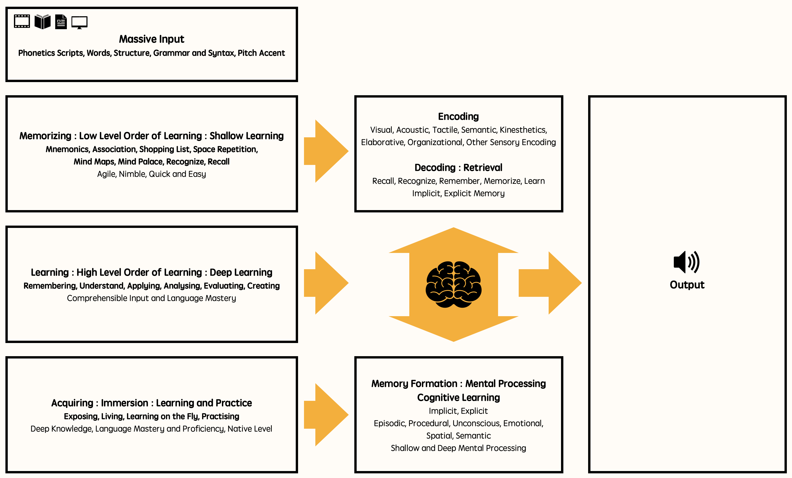

<h6> </h6>

------------------------------------------------------------------------

<!-- ## Layers {.tabset} -->

<!-- <p style="font-size:11px; line-height: 1; font-family: Noto Sans JP;  color: #202020;">**Layers of Learning:**</p> -->

<!-- ```{r, echo=FALSE, message=FALSE} -->

<!-- learn.layers <- learn %>% slice(215:220) -->

<!-- reactable( -->
<!--   learn.layers, -->
<!--   columns = list( -->
<!--     Concept = colDef(align = "left"), -->
<!--     Information = colDef(minWidth = 320,align = "left", html = TRUE) -->

<!--   ), -->
<!--   defaultPageSize = 15, -->
<!--   theme = reactableTheme( -->
<!--     cellStyle = list(display = "flex", flexDirection = "column", justifyContent = "center"), -->
<!--     searchInputStyle = list( -->
<!--       paddingLeft = "8px", -->
<!--       paddingTop = "8px", -->
<!--       paddingBottom = "8px", -->
<!--       width = "100%" -->
<!--     ) -->
<!--   ), -->
<!--   showPageInfo = FALSE, bordered = TRUE, searchable = FALSE, sortable = FALSE, paginationType = "numbers", -->

<!--   style = list(fontFamily = "Noto Sans JP, Heiti SC, Hiragino Maru Gothic ProN, Anonymous Pro , monospace, Helvetica Neue", fontSize = "11px") -->
<!-- ) -->

<!-- ``` -->

<!-- <h6> </h6> -->

<!-- ------------------------------------------------------------------------ -->

## Strategy {.tabset}

### Input Stacking {.tabset}

<p style="font-size:11px; line-height: 1; font-family: Noto Sans JP;  color: #202020;">**Method of Approach:**</p>

```{r, echo=FALSE, message=FALSE}

learn.approach <- learn %>% slice(20:21)

reactable(
  learn.approach,
  columns = list(
    Concept = colDef(align = "left"),
    Information = colDef(minWidth = 320,align = "left")

  ),
  defaultPageSize = 15,
  theme = reactableTheme(
    cellStyle = list(display = "flex", flexDirection = "column", justifyContent = "center"),
    searchInputStyle = list(
      paddingLeft = "8px",
      paddingTop = "8px",
      paddingBottom = "8px",
      width = "100%"
    )
  ),
  showPageInfo = FALSE, bordered = TRUE, searchable = FALSE, sortable = FALSE, paginationType = "numbers",
  
  style = list(fontFamily = "Noto Sans JP, Heiti SC, Hiragino Maru Gothic ProN, Anonymous Pro , monospace, Helvetica Neue", fontSize = "11px")
)

```

<h6> </h6>

------------------------------------------------------------------------

### Output Stacking {.tabset}

<p style="font-size:11px; line-height: 1; font-family: Noto Sans JP;  color: #202020;">**Communication Skills:**</p>

```{r, echo=FALSE, message=FALSE}

learn.commskl <- learn %>% slice(112:112)

reactable(
  learn.commskl,
  columns = list(
    Concept = colDef(align = "left"),
    Information = colDef(minWidth = 320,align = "left")

  ),
  defaultPageSize = 15,
  theme = reactableTheme(
    cellStyle = list(display = "flex", flexDirection = "column", justifyContent = "center"),
    searchInputStyle = list(
      paddingLeft = "8px",
      paddingTop = "8px",
      paddingBottom = "8px",
      width = "100%"
    )
  ),
  showPageInfo = FALSE, bordered = TRUE, searchable = FALSE, sortable = FALSE, paginationType = "numbers",
  
  style = list(fontFamily = "Noto Sans JP, Heiti SC, Hiragino Maru Gothic ProN, Anonymous Pro , monospace, Helvetica Neue", fontSize = "11px")
)

```

<h6> </h6>

------------------------------------------------------------------------

### Mental Processing {.tabset}

<p style="font-size:11px; line-height: 1; font-family: Noto Sans JP;  color: #202020;">**Mental Processing Capability:**</p>

```{r, echo=FALSE, message=FALSE}

learn.mental <- learn %>% slice(295:297)

reactable(
  learn.mental,
  columns = list(
    Concept = colDef(align = "left"),
    Information = colDef(minWidth = 320,align = "left")

  ),
  defaultPageSize = 15,
  theme = reactableTheme(
    cellStyle = list(display = "flex", flexDirection = "column", justifyContent = "center"),
    searchInputStyle = list(
      paddingLeft = "8px",
      paddingTop = "8px",
      paddingBottom = "8px",
      width = "100%"
    )
  ),
  showPageInfo = FALSE, bordered = TRUE, searchable = FALSE, sortable = FALSE, paginationType = "numbers",
  
  style = list(fontFamily = "Noto Sans JP, Heiti SC, Hiragino Maru Gothic ProN, Anonymous Pro , monospace, Helvetica Neue", fontSize = "11px")
)

```

<h6> </h6>

<!-- ------------------------------------------------------------------------ -->

<!-- ## Encoding {.tabset} -->

<!-- <p style="font-size:11px; line-height: 1; font-family: Noto Sans JP;  color: #202020;">**Main Encoding Process:**</p> -->

<!-- ```{r, echo=FALSE, message=FALSE} -->

<!-- learn.encours <- learn %>% slice(286:291) -->

<!-- reactable( -->
<!--   learn.encours, -->
<!--   columns = list( -->
<!--     Concept = colDef(align = "left"), -->
<!--     Information = colDef(minWidth = 320,align = "left") -->

<!--   ), -->
<!--   defaultPageSize = 15, -->
<!--   theme = reactableTheme( -->
<!--     cellStyle = list(display = "flex", flexDirection = "column", justifyContent = "center"), -->
<!--     searchInputStyle = list( -->
<!--       paddingLeft = "8px", -->
<!--       paddingTop = "8px", -->
<!--       paddingBottom = "8px", -->
<!--       width = "100%" -->
<!--     ) -->
<!--   ), -->
<!--   showPageInfo = FALSE, bordered = TRUE, searchable = FALSE, sortable = FALSE, paginationType = "numbers", -->

<!--   style = list(fontFamily = "Noto Sans JP, Heiti SC, Hiragino Maru Gothic ProN, Anonymous Pro , monospace, Helvetica Neue", fontSize = "11px") -->
<!-- ) -->

<!-- ``` -->

<!-- <h6> </h6> -->

------------------------------------------------------------------------

## Techniques {.tabset}

<p style="font-size:11px; line-height: 1; font-family: Noto Sans JP;  color: #202020;">**Main Techniques:**</p>


```{r, echo=FALSE, message=FALSE}

learn.teccours <- learn %>% slice(207:209)

reactable(
  learn.teccours,
  columns = list(
    Concept = colDef(align = "left"),
    Information = colDef(minWidth = 320,align = "left")

  ),
  defaultPageSize = 15,
  theme = reactableTheme(
    cellStyle = list(display = "flex", flexDirection = "column", justifyContent = "center"),
    searchInputStyle = list(
      paddingLeft = "8px",
      paddingTop = "8px",
      paddingBottom = "8px",
      width = "100%"
    )
  ),
  showPageInfo = FALSE, bordered = TRUE, searchable = FALSE, sortable = FALSE, paginationType = "numbers",
  
  style = list(fontFamily = "Noto Sans JP, Heiti SC, Hiragino Maru Gothic ProN, Anonymous Pro , monospace, Helvetica Neue", fontSize = "11px")
)

```

<p style="font-size:11px; line-height: 1; font-family: Noto Sans JP;  color: #202020;">**Specific Techniques:**</p>


```{r, echo=FALSE, message=FALSE}

learn.teccours <- learn %>% slice(361:367)

reactable(
  learn.teccours,
  columns = list(
    Concept = colDef(align = "left"),
    Information = colDef(minWidth = 320,align = "left")

  ),
  defaultPageSize = 15,
  theme = reactableTheme(
    cellStyle = list(display = "flex", flexDirection = "column", justifyContent = "center"),
    searchInputStyle = list(
      paddingLeft = "8px",
      paddingTop = "8px",
      paddingBottom = "8px",
      width = "100%"
    )
  ),
  showPageInfo = FALSE, bordered = TRUE, searchable = FALSE, sortable = FALSE, paginationType = "numbers",
  
  style = list(fontFamily = "Noto Sans JP, Heiti SC, Hiragino Maru Gothic ProN, Anonymous Pro , monospace, Helvetica Neue", fontSize = "11px")
)

```
<h6> </h6>

------------------------------------------------------------------------

## Risk{.tabset}

<p style="font-size:11px; line-height: 1; font-family: Noto Sans JP;  color: #202020;">**Risk Factors:**</p>


```{r, echo=FALSE, message=FALSE}

learn.risk <- learn %>% slice(276:278)

reactable(
  learn.risk,
  columns = list(
    Concept = colDef(align = "left"),
    Information = colDef(minWidth = 320,align = "left")

  ),
  defaultPageSize = 15,
  theme = reactableTheme(
    cellStyle = list(display = "flex", flexDirection = "column", justifyContent = "center"),
    searchInputStyle = list(
      paddingLeft = "8px",
      paddingTop = "8px",
      paddingBottom = "8px",
      width = "100%"
    )
  ),
  showPageInfo = FALSE, bordered = TRUE, searchable = FALSE, sortable = FALSE, paginationType = "numbers",
  
  style = list(fontFamily = "Noto Sans JP, Heiti SC, Hiragino Maru Gothic ProN, Anonymous Pro , monospace, Helvetica Neue", fontSize = "11px")
)

```

<h6> </h6>

------------------------------------------------------------------------

## Benifits {.tabset}

<p style="font-size:11px; line-height: 1; font-family: Noto Sans JP;  color: #202020;">**Benefits:**</p>

```{r, echo=FALSE, message=FALSE}

learn.benifits <- learn %>% slice(281:283)

reactable(
  learn.benifits,
  columns = list(
    Concept = colDef(align = "left"),
    Information = colDef(minWidth = 320,align = "left", html=TRUE)

  ),
  defaultPageSize = 15,
  theme = reactableTheme(
    cellStyle = list(display = "flex", flexDirection = "column", justifyContent = "center"),
    searchInputStyle = list(
      paddingLeft = "8px",
      paddingTop = "8px",
      paddingBottom = "8px",
      width = "100%"
    )
  ),
  showPageInfo = FALSE, bordered = TRUE, searchable = FALSE, sortable = FALSE, paginationType = "numbers",
  
  style = list(fontFamily = "Noto Sans JP, Heiti SC, Hiragino Maru Gothic ProN, Anonymous Pro , monospace, Helvetica Neue", fontSize = "11px")
)

```

<h6> </h6>

------------------------------------------------------------------------

## Attitude {.tabset}

<p style="font-size:11px; line-height: 1; font-family: Noto Sans JP;  color: #202020;">**Attitude and Ways of Doing:**</p>

```{r, echo=FALSE, message=FALSE}

learn.attitude <- learn %>% slice(299:301)

reactable(
  learn.attitude,
  columns = list(
    Concept = colDef(align = "left"),
    Information = colDef(minWidth = 320,align = "left", html=TRUE)

  ),
  defaultPageSize = 15,
  theme = reactableTheme(
    cellStyle = list(display = "flex", flexDirection = "column", justifyContent = "center"),
    searchInputStyle = list(
      paddingLeft = "8px",
      paddingTop = "8px",
      paddingBottom = "8px",
      width = "100%"
    )
  ),
  showPageInfo = FALSE, bordered = TRUE, searchable = FALSE, sortable = FALSE, paginationType = "numbers",
  
  style = list(fontFamily = "Noto Sans JP, Heiti SC, Hiragino Maru Gothic ProN, Anonymous Pro , monospace, Helvetica Neue", fontSize = "11px")
)

```

<h6> </h6>

------------------------------------------------------------------------

## Targets {.tabset}

```{r, echo=FALSE, message=FALSE}

learn.architbl <- architbl %>% slice(1:1)

reactable(
  learn.architbl,
  columns = list(
    Item = colDef(minWidth = 30, align = "center", html=TRUE),
    Target = colDef(minWidth = 30,align = "center", html=TRUE),
    Shallow.Work = colDef(minWidth = 100,align = "center", html=TRUE),
    Deep.Work = colDef(minWidth = 100,align = "center", html=TRUE)

  ),
  defaultPageSize = 17,
  theme = reactableTheme(
    cellStyle = list(display = "flex", flexDirection = "column", justifyContent = "center"),
    searchInputStyle = list(
      paddingLeft = "8px",
      paddingTop = "8px",
      paddingBottom = "8px",
      width = "100%"
    ),
    headerStyle = list(
      backgroundColor = "hsl(0, 0%, 10%)",
      color = "hsl(0, 0%, 95%)",
      fontSize = 11,
      fontWeight = 600,
      align = 'center',
      fontFamily = 'Open Sans',
      fontSize = "0.75rem",
      letterSpacing = "1px",
      "&:hover, &:focus" = list(color = '#ffff00')
    ),
  ),
  
  showPageInfo = FALSE, bordered = TRUE, searchable = FALSE, sortable = FALSE, paginationType = "numbers", striped = TRUE,
  
  style = list(fontFamily = "Noto Sans JP, Heiti SC, Hiragino Maru Gothic ProN, Anonymous Pro , monospace, Helvetica Neue", fontSize = "11px")
)

```

```{r, echo=FALSE, message=FALSE}

learn.architbl <- architbl %>% slice(2:5)

reactable(
  learn.architbl,
  columns = list(
    Item = colDef(minWidth = 30, align = "center", html=TRUE),
    Target = colDef(minWidth = 30,align = "center", html=TRUE),
    Shallow.Work = colDef(minWidth = 100,align = "center", html=TRUE),
    Deep.Work = colDef(minWidth = 100,align = "center", html=TRUE)

  ),
  defaultPageSize = 17,
  theme = reactableTheme(
    cellStyle = list(display = "flex", flexDirection = "column", justifyContent = "center"),
    searchInputStyle = list(
      paddingLeft = "8px",
      paddingTop = "8px",
      paddingBottom = "8px",
      width = "100%"
    ),
    headerStyle = list(
      backgroundColor = "hsl(0, 0%, 10%)",
      color = "hsl(0, 0%, 95%)",
      fontSize = 11,
      fontWeight = 600,
      align = 'center',
      fontFamily = 'Open Sans',
      fontSize = "0.75rem",
      letterSpacing = "1px",
      "&:hover, &:focus" = list(color = '#ffff00')
    ),
  ),
  
  showPageInfo = FALSE, bordered = TRUE, searchable = FALSE, sortable = FALSE, paginationType = "numbers", striped = TRUE,
  
  style = list(fontFamily = "Noto Sans JP, Heiti SC, Hiragino Maru Gothic ProN, Anonymous Pro , monospace, Helvetica Neue", fontSize = "11px")
)

```

<h6> </h6>

------------------------------------------------------------------------

## Diagram {.tabset}

<div class = "row">
<div class = "col-sm-5">

{width=400px}

<center><p style="font-size:11px; line-height: 1; font-family: Noto Sans JP;  color: #202020;">**Word-Diagram**</p></center>

</div>
<div class = "col-sm-7">

```{r, echo=FALSE, message=FALSE, warning = FALSE}

webshot::install_phantomjs()

dfexmple.a <- dfexmple %>% select(W1) %>% rename(Words = W1)
dfexmple.b <- dfexmple %>% select(W2) %>% rename(Words = W2)
dfexmple.c <- dfexmple %>% select(W3) %>% rename(Words = W3)
dfexmple.d <- dfexmple %>% select(W4) %>% rename(Words = W4)
dfexmple.e <- dfexmple %>% select(W5) %>% rename(Words = W5)
dfexmple.f <- dfexmple %>% select(W6) %>% rename(Words = W6)

dfexmple.all <- bind_rows(dfexmple.a, dfexmple.b)
dfexmple.all <- bind_rows(dfexmple.all, dfexmple.c)
dfexmple.all <- bind_rows(dfexmple.all, dfexmple.d)
dfexmple.all <- bind_rows(dfexmple.all, dfexmple.e)
dfexmple.all <- bind_rows(dfexmple.all, dfexmple.f)

corpus = Corpus(VectorSource(dfexmple.all$Words))

DTM <- TermDocumentMatrix(corpus)
mat <- as.matrix(DTM)
f <- sort(rowSums(mat),decreasing=TRUE)
dat <- data.frame(word = names(f),freq=f)

tblw2.a <- tblw2 %>% select(W1) %>% rename(Words = W1)
tblw2.b <- tblw2 %>% select(W2) %>% rename(Words = W2)
tblw2.c <- tblw2 %>% select(W3) %>% rename(Words = W3)
tblw2.d <- tblw2 %>% select(W4) %>% rename(Words = W4)
tblw2.e <- tblw2 %>% select(W5) %>% rename(Words = W5)
tblw2.f <- tblw2 %>% select(W6) %>% rename(Words = W6)

tblw2.z <- bind_rows(tblw2.a, tblw2.b)
tblw2.z <- bind_rows(tblw2.z, tblw2.c)
tblw2.z <- bind_rows(tblw2.z, tblw2.d)
tblw2.z <- bind_rows(tblw2.z, tblw2.e)
tblw2.z <- bind_rows(tblw2.z, tblw2.f)

dfexmple.z <- bind_rows(dfexmple.all, tblw2.z)
wrdmng.a <- wrdmng %>% select(Word) %>% rename(Words = Word)
dfexmple.z <- bind_rows(dfexmple.z, wrdmng.a)

corpus.a = Corpus(VectorSource(dfexmple.z$Words))

DTM.a <- TermDocumentMatrix(corpus.a)
mat.a <- as.matrix(DTM.a)
f.a <- sort(rowSums(mat.a),decreasing=TRUE)
dat.a <- data.frame(word = names(f.a),freq=f.a)

datanw <- dat.a %>%
  select(word, freq) %>%
  mutate(
    rnum2 = round(runif(nrow(.), min=0, max=1), digits = 4),
    freq = freq + rnum2,
    spread = round(runif(nrow(.), min=0, max=5), digits = 4),
  )

datanw.a <- datanw %>% select(word, freq, spread) %>% slice(1:2000)
datanw.c <- datanw %>% select(word, freq, spread) %>% slice(1:20)

library(htmlwidgets)
webshot::install_phantomjs()

wd <- wordcloud2(dat, size=0.3, color=rep_len( c("#ab5852","#009FBD","#210062","#77037B","#00202e","#41644A","#263A29","#E86A33","#642915","#c7522a","#db836b","#e0a278","#e5c185","#233341","#74a892","#008585", "#5d659d","#c5b8cd","#211137","#8fb7cd","#143c7f","#143c7f","#967ba2","#7792d7"), nrow(demoFreq) ), backgroundColor="#f5f7f9", fontFamily = "RocknRoll One", hoverFunction = NULL, rotateRatio = 0.5)

saveWidget(wd,"tmp.html",selfcontained = F)
webshot("tmp.html","fig_1.png", delay =5)

```

</div>
</div>

<!-- ------------------------------------------------------------------------ -->

<!-- ### Cloud {.tabset} -->

<!--  -->

<!-- <h6> </h6> -->

<!-- #### 01 {.tabset} -->

<!-- ```{r, echo=FALSE, message=FALSE, warning = FALSE} -->
<!-- # library(htmlwidgets) -->
<!-- webshot::install_phantomjs() -->

<!-- dat.ax <- dat.a %>% slice(2000:15000) -->
<!-- wd5 <- wordcloud2(dat.ax, size=0.15, color=rep_len( c("#ab5852","#009FBD","#210062","#77037B","#00202e","#41644A","#263A29","#E86A33","#642915","#c7522a","#db836b","#e0a278","#e5c185","#233341","#74a892","#008585", "#5d659d","#c5b8cd","#211137","#8fb7cd","#143c7f","#143c7f","#967ba2","#7792d7"), nrow(demoFreq) ), backgroundColor="#f5f7f9", fontFamily = "RocknRoll One", hoverFunction = NULL, rotateRatio = 0) -->

<!-- saveWidget(wd5,"tmp5.html",selfcontained = F) -->
<!-- xx <- webshot("tmp5.html","fig_5.png", delay =5, vwidth = 1000) -->

<!-- ``` -->
<!-- 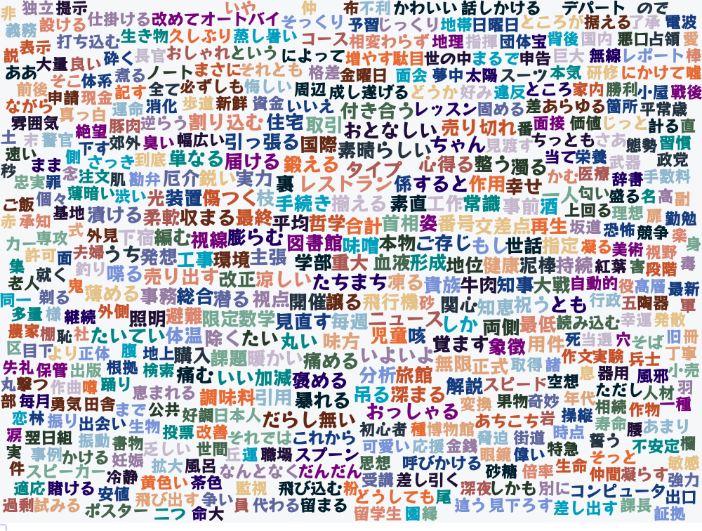 -->

<!-- <h6> </h6> -->

<!-- ------------------------------------------------------------------------ -->

<!-- #### 02 {.tabset} -->

<!-- ```{r, echo=FALSE, message=FALSE, warning = FALSE} -->
<!-- # library(htmlwidgets) -->
<!-- webshot::install_phantomjs() -->

<!-- dat.ax <- dat.a %>% slice(2000:5000) -->
<!-- wd2 <- wordcloud2(dat.ax, size=0.15, color=rep_len( c("#ab5852","#009FBD","#210062","#77037B","#00202e","#41644A","#263A29","#E86A33","#642915","#c7522a","#db836b","#e0a278","#e5c185","#233341","#74a892","#008585", "#5d659d","#c5b8cd","#211137","#8fb7cd","#143c7f","#143c7f","#967ba2","#7792d7"), nrow(demoFreq) ), backgroundColor="#f5f7f9", fontFamily = "RocknRoll One", hoverFunction = NULL, rotateRatio = 0) -->

<!-- saveWidget(wd2,"tmp2.html",selfcontained = F) -->
<!-- webshot("tmp2.html","fig_2.png", delay =5, vwidth = 1500)  -->

<!-- ``` -->

<!-- 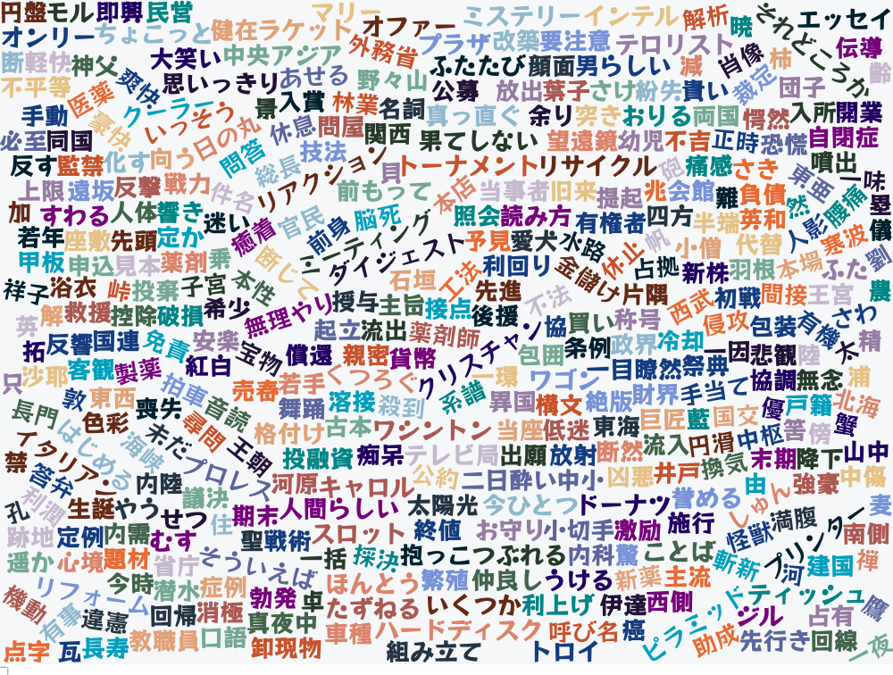 -->

<!-- <h6> </h6> -->

<!-- ------------------------------------------------------------------------ -->

<!-- #### 03 {.tabset} -->

<!-- ```{r, echo=FALSE, message=FALSE, warning = FALSE} -->
<!-- # library(htmlwidgets) -->
<!-- webshot::install_phantomjs() -->

<!-- dat.ax <- dat.a %>% slice(5000:8000) -->
<!-- wd3 <- wordcloud2(dat.a, size=0.2, color=rep_len( c("#ab5852","#009FBD","#210062","#77037B","#00202e","#41644A","#263A29","#E86A33","#642915","#c7522a","#db836b","#e0a278","#e5c185","#233341","#74a892","#008585", "#5d659d","#c5b8cd","#211137","#8fb7cd","#143c7f","#143c7f","#967ba2","#7792d7"), nrow(demoFreq) ), backgroundColor="#f5f7f9", fontFamily = "RocknRoll One", hoverFunction = NULL, rotateRatio = 0.3) -->

<!-- saveWidget(wd3,"tmp3.html",selfcontained = F) -->
<!-- webshot("tmp3.html","fig_3.png", delay =5, vwidth = 1000) -->

<!-- ``` -->

<!--  -->

<!-- <h6> </h6> -->

<!-- ------------------------------------------------------------------------ -->

<!-- #### 04 {.tabset} -->

<!-- ```{r, echo=FALSE, message=FALSE, warning = FALSE} -->
<!-- # library(htmlwidgets) -->
<!-- webshot::install_phantomjs() -->

<!-- dat.ax <- dat.a %>% slice(2000:10000) -->
<!-- wd4 <- wordcloud2(dat.ax, size=0.15, color=rep_len( c("#ab5852","#009FBD","#210062","#77037B","#00202e","#41644A","#263A29","#E86A33","#642915","#c7522a","#db836b","#e0a278","#e5c185","#233341","#74a892","#008585", "#5d659d","#c5b8cd","#211137","#8fb7cd","#143c7f","#143c7f","#967ba2","#7792d7"), nrow(demoFreq) ), backgroundColor="#f5f7f9", fontFamily = "RocknRoll One", hoverFunction = NULL, rotateRatio = 0.7) -->

<!-- saveWidget(wd4,"tmp4.html",selfcontained = F) -->
<!-- webshot("tmp4.html","fig_4.png", delay =5, vwidth = 1000) -->

<!-- ``` -->

<!--  -->

<!-- <h6> </h6> -->

<!-- ------------------------------------------------------------------------ -->

<!-- ### Chart {.tabset} -->

<!-- ```{r, echo=FALSE, message=FALSE, warning = FALSE} -->

<!-- datanw.b <- datanw %>% select(word, freq, spread) %>% slice(1:15000) -->

<!-- pc <- ggplot(datanw.b, dynamicTicks = TRUE, aes(x=spread, y=freq, colour=freq, text = paste(word))) + geom_point(aes(size = freq)) + scale_colour_gradient(low="#060047", high="#EB455F") -->
<!-- pc <- pc + scale_y_reverse() + aes(ymin=-0.1) -->
<!-- pc <- pc + theme(plot.background = element_rect(fill = "#e0e1dd")) -->

<!-- ggplotly(pc, tooltip = "text")  %>% layout(hoverlabel = list(font=list(size=42,family="RocknRoll One"))) -->

<!-- ``` -->

<!-- <h6> </h6> -->

------------------------------------------------------------------------

## Focus {.tabset}

### Kanji {.tabset}

<div class = "row">
<div class = "col-sm-8">

```{r, echo=FALSE, message=FALSE}
library(htmlwidgets)
webshot::install_phantomjs()

knjwrdrd <- knjwrdrd[sample(1:nrow(knjwrdrd)),]

htmltools::browsable(
  tagList(
    div(
      div(class = "chart", tags$label("Level:", `for` = "kanji-level-filter"),
      # div(
        tags$select(
          id = "kanji-level-filter",
          onchange = "Reactable.setFilter('kanji-filter-table', 'Level', this.value)",
          tags$option("All", value = ""),
          lapply(unique(knjwrdrd$Level), tags$option)
        # )
      ))
    ),
    # tags$hr("aria-hidden" = "true"),

reactable(
  knjwrdrd,
  columns = list(
    Kanji = colDef(style= list(background = '#f9f6ed'),
      cell = function(value, index) {
        K.Meaning <- knjwrdrd$K.Meaning[index]
        K.Meaning <- if (!is.na(K.Meaning)) K.Meaning else ""
        Words.A <- knjwrdrd$Words.A[index]
        Words.A <- if (!is.na(Words.A)) Words.A else ""
        Words.B <- knjwrdrd$Words.B[index]
        Words.B <- if (!is.na(Words.B)) Words.B else ""
        Words.C <- knjwrdrd$Words.C[index]
        Words.C <- if (!is.na(Words.C)) Words.C else ""
        Words.D <- knjwrdrd$Words.D[index]
        Words.D <- if (!is.na(Words.D)) Words.D else ""
        W.Meaning.A <- knjwrdrd$W.Meaning.A[index]
        W.Meaning.A <- if (!is.na(W.Meaning.A)) W.Meaning.A else ""
        W.Meaning.B <- knjwrdrd$W.Meaning.B[index]
        W.Meaning.B <- if (!is.na(W.Meaning.B)) W.Meaning.B else ""
        W.Meaning.C <- knjwrdrd$W.Meaning.C[index]
        W.Meaning.C <- if (!is.na(W.Meaning.C)) W.Meaning.C else ""
        tagList(
          div(style = list(fontSize = 60, fontWeight = 600, color = '#101010', fontFamily = 'Open Sans'), value),
          div(style = list(fontSize = 12, fontWeight = 600, color = '#800000', fontFamily = 'Open Sans'), K.Meaning),
          div(style = list(fontSize = 21, fontWeight = 600, color = '#101010', fontFamily = 'Open Sans'), Words.A),
          div(style = list(fontSize = 21, fontWeight = 600, color = '#101010', fontFamily = 'Open Sans'), Words.B),
          div(style = list(fontSize = 21, fontWeight = 600, color = '#101010', fontFamily = 'Open Sans'), Words.C),
          div(style = list(fontSize = 2), "."),
          div(style = list(fontSize = 2), "."),
          div(style = list(fontSize = 12, fontWeight = 400, color = '#101010', fontFamily = 'Open Sans'), W.Meaning.A),
          div(style = list(fontSize = 12, fontWeight = 400, color = '#101010', fontFamily = 'Open Sans'), W.Meaning.B),
          div(style = list(fontSize = 12, fontWeight = 400, color = '#101010', fontFamily = 'Open Sans'), W.Meaning.C),
          div(style = list(fontSize = 2), "."),
          div(style = list(fontSize = 2), "."),
          div(style = list(fontSize = 21, fontWeight = 600, color = '#101010', fontFamily = 'Open Sans'), Words.D),
        )
      },
      align = "center"
    ),
    Level = colDef(show = FALSE),
    K.Meaning = colDef(show = FALSE),
    Words.A = colDef(show = FALSE),
    Words.B = colDef(show = FALSE),
    Words.C = colDef(show = FALSE),
    Words.D = colDef(show = FALSE),
    W.Meaning.A = colDef(show = FALSE),
    W.Meaning.B = colDef(show = FALSE),
    W.Meaning.C = colDef(show = FALSE)
  ),
  rowClass = "my-row",
  defaultPageSize = 1,
  elementId = "kanji-filter-table",
  theme = reactableTheme(
    cellStyle = list(display = "flex", flexDirection = "column", justifyContent = "center", height = 350),
    searchInputStyle = list(
      paddingLeft = "8px",
      paddingTop = "8px",
      paddingBottom = "8px",
      width = "100%"
    )
    # headerStyle = list(
    #   backgroundColor = "#F4F5DE",
    #   color = "hsl(0, 0%, 95%)",
    #   fontSize = 0.1,
    #   fontWeight = 100,
    #   fontFamily = 'Open Sans',
    #   fontSize = "0.1rem",
    #   letterSpacing = "1px",
    #   textTransform = "lowercase",
    #   padding = "0px",
    #   "&:hover, &:focus" = list(color = '#ffff00')
    # ),
  ),
  showPageInfo = FALSE, bordered = TRUE, searchable = FALSE, sortable = FALSE, paginationType = "simple", striped = TRUE, highlight = TRUE,
  
  style = list(fontFamily = "Noto Sans JP, Heiti SC, Hiragino Maru Gothic ProN, Anonymous Pro , monospace, Helvetica Neue", fontSize = "11px")
  )
  )
)

```

</div>
<div class = "col-sm-4">

<!-- {width=400px} -->
<!-- <center><p style="font-size:11px; line-height: 1; font-family: Noto Sans JP;  color: #202020;">**Word-Diagram**</p></center> -->

</div>
</div>

------------------------------------------------------------------------

### Words {.tabset}

<div class = "row">
<div class = "col-sm-8">

```{r, echo=FALSE, message=FALSE}

dliwrd.a <- dliwrd %>% slice(1:1060)
dliwrd.a <- dliwrd.a[sample(1:nrow(dliwrd.a)),]

htmltools::browsable(
  tagList(
    div(
      div(class = "chart", tags$label("Level:", `for` = "words-level-filter"),
      # div(
        tags$select(
          id = "words-level-filter",
          onchange = "Reactable.setFilter('words-filter-table', 'Level', this.value)",
          tags$option("All", value = ""),
          lapply(unique(dliwrd.a$Level), tags$option)
        # )
      ))
    ),
    # tags$hr("aria-hidden" = "true"),

reactable(
  dliwrd.a,
  columns = list(
    Words = colDef(style= list(background = '#f9f6ed'),
      cell = function(value, index) {
        Meaning <- dliwrd.a$Meaning[index]
        Meaning <- if (!is.na(Meaning)) Meaning else ""
        Sentences <- dliwrd.a$Sentences[index]
        Sentences <- if (!is.na(Sentences)) Sentences else ""
        Translation <- dliwrd.a$Translation[index]
        Translation <- if (!is.na(Translation)) Translation else ""
        tagList(
          div(span(style = list(fontSize = 22, fontWeight = 600, color = '#101010', fontFamily = 'Open Sans'), value), " ", span(style = list(fontSize = 12, fontWeight = 600, color = '#800000', fontFamily = 'Open Sans'), Meaning)),
          div(style = list(fontSize = 14, fontWeight = 400, color = '#101010', fontFamily = 'Open Sans'), Sentences),
          div(style = list(fontSize = 10, fontWeight = 300, color = '#101010', fontFamily = 'Open Sans'), Translation),
        )
      },
      align = "left"
    ),
    Level = colDef(show = FALSE),
    Meaning = colDef(show = FALSE),
    Sentences = colDef(show = FALSE),
    Translation = colDef(show = FALSE)
  ),
  rowClass = "my-row",
  defaultPageSize = 35,
  elementId = "words-filter-table",
  theme = reactableTheme(
    cellStyle = list(display = "flex", flexDirection = "column", justifyContent = "center"),
    searchInputStyle = list(
      paddingLeft = "8px",
      paddingTop = "8px",
      paddingBottom = "8px",
      width = "100%"
    )
  ),
  showPageInfo = FALSE, bordered = TRUE, searchable = FALSE, sortable = FALSE, paginationType = "simple", striped = TRUE, highlight = TRUE, height = 390,
  
  style = list(fontFamily = "Noto Sans JP, Heiti SC, Hiragino Maru Gothic ProN, Anonymous Pro , monospace, Helvetica Neue", fontSize = "11px")
  )
  )
)

```

</div>
<div class = "col-sm-4">

<!-- {width=400px} -->
<!-- <center><p style="font-size:11px; line-height: 1; font-family: Noto Sans JP;  color: #202020;">**Word-Diagram**</p></center> -->
```{r, echo=FALSE, message=FALSE}

cmmpassc.a <- cmmpassc
cmmpassc.a <- cmmpassc.a %>% na.omit(cmmpassc.a)
cmmpassc.a <- cmmpassc.a[sample(1:nrow(cmmpassc.a)),]
cmmpassc.a <- cmmpassc.a[sample(1:nrow(cmmpassc.a)),]

htmltools::browsable(
  tagList(
    div(
      div(class = "chart", tags$label("Level:", `for` = "assoc-level-filter"),
      # div(
        tags$select(
          id = "assoc-level-filter",
          onchange = "Reactable.setFilter('assoc-filter-table', 'Level', this.value)",
          tags$option("All", value = ""),
          lapply(unique(cmmpassc.a$Level), tags$option)
        # )
      ))
    ),
    # tags$hr("aria-hidden" = "true"),

reactable(
  cmmpassc.a, filterable = FALSE,
  columns = list(
    Words = colDef(style= list(background = '#e0e1dd'),
      cell = function(value, index) {
        Meaning <- cmmpassc.a$Meaning[index]
        Meaning <- if (!is.na(Meaning)) Meaning else ""
        Reading <- cmmpassc.a$Reading[index]
        Reading <- if (!is.na(Reading)) Reading else ""
        # Sentence <- cmmpassc.a$Sentence[index]
        # Sentence <- if (!is.na(Sentence)) Sentence else ""
        # Translation <- cmmpassc.a$Translation[index]
        # Translation <- if (!is.na(Translation)) Translation else ""
        Level <- cmmpassc.a$Level[index]
        Level <- if (!is.na(Level)) Level else ""
        tagList(
          # div(span(style = list(fontSize = 22, fontWeight = 600, color = '#202020', fontFamily = 'Open Sans'), value), " ", span(style = list(fontSize = 12, fontWeight = 600, color = '#800000', fontFamily = 'Open Sans'), Meaning, " ", span(style = list(fontSize = 8, fontWeight = 500, color = '#008000', fontFamily = 'Open Sans'), "L", Level))),
          # div(style = list(fontSize = 11, fontWeight = 300, color = '#202020', fontFamily = 'Open Sans'), Reading),
          # div(style = list(fontSize = 14, fontWeight = 400, color = '#202020', fontFamily = 'Open Sans'), Sentence),
          # div(style = list(fontSize = 10, fontWeight = 300, color = '#202020', fontFamily = 'Open Sans'), Translation),
          div(style = list(fontSize = 22, fontWeight = 600, color = '#0F2040', fontFamily = 'Open Sans'), value,"。"),
          div(style = list(fontSize = 12, fontWeight = 600, color = '#800000', fontFamily = 'Open Sans'), Meaning, "."),
        )
      },
      align = "left"
    ),
    Level = colDef(show = FALSE),
    Meaning = colDef(show = FALSE),
    Reading = colDef(show = FALSE)
    # Sentence = colDef(show = FALSE),
    # Translation = colDef(show = FALSE)
  ),
  rowClass = "my-row",
  defaultPageSize = 50,
  elementId = "assoc-filter-table",
  theme = reactableTheme(
    cellStyle = list(display = "flex", flexDirection = "column", justifyContent = "center", height = 64),
    searchInputStyle = list(
      paddingLeft = "8px",
      paddingTop = "8px",
      paddingBottom = "8px",
      width = "100%"
    )
  ),
  showPageInfo = FALSE, bordered = TRUE, searchable = FALSE, sortable = FALSE, paginationType = "simple", striped = TRUE, highlight = TRUE, height = 390,
  
  style = list(fontFamily = "Noto Sans JP, Heiti SC, Hiragino Maru Gothic ProN, Anonymous Pro, monospace, Helvetica Neue", fontSize = "11px")
  )
  )
)

```

</div>
</div>

------------------------------------------------------------------------

### Verbs {.tabset}

<div class = "row">
<div class = "col-sm-8">

```{r, echo=FALSE, message=FALSE}

cmmvrb.a <- cmmvrb
cmmvrb.a <- cmmvrb.a %>% na.omit(cmmvrb.a)
cmmvrb.a <- cmmvrb.a[sample(1:nrow(cmmvrb.a)),]

htmltools::browsable(
  tagList(
    div(
      div(class = "chart", tags$label("Level:", `for` = "verb-level-filter"),
      # div(
        tags$select(
          id = "verb-level-filter",
          onchange = "Reactable.setFilter('verb-filter-table', 'Level', this.value)",
          tags$option("All", value = ""),
          lapply(unique(cmmvrb.a$Level), tags$option)
        # )
      ))
    ),
    # tags$hr("aria-hidden" = "true"),

reactable(
  cmmvrb.a,
  columns = list(
    Verbs = colDef(style= list(background = '#f9f6ed'),
      cell = function(value, index) {
        Meaning <- cmmvrb.a$Meaning[index]
        Meaning <- if (!is.na(Meaning)) Meaning else ""
        Sentences <- cmmvrb.a$Sentences[index]
        Sentences <- if (!is.na(Sentences)) Sentences else ""
        Translation <- cmmvrb.a$Translation[index]
        Translation <- if (!is.na(Translation)) Translation else ""
        Level <- cmmvrb.a$Level[index]
        Level <- if (!is.na(Level)) Level else ""
        tagList(
          div(span(style = list(fontSize = 22, fontWeight = 600, color = '#101010', fontFamily = 'Open Sans'), value), " ", span(style = list(fontSize = 12, fontWeight = 600, color = '#800000', fontFamily = 'Open Sans'), Meaning, " ", span(style = list(fontSize = 8, fontWeight = 500, color = '#008000', fontFamily = 'Open Sans'), "L", Level))),
          div(style = list(fontSize = 14, fontWeight = 400, color = '#101010', fontFamily = 'Open Sans'), Sentences),
          div(style = list(fontSize = 10, fontWeight = 300, color = '#101010', fontFamily = 'Open Sans'), Translation),
        )
      },
      align = "left"
    ),
    Level = colDef(show = FALSE),
    Meaning = colDef(show = FALSE),
    Sentences = colDef(show = FALSE),
    Translation = colDef(show = FALSE)
  ),
  rowClass = "my-row",
  defaultPageSize = 10,
  elementId = "verb-filter-table",
  theme = reactableTheme(
    cellStyle = list(display = "flex", flexDirection = "column", justifyContent = "center"),
    searchInputStyle = list(
      paddingLeft = "8px",
      paddingTop = "8px",
      paddingBottom = "8px",
      width = "100%"
    )
  ),
  showPageInfo = FALSE, bordered = TRUE, searchable = FALSE, sortable = FALSE, paginationType = "simple", striped = TRUE, highlight = TRUE, height = 390,
  
  style = list(fontFamily = "Noto Sans JP, Heiti SC, Hiragino Maru Gothic ProN, Anonymous Pro, monospace, Helvetica Neue", fontSize = "11px")
  )
  )
)

```

</div>
<div class = "col-sm-4">

```{r, echo=FALSE, message=FALSE}

# cmmvrb.a <- cmmvrb
# cmmvrb.a <- cmmvrb.a %>% na.omit(cmmvrb.a)
cmmvrb.a <- cmmvrb.a[sample(1:nrow(cmmvrb.a)),]

htmltools::browsable(
  tagList(
    div(
      div(class = "chart", tags$label("Level:", `for` = "verbb-level-filter"),
      # div(
        tags$select(
          id = "verbb-level-filter",
          onchange = "Reactable.setFilter('verbb-filter-table', 'Level', this.value)",
          tags$option("All", value = ""),
          lapply(unique(cmmvrb.a$Level), tags$option)
        # )
      ))
    ),
    # tags$hr("aria-hidden" = "true"),

reactable(
  cmmvrb.a,
  columns = list(
    Verbs = colDef(style= list(background = '#e0e1dd'),
      cell = function(value, index) {
        Meaning <- cmmvrb.a$Meaning[index]
        Meaning <- if (!is.na(Meaning)) Meaning else ""
        # Sentences <- cmmvrb.a$Sentences[index]
        # Sentences <- if (!is.na(Sentences)) Sentences else ""
        # Translation <- cmmvrb.a$Translation[index]
        # Translation <- if (!is.na(Translation)) Translation else ""
        # Level <- cmmvrb.a$Level[index]
        # Level <- if (!is.na(Level)) Level else ""
        tagList(
          div(style = list(fontSize = 32, fontWeight = 600, color = '#0F2040', fontFamily = 'Open Sans'), value),
          # div(style = list(fontSize = 12, fontWeight = 600, color = '#800000', fontFamily = 'Open Sans'), Meaning),
        )
      },
      align = "center"
    ),
    Level = colDef(show = FALSE),
    Meaning = colDef(show = FALSE),
    Sentences = colDef(show = FALSE),
    Translation = colDef(show = FALSE)
  ),
  rowClass = "my-row",
  defaultPageSize = 1,
  elementId = "verbb-filter-table",
  theme = reactableTheme(
    cellStyle = list(display = "flex", flexDirection = "column", justifyContent = "center", height = 317),
    searchInputStyle = list(
      paddingLeft = "8px",
      paddingTop = "8px",
      paddingBottom = "8px",
      width = "100%"
    )
  ),
  showPageInfo = FALSE, bordered = TRUE, searchable = FALSE, sortable = FALSE, paginationType = "simple", striped = TRUE, highlight = TRUE,
  
  style = list(fontFamily = "Noto Sans JP, Heiti SC, Hiragino Maru Gothic ProN, Anonymous Pro, monospace, Helvetica Neue", fontSize = "11px")
  )
  )
)

```

<!-- {width=400px} -->
<!-- <center><p style="font-size:11px; line-height: 1; font-family: Noto Sans JP;  color: #202020;">**Word-Diagram**</p></center> -->

</div>
</div>

<!-- ```{r, echo=FALSE, message=FALSE, warning=FALSE} -->

<!-- cmmvrb.rc <- cmmvrb -->
<!-- cmmvrb.rc <- cmmvrb.rc %>% na.omit(cmmvrb.rc) -->
<!-- cmmvrb.rc <- cmmvrb.rc[sample(1:nrow(cmmvrb.rc)),] -->

<!-- cmmvrb.rc <- cmmvrb.rc %>% filter(Level==5) -->
<!-- # cmmvrb.rc -->
<!-- num.rows.rc = nrow(cmmvrb.rc) -->

<!-- datan.rc.1 <- cmmvrb.rc %>% -->
<!--   select(Verbs, Meaning, Sentences, Translation, Level) %>% -->
<!--   mutate( -->
<!--       x = rnorm(num.rows.rc, 1, 2),  -->
<!--       y = rnorm(num.rows.rc, 1, 4), -->
<!--       # x = sort(x, decreasing = FALSE), -->
<!--       # y = sort(y, decreasing = FALSE), -->
<!--   ) -->
<!-- # datan.rc.1 -->

<!-- num.char.rc = nchar(datan.rc.1$Verbs) -->
<!-- datan.rc.1 <- data.frame(datan.rc.1, num.char.rc) -->
<!-- # datan.rc.1 -->

<!-- p.rc <- ggplot(datan.rc.1, dynamicTicks = TRUE, aes(x=x, y=y, text = paste(Verbs, "<br>","<sup>", Sentences, "<br>","<sup>", Translation))) + geom_point(aes(size = num.char.rc, colour=num.char.rc, aplha=0.6))  + scale_colour_gradient(low="#EB455F", high="#060047") -->
<!-- # p.rc <- p.rc + geom_point(alpha = 0.5) -->
<!-- # p.rc <- p.rc + theme_wsj() -->
<!-- p.rc <- p.rc + theme(plot.background = element_rect(fill = "#e0e1dd"), legend.position="none", plot.margin = margin(t = 10, r = 30, b = 15, l = 25), axis.title.x = element_blank(), axis.title.y = element_blank(), axis.text.x = element_blank(),axis.text.y = element_blank(), axis.ticks = element_blank()) -->

<!-- ggplotly(p.rc, tooltip = c("text"), width=800, height=500)  %>% layout(hoverlabel = list(font=list(size=29,family="Zen Kaku Gothic New"))) -->

<!-- ``` -->

------------------------------------------------------------------------

### Set-Phr {.tabset}

<div class = "row">
<div class = "col-sm-8">

```{r, echo=FALSE, message=FALSE}

dliphr.a <- dliphr
dliphr.a <- dliphr.a[sample(1:nrow(dliphr.a)),]

htmltools::browsable(
  tagList(
    div(
      div(class = "chart", tags$label("Level:", `for` = "phrases-level-filter"),
      # div(
        tags$select(
          id = "phrases-level-filter",
          onchange = "Reactable.setFilter('phrases-filter-table', 'Level', this.value)",
          tags$option("All", value = ""),
          lapply(unique(dliphr.a$Level), tags$option)
        # )
      ))
    ),
    # tags$hr("aria-hidden" = "true"),

reactable(
  dliphr.a,
  columns = list(
    Phrases = colDef(style= list(background = '#f9f6ed'),
      cell = function(value, index) {
        Meaning <- dliphr.a$Meaning[index]
        Meaning <- if (!is.na(Meaning)) Meaning else ""
        Sentences <- dliphr.a$Sentences[index]
        Sentences <- if (!is.na(Sentences)) Sentences else ""
        Translation <- dliphr.a$Translation[index]
        Translation <- if (!is.na(Translation)) Translation else ""
        tagList(
          div(span(style = list(fontSize = 22, fontWeight = 600, color = '#101010', fontFamily = 'Open Sans'), value), " ", span(style = list(fontSize = 12, fontWeight = 600, color = '#800000', fontFamily = 'Open Sans'), Meaning)),
          div(style = list(fontSize = 14, fontWeight = 400, color = '#101010', fontFamily = 'Open Sans'), Sentences),
          div(style = list(fontSize = 10, fontWeight = 300, color = '#101010', fontFamily = 'Open Sans'), Translation),
        )
      },
      align = "left"
    ),
    Level = colDef(show = FALSE),
    Meaning = colDef(show = FALSE),
    Sentences = colDef(show = FALSE),
    Translation = colDef(show = FALSE)
  ),
  rowClass = "my-row",
  defaultPageSize = 10,
  elementId = "phrases-filter-table",
  theme = reactableTheme(
    cellStyle = list(display = "flex", flexDirection = "column", justifyContent = "center"),
    searchInputStyle = list(
      paddingLeft = "8px",
      paddingTop = "8px",
      paddingBottom = "8px",
      width = "100%"
    )
  ),
  showPageInfo = FALSE, bordered = TRUE, searchable = FALSE, sortable = FALSE, paginationType = "simple", striped = TRUE, highlight = TRUE, height = 390,
  
  style = list(fontFamily = "Noto Sans JP, Heiti SC, Hiragino Maru Gothic ProN, Anonymous Pro, monospace, Helvetica Neue", fontSize = "11px")
  )
  )
)

```

</div>
<div class = "col-sm-4">

<!-- {width=400px} -->
<!-- <center><p style="font-size:11px; line-height: 1; font-family: Noto Sans JP;  color: #202020;">**Word-Diagram**</p></center> -->

</div>
</div>

------------------------------------------------------------------------

### Set-Pat {.tabset}

<div class = "row">
<div class = "col-sm-8">

```{r, echo=FALSE, message=FALSE}

cmmpnflct.a <- cmmpnflct
cmmpnflct.a <- cmmpnflct.a %>% na.omit(cmmpnflct.a)
cmmpnflct.a <- cmmpnflct.a[sample(1:nrow(cmmpnflct.a)),]

htmltools::browsable(
  tagList(
    div(
      div(class = "chart", tags$label("Level:", `for` = "inflect-level-filter"),
      # div(
        tags$select(
          id = "inflect-level-filter",
          onchange = "Reactable.setFilter('inflect-filter-table', 'Level', this.value)",
          tags$option("All", value = ""),
          lapply(unique(cmmpnflct.a$Level), tags$option)
        # )
      ))
    ),
    # tags$hr("aria-hidden" = "true"),

reactable(
  cmmpnflct.a, filterable = FALSE,
  columns = list(
    Words = colDef(style= list(background = '#f9f6ed'),
      cell = function(value, index) {
        Meaning <- cmmpnflct.a$Meaning[index]
        Meaning <- if (!is.na(Meaning)) Meaning else ""
        Remarks <- cmmpnflct.a$Remarks[index]
        Remarks <- if (!is.na(Remarks)) Remarks else ""
        Sentence <- cmmpnflct.a$Sentence[index]
        Sentence <- if (!is.na(Sentence)) Sentence else ""
        Translation <- cmmpnflct.a$Translation[index]
        Translation <- if (!is.na(Translation)) Translation else ""
        Level <- cmmpnflct.a$Level[index]
        Level <- if (!is.na(Level)) Level else ""
        tagList(
          div(span(style = list(fontSize = 22, fontWeight = 600, color = '#101010', fontFamily = 'Open Sans'), value), " ", span(style = list(fontSize = 12, fontWeight = 600, color = '#800000', fontFamily = 'Open Sans'), Meaning, " ", span(style = list(fontSize = 5, fontWeight = 500, color = '#008000', fontFamily = 'Open Sans'), "L", Level))),
          div(style = list(fontSize = 12, fontWeight = 600, color = '#009A77', fontFamily = 'Open Sans'), Remarks),
          div(style = list(fontSize = 14, fontWeight = 400, color = '#101010', fontFamily = 'Open Sans'), Sentence),
          div(style = list(fontSize = 10, fontWeight = 300, color = '#101010', fontFamily = 'Open Sans'), Translation),
        )
      },
      align = "left", minWidth = 550
    ),
    Level = colDef(show = FALSE),
    Meaning = colDef(show = FALSE),
    Remarks = colDef(show = FALSE),
    Sentence = colDef(show = FALSE),
    Translation = colDef(show = FALSE)
  ),
  rowClass = "my-row",
  defaultPageSize = 10,
  elementId = "inflect-filter-table",
  theme = reactableTheme(
    cellStyle = list(display = "flex", flexDirection = "column", justifyContent = "center"),
    searchInputStyle = list(
      paddingLeft = "8px",
      paddingTop = "8px",
      paddingBottom = "8px",
      width = "100%"
    )
  ),
  showPageInfo = FALSE, bordered = TRUE, searchable = FALSE, sortable = FALSE, paginationType = "simple", striped = TRUE, highlight = TRUE, height = 365,
  
  style = list(fontFamily = "Noto Sans JP, Heiti SC, Hiragino Maru Gothic ProN, Anonymous Pro, monospace, Helvetica Neue", fontSize = "11px")
)
  )
)

```

</div>
<div class = "col-sm-4">

</div>
</div>

------------------------------------------------------------------------

### Set-Fnc {.tabset}

```{r, echo=FALSE, message=FALSE}

mstryfunc.a <- mstryfunc
mstryfunc.a <- mstryfunc.a[sample(1:nrow(mstryfunc.a)),]

reactable(
  mstryfunc.a,
  columns = list(
    Function = colDef(style= list(background = '#e0e1dd'), html = TRUE, minWidth = 200,
      cell = function(value, index) {
        Pattern <- mstryfunc.a$Pattern[index]
        Pattern <- if (!is.na(Pattern)) Pattern else ""
        Details <- mstryfunc.a$Details[index]
        Details <- if (!is.na(Details)) Details else ""
        tag_list <- tagList(
          div(class = "detail-des_func_a", HTML(mstryfunc.a$Function[index])),
          div(class = "detail-des_func_d", HTML(mstryfunc.a$Pattern[index])),
          div(class = "detail-des_func_e", HTML(mstryfunc.a$Details[index])),
        )
        as.character(tag_list)
      },
      align = "center"
    ),
    Sample = colDef(style= list(background = '#edede9'), html = TRUE, minWidth = 250,
      cell = function(value, index) {
        Translate <- mstryfunc.a$Translate[index]
        Translate <- if (!is.na(Translate)) Translate else ""
        tag_list <- tagList(
          div(class = "detail-des_func_b", HTML(mstryfunc.a$Sample[index])),
          div(class = "detail-des_func_c", HTML(mstryfunc.a$Translate[index]))
        )
        as.character(tag_list)
      },
      align = "left"
    ), 
    Pattern = colDef(show = FALSE),
    Details = colDef(show = FALSE),
    Translate = colDef(show = FALSE)
  ),
  rowClass = "my-row",
  defaultPageSize = 1,
  theme = reactableTheme(
    cellStyle = list(display = "flex", flexDirection = "column", justifyContent = "center", padding = "0px", height = 600, fontSize = "11px"),
    searchInputStyle = list(
      paddingLeft = "8px",
      paddingTop = "8px",
      paddingBottom = "8px",
      width = "100%"
    )
  ),
  showPageInfo = FALSE, outlined = TRUE, bordered = FALSE, searchable = TRUE, paginationType = "simple", highlight = TRUE,
  
  style = list(fontFamily = "Noto Sans JP, Hiragino Maru Gothic ProN, Anonymous Pro , Helvetica Neue", fontSize = "11px")
)

```

------------------------------------------------------------------------

### Comm-Fnc {.tabset}

```{r, echo=FALSE, message=FALSE}

comstrgyfnc.b <- comstrgyfnc
comstrgyfnc.b <- comstrgyfnc.b[sample(1:nrow(comstrgyfnc.b)),]
comstrgyfnc.b <- comstrgyfnc.b[sample(1:nrow(comstrgyfnc.b)),]

row_details <- function(index) {
  pkg <- comstrgyfnc.b[index, ]

  pkg_field <- function(name, class_name, ...) {
    if (any(is.na(...))) NULL
    else div(class = class_name, ...)
  }

  detail <- div(
    # class = "package-detail",
    pkg_field("S1", "detail-descriptiona" , pkg$S1),
    pkg_field("T1", "detail-descriptionb" , pkg$T1),
    pkg_field("S2", "detail-descriptiona" , pkg$S2),
    pkg_field("T2", "detail-descriptionb" , pkg$T2),
    pkg_field("S3", "detail-descriptiona" , pkg$S3),
    pkg_field("T3", "detail-descriptionb" , pkg$T3),
    pkg_field("S4", "detail-descriptiona" , pkg$S4),
    pkg_field("T4", "detail-descriptionb" , pkg$T4),
    pkg_field("S5", "detail-descriptiona" , pkg$S5),
    pkg_field("T5", "detail-descriptionb" , pkg$T5),
    pkg_field("S6", "detail-descriptiona" , pkg$S6),
    pkg_field("T6", "detail-descriptionb" , pkg$T6)
  )
  detail
}

htmltools::browsable(
  tagList(
    div(
      div(class = "chartz", tags$label("【Category】", `for` = "cat-types-filter"),
      # div(
        tags$select(
          id = "cat-types-filter",
          onchange = "Reactable.setFilter('cats-filter-table', 'Category', this.value)",
          tags$option("All", value = ""),
          lapply(unique(comstrgyfnc.b$Category), tags$option)
        # )
      ))
    ),
    # tags$hr("aria-hidden" = "true"),

reactable(
  comstrgyfnc.b,
  onClick = "expand",
  columns = list(
    Function = colDef(minWidth = 300, align = "left", html = TRUE, style = list(fontSize = 16, fontWeight = 500, color = '#0F2040', fontFamily = 'Zen Kaku Gothic New', background = '#dee7e7')),
    T1 = colDef(show = FALSE),
    T2 = colDef(show = FALSE),
    T3 = colDef(show = FALSE),
    T4 = colDef(show = FALSE),
    T5 = colDef(show = FALSE),
    T6 = colDef(show = FALSE),
    S1 = colDef(show = FALSE),
    S2 = colDef(show = FALSE),
    S3 = colDef(show = FALSE),
    S4 = colDef(show = FALSE),
    S5 = colDef(show = FALSE),
    S6 = colDef(show = FALSE),
    Category = colDef(show = FALSE)
  ),
  details = row_details,
  rowClass = "my-row",
  class = "packages-table",
  defaultPageSize = 8,
  defaultSorted = "Category",
  elementId = "cats-filter-table",
  theme = reactableTheme(
    backgroundColor = "hsl(213, 20%, 99%)",
    borderColor = "hsl(213, 20%, 99%)",
    selectStyle = list(backgroundColor = "#061126"),
    paginationStyle = list(borderColor = "#061126"),
    pageButtonActiveStyle = list(background = "#dee7e7"),
    cellStyle = list(display = "flex", flexDirection = "column", justifyContent = "center", fontSize = "11px"),
    searchInputStyle = list(
      paddingLeft = "8px",
      paddingTop = "8px",
      paddingBottom = "8px",
      width = "100%",
      fontSize = "11px"
    ),
    headerStyle = list(
      backgroundColor = "#dee7e7",
      color = "#dee7e7",
      fontWeight = 100,
      fontFamily = 'Open Sans',
      fontSize = "0rem",
      padding = "0px"
    ),
  ),
  showPageInfo = FALSE, outlined = TRUE, borderless = FALSE, bordered = FALSE, searchable = FALSE, sortable = FALSE, highlight = TRUE, paginationType = "numbers", 

  style = list(fontFamily = "Noto Sans JP, Heiti SC, Hiragino Maru Gothic ProN, Anonymous Pro , monospace, Helvetica Neue", fontSize = "11px")
  )
  )
)

```

------------------------------------------------------------------------

### Comm-Ele {.tabset}

<!-- <div class = "row"> -->
<!-- <div class = "col-sm-8"> -->

```{r, echo=FALSE, message=FALSE}

cmmptrn.a <- cmmptrn
cmmptrn.a <- cmmptrn.a %>% na.omit(cmmptrn.a)
cmmptrn.a <- cmmptrn.a[sample(1:nrow(cmmptrn.a)),]

htmltools::browsable(
  tagList(
    div(
      div(class = "chartz", tags$label("【Level】", `for` = "element-level-filter"),
      # div(
        tags$select(
          id = "element-level-filter",
          onchange = "Reactable.setFilter('element-filter-table', 'Level', this.value)",
          tags$option("All", value = ""),
          lapply(unique(cmmptrn.a$Level), tags$option)
        # )
      ))
    ),
    # tags$hr("aria-hidden" = "true"),

reactable(
  cmmptrn.a, filterable = FALSE,
  columns = list(
    Words = colDef(style= list(background = '#f9f6ed'),
      cell = function(value, index) {
        Meaning <- cmmptrn.a$Meaning[index]
        Meaning <- if (!is.na(Meaning)) Meaning else ""
        Sentence <- cmmptrn.a$Sentence[index]
        Sentence <- if (!is.na(Sentence)) Sentence else ""
        Translation <- cmmptrn.a$Translation[index]
        Translation <- if (!is.na(Translation)) Translation else ""
        Level <- cmmptrn.a$Level[index]
        Level <- if (!is.na(Level)) Level else ""
        tagList(
          div(span(style = list(fontSize = 22, fontWeight = 600, color = '#101010', fontFamily = 'Open Sans'), value), " ", span(style = list(fontSize = 12, fontWeight = 600, color = '#800000', fontFamily = 'Open Sans'), Meaning, " ", span(style = list(fontSize = 7, fontWeight = 500, color = '#008000', fontFamily = 'Open Sans'), "L", Level))),
          div(style = list(fontSize = 14, fontWeight = 400, color = '#101010', fontFamily = 'Open Sans'), Sentence),
          div(style = list(fontSize = 10, fontWeight = 300, color = '#101010', fontFamily = 'Open Sans'), Translation),
        )
      },
      align = "left", minWidth = 550
    ),
    Level = colDef(show = FALSE),
    Meaning = colDef(show = FALSE),
    Sentence = colDef(show = FALSE),
    Translation = colDef(show = FALSE)
  ),
  rowClass = "my-row",
  defaultPageSize = 10,
  elementId = "element-filter-table",
  theme = reactableTheme(
    cellStyle = list(display = "flex", flexDirection = "column", justifyContent = "center"),
    searchInputStyle = list(
      paddingLeft = "8px",
      paddingTop = "8px",
      paddingBottom = "8px",
      width = "100%"
    ),
    headerStyle = list(
      backgroundColor = "#dee7e7",
      color = "#dee7e7",
      fontWeight = 100,
      fontFamily = 'Open Sans',
      fontSize = "0rem",
      padding = "0px"
    ),
  ),
  showPageInfo = FALSE, bordered = TRUE, searchable = FALSE, sortable = FALSE, paginationType = "simple", striped = TRUE, highlight = TRUE, height = 365,
  
  style = list(fontFamily = "Noto Sans JP, Heiti SC, Hiragino Maru Gothic ProN, Anonymous Pro, monospace, Helvetica Neue", fontSize = "11px")
)
  )
)

```

<!-- </div> -->
<!-- <div class = "col-sm-4"> -->

<!-- {width=400px} -->
<!-- <center><p style="font-size:11px; line-height: 1; font-family: Noto Sans JP;  color: #202020;">**Word-Diagram**</p></center> -->

<!-- </div> -->
<!-- </div> -->

------------------------------------------------------------------------

### Comm-Pat {.tabset}

```{r, echo=FALSE, message=FALSE}

syntxm.a <- syntxm
# syntxm.a <- syntxm.a %>% slice(196:200)
syntxm.a <- syntxm.a %>% na.omit(syntxm.a)
# syntxm.a <- syntxm.a[sample(1:nrow(syntxm.a)),]

htmltools::browsable(
  tagList(
    div(
      div(class = "chartz", tags$label("【Level】", `for` = "pattern-level-filter"),
      # div(
        tags$select(
          id = "pattern-level-filter",
          onchange = "Reactable.setFilter('pattern-filter-table', 'Level', this.value)",
          tags$option("All", value = ""),
          lapply(unique(syntxm.a$Level), tags$option)
        # )
      ))
    ),
    # tags$hr("aria-hidden" = "true"),

reactable(
  syntxm.a,
  columns = list(
    Meaning = colDef(style= list(background = '#edede9'),
      cell = function(value, index) {
        Expression <- syntxm.a$Expression[index]
        Expression <- if (!is.na(Expression)) Expression else ""
        Structure <- syntxm.a$Structure[index]
        Structure <- if (!is.na(Structure)) Structure else ""
        Sentence <- syntxm.a$Sentence[index]
        Sentence <- if (!is.na(Sentence)) Sentence else ""
        Korean <- syntxm.a$Korean[index]
        Korean <- if (!is.na(Korean)) Korean else ""
        English <- syntxm.a$English[index]
        English <- if (!is.na(English)) English else ""
        Remarks <- syntxm.a$Remarks[index]
        Remarks <- if (!is.na(Remarks)) Remarks else ""
        Level <- syntxm.a$Level[index]
        Level <- if (!is.na(Level)) Level else ""
        Spanish <- syntxm.a$Spanish[index]
        Spanish <- if (!is.na(Spanish)) Spanish else ""
        tagList(
          div(style = list(fontSize = 22, fontWeight = 900, color = '#0F2040', fontFamily = 'Righteous'), value),
          div(style = list(fontSize = 13, fontWeight = 500, color = '#941b0c'), Expression),
          div(style = list(fontSize = 11, fontWeight = 400, color = '#259999', fontFamily = 'Zen Kaku Gothic New'), Structure),
          div(style = list(fontSize = 11, fontWeight = 300, color = '#8C8C8C', fontFamily = 'Zen Kaku Gothic New'), Remarks),
          div(style = list(fontSize = 1, color = '#edede9'), "."),
          div(style = list(fontSize = 1, color = '#edede9'), "."),
          div(style = list(fontSize = 1, color = '#edede9'), "."),
          div(style = list(fontSize = 1, color = '#edede9'), "."),
          div(style = list(fontSize = 1, color = '#edede9'), "."),
          div(style = list(fontSize = 1, color = '#edede9'), "."),
          div(style = list(fontSize = 20, fontWeight = 600, color = '#0F2040', fontFamily = 'Open Sans'), Sentence),
          div(style = list(fontSize = 16, fontWeight = 400, color = '#0F2040'), Korean),
          div(style = list(fontSize = 11, fontWeight = 400, color = '#0F2040'), English),
          div(style = list(fontSize = 11, fontWeight = 400, color = '#259999', fontFamily = 'Zen Kaku Gothic New'), Spanish),
        )
      },
      align = "center"
    ),
    
    Expression = colDef(show = FALSE),
    Structure = colDef(show = FALSE),
    Sentence = colDef(show = FALSE),
    Remarks = colDef(show = FALSE),
    Korean = colDef(show = FALSE),
    English = colDef(show = FALSE),
    Spanish = colDef(show = FALSE),
    Level = colDef(show = FALSE)
  ),
  rowClass = "my-row",
  defaultPageSize = 1,
  elementId = "pattern-filter-table",
  theme = reactableTheme(
    cellStyle = list(display = "flex", flexDirection = "column", justifyContent = "center", height = 300, fontSize = "11px"),
    searchInputStyle = list(
      paddingLeft = "8px",
      paddingTop = "8px",
      paddingBottom = "8px",
      width = "100%"
    ),
    headerStyle = list(
      backgroundColor = "#dee7e7",
      color = "#dee7e7",
      fontWeight = 100,
      fontFamily = 'Open Sans',
      fontSize = "0rem",
      padding = "0px"
    ),
  ),
  showPageInfo = FALSE, bordered = TRUE, searchable = FALSE, sortable = FALSE, paginationType = "simple", highlight = TRUE,
  
  style = list(fontFamily = "Noto Sans JP, Hiragino Maru Gothic ProN, Anonymous Pro , Helvetica Neue", fontSize = "11px")
  )
)
)

```

------------------------------------------------------------------------

### More {.tabset}

#### Word-Rvw {.tabset}

<div class = "row">
<div class = "col-sm-6">

```{r, echo=FALSE, message=FALSE, warning = FALSE}
library(htmlwidgets)
webshot::install_phantomjs()

td <- reactable(
  datanw.a, defaultColDef = colDef(show = FALSE),
  columns = list(
    word = colDef(show = TRUE, style= list(background = '#e0e1dd'),
      cell = function(value, index) {
        tagList(
          div(style = list(fontSize = 52, fontWeight = 500, fontFamily = 'RocknRoll One', color = '#0F2040'), value),
        )
      },
      align = "center"
    ),
    freq = colDef(show = FALSE),
    spread = colDef(show = FALSE)
  ),
  rowClass = "my-row",
  defaultPageSize = 1,
  theme = reactableTheme(
    cellStyle = list(display = "flex", flexDirection = "column", justifyContent = "center", fontSize = "11px", height = 320),
    searchInputStyle = list(
      paddingLeft = "8px",
      paddingTop = "8px",
      paddingBottom = "8px",
      width = "100%",
      fontSize = "11px"
    ),
    headerStyle = list(
      backgroundColor = "#1b1e1e",
      color = "hsl(0, 0%, 95%)",
      fontSize = 0.1,
      fontWeight = 100,
      fontFamily = 'Open Sans',
      fontSize = "0.75rem",
      letterSpacing = "1px",
      textTransform = "lowercase",
      padding = "0px",
      "&:hover, &:focus" = list(color = '#1b1e1e')
    ),
  ),
  showPageInfo = FALSE, bordered = TRUE, searchable = FALSE, sortable = FALSE, paginationType = "jump", striped = TRUE, highlight = TRUE,

  style = list(fontFamily = "Noto Sans JP, Heiti SC, Hiragino Maru Gothic ProN, Anonymous Pro , monospace, Helvetica Neue", fontSize = "11px")
)

td

```

</div>
<div class = "col-sm-6">

```{r, echo=FALSE, message=FALSE, warning = FALSE}
webshot::install_phantomjs()

p <- ggplot(datanw, dynamicTicks = TRUE, aes(x=spread, y=freq, colour=freq, text = paste(word))) + geom_point(aes(size = freq)) + scale_colour_gradient(low="#060047", high="#EB455F")
p <- p + scale_y_reverse() + aes(ymin=-0.1)
p <- p + theme(plot.background = element_rect(fill = "#e0e1dd"), legend.position="none", plot.margin = margin(r = 15))

ggplotly(p, tooltip = "text", width=410, height=320)  %>% layout(hoverlabel = list(font=list(size=35,family="RocknRoll One")))

```

</div>
</div>

------------------------------------------------------------------------

#### Verb-Rvw {.tabset}

<div class = "row">
<div class = "col-sm-6">

```{r, echo=FALSE, message=FALSE}

wrdxps.b <- wrdxps %>% select(Pattern, Translation)
wrdxps.b <- wrdxps.b %>% na.omit(wrdxps.b) 
wrdxps.b <- wrdxps.b[sample(1:nrow(wrdxps.b)),]

reactable(
  wrdxps.b,
  columns = list(
    Pattern = colDef(style= list(background = '#e0e1dd'), 
      cell = function(value, index) {
        Translation <- wrdxps.b$Translation[index]
        Translation <- if (!is.na(Translation)) Translation else ""
        tagList(
          div(style = list(fontSize = 19, fontWeight = 600, color = '#0F2040', fontFamily = 'Open Sans'), value),
          div(style = list(fontSize = 10, fontWeight = 300, color = '#0F2040', fontFamily = 'Open Sans'), Translation),
        )
      },
      align = "left"
    ),
    Translation = colDef(show = FALSE)
  ),
  rowClass = "my-row",
  defaultPageSize = 50,
  theme = reactableTheme(
    cellStyle = list(display = "flex", flexDirection = "column", justifyContent = "center", fontSize = "11px"),
    searchInputStyle = list(
      paddingLeft = "8px",
      paddingTop = "8px",
      paddingBottom = "8px",
      width = "100%"
    )
  ),
  showPageInfo = FALSE, outlined = TRUE, borderless = FALSE, bordered = TRUE, searchable = FALSE, paginationType = "numbers", striped = TRUE, highlight = TRUE, height = 352,
  
  style = list(fontFamily = "Noto Sans JP, Hiragino Maru Gothic ProN, Anonymous Pro , Helvetica Neue", fontSize = "11px")
)


```


</div>
<div class = "col-sm-6">

```{r, echo=FALSE, message=FALSE}

wrdxps.a <- wrdxps %>% select(Verbs)
wrdxps.a <- wrdxps.a %>% na.omit(wrdxps.a) 
wrdxps.a <- wrdxps.a[sample(1:nrow(wrdxps.a)),]

reactable(
  wrdxps.a,
  columns = list(
    Verbs = colDef(align = "center", style = list(fontSize = 33, fontFamily = 'Open Sans', fontWeight = 600, background = '#edede9', color = '#0F2040'))
  ),
  rowClass = "my-row",
  defaultPageSize = 1,
  theme = reactableTheme(
    cellStyle = list(display = "flex", flexDirection = "column", justifyContent = "center", height = 280),
    searchInputStyle = list(
      paddingLeft = "8px",
      paddingTop = "8px",
      paddingBottom = "8px",
      width = "100%"
    )
  ),
  showPageInfo = FALSE, outlined = TRUE, borderless = FALSE, bordered = FALSE, searchable = FALSE, sortable = FALSE, paginationType = "simple", highlight = TRUE,
  
  style = list(fontFamily = "Noto Sans JP, Heiti SC, Hiragino Maru Gothic ProN, Anonymous Pro , monospace, Helvetica Neue", fontSize = "11px")
)

```

</div>
</div>

<!-- ------------------------------------------------------------------------ -->

#### Word-Rcl {.tabset}

<div class = "row">
<div class = "col-sm-6">

```{r, echo=FALSE, message=FALSE}

freqwrds.a <- freqwrds %>% select(Word, Meaning, Freq, Type)
freqwrds.a <- freqwrds.a[sample(1:nrow(freqwrds.a)),]

# htmltools::browsable(
#   tagList(
#     div(
#       div(class = "charts", tags$label("【Type】", `for` = "word-type-filter"),
#       # div(
#         tags$select(
#           id = "word-type-filter",
#           onchange = "Reactable.setFilter('word-filter-table', 'Type', this.value)",
#           tags$option("All", value = ""),
#           lapply(unique(freqwrds.a$Type), tags$option)
#         # )
#       ))
#     ),

reactable(
  freqwrds.a,
  columns = list(
    Word = colDef(style= list(background = '#DEE0DC'),
      cell = function(value, index) {
        Meaning <- freqwrds.a$Meaning[index]
        Meaning <- if (!is.na(Meaning)) Meaning else ""
        Freq <- freqwrds.a$Freq[index]
        Freq <- if (!is.na(Freq)) Freq else ""
        Type <- freqwrds.a$Type[index]
        Type <- if (!is.na(Type)) Type else ""
        tagList(
          div(style = list(fontSize = 32, fontWeight = 500, color = '#0D1D3A', fontFamily = 'RocknRoll One'), value),
          div(style = list(fontSize = 12, fontWeight = 600, color = '#821e1e', fontFamily = 'Open Sans'), Meaning),
          # div(style = list(fontSize = 14, fontWeight = 400, color = '#101010', fontFamily = 'Open Sans'), Freq),
          # div(style = list(fontSize = 10, fontWeight = 300, color = '#101010', fontFamily = 'Open Sans'), Type),
        )
      },
      align = "center"
    ),
    Type = colDef(show = FALSE),
    Meaning = colDef(show = FALSE),
    Freq = colDef(show = FALSE)
  ),
  rowClass = "my-row",
  defaultPageSize = 1,
  # defaultSorted = "Freq",
  # elementId = "word-filter-table",
  theme = reactableTheme(
    cellStyle = list(display = "flex", flexDirection = "column", justifyContent = "center", height = 320),
    searchInputStyle = list(
      paddingLeft = "8px",
      paddingTop = "8px",
      paddingBottom = "8px",
      width = "100%"
    ),
    headerStyle = list(
      backgroundColor = "#000015",
      color = "hsl(0, 0%, 95%)",
      fontSize = 0.1,
      fontWeight = 100,
      fontFamily = 'Open Sans',
      fontSize = "0.75rem",
      letterSpacing = "1px",
      textTransform = "lowercase",
      padding = "0px",
      "&:hover, &:focus" = list(color = '#ffff00')
    ),
  ),
  showPageInfo = FALSE, bordered = TRUE, searchable = FALSE, sortable = FALSE, paginationType = "simple", striped = TRUE, highlight = TRUE,
  
  style = list(fontFamily = "Noto Sans JP, Heiti SC, Hiragino Maru Gothic ProN, Anonymous Pro , monospace, Helvetica Neue", fontSize = "11px")
  )
#   )
# )

```

</div>
<div class = "col-sm-6">

```{r, echo=FALSE, message=FALSE}

freqwrds.a <- freqwrds.a[sample(1:nrow(freqwrds.a)),]

# htmltools::browsable(
#   tagList(
#     div(
#       div(class = "charts", tags$label("【Type】", `for` = "words-level-filter"),
#       # div(
#         tags$select(
#           id = "words-level-filter",
#           onchange = "Reactable.setFilter('words-filter-table', 'Type', this.value)",
#           tags$option("All", value = ""),
#           lapply(unique(freqwrds.a$Type), tags$option)
#         # )
#       ))
#     ),

reactable(
  freqwrds.a,
  columns = list(
    Meaning = colDef(style= list(background = '#dee7e7'),
      cell = function(value, index) {
        Meaning <- freqwrds.a$Meaning[index]
        Meaning <- if (!is.na(Meaning)) Meaning else ""
        tagList(
          div(style = list(fontSize = 13, fontWeight = 600, color = '#0F2040', fontFamily = 'RocknRoll One'), value),
        )
      },
      align = "center"
    ),
    Type = colDef(show = FALSE),
    Word = colDef(show = FALSE),
    Freq = colDef(show = FALSE)
  ),
  rowClass = "my-row",
  defaultPageSize = 1,
  # elementId = "words-filter-table",
  theme = reactableTheme(
    cellStyle = list(display = "flex", flexDirection = "column", justifyContent = "center", height = 320),
    searchInputStyle = list(
      paddingLeft = "8px",
      paddingTop = "8px",
      paddingBottom = "8px",
      width = "100%"
    ),
    headerStyle = list(
      backgroundColor = "#000015",
      color = "hsl(0, 0%, 95%)",
      fontSize = 0.1,
      fontWeight = 100,
      fontFamily = 'Open Sans',
      fontSize = "0.75rem",
      letterSpacing = "1px",
      textTransform = "lowercase",
      padding = "0px",
      "&:hover, &:focus" = list(color = '#ffff00')
    ),
  ),
  showPageInfo = FALSE, bordered = TRUE, searchable = FALSE, sortable = FALSE, paginationType = "simple", striped = TRUE, highlight = TRUE,
  
  style = list(fontFamily = "Noto Sans JP, Heiti SC, Hiragino Maru Gothic ProN, Anonymous Pro, monospace, Helvetica Neue", fontSize = "11px")
  )
#   )
# )

```

</div>
</div>

------------------------------------------------------------------------

#### Comm-Rcl {.tabset}

```{r, echo=FALSE, message=FALSE}

mstrypatrn.b <- mstrypatrn  %>%  select(Expression, Translation)
mstrypatrn.b <- mstrypatrn.b[sample(1:nrow(mstrypatrn.b)),]
mstrypatrn.b <- mstrypatrn.b[sample(1:nrow(mstrypatrn.b)),]

reactable(
  mstrypatrn.b,
  onClick = "expand",
  columns = list(
    # Expression = colDef(minWidth = 50, align = "left", style = list(fontSize = 17, fontWeight = 500, color = '#0F2040', fontFamily = 'Zen Kaku Gothic New', background = '#e0e1dd')),
    # Expression = colDef(style= list(background = '#e8e7e2'),
    Translation = colDef(style= list(background = '#dee7e7'),
      cell = function(value, index) {
        tagList(
          # div(style = list(fontSize = 19, fontWeight = 400, fontFamily = 'RocknRoll One', color = '#2b3441', background = '#e8e7e2'), value),
          div(style = list(fontSize = 15, fontWeight = 600, fontFamily = 'Zen Kaku Gothic New', color = '#0F2040', background = '#dee7e7'), value),
        )
      },
      align = "left"
    ),
    Expression = colDef(show = FALSE)
  ),

  details = function(index){
    Expression <- mstrypatrn.b$Expression[index]
    Expression <- if (!is.na(Expression)) Expression else ""

    tagList(
      div(
        # htmltools::div(style = list(padding = 6, fontSize = 15, fontWeight = 400, color = '#1f1e22', fontFamily = 'Zen Kaku Gothic New', background = '#f5f5f5'), "・ ", Translation)
        htmltools::div(style = list(padding = 6, fontSize = 19, fontWeight = 400, color = '#0F2040', fontFamily = 'RocknRoll One', background = '#f5f5f5'), "・ ", Expression)
      )
    )
  },
  # rowClass = "my-row",
  defaultPageSize = 7,
  # defaultSorted = "Category",
  # class = "packages-table",
  theme = reactableTheme(
    cellStyle = list(display = "flex", flexDirection = "column", justifyContent = "center", fontSize = "11px", height = 45),
    searchInputStyle = list(
      paddingLeft = "8px",
      paddingTop = "8px",
      paddingBottom = "8px",
      width = "100%",
      fontSize = "11px"
    ),
    headerStyle = list(
      backgroundColor = "white",
      color = "white",
      fontWeight = 100,
      fontFamily = 'Open Sans',
      fontSize = "0rem",
      padding = "0px"
    ),
  ),
  showPageInfo = FALSE, outlined = TRUE, borderless = FALSE, bordered = FALSE, searchable = FALSE, sortable = FALSE, paginationType = "numbers", height = 355,

  style = list(fontFamily = "Noto Sans JP, Heiti SC, Hiragino Maru Gothic ProN, Anonymous Pro , monospace, Helvetica Neue", fontSize = "11px")
)

```

------------------------------------------------------------------------

#### Pttrn-Rcl {.tabset}

```{r, echo=FALSE, message=FALSE}

grmmrrvwn.a <- grmmrrvwn
grmmrrvwn.a <- grmmrrvwn.a %>% na.omit(grmmrrvwn.a)
grmmrrvwn.a <- grmmrrvwn.a[sample(1:nrow(grmmrrvwn.a)),]

# htmltools::browsable(
#   tagList(
#     div(
#       div(class = "chart", tags$label("Level:", `for` = "inflect-level-filter"),
#       # div(
#         tags$select(
#           id = "inflect-level-filter",
#           onchange = "Reactable.setFilter('inflect-filter-table', 'Level', this.value)",
#           tags$option("All", value = ""),
#           lapply(unique(cmmpnflct.a$Level), tags$option)
#         # )
#       ))
#     ),

reactable(
  grmmrrvwn.a, filterable = FALSE,
  columns = list(
    Pattern = colDef(style= list(background = '#edede9'),
      cell = function(value, index) {
        Meaning <- grmmrrvwn.a$Meaning[index]
        Meaning <- if (!is.na(Meaning)) Meaning else ""
        Similar <- grmmrrvwn.a$Similar[index]
        Similar <- if (!is.na(Similar)) Similar else ""
        Sentence <- grmmrrvwn.a$Sentence[index]
        Sentence <- if (!is.na(Sentence)) Sentence else ""
        Translation <- grmmrrvwn.a$Translation[index]
        Translation <- if (!is.na(Translation)) Translation else ""
        tagList(
          div(span(style = list(fontSize = 20, fontWeight = 800, color = '#101010', fontFamily = 'Righteous'), value), " ", span(style = list(fontSize = 12, fontWeight = 600, color = '#800000', fontFamily = 'Open Sans'), Meaning, " ", span(style = list(fontSize = 5, fontWeight = 500, color = '#008000', fontFamily = 'Open Sans')))),
          div(style = list(fontSize = 12, fontWeight = 600, color = '#009A77', fontFamily = 'Open Sans'), Similar),
          div(style = list(fontSize = 14, fontWeight = 400, color = '#101010', fontFamily = 'Open Sans'), Sentence),
          div(style = list(fontSize = 10, fontWeight = 300, color = '#101010', fontFamily = 'Open Sans'), Translation),
        )
      },
      align = "left", minWidth = 550
    ),
    Meaning = colDef(show = FALSE),
    Similar = colDef(show = FALSE),
    Sentence = colDef(show = FALSE),
    Translation = colDef(show = FALSE)
  ),
  rowClass = "my-row",
  defaultPageSize = 3,
  # elementId = "inflect-filter-table",
  theme = reactableTheme(
    cellStyle = list(display = "flex", flexDirection = "column", justifyContent = "center"),
    searchInputStyle = list(
      paddingLeft = "8px",
      paddingTop = "8px",
      paddingBottom = "8px",
      width = "100%"
    )
  ),
  showPageInfo = FALSE, bordered = TRUE, searchable = FALSE, sortable = FALSE, paginationType = "simple", striped = TRUE, highlight = TRUE,
  
  style = list(fontFamily = "Noto Sans JP, Heiti SC, Hiragino Maru Gothic ProN, Anonymous Pro, monospace, Helvetica Neue", fontSize = "11px")
)
#   )
# )

```

------------------------------------------------------------------------

#### Verb-Snt {.tabset}

```{r, echo=FALSE, message=FALSE, warning=FALSE}

cmmvrb.rc <- cmmvrb
cmmvrb.rc <- cmmvrb.rc %>% na.omit(cmmvrb.rc)
cmmvrb.rc <- cmmvrb.rc[sample(1:nrow(cmmvrb.rc)),]

cmmvrb.rc <- cmmvrb.rc %>% filter(Level==5)
# cmmvrb.rc
num.rows.rc = nrow(cmmvrb.rc)

datan.rc.1 <- cmmvrb.rc %>%
  select(Verbs, Meaning, Sentences, Translation, Level) %>%
  mutate(
      x = rnorm(num.rows.rc, 1, 2), 
      y = rnorm(num.rows.rc, 1, 4),
      # x = sort(x, decreasing = FALSE),
      # y = sort(y, decreasing = FALSE),
  )
# datan.rc.1

num.char.rc = nchar(datan.rc.1$Verbs)
datan.rc.1 <- data.frame(datan.rc.1, num.char.rc)
# datan.rc.1

p.rc <- ggplot(datan.rc.1, dynamicTicks = TRUE, aes(x=x, y=y, text = paste(Verbs, "<br>","<sup>", Sentences, "<br>","<sup>", Translation))) + geom_point(aes(size = num.char.rc, colour=num.char.rc, aplha=0.6))  + scale_colour_gradient(low="#EB455F", high="#060047")
# p.rc <- p.rc + geom_point(alpha = 0.5)
# p.rc <- p.rc + theme_wsj()
p.rc <- p.rc + theme(plot.background = element_rect(fill = "#e0e1dd"), legend.position="none", plot.margin = margin(t = 10, r = 30, b = 15, l = 25), axis.title.x = element_blank(), axis.title.y = element_blank(), axis.text.x = element_blank(),axis.text.y = element_blank(), axis.ticks = element_blank())

ggplotly(p.rc, tooltip = c("text"), width=700)  %>% layout(hoverlabel = list(font=list(size=24,family="Zen Kaku Gothic New")))

```

------------------------------------------------------------------------

#### Comm-Snt {.tabset}

```{r, echo=FALSE, message=FALSE, warning = FALSE}

ntvspk.a <- ntvspk  %>%  select(Expression, Translation)

num.rows.n = nrow(ntvspk.a)

ntvspk.a.m <- ntvspk.a %>%
  select(Expression, Translation) %>%
  mutate(
      x = rnorm(num.rows.n, 1, 0.2), 
      y = rnorm(num.rows.n, 1, 0.3),
      # x = sort(x, decreasing = FALSE),
      # y = sort(y, decreasing = FALSE),
  )
# ntvspk.a.m
num.char = nchar(ntvspk.a.m$Expression)
ntvspk.a.m.v <- data.frame(ntvspk.a.m, num.char)

p.n <- ggplot(ntvspk.a.m.v, dynamicTicks = TRUE, aes(x=x, y=y, text = paste(Expression, "<br>","<sup>","<sup>", Translation))) + geom_point(aes(size = num.char, colour=num.char, aplha=0.5))  + scale_colour_gradient(low="#EB455F", high="#060047")
# p.n <- p.n + labs(title = "Scatter Expressions", 
#             x = "Random X", 
#             y = "Random Y")
# p.n <- p.n + theme(legend.position="left")
# p.n <- p.n + theme(plot.background = element_rect(fill = "#e0e1dd"))
p.n <- p.n + theme(plot.background = element_rect(fill = "#e0e1dd"), legend.position="none", plot.margin = margin(t = 10, r = 30, b = 15, l = 25), axis.title.x = element_blank(), axis.title.y = element_blank(), axis.text.x = element_blank(),axis.text.y = element_blank(), axis.ticks = element_blank())

ggplotly(p.n, tooltip = c("text"), width=700)  %>% layout(hoverlabel = list(font=list(size=19,family="Zen Kaku Gothic New")))

# ggplot(ntvspk.a.m, aes(x = x, y = y, text = paste(Expression))) + geom_hex(bins = 50)

```


<!-- ------------------------------------------------------------------------ -->

<!-- ### Review {.tabset} -->

<!-- ### Association {.tabset} -->

<!-- <div class = "row"> -->
<!-- <div class = "col-sm-8"> -->

<!-- ```{r, echo=FALSE, message=FALSE} -->

<!-- cmmpassc.a <- cmmpassc -->
<!-- cmmpassc.a <- cmmpassc.a %>% na.omit(cmmpassc.a) -->
<!-- cmmpassc.a <- cmmpassc.a[sample(1:nrow(cmmpassc.a)),] -->

<!-- htmltools::browsable( -->
<!--   tagList( -->
<!--     div( -->
<!--       div(class = "chart", tags$label("Level:", `for` = "assoc-level-filter"), -->
<!--       # div( -->
<!--         tags$select( -->
<!--           id = "assoc-level-filter", -->
<!--           onchange = "Reactable.setFilter('assoc-filter-table', 'Level', this.value)", -->
<!--           tags$option("All", value = ""), -->
<!--           lapply(unique(cmmpassc.a$Level), tags$option) -->
<!--         # ) -->
<!--       )) -->
<!--     ), -->
<!--     # tags$hr("aria-hidden" = "true"), -->

<!-- reactable( -->
<!--   cmmpassc.a, filterable = FALSE, -->
<!--   columns = list( -->
<!--     Words = colDef(style= list(background = '#f9f6ed'), -->
<!--       cell = function(value, index) { -->
<!--         Meaning <- cmmpassc.a$Meaning[index] -->
<!--         Meaning <- if (!is.na(Meaning)) Meaning else "" -->
<!--         Reading <- cmmpassc.a$Reading[index] -->
<!--         Reading <- if (!is.na(Reading)) Reading else "" -->
<!--         # Sentence <- cmmpassc.a$Sentence[index] -->
<!--         # Sentence <- if (!is.na(Sentence)) Sentence else "" -->
<!--         # Translation <- cmmpassc.a$Translation[index] -->
<!--         # Translation <- if (!is.na(Translation)) Translation else "" -->
<!--         Level <- cmmpassc.a$Level[index] -->
<!--         Level <- if (!is.na(Level)) Level else "" -->
<!--         tagList( -->
<!--           # div(span(style = list(fontSize = 22, fontWeight = 600, color = '#202020', fontFamily = 'Open Sans'), value), " ", span(style = list(fontSize = 12, fontWeight = 600, color = '#800000', fontFamily = 'Open Sans'), Meaning, " ", span(style = list(fontSize = 8, fontWeight = 500, color = '#008000', fontFamily = 'Open Sans'), "L", Level))), -->
<!--           # div(style = list(fontSize = 11, fontWeight = 300, color = '#202020', fontFamily = 'Open Sans'), Reading), -->
<!--           # div(style = list(fontSize = 14, fontWeight = 400, color = '#202020', fontFamily = 'Open Sans'), Sentence), -->
<!--           # div(style = list(fontSize = 10, fontWeight = 300, color = '#202020', fontFamily = 'Open Sans'), Translation), -->
<!--           div(style = list(fontSize = 22, fontWeight = 600, color = '#101010', fontFamily = 'Open Sans'), value,"。"), -->
<!--           div(style = list(fontSize = 12, fontWeight = 600, color = '#800000', fontFamily = 'Open Sans'), Meaning, "."), -->
<!--         ) -->
<!--       }, -->
<!--       align = "left" -->
<!--     ), -->
<!--     Level = colDef(show = FALSE), -->
<!--     Meaning = colDef(show = FALSE), -->
<!--     Reading = colDef(show = FALSE) -->
<!--     # Sentence = colDef(show = FALSE), -->
<!--     # Translation = colDef(show = FALSE) -->
<!--   ), -->
<!--   rowClass = "my-row", -->
<!--   defaultPageSize = 50, -->
<!--   elementId = "assoc-filter-table", -->
<!--   theme = reactableTheme( -->
<!--     cellStyle = list(display = "flex", flexDirection = "column", justifyContent = "center", height = 60), -->
<!--     searchInputStyle = list( -->
<!--       paddingLeft = "8px", -->
<!--       paddingTop = "8px", -->
<!--       paddingBottom = "8px", -->
<!--       width = "100%" -->
<!--     ) -->
<!--   ), -->
<!--   showPageInfo = FALSE, bordered = TRUE, searchable = FALSE, sortable = FALSE, paginationType = "simple", striped = TRUE, highlight = TRUE, height = 373, -->

<!--   style = list(fontFamily = "Noto Sans JP, Heiti SC, Hiragino Maru Gothic ProN, Anonymous Pro, monospace, Helvetica Neue", fontSize = "11px") -->
<!--   ) -->
<!--   ) -->
<!-- ) -->

<!-- ``` -->

<!-- </div> -->
<!-- <div class = "col-sm-4"> -->


<!-- ```{r, echo=FALSE, message=FALSE} -->

<!-- cmmpassc.a <- cmmpassc -->
<!-- cmmpassc.a <- cmmpassc.a %>% na.omit(cmmpassc.a) -->
<!-- cmmpassc.a <- cmmpassc.a[sample(1:nrow(cmmpassc.a)),] -->

<!-- htmltools::browsable( -->
<!--   tagList( -->
<!--     div( -->
<!--       div(class = "chart", tags$label("Level:", `for` = "assoca-level-filter"), -->
<!--       # div( -->
<!--         tags$select( -->
<!--           id = "assoca-level-filter", -->
<!--           onchange = "Reactable.setFilter('assoca-filter-table', 'Level', this.value)", -->
<!--           tags$option("All", value = ""), -->
<!--           lapply(unique(cmmptrn.a$Level), tags$option) -->
<!--         # ) -->
<!--       )) -->
<!--     ), -->
<!--     # tags$hr("aria-hidden" = "true"), -->

<!-- reactable( -->
<!--   cmmpassc.a, filterable = FALSE, -->
<!--   columns = list( -->
<!--     Words = colDef( -->
<!--       cell = function(value, index) { -->
<!--         Meaning <- cmmpassc.a$Meaning[index] -->
<!--         Meaning <- if (!is.na(Meaning)) Meaning else "" -->
<!--         Reading <- cmmpassc.a$Reading[index] -->
<!--         Reading <- if (!is.na(Reading)) Reading else "" -->
<!--         # Sentence <- cmmpassc.a$Sentence[index] -->
<!--         # Sentence <- if (!is.na(Sentence)) Sentence else "" -->
<!--         # Translation <- cmmpassc.a$Translation[index] -->
<!--         # Translation <- if (!is.na(Translation)) Translation else "" -->
<!--         Level <- cmmpassc.a$Level[index] -->
<!--         Level <- if (!is.na(Level)) Level else "" -->
<!--         tagList( -->
<!--           div(span(style = list(fontSize = 22, fontWeight = 600, color = '#202020', fontFamily = 'Open Sans'), value), " ", span(style = list(fontSize = 12, fontWeight = 600, color = '#800000', fontFamily = 'Open Sans'), Meaning, " ", span(style = list(fontSize = 8, fontWeight = 500, color = '#008000', fontFamily = 'Open Sans'), "L", Level))), -->
<!--           div(style = list(fontSize = 11, fontWeight = 300, color = '#202020', fontFamily = 'Open Sans'), Reading), -->
<!--           # div(style = list(fontSize = 14, fontWeight = 400, color = '#202020', fontFamily = 'Open Sans'), Sentence), -->
<!--           # div(style = list(fontSize = 10, fontWeight = 300, color = '#202020', fontFamily = 'Open Sans'), Translation), -->
<!--         ) -->
<!--       }, -->
<!--       align = "left", minWidth = 550 -->
<!--     ), -->
<!--     Level = colDef(show = FALSE), -->
<!--     Meaning = colDef(show = FALSE), -->
<!--     Reading = colDef(show = FALSE) -->
<!--     # Sentence = colDef(show = FALSE), -->
<!--     # Translation = colDef(show = FALSE) -->
<!--   ), -->
<!--   defaultPageSize = 1, -->
<!--   elementId = "assoca-filter-table", -->
<!--   theme = reactableTheme( -->
<!--     cellStyle = list(display = "flex", flexDirection = "column", justifyContent = "center", height = 390), -->
<!--     searchInputStyle = list( -->
<!--       paddingLeft = "8px", -->
<!--       paddingTop = "8px", -->
<!--       paddingBottom = "8px", -->
<!--       width = "100%" -->
<!--     ) -->
<!--   ), -->
<!--   showPageInfo = FALSE, bordered = TRUE, searchable = FALSE, sortable = FALSE, paginationType = "simple", striped = TRUE,  -->

<!--   style = list(fontFamily = "Noto Sans JP, Heiti SC, Hiragino Maru Gothic ProN, Anonymous Pro, monospace, Helvetica Neue", fontSize = "11px") -->
<!--   ) -->
<!--   ) -->
<!-- ) -->

<!-- ``` -->

<!-- {width=400px} -->
<!-- <center><p style="font-size:11px; line-height: 1; font-family: Noto Sans JP;  color: #202020;">**Word-Diagram**</p></center> -->

<!-- </div> -->
<!-- </div> -->

<!-- ------------------------------------------------------------------------ -->

<!-- ### Current {.tabset} -->

<!-- ```{r, echo=FALSE, message=FALSE, warning=FALSE} -->

<!-- cmmvrb.rc <- cmmvrb -->
<!-- cmmvrb.rc <- cmmvrb.rc %>% na.omit(cmmvrb.rc) -->
<!-- cmmvrb.rc <- cmmvrb.rc[sample(1:nrow(cmmvrb.rc)),] -->

<!-- cmmvrb.rc <- cmmvrb.rc %>% filter(Level==5) -->
<!-- # cmmvrb.rc -->
<!-- num.rows.rc = nrow(cmmvrb.rc) -->

<!-- datan.rc.1 <- cmmvrb.rc %>% -->
<!--   select(Verbs, Meaning, Sentences, Translation, Level) %>% -->
<!--   mutate( -->
<!--       x = rnorm(num.rows.rc, 1, 2),  -->
<!--       y = rnorm(num.rows.rc, 1, 4), -->
<!--       # x = sort(x, decreasing = FALSE), -->
<!--       # y = sort(y, decreasing = FALSE), -->
<!--   ) -->
<!-- # datan.rc.1 -->

<!-- num.char.rc = nchar(datan.rc.1$Verbs) -->
<!-- datan.rc.1 <- data.frame(datan.rc.1, num.char.rc) -->
<!-- # datan.rc.1 -->

<!-- p.rc <- ggplot(datan.rc.1, dynamicTicks = TRUE, aes(x=x, y=y, text = paste(Verbs, "<br>","<sup>", Sentences, "<br>","<sup>", Translation))) + geom_point(aes(size = num.char.rc, colour=num.char.rc, aplha=0.2))  + scale_colour_gradient(low="#EB455F", high="#060047") -->
<!-- p.rc <- p.rc + labs(title = "Scatter Expressions",  -->
<!--             x = "Random X",  -->
<!--             y = "Random Y") -->

<!-- p.rc <- p.rc + theme(plot.background = element_rect(fill = "#e0e1dd")) -->

<!-- ggplotly(p.rc, tooltip = c("text"), width=800, height=500)  %>% layout(hoverlabel = list(font=list(size=29,family="Zen Kaku Gothic New"))) -->


<!-- ``` -->


------------------------------------------------------------------------

# <b> Scripts </b> {.tabset}

<p style="font-size:11px; line-height: 1; font-family: Noto Sans JP;  color: #202020;">There are 3 writing system used in Japanese namely the **Kanji**, **Hiragana** and the **Katakana** scripts.</p>

## Kanji {.tabset}
<p style="font-size:11px; line-height: 1; font-family: Noto Sans JP;  color: #202020;">**Kanji** was based on Chinese characters which represents a word and a meaning.</p>

### L5 {.tabset}

```{r, echo=FALSE, message=FALSE, warning=FALSE}

scknj5 <- scknj5[sample(1:nrow(scknj5)),]

reactable(
  scknj5,
  columns = list(
    Kanji = colDef(style= list(background = '#e0e1dd'),
      cell = function(value, index) {
        Meaning <- scknj5$Meaning[index]
        Meaning <- if (!is.na(Meaning)) Meaning else ""
        NR <- scknj5$NR[index]
        NR <- if (!is.na(NR)) NR else ""
        KR <- scknj5$KR[index]
        KR <- if (!is.na(KR)) KR else ""
        tagList(
          div(style = list(fontSize = 32, fontWeight = 600, color = '#0F2040', fontFamily = 'Open Sans'), value),
          div(style = list(fontSize = 9, color = '#008000'), NR),
          div(style = list(fontSize = 9, color = '#800000'), KR),
          div(style = list(fontSize = 9, fontWeight = 500, color = '#0F2040'), Meaning)
        )
      },
      align = "center"
    ),
    W1 = colDef(style= list(background = '#edede9'),
      cell = function(value, index) {
        M1 <- scknj5$M1[index]
        M1 <- if (!is.na(M1)) M1 else ""
        R1 <- scknj5$R1[index]
        R1 <- if (!is.na(R1)) R1 else ""
        tagList(
          div(style = list(fontSize = 21, fontWeight = 600, color = '#0F2040', fontFamily = 'Open Sans'), value),
          div(style = list(fontSize = 9, fontWeight = 400, color = '#0F2040'), R1),
          div(style = list(fontSize = 9, fontWeight = 400, color = '#0F2040'), M1),
        )
      },
      align = "center"
    ),
    W2 = colDef(style= list(background = '#edede9'),
      cell = function(value, index) {
        M2 <- scknj5$M2[index]
        M2 <- if (!is.na(M2)) M2 else ""
        R2 <- scknj5$R2[index]
        R2 <- if (!is.na(M2)) R2 else ""
        tagList(
          div(style = list(fontSize = 21, fontWeight = 600, color = '#0F2040', fontFamily = 'Open Sans'), value),
          div(style = list(fontSize = 9, fontWeight = 400, color = '#0F2040'), R2),
          div(style = list(fontSize = 9, fontWeight = 400, color = '#0F2040'), M2),
        )
      },
      align = "center"
    ),
    W3 = colDef(style= list(background = '#edede9'),
      cell = function(value, index) {
        M3 <- scknj5$M3[index]
        M3 <- if (!is.na(M3)) M3 else ""
        R3 <- scknj5$R3[index]
        R3 <- if (!is.na(R3)) R3 else ""
        tagList(
          div(style = list(fontSize = 21, fontWeight = 600, color = '#0F2040', fontFamily = 'Open Sans'), value),
          div(style = list(fontSize = 9, fontWeight = 400, color = '#0F2040'), R3),
          div(style = list(fontSize = 9, fontWeight = 400, color = '#0F2040'), M3),
        )
      },
      align = "center"
    ),
    R1 = colDef(show = FALSE),
    R2 = colDef(show = FALSE),
    R3 = colDef(show = FALSE),
    M1 = colDef(show = FALSE),
    M2 = colDef(show = FALSE),
    M3 = colDef(show = FALSE),
    Meaning = colDef(show = FALSE),
    NR = colDef(show = FALSE),
    KR = colDef(show = FALSE)
  ),
  rowClass = "my-row",
  defaultPageSize = 5,
  theme = reactableTheme(
    cellStyle = list(display = "flex", flexDirection = "column", justifyContent = "center", fontSize = "11px", height = 100),
    searchInputStyle = list(
      paddingLeft = "8px",
      paddingTop = "8px",
      paddingBottom = "8px",
      width = "100%",
      fontSize = "11px"
    )
  ),
  showPageInfo = FALSE, outlined = TRUE, borderless = FALSE, bordered = FALSE, searchable = TRUE, sortable = FALSE, paginationType = "numbers", highlight = TRUE,

  style = list(fontFamily = "Noto Sans JP, Heiti SC, Hiragino Maru Gothic ProN, Anonymous Pro , monospace, Helvetica Neue", fontSize = "11px")
)

```

------------------------------------------------------------------------

### L4 {.tabset}

```{r, echo=FALSE, message=FALSE, warning=FALSE}

scknj4 <- scknj4
# scknj4 <- scknj4[sample(1:nrow(scknj4)),]

reactable(
  scknj4,
  columns = list(
    Kanji = colDef(style= list(background = '#e0e1dd'),
      # Show species under character names
      cell = function(value, index) {
        Meaning <- scknj4$Meaning[index]
        Meaning <- if (!is.na(Meaning)) Meaning else ""
        NR <- scknj4$NR[index]
        NR <- if (!is.na(NR)) NR else ""
        KR <- scknj4$KR[index]
        KR <- if (!is.na(KR)) KR else ""
        tagList(
          div(style = list(fontSize = 32, fontWeight = 600, color = '#0F2040', fontFamily = 'Open Sans'), value),
          div(style = list(fontSize = 9, color = '#008000'), NR),
          div(style = list(fontSize = 9, color = '#800000'), KR),
          div(style = list(fontSize = 9, fontWeight = 500, color = '#0F2040'), Meaning)
        )
      },
      align = "center"
    ),
    W1 = colDef(style= list(background = '#edede9'),
      cell = function(value, index) {
        M1 <- scknj4$M1[index]
        M1 <- if (!is.na(M1)) M1 else ""
        R1 <- scknj4$R1[index]
        R1 <- if (!is.na(R1)) R1 else ""
        tagList(
          div(style = list(fontSize = 21, fontWeight = 600, color = '#0F2040', fontFamily = 'Open Sans'), value),
          div(style = list(fontSize = 9, fontWeight = 400, color = '#0F2040'), R1),
          div(style = list(fontSize = 9, fontWeight = 400, color = '#0F2040'), M1),
        )
      },
      align = "center"
    ),
    W2 = colDef(style= list(background = '#edede9'),
      cell = function(value, index) {
        M2 <- scknj4$M2[index]
        M2 <- if (!is.na(M2)) M2 else ""
        R2 <- scknj4$R2[index]
        R2 <- if (!is.na(M2)) R2 else ""
        tagList(
          div(style = list(fontSize = 21, fontWeight = 600, color = '#0F2040', fontFamily = 'Open Sans'), value),
          div(style = list(fontSize = 9, fontWeight = 400, color = '#0F2040'), R2),
          div(style = list(fontSize = 9, fontWeight = 400, color = '#0F2040'), M2),
        )
      },
      align = "center"
    ),
    W3 = colDef(style= list(background = '#edede9'),
      cell = function(value, index) {
        M3 <- scknj4$M3[index]
        M3 <- if (!is.na(M3)) M3 else ""
        R3 <- scknj4$R3[index]
        R3 <- if (!is.na(R3)) R3 else ""
        tagList(
          div(style = list(fontSize = 21, fontWeight = 600, color = '#0F2040', fontFamily = 'Open Sans'), value),
          div(style = list(fontSize = 9, fontWeight = 400, color = '#0F2040'), R3),
          div(style = list(fontSize = 9, fontWeight = 400, color = '#0F2040'), M3),
        )
      },
      align = "center"
    ),
    R1 = colDef(show = FALSE),
    R2 = colDef(show = FALSE),
    R3 = colDef(show = FALSE),
    M1 = colDef(show = FALSE),
    M2 = colDef(show = FALSE),
    M3 = colDef(show = FALSE),
    Meaning = colDef(show = FALSE),
    NR = colDef(show = FALSE),
    KR = colDef(show = FALSE)
  ),
  rowClass = "my-row",
  defaultPageSize = 5,
  theme = reactableTheme(
    cellStyle = list(display = "flex", flexDirection = "column", justifyContent = "center", fontSize = "11px", height = 100),
    searchInputStyle = list(
      paddingLeft = "8px",
      paddingTop = "8px",
      paddingBottom = "8px",
      width = "100%",
      fontSize = "11px"
    )
  ),
  showPageInfo = FALSE, outlined = TRUE, borderless = FALSE, bordered = FALSE, searchable = TRUE, sortable = FALSE, paginationType = "numbers", highlight = TRUE,

  style = list(fontFamily = "Noto Sans JP, Heiti SC, Hiragino Maru Gothic ProN, Anonymous Pro , monospace, Helvetica Neue", fontSize = "11px")
)

```

------------------------------------------------------------------------

### L3 {.tabset}

```{r, echo=FALSE, message=FALSE, warning=FALSE}

scknj3 <- scknj3
# scknj3 <- scknj3[sample(1:nrow(scknj3)),]

reactable(
  scknj3,
  columns = list(
    Kanji = colDef(style= list(background = '#e0e1dd'),
      # Show species under character names
      cell = function(value, index) {
        Meaning <- scknj3$Meaning[index]
        Meaning <- if (!is.na(Meaning)) Meaning else ""
        NR <- scknj3$NR[index]
        NR <- if (!is.na(NR)) NR else ""
        KR <- scknj3$KR[index]
        KR <- if (!is.na(KR)) KR else ""
        tagList(
          div(style = list(fontSize = 32, fontWeight = 600, color = '#0F2040', fontFamily = 'Open Sans'), value),
          div(style = list(fontSize = 9, color = '#008000'), NR),
          div(style = list(fontSize = 9, color = '#800000'), KR),
          div(style = list(fontSize = 9, fontWeight = 500, color = '#0F2040'), Meaning)
        )
      },
      align = "center"
    ),
    W1 = colDef(style= list(background = '#edede9'),
      cell = function(value, index) {
        M1 <- scknj3$M1[index]
        M1 <- if (!is.na(M1)) M1 else ""
        R1 <- scknj3$R1[index]
        R1 <- if (!is.na(R1)) R1 else ""
        tagList(
          div(style = list(fontSize = 21, fontWeight = 600, color = '#0F2040', fontFamily = 'Open Sans'), value),
          div(style = list(fontSize = 9, fontWeight = 400, color = '#0F2040'), R1),
          div(style = list(fontSize = 9, fontWeight = 400, color = '#0F2040'), M1),
        )
      },
      align = "center"
    ),
    W2 = colDef(style= list(background = '#edede9'),
      cell = function(value, index) {
        M2 <- scknj3$M2[index]
        M2 <- if (!is.na(M2)) M2 else ""
        R2 <- scknj3$R2[index]
        R2 <- if (!is.na(M2)) R2 else ""
        tagList(
          div(style = list(fontSize = 21, fontWeight = 600, color = '#0F2040', fontFamily = 'Open Sans'), value),
          div(style = list(fontSize = 9, fontWeight = 400, color = '#0F2040'), R2),
          div(style = list(fontSize = 9, fontWeight = 400, color = '#0F2040'), M2),
        )
      },
      align = "center"
    ),
    W3 = colDef(style= list(background = '#edede9'),
      cell = function(value, index) {
        M3 <- scknj3$M3[index]
        M3 <- if (!is.na(M3)) M3 else ""
        R3 <- scknj3$R3[index]
        R3 <- if (!is.na(R3)) R3 else ""
        tagList(
          div(style = list(fontSize = 21, fontWeight = 600, color = '#0F2040', fontFamily = 'Open Sans'), value),
          div(style = list(fontSize = 9, fontWeight = 400, color = '#0F2040'), R3),
          div(style = list(fontSize = 9, fontWeight = 400, color = '#0F2040'), M3),
        )
      },
      align = "center"
    ),
    R1 = colDef(show = FALSE),
    R2 = colDef(show = FALSE),
    R3 = colDef(show = FALSE),
    M1 = colDef(show = FALSE),
    M2 = colDef(show = FALSE),
    M3 = colDef(show = FALSE),
    Meaning = colDef(show = FALSE),
    NR = colDef(show = FALSE),
    KR = colDef(show = FALSE)
    
  ),
  rowClass = "my-row",
  defaultPageSize = 5,
  theme = reactableTheme(
    cellStyle = list(display = "flex", flexDirection = "column", justifyContent = "center", fontSize = "11px", height = 100),
    searchInputStyle = list(
      paddingLeft = "8px",
      paddingTop = "8px",
      paddingBottom = "8px",
      width = "100%",
      fontSize = "11px"
    )
  ),
  showPageInfo = FALSE, outlined = TRUE, borderless = FALSE, bordered = FALSE, searchable = TRUE, sortable = FALSE, paginationType = "numbers", highlight = TRUE,

  style = list(fontFamily = "Noto Sans JP, Heiti SC, Hiragino Maru Gothic ProN, Anonymous Pro , monospace, Helvetica Neue", fontSize = "11px")
)

```

------------------------------------------------------------------------

### L2 {.tabset}

```{r, echo=FALSE, message=FALSE, warning=FALSE}

scknj2 <- scknj2
# scknj2 <- scknj2[sample(1:nrow(scknj2)),]

reactable(
  scknj2,
  columns = list(
    Kanji = colDef(style= list(background = '#e0e1dd'),
      # Show species under character names
      cell = function(value, index) {
        Meaning <- scknj2$Meaning[index]
        Meaning <- if (!is.na(Meaning)) Meaning else ""
        NR <- scknj2$NR[index]
        NR <- if (!is.na(NR)) NR else ""
        KR <- scknj2$KR[index]
        KR <- if (!is.na(KR)) KR else ""
        tagList(
          div(style = list(fontSize = 32, fontWeight = 600, color = '#0F2040', fontFamily = 'Open Sans'), value),
          div(style = list(fontSize = 9, color = '#008000'), NR),
          div(style = list(fontSize = 9, color = '#800000'), KR),
          div(style = list(fontSize = 9, fontWeight = 500, color = '#0F2040'), Meaning)
        )
      },
      align = "center"
    ),
    W1 = colDef(style= list(background = '#edede9'),
      cell = function(value, index) {
        M1 <- scknj2$M1[index]
        M1 <- if (!is.na(M1)) M1 else ""
        R1 <- scknj2$R1[index]
        R1 <- if (!is.na(R1)) R1 else ""
        tagList(
          div(style = list(fontSize = 21, fontWeight = 600, color = '#0F2040', fontFamily = 'Open Sans'), value),
          div(style = list(fontSize = 9, fontWeight = 400, color = '#0F2040'), R1),
          div(style = list(fontSize = 9, fontWeight = 400, color = '#0F2040'), M1),
        )
      },
      align = "center"
    ),
    W2 = colDef(style= list(background = '#edede9'),
      cell = function(value, index) {
        M2 <- scknj2$M2[index]
        M2 <- if (!is.na(M2)) M2 else ""
        R2 <- scknj2$R2[index]
        R2 <- if (!is.na(M2)) R2 else ""
        tagList(
          div(style = list(fontSize = 21, fontWeight = 600, color = '#0F2040', fontFamily = 'Open Sans'), value),
          div(style = list(fontSize = 9, fontWeight = 400, color = '#0F2040'), R2),
          div(style = list(fontSize = 9, fontWeight = 400, color = '#0F2040'), M2),
        )
      },
      align = "center"
    ),
    W3 = colDef(style= list(background = '#edede9'),
      cell = function(value, index) {
        M3 <- scknj2$M3[index]
        M3 <- if (!is.na(M3)) M3 else ""
        R3 <- scknj2$R3[index]
        R3 <- if (!is.na(R3)) R3 else ""
        tagList(
          div(style = list(fontSize = 21, fontWeight = 600, color = '#0F2040', fontFamily = 'Open Sans'), value),
          div(style = list(fontSize = 9, fontWeight = 400, color = '#0F2040'), R3),
          div(style = list(fontSize = 9, fontWeight = 400, color = '#0F2040'), M3),
        )
      },
      align = "center"
    ),
    R1 = colDef(show = FALSE),
    R2 = colDef(show = FALSE),
    R3 = colDef(show = FALSE),
    M1 = colDef(show = FALSE),
    M2 = colDef(show = FALSE),
    M3 = colDef(show = FALSE),
    Meaning = colDef(show = FALSE),
    NR = colDef(show = FALSE),
    KR = colDef(show = FALSE)
  ),
  rowClass = "my-row",
  defaultPageSize = 5,
  theme = reactableTheme(
    cellStyle = list(display = "flex", flexDirection = "column", justifyContent = "center", fontSize = "11px", height = 100),
    searchInputStyle = list(
      paddingLeft = "8px",
      paddingTop = "8px",
      paddingBottom = "8px",
      width = "100%",
      fontSize = "11px"
    )
  ),
  showPageInfo = FALSE, outlined = TRUE, borderless = FALSE, bordered = FALSE, searchable = TRUE, sortable = FALSE, paginationType = "numbers", highlight = TRUE,

  style = list(fontFamily = "Noto Sans JP, Heiti SC, Hiragino Maru Gothic ProN, Anonymous Pro , monospace, Helvetica Neue", fontSize = "11px")
)

```

------------------------------------------------------------------------

### L1 {.tabset}

```{r, echo=FALSE, message=FALSE, warning=FALSE}

scknj1 <- scknj1
# scknj1 <- scknj1[sample(1:nrow(scknj1)),]

reactable(
  scknj1,
  columns = list(
    Kanji = colDef(style= list(background = '#e0e1dd'),
      # Show species under character names
      cell = function(value, index) {
        Meaning <- scknj1$Meaning[index]
        Meaning <- if (!is.na(Meaning)) Meaning else ""
        NR <- scknj1$NR[index]
        NR <- if (!is.na(NR)) NR else ""
        KR <- scknj1$KR[index]
        KR <- if (!is.na(KR)) KR else ""
        tagList(
          div(style = list(fontSize = 32, fontWeight = 600, color = '#0F2040', fontFamily = 'Open Sans'), value),
          div(style = list(fontSize = 9, color = '#008000'), NR),
          div(style = list(fontSize = 9, color = '#800000'), KR),
          div(style = list(fontSize = 9, fontWeight = 500, color = '#0F2040'), Meaning)
        )
      },
      align = "center"
    ),
    W1 = colDef(style= list(background = '#edede9'),
      cell = function(value, index) {
        M1 <- scknj1$M1[index]
        M1 <- if (!is.na(M1)) M1 else ""
        R1 <- scknj1$R1[index]
        R1 <- if (!is.na(R1)) R1 else ""
        tagList(
          div(style = list(fontSize = 21, fontWeight = 600, color = '#0F2040', fontFamily = 'Open Sans'), value),
          div(style = list(fontSize = 9, fontWeight = 400, color = '#0F2040'), R1),
          div(style = list(fontSize = 9, fontWeight = 400, color = '#0F2040'), M1),
        )
      },
      align = "center"
    ),
    W2 = colDef(style= list(background = '#edede9'),
      cell = function(value, index) {
        M2 <- scknj1$M2[index]
        M2 <- if (!is.na(M2)) M2 else ""
        R2 <- scknj1$R2[index]
        R2 <- if (!is.na(M2)) R2 else ""
        tagList(
          div(style = list(fontSize = 21, fontWeight = 600, color = '#0F2040', fontFamily = 'Open Sans'), value),
          div(style = list(fontSize = 9, fontWeight = 400, color = '#0F2040'), R2),
          div(style = list(fontSize = 9, fontWeight = 400, color = '#0F2040'), M2),
        )
      },
      align = "center"
    ),
    W3 = colDef(style= list(background = '#edede9'),
      cell = function(value, index) {
        M3 <- scknj1$M3[index]
        M3 <- if (!is.na(M3)) M3 else ""
        R3 <- scknj1$R3[index]
        R3 <- if (!is.na(R3)) R3 else ""
        tagList(
          div(style = list(fontSize = 21, fontWeight = 600, color = '#0F2040', fontFamily = 'Open Sans'), value),
          div(style = list(fontSize = 9, fontWeight = 400, color = '#0F2040'), R3),
          div(style = list(fontSize = 9, fontWeight = 400, color = '#0F2040'), M3),
        )
      },
      align = "center"
    ),
    R1 = colDef(show = FALSE),
    R2 = colDef(show = FALSE),
    R3 = colDef(show = FALSE),
    M1 = colDef(show = FALSE),
    M2 = colDef(show = FALSE),
    M3 = colDef(show = FALSE),
    Meaning = colDef(show = FALSE),
    NR = colDef(show = FALSE),
    KR = colDef(show = FALSE)
  ),
  rowClass = "my-row",
  defaultPageSize = 5,
  theme = reactableTheme(
    cellStyle = list(display = "flex", flexDirection = "column", justifyContent = "center", fontSize = "11px", height = 100),
    searchInputStyle = list(
      paddingLeft = "8px",
      paddingTop = "8px",
      paddingBottom = "8px",
      width = "100%",
      fontSize = "11px"
    )
  ),
  showPageInfo = FALSE, outlined = TRUE, borderless = FALSE, bordered = FALSE, searchable = TRUE, sortable = FALSE, paginationType = "numbers", highlight = TRUE,

  style = list(fontFamily = "Noto Sans JP, Heiti SC, Hiragino Maru Gothic ProN, Anonymous Pro , monospace, Helvetica Neue", fontSize = "11px")
)

```

------------------------------------------------------------------------

### LL {.tabset}

```{r, echo=FALSE, message=FALSE}

scknjr <- scknjr
# scknjr <- scknjr[sample(1:nrow(scknjr)),]

reactable(
  scknjr,
  columns = list(
    Kanji = colDef(style= list(background = '#e0e1dd'), sticky = "left",
      cell = function(value, index) {
        Meaning <- scknjr$Meaning[index]
        Meaning <- if (!is.na(Meaning)) Meaning else ""
        NR <- scknjr$NR[index]
        NR <- if (!is.na(NR)) NR else ""
        KR <- scknjr$KR[index]
        KR <- if (!is.na(KR)) KR else ""
        tagList(
          div(style = list(fontSize = 32, fontWeight = 600, color = '#0F2040', fontFamily = 'Open Sans'), value),
          div(style = list(fontSize = 9, color = '#008000'), NR),
          div(style = list(fontSize = 9, color = '#800000'), KR),
          div(style = list(fontSize = 9, fontWeight = 500, color = '#0F2040'), Meaning)
        )
      },
      align = "center"
    ),
    W1 = colDef(style= list(background = '#edede9'),
      cell = function(value, index) {
        M1 <- scknjr$M1[index]
        M1 <- if (!is.na(M1)) M1 else ""
        R1 <- scknjr$R1[index]
        R1 <- if (!is.na(R1)) R1 else ""
        tagList(
          div(style = list(fontSize = 21, fontWeight = 600, color = '#0F2040', fontFamily = 'Open Sans'), value),
          div(style = list(fontSize = 9, fontWeight = 400, color = '#0F2040'), R1),
          div(style = list(fontSize = 9, fontWeight = 400, color = '#0F2040'), M1),
        )
      },
      align = "center"
    ),
    W2 = colDef(style= list(background = '#edede9'),
      cell = function(value, index) {
        M2 <- scknjr$M2[index]
        M2 <- if (!is.na(M2)) M2 else ""
        R2 <- scknjr$R2[index]
        R2 <- if (!is.na(M2)) R2 else ""
        tagList(
          div(style = list(fontSize = 21, fontWeight = 600, color = '#0F2040', fontFamily = 'Open Sans'), value),
          div(style = list(fontSize = 9, fontWeight = 400, color = '#0F2040'), R2),
          div(style = list(fontSize = 9, fontWeight = 400, color = '#0F2040'), M2),
        )
      },
      align = "center"
    ),
    W3 = colDef(style= list(background = '#edede9'),
      cell = function(value, index) {
        M3 <- scknjr$M3[index]
        M3 <- if (!is.na(M3)) M3 else ""
        R3 <- scknjr$R3[index]
        R3 <- if (!is.na(R3)) R3 else ""
        tagList(
          div(style = list(fontSize = 21, fontWeight = 600, color = '#0F2040', fontFamily = 'Open Sans'), value),
          div(style = list(fontSize = 9, fontWeight = 400, color = '#0F2040'), R3),
          div(style = list(fontSize = 9, fontWeight = 400, color = '#0F2040'), M3),
        )
      },
      align = "center"
    ),
    W4 = colDef(style= list(background = '#edede9'),
      cell = function(value, index) {
        M4 <- scknjr$M4[index]
        M4 <- if (!is.na(M4)) M4 else ""
        R4 <- scknjr$R4[index]
        R4 <- if (!is.na(R4)) R4 else ""
        tagList(
          div(style = list(fontSize = 21, fontWeight = 600, color = '#0F2040', fontFamily = 'Open Sans'), value),
          div(style = list(fontSize = 9, fontWeight = 400, color = '#0F2040'), R4),
          div(style = list(fontSize = 9, fontWeight = 400, color = '#0F2040'), M4),
        )
      },
      align = "center"
    ),
    W5 = colDef(style= list(background = '#edede9'),
      cell = function(value, index) {
        M5 <- scknjr$M5[index]
        M5 <- if (!is.na(M5)) M5 else ""
        R5 <- scknjr$R5[index]
        R5 <- if (!is.na(R5)) R5 else ""
        tagList(
          div(style = list(fontSize = 21, fontWeight = 600, color = '#0F2040', fontFamily = 'Open Sans'), value),
          div(style = list(fontSize = 9, fontWeight = 400, color = '#0F2040'), R5),
          div(style = list(fontSize = 9, fontWeight = 400, color = '#0F2040'), M5),
        )
      },
      align = "center"
    ),
    R1 = colDef(show = FALSE),
    R2 = colDef(show = FALSE),
    R3 = colDef(show = FALSE),
    R4 = colDef(show = FALSE),
    R5 = colDef(show = FALSE),
    M1 = colDef(show = FALSE),
    M2 = colDef(show = FALSE),
    M3 = colDef(show = FALSE),
    M4 = colDef(show = FALSE),
    M5 = colDef(show = FALSE),
    Meaning = colDef(show = FALSE),
    NR = colDef(show = FALSE),
    KR = colDef(show = FALSE)
  ),
  defaultColDef = colDef(minWidth = 100),
  rowClass = "my-row",
  defaultPageSize = 5,
  theme = reactableTheme(
    cellStyle = list(display = "flex", flexDirection = "column", justifyContent = "center", fontSize = "11px", height = 100),
    searchInputStyle = list(
      paddingLeft = "8px",
      paddingTop = "8px",
      paddingBottom = "8px",
      width = "100%",
      fontSize = "11px"
    )
  ),
  showPageInfo = FALSE, outlined = TRUE, borderless = FALSE, bordered = FALSE, searchable = TRUE, sortable = FALSE, paginationType = "numbers", highlight = TRUE,

  style = list(fontFamily = "Noto Sans JP, Heiti SC, Hiragino Maru Gothic ProN, Anonymous Pro , monospace, Helvetica Neue", fontSize = "11px")
)

```

<!-- ------------------------------------------------------------------------ -->

<!-- ### LN {.tabset} -->

<!-- ```{r, echo=FALSE, message=FALSE} -->

<!-- # scknjr <- scknjr -->
<!-- # scknjr <- scknjr[sample(1:nrow(scknjr)),] -->

<!-- scknjr.w1 <- scknjr %>% select(W1) %>% slice(1:20) -->
<!-- scknjr.w2 <- scknjr %>% select(W2) %>% slice(1:20) -->
<!-- scknjr.w3 <- scknjr %>% select(W3) %>% slice(1:20) -->
<!-- scknjr.w4 <- scknjr %>% select(W4) %>% slice(1:20) -->
<!-- scknjr.w5 <- scknjr %>% select(W5) %>% slice(1:20) -->

<!-- scknjr.w1 <- scknjr.w1[sample(1:nrow(scknjr.w1)),] -->
<!-- scknjr.w2 <- scknjr.w2[sample(1:nrow(scknjr.w2)),] -->
<!-- scknjr.w3 <- scknjr.w3[sample(1:nrow(scknjr.w3)),] -->
<!-- scknjr.w4 <- scknjr.w4[sample(1:nrow(scknjr.w4)),] -->
<!-- scknjr.w5 <- scknjr.w5[sample(1:nrow(scknjr.w5)),] -->

<!-- scknjr.w6 <- scknjr %>% select(W1) %>% slice(21:40) -->
<!-- scknjr.w7 <- scknjr %>% select(W2) %>% slice(21:40) -->
<!-- scknjr.w8 <- scknjr %>% select(W3) %>% slice(21:40) -->
<!-- scknjr.w9 <- scknjr %>% select(W4) %>% slice(21:40) -->
<!-- scknjr.w0 <- scknjr %>% select(W5) %>% slice(21:40) -->

<!-- scknjr.w6 <- scknjr.w6[sample(1:nrow(scknjr.w6)),] -->
<!-- scknjr.w7 <- scknjr.w7[sample(1:nrow(scknjr.w7)),] -->
<!-- scknjr.w8 <- scknjr.w8[sample(1:nrow(scknjr.w8)),] -->
<!-- scknjr.w9 <- scknjr.w9[sample(1:nrow(scknjr.w9)),] -->
<!-- scknjr.w0 <- scknjr.w0[sample(1:nrow(scknjr.w0)),] -->

<!-- scknjr.wa <- data.frame(scknjr.w1, scknjr.w2, scknjr.w3, scknjr.w4, scknjr.w5) -->
<!-- scknjr.wb <- data.frame(scknjr.w6, scknjr.w7, scknjr.w8, scknjr.w9, scknjr.w0) -->

<!-- scknj5.wz <- bind_rows(scknjr.wa, scknjr.wb) -->

<!-- reactable( -->
<!--   scknj5.wz, -->
<!--   columns = list( -->
<!--     # Kanji = colDef(style= list(background = '#dee7e7'), sticky = "left", -->
<!--     #   cell = function(value, index) { -->
<!--     #     Meaning <- scknjr$Meaning[index] -->
<!--     #     Meaning <- if (!is.na(Meaning)) Meaning else "" -->
<!--     #     NR <- scknjr$NR[index] -->
<!--     #     NR <- if (!is.na(NR)) NR else "" -->
<!--     #     KR <- scknjr$KR[index] -->
<!--     #     KR <- if (!is.na(KR)) KR else "" -->
<!--     #     tagList( -->
<!--     #       div(style = list(fontSize = 32, fontWeight = 600, color = '#0F2040', fontFamily = 'Open Sans'), value), -->
<!--     #       div(style = list(fontSize = 9, color = '#008000'), NR), -->
<!--     #       div(style = list(fontSize = 9, color = '#800000'), KR), -->
<!--     #       div(style = list(fontSize = 9, fontWeight = 500, color = '#0F2040'), Meaning) -->
<!--     #     ) -->
<!--     #   }, -->
<!--     #   align = "center" -->
<!--     # ), -->
<!--     W1 = colDef(style= list(background = '#dee7e7'), -->
<!--       cell = function(value, index) { -->
<!--         # M1 <- scknjr$M1[index] -->
<!--         # M1 <- if (!is.na(M1)) M1 else "" -->
<!--         # R1 <- scknjr$R1[index] -->
<!--         # R1 <- if (!is.na(R1)) R1 else "" -->
<!--         tagList( -->
<!--           div(style = list(fontSize = 22, fontWeight = 600, color = '#0F2040', fontFamily = 'Open Sans'), value), -->
<!--           # div(style = list(fontSize = 9, fontWeight = 400, color = '#0F2040'), R1), -->
<!--           # div(style = list(fontSize = 9, fontWeight = 400, color = '#0F2040'), M1), -->
<!--         ) -->
<!--       }, -->
<!--       align = "center" -->
<!--     ), -->
<!--     W2 = colDef(style= list(background = '#dee7e7'), -->
<!--       cell = function(value, index) { -->
<!--         # M2 <- scknjr$M2[index] -->
<!--         # M2 <- if (!is.na(M2)) M2 else "" -->
<!--         # R2 <- scknjr$R2[index] -->
<!--         # R2 <- if (!is.na(M2)) R2 else "" -->
<!--         tagList( -->
<!--           div(style = list(fontSize = 22, fontWeight = 600, color = '#0F2040', fontFamily = 'Open Sans'), value), -->
<!--           # div(style = list(fontSize = 9, fontWeight = 400, color = '#0F2040'), R2), -->
<!--           # div(style = list(fontSize = 9, fontWeight = 400, color = '#0F2040'), M2), -->
<!--         ) -->
<!--       }, -->
<!--       align = "center" -->
<!--     ), -->
<!--     W3 = colDef(style= list(background = '#dee7e7'), -->
<!--       cell = function(value, index) { -->
<!--         # M3 <- scknjr$M3[index] -->
<!--         # M3 <- if (!is.na(M3)) M3 else "" -->
<!--         # R3 <- scknjr$R3[index] -->
<!--         # R3 <- if (!is.na(R3)) R3 else "" -->
<!--         tagList( -->
<!--           div(style = list(fontSize = 21, fontWeight = 600, color = '#0F2040', fontFamily = 'Open Sans'), value), -->
<!--           # div(style = list(fontSize = 9, fontWeight = 400, color = '#0F2040'), R3), -->
<!--           # div(style = list(fontSize = 9, fontWeight = 400, color = '#0F2040'), M3), -->
<!--         ) -->
<!--       }, -->
<!--       align = "center" -->
<!--     ), -->
<!--     W4 = colDef(style= list(background = '#dee7e7'), -->
<!--       cell = function(value, index) { -->
<!--         # M4 <- scknjr$M4[index] -->
<!--         # M4 <- if (!is.na(M4)) M4 else "" -->
<!--         # R4 <- scknjr$R4[index] -->
<!--         # R4 <- if (!is.na(R4)) R4 else "" -->
<!--         tagList( -->
<!--           div(style = list(fontSize = 22, fontWeight = 600, color = '#0F2040', fontFamily = 'Open Sans'), value), -->
<!--           # div(style = list(fontSize = 9, fontWeight = 400, color = '#0F2040'), R4), -->
<!--           # div(style = list(fontSize = 9, fontWeight = 400, color = '#0F2040'), M4), -->
<!--         ) -->
<!--       }, -->
<!--       align = "center" -->
<!--     ), -->
<!--     W5 = colDef(style= list(background = '#dee7e7'), -->
<!--       cell = function(value, index) { -->
<!--         M5 <- scknjr$M5[index] -->
<!--         M5 <- if (!is.na(M5)) M5 else "" -->
<!--         R5 <- scknjr$R5[index] -->
<!--         R5 <- if (!is.na(R5)) R5 else "" -->
<!--         tagList( -->
<!--           div(style = list(fontSize = 22, fontWeight = 600, color = '#0F2040', fontFamily = 'Open Sans'), value), -->
<!--           # div(style = list(fontSize = 9, fontWeight = 400, color = '#0F2040'), R5), -->
<!--           # div(style = list(fontSize = 9, fontWeight = 400, color = '#0F2040'), M5), -->
<!--         ) -->
<!--       }, -->
<!--       align = "center" -->
<!--     ), -->
<!--     # R1 = colDef(show = FALSE), -->
<!--     # R2 = colDef(show = FALSE), -->
<!--     # R3 = colDef(show = FALSE), -->
<!--     # R4 = colDef(show = FALSE), -->
<!--     # R5 = colDef(show = FALSE), -->
<!--     # M1 = colDef(show = FALSE), -->
<!--     # M2 = colDef(show = FALSE), -->
<!--     # M3 = colDef(show = FALSE), -->
<!--     # M4 = colDef(show = FALSE), -->
<!--     # M5 = colDef(show = FALSE), -->
<!--     Meaning = colDef(show = FALSE), -->
<!--     NR = colDef(show = FALSE), -->
<!--     KR = colDef(show = FALSE), -->
<!--     Kanji = colDef(show = FALSE) -->
<!--   ), -->
<!--   defaultColDef = colDef(minWidth = 100), -->
<!--   defaultPageSize = 5, -->
<!--   theme = reactableTheme( -->
<!--     cellStyle = list(display = "flex", flexDirection = "column", justifyContent = "center", fontSize = "11px", height = 100), -->
<!--     searchInputStyle = list( -->
<!--       paddingLeft = "8px", -->
<!--       paddingTop = "8px", -->
<!--       paddingBottom = "8px", -->
<!--       width = "100%", -->
<!--       fontSize = "11px" -->
<!--     ) -->
<!--   ), -->
<!--   showPageInfo = FALSE, bordered = TRUE, searchable = TRUE, sortable = FALSE, paginationType = "numbers", -->

<!--   style = list(fontFamily = "Noto Sans JP, Heiti SC, Hiragino Maru Gothic ProN, Anonymous Pro , monospace, Helvetica Neue", fontSize = "11px") -->
<!-- ) -->

<!-- ``` -->

------------------------------------------------------------------------

### LS {.tabset}

```{r, echo=FALSE, message=FALSE}

scknj5.w1 <- scknj5 %>% select(W1, R1, M1) %>% rename(Words = W1, Reading = R1, Meaning = M1)
scknj5.w2 <- scknj5 %>% select(W2, R2, M2) %>% rename(Words = W2, Reading = R2, Meaning = M2)
scknj5.w3 <- scknj5 %>% select(W3, R3, M3) %>% rename(Words = W3, Reading = R3, Meaning = M3)
scknj4.w1 <- scknj4 %>% select(W1, R1, M1) %>% rename(Words = W1, Reading = R1, Meaning = M1)
scknj4.w2 <- scknj4 %>% select(W2, R2, M2) %>% rename(Words = W2, Reading = R2, Meaning = M2)
scknj4.w3 <- scknj4 %>% select(W3, R3, M3) %>% rename(Words = W3, Reading = R3, Meaning = M3)
scknj3.w1 <- scknj3 %>% select(W1, R1, M1) %>% rename(Words = W1, Reading = R1, Meaning = M1)
scknj3.w2 <- scknj3 %>% select(W2, R2, M2) %>% rename(Words = W2, Reading = R2, Meaning = M2)
scknj3.w3 <- scknj3 %>% select(W3, R3, M3) %>% rename(Words = W3, Reading = R3, Meaning = M3)
scknj2.w1 <- scknj2 %>% select(W1, R1, M1) %>% rename(Words = W1, Reading = R1, Meaning = M1)
scknj2.w2 <- scknj2 %>% select(W2, R2, M2) %>% rename(Words = W2, Reading = R2, Meaning = M2)
scknj2.w3 <- scknj2 %>% select(W3, R3, M3) %>% rename(Words = W3, Reading = R3, Meaning = M3)
scknj1.w1 <- scknj1 %>% select(W1, R1, M1) %>% rename(Words = W1, Reading = R1, Meaning = M1)
scknj1.w2 <- scknj1 %>% select(W2, R2, M2) %>% rename(Words = W2, Reading = R2, Meaning = M2)
scknj1.w3 <- scknj1 %>% select(W3, R3, M3) %>% rename(Words = W3, Reading = R3, Meaning = M3)

scknj5.wa <- bind_rows(scknj5.w1, scknj5.w2)
scknj5.wa <- bind_rows(scknj5.wa, scknj5.w3)
scknj4.wa <- bind_rows(scknj4.w1, scknj4.w2)
scknj4.wa <- bind_rows(scknj4.wa, scknj4.w3)
scknj3.wa <- bind_rows(scknj3.w1, scknj3.w2)
scknj3.wa <- bind_rows(scknj3.wa, scknj3.w3)
scknj2.wa <- bind_rows(scknj2.w1, scknj2.w2)
scknj2.wa <- bind_rows(scknj2.wa, scknj2.w3)
scknj1.wa <- bind_rows(scknj1.w1, scknj1.w2)
scknj1.wa <- bind_rows(scknj1.wa, scknj1.w3)

scknj5.wa <- scknj5.wa[sample(1:nrow(scknj5.wa)),]
scknj4.wa <- scknj4.wa[sample(1:nrow(scknj4.wa)),]
scknj3.wa <- scknj3.wa[sample(1:nrow(scknj3.wa)),]
scknj2.wa <- scknj2.wa[sample(1:nrow(scknj2.wa)),]
scknj1.wa <- scknj1.wa[sample(1:nrow(scknj1.wa)),]

scknja.wa <- bind_rows(scknj3.wa, scknj4.wa)
scknja.wa <- bind_rows(scknja.wa, scknj2.wa)
scknja.wb <- bind_rows(scknj5.wa, scknj1.wa)
scknja.wb <- scknja.wb[sample(1:nrow(scknja.wb)),]
scknja.wa <- bind_rows(scknja.wa, scknja.wb)

scrptwrdx.r <- scrptwrdx %>% select(Word, Reading, Meaning) %>% rename(Words = Word)
scrptwrdx.r <- scrptwrdx.r[sample(1:nrow(scrptwrdx.r)),]
scknja.wa <- bind_rows(scknja.wa, scrptwrdx.r)

scknja.wa <- scknja.wa %>% na.omit(scknja.wa)

reactable(
  scknja.wa,
  columns = list(
    Words = colDef(minWidth = 22,align = "left", style = list(fontSize = 13.5, fontFamily = 'Open Sans', background = '#e3e4e0', color = '#0F2040')),
    Reading = colDef(minWidth = 25,align = "left", style = list(fontFamily = 'Open Sans', background = '#e6e7e3', color = '#0F2040')),
    Meaning = colDef(minWidth = 100,align = "left", style= list(background = '#edede9', color = '#0F2040')) 
  ),
  rowClass = "my-row",
  defaultPageSize = 60,
  theme = reactableTheme(
    cellStyle = list(display = "flex", flexDirection = "column", justifyContent = "center"),
    searchInputStyle = list(
      paddingLeft = "8px",
      paddingTop = "8px",
      paddingBottom = "8px",
      width = "100%",
      fontSize = "11px"
    )
  ),
  showPageInfo = FALSE, bordered = TRUE, searchable = TRUE, sortable = FALSE, paginationType = "numbers", striped = TRUE, highlight = TRUE, height = 420,

  style = list(fontFamily = "Noto Sans JP, Heiti SC, Hiragino Maru Gothic ProN, Anonymous Pro , monospace, Helvetica Neue", fontSize = "11px")
)

```

------------------------------------------------------------------------

### LR {.tabset}

```{r, echo=FALSE, message=FALSE}

scknja.wa <- scknja.wa %>% na.omit(scknja.wa)

reactable(
  scknja.wa,
  columns = list(
    Words = colDef(align = "center", style= list(background = '#e0e1dd'),
      cell = function(value, index) {
        Meaning <- scknja.wa$Meaning[index]
        Meaning <- if (!is.na(Meaning)) Meaning else ""
        tagList(
          div(style = list(fontSize = 50, fontWeight = 600, color = '#0F2040', fontFamily = 'Open Sans'), value),
          div(style = list(fontSize = 12, fontWeight = 500, color = '#0F2040'), Meaning)
        )
      },
    ),
    Reading = colDef(show = FALSE),
    Meaning = colDef(show = FALSE)
  ),
  rowClass = "my-row",
  defaultPageSize = 1,
  theme = reactableTheme(
    cellStyle = list(display = "flex", flexDirection = "column", justifyContent = "center", height = 300),
    searchInputStyle = list(
      paddingLeft = "8px",
      paddingTop = "8px",
      paddingBottom = "8px",
      width = "100%",
      fontSize = "11px"
    )
  ),
  showPageInfo = FALSE, bordered = TRUE, searchable = TRUE, sortable = FALSE, paginationType = "numbers", striped = TRUE, highlight = TRUE,

  style = list(fontFamily = "Noto Sans JP, Heiti SC, Hiragino Maru Gothic ProN, Anonymous Pro , monospace, Helvetica Neue", fontSize = "11px")
)

```

<!-- ------------------------------------------------------------------------ -->

<!-- ### LH {.tabset} -->

<!-- ```{r, echo=FALSE, message=FALSE} -->

<!-- scknjr.a <- scknjr %>% select(W1) %>% rename(Words = W1) -->
<!-- scknjr.b <- scknjr %>% select(W2) %>% rename(Words = W2) -->
<!-- scknjr.c <- scknjr %>% select(W3) %>% rename(Words = W3) -->
<!-- scknjr.d <- scknjr %>% select(W4) %>% rename(Words = W4) -->
<!-- scknjr.e <- scknjr %>% select(W5) %>% rename(Words = W5) -->

<!-- scknjr.a <- scknjr.a[sample(1:nrow(scknjr.a)),] -->
<!-- scknjr.b <- scknjr.b[sample(1:nrow(scknjr.b)),] -->
<!-- scknjr.c <- scknjr.c[sample(1:nrow(scknjr.c)),] -->
<!-- scknjr.d <- scknjr.d[sample(1:nrow(scknjr.d)),] -->
<!-- scknjr.e <- scknjr.e[sample(1:nrow(scknjr.e)),] -->

<!-- scknjr.f <- bind_rows(scknjr.a, scknjr.b) -->
<!-- scknjr.f <- bind_rows(scknjr.f, scknjr.c) -->
<!-- scknjr.f <- bind_rows(scknjr.f, scknjr.d) -->
<!-- scknjr.f <- bind_rows(scknjr.f, scknjr.e) -->

<!-- scknjr.f <- scknjr.f %>% na.omit(scknjr.f) -->

<!-- scknjr.f <- scknjr.f[sample(1:nrow(scknjr.f)),] -->

<!-- reactable( -->
<!--   scknjr.f, -->
<!--   columns = list( -->
<!--     Words = colDef(align = "center", style = list(fontSize = 50, fontWeight = 600, fontFamily = 'Open Sans', background = '#dee7e7', color = '#0F2040')) -->
<!--   ), -->
<!--   defaultPageSize = 1, -->
<!--   theme = reactableTheme( -->
<!--     cellStyle = list(display = "flex", flexDirection = "column", justifyContent = "center", height = 300), -->
<!--     searchInputStyle = list( -->
<!--       paddingLeft = "8px", -->
<!--       paddingTop = "8px", -->
<!--       paddingBottom = "8px", -->
<!--       width = "100%" -->
<!--     ) -->
<!--   ), -->
<!--   showPageInfo = FALSE, bordered = TRUE, searchable = TRUE, sortable = FALSE, paginationType = "simple", striped = TRUE, -->

<!--   style = list(fontFamily = "Noto Sans JP, Heiti SC, Hiragino Maru Gothic ProN, Anonymous Pro , monospace, Helvetica Neue", fontSize = "11px") -->
<!-- ) -->

<!-- ``` -->

<!-- ------------------------------------------------------------------------ -->

<!-- ### LD {.tabset} -->

<!-- <div class = "row"> -->
<!-- <div class = "col-sm-6"> -->

<!-- ```{r, echo=FALSE, message=FALSE} -->

<!-- # knlvls.a <- knlvls %>% select(Kanji, Meaning, S1, S2, S3, S4, S5, S6, S7, S8) -->
<!-- knlvls.a <- knlvls %>% select(Kanji, Meaning) %>% slice(1:1400) -->
<!-- knlvls.a <- knlvls.a %>% na.omit(knlvls.a) -->
<!-- knlvls.a <- knlvls.a[sample(1:nrow(knlvls.a)),] -->
<!-- knlvls.a <- knlvls.a[sample(1:nrow(knlvls.a)),] -->

<!-- reactable( -->
<!--   knlvls.a, -->
<!--   columns = list( -->
<!--     Kanji = colDef(style= list(background = '#e0e1dd'), -->
<!--       cell = function(value, index) { -->
<!--         Meaning <- knlvls.a$Meaning[index] -->
<!--         Meaning <- if (!is.na(Meaning)) Meaning else "" -->
<!--         # S1 <- knlvls.a$S1[index] -->
<!--         # S1 <- if (!is.na(S1)) S1 else "" -->
<!--         # S2 <- knlvls.a$S2[index] -->
<!--         # S2 <- if (!is.na(S2)) S2 else "" -->
<!--         # S3 <- knlvls.a$S3[index] -->
<!--         # S3 <- if (!is.na(S3)) S3 else "" -->
<!--         # S4 <- knlvls.a$S4[index] -->
<!--         # S4 <- if (!is.na(S4)) S4 else "" -->
<!--         # S5 <- knlvls.a$S5[index] -->
<!--         # S5 <- if (!is.na(S5)) S5 else "" -->
<!--         # S6 <- knlvls.a$S6[index] -->
<!--         # S6 <- if (!is.na(S6)) S6 else "" -->
<!--         # S7 <- knlvls.a$S7[index] -->
<!--         # S7 <- if (!is.na(S7)) S7 else "" -->
<!--         # S8 <- knlvls.a$S8[index] -->
<!--         # S8 <- if (!is.na(S8)) S8 else "" -->
<!--         tagList( -->
<!--           div(style = list(fontSize = 60, fontWeight = 600, fontFamily = 'Open Sans', color = '#0F2040'), value), -->
<!--           div(style = list(fontSize = 12, fontWeight = 600, fontFamily = 'Open Sans', color = '#0F2040'), Meaning), -->
<!--           # div(style = list(fontSize = 2, color = '#dee7e7'), "."), -->
<!--           # div(style = list(fontSize = 2, color = '#dee7e7'), "."), -->
<!--           # div(style = list(fontSize = 2, color = '#dee7e7'), "."), -->
<!--           # div(style = list(fontSize = 12, fontWeight = 300, fontFamily = 'Open Sans', color = '#0F2040'), S1,"。", S2,"。", S3,"。", S4), -->
<!--           # div(style = list(fontSize = 12, fontWeight = 300, fontFamily = 'Open Sans', color = '#0F2040'), S5,"。", S6,"。", S7,"。", S8), -->
<!--         ) -->
<!--       }, -->
<!--       align = "center" -->
<!--     ), -->
<!--     # S1 = colDef(show = FALSE), -->
<!--     # S2 = colDef(show = FALSE), -->
<!--     # S3 = colDef(show = FALSE), -->
<!--     # S4 = colDef(show = FALSE), -->
<!--     # S5 = colDef(show = FALSE), -->
<!--     # S6 = colDef(show = FALSE), -->
<!--     # S7 = colDef(show = FALSE), -->
<!--     # S8 = colDef(show = FALSE), -->
<!--     Meaning = colDef(show = FALSE) -->
<!--   ), -->
<!--   rowClass = "my-row", -->
<!--   defaultPageSize = 1, -->
<!--   theme = reactableTheme( -->
<!--     cellStyle = list(display = "flex", flexDirection = "column", justifyContent = "center", fontSize = "11px", height = 250), -->
<!--     searchInputStyle = list( -->
<!--       paddingLeft = "8px", -->
<!--       paddingTop = "8px", -->
<!--       paddingBottom = "8px", -->
<!--       width = "100%", -->
<!--       fontSize = "11px" -->
<!--     ) -->
<!--   ), -->
<!--   showPageInfo = FALSE, bordered = TRUE, searchable = TRUE, sortable = FALSE, paginationType = "simple", striped = TRUE, highlight = TRUE, -->

<!--   style = list(fontFamily = "Noto Sans JP, Heiti SC, Hiragino Maru Gothic ProN, Anonymous Pro , monospace, Helvetica Neue", fontSize = "11px") -->
<!-- ) -->

<!-- ``` -->

<!-- </div> -->
<!-- <div class = "col-sm-6"> -->

<!-- ```{r, echo=FALSE, message=FALSE} -->

<!-- knlvls.b <- knlvls %>% select(S1) %>% rename(Words = S1) %>% slice(1:1400) -->
<!-- knlvls.c <- knlvls %>% select(S2) %>% rename(Words = S2) %>% slice(1:1400) -->
<!-- knlvls.d <- knlvls %>% select(S3) %>% rename(Words = S3) %>% slice(1:1400) -->
<!-- knlvls.e <- knlvls %>% select(S4) %>% rename(Words = S4) %>% slice(1:1400) -->
<!-- knlvls.f <- knlvls %>% select(S5) %>% rename(Words = S5) %>% slice(1:1400) -->
<!-- knlvls.g <- knlvls %>% select(S6) %>% rename(Words = S6) %>% slice(1:1400) -->
<!-- knlvls.h <- knlvls %>% select(S7) %>% rename(Words = S7) %>% slice(1:1400) -->
<!-- knlvls.i <- knlvls %>% select(S8) %>% rename(Words = S8) %>% slice(1:1400) -->

<!-- knlvls.z <- bind_rows(knlvls.b, knlvls.c) -->
<!-- knlvls.z <- bind_rows(knlvls.z, knlvls.d) -->
<!-- knlvls.z <- bind_rows(knlvls.z, knlvls.e) -->
<!-- knlvls.z <- bind_rows(knlvls.z, knlvls.f) -->
<!-- knlvls.z <- bind_rows(knlvls.z, knlvls.g) -->
<!-- knlvls.z <- bind_rows(knlvls.z, knlvls.h) -->
<!-- knlvls.z <- bind_rows(knlvls.z, knlvls.i) -->

<!-- knlvls.z <- knlvls.z %>% na.omit(knlvls.z)  -->
<!-- knlvls.z <- knlvls.z[sample(1:nrow(knlvls.z)),] -->

<!-- reactable( -->
<!--   knlvls.z, -->
<!--   columns = list( -->
<!--     Words = colDef(align = "center", style = list(fontSize = 33, fontFamily = 'Open Sans', fontWeight = 600, background = '#edede9', color = '#0F2040')) -->
<!--   ), -->
<!--   rowClass = "my-row", -->
<!--   defaultPageSize = 1, -->
<!--   theme = reactableTheme( -->
<!--     cellStyle = list(display = "flex", flexDirection = "column", justifyContent = "center", height = 250), -->
<!--     searchInputStyle = list( -->
<!--       paddingLeft = "8px", -->
<!--       paddingTop = "8px", -->
<!--       paddingBottom = "8px", -->
<!--       width = "100%" -->
<!--     ) -->
<!--   ), -->
<!--   showPageInfo = FALSE, outlined = TRUE, borderless = FALSE, bordered = FALSE, searchable = TRUE, sortable = FALSE, paginationType = "simple", highlight = TRUE, -->

<!--   style = list(fontFamily = "Noto Sans JP, Heiti SC, Hiragino Maru Gothic ProN, Anonymous Pro , monospace, Helvetica Neue", fontSize = "11px") -->
<!-- ) -->

<!-- ``` -->

<!-- </div> -->
<!-- </div> -->

<!-- ------------------------------------------------------------------------ -->

<!-- ### LE {.tabset} -->

<!-- <div class = "row"> -->
<!-- <div class = "col-sm-6"> -->

<!-- ```{r, echo=FALSE, message=FALSE} -->

<!-- # knlvls.b <- knlvls %>% select(Kanji, Meaning, S1, S2, S3, S4, S5, S6, S7, S8) -->
<!-- knlvls.b <- knlvls %>% select(Kanji, Meaning) %>% slice(1400:3000) -->
<!-- knlvls.b <- knlvls.b %>% na.omit(knlvls.b) -->
<!-- knlvls.b <- knlvls.b[sample(1:nrow(knlvls.b)),] -->
<!-- knlvls.b <- knlvls.b[sample(1:nrow(knlvls.b)),] -->

<!-- reactable( -->
<!--   knlvls.b, -->
<!--   columns = list( -->
<!--     Kanji = colDef(style= list(background = '#e0e1dd'), -->
<!--       cell = function(value, index) { -->
<!--         Meaning <- knlvls.b$Meaning[index] -->
<!--         Meaning <- if (!is.na(Meaning)) Meaning else "" -->
<!--         # S1 <- knlvls.b$S1[index] -->
<!--         # S1 <- if (!is.na(S1)) S1 else "" -->
<!--         # S2 <- knlvls.b$S2[index] -->
<!--         # S2 <- if (!is.na(S2)) S2 else "" -->
<!--         # S3 <- knlvls.b$S3[index] -->
<!--         # S3 <- if (!is.na(S3)) S3 else "" -->
<!--         # S4 <- knlvls.b$S4[index] -->
<!--         # S4 <- if (!is.na(S4)) S4 else "" -->
<!--         # S5 <- knlvls.b$S5[index] -->
<!--         # S5 <- if (!is.na(S5)) S5 else "" -->
<!--         # S6 <- knlvls.b$S6[index] -->
<!--         # S6 <- if (!is.na(S6)) S6 else "" -->
<!--         # S7 <- knlvls.b$S7[index] -->
<!--         # S7 <- if (!is.na(S7)) S7 else "" -->
<!--         # S8 <- knlvls.b$S8[index] -->
<!--         # S8 <- if (!is.na(S8)) S8 else "" -->
<!--         tagList( -->
<!--           div(style = list(fontSize = 60, fontWeight = 600, fontFamily = 'Open Sans', color = '#0F2040'), value), -->
<!--           div(style = list(fontSize = 12, fontWeight = 600, fontFamily = 'Open Sans', color = '#0F2040'), Meaning), -->
<!--           # div(style = list(fontSize = 2, color = '#dee7e7'), "."), -->
<!--           # div(style = list(fontSize = 2, color = '#dee7e7'), "."), -->
<!--           # div(style = list(fontSize = 2, color = '#dee7e7'), "."), -->
<!--           # div(style = list(fontSize = 12, fontWeight = 300, fontFamily = 'Open Sans', color = '#0F2040'), S1,"。", S2,"。", S3,"。", S4), -->
<!--           # div(style = list(fontSize = 12, fontWeight = 300, fontFamily = 'Open Sans', color = '#0F2040'), S5,"。", S6,"。", S7,"。", S8), -->
<!--         ) -->
<!--       }, -->
<!--       align = "center" -->
<!--     ), -->
<!--     # S1 = colDef(show = FALSE), -->
<!--     # S2 = colDef(show = FALSE), -->
<!--     # S3 = colDef(show = FALSE), -->
<!--     # S4 = colDef(show = FALSE), -->
<!--     # S5 = colDef(show = FALSE), -->
<!--     # S6 = colDef(show = FALSE), -->
<!--     # S7 = colDef(show = FALSE), -->
<!--     # S8 = colDef(show = FALSE), -->
<!--     Meaning = colDef(show = FALSE) -->
<!--   ), -->
<!--   rowClass = "my-row", -->
<!--   defaultPageSize = 1, -->
<!--   theme = reactableTheme( -->
<!--     cellStyle = list(display = "flex", flexDirection = "column", justifyContent = "center", fontSize = "11px", height = 250), -->
<!--     searchInputStyle = list( -->
<!--       paddingLeft = "8px", -->
<!--       paddingTop = "8px", -->
<!--       paddingBottom = "8px", -->
<!--       width = "100%", -->
<!--       fontSize = "11px" -->
<!--     ) -->
<!--   ), -->
<!--   showPageInfo = FALSE, bordered = TRUE, searchable = TRUE, sortable = FALSE, paginationType = "simple", striped = TRUE, highlight = TRUE, -->

<!--   style = list(fontFamily = "Noto Sans JP, Heiti SC, Hiragino Maru Gothic ProN, Anonymous Pro , monospace, Helvetica Neue", fontSize = "11px") -->
<!-- ) -->

<!-- ``` -->

<!-- </div> -->
<!-- <div class = "col-sm-6"> -->

<!-- ```{r, echo=FALSE, message=FALSE} -->

<!-- knlvls.b <- knlvls %>% select(S1) %>% rename(Words = S1) %>% slice(1400:3000) -->
<!-- knlvls.c <- knlvls %>% select(S2) %>% rename(Words = S2) %>% slice(1400:3000) -->
<!-- knlvls.d <- knlvls %>% select(S3) %>% rename(Words = S3) %>% slice(1400:3000) -->
<!-- knlvls.e <- knlvls %>% select(S4) %>% rename(Words = S4) %>% slice(1400:3000) -->
<!-- knlvls.f <- knlvls %>% select(S5) %>% rename(Words = S5) %>% slice(1400:3000) -->
<!-- knlvls.g <- knlvls %>% select(S6) %>% rename(Words = S6) %>% slice(1400:3000) -->
<!-- knlvls.h <- knlvls %>% select(S7) %>% rename(Words = S7) %>% slice(1400:3000) -->
<!-- knlvls.i <- knlvls %>% select(S8) %>% rename(Words = S8) %>% slice(1400:3000) -->

<!-- knlvls.x <- bind_rows(knlvls.b, knlvls.c) -->
<!-- knlvls.x <- bind_rows(knlvls.x, knlvls.d) -->
<!-- knlvls.x <- bind_rows(knlvls.x, knlvls.e) -->
<!-- knlvls.x <- bind_rows(knlvls.x, knlvls.f) -->
<!-- knlvls.x <- bind_rows(knlvls.x, knlvls.g) -->
<!-- knlvls.x <- bind_rows(knlvls.x, knlvls.h) -->
<!-- knlvls.x <- bind_rows(knlvls.x, knlvls.i) -->

<!-- knlvls.x <- knlvls.x %>% na.omit(knlvls.x)  -->
<!-- knlvls.x <- knlvls.x[sample(1:nrow(knlvls.x)),] -->

<!-- reactable( -->
<!--   knlvls.x, -->
<!--   columns = list( -->
<!--     Words = colDef(align = "center", style = list(fontSize = 33, fontFamily = 'Open Sans', fontWeight = 600, background = '#edede9', color = '#0F2040')) -->
<!--   ), -->
<!--   rowClass = "my-row", -->
<!--   defaultPageSize = 1, -->
<!--   theme = reactableTheme( -->
<!--     cellStyle = list(display = "flex", flexDirection = "column", justifyContent = "center", height = 250), -->
<!--     searchInputStyle = list( -->
<!--       paddingLeft = "8px", -->
<!--       paddingTop = "8px", -->
<!--       paddingBottom = "8px", -->
<!--       width = "100%" -->
<!--     ) -->
<!--   ), -->
<!--   showPageInfo = FALSE, outlined = TRUE, borderless = FALSE, bordered = TRUE, searchable = TRUE, sortable = FALSE, paginationType = "simple", highlight = TRUE, -->

<!--   style = list(fontFamily = "Noto Sans JP, Heiti SC, Hiragino Maru Gothic ProN, Anonymous Pro , monospace, Helvetica Neue", fontSize = "11px") -->
<!-- ) -->

<!-- ``` -->

<!-- </div> -->
<!-- </div> -->

<!-- ------------------------------------------------------------------------ -->

<!-- ### LI {.tabset} -->

<!-- #### 最 {.tabset} -->

<!-- ```{r, echo=FALSE, message=FALSE, warning=FALSE} -->

<!-- knjind.inv <- knjind %>% select(Kanji.最) %>% -->
<!--   separate(Kanji.最, into = c('Kanji.最','Reading'), sep = '#') %>% -->
<!--   select(Kanji.最, Reading) -->

<!-- knjind.invv <- knjind.inv %>% select(Kanji.最, Reading) %>% -->
<!--   separate(Reading, into = c('Reading','Meaning'), sep = ',') %>% -->
<!--   select(Kanji.最, Reading, Meaning) -->

<!-- knjind.invv <- knjind.invv %>% rename(Kanji = Kanji.最) -->
<!-- knjind.invv.f <- knjind.invv %>% select(Kanji) -->
<!-- knjind.invv.f <- knjind.invv.f[sample(1:nrow(na.omit(knjind.invv.f))),] -->

<!-- knjind.invv <- knjind.invv[sample(1:nrow(na.omit(knjind.invv))),] -->
<!-- knjind.invv <- knjind.invv[sample(1:nrow(knjind.invv)),] -->

<!-- reactable( -->
<!--   knjind.invv, -->
<!--   columns = list( -->
<!--     Kanji = colDef(style= list(background = '#dee7e7'), -->
<!--       cell = function(value, index) { -->
<!--         Reading <- knjind.invv$Reading[index] -->
<!--         Reading <- if (!is.na(Reading)) Reading else "" -->
<!--         Meaning <- knjind.invv$Meaning[index] -->
<!--         Meaning <- if (!is.na(Meaning)) Meaning else "" -->
<!--         tagList( -->
<!--           div(style = list(fontSize = 50, fontWeight = 600, fontFamily = 'Open Sans', color = '#0F2040'), value), -->
<!--           div(style = list(fontSize = 10, fontWeight = 600, fontFamily = 'Open Sans', color = '#266c6c'), Reading), -->
<!--           div(style = list(fontSize = 10, fontWeight = 600, fontFamily = 'Open Sans', color = '#800000'), Meaning), -->
<!--         ) -->
<!--       }, -->
<!--       align = "center" -->
<!--     ), -->
<!--     Reading = colDef(show = FALSE), -->
<!--     Meaning = colDef(show = FALSE) -->
<!--   ), -->
<!--   defaultPageSize = 1, -->
<!--   theme = reactableTheme( -->
<!--     cellStyle = list(display = "flex", flexDirection = "column", justifyContent = "center", fontSize = "11px", height = 300), -->
<!--     searchInputStyle = list( -->
<!--       paddingLeft = "8px", -->
<!--       paddingTop = "8px", -->
<!--       paddingBottom = "8px", -->
<!--       width = "100%", -->
<!--       fontSize = "11px" -->
<!--     ), -->
<!--     headerStyle = list( -->
<!--       backgroundColor = "#dee7e7", -->
<!--       color = "hsl(0, 0%, 95%)", -->
<!--       fontSize = 1, -->
<!--       fontWeight = 100, -->
<!--       fontFamily = 'Open Sans', -->
<!--       fontSize = "0.75rem", -->
<!--       letterSpacing = "1px", -->
<!--       textTransform = "uppercase", -->
<!--       padding = "0px", -->
<!--       "&:hover, &:focus" = list(color = '#ffff00') -->
<!--     ), -->
<!--     footerStyle = list( -->
<!--       backgroundColor = "#dee7e7", -->
<!--       color = "hsl(0, 0%, 95%)", -->
<!--       fontSize = 1, -->
<!--       fontWeight = 100, -->
<!--       fontFamily = 'Open Sans', -->
<!--       fontSize = "0.75rem", -->
<!--       letterSpacing = "1px", -->
<!--       textTransform = "uppercase", -->
<!--       padding = "0px", -->
<!--       "&:hover, &:focus" = list(color = '#ffff00') -->
<!--     ) -->
<!--   ), -->
<!--   showPageInfo = FALSE, bordered = TRUE, searchable = TRUE, sortable = FALSE, paginationType = "numbers", striped = FALSE, wrap = FALSE, -->

<!--   style = list(fontFamily = "Noto Sans JP, Heiti SC, Hiragino Maru Gothic ProN, Anonymous Pro , monospace, Helvetica Neue", fontSize = "11px") -->
<!-- ) -->

<!-- ``` -->

<!-- ------------------------------------------------------------------------ -->

<!-- #### 一 {.tabset} -->

<!-- ```{r, echo=FALSE, message=FALSE, warning=FALSE} -->

<!-- knjind.inv <- knjind %>% select(Kanji.一) %>% -->
<!--   separate(Kanji.一, into = c('Kanji.一','Reading'), sep = '#') %>% -->
<!--   select(Kanji.一, Reading) -->

<!-- knjind.invv <- knjind.inv %>% select(Kanji.一, Reading) %>% -->
<!--   separate(Reading, into = c('Reading','Meaning'), sep = ',') %>% -->
<!--   select(Kanji.一, Reading, Meaning) -->

<!-- knjind.invv <- knjind.invv %>% rename(Kanji = Kanji.一) -->
<!-- knjind.invv.a <- knjind.invv %>% select(Kanji) -->
<!-- knjind.invv.a <- knjind.invv.a[sample(1:nrow(na.omit(knjind.invv.a))),] -->

<!-- knjind.invv <- knjind.invv[sample(1:nrow(na.omit(knjind.invv))),] -->
<!-- knjind.invv <- knjind.invv[sample(1:nrow(knjind.invv)),] -->

<!-- reactable( -->
<!--   knjind.invv, -->
<!--   columns = list( -->
<!--     Kanji = colDef(style= list(background = '#dee7e7'), -->
<!--       cell = function(value, index) { -->
<!--         Reading <- knjind.invv$Reading[index] -->
<!--         Reading <- if (!is.na(Reading)) Reading else "" -->
<!--         Meaning <- knjind.invv$Meaning[index] -->
<!--         Meaning <- if (!is.na(Meaning)) Meaning else "" -->
<!--         tagList( -->
<!--           div(style = list(fontSize = 50, fontWeight = 600, fontFamily = 'Open Sans', color = '#0F2040'), value), -->
<!--           div(style = list(fontSize = 10, fontWeight = 600, fontFamily = 'Open Sans', color = '#266c6c'), Reading), -->
<!--           div(style = list(fontSize = 10, fontWeight = 600, fontFamily = 'Open Sans', color = '#800000'), Meaning), -->
<!--         ) -->
<!--       }, -->
<!--       align = "center" -->
<!--     ), -->
<!--     Reading = colDef(show = FALSE), -->
<!--     Meaning = colDef(show = FALSE) -->
<!--   ), -->
<!--   defaultPageSize = 1, -->
<!--   theme = reactableTheme( -->
<!--     cellStyle = list(display = "flex", flexDirection = "column", justifyContent = "center", fontSize = "11px", height = 300), -->
<!--     searchInputStyle = list( -->
<!--       paddingLeft = "8px", -->
<!--       paddingTop = "8px", -->
<!--       paddingBottom = "8px", -->
<!--       width = "100%", -->
<!--       fontSize = "11px" -->
<!--     ), -->
<!--     headerStyle = list( -->
<!--       backgroundColor = "#dee7e7", -->
<!--       color = "hsl(0, 0%, 95%)", -->
<!--       fontSize = 1, -->
<!--       fontWeight = 100, -->
<!--       fontFamily = 'Open Sans', -->
<!--       fontSize = "0.75rem", -->
<!--       letterSpacing = "1px", -->
<!--       textTransform = "uppercase", -->
<!--       padding = "0px", -->
<!--       "&:hover, &:focus" = list(color = '#ffff00') -->
<!--     ), -->
<!--     footerStyle = list( -->
<!--       backgroundColor = "#dee7e7", -->
<!--       color = "hsl(0, 0%, 95%)", -->
<!--       fontSize = 1, -->
<!--       fontWeight = 100, -->
<!--       fontFamily = 'Open Sans', -->
<!--       fontSize = "0.75rem", -->
<!--       letterSpacing = "1px", -->
<!--       textTransform = "uppercase", -->
<!--       padding = "0px", -->
<!--       "&:hover, &:focus" = list(color = '#ffff00') -->
<!--     ) -->
<!--   ), -->
<!--   showPageInfo = FALSE, bordered = TRUE, searchable = TRUE, sortable = FALSE, paginationType = "numbers", striped = FALSE, wrap = FALSE, -->

<!--   style = list(fontFamily = "Noto Sans JP, Heiti SC, Hiragino Maru Gothic ProN, Anonymous Pro , monospace, Helvetica Neue", fontSize = "11px") -->
<!-- ) -->

<!-- ``` -->

<!-- ------------------------------------------------------------------------ -->

<!-- #### 通 {.tabset} -->

<!-- ```{r, echo=FALSE, message=FALSE, warning=FALSE} -->

<!-- knjind.inv <- knjind %>% select(Kanji.通) %>% -->
<!--   separate(Kanji.通, into = c('Kanji.通','Reading'), sep = '#') %>% -->
<!--   select(Kanji.通, Reading) -->

<!-- knjind.invv <- knjind.inv %>% select(Kanji.通, Reading) %>% -->
<!--   separate(Reading, into = c('Reading','Meaning'), sep = ',') %>% -->
<!--   select(Kanji.通, Reading, Meaning) -->

<!-- knjind.invv <- knjind.invv %>% rename(Kanji = Kanji.通) -->
<!-- knjind.invv.b <- knjind.invv %>% select(Kanji) -->
<!-- knjind.invv.b <- knjind.invv.b[sample(1:nrow(na.omit(knjind.invv.b))),] -->

<!-- knjind.invv <- knjind.invv[sample(1:nrow(na.omit(knjind.invv))),] -->
<!-- knjind.invv <- knjind.invv[sample(1:nrow(knjind.invv)),] -->

<!-- reactable( -->
<!--   knjind.invv, -->
<!--   columns = list( -->
<!--     Kanji = colDef(style= list(background = '#dee7e7'), -->
<!--       cell = function(value, index) { -->
<!--         Reading <- knjind.invv$Reading[index] -->
<!--         Reading <- if (!is.na(Reading)) Reading else "" -->
<!--         Meaning <- knjind.invv$Meaning[index] -->
<!--         Meaning <- if (!is.na(Meaning)) Meaning else "" -->
<!--         tagList( -->
<!--           div(style = list(fontSize = 50, fontWeight = 600, fontFamily = 'Open Sans', color = '#0F2040'), value), -->
<!--           div(style = list(fontSize = 10, fontWeight = 600, fontFamily = 'Open Sans', color = '#266c6c'), Reading), -->
<!--           div(style = list(fontSize = 10, fontWeight = 600, fontFamily = 'Open Sans', color = '#800000'), Meaning), -->
<!--         ) -->
<!--       }, -->
<!--       align = "center" -->
<!--     ), -->
<!--     Reading = colDef(show = FALSE), -->
<!--     Meaning = colDef(show = FALSE) -->
<!--   ), -->
<!--   defaultPageSize = 1, -->
<!--   theme = reactableTheme( -->
<!--     cellStyle = list(display = "flex", flexDirection = "column", justifyContent = "center", fontSize = "11px", height = 300), -->
<!--     searchInputStyle = list( -->
<!--       paddingLeft = "8px", -->
<!--       paddingTop = "8px", -->
<!--       paddingBottom = "8px", -->
<!--       width = "100%", -->
<!--       fontSize = "11px" -->
<!--     ), -->
<!--     headerStyle = list( -->
<!--       backgroundColor = "#dee7e7", -->
<!--       color = "hsl(0, 0%, 95%)", -->
<!--       fontSize = 1, -->
<!--       fontWeight = 100, -->
<!--       fontFamily = 'Open Sans', -->
<!--       fontSize = "0.75rem", -->
<!--       letterSpacing = "1px", -->
<!--       textTransform = "uppercase", -->
<!--       padding = "0px", -->
<!--       "&:hover, &:focus" = list(color = '#ffff00') -->
<!--     ), -->
<!--     footerStyle = list( -->
<!--       backgroundColor = "#dee7e7", -->
<!--       color = "hsl(0, 0%, 95%)", -->
<!--       fontSize = 1, -->
<!--       fontWeight = 100, -->
<!--       fontFamily = 'Open Sans', -->
<!--       fontSize = "0.75rem", -->
<!--       letterSpacing = "1px", -->
<!--       textTransform = "uppercase", -->
<!--       padding = "0px", -->
<!--       "&:hover, &:focus" = list(color = '#ffff00') -->
<!--     ) -->
<!--   ), -->
<!--   showPageInfo = FALSE, bordered = TRUE, searchable = TRUE, sortable = FALSE, paginationType = "numbers", striped = FALSE, wrap = FALSE, -->

<!--   style = list(fontFamily = "Noto Sans JP, Heiti SC, Hiragino Maru Gothic ProN, Anonymous Pro , monospace, Helvetica Neue", fontSize = "11px") -->
<!-- ) -->

<!-- ``` -->

<!-- ------------------------------------------------------------------------ -->

<!-- #### 提 {.tabset} -->

<!-- ```{r, echo=FALSE, message=FALSE, warning=FALSE} -->

<!-- knjind.inv <- knjind %>% select(Kanji.提) %>% -->
<!--   separate(Kanji.提, into = c('Kanji.提','Reading'), sep = '#') %>% -->
<!--   select(Kanji.提, Reading) -->

<!-- knjind.invv <- knjind.inv %>% select(Kanji.提, Reading) %>% -->
<!--   separate(Reading, into = c('Reading','Meaning'), sep = ',') %>% -->
<!--   select(Kanji.提, Reading, Meaning) -->

<!-- knjind.invv <- knjind.invv %>% rename(Kanji = Kanji.提) -->
<!-- knjind.invv.c <- knjind.invv %>% select(Kanji) -->
<!-- knjind.invv.c <- knjind.invv.c[sample(1:nrow(na.omit(knjind.invv.c))),] -->

<!-- knjind.invv <- knjind.invv[sample(1:nrow(na.omit(knjind.invv))),] -->
<!-- knjind.invv <- knjind.invv[sample(1:nrow(knjind.invv)),] -->

<!-- reactable( -->
<!--   knjind.invv, -->
<!--   columns = list( -->
<!--     Kanji = colDef(style= list(background = '#dee7e7'), -->
<!--       cell = function(value, index) { -->
<!--         Reading <- knjind.invv$Reading[index] -->
<!--         Reading <- if (!is.na(Reading)) Reading else "" -->
<!--         Meaning <- knjind.invv$Meaning[index] -->
<!--         Meaning <- if (!is.na(Meaning)) Meaning else "" -->
<!--         tagList( -->
<!--           div(style = list(fontSize = 50, fontWeight = 600, fontFamily = 'Open Sans', color = '#0F2040'), value), -->
<!--           div(style = list(fontSize = 10, fontWeight = 600, fontFamily = 'Open Sans', color = '#266c6c'), Reading), -->
<!--           div(style = list(fontSize = 10, fontWeight = 600, fontFamily = 'Open Sans', color = '#800000'), Meaning), -->
<!--         ) -->
<!--       }, -->
<!--       align = "center" -->
<!--     ), -->
<!--     Reading = colDef(show = FALSE), -->
<!--     Meaning = colDef(show = FALSE) -->
<!--   ), -->
<!--   defaultPageSize = 1, -->
<!--   theme = reactableTheme( -->
<!--     cellStyle = list(display = "flex", flexDirection = "column", justifyContent = "center", fontSize = "11px", height = 300), -->
<!--     searchInputStyle = list( -->
<!--       paddingLeft = "8px", -->
<!--       paddingTop = "8px", -->
<!--       paddingBottom = "8px", -->
<!--       width = "100%", -->
<!--       fontSize = "11px" -->
<!--     ), -->
<!--     headerStyle = list( -->
<!--       backgroundColor = "#dee7e7", -->
<!--       color = "hsl(0, 0%, 95%)", -->
<!--       fontSize = 1, -->
<!--       fontWeight = 100, -->
<!--       fontFamily = 'Open Sans', -->
<!--       fontSize = "0.75rem", -->
<!--       letterSpacing = "1px", -->
<!--       textTransform = "uppercase", -->
<!--       padding = "0px", -->
<!--       "&:hover, &:focus" = list(color = '#ffff00') -->
<!--     ), -->
<!--     footerStyle = list( -->
<!--       backgroundColor = "#dee7e7", -->
<!--       color = "hsl(0, 0%, 95%)", -->
<!--       fontSize = 1, -->
<!--       fontWeight = 100, -->
<!--       fontFamily = 'Open Sans', -->
<!--       fontSize = "0.75rem", -->
<!--       letterSpacing = "1px", -->
<!--       textTransform = "uppercase", -->
<!--       padding = "0px", -->
<!--       "&:hover, &:focus" = list(color = '#ffff00') -->
<!--     ) -->
<!--   ), -->
<!--   showPageInfo = FALSE, bordered = TRUE, searchable = TRUE, sortable = FALSE, paginationType = "numbers", striped = FALSE, wrap = FALSE, -->

<!--   style = list(fontFamily = "Noto Sans JP, Heiti SC, Hiragino Maru Gothic ProN, Anonymous Pro , monospace, Helvetica Neue", fontSize = "11px") -->
<!-- ) -->

<!-- ``` -->

<!-- ------------------------------------------------------------------------ -->

<!-- #### 性 {.tabset} -->

<!-- ```{r, echo=FALSE, message=FALSE, warning=FALSE} -->

<!-- knjind.inv <- knjind %>% select(Kanji.性) %>% -->
<!--   separate(Kanji.性, into = c('Kanji.性','Reading'), sep = '#') %>% -->
<!--   select(Kanji.性, Reading) -->

<!-- knjind.invv <- knjind.inv %>% select(Kanji.性, Reading) %>% -->
<!--   separate(Reading, into = c('Reading','Meaning'), sep = ',') %>% -->
<!--   select(Kanji.性, Reading, Meaning) -->

<!-- knjind.invv <- knjind.invv %>% rename(Kanji = Kanji.性) -->
<!-- knjind.invv.d <- knjind.invv %>% select(Kanji) -->
<!-- knjind.invv.d <- knjind.invv.d[sample(1:nrow(na.omit(knjind.invv.d))),] -->

<!-- knjind.invv <- knjind.invv[sample(1:nrow(na.omit(knjind.invv))),] -->
<!-- knjind.invv <- knjind.invv[sample(1:nrow(knjind.invv)),] -->

<!-- reactable( -->
<!--   knjind.invv, -->
<!--   columns = list( -->
<!--     Kanji = colDef(style= list(background = '#dee7e7'), -->
<!--       cell = function(value, index) { -->
<!--         Reading <- knjind.invv$Reading[index] -->
<!--         Reading <- if (!is.na(Reading)) Reading else "" -->
<!--         Meaning <- knjind.invv$Meaning[index] -->
<!--         Meaning <- if (!is.na(Meaning)) Meaning else "" -->
<!--         tagList( -->
<!--           div(style = list(fontSize = 50, fontWeight = 600, fontFamily = 'Open Sans', color = '#0F2040'), value), -->
<!--           div(style = list(fontSize = 10, fontWeight = 600, fontFamily = 'Open Sans', color = '#266c6c'), Reading), -->
<!--           div(style = list(fontSize = 10, fontWeight = 600, fontFamily = 'Open Sans', color = '#800000'), Meaning), -->
<!--         ) -->
<!--       }, -->
<!--       align = "center" -->
<!--     ), -->
<!--     Reading = colDef(show = FALSE), -->
<!--     Meaning = colDef(show = FALSE) -->
<!--   ), -->
<!--   defaultPageSize = 1, -->
<!--   theme = reactableTheme( -->
<!--     cellStyle = list(display = "flex", flexDirection = "column", justifyContent = "center", fontSize = "11px", height = 300), -->
<!--     searchInputStyle = list( -->
<!--       paddingLeft = "8px", -->
<!--       paddingTop = "8px", -->
<!--       paddingBottom = "8px", -->
<!--       width = "100%", -->
<!--       fontSize = "11px" -->
<!--     ), -->
<!--     headerStyle = list( -->
<!--       backgroundColor = "#dee7e7", -->
<!--       color = "hsl(0, 0%, 95%)", -->
<!--       fontSize = 1, -->
<!--       fontWeight = 100, -->
<!--       fontFamily = 'Open Sans', -->
<!--       fontSize = "0.75rem", -->
<!--       letterSpacing = "1px", -->
<!--       textTransform = "uppercase", -->
<!--       padding = "0px", -->
<!--       "&:hover, &:focus" = list(color = '#ffff00') -->
<!--     ), -->
<!--     footerStyle = list( -->
<!--       backgroundColor = "#dee7e7", -->
<!--       color = "hsl(0, 0%, 95%)", -->
<!--       fontSize = 1, -->
<!--       fontWeight = 100, -->
<!--       fontFamily = 'Open Sans', -->
<!--       fontSize = "0.75rem", -->
<!--       letterSpacing = "1px", -->
<!--       textTransform = "uppercase", -->
<!--       padding = "0px", -->
<!--       "&:hover, &:focus" = list(color = '#ffff00') -->
<!--     ) -->
<!--   ), -->
<!--   showPageInfo = FALSE, bordered = TRUE, searchable = TRUE, sortable = FALSE, paginationType = "numbers", striped = FALSE, wrap = FALSE, -->

<!--   style = list(fontFamily = "Noto Sans JP, Heiti SC, Hiragino Maru Gothic ProN, Anonymous Pro , monospace, Helvetica Neue", fontSize = "11px") -->
<!-- ) -->

<!-- ``` -->

<!-- ------------------------------------------------------------------------ -->

<!-- #### 的 {.tabset} -->

<!-- ```{r, echo=FALSE, message=FALSE, warning=FALSE} -->

<!-- knjind.inv <- knjind %>% select(Kanji.的) %>% -->
<!--   separate(Kanji.的, into = c('Kanji.的','Reading'), sep = '#') %>% -->
<!--   select(Kanji.的, Reading) -->

<!-- knjind.invv <- knjind.inv %>% select(Kanji.的, Reading) %>% -->
<!--   separate(Reading, into = c('Reading','Meaning'), sep = ',') %>% -->
<!--   select(Kanji.的, Reading, Meaning) -->

<!-- knjind.invv <- knjind.invv %>% rename(Kanji = Kanji.的) -->
<!-- knjind.invv.e <- knjind.invv %>% select(Kanji) -->
<!-- knjind.invv.e <- knjind.invv.e[sample(1:nrow(na.omit(knjind.invv.e))),] -->

<!-- knjind.invv <- knjind.invv[sample(1:nrow(na.omit(knjind.invv))),] -->
<!-- knjind.invv <- knjind.invv[sample(1:nrow(knjind.invv)),] -->

<!-- reactable( -->
<!--   knjind.invv, -->
<!--   columns = list( -->
<!--     Kanji = colDef(style= list(background = '#dee7e7'), -->
<!--       cell = function(value, index) { -->
<!--         Reading <- knjind.invv$Reading[index] -->
<!--         Reading <- if (!is.na(Reading)) Reading else "" -->
<!--         Meaning <- knjind.invv$Meaning[index] -->
<!--         Meaning <- if (!is.na(Meaning)) Meaning else "" -->
<!--         tagList( -->
<!--           div(style = list(fontSize = 50, fontWeight = 600, fontFamily = 'Open Sans', color = '#0F2040'), value), -->
<!--           div(style = list(fontSize = 10, fontWeight = 600, fontFamily = 'Open Sans', color = '#266c6c'), Reading), -->
<!--           div(style = list(fontSize = 10, fontWeight = 600, fontFamily = 'Open Sans', color = '#800000'), Meaning), -->
<!--         ) -->
<!--       }, -->
<!--       align = "center" -->
<!--     ), -->
<!--     Reading = colDef(show = FALSE), -->
<!--     Meaning = colDef(show = FALSE) -->
<!--   ), -->
<!--   defaultPageSize = 1, -->
<!--   theme = reactableTheme( -->
<!--     cellStyle = list(display = "flex", flexDirection = "column", justifyContent = "center", fontSize = "11px", height = 300), -->
<!--     searchInputStyle = list( -->
<!--       paddingLeft = "8px", -->
<!--       paddingTop = "8px", -->
<!--       paddingBottom = "8px", -->
<!--       width = "100%", -->
<!--       fontSize = "11px" -->
<!--     ), -->
<!--     headerStyle = list( -->
<!--       backgroundColor = "#dee7e7", -->
<!--       color = "hsl(0, 0%, 95%)", -->
<!--       fontSize = 1, -->
<!--       fontWeight = 100, -->
<!--       fontFamily = 'Open Sans', -->
<!--       fontSize = "0.75rem", -->
<!--       letterSpacing = "1px", -->
<!--       textTransform = "uppercase", -->
<!--       padding = "0px", -->
<!--       "&:hover, &:focus" = list(color = '#ffff00') -->
<!--     ), -->
<!--     footerStyle = list( -->
<!--       backgroundColor = "#dee7e7", -->
<!--       color = "hsl(0, 0%, 95%)", -->
<!--       fontSize = 1, -->
<!--       fontWeight = 100, -->
<!--       fontFamily = 'Open Sans', -->
<!--       fontSize = "0.75rem", -->
<!--       letterSpacing = "1px", -->
<!--       textTransform = "uppercase", -->
<!--       padding = "0px", -->
<!--       "&:hover, &:focus" = list(color = '#ffff00') -->
<!--     ) -->
<!--   ), -->
<!--   showPageInfo = FALSE, bordered = TRUE, searchable = TRUE, sortable = FALSE, paginationType = "numbers", striped = FALSE, wrap = FALSE, -->

<!--   style = list(fontFamily = "Noto Sans JP, Heiti SC, Hiragino Maru Gothic ProN, Anonymous Pro , monospace, Helvetica Neue", fontSize = "11px") -->
<!-- ) -->

<!-- ``` -->

<!-- ------------------------------------------------------------------------ -->

<!-- #### 術 {.tabset} -->

<!-- ```{r, echo=FALSE, message=FALSE, warning=FALSE} -->

<!-- knjind.inv <- knjind %>% select(Kanji.術) %>% -->
<!--   separate(Kanji.術, into = c('Kanji.術','Reading'), sep = '#') %>% -->
<!--   select(Kanji.術, Reading) -->

<!-- knjind.invv <- knjind.inv %>% select(Kanji.術, Reading) %>% -->
<!--   separate(Reading, into = c('Reading','Meaning'), sep = ',') %>% -->
<!--   select(Kanji.術, Reading, Meaning) -->

<!-- knjind.invv <- knjind.invv %>% rename(Kanji = Kanji.術) -->
<!-- knjind.invv.g <- knjind.invv %>% select(Kanji) -->
<!-- knjind.invv.g <- knjind.invv.g[sample(1:nrow(na.omit(knjind.invv.g))),] -->

<!-- knjind.invv <- knjind.invv[sample(1:nrow(na.omit(knjind.invv))),] -->
<!-- knjind.invv <- knjind.invv[sample(1:nrow(knjind.invv)),] -->

<!-- reactable( -->
<!--   knjind.invv, -->
<!--   columns = list( -->
<!--     Kanji = colDef(style= list(background = '#dee7e7'), -->
<!--       cell = function(value, index) { -->
<!--         Reading <- knjind.invv$Reading[index] -->
<!--         Reading <- if (!is.na(Reading)) Reading else "" -->
<!--         Meaning <- knjind.invv$Meaning[index] -->
<!--         Meaning <- if (!is.na(Meaning)) Meaning else "" -->
<!--         tagList( -->
<!--           div(style = list(fontSize = 50, fontWeight = 600, fontFamily = 'Open Sans', color = '#0F2040'), value), -->
<!--           div(style = list(fontSize = 10, fontWeight = 600, fontFamily = 'Open Sans', color = '#266c6c'), Reading), -->
<!--           div(style = list(fontSize = 10, fontWeight = 600, fontFamily = 'Open Sans', color = '#800000'), Meaning), -->
<!--         ) -->
<!--       }, -->
<!--       align = "center" -->
<!--     ), -->
<!--     Reading = colDef(show = FALSE), -->
<!--     Meaning = colDef(show = FALSE) -->
<!--   ), -->
<!--   defaultPageSize = 1, -->
<!--   theme = reactableTheme( -->
<!--     cellStyle = list(display = "flex", flexDirection = "column", justifyContent = "center", fontSize = "11px", height = 300), -->
<!--     searchInputStyle = list( -->
<!--       paddingLeft = "8px", -->
<!--       paddingTop = "8px", -->
<!--       paddingBottom = "8px", -->
<!--       width = "100%", -->
<!--       fontSize = "11px" -->
<!--     ), -->
<!--     headerStyle = list( -->
<!--       backgroundColor = "#dee7e7", -->
<!--       color = "hsl(0, 0%, 95%)", -->
<!--       fontSize = 1, -->
<!--       fontWeight = 100, -->
<!--       fontFamily = 'Open Sans', -->
<!--       fontSize = "0.75rem", -->
<!--       letterSpacing = "1px", -->
<!--       textTransform = "uppercase", -->
<!--       padding = "0px", -->
<!--       "&:hover, &:focus" = list(color = '#ffff00') -->
<!--     ), -->
<!--     footerStyle = list( -->
<!--       backgroundColor = "#dee7e7", -->
<!--       color = "hsl(0, 0%, 95%)", -->
<!--       fontSize = 1, -->
<!--       fontWeight = 100, -->
<!--       fontFamily = 'Open Sans', -->
<!--       fontSize = "0.75rem", -->
<!--       letterSpacing = "1px", -->
<!--       textTransform = "uppercase", -->
<!--       padding = "0px", -->
<!--       "&:hover, &:focus" = list(color = '#ffff00') -->
<!--     ) -->
<!--   ), -->
<!--   showPageInfo = FALSE, bordered = TRUE, searchable = TRUE, sortable = FALSE, paginationType = "numbers", striped = FALSE, wrap = FALSE, -->

<!--   style = list(fontFamily = "Noto Sans JP, Heiti SC, Hiragino Maru Gothic ProN, Anonymous Pro , monospace, Helvetica Neue", fontSize = "11px") -->
<!-- ) -->

<!-- ``` -->

<!-- ------------------------------------------------------------------------ -->

<!-- #### 演 {.tabset} -->

<!-- ```{r, echo=FALSE, message=FALSE, warning=FALSE} -->

<!-- knjind.inv <- knjind %>% select(Kanji.演) %>% -->
<!--   separate(Kanji.演, into = c('Kanji.演','Reading'), sep = '#') %>% -->
<!--   select(Kanji.演, Reading) -->

<!-- knjind.invv <- knjind.inv %>% select(Kanji.演, Reading) %>% -->
<!--   separate(Reading, into = c('Reading','Meaning'), sep = ',') %>% -->
<!--   select(Kanji.演, Reading, Meaning) -->

<!-- knjind.invv <- knjind.invv %>% rename(Kanji = Kanji.演) -->
<!-- knjind.invv.h <- knjind.invv %>% select(Kanji) -->
<!-- knjind.invv.h <- knjind.invv.h[sample(1:nrow(na.omit(knjind.invv.h))),] -->

<!-- knjind.invv <- knjind.invv[sample(1:nrow(na.omit(knjind.invv))),] -->
<!-- knjind.invv <- knjind.invv[sample(1:nrow(knjind.invv)),] -->

<!-- reactable( -->
<!--   knjind.invv, -->
<!--   columns = list( -->
<!--     Kanji = colDef(style= list(background = '#dee7e7'), -->
<!--       cell = function(value, index) { -->
<!--         Reading <- knjind.invv$Reading[index] -->
<!--         Reading <- if (!is.na(Reading)) Reading else "" -->
<!--         Meaning <- knjind.invv$Meaning[index] -->
<!--         Meaning <- if (!is.na(Meaning)) Meaning else "" -->
<!--         tagList( -->
<!--           div(style = list(fontSize = 50, fontWeight = 600, fontFamily = 'Open Sans', color = '#0F2040'), value), -->
<!--           div(style = list(fontSize = 10, fontWeight = 600, fontFamily = 'Open Sans', color = '#266c6c'), Reading), -->
<!--           div(style = list(fontSize = 10, fontWeight = 600, fontFamily = 'Open Sans', color = '#800000'), Meaning), -->
<!--         ) -->
<!--       }, -->
<!--       align = "center" -->
<!--     ), -->
<!--     Reading = colDef(show = FALSE), -->
<!--     Meaning = colDef(show = FALSE) -->
<!--   ), -->
<!--   defaultPageSize = 1, -->
<!--   theme = reactableTheme( -->
<!--     cellStyle = list(display = "flex", flexDirection = "column", justifyContent = "center", fontSize = "11px", height = 300), -->
<!--     searchInputStyle = list( -->
<!--       paddingLeft = "8px", -->
<!--       paddingTop = "8px", -->
<!--       paddingBottom = "8px", -->
<!--       width = "100%", -->
<!--       fontSize = "11px" -->
<!--     ), -->
<!--     headerStyle = list( -->
<!--       backgroundColor = "#dee7e7", -->
<!--       color = "hsl(0, 0%, 95%)", -->
<!--       fontSize = 1, -->
<!--       fontWeight = 100, -->
<!--       fontFamily = 'Open Sans', -->
<!--       fontSize = "0.75rem", -->
<!--       letterSpacing = "1px", -->
<!--       textTransform = "uppercase", -->
<!--       padding = "0px", -->
<!--       "&:hover, &:focus" = list(color = '#ffff00') -->
<!--     ), -->
<!--     footerStyle = list( -->
<!--       backgroundColor = "#dee7e7", -->
<!--       color = "hsl(0, 0%, 95%)", -->
<!--       fontSize = 1, -->
<!--       fontWeight = 100, -->
<!--       fontFamily = 'Open Sans', -->
<!--       fontSize = "0.75rem", -->
<!--       letterSpacing = "1px", -->
<!--       textTransform = "uppercase", -->
<!--       padding = "0px", -->
<!--       "&:hover, &:focus" = list(color = '#ffff00') -->
<!--     ) -->
<!--   ), -->
<!--   showPageInfo = FALSE, bordered = TRUE, searchable = TRUE, sortable = FALSE, paginationType = "numbers", striped = FALSE, wrap = FALSE, -->

<!--   style = list(fontFamily = "Noto Sans JP, Heiti SC, Hiragino Maru Gothic ProN, Anonymous Pro , monospace, Helvetica Neue", fontSize = "11px") -->
<!-- ) -->

<!-- ``` -->

<!-- ------------------------------------------------------------------------ -->

<!-- #### 構 {.tabset} -->

<!-- ```{r, echo=FALSE, message=FALSE, warning=FALSE} -->

<!-- knjind.inv <- knjind %>% select(Kanji.構) %>% -->
<!--   separate(Kanji.構, into = c('Kanji.構','Reading'), sep = '#') %>% -->
<!--   select(Kanji.構, Reading) -->

<!-- knjind.invv <- knjind.inv %>% select(Kanji.構, Reading) %>% -->
<!--   separate(Reading, into = c('Reading','Meaning'), sep = ',') %>% -->
<!--   select(Kanji.構, Reading, Meaning) -->

<!-- knjind.invv <- knjind.invv %>% rename(Kanji = Kanji.構) -->
<!-- knjind.invv.j <- knjind.invv %>% select(Kanji) -->
<!-- knjind.invv.j <- knjind.invv.j[sample(1:nrow(na.omit(knjind.invv.j))),] -->

<!-- knjind.invv <- knjind.invv[sample(1:nrow(na.omit(knjind.invv))),] -->
<!-- knjind.invv <- knjind.invv[sample(1:nrow(knjind.invv)),] -->

<!-- reactable( -->
<!--   knjind.invv, -->
<!--   columns = list( -->
<!--     Kanji = colDef(style= list(background = '#dee7e7'), -->
<!--       cell = function(value, index) { -->
<!--         Reading <- knjind.invv$Reading[index] -->
<!--         Reading <- if (!is.na(Reading)) Reading else "" -->
<!--         Meaning <- knjind.invv$Meaning[index] -->
<!--         Meaning <- if (!is.na(Meaning)) Meaning else "" -->
<!--         tagList( -->
<!--           div(style = list(fontSize = 50, fontWeight = 600, fontFamily = 'Open Sans', color = '#0F2040'), value), -->
<!--           div(style = list(fontSize = 10, fontWeight = 600, fontFamily = 'Open Sans', color = '#266c6c'), Reading), -->
<!--           div(style = list(fontSize = 10, fontWeight = 600, fontFamily = 'Open Sans', color = '#800000'), Meaning), -->
<!--         ) -->
<!--       }, -->
<!--       align = "center" -->
<!--     ), -->
<!--     Reading = colDef(show = FALSE), -->
<!--     Meaning = colDef(show = FALSE) -->
<!--   ), -->
<!--   defaultPageSize = 1, -->
<!--   theme = reactableTheme( -->
<!--     cellStyle = list(display = "flex", flexDirection = "column", justifyContent = "center", fontSize = "11px", height = 300), -->
<!--     searchInputStyle = list( -->
<!--       paddingLeft = "8px", -->
<!--       paddingTop = "8px", -->
<!--       paddingBottom = "8px", -->
<!--       width = "100%", -->
<!--       fontSize = "11px" -->
<!--     ), -->
<!--     headerStyle = list( -->
<!--       backgroundColor = "#dee7e7", -->
<!--       color = "hsl(0, 0%, 95%)", -->
<!--       fontSize = 1, -->
<!--       fontWeight = 100, -->
<!--       fontFamily = 'Open Sans', -->
<!--       fontSize = "0.75rem", -->
<!--       letterSpacing = "1px", -->
<!--       textTransform = "uppercase", -->
<!--       padding = "0px", -->
<!--       "&:hover, &:focus" = list(color = '#ffff00') -->
<!--     ), -->
<!--     footerStyle = list( -->
<!--       backgroundColor = "#dee7e7", -->
<!--       color = "hsl(0, 0%, 95%)", -->
<!--       fontSize = 1, -->
<!--       fontWeight = 100, -->
<!--       fontFamily = 'Open Sans', -->
<!--       fontSize = "0.75rem", -->
<!--       letterSpacing = "1px", -->
<!--       textTransform = "uppercase", -->
<!--       padding = "0px", -->
<!--       "&:hover, &:focus" = list(color = '#ffff00') -->
<!--     ) -->
<!--   ), -->
<!--   showPageInfo = FALSE, bordered = TRUE, searchable = TRUE, sortable = FALSE, paginationType = "numbers", striped = FALSE, wrap = FALSE, -->

<!--   style = list(fontFamily = "Noto Sans JP, Heiti SC, Hiragino Maru Gothic ProN, Anonymous Pro , monospace, Helvetica Neue", fontSize = "11px") -->
<!-- ) -->

<!-- ``` -->

<!-- ------------------------------------------------------------------------ -->

<!-- #### 精 {.tabset} -->

<!-- ```{r, echo=FALSE, message=FALSE, warning=FALSE} -->

<!-- knjind.inv <- knjind %>% select(Kanji.精) %>% -->
<!--   separate(Kanji.精, into = c('Kanji.精','Reading'), sep = '#') %>% -->
<!--   select(Kanji.精, Reading) -->

<!-- knjind.invv <- knjind.inv %>% select(Kanji.精, Reading) %>% -->
<!--   separate(Reading, into = c('Reading','Meaning'), sep = ',') %>% -->
<!--   select(Kanji.精, Reading, Meaning) -->

<!-- knjind.invv <- knjind.invv %>% rename(Kanji = Kanji.精) -->
<!-- knjind.invv.k <- knjind.invv %>% select(Kanji) -->
<!-- knjind.invv.k <- knjind.invv.k[sample(1:nrow(na.omit(knjind.invv.k))),] -->

<!-- knjind.invv <- knjind.invv[sample(1:nrow(na.omit(knjind.invv))),] -->
<!-- knjind.invv <- knjind.invv[sample(1:nrow(knjind.invv)),] -->

<!-- reactable( -->
<!--   knjind.invv, -->
<!--   columns = list( -->
<!--     Kanji = colDef(style= list(background = '#dee7e7'), -->
<!--       cell = function(value, index) { -->
<!--         Reading <- knjind.invv$Reading[index] -->
<!--         Reading <- if (!is.na(Reading)) Reading else "" -->
<!--         Meaning <- knjind.invv$Meaning[index] -->
<!--         Meaning <- if (!is.na(Meaning)) Meaning else "" -->
<!--         tagList( -->
<!--           div(style = list(fontSize = 50, fontWeight = 600, fontFamily = 'Open Sans', color = '#0F2040'), value), -->
<!--           div(style = list(fontSize = 10, fontWeight = 600, fontFamily = 'Open Sans', color = '#266c6c'), Reading), -->
<!--           div(style = list(fontSize = 10, fontWeight = 600, fontFamily = 'Open Sans', color = '#800000'), Meaning), -->
<!--         ) -->
<!--       }, -->
<!--       align = "center" -->
<!--     ), -->
<!--     Reading = colDef(show = FALSE), -->
<!--     Meaning = colDef(show = FALSE) -->
<!--   ), -->
<!--   defaultPageSize = 1, -->
<!--   theme = reactableTheme( -->
<!--     cellStyle = list(display = "flex", flexDirection = "column", justifyContent = "center", fontSize = "11px", height = 300), -->
<!--     searchInputStyle = list( -->
<!--       paddingLeft = "8px", -->
<!--       paddingTop = "8px", -->
<!--       paddingBottom = "8px", -->
<!--       width = "100%", -->
<!--       fontSize = "11px" -->
<!--     ), -->
<!--     headerStyle = list( -->
<!--       backgroundColor = "#dee7e7", -->
<!--       color = "hsl(0, 0%, 95%)", -->
<!--       fontSize = 1, -->
<!--       fontWeight = 100, -->
<!--       fontFamily = 'Open Sans', -->
<!--       fontSize = "0.75rem", -->
<!--       letterSpacing = "1px", -->
<!--       textTransform = "uppercase", -->
<!--       padding = "0px", -->
<!--       "&:hover, &:focus" = list(color = '#ffff00') -->
<!--     ), -->
<!--     footerStyle = list( -->
<!--       backgroundColor = "#dee7e7", -->
<!--       color = "hsl(0, 0%, 95%)", -->
<!--       fontSize = 1, -->
<!--       fontWeight = 100, -->
<!--       fontFamily = 'Open Sans', -->
<!--       fontSize = "0.75rem", -->
<!--       letterSpacing = "1px", -->
<!--       textTransform = "uppercase", -->
<!--       padding = "0px", -->
<!--       "&:hover, &:focus" = list(color = '#ffff00') -->
<!--     ) -->
<!--   ), -->
<!--   showPageInfo = FALSE, bordered = TRUE, searchable = TRUE, sortable = FALSE, paginationType = "numbers", striped = FALSE, wrap = FALSE, -->

<!--   style = list(fontFamily = "Noto Sans JP, Heiti SC, Hiragino Maru Gothic ProN, Anonymous Pro , monospace, Helvetica Neue", fontSize = "11px") -->
<!-- ) -->

<!-- ``` -->

<!-- ------------------------------------------------------------------------ -->

<!-- #### 言葉 {.tabset} -->

<!-- ```{r, echo=FALSE, message=FALSE, warning=FALSE} -->

<!-- knjind.invv.a <- knjind.invv.a %>% select(Kanji) -->
<!-- knjind.invv.b <- knjind.invv.b %>% select(Kanji) -->
<!-- knjind.invv.c <- knjind.invv.c %>% select(Kanji) -->
<!-- knjind.invv.d <- knjind.invv.d %>% select(Kanji) -->
<!-- knjind.invv.e <- knjind.invv.e %>% select(Kanji) -->
<!-- knjind.invv.f <- knjind.invv.f %>% select(Kanji) -->
<!-- knjind.invv.g <- knjind.invv.g %>% select(Kanji) -->
<!-- knjind.invv.h <- knjind.invv.h %>% select(Kanji) -->
<!-- knjind.invv.j <- knjind.invv.j %>% select(Kanji) -->
<!-- knjind.invv.k <- knjind.invv.k %>% select(Kanji) -->

<!-- knjind.invv.1 <- bind_rows(knjind.invv.a, knjind.invv.b) -->
<!-- knjind.invv.1 <- bind_rows(knjind.invv.1, knjind.invv.c) -->
<!-- knjind.invv.1 <- bind_rows(knjind.invv.1, knjind.invv.d) -->
<!-- knjind.invv.1 <- bind_rows(knjind.invv.1, knjind.invv.e) -->
<!-- knjind.invv.1 <- bind_rows(knjind.invv.1, knjind.invv.f) -->
<!-- knjind.invv.1 <- bind_rows(knjind.invv.1, knjind.invv.g) -->
<!-- knjind.invv.1 <- bind_rows(knjind.invv.1, knjind.invv.h) -->
<!-- knjind.invv.1 <- bind_rows(knjind.invv.1, knjind.invv.j) -->
<!-- knjind.invv.1 <- bind_rows(knjind.invv.1, knjind.invv.k) -->

<!-- knjind.invv.1 <- knjind.invv.1[sample(1:nrow(na.omit(knjind.invv.1))),] -->
<!-- knjind.invv.1 <- knjind.invv.1[sample(1:nrow(knjind.invv.1)),] -->

<!-- reactable( -->
<!--   knjind.invv.1, -->
<!--   columns = list( -->
<!--     Kanji = colDef(style= list(background = '#dee7e7'), -->
<!--       cell = function(value, index) { -->
<!--         # Reading <- knjind.invv$Reading[index] -->
<!--         # Reading <- if (!is.na(Reading)) Reading else "" -->
<!--         # Meaning <- knjind.invv$Meaning[index] -->
<!--         # Meaning <- if (!is.na(Meaning)) Meaning else "" -->
<!--         tagList( -->
<!--           div(style = list(fontSize = 50, fontWeight = 600, fontFamily = 'Open Sans', color = '#0F2040'), value), -->
<!--           # div(style = list(fontSize = 10, fontWeight = 600, fontFamily = 'Open Sans', color = '#266c6c'), Reading), -->
<!--           # div(style = list(fontSize = 10, fontWeight = 600, fontFamily = 'Open Sans', color = '#800000'), Meaning), -->
<!--         ) -->
<!--       }, -->
<!--       align = "center" -->
<!--     ) -->
<!--     # Reading = colDef(show = FALSE), -->
<!--     # Meaning = colDef(show = FALSE) -->
<!--   ), -->
<!--   defaultPageSize = 1, -->
<!--   theme = reactableTheme( -->
<!--     cellStyle = list(display = "flex", flexDirection = "column", justifyContent = "center", fontSize = "11px", height = 300), -->
<!--     searchInputStyle = list( -->
<!--       paddingLeft = "8px", -->
<!--       paddingTop = "8px", -->
<!--       paddingBottom = "8px", -->
<!--       width = "100%", -->
<!--       fontSize = "11px" -->
<!--     ), -->
<!--     headerStyle = list( -->
<!--       backgroundColor = "#dee7e7", -->
<!--       color = "hsl(0, 0%, 95%)", -->
<!--       fontSize = 1, -->
<!--       fontWeight = 100, -->
<!--       fontFamily = 'Open Sans', -->
<!--       fontSize = "0.75rem", -->
<!--       letterSpacing = "1px", -->
<!--       textTransform = "uppercase", -->
<!--       padding = "0px", -->
<!--       "&:hover, &:focus" = list(color = '#ffff00') -->
<!--     ), -->
<!--     footerStyle = list( -->
<!--       backgroundColor = "#dee7e7", -->
<!--       color = "hsl(0, 0%, 95%)", -->
<!--       fontSize = 1, -->
<!--       fontWeight = 100, -->
<!--       fontFamily = 'Open Sans', -->
<!--       fontSize = "0.75rem", -->
<!--       letterSpacing = "1px", -->
<!--       textTransform = "uppercase", -->
<!--       padding = "0px", -->
<!--       "&:hover, &:focus" = list(color = '#ffff00') -->
<!--     ) -->
<!--   ), -->
<!--   showPageInfo = FALSE, bordered = TRUE, searchable = TRUE, sortable = FALSE, paginationType = "numbers", striped = FALSE, wrap = FALSE, -->

<!--   style = list(fontFamily = "Noto Sans JP, Heiti SC, Hiragino Maru Gothic ProN, Anonymous Pro , monospace, Helvetica Neue", fontSize = "11px") -->
<!-- ) -->

<!-- ``` -->

<!-- ------------------------------------------------------------------------ -->

<!-- ### RC {.tabset} -->

<!-- #### LR {.tabset} -->

<!-- ```{r, echo=FALSE, message=FALSE} -->

<!-- scknja.wa <- scknja.wa %>% na.omit(scknja.wa) -->

<!-- reactable( -->
<!--   scknja.wa, -->
<!--   columns = list( -->
<!--     Words = colDef(align = "center", style = list(fontSize = 60, fontFamily = 'Open Sans', fontWeight = 600, background = '#dee7e7', color = '#0F2040')), -->
<!--     Reading = colDef(show = FALSE), -->
<!--     Meaning = colDef(show = FALSE)  -->
<!--   ), -->
<!--   defaultPageSize = 1, -->
<!--   theme = reactableTheme( -->
<!--     cellStyle = list(display = "flex", flexDirection = "column", justifyContent = "center", height = 300), -->
<!--     searchInputStyle = list( -->
<!--       paddingLeft = "8px", -->
<!--       paddingTop = "8px", -->
<!--       paddingBottom = "8px", -->
<!--       width = "100%", -->
<!--       fontSize = "11px" -->
<!--     ) -->
<!--   ), -->
<!--   showPageInfo = FALSE, bordered = TRUE, searchable = TRUE, sortable = FALSE, paginationType = "numbers", striped = TRUE,  -->

<!--   style = list(fontFamily = "Noto Sans JP, Heiti SC, Hiragino Maru Gothic ProN, Anonymous Pro , monospace, Helvetica Neue", fontSize = "11px") -->
<!-- ) -->

<!-- ``` -->

<!-- ------------------------------------------------------------------------ -->

<!-- #### LE {.tabset} -->

<!-- ```{r, echo=FALSE, message=FALSE} -->

<!-- scrptrvw.a <- scrptrvw %>% select(W1, W2, W3) -->
<!-- scrptrvw.a <- scrptrvw.a %>% pivot_longer(everything()) -->
<!-- scrptrvw.a <- scrptrvw.a %>% rename(Word = value) -->
<!-- scrptrvw.a <- na.omit(scrptrvw.a) %>% select(Word) -->
<!-- scrptrvw.a <- scrptrvw.a[sample(1:nrow(scrptrvw.a)),] -->

<!-- scrptwrdx.a <- scrptwrdx %>% select(Word) -->
<!-- scrptwrdx.a <- scrptwrdx.a[sample(1:nrow(scrptwrdx.a)),] -->
<!-- scrptrvw.b <- bind_rows(scrptrvw.a, scrptwrdx.a) -->
<!-- scrptrvw.b <- scrptrvw.b[sample(1:nrow(scrptrvw.b)),] -->

<!-- reactable( -->
<!--   scrptrvw.b, -->
<!--   columns = list( -->
<!--     Word = colDef(align = "center", style = list(fontSize = 60, fontWeight = 600, fontFamily = 'Open Sans', background = '#dee7e7', color = '#0F2040')) -->
<!--   ), -->
<!--   defaultPageSize = 1, -->
<!--   theme = reactableTheme( -->
<!--     cellStyle = list(display = "flex", flexDirection = "column", justifyContent = "center", height = 300), -->
<!--     searchInputStyle = list( -->
<!--       paddingLeft = "8px", -->
<!--       paddingTop = "8px", -->
<!--       paddingBottom = "8px", -->
<!--       width = "100%" -->
<!--     ) -->
<!--   ), -->
<!--   showPageInfo = FALSE, bordered = TRUE, searchable = TRUE, sortable = FALSE, paginationType = "simple", striped = TRUE, -->

<!--   style = list(fontFamily = "Noto Sans JP, Heiti SC, Hiragino Maru Gothic ProN, Anonymous Pro , monospace, Helvetica Neue", fontSize = "11px") -->
<!-- ) -->

<!-- ``` -->

<!-- ------------------------------------------------------------------------ -->

<!-- #### LP {.tabset} -->

<!-- ```{r, echo=FALSE, message=FALSE} -->

<!-- spclwrds.a <- spclwrds %>% select(Words.1) %>% rename(Words = Words.1) -->
<!-- spclwrds.a <- spclwrds.a %>% na.omit(spclwrds.a) -->
<!-- spclwrds.a <- spclwrds.a[sample(1:nrow(spclwrds.a)),] -->

<!-- reactable( -->
<!--   spclwrds.a, -->
<!--   columns = list( -->
<!--     Words = colDef(align = "center", style = list(fontSize = 60, fontWeight = 600, fontFamily = 'Open Sans', background = '#dee7e7', color = '#0F2040')) -->
<!--   ), -->
<!--   defaultPageSize = 1, -->
<!--   theme = reactableTheme( -->
<!--     cellStyle = list(display = "flex", flexDirection = "column", justifyContent = "center", height = 300), -->
<!--     searchInputStyle = list( -->
<!--       paddingLeft = "8px", -->
<!--       paddingTop = "8px", -->
<!--       paddingBottom = "8px", -->
<!--       width = "100%" -->
<!--     ) -->
<!--   ), -->
<!--   showPageInfo = FALSE, bordered = TRUE, searchable = TRUE, sortable = FALSE, paginationType = "simple", striped = TRUE, -->

<!--   style = list(fontFamily = "Noto Sans JP, Heiti SC, Hiragino Maru Gothic ProN, Anonymous Pro , monospace, Helvetica Neue", fontSize = "11px") -->
<!-- ) -->

<!-- ``` -->

<!-- ------------------------------------------------------------------------ -->

<!-- #### LM {.tabset} -->

<!-- ```{r, echo=FALSE, message=FALSE} -->

<!-- spclwrds.a <- spclwrds %>% select(Words.2) %>% rename(Words = Words.2) -->
<!-- spclwrds.a <- spclwrds.a %>% na.omit(spclwrds.a) -->
<!-- spclwrds.a <- spclwrds.a[sample(1:nrow(spclwrds.a)),] -->

<!-- reactable( -->
<!--   spclwrds.a, -->
<!--   columns = list( -->
<!--     Words = colDef(align = "center", style = list(fontSize = 60, fontWeight = 600, fontFamily = 'Open Sans', background = '#dee7e7', color = '#0F2040')) -->
<!--   ), -->
<!--   defaultPageSize = 1, -->
<!--   theme = reactableTheme( -->
<!--     cellStyle = list(display = "flex", flexDirection = "column", justifyContent = "center", height = 300), -->
<!--     searchInputStyle = list( -->
<!--       paddingLeft = "8px", -->
<!--       paddingTop = "8px", -->
<!--       paddingBottom = "8px", -->
<!--       width = "100%" -->
<!--     ) -->
<!--   ), -->
<!--   showPageInfo = FALSE, bordered = TRUE, searchable = TRUE, sortable = FALSE, paginationType = "simple", striped = TRUE, -->

<!--   style = list(fontFamily = "Noto Sans JP, Heiti SC, Hiragino Maru Gothic ProN, Anonymous Pro , monospace, Helvetica Neue", fontSize = "11px") -->
<!-- ) -->

<!-- ``` -->

<!-- ------------------------------------------------------------------------ -->

<!-- #### LN {.tabset} -->

<!-- ```{r, echo=FALSE, message=FALSE} -->

<!-- spclwrds.a <- spclwrds %>% select(Words.3) %>% rename(Words = Words.3) -->
<!-- spclwrds.a <- spclwrds.a %>% na.omit(spclwrds.a) -->
<!-- spclwrds.a <- spclwrds.a[sample(1:nrow(spclwrds.a)),] -->

<!-- reactable( -->
<!--   spclwrds.a, -->
<!--   columns = list( -->
<!--     Words = colDef(align = "center", style = list(fontSize = 60, fontWeight = 600, fontFamily = 'Open Sans', background = '#dee7e7', color = '#0F2040')) -->
<!--   ), -->
<!--   defaultPageSize = 1, -->
<!--   theme = reactableTheme( -->
<!--     cellStyle = list(display = "flex", flexDirection = "column", justifyContent = "center", height = 300), -->
<!--     searchInputStyle = list( -->
<!--       paddingLeft = "8px", -->
<!--       paddingTop = "8px", -->
<!--       paddingBottom = "8px", -->
<!--       width = "100%" -->
<!--     ) -->
<!--   ), -->
<!--   showPageInfo = FALSE, bordered = TRUE, searchable = TRUE, sortable = FALSE, paginationType = "simple", striped = TRUE, -->

<!--   style = list(fontFamily = "Noto Sans JP, Heiti SC, Hiragino Maru Gothic ProN, Anonymous Pro , monospace, Helvetica Neue", fontSize = "11px") -->
<!-- ) -->

<!-- ``` -->

<!-- ------------------------------------------------------------------------ -->

<!-- #### LQ {.tabset} -->

<!-- ```{r, echo=FALSE, message=FALSE} -->

<!-- spclwrds.a <- spclwrds %>% select(Words.4) %>% rename(Words = Words.4) -->
<!-- spclwrds.a <- spclwrds.a %>% na.omit(spclwrds.a) -->
<!-- spclwrds.a <- spclwrds.a[sample(1:nrow(spclwrds.a)),] -->

<!-- reactable( -->
<!--   spclwrds.a, -->
<!--   columns = list( -->
<!--     Words = colDef(align = "center", style = list(fontSize = 60, fontWeight = 600, fontFamily = 'Open Sans', background = '#dee7e7', color = '#0F2040')) -->
<!--   ), -->
<!--   defaultPageSize = 1, -->
<!--   theme = reactableTheme( -->
<!--     cellStyle = list(display = "flex", flexDirection = "column", justifyContent = "center", height = 300), -->
<!--     searchInputStyle = list( -->
<!--       paddingLeft = "8px", -->
<!--       paddingTop = "8px", -->
<!--       paddingBottom = "8px", -->
<!--       width = "100%" -->
<!--     ) -->
<!--   ), -->
<!--   showPageInfo = FALSE, bordered = TRUE, searchable = TRUE, sortable = FALSE, paginationType = "simple", striped = TRUE, -->

<!--   style = list(fontFamily = "Noto Sans JP, Heiti SC, Hiragino Maru Gothic ProN, Anonymous Pro , monospace, Helvetica Neue", fontSize = "11px") -->
<!-- ) -->

<!-- ``` -->

<!-- ------------------------------------------------------------------------ -->

<!-- #### LH {.tabset} -->

<!-- ```{r, echo=FALSE, message=FALSE} -->

<!-- scknjr.a <- scknjr %>% select(W1) %>% rename(Words = W1) -->
<!-- scknjr.b <- scknjr %>% select(W2) %>% rename(Words = W2) -->
<!-- scknjr.c <- scknjr %>% select(W3) %>% rename(Words = W3) -->
<!-- scknjr.d <- scknjr %>% select(W4) %>% rename(Words = W4) -->
<!-- scknjr.e <- scknjr %>% select(W5) %>% rename(Words = W5) -->

<!-- scknjr.f <- bind_rows(scknjr.a, scknjr.b) -->
<!-- scknjr.f <- bind_rows(scknjr.f, scknjr.c) -->
<!-- scknjr.f <- bind_rows(scknjr.f, scknjr.d) -->
<!-- scknjr.f <- bind_rows(scknjr.f, scknjr.e) -->

<!-- scknjr.f <- scknjr.f %>% na.omit(scknjr.f) -->
<!-- scknjr.f <- scknjr.f[sample(1:nrow(scknjr.f)),] -->
<!-- scknjr.f <- scknjr.f[sample(1:nrow(scknjr.f)),] -->

<!-- reactable( -->
<!--   scknjr.f, -->
<!--   columns = list( -->
<!--     Words = colDef(align = "center", style = list(fontSize = 60, fontWeight = 600, fontFamily = 'Open Sans', background = '#dee7e7', color = '#0F2040')) -->
<!--   ), -->
<!--   defaultPageSize = 1, -->
<!--   theme = reactableTheme( -->
<!--     cellStyle = list(display = "flex", flexDirection = "column", justifyContent = "center", height = 300), -->
<!--     searchInputStyle = list( -->
<!--       paddingLeft = "8px", -->
<!--       paddingTop = "8px", -->
<!--       paddingBottom = "8px", -->
<!--       width = "100%" -->
<!--     ) -->
<!--   ), -->
<!--   showPageInfo = FALSE, bordered = TRUE, searchable = TRUE, sortable = FALSE, paginationType = "simple", striped = TRUE, -->

<!--   style = list(fontFamily = "Noto Sans JP, Heiti SC, Hiragino Maru Gothic ProN, Anonymous Pro , monospace, Helvetica Neue", fontSize = "11px") -->
<!-- ) -->

<!-- ``` -->

<!-- ------------------------------------------------------------------------ -->

<!-- #### LH {.tabset} -->

<!-- ```{r, echo=FALSE, message=FALSE} -->

<!-- scknjr.a <- scknjr %>% select(W1) %>% rename(Words = W1) -->
<!-- scknjr.b <- scknjr %>% select(W2) %>% rename(Words = W2) -->
<!-- scknjr.c <- scknjr %>% select(W3) %>% rename(Words = W3) -->
<!-- scknjr.d <- scknjr %>% select(W4) %>% rename(Words = W4) -->
<!-- scknjr.e <- scknjr %>% select(W5) %>% rename(Words = W5) -->

<!-- scknjr.a <- scknjr.a[sample(1:nrow(scknjr.a)),] -->
<!-- scknjr.b <- scknjr.b[sample(1:nrow(scknjr.b)),] -->
<!-- scknjr.c <- scknjr.c[sample(1:nrow(scknjr.c)),] -->
<!-- scknjr.d <- scknjr.d[sample(1:nrow(scknjr.d)),] -->
<!-- scknjr.e <- scknjr.e[sample(1:nrow(scknjr.e)),] -->

<!-- scknjr.f <- bind_rows(scknjr.a, scknjr.b) -->
<!-- scknjr.f <- bind_rows(scknjr.f, scknjr.c) -->
<!-- scknjr.f <- bind_rows(scknjr.f, scknjr.d) -->
<!-- scknjr.f <- bind_rows(scknjr.f, scknjr.e) -->

<!-- scknjr.f <- scknjr.f %>% na.omit(scknjr.f) -->

<!-- scknjr.f <- scknjr.f[sample(1:nrow(scknjr.f)),] -->

<!-- reactable( -->
<!--   scknjr.f, -->
<!--   columns = list( -->
<!--     Words = colDef(align = "center", style = list(fontSize = 60, fontWeight = 600, fontFamily = 'Open Sans', background = '#dee7e7', color = '#0F2040')) -->
<!--   ), -->
<!--   defaultPageSize = 1, -->
<!--   theme = reactableTheme( -->
<!--     cellStyle = list(display = "flex", flexDirection = "column", justifyContent = "center", height = 300), -->
<!--     searchInputStyle = list( -->
<!--       paddingLeft = "8px", -->
<!--       paddingTop = "8px", -->
<!--       paddingBottom = "8px", -->
<!--       width = "100%" -->
<!--     ) -->
<!--   ), -->
<!--   showPageInfo = FALSE, bordered = TRUE, searchable = TRUE, sortable = FALSE, paginationType = "simple", striped = TRUE, -->

<!--   style = list(fontFamily = "Noto Sans JP, Heiti SC, Hiragino Maru Gothic ProN, Anonymous Pro , monospace, Helvetica Neue", fontSize = "11px") -->
<!-- ) -->

<!-- ``` -->

<!-- ------------------------------------------------------------------------ -->

<!-- #### LJ {.tabset} -->

<!-- ```{r, echo=FALSE, message=FALSE} -->

<!-- scknjr.a <- scknjr %>% select(W1) %>% rename(Words = W1) %>% slice(1:20) -->
<!-- scknjr.b <- scknjr %>% select(W2) %>% rename(Words = W2) %>% slice(1:20) -->
<!-- scknjr.c <- scknjr %>% select(W3) %>% rename(Words = W3) %>% slice(1:20) -->
<!-- scknjr.d <- scknjr %>% select(W4) %>% rename(Words = W4) %>% slice(1:20) -->
<!-- scknjr.e <- scknjr %>% select(W5) %>% rename(Words = W5) %>% slice(1:20) -->

<!-- scknjr.a <- scknjr.a[sample(1:nrow(scknjr.a)),] -->
<!-- scknjr.b <- scknjr.b[sample(1:nrow(scknjr.b)),] -->
<!-- scknjr.c <- scknjr.c[sample(1:nrow(scknjr.c)),] -->
<!-- scknjr.d <- scknjr.d[sample(1:nrow(scknjr.d)),] -->
<!-- scknjr.e <- scknjr.e[sample(1:nrow(scknjr.e)),] -->

<!-- scknjr.f <- bind_rows(scknjr.a, scknjr.b) -->
<!-- scknjr.f <- bind_rows(scknjr.f, scknjr.c) -->
<!-- scknjr.f <- bind_rows(scknjr.f, scknjr.d) -->
<!-- scknjr.f <- bind_rows(scknjr.f, scknjr.e) -->

<!-- scknjr.f <- scknjr.f %>% na.omit(scknjr.f) -->
<!-- scknjr.f <- scknjr.f[sample(1:nrow(scknjr.f)),] -->
<!-- scknjr.f <- scknjr.f[sample(1:nrow(scknjr.f)),] -->

<!-- reactable( -->
<!--   scknjr.f, -->
<!--   columns = list( -->
<!--     Words = colDef(align = "center", style = list(fontSize = 60, fontWeight = 600, fontFamily = 'Open Sans', background = '#dee7e7', color = '#0F2040')) -->
<!--   ), -->
<!--   defaultPageSize = 1, -->
<!--   theme = reactableTheme( -->
<!--     cellStyle = list(display = "flex", flexDirection = "column", justifyContent = "center", height = 300), -->
<!--     searchInputStyle = list( -->
<!--       paddingLeft = "8px", -->
<!--       paddingTop = "8px", -->
<!--       paddingBottom = "8px", -->
<!--       width = "100%" -->
<!--     ) -->
<!--   ), -->
<!--   showPageInfo = FALSE, bordered = TRUE, searchable = TRUE, sortable = FALSE, paginationType = "simple", striped = TRUE, -->

<!--   style = list(fontFamily = "Noto Sans JP, Heiti SC, Hiragino Maru Gothic ProN, Anonymous Pro , monospace, Helvetica Neue", fontSize = "11px") -->
<!-- ) -->

<!-- ``` -->

<!-- ------------------------------------------------------------------------ -->

<!-- #### LK {.tabset} -->

<!-- ```{r, echo=FALSE, message=FALSE} -->

<!-- scknjr.a <- scknjr %>% select(W1) %>% rename(Words = W1) %>% slice(21:40) -->
<!-- scknjr.b <- scknjr %>% select(W2) %>% rename(Words = W2) %>% slice(21:40) -->
<!-- scknjr.c <- scknjr %>% select(W3) %>% rename(Words = W3) %>% slice(21:40) -->
<!-- scknjr.d <- scknjr %>% select(W4) %>% rename(Words = W4) %>% slice(21:40) -->
<!-- scknjr.e <- scknjr %>% select(W5) %>% rename(Words = W5) %>% slice(21:40) -->

<!-- scknjr.a <- scknjr.a[sample(1:nrow(scknjr.a)),] -->
<!-- scknjr.b <- scknjr.b[sample(1:nrow(scknjr.b)),] -->
<!-- scknjr.c <- scknjr.c[sample(1:nrow(scknjr.c)),] -->
<!-- scknjr.d <- scknjr.d[sample(1:nrow(scknjr.d)),] -->
<!-- scknjr.e <- scknjr.e[sample(1:nrow(scknjr.e)),] -->

<!-- scknjr.f <- bind_rows(scknjr.a, scknjr.b) -->
<!-- scknjr.f <- bind_rows(scknjr.f, scknjr.c) -->
<!-- scknjr.f <- bind_rows(scknjr.f, scknjr.d) -->
<!-- scknjr.f <- bind_rows(scknjr.f, scknjr.e) -->

<!-- scknjr.f <- scknjr.f %>% na.omit(scknjr.f) -->
<!-- scknjr.f <- scknjr.f[sample(1:nrow(scknjr.f)),] -->
<!-- scknjr.f <- scknjr.f[sample(1:nrow(scknjr.f)),] -->

<!-- reactable( -->
<!--   scknjr.f, -->
<!--   columns = list( -->
<!--     Words = colDef(align = "center", style = list(fontSize = 60, fontWeight = 600, fontFamily = 'Open Sans', background = '#dee7e7', color = '#0F2040')) -->
<!--   ), -->
<!--   defaultPageSize = 1, -->
<!--   theme = reactableTheme( -->
<!--     cellStyle = list(display = "flex", flexDirection = "column", justifyContent = "center", height = 300), -->
<!--     searchInputStyle = list( -->
<!--       paddingLeft = "8px", -->
<!--       paddingTop = "8px", -->
<!--       paddingBottom = "8px", -->
<!--       width = "100%" -->
<!--     ) -->
<!--   ), -->
<!--   showPageInfo = FALSE, bordered = TRUE, searchable = TRUE, sortable = FALSE, paginationType = "simple", striped = TRUE, -->

<!--   style = list(fontFamily = "Noto Sans JP, Heiti SC, Hiragino Maru Gothic ProN, Anonymous Pro , monospace, Helvetica Neue", fontSize = "11px") -->
<!-- ) -->

<!-- ``` -->

<!-- ------------------------------------------------------------------------ -->

<!-- #### LD {.tabset} -->

<!-- ```{r, echo=FALSE, message=FALSE} -->

<!-- scknjr.a <- scknjr %>% select(W1) %>% rename(Words = W1) %>% slice(41:60) -->
<!-- scknjr.b <- scknjr %>% select(W2) %>% rename(Words = W2) %>% slice(41:60) -->
<!-- scknjr.c <- scknjr %>% select(W3) %>% rename(Words = W3) %>% slice(41:60) -->
<!-- scknjr.d <- scknjr %>% select(W4) %>% rename(Words = W4) %>% slice(41:60) -->
<!-- scknjr.e <- scknjr %>% select(W5) %>% rename(Words = W5) %>% slice(41:60) -->

<!-- scknjr.a <- scknjr.a[sample(1:nrow(scknjr.a)),] -->
<!-- scknjr.b <- scknjr.b[sample(1:nrow(scknjr.b)),] -->
<!-- scknjr.c <- scknjr.c[sample(1:nrow(scknjr.c)),] -->
<!-- scknjr.d <- scknjr.d[sample(1:nrow(scknjr.d)),] -->
<!-- scknjr.e <- scknjr.e[sample(1:nrow(scknjr.e)),] -->

<!-- scknjr.f <- bind_rows(scknjr.a, scknjr.b) -->
<!-- scknjr.f <- bind_rows(scknjr.f, scknjr.c) -->
<!-- scknjr.f <- bind_rows(scknjr.f, scknjr.d) -->
<!-- scknjr.f <- bind_rows(scknjr.f, scknjr.e) -->

<!-- scknjr.f <- scknjr.f %>% na.omit(scknjr.f) -->
<!-- scknjr.f <- scknjr.f[sample(1:nrow(scknjr.f)),] -->
<!-- scknjr.f <- scknjr.f[sample(1:nrow(scknjr.f)),] -->

<!-- reactable( -->
<!--   scknjr.f, -->
<!--   columns = list( -->
<!--     Words = colDef(align = "center", style = list(fontSize = 60, fontWeight = 600, fontFamily = 'Open Sans', background = '#dee7e7', color = '#0F2040')) -->
<!--   ), -->
<!--   defaultPageSize = 1, -->
<!--   theme = reactableTheme( -->
<!--     cellStyle = list(display = "flex", flexDirection = "column", justifyContent = "center", height = 300), -->
<!--     searchInputStyle = list( -->
<!--       paddingLeft = "8px", -->
<!--       paddingTop = "8px", -->
<!--       paddingBottom = "8px", -->
<!--       width = "100%" -->
<!--     ) -->
<!--   ), -->
<!--   showPageInfo = FALSE, bordered = TRUE, searchable = TRUE, sortable = FALSE, paginationType = "simple", striped = TRUE, -->

<!--   style = list(fontFamily = "Noto Sans JP, Heiti SC, Hiragino Maru Gothic ProN, Anonymous Pro , monospace, Helvetica Neue", fontSize = "11px") -->
<!-- ) -->

<!-- ``` -->

------------------------------------------------------------------------

## Hiragana {.tabset}

<p style="font-size:11px; line-height: 1; font-family: Noto Sans JP;  color: #202020;">**Hiragana** is a phonetic script used to represent Japanese sound.</p>


------------------------------------------------------------------------

## Katakana

<p style="font-size:11px; line-height: 1; font-family: Noto Sans JP;  color: #202020;">**Katakana** is a phonetic script used to represent Foreign loan words.</p>


------------------------------------------------------------------------

## Kanawords

```{r, echo=FALSE, message=FALSE}

kanawrds.a <- kanawrds %>% select(Words)
kanawrds.a <- kanawrds.a[sample(1:nrow(kanawrds.a)),]
kanawrds.b <- kanawrds %>% select(Words.1)
kanawrds.b <- kanawrds.b[sample(1:nrow(kanawrds.b)),]
kanawrds.c <- kanawrds %>% select(Words.2)
kanawrds.c <- kanawrds.c[sample(1:nrow(kanawrds.c)),]
kanawrds.d <- kanawrds %>% select(Words.3)
kanawrds.d <- kanawrds.d[sample(1:nrow(kanawrds.d)),]
kanawrds.e <- kanawrds %>% select(Words.4)
kanawrds.e <- kanawrds.e[sample(1:nrow(kanawrds.e)),]
kanawrds.g <- kanawrds %>% select(Words.5)
kanawrds.g <- kanawrds.g[sample(1:nrow(kanawrds.g)),]
kanawrds.h <- kanawrds %>% select(Words.6)
kanawrds.h <- kanawrds.h[sample(1:nrow(kanawrds.h)),]
kanawrds.i <- kanawrds %>% select(Words.7)
kanawrds.i <- kanawrds.i[sample(1:nrow(kanawrds.i)),]
kanawrds.f <- data.frame(kanawrds.a, kanawrds.b, kanawrds.c, kanawrds.d, kanawrds.e, kanawrds.g, kanawrds.h, kanawrds.i)

reactable(
  kanawrds.f,
  columns = list(
    Words = colDef(style= list(background = '#edede9'),
      cell = function(value, index) {
        Words.1 <- kanawrds.f$Words.1[index]
        Words.1 <- if (!is.na(Words.1)) Words.1 else ""
        Words.2 <- kanawrds.f$Words.2[index]
        Words.2 <- if (!is.na(Words.2)) Words.2 else ""
        Words.3 <- kanawrds.f$Words.3[index]
        Words.3 <- if (!is.na(Words.3)) Words.3 else ""
        Words.4 <- kanawrds.f$Words.4[index]
        Words.4 <- if (!is.na(Words.4)) Words.4 else ""
        Words.5 <- kanawrds.f$Words.5[index]
        Words.5 <- if (!is.na(Words.5)) Words.5 else ""
        Words.6 <- kanawrds.f$Words.6[index]
        Words.6 <- if (!is.na(Words.6)) Words.6 else ""
        Words.7 <- kanawrds.f$Words.7[index]
        Words.7 <- if (!is.na(Words.7)) Words.7 else ""
        tagList(
          div(style = list(fontSize = 15, fontWeight = 400, fontFamily = 'Open Sans', color = '#0F2040'), value, "。",  Words.1, "。",  Words.2, "。",  Words.3, "。",  Words.4, "。",  Words.5, "。",  Words.6, "。",  Words.7, "。")
        )
      },
      align = "left"
    ),    
    Words.1 = colDef(show = FALSE),
    Words.2 = colDef(show = FALSE),
    Words.3 = colDef(show = FALSE),
    Words.4 = colDef(show = FALSE),
    Words.5 = colDef(show = FALSE),
    Words.6 = colDef(show = FALSE),
    Words.7 = colDef(show = FALSE)
  ),
  rowClass = "my-row",
  defaultPageSize = 50,
  theme = reactableTheme(
    # Vertically center cells
    cellStyle = list(display = "flex", flexDirection = "column", justifyContent = "center"),
    searchInputStyle = list(
      paddingLeft = "8px",
      paddingTop = "8px",
      paddingBottom = "8px",
      width = "100%"
    )
  ),
  showPageInfo = FALSE, bordered = TRUE, searchable = TRUE, sortable = FALSE, paginationType = "numbers", outlined = TRUE, borderless = FALSE, striped = TRUE, highlight = TRUE, height = 507,
  
  style = list(fontFamily = "Noto Sans JP, Heiti SC, Hiragino Maru Gothic ProN, Anonymous Pro , monospace, Helvetica Neue", fontSize = "11px")
)

```

------------------------------------------------------------------------

## Sentences {.tabset}

### L5 {.tabset}

```{r, echo=FALSE, message=FALSE}

knjsnt.l5 <- knjsnt %>% select(L5, T5)  %>% rename(Sentences = L5, Translation = T5)
knjsnt.l5 <- knjsnt.l5 %>% na.omit(knjsnt.l5)
knjsnt.l5 <- knjsnt.l5[sample(1:nrow(knjsnt.l5)),]

reactable(
  knjsnt.l5,
  columns = list(
      Sentences = colDef(style= list(background = '#edede9'),
      cell = function(value, index) {
        Translation <- knjsnt.l5$Translation[index]
        Translation <- if (!is.na(Translation)) Translation else ""
        tagList(
          div(style = list(fontSize = 24, fontWeight = 600, color = '#0F2040', fontFamily = 'Open Sans'), value),
          div(style = list(fontSize = 10, fontWeight = 400, color = '#0F2040'), Translation)
        )
      },
      align = "center"
    ),
    Translation = colDef(show = FALSE)
  ),
  rowClass = "my-row",
  defaultPageSize = 1,
  theme = reactableTheme(
    cellStyle = list(display = "flex", flexDirection = "column", justifyContent = "center", height = 250),
    searchInputStyle = list(
      paddingLeft = "8px",
      paddingTop = "8px",
      paddingBottom = "8px",
      width = "100%"
    )
  ),
  showPageInfo = FALSE, bordered = TRUE, searchable = TRUE, sortable = FALSE, paginationType = "numbers", striped = TRUE, highlight = TRUE,
  
  style = list(fontFamily = "Noto Sans JP, Heiti SC, Hiragino Maru Gothic ProN, Anonymous Pro , monospace, Helvetica Neue", fontSize = "11px")
)

```

------------------------------------------------------------------------

### L4 {.tabset}

```{r, echo=FALSE, message=FALSE}

knjsnt.l4 <- knjsnt %>% select(L4, T4)  %>% rename(Sentences = L4, Translation = T4)
knjsnt.l4 <- knjsnt.l4 %>% na.omit(knjsnt.l4)
knjsnt.l4 <- knjsnt.l4[sample(1:nrow(knjsnt.l4)),]

reactable(
  knjsnt.l4,
  columns = list(
      Sentences = colDef(style= list(background = '#edede9'),
      cell = function(value, index) {
        Translation <- knjsnt.l4$Translation[index]
        Translation <- if (!is.na(Translation)) Translation else ""
        tagList(
          div(style = list(fontSize = 24, fontWeight = 600, color = '#0F2040', fontFamily = 'Open Sans'), value),
          div(style = list(fontSize = 10, fontWeight = 400, color = '#0F2040'), Translation)
        )
      },
      align = "center"
    ),
    Translation = colDef(show = FALSE)
  ),
  rowClass = "my-row",
  defaultPageSize = 1,
  theme = reactableTheme(
    # Vertically center cells
    cellStyle = list(display = "flex", flexDirection = "column", justifyContent = "center", height = 250),
    searchInputStyle = list(
      paddingLeft = "8px",
      paddingTop = "8px",
      paddingBottom = "8px",
      width = "100%"
    )
  ),
  showPageInfo = FALSE, bordered = TRUE, searchable = TRUE, sortable = FALSE, paginationType = "numbers", striped = TRUE, highlight = TRUE,
  
  style = list(fontFamily = "Noto Sans JP, Heiti SC, Hiragino Maru Gothic ProN, Anonymous Pro , monospace, Helvetica Neue", fontSize = "11px")
)

```

------------------------------------------------------------------------

### L3 {.tabset}

```{r, echo=FALSE, message=FALSE}

knjsnt.l3 <- knjsnt %>% select(L3, T3)  %>% rename(Sentences = L3, Translation = T3)
knjsnt.l3 <- knjsnt.l3 %>% na.omit(knjsnt.l3)
knjsnt.l3 <- knjsnt.l3[sample(1:nrow(knjsnt.l3)),]

reactable(
  knjsnt.l3,
  columns = list(
      Sentences = colDef(style= list(background = '#edede9'),
      cell = function(value, index) {
        Translation <- knjsnt.l3$Translation[index]
        Translation <- if (!is.na(Translation)) Translation else ""
        tagList(
          div(style = list(fontSize = 24, fontWeight = 600, color = '#0F2040', fontFamily = 'Open Sans'), value),
          div(style = list(fontSize = 10, fontWeight = 400, color = '#0F2040'), Translation)
        )
      },
      align = "center"
    ),
    Translation = colDef(show = FALSE)
  ),
  rowClass = "my-row",
  defaultPageSize = 1,
  theme = reactableTheme(
    # Vertically center cells
    cellStyle = list(display = "flex", flexDirection = "column", justifyContent = "center", height = 250),
    searchInputStyle = list(
      paddingLeft = "8px",
      paddingTop = "8px",
      paddingBottom = "8px",
      width = "100%"
    )
  ),
  showPageInfo = FALSE, bordered = TRUE, searchable = TRUE, sortable = FALSE, paginationType = "numbers", striped = TRUE, highlight = TRUE,
  
  style = list(fontFamily = "Noto Sans JP, Heiti SC, Hiragino Maru Gothic ProN, Anonymous Pro , monospace, Helvetica Neue", fontSize = "11px")
)

```

------------------------------------------------------------------------

### L2 {.tabset}

```{r, echo=FALSE, message=FALSE}

knjsnt.l2 <- knjsnt %>% select(L2, T2)  %>% rename(Sentences = L2, Translation = T2)
knjsnt.l2 <- knjsnt.l2 %>% na.omit(knjsnt.l2)
knjsnt.l2 <- knjsnt.l2[sample(1:nrow(knjsnt.l2)),]

reactable(
  knjsnt.l2,
  columns = list(
      Sentences = colDef(style= list(background = '#edede9'),
      cell = function(value, index) {
        Translation <- knjsnt.l2$Translation[index]
        Translation <- if (!is.na(Translation)) Translation else ""
        tagList(
          div(style = list(fontSize = 24, fontWeight = 600, color = '#0F2040', fontFamily = 'Open Sans'), value),
          div(style = list(fontSize = 10, fontWeight = 400, color = '#0F2040'), Translation)
        )
      },
      align = "center"
    ),
    Translation = colDef(show = FALSE)
  ),
  rowClass = "my-row",
  defaultPageSize = 1,
  theme = reactableTheme(
    # Vertically center cells
    cellStyle = list(display = "flex", flexDirection = "column", justifyContent = "center", height = 250),
    searchInputStyle = list(
      paddingLeft = "8px",
      paddingTop = "8px",
      paddingBottom = "8px",
      width = "100%"
    )
  ),
  showPageInfo = FALSE, bordered = TRUE, searchable = TRUE, sortable = FALSE, paginationType = "numbers", striped = TRUE, highlight = TRUE,
  
  style = list(fontFamily = "Noto Sans JP, Heiti SC, Hiragino Maru Gothic ProN, Anonymous Pro , monospace, Helvetica Neue", fontSize = "11px")
)

```

------------------------------------------------------------------------

### L1 {.tabset}

```{r, echo=FALSE, message=FALSE}

knjsnt.l1 <- knjsnt %>% select(L1, T1)  %>% rename(Sentences = L1, Translation = T1)
knjsnt.l1 <- knjsnt.l1 %>% na.omit(knjsnt.l1)
knjsnt.l1 <- knjsnt.l1[sample(1:nrow(knjsnt.l1)),]

reactable(
  knjsnt.l1,
  columns = list(
      Sentences = colDef(style= list(background = '#edede9'),
      cell = function(value, index) {
        Translation <- knjsnt.l1$Translation[index]
        Translation <- if (!is.na(Translation)) Translation else ""
        tagList(
          div(style = list(fontSize = 24, fontWeight = 600, color = '#0F2040', fontFamily = 'Open Sans'), value),
          div(style = list(fontSize = 10, fontWeight = 400, color = '#0F2040'), Translation)
        )
      },
      align = "center"
    ),
    Translation = colDef(show = FALSE)
  ),
  rowClass = "my-row",
  defaultPageSize = 1,
  theme = reactableTheme(
    # Vertically center cells
    cellStyle = list(display = "flex", flexDirection = "column", justifyContent = "center", height = 250),
    searchInputStyle = list(
      paddingLeft = "8px",
      paddingTop = "8px",
      paddingBottom = "8px",
      width = "100%"
    )
  ),
  showPageInfo = FALSE, bordered = TRUE, searchable = TRUE, sortable = FALSE, paginationType = "numbers", striped = TRUE, highlight = TRUE,
  
  style = list(fontFamily = "Noto Sans JP, Heiti SC, Hiragino Maru Gothic ProN, Anonymous Pro , monospace, Helvetica Neue", fontSize = "11px")
)

```

------------------------------------------------------------------------

### LR {.tabset}

```{r, echo=FALSE, message=FALSE}

knjsnt.l5 <- knjsnt.l5[sample(1:nrow(knjsnt.l5)),]
knjsnt.l4 <- knjsnt.l4[sample(1:nrow(knjsnt.l4)),]
knjsnt.l3 <- knjsnt.l3[sample(1:nrow(knjsnt.l3)),]
knjsnt.l2 <- knjsnt.l2[sample(1:nrow(knjsnt.l2)),]
knjsnt.l1 <- knjsnt.l1[sample(1:nrow(knjsnt.l1)),]

knjsnt.la <- bind_rows(knjsnt.l3, knjsnt.l4)
knjsnt.la <- bind_rows(knjsnt.la, knjsnt.l2)
knjsnt.lb <- bind_rows(knjsnt.l5, knjsnt.l1)
knjsnt.lb <- knjsnt.lb[sample(1:nrow(knjsnt.lb)),]
knjsnt.la <- bind_rows(knjsnt.la, knjsnt.lb)

scrptexps.a <- scrptexps %>% select(Expression, Meaning) %>% rename(Sentences = Expression, Translation = Meaning)
scrptexps.a <- scrptexps.a %>% na.omit(scrptexps.a)
scrptexps.a <- scrptexps.a[sample(1:nrow(scrptexps.a)),]

knjsnt.lax <- bind_rows(knjsnt.la, scrptexps.a)

reactable(
  knjsnt.lax,
  columns = list(
    Sentences = colDef(style= list(background = '#edede9'),
      cell = function(value, index) {
        Translation <- knjsnt.lax$Translation[index]
        Translation <- if (!is.na(Translation)) Translation else ""
        tagList(
          div(style = list(fontSize = 19, fontWeight = 600, color = '#0F2040', fontFamily = 'Open Sans'), value),
          div(style = list(fontSize = 10, fontWeight = 300, color = '#0F2040'), Translation)
        )
      },
      align = "left"
    ),
    Translation = colDef(show = FALSE)
  ),
  rowClass = "my-row",
  defaultPageSize = 30,
  theme = reactableTheme(
    # Vertically center cells
    cellStyle = list(display = "flex", flexDirection = "column", justifyContent = "center"),
    searchInputStyle = list(
      paddingLeft = "8px",
      paddingTop = "8px",
      paddingBottom = "8px",
      width = "100%"
    )
  ),
  showPageInfo = FALSE, bordered = TRUE, searchable = TRUE, sortable = FALSE, paginationType = "numbers", striped = TRUE, highlight = TRUE, height = 508,
  
  style = list(fontFamily = "Noto Sans JP, Heiti SC, Hiragino Maru Gothic ProN, Anonymous Pro , monospace, Helvetica Neue", fontSize = "11px")
)

```

------------------------------------------------------------------------

### LS {.tabset}

```{r, echo=FALSE, message=FALSE}

knjsnt.lax <- knjsnt.lax[sample(1:nrow(knjsnt.lax)),]

reactable(
  knjsnt.lax,
  columns = list(
    Sentences = colDef(style= list(background = '#edede9'),
      cell = function(value, index) {
        Translation <- knjsnt.lax$Translation[index]
        Translation <- if (!is.na(Translation)) Translation else ""
        tagList(
          div(style = list(fontSize = 15, fontWeight = 300, color = '#0F2040', fontFamily = 'Open Sans'), value),
          # div(style = list(fontSize = 11, fontWeight = 300, color = '#0F2040'), Translation)
        )
      },
      align = "left"
    ),
    Translation = colDef(align = "left", style = list(fontSize = 10, fontWeight = 300, fontFamily = 'Open Sans', color = '#0F2040', background = '#edede9'))
  ),
  rowClass = "my-row",
  defaultPageSize = 30,
  theme = reactableTheme(
    # Vertically center cells
    cellStyle = list(display = "flex", flexDirection = "column", justifyContent = "center"),
    searchInputStyle = list(
      paddingLeft = "8px",
      paddingTop = "8px",
      paddingBottom = "8px",
      width = "100%"
    )
  ),
  showPageInfo = FALSE, bordered = FALSE, searchable = TRUE, sortable = FALSE, paginationType = "numbers", outlined = TRUE, borderless = FALSE, striped = TRUE, highlight = TRUE, height = 470,
  
  style = list(fontFamily = "Noto Sans JP, Heiti SC, Hiragino Maru Gothic ProN, Anonymous Pro , monospace, Helvetica Neue", fontSize = "11px")
)

```

------------------------------------------------------------------------

## Recognize {.tabset}

### Kanji {.tabset}

#### L5A {.tabset}


<h6> </h6>

------------------------------------------------------------------------

#### L4A {.tabset}

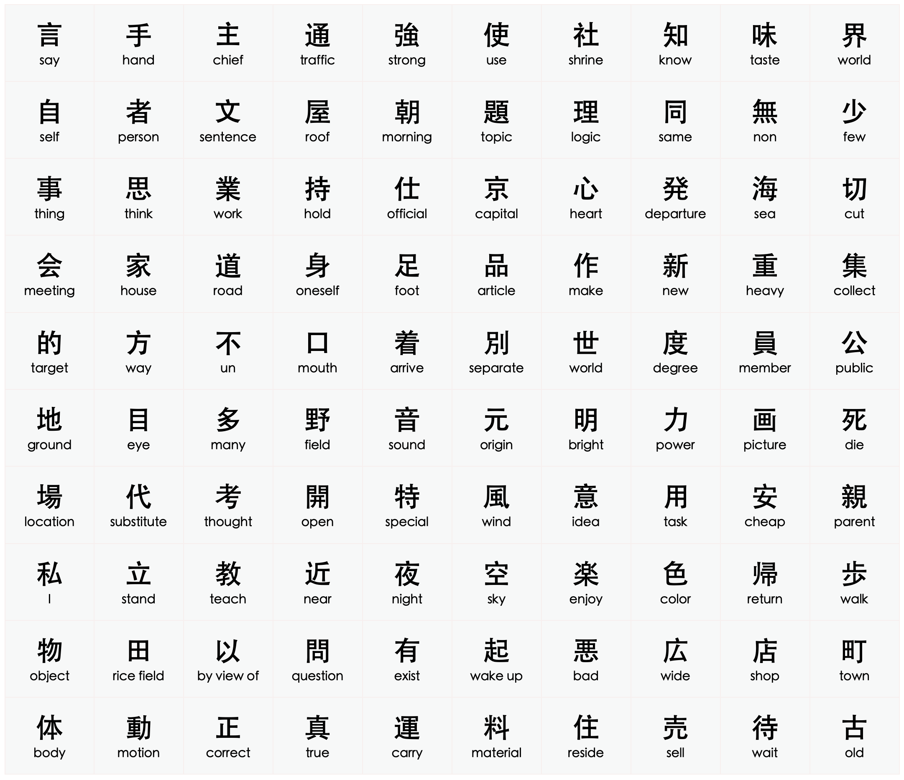

<h6> </h6>

------------------------------------------------------------------------

#### L4B {.tabset}


<h6> </h6>

------------------------------------------------------------------------

#### L3A {.tabset}

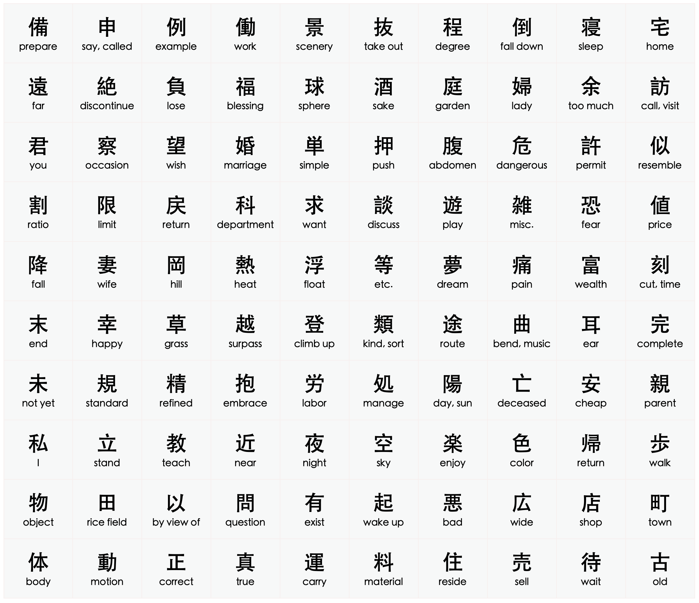

<h6> </h6>

------------------------------------------------------------------------

#### L3B {.tabset}


<h6> </h6>

------------------------------------------------------------------------

#### L3C {.tabset}

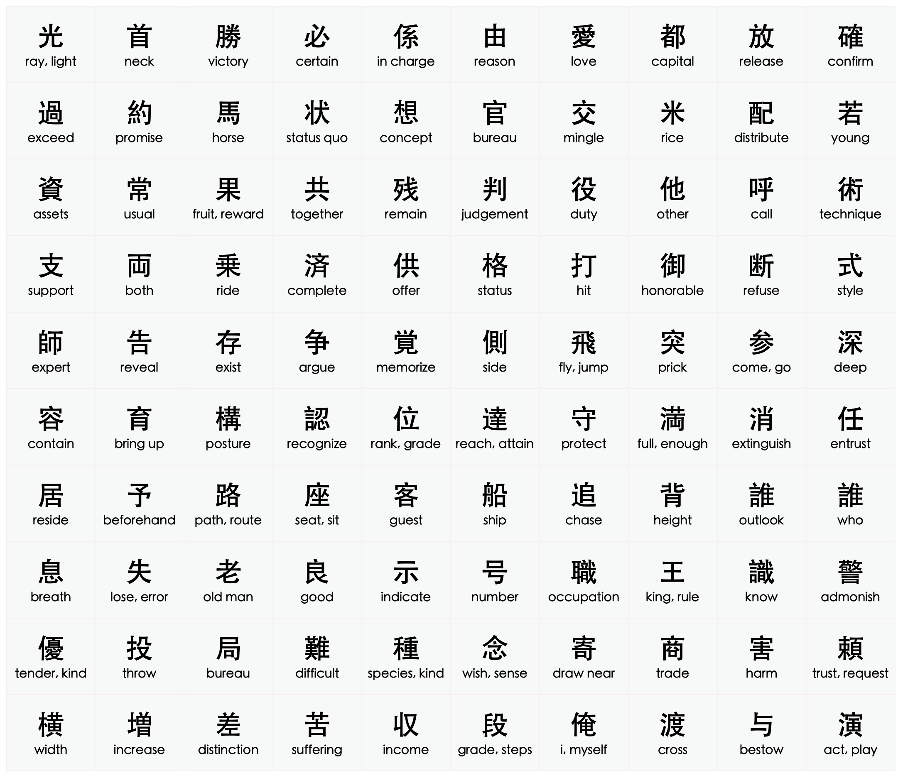

<h6> </h6>

------------------------------------------------------------------------

#### L2A {.tabset}


<h6> </h6>

------------------------------------------------------------------------

#### L2B {.tabset}

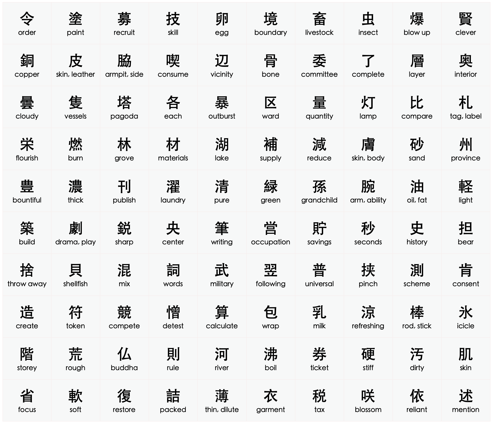

<h6> </h6>

------------------------------------------------------------------------

#### L1A {.tabset}


<h6> </h6>

------------------------------------------------------------------------

### Level {.tabset}

#### L5 {.tabset}

<div class = "row">
<div class = "col-sm-4">

```{r, echo=FALSE, message=FALSE}

scknj5r <- scknj5[sample(1:nrow(scknj5)),]

reactable(
  scknj5r,
  columns = list(
    Kanji = colDef(
      cell = function(value, index) {
        Meaning <- scknj5r$Meaning[index]
        Meaning <- if (!is.na(Meaning)) Meaning else ""
        NR <- scknj5r$NR[index]
        NR <- if (!is.na(NR)) NR else ""
        KR <- scknj5r$KR[index]
        KR <- if (!is.na(KR)) KR else ""
        tagList(
          div(style = list(fontSize = 60, fontWeight = 600, color = '#0F2040', fontFamily = 'Open Sans'), value),
          div(style = list(fontSize = 9, color = '#008000'), NR),
          div(style = list(fontSize = 9, color = '#800000'), KR),
          div(style = list(fontSize = 10, fontWeight = 500, color = '#0F2040', fontFamily = 'Open Sans'), Meaning)
        )
      },
      align = "center"
    ),

    R1 = colDef(show = FALSE),
    R2 = colDef(show = FALSE),
    R3 = colDef(show = FALSE),
    M1 = colDef(show = FALSE),
    M2 = colDef(show = FALSE),
    M3 = colDef(show = FALSE),
    W1 = colDef(show = FALSE),
    W2 = colDef(show = FALSE),
    W3 = colDef(show = FALSE),
    Meaning = colDef(show = FALSE),
    NR = colDef(show = FALSE),
    KR = colDef(show = FALSE)
  ),
  rowClass = "my-row",
  defaultPageSize = 1,
  theme = reactableTheme(
    cellStyle = list(display = "flex", flexDirection = "column", justifyContent = "center", fontSize = "11px", height = 250),
    searchInputStyle = list(
      paddingLeft = "8px",
      paddingTop = "8px",
      paddingBottom = "8px",
      width = "100%",
      fontSize = "11px"
    )
  ),
  showPageInfo = FALSE, bordered = TRUE, searchable = TRUE, sortable = FALSE, paginationType = "simple", striped = TRUE,

  style = list(fontFamily = "Noto Sans JP, Heiti SC, Hiragino Maru Gothic ProN, Anonymous Pro , monospace, Helvetica Neue", fontSize = "11px")
)

```

</div>
<div class = "col-sm-8">

```{r, echo=FALSE, message=FALSE}

scknj5w.a <- scknj5 %>% select(W1)
scknj5w.b <- scknj5 %>% select(W2)
scknj5w.c <- scknj5 %>% select(W3)

scknj5w.a <- scknj5w.a[sample(1:nrow(scknj5w.a)),]
scknj5w.b <- scknj5w.b[sample(1:nrow(scknj5w.b)),]
scknj5w.c <- scknj5w.c[sample(1:nrow(scknj5w.c)),]

scknj5w.d <- data.frame(scknj5w.a, scknj5w.b, scknj5w.c)

reactable(
  scknj5w.d,
  columns = list(
    W1 = colDef(align = "center", style = list(fontSize = 21, fontWeight = 600, fontFamily = 'Open Sans', background = '#e0e1dd', color = '#0F2040')),
    W2 = colDef(align = "center", style = list(fontSize = 21, fontWeight = 600, fontFamily = 'Open Sans', background = '#e3e4e0', color = '#0F2040')),
    W3 = colDef(align = "center", style = list(fontSize = 21, fontWeight = 600, fontFamily = 'Open Sans', background = '#e6e7e3', color = '#0F2040'))
  ),
  rowClass = "my-row",
  defaultPageSize = 5,
  theme = reactableTheme(
    cellStyle = list(display = "flex", flexDirection = "column", justifyContent = "center", height = 50),
    searchInputStyle = list(
      paddingLeft = "8px",
      paddingTop = "8px",
      paddingBottom = "8px",
      width = "100%"
    )
  ),
  showPageInfo = FALSE, outlined = TRUE, borderless = FALSE, bordered = FALSE, searchable = TRUE, sortable = FALSE, paginationType = "simple", highlight = TRUE,
  
  style = list(fontFamily = "Noto Sans JP, Heiti SC, Hiragino Maru Gothic ProN, Anonymous Pro , monospace, Helvetica Neue", fontSize = "11px")
)

```

</div>
</div>

------------------------------------------------------------------------

#### L4 {.tabset}

<div class = "row">
<div class = "col-sm-4">

```{r, echo=FALSE, message=FALSE}

scknj4r <- scknj4[sample(1:nrow(scknj4)),]

reactable(
  scknj4r,
  columns = list(
    Kanji = colDef(
      cell = function(value, index) {
        Meaning <- scknj4r$Meaning[index]
        Meaning <- if (!is.na(Meaning)) Meaning else ""
        NR <- scknj4r$NR[index]
        NR <- if (!is.na(NR)) NR else ""
        KR <- scknj4r$KR[index]
        KR <- if (!is.na(KR)) KR else ""
        tagList(
          div(style = list(fontSize = 60, fontWeight = 600, color = '#0F2040', fontFamily = 'Open Sans'), value),
          div(style = list(fontSize = 9, color = '#008000'), NR),
          div(style = list(fontSize = 9, color = '#800000'), KR),
          div(style = list(fontSize = 10, fontWeight = 500, color = '#0F2040', fontFamily = 'Open Sans'), Meaning)
        )
      },
      align = "center"
    ),
    R1 = colDef(show = FALSE),
    R2 = colDef(show = FALSE),
    R3 = colDef(show = FALSE),
    M1 = colDef(show = FALSE),
    M2 = colDef(show = FALSE),
    M3 = colDef(show = FALSE),
    W1 = colDef(show = FALSE),
    W2 = colDef(show = FALSE),
    W3 = colDef(show = FALSE),
    Meaning = colDef(show = FALSE),
    NR = colDef(show = FALSE),
    KR = colDef(show = FALSE)
  ),
  rowClass = "my-row",
  defaultPageSize = 1,
  theme = reactableTheme(
    cellStyle = list(display = "flex", flexDirection = "column", justifyContent = "center", fontSize = "11px", height = 250),
    searchInputStyle = list(
      paddingLeft = "8px",
      paddingTop = "8px",
      paddingBottom = "8px",
      width = "100%",
      fontSize = "11px"
    )
  ),
  showPageInfo = FALSE, bordered = TRUE, searchable = TRUE, sortable = FALSE, paginationType = "simple", striped = TRUE,

  style = list(fontFamily = "Noto Sans JP, Heiti SC, Hiragino Maru Gothic ProN, Anonymous Pro , monospace, Helvetica Neue", fontSize = "11px")
)

```

</div>
<div class = "col-sm-8">

```{r, echo=FALSE, message=FALSE}

scknj4w.a <- scknj4 %>% select(W1)
scknj4w.b <- scknj4 %>% select(W2)
scknj4w.c <- scknj4 %>% select(W3)

scknj4w.a <- scknj4w.a[sample(1:nrow(scknj4w.a)),]
scknj4w.b <- scknj4w.b[sample(1:nrow(scknj4w.b)),]
scknj4w.c <- scknj4w.c[sample(1:nrow(scknj4w.c)),]

scknj4w.d <- data.frame(scknj4w.a, scknj4w.b, scknj4w.c)

reactable(
  scknj4w.d,
  columns = list(
    W1 = colDef(align = "center", style = list(fontSize = 21, fontWeight = 600, fontFamily = 'Open Sans', background = '#e0e1dd', color = '#0F2040')),
    W2 = colDef(align = "center", style = list(fontSize = 21, fontWeight = 600, fontFamily = 'Open Sans', background = '#e3e4e0', color = '#0F2040')),
    W3 = colDef(align = "center", style = list(fontSize = 21, fontWeight = 600, fontFamily = 'Open Sans', background = '#e6e7e3', color = '#0F2040'))
  ),
  rowClass = "my-row",
  defaultPageSize = 5,
  theme = reactableTheme(
    cellStyle = list(display = "flex", flexDirection = "column", justifyContent = "center", height = 50),
    searchInputStyle = list(
      paddingLeft = "8px",
      paddingTop = "8px",
      paddingBottom = "8px",
      width = "100%"
    )
  ),
  showPageInfo = FALSE, outlined = TRUE, borderless = FALSE, bordered = FALSE, searchable = TRUE, sortable = FALSE, paginationType = "simple", highlight = TRUE,
  
  style = list(fontFamily = "Noto Sans JP, Heiti SC, Hiragino Maru Gothic ProN, Anonymous Pro , monospace, Helvetica Neue", fontSize = "11px")
)

```

</div>
</div>

------------------------------------------------------------------------

#### L3 {.tabset}

<div class = "row">
<div class = "col-sm-4">

```{r, echo=FALSE, message=FALSE}

scknj3r <- scknj3[sample(1:nrow(scknj3)),]

reactable(
  scknj3r,
  columns = list(
    Kanji = colDef(
      cell = function(value, index) {
        Meaning <- scknj3r$Meaning[index]
        Meaning <- if (!is.na(Meaning)) Meaning else ""
        NR <- scknj3r$NR[index]
        NR <- if (!is.na(NR)) NR else ""
        KR <- scknj3r$KR[index]
        KR <- if (!is.na(KR)) KR else ""
        tagList(
          div(style = list(fontSize = 60, fontWeight = 600, color = '#0F2040', fontFamily = 'Open Sans'), value),
          div(style = list(fontSize = 9, color = '#008000'), NR),
          div(style = list(fontSize = 9, color = '#800000'), KR),
          div(style = list(fontSize = 10, fontWeight = 500, color = '#0F2040', fontFamily = 'Open Sans'), Meaning)
        )
      },
      align = "center"
    ),
    R1 = colDef(show = FALSE),
    R2 = colDef(show = FALSE),
    R3 = colDef(show = FALSE),
    M1 = colDef(show = FALSE),
    M2 = colDef(show = FALSE),
    M3 = colDef(show = FALSE),
    W1 = colDef(show = FALSE),
    W2 = colDef(show = FALSE),
    W3 = colDef(show = FALSE),
    Meaning = colDef(show = FALSE),
    NR = colDef(show = FALSE),
    KR = colDef(show = FALSE)
    
  ),
  rowClass = "my-row",
  defaultPageSize = 1,
  theme = reactableTheme(
    cellStyle = list(display = "flex", flexDirection = "column", justifyContent = "center", fontSize = "11px", height = 250),
    searchInputStyle = list(
      paddingLeft = "8px",
      paddingTop = "8px",
      paddingBottom = "8px",
      width = "100%",
      fontSize = "11px"
    )
  ),
  showPageInfo = FALSE, bordered = TRUE, searchable = TRUE, sortable = FALSE, paginationType = "simple", striped = TRUE,

  style = list(fontFamily = "Noto Sans JP, Heiti SC, Hiragino Maru Gothic ProN, Anonymous Pro , monospace, Helvetica Neue", fontSize = "11px")
)

```

</div>
<div class = "col-sm-8">

```{r, echo=FALSE, message=FALSE}

scknj3w.a <- scknj3 %>% select(W1)
scknj3w.b <- scknj3 %>% select(W2)
scknj3w.c <- scknj3 %>% select(W3)

scknj3w.a <- scknj3w.a[sample(1:nrow(scknj3w.a)),]
scknj3w.b <- scknj3w.b[sample(1:nrow(scknj3w.b)),]
scknj3w.c <- scknj3w.c[sample(1:nrow(scknj3w.c)),]

scknj3w.d <- data.frame(scknj3w.a, scknj3w.b, scknj3w.c)

reactable(
  scknj3w.d,
  columns = list(
    W1 = colDef(align = "center", style = list(fontSize = 21, fontWeight = 600, fontFamily = 'Open Sans', background = '#e0e1dd', color = '#0F2040')),
    W2 = colDef(align = "center", style = list(fontSize = 21, fontWeight = 600, fontFamily = 'Open Sans', background = '#e3e4e0', color = '#0F2040')),
    W3 = colDef(align = "center", style = list(fontSize = 21, fontWeight = 600, fontFamily = 'Open Sans', background = '#e6e7e3', color = '#0F2040'))
  ),
  rowClass = "my-row",
  defaultPageSize = 5,
  theme = reactableTheme(
    cellStyle = list(display = "flex", flexDirection = "column", justifyContent = "center", height = 50),
    searchInputStyle = list(
      paddingLeft = "8px",
      paddingTop = "8px",
      paddingBottom = "8px",
      width = "100%"
    )
  ),
  showPageInfo = FALSE, outlined = TRUE, borderless = FALSE, bordered = FALSE, searchable = TRUE, sortable = FALSE, paginationType = "simple",  highlight = TRUE,
  
  style = list(fontFamily = "Noto Sans JP, Heiti SC, Hiragino Maru Gothic ProN, Anonymous Pro , monospace, Helvetica Neue", fontSize = "11px")
)

```

</div>
</div>

------------------------------------------------------------------------

#### L2 {.tabset}

<div class = "row">
<div class = "col-sm-4">

```{r, echo=FALSE, message=FALSE}

scknj2.a <- scknj2 %>% slice(201:380)
scknj2.b <- scknj2 %>% slice(1:200)
scknj2.a <- scknj2.a[sample(1:nrow(scknj2.a)),]
scknj2.b <- scknj2.b[sample(1:nrow(scknj2.b)),]
scknj2r <- bind_rows(scknj2.a, scknj2.b)

reactable(
  scknj2r,
  columns = list(
    Kanji = colDef(
      cell = function(value, index) {
        Meaning <- scknj2r$Meaning[index]
        Meaning <- if (!is.na(Meaning)) Meaning else ""
        NR <- scknj2r$NR[index]
        NR <- if (!is.na(NR)) NR else ""
        KR <- scknj2r$KR[index]
        KR <- if (!is.na(KR)) KR else ""
        tagList(
          div(style = list(fontSize = 60, fontWeight = 600, color = '#0F2040', fontFamily = 'Open Sans'), value),
          div(style = list(fontSize = 9, color = '#008000'), NR),
          div(style = list(fontSize = 9, color = '#800000'), KR),
          div(style = list(fontSize = 10, fontWeight = 500, color = '#0F2040', fontFamily = 'Open Sans'), Meaning)
        )
      },
      align = "center"
    ),
    R1 = colDef(show = FALSE),
    R2 = colDef(show = FALSE),
    R3 = colDef(show = FALSE),
    M1 = colDef(show = FALSE),
    M2 = colDef(show = FALSE),
    M3 = colDef(show = FALSE),
    W1 = colDef(show = FALSE),
    W2 = colDef(show = FALSE),
    W3 = colDef(show = FALSE),
    Meaning = colDef(show = FALSE),
    NR = colDef(show = FALSE),
    KR = colDef(show = FALSE)
  ),
  rowClass = "my-row",
  defaultPageSize = 1,
  theme = reactableTheme(
    cellStyle = list(display = "flex", flexDirection = "column", justifyContent = "center", fontSize = "11px", height = 250),
    searchInputStyle = list(
      paddingLeft = "8px",
      paddingTop = "8px",
      paddingBottom = "8px",
      width = "100%",
      fontSize = "11px"
    )
  ),
  showPageInfo = FALSE, bordered = TRUE, searchable = TRUE, sortable = FALSE, paginationType = "simple", striped = TRUE,

  style = list(fontFamily = "Noto Sans JP, Heiti SC, Hiragino Maru Gothic ProN, Anonymous Pro , monospace, Helvetica Neue", fontSize = "11px")
)

```

</div>
<div class = "col-sm-8">

```{r, echo=FALSE, message=FALSE}

scknj2w.a <- scknj2 %>% select(W1)
scknj2w.b <- scknj2 %>% select(W2)
scknj2w.c <- scknj2 %>% select(W3)

scknj2w.a <- scknj2w.a[sample(1:nrow(scknj2w.a)),]
scknj2w.b <- scknj2w.b[sample(1:nrow(scknj2w.b)),]
scknj2w.c <- scknj2w.c[sample(1:nrow(scknj2w.c)),]

scknj2w.d <- data.frame(scknj2w.a, scknj2w.b, scknj2w.c)

reactable(
  scknj2w.d,
  columns = list(
    W1 = colDef(align = "center", style = list(fontSize = 21, fontWeight = 600, fontFamily = 'Open Sans', background = '#e0e1dd', color = '#0F2040')),
    W2 = colDef(align = "center", style = list(fontSize = 21, fontWeight = 600, fontFamily = 'Open Sans', background = '#e3e4e0', color = '#0F2040')),
    W3 = colDef(align = "center", style = list(fontSize = 21, fontWeight = 600, fontFamily = 'Open Sans', background = '#e6e7e3', color = '#0F2040'))
  ),
  rowClass = "my-row",
  defaultPageSize = 5,
  theme = reactableTheme(
    cellStyle = list(display = "flex", flexDirection = "column", justifyContent = "center", height = 50),
    searchInputStyle = list(
      paddingLeft = "8px",
      paddingTop = "8px",
      paddingBottom = "8px",
      width = "100%"
    )
  ),
  showPageInfo = FALSE, outlined = TRUE, borderless = FALSE, bordered = FALSE, searchable = TRUE, sortable = FALSE, paginationType = "simple",  highlight = TRUE,
  
  style = list(fontFamily = "Noto Sans JP, Heiti SC, Hiragino Maru Gothic ProN, Anonymous Pro , monospace, Helvetica Neue", fontSize = "11px")
)

```

</div>
</div>

------------------------------------------------------------------------

#### L1 {.tabset}

<div class = "row">
<div class = "col-sm-4">

```{r, echo=FALSE, message=FALSE}

scknj1r <- scknj1[sample(1:nrow(scknj1)),]

reactable(
  scknj1r,
  columns = list(
    Kanji = colDef(
      cell = function(value, index) {
        Meaning <- scknj1r$Meaning[index]
        Meaning <- if (!is.na(Meaning)) Meaning else ""
        NR <- scknj1r$NR[index]
        NR <- if (!is.na(NR)) NR else ""
        KR <- scknj1r$KR[index]
        KR <- if (!is.na(KR)) KR else ""
        tagList(
          div(style = list(fontSize = 60, fontWeight = 600, color = '#0F2040', fontFamily = 'Open Sans'), value),
          div(style = list(fontSize = 9, color = '#008000'), NR),
          div(style = list(fontSize = 9, color = '#800000'), KR),
          div(style = list(fontSize = 10, fontWeight = 500, color = '#0F2040', fontFamily = 'Open Sans'), Meaning)
        )
      },
      align = "center"
    ),
    R1 = colDef(show = FALSE),
    R2 = colDef(show = FALSE),
    R3 = colDef(show = FALSE),
    M1 = colDef(show = FALSE),
    M2 = colDef(show = FALSE),
    M3 = colDef(show = FALSE),
    W1 = colDef(show = FALSE),
    W2 = colDef(show = FALSE),
    W3 = colDef(show = FALSE),
    Meaning = colDef(show = FALSE),
    NR = colDef(show = FALSE),
    KR = colDef(show = FALSE)
  ),
  rowClass = "my-row",
  defaultPageSize = 1,
  theme = reactableTheme(
    cellStyle = list(display = "flex", flexDirection = "column", justifyContent = "center", fontSize = "11px", height = 250),
    searchInputStyle = list(
      paddingLeft = "8px",
      paddingTop = "8px",
      paddingBottom = "8px",
      width = "100%",
      fontSize = "11px"
    )
  ),
  showPageInfo = FALSE, bordered = TRUE, searchable = TRUE, sortable = FALSE, paginationType = "simple", striped = TRUE,

  style = list(fontFamily = "Noto Sans JP, Heiti SC, Hiragino Maru Gothic ProN, Anonymous Pro , monospace, Helvetica Neue", fontSize = "11px")
)

```

</div>
<div class = "col-sm-8">

```{r, echo=FALSE, message=FALSE}

scknj1w.a <- scknj1 %>% select(W1)
scknj1w.b <- scknj1 %>% select(W2)
scknj1w.c <- scknj1 %>% select(W3)

scknj1w.a <- scknj1w.a[sample(1:nrow(scknj1w.a)),]
scknj1w.b <- scknj1w.b[sample(1:nrow(scknj1w.b)),]
scknj1w.c <- scknj1w.c[sample(1:nrow(scknj1w.c)),]

scknj1w.d <- data.frame(scknj1w.a, scknj1w.b, scknj1w.c)

reactable(
  scknj1w.d,
  columns = list(
    W1 = colDef(align = "center", style = list(fontSize = 21, fontWeight = 600, fontFamily = 'Open Sans', background = '#e0e1dd', color = '#0F2040')),
    W2 = colDef(align = "center", style = list(fontSize = 21, fontWeight = 600, fontFamily = 'Open Sans', background = '#e3e4e0', color = '#0F2040')),
    W3 = colDef(align = "center", style = list(fontSize = 21, fontWeight = 600, fontFamily = 'Open Sans', background = '#e6e7e3', color = '#0F2040'))
  ),
  rowClass = "my-row",
  defaultPageSize = 5,
  theme = reactableTheme(
    cellStyle = list(display = "flex", flexDirection = "column", justifyContent = "center", height = 50),
    searchInputStyle = list(
      paddingLeft = "8px",
      paddingTop = "8px",
      paddingBottom = "8px",
      width = "100%"
    )
  ),
  showPageInfo = FALSE, outlined = TRUE, borderless = FALSE, bordered = FALSE, searchable = TRUE, sortable = FALSE, paginationType = "simple",  highlight = TRUE,
  
  style = list(fontFamily = "Noto Sans JP, Heiti SC, Hiragino Maru Gothic ProN, Anonymous Pro , monospace, Helvetica Neue", fontSize = "11px")
)

```

</div>
</div>

------------------------------------------------------------------------

#### LR {.tabset}

<div class = "row">
<div class = "col-sm-4">

```{r, echo=FALSE, message=FALSE}

scrptrvw.rv <- scrptrvw[sample(1:nrow(scrptrvw)),]

reactable(
  scrptrvw.rv,
  columns = list(
    Kanji = colDef(
      cell = function(value, index) {
        Meaning <- scrptrvw.rv$Meaning[index]
        Meaning <- if (!is.na(Meaning)) Meaning else ""
        NR <- scrptrvw.rv$NR[index]
        NR <- if (!is.na(NR)) NR else ""
        KR <- scrptrvw.rv$KR[index]
        KR <- if (!is.na(KR)) KR else ""
        tagList(
          div(style = list(fontSize = 60, fontWeight = 600, color = '#0F2040', fontFamily = 'Open Sans'), value),
          div(style = list(fontSize = 9, color = '#008000'), NR),
          div(style = list(fontSize = 9, color = '#800000'), KR),
          div(style = list(fontSize = 10, fontWeight = 500, color = '#0F2040', fontFamily = 'Open Sans'), Meaning)
        )
      },
      align = "center"
    ),
    R1 = colDef(show = FALSE),
    R2 = colDef(show = FALSE),
    R3 = colDef(show = FALSE),
    M1 = colDef(show = FALSE),
    M2 = colDef(show = FALSE),
    M3 = colDef(show = FALSE),
    W1 = colDef(show = FALSE),
    W2 = colDef(show = FALSE),
    W3 = colDef(show = FALSE),
    Meaning = colDef(show = FALSE),
    NR = colDef(show = FALSE),
    KR = colDef(show = FALSE)
  ),
  rowClass = "my-row",
  defaultPageSize = 1,
  theme = reactableTheme(
    cellStyle = list(display = "flex", flexDirection = "column", justifyContent = "center", fontSize = "11px", height = 250),
    searchInputStyle = list(
      paddingLeft = "8px",
      paddingTop = "8px",
      paddingBottom = "8px",
      width = "100%",
      fontSize = "11px"
    )
  ),
  showPageInfo = FALSE, bordered = TRUE, searchable = TRUE, sortable = FALSE, paginationType = "simple", striped = TRUE,

  style = list(fontFamily = "Noto Sans JP, Heiti SC, Hiragino Maru Gothic ProN, Anonymous Pro , monospace, Helvetica Neue", fontSize = "11px")
)

```

</div>
<div class = "col-sm-8">

```{r, echo=FALSE, message=FALSE}

scrptrvw.ra <- scrptrvw %>% select(W1)
scrptrvw.rb <- scrptrvw %>% select(W2)
scrptrvw.rc <- scrptrvw %>% select(W3)

scrptrvw.ra <- scrptrvw.ra[sample(1:nrow(scrptrvw.ra)),]
scrptrvw.rb <- scrptrvw.rb[sample(1:nrow(scrptrvw.rb)),]
scrptrvw.rc <- scrptrvw.rc[sample(1:nrow(scrptrvw.rc)),]

scrptrvw.rd <- data.frame(scrptrvw.ra, scrptrvw.rb, scrptrvw.rc)

reactable(
  scrptrvw.rd,
  columns = list(
    W1 = colDef(align = "center", style = list(fontSize = 21, fontWeight = 600, fontFamily = 'Open Sans', background = '#e0e1dd', color = '#0F2040')),
    W2 = colDef(align = "center", style = list(fontSize = 21, fontWeight = 600, fontFamily = 'Open Sans', background = '#e3e4e0', color = '#0F2040')),
    W3 = colDef(align = "center", style = list(fontSize = 21, fontWeight = 600, fontFamily = 'Open Sans', background = '#e6e7e3', color = '#0F2040'))
  ),
  rowClass = "my-row",
  defaultPageSize = 5,
  theme = reactableTheme(
    cellStyle = list(display = "flex", flexDirection = "column", justifyContent = "center", height = 50),
    searchInputStyle = list(
      paddingLeft = "8px",
      paddingTop = "8px",
      paddingBottom = "8px",
      width = "100%"
    )
  ),
  showPageInfo = FALSE, outlined = TRUE, borderless = FALSE, bordered = FALSE, searchable = TRUE, sortable = FALSE, paginationType = "simple", highlight = TRUE,
  
  style = list(fontFamily = "Noto Sans JP, Heiti SC, Hiragino Maru Gothic ProN, Anonymous Pro , monospace, Helvetica Neue", fontSize = "11px")
)

```

</div>
</div>

<!-- ------------------------------------------------------------------------ -->

<!-- #### N4 {.tabset} -->

<!-- <div class = "row"> -->
<!-- <div class = "col-sm-4"> -->

<!-- ```{r, echo=FALSE, message=FALSE} -->

<!-- scknj4r <- scknj4[sample(1:nrow(scknj4)),] -->

<!-- reactable( -->
<!--   scknj4r, -->
<!--   columns = list( -->
<!--     Kanji = colDef( -->
<!--       # Show species under character names -->
<!--       cell = function(value, index) { -->
<!--         Meaning <- scknj4r$Meaning[index] -->
<!--         Meaning <- if (!is.na(Meaning)) Meaning else "" -->
<!--         NR <- scknj4r$NR[index] -->
<!--         NR <- if (!is.na(NR)) NR else "" -->
<!--         KR <- scknj4r$KR[index] -->
<!--         KR <- if (!is.na(KR)) KR else "" -->
<!--         tagList( -->
<!--           div(style = list(fontSize = 60, fontWeight = 600), value), -->
<!--           div(style = list(fontSize = 9, color = '#008000'), NR), -->
<!--           div(style = list(fontSize = 9, color = '#800000'), KR), -->
<!--           div(style = list(fontSize = 10, fontWeight = 500), Meaning) -->
<!--         ) -->
<!--       }, -->
<!--       align = "center" -->
<!--     ), -->
<!--     R1 = colDef(show = FALSE), -->
<!--     R2 = colDef(show = FALSE), -->
<!--     R3 = colDef(show = FALSE), -->
<!--     M1 = colDef(show = FALSE), -->
<!--     M2 = colDef(show = FALSE), -->
<!--     M3 = colDef(show = FALSE), -->
<!--     W1 = colDef(show = FALSE), -->
<!--     W2 = colDef(show = FALSE), -->
<!--     W3 = colDef(show = FALSE), -->
<!--     Meaning = colDef(show = FALSE), -->
<!--     NR = colDef(show = FALSE), -->
<!--     KR = colDef(show = FALSE) -->
<!--   ), -->
<!--   defaultPageSize = 1, -->
<!--   theme = reactableTheme( -->
<!--     cellStyle = list(display = "flex", flexDirection = "column", justifyContent = "center", fontSize = "11px", height = 250), -->
<!--     searchInputStyle = list( -->
<!--       paddingLeft = "8px", -->
<!--       paddingTop = "8px", -->
<!--       paddingBottom = "8px", -->
<!--       width = "100%", -->
<!--       fontSize = "11px" -->
<!--     ) -->
<!--   ), -->
<!--   showPageInfo = FALSE, bordered = TRUE, searchable = TRUE, sortable = FALSE, paginationType = "simple", striped = TRUE, -->

<!--   style = list(fontFamily = "Noto Sans JP, Heiti SC, Hiragino Maru Gothic ProN, Anonymous Pro , monospace, Helvetica Neue", fontSize = "11px") -->
<!-- ) -->

<!-- ``` -->

<!-- </div> -->
<!-- <div class = "col-sm-8"> -->

<!-- ```{r, echo=FALSE, message=FALSE} -->

<!-- scknj4w.a1 <- scknj4 %>% select(W1) %>% slice(1:80) -->
<!-- scknj4w.b1 <- scknj4 %>% select(W2) %>% slice(1:80) -->
<!-- scknj4w.c1 <- scknj4 %>% select(W3) %>% slice(1:80) -->

<!-- scknj4w.a1 <- scknj4w.a1[sample(1:nrow(scknj4w.a1)),] -->
<!-- scknj4w.b1 <- scknj4w.b1[sample(1:nrow(scknj4w.b1)),] -->
<!-- scknj4w.c1 <- scknj4w.c1[sample(1:nrow(scknj4w.c1)),] -->

<!-- scknj4w.a2 <- scknj3 %>% select(W1) %>% slice(81:170) -->
<!-- scknj4w.b2 <- scknj3 %>% select(W2) %>% slice(81:170) -->
<!-- scknj4w.c2 <- scknj3 %>% select(W3) %>% slice(81:170) -->

<!-- scknj4w.a2 <- scknj4w.a2[sample(1:nrow(scknj4w.a2)),] -->
<!-- scknj4w.b2 <- scknj4w.b2[sample(1:nrow(scknj4w.b2)),] -->
<!-- scknj4w.c2 <- scknj4w.c2[sample(1:nrow(scknj4w.c2)),] -->

<!-- scknj4w.a <- bind_rows(scknj4w.a2, scknj4w.a1) -->
<!-- scknj4w.b <- bind_rows(scknj4w.b2, scknj4w.b1) -->
<!-- scknj4w.c <- bind_rows(scknj4w.c2, scknj4w.c1) -->

<!-- scknj4w.d <- data.frame(scknj4w.a, scknj4w.b, scknj4w.c) -->

<!-- reactable( -->
<!--   scknj4w.d, -->
<!--   columns = list( -->
<!--     W1 = colDef(align = "center", style = list(fontSize = 21, fontWeight = 600, background = '#dee7e7', color = '#0F2040')), -->
<!--     W2 = colDef(align = "center", style = list(fontSize = 21, fontWeight = 600, background = '#dee7e7', color = '#0F2040')), -->
<!--     W3 = colDef(align = "center", style = list(fontSize = 21, fontWeight = 600, background = '#dee7e7', color = '#0F2040')) -->
<!--   ), -->
<!--   defaultPageSize = 5, -->
<!--   theme = reactableTheme( -->
<!--     # Vertically center cells -->
<!--     cellStyle = list(display = "flex", flexDirection = "column", justifyContent = "center", height = 50), -->
<!--     searchInputStyle = list( -->
<!--       paddingLeft = "8px", -->
<!--       paddingTop = "8px", -->
<!--       paddingBottom = "8px", -->
<!--       width = "100%" -->
<!--     ) -->
<!--   ), -->
<!--   showPageInfo = FALSE, bordered = TRUE, searchable = TRUE, sortable = FALSE, paginationType = "simple",  -->

<!--   style = list(fontFamily = "Noto Sans JP, Heiti SC, Hiragino Maru Gothic ProN, Anonymous Pro , monospace, Helvetica Neue", fontSize = "11px") -->
<!-- ) -->

<!-- ``` -->

<!-- </div> -->
<!-- </div> -->

<!-- ------------------------------------------------------------------------ -->

<!-- #### N3 {.tabset} -->

<!-- <div class = "row"> -->
<!-- <div class = "col-sm-4"> -->

<!-- ```{r, echo=FALSE, message=FALSE} -->

<!-- scknj3r <- scknj3[sample(1:nrow(scknj3)),] -->

<!-- reactable( -->
<!--   scknj3r, -->
<!--   columns = list( -->
<!--     Kanji = colDef( -->
<!--       # Show species under character names -->
<!--       cell = function(value, index) { -->
<!--         Meaning <- scknj3r$Meaning[index] -->
<!--         Meaning <- if (!is.na(Meaning)) Meaning else "" -->
<!--         NR <- scknj3r$NR[index] -->
<!--         NR <- if (!is.na(NR)) NR else "" -->
<!--         KR <- scknj3r$KR[index] -->
<!--         KR <- if (!is.na(KR)) KR else "" -->
<!--         tagList( -->
<!--           div(style = list(fontSize = 60, fontWeight = 600), value), -->
<!--           div(style = list(fontSize = 9, color = '#008000'), NR), -->
<!--           div(style = list(fontSize = 9, color = '#800000'), KR), -->
<!--           div(style = list(fontSize = 10, fontWeight = 500), Meaning) -->
<!--         ) -->
<!--       }, -->
<!--       align = "center" -->
<!--     ), -->
<!--     R1 = colDef(show = FALSE), -->
<!--     R2 = colDef(show = FALSE), -->
<!--     R3 = colDef(show = FALSE), -->
<!--     M1 = colDef(show = FALSE), -->
<!--     M2 = colDef(show = FALSE), -->
<!--     M3 = colDef(show = FALSE), -->
<!--     W1 = colDef(show = FALSE), -->
<!--     W2 = colDef(show = FALSE), -->
<!--     W3 = colDef(show = FALSE), -->
<!--     Meaning = colDef(show = FALSE), -->
<!--     NR = colDef(show = FALSE), -->
<!--     KR = colDef(show = FALSE) -->

<!--   ), -->
<!--   defaultPageSize = 1, -->
<!--   theme = reactableTheme( -->
<!--     cellStyle = list(display = "flex", flexDirection = "column", justifyContent = "center", fontSize = "11px", height = 250), -->
<!--     searchInputStyle = list( -->
<!--       paddingLeft = "8px", -->
<!--       paddingTop = "8px", -->
<!--       paddingBottom = "8px", -->
<!--       width = "100%", -->
<!--       fontSize = "11px" -->
<!--     ) -->
<!--   ), -->
<!--   showPageInfo = FALSE, bordered = TRUE, searchable = TRUE, sortable = FALSE, paginationType = "simple", striped = TRUE, -->

<!--   style = list(fontFamily = "Noto Sans JP, Heiti SC, Hiragino Maru Gothic ProN, Anonymous Pro , monospace, Helvetica Neue", fontSize = "11px") -->
<!-- ) -->

<!-- ``` -->

<!-- </div> -->
<!-- <div class = "col-sm-8"> -->

<!-- ```{r, echo=FALSE, message=FALSE} -->

<!-- scknj3w.a1 <- scknj3 %>% select(W1) %>% slice(1:40) -->
<!-- scknj3w.b1 <- scknj3 %>% select(W2) %>% slice(1:40) -->
<!-- scknj3w.c1 <- scknj3 %>% select(W3) %>% slice(1:40) -->

<!-- scknj3w.a1 <- scknj3w.a1[sample(1:nrow(scknj3w.a1)),] -->
<!-- scknj3w.b1 <- scknj3w.b1[sample(1:nrow(scknj3w.b1)),] -->
<!-- scknj3w.c1 <- scknj3w.c1[sample(1:nrow(scknj3w.c1)),] -->

<!-- scknj3w.a2 <- scknj3 %>% select(W1) %>% slice(41:80) -->
<!-- scknj3w.b2 <- scknj3 %>% select(W2) %>% slice(41:80) -->
<!-- scknj3w.c2 <- scknj3 %>% select(W3) %>% slice(41:80) -->

<!-- scknj3w.a2 <- scknj3w.a2[sample(1:nrow(scknj3w.a2)),] -->
<!-- scknj3w.b2 <- scknj3w.b2[sample(1:nrow(scknj3w.b2)),] -->
<!-- scknj3w.c2 <- scknj3w.c2[sample(1:nrow(scknj3w.c2)),] -->

<!-- scknj3w.a <- bind_rows(scknj3w.a2, scknj3w.a1) -->
<!-- scknj3w.b <- bind_rows(scknj3w.b2, scknj3w.b1) -->
<!-- scknj3w.c <- bind_rows(scknj3w.c2, scknj3w.c1) -->

<!-- scknj3w.d <- data.frame(scknj3w.a, scknj3w.b, scknj3w.c) -->

<!-- reactable( -->
<!--   scknj3w.d, -->
<!--   columns = list( -->
<!--     W1 = colDef(align = "center", style = list(fontSize = 21, fontWeight = 600, background = '#dee7e7', color = '#0F2040')), -->
<!--     W2 = colDef(align = "center", style = list(fontSize = 21, fontWeight = 600, background = '#dee7e7', color = '#0F2040')), -->
<!--     W3 = colDef(align = "center", style = list(fontSize = 21, fontWeight = 600, background = '#dee7e7', color = '#0F2040')) -->
<!--   ), -->
<!--   defaultPageSize = 5, -->
<!--   theme = reactableTheme( -->
<!--     # Vertically center cells -->
<!--     cellStyle = list(display = "flex", flexDirection = "column", justifyContent = "center", height = 50), -->
<!--     searchInputStyle = list( -->
<!--       paddingLeft = "8px", -->
<!--       paddingTop = "8px", -->
<!--       paddingBottom = "8px", -->
<!--       width = "100%" -->
<!--     ) -->
<!--   ), -->
<!--   showPageInfo = FALSE, bordered = TRUE, searchable = TRUE, sortable = FALSE, paginationType = "simple",  -->

<!--   style = list(fontFamily = "Noto Sans JP, Heiti SC, Hiragino Maru Gothic ProN, Anonymous Pro , monospace, Helvetica Neue", fontSize = "11px") -->
<!-- ) -->

<!-- ``` -->

<!-- </div> -->
<!-- </div> -->

<!-- ------------------------------------------------------------------------ -->

<!-- #### N2 {.tabset} -->

<!-- <div class = "row"> -->
<!-- <div class = "col-sm-4"> -->

<!-- ```{r, echo=FALSE, message=FALSE} -->

<!-- scknj2r <- scknj2[sample(1:nrow(scknj2)),] -->

<!-- reactable( -->
<!--   scknj2r, -->
<!--   columns = list( -->
<!--     Kanji = colDef( -->
<!--       # Show species under character names -->
<!--       cell = function(value, index) { -->
<!--         Meaning <- scknj2r$Meaning[index] -->
<!--         Meaning <- if (!is.na(Meaning)) Meaning else "" -->
<!--         NR <- scknj2r$NR[index] -->
<!--         NR <- if (!is.na(NR)) NR else "" -->
<!--         KR <- scknj2r$KR[index] -->
<!--         KR <- if (!is.na(KR)) KR else "" -->
<!--         tagList( -->
<!--           div(style = list(fontSize = 60, fontWeight = 600), value), -->
<!--           div(style = list(fontSize = 9, color = '#008000'), NR), -->
<!--           div(style = list(fontSize = 9, color = '#800000'), KR), -->
<!--           div(style = list(fontSize = 10, fontWeight = 500), Meaning) -->
<!--         ) -->
<!--       }, -->
<!--       align = "center" -->
<!--     ), -->
<!--     R1 = colDef(show = FALSE), -->
<!--     R2 = colDef(show = FALSE), -->
<!--     R3 = colDef(show = FALSE), -->
<!--     M1 = colDef(show = FALSE), -->
<!--     M2 = colDef(show = FALSE), -->
<!--     M3 = colDef(show = FALSE), -->
<!--     W1 = colDef(show = FALSE), -->
<!--     W2 = colDef(show = FALSE), -->
<!--     W3 = colDef(show = FALSE), -->
<!--     Meaning = colDef(show = FALSE), -->
<!--     NR = colDef(show = FALSE), -->
<!--     KR = colDef(show = FALSE) -->

<!--   ), -->
<!--   defaultPageSize = 1, -->
<!--   theme = reactableTheme( -->
<!--     cellStyle = list(display = "flex", flexDirection = "column", justifyContent = "center", fontSize = "11px", height = 250), -->
<!--     searchInputStyle = list( -->
<!--       paddingLeft = "8px", -->
<!--       paddingTop = "8px", -->
<!--       paddingBottom = "8px", -->
<!--       width = "100%", -->
<!--       fontSize = "11px" -->
<!--     ) -->
<!--   ), -->
<!--   showPageInfo = FALSE, bordered = TRUE, searchable = TRUE, sortable = FALSE, paginationType = "simple", striped = TRUE, -->

<!--   style = list(fontFamily = "Noto Sans JP, Heiti SC, Hiragino Maru Gothic ProN, Anonymous Pro , monospace, Helvetica Neue", fontSize = "11px") -->
<!-- ) -->

<!-- ``` -->

<!-- </div> -->
<!-- <div class = "col-sm-8"> -->

<!-- ```{r, echo=FALSE, message=FALSE} -->

<!-- scknj2w.a1 <- scknj2 %>% select(W1) %>% slice(1:40) -->
<!-- scknj2w.b1 <- scknj2 %>% select(W2) %>% slice(1:40) -->
<!-- scknj2w.c1 <- scknj2 %>% select(W3) %>% slice(1:40) -->

<!-- scknj2w.a1 <- scknj2w.a1[sample(1:nrow(scknj2w.a1)),] -->
<!-- scknj2w.b1 <- scknj2w.b1[sample(1:nrow(scknj2w.b1)),] -->
<!-- scknj2w.c1 <- scknj2w.c1[sample(1:nrow(scknj2w.c1)),] -->

<!-- scknj2w.a2 <- scknj2 %>% select(W1) %>% slice(41:80) -->
<!-- scknj2w.b2 <- scknj2 %>% select(W2) %>% slice(41:80) -->
<!-- scknj2w.c2 <- scknj2 %>% select(W3) %>% slice(41:80) -->

<!-- scknj2w.a2 <- scknj2w.a2[sample(1:nrow(scknj2w.a2)),] -->
<!-- scknj2w.b2 <- scknj2w.b2[sample(1:nrow(scknj2w.b2)),] -->
<!-- scknj2w.c2 <- scknj2w.c2[sample(1:nrow(scknj2w.c2)),] -->

<!-- scknj2w.a <- bind_rows(scknj2w.a1, scknj2w.a2) -->
<!-- scknj2w.b <- bind_rows(scknj2w.b1, scknj2w.b2) -->
<!-- scknj2w.c <- bind_rows(scknj2w.c1, scknj2w.c2) -->

<!-- scknj2w.d <- data.frame(scknj2w.a, scknj2w.b, scknj2w.c) -->

<!-- reactable( -->
<!--   scknj2w.d, -->
<!--   columns = list( -->
<!--     W1 = colDef(align = "center", style = list(fontSize = 21, fontWeight = 600, background = '#dee7e7', color = '#0F2040')), -->
<!--     W2 = colDef(align = "center", style = list(fontSize = 21, fontWeight = 600, background = '#dee7e7', color = '#0F2040')), -->
<!--     W3 = colDef(align = "center", style = list(fontSize = 21, fontWeight = 600, background = '#dee7e7', color = '#0F2040')) -->
<!--   ), -->
<!--   defaultPageSize = 5, -->
<!--   theme = reactableTheme( -->
<!--     # Vertically center cells -->
<!--     cellStyle = list(display = "flex", flexDirection = "column", justifyContent = "center", height = 50), -->
<!--     searchInputStyle = list( -->
<!--       paddingLeft = "8px", -->
<!--       paddingTop = "8px", -->
<!--       paddingBottom = "8px", -->
<!--       width = "100%" -->
<!--     ) -->
<!--   ), -->
<!--   showPageInfo = FALSE, bordered = TRUE, searchable = TRUE, sortable = FALSE, paginationType = "simple",  -->

<!--   style = list(fontFamily = "Noto Sans JP, Heiti SC, Hiragino Maru Gothic ProN, Anonymous Pro , monospace, Helvetica Neue", fontSize = "11px") -->
<!-- ) -->

<!-- ``` -->

<!-- </div> -->
<!-- </div> -->

<!-- ------------------------------------------------------------------------ -->

<!-- #### N1 {.tabset} -->

<!-- <div class = "row"> -->
<!-- <div class = "col-sm-4"> -->

<!-- ```{r, echo=FALSE, message=FALSE} -->

<!-- scknj1r <- scknj1[sample(1:nrow(scknj1)),] -->

<!-- reactable( -->
<!--   scknj1r, -->
<!--   columns = list( -->
<!--     Kanji = colDef( -->
<!--       # Show species under character names -->
<!--       cell = function(value, index) { -->
<!--         Meaning <- scknj1r$Meaning[index] -->
<!--         Meaning <- if (!is.na(Meaning)) Meaning else "" -->
<!--         NR <- scknj1r$NR[index] -->
<!--         NR <- if (!is.na(NR)) NR else "" -->
<!--         KR <- scknj1r$KR[index] -->
<!--         KR <- if (!is.na(KR)) KR else "" -->
<!--         tagList( -->
<!--           div(style = list(fontSize = 60, fontWeight = 600), value), -->
<!--           div(style = list(fontSize = 9, color = '#008000'), NR), -->
<!--           div(style = list(fontSize = 9, color = '#800000'), KR), -->
<!--           div(style = list(fontSize = 10, fontWeight = 500), Meaning) -->
<!--         ) -->
<!--       }, -->
<!--       align = "center" -->
<!--     ), -->
<!--     R1 = colDef(show = FALSE), -->
<!--     R2 = colDef(show = FALSE), -->
<!--     R3 = colDef(show = FALSE), -->
<!--     M1 = colDef(show = FALSE), -->
<!--     M2 = colDef(show = FALSE), -->
<!--     M3 = colDef(show = FALSE), -->
<!--     W1 = colDef(show = FALSE), -->
<!--     W2 = colDef(show = FALSE), -->
<!--     W3 = colDef(show = FALSE), -->
<!--     Meaning = colDef(show = FALSE), -->
<!--     NR = colDef(show = FALSE), -->
<!--     KR = colDef(show = FALSE) -->

<!--   ), -->
<!--   defaultPageSize = 1, -->
<!--   theme = reactableTheme( -->
<!--     cellStyle = list(display = "flex", flexDirection = "column", justifyContent = "center", fontSize = "11px", height = 250), -->
<!--     searchInputStyle = list( -->
<!--       paddingLeft = "8px", -->
<!--       paddingTop = "8px", -->
<!--       paddingBottom = "8px", -->
<!--       width = "100%", -->
<!--       fontSize = "11px" -->
<!--     ) -->
<!--   ), -->
<!--   showPageInfo = FALSE, bordered = TRUE, searchable = TRUE, sortable = FALSE, paginationType = "simple", striped = TRUE, -->

<!--   style = list(fontFamily = "Noto Sans JP, Heiti SC, Hiragino Maru Gothic ProN, Anonymous Pro , monospace, Helvetica Neue", fontSize = "11px") -->
<!-- ) -->

<!-- ``` -->

<!-- </div> -->
<!-- <div class = "col-sm-8"> -->

<!-- ```{r, echo=FALSE, message=FALSE} -->

<!-- scknj1w.a1 <- scknj1 %>% select(W1) %>% slice(1:40) -->
<!-- scknj1w.b1 <- scknj1 %>% select(W2) %>% slice(1:40) -->
<!-- scknj1w.c1 <- scknj1 %>% select(W3) %>% slice(1:40) -->

<!-- scknj1w.a1 <- scknj1w.a1[sample(1:nrow(scknj1w.a1)),] -->
<!-- scknj1w.b1 <- scknj1w.b1[sample(1:nrow(scknj1w.b1)),] -->
<!-- scknj1w.c1 <- scknj1w.c1[sample(1:nrow(scknj1w.c1)),] -->

<!-- scknj1w.a2 <- scknj1 %>% select(W1) %>% slice(41:80) -->
<!-- scknj1w.b2 <- scknj1 %>% select(W2) %>% slice(41:80) -->
<!-- scknj1w.c2 <- scknj1 %>% select(W3) %>% slice(41:80) -->

<!-- scknj1w.a2 <- scknj1w.a2[sample(1:nrow(scknj1w.a2)),] -->
<!-- scknj1w.b2 <- scknj1w.b2[sample(1:nrow(scknj1w.b2)),] -->
<!-- scknj1w.c2 <- scknj1w.c2[sample(1:nrow(scknj1w.c2)),] -->

<!-- scknj1w.a <- bind_rows(scknj1w.a1, scknj1w.a2) -->
<!-- scknj1w.b <- bind_rows(scknj1w.b1, scknj1w.b2) -->
<!-- scknj1w.c <- bind_rows(scknj1w.c1, scknj1w.c2) -->

<!-- scknj1w.d <- data.frame(scknj1w.a, scknj1w.b, scknj1w.c) -->

<!-- reactable( -->
<!--   scknj1w.d, -->
<!--   columns = list( -->
<!--     W1 = colDef(align = "center", style = list(fontSize = 21, fontWeight = 600, background = '#dee7e7', color = '#0F2040')), -->
<!--     W2 = colDef(align = "center", style = list(fontSize = 21, fontWeight = 600, background = '#dee7e7', color = '#0F2040')), -->
<!--     W3 = colDef(align = "center", style = list(fontSize = 21, fontWeight = 600, background = '#dee7e7', color = '#0F2040')) -->
<!--   ), -->
<!--   defaultPageSize = 5, -->
<!--   theme = reactableTheme( -->
<!--     # Vertically center cells -->
<!--     cellStyle = list(display = "flex", flexDirection = "column", justifyContent = "center", height = 50), -->
<!--     searchInputStyle = list( -->
<!--       paddingLeft = "8px", -->
<!--       paddingTop = "8px", -->
<!--       paddingBottom = "8px", -->
<!--       width = "100%" -->
<!--     ) -->
<!--   ), -->
<!--   showPageInfo = FALSE, bordered = TRUE, searchable = TRUE, sortable = FALSE, paginationType = "simple",  -->

<!--   style = list(fontFamily = "Noto Sans JP, Heiti SC, Hiragino Maru Gothic ProN, Anonymous Pro , monospace, Helvetica Neue", fontSize = "11px") -->
<!-- ) -->

<!-- ``` -->

<!-- </div> -->
<!-- </div> -->

<!-- ------------------------------------------------------------------------ -->

<!-- ### Sense {.tabset} -->

<!-- #### N1 {.tabset} -->

<!-- ```{r, echo=FALSE, message=FALSE} -->

<!-- scknjr.ra <- scknjr %>% select(W1) %>% slice(1:10) -->
<!-- scknjr.rb <- scknjr %>% select(W2) %>% slice(1:10) -->
<!-- scknjr.rc <- scknjr %>% select(W3) %>% slice(1:10) -->
<!-- scknjr.rd <- scknjr %>% select(W4) %>% slice(1:10) -->
<!-- scknjr.re <- scknjr %>% select(W5) %>% slice(1:10) -->

<!-- scknjr.ra <- scknjr.ra[sample(1:nrow(scknjr.ra)),] -->
<!-- scknjr.rb <- scknjr.rb[sample(1:nrow(scknjr.rb)),] -->
<!-- scknjr.rc <- scknjr.rc[sample(1:nrow(scknjr.rc)),] -->
<!-- scknjr.rd <- scknjr.rd[sample(1:nrow(scknjr.rd)),] -->
<!-- scknjr.re <- scknjr.re[sample(1:nrow(scknjr.re)),] -->

<!-- scknjr.ra <- scknjr.ra[sample(1:nrow(scknjr.ra)),] -->
<!-- scknjr.rb <- scknjr.rb[sample(1:nrow(scknjr.rb)),] -->
<!-- scknjr.rc <- scknjr.rc[sample(1:nrow(scknjr.rc)),] -->
<!-- scknjr.rd <- scknjr.rd[sample(1:nrow(scknjr.rd)),] -->
<!-- scknjr.re <- scknjr.re[sample(1:nrow(scknjr.re)),] -->

<!-- scknjr.rf <- data.frame(scknjr.ra, scknjr.rb, scknjr.rc, scknjr.rd, scknjr.re) -->

<!-- reactable( -->
<!--   scknjr.rf, -->
<!--   columns = list( -->
<!--     W1 = colDef(align = "center", style = list(fontSize = 21, fontWeight = 600, background = '#dee7e7', color = '#0F2040')), -->
<!--     W2 = colDef(align = "center", style = list(fontSize = 21, fontWeight = 600, background = '#dee7e7', color = '#0F2040')), -->
<!--     W3 = colDef(align = "center", style = list(fontSize = 21, fontWeight = 600, background = '#dee7e7', color = '#0F2040')), -->
<!--     W4 = colDef(align = "center", style = list(fontSize = 21, fontWeight = 600, background = '#dee7e7', color = '#0F2040')), -->
<!--     W5 = colDef(align = "center", style = list(fontSize = 21, fontWeight = 600, background = '#dee7e7', color = '#0F2040')) -->
<!--   ), -->
<!--   defaultPageSize = 5, -->
<!--   theme = reactableTheme( -->
<!--     # Vertically center cells -->
<!--     cellStyle = list(display = "flex", flexDirection = "column", justifyContent = "center", height = 60), -->
<!--     searchInputStyle = list( -->
<!--       paddingLeft = "8px", -->
<!--       paddingTop = "8px", -->
<!--       paddingBottom = "8px", -->
<!--       width = "100%" -->
<!--     ) -->
<!--   ), -->
<!--   showPageInfo = FALSE, bordered = TRUE, searchable = TRUE, sortable = FALSE, paginationType = "simple",  -->

<!--   style = list(fontFamily = "Noto Sans JP, Heiti SC, Hiragino Maru Gothic ProN, Anonymous Pro , monospace, Helvetica Neue", fontSize = "11px") -->
<!-- ) -->

<!-- ``` -->

<!-- ------------------------------------------------------------------------ -->

<!-- #### N2 {.tabset} -->

<!-- ```{r, echo=FALSE, message=FALSE} -->

<!-- scknjr.ra <- scknjr %>% select(W1) %>% slice(11:20) -->
<!-- scknjr.rb <- scknjr %>% select(W2) %>% slice(11:20) -->
<!-- scknjr.rc <- scknjr %>% select(W3) %>% slice(11:20) -->
<!-- scknjr.rd <- scknjr %>% select(W4) %>% slice(11:20) -->
<!-- scknjr.re <- scknjr %>% select(W5) %>% slice(11:20) -->

<!-- scknjr.ra <- scknjr.ra[sample(1:nrow(scknjr.ra)),] -->
<!-- scknjr.rb <- scknjr.rb[sample(1:nrow(scknjr.rb)),] -->
<!-- scknjr.rc <- scknjr.rc[sample(1:nrow(scknjr.rc)),] -->
<!-- scknjr.rd <- scknjr.rd[sample(1:nrow(scknjr.rd)),] -->
<!-- scknjr.re <- scknjr.re[sample(1:nrow(scknjr.re)),] -->

<!-- scknjr.ra <- scknjr.ra[sample(1:nrow(scknjr.ra)),] -->
<!-- scknjr.rb <- scknjr.rb[sample(1:nrow(scknjr.rb)),] -->
<!-- scknjr.rc <- scknjr.rc[sample(1:nrow(scknjr.rc)),] -->
<!-- scknjr.rd <- scknjr.rd[sample(1:nrow(scknjr.rd)),] -->
<!-- scknjr.re <- scknjr.re[sample(1:nrow(scknjr.re)),] -->

<!-- scknjr.rf <- data.frame(scknjr.ra, scknjr.rb, scknjr.rc, scknjr.rd, scknjr.re) -->

<!-- reactable( -->
<!--   scknjr.rf, -->
<!--   columns = list( -->
<!--     W1 = colDef(align = "center", style = list(fontSize = 21, fontWeight = 600, background = '#dee7e7', color = '#0F2040')), -->
<!--     W2 = colDef(align = "center", style = list(fontSize = 21, fontWeight = 600, background = '#dee7e7', color = '#0F2040')), -->
<!--     W3 = colDef(align = "center", style = list(fontSize = 21, fontWeight = 600, background = '#dee7e7', color = '#0F2040')), -->
<!--     W4 = colDef(align = "center", style = list(fontSize = 21, fontWeight = 600, background = '#dee7e7', color = '#0F2040')), -->
<!--     W5 = colDef(align = "center", style = list(fontSize = 21, fontWeight = 600, background = '#dee7e7', color = '#0F2040')) -->
<!--   ), -->
<!--   defaultPageSize = 5, -->
<!--   theme = reactableTheme( -->
<!--     # Vertically center cells -->
<!--     cellStyle = list(display = "flex", flexDirection = "column", justifyContent = "center", height = 60), -->
<!--     searchInputStyle = list( -->
<!--       paddingLeft = "8px", -->
<!--       paddingTop = "8px", -->
<!--       paddingBottom = "8px", -->
<!--       width = "100%" -->
<!--     ) -->
<!--   ), -->
<!--   showPageInfo = FALSE, bordered = TRUE, searchable = TRUE, sortable = FALSE, paginationType = "simple",  -->

<!--   style = list(fontFamily = "Noto Sans JP, Heiti SC, Hiragino Maru Gothic ProN, Anonymous Pro , monospace, Helvetica Neue", fontSize = "11px") -->
<!-- ) -->

<!-- ``` -->

<!-- ------------------------------------------------------------------------ -->

<!-- #### N3 {.tabset} -->

<!-- ```{r, echo=FALSE, message=FALSE} -->

<!-- scknjr.ra <- scknjr %>% select(W1) %>% slice(21:30) -->
<!-- scknjr.rb <- scknjr %>% select(W2) %>% slice(21:30) -->
<!-- scknjr.rc <- scknjr %>% select(W3) %>% slice(21:30) -->
<!-- scknjr.rd <- scknjr %>% select(W4) %>% slice(21:30) -->
<!-- scknjr.re <- scknjr %>% select(W5) %>% slice(21:30) -->

<!-- scknjr.ra <- scknjr.ra[sample(1:nrow(scknjr.ra)),] -->
<!-- scknjr.rb <- scknjr.rb[sample(1:nrow(scknjr.rb)),] -->
<!-- scknjr.rc <- scknjr.rc[sample(1:nrow(scknjr.rc)),] -->
<!-- scknjr.rd <- scknjr.rd[sample(1:nrow(scknjr.rd)),] -->
<!-- scknjr.re <- scknjr.re[sample(1:nrow(scknjr.re)),] -->

<!-- scknjr.rf <- data.frame(scknjr.ra, scknjr.rb, scknjr.rc, scknjr.rd, scknjr.re) -->

<!-- reactable( -->
<!--   scknjr.rf, -->
<!--   columns = list( -->
<!--     W1 = colDef(align = "center", style = list(fontSize = 21, fontWeight = 600, background = '#dee7e7', color = '#0F2040')), -->
<!--     W2 = colDef(align = "center", style = list(fontSize = 21, fontWeight = 600, background = '#dee7e7', color = '#0F2040')), -->
<!--     W3 = colDef(align = "center", style = list(fontSize = 21, fontWeight = 600, background = '#dee7e7', color = '#0F2040')), -->
<!--     W4 = colDef(align = "center", style = list(fontSize = 21, fontWeight = 600, background = '#dee7e7', color = '#0F2040')), -->
<!--     W5 = colDef(align = "center", style = list(fontSize = 21, fontWeight = 600, background = '#dee7e7', color = '#0F2040')) -->
<!--   ), -->
<!--   defaultPageSize = 5, -->
<!--   theme = reactableTheme( -->
<!--     # Vertically center cells -->
<!--     cellStyle = list(display = "flex", flexDirection = "column", justifyContent = "center", height = 60), -->
<!--     searchInputStyle = list( -->
<!--       paddingLeft = "8px", -->
<!--       paddingTop = "8px", -->
<!--       paddingBottom = "8px", -->
<!--       width = "100%" -->
<!--     ) -->
<!--   ), -->
<!--   showPageInfo = FALSE, bordered = TRUE, searchable = TRUE, sortable = FALSE, paginationType = "simple",  -->

<!--   style = list(fontFamily = "Noto Sans JP, Heiti SC, Hiragino Maru Gothic ProN, Anonymous Pro , monospace, Helvetica Neue", fontSize = "11px") -->
<!-- ) -->

<!-- ``` -->

<!-- ------------------------------------------------------------------------ -->

<!-- #### N4 {.tabset} -->

<!-- ```{r, echo=FALSE, message=FALSE} -->

<!-- scknjr.ra <- scknjr %>% select(W1) %>% slice(31:40) -->
<!-- scknjr.rb <- scknjr %>% select(W2) %>% slice(31:40) -->
<!-- scknjr.rc <- scknjr %>% select(W3) %>% slice(31:40) -->
<!-- scknjr.rd <- scknjr %>% select(W4) %>% slice(31:40) -->
<!-- scknjr.re <- scknjr %>% select(W5) %>% slice(31:40) -->

<!-- scknjr.ra <- scknjr.ra[sample(1:nrow(scknjr.ra)),] -->
<!-- scknjr.rb <- scknjr.rb[sample(1:nrow(scknjr.rb)),] -->
<!-- scknjr.rc <- scknjr.rc[sample(1:nrow(scknjr.rc)),] -->
<!-- scknjr.rd <- scknjr.rd[sample(1:nrow(scknjr.rd)),] -->
<!-- scknjr.re <- scknjr.re[sample(1:nrow(scknjr.re)),] -->

<!-- scknjr.rf <- data.frame(scknjr.ra, scknjr.rb, scknjr.rc, scknjr.rd, scknjr.re) -->

<!-- reactable( -->
<!--   scknjr.rf, -->
<!--   columns = list( -->
<!--     W1 = colDef(align = "center", style = list(fontSize = 21, fontWeight = 600, background = '#dee7e7', color = '#0F2040')), -->
<!--     W2 = colDef(align = "center", style = list(fontSize = 21, fontWeight = 600, background = '#dee7e7', color = '#0F2040')), -->
<!--     W3 = colDef(align = "center", style = list(fontSize = 21, fontWeight = 600, background = '#dee7e7', color = '#0F2040')), -->
<!--     W4 = colDef(align = "center", style = list(fontSize = 21, fontWeight = 600, background = '#dee7e7', color = '#0F2040')), -->
<!--     W5 = colDef(align = "center", style = list(fontSize = 21, fontWeight = 600, background = '#dee7e7', color = '#0F2040')) -->
<!--   ), -->
<!--   defaultPageSize = 5, -->
<!--   theme = reactableTheme( -->
<!--     # Vertically center cells -->
<!--     cellStyle = list(display = "flex", flexDirection = "column", justifyContent = "center", height = 60), -->
<!--     searchInputStyle = list( -->
<!--       paddingLeft = "8px", -->
<!--       paddingTop = "8px", -->
<!--       paddingBottom = "8px", -->
<!--       width = "100%" -->
<!--     ) -->
<!--   ), -->
<!--   showPageInfo = FALSE, bordered = TRUE, searchable = TRUE, sortable = FALSE, paginationType = "simple",  -->

<!--   style = list(fontFamily = "Noto Sans JP, Heiti SC, Hiragino Maru Gothic ProN, Anonymous Pro , monospace, Helvetica Neue", fontSize = "11px") -->
<!-- ) -->

<!-- ``` -->

<!-- ------------------------------------------------------------------------ -->

<!-- #### N5 {.tabset} -->

<!-- ```{r, echo=FALSE, message=FALSE} -->

<!-- scknjr.ra <- scknjr %>% select(W1) %>% slice(41:50) -->
<!-- scknjr.rb <- scknjr %>% select(W2) %>% slice(41:50) -->
<!-- scknjr.rc <- scknjr %>% select(W3) %>% slice(41:50) -->
<!-- scknjr.rd <- scknjr %>% select(W4) %>% slice(41:50) -->
<!-- scknjr.re <- scknjr %>% select(W5) %>% slice(41:50) -->

<!-- scknjr.ra <- scknjr.ra[sample(1:nrow(scknjr.ra)),] -->
<!-- scknjr.rb <- scknjr.rb[sample(1:nrow(scknjr.rb)),] -->
<!-- scknjr.rc <- scknjr.rc[sample(1:nrow(scknjr.rc)),] -->
<!-- scknjr.rd <- scknjr.rd[sample(1:nrow(scknjr.rd)),] -->
<!-- scknjr.re <- scknjr.re[sample(1:nrow(scknjr.re)),] -->

<!-- scknjr.rf <- data.frame(scknjr.ra, scknjr.rb, scknjr.rc, scknjr.rd, scknjr.re) -->

<!-- reactable( -->
<!--   scknjr.rf, -->
<!--   columns = list( -->
<!--     W1 = colDef(align = "center", style = list(fontSize = 21, fontWeight = 600, background = '#dee7e7', color = '#0F2040')), -->
<!--     W2 = colDef(align = "center", style = list(fontSize = 21, fontWeight = 600, background = '#dee7e7', color = '#0F2040')), -->
<!--     W3 = colDef(align = "center", style = list(fontSize = 21, fontWeight = 600, background = '#dee7e7', color = '#0F2040')), -->
<!--     W4 = colDef(align = "center", style = list(fontSize = 21, fontWeight = 600, background = '#dee7e7', color = '#0F2040')), -->
<!--     W5 = colDef(align = "center", style = list(fontSize = 21, fontWeight = 600, background = '#dee7e7', color = '#0F2040')) -->
<!--   ), -->
<!--   defaultPageSize = 5, -->
<!--   theme = reactableTheme( -->
<!--     # Vertically center cells -->
<!--     cellStyle = list(display = "flex", flexDirection = "column", justifyContent = "center", height = 60), -->
<!--     searchInputStyle = list( -->
<!--       paddingLeft = "8px", -->
<!--       paddingTop = "8px", -->
<!--       paddingBottom = "8px", -->
<!--       width = "100%" -->
<!--     ) -->
<!--   ), -->
<!--   showPageInfo = FALSE, bordered = TRUE, searchable = TRUE, sortable = FALSE, paginationType = "simple",  -->

<!--   style = list(fontFamily = "Noto Sans JP, Heiti SC, Hiragino Maru Gothic ProN, Anonymous Pro , monospace, Helvetica Neue", fontSize = "11px") -->
<!-- ) -->

<!-- ``` -->

<!-- ------------------------------------------------------------------------ -->

<!-- #### N6 {.tabset} -->

<!-- ```{r, echo=FALSE, message=FALSE} -->

<!-- scknjr.ra <- scknjr %>% select(W1) %>% slice(51:60) -->
<!-- scknjr.rb <- scknjr %>% select(W2) %>% slice(51:60) -->
<!-- scknjr.rc <- scknjr %>% select(W3) %>% slice(51:60) -->
<!-- scknjr.rd <- scknjr %>% select(W4) %>% slice(51:60) -->
<!-- scknjr.re <- scknjr %>% select(W5) %>% slice(51:60) -->

<!-- scknjr.ra <- scknjr.ra[sample(1:nrow(scknjr.ra)),] -->
<!-- scknjr.rb <- scknjr.rb[sample(1:nrow(scknjr.rb)),] -->
<!-- scknjr.rc <- scknjr.rc[sample(1:nrow(scknjr.rc)),] -->
<!-- scknjr.rd <- scknjr.rd[sample(1:nrow(scknjr.rd)),] -->
<!-- scknjr.re <- scknjr.re[sample(1:nrow(scknjr.re)),] -->

<!-- scknjr.rf <- data.frame(scknjr.ra, scknjr.rb, scknjr.rc, scknjr.rd, scknjr.re) -->

<!-- reactable( -->
<!--   scknjr.rf, -->
<!--   columns = list( -->
<!--     W1 = colDef(align = "center", style = list(fontSize = 21, fontWeight = 600, background = '#dee7e7', color = '#0F2040')), -->
<!--     W2 = colDef(align = "center", style = list(fontSize = 21, fontWeight = 600, background = '#dee7e7', color = '#0F2040')), -->
<!--     W3 = colDef(align = "center", style = list(fontSize = 21, fontWeight = 600, background = '#dee7e7', color = '#0F2040')), -->
<!--     W4 = colDef(align = "center", style = list(fontSize = 21, fontWeight = 600, background = '#dee7e7', color = '#0F2040')), -->
<!--     W5 = colDef(align = "center", style = list(fontSize = 21, fontWeight = 600, background = '#dee7e7', color = '#0F2040')) -->
<!--   ), -->
<!--   defaultPageSize = 5, -->
<!--   theme = reactableTheme( -->
<!--     # Vertically center cells -->
<!--     cellStyle = list(display = "flex", flexDirection = "column", justifyContent = "center", height = 60), -->
<!--     searchInputStyle = list( -->
<!--       paddingLeft = "8px", -->
<!--       paddingTop = "8px", -->
<!--       paddingBottom = "8px", -->
<!--       width = "100%" -->
<!--     ) -->
<!--   ), -->
<!--   showPageInfo = FALSE, bordered = TRUE, searchable = TRUE, sortable = FALSE, paginationType = "simple",  -->

<!--   style = list(fontFamily = "Noto Sans JP, Heiti SC, Hiragino Maru Gothic ProN, Anonymous Pro , monospace, Helvetica Neue", fontSize = "11px") -->
<!-- ) -->

<!-- ``` -->

<!-- ------------------------------------------------------------------------ -->

<!-- #### N7 {.tabset} -->

<!-- ```{r, echo=FALSE, message=FALSE} -->

<!-- scknjr.ra <- scknjr %>% select(W1) %>% slice(61:70) -->
<!-- scknjr.rb <- scknjr %>% select(W2) %>% slice(61:70) -->
<!-- scknjr.rc <- scknjr %>% select(W3) %>% slice(61:70) -->
<!-- scknjr.rd <- scknjr %>% select(W4) %>% slice(61:70) -->
<!-- scknjr.re <- scknjr %>% select(W5) %>% slice(61:70) -->

<!-- scknjr.ra <- scknjr.ra[sample(1:nrow(scknjr.ra)),] -->
<!-- scknjr.rb <- scknjr.rb[sample(1:nrow(scknjr.rb)),] -->
<!-- scknjr.rc <- scknjr.rc[sample(1:nrow(scknjr.rc)),] -->
<!-- scknjr.rd <- scknjr.rd[sample(1:nrow(scknjr.rd)),] -->
<!-- scknjr.re <- scknjr.re[sample(1:nrow(scknjr.re)),] -->

<!-- scknjr.rf <- data.frame(scknjr.ra, scknjr.rb, scknjr.rc, scknjr.rd, scknjr.re) -->

<!-- reactable( -->
<!--   scknjr.rf, -->
<!--   columns = list( -->
<!--     W1 = colDef(align = "center", style = list(fontSize = 21, fontWeight = 600, background = '#dee7e7', color = '#0F2040')), -->
<!--     W2 = colDef(align = "center", style = list(fontSize = 21, fontWeight = 600, background = '#dee7e7', color = '#0F2040')), -->
<!--     W3 = colDef(align = "center", style = list(fontSize = 21, fontWeight = 600, background = '#dee7e7', color = '#0F2040')), -->
<!--     W4 = colDef(align = "center", style = list(fontSize = 21, fontWeight = 600, background = '#dee7e7', color = '#0F2040')), -->
<!--     W5 = colDef(align = "center", style = list(fontSize = 21, fontWeight = 600, background = '#dee7e7', color = '#0F2040')) -->
<!--   ), -->
<!--   defaultPageSize = 5, -->
<!--   theme = reactableTheme( -->
<!--     # Vertically center cells -->
<!--     cellStyle = list(display = "flex", flexDirection = "column", justifyContent = "center", height = 60), -->
<!--     searchInputStyle = list( -->
<!--       paddingLeft = "8px", -->
<!--       paddingTop = "8px", -->
<!--       paddingBottom = "8px", -->
<!--       width = "100%" -->
<!--     ) -->
<!--   ), -->
<!--   showPageInfo = FALSE, bordered = TRUE, searchable = TRUE, sortable = FALSE, paginationType = "simple",  -->

<!--   style = list(fontFamily = "Noto Sans JP, Heiti SC, Hiragino Maru Gothic ProN, Anonymous Pro , monospace, Helvetica Neue", fontSize = "11px") -->
<!-- ) -->

<!-- ``` -->

<!-- ------------------------------------------------------------------------ -->

<!-- #### N8 {.tabset} -->

<!-- ```{r, echo=FALSE, message=FALSE} -->

<!-- scknjr.ra <- scknjr %>% select(W1) %>% slice(71:80) -->
<!-- scknjr.rb <- scknjr %>% select(W2) %>% slice(71:80) -->
<!-- scknjr.rc <- scknjr %>% select(W3) %>% slice(71:80) -->
<!-- scknjr.rd <- scknjr %>% select(W4) %>% slice(71:80) -->
<!-- scknjr.re <- scknjr %>% select(W5) %>% slice(71:80) -->

<!-- scknjr.ra <- scknjr.ra[sample(1:nrow(scknjr.ra)),] -->
<!-- scknjr.rb <- scknjr.rb[sample(1:nrow(scknjr.rb)),] -->
<!-- scknjr.rc <- scknjr.rc[sample(1:nrow(scknjr.rc)),] -->
<!-- scknjr.rd <- scknjr.rd[sample(1:nrow(scknjr.rd)),] -->
<!-- scknjr.re <- scknjr.re[sample(1:nrow(scknjr.re)),] -->

<!-- scknjr.rf <- data.frame(scknjr.ra, scknjr.rb, scknjr.rc, scknjr.rd, scknjr.re) -->

<!-- reactable( -->
<!--   scknjr.rf, -->
<!--   columns = list( -->
<!--     W1 = colDef(align = "center", style = list(fontSize = 21, fontWeight = 600, background = '#dee7e7', color = '#0F2040')), -->
<!--     W2 = colDef(align = "center", style = list(fontSize = 21, fontWeight = 600, background = '#dee7e7', color = '#0F2040')), -->
<!--     W3 = colDef(align = "center", style = list(fontSize = 21, fontWeight = 600, background = '#dee7e7', color = '#0F2040')), -->
<!--     W4 = colDef(align = "center", style = list(fontSize = 21, fontWeight = 600, background = '#dee7e7', color = '#0F2040')), -->
<!--     W5 = colDef(align = "center", style = list(fontSize = 21, fontWeight = 600, background = '#dee7e7', color = '#0F2040')) -->
<!--   ), -->
<!--   defaultPageSize = 5, -->
<!--   theme = reactableTheme( -->
<!--     # Vertically center cells -->
<!--     cellStyle = list(display = "flex", flexDirection = "column", justifyContent = "center", height = 60), -->
<!--     searchInputStyle = list( -->
<!--       paddingLeft = "8px", -->
<!--       paddingTop = "8px", -->
<!--       paddingBottom = "8px", -->
<!--       width = "100%" -->
<!--     ) -->
<!--   ), -->
<!--   showPageInfo = FALSE, bordered = TRUE, searchable = TRUE, sortable = FALSE, paginationType = "simple",  -->

<!--   style = list(fontFamily = "Noto Sans JP, Heiti SC, Hiragino Maru Gothic ProN, Anonymous Pro , monospace, Helvetica Neue", fontSize = "11px") -->
<!-- ) -->

<!-- ``` -->

<!-- ------------------------------------------------------------------------ -->

<!-- #### NA {.tabset} -->

<!-- ```{r, echo=FALSE, message=FALSE} -->

<!-- scknjr.ra <- scknjr %>% select(W1) %>% slice(1:80) -->
<!-- scknjr.rb <- scknjr %>% select(W2) %>% slice(1:80) -->
<!-- scknjr.rc <- scknjr %>% select(W3) %>% slice(1:80) -->
<!-- scknjr.rd <- scknjr %>% select(W4) %>% slice(1:80) -->
<!-- scknjr.re <- scknjr %>% select(W5) %>% slice(1:80) -->

<!-- scknjr.ra <- scknjr.ra[sample(1:nrow(scknjr.ra)),] -->
<!-- scknjr.rb <- scknjr.rb[sample(1:nrow(scknjr.rb)),] -->
<!-- scknjr.rc <- scknjr.rc[sample(1:nrow(scknjr.rc)),] -->
<!-- scknjr.rd <- scknjr.rd[sample(1:nrow(scknjr.rd)),] -->
<!-- scknjr.re <- scknjr.re[sample(1:nrow(scknjr.re)),] -->

<!-- scknjr.ra <- scknjr.ra[sample(1:nrow(scknjr.ra)),] -->
<!-- scknjr.rb <- scknjr.rb[sample(1:nrow(scknjr.rb)),] -->
<!-- scknjr.rc <- scknjr.rc[sample(1:nrow(scknjr.rc)),] -->
<!-- scknjr.rd <- scknjr.rd[sample(1:nrow(scknjr.rd)),] -->
<!-- scknjr.re <- scknjr.re[sample(1:nrow(scknjr.re)),] -->

<!-- scknjr.rf <- data.frame(scknjr.ra, scknjr.rb, scknjr.rc, scknjr.rd, scknjr.re) -->

<!-- reactable( -->
<!--   scknjr.rf, -->
<!--   columns = list( -->
<!--     W1 = colDef(align = "center", style = list(fontSize = 21, fontWeight = 600, background = '#dee7e7', color = '#0F2040')), -->
<!--     W2 = colDef(align = "center", style = list(fontSize = 21, fontWeight = 600, background = '#dee7e7', color = '#0F2040')), -->
<!--     W3 = colDef(align = "center", style = list(fontSize = 21, fontWeight = 600, background = '#dee7e7', color = '#0F2040')), -->
<!--     W4 = colDef(align = "center", style = list(fontSize = 21, fontWeight = 600, background = '#dee7e7', color = '#0F2040')), -->
<!--     W5 = colDef(align = "center", style = list(fontSize = 21, fontWeight = 600, background = '#dee7e7', color = '#0F2040')) -->
<!--   ), -->
<!--   defaultPageSize = 5, -->
<!--   theme = reactableTheme( -->
<!--     # Vertically center cells -->
<!--     cellStyle = list(display = "flex", flexDirection = "column", justifyContent = "center", height = 60), -->
<!--     searchInputStyle = list( -->
<!--       paddingLeft = "8px", -->
<!--       paddingTop = "8px", -->
<!--       paddingBottom = "8px", -->
<!--       width = "100%" -->
<!--     ) -->
<!--   ), -->
<!--   showPageInfo = FALSE, bordered = TRUE, searchable = TRUE, sortable = FALSE, paginationType = "simple",  -->

<!--   style = list(fontFamily = "Noto Sans JP, Heiti SC, Hiragino Maru Gothic ProN, Anonymous Pro , monospace, Helvetica Neue", fontSize = "11px") -->
<!-- ) -->

<!-- ``` -->

<!-- ------------------------------------------------------------------------ -->

<!-- #### LS {.tabset} -->

<!-- ```{r, echo=FALSE, message=FALSE} -->

<!-- scknjr.ra <- scknjr %>% select(W1) -->
<!-- scknjr.rb <- scknjr %>% select(W2) -->
<!-- scknjr.rc <- scknjr %>% select(W3) -->
<!-- scknjr.rd <- scknjr %>% select(W4) -->
<!-- scknjr.re <- scknjr %>% select(W5) -->

<!-- scknjr.ra <- scknjr.ra[sample(1:nrow(scknjr.ra)),] -->
<!-- scknjr.rb <- scknjr.rb[sample(1:nrow(scknjr.rb)),] -->
<!-- scknjr.rc <- scknjr.rc[sample(1:nrow(scknjr.rc)),] -->
<!-- scknjr.rd <- scknjr.rd[sample(1:nrow(scknjr.rd)),] -->
<!-- scknjr.re <- scknjr.re[sample(1:nrow(scknjr.re)),] -->

<!-- scknjr.rf <- data.frame(scknjr.ra, scknjr.rb, scknjr.rc, scknjr.rd, scknjr.re) -->

<!-- reactable( -->
<!--   scknjr.rf, -->
<!--   columns = list( -->
<!--     W1 = colDef(align = "center", style = list(fontSize = 21, fontWeight = 600, background = '#e0e1dd', color = '#0F2040')), -->
<!--     W2 = colDef(align = "center", style = list(fontSize = 21, fontWeight = 600, background = '#e0e1dd', color = '#0F2040')), -->
<!--     W3 = colDef(align = "center", style = list(fontSize = 21, fontWeight = 600, background = '#e0e1dd', color = '#0F2040')), -->
<!--     W4 = colDef(align = "center", style = list(fontSize = 21, fontWeight = 600, background = '#e0e1dd', color = '#0F2040')), -->
<!--     W5 = colDef(align = "center", style = list(fontSize = 21, fontWeight = 600, background = '#e0e1dd', color = '#0F2040')) -->
<!--   ), -->
<!--   rowClass = "my-row", -->
<!--   defaultPageSize = 5, -->
<!--   theme = reactableTheme( -->
<!--     # Vertically center cells -->
<!--     cellStyle = list(display = "flex", flexDirection = "column", justifyContent = "center", height = 60), -->
<!--     searchInputStyle = list( -->
<!--       paddingLeft = "8px", -->
<!--       paddingTop = "8px", -->
<!--       paddingBottom = "8px", -->
<!--       width = "100%" -->
<!--     ) -->
<!--   ), -->
<!--   showPageInfo = FALSE, outlined = TRUE, borderless = FALSE, bordered = FALSE, searchable = TRUE, sortable = FALSE, paginationType = "simple", highlight = TRUE, -->

<!--   style = list(fontFamily = "Noto Sans JP, Heiti SC, Hiragino Maru Gothic ProN, Anonymous Pro , monospace, Helvetica Neue", fontSize = "11px") -->
<!-- ) -->

<!-- ``` -->

<!-- ------------------------------------------------------------------------ -->

<!-- #### LN {.tabset} -->

<!-- ```{r, echo=FALSE, message=FALSE} -->

<!-- scknjr.ra <- scknjr %>% select(W1) -->
<!-- scknjr.rb <- scknjr %>% select(W2) -->
<!-- scknjr.rc <- scknjr %>% select(W3) -->
<!-- scknjr.rd <- scknjr %>% select(W4) -->
<!-- scknjr.re <- scknjr %>% select(W5) -->

<!-- # scknjr.ra <- scknjr.ra[sample(1:nrow(scknjr.ra)),] -->
<!-- # scknjr.rb <- scknjr.rb[sample(1:nrow(scknjr.rb)),] -->
<!-- # scknjr.rc <- scknjr.rc[sample(1:nrow(scknjr.rc)),] -->
<!-- # scknjr.rd <- scknjr.rd[sample(1:nrow(scknjr.rd)),] -->
<!-- # scknjr.re <- scknjr.re[sample(1:nrow(scknjr.re)),] -->

<!-- scknjr.rf <- data.frame(scknjr.ra, scknjr.rb, scknjr.rc, scknjr.rd, scknjr.re) -->

<!-- reactable( -->
<!--   scknjr.rf, -->
<!--   columns = list( -->
<!--     W1 = colDef(align = "center", style = list(fontSize = 21, fontWeight = 600, background = '#dee7e7', color = '#0F2040')), -->
<!--     W2 = colDef(align = "center", style = list(fontSize = 21, fontWeight = 600, background = '#dee7e7', color = '#0F2040')), -->
<!--     W3 = colDef(align = "center", style = list(fontSize = 21, fontWeight = 600, background = '#dee7e7', color = '#0F2040')), -->
<!--     W4 = colDef(align = "center", style = list(fontSize = 21, fontWeight = 600, background = '#dee7e7', color = '#0F2040')), -->
<!--     W5 = colDef(align = "center", style = list(fontSize = 21, fontWeight = 600, background = '#dee7e7', color = '#0F2040')) -->
<!--   ), -->
<!--   defaultPageSize = 5, -->
<!--   theme = reactableTheme( -->
<!--     # Vertically center cells -->
<!--     cellStyle = list(display = "flex", flexDirection = "column", justifyContent = "center", height = 60), -->
<!--     searchInputStyle = list( -->
<!--       paddingLeft = "8px", -->
<!--       paddingTop = "8px", -->
<!--       paddingBottom = "8px", -->
<!--       width = "100%" -->
<!--     ) -->
<!--   ), -->
<!--   showPageInfo = FALSE, bordered = TRUE, searchable = TRUE, sortable = FALSE, paginationType = "simple",  -->

<!--   style = list(fontFamily = "Noto Sans JP, Heiti SC, Hiragino Maru Gothic ProN, Anonymous Pro , monospace, Helvetica Neue", fontSize = "11px") -->
<!-- ) -->

<!-- ``` -->

------------------------------------------------------------------------

### Extend {.tabset}

<div class = "row">
<div class = "col-sm-4">

```{r, echo=FALSE, message=FALSE}

scrptwrdx.h <- scrptwrdx %>% select(Word, Reading, Meaning) %>% slice(1:87)
scrptwrdx.i <- scrptwrdx %>% select(Word, Reading, Meaning) %>% slice(88:943)
scrptwrdx.j <- scrptwrdx %>% select(Word, Reading, Meaning) %>% slice(944:1056)
scrptwrdx.h <- scrptwrdx.h[sample(1:nrow(scrptwrdx.h)),]
scrptwrdx.i <- scrptwrdx.i[sample(1:nrow(scrptwrdx.i)),]
scrptwrdx.j <- scrptwrdx.j[sample(1:nrow(scrptwrdx.j)),]

scrptwrdx.x <- bind_rows(scrptwrdx.h, scrptwrdx.i)
scrptwrdx.x <- bind_rows(scrptwrdx.x, scrptwrdx.j)

scrptwrdx.x <- scrptwrdx.x[sample(1:nrow(scrptwrdx.x)),]

reactable(
  scrptwrdx.x,
  columns = list(
    Word = colDef(
      cell = function(value, index) {
        Meaning <- scrptwrdx.x$Meaning[index]
        Meaning <- if (!is.na(Meaning)) Meaning else ""
        Reading <- scrptwrdx.x$Reading[index]
        Reading <- if (!is.na(Reading)) Reading else ""
        tagList(
          div(style = list(fontSize = 30, fontWeight = 600, color = '#0F2040', fontFamily = 'Open Sans'), value),
          div(style = list(fontSize = 10, fontWeight = 500, color = '#800000', fontFamily = 'Open Sans'), Reading),
          div(style = list(fontSize = 10, fontWeight = 600, color = '#0F2040', fontFamily = 'Open Sans'), Meaning)
        )
      },
      align = "center"
    ),
    Meaning = colDef(show = FALSE),
    Reading = colDef(show = FALSE)
  ),
  rowClass = "my-row",
  defaultPageSize = 1,
  theme = reactableTheme(
    cellStyle = list(display = "flex", flexDirection = "column", justifyContent = "center", fontSize = "11px", height = 250),
    searchInputStyle = list(
      paddingLeft = "8px",
      paddingTop = "8px",
      paddingBottom = "8px",
      width = "100%",
      fontSize = "11px"
    )
  ),
  showPageInfo = FALSE, bordered = TRUE, searchable = TRUE, sortable = FALSE, paginationType = "simple", striped = TRUE,

  style = list(fontFamily = "Noto Sans JP, Heiti SC, Hiragino Maru Gothic ProN, Anonymous Pro , monospace, Helvetica Neue", fontSize = "11px")
)

```

</div>
<div class = "col-sm-8">

```{r, echo=FALSE, message=FALSE}

scrptwrdx.aa <- scrptwrdx %>% select(Word) %>% rename(W1 = Word) %>% slice(1:29)
scrptwrdx.ab <- scrptwrdx %>% select(Word) %>% rename(W2 = Word) %>% slice(30:58)
scrptwrdx.ac <- scrptwrdx %>% select(Word) %>% rename(W3 = Word) %>% slice(59:87)

scrptwrdx.aa <- scrptwrdx.aa[sample(1:nrow(scrptwrdx.aa)),]
scrptwrdx.ab <- scrptwrdx.ab[sample(1:nrow(scrptwrdx.ab)),]
scrptwrdx.ac <- scrptwrdx.ac[sample(1:nrow(scrptwrdx.ac)),]

scrptwrdx.a <- scrptwrdx %>% select(Word) %>% rename(W1 = Word) %>% slice(88:410)
scrptwrdx.b <- scrptwrdx %>% select(Word) %>% rename(W2 = Word) %>% slice(411:733)
scrptwrdx.c <- scrptwrdx %>% select(Word) %>% rename(W3 = Word) %>% slice(734:1056)

scrptwrdx.a <- scrptwrdx.a[sample(1:nrow(scrptwrdx.a)),]
scrptwrdx.b <- scrptwrdx.b[sample(1:nrow(scrptwrdx.b)),]
scrptwrdx.c <- scrptwrdx.c[sample(1:nrow(scrptwrdx.c)),]

scrptwrdx.y <- data.frame(scrptwrdx.a, scrptwrdx.b, scrptwrdx.c)
scrptwrdx.v <- data.frame(scrptwrdx.aa, scrptwrdx.ab, scrptwrdx.ac)

scrptwrdx.d <- bind_rows(scrptwrdx.v, scrptwrdx.y)

reactable(
  scrptwrdx.d,
  columns = list(
    W1 = colDef(align = "center", style = list(fontSize = 21, fontWeight = 600, background = '#e0e1dd', color = '#0F2040')),
    W2 = colDef(align = "center", style = list(fontSize = 21, fontWeight = 600, background = '#e3e4e0', color = '#0F2040')),
    W3 = colDef(align = "center", style = list(fontSize = 21, fontWeight = 600, background = '#e6e7e3', color = '#0F2040'))
  ),
  rowClass = "my-row",
  defaultPageSize = 5,
  theme = reactableTheme(
    # Vertically center cells
    cellStyle = list(display = "flex", flexDirection = "column", justifyContent = "center", height = 50),
    searchInputStyle = list(
      paddingLeft = "8px",
      paddingTop = "8px",
      paddingBottom = "8px",
      width = "100%"
    )
  ),
  showPageInfo = FALSE, outlined = TRUE, borderless = FALSE, bordered = FALSE, searchable = TRUE, sortable = FALSE, paginationType = "simple", 
  
  style = list(fontFamily = "Noto Sans JP, Heiti SC, Hiragino Maru Gothic ProN, Anonymous Pro , monospace, Helvetica Neue", fontSize = "11px")
)

```

</div>
</div>

------------------------------------------------------------------------

### Random {.tabset}

#### Reading {.tabset}

```{r, echo=FALSE, message=FALSE}

scknj5.a <- scknj5
scknj4.a <- scknj4
scknj3.a <- scknj3
scknj2.a <- scknj2
scknj1.a <- scknj1

set.seed(4537)
scknj5.a <- scknj5.a[sample(1:nrow(scknj5.a)),]
scknj4.a <- scknj4.a[sample(1:nrow(scknj4.a)),]
scknj3.a <- scknj3.a[sample(1:nrow(scknj3.a)),]
scknj2.a <- scknj2.a[sample(1:nrow(scknj2.a)),]
scknj1.a <- scknj1.a[sample(1:nrow(scknj1.a)),]

scknja.z <- bind_rows(scknj4.a, scknj3.a)

scknja.y <- bind_rows(scknj5.a, scknj2.a)
scknja.y <- bind_rows(scknja.y, scknj1.a)
scknja.y <- scknja.y[sample(1:nrow(scknja.y)),]

scknja.x <- bind_rows(scknja.z, scknja.y)

scknja.x1 <- scknja.x %>% select(W1, W2, W3, R1, R2, R3) %>% slice(1:580)
scknja.x2 <- scknja.x %>% select(W1, W2, W3, R1, R2, R3)  %>% rename(W4 = W1, W5 = W2, W6 = W3, R4 = R1, R5 = R2, R6 = R3) %>% slice(581:1160)
scknja.xf <- data.frame(scknja.x1, scknja.x2)

reactable(
  scknja.xf,
  columns = list(
    W1 = colDef(style= list(background = '#e0e1dd'),
      cell = function(value, index) {
        R1 <- scknja.xf$R1[index]
        R1 <- if (!is.na(R1)) R1 else ""
        tagList(
          div(style = list(fontSize = 21, fontWeight = 600, fontFamily = 'Open Sans', color = '#0F2040'), value),
          div(style = list(fontSize = 9, fontWeight = 600, color = '#800000'), R1),
        )
      },
      align = "center"
    ),
    W2 = colDef(style= list(background = '#e0e1dd'),
      cell = function(value, index) {
        R2 <- scknja.xf$R2[index]
        R2 <- if (!is.na(R2)) R2 else ""
        tagList(
          div(style = list(fontSize = 21, fontWeight = 600, fontFamily = 'Open Sans', color = '#0F2040'), value),
          div(style = list(fontSize = 9, fontWeight = 600, color = '#800000'), R2),
        )
      },
      align = "center"
    ),
    W3 = colDef(style= list(background = '#e0e1dd'),
      cell = function(value, index) {
        R3 <- scknja.xf$R3[index]
        R3 <- if (!is.na(R3)) R3 else ""
        tagList(
          div(style = list(fontSize = 21, fontWeight = 600, fontFamily = 'Open Sans', color = '#0F2040'), value),
          div(style = list(fontSize = 9, fontWeight = 600, color = '#800000'), R3),
        )
      },
      align = "center"
    ),
    W4 = colDef(style= list(background = '#e0e1dd'),
      cell = function(value, index) {
        R4 <- scknja.xf$R4[index]
        R4 <- if (!is.na(R4)) R4 else ""
        tagList(
          div(style = list(fontSize = 21, fontWeight = 600, fontFamily = 'Open Sans', color = '#0F2040'), value),
          div(style = list(fontSize = 9, fontWeight = 600, color = '#800000'), R4),
        )
      },
      align = "center"
    ),
    W5 = colDef(style= list(background = '#e0e1dd'),
      cell = function(value, index) {
        R5 <- scknja.xf$R5[index]
        R5 <- if (!is.na(R5)) R5 else ""
        tagList(
          div(style = list(fontSize = 21, fontWeight = 600, fontFamily = 'Open Sans', color = '#0F2040'), value),
          div(style = list(fontSize = 9, fontWeight = 600, color = '#800000'), R5),
        )
      },
      align = "center"
    ),
    W6 = colDef(style= list(background = '#e0e1dd'),
      cell = function(value, index) {
        R6 <- scknja.xf$R6[index]
        R6 <- if (!is.na(R6)) R6 else ""
        tagList(
          div(style = list(fontSize = 21, fontWeight = 600, fontFamily = 'Open Sans', color = '#0F2040'), value),
          div(style = list(fontSize = 9, fontWeight = 600, color = '#800000'), R6),
        )
      },
      align = "center"
    ),
    R1 = colDef(show = FALSE),
    R2 = colDef(show = FALSE),
    R3 = colDef(show = FALSE),
    R4 = colDef(show = FALSE),
    R5 = colDef(show = FALSE),
    R6 = colDef(show = FALSE)

  ),
  defaultPageSize = 10,
  theme = reactableTheme(
    cellStyle = list(display = "flex", flexDirection = "column", justifyContent = "center", fontSize = "11px", height = 65),
    searchInputStyle = list(
      paddingLeft = "8px",
      paddingTop = "8px",
      paddingBottom = "8px",
      width = "100%",
      fontSize = "11px"
    ),
    headerStyle = list(
      backgroundColor = "#e0e1dd",
      color = "hsl(0, 0%, 95%)",
      fontSize = 1,
      fontWeight = 100,
      fontFamily = 'Open Sans',
      fontSize = "0.75rem",
      letterSpacing = "1px",
      textTransform = "lowercase",
      padding = "0px",
      "&:hover, &:focus" = list(color = '#ffff00')
    ),
    footerStyle = list(
      backgroundColor = "#e0e1dd",
      color = "hsl(0, 0%, 95%)",
      fontSize = 1,
      fontWeight = 100,
      fontFamily = 'Open Sans',
      fontSize = "0.75rem",
      letterSpacing = "1px",
      textTransform = "lowercase",
      padding = "0px",
      "&:hover, &:focus" = list(color = '#ffff00')
    )
  ),
  showPageInfo = FALSE, bordered = FALSE, searchable = TRUE, sortable = FALSE, paginationType = "numbers", outlined = TRUE, borderless = TRUE, striped = FALSE,

  style = list(fontFamily = "Noto Sans JP, Heiti SC, Hiragino Maru Gothic ProN, Anonymous Pro , monospace, Helvetica Neue", fontSize = "11px")
)

```

------------------------------------------------------------------------

#### Meaning {.tabset}

```{r, echo=FALSE, message=FALSE, warning=FALSE}

scknj5.a <- scknj5
scknj4.a <- scknj4
scknj3.a <- scknj3
scknj2.a <- scknj2
scknj1.a <- scknj1

set.seed(4537)
scknj5.a <- scknj5.a[sample(1:nrow(scknj5.a)),]
scknj4.a <- scknj4.a[sample(1:nrow(scknj4.a)),]
scknj3.a <- scknj3.a[sample(1:nrow(scknj3.a)),]
scknj2.a <- scknj2.a[sample(1:nrow(scknj2.a)),]
scknj1.a <- scknj1.a[sample(1:nrow(scknj1.a)),]
scknja.z <- bind_rows(scknj4.a, scknj3.a)

scknja.y <- bind_rows(scknj5.a, scknj2.a)
scknja.y <- bind_rows(scknja.y, scknj1.a)
scknja.y <- scknja.y[sample(1:nrow(scknja.y)),]

scknja.x <- bind_rows(scknja.z, scknja.y)

scknja.x1 <- scknja.x %>% select(W1, W2, W3, M1, M2, M3) %>% slice(1:580)
scknja.x2 <- scknja.x %>% select(W1, W2, W3, M1, M2, M3)  %>% rename(W4 = W1, W5 = W2, W6 = W3, M4 = M1, M5 = M2, M6 = M3) %>% slice(581:1160)
scknja.xf <- data.frame(scknja.x1, scknja.x2)

scknja.xfc <- scknja.xf %>% select(W1, W2, W3, W4, W5, W6, M1, M2, M3, M4, M5, M6) %>%
  separate(M1, into = c('M1','M1.A'), sep = '\\,') %>%
  separate(M2, into = c('M2','M2.A'), sep = '\\,') %>%
  separate(M3, into = c('M3','M3.A'), sep = '\\,') %>%
  separate(M4, into = c('M4','M4.A'), sep = '\\,') %>%
  separate(M5, into = c('M5','M5.A'), sep = '\\,') %>%
  separate(M6, into = c('M6','M6.A'), sep = '\\,') %>%
  select(W1, W2, W3, W4, W5, W6, M1, M2, M3, M4, M5, M6)
# scknja.xfc <- scknja.xfc[sample(1:nrow(na.omit(scknja.xfc))),]
# scknja.xfc <- scknja.xfc[sample(1:nrow(scknja.xfc)),]

reactable(
  scknja.xfc,
  columns = list(
    W1 = colDef(style= list(background = '#e0e1dd'),
      cell = function(value, index) {
        M1 <- scknja.xfc$M1[index]
        M1 <- if (!is.na(M1)) M1 else ""
        tagList(
          div(style = list(fontSize = 21, fontWeight = 600, fontFamily = 'Open Sans', color = '#0F2040'), value),
          div(style = list(fontSize = 10, fontWeight = 600, fontFamily = 'Open Sans', color = '#800000'), M1),
        )
      },
      align = "center"
    ),
    W2 = colDef(style= list(background = '#e0e1dd'),
      cell = function(value, index) {
        M2 <- scknja.xfc$M2[index]
        M2 <- if (!is.na(M2)) M2 else ""
        tagList(
          div(style = list(fontSize = 21, fontWeight = 600, fontFamily = 'Open Sans', color = '#0F2040'), value),
          div(style = list(fontSize = 10, fontWeight = 600, fontFamily = 'Open Sans', color = '#800000'), M2),
        )
      },
      align = "center"
    ),
    W3 = colDef(style= list(background = '#e0e1dd'),
      cell = function(value, index) {
        M3 <- scknja.xfc$M3[index]
        M3 <- if (!is.na(M3)) M3 else ""
        tagList(
          div(style = list(fontSize = 21, fontWeight = 600, fontFamily = 'Open Sans', color = '#0F2040'), value),
          div(style = list(fontSize = 10, fontWeight = 600, fontFamily = 'Open Sans', color = '#800000'), M3),
        )
      },
      align = "center"
    ),
    W4 = colDef(style= list(background = '#e0e1dd'),
      cell = function(value, index) {
        M4 <- scknja.xfc$M4[index]
        M4 <- if (!is.na(M4)) M4 else ""
        tagList(
          div(style = list(fontSize = 21, fontWeight = 600, fontFamily = 'Open Sans', color = '#0F2040'), value),
          div(style = list(fontSize = 10, fontWeight = 600, fontFamily = 'Open Sans', color = '#800000'), M4),
        )
      },
      align = "center"
    ),
    W5 = colDef(style= list(background = '#e0e1dd'),
      cell = function(value, index) {
        M5 <- scknja.xfc$M5[index]
        M5 <- if (!is.na(M5)) M5 else ""
        tagList(
          div(style = list(fontSize = 21, fontWeight = 600, fontFamily = 'Open Sans', color = '#0F2040'), value),
          div(style = list(fontSize = 10, fontWeight = 600, fontFamily = 'Open Sans', color = '#800000'), M5),
        )
      },
      align = "center"
    ),
    W6 = colDef(style= list(background = '#e0e1dd'),
      cell = function(value, index) {
        M6 <- scknja.xfc$M6[index]
        M6 <- if (!is.na(M6)) M6 else ""
        tagList(
          div(style = list(fontSize = 21, fontWeight = 600, fontFamily = 'Open Sans', color = '#0F2040'), value),
          div(style = list(fontSize = 10, fontWeight = 600, fontFamily = 'Open Sans', color = '#800000'), M6),
        )
      },
      align = "center"
    ),
    M1 = colDef(show = FALSE),
    M2 = colDef(show = FALSE),
    M3 = colDef(show = FALSE),
    M4 = colDef(show = FALSE),
    M5 = colDef(show = FALSE),
    M6 = colDef(show = FALSE)
  ),
  defaultPageSize = 10,
  theme = reactableTheme(
    cellStyle = list(display = "flex", flexDirection = "column", justifyContent = "center", fontSize = "11px", height = 65),
    searchInputStyle = list(
      paddingLeft = "8px",
      paddingTop = "8px",
      paddingBottom = "8px",
      width = "100%",
      fontSize = "11px"
    ),
    headerStyle = list(
      backgroundColor = "#e0e1dd",
      color = "hsl(0, 0%, 95%)",
      fontSize = 1,
      fontWeight = 100,
      fontFamily = 'Open Sans',
      fontSize = "0.75rem",
      letterSpacing = "1px",
      textTransform = "uppercase",
      padding = "0px",
      "&:hover, &:focus" = list(color = '#ffff00')
    ),
    footerStyle = list(
      backgroundColor = "#e0e1dd",
      color = "hsl(0, 0%, 95%)",
      fontSize = 1,
      fontWeight = 100,
      fontFamily = 'Open Sans',
      fontSize = "0.75rem",
      letterSpacing = "1px",
      textTransform = "uppercase",
      padding = "0px",
      "&:hover, &:focus" = list(color = '#ffff00')
    )
  ),
  showPageInfo = FALSE, bordered = FALSE, searchable = TRUE, sortable = FALSE, paginationType = "numbers", outlined = TRUE, borderless = TRUE, striped = FALSE, wrap = FALSE,

  style = list(fontFamily = "Noto Sans JP, Heiti SC, Hiragino Maru Gothic ProN, Anonymous Pro , monospace, Helvetica Neue", fontSize = "11px")
)

```

------------------------------------------------------------------------

#### Sensing {.tabset}

```{r, echo=FALSE, message=FALSE}

scknj5.a <- scknj5
scknj4.a <- scknj4
scknj3.a <- scknj3
scknj2.a <- scknj2
scknj1.a <- scknj1

set.seed(4537)
scknj5.a <- scknj5.a[sample(1:nrow(scknj5.a)),]
scknj4.a <- scknj4.a[sample(1:nrow(scknj4.a)),]
scknj3.a <- scknj3.a[sample(1:nrow(scknj3.a)),]
scknj2.a <- scknj2.a[sample(1:nrow(scknj2.a)),]
scknj1.a <- scknj1.a[sample(1:nrow(scknj1.a)),]

scknja.z <- bind_rows(scknj4.a, scknj3.a)

scknja.y <- bind_rows(scknj5.a, scknj2.a)
scknja.y <- bind_rows(scknja.y, scknj1.a)
scknja.y <- scknja.y[sample(1:nrow(scknja.y)),]

scknja.x <- bind_rows(scknja.z, scknja.y)

scknja.x1 <- scknja.x %>% select(W1, W2, W3) %>% slice(1:580)
scknja.x2 <- scknja.x %>% select(W1, W2, W3)  %>% rename(W4 = W1, W5 = W2, W6 = W3) %>% slice(581:1160)
scknja.xf <- data.frame(scknja.x1, scknja.x2)

reactable(
  scknja.xf,
  columns = list(
    W1 = colDef(style= list(background = '#e0e1dd'),
      cell = function(value, index) {
        tagList(
          div(style = list(fontSize = 21, fontWeight = 600, fontFamily = 'Open Sans', color = '#0F2040'), value),
        )
      },
      align = "center"
    ),
    W2 = colDef(style= list(background = '#e0e1dd'),
      cell = function(value, index) {
        tagList(
          div(style = list(fontSize = 21, fontWeight = 600, fontFamily = 'Open Sans', color = '#0F2040'), value),
        )
      },
      align = "center"
    ),
    W3 = colDef(style= list(background = '#e0e1dd'),
      cell = function(value, index) {
        tagList(
          div(style = list(fontSize = 21, fontWeight = 600, fontFamily = 'Open Sans', color = '#0F2040'), value),
        )
      },
      align = "center"
    ),
    W4 = colDef(style= list(background = '#e0e1dd'),
      cell = function(value, index) {
        tagList(
          div(style = list(fontSize = 21, fontWeight = 600, fontFamily = 'Open Sans', color = '#0F2040'), value),
        )
      },
      align = "center"
    ),
    W5 = colDef(style= list(background = '#e0e1dd'),
      cell = function(value, index) {
        tagList(
          div(style = list(fontSize = 21, fontWeight = 600, fontFamily = 'Open Sans', color = '#0F2040'), value),
        )
      },
      align = "center"
    ),
    W6 = colDef(style= list(background = '#e0e1dd'),
      cell = function(value, index) {
        tagList(
          div(style = list(fontSize = 21, fontWeight = 600, fontFamily = 'Open Sans', color = '#0F2040'), value),
        )
      },
      align = "center"
    )
  ),
  defaultPageSize = 10,
  theme = reactableTheme(
    cellStyle = list(display = "flex", flexDirection = "column", justifyContent = "center", fontSize = "11px", height = 65),
    searchInputStyle = list(
      paddingLeft = "8px",
      paddingTop = "8px",
      paddingBottom = "8px",
      width = "100%",
      fontSize = "11px"
    ),
    headerStyle = list(
      backgroundColor = "#e0e1dd",
      color = "hsl(0, 0%, 95%)",
      fontSize = 1,
      fontWeight = 100,
      fontFamily = 'Open Sans',
      fontSize = "0.75rem",
      letterSpacing = "1px",
      textTransform = "uppercase",
      padding = "0px",
      "&:hover, &:focus" = list(color = '#ffff00')
    ),
    footerStyle = list(
      backgroundColor = "#e0e1dd",
      color = "hsl(0, 0%, 95%)",
      fontSize = 1,
      fontWeight = 100,
      fontFamily = 'Open Sans',
      fontSize = "0.75rem",
      letterSpacing = "1px",
      textTransform = "uppercase",
      padding = "0px",
      "&:hover, &:focus" = list(color = '#ffff00')
    )
  ),
  showPageInfo = FALSE, bordered = FALSE, searchable = TRUE, sortable = FALSE, paginationType = "numbers", outlined = TRUE, borderless = TRUE, striped = FALSE,

  style = list(fontFamily = "Noto Sans JP, Heiti SC, Hiragino Maru Gothic ProN, Anonymous Pro , monospace, Helvetica Neue", fontSize = "11px")
)

```

------------------------------------------------------------------------

### Cloud {.tabset}

#### 01 {.tabset}

<div class = "row">
<div class = "col-sm-6">

```{r, echo=FALSE, message=FALSE, warning = FALSE}
# library(htmlwidgets)
webshot::install_phantomjs()

dat.ax <- dat.a %>% slice(2000:8000)
wd5 <- wordcloud2(dat.ax, size=0.15, color=rep_len( c("#ab5852","#009FBD","#210062","#77037B","#00202e","#41644A","#263A29","#E86A33","#642915","#c7522a","#db836b","#e0a278","#e5c185","#233341","#74a892","#008585", "#5d659d","#c5b8cd","#211137","#8fb7cd","#143c7f","#143c7f","#967ba2","#7792d7"), nrow(demoFreq) ), backgroundColor="#f5f7f9", fontFamily = "RocknRoll One", hoverFunction = NULL, rotateRatio = 0)

saveWidget(wd5,"tmp5.html",selfcontained = F)
webshot("tmp5.html","fig_5.png", delay =20, vwidth = 1000)

dat.ax <- dat.a %>% slice(6000:10000)
wd4 <- wordcloud2(dat.ax, size=0.15, color=rep_len( c("#ab5852","#009FBD","#210062","#77037B","#00202e","#41644A","#263A29","#E86A33","#642915","#c7522a","#db836b","#e0a278","#e5c185","#233341","#74a892","#008585", "#5d659d","#c5b8cd","#211137","#8fb7cd","#143c7f","#143c7f","#967ba2","#7792d7"), nrow(demoFreq) ), backgroundColor="#f5f7f9", fontFamily = "RocknRoll One", hoverFunction = NULL, rotateRatio = 1)

saveWidget(wd4,"tmp4.html",selfcontained = F)
webshot("tmp4.html","fig_4.png", delay =20, vwidth = 1000)

```

</div>
<div class = "col-sm-6">

```{r, echo=FALSE, message=FALSE, warning = FALSE}
# library(htmlwidgets)
webshot::install_phantomjs()

dat.ax <- dat.a %>% slice(8000:1200)
wd3 <- wordcloud2(dat.ax, size=0.5, color=rep_len( c("#ab5852","#009FBD","#210062","#77037B","#00202e","#41644A","#263A29","#E86A33","#642915","#c7522a","#db836b","#e0a278","#e5c185","#233341","#74a892","#008585", "#5d659d","#c5b8cd","#211137","#8fb7cd","#143c7f","#143c7f","#967ba2","#7792d7"), nrow(demoFreq) ), backgroundColor="#f5f7f9", fontFamily = "RocknRoll One", hoverFunction = NULL, rotateRatio = 0.5)

saveWidget(wd3,"tmp3.html",selfcontained = F)
webshot("tmp3.html","fig_3.png", delay =20, vwidth = 1000)

dat.ax <- dat.a %>% slice(10000:14000)
wd2 <- wordcloud2(dat.ax, size=0.15, color=rep_len( c("#ab5852","#009FBD","#210062","#77037B","#00202e","#41644A","#263A29","#E86A33","#642915","#c7522a","#db836b","#e0a278","#e5c185","#233341","#74a892","#008585", "#5d659d","#c5b8cd","#211137","#8fb7cd","#143c7f","#143c7f","#967ba2","#7792d7"), nrow(demoFreq) ), backgroundColor="#f5f7f9", fontFamily = "RocknRoll One", hoverFunction = NULL, rotateRatio = 0.3)

saveWidget(wd2,"tmp2.html",selfcontained = F)
webshot("tmp2.html","fig_2.png", delay =20, vwidth = 1000)

```

</div>
</div>

------------------------------------------------------------------------

#### 02 {.tabset}


<h6> </h6>

------------------------------------------------------------------------

#### 03 {.tabset}


<h6> </h6>

------------------------------------------------------------------------

#### 04 {.tabset}


<h6> </h6>

------------------------------------------------------------------------

#### 05 {.tabset}


<h6> </h6>

------------------------------------------------------------------------

#### 06 {.tabset}


<h6> </h6>

------------------------------------------------------------------------

<!-- ### Recall {.tabset} -->

<!-- #### L3A {.tabset} -->

<!-- 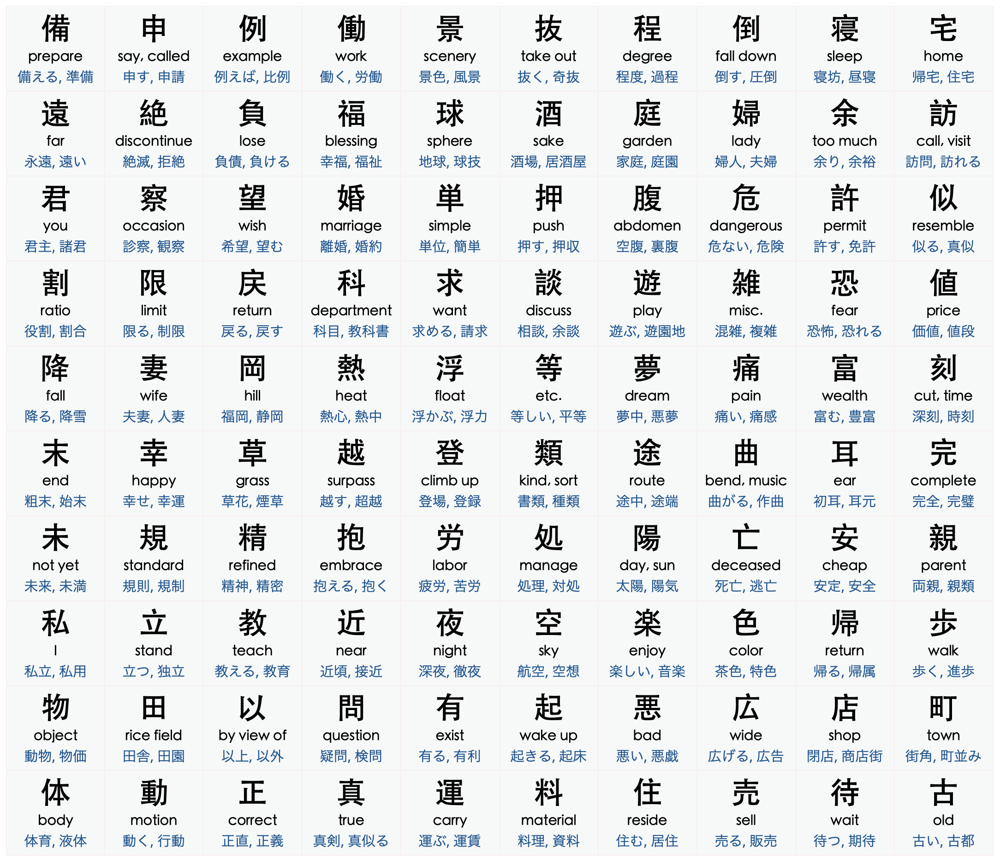 -->

<!-- ------------------------------------------------------------------------ -->

<!-- ### Review {.tabset} -->

<!-- #### R5 {.tabset} -->

<!-- ```{r, echo=FALSE, message=FALSE} -->

<!-- scknj5.w1 <- scknj5 %>% select(W1, R1, M1) %>% rename(Words = W1, Reading = R1, Meaning = M1) %>% slice(1:80) -->
<!-- scknj5.w2 <- scknj5 %>% select(W2, R2, M2) %>% rename(Words = W2, Reading = R2, Meaning = M2) %>% slice(1:80) -->
<!-- scknj5.w3 <- scknj5 %>% select(W3, R3, M3) %>% rename(Words = W3, Reading = R3, Meaning = M3) %>% slice(1:80) -->

<!-- scknj5.wa <- bind_rows(scknj5.w1, scknj5.w2) -->
<!-- scknj5.wa <- bind_rows(scknj5.wa, scknj5.w3) -->

<!-- scknj5.wa <- scknj5.wa[sample(1:nrow(scknj5.wa)),] -->

<!-- scknj5.wa <- scknj5.wa %>% na.omit(scknj5.wa) -->

<!-- reactable( -->
<!--   scknj5.wa, -->
<!--   columns = list( -->
<!--     Words = colDef(align = "center", style = list(fontSize = 60, fontFamily = 'Open Sans', fontWeight = 600, background = '#dee7e7', color = '#0F2040')), -->
<!--     Reading = colDef(show = FALSE), -->
<!--     Meaning = colDef(show = FALSE)  -->
<!--   ), -->
<!--   defaultPageSize = 1, -->
<!--   theme = reactableTheme( -->
<!--     cellStyle = list(display = "flex", flexDirection = "column", justifyContent = "center", height = 300), -->
<!--     searchInputStyle = list( -->
<!--       paddingLeft = "8px", -->
<!--       paddingTop = "8px", -->
<!--       paddingBottom = "8px", -->
<!--       width = "100%", -->
<!--       fontSize = "11px" -->
<!--     ) -->
<!--   ), -->
<!--   showPageInfo = FALSE, bordered = TRUE, searchable = TRUE, sortable = FALSE, paginationType = "numbers", striped = TRUE,  -->

<!--   style = list(fontFamily = "Noto Sans JP, Heiti SC, Hiragino Maru Gothic ProN, Anonymous Pro , monospace, Helvetica Neue", fontSize = "11px") -->
<!-- ) -->

<!-- ``` -->

<!-- ------------------------------------------------------------------------ -->

<!-- #### RW5B {.tabset} -->

<!-- ```{r, echo=FALSE, message=FALSE} -->

<!-- scknj5.w1 <- scknj5 %>% select(W1, R1, M1) %>% rename(Words = W1, Reading = R1, Meaning = M1) %>% slice(41:80) -->
<!-- scknj5.w2 <- scknj5 %>% select(W2, R2, M2) %>% rename(Words = W2, Reading = R2, Meaning = M2) %>% slice(41:80) -->
<!-- scknj5.w3 <- scknj5 %>% select(W3, R3, M3) %>% rename(Words = W3, Reading = R3, Meaning = M3) %>% slice(41:80) -->

<!-- scknj5.wa <- bind_rows(scknj5.w1, scknj5.w2) -->
<!-- scknj5.wa <- bind_rows(scknj5.wa, scknj5.w3) -->

<!-- scknj5.wa <- scknj5.wa[sample(1:nrow(scknj5.wa)),] -->

<!-- scknj5.wa <- scknj5.wa %>% na.omit(scknj5.wa) -->

<!-- reactable( -->
<!--   scknj5.wa, -->
<!--   columns = list( -->
<!--     Words = colDef(align = "center", style = list(fontSize = 60, fontFamily = 'Open Sans', fontWeight = 600, background = '#dee7e7', color = '#0F2040')), -->
<!--     Reading = colDef(show = FALSE), -->
<!--     Meaning = colDef(show = FALSE)  -->
<!--   ), -->
<!--   defaultPageSize = 1, -->
<!--   theme = reactableTheme( -->
<!--     cellStyle = list(display = "flex", flexDirection = "column", justifyContent = "center", height = 300), -->
<!--     searchInputStyle = list( -->
<!--       paddingLeft = "8px", -->
<!--       paddingTop = "8px", -->
<!--       paddingBottom = "8px", -->
<!--       width = "100%", -->
<!--       fontSize = "11px" -->
<!--     ) -->
<!--   ), -->
<!--   showPageInfo = FALSE, bordered = TRUE, searchable = TRUE, sortable = FALSE, paginationType = "numbers", striped = TRUE,  -->

<!--   style = list(fontFamily = "Noto Sans JP, Heiti SC, Hiragino Maru Gothic ProN, Anonymous Pro , monospace, Helvetica Neue", fontSize = "11px") -->
<!-- ) -->

<!-- ``` -->

<!-- ------------------------------------------------------------------------ -->

<!-- #### R4 {.tabset} -->

<!-- ```{r, echo=FALSE, message=FALSE} -->

<!-- scknj4.w1 <- scknj4 %>% select(W1, R1, M1) %>% rename(Words = W1, Reading = R1, Meaning = M1) %>% slice(1:510) -->
<!-- scknj4.w2 <- scknj4 %>% select(W2, R2, M2) %>% rename(Words = W2, Reading = R2, Meaning = M2) %>% slice(1:510) -->
<!-- scknj4.w3 <- scknj4 %>% select(W3, R3, M3) %>% rename(Words = W3, Reading = R3, Meaning = M3) %>% slice(1:510) -->

<!-- scknj4.wa <- bind_rows(scknj4.w1, scknj4.w2) -->
<!-- scknj4.wa <- bind_rows(scknj4.wa, scknj4.w3) -->

<!-- scknj4.wa <- scknj4.wa[sample(1:nrow(scknj4.wa)),] -->

<!-- scknj4.wa <- scknj4.wa %>% na.omit(scknj4.wa) -->

<!-- reactable( -->
<!--   scknj4.wa, -->
<!--   columns = list( -->
<!--     Words = colDef(align = "center", style = list(fontSize = 60, fontFamily = 'Open Sans', fontWeight = 600, background = '#dee7e7', color = '#0F2040')), -->
<!--     Reading = colDef(show = FALSE), -->
<!--     Meaning = colDef(show = FALSE)  -->
<!--   ), -->
<!--   defaultPageSize = 1, -->
<!--   theme = reactableTheme( -->
<!--     cellStyle = list(display = "flex", flexDirection = "column", justifyContent = "center", height = 300), -->
<!--     searchInputStyle = list( -->
<!--       paddingLeft = "8px", -->
<!--       paddingTop = "8px", -->
<!--       paddingBottom = "8px", -->
<!--       width = "100%", -->
<!--       fontSize = "11px" -->
<!--     ) -->
<!--   ), -->
<!--   showPageInfo = FALSE, bordered = TRUE, searchable = TRUE, sortable = FALSE, paginationType = "numbers", striped = TRUE,  -->

<!--   style = list(fontFamily = "Noto Sans JP, Heiti SC, Hiragino Maru Gothic ProN, Anonymous Pro , monospace, Helvetica Neue", fontSize = "11px") -->
<!-- ) -->

<!-- ``` -->

<!-- ------------------------------------------------------------------------ -->

<!-- #### RW4B {.tabset} -->

<!-- ```{r, echo=FALSE, message=FALSE} -->

<!-- scknj4.w1 <- scknj4 %>% select(W1, R1, M1) %>% rename(Words = W1, Reading = R1, Meaning = M1) %>% slice(51:100) -->
<!-- scknj4.w2 <- scknj4 %>% select(W2, R2, M2) %>% rename(Words = W2, Reading = R2, Meaning = M2) %>% slice(51:100) -->
<!-- scknj4.w3 <- scknj4 %>% select(W3, R3, M3) %>% rename(Words = W3, Reading = R3, Meaning = M3) %>% slice(51:100) -->

<!-- scknj4.wa <- bind_rows(scknj4.w1, scknj4.w2) -->
<!-- scknj4.wa <- bind_rows(scknj4.wa, scknj4.w3) -->

<!-- scknj4.wa <- scknj4.wa[sample(1:nrow(scknj4.wa)),] -->

<!-- scknj4.wa <- scknj4.wa %>% na.omit(scknj4.wa) -->

<!-- reactable( -->
<!--   scknj4.wa, -->
<!--   columns = list( -->
<!--     Words = colDef(align = "center", style = list(fontSize = 60, fontFamily = 'Open Sans', fontWeight = 600, background = '#dee7e7', color = '#0F2040')), -->
<!--     Reading = colDef(show = FALSE), -->
<!--     Meaning = colDef(show = FALSE)  -->
<!--   ), -->
<!--   defaultPageSize = 1, -->
<!--   theme = reactableTheme( -->
<!--     cellStyle = list(display = "flex", flexDirection = "column", justifyContent = "center", height = 300), -->
<!--     searchInputStyle = list( -->
<!--       paddingLeft = "8px", -->
<!--       paddingTop = "8px", -->
<!--       paddingBottom = "8px", -->
<!--       width = "100%", -->
<!--       fontSize = "11px" -->
<!--     ) -->
<!--   ), -->
<!--   showPageInfo = FALSE, bordered = TRUE, searchable = TRUE, sortable = FALSE, paginationType = "numbers", striped = TRUE,  -->

<!--   style = list(fontFamily = "Noto Sans JP, Heiti SC, Hiragino Maru Gothic ProN, Anonymous Pro , monospace, Helvetica Neue", fontSize = "11px") -->
<!-- ) -->

<!-- ``` -->

<!-- ------------------------------------------------------------------------ -->

<!-- #### R3 {.tabset} -->

<!-- ```{r, echo=FALSE, message=FALSE} -->

<!-- scknj3.w1 <- scknj3 %>% select(W1, R1, M1) %>% rename(Words = W1, Reading = R1, Meaning = M1) %>% slice(1:1100) -->
<!-- scknj3.w2 <- scknj3 %>% select(W2, R2, M2) %>% rename(Words = W2, Reading = R2, Meaning = M2) %>% slice(1:1100) -->
<!-- scknj3.w3 <- scknj3 %>% select(W3, R3, M3) %>% rename(Words = W3, Reading = R3, Meaning = M3) %>% slice(1:1100) -->

<!-- scknj3.wa <- bind_rows(scknj3.w1, scknj3.w2) -->
<!-- scknj3.wa <- bind_rows(scknj3.wa, scknj3.w3) -->

<!-- scknj3.wa <- scknj3.wa[sample(1:nrow(scknj3.wa)),] -->

<!-- scknj3.wa <- scknj3.wa %>% na.omit(scknj3.wa) -->

<!-- reactable( -->
<!--   scknj3.wa, -->
<!--   columns = list( -->
<!--     Words = colDef(align = "center", style = list(fontSize = 60, fontFamily = 'Open Sans', fontWeight = 600, background = '#dee7e7', color = '#0F2040')), -->
<!--     Reading = colDef(show = FALSE), -->
<!--     Meaning = colDef(show = FALSE)  -->
<!--   ), -->
<!--   defaultPageSize = 1, -->
<!--   theme = reactableTheme( -->
<!--     cellStyle = list(display = "flex", flexDirection = "column", justifyContent = "center", height = 300), -->
<!--     searchInputStyle = list( -->
<!--       paddingLeft = "8px", -->
<!--       paddingTop = "8px", -->
<!--       paddingBottom = "8px", -->
<!--       width = "100%", -->
<!--       fontSize = "11px" -->
<!--     ) -->
<!--   ), -->
<!--   showPageInfo = FALSE, bordered = TRUE, searchable = TRUE, sortable = FALSE, paginationType = "numbers", striped = TRUE,  -->

<!--   style = list(fontFamily = "Noto Sans JP, Heiti SC, Hiragino Maru Gothic ProN, Anonymous Pro , monospace, Helvetica Neue", fontSize = "11px") -->
<!-- ) -->

<!-- ``` -->

<!-- ------------------------------------------------------------------------ -->

<!-- #### RW3B {.tabset} -->

<!-- ```{r, echo=FALSE, message=FALSE} -->

<!-- scknj3.w1 <- scknj3 %>% select(W1, R1, M1) %>% rename(Words = W1, Reading = R1, Meaning = M1) %>% slice(51:100) -->
<!-- scknj3.w2 <- scknj3 %>% select(W2, R2, M2) %>% rename(Words = W2, Reading = R2, Meaning = M2) %>% slice(51:100) -->
<!-- scknj3.w3 <- scknj3 %>% select(W3, R3, M3) %>% rename(Words = W3, Reading = R3, Meaning = M3) %>% slice(51:100) -->

<!-- scknj3.wa <- bind_rows(scknj3.w1, scknj3.w2) -->
<!-- scknj3.wa <- bind_rows(scknj3.wa, scknj3.w3) -->

<!-- scknj3.wa <- scknj3.wa[sample(1:nrow(scknj3.wa)),] -->

<!-- scknj3.wa <- scknj3.wa %>% na.omit(scknj3.wa) -->

<!-- reactable( -->
<!--   scknj3.wa, -->
<!--   columns = list( -->
<!--     Words = colDef(align = "center", style = list(fontSize = 60, fontFamily = 'Open Sans', fontWeight = 600, background = '#dee7e7', color = '#0F2040')), -->
<!--     Reading = colDef(show = FALSE), -->
<!--     Meaning = colDef(show = FALSE)  -->
<!--   ), -->
<!--   defaultPageSize = 1, -->
<!--   theme = reactableTheme( -->
<!--     cellStyle = list(display = "flex", flexDirection = "column", justifyContent = "center", height = 300), -->
<!--     searchInputStyle = list( -->
<!--       paddingLeft = "8px", -->
<!--       paddingTop = "8px", -->
<!--       paddingBottom = "8px", -->
<!--       width = "100%", -->
<!--       fontSize = "11px" -->
<!--     ) -->
<!--   ), -->
<!--   showPageInfo = FALSE, bordered = TRUE, searchable = TRUE, sortable = FALSE, paginationType = "numbers", striped = TRUE,  -->

<!--   style = list(fontFamily = "Noto Sans JP, Heiti SC, Hiragino Maru Gothic ProN, Anonymous Pro , monospace, Helvetica Neue", fontSize = "11px") -->
<!-- ) -->

<!-- ``` -->

<!-- ------------------------------------------------------------------------ -->

<!-- #### R2 {.tabset} -->

<!-- ```{r, echo=FALSE, message=FALSE} -->

<!-- scknj2.w1 <- scknj2 %>% select(W1, R1, M1) %>% rename(Words = W1, Reading = R1, Meaning = M1) %>% slice(1:1140) -->
<!-- scknj2.w2 <- scknj2 %>% select(W2, R2, M2) %>% rename(Words = W2, Reading = R2, Meaning = M2) %>% slice(1:1140) -->
<!-- scknj2.w3 <- scknj2 %>% select(W3, R3, M3) %>% rename(Words = W3, Reading = R3, Meaning = M3) %>% slice(1:1140) -->

<!-- scknj2.wa <- bind_rows(scknj2.w1, scknj2.w2) -->
<!-- scknj2.wa <- bind_rows(scknj2.wa, scknj2.w3) -->

<!-- scknj2.wa <- scknj2.wa[sample(1:nrow(scknj2.wa)),] -->

<!-- scknj2.wa <- scknj2.wa %>% na.omit(scknj2.wa) -->

<!-- reactable( -->
<!--   scknj2.wa, -->
<!--   columns = list( -->
<!--     Words = colDef(align = "center", style = list(fontSize = 60, fontFamily = 'Open Sans', fontWeight = 600, background = '#dee7e7', color = '#0F2040')), -->
<!--     Reading = colDef(show = FALSE), -->
<!--     Meaning = colDef(show = FALSE)  -->
<!--   ), -->
<!--   defaultPageSize = 1, -->
<!--   theme = reactableTheme( -->
<!--     cellStyle = list(display = "flex", flexDirection = "column", justifyContent = "center", height = 300), -->
<!--     searchInputStyle = list( -->
<!--       paddingLeft = "8px", -->
<!--       paddingTop = "8px", -->
<!--       paddingBottom = "8px", -->
<!--       width = "100%", -->
<!--       fontSize = "11px" -->
<!--     ) -->
<!--   ), -->
<!--   showPageInfo = FALSE, bordered = TRUE, searchable = TRUE, sortable = FALSE, paginationType = "numbers", striped = TRUE,  -->

<!--   style = list(fontFamily = "Noto Sans JP, Heiti SC, Hiragino Maru Gothic ProN, Anonymous Pro , monospace, Helvetica Neue", fontSize = "11px") -->
<!-- ) -->

<!-- ``` -->

<!-- ------------------------------------------------------------------------ -->

<!-- #### RW2B {.tabset} -->

<!-- ```{r, echo=FALSE, message=FALSE} -->

<!-- scknj2.w1 <- scknj2 %>% select(W1, R1, M1) %>% rename(Words = W1, Reading = R1, Meaning = M1) %>% slice(51:100) -->
<!-- scknj2.w2 <- scknj2 %>% select(W2, R2, M2) %>% rename(Words = W2, Reading = R2, Meaning = M2) %>% slice(51:100) -->
<!-- scknj2.w3 <- scknj2 %>% select(W3, R3, M3) %>% rename(Words = W3, Reading = R3, Meaning = M3) %>% slice(51:100) -->

<!-- scknj2.wa <- bind_rows(scknj2.w1, scknj2.w2) -->
<!-- scknj2.wa <- bind_rows(scknj2.wa, scknj2.w3) -->

<!-- scknj2.wa <- scknj2.wa[sample(1:nrow(scknj2.wa)),] -->

<!-- scknj2.wa <- scknj2.wa %>% na.omit(scknj2.wa) -->

<!-- reactable( -->
<!--   scknj2.wa, -->
<!--   columns = list( -->
<!--     Words = colDef(align = "center", style = list(fontSize = 60, fontFamily = 'Open Sans', fontWeight = 600, background = '#dee7e7', color = '#0F2040')), -->
<!--     Reading = colDef(show = FALSE), -->
<!--     Meaning = colDef(show = FALSE)  -->
<!--   ), -->
<!--   defaultPageSize = 1, -->
<!--   theme = reactableTheme( -->
<!--     cellStyle = list(display = "flex", flexDirection = "column", justifyContent = "center", height = 300), -->
<!--     searchInputStyle = list( -->
<!--       paddingLeft = "8px", -->
<!--       paddingTop = "8px", -->
<!--       paddingBottom = "8px", -->
<!--       width = "100%", -->
<!--       fontSize = "11px" -->
<!--     ) -->
<!--   ), -->
<!--   showPageInfo = FALSE, bordered = TRUE, searchable = TRUE, sortable = FALSE, paginationType = "numbers", striped = TRUE,  -->

<!--   style = list(fontFamily = "Noto Sans JP, Heiti SC, Hiragino Maru Gothic ProN, Anonymous Pro , monospace, Helvetica Neue", fontSize = "11px") -->
<!-- ) -->

<!-- ``` -->

<!-- ------------------------------------------------------------------------ -->

<!-- #### R1 {.tabset} -->

<!-- ```{r, echo=FALSE, message=FALSE} -->

<!-- scknj1.w1 <- scknj1 %>% select(W1, R1, M1) %>% rename(Words = W1, Reading = R1, Meaning = M1) %>% slice(1:900) -->
<!-- scknj1.w2 <- scknj1 %>% select(W2, R2, M2) %>% rename(Words = W2, Reading = R2, Meaning = M2) %>% slice(1:900) -->
<!-- scknj1.w3 <- scknj1 %>% select(W3, R3, M3) %>% rename(Words = W3, Reading = R3, Meaning = M3) %>% slice(1:900) -->

<!-- scknj1.wa <- bind_rows(scknj1.w1, scknj1.w2) -->
<!-- scknj1.wa <- bind_rows(scknj1.wa, scknj1.w3) -->

<!-- scknj1.wa <- scknj1.wa[sample(1:nrow(scknj1.wa)),] -->

<!-- scknj1.wa <- scknj1.wa %>% na.omit(scknj1.wa) -->

<!-- reactable( -->
<!--   scknj1.wa, -->
<!--   columns = list( -->
<!--     Words = colDef(align = "center", style = list(fontSize = 60, fontFamily = 'Open Sans', fontWeight = 600, background = '#dee7e7', color = '#0F2040')), -->
<!--     Reading = colDef(show = FALSE), -->
<!--     Meaning = colDef(show = FALSE)  -->
<!--   ), -->
<!--   defaultPageSize = 1, -->
<!--   theme = reactableTheme( -->
<!--     cellStyle = list(display = "flex", flexDirection = "column", justifyContent = "center", height = 300), -->
<!--     searchInputStyle = list( -->
<!--       paddingLeft = "8px", -->
<!--       paddingTop = "8px", -->
<!--       paddingBottom = "8px", -->
<!--       width = "100%", -->
<!--       fontSize = "11px" -->
<!--     ) -->
<!--   ), -->
<!--   showPageInfo = FALSE, bordered = TRUE, searchable = TRUE, sortable = FALSE, paginationType = "numbers", striped = TRUE,  -->

<!--   style = list(fontFamily = "Noto Sans JP, Heiti SC, Hiragino Maru Gothic ProN, Anonymous Pro , monospace, Helvetica Neue", fontSize = "11px") -->
<!-- ) -->

<!-- ``` -->

<!-- ------------------------------------------------------------------------ -->

<!-- #### RW1B {.tabset} -->

<!-- ```{r, echo=FALSE, message=FALSE} -->

<!-- scknj1.w1 <- scknj1 %>% select(W1, R1, M1) %>% rename(Words = W1, Reading = R1, Meaning = M1) %>% slice(51:100) -->
<!-- scknj1.w2 <- scknj1 %>% select(W2, R2, M2) %>% rename(Words = W2, Reading = R2, Meaning = M2) %>% slice(51:100) -->
<!-- scknj1.w3 <- scknj1 %>% select(W3, R3, M3) %>% rename(Words = W3, Reading = R3, Meaning = M3) %>% slice(51:100) -->

<!-- scknj1.wa <- bind_rows(scknj1.w1, scknj1.w2) -->
<!-- scknj1.wa <- bind_rows(scknj1.wa, scknj1.w3) -->

<!-- scknj1.wa <- scknj1.wa[sample(1:nrow(scknj1.wa)),] -->

<!-- scknj1.wa <- scknj1.wa %>% na.omit(scknj1.wa) -->

<!-- reactable( -->
<!--   scknj1.wa, -->
<!--   columns = list( -->
<!--     Words = colDef(align = "center", style = list(fontSize = 60, fontFamily = 'Open Sans', fontWeight = 600, background = '#dee7e7', color = '#0F2040')), -->
<!--     Reading = colDef(show = FALSE), -->
<!--     Meaning = colDef(show = FALSE)  -->
<!--   ), -->
<!--   defaultPageSize = 1, -->
<!--   theme = reactableTheme( -->
<!--     cellStyle = list(display = "flex", flexDirection = "column", justifyContent = "center", height = 300), -->
<!--     searchInputStyle = list( -->
<!--       paddingLeft = "8px", -->
<!--       paddingTop = "8px", -->
<!--       paddingBottom = "8px", -->
<!--       width = "100%", -->
<!--       fontSize = "11px" -->
<!--     ) -->
<!--   ), -->
<!--   showPageInfo = FALSE, bordered = TRUE, searchable = TRUE, sortable = FALSE, paginationType = "numbers", striped = TRUE,  -->

<!--   style = list(fontFamily = "Noto Sans JP, Heiti SC, Hiragino Maru Gothic ProN, Anonymous Pro , monospace, Helvetica Neue", fontSize = "11px") -->
<!-- ) -->

<!-- ``` -->

<!-- ------------------------------------------------------------------------ -->

<!-- ## Recognize {.tabset} -->

<!-- <div class = "row"> -->
<!-- <div class = "col-sm-6"> -->

<!-- ```{r, echo=FALSE, message=FALSE} -->

<!-- kanjilst <- kanjilst[sample(1:nrow(kanjilst)),] -->
<!-- kanjilst.a <- kanjilst %>% slice(1:350) -->
<!-- kanjilst.b <- kanjilst %>% slice(351:682) -->

<!-- scknj5.w1 <- scknj5 %>% select(W1) %>% rename(Words = W1) -->
<!-- scknj5.w2 <- scknj5 %>% select(W2) %>% rename(Words = W2) -->
<!-- scknj5.w3 <- scknj5 %>% select(W3) %>% rename(Words = W3) -->

<!-- scknj4.w1 <- scknj4 %>% select(W1) %>% rename(Words = W1) -->
<!-- scknj4.w2 <- scknj4 %>% select(W2) %>% rename(Words = W2) -->
<!-- scknj4.w3 <- scknj4 %>% select(W3) %>% rename(Words = W3) -->
<!-- scknj3.w1 <- scknj3 %>% select(W1) %>% rename(Words = W1) -->
<!-- scknj3.w2 <- scknj3 %>% select(W2) %>% rename(Words = W2) -->
<!-- scknj3.w3 <- scknj3 %>% select(W3) %>% rename(Words = W3) -->

<!-- scknj2.w1 <- scknj2 %>% select(W1) %>% rename(Words = W1) -->
<!-- scknj2.w2 <- scknj2 %>% select(W2) %>% rename(Words = W2) -->
<!-- scknj2.w3 <- scknj2 %>% select(W3) %>% rename(Words = W3) -->
<!-- scknj1.w1 <- scknj1 %>% select(W1) %>% rename(Words = W1) -->
<!-- scknj1.w2 <- scknj1 %>% select(W2) %>% rename(Words = W2) -->
<!-- scknj1.w3 <- scknj1 %>% select(W3) %>% rename(Words = W3) -->

<!-- scknjt.wf <- bind_rows(scknj4.w1, scknj4.w2) -->
<!-- scknjt.wf <- bind_rows(scknjt.wf, scknj4.w3) -->
<!-- scknjt.wf <- bind_rows(scknjt.wf, scknj3.w1) -->
<!-- scknjt.wf <- bind_rows(scknjt.wf, scknj3.w2) -->
<!-- scknjt.wf <- bind_rows(scknjt.wf, scknj3.w3) -->
<!-- scknjt.wf <- scknjt.wf[sample(1:nrow(scknjt.wf)),] -->

<!-- scknjt.wd <- bind_rows(scknj5.w1, scknj5.w2) -->
<!-- scknjt.wd <- bind_rows(scknjt.wd, scknj5.w3) -->
<!-- scknjt.wd <- bind_rows(scknjt.wd, kanjilst.a) -->
<!-- scknjt.wd <- scknjt.wd[sample(1:nrow(scknjt.wd)),] -->

<!-- scknjt.we <- bind_rows(scknj2.w1, scknj2.w2) -->
<!-- scknjt.we <- bind_rows(scknjt.we, scknj2.w3) -->
<!-- scknjt.we <- bind_rows(scknjt.we, scknj1.w1) -->
<!-- scknjt.we <- bind_rows(scknjt.we, scknj1.w2) -->
<!-- scknjt.we <- bind_rows(scknjt.we, scknj1.w3) -->
<!-- scknjt.we <- bind_rows(scknjt.we, kanjilst.b) -->
<!-- scknjt.we <- scknjt.we[sample(1:nrow(scknjt.we)),] -->

<!-- scknjt.wrds <- bind_rows(scknjt.wf, scknjt.wd) -->
<!-- scknjt.wrds <- bind_rows(scknjt.wrds, scknjt.we) -->

<!-- reactable( -->
<!--   scknjt.wrds, -->
<!--   columns = list( -->
<!--     Words = colDef(align = "center", style = list(fontSize = 58, fontWeight = 600, color = '#202020', fontFamily = 'Noto Sans JP')) -->
<!--   ), -->
<!--   defaultPageSize = 1, -->
<!--   theme = reactableTheme( -->
<!--     # Vertically center cells -->
<!--     cellStyle = list(display = "flex", flexDirection = "column", justifyContent = "center", height = 300), -->
<!--     searchInputStyle = list( -->
<!--       paddingLeft = "8px", -->
<!--       paddingTop = "8px", -->
<!--       paddingBottom = "8px", -->
<!--       width = "100%" -->
<!--     ) -->
<!--   ), -->
<!--   showPageInfo = FALSE, bordered = TRUE, searchable = TRUE, sortable = FALSE, paginationType = "simple", striped = TRUE, -->

<!--   style = list(fontFamily = "Noto Sans JP, Heiti SC, Hiragino Maru Gothic ProN, Anonymous Pro , monospace, Helvetica Neue", fontSize = "11px") -->
<!-- ) -->

<!-- ``` -->

<!-- </div> -->
<!-- <div class = "col-sm-6"> -->

<!-- ```{r, echo=FALSE, message=FALSE} -->

<!-- scknjt.wrds <- scknjt.wrds[sample(1:nrow(scknjt.wrds)),] -->

<!-- reactable( -->
<!--   scknjt.wrds, -->
<!--   columns = list( -->
<!--     Words = colDef(align = "center", style = list(fontSize = 58, fontWeight = 700, color = '#0F2040', fontFamily = 'Noto Sans JP', background = '#dee7e7')) -->
<!--   ), -->
<!--   defaultPageSize = 1, -->
<!--   theme = reactableTheme( -->
<!--     # Vertically center cells -->
<!--     cellStyle = list(display = "flex", flexDirection = "column", justifyContent = "center", height = 300), -->
<!--     searchInputStyle = list( -->
<!--       paddingLeft = "8px", -->
<!--       paddingTop = "8px", -->
<!--       paddingBottom = "8px", -->
<!--       width = "100%" -->
<!--     ) -->
<!--   ), -->
<!--   showPageInfo = FALSE, bordered = TRUE, searchable = TRUE, sortable = FALSE, paginationType = "simple", striped = TRUE, -->

<!--   style = list(fontFamily = "Noto Sans JP, Heiti SC, Hiragino Maru Gothic ProN, Anonymous Pro , monospace, Helvetica Neue", fontSize = "11px") -->
<!-- ) -->

<!-- ``` -->

<!-- </div> -->
<!-- </div> -->

<!-- ------------------------------------------------------------------------ -->

## Mnemonics {.tabset}

```{r, echo=FALSE, message=FALSE}

kanjinmq <- kanjinmq[sample(1:nrow(kanjinmq)),]

reactable(
  kanjinmq,
  columns = list(
    Kanji = colDef(style= list(background = '#edede9'),
      cell = function(value, index) {
        Expression <- kanjinmq$Expression[index]
        Expression <- if (!is.na(Expression)) Expression else ""
        Author <- kanjinmq$Author[index]
        Author <- if (!is.na(Author)) Author else ""
        Name <- kanjinmq$Name[index]
        Name <- if (!is.na(Name)) Name else ""
        Words <- kanjinmq$Words[index]
        Words <- if (!is.na(Words)) Words else "" 
        tagList(
          div(style = list(fontSize = 60, fontWeight = 600, color = '#0F2040', fontFamily = 'Noto Sans JP'), value),
          div(style = list(fontSize = 2), "."),
          div(style = list(fontSize = 2), "."),
          div(style = list(fontSize = 2), "."),
          div(style = list(fontSize = 2), "."),
          div(style = list(fontSize = 2), "."),
          div(style = list(fontSize = 2), "."),
          div(style = list(fontSize = 13, fontWeight = 600, color = '#800000', fontFamily = 'Klee One'), Expression),
          div(style = list(fontSize = 2), "."),
          div(style = list(fontSize = 2), "."),
          div(style = list(fontSize = 2), "."),
          div(style = list(fontSize = 13, fontWeight = 500, color = '#008000', fontFamily = 'Klee One'), "by: ", Author, "。", Name),
          div(style = list(fontSize = 2), "."),
          div(style = list(fontSize = 2), "."),
          div(style = list(fontSize = 2), "."),
          div(style = list(fontSize = 19, fontWeight = 400, color = '#0F2040', fontFamily = 'Open Sans'), Words),
        )
      },
      align = "center"
    ),
    Expression = colDef(show = FALSE),
    Author = colDef(show = FALSE),
    Name = colDef(show = FALSE),
    Words = colDef(show = FALSE)

  ),
  rowClass = "my-row",
  defaultPageSize = 1,
  theme = reactableTheme(
    # Vertically center cells
    cellStyle = list(display = "flex", flexDirection = "column", justifyContent = "center", height = 300),
    searchInputStyle = list(
      paddingLeft = "8px",
      paddingTop = "8px",
      paddingBottom = "8px",
      width = "100%"
    )
  ),
  showPageInfo = FALSE, bordered = TRUE, searchable = TRUE, sortable = FALSE, paginationType = "simple", striped = TRUE, highlight = TRUE,
  
  style = list(fontFamily = "Noto Sans JP, Heiti SC, Hiragino Maru Gothic ProN, Anonymous Pro , monospace, Helvetica Neue", fontSize = "11px")
)

```

------------------------------------------------------------------------

## Readings {.tabset}

```{r, echo=FALSE, message=FALSE}

scrptrdgn <- scrptrdgn[sample(1:nrow(scrptrdgn)),]
scrptrdgn <- scrptrdgn[sample(1:nrow(scrptrdgn)),]

reactable(
  scrptrdgn,
  columns = list(
    Excerpts = colDef(minWidth = 350, align = "left", html = TRUE, style = list(fontSize = 17, fontWeight = 200, color = '#061126', fontFamily = 'Open Sans', background = '#edece6')),
    Translation = colDef(show = FALSE)

  ),
  rowClass = "my-row",
  defaultPageSize = 1,
  class = "packages-table",
  theme = reactableTheme(
    backgroundColor = "#edece6",
    borderColor = "#edece6",
    selectStyle = list(backgroundColor = "#061126"),
    paginationStyle = list(borderColor = "#061126"),
    pageButtonActiveStyle = list(background = "#061126"),
    cellStyle = list(display = "flex", flexDirection = "column", justifyContent = "center"),
    searchInputStyle = list(
      paddingLeft = "8px",
      paddingTop = "8px",
      paddingBottom = "8px",
      width = "100%"
    ),
    headerStyle = list(
      backgroundColor = "#edece6",
      color = "#edece6",
      fontWeight = 100,
      fontFamily = 'Open Sans',
      fontSize = "0rem",
      padding = "0px"
    ),
  ),
  showPageInfo = FALSE, bordered = TRUE, searchable = FALSE, sortable = FALSE, paginationType = "numbers", height = 630, resizable = TRUE, highlight = TRUE, striped = TRUE,
  
  style = list(fontFamily = "Noto Sans JP, Heiti SC, Hiragino Maru Gothic ProN, Anonymous Pro , monospace, Helvetica Neue", fontSize = "11px")
)

```

------------------------------------------------------------------------

## Decipher {.tabset}

<div class = "row">
<div class = "col-sm-4">

```{r, echo=FALSE, message=FALSE}

kanah <- kana %>% select(HN)  %>% rename(Characters = HN)
kanah <- kanah[sample(1:nrow(kanah)),]

kanak <- kana %>% select(KN)  %>% rename(Characters = KN)
kanak <- kanak[sample(1:nrow(kanak)),]

kana.a <- bind_rows(kanah, kanak)
kana.a <- kana.a[sample(1:nrow(kana.a)),]

reactable(
  kana.a,
  columns = list(
    Characters = colDef(align = "center", style = list(fontSize = 60, fontWeight = 700, color = '#0F2040', background = '#edede9'))
  ),
  rowClass = "my-row",
  defaultPageSize = 1,
  theme = reactableTheme(
    cellStyle = list(display = "flex", flexDirection = "column", justifyContent = "center", height = 220),
    searchInputStyle = list(
      paddingLeft = "8px",
      paddingTop = "8px",
      paddingBottom = "8px",
      width = "100%"
    ),
    headerStyle = list(
      backgroundColor = "#1b1e1e",
      color = "hsl(0, 0%, 95%)",
      fontSize = 0.1,
      fontWeight = 100,
      fontFamily = 'Open Sans',
      fontSize = "0.75rem",
      letterSpacing = "1px",
      textTransform = "lowercase",
      padding = "0px",
      "&:hover, &:focus" = list(color = '#1b1e1e')
    ),    
  ),
  showPageInfo = FALSE, bordered = TRUE, searchable = FALSE, sortable = FALSE, paginationType = "simple", fullWidth = FALSE, width = 300, highlight = TRUE,
  
  style = list(fontFamily = "Noto Sans JP, Heiti SC, Hiragino Maru Gothic ProN, Anonymous Pro , monospace, Helvetica Neue", fontSize = "11px")
)

```

</div>
<div class = "col-sm-4">

```{r, echo=FALSE, message=FALSE}

hangeul <- hangeul %>% select(Script, Sound, Meaning)
hangeul <- hangeul[sample(1:nrow(hangeul)),]

reactable(
  hangeul,
  # columns = list(
  #   Script = colDef(align = "center", style = list(fontSize = 60, fontWeight = 700, color = '#0F2040', background = '#edede9'))
  # ),
  columns = list(
      Script = colDef(style= list(background = '#edede9'),
      cell = function(value, index) {
        Sound <- hangeul$Sound[index]
        Sound <- if (!is.na(Sound)) Sound else ""
        Meaning <- hangeul$Meaning[index]
        Meaning <- if (!is.na(Meaning)) Meaning else ""
        tagList(
          div(style = list(fontSize = 62, fontWeight = 700, color = '#0F2040'), value),
          div(style = list(fontSize = 13, fontWeight = 400, color = '#0F2040', fontFamily = 'Zen Kaku Gothic New'), Sound),
          div(style = list(fontSize = 13, fontWeight = 500, color = '#450814', fontFamily = 'Zen Kaku Gothic New'), Meaning)
        )
      },
      align = "center"
    ),
    Sound = colDef(show = FALSE),
    Meaning = colDef(show = FALSE)
  ),
  rowClass = "my-row",
  defaultPageSize = 1,
  theme = reactableTheme(
    cellStyle = list(display = "flex", flexDirection = "column", justifyContent = "center", height = 220),
    searchInputStyle = list(
      paddingLeft = "8px",
      paddingTop = "8px",
      paddingBottom = "8px",
      width = "100%"
    ),
    headerStyle = list(
      backgroundColor = "#1b1e1e",
      color = "hsl(0, 0%, 95%)",
      fontSize = 0.1,
      fontWeight = 100,
      fontFamily = 'Open Sans',
      fontSize = "0.75rem",
      letterSpacing = "1px",
      textTransform = "lowercase",
      padding = "0px",
      "&:hover, &:focus" = list(color = '#1b1e1e')
    ),    
  ),
  showPageInfo = FALSE, bordered = TRUE, searchable = FALSE, sortable = FALSE, paginationType = "simple", fullWidth = FALSE, width = 300, highlight = TRUE,
  
  style = list(fontFamily = "Noto Sans JP, Heiti SC, Hiragino Maru Gothic ProN, Anonymous Pro , monospace, Helvetica Neue", fontSize = "11px")
)

```


</div>
</div>

------------------------------------------------------------------------

# <b> Elements </b>

### IC.1.0: Connectives {.tabset}
<p style="font-size:11px; line-height: 1; font-family: Noto Sans JP;  color: #202020;">**Connectives** appear at the beginning of an independent sentence and indicates how that sentence relates to the previous one.</p>

#### Types

<p style="font-size:13px; line-height: 0.5; font-family: Noto Sans JP;  color: #202020; font-weight: bold">**① And**</p>

<div class = "expressjp">
・しかも　　◦ Moreover, Nevertheless              
・それも　　◦ In addition to that                   
・さらに　　◦ Furthermore, Moreover              
・そのうえ　◦ In addition                        
・それに　　◦ Besides, In addition, Moreover      
・また　　　◦ In addition, Too, Also, Likewise   
・それから　◦ And then, After                      
・そして　　◦ And, And then                         
</div>

<h6> </h6>

<p style="font-size:13px; line-height: 0.5; font-family: Noto Sans JP;  color: #202020; font-weight: bold">**② But**</p>

<div class = "expressjp">
・でも　　　◦ But             
・しかし　　◦ But             
・ところが　◦ However     
・けれども　◦ But, However     
・それでも　◦ But still, Nevertheless        
</div>

<h6> </h6>

<p style="font-size:13px; line-height: 0.5; font-family: Noto Sans JP;  color: #202020; font-weight: bold">**③ Or**</p>

<div class = "expressjp">
・または　　◦ Or, Otherwise        
・それとも　◦ Or, Or else       
・あるいは　◦ Or, Either.. or    
</div>

<h6> </h6>

<p style="font-size:13px; line-height: 0.5; font-family: Noto Sans JP;  color: #202020; font-weight: bold">**④ Cause & Reason, Effect & Result and Situation & Result**</p>

<div class = "expressjp">
・それで　　　◦ Thereupon, Because of that, That's why   
・すると　　　◦ Thereupon, Hereupon        
・だから　　　◦ So, Therefore              
・そこで　　　◦ So, Therefore               
・したがって　◦ Therefore, Consequently       
・そのけっか　◦ As a result of that           
・そのために　◦ Hence, For that reason            
</div>

<h6> </h6>

<p style="font-size:13px; line-height: 0.5; font-family: Noto Sans JP;  color: #202020; font-weight: bold">**⑤ Change the Subject**</p>

<div class = "expressjp">
・ところで　◦ By the way     
</div>

<h6> </h6>

<p style="font-size:13px; line-height: 0.5; font-family: Noto Sans JP;  color: #202020; font-weight: bold">**⑥ Reason for Something**</p>

<div class = "expressjp">
・なぜなら　◦ The reason is     
</div>

<h6> </h6>

<p style="font-size:13px; line-height: 0.5; font-family: Noto Sans JP;  color: #202020; font-weight: bold">**⑦ Example**</p>

<div class = "expressjp">
・たとえば　◦ For example       
</div>

<h6> </h6>

<p style="font-size:13px; line-height: 0.5; font-family: Noto Sans JP;  color: #202020; font-weight: bold">**⑧ Paraphrasing**</p>

<div class = "expressjp">
・つまり　　　◦ That is to say, In other words     
・ようするに　◦ In short, I a word, To sum up    
・ちなみに　　◦ By the way, In this connection, Incidentally    
</div>

<h6> </h6>

------------------------------------------------------------------------

#### Examples

<p style="font-size:13px; line-height: 0.5; font-family: Noto Sans JP;  color: #202020; font-weight: bold">**① And**</p>

<div class = "expressjp">
・彼女はフランス語が話せる。しかも流ちょうに話せる.  
・ちょっと話をしただけ。 それも小声で話ます.    
・彼は料理を二人分も食べた。さらに、食後ケーキも食べた.     
・あの人は頭がいい。そのうえ性格してもいい.      
・小川さんは仕事が早い。 それに、正確だ.    
・ノートパソコンは場所を取らない。また、持ち運びにも便利だ.      
・8時まで日本語の宿題うおした。それから映画をみに出かけた.       
・僕は駅前の喫茶店に行った。そしてそこで友達を待っていた.      
</div>

<h6> </h6>

<div class = "expressjp">
 ・She speaks French. Moreover, she's speaks fluently.  
 ・We talked for a monment.In addition to that we did it in a low voice.  
 ・He ate two portions of food. Furthermore, he had an after-dinner cake.  
 ・He's a smart guy. In addition, he's got a great personality.  
 ・Mr. Ogawa is a fast worker. In addition, he's accurate.  
 ・Laptops do not take up much space. Likewise, they are convenient to carry around.  
 ・I worked on my Japanese homework until 8 o'clock. And then, I went out to see a movie.  
 ・I went to a coffee shop in front of the station. And there I was waiting for my friend.  
</div>

<h6> </h6>

<p style="font-size:13px; line-height: 0.5; font-family: Noto Sans JP;  color: #202020; font-weight: bold">**② But**</p>

<div class = "expressjp">
・彼は新しい、いい車を持っている。でもめったに乗らない.  
・手紙を出した。しかし返事はこなかった.      
・息子は出掛けたと思っていた。ところが２階で昼寝していたんだ.  
・二時間待った。けれども、一郎は姿を現さなかった.     
・雨が激しく降っています。それでも私は行かなければならない.     
</div>

<h6> </h6>

<div class = "expressjp">
・He has a fine new car. But he almost never drives it.   
・I sent a letter. But no reply came.  
・I thought my son had gone out. However, he was upstairs taking a nap.  
・I have waited for 2 hours. However Ichiro did not show up.  
・It is raining heavily. But still I must go.   
</div>

<h6> </h6>

<p style="font-size:13px; line-height: 0.5; font-family: Noto Sans JP;  color: #202020; font-weight: bold">**③ Or**</p>

<div class = "expressjp">
・手紙を書くか、または電話する.   
・車で行きますか。それとも飛行機で行きますか.         
・この絵は彼が描いたのでしょうか。あるいはどこかから買って来たのでしょうか.       
</div>

<h6> </h6>

<div class = "expressjp">
・Either write a letter or make a phone call.   
・will you go by car? Or will you go by plane?    
・Did he draw this painting? Or did he buy it from somewhere.   
</div>

<h6> </h6>

<p style="font-size:13px; line-height: 0.5; font-family: Noto Sans JP;  color: #202020; font-weight: bold">**④ Cause & Reason, Effect & Result and Situation & Result**</p>

<div class = "expressjp">
・昨日は京都へ出張していました。それでうちにいなかったんです.   
・私が別れようと言った。すると彼女雨は泣き出した.       
・日本語を勉強すると役に立つ。だから日本をしている.       
・おじいさんが大学卒業の日。3000ドルくれた。僕は日本へ行くことにした.       
・先学期はあまり勉強しなかった。したがって、成績も悪かった.        
・彼は遅く起きた。その結果、バスに乗り損なった    
・そして次は私の番でした.       
</div>

<h6> </h6>

<div class = "expressjp">
・Yesterday, I was in Kyoto on business trip. That's why I wasn't at home.  
・I told her that we should break up. Thereupon, she started to cry.   
・If we study Japanese, it will be useful. So, I am studying Japanese.   
・My granfather gave me 3000 dollars on my graduation day. So I decided to go to Japan.   
・Last semester, I didn't study much. So my grades were bad.   
・He got up late. As a result of that, he missed the bus.   
・Then it was my turn
</div>

<h6> </h6>

<p style="font-size:13px; line-height: 0.5; font-family: Noto Sans JP;  color: #202020; font-weight: bold">**⑤ Change the Subject**</p>

<div class = "expressjp">
・ところでじんじゃ神社をし知っていますか？    
・By the way, do you know what a Shinto shrine is.   
</div>

<h6> </h6>

<p style="font-size:13px; line-height: 0.5; font-family: Noto Sans JP;  color: #202020; font-weight: bold">**⑥ Reason for Something**</p>

<div class = "expressjp">
・なぜなら彼は病気だったからです.  
・The reason is because he was sick.  
</div>

<h6> </h6>

<p style="font-size:13px; line-height: 0.5; font-family: Noto Sans JP;  color: #202020; font-weight: bold">**⑦ Example**</p>

<div class = "expressjp">
・例えば、君は英語が好きですか.   
・For example, do you like English?    
</div>

<h6> </h6>

<p style="font-size:13px; line-height: 0.5; font-family: Noto Sans JP;  color: #202020; font-weight: bold">**⑧ Paraphrasing**</p>

<div class = "expressjp">
・金がない。つまり、貧乏なんです.  
・要するに彼らは間違っている.       
・結局は金の問題だ.       
・ちなみに、言わなくちゃいけないことがあるんだけどさ.   
</div>

<h6> </h6>

<div class = "expressjp">
・I don't have money. In other words, I am poor.   
・In a word, they are mistaken.   
・In the end, it's a question of money.   
・By the way, there's something I should tell you.  
</div>

<h6> </h6>

<!-- ------------------------------------------------------------------------ -->

<!-- #### R.Sentences -->

<!-- ```{r, echo=FALSE, message=FALSE} -->

<!-- cnntvmre <- cnntvmre[sample(1:nrow(cnntvmre)),] -->

<!-- reactable( -->
<!--   cnntvmre, -->
<!--   columns = list( -->
<!--     Translation = colDef(style= list(background = '#e0e1dd'), -->
<!--       cell = function(value, index) { -->
<!--         Sentences <- cnntvmre$Sentences[index] -->
<!--         Sentences <- if (!is.na(Sentences)) Sentences else "" -->
<!--         tagList( -->
<!--           div(style = list(fontSize = 20, fontWeight = 600, color = '#0F2040', fontFamily = 'Open Sans'), Sentences), -->
<!--           div(style = list(fontSize = 10, fontWeight = 300, color = '#0F2040'), value) -->
<!--         ) -->
<!--       }, -->
<!--       align = "left" -->
<!--     ), -->
<!--     Sentences = colDef(show = FALSE) -->

<!--   ), -->
<!--   rowClass = "my-row", -->
<!--   defaultPageSize = 25, -->
<!--   theme = reactableTheme( -->
<!--     # Vertically center cells -->
<!--     cellStyle = list(display = "flex", flexDirection = "column", justifyContent = "center", fontSize = "11px"), -->
<!--     searchInputStyle = list( -->
<!--       paddingLeft = "8px", -->
<!--       paddingTop = "8px", -->
<!--       paddingBottom = "8px", -->
<!--       width = "100%" -->
<!--     ) -->
<!--     # headerStyle = list( -->
<!--     #   backgroundColor = '#1b1e1e', -->
<!--     #   color = '#f1f5f5' -->
<!--     # ), -->
<!--   ), -->
<!--   showPageInfo = FALSE, outlined = TRUE, borderless = FALSE, bordered = TRUE, searchable = TRUE, paginationType = "numbers", striped = TRUE, highlight = TRUE, height = 523, -->

<!--   style = list(fontFamily = "Noto Sans JP, Hiragino Maru Gothic ProN, Anonymous Pro , Helvetica Neue", fontSize = "11px") -->
<!-- ) -->
<!-- ``` -->

------------------------------------------------------------------------

#### Sentences

```{r, echo=FALSE, message=FALSE}

cnntvmre <- cnntvmre[sample(1:nrow(cnntvmre)),]
cnntvmre <- cnntvmre[sample(1:nrow(cnntvmre)),]

reactable(
  cnntvmre,
  columns = list(
    Sentences = colDef(style= list(background = '#e0e1dd'),minWidth = 500,
      cell = function(value, index) {
        Translation <- cnntvmre$Translation[index]
        Translation <- if (!is.na(Translation)) Translation else ""
        tagList(
          div(style = list(fontSize = 16, fontWeight = 300, color = '#0F2040', fontFamily = 'Open Sans'), value),
          # div(style = list(fontSize = 10, fontWeight = 300, color = '#f1f5f5'), value)
        )
      },
      align = "left"
    ),
    Translation = colDef(align = "left", style = list(fontSize = 10, fontWeight = 300, fontFamily = 'Open Sans', color = '#0F2040', background = '#edede9'), minWidth = 500)

  ),
  rowClass = "my-row",
  defaultPageSize = 25,
  theme = reactableTheme(
    # Vertically center cells
    cellStyle = list(display = "flex", flexDirection = "column", justifyContent = "center", fontSize = "11px"),
    searchInputStyle = list(
      paddingLeft = "8px",
      paddingTop = "8px",
      paddingBottom = "8px",
      width = "100%"
    )
    # headerStyle = list(
    #   backgroundColor = '#1b1e1e',
    #   color = '#f1f5f5'
    # ),
  ),
  showPageInfo = FALSE, outlined = TRUE, borderless = FALSE, bordered = TRUE, searchable = TRUE, paginationType = "numbers", striped = TRUE, highlight = TRUE, height = 523,
  
  style = list(fontFamily = "Noto Sans JP, Hiragino Maru Gothic ProN, Anonymous Pro , Helvetica Neue", fontSize = "11px")
)
```

------------------------------------------------------------------------

### IC.2.0: Adverials {.tabset}
<p style="font-size:11px; line-height: 1; font-family: Noto Sans JP;  color: #202020;">**Adverbials** usually appears in the beginning of a sentence.</p>

#### Examples

<p style="font-size:13px; line-height: 0.5; font-family: Noto Sans JP;  color: #202020; font-weight: bold">**① あいかわらず**</p>

###### **・as usual ◦ as always**

<div class = "expressjp">
・相変わらず彼は公園でランチを食べています.   
・As always, he is eating lunch at the park.   
</div>

<h6> </h6>

<p style="font-size:13px; line-height: 0.5; font-family: Noto Sans JP;  color: #202020; font-weight: bold">**② どうしても**</p>

###### **・by any means ◦ reason**

<div class = "expressjp">
・どうしてもぼういはチップを取りませんでした.   
・For any reason, the bellboy would not accept a tip.  
</div>

<h6> </h6>

<p style="font-size:13px; line-height: 0.5; font-family: Noto Sans JP;  color: #202020; font-weight: bold">**③ けっきょく**</p>

###### **・after all ◦ in the end**

<div class = "expressjp">
・けっきょくだれにもわかりませんでした.   
・In the end, it wasn’t understood by anyone.  
</div>

<h6> </h6>

<p style="font-size:13px; line-height: 0.5; font-family: Noto Sans JP;  color: #202020; font-weight: bold">**④ もちろん**</p>

###### **・of course**

<div class = "expressjp">
・もちろんみんなに伝えておきます.  
・Of course, I will inform everyone.   
</div>

<h6> </h6>

<p style="font-size:13px; line-height: 0.5; font-family: Noto Sans JP;  color: #202020; font-weight: bold">**⑤ もしかしたら**</p>

###### **・perhaps ◦ it may be that**

<div class = "expressjp">
・もしかしたら来ないかも知れません.  
・Perhaps, he might not come for all we know.  
</div>

<h6> </h6>

<p style="font-size:13px; line-height: 0.5; font-family: Noto Sans JP;  color: #202020; font-weight: bold">**⑥ なるほど**</p>

###### **・indeed ◦ that's right**

<div class = "expressjp">
・なるほどいい計画ですね.   
・Indeed, it is a good plan.   
</div>

<h6> </h6>

<p style="font-size:13px; line-height: 0.5; font-family: Noto Sans JP;  color: #202020; font-weight: bold">**⑦ せっかく**</p>

###### **・kindly ◦ with much effort**

<div class = "expressjp">
・せっかくためたお金を使ってしまって残念です.   
・With much effort saving the money, it was used up unfortunately.  
</div>

<h6> </h6>

<p style="font-size:13px; line-height: 0.5; font-family: Noto Sans JP;  color: #202020; font-weight: bold">**⑧ とにかく**</p>

###### **・anyway**

<div class = "expressjp">
・とにかく遅いですから帰りましょう.  
・Anyway, since it is late lets go home.  
</div>

<h6> </h6>

<p style="font-size:13px; line-height: 0.5; font-family: Noto Sans JP;  color: #202020; font-weight: bold">**⑨ とりあえず**</p>

###### **・for now ◦ fort the time being ◦ first of all ◦ at onc**e

<div class = "expressjp">
・取り敢えず社長の返事待ちましょう.  
・For the time being, lets wait for presidents reply.  
</div>

<h6> </h6>

<p style="font-size:13px; line-height: 0.5; font-family: Noto Sans JP;  color: #202020; font-weight: bold">**⑩ わざわざ**</p>

###### **・kindly ◦ especially**

<div class = "expressjp">
・わざわざここまでご案内下さってありがとう.   
・Especially guiding me this far, thank you.  
</div>

<h6> </h6>

<p style="font-size:13px; line-height: 0.5; font-family: Noto Sans JP;  color: #202020; font-weight: bold">**⑪ やはり**</p>

###### **・after all**

<div class = "expressjp">
・やはり会社の代理人して会議にしなきゃ.   
・After all, as the company’s representative.   
</div>

<h6> </h6>

<p style="font-size:13px; line-height: 0.5; font-family: Noto Sans JP;  color: #202020; font-weight: bold">**⑫ やっぱり**</p>

###### **・as expected**

<div class = "expressjp">
・やっぱり彼が来なかった.   
・As expected, he did not come.   
</div>

<h6> </h6>

<!-- ------------------------------------------------------------------------ -->

<!-- #### R.Sentences -->

<!-- ```{r, echo=FALSE, message=FALSE} -->

<!-- advlmre <- advlmre[sample(1:nrow(advlmre)),] -->

<!-- reactable( -->
<!--   advlmre, -->
<!--   columns = list( -->
<!--     Translation = colDef(style= list(background = '#e0e1dd'), -->
<!--       cell = function(value, index) { -->
<!--         Sentences <- advlmre$Sentences[index] -->
<!--         Sentences <- if (!is.na(Sentences)) Sentences else "" -->
<!--         tagList( -->
<!--           div(style = list(fontSize = 20, fontWeight = 600, color = '#0F2040', fontFamily = 'Open Sans'), Sentences), -->
<!--           div(style = list(fontSize = 11, fontWeight = 300, color = '#0F2040'), value) -->
<!--         ) -->
<!--       }, -->
<!--       align = "left" -->
<!--     ), -->
<!--     Sentences = colDef(show = FALSE) -->

<!--   ), -->
<!--   rowClass = "my-row", -->
<!--   defaultPageSize = 18, -->
<!--   theme = reactableTheme( -->
<!--     # Vertically center cells -->
<!--     cellStyle = list(display = "flex", flexDirection = "column", justifyContent = "center", fontSize = "11px"), -->
<!--     searchInputStyle = list( -->
<!--       paddingLeft = "8px", -->
<!--       paddingTop = "8px", -->
<!--       paddingBottom = "8px", -->
<!--       width = "100%" -->
<!--     ) -->
<!--   ), -->
<!--   showPageInfo = FALSE, outlined = TRUE, borderless = FALSE, bordered = TRUE, searchable = TRUE, paginationType = "numbers", striped = TRUE, highlight = TRUE, height = 520, -->

<!--   style = list(fontFamily = "Noto Sans JP, Hiragino Maru Gothic ProN, Anonymous Pro , Helvetica Neue", fontSize = "11px") -->
<!-- ) -->
<!-- ``` -->

------------------------------------------------------------------------

#### Sentences

```{r, echo=FALSE, message=FALSE}

advlmre <- advlmre[sample(1:nrow(advlmre)),]

reactable(
  advlmre,
  columns = list(
    Sentences = colDef(style= list(background = '#e0e1dd'), minWidth = 500,
      cell = function(value, index) {
        Translation <- advlmre$Translation[index]
        Translation <- if (!is.na(Translation)) Translation else ""
        tagList(
          div(style = list(fontSize = 16, fontWeight = 300, color = '#0F2040', fontFamily = 'Open Sans'), value),
          # div(style = list(fontSize = 11, fontWeight = 300, color = '#303030'), value)
        )
      },
      align = "left"
    ),
    Translation = colDef(align = "left", style = list(fontSize = 10, fontWeight = 300, fontFamily = 'Open Sans', color = '#0F2040', background = '#edede9'), minWidth = 500)

  ),
  rowClass = "my-row",
  defaultPageSize = 18,
  theme = reactableTheme(
    # Vertically center cells
    cellStyle = list(display = "flex", flexDirection = "column", justifyContent = "center", fontSize = "11px"),
    searchInputStyle = list(
      paddingLeft = "8px",
      paddingTop = "8px",
      paddingBottom = "8px",
      width = "100%"
    )
  ),
  showPageInfo = FALSE, outlined = TRUE, borderless = FALSE, bordered = TRUE, searchable = TRUE, paginationType = "numbers", striped = TRUE, highlight = TRUE, height = 525,
  
  style = list(fontFamily = "Noto Sans JP, Hiragino Maru Gothic ProN, Anonymous Pro , Helvetica Neue", fontSize = "11px")
)
```

------------------------------------------------------------------------

### MC.1.0: I-Adjectives {.tabset}
<p style="font-size:11px; line-height: 1; font-family: Noto Sans JP;  color: #202020;">**I-Adjectives**  are words that describe nouns and pronouns. Usually end with "i".</p>

#### Structure


<h6> </h6>

------------------------------------------------------------------------

#### Examples

```{r, echo=FALSE, message=FALSE}

nadj2.a <- nadj2  %>% slice(1:250) %>% rename(Sentences = S1, Translation = T1)
nadj2.a <- nadj2.a[sample(1:nrow(nadj2.a)),]
nadj2.z <- nadj2.a 

reactable(
  nadj2.a,
  columns = list(
    Words = colDef(style= list(background = '#e0e1dd'),
      cell = function(value, index) {
        Reading <- nadj2.a$Reading[index]
        Reading <- if (!is.na(Reading)) Reading else ""
        Meaning <- nadj2.a$Meaning[index]
        Meaning <- if (!is.na(Meaning)) Meaning else ""
        tagList(
          div(style = list(fontSize = 22, fontWeight = 600, color = '#0F2040', fontFamily = 'Open Sans'), value),
          div(style = list(fontSize = 10, color = '#800000', fontFamily = 'Open Sans'), Reading),
          div(style = list(fontSize = 10, fontWeight = 500, color = '#266c6c', fontFamily = 'Open Sans'), Meaning)
        )
      },
      align = "center"
    ),
    
    Sentences = colDef(style= list(background = '#edede9'),
      minWidth = 200,
      cell = function(value, index) {
        Translation <- nadj2.a$Translation[index]
        Translation <- if (!is.na(Translation)) Translation else ""
        tagList(
          div(style = list(fontSize = 18, fontWeight = 600, color = '#0F2040', fontFamily = 'Open Sans'), value),
          div(style = list(fontSize = 9, color = '#0F2040', fontFamily = 'Open Sans'), Translation)
        )
      },
      align = "left"
    ),

    Translation = colDef(show = FALSE),
    Meaning = colDef(show = FALSE),
    Reading = colDef(show = FALSE)

  ),
  rowClass = "my-row",
  defaultPageSize = 5,
  theme = reactableTheme(
    # Vertically center cells
    cellStyle = list(display = "flex", flexDirection = "column", justifyContent = "center", fontSize = "11px", height = 100),
    searchInputStyle = list(
      paddingLeft = "8px",
      paddingTop = "8px",
      paddingBottom = "8px",
      width = "100%"
    )
  ),
  showPageInfo = FALSE, bordered = TRUE, searchable = TRUE, paginationType = "numbers", striped = TRUE, highlight = TRUE,
  
  style = list(fontFamily = "Noto Sans JP, Hiragino Maru Gothic ProN, Anonymous Pro , Helvetica Neue", fontSize = "11px")
)
```

------------------------------------------------------------------------

#### Recognize

<div class = "row">
<div class = "col-sm-6">

```{r, echo=FALSE, message=FALSE}

nadj2.a <- nadj2.a[sample(1:nrow(nadj2.a)),]

reactable(
  nadj2.a,
  columns = list(
    Words = colDef(style= list(background = '#e0e1dd'),
      cell = function(value, index) {
        Reading <- nadj2.a$Reading[index]
        Reading <- if (!is.na(Reading)) Reading else ""
        Meaning <- nadj2.a$Meaning[index]
        Meaning <- if (!is.na(Meaning)) Meaning else ""
        tagList(
          div(style = list(fontSize = 30, fontWeight = 600, color = '#0F2040', fontFamily = 'Open Sans'), value),
          div(style = list(fontSize = 11, color = '#0F2040', fontFamily = 'Open Sans'), Reading),
          div(style = list(fontSize = 10, fontWeight = 500, color = '#0F2040', fontFamily = 'Open Sans'), Meaning)
        )
      },
      align = "center"
    ),
    
    Translation = colDef(show = FALSE),
    Meaning = colDef(show = FALSE),
    Reading = colDef(show = FALSE),
    Sentences = colDef(show = FALSE)

  ),
  rowClass = "my-row",
  defaultPageSize = 1,
  theme = reactableTheme(
    # Vertically center cells
    cellStyle = list(display = "flex", flexDirection = "column", justifyContent = "center", height = 250, fontSize = "11px"),
    searchInputStyle = list(
      paddingLeft = "8px",
      paddingTop = "8px",
      paddingBottom = "8px",
      width = "100%"
    )
  ),
  showPageInfo = FALSE, bordered = TRUE, searchable = TRUE, paginationType = "simple", striped = TRUE, highlight = TRUE,
  
  style = list(fontFamily = "Noto Sans JP, Hiragino Maru Gothic ProN, Anonymous Pro , Helvetica Neue", fontSize = "11px")
)
```

</div>
<div class = "col-sm-6">

```{r, echo=FALSE, message=FALSE}

nadj2.a <- nadj2.a[sample(1:nrow(nadj2.a)),]

reactable(
  nadj2.a,
  columns = list(
    Words = colDef(style= list(background = '#edede9'),
      cell = function(value, index) {
        Reading <- nadj2.a$Reading[index]
        Reading <- if (!is.na(Reading)) Reading else ""
        Meaning <- nadj2.a$Meaning[index]
        Meaning <- if (!is.na(Meaning)) Meaning else ""
        tagList(
          div(style = list(fontSize = 28, fontWeight = 600, color = '#0F2040', fontFamily = 'Open Sans'), value),
          # div(style = list(fontSize = 11, color = '#404040'), Reading),
          # div(style = list(fontSize = 10, color = '#404040'), Meaning)
        )
      },
      align = "center"
    ),
    
    Translation = colDef(show = FALSE),
    Meaning = colDef(show = FALSE),
    Reading = colDef(show = FALSE),
    Sentences = colDef(show = FALSE)

  ),
  rowClass = "my-row",
  defaultPageSize = 1,
  theme = reactableTheme(
    # Vertically center cells
    cellStyle = list(display = "flex", flexDirection = "column", justifyContent = "center", height = 250, fontSize = "11px"),
    searchInputStyle = list(
      paddingLeft = "8px",
      paddingTop = "8px",
      paddingBottom = "8px",
      width = "100%"
    )
  ),
  showPageInfo = FALSE, bordered = TRUE, searchable = TRUE, paginationType = "numbers", highlight = TRUE,
  
  style = list(fontFamily = "Noto Sans JP, Hiragino Maru Gothic ProN, Anonymous Pro , Helvetica Neue", fontSize = "11px")
)
```

</div>
</div>

------------------------------------------------------------------------

#### Recall

<div class = "row">
<div class = "col-sm-6">

```{r, echo=FALSE, message=FALSE}

nadj2.a <- nadj2.a[sample(1:nrow(nadj2.a)),]

reactable(
  nadj2.a,
  columns = list(
    Meaning = colDef(style= list(background = '#e0e1dd'),
      cell = function(value, index) {
        Reading <- nadj2.a$Reading[index]
        Reading <- if (!is.na(Reading)) Reading else ""
        Words <- nadj2.a$Words[index]
        Words <- if (!is.na(Words)) Words else ""
        tagList(
          div(style = list(fontSize = 30, fontWeight = 600, color = '#0F2040', fontFamily = 'Open Sans'), Words),
          div(style = list(fontSize = 11, color = '#0F2040', fontFamily = 'Open Sans'), Reading),
          div(style = list(fontSize = 10, fontWeight = 500, color = '#0F2040', fontFamily = 'Open Sans'), value)
        )
      },
      align = "center"
    ),
    
    Translation = colDef(show = FALSE),
    Words = colDef(show = FALSE),
    Reading = colDef(show = FALSE),
    Sentences = colDef(show = FALSE)

  ),
  rowClass = "my-row",
  defaultPageSize = 1,
  theme = reactableTheme(
    # Vertically center cells
    cellStyle = list(display = "flex", flexDirection = "column", justifyContent = "center", height = 250, fontSize = "11px"),
    searchInputStyle = list(
      paddingLeft = "8px",
      paddingTop = "8px",
      paddingBottom = "8px",
      width = "100%"
    )
  ),
  showPageInfo = FALSE, bordered = TRUE, searchable = TRUE, paginationType = "simple", striped = TRUE, highlight = TRUE,
  
  style = list(fontFamily = "Noto Sans JP, Hiragino Maru Gothic ProN, Anonymous Pro , Helvetica Neue", fontSize = "11px")
)
```

</div>
<div class = "col-sm-6">

```{r, echo=FALSE, message=FALSE}

nadj2.a <- nadj2.a[sample(1:nrow(nadj2.a)),]

reactable(
  nadj2.a,
  columns = list(
    Words = colDef(style= list(background = '#edede9'),
      cell = function(value, index) {
        Reading <- nadj2.a$Reading[index]
        Reading <- if (!is.na(Reading)) Reading else ""
        Meaning <- nadj2.a$Meaning[index]
        Meaning <- if (!is.na(Meaning)) Meaning else ""
        tagList(
          div(style = list(fontSize = 30, fontWeight = 600, color = '#0F2040', fontFamily = 'Open Sans'), value),
          # div(style = list(fontSize = 11, color = '#404040', fontFamily = 'Open Sans'), Reading),
          div(style = list(fontSize = 12, fontWeight = 600, color = '#0F2040', fontFamily = 'Open Sans'), Meaning)
        )
      },
      align = "center"
    ),
    Translation = colDef(show = FALSE),
    Meaning = colDef(show = FALSE),
    Reading = colDef(show = FALSE),
    Sentences = colDef(show = FALSE)
  ),
  rowClass = "my-row",
  defaultPageSize = 1,
  theme = reactableTheme(
    # Vertically center cells
    cellStyle = list(display = "flex", flexDirection = "column", justifyContent = "center", height = 250, fontSize = "11px"),
    searchInputStyle = list(
      paddingLeft = "8px",
      paddingTop = "8px",
      paddingBottom = "8px",
      width = "100%"
    )
  ),
  showPageInfo = FALSE, bordered = TRUE, searchable = TRUE, paginationType = "numbers", highlight = TRUE,
  
  style = list(fontFamily = "Noto Sans JP, Hiragino Maru Gothic ProN, Anonymous Pro , Helvetica Neue", fontSize = "11px")
)
```

</div>
</div>

------------------------------------------------------------------------

#### Sense

```{r, echo=FALSE, message=FALSE}

nadj2.a <- nadj2.a[sample(1:nrow(nadj2.a)),]

nadj2.a.1 <- nadj2.a %>% select(Words) %>% rename(W1 = Words) %>% slice(1:50)
nadj2.a.2 <- nadj2.a %>% select(Words) %>% rename(W2 = Words) %>% slice(51:100)
nadj2.a.3 <- nadj2.a %>% select(Words) %>% rename(W3 = Words) %>% slice(101:150)
nadj2.a.4 <- nadj2.a %>% select(Words) %>% rename(W4 = Words) %>% slice(151:200)
nadj2.a.5 <- nadj2.a %>% select(Words) %>% rename(W5 = Words) %>% slice(201:250)

nadj2.a.1 <- nadj2.a.1[sample(1:nrow(nadj2.a.1)),]
nadj2.a.2 <- nadj2.a.2[sample(1:nrow(nadj2.a.2)),]
nadj2.a.3 <- nadj2.a.3[sample(1:nrow(nadj2.a.3)),]
nadj2.a.4 <- nadj2.a.4[sample(1:nrow(nadj2.a.4)),]
nadj2.a.5 <- nadj2.a.5[sample(1:nrow(nadj2.a.5)),]

nadj2.a.t <- data.frame(nadj2.a.1, nadj2.a.2, nadj2.a.3, nadj2.a.4, nadj2.a.5)

reactable(
  nadj2.a.t,
  columns = list(
    W1 = colDef(align = "center", style = list(fontSize = 20, fontWeight = 600, background = '#c9cac6', color = '#0F2040', fontFamily = 'Open Sans')),
    W2 = colDef(align = "center", style = list(fontSize = 20, fontWeight = 600, background = '#e0e1dd', color = '#0F2040', fontFamily = 'Open Sans')),
    W3 = colDef(align = "center", style = list(fontSize = 20, fontWeight = 600, background = '#e3e4e0', color = '#0F2040', fontFamily = 'Open Sans')),
    W4 = colDef(align = "center", style = list(fontSize = 20, fontWeight = 600, background = '#e6e7e3', color = '#0F2040', fontFamily = 'Open Sans')),
    W5 = colDef(align = "center", style = list(fontSize = 20, fontWeight = 600, background = '#edede9', color = '#0F2040', fontFamily = 'Open Sans'))
  ),
  rowClass = "my-row",
  defaultPageSize = 5,
  theme = reactableTheme(
    # Vertically center cells
    cellStyle = list(display = "flex", flexDirection = "column", justifyContent = "center", height = 70),
    searchInputStyle = list(
      paddingLeft = "8px",
      paddingTop = "8px",
      paddingBottom = "8px",
      width = "100%"
    )
  ),
  showPageInfo = FALSE, outlined = TRUE, borderless = FALSE, bordered = FALSE, searchable = TRUE, sortable = FALSE, paginationType = "simple", highlight = TRUE,
  
  style = list(fontFamily = "Noto Sans JP, Heiti SC, Hiragino Maru Gothic ProN, Anonymous Pro , monospace, Helvetica Neue", fontSize = "11px")
)

```

------------------------------------------------------------------------

#### Remember {.tabset}

<div class = "row">
<div class = "col-sm-6">

```{r, echo=FALSE, message=FALSE}

adjirmbr.a <- adjirmbr  %>% slice(1:255) %>% select(Words, Expression, Translation)
adjirmbr.a <- adjirmbr.a[sample(1:nrow(adjirmbr.a)),]

reactable(
  adjirmbr.a,
  columns = list(
    Expression = colDef(style= list(background = '#e0e1dd'),
      cell = function(value, index) {
        Words <- adjirmbr.a$Words[index]
        Words <- if (!is.na(Words)) Words else ""
        tagList(
          div(style = list(fontSize = 28, fontWeight = 600, fontFamily = 'Open Sans', color = '#0F2040'), value),
        )
      },
      align = "center"
    ),
    Words = colDef(show = FALSE),
    Translation = colDef(show = FALSE)
  ),
  rowClass = "my-row",
  defaultPageSize = 1,
  theme = reactableTheme(
    cellStyle = list(display = "flex", flexDirection = "column", justifyContent = "center", fontSize = "11px", height = 250),
    searchInputStyle = list(
      paddingLeft = "8px",
      paddingTop = "8px",
      paddingBottom = "8px",
      width = "100%",
      fontSize = "11px"
    )
  ),
  showPageInfo = FALSE, bordered = TRUE, searchable = TRUE, sortable = FALSE, paginationType = "numbers", striped = TRUE, highlight = TRUE,

  style = list(fontFamily = "Noto Sans JP, Heiti SC, Hiragino Maru Gothic ProN, Anonymous Pro , monospace, Helvetica Neue", fontSize = "11px")
)

```

</div>
<div class = "col-sm-6">

```{r, echo=FALSE, message=FALSE}

adjirmbr.a <- adjirmbr.a[sample(1:nrow(adjirmbr.a)),]

reactable(
  adjirmbr.a,
  columns = list(
    Expression = colDef(style= list(background = '#edede9'),
      cell = function(value, index) {
        Translation <- adjirmbr.a$Translation[index]
        Translation <- if (!is.na(Translation)) Translation else ""
        tagList(
          div(span(style = list(fontSize = 16, fontWeight = 300, fontFamily = 'Open Sans', color = '#0F2040'), value, "。"), span(style = list(fontSize = 10, fontWeight = 300, fontFamily = 'Open Sans', color = '#0F2040'), Translation,"."))
        )
      },
      align = "left"
    ),
    Words = colDef(show = FALSE),
    Translation = colDef(show = FALSE)
  ),
  rowClass = "my-row",
  defaultPageSize = 10,
  theme = reactableTheme(
    cellStyle = list(display = "flex", flexDirection = "column", justifyContent = "center", fontSize = "11px", height = 42),
    searchInputStyle = list(
      paddingLeft = "8px",
      paddingTop = "8px",
      paddingBottom = "8px",
      width = "100%",
      fontSize = "11px"
    )
  ),
  showPageInfo = FALSE, bordered = TRUE, searchable = TRUE, sortable = FALSE, paginationType = "simple", striped = TRUE, highlight = TRUE, height = 365,

  style = list(fontFamily = "Noto Sans JP, Heiti SC, Hiragino Maru Gothic ProN, Anonymous Pro , monospace, Helvetica Neue", fontSize = "11px")
)

```

</div>
</div>

<!-- ------------------------------------------------------------------------ -->

<!-- #### R.Sentences -->

<!-- ```{r, echo=FALSE, message=FALSE} -->

<!-- nadj2.b <- nadj2.a %>% select(Sentences, Translation) -->
<!-- nadj2.b <- nadj2.b[sample(1:nrow(nadj2.b)),] -->
<!-- nadj2.c <- bind_rows(nadj2.b, adjimre) -->
<!-- nadj2.c <- nadj2.c[sample(1:nrow(nadj2.c)),] -->
<!-- nadj2.c <- nadj2.c[sample(1:nrow(nadj2.c)),] -->

<!-- reactable( -->
<!--   nadj2.c, -->
<!--   columns = list( -->
<!--     Translation = colDef(style= list(background = '#e0e1dd'), -->
<!--       cell = function(value, index) { -->
<!--         Sentences <- nadj2.c$Sentences[index] -->
<!--         Sentences <- if (!is.na(Sentences)) Sentences else "" -->
<!--         tagList( -->
<!--           div(style = list(fontSize = 20, fontWeight = 600, color = '#0F2040', fontFamily = 'Open Sans'), Sentences), -->
<!--           div(style = list(fontSize = 11, fontWeight = 300, color = '#0F2040'), value) -->
<!--         ) -->
<!--       }, -->
<!--       align = "left" -->
<!--     ), -->
<!--     Sentences = colDef(show = FALSE) -->

<!--   ), -->
<!--   rowClass = "my-row", -->
<!--   defaultPageSize = 30, -->
<!--   theme = reactableTheme( -->
<!--     # Vertically center cells -->
<!--     cellStyle = list(display = "flex", flexDirection = "column", justifyContent = "center", fontSize = "11px"), -->
<!--     searchInputStyle = list( -->
<!--       paddingLeft = "8px", -->
<!--       paddingTop = "8px", -->
<!--       paddingBottom = "8px", -->
<!--       width = "100%" -->
<!--     ) -->
<!--   ), -->
<!--   showPageInfo = FALSE, outlined = TRUE, borderless = FALSE, bordered = TRUE, searchable = TRUE, paginationType = "numbers", striped = TRUE, highlight = TRUE, height = 522, -->

<!--   style = list(fontFamily = "Noto Sans JP, Hiragino Maru Gothic ProN, Anonymous Pro , Helvetica Neue", fontSize = "11px") -->
<!-- ) -->
<!-- ``` -->

------------------------------------------------------------------------

#### Sentences

```{r, echo=FALSE, message=FALSE}

nadj2.b <- nadj2.a %>% select(Sentences, Translation)
nadj2.b <- nadj2.b[sample(1:nrow(nadj2.b)),]
nadj2.c <- bind_rows(nadj2.b, adjimre)
nadj2.c <- nadj2.c[sample(1:nrow(nadj2.c)),]
nadj2.c <- nadj2.c[sample(1:nrow(nadj2.c)),]

nadj2.c <- nadj2.c[sample(1:nrow(nadj2.c)),]
nadj2.c <- nadj2.c[sample(1:nrow(nadj2.c)),]

reactable(
  nadj2.c,
  columns = list(
    Sentences = colDef(style= list(background = '#e0e1dd'), minWidth = 500,
      cell = function(value, index) {
        Translation <- nadj2.c$Translation[index]
        Translation <- if (!is.na(Translation)) Translation else ""
        tagList(
          div(style = list(fontSize = 16, fontWeight = 300, color = '#0F2040', fontFamily = 'Open Sans'), value),
          # div(style = list(fontSize = 10, fontWeight = 300, color = '#303030'), value)
        )
      },
      align = "left"
    ),
    Translation = colDef(align = "left", style = list(fontSize = 10, fontWeight = 300, fontFamily = 'Open Sans', color = '#0F2040', background = '#edede9'), minWidth = 500)

  ),
  rowClass = "my-row",
  defaultPageSize = 30,
  theme = reactableTheme(
    # Vertically center cells
    cellStyle = list(display = "flex", flexDirection = "column", justifyContent = "center", fontSize = "11px"),
    searchInputStyle = list(
      paddingLeft = "8px",
      paddingTop = "8px",
      paddingBottom = "8px",
      width = "100%"
    )
  ),
  showPageInfo = FALSE, outlined = TRUE, borderless = FALSE, bordered = TRUE, searchable = TRUE, paginationType = "numbers", striped = TRUE, highlight = TRUE, height = 523,
  
  style = list(fontFamily = "Noto Sans JP, Hiragino Maru Gothic ProN, Anonymous Pro , Helvetica Neue", fontSize = "11px")
)
```

------------------------------------------------------------------------

### MC.2.0: Na-Adjectives {.tabset}
<p style="font-size:11px; line-height: 1; font-family: Noto Sans JP;  color: #202020;">**Na-Adjectives**  are adjectival nouns which describes other nouns or pronouns.</p>

#### Structure

<p style="font-size:11px; line-height: 1; font-family: Noto Sans JP;  color: #202020;">**Na-Adjectives** doesn't conjugate or change it's form. In order to form a past tense, negative tense or other forms, a copula is attach to suffice.</p>


<h6> </h6>

------------------------------------------------------------------------

#### Examples

```{r, echo=FALSE, message=FALSE}

nadj1.a <- nadj1 %>% slice(1:300) %>% rename(Sentences = S1, Translation = T1)
# nadj1.a <- nadj1.a[sample(1:nrow(nadj1.a)),]
# nadj1.a <- nadj1.a[sample(1:nrow(nadj1.a)),]

reactable(
  nadj1.a,
  columns = list(
    Words = colDef(style= list(background = '#e0e1dd'),
      # Show species under character names
      cell = function(value, index) {
        Reading <- nadj1.a$Reading[index]
        Reading <- if (!is.na(Reading)) Reading else ""
        Meaning <- nadj1.a$Meaning[index]
        Meaning <- if (!is.na(Meaning)) Meaning else ""
        tagList(
          div(style = list(fontSize = 22, fontWeight = 600, color = '#0F2040', fontFamily = 'Open Sans'), value),
          div(style = list(fontSize = 10, color = '#800000', fontFamily = 'Open Sans'), Reading),
          div(style = list(fontSize = 10, fontWeight = 500, color = '#266c6c', fontFamily = 'Open Sans'), Meaning)
        )
      },
      align = "center"
    ),

    Sentences = colDef(style= list(background = '#edede9'),
      minWidth = 200,
      cell = function(value, index) {
        Translation <- nadj1.a$Translation[index]
        Translation <- if (!is.na(Translation)) Translation else ""
        tagList(
          div(style = list(fontSize = 18, fontWeight = 600, color = '#0F2040', fontFamily = 'Open Sans'), value),
          div(style = list(fontSize = 9, color = '#0F2040', fontFamily = 'Open Sans'), Translation)
        )
      },
      align = "left"
    ),

    Translation = colDef(show = FALSE),
    Meaning = colDef(show = FALSE),
    Reading = colDef(show = FALSE)

  ),
  rowClass = "my-row",
  defaultPageSize = 5,
  theme = reactableTheme(
    # Vertically center cells
    cellStyle = list(display = "flex", flexDirection = "column", justifyContent = "center", fontSize = "11px", height = 100),
    searchInputStyle = list(
      paddingLeft = "8px",
      paddingTop = "8px",
      paddingBottom = "8px",
      width = "100%"
    )
  ),
  showPageInfo = FALSE, bordered = TRUE, searchable = TRUE, paginationType = "numbers", striped = TRUE, highlight = TRUE,
  
  style = list(fontFamily = "Noto Sans JP, Hiragino Maru Gothic ProN, Anonymous Pro , Helvetica Neue", fontSize = "11px")
)
```

------------------------------------------------------------------------

#### Recognize

<div class = "row">
<div class = "col-sm-6">

```{r, echo=FALSE, message=FALSE}

nadj1.a <- nadj1.a[sample(1:nrow(nadj1.a)),]

reactable(
  nadj1.a,
  columns = list(
    Words = colDef(style= list(background = '#e0e1dd'),
      cell = function(value, index) {
        Reading <- nadj1.a$Reading[index]
        Reading <- if (!is.na(Reading)) Reading else ""
        Meaning <- nadj1.a$Meaning[index]
        Meaning <- if (!is.na(Meaning)) Meaning else ""
        tagList(
          div(style = list(fontSize = 30, fontWeight = 600, color = '#0F2040', fontFamily = 'Open Sans'), value),
          div(style = list(fontSize = 11, color = '#0F2040', fontFamily = 'Open Sans'), Reading),
          div(style = list(fontSize = 10, fontWeight = 500, color = '#0F2040', fontFamily = 'Open Sans'), Meaning)
        )
      },
      align = "center"
    ),

    Translation = colDef(show = FALSE),
    Meaning = colDef(show = FALSE),
    Reading = colDef(show = FALSE),
    Sentences = colDef(show = FALSE)

  ),
  rowClass = "my-row",
  defaultPageSize = 1,
  theme = reactableTheme(
    cellStyle = list(display = "flex", flexDirection = "column", justifyContent = "center", height = 250, fontSize = "11px"),
    searchInputStyle = list(
      paddingLeft = "8px",
      paddingTop = "8px",
      paddingBottom = "8px",
      width = "100%"
    )
  ),
  showPageInfo = FALSE, bordered = TRUE, searchable = TRUE, paginationType = "simple", striped = TRUE, highlight = TRUE,
  
  style = list(fontFamily = "Noto Sans JP, Hiragino Maru Gothic ProN, Anonymous Pro , Helvetica Neue", fontSize = "11px")
)
```

</div>
<div class = "col-sm-6">

```{r, echo=FALSE, message=FALSE}

nadj1.a <- nadj1.a[sample(1:nrow(nadj1.a)),]

reactable(
  nadj1.a,
  columns = list(
    Words = colDef(style= list(background = '#edede9'),
      # Show species under character names
      cell = function(value, index) {
        Reading <- nadj1.a$Reading[index]
        Reading <- if (!is.na(Reading)) Reading else ""
        Meaning <- nadj1.a$Meaning[index]
        Meaning <- if (!is.na(Meaning)) Meaning else ""
        tagList(
          div(style = list(fontSize = 28, fontWeight = 600, color = '#0F2040', fontFamily = 'Open Sans'), value),
          # div(style = list(fontSize = 11, color = '#404040'), Reading),
          # div(style = list(fontSize = 10, fontWeight = 500, color = '#404040'), Meaning)
        )
      },
      align = "center"
    ),

    Translation = colDef(show = FALSE),
    Meaning = colDef(show = FALSE),
    Reading = colDef(show = FALSE),
    Sentences = colDef(show = FALSE)

  ),
  rowClass = "my-row",
  defaultPageSize = 1,
  theme = reactableTheme(
    cellStyle = list(display = "flex", flexDirection = "column", justifyContent = "center", height = 250, fontSize = "11px"),
    searchInputStyle = list(
      paddingLeft = "8px",
      paddingTop = "8px",
      paddingBottom = "8px",
      width = "100%"
    )
  ),
  showPageInfo = FALSE, bordered = TRUE, searchable = TRUE, paginationType = "numbers", highlight = TRUE,
  
  style = list(fontFamily = "Noto Sans JP, Hiragino Maru Gothic ProN, Anonymous Pro , Helvetica Neue", fontSize = "11px")
)
```

</div>
</div>

------------------------------------------------------------------------

#### Recall

<div class = "row">
<div class = "col-sm-6">

```{r, echo=FALSE, message=FALSE}

nadj1.a <- nadj1.a[sample(1:nrow(nadj1.a)),]

reactable(
  nadj1.a,
  columns = list(
    Meaning = colDef(style= list(background = '#e0e1dd'),
      cell = function(value, index) {
        Reading <- nadj1.a$Reading[index]
        Reading <- if (!is.na(Reading)) Reading else ""
        Words <- nadj1.a$Words[index]
        Words <- if (!is.na(Words)) Words else ""
        tagList(
          div(style = list(fontSize = 30, fontWeight = 600, color = '#0F2040', fontFamily = 'Open Sans'), Words),
          div(style = list(fontSize = 11, color = '#0F2040', fontFamily = 'Open Sans'), Reading),
          div(style = list(fontSize = 10, fontWeight = 500, color = '#0F2040', fontFamily = 'Open Sans'), value)
        )
      },
      align = "center"
    ),

    Translation = colDef(show = FALSE),
    Words = colDef(show = FALSE),
    Reading = colDef(show = FALSE),
    Sentences = colDef(show = FALSE)

  ),
  rowClass = "my-row",
  defaultPageSize = 1,
  theme = reactableTheme(
    # Vertically center cells
    cellStyle = list(display = "flex", flexDirection = "column", justifyContent = "center", height = 250, fontSize = "11px"),
    searchInputStyle = list(
      paddingLeft = "8px",
      paddingTop = "8px",
      paddingBottom = "8px",
      width = "100%"
    )
  ),
  showPageInfo = FALSE, bordered = TRUE, searchable = TRUE, paginationType = "simple", striped = TRUE, highlight = TRUE,
  
  style = list(fontFamily = "Noto Sans JP, Hiragino Maru Gothic ProN, Anonymous Pro , Helvetica Neue", fontSize = "11px")
)
```

</div>
<div class = "col-sm-6">

```{r, echo=FALSE, message=FALSE}

nadj1.a <- nadj1.a[sample(1:nrow(nadj1.a)),]

reactable(
  nadj1.a,
  columns = list(
    Words = colDef(style= list(background = '#edede9'),
      # Show species under character names
      cell = function(value, index) {
        Reading <- nadj1.a$Reading[index]
        Reading <- if (!is.na(Reading)) Reading else ""
        Meaning <- nadj1.a$Meaning[index]
        Meaning <- if (!is.na(Meaning)) Meaning else ""
        tagList(
          div(style = list(fontSize = 30, fontWeight = 600, color = '#0F2040', fontFamily = 'Open Sans'), value),
          # div(style = list(fontSize = 11, color = '#404040'), Reading),
          div(style = list(fontSize = 12, fontWeight = 600, color = '#0F2040', fontFamily = 'Open Sans'), Meaning)
        )
      },
      align = "center"
    ),

    Translation = colDef(show = FALSE),
    Meaning = colDef(show = FALSE),
    Reading = colDef(show = FALSE),
    Sentences = colDef(show = FALSE)

  ),
  rowClass = "my-row",
  defaultPageSize = 1,
  theme = reactableTheme(
    # Vertically center cells
    cellStyle = list(display = "flex", flexDirection = "column", justifyContent = "center", height = 250, fontSize = "11px"),
    searchInputStyle = list(
      paddingLeft = "8px",
      paddingTop = "8px",
      paddingBottom = "8px",
      width = "100%"
    )
  ),
  showPageInfo = FALSE, bordered = TRUE, searchable = TRUE, paginationType = "numbers", highlight = TRUE,
  
  style = list(fontFamily = "Noto Sans JP, Hiragino Maru Gothic ProN, Anonymous Pro , Helvetica Neue", fontSize = "11px")
)
```

</div>
</div>

------------------------------------------------------------------------

#### Sense

```{r, echo=FALSE, message=FALSE}

nadj1.a <- nadj1.a[sample(1:nrow(nadj1.a)),]

nadj1.a.1 <- nadj1.a %>% select(Words) %>% rename(W1 = Words) %>% slice(1:60)
nadj1.a.2 <- nadj1.a %>% select(Words) %>% rename(W2 = Words) %>% slice(61:120)
nadj1.a.3 <- nadj1.a %>% select(Words) %>% rename(W3 = Words) %>% slice(121:180)
nadj1.a.4 <- nadj1.a %>% select(Words) %>% rename(W4 = Words) %>% slice(181:240)
nadj1.a.5 <- nadj1.a %>% select(Words) %>% rename(W5 = Words) %>% slice(241:300)

nadj1.a.1 <- nadj1.a.1[sample(1:nrow(nadj1.a.1)),]
nadj1.a.2 <- nadj1.a.2[sample(1:nrow(nadj1.a.2)),]
nadj1.a.3 <- nadj1.a.3[sample(1:nrow(nadj1.a.3)),]
nadj1.a.4 <- nadj1.a.4[sample(1:nrow(nadj1.a.4)),]
nadj1.a.5 <- nadj1.a.5[sample(1:nrow(nadj1.a.5)),]

nadj1.a.t <- data.frame(nadj1.a.1, nadj1.a.2, nadj1.a.3, nadj1.a.4, nadj1.a.5)

reactable(
  nadj1.a.t,
  columns = list(
    W1 = colDef(align = "center", style = list(fontSize = 20, fontWeight = 600, background = '#c9cac6', color = '#0F2040', fontFamily = 'Open Sans')),
    W2 = colDef(align = "center", style = list(fontSize = 20, fontWeight = 600, background = '#e0e1dd', color = '#0F2040', fontFamily = 'Open Sans')),
    W3 = colDef(align = "center", style = list(fontSize = 20, fontWeight = 600, background = '#e3e4e0', color = '#0F2040', fontFamily = 'Open Sans')),
    W4 = colDef(align = "center", style = list(fontSize = 20, fontWeight = 600, background = '#e6e7e3', color = '#0F2040', fontFamily = 'Open Sans')),
    W5 = colDef(align = "center", style = list(fontSize = 20, fontWeight = 600, background = '#edede9', color = '#0F2040', fontFamily = 'Open Sans'))
  ),
  rowClass = "my-row",
  defaultPageSize = 5,
  theme = reactableTheme(
    cellStyle = list(display = "flex", flexDirection = "column", justifyContent = "center", height = 70),
    searchInputStyle = list(
      paddingLeft = "8px",
      paddingTop = "8px",
      paddingBottom = "8px",
      width = "100%"
    )
  ),
  showPageInfo = FALSE, outlined = TRUE, borderless = FALSE, bordered = FALSE, searchable = TRUE, sortable = FALSE, paginationType = "simple", highlight = TRUE,
  
  style = list(fontFamily = "Noto Sans JP, Heiti SC, Hiragino Maru Gothic ProN, Anonymous Pro , monospace, Helvetica Neue", fontSize = "11px")
)

```

<!-- ------------------------------------------------------------------------ -->

<!-- #### Table -->

<!-- ```{r, echo=FALSE, message=FALSE} -->

<!-- # rvwadjnatb <- rvwadjnatb[sample(1:nrow(rvwadjnatb)),] -->

<!-- reactable( -->
<!--   rvwadjnatb, -->
<!--   columns = list( -->
<!--     W1 = colDef(align = "left", html=TRUE, style = list(fontSize = 13, background = '#dee7e7')), -->
<!--     W2 = colDef(align = "left", html=TRUE, style = list(fontSize = 13, background = '#dee7e7')), -->
<!--     W3 = colDef(align = "left", html=TRUE, style = list(fontSize = 13, background = '#dee7e7')), -->
<!--     W4 = colDef(align = "left", html=TRUE, style = list(fontSize = 13, background = '#dee7e7')) -->
<!--   ), -->
<!--   defaultPageSize = 5, -->
<!--   theme = reactableTheme( -->
<!--     cellStyle = list(display = "flex", flexDirection = "column", justifyContent = "center", fontSize = "11px"), -->
<!--     searchInputStyle = list( -->
<!--       paddingLeft = "8px", -->
<!--       paddingTop = "8px", -->
<!--       paddingBottom = "8px", -->
<!--       width = "100%", -->
<!--       fontSize = "11px" -->
<!--     ) -->
<!--   ), -->
<!--   showPageInfo = FALSE, bordered = TRUE, searchable = TRUE, sortable = FALSE, paginationType = "simple", striped = TRUE, -->

<!--   style = list(fontFamily = "Noto Sans JP, Heiti SC, Hiragino Maru Gothic ProN, Anonymous Pro , monospace, Helvetica Neue", fontSize = "11px") -->
<!-- ) -->

<!-- ``` -->

------------------------------------------------------------------------

#### Remember

<div class = "row">
<div class = "col-sm-6">

```{r, echo=FALSE, message=FALSE}

rvwadjna.a <- rvwadjna %>% select(Expression, Meaning, Reading, Words, Translation)
rvwadjna.a <- rvwadjna.a[sample(1:nrow(rvwadjna.a)),]

reactable(
  rvwadjna.a,
  columns = list(
    Expression = colDef(style= list(background = '#e0e1dd'),
      cell = function(value, index) {
        Reading <- rvwadjna.a$Reading[index]
        Reading <- if (!is.na(Reading)) Reading else ""
        Meaning <- rvwadjna.a$Meaning[index]
        Meaning <- if (!is.na(Meaning)) Meaning else ""
        tagList(
          div(style = list(fontSize = 28, fontWeight = 600, fontFamily = 'Open Sans', color = '#0F2040'), value),
        )
      },
      align = "center"
    ),
    Reading = colDef(show = FALSE),
    Meaning = colDef(show = FALSE),
    Translation = colDef(show = FALSE),
    Words = colDef(show = FALSE)
  ),
  rowClass = "my-row",
  defaultPageSize = 1,
  theme = reactableTheme(
    cellStyle = list(display = "flex", flexDirection = "column", justifyContent = "center", fontSize = "11px", height = 250),
    searchInputStyle = list(
      paddingLeft = "8px",
      paddingTop = "8px",
      paddingBottom = "8px",
      width = "100%",
      fontSize = "11px"
    )
  ),
  showPageInfo = FALSE, bordered = TRUE, searchable = TRUE, sortable = FALSE, paginationType = "numbers", striped = TRUE, highlight = TRUE,

  style = list(fontFamily = "Noto Sans JP, Heiti SC, Hiragino Maru Gothic ProN, Anonymous Pro , monospace, Helvetica Neue", fontSize = "11px")
)

```

</div>
<div class = "col-sm-6">

```{r, echo=FALSE, message=FALSE}

rvwadjna.a <- rvwadjna.a[sample(1:nrow(rvwadjna.a)),]

reactable(
  rvwadjna.a,
  columns = list(
    Expression = colDef(style= list(background = '#edede9'),
      cell = function(value, index) {
        Translation <- rvwadjna.a$Translation[index]
        Translation <- if (!is.na(Translation)) Translation else ""
        tagList(
          div(span(style = list(fontSize = 16, fontWeight = 300, fontFamily = 'Open Sans', color = '#0F2040'), value, "。"), span(style = list(fontSize = 10, fontWeight = 300, fontFamily = 'Open Sans', color = '#0F2040'), Translation,"."))
        )
      },
      align = "left"
    ),

    Meaning = colDef(show = FALSE),
    Reading = colDef(show = FALSE),
    Translation = colDef(show = FALSE),
    Words = colDef(show = FALSE)

  ),
  rowClass = "my-row",
  defaultPageSize = 10,
  theme = reactableTheme(
    cellStyle = list(display = "flex", flexDirection = "column", justifyContent = "center", fontSize = "11px", height = 42),
    searchInputStyle = list(
      paddingLeft = "8px",
      paddingTop = "8px",
      paddingBottom = "8px",
      width = "100%"
    )
  ),
  showPageInfo = FALSE, bordered = TRUE, searchable = TRUE, sortable = FALSE, paginationType = "simple", striped = TRUE, highlight = TRUE, height = 365,
  
  style = list(fontFamily = "Noto Sans JP, Hiragino Maru Gothic ProN, Anonymous Pro , Helvetica Neue", fontSize = "11px")
)

```

</div>
</div>

<!-- ------------------------------------------------------------------------ -->

<!-- #### R.Sentences -->

<!-- ```{r, echo=FALSE, message=FALSE} -->

<!-- nadj1.a <- nadj1.a[sample(1:nrow(nadj1.a)),] -->

<!-- reactable( -->
<!--   nadj1.a, -->
<!--   columns = list( -->
<!--     Translation = colDef(style= list(background = '#e0e1dd'), -->
<!--       cell = function(value, index) { -->
<!--         Sentences <- nadj1.a$Sentences[index] -->
<!--         Sentences <- if (!is.na(Sentences)) Sentences else "" -->
<!--         tagList( -->
<!--           div(style = list(fontSize = 20, fontWeight = 600, color = '#0F2040', fontFamily = 'Open Sans'), Sentences), -->
<!--           div(style = list(fontSize = 11, fontWeight = 300, color = '#0F2040'), value) -->
<!--         ) -->
<!--       }, -->
<!--       align = "left" -->
<!--     ), -->
<!--     Words = colDef(show = FALSE), -->
<!--     Meaning = colDef(show = FALSE), -->
<!--     Reading = colDef(show = FALSE), -->
<!--     Sentences = colDef(show = FALSE) -->

<!--   ), -->
<!--   rowClass = "my-row", -->
<!--   defaultPageSize = 30, -->
<!--   theme = reactableTheme( -->
<!--     cellStyle = list(display = "flex", flexDirection = "column", justifyContent = "center", fontSize = "11px"), -->
<!--     searchInputStyle = list( -->
<!--       paddingLeft = "8px", -->
<!--       paddingTop = "8px", -->
<!--       paddingBottom = "8px", -->
<!--       width = "100%" -->
<!--     ) -->
<!--   ), -->
<!--   showPageInfo = FALSE, outlined = TRUE, borderless = FALSE, bordered = TRUE, searchable = TRUE, paginationType = "numbers", striped = TRUE, highlight = TRUE, height = 522, -->

<!--   style = list(fontFamily = "Noto Sans JP, Hiragino Maru Gothic ProN, Anonymous Pro , Helvetica Neue", fontSize = "11px") -->
<!-- ) -->
<!-- ``` -->

------------------------------------------------------------------------

#### Sentences

```{r, echo=FALSE, message=FALSE}

nadj1.a <- nadj1.a[sample(1:nrow(nadj1.a)),]
nadj1.a <- nadj1.a[sample(1:nrow(nadj1.a)),]

reactable(
  nadj1.a,
  columns = list(
    Sentences = colDef(style= list(background = '#e0e1dd'), minWidth = 500,
      cell = function(value, index) {
        Translation <- nadj1.a$Translation[index]
        Translation <- if (!is.na(Translation)) Translation else ""
        tagList(
          div(style = list(fontSize = 16, fontWeight = 300, color = '#0F2040', fontFamily = 'Open Sans'), value),
          # div(style = list(fontSize = 11, fontWeight = 300, color = '#303030'), value)
        )
      },
      align = "left"
    ),
    Words = colDef(show = FALSE),
    Meaning = colDef(show = FALSE),
    Reading = colDef(show = FALSE),
    Translation = colDef(align = "left", style = list(fontSize = 10, fontWeight = 300, fontFamily = 'Open Sans', color = '#0F2040', background = '#edede9'), minWidth = 500)

  ),
  rowClass = "my-row",
  defaultPageSize = 30,
  theme = reactableTheme(
    # Vertically center cells
    cellStyle = list(display = "flex", flexDirection = "column", justifyContent = "center", fontSize = "11px"),
    searchInputStyle = list(
      paddingLeft = "8px",
      paddingTop = "8px",
      paddingBottom = "8px",
      width = "100%"
    )
  ),
  showPageInfo = FALSE, outlined = TRUE, borderless = FALSE, bordered = TRUE, searchable = TRUE, paginationType = "numbers", striped = TRUE, highlight = TRUE, height = 523,
  
  style = list(fontFamily = "Noto Sans JP, Hiragino Maru Gothic ProN, Anonymous Pro , Helvetica Neue", fontSize = "11px")
)
```

------------------------------------------------------------------------

### MC.3.0: Nouns {.tabset}
<p style="font-size:11px; line-height: 1; font-family: Noto Sans JP;  color: #202020;">**Nouns**  are words which denote people, animals, places, things, or concepts and doesn't conjugate or change it's form.</p>

#### Structure

<p style="font-size:11px; line-height: 1; font-family: Noto Sans JP;  color: #202020;">**Nouns** doesn't conjugate or change it's form. In order to form a past tense, negative tense or other forms, a copula is attach to suffice.</p>

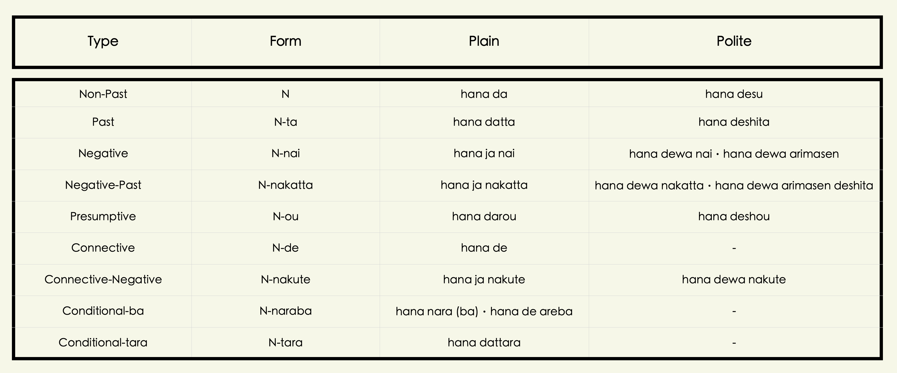
<h6> </h6>

------------------------------------------------------------------------

#### Examples

```{r, echo=FALSE, message=FALSE}

nounw.a <- nounw %>% rename(Sentences = S1)
nounw.a <- nounw.a[sample(1:nrow(nounw.a)),]

reactable(
  nounw.a,
  columns = list(
    Words = colDef(style= list(background = '#e0e1dd'),
      cell = function(value, index) {
        Reading <- nounw.a$Reading[index]
        Reading <- if (!is.na(Reading)) Reading else ""
        Meaning <- nounw.a$Meaning[index]
        Meaning <- if (!is.na(Meaning)) Meaning else ""
        tagList(
          div(style = list(fontSize = 22, fontWeight = 600, color = '#0F2040', fontFamily = 'Open Sans'), value),
          div(style = list(fontSize = 10, color = '#800000', fontFamily = 'Open Sans'), Reading),
          div(style = list(fontSize = 10, fontWeight = 500, color = '#266c6c', fontFamily = 'Open Sans'), Meaning)
        )
      },
      align = "center"
    ),

    Sentences = colDef(style= list(background = '#edede9'),
      minWidth = 200,
      cell = function(value, index) {
        T1 <- nounw.a$T1[index]
        T1 <- if (!is.na(T1)) T1 else ""
        tagList(
          div(style = list(fontSize = 18, fontWeight = 600, color = '#0F2040', fontFamily = 'Open Sans'), value),
          div(style = list(fontSize = 9, color = '#0F2040', fontFamily = 'Open Sans'), T1)
        )
      },
      align = "left"
    ),

    T1 = colDef(show = FALSE),
    Meaning = colDef(show = FALSE),
    Reading = colDef(show = FALSE)
    # Sentences = colDef(show = FALSE)
  ),
  rowClass = "my-row",
  defaultPageSize = 5,
  theme = reactableTheme(
    cellStyle = list(display = "flex", flexDirection = "column", justifyContent = "center", fontSize = "11px", height = 100),
    searchInputStyle = list(
      paddingLeft = "8px",
      paddingTop = "8px",
      paddingBottom = "8px",
      width = "100%"
    )
  ),
  showPageInfo = FALSE, bordered = TRUE, searchable = TRUE, paginationType = "numbers", striped = TRUE, highlight = TRUE,
  
  style = list(fontFamily = "Noto Sans JP, Hiragino Maru Gothic ProN, Anonymous Pro , Helvetica Neue", fontSize = "11px")
)
```

------------------------------------------------------------------------

#### Reconize

<div class = "row">
<div class = "col-sm-6">

```{r, echo=FALSE, message=FALSE}

nounw.a <- nounw.a[sample(1:nrow(nounw.a)),]

reactable(
  nounw.a,
  columns = list(
    Words = colDef(style= list(background = '#e0e1dd'),
      cell = function(value, index) {
        Reading <- nounw.a$Reading[index]
        Reading <- if (!is.na(Reading)) Reading else ""
        Meaning <- nounw.a$Meaning[index]
        Meaning <- if (!is.na(Meaning)) Meaning else ""
        tagList(
          div(style = list(fontSize = 30, fontWeight = 600, color = '#0F2040', fontFamily = 'Open Sans'), value),
          div(style = list(fontSize = 11, color = '#0F2040', fontFamily = 'Open Sans'), Reading),
          div(style = list(fontSize = 10, fontWeight = 500, color = '#0F2040', fontFamily = 'Open Sans'), Meaning)
        )
      },
      align = "center"
    ),

    T1 = colDef(show = FALSE),
    Meaning = colDef(show = FALSE),
    Reading = colDef(show = FALSE),
    Sentences = colDef(show = FALSE)
  ),
  rowClass = "my-row",
  defaultPageSize = 1,
  theme = reactableTheme(
    cellStyle = list(display = "flex", flexDirection = "column", justifyContent = "center", height = 250, fontSize = "11px"),
    searchInputStyle = list(
      paddingLeft = "8px",
      paddingTop = "8px",
      paddingBottom = "8px",
      width = "100%"
    )
  ),
  showPageInfo = FALSE, bordered = TRUE, searchable = TRUE, paginationType = "simple", striped = TRUE, highlight = TRUE,
  
  style = list(fontFamily = "Noto Sans JP, Hiragino Maru Gothic ProN, Anonymous Pro , Helvetica Neue", fontSize = "11px")
)
```

</div>
<div class = "col-sm-6">

```{r, echo=FALSE, message=FALSE}

nounw.a <- nounw.a[sample(1:nrow(nounw.a)),]

reactable(
  nounw.a,
  columns = list(
    Words = colDef(style= list(background = '#edede9'),
      cell = function(value, index) {
        Reading <- nounw.a$Reading[index]
        Reading <- if (!is.na(Reading)) Reading else ""
        Meaning <- nounw.a$Meaning[index]
        Meaning <- if (!is.na(Meaning)) Meaning else ""
        tagList(
          div(style = list(fontSize = 28, fontWeight = 600, color = '#0F2040', fontFamily = 'Open Sans'), value),
          # div(style = list(fontSize = 11, color = '#404040'), Reading),
          # div(style = list(fontSize = 10, color = '#404040'), Meaning)
        )
      },
      align = "center"
    ),

    T1 = colDef(show = FALSE),
    Meaning = colDef(show = FALSE),
    Reading = colDef(show = FALSE),
    Sentences = colDef(show = FALSE)
  ),
  rowClass = "my-row",
  defaultPageSize = 1,
  theme = reactableTheme(
    cellStyle = list(display = "flex", flexDirection = "column", justifyContent = "center", height = 250, fontSize = "11px"),
    searchInputStyle = list(
      paddingLeft = "8px",
      paddingTop = "8px",
      paddingBottom = "8px",
      width = "100%"
    )
  ),
  showPageInfo = FALSE, bordered = TRUE, searchable = TRUE, paginationType = "numbers", highlight = TRUE,
  
  style = list(fontFamily = "Noto Sans JP, Hiragino Maru Gothic ProN, Anonymous Pro , Helvetica Neue", fontSize = "11px")
)
```

</div>
</div>

------------------------------------------------------------------------

#### Recall

<div class = "row">
<div class = "col-sm-6">

```{r, echo=FALSE, message=FALSE}

nounw.a <- nounw.a[sample(1:nrow(nounw.a)),]

reactable(
  nounw.a,
  columns = list(
    Meaning = colDef(style= list(background = '#e0e1dd'),
      cell = function(value, index) {
        Reading <- nounw.a$Reading[index]
        Reading <- if (!is.na(Reading)) Reading else ""
        Words <- nounw.a$Words[index]
        Words <- if (!is.na(Words)) Words else ""
        tagList(
          div(style = list(fontSize = 30, fontWeight = 600, color = '#0F2040', fontFamily = 'Open Sans'), Words),
          div(style = list(fontSize = 11, color = '#0F2040', fontFamily = 'Open Sans'), Reading),
          div(style = list(fontSize = 10, fontWeight = 500, color = '#0F2040', fontFamily = 'Open Sans'), value)
        )
      },
      align = "center"
    ),

    T1 = colDef(show = FALSE),
    Words = colDef(show = FALSE),
    Reading = colDef(show = FALSE),
    Sentences = colDef(show = FALSE)
  ),
  rowClass = "my-row",
  defaultPageSize = 1,
  theme = reactableTheme(
    cellStyle = list(display = "flex", flexDirection = "column", justifyContent = "center", height = 250, fontSize = "11px"),
    searchInputStyle = list(
      paddingLeft = "8px",
      paddingTop = "8px",
      paddingBottom = "8px",
      width = "100%"
    )
  ),
  showPageInfo = FALSE, bordered = TRUE, searchable = TRUE, paginationType = "simple", striped = TRUE, highlight = TRUE,
  
  style = list(fontFamily = "Noto Sans JP, Hiragino Maru Gothic ProN, Anonymous Pro , Helvetica Neue", fontSize = "11px")
)
```

</div>
<div class = "col-sm-6">

```{r, echo=FALSE, message=FALSE}

nounw.a <- nounw.a[sample(1:nrow(nounw.a)),]

reactable(
  nounw.a,
  columns = list(
    Words = colDef(style= list(background = '#edede9'),
      cell = function(value, index) {
        Reading <- nounw.a$Reading[index]
        Reading <- if (!is.na(Reading)) Reading else ""
        Meaning <- nounw.a$Meaning[index]
        Meaning <- if (!is.na(Meaning)) Meaning else ""
        tagList(
          div(style = list(fontSize = 30, fontWeight = 600, color = '#0F2040', fontFamily = 'Open Sans'), value),
          # div(style = list(fontSize = 11, color = '#0F2040'), Reading),
          div(style = list(fontSize = 12, fontWeight = 600, color = '#0F2040', fontFamily = 'Open Sans'), Meaning)
        )
      },
      align = "center"
    ),

    T1 = colDef(show = FALSE),
    Meaning = colDef(show = FALSE),
    Reading = colDef(show = FALSE),
    Sentences = colDef(show = FALSE)
  ),
  rowClass = "my-row",
  defaultPageSize = 1,
  theme = reactableTheme(
    cellStyle = list(display = "flex", flexDirection = "column", justifyContent = "center", height = 250, fontSize = "11px"),
    searchInputStyle = list(
      paddingLeft = "8px",
      paddingTop = "8px",
      paddingBottom = "8px",
      width = "100%"
    )
  ),
  showPageInfo = FALSE, bordered = TRUE, searchable = TRUE, paginationType = "numbers", highlight = TRUE,
  
  style = list(fontFamily = "Noto Sans JP, Hiragino Maru Gothic ProN, Anonymous Pro , Helvetica Neue", fontSize = "11px")
)
```

</div>
</div>

------------------------------------------------------------------------

#### Sentences

<!-- <div class = "row"> -->
<!-- <div class = "col-sm-6"> -->

```{r, echo=FALSE, message=FALSE}

nounw.a <- nounw %>% slice(1:687) %>% rename(Sentences = S1, Translation = T1)
nounw.a <- nounw.a %>% na.omit(nounw.a)
nounw.a <- nounw.a[sample(1:nrow(nounw.a)),]

reactable(
  nounw.a,
  columns = list(
    Translation = colDef(style= list(background = '#e0e1dd'),
      cell = function(value, index) {
        Sentences <- nounw.a$Sentences[index]
        Sentences <- if (!is.na(Sentences)) Sentences else ""
        tagList(
          div(style = list(fontSize = 20, fontWeight = 600, color = '#0F2040', fontFamily = 'Open Sans'), Sentences),
          div(style = list(fontSize = 11, fontWeight = 300, color = '#0F2040'), value)
        )
      },
      align = "left"
    ),
    Words = colDef(show = FALSE),
    Meaning = colDef(show = FALSE),
    Reading = colDef(show = FALSE),
    Sentences = colDef(show = FALSE)

  ),
  rowClass = "my-row",
  defaultPageSize = 30,
  theme = reactableTheme(
    cellStyle = list(display = "flex", flexDirection = "column", justifyContent = "center", fontSize = "11px"),
    searchInputStyle = list(
      paddingLeft = "8px",
      paddingTop = "8px",
      paddingBottom = "8px",
      width = "100%"
    )
  ),
  showPageInfo = FALSE, outlined = TRUE, borderless = FALSE, bordered = TRUE, searchable = TRUE, paginationType = "numbers", striped = TRUE, highlight = TRUE, height = 530,
  
  style = list(fontFamily = "Noto Sans JP, Hiragino Maru Gothic ProN, Anonymous Pro , Helvetica Neue", fontSize = "11px")
)
```

<!-- </div> -->
<!-- <div class = "col-sm-6"> -->

<!-- ```{r, echo=FALSE, message=FALSE} -->

<!-- nounw.a <- nounw.a[sample(1:nrow(nounw.a)),] -->

<!-- reactable( -->
<!--   nounw.a, -->
<!--   columns = list( -->
<!--     Sentences = colDef(style= list(background = '#dee7e7'), -->
<!--       cell = function(value, index) { -->
<!--         Translation <- nounw.a$Translation[index] -->
<!--         Translation <- if (!is.na(Translation)) Translation else "" -->
<!--         tagList( -->
<!--           div(style = list(fontSize = 12, fontWeight = 600, color = '#404040'), Translation), -->
<!--         ) -->
<!--       }, -->
<!--       align = "center" -->
<!--     ), -->
<!--     Words = colDef(show = FALSE), -->
<!--     Meaning = colDef(show = FALSE), -->
<!--     Reading = colDef(show = FALSE), -->
<!--     Translation = colDef(show = FALSE) -->

<!--   ), -->
<!--   defaultPageSize = 1, -->
<!--   theme = reactableTheme( -->
<!--     # Vertically center cells -->
<!--     cellStyle = list(display = "flex", flexDirection = "column", justifyContent = "center", height = 250, fontSize = "11px"), -->
<!--     searchInputStyle = list( -->
<!--       paddingLeft = "8px", -->
<!--       paddingTop = "8px", -->
<!--       paddingBottom = "8px", -->
<!--       width = "100%" -->
<!--     ) -->
<!--   ), -->
<!--   showPageInfo = FALSE, bordered = TRUE, searchable = TRUE, paginationType = "simple", -->

<!--   style = list(fontFamily = "Noto Sans JP, Hiragino Maru Gothic ProN, Anonymous Pro , Helvetica Neue", fontSize = "11px") -->
<!-- ) -->
<!-- ``` -->

<!-- </div> -->
<!-- </div> -->

------------------------------------------------------------------------

### MC.4.0: Adverbs {.tabset}
<p style="font-size:11px; line-height: 1; font-family: Noto Sans JP;  color: #202020;">**Adverbs**  are words that precede and modify verbs, adjectives, other adverbs, and even whole clauses.</p>

#### Structure

<p style="font-size:13px; line-height: 0.5; font-family: Noto Sans JP;  color: #202020; font-weight: bold">**① Forms: Derivation**</p>

###### **Adjective Stem ⇢ Adverb**

<div class = "expressjp">
・うまい　　⇢　うまく　　◦ skillfully, well   
・やすい　　⇢　やすく　　◦ inexpensively, cheaply  
・ふかい　　⇢　ふかく　　◦ deeply, intimately   
・はやい　　⇢　はやく　　◦ early, soon, quickly   
・すごい　　⇢　すごく　　◦ awfully, very, immensely  
・みじかい　⇢　みじかく　◦ shortly, briefly   
・くわしい　⇢　くわしく　◦ in detail, fully   
</div>

<h6> </h6>

###### **Na Adjective ⇢ Adverb**

<div class = "expressjp">
・きれい　　⇢　きれいに　　◦ neatly, carefully    
・とくべつ　⇢　とくべつに　◦ specially, particularly      
・たいせつ　⇢　たいせつに　◦ carefully, with great care    
</div>

<h6> </h6>

###### **No Adjective ⇢ Adverb**

<div class = "expressjp">
・はだか　⇢　はだかで　◦ nakedly    
</div>

<h6> </h6>

###### **Onomatope ⇢ Adverb**

<div class = "expressjp">
・ちゃんと　⇢　ちゃんと　◦ properly, diligently, exactly    
・ヨボヨボ　⇢　ヨボヨボ　◦ shaky, unsteadily    
・すっかり　⇢　すっかり　◦ completely, entirely    
</div>

<h6> </h6>

<div class = "expressjp">
・ゆっくり　⇢　ゆっくり(と)　◦ slowly, leisurely    
・ピカピカ　⇢　ピカピカ(と)　◦ sparkly    
・ふらふら　⇢　ふらふら(と)　◦ shaky, unsteadily   
</div>

<h6> </h6>

###### **Verbs ⇢ Adverb**

<div class = "expressjp">
・はじめる　⇢　はじめて　◦ first time     
・きわめる　⇢　きわめて　◦ extremely, exceedingly    
・すぐれる　⇢　すぐれて　◦ exceedingly    
・いそぐ　　⇢　いそいで　◦ quickly   
・追う　　　⇢　おって　　◦ later on, shortly, in due course   
・かくれる　⇢　かくれて　◦ secretly   
・はたす　　⇢　はたして　◦ sure enough, as was expected   
</div>

<h6> </h6>

###### **Verbs (Duplication) ⇢ Adverb**

<div class = "expressjp">
・おそれる　⇢　おそる-おそる　◦ timidly     
・かわる　　⇢　かわる-がわる　◦ in-turn    
・ます　　　⇢　ます-ます　　　◦ increasingly   
・なく　　　⇢　なく-なく　　　◦ in tears    
・みる　　　⇢　みる-みる　　　◦ as you look on, very fast, in a twinkle  
</div>

<h6> </h6>

###### **Nouns (Adverbial Nouns) ⇢ Adverb**

###### These are used as an adeverb to express time

<div class = "expressjp">
・いま　　⇢　いま　　◦ now     
・きょう　⇢　きょう　◦ today    
・きのう　⇢　きのう　◦ yesterday   
・あした　⇢　あした　◦ tomorrow    
・あさ　　⇢　あさ　　◦ morning    
・ひる　　⇢　ひる　　◦ noon    
・よる　　⇢　よる　　◦ night    
・はる　　⇢　はる　　◦ spring    
・なつ　　⇢　なつ　　◦ summer   
・あき　　⇢　あき　　◦ autumn    
・ふゆ　　⇢　ふゆ　　◦ winter   
・むかし　⇢　むかし　◦ old times    
</div>

<h6> </h6>

###### **Nouns・Verbs + Compound Particle (Pre-Verbal Form) ⇢ Adverbials**

###### Modifies, describes or gives more information about the verb it's closely connected

<div class = "expressjp">
・日本の文化について話す    
・年を取るにつれて記憶力が衰える    
</div>

<h6> </h6>

<div class = "expressjp">
 ・To talk about Japanese culture     
 ・As one grows old one's memory fails     
</div>

<h6> </h6>

------------------------------------------------------------------------

#### Types

<p style="font-size:13px; line-height: 0.5; font-family: Noto Sans JP;  color: #202020; font-weight: bold">**① Adverbs of Manner**</p>

###### **Indicates the way some action is being performed**

<div class = "expressjp">
・きれい　　⇢　きれいに　◦ neatly    
・すっかり　⇢　すっかり　◦ completely  
・ゆっくり　⇢　ゆっくり　◦ well   
・まっすぐ　⇢　まっすぐ　◦ straightly  
・ちょうど　⇢　ちょうど　◦ exactly    
・はっきり　⇢　はっきり　◦ clearly   
・まったく　⇢　まったく　◦ really   
・ちゃんと　⇢　ちゃんと　◦ properly    
・きちんと　⇢　きちんと　◦ accurately   
・ぶじ　　　⇢　ぶじに　　◦ safely    
・さっそく　⇢　さっそく　◦ immediately        
</div>

<h6> </h6>

<p style="font-size:13px; line-height: 0.5; font-family: Noto Sans JP;  color: #202020; font-weight: bold">**② Adverbs of Degree and Quantity**</p>

###### **Indicates the degree to which the word it modifies**

<div class = "expressjp">
・もっと　　⇢　もっと　　　◦ more, even more, further           
・もっとも　⇢　もっとも　　◦ extremely, most    
・いちばん　⇢　いちばん　　◦ most, number one   
・だいぶ　　⇢　だいぶ　　　◦ pretty, considerably   
・ひじょう　⇢　ひじょうに　◦ very, extremely    
・ほとんど　⇢　ほとんど　　◦ almost, mostly        
・いっさい　⇢　いっさい　　◦ entirety, (not) at all, never   
・じつ　　　⇢　じつに　　　◦ really, very clever    
・かなり　　⇢　かなり　　　◦ considerably, fairly    
・けっこう　⇢　けっこう　　◦ quite, fairly, considerably    
・きわめて　⇢　きわめて　　◦ extremely, exceedingly   
・すっかり　⇢　すっかり　　◦ completely, entirely    
・たいへん　⇢　たいへん　　◦ very, greatly, terribly    
・とても　　⇢　とても　　　◦ very, exceedingly   
・すごく　　⇢　すごく　　　◦ very, immensely   
・たくさん　⇢　たくさん　　◦ a lot, sufficiently    
・おおい　　⇢　おおいに　　◦ a lot, much, greatly    
・わずか　　⇢　わずかに　　◦ a little, slightly    
・ずいぶん　⇢　ずいぶん　　◦ very, extremely, terribly   
・すこし　　⇢　すこし　　　◦ a little, a few    
・あまり　　⇢　あまり　　　◦ (not) very much   
・ぜんぜん　⇢　ぜんぜん　　◦ (not) at all     
・なかなか　⇢　なかなか　　◦ pretty, fairly    
・たっぷり　⇢　たっぷり　　◦ full, plenty, ample   
・まあまあ　⇢　まあまあ　　◦ so-so     
</div>

<h6> </h6>

<p style="font-size:13px; line-height: 0.5; font-family: Noto Sans JP;  color: #202020; font-weight: bold">**③ Adverbial Nouns of Time and Frequency**</p>

###### **Indicates the time and frequency to which the word it modifies**

<div class = "expressjp">
・あらかじめ　　⇢ あらかじめ　　◦ beforehand, previously    
・はじめ　　　　⇢ はじめに　　　◦ firstly, first of all    
・いま　　　　　⇢ いま　　　　　◦ now    
・いまにも　　　⇢ いまにも　　　◦ any moment   
・このあいだ　　⇢ このあいだ　　◦ the other day, lately   
・このところ　　⇢ このところ　　◦ lately, recently   
・まだ　　　　　⇢ まだ　　　　　◦ still, as yet, only   
・まもなく　　　⇢ まもなく　　　◦ soon, shortly, in a moment   
・まれ　　　　　⇢ まれに　　　　◦ rarely   
・また　　　　　⇢ また　　　　　◦ again    
・もう　　　　　⇢ もう　　　　　◦ already    
・むかし　　　　⇢ むかし　　　　◦ in the past   
・さいご　　　　⇢ さいごに　　　◦ finally   
・さいきん　　　⇢ さいきん　　　◦ recently   
・さいしょ　　　⇢ さいしょに　　◦ first, onset    
・さき　　　　　⇢ さきに　　　　◦ ahead (of), first      
・さきほど　　　⇢ さきほど　　　◦ a while ago  
・さっき　　　　⇢ さっき　　　　◦ a moment ago    
・すぐ　　　　　⇢ すぐに　　　　◦ immediately    
・すこし　　　　⇢ すこし　　　　◦ a little, a bit    
・たびたび　　　⇢ たびたび  　　◦ often   
・しばしば　　　⇢ しばしば　　　◦ frequently    
・しょっちゅう　⇢ しょっちゅう　◦ always, frequently   
・すで　　　　　⇢ すでに　　　　◦ already, too late   
・つぎ　　　　　⇢ つぎに　　　　◦ next to     
・よく　　　　　⇢ よく　　　　　◦ often  
・やがて　　　　⇢ やがて　　　　◦ shortly    
・ずっと　　　　⇢ ずっと　　　　◦ all along, throughout   
</div>

<h6> </h6>

------------------------------------------------------------------------

#### Endings

<p style="font-size:13px; line-height: 0.5; font-family: Noto Sans JP;  color: #202020; font-weight: bold">**① Affirmative**</p>
<p style="font-size:13px; line-height: 0.5; font-family: Noto Sans JP;  color: #202020; font-weight: bold">**・まれに・ぜひ**</p>

<div class = "expressjp">
・そういうことも稀にある.   
・コンサートと併せてぜひお越しください.   
</div>

<h6> </h6>

<div class = "expressjp">   
・Rarely does that happen.   
・Please come along with the concert.   
</div>

<h6> </h6>

<p style="font-size:13px; line-height: 0.5; font-family: Noto Sans JP;  color: #202020; font-weight: bold">**② Negative**</p>
<p style="font-size:13px; line-height: 0.5; font-family: Noto Sans JP;  color: #202020; font-weight: bold">**・あまり・けっして・たいして・めったに**</p>

<div class = "expressjp">
・あまり幸せそうに見えなかったな.    
・この矛盾はけっして解かれなかった.   
・彼女はめったに間違えない.    
・今の状況もその当時とたいして変わっていません.   
</div>

<h6> </h6>

<div class = "expressjp">    
・He didn't seem very happy.   
・This contradiction was never resolved.   
・She rarely makes mistakes.   
・The situation today is much the same as it was then.   
</div>

<h6> </h6>

<p style="font-size:13px; line-height: 0.5; font-family: Noto Sans JP;  color: #202020; font-weight: bold">**③ Conjecture**</p>
<p style="font-size:13px; line-height: 0.5; font-family: Noto Sans JP;  color: #202020; font-weight: bold">**・おそらく・たぶん・ひょっとすると・もしすると**</p>

<div class = "expressjp">
・娘はおそらくもう到着しただろう.   
・もしかすると来月休みがとれるかもしれない.   
・たぶんこんな景色が見られるでしょう.        
・ひょっとすると、正しいモジュールがロードできていないかもしれません.     
</div>

<h6> </h6>

<div class = "expressjp">     
・She's probably already there.   
・Maybe we can take a vacation next month.   
・Maybe we'll see a view like this.   
・Maybe the correct module is not loaded.   
</div>

<h6> </h6>

<p style="font-size:13px; line-height: 0.5; font-family: Noto Sans JP;  color: #202020; font-weight: bold">**④ Conditional**</p>
<p style="font-size:13px; line-height: 0.5; font-family: Noto Sans JP;  color: #202020; font-weight: bold">**・もし・まんがいち・たとえ**</p>

<div class = "expressjp">
・もし何か良い物を見つけたら、お知らせしますね.    
・たとえ優勝するのは無理でも、やってみます.    
・万が一できれば、手を貸してくれないか.  
</div>

<h6> </h6>

<div class = "expressjp">
・If I find something good, I'll let you know.   
・Even if I can't win, I'll try.   
・If you can, please lend me a hand.   
</div>

<h6> </h6>

------------------------------------------------------------------------

#### Examples

```{r, echo=FALSE, message=FALSE}

adv1.a <- adv1 %>% slice(1:250) %>% rename(Sentences = S1, Translation = T1)
adv1.a <- adv1.a[sample(1:nrow(adv1.a)),]

reactable(
  adv1.a,
  columns = list(
    Word = colDef(style= list(background = '#e0e1dd'),
      cell = function(value, index) {
        Reading <- adv1.a$Reading[index]
        Reading <- if (!is.na(Reading)) Reading else ""
        Meaning <- adv1.a$Meaning[index]
        Meaning <- if (!is.na(Meaning)) Meaning else ""
        tagList(
          div(style = list(fontSize = 22, fontWeight = 600, color = '#0F2040', fontFamily = 'Open Sans'), value),
          div(style = list(fontSize = 10, color = '#800000', fontFamily = 'Open Sans'), Reading),
          div(style = list(fontSize = 10, color = '#266c6c', fontFamily = 'Open Sans'), Meaning)
        )
      },
      align = "center"
    ),
    
    Sentences = colDef(style= list(background = '#edede9'),
      minWidth = 200,
      cell = function(value, index) {
        Translation <- adv1.a$Translation[index]
        Translation <- if (!is.na(Translation)) Translation else ""
        tagList(
          div(style = list(fontSize = 18, fontWeight = 600, color = '#0F2040', fontFamily = 'Open Sans'), value),
          div(style = list(fontSize = 9, color = '#0F2040', fontFamily = 'Open Sans'), Translation)
        )
      },
      align = "left"
    ),
    
    Translation = colDef(show = FALSE),
    Meaning = colDef(show = FALSE),
    Reading = colDef(show = FALSE)

  ),
  rowClass = "my-row",
  defaultPageSize = 5,
  theme = reactableTheme(
    cellStyle = list(display = "flex", flexDirection = "column", justifyContent = "center", fontSize = "11px", height = 100),
    searchInputStyle = list(
      paddingLeft = "8px",
      paddingTop = "8px",
      paddingBottom = "8px",
      width = "100%"
    )
  ),
  showPageInfo = FALSE, bordered = TRUE, searchable = TRUE, paginationType = "numbers", striped = TRUE, highlight = TRUE,
  
  style = list(fontFamily = "Noto Sans JP, Hiragino Maru Gothic ProN, Anonymous Pro , Helvetica Neue", fontSize = "11px")
)
```

------------------------------------------------------------------------

#### Recognize

<div class = "row">
<div class = "col-sm-6">


```{r, echo=FALSE, message=FALSE}

adv1.a <- adv1.a[sample(1:nrow(adv1.a)),]

reactable(
  adv1.a,
  columns = list(
    Word = colDef(style= list(background = '#e0e1dd'),
      cell = function(value, index) {
        Reading <- adv1.a$Reading[index]
        Reading <- if (!is.na(Reading)) Reading else ""
        Meaning <- adv1.a$Meaning[index]
        Meaning <- if (!is.na(Meaning)) Meaning else ""
        tagList(
          div(style = list(fontSize = 30, fontWeight = 600, color = '#0F2040', fontFamily = 'Open Sans'), value),
          div(style = list(fontSize = 11, color = '#0F2040', fontFamily = 'Open Sans'), Reading),
          div(style = list(fontSize = 10, fontWeight = 500, color = '#0F2040', fontFamily = 'Open Sans'), Meaning)
        )
      },
      align = "center"
    ),

    Translation = colDef(show = FALSE),
    Meaning = colDef(show = FALSE),
    Reading = colDef(show = FALSE),
    Sentences = colDef(show = FALSE)
    
  ),
  rowClass = "my-row",
  defaultPageSize = 1,
  theme = reactableTheme(
    cellStyle = list(display = "flex", flexDirection = "column", justifyContent = "center", height = 250, fontSize = "11px"),
    searchInputStyle = list(
      paddingLeft = "8px",
      paddingTop = "8px",
      paddingBottom = "8px",
      width = "100%"
    )
  ),
  showPageInfo = FALSE, bordered = TRUE, searchable = TRUE, paginationType = "simple", striped = TRUE, highlight = TRUE,
  
  style = list(fontFamily = "Noto Sans JP, Hiragino Maru Gothic ProN, Anonymous Pro , Helvetica Neue", fontSize = "11px")
)
```

</div>
<div class = "col-sm-6">

```{r, echo=FALSE, message=FALSE}

adv1.a <- adv1.a[sample(1:nrow(adv1.a)),]

reactable(
  adv1.a,
  columns = list(
    Word = colDef(style= list(background = '#edede9'),
      cell = function(value, index) {
        Reading <- adv1.a$Reading[index]
        Reading <- if (!is.na(Reading)) Reading else ""
        Meaning <- adv1.a$Meaning[index]
        Meaning <- if (!is.na(Meaning)) Meaning else ""
        tagList(
          div(style = list(fontSize = 30, fontWeight = 600, color = '#0F2040', fontFamily = 'Open Sans'), value),
          # div(style = list(fontSize = 11, color = '#404040'), Reading),
          # div(style = list(fontSize = 10, color = '#404040'), Meaning)
        )
      },
      align = "center"
    ),

    Translation = colDef(show = FALSE),
    Meaning = colDef(show = FALSE),
    Reading = colDef(show = FALSE),
    Sentences = colDef(show = FALSE)
  ),
  rowClass = "my-row",
  defaultPageSize = 1,
  theme = reactableTheme(
    cellStyle = list(display = "flex", flexDirection = "column", justifyContent = "center", height = 250, fontSize = "11px"),
    searchInputStyle = list(
      paddingLeft = "8px",
      paddingTop = "8px",
      paddingBottom = "8px",
      width = "100%"
    )
  ),
  showPageInfo = FALSE, bordered = TRUE, searchable = TRUE, paginationType = "numbers", highlight = TRUE,
  
  style = list(fontFamily = "Noto Sans JP, Hiragino Maru Gothic ProN, Anonymous Pro , Helvetica Neue", fontSize = "11px")
)
```

</div>
</div>

------------------------------------------------------------------------

#### Recall

<div class = "row">
<div class = "col-sm-6">

```{r, echo=FALSE, message=FALSE}

adv1.a <- adv1.a[sample(1:nrow(adv1.a)),]

reactable(
  adv1.a,
  columns = list(
    Meaning = colDef(style= list(background = '#e0e1dd'),
      cell = function(value, index) {
        Reading <- adv1.a$Reading[index]
        Reading <- if (!is.na(Reading)) Reading else ""
        Word <- adv1.a$Word[index]
        Word <- if (!is.na(Word)) Word else ""
        tagList(
          div(style = list(fontSize = 30, fontWeight = 600, color = '#0F2040', fontFamily = 'Open Sans'), Word),
          div(style = list(fontSize = 11, color = '#0F2040', fontFamily = 'Open Sans'), Reading),
          div(style = list(fontSize = 10, fontWeight = 500, color = '#0F2040', fontFamily = 'Open Sans'), value)
        )
      },
      align = "center"
    ),

    Translation = colDef(show = FALSE),
    Word = colDef(show = FALSE),
    Reading = colDef(show = FALSE),
    Sentences = colDef(show = FALSE)
  ),
  rowClass = "my-row",
  defaultPageSize = 1,
  theme = reactableTheme(
    cellStyle = list(display = "flex", flexDirection = "column", justifyContent = "center", height = 250, fontSize = "11px"),
    searchInputStyle = list(
      paddingLeft = "8px",
      paddingTop = "8px",
      paddingBottom = "8px",
      width = "100%"
    )
  ),
  showPageInfo = FALSE, bordered = TRUE, searchable = TRUE, paginationType = "simple", striped = TRUE, highlight = TRUE,
  
  style = list(fontFamily = "Noto Sans JP, Hiragino Maru Gothic ProN, Anonymous Pro , Helvetica Neue", fontSize = "11px")
)
```

</div>
<div class = "col-sm-6">

```{r, echo=FALSE, message=FALSE}

adv1.a <- adv1.a[sample(1:nrow(adv1.a)),]

reactable(
  adv1.a,
  columns = list(
    Word = colDef(style= list(background = '#edede9'),
      cell = function(value, index) {
        Reading <- adv1.a$Reading[index]
        Reading <- if (!is.na(Reading)) Reading else ""
        Meaning <- adv1.a$Meaning[index]
        Meaning <- if (!is.na(Meaning)) Meaning else ""
        tagList(
          div(style = list(fontSize = 30, fontWeight = 600, color = '#0F2040', fontFamily = 'Open Sans'), value),
          # div(style = list(fontSize = 11, color = '#0F2040'), Reading),
          div(style = list(fontSize = 12, fontWeight = 600, color = '#0F2040', fontFamily = 'Open Sans'), Meaning)
        )
      },
      align = "center"
    ),

    Translation = colDef(show = FALSE),
    Meaning = colDef(show = FALSE),
    Reading = colDef(show = FALSE),
    Sentences = colDef(show = FALSE)
  ),
  rowClass = "my-row",
  defaultPageSize = 1,
  theme = reactableTheme(
    cellStyle = list(display = "flex", flexDirection = "column", justifyContent = "center", height = 250, fontSize = "11px"),
    searchInputStyle = list(
      paddingLeft = "8px",
      paddingTop = "8px",
      paddingBottom = "8px",
      width = "100%"
    )
  ),
  showPageInfo = FALSE, bordered = TRUE, searchable = TRUE, paginationType = "numbers", highlight = TRUE,
  
  style = list(fontFamily = "Noto Sans JP, Hiragino Maru Gothic ProN, Anonymous Pro , Helvetica Neue", fontSize = "11px")
)
```

</div>
</div>

------------------------------------------------------------------------

#### Sense

```{r, echo=FALSE, message=FALSE}

adv1.a <- adv1.a[sample(1:nrow(adv1.a)),]

adv1.a.1 <- adv1.a %>% select(Word) %>% rename(W1 = Word) %>% slice(1:50)
adv1.a.2 <- adv1.a %>% select(Word) %>% rename(W2 = Word) %>% slice(51:100)
adv1.a.3 <- adv1.a %>% select(Word) %>% rename(W3 = Word) %>% slice(101:150)
adv1.a.4 <- adv1.a %>% select(Word) %>% rename(W4 = Word) %>% slice(151:200)
adv1.a.5 <- adv1.a %>% select(Word) %>% rename(W5 = Word) %>% slice(201:250)

adv1.a.1 <- adv1.a.1[sample(1:nrow(adv1.a.1)),]
adv1.a.2 <- adv1.a.2[sample(1:nrow(adv1.a.2)),]
adv1.a.3 <- adv1.a.3[sample(1:nrow(adv1.a.3)),]
adv1.a.4 <- adv1.a.4[sample(1:nrow(adv1.a.4)),]
adv1.a.5 <- adv1.a.5[sample(1:nrow(adv1.a.5)),]

adv1.a.t <- data.frame(adv1.a.1, adv1.a.2, adv1.a.3, adv1.a.4, adv1.a.5)

reactable(
  adv1.a.t,
  columns = list(
    W1 = colDef(align = "center", style = list(fontSize = 20, fontWeight = 600, background = '#c9cac6', color = '#0F2040', fontFamily = 'Open Sans')),
    W2 = colDef(align = "center", style = list(fontSize = 20, fontWeight = 600, background = '#e0e1dd', color = '#0F2040', fontFamily = 'Open Sans')),
    W3 = colDef(align = "center", style = list(fontSize = 20, fontWeight = 600, background = '#e3e4e0', color = '#0F2040', fontFamily = 'Open Sans')),
    W4 = colDef(align = "center", style = list(fontSize = 20, fontWeight = 600, background = '#e6e7e3', color = '#0F2040', fontFamily = 'Open Sans')),
    W5 = colDef(align = "center", style = list(fontSize = 20, fontWeight = 600, background = '#edede9', color = '#0F2040', fontFamily = 'Open Sans'))
  ),
  rowClass = "my-row",
  defaultPageSize = 5,
  theme = reactableTheme(
    cellStyle = list(display = "flex", flexDirection = "column", justifyContent = "center", height = 70),
    searchInputStyle = list(
      paddingLeft = "8px",
      paddingTop = "8px",
      paddingBottom = "8px",
      width = "100%"
    )
  ),
  showPageInfo = FALSE, outlined = TRUE, borderless = FALSE, bordered = FALSE, searchable = TRUE, sortable = FALSE, paginationType = "simple", highlight = TRUE,
  
  style = list(fontFamily = "Noto Sans JP, Heiti SC, Hiragino Maru Gothic ProN, Anonymous Pro , monospace, Helvetica Neue", fontSize = "11px")
)

```

------------------------------------------------------------------------

#### Remember {.tabset}

<div class = "row">
<div class = "col-sm-6">

```{r, echo=FALSE, message=FALSE}

advrm.a <- advrm  %>% slice(1:70)
advrm.a <- advrm.a[sample(1:nrow(advrm.a)),]

reactable(
  advrm.a,
  columns = list(
    Expression = colDef(style= list(background = '#e0e1dd'),
      cell = function(value, index) {
        Word <- advrm.a$Word[index]
        Word <- if (!is.na(Word)) Word else ""
        tagList(
          div(style = list(fontSize = 28, fontWeight = 600, fontFamily = 'Open Sans', color = '#0F2040'), value),
        )
      },
      align = "center"
    ),
    Word = colDef(show = FALSE),
    Reading = colDef(show = FALSE),
    Meaning = colDef(show = FALSE),
    Translation = colDef(show = FALSE)
  ),
  rowClass = "my-row",
  defaultPageSize = 1,
  theme = reactableTheme(
    cellStyle = list(display = "flex", flexDirection = "column", justifyContent = "center", fontSize = "11px", height = 250),
    searchInputStyle = list(
      paddingLeft = "8px",
      paddingTop = "8px",
      paddingBottom = "8px",
      width = "100%",
      fontSize = "11px"
    )
  ),
  showPageInfo = FALSE, bordered = TRUE, searchable = TRUE, sortable = FALSE, paginationType = "numbers", striped = TRUE, highlight = TRUE,

  style = list(fontFamily = "Noto Sans JP, Heiti SC, Hiragino Maru Gothic ProN, Anonymous Pro , monospace, Helvetica Neue", fontSize = "11px")
)

```

</div>
<div class = "col-sm-6">

```{r, echo=FALSE, message=FALSE}

advrm.a <- advrm.a[sample(1:nrow(advrm.a)),]

reactable(
  advrm.a,
  columns = list(
    Expression = colDef(style= list(background = '#edede9'),
      cell = function(value, index) {
        Translation <- advrm.a$Translation[index]
        Translation <- if (!is.na(Translation)) Translation else ""
        tagList(
          div(span(style = list(fontSize = 16, fontWeight = 300, fontFamily = 'Open Sans', color = '#0F2040'), value, "。"), span(style = list(fontSize = 10, fontWeight = 300, fontFamily = 'Open Sans', color = '#0F2040'), Translation,"."))
        )
      },
      align = "left"
    ),
    Word = colDef(show = FALSE),
    Reading = colDef(show = FALSE),
    Meaning = colDef(show = FALSE),
    Translation = colDef(show = FALSE)
  ),
  rowClass = "my-row",
  defaultPageSize = 10,
  theme = reactableTheme(
    cellStyle = list(display = "flex", flexDirection = "column", justifyContent = "center", fontSize = "11px", height = 42),
    searchInputStyle = list(
      paddingLeft = "8px",
      paddingTop = "8px",
      paddingBottom = "8px",
      width = "100%",
      fontSize = "11px"
    )
  ),
  showPageInfo = FALSE, bordered = TRUE, searchable = TRUE, sortable = FALSE, paginationType = "simple", striped = TRUE, highlight = TRUE, height = 365,

  style = list(fontFamily = "Noto Sans JP, Heiti SC, Hiragino Maru Gothic ProN, Anonymous Pro , monospace, Helvetica Neue", fontSize = "11px")
)

```

</div>
</div>

------------------------------------------------------------------------

#### Sentences

<!-- <div class = "row"> -->
<!-- <div class = "col-sm-6"> -->

```{r, echo=FALSE, message=FALSE}

adv1.a <- adv1.a[sample(1:nrow(adv1.a)),]
adv1.a <- adv1.a %>% na.omit(adv1.a)

reactable(
  adv1.a,
  columns = list(
    Translation = colDef(style= list(background = '#e0e1dd'),
      cell = function(value, index) {
        Sentences <- adv1.a$Sentences[index]
        Sentences <- if (!is.na(Sentences)) Sentences else ""
        tagList(
          div(style = list(fontSize = 20, fontWeight = 600, color = '#0F2040', fontFamily = 'Open Sans'), Sentences),
          div(style = list(fontSize = 11, fontWeight = 300, color = '#0F2040'), value)
        )
      },
      align = "left"
    ),
    Word = colDef(show = FALSE),
    Meaning = colDef(show = FALSE),
    Reading = colDef(show = FALSE),
    Sentences = colDef(show = FALSE)

  ),
  rowClass = "my-row",
  defaultPageSize = 20,
  theme = reactableTheme(
    cellStyle = list(display = "flex", flexDirection = "column", justifyContent = "center", fontSize = "11px"),
    searchInputStyle = list(
      paddingLeft = "8px",
      paddingTop = "8px",
      paddingBottom = "8px",
      width = "100%"
    )
  ),
  showPageInfo = FALSE, bordered = TRUE, searchable = TRUE, paginationType = "numbers", striped = TRUE, highlight = TRUE, height = 530,
  
  style = list(fontFamily = "Noto Sans JP, Hiragino Maru Gothic ProN, Anonymous Pro , Helvetica Neue", fontSize = "11px")
)
```

<!-- </div> -->
<!-- <div class = "col-sm-6"> -->

<!-- ```{r, echo=FALSE, message=FALSE} -->


<!-- adv1.a <- adv1.a[sample(1:nrow(adv1.a)),] -->

<!-- reactable( -->
<!--   adv1.a, -->
<!--   columns = list( -->
<!--     Sentences = colDef(style= list(background = '#dee7e7'), -->
<!--       cell = function(value, index) { -->
<!--         Translation <- adv1.a$Translation[index] -->
<!--         Translation <- if (!is.na(Translation)) Translation else "" -->
<!--         tagList( -->
<!--           div(style = list(fontSize = 12, fontWeight = 600, color = '#404040'), Translation), -->
<!--         ) -->
<!--       }, -->
<!--       align = "center" -->
<!--     ), -->
<!--     Word = colDef(show = FALSE), -->
<!--     Meaning = colDef(show = FALSE), -->
<!--     Reading = colDef(show = FALSE), -->
<!--     Translation = colDef(show = FALSE) -->

<!--   ), -->
<!--   defaultPageSize = 1, -->
<!--   theme = reactableTheme( -->
<!--     # Vertically center cells -->
<!--     cellStyle = list(display = "flex", flexDirection = "column", justifyContent = "center", height = 250, fontSize = "11px"), -->
<!--     searchInputStyle = list( -->
<!--       paddingLeft = "8px", -->
<!--       paddingTop = "8px", -->
<!--       paddingBottom = "8px", -->
<!--       width = "100%" -->
<!--     ) -->
<!--   ), -->
<!--   showPageInfo = FALSE, bordered = TRUE, searchable = TRUE, paginationType = "simple", -->

<!--   style = list(fontFamily = "Noto Sans JP, Hiragino Maru Gothic ProN, Anonymous Pro , Helvetica Neue", fontSize = "11px") -->
<!-- ) -->
<!-- ``` -->

<!-- </div> -->
<!-- </div> -->

------------------------------------------------------------------------

### MC.5.0: Onomatope {.tabset}
<p style="font-size:11px; line-height: 1; font-family: Noto Sans JP;  color: #202020;">**Onomatope**  are group of words which have their meaning indicated by the sounds they mimic and or the condition, appearance, action or feelings they represents.</p>

#### Structure

<p style="font-size:13px; line-height: 0.5; font-family: Noto Sans JP;  color: #202020; font-weight: bold">**① Structure:**</p>

###### **1.Double-Form:** `pikapika・kasakasa・gatgata・gorogoro`
###### **2.To-Form:** `chanto・unto`・`satto・jitto・atto`
###### **3.Ri-Form:** `yukkuri・shikkari・uttori・hakkiri`・`nonbiri・bonyari・hinyari`

<h6> </h6>

<p style="font-size:13px; line-height: 0.5; font-family: Noto Sans JP;  color: #202020; font-weight: bold">**②  Types:**</p>

###### **1.Human・Animal Sound**   
###### **2.In-animate・Nature Sound**   
###### **3.Condition・Appearance**   
###### **4.Movement・Motion**   
###### **5.Feeling・Emotion**  

<h6> </h6>

------------------------------------------------------------------------

#### Usage

<p style="font-size:13px; line-height: 0.5; font-family: Noto Sans JP;  color: #202020; font-weight: bold">**① Usage: Adverb**</p>

<div class = "expressjp">
・成績表はちゃんと提出していただきます.   
・頭の中がぴかぴかと光った.   
・ぶらりと歩〱と時がゆっ〱り流れてい〱ようだ.   
・ゴルフをしないとよぼよぼになる.   
</div>

<h6> </h6>

<div class = "expressjp">
・You'll be required to submit your grades.   
・My head was shining brightly.   
・Time seems to flow more slowly as I stroll along.  
・I'd be a wreck if I didn't play golf.  
</div>

<h6> </h6>

<p style="font-size:13px; line-height: 0.5; font-family: Noto Sans JP;  color: #202020; font-weight: bold">**② Usage: Noun-Modifier**</p>

<div class = "expressjp">
・いらいらが高じて虐待に走るケースすら出ている.    
・In some cases, frustration has even led to abuse.   
</div>

<h6> </h6>

<p style="font-size:13px; line-height: 0.5; font-family: Noto Sans JP;  color: #202020; font-weight: bold">**③ Usage: Verb-Modifier**</p>

<div class = "expressjp">
・電話の声の調子もしっかりしていた.   
・The tone of his voice on the phone was solid.   
</div>

<h6> </h6>

------------------------------------------------------------------------

#### Examples

```{r, echo=FALSE, message=FALSE}

ontmpe.a <- ontmpe %>% rename(Sentences = S1)
ontmpe.a <- ontmpe.a[sample(1:nrow(na.omit(ontmpe.a))),] 
ontmpe.a <- ontmpe.a[sample(1:nrow(ontmpe.a)),]

reactable(
  ontmpe.a,
  columns = list(
    Word = colDef(style= list(background = '#e0e1dd'),
      cell = function(value, index) {
        Reading <- ontmpe.a$Reading[index]
        Reading <- if (!is.na(Reading)) Reading else ""
        Meaning <- ontmpe.a$Meaning[index]
        Meaning <- if (!is.na(Meaning)) Meaning else ""
        tagList(
          div(style = list(fontSize = 22, fontWeight = 800, color = '#0F2040', fontFamily = 'Open Sans'), value),
          # div(style = list(fontSize = 11, color = '#800000', fontFamily = 'Open Sans'), Reading),
          div(style = list(fontSize = 12, fontWeight = 400, color = '#266c6c', fontFamily = 'Zen Kaku Gothic New'), Meaning)
        )
      },
      align = "center"
    ),

    Sentences = colDef(style= list(background = '#edede9'),
      minWidth = 180,
      cell = function(value, index) {
        T1 <- ontmpe.a$T1[index]
        T1 <- if (!is.na(T1)) T1 else ""
        tagList(
          div(style = list(fontSize = 18, fontWeight = 600, color = '#0F2040', fontFamily = 'Open Sans'), value),
          div(style = list(fontSize = 12, color = '#0F2040', fontFamily = 'Zen Kaku Gothic New'), T1)
        )
      },
      align = "left"
    ),

    T1 = colDef(show = FALSE),
    Meaning = colDef(show = FALSE),
    Reading = colDef(show = FALSE)

  ),
  rowClass = "my-row",
  defaultPageSize = 5,
  theme = reactableTheme(
    cellStyle = list(display = "flex", flexDirection = "column", justifyContent = "center", fontSize = "11px", height = 100),
    searchInputStyle = list(
      paddingLeft = "8px",
      paddingTop = "8px",
      paddingBottom = "8px",
      width = "100%"
    )
  ),
  showPageInfo = FALSE, bordered = TRUE, searchable = TRUE, paginationType = "numbers", striped = TRUE, highlight = TRUE,
  
  style = list(fontFamily = "Noto Sans JP, Hiragino Maru Gothic ProN, Anonymous Pro , Helvetica Neue", fontSize = "11px")
)
```

------------------------------------------------------------------------

#### Sentences

```{r, echo=FALSE, message=FALSE}

ontpesnt.a <- ontpesnt
ontpesnt.a <- ontpesnt.a %>% na.omit(ontpesnt.a)
ontpesnt.a <- ontpesnt.a[sample(1:nrow(ontpesnt.a)),]

reactable(
  ontpesnt.a,
  columns = list(
    Translation = colDef(style= list(background = '#e0e1dd'),
      cell = function(value, index) {
        Sentence <- ontpesnt.a$Sentence[index]
        Sentence <- if (!is.na(Sentence)) Sentence else ""
        tagList(
          div(style = list(fontSize = 20, fontWeight = 600, color = '#0F2040', fontFamily = 'Open Sans'), Sentence),
          div(style = list(fontSize = 13, fontWeight = 300, color = '#0F2040', fontFamily = 'Zen Kaku Gothic New'), value)
        )
      },
      align = "left"
    ),
    Sentence = colDef(show = FALSE)

  ),
  rowClass = "my-row",
  defaultPageSize = 30,
  theme = reactableTheme(
    cellStyle = list(display = "flex", flexDirection = "column", justifyContent = "center", fontSize = "11px"),
    searchInputStyle = list(
      paddingLeft = "8px",
      paddingTop = "8px",
      paddingBottom = "8px",
      width = "100%"
    )
  ),
  showPageInfo = FALSE, outlined = TRUE, borderless = FALSE, bordered = TRUE, searchable = TRUE, paginationType = "numbers", striped = TRUE, highlight = TRUE, height = 530,
  
  style = list(fontFamily = "Noto Sans JP, Hiragino Maru Gothic ProN, Anonymous Pro , Helvetica Neue", fontSize = "11px")
)
```

------------------------------------------------------------------------

### MC.6.0: Demonstratives {.tabset}
<p style="font-size:11px; line-height: 1; font-family: Noto Sans JP;  color: #202020;">**Demonstratives**  are words that indicate entities to which a speaker is referring.</p>

#### ko

###### **kore** `this・this one`
###### **korera** `these・these ones`
###### **kono (+noun)** `this (noun)`
###### **koko** `here・this place`
###### **kochira** `this way・this direction`
###### **kouiu (+noun)** `such・this sort of・like this (noun)`
###### **konna (+noun)** `such・this sort of・like this・this kind of (noun)`
###### **konoyouna (+noun)** `such・this sort of・like this・this kind of (noun)`
###### **konnani** `this (much)・to this degree・like this・in this way`
###### **konoyouni** `in this manner・in this way・like this`
###### **kou** `in this way・thus・such`

<div class = "expressjp">
・これは本です.   
・これを見てくれ.   
・このペンは誰のです.   
・この雨の中を歩いてきたのですか.   
・ここから消えてくれ.   
・ここが私の通った学校だ.   
・ここまでは追ってこないだろう.   
・こちらへどうぞ.  
・こちらを向いてください.   
・こういうこと.   
・こういうふうにやるとうまくいくよ.   
・こんな大雪は珍しい.   
・こんな気持ちになったのは初めてだ.  
・このような話をどこかで聞いたことがある.  
・昔の夏はこんなに暑くなかった.  
・山手線がこんなに遅れることは珍しい.  
・このようにやってごらんなさい.  
・ラケットはこう持ってください.   
・いいかい, 説明書にこう書いてある.  
</div>

<h6> </h6>

<div class = "expressjp">
・This is a book.   
・Look at this.   
・Whose pen is this?    
・Have you walked in this rain?    
・Get out of here.   
・This is the school I went to.  
・They won't follow us this far.  
・This way, please.  
・Please turn around.   
・Things like this.  
・If you do it like this, it works.  
・Such heavy snow is rare.   
・I've never felt like this before.  
・I've heard stories like this somewhere before.   
・It wasn't always this hot in the summer.   
・It's rare for the Yamanote Line to be this late.  
・Try it this way.  
・Hold your racket like this.   
・Listen! This is what it says in the explanation.  
</div>

<h6> </h6>

------------------------------------------------------------------------

#### so

###### **sore** `that・that one`
###### **sorera** `those・those ones`
###### **sono (+noun)** `that (noun)`
###### **soko** `there・that place`
###### **sochira** `that way・that direction`
###### **souiu (+noun)** `such・that sort of・like that (noun)`
###### **sonna (+noun)** `such・that sort of・like that・that kind of (noun)`
###### **sonoyouna (+noun)** `such・that sort of・like that・that kind of (noun)`
###### **sonnani** `that (much)・to that degree・like that・in that way`
###### **sonoyouni** `in that manner・in that way・like that`
###### **sou** `in that way・thus・such`

<div class = "expressjp">
・それ以前.    
・それ以後.   
・それについては後で述べる.  
・その意気だ.   
・それは僕がなくしたその時計だった.   
・そこが困ったところなんだよ.   
・そこから先は言わなくてもいい.   
・そこまでは考えなかった.   
・そちらのを見せてください.   
・今からそちらへ伺います.   
・そちらの様子はいかがですか.   
・そういう場合には.  
・若者には時々そういうことがあるんだけど.   
・そういうわけさ.   
・そんなことを言ったら誤解されるよ.   
・そんな自分がつくづくいやになる.   
・そんなつもりじゃなかったんだ.       
・そんなに使ったのか.  
・そんなに寒くない.   
・ほんとにそうなんですか.   
・そう考えると.   
・わかりました.そうします.  
・そう言われればそんな気がしてきた.   
</div>

<h6> </h6>

<div class = "expressjp">
・Before that.   
・After that.  
・We'll talk about that later.  
・That's the spirit!    
・It was that watch I lost.   
・That's where the trouble lies.  
・You don't have to tell me where to go from there.  
・I didn't think that far ahead.   
・Please show me that.  
・I'm on my way there now.  
・How are things going over there?    
・In that case.   
・I mean, that's what happens sometimes with young people.   
・That's how it is.   
・You'll be misunderstood if you say that.      
・I hate myself for that.  
・I didn't mean it like that.   
・You've spent that much?    
・It's not that cold.         
・Is it really so?    
・When you think about it.  
・I understand. I will do that.   
・That's what I thought when you said that.   
</div>

<h6> </h6>

------------------------------------------------------------------------

#### a

###### **are** `there・that one there`
###### **arera** `those・those over there`
###### **ano (+noun)** `that (noun) over there`
###### **asoko** `over there・that place there`
###### **achira** `that way・that direction`
###### **auiu (+noun)** `such・that sort of・like that (noun)`
###### **anna (+noun)** `such・that sort of・like that・that kind of (noun)`
###### **anoyouna (+noun)** `such・that sort of・like that・that kind of (noun)`
###### **annani** `that (much)・to that degree・like that・in that way`
###### **anoyouni** `in that manner・in that way・like that`
###### **aa** `in that way・thus・such`

<div class = "expressjp">
・あれが今度の市長です.   
・あれは何の音だろう.   
・あれは何ですか.   
・あの山は何という山ですか.   
・あの後ずっと.       
・あの話はどうなってる?     
・あそこまで競走しよう.   
・あそこのラーメン屋に入ろう.   
・普通あそこまで言わないよ.   
・あちらに見える山.   
・あちらが新製品でございます.   
・あちらの気候は日本より厳しい.   
・あんな正直な人.   
・あんな美しい絵.   
・私はあんなに偉い人は見たことがない.  
</div>

<h6> </h6>

<div class = "expressjp">
・That's the new mayor.   
・What was that sound?    
・What is that?    
・What is that mountain called?    
・After all that time.   
・What's that story?    
・Let's race up there!    
・Let's go to that noodle shop.   
・They don't usually say that much.   
・The mountain you can see over there.   
・That's the new product!    
・The climate there is harsher than in Japan.  
・Such an honest man.  
・Such a beautiful picture.  
・I've never seen anyone that so great in my life.  
</div>

<h6> </h6>

------------------------------------------------------------------------

#### do

###### **dore** `which・which one`
###### **dorera** `which・which ones`
###### **dono (+noun)** `which (noun)`
###### **doko** `where・what place`
###### **dochira** `which way・which direction・which one`
###### **douiu (+noun)** `such what・what sort of・like what (noun)`
###### **donna (+noun)** `such what・what sort of・like what・what kind of (noun)`
###### **donoyouna (+noun)** `such what・what sort of・like what・what kind of (noun)`
###### **donnani** `how (much)・to what degree・like what・in what way・no matter how`
###### **donoyouni** `how・in what manner・in what way・like what`
###### **dou** `in what way・ how about・how・no matter how`

<div class = "expressjp">
・ジョッキは、大、中、小のどれがいいですか.   
・ビールは、ジョッキとボトルとどっちがいいですか.   
・どの車がいいですか.   
・どの部屋がいいですかか.   
・どこから来たの.   
・今日はどこからですか.   
・対戦相手はどこですか.   
・どちらへお出でですか.   
・光と音とどちらが速いか.   
・お国はどちらですか.      
・どういう風に.  
・どういう訳で.   
・それはどういう訳ですか.  
・いったいこれはどういうこと.   
・その人はどういう性格の人ですか.   
・どんな人ですか.   
・今日はどんな具合ですか.   
・子供にどんな本を読ませたらいいでしょうか.   
・どんなに金があっても.   
・どんなに勉強しても.   
・どうなさいましたか.   
・どうしたの.   
・どう考えてみても.   
・どう考えてみてもそれはおかしいよ.   
</div>

<h6> </h6>

<div class = "expressjp">
・Which one do you like a large, medium or small mug?    
・Which one do you prefer a mug of beer or a bottle?    
・Which car would you like to buy?    
・Which room would you like?   
・Where do you come from?    
・Where do you come from today?   
・Where are the opponents?   
・Where are you going?   
・Which is faster, light or sound?   
・Where is your country?   
・In what way?   
・For what reason?   
・What is the reason?   
・What is this all about?    
・What kind of person is he?   
・What kind of person are you?   
・How are you feeling today?   
・What books should I read to my child?    
・No matter how much money you have.   
・No matter how much you study.   
・How can I help you?    
・What's the matter?    
・No matter how you look at it.   
・No matter how you look at it, that's not right.  
</div>

<h6> </h6>

------------------------------------------------------------------------

### MC.7.0: Interrogatives {.tabset}
<p style="font-size:11px; line-height: 1; font-family: Noto Sans JP;  color: #202020;">**Interrogatives**  are words used to ask questions or the words that represents the thing we don't know.</p>

 

<p style="font-size:13px; line-height: 0.5; font-family: Noto Sans JP;  color: #202020; font-weight: bold">**① Exceptions:**</p>

<div class = "expressjp">
1. Ikaga is formal way of "how".   
2. Ikutsu mo means several with positive verb.   
3. Itsumo means always.    
4. Itsumademo means forever.   
</div>

<h6> </h6>

<p style="font-size:13px; line-height: 0.5; font-family: Noto Sans JP;  color: #202020; font-weight: bold">**② Indefinite:**</p>

<div class = "expressjp">
1. だれかがでんわをしました.         
2. どこかへいきましょうか.  
3. いくつかかわせていただけますか.   
</div>

<h6> </h6>

<div class = "expressjp">
1. Somebody telephoned.    
2. Shall we go somewhere?    
3. May i buy some.   
</div>

<h6> </h6>

<p style="font-size:13px; line-height: 0.5; font-family: Noto Sans JP;  color: #202020; font-weight: bold">**③ Negatives:**</p>

<div class = "expressjp">
1. Daremo and nanimo are used only with a negative verb or adjective.    
2. Others may use with either negative or positive.    
</div>

<h6> </h6>

<div class = "expressjp">
1. だれもきませんでした.                                                    
2. どうにもできないとおもいます.                       
3. 時計をいくつももっています.           
4. 時計をいくつももっていません.        
</div>

<h6> </h6>

<div class = "expressjp">
1. Nobody came.    
2. I think there is no way it can be done.   
3. I have several watches.   
4. I don’t have any watches.   
</div>

<h6> </h6>

<p style="font-size:13px; line-height: 0.5; font-family: Noto Sans JP;  color: #202020; font-weight: bold">**④ Distributive:**</p>

<div class = "expressjp">
1. 何でも食べられます.      
2. どれでもいいとおもいます.       
3. どのカメラでも高いです.     
</div>

<h6> </h6>

<div class = "expressjp">
1. I can eat anything.   
2. I think either one of them is okay.   
3. Any camera would be expensive.   
</div>

<h6> </h6>

------------------------------------------------------------------------

### MC.8.0: Nominalizer {.tabset}
<p style="font-size:11px; line-height: 1; font-family: Noto Sans JP;  color: #202020;">**Nominalization**  is the process of turning words or phrases into nouns or noun phrases that aren't nouns.</p>

#### no

**①　no**`to~・~ing・that`

###### **no** is use when referring to

`A specific instance of an activity`  
`A concrete or direct action`  
`A personal or familiar knowledge`  
`A back referral`  
`Using perception verbs`  

------------------------------------------------------------------------

`A specific instance of an activity`

###### **⚭　Vru・Vta + no**

<div class = "expressjp">
・来年日本へ行くのは田中さんです.     
・田中さんが日本へ行くのは来年です.     
・この手紙を書いたのは誰?      
</div>

<h6> </h6>

<div class = "expressjp">
・It is Mr.Tanaka will go to Japan next year.      
・It is next year that Mr.Tanaka will go to Japan.   
・Who wrote this letter?     
</div>

<h6> </h6>

`A concrete or direct action`

###### **⚭　Vru + no**

<div class = "expressjp">
・これを持ち上げるのを手伝ってくれ.    
・お母さんが晩御飯を作るのを手伝う.   
・彼女が化粧するのを待つ.   
・彼女が買い物を終えるのを待っています.   
・子供がテレビを見るのが止めた.    
・友達が帰るのを止めた.   
・宿題をするの忘れた.  
</div>

<h6> </h6>

<div class = "expressjp">
・Help me to lift this.    
・I help my mom to cook dinner.   
・I wait for my girlfriend to put her make up on.   
・I'm waiting for her to finish her shopping.   
・I stopped my children from watching TV.   
・I stopped my friend to go home.   
・I forgot to do my homework.   
</div>

<h6> </h6>

`A personal・familiar knowledge`

###### **⚭　Vru + no**

<div class = "expressjp">
・田中さんは日本語を教えるのが上手です.    
・サッカーを見るのが好きです.    
・自転車に乗るのが嫌いです.   
・ピアノを弾くのが得意です.   
・ギターを弾くのが上手です.   
・お酒を飲むのが苦手です.   
・絵を描くのが下手です.   
</div>

<h6> </h6>

<div class = "expressjp">
・Tanaka-san is good at teaching Japanese.    
・I like to watch football.    
・I don't like to ride a bicycle.    
・I am good at playing the piano.    
・I am good at playing the guitar.    
・I am not good in drinking alcohol.   
・I am not good at drawing.   
</div>

<h6> </h6>

`A back referral`

###### **⚭　Vru + no**

<div class = "expressjp">
・日本語を話すのは難しいです.   
・運転するのは簡単です.   
・野球をするのは楽しいです.   
・漢字を覚えるのは面白くない.   
・こうやって振り返るのって面白いよね.   
</div>

<h6> </h6>

<div class = "expressjp">
・Speaking Japanese is difficult.   
・Driving is easy.   
・Playing baseball is fun.   
・Memorizing Kanji is not interesting.   
・Looking back like this is interesting.  
</div>

<h6> </h6>

`Using perception verbs`

###### **⚭　Vru + no**

<div class = "expressjp">
・彼が歩いているのを見た.   
・その人が私の財布を盗むのを見た.   
・僕はしずえが泳ぐのを見ていた.   
・白い車が走り去るのが見えた.   
・田中さんがバイオリンを弾くのを聞いた.   
・音が崩れるのが聞こえます.   
・誰かが歌っているのが聞こえます.   
・家が揺れるのを感じた.   
</div>

<h6> </h6>

<div class = "expressjp">
・I saw him walking.    
・I saw that man steal my wallet.   
・I was watching Shizue swim.   
・I saw a white car drives off.   
・I heared Ms.Tanaka play the violin.   
・I hear a sound crumbling.   
・I hear someone singing.   
・I felt the house shake.   
</div>

<h6> </h6>

------------------------------------------------------------------------

#### koto

**②　koto**`to~・~ing・that`

###### **koto** is use when referring to

`An abstract concept or thinking`  
`A significant knowledge or concept`  
`A notable experience`  
`A decision`  
`A potential or ability`  
`A nominalized Engine`  
`Following a grammatical pattern`  

<h6> </h6>

------------------------------------------------------------------------

`A abstract concept or thinking`

###### **⚭　Vru + koto**

<div class = "expressjp">
・娘に早く就職させることを考えた.   
・日本語では一つの漢字にの読み方があることを習った.    
</div>

<h6> </h6>

<div class = "expressjp">
・I thought about getting my daughter a job as soon as possible.    
・I learnt that in Japanese there are different ways of reading a single kanji.   
</div>

<h6> </h6>

`A significant knowledge or concept`

###### **⚭　Vru + koto**

<div class = "expressjp">
・毎日練習すること(は/が)大切です.   
・漢字をを伝教すること(は/が)必要だ.    
・そんなことが可能なんだろうか.   
</div>

<h6> </h6>

<div class = "expressjp">
・It’s important to practice everyday.   
・Studying Kanji is necessary.    
・Is that really possible?    
</div>

<h6> </h6>

`Following a grammatical pattern`・`A notable experience`

###### **⚭　Vta + koto ga aru**

<div class = "expressjp">
・日本に行ったことがあります.   
・寿司を食べたことがあります.   
・何度か日本食を食べたことがあります.   
</div>

<h6> </h6>

<div class = "expressjp">
・I have been to Japan.   
・I've eaten sushi.   
・I've eaten Japanese food a few times.    
</div>

<h6> </h6>

`Following a grammatical pattern`・`A potential or ability`

###### **⚭　Vru + koto ga dekiru**

<div class = "expressjp">
・日本語を話すことができる.    
・ギターを弾くことができる.   
</div>

<h6> </h6>

<div class = "expressjp">
・I can speak Japanese.    
・I can play a guitar.   
</div>

<h6> </h6>

`Following a grammatical pattern`・`A decision`

###### **⚭　Vru + koto ni suru**
###### **⚭　Vru + koto ni naru**
###### **⚭　Vru + koto ni kimeru**

<div class = "expressjp">
・私は来年小坂に転勤することになりました.    
・毎日漢字を十覚えることにしました.   
・彼は自分で行くことに決めた.   
</div>

<h6> </h6>

<div class = "expressjp">
・I has been decided that I will transfer to Kosaka next year.    
・I have decided to memorize ten kanji every day.   
・He decided to go by himself.   
</div>

<h6> </h6>

`Following a grammatical pattern`・`A nominalized Engine`

###### **⚭　.. + koto da・desu**

<div class = "expressjp">
・趣味は写真を撮ることです.   
・夢は世界中を旅行することです.   
・この料理の特色はいろいろな材料が入っていることです.   
</div>

<h6> </h6>

<div class = "expressjp">
・My hobby is taking photos.   
・My dream is to travel around the world.   
・The feature of this dish is that it contains various ingredients.   
</div>

<h6> </h6>

------------------------------------------------------------------------

### MC.9.0: Counters {.tabset}

#### Numbers

<p style="font-size:13px; line-height: 0.5; font-family: Noto Sans JP;  color: #202020; font-weight: bold">**① Numbers: 1-10**</p>

<div class = "expressjp">
・一　◦ ichi    
・二　◦ ni     
・三　◦ san   
・四　◦ yon     
・五　◦ go    
・六　◦ roku       
・七　◦ nana・shichi    
・八　◦ hachi    
・九　◦ kyuu    
・十　◦ juu    
</div>

<h6> </h6>

------------------------------------------------------------------------

#### Generic Counters

<p style="font-size:13px; line-height: 0.5; font-family: Noto Sans JP;  color: #202020; font-weight: bold">**① Counters: 1-10**</p>

<div class = "expressjp">
・ひとつ　　◦ hitotsu     
・ふたつ　　◦ futatsu     
・みっつ　　◦ mittsu    
・よっつ　　◦ yottsu    
・いつつ　　◦ itsutsu    
・むっつ　　◦ muttsu     
・ななつ　　◦ nanatsu   
・やっつ　　◦ yatsu     
・ここのつ　◦ kokonotsu    
・とお　　　◦ too     
</div>

<h6> </h6>

------------------------------------------------------------------------

#### Unit Counters

<p style="font-size:13px; line-height: 0.5; font-family: Noto Sans JP;  color: #202020; font-weight: bold">**① Time**</p>

    ・秒　　びょう　　　　　　◦ seconds
    ・分　　ふん・ぷん・ぶん　◦ minutes
    ・月　　かげつ　　　　　　◦ number of months
    ・月　　つき　　　　　　　◦ number of months
    ・年　　ねん　　　　　　　◦ number of years
    ・時間　じかん　　　　　　◦ number of hours
    ・週間　しゅうかん　　　　◦ number of weeks

<p style="font-size:13px; line-height: 0.5; font-family: Noto Sans JP;  color: #202020; font-weight: bold">**② Numerical Value**</p>

    ・十　　じゅう　　　　　　◦ tens
    ・百　　ひゃく　　　　　　◦ hundreds
    ・千　　せん　　　　　　　◦ thousand
    ・万　　まん　　　　　　　◦ ten thousand

<p style="font-size:13px; line-height: 0.5; font-family: Noto Sans JP;  color: #202020; font-weight: bold">**③ Percentage**</p>

    ・割　　わり　　　　　　　◦ percent

<p style="font-size:13px; line-height: 0.5; font-family: Noto Sans JP;  color: #202020; font-weight: bold">**④ Weight**</p>

    ・キロ　　　　キロ　　　　◦ kilo
    ・グラム　　　グラム　　　◦ gram
    ・ミリグラム　ミリグラム　◦ milligram

<p style="font-size:13px; line-height: 0.5; font-family: Noto Sans JP;  color: #202020; font-weight: bold">**⑤ Distance**</p>

    ・メートル　　メートル　　◦ meter
    ・センチ　　　センチ　　　◦ centimeter

<p style="font-size:13px; line-height: 0.5; font-family: Noto Sans JP;  color: #202020; font-weight: bold">**⑥ Volume**</p>

    ・リットル　　リットル　　◦ liter

<h6> </h6>

------------------------------------------------------------------------

#### Classifiers

<p style="font-size:13px; line-height: 0.5; font-family: Noto Sans JP;  color: #202020; font-weight: bold">**① Classification**</p>

    ・歳　さい　　　　　　　◦ age
    ・匹　ぴき・ひき・びき　◦ pets
    ・頭　とう　　　　　　　◦ big animals
    ・羽　わ　　　　　　　　◦ birds
    ・冊　さつ　　　　　　　◦ books, album, magazine
    ・枚　まい　　　　　　　◦ flat things
    ・回　かい　　　　　　　◦ number of times
    ・階　かい　　　　　　　◦ building floors
    ・個　こ　　　　　　　　◦ small objects, individual
    ・缶　かん　　　　　　　◦ cans
    ・本　ぽん・ほん・ぼん　◦ cylindrical things
    ・人　じん・り　　　　　◦ person
    ・名　めい　　　　　　　◦ person
    ・台　だい　　　　　　　◦ machines
    ・日　か・にち　　　　　◦ day
    ・月　がつ　　　　　　　◦ month
    ・年　ねん　　　　　　　◦ years
    ・席　せき　　　　　　　◦ numbers of seats
    ・段　ふだん　　　　　　◦ stairs, steps, drawers, layer
    ・時　じ　　　　　　　　◦ o’clock
    ・点　てん　　　　　　　◦ points, mark
    ・杯　ぱい・はい・ばい　◦ liquid in glasses, bowls
    ・倍　ばい　　　　　　　◦ multiples, -fold as in “twofold"
    ・泊　はく・ぱく　　　　◦ night stay
    ・軒　けん　　　　　　　◦ buildings, houses
    ・番　ばん　　　　　　　◦ number (ex. no. 2 - ni ban)
    ・課　か　　　　　　　　◦ chapter, lesson
    ・次　じ　　　　　　　　◦ stage, order, times

<h6> </h6>

------------------------------------------------------------------------

#### Ordinals

<p style="font-size:13px; line-height: 0.5; font-family: Noto Sans JP;  color: #202020; font-weight: bold">**① Suffix: 目 ◦ is added to indicate order**</p>

    ・3 杯目　　　　◦ Third bowl
    ・3 回目　　　　◦ Third time
    ・1 軒目　　　　◦ First house/building
    ・4 個目　　　　◦ Fourth one
    ・2 人目　　　　◦ The second person

<!-- <h> -->

    ・一列目の席　　◦ The first row seat
    ・一番目の子　　◦ The first girl
    ・一つ目の信号　◦ The first traffic light
    ・いくつ目の駅　◦ The nth station (How many stations?)

<p style="font-size:13px; line-height: 0.5; font-family: Noto Sans JP;  color: #202020; font-weight: bold">**② Prefix: 第 ◦ is added to indicate order**</p>

    ・第一課　　　　◦ The first chapter
    ・第二期　　　　◦ The second term
    ・第二段階　　　◦ The second stage
    ・第一次産業　　◦ Primary industry
    ・第一次予防　　◦ Primary prevention
    ・第二次集団　　◦ Secondary group
    ・第二次製品　　◦ Secondary product

<h6> </h6>

------------------------------------------------------------------------

#### Quantifiers

<p style="font-size:13px; line-height: 0.5; font-family: Noto Sans JP;  color: #202020; font-weight: bold">**① Quantifier Adverbs**</p>

    ・多い　　　おおい　　◦ many
    ・少し　　　すこし　　◦ a few, a little
    ・ちょっと　ちょっと　◦ a few, a little
    ・たくさん　たくさん　◦ a lot, plenty, many

<h6> </h6>

------------------------------------------------------------------------

### MC.10: Affixes {.tabset}

#### Prefix {.tabset}

<p style="font-size:11px; line-height: 1; font-family: Noto Sans JP;  color: #202020;">A **prefix** is a short element that is attached to the beginning of a word to add an additional meaning to or to change the meaning of the word.</p>

<div class = "expressjp">
・お　　polite prefix          
・可　　able, ible            
・各　　each, several        
・片　　one                      
・逆　　counter, reverse     
・ご　　polite prefix        
・準　　semi, quasi, assoc    
・諸　　many, various   
・素　　bare                   
・全　　whole, entire    
・総　　grand, general        
・数　　several, a number of         
</div>

<h6> </h6>

```{r, echo=FALSE, message=FALSE}

prefixs <- prefixs[sample(1:nrow(prefixs)),]

reactable(
  prefixs,
  columns = list(
    Words = colDef(style= list(background = '#e0e1dd'),
      cell = function(value, index) {
        Meaning <- prefixs$Meaning[index]
        Meaning <- if (!is.na(Meaning)) Meaning else ""
        tagList(
          div(style = list(fontSize = 22, fontWeight =600, color = '#0F2040', fontFamily = 'Open Sans'), value),
          div(style = list(fontSize = 10, color = '#0F2040', fontFamily = 'Open Sans'), Meaning)
        )
      },
      align = "center"
    ),
    #
    Sentence = colDef(style= list(background = '#edede9'),
      minWidth = 180,
      cell = function(value, index) {
        Translation <- prefixs$Translation[index]
        Translation <- if (!is.na(Translation)) Translation else ""
        tagList(
          div(style = list(fontSize = 18, fontWeight = 600, color = '#0F2040', fontFamily = 'Open Sans'), value),
          div(style = list(fontSize = 9, color = '#0F2040', fontFamily = 'Open Sans'), Translation)
        )
      },
      align = "left"
    ),

    Translation = colDef(show = FALSE),
    Meaning = colDef(show = FALSE)

  ),
  rowClass = "my-row",
  defaultPageSize = 1,
  theme = reactableTheme(
    cellStyle = list(display = "flex", flexDirection = "column", justifyContent = "center", height = 90, fontSize = "11px"),
    searchInputStyle = list(
      paddingLeft = "8px",
      paddingTop = "8px",
     paddingBottom = "8px",
      width = "100%"
    ),
    headerStyle = list(
      backgroundColor = "#000015",
      color = "hsl(0, 0%, 95%)",
      fontSize = 0.1,
      fontWeight = 100,
      fontFamily = 'Open Sans',
      fontSize = "0.75rem",
      letterSpacing = "1px",
      textTransform = "lowercase",
      padding = "0px",
      "&:hover, &:focus" = list(color = '#ffff00')
    ),
  ),
  showPageInfo = FALSE, bordered = TRUE, searchable = FALSE, paginationType = "numbers", striped = TRUE, highlight = TRUE,
  
  style = list(fontFamily = "Noto Sans JP, Hiragino Maru Gothic ProN, Anonymous Pro , Helvetica Neue", fontSize = "11px")
)
```

------------------------------------------------------------------------

#### Suffix {.tabset}

<p style="font-size:11px; line-height: 1; font-family: Noto Sans JP;  color: #202020;">A **suffix** is a short element that is attached to the end of a word to change the meaning of or to add an additional meaning to the word.</p>

<div class = "expressjp">
・家　　er, ian, ist            
・限り　limited to, only      
・方　　how to, a way of      
・方　　plural marker         
・形　　shaped               
・型　　type, model           
・がち　tend to, often      
・ぎみ　verging on            
</div>

<h6> </h6>

```{r, echo=FALSE, message=FALSE}

sufixs <- sufixs[sample(1:nrow(sufixs)),]

reactable(
  sufixs,
  columns = list(
    Words = colDef(style= list(background = '#e0e1dd'),
      cell = function(value, index) {
        Meaning <- sufixs$Meaning[index]
        Meaning <- if (!is.na(Meaning)) Meaning else ""
        tagList(
          div(style = list(fontSize = 22, fontWeight = 600, color = '#0F2040', fontFamily = 'Open Sans'), value),
          div(style = list(fontSize = 10, color = '#0F2040', fontFamily = 'Open Sans'), Meaning)
        )
      },
      align = "center"
    ),
    #
    Sentence = colDef(style= list(background = '#edede9'),
      minWidth = 180,
      cell = function(value, index) {
        Translation <- sufixs$Translation[index]
        Translation <- if (!is.na(Translation)) Translation else ""
        tagList(
          div(style = list(fontSize = 18, fontWeight = 600, color = '#0F2040', fontFamily = 'Open Sans'), value),
          div(style = list(fontSize = 9, color = '#0F2040', fontFamily = 'Open Sans'), Translation)
        )
      },
      align = "left"
    ),

    Translation = colDef(show = FALSE),
    Meaning = colDef(show = FALSE)

  ),
  rowClass = "my-row",
  defaultPageSize = 1,
  theme = reactableTheme(
    cellStyle = list(display = "flex", flexDirection = "column", justifyContent = "center", height = 90, fontSize = "11px"),
    searchInputStyle = list(
      paddingLeft = "8px",
      paddingTop = "8px",
     paddingBottom = "8px",
      width = "100%"
    ),
    headerStyle = list(
      backgroundColor = "#000015",
      color = "hsl(0, 0%, 95%)",
      fontSize = 0.1,
      fontWeight = 100,
      fontFamily = 'Open Sans',
      fontSize = "0.75rem",
      letterSpacing = "1px",
      textTransform = "lowercase",
      padding = "0px",
      "&:hover, &:focus" = list(color = '#ffff00')
    ),
  ),
  showPageInfo = FALSE, bordered = TRUE, searchable = FALSE, paginationType = "numbers", striped = TRUE, highlight = TRUE,
  
  style = list(fontFamily = "Noto Sans JP, Hiragino Maru Gothic ProN, Anonymous Pro , Helvetica Neue", fontSize = "11px")
)
```

------------------------------------------------------------------------

### MC.11: Time {.tabset}

#### Years

<p style="font-size:13px; line-height: 0.5; font-family: Noto Sans JP;  color: #202020">**① Nan nen(kan) desu ka?** How many weeks?</p>

<div class = "expressjp">
・一年(間)　　・ichi-nen(kan)     
・二年(間)　　・ni-nen(kan)     
・三年(間)　　・san-nen(kan)    
・四年(間)　　・yo-nen(kan)    
・五年(間)　　・go-nen(kan)   
・六年(間)　　・roku-nen(kan)   
・七年(間)　　・nana-nen(kan).    
・八年(間)　　・hachi-nen(kan)   
・九年(間)　　・kyuu-nen(kan)   
・十年(間)　　・juu-nen(kan)   
・十一年(間)　・juuichi-nen(kan)    
</div>

<h6> </h6>

------------------------------------------------------------------------

#### Months

<p style="font-size:13px; line-height: 0.5; font-family: Noto Sans JP;  color: #202020">**① Nan kagetsu(kan) desu ka?** How many months?</p>

<div class = "expressjp">
・一か月(間)　　・ik-kagetsu(kan)    
・二か月(間)　　・ni-kagetsu(kan)    
・三か月(間)　　・san-kagetsu(kan)   
・四か月(間)　　・yon-kagetsu(kan)    
・五か月(間)　　・go-kagetsu(kan)   
・六か月(間)　　・rok-kagetsu(kan)   
・七か月(間)　　・nana-kagetsu(kan)   
・八か月(間)　　・hachi-kagetsu(kan)  
・九か月(間)　　・kyuu-kagetsu(kan)   
・十か月(間)　　・juk-kagetsu(kan)   
・十一か月(間)　・juuik-kagetsu(kan)   
</div>

<h6> </h6>

------------------------------------------------------------------------

#### Weeks

<p style="font-size:13px; line-height: 0.5; font-family: Noto Sans JP;  color: #202020">**① Nan shuu(kan) desu ka?** How many weeks?</p>

<div class = "expressjp">
・一週(間)　　・is-shuu(kan)     
・二週(間)　　・ni-shuu(kan)    
・三週(間)　　・san-shuu(kan)    
・四週(間)　　・yon-shuu(kan)    
・五週(間)　　・go-shuu(kan)      
・六週(間)　　・roku-shuu(kan)    
・七週(間)　　・nana-shuu(kan)    
・八週(間)　　・has-shuu(kan)   
・九週(間)　　・kyuu-shuu(kan)   
・十週(間)　　・jus-shuu(kan)   
・十一週(間)　・juuis-shuu(kan)   
</div>

<h6> </h6>

------------------------------------------------------------------------

#### Days

<p style="font-size:13px; line-height: 0.5; font-family: Noto Sans JP;  color: #202020">**① Nan nichi(kan) desu ka?** How many weeks?</p>

<div class = "expressjp">
・一日(間)　　・ichi-nichi(kan)     
・二日(間)　　・futsu-ka(kan)     
・三日(間)　　・mik-ka(kan)    
・四日(間)　　・yok-ka(kan)    
・五日(間)　　・itsu-ka(kan)    
・六日(間)　　・mui-ka(kan)     
・七日(間)　　・nano-ka(kan)    
・八日(間)　　・you-ka(kan)    
・九日(間)　　・kokono-ka(kan)    
・十日(間)　　・too-ka(kan)    
</div>

<h6> </h6>

<div class = "expressjp">
・十一時(間)　・juuichi-nichi(kan)    
・十二時(間)　・juuni-nichi(kan)   
・十三時(間)　・juusan-nichi(kan)    
・十四時(間)　・juuyok-ka(kan)   
・十五時(間)　・juugo-nichi(kan)   
・十六時(間)　・juuroku-nichi(kan)   
・十七時(間)　・juusichi-nichi(kan)   
・十八時(間)　・juuhachi-nichi(kan)   
・十九時(間)　・juuku-nichi(kan)   
・二十時(間)　・hatsu-ka(kan)   
</div>

<h6> </h6>

------------------------------------------------------------------------

#### Hours

<p style="font-size:13px; line-height: 0.5; font-family: Noto Sans JP;  color: #202020">**① Nan jikan desu ka?** How many hours?</p>

<div class = "expressjp">
・一時間　　・ichi-jikan    
・二時間　　・ni-jikan    
・三時間　　・san-jikan    
・四時間　　・yo-jikan   
・五時間　　・go-jikan   
・六時間　　・roku-jikan   
・七時間　　・shichi-jikan    
・八時間　　・hachi-jikan    
・九時間　　・ku-jikan    
・十時間　　・juu-jikan    
・十一時間　・juuichi-jikan   
・十二時間　・juuni-jikan   
</div>

<h6> </h6>

------------------------------------------------------------------------

#### Minutes

<p style="font-size:13px; line-height: 0.5; font-family: Noto Sans JP;  color: #202020">**① Nan pun desu ka?** How many minutes?</p>

<div class = "expressjp">
・一分　　・ip-pun   
・二分　　・ni-fun   
・三分　　・san-pun    
・四分　　・yon-pun   
・五分　　・go-fun    
・六分　　・rop-pun    
・七分　　・nana-fun    
・八分　　・hap-pun    
・九分　　・kyuu-fun   
・十分　　・jup-pun   
・十一分　・juuichi-pun   
・十二分　・juuni-fun    
・十五分　・juugo-fun  
・三十分　・sanju-pun   
</div>

<h6> </h6>

------------------------------------------------------------------------

#### Seconds

<p style="font-size:13px; line-height: 0.5; font-family: Noto Sans JP;  color: #202020">**① Nan byou desu ka?** How many seconds?</p>

<div class = "expressjp">
・一秒　　・ichi-byou    
・二秒　　・ni-byou    
・三秒　　・san-byou    
・四秒　　・yon-byou    
・五秒　　・go-byou    
・六秒　　・roku-byou    
・七秒　　・nana-byou    
・八秒　　・hachi-byou  
・九秒　　・kyuu-byou    
・十秒　　・juu-byou    
・十一秒　・juuichi-byou   
・十二秒　・juuni-byou   
</div>

<h6> </h6>

------------------------------------------------------------------------

#### Time Expression {.tabset}

##### Time of the day

<p style="font-size:13px; line-height: 0.5; font-family: Noto Sans JP;  color: #202020">**① Nan ji desu ka?** What time is it?</p>

<div class = "expressjp">
・１時　　　　　　　　　・いちじ　　　　　　　・1 o'clock    
・２時　　　　　　　　　・にじ　　　　　　　　・2 o'clock    
・３時　　　　　　　　　・さんじ　　　　　　　・3 o'clock    
・３時５分　　　　　　　・さんじごふん　　　　・3:05    
・３時半　　　　　　　　・さんじはん　　　　　・3:30    
・午後３時５分　　　　　・ごごさんじごふん　　・3:05 pm    
・午前３時５分　　　　　・ごぜんさんじごふん　・3:05 am   
</div>

<h6> </h6>

<div class = "expressjp">
・もう７時だ　　　　　　・It's 7 o'clock already.     
・もう７時すぎだ　　　　・It's already past 7.     
・７時頃にね　　　　　　・See you about 7.    
・７時前にね　　　　　　・See you a liitle before 7.    
・７時過ぎにね　　　　　・See you a little past 7.    
・７時５分前　　　　　　・5 minutes before 7 o'clock.   
・７時５分過ぎ　　　　　・5 minutes past 7 o'clock.    
</div>

<h6> </h6>

<div class = "expressjp">
・９時に終わる　　　　　・I'll be done at 9:00.     
・９時に終わった　　　　・I finished at 9:00.     
・９時で終わる　　　　　・It will be over at 9:00.    
・９時まで終わる　　　　・It will be until 9:00.    
・６時まで待ちなさい　　・Wait till 6:00.    
・７時に起きた　　　　　・I woke up at 7:00.    
・７時に帰ってきた　　　・I'll be back at 7:00.    
・今晩６時まで暇です　　・I'm free until 6:00 this evening.    
・普通午後１１時に寝る　・I usually go to bed at 11:00pm.     
</div>

<h6> </h6>

------------------------------------------------------------------------

##### Days of the week

<p style="font-size:13px; line-height: 0.5; font-family: Noto Sans JP;  color: #202020">**① Kyou wa nan youbi desu ka?** What day is today?</p>

<div class = "expressjp">
・月曜日　　・げつようび　　　・Monday    
・火曜日　　・かようび　　　　・Tuesday    
・水曜日　　・すいようび　　　・Wednesday    
・木曜日　　・もくようび　　　・Thursday    
・金曜日　　・きんようび　　　・Friday   
・土曜日　　・どようび　　　　・Saturday    
・日曜日　　・にちようび　　　・Sunday    
</div>

<h6> </h6>

------------------------------------------------------------------------

##### Days of the month

<p style="font-size:13px; line-height: 0.5; font-family: Noto Sans JP;  color: #202020">**① Kyou wa nan nichi desu ka?** What is the date today?</p>


<h6> </h6>

------------------------------------------------------------------------

##### Months of a year

<p style="font-size:13px; line-height: 0.5; font-family: Noto Sans JP;  color: #202020">**① Nan gatsu desu ka?** What month is it?</p>

<div class = "expressjp">
・一月　　　・いちがつ　　　　・January    
・二月　　　・にがつ　　　　　・Febuary   
・三月　　　・さんがつ　　　　・March    
・四月　　　・しがつ　　　　　・April    
・五月　　　・ごがつ　　　　　・May    
・六月　　　・ろくがつ　　　　・June   
・七月　　　・しちがつ　　　　・July    
・八月　　　・はちがつ　　　　・August    
・九月　　　・くがつ　　　　　・September   
・十月　　　・じゅうがつ　　　・October    
・十一月　　・じゅういちがつ　・November   
・十二月　　・じゅうにがつ　　・December   
</div>

<h6> </h6>

------------------------------------------------------------------------

### MC.12: Location {.tabset}

#### Existence

<p style="font-size:13px; line-height: 0.5; font-family: Noto Sans JP;  color: #202020; font-weight: bold">**① Place of Existence**</p>

<div class = "expressjp">
・机の上に本があります.    
・駅の前にお店があります.   
</div>

<h6> </h6>

<div class = "expressjp">
・There is a book on my desk.    
・There is a store in front of the station.    
</div>

<h6> </h6>

------------------------------------------------------------------------

#### Location

<p style="font-size:13px; line-height: 0.5; font-family: Noto Sans JP;  color: #202020; font-weight: bold">**① Place of Location**</p>

<div class = "expressjp">
・私の家族は香港にいます.      
・私たちは東京駅の近くに住んでいます.       
</div>

<h6> </h6>

<div class = "expressjp">
・My family is in Hongkong.     
・We live near Tokyo Station.    
</div>

<h6> </h6>

------------------------------------------------------------------------

#### Action

<p style="font-size:13px; line-height: 0.5; font-family: Noto Sans JP;  color: #202020; font-weight: bold">**① Place of Action**</p>

<div class = "expressjp">
・図書館で勉強しています.      
・喫茶店で話しています.     
・映画館で映画を見ています.     
・レストランでケーキを食べています.     
</div>

<h6> </h6>

<div class = "expressjp">
・I'm studying in the library.    
・Talking in a coffee shop.     
・Watching a movie at the cinema.    
・Eating a cake at a restaurant.     
</div>

<h6> </h6>

------------------------------------------------------------------------

#### Recipient

<p style="font-size:13px; line-height: 0.5; font-family: Noto Sans JP;  color: #202020; font-weight: bold">**① Place of Recipient of the object acted upon**</p>

<div class = "expressjp">
・ペンをテーブルの上に置く.      
・財布にお金入れます.      
・ノートに名前を書きます.     
</div>

<h6> </h6>

<div class = "expressjp">
・Place the pen on the table.     
・Put the money in the wallet.    
・Write the name in the notebook.    
</div>

<h6> </h6>

------------------------------------------------------------------------

#### Occurrence

<p style="font-size:13px; line-height: 0.5; font-family: Noto Sans JP;  color: #202020; font-weight: bold">**① Place of Occurrence of an event**</p>

<div class = "expressjp">
・明日このホールで説明会があります.     
・体育館でスポーツ大会があります.    
</div>

<h6> </h6>

<div class = "expressjp">
・There will be a briefing at this hall tomorrow.    
・There is a sports competition at the gymnasium.     
</div>

<h6> </h6>

------------------------------------------------------------------------

#### Destination

<p style="font-size:13px; line-height: 0.5; font-family: Noto Sans JP;  color: #202020; font-weight: bold">**① Place of Destination**</p>

<div class = "expressjp">
・私は日本に行きます.     
・ヨーロッパに行きたいです.    
・昨日早く家に帰りました.     
・日本に戻ってきてください.    
</div>

<h6> </h6>

<div class = "expressjp">
・I'm going to Japan.     
・I want to go to Europe.     
・I went home early yesterday.    
・Please come back to Japan.    
</div>

<h6> </h6>

------------------------------------------------------------------------

#### Direction

<p style="font-size:13px; line-height: 0.5; font-family: Noto Sans JP;  color: #202020; font-weight: bold">**① Place of Direction**</p>

<div class = "expressjp">
・こちらへどうぞ.     
・日本へ来てください.     
・私たちは秋田県へ行きます.    
・こちらへお進みください.     
</div>

<h6> </h6>

<div class = "expressjp">
・Please come this way.    
・Please come to Japan!    
・We're going to Akita Prefecture.   
・Please proceed this way.     
</div>

<h6> </h6>

------------------------------------------------------------------------

#### Relative 

<p style="font-size:13px; line-height: 0.5; font-family: Noto Sans JP;  color: #202020; font-weight: bold">**① Relative Position**</p>

<div class = "expressjp">
・中　　　　　　　・inside     
・外　　　　　　　・outside    
・上　　　　　　　・top   
・下　　　　　　　・below/under   
・前　　　　　　　・in front   
・後ろ　　　　　　・back   
・側　　　　　　　・side   
・表　　　　　　　・front   
・裏　　　　　　　・back   
・中央　　　　　　・center   
・端　　　　　　　・edge   
・隅　　　　　　　・corner/nook   
・奥　　　　　　　・back/inner/depth   
・底　　　　　　　・bottom   
・正面　　　　　　・front   
・向かい　　　　　・opposite   
・向こう　　　　　・beyond/other side  
・斜め　　　　　　・diagonal  
・隣　　　　　　　・next/beside  
・そば　　　　　　・near/beside   
・横　　　　　　　・beside  
・反対　　　　　　・opposite  
・手前　　　　　　・before/this side of   
・先　　　　　　　・ahead/beyond   
・辺り　　　　　　・vicinity   
・周り　　　　　　・around   
・周辺　　　　　　・surrounding  
・近く　　　　　　・near/close   
・同じ　　　　　　・same   
・逆　　　　　　　・opposite    
・方向　　　　　　・direction   
・向き　　　　　　・direction/orientation    
・右　　　　　　　・right   
・左　　　　　　　・left    
・北　　　　　　　・north   
・南　　　　　　　・south   
・東　　　　　　　・east  
・西　　　　　　　・west   
・沿って　　　　　・along/parallel to/following    
</div>

<h6> </h6>
 
 <div class = "expressjp">
・交差点　　　　　・intersection    
・四角　　　　　　・crossroads, street corner   
・歩道　　　　　　・sidewalk   
・横断歩道　　　　・pedestrian crossing   
・車道　　　　　　・road  
・踏切り　　　　　・railroad crossing   
・横切り　　　　　・crossing    
</div>

<h6> </h6>

<div class = "expressjp">
・箱の中　　　　　・inside the box     
・箱の外　　　　　・outside the box     
・駅の前　　　　　・In front of the station    
・駅の後ろ　　　　・behind the station    
・道の左側　　　　・left side of the road     
・道の右側　　　　・right side of the road   
・テーブルの上　　・on top of the table   
・テーブルの下　　・under the table    
・道路の端　　　　・road edge/shoulder   
・部屋の隅　　　　・room center    
・向かいの家　　　・house opposite   
・隣の席　　　　　・seat next to   
・公園の周り　　　・around the park   
・周辺の環境　　　・surrounding environment    
・同じ方向　　　　・same direction   
・逆の方向　　　　・opposite direction       
・右向き　　　　　・facing right    
・南向き　　　　　・facing south    
</div>

<h6> </h6>

<div class = "expressjp">
・道に迷う　　　　・to get lost    
・斜めに切る　　　・cut diagonal    
・突き当たり　　　・end of the road/hallway/etc    
・向きを変える　　・change direction     
</div>

<h6> </h6>

<div class = "expressjp">
・箱の中の猫は眠っている　・The cat inside the box is asleep.   
・山の上の教会が美しい　　・The church on top of the mountain is beautiful.   
・隣の席の女の子が美しい　・The girl sitting next to me is beautiful.    
</div>

<h6> </h6>

<div class = "expressjp">
・海は木の向こうです　　　　　　　　・The ocean is beyond the trees.     
・そのがっこうはいえのちかくです　　・That school is near the house.   
・いえのとなりはきょうかいです　　　・Next door to the house is the church.   
・いえのそばに川があります　　　　　・There is a river near the house.    
・いえのよこにでんちゅうがあります　・There is a utility pole beside the house.   
・道路の反対側にお店があります　　　・The store is on the other side of the road.   
</div>

<h6> </h6>

------------------------------------------------------------------------

### EC.1.0: Verbs {.tabset}
<p style="font-size:11px; line-height: 1; font-family: Noto Sans JP;  color: #202020;">**Verbs** are a words that expresses the physical or mental activities carried out by the subject of a sentence.</p>

#### Structure

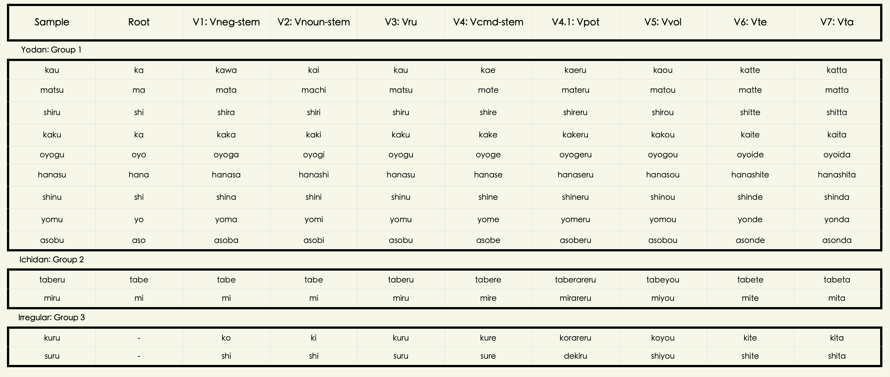

<h6> </h6>

------------------------------------------------------------------------

#### Groups

<p style="font-size:13px; line-height: 0.5; font-family: Noto Sans JP;  color: #202020; font-weight: bold">**Godan: Consonant-Stem**</p>

In the dictionary form, Godan verbs may end with **u**,**tsu**,**ru**,**mu**,**bu**,**nu**,**ku**,**gu**,**su**.

<div class = "expressjp">
・買う・待つ・知る・読む・遊ぶ・死ぬ・書く・泳ぐ・話す     
・buy・wait・know・read・play・die・write・swim・talk      
</div>

<h6> </h6>

<p style="font-size:13px; line-height: 0.5; font-family: Noto Sans JP;  color: #202020; font-weight: bold">**Ichidan: Vowel-Stem**</p>

In the dictionary form, Ichidan verbs all ends with either **eru** or **iru**.

(❖) eru

<div class = "expressjp">
・あげる・出る・晴れる・食べる      
・to raise・to leave・to clear up・to eat      
</div>

<h6> </h6>

(❖) iru

<div class = "expressjp">
・きる・見る・落ちる・いる      
・to wear・to see・to fall・be located     
</div>

<h6> </h6>

<p style="font-size:13px; line-height: 0.5; font-family: Noto Sans JP;  color: #202020; font-weight: bold">**Irregular:**</p>

There are only 2 irregular verbs in Japanese: **suru(do)**, **kuru(come)**.

<div class = "expressjp">
・来る・勉強する・電話する      
・to come・to study・to call     
</div>

<h6> </h6>

------------------------------------------------------------------------

#### Types

<p style="font-size:13px; line-height: 0.5; font-family: Noto Sans JP;  color: #202020; font-weight: bold">**Transitive: Action**</p>

Transitive verbs are verbs that take a direct object.  
They express what an agent does.

<div class = "expressjp">
・私はよく本を借ります.      
・父は新しい車を買った.          
</div>

<h6> </h6>

<div class = "expressjp">
・I often borrow books.     
・My father bought a new car.    
</div>

<h6> </h6>

<p style="font-size:13px; line-height: 0.5; font-family: Noto Sans JP;  color: #202020; font-weight: bold">**Intransitive: Descriptive**</p>

Intransitive verbs are verbs that do not take a direct object.  
They express events, movements or the spontaneous changes undergone by the subject.  

<div class = "expressjp">
・昨日から新学期が始まりました.    
・台風で木が倒れた.    
</div>

<h6> </h6>

<div class = "expressjp">
・The new semester started yesterday.    
・Trees fell because of the typhoon.   
</div>

<h6> </h6>

------------------------------------------------------------------------

#### Class {.tabset}

##### Stative

<p style="font-size:13px; line-height: 0.5; font-family: Noto Sans JP;  color: #202020; font-weight: bold">**Stative Verbs:**</p>

Describes the state of a person, animal or thing.

<div class = "expressjp">
・いる・いる・ある・できる・飲める     
・need・exist/have (animate)・exist/have (inanimate)・can do・can drink (potential)      
</div>

<h6> </h6>

<div class = "expressjp">
・私は妹がいま.   
・公園にブランコがあります.   
</div>

<h6> </h6>

<div class = "expressjp">
・I have a younger sister.    
・There are swings in the park.    
</div>

<h6> </h6>

------------------------------------------------------------------------

##### Active

<p style="font-size:13px; line-height: 0.5; font-family: Noto Sans JP;  color: #202020; font-weight: bold">**Active・Durative・Continual Verbs:**</p>

Expresses actions that a person, animal, organization, etc. performs.  
It takes some time or some duration to complete the action.  

<div class = "expressjp">
・食べる・飲む・歩く・走る・踊る    
・歌う・泳ぐ・まつ・話す・聞く     
・読む・書く・見る・泣く・教える     
・見せる・使う・作る・笑う・休む    
・飛ぶ・考える・会う・住む・勉強する     
</div>

<h6> </h6>

<div class = "expressjp">
・eat・drink・walk・run・dance      
・sing・swim・wait・talk・hear      
・read・write・see・cry・teach     
・show・use・make・laugh・rest    
・fly・think・meet・live・study    
</div>

<h6> </h6>

<div class = "expressjp">
・犬が吠えました.        
・私は晩ご飯を食べました.   
</div>

<h6> </h6>

<div class = "expressjp">
・A dog barked.    
・I ate dinner.   
</div>

<h6> </h6>

------------------------------------------------------------------------

##### Stative-Active

<p style="font-size:13px; line-height: 0.5; font-family: Noto Sans JP;  color: #202020; font-weight: bold">**Stative-Active Verbs:**</p>

Can be either a stative or active verb.

<div class = "expressjp">
・見える・聞こえろ・分かる・違う・似合う    
・be visible・be audible・understand・differ・be suitable    
</div>

<h6> </h6>

------------------------------------------------------------------------

##### Punctual

<p style="font-size:13px; line-height: 0.5; font-family: Noto Sans JP;  color: #202020; font-weight: bold">**Punctual・Momentary Verbs:**</p>

Are events that takes place in a moment.   
(1) Transition from one state to another.  
(2) Start of action or motion from static state.  
(3) Arrival of completion.  

<h6> </h6>

<div class = "expressjp">
・知る・死ぬ・入る・出る・咲く・空く・開く・閉じる・壊れる     
・散る・立つ・落ちる・倒れる・行く・来る・始まる・付く    
・着く・届く・触れる・止める・終わる・座る・打つ・跳ぶ・寝る   
・困る・乗る・上げる・もらう・疲れる・起きる・結婚する    
・帰る・言う・忘れる・貸す・借りる・覚える・なる・ける・合う   
</div>

<h6> </h6>

<div class = "expressjp">
・to realize・to die・to enter・to gout・to bloom・to be vacant・to open・to close・to break apart    
・to fall/scatter・to stand up・to fall (from height)・to fall over ・to go・to come・to begin・to attach   
・to arrive・to reach・to touch・to stop・to end・to sit・to hit・to jump・to go to bed   
・to get in trouble・to get on・to give・to receive・to get tired・to wake up・to marry   
・to go home・to say・to forget・to lend・to borrow・to remember・to become・to kick・to match   
</div>

<h6> </h6>

------------------------------------------------------------------------

##### Non-Volitional

<p style="font-size:13px; line-height: 0.5; font-family: Noto Sans JP;  color: #202020; font-weight: bold">**Non-Volitional Verbs:**</p>

The outcome of the action is not controlled by the subject in any case.  
In onset, development and outcome are out of the subject´s control.  
Usually does not take the volitional form, the imperative and potential form.  
(1) Emotive  
(2) Non-Emotive  

<h6> </h6>

<div class = "expressjp">
・喜ぶ・悲しむ・怒る・嫌う・好む・困る・苦しむ     
・できる・いる・知る・見える・聞こえる・分かる・違う・似合う・疲れる    
</div>

<h6> </h6>

<div class = "expressjp">
・be pleased・be sad・be angry・hate・like・trouble・suffer    
・can do・need・to know・be visible・be audible・understand・differ・suitable・get tired    
</div>

<h6> </h6>

------------------------------------------------------------------------

##### Reciprocal

<p style="font-size:13px; line-height: 0.5; font-family: Noto Sans JP;  color: #202020; font-weight: bold">**Reciprocal Verbs:**</p>

Takes the particle "to" for the direct object.

<div class = "expressjp">
・結婚する・喧嘩する・会う・合う・打つかる・相談する         
・marry・fight・meet・match・bump into・consult     
</div>

<h6> </h6>

<div class = "expressjp">
・親友と結婚する.    
・駅前で友達と待ち合わせる.    
</div>

<h6> </h6>

<div class = "expressjp">
・I'm marrying my best friend.    
・I’ll meet my friends in front of the station.    
</div>

<h6> </h6>

------------------------------------------------------------------------

##### Movement

<p style="font-size:13px; line-height: 0.5; font-family: Noto Sans JP;  color: #202020; font-weight: bold">**Movement Verbs:**</p>

Use particle ni to indicate the destination of the movement.  
Use particle e to indicate the direction of the movement.  
Can take V~~masu~~ ni to express purpose.  

<div class = "expressjp">
・行く・来る・帰る・入る・出る・立ち寄る        
・go・come・return・enter・get out・stop by       
</div>

<h6> </h6>

<div class = "expressjp">
・日本に行きます.     
・韓国へ行きます.    
・彼女は東京に出る.    
・日本に勉強に行きます.   
・ご飯を食べに帰りましょう.   
・日本へ英語を教えに来ます.   
</div>

<h6> </h6>

<div class = "expressjp">
・I'm going to Japan.    
・I'm going to Korea.   
・She leaves for Tokyo.    
・I'm going to Japan to study.    
・Let's go home for dinner.     
・I'm coming to Japan to teach English.   
</div>

<h6> </h6>

------------------------------------------------------------------------

##### Active-Punctual

<p style="font-size:13px; line-height: 0.5; font-family: Noto Sans JP;  color: #202020; font-weight: bold">**Active-Punctual Verbs:**</p>

Can be either be a active or punctual verb.

<div class = "expressjp">
・着る・取る・変わる・注文する    
・wear・take・change・order     
</div>

<h6> </h6>

------------------------------------------------------------------------

#### Examples {.tabset}

##### Learning {.tabset}

```{r, echo=FALSE, message=FALSE}

vrbslstnk.0 <- verbsls %>% slice(1:250)
vrbslstnk.1 <- verbsls %>% slice(251:500)
vrbslstnk.2 <- verbsls %>% slice(501:750)
vrbslstnk.3 <- verbsls %>% slice(751:1000)
vrbslstnk.4 <- verbsls %>% slice(1001:1250)
vrbslstnk.5 <- verbsls %>% slice(1251:1500)
vrbslstnk.6 <- verbsls %>% slice(1501:1750)
vrbslstnk.7 <- verbsls %>% slice(1751:2000)
vrbslstnk.8 <- verbsls %>% slice(2001:2250)
vrbslstnk.9 <- verbsls %>% slice(2251:2500)

vrbslstnk.0 <- vrbslstnk.0[sample(1:nrow(vrbslstnk.0)),]
vrbslstnk.1 <- vrbslstnk.1[sample(1:nrow(vrbslstnk.1)),]
vrbslstnk.2 <- vrbslstnk.2[sample(1:nrow(vrbslstnk.2)),]
vrbslstnk.3 <- vrbslstnk.3[sample(1:nrow(vrbslstnk.3)),]
vrbslstnk.4 <- vrbslstnk.4[sample(1:nrow(vrbslstnk.4)),]
vrbslstnk.5 <- vrbslstnk.5[sample(1:nrow(vrbslstnk.5)),]
vrbslstnk.6 <- vrbslstnk.6[sample(1:nrow(vrbslstnk.6)),]
vrbslstnk.7 <- vrbslstnk.7[sample(1:nrow(vrbslstnk.7)),]
vrbslstnk.8 <- vrbslstnk.8[sample(1:nrow(vrbslstnk.8)),]
vrbslstnk.9 <- vrbslstnk.9[sample(1:nrow(vrbslstnk.9)),]

vrbslstnk.a <- bind_rows(vrbslstnk.0, vrbslstnk.1)
vrbslstnk.a <- bind_rows(vrbslstnk.a, vrbslstnk.2)
vrbslstnk.a <- bind_rows(vrbslstnk.a, vrbslstnk.3)
vrbslstnk.a <- bind_rows(vrbslstnk.a, vrbslstnk.4)
vrbslstnk.a <- bind_rows(vrbslstnk.a, vrbslstnk.5)
vrbslstnk.a <- bind_rows(vrbslstnk.a, vrbslstnk.6)
vrbslstnk.a <- bind_rows(vrbslstnk.a, vrbslstnk.7)
vrbslstnk.a <- bind_rows(vrbslstnk.a, vrbslstnk.8)
vrbslstnk.a <- bind_rows(vrbslstnk.a, vrbslstnk.9)

vrbslstnk.a <- vrbslstnk.a %>% na.omit(vrbslstnk.a)

reactable(
  vrbslstnk.a,
  columns = list(
    Verbs = colDef(style= list(background = '#e0e1dd'), minWidth = 70,
      cell = function(value, index) {
        Reading <- vrbslstnk.a$Reading[index]
        Reading <- if (!is.na(Reading)) Reading else ""
        Meaning <- vrbslstnk.a$Meaning[index]
        Meaning <- if (!is.na(Meaning)) Meaning else ""
        tagList(
          div(style = list(fontSize = 21, fontWeight = 600, color = '#0F2040', fontFamily = 'Open Sans'), value),
          div(style = list(fontSize = 10, fontWeight = 600, color = '#026450', fontFamily = 'Open Sans'), Reading),
          div(style = list(fontSize = 10, fontWeight = 600, color = '#800000', fontFamily = 'Open Sans'), Meaning)
        )
      },
      align = "center"
    ),
    Sentences = colDef(style= list(background = '#edede9'), minWidth = 150,
      cell = function(value, index) {
        Translation <- vrbslstnk.a$Translation[index]
        Translation <- if (!is.na(Translation)) Translation else ""
        tagList(
          div(style = list(fontSize = 20, fontWeight = 600, fontFamily = 'Open Sans', color = '#0F2040'), value),
          div(style = list(fontSize = 11, fontWeight = 300, fontFamily = 'Open Sans', color = '#0F2040'), Translation)
        )
      },
      align = "left"
    ),
    Reading = colDef(show = FALSE),
    Meaning = colDef(show = FALSE),
    Sentences = colDef(show = FALSE),
    Translation = colDef(show = FALSE)
  ),
  rowClass = "my-row",
  defaultPageSize = 5,
  theme = reactableTheme(
    # Vertically center cells
    cellStyle = list(display = "flex", flexDirection = "column", justifyContent = "center", height = 85),
    searchInputStyle = list(
      paddingLeft = "8px",
      paddingTop = "8px",
      paddingBottom = "8px",
      width = "100%"
    )
  ),
  showPageInfo = FALSE, bordered = TRUE, searchable = TRUE, sortable = FALSE, paginationType = "numbers", striped = TRUE, highlight = TRUE,

  style = list(fontFamily = "Noto Sans JP, Heiti SC, Hiragino Maru Gothic ProN, Anonymous Pro , monospace, Helvetica Neue", fontSize = "11px")
)

```

------------------------------------------------------------------------

##### Memorize {.tabset}

```{r, echo=FALSE, message=FALSE}

reactable(
  verbtbl,
  columns = list(
    V1 = colDef(style= list(background = '#1b1e1e'),
      cell = function(value, index) {
        R1 <- verbtbl$R1[index]
        R1 <- if (!is.na(R1)) R1 else ""
        M1 <- verbtbl$M1[index]
        M1 <- if (!is.na(M1)) M1 else ""
        tagList(
          div(style = list(fontSize = 21, fontWeight = 500, color = '#f1f5f5', fontFamily = 'Open Sans'), value),
          div(style = list(fontSize = 10, fontWeight = 300, color = '#f1f5f5', fontFamily = 'Open Sans'), R1),
          div(style = list(fontSize = 10, fontWeight = 300, color = '#f1f5f5', fontFamily = 'Open Sans'), M1)
        )
      },
      align = "center"
    ),
    V2 = colDef(style= list(background = '#1b1e1e'),
      cell = function(value, index) {
        R2 <- verbtbl$R2[index]
        R2 <- if (!is.na(R2)) R2 else ""
        M2 <- verbtbl$M2[index]
        M2 <- if (!is.na(M2)) M2 else ""
        tagList(
          div(style = list(fontSize = 21, fontWeight = 500, color = '#f1f5f5', fontFamily = 'Open Sans'), value),
          div(style = list(fontSize = 10, fontWeight = 300, color = '#f1f5f5', fontFamily = 'Open Sans'), R2),
          div(style = list(fontSize = 10, fontWeight = 300, color = '#f1f5f5', fontFamily = 'Open Sans'), M2)
        )
      },
      align = "center"
    ),    
    V3 = colDef(style= list(background = '#1b1e1e'),
      cell = function(value, index) {
        R3 <- verbtbl$R3[index]
        R3 <- if (!is.na(R3)) R3 else ""
        M3 <- verbtbl$M3[index]
        M3 <- if (!is.na(M3)) M3 else ""
        tagList(
          div(style = list(fontSize = 21, fontWeight = 500, color = '#f1f5f5', fontFamily = 'Open Sans'), value),
          div(style = list(fontSize = 10, fontWeight = 300, color = '#f1f5f5', fontFamily = 'Open Sans'), R3),
          div(style = list(fontSize = 10, fontWeight = 300, color = '#f1f5f5', fontFamily = 'Open Sans'), M3)
        )
      },
      align = "center"
    ), 
    V4 = colDef(style= list(background = '#1b1e1e'),
      cell = function(value, index) {
        R4 <- verbtbl$R4[index]
        R4 <- if (!is.na(R4)) R4 else ""
        M4 <- verbtbl$M4[index]
        M4 <- if (!is.na(M4)) M4 else ""
        tagList(
          div(style = list(fontSize = 21, fontWeight = 500, color = '#f1f5f5', fontFamily = 'Open Sans'), value),
          div(style = list(fontSize = 10, fontWeight = 300, color = '#f1f5f5', fontFamily = 'Open Sans'), R4),
          div(style = list(fontSize = 10, fontWeight = 300, color = '#f1f5f5', fontFamily = 'Open Sans'), M4)
        )
      },
      align = "center"
    ),
        R1 = colDef(show = FALSE),
        R2 = colDef(show = FALSE),
        R3 = colDef(show = FALSE),
        R4 = colDef(show = FALSE),
        M1 = colDef(show = FALSE),
        M2 = colDef(show = FALSE),
        M3 = colDef(show = FALSE),
        M4 = colDef(show = FALSE)

  ),
  defaultPageSize = 5,
  theme = reactableTheme(
    cellStyle = list(display = "flex", flexDirection = "column", justifyContent = "center", height = 85, fontSize = "11px"),
    searchInputStyle = list(
      paddingLeft = "8px",
      paddingTop = "8px",
      paddingBottom = "8px",
      width = "100%"
    )
  ),
  showPageInfo = FALSE, bordered = TRUE, searchable = TRUE, paginationType = "numbers", striped = TRUE, outlined = TRUE, borderless = TRUE,
  
  style = list(fontFamily = "Noto Sans JP, Hiragino Maru Gothic ProN, Anonymous Pro , Helvetica Neue", fontSize = "11px")
)

```

------------------------------------------------------------------------

##### Mnemonic {.tabset}

```{r, echo=FALSE, message=FALSE}

reactable(
  verbtbl,
  columns = list(
    V1 = colDef(style= list(background = '#1b1e1e'),
      cell = function(value, index) {
        R1 <- verbtbl$R1[index]
        R1 <- if (!is.na(R1)) R1 else ""
        M1 <- verbtbl$M1[index]
        M1 <- if (!is.na(M1)) M1 else ""
        tagList(
          div(style = list(fontSize = 21, fontWeight = 500, color = '#f1f5f5', fontFamily = 'Open Sans'), value),
          # div(style = list(fontSize = 10, fontWeight = 600, color = '#026450'), R1),
          div(style = list(fontSize = 10, fontWeight = 300, color = '#f1f5f5', fontFamily = 'Open Sans'), M1)
        )
      },
      align = "center"
    ),
    V2 = colDef(style= list(background = '#1b1e1e'),
      cell = function(value, index) {
        R2 <- verbtbl$R2[index]
        R2 <- if (!is.na(R2)) R2 else ""
        M2 <- verbtbl$M2[index]
        M2 <- if (!is.na(M2)) M2 else ""
        tagList(
          div(style = list(fontSize = 21, fontWeight = 500, color = '#f1f5f5', fontFamily = 'Open Sans'), value),
          # div(style = list(fontSize = 10, fontWeight = 600, color = '#026450'), R2),
          div(style = list(fontSize = 10, fontWeight = 300, color = '#f1f5f5', fontFamily = 'Open Sans'), M2)
        )
      },
      align = "center"
    ),
    V3 = colDef(style= list(background = '#1b1e1e'),
      cell = function(value, index) {
        R3 <- verbtbl$R3[index]
        R3 <- if (!is.na(R3)) R3 else ""
        M3 <- verbtbl$M3[index]
        M3 <- if (!is.na(M3)) M3 else ""
        tagList(
          div(style = list(fontSize = 21, fontWeight = 500, color = '#f1f5f5', fontFamily = 'Open Sans'), value),
          # div(style = list(fontSize = 10, fontWeight = 600, color = '#026450'), R3),
          div(style = list(fontSize = 10, fontWeight = 300, color = '#f1f5f5', fontFamily = 'Open Sans'), M3)
        )
      },
      align = "center"
    ),
    V4 = colDef(style= list(background = '#1b1e1e'),
      cell = function(value, index) {
        R4 <- verbtbl$R4[index]
        R4 <- if (!is.na(R4)) R4 else ""
        M4 <- verbtbl$M4[index]
        M4 <- if (!is.na(M4)) M4 else ""
        tagList(
          div(style = list(fontSize = 21, fontWeight = 500, color = '#f1f5f5', fontFamily = 'Open Sans'), value),
          # div(style = list(fontSize = 10, fontWeight = 600, color = '#026450'), R4),
          div(style = list(fontSize = 10, fontWeight = 300, color = '#f1f5f5', fontFamily = 'Open Sans'), M4)
        )
      },
      align = "center"
    ),
        R1 = colDef(show = FALSE),
        R2 = colDef(show = FALSE),
        R3 = colDef(show = FALSE),
        R4 = colDef(show = FALSE),
        M1 = colDef(show = FALSE),
        M2 = colDef(show = FALSE),
        M3 = colDef(show = FALSE),
        M4 = colDef(show = FALSE)

  ),
  defaultPageSize = 5,
  theme = reactableTheme(
    cellStyle = list(display = "flex", flexDirection = "column", justifyContent = "center", height = 80, fontSize = "11px"),
    searchInputStyle = list(
      paddingLeft = "8px",
      paddingTop = "8px",
      paddingBottom = "8px",
      width = "100%"
    )
  ),
  showPageInfo = FALSE, bordered = TRUE, searchable = TRUE, paginationType = "numbers", striped = TRUE, outlined = TRUE, borderless = TRUE,

  style = list(fontFamily = "Noto Sans JP, Hiragino Maru Gothic ProN, Anonymous Pro , Helvetica Neue", fontSize = "11px")
)

```

<!-- ------------------------------------------------------------------------ -->

<!-- ##### Review {.tabset} -->

<!-- ###### L.Recall {.tabset} -->

<!-- ```{r, echo=FALSE, message=FALSE, warning = FALSE} -->

<!-- vrbslstnk.b <- vrbslstnk.a %>% select(Verbs, Reading, Meaning) %>% -->
<!--   separate(Meaning, into = c('Meaning','A.Meaning'), sep = '\\,') %>% -->
<!--   select(Verbs, Reading, Meaning) -->
<!-- vrbslstnk.b <- vrbslstnk.b[sample(1:nrow(na.omit(vrbslstnk.b))),] -->
<!-- vrbslstnk.b <- vrbslstnk.b[sample(1:nrow(vrbslstnk.b)),] -->

<!-- vrbslstnk.b1 <- vrbslstnk.b %>% select(Verbs, Reading, Meaning) %>% slice(1:40) %>% rename(V1 = Verbs, R1 = Reading, M1 = Meaning)  -->
<!-- vrbslstnk.b2 <- vrbslstnk.b %>% select(Verbs, Reading, Meaning) %>% slice(41:80) %>% rename(V2 = Verbs, R2 = Reading, M2 = Meaning)  -->
<!-- vrbslstnk.b3 <- vrbslstnk.b %>% select(Verbs, Reading, Meaning) %>% slice(81:120) %>% rename(V3 = Verbs, R3 = Reading, M3 = Meaning)  -->
<!-- vrbslstnk.b4 <- vrbslstnk.b %>% select(Verbs, Reading, Meaning) %>% slice(121:160) %>% rename(V4 = Verbs, R4 = Reading, M4 = Meaning)  -->

<!-- vrbslstnk.ball <- data.frame(vrbslstnk.b1, vrbslstnk.b2, vrbslstnk.b3, vrbslstnk.b4) -->

<!-- reactable( -->
<!--   vrbslstnk.ball, -->
<!--   columns = list( -->
<!--     V1 = colDef(style= list(background = '#1b1e1e'), -->
<!--       cell = function(value, index) { -->
<!--         R1 <- vrbslstnk.ball$R1[index] -->
<!--         R1 <- if (!is.na(R1)) R1 else "Unknown" -->
<!--         M1 <- vrbslstnk.ball$M1[index] -->
<!--         M1 <- if (!is.na(M1)) M1 else "Unknown" -->
<!--         tagList( -->
<!--           div(style = list(fontSize = 22, fontWeight = 500, fontFamily = 'Open Sans', color = '#f1f5f5'), value), -->
<!--           div(style = list(fontSize = 10, fontWeight = 300, fontFamily = 'Open Sans', color = '#f1f5f5'), R1), -->
<!--           div(style = list(fontSize = 10, fontWeight = 300, fontFamily = 'Open Sans', color = '#f1f5f5'), M1), -->
<!--         ) -->
<!--       }, -->
<!--       align = "center" -->
<!--     ), -->
<!--     V2 = colDef(style= list(background = '#1b1e1e'), -->
<!--       cell = function(value, index) { -->
<!--         R2 <- vrbslstnk.ball$R2[index] -->
<!--         R2 <- if (!is.na(R2)) R2 else "Unknown" -->
<!--         M2 <- vrbslstnk.ball$M2[index] -->
<!--         M2 <- if (!is.na(M2)) M2 else "Unknown" -->
<!--         tagList( -->
<!--           div(style = list(fontSize = 22, fontWeight = 500, fontFamily = 'Open Sans', color = '#f1f5f5'), value), -->
<!--           div(style = list(fontSize = 10, fontWeight = 300, fontFamily = 'Open Sans', color = '#f1f5f5'), R2), -->
<!--           div(style = list(fontSize = 10, fontWeight = 300, fontFamily = 'Open Sans', color = '#f1f5f5'), M2), -->
<!--         ) -->
<!--       }, -->
<!--       align = "center" -->
<!--     ), -->
<!--     V3 = colDef(style= list(background = '#1b1e1e'), -->
<!--       cell = function(value, index) { -->
<!--         R3 <- vrbslstnk.ball$R3[index] -->
<!--         R3 <- if (!is.na(R3)) R3 else "Unknown" -->
<!--         M3 <- vrbslstnk.ball$M3[index] -->
<!--         M3 <- if (!is.na(M3)) M3 else "Unknown" -->
<!--         tagList( -->
<!--           div(style = list(fontSize = 22, fontWeight = 500, fontFamily = 'Open Sans', color = '#f1f5f5'), value), -->
<!--           div(style = list(fontSize = 10, fontWeight = 300, fontFamily = 'Open Sans', color = '#f1f5f5'), R3), -->
<!--           div(style = list(fontSize = 10, fontWeight = 300, fontFamily = 'Open Sans', color = '#f1f5f5'), M3), -->
<!--         ) -->
<!--       }, -->
<!--       align = "center" -->
<!--     ), -->
<!--     V4 = colDef(style= list(background = '#1b1e1e'), -->
<!--       cell = function(value, index) { -->
<!--         R4 <- vrbslstnk.ball$R4[index] -->
<!--         R4 <- if (!is.na(R4)) R4 else "Unknown" -->
<!--         M4 <- vrbslstnk.ball$M4[index] -->
<!--         M4 <- if (!is.na(M4)) M4 else "Unknown" -->
<!--         tagList( -->
<!--           div(style = list(fontSize = 22, fontWeight = 500, fontFamily = 'Open Sans', color = '#f1f5f5'), value), -->
<!--           div(style = list(fontSize = 10, fontWeight = 300, fontFamily = 'Open Sans', color = '#f1f5f5'), R4), -->
<!--           div(style = list(fontSize = 10, fontWeight = 300, fontFamily = 'Open Sans', color = '#f1f5f5'), M4), -->
<!--         ) -->
<!--       }, -->
<!--       align = "center" -->
<!--     ),   -->

<!--     R1 = colDef(show = FALSE), -->
<!--     R2 = colDef(show = FALSE), -->
<!--     R3 = colDef(show = FALSE), -->
<!--     R4 = colDef(show = FALSE), -->
<!--     M1 = colDef(show = FALSE), -->
<!--     M2 = colDef(show = FALSE), -->
<!--     M3 = colDef(show = FALSE), -->
<!--     M4 = colDef(show = FALSE) -->

<!--   ), -->
<!--   defaultPageSize = 4, -->
<!--   theme = reactableTheme( -->
<!--     cellStyle = list(display = "flex", flexDirection = "column", justifyContent = "center", height = 100), -->
<!--     searchInputStyle = list( -->
<!--       paddingLeft = "8px", -->
<!--       paddingTop = "8px", -->
<!--       paddingBottom = "8px", -->
<!--       width = "100%" -->
<!--     ) -->
<!--   ), -->
<!--   showPageInfo = FALSE, outlined = TRUE, borderless = TRUE, bordered = TRUE, searchable = TRUE, sortable = FALSE, paginationType = "numbers", striped = TRUE, -->

<!--   style = list(fontFamily = "Noto Sans JP, Heiti SC, Hiragino Maru Gothic ProN, Anonymous Pro , monospace, Helvetica Neue", fontSize = "11px") -->
<!-- ) -->

<!-- ``` -->

<!-- ------------------------------------------------------------------------ -->

<!-- ###### M.Recall {.tabset} -->

<!-- ```{r, echo=FALSE, message=FALSE, warning = FALSE} -->

<!-- vrbslstnk.b <- vrbslstnk.a %>% select(Verbs, Reading, Meaning) %>% -->
<!--   separate(Meaning, into = c('Meaning','A.Meaning'), sep = '\\,') %>% -->
<!--   select(Verbs, Reading, Meaning) -->
<!-- vrbslstnk.b <- vrbslstnk.b[sample(1:nrow(na.omit(vrbslstnk.b))),] -->
<!-- vrbslstnk.b <- vrbslstnk.b[sample(1:nrow(vrbslstnk.b)),] -->

<!-- vrbslstnk.b1 <- vrbslstnk.b %>% select(Verbs, Reading, Meaning) %>% slice(1:40) %>% rename(V1 = Verbs, R1 = Reading, M1 = Meaning)  -->
<!-- vrbslstnk.b2 <- vrbslstnk.b %>% select(Verbs, Reading, Meaning) %>% slice(41:80) %>% rename(V2 = Verbs, R2 = Reading, M2 = Meaning)  -->
<!-- vrbslstnk.b3 <- vrbslstnk.b %>% select(Verbs, Reading, Meaning) %>% slice(81:120) %>% rename(V3 = Verbs, R3 = Reading, M3 = Meaning)  -->
<!-- vrbslstnk.b4 <- vrbslstnk.b %>% select(Verbs, Reading, Meaning) %>% slice(121:160) %>% rename(V4 = Verbs, R4 = Reading, M4 = Meaning)  -->

<!-- vrbslstnk.ball <- data.frame(vrbslstnk.b1, vrbslstnk.b2, vrbslstnk.b3, vrbslstnk.b4) -->

<!-- reactable( -->
<!--   vrbslstnk.ball, -->
<!--   columns = list( -->
<!--     V1 = colDef(style= list(background = '#1b1e1e'), -->
<!--       cell = function(value, index) { -->
<!--         R1 <- vrbslstnk.ball$R1[index] -->
<!--         R1 <- if (!is.na(R1)) R1 else "Unknown" -->
<!--         M1 <- vrbslstnk.ball$M1[index] -->
<!--         M1 <- if (!is.na(M1)) M1 else "Unknown" -->
<!--         tagList( -->
<!--           div(style = list(fontSize = 22, fontWeight = 500, fontFamily = 'Open Sans', color = '#f1f5f5'), value), -->
<!--           # div(style = list(fontSize = 10, fontWeight = 300, fontFamily = 'Open Sans', color = '#f1f5f5'), R1), -->
<!--           div(style = list(fontSize = 10, fontWeight = 300, fontFamily = 'Open Sans', color = '#f1f5f5'), M1), -->
<!--         ) -->
<!--       }, -->
<!--       align = "center" -->
<!--     ), -->
<!--     V2 = colDef(style= list(background = '#1b1e1e'), -->
<!--       cell = function(value, index) { -->
<!--         R2 <- vrbslstnk.ball$R2[index] -->
<!--         R2 <- if (!is.na(R2)) R2 else "Unknown" -->
<!--         M2 <- vrbslstnk.ball$M2[index] -->
<!--         M2 <- if (!is.na(M2)) M2 else "Unknown" -->
<!--         tagList( -->
<!--           div(style = list(fontSize = 22, fontWeight = 500, fontFamily = 'Open Sans', color = '#f1f5f5'), value), -->
<!--           # div(style = list(fontSize = 10, fontWeight = 300, fontFamily = 'Open Sans', color = '#f1f5f5'), R2), -->
<!--           div(style = list(fontSize = 10, fontWeight = 300, fontFamily = 'Open Sans', color = '#f1f5f5'), M2), -->
<!--         ) -->
<!--       }, -->
<!--       align = "center" -->
<!--     ), -->
<!--     V3 = colDef(style= list(background = '#1b1e1e'), -->
<!--       cell = function(value, index) { -->
<!--         R3 <- vrbslstnk.ball$R3[index] -->
<!--         R3 <- if (!is.na(R3)) R3 else "Unknown" -->
<!--         M3 <- vrbslstnk.ball$M3[index] -->
<!--         M3 <- if (!is.na(M3)) M3 else "Unknown" -->
<!--         tagList( -->
<!--           div(style = list(fontSize = 22, fontWeight = 500, fontFamily = 'Open Sans', color = '#f1f5f5'), value), -->
<!--           # div(style = list(fontSize = 10, fontWeight = 300, fontFamily = 'Open Sans', color = '#f1f5f5'), R3), -->
<!--           div(style = list(fontSize = 10, fontWeight = 300, fontFamily = 'Open Sans', color = '#f1f5f5'), M3), -->
<!--         ) -->
<!--       }, -->
<!--       align = "center" -->
<!--     ), -->
<!--     V4 = colDef(style= list(background = '#1b1e1e'), -->
<!--       cell = function(value, index) { -->
<!--         R4 <- vrbslstnk.ball$R4[index] -->
<!--         R4 <- if (!is.na(R4)) R4 else "Unknown" -->
<!--         M4 <- vrbslstnk.ball$M4[index] -->
<!--         M4 <- if (!is.na(M4)) M4 else "Unknown" -->
<!--         tagList( -->
<!--           div(style = list(fontSize = 22, fontWeight = 500, fontFamily = 'Open Sans', color = '#f1f5f5'), value), -->
<!--           # div(style = list(fontSize = 10, fontWeight = 300, fontFamily = 'Open Sans', color = '#f1f5f5'), R4), -->
<!--           div(style = list(fontSize = 10, fontWeight = 300, fontFamily = 'Open Sans', color = '#f1f5f5'), M4), -->
<!--         ) -->
<!--       }, -->
<!--       align = "center" -->
<!--     ),   -->

<!--     R1 = colDef(show = FALSE), -->
<!--     R2 = colDef(show = FALSE), -->
<!--     R3 = colDef(show = FALSE), -->
<!--     R4 = colDef(show = FALSE), -->
<!--     M1 = colDef(show = FALSE), -->
<!--     M2 = colDef(show = FALSE), -->
<!--     M3 = colDef(show = FALSE), -->
<!--     M4 = colDef(show = FALSE) -->

<!--   ), -->
<!--   defaultPageSize = 4, -->
<!--   theme = reactableTheme( -->
<!--     cellStyle = list(display = "flex", flexDirection = "column", justifyContent = "center", height = 100), -->
<!--     searchInputStyle = list( -->
<!--       paddingLeft = "8px", -->
<!--       paddingTop = "8px", -->
<!--       paddingBottom = "8px", -->
<!--       width = "100%" -->
<!--     ) -->
<!--   ), -->
<!--   showPageInfo = FALSE, outlined = TRUE, borderless = TRUE, bordered = TRUE, searchable = TRUE, sortable = FALSE, paginationType = "numbers", striped = TRUE, -->

<!--   style = list(fontFamily = "Noto Sans JP, Heiti SC, Hiragino Maru Gothic ProN, Anonymous Pro , monospace, Helvetica Neue", fontSize = "11px") -->
<!-- ) -->

<!-- ``` -->

<!-- ------------------------------------------------------------------------ -->

<!-- ###### S.Recall {.tabset} -->

<!-- ```{r, echo=FALSE, message=FALSE, warning = FALSE} -->

<!-- vrbslstnk.b <- vrbslstnk.a %>% select(Verbs, Reading, Meaning) %>% -->
<!--   separate(Meaning, into = c('Meaning','A.Meaning'), sep = '\\,') %>% -->
<!--   select(Verbs, Reading, Meaning) -->
<!-- vrbslstnk.b <- vrbslstnk.b[sample(1:nrow(na.omit(vrbslstnk.b))),] -->
<!-- vrbslstnk.b <- vrbslstnk.b[sample(1:nrow(vrbslstnk.b)),] -->

<!-- vrbslstnk.b1 <- vrbslstnk.b %>% select(Verbs, Reading, Meaning) %>% slice(1:40) %>% rename(V1 = Verbs, R1 = Reading, M1 = Meaning)  -->
<!-- vrbslstnk.b2 <- vrbslstnk.b %>% select(Verbs, Reading, Meaning) %>% slice(41:80) %>% rename(V2 = Verbs, R2 = Reading, M2 = Meaning)  -->
<!-- vrbslstnk.b3 <- vrbslstnk.b %>% select(Verbs, Reading, Meaning) %>% slice(81:120) %>% rename(V3 = Verbs, R3 = Reading, M3 = Meaning)  -->
<!-- vrbslstnk.b4 <- vrbslstnk.b %>% select(Verbs, Reading, Meaning) %>% slice(121:160) %>% rename(V4 = Verbs, R4 = Reading, M4 = Meaning)  -->

<!-- vrbslstnk.ball <- data.frame(vrbslstnk.b1, vrbslstnk.b2, vrbslstnk.b3, vrbslstnk.b4) -->

<!-- reactable( -->
<!--   vrbslstnk.ball, -->
<!--   columns = list( -->
<!--     V1 = colDef(style= list(background = '#1b1e1e'), -->
<!--       cell = function(value, index) { -->
<!--         R1 <- vrbslstnk.ball$R1[index] -->
<!--         R1 <- if (!is.na(R1)) R1 else "Unknown" -->
<!--         M1 <- vrbslstnk.ball$M1[index] -->
<!--         M1 <- if (!is.na(M1)) M1 else "Unknown" -->
<!--         tagList( -->
<!--           div(style = list(fontSize = 22, fontWeight = 500, fontFamily = 'Open Sans', color = '#f1f5f5'), value), -->
<!--           # div(style = list(fontSize = 10, fontWeight = 300, fontFamily = 'Open Sans', color = '#f1f5f5'), R1), -->
<!--           # div(style = list(fontSize = 10, fontWeight = 300, fontFamily = 'Open Sans', color = '#f1f5f5'), M1), -->
<!--         ) -->
<!--       }, -->
<!--       align = "center" -->
<!--     ), -->
<!--     V2 = colDef(style= list(background = '#1b1e1e'), -->
<!--       cell = function(value, index) { -->
<!--         R2 <- vrbslstnk.ball$R2[index] -->
<!--         R2 <- if (!is.na(R2)) R2 else "Unknown" -->
<!--         M2 <- vrbslstnk.ball$M2[index] -->
<!--         M2 <- if (!is.na(M2)) M2 else "Unknown" -->
<!--         tagList( -->
<!--           div(style = list(fontSize = 22, fontWeight = 500, fontFamily = 'Open Sans', color = '#f1f5f5'), value), -->
<!--           # div(style = list(fontSize = 10, fontWeight = 300, fontFamily = 'Open Sans', color = '#f1f5f5'), R2), -->
<!--           # div(style = list(fontSize = 10, fontWeight = 300, fontFamily = 'Open Sans', color = '#f1f5f5'), M2), -->
<!--         ) -->
<!--       }, -->
<!--       align = "center" -->
<!--     ), -->
<!--     V3 = colDef(style= list(background = '#1b1e1e'), -->
<!--       cell = function(value, index) { -->
<!--         R3 <- vrbslstnk.ball$R3[index] -->
<!--         R3 <- if (!is.na(R3)) R3 else "Unknown" -->
<!--         M3 <- vrbslstnk.ball$M3[index] -->
<!--         M3 <- if (!is.na(M3)) M3 else "Unknown" -->
<!--         tagList( -->
<!--           div(style = list(fontSize = 22, fontWeight = 500, fontFamily = 'Open Sans', color = '#f1f5f5'), value), -->
<!--           # div(style = list(fontSize = 10, fontWeight = 300, fontFamily = 'Open Sans', color = '#f1f5f5'), R3), -->
<!--           # div(style = list(fontSize = 10, fontWeight = 300, fontFamily = 'Open Sans', color = '#f1f5f5'), M3), -->
<!--         ) -->
<!--       }, -->
<!--       align = "center" -->
<!--     ), -->
<!--     V4 = colDef(style= list(background = '#1b1e1e'), -->
<!--       cell = function(value, index) { -->
<!--         R4 <- vrbslstnk.ball$R4[index] -->
<!--         R4 <- if (!is.na(R4)) R4 else "Unknown" -->
<!--         M4 <- vrbslstnk.ball$M4[index] -->
<!--         M4 <- if (!is.na(M4)) M4 else "Unknown" -->
<!--         tagList( -->
<!--           div(style = list(fontSize = 22, fontWeight = 500, fontFamily = 'Open Sans', color = '#f1f5f5'), value), -->
<!--           # div(style = list(fontSize = 10, fontWeight = 300, fontFamily = 'Open Sans', color = '#f1f5f5'), R4), -->
<!--           # div(style = list(fontSize = 10, fontWeight = 300, fontFamily = 'Open Sans', color = '#f1f5f5'), M4), -->
<!--         ) -->
<!--       }, -->
<!--       align = "center" -->
<!--     ),   -->

<!--     R1 = colDef(show = FALSE), -->
<!--     R2 = colDef(show = FALSE), -->
<!--     R3 = colDef(show = FALSE), -->
<!--     R4 = colDef(show = FALSE), -->
<!--     M1 = colDef(show = FALSE), -->
<!--     M2 = colDef(show = FALSE), -->
<!--     M3 = colDef(show = FALSE), -->
<!--     M4 = colDef(show = FALSE) -->

<!--   ), -->
<!--   defaultPageSize = 4, -->
<!--   theme = reactableTheme( -->
<!--     cellStyle = list(display = "flex", flexDirection = "column", justifyContent = "center", height = 100), -->
<!--     searchInputStyle = list( -->
<!--       paddingLeft = "8px", -->
<!--       paddingTop = "8px", -->
<!--       paddingBottom = "8px", -->
<!--       width = "100%" -->
<!--     ) -->
<!--   ), -->
<!--   showPageInfo = FALSE, outlined = TRUE, borderless = TRUE, bordered = TRUE, searchable = TRUE, sortable = FALSE, paginationType = "numbers", striped = TRUE, -->

<!--   style = list(fontFamily = "Noto Sans JP, Heiti SC, Hiragino Maru Gothic ProN, Anonymous Pro , monospace, Helvetica Neue", fontSize = "11px") -->
<!-- ) -->

<!-- ``` -->

<!-- ------------------------------------------------------------------------ -->

<!-- ###### C.Recognize {.tabset} -->

<!-- ```{r, echo=FALSE, message=FALSE} -->

<!-- vrbslstnk.a <- vrbslstnk.a[sample(1:nrow(vrbslstnk.a)),] -->
<!-- vrbslstnk.a <- vrbslstnk.a[sample(1:nrow(vrbslstnk.a)),] -->

<!-- reactable( -->
<!--   vrbslstnk.a, -->
<!--   columns = list( -->
<!--     Verbs = colDef(style= list(background = '#1b1e1e'), -->
<!--       cell = function(value, index) { -->
<!--         Reading <- vrbslstnk.a$Reading[index] -->
<!--         Reading <- if (!is.na(Reading)) Reading else "" -->
<!--         Meaning <- vrbslstnk.a$Meaning[index] -->
<!--         Meaning <- if (!is.na(Meaning)) Meaning else "" -->
<!--         tagList( -->
<!--           div(style = list(fontSize = 40, fontWeight = 500, fontFamily = 'Open Sans', color = '#f1f5f5'), value), -->
<!--           # div(style = list(fontSize = 10, fontWeight = 600, color = '#026450'), Reading), -->
<!--           # div(style = list(fontSize = 10, fontWeight = 600, color = '#800000'), Meaning) -->
<!--         ) -->
<!--       }, -->
<!--       align = "center" -->
<!--     ), -->
<!--     # Sentences = colDef(minWidth = 150, -->
<!--     #   cell = function(value, index) { -->
<!--     #     Translation <- vrbslstnk.a$Translation[index] -->
<!--     #     Translation <- if (!is.na(Translation)) Translation else "" -->
<!--     #     tagList( -->
<!--     #       div(style = list(fontSize = 20, fontWeight = 600, fontFamily = 'Open Sans', color = '#303030'), value), -->
<!--     #       div(style = list(fontSize = 11, fontWeight = 300, color = '#303030'), Translation) -->
<!--     #     ) -->
<!--     #   }, -->
<!--     #   align = "left" -->
<!--     # ), -->
<!--     Reading = colDef(show = FALSE), -->
<!--     Meaning = colDef(show = FALSE), -->
<!--     Sentences = colDef(show = FALSE), -->
<!--     Translation = colDef(show = FALSE) -->
<!--   ), -->
<!--   defaultPageSize = 1, -->
<!--   theme = reactableTheme( -->
<!--     # Vertically center cells -->
<!--     cellStyle = list(display = "flex", flexDirection = "column", justifyContent = "center", height = 300), -->
<!--     searchInputStyle = list( -->
<!--       paddingLeft = "8px", -->
<!--       paddingTop = "8px", -->
<!--       paddingBottom = "8px", -->
<!--       width = "100%" -->
<!--     ) -->
<!--   ), -->
<!--   showPageInfo = FALSE, bordered = TRUE, searchable = TRUE, sortable = FALSE, paginationType = "numbers", striped = TRUE,  -->

<!--   style = list(fontFamily = "Noto Sans JP, Heiti SC, Hiragino Maru Gothic ProN, Anonymous Pro , monospace, Helvetica Neue", fontSize = "11px") -->
<!-- ) -->

<!-- ``` -->

<!-- ------------------------------------------------------------------------ -->

<!-- ###### A.Words {.tabset} -->

<!-- ```{r, echo=FALSE, message=FALSE} -->

<!-- vrbslstnk.b <- verbsls %>% select(Verbs) %>% slice(1:1250) -->
<!-- vrbslstnk.c <- verbsls %>% select(Verbs) %>% slice(1251:2500) -->
<!-- vrbslstnk.b <- vrbslstnk.b[sample(1:nrow(vrbslstnk.b)),] -->
<!-- vrbslstnk.c <- vrbslstnk.c[sample(1:nrow(vrbslstnk.c)),] -->

<!-- vrbslstnk.d <- bind_rows(vrbslstnk.b, vrbslstnk.c) -->

<!-- reactable( -->
<!--   vrbslstnk.d, -->
<!--   columns = list( -->
<!--     Verbs = colDef(style= list(background = '#1b1e1e'), -->
<!--       cell = function(value, index) { -->
<!--         tagList( -->
<!--           div(style = list(fontSize = 40, fontWeight = 500, fontFamily = 'Open Sans', color = '#f1f5f5'), value), -->
<!--         ) -->
<!--       }, -->
<!--       align = "center" -->
<!--     ) -->
<!--   ), -->
<!--   defaultPageSize = 1, -->
<!--   theme = reactableTheme( -->
<!--     cellStyle = list(display = "flex", flexDirection = "column", justifyContent = "center", height = 300), -->
<!--     searchInputStyle = list( -->
<!--       paddingLeft = "8px", -->
<!--       paddingTop = "8px", -->
<!--       paddingBottom = "8px", -->
<!--       width = "100%" -->
<!--     ) -->
<!--   ), -->
<!--   showPageInfo = FALSE, bordered = TRUE, searchable = TRUE, sortable = FALSE, paginationType = "numbers", striped = TRUE,  -->

<!--   style = list(fontFamily = "Noto Sans JP, Heiti SC, Hiragino Maru Gothic ProN, Anonymous Pro , monospace, Helvetica Neue", fontSize = "11px") -->
<!-- ) -->

<!-- ``` -->

<!-- ------------------------------------------------------------------------ -->

<!-- ###### R.Sentences {.tabset} -->

<!-- ```{r, echo=FALSE, message=FALSE} -->

<!-- verbsls.a <- verbsls %>% select(Sentences, Translation) -->
<!-- verbsls.a <- verbsls.a %>% na.omit(verbsls.a) -->

<!-- vrbsphsn <- vrbsphsn[sample(1:nrow(vrbsphsn)),] -->
<!-- vrbsphsn <- vrbsphsn[sample(1:nrow(vrbsphsn)),] -->

<!-- vrbsphsn.a <- bind_rows(vrbsphsn, verbsls.a) -->
<!-- vrbsphsn.a <- vrbsphsn.a[sample(1:nrow(vrbsphsn.a)),] -->

<!-- reactable( -->
<!--   vrbsphsn.a, -->
<!--   columns = list( -->
<!--     Translation = colDef(style= list(background = '#1b1e1e'), -->
<!--       cell = function(value, index) { -->
<!--         Sentences <- vrbsphsn.a$Sentences[index] -->
<!--         Sentences <- if (!is.na(Sentences)) Sentences else "" -->
<!--         tagList( -->
<!--           div(style = list(fontSize = 29, fontWeight = 500, fontFamily = 'Open Sans', color = '#f1f5f5'), Sentences), -->
<!--           # div(style = list(fontSize = 10, fontWeight = 300, color = '#f1f5f5'), value) -->
<!--         ) -->
<!--       }, -->
<!--       align = "center" -->
<!--     ), -->

<!--     Sentences = colDef(show = FALSE) -->

<!--   ), -->
<!--   defaultPageSize = 1, -->
<!--   theme = reactableTheme( -->
<!--     # Vertically center cells -->
<!--     cellStyle = list(display = "flex", flexDirection = "column", justifyContent = "center", fontSize = "11px", height = 300), -->
<!--     searchInputStyle = list( -->
<!--       paddingLeft = "8px", -->
<!--       paddingTop = "8px", -->
<!--       paddingBottom = "8px", -->
<!--       width = "100%" -->
<!--     ) -->
<!--   ), -->
<!--   showPageInfo = FALSE, outlined = TRUE, borderless = TRUE, bordered = TRUE, searchable = TRUE, paginationType = "simple", striped = TRUE, -->

<!--   style = list(fontFamily = "Noto Sans JP, Hiragino Maru Gothic ProN, Anonymous Pro , Helvetica Neue", fontSize = "11px") -->
<!-- ) -->

<!-- ``` -->

<!-- ------------------------------------------------------------------------ -->

<!-- ###### L.Sentences {.tabset} -->

<!-- ```{r, echo=FALSE, message=FALSE} -->

<!-- verbsls.a <- verbsls %>% select(Sentences, Translation) -->
<!-- verbsls.a <- verbsls.a %>% na.omit(verbsls.a) -->

<!-- vrbsphsn <- vrbsphsn[sample(1:nrow(vrbsphsn)),] -->
<!-- vrbsphsn <- vrbsphsn[sample(1:nrow(vrbsphsn)),] -->

<!-- vrbsphsn.a <- bind_rows(vrbsphsn, verbsls.a) -->
<!-- vrbsphsn.a <- vrbsphsn.a[sample(1:nrow(vrbsphsn.a)),] -->

<!-- reactable( -->
<!--   vrbsphsn.a, -->
<!--   columns = list( -->
<!--     Translation = colDef(style= list(background = '#1b1e1e'), -->
<!--       cell = function(value, index) { -->
<!--         Sentences <- vrbsphsn.a$Sentences[index] -->
<!--         Sentences <- if (!is.na(Sentences)) Sentences else "" -->
<!--         tagList( -->
<!--           div(style = list(fontSize = 20, fontWeight = 500, fontFamily = 'Open Sans', color = '#f1f5f5'), Sentences), -->
<!--           div(style = list(fontSize = 11, fontWeight = 300, color = '#f1f5f5'), value) -->
<!--         ) -->
<!--       }, -->
<!--       align = "left" -->
<!--     ), -->

<!--     Sentences = colDef(show = FALSE) -->

<!--   ), -->
<!--   defaultPageSize = 30, -->
<!--   theme = reactableTheme( -->
<!--     # Vertically center cells -->
<!--     cellStyle = list(display = "flex", flexDirection = "column", justifyContent = "center", fontSize = "11px"), -->
<!--     searchInputStyle = list( -->
<!--       paddingLeft = "8px", -->
<!--       paddingTop = "8px", -->
<!--       paddingBottom = "8px", -->
<!--       width = "100%" -->
<!--     ) -->
<!--   ), -->
<!--   showPageInfo = FALSE, outlined = TRUE, borderless = TRUE, bordered = TRUE, searchable = TRUE, paginationType = "simple", striped = TRUE, height = 530, -->

<!--   style = list(fontFamily = "Noto Sans JP, Hiragino Maru Gothic ProN, Anonymous Pro , Helvetica Neue", fontSize = "11px") -->
<!-- ) -->

<!-- ``` -->

<!-- ------------------------------------------------------------------------ -->

<!-- ###### S.Sentences {.tabset} -->

<!-- ```{r, echo=FALSE, message=FALSE} -->

<!-- vrbsphsn.a <- vrbsphsn.a[sample(1:nrow(vrbsphsn.a)),] -->
<!-- vrbsphsn.a <- vrbsphsn.a[sample(1:nrow(vrbsphsn.a)),] -->

<!-- reactable( -->
<!--   vrbsphsn.a, -->
<!--   columns = list( -->
<!--     Sentences = colDef(style= list(background = '#1b1e1e'), -->
<!--       cell = function(value, index) { -->
<!--         Translation <- vrbsphsn.a$Translation[index] -->
<!--         Translation <- if (!is.na(Translation)) Translation else "" -->
<!--         tagList( -->
<!--           div(style = list(fontSize = 16, fontWeight = 300, fontFamily = 'Open Sans', color = '#f1f5f5'), value), -->
<!--           # div(style = list(fontSize = 11, fontWeight = 300, color = '#f1f5f5'), value) -->
<!--         ) -->
<!--       }, -->
<!--       align = "left" -->
<!--     ), -->

<!--     Translation = colDef(align = "left", style = list(fontSize = 10, fontWeight = 300, fontFamily = 'Open Sans', background = '#1b1e1e', color = '#f1f5f5')) -->

<!--   ), -->
<!--   defaultPageSize = 30, -->
<!--   theme = reactableTheme( -->
<!--     # Vertically center cells -->
<!--     cellStyle = list(display = "flex", flexDirection = "column", justifyContent = "center", fontSize = "11px"), -->
<!--     searchInputStyle = list( -->
<!--       paddingLeft = "8px", -->
<!--       paddingTop = "8px", -->
<!--       paddingBottom = "8px", -->
<!--       width = "100%" -->
<!--     ) -->
<!--   ), -->
<!--   showPageInfo = FALSE, outlined = TRUE, borderless = TRUE, bordered = TRUE, searchable = TRUE, paginationType = "simple", striped = TRUE, height = 530, -->

<!--   style = list(fontFamily = "Noto Sans JP, Hiragino Maru Gothic ProN, Anonymous Pro , Helvetica Neue", fontSize = "11px") -->
<!-- ) -->

<!-- ``` -->

<!-- ------------------------------------------------------------------------ -->

<!-- ##### Mnemonic {.tabset} -->

<!-- ```{r, echo=FALSE, message=FALSE} -->

<!-- reactable( -->
<!--   verbtbl, -->
<!--   columns = list( -->
<!--     V1 = colDef( -->
<!--       cell = function(value, index) { -->
<!--         R1 <- verbtbl$R1[index] -->
<!--         R1 <- if (!is.na(R1)) R1 else "" -->
<!--         M1 <- verbtbl$M1[index] -->
<!--         M1 <- if (!is.na(M1)) M1 else "" -->
<!--         tagList( -->
<!--           div(style = list(fontSize = 21, fontWeight = 600, fontFamily = 'Open Sans'), value), -->
<!--           # div(style = list(fontSize = 10, fontWeight = 600, color = '#026450'), R1), -->
<!--           div(style = list(fontSize = 10, fontWeight = 600, color = '#800000'), M1) -->
<!--         ) -->
<!--       }, -->
<!--       align = "center" -->
<!--     ), -->
<!--     V2 = colDef( -->
<!--       cell = function(value, index) { -->
<!--         R2 <- verbtbl$R2[index] -->
<!--         R2 <- if (!is.na(R2)) R2 else "" -->
<!--         M2 <- verbtbl$M2[index] -->
<!--         M2 <- if (!is.na(M2)) M2 else "" -->
<!--         tagList( -->
<!--           div(style = list(fontSize = 21, fontWeight = 600, fontFamily = 'Open Sans'), value), -->
<!--           # div(style = list(fontSize = 10, fontWeight = 600, color = '#026450'), R2), -->
<!--           div(style = list(fontSize = 10, fontWeight = 600, color = '#800000'), M2) -->
<!--         ) -->
<!--       }, -->
<!--       align = "center" -->
<!--     ),     -->
<!--     V3 = colDef( -->
<!--       cell = function(value, index) { -->
<!--         R3 <- verbtbl$R3[index] -->
<!--         R3 <- if (!is.na(R3)) R3 else "" -->
<!--         M3 <- verbtbl$M3[index] -->
<!--         M3 <- if (!is.na(M3)) M3 else "" -->
<!--         tagList( -->
<!--           div(style = list(fontSize = 21, fontWeight = 600, fontFamily = 'Open Sans'), value), -->
<!--           # div(style = list(fontSize = 10, fontWeight = 600, color = '#026450'), R3), -->
<!--           div(style = list(fontSize = 10, fontWeight = 600, color = '#800000'), M3) -->
<!--         ) -->
<!--       }, -->
<!--       align = "center" -->
<!--     ),  -->
<!--     V4 = colDef( -->
<!--       cell = function(value, index) { -->
<!--         R4 <- verbtbl$R4[index] -->
<!--         R4 <- if (!is.na(R4)) R4 else "" -->
<!--         M4 <- verbtbl$M4[index] -->
<!--         M4 <- if (!is.na(M4)) M4 else "" -->
<!--         tagList( -->
<!--           div(style = list(fontSize = 21, fontWeight = 600, fontFamily = 'Open Sans'), value), -->
<!--           # div(style = list(fontSize = 10, fontWeight = 600, color = '#026450'), R4), -->
<!--           div(style = list(fontSize = 10, fontWeight = 600, color = '#800000'), M4) -->
<!--         ) -->
<!--       }, -->
<!--       align = "center" -->
<!--     ), -->
<!--         R1 = colDef(show = FALSE), -->
<!--         R2 = colDef(show = FALSE), -->
<!--         R3 = colDef(show = FALSE), -->
<!--         R4 = colDef(show = FALSE), -->
<!--         M1 = colDef(show = FALSE), -->
<!--         M2 = colDef(show = FALSE), -->
<!--         M3 = colDef(show = FALSE), -->
<!--         M4 = colDef(show = FALSE) -->

<!--   ), -->
<!--   defaultPageSize = 5, -->
<!--   theme = reactableTheme( -->
<!--     cellStyle = list(display = "flex", flexDirection = "column", justifyContent = "center", height = 80, fontSize = "11px"), -->
<!--     searchInputStyle = list( -->
<!--       paddingLeft = "8px", -->
<!--       paddingTop = "8px", -->
<!--       paddingBottom = "8px", -->
<!--       width = "100%" -->
<!--     ) -->
<!--   ), -->
<!--   showPageInfo = FALSE, bordered = TRUE, searchable = TRUE, paginationType = "numbers", striped = TRUE, -->

<!--   style = list(fontFamily = "Noto Sans JP, Hiragino Maru Gothic ProN, Anonymous Pro , Helvetica Neue", fontSize = "11px") -->
<!-- ) -->

<!-- ``` -->

<!-- ------------------------------------------------------------------------ -->

<!-- ##### Recognize {.tabset} -->

<!-- ```{r, echo=FALSE, message=FALSE} -->

<!-- reactable( -->
<!--   verbtbl, -->
<!--   columns = list( -->
<!--     V1 = colDef(style= list(background = '#dee7e7'), -->
<!--       cell = function(value, index) { -->
<!--         R1 <- verbtbl$R1[index] -->
<!--         R1 <- if (!is.na(R1)) R1 else "" -->
<!--         M1 <- verbtbl$M1[index] -->
<!--         M1 <- if (!is.na(M1)) M1 else "" -->
<!--         tagList( -->
<!--           div(style = list(fontSize = 21, fontWeight = 600, fontFamily = 'Open Sans', color = '#0F2040'), value), -->
<!--           # div(style = list(fontSize = 10, fontWeight = 600, color = '#026450'), R1), -->
<!--           # div(style = list(fontSize = 10, fontWeight = 600, color = '#800000'), M1) -->
<!--         ) -->
<!--       }, -->
<!--       align = "center" -->
<!--     ), -->
<!--     V2 = colDef(style= list(background = '#dee7e7'), -->
<!--       cell = function(value, index) { -->
<!--         R2 <- verbtbl$R2[index] -->
<!--         R2 <- if (!is.na(R2)) R2 else "" -->
<!--         M2 <- verbtbl$M2[index] -->
<!--         M2 <- if (!is.na(M2)) M2 else "" -->
<!--         tagList( -->
<!--           div(style = list(fontSize = 21, fontWeight = 600, fontFamily = 'Open Sans', color = '#0F2040'), value), -->
<!--           # div(style = list(fontSize = 10, fontWeight = 600, color = '#026450'), R2), -->
<!--           # div(style = list(fontSize = 10, fontWeight = 600, color = '#800000'), M2) -->
<!--         ) -->
<!--       }, -->
<!--       align = "center" -->
<!--     ),     -->
<!--     V3 = colDef(style= list(background = '#dee7e7'), -->
<!--       cell = function(value, index) { -->
<!--         R3 <- verbtbl$R3[index] -->
<!--         R3 <- if (!is.na(R3)) R3 else "" -->
<!--         M3 <- verbtbl$M3[index] -->
<!--         M3 <- if (!is.na(M3)) M3 else "" -->
<!--         tagList( -->
<!--           div(style = list(fontSize = 21, fontWeight = 600, fontFamily = 'Open Sans', color = '#0F2040'), value), -->
<!--           # div(style = list(fontSize = 10, fontWeight = 600, color = '#026450'), R3), -->
<!--           # div(style = list(fontSize = 10, fontWeight = 600, color = '#800000'), M3) -->
<!--         ) -->
<!--       }, -->
<!--       align = "center" -->
<!--     ),  -->
<!--     V4 = colDef(style= list(background = '#dee7e7'), -->
<!--       cell = function(value, index) { -->
<!--         R4 <- verbtbl$R4[index] -->
<!--         R4 <- if (!is.na(R4)) R4 else "" -->
<!--         M4 <- verbtbl$M4[index] -->
<!--         M4 <- if (!is.na(M4)) M4 else "" -->
<!--         tagList( -->
<!--           div(style = list(fontSize = 21, fontWeight = 600, fontFamily = 'Open Sans', color = '#0F2040'), value), -->
<!--           # div(style = list(fontSize = 10, fontWeight = 600, color = '#026450'), R4), -->
<!--           # div(style = list(fontSize = 10, fontWeight = 600, color = '#800000'), M4) -->
<!--         ) -->
<!--       }, -->
<!--       align = "center" -->
<!--     ), -->
<!--         R1 = colDef(show = FALSE), -->
<!--         R2 = colDef(show = FALSE), -->
<!--         R3 = colDef(show = FALSE), -->
<!--         R4 = colDef(show = FALSE), -->
<!--         M1 = colDef(show = FALSE), -->
<!--         M2 = colDef(show = FALSE), -->
<!--         M3 = colDef(show = FALSE), -->
<!--         M4 = colDef(show = FALSE) -->

<!--   ), -->
<!--   defaultPageSize = 5, -->
<!--   theme = reactableTheme( -->
<!--     cellStyle = list(display = "flex", flexDirection = "column", justifyContent = "center", height = 80, fontSize = "11px"), -->
<!--     searchInputStyle = list( -->
<!--       paddingLeft = "8px", -->
<!--       paddingTop = "8px", -->
<!--       paddingBottom = "8px", -->
<!--       width = "100%" -->
<!--     ) -->
<!--   ), -->
<!--   showPageInfo = FALSE, bordered = TRUE, searchable = TRUE, paginationType = "numbers", striped = TRUE, -->

<!--   style = list(fontFamily = "Noto Sans JP, Hiragino Maru Gothic ProN, Anonymous Pro , Helvetica Neue", fontSize = "11px") -->
<!-- ) -->

<!-- ``` -->

<!-- ------------------------------------------------------------------------ -->

<!-- ##### Recall {.tabset} -->

<!-- ```{r, echo=FALSE, message=FALSE} -->

<!-- reactable( -->
<!--   verbtbl, -->
<!--   columns = list( -->
<!--     V1 = colDef(style= list(background = '#dee7e7'), -->
<!--       cell = function(value, index) { -->
<!--         R1 <- verbtbl$R1[index] -->
<!--         R1 <- if (!is.na(R1)) R1 else "" -->
<!--         M1 <- verbtbl$M1[index] -->
<!--         M1 <- if (!is.na(M1)) M1 else "" -->
<!--         tagList( -->
<!--           # div(style = list(fontSize = 21, fontWeight = 600, fontFamily = 'Open Sans'), value), -->
<!--           # div(style = list(fontSize = 10, fontWeight = 600, color = '#026450'), R1), -->
<!--           div(style = list(fontSize = 11, fontWeight = 600, color = '#0F2040'), M1) -->
<!--         ) -->
<!--       }, -->
<!--       align = "center" -->
<!--     ), -->
<!--     V2 = colDef(style= list(background = '#dee7e7'), -->
<!--       cell = function(value, index) { -->
<!--         R2 <- verbtbl$R2[index] -->
<!--         R2 <- if (!is.na(R2)) R2 else "" -->
<!--         M2 <- verbtbl$M2[index] -->
<!--         M2 <- if (!is.na(M2)) M2 else "" -->
<!--         tagList( -->
<!--           # div(style = list(fontSize = 21, fontWeight = 600, fontFamily = 'Open Sans'), value), -->
<!--           # div(style = list(fontSize = 10, fontWeight = 600, color = '#026450'), R2), -->
<!--           div(style = list(fontSize = 11, fontWeight = 600, color = '#0F2040'), M2) -->
<!--         ) -->
<!--       }, -->
<!--       align = "center" -->
<!--     ),     -->
<!--     V3 = colDef(style= list(background = '#dee7e7'), -->
<!--       cell = function(value, index) { -->
<!--         R3 <- verbtbl$R3[index] -->
<!--         R3 <- if (!is.na(R3)) R3 else "" -->
<!--         M3 <- verbtbl$M3[index] -->
<!--         M3 <- if (!is.na(M3)) M3 else "" -->
<!--         tagList( -->
<!--           # div(style = list(fontSize = 21, fontWeight = 600, fontFamily = 'Open Sans'), value), -->
<!--           # div(style = list(fontSize = 10, fontWeight = 600, color = '#026450'), R3), -->
<!--           div(style = list(fontSize = 11, fontWeight = 600, color = '#0F2040'), M3) -->
<!--         ) -->
<!--       }, -->
<!--       align = "center" -->
<!--     ),  -->
<!--     V4 = colDef(style= list(background = '#dee7e7'), -->
<!--       cell = function(value, index) { -->
<!--         R4 <- verbtbl$R4[index] -->
<!--         R4 <- if (!is.na(R4)) R4 else "" -->
<!--         M4 <- verbtbl$M4[index] -->
<!--         M4 <- if (!is.na(M4)) M4 else "" -->
<!--         tagList( -->
<!--           # div(style = list(fontSize = 21, fontWeight = 600, fontFamily = 'Open Sans'), value), -->
<!--           # div(style = list(fontSize = 10, fontWeight = 600, color = '#026450'), R4), -->
<!--           div(style = list(fontSize = 11, fontWeight = 600, color = '#0F2040'), M4) -->
<!--         ) -->
<!--       }, -->
<!--       align = "center" -->
<!--     ), -->
<!--         R1 = colDef(show = FALSE), -->
<!--         R2 = colDef(show = FALSE), -->
<!--         R3 = colDef(show = FALSE), -->
<!--         R4 = colDef(show = FALSE), -->
<!--         M1 = colDef(show = FALSE), -->
<!--         M2 = colDef(show = FALSE), -->
<!--         M3 = colDef(show = FALSE), -->
<!--         M4 = colDef(show = FALSE) -->

<!--   ), -->
<!--   defaultPageSize = 5, -->
<!--   theme = reactableTheme( -->
<!--     cellStyle = list(display = "flex", flexDirection = "column", justifyContent = "center", height = 80, fontSize = "11px"), -->
<!--     searchInputStyle = list( -->
<!--       paddingLeft = "8px", -->
<!--       paddingTop = "8px", -->
<!--       paddingBottom = "8px", -->
<!--       width = "100%" -->
<!--     ) -->
<!--   ), -->
<!--   showPageInfo = FALSE, bordered = TRUE, searchable = TRUE, paginationType = "numbers", striped = TRUE, -->

<!--   style = list(fontFamily = "Noto Sans JP, Hiragino Maru Gothic ProN, Anonymous Pro , Helvetica Neue", fontSize = "11px") -->
<!-- ) -->

<!-- ``` -->

<!-- ------------------------------------------------------------------------ -->

<!-- ##### Sense {.tabset} -->

<!-- ```{r, echo=FALSE, message=FALSE} -->

<!-- verbtbl.a <- verbtbl %>% select(V1) -->
<!-- verbtbl.a <- verbtbl.a[sample(1:nrow(verbtbl.a)),] -->
<!-- verbtbl.b <- verbtbl %>% select(V2) -->
<!-- verbtbl.b <- verbtbl.b[sample(1:nrow(verbtbl.b)),] -->
<!-- verbtbl.c <- verbtbl %>% select(V3) -->
<!-- verbtbl.c <- verbtbl.c[sample(1:nrow(verbtbl.c)),] -->
<!-- verbtbl.d <- verbtbl %>% select(V4) -->
<!-- verbtbl.d <- verbtbl.d[sample(1:nrow(verbtbl.d)),] -->
<!-- verbtbl.e <- data.frame(verbtbl.a, verbtbl.b, verbtbl.c, verbtbl.d) -->

<!-- reactable( -->
<!--   verbtbl.e, -->
<!--   columns = list( -->
<!--     V1 = colDef(align = "center", style = list(fontSize = 21, fontWeight = 600, fontFamily = 'Open Sans', background = '#dee7e7', color = '#0F2040')), -->
<!--     V2 = colDef(align = "center", style = list(fontSize = 21, fontWeight = 600, fontFamily = 'Open Sans', background = '#dee7e7', color = '#0F2040')), -->
<!--     V3 = colDef(align = "center", style = list(fontSize = 21, fontWeight = 600, fontFamily = 'Open Sans', background = '#dee7e7', color = '#0F2040')), -->
<!--     V4 = colDef(align = "center", style = list(fontSize = 21, fontWeight = 600, fontFamily = 'Open Sans', background = '#dee7e7', color = '#0F2040')) -->
<!--   ), -->
<!--   defaultPageSize = 5, -->
<!--   theme = reactableTheme( -->
<!--     cellStyle = list(display = "flex", flexDirection = "column", justifyContent = "center", height = 80, fontSize = "11px"), -->
<!--     searchInputStyle = list( -->
<!--       paddingLeft = "8px", -->
<!--       paddingTop = "8px", -->
<!--       paddingBottom = "8px", -->
<!--       width = "100%" -->
<!--     ), -->
<!--     headerStyle = list( -->
<!--       backgroundColor = "#dee7e7", -->
<!--       color = "hsl(0, 0%, 95%)", -->
<!--       fontSize = 1, -->
<!--       fontWeight = 100, -->
<!--       fontFamily = 'Open Sans', -->
<!--       fontSize = "0.75rem", -->
<!--       letterSpacing = "1px", -->
<!--       textTransform = "lowercase", -->
<!--       padding = "0px", -->
<!--       "&:hover, &:focus" = list(color = '#ffff00') -->
<!--     ), -->
<!--     footerStyle = list( -->
<!--       backgroundColor = "#dee7e7", -->
<!--       color = "hsl(0, 0%, 95%)", -->
<!--       fontSize = 1, -->
<!--       fontWeight = 100, -->
<!--       fontFamily = 'Open Sans', -->
<!--       fontSize = "0.75rem", -->
<!--       letterSpacing = "1px", -->
<!--       textTransform = "lowercase", -->
<!--       padding = "0px", -->
<!--       "&:hover, &:focus" = list(color = '#ffff00') -->
<!--     ) -->
<!--   ), -->
<!--   showPageInfo = FALSE, bordered = TRUE, searchable = TRUE, paginationType = "numbers", striped = TRUE, -->

<!--   style = list(fontFamily = "Noto Sans JP, Hiragino Maru Gothic ProN, Anonymous Pro , Helvetica Neue", fontSize = "11px") -->
<!-- ) -->

<!-- ``` -->

------------------------------------------------------------------------

##### Remember {.tabset}

###### Meaning {.tabset}

```{r, echo=FALSE, message=FALSE}

vrbslstnk5.a <- vrbslstnk %>% select(Verbs, Meaning) %>% rename(V1 = Verbs, M1 = Meaning) %>% slice(1:625)
vrbslstnk4.a <- vrbslstnk %>% select(Verbs, Meaning) %>% rename(V2 = Verbs, M2 = Meaning) %>% slice(626:1250)
vrbslstnk3.a <- vrbslstnk %>% select(Verbs, Meaning) %>% rename(V3 = Verbs, M3 = Meaning) %>% slice(1251:1875)
vrbslstnk2.a <- vrbslstnk %>% select(Verbs, Meaning) %>% rename(V4 = Verbs, M4 = Meaning) %>% slice(1876:2500)

set.seed(4537)
vrbslstnk5.a <- vrbslstnk5.a[sample(1:nrow(vrbslstnk5.a)),]
vrbslstnk4.a <- vrbslstnk4.a[sample(1:nrow(vrbslstnk4.a)),]
vrbslstnk3.a <- vrbslstnk3.a[sample(1:nrow(vrbslstnk3.a)),]
vrbslstnk2.a <- vrbslstnk2.a[sample(1:nrow(vrbslstnk2.a)),]

vrbslstnk.all <- data.frame(vrbslstnk5.a, vrbslstnk4.a, vrbslstnk3.a, vrbslstnk2.a)

reactable(
  vrbslstnk.all,
  columns = list(
    V1 = colDef(footer = "Total", style= list(background = '#1b1e1e'),
      cell = function(value, index) {
        M1 <- vrbslstnk.all$M1[index]
        M1 <- if (!is.na(M1)) M1 else ""
        tagList(
          div(style = list(fontSize = 21, fontWeight = 500, color = '#f1f5f5', fontFamily = 'Open Sans'), value),
          div(style = list(fontSize = 9, fontWeight = 300, color = '#f1f5f5', fontFamily = 'Open Sans'), M1),
        )
      },
      align = "center"
    ),
    V2 = colDef(style= list(background = '#1b1e1e'),
      cell = function(value, index) {
        M2 <- vrbslstnk.all$M2[index]
        M2 <- if (!is.na(M2)) M2 else ""
        tagList(
          div(style = list(fontSize = 21, fontWeight = 500, color = '#f1f5f5', fontFamily = 'Open Sans'), value),
          div(style = list(fontSize = 9, fontWeight = 300, color = '#f1f5f5', fontFamily = 'Open Sans'), M2),
        )
      },
      align = "center"
    ),
    V3 = colDef(style= list(background = '#1b1e1e'),
      cell = function(value, index) {
        M3 <- vrbslstnk.all$M3[index]
        M3 <- if (!is.na(M3)) M3 else ""
        tagList(
          div(style = list(fontSize = 21, fontWeight = 500, color = '#f1f5f5', fontFamily = 'Open Sans'), value),
          div(style = list(fontSize = 9, fontWeight = 300, color = '#f1f5f5', fontFamily = 'Open Sans'), M3),
        )
      },
      align = "center"
    ),
    V4 = colDef(style= list(background = '#1b1e1e'),
      cell = function(value, index) {
        M4 <- vrbslstnk.all$M4[index]
        M4 <- if (!is.na(M4)) M4 else ""
        tagList(
          div(style = list(fontSize = 21, fontWeight = 500, color = '#f1f5f5', fontFamily = 'Open Sans'), value),
          div(style = list(fontSize = 9, fontWeight = 300, color = '#f1f5f5', fontFamily = 'Open Sans'), M4),
        )
      },
      align = "center"
    ),
    M1 = colDef(show = FALSE),
    M2 = colDef(show = FALSE),
    M3 = colDef(show = FALSE),
    M4 = colDef(show = FALSE)

  ),
  defaultPageSize = 5,
  theme = reactableTheme(
    cellStyle = list(display = "flex", flexDirection = "column", justifyContent = "center", fontSize = "11px", height = 80),
    searchInputStyle = list(
      paddingLeft = "8px",
      paddingTop = "8px",
      paddingBottom = "8px",
      width = "100%",
      fontSize = "11px"
    ),
    headerStyle = list(
      backgroundColor = "#1b1e1e",
      color = "hsl(0, 0%, 95%)",
      fontSize = 0.1,
      fontWeight = 100,
      fontFamily = 'Open Sans',
      fontSize = "0.75rem",
      letterSpacing = "1px",
      textTransform = "lowercase",
      padding = "0px",
      "&:hover, &:focus" = list(color = '#ffff00')
    ),
    footerStyle = list(
      backgroundColor = "#1b1e1e",
      color = "hsl(0, 0%, 95%)",
      fontSize = 0.1,
      fontWeight = 100,
      fontFamily = 'Open Sans',
      fontSize = "0.75rem",
      letterSpacing = "1px",
      textTransform = "lowercase",
      padding = "0px",
      "&:hover, &:focus" = list(color = '#ffff00')
    )
  ),
  showPageInfo = FALSE, bordered = TRUE, searchable = TRUE, sortable = FALSE, paginationType = "numbers", striped = FALSE, outlined = TRUE, borderless = TRUE,

  style = list(fontFamily = "Noto Sans JP, Heiti SC, Hiragino Maru Gothic ProN, Anonymous Pro , monospace, Helvetica Neue", fontSize = "11px")
)

```

------------------------------------------------------------------------

###### Reading {.tabset}

```{r, echo=FALSE, message=FALSE}

vrbslstnk5.a <- vrbslstnk %>% select(Verbs, Reading) %>% rename(V1 = Verbs, R1 = Reading) %>% slice(1:625)
vrbslstnk4.a <- vrbslstnk %>% select(Verbs, Reading) %>% rename(V2 = Verbs, R2 = Reading) %>% slice(626:1250)
vrbslstnk3.a <- vrbslstnk %>% select(Verbs, Reading) %>% rename(V3 = Verbs, R3 = Reading) %>% slice(1251:1875)
vrbslstnk2.a <- vrbslstnk %>% select(Verbs, Reading) %>% rename(V4 = Verbs, R4 = Reading) %>% slice(1876:2500)

set.seed(4537)
vrbslstnk5.a <- vrbslstnk5.a[sample(1:nrow(vrbslstnk5.a)),]
vrbslstnk4.a <- vrbslstnk4.a[sample(1:nrow(vrbslstnk4.a)),]
vrbslstnk3.a <- vrbslstnk3.a[sample(1:nrow(vrbslstnk3.a)),]
vrbslstnk2.a <- vrbslstnk2.a[sample(1:nrow(vrbslstnk2.a)),]

vrbslstnk.all <- data.frame(vrbslstnk5.a, vrbslstnk4.a, vrbslstnk3.a, vrbslstnk2.a)

reactable(
  vrbslstnk.all,
  columns = list(
    V1 = colDef(footer = "Total", style= list(background = '#1b1e1e'),
      cell = function(value, index) {
        R1 <- vrbslstnk.all$R1[index]
        R1 <- if (!is.na(R1)) R1 else ""
        tagList(
          div(style = list(fontSize = 21, fontWeight = 500, color = '#f1f5f5', fontFamily = 'Open Sans'), value),
          div(style = list(fontSize = 9, fontWeight = 300, color = '#f1f5f5', fontFamily = 'Open Sans'), R1),
        )
      },
      align = "center"
    ),
    V2 = colDef(style= list(background = '#1b1e1e'),
      cell = function(value, index) {
        R2 <- vrbslstnk.all$R2[index]
        R2 <- if (!is.na(R2)) R2 else ""
        tagList(
          div(style = list(fontSize = 21, fontWeight = 500, color = '#f1f5f5', fontFamily = 'Open Sans'), value),
          div(style = list(fontSize = 9, fontWeight = 300, color = '#f1f5f5', fontFamily = 'Open Sans'), R2),
        )
      },
      align = "center"
    ),
    V3 = colDef(style= list(background = '#1b1e1e'),
      cell = function(value, index) {
        R3 <- vrbslstnk.all$R3[index]
        R3 <- if (!is.na(R3)) R3 else ""
        tagList(
          div(style = list(fontSize = 21, fontWeight = 500, color = '#f1f5f5', fontFamily = 'Open Sans'), value),
          div(style = list(fontSize = 9, fontWeight = 300, color = '#f1f5f5', fontFamily = 'Open Sans'), R3),
        )
      },
      align = "center"
    ),
    V4 = colDef(style= list(background = '#1b1e1e'),
      cell = function(value, index) {
        R4 <- vrbslstnk.all$R4[index]
        R4 <- if (!is.na(R4)) R4 else ""
        tagList(
          div(style = list(fontSize = 21, fontWeight = 500, color = '#f1f5f5', fontFamily = 'Open Sans'), value),
          div(style = list(fontSize = 10, fontWeight = 300, color = '#f1f5f5', fontFamily = 'Open Sans'), R4),
        )
      },
      align = "center"
    ),
    R1 = colDef(show = FALSE),
    R2 = colDef(show = FALSE),
    R3 = colDef(show = FALSE),
    R4 = colDef(show = FALSE)

  ),
  defaultPageSize = 5,
  theme = reactableTheme(
    cellStyle = list(display = "flex", flexDirection = "column", justifyContent = "center", fontSize = "11px", height = 80),
    searchInputStyle = list(
      paddingLeft = "8px",
      paddingTop = "8px",
      paddingBottom = "8px",
      width = "100%",
      fontSize = "11px"
    ),
    headerStyle = list(
      backgroundColor = "#1b1e1e",
      color = "hsl(0, 0%, 95%)",
      fontSize = 0.1,
      fontWeight = 100,
      fontFamily = 'Open Sans',
      fontSize = "0.75rem",
      letterSpacing = "1px",
      textTransform = "lowercase",
      padding = "0px",
      "&:hover, &:focus" = list(color = '#ffff00')
    ),
    footerStyle = list(
      backgroundColor = "#1b1e1e",
      color = "hsl(0, 0%, 95%)",
      fontSize = 0.1,
      fontWeight = 100,
      fontFamily = 'Open Sans',
      fontSize = "0.75rem",
      letterSpacing = "1px",
      textTransform = "lowercase",
      padding = "0px",
      "&:hover, &:focus" = list(color = '#ffff00')
    )
  ),
  showPageInfo = FALSE, bordered = TRUE, searchable = TRUE, sortable = FALSE, paginationType = "numbers", striped = FALSE, outlined = TRUE, borderless = TRUE,

  style = list(fontFamily = "Noto Sans JP, Heiti SC, Hiragino Maru Gothic ProN, Anonymous Pro , monospace, Helvetica Neue", fontSize = "11px")
)

```

------------------------------------------------------------------------

###### Recalling {.tabset}

```{r, echo=FALSE, message=FALSE}

vrbslstnk5.a <- vrbslstnk %>% select(Verbs, Meaning) %>% rename(V1 = Verbs, M1 = Meaning) %>% slice(1:625)
vrbslstnk4.a <- vrbslstnk %>% select(Verbs, Meaning) %>% rename(V2 = Verbs, M2 = Meaning) %>% slice(626:1250)
vrbslstnk3.a <- vrbslstnk %>% select(Verbs, Meaning) %>% rename(V3 = Verbs, M3 = Meaning) %>% slice(1251:1875)
vrbslstnk2.a <- vrbslstnk %>% select(Verbs, Meaning) %>% rename(V4 = Verbs, M4 = Meaning) %>% slice(1876:2500)

set.seed(4537)
vrbslstnk5.a <- vrbslstnk5.a[sample(1:nrow(vrbslstnk5.a)),]
vrbslstnk4.a <- vrbslstnk4.a[sample(1:nrow(vrbslstnk4.a)),]
vrbslstnk3.a <- vrbslstnk3.a[sample(1:nrow(vrbslstnk3.a)),]
vrbslstnk2.a <- vrbslstnk2.a[sample(1:nrow(vrbslstnk2.a)),]

vrbslstnk.all <- data.frame(vrbslstnk5.a, vrbslstnk4.a, vrbslstnk3.a, vrbslstnk2.a)

reactable(
  vrbslstnk.all,
  columns = list(
    V1 = colDef(footer = "Total", style= list(background = '#1b1e1e'),
      cell = function(value, index) {
        M1 <- vrbslstnk.all$M1[index]
        M1 <- if (!is.na(M1)) M1 else ""
        tagList(
          # div(style = list(fontSize = 21, fontWeight = 600, color = '#0F2040', fontFamily = 'Open Sans'), value),
          div(style = list(fontSize = 11, fontWeight = 600, color = '#f1f5f5', fontFamily = 'Open Sans'), M1),
        )
      },
      align = "center"
    ),
    V2 = colDef(style= list(background = '#1b1e1e'),
      cell = function(value, index) {
        M2 <- vrbslstnk.all$M2[index]
        M2 <- if (!is.na(M2)) M2 else ""
        tagList(
          # div(style = list(fontSize = 21, fontWeight = 600, color = '#0F2040', fontFamily = 'Open Sans'), value),
          div(style = list(fontSize = 11, fontWeight = 600, color = '#f1f5f5', fontFamily = 'Open Sans'), M2),
        )
      },
      align = "center"
    ),
    V3 = colDef(style= list(background = '#1b1e1e'),
      cell = function(value, index) {
        M3 <- vrbslstnk.all$M3[index]
        M3 <- if (!is.na(M3)) M3 else ""
        tagList(
          # div(style = list(fontSize = 21, fontWeight = 600, color = '#0F2040', fontFamily = 'Open Sans'), value),
          div(style = list(fontSize = 11, fontWeight = 600, color = '#f1f5f5', fontFamily = 'Open Sans'), M3),
        )
      },
      align = "center"
    ),
    V4 = colDef(style= list(background = '#1b1e1e'),
      cell = function(value, index) {
        M4 <- vrbslstnk.all$M4[index]
        M4 <- if (!is.na(M4)) M4 else ""
        tagList(
          # div(style = list(fontSize = 21, fontWeight = 600, color = '#0F2040', fontFamily = 'Open Sans'), value),
          div(style = list(fontSize = 11, fontWeight = 600, color = '#f1f5f5', fontFamily = 'Open Sans'), M4),
        )
      },
      align = "center"
    ),
    M1 = colDef(show = FALSE),
    M2 = colDef(show = FALSE),
    M3 = colDef(show = FALSE),
    M4 = colDef(show = FALSE)

  ),
  defaultPageSize = 5,
  theme = reactableTheme(
    cellStyle = list(display = "flex", flexDirection = "column", justifyContent = "center", fontSize = "11px", height = 80),
    searchInputStyle = list(
      paddingLeft = "8px",
      paddingTop = "8px",
      paddingBottom = "8px",
      width = "100%",
      fontSize = "11px"
    ),
    headerStyle = list(
      backgroundColor = "#1b1e1e",
      color = "hsl(0, 0%, 95%)",
      fontSize = 0.1,
      fontWeight = 100,
      fontFamily = 'Open Sans',
      fontSize = "0.75rem",
      letterSpacing = "1px",
      textTransform = "lowercase",
      padding = "0px",
      "&:hover, &:focus" = list(color = '#ffff00')
    ),
    footerStyle = list(
      backgroundColor = "#1b1e1e",
      color = "hsl(0, 0%, 95%)",
      fontSize = 0.1,
      fontWeight = 100,
      fontFamily = 'Open Sans',
      fontSize = "0.75rem",
      letterSpacing = "1px",
      textTransform = "lowercase",
      padding = "0px",
      "&:hover, &:focus" = list(color = '#ffff00')
    )
  ),
  showPageInfo = FALSE, bordered = TRUE, searchable = TRUE, sortable = FALSE, paginationType = "numbers", striped = FALSE, outlined = TRUE, borderless = TRUE,

  style = list(fontFamily = "Noto Sans JP, Heiti SC, Hiragino Maru Gothic ProN, Anonymous Pro , monospace, Helvetica Neue", fontSize = "11px")
)

```

------------------------------------------------------------------------

###### Sensing {.tabset}

```{r, echo=FALSE, message=FALSE}

verbtbl.a <- verbtbl %>% select(V1)
verbtbl.a <- verbtbl.a[sample(1:nrow(verbtbl.a)),]
verbtbl.b <- verbtbl %>% select(V2)
verbtbl.b <- verbtbl.b[sample(1:nrow(verbtbl.b)),]
verbtbl.c <- verbtbl %>% select(V3)
verbtbl.c <- verbtbl.c[sample(1:nrow(verbtbl.c)),]
verbtbl.d <- verbtbl %>% select(V4)
verbtbl.d <- verbtbl.d[sample(1:nrow(verbtbl.d)),]
verbtbl.e <- data.frame(verbtbl.a, verbtbl.b, verbtbl.c, verbtbl.d)
verbtbl.e <- verbtbl.e[sample(1:nrow(verbtbl.e)),]

reactable(
  verbtbl.e,
  columns = list(
    V1 = colDef(align = "center", style = list(fontSize = 21, fontWeight = 500, fontFamily = 'Open Sans', background = '#1b1e1e', color = '#f1f5f5')),
    V2 = colDef(align = "center", style = list(fontSize = 21, fontWeight = 500, fontFamily = 'Open Sans', background = '#1b1e1e', color = '#f1f5f5')),
    V3 = colDef(align = "center", style = list(fontSize = 21, fontWeight = 500, fontFamily = 'Open Sans', background = '#1b1e1e', color = '#f1f5f5')),
    V4 = colDef(align = "center", style = list(fontSize = 21, fontWeight = 500, fontFamily = 'Open Sans', background = '#1b1e1e', color = '#f1f5f5'))
  ),
  defaultPageSize = 5,
  theme = reactableTheme(
    cellStyle = list(display = "flex", flexDirection = "column", justifyContent = "center", height = 80, fontSize = "11px"),
    searchInputStyle = list(
      paddingLeft = "8px",
      paddingTop = "8px",
      paddingBottom = "8px",
      width = "100%"
    ),
    headerStyle = list(
      backgroundColor = "#1b1e1e",
      color = "hsl(0, 0%, 95%)",
      fontSize = 0.1,
      fontWeight = 100,
      fontFamily = 'Open Sans',
      fontSize = "0.75rem",
      letterSpacing = "1px",
      textTransform = "lowercase",
      padding = "0px",
      "&:hover, &:focus" = list(color = '#ffff00')
    ),
    footerStyle = list(
      backgroundColor = "#1b1e1e",
      color = "hsl(0, 0%, 95%)",
      fontSize = 0.1,
      fontWeight = 100,
      fontFamily = 'Open Sans',
      fontSize = "0.75rem",
      letterSpacing = "1px",
      textTransform = "lowercase",
      padding = "0px",
      "&:hover, &:focus" = list(color = '#ffff00')
    )
  ),
  showPageInfo = FALSE, bordered = TRUE, searchable = TRUE, paginationType = "numbers", striped = TRUE, outlined = TRUE, borderless = TRUE,

  style = list(fontFamily = "Noto Sans JP, Hiragino Maru Gothic ProN, Anonymous Pro , Helvetica Neue", fontSize = "11px")
)

```

------------------------------------------------------------------------

##### Sentences {.tabset}

```{r, echo=FALSE, message=FALSE}

verbrsent.freq <- lverbs %>% slice(1:600) %>% select(S1, T1)
verbrsent.freq <- verbrsent.freq[sample(1:nrow(verbrsent.freq)),]
verbrsent.freq <- verbrsent.freq  %>% rename(Sentences = S1)
verbrsent.freq <- verbrsent.freq %>% na.omit(verbrsent.freq)
verbrsent.freq <- verbrsent.freq[sample(1:nrow(verbrsent.freq)),]
verbrsent.freqt <- verbrsent.freq  %>% rename(Translation = T1)
verbrsent.freqt <- verbrsent.freqt[sample(1:nrow(verbrsent.freqt)),]

reactable(
  verbrsent.freqt,
  columns = list(
    Translation = colDef(style= list(background = '#e0e1dd'),
      cell = function(value, index) {
        Sentences <- verbrsent.freqt$Sentences[index]
        Sentences <- if (!is.na(Sentences)) Sentences else ""
        tagList(
          div(style = list(fontSize = 20, fontWeight = 600, fontFamily = 'Open Sans', color = '#0F2040'), Sentences),
          div(style = list(fontSize = 11, fontWeight = 300, color = '#0F2040'), value)
        )
      },
      align = "left"
    ),
    
    Sentences = colDef(show = FALSE)

  ),
  rowClass = "my-row",
  defaultPageSize = 30,
  theme = reactableTheme(
    cellStyle = list(display = "flex", flexDirection = "column", justifyContent = "center", fontSize = "11px"),
    searchInputStyle = list(
      paddingLeft = "8px",
      paddingTop = "8px",
      paddingBottom = "8px",
      width = "100%"
    )
  ),
  showPageInfo = FALSE, outlined = TRUE, borderless = FALSE, bordered = TRUE, searchable = TRUE, paginationType = "simple", striped = TRUE, highlight = TRUE, height = 530,
  
  style = list(fontFamily = "Noto Sans JP, Hiragino Maru Gothic ProN, Anonymous Pro , Helvetica Neue", fontSize = "11px")
)

```

<!-- ------------------------------------------------------------------------ -->

<!-- ##### Collection {.tabset} -->

<!-- <div class = "row"> -->
<!-- <div class = "col-sm-4"> -->

<!-- ```{r, echo=FALSE, message=FALSE} -->

<!-- spcvwrds.a <- spcvwrds %>% select(Verb, Reading, Meaning, Sentence, Translation) -->
<!-- spcvwrds.a <- spcvwrds.a[sample(1:nrow(spcvwrds.a)),] -->

<!-- reactable( -->
<!--   spcvwrds.a, -->
<!--   columns = list( -->
<!--     Verb = colDef(style= list(background = '#edede9'), -->
<!--       cell = function(value, index) { -->
<!--         Reading <- spcvwrds.a$Reading[index] -->
<!--         Reading <- if (!is.na(Reading)) Reading else "" -->
<!--         Meaning <- spcvwrds.a$Meaning[index] -->
<!--         Meaning <- if (!is.na(Meaning)) Meaning else "" -->
<!--         tagList( -->
<!--           div(style = list(fontSize = 28, fontWeight = 600, fontFamily = 'Open Sans', color = '#0F2040'), value), -->
<!--           div(style = list(fontSize = 10, fontWeight = 300, fontFamily = 'Open Sans', color = '#0F2040'), Reading), -->
<!--           div(style = list(fontSize = 10, fontWeight = 300, fontFamily = 'Open Sans', color = '#0F2040'), Meaning), -->
<!--         ) -->
<!--       }, -->
<!--       align = "center" -->
<!--     ), -->
<!--     Reading = colDef(show = FALSE), -->
<!--     Meaning = colDef(show = FALSE), -->
<!--     Sentence = colDef(show = FALSE), -->
<!--     Translation = colDef(show = FALSE) -->
<!--   ), -->
<!--   rowClass = "my-row", -->
<!--   defaultPageSize = 1, -->
<!--   theme = reactableTheme( -->
<!--     cellStyle = list(display = "flex", flexDirection = "column", justifyContent = "center", fontSize = "11px", height = 250), -->
<!--     searchInputStyle = list( -->
<!--       paddingLeft = "8px", -->
<!--       paddingTop = "8px", -->
<!--       paddingBottom = "8px", -->
<!--       width = "100%", -->
<!--       fontSize = "11px" -->
<!--     ) -->
<!--   ), -->
<!--   showPageInfo = FALSE, bordered = TRUE, searchable = TRUE, sortable = FALSE, paginationType = "simple", striped = TRUE, highlight = TRUE, -->

<!--   style = list(fontFamily = "Noto Sans JP, Heiti SC, Hiragino Maru Gothic ProN, Anonymous Pro , monospace, Helvetica Neue", fontSize = "11px") -->
<!-- ) -->

<!-- ``` -->

<!-- </div> -->
<!-- <div class = "col-sm-8"> -->

<!-- ```{r, echo=FALSE, message=FALSE} -->

<!-- spcvwrds.a <- spcvwrds.a[sample(1:nrow(spcvwrds.a)),] -->

<!-- reactable( -->
<!--   spcvwrds.a, -->
<!--   columns = list( -->
<!--     Sentence = colDef(style= list(background = '#edede9'), -->
<!--       cell = function(value, index) { -->
<!--         Translation <- spcvwrds.a$Translation[index] -->
<!--         Translation <- if (!is.na(Translation)) Translation else "" -->
<!--         tagList( -->
<!--           div(span(style = list(fontSize = 16, fontWeight = 300, fontFamily = 'Open Sans', color = '#0F2040'), value, "。"), span(style = list(fontSize = 10, fontWeight = 300, fontFamily = 'Open Sans', color = '#0F2040'), Translation,".")) -->
<!--         ) -->
<!--       }, -->
<!--       align = "left" -->
<!--     ), -->
<!--     Reading = colDef(show = FALSE), -->
<!--     Meaning = colDef(show = FALSE), -->
<!--     Verb = colDef(show = FALSE), -->
<!--     Translation = colDef(show = FALSE) -->
<!--   ), -->
<!--   rowClass = "my-row", -->
<!--   defaultPageSize = 10, -->
<!--   theme = reactableTheme( -->
<!--     cellStyle = list(display = "flex", flexDirection = "column", justifyContent = "center", fontSize = "11px", height = 42), -->
<!--     searchInputStyle = list( -->
<!--       paddingLeft = "8px", -->
<!--       paddingTop = "8px", -->
<!--       paddingBottom = "8px", -->
<!--       width = "100%", -->
<!--       fontSize = "11px" -->
<!--     ) -->
<!--   ), -->
<!--   showPageInfo = FALSE, bordered = TRUE, searchable = TRUE, sortable = FALSE, paginationType = "simple", striped = TRUE, highlight = TRUE, height = 365, -->

<!--   style = list(fontFamily = "Noto Sans JP, Heiti SC, Hiragino Maru Gothic ProN, Anonymous Pro , monospace, Helvetica Neue", fontSize = "11px") -->
<!-- ) -->

<!-- ``` -->

<!-- </div> -->
<!-- </div> -->

------------------------------------------------------------------------

##### Chart {.tabset}

```{r, echo=FALSE, message=FALSE, warning = FALSE}

verbs.lst1 <- lverbs  %>%  select(Verbs)
verbs.lst4 <- cmmvrb  %>%  select(Verbs)
verbs.lst2 <- vnstx  %>%  select(Words) %>%  rename(Verbs = Words)
verbs.lst3 <- vnstr  %>%  select(Words) %>%  select(Verbs = Words)

verbs.lsta <- bind_rows(verbs.lst1, verbs.lst4)
verbs.lsta <- bind_rows(verbs.lst1, verbs.lst2)
verbs.lsta <- bind_rows(verbs.lst1, verbs.lst3)

corpus.v = Corpus(VectorSource(verbs.lsta$Verbs))

DTMV <- TermDocumentMatrix(corpus.v)
matv <- as.matrix(DTMV)
fv <- sort(rowSums(matv),decreasing=TRUE)
dat.v <- data.frame(word = names(fv),freq=fv)

# store number of rows
# num.rows = nrow(dat.v)

# dat.v.w <- dat.v %>%
#   select(word, freq) %>%
#   mutate(
#     rnum2 = round(runif(nrow(.), min=0, max=1), digits = 4),
#     freq = freq + rnum2,
#     rnum3 = 10 / freq,
#     rnum5 = round(runif(nrow(.), min=0, max=rnum3), digits = 4),
#     rnum4 = rnorm(num.rows, 10, 1),
#     rnum4 = sort(rnum4, decreasing = FALSE),
#     spread = rnum4 + rnum5
#   )

dat.v.w <- dat.v %>%
  select(word, freq) %>%
  mutate(
    rnum2 = round(runif(nrow(.), min=0, max=1), digits = 4),
    freq = freq + rnum2,
    spread = round(runif(nrow(.), min=0, max=5), digits = 4),
  )

p.v <- ggplot(dat.v.w, dynamicTicks = TRUE, aes(x=spread, y=freq, colour=freq, text = paste(word))) + geom_point(aes(size = freq))  + scale_colour_gradient(low="#060047", high="#EB455F")
# p.v <- p.v + scale_y_reverse() + aes(ymin=0.9)
p.v <- p.v + aes(ymin=0.9)
p.v <- p.v + theme(plot.background = element_rect(fill = "#e0e1dd"))

ggplotly(p.v, tooltip = "text")  %>% layout(hoverlabel = list(font=list(size=35,family="RocknRoll One")))

```

<h6> </h6>

------------------------------------------------------------------------

### EC.2.0: Connective-Forms {.tabset}
<p style="font-size:13px; line-height: 1; font-family: Noto Sans JP;  color: #202020; font-weight: bold">**① Copula: da ⇢ de**</p>

###### **⚭　Noun・Na-Adj + de**

<div class = "expressjp">
・どうぶつ　⇢　どうぶつで    
・きれい　　⇢　きれいで    
</div>

<h6> </h6>

<div class = "expressjp">
・ウンさんは中国人でキムさんは韓国人です.     
・りなさんはきれいでやさしいです.   
</div>

<h6> </h6>

<div class = "expressjp">
・Wong-san is Chinese and Mr. Kim is Korean.   
・Rina-san is beautiful and kind.   
</div>

<h6> </h6>

<p style="font-size:13px; line-height: 0.5; font-family: Noto Sans JP;  color: #202020; font-weight: bold">**② I-Adjective: i ⇢ kute**</p>

###### **⚭　I-Adj + kute**

<div class = "expressjp">
・やすい　　⇢　やすくて       
・おおきい　⇢　おおきくて         
</div>

<h6> </h6>

<div class = "expressjp">
・この辞書は安くて便利だ.    
・あの家は大きくて美しい.   
</div>

<h6> </h6>

<div class = "expressjp">
・This dictionary is cheap and convenient.   
・That house is big and beautiful.    
</div>

<h6> </h6>

<p style="font-size:13px; line-height: 0.5; font-family: Noto Sans JP;  color: #202020; font-weight: bold">**③ Verb: Verb ⇢ Noun-base form, Verb ⇢ Te-form**</p>

###### **⚭　Vnoun・Vte**

<div class = "expressjp">
・おきる　⇢　おき     
・たべる　⇢　たべて   
</div>

<h6> </h6>

<div class = "expressjp">
・私は朝六時に起き、夜十時ごろ寝る.    
・山田さんはラメンを食べてビールを飲む.  
</div>

<h6> </h6>

<div class = "expressjp">
・I get up at six in the morning and go to bed around ten at night.   
・Yamada-san eats ramen and drinks beer.   
</div>

<h6> </h6>

------------------------------------------------------------------------

### EC.3.0: Auxiliaries {.tabset}
<p style="font-size:11px; line-height: 1; font-family: Noto Sans JP;  color: #202020;">**Auxiliaries** are attached at the end of a word or a sentence to give nuance.</p>

#### Aux-Adj {.tabset}

##### rashii

<p style="font-size:13px; line-height: 0.5; font-family: Noto Sans JP;  color: #202020; font-weight: bold">**① rashii: seem・look like・apparently**</p>

###### **⚭　V・I-Adj・Na-Adj・N + rashii + (da・desu)**

<p style="font-size:12px;">(❖) The preceding sentence is the speakers conjecture base on what he has heard, read or seen</p>

<div class = "expressjp">
・杉本さんはもう帰ったらしいです.   
・このあたりはとても静からしいです.   
・その話は本当らしい.  
</div>

<h6> </h6>

<div class = "expressjp">
・Sugimoto-san seems to have gone home already.   
・It seems that this area is very quiet.  
・Apparently the story is true.  
</div>

<h6> </h6>

###### **⚭　N + rashii**

<p style="font-size:12px;">(❖) Attached to a noun to describe likeness (intrinsic characteristics)</p>

<div class = "expressjp">
・男らしい男が好きだ.   
・今日は冬らしい寒い日です.   
・女らしい仕草.  
</div>

<h6> </h6>

<div class = "expressjp">
・I like a manly man.   
・It's a cold, wintery day today.  
・feminine/girly gesture.  
</div>

<h6> </h6>

------------------------------------------------------------------------

##### souda

<p style="font-size:13px; line-height: 0.5; font-family: Noto Sans JP;  color: #202020; font-weight: bold">**① souda: seem・look・look like・appear**</p>

###### **⚭　Vnoun-stem・I-Adj~~i~~・Na-Adj・N + sou + (da・desu)**

<p style="font-size:12px;">(❖) The preceding sentence is the speakers conjecture base on what he sees or feels</p>

<div class = "expressjp">
・雨が降りそうだ.   
・あの車は高そうだ.   
・あのステーキは美味しそうだった.   
・この辺りは静かそうだ.  
</div>

<h6> </h6>

<div class = "expressjp">
・It looks like it will rain.   
・That car looks expensive.   
・That steak looked delicious.   
・This neighborhood looks quiet.   
</div>

<h6> </h6>

###### **⚭　I-Adj~~i~~ + kuna~~i~~ + sasou + (da・desu)**
###### **⚭　I-Adj~~i~~・Na-Adj・N + sou + janai・jaarimasen**
###### **⚭　Vnoun-stem + sou + (ni)(mo) + nai・arimasen**

<p style="font-size:12px;">(❖) Negative Expression</p>

<div class = "expressjp">
・そのケーキは美味しくなさそうです.   
・そのケーキは美味おいしそうじゃない.   
・雨が降ふりそうにもない.       
・雨が降ふりそうにない.    
・雨が降ふりそうもない.   
</div>

<h6> </h6>

<div class = "expressjp">
・That cake doesn't look delicious.   
・That cake doesn't look delicious.   
・It doesn't look like it's going to rain.   
・It's not gonna rain.  
・It's not gonna rain    
</div>

<h6> </h6>

------------------------------------------------------------------------

##### youda

<p style="font-size:13px; line-height: 0.5; font-family: Noto Sans JP;  color: #202020; font-weight: bold">**① youda: seem・look as if・look like・appear**</p>

###### **⚭　V・I-Adj・Na-Adj+na・N+no + you + (da・desu)**

<p style="font-size:12px;">(❖) The preceding sentence is the speakers conjecture base on what he sees in connection with logical reasoning and judgment</p>
<p style="font-size:12px;">(❖) Expresses the likelihood of something or the likeness of something to something</p>

<div class = "expressjp">
・杉山さんはアメリカへいくようだ.   
・この問題は学生にはちょっと難しいようだ.  
・木村さんは昨日お酒を飲んだようだ.  
・ここは昔学校だったようだ.  
</div>

<h6> </h6>

<div class = "expressjp">
・It appears that Mr. Sugiyama is going to America.   
・This problem seems to be a bit difficult for students.  
・It seems that Mr. Kimura drank sake yesterday.  
・Looks like this place used to be a school.  
</div>

<h6> </h6>

------------------------------------------------------------------------

##### mitai

<p style="font-size:13px; line-height: 0.5; font-family: Noto Sans JP;  color: #202020; font-weight: bold">**① mitai: looks like・seems・look**</p>

###### **⚭　V・I-Adj・Na-Adj・N + mitai desu**

<p style="font-size:12px;">(❖) Indicates that the information expressed by the preceding sentence is what the speaker sees</p>

<div class = "expressjp">
・おじいちゃんは散歩に行くみたいです.    
・青木さん会社を辞めたみたいですよ.  
・赤ちゃんが寝ているみたいだから静かにした方がいい.  
・彼女は猫みたいですね.  
</div>

<h6> </h6>

<div class = "expressjp">
・Grandpa seems to be going for a walk.   
・Mr. Aoki seems to have quit the company.  
・It looks like the baby's sleeping, so you'd better be quiet.  
・She looks like a cat.  
</div>

<h6> </h6>

###### **⚭　N + mitai**
###### **⚭　N + mitai + na + Noun**
###### **⚭　N + mitai + ni + Verb・Adj**

<p style="font-size:12px;">(❖) Attached to a noun to describe likeness in appearance</p>

<div class = "expressjp">
    ・猫みたいな彼女が欲しい
    ・彼女はモデルみたいに美しい
    ・あの子はまるで犬みたいに食べる
</div>

<h6> </h6>

<div class = "expressjp">
    ・I want a girlfriend who looks like a cat
    ・She's beautiful, like a model
    ・That girl eats like a dog
</div>

<h6> </h6>

------------------------------------------------------------------------

##### tai

<p style="font-size:13px; line-height: 0.5; font-family: Noto Sans JP;  color: #202020; font-weight: bold">**① tai: want・would like**</p>

###### **⚭　Vnoun-stem + tai + (da・desu)**

<p style="font-size:12px;">(❖) Expresses a desire to something</p>

<div class = "expressjp">
・ケーキが食べたいです.   
・コーヒーが飲みたいです.   
・つめたい水が飲みたいです.  
</div>

<h6> </h6>

<div class = "expressjp">
・I want to eat cake.   
・I'd like some coffee.   
・I'd like to drink some cold water.  
</div>

<h6> </h6>

<p style="font-size:12px;">(❖) Logical translation of the sentences</p>

<div class = "expressjp">
・(As for me), Cake is desirable to eat.    
・(As for me), Coffee is desirable to drink.   
・(As for me), Cold water is desirable to drink.   
</div>

<h6> </h6>

<p style="font-size:12px;">(❖) Use particle o when indicating place of passage</p>

<div class = "expressjp">
・私は早くこの電車を降りたい.   
・私は公園を歩きたい.   
・鳥になって空を飛びたいです.   
</div>

<h6> </h6>

<div class = "expressjp">
・I want to get off this train.        
・I want to walk in the park.   
・I want to be a bird and fly in the sky.  
</div>

<p style="font-size:12px;">(❖) Use particle o when a passive verb was used i the sentence</p>

<div class = "expressjp">
・ジョンに顔面を殴られたい.    
・蛇に足を噛まれたい.   
・私は先生にこの絵を褒められたい.   
</div>

<h6> </h6>

<div class = "expressjp">
・I want to get hit at the face by John.   
・I want to get bitten at my legs by a snake.  
・I want to have this picture praised by my teacher.   
</div>

<h6> </h6>

------------------------------------------------------------------------

#### Aux-Verbs {.tabset}

##### ageru

<p style="font-size:13px; line-height: 0.5; font-family: Noto Sans JP;  color: #202020; font-weight: bold">**① ageru: doing something for someone**</p>

###### **⚭　Vte + ageru**

<p style="font-size:12px;">(❖) Someone gives an action as a favor to someone not within the group</p>
<p style="font-size:12px;">(❖) The status of giver and receiver is about equal</p>

<div class = "expressjp">
・私は信雄さんにネクタイを買ってあげた.   
・リマさんに英語を教えてあげました   
・田中さんはスミスさんに本を貸してあげた.  
</div>

<h6> </h6>

<div class = "expressjp">
・I bought a tie for Nobuo.  
・I taught Rima English.   
・Mr. Tanaka lent Mr. Smith a book.  
</div>

<h6> </h6>

<p style="font-size:13px; line-height: 0.5; font-family: Noto Sans JP;  color: #202020; font-weight: bold">**② ageru: completion**</p>

###### **⚭　Vnoun-stem + ageru**

<p style="font-size:12px;">(❖) Indicates completion</p>

<div class = "expressjp">
・論文をかき上げたら、連絡します.    
・私はたくさんの洗濯物を洗い上げた.   
・料理人は野菜を炒め上げた.   
</div>

<h6> </h6>

<div class = "expressjp">
・I'll let you know when I've finished my paper.   
・I washed up a lot of laundry.   
・The cook finished stir-frying the vegetables.  
</div>

<h6> </h6>

<p style="font-size:13px; line-height: 0.5; font-family: Noto Sans JP;  color: #202020; font-weight: bold">**③ ageru: rising・going up**</p>

###### **⚭　Vnoun-stem + ageru**`raising up・going up`

<p style="font-size:12px;">(❖) Indicates something raising up or going up</p>

<div class = "expressjp">
・消費の拡大は経済成長を上方向に押し上げる.   
・男は、近くにあった大きな岩を抱え上げ、投げ飛ばした.   
・彼女は大きな魚を釣り上げた.   
</div>

<h6> </h6>

<div class = "expressjp">
・An increase in consumption will push economic growth upward.   
・The man lifted up a nearby boulder and hurled it.  
・She reeled in a big fish.  
</div>

<h6> </h6>

------------------------------------------------------------------------

##### kureru

<p style="font-size:13px; line-height: 0.5; font-family: Noto Sans JP;  color: #202020; font-weight: bold">**① kureru: someone doing something for me**</p>

###### **⚭　Vte + kureru**

<p style="font-size:12px;">(❖) Someone gives an action as a favor to someone within the group</p>

<div class = "expressjp">
・父はカメラを買ってくれた.   
・母はケーキを焼いてくれた.   
・友達は日本語を教えてくている.   
</div>

<h6> </h6>

<div class = "expressjp">
・My father bought me a camera.   
・My mother baked a cake for me.   
・My friend is teaching me Japanese.   
</div>

<h6> </h6>

<p style="font-size:12px;">(❖) When the main verb is intransitive don't use ni rather use no tame ni as marker for recipient</p>

<div class = "expressjp">
・みんなは私のために働いてくれた.    
・Everyone worked for my sake.    
</div>

<h6> </h6>

------------------------------------------------------------------------

##### morau

<p style="font-size:13px; line-height: 0.5; font-family: Noto Sans JP;  color: #202020; font-weight: bold">**① morau: receive something from someone**</p>

###### **⚭　Vte + morau**

<p style="font-size:12px;">(❖) Someone receives some benefit from someone not within the group</p>
<p style="font-size:12px;">(❖) The status of giver and receiver is about equal</p>

<div class = "expressjp">
・父にカメラを買ってもらった.   
・友達に来てもらいました.   
・木村さんは大野さんに車を貸してもらった.   
</div>

<h6> </h6>

<div class = "expressjp">
・I had my father bought a camera for me.   
・I had my friend come over for me.   
・Mr. Kimura had Mr. Ono to lend him his car.  
</div>

<h6> </h6>

<p style="font-size:12px;">(❖) When the giver is of higher status than the receiver use itadaku instead of kureru</p>

<div class = "expressjp">
・私は先生に本を貸していただいた.   
・I had a teacher who lend me a book.   
</div>

<h6> </h6>

------------------------------------------------------------------------

##### au

<p style="font-size:13px; line-height: 0.5; font-family: Noto Sans JP;  color: #202020; font-weight: bold">**① au: do something together・do something to each other**</p>

###### **⚭　Vnoun-stem + au**

<p style="font-size:12px;">(❖) To do something mutually together</p>

<div class = "expressjp">
・喜び合ってくれる人、監視みあってくれる人が本当の友達だ.   
・二人は小さなことで言い合っていた.  
・この家庭では両親と子供がよく話し合う.  
・僕たちはお金を出し合って、アパートを借りている.   
・男女が公園の ベンチで抱き合っている.   
・剣士は互いに打ち合った.    
・子供たちは押し合った.   
・彼は店員に値引きを掛け合った.   
・私はニューヨークで彼と知り合った.   
・彼らは友達と手を取り合って喜んだ.   
・二人は向かい合って座った.   
・私の家は友達の家と向かい合って建っている.    
・私は昔の友達とばったり行き合った.   
・キミは、彼女と気持ちを分かり合う努力が必要だ.   
・喜びも悲しみも分け合うのが本当の友達だ.   
</div>

<h6> </h6>

<div class = "expressjp">
・People who rejoice and watch each other are true friends.    
・They were arguing over the smallest things.  
・In this family, parents and children talk a lot.    
・We jointly contribute money to rent an apartment.   
・A man and a woman are hugging on a park bench.   
・The kendoka struck each other.   
・The children pushed each other.   
・He tried to haggle with the shopkeeper to lower the price.  
・I first got to know him in New York.   
・They grasped their friends' hands and rejoiced.  
・The two of them sat facing each other.   
・My house and my friend's house face each other.  
・I happened to run into an old friend.  
・You need to try to understand each others feelings.  
・True friends share all of their joys and sorrows.   
</div>

<h6> </h6>

------------------------------------------------------------------------

##### komu

<p style="font-size:13px; line-height: 0.5; font-family: Noto Sans JP;  color: #202020; font-weight: bold">**① komu: in・into・deeply**</p>

###### **⚭　Vnoun-stem + komu**

<p style="font-size:12px;">(❖) Creates an inward direction or</p>
<p style="font-size:12px;">(❖) An action takes place deep in something or someone</p>

<div class = "expressjp">
・知らない男が部屋に入り込んできた.   
・昨日は風邪で寝込んでしまった.  
・彼は落とし穴に落ち込んだ.   
・彼はプールに飛び込んだ.  
・彼女は洗濯物を家の中に取り込んだ.      
・彼らはコンクリートを型に流し込んだ.  
・雪解け水が山から川に流れ込んだ.  
・遅れていた乗客が機内に走り込んで来た.  
・ギターは弾き込めば弾き込むほど良い音になる.  
・電車の中で友達と話し込んで、駅を乗り過ごしてしまった.  
・ワニは人を川の中に引きずり込んだ.  
・窓が開いていたので、雨が降り込んだ.  
・彼は、自分の靴を磨き込んで、ピカピカにした.  
・私はマニュアルを何度も読み込んだ.  
・オリンピックを前に、選手たちは泳ぎ込んだ.  
</div>

<h6> </h6>

<div class = "expressjp">
・A stranger came into the room.  
・Yesterday I was completely put into sleep due to colds.  
・He fell into the hole.  
・He jumped into the pool.  
・She brought her laundry back into the house.  
・They poured the concrete into the mold.  
・The newly-melted slush flowed into the river from the mountain.  
・A delayed passenger came running into the cabin.  
・A guitar's sound gets better the more you play it.  
・I was talking with my friends on the train and missed the station.  
・The crocodile dragged the man into the river.  
・The window was open, and the rain poured in.  
・He polished his shoes, making them shine.  
・I read the manual over and over.  
・The swimmers drilled themselves in swimming ahead of the Olympics.  
</div>

<h6> </h6>

------------------------------------------------------------------------

##### iku.kuru

<p style="font-size:13px; line-height: 0.5; font-family: Noto Sans JP;  color: #202020; font-weight: bold">**① iku・kuru: sequential**</p>

###### **⚭　Vte + iku** `go after doing`
###### **⚭　Vte + kuru** `come back after doing`

<p style="font-size:12px;">(❖) The agent does something in some point in time and moves from there</p>
<p style="font-size:12px;">(❖) The agent goes and does something and then returns</p>

<div class = "expressjp">
・ここでご飯食べていく.   
・コンビニで買っていくね.   
・中国へ行く前に中国語を勉強していきます.   
・病院へ行く途中で、お見舞いの花を買っていきます.        
・ご飯食べてくる.   
・駅まで食べてきた.   
・えっ、もうお茶の時間ですか。じゃ、ちょっと手を洗ってきます.   
・あっ、コーヒーの豆がない。ちょっと待っていてください。すぐ近くの店で買っていきますから.   
</div>

<h6> </h6>

<div class = "expressjp">
・I'm going to have dinner here and go.   
・I'll get some at the convenience store and go there.  
・I will study Chinese before I go to China.  
・On the way to the hospital, I'll buy some flowers.  
・I'm gonna go get some food and will come back.  
・I ate my way to the station and came here.  
・What, is it time for tea already? I'm going to go wash my hands.  
・Oh, I don't have any coffee beans. Please wait for a moment. I'll go buy some at a store nearby.  
</div>

<h6> </h6>

<p style="font-size:13px; line-height: 0.5; font-family: Noto Sans JP;  color: #202020; font-weight: bold">**② iku・kuru: simultaneous**</p>

###### **⚭　Vte + iku** `do go`
###### **⚭　Vte + kuru** `do come`

<p style="font-size:12px;">(❖) Indicates a means or state of movement or that the agent is doing some action during the movement</p>

<div class = "expressjp">
・時間がないから、タクシー乗っていきます.   
・飛行機のなかで眠ってきました.   
・明日は、お弁当を持ってきてください.   
・日曜日に弟を動物園へ連れていきました.  
</div>

<h6> </h6>

<div class = "expressjp">
・I don't have time, so I'll take a taxi.   
・I fell asleep on the plane.   
・Tomorrow, please bring your lunch.  
・I took my brother to the zoo on Sunday.  
</div>

<h6> </h6>

<p style="font-size:13px; line-height: 0.5; font-family: Noto Sans JP;  color: #202020; font-weight: bold">**③ iku・kuru: directional movement**</p>

###### **⚭　Vte + iku** `go away・go out or in`
###### **⚭　Vte + kuru** `come out or in`

<p style="font-size:12px;">(❖) Gives directionality to verbs of movement and to verbs have the nuance of movemen</p>
<p style="font-size:12px;">(❖) Shows the proximity or estrangement toward or away from someone or something</p>

<div class = "expressjp">
・落ちてきた.   
・飛んでいちゃった.   
・落ちていっちゃった.   
・蝶々が飛んできた.  
・授業が終わって、学生たちが教室から出てきます.   
・授業が始まって、学生たちが教室に入っていきます.  
・授業が始まって、学生たちが教室に入ってきます.  
・授業が終わって、学生たちが教室から出ていきます.  
</div>

<h6> </h6>

<div class = "expressjp">
・It's falling in.  
・It just flew away.  
・It just fell off.   
・A butterfly flew over me.  
・Students are coming out of the classroom after class.   
・Students enter the classroom at the beginning of class.   
・Students come into the classroom at the beginning of class.  
・Students are leaving the classroom at the end of the class.  
</div>

<h6> </h6>

<p style="font-size:13px; line-height: 0.5; font-family: Noto Sans JP;  color: #202020; font-weight: bold">**④ iku・kuru: directional change**</p>

###### **⚭　Vte + iku** `go (change)`
###### **⚭　Vte + kuru** `become (change)`

<p style="font-size:12px;">(❖) Gives directional change to verbs and have the nuance of going up/down or become something</p>

<div class = "expressjp">
・N4になると漢字がだんだん多くなっていきます.   
・薬を飲んだらだんだん具合が良くなってきた.   
</div>

<h6> </h6>

<div class = "expressjp">
・When it comes to N4, the number of kanji will gradually increase.   
・I took some medicine and I'm feeling better and better.  
</div>

<h6> </h6>

<p style="font-size:13px; line-height: 0.5; font-family: Noto Sans JP;  color: #202020; font-weight: bold">**⑤ iku・kuru: directional time**</p>

###### **⚭　Vte + iku** `from here to keep・continue`
###### **⚭　Vte + kuru** `until now to keep・continue`

<p style="font-size:12px;">(❖) Expresses a continuation of some action from present to future</p>
<p style="font-size:12px;">(❖) Expresses a continuation of some action from the past into the future</p>

<div class = "expressjp">
・例文を守っていきましょう.   
・十年間日本語を勉強してきました.   
・日本人は漢字使ってきた.   
・これからも、漢字を使っていくだろう.   
・今日まで1人で頑張ってきました。これからはあなたと一緒になかよくやっていきましょう.   
</div>

<h6> </h6>

<div class = "expressjp">
・Let's follow the example.  
・I've been studying Japanese for ten years.  
・The Japanese have always used Kanji.  
・From now on, I will continue to use kanji.  
・I've been doing my best by myself until today. Let's do well with you from now on.  
</div>

<h6> </h6>

<p style="font-size:13px; line-height: 0.5; font-family: Noto Sans JP;  color: #202020; font-weight: bold">**⑥ iku・kuru: perceptional change**</p>

###### **⚭　Vte + kuru** `started to・i'm or it's getting`

<p style="font-size:12px;">(❖) Indicates a beginning of a change perceive through senses</p>
<p style="font-size:12px;">(❖) Indicates an appearance or a beginning of change</p>

<div class = "expressjp">
・雨が降ってきた.    
・暗くなってきた.   
・お腹が空いてきた.   
・頭が痛くなってきた.  
・左に方に山が見えてくるでしょう.  
・寒いと思ったら、ほら、雪が降ってきましたよ.   
</div>

<h6> </h6>

<div class = "expressjp">
・It's starting to rain.  
・It's getting dark.  
・I'm getting hungry.  
・My head is starting to hurt.  
・You will see a mountain to the left.  
・If you think it's cold, look, it's snowing!    
</div>

<h6> </h6>

------------------------------------------------------------------------

##### garu

<p style="font-size:13px; line-height: 0.5; font-family: Noto Sans JP;  color: #202020; font-weight: bold">**① garu: show signs of**</p>

###### **⚭　Vta~~i~~・I-Adj-~~i~~・Na-Adj + garu**

<p style="font-size:12px;">(❖) Showing a sign of something</p>

<div class = "expressjp">
・子供が眠たがっている.        
・和男はスポーツかーを欲しがった.   
・スーザンは一人でさびしがっています.   
・上田さんはアイスクリむを食べたがった.   
</div>

<h6> </h6>

<div class = "expressjp">
・The child wants to sleep.   
・Kazuo wanted a sports car.   
・Susan is alone and lonely.   
・Ueda-san wanted to eat ice cream.   
</div>

<h6> </h6>

------------------------------------------------------------------------

#### Aux-Expression {.tabset}

##### souda

<p style="font-size:13px; line-height: 0.5; font-family: Noto Sans JP;  color: #202020; font-weight: bold">**① souda: I hear that・I heard that**</p>

###### **⚭　V・I-Adj・Na-Adj+da・N+da + sou da・desu**

<p style="font-size:12px;">(❖) Indicates that the information expressed by the preceding sentence is what the speaker heard</p>

<div class = "expressjp">
・日本の肉はとても高いそうだ.   
・清水さんはお酒を飲まないそうです.   
・長澤さんは英語がとても上手だそうです.   
・キングさんは英語の先生だそうだ.   
</div>

<h6> </h6>

<div class = "expressjp">
・I heard that meat in Japan is very expensive.    
・I heard that Shimizu-san doesn't drink alcohol.   
・I heard that Ms. Nagasawa speaks very good English.  
・I heard that Mr. King is a teacher of English.   
</div>

<h6> </h6>

------------------------------------------------------------------------

##### kamo

<p style="font-size:13px; line-height: 0.5; font-family: Noto Sans JP;  color: #202020; font-weight: bold">**① kamo: might**</p>

###### **⚭　V・I-Adj・Na-Adj・N + kamo**
###### **⚭　V・I-Adj・Na-Adj・N + kamoshirenai**
###### **⚭　V・I-Adj・Na-Adj・N + kamoshiremasen**

<p style="font-size:12px;">(❖) Indicates that the information expressed by the preceding sentence might happen or not</p>

<div class = "expressjp">
・そろそろ梅雨入りかもね.   
・これは無料じゃないかも.  
・週末は雪がふるかもしれませんね.   
・母は今頃寝てるかもしれません.   
・うちに財布を忘れたかもしれない.   
・今セールやってるかもしれない.   
</div>

<h6> </h6>

<div class = "expressjp">
・The rainy season might start soon.        
・This might not be free.    
・It might snow this weekend.   
・Mother might be sleeping rigth now.   
・I might have left my wallet at home.   
・There might be a sale going on right now.  
</div>

<h6> </h6>

------------------------------------------------------------------------

##### darou

<p style="font-size:13px; line-height: 0.5; font-family: Noto Sans JP;  color: #202020; font-weight: bold">**① darou: probably・guess**</p>

###### **⚭　V・I-Adj・Na-Adj・N + darou・deshou**

<p style="font-size:12px;">(❖) Indicates that the information expressed by the preceding sentence is not based on any particular info or evidence</p>

<div class = "expressjp">
・あのアパートは高いでしょう.    
・かこちんさんはスキーが上手だろう.   
・あの人は韓国人だろう.   
</div>

<h6> </h6>

<div class = "expressjp">
・That apartment probably expensive.   
・Kakocin-san is probably good at skiing.   
・That man is probably Korean.   
</div>

<h6> </h6>

------------------------------------------------------------------------

##### noda

<p style="font-size:13px; line-height: 0.5; font-family: Noto Sans JP;  color: #202020; font-weight: bold">**① no da・nda: the fact is that・It is that・the reason is that**</p>

###### **⚭　V・I-Adj・Na-Adj+(na・datta)・N+(na・datta) + noda・nda・nodesu・ndesu**

<p style="font-size:12px;">(❖) Sentence ender which explains or asking some explanation about some information</p>

<div class = "expressjp">
・どうしてお酒を飲まないんですか.    
・私はまだ十七なんです.   
・あなたと結婚したいんです.   
</div>

<h6> </h6>

<div class = "expressjp">
・Why don't you drink alcohol?     
・I'm only seventeen years old.   
・I want to marry you.   
</div>

<h6> </h6>

------------------------------------------------------------------------

### EC.4.0: Conjuctions {.tabset}

#### atode

<p style="font-size:13px; line-height: 0.5; font-family: Noto Sans JP;  color: #202020; font-weight: bold">**① atode: after・afterwards**</p>

###### **⚭　Vta・N+no + atode**

<p style="font-size:12px;">A state or action happens after a state or action takes place but not always immediately</p>

<div class = "expressjp">
・日本へ行った後で病気になりました.   
・授業の後で図書館に行きました.    
・ご飯を食べた後ですぐ勉強しました.   
・食事の後でテニスをした.    
</div>

<h6> </h6>

<div class = "expressjp">
・I got sick after I went to Japan.   
・I went to the library after class.   
・I studied right after I ate my dinner.   
・We played tennis after dinner.  
</div>

<h6> </h6>

------------------------------------------------------------------------

#### kara

<p style="font-size:13px; line-height: 0.5; font-family: Noto Sans JP;  color: #202020; font-weight: bold">**① kara: after・since**</p>

###### **⚭　Vte + kara**

<p style="font-size:12px;">After or since a point in time at which something takes place (happens almost immediately)</p>

<div class = "expressjp">
・雪子は晩御飯を食べてから映画に行った.  
・私は友達に電話してから家に出た.   
・彼女はいつもシャワーを浴びてから寝ます.   
・私たちがこの家を買ってからもう10年になる.    
</div>

<h6> </h6>

<div class = "expressjp">
・After eating her dinner, Yukiko  went to a movie.   
・After I calling my friend, I left for home.   
・After taking a shower, She went to bed.   
・It's been ten years since we bought this house.  
</div>

<h6> </h6>

<p style="font-size:13px; line-height: 0.5; font-family: Noto Sans JP;  color: #202020; font-weight: bold">**② kara: because**</p>

###### **⚭　Vplain・I-Adj・Na-Adj+da・N+da + kara**

<p style="font-size:12px;">Express a cause or a reason</p>

<div class = "expressjp">
・たばこの火の不始末から火事になった.   
・寒いから窓を閉めてください.   
・天気がいいから散歩しよう.   
・明日テストがあるから今夜勉強つもりだ.    
・ミルクティーが大好きだから毎日飲みます.   
・後で使いますからそのままでけっこうです.   
・ちょっと疲れたから休みましょう.   
</div>

<h6> </h6>

<div class = "expressjp">
・A fire broke out because of a cigarette fire carelessness.   
・Since it's cold, please close the window.   
・Since it's a nice day, let's go for a walk.   
・I'm going to study tonight because I have a test tomorrow.   
・Since I like milk tea, I drink it every day.   
・Since I'll use it later, you can leave it as is.   
・Since I'm a little tired, let's take a break.  
</div>

<h6> </h6>

------------------------------------------------------------------------

#### node

<p style="font-size:13px; line-height: 0.5; font-family: Noto Sans JP;  color: #202020; font-weight: bold">**① node: since・because**</p>

###### **⚭　Vplain・I-Adj・Na-Adj+na・N+na + kara**

<p style="font-size:12px;">Express a cause or a reason</p>

<div class = "expressjp">
・コーヒーが好きなのでよく飲みます.   
・明日は休みなので友だちと映画を見に行きます.   
・仕事が終わったのでそろそろ帰ります.   
・暑いのでエアコンをつけてもいいですか.   
・台風が近づいているので明日は休みです.   
・間違いが多すぎるのでやり直してください.   
</div>

<h6> </h6>

<div class = "expressjp">
・Because I like coffee, I drink it often.   
・Since tomorrow is my day off, I'm going to see a movie with friends.   
・Since my work is done, I'll be leaving soon.  
・Because It's hot, may I turn on the air conditioner?   
・Because typhoon is approaching, I'm taking tomorrow off.   
・Since there are too many mistakes, please redo it.   
</div>

<h6> </h6>

------------------------------------------------------------------------

#### noni

<p style="font-size:13px; line-height: 0.5; font-family: Noto Sans JP;  color: #202020; font-weight: bold">**① noni: though・despite・even though**</p>

###### **⚭　Vru・Vta・I-Adj・I-Adj+katta・Na-Adj+na・N+na + noni**

<p style="font-size:12px;">Express a contrast on two established facts</p>

<div class = "expressjp">
・雨が降っているのに出かけていった.     
・今日は日曜日なのに会社に行くんです.   
・昨日はいい天気だったのに今日は雨だ.   
</div>

<h6> </h6>

<div class = "expressjp">
・He went out even though it was raining.  
・Even though today is Sunday, I am going to work.   
・Yesterday was a beautiful day but today it's raining.   
</div>

<h6> </h6>

------------------------------------------------------------------------

#### toka

<p style="font-size:13px; line-height: 0.5; font-family: Noto Sans JP;  color: #202020; font-weight: bold">**① toka: and・like**</p>

###### **⚭　V・I-Adj・Na-Adj・N + toka**

<p style="font-size:12px;">Cite examples among others</p>

<div class = "expressjp">
・昨日デパートで、セーターとかくつとかを買った.   
・休みにはジョギングをするとか、テニスをするとかしています.   
・音楽を聞くとか、本を読むとかしています.       
</div>

<h6> </h6>

<div class = "expressjp">
・I went to a department store yesterday and bought a sweater and some shoes.   
・When I’m off work, I do things like jogging and playing tennis.   
・I listen to music, read books, etc.   
</div>

<h6> </h6>

------------------------------------------------------------------------

#### shi

<p style="font-size:13px; line-height: 0.5; font-family: Noto Sans JP;  color: #202020; font-weight: bold">**① shi: and**</p>

###### **⚭　V・I-Adj・Na-Adj+da・N+da + shi**

<p style="font-size:12px;">Gives non-exhaustive multiple reasons</p>

<div class = "expressjp">
・日本は綺麗だし、人が施設だし、好きです.    
・このバッグは大きいし、値段も手ごろだし、いいです.   
・あの人は怖いし乱暴だし、苦手です.   
</div>

<h6> </h6>

<div class = "expressjp">
・I like Japan because it is beautiful and the people are friendly.   
・I like this bag because it is big and reasonably priced.  
・I don't like that man because he is scary and violent.  
</div>

<h6> </h6>

------------------------------------------------------------------------

### EC.5.0: Copula {.tabset}

<p style="font-size:13px; line-height: 0.5; font-family: Noto Sans JP;  color: #202020; font-weight: bold">**① da: Informal**</p>

<div class = "expressjp">
・このビーチはサーファーのパラダイスだ.       
・This beach is a surfer's paradise.  
</div>

<h6> </h6>

<p style="font-size:13px; line-height: 0.5; font-family: Noto Sans JP;  color: #202020; font-weight: bold">**② desu: Formal**</p>

<div class = "expressjp">
・ジャックダニエルはテネシーのウイスキーです.   
・Jack Daniels is a Tennessee whiskey.   
</div>

<h6> </h6>

<p style="font-size:13px; line-height: 0.5; font-family: Noto Sans JP;  color: #202020; font-weight: bold">**③ dearu: Literary**</p>

<div class = "expressjp">
・スキーをすることは良いレクリエーションである.   
・Skiing is a good recreation.   
</div>

<h6> </h6>

<!-- ------------------------------------------------------------------------ -->

<!-- #### R.Table -->

<!-- ```{r, echo=FALSE, message=FALSE, warning=FALSE} -->

<!-- eswrds.1 <- eswrds %>% select(W1, M1) -->
<!-- eswrds.2 <- eswrds %>% select(W2, M2) -->
<!-- eswrds.3 <- eswrds %>% select(W3, M3) -->
<!-- eswrds.4 <- eswrds %>% select(W4, M4) -->
<!-- eswrds.5 <- eswrds %>% select(W5, M5) -->
<!-- eswrds.6 <- eswrds %>% select(W6, M6) -->

<!-- eswrds.1 <- eswrds.1[sample(1:nrow(eswrds.1)),] -->
<!-- eswrds.2 <- eswrds.2[sample(1:nrow(eswrds.2)),] -->
<!-- eswrds.3 <- eswrds.3[sample(1:nrow(eswrds.3)),] -->
<!-- eswrds.4 <- eswrds.4[sample(1:nrow(eswrds.4)),] -->
<!-- eswrds.5 <- eswrds.5[sample(1:nrow(eswrds.5)),] -->
<!-- eswrds.6 <- eswrds.6[sample(1:nrow(eswrds.6)),] -->

<!-- eswrds.a <- data.frame(eswrds.1, eswrds.2, eswrds.3, eswrds.4, eswrds.5, eswrds.6) -->

<!-- reactable( -->
<!--   eswrds.a, -->
<!--   columns = list( -->
<!--     W1 = colDef(footer = "Total", style= list(background = '#1b1e1e'), -->
<!--       cell = function(value, index) { -->
<!--         M1 <- eswrds.a$M1[index] -->
<!--         M1 <- if (!is.na(M1)) M1 else "" -->
<!--         tagList( -->
<!--           div(style = list(fontSize = 21, fontWeight = 500, fontFamily = 'Open Sans', color = '#f1f5f5'), value), -->
<!--           # div(style = list(fontSize = 9, fontWeight = 300, fontFamily = 'Open Sans', color = '#f1f5f5'), M1), -->
<!--         ) -->
<!--       }, -->
<!--       align = "center" -->
<!--     ), -->
<!--     W2 = colDef(style= list(background = '#1b1e1e'), -->
<!--       cell = function(value, index) { -->
<!--         M2 <- eswrds.a$M2[index] -->
<!--         M2 <- if (!is.na(M2)) M2 else "" -->
<!--         tagList( -->
<!--           div(style = list(fontSize = 21, fontWeight = 500, fontFamily = 'Open Sans', color = '#f1f5f5'), value), -->
<!--           # div(style = list(fontSize = 9, fontWeight = 300, fontFamily = 'Open Sans', color = '#f1f5f5'), M2), -->
<!--         ) -->
<!--       }, -->
<!--       align = "center" -->
<!--     ), -->
<!--     W3 = colDef(style= list(background = '#1b1e1e'), -->
<!--       cell = function(value, index) { -->
<!--         M3 <- eswrds.a$M3[index] -->
<!--         M3 <- if (!is.na(M3)) M3 else "" -->
<!--         tagList( -->
<!--           div(style = list(fontSize = 21, fontWeight = 500, fontFamily = 'Open Sans', color = '#f1f5f5'), value), -->
<!--           # div(style = list(fontSize = 9, fontWeight = 300, fontFamily = 'Open Sans', color = '#f1f5f5'), M3), -->
<!--         ) -->
<!--       }, -->
<!--       align = "center" -->
<!--     ), -->
<!--     W4 = colDef(style= list(background = '#1b1e1e'), -->
<!--       cell = function(value, index) { -->
<!--         M4 <- eswrds.a$M4[index] -->
<!--         M4 <- if (!is.na(M4)) M4 else "" -->
<!--         tagList( -->
<!--           div(style = list(fontSize = 21, fontWeight = 500, fontFamily = 'Open Sans', color = '#f1f5f5'), value), -->
<!--           # div(style = list(fontSize = 9, fontWeight = 300, fontFamily = 'Open Sans', color = '#f1f5f5'), M4), -->
<!--         ) -->
<!--       }, -->
<!--       align = "center" -->
<!--     ), -->
<!--     W5 = colDef(style= list(background = '#1b1e1e'), -->
<!--       cell = function(value, index) { -->
<!--         M5 <- eswrds.a$M5[index] -->
<!--         M5 <- if (!is.na(M5)) M5 else "" -->
<!--         tagList( -->
<!--           div(style = list(fontSize = 21, fontWeight = 500, fontFamily = 'Open Sans', color = '#f1f5f5'), value), -->
<!--           # div(style = list(fontSize = 9, fontWeight = 300, fontFamily = 'Open Sans', color = '#f1f5f5'), M5), -->
<!--         ) -->
<!--       }, -->
<!--       align = "center" -->
<!--     ), -->
<!--     W6 = colDef(style= list(background = '#1b1e1e'), -->
<!--       cell = function(value, index) { -->
<!--         M6 <- eswrds.a$M6[index] -->
<!--         M6 <- if (!is.na(M6)) M6 else "" -->
<!--         tagList( -->
<!--           div(style = list(fontSize = 21, fontWeight = 500, fontFamily = 'Open Sans', color = '#f1f5f5'), value), -->
<!--           # div(style = list(fontSize = 9, fontWeight = 300, fontFamily = 'Open Sans', color = '#f1f5f5'), M6), -->
<!--         ) -->
<!--       }, -->
<!--       align = "center" -->
<!--     ), -->
<!--     M1 = colDef(show = FALSE), -->
<!--     M2 = colDef(show = FALSE), -->
<!--     M3 = colDef(show = FALSE), -->
<!--     M4 = colDef(show = FALSE), -->
<!--     M5 = colDef(show = FALSE), -->
<!--     M6 = colDef(show = FALSE) -->
<!--   ), -->
<!--   defaultPageSize = 7, -->
<!--   theme = reactableTheme( -->
<!--     cellStyle = list(display = "flex", flexDirection = "column", justifyContent = "center", fontSize = "11px", height = 65), -->
<!--     searchInputStyle = list( -->
<!--       paddingLeft = "8px", -->
<!--       paddingTop = "8px", -->
<!--       paddingBottom = "8px", -->
<!--       width = "100%", -->
<!--       fontSize = "11px" -->
<!--     ), -->
<!--     headerStyle = list( -->
<!--       backgroundColor = "#1b1e1e", -->
<!--       color = "hsl(0, 0%, 95%)", -->
<!--       fontSize = 0, -->
<!--       fontWeight = 100, -->
<!--       fontFamily = 'Open Sans', -->
<!--       fontSize = "0.1rem", -->
<!--       letterSpacing = "1px", -->
<!--       textTransform = "uppercase", -->
<!--       padding = "0px", -->
<!--       "&:hover, &:focus" = list(color = '#ffff00') -->
<!--     ), -->
<!--     footerStyle = list( -->
<!--       backgroundColor = "#1b1e1e", -->
<!--       color = "hsl(0, 0%, 95%)", -->
<!--       fontSize = 0, -->
<!--       fontWeight = 100, -->
<!--       fontFamily = 'Open Sans', -->
<!--       fontSize = "0.1rem", -->
<!--       letterSpacing = "1px", -->
<!--       textTransform = "uppercase", -->
<!--       padding = "0px", -->
<!--       "&:hover, &:focus" = list(color = '#ffff00') -->
<!--     ) -->
<!--   ), -->
<!--   showPageInfo = FALSE, outlined = TRUE, borderless = TRUE, bordered = TRUE, searchable = TRUE, sortable = FALSE, paginationType = "numbers", striped = FALSE, wrap = FALSE, -->

<!--   style = list(fontFamily = "Noto Sans JP, Heiti SC, Hiragino Maru Gothic ProN, Anonymous Pro , monospace, Helvetica Neue", fontSize = "11px") -->
<!-- ) -->

<!-- ``` -->

<!-- ------------------------------------------------------------------------ -->

<!-- #### E.Table -->

<!-- ```{r, echo=FALSE, message=FALSE} -->

<!-- nadj2.a <- nadj2.a[sample(1:nrow(nadj2.a)),] -->

<!-- nadj2.a.1 <- nadj2.a %>% select(Words) %>% rename(W1 = Words) %>% slice(1:50) -->
<!-- nadj2.a.2 <- nadj2.a %>% select(Words) %>% rename(W2 = Words) %>% slice(51:100) -->
<!-- nadj2.a.3 <- nadj2.a %>% select(Words) %>% rename(W3 = Words) %>% slice(101:150) -->
<!-- nadj2.a.4 <- nadj2.a %>% select(Words) %>% rename(W4 = Words) %>% slice(151:200) -->
<!-- nadj2.a.5 <- nadj2.a %>% select(Words) %>% rename(W5 = Words) %>% slice(201:250) -->

<!-- nadj2.a.1 <- nadj2.a.1[sample(1:nrow(nadj2.a.1)),] -->
<!-- nadj2.a.2 <- nadj2.a.2[sample(1:nrow(nadj2.a.2)),] -->
<!-- nadj2.a.3 <- nadj2.a.3[sample(1:nrow(nadj2.a.3)),] -->
<!-- nadj2.a.4 <- nadj2.a.4[sample(1:nrow(nadj2.a.4)),] -->
<!-- nadj2.a.5 <- nadj2.a.5[sample(1:nrow(nadj2.a.5)),] -->

<!-- nadj2.a.t <- data.frame(nadj2.a.1, nadj2.a.2, nadj2.a.3, nadj2.a.4, nadj2.a.5) -->

<!-- nadj1.a <- nadj1.a[sample(1:nrow(nadj1.a)),] -->

<!-- nadj1.a.1 <- nadj1.a %>% select(Words) %>% rename(W1 = Words) %>% slice(1:60) -->
<!-- nadj1.a.2 <- nadj1.a %>% select(Words) %>% rename(W2 = Words) %>% slice(61:120) -->
<!-- nadj1.a.3 <- nadj1.a %>% select(Words) %>% rename(W3 = Words) %>% slice(121:180) -->
<!-- nadj1.a.4 <- nadj1.a %>% select(Words) %>% rename(W4 = Words) %>% slice(181:240) -->
<!-- nadj1.a.5 <- nadj1.a %>% select(Words) %>% rename(W5 = Words) %>% slice(241:300) -->

<!-- nadj1.a.1 <- nadj1.a.1[sample(1:nrow(nadj1.a.1)),] -->
<!-- nadj1.a.2 <- nadj1.a.2[sample(1:nrow(nadj1.a.2)),] -->
<!-- nadj1.a.3 <- nadj1.a.3[sample(1:nrow(nadj1.a.3)),] -->
<!-- nadj1.a.4 <- nadj1.a.4[sample(1:nrow(nadj1.a.4)),] -->
<!-- nadj1.a.5 <- nadj1.a.5[sample(1:nrow(nadj1.a.5)),] -->

<!-- nadj1.a.t <- data.frame(nadj1.a.1, nadj1.a.2, nadj1.a.3, nadj1.a.4, nadj1.a.5) -->

<!-- adv1.a <- adv1.a[sample(1:nrow(adv1.a)),] -->

<!-- adv1.a.1 <- adv1.a %>% select(Word) %>% rename(W1 = Word) %>% slice(1:50) -->
<!-- adv1.a.2 <- adv1.a %>% select(Word) %>% rename(W2 = Word) %>% slice(51:100) -->
<!-- adv1.a.3 <- adv1.a %>% select(Word) %>% rename(W3 = Word) %>% slice(101:150) -->
<!-- adv1.a.4 <- adv1.a %>% select(Word) %>% rename(W4 = Word) %>% slice(151:200) -->
<!-- adv1.a.5 <- adv1.a %>% select(Word) %>% rename(W5 = Word) %>% slice(201:250) -->

<!-- adv1.a.1 <- adv1.a.1[sample(1:nrow(adv1.a.1)),] -->
<!-- adv1.a.2 <- adv1.a.2[sample(1:nrow(adv1.a.2)),] -->
<!-- adv1.a.3 <- adv1.a.3[sample(1:nrow(adv1.a.3)),] -->
<!-- adv1.a.4 <- adv1.a.4[sample(1:nrow(adv1.a.4)),] -->
<!-- adv1.a.5 <- adv1.a.5[sample(1:nrow(adv1.a.5)),] -->

<!-- adv1.a.t <- data.frame(adv1.a.1, adv1.a.2, adv1.a.3, adv1.a.4, adv1.a.5) -->

<!-- verbtb5.a <- verbtb5 %>% select(V1, V2, V3, V4, V5) %>% rename(W1 = V1, W2 = V2, W3 = V3, W4 = V4, W5 = V5) -->

<!-- e.table <- bind_rows(nadj2.a.t, nadj1.a.t) -->
<!-- e.table <- bind_rows(e.table, adv1.a.t) -->
<!-- e.table <- bind_rows(e.table, verbtb5.a) -->

<!-- reactable( -->
<!--   e.table, -->
<!--   columns = list( -->
<!--     W1 = colDef(align = "center", style = list(fontSize = 20, fontWeight = 500, fontFamily = 'Open Sans', background = '#1b1e1e', color = '#f1f5f5')), -->
<!--     W2 = colDef(align = "center", style = list(fontSize = 20, fontWeight = 500, fontFamily = 'Open Sans', background = '#1b1e1e', color = '#f1f5f5')), -->
<!--     W3 = colDef(align = "center", style = list(fontSize = 20, fontWeight = 500, fontFamily = 'Open Sans', background = '#1b1e1e', color = '#f1f5f5')), -->
<!--     W4 = colDef(align = "center", style = list(fontSize = 20, fontWeight = 500, fontFamily = 'Open Sans', background = '#1b1e1e', color = '#f1f5f5')), -->
<!--     W5 = colDef(align = "center", style = list(fontSize = 20, fontWeight = 500, fontFamily = 'Open Sans', background = '#1b1e1e', color = '#f1f5f5')) -->
<!--   ), -->
<!--   defaultPageSize = 7, -->
<!--   theme = reactableTheme( -->
<!--     # Vertically center cells -->
<!--     cellStyle = list(display = "flex", flexDirection = "column", justifyContent = "center", height = 65), -->
<!--     searchInputStyle = list( -->
<!--       paddingLeft = "8px", -->
<!--       paddingTop = "8px", -->
<!--       paddingBottom = "8px", -->
<!--       width = "100%" -->
<!--     ), -->
<!--     headerStyle = list( -->
<!--       backgroundColor = "#1b1e1e", -->
<!--       color = "hsl(0, 0%, 95%)", -->
<!--       fontSize = 0, -->
<!--       fontWeight = 100, -->
<!--       fontFamily = 'Open Sans', -->
<!--       fontSize = "0.1rem", -->
<!--       letterSpacing = "1px", -->
<!--       textTransform = "uppercase", -->
<!--       padding = "0px", -->
<!--       "&:hover, &:focus" = list(color = '#ffff00') -->
<!--     ) -->
<!--   ), -->
<!--   showPageInfo = FALSE, outlined = TRUE, borderless = TRUE, bordered = TRUE, searchable = TRUE, sortable = FALSE, paginationType = "numbers", striped = FALSE, wrap = FALSE, -->

<!--   style = list(fontFamily = "Noto Sans JP, Heiti SC, Hiragino Maru Gothic ProN, Anonymous Pro , monospace, Helvetica Neue", fontSize = "11px") -->
<!-- ) -->

<!-- ``` -->

------------------------------------------------------------------------

# <b> Communication </b>

### CM1.0: Communication Skills {.tabset}

<p style="font-size:11px; line-height: 1; font-family: Noto Sans JP;  color: #202020;">**Communication Skills** is the ability to convey or share ideas and feelings effectively.</p>

#### Attention

<p style="font-size:13px; line-height: 1; font-family: Noto Sans JP;  color: #202020; font-weight: bold">**① Different ways to attract someone’s attention**</p>

<div class = "row">
<div class = "col-sm-6">

<div class = "expressjp">
・ねえ.   
・あのう.   
・ちょっと.  
・すみませんが.  
・あのう、すみませんが.  
・あのう、失礼ですが.  
</div>

</div>
<div class = "col-sm-6">

<div class = "expresstrxc">
・hey.  
・umm.  
・just a minute.  
・excuse me.  
・uh, excuse me but.   
・uh, I am sorry to be rude but.  
</div>

</div>
</div>

<h6> </h6>

------------------------------------------------------------------------

#### Response

<p style="font-size:13px; line-height: 1; font-family: Noto Sans JP;  color: #202020; font-weight: bold">**① How to respond if some is calling your attention**</p>

<div class = "row">
<div class = "col-sm-6">

<div class = "expressjp">
・え、何？   
・はい、何でしょうか？   
</div>

</div>
<div class = "col-sm-6">

<div class = "expresstrxc">
・what is it?   
・yes, what is it?   
</div>

</div>
</div>

<h6> </h6>

------------------------------------------------------------------------

#### Start a Conversation

<p style="font-size:13px; line-height: 1; font-family: Noto Sans JP;  color: #202020; font-weight: bold">**① How to initiate a conversation**</p>

<div class = "row">
<div class = "col-sm-6">

<div class = "expressjp">
・ちょっとお話したいことがあるんですが.   
・ちょっと話があるんだけど.  
・今二、三分よろしいでしょうか.  
・今ちょっといい？   
・今忙しい？   
・今お忙しいでしょうか.   
・お仕事中すみませんが.   
・仕事中いんだけど.   
・ちょっと聞きたいんだけど.   
・ちょっとお聞きしたいことがあるんですが.   
</div>

</div>
<div class = "col-sm-6">

<div class = "expresstrxc">
・I have something I would like to talk to you about.  
・I have something I want to tell you.   
・Do you have two or three minutes now?   
・Are you free right now?   
・Are you busy now?   
・Are you busy now?   
・I am sorry to bother you in the middle of your work.  
・I am sorry to bother you in the middle of your work.  
・I want to ask you something.  
・I have something I would like to ask you.  
</div>

</div>
</div>

<h6> </h6>

------------------------------------------------------------------------

#### End a Conversation

<p style="font-size:13px; line-height: 1; font-family: Noto Sans JP;  color: #202020; font-weight: bold">**① How to end a conversation**</p>

<div class = "row">
<div class = "col-sm-6">

<div class = "expressjp">
・じゃあね.  
・では・じゃ、今日はこんなところで.   
・では・じゃ、そろそろ.   
・では・じゃ、そろそろこのんで.   
</div>

</div>
<div class = "col-sm-6">

<div class = "expresstrxc">
・Ok, then.   
・Ok, then, this is it for today.   
・Well.., I should be going soon.   
・Well.., I should be going soon.   
</div>

</div>
</div>

<h6> </h6>

------------------------------------------------------------------------

#### Topic Introduction

<p style="font-size:13px; line-height: 1; font-family: Noto Sans JP;  color: #202020; font-weight: bold">**① How to introduce a topic**</p>

<div class = "row">
<div class = "col-sm-6">

<div class = "expressjp">
 ・実は今度の試験のことなんですけど.   
 ・実は今度の試験のことなんですが.   
</div>

</div>
<div class = "col-sm-6">

<div class = "expresstrxc">
・Well, it’s about the upcoming exam.  
・Well, it’s about the upcoming exam.  
</div>

</div>
</div>

<h6> </h6>

------------------------------------------------------------------------

#### Topic Change

<p style="font-size:13px; line-height: 1; font-family: Noto Sans JP;  color: #202020; font-weight: bold">**① How to change a topic**</p>

<div class = "row">
<div class = "col-sm-6">

<div class = "expressjp">
 ・ところで.  
 ・ちなみに.  
 ・それはそうと.  
 ・話は違うけど.  
 ・話は変わりますが.  
</div>

</div>
<div class = "col-sm-6">

<div class = "expresstrxc">
 ・By the way.   
 ・By the way.   
 ・Be that as it may.    
 ・Not to change the topic.    
 ・Not to change the subject.  
</div>

</div>
</div>

<h6> </h6>

------------------------------------------------------------------------

#### Opening

<p style="font-size:13px; line-height: 1; font-family: Noto Sans JP;  color: #202020; font-weight: bold">**① Make an opening remarks**</p>

<div class = "row">
<div class = "col-sm-6">

<div class = "expressjp">
 ・今日は〜についてお話したいと思います.  
 ・〜について述べたいと思います.  
 ・〜に関して考察をしたいと思います.  
 ・本日は。。につきましてお話をさせて戴きます.  
</div>

</div>
<div class = "col-sm-6">

<div class = "expresstrxc">
 ・Today, I would like to talk about.    
 ・I would like to talk about.    
 ・I would like to look at.   
 ・I should like to talk about..today.  
</div>

</div>
</div>

<h6> </h6>

------------------------------------------------------------------------

#### Sequence

<p style="font-size:13px; line-height: 1; font-family: Noto Sans JP;  color: #202020; font-weight: bold">**① How to establishing a sequence**</p>

<div class = "row">
<div class = "col-sm-6">

<div class = "expressjp">
 ・まず始めに.  
 ・まず最初に.  
 ・次に.  
 ・第一に.  
 ・第二点として.  
 ・最後に.   
</div>

</div>
<div class = "col-sm-6">

<div class = "expresstrxc">
 ・First of all.  
 ・First of all.  
 ・Next.  
 ・Firstly.  
 ・Secondly, as my second point    
 ・Lastly.  
</div>

</div>
</div>

<h6> </h6>

------------------------------------------------------------------------

#### Examples

<p style="font-size:13px; line-height: 1; font-family: Noto Sans JP;  color: #202020; font-weight: bold">**① How to cite examples**</p>

<div class = "row">
<div class = "col-sm-6">

<div class = "expressjp">
 ・例えば.  
 ・いくつか例をあげたいと思います.  
</div>

</div>
<div class = "col-sm-6">

<div class = "expresstrxc">
 ・For example.  
 ・I would like to give a few examples.  
</div>

</div>
</div>

<h6> </h6>

------------------------------------------------------------------------

#### Summarize

<p style="font-size:13px; line-height: 1; font-family: Noto Sans JP;  color: #202020; font-weight: bold">**① How to summarize and conclude a statement**</p>

<div class = "row">
<div class = "col-sm-6">

<div class = "expressjp">
・結論を述べますと.  
・結論として次のことが言えると思います.  
・以上のことから〜ということが明らかになると思います.   
・以上のことをまとめますと.  
・つまり〜ということだと思います.  
</div>

</div>
<div class = "col-sm-6">

<div class = "expresstrxc">
・To conclude.  
・As a conclusion, I can say the following.  
・From what I’ve said so far, I believe it is clear that.  
・To summarize from what I have said so far.  
・In other words, it means.   
</div>

</div>
</div>

<h6> </h6>

------------------------------------------------------------------------

#### End a presentation

<p style="font-size:13px; line-height: 1; font-family: Noto Sans JP;  color: #202020; font-weight: bold">**① How to end a presentation**</p>

<div class = "row">
<div class = "col-sm-6">

<div class = "expressjp">
・以上です。ご清聴ありがとうございました.  
・これで終わらせていただきたいと思います.  
</div>

</div>
<div class = "col-sm-6">

<div class = "expresstrxc">
 ・That is all. Thank you very much for your attention.  
 ・I would like to end with this.  
</div>

</div>
</div>

<h6> </h6>

------------------------------------------------------------------------

#### Vague-Indirect

<p style="font-size:13px; line-height: 1; font-family: Noto Sans JP;  color: #202020; font-weight: bold">**① Being vague or indirect**</p>

###### **nanka** `something`

<div class = "row">
<div class = "col-sm-6">

<div class = "expressjp">
・ラッシュアワーの時なんかもういっぱいで.  
・スーパーでおすしなんかも売っています.  
・もう言い訳なんか聞きたくないね.  
・この間オープンしたイタリアンなんかどう.  
・なんか楽しいことないかなあ.  
</div>

</div>
<div class = "col-sm-6">

<div class = "expresstrxc">
・It’s so crowded during the rush hour, for example.  
・At the supermarket they sell things like sushi.  
・I don't want to hear any more excuses or something.  
・How about that Italian place that just opened?   
・I wonder if it will be fun to do.  
</div>

</div>
</div>

<h6> </h6>

###### **demo** `or something`

<div class = "row">
<div class = "col-sm-6">

<div class = "expressjp">
 ・お茶でもいかがですか.  
 ・散歩でもしようかなと思っています.  
</div>

</div>
<div class = "col-sm-6">

<div class = "expresstrxc">
・How about tea or something?   
・I am thinking of taking a walk or something.  
</div>

</div>
</div>

<h6> </h6>

###### **toka** `something like`

<div class = "row">
<div class = "col-sm-6">

<div class = "expressjp">
・勉強とかしてるのかな？   
・好きな人とかいないの？   
</div>

</div>
<div class = "col-sm-6">

<div class = "expresstrxc">
・Are you studying or something?   
・Don't you have a crush on someone?   
</div>

</div>
</div>

<h6> </h6>

###### **n ja nai deshou ka・ka na to omoimasu** `stating one's opinion indirectly`

<div class = "row">
<div class = "col-sm-6">

<div class = "expressjp">
 ・日本に行くなら小さい町の方がいいんじゃないでしょうか.  
 ・大学は大きい大学の方がいいかなと思います.  
</div>

</div>
<div class = "col-sm-6">

<div class = "expresstrxc">
 ・If you are going to Japan, it's better to go to a small town.   
 ・I think a bigger university might be better.  
</div>

</div>
</div>

<h6> </h6>

------------------------------------------------------------------------

#### Ask a Repeat

<p style="font-size:13px; line-height: 1; font-family: Noto Sans JP;  color: #202020; font-weight: bold">**①  Asking for Repetition**</p>

<div class = "row">
<div class = "col-sm-6">

<div class = "expressjp">
 ・今何て言った?   
 ・すみません、今ちょっとよく聞こえなかったんですが.  
 ・すみません。もう一度言っていただけませんか.  
</div>

</div>
<div class = "col-sm-6">

<div class = "expresstrxc">
・What did you say just now?    
・I’m sorry, I couldn’t hear well, but.  
・I am sorry, but could I ask you to say that one more time?   
</div>

</div>
</div>

<h6> </h6>

------------------------------------------------------------------------

#### Afterthoughts

<p style="font-size:13px; line-height: 1; font-family: Noto Sans JP;  color: #202020; font-weight: bold">**①  Express Afterthoughts**</p>

<div class = "row">
<div class = "col-sm-6">

<div class = "expressjp">
 ・本当に疲れたよ、今回の出張(は).   
 ・来ましたよ、バス(が).  
 ・あ、忘れちゃった、傘(を).   
 ・辞書も使いますよ、時々.  
</div>

</div>
<div class = "col-sm-6">

<div class = "expresstrxc">
 ・It was really tiring, my business trip this time.  
 ・It’s here, the bus.   
 ・Oh, I forgot, the umbrella.  
 ・I use the dictionary too, sometimes. 
</div>

</div>
</div>

<h6> </h6>

------------------------------------------------------------------------

### CM2.0: Communication Synergies {.tabset}

<p style="font-size:11px; line-height: 1; font-family: Noto Sans JP;  color: #202020;">**Communication Synergies** are scenarios of interaction between two or more agents, organizations, etc.</p>

#### Introduction {.tabset}

<p style="font-size:13px; line-height: 1; font-family: Noto Sans JP;  color: #202020; font-weight: bold">**① How to do a self introduction**</p>

<div class = "row">
<div class = "col-sm-6">

<div class = "expressjp">
🅼 はじめまして.    
🅼 はジョンと申します.    
🅼 アメリカから来ました.   
🅼 旅行会社です.   
🅼 よろしくお願いします.  
</div>

<h6> </h6>

</div>
<div class = "col-sm-6">

<div class = "expressjp">
🅼 Nice to meet you.      
🅼 My name is John.       
🅼 I came from America.       
🅼 I am a travel agent.      
🅼 Glad to meet you all.     
</div>

</div>
</div>

<h6> </h6>

------------------------------------------------------------------------

#### Meeting {.tabset}

<p style="font-size:13px; line-height: 1; font-family: Noto Sans JP;  color: #202020; font-weight: bold">**① Meeting for the first time**</p>

<div class = "row">
<div class = "col-sm-6">

<div class = "expressjp">
🅼 はじめまして。私はジョンです。よろしくお願いします.   
🅵 はじめまして。りなと申します。よろしくお願いします.   
</div>

<h6> </h6>

</div>
<div class = "col-sm-6">

<div class = "expressjp">
🅼 How do you do. I am John. Nice to meet you.   　  
🅵 How do you do. I am Rina. Nice to meet you.   
</div>

</div>
</div>

<h6> </h6>

------------------------------------------------------------------------

#### SmallTalk {.tabset}

<p style="font-size:13px; line-height: 1; font-family: Noto Sans JP;  color: #202020; font-weight: bold">**① Small talk during the first meeting**</p>

<div class = "row">
<div class = "col-sm-6">

<div class = "expressjp">
🅼 りなさん、ご出身はどこですか.    
🅵 ロンドンです。ジョンさんは？               
🅼 シカゴです。学生ですか、もう働いていますか.       
🅵 学生です。ジョンさんは？        
🅼 働いています。旅行会社に勤めています.       
</div>

<h6> </h6>

</div>
<div class = "col-sm-6">

<div class = "expressjp">
🅼 Rina-san, Where are you from?      
🅵 I am from London. How about John-san?       
🅼 I am from Chicago. Are a student or working already?      
🅵 I am a student. How about John-san?        
🅼 I am working. I work at a travel agency.     
</div>

</div>
</div>

<h6> </h6>

------------------------------------------------------------------------

#### Reservation

<p style="font-size:13px; line-height: 1; font-family: Noto Sans JP;  color: #202020; font-weight: bold">**① How to make a reservation**</p>

<div class = "row">
<div class = "col-sm-6">

<div class = "expressjp">
🆃 はい、レストランみやこでございます.       
🅲 あのう、予約お願いしたいんですが.       
🆃 かしこまりました。いつの予約ですか.   
🅲 20日の7時に2名でお願いします.   
</div>

<h6> </h6>

</div>
<div class = "col-sm-6">

<div class = "expressjp">
🆃 Hello, this is Miyako restaurant.     
🅲 Uhmm, I would like to make a reservation.      
🆃 Most certainly, When would you like to make a reservation?     
🅲 On the 20th, at 7 o'clock for 2 people please.    
</div>
  
</div>
</div>

<h6> </h6>

------------------------------------------------------------------------

#### Recommendation

<p style="font-size:13px; line-height: 1; font-family: Noto Sans JP;  color: #202020; font-weight: bold">**① Asking for a recommendation**</p>

<div class = "row">
<div class = "col-sm-6">

<div class = "expressjp">
🆃 このレストランのおすすめ料理はなんですか.     
🅲 豚骨ラーメンでございます.         
🆃 いいですね。ではそれをお願いします.   
🅲 かしこまりました.   
</div>

<h6> </h6>

</div>
<div class = "col-sm-6">

<div class = "expressjp">
🆃 What is the best dish in this restaurant?       
🅲 Pork bone ramen, sir.      
🆃 That sounds good. I'll have some of that, please.     
🅲 Most certainly.      
</div>

</div>
</div>

<h6> </h6>

------------------------------------------------------------------------

#### Menu

<p style="font-size:13px; line-height: 1; font-family: Noto Sans JP;  color: #202020; font-weight: bold">**① Asking for a menu**</p>

<div class = "row">
<div class = "col-sm-6">

<div class = "expressjp">
🆃 すみません。メニューお願いします.   
🅲 はい、かしこまりました.   
🆃 あ、英語のメニューはありますか.   
🅲 はい、ございます。今、お持ちします.   
</div>

<h6> </h6>

</div>
<div class = "col-sm-6">

<div class = "expressjp">
🆃 Excuse me. Menu, please.   
🅲 Yes, most certainly.   
🆃 Oh, do you have a menu in English?    
🅲 Yes, we do. I'll bring one immediately.    
</div>

</div>
</div>

<h6> </h6>

------------------------------------------------------------------------

#### Food

<p style="font-size:13px; line-height: 1; font-family: Noto Sans JP;  color: #202020; font-weight: bold">**① Asking food if contains something**</p>

<div class = "row">
<div class = "col-sm-6">

<div class = "expressjp">
🅲 この料理に豚肉入っていますか.   
🆃 いいえ、入っていません。それは鶏肉です.   
🅲 そうですか。では、これをお願いします.   
</div>

<h6> </h6>

</div>
<div class = "col-sm-6">

<div class = "expressjp">
🅲 Is there any pork in this dish?    
🆃 No, there is no pork in this dish. It's chicken.   
🅲 I see. I'll have this one, please.   
</div>

</div>
</div>

<h6> </h6>

------------------------------------------------------------------------

#### Ordering

<p style="font-size:13px; line-height: 1; font-family: Noto Sans JP;  color: #202020; font-weight: bold">**① How to make an order**</p>

<div class = "row">
<div class = "col-sm-6">

<div class = "expressjp">
🆃 すみません。ビール4つとウーロン茶2つ、お願いします.   
🅲 ビールを4つとウーロン茶を2つですね.   
🆃 それから、焼き鳥の盛り合わせとサラダ、お願いします.   
🅲 焼き鳥の盛り合わせとサラダですね。かしこまりました.   
</div>

<h6> </h6>

</div>
<div class = "col-sm-6">

<div class = "expressjp">
🆃 Excuse me. Four beers and two oolong teas, please.   
🅲 Four beers and two oolong teas, please.  
🆃 And some assorted grilled chicken and salad, please.   
🅲 Assorted yakitori and salad. Most certainly.   
</div>

</div>
</div>

<h6> </h6>

------------------------------------------------------------------------

#### Paying

<p style="font-size:13px; line-height: 1; font-family: Noto Sans JP;  color: #202020; font-weight: bold">**① Paying the bill**</p>

<div class = "row">
<div class = "col-sm-6">

<div class = "expressjp">
🅲 すみません。お会計、お願いします.   
🆃 はい、9,000円になります.   
🅲 みんな、割り勘でいいかな.  
🅲 えーっと、1人1,500円ずつ.   
</div>

<h6> </h6>

</div>
<div class = "col-sm-6">

<div class = "expressjp">
🅲 Excuse me. Can I have the bill, please?    
🆃 Yes, that'll be 9,000 yen.   
🅲 Let's split the bill, shall we?    
🅲 Let's see, 1,500 yen each.  
</div>

</div>
</div>

<h6> </h6>

------------------------------------------------------------------------

#### Ticket

<p style="font-size:13px; line-height: 1; font-family: Noto Sans JP;  color: #202020; font-weight: bold">**① How to buy a ticket**</p>

<div class = "row">
<div class = "col-sm-6">

<div class = "expressjp">
🅰 新大阪まで往復でお願いします.   
🆀 今日のご出発ですか？   
🅰 はい、十時頃の「望み」をお願いします.  
🅰 帰りは明後日の夕方五時頃です.  
🆀 かしこまりました。少々お待ちください.   
</div>

<h6> </h6>

</div>
<div class = "col-sm-6">

<div class = "expressjp">
🅰 A round trip ticket to Shin-Osaka please.   
🆀 Are you leaving today?   
🅰 Yes, around ten o'clock "Nozomi" please.  
🅰 Return will be the day after tomorrow around 5pm.  
🆀 Most certainly. Please wait a moment.  
</div>

</div>
</div>

<h6> </h6>

------------------------------------------------------------------------

#### Destination

<p style="font-size:13px; line-height: 1; font-family: Noto Sans JP;  color: #202020; font-weight: bold">**① Asking for the destination**</p>

<div class = "row">
<div class = "col-sm-6">

<div class = "expressjp">
🆀 すみません。この電車中目黒へ行きますか？     
🅰 いいえ、行きません。3番線の電車に乗ってください.   
🅰 3番線ですね。どうも.   
</div>

<h6> </h6>

</div>
<div class = "col-sm-6">

<div class = "expressjp">
🆀 Excuse me. Does this train go to Nakameguro?   
🅰 No, It is not going. Please take the train on line 3.  
🅰 Track 3, right. Thank you.  
</div>

</div>
</div>

<h6> </h6>

------------------------------------------------------------------------

#### Directions

<p style="font-size:13px; line-height: 1; font-family: Noto Sans JP;  color: #202020; font-weight: bold">**① Asking for directions**</p>

<div class = "row">
<div class = "col-sm-6">

<div class = "expressjp">
🆀 すみません。お台場どう行ったらいいですか？   
🅰 おぢあばですか。山手線で新橋まで行って.   
🅰 新橋でゆりかもめに乗り換えてください.   
🆀 新橋でゆりかもめですね。ありがとうございます.  
</div>

<h6> </h6>

</div>
<div class = "col-sm-6">

<div class = "expressjp">
🆀 Excuse me. How do I get to Odaiba?   
🅰 Is it Ojiba? Take the Yamanote line to Shinbashi.  
🅰 Please change to Yurikamome at Shinbashi.   
🆀 Yurikamome at Shinbashi, right? Thank you.   
</div>

</div>
</div>

<h6> </h6>

------------------------------------------------------------------------

#### Expressions {.tabset}

##### Health

```{r, echo=FALSE, message=FALSE}

commsynrgy.a <- commsynrgy %>% select(Health.Sentences, Health.Translation) %>% rename(Sentences = Health.Sentences, Translation = Health.Translation)
commsynrgy.a <- commsynrgy.a %>% na.omit(commsynrgy.a)
commsynrgy.a <- commsynrgy.a[sample(1:nrow(commsynrgy.a)),]

reactable(
  commsynrgy.a,
  columns = list(
    Sentences = colDef(
      minWidth = 130,
      cell = function(value, index) {
        tagList(
          div(style = list(fontSize = 13.5, color = '#0F2040'), value),
        )
      },
      align = "left"
    ),
    Translation = colDef(minWidth = 115, align = "left", style = list(color = '#0F2040'))
  ),
  rowClass = "my-row",
  defaultPageSize = 8,
  theme = reactableTheme(
    cellStyle = list(display = "flex", flexDirection = "column", justifyContent = "center"),
    searchInputStyle = list(
      paddingLeft = "8px",
      paddingTop = "8px",
      paddingBottom = "8px",
      width = "100%"
    )
  ),
  showPageInfo = FALSE, bordered = TRUE, searchable = FALSE, sortable = FALSE, paginationType = "simple", striped = TRUE, highlight = TRUE,
  
  style = list(fontFamily = "Noto Sans JP, Heiti SC, Hiragino Maru Gothic ProN, Anonymous Pro , monospace, Helvetica Neue", fontSize = "11px")
)

```

------------------------------------------------------------------------

##### Tours

```{r, echo=FALSE, message=FALSE}

commsynrgy.a <- commsynrgy %>% select(Sight.Sentences, Sight.Translation) %>% rename(Sentences = Sight.Sentences, Translation = Sight.Translation)
commsynrgy.a <- commsynrgy.a %>% na.omit(commsynrgy.a)
commsynrgy.a <- commsynrgy.a[sample(1:nrow(commsynrgy.a)),]

reactable(
  commsynrgy.a,
  columns = list(
    Sentences = colDef(
      minWidth = 130,
      cell = function(value, index) {
        tagList(
          div(style = list(fontSize = 13.5, color = '#0F2040'), value),
        )
      },
      align = "left"
    ),
    Translation = colDef(minWidth = 115, align = "left", style = list(color = '#0F2040'))
  ),
  rowClass = "my-row",
  defaultPageSize = 8,
  theme = reactableTheme(
    cellStyle = list(display = "flex", flexDirection = "column", justifyContent = "center"),
    searchInputStyle = list(
      paddingLeft = "8px",
      paddingTop = "8px",
      paddingBottom = "8px",
      width = "100%"
    )
  ),
  showPageInfo = FALSE, bordered = TRUE, searchable = FALSE, sortable = FALSE, paginationType = "simple", striped = TRUE, highlight = TRUE,
  
  style = list(fontFamily = "Noto Sans JP, Heiti SC, Hiragino Maru Gothic ProN, Anonymous Pro , monospace, Helvetica Neue", fontSize = "11px")
)

```

------------------------------------------------------------------------

##### Travel

```{r, echo=FALSE, message=FALSE}

commsynrgy.a <- commsynrgy %>% select(Travel.Sentences, Travel.Translation) %>% rename(Sentences = Travel.Sentences, Translation = Travel.Translation)
commsynrgy.a <- commsynrgy.a %>% na.omit(commsynrgy.a)
commsynrgy.a <- commsynrgy.a[sample(1:nrow(commsynrgy.a)),]

reactable(
  commsynrgy.a,
  columns = list(
    Sentences = colDef(
      minWidth = 130,
      cell = function(value, index) {
        tagList(
          div(style = list(fontSize = 13.5, color = '#0F2040'), value),
        )
      },
      align = "left"
    ),
    Translation = colDef(minWidth = 115, align = "left", style = list(color = '#0F2040'))
  ),
  rowClass = "my-row",
  defaultPageSize = 8,
  theme = reactableTheme(
    cellStyle = list(display = "flex", flexDirection = "column", justifyContent = "center"),
    searchInputStyle = list(
      paddingLeft = "8px",
      paddingTop = "8px",
      paddingBottom = "8px",
      width = "100%"
    )
  ),
  showPageInfo = FALSE, bordered = TRUE, searchable = FALSE, sortable = FALSE, paginationType = "simple", striped = TRUE, highlight = TRUE,
  
  style = list(fontFamily = "Noto Sans JP, Heiti SC, Hiragino Maru Gothic ProN, Anonymous Pro , monospace, Helvetica Neue", fontSize = "11px")
)

```

------------------------------------------------------------------------

##### Dining

```{r, echo=FALSE, message=FALSE}

commsynrgy.a <- commsynrgy %>% select(Dining.Sentences, Dining.Translation) %>% rename(Sentences = Dining.Sentences, Translation = Dining.Translation)
commsynrgy.a <- commsynrgy.a %>% na.omit(commsynrgy.a)
commsynrgy.a <- commsynrgy.a[sample(1:nrow(commsynrgy.a)),]

reactable(
  commsynrgy.a,
  columns = list(
    Sentences = colDef(
      minWidth = 130,
      cell = function(value, index) {
        tagList(
          div(style = list(fontSize = 13.5, color = '#0F2040'), value),
        )
      },
      align = "left"
    ),
    Translation = colDef(minWidth = 115, align = "left", style = list(color = '#0F2040'))
  ),
  rowClass = "my-row",
  defaultPageSize = 8,
  theme = reactableTheme(
    cellStyle = list(display = "flex", flexDirection = "column", justifyContent = "center"),
    searchInputStyle = list(
      paddingLeft = "8px",
      paddingTop = "8px",
      paddingBottom = "8px",
      width = "100%"
    )
  ),
  showPageInfo = FALSE, bordered = TRUE, searchable = FALSE, sortable = FALSE, paginationType = "simple", striped = TRUE, highlight = TRUE,
  
  style = list(fontFamily = "Noto Sans JP, Heiti SC, Hiragino Maru Gothic ProN, Anonymous Pro , monospace, Helvetica Neue", fontSize = "11px")
)

```

------------------------------------------------------------------------

##### Shopping

```{r, echo=FALSE, message=FALSE}

commsynrgy.a <- commsynrgy %>% select(Shopping.Sentences, Shopping.Translation) %>% rename(Sentences = Shopping.Sentences, Translation = Shopping.Translation)
commsynrgy.a <- commsynrgy.a %>% na.omit(commsynrgy.a)
commsynrgy.a <- commsynrgy.a[sample(1:nrow(commsynrgy.a)),]

reactable(
  commsynrgy.a,
  columns = list(
    Sentences = colDef(
      minWidth = 130,
      cell = function(value, index) {
        tagList(
          div(style = list(fontSize = 13.5, color = '#0F2040'), value),
        )
      },
      align = "left"
    ),
    Translation = colDef(minWidth = 115, align = "left", style = list(color = '#0F2040'))
  ),
  rowClass = "my-row",
  defaultPageSize = 8,
  theme = reactableTheme(
    cellStyle = list(display = "flex", flexDirection = "column", justifyContent = "center"),
    searchInputStyle = list(
      paddingLeft = "8px",
      paddingTop = "8px",
      paddingBottom = "8px",
      width = "100%"
    )
  ),
  showPageInfo = FALSE, bordered = TRUE, searchable = FALSE, sortable = FALSE, paginationType = "simple", striped = TRUE, highlight = TRUE,
  
  style = list(fontFamily = "Noto Sans JP, Heiti SC, Hiragino Maru Gothic ProN, Anonymous Pro , monospace, Helvetica Neue", fontSize = "11px")
)

```

------------------------------------------------------------------------

### CM3.0: Communication Functions {.tabset}

<p style="font-size:11px; line-height: 1; font-family: Noto Sans JP;  color: #202020;">**Communication Functions** are ways to explain the purpose and details of the communication process.</p>

#### Questions {.tabset}

<p style="font-size:13px; line-height: 1; font-family: Noto Sans JP;  color: #202020; font-weight: bold">**① Who: 誰・だれ**</p>

<div class = "row">
<div class = "col-sm-6">

<div class = "expressjp">
・誰が来たと思いますか.    
・誰を探しているのですか.   
・誰にそそのかされてやったのか.   
・あの人は誰ですか.    
・これが誰だか分かるか.    
・誰がそんな危ない橋を渡るものか.    
・誰と時間を過ごしているか.    
・誰がそんなとこ行くか.    
・そんなこと誰が言ったんですか.    
</div>
 
<h6> </h6>

</div>
<div class = "col-sm-6">

<div class = "expressjp">
・Who do you think came?     
・Who are you looking for?     
・Who put you up to this?     
・Who is that person?     
・Do you know who this is?    
・Who would cross such a dangerous bridge?    
・Who are you spending time with?    
・Who would go there?     
・Who told you that?    
</div>
 
<h6> </h6>

</div>
</div>

<p style="font-size:13px; line-height: 1; font-family: Noto Sans JP;  color: #202020; font-weight: bold">**② How: どう**</p>

<div class = "row">
<div class = "col-sm-6">

<div class = "expressjp">
・今朝の気分はどうですか.    
・お茶を１杯どうですか.    
・これらにどうよく対処するか.    
・彼らとどう向き合うか.    
・逃亡している気持ちはどう？    
・科学はどう成り立っているか.    
・そのやり取りをどう診断するか.    
</div>
 
<h6> </h6>

</div>
<div class = "col-sm-6">

<div class = "expressjp">
・How are you feeling this morning?     
・How about a cup of tea?     
・How to deal with these well?    
・How to deal with them?    
・How does it feel to be on the run?    
・How science works?    
・How would you diagnose that interaction?    
</div>
 
<h6> </h6>

</div>
</div>

<p style="font-size:13px; line-height: 1; font-family: Noto Sans JP;  color: #202020; font-weight: bold">**③ How to do・In what way: どうやって**</p>

<div class = "row">
<div class = "col-sm-6">

<div class = "expressjp">
・どうやってやるのか教えてください.    
・どうやって上手く過ごすのか.    
・どうやって侵入したのか.    
・どうやって消費パターンを変えるか.    
</div>
 
<h6> </h6>

</div>
<div class = "col-sm-6">

<div class = "expressjp">
・Please tell me how you do it?     
・How do we spend our time successfully?     
・How did they get in?     
・How do we change consumption patterns?    
</div>
 
<h6> </h6>

</div>
</div>

<h6> </h6>

------------------------------------------------------------------------

#### Seeking {.tabset}

<p style="font-size:13px; line-height: 1; font-family: Noto Sans JP;  color: #202020; font-weight: bold">**① Asking a yes or no question**</p>

<div class = "row">
<div class = "col-sm-6">

<div class = "expressjp">
・ビールをのむ？     
・ビールを飲みますか.     
・あの人は日本人ですか.   
・パーティーに行くんですか.    
・パーティーに行くの？       
・熱があるんですか.    
</div>
 
<h6> </h6>

</div>
<div class = "col-sm-6">

<div class = "expressjp">
・Do you drink beer?       
・Do you drink beer?     
・Is that person is Japanese?      
・Are you are going to the party?      
・Are you are going to the party?      
・Is it that you have a fever?    
</div>
 
 <h6> </h6>
 
</div>
</div>
 
<p style="font-size:13px; line-height: 1; font-family: Noto Sans JP;  color: #202020; font-weight: bold">**② Asking for a specific information**</p>

<div class = "row">
<div class = "col-sm-6">

<div class = "expressjp">
・だれが来たんですか.     
・何を読んでいるんですか.    
・お昼は何にしますか.    
・だれが来たの？     
・何読んでるの？      
・お昼は何にする？     
</div>
 
</div>
<div class = "col-sm-6">

<div class = "expressjp">
・Who came?     
・What are you reading?     
・What shall we have for lunch?     
・Who came?     
・What are you reading?     
・What shall we have for lunch?      
</div>
 
</div>
</div>
 
<h6> </h6>

------------------------------------------------------------------------

#### Reporting {.tabset}

<p style="font-size:13px; line-height: 1; font-family: Noto Sans JP;  color: #202020; font-weight: bold">**① Direct quotation**</p>

<div class = "row">
<div class = "col-sm-6">

<div class = "expressjp">
・スミスさんは「初めまして」と日本語で言いました.    
・田中さんは「月曜日に持ってきます」と言いました.   
・田中さんが「フランスのお菓子はおいしいよ」と言いました.   
・田中さんは「私がやります」と言いました.   
・田中さんは「あした宿題を出します」と言いました.   
</div>
 
<h6> </h6>

</div>
<div class = "col-sm-6">

<div class = "expressjp">
・Ms Smith said, ‘How do you do,’ in Japanese.   
・Ms Tanaka said, ‘I will bring it on Monday’.   
・Ms Tanaka said, ‘French confectionery is good, I tell you’.   
・Ms Tanaka said, ‘I will do it’.  
・Ms Tanaka said, ‘I will hand in homework tomorrow’.   
</div>
 
<h6> </h6>

</div>
</div>

<p style="font-size:13px; line-height: 1; font-family: Noto Sans JP;  color: #202020; font-weight: bold">**② Indirect quotation**</p>

<div class = "row">
<div class = "col-sm-6">

<div class = "expressjp">
・田中さんは月曜日に持ってくると言いました.    
・田中さんがフランスのお菓子はおいしいと言いました.    
・田中さんは自分がやると言いました.   
・田中さんは次の日に宿題を出すと言いました.   
</div>
 
<h6> </h6>

</div>
<div class = "col-sm-6">

<div class = "expressjp">
・Ms Tanaka said that she would bring it on Monday.   
・Ms Tanaka said that French confectionery is good.   
・Ms Tanaka said that she would do it.   
・Ms Tanaka said that she will hand in homework the next day.   
</div>
 
<h6> </h6>

</div>
</div>

<p style="font-size:13px; line-height: 1; font-family: Noto Sans JP;  color: #202020; font-weight: bold">**③ Reporting a statement**</p>

<div class = "row">
<div class = "col-sm-6">

<div class = "expressjp">
・友達が手伝ってくれると言いました.    
・友達が手伝ってくれるって言いました.    
・台風で停電になったと新聞に書いてありました.    
・田中さんはアメリカに行くとか言っていました.    
・助詞の間違いが多いなんて言われました.      
・スミスさんは日本に留学すると言っていました.    
・スミスさんは日本に􏰵学すると言いました.    
・天気予報によるとあしたは雨だそうです.   
・新聞によると働く女性が増えているそうだ.   
・ある調査によると国際結婚が増えているとのこと.   
</div>
 
<h6> </h6>

</div>
<div class = "col-sm-6">

<div class = "expressjp">
・My friend said he would help me.   
・My friend said he would help me.   
・Written in newspaper that power outage due to a typhoon.     
・Mr. Tanaka said something like he was going to America.   
・I was told like I made too many mistakes with particles.   
・Mr. Smith was saying the he was going to study in Japan.   
・Mr. Smith said he was going to study in Japan.    
・According to the weather forecast, it will rain tomorrow.   
・According to the newspaper, working women is increasing.   
・According to one survey, international marriages are rising.     
</div>
 
<h6> </h6>

</div>
</div>

<p style="font-size:13px; line-height: 1; font-family: Noto Sans JP;  color: #202020; font-weight: bold">**④ Reporting questions and answers**</p>

<div class = "row">
<div class = "col-sm-6">

<div class = "expressjp">
・友達に宿題があるかどうかと聞いたが、友達も知らなかった.    
・どんな日本食が好きかと聞かれて、答えに困った.   
・おすしを食べたことがあるかどうかと聞かれた.  
・試験はいつか先生に伺いましょう.   
・日本人にも敬語が難しいかという質問をよくされる.   
・友達から出席できないという返事をもらった.   
</div>
 
<h6> </h6>

</div>
<div class = "col-sm-6">

<div class = "expressjp">
・I asked my friends if they we homework but they didn't either.     
・Asked what kind of Japanese food I like, The answer is at loss.   
・I was asked if I had ever eaten sushi.   
・Let’s ask our teacher when the exam is.   
・I'm often asked if honorifics are difficult even for Japanese.  
・I received a reply from a friend that he could not attend.   
</div>
 
<h6> </h6>

</div>
</div>

<p style="font-size:13px; line-height: 1; font-family: Noto Sans JP;  color: #202020; font-weight: bold">**⑤ Reporting commands and requests**</p>
 
<h6> </h6>

------------------------------------------------------------------------

#### Identifying {.tabset}

<p style="font-size:13px; line-height: 1; font-family: Noto Sans JP;  color: #202020; font-weight: bold">**① Identifying: Oneself or Others**</p>

<div class = "row">
<div class = "col-sm-6">

<div class = "expressjp">
・私は山本です.    
・私は山本と言います.   
・私は山本と申します.   
・こちらは山本さんです.   
・そちらは山本さんです.   
・あちらは山本社長でいらっしゃいます.   
</div>
 
<h6> </h6>

</div>
<div class = "col-sm-6">

<div class = "expressjp">
・I am Yamamoto.    
・I am Yamamoto.   
・I am Yamamoto.   
・This is Mr. Yamamoto.   
・That is Mr. Yamamoto.  
・That is President Yamamoto over there.   
</div>
 
<h6> </h6>

</div>
</div>

<p style="font-size:13px; line-height: 1; font-family: Noto Sans JP;  color: #202020; font-weight: bold">**② Identifying: Places**</p>

<div class = "row">
<div class = "col-sm-6">

<div class = "expressjp">
・領事館はあれです.    
・図書館はあれです.    
・これが私の家です.   
・ここが私の別荘です.   
</div>
 
<h6> </h6>

</div>
<div class = "col-sm-6">

<div class = "expressjp">
・The consulate is that one.    
・The library is that one.    
・This is my home.   
・This place is my vacation home.   
</div>
 
<h6> </h6>

</div>
</div>

<p style="font-size:13px; line-height: 1; font-family: Noto Sans JP;  color: #202020; font-weight: bold">**③ Identifying: Things**</p>

<div class = "row">
<div class = "col-sm-6">

<div class = "expressjp">
・これは田中さんの傘です.    
・それは中国語の辞書です.    
・あれは山田さんの車です.    
</div>
 
<h6> </h6>

</div>
<div class = "col-sm-6">

<div class = "expressjp">
・This is Mr. Tanaka's umbrella.    
・That is a Chinese dictionary.   
・That is Mr. Yamada's car.   
</div>
 
</div>
</div>

<h6> </h6>

------------------------------------------------------------------------

#### Describing {.tabset}

<p style="font-size:13px; line-height: 1; font-family: Noto Sans JP;  color: #202020; font-weight: bold">**① Describing: People**</p>

<div class = "row">
<div class = "col-sm-6">

<div class = "expressjp">
・出口さんは目が大きいです.    
・姉は足が長いです.   
・除きさんは性格がとてもいいですね.   
・川口さんは赤いセーターを着ています.   
・井上さんはサングラスをかけている人です.   
</div>
 
<h6> </h6>

</div>
<div class = "col-sm-6">

<div class = "expressjp">
・Speaking of Mr. Deguchi, He has big eyes.   
・Speaking of my big sister, She has long legs.   
・Speaking of Mr.Nozoki, He has a good personality.   
・Speaking of Ms. Kawaguchi, She is wearing a red sweater.  
・Ms. Inoue is the person who is wearing sunglasses.   
</div>
 
<h6> </h6>

</div>
</div>

<p style="font-size:13px; line-height: 1; font-family: Noto Sans JP;  color: #202020; font-weight: bold">**② Describing: Places**</p>

<div class = "row">
<div class = "col-sm-6">

<div class = "expressjp">
・オーストラリアはどんな所ですか.    
・オーストラリアは海がきれいです.   
・この公園はバラで有名です.    
・東京は人口が多いです.    
・あのレストランはパスタがおいしいですよ.    
</div>
 
<h6> </h6>

</div>
<div class = "col-sm-6">

<div class = "expressjp">
・What is Australia like?     
・Australia has beautiful beaches.   
・This park is famous for roses.   
・Tokyo has a large population.   
・The pasta at that restaurant is delicious.   
</div>
 
<h6> </h6>

</div>
</div>

<p style="font-size:13px; line-height: 1; font-family: Noto Sans JP;  color: #202020; font-weight: bold">**③ Describing: Weather**</p>

<div class = "row">
<div class = "col-sm-6">

<div class = "expressjp">
・東京は今雨が降っています.    
・北海道は雪が降っています.   
・今ちょっと雲っています.   
・ニューヨークは今晴れています.   
・今風が吹いています.   
・今日はちょっと寒いです.   
・今日は春らしく暖かいですね.   
・今日は随分暑いですね.   
・夏でも涼しいですね.    
</div>
 
<h6> </h6>

</div>
<div class = "col-sm-6">

<div class = "expressjp">
・It's raining in Tokyo right now.    
・It's snowing in Hokkaido.   
・It's a little bit cloudy.   
・It's sunny in New York right now.   
・The wind is blowing.   
・It's a little cold today.   
・It's warm like spring today.   
・It's very hot today.   
・It's cool even in summer.   
</div>

</div>
</div>

<h6> </h6>

------------------------------------------------------------------------

#### Comparison {.tabset}

<p style="font-size:13px; line-height: 1; font-family: Noto Sans JP;  color: #202020; font-weight: bold">**① Comparison: Inequality**</p>

<div class = "row">
<div class = "col-sm-6">

<div class = "expressjp">
・地下鉄の方がバスより便利ですよ.    
・でもあのレストランはもっとおいしいですよ.   
・あのレストランはこのレストランほど高くありませんよ.   
・この電車の方があの電車より速いです.   
・コーヒーの方がお茶より好きです.   
・浅間山は富士山ほど高くない.  
</div>
 
<h6> </h6>

</div>
<div class = "col-sm-6">

<div class = "expressjp">
・Subways are more convenient than buses.    
・But that restaurant is even better.   
・That restaurant isn't as expensive as this one.  
・This train is faster than that train.   
・I like coffee better than tea.  
・Mt. Asama is not as high as Mt. Fuji.   
</div>

</div>
</div>

<h6> </h6>

------------------------------------------------------------------------

#### Contrast {.tabset}

<p style="font-size:13px; line-height: 1; font-family: Noto Sans JP;  color: #202020; font-weight: bold">**① Contrast: Conjunctive**</p>

<div class = "row">
<div class = "col-sm-6">

<div class = "expressjp">
・疲れていたけれども宿題をしました.   
・皆さんに聞いてみましたけれどもよく分かりませんでした.   
・つまらなかったけれども文句は言わなかった.   
・私は日本人ですが、日本語が話せません.  
・父は日本人だが、母はアメリカ人だ.  
・この観点は必要ですが、これでは不十分です.  
</div>
 
<h6> </h6>

</div>
<div class = "col-sm-6">

<div class = "expressjp">
・Although I was tired, I did my homework.  
・Although I asked everyone, I still couldn’t figure it out.  
・Although it was boring, I didn’t complain about it.  
・I’m Japanese, but I cannot speak Japanese.  
・My father is Japanese, but my mother is American.  
・This perspective is necessary but not sufficient.  
</div>
 
<h6> </h6>

</div>
</div>

<p style="font-size:13px; line-height: 1; font-family: Noto Sans JP;  color: #202020; font-weight: bold">**② Contrast: Connectives**</p>

<div class = "row">
<div class = "col-sm-6">

<div class = "expressjp">
・田中さんは背が高い。でも佐藤さんは背が低い.   
・遊びに行こうよ。でも、まだ宿題が終わってない.   
・可能性はある。しかし、かなり厳しい.   
・みんな疲れていた。だが、あきらめなかった.  
・誰も期待していなかった。ところが、その商品はよく売れた.  
</div>
 
<h6> </h6>

</div>
<div class = "col-sm-6">

<div class = "expressjp">
・Ms Tanaka is tall. But Ms Sato is short.   
・Let’s go to play. But, I haven’t finished my homework.   
・It is possible. However, it is quite demanding.  
・Everyone was tired. However, they did not give up.  
・Nobody expected it. Nonetheless, that product sold well.  
</div>

</div>
</div>

<h6> </h6>

------------------------------------------------------------------------

#### Needs {.tabset}

<p style="font-size:13px; line-height: 1; font-family: Noto Sans JP;  color: #202020; font-weight: bold">**① Expressing needs**</p>

<div class = "row">
<div class = "col-sm-6">

<div class = "expressjp">
・必要に応じて作ります.    
・健康に注意する必要がある.   
・何か必要なものがあったら、言ってください.   
・毎日練習することが必要だ.   
・お金はいくらぐらいいりますか.   
・新しいことを始めるには勇気がいる.   
・お金がないから仕事をしなければならない.    
・あした朝早いから、早く寝なければいけない.  
・もっと勉強しなくてはいけません.   
</div>
 
<h6> </h6>

</div>
<div class = "col-sm-6">

<div class = "expressjp">
 ・I will make depending on needs.   
 ・There is a need to be careful about one’s health.   
 ・If there is anything you need, please tell me.   
 ・It is necessary to practice every day.  
 ・How much money do you need?    
 ・You need courage to begin a new thing.   
 ・Since I don’t have money, I need to work.  
 ・How much money do you need?    
 ・I need to study more.   
</div>

</div>
</div>

<h6> </h6>

------------------------------------------------------------------------

#### Suggestion {.tabset}

<p style="font-size:13px; line-height: 1; font-family: Noto Sans JP;  color: #202020; font-weight: bold">**① Advice・Suggestion: Seeking**</p>

<div class = "row">
<div class = "col-sm-6">

<div class = "expressjp">
・どうすればいいでしょうか.   
・どうしたらいいと思う.   
・何かいい方法はないかな.   
・ちょっと相談にのってもらえませんか.   
・アドバイスをお願いします.   
</div>
 
<h6> </h6>

</div>
<div class = "col-sm-6">

<div class = "expressjp">
・What should I do?     
・what do you think I should do?   
・Any suggestions on what to do about it?    
・Could I consult you about something?   
・Please advise me.   
</div>

</div>
</div>

<h6> </h6>

------------------------------------------------------------------------

#### Prohibition {.tabset}

<p style="font-size:13px; line-height: 1; font-family: Noto Sans JP;  color: #202020; font-weight: bold">**① Prohibition: Forbid to do**</p>

<div class = "row">
<div class = "col-sm-6">

<div class = "expressjp">
・何も言わないで休んではいけません.   
・寝坊しては困ります.    
・予習しないで授業に来てはだめです.   
・何も言わないで休んじゃいけない.   
・寝坊しちゃ困る.   
・予習しないで授業に来てはだめ.   
</div>
 
<h6> </h6>

</div>
<div class = "col-sm-6">

<div class = "expressjp">
・Don't take a day off without saying something.   
・No oversleeping.    
・Don't come to class unprepared.   
・Don't miss class without telling me.   
・Don't oversleep.   
・Don't come to class without doing your homework.   
</div>
 
<h6> </h6>

</div>
</div>

<p style="font-size:13px; line-height: 1; font-family: Noto Sans JP;  color: #202020; font-weight: bold">**② Prohibition: Prohibit by a rule**</p>

<div class = "row">
<div class = "col-sm-6">

<div class = "expressjp">
・建物の中ではたばこをすってはいけないことになっています.   
・雑誌は貸出できないことになっています.   
・休むときは学校に連絡しなければならないことになっています.   
</div>
 
<h6> </h6>

</div>
<div class = "col-sm-6">

<div class = "expressjp">
・It is a rule that you must not smoke inside the buildings.    
・As a rule, you cannot check the magazines out.   
・You must notify the school when you are absent.
</div>
 
<h6> </h6>

</div>
</div>

<p style="font-size:13px; line-height: 1; font-family: Noto Sans JP;  color: #202020; font-weight: bold">**③ Prohibition: Not Permitted by law or regulation**</p>

<div class = "row">
<div class = "col-sm-6">

<div class = "expressjp">
・衣服や靴を脱ぐことは禁止されています.    
・関係者以外の出入りは許されていない.    
</div>
 
<h6> </h6>

</div>
<div class = "col-sm-6">

<div class = "expressjp">
・Removing clothing and shoes is prohibited.    
・Unauthorized persons are prohibited from entering.   
</div>

</div>
</div>

<h6> </h6>

------------------------------------------------------------------------

#### Permission {.tabset}

<p style="font-size:13px; line-height: 1; font-family: Noto Sans JP;  color: #202020; font-weight: bold">**① Permission: Seeking with te mo ii**</p>

<div class = "row">
<div class = "col-sm-6">

<div class = "expressjp">
・この部屋を使ってもいいですか.   
・この部屋を使ってもよろしいでしょうか.   
・ペン借りてもいい？    
・こうなったのか聞いてもいいですか.   
・お金はあとで払ってもかまいませんか.   
・たばこすってもかまわない？    
</div>
 
<h6> </h6>

</div>
<div class = "col-sm-6">

<div class = "expressjp">
・May I use this room?    
・May I use this room?    
・May I borrow a pen?    
・May I ask how it happened?    
・Can I pay you later?    
・May I smoke?   
</div>
 
<h6> </h6>

</div>
</div>

<p style="font-size:13px; line-height: 1; font-family: Noto Sans JP;  color: #202020; font-weight: bold">**② Permission: Seeking with causative + itadaku・morau**</p>

<div class = "row">
<div class = "col-sm-6">

<div class = "expressjp">
・コンピューターを使わせていただけませんか.    
・その本ちょっとコピーさせてもらえませんか.   
・ちょっと待たせてもらえないかな.   
・荷物おかせてもらえる？    
</div>
 
<h6> </h6>

</div>
<div class = "col-sm-6">

<div class = "expressjp">
・May I use your computer?    
・Can I have a copy of that book?   
・Could you give us a moment please?   
・Can you let me keep my luggage here?    
</div>
 
<h6> </h6>

</div>
</div>

<p style="font-size:13px; line-height: 1; font-family: Noto Sans JP;  color: #202020; font-weight: bold">**③ Permission: Seeking with causative + itadakitai・moraitai + ndesu ga**</p>

<div class = "row">
<div class = "col-sm-6">

<div class = "expressjp">
・お名前を書かせていただきたいんですが、よろしいでしょうか.   
・写真をとらせてもらいたいんですが、いいですか.   
・そのペン使わせてもらいたいんだけど、いい？   
</div>
 
<h6> </h6>

</div>
<div class = "col-sm-6">

<div class = "expressjp">
・I would like to ask you to let me put your name. Is it alright?    
・I would like you to let me take pictures. Is it ok?    
・I want to ask you to let me use the pen. ok?    
</div>
 
<h6> </h6>

</div>
</div>

<p style="font-size:13px; line-height: 1; font-family: Noto Sans JP;  color: #202020; font-weight: bold">**④ Permission: Seeking with causative + itadaite・moratte + mo ii desu ka**</p>

<div class = "row">
<div class = "col-sm-6">

<div class = "expressjp">
・もう少し考えさせていただいてもよろしいでしょうか.   
・ちょっと言わせてもらってもいいですか.    
・ちょっとここにおかせてもらってもいい？    
</div>
 
<h6> </h6>

</div>
<div class = "col-sm-6">

<div class = "expressjp">
・Would you let me think about it a little more?    
・Would you let me say something?    
・Will you let me leave it here for a moment?    
</div>
 
<h6> </h6>

</div>
</div>

<p style="font-size:13px; line-height: 1; font-family: Noto Sans JP;  color: #202020; font-weight: bold">**⑤ Permission: Seeking with causative + itadaku・morau + koto (ga) dekiru**</p>

<div class = "row">
<div class = "col-sm-6">

<div class = "expressjp">
・ここで待たせていただくこと、できますか.    
・ちょっと考えさせてもらうこと、できる？    
</div>
 
<h6> </h6>

</div>
<div class = "col-sm-6">

<div class = "expressjp">
・Can you let me wait here?    
・Can you let me think about it a little?     
</div>
 
<h6> </h6>

</div>
</div>

<p style="font-size:13px; line-height: 1; font-family: Noto Sans JP;  color: #202020; font-weight: bold">**⑥ Permission: Seeking with causative + itadaku・morau + wake ni wa ikanai deshou ka**</p>

<div class = "row">
<div class = "col-sm-6">

<div class = "expressjp">
・試験を受けさせていただくわけにはいかないでしょうか.   
・一週間休暇とらせていただくわけにはいかないでしょうか.   
・車を使わせてもらうわけにはいかないかなあ.   
</div>
 
<h6> </h6>

</div>
<div class = "col-sm-6">

<div class = "expressjp">
・Could I be allowed to take the exam?     
・Is it at all possible for you to let me take a week vacation?    
・I wonder if it is at all possible for you to let me use your car?    
</div>
 
<h6> </h6>

</div>
</div>

<p style="font-size:13px; line-height: 1; font-family: Noto Sans JP;  color: #202020; font-weight: bold">**⑦ Permission: Seeking with causative + kudasaru・kureru**</p>

<div class = "row">
<div class = "col-sm-6">

<div class = "expressjp">
・ちょっと休ませてください.    
・ちょっと考えさせてくれる？    
</div>
 
<h6> </h6>

</div>
<div class = "col-sm-6">

<div class = "expressjp">
・Please let me rest a little.    
・Can you let me think about it for a minute?    
</div>

</div>
</div>

<h6> </h6>

------------------------------------------------------------------------

#### Expression {.tabset}

```{r, echo=FALSE, message=FALSE}

comstrgyfnc.b <- comstrgyfnc
comstrgyfnc.b <- comstrgyfnc.b[sample(1:nrow(comstrgyfnc.b)),]
comstrgyfnc.b <- comstrgyfnc.b[sample(1:nrow(comstrgyfnc.b)),]

row_details <- function(index) {
  pkg <- comstrgyfnc.b[index, ]

  pkg_field <- function(name, class_name, ...) {
    if (any(is.na(...))) NULL
    else div(class = class_name, ...)
  }

  detail <- div(
    # class = "package-detail",
    pkg_field("S1", "detail-descriptiona" , pkg$S1),
    pkg_field("T1", "detail-descriptionb" , pkg$T1),
    pkg_field("S2", "detail-descriptiona" , pkg$S2),
    pkg_field("T2", "detail-descriptionb" , pkg$T2),
    pkg_field("S3", "detail-descriptiona" , pkg$S3),
    pkg_field("T3", "detail-descriptionb" , pkg$T3),
    pkg_field("S4", "detail-descriptiona" , pkg$S4),
    pkg_field("T4", "detail-descriptionb" , pkg$T4),
    pkg_field("S5", "detail-descriptiona" , pkg$S5),
    pkg_field("T5", "detail-descriptionb" , pkg$T5),
    pkg_field("S6", "detail-descriptiona" , pkg$S6),
    pkg_field("T6", "detail-descriptionb" , pkg$T6)
  )
  detail
}

htmltools::browsable(
  tagList(
    div(
      div(class = "charts", tags$label("【Category】", `for` = "cat-type-filter"),
      # div(
        tags$select(
          id = "cat-type-filter",
          onchange = "Reactable.setFilter('cat-filter-table', 'Category', this.value)",
          tags$option("All", value = ""),
          lapply(unique(comstrgyfnc.b$Category), tags$option)
        # )
      ))
    ),
    # tags$hr("aria-hidden" = "true"),

reactable(
  comstrgyfnc.b,
  onClick = "expand",
  columns = list(
    Function = colDef(minWidth = 300, align = "left", html = TRUE, style = list(fontSize = 16, fontWeight = 500, color = '#0F2040', fontFamily = 'Zen Kaku Gothic New', background = '#dee7e7')),
    T1 = colDef(show = FALSE),
    T2 = colDef(show = FALSE),
    T3 = colDef(show = FALSE),
    T4 = colDef(show = FALSE),
    T5 = colDef(show = FALSE),
    T6 = colDef(show = FALSE),
    S1 = colDef(show = FALSE),
    S2 = colDef(show = FALSE),
    S3 = colDef(show = FALSE),
    S4 = colDef(show = FALSE),
    S5 = colDef(show = FALSE),
    S6 = colDef(show = FALSE),
    Category = colDef(show = FALSE)
  ),
  details = row_details,
  rowClass = "my-row",
  class = "packages-table",
  defaultPageSize = 100,
  defaultSorted = "Category",
  elementId = "cat-filter-table",
  theme = reactableTheme(
    cellStyle = list(display = "flex", flexDirection = "column", justifyContent = "center", fontSize = "11px"),
    searchInputStyle = list(
      paddingLeft = "8px",
      paddingTop = "8px",
      paddingBottom = "8px",
      width = "100%",
      fontSize = "11px"
    ),
    headerStyle = list(
      backgroundColor = "#dee7e7",
      color = "#dee7e7",
      fontWeight = 100,
      fontFamily = 'Open Sans',
      fontSize = "0rem",
      padding = "0px"
    ),
  ),
  showPageInfo = FALSE, outlined = TRUE, borderless = FALSE, bordered = FALSE, searchable = FALSE, sortable = FALSE, highlight = TRUE, paginationType = "numbers", heigh = 345,

  style = list(fontFamily = "Noto Sans JP, Heiti SC, Hiragino Maru Gothic ProN, Anonymous Pro , monospace, Helvetica Neue", fontSize = "11px")
  )
  )
)

```

------------------------------------------------------------------------

### CM4.0: Communication Honorifics {.tabset}

<p style="font-size:11px; line-height: 1; font-family: Noto Sans JP;  color: #202020;">**Communication Honorifics** are ways of showing respect in an interaction.</p>

#### Teineigo {.tabset}

<p style="font-size:13px; line-height: 1; font-family: Noto Sans JP;  color: #202020; font-weight: bold">**丁寧語: Polite Keigo**</p>

###### **⚭　Vmasu・desu**

###### Polite words that are applied by the use of prefixes and verb endings

**①　行きます・来ます・います** `【行く】【来る】【いる】`

<div class = "row">
<div class = "col-sm-6">

<div class = "expressjp">
・どこに行きますか.    
・先週の土曜日は京都に来ましたか.    
・猫が食卓にいります.    
</div>
 
<h6> </h6>

</div>
<div class = "col-sm-6">

<div class = "expressjp">
・Where are you going?    
・Did you come to Kyoto last Saturday?   
・The cat is at the table.   
</div>
 
<h6> </h6>

</div>
</div>

**②　知っています** `【知っている】`

<div class = "row">
<div class = "col-sm-6">

<div class = "expressjp">
・長野は有名な場所であることは知っていますか.   
・今日その疑問に対する答えを私たちは知っています.    
</div>
 
<h6> </h6>

</div>
<div class = "col-sm-6">

<div class = "expressjp">
・Do you know that Nagano is a famous place?     
・Today we know the answer to that question.   
</div>
 
<h6> </h6>

</div>
</div>

**③　見ます** `【見る】`

<div class = "row">
<div class = "col-sm-6">

<div class = "expressjp">
・高層バルコニーから夕日を見ますか.    
・すぐに崩壊しているのを見ますか.   
</div>
 
<h6> </h6>

</div>
<div class = "col-sm-6">

<div class = "expressjp">
・Do you want to watch the sunset from a high-rise balcony?    
・Do you see it disintegrating quickly?     
</div>
 
<h6> </h6>

</div>
</div>

**④　食べます** `【食べる】`

<div class = "row">
<div class = "col-sm-6">

<div class = "expressjp">
・朝ご飯を食べましたか.    
・このプログラムでは一緒にランチを食べます.   
</div>
 
<h6> </h6>

</div>
<div class = "col-sm-6">

<div class = "expressjp">
・Have you eaten breakfast?     
・HIn this program we will have lunch together.    
</div>
 
<h6> </h6>

</div>
</div>

**⑤　言います** `【言う】`

<div class = "row">
<div class = "col-sm-6">

<div class = "expressjp">
・この動物は日本語で何と言いますか.    
・あの山脈の名前は何と言いますか.   
</div>
 
<h6> </h6>

</div>
<div class = "col-sm-6">

<div class = "expressjp">
・What is this animal called in Japanese?     
・What is the name of that mountain range?    
</div>
 
<h6> </h6>

</div>
</div>

**⑥　くれます** `【くれる】`

<div class = "row">
<div class = "col-sm-6">

<div class = "expressjp">
・そう伝えてくれますか.    
・終わりまで読み飛ばしてくれますか.    
</div>
 
<h6> </h6>

</div>
<div class = "col-sm-6">

<div class = "expressjp">
・Would you tell them that?     
・Can you skip to the end?    
</div>
 
<h6> </h6>

</div>
</div>

**⑦　します** `【する】`

<div class = "row">
<div class = "col-sm-6">

<div class = "expressjp">
・市場特性について説明しますか.   
・テーブルの見積価格を更新しますか.   
</div>
 
<h6> </h6>

</div>
<div class = "col-sm-6">

<div class = "expressjp">
・Would you describe the market characteristics?     
・Do you want to update the quoted price in the table?    
</div>

</div>
</div>

<h6> </h6>

------------------------------------------------------------------------

#### Sonkeigo {.tabset}

<p style="font-size:13px; line-height: 1; font-family: Noto Sans JP;  color: #202020; font-weight: bold">**尊敬語: Honorific Keigo**</p>

###### **⚭　o + V~~masu~~ + ni naru・narimasu**

###### **⚭　go + V~~suru~~ + ni naru・narimasu**

###### **⚭　go + V~~suru~~ + desu**

###### **⚭　o + V~~masu~~ + kudasai**

###### **⚭　go + V~~suru~~ + kudasai**

###### **⚭　Vspecial**

###### Used when you are talking to or talking about a person of higher authority.

**①　いらっしゃいます・おいでになります** `【行く】【来る】【いる】`

<div class = "row">
<div class = "col-sm-6">

<div class = "expressjp">
・部長、お客様がおいでになりました。    
・山田さんは今そちらにいらっしゃいますか。    
・質問のある方はいらっしゃいますか。     
</div>
 
<h6> </h6>

</div>
<div class = "col-sm-6">

<div class = "expressjp">
・To the manager, A customer is here.      
・Is Mr. Yamada there?     
・Does anyone have any questions?     
</div>
 
<h6> </h6>

</div>
</div>

**②　ご存知です** `【知っている】`

<div class = "row">
<div class = "col-sm-6">

<div class = "expressjp">
・鈴木さんが結婚したことをご存知ですか。      
・結果がいつ出るかご存知ですか。     
</div>
 
<h6> </h6>

</div>
<div class = "col-sm-6">    

<div class = "expressjp">
・Did you know that Mr. Suzuki has married?     
・Do you know when the results will be available?     
</div>
 
<h6> </h6>

</div>
</div>

**③　ご覧になります** `【見る】`

<div class = "row">
<div class = "col-sm-6">

<div class = "expressjp">
・どうぞ、ご覧になってください。     
・メニューはご覧になりますか。     
</div>
 
<h6> </h6>
    
</div>
<div class = "col-sm-6">    

<div class = "expressjp">
・Please, feel free to take a look.     
・Would you like to see the menu?    
</div>
 
<h6> </h6>

</div>
</div>

**④　召し上がります** `【食べる】`

<div class = "row">
<div class = "col-sm-6">

<div class = "expressjp">
・どうぞ、召し上がってください。     
・自由に飲み物を召し上がってください。    
</div>
 
<h6> </h6>
    
</div>
<div class = "col-sm-6">    

<div class = "expressjp">
・Please, help yourself.    
・Please feel free to have a drink.   
</div>
 
<h6> </h6>

</div>
</div>

**⑤　おっしゃいます** `【言う】`

<div class = "row">
<div class = "col-sm-6">

<div class = "expressjp">
・先生は、なんとおっしゃいましたか。     
・そんなことは不可能だとおっしゃいますか。    
</div>
 
<h6> </h6>
    
</div>
<div class = "col-sm-6">    

<div class = "expressjp">
・What did the professor say.    
・Are you saying that such a thing is impossible?    
</div>
 
<h6> </h6>

</div>
</div>

**⑥　くださいます** `【くれる】`

<div class = "row">
<div class = "col-sm-6">

<div class = "expressjp">
・田中さん奥さんが、お祝いをくださいました。     
・コメントとしてくださいますか。    
</div>
 
<h6> </h6>
    
</div>
<div class = "col-sm-6">    

<div class = "expressjp">
・Mr. Tanaka's wife gave me her congratulations.    
・Would you like to comment on this?    
</div>
 
<h6> </h6>

</div>
</div>

**⑦　なさいます** `【する】`

<div class = "row">
<div class = "col-sm-6">

<div class = "expressjp">
・課長、この書類はもう確認なさいますか。     
・帰りの便を予約なさいますか。    
</div>
 
<h6> </h6>
    
</div>
<div class = "col-sm-6">    

<div class = "expressjp">
・To section chief, Have you alread check this documnet?    
・Would you like to book a return flight?     
</div>
 
<h6> </h6>

</div>
</div>

<h6> </h6>

------------------------------------------------------------------------

#### Kenjougo {.tabset}

<p style="font-size:13px; line-height: 1; font-family: Noto Sans JP;  color: #202020; font-weight: bold">**謙譲語: Humble Keigo**</p>

###### **⚭　o + V~~masu~~ + shimasu**

###### **⚭　go + V~~suru~~ + shimasu**

###### **⚭　Vspecial**

###### Used when you are speaking to a person of a higher position about yourself.

**①　伺います** `【聞く】【訪問する】`

<div class = "row">
<div class = "col-sm-6">

<div class = "expressjp">
・ちっと、伺ってもいいですか。     
・来週、先生のお宅に伺います。    
・今回はその技術についてより詳しく伺います。     
</div>
 
<h6> </h6>
    
</div>
<div class = "col-sm-6">    

<div class = "expressjp">
・Excuse me, could I ask you a question?     
・Next week I will visit teacher's home.     
・This time we want to delve a bit deeper into that technology.    
</div>
 
<h6> </h6>

</div>
</div>

**②　さし上げます** `【あげる】`

<div class = "row">
<div class = "col-sm-6">

<div class = "expressjp">
・田中さの奥さんに、お祝いをさし上げました。    
・建築の精緻さと豊かさについてご説明をさし上げます。    
</div>
 
<h6> </h6>
    
</div>
<div class = "col-sm-6">    

<div class = "expressjp">
・I gave my congratulations to Mr. Tanaka's wife.    
・Will explain the exquisiteness and richness of the architecture.    
</div>
 
<h6> </h6>

</div>
</div>

**③　拝見します** `【見る】`

<div class = "row">
<div class = "col-sm-6">

<div class = "expressjp">
・先生からのお手紙を拝見しました。     
・以前の予約を拝見します。     
</div>
 
<h6> </h6>
    
</div>
<div class = "col-sm-6">    

<div class = "expressjp">
・To a teacher, I have read your letter.    
・I will see your previous reservation.    
</div>
 
<h6> </h6>

</div>
</div>

**④　申し上げます** `【言う】`

<div class = "row">
<div class = "col-sm-6">

<div class = "expressjp">
・残念ですが、今はこれしか申し上げられません。    
・お客様にご案内申し上げます。    
</div>
 
<h6> </h6>
    
</div>
<div class = "col-sm-6">    

<div class = "expressjp">
・I'm sorry, but this is all i can tell you at the moment.    
・We would like to inform our customers.    
</div>
 
<h6> </h6>

</div>
</div>

**⑤　参ります** `【行く】【来る】`

<div class = "row">
<div class = "col-sm-6">

<div class = "expressjp">
・佐藤は、二時にこちらに参ります。    
・ここでもお手伝いをして参ります。    
</div>
 
<h6> </h6>
    
</div>
<div class = "col-sm-6">    

<div class = "expressjp">
・Mr. Sato will come at two o'clock.     
・We will continue to assist here as well.    
</div>
 
<h6> </h6>

</div>
</div>

**⑥　おります** `【いる】`

<div class = "row">
<div class = "col-sm-6">

<div class = "expressjp">
・息子はこちらの部屋におります。     
・現在も複数の案件をこなしております。    
</div>
 
<h6> </h6>
    
</div>
<div class = "col-sm-6">    

<div class = "expressjp">
・My son is in this room.    
・We are still working on several projects.    
</div>
 
<h6> </h6>

</div>
</div>

**⑦　いたします** `【する】`

<div class = "row">
<div class = "col-sm-6">

<div class = "expressjp">
・申し訳ありません、すぐに確認いたします。    
・本件の詳細について報告いたします。    
</div>
 
<h6> </h6>
    
</div>
<div class = "col-sm-6">    

<div class = "expressjp">
・I'm sorry, I will check it right away.    
・We report the details of this case.    
</div>
 
<h6> </h6>

</div>
</div>

<h6> </h6>

------------------------------------------------------------------------

#### Table {.tabset}

```{r, echo=FALSE, message=FALSE}

# hnrtbl <- hnrtbl[sample(1:nrow(hnrtbl)),]

reactable(
  na.omit(hnrtbl),
  columns = list(
    普通語 = colDef(align = "center", minWidth = 45, style = list(fontSize = 16, fontWeight = 500, color = '#0F2040', fontFamily = 'RocknRoll One', background = '#e0e1dd')),
    丁寧語 = colDef(align = "center", minWidth = 60, style = list(fontSize = 16, fontWeight = 500, color = '#0F2040', fontFamily = 'RocknRoll One', background = '#edede9')),
    尊敬語 = colDef(align = "center", minWidth = 70, style = list(fontSize = 16, fontWeight = 500, color = '#0F2040', fontFamily = 'RocknRoll One', background = '#e6e7e3')),
    謙譲語 = colDef(align = "center", minWidth = 90, style = list(fontSize = 16, fontWeight = 500, color = '#0F2040', fontFamily = 'RocknRoll One', background = '#edede9'))
  ),
  rowClass = "my-row",
  defaultPageSize = 13,
  theme = reactableTheme(
    # Vertically center cells
    cellStyle = list(display = "flex", flexDirection = "column", justifyContent = "center", height = 40),
    searchInputStyle = list(
      paddingLeft = "8px",
      paddingTop = "8px",
      paddingBottom = "8px",
      width = "100%"
    ),
    headerStyle = list(
      backgroundColor = "hsl(0, 0%, 10%)",
      color = "hsl(0, 0%, 95%)",
      fontSize = 19,
      fontWeight = 500,
      fontFamily = 'RocknRoll One',
      fontSize = "0.75rem",
      letterSpacing = "1px",
      textTransform = "uppercase",
      "&:hover, &:focus" = list(color = '#d6cdb0')
    ),
  ),
  showPageInfo = FALSE, bordered = FALSE, searchable = FALSE, sortable = FALSE, paginationType = "simple", highlight = TRUE,
  
  style = list(fontFamily = "Noto Sans JP, Heiti SC, Hiragino Maru Gothic ProN, Anonymous Pro , monospace, Helvetica Neue", fontSize = "11px")
)

```

<h6> </h6>

------------------------------------------------------------------------

# <b> Comprehension </b>

### PT1.0: Particles {.tabset}

<p style="font-size:11px; line-height: 0.5; font-family: Noto Sans JP;  color: #202020;">**Particles** are short functional words that are attached to nouns and indicates its grammatical role.</p>

#### Concept {.tabset}

<p style="font-size:13px; line-height: 0.5; font-family: Noto Sans JP;  color: #202020; font-weight: bold">**① Case Particles:**</p>

###### **・ga ⇢ Subject・o ⇢ Object・ni ⇢ Indirect Object・no ⇢ Noun Modifier**

<div class = "expressjp">
・猫がいる.   
・手をさげる.     
・週末におじいちゃんに会いに行こうよ.       
・帰りの切符は買ったの？       
</div>
 
<h6> </h6>

<div class = "expressjp"> 
・There is a cat.   
・Put your hands down.   
・Let's visit my grandpa this weekend.  
・Did you buy a return ticket?   
</div>
 
<h6> </h6>

<p style="font-size:13px; line-height: 0.5; font-family: Noto Sans JP;  color: #202020; font-weight: bold">**② Post Position Particles:**</p>

###### **・de ⇢ Place of Action, Means・ni ⇢ Destination・to ⇢ Companion・he ⇢ Direction・kara ⇢ Starting Location・made ⇢ Ending Location**

<div class = "expressjp"> 
・居酒屋でビールを飲む.   
・新幹線で京都に行こう.       
・新宿に行きます.       
・家族と公園にいく.  
・北海道へ行く.       
・ここから出よう.  
・このバスは嵐山駅まで行く.      
</div>
 
<h6> </h6>

<div class = "expressjp">
・Drinking beer at Izakaya.   
・Let's go to Kyoto by Shinkansen.   
・I'm going to Shinjuku.   
・I am going to the park with my family.   
・I'm going to Hokkaido.  
・Let's go out from here.  
・This bus goes until Arashiyama Station.  
</div>

<h6> </h6>

<p style="font-size:13px; line-height: 0.5; font-family: Noto Sans JP;  color: #202020; font-weight: bold">**③ Conjunctive Particles:**</p>

###### **・to ⇢ And・ga ⇢ But・shi ⇢ And・kedo ⇢ But・kara ⇢ Because・noni ⇢ Although**

<div class = "expressjp">
・私は英語と日本語を話す.   
・ビーりは飲むが酒は飲まない.      
・日本はきれいだし好きです.       
・申し訳ないけど長居できないんですよ.   
・赤ん坊は今空腹だから泣いている.       
・彼は若いのにしっかりしてるね.       
</div>

<h6> </h6>

<div class = "expressjp">
・I speak English and Japanese.   
・I drink beer but but don't drink sake.   
・Japan is clean and so I like it.       
・I'm sorry, but I can't stay long.   
・The baby is crying because it's hungry now.   
・Although he is young, he is responsible.    
</div>

<h6> </h6>

<p style="font-size:13px; line-height: 0.5; font-family: Noto Sans JP;  color: #202020; font-weight: bold">**④ Sentence Final Particles:**</p>

###### **・ne ⇢ Agreement・yo ⇢ Assertion, Request・ga ⇢ Interrogative・zo, ze ⇢ Unswayed Judgement・sa ⇢ Assertion・no ⇢ Question**

<div class = "expressjp">
・読んでくださいね.   
・とても面白いですよ.       
・読めよ.       
・行きますか.       
・この部屋はちさいわ.       
・いくぞ.      
・この魚旨いぜ.       
・僕も日本語が話せるさ.   
・わからないの？        
</div>

<h6> </h6>

<div class = "expressjp">
・Please read it.   
・It's very interesting.  
・Read it.   
・Are you going?    
・This room is small.   
・Let’s go.   
・This fish is tasty.   
・I can also speak Japanese.  
・Understand?    
</div>

<h6> </h6>

------------------------------------------------------------------------

#### Single Particles {.tabset}

##### が

<p style="font-size:11px; line-height: 1; font-family: Noto Sans JP;  color: #202020;">The **general concept** of **ga** particle is that it marks the **main actor** or **the noun being described** in the sentence.</p>

<p style="font-size:13px; line-height: 0.5; font-family: Noto Sans JP;  color: #202020; font-weight: bold">**① Subject: Sentence**</p>

###### **⚭　Noun + ga**

<div class = "expressjp">
・あそこに犬がいます.  
・今朝雨が降ります.  
・本がある.  
・紅葉がきれいです.  
・今日友達が来ます.  
</div>

<h6> </h6>

<div class = "expressjp">
・There is a dog over there.  
・It rained this morning.  
・There is a book.   
・The color of the leaves are beautiful.  
・A friend of mine is coming today.  
</div>

<h6> </h6>

<p style="font-size:13px; line-height: 0.5; font-family: Noto Sans JP;  color: #202020; font-weight: bold">**② Subject: Desires, Needs, Abilities, Options**</p>

###### **⚭　Noun + ga + Vtai・Vpot**
###### **⚭　Noun + ga + suki・kirai・hoshii**
###### **⚭　Noun + ga + dekiru・wakaru・iru**

<div class = "expressjp">
・アイスクリームが食べたい.  
・英語が話せます.   
・すしが好き.   
・車がほしい.  
・やさいが嫌いです.  
・料理ができません.  
・この漢字の意味が分かりますか.  
・日本に行くにはお金がいります.   
・何か刺激がほしい.   
・他の仕事がやりたい.   
</div>

<h6> </h6>

<div class = "expressjp">
・I want to eat ice cream.   
・I can speak english.   
・I like sushi.   
・I want a car.  
・I don’t like vegetable.  
・I can’t cook.  
・Do you understand the meaning of this kanji?   
・To go to Japan, one needs money.  
・I want some stimulus.  
・I want to do a different job.  
</div>

<h6> </h6>

<p style="font-size:13px; line-height: 0.5; font-family: Noto Sans JP;  color: #202020; font-weight: bold">**③ Subject: Interrogative Pronouns**</p>

###### **⚭　Question-word + ga + verb・adjective・noun**

<div class = "expressjp">
・誰が来ましたか.   
・誰が本ですか.   
・どれがいいですか.  
・何が問題なのか.   
・背景には何があるのか.  
</div>

<h6> </h6>

<div class = "expressjp">
・Who came?   
・Whose book is this?   
・Which is better?   
・What is the problem?   
・What is in the background?     
</div>

<h6> </h6>

<p style="font-size:13px; line-height: 0.5; font-family: Noto Sans JP;  color: #202020; font-weight: bold">**④ Subject: Modifier Clause**</p>

###### **⚭　Noun Phrase + ga**

<div class = "expressjp">
・私が撮った写真です.   
・This is a photograph that I took.   
</div>

<h6> </h6>

<p style="font-size:13px; line-height: 0.5; font-family: Noto Sans JP;  color: #202020; font-weight: bold">**⑤ Subject: Adjectival Sentence**</p>

###### **⚭　Noun + ga + adjective**

<div class = "expressjp">
・空が暗いです.   
・部屋があつい.   
・公園お花がきれいです.   
</div>

<h6> </h6>

<div class = "expressjp">
・The sky is dark.   
・The room is hot.   
・The flowers in the park are beautiful.   
</div>

<h6> </h6>

<p style="font-size:13px; line-height: 0.5; font-family: Noto Sans JP;  color: #202020; font-weight: bold">**⑥ Subject: Verbal Sentence with Intransitive Verbs**</p>

###### **⚭　Noun + ga + verb**

<div class = "expressjp">
・電気が消えた.   
・ドアが閉まる.  
</div>

<h6> </h6>

<div class = "expressjp">
・The lights went off.     
・The door closes.  
</div>

<h6> </h6>

<p style="font-size:13px; line-height: 0.5; font-family: Noto Sans JP;  color: #202020; font-weight: bold">**⑦ Describing: Five Senses**</p>

###### **⚭　Noun (senses) + ga + verb**

<div class = "expressjp">
・いい匂いがする.   
・甘い味がする.  
・独特の味がする.   
・波の音がする.     
・甘い香りがする.       
・少し頭痛がする.  
・何か悪い予感がする
</div>

<h6> </h6>

<div class = "expressjp">
・It smells good.   
・It tastes sweet.  
・It has a unique taste.    
・I hear the sound of the waves.      
・It smells sweet.     
・I have a slight headache.    
・I have a bad feeling about this.   
</div>

<h6> </h6>

<p style="font-size:13px; line-height: 0.5; font-family: Noto Sans JP;  color: #202020; font-weight: bold">**⑧ Introductory Clause**</p>

###### **⚭　desu + ga**

<div class = "expressjp">
・その点ですがもっと詳しく説明して下さい.       
・As for that point, please explain more in detail.     
</div>

<h6> </h6>

<p style="font-size:13px; line-height: 0.5; font-family: Noto Sans JP;  color: #202020; font-weight: bold">**⑨ Introductory Clause: Explanatory, Reasoning, Opinion, Request, Fetching Information**</p>

###### **⚭　ndesu + ga**

<div class = "expressjp">
・もう一日休暇をとりたいんですが.    
・I would like to take one more day of vacation.    
</div>

<h6> </h6>

<p style="font-size:13px; line-height: 0.5; font-family: Noto Sans JP;  color: #202020; font-weight: bold">**⑩ But: Conjunction**</p>

###### **⚭　sentence + ga + sentence**

<div class = "expressjp">
・僕は一晩中考えたが名案は浮かばなかった.   
・I pondered all night but could not come up with any great ideas.   
</div>

<h6> </h6>

------------------------------------------------------------------------

##### は

<p style="font-size:13px; line-height: 0.5; font-family: Noto Sans JP;  color: #202020; font-weight: bold">**① Topic: Plus Comment**</p>

###### **⚭　Noun + wa**

<div class = "expressjp">
・私は学生です.    
・あの人は大山さんです.     
・この本は難しいです.   
</div>

<h6> </h6>

<div class = "expressjp">
・I am a student.  
・That person is Oyama-san.   
・This book is difficult.   
</div>

<h6> </h6>

<p style="font-size:13px; line-height: 0.5; font-family: Noto Sans JP;  color: #202020; font-weight: bold">**② Topic: Negative Sentence**</p>

###### **⚭　Noun + wa + .. ~nai**

<div class = "expressjp">
・私はいきません.      
・私は車は持っていません.   
・野菜は食べていません.   
</div>

<h6> </h6>

<div class = "expressjp">
・I won’t go.  
・I do not have a car.  
・I am not eating vegetables.  
</div>

<h6> </h6>

<p style="font-size:13px; line-height: 0.5; font-family: Noto Sans JP;  color: #202020; font-weight: bold">**③ Topic: Emphatic Particle**</p>

###### **⚭　Noun + wa**

<div class = "expressjp">
・お金は僕が払うよ.    
・宿題はもう済んだ.   
</div>

<h6> </h6>

<div class = "expressjp">
・As for the money, I will pay for it.   
・As for the homework, I have already finished it.   
</div>

<h6> </h6>

------------------------------------------------------------------------

##### を

<p style="font-size:13px; line-height: 0.5; font-family: Noto Sans JP;  color: #202020; font-weight: bold">**① Direct Object: Transitive Verb**</p>

###### **⚭　Noun + o + .. + verb**

<div class = "expressjp">
・毎朝はパンと卵を食べます.   
・コーヒーを飲みましょう.    
・僕は一昨日フランス映画を見た.   
</div>

<h6> </h6>

<div class = "expressjp">
・Every morning I eat eggs and bread.  
・Let's drink coffee.  
・I saw a French movie the day before yesterday.   
</div>

<h6> </h6>

<p style="font-size:13px; line-height: 0.5; font-family: Noto Sans JP;  color: #202020; font-weight: bold">**② Direct Object: Place of Passage**</p>

###### **⚭　Noun + o + .. + verb** (ex. 散歩する・渡る・飛ぶ・経る)

<div class = "expressjp">
・あの橋を渡ります.    
・犬と一緒に公園を散歩しました.   
・鳥になって空を飛びたいです.   
</div>

<h6> </h6>

<div class = "expressjp">
・Cross that bridge.  
・I went walking in the park with the dog.  
・I want to be a bird and fly.    
</div>

<h6> </h6>

<p style="font-size:13px; line-height: 0.5; font-family: Noto Sans JP;  color: #202020; font-weight: bold">**③ Direct Object: Place of Departure・Starting Point**</p>

###### **⚭　Noun + o + .. + verb** (ex. 降りる・出る・発つ・卒業する)

<div class = "expressjp">
・地下鉄を降りてバスに乗ります.   
・バスを降りて5分くらい歩きます.   
・仕事終わって会社を出ました.   
・トイレはこの部屋を出て左側にあります.   
・あなたは毎朝何時に家を出ますか.   
・明日ロンドンを発ってパリに行きます.   
・あなたはいつこの大学を卒業しますか.   
</div>

<h6> </h6>

<div class = "expressjp">
・I get off the subway and get on a bus.   
・I get off the bus and walk for about 5 minutes.   
・After finishing my work, I left the office.    
・Get out from this room and in the left hand side there is the toilet.  
・Every morning, what time do you leave the house?   
・Tomorrow, I will leave London and go to Paris.   
・When will you be graduating from this university.  
</div>

<h6> </h6>

------------------------------------------------------------------------

##### に

<p style="font-size:11px; line-height: 1; font-family: Noto Sans JP;  color: #202020;">The **general concept** of **ni** is indicating a **contact**.</p>

<p style="font-size:13px; line-height: 0.5; font-family: Noto Sans JP;  color: #202020; font-weight: bold">**① Place of Existence or A certain Situation Exist: In・At・On**</p>

###### **⚭　Place + ni + Noun + ga + Stative Verb・Vte+iru・Vte+aru**

###### Stative Verb: iru・aru

###### Verb-te + iru・aru 【暮らす・根ざす・残る・落ち着く・住む・泊まる・勤める・浮かぶ・横たわる・座る・立つ】

<div class = "expressjp">
・駅の前にデパートがあります.   
・机の上に本があります.   
・池にコイがたくさんいるよ.   
・大昔火星に水があったそうだ.    
・あそこに立っている人がいます.   
・道に雪がたくさん残っています.  
・庭に桜の木が立っている.   
・庭に桜が咲いています.   
</div>

<h6> </h6>

<div class = "expressjp">
・There is a department store in front of the station.  
・There is a book on the desk.   
・There's a lot of carp in the pond.   
・They say there was water on Mars a long time ago.   
・There is man standing over there.  
・There is a lot of snow left on the street.   
・There is a cherry tree standing in the yard.  
・Cherry blossoms are blooming in the garden.    
</div>

<h6> </h6>

<p style="font-size:13px; line-height: 0.5; font-family: Noto Sans JP;  color: #202020; font-weight: bold">**② Place of Location or Where someone or something is Situated: In・At・On**</p>

###### **⚭　Noun + wa + Place + ni + Stative Verb・Vte+iru・Vte+aru**

###### Stative Verb: iru・aru

###### Verb-te + iru・aru 【暮らす・根ざす・残る・落ち着く・住む・泊まる・勤める・浮かぶ・横たわる・座る・立つ】

<div class = "expressjp">
・学校はあそこにある.   
・私の家族は香港にいます.   
・友達は郊外に暮らしている.   
・私たちは東京駅の近くに住んでいます.  
</div>

<h6> </h6>

<div class = "expressjp">
・The school is over there.  
・My family is in Hongkong.   
・My friend lives in the suburbs.  
・We live in a place near Tokyo station.  
</div>

<h6> </h6>

<p style="font-size:13px; line-height: 0.5; font-family: Noto Sans JP;  color: #202020; font-weight: bold">**③ A Point in Time: In・At・On**</p>

###### **⚭　Time + ni**

<div class = "expressjp">
・昨夜12時に寝ました.   
・毎週金曜日にテストがあります.  
・今朝は5時半に家を出ました.  
・私は毎朝六時半に起きる.   
・日曜日に映画を見に行きます.  
・今年4月に日本へ来ました.   
</div>

<h6> </h6>

<div class = "expressjp">
・I went to bed at midnight last night.   
・There is a test every Friday.  
・I left the house at 5:30 this morning.  
・I wake up at 6:30 every morning.   
・I'm going to see a movie on Sunday.   
・I came to Japan in April of this year.  
</div>

<h6> </h6>

<p style="font-size:13px; line-height: 0.5; font-family: Noto Sans JP;  color: #202020; font-weight: bold">**④ Destination・Terminating Point: Go to・Come to・Return to**</p>

###### **⚭　Place + ni**

<div class = "expressjp">
・今晩友達が私の家に来ます.   
・渋谷に行きます.   
・毎日会社に行って働いています.   
・夜家に帰ってシャワーを浴びます.  
</div>

<h6> </h6>

<div class = "expressjp">
・My friends are coming to my house tonight.   
・I'm going to Shibuya.  
・I go to the office every day to work.   
・I'll go home at night and take a shower.   
</div>

<h6> </h6>

<p style="font-size:13px; line-height: 0.5; font-family: Noto Sans JP;  color: #202020; font-weight: bold">**⑤ Indirect Object・Recipient of Action: In・On・To**</p>

###### **⚭　Person・Object + ni**

<div class = "expressjp">
・友達に電話かけました.   
・太郎は花子に本を貸した.   
・私は妹にお金を少しやりました.   
・ここに名前を書いてください.   
・黒板に絵を描いた.  
・さあ、飛行機に乗る時間ですよ.  
</div>

<h6> </h6>

<div class = "expressjp">
・I called a friend.  
・Taro lent Hanako a book.   
・I gave some money to my sister.  
・Write your name here.  
・I drew a picture on the blackboard.   
・Come on, it's time to get on the plane.   
</div>

<h6> </h6>

<p style="font-size:13px; line-height: 0.5; font-family: Noto Sans JP;  color: #202020; font-weight: bold">**⑥ Source・Agent: By・From**</p>

###### **⚭　Person + ni + (Passive・Receptive Verb)**

<div class = "expressjp">
・私は父に車を買ってもらった.   
・僕はアメリカ人に英語を教えてもらった.   
・私はすりに財布をすられた.   
・私は車に泥をはねられた.  
</div>

<h6> </h6>

<div class = "expressjp">
・I got/had my car bought by my father.  
・I got/had my English taught by an American.   
・I got/had my wallet robbed by a pickpocket.   
・I got/had splashed with mud by a car.   
</div>

<h6> </h6>

------------------------------------------------------------------------

##### の

<p style="font-size:13px; line-height: 0.5; font-family: Noto Sans JP;  color: #202020; font-weight: bold">**① Positional Relation: In・At・On**</p>

###### **⚭　Noun + no + ue上・shita下・tonari隣・mae前・yoko横・ushiro後ろ・mukou向こう・sobaそば・naka中・aida間**

<div class = "expressjp">
・箱の中に猫がいます.   
・机の上にペンがあります.   
・テーブルの下に犬がいます.   
・駅の前にラーメん屋があります.   
</div>

<h6> </h6>

<div class = "expressjp">
・There's a cat in the box.   
・There's a pen on top of the desk.   
・There's a dog under the table.   
・There is a ramen shop in front of the station.    
</div>

<h6> </h6>

<p style="font-size:13px; line-height: 0.5; font-family: Noto Sans JP;  color: #202020; font-weight: bold">**② Possession: Of・With・Belong to**</p>

###### **⚭　Noun + no + Noun**

<div class = "expressjp">
・私の車.   
・父の靴.   
・波の音.   
・君の本.   
</div>

<h6> </h6>

<div class = "expressjp">
・My car.   
・My Father's Shoes.  
・Sound of waves.  
・Your book.   
</div>

<h6> </h6>

<p style="font-size:13px; line-height: 0.5; font-family: Noto Sans JP;  color: #202020; font-weight: bold">**③ Affiliation・Description*: Of・By・Noun's Noun**</p>

###### **⚭　Noun + no + Noun**

<div class = "expressjp">
・学校の水泳クラブ.   
・鈴木さんの本.   
・彼女は社長の秘書です.  
・理科の先生です.  
・日本語の教科書です.  
・北海道の冬は寒いでしょうね.  
・秋田の海岸は綺麗ですね.  
・この紫の花は何と言いますか.   
</div>

<h6> </h6>

<div class = "expressjp">
・School's swimming club.   
・Book by Mr.suzuki.   
・She's the president's secretary.   
・A science teacher.   
・Japanese textbook.  
・Hokkaido’s winter must be cold, isn't it?    
・The coast of Akita is beautiful.   
・What do you call this purple flower?    
</div>

<h6> </h6>

<p style="font-size:13px; line-height: 0.5; font-family: Noto Sans JP;  color: #202020; font-weight: bold">**③ Informal Question*: ? with Rising Intonation**</p>

###### **⚭　Noun + no + Noun**

<div class = "expressjp">
・明日来ないの?    
・青森に行かないの?    
・この手紙君が書いたの?    
</div>

<h6> </h6>

<div class = "expressjp">
・You are not coming tomorrow?    
・Aren't you going to Aomori?    
・Was it you wrote this letter?    
</div>

<h6> </h6>

------------------------------------------------------------------------

##### で

<p style="font-size:11px; line-height: 1; font-family: Noto Sans JP;  color: #202020;">The **general concept** of **de** is setting a **limit** or a **boundary**.</p>

<p style="font-size:13px; line-height: 0.5; font-family: Noto Sans JP;  color: #202020; font-weight: bold">**① Place of Action : At**</p>

###### **⚭　Place + de**

<div class = "expressjp">
・学校で勉強する.     
・オフィスで電話をかける.     
・喫茶店でコーヒーを飲みました.      
・図書館で本を二冊借りました.     
・教室でお弁当を食べましょう.     
</div>

<h6> </h6>

<div class = "expressjp">
・I study at school.      
・I make a phone call at the office.      
・I drank coffee at the coffee shop.     
・I borrowed two books at the library.     
・Let's eat lunch in the classroom.    
</div>

<h6> </h6>

<p style="font-size:13px; line-height: 0.5; font-family: Noto Sans JP;  color: #202020; font-weight: bold">**② Place of Occurrence of an Event: At**</p>

###### **⚭　Place + de**

<div class = "expressjp">
・明日このホールで説明会があります.      
・体育館でスポーツ大会があります.      
</div>

<h6> </h6>

<div class = "expressjp">
・There will be a briefing at this hall tomorrow.      
・There is a sports competition at the gymnasium.      
</div>

<h6> </h6>

<p style="font-size:13px; line-height: 0.5; font-family: Noto Sans JP;  color: #202020; font-weight: bold">**③ Instrument・Means: By・With・In**</p>

###### **⚭　Object + de**

<div class = "expressjp">
・ナイフで肉を切ります.     
・漢字で名前を書きます.     
・電車でここへ来ました.     
・駅からバスで大学へ行きます.     
</div>

<h6> </h6>

<div class = "expressjp">
・Cut the meat with a knife.     
・Write your name in kanji.     
・I came here by train.     
・I take a bus from the station to the university.     
</div>

<h6> </h6>

<p style="font-size:13px; line-height: 0.5; font-family: Noto Sans JP;  color: #202020; font-weight: bold">**④ Ingredient・Material: By・With**</p>

###### **⚭　Object + de**

<div class = "expressjp">
・肉と野菜で料理を作りました.     
・きで机や椅子を作ります.    
・これはプラスチックでできた箱です.    
・それは粘土で作った器です.     
</div>

<h6> </h6>

<div class = "expressjp">
・I cooked with meat and vegetables.     
・Wood is used to make a desk or chair.    
・This is a box made of plastic.    
・It's a vessel made of clay.     
</div>

<h6> </h6>

<p style="font-size:13px; line-height: 0.5; font-family: Noto Sans JP;  color: #202020; font-weight: bold">**⑤ Amount of Time・Time Termination: By・In・At**</p>

###### **⚭　Time duration・limit + de**

<div class = "expressjp">
・もう二週間で夏休みになります.     
・この仕事は20分でできますか.    
・このコンサートは10時で終わります.    
・私のパスポートは六月できれる.     
</div>

<h6> </h6>

<div class = "expressjp">
・It will be summer vacation in two weeks.      
・Can this job be done in 20 minutes?.    
・This concert ends at 10:00.    
・My passport will expire in June.     
</div>

<h6> </h6>

<p style="font-size:13px; line-height: 0.5; font-family: Noto Sans JP;  color: #202020; font-weight: bold">**⑥ Cause・Reason: Because・Since・Due to**</p>

###### **⚭　Noun + de**

<div class = "expressjp">
・病気で学校を休みました.    
・雪で電車が止まりました.    
・強い風でドアが開きました.    
・来週仕事こうべに意味ます.    
</div>

<h6> </h6>

<div class = "expressjp">
・I missed school because I was sick.      
・Because of the snow, the train stopped.    
・Due to strong wind, the door open.    
・Next week, I'll be in Kobe because of work.       
</div>

<h6> </h6>

<p style="font-size:13px; line-height: 0.5; font-family: Noto Sans JP;  color: #202020; font-weight: bold">**⑦ Cost: At・For**</p>

###### **⚭　Amount + de**

<div class = "expressjp">
・この本を十ドルで買った.     
・ハワイへはいくらで行けますか.         
</div>

<h6> </h6>

<div class = "expressjp">
・I bought this book for ten dollars.     
・How much does it cost for a trip to Hawaii.     
</div>

<h6> </h6>

<p style="font-size:13px; line-height: 0.5; font-family: Noto Sans JP;  color: #202020; font-weight: bold">**⑦ Quantity for a Unit: For**</p>

###### **⚭　Counter + de + amount・number + desu**

<div class = "expressjp">
・そのりんごは二つで五百円です.     
・学生はみんなで１３０人です.    
・全部で千五百円でした.    
</div>

<h6> </h6>

<div class = "expressjp">
・Those apples are 500 yen for two.     
・There are 130 students all in all.    
・The total cost was 1,500 yen.    
</div>

<h6> </h6>

------------------------------------------------------------------------

##### と

<p style="font-size:13px; line-height: 0.5; font-family: Noto Sans JP;  color: #202020; font-weight: bold">**① Connect Multiple Nouns: And**</p>

###### **⚭　Noun + to + Noun + (to)**

<div class = "expressjp">
・今朝パンと卵を食べました.      
・冷蔵庫とテレビを買い物に行きました.     
・りんごとぶどうがテーブルの上にあります.     
・赤いりんごと緑のぶどうもテーブルの上にあります.        
</div>

<h6> </h6>

<div class = "expressjp">
・I had some bread and eggs this morning.     
・I went shopping for a refrigerator and a tv.      
・There are apples and grapes on the table.    
・Red apples and green grapes are also on the table.     
</div>

<h6> </h6>

<p style="font-size:13px; line-height: 0.5; font-family: Noto Sans JP;  color: #202020; font-weight: bold">**② Doing Together: To・With**</p>

###### **⚭　Noun + to**

<div class = "expressjp">
・昨日山下さんが奥さんとここへ来ました.    
・休みの日は子供と一緒に遊びます.   
・北山さんと色々話しました.   
・妹は会社の人と結婚します.   
</div>

<h6> </h6>

<div class = "expressjp">
・Mr.Yamashita came here yesterday with his wife.   
・I play with my kids on my days off.   
・I talked a lot with Kitayama-san.   
・My sister is marrying someone from work.   
</div>

<h6> </h6>

<p style="font-size:13px; line-height: 0.5; font-family: Noto Sans JP;  color: #202020; font-weight: bold">**③ Quotation・Explanation: That・To**</p>

###### **⚭　Verb + to + Verb (思う, 言う, 決める, 予想する, 頼む, 注意する, 努める, etc.)**

<div class = "expressjp">
・彼女は誕生会に来くると言いました.     
・便利だと思います.     
・新しい仕事を探すと決めました.    
・この数はさらに増えると予想される.    
・興奮するまいと努める.    
</div>

<h6> </h6>

<div class = "expressjp">
・She said that she would come to the birthday party.     
・I think that it is convenient.    
・I decided to look for a new job.    
・This number is expected to grow even more.    
・Try not to get excited.    
</div>

<h6> </h6>

<p style="font-size:13px; line-height: 0.5; font-family: Noto Sans JP;  color: #202020; font-weight: bold">**④ Marks Nouns into it's Final State:**</p>

###### **⚭　Noun + to + naru**

<div class = "expressjp">
・当該処分の原因となる事実.     
・その他当該金融商品等に関し参考となる書類.      
</div>

<h6> </h6>

<div class = "expressjp">
・The facts that give cause for the relevant disposition.     
・Other documents that can be used as reference regarding the relevant financial instruments.     
</div>

<h6> </h6>

------------------------------------------------------------------------

##### か

<p style="font-size:13px; line-height: 0.5; font-family: Noto Sans JP;  color: #202020; font-weight: bold">**① Either・Or**</p>

###### **⚭　Noun + ka + Noun + (ka)**

###### **⚭　Vru + ka + Vnai + ka**

<div class = "expressjp">
・夏休み海か山へ行きます.     
・父か母と一緒に行きます.     
・鉛筆かボールペンで書いてください.    
・右のか左のか早く決めてよ.    
・行くか行かないかどっちなの.   
・飲むか飲まないかわかりません.   
・来るか来ないかわかりません.    
</div>

<h6> </h6>

<div class = "expressjp">
・I will either go to the beach or mountains on summer vacation.     
・I will go together with my father or mother.   
・Please write with pencil or ballpen.   
・The right one or the left one, Please decide immediately.    
・Are you going or not going, which is it?    
・To drink or not, I don't know.    
・To come or not, I don't know.       
</div>

<h6> </h6>

<p style="font-size:13px; line-height: 0.5; font-family: Noto Sans JP;  color: #202020; font-weight: bold">**② Question Marker**</p>

###### **⚭　Sentence + ka**

<div class = "expressjp">
・昨日はどうして来なかったのですか.     
・どちら様でいらっしゃいますか.     
・明日は行きますか.     
・どこか行きますか.    
</div>

<h6> </h6>

<div class = "expressjp">
・Why didn't you come yesterday?     
・May I ask who this is?     
・Are you going tomorrow?    
・Are you going somewhere?   
</div>

<h6> </h6>

<p style="font-size:13px; line-height: 0.5; font-family: Noto Sans JP;  color: #202020; font-weight: bold">**③ Uncertainty of action・situation**</p>

###### **⚭　Question-word + Vplain + ka**

<div class = "expressjp">
・何時に終わるかわかりません.      
・いつ帰るかまだ決めていません.     
・誰に頼むかわかりません.      
・ここまでどうやって来たか覚えていません.    
</div>

<h6> </h6>

<div class = "expressjp">
・I don't know what time I'll be done.     
・I haven't decided when I'm going back yet.     
・I don't know who to ask.    
・I don't remember how we got here.     
</div>

<h6> </h6>

------------------------------------------------------------------------

##### よ

<p style="font-size:13px; line-height: 0.5; font-family: Noto Sans JP;  color: #202020; font-weight: bold">**① Informing・Conviction**</p>

###### **⚭　Sentence + yo**

<div class = "expressjp">
・とても面白いですよ.   
・高かったよ.    
・静かだったわよ.    
</div>

<h6> </h6>

<div class = "expressjp">
・It's very interesting, I tell you.   
・It was expensive, you know.   
・It was quite, you know.   
</div>

<h6> </h6>

------------------------------------------------------------------------

##### ね

<p style="font-size:13px; line-height: 0.5; font-family: Noto Sans JP;  color: #202020; font-weight: bold">**① Seeking Confirmation**</p>

###### **⚭　Sentence + ne**

<div class = "expressjp">
・今日は寒いですね.    
・このラメンはとても美味しいですね.    
</div>

<h6> </h6>

<div class = "expressjp">
・Today, it's cold, isn't it.  
・This ramen is very delicious.   
</div>

<h6> </h6>

------------------------------------------------------------------------

##### も

<p style="font-size:13px; line-height: 0.5; font-family: Noto Sans JP;  color: #202020; font-weight: bold">**① Inclusion: Too・Also**</p>

###### **⚭　Noun + mo**

<div class = "expressjp">
・私も犬が好きです.   
・私は日本語も英語も話せます.   
</div>

<h6> </h6>

<div class = "expressjp">
・I like dogs too.   
・I speak Japanese as well as English.   
</div>

<h6> </h6>

------------------------------------------------------------------------

##### や

<p style="font-size:13px; line-height: 0.5; font-family: Noto Sans JP;  color: #202020; font-weight: bold">**① Connect multiple nouns: And**</p>

###### **⚭　Noun + ya + Noun**

<div class = "expressjp">
・秋には葉が赤や黄色に変わる.   
・スーパーで肉や野菜を買いました.   
</div>

<h6> </h6>

<div class = "expressjp">
・Leaves turn red and yellow in fall.   
・I bought meat and vegetables at the supermarket.  
</div>

<h6> </h6>

------------------------------------------------------------------------

#### Double Particles {.tabset}

##### には

<p style="font-size:13px; line-height: 0.5; font-family: Noto Sans JP;  color: #202020; font-weight: bold">**① には: Target & Emphasize**</p>

<div class = "expressjp">
・春には桜が咲きます.    
・In spring, the sakura trees bloom.    
</div>

<h6> </h6>

------------------------------------------------------------------------

##### にも

<p style="font-size:13px; line-height: 0.5; font-family: Noto Sans JP;  color: #202020; font-weight: bold">**① にも: Target & Inclusion**</p>

<div class = "expressjp">
・箱根にも日光にも行きました.    
・I went to Hakone and also to Nikko.    
</div>

<h6> </h6>

------------------------------------------------------------------------

##### とは

<p style="font-size:13px; line-height: 0.5; font-family: Noto Sans JP;  color: #202020; font-weight: bold">**① とは: Partner & Emphasize**</p>

<div class = "expressjp">
・よく母とデパートへ行きます。でも父とはあまり行きません.   
・I often go with my mother to the department sore but rarely go with my father.    
</div>

<h6> </h6>

------------------------------------------------------------------------

##### とも

<p style="font-size:13px; line-height: 0.5; font-family: Noto Sans JP;  color: #202020; font-weight: bold">**① とも: Partner & Inclusion**</p>

<div class = "expressjp">
・ビルさんと話した。それから、キムさんとも話しました.    
・I spoke to Bill, and I also spoke to Kim.   
</div>

<h6> </h6>

------------------------------------------------------------------------

##### では

<p style="font-size:13px; line-height: 0.5; font-family: Noto Sans JP;  color: #202020; font-weight: bold">**① では: Location & Emphasize**</p>

<div class = "expressjp">
・レストランでは食べません。会社の食堂で食べます.   
・I don't eat at restaurants. I eat at the company's cafeteria.    
</div>

<h6> </h6>

------------------------------------------------------------------------

##### でも

<p style="font-size:13px; line-height: 0.5; font-family: Noto Sans JP;  color: #202020; font-weight: bold">**① でも: Location & Inclusion**</p>

<div class = "expressjp">
・私がプールでも泳ぐ.    
・I will swim in the pool too.    
</div>

<h6> </h6>

------------------------------------------------------------------------

##### への

<p style="font-size:13px; line-height: 0.5; font-family: Noto Sans JP;  color: #202020; font-weight: bold">**① への: Direction & Affiliation**</p>

<div class = "expressjp">
・秋田への旅行.    
・Travel to Akita.    
</div>

<h6> </h6>

------------------------------------------------------------------------

##### での

<p style="font-size:13px; line-height: 0.5; font-family: Noto Sans JP;  color: #202020; font-weight: bold">**① での: Location of action & Affiliation**</p>

<div class = "expressjp">
・居酒屋での飲み会.    
・Drinking party at Izakaya.   
</div>

<h6> </h6>

------------------------------------------------------------------------

##### との

<p style="font-size:13px; line-height: 0.5; font-family: Noto Sans JP;  color: #202020; font-weight: bold">**① との: Partner & Affiliation**</p>

<div class = "expressjp">
・彼女との結婚.    
・Marriage to my girlfriend.   
</div>

<h6> </h6>

------------------------------------------------------------------------

##### からの

<p style="font-size:13px; line-height: 0.5; font-family: Noto Sans JP;  color: #202020; font-weight: bold">**① からの: Origin & Affiliation**</p>

<div class = "expressjp">
・お母さんからの手紙.    
・A letter from my mother.    
</div>

<h6> </h6>

------------------------------------------------------------------------

##### までの

<p style="font-size:13px; line-height: 0.5; font-family: Noto Sans JP;  color: #202020; font-weight: bold">**① までの: Destination, Ending & Affiliation**</p>

<div class = "expressjp">
・東京駅までのバス.    
・A bus until Tokyo station.   
</div>

<h6> </h6>

------------------------------------------------------------------------

##### からは

<p style="font-size:13px; line-height: 0.5; font-family: Noto Sans JP;  color: #202020; font-weight: bold">**① からは: Origin & Emphasize**</p>

<div class = "expressjp">
・現場からはハードディスクが盗まれてるる.    
・Hard drives were stolen from the scene.   
</div>

<h6> </h6>

------------------------------------------------------------------------

##### までに

<p style="font-size:13px; line-height: 0.5; font-family: Noto Sans JP;  color: #202020; font-weight: bold">**① までに: Specific time limit for an event・Deadline**</p>

<div class = "expressjp">
・日の出までに進展報告を期待してる.    
・Expect a progress report by sunrise.   
</div>

<h6> </h6>

------------------------------------------------------------------------

#### More Particles {.tabset}

##### から

<p style="font-size:13px; line-height: 0.5; font-family: Noto Sans JP;  color: #202020; font-weight: bold">**① から: Origin, From**</p>

###### **⚭　place + kara**

<div class = "expressjp">
・来週国から父が来ます.    
・このバスは駅の前から出ます.    
</div>

<h6> </h6>

<div class = "expressjp">
・Next week, my father is coming from home.       
・This bus leaves from in front of the station.    
</div>

<h6> </h6>

###### **⚭　time + kara**

<div class = "expressjp">
・今晩8時からテレビを見ます.  
・銀行は朝9時です.   
</div>

<h6> </h6>

<div class = "expressjp">
・I will watch television from 8 o'clock tonight.   
・The bank opens at nine o'clock in the morning.  
</div>

<h6> </h6>
###### **⚭　person + kara**

<div class = "expressjp">
・この花は私の友達からです.    
・This flower is from my friend.   
</div>

<h6> </h6>

###### **⚭　material + kara**

<div class = "expressjp">
・日本酒は米から作ります.    
・I make this Japanese alcohol from flour.    
</div>

<h6> </h6>

------------------------------------------------------------------------

##### まで

<p style="font-size:13px; line-height: 0.5; font-family: Noto Sans JP;  color: #202020; font-weight: bold">**① まで: End point of a duration or motion, Until, Up to**</p>

###### **⚭　place + made**

<div class = "expressjp">
・この飛行機はロンドンまで行きます.   
・駅まで自転車で行きます.     
</div>

<h6> </h6>

<div class = "expressjp">
・This plane is going to London.    
・I will go by bicycle until the train station.    
</div>

<h6> </h6>

###### **⚭　time + made**

<div class = "expressjp">
・5時半まで会社で働きます.    
・9月まで日本にいます.       
</div>

<h6> </h6>

<div class = "expressjp">
・I work at the company until five thirty.    
・I will be in Japan until September.    
</div>

<h6> </h6>

###### **⚭　Number-Counter + made**

<div class = "expressjp">
・このホールは二千人まで入れます.    
・五枚までコピーしてください.       
</div>

<h6> </h6>

<div class = "expressjp">
・This hall can accommodate up to 2,000 people.    
・Please make up to five copies.   
</div>

<h6> </h6>

###### **⚭　Vru/Vnai + made**

<div class = "expressjp">
・飛行機が出るまでロビーで友達と話ていた.   
・私が行くまでうちで待っていてください.        
</div>

<h6> </h6>

<div class = "expressjp">
・I was talking to a friend in the lobby until the plane left.    
・Please wait at home until I get there.   
</div>

<h6> </h6>

<p style="font-size:13px; line-height: 0.5; font-family: Noto Sans JP;  color: #202020; font-weight: bold">**② までに: End point of a quick duration or motion, By, By the time, Before, Dealine**</p>

###### **⚭　Noun・Vru・Vnai + made**

<div class = "expressjp">
・友達がうちに来るまでに、会社にメールを送ります.    
・明日の昼までに銀行に行かなきゃいけません.        
</div>

<h6> </h6>

<div class = "expressjp">
・I'll send an email to the company by the time my friend comes.    
・I have to go to the bank by/before noon tomorrow.   
</div>

<h6> </h6>

------------------------------------------------------------------------

##### だけ

<p style="font-size:13px; line-height: 0.5; font-family: Noto Sans JP;  color: #202020; font-weight: bold">**① だけ: Limitation, Just, Only, Merely, That's All**</p>

###### **⚭　Noun・Adj・Verb + dake**

<div class = "expressjp">
・ゆきさんだけ来ました.   
・魚だけを食べた.       
・魚を食べただけだ.       
・本だけを借りた.   
・本を借りただけです.     
・この家は大きいだけです.      
・あの人だけが私を理解してくれる.      
・ちょっとだけお借りします.       
・このお菓子はいろが綺麗なだけです.       
・朝はコーヒーを一杯飲むだけです.       
</div>

<h6> </h6>

<div class = "expressjp">
・Only Yuki-san came.   
・I ate only fish.  
・I just ate a fish.   
・I borrowed only books.    
・I just borrowed a book.  
・This house is just big.     
・Only he undestands me.     
・I'll borrow it for just a little while.   
・This cake is just pretty colors.  
・I just drink a cup of coffee in the morning.   
</div>

<h6> </h6>

------------------------------------------------------------------------

##### こそ

<p style="font-size:13px; line-height: 0.5; font-family: Noto Sans JP;  color: #202020; font-weight: bold">**① こそ: Emphasizes what is preceded, It is, That, Precisely, Indeed**</p>

###### **⚭　Noun + koso**

<div class = "expressjp">
・来年こそ日本へ行ってみよう.   
・これこそ探していたものです.       
・彼こそその使命にうってつけだ.       
・今年こそがんばろう.   
・彼はそれこそびっくりした.    
</div>

<h6> </h6>

<div class = "expressjp">
・Next year, let's go to Japan.   
・This is exactly what I was looking for.  
・He is the perfect man for the job.    
・Let's do our best this year!    
・That's what took him by surprise    
</div>

<h6> </h6>

###### **⚭　Verb + koto・kara・ba + koso**

<div class = "expressjp">
・毎日歩くことこそ1番良い健康法だ.   
・海外に住んだからこそ自分の国の良さがわかるんだ.       
・あなたのことを考えればこそ決断を思いとどまったのよ.      
</div>

<h6> </h6>

<div class = "expressjp">
・Walking every day is the best health practice.    
・I understand the goodness of my country precisely because I live abroad.   
・It's precisely because of you that I've stopped myself from making the decision.   
</div>

<h6> </h6>

###### **⚭　Adj + kara + koso**

<div class = "expressjp">
・若いからこそたくさんチャレンジした方がいい.   
・忙しいからこそ休みがあるのは嬉しいものだ.      
</div>

<h6> </h6>

<div class = "expressjp">
・You should take on a lot of challenges　precisely because you are young.   
・It's nice to have a break from being so busy.   
</div>

<h6> </h6>

------------------------------------------------------------------------

#### Phrasal Particles {.tabset}

**Phrasal particles** are short functional words which indicates grammatical relations between sentence elements or propositional relations between statements.

##### Structure

<p style="font-size:13px; line-height: 0.5; font-family: Noto Sans JP;  color: #202020; font-weight: bold">**① General Structure**</p>

###### **⚭　Prt. + Vte・Vnn-stem・Vru**

<div class = "expressjp">
・に関して・に関し・に関する      
</div>

<h6> </h6>

###### **⚭　Prt. + Noun + Prt.**

<div class = "expressjp">
・のために・を中心に      
</div>

<h6> </h6>

###### **⚭　Noun + Prt.**

<div class = "expressjp">
・次第で・上で・抜きで      
</div>

<h6> </h6>

------------------------------------------------------------------------

##### Usage

<p style="font-size:13px; line-height: 0.5; font-family: Noto Sans JP;  color: #202020; font-weight: bold">**① Modifier: Pre-Nominal Form**</p>

###### **Noun・Verb + Phrasal Particle + Noun**

<div class = "expressjp">
・将来についての夢を語った.   
・この仕事をするに当たっての注意がある.   
・コンピュータに関する彼の知識は相当なものだ.    
・今外国人のための和英辞典を書いています.     
</div>

<h6> </h6>

<div class = "expressjp">
・He talked about his dreams for the future.    
・There's a caveat in doing this job.   
・His knowledge of computers is quite impressive.   
・I am writing a Japanese-English dictionary for foreigners.    
</div>

<h6> </h6>

<p style="font-size:13px; line-height: 0.5; font-family: Noto Sans JP;  color: #202020; font-weight: bold">**② Modifier: Pre-Verbal Form**</p>

###### **Noun・Verb + Phrasal Particle + .. + Verb**

<div class = "expressjp">
・人は年を取るにつれて記憶力が衰える.      
・店員さんはお客様に対して丁寧な言葉を使います.   
・先生によって教え方が違う.   
</div>

<h6> </h6>

<div class = "expressjp">
・As people get older, their memory declines.    
・With the customers, the shop assistant uses polite language.   
・Depending on a teacher, the teacher method differs.   
</div>

<h6> </h6>

------------------------------------------------------------------------

##### Examples

```{r, echo=FALSE, message=FALSE}

phrslprt <- phrslprt[sample(1:nrow(phrslprt)),]

reactable(
  phrslprt,
  columns = list(
    Particles = colDef(style= list(background = '#e0e1dd'),
      cell = function(value, index) {
        Meaning <- phrslprt$Meaning[index]
        Meaning <- if (!is.na(Meaning)) Meaning else ""
        Format <- phrslprt$Format[index]
        Format <- if (!is.na(Format)) Format else ""
        tagList(
          div(style = list(fontSize = 22, fontWeight = 600, color = '#0F2040', fontFamily = 'Open Sans'), value),
          div(style = list(fontSize = 11, fontWeight = 500, color = '#0F2040', fontFamily = 'Open Sans'), Meaning),
          div(style = list(fontSize = 10, fontWeight = 500, color = '#008000', fontFamily = 'Open Sans'), Format),
        )
      },
      align = "center"
    ),
    Sentence = colDef(style= list(background = '#edede9'),
      minWidth = 200,
      cell = function(value, index) {
        Translation <- phrslprt$Translation[index]
        Translation <- if (!is.na(Translation)) Translation else ""
        S2 <- phrslprt$S2[index]
        S2 <- if (!is.na(S2)) S2 else ""
        T2 <- phrslprt$T2[index]
        T2 <- if (!is.na(T2)) T2 else ""
        S3 <- phrslprt$S3[index]
        S3 <- if (!is.na(S3)) S3 else ""
        T3 <- phrslprt$T3[index]
        T3 <- if (!is.na(T3)) T3 else ""
        S4 <- phrslprt$S4[index]
        S4 <- if (!is.na(S4)) S4 else ""
        T4 <- phrslprt$T4[index]
        T4 <- if (!is.na(T4)) T4 else ""
        S5 <- phrslprt$S5[index]
        S5 <- if (!is.na(S5)) S5 else ""
        T5 <- phrslprt$T5[index]
        T5 <- if (!is.na(T5)) T5 else ""
        tagList(
          div(style = list(fontSize = 18, fontWeight = 600, color = '#0F2040', fontFamily = 'Open Sans'), value),
          div(style = list(fontSize = 10, fontWeight = 300, color = '#0F2040', fontFamily = 'Open Sans'), Translation),
          div(style = list(fontSize = 1), "."),
          div(style = list(fontSize = 1), "."),
          div(style = list(fontSize = 1), "."),
          div(style = list(fontSize = 1), "."),
          div(style = list(fontSize = 18, fontWeight = 600, color = '#0F2040', fontFamily = 'Open Sans'), S2),
          div(style = list(fontSize = 10, fontWeight = 300, color = '#0F2040', fontFamily = 'Open Sans'), T2),
          div(style = list(fontSize = 1), "."),
          div(style = list(fontSize = 1), "."),
          div(style = list(fontSize = 1), "."),
          div(style = list(fontSize = 1), "."),
          div(style = list(fontSize = 18, fontWeight = 600, color = '#0F2040', fontFamily = 'Open Sans'), S3),
          div(style = list(fontSize = 10, fontWeight = 300, color = '#0F2040', fontFamily = 'Open Sans'), T3),
          div(style = list(fontSize = 2), "."),
          div(style = list(fontSize = 1), "."),
          div(style = list(fontSize = 1), "."),
          div(style = list(fontSize = 1), "."),
          div(style = list(fontSize = 18, fontWeight = 600, color = '#0F2040', fontFamily = 'Open Sans'), S4),
          div(style = list(fontSize = 10, fontWeight = 300, color = '#0F2040'), T4),
          div(style = list(fontSize = 1), "."),
          div(style = list(fontSize = 1), "."),
          div(style = list(fontSize = 1), "."),
          div(style = list(fontSize = 1), "."),
          div(style = list(fontSize = 18, fontWeight = 600, color = '#0F2040', fontFamily = 'Open Sans'), S5),
          div(style = list(fontSize = 10, fontWeight = 300, color = '#0F2040', fontFamily = 'Open Sans'), T5),
        )
      },
      align = "left"
    ),
    Meaning = colDef(show = FALSE),
    Format = colDef(show = FALSE),
    Sentence = colDef(show = FALSE),
    Translation = colDef(show = FALSE),
    S2 = colDef(show = FALSE),
    T2 = colDef(show = FALSE),
    S3 = colDef(show = FALSE),
    T3 = colDef(show = FALSE),
    S4 = colDef(show = FALSE),
    T4 = colDef(show = FALSE),
    S5 = colDef(show = FALSE),
    T5 = colDef(show = FALSE)
  ),
  rowClass = "my-row",
  defaultPageSize = 1,
  theme = reactableTheme(
    cellStyle = list(display = "flex", flexDirection = "column", justifyContent = "center", fontSize = "11px", height = 280),
    searchInputStyle = list(
      paddingLeft = "8px",
      paddingTop = "8px",
      paddingBottom = "8px",
      width = "100%",
      fontSize = "11px"
    )
  ),
  showPageInfo = FALSE, outlined = TRUE, borderless = FALSE, bordered = FALSE, searchable = TRUE, sortable = FALSE, paginationType = "numbers", striped = TRUE, highlight = TRUE,

  style = list(fontFamily = "Noto Sans JP, Heiti SC, Hiragino Maru Gothic ProN, Anonymous Pro , monospace, Helvetica Neue", fontSize = "11px")
)

```

------------------------------------------------------------------------

### PT2.0: Noun Phrase {.tabset}

<p style="font-size:11px; line-height: 0.5; font-family: Noto Sans JP;  color: #202020;">**Noun Phrase** are modified nouns. Modifiers precedes the noun it modifies.</p>

#### Concept {.tabset}

<p style="font-size:13px; line-height: 0.5; font-family: Noto Sans JP;  color: #202020; font-weight: bold">**① Modifiers: Pre-Nominal Form**</p>

<div class = "expressjp">
・その山は人気がある　　　　　　　　　　　　　　・The Noun 山 modified by a demonstrative その     
・少女は美しい心の持ち主だった　　　　　　　　　・The Noun 心 modified by an adjective 美しい   
・日本はとても安全な国だと思います　　　　　　　・The Noun 心 modified by an adjective 安全 and adverb とても      
・大阪で買ったお弁当はとてもおいしいです　　　　・The Noun お弁当 modified by a clause 大阪で買った     
</div>

<h6> </h6>

------------------------------------------------------------------------

#### Modifier {.tabset}

##### Referencing

<p style="font-size:13px; line-height: 0.5; font-family: Noto Sans JP;  color: #202020; font-weight: bold">**① Demonstratives + Noun: Referencing a Noun**</p>

###### **⚭　kono・sono・ano・dono + Noun** → this・that・which Noun

###### **⚭　kouiu・souiu・auiu・douiu + Noun** → this・that・what kind of Noun

###### **⚭　konna・sonna・anna・donna + Noun** → this・that・what kind of Noun

<div class = "expressjp">
・この本は普通の読者向けだ.     
・あの学生はとても積極的だ.    
・そんな場所は愛するに値しない.    
・その時にはすべてが変わります.    
</div>

<h6> </h6>

<div class = "expressjp">
・This book is for the average reader.     
・That student is very active.     
・A place like that doesn't deserve to be loved.    
・At that time everything will change.     
</div>

<h6> </h6>

<p style="font-size:13px; line-height: 0.5; font-family: Noto Sans JP;  color: #202020; font-weight: bold">**② Noun + Particle + Noun: Referencing a Noun**</p>

###### **⚭　Noun + Particle + no + Noun**

<div class = "expressjp">
・先生からの手紙.     
・図書化での勉強.     
・駅までのバス.     
</div>

<h6> </h6>

<div class = "expressjp">
・Letter from the teacher.     
・Study in the library.     
・Bus to the station.     
</div>

<h6> </h6>

------------------------------------------------------------------------

##### Possession

<p style="font-size:13px; line-height: 0.5; font-family: Noto Sans JP;  color: #202020; font-weight: bold">**① Pronoun + Noun: Possessing a Noun**</p>

###### **⚭　watashi・boku・ore + no + Noun**  → my Noun

###### **⚭　watashitachi + no + Noun** → our Noun

###### **⚭　anata・kimi + no + Noun** → your Noun

<div class = "expressjp">
・私の車.     
・あなたの荷物.    
・私たちの家.    
</div>

<h6> </h6>

<div class = "expressjp">
・My car.    
・Your luggage.   
・Our home.    
</div>

<h6> </h6>

------------------------------------------------------------------------

##### Affiliation 

<p style="font-size:13px; line-height: 0.5; font-family: Noto Sans JP;  color: #202020; font-weight: bold">**① Noun + Noun: Affiliation of Noun**</p>

###### **⚭　Noun① + no + Noun②  → Noun①'s Noun②・Noun② of Noun①**

<div class = "expressjp">
・日本の山.    
・日本の政治.    
・最近の若者.    
・3時の電車に乗る.   
・ここの家の主人.   
・東京のアパートはとても高い.   
</div>

<h6> </h6>

<div class = "expressjp">
・Mountains of Japan.    
・Japan's politics.    
・Today's youth.   
・Catching the 3 o'clock train.   
・The owner of this house.   
・Flats in Tokyo are very expensive.   
</div>

<h6> </h6>

------------------------------------------------------------------------

##### Apposition 

<p style="font-size:13px; line-height: 0.5; font-family: Noto Sans JP;  color: #202020; font-weight: bold">**① Noun + Noun: Apposition of Noun**</p>

###### **⚭　Noun① + no + Noun②**

<div class = "expressjp">
・大学生の娘.     
・高校生の二男.    
・建築家の田中さん.    
</div>

<h6> </h6>

<div class = "expressjp">
・My daughter, a university student.     
・My second son, a high-school student.    
・Mr. Tanaka, the architect.    
</div>

<h6> </h6>

------------------------------------------------------------------------

##### Characterization

<p style="font-size:13px; line-height: 0.5; font-family: Noto Sans JP;  color: #202020; font-weight: bold">**① Specialized Noun + Noun: Characterize a Noun**</p>

###### **⚭　arayuru + Noun** → every possible Noun

###### **⚭　iwayuru + Noun**  → so-called Noun

###### **⚭　onaji + Noun** → the same Noun

###### **⚭　saru + Noun** → the past・last Noun

<div class = "expressjp">
・私たちはあらゆる問題を話しった.    
・彼はいわゆる立派な紳士だ.    
・同じ年の夫とは三円前に知り合った.    
・さる六月に私の姉は高校の教師と結婚した.    
</div>

<h6> </h6>

<div class = "expressjp">
・We have talked about all possible problems.    
・He's what we call a fine gentleman.    
・She met her husband of the same age three yen ago.    
・In June last year my sister married a high school teacher.   
</div>

<h6> </h6>

<p style="font-size:13px; line-height: 0.5; font-family: Noto Sans JP;  color: #202020; font-weight: bold">**② Counter + Noun: Characterizing a Noun**</p>

###### **⚭　Number + Counter + no + Noun**

<div class = "expressjp">
・一つの地域.     
・レンズ一枚の価格.    
</div>

<h6> </h6>

<div class = "expressjp">
・One region.        
・Price per lens.        
</div>

<h6> </h6>

------------------------------------------------------------------------

##### Description

<p style="font-size:13px; line-height: 0.5; font-family: Noto Sans JP;  color: #202020; font-weight: bold">**① Adjective + Noun: Describing a Noun**</p>

###### **⚭　I-Adjective + Noun**

<div class = "expressjp">
・高い山.     
・新しい体験.    
・古い家屋.    
</div>

<h6> </h6>

<div class = "expressjp">
・High mountains.     
・New experiences.    
・Old houses.    
</div>

<h6> </h6>

<p style="font-size:13px; line-height: 0.5; font-family: Noto Sans JP;  color: #202020; font-weight: bold">**② Adjective + Noun: Describing a Noun**</p>

###### **⚭　Na-Adjective + na + Noun**

<div class = "expressjp">
・きれいな山.    
・静かな朝.    
・柔軟な発想.   
・大変な問題.    
</div>

<h6> </h6>

<div class = "expressjp">
・Beautiful mountains.    
・A quiet morning.    
・Flexible thinking.   
・A serious problem.    
</div>

<h6> </h6>

<p style="font-size:13px; line-height: 0.5; font-family: Noto Sans JP;  color: #202020; font-weight: bold">**③ Converted Adjective + Noun: Describing a Noun**</p>

###### **⚭　Converted-Na-Adjective + (na) + Noun**

<div class = "expressjp">
・精神的な強さ.     
・理想的な男性.     
・政治的問題.     
・社会的責任.    
</div>

<h6> </h6>

<div class = "expressjp">
・Mental strength.    
・The ideal man.    
・Political issues.    
・Social Responsibility.    
</div>

<h6> </h6>

<p style="font-size:13px; line-height: 0.5; font-family: Noto Sans JP;  color: #202020; font-weight: bold">**④ Adjective + Noun: Describing a Noun**</p>

###### **⚭　No-Adjective + no + Noun**

<div class = "expressjp">
・ピンクのフラミンゴ.     
・生のキノコ.    
・公の事実.    
・裸の真実.   
・本当の話.   
・最後の部分.   
・最初の出現.   
</div>

<h6> </h6>

<div class = "expressjp">
・Pink flamingos.    
・Raw mushrooms.    
・Public facts.   
・The naked truth.    
・The real story.   
・The last part.    
・First appearance.    
</div>

<h6> </h6>

<p style="font-size:13px; line-height: 0.5; font-family: Noto Sans JP;  color: #202020; font-weight: bold">**⑤ Adverbial Noun + Noun: Describing a Noun**</p>

###### **⚭　No-Adjective + no + Noun**

<div class = "expressjp">
・近くのスーパー.     
・遠くの町.    
・多くの機種.     
</div>

<h6> </h6>

<div class = "expressjp">
・Nearby supermarkets.   
・A far away town.     
・Many models.    
</div>

<h6> </h6>

<p style="font-size:13px; line-height: 0.5; font-family: Noto Sans JP;  color: #202020; font-weight: bold">**⑥ Adverb + Noun: Describing a Noun**</p>

###### **⚭　Adverb-te + no + Noun**

<div class = "expressjp">
・全ての規制.      
・はじめての住居.     
・生まれて初めての体験だった.    
</div>

<h6> </h6>

<div class = "expressjp">
・All regulations.    
・Your first home.    
・It was the first time in my life.    
</div>

<h6> </h6>

<p style="font-size:13px; line-height: 0.5; font-family: Noto Sans JP;  color: #202020; font-weight: bold">**⑦ Onomatope + Noun: Describing a Noun**</p>

###### **⚭　Onomatope + no・na + Noun**

<div class = "expressjp">
・ピカピカの靴.    
・パサパサの髪.   
・イライラの気持ち.   
・あつあつの食べ物.   
</div>

<h6> </h6>

<div class = "expressjp">
・Shiny shoes.   
・Dry hair.    
・Feelings of frustration.   
・Hot food.    
</div>

<h6> </h6>

<p style="font-size:13px; line-height: 0.5; font-family: Noto Sans JP;  color: #202020; font-weight: bold">**⑧ Adverb + (to) shita + Noun: Describing a Noun**</p>

###### **⚭　Adverb + (to) shita + Noun**

<div class = "expressjp">
・しゃきっとした歯ごたえは暑い夏にも向く.     
・漠とした不安に襲われる.    
</div>

<h6> </h6>

<div class = "expressjp">
・The crisp texture is right for the hot summer, too.     
・Vague anxiety strikes me.    
</div>

<h6> </h6>

------------------------------------------------------------------------

##### Information

<p style="font-size:13px; line-height: 0.5; font-family: Noto Sans JP;  color: #202020; font-weight: bold">**① Relative Clause + Noun: Providing information in relation to a Noun**</p>

###### **⚭　Relative Clause + Noun**

<div class = "expressjp">
・説得力のあるコーチになるだろう.    
・題した作品.    
・発達した筋肉.    
・安定した生活.    
・私が昨日見た山.   
・自立した証券会社は育たない.   
</div>

<h6> </h6>

<div class = "expressjp">
・He'll be a very convincing coach.      
・A entitled work.         
・Developing muscles.     
・A stable life.       
・The mountain I saw yesterday.       
・No independent brokerage firm can grow.        
</div>

<h6> </h6>

<p style="font-size:13px; line-height: 0.5; font-family: Noto Sans JP;  color: #202020; font-weight: bold">**② Complementary Clause + Noun: Providing information complementing a Noun**</p>

###### **⚭　Complementary Clause + toiu + Noun**

<div class = "expressjp">
・彼女が結婚するといううわさが町に広まっている.    
・サーバーの場所を指定したという連絡を受ける.    
・春まで雪の状態が良いという評判があります.    
</div>

<h6> </h6>

<div class = "expressjp">
・Rumors are spreading through town that she's getting married.       
・Received message that a server location has been assigned.          
・It has a reputation for good snow conditions through the spring.         
</div>

<h6> </h6>

<p style="font-size:13px; line-height: 0.5; font-family: Noto Sans JP;  color: #202020; font-weight: bold">**③ Complementary + Noun: Named・Called**</p>

###### **⚭　Noun + toiu + Noun**

<div class = "expressjp">
・富士山という山.     
・スズキという学生.     
</div>

<h6> </h6>

<div class = "expressjp">
・A mountain called Mt Fuji.     
・A student named Suzuki.    
</div>

<h6> </h6>

<p style="font-size:13px; line-height: 0.5; font-family: Noto Sans JP;  color: #202020; font-weight: bold">**④ Nominalized Clause + koto・no: Converting a sentence to a noun equivalent**</p>

###### **⚭　Nominalized Clause + koto・no**

<div class = "expressjp">
・よく休むことが必要です.      
・光子がピアノを弾いているのを聞いた.    
</div>

<h6> </h6>

<div class = "expressjp">    
・You need to rest well.    
・I heard Mitsuko playing the piano.    
</div>

<h6> </h6>

<p style="font-size:13px; line-height: 0.5; font-family: Noto Sans JP;  color: #202020; font-weight: bold">**⑤ Compound Particle + Noun: Pre-Nominal Form**</p>

###### **⚭　Noun・Verb + Compound Particle + Noun**

<div class = "expressjp">
・日本語文法に関する論文.     
・この仕事をするに当たっての注意.    
・選手としての経歴はすごい.     
・あなたの将来についての話です.    
</div>

<h6> </h6>

<div class = "expressjp">
・Articles in relation Japanese grammar.    
・Precautions for doing this job.    
・His career as a player is incredible.   
・A talk about your future.    
</div>

<h6> </h6>

------------------------------------------------------------------------

#### Examples

------------------------------------------------------------------------

### PT3.0: Verb Phrase {.tabset}

<p style="font-size:11px; line-height: 0.5; font-family: Noto Sans JP;  color: #202020;">**Verb Phrase** are modified verbs. A more specific nuance added to its original meaning.</p>

#### Concept {.tabset}

<p style="font-size:13px; line-height: 0.5; font-family: Noto Sans JP;  color: #202020; font-weight: bold">**① Modifiers: Pre-Verbal Form**</p>

<div class = "expressjp">
・温かくお迎えします　　　　　　　　　　　　　　・The Verb お迎えします modified by 温かく     
・早く片づけたい　　　　　　　　　　　　　　　　・The Verb 片づけたい modified by 早く     
・きれいに洗う　　　　　　　　　　　　　　　　　・The Verb 洗う modified by きれいに     
・ちゃんと応えてくれる　　　　　　　　　　　　　・The Verb 応えてくれる modified by ちゃんと    
</div>

<h6> </h6>

<p style="font-size:13px; line-height: 0.5; font-family: Noto Sans JP;  color: #202020; font-weight: bold">**② Modifiers: Auxiliary Form・Compounds**</p>

<div class = "expressjp">
・事故について話すつもりですか　　　　　　　　　・The Verb 話す modified by つもり      
・彼は仕事で呼び出された　　　　　　　　　　　　・The Verb 呼び modified by 出された     
・私のバスに乗せてあげる　　　　　　　　　　　　・The Verb 乗せて modified by あげる    
・解っていないふりをする　　　　　　　　　　　　・The Verb 解っていない modified by ふりをする    
</div>

<h6> </h6>

------------------------------------------------------------------------

#### Modifier {.tabset}

##### Description

<p style="font-size:13px; line-height: 0.5; font-family: Noto Sans JP;  color: #202020; font-weight: bold">**① Adjective + Verb: Describing a Verb**</p>

###### **⚭　I-Adjective + ku + Verb**

<div class = "expressjp">
・広く使われる.    
・長く生きる.   
・強く依存する.   
</div>

<h6> </h6>

<div class = "expressjp">
・Widely used.  
・Live a long time.   
・Strongly depend.   
</div>

<h6> </h6>

<p style="font-size:13px; line-height: 0.5; font-family: Noto Sans JP;  color: #202020; font-weight: bold">**② Adjective + Verb: Describing a Verb**</p>

###### **⚭　Na-Adjective + ni + Verb**

<div class = "expressjp">
・きれいに取り扱う.   
・強烈に議論される.   
・急激に増加した.   
・猛烈に燃やした.   
</div>

<h6> </h6>

<div class = "expressjp">
・Handle cleanly.   
・Strongly discussed.   
・Rapidly increased.  
・Burned furiously.   
</div>

<h6> </h6>

<p style="font-size:13px; line-height: 0.5; font-family: Noto Sans JP;  color: #202020; font-weight: bold">**③ Adverb + Verb: Describing a Verb**</p>

###### **⚭　Adverb + Verb**

<div class = "expressjp">
・ゆっくり歩いてよ.    
・ちっとも恐くない.   
・ちゃんと片付ける.    
・もっと勉強しなさい.   
</div>

<h6> </h6>

<div class = "expressjp">
・Walk slowly.   
・Not at all scary.   
・Put things in order.   
・Study harder.   
</div>

<h6> </h6>

<p style="font-size:13px; line-height: 0.5; font-family: Noto Sans JP;  color: #202020; font-weight: bold">**④ Adverbial Verb + Verb: Describing a Verb**</p>

###### **⚭　Adverbial Verb + Verb**

<div class = "expressjp">
・はじめて作りました.    
・追って連絡します.   
</div>

<h6> </h6>

<div class = "expressjp">
・Made it for the first time.   
・Will contact you shortly.   
</div>

<h6> </h6>

<p style="font-size:13px; line-height: 0.5; font-family: Noto Sans JP;  color: #202020; font-weight: bold">**⑤ Onomatope + Verb: Describing a Verb**</p>

###### **⚭　Onomatope + (ni・to) + Verb**

<div class = "expressjp">
・がぶがぶ飲んでいた.    
・さらさらと流れる.   
</div>

<h6> </h6>

<div class = "expressjp">
・Drinking heavily.    
・Run smoothly.   
</div>

<h6> </h6>

------------------------------------------------------------------------

##### Information

<p style="font-size:13px; line-height: 0.5; font-family: Noto Sans JP;  color: #202020; font-weight: bold">**① Compound Particle + Verb: Pre-Verbal Form**</p>

###### **⚭　Noun・Verb + Compound Particle + Verb**

<div class = "expressjp">
・はじめて作りました.    
・追って連絡します.    
</div>

<h6> </h6>

<div class = "expressjp">
・Made it for the first time.    
・Will contact you shortly.   
</div>

<h6> </h6>

------------------------------------------------------------------------

##### Compounds

<p style="font-size:11px; line-height: 1; font-family: Noto Sans JP;  color: #202020;">**Compounds** are words combined together to create a new word with a more specific meaning.</p>

<p style="font-size:13px; line-height: 0.5; font-family: Noto Sans JP;  color: #202020; font-weight: bold">**① Verb + Verb: Compound**</p>

###### **⚭　Vnoun-stem + Verb**

<div class = "expressjp">
・書き直す・飛び出す・持ち出す・作り直す      
</div>

<h6> </h6>

<p style="font-size:13px; line-height: 0.5; font-family: Noto Sans JP;  color: #202020; font-weight: bold">**② Verb + Auxiliary-Verb: Auxiliary**</p>

###### **⚭　Vnoun-stem・Vte + Auxiliary**

<div class = "expressjp">
・食べかける・教えてあげる・連れていく・歩いている       
</div>

<h6> </h6>

------------------------------------------------------------------------

#### Compounds

<!-- <div class = "row"> -->
<!-- <div class = "col-sm-4"> -->

<!-- ```{r, echo=FALSE, message=FALSE} -->

<!-- cmpvrbs <- cmpvrbs[sample(1:nrow(cmpvrbs)),] -->

<!-- reactable( -->
<!--   cmpvrbs, -->
<!--   columns = list( -->
<!--       Words = colDef(style= list(background = '#dee7e7'), -->
<!--       cell = function(value, index) { -->
<!--         Meaning <- cmpvrbs$Meaning[index] -->
<!--         Meaning <- if (!is.na(Meaning)) Meaning else "" -->
<!--         Reading <- cmpvrbs$Reading[index] -->
<!--         Reading <- if (!is.na(Meaning)) Reading else "" -->
<!--         tagList( -->
<!--           div(style = list(fontSize = 24, fontWeight = 600), value), -->
<!--           div(style = list(fontSize = 10, fontWeight = 400), Reading), -->
<!--           div(style = list(fontSize = 9, fontWeight = 500), Meaning) -->
<!--         ) -->
<!--       }, -->
<!--       align = "center" -->
<!--     ), -->
<!--     Reading = colDef(show = FALSE), -->
<!--     Meaning = colDef(show = FALSE), -->
<!--     Sentences = colDef(show = FALSE), -->
<!--     Translation = colDef(show = FALSE) -->
<!--   ), -->
<!--   defaultPageSize = 1, -->
<!--   theme = reactableTheme( -->
<!--     # Vertically center cells -->
<!--     cellStyle = list(display = "flex", flexDirection = "column", justifyContent = "center", height = 250), -->
<!--     searchInputStyle = list( -->
<!--       paddingLeft = "8px", -->
<!--       paddingTop = "8px", -->
<!--       paddingBottom = "8px", -->
<!--       width = "100%" -->
<!--     ) -->
<!--   ), -->
<!--   showPageInfo = FALSE, bordered = TRUE, searchable = TRUE, sortable = FALSE, paginationType = "simple", -->

<!--   style = list(fontFamily = "Noto Sans JP, Heiti SC, Hiragino Maru Gothic ProN, Anonymous Pro , monospace, Helvetica Neue", fontSize = "11px") -->
<!-- ) -->

<!-- ``` -->

<!-- </div> -->
<!-- <div class = "col-sm-8"> -->

```{r, echo=FALSE, message=FALSE}

cmpvrbs <- cmpvrbs[sample(1:nrow(cmpvrbs)),]

reactable(
  cmpvrbs,
  columns = list(
      Sentences = colDef(style= list(background = '#dee7e7'),
      cell = function(value, index) {
        Words <- cmpvrbs$Words[index]
        Words <- if (!is.na(Words)) Words else ""
        Meaning <- cmpvrbs$Meaning[index]
        Meaning <- if (!is.na(Meaning)) Meaning else ""
        Reading <- cmpvrbs$Reading[index]
        Reading <- if (!is.na(Meaning)) Reading else ""
        Translation <- cmpvrbs$Translation[index]
        Translation <- if (!is.na(Translation)) Translation else ""
        tagList(
          div(style = list(fontSize = 24, fontWeight = 600, color = '#0F2040', fontFamily = 'Open Sans'), Words),
          div(style = list(fontSize = 10, fontWeight = 400, color = '#0F2040'), Reading),
          div(style = list(fontSize = 10, fontWeight = 500, color = '#0F2040'), Meaning),
          div(style = list(fontSize = 1), "."),
          div(style = list(fontSize = 1), "."),
          div(style = list(fontSize = 1), "."),
          div(style = list(fontSize = 1), "."),
          div(style = list(fontSize = 1), "."),
          div(style = list(fontSize = 1), "."),
          div(style = list(fontSize = 1), "."),
          div(style = list(fontSize = 19, fontWeight = 600, color = '#0F2040', fontFamily = 'Open Sans'), value),
          div(style = list(fontSize = 10, fontWeight = 300, color = '#0F2040'), Translation)
        )
      },
      align = "center"
    ),
    Reading = colDef(show = FALSE),
    Meaning = colDef(show = FALSE),
    Words = colDef(show = FALSE),
    Translation = colDef(show = FALSE)
  ),
  defaultPageSize = 1,
  theme = reactableTheme(
    cellStyle = list(display = "flex", flexDirection = "column", justifyContent = "center", height = 250),
    searchInputStyle = list(
      paddingLeft = "8px",
      paddingTop = "8px",
      paddingBottom = "8px",
      width = "100%"
    )
  ),
  showPageInfo = FALSE, bordered = TRUE, searchable = TRUE, sortable = FALSE, paginationType = "numbers",

  style = list(fontFamily = "Noto Sans JP, Heiti SC, Hiragino Maru Gothic ProN, Anonymous Pro , monospace, Helvetica Neue", fontSize = "11px")
)

```

<!-- </div> -->
<!-- </div> -->

------------------------------------------------------------------------

#### Inflections

```{r, echo=FALSE, message=FALSE}

vrbinflctn <- vrbinflctn[sample(1:nrow(vrbinflctn)),]

reactable(
  vrbinflctn,
  columns = list(
    # Words = colDef(style= list(background = '#e0e1dd'),
    #   cell = function(value, index) {
    #     Reading <- vrbxte$Reading[index]
    #     Reading <- if (!is.na(Reading)) Reading else ""
    #     Meaning <- vrbxte$Meaning[index]
    #     Meaning <- if (!is.na(Meaning)) Meaning else ""
    #     Ext <- vrbxte$Ext[index]
    #     Ext <- if (!is.na(Ext)) Ext else ""
    #     Approx <- vrbxte$Approx[index]
    #     Approx <- if (!is.na(Approx)) Approx else ""
    #     Remarks <- vrbxte$Remarks[index]
    #     Remarks <- if (!is.na(Remarks)) Remarks else ""
    #     tagList(
    #       div(style = list(fontSize = 26, fontWeight = 600, color = '#0F2040', fontFamily = 'Open Sans'), value),
    #       div(style = list(fontSize = 9, color = '#800000', fontFamily = 'Open Sans'), Reading),
    #       div(style = list(fontSize = 10, fontWeight = 600, color = '#0F2040', fontFamily = 'Open Sans'), Meaning),
    #     )
    #   },
    #   align = "center"
    # ),
    Expression = colDef(style= list(background = '#edede9'),
      minWidth = 180,
      cell = function(value, index) {
        Translation <- vrbinflctn$Translation[index]
        Translation <- if (!is.na(Translation)) Translation else ""
        Ext <- vrbinflctn$Ext[index]
        Ext <- if (!is.na(Ext)) Ext else ""
        Approx <- vrbinflctn$Approx[index]
        Approx <- if (!is.na(Approx)) Approx else ""
        Remarks <- vrbinflctn$Remarks[index]
        Remarks <- if (!is.na(Remarks)) Remarks else ""
        tagList(
          div(style = list(fontSize = 21, fontWeight = 600, color = '#0F2040', fontFamily = 'Open Sans'), value),
          div(style = list(fontSize = 12, fontWeight = 300, color = '#0F2040', fontFamily = 'Zen Kaku Gothic New'), Translation),
          div(style = list(fontSize = 2, color = '#0F2040', fontFamily = 'Open Sans'), "."),
          div(style = list(fontSize = 12, fontWeight = 600, color = '#800000', fontFamily = 'Open Sans'), Ext, " ▫︎ " , Approx),
          div(style = list(fontSize = 11, fontWeight = 600, color = '#0F2040', fontFamily = 'Open Sans'), Remarks),
        )
      },
      align = "center"
    ),   
    Words = colDef(show = FALSE),
    Reading = colDef(show = FALSE),
    Meaning = colDef(show = FALSE),
    Ext = colDef(show = FALSE),
    Approx = colDef(show = FALSE),
    Remarks = colDef(show = FALSE),
    Translation = colDef(show = FALSE)
  ),
  defaultPageSize = 1,
  rowClass = "my-row",
  theme = reactableTheme(
    cellStyle = list(display = "flex", flexDirection = "column", justifyContent = "center", fontSize = "11px", height = 250),
    searchInputStyle = list(
      paddingLeft = "8px",
      paddingTop = "8px",
      paddingBottom = "8px",
      width = "100%",
      fontSize = "11px"
    )
  ),
  showPageInfo = FALSE, bordered = TRUE, searchable = TRUE, sortable = FALSE, highlight = TRUE, paginationType = "numbers",

  style = list(fontFamily = "Noto Sans JP, Heiti SC, Hiragino Maru Gothic ProN, Anonymous Pro , monospace, Helvetica Neue", fontSize = "11px")
)

```

------------------------------------------------------------------------

### PT4.0: Compounds {.tabset}
<p style="font-size:11px; line-height: 1; font-family: Noto Sans JP;  color: #202020;">**Compounds** are group of words combined together to form a single word.</p>

#### Nominal {.tabset}

<p style="font-size:13px; line-height: 0.5; font-family: Noto Sans JP;  color: #202020; font-weight: bold">**① General Structure**</p>

###### **⚭　N① + N②**

<div class = "expressjp">
・本棚　　　　　・Bookshelves    
・物事　　　　　・Things    
・草木　　　　　・Plants    
・食品部門　　　・Food department    
</div>

<h6> </h6>

###### **⚭　V-stem + N**

<div class = "expressjp">
・生け花　　　　・Flower arrangement    
・飲み物　　　　・Beverage    
・食べ方　　　　・Way of eating    
・挿絵　　　　　・Illustration    
</div>

<h6> </h6>

------------------------------------------------------------------------

#### Adjectival {.tabset}

<p style="font-size:13px; line-height: 0.5; font-family: Noto Sans JP;  color: #202020; font-weight: bold">**① General Structure**</p>

###### **⚭　N + Adj**

<div class = "expressjp">
・心細い　　　　・Insecure      
・生ぬるい　　　・Lukewarm      
・涙もろい　　　・Easy to cry     
・根深い　　　　・Deep-rooted    
</div>

<h6> </h6>

###### **⚭　V-stem + N**

<div class = "expressjp">
・書きやすい　　・Easy to write     
・歩きにくい　　・Difficult to walk    
・待ち遠しい　　・Long awaited    
・寝苦しい　　　・Unable to sleep    
</div>

<h6> </h6>

------------------------------------------------------------------------

#### Verbal {.tabset}

<p style="font-size:13px; line-height: 0.5; font-family: Noto Sans JP;  color: #202020; font-weight: bold">**①  Compound Verb: Structure**</p>

###### **⚭　V① + V②**   `Equally contributes・V② is the Main Verb`

<div class = "expressjp">
・持ち出す　　　・Take out: Hold + Take out     
・飛び出す　　　・Jump out: Jump + Go out     
・書き写す　　　・Transcribe: Write + Copy    
・作り直す　　　・Remake： Make + Fix     
</div>

<h6> </h6>

###### **⚭　V① + V②**   `V1 is the Main Verb・V② is the Auxiliary Verb`

<div class = "expressjp">
・食べかける　　・Start eating: Eat + Hang     
・飲みすぎる　　・Over drink: Drink + Exceed      
・押し込む　　　・Push into: Push + Go into     
・書き上げる　　・Finish writing: Write + Raise     
</div>

<h6> </h6>

------------------------------------------------------------------------

### PT5.0: Structure {.tabset}

#### Basic Structure
<p style="font-size:11px; line-height: 1; font-family: Noto Sans JP;  color: #202020;">**Basic Pattern Structure** of a japanese sentence.</p>


<h6> </h6>

------------------------------------------------------------------------

#### Sentence Construction {.tabset}

##### Simple Style

<p style="font-size:13px; line-height: 0.5; font-family: Noto Sans JP;  color: #202020; font-weight: bold">**① Nominal Sentences:**</p>

###### **・NounⒶ + NounⒷ + Copula: Ⓑ describes or identifies Ⓐ**

<div class = "expressjp">
・ジョンさんがアメリカじんです.     
・John-san ga amerika-jin desu.     
・John is an American.    
</div>

<h6> </h6>

<p style="font-size:13px; line-height: 0.5; font-family: Noto Sans JP;  color: #202020; font-weight: bold">**② Adjectival Sentences: I-Adjective**</p>

###### **・AdjectiveⒶ + NounⒷ: Ⓑ describes Ⓐ**

<div class = "expressjp">
・空が青い.     
・Sora ga aoi.       
・The sky is blue.     
</div>

<h6> </h6>

<p style="font-size:13px; line-height: 0.5; font-family: Noto Sans JP;  color: #202020; font-weight: bold">**③ Adjectival Sentences: Na-Adjective**</p>

###### **・AdjectiveⒶ + NounⒷ + Copula: Ⓑ describes Ⓐ**

<div class = "expressjp">
・地下鉄が便利だ.     
・Chikatetsu ga benri da.     
・The subway is convenient.     
</div>

<h6> </h6>

<p style="font-size:13px; line-height: 0.5; font-family: Noto Sans JP;  color: #202020; font-weight: bold">**④ Verbal Sentences: Intransitive Verb**</p>

###### **・Topic・SubjectⒶ + VerbⒷ: Ⓑ describes the state of Ⓐ **

<div class = "expressjp">
・桜さんが来た.       
・Sakura-san ga kita.       
・Sakura came.       
</div>

<h6> </h6>

<p style="font-size:13px; line-height: 0.5; font-family: Noto Sans JP;  color: #202020; font-weight: bold">**⑤ Verbal Sentences: Transitive Verb**</p>

###### **・Topic・SubjectⒶ + ObjectⒷ + VerbⒸ: Ⓐ does the action Ⓒ to Ⓑ**

<div class = "expressjp">
・先生は授業を始めた.      
・Sensei wa jugyou o hajimeta.    
・The teacher began teaching.     
</div>

<h6> </h6>

<p style="font-size:13px; line-height: 0.5; font-family: Noto Sans JP;  color: #202020; font-weight: bold">**⑥ Topic-Comment Sentences:**</p>

###### **・TopicⒶ + CommentⒷ: Ⓑ describes Ⓐ**

<div class = "expressjp">
・日本は春と秋がいい.     
・Nihon wa haru to aki ga ii.     
・As for Japan, spring and fall are good.     
</div>

<h6> </h6>

------------------------------------------------------------------------

##### Conjoined Style

<p style="font-size:13px; line-height: 0.5; font-family: Noto Sans JP;  color: #202020; font-weight: bold">**① AND-Relation: Connective forms of verbs, adjectives and copula**</p>

###### **・Sentence(I-Adj-Ending) + kute + Sentence**

<div class = "expressjp">
・この辞書は安くて便利だ.     
・This dictionary is cheap and convenient.    
</div>

<h6> </h6>

###### **・Sentence(Na-Adj-Ending) + de + Sentence**

<div class = "expressjp">
・りなさんはきれいでやさしいです.     
・Rina-san is beautiful and kind.     
</div>

<h6> </h6>

###### **・Sentence(Noun-Ending) + de + Sentence**

<div class = "expressjp">
・ウンさんは中国人でキムさんは韓国人です.    
・Mr.Wong is Chinese and Mr. Kim is Korean.   
</div>

<h6> </h6>

###### **・Sentence(Vnoun-base-Ending) + Sentence**

<div class = "expressjp">
・私は朝六時に起き、夜十時ごろ寝る.    
・I get up at six in the morning and go to bed around ten at night.    
</div>

<h6> </h6>

###### **・Sentence(Vte-Ending) + Sentence**

<div class = "expressjp">
・山田さんはラメンを食べてビールを飲む.     
・Yamada-san eats ramen and drinks beer.     
</div>

<h6> </h6>

<p style="font-size:13px; line-height: 0.5; font-family: Noto Sans JP;  color: #202020; font-weight: bold">**② AND-Relation: Conjunctive Particles**</p>

###### **・Sentence(V/I-Adj/(N/Na-Adj+Cop)-Ending) + shi + Sentence**

###### **shi** particle connects one or multiple reasons but not naming all of it

<div class = "expressjp">
・この事件はほぼ終息したし二度と起こることはない.    
・This incident has more or less ended and will never happen again.   
</div>

<h6> </h6>

###### **・Sentence(V/I-Adj/N/Na-Adj) + toka + Sentence**

###### **toka** cite a thing or an instance amongs other things or situation

<div class = "expressjp">
・じゃあ映画を字幕なしで見るとか日本の音楽を聞くとかはどう？     
・So how about watching movies without subtitles or listening to Japanese music?     
</div>

<h6> </h6>

<p style="font-size:13px; line-height: 0.5; font-family: Noto Sans JP;  color: #202020; font-weight: bold">**③ BUT-Relation: Conjunctive Particles**</p>

###### **・Sentence + ga + Sentence**

<div class = "expressjp">
・家内はフランス語を話せるが私が話せない.    
・My wife can speak French but I can't.    
</div>

<h6> </h6>

###### **・Sentence + kedo + Sentence**

<div class = "expressjp">
・入ってもいいけどしずかにしてくださいね.   
・You can come in but please be quiet.   
</div>

<h6> </h6>

###### **・Sentence + keredomo + Sentence**

<div class = "expressjp">
・あそびたいけれども宿題はまだ終わってない.    
・I want to play but I haven't finished my homework yet.   
</div>

<h6> </h6>

<p style="font-size:13px; line-height: 0.5; font-family: Noto Sans JP;  color: #202020; font-weight: bold">**④ Connectives・Conjunctions**</p>

###### **・Sentence + connectives・conjunctions + Sentence**

<div class = "expressjp">
・あの人は頭がいい。そのうえ性格してもいい.    
・僕は駅前の喫茶店に行った。そしてそこで友達を待っていた.       
・彼は新しい、いい車を持っている。でもめったに乗らない.     
・手紙を出した。しかし返事はこなかった.       
・車で行きますか。それとも飛行機で行きますか.        
・私が別れようと言った。すると彼女雨は泣き出した.            
・日本語を勉強すると役に立つ。だから日本をしている.          
・金がない。つまり、貧乏なんです.     
</div>

<h6> </h6>

<div class = "expressjp">
・He is smart. On top of that, he has a good personality.     
・I went to a coffee shop in front of the station. And there I waited for my friend.        
・He has a new, nice car, but he rarely drives it.    
・I sent him a letter. But he never wrote back.        
・Do you want to go by car? Or do you want to go by car or by plane?         
・I said goodbye. Then she started to cry.             
・I told her that studying Japanese would be useful for her. That's why I'm doing Japan.          
・I don't have money. I mean, we are poor.      
</div>

<h6> </h6>

------------------------------------------------------------------------

##### Complex Style

<p style="font-size:13px; line-height: 0.5; font-family: Noto Sans JP;  color: #202020; font-weight: bold">**① Adjectival Clause: Relative Clause**</p>

###### **・Relative Clause + Noun**

<div class = "expressjp">
・私が昨日見た犬はかわいいだ.    
・I saw a dog yesterday that was adorable.   
</div>

<h6> </h6>

<p style="font-size:13px; line-height: 0.5; font-family: Noto Sans JP;  color: #202020; font-weight: bold">**② Adjectival Clause: Complementary Clause: With toiu**</p>

###### **・Complimentary Clause + toiu + Noun**

<div class = "expressjp">
・日本語は曖昧な言葉だという考えは珍しくない.      
・The idea that Japanese is an ambiguous language is not uncommon.   
</div>

<h6> </h6>

<p style="font-size:13px; line-height: 0.5; font-family: Noto Sans JP;  color: #202020; font-weight: bold">**③ Adjectival Clause: Complementary Clause: Nominalized**</p>

###### **・Complementary Clause + no・koto**

<div class = "expressjp">
・光子がピアノを弾いているのを聞いた.        
・ひかるさんが今日は来ることを知らなかった.     
</div>

<h6> </h6>

<div class = "expressjp">
・I heard Mitsuko playing the piano.   
・I didn't know Hikaru-san was going to be here today.   
</div>

<h6> </h6>

<p style="font-size:13px; line-height: 0.5; font-family: Noto Sans JP;  color: #202020; font-weight: bold">**④ Adjectival Clause: Complementary Clause: Interrogative Quotation**</p>

###### **・Complementary Clause + ka・kadouka・nokadouka**

<div class = "expressjp">
・誰がそれをするかが問題だ.    
・あの学生は真面目かどうかしていますか.     
</div>

<h6> </h6>

<div class = "expressjp">
・It's just a question of who's going to do it.   
・Do you know whether or not that student is serious?    
</div>

<h6> </h6>

<p style="font-size:13px; line-height: 0.5; font-family: Noto Sans JP;  color: #202020; font-weight: bold">**⑤ Adjectival Clause: Complementary Clause: Declarative Quotation**</p>

###### **・Complementary Clause + to iu・omou・etc.**

<div class = "expressjp">
・あそこはたぶん静かだと思います.   
・彼は漢字は難しくないと言っている.   
</div>

<h6> </h6>

<div class = "expressjp">
・It's probably quiet over there.   
・He says Kanji is not difficult.   
</div>

<h6> </h6>

<p style="font-size:13px; line-height: 0.5; font-family: Noto Sans JP;  color: #202020; font-weight: bold">**⑥ Adverbial Clause: Auxiliary-Adjective**</p>

###### **・Adverbial Clause + you (ni・na)・mitai (ni・na)**

<div class = "expressjp">
・零さないように運んでください.   
・電車に間に合うように早く行きましう.   
</div>

<h6> </h6>

<div class = "expressjp">
・Please carry it without spilling it.   
・Let's get there early to catch the train.   
</div>

<h6> </h6>

<p style="font-size:13px; line-height: 0.5; font-family: Noto Sans JP;  color: #202020; font-weight: bold">**⑦ Adverbial Clause: Conjunctions・Conjunctive Particles**</p>

###### **・Adverbial Clause + conjunctions・conjunctive particles**

<div class = "expressjp">
・私がそこにいた時には異常はなかった.       
・私は日本留学するために日本語を勉強しています.   
</div>

<h6> </h6>

<div class = "expressjp">
・There was nothing unusual when I was there.   
・I'm studying Japanese in order to study in Japan.   
</div>

<h6> </h6>

<p style="font-size:13px; line-height: 0.5; font-family: Noto Sans JP;  color: #202020; font-weight: bold">**⑧ Conditional Clause:**</p>

###### **・Conditional Clause + tara・to・nara・ ba**

<div class = "expressjp">
・コートを着たら寒くありません.     
・彼女は酒を飲むと顔が赤くなる.    
・毎日練習をすれば上手になるよ.   
・君がいやだと言うのならだれかほかの者にやらせる.   
</div>

<h6> </h6>

<div class = "expressjp">
・If you put on a coat, it's not cold.   
・If she drinks, her face turns red.   
・If you practice every day, you'll get better.   
・If you don't want to do it, I'll get someone else to do it.   
</div>

<h6> </h6>

<p style="font-size:13px; line-height: 0.5; font-family: Noto Sans JP;  color: #202020; font-weight: bold">**Ⓐ Compound Particles: Pre-Nominal Form**</p>

###### **・Noun・Verb + Compound Particle + Noun**

<div class = "expressjp">
・コンピュータに関する彼の知識は相当なものだ.   
・His knowledge of computers is quite impressive.   
</div>

<h6> </h6>

<p style="font-size:13px; line-height: 0.5; font-family: Noto Sans JP;  color: #202020; font-weight: bold">**Ⓑ Compound Particles: Pre-Verbal Form**</p>

###### **・Noun・Verb + Compound Particle**

<div class = "expressjp">
・人は年を取るにつれて記憶力が衰える.     
・Memory declines as people get older.   
</div>

<h6> </h6>

------------------------------------------------------------------------

#### Sample Sentences {.tabset}

##### Phrase {.tabset}

```{r, echo=FALSE, message=FALSE}

spphr.a <- spphr %>% select(P1, T1) %>% rename(Phrase = P1, Translation = T1)
spphr.b <- spphr %>% select(P2, T2) %>% rename(Phrase = P2, Translation = T2)
spphr.c <- spphr %>% select(P3, T3) %>% rename(Phrase = P3, Translation = T3)
spphr.x <- bind_rows(spphr.a, spphr.b)
spphr.x <- bind_rows(spphr.x, spphr.c)
spphr.x <- spphr.x[sample(1:nrow(spphr.x)),]

reactable(
  spphr.x,
  columns = list(
    Phrase = colDef(style= list(background = '#e0e1dd'),
      cell = function(value, index) {
        Translation <- spphr.x$Translation[index]
        Translation <- if (!is.na(Translation)) Translation else ""
        tagList(
          div(style = list(fontSize = 21, fontWeight = 700, color = '#0F2040', fontFamily = 'Zen Kaku Gothic New'), value, "。"),
          div(style = list(fontSize = 12, fontWeight = 400, color = '#0F2040', fontFamily = 'Zen Kaku Gothic New'), Translation, "."),
        )
      },
      align = "left"
    ),
    Translation = colDef(show = FALSE)
  ), 
  rowClass = "my-row",
  defaultPageSize = 7,
  theme = reactableTheme(
    # Vertically center cells
    cellStyle = list(display = "flex", flexDirection = "column", justifyContent = "center"),
    searchInputStyle = list(
      paddingLeft = "8px",
      paddingTop = "8px",
      paddingBottom = "8px",
      width = "100%"
    )
  ),
  showPageInfo = FALSE, bordered = TRUE, searchable = TRUE, sortable = FALSE, paginationType = "numbers", striped = TRUE, highlight = TRUE,
  
  style = list(fontFamily = "Noto Sans JP, Heiti SC, Hiragino Maru Gothic ProN, Anonymous Pro , monospace, Helvetica Neue", fontSize = "11px")
)

```

------------------------------------------------------------------------

##### Simple {.tabset}

```{r, echo=FALSE, message=FALSE}

smpsnt.a <- smpsnt %>% select(S1, T1) %>% rename(Sentence = S1, Translation = T1)
smpsnt.b <- smpsnt %>% select(S2, T2) %>% rename(Sentence = S2, Translation = T2)
smpsnt.c <- smpsnt %>% select(S3, T3) %>% rename(Sentence = S3, Translation = T3)
smpsnt.x <- bind_rows(smpsnt.a, smpsnt.b)
smpsnt.x <- bind_rows(smpsnt.x, smpsnt.c)
smpsnt.x <- smpsnt.x[sample(1:nrow(smpsnt.x)),]

reactable(
  smpsnt.x,
  columns = list(
    Sentence = colDef(style= list(background = '#e0e1dd'),
      cell = function(value, index) {
        Translation <- smpsnt.x$Translation[index]
        Translation <- if (!is.na(Translation)) Translation else ""
        tagList(
          div(style = list(fontSize = 21, fontWeight = 700, color = '#0F2040', fontFamily = 'Zen Kaku Gothic New'), value, "。"),
          div(style = list(fontSize = 12, fontWeight = 400, color = '#0F2040', fontFamily = 'Zen Kaku Gothic New'), Translation, "."),
        )
      },
      align = "left"
    ),
    Translation = colDef(show = FALSE)
  ), 
  rowClass = "my-row",
  defaultPageSize = 7,
  theme = reactableTheme(
    # Vertically center cells
    cellStyle = list(display = "flex", flexDirection = "column", justifyContent = "center"),
    searchInputStyle = list(
      paddingLeft = "8px",
      paddingTop = "8px",
      paddingBottom = "8px",
      width = "100%"
    )
  ),
  showPageInfo = FALSE, bordered = TRUE, searchable = TRUE, sortable = FALSE, paginationType = "numbers", striped = TRUE, highlight = TRUE,
  
  style = list(fontFamily = "Noto Sans JP, Heiti SC, Hiragino Maru Gothic ProN, Anonymous Pro , monospace, Helvetica Neue", fontSize = "11px")
)

```

------------------------------------------------------------------------

##### Casual {.tabset}

```{r, echo=FALSE, message=FALSE}

cmnknjp.a <- cmnknjp %>% select(W1, T1) %>% rename(Sentence = W1, Translation = T1)
cmnknjp.b <- cmnknjp %>% select(W2, T2) %>% rename(Sentence = W2, Translation = T2)
cmnknjp.c <- cmnknjp %>% select(W3, T3) %>% rename(Sentence = W3, Translation = T3)
cmnknjp.x <- bind_rows(cmnknjp.a, cmnknjp.b)
cmnknjp.x <- bind_rows(cmnknjp.x, cmnknjp.c)
cmnknjp.x <- cmnknjp.x[sample(1:nrow(cmnknjp.x)),]

reactable(
  cmnknjp.x,
  columns = list(
    Sentence = colDef(style= list(background = '#e0e1dd'),
      cell = function(value, index) {
        Translation <- cmnknjp.x$Translation[index]
        Translation <- if (!is.na(Translation)) Translation else ""
        tagList(
          div(style = list(fontSize = 21, fontWeight = 700, color = '#0F2040', fontFamily = 'Zen Kaku Gothic New'), value, "。"),
          div(style = list(fontSize = 12, fontWeight = 400, color = '#0F2040', fontFamily = 'Zen Kaku Gothic New'), Translation, "."),
        )
      },
      align = "left"
    ),
    Translation = colDef(show = FALSE)
  ), 
  rowClass = "my-row",
  defaultPageSize = 7,
  theme = reactableTheme(
    # Vertically center cells
    cellStyle = list(display = "flex", flexDirection = "column", justifyContent = "center"),
    searchInputStyle = list(
      paddingLeft = "8px",
      paddingTop = "8px",
      paddingBottom = "8px",
      width = "100%"
    )
  ),
  showPageInfo = FALSE, bordered = TRUE, searchable = TRUE, sortable = FALSE, paginationType = "numbers", striped = TRUE, highlight = TRUE,
  
  style = list(fontFamily = "Noto Sans JP, Heiti SC, Hiragino Maru Gothic ProN, Anonymous Pro , monospace, Helvetica Neue", fontSize = "11px")
)

```

------------------------------------------------------------------------

##### Daily {.tabset}

```{r, echo=FALSE, message=FALSE}

dailycom <- dailycom[sample(1:nrow(dailycom)),]

reactable(
  dailycom,
  columns = list(
    Sentence = colDef(style= list(background = '#e0e1dd'),
      cell = function(value, index) {
        Meaning <- dailycom$Meaning[index]
        Meaning <- if (!is.na(Meaning)) Meaning else ""
        tagList(
          div(style = list(fontSize = 21, fontWeight = 700, color = '#0F2040', fontFamily = 'Zen Kaku Gothic New'), value),
          div(style = list(fontSize = 12, fontWeight = 400, color = '#0F2040', fontFamily = 'Zen Kaku Gothic New'), Meaning),
        )
      },
      align = "left"
    ),
    Meaning = colDef(show = FALSE)
  ), 
  rowClass = "my-row",
  defaultPageSize = 7,
  theme = reactableTheme(
    cellStyle = list(display = "flex", flexDirection = "column", justifyContent = "center"),
    searchInputStyle = list(
      paddingLeft = "8px",
      paddingTop = "8px",
      paddingBottom = "8px",
      width = "100%"
    )
  ),
  showPageInfo = FALSE, bordered = TRUE, searchable = TRUE, sortable = FALSE, paginationType = "numbers", striped = TRUE, highlight = TRUE,
  
  style = list(fontFamily = "Noto Sans JP, Heiti SC, Hiragino Maru Gothic ProN, Anonymous Pro , monospace, Helvetica Neue", fontSize = "11px")
)

```

------------------------------------------------------------------------

### PT6.0: Grammar {.tabset}

#### Concept {.tabset}

<p style="font-size:11px; line-height: 1; font-family: Noto Sans JP;  color: #202020;">**Grammar** provides structure in a language. A pattern, syntax or set of rules that must be followed in order to convey a correct meaning or context of a sentence.</p>

<h6> </h6>

------------------------------------------------------------------------

#### Basics {.tabset}

```{r, echo=FALSE, message=FALSE}

# cvnptn <- cvnptn[sample(1:nrow(cvnptn)),]

reactable(
  cvnptn,
  columns = list(
    Concept = colDef(style= list(background = '#edede9'), minWidth = 150,
      cell = function(value, index) {
        Meaning <- cvnptn$Meaning[index]
        Meaning <- if (!is.na(Meaning)) Meaning else ""
        Structure <- cvnptn$Structure[index]
        Structure <- if (!is.na(Structure)) Structure else ""
        Remarks <- cvnptn$Remarks[index]
        Remarks <- if (!is.na(Remarks)) Remarks else ""
        S.Remarks <- cvnptn$S.Remarks[index]
        S.Remarks <- if (!is.na(S.Remarks)) S.Remarks else ""
        Info <- cvnptn$Info[index]
        Info <- if (!is.na(Info)) Info else ""
        tagList(
          div(style = list(fontSize = 24, fontWeight = 600, color = '#0F2040', fontFamily = 'Open Sans'), value),
          div(style = list(fontSize = 12, fontWeight = 500, color = '#800000', fontFamily = 'Righteous'), Meaning),
          div(style = list(fontSize = 10, fontWeight = 400, color = '#0F2040', fontFamily = 'Zen Kaku Gothic New'), Remarks),
          div(style = list(fontSize = 9, color = '#8C8C8C'), Info),
          # div(style = list(fontSize = 9), S.Remarks),
          div(style = list(fontSize = 10, fontWeight = 500, color = '#008000'), Structure),
        )
      },
      align = "center"
    ),
    Sentences = colDef(style= list(background = '#e0e1dd'),
      minWidth = 250,
      cell = function(value, index) {
        T1 <- cvnptn$T1[index]
        T1 <- if (!is.na(T1)) T1 else ""
        S2 <- cvnptn$S2[index]
        S2 <- if (!is.na(S2)) S2 else ""
        T2 <- cvnptn$T2[index]
        T2 <- if (!is.na(T2)) T2 else ""
        S3 <- cvnptn$S3[index]
        S3 <- if (!is.na(S3)) S3 else ""
        T3 <- cvnptn$T3[index]
        T3 <- if (!is.na(T3)) T3 else ""
        S4 <- cvnptn$S4[index]
        S4 <- if (!is.na(S4)) S4 else ""
        T4 <- cvnptn$T4[index]
        T4 <- if (!is.na(T4)) T4 else ""
        S5 <- cvnptn$S5[index]
        S5 <- if (!is.na(S5)) S5 else ""
        T5 <- cvnptn$T5[index]
        T5 <- if (!is.na(T5)) T5 else ""
        tagList(
          div(style = list(fontSize = 16, fontWeight = 600, fontFamily = 'Open Sans', color = '#0F2040'), value),
          div(style = list(fontSize = 11, fontWeight = 400, fontFamily = 'Zen Kaku Gothic New', color = '#0F2040'), T1),
          div(style = list(fontSize = 1), "."),
          div(style = list(fontSize = 1), "."),
          div(style = list(fontSize = 1), "."),
          div(style = list(fontSize = 1), "."),
          div(style = list(fontSize = 16, fontWeight = 600, fontFamily = 'Open Sans', color = '#0F2040'), S2),
          div(style = list(fontSize = 11, fontWeight = 400, fontFamily = 'Zen Kaku Gothic New', color = '#0F2040'), T2),
          div(style = list(fontSize = 1), "."),
          div(style = list(fontSize = 1), "."),
          div(style = list(fontSize = 1), "."),
          div(style = list(fontSize = 1), "."),
          div(style = list(fontSize = 16, fontWeight = 600, fontFamily = 'Open Sans', color = '#0F2040'), S3),
          div(style = list(fontSize = 11, fontWeight = 400, fontFamily = 'Zen Kaku Gothic New', color = '#0F2040'), T3),
          div(style = list(fontSize = 2), "."),
          div(style = list(fontSize = 1), "."),
          div(style = list(fontSize = 1), "."),
          div(style = list(fontSize = 1), "."),
          div(style = list(fontSize = 16, fontWeight = 600, fontFamily = 'Open Sans', color = '#0F2040'), S4),
          div(style = list(fontSize = 11, fontWeight = 400, fontFamily = 'Zen Kaku Gothic New', color = '#0F2040'), T4),
          div(style = list(fontSize = 1), "."),
          div(style = list(fontSize = 1), "."),
          div(style = list(fontSize = 1), "."),
          div(style = list(fontSize = 1), "."),
          div(style = list(fontSize = 16, fontWeight = 600, fontFamily = 'Open Sans', color = '#0F2040'), S5),
          div(style = list(fontSize = 11, fontWeight = 400, fontFamily = 'Zen Kaku Gothic New', color = '#0F2040'), T5),
        )
      },
      align = "left"
    ),
    Meaning = colDef(show = FALSE),
    Structure = colDef(show = FALSE),
    Remarks = colDef(show = FALSE),
    S.Remarks = colDef(show = FALSE),
    Info = colDef(show = FALSE),
    Sentences = colDef(show = FALSE),
    T1 = colDef(show = FALSE),
    S2 = colDef(show = FALSE),
    T2 = colDef(show = FALSE),
    S3 = colDef(show = FALSE),
    T3 = colDef(show = FALSE),
    S4 = colDef(show = FALSE),
    T4 = colDef(show = FALSE),
    S5 = colDef(show = FALSE),
    T5 = colDef(show = FALSE)
  ),
  rowClass = "my-row",
  defaultPageSize = 1,
  theme = reactableTheme(
    cellStyle = list(display = "flex", flexDirection = "column", justifyContent = "center", fontSize = "11px", height = 260),
    searchInputStyle = list(
      paddingLeft = "8px",
      paddingTop = "8px",
      paddingBottom = "8px",
      width = "100%",
      fontSize = "11px"
    )
  ),
  showPageInfo = FALSE, outlined = TRUE, borderless = FALSE, bordered = FALSE, searchable = TRUE, sortable = FALSE, paginationType = "numbers", striped = TRUE, highlight = TRUE,

  style = list(fontFamily = "Noto Sans JP, Heiti SC, Hiragino Maru Gothic ProN, Anonymous Pro , monospace, Helvetica Neue", fontSize = "11px")
)

```

------------------------------------------------------------------------

#### Usual {.tabset}

```{r, echo=FALSE, message=FALSE}

# grmrusl <- grmrusl[sample(1:nrow(grmrusl)),]

reactable(
  grmrusl,
  columns = list(
    Expression = colDef(style= list(background = '#edede9'),
      minWidth = 80,
      cell = function(value, index) {
        Meaning <- grmrusl$Meaning[index]
        Meaning <- if (!is.na(Meaning)) Meaning else ""
        Sentence <- grmrusl$Sentence[index]
        Sentence <- if (!is.na(Sentence)) Sentence else ""
        Translation <- grmrusl$Translation[index]
        Translation <- if (!is.na(Translation)) Translation else ""
        Remark <- grmrusl$Remark[index]
        Remark <- if (!is.na(Remark)) Remark else ""
        tagList(
          div(style = list(fontSize = 21, fontWeight = 600, fontFamily = 'Open Sans', color = '#01161e'), value),
          div(style = list(fontSize = 15, fontWeight = 400, fontFamily = 'Righteous', color = '#800000'), Remark),
          div(style = list(fontSize = 12, fontWeight = 400, fontFamily = 'Zen Kaku Gothic New', color = '#026450'), Meaning),
          div(style = list(fontSize = 1, color = '#edede9'), "."),
          div(style = list(fontSize = 1, color = '#edede9'), "."),
          div(style = list(fontSize = 1, color = '#edede9'), "."),
          div(style = list(fontSize = 1, color = '#edede9'), "."),
          div(style = list(fontSize = 1, color = '#edede9'), "."),
          div(style = list(fontSize = 1, color = '#edede9'), "."),
          div(style = list(fontSize = 17, fontWeight = 600, fontFamily = 'Open Sans', color = '#01161e'), Sentence),
          div(style = list(fontSize = 11, fontWeight = 400, fontFamily = 'Zen Kaku Gothic New', color = '#01161e'), Translation),
        )
      },
      align = "center"
    ),
    # Sentence = colDef(style= list(background = '#e0e1dd'),
    #   minWidth = 150,
    #   cell = function(value, index) {
    #     Translation <- grmrusl$Translation[index]
    #     Translation <- if (!is.na(Translation)) Translation else ""
    #     tagList(
    #       div(style = list(fontSize = 17, fontWeight = 600, fontFamily = 'Open Sans', color = '#01161e'), value),
    #       div(style = list(fontSize = 11, fontWeight = 400, fontFamily = 'Zen Kaku Gothic New', color = '#01161e'), Translation),
    #     )
    #   },
    #   align = "left"
    # ),
    Remark = colDef(show = FALSE),
    Meaning = colDef(show = FALSE),
    Sentence = colDef(show = FALSE),
    Translation = colDef(show = FALSE)
  ),
  rowClass = "my-row",
  defaultPageSize = 1,
  theme = reactableTheme(
    cellStyle = list(display = "flex", flexDirection = "column", justifyContent = "center", fontSize = "11px", height = 250),
    searchInputStyle = list(
      paddingLeft = "8px",
      paddingTop = "8px",
      paddingBottom = "8px",
      width = "100%",
      fontSize = "11px"
    )
  ),
  showPageInfo = FALSE, borderless = FALSE, outlined = TRUE, bordered = FALSE, searchable = TRUE, sortable = FALSE, paginationType = "numbers", highlight = TRUE,

  style = list(fontFamily = "Noto Sans JP, Heiti SC, Hiragino Maru Gothic ProN, Anonymous Pro , monospace, Helvetica Neue", fontSize = "11px")
)

```

------------------------------------------------------------------------

#### Usage {.tabset}

##### Time.Relation

**①　時 ◦ When**

###### **⚭　Vplain・I-Adj・Na-Adj+na・N+no + toki**

###### Event takes place concurrently

###### Event occurs after the first action

<div class = "expressjp">
・母は本を読む時めがねをかけます.   
・私が結婚した時祖母は泣きました.   
・嬉しい時も寂しい時も私はよくこの音楽を聞きます.  
・地震の時はすぐに火を消しなさい.  
・子供の時田舎の小さな村に住んでていた.  
・暇な時にはどんなことをして過ごしますか.  
・東京にいた時はいろいろ楽しい経験をした.  
・家を出た時に忘れ物気がついた.  
・韓国へ行く時成田ででカメラを買いました.  
・韓国へ行った時南山タワーの前で写真を撮りました.  
</div>

<h6> </h6>

**②　ながら ◦ While doing**

###### **⚭　V~~masu~~ + nagara**

###### Two actions perform simultaneously

###### Emphasis is placed on what is said after Vnagara pattern

###### Vnagara cannot usually use momentary verbs

###### The action is being performed only by a single preson

<div class = "expressjp">
・私はいつも料理の本を見ながら料理を作ります.   
・毎晩父はビルを飲みながらテレビを見ます.  
・私はこれからも医者の仕事をしながらこの子を育てます.  
・私はアルナイトをしながら日本語学校に通っていた.  
・寝ながら小説を読むのが好きだ.  
・その辺でお茶でも飲みながら話しましょう.  
・母は鼻歌を歌いながら夕飯の用意をしている.  
・よそ見をしながら運転するのは危険です.  
</div>

<h6> </h6>

**③　前に ◦ Before doing**

###### **⚭　Vru・N+no + maeni**

###### Action indicted by mae ni pattern is to be performed in later stage

###### Action following mae ni pattern occurs first

<div class = "expressjp">
・食事の前に手を洗いましょう.  
・寝る前に歯を磨きなさい.  
・私は日本へ行く前に少し日本語を勉強しました.   
・昨日会社に行く前に歯医者に行った.  
・旅行の前に風邪を引いた.  
・食事の前に軽く飲みませんか.   
・伺う前にお電話します.   
・試験の前に映画を見に行った.    
</div>

<h6> </h6>

**④　後で・後に・後 ◦ After**

###### **⚭　Vta・N+no + atode・atoni・ato**

###### One action or condition succeeds the other

###### Second action or condition comes after the first

###### When action or condition is continuing ato is used rather than atode

###### ato ni refers to a specific point in time at the end of an event

###### ato de refers to time after an event in general

<div class = "expressjp">
・食事の後で少し算法しませんか.  
・この薬は食べた後で飲みませんか.  
・このビデオあなたが見た後で私にも貸してください.  
・祭りの後ゴミがいっぱいだった.  
・祖父はみんなとお茶を飲んだ後ずっと本を読んでいます.   
・食たべた後に歯をみがきます.   
・晩ばんごはんの後にアイスを食べた.   
・私宿題をした後でテレビを見ます.   
・学校の後あとで勉強します.   
</div>

<h6> </h6>

**⑤　てから ◦ After doing**

###### **⚭　Vte + kara**

###### Action indicated by Vtekara is to be performed first

###### Action following pattern Vtekara comes next and will be done by same agent

<div class = "expressjp">
・この仕事を全部やってからビルを飲みます.  
・新しい家を買うときはよく調べてから買いましょう.   
・先にお金を払ってから3番窓口に行ってください.  
・バスが止まってから席を立ってください.   
・先に風呂に入ってから食事にしおう.   
・仕事が終わってから遊びに行く.  
・日本に来てから経済の勉強を始めた.  
・夏休みになってから一度も学校に行っていない.  
</div>

<h6> </h6>

**⑥　てから ◦ After doing・Since doing**

###### **⚭　Vte + kara**

###### This construction indicates the starting point of a certain change or continuing state

<div class = "expressjp">
・私が日本に来てからもう３年たちました.   
・林さんがこの会社に入ってから会社の中が明るくなった.   
・タバコをやめてから体重が急に増えた.   
・赤ちゃんが生まれてから私は毎日とても忙しいです.   
</div>

<h6> </h6>

**⑦　ところです ◦ Phase of situation**

###### **⚭　Vru・Vteiru・Vta・Vteita + tokoro da・desu**

###### Vru - About to do ◦ Used usually with 今、ちょうど、これから

###### Vteiru - Midst of doing ◦ Action currently in progress

###### Vta - Have just done ◦ Used usually with 今、さっき、ちょっと前

###### Vteita - Have been doing ◦ Continuation of action from past til now

###### V tokoro da・desu indicates only a point in time following the action

<div class = "expressjp">
・いいえ、これからするところです.    
・ちょうど会議が始まるところだ.   
・会場の用意をしているところです.   
・今、手紙を買いているところなので後で飲みます.   
・ええ、今ファックスを送ったところです.   
・今、帰ってきたところなの.   
・私もちょうどあなたに電話しよう持っていたところです.   
・三章まで読んだところで寝てしまった.    
・ご飯食べ終わったところにまり子が訪ねて来た.   
</div>

<h6> </h6>

**⑧　ばかりです ◦ Just did**

###### **⚭　Vta + bakari da・desu**

###### Used to express brevity or shortness of time of the action

<div class = "expressjp">
・今うちに帰ってきたばかりなのでもう見ましたか.   
・入社したばかりなのに毎日とても忙しいです.   
・日本に来たばかりの頃は日本語全然わかりませんでした.  
・うちには生まれたばかりの子犬が三匹います.  
・さっき着いたばかりです.   
・この間買ったばかりなのにテレビが壊れてしまった.  
・まだ3時になったばかりなのに外は暗くなってきた.   
・昼ごはんを食べたばかりです.    
</div>

<h6> </h6>

**⑨　間・間に ◦ During・While**

###### **⚭　Vru・Vteiru・I-Adj・Na-Adj+na・N+no + aida・aida ni**

###### Aida - Throughout the time, Concurrently another action or condition happens

###### Aida ni - During the time remaining, Another action or condition happens

<div class = "expressjp">
・私は夏の間ずっと北海道にいました.   
・両親が旅行をしている間僕は毎日食事を作りました.   
・兄がゲームしている間弟はそばで見ています.   
・夏休みに隣の家が賑やかな間は私も楽しい気分になる.   
・夏休みの間に引っ越ししたいです.   
・日本にいる間に1度富士山に登りたい.   
・暇な間に本棚を片付けてしまおう.   
・私がいない間に誰か来たのでしょうか.   
</div>

<h6> </h6>

**⑩　うちに ◦ During・While・Before**

###### **⚭　Vru・Vnai・Vteiru・I-Adj・Na-Adj+na・N+no + uchi ni**

###### Expresses a notion that during a period of continuation, some unforeseen change occurred

###### Unless some does something before what comes ahead, the subsequent opposite state will make a realization

<div class = "expressjp">
・独身のうちに、いろいろなことをやってみたいです.   
・体が丈夫なうちに、1度富士山に登ってみたい.   
・タンさんが東京にいるうちにぜひ3人で食事をしませんか.   
・暗くならならないうちに家に帰らなければなりません.   
・ふと外を見ると気がつかないうちに雨が降り出していた.   
・今は上手に話せなくても練習を重ねるうちに上手になる.   
</div>

<h6> </h6>

------------------------------------------------------------------------

##### Comparison

**①　より ◦ is more or less.. than**

###### **⚭　N1 wa ~ N2 + yori + (mo)**

###### N1 is more or less than N2 standard

###### Compares a topic to a separate standard

###### Superlatives are expressed by interrogatives

<div class = "expressjp">
・今日はきのうより暖かいです.    
・このアパートは前のアパートより便利です.    
・水は空気より重い.   
・かたかなの言葉は漢字の言葉より易しいですか.   
・父は家族の中でだれよりも早く起きます.     
・人間の命は何よりたいせつです.    
・僕はステーキより魚の方が好きだ.    
・今年の冬は昨年よりも寒い.   
・仕事は思ったよりも大変だった.   
</div>

<h6> </h6>

<div class = "expressjp">
・It's warmer today than yesterday.    
・This apartment is more convenient than the last one.   
・Water is heavier than air.    
・Are words in katakana easier than words in kanji?     
・My father wakes up earlier than anyone else in the family.   
・Human life is most important than anything else.   
・I like fish better than steak.   
・This winter is colder than last year.  
・The job was harder than I thought it would be.   
</div>

<h6> </h6>

**②　より~の方が ◦ than ~ is better**

###### **⚭　N1 + yori + N2 no houga**

###### **⚭　V1 + yori + V2 houga**

###### Compares two things and wants to say that one item is a greater or lesser degree of some attribute than the other

###### Can be appended on other parts of speech other than nouns

<div class = "expressjp">
・デパートの品物よりスーパーの品物の方が安い.   
・私は海より山の方が好きです.    
・私は日本酒よりビールの方をよく飲みます.    
・この店は日曜日より月曜日や火曜日の方がお客さんが多いです.    
・やらずに後悔するよりは無理にでもやってみた方がいい.    
・一人で食べるよりみんなと一緒に食べる方が楽しいです.    
・東京駅に行く時はバスで行くより電車で行くほうが早いです.    
・このシャツの方がさっき見たより色がきれいだ.   
</div>

<h6> </h6>

<div class = "expressjp">
・Supermarket goods are cheaper than department store goods.  
・I prefer the mountains to the sea.    
・I drink beer more often than sake.   
・This store has more customers on Mondays and Tuesdays than on Sundays.    
・It's better to force yourself to try than to not try and regret it.    
・It's more fun to eat with others than alone.    
・When I go to Tokyo Station, it's faster to go by train than by bus.    
・This shirt is more colorful than the one I saw earlier.    
</div>

<h6> </h6>

**③　と~とどちら ◦ which is..?**

###### **⚭　N1 + to + N2 to dochira**

###### Comparison of two topical items

<div class = "expressjp">
・A:あなたは紅茶とコーヒーとどちらが好きですか　B:紅茶の方が好きです.    
・A:土曜日と日曜日とどちらがつごうがいいですか　B:どちらでもいいですよ.   
・A:このセーターとあのセーターとどっちがいい?　 B:あっちの方がきれいよ.  
・A:あなたはスポーツをするのと見るのとどちらが好きですか　B:どちらも好きです.   
</div>

<h6> </h6>

<div class = "expressjp">
・A: Do you prefer tea or coffee?  B: I prefer tea.   
・A: Would you prefer to work on Saturday or Sunday?  B: Either one is fine.  
・A: Do you want this sweater or that sweater?  B: It's more beautiful over there.  
・A: Do you prefer to play or watch sports?  B: I like both.   
</div>

<h6> </h6>

**④　ほど〜ない ◦ not as..as**

###### **⚭　N1 + wa + N2 + hodo ~nai・masen**

###### N2 indicated by hodo is the stsndard at maximum

###### N1 indicated by wa is not up to the standard of N2

###### Not used to compare completely different things

<div class = "expressjp">
・今日も風が強いです。でも、今日はきのうほど寒くないです.   
・わたしはテイさんほど速く走れません.     
・この町は今も人が多いですが、むかしほどにぎやかではありません.  
・この番組は思っていたほどおもしろくなかったです.  
・このテスト問題はあなたが考えているほど易しくないです.  
</div>

<h6> </h6>

<div class = "expressjp">
・It is windy again today. But today is not as cold as yesterday.   
・I can't run as fast as Mr. Tei.   
・This town is still crowded, but not as lively as it used to be.   
・This program was not as interesting as I thought it would be.   
・This test question is not as easy as you think.   
</div>

<h6> </h6>

------------------------------------------------------------------------

##### Correlation

**①　ば~ほど◦ The more..the more・the less..the less**

###### **⚭　Vba+Vru・I-Adj+kereba+I-Adj・Na-Adj+nara+Na-Adj+na + hodo**

###### As degree of one thing changes, so does another. ナ-adjectives become ~なら~なほど

###### Also used for results contrary to what is usually expected

    ・山は登れば登るほど、気温が低くなる
    ・お礼の手紙を出すのは早ければ早いほどいい
    ・毎日使う道具の使い方は簡単なら簡単なほどいい
    ・この ABC 社で仕事をするには、外国語が上手なら上手なほどいい
    ・あの人の話は聞けば聞くほどわからなくなる
    ・考えれば考えるほどわからなくなる
    ・勉強すればするほど、日本語が上手になりますよ
    ・日本語は話せば話すほど上手になります
    ・日本語は勉強すれば勉強するほど面白くなります
    ・そこに居れば居るほどその土地が好きになる
    ・やればやるほど悪くなる

**②　につれて◦ As・in proportion to・with**

###### **⚭　Vru・N + nitsurete・nitsure**

###### As level expressed before pattern changes, becomes reason for change arising after pattern

###### Words expressing change come before and after pattern

###### Phrases expressing speaker's intentions(つもり) or appeals to others (Vましょう , let's V) do not follow

    ・時間がたつにつれてあのときのことを忘れてしまうから、今のうちに書いておこう
    ・日本語が上手になるにつれて、友達が増え、日本での生活が楽しくなってきた
    ・温度が上がるにつれて、水の分子の動きが活発になってくる
    ・調査が進むにつれ、震災の被害のひどさが明らかになってきた
    ・台風が近づくにつれて、どんどん風が強くなってきた
    ・日本語が上手になるにつれて、日本での生活が楽しくなってきた
    ・時がたつにつれて、愛が深くなる
    ・試験が近づくにつれて彼は不安になってきた
    ・夜がふけるにつれて、嵐はますます激しさを増した
    ・興奮するにつれて、彼はますます早口になった
    ・だから山は高くなるにつれて、気温が下がる
    ・高く昇るにつれて大気は薄くなる
    ・経験を積むにつれて更に知恵が身につく
    ・時代の変化につれて結婚の形も変わってきた

**③　にしにがって◦ As・in consequence・therefore・in accordance with・in proportion to**

###### **⚭　Vru・N + nishitagatte・nishigai**

###### Some change will occur as consequence of another

###### Words expressing change both precede and follow pattern

    ・警察の調べが進むに従って、次々と新しい疑問点が出てきた
    ・今後、通勤客が増えるに従って、バスの本数を増やしていこうと思っている
    ・ごみの問題が深刻になるに従い、リサイクル運動への関心が高まってきた
    ・試験の日が近づくに従って、だんだん緊張してきた
    ・高く登るに従って、見晴らしがよくなった
    ・契約に従い、雇用期間を三年とする
    ・契約に従い、雇用期間を三年とする
    ・収入が増えるに従って、支出も増える
    ・南に行くにしたがって気温が高くなる
    ・経験を積むにしたがって給料があがる
    ・医学が進歩するにしたがって平均寿命が延びた

**④　に伴って◦ As・with・therefore・due to**

###### **⚭　Vru・N + nitomonatte・nitomonai・nitomonau**

###### Something changes in response to another change

###### Words expressing change come before and after pattern

    ・彼は成長するに伴って、だんだん無口になってきた
    ・病気の回復に伴って、働く時間を少しずつ延ばしていくつもりだ
    ・社会の情報化に伴い、数学的な考え方が重要性を増してきた
    ・人口が増えるに伴って、いろいろな問題が起こってきた
    ・インターネットの普及に伴って、ネットで買い物をする人が増えた
    ・経済の不況に伴って、失業した人が増えている
    ・人口の増加に伴い、資源の消費量も増える
    ・秋が深まるに伴って、山の紅葉が進む
    ・地震に伴って火災が発生することが多い
    ・経済発展に伴う環境破壊が問題になっている
    ・少子化に伴い高齢者が高齢者を介護するようになるだろう

**⑤　とともに◦ As..gradually..**

###### **⚭　Vru・N + totomoni**

###### When one thing changes, another does, too

###### Words expressing change appear both before and after

    ・日差しが強まり、気温が高くなるとともに次々と花が開き始める
    ・秋の深まりとともに今年も柿がおいしくなってきた
    ・この国では内戦の拡大とともに、人々の生活の安定は次第に失われていった
    ・体が慣れていくとともに、トレーニングの種類を増やそうと思っている

**⑥　とともに◦ Together with・at the same time・as well as**

###### **⚭　Vru・I-Adj・Na-Adj・N + totomoni**

###### Two actions occur nearly simultaneously

    ・ベルが鳴るとともに、子どもたちはいっせいに運動場へ飛び出し
    ・彼は京都に転勤するとともに、結婚して家庭を持った
    ・試合の終了とともに、観客は総立ちとなって勝者に盛大な拍手を送った
    ・佐藤さんはわたしの親友であるとともに、人生の大先輩でもある
    ・この賞をいただいて、うれしいとともに感謝の気持ちでいっぱいです
    ・病気が回復すると共に食欲も出てきた
    ・大阪は東京とともに日本経済の中心地である

<h6> </h6>

------------------------------------------------------------------------

##### Purpose

**①　ように ◦ In order to・so that**

###### **⚭　Vru・Vnai + youni**

###### Expectation of realizing objective

    ・風邪が早く治るように注射を打ってもらいました
    ・黒板の字がよく見えるように前の席に座りましょう
    ・だれにもわからないようにそっと家を出たのだが母に見つかってしまった
    ・たくさんの人がバザーに参加するように広い会場を用意した

**②　上で ◦ For・In order to**

###### **⚭　Vru・N+no + uede**

###### Indicates purpose and then explain on how to achieve it

    ・今度の企画を成功させる上でぜひみんなの協力が必要なのだ
    ・数学を学習する上で大切なことは基礎的な事項をしっかり身につけることだ
    ・有意義な留学生活を送る上での注意点は下記のとおりです
    ・テレビは外国語の勉強の上でかなり役に立ちます
    ・食料品の保存の上で次のことに注意してください

**③　べく ◦ For the purpose of・In order to・Thinking to**

###### **⚭　Vru + beku**

###### **⚭　Vsuru + beku → Vsubeku**

###### Someone tries to achieve goal they set

###### Clauses of requests, commands, or appeals do not follow

    ・ひとこと鈴木さんに別れの言葉を言うべく彼のマンションを訪れたのですが彼はすでに出発した後でした
    ・彼女は新しい気持ちで再出発するべく長野県の山村に引っ越して行った
    ・田中氏は記者会見場に向かうべく上着を着て部屋を出た
    ・ラムさんを迎えるべく空港まで行ったが会えなかった

**④　んがため(に) ◦ In order to**

###### **⚭　V~~nai~~ + ngatame(ni)** `pre-verbal form`

###### **⚭　V~~nai~~ + ngatame + no + N** `pre-nominal form`

###### **⚭　Vshinai + ngatame → Vsengatame**

###### Person in question has proactive goal he truly wishes to accomplish

###### Clauses containing requests, commands, or urgings do not follow

    ・研究を完成させんがため彼は昼夜寝ずにがんばった
    ・1日も早く自分の店を持たんがために必死で働いているのだ
    ・これも勝たんがための練習だからがんばるしかない
    ・災害から1週間たった。避難先のこの地で生きんがための方法をあれこれ考えて昨夜はよく眠れなかった

**⑤　ため(に) ◦ In order to**

###### **⚭　Vru・N+no + tame(ni)** `pre-verbal form`

###### Objective of an action. Objective is given before ために and action to be taken follows

###### ために appends to verbs that include volition

    ・西洋美術を勉強するためにイタリア語を習っています
    ・田中さんはサッカーの試合に勝つために毎日10キロ走っています
    ・国際会議に出席のため、ドイツのフランクフルトへ行きました
    ・人は何のために生きているのだろう

<h6> </h6>

------------------------------------------------------------------------

##### Means.Media

**①　によって ◦ By・By means of・Through**

###### **⚭　N + niyotte**

###### **⚭　N + niyoru + N**

###### Describes methods or means

###### Not used for familiar tools or means

###### When followed by a noun, becomes による N

    ・その問題は話し合いによって解決できると思います
    ・アンケート調査によって学生たちの希望や不満を知る
    ・ボランティア活動に参加することによって自分自身も多くのことを学んだ
    ・彼は両親の死後、叔父の援助と励ましにより、自分の目指す道に進むことができた

**②　によって ◦ By**

###### **⚭　N + niyotte + .. (passive verb)**

###### Subject of action of passive verb in a passive sentence

###### In sentences in which subjects are not living, によって is often used where focus is on agent of action

    ・「リア王」はシェークスピアによって書かれた三大悲劇の一つです
    ・このボランティア活動はある宗教団体によって運営されている
    ・地震予知の研究はアメリカ、中国、日本などの専門家によって進められてきた
    ・この伝統文化はこの地方の民衆によって受け継がれてきた

**③　によると◦ According to**

###### **⚭　N + niyoruto**

###### **⚭　N + niyoreba**

###### Source of information of hearsay

###### Pattern によると is interchangeable with によれば.

    ・レビの長期予報によると、今年の夏は特に東北地方において冷夏が予想されるそうです
    ・経済専門家の予想によると、円高傾向は今後も続くということだ
    ・妹からの手紙によれば、 弟 は今年、オーストラリアの自転車旅行を計画しているそうだ

**③　を通じて◦ Through**

###### **⚭　N + wo + tsuujite**

###### Person who acts as intermediary, or something that serves as means to cause some event to happen

###### Often patterns をつうじて and をとおして can be used same way, but

###### をつうじて is understood as intermediary or means when something occurs

###### をとおして often has proactive meaning of acting as intermediary for doing

    ・わたしはそのことをテレビのニュースを通じて知りました
    ・彼とは共通の友人を通じて知り合った
    ・このような民間レベルの国際交流を通じて、両国の相互理解が少しずつでも進んねがでいくことを願っています

**④　を通じて◦ Through**

###### **⚭　N + wo + tooshite**

###### Person or thing is used as intermediary to cause something to happen

###### Often can be used same way as をつうじて, but

###### をつうじて means something is taken to be intermediary or means for some development

###### をとおして often has proactive meaning of acting as intermediary for doing something

    ・社長に会うときは、秘書を通してアポイントメントを取ってください
    ・田中さんを通しての就職の話は残念ながらうまくいかなかった
    ・業務に関するお問い合わせは、事務局を通して行ってください

<h6> </h6>

------------------------------------------------------------------------

##### Object.Action

**①　について ◦ About**

###### **⚭　N + nitsuite** `pre-verbal form`

###### **⚭　N + nitsuite + no + N** `pre-nominal form`

###### Express the meaning of about or regarding something

    ・この町の歴史について調べてみようと思っている
    ・あの人について私は何も知らない
    ・この日本文化史について話します
    ・今夜は国の教育制度について考えてみましょう
    ・この日本文化史についてのレポートは大変できている
    ・その点については全面的に賛成は出来ない
    ・事故の原因について究明する
    ・将来についての夢を語った

**②　に関して ◦ About・Regarding・ In Relation to**

###### **⚭　N + nikanshite** `pre-verbal form`

###### **⚭　N + nikansuru + N** `pre-nominal form`

###### **⚭　N + nikanshite + no + N** `pre-nominal form`

###### Express the meaning of concerning something or as to something

    ・この問題に関してもう少し考える必要がある
    ・その事件に関して学校から報告があった
    ・本件に関しては現在調査しております
    ・その問題に関して質問したいことがある
    ・コンピュータに関する彼の知識は相当なものだ
    ・その事件に関しての報告はまだ受けていない
    ・地質学に関しての本を読んでいる
    ・車の修理に関してどうしましたか

**③　に対して ◦ Towards・Against・Regarding**

###### **⚭　N + nitaishite** `pre-verbal form`

###### **⚭　N + nitaisuru + N** `pre-nominal form`

###### **⚭　N + nitaishite + no + N** `pre-nominal form`

###### Express the meaning of 'toward something・state・event'

    ・私の質問に対して何も答えてくれなかった
    ・彼は女性に対しては親切に指導してくれる
    ・私の発言に対して彼は猛烈に攻撃を加えてきた
    ・砂3に対して1の割合で土を混ぜます
    ・学生一人に対して20平米のスペースが確保されている
    ・子供に対して短気を起こしてはいけない
    ・私の疑問に対する答えはなかなか得られない
    ・書画に対する造詣が深い
    ・店員さんはお客様に対して丁寧な言葉を使います
    ・お年寄りに対してもっと親切にするべきです

**④　に応えて ◦ In Response to・In Accordance with**

###### **⚭　N + nikotaete** `pre-verbal form`

###### **⚭　N + nikotaeru + N** `pre-nominal form`

###### Taking action in accordance with nouns expressing question, expectation, hope

###### Express the meaning of 'to realise something'

    ・両親の期待に応えて私はイギリスに留学した
    ・社員の要求に応えて労働時間を短縮した
    ・消費者のニーズに応えてわが社は新製品を開発した
    ・私の要望に応えて父はお昼ご飯にラーメンを作った

**⑤　に応じて ◦ For・depending on・in Accordance with**

###### **⚭　N + nioujite** `pre-verbal form`

###### **⚭　N + nioujita + N** `pre-nominal form`

###### Appends mainly to words expressing difference in level or category

###### Shows that if N changes, what follows will change accordingly

###### When followed by a noun, becomes に応じた N

    ・人は年齢に応じて社会性を身につけていくものだ
    ・アルバイト料は労働時間に応じて計算される
    ・当店ではお客さまのご予算に応じてお料理をご用意いたします
    ・登山をするには、当日の天候に応じた服装をしてくること
    ・予算に応じて、旅行のコースを決める
    ・この店では、買った量に応じて商品の値段が安くなります
    ・旅行のプランは、お客様のご希望に応じて変更できます
    ・車の速さに応じてガソリンの消費量が変わる
    ・君がする仕事の量に応じて給料を払おう
    ・みなさんのご希望におうじて商品を生産していくつもりです

**⑥　をめぐって ◦ Concerning・In regards to・Centering around**

###### **⚭　N + wo + megutte** `pre-verbal form`

###### **⚭　N + wo + meguru + N** `pre-nominal form`

###### Debates and conflicts occurring around certain issue

###### Often verbs with meanings of conflict in opinion, various debates, or struggles follow

    ・この規則改正をめぐってまだ討論が続いている
    ・土地の利用をめぐって二つの対立した意見が見られる
    ・町の再開発をめぐり、住民が争っている
    ・マンション建設をめぐる争いがようやく解決に向かった

**⑦　向けに ◦ For・Intended for・To aim at**

###### **⚭　N + muke + (ni・da)**

###### **⚭　N + muke + no + N** `N intended for N`

###### Intended for the noun it is associated with

    ・これは幼児向けに書かれた本です
    ・この文には専門家向けの用語が多いので一般の人にはわかりにくい
    ・この説明書は外国人向けだが日本人が読んでもとてもおもしろくためになる

**⑧　にかかわる ◦ To relate to・To have to do with・To concerned with**

###### **⚭　N + nikakawaru + N** `N to have to do with N`

###### Something is not only related, but has great impact on what comes before pattern

    ・人の名誉にかかわるようなことを言うな
    ・プライバシーを守るということは人権にかかわる大切な問題です
    ・教育こそは国の将来にかかわる重要なことではないでしょうか

<h6> </h6>

------------------------------------------------------------------------

##### Time.Action

**①　折(に) ◦ Whenever there is an occasion・when・at the time・on the occasion**

###### **⚭　Vplain・Na-Adj+na・N+no + ori(ni)(wa)**

###### Favorable occasion; negative phrasing usually does not follow

    ・このことは今度お目にかかった折に詳しくお話しいたします
    ・先月北海道に行った折、偶然昔の友達に会った
    ・何かの折にわたしのことを思い出したら手紙をくださいね
    ・寒さ厳しい折から、くれぐれもお体を大切にしてください
    ・次回、お目にかかった折に旅行の話を聞かせてくださいね
    ・今度、東京に来る折にはお立ち寄りください
    ・来日の折には、私がご案内します
    ・お暇の折にはぜひ遊びに来てください
    ・大阪に出張の折に大学時代の友人に会った

**②　際(に) ◦ When・on the occasion of・at the time of・in the case of**

###### **⚭ Vplain・Vta・Na-Adj+na・N+no + sai(ni)(wa)**

###### To be in a special condition or when something has become a certain state

###### Same meaning as ときに , but because it is a formal expression, is not usually used in everyday speech

    ・非常の際はエレベーターを使わずに階段をご利用ください
    ・これは昨年、ある大臣がアメリカを訪問した際に現地の子どもたちから受け取ったメッセージである
    ・申込用紙は3月1日までにお送りください。その際、返信用封筒を忘れずに同封してください
    ・昨年、わたしがボランティアセミナーを行った際の記録をお見せいたします
    ・国を出る際に、友人、知人からたくさんのお金を借りたのです
    ・あなたが日本へ来る際には連絡ください
    ・お帰りの際には忘れ物のないようご注意ください
    ・お困りの際は、いつでもご連絡ください
    ・勉強の際には、静かな場所が勉強の効率を上げるのに最適である

<h6> </h6>

------------------------------------------------------------------------

##### Concurrent.Action

**①　たとたん(に) ◦ Just at the very moment・as soon as・ just as..**

###### **⚭　Vta + tatotan(ni)**

###### Some unanticipated event begins to occur almost simultaneously with the ending of another

###### Describes actual events

###### Sentence ending cannot take expressions of willful actions, volitional words such as よう or つもり, commands, or negatives

    ・ずっと本を読んでいて急に立ち上がったとたん、めまいがしました
    ・わたしが「さようなら」と言ったとたん、彼女は泣き出した
    ・出かけようと思って家を出たとたんに、雨が降ってきた
    ・電話のベルが鳴ったとたんに、みんなは急にシーンとなった。みんなが待っていた電話なのだ
    ・窓を開けたとたん、強い風が入ってきた
    ・彼女に会った途端、僕は恋に落ちた
    ・講演者がそう言った途端、聴衆はどっと笑った
    ・先生が教室から離れた途端、ガヤガヤと騒がしくなった
    ・暗いトンネルに入った途端、私たちは何も見えなかった

<h6> </h6>

------------------------------------------------------------------------

##### Sequential.Action

**①　てはじめて◦ It is・was not until.. that・not until・only after**

###### **⚭　Vte + hajimete**

###### After speaker does something, becomes an impetus that leads to realization or new development

    ・入院してはじめて健康のありがたさがわかりました
    ・スポーツは自分でやってみてはじめてそのおもしろさがわかるのです
    ・大きな仕事は十分な準備があってはじめて成功するのだ
    ・日本に来てはじめてラーメンを食べた
    ・日本語を勉強してはじめて、勉強の楽しさが分かった
    ・先生に教えていただいてはじめて、プログラミングの面白さが分かりました
    ・働らくに入ってはじめて彼女と知り合いにになった
    ・試験に落ちてはじめて、ちゃんと勉強しないといけないと思った

**②　上で◦ After having・upon・after**

###### **⚭ Vplain・Vta・N+no + uede**

###### After first doing one thing, another action based on the first will occur

###### Verbs of volition precede or follow うえで

    ・詳しいことはお目にかかった上で、説明いたします
    ・申込書の書き方をよく読んだ上で、記入してください
    ・どの大学を受験するか、両親との相談の上で、決めます
    ・これは一晩考えた上での決心だから、気持ちが変わることはない
    ・この薬は説明書をよく読んだ上で、ご使用ください
    ・実物を見た上で買うかどうか決めるつもりだ
    ・留学の件は家族と相談した上でご返事いたします
    ・予約の時間を確認の上で、ご来店ください
    ・この書類に署名の上で、窓口に提出してください

<h6> </h6>

------------------------------------------------------------------------

##### Progressive.Action

**①　一方だ◦ Will just continue・more and more・continue to**

###### **⚭　Vru + ippouda**

###### Change in condition will continue to proceed in one direction

###### Connects to verbs expressing change

    ・これからは寒くなる一方です。風邪をひかないよう、お体を大切に
    ・ノップさんの日本語の成績は上がる一方です
    ・この駅ビルのデパートは人気が出て、毎年客が増える一方だ
    ・この10年ほどの間に、日本の海岸の砂浜は狭くなっていく一方だそうだ
    ・私は全然勉強していないので、成績は下がる一方だ
    ・広告を出しているのに、お客さんは減る一方だ
    ・増税により、生活は苦しくなる一方だ
    ・地球環境は、年々悪くなる一方だ
    ・日本に来る外国人の数は増える一方のようだ

**②　ばかりだ◦ Just continues to**

###### **⚭ Vru + bakari da**

###### Some change continues in bad direction

###### Connects with verbs expressing change

    ・このままではジムの日本語の成績は下がるばかりだ。なんとかしなくてはならない
    ・最近の田中委員長の行動はよいとは言えない。彼への不信感は増すばかりだ
    ・選挙のときの対立が原因で、党内の二つのグループの関係は悪くなるばかりだ

**③　つつある◦ Be doing (progression)・to be in the process of doing**

###### **⚭ V~~masu~~ + tsutsu aru**

###### Some event progresses in a certain direction

###### Specifically denotes something is in process of progression

    ・わたしはホテルの窓から山の向こうに沈みつつある夕日を眺めながら、1杯のコーヒーをゆっくりと楽しんだ
    ・わたしの会社では、休み時間が長くなり、明るい社員食堂もできた。職場の環境は改善されつつある
    ・この国はこの 1 年ほどの間に政治的に安定した。経済も次第に安定しつつある
    ・スマホの登場で、デジタルカメラの人気がなくなりつつある
    ・事故から一週間が経ち、原因などが明らかになりつつある
    ・新しいビルはどんどん建てられつつある
    ・政府は景気が緩やかに回復しつつあると発表した
    ・株式市場は、非常に低迷した月の後、持ち直しつつある

<h6> </h6>

------------------------------------------------------------------------

##### Inclusion.Exclusion

**①　ついでに◦ While・incidentally・at the same time**

###### **⚭　Vru・Vta・N+no + tsuideni**

###### Uses opportunity of one event to conveniently accomplish something else as well

###### Clause preceding ついでに contains originally planned action, while clause succeeding describes supplementary action

    ・パリの国際会議に出席するついでに、パリ大学の森先生をお訪ねしてみよう
    ・買い物のついでに図書館に寄って本を借りてきた
    ・上野の美術館に行ったついでに久しぶりに公園を散歩した
    ・林:森さん、悪いけど、立ったついでにお茶いれて
    ・買い物のついでに、本屋に寄りました
    ・引っ越しのついでに、新しい家具を買いたいです
    ・実家に帰ったついでに昔の学校に行ってみた
    ・出て行くついでに頼むのは悪いけど、ゴミを捨ててくれる？

**②　つつ◦ While・even though・despite**

###### **⚭　V~~masu~~ + tsutsu**

###### Something is done even though such is not expected. Often used when speaker regrets or confesses something

###### Someone does two things at the same time. Second action listed is main action

    ・悪いと知りつつ、友達の宿題の答えを書いてそのまま出してしまった
    ・毎日お返事を書かなければと思いつつ、今日まで日がたってしまいました
    ・悪いと知りつつも、ごみを分別せずに捨ててしまう
    ・佐藤さんの顔色の悪いことが気になりつつも、急いでいたので何も聞かずに帰ってきてしまった
    ・電車に揺られつつ、2時間ほどいい気持ちで眠った
    ・夜、仕事を終えてウイスキーを味わいつつ、お気に入りの推理小説を読むひとときは最高である
    ・この問題については、会員の皆さんと話し合いつつよく考えてみましょう
    ・山に登りつつ、人は人生についてさまざまなことを考える
    ・最近わたしはCDで好きな音楽を聞きつつ、小説の構想を練る
    ・彼は時々車を運転しつつ、電話をする
    ・彼は忙しいと言いつつ、長電話をしている

**③　をこめて◦ With・filled with・full of**

###### **⚭　N + wo + komete**

###### Put love, hopes, or other feelings into something

###### Also often used in 心をこめて, 祈りをこめて, 思いをこめて, 恨みをこめて, or 力をこめて (with strength)

    ・先生、ありがとうございました。わたしたちの感謝を込めてこの文集を作りました
    ・あなたに、愛を込めてこの指輪を贈ります
    ・彼女に愛を込めて手紙を書きました
    ・私は夫のために毎日愛情を込めてお弁当を作っています
    ・彼女は故郷への思いを込めて、その曲を作ったそうだ
    ・当店の製品は全て職人が心を込めて手作業で作っています

**④　ことなく◦ Without・without doing**

###### **⚭　Vru + kotonaku**

###### (I) usually do... (or) end up doing..., but in this case (I) didn't

    ・ニコさんの部屋の電気は3時を過ぎても消えることなく、朝までついていた
    ・彼らは生活のため、休日も休むことなく働いた
    ・敵に知られることなく、島に上陸するのは難しい
    ・タノムさんは先生にも友だちにも相談することなく、学校をやめて帰国してしまった
    ・彼は何度失敗してもあきらめることなく、研究を続けた
    ・今回は非常に危険な作業になりましたが、一人もけがをすることなく、終えることができました

**⑤　抜き(で・に・の)◦ Without・leaving out・cutting out・omitting**

###### **⚭　N + nuki(de・ni)(wa)**

###### **⚭　N + nuki + no + N**

###### **⚭　N + nuki + nishite(wa)**

###### Something that is normally or should be included is not

###### Something that should be included as a matter of course was omitted

    ・あいさつぬきでいきなり食事となった
    ・食事ぬきで1時間も会議をしている
    ・あのレストランの昼食は税金・サービス料ぬきで、2,000 円です
    ・A:今晩の会はアルコールぬきのパーティーですよ B:えっ、お酒なし? アルコールぬきじゃつまらないね
    ・田中君の就職について本人ぬきにいくら話し合っても意味がない
    ・交通機関の問題は乗客の安全を抜きにして論じることはできない
    ・今日は硬い話を抜きにして、気楽に楽しく飲みましょう
    ・政治の問題は抜きにして、とにかく集まろうということだった
    ・冗談は抜きにして、もっとまじめに考えてください

<h6> </h6>

------------------------------------------------------------------------

##### Limit.Range

**①　をはじめ ◦ Starting with・Including**

###### **⚭　N + wo + hajime(toshite)**

###### Takes up some representative item; indicates everything in same group is included

###### Emphasizes breadth of range outside of representative element

    ・ご両親をはじめ、家族の皆さんによろしくお伝えください
    ・アンケート調査によって学生たちの希望や不満を知る
    ・わたしは日本に来てから保証人をはじめ多くの方のお世話になって暮らしています

<h6> </h6>

------------------------------------------------------------------------

##### Limit.Condition

**①　に限り◦ Only for**

###### **⚭　N + nikagiri**

###### Something special will be done for only a certain category

    ・この券をご持参のお客さまに限り、200 円割り引きいたします
    ・電話取り次ぎは8時まで。ただし、急用の場合に限り、11 時まで受け付ける
    ・朝9時までにご来店の方に限り、コーヒーのサービスがあります

**②　に限って◦ Only・only in the case of・only at times when**

###### **⚭　N + nikagitte**

###### Emphasizes something happens only in certain occasions or in particular cases

    ・自信があると言う人に限って、試験はあまりよくできていないようだ
    ・ハイキングに行こうという日に限って雨が降る。わたしはいつも運が悪いなあ
    ・あの先生に限ってそんなしかり方はしないと思う
    ・S社の製品に限ってすぐに壊れるなんてことはないだろうと思っていたのに..

<h6> </h6>

------------------------------------------------------------------------

##### Standpoint.Judgement

**①　にとって◦ To・For・from the viewpoint of・concerning**

###### **⚭　N + ni totte**

###### Mainly appends to nouns describing people

###### Describes how someone in this position thinks of many ideas or interpretations

###### Often phrases (mainly adjectival phrases) expressing evaluation or value judgments follow

    ・現代人にとって、ごみをどう処理するかは大きな問題です
    ・これは普通の絵かもしれないが、わたしにとっては大切な思い出のものだ
    ・石油は現代の工業にとってなくてはならない原料である
    ・うちの家族にとって、この犬はもうペット以上の存在なのです
    ・水は人間の体にとって必要なものだ
    ・スポーツ選手にとって、健康管理はとても重要です
    ・タバコの煙や匂いは、吸わない人にとっては苦痛だ

<!-- <h> -->

    ・How to dispose of garbage is a big problem for people today
    ・This may be an ordinary picture, but for me it is a precious memory
    ・Oil is an indispensable raw material for modern industry
    ・For my family, this dog is more than a pet
    ・Water is necessary for the human body
    ・Health care is very important for athletes
    ・The smoke and smell of cigarettes are painful for those who do not smoke

**②　として◦ As・in the role of**

###### **⚭　N + to shite**

###### As stating a position, qualification, or name when doing something

###### As when evaluating something

    ・わたしは前に1度観光客として日本に来たことがある
    ・わたしは卒業論文のテーマとして資源の再利用の問題を取り上げることにした
    ・今回の事故につきましては、会社側としてもできるだけのことをさせていただきます
    ・古代ギリシャで初めて学問としての数学が始まった
    ・この問題についてわたしとしては特に意見はありません
    ・渡辺さんは医者としてよりも小説家として有名だ
    ・彼は教師として働いている
    ・デパートの店員として商品をきちんとお客様に説明できることは当たり前です
    ・京都は歴史の古い町として知られている

<!-- <h> -->

    ・I have been to Japan once before as a tourist
    ・I have decided to write my graduation thesis on the issue of resource recycling
    ・The company will do everything we can to help with this accident
    ・Mathematics as a discipline first began in ancient Greece
    ・I have no opinion on this issue
    ・Mr. Watanabe is better known as a novelist than as a doctor
    ・He works as a teacher
    ・As a clerk in a department store, it is a matter of course that I can explain the products to customers
    ・Kyoto is known as a town with a long history

**③　の上で◦ In terms of・as far as..is concerned**

###### **⚭　N + no + uede**

###### **⚭　N + jou**

###### Judgment based on seeing or thinking of what precedes pattern

###### Other examples of relationships with what comes before pattern are:

###### 法律上 (in terms of the law), 習慣上 (in terms of customs)

###### 都合上 (in terms of economics), 健康上 (in terms of health), and ~の関係上 (because of)

    ・この機械は見かけの上では使い方が難しそうですが、実際はとても簡単なのです
    ・この会に参加するには、形式上面倒な手続きを取らなければならない
    ・お手元の決算報告書をごらんください。計算上のミスはないつもりですが
    ・古代ギリシャで初めて学問としての数学が始まった

<!-- <h> -->

    ・This machine looks difficult to use, but it is actually very easy
    ・To participate in this meeting, you have to go through a formal and tedious procedure
    ・Please take a look at the financial report in your hand. I don't intend to make any mistakes in the calculation
    ・Mathematics as a discipline first began in ancient Greece

<h6> </h6>

------------------------------------------------------------------------

##### Viewpoint.Evaluation

**①　わりに(は)◦ Considering**

###### **⚭　Vplain・Na-Adj+(na・dearu)・N+(no・dearu) + warini(wa)**

###### Something is inappropriate considering what would be natural degree

###### Similar in meaning and usage to にしては , but わりに(は)is unique in that it poses problem of inappropriateness

    ・わたしの母は、年を取っているわりには新しいことに意欲的です
    ・きのうの講演会は、思ったわりには人が集まらなかった
    ・このくつは値段が高いわりによく売れる
    ・彼女は年齢のわりには若く見えます
    ・今日は休日のわりに人が少ないね
    ・この寿司は高い割にまずい
    ・テストの勉強をしなかった割にはよく出来た

**②　にしては◦ For・considering**

###### **⚭ Vplain・Na-Adj+dearu・N+dearu・N + nishitewa**

###### Something can't be considered as matter of course considering the facts

###### For criticizing or evaluating outsiders; not often used about speaker

    ・あの人は新入社員にしては、客の応対がうまい
    ・彼は力士にしては体が小さい
    ・この作品は文学賞を取った彼が書いたにしては、おもしろくない
    ・このレポートは時間をかけて調査したにしては、詳しいデータが集まっていない
    ・あの人は５０歳にしては、ずいぶん若く見える
    ・彼は勉強しなかったにしては、いい点が取れた

<h6> </h6>

------------------------------------------------------------------------

##### Topics

**①　とは◦ Is defined as**

###### **⚭　N + towa**

###### For meaning or definition of phrases

###### Often found in patterns ~ とは..ことだ (N is), ものだ (is), という意味だ (has the meaning)

###### Same meaning and usage as というのは , but とは is written form

###### In informal speech become って

    ・水蒸気とは気体の状態に変わった水のことである
    ・季語とは季節を表す言葉で、俳句の中で必ず使われるものです
    ・赤字とは収入より支出が多いことです
    ・ねえ、エンゲル係数って何?

**②　というのは◦ A..is..**

###### **⚭　N + toiunowa**

###### Explains meaning or definition of phrase

###### Often in patterns ~というのは..ことだ,..ものだ..という意味だ

###### More colloquial than とは, but has same meaning and usage

###### In informal speech becomes っていうのは, or って

    ・教育ママというのは自分の子どもの教育に熱心な母親のことです
    ・「いたしかたがない」というのはどういう意味ですか
    ・パソコンで「上書き保存」というのは訂正した文書を保存するという意味です
    ・A:空梅雨って何ですか B:空梅雨っていうのは、ほとんど雨が降らない梅雨のことだよ

**③　というものは・ということは◦ Is・are・that is to say・so that means**

###### **⚭　N + toiumonowa**

###### **⚭　Vplain + toiukotowa**

###### Raises issues to describe with emotion essence or universal nature of something

###### Words expressing speaker's impressions or deep-felt emotions follow

###### When describing nouns, というものは is used. For phrases, ということは is used

###### In informal speech, becomes ってことは or って

    ・親というものはありがたいものだ
    ・外国で一人で暮らす大変さというものは、経験しないとわからない
    ・ふるさとというものは遠く離れるといっそう懐かしくなる
    ・社会を変えるということは大変なことだ
    ・体が丈夫だということはありがたいことだと思っています
    ・自由時間が十分にあるってことはほんとうにいいことだ

<h6> </h6>

------------------------------------------------------------------------

##### Emphatic.Expression

**①　さえ・でさえ◦ Even・so much as**

###### **⚭　N + sae・desae**

###### Cites an extreme case to express that naturally there are other factors

###### Often appends to the nominative as でさえ

    ・ジムは日本に長くいるので会話は上手だが、文字はひらがなさえ読めない
    ・彼女は親友の花子にさえ知らせずに一人で外国へ旅立った
    ・息子を失った彼女は生きる希望さえなくしてしまった
    ・の本は小学生でさえ読めるのだから高校生のあなたは簡単に読めるでしょう
    ・山の上には夏でさえ雪が残っている
    ・食べ過ぎてイチゴさえ食べられない
    ・そんなこと子供でさえ知ってい
    ・彼らは教室にいる時でさえも携帯を使う

**②　として~ない◦ Not even**

###### **⚭　1+counter + toshite + .. Vnai**

###### Strong overall negation given by selecting some minimal unit as example

    ・火事で焼けてしまったので、わたしの子どものころの写真は1枚として残っていない
    ・ぼくは1日として君のことを考えない日はない。愛しているよ
    ・犯人が通った出入り口の近くに人が何人かいたのだが、だれ一人として気がついた人はいなかった
    ・僕は一日として学校を休んだことがない
    ・彼女は一度として宿題を忘れたことがない

<h6> </h6>

------------------------------------------------------------------------

##### Unrelated.Exceptions

**①　を問わず・は問わず◦ regardless of・irrespective of・no matter**

###### **⚭　N + wo・wa + towazu**

###### Regardless of how something was or what came before, what follows will occur

###### Often appends to antonyms such as night and day, or rain or not rain

###### Patterns にかかわらず and にかかわりなく have nearly same meaning and usage

    ・この辺りは若者に人気がある町で、昼夜を問わずいつもにぎわっている
    ・「オール・ウエザー・コート」というのは、天候を問わず使える運動場のことだ
    ・近年、文化財保護の問題は、国の内外を問わず大きな関心を呼んでいる
    ・この会には年齢、性別は問わず、いろいろな人を集めたいのです
    ・この公園では季節を問わず美しい花が見られます
    ・高い安いの値段を問わず、私はいいものを買いたいです
    ・この島には、季節を問わず、多くの観光客が訪れ
    ・その小説は、年齢や性別を問わず,多くの人々に読まれている

**②　にかかわらず◦ regardless of・doesn't matter whether**

###### **⚭　N + ni + kakawarazu**

###### Whatever follows after pattern will occur no matter what happens before pattern

###### Often used in contrasting relationships

###### Same meaning and usage as にかかわりなく and をとわず

    ・このデパートは、曜日にかかわらず、いつも込んでいる
    ・金額の多少にかかわらず、寄付は大歓迎です
    ・値段の高い安いにかかわらず、いい物は売れるという傾向があります
    ・明日来る来ないにかかわらず、必ずわたしに電話してください
    ・経験のあるなしにかかわらず、誰でも参加することができます
    ・金額の多少にかかわらずいつでもご相談下さい
    ・その計画は強い反対にもかかわらず続行された
    ・ひどい渋滞にもかかわらず、私は定刻に間に合った

**③　にかかわりなく◦ regardless of**

###### **⚭　N + ni + kakawarinaku**

###### Whatever follows after pattern will occur no matter what happens before pattern

###### Often used in contrasting relationships

###### Same meaning and usage as にかかわらず and をとわず

    ・田中さんは相手の都合にかかわりなく仕事を頼んでくるので本当に困る
    ・当社は学校の成績のいい悪いにかかわりなく、やる気のある人材を求めています
    ・今回の研修旅行に参加するしないにかかわりなく、このアンケートに答えてください

<h6> </h6>

------------------------------------------------------------------------

#### Modes {.tabset}

##### Request

<p style="font-size:11px; line-height: 1; font-family: Noto Sans JP;  color: #202020;">**Request:** Means or ways to request something, to do something or issue a soft command.</p>

**①　morau** `get・have・receive`

###### to receive, to take, have someone to let you have or do

###### **⚭　Vte + itadakitai ndesu ga** 

###### **⚭　Vte + itadakemasen ka**

###### **⚭　Vte + itadakemasu ka** 

###### **⚭　Vte + moraitai ndesu ga** 

###### **⚭　Vte + moraemasen ka** 

###### **⚭　Vte + moraemasu ka** 

###### **⚭　Vte + moraenai** 

###### **⚭　Vte + moraeru** 

    ・写真を撮ってもらえませんか
    ・ぺんを貸してもらえますか  
    ・ここでちょっと考えてもらいたいんですが
    ・このプロジェクトについてもう少し教えていただけますか
    ・この報告書にざっと目を通していただけませんか
    ・ちょっと手伝っていただきたいんですが

<!-- <h> -->

    ・Could I have you to take a picture for me?
    ・Can I borrow your pen?
    ・I'd like you to think for a moment here.
    ・Can you tell us a little more about this project?    
    ・Can you take a quick look at this report?    
    ・I need some help with this.

**②　kureru** `give (me)`

###### to give, to let someone have or do

###### **⚭　Vte + kudasaimasen ka** 

###### **⚭　Vte + kudasaimasu ka** 

###### **⚭　Vte + kuremasen ka** 

###### **⚭　Vte + kuremasu ka** 

###### **⚭　Vte + kurenai** 

###### **⚭　Vte + kureru** 

###### **⚭　Vte + kure** 

    ・この席を取っておいてくださいませんか
    ・もう一度言ってくださいますか
    ・日本語を教えてくれませんか
    ・冷蔵庫に貼ってくれますか
    ・ハンドタオルを渡してくれないか

<!-- <h> -->

    ・Could you save me this seat for me?
    ・Could you repeat that?
    ・Could you please teach me Japanese?
    ・Can you put it on the fridge?
    ・Can you pass me a hand towel?

**③　onegai** `please`

###### request, favour (to ask), wish

###### **⚭　O + Vnoun-base + negaishimasu** 

###### **⚭　O + Vnoun-base + negaimasu** 

    ・これをお持ち願いします
    ・お立ち願います    

<!-- <h> -->

    ・Please take this
    ・Please stand up

**④　kudasai** `please`

###### please (give me, do for me)

###### **⚭　O + Vnoun-base + kudasai** 

###### **⚭　Vte + kudasai** 

###### **⚭　Vte** 

    ・お座りください
    ・漢字で書いてください  
    ・食べて   

<!-- <h> -->

    ・Please have a seat
    ・Please write in kanji
    ・Eat

<h6> </h6>

------------------------------------------------------------------------

##### Wants

<p style="font-size:11px; line-height: 1; font-family: Noto Sans JP;  color: #202020;">**Wants:** Desire for something or to do something.</p>

**①　tai** `I want to・I would like to`

###### **⚭　V~~masu~~ + tai**

###### Expresses a person desire to do something (First person)

    ・僕は野球が見たい
    ・僕はラーメンが食べたい  

<!-- <h> -->

    ・I want to watch baseball
    ・I want to eat ramen

**②　tagatteiru** `Someone wants to・Someone would like to`

###### **⚭　V~~masu~~ + tagatteiru**

###### Expresses a person desire to do something (Third person)

    ・みきさんは車を買いたがっている
    ・三木は釣りをしたがっている  

<!-- <h> -->

    ・Miki wants to buy a car
    ・Miki wants to go fishing

(❖) Exceptions  
(1) In the paste tense  
(2) In indirect speech  
(3) In semi-direct speech  
(4) In explanatory situation  
(5) In conjecture expression  

    ・和男はとても行きたかった
    ・一郎も行きたいと言っている  
    ・敏子は日本へ帰りたいそうだ 
    ・野村さんはあなたと話したいんですよ 
    ・丸山さんは紀子と踊りたいらしい 

<!-- <h> -->

    ・Kazuo wanted to go so badly
    ・Ichiro says he wants to go, too
    ・I heard that Toshiko wants to go back to Japan
    ・Mr. Nomura wants to talk with you
    ・It seems like Maruyama-san wants to dance with Noriko

**③　tehoshii** `I want you want to・I would like you to`  
**③　temoraitai** `I want you want to・I would like you to`  
**③　teitadakitai** `I want you want to・I would like you to`  

###### **⚭　Vte + hoshii・moraitai・itadakitai**

###### Expresses a person desire for someone to do something (First person)

###### Use **teitadakitai** when you want someone with higher status to do something

    ・私は子供達に私と一緒に住んでほしい
    ・私はあなたに英語を教えてもらおたい
    ・私は吉田先生に来ていただきたい  

<!-- <h> -->

    ・I want my children to live with me
    ・I want you to teach me English
    ・I would like Prof. Yoshida to come

**④　tehoshigatteiru** `Someone wants you to do・Someone would like to you to do`  
**④　temoraitagatteiru** `Someone wants you to do・Someone would like to you to do`  

###### **⚭　Vte + hoshigatteiru・moraitagatteiru**

###### Expresses a person desire for someone to do something (Third person)

    ・アダムスさんはフランシスにこの仕事をしてもらいたがっている
    ・弘子さんは木村さんにこの花を買ってほしがっている

<!-- <h> -->

    ・Mr. Adams wants Francis to do this job for him
    ・Hiroko-san wants Kimura-san to buy these flowers

(❖) Exceptions  
(1) In the paste tense  
(2) In indirect speech  
(3) In semi-direct speech  
(4) In explanatory situation  
(5) In conjecture expression  

**⑤　hoshii** `I want something`

###### **⚭　N + ga + hoshii**

###### Expresses a person desire for something (First person)

    ・私は車が欲しい
    ・私は日本人の友達が欲しい

<!-- <h> -->

    ・I want a car
    ・I want a Japanese friend

**⑥　hoshigatteiru** `Someone want something`

###### **⚭　N + ga + hoshigatteiru**

###### Expresses a person desire for something (Third person)

    ・弟は僕の自転車をほし欲しがっている
    ・みちこさんはパソコンを欲しがっている

<!-- <h> -->

    ・My brother wants my bike
    ・Michiko wants a computer

(❖) Exceptions  
(1) In the paste tense  
(2) In indirect speech  
(3) In semi-direct speech  
(4) In explanatory situation  
(5) In conjecture expression  

    ・モーリスさんはいいスマホが欲しかった
    ・ジョイも欲しいと言っている 
    ・オスカーも欲しいそうだ 
    ・パメラはイヤリングが欲しいんです
    ・フランシスは腕時計が欲しいらしい 

<!-- <h> -->

    ・Mr. Maurice wanted a good phone
    ・Joy says she wants it, too
    ・I heard that Oscar wants it, too
    ・Pamela wants a pair of earrings
    ・It seems like Francis wants a watch

<h6> </h6>

------------------------------------------------------------------------

##### Desire

<p style="font-size:11px; line-height: 1; font-family: Noto Sans JP;  color: #202020;">**Desire:** Wish to do something.</p>

**①　beki** `Should・Must`

###### **⚭　Vru + beki (da)**

###### Expresses a person desire to do something

    ・約束は守るべきだ
    ・早く帰宅すべきだ

<!-- <h> -->

    ・You should keep your promises
    ・You should go home early

**②　bayokatta** `Should have・I wish`

###### **⚭　Vba + yokatta**

###### Expresses a person wish to do something or should have done

    ・傘を持ってくればよかった
    ・いまは電話があればよかったと思っている

<!-- <h> -->

    ・I should have brought an umbrella
    ・Now I wish I had my phone

<h6> </h6>

------------------------------------------------------------------------

##### Obligation

<p style="font-size:11px; line-height: 1; font-family: Noto Sans JP;  color: #202020;">**Obligation:** Is a necessity or necessary to do.</p>

**①　nakeraba・nakute・naito ikenai・naranai・dame desu** `Must do・Have to do`

###### **⚭　Vnakereba・Vnakute・Vnaito + (ha) + ikenai・naranai・dame desu**

<div class = "expressjp">
・毎日学校に行かなくてはなりません.   
・宿題をしなくてはいけなかった.   
</div>

<h6> </h6>

<div class = "expressjp">
・I must to go to school every day.  
・I had to do my homework.  
</div>

<h6> </h6>

**②　nakucha・nakya・naito** `Must do・Have to do`

###### **⚭　Vn + nakucha・nakya・naito**

<div class = "expressjp">
・何か食べ物を見つけなくちゃ.   
・あなたの子供たちにおみやげ買わなきゃ.    
・もっと細かいところまで見ないと.   
</div>

<h6> </h6>

<div class = "expressjp">
・I need to find something to eat.   
・I have to buy souvenirs for your children.    
・We need to look at more details.   
</div>

<h6> </h6>

------------------------------------------------------------------------

##### Ordering

<p style="font-size:11px; line-height: 1; font-family: Noto Sans JP;  color: #202020;">**Ordering:** Asking someone to do or giving a soft command.</p>

**①　Verb command stem** `Do`

###### **⚭　Vcmd**

<div class = "expressjp">
・英語で書け(よ).    
・Write it in English.  
</div>

<h6> </h6>

**②　Verb noun stem (Grp2)** `Do`

###### **⚭　Vnn + ro**

<div class = "expressjp">
・これを見ろ(よ).   
・Look at this.  
</div>

<h6> </h6>

**③　Verb noun stem (Grp2)** `Do`

###### **⚭　Vnn + yo**

<div class = "expressjp">
・図１を見よ.   
・See Figure 1.  
</div>

<h6> </h6>

------------------------------------------------------------------------

##### Prohibit

<p style="font-size:11px; line-height: 1; font-family: Noto Sans JP;  color: #202020;">**Prohibit:** Prohibit, commanding or asking someone not to do.</p>

**①　Verb dictionary form** `Don't`

###### **⚭　Vru + na**

<div class = "expressjp">
・食べるな.    
・Don't eat it.   
</div>

<h6> </h6>

**②　tewaikenai** `Must not・Should not・Don't do`

###### **⚭　Vte + wa + ikenai・naranai・dame da**

<div class = "expressjp">
・窓を開けてはいけない.   
・Don't open the window.   
</div>

<h6> </h6>

------------------------------------------------------------------------

##### Response

<p style="font-size:11px; line-height: 1; font-family: Noto Sans JP;  color: #202020;">**Your Welcome:** Response to a person thanking you as a gratitude for your help.</p>

**①　Zen-zen iiyou** `No problem・Not at all`

###### **⚭　Zenzen iiyou**

<div class = "expressjp">
・家まで送ってくれてありがとう。全然いいよー.    
・Thanks for the ride home. No problem at all.   
</div>

<h6> </h6>

**②　O-yakunitatete ureshii desu** `Im glad I could help`

###### **⚭　Oyakunitatete + ureshii・kouei・saiwai desu**

<div class = "expressjp">
・昨日は助かったよ。ありがとう。いえ、お役に立てて嬉しいです.    
・Thank you for your help yesterday. Thank you. No, I'm glad I could help.    
</div>

<h6> </h6>

------------------------------------------------------------------------

####  Level {.tabset}

#####  L5

```{r, echo=FALSE, message=FALSE}

gwrds.n5 <- gwrds %>% slice(1:42)
gwrds.na <- gwrds.n5
gwrds.na <- gwrds.na[sample(1:nrow(gwrds.na)),]

reactable(
  gwrds.na,
  columns = list(
    Words = colDef(style= list(background = '#edede9'),
      cell = function(value, index) {
        Meaning <- gwrds.na$Meaning[index]
        Meaning <- if (!is.na(Meaning)) Meaning else ""
        Sentence <- gwrds.na$Sentence[index]
        Sentence <- if (!is.na(Sentence)) Sentence else ""
        Translation <- gwrds.na$Translation[index]
        Translation <- if (!is.na(Translation)) Translation else ""
        Level <- gwrds.na$Level[index]
        Level <- if (!is.na(Level)) Level else ""
        tagList(
          div(style = list(fontSize = 21, fontWeight = 600, color = '#0F2040', fontFamily = 'Open Sans'), value),
          div(style = list(fontSize = 15, fontWeight = 500, color = '#941b0c', fontFamily = 'Righteous'), Meaning),
          div(style = list(fontSize = 10, fontWeight = 400, color = '#8C8C8C', fontFamily = 'Zen Kaku Gothic New'), "Level: ", Level),
          div(style = list(fontSize = 1, color = '#edede9'), "."),
          div(style = list(fontSize = 1, color = '#edede9'), "."),
          div(style = list(fontSize = 1, color = '#edede9'), "."),
          div(style = list(fontSize = 1, color = '#edede9'), "."),
          div(style = list(fontSize = 1, color = '#edede9'), "."),
          div(style = list(fontSize = 1, color = '#edede9'), "."),
          div(style = list(fontSize = 20, fontWeight = 600, color = '#0F2040', fontFamily = 'Open Sans'), Sentence),
          div(style = list(fontSize = 11, fontWeight = 300, color = '#0F2040', fontFamily = 'Zen Kaku Gothic New'), Translation),
        )
      },
      align = "center"
    ),
    
    Meaning = colDef(show = FALSE),
    Level = colDef(show = FALSE),
    Sentence = colDef(show = FALSE),
    Translation = colDef(show = FALSE)

  ),
  rowClass = "my-row",
  defaultPageSize = 1,
  theme = reactableTheme(
    # Vertically center cells
    cellStyle = list(display = "flex", flexDirection = "column", justifyContent = "center", height = 250, fontSize = "11px"),
    searchInputStyle = list(
      paddingLeft = "8px",
      paddingTop = "8px",
      paddingBottom = "8px",
      width = "100%"
    )
  ),
  showPageInfo = FALSE, bordered = TRUE, searchable = TRUE, paginationType = "simple", highlight = TRUE,
  
  style = list(fontFamily = "Noto Sans JP, Hiragino Maru Gothic ProN, Anonymous Pro , Helvetica Neue", fontSize = "11px")
)

```

------------------------------------------------------------------------

#####  L4

```{r, echo=FALSE, message=FALSE}

gwrds.n4 <- gwrds %>% slice(43:195)
gwrds.na <- gwrds.n4
gwrds.na <- gwrds.na[sample(1:nrow(gwrds.na)),]

reactable(
  gwrds.na,
  columns = list(
    Words = colDef(style= list(background = '#edede9'),
      cell = function(value, index) {
        Meaning <- gwrds.na$Meaning[index]
        Meaning <- if (!is.na(Meaning)) Meaning else ""
        Sentence <- gwrds.na$Sentence[index]
        Sentence <- if (!is.na(Sentence)) Sentence else ""
        Translation <- gwrds.na$Translation[index]
        Translation <- if (!is.na(Translation)) Translation else ""
        Level <- gwrds.na$Level[index]
        Level <- if (!is.na(Level)) Level else ""
        tagList(
          div(style = list(fontSize = 21, fontWeight = 600, color = '#0F2040', fontFamily = 'Open Sans'), value),
          div(style = list(fontSize = 15, fontWeight = 500, color = '#941b0c', fontFamily = 'Righteous'), Meaning),
          div(style = list(fontSize = 10, fontWeight = 400, color = '#8C8C8C', fontFamily = 'Zen Kaku Gothic New'), "Level: ", Level),
          div(style = list(fontSize = 1, color = '#edede9'), "."),
          div(style = list(fontSize = 1, color = '#edede9'), "."),
          div(style = list(fontSize = 1, color = '#edede9'), "."),
          div(style = list(fontSize = 1, color = '#edede9'), "."),
          div(style = list(fontSize = 1, color = '#edede9'), "."),
          div(style = list(fontSize = 1, color = '#edede9'), "."),
          div(style = list(fontSize = 20, fontWeight = 600, color = '#0F2040', fontFamily = 'Open Sans'), Sentence),
          div(style = list(fontSize = 11, fontWeight = 300, color = '#0F2040', fontFamily = 'Zen Kaku Gothic New'), Translation),
        )
      },
      align = "center"
    ),
    
    Meaning = colDef(show = FALSE),
    Level = colDef(show = FALSE),
    Sentence = colDef(show = FALSE),
    Translation = colDef(show = FALSE)

  ),
  rowClass = "my-row",
  defaultPageSize = 1,
  theme = reactableTheme(
    # Vertically center cells
    cellStyle = list(display = "flex", flexDirection = "column", justifyContent = "center", height = 250, fontSize = "11px"),
    searchInputStyle = list(
      paddingLeft = "8px",
      paddingTop = "8px",
      paddingBottom = "8px",
      width = "100%"
    )
  ),
  showPageInfo = FALSE, bordered = TRUE, searchable = TRUE, paginationType = "simple", highlight = TRUE,
  
  style = list(fontFamily = "Noto Sans JP, Hiragino Maru Gothic ProN, Anonymous Pro , Helvetica Neue", fontSize = "11px")
)

```

------------------------------------------------------------------------

#####  L3

```{r, echo=FALSE, message=FALSE}

gwrds.n3 <- gwrds %>% slice(196:338)
gwrds.na <- gwrds.n3
gwrds.na <- gwrds.na[sample(1:nrow(gwrds.na)),]

reactable(
  gwrds.na,
  columns = list(
    Words = colDef(style= list(background = '#edede9'),
      cell = function(value, index) {
        Meaning <- gwrds.na$Meaning[index]
        Meaning <- if (!is.na(Meaning)) Meaning else ""
        Sentence <- gwrds.na$Sentence[index]
        Sentence <- if (!is.na(Sentence)) Sentence else ""
        Translation <- gwrds.na$Translation[index]
        Translation <- if (!is.na(Translation)) Translation else ""
        Level <- gwrds.na$Level[index]
        Level <- if (!is.na(Level)) Level else ""
        tagList(
          div(style = list(fontSize = 21, fontWeight = 600, color = '#0F2040', fontFamily = 'Open Sans'), value),
          div(style = list(fontSize = 15, fontWeight = 500, color = '#941b0c', fontFamily = 'Righteous'), Meaning),
          div(style = list(fontSize = 10, fontWeight = 400, color = '#8C8C8C', fontFamily = 'Zen Kaku Gothic New'), "Level: ", Level),
          div(style = list(fontSize = 1, color = '#edede9'), "."),
          div(style = list(fontSize = 1, color = '#edede9'), "."),
          div(style = list(fontSize = 1, color = '#edede9'), "."),
          div(style = list(fontSize = 1, color = '#edede9'), "."),
          div(style = list(fontSize = 1, color = '#edede9'), "."),
          div(style = list(fontSize = 1, color = '#edede9'), "."),
          div(style = list(fontSize = 20, fontWeight = 600, color = '#0F2040', fontFamily = 'Open Sans'), Sentence),
          div(style = list(fontSize = 11, fontWeight = 300, color = '#0F2040', fontFamily = 'Zen Kaku Gothic New'), Translation),
        )
      },
      align = "center"
    ),
    
    Meaning = colDef(show = FALSE),
    Level = colDef(show = FALSE),
    Sentence = colDef(show = FALSE),
    Translation = colDef(show = FALSE)

  ),
  rowClass = "my-row",
  defaultPageSize = 1,
  theme = reactableTheme(
    # Vertically center cells
    cellStyle = list(display = "flex", flexDirection = "column", justifyContent = "center", height = 250, fontSize = "11px"),
    searchInputStyle = list(
      paddingLeft = "8px",
      paddingTop = "8px",
      paddingBottom = "8px",
      width = "100%"
    )
  ),
  showPageInfo = FALSE, bordered = TRUE, searchable = TRUE, paginationType = "simple", highlight = TRUE,
  
  style = list(fontFamily = "Noto Sans JP, Hiragino Maru Gothic ProN, Anonymous Pro , Helvetica Neue", fontSize = "11px")
)

```

------------------------------------------------------------------------

#####  L2

```{r, echo=FALSE, message=FALSE}

gwrds.n2 <- gwrds %>% slice(339:572)
gwrds.na <- gwrds.n2
gwrds.na <- gwrds.na[sample(1:nrow(gwrds.na)),]

reactable(
  gwrds.na,
  columns = list(
    Words = colDef(style= list(background = '#edede9'),
      cell = function(value, index) {
        Meaning <- gwrds.na$Meaning[index]
        Meaning <- if (!is.na(Meaning)) Meaning else ""
        Sentence <- gwrds.na$Sentence[index]
        Sentence <- if (!is.na(Sentence)) Sentence else ""
        Translation <- gwrds.na$Translation[index]
        Translation <- if (!is.na(Translation)) Translation else ""
        Level <- gwrds.na$Level[index]
        Level <- if (!is.na(Level)) Level else ""
        tagList(
          div(style = list(fontSize = 21, fontWeight = 600, color = '#0F2040', fontFamily = 'Open Sans'), value),
          div(style = list(fontSize = 15, fontWeight = 500, color = '#941b0c', fontFamily = 'Righteous'), Meaning),
          div(style = list(fontSize = 10, fontWeight = 400, color = '#8C8C8C', fontFamily = 'Zen Kaku Gothic New'), "Level: ", Level),
          div(style = list(fontSize = 1, color = '#edede9'), "."),
          div(style = list(fontSize = 1, color = '#edede9'), "."),
          div(style = list(fontSize = 1, color = '#edede9'), "."),
          div(style = list(fontSize = 1, color = '#edede9'), "."),
          div(style = list(fontSize = 1, color = '#edede9'), "."),
          div(style = list(fontSize = 1, color = '#edede9'), "."),
          div(style = list(fontSize = 20, fontWeight = 600, color = '#0F2040', fontFamily = 'Open Sans'), Sentence),
          div(style = list(fontSize = 11, fontWeight = 300, color = '#0F2040', fontFamily = 'Zen Kaku Gothic New'), Translation),
        )
      },
      align = "center"
    ),
    
    Meaning = colDef(show = FALSE),
    Level = colDef(show = FALSE),
    Sentence = colDef(show = FALSE),
    Translation = colDef(show = FALSE)

  ),
  rowClass = "my-row",
  defaultPageSize = 1,
  theme = reactableTheme(
    # Vertically center cells
    cellStyle = list(display = "flex", flexDirection = "column", justifyContent = "center", height = 250, fontSize = "11px"),
    searchInputStyle = list(
      paddingLeft = "8px",
      paddingTop = "8px",
      paddingBottom = "8px",
      width = "100%"
    )
  ),
  showPageInfo = FALSE, bordered = TRUE, searchable = TRUE, paginationType = "simple", highlight = TRUE,
  
  style = list(fontFamily = "Noto Sans JP, Hiragino Maru Gothic ProN, Anonymous Pro , Helvetica Neue", fontSize = "11px")
)

```

------------------------------------------------------------------------

#####  L1

```{r, echo=FALSE, message=FALSE}

gwrds.n1 <- gwrds %>% slice(573:640)
gwrds.na <- gwrds.n1
gwrds.na <- gwrds.na[sample(1:nrow(gwrds.na)),]

reactable(
  gwrds.na,
  columns = list(
    Words = colDef(style= list(background = '#edede9'),
      cell = function(value, index) {
        Meaning <- gwrds.na$Meaning[index]
        Meaning <- if (!is.na(Meaning)) Meaning else ""
        Sentence <- gwrds.na$Sentence[index]
        Sentence <- if (!is.na(Sentence)) Sentence else ""
        Translation <- gwrds.na$Translation[index]
        Translation <- if (!is.na(Translation)) Translation else ""
        Level <- gwrds.na$Level[index]
        Level <- if (!is.na(Level)) Level else ""
        tagList(
          div(style = list(fontSize = 21, fontWeight = 600, color = '#0F2040', fontFamily = 'Open Sans'), value),
          div(style = list(fontSize = 15, fontWeight = 500, color = '#941b0c', fontFamily = 'Righteous'), Meaning),
          div(style = list(fontSize = 10, fontWeight = 400, color = '#8C8C8C', fontFamily = 'Zen Kaku Gothic New'), "Level: ", Level),
          div(style = list(fontSize = 1, color = '#edede9'), "."),
          div(style = list(fontSize = 1, color = '#edede9'), "."),
          div(style = list(fontSize = 1, color = '#edede9'), "."),
          div(style = list(fontSize = 1, color = '#edede9'), "."),
          div(style = list(fontSize = 1, color = '#edede9'), "."),
          div(style = list(fontSize = 1, color = '#edede9'), "."),
          div(style = list(fontSize = 20, fontWeight = 600, color = '#0F2040', fontFamily = 'Open Sans'), Sentence),
          div(style = list(fontSize = 11, fontWeight = 300, color = '#0F2040', fontFamily = 'Zen Kaku Gothic New'), Translation),
        )
      },
      align = "center"
    ),
    
    Meaning = colDef(show = FALSE),
    Level = colDef(show = FALSE),
    Sentence = colDef(show = FALSE),
    Translation = colDef(show = FALSE)

  ),
  rowClass = "my-row",
  defaultPageSize = 1,
  theme = reactableTheme(
    # Vertically center cells
    cellStyle = list(display = "flex", flexDirection = "column", justifyContent = "center", height = 250, fontSize = "11px"),
    searchInputStyle = list(
      paddingLeft = "8px",
      paddingTop = "8px",
      paddingBottom = "8px",
      width = "100%"
    )
  ),
  showPageInfo = FALSE, bordered = TRUE, searchable = TRUE, paginationType = "simple", highlight = TRUE,
  
  style = list(fontFamily = "Noto Sans JP, Hiragino Maru Gothic ProN, Anonymous Pro , Helvetica Neue", fontSize = "11px")
)

```

------------------------------------------------------------------------

#####  LA

```{r, echo=FALSE, message=FALSE}

gwrds.n1 <- gwrds %>% slice(573:640)
gwrds.n1 <- gwrds.n1[sample(1:nrow(gwrds.n1)),]
gwrds.n2 <- gwrds %>% slice(339:572)
gwrds.n2 <- gwrds.n2[sample(1:nrow(gwrds.n2)),]
gwrds.n3 <- gwrds %>% slice(196:338)
gwrds.n3 <- gwrds.n3[sample(1:nrow(gwrds.n3)),]
gwrds.n4 <- gwrds %>% slice(43:195)
gwrds.n4 <- gwrds.n4[sample(1:nrow(gwrds.n4)),]
gwrds.n5 <- gwrds %>% slice(1:42)
gwrds.n5 <- gwrds.n5[sample(1:nrow(gwrds.n5)),]
gwrds.ex <- gwrds %>% slice(641:689)
gwrds.ex <- gwrds.ex[sample(1:nrow(gwrds.ex)),]

gwrds.na <- bind_rows(gwrds.n1, gwrds.n2)
gwrds.na <- bind_rows(gwrds.na, gwrds.n3)
gwrds.na <- bind_rows(gwrds.na, gwrds.n4)
gwrds.na <- bind_rows(gwrds.na, gwrds.n5)
gwrds.na <- bind_rows(gwrds.na, gwrds.ex)
gwrds.na <- gwrds.na[sample(1:nrow(gwrds.na)),]

reactable(
  gwrds.na,
  columns = list(
    Words = colDef(style= list(background = '#edede9'),
      cell = function(value, index) {
        Meaning <- gwrds.na$Meaning[index]
        Meaning <- if (!is.na(Meaning)) Meaning else ""
        Sentence <- gwrds.na$Sentence[index]
        Sentence <- if (!is.na(Sentence)) Sentence else ""
        Translation <- gwrds.na$Translation[index]
        Translation <- if (!is.na(Translation)) Translation else ""
        Level <- gwrds.na$Level[index]
        Level <- if (!is.na(Level)) Level else ""
        tagList(
          div(style = list(fontSize = 21, fontWeight = 600, color = '#0F2040', fontFamily = 'Open Sans'), value),
          div(style = list(fontSize = 15, fontWeight = 500, color = '#941b0c', fontFamily = 'Righteous'), Meaning),
          div(style = list(fontSize = 10, fontWeight = 400, color = '#8C8C8C', fontFamily = 'Zen Kaku Gothic New'), "Level: ", Level),
          div(style = list(fontSize = 1, color = '#edede9'), "."),
          div(style = list(fontSize = 1, color = '#edede9'), "."),
          div(style = list(fontSize = 1, color = '#edede9'), "."),
          div(style = list(fontSize = 1, color = '#edede9'), "."),
          div(style = list(fontSize = 1, color = '#edede9'), "."),
          div(style = list(fontSize = 1, color = '#edede9'), "."),
          div(style = list(fontSize = 20, fontWeight = 600, color = '#0F2040', fontFamily = 'Open Sans'), Sentence),
          div(style = list(fontSize = 11, fontWeight = 300, color = '#0F2040', fontFamily = 'Zen Kaku Gothic New'), Translation),
        )
      },
      align = "center"
    ),
    
    Meaning = colDef(show = FALSE),
    Level = colDef(show = FALSE),
    Sentence = colDef(show = FALSE),
    Translation = colDef(show = FALSE)

  ),
  rowClass = "my-row",
  defaultPageSize = 1,
  theme = reactableTheme(
    # Vertically center cells
    cellStyle = list(display = "flex", flexDirection = "column", justifyContent = "center", height = 250, fontSize = "11px"),
    searchInputStyle = list(
      paddingLeft = "8px",
      paddingTop = "8px",
      paddingBottom = "8px",
      width = "100%"
    )
  ),
  showPageInfo = FALSE, bordered = TRUE, searchable = TRUE, paginationType = "simple", highlight = TRUE,
  
  style = list(fontFamily = "Noto Sans JP, Hiragino Maru Gothic ProN, Anonymous Pro , Helvetica Neue", fontSize = "11px")
)

```

<!-- ------------------------------------------------------------------------ -->

<!-- #####  LR -->

<!-- ```{r, echo=FALSE, message=FALSE} -->

<!-- gwrds.na <- gwrds.na[sample(1:nrow(gwrds.na)),] -->
<!-- gwrds.na <- gwrds.na[sample(1:nrow(gwrds.na)),] -->

<!-- reactable( -->
<!--   gwrds.na, -->
<!--   columns = list( -->
<!--     Words = colDef(style= list(background = '#dee7e7'), -->
<!--       cell = function(value, index) { -->
<!--         Meaning <- gwrds.na$Meaning[index] -->
<!--         Meaning <- if (!is.na(Meaning)) Meaning else "" -->
<!--         Sentence <- gwrds.na$Sentence[index] -->
<!--         Sentence <- if (!is.na(Sentence)) Sentence else "" -->
<!--         Translation <- gwrds.na$Translation[index] -->
<!--         Translation <- if (!is.na(Translation)) Translation else "" -->
<!--         Level <- gwrds.na$Level[index] -->
<!--         Level <- if (!is.na(Level)) Level else "" -->
<!--         tagList( -->
<!--           div(style = list(fontSize = 40, fontWeight = 600, color = '#0F2040', fontFamily = 'Open Sans'), value), -->
<!--           # div(style = list(fontSize = 12, fontWeight = 500, color = '#404040'), Meaning), -->
<!--           # div(style = list(fontSize = 10, fontWeight = 400, color = '#404040'), "Level: ", Level), -->
<!--           # div(style = list(fontSize = 1), "."), -->
<!--           # div(style = list(fontSize = 1), "."), -->
<!--           # div(style = list(fontSize = 1), "."), -->
<!--           # div(style = list(fontSize = 1), "."), -->
<!--           # div(style = list(fontSize = 20, fontWeight = 600, color = '#404040', fontFamily = 'Open Sans'), Sentence), -->
<!--           # div(style = list(fontSize = 9, fontWeight = 400, color = '#404040'), Translation), -->
<!--         ) -->
<!--       }, -->
<!--       align = "center" -->
<!--     ), -->

<!--     Meaning = colDef(show = FALSE), -->
<!--     Level = colDef(show = FALSE), -->
<!--     Sentence = colDef(show = FALSE), -->
<!--     Translation = colDef(show = FALSE) -->

<!--   ), -->
<!--   defaultPageSize = 1, -->
<!--   theme = reactableTheme( -->
<!--     # Vertically center cells -->
<!--     cellStyle = list(display = "flex", flexDirection = "column", justifyContent = "center", height = 250, fontSize = "11px"), -->
<!--     searchInputStyle = list( -->
<!--       paddingLeft = "8px", -->
<!--       paddingTop = "8px", -->
<!--       paddingBottom = "8px", -->
<!--       width = "100%" -->
<!--     ) -->
<!--   ), -->
<!--   showPageInfo = FALSE, bordered = TRUE, searchable = TRUE, paginationType = "simple", -->

<!--   style = list(fontFamily = "Noto Sans JP, Hiragino Maru Gothic ProN, Anonymous Pro , Helvetica Neue", fontSize = "11px") -->
<!-- ) -->

<!-- ``` -->

<!-- ------------------------------------------------------------------------ -->

<!-- #####  LN -->

<!-- ```{r, echo=FALSE, message=FALSE} -->

<!-- gwrds.na <- gwrds.na[sample(1:nrow(gwrds.na)),] -->
<!-- gwrds.na <- gwrds.na[sample(1:nrow(gwrds.na)),] -->

<!-- reactable( -->
<!--   gwrds.na, -->
<!--   columns = list( -->
<!--     Words = colDef(style= list(background = '#dee7e7'), -->
<!--       cell = function(value, index) { -->
<!--         Meaning <- gwrds.na$Meaning[index] -->
<!--         Meaning <- if (!is.na(Meaning)) Meaning else "" -->
<!--         Sentence <- gwrds.na$Sentence[index] -->
<!--         Sentence <- if (!is.na(Sentence)) Sentence else "" -->
<!--         Translation <- gwrds.na$Translation[index] -->
<!--         Translation <- if (!is.na(Translation)) Translation else "" -->
<!--         Level <- gwrds.na$Level[index] -->
<!--         Level <- if (!is.na(Level)) Level else "" -->
<!--         tagList( -->
<!--           # div(style = list(fontSize = 40, fontWeight = 600, color = '#0F2040', fontFamily = 'Open Sans'), value), -->
<!--           # div(style = list(fontSize = 12, fontWeight = 500, color = '#404040'), Meaning), -->
<!--           # div(style = list(fontSize = 10, fontWeight = 400, color = '#404040'), "Level: ", Level), -->
<!--           # div(style = list(fontSize = 1), "."), -->
<!--           # div(style = list(fontSize = 1), "."), -->
<!--           # div(style = list(fontSize = 1), "."), -->
<!--           # div(style = list(fontSize = 1), "."), -->
<!--           div(style = list(fontSize = 28, fontWeight = 600, color = '#0F2040', fontFamily = 'Open Sans'), Sentence), -->
<!--           # div(style = list(fontSize = 9, fontWeight = 400, color = '#404040'), Translation), -->
<!--         ) -->
<!--       }, -->
<!--       align = "center" -->
<!--     ), -->

<!--     Meaning = colDef(show = FALSE), -->
<!--     Level = colDef(show = FALSE), -->
<!--     Sentence = colDef(show = FALSE), -->
<!--     Translation = colDef(show = FALSE) -->

<!--   ), -->
<!--   defaultPageSize = 1, -->
<!--   theme = reactableTheme( -->
<!--     # Vertically center cells -->
<!--     cellStyle = list(display = "flex", flexDirection = "column", justifyContent = "center", height = 250, fontSize = "11px"), -->
<!--     searchInputStyle = list( -->
<!--       paddingLeft = "8px", -->
<!--       paddingTop = "8px", -->
<!--       paddingBottom = "8px", -->
<!--       width = "100%" -->
<!--     ) -->
<!--   ), -->
<!--   showPageInfo = FALSE, bordered = TRUE, searchable = TRUE, paginationType = "simple", -->

<!--   style = list(fontFamily = "Noto Sans JP, Hiragino Maru Gothic ProN, Anonymous Pro , Helvetica Neue", fontSize = "11px") -->
<!-- ) -->

<!-- ``` -->

------------------------------------------------------------------------

##### LS

```{r, echo=FALSE, message=FALSE}

gwrds.n5 <- gwrds %>% slice(1:42)
gwrds.n5 <- gwrds.n5[sample(1:nrow(gwrds.n5)),]
gwrds.n4 <- gwrds %>% slice(43:195)
gwrds.n4 <- gwrds.n4[sample(1:nrow(gwrds.n4)),]
gwrds.n3 <- gwrds %>% slice(196:338)
gwrds.n3 <- gwrds.n3[sample(1:nrow(gwrds.n3)),]
gwrds.n2 <- gwrds %>% slice(339:572)
gwrds.n2 <- gwrds.n2[sample(1:nrow(gwrds.n2)),]
gwrds.n1 <- gwrds %>% slice(573:640)
gwrds.n1 <- gwrds.n1[sample(1:nrow(gwrds.n1)),]
grmsplsnt <- grmsplsnt[sample(1:nrow(grmsplsnt)),]

gwrds.lst <- bind_rows(gwrds.n5, gwrds.n4)
gwrds.lst <- bind_rows(gwrds.lst, gwrds.n3)
gwrds.lst <- bind_rows(gwrds.lst, gwrds.n2)
gwrds.lst <- bind_rows(gwrds.lst, gwrds.n1)
gwrds.lst <- bind_rows(gwrds.lst, grmsplsnt)

# gwrds.lst <- gwrds.lst[sample(1:nrow(gwrds.lst)),]

reactable(
  gwrds.lst,
  columns = list(
    # Words = colDef(minWidth = 32, align = "left" , style = list(fontSize = 13.5, fontFamily = 'Noto Sans JP', background = '#dee7e7', color = '#0F2040'), sticky = "left"),
    # Meaning = colDef(minWidth = 50, align = "left", style = list(fontSize = 10, fontFamily = 'Noto Sans JP', background = '#dee7e7', color = '#0F2040')),
    Sentence = colDef(minWidth = 70, style= list(background = '#edede9', color = '#0F2040'),
      cell = function(value, index) {
        Translation <- gwrds.lst$Translation[index]
        Translation <- if (!is.na(Translation)) Translation else ""
        tagList(
          div(style = list(fontSize = 16, color = '#0F2040', fontFamily = 'Zen Kaku Gothic New' ,fontWeight = 500), value),
          div(style = list(fontSize = 12, color = '#0F2040', fontFamily = 'Zen Kaku Gothic New' ,fontWeight = 400), Translation),
        )
      },
      align = "left"
    ),
    Words = colDef(show = FALSE),
    Meaning = colDef(show = FALSE),
    Translation = colDef(show = FALSE),
    Level = colDef(show = FALSE)
  ),
  rowClass = "my-row",
  defaultPageSize = 7,
  theme = reactableTheme(
    # Vertically center cells
    cellStyle = list(display = "flex", flexDirection = "column", justifyContent = "center"),
    searchInputStyle = list(
      paddingLeft = "8px",
      paddingTop = "8px",
      paddingBottom = "8px",
      width = "100%"
    )
  ),
  showPageInfo = FALSE, bordered = TRUE, searchable = TRUE, sortable = FALSE, paginationType = "numbers", striped = TRUE, highlight = TRUE,

  style = list(fontFamily = "Noto Sans JP, Heiti SC, Hiragino Maru Gothic ProN, Anonymous Pro , monospace, Helvetica Neue", fontSize = "11px")
)

```

------------------------------------------------------------------------

####  Group {.tabset}

#####  Verbs {.tabset}

###### V1.0

<p style="font-size:13px; line-height: 0.5; font-family: Noto Sans JP;  color: #202020; font-weight: bold">**①  Negative Stem:**</p>

```{r, echo=FALSE, message=FALSE}

vnsggng <- vnsgg %>% slice(1:27)
# vnsggng <- vnsggng[sample(1:nrow(vnsggng)),]

reactable(
  vnsggng,
  columns = list(
    Concept = colDef(style= list(background = '#edede9'), minWidth = 320,
      cell = function(value, index) {
        Meaning <- vnsggng$Meaning[index]
        Meaning <- if (!is.na(Meaning)) Meaning else ""
        Structure <- vnsggng$Structure[index]
        Structure <- if (!is.na(Structure)) Structure else ""
        Remarks <- vnsggng$Remarks[index]
        Remarks <- if (!is.na(Remarks)) Remarks else ""
        tagList(
          div(style = list(fontSize = 22, fontWeight = 600, color = '#0F2040', fontFamily = 'Open Sans'), value),
          div(style = list(fontSize = 10, fontWeight = 500, color = '#0F2040'), Meaning),
          div(style = list(fontSize = 10, fontWeight = 500, color = '#008000'), Remarks),
          div(style = list(fontSize = 10, fontWeight = 500, color = '#800000'), Structure),
        )
      },
      align = "center"
    ),
    Sentences = colDef(style= list(background = '#e0e1dd'),
      minWidth = 520,
      cell = function(value, index) {
        Translation <- vnsggng$Translation[index]
        Translation <- if (!is.na(Translation)) Translation else ""
        S1 <- vnsggng$S1[index]
        S1 <- if (!is.na(S1)) S1 else ""
        T1 <- vnsggng$T1[index]
        T1 <- if (!is.na(T1)) T1 else ""
        S2 <- vnsggng$S2[index]
        S2 <- if (!is.na(S2)) S2 else ""
        T2 <- vnsggng$T2[index]
        T2 <- if (!is.na(T2)) T2 else ""
        tagList(
          div(style = list(fontSize = 18, fontWeight = 600, color = '#0F2040', fontFamily = 'Open Sans'), value),
          div(style = list(fontSize = 10, fontWeight = 300, color = '#0F2040'), Translation),
          div(style = list(fontSize = 1), "."),
          div(style = list(fontSize = 1), "."),
          div(style = list(fontSize = 1), "."),
          div(style = list(fontSize = 1), "."),
          div(style = list(fontSize = 18, fontWeight = 600, color = '#0F2040', fontFamily = 'Open Sans'), S1),
          div(style = list(fontSize = 10, fontWeight = 300, color = '#0F2040'), T1),
          div(style = list(fontSize = 1), "."),
          div(style = list(fontSize = 1), "."),
          div(style = list(fontSize = 1), "."),
          div(style = list(fontSize = 1), "."),
          div(style = list(fontSize = 18, fontWeight = 600, color = '#0F2040', fontFamily = 'Open Sans'), S2),
          div(style = list(fontSize = 10, fontWeight = 300, color = '#0F2040'), T2),
        )
      },
      align = "left"
    ),
    Sentences = colDef(show = FALSE),
    Translation = colDef(show = FALSE),
    Meaning = colDef(show = FALSE),
    Structure = colDef(show = FALSE),
    Remarks = colDef(show = FALSE),
    S1 = colDef(show = FALSE),
    T1 = colDef(show = FALSE),
    S2 = colDef(show = FALSE),
    T2 = colDef(show = FALSE)
  ),
  rowClass = "my-row",
  defaultPageSize = 3,
  theme = reactableTheme(
    cellStyle = list(display = "flex", flexDirection = "column", justifyContent = "center", fontSize = "11px", height = 150),
    searchInputStyle = list(
      paddingLeft = "8px",
      paddingTop = "8px",
      paddingBottom = "8px",
      width = "100%",
      fontSize = "11px"
    )
  ),
  showPageInfo = FALSE, bordered = TRUE, searchable = TRUE, sortable = FALSE, paginationType = "numbers", highlight = TRUE,

  style = list(fontFamily = "Noto Sans JP, Heiti SC, Hiragino Maru Gothic ProN, Anonymous Pro , monospace, Helvetica Neue", fontSize = "11px")
)

```

------------------------------------------------------------------------

###### V1.1

<p style="font-size:13px; line-height: 0.5; font-family: Noto Sans JP;  color: #202020; font-weight: bold">**①  Passive Form:**</p>

```{r, echo=FALSE, message=FALSE}

vnsggps <- vnsgg %>% slice(56:61)
# vnsggps <- vnsggps[sample(1:nrow(vnsggps)),]

reactable(
  vnsggps,
  columns = list(
    Concept = colDef(style= list(background = '#edede9'), minWidth = 320,
      cell = function(value, index) {
        Meaning <- vnsggps$Meaning[index]
        Meaning <- if (!is.na(Meaning)) Meaning else ""
        Structure <- vnsggps$Structure[index]
        Structure <- if (!is.na(Structure)) Structure else ""
        Remarks <- vnsggps$Remarks[index]
        Remarks <- if (!is.na(Remarks)) Remarks else ""
        tagList(
          div(style = list(fontSize = 22, fontWeight = 600, color = '#0F2040', fontFamily = 'Open Sans'), value),
          div(style = list(fontSize = 10, fontWeight = 500, color = '#0F2040'), Meaning),
          div(style = list(fontSize = 10, fontWeight = 500, color = '#008000'), Remarks),
          div(style = list(fontSize = 10, fontWeight = 500, color = '#800000'), Structure),
        )
      },
      align = "center"
    ),
    Sentences = colDef(style= list(background = '#e0e1dd'),
      minWidth = 520,
      cell = function(value, index) {
        Translation <- vnsggps$Translation[index]
        Translation <- if (!is.na(Translation)) Translation else ""
        S1 <- vnsggps$S1[index]
        S1 <- if (!is.na(S1)) S1 else ""
        T1 <- vnsggps$T1[index]
        T1 <- if (!is.na(T1)) T1 else ""
        S2 <- vnsggps$S2[index]
        S2 <- if (!is.na(S2)) S2 else ""
        T2 <- vnsggps$T2[index]
        T2 <- if (!is.na(T2)) T2 else ""
        tagList(
          div(style = list(fontSize = 18, fontWeight = 600, color = '#0F2040', fontFamily = 'Open Sans'), value),
          div(style = list(fontSize = 10, fontWeight = 300, color = '#0F2040'), Translation),
          div(style = list(fontSize = 1), "."),
          div(style = list(fontSize = 1), "."),
          div(style = list(fontSize = 1), "."),
          div(style = list(fontSize = 1), "."),
          div(style = list(fontSize = 18, fontWeight = 600, color = '#0F2040', fontFamily = 'Open Sans'), S1),
          div(style = list(fontSize = 10, fontWeight = 300, color = '#0F2040'), T1),
          div(style = list(fontSize = 1), "."),
          div(style = list(fontSize = 1), "."),
          div(style = list(fontSize = 1), "."),
          div(style = list(fontSize = 1), "."),
          div(style = list(fontSize = 18, fontWeight = 600, color = '#0F2040', fontFamily = 'Open Sans'), S2),
          div(style = list(fontSize = 10, fontWeight = 300, color = '#0F2040'), T2),
        )
      },
      align = "left"
    ),
    Sentences = colDef(show = FALSE),
    Translation = colDef(show = FALSE),
    Meaning = colDef(show = FALSE),
    Structure = colDef(show = FALSE),
    Remarks = colDef(show = FALSE),
    S1 = colDef(show = FALSE),
    T1 = colDef(show = FALSE),
    S2 = colDef(show = FALSE),
    T2 = colDef(show = FALSE)
  ),
  rowClass = "my-row",
  defaultPageSize = 3,
  theme = reactableTheme(
    cellStyle = list(display = "flex", flexDirection = "column", justifyContent = "center", fontSize = "11px", height = 150),
    searchInputStyle = list(
      paddingLeft = "8px",
      paddingTop = "8px",
      paddingBottom = "8px",
      width = "100%",
      fontSize = "11px"
    )
  ),
  showPageInfo = FALSE, bordered = TRUE, searchable = TRUE, sortable = FALSE, paginationType = "numbers", highlight = TRUE,

  style = list(fontFamily = "Noto Sans JP, Heiti SC, Hiragino Maru Gothic ProN, Anonymous Pro , monospace, Helvetica Neue", fontSize = "11px")
)

```

------------------------------------------------------------------------

###### V1.2

<p style="font-size:13px; line-height: 0.5; font-family: Noto Sans JP;  color: #202020; font-weight: bold">**①  Causative Form:**</p>

```{r, echo=FALSE, message=FALSE}

vnsggcs <- vnsgg %>% slice(71:86)
# vnsggcs <- vnsggcs[sample(1:nrow(vnsggcs)),]

reactable(
  vnsggcs,
  columns = list(
    Concept = colDef(style= list(background = '#edede9'), minWidth = 320,
      cell = function(value, index) {
        Meaning <- vnsggcs$Meaning[index]
        Meaning <- if (!is.na(Meaning)) Meaning else ""
        Structure <- vnsggcs$Structure[index]
        Structure <- if (!is.na(Structure)) Structure else ""
        Remarks <- vnsggcs$Remarks[index]
        Remarks <- if (!is.na(Remarks)) Remarks else ""
        tagList(
          div(style = list(fontSize = 22, fontWeight = 600, color = '#0F2040', fontFamily = 'Open Sans'), value),
          div(style = list(fontSize = 10, fontWeight = 500, color = '#0F2040'), Meaning),
          div(style = list(fontSize = 10, fontWeight = 500, color = '#008000'), Remarks),
          div(style = list(fontSize = 10, fontWeight = 500, color = '#800000'), Structure),
        )
      },
      align = "center"
    ),
    
    Sentences = colDef(style= list(background = '#e0e1dd'),
      minWidth = 520,
      cell = function(value, index) {
        Translation <- vnsggcs$Translation[index]
        Translation <- if (!is.na(Translation)) Translation else ""
        S1 <- vnsggcs$S1[index]
        S1 <- if (!is.na(S1)) S1 else ""
        T1 <- vnsggcs$T1[index]
        T1 <- if (!is.na(T1)) T1 else ""
        S2 <- vnsggcs$S2[index]
        S2 <- if (!is.na(S2)) S2 else ""
        T2 <- vnsggcs$T2[index]
        T2 <- if (!is.na(T2)) T2 else ""
        tagList(
          div(style = list(fontSize = 18, fontWeight = 600, color = '#0F2040', fontFamily = 'Open Sans'), value),
          div(style = list(fontSize = 10, fontWeight = 300, color = '#0F2040'), Translation),
          div(style = list(fontSize = 1), "."),
          div(style = list(fontSize = 1), "."),
          div(style = list(fontSize = 1), "."),
          div(style = list(fontSize = 1), "."),
          div(style = list(fontSize = 18, fontWeight = 600, color = '#0F2040', fontFamily = 'Open Sans'), S1),
          div(style = list(fontSize = 10, fontWeight = 300, color = '#0F2040'), T1),
          div(style = list(fontSize = 1), "."),
          div(style = list(fontSize = 1), "."),
          div(style = list(fontSize = 1), "."),
          div(style = list(fontSize = 1), "."),
          div(style = list(fontSize = 18, fontWeight = 600, color = '#0F2040', fontFamily = 'Open Sans'), S2),
          div(style = list(fontSize = 10, fontWeight = 300, color = '#0F2040'), T2),
        )
      },
      align = "left"
    ),
    Sentences = colDef(show = FALSE),
    Translation = colDef(show = FALSE),
    Meaning = colDef(show = FALSE),
    Structure = colDef(show = FALSE),
    Remarks = colDef(show = FALSE),
    S1 = colDef(show = FALSE),
    T1 = colDef(show = FALSE),
    S2 = colDef(show = FALSE),
    T2 = colDef(show = FALSE)
  ),
  rowClass = "my-row",
  defaultPageSize = 3,
  theme = reactableTheme(
    cellStyle = list(display = "flex", flexDirection = "column", justifyContent = "center", fontSize = "11px", height = 150),
    searchInputStyle = list(
      paddingLeft = "8px",
      paddingTop = "8px",
      paddingBottom = "8px",
      width = "100%",
      fontSize = "11px"
    )
  ),
  showPageInfo = FALSE, bordered = TRUE, searchable = TRUE, sortable = FALSE, paginationType = "numbers", highlight = TRUE,

  style = list(fontFamily = "Noto Sans JP, Heiti SC, Hiragino Maru Gothic ProN, Anonymous Pro , monospace, Helvetica Neue", fontSize = "11px")
)

```

------------------------------------------------------------------------

###### V1.3

<p style="font-size:13px; line-height: 0.5; font-family: Noto Sans JP;  color: #202020; font-weight: bold">**①  Causative Passive Form:**</p>

```{r, echo=FALSE, message=FALSE}

vnsggcsps <- vnsgg %>% slice(91:93)
# vnsggcsps <- vnsggcsps[sample(1:nrow(vnsggcsps)),]

reactable(
  vnsggcsps,
  columns = list(
    Concept = colDef(style= list(background = '#edede9'), minWidth = 320,
      cell = function(value, index) {
        Meaning <- vnsggcsps$Meaning[index]
        Meaning <- if (!is.na(Meaning)) Meaning else ""
        Structure <- vnsggcsps$Structure[index]
        Structure <- if (!is.na(Structure)) Structure else ""
        Remarks <- vnsggcsps$Remarks[index]
        Remarks <- if (!is.na(Remarks)) Remarks else ""
        tagList(
          div(style = list(fontSize = 22, fontWeight = 600, color = '#0F2040', fontFamily = 'Open Sans'), value),
          div(style = list(fontSize = 10, fontWeight = 500, color = '#0F2040'), Meaning),
          div(style = list(fontSize = 10, fontWeight = 500, color = '#008000'), Remarks),
          div(style = list(fontSize = 10, fontWeight = 500, color = '#800000'), Structure),
        )
      },
      align = "center"
    ),
    
    Sentences = colDef(style= list(background = '#e0e1dd'),
      minWidth = 520,
      cell = function(value, index) {
        Translation <- vnsggcsps$Translation[index]
        Translation <- if (!is.na(Translation)) Translation else ""
        S1 <- vnsggcsps$S1[index]
        S1 <- if (!is.na(S1)) S1 else ""
        T1 <- vnsggcsps$T1[index]
        T1 <- if (!is.na(T1)) T1 else ""
        S2 <- vnsggcsps$S2[index]
        S2 <- if (!is.na(S2)) S2 else ""
        T2 <- vnsggcsps$T2[index]
        T2 <- if (!is.na(T2)) T2 else ""
        tagList(
          div(style = list(fontSize = 18, fontWeight = 600, color = '#0F2040', fontFamily = 'Open Sans'), value),
          div(style = list(fontSize = 10, fontWeight = 300, color = '#0F2040'), Translation),
          div(style = list(fontSize = 1), "."),
          div(style = list(fontSize = 1), "."),
          div(style = list(fontSize = 1), "."),
          div(style = list(fontSize = 1), "."),
          div(style = list(fontSize = 18, fontWeight = 600, color = '#0F2040', fontFamily = 'Open Sans'), S1),
          div(style = list(fontSize = 10, fontWeight = 300, color = '#0F2040'), T1),
          div(style = list(fontSize = 1), "."),
          div(style = list(fontSize = 1), "."),
          div(style = list(fontSize = 1), "."),
          div(style = list(fontSize = 1), "."),
          div(style = list(fontSize = 18, fontWeight = 600, color = '#0F2040', fontFamily = 'Open Sans'), S2),
          div(style = list(fontSize = 10, fontWeight = 300, color = '#0F2040'), T2),
        )
      },
      align = "left"
    ),
    Sentences = colDef(show = FALSE),
    Translation = colDef(show = FALSE),
    Meaning = colDef(show = FALSE),
    Structure = colDef(show = FALSE),
    Remarks = colDef(show = FALSE),
    S1 = colDef(show = FALSE),
    T1 = colDef(show = FALSE),
    S2 = colDef(show = FALSE),
    T2 = colDef(show = FALSE)
  ),
  rowClass = "my-row",
  defaultPageSize = 3,
  theme = reactableTheme(
    cellStyle = list(display = "flex", flexDirection = "column", justifyContent = "center", fontSize = "11px", height = 150),
    searchInputStyle = list(
      paddingLeft = "8px",
      paddingTop = "8px",
      paddingBottom = "8px",
      width = "100%",
      fontSize = "11px"
    )
  ),
  showPageInfo = FALSE, bordered = TRUE, searchable = TRUE, sortable = FALSE, paginationType = "numbers", highlight = TRUE,

  style = list(fontFamily = "Noto Sans JP, Heiti SC, Hiragino Maru Gothic ProN, Anonymous Pro , monospace, Helvetica Neue", fontSize = "11px")
)

```

------------------------------------------------------------------------

###### V2.0

<p style="font-size:13px; line-height: 0.5; font-family: Noto Sans JP;  color: #202020; font-weight: bold">**①  Noun Stem:**</p>

```{r, echo=FALSE, message=FALSE}

vnsggnn <- vnsgg %>% slice(107:163)
# vnsggnn <- vnsggnn[sample(1:nrow(vnsggnn)),]

reactable(
  vnsggnn,
  columns = list(
    Concept = colDef(style= list(background = '#edede9'), minWidth = 320,
      cell = function(value, index) {
        Meaning <- vnsggnn$Meaning[index]
        Meaning <- if (!is.na(Meaning)) Meaning else ""
        Structure <- vnsggnn$Structure[index]
        Structure <- if (!is.na(Structure)) Structure else ""
        Remarks <- vnsggnn$Remarks[index]
        Remarks <- if (!is.na(Remarks)) Remarks else ""
        tagList(
          div(style = list(fontSize = 22, fontWeight = 600, color = '#0F2040', fontFamily = 'Open Sans'), value),
          div(style = list(fontSize = 10, fontWeight = 500, color = '#0F2040'), Meaning),
          div(style = list(fontSize = 10, fontWeight = 500, color = '#008000'), Remarks),
          div(style = list(fontSize = 10, fontWeight = 500, color = '#800000'), Structure),
        )
      },
      align = "center"
    ),
    
    Sentences = colDef(style= list(background = '#e0e1dd'),
      minWidth = 520,
      cell = function(value, index) {
        Translation <- vnsggnn$Translation[index]
        Translation <- if (!is.na(Translation)) Translation else ""
        S1 <- vnsggnn$S1[index]
        S1 <- if (!is.na(S1)) S1 else ""
        T1 <- vnsggnn$T1[index]
        T1 <- if (!is.na(T1)) T1 else ""
        S2 <- vnsggnn$S2[index]
        S2 <- if (!is.na(S2)) S2 else ""
        T2 <- vnsggnn$T2[index]
        T2 <- if (!is.na(T2)) T2 else ""
        tagList(
          div(style = list(fontSize = 18, fontWeight = 600, color = '#0F2040', fontFamily = 'Open Sans'), value),
          div(style = list(fontSize = 10, fontWeight = 300, color = '#0F2040'), Translation),
          div(style = list(fontSize = 1), "."),
          div(style = list(fontSize = 1), "."),
          div(style = list(fontSize = 1), "."),
          div(style = list(fontSize = 1), "."),
          div(style = list(fontSize = 18, fontWeight = 600, color = '#0F2040', fontFamily = 'Open Sans'), S1),
          div(style = list(fontSize = 10, fontWeight = 300, color = '#0F2040'), T1),
          div(style = list(fontSize = 1), "."),
          div(style = list(fontSize = 1), "."),
          div(style = list(fontSize = 1), "."),
          div(style = list(fontSize = 1), "."),
          div(style = list(fontSize = 18, fontWeight = 600, color = '#0F2040', fontFamily = 'Open Sans'), S2),
          div(style = list(fontSize = 10, fontWeight = 300, color = '#0F2040'), T2),
        )
      },
      align = "left"
    ),
    Sentences = colDef(show = FALSE),
    Translation = colDef(show = FALSE),
    Meaning = colDef(show = FALSE),
    Structure = colDef(show = FALSE),
    Remarks = colDef(show = FALSE),
    S1 = colDef(show = FALSE),
    T1 = colDef(show = FALSE),
    S2 = colDef(show = FALSE),
    T2 = colDef(show = FALSE)
  ),
  rowClass = "my-row",
  defaultPageSize = 3,
  theme = reactableTheme(
    cellStyle = list(display = "flex", flexDirection = "column", justifyContent = "center", fontSize = "11px", height = 150),
    searchInputStyle = list(
      paddingLeft = "8px",
      paddingTop = "8px",
      paddingBottom = "8px",
      width = "100%",
      fontSize = "11px"
    )
  ),
  showPageInfo = FALSE, bordered = TRUE, searchable = TRUE, sortable = FALSE, paginationType = "numbers", highlight = TRUE,

  style = list(fontFamily = "Noto Sans JP, Heiti SC, Hiragino Maru Gothic ProN, Anonymous Pro , monospace, Helvetica Neue", fontSize = "11px")
)

```

------------------------------------------------------------------------

###### V2.1

<p style="font-size:13px; line-height: 0.5; font-family: Noto Sans JP;  color: #202020; font-weight: bold">**①  Masu Form:**</p>

```{r, echo=FALSE, message=FALSE}

vnsggmsu <- vnsgg %>% slice(101:106)
# vnsggmsu <- vnsggmsu[sample(1:nrow(vnsggmsu)),]

reactable(
  vnsggmsu,
  columns = list(
    Concept = colDef(style= list(background = '#edede9'), minWidth = 320,
      cell = function(value, index) {
        Meaning <- vnsggmsu$Meaning[index]
        Meaning <- if (!is.na(Meaning)) Meaning else ""
        Structure <- vnsggmsu$Structure[index]
        Structure <- if (!is.na(Structure)) Structure else ""
        Remarks <- vnsggmsu$Remarks[index]
        Remarks <- if (!is.na(Remarks)) Remarks else ""
        tagList(
          div(style = list(fontSize = 22, fontWeight = 600, color = '#0F2040', fontFamily = 'Open Sans'), value),
          div(style = list(fontSize = 10, fontWeight = 500, color = '#0F2040'), Meaning),
          div(style = list(fontSize = 10, fontWeight = 500, color = '#008000'), Remarks),
          div(style = list(fontSize = 10, fontWeight = 500, color = '#800000'), Structure),
        )
      },
      align = "center"
    ),
    
    Sentences = colDef(style= list(background = '#e0e1dd'),
      minWidth = 520,
      cell = function(value, index) {
        Translation <- vnsggmsu$Translation[index]
        Translation <- if (!is.na(Translation)) Translation else ""
        S1 <- vnsggmsu$S1[index]
        S1 <- if (!is.na(S1)) S1 else ""
        T1 <- vnsggmsu$T1[index]
        T1 <- if (!is.na(T1)) T1 else ""
        S2 <- vnsggmsu$S2[index]
        S2 <- if (!is.na(S2)) S2 else ""
        T2 <- vnsggmsu$T2[index]
        T2 <- if (!is.na(T2)) T2 else ""
        tagList(
          div(style = list(fontSize = 18, fontWeight = 600, color = '#0F2040', fontFamily = 'Open Sans'), value),
          div(style = list(fontSize = 10, fontWeight = 300, color = '#0F2040'), Translation),
          div(style = list(fontSize = 1), "."),
          div(style = list(fontSize = 1), "."),
          div(style = list(fontSize = 1), "."),
          div(style = list(fontSize = 1), "."),
          div(style = list(fontSize = 18, fontWeight = 600, color = '#0F2040', fontFamily = 'Open Sans'), S1),
          div(style = list(fontSize = 10, fontWeight = 300, color = '#0F2040'), T1),
          div(style = list(fontSize = 1), "."),
          div(style = list(fontSize = 1), "."),
          div(style = list(fontSize = 1), "."),
          div(style = list(fontSize = 1), "."),
          div(style = list(fontSize = 18, fontWeight = 600, color = '#0F2040', fontFamily = 'Open Sans'), S2),
          div(style = list(fontSize = 10, fontWeight = 300, color = '#0F2040'), T2),
        )
      },
      align = "left"
    ),
    Sentences = colDef(show = FALSE),
    Translation = colDef(show = FALSE),
    Meaning = colDef(show = FALSE),
    Structure = colDef(show = FALSE),
    Remarks = colDef(show = FALSE),
    S1 = colDef(show = FALSE),
    T1 = colDef(show = FALSE),
    S2 = colDef(show = FALSE),
    T2 = colDef(show = FALSE)
  ),
  rowClass = "my-row",
  defaultPageSize = 3,
  theme = reactableTheme(
    cellStyle = list(display = "flex", flexDirection = "column", justifyContent = "center", fontSize = "11px", height = 150),
    searchInputStyle = list(
      paddingLeft = "8px",
      paddingTop = "8px",
      paddingBottom = "8px",
      width = "100%",
      fontSize = "11px"
    )
  ),
  showPageInfo = FALSE, bordered = TRUE, searchable = TRUE, sortable = FALSE, paginationType = "numbers", highlight = TRUE,

  style = list(fontFamily = "Noto Sans JP, Heiti SC, Hiragino Maru Gothic ProN, Anonymous Pro , monospace, Helvetica Neue", fontSize = "11px")
)

```

------------------------------------------------------------------------

###### V3.0

<p style="font-size:13px; line-height: 0.5; font-family: Noto Sans JP;  color: #202020; font-weight: bold">**①  Dictionary Form:**</p>

```{r, echo=FALSE, message=FALSE}

vnsggd <- vnsgg %>% slice(301:383)
# vnsggd <- vnsggd[sample(1:nrow(vnsggd)),]

reactable(
  vnsggd,
  columns = list(
    Concept = colDef(style= list(background = '#edede9'), minWidth = 320,
      cell = function(value, index) {
        Meaning <- vnsggd$Meaning[index]
        Meaning <- if (!is.na(Meaning)) Meaning else ""
        Structure <- vnsggd$Structure[index]
        Structure <- if (!is.na(Structure)) Structure else ""
        Remarks <- vnsggd$Remarks[index]
        Remarks <- if (!is.na(Remarks)) Remarks else ""
        tagList(
          div(style = list(fontSize = 22, fontWeight = 600, color = '#0F2040', fontFamily = 'Open Sans'), value),
          div(style = list(fontSize = 10, fontWeight = 500, color = '#0F2040'), Meaning),
          div(style = list(fontSize = 10, fontWeight = 500, color = '#008000'), Remarks),
          div(style = list(fontSize = 10, fontWeight = 500, color = '#800000'), Structure),
        )
      },
      align = "center"
    ),
    
    Sentences = colDef(style= list(background = '#e0e1dd'),
      minWidth = 520,
      cell = function(value, index) {
        Translation <- vnsggd$Translation[index]
        Translation <- if (!is.na(Translation)) Translation else ""
        S1 <- vnsggd$S1[index]
        S1 <- if (!is.na(S1)) S1 else ""
        T1 <- vnsggd$T1[index]
        T1 <- if (!is.na(T1)) T1 else ""
        S2 <- vnsggd$S2[index]
        S2 <- if (!is.na(S2)) S2 else ""
        T2 <- vnsggd$T2[index]
        T2 <- if (!is.na(T2)) T2 else ""
        tagList(
          div(style = list(fontSize = 18, fontWeight = 600, color = '#0F2040', fontFamily = 'Open Sans'), value),
          div(style = list(fontSize = 10, fontWeight = 300, color = '#0F2040'), Translation),
          div(style = list(fontSize = 1), "."),
          div(style = list(fontSize = 1), "."),
          div(style = list(fontSize = 1), "."),
          div(style = list(fontSize = 1), "."),
          div(style = list(fontSize = 18, fontWeight = 600, color = '#0F2040', fontFamily = 'Open Sans'), S1),
          div(style = list(fontSize = 10, fontWeight = 300, color = '#0F2040'), T1),
          div(style = list(fontSize = 1), "."),
          div(style = list(fontSize = 1), "."),
          div(style = list(fontSize = 1), "."),
          div(style = list(fontSize = 1), "."),
          div(style = list(fontSize = 18, fontWeight = 600, color = '#0F2040', fontFamily = 'Open Sans'), S2),
          div(style = list(fontSize = 10, fontWeight = 300, color = '#0F2040'), T2),
        )
      },
      align = "left"
    ),
    Sentences = colDef(show = FALSE),
    Translation = colDef(show = FALSE),
    Meaning = colDef(show = FALSE),
    Structure = colDef(show = FALSE),
    Remarks = colDef(show = FALSE),
    S1 = colDef(show = FALSE),
    T1 = colDef(show = FALSE),
    S2 = colDef(show = FALSE),
    T2 = colDef(show = FALSE)
  ),
  rowClass = "my-row",
  defaultPageSize = 3,
  theme = reactableTheme(
    cellStyle = list(display = "flex", flexDirection = "column", justifyContent = "center", fontSize = "11px", height = 150),
    searchInputStyle = list(
      paddingLeft = "8px",
      paddingTop = "8px",
      paddingBottom = "8px",
      width = "100%",
      fontSize = "11px"
    )
  ),
  showPageInfo = FALSE, bordered = TRUE, searchable = TRUE, sortable = FALSE, paginationType = "numbers", highlight = TRUE,

  style = list(fontFamily = "Noto Sans JP, Heiti SC, Hiragino Maru Gothic ProN, Anonymous Pro , monospace, Helvetica Neue", fontSize = "11px")
)

```

------------------------------------------------------------------------

###### V4.0

<p style="font-size:13px; line-height: 0.5; font-family: Noto Sans JP;  color: #202020; font-weight: bold">**①  Command Stem:**</p>

------------------------------------------------------------------------

###### V4.1

<p style="font-size:13px; line-height: 0.5; font-family: Noto Sans JP;  color: #202020; font-weight: bold">**①  Ba Form:**</p>

```{r, echo=FALSE, message=FALSE}

vnsggba <- vnsgg %>% slice(401:405)
# vnsggba <- vnsggba[sample(1:nrow(vnsggba)),]

reactable(
  vnsggba,
  columns = list(
    Concept = colDef(style= list(background = '#edede9'), minWidth = 320,
      cell = function(value, index) {
        Meaning <- vnsggba$Meaning[index]
        Meaning <- if (!is.na(Meaning)) Meaning else ""
        Structure <- vnsggba$Structure[index]
        Structure <- if (!is.na(Structure)) Structure else ""
        Remarks <- vnsggba$Remarks[index]
        Remarks <- if (!is.na(Remarks)) Remarks else ""
        tagList(
          div(style = list(fontSize = 22, fontWeight = 600, color = '#0F2040', fontFamily = 'Open Sans'), value),
          div(style = list(fontSize = 10, fontWeight = 500, color = '#0F2040'), Meaning),
          div(style = list(fontSize = 10, fontWeight = 500, color = '#008000'), Remarks),
          div(style = list(fontSize = 10, fontWeight = 500, color = '#800000'), Structure),
        )
      },
      align = "center"
    ),
    
    Sentences = colDef(style= list(background = '#e0e1dd'),
      minWidth = 520,
      cell = function(value, index) {
        Translation <- vnsggba$Translation[index]
        Translation <- if (!is.na(Translation)) Translation else ""
        S1 <- vnsggba$S1[index]
        S1 <- if (!is.na(S1)) S1 else ""
        T1 <- vnsggba$T1[index]
        T1 <- if (!is.na(T1)) T1 else ""
        S2 <- vnsggba$S2[index]
        S2 <- if (!is.na(S2)) S2 else ""
        T2 <- vnsggba$T2[index]
        T2 <- if (!is.na(T2)) T2 else ""
        tagList(
          div(style = list(fontSize = 18, fontWeight = 600, color = '#0F2040', fontFamily = 'Open Sans'), value),
          div(style = list(fontSize = 10, fontWeight = 300, color = '#0F2040'), Translation),
          div(style = list(fontSize = 1), "."),
          div(style = list(fontSize = 1), "."),
          div(style = list(fontSize = 1), "."),
          div(style = list(fontSize = 1), "."),
          div(style = list(fontSize = 18, fontWeight = 600, color = '#0F2040', fontFamily = 'Open Sans'), S1),
          div(style = list(fontSize = 10, fontWeight = 300, color = '#0F2040'), T1),
          div(style = list(fontSize = 1), "."),
          div(style = list(fontSize = 1), "."),
          div(style = list(fontSize = 1), "."),
          div(style = list(fontSize = 1), "."),
          div(style = list(fontSize = 18, fontWeight = 600, color = '#0F2040', fontFamily = 'Open Sans'), S2),
          div(style = list(fontSize = 10, fontWeight = 300, color = '#0F2040'), T2),
        )
      },
      align = "left"
    ),
    Sentences = colDef(show = FALSE),
    Translation = colDef(show = FALSE),
    Meaning = colDef(show = FALSE),
    Structure = colDef(show = FALSE),
    Remarks = colDef(show = FALSE),
    S1 = colDef(show = FALSE),
    T1 = colDef(show = FALSE),
    S2 = colDef(show = FALSE),
    T2 = colDef(show = FALSE)
  ),
  rowClass = "my-row",
  defaultPageSize = 3,
  theme = reactableTheme(
    cellStyle = list(display = "flex", flexDirection = "column", justifyContent = "center", fontSize = "11px", height = 150),
    searchInputStyle = list(
      paddingLeft = "8px",
      paddingTop = "8px",
      paddingBottom = "8px",
      width = "100%",
      fontSize = "11px"
    )
  ),
  showPageInfo = FALSE, bordered = TRUE, searchable = TRUE, sortable = FALSE, paginationType = "numbers", highlight = TRUE,

  style = list(fontFamily = "Noto Sans JP, Heiti SC, Hiragino Maru Gothic ProN, Anonymous Pro , monospace, Helvetica Neue", fontSize = "11px")
)

```

------------------------------------------------------------------------

###### V4.2

<p style="font-size:13px; line-height: 0.5; font-family: Noto Sans JP;  color: #202020; font-weight: bold">**①  Potential Form:**</p>

```{r, echo=FALSE, message=FALSE}

vnsggpt <- vnsgg %>% slice(406:417)
# vnsggpt <- vnsggpt[sample(1:nrow(vnsggpt)),]

reactable(
  vnsggpt,
  columns = list(
    Concept = colDef(style= list(background = '#edede9'), minWidth = 320,
      cell = function(value, index) {
        Meaning <- vnsggpt$Meaning[index]
        Meaning <- if (!is.na(Meaning)) Meaning else ""
        Structure <- vnsggpt$Structure[index]
        Structure <- if (!is.na(Structure)) Structure else ""
        Remarks <- vnsggpt$Remarks[index]
        Remarks <- if (!is.na(Remarks)) Remarks else ""
        tagList(
          div(style = list(fontSize = 22, fontWeight = 600, color = '#0F2040', fontFamily = 'Open Sans'), value),
          div(style = list(fontSize = 10, fontWeight = 500, color = '#0F2040'), Meaning),
          div(style = list(fontSize = 10, fontWeight = 500, color = '#008000'), Remarks),
          div(style = list(fontSize = 10, fontWeight = 500, color = '#800000'), Structure),
        )
      },
      align = "center"
    ),
    
    Sentences = colDef(style= list(background = '#e0e1dd'),
      minWidth = 520,
      cell = function(value, index) {
        Translation <- vnsggpt$Translation[index]
        Translation <- if (!is.na(Translation)) Translation else ""
        S1 <- vnsggpt$S1[index]
        S1 <- if (!is.na(S1)) S1 else ""
        T1 <- vnsggpt$T1[index]
        T1 <- if (!is.na(T1)) T1 else ""
        S2 <- vnsggpt$S2[index]
        S2 <- if (!is.na(S2)) S2 else ""
        T2 <- vnsggpt$T2[index]
        T2 <- if (!is.na(T2)) T2 else ""
        tagList(
          div(style = list(fontSize = 18, fontWeight = 600, color = '#0F2040', fontFamily = 'Open Sans'), value),
          div(style = list(fontSize = 10, fontWeight = 300, color = '#0F2040'), Translation),
          div(style = list(fontSize = 1), "."),
          div(style = list(fontSize = 1), "."),
          div(style = list(fontSize = 1), "."),
          div(style = list(fontSize = 1), "."),
          div(style = list(fontSize = 18, fontWeight = 600, color = '#0F2040', fontFamily = 'Open Sans'), S1),
          div(style = list(fontSize = 10, fontWeight = 300, color = '#0F2040'), T1),
          div(style = list(fontSize = 1), "."),
          div(style = list(fontSize = 1), "."),
          div(style = list(fontSize = 1), "."),
          div(style = list(fontSize = 1), "."),
          div(style = list(fontSize = 18, fontWeight = 600, color = '#0F2040', fontFamily = 'Open Sans'), S2),
          div(style = list(fontSize = 10, fontWeight = 300, color = '#0F2040'), T2),
        )
      },
      align = "left"
    ),
    Sentences = colDef(show = FALSE),
    Translation = colDef(show = FALSE),
    Meaning = colDef(show = FALSE),
    Structure = colDef(show = FALSE),
    Remarks = colDef(show = FALSE),
    S1 = colDef(show = FALSE),
    T1 = colDef(show = FALSE),
    S2 = colDef(show = FALSE),
    T2 = colDef(show = FALSE)
  ),
  rowClass = "my-row",
  defaultPageSize = 3,
  theme = reactableTheme(
    cellStyle = list(display = "flex", flexDirection = "column", justifyContent = "center", fontSize = "11px", height = 150),
    searchInputStyle = list(
      paddingLeft = "8px",
      paddingTop = "8px",
      paddingBottom = "8px",
      width = "100%",
      fontSize = "11px"
    )
  ),
  showPageInfo = FALSE, bordered = TRUE, searchable = TRUE, sortable = FALSE, paginationType = "numbers", highlight = TRUE,

  style = list(fontFamily = "Noto Sans JP, Heiti SC, Hiragino Maru Gothic ProN, Anonymous Pro , monospace, Helvetica Neue", fontSize = "11px")
)

```

------------------------------------------------------------------------

###### V5.0

<p style="font-size:13px; line-height: 0.5; font-family: Noto Sans JP;  color: #202020; font-weight: bold">**①  Volitional Form:**</p>

```{r, echo=FALSE, message=FALSE}

vnsggvl <- vnsgg %>% slice(451:467)
# vnsggvl <- vnsggvl[sample(1:nrow(vnsggvl)),]

reactable(
  vnsggvl,
  columns = list(
    Concept = colDef(style= list(background = '#edede9'), minWidth = 320,
      cell = function(value, index) {
        Meaning <- vnsggvl$Meaning[index]
        Meaning <- if (!is.na(Meaning)) Meaning else ""
        Structure <- vnsggvl$Structure[index]
        Structure <- if (!is.na(Structure)) Structure else ""
        Remarks <- vnsggvl$Remarks[index]
        Remarks <- if (!is.na(Remarks)) Remarks else ""
        tagList(
          div(style = list(fontSize = 22, fontWeight = 600, color = '#0F2040', fontFamily = 'Open Sans'), value),
          div(style = list(fontSize = 10, fontWeight = 500, color = '#0F2040'), Meaning),
          div(style = list(fontSize = 10, fontWeight = 500, color = '#008000'), Remarks),
          div(style = list(fontSize = 10, fontWeight = 500, color = '#800000'), Structure),
        )
      },
      align = "center"
    ),
    
    Sentences = colDef(style= list(background = '#e0e1dd'),
      minWidth = 520,
      cell = function(value, index) {
        Translation <- vnsggvl$Translation[index]
        Translation <- if (!is.na(Translation)) Translation else ""
        S1 <- vnsggvl$S1[index]
        S1 <- if (!is.na(S1)) S1 else ""
        T1 <- vnsggvl$T1[index]
        T1 <- if (!is.na(T1)) T1 else ""
        S2 <- vnsggvl$S2[index]
        S2 <- if (!is.na(S2)) S2 else ""
        T2 <- vnsggvl$T2[index]
        T2 <- if (!is.na(T2)) T2 else ""
        tagList(
          div(style = list(fontSize = 18, fontWeight = 600, color = '#0F2040', fontFamily = 'Open Sans'), value),
          div(style = list(fontSize = 10, fontWeight = 300, color = '#0F2040'), Translation),
          div(style = list(fontSize = 1), "."),
          div(style = list(fontSize = 1), "."),
          div(style = list(fontSize = 1), "."),
          div(style = list(fontSize = 1), "."),
          div(style = list(fontSize = 18, fontWeight = 600, color = '#0F2040', fontFamily = 'Open Sans'), S1),
          div(style = list(fontSize = 10, fontWeight = 300, color = '#0F2040'), T1),
          div(style = list(fontSize = 1), "."),
          div(style = list(fontSize = 1), "."),
          div(style = list(fontSize = 1), "."),
          div(style = list(fontSize = 1), "."),
          div(style = list(fontSize = 18, fontWeight = 600, color = '#0F2040', fontFamily = 'Open Sans'), S2),
          div(style = list(fontSize = 10, fontWeight = 300, color = '#0F2040'), T2),
        )
      },
      align = "left"
    ),
    Sentences = colDef(show = FALSE),
    Translation = colDef(show = FALSE),
    Meaning = colDef(show = FALSE),
    Structure = colDef(show = FALSE),
    Remarks = colDef(show = FALSE),
    S1 = colDef(show = FALSE),
    T1 = colDef(show = FALSE),
    S2 = colDef(show = FALSE),
    T2 = colDef(show = FALSE)
  ),
  rowClass = "my-row",
  defaultPageSize = 3,
  theme = reactableTheme(
    cellStyle = list(display = "flex", flexDirection = "column", justifyContent = "center", fontSize = "11px", height = 150),
    searchInputStyle = list(
      paddingLeft = "8px",
      paddingTop = "8px",
      paddingBottom = "8px",
      width = "100%",
      fontSize = "11px"
    )
  ),
  showPageInfo = FALSE, bordered = TRUE, searchable = TRUE, sortable = FALSE, paginationType = "numbers", highlight = TRUE,

  style = list(fontFamily = "Noto Sans JP, Heiti SC, Hiragino Maru Gothic ProN, Anonymous Pro , monospace, Helvetica Neue", fontSize = "11px")
)

```

------------------------------------------------------------------------

###### V6.0

<p style="font-size:13px; line-height: 0.5; font-family: Noto Sans JP;  color: #202020; font-weight: bold">**①  Te Form:**</p>

```{r, echo=FALSE, message=FALSE}

vnsggte <- vnsgg %>% slice(601:674)
# vnsggte <- vnsggte[sample(1:nrow(vnsggte)),]

reactable(
  vnsggte,
  columns = list(
    Concept = colDef(style= list(background = '#edede9'), minWidth = 320,
      cell = function(value, index) {
        Meaning <- vnsggte$Meaning[index]
        Meaning <- if (!is.na(Meaning)) Meaning else ""
        Structure <- vnsggte$Structure[index]
        Structure <- if (!is.na(Structure)) Structure else ""
        Remarks <- vnsggte$Remarks[index]
        Remarks <- if (!is.na(Remarks)) Remarks else ""
        tagList(
          div(style = list(fontSize = 22, fontWeight = 600, color = '#0F2040', fontFamily = 'Open Sans'), value),
          div(style = list(fontSize = 10, fontWeight = 500, color = '#0F2040'), Meaning),
          div(style = list(fontSize = 10, fontWeight = 500, color = '#008000'), Remarks),
          div(style = list(fontSize = 10, fontWeight = 500, color = '#800000'), Structure),
        )
      },
      align = "center"
    ),
    
    Sentences = colDef(style= list(background = '#e0e1dd'),
      minWidth = 520,
      cell = function(value, index) {
        Translation <- vnsggte$Translation[index]
        Translation <- if (!is.na(Translation)) Translation else ""
        S1 <- vnsggte$S1[index]
        S1 <- if (!is.na(S1)) S1 else ""
        T1 <- vnsggte$T1[index]
        T1 <- if (!is.na(T1)) T1 else ""
        S2 <- vnsggte$S2[index]
        S2 <- if (!is.na(S2)) S2 else ""
        T2 <- vnsggte$T2[index]
        T2 <- if (!is.na(T2)) T2 else ""
        tagList(
          div(style = list(fontSize = 18, fontWeight = 600, color = '#0F2040', fontFamily = 'Open Sans'), value),
          div(style = list(fontSize = 10, fontWeight = 300, color = '#0F2040'), Translation),
          div(style = list(fontSize = 1), "."),
          div(style = list(fontSize = 1), "."),
          div(style = list(fontSize = 1), "."),
          div(style = list(fontSize = 1), "."),
          div(style = list(fontSize = 18, fontWeight = 600, color = '#0F2040', fontFamily = 'Open Sans'), S1),
          div(style = list(fontSize = 10, fontWeight = 300, color = '#0F2040'), T1),
          div(style = list(fontSize = 1), "."),
          div(style = list(fontSize = 1), "."),
          div(style = list(fontSize = 1), "."),
          div(style = list(fontSize = 1), "."),
          div(style = list(fontSize = 18, fontWeight = 600, color = '#0F2040', fontFamily = 'Open Sans'), S2),
          div(style = list(fontSize = 10, fontWeight = 300, color = '#0F2040'), T2),
        )
      },
      align = "left"
    ),
    Sentences = colDef(show = FALSE),
    Translation = colDef(show = FALSE),
    Meaning = colDef(show = FALSE),
    Structure = colDef(show = FALSE),
    Remarks = colDef(show = FALSE),
    S1 = colDef(show = FALSE),
    T1 = colDef(show = FALSE),
    S2 = colDef(show = FALSE),
    T2 = colDef(show = FALSE)
  ),
  rowClass = "my-row",
  defaultPageSize = 3,
  theme = reactableTheme(
    cellStyle = list(display = "flex", flexDirection = "column", justifyContent = "center", fontSize = "11px", height = 150),
    searchInputStyle = list(
      paddingLeft = "8px",
      paddingTop = "8px",
      paddingBottom = "8px",
      width = "100%",
      fontSize = "11px"
    )
  ),
  showPageInfo = FALSE, bordered = TRUE, searchable = TRUE, sortable = FALSE, paginationType = "numbers", highlight = TRUE,

  style = list(fontFamily = "Noto Sans JP, Heiti SC, Hiragino Maru Gothic ProN, Anonymous Pro , monospace, Helvetica Neue", fontSize = "11px")
)

```

------------------------------------------------------------------------

###### V7.0

<p style="font-size:13px; line-height: 0.5; font-family: Noto Sans JP;  color: #202020; font-weight: bold">**①  Ta Form:**</p>

```{r, echo=FALSE, message=FALSE}

vnsggta <- vnsgg %>% slice(501:532)
# vnsggta <- vnsggta[sample(1:nrow(vnsggta)),]

reactable(
  vnsggta,
  columns = list(
    Concept = colDef(style= list(background = '#edede9'), minWidth = 320,
      cell = function(value, index) {
        Meaning <- vnsggta$Meaning[index]
        Meaning <- if (!is.na(Meaning)) Meaning else ""
        Structure <- vnsggta$Structure[index]
        Structure <- if (!is.na(Structure)) Structure else ""
        Remarks <- vnsggta$Remarks[index]
        Remarks <- if (!is.na(Remarks)) Remarks else ""
        tagList(
          div(style = list(fontSize = 22, fontWeight = 600, color = '#0F2040', fontFamily = 'Open Sans'), value),
          div(style = list(fontSize = 10, fontWeight = 500, color = '#0F2040'), Meaning),
          div(style = list(fontSize = 10, fontWeight = 500, color = '#008000'), Remarks),
          div(style = list(fontSize = 10, fontWeight = 500, color = '#800000'), Structure),
        )
      },
      align = "center"
    ),
    
    Sentences = colDef(style= list(background = '#e0e1dd'),
      minWidth = 520,
      cell = function(value, index) {
        Translation <- vnsggta$Translation[index]
        Translation <- if (!is.na(Translation)) Translation else ""
        S1 <- vnsggta$S1[index]
        S1 <- if (!is.na(S1)) S1 else ""
        T1 <- vnsggta$T1[index]
        T1 <- if (!is.na(T1)) T1 else ""
        S2 <- vnsggta$S2[index]
        S2 <- if (!is.na(S2)) S2 else ""
        T2 <- vnsggta$T2[index]
        T2 <- if (!is.na(T2)) T2 else ""
        tagList(
          div(style = list(fontSize = 18, fontWeight = 600, color = '#0F2040', fontFamily = 'Open Sans'), value),
          div(style = list(fontSize = 10, fontWeight = 300, color = '#0F2040'), Translation),
          div(style = list(fontSize = 1), "."),
          div(style = list(fontSize = 1), "."),
          div(style = list(fontSize = 1), "."),
          div(style = list(fontSize = 1), "."),
          div(style = list(fontSize = 18, fontWeight = 600, color = '#0F2040', fontFamily = 'Open Sans'), S1),
          div(style = list(fontSize = 10, fontWeight = 300, color = '#0F2040'), T1),
          div(style = list(fontSize = 1), "."),
          div(style = list(fontSize = 1), "."),
          div(style = list(fontSize = 1), "."),
          div(style = list(fontSize = 1), "."),
          div(style = list(fontSize = 18, fontWeight = 600, color = '#0F2040', fontFamily = 'Open Sans'), S2),
          div(style = list(fontSize = 10, fontWeight = 300, color = '#0F2040'), T2),
        )
      },
      align = "left"
    ),
    Sentences = colDef(show = FALSE),
    Translation = colDef(show = FALSE),
    Meaning = colDef(show = FALSE),
    Structure = colDef(show = FALSE),
    Remarks = colDef(show = FALSE),
    S1 = colDef(show = FALSE),
    T1 = colDef(show = FALSE),
    S2 = colDef(show = FALSE),
    T2 = colDef(show = FALSE)
  ),
  rowClass = "my-row",
  defaultPageSize = 3,
  theme = reactableTheme(
    cellStyle = list(display = "flex", flexDirection = "column", justifyContent = "center", fontSize = "11px", height = 150),
    searchInputStyle = list(
      paddingLeft = "8px",
      paddingTop = "8px",
      paddingBottom = "8px",
      width = "100%",
      fontSize = "11px"
    )
  ),
  showPageInfo = FALSE, bordered = TRUE, searchable = TRUE, sortable = FALSE, paginationType = "numbers", highlight = TRUE,

  style = list(fontFamily = "Noto Sans JP, Heiti SC, Hiragino Maru Gothic ProN, Anonymous Pro , monospace, Helvetica Neue", fontSize = "11px")
)

```

------------------------------------------------------------------------

###### V8.0

<p style="font-size:13px; line-height: 0.5; font-family: Noto Sans JP;  color: #202020; font-weight: bold">**①  Conditional Form:**</p>

------------------------------------------------------------------------

###### V9.0

<p style="font-size:13px; line-height: 0.5; font-family: Noto Sans JP;  color: #202020; font-weight: bold">**①  Others:**</p>

```{r, echo=FALSE, message=FALSE}

vnsggth <- vnsgg %>% slice(701:737)
vnsggth <- vnsggth[sample(1:nrow(vnsggth)),]

reactable(
  vnsggth,
  columns = list(
    Concept = colDef(style= list(background = '#edede9'), minWidth = 320,
      cell = function(value, index) {
        Meaning <- vnsggth$Meaning[index]
        Meaning <- if (!is.na(Meaning)) Meaning else ""
        Structure <- vnsggth$Structure[index]
        Structure <- if (!is.na(Structure)) Structure else ""
        Remarks <- vnsggth$Remarks[index]
        Remarks <- if (!is.na(Remarks)) Remarks else ""
        tagList(
          div(style = list(fontSize = 22, fontWeight = 600, color = '#0F2040', fontFamily = 'Open Sans'), value),
          div(style = list(fontSize = 10, fontWeight = 500, color = '#0F2040'), Meaning),
          div(style = list(fontSize = 10, fontWeight = 500, color = '#008000'), Remarks),
          div(style = list(fontSize = 10, fontWeight = 500, color = '#800000'), Structure),
        )
      },
      align = "center"
    ),
    
    Sentences = colDef(style= list(background = '#e0e1dd'),
      minWidth = 520,
      cell = function(value, index) {
        Translation <- vnsggth$Translation[index]
        Translation <- if (!is.na(Translation)) Translation else ""
        S1 <- vnsggth$S1[index]
        S1 <- if (!is.na(S1)) S1 else ""
        T1 <- vnsggth$T1[index]
        T1 <- if (!is.na(T1)) T1 else ""
        S2 <- vnsggth$S2[index]
        S2 <- if (!is.na(S2)) S2 else ""
        T2 <- vnsggth$T2[index]
        T2 <- if (!is.na(T2)) T2 else ""
        tagList(
          div(style = list(fontSize = 18, fontWeight = 600, color = '#0F2040', fontFamily = 'Open Sans'), value),
          div(style = list(fontSize = 10, fontWeight = 300, color = '#0F2040'), Translation),
          div(style = list(fontSize = 1), "."),
          div(style = list(fontSize = 1), "."),
          div(style = list(fontSize = 1), "."),
          div(style = list(fontSize = 1), "."),
          div(style = list(fontSize = 18, fontWeight = 600, color = '#0F2040', fontFamily = 'Open Sans'), S1),
          div(style = list(fontSize = 10, fontWeight = 300, color = '#0F2040'), T1),
          div(style = list(fontSize = 1), "."),
          div(style = list(fontSize = 1), "."),
          div(style = list(fontSize = 1), "."),
          div(style = list(fontSize = 1), "."),
          div(style = list(fontSize = 18, fontWeight = 600, color = '#0F2040', fontFamily = 'Open Sans'), S2),
          div(style = list(fontSize = 10, fontWeight = 300, color = '#0F2040'), T2),
        )
      },
      align = "left"
    ),
    Sentences = colDef(show = FALSE),
    Translation = colDef(show = FALSE),
    Meaning = colDef(show = FALSE),
    Structure = colDef(show = FALSE),
    Remarks = colDef(show = FALSE),
    S1 = colDef(show = FALSE),
    T1 = colDef(show = FALSE),
    S2 = colDef(show = FALSE),
    T2 = colDef(show = FALSE)
  ),
  rowClass = "my-row",
  defaultPageSize = 3,
  theme = reactableTheme(
    cellStyle = list(display = "flex", flexDirection = "column", justifyContent = "center", fontSize = "11px", height = 150),
    searchInputStyle = list(
      paddingLeft = "8px",
      paddingTop = "8px",
      paddingBottom = "8px",
      width = "100%",
      fontSize = "11px"
    )
  ),
  showPageInfo = FALSE, bordered = TRUE, searchable = TRUE, sortable = FALSE, paginationType = "numbers", highlight = TRUE,

  style = list(fontFamily = "Noto Sans JP, Heiti SC, Hiragino Maru Gothic ProN, Anonymous Pro , monospace, Helvetica Neue", fontSize = "11px")
)

```

------------------------------------------------------------------------

##### Noun 

```{r, echo=FALSE, message=FALSE}

nngrmexp <- nngrmexp[sample(1:nrow(nngrmexp)),]

reactable(
  na.omit(nngrmexp),
  columns = list(
    Sentences = colDef(style= list(background = '#edede9'),
      minWidth =110,
      cell = function(value, index) {
        Remarks <- nngrmexp$Remarks[index]
        Remarks <- if (!is.na(Remarks)) Remarks else ""
        tagList(
          div(style = list(fontSize = 19, fontWeight = 600, color = '#0F2040', fontFamily = 'Open Sans'), value),
          div(style = list(fontSize = 12, fontWeight = 400, color = '#0d7266', fontFamily = 'Zen Kaku Gothic New'), Remarks)
        )
      },
      align = "left"
    ),
    Remarks = colDef(show = FALSE)
  ),
  rowClass = "my-row",
  defaultPageSize = 5,
  theme = reactableTheme(
    cellStyle = list(display = "flex", flexDirection = "column", justifyContent = "center"),
    searchInputStyle = list(
      paddingLeft = "8px",
      paddingTop = "8px",
      paddingBottom = "8px",
      width = "100%"
    )
  ),
  showPageInfo = FALSE, outlined = TRUE, borderless = FALSE, bordered = FALSE, searchable = FALSE, sortable = FALSE, paginationType = "simple", highlight = TRUE,

  style = list(fontFamily = "Noto Sans JP, Heiti SC, Hiragino Maru Gothic ProN, Anonymous Pro , monospace, Helvetica Neue", fontSize = "11px")
)

```

------------------------------------------------------------------------

##### Adjective

```{r, echo=FALSE, message=FALSE}

adgrmexp <- adgrmexp[sample(1:nrow(adgrmexp)),]

reactable(
  na.omit(adgrmexp),
  columns = list(
    Sentences = colDef(style= list(background = '#edede9'),
      minWidth =110,
      cell = function(value, index) {
        Remarks <- adgrmexp$Remarks[index]
        Remarks <- if (!is.na(Remarks)) Remarks else ""
        tagList(
          div(style = list(fontSize = 19, fontWeight = 600, color = '#0F2040', fontFamily = 'Open Sans'), value),
          div(style = list(fontSize = 12, fontWeight = 400, color = '#71083c', fontFamily = 'Zen Kaku Gothic New'), Remarks)
        )
      },
      align = "left"
    ),
    Remarks = colDef(show = FALSE)
  ),
  rowClass = "my-row",
  defaultPageSize = 5,
  theme = reactableTheme(
    cellStyle = list(display = "flex", flexDirection = "column", justifyContent = "center"),
    searchInputStyle = list(
      paddingLeft = "8px",
      paddingTop = "8px",
      paddingBottom = "8px",
      width = "100%"
    )
  ),
  showPageInfo = FALSE, outlined = TRUE, borderless = FALSE, bordered = FALSE, searchable = FALSE, sortable = FALSE, paginationType = "simple", highlight = TRUE,

  style = list(fontFamily = "Noto Sans JP, Heiti SC, Hiragino Maru Gothic ProN, Anonymous Pro , monospace, Helvetica Neue", fontSize = "11px")
)

```

------------------------------------------------------------------------

##### Adverbs

```{r, echo=FALSE, message=FALSE}

advusg.a <- advusg  %>% select(Notes)
advusg.a <- advusg.a %>% na.omit(advusg.a)
advusg.a <- advusg.a[sample(1:nrow(advusg.a)),]

reactable(
  advusg.a,
  columns = list(
    Notes = colDef(minWidth = 150, align = "left", html = TRUE, style = list(fontSize = 16, fontWeight = 200, color = '#0F2040', fontFamily = 'Open Sans', background = '#edede9'))
  ),
  rowClass = "my-row",
  defaultPageSize = 1,
  theme = reactableTheme(
    cellStyle = list(display = "flex", flexDirection = "column", justifyContent = "center"),
    searchInputStyle = list(
      paddingLeft = "8px",
      paddingTop = "8px",
      paddingBottom = "8px",
      width = "100%"
    )
  ),
  showPageInfo = FALSE, bordered = TRUE, searchable = FALSE, sortable = FALSE, paginationType = "simple", height = 400, striped = TRUE,  highlight = TRUE,
  
  style = list(fontFamily = "Noto Sans JP, Heiti SC, Hiragino Maru Gothic ProN, Anonymous Pro , monospace, Helvetica Neue", fontSize = "11px")
)

```

<!-- ------------------------------------------------------------------------ -->

<!-- ##### Verb Expression -->

<!-- ```{r, echo=FALSE, message=FALSE} -->

<!-- vbgrmexp <- vbgrmexp[sample(1:nrow(vbgrmexp)),] -->

<!-- reactable( -->
<!--   na.omit(vbgrmexp), -->
<!--   columns = list( -->
<!--     Sentences = colDef(style= list(background = '#dee7e7'), -->
<!--       minWidth =110,  -->
<!--       cell = function(value, index) { -->
<!--         Remarks <- vbgrmexp$Remarks[index] -->
<!--         Remarks <- if (!is.na(Remarks)) Remarks else "" -->
<!--         tagList( -->
<!--           # div(style = list(fontSize = 7), Remarks), -->
<!--           div(style = list(fontSize = 15, fontWeight = 500, color = '#0F2040', fontFamily = 'Open Sans'), value), -->
<!--         ) -->
<!--       }, -->
<!--       align = "left" -->
<!--     ), -->
<!--     Remarks = colDef(style= list(background = '#dee7e7', color = '#0F2040'), align = "left") -->
<!--   ), -->
<!--   defaultPageSize = 8, -->
<!--   theme = reactableTheme( -->
<!--     # Vertically center cells -->
<!--     cellStyle = list(display = "flex", flexDirection = "column", justifyContent = "center"), -->
<!--     searchInputStyle = list( -->
<!--       paddingLeft = "8px", -->
<!--       paddingTop = "8px", -->
<!--       paddingBottom = "8px", -->
<!--       width = "100%" -->
<!--     ) -->
<!--   ), -->
<!--   showPageInfo = FALSE, bordered = TRUE, searchable = FALSE, sortable = FALSE, paginationType = "simple", highlight = TRUE, -->

<!--   style = list(fontFamily = "Noto Sans JP, Heiti SC, Hiragino Maru Gothic ProN, Anonymous Pro , monospace, Helvetica Neue", fontSize = "11px") -->
<!-- ) -->

<!-- ``` -->

------------------------------------------------------------------------

#### Specifics {.tabset}

##### aida

**①　Space** `Between・Among`

###### **⚭　N+no + aida・aida ni**

###### Indicates space between two places・things ◦ N to N no aida used for two things

<div class = "expresstr">
・ステレオと本棚の間にテレビを置いた.   
・古本を買ったらページの間に万円札が挟まっていた.   
・大阪までの間のどこかで駅弁を買った食べよう.   
</div>

<h6> </h6>

<div class = "expresstr">
・Between the stereo and the bookshelf, I placed the television.  
・When I bought a secondhand book, I found a 10 thousand yen bill between the pages.  
・Between somewhere before Osaka and eat it, I’ll buy lunch at a station.  
</div>

<h6> </h6>

**②　Relationship** `Between・Among`

###### **⚭　N+no + aida・aida ni**

###### Indicates relationship between among several people or matters

<div class = "expresstr">
・最近二人の間はうまくいっていないようだ.   
・そのホテルは安くて清潔なので旅行者たちの間で人気がある.  
・二つの事件の間には何か関係があるらしい.  
</div>

<h6> </h6>

<div class = "expresstr">
・Between the two hasn’t gone well recently, it seems that the relationship.  
・Since its cheap and clean, Among travelers, it is popular.  
・Between the two incidents, It seems that there is some relationship.   
</div>

<h6> </h6>

**③　Time** `During・While・Throughout`

###### **⚭　Vru/Vteiru/I-Adj/Na-Adj+na/N+no + aida**

###### Indicates space between two places・things ◦ N to N no aida used for 2 things

###### Indicates relationship between among several people or matters

<div class = "expresstr">
・彼は会議の間ずっと眠りをしていた.   
・彼女が戻ってくるまでの間喫茶店で本を読むことにした.     
・一生懸命泳いでいる間は嫌なことも忘れてしまう.  
・子供が小さい間はなかなか夫婦での外出ができなかった.       
・智子は大阪にいる間は元気だった.       
・私たちがお茶の用意をする間彼らは緊張して一言も喋らずに.       
</div>

<h6> </h6>

<div class = "expresstr">
・Throughout the meeting, he was dozing off.   
・While until she returns, I decided to read a book at the coffee shop.  
・While swimming hard, I can forget about unpleasant things.  
・When my child was small, I could hardly ever go out with just my husband.  
・When Tomoko was in Osaka, she was fine.   
・While we prepared a tea, they were nervous and didn’t say a word.   
</div>

<h6> </h6>

###### ✔︎︎　**Correct Usage**

<div class = "expresstr">
・彼は留学していた間スウェーデン人女の子と一緒に生活していた.   
・私は勉強している間弟は遊んでいた.   
</div>

<h6> </h6>

<div class = "expresstr">
・While he was studying abroad, he was living together with a Swedish girl.   
・While I was studying, my younger brother was playing.   
</div>

<h6> </h6>

###### ✖︎　**Wrong Usage**

<div class = "expresstr">
・私は勉強している間弟は遊んだ.   
・While I was studying, my younger brother played.   
</div>

<h6> </h6>

------------------------------------------------------------------------

##### noni

**①　Converse Cause** `Though・Despite・Even though・Inspite of the fact that`

###### **⚭　Vru/Vta/I-Adj/I-Adj+katta/Na-Adj+na/N+na + noni**

###### The two expression must be an established fact <real situation>

###### Questions, commands, requests, invitations, intentions, desires, suppositions are not used in the second expression

    ・5月なのに真夏のように暑い
    ・家が近いのによく遅刻する    
    ・雨が降っているのに出かけていった    
    ・真夜中すぎたのにまだ帰ってこない    
    ・今日は日曜日なのに会社に行くんです
    ・５月なのになんでこんなに暑いんだろう    

<!-- <h> -->

    ・Though it’s May, it is as hot as the middle of the summer
    ・Though she lives close by, she’s often late
    ・Despite the rain, I went out
    ・Though it’s already midnight, he hasn’t come back yet
    ・Even though today is Sunday, I am going to work
    ・Even though it’s still May, Why it’s so hot

###### ✖︎　**Wrong Usage**

    ・雨が降っているのに出かけなさい
    ・雨が降っているのに出かけたい    
    ・雨が降っているのに出かけるだろう

<!-- <h> -->

    ・Even though it’s raining, go out
    ・Even though it’s raining, I want to go ou
    ・Even though it’s raining, I’ll probably go out

**②　Contrast** `But・Even though`

###### **⚭　Vru/Vta/I-Adj/I-Adj+katta/Na-Adj+na/N+na + noni**

###### Express a contrast between two expression, not a casual relation

###### Implies that the relation between the two expression deviates from one usually expected and that speaker feels it is unusual

    ・昨日はいい天気だったのに今日は雨だ
    ・あの中国人は日本語はあまり上手でないのに英語はうまい    
    ・お兄さんはよく勉強するのに弟は授業をよくサボる    

<!-- <h> -->

    ・It was nice yesterday but today it’s raining
    ・That Chinese person isn’t very good in Japanese but his English is good
    ・Even though the oder brother studies had, the younger one often skips class

**③　Unexpected** `But・Even though`

###### **⚭　Vru/Vta/I-Adj/I-Adj+katta/Na-Adj+na/N+na + noni**

###### Express that the outcome is different from what was expected or predicted

###### Expression of expectation, intention, or desire such as:

###### と思っていた(I thought), つもりだった(I intended), てほしかった(I wanted someone to)

    ・合格すると思っていたのに、不合格だった
    ・今晩中に電話するつもりだったのに、うっかり忘れました    
    ・和子さんには来てほしかったのに来てくれなかった    

<!-- <h> -->

    ・I thought I was going to pass, but I didn't
    ・I was going to call you this evening, but I forgot
    ・I wanted Kazuko to come, but she didn't

**④　Regret**`Should・Would・Could have`

###### **⚭　Vru/Vta/I-Adj/I-Adj+katta/Na-Adj+na/N+na + noni**

###### Express a feeling of regret regarding or the result that differs from is expected

###### Often used wheb the speaker is critizing or complaining about someone else's actions

###### End of a counter-factual conditional sentence

    ・スピードを出すから事故を起こしたんだ。ゆっくり走れと行っておいたのに
    ・絶対来るとあんなに固く約束したのに   
    ・もっと早く出発すればよかったのに    
    ・あなたも来ればいいのに 

<!-- <h> -->

    ・You caused the accident because you were driving too fast. I told you to drive slowly
    ・I promised so firmly that I would come
    ・We should have left earlier
    ・You should have come too

**⑤　Logical Argument**`So`

###### **⚭　N+demo.. noni**

###### Expresses the development of a logical argument if it's is such-and-such,

###### But that was not result/case for others (could be less or more)

    ・電気屋でも直せないのにあなたに直せるはずがないじゃないの
    ・九州でもこんなに寒いのにまして北海道はどんなに寒いだろう   
    ・こんな簡単な問題学生でも解けるのにどうして間違えたりしたの    

<!-- <h> -->

    ・Even an electrician can’t fix it, so how should you able to fix it
    ・If it’s this cold even in Kyushu, how cold must it be in Hokkaido
    ・Even an the student could solve this easy problem, so why you got it wrong

**⑥　Purpose**`In order to・For・To`

###### **⚭　Vru + noni**

###### Expresses purpose but with limited expressions comes after like:

###### 使う(use), 役立つ(useful), 必要(necessary), 不可欠(essential) and かかる(to indicate how much time is needed)

    ・この道具はパイプを切るのに使います
    ・暖房は冬を快適に過ごすのに不可欠です   
    ・彼を説得するのには時間が必要です    
    ・このレポートを書くのに一ヶ月かかりました 

<!-- <h> -->

    ・This tool is used for cutting pipe
    ・In order to pass the winter comfortably, (Indoor) heating is essential
    ・To convince him, time is necessary
    ・To write this paper, it takes a month

###### ✖︎　**Wrong Usage**

    ・留学するのに英語を習っている
    ・生きるのに食べる    

<!-- <h> -->

    ・In order to study abroad, I am learning English
    ・In order to live, we eat

**Ⓡ　Related Expression**

###### **keredomo・kedo**`But・Although`

    ・あの中国人は日本語はあまり上手でないけど英語はうまい
    ・That Chinese person isn’t very good in Japanese but his English is good

###### **temo**`Even・Even if`

###### Comparison:

###### *noni* more leans to a factual situation

###### *temo* to a hypothetical situation or with less expectations

###### *temo* is use with a question-words

    ・中山さんは本を買っても読みません
    ・中山さんは本を買うけれど読みません
    ・中山さんは本を買うのに読みません
    ・何を食べてもおいしいです    

<!-- <h> -->

    ・Even if Nakayama-san buys books, he doesn't read it
    ・Although Nakayama-san buys books, he doesn't read it    
    ・Even though Nakayama-san buys books, he doesn't read it    
    ・No matter what I eat, it taste good

<h6> </h6>

------------------------------------------------------------------------

##### tameni

**①　Benefit** `For the sake of・For the benefit of`

###### **⚭　N+no + tame(ni)**

###### Follows a noun denoting a person or a thing and in dictates some kind of benefit for it

    ・こんなにきついことをいうのも君のためだ
    ・みんなのためを思ってやったことだ
    ・家族のために働いている
    ・子供たちのためには自然のある田舎で暮らす方がいい

<!-- <h> -->

    ・It’s for your sake that I say such harsh things
    ・I did it with everyone’s good in mind
    ・I’m working for the sake of my family
    ・For children, It’s better to live in the countryside surrounded by nature

**②　Purpose** `In order to・For・So that`

###### **⚭　Vru/N+no + tameni**

###### Expresses purpose but both subject of both clauses must be the same

###### Express something that can be done by one's will (volitional)

###### Express of wanting to become a (profession) (N + ni naru + tameni)

###### It's flatter or more neutral

    ・世界平和のために国際会議が開かれる
    ・小学校では遺文化理解のために留学生をクラスに招待している
    ・外国語を習っためにこれまでずいぶん時間とお金を使った    
    ・入場券を手に入れるために朝早くから並んだ    
    ・家を買うために朝から晩まで働く    
    ・小説家になるために本をたくさん読みます    

<!-- <h> -->

    ・An international conference for world peace will be held
    ・The elementary school invited ex-change students for cultural understanding
    ・I have used a quite a lot of time and money to learn foreign language
    ・I queued from early morning in order to get an entrance ticket
    ・I work from dawn to dusk in order to buy a house
    ・In order to become a novelist, I read a lot of books

###### ✖︎　**Wrong Usage**

    ・聞こえるために大きい声で話した
    ・よく冷えるためにに冷蔵庫に入れておいた

<!-- <h> -->

    ・I spoke loudly for hearing
    ・I put it in fridge to get cold

**Ⓡ　Related Expression**

###### **youni**`In order to・So that`

    ・聞こえるように大きい声で話した
    ・よく冷えるように冷蔵庫に入れておいた

<!-- <h> -->

    ・I spoke loudly in order to be heard
    ・I put it in the fridge  so that it will get would get cold

<h6> </h6>

------------------------------------------------------------------------

##### yuoni

**①　Purpose** `In order to・for・So that`

###### **⚭　Vru/Vnai/Vpot + you(ni)**

###### Expresses purpose, both subject of both clauses may differ

###### Preceding verb uses non-volitional verbs, potential verbs and negative verbs

###### Non-volitional: 見える(seen), 聞こえる (heard), 分かる(understand), できる(to be able), なる(to become)

###### Potential: 話せる(can speak), 読める(can read), 書ける(can write), 泳げる(can swim)

###### Use with a change of state ( I-Adj+ku/Na-Adj+ni + naru + youni)

    ・後ろの席も人にも聞こえるように大きいな声で話した
    ・子供にも読めるように名前にふりがなをつけた
    ・赤ちゃんを起こさないようにそっと布団を出た
    ・忘れないようにノートにメモしておく
    ・日本語がよく話せるように毎日練習しています
    ・日本語が上手になるように毎日勉強しています
    ・意子が家で仕事ができるように父親は家を改築した

<!-- <h> -->

    ・I said it in a loud voice so that even the people sit at the back could hear
    ・I put my name in furigana so that eve children would be able to read it
    ・I got out of the futon softly, so as not to wake the baby
    ・I will make a note of this so I won’t forget
    ・So that I can speak Japanese well, I am practicing everyday
    ・In order to improve my Japanese, I am studying everyday
    ・The father renovated the house so that his son could work from home

**②　Admonition** `(Please) do・(Please) not do`

###### **⚭　Vru/Vnai + you(ni)**

###### Used to give advice to or to remonstrate with the listener

###### Often use しない, してください, お願いします but can be omitted

###### "Ni" in youni is possible to be omitted but negative clause (Vnai+youni) it's unusual

    ・忘れ物をしないようにしてください
    ・時間内に終了するようにお願いしなす
    ・風邪を引かないようにご注意ください
    ・風邪を引かないようにあたたかくしてね
    ・私語は慎むようにしなさい
    ・集合時間は守るように
    ・授業中はお喋りしなさいように

<!-- <h> -->

    ・Don’t leave anything behind
    ・For within the allotted time, please finish
    ・So that you don’t catch a cold, please be careful
    ・So that you don’t catch a cold, keep warm
    ・For whispering among your selves, please don’t do ◦ Refrain from whispering
    ・Keep to the appointed time
    ・No chatting during class

**③　Pray・Hope・Wish** `Pray・Hope・Wish`

###### **⚭　Vru/Vnai/Vpot + you(ni)**

###### Expresses one's or another's hopes, prayers and wishes

###### Often uses 折る(pray), 折念(say a prayer), 望む(desire),　願う(wish), 希望(hope), 期待(expect) in the latter verb

###### Often used to bring a speech or letter to a close

    ・息子が大学に合格できるように神に祈った
    ・現状がさらに改善されるよう期待している
    ・新しい年が多きとしでありますよう祈っております
    ・早く全快なさいますよう祈念いたしております
    ・どうか合格できますように
    ・全てがうまくいきますよう
    ・明日は雨が降り間専ように

<!-- <h> -->

    ・I prayed to god that my son would pass the university exam
    ・I hope the present situation will improve again
    ・Wishing you a joyful new year
    ・I am praying for your swift ad complete recovery
    ・Wishing you success in the exams
    ・Hoping alleges well
    ・Praying that it does not rain tomorrow

**④　Simile** `Like・As`

###### **⚭　Vplain/I-Adj/Na-Adj+na/N+no + you(ni)　+　Adj/V**

###### Liken to something

    ・彼女心は氷のように冷たい
    ・赤ちゃんは火がついたように泣き出した
    ・新製品は面白いようによく売れた

<!-- <h> -->

    ・Her heart is as cold as ice
    ・The baby burst out crying as if she were on fire
    ・The new product sold like hot cakes

**⑤　Example** `Like・As`

###### **⚭　Vplain/I-Adj/Na-Adj+na/N+no + you(ni)　+　Adj/V**

###### Give specific example of a person or a thing

    ・私が発音するようにあとについて言ってください
    ・あの人のように英語がペラペラ話せたらいいのに
    ・先生がおっしゃったようにお伝えしておきました

<!-- <h> -->

    ・Please pronounce it as I do, after me
    ・I wish I could speak English as. fluently as that person
    ・I told it as my teacher told it to me

**Related Expression**

**Ⓡ　youna**`Like・As`

###### **⚭　Vplain/I-Adj/Na-Adj+na/N+no + youna　+　N**

    ・あなたのようなご親切な方はなかなか出会えません
    ・彼はあなたが思っているような人ではない
    ・彼は城のような家に住んでいる
    ・6月がきたばかりなのに真夏のような暑さだ

<!-- <h> -->

    ・It’s not very often we meet people as kind as you
    ・He is not the kind of person you think he is
    ・He lives In a house that looks like a castle
    ・June has just arrived and it's as hot as the middle of summer

**Ⓡ　youda**`Apparently・It seems that・Looks like`

###### **⚭　Vplain/I-Adj/Na-Adj+na/N+no + youda**

###### Speaker makes conjecture based on what is felt or observed

    ・この雪はまるで綿のようです
    ・あれ、この牛乳、ちょっと悪くなっているようです
    ・この風邪薬を飲むとどうも眠くなるようだ
    ・玄関のベルが鳴ったようだよ
    ・森さんは今日元気がないようでした
    ・この酒は水のようだ
    ・ここは昔学校だったようだ

<!-- <h> -->

    ・This snow looks like cotton
    ・Oh, this milk seems to have gone a bit bad
    ・This cold medicine seems to make me sleepy
    ・Looks like the doorbell rang
    ・Mr. Mori did not look well today
    ・This sake is like water
    ・It seems that this palce used to be a school

**Ⓡ　youni naru**`get to a point・reach to a point where・come to ・started to`

###### **⚭　Vru/Vnai/Vpot + youni naru**

###### **⚭　~~Vnai~~ → Vnaku + naru**

###### Abilities, conditions, or customs change

###### When indicating prior state no longer exists

###### Not appended to verbs expressing change

    ・日本語が話せるようになりました
    ・眼鏡をかければ、黒板の字が見えるようになります
    ・赤ちゃんはずいぶん活発に動くようになりました
    ・隣の子供最近きちんと挨拶するようになった
    ・注意したら文句を言わないようになった
    ・最近、日本の食事に慣れて、さしみが食べられるようになりました
    ・来月からこの駅にも急行が止まるようになります
    ・母もやっとパソコンが使えるようになって、よろこんでいる
    ・もうすぐ面白さが分かるようになりますよ
    ・この道は今通れないようになっている
    ・工事が始まって、あの道は通れなくなりました
    ・最近、あまり勉強しないから、授業がわからなくなりました

<!-- <h> -->

    ・I have become able speak Japanese
    ・If I wear glasses, I can be able to see the writing on the blackboard
    ・The baby has become much more active
    ・The neighbour's child has recently begun make a proper greeting
    ・After I had a word, he stopped complaining
    ・I have recently become accustomed to Japanese food and can now eat sashimi!
    ・Express trains will be stopping at this station from next month
    ・My mother is happy to finally be able to use a computer
    ・You'll start to see the fun in it soon!
    ・This road is now impassable
    ・Construction work has started and that road is no longer passable
    ・I don't study much these days, so I don't understand the lessons anymore

**Ⓡ　youni suru**`make a point of doing・do in such away that・to try to, make sure to`

###### **⚭　Vru/Vnai/Vpot + youni suru**

###### Make an efforts with the aim of or aim to to see to it that an action or situation occurs

###### Habitual attitude toward something

    ・できるだけ英会おテレビを見るようにしている
    ・油ものは食べないようにしている
    ・できるだけ日本語で話すようにしています
    ・わからないことは先生にいくようにしている
    ・成績がよくなるようにした
    ・人に会うときは、約束の時間を守るようにしましょう
    ・パソコンは長い時間、続けてしないようにしています
    ・わたしは健康のために、毎晩、1 時間ぐらい歩くようにしているい
    ・私は肉を小さく切って、子供にも食べられるようにした
    ・ジョンはメアリが行けるようにした

<!-- <h> -->

    ・I try to watch as much Eikaiwa TV as possible
    ・I try not to eat fried foods
    ・I try to speak in Japanese as much as possible
    ・I make a point of asking my teacher about things I don't understand
    ・I made sure my grades were good
    ・When you meet people, try to keep your appointments
    ・I try not to use the computer for long periods of time
    ・I try to walk for about an hour every evening to keep fit
    ・I cut the meat into small pieces and made sure that even children could eat it
    ・John made sure that Mary could go

<h6> </h6>

------------------------------------------------------------------------

##### toiu

**toiu** is a added to link an external relative clause which provides information about a noun.

###### ① Never take toiu with nouns expressing feelings (sound, smell, pain) or those perceive through senses (photo, music)

    ・腐った魚の匂いがひどいです
    ・ビートの強い音楽が好きだ

<!-- <h> -->

    ・The smell of rotten fish is disgusting
    ・I like music with a strong beat

###### ② Always take toiu with abstract concepts expressing thoughts or assertions (rumor, fact/thing, opinion, reason, thought)

    ・政府が悪いという意見はありますか
    ・彼らがラスベガで結婚したいってうわさは本当かな？

<!-- <h> -->

    ・Is your opinion that the government is bad?
    ・Is the rumor that they want to get married in Las Vegas true?

###### ③ In other cases or events like work or incident, It doesn't really matter whether you use toiu or not

    ・漫画を翻訳する(って)仕事は楽しい
    ・男が死んだ(という)事件があった

<!-- <h> -->

    ・The job of translating manga is fun
    ・There was an incident in which a man died

------------------------------------------------------------------------

**①　Naming** `Called・Named`

###### **⚭　N1 + toiu + N2**

###### Specify the name of second nominal (N2)

    ・エビスという小さい町だった
    ・むかしむかし、桃太郎という男の子がいました
    ・雪国という小説を読んだ
    ・山口県の萩という所へ行ってきました

<!-- <h> -->

    ・It was a small town called Ebisu
    ・Once upon a time, there was a boy called Momotaro
    ・I read a novel called Snow Country
    ・I went to a place called Hagi in Yamaguchi prefecture

**②　Emphasis**

###### **⚭　N　+ toiu + N**

###### Empasizing the nominal by mentioning twice

    ・道路という道路は車であふれていた
    ・家という家は飾りをいっぱいつけて独立の喜びをあらわしていた
    ・ビルの窓という窓に人の顔が見えた
    ・会場を出てくる選手の顔という顔に満足感がみちあふれていた

<!-- <h> -->

    ・The road that was full of cars
    ・The house that was full of decorations to show the joy of independence
    ・The window of the building that has face in it
    ・The face of each and every player leaving the venue was filled with satisfaction

**③　Direct & Indirect Speech** `Says・Saying・Said`

###### **⚭　Clause + toiu** 

###### Quoting or reporting what other person says, saying or said

**Direct**

    ・彼女は「いいお天気だね」と言いました
    ・彼女は「これ、おいしい」と言いました
    ・彼女は「お腹がすいた」と言いました
    ・彼女は「今、すごく忙しいです」と言った

<!-- <h> -->

    ・She said, "The weather is nice!"
    ・She said, "This is delicious!"
    ・She said, "I'm hungry!"
    ・She said, "I'm very busy right now"

**Indirect**

    ・彼女はいいお天気だねと言いました
    ・彼女はこれ、おいしいと言いました
    ・雪国という小説を読んだ
    ・彼女は今、すごく忙しいですと言った

<!-- <h> -->

    ・She said (that) the weather was nice
    ・She said (that) it was delicious
    ・She said (that) she was hungry
    ・She said (that) she was very busy right now

**④　Content** `that`

###### **⚭　Clause + toiu + N**

###### Describes the content of the nominal or what it does represents

###### Example of nominals:

`talk 話, rumor うわさ, talk/rumor 評判, regulation 規則, article 記事, info 情報`\
`reason 理由, fact こと, opinion 意見, message 連絡, notice しらせ, thought 考え`

    ・母から来月日本へ来るという手紙が来ました
    ・兄から結婚するという知らせが来た
    ・日本では少子化がもっと進むだろうという記事を読んだ
    ・この学校には、生徒は髪を染めてはいけないっていう規則があるんだ
    ・この会社には、仕事は5時までだという規則がる
    ・山田さんは自分で画家だといってるが、本当は会社経営者だといううわさが流れている
    ・彼女の到着が一日遅れるという連絡が入った

<!-- <h> -->

    ・My mother has written to say she is coming to Japan next month
    ・I got the news from my brother that he was getting married
    ・I read an article that the birthrate will be even lower in Japan
    ・There's a rule in this school that students can't dye their hair
    ・There is a rule in this company that you have to work until 5 o'clock
    ・Mr. Yamada says he's an artist, but there are rumours that he's really a company manager 
    ・A message came that she would be arriving a day late  

------------------------------------------------------------------------

**①　toiuka** `or rather・or perhaps I should say・I mean`

###### **⚭　Vplain/I-Adj/Na-Adj/N + toiuka**

###### Use to make a parenthetical statement of an impression or judgement about a person or event, etc.

    ・そんなことをするなんて、ほんとにばかというか、困った人だ
    ・本をなくした、というかどこかに置いてきたというのは確かですか
    ・つまみ食いと言うか、完食していたように見えたが
    ・たぶん行かないと思う。というか、お金がないから、行けない
    ・それは、面白いというか、珍しいというか、とにかく変わったものだ

<!-- <h> -->

    ・He's really stupid or troubled to do such a thing
    ・Are you sure you lost your book, or rather, left it somewhere?
    ・I'd say he was nibbling, but it looked like he was finishing the meal
    ・I probably won't go. I mean, I can't go because I don't have the money
    ・That's interesting, or unusual, or just plain weird

**②　というのは** `this means・the meaning of..is・because・that is to say`

###### **⚭　Clause/N + toiu no wa + (reason/explanation/definition)**

###### This expression links to the preceeding sentence and is used to explain the cause or reason

###### This expression does not necessarily require a clear cause-effect relationship but

###### Used to provide supplementary explanation

    ・コンタクトを入れるというのはいかがでしょう？
    ・あなたはそれをしようとしているというのは、本当ですか
    ・彼女がアメリカで成長したというのは有名だ
    ・わたしは肉は食べません。というのは、菜食主義だからです
    ・未来を予測するというのは、まさに非常に難しいことですよ
    ・僕は卵を食べないんです。というのは、アレルギーがあるんですよ
    ・結婚しようと思う誰もが結婚できるというのは、とても大事なことです
    ・お金を稼ぎ、それを貯めて何かを買うというのはすばらしいと思ったよ

<!-- <h> -->

    ・How about putting in a contact?
    ・Is it true that you're going to do it?
    ・It's well known that she grew up in America.
    ・I don't eat meat. I don't eat meat, because I'm a vegetarian.
    ・Predicting the future is indeed a very difficult thing to do.
    ・I don't eat eggs, because I'm allergic to them. I don't eat eggs, because I'm allergic to them.
    ・It's very important that everyone who wants to get married can get married.
    ・I thought it was wonderful to earn money and save it to buy something.

<h6> </h6>

------------------------------------------------------------------------

##### nanka

You can replace **nanka** with **nante** The meaning and nuances are pretty exactly the same with slight difference

###### **nanka**

**① tatoeba**

###### When you are suggesting something ◦ How about this

    ・この間オープンしたイタリアンなんかどう
    ・この帽子なんかどう

<!-- <h> -->

    ・How about the Italian restaurant that opened recently?
    ・How about this hat? 

**②　keishi**

###### When you are disregarding something ◦ Look down on something

    ・学校なんか行きたくない
    ・勉強なんかしたくない
    ・帽子なんかかぶるかな？

<!-- <h> -->

    ・I don't want to go to school
    ・I don't want to study
    ・Do you think he'll wear a hat?

**③ kenson**

###### Humility ◦ Modesty

    ・私の日本語なんかまだまだですよ
    ・だから私なんかが選ぶよりミシェルが選んだ方がいいよ

<!-- <h> -->

    ・My Japanese is not good enough
    ・So it's better for Michelle to choose than for me to choose

###### **nante**

**④　odoroki ◦ kandou**

###### When you are surprised ◦ Excitement ◦ Impressed with a fact

    ・毎日ステーキを食べるなんてすごいお金持ちなんだね
    ・毎日ランニングなんて偉いね
    ・なんて美味しそうなケーキだろう
    ・今日はなんて良い1日だろう
    ・わぁ！なんて豪華なランチだろう
    ・え！3000円なんて高すぎでしょ
    ・私なんてミシェルと違って貧乏なんだから

<!-- <h> -->

    ・You must be very rich to eat steak every day!
    ・Good on you for running every day!
    ・What a delicious looking cake!
    ・What a good day!
    ・Wow! What a sumptuous lunch!
    ・What! 3000 yen is too much!
    ・I'm not like Michelle, I'm poor!

<h6> </h6>

------------------------------------------------------------------------

##### mama

**①　To leave** `to leave.. someting on`

###### **⚭　Vta + mama**

###### Expresses leaving something on

    ・けしょうしたままねた
    ・まどをあけたままだ
    ・電気つけたままだ
    ・電気つけたままだったよ
    ・電気つけたままにしないで
    ・テレビをつけたまま仕事に行ってしまった

<!-- <h> -->

    ・I slept with my make-up on
    ・I left the window open
    ・I left the lights on
    ・You left the light  on
    ・Don’t leave the light on
    ・I went to work, leaving the TV on

**②　As it is** `the way it is・as it is`

###### **⚭　kono・sono・arino + mama**

###### Expresses something as it is

    ・そのままでいいよ
    ・そのままでかんぺきだよ
    ・ありのままでかんぺきだよ
    ・このまままっすぐいってください
    ・このままでいたら
    ・そのままでいいよ

<!-- <h> -->

    ・You are perfect the way you are
    ・You are perfect the way you are
    ・You are perfect the way you are
    ・Please keep going straight
    ・If I stay like this..
    ・Leave it like that..(it’s ok)

**③ Stay as** `stay as`

###### **⚭　I-Adj/Na-Adj+na/N+no + mama**

###### Expresses something as it is

    ・若いままでいたい
    ・けんこうなままでいてね
    ・ずっと学生のままでいたい

<!-- <h> -->

    ・I want to stay young
    ・Please stay healthy
    ・I’d like to be a student forever

**④　Without (leaving)** `without.. ing`

###### **⚭　Vnai + mama**

###### Expresses without doing or leaving something on

    ・英語が話せないままアメリカに行った
    ・彼は休まないままずっと働いている

<!-- <h> -->

    ・I went to US without being able to speak English
    ・He works constantly without taking a break

<h6> </h6>

------------------------------------------------------------------------

##### ppanashi

**①　To leave** `to leave.. someting on`

###### **⚭　V*masu* + ppanashi**

###### Expresses leaving something on

###### Have emotional conotation

    ・テレビをつけっぱなしで寝た
    ・冷蔵庫を開けっぱなしだよ
    ・窓を開けっぱなしにして出かけちゃった

<!-- <h> -->

    ・I slept with the TV on
    ・You left the fridge open
    ・I left the window open

**②　Continuous action** `keeps doing`

###### Talk a bout continous action

###### Have emotional conotation

    ・彼女はずっと話しっぱなしだ
    ・5時間歩きっぱなしで足が痛くなった

<!-- <h> -->

    ・She keeps talking the whole time
    ・My feet hurt after walking for 5 hours

<h6> </h6>

------------------------------------------------------------------------

##### naide

**①　naide** `without doing・not doing`

###### **⚭　Vnai + de**

###### Without doing or not doing the first clause proceed with doing the second clause as it is

###### A ないで B → A を しません. B を します

    ・めがねをかけないで教えています
    ・砂糖を入れないでコーヒーを飲みます
    ・傘を持たないで出かけました
    ・教科書を見ないで答えてください

<!-- <h> -->

    ・I teach without wearing glasses
    ・I drink my coffee without sugar
    ・I went out without an umbrella
    ・Please answer without looking at the textbook

**②　nakute** `due to/since (not doing/having)`

###### **⚭　V~~nai~~・I-Adj~~i~~+ku・Na-Adj+dewa/ja・N+ga + nakute**

###### First clause is the reason that causes the second clause

###### Second clause often use to show feelings or emotions

###### A なくて B → A は B の理由です

    ・家族に会えなくて寂しいです
    ・お金がなくて友達借りました
    ・今日は寒くなくてよかったです
    ・おばけじゃなくて安心しました　

<!-- <h> -->

    ・Since I couldn't see my see my family, I feel lonely
    ・Since I didn't have any money, I borrowed from a friend
    ・Since it's not cold today, I'm glad 
    ・Since it's not a ghost, I'm relieved

**③　zuni** `without doing・not doing`

###### **⚭　Vn + zuni**

###### Without doing or not doing the first clause proceed with doing the second clause as it is

###### Primarily used in written language

###### A ないで B → A を しません. B を します

    ・めがねをかけずに教えています
    ・砂糖を入れずにコーヒーを飲みます
    ・傘を持たずに出かけました
    ・教科書を見ずに答えてください

<!-- <h> -->

    ・I teach without wearing glasses
    ・I drink my coffee without sugar
    ・I went out without an umbrella
    ・Please answer without looking at the textbook

<h6> </h6>

------------------------------------------------------------------------

##### ato

**①　atoni** `After`

###### **⚭　Vplain/N+no + ato ni**

###### Something happens after an event

###### Refers to a specific point in time at the end of an event

    ・食べた後に歯をみがきます
    ・実行した後にお風呂に入る
    ・映画を観た後に寝る
    ・晩ごはんの後にアイスを食たべた

<!-- <h> -->

    ・I brush my teeth after eating
    ・I take a shower after exercising
    ・I sleep after watching the movie
    ・I ate an icecream after dinner

**②　atode** `After・Afterwards・Later`

###### **⚭　Vplain/N+no + ato de**

###### Something happens after an event

###### Refers to time after an event in general

    ・学校の後あとで勉強します
    ・仕事の後で居酒屋に行きます
    ・昼ごはんの後で友達とコーヒーを飲んだ 
    ・お風呂の後あとで音楽は聞きます

<!-- <h> -->

    ・I will study later after school
    ・After work we go to the pub
    ・After lunch I had coffee with a friend
    ・I will listen to music later after my bath

**Ⓡ　Related Expression**

###### **tekara**`After`

###### **⚭　Vte + kara**

###### Something happens after an event

###### Refers to an event that almost or immediately after an event

    ・買い物をしてから家に帰ります
    ・ご飯を食べてから散歩しました

<!-- <h> -->

    ・I'll come home after I finish shopping
    ・After eating I went for a walk

<h6> </h6>

------------------------------------------------------------------------

##### niyotte

**①　手段・方法** `Means・Method`

###### **⚭　N + ni yotte**

###### Expresses means and methods

    ・テストの結果によってクラスを分けます
    ・インターネットによってどにいても連絡が取れるようになった
    ・少子化によって様々な問題が起きている
    ・未成年者の飲酒と喫煙は法律によって禁止されている
    ・アンケートの調査によって色々なことがわかってきた

<!-- <h> -->

    ・Classes are divided by the result of the test
    ・It possible to contact people wherever they are by means of internet
    ・A number of problems occurs by declining birthrate 
    ・Underage drinking and smoking are prohibited by law
    ・Many things have been revealed by the survey research

**②　基準・条件** `Base・Condition`

###### **⚭　N + ni yotte**

###### Expresses base ans condiition

    ・文化は国によって異なります
    ・料金は荷物の重さや大きさによって変わります
    ・状況によって敬語やカジュアルな表現を使い分ける必要がある
    ・天候によっては明日のイベントは中止になるかもしれない

<!-- <h> -->

    ・Culture varies depending on a country
    ・Fees vary depending on the weight and size of the luggage
    ・Need to use honorific and casual expressions depending on the situation
    ・Depending on the weather, tomorrow's event may be cancelled

**③　原因・理由** `Cause・Reason`

###### **⚭　N + ni yotte・yoru・yori**

###### Expresses one's or another's hopes, prayers and wishes

    ・地震による津波の心配はありません
    ・その台風によって多くの人が亡くなった
    ・大雨による影響で電車が遅延した
    ・消費税の値上げにより私たちの生活はますます苦しくなるだろう

<!-- <h> -->

    ・There is no concern about tsunamis caused by earthquakes
    ・Many people were killed due to typhoon
    ・Heavy rains caused train delays
    ・Our lives will be made more difficult because of consumption tax hike

<h6> </h6>

------------------------------------------------------------------------

##### burini

**①　burini** `Once again in a long time`

###### **⚭　◯◯ + buri da**
###### **⚭　◯◯ + buri ni + ..shita・naru**

###### Expresses a state of being after some or in a long time

    ・彼に会うのは５年ぶりだった
    ・彼は５週間ぶりに出社した
    ・約一年ぶりにあなたに手紙を送ります
    ・彼は８年ぶりに日本に帰った
    ・半年ぶりに悪夢を見たんです

<!-- <h> -->

    ・It had been five years since I'd seen him
    ・He hadn't been to work in five weeks
    ・It's been a year since I wrote to you last time
    ・He returned to Japan for the first time in eight years
    ・For the first time in six months, I had a nightmare

**②　tabini** `Every time・Whenever`

###### **⚭　Vru・N+no + tabi ni**

###### Expresses another event happens whenever an event happens

    ・出張のたびに書類を整理しなければならない
    ・見るたびにひどい光景だけど
    ・会うたびにその子は大きくなっていた
    ・彼は外出するたびにその本屋に立ち寄る

<!-- <h> -->

    ・Every time I go on a business trip, I have to organize my documents
    ・It's a terrible sight every time I see it
    ・The child had grown taller every time I saw her
    ・Every time he goes out, he stops by that bookstore

**③　okini** `Every・Every a・Every other・At intervals of`

###### **⚭　◯◯ + oki ni**

###### Repeated at intervals of time or distance

    ・バスは15分おきに来ます
    ・六時間おきに体温を測った
    ・彼女は１日おきに訪ねてくる
    ・私は一日おきにそのレストランに行く
    ・その番組は１週間おきに放送される
    ・小規模な構築物を120メートルおきに設置しました

<!-- <h> -->

    ・Buses come every 15 minutes
    ・Body temperature was measured in every six hours
    ・She visits us every other day
    ・I go to that restaurant every other day
    ・That program is broadcast every other week
    ・Small structures were placed every 120 meters

**④　gotoni** `Every・Once every・For each・Each time`

###### **⚭　◯◯ + goto ni**

###### Repeated at intervals of time or distance: Ranges (seconds, minutes, hours, meters)

###### Once in a span of time: Ranges (days, weeks, months, years)

    ・バスは15分ごとに来ます
    ・レポートのデータは8時間ごとに更新されます    
    ・洗濯は１週間ごとにしています
    ・オリンピックは４年ごとに開催される
    ・コンビニでは３時間ごとにトイレを掃除します
    ・トレイルには100メートルごとにピンクのポールが付いております
    ・このトレイルの1キロメートルごとにマーカーがある

<!-- <h> -->

    ・Buses come every 15 minutes
    ・Data in the report is updated every 8 hours
    ・Laundry is done every week
    ・The Olympics are held every four years
    ・Convenience stores clean toilets every three hours
    ・The trail is marked with pink poles every 100 meters
    ・There are markers every kilometer on this trail

<h6> </h6>

------------------------------------------------------------------------

##### More {.tabset}

###### ikande

<div class = "highlight">
・<b>いかんで</b> ・in accordance with・is contingent on   
・⚭ N+(no) + ikande   
・Mainly appends to expressions of difference in level or type    
・Indicates that something will change or be decided depending on N    
</div>

<h6> </h6>

<div class = "expressjp">
・商品の説明のし方いかんで、売れ行きに大きく差が出てきてしまう.   
・このごろとても疲れやすいので、当日の体調いかんでその会に出席するかどうか決めたい.   
・国の援助のいかんによって、高齢者や身体障害者の暮らし方が変わると思う.   
・今度の事件をどう扱うかは校長の考え方いかんです.   
</div>

<h6> </h6>

<div class = "expresstr">
・I want to decide whether or not to attend the meeting depending on how I feel.   
・I am very tired these days, so I would like to decide whether or not to attend the meeting depending on how I feel on the day.   
・I think the way of life of the elderly and disabled will change depending on how the government helps them.  
・It's up to the principal to decide how to handle this incident.  
</div>

<h6> </h6>

<!-- ####  Reference {.tabset} -->

<!-- ```{r, echo=FALSE, message=FALSE} -->

<!-- grmrref.a <- grmrref -->
<!-- grmrref.a <- grmrref.a[sample(1:nrow(grmrref.a)),] -->

<!-- reactable( -->
<!--   grmrref.a,  -->
<!--   onClick = "expand", -->
<!--   columns = list( -->
<!--     Expression = colDef(minWidth = 50, align = "left", style = list(fontSize = 15, fontWeight = 600, color = '#0F2040', fontFamily = 'Open Sans', background = '#dee7e7')), -->
<!--     Meaning = colDef(align = "left", style = list(background = '#dee7e7', color = '#0F2040')), -->
<!--     Usage = colDef(align = "left", style = list(background = '#dee7e7', color = '#0F2040')), -->
<!--     Category = colDef(minWidth = 50, align = "left", style = list(background = '#dee7e7', color = '#0F2040')), -->

<!--     S1 = colDef(show = FALSE), -->
<!--     S2 = colDef(show = FALSE), -->
<!--     S3 = colDef(show = FALSE) -->
<!--   ), -->

<!--   details = function(index){ -->
<!--     S1 <- grmrref.a$S1[index] -->
<!--     S1 <- if (!is.na(S1)) S1 else "" -->
<!--     S2 <- grmrref.a$S2[index] -->
<!--     S2 <- if (!is.na(S2)) S2 else "" -->
<!--     S3 <- grmrref.a$S3[index] -->
<!--     S3 <- if (!is.na(S3)) S3 else "" -->

<!--     tagList( -->
<!--       div(class = "package-detail", -->
<!--         htmltools::div(style = list(fontSize = 17, fontWeight = 600, color = '#0F2040', fontFamily = 'Open Sans'), "・", S1), -->
<!--         htmltools::div(style = list(fontSize = 17, fontWeight = 600, color = '#0F2040', fontFamily = 'Open Sans'), "・", S2), -->
<!--         htmltools::div(style = list(fontSize = 17, fontWeight = 600, color = '#0F2040', fontFamily = 'Open Sans'), "・", S3) -->
<!--       ) -->
<!--     ) -->
<!--   }, -->

<!--   defaultPageSize = 5, -->
<!--   defaultSorted = "Category", -->
<!--   theme = reactableTheme( -->
<!--     cellStyle = list(display = "flex", flexDirection = "column", justifyContent = "center", fontSize = "11px"), -->
<!--     searchInputStyle = list( -->
<!--       paddingLeft = "8px", -->
<!--       paddingTop = "8px", -->
<!--       paddingBottom = "8px", -->
<!--       width = "100%", -->
<!--       fontSize = "11px" -->
<!--     ) -->
<!--   ), -->
<!--   showPageInfo = FALSE, bordered = TRUE, searchable = TRUE, sortable = FALSE, paginationType = "numbers", -->

<!--   style = list(fontFamily = "Noto Sans JP, Heiti SC, Hiragino Maru Gothic ProN, Anonymous Pro , monospace, Helvetica Neue", fontSize = "11px") -->
<!-- ) -->

<!-- ``` -->

------------------------------------------------------------------------

###### nuku

<div class = "highlight">
・<b>抜く</b> ・do something to the end・extremely・completely・thoroughly・very   
・⚭ V~~masu~~ + nuku   
・① 苦しくても最後まで頑張って~する・完了する　Verb: やる・頑張る・生きる・走る・守る・耐える・戦う   
・② 徹底的・そごく・非常に~する　　　　　　　　Verb: 考える・悩む・困る・苦しむ・知る・選ぶ  
</div>

<h6> </h6>

<div class = "expressjp">
・最後まで走り抜いたね.   
・マラトン大会で最後まで走り抜いた.   
・考え抜いた結果、イギリスに留学することにしたよ.   
・辛い苛めに耐え抜いて卒業した.   
・最後まで戦い抜いて勝った.   
・悩み抜いて仕事を辞めることにしました.   
・娘のことは知り抜いている.   
</div>

<h6> </h6>

<div class = "expresstr">
・You ran all the way to the end.   
・I ran the marathon to the end.   
・After much thought, I decided to study in England.   
・I survived the torment and graduated.   
・I fought to the end and won.   
・After much thought, I decided to quit my job.   
・I know my daughter very well.   
</div>

<h6> </h6>

------------------------------------------------------------------------

###### toshite

<div class = "highlight">
・<b>として</b> ・as a・as・in the role of   
・⚭ N + toshite   
・① Emphasize position, credentials, or qualifications.         
・② Grammatical Pattern + ..Verb . Exhibits an active role.     
</div>

<h6> </h6>

<div class = "expressjp">
・僕は経験者として言ってるんだ.   
・技術作品として美しいと思う.   
・プロとして働くのが夢なんだ.   
・京都は歴史の古い町として知られている.   
・グラフの説明として正しいものを選びなさい.   
・ナイフとして用いられている.   
・私は留学生として日本に来ました.   
</div>

<h6> </h6>

<div class = "expresstr">
・I'm speaking as someone who has experience.   
・I think it's a beautiful piece of technical work.   
・I dream of working professionally.   
・Kyoto is known as a city with a long history.   
・Select the correct explanation for the graph.   
・Used as a knife.   
・I came to Japan as an international student.   
</div>

<h6> </h6>

------------------------------------------------------------------------

###### nitotte

<div class = "highlight">
・<b>にとって</b> ・for a・to・as far as・concerning・regarding      
・⚭ N + ni totte   
・① Emphasize a relative position.      
・② Grammatical Pattern + Noun・Adjective. Express or describe an evaluation or judgment.          
</div>

<h6> </h6>

<div class = "expressjp">
・人件費は図書館にとって大きな出費です.   
・男性にとってそれは危険な選択です.   
・子ども達にとって素晴らしい環境です.   
・これは家電業界にとって朗報です.   
・これは我々にとって大きな財産.   
</div>

<h6> </h6>

<div class = "expresstr">
・Personnel costs are a major expense for libraries.   
・For men it is a dangerous choice.   
・Great environment for children.   
・This is good news for the consumer electronics industry.   
・This is a great asset for us.   
</div>

<h6> </h6>

------------------------------------------------------------------------

####  Reference {.tabset}

##### Tendency

<div class = "highlight">
1. がち　　　　　　　・Liable to, Prone to, Tend to
2. っぽい　　　　　　・Somewhat, -ish
3. ぎみ　　　　　　　・Be a little, Have a touch of, -looking
4. きらいがある　　　・Be liable to, Be inclined to, Have a tendency to
5. めく　　　　　　　・Take on the air of, Seems, Show signs of
</div>

<h6> </h6>
<!-- <div class = "row"> -->
<!-- <div class = "col-sm-6"> -->

<div class = "expressjp">
1. 田中さんは留守がちだから、電話してもいないことが多い. 
2. きみ子はもう２０歳なのに話すことが子どもっぽい. 
3. 今日はちょっと風邪気味なので、早めに帰らせてください. 
4. あの人の話はいつも大げさになるきらいがある. 
5. まゆみはいつも謎めいたことを言って周りの人を困らせる. 
</div>

<h6> </h6>

<div class = "expresstr">
1. Mr. Tanaka is often away, so he is often not there when I call. 
2. Kimiko is already 20 years old, but her speech is childish. 
3. I have a bit of a cold today, so please let me leave early. 
4. His stories always have a tendency to be exaggerated. 
5. Mayumi always says enigmatic things that annoy those around her. 
</div>

<h6> </h6>

<!--     1. 田中さんは留守がちだから、電話してもいないことが多い -->
<!--     2. きみ子はもう２０歳なのに話すことが子どもっぽい -->
<!--     3. 今日はちょっと風邪気味なので、早めに帰らせてください -->
<!--     4. あの人の話はいつも大げさになるきらいがある -->
<!--     5. まゆみはいつも謎めいたことを言って周りの人を困らせる -->

<!-- </div> -->
<!-- <div class = "col-sm-6"> -->

<!--     1. Mr. Tanaka is often away, so he is often not there when I call -->
<!--     2. Kimiko is already 20 years old, but her speech is childish -->
<!--     3. I have a bit of a cold today, so please let me leave early -->
<!--     4. His stories always have a tendency to be exaggerated -->
<!--     5. Mayumi always says enigmatic things that annoy those around her -->

<!-- </div> -->
<!-- </div> -->
<!-- <h6> </h6> -->

------------------------------------------------------------------------

##### Wishes

<div class = "highlight">
1. がほしい　　　　　・I want a
2. たい　　　　　　　・I want to
3. がる　　　　　　　・Eager to, Tends to
4. たらいい　　　　　・It would be nice if
5. といい　　　　　　・Hope that, Would be good if
6. ばいい　　　　　　・Hope that, Would be good if
7. てほしい　　　　　・Want to happen or be done
8. てほしいものだ　　・Really wish
9. たいものだ　　　　・I really want to
0. ないものか　　　　・Isn’t there some way?
</div>

<h6> </h6>
<!-- <div class = "row"> -->
<!-- <div class = "col-sm-6"> -->

<div class = "expressjp">
1. わたしは新しいノートパソコンがほしいです. 
2. 夏休みには富士山に登りたいです. 
3. 赤ちゃんがミルクをほしがって、泣いています. 
4. 結婚式の日まで、おばあさんが元気だったらいいんだけど. 
5. 学校がもうちょっと駅から近いといいんだけど. 
6. そんなに欲しいのなら、自分で買えばいいじゃないか. 
7. 毎日、寒い日が続いています。早く暖かくなってほしいですね. 
8. 親は生まれた子に、早く歩けるようになってほしいものだと願う. 
9. なんとか早くギターが上手に弾けるようになりたいもんだ. 
0. もっとスマートに出来ないものか. 
</div>

<h6> </h6>
<!-- </div> -->
<!-- <div class = "col-sm-6"> -->

<div class = "expresstr">
1. I want a new laptop. 
2. I would like to climb Mt. Fuji during summer vacation. 
3. The baby wants milk and is crying. 
4. I hope your grandmother is well until your wedding day. 
5. I wish the school was a little closer to the station. 
6. If you want it so badly, why don't you just buy it yourself?
7. It has been cold every day. I hope it will warm up soon. 
8. Parents hope that their newborns will be able to walk soon. 
9. I hope I can learn to play the guitar well soon. 
0. Can't we do it smarter?
</div>

<!-- </div> -->
<!-- </div> -->
<h6> </h6>

------------------------------------------------------------------------

##### Volition

<div class = "highlight">
1. つもりだ　　　　　・Intends to
2. よう　　　　　　　・I think I will, I'll do, Let’s do
3. ようとおもう　　　・I think I will
4. ようとする　　　　・Just when about to, Try to, Attempt to
5. ようにする　　　　・Make a point of, Try to
6. ようとしない　　　・Doesn’t even think about, Not make an effort to
7. つもりだ　　　　　・Supposed to be, But
8. まい　　　　　　　・I will never, Will not, Will probably not
9. ようか〜まいか　　・Whether to..or not
</div>

<h6> </h6>
<!-- <div class = "row"> -->
<!-- <div class = "col-sm-6"> -->

<div class = "expressjp">
1. 今度のレポートで、君は何について書くつもりですか. 
2. 熱があるから、今日は早く帰ろう. 
3. 会社をやめて、１年ぐらい留学しようと思っています. 
4. おふろに入ろうとしたとき、電話のベルが鳴った. 
5. 人に会うときは、約束の時間を守るようにしましょう. 
6. リーさんは病気のときでも、医者に行こうとしません. 
7. 食べたつもりになって、がまんしなさい. 
8. こんなひどい店、二度と来るまい. 
9. 今晩９時からのテレビの特別番組を見ようか見まいか、迷っています. 
</div>

<h6> </h6>
<!-- </div> -->
<!-- <div class = "col-sm-6"> -->

<div class = "expresstr">
1. What are you going to write about in your upcoming report?
2. I have a fever. I'm going home early today. 
3. I'm thinking of quitting my job and studying abroad for a year or so. 
4. I was about to enter the bath when the phone rang. 
5. When meeting someone, be on time for your appointment. 
6. Mr. Lee does not want to go to the doctor even when he is sick. 
7. Pretend you've eaten and be patient. 
8. I will never come back to this terrible restaurant. 
9. I'm not sure if I should watch the TV special tonight at 9:00 or not. 
</div>

<!-- </div> -->
<!-- </div> -->
<h6> </h6>

------------------------------------------------------------------------

##### Stative

<div class = "highlight">
1. になる　　　　　　・Become
2. ようになる　　　　・Become such that, Start to do
3. てくる　　　　　　・Has become, It's getting
4. ことがある　　　　・There are times
</div>

<h6> </h6>
<!-- <div class = "row"> -->
<!-- <div class = "col-sm-6"> -->

<div class = "expressjp">
 1. この仕事が終わったら、少しひまになると思います. 
 2. 最近、日本の食事に慣れて、さしみが食べられるようになりました. 
 3. 日本語の授業は、だんだん難しくなってきました. 
 4. 会社まで近いので、ときどき自転車で行くことがあります. 
</div>

<h6> </h6>
<!-- </div> -->
<!-- <div class = "col-sm-6"> -->

<div class = "expresstr">
1. I think I'll have some free time after this job is done. 
2. Recently, I got used to eating Japanese food, and now I can eat Sashimi. 
3. Japanese classes are getting more and more difficult. 
4. I sometimes ride my bike there because it is close to my office.
</div>

<!-- </div> -->
<!-- </div> -->
<h6> </h6>

------------------------------------------------------------------------

##### Determine

<div class = "highlight">
1. にする　　　　　　・Will have, Decide on
2. ことにする　　　　・Make up one’s mind to, I decide to
3. ことになる　　　　・Has been decide that
4. ことになっている　・The case that, The custom that
</div>

<h6> </h6>
<!-- <div class = "row"> -->
<!-- <div class = "col-sm-6"> -->

<div class = "expressjp">
1. 雨がやまないので、練習は午後からにします. 
2. 桜の木の下で拾ってきたねこだから、「さくら」と呼ぶことにしよう. 
3. 町の料理教室には中学生以上の子どもも参加できることになりました.
4. この会社では社員は１年に１回健康診断を受けることになっています. 
</div>

<h6> </h6>
<!-- </div> -->
<!-- <div class = "col-sm-6"> -->

<div class = "expresstr">
1. Since the rain hasn't stopped, practice will be in the afternoon. 
2. I picked up this cat under a cherry tree, so I'll call it "Sakura". 
3. The town's cooking classes are now open to children of junior high school age and older. 
4. At this company, employees are required to have a physical once a year. 
</div>

<!-- </div> -->
<!-- </div> -->
<h6> </h6>

------------------------------------------------------------------------

### PT7.0: Collection {.tabset}
<p style="font-size:11px; line-height: 1; font-family: Noto Sans JP;  color: #202020;">**Collection** of words grouped together in order to express Japanese easily.</p>

#### Concept {.tabset}

<p style="font-size:11px; line-height: 1; font-family: Noto Sans JP;  color: #202020;">Basically these are collections of noun phrases, verb phrases, compounds, verbs plus extensions or conjugations, grammar, expressions, etc.</p>

------------------------------------------------------------------------

#### Collections {.tabset}

```{r, echo=FALSE, message=FALSE}

phrsaux <- phrsaux[sample(1:nrow(na.omit(phrsaux))),]
cllect2 <- cllect2[sample(1:nrow(na.omit(cllect2))),]
cllctns <- bind_rows(phrsaux, cllect2)
cllctns <- cllctns[sample(1:nrow(na.omit(cllctns))),]
cllctns <- cllctns[sample(1:nrow(cllctns)),]

reactable(
  cllctns,
  columns = list(
    Expression = colDef(style= list(background = '#edede9'),
      cell = function(value, index) {
        Translation <- cllctns$Translation[index]
        Translation <- if (!is.na(Translation)) Translation else "Unknown"
        tagList(
          div(style = list(fontSize = 30, fontWeight = 800, color = '#0F2040', fontFamily = 'Zen Kaku Gothic New'), value),
          div(style = list(fontSize = 13, fontWeight = 200, color = '#0F2040', fontFamily = 'Zen Kaku Gothic New'), Translation),
        )
      },
      align = "center"
    ),
    Translation = colDef(show = FALSE)

  ),
  rowClass = "my-row",
  defaultPageSize = 1,
  theme = reactableTheme(
    cellStyle = list(display = "flex", flexDirection = "column", justifyContent = "center", height = 290),
    searchInputStyle = list(
      paddingLeft = "8px",
      paddingTop = "8px",
      paddingBottom = "8px",
      width = "100%"
    )
  ),
  showPageInfo = FALSE, bordered = TRUE, searchable = TRUE, sortable = FALSE, paginationType = "numbers", highlight = TRUE,

  style = list(fontFamily = "Noto Sans JP, Heiti SC, Hiragino Maru Gothic ProN, Anonymous Pro , monospace, Helvetica Neue", fontSize = "11px")
)

```

<!-- ------------------------------------------------------------------------ -->

<!-- #### B.Collection {.tabset} -->

<!-- ```{r, echo=FALSE, message=FALSE} -->

<!-- cllect2 <- cllect2[sample(1:nrow(na.omit(cllect2))),] -->

<!-- reactable( -->
<!--   cllect2, -->
<!--   columns = list( -->
<!--     Expression = colDef(style= list(background = '#1b1e1e'), -->
<!--       cell = function(value, index) { -->
<!--         # Translation <- phrsaux$Translation[index] -->
<!--         # Translation <- if (!is.na(Translation)) Translation else "Unknown" -->
<!--         tagList( -->
<!--           div(style = list(fontSize = 36, fontWeight = 500, color = '#f1f5f5', fontFamily = 'Open Sans'), value), -->
<!--         ) -->
<!--       }, -->
<!--       align = "center" -->
<!--     ), -->
<!--     Translation = colDef(show = FALSE) -->

<!--   ), -->
<!--   defaultPageSize = 1, -->
<!--   theme = reactableTheme( -->
<!--     # Vertically center cells -->
<!--     cellStyle = list(display = "flex", flexDirection = "column", justifyContent = "center", height = 310), -->
<!--     searchInputStyle = list( -->
<!--       paddingLeft = "8px", -->
<!--       paddingTop = "8px", -->
<!--       paddingBottom = "8px", -->
<!--       width = "100%" -->
<!--     ) -->
<!--   ), -->
<!--   showPageInfo = FALSE, bordered = TRUE, searchable = TRUE, sortable = FALSE, paginationType = "numbers", -->

<!--   style = list(fontFamily = "Noto Sans JP, Heiti SC, Hiragino Maru Gothic ProN, Anonymous Pro , monospace, Helvetica Neue", fontSize = "11px") -->
<!-- ) -->

<!-- ``` -->

<!-- ------------------------------------------------------------------------ -->

<!-- #### C.Collection {.tabset} -->

<!-- <div class = "row"> -->
<!-- <div class = "col-sm-4"> -->

<!-- ```{r, echo=FALSE, message=FALSE} -->

<!-- spcwwrds.a <- spcwwrds %>% select(Verb, Reading, Meaning, Sentence, Translation) %>% rename(Word = Verb) -->
<!-- spcwwrds.a <- spcwwrds.a[sample(1:nrow(spcwwrds.a)),] -->

<!-- reactable( -->
<!--   spcwwrds.a, -->
<!--   columns = list( -->
<!--     Word = colDef(style= list(background = '#dee7e7'), -->
<!--       cell = function(value, index) { -->
<!--         Reading <- spcwwrds.a$Reading[index] -->
<!--         Reading <- if (!is.na(Reading)) Reading else "" -->
<!--         Meaning <- spcwwrds.a$Meaning[index] -->
<!--         Meaning <- if (!is.na(Meaning)) Meaning else "" -->
<!--         tagList( -->
<!--           div(style = list(fontSize = 28, fontWeight = 600, fontFamily = 'Open Sans', color = '#0F2040'), value), -->
<!--           div(style = list(fontSize = 10, fontWeight = 300, fontFamily = 'Open Sans', color = '#0F2040'), Reading), -->
<!--           div(style = list(fontSize = 10, fontWeight = 300, fontFamily = 'Open Sans', color = '#0F2040'), Meaning), -->
<!--         ) -->
<!--       }, -->
<!--       align = "center" -->
<!--     ), -->
<!--     Reading = colDef(show = FALSE), -->
<!--     Meaning = colDef(show = FALSE), -->
<!--     Sentence = colDef(show = FALSE), -->
<!--     Translation = colDef(show = FALSE) -->
<!--   ), -->
<!--   defaultPageSize = 1, -->
<!--   theme = reactableTheme( -->
<!--     cellStyle = list(display = "flex", flexDirection = "column", justifyContent = "center", fontSize = "11px", height = 250), -->
<!--     searchInputStyle = list( -->
<!--       paddingLeft = "8px", -->
<!--       paddingTop = "8px", -->
<!--       paddingBottom = "8px", -->
<!--       width = "100%", -->
<!--       fontSize = "11px" -->
<!--     ) -->
<!--   ), -->
<!--   showPageInfo = FALSE, bordered = TRUE, searchable = TRUE, sortable = FALSE, paginationType = "simple", striped = TRUE, -->

<!--   style = list(fontFamily = "Noto Sans JP, Heiti SC, Hiragino Maru Gothic ProN, Anonymous Pro , monospace, Helvetica Neue", fontSize = "11px") -->
<!-- ) -->

<!-- ``` -->

<!-- </div> -->
<!-- <div class = "col-sm-8"> -->

<!-- ```{r, echo=FALSE, message=FALSE} -->

<!-- spcwwrds.a <- spcwwrds.a[sample(1:nrow(spcwwrds.a)),] -->

<!-- reactable( -->
<!--   spcwwrds.a, -->
<!--   columns = list( -->
<!--     Sentence = colDef( -->
<!--       cell = function(value, index) { -->
<!--         Translation <- spcvwrds.a$Translation[index] -->
<!--         Translation <- if (!is.na(Translation)) Translation else "" -->
<!--         tagList( -->
<!--           div(span(style = list(fontSize = 16, fontWeight = 300, fontFamily = 'Open Sans', color = '#303030'), value, "。"), span(style = list(fontSize = 10, fontWeight = 300, fontFamily = 'Open Sans', color = '#303030'), Translation,".")) -->
<!--         ) -->
<!--       }, -->
<!--       align = "left" -->
<!--     ), -->
<!--     Reading = colDef(show = FALSE), -->
<!--     Meaning = colDef(show = FALSE), -->
<!--     Word = colDef(show = FALSE), -->
<!--     Translation = colDef(show = FALSE) -->
<!--   ), -->
<!--   defaultPageSize = 10, -->
<!--   theme = reactableTheme( -->
<!--     cellStyle = list(display = "flex", flexDirection = "column", justifyContent = "center", fontSize = "11px", height = 42), -->
<!--     searchInputStyle = list( -->
<!--       paddingLeft = "8px", -->
<!--       paddingTop = "8px", -->
<!--       paddingBottom = "8px", -->
<!--       width = "100%", -->
<!--       fontSize = "11px" -->
<!--     ) -->
<!--   ), -->
<!--   showPageInfo = FALSE, bordered = TRUE, searchable = TRUE, sortable = FALSE, paginationType = "simple", striped = TRUE, height = 365, -->

<!--   style = list(fontFamily = "Noto Sans JP, Heiti SC, Hiragino Maru Gothic ProN, Anonymous Pro , monospace, Helvetica Neue", fontSize = "11px") -->
<!-- ) -->

<!-- ``` -->

<!-- </div> -->
<!-- </div> -->

<!-- ------------------------------------------------------------------------ -->

<!-- #### R.Collection {.tabset} -->

<!-- ```{r, echo=FALSE, message=FALSE} -->

<!-- phrsaux <- phrsaux[sample(1:nrow(na.omit(phrsaux))),] -->
<!-- cllect2 <- cllect2[sample(1:nrow(cllect2)),] -->

<!-- spcwwrc <- spcwwrds %>% select(Sentence, Translation) %>% rename(Expression = Sentence) -->

<!-- phrcllct <- bind_rows(phrsaux, cllect2) -->
<!-- phrcllct <- bind_rows(phrcllct, spcwwrc) -->
<!-- phrcllct <- phrcllct[sample(1:nrow(phrcllct)),] -->

<!-- reactable( -->
<!--   phrcllct, -->
<!--   columns = list( -->
<!--     Expression = colDef( -->
<!--       cell = function(value, index) { -->
<!--         Translation <- phrcllct$Translation[index] -->
<!--         Translation <- if (!is.na(Translation)) Translation else "" -->
<!--         tagList( -->
<!--           div(span(style = list(fontSize = 16, fontWeight = 300, fontFamily = 'Open Sans', color = '#303030'), value, "。"), span(style = list(fontSize = 10, fontWeight = 300, fontFamily = 'Open Sans', color = '#303030'), Translation,".")) -->
<!--         ) -->
<!--       }, -->
<!--       align = "left" -->
<!--     ), -->
<!--     Translation = colDef(show = FALSE) -->
<!--   ), -->
<!--   defaultPageSize = 10, -->
<!--   theme = reactableTheme( -->
<!--     cellStyle = list(display = "flex", flexDirection = "column", justifyContent = "center", fontSize = "11px", height = 42), -->
<!--     searchInputStyle = list( -->
<!--       paddingLeft = "8px", -->
<!--       paddingTop = "8px", -->
<!--       paddingBottom = "8px", -->
<!--       width = "100%", -->
<!--       fontSize = "11px" -->
<!--     ) -->
<!--   ), -->
<!--   showPageInfo = FALSE, bordered = TRUE, searchable = TRUE, sortable = FALSE, paginationType = "simple", striped = TRUE, height = 365, -->

<!--   style = list(fontFamily = "Noto Sans JP, Heiti SC, Hiragino Maru Gothic ProN, Anonymous Pro , monospace, Helvetica Neue", fontSize = "11px") -->
<!-- ) -->

<!-- ``` -->

------------------------------------------------------------------------

# <b> Competence </b>

### EV1.0: Recognition {.tabset}

#### Concept {.tabset}

<p style="font-size:11px; line-height: 1; font-family: Noto Sans JP;  color: #202020;">**Recognition** is essential for reading capability.</p>

<h6> </h6>

------------------------------------------------------------------------

#### Kanji {.tabset}

<div class = "row">
<div class = "col-sm-6">

```{r, echo=FALSE, message=FALSE}

knjlst.rcl5 <- scknj5 %>% select(Kanji, Meaning, NR, KR)
knjlst.rcl4 <- scknj4 %>% select(Kanji, Meaning, NR, KR)
knjlst.rcl3 <- scknj3 %>% select(Kanji, Meaning, NR, KR)
knjlst.rcl2 <- scknj2 %>% select(Kanji, Meaning, NR, KR)
knjlst.rcl1 <- scknj1 %>% select(Kanji, Meaning, NR, KR)

knjlst.rcl <- bind_rows(knjlst.rcl5, knjlst.rcl4)
knjlst.rcl <- bind_rows(knjlst.rcl, knjlst.rcl3)
knjlst.rcl <- bind_rows(knjlst.rcl, knjlst.rcl2)
knjlst.rcl <- bind_rows(knjlst.rcl, knjlst.rcl1)

knjlst.rcl <- knjlst.rcl %>% na.omit(knjlst.rcl)
knjlst.rcl <- knjlst.rcl[sample(1:nrow(knjlst.rcl)),]

reactable(
  knjlst.rcl,
  columns = list(
      Kanji = colDef(style= list(background = '#e0e1dd'),
      cell = function(value, index) {
        Meaning <- knjlst.rcl$Meaning[index]
        Meaning <- if (!is.na(Meaning)) Meaning else ""
        NR <- knjlst.rcl$NR[index]
        NR <- if (!is.na(NR)) NR else ""
        KR <- knjlst.rcl$KR[index]
        KR <- if (!is.na(KR)) KR else ""
        tagList(
          div(style = list(fontSize = 45, color = '#0F2040', fontWeight = 600, fontFamily = 'Open Sans'), value),
          div(style = list(fontSize = 9, color = '#008000', fontWeight = 600, fontFamily = 'Open Sans'), NR),
          div(style = list(fontSize = 9, color = '#800000', fontWeight = 600, fontFamily = 'Open Sans'), KR),
          div(style = list(fontSize = 10, color = '#0F2040', fontWeight = 500, fontFamily = 'Open Sans'), Meaning)
        )
      },
      align = "center"
    ),
    Meaning = colDef(show = FALSE),
    NR = colDef(show = FALSE),
    KR = colDef(show = FALSE)
  ),
  rowClass = "my-row",
  defaultPageSize = 1,
  theme = reactableTheme(
    cellStyle = list(display = "flex", flexDirection = "column", justifyContent = "center", height = 250),
    searchInputStyle = list(
      paddingLeft = "8px",
      paddingTop = "8px",
      paddingBottom = "8px",
      width = "100%"
    )
  ),
  showPageInfo = FALSE, bordered = TRUE, searchable = TRUE, sortable = FALSE, paginationType = "simple", striped = TRUE, highlight = TRUE,

  style = list(fontFamily = "Noto Sans JP, Heiti SC, Hiragino Maru Gothic ProN, Anonymous Pro , monospace, Helvetica Neue", fontSize = "11px")
)

```

</div>
<div class = "col-sm-6">

```{r, echo=FALSE, message=FALSE}

knjlst.rcl5 <- scknj5 %>% select(Kanji, Meaning)
knjlst.rcl4 <- scknj4 %>% select(Kanji, Meaning)
knjlst.rcl3 <- scknj3 %>% select(Kanji, Meaning)
knjlst.rcl2 <- scknj2 %>% select(Kanji, Meaning)
knjlst.rcl1 <- scknj1 %>% select(Kanji, Meaning)

knjlst.rcl <- bind_rows(knjlst.rcl5, knjlst.rcl4)
knjlst.rcl <- bind_rows(knjlst.rcl, knjlst.rcl3)
knjlst.rcl <- bind_rows(knjlst.rcl, knjlst.rcl2)
knjlst.rcl <- bind_rows(knjlst.rcl, knjlst.rcl1)

knjlst.rcl <- knjlst.rcl %>% na.omit(knjlst.rcl)
knjlst.rcl <- knjlst.rcl[sample(1:nrow(knjlst.rcl)),]

reactable(
  knjlst.rcl,
  columns = list(
      Kanji = colDef(style= list(background = '#edede9'),
      cell = function(value, index) {
        Meaning <- knjlst.rcl$Meaning[index]
        Meaning <- if (!is.na(Meaning)) Meaning else ""
        tagList(
          div(style = list(fontSize = 45, fontWeight = 600, color = '#0F2040', fontFamily = 'Open Sans'), value),
          # div(style = list(fontSize = 8, fontWeight = 400, color = '#787878'), Meaning)
        )
      },
      align = "center"
    ),
    Meaning = colDef(show = FALSE)
  ),
  rowClass = "my-row",
  defaultPageSize = 1,
  theme = reactableTheme(
    cellStyle = list(display = "flex", flexDirection = "column", justifyContent = "center", height = 250),
    searchInputStyle = list(
      paddingLeft = "8px",
      paddingTop = "8px",
      paddingBottom = "8px",
      width = "100%"
    )
  ),
  showPageInfo = FALSE, bordered = TRUE, searchable = TRUE, sortable = FALSE, paginationType = "numbers", highlight = TRUE,

  style = list(fontFamily = "Noto Sans JP, Heiti SC, Hiragino Maru Gothic ProN, Anonymous Pro , monospace, Helvetica Neue", fontSize = "11px")
)

```

</div>
</div>

------------------------------------------------------------------------

#### Words {.tabset}

<div class = "row">
<div class = "col-sm-6">

```{r, echo=FALSE, message=FALSE}

knjlst.rclw5.1 <- scknj5 %>% select(W1, M1, R1) %>% rename(Words = W1, Meaning = M1, Reading = R1)
knjlst.rclw5.2 <- scknj5 %>% select(W2, M2, R2) %>% rename(Words = W2, Meaning = M2, Reading = R2)
knjlst.rclw5.3 <- scknj5 %>% select(W3, M3, R3) %>% rename(Words = W3, Meaning = M3, Reading = R3)
knjlst.rclw5 <- bind_rows(knjlst.rclw5.1, knjlst.rclw5.2)
knjlst.rclw5 <- bind_rows(knjlst.rclw5, knjlst.rclw5.3)

knjlst.rclw4.1 <- scknj4 %>% select(W1, M1, R1) %>% rename(Words = W1, Meaning = M1, Reading = R1)
knjlst.rclw4.2 <- scknj4 %>% select(W2, M2, R2) %>% rename(Words = W2, Meaning = M2, Reading = R2)
knjlst.rclw4.3 <- scknj4 %>% select(W3, M3, R3) %>% rename(Words = W3, Meaning = M3, Reading = R3)
knjlst.rclw4 <- bind_rows(knjlst.rclw4.1, knjlst.rclw4.2)
knjlst.rclw4 <- bind_rows(knjlst.rclw4, knjlst.rclw4.3)

knjlst.rclw3.1 <- scknj3 %>% select(W1, M1, R1) %>% rename(Words = W1, Meaning = M1, Reading = R1)
knjlst.rclw3.2 <- scknj3 %>% select(W2, M2, R2) %>% rename(Words = W2, Meaning = M2, Reading = R2)
knjlst.rclw3.3 <- scknj3 %>% select(W3, M3, R3) %>% rename(Words = W3, Meaning = M3, Reading = R3)
knjlst.rclw3 <- bind_rows(knjlst.rclw3.1, knjlst.rclw3.2)
knjlst.rclw3 <- bind_rows(knjlst.rclw3, knjlst.rclw3.3)

knjlst.rclw2.1 <- scknj2 %>% select(W1, M1, R1) %>% rename(Words = W1, Meaning = M1, Reading = R1)
knjlst.rclw2.2 <- scknj2 %>% select(W2, M2, R2) %>% rename(Words = W2, Meaning = M2, Reading = R2)
knjlst.rclw2.3 <- scknj2 %>% select(W3, M3, R3) %>% rename(Words = W3, Meaning = M3, Reading = R3)
knjlst.rclw2 <- bind_rows(knjlst.rclw2.1, knjlst.rclw2.2)
knjlst.rclw2 <- bind_rows(knjlst.rclw2, knjlst.rclw2.3)

knjlst.rclw1.1 <- scknj1 %>% select(W1, M1, R1) %>% rename(Words = W1, Meaning = M1, Reading = R1)
knjlst.rclw1.2 <- scknj1 %>% select(W2, M2, R2) %>% rename(Words = W2, Meaning = M2, Reading = R2)
knjlst.rclw1.3 <- scknj1 %>% select(W3, M3, R3) %>% rename(Words = W3, Meaning = M3, Reading = R3)
knjlst.rclw1 <- bind_rows(knjlst.rclw1.1, knjlst.rclw1.2)
knjlst.rclw1 <- bind_rows(knjlst.rclw1, knjlst.rclw1.3)

knjlst.rclw <- bind_rows(knjlst.rclw5, knjlst.rclw4)
knjlst.rclw <- bind_rows(knjlst.rclw, knjlst.rclw3)
knjlst.rclw <- bind_rows(knjlst.rclw, knjlst.rclw2)
knjlst.rclw <- bind_rows(knjlst.rclw, knjlst.rclw1)

knjlst.rclw <- knjlst.rclw %>% na.omit(knjlst.rclw)
knjlst.rclw <- knjlst.rclw[sample(1:nrow(knjlst.rclw)),]

reactable(
  knjlst.rclw,
  columns = list(
      Words = colDef(style= list(background = '#e0e1dd'),
      cell = function(value, index) {
        Meaning <- knjlst.rclw$Meaning[index]
        Meaning <- if (!is.na(Meaning)) Meaning else ""
        Reading <- knjlst.rclw$Reading[index]
        Reading <- if (!is.na(Meaning)) Reading else ""
        tagList(
          div(style = list(fontSize = 32, fontWeight = 600, color = '#0F2040', fontFamily = 'Open Sans'), value),
          div(style = list(fontSize = 10, fontWeight = 400, color = '#0F2040', fontFamily = 'Open Sans'), Reading),
          div(style = list(fontSize = 10, fontWeight = 600, color = '#0F2040', fontFamily = 'Open Sans'), Meaning)
        )
      },
      align = "center"
    ),
    Reading = colDef(show = FALSE),
    Meaning = colDef(show = FALSE)
  ),
  rowClass = "my-row",
  defaultPageSize = 1,
  theme = reactableTheme(
    cellStyle = list(display = "flex", flexDirection = "column", justifyContent = "center", height = 250),
    searchInputStyle = list(
      paddingLeft = "8px",
      paddingTop = "8px",
      paddingBottom = "8px",
      width = "100%"
    )
  ),
  showPageInfo = FALSE, bordered = TRUE, searchable = TRUE, sortable = FALSE, paginationType = "simple", striped = TRUE, highlight = TRUE,

  style = list(fontFamily = "Noto Sans JP, Heiti SC, Hiragino Maru Gothic ProN, Anonymous Pro , monospace, Helvetica Neue", fontSize = "11px")
)

```

</div>
<div class = "col-sm-6">

```{r, echo=FALSE, message=FALSE}

knjlst.rclw5.1 <- scknj5 %>% select(W1, Meaning) %>% rename(Words = W1)
knjlst.rclw5.2 <- scknj5 %>% select(W2, Meaning) %>% rename(Words = W2)
knjlst.rclw5.3 <- scknj5 %>% select(W3, Meaning) %>% rename(Words = W3)
knjlst.rclw5 <- bind_rows(knjlst.rclw5.1, knjlst.rclw5.2)
knjlst.rclw5 <- bind_rows(knjlst.rclw5, knjlst.rclw5.3)

knjlst.rclw4.1 <- scknj4 %>% select(W1, Meaning) %>% rename(Words = W1)
knjlst.rclw4.2 <- scknj4 %>% select(W2, Meaning) %>% rename(Words = W2)
knjlst.rclw4.3 <- scknj4 %>% select(W3, Meaning) %>% rename(Words = W3)
knjlst.rclw4 <- bind_rows(knjlst.rclw4.1, knjlst.rclw4.2)
knjlst.rclw4 <- bind_rows(knjlst.rclw4, knjlst.rclw4.3)

knjlst.rclw3.1 <- scknj3 %>% select(W1, Meaning) %>% rename(Words = W1)
knjlst.rclw3.2 <- scknj3 %>% select(W2, Meaning) %>% rename(Words = W2)
knjlst.rclw3.3 <- scknj3 %>% select(W3, Meaning) %>% rename(Words = W3)
knjlst.rclw3 <- bind_rows(knjlst.rclw3.1, knjlst.rclw3.2)
knjlst.rclw3 <- bind_rows(knjlst.rclw3, knjlst.rclw3.3)

knjlst.rclw2.1 <- scknj2 %>% select(W1, Meaning) %>% rename(Words = W1)
knjlst.rclw2.2 <- scknj2 %>% select(W2, Meaning) %>% rename(Words = W2)
knjlst.rclw2.3 <- scknj2 %>% select(W3, Meaning) %>% rename(Words = W3)
knjlst.rclw2 <- bind_rows(knjlst.rclw2.1, knjlst.rclw2.2)
knjlst.rclw2 <- bind_rows(knjlst.rclw2, knjlst.rclw2.3)

knjlst.rclw1.1 <- scknj1 %>% select(W1, Meaning) %>% rename(Words = W1)
knjlst.rclw1.2 <- scknj1 %>% select(W2, Meaning) %>% rename(Words = W2)
knjlst.rclw1.3 <- scknj1 %>% select(W3, Meaning) %>% rename(Words = W3)
knjlst.rclw1 <- bind_rows(knjlst.rclw1.1, knjlst.rclw1.2)
knjlst.rclw1 <- bind_rows(knjlst.rclw1, knjlst.rclw1.3)

knjlst.rclw <- bind_rows(knjlst.rclw5, knjlst.rclw4)
knjlst.rclw <- bind_rows(knjlst.rclw, knjlst.rclw3)
knjlst.rclw <- bind_rows(knjlst.rclw, knjlst.rclw2)
knjlst.rclw <- bind_rows(knjlst.rclw, knjlst.rclw1)

knjlst.rclw <- knjlst.rclw %>% na.omit(knjlst.rclw)
knjlst.rclw <- knjlst.rclw[sample(1:nrow(knjlst.rclw)),]

reactable(
  knjlst.rclw,
  columns = list(
      Words = colDef(style= list(background = '#edede9'),
      cell = function(value, index) {
        Meaning <- knjlst.rclw$Meaning[index]
        Meaning <- if (!is.na(Meaning)) Meaning else ""
        tagList(
          div(style = list(fontSize = 32, fontWeight = 600, color = '#0F2040', fontFamily = 'Open Sans'), value),
          # div(style = list(fontSize = 8, fontWeight = 400, color = '#787878'), Meaning)
        )
      },
      align = "center"
    ),
    Meaning = colDef(show = FALSE)
  ),
  rowClass = "my-row",
  defaultPageSize = 1,
  theme = reactableTheme(
    cellStyle = list(display = "flex", flexDirection = "column", justifyContent = "center", height = 250),
    searchInputStyle = list(
      paddingLeft = "8px",
      paddingTop = "8px",
      paddingBottom = "8px",
      width = "100%"
    )
  ),
  showPageInfo = FALSE, bordered = TRUE, searchable = TRUE, sortable = FALSE, paginationType = "numbers", highlight = TRUE,

  style = list(fontFamily = "Noto Sans JP, Heiti SC, Hiragino Maru Gothic ProN, Anonymous Pro , monospace, Helvetica Neue", fontSize = "11px")
)

```

</div>
</div>

------------------------------------------------------------------------

#### Sentences {.tabset}

```{r, echo=FALSE, message=FALSE}

knjsnt.rcll5 <- knjsnt %>% select(L5, T5)  %>% rename(Sentences = L5, Translation = T5)
knjsnt.rcll4 <- knjsnt %>% select(L4, T4)  %>% rename(Sentences = L4, Translation = T4)
knjsnt.rcll3 <- knjsnt %>% select(L3, T3)  %>% rename(Sentences = L3, Translation = T3)
knjsnt.rcll2 <- knjsnt %>% select(L2, T2)  %>% rename(Sentences = L2, Translation = T2)
knjsnt.rcll1 <- knjsnt %>% select(L1, T1)  %>% rename(Sentences = L1, Translation = T1)

knjsnt.rcls <- bind_rows(knjsnt.rcll5, knjsnt.rcll4)
knjsnt.rcls <- bind_rows(knjsnt.rcls, knjsnt.rcll3)
knjsnt.rcls <- bind_rows(knjsnt.rcls, knjsnt.rcll2)
knjsnt.rcls <- bind_rows(knjsnt.rcls, knjsnt.rcll2)

knjsnt.rcls <- knjsnt.rcls %>% na.omit(knjsnt.rcls)
knjsnt.rcls <- knjsnt.rcls[sample(1:nrow(knjsnt.rcls)),]

reactable(
  knjsnt.rcls,
  columns = list(
      Translation = colDef(style= list(background = '#e0e1dd'),
      cell = function(value, index) {
        Sentences <- knjsnt.rcls$Sentences[index]
        Sentences <- if (!is.na(Sentences)) Sentences else ""
        tagList(
          div(style = list(fontSize = 26, fontWeight = 600, color = '#0F2040', fontFamily = 'Open Sans'), Sentences),
          # div(style = list(fontSize = 8, fontWeight = 400, color = '#787878'), value)
        )
      },
      align = "center"
    ),
    Sentences = colDef(show = FALSE)
  ),
  rowClass = "my-row",
  defaultPageSize = 1,
  theme = reactableTheme(
    cellStyle = list(display = "flex", flexDirection = "column", justifyContent = "center", height = 250),
    searchInputStyle = list(
      paddingLeft = "8px",
      paddingTop = "8px",
      paddingBottom = "8px",
      width = "100%"
    )
  ),
  showPageInfo = FALSE, bordered = TRUE, searchable = TRUE, sortable = FALSE, paginationType = "numbers", highlight = TRUE,

  style = list(fontFamily = "Noto Sans JP, Heiti SC, Hiragino Maru Gothic ProN, Anonymous Pro , monospace, Helvetica Neue", fontSize = "11px")
)

```

------------------------------------------------------------------------

### EV2.0: Recollection {.tabset}

#### Concept {.tabset}

<p style="font-size:11px; line-height: 1; font-family: Noto Sans JP;  color: #202020;">**Recollection** is essential for speaking capability.</p>

<h6> </h6>

------------------------------------------------------------------------

#### Words {.tabset}

<div class = "row">
<div class = "col-sm-6">

```{r, echo=FALSE, message=FALSE}

knjlst.rclw5.1 <- scknj5 %>% select(M1, W1, R1) %>% rename(Words = M1, Meaning = W1, Reading = R1)
knjlst.rclw5.2 <- scknj5 %>% select(M2, W2, R2) %>% rename(Words = M2, Meaning = W2, Reading = R2)
knjlst.rclw5.3 <- scknj5 %>% select(M3, W3, R3) %>% rename(Words = M3, Meaning = W3, Reading = R3)
knjlst.rclw5 <- bind_rows(knjlst.rclw5.1, knjlst.rclw5.2)
knjlst.rclw5 <- bind_rows(knjlst.rclw5, knjlst.rclw5.3)

knjlst.rclw4.1 <- scknj4 %>% select(M1, W1, R1) %>% rename(Words = M1, Meaning = W1, Reading = R1)
knjlst.rclw4.2 <- scknj4 %>% select(M2, W2, R2) %>% rename(Words = M2, Meaning = W2, Reading = R2)
knjlst.rclw4.3 <- scknj4 %>% select(M3, W3, R3) %>% rename(Words = M3, Meaning = W3, Reading = R3)
knjlst.rclw4 <- bind_rows(knjlst.rclw4.1, knjlst.rclw4.2)
knjlst.rclw4 <- bind_rows(knjlst.rclw4, knjlst.rclw4.3)

knjlst.rclw3.1 <- scknj3 %>% select(M1, W1, R1) %>% rename(Words = M1, Meaning = W1, Reading = R1)
knjlst.rclw3.2 <- scknj3 %>% select(M2, W2, R2) %>% rename(Words = M2, Meaning = W2, Reading = R2)
knjlst.rclw3.3 <- scknj3 %>% select(M3, W3, R3) %>% rename(Words = M3, Meaning = W3, Reading = R3)
knjlst.rclw3 <- bind_rows(knjlst.rclw3.1, knjlst.rclw3.2)
knjlst.rclw3 <- bind_rows(knjlst.rclw3, knjlst.rclw3.3)

knjlst.rclw2.1 <- scknj2 %>% select(M1, W1, R1) %>% rename(Words = M1, Meaning = W1, Reading = R1)
knjlst.rclw2.2 <- scknj2 %>% select(M2, W2, R2) %>% rename(Words = M2, Meaning = W2, Reading = R2)
knjlst.rclw2.3 <- scknj2 %>% select(M3, W3, R3) %>% rename(Words = M3, Meaning = W3, Reading = R3)
knjlst.rclw2 <- bind_rows(knjlst.rclw2.1, knjlst.rclw2.2)
knjlst.rclw2 <- bind_rows(knjlst.rclw2, knjlst.rclw2.3)

knjlst.rclw1.1 <- scknj1 %>% select(M1, W1, R1) %>% rename(Words = M1, Meaning = W1, Reading = R1)
knjlst.rclw1.2 <- scknj1 %>% select(M2, W2, R2) %>% rename(Words = M2, Meaning = W2, Reading = R2)
knjlst.rclw1.3 <- scknj1 %>% select(M3, W3, R3) %>% rename(Words = M3, Meaning = W3, Reading = R3)
knjlst.rclw1 <- bind_rows(knjlst.rclw1.1, knjlst.rclw1.2)
knjlst.rclw1 <- bind_rows(knjlst.rclw1, knjlst.rclw1.3)

knjlst.rclw <- bind_rows(knjlst.rclw5, knjlst.rclw4)
knjlst.rclw <- bind_rows(knjlst.rclw, knjlst.rclw3)
knjlst.rclw <- bind_rows(knjlst.rclw, knjlst.rclw2)
knjlst.rclw <- bind_rows(knjlst.rclw, knjlst.rclw1)

knjlst.rclw <- knjlst.rclw %>% na.omit(knjlst.rclw)
knjlst.rclw <- knjlst.rclw[sample(1:nrow(knjlst.rclw)),]

reactable(
  knjlst.rclw,
  columns = list(
      Words = colDef(style= list(background = '#e0e1dd'),
      cell = function(value, index) {
        Meaning <- knjlst.rclw$Meaning[index]
        Meaning <- if (!is.na(Meaning)) Meaning else ""
        Reading <- knjlst.rclw$Reading[index]
        Reading <- if (!is.na(Reading)) Reading else ""
        tagList(
          div(style = list(fontSize = 32, fontWeight = 600, color = '#0F2040', fontFamily = 'Open Sans'), Meaning),
          div(style = list(fontSize = 10, fontWeight = 400, color = '#0F2040', fontFamily = 'Open Sans'), Reading),
          div(style = list(fontSize = 10, fontWeight = 600, color = '#0F2040', fontFamily = 'Open Sans'), value)
        )
      },
      align = "center"
    ),
    Reading = colDef(show = FALSE),
    Meaning = colDef(show = FALSE)
  ),
  rowClass = "my-row",
  defaultPageSize = 1,
  theme = reactableTheme(
    cellStyle = list(display = "flex", flexDirection = "column", justifyContent = "center", height = 250),
    searchInputStyle = list(
      paddingLeft = "8px",
      paddingTop = "8px",
      paddingBottom = "8px",
      width = "100%"
    )
  ),
  showPageInfo = FALSE, bordered = TRUE, searchable = TRUE, sortable = FALSE, paginationType = "simple", striped = TRUE, highlight = TRUE,

  style = list(fontFamily = "Noto Sans JP, Heiti SC, Hiragino Maru Gothic ProN, Anonymous Pro , monospace, Helvetica Neue", fontSize = "11px")
)

```

</div>
<div class = "col-sm-6">

```{r, echo=FALSE, message=FALSE}

knjlst.rclw5.1 <- scknj5 %>% select(M1, Meaning) %>% rename(Words = M1)
knjlst.rclw5.2 <- scknj5 %>% select(M2, Meaning) %>% rename(Words = M2)
knjlst.rclw5.3 <- scknj5 %>% select(M3, Meaning) %>% rename(Words = M3)
knjlst.rclw5 <- bind_rows(knjlst.rclw5.1, knjlst.rclw5.2)
knjlst.rclw5 <- bind_rows(knjlst.rclw5, knjlst.rclw5.3)

knjlst.rclw4.1 <- scknj4 %>% select(M1, Meaning) %>% rename(Words = M1)
knjlst.rclw4.2 <- scknj4 %>% select(M2, Meaning) %>% rename(Words = M2)
knjlst.rclw4.3 <- scknj4 %>% select(M3, Meaning) %>% rename(Words = M3)
knjlst.rclw4 <- bind_rows(knjlst.rclw4.1, knjlst.rclw4.2)
knjlst.rclw4 <- bind_rows(knjlst.rclw4, knjlst.rclw4.3)

knjlst.rclw3.1 <- scknj3 %>% select(M1, Meaning) %>% rename(Words = M1)
knjlst.rclw3.2 <- scknj3 %>% select(M2, Meaning) %>% rename(Words = M2)
knjlst.rclw3.3 <- scknj3 %>% select(M3, Meaning) %>% rename(Words = M3)
knjlst.rclw3 <- bind_rows(knjlst.rclw3.1, knjlst.rclw3.2)
knjlst.rclw3 <- bind_rows(knjlst.rclw3, knjlst.rclw3.3)

knjlst.rclw2.1 <- scknj2 %>% select(M1, Meaning) %>% rename(Words = M1)
knjlst.rclw2.2 <- scknj2 %>% select(M2, Meaning) %>% rename(Words = M2)
knjlst.rclw2.3 <- scknj2 %>% select(M3, Meaning) %>% rename(Words = M3)
knjlst.rclw2 <- bind_rows(knjlst.rclw2.1, knjlst.rclw2.2)
knjlst.rclw2 <- bind_rows(knjlst.rclw2, knjlst.rclw2.3)

knjlst.rclw1.1 <- scknj1 %>% select(M1, Meaning) %>% rename(Words = M1)
knjlst.rclw1.2 <- scknj1 %>% select(M2, Meaning) %>% rename(Words = M2)
knjlst.rclw1.3 <- scknj1 %>% select(M3, Meaning) %>% rename(Words = M3)
knjlst.rclw1 <- bind_rows(knjlst.rclw1.1, knjlst.rclw1.2)
knjlst.rclw1 <- bind_rows(knjlst.rclw1, knjlst.rclw1.3)

knjlst.rclw <- bind_rows(knjlst.rclw5, knjlst.rclw4)
knjlst.rclw <- bind_rows(knjlst.rclw, knjlst.rclw3)
knjlst.rclw <- bind_rows(knjlst.rclw, knjlst.rclw2)
knjlst.rclw <- bind_rows(knjlst.rclw, knjlst.rclw1)

knjlst.rclw <- knjlst.rclw %>% na.omit(knjlst.rclw)
knjlst.rclw <- knjlst.rclw[sample(1:nrow(knjlst.rclw)),]

reactable(
  knjlst.rclw,
  columns = list(
      Words = colDef(style= list(background = '#edede9'),
      cell = function(value, index) {
        Meaning <- knjlst.rclw$Meaning[index]
        Meaning <- if (!is.na(Meaning)) Meaning else ""
        tagList(
          div(style = list(fontSize = 13, fontWeight = 600, color = '#0F2040', fontFamily = 'Open Sans'), value),
          # div(style = list(fontSize = 8, fontWeight = 400, color = '#787878'), Meaning)
        )
      },
      align = "center"
    ),
    Meaning = colDef(show = FALSE)
  ),
  rowClass = "my-row",
  defaultPageSize = 1,
  theme = reactableTheme(
    cellStyle = list(display = "flex", flexDirection = "column", justifyContent = "center", height = 250),
    searchInputStyle = list(
      paddingLeft = "8px",
      paddingTop = "8px",
      paddingBottom = "8px",
      width = "100%"
    )
  ),
  showPageInfo = FALSE, bordered = TRUE, searchable = TRUE, sortable = FALSE, paginationType = "numbers", highlight = TRUE,

  style = list(fontFamily = "Noto Sans JP, Heiti SC, Hiragino Maru Gothic ProN, Anonymous Pro , monospace, Helvetica Neue", fontSize = "11px")
)

```

</div>
</div>

------------------------------------------------------------------------

#### Elements {.tabset}

<div class = "row">
<div class = "col-sm-6">

```{r, echo=FALSE, message=FALSE}

elemnts <- elemnts %>% na.omit(elemnts)
elemnts <- elemnts[sample(1:nrow(elemnts)),]

reactable(
  elemnts,
  columns = list(
      Meaning = colDef(style= list(background = '#e0e1dd'),
      cell = function(value, index) {
        Words <- elemnts$Words[index]
        Words <- if (!is.na(Words)) Words else ""
        Reading <- elemnts$Reading[index]
        Reading <- if (!is.na(Reading)) Reading else ""
        tagList(
          div(style = list(fontSize = 26, color = '#0F2040', fontWeight = 600, fontFamily = 'Open Sans'), Words),
          # div(style = list(fontSize = 10, color = '#0F2040', fontWeight = 400, fontFamily = 'Open Sans'), Reading),
          div(style = list(fontSize = 10, color = '#0F2040', fontWeight = 600, fontFamily = 'Open Sans'), value)
        )
      },
      align = "center"
    ),
    Reading = colDef(show = FALSE),
    Words = colDef(show = FALSE)
  ),
  rowClass = "my-row",
  defaultPageSize = 1,
  theme = reactableTheme(
    cellStyle = list(display = "flex", flexDirection = "column", justifyContent = "center", height = 250),
    searchInputStyle = list(
      paddingLeft = "8px",
      paddingTop = "8px",
      paddingBottom = "8px",
      width = "100%"
    )
  ),
  showPageInfo = FALSE, bordered = TRUE, searchable = TRUE, sortable = FALSE, paginationType = "simple", striped = TRUE, highlight = TRUE,

  style = list(fontFamily = "Noto Sans JP, Heiti SC, Hiragino Maru Gothic ProN, Anonymous Pro , monospace, Helvetica Neue", fontSize = "11px")
)

```

</div>
<div class = "col-sm-6">

```{r, echo=FALSE, message=FALSE}

elemnts <- elemnts[sample(1:nrow(elemnts)),]

reactable(
  elemnts,
  columns = list(
      Words = colDef(style= list(background = '#edede9'),
      cell = function(value, index) {
        Meaning <- elemnts$Meaning[index]
        Meaning <- if (!is.na(Meaning)) Meaning else ""
        tagList(
          # div(style = list(fontSize = 13, fontWeight = 600), value),
          div(style = list(fontSize = 13, fontWeight = 600, color = '#0F2040'), Meaning)
        )
      },
      align = "center"
    ),
    Meaning = colDef(show = FALSE),
    Reading = colDef(show = FALSE)
  ),
  rowClass = "my-row",
  defaultPageSize = 1,
  theme = reactableTheme(
    cellStyle = list(display = "flex", flexDirection = "column", justifyContent = "center", height = 250),
    searchInputStyle = list(
      paddingLeft = "8px",
      paddingTop = "8px",
      paddingBottom = "8px",
      width = "100%"
    )
  ),
  showPageInfo = FALSE, bordered = TRUE, searchable = TRUE, sortable = FALSE, paginationType = "numbers", highlight = TRUE,

  style = list(fontFamily = "Noto Sans JP, Heiti SC, Hiragino Maru Gothic ProN, Anonymous Pro , monospace, Helvetica Neue", fontSize = "11px")
)

```

</div>
</div>

------------------------------------------------------------------------

#### Sentences {.tabset}

```{r, echo=FALSE, message=FALSE}

# knjsnt.rcll5 <- knjsnt %>% select(L5, T5)  %>% rename(Sentences = L5, Translation = T5)
# knjsnt.rcll4 <- knjsnt %>% select(L4, T4)  %>% rename(Sentences = L4, Translation = T4)
# knjsnt.rcll3 <- knjsnt %>% select(L3, T3)  %>% rename(Sentences = L3, Translation = T3)
# knjsnt.rcll2 <- knjsnt %>% select(L2, T2)  %>% rename(Sentences = L2, Translation = T2)
# knjsnt.rcll1 <- knjsnt %>% select(L1, T1)  %>% rename(Sentences = L1, Translation = T1)
# 
# knjsnt.rcls <- bind_rows(knjsnt.rcll5, knjsnt.rcll4)
# knjsnt.rcls <- bind_rows(knjsnt.rcls, knjsnt.rcll3)
# knjsnt.rcls <- bind_rows(knjsnt.rcls, knjsnt.rcll2)
# knjsnt.rcls <- bind_rows(knjsnt.rcls, knjsnt.rcll2)
# 
# knjsnt.rcls <- knjsnt.rcls %>% na.omit(knjsnt.rcls)
knjsnt.rcls <- knjsnt.rcls[sample(1:nrow(knjsnt.rcls)),]

reactable(
  knjsnt.rcls,
  columns = list(
      Sentences = colDef(style= list(background = '#e0e1dd'),
      cell = function(value, index) {
        Translation <- knjsnt.rcls$Translation[index]
        Translation <- if (!is.na(Translation)) Translation else ""
        tagList(
          div(style = list(fontSize = 13, fontWeight = 600, color = '#0F2040', fontFamily = 'Open Sans'), Translation),
          # div(style = list(fontSize = 8, fontWeight = 400, color = '#787878'), value)
        )
      },
      align = "center"
    ),
    Translation = colDef(show = FALSE)
  ),
  rowClass = "my-row",
  defaultPageSize = 1,
  theme = reactableTheme(
    cellStyle = list(display = "flex", flexDirection = "column", justifyContent = "center", height = 250),
    searchInputStyle = list(
      paddingLeft = "8px",
      paddingTop = "8px",
      paddingBottom = "8px",
      width = "100%"
    )
  ),
  showPageInfo = FALSE, bordered = TRUE, searchable = TRUE, sortable = FALSE, paginationType = "numbers", highlight = TRUE,

  style = list(fontFamily = "Noto Sans JP, Heiti SC, Hiragino Maru Gothic ProN, Anonymous Pro , monospace, Helvetica Neue", fontSize = "11px")
)

```

------------------------------------------------------------------------

### EV3.0: Reading {.tabset}

#### Concept {.tabset}

<p style="font-size:11px; line-height: 1; font-family: Noto Sans JP;  color: #202020;">**Reading Skills:** Learning the phonological sounds of letter, symbol, character or scripts are essential for reading.</p>

<h6> </h6>

------------------------------------------------------------------------

#### Tecniques {.tabset}

##### Scanning {.tabset}

<p style="font-size:11px; line-height: 1; font-family: Noto Sans JP;  color: #202020;">**Scanning:**</p>

```{r, echo=FALSE, message=FALSE}

learn.scn <- learn %>% slice(177:180)

reactable(
  learn.scn,
  columns = list(
    Concept = colDef(align = "left"),
    Information = colDef(minWidth = 320,align = "left")

  ),
  defaultPageSize = 4,
  theme = reactableTheme(
    # Vertically center cells
    cellStyle = list(display = "flex", flexDirection = "column", justifyContent = "center"),
    searchInputStyle = list(
      paddingLeft = "8px",
      paddingTop = "8px",
      paddingBottom = "8px",
      width = "100%"
    )
  ),
  showPageInfo = FALSE, bordered = TRUE, searchable = FALSE, sortable = FALSE, paginationType = "numbers",
  
  style = list(fontFamily = "Noto Sans JP, Heiti SC, Hiragino Maru Gothic ProN, Anonymous Pro , monospace, Helvetica Neue", fontSize = "11px")
)
```

<h6> </h6>

------------------------------------------------------------------------

##### Skimming {.tabset}

<p style="font-size:11px; line-height: 1; font-family: Noto Sans JP;  color: #202020;">**Skimming:**</p>

```{r, echo=FALSE, message=FALSE}

learn.skm <- learn %>% slice(183:188)

reactable(
  learn.skm,
  columns = list(
    Concept = colDef(align = "left"),
    Information = colDef(minWidth = 320,align = "left")

  ),
  defaultPageSize = 6,
  theme = reactableTheme(
    # Vertically center cells
    cellStyle = list(display = "flex", flexDirection = "column", justifyContent = "center"),
    searchInputStyle = list(
      paddingLeft = "8px",
      paddingTop = "8px",
      paddingBottom = "8px",
      width = "100%"
    )
  ),
  showPageInfo = FALSE, bordered = TRUE, searchable = FALSE, sortable = FALSE, paginationType = "numbers",
  
  style = list(fontFamily = "Noto Sans JP, Heiti SC, Hiragino Maru Gothic ProN, Anonymous Pro , monospace, Helvetica Neue", fontSize = "11px")
)

```

<h6> </h6>

------------------------------------------------------------------------

##### Comparison {.tabset}

<p style="font-size:11px; line-height: 1; font-family: Noto Sans JP;  color: #202020;">**Scanning vs Skimming:**</p>

```{r, echo=FALSE, message=FALSE}

reactable(
  compr,
  columns = list(
    Basis = colDef(minWidth = 90,align = "left"),
    Skimming = colDef(minWidth = 300,align = "left"),
    Scanning = colDef(minWidth = 300,align = "left")

  ),
  defaultPageSize = 5,
  theme = reactableTheme(
    # Vertically center cells
    cellStyle = list(display = "flex", flexDirection = "column", justifyContent = "center"),
    searchInputStyle = list(
      paddingLeft = "8px",
      paddingTop = "8px",
      paddingBottom = "8px",
      width = "100%"
    )
  ),
  showPageInfo = FALSE, bordered = TRUE, searchable = FALSE, sortable = FALSE, paginationType = "numbers",
  
  style = list(fontFamily = "Noto Sans JP, Heiti SC, Hiragino Maru Gothic ProN, Anonymous Pro , monospace, Helvetica Neue", fontSize = "11px")
)

```

<h6> </h6>

------------------------------------------------------------------------

#### Materials {.tabset}

##### 01

```{r, echo=FALSE, message=FALSE}

inkrdngs <- inkrdngs[sample(1:nrow(inkrdngs)),]
inkrdngs.a <- inkrdngs  %>% slice(1:1)

reactable(
  inkrdngs.a,
  columns = list(
    Script = colDef(style= list(background = '#e0e1dd'),
      minWidth = 280,
      cell = function(value, index) {
        Translation <- inkrdngs.a$Translation[index]
        Translation <- if (!is.na(Translation)) Translation else ""
        tagList(
          div(style = list(fontSize = 19, fontWeight = 200, color = '#1b1e1e', fontFamily = 'Helvetica Neue'), value),
          div(style = list(fontSize = 2), "."),
          div(style = list(fontSize = 2), "."),
          div(style = list(fontSize = 2), "."),
          div(style = list(fontSize = 2), "."),
          div(style = list(fontSize = 2), "."),
          div(style = list(fontSize = 2), "."),
          div(style = list(fontSize = 12, fontWeight = 300, color = '#1b1e1e', fontFamily = 'Klee One'), Translation),
          div(style = list(fontSize = 2), "."),
          div(style = list(fontSize = 2), "."),
          div(style = list(fontSize = 2), "."),
        )
      },
      align = "left"
    ),
    Translation = colDef(show = FALSE)

  ),
  rowClass = "my-row",
  defaultPageSize = 1,
  theme = reactableTheme(
    cellStyle = list(display = "flex", flexDirection = "column", justifyContent = "center"),
    searchInputStyle = list(
      paddingLeft = "8px",
      paddingTop = "8px",
      paddingBottom = "8px",
      width = "100%"
    )
  ),
  showPageInfo = FALSE, bordered = TRUE, searchable = TRUE, sortable = FALSE, paginationType = "simple", highlight = TRUE,
  
  style = list(fontFamily = "Noto Sans JP, Heiti SC, Hiragino Maru Gothic ProN, Anonymous Pro , monospace, Helvetica Neue", fontSize = "11px")
)

```

<h6> </h6>

------------------------------------------------------------------------

##### 02

```{r, echo=FALSE, message=FALSE}

# inkrdngs <- inkrdngs[sample(1:nrow(inkrdngs)),]
inkrdngs.a <- inkrdngs  %>% slice(2:2)

reactable(
  inkrdngs.a,
  columns = list(
    Script = colDef(style= list(background = '#e0e1dd'),
      minWidth = 280,
      cell = function(value, index) {
        Translation <- inkrdngs.a$Translation[index]
        Translation <- if (!is.na(Translation)) Translation else ""
        tagList(
          div(style = list(fontSize = 19, fontWeight = 200, color = '#1b1e1e', fontFamily = 'Helvetica Neue'), value),
          div(style = list(fontSize = 2), "."),
          div(style = list(fontSize = 2), "."),
          div(style = list(fontSize = 2), "."),
          div(style = list(fontSize = 2), "."),
          div(style = list(fontSize = 2), "."),
          div(style = list(fontSize = 2), "."),
          div(style = list(fontSize = 12, fontWeight = 300, color = '#1b1e1e', fontFamily = 'Klee One'), Translation),
          div(style = list(fontSize = 2), "."),
          div(style = list(fontSize = 2), "."),
          div(style = list(fontSize = 2), "."),
        )
      },
      align = "left"
    ),
    Translation = colDef(show = FALSE)

  ),
  rowClass = "my-row",
  defaultPageSize = 1,
  theme = reactableTheme(
    cellStyle = list(display = "flex", flexDirection = "column", justifyContent = "center"),
    searchInputStyle = list(
      paddingLeft = "8px",
      paddingTop = "8px",
      paddingBottom = "8px",
      width = "100%"
    )
  ),
  showPageInfo = FALSE, bordered = TRUE, searchable = TRUE, sortable = FALSE, paginationType = "simple", highlight = TRUE,
  
  style = list(fontFamily = "Noto Sans JP, Heiti SC, Hiragino Maru Gothic ProN, Anonymous Pro , monospace, Helvetica Neue", fontSize = "11px")
)

```

<h6> </h6>

------------------------------------------------------------------------

##### 03

```{r, echo=FALSE, message=FALSE}

# inkrdngs <- inkrdngs[sample(1:nrow(inkrdngs)),]
inkrdngs.a <- inkrdngs  %>% slice(3:3)

reactable(
  inkrdngs.a,
  columns = list(
    Script = colDef(style= list(background = '#1b1e1e'),
      minWidth = 280,
      cell = function(value, index) {
        Translation <- inkrdngs.a$Translation[index]
        Translation <- if (!is.na(Translation)) Translation else ""
        tagList(
          div(style = list(fontSize = 19, fontWeight = 200, color = '#f1f5f5', fontFamily = 'Helvetica Neue'), value),
          div(style = list(fontSize = 2), "."),
          div(style = list(fontSize = 2), "."),
          div(style = list(fontSize = 2), "."),
          div(style = list(fontSize = 2), "."),
          div(style = list(fontSize = 2), "."),
          div(style = list(fontSize = 2), "."),
          div(style = list(fontSize = 12, fontWeight = 300, color = '#f1f5f5', fontFamily = 'Klee One'), Translation),
          div(style = list(fontSize = 2), "."),
          div(style = list(fontSize = 2), "."),
          div(style = list(fontSize = 2), "."),
        )
      },
      align = "left"
    ),
    Translation = colDef(show = FALSE)

  ),
  defaultPageSize = 1,
  theme = reactableTheme(
    # Vertically center cells
    cellStyle = list(display = "flex", flexDirection = "column", justifyContent = "center"),
    searchInputStyle = list(
      paddingLeft = "8px",
      paddingTop = "8px",
      paddingBottom = "8px",
      width = "100%"
    )
  ),
  showPageInfo = FALSE, bordered = TRUE, searchable = TRUE, sortable = FALSE, paginationType = "simple",
  
  style = list(fontFamily = "Noto Sans JP, Heiti SC, Hiragino Maru Gothic ProN, Anonymous Pro , monospace, Helvetica Neue", fontSize = "11px")
)

```

<h6> </h6>

------------------------------------------------------------------------

##### 04

```{r, echo=FALSE, message=FALSE}

# inkrdngs <- inkrdngs[sample(1:nrow(inkrdngs)),]
inkrdngs.a <- inkrdngs  %>% slice(4:4)

reactable(
  inkrdngs.a,
  columns = list(
    Script = colDef(style= list(background = '#1b1e1e'),
      minWidth = 280,
      cell = function(value, index) {
        Translation <- inkrdngs.a$Translation[index]
        Translation <- if (!is.na(Translation)) Translation else ""
        tagList(
          div(style = list(fontSize = 19, fontWeight = 200, color = '#f1f5f5', fontFamily = 'Helvetica Neue'), value),
          div(style = list(fontSize = 2), "."),
          div(style = list(fontSize = 2), "."),
          div(style = list(fontSize = 2), "."),
          div(style = list(fontSize = 2), "."),
          div(style = list(fontSize = 2), "."),
          div(style = list(fontSize = 2), "."),
          div(style = list(fontSize = 12, fontWeight = 300, color = '#f1f5f5', fontFamily = 'Klee One'), Translation),
          div(style = list(fontSize = 2), "."),
          div(style = list(fontSize = 2), "."),
          div(style = list(fontSize = 2), "."),
        )
      },
      align = "left"
    ),
    Translation = colDef(show = FALSE)

  ),
  defaultPageSize = 1,
  theme = reactableTheme(
    # Vertically center cells
    cellStyle = list(display = "flex", flexDirection = "column", justifyContent = "center"),
    searchInputStyle = list(
      paddingLeft = "8px",
      paddingTop = "8px",
      paddingBottom = "8px",
      width = "100%"
    )
  ),
  showPageInfo = FALSE, bordered = TRUE, searchable = TRUE, sortable = FALSE, paginationType = "simple",
  
  style = list(fontFamily = "Noto Sans JP, Heiti SC, Hiragino Maru Gothic ProN, Anonymous Pro , monospace, Helvetica Neue", fontSize = "11px")
)

```

<h6> </h6>

------------------------------------------------------------------------

##### 05

```{r, echo=FALSE, message=FALSE}

# inkrdngs <- inkrdngs[sample(1:nrow(inkrdngs)),]
inkrdngs.a <- inkrdngs  %>% slice(5:5)

reactable(
  inkrdngs.a,
  columns = list(
    Script = colDef(style= list(background = '#1b1e1e'),
      minWidth = 280,
      cell = function(value, index) {
        Translation <- inkrdngs.a$Translation[index]
        Translation <- if (!is.na(Translation)) Translation else ""
        tagList(
          div(style = list(fontSize = 19, fontWeight = 200, color = '#f1f5f5', fontFamily = 'Helvetica Neue'), value),
          div(style = list(fontSize = 2), "."),
          div(style = list(fontSize = 2), "."),
          div(style = list(fontSize = 2), "."),
          div(style = list(fontSize = 2), "."),
          div(style = list(fontSize = 2), "."),
          div(style = list(fontSize = 2), "."),
          div(style = list(fontSize = 12, fontWeight = 300, color = '#f1f5f5', fontFamily = 'Klee One'), Translation),
          div(style = list(fontSize = 2), "."),
          div(style = list(fontSize = 2), "."),
          div(style = list(fontSize = 2), "."),
        )
      },
      align = "left"
    ),
    Translation = colDef(show = FALSE)

  ),
  defaultPageSize = 1,
  theme = reactableTheme(
    # Vertically center cells
    cellStyle = list(display = "flex", flexDirection = "column", justifyContent = "center"),
    searchInputStyle = list(
      paddingLeft = "8px",
      paddingTop = "8px",
      paddingBottom = "8px",
      width = "100%"
    )
  ),
  showPageInfo = FALSE, bordered = TRUE, searchable = TRUE, sortable = FALSE, paginationType = "simple",
  
  style = list(fontFamily = "Noto Sans JP, Heiti SC, Hiragino Maru Gothic ProN, Anonymous Pro , monospace, Helvetica Neue", fontSize = "11px")
)

```

<h6> </h6>

------------------------------------------------------------------------

##### 06

```{r, echo=FALSE, message=FALSE}

# inkrdngs <- inkrdngs[sample(1:nrow(inkrdngs)),]
inkrdngs.a <- inkrdngs  %>% slice(6:6)

reactable(
  inkrdngs.a,
  columns = list(
    Script = colDef(style= list(background = '#1b1e1e'),
      minWidth = 280,
      cell = function(value, index) {
        Translation <- inkrdngs.a$Translation[index]
        Translation <- if (!is.na(Translation)) Translation else ""
        tagList(
          div(style = list(fontSize = 19, fontWeight = 200, color = '#f1f5f5', fontFamily = 'Helvetica Neue'), value),
          div(style = list(fontSize = 2), "."),
          div(style = list(fontSize = 2), "."),
          div(style = list(fontSize = 2), "."),
          div(style = list(fontSize = 2), "."),
          div(style = list(fontSize = 2), "."),
          div(style = list(fontSize = 2), "."),
          div(style = list(fontSize = 12, fontWeight = 300, color = '#f1f5f5', fontFamily = 'Klee One'), Translation),
          div(style = list(fontSize = 2), "."),
          div(style = list(fontSize = 2), "."),
          div(style = list(fontSize = 2), "."),
        )
      },
      align = "left"
    ),
    Translation = colDef(show = FALSE)

  ),
  defaultPageSize = 1,
  theme = reactableTheme(
    # Vertically center cells
    cellStyle = list(display = "flex", flexDirection = "column", justifyContent = "center"),
    searchInputStyle = list(
      paddingLeft = "8px",
      paddingTop = "8px",
      paddingBottom = "8px",
      width = "100%"
    )
  ),
  showPageInfo = FALSE, bordered = TRUE, searchable = TRUE, sortable = FALSE, paginationType = "simple",
  
  style = list(fontFamily = "Noto Sans JP, Heiti SC, Hiragino Maru Gothic ProN, Anonymous Pro , monospace, Helvetica Neue", fontSize = "11px")
)

```

<h6> </h6>

------------------------------------------------------------------------

##### 07

```{r, echo=FALSE, message=FALSE}

# inkrdngs <- inkrdngs[sample(1:nrow(inkrdngs)),]
inkrdngs.a <- inkrdngs  %>% slice(7:7)

reactable(
  inkrdngs.a,
  columns = list(
    Script = colDef(style= list(background = '#1b1e1e'),
      minWidth = 280,
      cell = function(value, index) {
        Translation <- inkrdngs.a$Translation[index]
        Translation <- if (!is.na(Translation)) Translation else ""
        tagList(
          div(style = list(fontSize = 19, fontWeight = 200, color = '#f1f5f5', fontFamily = 'Helvetica Neue'), value),
          div(style = list(fontSize = 2), "."),
          div(style = list(fontSize = 2), "."),
          div(style = list(fontSize = 2), "."),
          div(style = list(fontSize = 2), "."),
          div(style = list(fontSize = 2), "."),
          div(style = list(fontSize = 2), "."),
          div(style = list(fontSize = 12, fontWeight = 300, color = '#f1f5f5', fontFamily = 'Klee One'), Translation),
          div(style = list(fontSize = 2), "."),
          div(style = list(fontSize = 2), "."),
          div(style = list(fontSize = 2), "."),
        )
      },
      align = "left"
    ),
    Translation = colDef(show = FALSE)

  ),
  defaultPageSize = 1,
  theme = reactableTheme(
    # Vertically center cells
    cellStyle = list(display = "flex", flexDirection = "column", justifyContent = "center"),
    searchInputStyle = list(
      paddingLeft = "8px",
      paddingTop = "8px",
      paddingBottom = "8px",
      width = "100%"
    )
  ),
  showPageInfo = FALSE, bordered = TRUE, searchable = TRUE, sortable = FALSE, paginationType = "simple",
  
  style = list(fontFamily = "Noto Sans JP, Heiti SC, Hiragino Maru Gothic ProN, Anonymous Pro , monospace, Helvetica Neue", fontSize = "11px")
)

```

<h6> </h6>

------------------------------------------------------------------------

##### 08

```{r, echo=FALSE, message=FALSE}

# inkrdngs <- inkrdngs[sample(1:nrow(inkrdngs)),]
inkrdngs.a <- inkrdngs  %>% slice(8:8)

reactable(
  inkrdngs.a,
  columns = list(
    Script = colDef(style= list(background = '#1b1e1e'),
      minWidth = 280,
      cell = function(value, index) {
        Translation <- inkrdngs.a$Translation[index]
        Translation <- if (!is.na(Translation)) Translation else ""
        tagList(
          div(style = list(fontSize = 19, fontWeight = 200, color = '#f1f5f5', fontFamily = 'Helvetica Neue'), value),
          div(style = list(fontSize = 2), "."),
          div(style = list(fontSize = 2), "."),
          div(style = list(fontSize = 2), "."),
          div(style = list(fontSize = 2), "."),
          div(style = list(fontSize = 2), "."),
          div(style = list(fontSize = 2), "."),
          div(style = list(fontSize = 12, fontWeight = 300, color = '#f1f5f5', fontFamily = 'Klee One'), Translation),
          div(style = list(fontSize = 2), "."),
          div(style = list(fontSize = 2), "."),
          div(style = list(fontSize = 2), "."),
        )
      },
      align = "left"
    ),
    Translation = colDef(show = FALSE)

  ),
  defaultPageSize = 1,
  theme = reactableTheme(
    # Vertically center cells
    cellStyle = list(display = "flex", flexDirection = "column", justifyContent = "center"),
    searchInputStyle = list(
      paddingLeft = "8px",
      paddingTop = "8px",
      paddingBottom = "8px",
      width = "100%"
    )
  ),
  showPageInfo = FALSE, bordered = TRUE, searchable = TRUE, sortable = FALSE, paginationType = "simple",
  
  style = list(fontFamily = "Noto Sans JP, Heiti SC, Hiragino Maru Gothic ProN, Anonymous Pro , monospace, Helvetica Neue", fontSize = "11px")
)

```

<h6> </h6>

------------------------------------------------------------------------

##### 09

```{r, echo=FALSE, message=FALSE}

# inkrdngs <- inkrdngs[sample(1:nrow(inkrdngs)),]
inkrdngs.a <- inkrdngs  %>% slice(9:9)

reactable(
  inkrdngs.a,
  columns = list(
    Script = colDef(style= list(background = '#1b1e1e'),
      minWidth = 280,
      cell = function(value, index) {
        Translation <- inkrdngs.a$Translation[index]
        Translation <- if (!is.na(Translation)) Translation else ""
        tagList(
          div(style = list(fontSize = 19, fontWeight = 200, color = '#f1f5f5', fontFamily = 'Helvetica Neue'), value),
          div(style = list(fontSize = 2), "."),
          div(style = list(fontSize = 2), "."),
          div(style = list(fontSize = 2), "."),
          div(style = list(fontSize = 2), "."),
          div(style = list(fontSize = 2), "."),
          div(style = list(fontSize = 2), "."),
          div(style = list(fontSize = 12, fontWeight = 300, color = '#f1f5f5', fontFamily = 'Klee One'), Translation),
          div(style = list(fontSize = 2), "."),
          div(style = list(fontSize = 2), "."),
          div(style = list(fontSize = 2), "."),
        )
      },
      align = "left"
    ),
    Translation = colDef(show = FALSE)

  ),
  defaultPageSize = 1,
  theme = reactableTheme(
    # Vertically center cells
    cellStyle = list(display = "flex", flexDirection = "column", justifyContent = "center"),
    searchInputStyle = list(
      paddingLeft = "8px",
      paddingTop = "8px",
      paddingBottom = "8px",
      width = "100%"
    )
  ),
  showPageInfo = FALSE, bordered = TRUE, searchable = TRUE, sortable = FALSE, paginationType = "simple",
  
  style = list(fontFamily = "Noto Sans JP, Heiti SC, Hiragino Maru Gothic ProN, Anonymous Pro , monospace, Helvetica Neue", fontSize = "11px")
)

```

<h6> </h6>

------------------------------------------------------------------------

##### 10

```{r, echo=FALSE, message=FALSE}

# inkrdngs <- inkrdngs[sample(1:nrow(inkrdngs)),]
inkrdngs.a <- inkrdngs  %>% slice(10:10)

reactable(
  inkrdngs.a,
  columns = list(
    Script = colDef(style= list(background = '#1b1e1e'),
      minWidth = 280,
      cell = function(value, index) {
        Translation <- inkrdngs.a$Translation[index]
        Translation <- if (!is.na(Translation)) Translation else ""
        tagList(
          div(style = list(fontSize = 19, fontWeight = 200, color = '#f1f5f5', fontFamily = 'Helvetica Neue'), value),
          div(style = list(fontSize = 2), "."),
          div(style = list(fontSize = 2), "."),
          div(style = list(fontSize = 2), "."),
          div(style = list(fontSize = 2), "."),
          div(style = list(fontSize = 2), "."),
          div(style = list(fontSize = 2), "."),
          div(style = list(fontSize = 12, fontWeight = 300, color = '#f1f5f5', fontFamily = 'Klee One'), Translation),
          div(style = list(fontSize = 2), "."),
          div(style = list(fontSize = 2), "."),
          div(style = list(fontSize = 2), "."),
        )
      },
      align = "left"
    ),
    Translation = colDef(show = FALSE)

  ),
  defaultPageSize = 1,
  theme = reactableTheme(
    # Vertically center cells
    cellStyle = list(display = "flex", flexDirection = "column", justifyContent = "center"),
    searchInputStyle = list(
      paddingLeft = "8px",
      paddingTop = "8px",
      paddingBottom = "8px",
      width = "100%"
    )
  ),
  showPageInfo = FALSE, bordered = TRUE, searchable = TRUE, sortable = FALSE, paginationType = "simple",
  
  style = list(fontFamily = "Noto Sans JP, Heiti SC, Hiragino Maru Gothic ProN, Anonymous Pro , monospace, Helvetica Neue", fontSize = "11px")
)

```

<h6> </h6>


------------------------------------------------------------------------

##### 11

```{r, echo=FALSE, message=FALSE}

# inkrdngs <- inkrdngs[sample(1:nrow(inkrdngs)),]
inkrdngs.a <- inkrdngs  %>% slice(11:11)

reactable(
  inkrdngs.a,
  columns = list(
    Script = colDef(style= list(background = '#1b1e1e'),
      minWidth = 280,
      cell = function(value, index) {
        Translation <- inkrdngs.a$Translation[index]
        Translation <- if (!is.na(Translation)) Translation else ""
        tagList(
          div(style = list(fontSize = 19, fontWeight = 200, color = '#f1f5f5', fontFamily = 'Helvetica Neue'), value),
          div(style = list(fontSize = 2), "."),
          div(style = list(fontSize = 2), "."),
          div(style = list(fontSize = 2), "."),
          div(style = list(fontSize = 2), "."),
          div(style = list(fontSize = 2), "."),
          div(style = list(fontSize = 2), "."),
          div(style = list(fontSize = 12, fontWeight = 300, color = '#f1f5f5', fontFamily = 'Klee One'), Translation),
          div(style = list(fontSize = 2), "."),
          div(style = list(fontSize = 2), "."),
          div(style = list(fontSize = 2), "."),
        )
      },
      align = "left"
    ),
    Translation = colDef(show = FALSE)

  ),
  defaultPageSize = 1,
  theme = reactableTheme(
    # Vertically center cells
    cellStyle = list(display = "flex", flexDirection = "column", justifyContent = "center"),
    searchInputStyle = list(
      paddingLeft = "8px",
      paddingTop = "8px",
      paddingBottom = "8px",
      width = "100%"
    )
  ),
  showPageInfo = FALSE, bordered = TRUE, searchable = TRUE, sortable = FALSE, paginationType = "simple",
  
  style = list(fontFamily = "Noto Sans JP, Heiti SC, Hiragino Maru Gothic ProN, Anonymous Pro , monospace, Helvetica Neue", fontSize = "11px")
)

```

<h6> </h6>


------------------------------------------------------------------------

##### 12

```{r, echo=FALSE, message=FALSE}

# inkrdngs <- inkrdngs[sample(1:nrow(inkrdngs)),]
inkrdngs.a <- inkrdngs  %>% slice(12:12)

reactable(
  inkrdngs.a,
  columns = list(
    Script = colDef(style= list(background = '#1b1e1e'),
      minWidth = 280,
      cell = function(value, index) {
        Translation <- inkrdngs.a$Translation[index]
        Translation <- if (!is.na(Translation)) Translation else ""
        tagList(
          div(style = list(fontSize = 19, fontWeight = 200, color = '#f1f5f5', fontFamily = 'Helvetica Neue'), value),
          div(style = list(fontSize = 2), "."),
          div(style = list(fontSize = 2), "."),
          div(style = list(fontSize = 2), "."),
          div(style = list(fontSize = 2), "."),
          div(style = list(fontSize = 2), "."),
          div(style = list(fontSize = 2), "."),
          div(style = list(fontSize = 12, fontWeight = 300, color = '#f1f5f5', fontFamily = 'Klee One'), Translation),
          div(style = list(fontSize = 2), "."),
          div(style = list(fontSize = 2), "."),
          div(style = list(fontSize = 2), "."),
        )
      },
      align = "left"
    ),
    Translation = colDef(show = FALSE)

  ),
  defaultPageSize = 1,
  theme = reactableTheme(
    # Vertically center cells
    cellStyle = list(display = "flex", flexDirection = "column", justifyContent = "center"),
    searchInputStyle = list(
      paddingLeft = "8px",
      paddingTop = "8px",
      paddingBottom = "8px",
      width = "100%"
    )
  ),
  showPageInfo = FALSE, bordered = TRUE, searchable = TRUE, sortable = FALSE, paginationType = "simple",
  
  style = list(fontFamily = "Noto Sans JP, Heiti SC, Hiragino Maru Gothic ProN, Anonymous Pro , monospace, Helvetica Neue", fontSize = "11px")
)

```

<h6> </h6>


------------------------------------------------------------------------

##### 13

```{r, echo=FALSE, message=FALSE}

# inkrdngs <- inkrdngs[sample(1:nrow(inkrdngs)),]
inkrdngs.a <- inkrdngs  %>% slice(13:13)

reactable(
  inkrdngs.a,
  columns = list(
    Script = colDef(style= list(background = '#1b1e1e'),
      minWidth = 280,
      cell = function(value, index) {
        Translation <- inkrdngs.a$Translation[index]
        Translation <- if (!is.na(Translation)) Translation else ""
        tagList(
          div(style = list(fontSize = 19, fontWeight = 200, color = '#f1f5f5', fontFamily = 'Helvetica Neue'), value),
          div(style = list(fontSize = 2), "."),
          div(style = list(fontSize = 2), "."),
          div(style = list(fontSize = 2), "."),
          div(style = list(fontSize = 2), "."),
          div(style = list(fontSize = 2), "."),
          div(style = list(fontSize = 2), "."),
          div(style = list(fontSize = 12, fontWeight = 300, color = '#f1f5f5', fontFamily = 'Klee One'), Translation),
          div(style = list(fontSize = 2), "."),
          div(style = list(fontSize = 2), "."),
          div(style = list(fontSize = 2), "."),
        )
      },
      align = "left"
    ),
    Translation = colDef(show = FALSE)

  ),
  defaultPageSize = 1,
  theme = reactableTheme(
    # Vertically center cells
    cellStyle = list(display = "flex", flexDirection = "column", justifyContent = "center"),
    searchInputStyle = list(
      paddingLeft = "8px",
      paddingTop = "8px",
      paddingBottom = "8px",
      width = "100%"
    )
  ),
  showPageInfo = FALSE, bordered = TRUE, searchable = TRUE, sortable = FALSE, paginationType = "simple",
  
  style = list(fontFamily = "Noto Sans JP, Heiti SC, Hiragino Maru Gothic ProN, Anonymous Pro , monospace, Helvetica Neue", fontSize = "11px")
)

```

<h6> </h6>


------------------------------------------------------------------------

##### 14

```{r, echo=FALSE, message=FALSE}

# inkrdngs <- inkrdngs[sample(1:nrow(inkrdngs)),]
inkrdngs.a <- inkrdngs  %>% slice(14:14)

reactable(
  inkrdngs.a,
  columns = list(
    Script = colDef(style= list(background = '#1b1e1e'),
      minWidth = 280,
      cell = function(value, index) {
        Translation <- inkrdngs.a$Translation[index]
        Translation <- if (!is.na(Translation)) Translation else ""
        tagList(
          div(style = list(fontSize = 19, fontWeight = 200, color = '#f1f5f5', fontFamily = 'Helvetica Neue'), value),
          div(style = list(fontSize = 2), "."),
          div(style = list(fontSize = 2), "."),
          div(style = list(fontSize = 2), "."),
          div(style = list(fontSize = 2), "."),
          div(style = list(fontSize = 2), "."),
          div(style = list(fontSize = 2), "."),
          div(style = list(fontSize = 12, fontWeight = 300, color = '#f1f5f5', fontFamily = 'Klee One'), Translation),
          div(style = list(fontSize = 2), "."),
          div(style = list(fontSize = 2), "."),
          div(style = list(fontSize = 2), "."),
        )
      },
      align = "left"
    ),
    Translation = colDef(show = FALSE)

  ),
  defaultPageSize = 1,
  theme = reactableTheme(
    # Vertically center cells
    cellStyle = list(display = "flex", flexDirection = "column", justifyContent = "center"),
    searchInputStyle = list(
      paddingLeft = "8px",
      paddingTop = "8px",
      paddingBottom = "8px",
      width = "100%"
    )
  ),
  showPageInfo = FALSE, bordered = TRUE, searchable = TRUE, sortable = FALSE, paginationType = "simple",
  
  style = list(fontFamily = "Noto Sans JP, Heiti SC, Hiragino Maru Gothic ProN, Anonymous Pro , monospace, Helvetica Neue", fontSize = "11px")
)

```

<h6> </h6>

------------------------------------------------------------------------

##### 15

```{r, echo=FALSE, message=FALSE}

# inkrdngs <- inkrdngs[sample(1:nrow(inkrdngs)),]
inkrdngs.a <- inkrdngs  %>% slice(15:15)

reactable(
  inkrdngs.a,
  columns = list(
    Script = colDef(style= list(background = '#1b1e1e'),
      minWidth = 280,
      cell = function(value, index) {
        Translation <- inkrdngs.a$Translation[index]
        Translation <- if (!is.na(Translation)) Translation else ""
        tagList(
          div(style = list(fontSize = 19, fontWeight = 200, color = '#f1f5f5', fontFamily = 'Helvetica Neue'), value),
          div(style = list(fontSize = 2), "."),
          div(style = list(fontSize = 2), "."),
          div(style = list(fontSize = 2), "."),
          div(style = list(fontSize = 2), "."),
          div(style = list(fontSize = 2), "."),
          div(style = list(fontSize = 2), "."),
          div(style = list(fontSize = 12, fontWeight = 300, color = '#f1f5f5', fontFamily = 'Klee One'), Translation),
          div(style = list(fontSize = 2), "."),
          div(style = list(fontSize = 2), "."),
          div(style = list(fontSize = 2), "."),
        )
      },
      align = "left"
    ),
    Translation = colDef(show = FALSE)

  ),
  defaultPageSize = 1,
  theme = reactableTheme(
    # Vertically center cells
    cellStyle = list(display = "flex", flexDirection = "column", justifyContent = "center"),
    searchInputStyle = list(
      paddingLeft = "8px",
      paddingTop = "8px",
      paddingBottom = "8px",
      width = "100%"
    )
  ),
  showPageInfo = FALSE, bordered = TRUE, searchable = TRUE, sortable = FALSE, paginationType = "simple",
  
  style = list(fontFamily = "Noto Sans JP, Heiti SC, Hiragino Maru Gothic ProN, Anonymous Pro , monospace, Helvetica Neue", fontSize = "11px")
)

```

<h6> </h6>

------------------------------------------------------------------------

##### 16

```{r, echo=FALSE, message=FALSE}

# inkrdngs <- inkrdngs[sample(1:nrow(inkrdngs)),]
inkrdngs.a <- inkrdngs  %>% slice(16:16)

reactable(
  inkrdngs.a,
  columns = list(
    Script = colDef(style= list(background = '#1b1e1e'),
      minWidth = 280,
      cell = function(value, index) {
        Translation <- inkrdngs.a$Translation[index]
        Translation <- if (!is.na(Translation)) Translation else ""
        tagList(
          div(style = list(fontSize = 19, fontWeight = 200, color = '#f1f5f5', fontFamily = 'Helvetica Neue'), value),
          div(style = list(fontSize = 2), "."),
          div(style = list(fontSize = 2), "."),
          div(style = list(fontSize = 2), "."),
          div(style = list(fontSize = 2), "."),
          div(style = list(fontSize = 2), "."),
          div(style = list(fontSize = 2), "."),
          div(style = list(fontSize = 12, fontWeight = 300, color = '#f1f5f5', fontFamily = 'Klee One'), Translation),
          div(style = list(fontSize = 2), "."),
          div(style = list(fontSize = 2), "."),
          div(style = list(fontSize = 2), "."),
        )
      },
      align = "left"
    ),
    Translation = colDef(show = FALSE)

  ),
  defaultPageSize = 1,
  theme = reactableTheme(
    # Vertically center cells
    cellStyle = list(display = "flex", flexDirection = "column", justifyContent = "center"),
    searchInputStyle = list(
      paddingLeft = "8px",
      paddingTop = "8px",
      paddingBottom = "8px",
      width = "100%"
    )
  ),
  showPageInfo = FALSE, bordered = TRUE, searchable = TRUE, sortable = FALSE, paginationType = "simple",
  
  style = list(fontFamily = "Noto Sans JP, Heiti SC, Hiragino Maru Gothic ProN, Anonymous Pro , monospace, Helvetica Neue", fontSize = "11px")
)

```

<h6> </h6>


------------------------------------------------------------------------

##### 17

```{r, echo=FALSE, message=FALSE}

# inkrdngs <- inkrdngs[sample(1:nrow(inkrdngs)),]
inkrdngs.a <- inkrdngs  %>% slice(17:17)

reactable(
  inkrdngs.a,
  columns = list(
    Script = colDef(style= list(background = '#1b1e1e'),
      minWidth = 280,
      cell = function(value, index) {
        Translation <- inkrdngs.a$Translation[index]
        Translation <- if (!is.na(Translation)) Translation else ""
        tagList(
          div(style = list(fontSize = 19, fontWeight = 200, color = '#f1f5f5', fontFamily = 'Helvetica Neue'), value),
          div(style = list(fontSize = 2), "."),
          div(style = list(fontSize = 2), "."),
          div(style = list(fontSize = 2), "."),
          div(style = list(fontSize = 2), "."),
          div(style = list(fontSize = 2), "."),
          div(style = list(fontSize = 2), "."),
          div(style = list(fontSize = 12, fontWeight = 300, color = '#f1f5f5', fontFamily = 'Klee One'), Translation),
          div(style = list(fontSize = 2), "."),
          div(style = list(fontSize = 2), "."),
          div(style = list(fontSize = 2), "."),
        )
      },
      align = "left"
    ),
    Translation = colDef(show = FALSE)

  ),
  defaultPageSize = 1,
  theme = reactableTheme(
    # Vertically center cells
    cellStyle = list(display = "flex", flexDirection = "column", justifyContent = "center"),
    searchInputStyle = list(
      paddingLeft = "8px",
      paddingTop = "8px",
      paddingBottom = "8px",
      width = "100%"
    )
  ),
  showPageInfo = FALSE, bordered = TRUE, searchable = TRUE, sortable = FALSE, paginationType = "simple",
  
  style = list(fontFamily = "Noto Sans JP, Heiti SC, Hiragino Maru Gothic ProN, Anonymous Pro , monospace, Helvetica Neue", fontSize = "11px")
)

```

<h6> </h6>

------------------------------------------------------------------------

##### 18

```{r, echo=FALSE, message=FALSE}

# inkrdngs <- inkrdngs[sample(1:nrow(inkrdngs)),]
inkrdngs.a <- inkrdngs  %>% slice(18:18)

reactable(
  inkrdngs.a,
  columns = list(
    Script = colDef(style= list(background = '#1b1e1e'),
      minWidth = 280,
      cell = function(value, index) {
        Translation <- inkrdngs.a$Translation[index]
        Translation <- if (!is.na(Translation)) Translation else ""
        tagList(
          div(style = list(fontSize = 19, fontWeight = 200, color = '#f1f5f5', fontFamily = 'Helvetica Neue'), value),
          div(style = list(fontSize = 2), "."),
          div(style = list(fontSize = 2), "."),
          div(style = list(fontSize = 2), "."),
          div(style = list(fontSize = 2), "."),
          div(style = list(fontSize = 2), "."),
          div(style = list(fontSize = 2), "."),
          div(style = list(fontSize = 12, fontWeight = 300, color = '#f1f5f5', fontFamily = 'Klee One'), Translation),
          div(style = list(fontSize = 2), "."),
          div(style = list(fontSize = 2), "."),
          div(style = list(fontSize = 2), "."),
        )
      },
      align = "left"
    ),
    Translation = colDef(show = FALSE)

  ),
  defaultPageSize = 1,
  theme = reactableTheme(
    # Vertically center cells
    cellStyle = list(display = "flex", flexDirection = "column", justifyContent = "center"),
    searchInputStyle = list(
      paddingLeft = "8px",
      paddingTop = "8px",
      paddingBottom = "8px",
      width = "100%"
    )
  ),
  showPageInfo = FALSE, bordered = TRUE, searchable = TRUE, sortable = FALSE, paginationType = "simple",
  
  style = list(fontFamily = "Noto Sans JP, Heiti SC, Hiragino Maru Gothic ProN, Anonymous Pro , monospace, Helvetica Neue", fontSize = "11px")
)

```

<h6> </h6>

------------------------------------------------------------------------

##### 19

```{r, echo=FALSE, message=FALSE}

# inkrdngs <- inkrdngs[sample(1:nrow(inkrdngs)),]
inkrdngs.a <- inkrdngs  %>% slice(19:19)

reactable(
  inkrdngs.a,
  columns = list(
    Script = colDef(style= list(background = '#1b1e1e'),
      minWidth = 280,
      cell = function(value, index) {
        Translation <- inkrdngs.a$Translation[index]
        Translation <- if (!is.na(Translation)) Translation else ""
        tagList(
          div(style = list(fontSize = 19, fontWeight = 200, color = '#f1f5f5', fontFamily = 'Helvetica Neue'), value),
          div(style = list(fontSize = 2), "."),
          div(style = list(fontSize = 2), "."),
          div(style = list(fontSize = 2), "."),
          div(style = list(fontSize = 2), "."),
          div(style = list(fontSize = 2), "."),
          div(style = list(fontSize = 2), "."),
          div(style = list(fontSize = 12, fontWeight = 300, color = '#f1f5f5', fontFamily = 'Klee One'), Translation),
          div(style = list(fontSize = 2), "."),
          div(style = list(fontSize = 2), "."),
          div(style = list(fontSize = 2), "."),
        )
      },
      align = "left"
    ),
    Translation = colDef(show = FALSE)

  ),
  defaultPageSize = 1,
  theme = reactableTheme(
    # Vertically center cells
    cellStyle = list(display = "flex", flexDirection = "column", justifyContent = "center"),
    searchInputStyle = list(
      paddingLeft = "8px",
      paddingTop = "8px",
      paddingBottom = "8px",
      width = "100%"
    )
  ),
  showPageInfo = FALSE, bordered = TRUE, searchable = TRUE, sortable = FALSE, paginationType = "simple",
  
  style = list(fontFamily = "Noto Sans JP, Heiti SC, Hiragino Maru Gothic ProN, Anonymous Pro , monospace, Helvetica Neue", fontSize = "11px")
)

```

<h6> </h6>

------------------------------------------------------------------------

##### 20

```{r, echo=FALSE, message=FALSE}

# inkrdngs <- inkrdngs[sample(1:nrow(inkrdngs)),]
inkrdngs.a <- inkrdngs  %>% slice(20:20)

reactable(
  inkrdngs.a,
  columns = list(
    Script = colDef(style= list(background = '#1b1e1e'),
      minWidth = 280,
      cell = function(value, index) {
        Translation <- inkrdngs.a$Translation[index]
        Translation <- if (!is.na(Translation)) Translation else ""
        tagList(
          div(style = list(fontSize = 19, fontWeight = 200, color = '#f1f5f5', fontFamily = 'Helvetica Neue'), value),
          div(style = list(fontSize = 2), "."),
          div(style = list(fontSize = 2), "."),
          div(style = list(fontSize = 2), "."),
          div(style = list(fontSize = 2), "."),
          div(style = list(fontSize = 2), "."),
          div(style = list(fontSize = 2), "."),
          div(style = list(fontSize = 12, fontWeight = 300, color = '#f1f5f5', fontFamily = 'Klee One'), Translation),
          div(style = list(fontSize = 2), "."),
          div(style = list(fontSize = 2), "."),
          div(style = list(fontSize = 2), "."),
        )
      },
      align = "left"
    ),
    Translation = colDef(show = FALSE)

  ),
  defaultPageSize = 1,
  theme = reactableTheme(
    # Vertically center cells
    cellStyle = list(display = "flex", flexDirection = "column", justifyContent = "center"),
    searchInputStyle = list(
      paddingLeft = "8px",
      paddingTop = "8px",
      paddingBottom = "8px",
      width = "100%"
    )
  ),
  showPageInfo = FALSE, bordered = TRUE, searchable = TRUE, sortable = FALSE, paginationType = "simple",
  
  style = list(fontFamily = "Noto Sans JP, Heiti SC, Hiragino Maru Gothic ProN, Anonymous Pro , monospace, Helvetica Neue", fontSize = "11px")
)

```

<h6> </h6>

------------------------------------------------------------------------

##### 21

```{r, echo=FALSE, message=FALSE}

# inkrdngs <- inkrdngs[sample(1:nrow(inkrdngs)),]
inkrdngs.a <- inkrdngs  %>% slice(21:21)

reactable(
  inkrdngs.a,
  columns = list(
    Script = colDef(style= list(background = '#1b1e1e'),
      minWidth = 280,
      cell = function(value, index) {
        Translation <- inkrdngs.a$Translation[index]
        Translation <- if (!is.na(Translation)) Translation else ""
        tagList(
          div(style = list(fontSize = 19, fontWeight = 200, color = '#f1f5f5', fontFamily = 'Helvetica Neue'), value),
          div(style = list(fontSize = 2), "."),
          div(style = list(fontSize = 2), "."),
          div(style = list(fontSize = 2), "."),
          div(style = list(fontSize = 2), "."),
          div(style = list(fontSize = 2), "."),
          div(style = list(fontSize = 2), "."),
          div(style = list(fontSize = 12, fontWeight = 300, color = '#f1f5f5', fontFamily = 'Klee One'), Translation),
          div(style = list(fontSize = 2), "."),
          div(style = list(fontSize = 2), "."),
          div(style = list(fontSize = 2), "."),
        )
      },
      align = "left"
    ),
    Translation = colDef(show = FALSE)

  ),
  defaultPageSize = 1,
  theme = reactableTheme(
    # Vertically center cells
    cellStyle = list(display = "flex", flexDirection = "column", justifyContent = "center"),
    searchInputStyle = list(
      paddingLeft = "8px",
      paddingTop = "8px",
      paddingBottom = "8px",
      width = "100%"
    )
  ),
  showPageInfo = FALSE, bordered = TRUE, searchable = TRUE, sortable = FALSE, paginationType = "simple",
  
  style = list(fontFamily = "Noto Sans JP, Heiti SC, Hiragino Maru Gothic ProN, Anonymous Pro , monospace, Helvetica Neue", fontSize = "11px")
)

```

<h6> </h6>

------------------------------------------------------------------------

##### 22

```{r, echo=FALSE, message=FALSE}

# inkrdngs <- inkrdngs[sample(1:nrow(inkrdngs)),]
inkrdngs.a <- inkrdngs  %>% slice(22:22)

reactable(
  inkrdngs.a,
  columns = list(
    Script = colDef(style= list(background = '#1b1e1e'),
      minWidth = 280,
      cell = function(value, index) {
        Translation <- inkrdngs.a$Translation[index]
        Translation <- if (!is.na(Translation)) Translation else ""
        tagList(
          div(style = list(fontSize = 19, fontWeight = 200, color = '#f1f5f5', fontFamily = 'Helvetica Neue'), value),
          div(style = list(fontSize = 2), "."),
          div(style = list(fontSize = 2), "."),
          div(style = list(fontSize = 2), "."),
          div(style = list(fontSize = 2), "."),
          div(style = list(fontSize = 2), "."),
          div(style = list(fontSize = 2), "."),
          div(style = list(fontSize = 12, fontWeight = 300, color = '#f1f5f5', fontFamily = 'Klee One'), Translation),
          div(style = list(fontSize = 2), "."),
          div(style = list(fontSize = 2), "."),
          div(style = list(fontSize = 2), "."),
        )
      },
      align = "left"
    ),
    Translation = colDef(show = FALSE)

  ),
  defaultPageSize = 1,
  theme = reactableTheme(
    # Vertically center cells
    cellStyle = list(display = "flex", flexDirection = "column", justifyContent = "center"),
    searchInputStyle = list(
      paddingLeft = "8px",
      paddingTop = "8px",
      paddingBottom = "8px",
      width = "100%"
    )
  ),
  showPageInfo = FALSE, bordered = TRUE, searchable = TRUE, sortable = FALSE, paginationType = "simple",
  
  style = list(fontFamily = "Noto Sans JP, Heiti SC, Hiragino Maru Gothic ProN, Anonymous Pro , monospace, Helvetica Neue", fontSize = "11px")
)

```

<h6> </h6>

------------------------------------------------------------------------

##### 23

```{r, echo=FALSE, message=FALSE}

# inkrdngs <- inkrdngs[sample(1:nrow(inkrdngs)),]
inkrdngs.a <- inkrdngs  %>% slice(23:23)

reactable(
  inkrdngs.a,
  columns = list(
    Script = colDef(style= list(background = '#1b1e1e'),
      minWidth = 280,
      cell = function(value, index) {
        Translation <- inkrdngs.a$Translation[index]
        Translation <- if (!is.na(Translation)) Translation else ""
        tagList(
          div(style = list(fontSize = 19, fontWeight = 200, color = '#101010', fontFamily = 'Helvetica Neue'), value),
          div(style = list(fontSize = 2), "."),
          div(style = list(fontSize = 2), "."),
          div(style = list(fontSize = 2), "."),
          div(style = list(fontSize = 2), "."),
          div(style = list(fontSize = 2), "."),
          div(style = list(fontSize = 2), "."),
          div(style = list(fontSize = 12, fontWeight = 300, color = '#202020', fontFamily = 'Klee One'), Translation),
          div(style = list(fontSize = 2), "."),
          div(style = list(fontSize = 2), "."),
          div(style = list(fontSize = 2), "."),
        )
      },
      align = "left"
    ),
    Translation = colDef(show = FALSE)

  ),
  defaultPageSize = 1,
  theme = reactableTheme(
    # Vertically center cells
    cellStyle = list(display = "flex", flexDirection = "column", justifyContent = "center"),
    searchInputStyle = list(
      paddingLeft = "8px",
      paddingTop = "8px",
      paddingBottom = "8px",
      width = "100%"
    )
  ),
  showPageInfo = FALSE, bordered = TRUE, searchable = TRUE, sortable = FALSE, paginationType = "simple",
  
  style = list(fontFamily = "Noto Sans JP, Heiti SC, Hiragino Maru Gothic ProN, Anonymous Pro , monospace, Helvetica Neue", fontSize = "11px")
)

```

<h6> </h6>

------------------------------------------------------------------------

##### 24

```{r, echo=FALSE, message=FALSE}

# inkrdngs <- inkrdngs[sample(1:nrow(inkrdngs)),]
inkrdngs.a <- inkrdngs  %>% slice(24:24)

reactable(
  inkrdngs.a,
  columns = list(
    Script = colDef(style= list(background = '#1b1e1e'),
      minWidth = 280,
      cell = function(value, index) {
        Translation <- inkrdngs.a$Translation[index]
        Translation <- if (!is.na(Translation)) Translation else ""
        tagList(
          div(style = list(fontSize = 19, fontWeight = 200, color = '#f1f5f5', fontFamily = 'Helvetica Neue'), value),
          div(style = list(fontSize = 2), "."),
          div(style = list(fontSize = 2), "."),
          div(style = list(fontSize = 2), "."),
          div(style = list(fontSize = 2), "."),
          div(style = list(fontSize = 2), "."),
          div(style = list(fontSize = 2), "."),
          div(style = list(fontSize = 12, fontWeight = 300, color = '#f1f5f5', fontFamily = 'Klee One'), Translation),
          div(style = list(fontSize = 2), "."),
          div(style = list(fontSize = 2), "."),
          div(style = list(fontSize = 2), "."),
        )
      },
      align = "left"
    ),
    Translation = colDef(show = FALSE)

  ),
  defaultPageSize = 1,
  theme = reactableTheme(
    # Vertically center cells
    cellStyle = list(display = "flex", flexDirection = "column", justifyContent = "center"),
    searchInputStyle = list(
      paddingLeft = "8px",
      paddingTop = "8px",
      paddingBottom = "8px",
      width = "100%"
    )
  ),
  showPageInfo = FALSE, bordered = TRUE, searchable = TRUE, sortable = FALSE, paginationType = "simple",
  
  style = list(fontFamily = "Noto Sans JP, Heiti SC, Hiragino Maru Gothic ProN, Anonymous Pro , monospace, Helvetica Neue", fontSize = "11px")
)

```

<h6> </h6>

------------------------------------------------------------------------

##### 25

```{r, echo=FALSE, message=FALSE}

# inkrdngs <- inkrdngs[sample(1:nrow(inkrdngs)),]
inkrdngs.a <- inkrdngs  %>% slice(25:25)

reactable(
  inkrdngs.a,
  columns = list(
    Script = colDef(style= list(background = '#1b1e1e'),
      minWidth = 280,
      cell = function(value, index) {
        Translation <- inkrdngs.a$Translation[index]
        Translation <- if (!is.na(Translation)) Translation else ""
        tagList(
          div(style = list(fontSize = 19, fontWeight = 200, color = '#f1f5f5', fontFamily = 'Helvetica Neue'), value),
          div(style = list(fontSize = 2), "."),
          div(style = list(fontSize = 2), "."),
          div(style = list(fontSize = 2), "."),
          div(style = list(fontSize = 2), "."),
          div(style = list(fontSize = 2), "."),
          div(style = list(fontSize = 2), "."),
          div(style = list(fontSize = 12, fontWeight = 300, color = '#f1f5f5', fontFamily = 'Klee One'), Translation),
          div(style = list(fontSize = 2), "."),
          div(style = list(fontSize = 2), "."),
          div(style = list(fontSize = 2), "."),
        )
      },
      align = "left"
    ),
    Translation = colDef(show = FALSE)

  ),
  defaultPageSize = 1,
  theme = reactableTheme(
    # Vertically center cells
    cellStyle = list(display = "flex", flexDirection = "column", justifyContent = "center"),
    searchInputStyle = list(
      paddingLeft = "8px",
      paddingTop = "8px",
      paddingBottom = "8px",
      width = "100%"
    )
  ),
  showPageInfo = FALSE, bordered = TRUE, searchable = TRUE, sortable = FALSE, paginationType = "simple",
  
  style = list(fontFamily = "Noto Sans JP, Heiti SC, Hiragino Maru Gothic ProN, Anonymous Pro , monospace, Helvetica Neue", fontSize = "11px")
)

```

<h6> </h6>

------------------------------------------------------------------------

##### 26

```{r, echo=FALSE, message=FALSE}

# inkrdngs <- inkrdngs[sample(1:nrow(inkrdngs)),]
inkrdngs.a <- inkrdngs  %>% slice(26:26)

reactable(
  inkrdngs.a,
  columns = list(
    Script = colDef(style= list(background = '#1b1e1e'),
      minWidth = 280,
      cell = function(value, index) {
        Translation <- inkrdngs.a$Translation[index]
        Translation <- if (!is.na(Translation)) Translation else ""
        tagList(
          div(style = list(fontSize = 19, fontWeight = 200, color = '#f1f5f5', fontFamily = 'Helvetica Neue'), value),
          div(style = list(fontSize = 2), "."),
          div(style = list(fontSize = 2), "."),
          div(style = list(fontSize = 2), "."),
          div(style = list(fontSize = 2), "."),
          div(style = list(fontSize = 2), "."),
          div(style = list(fontSize = 2), "."),
          div(style = list(fontSize = 12, fontWeight = 300, color = '#f1f5f5', fontFamily = 'Klee One'), Translation),
          div(style = list(fontSize = 2), "."),
          div(style = list(fontSize = 2), "."),
          div(style = list(fontSize = 2), "."),
        )
      },
      align = "left"
    ),
    Translation = colDef(show = FALSE)

  ),
  defaultPageSize = 1,
  theme = reactableTheme(
    # Vertically center cells
    cellStyle = list(display = "flex", flexDirection = "column", justifyContent = "center"),
    searchInputStyle = list(
      paddingLeft = "8px",
      paddingTop = "8px",
      paddingBottom = "8px",
      width = "100%"
    )
  ),
  showPageInfo = FALSE, bordered = TRUE, searchable = TRUE, sortable = FALSE, paginationType = "simple",
  
  style = list(fontFamily = "Noto Sans JP, Heiti SC, Hiragino Maru Gothic ProN, Anonymous Pro , monospace, Helvetica Neue", fontSize = "11px")
)

```

<h6> </h6>

------------------------------------------------------------------------

##### 27

```{r, echo=FALSE, message=FALSE}

# inkrdngs <- inkrdngs[sample(1:nrow(inkrdngs)),]
inkrdngs.a <- inkrdngs  %>% slice(27:27)

reactable(
  inkrdngs.a,
  columns = list(
    Script = colDef(style= list(background = '#1b1e1e'),
      minWidth = 280,
      cell = function(value, index) {
        Translation <- inkrdngs.a$Translation[index]
        Translation <- if (!is.na(Translation)) Translation else ""
        tagList(
          div(style = list(fontSize = 19, fontWeight = 200, color = '#f1f5f5', fontFamily = 'Helvetica Neue'), value),
          div(style = list(fontSize = 2), "."),
          div(style = list(fontSize = 2), "."),
          div(style = list(fontSize = 2), "."),
          div(style = list(fontSize = 2), "."),
          div(style = list(fontSize = 2), "."),
          div(style = list(fontSize = 2), "."),
          div(style = list(fontSize = 12, fontWeight = 300, color = '#f1f5f5', fontFamily = 'Klee One'), Translation),
          div(style = list(fontSize = 2), "."),
          div(style = list(fontSize = 2), "."),
          div(style = list(fontSize = 2), "."),
        )
      },
      align = "left"
    ),
    Translation = colDef(show = FALSE)

  ),
  defaultPageSize = 1,
  theme = reactableTheme(
    # Vertically center cells
    cellStyle = list(display = "flex", flexDirection = "column", justifyContent = "center"),
    searchInputStyle = list(
      paddingLeft = "8px",
      paddingTop = "8px",
      paddingBottom = "8px",
      width = "100%"
    )
  ),
  showPageInfo = FALSE, bordered = TRUE, searchable = TRUE, sortable = FALSE, paginationType = "simple",
  
  style = list(fontFamily = "Noto Sans JP, Heiti SC, Hiragino Maru Gothic ProN, Anonymous Pro , monospace, Helvetica Neue", fontSize = "11px")
)

```

<h6> </h6>

------------------------------------------------------------------------

##### 28

```{r, echo=FALSE, message=FALSE}

# inkrdngs <- inkrdngs[sample(1:nrow(inkrdngs)),]
inkrdngs.a <- inkrdngs  %>% slice(28:28)

reactable(
  inkrdngs.a,
  columns = list(
    Script = colDef(style= list(background = '#1b1e1e'),
      minWidth = 280,
      cell = function(value, index) {
        Translation <- inkrdngs.a$Translation[index]
        Translation <- if (!is.na(Translation)) Translation else ""
        tagList(
          div(style = list(fontSize = 19, fontWeight = 200, color = '#f1f5f5', fontFamily = 'Helvetica Neue'), value),
          div(style = list(fontSize = 2), "."),
          div(style = list(fontSize = 2), "."),
          div(style = list(fontSize = 2), "."),
          div(style = list(fontSize = 2), "."),
          div(style = list(fontSize = 2), "."),
          div(style = list(fontSize = 2), "."),
          div(style = list(fontSize = 12, fontWeight = 300, color = '#f1f5f5', fontFamily = 'Klee One'), Translation),
          div(style = list(fontSize = 2), "."),
          div(style = list(fontSize = 2), "."),
          div(style = list(fontSize = 2), "."),
        )
      },
      align = "left"
    ),
    Translation = colDef(show = FALSE)

  ),
  defaultPageSize = 1,
  theme = reactableTheme(
    # Vertically center cells
    cellStyle = list(display = "flex", flexDirection = "column", justifyContent = "center"),
    searchInputStyle = list(
      paddingLeft = "8px",
      paddingTop = "8px",
      paddingBottom = "8px",
      width = "100%"
    )
  ),
  showPageInfo = FALSE, bordered = TRUE, searchable = TRUE, sortable = FALSE, paginationType = "simple",
  
  style = list(fontFamily = "Noto Sans JP, Heiti SC, Hiragino Maru Gothic ProN, Anonymous Pro , monospace, Helvetica Neue", fontSize = "11px")
)

```

<h6> </h6>

------------------------------------------------------------------------

##### 29

```{r, echo=FALSE, message=FALSE}

# inkrdngs <- inkrdngs[sample(1:nrow(inkrdngs)),]
inkrdngs.a <- inkrdngs  %>% slice(29:29)

reactable(
  inkrdngs.a,
  columns = list(
    Script = colDef(style= list(background = '#1b1e1e'),
      minWidth = 280,
      cell = function(value, index) {
        Translation <- inkrdngs.a$Translation[index]
        Translation <- if (!is.na(Translation)) Translation else ""
        tagList(
          div(style = list(fontSize = 19, fontWeight = 200, color = '#f1f5f5', fontFamily = 'Helvetica Neue'), value),
          div(style = list(fontSize = 2), "."),
          div(style = list(fontSize = 2), "."),
          div(style = list(fontSize = 2), "."),
          div(style = list(fontSize = 2), "."),
          div(style = list(fontSize = 2), "."),
          div(style = list(fontSize = 2), "."),
          div(style = list(fontSize = 12, fontWeight = 300, color = '#f1f5f5', fontFamily = 'Klee One'), Translation),
          div(style = list(fontSize = 2), "."),
          div(style = list(fontSize = 2), "."),
          div(style = list(fontSize = 2), "."),
        )
      },
      align = "left"
    ),
    Translation = colDef(show = FALSE)

  ),
  defaultPageSize = 1,
  theme = reactableTheme(
    # Vertically center cells
    cellStyle = list(display = "flex", flexDirection = "column", justifyContent = "center"),
    searchInputStyle = list(
      paddingLeft = "8px",
      paddingTop = "8px",
      paddingBottom = "8px",
      width = "100%"
    )
  ),
  showPageInfo = FALSE, bordered = TRUE, searchable = TRUE, sortable = FALSE, paginationType = "simple",
  
  style = list(fontFamily = "Noto Sans JP, Heiti SC, Hiragino Maru Gothic ProN, Anonymous Pro , monospace, Helvetica Neue", fontSize = "11px")
)

```

<h6> </h6>

------------------------------------------------------------------------

##### 30

```{r, echo=FALSE, message=FALSE}

# inkrdngs <- inkrdngs[sample(1:nrow(inkrdngs)),]
inkrdngs.a <- inkrdngs  %>% slice(30:30)

reactable(
  inkrdngs.a,
  columns = list(
    Script = colDef(style= list(background = '#1b1e1e'),
      minWidth = 280,
      cell = function(value, index) {
        Translation <- inkrdngs.a$Translation[index]
        Translation <- if (!is.na(Translation)) Translation else ""
        tagList(
          div(style = list(fontSize = 19, fontWeight = 200, color = '#f1f5f5', fontFamily = 'Helvetica Neue'), value),
          div(style = list(fontSize = 2), "."),
          div(style = list(fontSize = 2), "."),
          div(style = list(fontSize = 2), "."),
          div(style = list(fontSize = 2), "."),
          div(style = list(fontSize = 2), "."),
          div(style = list(fontSize = 2), "."),
          div(style = list(fontSize = 12, fontWeight = 300, color = '#f1f5f5', fontFamily = 'Klee One'), Translation),
          div(style = list(fontSize = 2), "."),
          div(style = list(fontSize = 2), "."),
          div(style = list(fontSize = 2), "."),
        )
      },
      align = "left"
    ),
    Translation = colDef(show = FALSE)

  ),
  defaultPageSize = 1,
  theme = reactableTheme(
    # Vertically center cells
    cellStyle = list(display = "flex", flexDirection = "column", justifyContent = "center"),
    searchInputStyle = list(
      paddingLeft = "8px",
      paddingTop = "8px",
      paddingBottom = "8px",
      width = "100%"
    )
  ),
  showPageInfo = FALSE, bordered = TRUE, searchable = TRUE, sortable = FALSE, paginationType = "simple",
  
  style = list(fontFamily = "Noto Sans JP, Heiti SC, Hiragino Maru Gothic ProN, Anonymous Pro , monospace, Helvetica Neue", fontSize = "11px")
)

```

<h6> </h6>

------------------------------------------------------------------------

##### 31

```{r, echo=FALSE, message=FALSE}

# inkrdngs <- inkrdngs[sample(1:nrow(inkrdngs)),]
inkrdngs.a <- inkrdngs  %>% slice(31:31)

reactable(
  inkrdngs.a,
  columns = list(
    Script = colDef(style= list(background = '#1b1e1e'),
      minWidth = 280,
      cell = function(value, index) {
        Translation <- inkrdngs.a$Translation[index]
        Translation <- if (!is.na(Translation)) Translation else ""
        tagList(
          div(style = list(fontSize = 19, fontWeight = 200, color = '#f1f5f5', fontFamily = 'Helvetica Neue'), value),
          div(style = list(fontSize = 2), "."),
          div(style = list(fontSize = 2), "."),
          div(style = list(fontSize = 2), "."),
          div(style = list(fontSize = 2), "."),
          div(style = list(fontSize = 2), "."),
          div(style = list(fontSize = 2), "."),
          div(style = list(fontSize = 12, fontWeight = 300, color = '#f1f5f5', fontFamily = 'Klee One'), Translation),
          div(style = list(fontSize = 2), "."),
          div(style = list(fontSize = 2), "."),
          div(style = list(fontSize = 2), "."),
        )
      },
      align = "left"
    ),
    Translation = colDef(show = FALSE)

  ),
  defaultPageSize = 1,
  theme = reactableTheme(
    # Vertically center cells
    cellStyle = list(display = "flex", flexDirection = "column", justifyContent = "center"),
    searchInputStyle = list(
      paddingLeft = "8px",
      paddingTop = "8px",
      paddingBottom = "8px",
      width = "100%"
    )
  ),
  showPageInfo = FALSE, bordered = TRUE, searchable = TRUE, sortable = FALSE, paginationType = "simple",
  
  style = list(fontFamily = "Noto Sans JP, Heiti SC, Hiragino Maru Gothic ProN, Anonymous Pro , monospace, Helvetica Neue", fontSize = "11px")
)

```

<h6> </h6>

------------------------------------------------------------------------

##### 32

```{r, echo=FALSE, message=FALSE}

# inkrdngs <- inkrdngs[sample(1:nrow(inkrdngs)),]
inkrdngs.a <- inkrdngs  %>% slice(32:32)

reactable(
  inkrdngs.a,
  columns = list(
    Script = colDef(style= list(background = '#1b1e1e'),
      minWidth = 280,
      cell = function(value, index) {
        Translation <- inkrdngs.a$Translation[index]
        Translation <- if (!is.na(Translation)) Translation else ""
        tagList(
          div(style = list(fontSize = 19, fontWeight = 200, color = '#f1f5f5', fontFamily = 'Helvetica Neue'), value),
          div(style = list(fontSize = 2), "."),
          div(style = list(fontSize = 2), "."),
          div(style = list(fontSize = 2), "."),
          div(style = list(fontSize = 2), "."),
          div(style = list(fontSize = 2), "."),
          div(style = list(fontSize = 2), "."),
          div(style = list(fontSize = 12, fontWeight = 300, color = '#f1f5f5', fontFamily = 'Klee One'), Translation),
          div(style = list(fontSize = 2), "."),
          div(style = list(fontSize = 2), "."),
          div(style = list(fontSize = 2), "."),
        )
      },
      align = "left"
    ),
    Translation = colDef(show = FALSE)

  ),
  defaultPageSize = 1,
  theme = reactableTheme(
    # Vertically center cells
    cellStyle = list(display = "flex", flexDirection = "column", justifyContent = "center"),
    searchInputStyle = list(
      paddingLeft = "8px",
      paddingTop = "8px",
      paddingBottom = "8px",
      width = "100%"
    )
  ),
  showPageInfo = FALSE, bordered = TRUE, searchable = TRUE, sortable = FALSE, paginationType = "simple",
  
  style = list(fontFamily = "Noto Sans JP, Heiti SC, Hiragino Maru Gothic ProN, Anonymous Pro , monospace, Helvetica Neue", fontSize = "11px")
)

```

<h6> </h6>

------------------------------------------------------------------------

##### 33

```{r, echo=FALSE, message=FALSE}

# inkrdngs <- inkrdngs[sample(1:nrow(inkrdngs)),]
inkrdngs.a <- inkrdngs  %>% slice(33:33)

reactable(
  inkrdngs.a,
  columns = list(
    Script = colDef(style= list(background = '#1b1e1e'),
      minWidth = 280,
      cell = function(value, index) {
        Translation <- inkrdngs.a$Translation[index]
        Translation <- if (!is.na(Translation)) Translation else ""
        tagList(
          div(style = list(fontSize = 19, fontWeight = 200, color = '#f1f5f5', fontFamily = 'Helvetica Neue'), value),
          div(style = list(fontSize = 2), "."),
          div(style = list(fontSize = 2), "."),
          div(style = list(fontSize = 2), "."),
          div(style = list(fontSize = 2), "."),
          div(style = list(fontSize = 2), "."),
          div(style = list(fontSize = 2), "."),
          div(style = list(fontSize = 12, fontWeight = 300, color = '#f1f5f5', fontFamily = 'Klee One'), Translation),
          div(style = list(fontSize = 2), "."),
          div(style = list(fontSize = 2), "."),
          div(style = list(fontSize = 2), "."),
        )
      },
      align = "left"
    ),
    Translation = colDef(show = FALSE)

  ),
  defaultPageSize = 1,
  theme = reactableTheme(
    # Vertically center cells
    cellStyle = list(display = "flex", flexDirection = "column", justifyContent = "center"),
    searchInputStyle = list(
      paddingLeft = "8px",
      paddingTop = "8px",
      paddingBottom = "8px",
      width = "100%"
    )
  ),
  showPageInfo = FALSE, bordered = TRUE, searchable = TRUE, sortable = FALSE, paginationType = "simple",
  
  style = list(fontFamily = "Noto Sans JP, Heiti SC, Hiragino Maru Gothic ProN, Anonymous Pro , monospace, Helvetica Neue", fontSize = "11px")
)

```

<h6> </h6>

------------------------------------------------------------------------

##### 34

```{r, echo=FALSE, message=FALSE}

# inkrdngs <- inkrdngs[sample(1:nrow(inkrdngs)),]
inkrdngs.a <- inkrdngs  %>% slice(34:34)

reactable(
  inkrdngs.a,
  columns = list(
    Script = colDef(style= list(background = '#1b1e1e'),
      minWidth = 280,
      cell = function(value, index) {
        Translation <- inkrdngs.a$Translation[index]
        Translation <- if (!is.na(Translation)) Translation else ""
        tagList(
          div(style = list(fontSize = 19, fontWeight = 200, color = '#f1f5f5', fontFamily = 'Helvetica Neue'), value),
          div(style = list(fontSize = 2), "."),
          div(style = list(fontSize = 2), "."),
          div(style = list(fontSize = 2), "."),
          div(style = list(fontSize = 2), "."),
          div(style = list(fontSize = 2), "."),
          div(style = list(fontSize = 2), "."),
          div(style = list(fontSize = 12, fontWeight = 300, color = '#f1f5f5', fontFamily = 'Klee One'), Translation),
          div(style = list(fontSize = 2), "."),
          div(style = list(fontSize = 2), "."),
          div(style = list(fontSize = 2), "."),
        )
      },
      align = "left"
    ),
    Translation = colDef(show = FALSE)

  ),
  defaultPageSize = 1,
  theme = reactableTheme(
    # Vertically center cells
    cellStyle = list(display = "flex", flexDirection = "column", justifyContent = "center"),
    searchInputStyle = list(
      paddingLeft = "8px",
      paddingTop = "8px",
      paddingBottom = "8px",
      width = "100%"
    )
  ),
  showPageInfo = FALSE, bordered = TRUE, searchable = TRUE, sortable = FALSE, paginationType = "simple",
  
  style = list(fontFamily = "Noto Sans JP, Heiti SC, Hiragino Maru Gothic ProN, Anonymous Pro , monospace, Helvetica Neue", fontSize = "11px")
)

```

<h6> </h6>

------------------------------------------------------------------------

##### 35

```{r, echo=FALSE, message=FALSE}

# inkrdngs <- inkrdngs[sample(1:nrow(inkrdngs)),]
inkrdngs.a <- inkrdngs  %>% slice(35:35)

reactable(
  inkrdngs.a,
  columns = list(
    Script = colDef(style= list(background = '#1b1e1e'),
      minWidth = 280,
      cell = function(value, index) {
        Translation <- inkrdngs.a$Translation[index]
        Translation <- if (!is.na(Translation)) Translation else ""
        tagList(
          div(style = list(fontSize = 19, fontWeight = 200, color = '#f1f5f5', fontFamily = 'Helvetica Neue'), value),
          div(style = list(fontSize = 2), "."),
          div(style = list(fontSize = 2), "."),
          div(style = list(fontSize = 2), "."),
          div(style = list(fontSize = 2), "."),
          div(style = list(fontSize = 2), "."),
          div(style = list(fontSize = 2), "."),
          div(style = list(fontSize = 12, fontWeight = 300, color = '#f1f5f5', fontFamily = 'Klee One'), Translation),
          div(style = list(fontSize = 2), "."),
          div(style = list(fontSize = 2), "."),
          div(style = list(fontSize = 2), "."),
        )
      },
      align = "left"
    ),
    Translation = colDef(show = FALSE)

  ),
  defaultPageSize = 1,
  theme = reactableTheme(
    # Vertically center cells
    cellStyle = list(display = "flex", flexDirection = "column", justifyContent = "center"),
    searchInputStyle = list(
      paddingLeft = "8px",
      paddingTop = "8px",
      paddingBottom = "8px",
      width = "100%"
    )
  ),
  showPageInfo = FALSE, bordered = TRUE, searchable = TRUE, sortable = FALSE, paginationType = "simple",
  
  style = list(fontFamily = "Noto Sans JP, Heiti SC, Hiragino Maru Gothic ProN, Anonymous Pro , monospace, Helvetica Neue", fontSize = "11px")
)

```

<h6> </h6>

------------------------------------------------------------------------

##### 36

```{r, echo=FALSE, message=FALSE}

# inkrdngs <- inkrdngs[sample(1:nrow(inkrdngs)),]
inkrdngs.a <- inkrdngs  %>% slice(36:36)

reactable(
  inkrdngs.a,
  columns = list(
    Script = colDef(style= list(background = '#1b1e1e'),
      minWidth = 280,
      cell = function(value, index) {
        Translation <- inkrdngs.a$Translation[index]
        Translation <- if (!is.na(Translation)) Translation else ""
        tagList(
          div(style = list(fontSize = 19, fontWeight = 200, color = '#f1f5f5', fontFamily = 'Helvetica Neue'), value),
          div(style = list(fontSize = 2), "."),
          div(style = list(fontSize = 2), "."),
          div(style = list(fontSize = 2), "."),
          div(style = list(fontSize = 2), "."),
          div(style = list(fontSize = 2), "."),
          div(style = list(fontSize = 2), "."),
          div(style = list(fontSize = 12, fontWeight = 300, color = '#f1f5f5', fontFamily = 'Klee One'), Translation),
          div(style = list(fontSize = 2), "."),
          div(style = list(fontSize = 2), "."),
          div(style = list(fontSize = 2), "."),
        )
      },
      align = "left"
    ),
    Translation = colDef(show = FALSE)

  ),
  defaultPageSize = 1,
  theme = reactableTheme(
    # Vertically center cells
    cellStyle = list(display = "flex", flexDirection = "column", justifyContent = "center"),
    searchInputStyle = list(
      paddingLeft = "8px",
      paddingTop = "8px",
      paddingBottom = "8px",
      width = "100%"
    )
  ),
  showPageInfo = FALSE, bordered = TRUE, searchable = TRUE, sortable = FALSE, paginationType = "simple",
  
  style = list(fontFamily = "Noto Sans JP, Heiti SC, Hiragino Maru Gothic ProN, Anonymous Pro , monospace, Helvetica Neue", fontSize = "11px")
)

```

<h6> </h6>

 ------------------------------------------------------------------------

##### 37

```{r, echo=FALSE, message=FALSE}

# inkrdngs <- inkrdngs[sample(1:nrow(inkrdngs)),]
inkrdngs.a <- inkrdngs  %>% slice(37:37)

reactable(
  inkrdngs.a,
  columns = list(
    Script = colDef(style= list(background = '#1b1e1e'),
      minWidth = 280,
      cell = function(value, index) {
        Translation <- inkrdngs.a$Translation[index]
        Translation <- if (!is.na(Translation)) Translation else ""
        tagList(
          div(style = list(fontSize = 19, fontWeight = 200, color = '#f1f5f5', fontFamily = 'Helvetica Neue'), value),
          div(style = list(fontSize = 2), "."),
          div(style = list(fontSize = 2), "."),
          div(style = list(fontSize = 2), "."),
          div(style = list(fontSize = 2), "."),
          div(style = list(fontSize = 2), "."),
          div(style = list(fontSize = 2), "."),
          div(style = list(fontSize = 12, fontWeight = 300, color = '#f1f5f5', fontFamily = 'Klee One'), Translation),
          div(style = list(fontSize = 2), "."),
          div(style = list(fontSize = 2), "."),
          div(style = list(fontSize = 2), "."),
        )
      },
      align = "left"
    ),
    Translation = colDef(show = FALSE)

  ),
  defaultPageSize = 1,
  theme = reactableTheme(
    # Vertically center cells
    cellStyle = list(display = "flex", flexDirection = "column", justifyContent = "center"),
    searchInputStyle = list(
      paddingLeft = "8px",
      paddingTop = "8px",
      paddingBottom = "8px",
      width = "100%"
    )
  ),
  showPageInfo = FALSE, bordered = TRUE, searchable = TRUE, sortable = FALSE, paginationType = "simple",
  
  style = list(fontFamily = "Noto Sans JP, Heiti SC, Hiragino Maru Gothic ProN, Anonymous Pro , monospace, Helvetica Neue", fontSize = "11px")
)

```

<h6> </h6>

------------------------------------------------------------------------

##### 38

```{r, echo=FALSE, message=FALSE}

# inkrdngs <- inkrdngs[sample(1:nrow(inkrdngs)),]
inkrdngs.a <- inkrdngs  %>% slice(38:38)

reactable(
  inkrdngs.a,
  columns = list(
    Script = colDef(style= list(background = '#1b1e1e'),
      minWidth = 280,
      cell = function(value, index) {
        Translation <- inkrdngs.a$Translation[index]
        Translation <- if (!is.na(Translation)) Translation else ""
        tagList(
          div(style = list(fontSize = 19, fontWeight = 200, color = '#f1f5f5', fontFamily = 'Helvetica Neue'), value),
          div(style = list(fontSize = 2), "."),
          div(style = list(fontSize = 2), "."),
          div(style = list(fontSize = 2), "."),
          div(style = list(fontSize = 2), "."),
          div(style = list(fontSize = 2), "."),
          div(style = list(fontSize = 2), "."),
          div(style = list(fontSize = 12, fontWeight = 300, color = '#f1f5f5', fontFamily = 'Klee One'), Translation),
          div(style = list(fontSize = 2), "."),
          div(style = list(fontSize = 2), "."),
          div(style = list(fontSize = 2), "."),
        )
      },
      align = "left"
    ),
    Translation = colDef(show = FALSE)

  ),
  defaultPageSize = 1,
  theme = reactableTheme(
    # Vertically center cells
    cellStyle = list(display = "flex", flexDirection = "column", justifyContent = "center"),
    searchInputStyle = list(
      paddingLeft = "8px",
      paddingTop = "8px",
      paddingBottom = "8px",
      width = "100%"
    )
  ),
  showPageInfo = FALSE, bordered = TRUE, searchable = TRUE, sortable = FALSE, paginationType = "simple",
  
  style = list(fontFamily = "Noto Sans JP, Heiti SC, Hiragino Maru Gothic ProN, Anonymous Pro , monospace, Helvetica Neue", fontSize = "11px")
)

```

<h6> </h6>

------------------------------------------------------------------------

#### Cut-Outs {.tabset}

##### 01


    Win gorgeous prizes by touring Kobe! Digital Stamp Rally Campaign with multiple model courses to choose from!

    The digital sightseeing tour application "SpotTour" is now running a digital stamp rally campaign.
    In addition to the Kitano Ijinkan-gai, the Old Foreign Settlement, and Arima Onsen
    and Arima Onsen, as well as art and sake breweries.
    A total of 10 model sightseeing courses are available.

    Choose your favorite model course, visit the spots, and collect the stamps.
    If you collect a predetermined number of stamps, you will be entered into a drawing for a
    you will be entered into a drawing to win luxurious prizes such as hotel vouchers and meal coupons in Kobe!
    and you will be eligible to win luxurious prizes such as hotel coupons and meal coupons in Kobe!

    Campaign period

    October 3, 2022 (Monday) to December 25, 2022 (Sunday)

<h6> </h6>

------------------------------------------------------------------------

##### 02

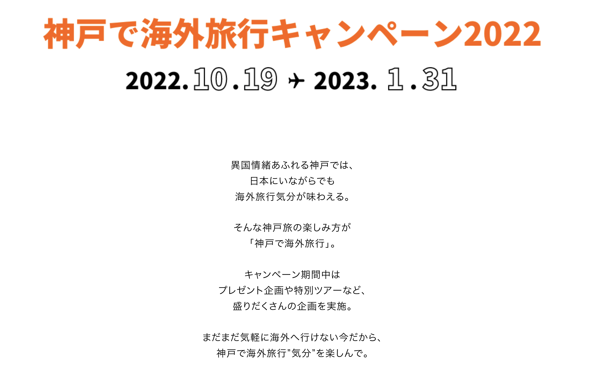

    In the exotic city of Kobe
    You can feel like you are traveling abroad even in Japan.
    you can feel as if you are traveling abroad.

    The way to enjoy such a trip to Kobe is to "Travel Abroad in Kobe
    Kobe is a great place to travel abroad.

    During the campaign period
    We will be offering a variety of special tours and
    and special tours.

    Since it is still too late to go abroad, enjoy the "overseas travel feeling" in Kobe.
    Enjoy the "overseas travel" feeling in Kobe.

<h6> </h6>

------------------------------------------------------------------------

##### 03


    
    This event will be held for the third time since its start in 2020. 
    This year's special nighttime visit will be held at Kasuga-taisha Shrine, Kofuku-ji Temple, and Ganko-ji Temple.
 
    In addition, Kofuku-ji Temple will hold a special nighttime visit to its national treasure, Kitaendo, in place of last year's five-story pagoda.
 
    In addition, this year, a special tour bus will be available on Saturdays only to provide convenient access to Kasuga Taisha Shrine, Kofuku-ji Temple, and Ganko-ji Temple, where special nighttime visits will be held.
 
    If you want to experience it all, we recommend staying in the city from Friday to Saturday. 
    Since the tour partly coincides with the opening of the "Shosoin Exhibition" at the Nara National Museum, why not combine the two and enjoy the ancient capital in a quiet evening that you cannot usually experience?
    Guided tours and hands-on experiences will be offered as related events.

<h6> </h6>

------------------------------------------------------------------------

##### 04


    Japan's Northern Alps are known as the site of the Nagano Olympics. Hakuba Village, the venue of the Olympics, is now a world-renowned mecca for winter sports, but this village, surrounded by nature, has actually been a treasure trove of outdoor activities loved by people all year round for a long time.

    Winter Sports

    With an average winter snowfall of 11 meters, Hakuba Village is a popular destination for both domestic and international visitors during the winter. Hakuba Valley," a small area about 40 minutes north to south, is home to 10 different ski resorts. This means that in addition to enjoying an unparalleled variety of courses and mountain features in a short period of time, people from all over the world come to enjoy Hakuba's superb powder snow.

    In January 2017, the Freeride World Tour, the world's most prestigious freeride ski and snowboard competition, selected Hakuba Village as the site of its qualifying competition for the first time in Asia. In 2018, the Freeride World Tour 2018 will be held in Hakuba, Japan.

    Summer Sports

    From light 1-2 hour walks to serious mountaineering, Hakuba has something for everyone, and a variety of tours led by professional local guides.　There are also summer jumps, international trail runs, BMWMotorrad, paragliding Japan Cup events, and cycling competitions.

    Don't forget to relax and enjoy Hakuba's many hot springs, restaurants, and soba (buckwheat noodle) making experiences. After the summer is over, Hakuba will be covered in beautiful autumn leaves." Hakuba's "three tiers of autumn leaves" (the white of the snow on the mountain tops in early winter, the red of the autumn leaves on the mountainside, and the green of the leaves at the foot of the mountain) are a unique sight in Hakuba.

<h6> </h6>

------------------------------------------------------------------------

##### 05


    [Abashiri] A town where drift ice comes to 44 degrees north latitude

    About 165 kilometers north of Kushiro, you will arrive at Abashiri City on the Sea of Okhotsk coast. Abashiri is a town of drift ice. In winter, drift ice appears offshore around January 20, and in February, it comes ashore and covers the Sea of Okhotsk with pure white ice. The sea of Abashiri is covered with ice until March, when the drift ice leaves the coast.

    The home of drift ice is the sea northeast of Sakhalin, 1,000 kilometers away. The fresh water that flows into the Sea of Okhotsk from Russia's great river, the Amur River, freezes over, freezing the less salty water in the sea water as it travels southward to the coast of the Sea of Okhotsk in Hokkaido. The journey is very slow. It is the speed of a baby crawling. The ice on the coast is 40 to 60 cm thick and has a clear blue cross-section. Because it contains plenty of phytoplankton from the Amur River, the Sea of Okhotsk at dawn is rich in nutrients and seafood.

    The fresh water of the Amur River, the cold winds of Siberia, and the closed shape of the Sea of Okhotsk. The Abashiri Okhotsk Drift Ice Festival is held on weekends in mid-February.

<h6> </h6>

------------------------------------------------------------------------

##### 06

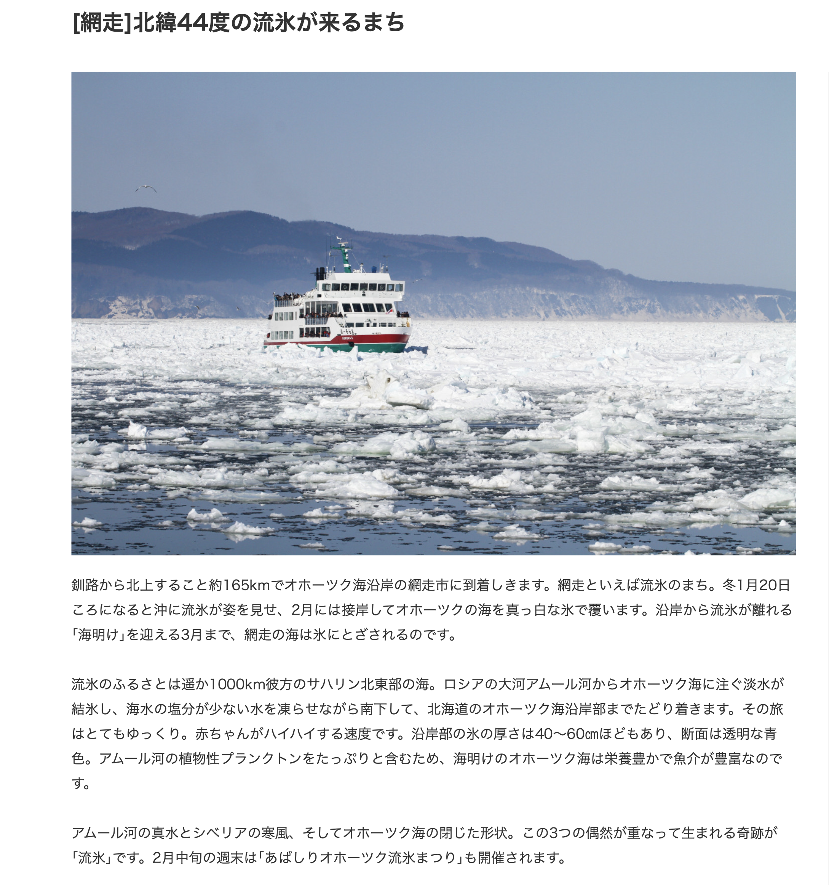


    If you want to start building a house
    Visit Soumuhumu Terrace
    I want to start building a house.
    But there are so many things I don't understand...".
    Sekisui House's new base "Smumfumu Terrace" is here to help you with such thoughts.
    We will think about land, money, and living together.
    It is OK even if you do not plan to build with Sekisui House.
    Currently, we have openings in Shinjuku, Aoyama, Ikebukuro, Kinshicho, and Tachikawa.
    All of them are located near stations for easy access, so please feel free to visit us.

<h6> </h6>

------------------------------------------------------------------------

#### Sentences {.tabset}

```{r, echo=FALSE, message=FALSE}

cmpsnt.a <- cmpsnt %>% na.omit(cmpsnt)
cmpsnt.a <- cmpsnt.a[sample(1:nrow(cmpsnt.a)),]
cmpsnt.a <- cmpsnt.a[sample(1:nrow(cmpsnt.a)),]

reactable(
  cmpsnt.a,
  columns = list(
    Sentences = colDef(style= list(background = '#e0e1dd'),
      cell = function(value, index) {
        Translation <- cmpsnt.a$Translation[index]
        Translation <- if (!is.na(Translation)) Translation else ""
        tagList(
          div(style = list(fontSize = 16, fontWeight = 400, color = '#0F2040', fontFamily = 'Zen Kaku Gothic New'), value),
          # div(style = list(fontSize = 10, fontWeight = 300, color = '#f1f5f5'), Translation)
        )
      },
      align = "left"
    ),
    Translation = colDef(show = FALSE)

  ),
  rowClass = "my-row",
  defaultPageSize = 9,
  theme = reactableTheme(

    cellStyle = list(display = "flex", flexDirection = "column", justifyContent = "center", fontSize = "11px"),
    searchInputStyle = list(
      paddingLeft = "8px",
      paddingTop = "8px",
      paddingBottom = "8px",
      width = "100%"
    )
  ),
  showPageInfo = FALSE, outlined = TRUE, borderless = FALSE, bordered = TRUE, searchable = TRUE, paginationType = "numbers", striped = TRUE, highlight = TRUE,
  
  style = list(fontFamily = "Noto Sans JP, Hiragino Maru Gothic ProN, Anonymous Pro , Helvetica Neue", fontSize = "11px")
)
```

<!-- ------------------------------------------------------------------------ -->

<!-- #### Scripts {.tabset} -->

<!-- ```{r, echo=FALSE, message=FALSE} -->

<!-- blind.a <- blind %>% select(Script.EP1, Meaning.EP1) -->

<!-- reactable( -->
<!--   na.omit(blind.a), -->
<!--   columns = list( -->
<!--     Script.EP1 = colDef(style= list(background = '#1b1e1e'), sticky = "left", minWidth = 300, -->
<!--       cell = function(value, index) { -->
<!--         Meaning.EP1 <- blind.a$Meaning.EP1[index] -->
<!--         Meaning.EP1 <- if (!is.na(Meaning.EP1)) Meaning.EP1 else "Unknown" -->
<!--         tagList( -->
<!--           div(style = list(fontSize = 16, fontWeight = 300, fontFamily = 'Open Sans', color = '#f1f5f5'), value), -->
<!--           # div(style = list(fontSize = 9, color = '#787878'), Meaning.EP1), -->
<!--         ) -->
<!--       }, -->
<!--       align = "left" -->
<!--     ), -->
<!--     # Meaning.EP1 = colDef(style= list(background = '#1b1e1e'), minWidth = 200, -->
<!--     #   cell = function(value, index) { -->
<!--     #     tagList( -->
<!--     #       div(style = list(fontSize = 10, fontWeight = 300, fontFamily = 'Open Sans', color = '#f1f5f5'), value), -->
<!--     #     ) -->
<!--     #   }, -->
<!--     #   align = "left" -->
<!--     # ), -->
<!--     Meaning.EP1 = colDef(show = FALSE) -->
<!--   ), -->
<!--   defaultPageSize = 50, -->
<!--   theme = reactableTheme( -->
<!--     # Vertically center cells -->
<!--     cellStyle = list(display = "flex", flexDirection = "column", justifyContent = "center"), -->
<!--     searchInputStyle = list( -->
<!--       paddingLeft = "8px", -->
<!--       paddingTop = "8px", -->
<!--       paddingBottom = "8px", -->
<!--       width = "100%" -->
<!--     ) -->
<!--   ), -->
<!--   showPageInfo = FALSE, bordered = TRUE, searchable = TRUE, sortable = FALSE, paginationType = "numbers", outlined = TRUE, borderless = TRUE, wrap = TRUE, resizable = TRUE, striped = TRUE, height = 530, -->

<!--   style = list(fontFamily = "Noto Sans JP, Heiti SC, Hiragino Maru Gothic ProN, Anonymous Pro , monospace, Helvetica Neue", fontSize = "11px") -->
<!-- ) -->

<!-- ``` -->

------------------------------------------------------------------------

### EV4.0: Speaking {.tabset}

#### Concept {.tabset}

<p style="font-size:11px; line-height: 1; font-family: Noto Sans JP;  color: #202020;">**Having a voice:** Holding a conversation depends on both the organs of speech and mental processing.</p>

<h6> </h6>

------------------------------------------------------------------------

#### Read-ALoud {.tabset}

```{r, echo=FALSE, message=FALSE}

inkspkng <- inkspkng[sample(1:nrow(inkspkng)),]

reactable(
  inkspkng,
  columns = list(
      Translation = colDef(style= list(background = '#e0e1dd'),
      cell = function(value, index) {
        Sentences <- inkspkng$Sentences[index]
        Sentences <- if (!is.na(Sentences)) Sentences else ""
        tagList(
          # div(style = list(fontSize = 24, fontWeight = 600), value),
          div(style = list(fontSize = 16, fontWeight = 400, color = '#0F2040', fontFamily = 'Zen Kaku Gothic New'), Sentences),
          # div(style = list(fontSize = 8, fontWeight = 400, color = '#787878'), value)
        )
      },
      align = "left"
    ),
    Sentences = colDef(show = FALSE)
  ),
  rowClass = "my-row",
  defaultPageSize = 50,
  theme = reactableTheme(
    cellStyle = list(display = "flex", flexDirection = "column", justifyContent = "center"),
    searchInputStyle = list(
      paddingLeft = "8px",
      paddingTop = "8px",
      paddingBottom = "8px",
      width = "100%"
    )
  ),
  showPageInfo = FALSE, bordered = TRUE, searchable = TRUE, sortable = FALSE, paginationType = "numbers", striped = TRUE, height = 486, highlight = TRUE,

  style = list(fontFamily = "Noto Sans JP, Heiti SC, Hiragino Maru Gothic ProN, Anonymous Pro , monospace, Helvetica Neue", fontSize = "11px")
)

```

------------------------------------------------------------------------

#### Translation {.tabset}

```{r, echo=FALSE, message=FALSE}

inkspkng <- inkspkng[sample(1:nrow(inkspkng)),]

reactable(
  inkspkng,
  columns = list(
      Sentences = colDef(style= list(background = '#e0e1dd'),
      cell = function(value, index) {
        Translation <- inkspkng$Translation[index]
        Translation <- if (!is.na(Translation)) Translation else ""
        tagList(
          # div(style = list(fontSize = 1, fontWeight = 600, color = '#FFFFFF'), value),
          div(style = list(fontSize = 13, fontWeight = 600, color = '#0F2040'), Translation)
        )
      },
      align = "center"
    ),
    Translation = colDef(show = FALSE)
  ),
  defaultPageSize = 1,
  theme = reactableTheme(
    # Vertically center cells
    cellStyle = list(display = "flex", flexDirection = "column", justifyContent = "center", height = 300),
    searchInputStyle = list(
      paddingLeft = "8px",
      paddingTop = "8px",
      paddingBottom = "8px",
      width = "100%"
    )
  ),
  showPageInfo = FALSE, bordered = TRUE, searchable = TRUE, sortable = FALSE, paginationType = "numbers",

  style = list(fontFamily = "Noto Sans JP, Heiti SC, Hiragino Maru Gothic ProN, Anonymous Pro , monospace, Helvetica Neue", fontSize = "11px")
)

```

------------------------------------------------------------------------

#### Shadowing {.tabset}

```{r, echo=FALSE, message=FALSE}

shdwvdv.a <- shdwvdv %>% rename(Rnd.Shadowing.Advance = Expression)
shdwvdv.a <- shdwvdv.a[sample(1:nrow(shdwvdv.a)),]

reactable(
  shdwvdv.a,
  columns = list(
    Scripts = colDef(show = FALSE),
    Rnd.Shadowing.Advance = colDef(minWidth = 500,align = "left", html = TRUE)
  ),
  defaultPageSize = 1,
  theme = reactableTheme(
    # Vertically center cells
    cellStyle = list(display = "flex", flexDirection = "column", justifyContent = "center"),
    searchInputStyle = list(
      paddingLeft = "8px",
      paddingTop = "8px",
      paddingBottom = "8px",
      width = "100%"
    ),
    headerStyle = list(
      # "&:hover[aria-sort]" = list(background = "hsl(0, 0%, 96%)"),
      # "&[aria-sort='ascending'], &[aria-sort='descending']" = list(background = "hsl(0, 0%, 96%)"),
      # borderColor = "#555",
      height = 30, fontSize = "11px",
      align = "center"
    )
  ),
  showPageInfo = FALSE, bordered = TRUE, searchable = FALSE, sortable = FALSE, paginationType = "simple",
  
  style = list(fontFamily = "Noto Sans JP, Heiti SC, Hiragino Maru Gothic ProN, Anonymous Pro , monospace, Helvetica Neue", fontSize = "11px")
)

```

```{r, echo=FALSE, message=FALSE}

shdwscrpt.a <- shdwscrpt  %>% select(Script, Translation)
shdwscrpt.a <- shdwscrpt.a %>% na.omit(shdwscrpt.a)

reactable(
  shdwscrpt.a,
  columns = list(
    Script = colDef(minWidth = 140, align = "left", html = TRUE, style = list(fontSize = 15, fontWeight = 200, color = '#0F2040', fontFamily = 'Open Sans', background = '#e0e1dd')),
     Translation = colDef(minWidth = 90, align = "left", html = TRUE, style = list(fontSize = 12, fontWeight = 200, color = '#0F2040', fontFamily = 'Open Sans', background = '#e0e1dd'))
  ),
  defaultPageSize = 100,
  theme = reactableTheme(
    cellStyle = list(display = "flex", flexDirection = "column", justifyContent = "center"),
    searchInputStyle = list(
      paddingLeft = "8px",
      paddingTop = "8px",
      paddingBottom = "8px",
      width = "100%"
    )
  ),
  showPageInfo = FALSE, bordered = TRUE, searchable = FALSE, sortable = FALSE, paginationType = "simple", height = 400, striped = TRUE, 
  
  style = list(fontFamily = "Noto Sans JP, Heiti SC, Hiragino Maru Gothic ProN, Anonymous Pro , monospace, Helvetica Neue", fontSize = "11px")
)
```

------------------------------------------------------------------------

### EV5.0: Listening {.tabset}

#### Concept {.tabset}

<p style="font-size:11px; line-height: 1; font-family: Noto Sans JP;  color: #202020;">**Listening and Hearing:** Be able to listen and hear the words clearly is the way to mastery.</p>

<h6> </h6>

------------------------------------------------------------------------

#### Talks {.tabset}

```{r, echo=FALSE, message=FALSE}

exvdeo.a <- exvdeo %>% rename(Ted.Talks = Expression)
exvdeo.a <- exvdeo.a[sample(1:nrow(exvdeo.a)),]

reactable(
  exvdeo.a,
  columns = list(
    Scripts = colDef(show = FALSE),
    Ted.Talks = colDef(minWidth = 500,align = "left", html = TRUE)
  ),
  defaultPageSize = 1,
  theme = reactableTheme(
    # Vertically center cells
    cellStyle = list(display = "flex", flexDirection = "column", justifyContent = "center"),
    searchInputStyle = list(
      paddingLeft = "8px",
      paddingTop = "8px",
      paddingBottom = "8px",
      width = "100%"
    ),
    headerStyle = list(
      # "&:hover[aria-sort]" = list(background = "hsl(0, 0%, 96%)),
      # "&[aria-sort='ascending'], &[aria-sort='descending']" = list(background = "hsl(0, 0%, 96%)"),
      # borderColor = "#555",
      height = 30, fontSize = "11px",
      align = "center"
    )
  ),
  showPageInfo = FALSE, bordered = TRUE, searchable = TRUE, sortable = FALSE, paginationType = "simple",
  
  style = list(fontFamily = "Noto Sans JP, Heiti SC, Hiragino Maru Gothic ProN, Anonymous Pro , monospace, Helvetica Neue", fontSize = "11px")
)

```

------------------------------------------------------------------------

#### Snippets {.tabset}

```{r, echo=FALSE, message=FALSE}

exvdsn.a <- exvdsn %>% rename(Rnd.Snippets = Expression)
exvdsn.a <- exvdsn.a[sample(1:nrow(exvdsn.a)),]

reactable(
  exvdsn.a,
  columns = list(
    Scripts = colDef(show = FALSE),
    Rnd.Snippets = colDef(minWidth = 500,align = "left", html = TRUE)
  ),
  defaultPageSize = 1,
  theme = reactableTheme(
    # Vertically center cells
    cellStyle = list(display = "flex", flexDirection = "column", justifyContent = "center"),
    searchInputStyle = list(
      paddingLeft = "8px",
      paddingTop = "8px",
      paddingBottom = "8px",
      width = "100%"
    ),
    headerStyle = list(
      # "&:hover[aria-sort]" = list(background = "hsl(0, 0%, 96%)"),
      # "&[aria-sort='ascending'], &[aria-sort='descending']" = list(background = "hsl(0, 0%, 96%)"),
      # borderColor = "#555",
      height = 30, fontSize = "11px",
      align = "center"
    )
  ),
  showPageInfo = FALSE, bordered = TRUE, searchable = TRUE, sortable = FALSE, paginationType = "simple",
  
  style = list(fontFamily = "Noto Sans JP, Heiti SC, Hiragino Maru Gothic ProN, Anonymous Pro , monospace, Helvetica Neue", fontSize = "11px")
)

```

------------------------------------------------------------------------

#### Vlogs {.tabset}

```{r, echo=FALSE, message=FALSE}

exvdvg.a <- exvdvg %>% rename(Rnd.Vlogs = Expression)
exvdvg.a <- exvdvg.a[sample(1:nrow(exvdvg.a)),]

htmltools::browsable(
  tagList(
    div(
      div(class = "charts", tags$label("【Channel】", `for` = "script-types-filter"),
        tags$select(
          id = "script-types-filter",
          onchange = "Reactable.setFilter('script-filter-table', 'Scripts', this.value)",
          tags$option("All", value = ""),
          lapply(unique(exvdvg.a$Scripts), tags$option)
      ))
    ),

reactable(
  exvdvg.a,
  columns = list(
    Scripts = colDef(show = FALSE),
    Rnd.Vlogs = colDef(minWidth = 500,align = "left", html = TRUE)
  ),
  defaultPageSize = 1,
  defaultSorted = "Scripts",
  elementId = "script-filter-table",
  theme = reactableTheme(
    cellStyle = list(display = "flex", flexDirection = "column", justifyContent = "center"),
    searchInputStyle = list(
      paddingLeft = "8px",
      paddingTop = "8px",
      paddingBottom = "8px",
      width = "100%"
    ),
    headerStyle = list(
      # "&:hover[aria-sort]" = list(background = "hsl(0, 0%, 96%)"),
      # "&[aria-sort='ascending'], &[aria-sort='descending']" = list(background = "hsl(0, 0%, 96%)"),
      # borderColor = "#555",
      height = 30, fontSize = "11px",
      align = "center"
    )
  ),
  showPageInfo = FALSE, bordered = TRUE, searchable = FALSE, sortable = FALSE, paginationType = "simple",
  
  style = list(fontFamily = "Noto Sans JP, Heiti SC, Hiragino Maru Gothic ProN, Anonymous Pro , monospace, Helvetica Neue", fontSize = "11px")
)
))

```

------------------------------------------------------------------------

#### Nihongo {.tabset}

```{r, echo=FALSE, message=FALSE}

exvdnh.a <- exvdnh %>% rename(Rnd.Nihongo = Expression)
exvdnh.a <- exvdnh.a[sample(1:nrow(exvdnh.a)),]

reactable(
  exvdnh.a,
  columns = list(
    Scripts = colDef(show = FALSE),
    Rnd.Nihongo = colDef(minWidth = 500,align = "left", html = TRUE)
  ),
  defaultPageSize = 1,
  theme = reactableTheme(
    # Vertically center cells
    cellStyle = list(display = "flex", flexDirection = "column", justifyContent = "center"),
    searchInputStyle = list(
      paddingLeft = "8px",
      paddingTop = "8px",
      paddingBottom = "8px",
      width = "100%"
    ),
    headerStyle = list(
      # "&:hover[aria-sort]" = list(background = "hsl(0, 0%, 96%)"),
      # "&[aria-sort='ascending'], &[aria-sort='descending']" = list(background = "hsl(0, 0%, 96%)"),
      # borderColor = "#555",
      height = 30, fontSize = "11px",
      align = "center"
    )
  ),
  showPageInfo = FALSE, bordered = TRUE, searchable = TRUE, sortable = FALSE, paginationType = "simple",
  
  style = list(fontFamily = "Noto Sans JP, Heiti SC, Hiragino Maru Gothic ProN, Anonymous Pro , monospace, Helvetica Neue", fontSize = "11px")
)

```

------------------------------------------------------------------------

#### News {.tabset}

```{r, echo=FALSE, message=FALSE}

exvdnw.a <- exvdnw %>% rename(Rnd.News = Expression)
exvdnw.a <- exvdnw.a[sample(1:nrow(exvdnw.a)),]

reactable(
  exvdnw.a,
  columns = list(
    Scripts = colDef(show = FALSE),
    Rnd.News = colDef(minWidth = 500,align = "left", html = TRUE)
  ),
  defaultPageSize = 1,
  theme = reactableTheme(
    # Vertically center cells
    cellStyle = list(display = "flex", flexDirection = "column", justifyContent = "center"),
    searchInputStyle = list(
      paddingLeft = "8px",
      paddingTop = "8px",
      paddingBottom = "8px",
      width = "100%"
    ),
    headerStyle = list(
      # "&:hover[aria-sort]" = list(background = "hsl(0, 0%, 96%)"),
      # "&[aria-sort='ascending'], &[aria-sort='descending']" = list(background = "hsl(0, 0%, 96%)"),
      # borderColor = "#555",
      height = 30, fontSize = "11px",
      align = "center"
    )
  ),
  showPageInfo = FALSE, bordered = TRUE, searchable = TRUE, sortable = FALSE, paginationType = "simple",
  
  style = list(fontFamily = "Noto Sans JP, Heiti SC, Hiragino Maru Gothic ProN, Anonymous Pro , monospace, Helvetica Neue", fontSize = "11px")
)

```

------------------------------------------------------------------------

#### Manga-Anime {.tabset}

```{r, echo=FALSE, message=FALSE}

exvdam.a <- exvdam %>% rename(Rnd.Manga.Anime = Expression)
exvdam.a <- exvdam.a[sample(1:nrow(exvdam.a)),]

reactable(
  exvdam.a,
  columns = list(
    Scripts = colDef(show = FALSE),
    Rnd.Manga.Anime = colDef(minWidth = 500,align = "left", html = TRUE)
  ),
  defaultPageSize = 1,
  theme = reactableTheme(
    # Vertically center cells
    cellStyle = list(display = "flex", flexDirection = "column", justifyContent = "center"),
    searchInputStyle = list(
      paddingLeft = "8px",
      paddingTop = "8px",
      paddingBottom = "8px",
      width = "100%"
    ),
    headerStyle = list(
      # "&:hover[aria-sort]" = list(background = "hsl(0, 0%, 96%)"),
      # "&[aria-sort='ascending'], &[aria-sort='descending']" = list(background = "hsl(0, 0%, 96%)"),
      # borderColor = "#555",
      height = 30, fontSize = "11px",
      align = "center"
    )
  ),
  showPageInfo = FALSE, bordered = TRUE, searchable = TRUE, sortable = FALSE, paginationType = "simple",
  
  style = list(fontFamily = "Noto Sans JP, Heiti SC, Hiragino Maru Gothic ProN, Anonymous Pro , monospace, Helvetica Neue", fontSize = "11px")
)

```

------------------------------------------------------------------------

#### Technical {.tabset}

```{r, echo=FALSE, message=FALSE}

exvded.a <- exvded %>% rename(Rnd.Technical = Expression)
exvded.a <- exvded.a[sample(1:nrow(exvded.a)),]

reactable(
  exvded.a,
  columns = list(
    Scripts = colDef(show = FALSE),
    Rnd.Technical = colDef(minWidth = 500,align = "left", html = TRUE)
  ),
  defaultPageSize = 1,
  theme = reactableTheme(
    # Vertically center cells
    cellStyle = list(display = "flex", flexDirection = "column", justifyContent = "center"),
    searchInputStyle = list(
      paddingLeft = "8px",
      paddingTop = "8px",
      paddingBottom = "8px",
      width = "100%"
    ),
    headerStyle = list(
      # "&:hover[aria-sort]" = list(background = "hsl(0, 0%, 96%)"),
      # "&[aria-sort='ascending'], &[aria-sort='descending']" = list(background = "hsl(0, 0%, 96%)"),
      # borderColor = "#555",
      height = 30, fontSize = "11px",
      align = "center"
    )
  ),
  showPageInfo = FALSE, bordered = TRUE, searchable = TRUE, sortable = FALSE, paginationType = "simple",
  
  style = list(fontFamily = "Noto Sans JP, Heiti SC, Hiragino Maru Gothic ProN, Anonymous Pro , monospace, Helvetica Neue", fontSize = "11px")
)

```

------------------------------------------------------------------------

#### Educational {.tabset}

```{r, echo=FALSE, message=FALSE}

exvdcm.a <- exvdcm %>% rename(Rnd.Educational = Expression)
exvdcm.a <- exvdcm.a[sample(1:nrow(exvdcm.a)),]

reactable(
  exvdcm.a,
  columns = list(
    Scripts = colDef(show = FALSE),
    Rnd.Educational = colDef(minWidth = 500,align = "left", html = TRUE)
  ),
  defaultPageSize = 1,
  theme = reactableTheme(
    # Vertically center cells
    cellStyle = list(display = "flex", flexDirection = "column", justifyContent = "center"),
    searchInputStyle = list(
      paddingLeft = "8px",
      paddingTop = "8px",
      paddingBottom = "8px",
      width = "100%"
    ),
    headerStyle = list(
      # "&:hover[aria-sort]" = list(background = "hsl(0, 0%, 96%)"),
      # "&[aria-sort='ascending'], &[aria-sort='descending']" = list(background = "hsl(0, 0%, 96%)"),
      # borderColor = "#555",
      height = 30, fontSize = "11px",
      align = "center"
    )
  ),
  showPageInfo = FALSE, bordered = TRUE, searchable = TRUE, sortable = FALSE, paginationType = "simple",
  
  style = list(fontFamily = "Noto Sans JP, Heiti SC, Hiragino Maru Gothic ProN, Anonymous Pro , monospace, Helvetica Neue", fontSize = "11px")
)

```

------------------------------------------------------------------------

#### Eikaiwa {.tabset}

```{r, echo=FALSE, message=FALSE}

exvdkw.a <- exvdkw %>% rename(Rnd.Eikaiwa = Expression)
exvdkw.a <- exvdkw.a[sample(1:nrow(exvdkw.a)),]

reactable(
  exvdkw.a,
  columns = list(
    Scripts = colDef(show = FALSE),
    Rnd.Eikaiwa = colDef(minWidth = 500,align = "left", html = TRUE)
  ),
  defaultPageSize = 1,
  theme = reactableTheme(
    # Vertically center cells
    cellStyle = list(display = "flex", flexDirection = "column", justifyContent = "center"),
    searchInputStyle = list(
      paddingLeft = "8px",
      paddingTop = "8px",
      paddingBottom = "8px",
      width = "100%"
    ),
    headerStyle = list(
      # "&:hover[aria-sort]" = list(background = "hsl(0, 0%, 96%)"),
      # "&[aria-sort='ascending'], &[aria-sort='descending']" = list(background = "hsl(0, 0%, 96%)"),
      # borderColor = "#555",
      height = 30, fontSize = "11px",
      align = "center"
    )
  ),
  showPageInfo = FALSE, bordered = TRUE, searchable = TRUE, sortable = FALSE, paginationType = "simple",
  
  style = list(fontFamily = "Noto Sans JP, Heiti SC, Hiragino Maru Gothic ProN, Anonymous Pro , monospace, Helvetica Neue", fontSize = "11px")
)

```

------------------------------------------------------------------------

#### Audio {.tabset}

##### Basic01 {.tabset}

<div class = "row">
<div class = "col-sm-6">

<div class = "expressjp">
001　   
</div>

<h6> </h6>

<div class = "expressjp">
002　   
</div>

<h6> </h6>

<div class = "expressjp">
003　   
</div>

<h6> </h6>

<div class = "expressjp">
004　    
</div>

<h6> </h6>

<div class = "expressjp">
005　    
</div>

<h6> </h6>

<div class = "expressjp">
006　   
</div>

<h6> </h6>

<div class = "expressjp">
007　    
</div>

<h6> </h6>

<div class = "expressjp">
008　    
</div>

<h6> </h6>

<div class = "expressjp">
009　    
</div>

<h6> </h6>

<div class = "expressjp">
010　    
</div>

<h6> </h6>

<div class = "expressjp">
011　    
</div>

<h6> </h6>

<div class = "expressjp">
012　    
</div>

<h6> </h6>

<div class = "expressjp">
013　    
</div>

<h6> </h6>

<div class = "expressjp">
014　    
</div>

<h6> </h6>

<div class = "expressjp">
015　    
</div>

<h6> </h6>

<div class = "expressjp">
016　    
</div>

<h6> </h6>

<div class = "expressjp">
017　    
</div>

<h6> </h6>

<div class = "expressjp">
018　    
</div>

<h6> </h6>

<div class = "expressjp">
019　    
</div>

<h6> </h6>

<div class = "expressjp">
020　    
</div>

</div>
<div class = "col-sm-6">

<div class = "expressjp">
021　    
</div>

<h6> </h6>

<div class = "expressjp">
022　    
</div>

<h6> </h6>

<div class = "expressjp">
023　    
</div>

<h6> </h6>

<div class = "expressjp">
024　    
</div>

<h6> </h6>

<div class = "expressjp">
025　    
</div>

<h6> </h6>

<div class = "expressjp">
026　    
</div>

<h6> </h6>

<div class = "expressjp">
027　    
</div>

<h6> </h6>

<div class = "expressjp">
028　    
</div>

<h6> </h6>

<div class = "expressjp">
029　    
</div>

<h6> </h6>

<div class = "expressjp">
030　    
</div>

<h6> </h6>

<div class = "expressjp">
031　    
</div>

<h6> </h6>

<div class = "expressjp">
032　    
</div>

<h6> </h6>

<div class = "expressjp">
033　    
</div>

<h6> </h6>

<div class = "expressjp">
034　    
</div>

<h6> </h6>

<div class = "expressjp">
035　    
</div>

<h6> </h6>

<div class = "expressjp">
036　    
</div>

<h6> </h6>

<div class = "expressjp">
037　    
</div>

<h6> </h6>

<div class = "expressjp">
038　    
</div>

<h6> </h6>

<div class = "expressjp">
039　   
</div>

</div>
</div>

<h6> </h6>

------------------------------------------------------------------------

##### Basic02 {.tabset}

<div class = "row">
<div class = "col-sm-6">

<div class = "expressjp">
001　   
</div>

<h6> </h6>

<div class = "expressjp">
002　    
</div>

<h6> </h6>

<div class = "expressjp">
003　    
</div>

<h6> </h6>

<div class = "expressjp">
004　  
</div>

</div>
<div class = "col-sm-6">

<div class = "expressjp">
019　    
</div>

<h6> </h6>

<div class = "expressjp">
020　    
</div>

<h6> </h6>

<div class = "expressjp">
021　    
</div>

<h6> </h6>

<div class = "expressjp">
022　    
</div>

<h6> </h6>

<div class = "expressjp">
023　    
</div>

<h6> </h6>

<div class = "expressjp">
024　    
</div>

</div>
</div>

<h6> </h6>

------------------------------------------------------------------------

##### Inter01 {.tabset}

<div class = "row">
<div class = "col-sm-6">

<div class = "expressjp">
001　   
</div>

<h6> </h6>

<div class = "expressjp">
002　  
</div>

</div>
<div class = "col-sm-6">

<div class = "expressjp">
003　    
</div>

<h6> </h6>

<div class = "expressjp">
004　  
</div>

</div>
</div>

<h6> </h6>

------------------------------------------------------------------------

##### Inter02 {.tabset}

<div class = "row">
<div class = "col-sm-6">

<div class = "expressjp">
001　    
</div>

<h6> </h6>

<div class = "expressjp">
002　    
</div>

<h6> </h6>

<div class = "expressjp">
003　    
</div>

<h6> </h6>

<div class = "expressjp">
004　    
</div>

<h6> </h6>

<div class = "expressjp">
005　    
</div>

<h6> </h6>

<div class = "expressjp">
011　    
</div>

<h6> </h6>

<div class = "expressjp">
012　    
</div>

<h6> </h6>

<div class = "expressjp">
013　    
</div>

<h6> </h6>

</div>
<div class = "col-sm-6">

<div class = "expressjp">
014　    
</div>

<h6> </h6>

<div class = "expressjp">
015　    
</div>

<h6> </h6>

<div class = "expressjp">
016　    
</div>

<h6> </h6>

<div class = "expressjp">
017　    
</div>

<h6> </h6>

<div class = "expressjp">
018　    
</div>

<h6> </h6>

<div class = "expressjp">
019　    
</div>

<h6> </h6>

<div class = "expressjp">
020　    
</div>

<h6> </h6>

<div class = "expressjp">
021　    
</div>

<h6> </h6>

<div class = "expressjp">
022　    
</div>

<h6> </h6>

<div class = "expressjp">
023　    
</div>

<h6> </h6>

<div class = "expressjp">
024　    
</div>

<h6> </h6>

<div class = "expressjp">
025　    
</div>

<h6> </h6>

<div class = "expressjp">
026　    
</div>

<h6> </h6>

<div class = "expressjp">
027　    
</div>

</div>
</div>

<h6> </h6>

------------------------------------------------------------------------

##### Inter03 {.tabset}

<div class = "expressjp">
001　    
</div>

<h6> </h6>

<div class = "expressjp">
002　    
</div>

<h6> </h6>

<div class = "expressjp">
003　    
</div>

<h6> </h6>

<div class = "expressjp">
004　    
</div>

<h6> </h6>

<div class = "expressjp">
005　    
</div>

<h6> </h6>

<div class = "expressjp">
006　    
</div>

<h6> </h6>

<div class = "expressjp">
007　    
</div>

<h6> </h6>

<div class = "expressjp">
008　    
</div>

<h6> </h6>

<div class = "expressjp">
009　    
</div>

<h6> </h6>

<div class = "expressjp">
010　    
</div>

<h6> </h6>

<div class = "expressjp">
011　    
</div>

<h6> </h6>

<div class = "expressjp">
012　    
</div>

<h6> </h6>

<div class = "expressjp">
013　    
</div>

<h6> </h6>

<div class = "expressjp">
014　    
</div>

<h6> </h6>

<div class = "expressjp">
015　    
</div>

<h6> </h6>

<div class = "expressjp">
016　    
</div>

<h6> </h6>

------------------------------------------------------------------------

##### Inter04 {.tabset}

<div class = "expressjp">
001　    
</div>

<h6> </h6>

<div class = "expressjp">
002　    
</div>

<h6> </h6>

<div class = "expressjp">
003　    
</div>

<h6> </h6>

<div class = "expressjp">
004　    
</div>

<h6> </h6>

<div class = "expressjp">
005　    
</div>

<h6> </h6>

<div class = "expressjp">
006　    
</div>

<h6> </h6>

<div class = "expressjp">
007　    
</div>

<h6> </h6>

<div class = "expressjp">
008　    
</div>

<h6> </h6>

<div class = "expressjp">
009　    
</div>

<h6> </h6>

<div class = "expressjp">
010　    
</div>

<h6> </h6>

<div class = "expressjp">
011　    
</div>

<h6> </h6>

<div class = "expressjp">
012　    
</div>

<h6> </h6>

<div class = "expressjp">
013　    
</div>

<h6> </h6>

<div class = "expressjp">
014　    
</div>

<h6> </h6>

<div class = "expressjp">
015　    
</div>

<h6> </h6>

<div class = "expressjp">
016　    
</div>

<h6> </h6>

------------------------------------------------------------------------

### EV6.0: Writing {.tabset}

#### Concept {.tabset}

<p style="font-size:11px; line-height: 1; font-family: Noto Sans JP;  color: #202020;">**Writing:** Be able to master writing fifty Kanjis.</p>

<h6> </h6>

------------------------------------------------------------------------

#### Kanji {.tabset}

<h6> </h6>

------------------------------------------------------------------------

#### Words {.tabset}

<h6> </h6>

------------------------------------------------------------------------

### EV7.0: Mastery {.tabset}

#### Concept {.tabset}

<p style="font-size:11px; line-height: 1; font-family: Noto Sans JP;  color: #202020;">**Mastery:** To have a deep knowledge and understanding on every aspect of the language and be able to apply and use it in any given situation.</p>

<h6> </h6>

------------------------------------------------------------------------

#### Cognition {.tabset}

##### Implicit {.tabset}

```{r, echo=FALSE, message=FALSE}

ntvspk.b <- ntvspk  %>%  select(Expression, Translation)
ntvspk.b <- ntvspk.b[sample(1:nrow(ntvspk.b)),]
ntvspk.b <- ntvspk.b[sample(1:nrow(ntvspk.b)),]

reactable(
  ntvspk.b,
  onClick = "expand",
  columns = list(
    # Expression = colDef(minWidth = 50, align = "left", style = list(fontSize = 17, fontWeight = 500, color = '#0F2040', fontFamily = 'Zen Kaku Gothic New', background = '#e0e1dd')),
    Expression = colDef(style= list(background = '#e8e7e2'),
      cell = function(value, index) {
        tagList(
          div(style = list(fontSize = 19, fontWeight = 500, fontFamily = 'RocknRoll One', color = '#061126', background = '#e8e7e2'), value, "。"),
        )
      },
      align = "left",
    ),
    Translation = colDef(show = FALSE)
  ),

  details = function(index){
    Translation <- ntvspk.b$Translation[index]
    Translation <- if (!is.na(Translation)) Translation else ""
    tagList(
      div(
        htmltools::div(style = list(padding = 6, fontSize = 15, fontWeight = 400, color = '#061126', fontFamily = 'Zen Kaku Gothic New', background = '#f5f5f5'), "・ ", Translation)
      )
    )
  },
  # rowClass = "my-row",
  defaultPageSize = 7,
  # defaultSorted = "Category",
  # class = "packages-table",
  theme = reactableTheme(
    cellStyle = list(display = "flex", flexDirection = "column", justifyContent = "center", fontSize = "11px", height = 45),
    searchInputStyle = list(
      paddingLeft = "8px",
      paddingTop = "8px",
      paddingBottom = "8px",
      width = "100%",
      fontSize = "11px"
    ),
    headerStyle = list(
      backgroundColor = "#dee7e7",
      color = "hsl(0, 0%, 95%)",
      fontSize = 0.1,
      fontWeight = 100,
      fontFamily = 'Open Sans',
      fontSize = "0.75rem",
      letterSpacing = "1px",
      textTransform = "lowercase",
      padding = "0px",
      "&:hover, &:focus" = list(color = '#dee7e7')
    ),
  ),
  showPageInfo = FALSE, outlined = TRUE, borderless = FALSE, bordered = FALSE, searchable = FALSE, sortable = FALSE, paginationType = "numbers", height = 360,

  style = list(fontFamily = "Noto Sans JP, Heiti SC, Hiragino Maru Gothic ProN, Anonymous Pro , monospace, Helvetica Neue", fontSize = "11px")
)

```

------------------------------------------------------------------------

##### Explicit {.tabset}

<!-- ####  Reference {.tabset} -->

```{r, echo=FALSE, message=FALSE}

explcexp.a <- explcexp
explcexp.a <- explcexp.a[sample(1:nrow(explcexp.a)),]

reactable(
  explcexp.a,
  onClick = "expand",
  columns = list(
    Expression = colDef(minWidth = 50, align = "left", style = list(fontSize = 15, fontWeight = 600, color = '#061126', fontFamily = 'Zen Kaku Gothic New', background = '#e8e7e2')),
    Translation = colDef(show = FALSE)
  ),

  details = function(index){
    Translation <- explcexp.a$Translation[index]
    Translation <- if (!is.na(Translation)) Translation else ""

    tagList(
      div(
        htmltools::div(style = list(padding = 6, fontSize = 19, fontWeight = 400, color = '#061126', fontFamily = 'RocknRoll One', background = '#f5f5f5'), "・ ", Translation)
      )
    )
  },
  # rowClass = "my-row",
  defaultPageSize = 7,
  # defaultSorted = "Category",
  # class = "packages-table",
  theme = reactableTheme(
    cellStyle = list(display = "flex", flexDirection = "column", justifyContent = "center", fontSize = "11px", height = 45),
    searchInputStyle = list(
      paddingLeft = "8px",
      paddingTop = "8px",
      paddingBottom = "8px",
      width = "100%",
      fontSize = "11px"
    ),
    headerStyle = list(
      backgroundColor = "#DEE0DC",
      color = "hsl(0, 0%, 95%)",
      fontSize = 0.1,
      fontWeight = 100,
      fontFamily = 'Open Sans',
      fontSize = "0.75rem",
      letterSpacing = "1px",
      textTransform = "lowercase",
      padding = "0px",
      "&:hover, &:focus" = list(color = '#DEE0DC')
    ),
  ),
  showPageInfo = FALSE, outlined = TRUE, bordered = FALSE, searchable = FALSE, sortable = FALSE, paginationType = "numbers", height = 360,

  style = list(fontFamily = "Noto Sans JP, Heiti SC, Hiragino Maru Gothic ProN, Anonymous Pro , monospace, Helvetica Neue", fontSize = "11px")
)

```

------------------------------------------------------------------------

##### Situations {.tabset}

```{r, echo=FALSE, message=FALSE}

mstrypatrn.b <- mstrypatrn  %>%  select(Expression, Translation)
mstrypatrn.b <- mstrypatrn.b[sample(1:nrow(mstrypatrn.b)),]
mstrypatrn.b <- mstrypatrn.b[sample(1:nrow(mstrypatrn.b)),]

reactable(
  mstrypatrn.b,
  onClick = "expand",
  columns = list(
    # Expression = colDef(minWidth = 50, align = "left", style = list(fontSize = 17, fontWeight = 500, color = '#0F2040', fontFamily = 'Zen Kaku Gothic New', background = '#e0e1dd')),
    # Expression = colDef(style= list(background = '#e8e7e2'),
    Translation = colDef(style= list(background = '#e8e7e2'),
      cell = function(value, index) {
        tagList(
          # div(style = list(fontSize = 19, fontWeight = 400, fontFamily = 'RocknRoll One', color = '#2b3441', background = '#e8e7e2'), value),
          div(style = list(fontSize = 15, fontWeight = 600, fontFamily = 'Zen Kaku Gothic New', color = '#061126', background = '#e8e7e2'), value),
        )
      },
      align = "left"
    ),
    Expression = colDef(show = FALSE)
  ),

  details = function(index){
    Expression <- mstrypatrn.b$Expression[index]
    Expression <- if (!is.na(Expression)) Expression else ""

    tagList(
      div(
        # htmltools::div(style = list(padding = 6, fontSize = 15, fontWeight = 400, color = '#1f1e22', fontFamily = 'Zen Kaku Gothic New', background = '#f5f5f5'), "・ ", Translation)
        htmltools::div(style = list(padding = 6, fontSize = 19, fontWeight = 400, color = '#061126', fontFamily = 'RocknRoll One', background = '#f5f5f5'), "・ ", Expression)
      )
    )
  },
  # rowClass = "my-row",
  defaultPageSize = 7,
  # defaultSorted = "Category",
  # class = "packages-table",
  theme = reactableTheme(
    cellStyle = list(display = "flex", flexDirection = "column", justifyContent = "center", fontSize = "11px", height = 45),
    searchInputStyle = list(
      paddingLeft = "8px",
      paddingTop = "8px",
      paddingBottom = "8px",
      width = "100%",
      fontSize = "11px"
    ),
    headerStyle = list(
      backgroundColor = "#DEE0DC",
      color = "hsl(0, 0%, 95%)",
      fontSize = 0.1,
      fontWeight = 100,
      fontFamily = 'Open Sans',
      fontSize = "0.75rem",
      letterSpacing = "1px",
      textTransform = "lowercase",
      padding = "0px",
      "&:hover, &:focus" = list(color = '#DEE0DC')
    ),
  ),
  showPageInfo = FALSE, outlined = TRUE, borderless = FALSE, bordered = FALSE, searchable = FALSE, sortable = FALSE, paginationType = "numbers", height = 360,

  style = list(fontFamily = "Noto Sans JP, Heiti SC, Hiragino Maru Gothic ProN, Anonymous Pro , monospace, Helvetica Neue", fontSize = "11px")
)

```

------------------------------------------------------------------------

##### Patterns {.tabset}

```{r, echo=FALSE, message=FALSE}

syntxm.a <- syntxm
syntxm.a <- syntxm.a[sample(1:nrow(syntxm.a)),]

reactable(
  syntxm.a,
  columns = list(
    Meaning = colDef(style= list(background = '#edede9'),
      cell = function(value, index) {
        Expression <- syntxm.a$Expression[index]
        Expression <- if (!is.na(Expression)) Expression else ""
        Structure <- syntxm.a$Structure[index]
        Structure <- if (!is.na(Structure)) Structure else ""
        Sentence <- syntxm.a$Sentence[index]
        Sentence <- if (!is.na(Sentence)) Sentence else ""
        Korean <- syntxm.a$Korean[index]
        Korean <- if (!is.na(Korean)) Korean else ""
        English <- syntxm.a$English[index]
        English <- if (!is.na(English)) English else ""
        Remarks <- syntxm.a$Remarks[index]
        Remarks <- if (!is.na(Remarks)) Remarks else ""
        Spanish <- syntxm.a$Spanish[index]
        Spanish <- if (!is.na(Spanish)) Spanish else ""
        tagList(
          div(style = list(fontSize = 22, fontWeight = 900, color = '#0F2040', fontFamily = 'Righteous'), value),
          div(style = list(fontSize = 13, fontWeight = 500, color = '#941b0c'), Expression),
          div(style = list(fontSize = 11, fontWeight = 400, color = '#259999', fontFamily = 'Zen Kaku Gothic New'), Structure),
          div(style = list(fontSize = 11, fontWeight = 300, color = '#8C8C8C', fontFamily = 'Zen Kaku Gothic New'), Remarks),
          div(style = list(fontSize = 1, color = '#edede9'), "."),
          div(style = list(fontSize = 1, color = '#edede9'), "."),
          div(style = list(fontSize = 1, color = '#edede9'), "."),
          div(style = list(fontSize = 1, color = '#edede9'), "."),
          div(style = list(fontSize = 1, color = '#edede9'), "."),
          div(style = list(fontSize = 1, color = '#edede9'), "."),
          div(style = list(fontSize = 20, fontWeight = 600, color = '#0F2040', fontFamily = 'Open Sans'), Sentence),
          div(style = list(fontSize = 16, fontWeight = 400, color = '#0F2040'), Korean),
          div(style = list(fontSize = 11, fontWeight = 400, color = '#0F2040'), English),
          div(style = list(fontSize = 11, fontWeight = 400, color = '#259999', fontFamily = 'Zen Kaku Gothic New'), Spanish),
        )
      },
      align = "center"
    ),
    
    Expression = colDef(show = FALSE),
    Structure = colDef(show = FALSE),
    Sentence = colDef(show = FALSE),
    Remarks = colDef(show = FALSE),
    Korean = colDef(show = FALSE),
    English = colDef(show = FALSE),
    Spanish = colDef(show = FALSE),
    Level = colDef(show = FALSE)
  ),
  rowClass = "my-row",
  defaultPageSize = 1,
  theme = reactableTheme(
    # Vertically center cells
    cellStyle = list(display = "flex", flexDirection = "column", justifyContent = "center", height = 250, fontSize = "11px"),
    searchInputStyle = list(
      paddingLeft = "8px",
      paddingTop = "8px",
      paddingBottom = "8px",
      width = "100%"
    )
  ),
  showPageInfo = FALSE, bordered = TRUE, searchable = TRUE, paginationType = "simple", highlight = TRUE,
  
  style = list(fontFamily = "Noto Sans JP, Hiragino Maru Gothic ProN, Anonymous Pro , Helvetica Neue", fontSize = "11px")
)

```

------------------------------------------------------------------------

##### Functions {.tabset}

```{r, echo=FALSE, message=FALSE}

mstryfunc.a <- mstryfunc
mstryfunc.a <- mstryfunc.a[sample(1:nrow(mstryfunc.a)),]

reactable(
  mstryfunc.a,
  columns = list(
    Function = colDef(style= list(background = '#e0e1dd'), html = TRUE, minWidth = 200,
      cell = function(value, index) {
        Pattern <- mstryfunc.a$Pattern[index]
        Pattern <- if (!is.na(Pattern)) Pattern else ""
        Details <- mstryfunc.a$Details[index]
        Details <- if (!is.na(Details)) Details else ""
        tag_list <- tagList(
          div(class = "detail-des_func_a", HTML(mstryfunc.a$Function[index])),
          div(class = "detail-des_func_d", HTML(mstryfunc.a$Pattern[index])),
          div(class = "detail-des_func_e", HTML(mstryfunc.a$Details[index])),
        )
        as.character(tag_list)
      },
      align = "center"
    ),
    Sample = colDef(style= list(background = '#edede9'), html = TRUE, minWidth = 250,
      cell = function(value, index) {
        Translate <- mstryfunc.a$Translate[index]
        Translate <- if (!is.na(Translate)) Translate else ""
        tag_list <- tagList(
          div(class = "detail-des_func_b", HTML(mstryfunc.a$Sample[index])),
          div(class = "detail-des_func_c", HTML(mstryfunc.a$Translate[index]))
        )
        as.character(tag_list)
      },
      align = "left"
    ), 
    Pattern = colDef(show = FALSE),
    Details = colDef(show = FALSE),
    Translate = colDef(show = FALSE)
  ),
  rowClass = "my-row",
  defaultPageSize = 1,
  theme = reactableTheme(
    cellStyle = list(display = "flex", flexDirection = "column", justifyContent = "center", padding = "0px", height = 600, fontSize = "11px"),
    searchInputStyle = list(
      paddingLeft = "8px",
      paddingTop = "8px",
      paddingBottom = "8px",
      width = "100%"
    )
  ),
  showPageInfo = FALSE, outlined = TRUE, bordered = FALSE, searchable = TRUE, paginationType = "simple", highlight = TRUE,
  
  style = list(fontFamily = "Noto Sans JP, Hiragino Maru Gothic ProN, Anonymous Pro , Helvetica Neue", fontSize = "11px")
)

```

------------------------------------------------------------------------

#### Lexicon {.tabset}

<!-- ##### Words {.tabset} -->

```{r, echo=FALSE, message=FALSE, warning=FALSE}

eswrds.a <- eswrds

# eswrds.1 <- eswrds %>% select(W1, M1)
# eswrds.2 <- eswrds %>% select(W2, M2)
# eswrds.3 <- eswrds %>% select(W3, M3)
# eswrds.4 <- eswrds %>% select(W4, M4)
# eswrds.5 <- eswrds %>% select(W5, M5)
# eswrds.6 <- eswrds %>% select(W6, M6)
# 
# eswrds.1 <- eswrds.1[sample(1:nrow(eswrds.1)),]
# eswrds.2 <- eswrds.2[sample(1:nrow(eswrds.2)),]
# eswrds.3 <- eswrds.3[sample(1:nrow(eswrds.3)),] 
# eswrds.4 <- eswrds.4[sample(1:nrow(eswrds.4)),]
# eswrds.5 <- eswrds.5[sample(1:nrow(eswrds.5)),] 
# eswrds.6 <- eswrds.6[sample(1:nrow(eswrds.6)),]
# 
# eswrds.a <- data.frame(eswrds.1, eswrds.2, eswrds.3, eswrds.4, eswrds.5, eswrds.6)

reactable(
  eswrds.a,
  columns = list(
    W1 = colDef(footer = "Total", style= list(background = '#DEE0DC'),
      cell = function(value, index) {
        M1 <- eswrds.a$M1[index]
        M1 <- if (!is.na(M1)) M1 else ""
        tagList(
          div(style = list(fontSize = 20, fontWeight = 600, fontFamily = 'Open Sans', color = '#1b1e1e'), value),
          div(style = list(fontSize = 9, fontWeight = 300, fontFamily = 'Open Sans', color = '#800000'), M1),
        )
      },
      align = "center"
    ),
    W2 = colDef(style= list(background = '#DEE0DC'),
      cell = function(value, index) {
        M2 <- eswrds.a$M2[index]
        M2 <- if (!is.na(M2)) M2 else ""
        tagList(
          div(style = list(fontSize = 20, fontWeight = 600, fontFamily = 'Open Sans', color = '#1b1e1e'), value),
          div(style = list(fontSize = 9, fontWeight = 300, fontFamily = 'Open Sans', color = '#800000'), M2),
        )
      },
      align = "center"
    ),
    W3 = colDef(style= list(background = '#DEE0DC'),
      cell = function(value, index) {
        M3 <- eswrds.a$M3[index]
        M3 <- if (!is.na(M3)) M3 else ""
        tagList(
          div(style = list(fontSize = 20, fontWeight = 600, fontFamily = 'Open Sans', color = '#1b1e1e'), value),
          div(style = list(fontSize = 9, fontWeight = 300, fontFamily = 'Open Sans', color = '#800000'), M3),
        )
      },
      align = "center"
    ),
    W4 = colDef(style= list(background = '#DEE0DC'),
      cell = function(value, index) {
        M4 <- eswrds.a$M4[index]
        M4 <- if (!is.na(M4)) M4 else ""
        tagList(
          div(style = list(fontSize = 20, fontWeight = 600, fontFamily = 'Open Sans', color = '#1b1e1e'), value),
          div(style = list(fontSize = 9, fontWeight = 300, fontFamily = 'Open Sans', color = '#800000'), M4),
        )
      },
      align = "center"
    ),
    W5 = colDef(style= list(background = '#DEE0DC'),
      cell = function(value, index) {
        M5 <- eswrds.a$M5[index]
        M5 <- if (!is.na(M5)) M5 else ""
        tagList(
          div(style = list(fontSize = 20, fontWeight = 600, fontFamily = 'Open Sans', color = '#1b1e1e'), value),
          div(style = list(fontSize = 9, fontWeight = 300, fontFamily = 'Open Sans', color = '#800000'), M5),
        )
      },
      align = "center"
    ),
    W6 = colDef(style= list(background = '#DEE0DC'),
      cell = function(value, index) {
        M6 <- eswrds.a$M6[index]
        M6 <- if (!is.na(M6)) M6 else ""
        tagList(
          div(style = list(fontSize = 20, fontWeight = 600, fontFamily = 'Open Sans', color = '#1b1e1e'), value),
          div(style = list(fontSize = 9, fontWeight = 300, fontFamily = 'Open Sans', color = '#800000'), M6),
        )
      },
      align = "center"
    ),
    M1 = colDef(show = FALSE),
    M2 = colDef(show = FALSE),
    M3 = colDef(show = FALSE),
    M4 = colDef(show = FALSE),
    M5 = colDef(show = FALSE),
    M6 = colDef(show = FALSE)
  ),
  rowClass = "my-row",
  defaultPageSize = 7,
  # class = "packages-table",
  theme = reactableTheme(
    cellStyle = list(display = "flex", flexDirection = "column", justifyContent = "center", fontSize = "11px", height = 65),
    searchInputStyle = list(
      paddingLeft = "8px",
      paddingTop = "8px",
      paddingBottom = "8px",
      width = "100%",
      fontSize = "11px"
    ),
    headerStyle = list(
      backgroundColor = "#DEE0DC",
      color = "hsl(0, 0%, 95%)",
      fontSize = 0,
      fontWeight = 100,
      fontFamily = 'Open Sans',
      fontSize = "0.1rem",
      letterSpacing = "1px",
      textTransform = "uppercase",
      padding = "0px",
      "&:hover, &:focus" = list(color = '#DEE0DC')
    ),
    footerStyle = list(
      backgroundColor = "#DEE0DC",
      color = "hsl(0, 0%, 95%)",
      fontSize = 0,
      fontWeight = 100,
      fontFamily = 'Open Sans',
      fontSize = "0.1rem",
      letterSpacing = "1px",
      textTransform = "uppercase",
      padding = "0px",
      "&:hover, &:focus" = list(color = '#DEE0DC')
    )
  ),
  showPageInfo = FALSE, outlined = TRUE, borderless = FALSE, bordered = FALSE, searchable = TRUE, sortable = FALSE, paginationType = "numbers", striped = FALSE, wrap = FALSE, highlight = TRUE,

  style = list(fontFamily = "Noto Sans JP, Heiti SC, Hiragino Maru Gothic ProN, Anonymous Pro , monospace, Helvetica Neue", fontSize = "11px")
)

```

------------------------------------------------------------------------

<!-- #### Semantics {.tabset} -->

#### Particles {.tabset}

```{r, echo=FALSE, message=FALSE}

prtcltst.a <- prtcltst  %>% select(Particles)
prtcltst.a <- prtcltst.a %>% na.omit(prtcltst.a)
prtcltst.a <- prtcltst.a[sample(1:nrow(prtcltst.a)),]

reactable(
  prtcltst.a,
  columns = list(
    Particles = colDef(minWidth = 150, align = "center", html = TRUE, style = list(fontSize = 28, fontWeight = 400, color = '#1b1e1e', fontFamily = 'RocknRoll One', background = '#DEE0DC'))
  ),
  rowClass = "my-row",
  defaultPageSize = 1,
  theme = reactableTheme(
    cellStyle = list(display = "flex", flexDirection = "column", justifyContent = "center", height = 300),
    searchInputStyle = list(
      paddingLeft = "8px",
      paddingTop = "8px",
      paddingBottom = "8px",
      width = "100%"
    ),
    headerStyle = list(
      backgroundColor = "#DEE0DC",
      color = "hsl(0, 0%, 95%)",
      fontSize = 0.1,
      fontWeight = 100,
      fontFamily = 'Open Sans',
      fontSize = "0.75rem",
      letterSpacing = "1px",
      textTransform = "lowercase",
      padding = "0px",
      "&:hover, &:focus" = list(color = '#DEE0DC')
    ),
  ),
  showPageInfo = FALSE, bordered = TRUE, searchable = FALSE, sortable = FALSE, paginationType = "simple", striped = TRUE, highlight = TRUE,
  
  style = list(fontFamily = "Noto Sans JP, Heiti SC, Hiragino Maru Gothic ProN, Anonymous Pro , monospace, Helvetica Neue", fontSize = "11px")
)
```

<!-- <h6> </h6> -->


<!-- # <b> Chapters </b> -->

<!-- ### Chap.01: 試験筆記 {.tabset} -->

<!-- #### Grammar {.tabset} -->

<!-- ##### N3 {.tabset} -->

<!-- ```{r, echo=FALSE, message=FALSE} -->

<!-- notesxm.a <- notesxm  %>% select(N3.Grammar) -->
<!-- notesxm.a <- notesxm.a %>% na.omit(notesxm.a) -->

<!-- reactable( -->
<!--   notesxm.a, -->
<!--   columns = list( -->
<!--     N3.Grammar = colDef(minWidth = 150, align = "left", html = TRUE, style = list(fontSize = 17, fontWeight = 200, color = '#0F2040', fontFamily = 'Open Sans', background = '#e0e1dd')) -->
<!--   ), -->
<!--   rowClass = "my-row", -->
<!--   defaultPageSize = 1, -->
<!--   theme = reactableTheme( -->
<!--     cellStyle = list(display = "flex", flexDirection = "column", justifyContent = "center"), -->
<!--     searchInputStyle = list( -->
<!--       paddingLeft = "8px", -->
<!--       paddingTop = "8px", -->
<!--       paddingBottom = "8px", -->
<!--       width = "100%" -->
<!--     ) -->
<!--   ), -->
<!--   showPageInfo = FALSE, bordered = TRUE, searchable = TRUE, sortable = FALSE, paginationType = "simple", height = 500, striped = TRUE, highlight = TRUE, -->

<!--   style = list(fontFamily = "Noto Sans JP, Heiti SC, Hiragino Maru Gothic ProN, Anonymous Pro , monospace, Helvetica Neue", fontSize = "11px") -->
<!-- ) -->
<!-- ``` -->

<!-- ------------------------------------------------------------------------ -->

<!-- ##### N2 {.tabset} -->

<!-- ```{r, echo=FALSE, message=FALSE} -->

<!-- notesxm.a <- notesxm  %>% select(N2.Grammar) -->
<!-- notesxm.a <- notesxm.a %>% na.omit(notesxm.a) -->

<!-- reactable( -->
<!--   notesxm.a, -->
<!--   columns = list( -->
<!--     N2.Grammar = colDef(minWidth = 150, align = "left", html = TRUE, style = list(fontSize = 17, fontWeight = 200, color = '#0F2040', fontFamily = 'Open Sans', background = '#e0e1dd')) -->
<!--   ), -->
<!--   rowClass = "my-row", -->
<!--   defaultPageSize = 1, -->
<!--   theme = reactableTheme( -->
<!--     cellStyle = list(display = "flex", flexDirection = "column", justifyContent = "center"), -->
<!--     searchInputStyle = list( -->
<!--       paddingLeft = "8px", -->
<!--       paddingTop = "8px", -->
<!--       paddingBottom = "8px", -->
<!--       width = "100%" -->
<!--     ) -->
<!--   ), -->
<!--   showPageInfo = FALSE, bordered = TRUE, searchable = TRUE, sortable = FALSE, paginationType = "simple", height = 500, striped = TRUE, highlight = TRUE, -->

<!--   style = list(fontFamily = "Noto Sans JP, Heiti SC, Hiragino Maru Gothic ProN, Anonymous Pro , monospace, Helvetica Neue", fontSize = "11px") -->
<!-- ) -->
<!-- ``` -->

<!-- ------------------------------------------------------------------------ -->

<!-- ##### N1 {.tabset} -->

<!-- ```{r, echo=FALSE, message=FALSE} -->

<!-- notesxm.a <- notesxm  %>% select(N1.Grammar) -->
<!-- notesxm.a <- notesxm.a %>% na.omit(notesxm.a) -->

<!-- reactable( -->
<!--   notesxm.a, -->
<!--   columns = list( -->
<!--     N1.Grammar = colDef(minWidth = 150, align = "left", html = TRUE, style = list(fontSize = 17, fontWeight = 200, color = '#0F2040', fontFamily = 'Open Sans', background = '#e0e1dd')) -->
<!--   ), -->
<!--   rowClass = "my-row", -->
<!--   defaultPageSize = 1, -->
<!--   theme = reactableTheme( -->
<!--     cellStyle = list(display = "flex", flexDirection = "column", justifyContent = "center"), -->
<!--     searchInputStyle = list( -->
<!--       paddingLeft = "8px", -->
<!--       paddingTop = "8px", -->
<!--       paddingBottom = "8px", -->
<!--       width = "100%" -->
<!--     ) -->
<!--   ), -->
<!--   showPageInfo = FALSE, bordered = TRUE, searchable = TRUE, sortable = FALSE, paginationType = "simple", height = 500, striped = TRUE, highlight = TRUE, -->

<!--   style = list(fontFamily = "Noto Sans JP, Heiti SC, Hiragino Maru Gothic ProN, Anonymous Pro , monospace, Helvetica Neue", fontSize = "11px") -->
<!-- ) -->
<!-- ``` -->

<!-- ------------------------------------------------------------------------ -->

<!-- ##### L2 {.tabset} -->

<!-- ```{r, echo=FALSE, message=FALSE} -->

<!-- notesxm.a <- notesxm  %>% select(L2.Grammar) -->
<!-- notesxm.a <- notesxm.a %>% na.omit(notesxm.a) -->

<!-- reactable( -->
<!--   notesxm.a, -->
<!--   columns = list( -->
<!--     L2.Grammar = colDef(minWidth = 150, align = "left", html = TRUE, style = list(fontSize = 17, fontWeight = 200, color = '#0F2040', fontFamily = 'Open Sans', background = '#e0e1dd')) -->
<!--   ), -->
<!--   rowClass = "my-row", -->
<!--   defaultPageSize = 1, -->
<!--   theme = reactableTheme( -->
<!--     cellStyle = list(display = "flex", flexDirection = "column", justifyContent = "center"), -->
<!--     searchInputStyle = list( -->
<!--       paddingLeft = "8px", -->
<!--       paddingTop = "8px", -->
<!--       paddingBottom = "8px", -->
<!--       width = "100%" -->
<!--     ) -->
<!--   ), -->
<!--   showPageInfo = FALSE, bordered = TRUE, searchable = TRUE, sortable = FALSE, paginationType = "simple", height = 500, striped = TRUE, highlight = TRUE, -->

<!--   style = list(fontFamily = "Noto Sans JP, Heiti SC, Hiragino Maru Gothic ProN, Anonymous Pro , monospace, Helvetica Neue", fontSize = "11px") -->
<!-- ) -->
<!-- ``` -->

<!-- ------------------------------------------------------------------------ -->

<!-- ##### L3 {.tabset} -->

<!-- ```{r, echo=FALSE, message=FALSE} -->

<!-- notesxm.a <- notesxm  %>% select(L3.Grammar) -->
<!-- notesxm.a <- notesxm.a %>% na.omit(notesxm.a) -->

<!-- reactable( -->
<!--   notesxm.a, -->
<!--   columns = list( -->
<!--     L3.Grammar = colDef(minWidth = 150, align = "left", html = TRUE, style = list(fontSize = 17, fontWeight = 200, color = '#0F2040', fontFamily = 'Open Sans', background = '#e0e1dd')) -->
<!--   ), -->
<!--   rowClass = "my-row", -->
<!--   defaultPageSize = 1, -->
<!--   theme = reactableTheme( -->
<!--     cellStyle = list(display = "flex", flexDirection = "column", justifyContent = "center"), -->
<!--     searchInputStyle = list( -->
<!--       paddingLeft = "8px", -->
<!--       paddingTop = "8px", -->
<!--       paddingBottom = "8px", -->
<!--       width = "100%" -->
<!--     ) -->
<!--   ), -->
<!--   showPageInfo = FALSE, bordered = TRUE, searchable = TRUE, sortable = FALSE, paginationType = "simple", height = 500, striped = TRUE, highlight = TRUE, -->

<!--   style = list(fontFamily = "Noto Sans JP, Heiti SC, Hiragino Maru Gothic ProN, Anonymous Pro , monospace, Helvetica Neue", fontSize = "11px") -->
<!-- ) -->
<!-- ``` -->

<!-- ------------------------------------------------------------------------ -->

<!-- ##### GC {.tabset} -->

<!-- ```{r, echo=FALSE, message=FALSE} -->

<!-- notesxm.a <- notesxm  %>% select(General.Concept) -->
<!-- notesxm.a <- notesxm.a %>% na.omit(notesxm.a) -->

<!-- reactable( -->
<!--   notesxm.a, -->
<!--   columns = list( -->
<!--     General.Concept = colDef(minWidth = 150, align = "left", html = TRUE, style = list(fontSize = 17, fontWeight = 200, color = '#0F2040', fontFamily = 'Open Sans', background = '#e0e1dd')) -->
<!--   ), -->
<!--   rowClass = "my-row", -->
<!--   defaultPageSize = 1, -->
<!--   theme = reactableTheme( -->
<!--     cellStyle = list(display = "flex", flexDirection = "column", justifyContent = "center"), -->
<!--     searchInputStyle = list( -->
<!--       paddingLeft = "8px", -->
<!--       paddingTop = "8px", -->
<!--       paddingBottom = "8px", -->
<!--       width = "100%" -->
<!--     ) -->
<!--   ), -->
<!--   showPageInfo = FALSE, bordered = TRUE, searchable = TRUE, sortable = FALSE, paginationType = "simple", height = 500, striped = TRUE, highlight = TRUE, -->

<!--   style = list(fontFamily = "Noto Sans JP, Heiti SC, Hiragino Maru Gothic ProN, Anonymous Pro , monospace, Helvetica Neue", fontSize = "11px") -->
<!-- ) -->
<!-- ``` -->

<!-- ------------------------------------------------------------------------ -->

<!-- ##### GK {.tabset} -->

<!-- ```{r, echo=FALSE, message=FALSE} -->

<!-- notesxm.a <- notesxm  %>% select(GRM.Notes) -->
<!-- notesxm.a <- notesxm.a %>% na.omit(notesxm.a) -->

<!-- reactable( -->
<!--   notesxm.a, -->
<!--   columns = list( -->
<!--     GRM.Notes = colDef(minWidth = 150, align = "left", html = TRUE, style = list(fontSize = 17, fontWeight = 200, color = '#0F2040', fontFamily = 'Open Sans', background = '#e0e1dd')) -->
<!--   ), -->
<!--   rowClass = "my-row", -->
<!--   defaultPageSize = 1, -->
<!--   theme = reactableTheme( -->
<!--     cellStyle = list(display = "flex", flexDirection = "column", justifyContent = "center"), -->
<!--     searchInputStyle = list( -->
<!--       paddingLeft = "8px", -->
<!--       paddingTop = "8px", -->
<!--       paddingBottom = "8px", -->
<!--       width = "100%" -->
<!--     ) -->
<!--   ), -->
<!--   showPageInfo = FALSE, bordered = TRUE, searchable = TRUE, sortable = FALSE, paginationType = "simple", height = 500, striped = TRUE, highlight = TRUE, -->

<!--   style = list(fontFamily = "Noto Sans JP, Heiti SC, Hiragino Maru Gothic ProN, Anonymous Pro , monospace, Helvetica Neue", fontSize = "11px") -->
<!-- ) -->
<!-- ``` -->

<!-- ------------------------------------------------------------------------ -->

<!-- #### Reading {.tabset} -->

<!-- <div class = "row"> -->
<!-- <div class = "col-sm-8"> -->

<!-- ```{r, echo=FALSE, message=FALSE} -->

<!-- rdngprp <- rdngprp[sample(1:nrow(rdngprp)),] -->

<!-- reactable( -->
<!--   rdngprp, -->
<!--   columns = list( -->
<!--     Script = colDef(minWidth = 150, align = "left", html = TRUE, style = list(fontSize = 17, fontWeight = 200, color = '#0F2040', fontFamily = 'Open Sans', background = '#e0e1dd')), -->
<!--     Translation = colDef(show = FALSE) -->
<!--   ), -->
<!--   rowClass = "my-row", -->
<!--   defaultPageSize = 1, -->
<!--   theme = reactableTheme( -->
<!--     cellStyle = list(display = "flex", flexDirection = "column", justifyContent = "center"), -->
<!--     searchInputStyle = list( -->
<!--       paddingLeft = "8px", -->
<!--       paddingTop = "8px", -->
<!--       paddingBottom = "8px", -->
<!--       width = "100%" -->
<!--     ) -->
<!--   ), -->
<!--   showPageInfo = FALSE, bordered = TRUE, searchable = FALSE, sortable = FALSE, paginationType = "simple", height = 500, striped = TRUE, highlight = TRUE, -->

<!--   style = list(fontFamily = "Noto Sans JP, Heiti SC, Hiragino Maru Gothic ProN, Anonymous Pro , monospace, Helvetica Neue", fontSize = "11px") -->
<!-- ) -->

<!-- ``` -->

<!-- </div> -->
<!-- <div class = "col-sm-4"> -->

<!-- ```{r, echo=FALSE, message=FALSE} -->

<!-- reactable( -->
<!--   rdngprp, -->
<!--   columns = list( -->
<!--     Translation = colDef(html = TRUE, style = list(color = '#0F2040', background = '#edede9')), -->
<!--     Script = colDef(show = FALSE) -->
<!--   ), -->
<!--   defaultPageSize = 1, -->
<!--   theme = reactableTheme( -->
<!--     cellStyle = list(display = "flex", flexDirection = "column", justifyContent = "center"), -->
<!--     searchInputStyle = list( -->
<!--       paddingLeft = "8px", -->
<!--       paddingTop = "8px", -->
<!--       paddingBottom = "8px", -->
<!--       width = "100%" -->
<!--     ) -->
<!--   ), -->
<!--   showPageInfo = FALSE, bordered = TRUE, searchable = FALSE, sortable = FALSE, paginationType = "simple", height = 500, resizable = TRUE, striped = FALSE, -->

<!--   style = list(fontFamily = "Noto Sans JP, Heiti SC, Hiragino Maru Gothic ProN, Anonymous Pro , monospace, Helvetica Neue", fontSize = "11px") -->
<!-- ) -->

<!-- ``` -->

<!-- </div> -->
<!-- </div> -->

<!-- <h6> </h6> -->

<!-- ------------------------------------------------------------------------ -->

<!-- #### Listening {.tabset} -->

<!-- ##### N3 {.tabset} -->

<!-- ```{r, echo=FALSE, message=FALSE} -->

<!-- notesxm.a <- notesxm  %>% select(N3.Listening) -->
<!-- notesxm.a <- notesxm.a %>% na.omit(notesxm.a) -->

<!-- reactable( -->
<!--   notesxm.a, -->
<!--   columns = list( -->
<!--     N3.Listening = colDef(minWidth = 150, align = "left", html = TRUE, style = list(fontSize = 17, fontWeight = 200, color = '#0F2040', fontFamily = 'Open Sans', background = '#e0e1dd')) -->
<!--   ), -->
<!--   rowClass = "my-row", -->
<!--   defaultPageSize = 1, -->
<!--   theme = reactableTheme( -->
<!--     cellStyle = list(display = "flex", flexDirection = "column", justifyContent = "center"), -->
<!--     searchInputStyle = list( -->
<!--       paddingLeft = "8px", -->
<!--       paddingTop = "8px", -->
<!--       paddingBottom = "8px", -->
<!--       width = "100%" -->
<!--     ) -->
<!--   ), -->
<!--   showPageInfo = FALSE, bordered = TRUE, searchable = FALSE, sortable = FALSE, paginationType = "simple", height = 500, striped = TRUE, highlight = TRUE, -->

<!--   style = list(fontFamily = "Noto Sans JP, Heiti SC, Hiragino Maru Gothic ProN, Anonymous Pro , monospace, Helvetica Neue", fontSize = "11px") -->
<!-- ) -->

<!-- ``` -->

<!-- ------------------------------------------------------------------------ -->

<!-- ##### N2 {.tabset} -->

<!-- ------------------------------------------------------------------------ -->

<!-- ##### N1 {.tabset} -->

<!-- ------------------------------------------------------------------------ -->

<!-- #### ExamNotes {.tabset} -->

<!-- ##### N3 {.tabset} -->

<!-- ```{r, echo=FALSE, message=FALSE} -->

<!-- notesxm.a <- notesxm  %>% select(Notes.PowerDrill.Vocab.N3) -->
<!-- notesxm.a <- notesxm.a %>% na.omit(notesxm.a) -->

<!-- reactable( -->
<!--   notesxm.a, -->
<!--   columns = list( -->
<!--     Notes.PowerDrill.Vocab.N3 = colDef(minWidth = 150, align = "left", html = TRUE, style = list(fontSize = 17, fontWeight = 200, color = '#0F2040', fontFamily = 'Open Sans', background = '#e0e1dd')) -->
<!--   ), -->
<!--   rowClass = "my-row", -->
<!--   defaultPageSize = 1, -->
<!--   theme = reactableTheme( -->
<!--     cellStyle = list(display = "flex", flexDirection = "column", justifyContent = "center"), -->
<!--     searchInputStyle = list( -->
<!--       paddingLeft = "8px", -->
<!--       paddingTop = "8px", -->
<!--       paddingBottom = "8px", -->
<!--       width = "100%" -->
<!--     ) -->
<!--   ), -->
<!--   showPageInfo = FALSE, bordered = TRUE, searchable = FALSE, sortable = FALSE, paginationType = "simple", height = 500, striped = TRUE, highlight = TRUE, -->

<!--   style = list(fontFamily = "Noto Sans JP, Heiti SC, Hiragino Maru Gothic ProN, Anonymous Pro , monospace, Helvetica Neue", fontSize = "11px") -->
<!-- ) -->

<!-- ``` -->

<!-- ------------------------------------------------------------------------ -->

<!-- ##### N2 {.tabset} -->

<!-- ```{r, echo=FALSE, message=FALSE} -->

<!-- notesxm.a <- notesxm  %>% select(Notes.PowerDrill.Vocab.N2) -->
<!-- notesxm.a <- notesxm.a %>% na.omit(notesxm.a) -->

<!-- reactable( -->
<!--   notesxm.a, -->
<!--   columns = list( -->
<!--     Notes.PowerDrill.Vocab.N2 = colDef(minWidth = 150, align = "left", html = TRUE, style = list(fontSize = 17, fontWeight = 200, color = '#0F2040', fontFamily = 'Open Sans', background = '#e0e1dd')) -->
<!--   ), -->
<!--   rowClass = "my-row", -->
<!--   defaultPageSize = 1, -->
<!--   theme = reactableTheme( -->
<!--     cellStyle = list(display = "flex", flexDirection = "column", justifyContent = "center"), -->
<!--     searchInputStyle = list( -->
<!--       paddingLeft = "8px", -->
<!--       paddingTop = "8px", -->
<!--       paddingBottom = "8px", -->
<!--       width = "100%" -->
<!--     ) -->
<!--   ), -->
<!--   showPageInfo = FALSE, bordered = TRUE, searchable = FALSE, sortable = FALSE, paginationType = "simple", height = 500, striped = TRUE, highlight = TRUE, -->

<!--   style = list(fontFamily = "Noto Sans JP, Heiti SC, Hiragino Maru Gothic ProN, Anonymous Pro , monospace, Helvetica Neue", fontSize = "11px") -->
<!-- ) -->

<!-- ``` -->

<!-- ------------------------------------------------------------------------ -->

<!-- ##### N1 {.tabset} -->

<!-- ------------------------------------------------------------------------ -->

<!-- #### Scratch {.tabset} -->

<!-- ```{r, echo=FALSE, message=FALSE} -->

<!-- exmnoter <- exmnoter[sample(1:nrow(exmnoter)),] -->

<!-- reactable( -->
<!--   na.omit(exmnoter), -->
<!--   columns = list( -->
<!--     Notes = colDef(style= list(background = '#dee7e7'), -->
<!--       cell = function(value, index) { -->
<!--         Meaning <- exmnoter$Meaning[index] -->
<!--         Meaning <- if (!is.na(Meaning)) Meaning else "" -->
<!--         tagList( -->
<!--           div(style = list(fontSize = 38, fontWeight = 600, color = '#0F2040', fontFamily = 'Open Sans'), value), -->
<!--         ) -->
<!--       }, -->
<!--       align = "center" -->
<!--     ), -->
<!--     Meaning = colDef(show = FALSE) -->
<!--     # Meaning = colDef(style= list(fontWeight = 400, background = '#f7f7f7', color = '#0F2040'), minWidth = 100, align = "left") -->

<!--   ), -->
<!--   defaultPageSize = 1, -->
<!--   theme = reactableTheme( -->
<!--     # Vertically center cells -->
<!--     cellStyle = list(display = "flex", flexDirection = "column", justifyContent = "center", height = 250), -->
<!--     searchInputStyle = list( -->
<!--       paddingLeft = "8px", -->
<!--       paddingTop = "8px", -->
<!--       paddingBottom = "8px", -->
<!--       width = "100%" -->
<!--     ) -->
<!--   ), -->
<!--   showPageInfo = FALSE, bordered = TRUE, searchable = FALSE, sortable = FALSE, paginationType = "numbers", striped = TRUE, -->

<!--   style = list(fontFamily = "Noto Sans JP, Heiti SC, Hiragino Maru Gothic ProN, Anonymous Pro , monospace, Helvetica Neue", fontSize = "11px") -->
<!-- ) -->

<!-- ``` -->

<!-- ------------------------------------------------------------------------ -->

<!-- ### Chap.02: 同義類義 {.tabset} -->

<!-- #### Grammar -->

<!-- ```{r, echo=FALSE, message=FALSE} -->

<!-- grmrsame.a <- grmrsame  %>% select(Concept) %>% select(Similar.Grammar.Concept = Concept) -->
<!-- grmrsame.a <- grmrsame.a %>% na.omit(grmrsame.a) -->

<!-- reactable( -->
<!--   grmrsame.a, -->
<!--   columns = list( -->
<!--     Similar.Grammar.Concept = colDef(minWidth = 150, align = "left", html = TRUE, style = list(fontSize = 17, fontWeight = 200, color = '#0F2040', fontFamily = 'Open Sans', background = '#e0e1dd')) -->
<!--   ), -->
<!--   rowClass = "my-row", -->
<!--   defaultPageSize = 1, -->
<!--   theme = reactableTheme( -->
<!--     cellStyle = list(display = "flex", flexDirection = "column", justifyContent = "center"), -->
<!--     searchInputStyle = list( -->
<!--       paddingLeft = "8px", -->
<!--       paddingTop = "8px", -->
<!--       paddingBottom = "8px", -->
<!--       width = "100%" -->
<!--     ) -->
<!--   ), -->
<!--   showPageInfo = FALSE, bordered = TRUE, searchable = TRUE, sortable = FALSE, paginationType = "simple", height = 450, striped = TRUE, highlight = TRUE, -->

<!--   style = list(fontFamily = "Noto Sans JP, Heiti SC, Hiragino Maru Gothic ProN, Anonymous Pro , monospace, Helvetica Neue", fontSize = "11px") -->
<!-- ) -->
<!-- ``` -->

<!-- ------------------------------------------------------------------------ -->

<!-- #### Meaning -->

<!-- ```{r, echo=FALSE, message=FALSE} -->

<!-- notesxm.a <- notesxm  %>% select(Similar.Meaning) -->
<!-- notesxm.a <- notesxm.a %>% na.omit(notesxm.a) -->

<!-- reactable( -->
<!--   notesxm.a, -->
<!--   columns = list( -->
<!--     Similar.Meaning = colDef(minWidth = 150, align = "left", html = TRUE, style = list(fontSize = 17, fontWeight = 200, color = '#0F2040', fontFamily = 'Open Sans', background = '#e0e1dd')) -->
<!--   ), -->
<!--   rowClass = "my-row", -->
<!--   defaultPageSize = 1, -->
<!--   theme = reactableTheme( -->
<!--     cellStyle = list(display = "flex", flexDirection = "column", justifyContent = "center"), -->
<!--     searchInputStyle = list( -->
<!--       paddingLeft = "8px", -->
<!--       paddingTop = "8px", -->
<!--       paddingBottom = "8px", -->
<!--       width = "100%" -->
<!--     ) -->
<!--   ), -->
<!--   showPageInfo = FALSE, bordered = TRUE, searchable = TRUE, sortable = FALSE, paginationType = "simple", height = 450, striped = TRUE, highlight = TRUE, -->

<!--   style = list(fontFamily = "Noto Sans JP, Heiti SC, Hiragino Maru Gothic ProN, Anonymous Pro , monospace, Helvetica Neue", fontSize = "11px") -->
<!-- ) -->
<!-- ``` -->

<!-- ------------------------------------------------------------------------ -->

<!-- #### Homophones -->

<!-- ```{r, echo=FALSE, message=FALSE} -->

<!-- notesxm.a <- notesxm  %>% select(Homophones) %>% select(Similar.Sounds = Homophones) -->
<!-- notesxm.a <- notesxm.a %>% na.omit(notesxm.a) -->

<!-- reactable( -->
<!--   notesxm.a, -->
<!--   columns = list( -->
<!--     Similar.Sounds = colDef(minWidth = 150, align = "left", html = TRUE, style = list(fontSize = 17, fontWeight = 200, color = '#0F2040', fontFamily = 'Open Sans', background = '#e0e1dd')) -->
<!--   ), -->
<!--   rowClass = "my-row", -->
<!--   defaultPageSize = 1, -->
<!--   theme = reactableTheme( -->
<!--     cellStyle = list(display = "flex", flexDirection = "column", justifyContent = "center"), -->
<!--     searchInputStyle = list( -->
<!--       paddingLeft = "8px", -->
<!--       paddingTop = "8px", -->
<!--       paddingBottom = "8px", -->
<!--       width = "100%" -->
<!--     ) -->
<!--   ), -->
<!--   showPageInfo = FALSE, bordered = TRUE, searchable = TRUE, sortable = FALSE, paginationType = "simple", height = 450, striped = TRUE, highlight = TRUE, -->

<!--   style = list(fontFamily = "Noto Sans JP, Heiti SC, Hiragino Maru Gothic ProN, Anonymous Pro , monospace, Helvetica Neue", fontSize = "11px") -->
<!-- ) -->
<!-- ``` -->

<!-- ------------------------------------------------------------------------ -->

<!-- #### Vocabulary -->

<!-- ```{r, echo=FALSE, message=FALSE} -->

<!-- synwrds <- synwrds[sample(1:nrow(synwrds)),] -->

<!-- reactable( -->
<!--   synwrds, -->
<!--   columns = list( -->
<!--     Words = colDef(style= list(background = '#e0e1dd'), -->
<!--       cell = function(value, index) { -->
<!--         Reading <- synwrds$Reading[index] -->
<!--         Reading <- if (!is.na(Reading)) Reading else "" -->
<!--         Meaning <- synwrds$Meaning[index] -->
<!--         Meaning <- if (!is.na(Meaning)) Meaning else "" -->
<!--         Related.Words <- synwrds$Related.Words[index] -->
<!--         Related.Words <- if (!is.na(Related.Words)) Related.Words else "" -->
<!--         tagList( -->
<!--           div(span(style = list(fontSize = 24, fontWeight = 600, fontFamily = 'Open Sans', color = '#0F2040'), value), span(style = list(fontSize = 11, fontWeight = 600, color = '#00906F'), Reading, " "), span(style = list(fontSize = 11, fontWeight = 600, color = '#800000'), Meaning)), -->
<!--           div(style = list(fontSize = 17, fontWeight = 400, fontFamily = 'Open Sans', color = '#0F2040'), Related.Words) -->
<!--         ) -->
<!--       }, -->
<!--       align = "left" -->
<!--     ), -->
<!--     Reading = colDef(show = FALSE), -->
<!--     Meaning = colDef(show = FALSE), -->
<!--     Related.Words = colDef(show = FALSE) -->
<!--   ), -->
<!--   rowClass = "my-row", -->
<!--   defaultPageSize = 5, -->
<!--   theme = reactableTheme( -->
<!--     # Vertically center cells -->
<!--     cellStyle = list(display = "flex", flexDirection = "column", justifyContent = "center"), -->
<!--     searchInputStyle = list( -->
<!--       paddingLeft = "8px", -->
<!--       paddingTop = "8px", -->
<!--       paddingBottom = "8px", -->
<!--       width = "100%" -->
<!--     ) -->
<!--   ), -->
<!--   showPageInfo = FALSE, bordered = TRUE, searchable = TRUE, sortable = FALSE, paginationType = "numbers", striped = TRUE, highlight = TRUE, -->

<!--   style = list(fontFamily = "Noto Sans JP, Heiti SC, Hiragino Maru Gothic ProN, Anonymous Pro , monospace, Helvetica Neue", fontSize = "11px") -->
<!-- ) -->

<!-- ``` -->

<!-- ------------------------------------------------------------------------ -->

<!-- ### Chap.03: 言葉単語 {.tabset} -->

<!-- #### Words {.tabset} -->

<!-- ```{r, echo=FALSE, message=FALSE} -->

<!-- jlptw5.a <- jlptw5 %>% slice(1:800) %>% rename(W1 = Words, R1 = Reading, M1 = Meaning) -->
<!-- jlptw4.a <- jlptw4 %>% slice(1:800) %>% rename(W2 = Words, R2 = Reading, M2 = Meaning) -->
<!-- jlptw3.a <- jlptw3 %>% slice(1:800) %>% rename(W3 = Words, R3 = Reading, M3 = Meaning) -->
<!-- jlptw2.a <- jlptw2 %>% slice(1:800) %>% rename(W4 = Words, R4 = Reading, M4 = Meaning) -->
<!-- jlptw1.a <- jlptw1 %>% slice(1:800) %>% rename(W5 = Words, R5 = Reading, M5 = Meaning) -->

<!-- jlptw5.a <- jlptw5.a[sample(1:nrow(jlptw5.a)),] -->
<!-- jlptw4.a <- jlptw4.a[sample(1:nrow(jlptw4.a)),] -->
<!-- jlptw3.a <- jlptw3.a[sample(1:nrow(jlptw3.a)),] -->
<!-- jlptw2.a <- jlptw2.a[sample(1:nrow(jlptw2.a)),] -->
<!-- jlptw1.a <- jlptw1.a[sample(1:nrow(jlptw1.a)),] -->

<!-- jlptwll.a <- data.frame(jlptw5.a, jlptw4.a, jlptw3.a, jlptw2.a, jlptw1.a) -->

<!-- reactable( -->
<!--   jlptwll.a, -->
<!--   columns = list( -->
<!--     W1 = colDef(style= list(background = '#edede9'), -->
<!--       cell = function(value, index) { -->
<!--         R1 <- jlptwll.a$R1[index] -->
<!--         R1 <- if (!is.na(R1)) R1 else "" -->
<!--         M1 <- jlptwll.a$M1[index] -->
<!--         M1 <- if (!is.na(M1)) M1 else "" -->
<!--         tagList( -->
<!--           div(style = list(fontSize = 19, fontWeight = 600, fontFamily = 'Open Sans', color = '#0F2040'), value), -->
<!--           div(style = list(fontSize = 10, fontWeight = 600, fontFamily = 'Open Sans', color = '#026450'), R1), -->
<!--           div(style = list(fontSize = 10, fontWeight = 600, fontFamily = 'Open Sans', color = '#800000'), M1), -->
<!--         ) -->
<!--       }, -->
<!--       align = "center" -->
<!--     ), -->
<!--     W2 = colDef(style= list(background = '#edede9'), -->
<!--       cell = function(value, index) { -->
<!--         R2 <- jlptwll.a$R2[index] -->
<!--         R2 <- if (!is.na(R2)) R2 else "" -->
<!--         M2 <- jlptwll.a$M2[index] -->
<!--         M2 <- if (!is.na(M2)) M2 else "" -->
<!--         tagList( -->
<!--           div(style = list(fontSize = 19, fontWeight = 600, fontFamily = 'Open Sans', color = '#0F2040'), value), -->
<!--           div(style = list(fontSize = 10, fontWeight = 600, fontFamily = 'Open Sans', color = '#026450'), R2), -->
<!--           div(style = list(fontSize = 10, fontWeight = 600, fontFamily = 'Open Sans', color = '#800000'), M2), -->
<!--         ) -->
<!--       }, -->
<!--       align = "center" -->
<!--     ), -->
<!--     W3 = colDef(style= list(background = '#edede9'), -->
<!--       cell = function(value, index) { -->
<!--         R3 <- jlptwll.a$R3[index] -->
<!--         R3 <- if (!is.na(R3)) R3 else "" -->
<!--         M3 <- jlptwll.a$M3[index] -->
<!--         M3 <- if (!is.na(M3)) M3 else "" -->
<!--         tagList( -->
<!--           div(style = list(fontSize = 19, fontWeight = 600, fontFamily = 'Open Sans'), value), -->
<!--           div(style = list(fontSize = 10, fontWeight = 600, fontFamily = 'Open Sans', color = '#026450'), R3), -->
<!--           div(style = list(fontSize = 10, fontWeight = 600, fontFamily = 'Open Sans', color = '#800000'), M3), -->
<!--         ) -->
<!--       }, -->
<!--       align = "center" -->
<!--     ), -->
<!--     W4 = colDef(style= list(background = '#edede9'), -->
<!--       cell = function(value, index) { -->
<!--         R4 <- jlptwll.a$R4[index] -->
<!--         R4 <- if (!is.na(R4)) R4 else "" -->
<!--         M4 <- jlptwll.a$M4[index] -->
<!--         M4 <- if (!is.na(M4)) M4 else "" -->
<!--         tagList( -->
<!--           div(style = list(fontSize = 19, fontWeight = 600, fontFamily = 'Open Sans', color = '#0F2040'), value), -->
<!--           div(style = list(fontSize = 10, fontWeight = 600, fontFamily = 'Open Sans', color = '#026450'), R4), -->
<!--           div(style = list(fontSize = 10, fontWeight = 600, fontFamily = 'Open Sans', color = '#800000'), M4), -->
<!--         ) -->
<!--       }, -->
<!--       align = "center" -->
<!--     ),   -->
<!--     W5 = colDef(style= list(background = '#edede9'), -->
<!--       cell = function(value, index) { -->
<!--         R5 <- jlptwll.a$R5[index] -->
<!--         R5 <- if (!is.na(R5)) R5 else "" -->
<!--         M5 <- jlptwll.a$M5[index] -->
<!--         M5 <- if (!is.na(M5)) M5 else "" -->
<!--         tagList( -->
<!--           div(style = list(fontSize = 19, fontWeight = 600, fontFamily = 'Open Sans', color = '#0F2040'), value), -->
<!--           div(style = list(fontSize = 10, fontWeight = 600, fontFamily = 'Open Sans', color = '#026450'), R5), -->
<!--           div(style = list(fontSize = 10, fontWeight = 600, fontFamily = 'Open Sans', color = '#800000'), M5), -->
<!--         ) -->
<!--       }, -->
<!--       align = "center" -->
<!--     ),  -->
<!--     R1 = colDef(show = FALSE), -->
<!--     R2 = colDef(show = FALSE), -->
<!--     R3 = colDef(show = FALSE), -->
<!--     R4 = colDef(show = FALSE), -->
<!--     R5 = colDef(show = FALSE), -->
<!--     M1 = colDef(show = FALSE), -->
<!--     M2 = colDef(show = FALSE), -->
<!--     M3 = colDef(show = FALSE), -->
<!--     M4 = colDef(show = FALSE), -->
<!--     M5 = colDef(show = FALSE) -->
<!--   ), -->
<!--   rowClass = "my-row", -->
<!--   defaultPageSize = 5, -->
<!--   theme = reactableTheme( -->
<!--     # Vertically center cells -->
<!--     cellStyle = list(display = "flex", flexDirection = "column", justifyContent = "center", height = 85), -->
<!--     searchInputStyle = list( -->
<!--       paddingLeft = "8px", -->
<!--       paddingTop = "8px", -->
<!--       paddingBottom = "8px", -->
<!--       width = "100%" -->
<!--     ) -->
<!--   ), -->
<!--   showPageInfo = FALSE, bordered = TRUE, searchable = TRUE, sortable = FALSE, paginationType = "simple", striped = TRUE, highlight = TRUE, -->

<!--   style = list(fontFamily = "Noto Sans JP, Heiti SC, Hiragino Maru Gothic ProN, Anonymous Pro , monospace, Helvetica Neue", fontSize = "11px") -->
<!-- ) -->

<!-- ``` -->

<!-- ------------------------------------------------------------------------ -->

<!-- #### Check {.tabset} -->

<!-- ```{r, echo=FALSE, message=FALSE} -->

<!-- jlptw5.a <- jlptw5 %>% slice(1:650) %>% rename(W1 = Words, R1 = Reading, M1 = Meaning) -->
<!-- jlptw4.a <- jlptw4 %>% slice(1:650) %>% rename(W2 = Words, R2 = Reading, M2 = Meaning) -->
<!-- jlptw3.a <- jlptw3 %>% slice(1:650) %>% rename(W3 = Words, R3 = Reading, M3 = Meaning) -->
<!-- jlptw2.a <- jlptw2 %>% slice(1:650) %>% rename(W4 = Words, R4 = Reading, M4 = Meaning) -->
<!-- jlptw1.a <- jlptw1 %>% slice(1:650) %>% rename(W5 = Words, R5 = Reading, M5 = Meaning) -->

<!-- jlptw5.a <- jlptw5.a[sample(1:nrow(jlptw5.a)),] -->
<!-- jlptw4.a <- jlptw4.a[sample(1:nrow(jlptw4.a)),] -->
<!-- jlptw3.a <- jlptw3.a[sample(1:nrow(jlptw3.a)),] -->
<!-- jlptw2.a <- jlptw2.a[sample(1:nrow(jlptw2.a)),] -->
<!-- jlptw1.a <- jlptw1.a[sample(1:nrow(jlptw1.a)),] -->

<!-- jlptw5.a <- jlptw5.a[sample(1:nrow(jlptw5.a)),] -->
<!-- jlptw4.a <- jlptw4.a[sample(1:nrow(jlptw4.a)),] -->
<!-- jlptw3.a <- jlptw3.a[sample(1:nrow(jlptw3.a)),] -->
<!-- jlptw2.a <- jlptw2.a[sample(1:nrow(jlptw2.a)),] -->
<!-- jlptw1.a <- jlptw1.a[sample(1:nrow(jlptw1.a)),] -->

<!-- jlptwll.a <- data.frame(jlptw5.a, jlptw4.a, jlptw3.a, jlptw2.a, jlptw1.a) -->

<!-- reactable( -->
<!--   jlptwll.a, -->
<!--   columns = list( -->
<!--     W1 = colDef(style= list(background = '#dee7e7'), -->
<!--       cell = function(value, index) { -->
<!--         R1 <- jlptwll.a$R1[index] -->
<!--         R1 <- if (!is.na(R1)) R1 else "" -->
<!--         M1 <- jlptwll.a$M1[index] -->
<!--         M1 <- if (!is.na(M1)) M1 else "" -->
<!--         tagList( -->
<!--           div(style = list(fontSize = 19, fontWeight = 600, fontFamily = 'Open Sans'), value), -->
<!--           # div(style = list(fontSize = 10, fontWeight = 600, color = '#026450'), R1), -->
<!--           # div(style = list(fontSize = 10, fontWeight = 600, color = '#800000'), M1), -->
<!--         ) -->
<!--       }, -->
<!--       align = "center" -->
<!--     ), -->
<!--     W2 = colDef(style= list(background = '#dee7e7'), -->
<!--       cell = function(value, index) { -->
<!--         R2 <- jlptwll.a$R2[index] -->
<!--         R2 <- if (!is.na(R2)) R2 else "" -->
<!--         M2 <- jlptwll.a$M2[index] -->
<!--         M2 <- if (!is.na(M2)) M2 else "" -->
<!--         tagList( -->
<!--           div(style = list(fontSize = 19, fontWeight = 600, fontFamily = 'Open Sans'), value), -->
<!--           # div(style = list(fontSize = 10, fontWeight = 600, color = '#026450'), R2), -->
<!--           # div(style = list(fontSize = 10, fontWeight = 600, color = '#800000'), M2), -->
<!--         ) -->
<!--       }, -->
<!--       align = "center" -->
<!--     ), -->
<!--     W3 = colDef(style= list(background = '#dee7e7'), -->
<!--       cell = function(value, index) { -->
<!--         R3 <- jlptwll.a$R3[index] -->
<!--         R3 <- if (!is.na(R3)) R3 else "" -->
<!--         M3 <- jlptwll.a$M3[index] -->
<!--         M3 <- if (!is.na(M3)) M3 else "" -->
<!--         tagList( -->
<!--           div(style = list(fontSize = 19, fontWeight = 600, fontFamily = 'Open Sans'), value), -->
<!--           # div(style = list(fontSize = 10, fontWeight = 600, color = '#026450'), R3), -->
<!--           # div(style = list(fontSize = 10, fontWeight = 600, color = '#800000'), M3), -->
<!--         ) -->
<!--       }, -->
<!--       align = "center" -->
<!--     ), -->
<!--     W4 = colDef(style= list(background = '#dee7e7'), -->
<!--       cell = function(value, index) { -->
<!--         R4 <- jlptwll.a$R4[index] -->
<!--         R4 <- if (!is.na(R4)) R4 else "" -->
<!--         M4 <- jlptwll.a$M4[index] -->
<!--         M4 <- if (!is.na(M4)) M4 else "" -->
<!--         tagList( -->
<!--           div(style = list(fontSize = 19, fontWeight = 600, fontFamily = 'Open Sans'), value), -->
<!--           # div(style = list(fontSize = 10, fontWeight = 600, color = '#026450'), R4), -->
<!--           # div(style = list(fontSize = 10, fontWeight = 600, color = '#800000'), M4), -->
<!--         ) -->
<!--       }, -->
<!--       align = "center" -->
<!--     ),   -->
<!--     W5 = colDef(style= list(background = '#dee7e7'), -->
<!--       cell = function(value, index) { -->
<!--         R5 <- jlptwll.a$R5[index] -->
<!--         R5 <- if (!is.na(R5)) R5 else "" -->
<!--         M5 <- jlptwll.a$M5[index] -->
<!--         M5 <- if (!is.na(M5)) M5 else "" -->
<!--         tagList( -->
<!--           div(style = list(fontSize = 19, fontWeight = 600, fontFamily = 'Open Sans'), value), -->
<!--           # div(style = list(fontSize = 10, fontWeight = 600, color = '#026450'), R5), -->
<!--           # div(style = list(fontSize = 10, fontWeight = 600, color = '#800000'), M5), -->
<!--         ) -->
<!--       }, -->
<!--       align = "center" -->
<!--     ),  -->
<!--     R1 = colDef(show = FALSE), -->
<!--     R2 = colDef(show = FALSE), -->
<!--     R3 = colDef(show = FALSE), -->
<!--     R4 = colDef(show = FALSE), -->
<!--     R5 = colDef(show = FALSE), -->
<!--     M1 = colDef(show = FALSE), -->
<!--     M2 = colDef(show = FALSE), -->
<!--     M3 = colDef(show = FALSE), -->
<!--     M4 = colDef(show = FALSE), -->
<!--     M5 = colDef(show = FALSE) -->
<!--   ), -->
<!--   defaultPageSize = 5, -->
<!--   theme = reactableTheme( -->
<!--     # Vertically center cells -->
<!--     cellStyle = list(display = "flex", flexDirection = "column", justifyContent = "center", height = 80), -->
<!--     searchInputStyle = list( -->
<!--       paddingLeft = "8px", -->
<!--       paddingTop = "8px", -->
<!--       paddingBottom = "8px", -->
<!--       width = "100%" -->
<!--     ) -->
<!--   ), -->
<!--   showPageInfo = FALSE, bordered = TRUE, searchable = TRUE, sortable = FALSE, paginationType = "simple", striped = TRUE, -->

<!--   style = list(fontFamily = "Noto Sans JP, Heiti SC, Hiragino Maru Gothic ProN, Anonymous Pro , monospace, Helvetica Neue", fontSize = "11px") -->
<!-- ) -->

<!-- ``` -->

<!-- ------------------------------------------------------------------------ -->

<!-- #### Daily -->

<!-- ```{r, echo=FALSE, message=FALSE} -->

<!-- tblw5 <- tblw5[sample(1:nrow(tblw5)),] -->

<!-- reactable( -->
<!--   tblw5, -->
<!--   columns = list( -->
<!--     W1 = colDef(style= list(background = '#edede9'), -->
<!--       cell = function(value, index) { -->
<!--         R1 <- tblw5$R1[index] -->
<!--         R1 <- if (!is.na(R1)) R1 else "" -->
<!--         T1 <- tblw5$T1[index] -->
<!--         T1 <- if (!is.na(T1)) T1 else "" -->
<!--         tagList( -->
<!--           div(style = list(fontSize = 19, fontWeight = 600, fontFamily = 'Open Sans', color = '#0F2040'), value), -->
<!--           div(style = list(fontSize = 10, fontWeight = 600, fontFamily = 'Open Sans', color = '#026450'), R1), -->
<!--           div(style = list(fontSize = 10, fontWeight = 600, fontFamily = 'Open Sans', color = '#800000'), T1), -->
<!--         ) -->
<!--       }, -->
<!--       align = "center" -->
<!--     ), -->
<!--     W2 = colDef(style= list(background = '#edede9'), -->
<!--       cell = function(value, index) { -->
<!--         T2 <- tblw5$T2[index] -->
<!--         T2 <- if (!is.na(T2)) T2 else "" -->
<!--         R2 <- tblw5$R2[index] -->
<!--         R2 <- if (!is.na(R2)) R2 else "" -->
<!--         tagList( -->
<!--           div(style = list(fontSize = 19, fontWeight = 600, fontFamily = 'Open Sans', color = '#0F2040'), value), -->
<!--           div(style = list(fontSize = 10, fontWeight = 600, fontFamily = 'Open Sans', color = '#026450'), R2), -->
<!--           div(style = list(fontSize = 10, fontWeight = 600, fontFamily = 'Open Sans', color = '#800000'), T2), -->
<!--         ) -->
<!--       }, -->
<!--       align = "center" -->
<!--     ), -->
<!--     W3 = colDef(style= list(background = '#edede9'), -->
<!--       cell = function(value, index) { -->
<!--         T3 <- tblw5$T3[index] -->
<!--         T3 <- if (!is.na(T3)) T3 else "" -->
<!--         R3 <- tblw5$R3[index] -->
<!--         R3 <- if (!is.na(R3)) R3 else "" -->
<!--         tagList( -->
<!--           div(style = list(fontSize = 19, fontWeight = 600, fontFamily = 'Open Sans', color = '#0F2040'), value), -->
<!--           div(style = list(fontSize = 10, fontWeight = 600, fontFamily = 'Open Sans', color = '#026450'), R3), -->
<!--           div(style = list(fontSize = 10, fontWeight = 600, fontFamily = 'Open Sans', color = '#800000'), T3), -->
<!--         ) -->
<!--       }, -->
<!--       align = "center" -->
<!--     ), -->
<!--     W4 = colDef(style= list(background = '#edede9'), -->
<!--       cell = function(value, index) { -->
<!--         T4 <- tblw5$T4[index] -->
<!--         T4 <- if (!is.na(T4)) T4 else "" -->
<!--         R4 <- tblw5$R4[index] -->
<!--         R4 <- if (!is.na(R4)) R4 else "" -->
<!--         tagList( -->
<!--           div(style = list(fontSize = 19, fontWeight = 600, fontFamily = 'Open Sans', color = '#0F2040'), value), -->
<!--           div(style = list(fontSize = 10, fontWeight = 600, fontFamily = 'Open Sans', color = '#026450'), R4), -->
<!--           div(style = list(fontSize = 10, fontWeight = 600, fontFamily = 'Open Sans', color = '#800000'), T4), -->
<!--         ) -->
<!--       }, -->
<!--       align = "center" -->
<!--     ), -->

<!--     T1 = colDef(show = FALSE), -->
<!--     T2 = colDef(show = FALSE), -->
<!--     T3 = colDef(show = FALSE), -->
<!--     T4 = colDef(show = FALSE), -->
<!--     R1 = colDef(show = FALSE), -->
<!--     R2 = colDef(show = FALSE), -->
<!--     R3 = colDef(show = FALSE), -->
<!--     R4 = colDef(show = FALSE) -->
<!--   ), -->
<!--   rowClass = "my-row", -->
<!--   defaultPageSize = 5, -->
<!--   theme = reactableTheme( -->
<!--     cellStyle = list(display = "flex", flexDirection = "column", justifyContent = "center", fontSize = "11px", height = 85), -->
<!--     searchInputStyle = list( -->
<!--       paddingLeft = "8px", -->
<!--       paddingTop = "8px", -->
<!--       paddingBottom = "8px", -->
<!--       width = "100%", -->
<!--       fontSize = "11px" -->
<!--     ) -->
<!--   ), -->
<!--   showPageInfo = FALSE, bordered = TRUE, searchable = TRUE, sortable = FALSE, paginationType = "numbers", striped = TRUE, highlight = TRUE, -->

<!--   style = list(fontFamily = "Noto Sans JP, Heiti SC, Hiragino Maru Gothic ProN, Anonymous Pro , monospace, Helvetica Neue", fontSize = "11px") -->
<!-- ) -->

<!-- ``` -->

<!-- ------------------------------------------------------------------------ -->

<!-- #### Level {.tabset} -->

<!-- ##### L5 {.tabset} -->

<!-- <div class = "row"> -->
<!-- <div class = "col-sm-6"> -->

<!-- ```{r, echo=FALSE, message=FALSE} -->

<!-- jlptw5 <- jlptw5 %>% slice(1:800) -->
<!-- jlptw5 <- jlptw5[sample(1:nrow(jlptw5)),] -->

<!-- reactable( -->
<!--   jlptw5, -->
<!--   columns = list( -->
<!--     Words = colDef( -->
<!--       cell = function(value, index) { -->
<!--         Reading <- jlptw5$Reading[index] -->
<!--         Reading <- if (!is.na(Reading)) Reading else "" -->
<!--         Meaning <- jlptw5$Meaning[index] -->
<!--         Meaning <- if (!is.na(Meaning)) Meaning else "" -->
<!--         tagList( -->
<!--           div(style = list(fontSize = 45, fontWeight = 600, color = '#303030', fontFamily = 'Open Sans'), value), -->
<!--           div(style = list(fontSize = 11, fontWeight = 600, color = '#303030'), Reading), -->
<!--           div(style = list(fontSize = 10, fontWeight = 500, color = '#303030'), Meaning), -->
<!--         ) -->
<!--       }, -->
<!--       align = "center" -->
<!--     ), -->

<!--     Reading = colDef(show = FALSE), -->
<!--     Meaning = colDef(show = FALSE) -->

<!--   ), -->
<!--   defaultPageSize = 1, -->
<!--   theme = reactableTheme( -->
<!--     # Vertically center cells -->
<!--     cellStyle = list(display = "flex", flexDirection = "column", justifyContent = "center", height = 250), -->
<!--     searchInputStyle = list( -->
<!--       paddingLeft = "8px", -->
<!--       paddingTop = "8px", -->
<!--       paddingBottom = "8px", -->
<!--       width = "100%" -->
<!--     ) -->
<!--   ), -->
<!--   showPageInfo = FALSE, bordered = TRUE, searchable = TRUE, sortable = FALSE, paginationType = "simple", striped = TRUE, -->

<!--   style = list(fontFamily = "Noto Sans JP, Heiti SC, Hiragino Maru Gothic ProN, Anonymous Pro , monospace, Helvetica Neue", fontSize = "11px") -->
<!-- ) -->

<!-- ``` -->

<!-- </div> -->
<!-- <div class = "col-sm-6"> -->

<!-- ```{r, echo=FALSE, message=FALSE} -->

<!-- jlptw5 <- jlptw5[sample(1:nrow(jlptw5)),] -->

<!-- reactable( -->
<!--   jlptw5, -->
<!--   columns = list( -->
<!--     Words = colDef(style= list(background = '#dee7e7'), -->
<!--       cell = function(value, index) { -->
<!--         Reading <- jlptw5$Reading[index] -->
<!--         Reading <- if (!is.na(Reading)) Reading else "" -->
<!--         Meaning <- jlptw5$Meaning[index] -->
<!--         Meaning <- if (!is.na(Meaning)) Meaning else "" -->
<!--         tagList( -->
<!--           div(style = list(fontSize = 45, fontWeight = 600, color = '#0F2040', fontFamily = 'Open Sans'), value), -->
<!--           # div(style = list(fontSize = 9), Reading), -->
<!--           # div(style = list(fontSize = 8), Meaning), -->
<!--         ) -->
<!--       }, -->
<!--       align = "center" -->
<!--     ), -->

<!--     Reading = colDef(show = FALSE), -->
<!--     Meaning = colDef(show = FALSE) -->

<!--   ), -->
<!--   defaultPageSize = 1, -->
<!--   theme = reactableTheme( -->
<!--     # Vertically center cells -->
<!--     cellStyle = list(display = "flex", flexDirection = "column", justifyContent = "center", height = 250), -->
<!--     searchInputStyle = list( -->
<!--       paddingLeft = "8px", -->
<!--       paddingTop = "8px", -->
<!--       paddingBottom = "8px", -->
<!--       width = "100%" -->
<!--     ) -->
<!--   ), -->
<!--   showPageInfo = FALSE, bordered = TRUE, searchable = TRUE, sortable = FALSE, paginationType = "simple", striped = TRUE, -->

<!--   style = list(fontFamily = "Noto Sans JP, Heiti SC, Hiragino Maru Gothic ProN, Anonymous Pro , monospace, Helvetica Neue", fontSize = "11px") -->
<!-- ) -->

<!-- ``` -->

<!-- </div> -->
<!-- </div> -->

<!-- ------------------------------------------------------------------------ -->

<!-- ##### L4 {.tabset} -->

<!-- <div class = "row"> -->
<!-- <div class = "col-sm-6"> -->

<!-- ```{r, echo=FALSE, message=FALSE} -->

<!-- jlptw4 <- jlptw4 %>% slice(1:800) -->
<!-- jlptw4 <- jlptw4[sample(1:nrow(jlptw4)),] -->

<!-- reactable( -->
<!--   jlptw4, -->
<!--   columns = list( -->
<!--     Words = colDef( -->
<!--       cell = function(value, index) { -->
<!--         Reading <- jlptw4$Reading[index] -->
<!--         Reading <- if (!is.na(Reading)) Reading else "" -->
<!--         Meaning <- jlptw4$Meaning[index] -->
<!--         Meaning <- if (!is.na(Meaning)) Meaning else "" -->
<!--         tagList( -->
<!--           div(style = list(fontSize = 45, fontWeight = 600, color = '#303030', fontFamily = 'Open Sans'), value), -->
<!--           div(style = list(fontSize = 11, fontWeight = 600, color = '#303030'), Reading), -->
<!--           div(style = list(fontSize = 10, fontWeight = 500, color = '#303030'), Meaning), -->
<!--         ) -->
<!--       }, -->
<!--       align = "center" -->
<!--     ), -->

<!--     Reading = colDef(show = FALSE), -->
<!--     Meaning = colDef(show = FALSE) -->

<!--   ), -->
<!--   defaultPageSize = 1, -->
<!--   theme = reactableTheme( -->
<!--     # Vertically center cells -->
<!--     cellStyle = list(display = "flex", flexDirection = "column", justifyContent = "center", height = 250), -->
<!--     searchInputStyle = list( -->
<!--       paddingLeft = "8px", -->
<!--       paddingTop = "8px", -->
<!--       paddingBottom = "8px", -->
<!--       width = "100%" -->
<!--     ) -->
<!--   ), -->
<!--   showPageInfo = FALSE, bordered = TRUE, searchable = TRUE, sortable = FALSE, paginationType = "simple", striped = TRUE, -->

<!--   style = list(fontFamily = "Noto Sans JP, Heiti SC, Hiragino Maru Gothic ProN, Anonymous Pro , monospace, Helvetica Neue", fontSize = "11px") -->
<!-- ) -->

<!-- ``` -->

<!-- </div> -->
<!-- <div class = "col-sm-6"> -->

<!-- ```{r, echo=FALSE, message=FALSE} -->

<!-- jlptw4 <- jlptw4[sample(1:nrow(jlptw4)),] -->

<!-- reactable( -->
<!--   jlptw4, -->
<!--   columns = list( -->
<!--     Words = colDef(style= list(background = '#dee7e7'), -->
<!--       cell = function(value, index) { -->
<!--         Reading <- jlptw4$Reading[index] -->
<!--         Reading <- if (!is.na(Reading)) Reading else "" -->
<!--         Meaning <- jlptw4$Meaning[index] -->
<!--         Meaning <- if (!is.na(Meaning)) Meaning else "" -->
<!--         tagList( -->
<!--           div(style = list(fontSize = 45, fontWeight = 600, color = '#0F2040', fontFamily = 'Open Sans'), value), -->
<!--           # div(style = list(fontSize = 9), Reading), -->
<!--           # div(style = list(fontSize = 8), Meaning), -->
<!--         ) -->
<!--       }, -->
<!--       align = "center" -->
<!--     ), -->

<!--     Reading = colDef(show = FALSE), -->
<!--     Meaning = colDef(show = FALSE) -->

<!--   ), -->
<!--   defaultPageSize = 1, -->
<!--   theme = reactableTheme( -->
<!--     # Vertically center cells -->
<!--     cellStyle = list(display = "flex", flexDirection = "column", justifyContent = "center", height = 250), -->
<!--     searchInputStyle = list( -->
<!--       paddingLeft = "8px", -->
<!--       paddingTop = "8px", -->
<!--       paddingBottom = "8px", -->
<!--       width = "100%" -->
<!--     ) -->
<!--   ), -->
<!--   showPageInfo = FALSE, bordered = TRUE, searchable = TRUE, sortable = FALSE, paginationType = "simple", -->

<!--   style = list(fontFamily = "Noto Sans JP, Heiti SC, Hiragino Maru Gothic ProN, Anonymous Pro , monospace, Helvetica Neue", fontSize = "11px") -->
<!-- ) -->

<!-- ``` -->

<!-- </div> -->
<!-- </div> -->

<!-- ------------------------------------------------------------------------ -->

<!-- ##### L3 {.tabset} -->

<!-- <div class = "row"> -->
<!-- <div class = "col-sm-6"> -->

<!-- ```{r, echo=FALSE, message=FALSE} -->

<!-- jlptw3 <- jlptw3 %>% slice(1:800) -->
<!-- jlptw3 <- jlptw3[sample(1:nrow(jlptw3)),] -->

<!-- reactable( -->
<!--   jlptw3, -->
<!--   columns = list( -->
<!--     Words = colDef( -->
<!--       cell = function(value, index) { -->
<!--         Reading <- jlptw3$Reading[index] -->
<!--         Reading <- if (!is.na(Reading)) Reading else "" -->
<!--         Meaning <- jlptw3$Meaning[index] -->
<!--         Meaning <- if (!is.na(Meaning)) Meaning else "" -->
<!--         tagList( -->
<!--           div(style = list(fontSize = 45, fontWeight = 600, color = '#303030', fontFamily = 'Open Sans'), value), -->
<!--           div(style = list(fontSize = 11, fontWeight = 600, color = '#303030'), Reading), -->
<!--           div(style = list(fontSize = 10, fontWeight = 500, color = '#303030'), Meaning), -->
<!--         ) -->
<!--       }, -->
<!--       align = "center" -->
<!--     ), -->

<!--     Reading = colDef(show = FALSE), -->
<!--     Meaning = colDef(show = FALSE) -->

<!--   ), -->
<!--   defaultPageSize = 1, -->
<!--   theme = reactableTheme( -->
<!--     # Vertically center cells -->
<!--     cellStyle = list(display = "flex", flexDirection = "column", justifyContent = "center", height = 250), -->
<!--     searchInputStyle = list( -->
<!--       paddingLeft = "8px", -->
<!--       paddingTop = "8px", -->
<!--       paddingBottom = "8px", -->
<!--       width = "100%" -->
<!--     ) -->
<!--   ), -->
<!--   showPageInfo = FALSE, bordered = TRUE, searchable = TRUE, sortable = FALSE, paginationType = "simple", striped = TRUE, -->

<!--   style = list(fontFamily = "Noto Sans JP, Heiti SC, Hiragino Maru Gothic ProN, Anonymous Pro , monospace, Helvetica Neue", fontSize = "11px") -->
<!-- ) -->

<!-- ``` -->

<!-- </div> -->
<!-- <div class = "col-sm-6"> -->

<!-- ```{r, echo=FALSE, message=FALSE} -->

<!-- jlptw3 <- jlptw3[sample(1:nrow(jlptw3)),] -->

<!-- reactable( -->
<!--   jlptw3, -->
<!--   columns = list( -->
<!--     Words = colDef(style= list(background = '#dee7e7'), -->
<!--       cell = function(value, index) { -->
<!--         Reading <- jlptw3$Reading[index] -->
<!--         Reading <- if (!is.na(Reading)) Reading else "" -->
<!--         Meaning <- jlptw3$Meaning[index] -->
<!--         Meaning <- if (!is.na(Meaning)) Meaning else "" -->
<!--         tagList( -->
<!--           div(style = list(fontSize = 45, fontWeight = 600, color = '#0F2040', fontFamily = 'Open Sans'), value), -->
<!--           # div(style = list(fontSize = 9), Reading), -->
<!--           # div(style = list(fontSize = 8), Meaning), -->
<!--         ) -->
<!--       }, -->
<!--       align = "center" -->
<!--     ), -->

<!--     Reading = colDef(show = FALSE), -->
<!--     Meaning = colDef(show = FALSE) -->

<!--   ), -->
<!--   defaultPageSize = 1, -->
<!--   theme = reactableTheme( -->
<!--     # Vertically center cells -->
<!--     cellStyle = list(display = "flex", flexDirection = "column", justifyContent = "center", height = 250), -->
<!--     searchInputStyle = list( -->
<!--       paddingLeft = "8px", -->
<!--       paddingTop = "8px", -->
<!--       paddingBottom = "8px", -->
<!--       width = "100%" -->
<!--     ) -->
<!--   ), -->
<!--   showPageInfo = FALSE, bordered = TRUE, searchable = TRUE, sortable = FALSE, paginationType = "simple", -->

<!--   style = list(fontFamily = "Noto Sans JP, Heiti SC, Hiragino Maru Gothic ProN, Anonymous Pro , monospace, Helvetica Neue", fontSize = "11px") -->
<!-- ) -->

<!-- ``` -->

<!-- </div> -->
<!-- </div> -->

<!-- ------------------------------------------------------------------------ -->

<!-- ##### L2 {.tabset} -->

<!-- <div class = "row"> -->
<!-- <div class = "col-sm-6"> -->

<!-- ```{r, echo=FALSE, message=FALSE} -->

<!-- jlptw2 <- jlptw2 %>% slice(1:800) -->
<!-- jlptw2 <- jlptw2[sample(1:nrow(jlptw2)),] -->

<!-- reactable( -->
<!--   jlptw2, -->
<!--   columns = list( -->
<!--     Words = colDef( -->
<!--       cell = function(value, index) { -->
<!--         Reading <- jlptw2$Reading[index] -->
<!--         Reading <- if (!is.na(Reading)) Reading else "" -->
<!--         Meaning <- jlptw2$Meaning[index] -->
<!--         Meaning <- if (!is.na(Meaning)) Meaning else "" -->
<!--         tagList( -->
<!--           div(style = list(fontSize = 45, fontWeight = 600, color = '#303030', fontFamily = 'Open Sans'), value), -->
<!--           div(style = list(fontSize = 11, fontWeight = 600, color = '#303030'), Reading), -->
<!--           div(style = list(fontSize = 10, fontWeight = 500, color = '#303030'), Meaning), -->
<!--         ) -->
<!--       }, -->
<!--       align = "center" -->
<!--     ), -->

<!--     Reading = colDef(show = FALSE), -->
<!--     Meaning = colDef(show = FALSE) -->

<!--   ), -->
<!--   defaultPageSize = 1, -->
<!--   theme = reactableTheme( -->
<!--     # Vertically center cells -->
<!--     cellStyle = list(display = "flex", flexDirection = "column", justifyContent = "center", height = 250), -->
<!--     searchInputStyle = list( -->
<!--       paddingLeft = "8px", -->
<!--       paddingTop = "8px", -->
<!--       paddingBottom = "8px", -->
<!--       width = "100%" -->
<!--     ) -->
<!--   ), -->
<!--   showPageInfo = FALSE, bordered = TRUE, searchable = TRUE, sortable = FALSE, paginationType = "simple", striped = TRUE, -->

<!--   style = list(fontFamily = "Noto Sans JP, Heiti SC, Hiragino Maru Gothic ProN, Anonymous Pro , monospace, Helvetica Neue", fontSize = "11px") -->
<!-- ) -->

<!-- ``` -->

<!-- </div> -->
<!-- <div class = "col-sm-6"> -->

<!-- ```{r, echo=FALSE, message=FALSE} -->

<!-- jlptw2 <- jlptw2[sample(1:nrow(jlptw2)),] -->

<!-- reactable( -->
<!--   jlptw2, -->
<!--   columns = list( -->
<!--     Words = colDef(style= list(background = '#dee7e7'), -->
<!--       cell = function(value, index) { -->
<!--         Reading <- jlptw2$Reading[index] -->
<!--         Reading <- if (!is.na(Reading)) Reading else "" -->
<!--         Meaning <- jlptw2$Meaning[index] -->
<!--         Meaning <- if (!is.na(Meaning)) Meaning else "" -->
<!--         tagList( -->
<!--           div(style = list(fontSize = 45, fontWeight = 600, color = '#0F2040', fontFamily = 'Open Sans'), value), -->
<!--           # div(style = list(fontSize = 9), Reading), -->
<!--           # div(style = list(fontSize = 8), Meaning), -->
<!--         ) -->
<!--       }, -->
<!--       align = "center" -->
<!--     ), -->

<!--     Reading = colDef(show = FALSE), -->
<!--     Meaning = colDef(show = FALSE) -->

<!--   ), -->
<!--   defaultPageSize = 1, -->
<!--   theme = reactableTheme( -->
<!--     # Vertically center cells -->
<!--     cellStyle = list(display = "flex", flexDirection = "column", justifyContent = "center", height = 250), -->
<!--     searchInputStyle = list( -->
<!--       paddingLeft = "8px", -->
<!--       paddingTop = "8px", -->
<!--       paddingBottom = "8px", -->
<!--       width = "100%" -->
<!--     ) -->
<!--   ), -->
<!--   showPageInfo = FALSE, bordered = TRUE, searchable = TRUE, sortable = FALSE, paginationType = "simple", -->

<!--   style = list(fontFamily = "Noto Sans JP, Heiti SC, Hiragino Maru Gothic ProN, Anonymous Pro , monospace, Helvetica Neue", fontSize = "11px") -->
<!-- ) -->

<!-- ``` -->

<!-- </div> -->
<!-- </div> -->

<!-- ------------------------------------------------------------------------ -->

<!-- ##### L1 {.tabset} -->

<!-- <div class = "row"> -->
<!-- <div class = "col-sm-6"> -->

<!-- ```{r, echo=FALSE, message=FALSE} -->

<!-- jlptw1 <- jlptw1 %>% slice(1:800) -->
<!-- jlptw1 <- jlptw1[sample(1:nrow(jlptw1)),] -->

<!-- reactable( -->
<!--   jlptw1, -->
<!--   columns = list( -->
<!--     Words = colDef( -->
<!--       cell = function(value, index) { -->
<!--         Reading <- jlptw1$Reading[index] -->
<!--         Reading <- if (!is.na(Reading)) Reading else "" -->
<!--         Meaning <- jlptw1$Meaning[index] -->
<!--         Meaning <- if (!is.na(Meaning)) Meaning else "" -->
<!--         tagList( -->
<!--           div(style = list(fontSize = 45, fontWeight = 600, color = '#303030', fontFamily = 'Open Sans'), value), -->
<!--           div(style = list(fontSize = 11, fontWeight = 600, color = '#303030'), Reading), -->
<!--           div(style = list(fontSize = 10, fontWeight = 500, color = '#303030'), Meaning), -->
<!--         ) -->
<!--       }, -->
<!--       align = "center" -->
<!--     ), -->

<!--     Reading = colDef(show = FALSE), -->
<!--     Meaning = colDef(show = FALSE) -->

<!--   ), -->
<!--   defaultPageSize = 1, -->
<!--   theme = reactableTheme( -->
<!--     # Vertically center cells -->
<!--     cellStyle = list(display = "flex", flexDirection = "column", justifyContent = "center", height = 250), -->
<!--     searchInputStyle = list( -->
<!--       paddingLeft = "8px", -->
<!--       paddingTop = "8px", -->
<!--       paddingBottom = "8px", -->
<!--       width = "100%" -->
<!--     ) -->
<!--   ), -->
<!--   showPageInfo = FALSE, bordered = TRUE, searchable = TRUE, sortable = FALSE, paginationType = "simple", striped = TRUE, -->

<!--   style = list(fontFamily = "Noto Sans JP, Heiti SC, Hiragino Maru Gothic ProN, Anonymous Pro , monospace, Helvetica Neue", fontSize = "11px") -->
<!-- ) -->

<!-- ``` -->

<!-- </div> -->
<!-- <div class = "col-sm-6"> -->

<!-- ```{r, echo=FALSE, message=FALSE} -->

<!-- jlptw1 <- jlptw1[sample(1:nrow(jlptw1)),] -->

<!-- reactable( -->
<!--   jlptw1, -->
<!--   columns = list( -->
<!--     Words = colDef(style= list(background = '#dee7e7'), -->
<!--       cell = function(value, index) { -->
<!--         Reading <- jlptw1$Reading[index] -->
<!--         Reading <- if (!is.na(Reading)) Reading else "" -->
<!--         Meaning <- jlptw1$Meaning[index] -->
<!--         Meaning <- if (!is.na(Meaning)) Meaning else "" -->
<!--         tagList( -->
<!--           div(style = list(fontSize = 45, fontWeight = 600, color = '#0F2040', fontFamily = 'Open Sans'), value), -->
<!--           # div(style = list(fontSize = 9), Reading), -->
<!--           # div(style = list(fontSize = 8), Meaning), -->
<!--         ) -->
<!--       }, -->
<!--       align = "center" -->
<!--     ), -->

<!--     Reading = colDef(show = FALSE), -->
<!--     Meaning = colDef(show = FALSE) -->

<!--   ), -->
<!--   defaultPageSize = 1, -->
<!--   theme = reactableTheme( -->
<!--     # Vertically center cells -->
<!--     cellStyle = list(display = "flex", flexDirection = "column", justifyContent = "center", height = 250), -->
<!--     searchInputStyle = list( -->
<!--       paddingLeft = "8px", -->
<!--       paddingTop = "8px", -->
<!--       paddingBottom = "8px", -->
<!--       width = "100%" -->
<!--     ) -->
<!--   ), -->
<!--   showPageInfo = FALSE, bordered = TRUE, searchable = TRUE, sortable = FALSE, paginationType = "simple", -->

<!--   style = list(fontFamily = "Noto Sans JP, Heiti SC, Hiragino Maru Gothic ProN, Anonymous Pro , monospace, Helvetica Neue", fontSize = "11px") -->
<!-- ) -->

<!-- ``` -->

<!-- </div> -->
<!-- </div> -->

<!-- ------------------------------------------------------------------------ -->

<!-- ##### LR {.tabset} -->

<!-- ```{r, echo=FALSE, message=FALSE} -->

<!-- jlptwsnt <- jlptwsnt[sample(1:nrow(jlptwsnt)),] -->

<!-- reactable( -->
<!--   jlptwsnt, -->
<!--   columns = list( -->
<!--     Words = colDef(style= list(background = '#dee7e7'), -->
<!--       cell = function(value, index) { -->
<!--         Reading <- jlptw1$Reading[index] -->
<!--         Reading <- if (!is.na(Reading)) Reading else "" -->
<!--         Meaning <- jlptw1$Meaning[index] -->
<!--         Meaning <- if (!is.na(Meaning)) Meaning else "" -->
<!--         tagList( -->
<!--           div(style = list(fontSize = 45, fontWeight = 600, color = '#0F2040', fontFamily = 'Open Sans'), value), -->
<!--           # div(style = list(fontSize = 9), Reading), -->
<!--           # div(style = list(fontSize = 8), Meaning), -->
<!--         ) -->
<!--       }, -->
<!--       align = "center" -->
<!--     ), -->

<!--     Sentences = colDef(show = FALSE), -->
<!--     Reading = colDef(show = FALSE), -->
<!--     Meaning = colDef(show = FALSE) -->

<!--   ), -->
<!--   defaultPageSize = 1, -->
<!--   theme = reactableTheme( -->
<!--     # Vertically center cells -->
<!--     cellStyle = list(display = "flex", flexDirection = "column", justifyContent = "center", height = 250), -->
<!--     searchInputStyle = list( -->
<!--       paddingLeft = "8px", -->
<!--       paddingTop = "8px", -->
<!--       paddingBottom = "8px", -->
<!--       width = "100%" -->
<!--     ) -->
<!--   ), -->
<!--   showPageInfo = FALSE, bordered = TRUE, searchable = TRUE, sortable = FALSE, paginationType = "simple", -->

<!--   style = list(fontFamily = "Noto Sans JP, Heiti SC, Hiragino Maru Gothic ProN, Anonymous Pro , monospace, Helvetica Neue", fontSize = "11px") -->
<!-- ) -->

<!-- ``` -->

<!-- ------------------------------------------------------------------------ -->

<!-- ##### LS {.tabset} -->

<!-- ```{r, echo=FALSE, message=FALSE} -->

<!-- jlptw5.a <- jlptw5 %>% slice(1:800) %>% select(Words) %>% rename(W5 = Words) -->
<!-- jlptw4.a <- jlptw4 %>% slice(1:800) %>% select(Words) %>% rename(W4 = Words) -->
<!-- jlptw3.a <- jlptw3 %>% slice(1:800) %>% select(Words) %>% rename(W3 = Words) -->
<!-- jlptw2.a <- jlptw2 %>% slice(1:800) %>% select(Words) %>% rename(W2 = Words) -->
<!-- jlptw1.a <- jlptw1 %>% slice(1:800) %>% select(Words) %>% rename(W1 = Words) -->

<!-- jlptw5.a <- jlptw5.a[sample(1:nrow(jlptw5.a)),] -->
<!-- jlptw4.a <- jlptw4.a[sample(1:nrow(jlptw4.a)),] -->
<!-- jlptw3.a <- jlptw3.a[sample(1:nrow(jlptw3.a)),] -->
<!-- jlptw2.a <- jlptw2.a[sample(1:nrow(jlptw1.a)),] -->
<!-- jlptw1.a <- jlptw1.a[sample(1:nrow(jlptw1.a)),] -->

<!-- jlptwa.a <- data.frame(jlptw5.a, jlptw4.a, jlptw3.a, jlptw2.a, jlptw1.a) -->

<!-- reactable( -->
<!--   jlptwa.a, -->
<!--   columns = list( -->
<!--     W1 = colDef(align = "center", style = list(fontSize = 19, fontWeight = 600, background = '#dee7e7', color = '#0F2040', fontFamily = 'Open Sans')), -->
<!--     W2 = colDef(align = "center", style = list(fontSize = 19, fontWeight = 600, background = '#dee7e7', color = '#0F2040', fontFamily = 'Open Sans')), -->
<!--     W3 = colDef(align = "center", style = list(fontSize = 19, fontWeight = 600, background = '#dee7e7', color = '#0F2040', fontFamily = 'Open Sans')), -->
<!--     W4 = colDef(align = "center", style = list(fontSize = 19, fontWeight = 600, background = '#dee7e7', color = '#0F2040', fontFamily = 'Open Sans')), -->
<!--     W5 = colDef(align = "center", style = list(fontSize = 19, fontWeight = 600, background = '#dee7e7', color = '#0F2040', fontFamily = 'Open Sans')) -->
<!--   ), -->
<!--   defaultPageSize = 5, -->
<!--   theme = reactableTheme( -->
<!--     # Vertically center cells -->
<!--     cellStyle = list(display = "flex", flexDirection = "column", justifyContent = "center", height = 55), -->
<!--     searchInputStyle = list( -->
<!--       paddingLeft = "8px", -->
<!--       paddingTop = "8px", -->
<!--       paddingBottom = "8px", -->
<!--       width = "100%" -->
<!--     ), -->
<!--     headerStyle = list( -->
<!--       backgroundColor = "#dee7e7", -->
<!--       color = "hsl(0, 0%, 95%)", -->
<!--       fontSize = 0, -->
<!--       fontWeight = 100, -->
<!--       fontFamily = 'Open Sans', -->
<!--       fontSize = "0.1rem", -->
<!--       letterSpacing = "1px", -->
<!--       textTransform = "uppercase", -->
<!--       padding = "0px", -->
<!--       "&:hover, &:focus" = list(color = '#ffff00') -->
<!--     ) -->
<!--   ), -->
<!--   showPageInfo = FALSE, bordered = FALSE, searchable = TRUE, sortable = FALSE, paginationType = "simple", striped = TRUE, borderless = TRUE, -->

<!--   style = list(fontFamily = "Noto Sans JP, Heiti SC, Hiragino Maru Gothic ProN, Anonymous Pro , monospace, Helvetica Neue", fontSize = "11px") -->
<!-- ) -->

<!-- ``` -->

<!-- ------------------------------------------------------------------------ -->

<!-- ##### LN {.tabset} -->

<!-- ```{r, echo=FALSE, message=FALSE} -->

<!-- tblw5.a <- tblw5 %>% select(W1, W2, W3, W4) -->

<!-- tblw5.a <- tblw5.a[sample(1:nrow(tblw5.a)),] -->

<!-- reactable( -->
<!--   tblw5.a, -->
<!--   columns = list( -->
<!--     W1 = colDef(align = "center", style = list(fontSize = 19, fontWeight = 600, background = '#dee7e7', color = '#0F2040', fontFamily = 'Open Sans')), -->
<!--     W2 = colDef(align = "center", style = list(fontSize = 19, fontWeight = 600, background = '#dee7e7', color = '#0F2040', fontFamily = 'Open Sans')), -->
<!--     W3 = colDef(align = "center", style = list(fontSize = 19, fontWeight = 600, background = '#dee7e7', color = '#0F2040', fontFamily = 'Open Sans')), -->
<!--     W4 = colDef(align = "center", style = list(fontSize = 19, fontWeight = 600, background = '#dee7e7', color = '#0F2040', fontFamily = 'Open Sans')) -->
<!--   ), -->
<!--   defaultPageSize = 5, -->
<!--   theme = reactableTheme( -->
<!--     cellStyle = list(display = "flex", flexDirection = "column", justifyContent = "center", height = 55), -->
<!--     searchInputStyle = list( -->
<!--       paddingLeft = "8px", -->
<!--       paddingTop = "8px", -->
<!--       paddingBottom = "8px", -->
<!--       width = "100%" -->
<!--     ), -->
<!--     headerStyle = list( -->
<!--       backgroundColor = "#dee7e7", -->
<!--       color = "hsl(0, 0%, 95%)", -->
<!--       fontSize = 0, -->
<!--       fontWeight = 100, -->
<!--       fontFamily = 'Open Sans', -->
<!--       fontSize = "0.1rem", -->
<!--       letterSpacing = "1px", -->
<!--       textTransform = "uppercase", -->
<!--       padding = "0px", -->
<!--       "&:hover, &:focus" = list(color = '#ffff00') -->
<!--     ) -->
<!--   ), -->
<!--   showPageInfo = FALSE, bordered = FALSE, searchable = TRUE, sortable = FALSE, paginationType = "simple", striped = TRUE, borderless = TRUE, -->

<!--   style = list(fontFamily = "Noto Sans JP, Heiti SC, Hiragino Maru Gothic ProN, Anonymous Pro , monospace, Helvetica Neue", fontSize = "11px") -->
<!-- ) -->

<!-- ``` -->

<!-- ------------------------------------------------------------------------ -->

<!-- #### Usage -->

<!-- ```{r, echo=FALSE, message=FALSE} -->

<!-- wrdsnt.a <- wrdsnt  %>% select(Notes) -->
<!-- wrdsnt.a <- wrdsnt.a %>% na.omit(wrdsnt.a) -->
<!-- wrdsnt.a <- wrdsnt.a[sample(1:nrow(wrdsnt.a)),] -->

<!-- reactable( -->
<!--   wrdsnt.a, -->
<!--   columns = list( -->
<!--     Notes = colDef(minWidth = 150, align = "left", html = TRUE, style = list(fontSize = 17, fontWeight = 200, color = '#0F2040', fontFamily = 'Open Sans', background = '#edede9')) -->
<!--   ), -->
<!--   rowClass = "my-row", -->
<!--   defaultPageSize = 1, -->
<!--   theme = reactableTheme( -->
<!--     cellStyle = list(display = "flex", flexDirection = "column", justifyContent = "center"), -->
<!--     searchInputStyle = list( -->
<!--       paddingLeft = "8px", -->
<!--       paddingTop = "8px", -->
<!--       paddingBottom = "8px", -->
<!--       width = "100%" -->
<!--     ) -->
<!--   ), -->
<!--   showPageInfo = FALSE, bordered = TRUE, searchable = FALSE, sortable = FALSE, paginationType = "simple", height = 400, striped = TRUE, highlight = TRUE, -->

<!--   style = list(fontFamily = "Noto Sans JP, Heiti SC, Hiragino Maru Gothic ProN, Anonymous Pro , monospace, Helvetica Neue", fontSize = "11px") -->
<!-- ) -->

<!-- ``` -->

<!-- ------------------------------------------------------------------------ -->

<!-- #### Chart -->

<!-- ```{r, echo=FALSE, message=FALSE, warning = FALSE} -->

<!-- wrdmng.lst <- wrdmng  %>%  select(Word, Level) -->

<!-- corpus.w = Corpus(VectorSource(wrdmng.lst$Word)) -->

<!-- DTMW <- TermDocumentMatrix(corpus.w) -->
<!-- matw <- as.matrix(DTMW) -->
<!-- fw <- sort(rowSums(matw),decreasing=TRUE) -->
<!-- dat.w <- data.frame(word = names(fw),freq=fw) -->

<!-- dat.w.w <- dat.w %>% -->
<!--   select(word, freq) %>% -->
<!--   mutate( -->
<!--     rnum2 = round(runif(nrow(.), min=0, max=1), digits = 4), -->
<!--     freq = freq + rnum2, -->
<!--     spread = round(runif(nrow(.), min=0, max=1), digits = 4), -->
<!--   ) -->

<!-- p.w <- ggplot(dat.w.w, dynamicTicks = TRUE, aes(x=spread, y=freq, colour=freq, text = paste(word))) + geom_point(aes(size = freq))  + scale_colour_gradient(low="#060047", high="#EB455F") -->
<!-- p.w <- p.w + aes(ymin=0.9) -->
<!-- p.w <- p.w + theme(plot.background = element_rect(fill = "#e0e1dd")) -->

<!-- ggplotly(p.w, tooltip = "text")  %>% layout(hoverlabel = list(font=list(size=35,family="RocknRoll One"))) -->

<!-- ``` -->

<!-- ------------------------------------------------------------------------ -->

<!-- #### Freq {.tabset} -->

<!-- ```{r, echo=FALSE, message=FALSE, warning = FALSE} -->

<!-- freqwrds.a <- freqwrds %>% select(Word, Meaning, Freq) -->

<!-- reactable( -->
<!--   freqwrds.a, defaultColDef = colDef(show = FALSE), -->
<!--   columns = list( -->
<!--     Word = colDef(show = TRUE, style= list(background = '#e0e1dd'), -->
<!--       cell = function(value, index) { -->
<!--         Meaning <- freqwrds.a$Meaning[index] -->
<!--         Meaning <- if (!is.na(Meaning)) Meaning else "" -->
<!--         tagList( -->
<!--           div(style = list(fontSize = 58, fontWeight = 500, fontFamily = 'RocknRoll One', color = '#0F2040'), value), -->
<!--           div(style = list(fontSize = 12, fontWeight = 400, fontFamily = 'Open Sans', color = '#0F2040'), Meaning), -->
<!--         ) -->
<!--       }, -->
<!--       align = "center" -->
<!--     ), -->
<!--     Freq = colDef(show = FALSE), -->
<!--     Meaning = colDef(show = FALSE) -->
<!--   ), -->
<!--   rowClass = "my-row", -->
<!--   defaultPageSize = 1, -->
<!--   theme = reactableTheme( -->
<!--     cellStyle = list(display = "flex", flexDirection = "column", justifyContent = "center", fontSize = "11px", height = 350), -->
<!--     searchInputStyle = list( -->
<!--       paddingLeft = "8px", -->
<!--       paddingTop = "8px", -->
<!--       paddingBottom = "8px", -->
<!--       width = "100%", -->
<!--       fontSize = "11px" -->
<!--     ), -->
<!--     headerStyle = list( -->
<!--       backgroundColor = "#1b1e1e", -->
<!--       color = "hsl(0, 0%, 95%)", -->
<!--       fontSize = 0.1, -->
<!--       fontWeight = 100, -->
<!--       fontFamily = 'Open Sans', -->
<!--       fontSize = "0.75rem", -->
<!--       letterSpacing = "1px", -->
<!--       textTransform = "lowercase", -->
<!--       padding = "0px", -->
<!--       "&:hover, &:focus" = list(color = '#1b1e1e') -->
<!--     ), -->
<!--   ), -->
<!--   showPageInfo = FALSE, bordered = TRUE, searchable = FALSE, sortable = FALSE, paginationType = "jump", striped = TRUE, highlight = TRUE, -->

<!--   style = list(fontFamily = "Noto Sans JP, Heiti SC, Hiragino Maru Gothic ProN, Anonymous Pro , monospace, Helvetica Neue", fontSize = "11px") -->
<!-- ) -->

<!-- ``` -->

<!-- ------------------------------------------------------------------------ -->

<!-- ### Chap.04: 表現会話 {.tabset} -->

<!-- #### Phrases -->

<!-- ```{r, echo=FALSE, message=FALSE} -->

<!-- # srsphr <- srsphr[sample(1:nrow(srsphr)),] -->

<!-- reactable( -->
<!--   na.omit(srsphr), -->
<!--   columns = list( -->
<!--     Phrase = colDef(style= list(background = '#e0e1dd'), -->
<!--       minWidth =140,  -->
<!--       cell = function(value, index) { -->
<!--         Translation <- srsphr$Translation[index] -->
<!--         Translation <- if (!is.na(Translation)) Translation else "" -->
<!--         tagList( -->

<!--           div(style = list(fontSize = 20, fontWeight = 600, color = '#0F2040', fontFamily = 'Open Sans'), value), -->
<!--           div(style = list(fontSize = 11, fontWeight = 300, color = '#0F2040'), Translation), -->
<!--         ) -->
<!--       }, -->
<!--       align = "left" -->
<!--     ), -->
<!--     Translation = colDef(show = FALSE) -->
<!--   ), -->
<!--   rowClass = "my-row", -->
<!--   defaultPageSize = 20, -->
<!--   theme = reactableTheme( -->
<!--     # Vertically center cells -->
<!--     cellStyle = list(display = "flex", flexDirection = "column", justifyContent = "center"), -->
<!--     searchInputStyle = list( -->
<!--       paddingLeft = "8px", -->
<!--       paddingTop = "8px", -->
<!--       paddingBottom = "8px", -->
<!--       width = "100%" -->
<!--     ) -->
<!--   ), -->
<!--   showPageInfo = FALSE, bordered = TRUE, searchable = FALSE, sortable = FALSE, paginationType = "numbers", striped = TRUE, height = 430, highlight = TRUE, -->

<!--   style = list(fontFamily = "Noto Sans JP, Heiti SC, Hiragino Maru Gothic ProN, Anonymous Pro , monospace, Helvetica Neue", fontSize = "11px") -->
<!-- ) -->

<!-- ``` -->

<!-- ------------------------------------------------------------------------ -->

<!-- #### Sentences -->

<!-- ```{r, echo=FALSE, message=FALSE} -->

<!-- cnvexp <- cnvexp[sample(1:nrow(cnvexp)),] -->

<!-- reactable( -->
<!--   na.omit(cnvexp), -->
<!--   columns = list( -->
<!--     Expression = colDef(style= list(background = '#e0e1dd'), -->
<!--       minWidth =140,  -->
<!--       cell = function(value, index) { -->
<!--         Translation <- cnvexp$Translation[index] -->
<!--         Translation <- if (!is.na(Translation)) Translation else "" -->
<!--         tagList( -->

<!--           div(style = list(fontSize = 20, fontWeight = 600, color = '#0F2040', fontFamily = 'Open Sans'), value), -->
<!--           div(style = list(fontSize = 11, fontWeight = 300, color = '#0F2040'), Translation), -->
<!--         ) -->
<!--       }, -->
<!--       align = "left" -->
<!--     ), -->
<!--     Translation = colDef(show = FALSE) -->
<!--   ), -->
<!--   rowClass = "my-row", -->
<!--   defaultPageSize = 20, -->
<!--   theme = reactableTheme( -->
<!--     # Vertically center cells -->
<!--     cellStyle = list(display = "flex", flexDirection = "column", justifyContent = "center"), -->
<!--     searchInputStyle = list( -->
<!--       paddingLeft = "8px", -->
<!--       paddingTop = "8px", -->
<!--       paddingBottom = "8px", -->
<!--       width = "100%" -->
<!--     ) -->
<!--   ), -->
<!--   showPageInfo = FALSE, bordered = TRUE, searchable = FALSE, sortable = FALSE, paginationType = "simple", striped = TRUE, height = 430, highlight = TRUE, -->

<!--   style = list(fontFamily = "Noto Sans JP, Heiti SC, Hiragino Maru Gothic ProN, Anonymous Pro , monospace, Helvetica Neue", fontSize = "11px") -->
<!-- ) -->

<!-- ``` -->

<!-- ------------------------------------------------------------------------ -->

<!-- #### Dialogue -->

<!-- ```{r, echo=FALSE, message=FALSE} -->

<!-- # dialg <- dialg[sample(1:nrow(dialg)),] -->

<!-- reactable( -->
<!--   dialg, -->
<!--   columns = list( -->
<!--     Script = colDef(minWidth = 150, align = "left", html = TRUE, style = list(fontSize = 16, fontWeight = 200, color = '#0F2040', fontFamily = 'Open Sans')), -->
<!--     Translation = colDef(show = FALSE) -->
<!--   ), -->
<!--   defaultPageSize = 1, -->
<!--   theme = reactableTheme( -->
<!--     cellStyle = list(display = "flex", flexDirection = "column", justifyContent = "center"), -->
<!--     searchInputStyle = list( -->
<!--       paddingLeft = "8px", -->
<!--       paddingTop = "8px", -->
<!--       paddingBottom = "8px", -->
<!--       width = "100%" -->
<!--     ) -->
<!--   ), -->
<!--   showPageInfo = FALSE, bordered = TRUE, searchable = FALSE, sortable = FALSE, paginationType = "simple", height = 500, resizable = TRUE, striped = TRUE, -->

<!--   style = list(fontFamily = "Noto Sans JP, Heiti SC, Hiragino Maru Gothic ProN, Anonymous Pro , monospace, Helvetica Neue", fontSize = "11px") -->
<!-- ) -->

<!-- ``` -->

<!-- <h6> </h6> -->

<!-- ------------------------------------------------------------------------ -->

<!-- ### Chap.05: 表現敬語 {.tabset} -->

<!-- #### Reading -->

<!-- <div class = "row"> -->
<!-- <div class = "col-sm-8"> -->

<!-- ```{r, echo=FALSE, message=FALSE} -->

<!-- # kgordg <- kgordg[sample(1:nrow(kgordg)),] -->

<!-- reactable( -->
<!--   kgordg, -->
<!--   columns = list( -->
<!--     Script = colDef(minWidth = 150, align = "left", html = TRUE, style = list(fontSize = 17, fontWeight = 200, color = '#0F2040', fontFamily = 'Open Sans', background = '#e0e1dd')), -->
<!--     Translation = colDef(show = FALSE) -->
<!--   ), -->
<!--   rowClass = "my-row", -->
<!--   defaultPageSize = 1, -->
<!--   theme = reactableTheme( -->
<!--     cellStyle = list(display = "flex", flexDirection = "column", justifyContent = "center"), -->
<!--     searchInputStyle = list( -->
<!--       paddingLeft = "8px", -->
<!--       paddingTop = "8px", -->
<!--       paddingBottom = "8px", -->
<!--       width = "100%" -->
<!--     ) -->
<!--   ), -->
<!--   showPageInfo = FALSE, bordered = TRUE, searchable = FALSE, sortable = FALSE, paginationType = "simple", height = 500, resizable = TRUE, striped = TRUE, highlight = TRUE, -->

<!--   style = list(fontFamily = "Noto Sans JP, Heiti SC, Hiragino Maru Gothic ProN, Anonymous Pro , monospace, Helvetica Neue", fontSize = "11px") -->
<!-- ) -->

<!-- ``` -->

<!-- </div> -->
<!-- <div class = "col-sm-4"> -->

<!-- ```{r, echo=FALSE, message=FALSE} -->

<!-- reactable( -->
<!--   kgordg, -->
<!--   columns = list( -->
<!--     Translation = colDef(html = TRUE, style = list(color = '#0F2040', background = '#edede9')), -->
<!--     Script = colDef(show = FALSE) -->
<!--   ), -->
<!--   defaultPageSize = 1, -->
<!--   theme = reactableTheme( -->
<!--     cellStyle = list(display = "flex", flexDirection = "column", justifyContent = "center"), -->
<!--     searchInputStyle = list( -->
<!--       paddingLeft = "8px", -->
<!--       paddingTop = "8px", -->
<!--       paddingBottom = "8px", -->
<!--       width = "100%" -->
<!--     ) -->
<!--   ), -->
<!--   showPageInfo = FALSE, bordered = TRUE, searchable = FALSE, sortable = FALSE, paginationType = "simple", height = 500, resizable = TRUE, striped = FALSE, -->

<!--   style = list(fontFamily = "Noto Sans JP, Heiti SC, Hiragino Maru Gothic ProN, Anonymous Pro , monospace, Helvetica Neue", fontSize = "11px") -->
<!-- ) -->

<!-- ``` -->

<!-- </div> -->
<!-- </div> -->

<!-- <h6> </h6> -->

<!-- ------------------------------------------------------------------------ -->

<!-- #### Sentences -->

<!-- ```{r, echo=FALSE, message=FALSE} -->

<!-- hnrexp <- hnrexp[sample(1:nrow(hnrexp)),] -->

<!-- reactable( -->
<!--   na.omit(hnrexp), -->
<!--   columns = list( -->
<!--     Expression = colDef(style= list(background = '#e0e1dd'), -->
<!--       minWidth =140,  -->
<!--       cell = function(value, index) { -->
<!--         Translation <- hnrexp$Translation[index] -->
<!--         Translation <- if (!is.na(Translation)) Translation else "" -->
<!--         tagList( -->
<!--           div(style = list(fontSize = 20, fontWeight = 600, color = '#0F2040', fontFamily = 'Open Sans'), value), -->
<!--           div(style = list(fontSize = 11, fontWeight = 300, color = '#0F2040'), Translation), -->
<!--         ) -->
<!--       }, -->
<!--       align = "left" -->
<!--     ), -->
<!--     Translation = colDef(show = FALSE) -->
<!--   ), -->
<!--   rowClass = "my-row", -->
<!--   defaultPageSize = 30, -->
<!--   theme = reactableTheme( -->
<!--     # Vertically center cells -->
<!--     cellStyle = list(display = "flex", flexDirection = "column", justifyContent = "center"), -->
<!--     searchInputStyle = list( -->
<!--       paddingLeft = "8px", -->
<!--       paddingTop = "8px", -->
<!--       paddingBottom = "8px", -->
<!--       width = "100%" -->
<!--     ) -->
<!--   ), -->
<!--   showPageInfo = FALSE, bordered = TRUE, searchable = FALSE, sortable = FALSE, paginationType = "simple", striped = TRUE, height = 430, highlight = TRUE, -->

<!--   style = list(fontFamily = "Noto Sans JP, Heiti SC, Hiragino Maru Gothic ProN, Anonymous Pro , monospace, Helvetica Neue", fontSize = "11px") -->
<!-- ) -->

<!-- ``` -->

<!-- ------------------------------------------------------------------------ -->

<!-- ### Chap.06: 表現状況  {.tabset} -->

<!-- #### Reading -->

<!-- <div class = "row"> -->
<!-- <div class = "col-sm-8"> -->

<!-- ```{r, echo=FALSE, message=FALSE} -->

<!-- rdngchp <- rdngchp[sample(1:nrow(rdngchp)),] -->

<!-- reactable( -->
<!--   rdngchp, -->
<!--   columns = list( -->
<!--     Scripts = colDef(minWidth = 150, align = "left", html = TRUE, style = list(fontSize = 17, fontWeight = 200, color = '#0F2040', fontFamily = 'Open Sans')), -->
<!--     Translation = colDef(show = FALSE) -->
<!--   ), -->
<!--   defaultPageSize = 1, -->
<!--   theme = reactableTheme( -->
<!--     cellStyle = list(display = "flex", flexDirection = "column", justifyContent = "center"), -->
<!--     searchInputStyle = list( -->
<!--       paddingLeft = "8px", -->
<!--       paddingTop = "8px", -->
<!--       paddingBottom = "8px", -->
<!--       width = "100%" -->
<!--     ) -->
<!--   ), -->
<!--   showPageInfo = FALSE, bordered = TRUE, searchable = FALSE, sortable = FALSE, paginationType = "simple", height = 500, resizable = TRUE, striped = TRUE, -->

<!--   style = list(fontFamily = "Noto Sans JP, Heiti SC, Hiragino Maru Gothic ProN, Anonymous Pro , monospace, Helvetica Neue", fontSize = "11px") -->
<!-- ) -->

<!-- ``` -->

<!-- </div> -->
<!-- <div class = "col-sm-4"> -->

<!-- ```{r, echo=FALSE, message=FALSE} -->

<!-- reactable( -->
<!--   rdngchp, -->
<!--   columns = list( -->
<!--     Translation = colDef(html = TRUE, style = list(color = '#0F2040', background = '#dee7e7')), -->
<!--     Scripts = colDef(show = FALSE) -->
<!--   ), -->
<!--   defaultPageSize = 1, -->
<!--   theme = reactableTheme( -->
<!--     cellStyle = list(display = "flex", flexDirection = "column", justifyContent = "center"), -->
<!--     searchInputStyle = list( -->
<!--       paddingLeft = "8px", -->
<!--       paddingTop = "8px", -->
<!--       paddingBottom = "8px", -->
<!--       width = "100%" -->
<!--     ) -->
<!--   ), -->
<!--   showPageInfo = FALSE, bordered = TRUE, searchable = FALSE, sortable = FALSE, paginationType = "simple", height = 500, resizable = TRUE, striped = FALSE, -->

<!--   style = list(fontFamily = "Noto Sans JP, Heiti SC, Hiragino Maru Gothic ProN, Anonymous Pro , monospace, Helvetica Neue", fontSize = "11px") -->
<!-- ) -->

<!-- ``` -->

<!-- </div> -->
<!-- </div> -->

<!-- ------------------------------------------------------------------------ -->

<!-- #### Vocabulary -->

<!-- ```{r, echo=FALSE, message=FALSE} -->

<!-- inkwrds.1 <- inkwrds %>% slice(1:100) -->
<!-- inkwrds.1 <- inkwrds.1[sample(1:nrow(inkwrds.1)),] -->

<!-- reactable( -->
<!--   na.omit(inkwrds.1), -->
<!--   columns = list( -->
<!--     Words = colDef(style= list(background = '#dee7e7'), -->
<!--       cell = function(value, index) { -->
<!--         Reading <- inkwrds.1$Reading[index] -->
<!--         Reading <- if (!is.na(Reading)) Reading else "" -->
<!--         tagList( -->
<!--           # div(style = list(fontSize = 7), Reading), -->
<!--           div(style = list(fontSize = 15, fontWeight = 400, color = '#0F2040', fontFamily = 'Open Sans'), value), -->
<!--         ) -->
<!--       }, -->
<!--       align = "left" -->
<!--     ), -->
<!--     Reading = colDef(align = "left", style = list(fontSize = 13, fontWeight = 400, color = '#0F2040', fontFamily = 'Open Sans', background = '#dee7e7')), -->
<!--     Meaning = colDef(minWidth = 250, align = "left", style = list(color = '#0F2040', background = '#dee7e7')), -->
<!--     Reading = colDef(show = FALSE) -->

<!--   ), -->
<!--   defaultPageSize = 8, -->
<!--   theme = reactableTheme( -->
<!--     # Vertically center cells -->
<!--     cellStyle = list(display = "flex", flexDirection = "column", justifyContent = "center", height = 40), -->
<!--     searchInputStyle = list( -->
<!--       paddingLeft = "8px", -->
<!--       paddingTop = "8px", -->
<!--       paddingBottom = "8px", -->
<!--       width = "100%" -->
<!--     ) -->
<!--   ), -->
<!--   showPageInfo = FALSE, bordered = TRUE, searchable = FALSE, sortable = FALSE, paginationType = "simple", striped = TRUE, -->

<!--   style = list(fontFamily = "Noto Sans JP, Heiti SC, Hiragino Maru Gothic ProN, Anonymous Pro , monospace, Helvetica Neue", fontSize = "11px") -->
<!-- ) -->

<!-- ``` -->

<!-- ------------------------------------------------------------------------ -->

<!-- #### Expression -->

<!-- ```{r, echo=FALSE, message=FALSE} -->

<!-- inkexpr.1 <- inkexpr %>% slice(1:100) -->
<!-- inkexpr.1 <- inkexpr.1[sample(1:nrow(inkexpr.1)),] -->

<!-- reactable( -->
<!--   na.omit(inkexpr.1), -->
<!--   columns = list( -->
<!--     Expression = colDef(style= list(background = '#f7f7f7'), -->
<!--       minWidth = 140,  -->
<!--       cell = function(value, index) { -->
<!--         Translation <- inkexpr.1$Translation[index] -->
<!--         Translation <- if (!is.na(Translation)) Translation else "" -->
<!--         tagList( -->
<!--           # div(style = list(fontSize = 7), Translation), -->
<!--           div(style = list(fontSize = 15, fontWeight = 400, color = '#0F2040', fontFamily = 'Open Sans'), value), -->
<!--         ) -->
<!--       }, -->
<!--       align = "left" -->
<!--     ), -->
<!--     Translation = colDef(align = "left", style = list(color = '#0F2040', background = '#f7f7f7')) -->
<!--   ), -->
<!--   defaultPageSize = 8, -->
<!--   theme = reactableTheme( -->
<!--     # Vertically center cells -->
<!--     cellStyle = list(display = "flex", flexDirection = "column", justifyContent = "center", height = 40), -->
<!--     searchInputStyle = list( -->
<!--       paddingLeft = "8px", -->
<!--       paddingTop = "8px", -->
<!--       paddingBottom = "8px", -->
<!--       width = "100%" -->
<!--     ) -->
<!--   ), -->
<!--   showPageInfo = FALSE, bordered = TRUE, searchable = FALSE, sortable = FALSE, paginationType = "simple", striped = TRUE, -->

<!--   style = list(fontFamily = "Noto Sans JP, Heiti SC, Hiragino Maru Gothic ProN, Anonymous Pro , monospace, Helvetica Neue", fontSize = "11px") -->
<!-- ) -->

<!-- ``` -->


<!-- ------------------------------------------------------------------------ -->

<!-- ### Chap.05: 比較文型 {.tabset} -->

<!-- #### Vocabularies -->

<!-- ------------------------------------------------------------------------ -->

<!-- #### Expression -->

<!-- ------------------------------------------------------------------------ -->

<!-- #### Reading -->

<!-- ------------------------------------------------------------------------ -->

<!-- #### Recognize -->

<!-- ------------------------------------------------------------------------ -->

<!-- ### Chap.06: 習得没入 {.tabset} -->

<!-- #### Vocabularies -->

<!-- ------------------------------------------------------------------------ -->

<!-- #### Expression -->

<!-- ------------------------------------------------------------------------ -->

<!-- #### Reading -->

<!-- ------------------------------------------------------------------------ -->

<!-- #### Recognize -->

<!-- ------------------------------------------------------------------------ -->

<!-- ### Chap.07: 秘訣要領 {.tabset} -->

<!-- #### Vocabularies -->

<!-- ------------------------------------------------------------------------ -->

<!-- #### Expression -->

<!-- ------------------------------------------------------------------------ -->

<!-- #### Reading -->

<!-- ------------------------------------------------------------------------ -->

<!-- #### Recognize -->

<!-- ------------------------------------------------------------------------ -->

<!-- ### Chap.07: Talking Experience {.tabset} -->

<!-- #### Vocabularies -->

<!-- ------------------------------------------------------------------------ -->

<!-- #### Expression -->

<!-- ------------------------------------------------------------------------ -->

<!-- #### Reading -->

<!-- ------------------------------------------------------------------------ -->

<!-- #### Recognize -->

<!-- ------------------------------------------------------------------------ -->

<!-- ### Chap.08: Habits Customs {.tabset} -->

<!-- #### Vocabularies -->

<!-- ------------------------------------------------------------------------ -->

<!-- #### Expression -->

<!-- ------------------------------------------------------------------------ -->

<!-- #### Dialogue -->

<!-- ------------------------------------------------------------------------ -->

<!-- #### Narration -->

<!-- ------------------------------------------------------------------------ -->

<!-- #### Interview -->

<!-- ------------------------------------------------------------------------ -->

<!-- ### Chap.09: Travel {.tabset} -->

<!-- #### Vocabularies -->

<!-- ------------------------------------------------------------------------ -->

<!-- #### Expression -->

<!-- ------------------------------------------------------------------------ -->

<!-- #### Dialogue -->

<!-- ------------------------------------------------------------------------ -->

<!-- #### Narration -->

<!-- ------------------------------------------------------------------------ -->

<!-- #### Interview -->

<!-- ------------------------------------------------------------------------ -->

<!-- ### Chap.10: Scholarship Information {.tabset} -->

<!-- #### Vocabularies -->

<!-- ------------------------------------------------------------------------ -->

<!-- #### Expression -->

<!-- ------------------------------------------------------------------------ -->

<!-- #### Dialogue -->

<!-- ------------------------------------------------------------------------ -->

<!-- #### Narration -->

<!-- ------------------------------------------------------------------------ -->

<!-- #### Interview -->

<!-- ------------------------------------------------------------------------ -->

<!-- ### Chap.11: Onsen {.tabset} -->

<!-- #### Vocabularies -->

<!-- ------------------------------------------------------------------------ -->

<!-- #### Expression -->

<!-- ------------------------------------------------------------------------ -->

<!-- #### Dialogue -->

<!-- ------------------------------------------------------------------------ -->

<!-- #### Narration -->

<!-- ------------------------------------------------------------------------ -->

<!-- #### Interview -->

<!-- ------------------------------------------------------------------------ -->

<!-- ### Chap.12: Discipline {.tabset} -->

<!-- #### Vocabularies -->

<!-- ------------------------------------------------------------------------ -->

<!-- #### Expression -->

<!-- ------------------------------------------------------------------------ -->

<!-- #### Dialogue -->

<!-- ------------------------------------------------------------------------ -->

<!-- #### Narration -->

<!-- ------------------------------------------------------------------------ -->

<!-- #### Interview -->

<!-- ------------------------------------------------------------------------ -->

<!-- ### Chap.13: Trouble {.tabset} -->

<!-- #### Vocabularies -->

<!-- ------------------------------------------------------------------------ -->

<!-- #### Expression -->

<!-- ------------------------------------------------------------------------ -->

<!-- #### Dialogue -->

<!-- ------------------------------------------------------------------------ -->

<!-- #### Narration -->

<!-- ------------------------------------------------------------------------ -->

<!-- #### Interview -->

<!-- ------------------------------------------------------------------------ -->

<!-- ### Chap.14: Seminar {.tabset} -->

<!-- #### Vocabularies -->

<!-- ------------------------------------------------------------------------ -->

<!-- #### Expression -->

<!-- ------------------------------------------------------------------------ -->

<!-- #### Dialogue -->

<!-- ------------------------------------------------------------------------ -->

<!-- #### Narration -->

<!-- ------------------------------------------------------------------------ -->

<!-- #### Interview -->

<!-- ------------------------------------------------------------------------ -->

<!-- ### Chap.15: Laboratory {.tabset} -->

<!-- #### Vocabularies -->

<!-- ------------------------------------------------------------------------ -->

<!-- #### Expression -->

<!-- ------------------------------------------------------------------------ -->

<!-- #### Dialogue -->

<!-- ------------------------------------------------------------------------ -->

<!-- #### Narration -->

<!-- ------------------------------------------------------------------------ -->

<!-- #### Interview -->

<!-- ------------------------------------------------------------------------ -->

<!-- ### Chap.16: Directions {.tabset} -->

<!-- #### Vocabularies -->

<!-- ------------------------------------------------------------------------ -->

<!-- #### Expression -->

<!-- ------------------------------------------------------------------------ -->

<!-- #### Sentences -->

<!-- ------------------------------------------------------------------------ -->

<!-- ### Chap.17: Restaurant {.tabset} -->

<!-- #### Vocabularies -->

<!-- ------------------------------------------------------------------------ -->

<!-- #### Expression -->

<!-- ------------------------------------------------------------------------ -->

<!-- #### Sentences -->

<!-- ------------------------------------------------------------------------ -->

<!-- ### Chap.18: Cooking {.tabset} -->

<!-- #### Vocabularies -->

<!-- ------------------------------------------------------------------------ -->

<!-- #### Expression -->

<!-- ------------------------------------------------------------------------ -->

<!-- #### Sentences -->

<!-- ------------------------------------------------------------------------ -->

<!-- ### Chap.06: 日常生活 {.tabset} -->

<!-- #### Words {.tabset} -->

<!-- ##### Time -->

<!-- ```{r, echo=FALSE, message=FALSE} -->

<!-- v1hme1 <- v1hme %>% select(Time) %>% -->
<!--   separate(Time, into = c('Script','Transcript'), sep = '\\#') %>% -->
<!--   select(Script,Transcript) -->
<!-- v1hme1 <- v1hme1[sample(1:nrow(na.omit(v1hme1))),] -->

<!-- reactable( -->
<!--   v1hme1, -->
<!--   columns = list( -->
<!--     Script = colDef( -->
<!--       cell = function(value, index) { -->
<!--         Transcript <- v1hme1$Transcript[index] -->
<!--         Transcript <- if (!is.na(Transcript)) Transcript else "Unknown" -->
<!--         tagList( -->
<!--           div(style = list(fontSize = 26, fontWeight = 600), value), -->
<!--           div(style = list(fontSize = 10), Transcript) -->
<!--         ) -->
<!--       }, -->
<!--       align = "center" -->
<!--     ), -->
<!--     Transcript = colDef(show = FALSE) -->

<!--   ), -->
<!--   defaultPageSize = 1, -->
<!--   theme = reactableTheme( -->
<!--     # Vertically center cells -->
<!--     cellStyle = list(display = "flex", flexDirection = "column", justifyContent = "center", height = 250), -->
<!--     searchInputStyle = list( -->
<!--       paddingLeft = "8px", -->
<!--       paddingTop = "8px", -->
<!--       paddingBottom = "8px", -->
<!--       width = "100%" -->
<!--     ) -->
<!--   ), -->
<!--   showPageInfo = FALSE, bordered = TRUE, searchable = TRUE, sortable = FALSE, paginationType = "numbers", striped = TRUE, -->

<!--   style = list(fontFamily = "Noto Sans JP, Heiti SC, Hiragino Maru Gothic ProN, Anonymous Pro , monospace, Helvetica Neue", fontSize = "11px") -->
<!-- ) -->

<!-- ``` -->

<!-- ------------------------------------------------------------------------ -->

<!-- ##### Home -->

<!-- ```{r, echo=FALSE, message=FALSE} -->

<!-- v1hme3 <- v1hme %>% select(Home) %>% -->
<!--   separate(Home, into = c('Script','Transcript'), sep = '\\#') %>% -->
<!--   select(Script,Transcript) -->
<!-- v1hme3 <- v1hme3[sample(1:nrow(na.omit(v1hme3))),] -->

<!-- reactable( -->
<!--   v1hme3, -->
<!--   columns = list( -->
<!--     Script = colDef( -->
<!--       # Show species under character names -->
<!--       cell = function(value, index) { -->
<!--         Transcript <- v1hme3$Transcript[index] -->
<!--         Transcript <- if (!is.na(Transcript)) Transcript else "Unknown" -->
<!--         tagList( -->
<!--           div(style = list(fontSize = 26, fontWeight = 600), value), -->
<!--           div(style = list(fontSize = 10), Transcript) -->
<!--         ) -->
<!--       }, -->
<!--       align = "center" -->
<!--     ), -->
<!--     Transcript = colDef(show = FALSE) -->

<!--   ), -->
<!--   defaultPageSize = 1, -->
<!--   theme = reactableTheme( -->
<!--     # Vertically center cells -->
<!--     cellStyle = list(display = "flex", flexDirection = "column", justifyContent = "center", height = 250), -->
<!--     searchInputStyle = list( -->
<!--       paddingLeft = "8px", -->
<!--       paddingTop = "8px", -->
<!--       paddingBottom = "8px", -->
<!--       width = "100%" -->
<!--     ) -->
<!--   ), -->
<!--   showPageInfo = FALSE, bordered = TRUE, searchable = TRUE, sortable = FALSE, paginationType = "numbers", striped = TRUE, -->

<!--   style = list(fontFamily = "Noto Sans JP, Heiti SC, Hiragino Maru Gothic ProN, Anonymous Pro , monospace, Helvetica Neue", fontSize = "11px") -->
<!-- ) -->

<!-- ``` -->

<!-- ------------------------------------------------------------------------ -->

<!-- ##### Kitchen -->

<!-- ```{r, echo=FALSE, message=FALSE} -->

<!-- v1hme6 <- v1hme %>% select(Kitchen) %>% -->
<!--   separate(Kitchen, into = c('Script','Transcript'), sep = '\\#') %>% -->
<!--   select(Script,Transcript) -->
<!-- v1hme6 <- v1hme6[sample(1:nrow(na.omit(v1hme6))),] -->

<!-- reactable( -->
<!--   v1hme6, -->
<!--   columns = list( -->
<!--     Script = colDef( -->
<!--       # Show species under character names -->
<!--       cell = function(value, index) { -->
<!--         Transcript <- v1hme6$Transcript[index] -->
<!--         Transcript <- if (!is.na(Transcript)) Transcript else "Unknown" -->
<!--         tagList( -->
<!--           div(style = list(fontSize = 26, fontWeight = 600), value), -->
<!--           div(style = list(fontSize = 10), Transcript) -->
<!--         ) -->
<!--       }, -->
<!--       align = "center" -->
<!--     ), -->
<!--     Transcript = colDef(show = FALSE) -->

<!--   ), -->
<!--   defaultPageSize = 1, -->
<!--   theme = reactableTheme( -->
<!--     # Vertically center cells -->
<!--     cellStyle = list(display = "flex", flexDirection = "column", justifyContent = "center", height = 250), -->
<!--     searchInputStyle = list( -->
<!--       paddingLeft = "8px", -->
<!--       paddingTop = "8px", -->
<!--       paddingBottom = "8px", -->
<!--       width = "100%" -->
<!--     ) -->
<!--   ), -->
<!--   showPageInfo = FALSE, bordered = TRUE, searchable = TRUE, sortable = FALSE, paginationType = "numbers", striped = TRUE, -->

<!--   style = list(fontFamily = "Noto Sans JP, Heiti SC, Hiragino Maru Gothic ProN, Anonymous Pro , monospace, Helvetica Neue", fontSize = "11px") -->
<!-- ) -->

<!-- ``` -->

<!-- ------------------------------------------------------------------------ -->

<!-- ##### Food -->

<!-- ```{r, echo=FALSE, message=FALSE} -->

<!-- v1hme2 <- v1hme %>% select(Food) %>% -->
<!--   separate(Food, into = c('Script','Transcript'), sep = '\\#') %>% -->
<!--   select(Script,Transcript) -->
<!-- v1hme2 <- v1hme2[sample(1:nrow(na.omit(v1hme2))),] -->

<!-- reactable( -->
<!--   na.omit(v1hme2), -->
<!--   columns = list( -->
<!--     Script = colDef( -->
<!--       # Show species under character names -->
<!--       cell = function(value, index) { -->
<!--         Transcript <- v1hme2$Transcript[index] -->
<!--         Transcript <- if (!is.na(Transcript)) Transcript else "Unknown" -->
<!--         tagList( -->
<!--           div(style = list(fontSize = 26, fontWeight = 600), value), -->
<!--           div(style = list(fontSize = 10), Transcript) -->
<!--         ) -->
<!--       }, -->
<!--       align = "center" -->
<!--     ), -->
<!--     Transcript = colDef(show = FALSE) -->

<!--   ), -->
<!--   defaultPageSize = 1, -->
<!--   theme = reactableTheme( -->
<!--     # Vertically center cells -->
<!--     cellStyle = list(display = "flex", flexDirection = "column", justifyContent = "center", height = 250), -->
<!--     searchInputStyle = list( -->
<!--       paddingLeft = "8px", -->
<!--       paddingTop = "8px", -->
<!--       paddingBottom = "8px", -->
<!--       width = "100%" -->
<!--     ) -->
<!--   ), -->
<!--   showPageInfo = FALSE, bordered = TRUE, searchable = TRUE, sortable = FALSE, paginationType = "numbers", striped = TRUE, -->

<!--   style = list(fontFamily = "Noto Sans JP, Heiti SC, Hiragino Maru Gothic ProN, Anonymous Pro , monospace, Helvetica Neue", fontSize = "11px") -->
<!-- ) -->

<!-- ``` -->

<!-- ------------------------------------------------------------------------ -->

<!-- ##### Cooking -->

<!-- ```{r, echo=FALSE, message=FALSE} -->

<!-- v1hme7 <- v1hme %>% select(Cooking) %>% -->
<!--   separate(Cooking, into = c('Script','Transcript'), sep = '\\#') %>% -->
<!--   select(Script,Transcript) -->
<!-- # v1hme7 <- v1hme7[sample(1:nrow(na.omit(v1hme7))),] -->

<!-- reactable( -->
<!--   na.omit(v1hme7), -->
<!--   columns = list( -->
<!--     Script = colDef( -->
<!--       # Show species under character names -->
<!--       cell = function(value, index) { -->
<!--         Transcript <- v1hme7$Transcript[index] -->
<!--         Transcript <- if (!is.na(Transcript)) Transcript else "Unknown" -->
<!--         tagList( -->
<!--           div(style = list(fontSize = 26, fontWeight = 600), value), -->
<!--           div(style = list(fontSize = 10), Transcript) -->
<!--         ) -->
<!--       }, -->
<!--       align = "center" -->
<!--     ), -->
<!--     Transcript = colDef(show = FALSE) -->

<!--   ), -->
<!--   defaultPageSize = 1, -->
<!--   theme = reactableTheme( -->
<!--     # Vertically center cells -->
<!--     cellStyle = list(display = "flex", flexDirection = "column", justifyContent = "center", height = 250), -->
<!--     searchInputStyle = list( -->
<!--       paddingLeft = "8px", -->
<!--       paddingTop = "8px", -->
<!--       paddingBottom = "8px", -->
<!--       width = "100%" -->
<!--     ) -->
<!--   ), -->
<!--   showPageInfo = FALSE, bordered = TRUE, searchable = TRUE, sortable = FALSE, paginationType = "numbers", striped = TRUE, -->

<!--   style = list(fontFamily = "Noto Sans JP, Heiti SC, Hiragino Maru Gothic ProN, Anonymous Pro , monospace, Helvetica Neue", fontSize = "11px") -->
<!-- ) -->

<!-- ``` -->

<!-- ------------------------------------------------------------------------ -->

<!-- ##### Daily -->

<!-- ```{r, echo=FALSE, message=FALSE} -->

<!-- v1hme4 <- v1hme %>% select(Daily) %>% -->
<!--   separate(Daily, into = c('Script','Transcript'), sep = '\\#') %>% -->
<!--   select(Script,Transcript) -->
<!-- v1hme4 <- v1hme4[sample(1:nrow(na.omit(v1hme4))),] -->

<!-- reactable( -->
<!--   v1hme4, -->
<!--   columns = list( -->
<!--     Script = colDef( -->
<!--       # Show species under character names -->
<!--       cell = function(value, index) { -->
<!--         Transcript <- v1hme4$Transcript[index] -->
<!--         Transcript <- if (!is.na(Transcript)) Transcript else "Unknown" -->
<!--         tagList( -->
<!--           div(style = list(fontSize = 26, fontWeight = 600), value), -->
<!--           div(style = list(fontSize = 10), Transcript) -->
<!--         ) -->
<!--       }, -->
<!--       align = "center" -->
<!--     ), -->
<!--     Transcript = colDef(show = FALSE) -->

<!--   ), -->
<!--   defaultPageSize = 1, -->
<!--   theme = reactableTheme( -->
<!--     # Vertically center cells -->
<!--     cellStyle = list(display = "flex", flexDirection = "column", justifyContent = "center", height = 250), -->
<!--     searchInputStyle = list( -->
<!--       paddingLeft = "8px", -->
<!--       paddingTop = "8px", -->
<!--       paddingBottom = "8px", -->
<!--       width = "100%" -->
<!--     ) -->
<!--   ), -->
<!--   showPageInfo = FALSE, bordered = TRUE, searchable = TRUE, sortable = FALSE, paginationType = "numbers", striped = TRUE, -->

<!--   style = list(fontFamily = "Noto Sans JP, Heiti SC, Hiragino Maru Gothic ProN, Anonymous Pro , monospace, Helvetica Neue", fontSize = "11px") -->
<!-- ) -->

<!-- ``` -->

<!-- ------------------------------------------------------------------------ -->

<!-- ##### Supermarket -->

<!-- ```{r, echo=FALSE, message=FALSE} -->

<!-- v1hme8 <- v1hme %>% select(Supermarket) %>% -->
<!--   separate(Supermarket, into = c('Script','Transcript'), sep = '\\#') %>% -->
<!--   select(Script,Transcript) -->
<!-- # v1hme8 <- v1hme8[sample(1:nrow(na.omit(v1hme8))),] -->
<!--   v1hme8 <- na.omit(v1hme8) -->
<!-- reactable( -->
<!--   v1hme8, -->
<!--   columns = list( -->
<!--     Script = colDef( -->
<!--       # Show species under character names -->
<!--       cell = function(value, index) { -->
<!--         Transcript <- v1hme8$Transcript[index] -->
<!--         Transcript <- if (!is.na(Transcript)) Transcript else "Unknown" -->
<!--         tagList( -->
<!--           div(style = list(fontSize = 26, fontWeight = 600), value), -->
<!--           div(style = list(fontSize = 10), Transcript) -->
<!--         ) -->
<!--       }, -->
<!--       align = "center" -->
<!--     ), -->
<!--     Transcript = colDef(show = FALSE) -->

<!--   ), -->
<!--   defaultPageSize = 1, -->
<!--   theme = reactableTheme( -->
<!--     # Vertically center cells -->
<!--     cellStyle = list(display = "flex", flexDirection = "column", justifyContent = "center", height = 250), -->
<!--     searchInputStyle = list( -->
<!--       paddingLeft = "8px", -->
<!--       paddingTop = "8px", -->
<!--       paddingBottom = "8px", -->
<!--       width = "100%" -->
<!--     ) -->
<!--   ), -->
<!--   showPageInfo = FALSE, bordered = TRUE, searchable = TRUE, sortable = FALSE, paginationType = "numbers", striped = TRUE, -->

<!--   style = list(fontFamily = "Noto Sans JP, Heiti SC, Hiragino Maru Gothic ProN, Anonymous Pro , monospace, Helvetica Neue", fontSize = "11px") -->
<!-- ) -->

<!-- ``` -->

<!-- ------------------------------------------------------------------------ -->

<!-- ##### Weather -->

<!-- ```{r, echo=FALSE, message=FALSE} -->

<!-- v1hme5 <- v1hme %>% select(Weather) %>% -->
<!--   separate(Weather, into = c('Script','Transcript'), sep = '\\#') %>% -->
<!--   select(Script,Transcript) -->
<!-- v1hme5 <- v1hme5[sample(1:nrow(na.omit(v1hme5))),] -->

<!-- reactable( -->
<!--   v1hme5, -->
<!--   columns = list( -->
<!--     Script = colDef( -->
<!--       # Show species under character names -->
<!--       cell = function(value, index) { -->
<!--         Transcript <- v1hme5$Transcript[index] -->
<!--         Transcript <- if (!is.na(Transcript)) Transcript else "Unknown" -->
<!--         tagList( -->
<!--           div(style = list(fontSize = 26, fontWeight = 600), value), -->
<!--           div(style = list(fontSize = 10), Transcript) -->
<!--         ) -->
<!--       }, -->
<!--       align = "center" -->
<!--     ), -->
<!--     Transcript = colDef(show = FALSE) -->

<!--   ), -->
<!--   defaultPageSize = 1, -->
<!--   theme = reactableTheme( -->
<!--     # Vertically center cells -->
<!--     cellStyle = list(display = "flex", flexDirection = "column", justifyContent = "center", height =250), -->
<!--     searchInputStyle = list( -->
<!--       paddingLeft = "8px", -->
<!--       paddingTop = "8px", -->
<!--       paddingBottom = "8px", -->
<!--       width = "100%" -->
<!--     ) -->
<!--   ), -->
<!--   showPageInfo = FALSE, bordered = TRUE, searchable = TRUE, sortable = FALSE, paginationType = "numbers", striped = TRUE, -->

<!--   style = list(fontFamily = "Noto Sans JP, Heiti SC, Hiragino Maru Gothic ProN, Anonymous Pro , monospace, Helvetica Neue", fontSize = "11px") -->
<!-- ) -->

<!-- ``` -->

<!-- ------------------------------------------------------------------------ -->

<!-- ##### Health -->

<!-- ```{r, echo=FALSE, message=FALSE} -->

<!-- v1hme9 <- v1hme %>% select(Health) %>% -->
<!--   separate(Health, into = c('Script','Transcript'), sep = '\\#') %>% -->
<!--   select(Script,Transcript) -->
<!-- v1hme9 <- v1hme9[sample(1:nrow(na.omit(v1hme9))),] -->

<!-- reactable( -->
<!--   v1hme9, -->
<!--   columns = list( -->
<!--     Script = colDef( -->
<!--       # Show species under character names -->
<!--       cell = function(value, index) { -->
<!--         Transcript <- v1hme9$Transcript[index] -->
<!--         Transcript <- if (!is.na(Transcript)) Transcript else "Unknown" -->
<!--         tagList( -->
<!--           div(style = list(fontSize = 26, fontWeight = 600), value), -->
<!--           div(style = list(fontSize = 10), Transcript) -->
<!--         ) -->
<!--       }, -->
<!--       align = "center" -->
<!--     ), -->
<!--     Transcript = colDef(show = FALSE) -->

<!--   ), -->
<!--   defaultPageSize = 1, -->
<!--   theme = reactableTheme( -->
<!--     # Vertically center cells -->
<!--     cellStyle = list(display = "flex", flexDirection = "column", justifyContent = "center", height = 250), -->
<!--     searchInputStyle = list( -->
<!--       paddingLeft = "8px", -->
<!--       paddingTop = "8px", -->
<!--       paddingBottom = "8px", -->
<!--       width = "100%" -->
<!--     ) -->
<!--   ), -->
<!--   showPageInfo = FALSE, bordered = TRUE, searchable = TRUE, sortable = FALSE, paginationType = "numbers", striped = TRUE, -->

<!--   style = list(fontFamily = "Noto Sans JP, Heiti SC, Hiragino Maru Gothic ProN, Anonymous Pro , monospace, Helvetica Neue", fontSize = "11px") -->
<!-- ) -->

<!-- ``` -->

<!-- ------------------------------------------------------------------------ -->

<!-- ##### Places -->

<!-- ```{r, echo=FALSE, message=FALSE} -->

<!-- v1hme10 <- v1hme %>% select(Places) %>% -->
<!--   separate(Places, into = c('Script','Transcript'), sep = '\\#') %>% -->
<!--   select(Script,Transcript) -->
<!-- v1hme10  <- v1hme10 [sample(1:nrow(na.omit(v1hme10 ))),] -->

<!-- reactable( -->
<!--   v1hme10 , -->
<!--   columns = list( -->
<!--     Script = colDef( -->
<!--       # Show species under character names -->
<!--       cell = function(value, index) { -->
<!--         Transcript <- v1hme10$Transcript[index] -->
<!--         Transcript <- if (!is.na(Transcript)) Transcript else "Unknown" -->
<!--         tagList( -->
<!--           div(style = list(fontSize = 26, fontWeight = 600), value), -->
<!--           div(style = list(fontSize = 10), Transcript) -->
<!--         ) -->
<!--       }, -->
<!--       align = "center" -->
<!--     ), -->
<!--     Transcript = colDef(show = FALSE) -->

<!--   ), -->
<!--   defaultPageSize = 1, -->
<!--   theme = reactableTheme( -->
<!--     # Vertically center cells -->
<!--     cellStyle = list(display = "flex", flexDirection = "column", justifyContent = "center", height = 250), -->
<!--     searchInputStyle = list( -->
<!--       paddingLeft = "8px", -->
<!--       paddingTop = "8px", -->
<!--       paddingBottom = "8px", -->
<!--       width = "100%" -->
<!--     ) -->
<!--   ), -->
<!--   showPageInfo = FALSE, bordered = TRUE, searchable = TRUE, sortable = FALSE, paginationType = "numbers", striped = TRUE, -->

<!--   style = list(fontFamily = "Noto Sans JP, Heiti SC, Hiragino Maru Gothic ProN, Anonymous Pro , monospace, Helvetica Neue", fontSize = "11px") -->
<!-- ) -->

<!-- ``` -->

<!-- ------------------------------------------------------------------------ -->

<!-- ##### Transportation -->

<!-- ```{r, echo=FALSE, message=FALSE} -->

<!-- v1hme11 <- v1hme %>% select(Transportation) %>% -->
<!--   separate(Transportation, into = c('Script','Transcript'), sep = '\\#') %>% -->
<!--   select(Script,Transcript) -->
<!-- v1hme11  <- v1hme11 [sample(1:nrow(na.omit(v1hme11 ))),] -->

<!-- reactable( -->
<!--   na.omit(v1hme11) , -->
<!--   columns = list( -->
<!--     Script = colDef( -->
<!--       # Show species under character names -->
<!--       cell = function(value, index) { -->
<!--         Transcript <- v1hme11$Transcript[index] -->
<!--         Transcript <- if (!is.na(Transcript)) Transcript else "Unknown" -->
<!--         tagList( -->
<!--           div(style = list(fontSize = 26, fontWeight = 600), value), -->
<!--           div(style = list(fontSize = 10), Transcript) -->
<!--         ) -->
<!--       }, -->
<!--       align = "center" -->
<!--     ), -->
<!--     Transcript = colDef(show = FALSE) -->

<!--   ), -->
<!--   defaultPageSize = 1, -->
<!--   theme = reactableTheme( -->
<!--     # Vertically center cells -->
<!--     cellStyle = list(display = "flex", flexDirection = "column", justifyContent = "center", height = 250), -->
<!--     searchInputStyle = list( -->
<!--       paddingLeft = "8px", -->
<!--       paddingTop = "8px", -->
<!--       paddingBottom = "8px", -->
<!--       width = "100%" -->
<!--     ) -->
<!--   ), -->
<!--   showPageInfo = FALSE, bordered = TRUE, searchable = TRUE, sortable = FALSE, paginationType = "numbers", striped = TRUE, -->

<!--   style = list(fontFamily = "Noto Sans JP, Heiti SC, Hiragino Maru Gothic ProN, Anonymous Pro , monospace, Helvetica Neue", fontSize = "11px") -->
<!-- ) -->

<!-- ``` -->

<!-- ------------------------------------------------------------------------ -->

<!-- ##### School -->

<!-- ```{r, echo=FALSE, message=FALSE} -->

<!-- v1hme13 <- v1hme %>% select(School) %>% -->
<!--   separate(School, into = c('Script','Transcript'), sep = '\\#') %>% -->
<!--   select(Script,Transcript) -->
<!-- v1hme13  <- v1hme13 [sample(1:nrow(na.omit(v1hme13 ))),] -->

<!-- reactable( -->
<!--   na.omit(v1hme13) , -->
<!--   columns = list( -->
<!--     Script = colDef( -->
<!--       # Show species under character names -->
<!--       cell = function(value, index) { -->
<!--         Transcript <- v1hme13$Transcript[index] -->
<!--         Transcript <- if (!is.na(Transcript)) Transcript else "Unknown" -->
<!--         tagList( -->
<!--           div(style = list(fontSize = 26, fontWeight = 500), value), -->
<!--           div(style = list(fontSize = 10), Transcript) -->
<!--         ) -->
<!--       }, -->
<!--       align = "center" -->
<!--     ), -->
<!--     Transcript = colDef(show = FALSE) -->

<!--   ), -->
<!--   defaultPageSize = 1, -->
<!--   theme = reactableTheme( -->
<!--     # Vertically center cells -->
<!--     cellStyle = list(display = "flex", flexDirection = "column", justifyContent = "center", height = 250), -->
<!--     searchInputStyle = list( -->
<!--       paddingLeft = "8px", -->
<!--       paddingTop = "8px", -->
<!--       paddingBottom = "8px", -->
<!--       width = "100%" -->
<!--     ) -->
<!--   ), -->
<!--   showPageInfo = FALSE, bordered = TRUE, searchable = TRUE, sortable = FALSE, paginationType = "numbers", striped = TRUE, -->

<!--   style = list(fontFamily = "Noto Sans JP, Heiti SC, Hiragino Maru Gothic ProN, Anonymous Pro , monospace, Helvetica Neue", fontSize = "11px") -->
<!-- ) -->

<!-- ``` -->

<!-- ------------------------------------------------------------------------ -->

<!-- ##### Interests -->

<!-- ```{r, echo=FALSE, message=FALSE} -->

<!-- v1hme15 <- v1hme %>% select(Interest) %>% -->
<!--   separate(Interest, into = c('Script','Transcript'), sep = '\\#') %>% -->
<!--   select(Script,Transcript) -->
<!-- v1hme15  <- v1hme15 [sample(1:nrow(na.omit(v1hme15 ))),] -->

<!-- reactable( -->
<!--   na.omit(v1hme15) , -->
<!--   columns = list( -->
<!--     Script = colDef( -->
<!--       # Show species under character names -->
<!--       cell = function(value, index) { -->
<!--         Transcript <- v1hme15$Transcript[index] -->
<!--         Transcript <- if (!is.na(Transcript)) Transcript else "Unknown" -->
<!--         tagList( -->
<!--           div(style = list(fontSize = 26, fontWeight = 600), value), -->
<!--           div(style = list(fontSize = 10), Transcript) -->
<!--         ) -->
<!--       }, -->
<!--       align = "center" -->
<!--     ), -->
<!--     Transcript = colDef(show = FALSE) -->

<!--   ), -->
<!--   defaultPageSize = 1, -->
<!--   theme = reactableTheme( -->
<!--     # Vertically center cells -->
<!--     cellStyle = list(display = "flex", flexDirection = "column", justifyContent = "center", height = 250), -->
<!--     searchInputStyle = list( -->
<!--       paddingLeft = "8px", -->
<!--       paddingTop = "8px", -->
<!--       paddingBottom = "8px", -->
<!--       width = "100%" -->
<!--     ) -->
<!--   ), -->
<!--   showPageInfo = FALSE, bordered = TRUE, searchable = TRUE, sortable = FALSE, paginationType = "numbers", striped = TRUE, -->

<!--   style = list(fontFamily = "Noto Sans JP, Heiti SC, Hiragino Maru Gothic ProN, Anonymous Pro , monospace, Helvetica Neue", fontSize = "11px") -->
<!-- ) -->

<!-- ``` -->

<!-- ------------------------------------------------------------------------ -->

<!-- ##### Nature -->

<!-- ```{r, echo=FALSE, message=FALSE} -->

<!-- v1hme14 <- v1hme %>% select(Nature) %>% -->
<!--   separate(Nature, into = c('Script','Transcript'), sep = '\\#') %>% -->
<!--   select(Script,Transcript) -->
<!-- v1hme14  <- v1hme14 [sample(1:nrow(na.omit(v1hme14 ))),] -->

<!-- reactable( -->
<!--   na.omit(v1hme14) , -->
<!--   columns = list( -->
<!--     Script = colDef( -->
<!--       # Show species under character names -->
<!--       cell = function(value, index) { -->
<!--         Transcript <- v1hme14$Transcript[index] -->
<!--         Transcript <- if (!is.na(Transcript)) Transcript else "Unknown" -->
<!--         tagList( -->
<!--           div(style = list(fontSize = 26, fontWeight = 600), value), -->
<!--           div(style = list(fontSize = 10), Transcript) -->
<!--         ) -->
<!--       }, -->
<!--       align = "center" -->
<!--     ), -->
<!--     Transcript = colDef(show = FALSE) -->

<!--   ), -->
<!--   defaultPageSize = 1, -->
<!--   theme = reactableTheme( -->
<!--     # Vertically center cells -->
<!--     cellStyle = list(display = "flex", flexDirection = "column", justifyContent = "center", height = 250), -->
<!--     searchInputStyle = list( -->
<!--       paddingLeft = "8px", -->
<!--       paddingTop = "8px", -->
<!--       paddingBottom = "8px", -->
<!--       width = "100%" -->
<!--     ) -->
<!--   ), -->
<!--   showPageInfo = FALSE, bordered = TRUE, searchable = TRUE, sortable = FALSE, paginationType = "numbers", striped = TRUE, -->

<!--   style = list(fontFamily = "Noto Sans JP, Heiti SC, Hiragino Maru Gothic ProN, Anonymous Pro , monospace, Helvetica Neue", fontSize = "11px") -->
<!-- ) -->

<!-- ``` -->

<!-- ------------------------------------------------------------------------ -->

<!-- ##### Work -->

<!-- ```{r, echo=FALSE, message=FALSE} -->

<!-- v1hme16 <- v1hme %>% select(Work) %>% -->
<!--   separate(Work, into = c('Script','Transcript'), sep = '\\#') %>% -->
<!--   select(Script,Transcript) -->
<!-- v1hme16  <- v1hme16 [sample(1:nrow(na.omit(v1hme16 ))),] -->

<!-- reactable( -->
<!--   na.omit(v1hme16) , -->
<!--   columns = list( -->
<!--     Script = colDef( -->
<!--       # Show species under character names -->
<!--       cell = function(value, index) { -->
<!--         Transcript <- v1hme16$Transcript[index] -->
<!--         Transcript <- if (!is.na(Transcript)) Transcript else "Unknown" -->
<!--         tagList( -->
<!--           div(style = list(fontSize = 26, fontWeight = 600), value), -->
<!--           div(style = list(fontSize = 10), Transcript) -->
<!--         ) -->
<!--       }, -->
<!--       align = "center" -->
<!--     ), -->
<!--     Transcript = colDef(show = FALSE) -->

<!--   ), -->
<!--   defaultPageSize = 1, -->
<!--   theme = reactableTheme( -->
<!--     # Vertically center cells -->
<!--     cellStyle = list(display = "flex", flexDirection = "column", justifyContent = "center", height = 250), -->
<!--     searchInputStyle = list( -->
<!--       paddingLeft = "8px", -->
<!--       paddingTop = "8px", -->
<!--       paddingBottom = "8px", -->
<!--       width = "100%" -->
<!--     ) -->
<!--   ), -->
<!--   showPageInfo = FALSE, bordered = TRUE, searchable = TRUE, sortable = FALSE, paginationType = "numbers", striped = TRUE, -->

<!--   style = list(fontFamily = "Noto Sans JP, Heiti SC, Hiragino Maru Gothic ProN, Anonymous Pro , monospace, Helvetica Neue", fontSize = "11px") -->
<!-- ) -->

<!-- ``` -->

<!-- ------------------------------------------------------------------------ -->

<!-- ##### Person -->

<!-- ```{r, echo=FALSE, message=FALSE} -->

<!-- v1hme12 <- v1hme %>% select(Person) %>% -->
<!--   separate(Person, into = c('Script','Transcript'), sep = '\\#') %>% -->
<!--   select(Script,Transcript) -->
<!-- v1hme12  <- v1hme12 [sample(1:nrow(na.omit(v1hme12 ))),] -->

<!-- reactable( -->
<!--   na.omit(v1hme12) , -->
<!--   columns = list( -->
<!--     Script = colDef( -->
<!--       # Show species under character names -->
<!--       cell = function(value, index) { -->
<!--         Transcript <- v1hme12$Transcript[index] -->
<!--         Transcript <- if (!is.na(Transcript)) Transcript else "Unknown" -->
<!--         tagList( -->
<!--           div(style = list(fontSize = 26, fontWeight = 600), value), -->
<!--           div(style = list(fontSize = 10), Transcript) -->
<!--         ) -->
<!--       }, -->
<!--       align = "center" -->
<!--     ), -->
<!--     Transcript = colDef(show = FALSE) -->

<!--   ), -->
<!--   defaultPageSize = 1, -->
<!--   theme = reactableTheme( -->
<!--     # Vertically center cells -->
<!--     cellStyle = list(display = "flex", flexDirection = "column", justifyContent = "center", height = 250), -->
<!--     searchInputStyle = list( -->
<!--       paddingLeft = "8px", -->
<!--       paddingTop = "8px", -->
<!--       paddingBottom = "8px", -->
<!--       width = "100%" -->
<!--     ) -->
<!--   ), -->
<!--   showPageInfo = FALSE, bordered = TRUE, searchable = TRUE, sortable = FALSE, paginationType = "numbers", striped = TRUE, -->

<!--   style = list(fontFamily = "Noto Sans JP, Heiti SC, Hiragino Maru Gothic ProN, Anonymous Pro , monospace, Helvetica Neue", fontSize = "11px") -->
<!-- ) -->

<!-- ``` -->

<!-- ------------------------------------------------------------------------ -->

<!-- ##### Similars -->

<!-- ```{r, echo=FALSE, message=FALSE} -->

<!-- v1hme18 <- v1hme %>% select(Similars) %>% -->
<!--   separate(Similars, into = c('Script','Transcript'), sep = '\\#') %>% -->
<!--   select(Script,Transcript) -->
<!-- # v1hme18  <- v1hme18 [sample(1:nrow(na.omit(v1hme18 ))),] -->

<!-- reactable( -->
<!--   na.omit(v1hme18) , -->
<!--   columns = list( -->
<!--     Script = colDef( -->
<!--       # Show species under character names -->
<!--       cell = function(value, index) { -->
<!--         Transcript <- v1hme18$Transcript[index] -->
<!--         Transcript <- if (!is.na(Transcript)) Transcript else "Unknown" -->
<!--         tagList( -->
<!--           div(style = list(fontSize = 26, fontWeight = 600), value), -->
<!--           div(style = list(fontSize = 10), Transcript) -->
<!--         ) -->
<!--       }, -->
<!--       align = "center" -->
<!--     ), -->
<!--     Transcript = colDef(show = FALSE) -->

<!--   ), -->
<!--   defaultPageSize = 1, -->
<!--   theme = reactableTheme( -->
<!--     # Vertically center cells -->
<!--     cellStyle = list(display = "flex", flexDirection = "column", justifyContent = "center", height = 250), -->
<!--     searchInputStyle = list( -->
<!--       paddingLeft = "8px", -->
<!--       paddingTop = "8px", -->
<!--       paddingBottom = "8px", -->
<!--       width = "100%" -->
<!--     ) -->
<!--   ), -->
<!--   showPageInfo = FALSE, bordered = TRUE, searchable = TRUE, sortable = FALSE, paginationType = "numbers", striped = TRUE, -->

<!--   style = list(fontFamily = "Noto Sans JP, Heiti SC, Hiragino Maru Gothic ProN, Anonymous Pro , monospace, Helvetica Neue", fontSize = "11px") -->
<!-- ) -->

<!-- ``` -->

<!-- ------------------------------------------------------------------------ -->

<!-- ##### Lists -->

<!-- ```{r, echo=FALSE, message=FALSE} -->

<!-- inkwrds.1 <- inkwrds %>% slice(1:100) -->
<!-- inkwrds.1 <- inkwrds.1[sample(1:nrow(inkwrds.1)),] -->

<!-- reactable( -->
<!--   na.omit(inkwrds.1), -->
<!--   columns = list( -->
<!--     Words = colDef(style= list(background = '#dee7e7'), -->
<!--       cell = function(value, index) { -->
<!--         Reading <- inkwrds.1$Reading[index] -->
<!--         Reading <- if (!is.na(Reading)) Reading else "" -->
<!--         tagList( -->
<!--           # div(style = list(fontSize = 7), Reading), -->
<!--           div(style = list(fontSize = 15, fontWeight = 400, color = '#0F2040', fontFamily = 'Open Sans'), value), -->
<!--         ) -->
<!--       }, -->
<!--       align = "left" -->
<!--     ), -->
<!--     Reading = colDef(align = "left", style = list(fontSize = 13, fontWeight = 400, color = '#0F2040', fontFamily = 'Open Sans', background = '#dee7e7')), -->
<!--     Meaning = colDef(minWidth = 250, align = "left", style = list(color = '#0F2040', background = '#dee7e7')), -->
<!--     Reading = colDef(show = FALSE) -->

<!--   ), -->
<!--   defaultPageSize = 8, -->
<!--   theme = reactableTheme( -->
<!--     # Vertically center cells -->
<!--     cellStyle = list(display = "flex", flexDirection = "column", justifyContent = "center", height = 40), -->
<!--     searchInputStyle = list( -->
<!--       paddingLeft = "8px", -->
<!--       paddingTop = "8px", -->
<!--       paddingBottom = "8px", -->
<!--       width = "100%" -->
<!--     ) -->
<!--   ), -->
<!--   showPageInfo = FALSE, bordered = TRUE, searchable = FALSE, sortable = FALSE, paginationType = "simple", striped = TRUE, -->

<!--   style = list(fontFamily = "Noto Sans JP, Heiti SC, Hiragino Maru Gothic ProN, Anonymous Pro , monospace, Helvetica Neue", fontSize = "11px") -->
<!-- ) -->

<!-- ``` -->

<!-- ------------------------------------------------------------------------ -->

<!-- #### Reading -->

<!-- <div class = "row"> -->
<!-- <div class = "col-sm-8"> -->

<!-- ```{r, echo=FALSE, message=FALSE} -->

<!-- # dlyrdg <- dlyrdg[sample(1:nrow(dlyrdg)),] -->

<!-- reactable( -->
<!--   dlyrdg, -->
<!--   columns = list( -->
<!--     Script = colDef(minWidth = 150, align = "left", html = TRUE, style = list(fontSize = 17, fontWeight = 200, color = '#0F2040', fontFamily = 'Open Sans')), -->
<!--     Translation = colDef(show = FALSE) -->
<!--   ), -->
<!--   defaultPageSize = 1, -->
<!--   theme = reactableTheme( -->
<!--     cellStyle = list(display = "flex", flexDirection = "column", justifyContent = "center"), -->
<!--     searchInputStyle = list( -->
<!--       paddingLeft = "8px", -->
<!--       paddingTop = "8px", -->
<!--       paddingBottom = "8px", -->
<!--       width = "100%" -->
<!--     ) -->
<!--   ), -->
<!--   showPageInfo = FALSE, bordered = TRUE, searchable = FALSE, sortable = FALSE, paginationType = "simple", height = 500, resizable = TRUE, striped = TRUE, -->

<!--   style = list(fontFamily = "Noto Sans JP, Heiti SC, Hiragino Maru Gothic ProN, Anonymous Pro , monospace, Helvetica Neue", fontSize = "11px") -->
<!-- ) -->

<!-- ``` -->

<!-- </div> -->
<!-- <div class = "col-sm-4"> -->

<!-- ```{r, echo=FALSE, message=FALSE} -->

<!-- reactable( -->
<!--   dlyrdg, -->
<!--   columns = list( -->
<!--     Translation = colDef(html = TRUE, style = list(color = '#0F2040', background = '#dee7e7')), -->
<!--     Script = colDef(show = FALSE) -->
<!--   ), -->
<!--   defaultPageSize = 1, -->
<!--   theme = reactableTheme( -->
<!--     cellStyle = list(display = "flex", flexDirection = "column", justifyContent = "center"), -->
<!--     searchInputStyle = list( -->
<!--       paddingLeft = "8px", -->
<!--       paddingTop = "8px", -->
<!--       paddingBottom = "8px", -->
<!--       width = "100%" -->
<!--     ) -->
<!--   ), -->
<!--   showPageInfo = FALSE, bordered = TRUE, searchable = FALSE, sortable = FALSE, paginationType = "simple", height = 500, resizable = TRUE, striped = FALSE, -->

<!--   style = list(fontFamily = "Noto Sans JP, Heiti SC, Hiragino Maru Gothic ProN, Anonymous Pro , monospace, Helvetica Neue", fontSize = "11px") -->
<!-- ) -->

<!-- ``` -->

<!-- </div> -->
<!-- </div> -->

<!-- <h6> </h6> -->

<!-- ------------------------------------------------------------------------ -->

<!-- #### Expression -->

<!-- ```{r, echo=FALSE, message=FALSE} -->

<!-- dlyexps.a <- dlyexps  %>% select(Expression) -->
<!-- dlyexps.a <- dlyexps.a %>% na.omit(dlyexps.a) -->

<!-- reactable( -->
<!--   dlyexps.a, -->
<!--   columns = list( -->
<!--     Expression = colDef(minWidth = 150, align = "left", html = TRUE, style = list(fontSize = 17, fontWeight = 200, color = '#0F2040', fontFamily = 'Open Sans', background = '#dee7e7')) -->
<!--   ), -->
<!--   defaultPageSize = 1, -->
<!--   theme = reactableTheme( -->
<!--     cellStyle = list(display = "flex", flexDirection = "column", justifyContent = "center"), -->
<!--     searchInputStyle = list( -->
<!--       paddingLeft = "8px", -->
<!--       paddingTop = "8px", -->
<!--       paddingBottom = "8px", -->
<!--       width = "100%" -->
<!--     ) -->
<!--   ), -->
<!--   showPageInfo = FALSE, bordered = TRUE, searchable = TRUE, sortable = FALSE, paginationType = "simple", height = 565, striped = TRUE,  -->

<!--   style = list(fontFamily = "Noto Sans JP, Heiti SC, Hiragino Maru Gothic ProN, Anonymous Pro , monospace, Helvetica Neue", fontSize = "11px") -->
<!-- ) -->
<!-- ``` -->

<!-- ------------------------------------------------------------------------ -->

<!-- #### Sentences -->

<!-- ```{r, echo=FALSE, message=FALSE} -->

<!-- inkdlyexp <- inkdlyexp[sample(1:nrow(inkdlyexp)),] -->

<!-- reactable( -->
<!--   na.omit(inkdlyexp), -->
<!--   columns = list( -->
<!--     Expression = colDef(style= list(background = '#f7f7f7'), -->
<!--       minWidth =140,  -->
<!--       cell = function(value, index) { -->
<!--         Translation <- inkdlyexp$Translation[index] -->
<!--         Translation <- if (!is.na(Translation)) Translation else "" -->
<!--         tagList( -->
<!--           div(style = list(fontSize = 20, fontWeight = 600, color = '#303030', fontFamily = 'Open Sans'), value), -->
<!--           div(style = list(fontSize = 11, fontWeight = 300, color = '#303030'), Translation), -->
<!--         ) -->
<!--       }, -->
<!--       align = "left" -->
<!--     ), -->
<!--     Translation = colDef(show = FALSE) -->
<!--   ), -->
<!--   defaultPageSize = 20, -->
<!--   theme = reactableTheme( -->
<!--     # Vertically center cells -->
<!--     cellStyle = list(display = "flex", flexDirection = "column", justifyContent = "center"), -->
<!--     searchInputStyle = list( -->
<!--       paddingLeft = "8px", -->
<!--       paddingTop = "8px", -->
<!--       paddingBottom = "8px", -->
<!--       width = "100%" -->
<!--     ) -->
<!--   ), -->
<!--   showPageInfo = FALSE, bordered = TRUE, searchable = FALSE, sortable = FALSE, paginationType = "simple", striped = TRUE, height = 440, -->

<!--   style = list(fontFamily = "Noto Sans JP, Heiti SC, Hiragino Maru Gothic ProN, Anonymous Pro , monospace, Helvetica Neue", fontSize = "11px") -->
<!-- ) -->

<!-- ``` -->

<!-- ------------------------------------------------------------------------ -->

<!-- #### Vocabulary -->

<!-- ```{r, echo=FALSE, message=FALSE} -->

<!-- inkdlywrd <- inkdlywrd[sample(1:nrow(inkdlywrd)),] -->

<!-- reactable( -->
<!--   na.omit(inkdlywrd), -->
<!--   columns = list( -->
<!--     Words = colDef(style= list(background = '#f7f7f7'), -->
<!--       cell = function(value, index) { -->
<!--         Reading <- inkdlywrd$Reading[index] -->
<!--         Reading <- if (!is.na(Reading)) Reading else "" -->
<!--         tagList( -->
<!--           # div(style = list(fontSize = 7), Reading), -->
<!--           div(style = list(fontSize = 15, fontWeight = 400, color = '#0F2040', fontFamily = 'Open Sans'), value), -->
<!--         ) -->
<!--       }, -->
<!--       align = "left" -->
<!--     ), -->
<!--     Reading = colDef(align = "left", style = list(fontSize = 13, fontWeight = 400, color = '#0F2040', fontFamily = 'Open Sans', background = '#f7f7f7')), -->
<!--     Meaning = colDef(minWidth = 250, align = "left", style = list(color = '#0F2040', background = '#f7f7f7')), -->
<!--     Reading = colDef(show = FALSE) -->

<!--   ), -->
<!--   defaultPageSize = 8, -->
<!--   theme = reactableTheme( -->
<!--     # Vertically center cells -->
<!--     cellStyle = list(display = "flex", flexDirection = "column", justifyContent = "center", height = 40), -->
<!--     searchInputStyle = list( -->
<!--       paddingLeft = "8px", -->
<!--       paddingTop = "8px", -->
<!--       paddingBottom = "8px", -->
<!--       width = "100%" -->
<!--     ) -->
<!--   ), -->
<!--   showPageInfo = FALSE, bordered = TRUE, searchable = FALSE, sortable = FALSE, paginationType = "simple", striped = TRUE, -->

<!--   style = list(fontFamily = "Noto Sans JP, Heiti SC, Hiragino Maru Gothic ProN, Anonymous Pro , monospace, Helvetica Neue", fontSize = "11px") -->
<!-- ) -->

<!-- ``` -->

------------------------------------------------------------------------

# <b> Expressions </b> {.tabset}

### XP1.0: Various-Expressions {.tabset}

#### Set-Phrase

<div class = "row">
<div class = "col-sm-9">

```{r echo=FALSE, message=FALSE}

expspk.b <- expspk

row_details <- function(index) {
  pkg <- expspk.b[index, ]

  pkg_field <- function(name, class_name, ...) {
    if (any(is.na(...))) NULL
    else div(class = class_name, ...)
  }

  detail <- div(
    # class = "package-detail",
    pkg_field("S1", "detail-descriptiona" , pkg$Convo1),
    pkg_field("T1", "detail-descriptionb" , pkg$T1),
    pkg_field("S2", "detail-descriptiona" , pkg$Convo2),
    pkg_field("T2", "detail-descriptionb" , pkg$T2),
    pkg_field("S3", "detail-descriptiona" , pkg$Convo3),
    pkg_field("T3", "detail-descriptionb" , pkg$T3),
    pkg_field("S4", "detail-descriptiona" , pkg$Convo4),
    pkg_field("T4", "detail-descriptionb" , pkg$T4),
    pkg_field("S5", "detail-descriptiona" , pkg$Convo5),
    pkg_field("T5", "detail-descriptionb" , pkg$T5),
    pkg_field("S6", "detail-descriptiona" , pkg$Convo6),
    pkg_field("T6", "detail-descriptionb" , pkg$T6),
    pkg_field("S7", "detail-descriptiona" , pkg$Convo7),
    pkg_field("T7", "detail-descriptionb" , pkg$T7),
    pkg_field("S8", "detail-descriptiona" , pkg$Convo8),
    pkg_field("T8", "detail-descriptionb" , pkg$T8),
    pkg_field("S9", "detail-descriptiona" , pkg$Convo9),
    pkg_field("T9", "detail-descriptionb" , pkg$T9)
  )
  detail
}

reactable(
  expspk.b,
  onClick = "expand",
  columns = list(
      Expression = colDef(style= list(background = '#dee7e7'),
       cell = function(value, index) {
        Expn <- expspk.b$Expn[index]
        Expn <- if (!is.na(Expn)) Expn else ""
        Trans <- expspk.b$Trans[index]
        Trans <- if (!is.na(Trans)) Trans else ""
        tagList(
          div(style = list(fontSize = 24, fontWeight = 800, color = '#0F2040', fontFamily = 'RocknRoll One'), value),
          div(style = list(fontSize = 15, fontWeight = 500, color = '#0F2040'), Expn),
          div(style = list(fontSize = 11, fontWeight = 300, color = '#0F2040'), Trans),
        )
      },
      align = "left", minWidth = 400
      ),
      Expn = colDef(show = FALSE),
      Trans = colDef(show = FALSE),

      Convo1 = colDef(show = FALSE),
      Convo2 = colDef(show = FALSE),
      Convo3 = colDef(show = FALSE),
      Convo4 = colDef(show = FALSE),
      Convo5 = colDef(show = FALSE),
      Convo6 = colDef(show = FALSE),
      Convo7 = colDef(show = FALSE),
      Convo8 = colDef(show = FALSE),
      Convo9 = colDef(show = FALSE),
      T1 = colDef(show = FALSE),
      T2 = colDef(show = FALSE),
      T3 = colDef(show = FALSE),
      T4 = colDef(show = FALSE),
      T5 = colDef(show = FALSE),
      T6 = colDef(show = FALSE),
      T7 = colDef(show = FALSE),
      T8 = colDef(show = FALSE),
      T9 = colDef(show = FALSE)
  ),
  defaultPageSize = 4,
  details = row_details,
  rowClass = "my-row",
  class = "packages-table",
  showPageInfo = FALSE, outlined = TRUE, borderless = FALSE, bordered = FALSE, searchable = FALSE, sortable = FALSE, highlight = TRUE, paginationType = "numbers",
  style = list(fontFamily = "Noto Sans JP, Heiti SC, Hiragino Maru Gothic ProN, Anonymous Pro , monospace, Helvetica Neue", fontSize = "11px"),
    theme = reactableTheme(
    backgroundColor = "hsl(213, 20%, 99%)",
    borderColor = "hsl(213, 20%, 99%)",
    selectStyle = list(backgroundColor = "#061126"),
    paginationStyle = list(borderColor = "#061126"),
    pageButtonActiveStyle = list(background = "#dee7e7"),
    cellStyle = list(display = "flex", flexDirection = "column", justifyContent = "center"),
    searchInputStyle = list(
      paddingLeft = "8px",
      paddingTop = "8px",
      paddingBottom = "8px",
      width = "100%"
    ),
    headerStyle = list(
      backgroundColor = "#dee7e7",
      color = "#dee7e7",
      fontWeight = 100,
      fontFamily = 'Open Sans',
      fontSize = "0rem",
      padding = "0px"
    ),
  )
)

```

</div>
<div class = "col-sm-3">


```{r, echo=FALSE, message=FALSE}

# cmmpassc.a <- cmmpassc
# cmmpassc.a <- cmmpassc.a %>% na.omit(cmmpassc.a)
# cmmpassc.a <- cmmpassc.a[sample(1:nrow(cmmpassc.a)),]
cmmpassc.a <- cmmpassc.a[sample(1:nrow(cmmpassc.a)),]

# htmltools::browsable(
#   tagList(
#     div(
#       div(class = "chart", tags$label("Level:", `for` = "assoc-level-filter"),
#       # div(
#         tags$select(
#           id = "assoc-level-filter",
#           onchange = "Reactable.setFilter('assoc-filter-table', 'Level', this.value)",
#           tags$option("All", value = ""),
#           lapply(unique(cmmpassc.a$Level), tags$option)
#         # )
#       ))
#     ),
    # tags$hr("aria-hidden" = "true"),

reactable(
  cmmpassc.a, filterable = FALSE,
  columns = list(
    Words = colDef(style= list(background = '#e0e1dd'),
      cell = function(value, index) {
        Meaning <- cmmpassc.a$Meaning[index]
        Meaning <- if (!is.na(Meaning)) Meaning else ""
        Reading <- cmmpassc.a$Reading[index]
        Reading <- if (!is.na(Reading)) Reading else ""
        Level <- cmmpassc.a$Level[index]
        Level <- if (!is.na(Level)) Level else ""
        tagList(
          div(style = list(fontSize = 22, fontWeight = 600, color = '#0F2040', fontFamily = 'Open Sans'), value,"。"),
        )
      },
      align = "center"
    ),
    Level = colDef(show = FALSE),
    Meaning = colDef(show = FALSE),
    Reading = colDef(show = FALSE)
    # Sentence = colDef(show = FALSE),
    # Translation = colDef(show = FALSE)
  ),
  rowClass = "my-row",
  defaultPageSize = 4,
  # elementId = "assoc-filter-table",
  theme = reactableTheme(
    selectStyle = list(backgroundColor = "#061126"),
    paginationStyle = list(borderColor = "#061126"),
    pageButtonActiveStyle = list(background = "#dee7e7"),
    cellStyle = list(display = "flex", flexDirection = "column", justifyContent = "center", height = 87),
    searchInputStyle = list(
      paddingLeft = "8px",
      paddingTop = "8px",
      paddingBottom = "8px",
      width = "100%"
    ),
    headerStyle = list(
      backgroundColor = "#dee7e7",
      color = "#dee7e7",
      fontWeight = 100,
      fontFamily = 'Open Sans',
      fontSize = "0rem",
      padding = "0px"
    ),
  ),
  showPageInfo = FALSE, bordered = TRUE, searchable = FALSE, sortable = FALSE, paginationType = "simple", striped = TRUE, highlight = TRUE, 
  
  style = list(fontFamily = "Noto Sans JP, Heiti SC, Hiragino Maru Gothic ProN, Anonymous Pro, monospace, Helvetica Neue", fontSize = "11px")
  # )
  # )
)

```


</div>
</div>

<!-- ```{r, echo=FALSE, message=FALSE} -->

<!-- comstrgyfnc.b <- comstrgyfnc -->
<!-- comstrgyfnc.b <- comstrgyfnc.b[sample(1:nrow(comstrgyfnc.b)),] -->
<!-- comstrgyfnc.b <- comstrgyfnc.b[sample(1:nrow(comstrgyfnc.b)),] -->

<!-- row_details <- function(index) { -->
<!--   pkg <- comstrgyfnc.b[index, ] -->

<!--   pkg_field <- function(name, class_name, ...) { -->
<!--     if (any(is.na(...))) NULL -->
<!--     else div(class = class_name, ...) -->
<!--   } -->

<!--   detail <- div( -->
<!--     # class = "package-detail", -->
<!--     pkg_field("S1", "detail-descriptiona" , pkg$S1), -->
<!--     pkg_field("T1", "detail-descriptionb" , pkg$T1), -->
<!--     pkg_field("S2", "detail-descriptiona" , pkg$S2), -->
<!--     pkg_field("T2", "detail-descriptionb" , pkg$T2), -->
<!--     pkg_field("S3", "detail-descriptiona" , pkg$S3), -->
<!--     pkg_field("T3", "detail-descriptionb" , pkg$T3), -->
<!--     pkg_field("S4", "detail-descriptiona" , pkg$S4), -->
<!--     pkg_field("T4", "detail-descriptionb" , pkg$T4), -->
<!--     pkg_field("S5", "detail-descriptiona" , pkg$S5), -->
<!--     pkg_field("T5", "detail-descriptionb" , pkg$T5), -->
<!--     pkg_field("S6", "detail-descriptiona" , pkg$S6), -->
<!--     pkg_field("T6", "detail-descriptionb" , pkg$T6) -->
<!--   ) -->
<!--   detail -->
<!-- } -->

<!-- htmltools::browsable( -->
<!--   tagList( -->
<!--     div( -->
<!--       div(class = "charts", tags$label("【Category】", `for` = "cat-types-filter"), -->
<!--       # div( -->
<!--         tags$select( -->
<!--           id = "cat-types-filter", -->
<!--           onchange = "Reactable.setFilter('cats-filter-table', 'Category', this.value)", -->
<!--           tags$option("All", value = ""), -->
<!--           lapply(unique(comstrgyfnc.b$Category), tags$option) -->
<!--         # ) -->
<!--       )) -->
<!--     ), -->
<!--     # tags$hr("aria-hidden" = "true"), -->

<!-- reactable( -->
<!--   comstrgyfnc.b, -->
<!--   onClick = "expand", -->
<!--   columns = list( -->
<!--     Function = colDef(minWidth = 300, align = "left", html = TRUE, style = list(fontSize = 16, fontWeight = 500, color = '#0F2040', fontFamily = 'Zen Kaku Gothic New', background = '#dee7e7')), -->
<!--     T1 = colDef(show = FALSE), -->
<!--     T2 = colDef(show = FALSE), -->
<!--     T3 = colDef(show = FALSE), -->
<!--     T4 = colDef(show = FALSE), -->
<!--     T5 = colDef(show = FALSE), -->
<!--     T6 = colDef(show = FALSE), -->
<!--     S1 = colDef(show = FALSE), -->
<!--     S2 = colDef(show = FALSE), -->
<!--     S3 = colDef(show = FALSE), -->
<!--     S4 = colDef(show = FALSE), -->
<!--     S5 = colDef(show = FALSE), -->
<!--     S6 = colDef(show = FALSE), -->
<!--     Category = colDef(show = FALSE) -->
<!--   ), -->
<!--   details = row_details, -->
<!--   rowClass = "my-row", -->
<!--   class = "packages-table", -->
<!--   defaultPageSize = 100, -->
<!--   defaultSorted = "Category", -->
<!--   elementId = "cats-filter-table", -->
<!--   theme = reactableTheme( -->
<!--     cellStyle = list(display = "flex", flexDirection = "column", justifyContent = "center", fontSize = "11px"), -->
<!--     searchInputStyle = list( -->
<!--       paddingLeft = "8px", -->
<!--       paddingTop = "8px", -->
<!--       paddingBottom = "8px", -->
<!--       width = "100%", -->
<!--       fontSize = "11px" -->
<!--     ), -->
<!--     headerStyle = list( -->
<!--       backgroundColor = "#dee7e7", -->
<!--       color = "#dee7e7", -->
<!--       fontWeight = 100, -->
<!--       fontFamily = 'Open Sans', -->
<!--       fontSize = "0rem", -->
<!--       padding = "0px" -->
<!--     ), -->
<!--   ), -->
<!--   showPageInfo = FALSE, outlined = TRUE, borderless = FALSE, bordered = FALSE, searchable = FALSE, sortable = FALSE, highlight = TRUE, paginationType = "numbers", height = 345, -->

<!--   style = list(fontFamily = "Noto Sans JP, Heiti SC, Hiragino Maru Gothic ProN, Anonymous Pro , monospace, Helvetica Neue", fontSize = "11px") -->
<!--   ) -->
<!--   ) -->
<!-- ) -->

<!-- ``` -->

<!-- ------------------------------------------------------------------------ -->

<!-- ## Recognize -->

<!-- ```{r echo=FALSE, message=FALSE} -->

<!-- expswd <- expswd[sample(1:nrow(na.omit(expswd))),] -->

<!-- reactable( -->
<!--   na.omit(expswd), -->
<!--   columns = list( -->
<!--       Translation = colDef( -->
<!--        cell = function(value, index) { -->
<!--         Expression <- expswd$Expression[index] -->
<!--         Expression <- if (!is.na(Expression)) Expression else "" -->
<!--         tagList( -->
<!--           div(style = list(fontSize = 24, fontWeight = 600, fontFamily = 'Open Sans'), Expression), -->
<!--           # div(style = list(fontSize = 15, fontWeight = 500), value), -->
<!--         ) -->
<!--       }, -->
<!--       align = "center" -->
<!--       ), -->
<!--       Expression = colDef(show = FALSE) -->
<!--   ), -->
<!--   outlined = TRUE, defaultPageSize = 1, compact = FALSE, highlight = TRUE, fullWidth = TRUE, -->
<!--   showPageInfo = FALSE, bordered = TRUE, searchable = TRUE, sortable = FALSE, paginationType = "numbers", striped = TRUE, -->
<!--   style = list(fontFamily = "Noto Sans JP, Heiti SC, Hiragino Maru Gothic ProN, Anonymous Pro , monospace, Helvetica Neue", fontSize = "11px"), -->
<!--     theme = reactableTheme( -->
<!--     # Vertically center cells -->
<!--     cellStyle = list(display = "flex", flexDirection = "column", justifyContent = "center", height = 300), -->
<!--     searchInputStyle = list( -->
<!--       paddingLeft = "8px", -->
<!--       paddingTop = "8px", -->
<!--       paddingBottom = "8px", -->
<!--       width = "100%" -->
<!--     ), -->
<!--     headerStyle = list( -->
<!--       # "&:hover[aria-sort]" = list(background = "hsl(0, 0%, 96%)"), -->
<!--       # "&[aria-sort='ascending'], &[aria-sort='descending']" = list(background = "hsl(0, 0%, 96%)"), -->
<!--       # borderColor = "#555", -->
<!--       # background-color: hsl(205, 93%, 16%); -->

<!--       height = 30, fontSize = "11px" -->
<!--     ) -->
<!--   ) -->
<!-- ) -->

<!-- ``` -->

<!-- ------------------------------------------------------------------------ -->

<!-- ## Recall -->


<!-- ```{r echo=FALSE, message=FALSE} -->

<!-- expswd <- expswd[sample(1:nrow(na.omit(expswd))),] -->

<!-- reactable( -->
<!--   expswd, -->
<!--   columns = list( -->
<!--       Expression = colDef( -->
<!--        cell = function(value, index) { -->
<!--         Translation <- expswd$Translation[index] -->
<!--         Translation <- if (!is.na(Translation)) Translation else "" -->
<!--         tagList( -->
<!--           # div(style = list(fontSize = 21, fontWeight = 600), Expression), -->
<!--           div(style = list(fontSize = 12, fontWeight = 600), Translation) -->
<!--         ) -->
<!--       }, -->
<!--       align = "center" -->
<!--       ), -->
<!--       Translation = colDef(show = FALSE) -->
<!--   ), -->
<!--   outlined = TRUE, defaultPageSize = 1, compact = FALSE, highlight = TRUE, fullWidth = TRUE, -->
<!--   showPageInfo = FALSE, bordered = TRUE, searchable = TRUE, sortable = FALSE, paginationType = "numbers", striped = TRUE, -->
<!--   style = list(fontFamily = "Noto Sans JP, Heiti SC, Hiragino Maru Gothic ProN, Anonymous Pro , monospace, Helvetica Neue", fontSize = "11px"), -->
<!--     theme = reactableTheme( -->
<!--     # Vertically center cells -->
<!--     cellStyle = list(display = "flex", flexDirection = "column", justifyContent = "center", height = 300), -->
<!--     searchInputStyle = list( -->
<!--       paddingLeft = "8px", -->
<!--       paddingTop = "8px", -->
<!--       paddingBottom = "8px", -->
<!--       width = "100%" -->
<!--     ), -->
<!--     headerStyle = list( -->
<!--       # "&:hover[aria-sort]" = list(background = "hsl(0, 0%, 96%)"), -->
<!--       # "&[aria-sort='ascending'], &[aria-sort='descending']" = list(background = "hsl(0, 0%, 96%)"), -->
<!--       # borderColor = "#555", -->
<!--       height = 30, fontSize = "11px" -->
<!--     ) -->
<!--   ) -->
<!-- ) -->

<!-- ``` -->

------------------------------------------------------------------------

#### Set-Banner

<div class = "row">
<div class = "col-sm-9">

```{r, echo=FALSE, message=FALSE}

expphrss.a <- expphrss %>% select(Phrases, Translation)
expphrss.a <- expphrss.a %>% na.omit(expphrss.a) 
expphrss.a <- expphrss.a[sample(1:nrow(expphrss.a)),]

reactable(
  expphrss.a,
  columns = list(
    Phrases = colDef(style= list(background = '#dee7e7'),
      cell = function(value, index) {
        Translation <- expphrss.a$Translation[index]
        Translation <- if (!is.na(Translation)) Translation else ""
        tagList(
          div(style = list(fontSize = 32, fontWeight = 600, color = '#0F2040', fontFamily = 'Open Sans'), value),
          div(style = list(fontSize = 12, fontWeight = 300, color = '#0F2040', fontFamily = 'Zen Kaku Gothic New'), Translation)
        )
      },
      align = "center"
    ),
    Translation = colDef(show = FALSE)
  ),
  rowClass = "my-row",
  defaultPageSize = 1,
  theme = reactableTheme(
    cellStyle = list(display = "flex", flexDirection = "column", justifyContent = "center", height = 280),
    searchInputStyle = list(
      paddingLeft = "8px",
      paddingTop = "8px",
      paddingBottom = "8px",
      width = "100%"
    )
  ),
  showPageInfo = FALSE, outlined = TRUE, borderless = FALSE, bordered = FALSE, searchable = FALSE, sortable = FALSE, paginationType = "simple", highlight = TRUE,
  
  style = list(fontFamily = "Noto Sans JP, Heiti SC, Hiragino Maru Gothic ProN, Anonymous Pro , monospace, Helvetica Neue", fontSize = "11px")
)

```

</div>
<div class = "col-sm-3">

```{r, echo=FALSE, message=FALSE}

jlptw5.b <- jlptw5 %>% slice(1:800)
jlptw4.b <- jlptw4 %>% slice(1:800)
jlptw3.b <- jlptw3 %>% slice(1:800)
jlptw2.b <- jlptw2 %>% slice(1:800)
jlptw1.b <- jlptw1 %>% slice(1:800)

jlptw5.b <- jlptw5.b[sample(1:nrow(jlptw5.b)),]
jlptw4.b <- jlptw4.b[sample(1:nrow(jlptw4.b)),]
jlptw3.b <- jlptw3.b[sample(1:nrow(jlptw3.b)),]
jlptw2.b <- jlptw2.b[sample(1:nrow(jlptw2.b)),]
jlptw1.b <- jlptw1.b[sample(1:nrow(jlptw1.b)),]

jlptw.all.b <- bind_rows(jlptw5.b, jlptw4.b)
jlptw.all.b <- bind_rows(jlptw.all.b, jlptw3.b)
jlptw.all.b <- bind_rows(jlptw.all.b, jlptw2.b)
jlptw.all.b <- bind_rows(jlptw.all.b, jlptw1.b)

jlptw.all.b <- jlptw.all.b[sample(1:nrow(jlptw.all.b)),]

reactable(
  jlptw.all.b,
  columns = list(
    Words = colDef(style= list(background = '#d9d9d7'),
      cell = function(value, index) {
        Reading <- jlptw.all.b$Reading[index]
        Reading <- if (!is.na(Reading)) Reading else ""
        Meaning <- jlptw.all.b$Meaning[index]
        Meaning <- if (!is.na(Meaning)) Meaning else ""
        tagList(
          div(style = list(fontSize = 19, fontWeight = 600, fontFamily = 'Open Sans', color = '#0F2040'), value),
          div(style = list(fontSize = 10, fontWeight = 600, fontFamily = 'Open Sans', color = '#026450'), Reading),
          div(style = list(fontSize = 10, fontWeight = 600, fontFamily = 'Open Sans', color = '#800000'), Meaning),
        )
      },
      align = "center"
    ),
    Reading = colDef(show = FALSE),
    Meaning = colDef(show = FALSE)
  ),
  rowClass = "my-row",
  defaultPageSize = 3,
  theme = reactableTheme(
    cellStyle = list(display = "flex", flexDirection = "column", justifyContent = "center", height = 93       ),
    searchInputStyle = list(
      paddingLeft = "8px",
      paddingTop = "8px",
      paddingBottom = "8px",
      width = "100%"
    )
  ),
  showPageInfo = FALSE, outlined = TRUE, borderless = FALSE, bordered = FALSE, searchable = FALSE, sortable = FALSE, paginationType = "simple", striped = TRUE, highlight = TRUE,

  style = list(fontFamily = "Noto Sans JP, Heiti SC, Hiragino Maru Gothic ProN, Anonymous Pro , monospace, Helvetica Neue", fontSize = "11px")
)

```

</div>
</div>

------------------------------------------------------------------------

#### Set-Daily

```{r, echo=FALSE, message=FALSE}

dailysets.a <- dailysets
dailysets.a <- dailysets.a %>% na.omit(dailysets.a) 
dailysets.a <- dailysets.a[sample(1:nrow(dailysets.a)),]
dailysets.a <- dailysets.a[sample(1:nrow(dailysets.a)),]
dailysets.a <- dailysets.a[sample(1:nrow(dailysets.a)),]

reactable(
  dailysets.a,
  columns = list(
    Japanese = colDef(style= list(background = '#dee7e7'),
      cell = function(value, index) {
        Korean <- dailysets.a$Korean[index]
        Korean <- if (!is.na(Korean)) Korean else ""
        English <- dailysets.a$English[index]
        English <- if (!is.na(English)) English else ""
        Spanish <- dailysets.a$Spanish[index]
        Spanish <- if (!is.na(Spanish)) Spanish else ""
        tagList(
          div(style = list(fontSize = 26, fontWeight = 600, color = '#0F2040', fontFamily = 'Open Sans'), value),
          div(style = list(fontSize = 16, fontWeight = 600, color = '#0F2040'), Korean),
          div(style = list(fontSize = 11, fontWeight = 500, color = '#800000'), English),
          div(style = list(fontSize = 11, fontWeight = 300, color = '#259999', fontFamily = 'Zen Kaku Gothic New'), Spanish)
        )
      },
      align = "center"
    ),
    English = colDef(show = FALSE),
    Korean = colDef(show = FALSE),
    Spanish = colDef(show = FALSE)
  ),
  rowClass = "my-row",
  defaultPageSize = 1,
  theme = reactableTheme(
    cellStyle = list(display = "flex", flexDirection = "column", justifyContent = "center", height = 280),
    searchInputStyle = list(
      paddingLeft = "8px",
      paddingTop = "8px",
      paddingBottom = "8px",
      width = "100%"
    )
  ),
  showPageInfo = FALSE, outlined = TRUE, borderless = FALSE, bordered = FALSE, searchable = FALSE, sortable = FALSE, paginationType = "simple", highlight = TRUE,
  
  style = list(fontFamily = "Noto Sans JP, Heiti SC, Hiragino Maru Gothic ProN, Anonymous Pro , monospace, Helvetica Neue", fontSize = "11px")
)

```

------------------------------------------------------------------------

# 

ϞϞ(๑⚈ ․̫ ⚈๑)∩
