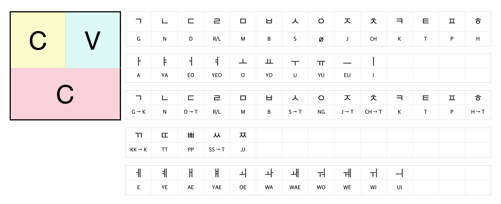

```{=html}
<style type="text/css">

body{
      font-size: 13px;
      font-family: "Anonymous Pro", "Roboto", "Helvetica Neue";
  }
</style>
```
<link rel="preconnect" href="https://fonts.gstatic.com">
<link href="https://fonts.googleapis.com/css2?family=M+PLUS+Rounded+1c:wght@100;300;400;500;700&display=swap" rel="stylesheet">
<link rel="preconnect" href="https://fonts.gstatic.com">
<link href="https://fonts.googleapis.com/css2?family=Anonymous+Pro&display=swap" rel="stylesheet">
<link href="https://fonts.googleapis.com/css2?family=Anonymous+Pro:ital,wght@0,400;1,700&display=swap" rel="stylesheet">
<link href="https://fonts.googleapis.com/css2?family=Anonymous+Pro:ital,wght@0,400;0,700;1,700&display=swap" rel="stylesheet">

```{css, echo=FALSE}
.toc-content {
    padding-left: 10px;
    padding-right: 10px;
}
```

```{css, echo=FALSE}
@media(prefers-color-scheme: light) {
  body {
    background-color: black;
    filter: invert(1);
  }
}
```

```{r, echo=FALSE, message=FALSE}
library(tidyverse)
library(reactable)
library(htmltools)
library(bslib)
library(dplyr)
library(purrr)
#library(bookdown)
#library(shiny)
```

------------------------------------------------------------------------

# Food {.tabset}

## Cooking {.tabset}

### Science of Cooking {.tabset}

#### Taste and Flavor {.tabset}

##### Why do we cook? 

1. Food safety  
2. Flavors multiply  
3. Helps digestion  
4. Starches are softened  
5. Nutrients are released  
6. Socialization  

<!-- <h> -->

    ・cooking destroys bacteria, microbes, etc.  
    ・cooking makes food taste incredible.  
    ・fat melts, meat softens, proteins denatured, helps digestive enzymes.  
    ・hard-to-digest carbohydrates unravel and soften.  
    ・breakdown starches, vitamins and minerals are liberated.  
    ・socialized with others.   

------------------------------------------------------------------------

##### Flavors

1. Salty
2. Sour 
3. Bitter  
4. Sweet 
5. Fatty 
6. Umami 

<!-- <h> -->

    ・salty - receptors are stimulated by sodium. 
    ・sour - receptors detects acid in fruits. source of acorbic acid. warning for decaying food.
    ・bitter - trigger by potentially harmful natural toxic substances. alerts danger.  
    ・sweet - trigger by sufars. indicates an esasily digested energy.  
    ・fatty - sense fat molecules in food. indicates that the food is rich in energy.
    ・umami - detect savory, meaty tates. stimulated by glutamatefrom amino acid. suggests that the food provieds protein

------------------------------------------------------------------------

##### Multipies flavor

**Maillard Reaction**  
  Amino acids clash with sugar molecules at 284F・140C.

**Before Maillard Reaction**  
  1. Up to 284F・140C 

**During Maillard Reaction**  
  1. 284F・140C   
  2. 302F・150C   
  3. 320F・160C   

**After Maillard Reaction**  
  1. Above 356F・180C

<!-- <h> -->

    ・284F・140C: start of cooking - sugar molecules and amino acid have enough energy to react together.

<!-- <h> -->

    ・284F・140C: browning reaction - foods start turning brown proteins and sugards clash and fuse creating new flavors and aroma.
    ・302F・150C: millard reaction intensifies - generates new flavor molecules twice. more complex flavors and aromas.
    ・320F・160C: acclerated peak - more enticing new flavorrs ans aromas created. cascades of malty, nutty, meaty and caramel-like flavors. 

<!-- <h> -->

    ・356F・180C: pyrolysis - burning begins. food starts to char destroying aromas, leaving acrids, bitter falvors.
        carbohydrates, proteins, fats breaks down.

------------------------------------------------------------------------

##### Ingredients

**Flavor compounds**   
  Includes fruity esters, spicy phenolics, flowery and citrusy terpenes, and piquant sulfur-containing molecules. 

**Basic food ingredients**   

1. Meat
2. Fish and Seafood 
3. Eggs and Dairy  
4. Grains 
5. Vegetables 
6. Plant derivatives 
7. Spice
7. Alcohol

------------------------------------------------------------------------

## Spices {.tabset}

### What is a spice? {.tabset}

**Spice**   
  Are plant parts that are more densely loaded with flavour.  
  Tend to derive from seeds, fruits, roots, stems, flowers, or bark, and are usually dried.  

**Herbs**  
  Always come from leafy parts.

------------------------------------------------------------------------

## Recipes {.tabset}

------------------------------------------------------------------------

# Language {.tabset}

## English {.tabset}

### Phrasal Verbs {.tabset}

**Phrasal Verbs**   
  Consist of a verb plus one ore more particles.
  Particles could be an adverb or a preposition.
  
**1. Two-word phrasal verbs**  
  Verb + particle (adverb or preposition)

**2. Three-word phrasal verbs**  
  Verb + two particles (adverb or preposition)

<!-- <h> -->

    ・get up, chills out, turn up, go out, check into, pick up

<!-- <h> -->

    ・looks up to, sign off on, get on with, look forward to

------------------------------------------------------------------------

## Korean {.tabset}



### Words {.tabset}

<h4> 안녕하세요・여기요・감사함니다・네・아니요・커피좋아하세요</h4>

-----------------------------------------------------------------------

## Spanish {.tabset}

------------------------------------------------------------------------

# 

ϞϞ(๑⚈ ․̫ ⚈๑)∩