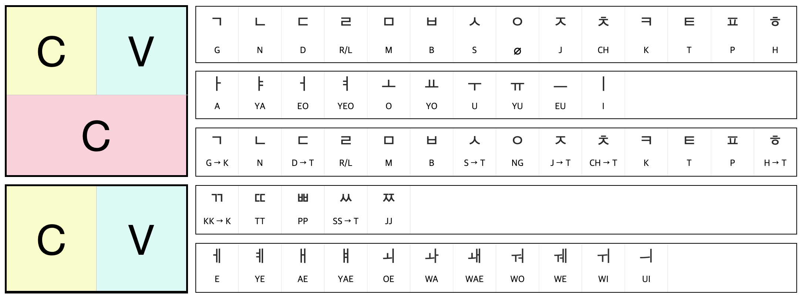

```{=html}
<style type="text/css">

body{
      font-size: 13px;
      font-family: "Anonymous Pro", "Roboto", "Helvetica Neue";
  }
</style>
```
<link rel="preconnect" href="https://fonts.gstatic.com">
<link href="https://fonts.googleapis.com/css2?family=M+PLUS+Rounded+1c:wght@100;300;400;500;700&display=swap" rel="stylesheet">
<link rel="preconnect" href="https://fonts.gstatic.com">
<link href="https://fonts.googleapis.com/css2?family=Anonymous+Pro&display=swap" rel="stylesheet">
<link href="https://fonts.googleapis.com/css2?family=Anonymous+Pro:ital,wght@0,400;1,700&display=swap" rel="stylesheet">
<link href="https://fonts.googleapis.com/css2?family=Anonymous+Pro:ital,wght@0,400;0,700;1,700&display=swap" rel="stylesheet">
<link rel="preconnect" href="https://fonts.googleapis.com">
<link rel="preconnect" href="https://fonts.gstatic.com" crossorigin>
<link href="https://fonts.googleapis.com/css2?family=Noto+Sans+KR:wght@100;300;400;500&display=swap" rel="stylesheet">

<link rel="preconnect" href="https://fonts.googleapis.com">
<link rel="preconnect" href="https://fonts.gstatic.com" crossorigin>
<link href="https://fonts.googleapis.com/css2?family=Zen+Maru+Gothic:wght@300;400;500;600&display=swap" rel="stylesheet">
<link rel="preconnect" href="https://fonts.googleapis.com">
<link rel="preconnect" href="https://fonts.gstatic.com" crossorigin>
<link href="https://fonts.googleapis.com/css2?family=Open+Sans:ital,wght@0,300;0,400;0,500;0,600;1,300;1,400;1,500;1,600;1,800&display=swap" rel="stylesheet">
<link rel="preconnect" href="https://fonts.googleapis.com">
<link rel="preconnect" href="https://fonts.gstatic.com" crossorigin>
<link href="https://fonts.googleapis.com/css2?family=Shippori+Mincho+B1:wght@400;500;600;700&display=swap" rel="stylesheet">

<link rel="preconnect" href="https://fonts.googleapis.com">
<link rel="preconnect" href="https://fonts.gstatic.com" crossorigin>
<link href="https://fonts.googleapis.com/css2?family=New+Tegomin&display=swap" rel="stylesheet">

<link rel="preconnect" href="https://fonts.googleapis.com">
<link rel="preconnect" href="https://fonts.gstatic.com" crossorigin>
<link href="https://fonts.googleapis.com/css2?family=Hina+Mincho&family=Kaisei+Tokumin:wght@400;500;700&family=Shippori+Mincho:wght@400;500;600&display=swap" rel="stylesheet">

<link rel="preconnect" href="https://fonts.googleapis.com">
<link rel="preconnect" href="https://fonts.gstatic.com" crossorigin>
<link href="https://fonts.googleapis.com/css2?family=Hina+Mincho&family=IBM+Plex+Sans+JP:wght@100;200;300;400;500;600&family=Kaisei+Tokumin&family=Klee+One&family=New+Tegomin&family=RocknRoll+One&family=Shippori+Antique+B1&family=Zen+Kaku+Gothic+Antique:wght@300;400;500;700&family=Zen+Kaku+Gothic+New:wght@300;400;500;700&display=swap" rel="stylesheet">

<link rel="preconnect" href="https://fonts.googleapis.com">
<link rel="preconnect" href="https://fonts.gstatic.com" crossorigin>
<link href="https://fonts.googleapis.com/css2?family=Righteous&display=swap" rel="stylesheet">
```{css, echo=FALSE}
.toc-content {
    padding-left: 10px;
    padding-right: 10px;
}
```

```{css, echo=FALSE}
@media(prefers-color-scheme: light) {
  body {
    <!-- background-color: black; -->
    filter: invert(0);
  }
}
```

```{r, echo=FALSE, message=FALSE}
library(tidyverse)
library(reactable)
library(htmltools)
library(bslib)
library(dplyr)
library(purrr)
#library(bookdown)
#library(shiny)
```

```{r, echo=FALSE, message=FALSE, error=FALSE}
# snds <- read_csv("itln/APHB-SND.csv")
snds <- read_csv("notedb/APHB-SND.csv")
krnexprsn <- read_csv("notedb/KRNEXP-EXP.csv")
krndlg <- read_csv("notedb/KRNDLG-DLG.csv")
```

------------------------------------------------------------------------

# <b> Food </b> {.tabset}

## Cooking {.tabset}

### Science of Cooking {.tabset}

#### Taste and Flavor {.tabset}

##### Why do we cook? 

1. Food safety  
2. Flavors multiply  
3. Helps digestion  
4. Starches are softened  
5. Nutrients are released  
6. Socialization  

<!-- <h> -->

    ・cooking destroys bacteria, microbes, etc.  
    ・cooking makes food taste incredible.  
    ・fat melts, meat softens, proteins denatured, helps digestive enzymes.  
    ・hard-to-digest carbohydrates unravel and soften.  
    ・breakdown starches, vitamins and minerals are liberated.  
    ・socialized with others.   

------------------------------------------------------------------------

##### Flavors

1. Salty
2. Sour 
3. Bitter  
4. Sweet 
5. Fatty 
6. Umami 

<!-- <h> -->

    ・salty - receptors are stimulated by sodium. 
    ・sour - receptors detects acid in fruits. source of acorbic acid. warning for decaying food.
    ・bitter - trigger by potentially harmful natural toxic substances. alerts danger.  
    ・sweet - trigger by sufars. indicates an esasily digested energy.  
    ・fatty - sense fat molecules in food. indicates that the food is rich in energy.
    ・umami - detect savory, meaty tates. stimulated by glutamatefrom amino acid. suggests that the food provieds protein

------------------------------------------------------------------------

##### Multipies flavor

**Maillard Reaction**  
  Amino acids clash with sugar molecules at 284F・140C.

**Before Maillard Reaction**  
  1. Up to 284F・140C 

**During Maillard Reaction**  
  1. 284F・140C   
  2. 302F・150C   
  3. 320F・160C   

**After Maillard Reaction**  
  1. Above 356F・180C

<!-- <h> -->

    ・284F・140C: start of cooking - sugar molecules and amino acid have enough energy to react together.

<!-- <h> -->

    ・284F・140C: browning reaction - foods start turning brown proteins and sugards clash and fuse creating new flavors and aroma.
    ・302F・150C: millard reaction intensifies - generates new flavor molecules twice. more complex flavors and aromas.
    ・320F・160C: acclerated peak - more enticing new flavorrs ans aromas created. cascades of malty, nutty, meaty and caramel-like flavors. 

<!-- <h> -->

    ・356F・180C: pyrolysis - burning begins. food starts to char destroying aromas, leaving acrids, bitter falvors.
        carbohydrates, proteins, fats breaks down.

------------------------------------------------------------------------

##### Ingredients

**Flavor compounds**   
  Includes fruity esters, spicy phenolics, flowery and citrusy terpenes, and piquant sulfur-containing molecules. 

**Basic food ingredients**   

1. Meat
2. Fish and Seafood 
3. Eggs and Dairy  
4. Grains 
5. Vegetables 
6. Plant derivatives 
7. Spice
7. Alcohol

------------------------------------------------------------------------

## Spices {.tabset}

### What is a spice? {.tabset}

**Spice**   
  Are plant parts that are more densely loaded with flavour.  
  Tend to derive from seeds, fruits, roots, stems, flowers, or bark, and are usually dried.  

**Herbs**  
  Always come from leafy parts.

------------------------------------------------------------------------

## Recipes {.tabset}

------------------------------------------------------------------------

# <b> Language </b> {.tabset}

## English {.tabset}

### Phrasal Verbs {.tabset}

**Phrasal Verbs**   
  Consist of a verb plus one ore more particles.
  Particles could be an adverb or a preposition.
  
**1. Two-word phrasal verbs**  
  Verb + particle (adverb or preposition)

**2. Three-word phrasal verbs**  
  Verb + two particles (adverb or preposition)

<!-- <h> -->

    ・get up, chills out, turn up, go out, check into, pick up

<!-- <h> -->

    ・looks up to, sign off on, get on with, look forward to

------------------------------------------------------------------------

## Korean {.tabset}



### Expressions {.tabset}

```{r, echo=FALSE, message=FALSE}

krnexprsn <- krnexprsn[sample(1:nrow(krnexprsn)),]

reactable(
  krnexprsn,
  columns = list(
    Expression = colDef(style= list(background = '#edede9'),
      cell = function(value, index) {
        Meaning <- krnexprsn$Meaning[index]
        Meaning <- if (!is.na(Meaning)) Meaning else ""
        Reading <- krnexprsn$Reading[index]
        Reading <- if (!is.na(Reading)) Reading else ""
        Japanese <- krnexprsn$Japanese[index]
        Japanese <- if (!is.na(Japanese)) Japanese else ""
        tagList(
          div(style = list(fontSize = 28, fontWeight = 800, color = '#0F2040'), value),
          div(style = list(fontSize = 10, fontWeight = 400, color = '#026450', fontFamily = 'Zen Kaku Gothic New'), Reading),
          div(style = list(fontSize = 2), "."),
          div(style = list(fontSize = 13, fontWeight = 600, color = '#800000', fontFamily = 'Righteous'), Meaning),
          div(style = list(fontSize = 14, fontWeight = 600, color = '#0F2040', fontFamily = 'Open Sans'), Japanese)
        )
      },
      align = "center"
    ),
    Meaning = colDef(show = FALSE),
    Reading = colDef(show = FALSE),
    Japanese = colDef(show = FALSE)
  ),
  defaultPageSize = 1,
  theme = reactableTheme(
    cellStyle = list(display = "flex", flexDirection = "column", justifyContent = "center", fontSize = "11px", height = 250),
    searchInputStyle = list(
      paddingLeft = "8px",
      paddingTop = "8px",
      paddingBottom = "8px",
      width = "100%",
      fontSize = "11px"
    )
  ),
  showPageInfo = FALSE, bordered = TRUE, searchable = TRUE, sortable = FALSE, paginationType = "numbers",

  style = list(fontFamily = "Noto Sans JP, Heiti SC, Hiragino Maru Gothic ProN, Anonymous Pro , monospace, Helvetica Neue", fontSize = "11px")
)

```

-----------------------------------------------------------------------

### Exerpts {.tabset}

```{r, echo=FALSE, message=FALSE}

krndlg <- krndlg[sample(1:nrow(krndlg)),]

reactable(
  krndlg,
  # columns = list(
  #   Korean = colDef(html = TRUE,
  #     cell = function(value, index) {
  #       Japanese <- krndlg$Japanese[index]
  #       Japanese <- if (!is.na(Japanese)) Japanese else ""
  #       English <- krndlg$English[index]
  #       English <- if (!is.na(English)) English else ""
  #       tagList(
  #         div(style = list(fontSize = 24, fontWeight = 500), value),
  #         tags$hr("aria-hidden" = "true"),
  #         div(style = list(fontSize = 19, fontWeight = 500), Japanese),
  #         tags$hr("aria-hidden" = "true"),
  #         div(style = list(fontSize = 12, fontWeight = 500), English)
  #       )
  #     },
  #     align = "left"
  #   ),
  #   English = colDef(show = FALSE),
  #   Japanese = colDef(show = FALSE)
  # ),
    columns = list(
      Korean = colDef(sticky = "left", align = "left", html=TRUE, minWidth = 500, style = list(fontSize = 21, background = '#edede9')),
      # Japanese = colDef(align = "left", html=TRUE, minWidth = 500, style = list(fontSize = 14, background = '#dee7e7')),
      # English = colDef(align = "left", html=TRUE, minWidth = 400, style = list(fontSize = 11, background = '#dee7e7'))
    English = colDef(show = FALSE),
    Japanese = colDef(show = FALSE)
    ),
  # defaultColDef = colDef(minWidth = 600),
  defaultPageSize = 1,
  theme = reactableTheme(
    cellStyle = list(display = "flex", flexDirection = "column", justifyContent = "center", fontSize = "11px", height = 250),
    searchInputStyle = list(
      paddingLeft = "8px",
      paddingTop = "8px",
      paddingBottom = "8px",
      width = "100%",
      fontSize = "11px"
    )
  ),
  showPageInfo = FALSE, bordered = TRUE, searchable = TRUE, sortable = FALSE, paginationType = "numbers",

  style = list(fontFamily = "Noto Sans JP, Heiti SC, Hiragino Maru Gothic ProN, Anonymous Pro , monospace, Helvetica Neue", fontSize = "11px")
)

```

<!-- --- -->

<!-- #### 3 {.tabset} -->

<!-- <p style="font-size:20px;"> -->
<!--    민수는 학생입니다. 민수는 아침에 일찍 일어납니다. 민수는 아침밥을 먹고 학교에 갑니다. 민수는 소피아를 만났습니다. “안녕하세요?” 소피아가 인사합니다. “안녕하세요.” 민수도 인사합니다. 민수와 소피아는 학교에 가서 공부를 합니다. -->
<!-- </p> -->

<!-- --- -->

<!-- #### 4 {.tabset} -->

<!-- <p style="font-size:20px;"> -->
<!--    한 아기 곰이 숲속에 살았습니다. 그가 늦잠을 잤고 학교에 늦게 갔습니다. 그의 반 친구들은 그를 놀렸습니다. 그가 그의 얼굴을 씻지 않았기 때문이었습니다. 그가 연못으로 갔고 그의 얼굴을 씻었습니다. 그의 얼굴이 깨끗해졌습니다. 그가 연못을 보고 웃었습니다. 연못도 그에게 웃어주었습니다. -->
<!-- </p> -->

<!-- --- -->

<!-- #### 5 {.tabset} -->

<!-- <p style="font-size:20px;"> -->
<!--    메뚜기가 나무 위에서 노래를 부르고 있었습니다. 당나귀는 메뚜기처럼 노래를 잘 하고 싶었습니다. 당나귀가 메뚜기에게 물어봤습니다. “노래를 잘 하기 위해서 무엇을 먹니? 메뚜기가 대답했습니다. “나는 이슬만 먹어.” 당나귀는 이슬만 먹기 시작했습니다. 며칠 뒤, 그가 아팠고 죽었습니다. -->
<!-- </p> -->

-----------------------------------------------------------------------

## Italian {.tabset}

```{r, echo=FALSE, message=FALSE}

sndsm <- snds %>% slice(1:7)

reactable(
  sndsm,
  columns = list(
    Letter = colDef(minWidth = 30, align = "center"),
    Approx.Pronounciation = colDef(minWidth = 120, align = "left"),
    Examples = colDef(minWidth = 250, align = "left")
  ),
  defaultPageSize = 8,
  theme = reactableTheme(
    # Vertically center cells
    cellStyle = list(display = "flex", flexDirection = "column", justifyContent = "center"),
    searchInputStyle = list(
      paddingLeft = "8px",
      paddingTop = "8px",
      paddingBottom = "8px",
      width = "100%"
    )
  ),
  showPageInfo = FALSE, bordered = TRUE, searchable = FALSE, sortable = FALSE, paginationType = "numbers",
  
  style = list(fontFamily = "Noto Sans JP, Heiti SC, Hiragino Maru Gothic ProN, Anonymous Pro , monospace, Helvetica Neue", fontSize = "11px")
)

```

-----------------------------------------------------------------------

## Spanish {.tabset}

### WK01 {.tabset}

<p style="font-size:14px; line-height: 0.5; font-family: Noto Sans JP;  color: #202020; font-weight: bold">**1.1 ARTICLES: THE, A, AN, SOME**</p>

**The different forms of the definite article ‘the’ are:**   

- el (m. s.) el libro the book.  
- la (f. s.) la casa the house.  
- los (m. pl.) los libros the books.  
- las (f. pl.) las casas the houses.  
   
**The forms of the indefinite article ‘a’, ‘an’, ‘some’ are:**  

- un (m. s.) un libro a book.  
- una (f. s.) una casa a house.  
- unos (m. pl.) unos libros (some) books.  
- unas (f. pl.) unas casas (some) houses. 

-----------------------------------------------------------------------

<p style="font-size:14px; line-height: 0.5; font-family: Noto Sans JP;  color: #202020; font-weight: bold">**1.2 GENDER OF NOUNS**</p>

**Most nouns ending in-o are masculine.**      
**Most nouns ending in-a, -ión, -d, -z are feminine.**      
**There are some exceptions, however:**   

- la mano (f.) hand
- el camión (m.) lorry
- el lápiz (m.) pencil
- el policía (m.) policeman

**Several words ending in-a (of Greek origin) are masculine:**    

- el idioma language
- el mapa map

**Nouns ending in other letters can be either gender:**    

- el hombre man 
- la mujer woman 
- la leche milk
- el color colour

-----------------------------------------------------------------------

<p style="font-size:14px; line-height: 0.5; font-family: Noto Sans JP;  color: #202020; font-weight: bold">**1.3 PLURAL OF NOUNS**</p>

**The plural of nouns is formed by adding-s to nouns ending in a vowel, and-es to nouns ending in a consonant:**  

- hombre (man)→ hombres (men)
- mujer (woman)→ mujeres (women)

**The plural of nouns ending in z is formed by changing the z into c and adding-es:**. 

- lápiz (pencil)→ lápices (pencils)
- luz (light)→ luces (lights)

**Nouns ending in a consonant in which there is an accent on the last syllable lose that accent when the plural is formed:** 

- camión (lorry)→ camiones (lorries)

-----------------------------------------------------------------------

<p style="font-size:14px; line-height: 0.5; font-family: Noto Sans JP;  color: #202020; font-weight: bold">**1.4 SUBJECT PRONOUNS: I, YOU, HE, SHE, ETC.**</p>

**Singular:**  

- yo I
- tú you (fam.)
- él, ella he/she 
- usted you (pol.)

**Plural:** 

- nosotros (m.), nosotras (f.) we
- vosotros (m.), vosotras (f.) you (fam.)
- ellos (m.), ellas (f.) they
- ustedes you (pol.)

-----------------------------------------------------------------------

<p style="font-size:14px; line-height: 0.5; font-family: Noto Sans JP;  color: #202020; font-weight: bold">**1.6 THE VERB TENER: TO HAVE, TO POSSESS**</p>

**This is an irregular verb, and one of the most common**

**present tense**

- tengo I have
- tienes you have
- tiene he/she/it has, you have (polite form)
- tenemos we have
- tenéis you have (pl.)
- tienen they have, you have (polite form)

**example**

- Tienen una hija. They have a daughter. 
- Tenemos un coche. We have a car.

-----------------------------------------------------------------------

<p style="font-size:14px; line-height: 0.5; font-family: Noto Sans JP;  color: #202020; font-weight: bold">**1.7 FORMING THE NEGATIVE**</p>

**The negative is formed by putting the word no in front of the verb:**

- No tengo dinero. I have no money.
- No tienen cerveza. They don’t have (any) beer.

-----------------------------------------------------------------------

<p style="font-size:14px; line-height: 0.5; font-family: Noto Sans JP;  color: #202020; font-weight: bold">**1.8 FORMING QUESTIONS**</p>

**The interrogative ‘Do?’ doesn’t exist in Spanish. A question can be formed by putting the subject after the verb:**

- Vd. tiene una pluma. You have a pen. 
- ¿Tiene Vd. una pluma? Do you have a pen?

But a sentence can also be turned into a question simply by changing the intonation. Note that an inverted question mark is placed at the beginning of a written question.

-----------------------------------------------------------------------

<p style="font-size:14px; line-height: 0.5; font-family: Noto Sans JP;  color: #202020; font-weight: bold">**1.9 IDIOMATIC USES OF TENER**</p>

**There are a number of idioms with tener followed by a noun when English usually has ‘to be’ followed by an adjective. Here are some examples:**

- tener ... años to be ... years old
- tener calor to be hot
- tener cuidado to be careful
- tener en cuenta to bear in mind
- tener éxito to be successful
- tener frío to be cold
- tener ganas de to feel like, to want to
- tener gracia to be funny
- tener hambre to be hungry
- tener miedo to be afraid
- tener paciencia to be patient
- tener prisa to be in a hurry
- tener que hacer to have things to do
- tener que ver con to have to do with
- tener razón to be right
- tener sed to be thirsty
- tener sueño to be sleepy
- tener suerte to be lucky

**When tener que is followed by an infinitive, it translates as ‘to have to’, ‘must’:**

- Tengo que salir. I have to go out.
- Tenemos que ver la iglesia. We must see the church.

**VOCABULARY**

- el café coffee
- trabajar to work 
- todo everything
- salir to go out
- el hijo / la hija son / daughter

**Exercise 4**

1. They have a house.
2. We don’t have (any) coffee.
3. The man is afraid.
4. I have to work.
5. Do you (fam. sing.) have a pencil? 
6. They are not thirsty.
7. Do you (pol. pl.) have everything? 
8. I’m hot.
9. We have to go out.
10. He has a son.

------------------------------------------------------------------------

### WK02 {.tabset}

<p style="font-size:14px; line-height: 0.5; font-family: Noto Sans JP;  color: #202020; font-weight: bold">**2.1 CONTRACTION OF THE ARTICLE**</p>

**Contraction:** 

When the prepositions a (to) and de (of, from) are followed by the definite article el, they contract to al and del respectively: al castillo (to the castle), del jardín (from the garden).

------------------------------------------------------------------------

<p style="font-size:14px; line-height: 0.5; font-family: Noto Sans JP;  color: #202020; font-weight: bold">**2.2 POSSESSION**</p>

**There is no apostrophe + s in Spanish. Possession must be expressed by the preposition de:**

- el padre de Juan John’s father (lit. ‘the father of John’)
- el paraguas de la mujer the woman’s umbrella

**Exercise 1:**

1. to the church
2. of the language
3. to the car
4. to the table
5. of the tress
6. to the house
7. of the man 
8. of the city
9. to the street
10. of the wine
11. to the policeman 
12. of the station

------------------------------------------------------------------------

<p style="font-size:14px; line-height: 0.5; font-family: Noto Sans JP;  color: #202020; font-weight: bold">**2.3 ADJECTIVES: DESCRIBING THINGS**</p>

**In Spanish, an adjective must agree in gender and number with the noun it qualifies. Adjectives ending in-o in the masculine change the-o to-a in the feminine.The plural is formed by adding-s to both genders. Generally, the adjective comes after the noun:**

- el coche blanco the white car
- la casa blanca the white house
- los coches blancos the white cars 
- las casas blancas the white houses

**Adjectives ending in-e and most adjectives ending in a consonant have the same form for both masculine and feminine. The plural is formed by adding -s to those ending in-e, and-es to those ending in a consonant.**

**For example:** 

- el lápiz verde the green pencil
- la pared verdethe green wall
- los lápices verdes the green pencils
- las paredes verdes the green walls
- un ejercicio fácil an easy exercise
- una lección fácil an easy lesson
- unos ejercicios fáciles some easy exercises
- unas lecciones fáciles some easy lessons

**Exceptions to this rule are: **

**1 Adjectives of nationality**

inglés English (m.) inglesa English (f.)
español Spanish (m.) española Spanish (f.)

**2 Certain adjectives ending in-n and-or**
 
- holgazán lazy (m.)
- holgazana lazy (f.) 
- trabajador hard-working (m.)
- trabajadora hard-working (f.)

**VOCABULARY 1**

- el periódico newspaper
- la revista magazine
- interesante interesting
- encantador charming
- bueno good
- útil useful
- barato cheap
- largo long
- alto tall
- alemán German
- americano American

------------------------------------------------------------------------

# <b> Photography </b> {.tabset}

## Editing {.tabset}

### Affinity {.tabset}

#### Color Grading {.tabset}

<p style="font-size:14px; line-height: 0.5; font-family: Noto Sans JP;  color: #202020; font-weight: bold">**Affinity Revolution:** [Steal Color Grading](https://www.youtube.com/watch?v=Q1h2z7iMfhM)</p>
**1. Swatches** 

- select create color pallete from image  
- select 3 for number of colors
- the three color represents the blacks, mid tone and the highlights

**2. Adjustments** 

- create a gradient map 
- change the red for black tones, green to mid tones and blue for highlights from the palettes created
- change the blend mode to soft light

------------------------------------------------------------------------

## Colors {.tabset}

### Color Categories {.tabset}

**HSL Adjustments**

**1. Jewel Tones** 
S - 83~73
L - 76~56

**2. Pastel Tones** 
S - 14~21
L - 89~96

**3. Earth Tones** 
S - 36~46
L - 77~36

**4. Neutral Tones** 
S - 1~10
L - 99~70

**5. Fluorescent Tones** 
S - 100~63
L - 100~82

**6. Shade Tones** 
S - 0~0
L - 0~100

------------------------------------------------------------------------

### Color Harmony {.tabset}

**1. Monochromatic** 
**2. Analogous** 
**3. Complementary** 
**4. Analogous Complementary** 
**5. Split Complementary** 
**6. Triad** 

------------------------------------------------------------------------

# 

ϞϞ(๑⚈ ․̫ ⚈๑)∩