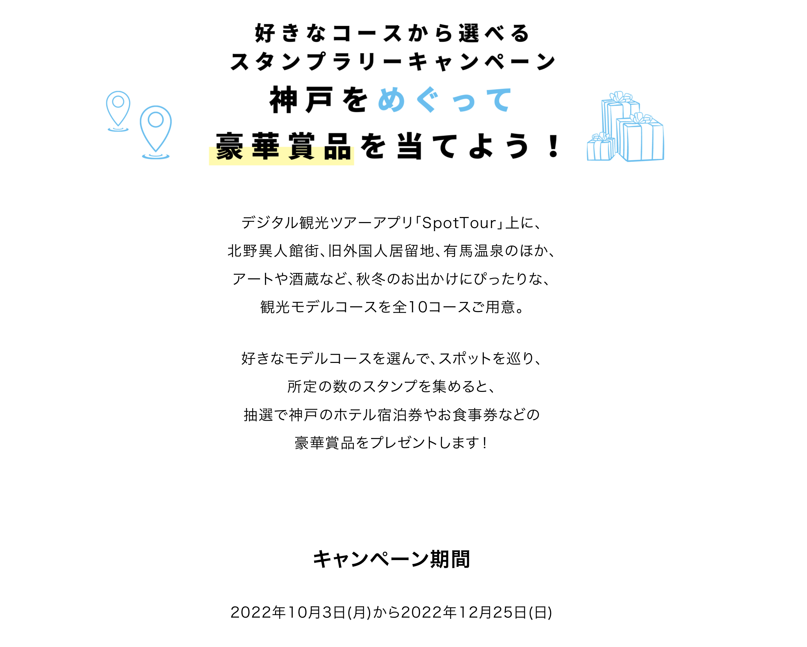
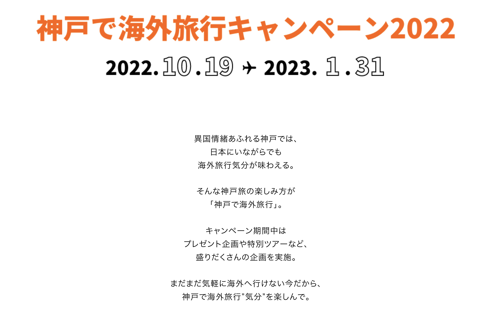
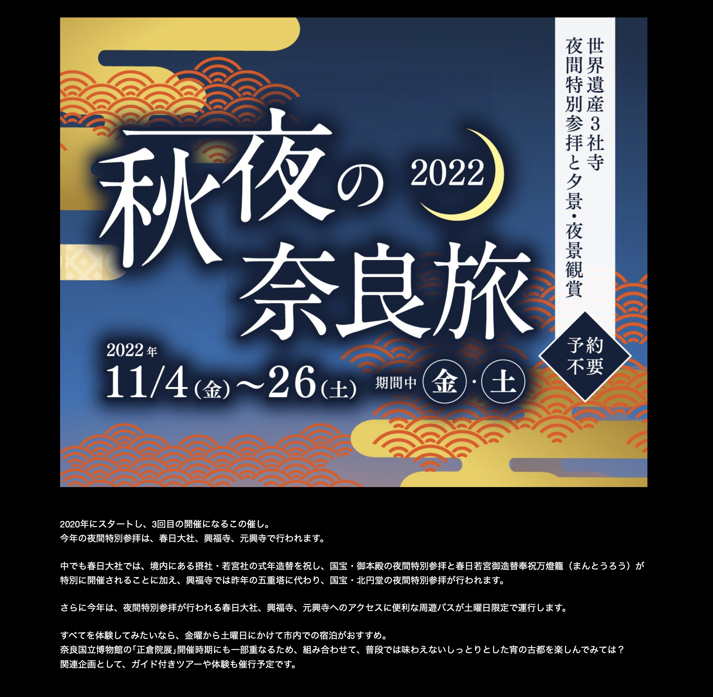
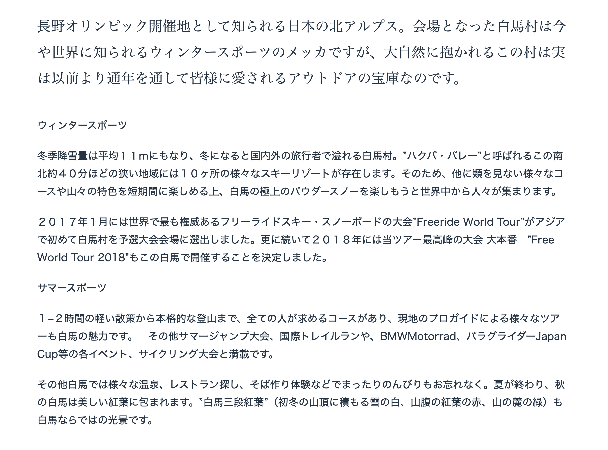
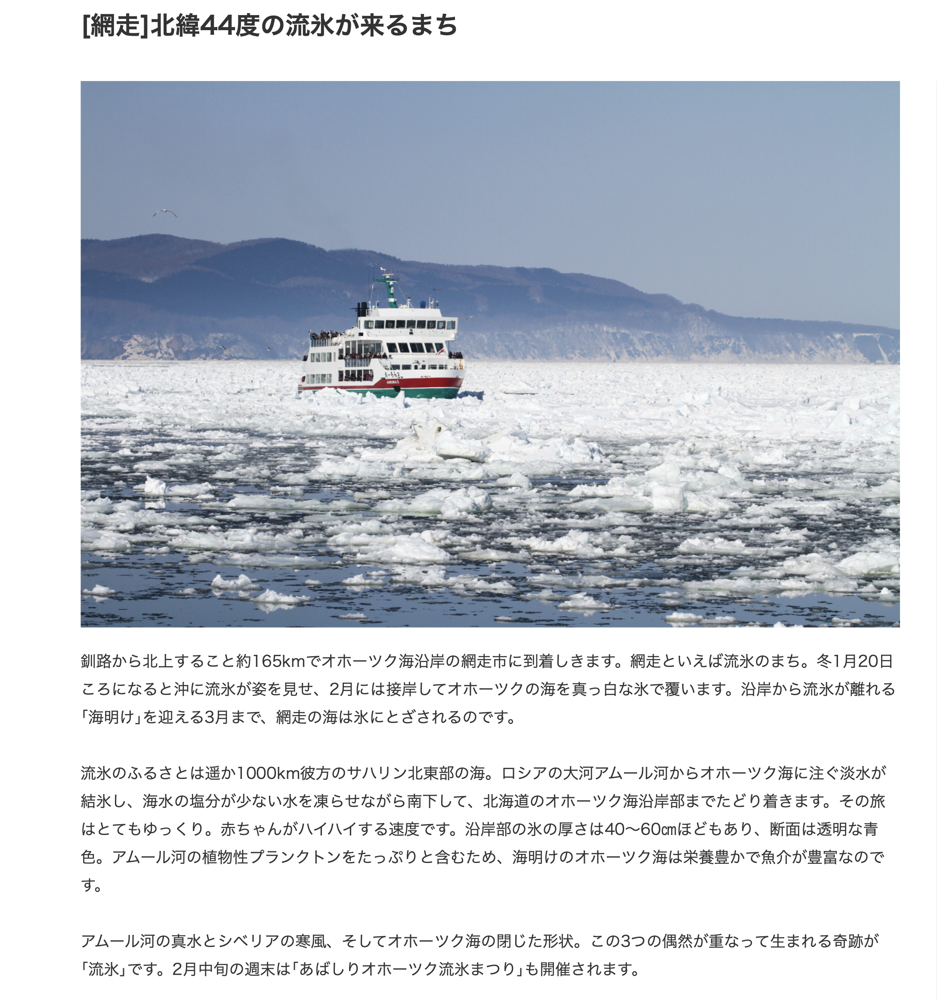

```{=html}
<style type="text/css">

body{
      font-size: 13px;
      font-family: "Roboto Condensed", "Anonymous Pro", "Roboto", "Helvetica Neue";
  }
</style>
```
<link rel="preconnect" href="https://fonts.googleapis.com"> 
<link rel="preconnect" href="https://fonts.gstatic.com" crossorigin> 
<link href="https://fonts.googleapis.com/css2?family=Hina+Mincho&family=Klee+One:wght@400;600&family=New+Tegomin&family=Sawarabi+Gothic&family=Shippori+Mincho+B1:wght@400;500&family=Yomogi&display=swap" rel="stylesheet"> 

<link rel="preconnect" href="https://fonts.googleapis.com"> 
<link rel="preconnect" href="https://fonts.gstatic.com" crossorigin> 
<link href="https://fonts.googleapis.com/css2?family=Noto+Sans+JP:wght@100;300;400;500;700&display=swap" rel="stylesheet"> 

<link rel="preconnect" href="https://fonts.gstatic.com"> 
<link href="https://fonts.googleapis.com/css2?family=M+PLUS+Rounded+1c:wght@100;300;400;500;700&display=swap" rel="stylesheet"> 

<link rel="preconnect" href="https://fonts.gstatic.com"> 
<link href="https://fonts.googleapis.com/css2?family=Anonymous+Pro&display=swap" rel="stylesheet"> 
<link href="https://fonts.googleapis.com/css2?family=Anonymous+Pro:ital,wght@0,400;1,700&display=swap" rel="stylesheet"> 
<link href="https://fonts.googleapis.com/css2?family=Anonymous+Pro:ital,wght@0,400;0,700;1,700&display=swap" rel="stylesheet">

<link rel="preconnect" href="https://fonts.googleapis.com">
<link rel="preconnect" href="https://fonts.gstatic.com" crossorigin>
<link href="https://fonts.googleapis.com/css2?family=Zen+Maru+Gothic:wght@300;400;500;600&display=swap" rel="stylesheet">

<link rel="preconnect" href="https://fonts.googleapis.com">
<link rel="preconnect" href="https://fonts.gstatic.com" crossorigin>
<link href="https://fonts.googleapis.com/css2?family=Open+Sans:ital,wght@0,300;0,400;0,500;0,600;1,300;1,400;1,500;1,600;1,800&display=swap" rel="stylesheet">

<link rel="preconnect" href="https://fonts.googleapis.com">
<link rel="preconnect" href="https://fonts.gstatic.com" crossorigin>
<link href="https://fonts.googleapis.com/css2?family=Hina+Mincho&family=IBM+Plex+Sans+JP:wght@100;200;300;400;500;600&family=Kaisei+Tokumin&family=Klee+One&family=New+Tegomin&family=RocknRoll+One&family=Shippori+Antique+B1&family=Zen+Kaku+Gothic+Antique:wght@300;400;500;700&family=Zen+Kaku+Gothic+New:wght@300;400;500;700&display=swap" rel="stylesheet">

<link rel="preconnect" href="https://fonts.googleapis.com">
<link rel="preconnect" href="https://fonts.gstatic.com" crossorigin>
<link href="https://fonts.googleapis.com/css2?family=Righteous&display=swap" rel="stylesheet">

<link rel="preconnect" href="https://fonts.googleapis.com">
<link rel="preconnect" href="https://fonts.gstatic.com" crossorigin>
<link href="https://fonts.googleapis.com/css2?family=Karla:ital,wght@0,200;0,300;0,400;0,500;0,600;0,700;0,800;1,200;1,300;1,400;1,500;1,600;1,700;1,800&family=Righteous&display=swap" rel="stylesheet">

<link rel="preconnect" href="https://fonts.googleapis.com">
<link rel="preconnect" href="https://fonts.gstatic.com" crossorigin>
<link href="https://fonts.googleapis.com/css2?family=Roboto:wght@100;300;400;500;700&display=swap" rel="stylesheet">

<link rel="preconnect" href="https://fonts.googleapis.com">
<link rel="preconnect" href="https://fonts.gstatic.com" crossorigin>
<link href="https://fonts.googleapis.com/css2?family=Roboto+Condensed:wght@300;400;700&family=Roboto+Flex:wght@100;200;300;400;500;600;700&display=swap" rel="stylesheet">

<link rel="preconnect" href="https://fonts.googleapis.com">
<link rel="preconnect" href="https://fonts.gstatic.com" crossorigin>
<link href="https://fonts.googleapis.com/css2?family=Saira+Condensed:wght@100;200;300;400;500;600&display=swap" rel="stylesheet">

```{css, echo=FALSE}
.my-tbl {
  border: 1px solid rgba(0, 0, 0, 0.1);
}

.my-header {
  border-width: 1px;
}

.my-col {
  border-right: 1px solid rgba(0, 0, 0, 0.05);
}

.my-row:hover {
  background-color: #dee7e7;
  filter: invert(1);
}

.toc-content {
    padding-left: 10px;
    padding-right: 10px;
}

div.expborder { border: 4px solid #264653;
}

div.expborder-left { border-left: 8px solid #264653; padding: 5px
}

div.highlight-ur { background-color: #edede9; padding-left: 0px; padding-top: 7px; padding-bottom: 0.1px;
  border: 0.5px solid #264653;
  color: 	#0F2040;
  font-size: 12.5px;
  font-family: "Open Sans", "Roboto";
}

div.highlight { background-color: #ddefed; border-radius: 2px; padding-left: 0px; padding-top: 10px; padding-bottom: 2px;
  border: 0.5px solid #264653;
  color: 	#0F2040;
  font-size: 12.4px;
  font-family: 'Zen Kaku Gothic New', "Open Sans", "Roboto";
}

div.highlightpx { background-color: #fceff0; border-radius: 2px; padding-left: 0px; padding-top: 10px; padding-bottom: 2px;
  border: 0.5px solid #fd5c65;
  color: 	#0F2040;
  font-size: 12.4px;
  font-weight: 300;
  font-family: "Roboto Condensed", "Open Sans", "Roboto";
}

div.expressjp { outline-style: solid; outline-color: #0F2040; outline-width: 1px; border-radius: 5px; padding: 1px; padding-top: 10px;
  color: 	#404040;
  font-size: 14px;
  font-family: 'Rounded Mplus 1c', 'M PLUS Rounded 1c', sans-serif;
}

div.expressgrm { outline-style: solid; outline-color: #0F2040; outline-width: 1px; border-radius: 5px; padding: 1px; padding-top: 10px;
  color: 	#404040;
  font-size: 14px;
  background-color: #edede9
  font-family: 'Open Sans', 'Zen Kaku Gothic New', sans-serif;
}

div.expresstr { outline-style: solid; outline-color: #0F2040; outline-width: 1px; border-radius: 5px; padding: 1px; padding-top: 10px; 
  color: 	#404040;
  font-size: 12.2px;
  font-family: 'Rounded Mplus 1c', 'M PLUS Rounded 1c', sans-serif;
}

.detail-label {
  margin: 1.25rem 0 0.25rem;
  font-size: 1.2rem;
  color: rgba(0, 0, 0, 0.6);
}

.package-detail {
  padding: 10px;
  background: hsl(213, 20%, 99%);
}

.packages-table {
  margin-top: 0.2rem;
  font-size: 0.9375rem;
  border: 1px solid hsl(213, 33%, 93%);
  border-radius: 4px;
  box-shadow: 0 4px 8px 0 rgba(0, 0, 0, 0.1);
}

.detail-des_func_a {
  color: 	#800000;
  font-size: 20px;
  font-weight: 600;
  font-family: 'Righteous';
  background-color: #e0e1dd;
  padding-left: 8px;
  padding-right: 8px;
  padding-top: 20px;
  padding-bottom: 8px;
}

.detail-des_func_b {
  color: 	#0F2040;
  font-size: 16px;
  font-weight: 600;
  font-family: 'Open Sans';
  background-color: #edede9;
  padding-left: 8px;
  padding-right: 8px;
  padding-top: 20px;
  padding-bottom: 8px;
}

.detail-des_func_c {
  color: 	#0F2040;
  font-size: 11.5px;
  font-weight: 300;
  font-family: 'Zen Kaku Gothic New';
  background-color: #edede9;
  padding-left: 8px;
  padding-right: 8px;
  padding-top: 8px;
  padding-bottom: 20px;
}

.detail-des_func_d {
  color: 	#253f41;
  font-size: 11.5px;
  font-weight: 400;
  font-family: 'Open Sans';
  background-color: #e0e1dd;
  padding-left: 8px;
  padding-right: 8px;
  padding-top: 8px;
  padding-bottom: 8px;
}

.detail-des_func_e {
  color: 	#0b8282;
  font-size: 11.5px;
  font-weight: 400;
  font-family: 'Zen Kaku Gothic New';
  background-color: #e0e1dd;
  padding-left: 8px;
  padding-right: 8px;
  padding-top: 8px;
  padding-bottom: 20px;
}

.detail-des_func_f {
  color: 	#0F2040;
  font-size: 16px;
  font-weight: 600;
  font-family: 'Open Sans';
  background-color: #e0e1dd;
  padding-left: 8px;
  padding-right: 8px;
  padding-top: 8px;
  padding-bottom: 8px;
}

.detail-des_func_g {
  color: 	#259999;
  font-size: 12px;
  font-weight: 300;
  font-family: 'Open Sans';
  background-color: #edede9;
  padding-left: 8px;
  padding-right: 8px;
  padding-top: 8px;
  padding-bottom: 8px;
}

.detail-des_func_h {
  color: 	#253f41;
  font-size: 12px;
  font-weight: 400;
  font-family: 'Open Sans';
  background-color: #edede9;
  padding-left: 8px;
  padding-right: 8px;
  padding-top: 8px;
  padding-bottom: 8px;
}

div.add_info {
  padding-top: 0px; 
  padding-bottom: 0px;
  color: 	#264653;
  font-size: 12px;
  font-family: 'Roboto Condensed', 'Open Sans', 'Zen Kaku Gothic New', sans-serif;
}

div.add_info_t {
  padding-top: 0px; 
  padding-bottom: 0px;
  color: 	#264653;
  font-weight: 500;
  font-size: 12px;
  font-family: 'Zen Kaku Gothic New', sans-serif;
}

div.ttlehigh {
  font-size: 13.2px;
  color: 	#7d1016;
}

div.ttlehighpz { background-color: #f5f8f0; padding-left: 2px; padding-top: 4px; padding-bottom: 0.01px;
  border-left: 6px solid #379fa7;
  color: 	#264653;
  font-size: 11.8px;
  font-weight: 400;
  font-family: "Roboto Condensed", "Open Sans", "Roboto";
}

div.ttlehighpn { background-color: #f5f8f0; padding-left: 2px; padding-top: 4px; padding-bottom: 0.01px;
  outline-style: solid; outline-color: #379fa7; outline-width: 0.5px; border-radius: 0px;
  border-left: 6px solid #379fa7;
  color: 	#264653;
  font-size: 11.8px;
  font-weight: 400;
  font-family: "Roboto Condensed", "Open Sans", "Roboto";
}

div.ttlehighps { background-color: #fdf8f9; padding-left: 2px; padding-top: 4px; padding-bottom: 0.01px;
  border-left: 6px solid #fd5c65;
  color: 	#264653;
  font-size: 11.8px;
  font-weight: 400;
  font-family: "Roboto Condensed", "Open Sans", "Roboto";
}

div.ttlehighpss { background-color: #f5f8f0; padding-left: 2px; padding-top: 4px; padding-bottom: 0.01px;
  outline-style: solid; outline-color: #264653; outline-width: 0.5px; border-radius: 0px;
  border-left: 6px solid #379fa7;
  color: 	#264653;
  font-size: 11.8px;
  font-weight: 400;
  font-family: 'Zen Kaku Gothic New', "Roboto Condensed", "Open Sans", "Roboto";
}

div.ttlehighpssi { background-color: #f5f8f0; padding-left: 2px; padding-top: 4px; padding-bottom: 0.01px;
  border-left: 6px solid #379fa7;
  color: 	#264653;
  font-size: 11.8px;
  font-weight: 400;
  font-family: 'Zen Kaku Gothic New', "Roboto Condensed", "Open Sans", "Roboto";
}

div.ttlehighpsi { background-color: #fbfcf9; padding-left: 0px; padding-top: 4px; padding-bottom: 0.01px;
  color: 	#264653;
  font-size: 11.8px;
  font-weight: 400;
  font-family: "Roboto Condensed", "Open Sans", "Roboto";
}

div.expresstrh { outline-style: solid; outline-color: #264653; outline-width: 0.5px; border-radius: 0px; padding: 1px; padding-top: 10px; padding-left: 2px;
  border-left: 6px solid #264653;
  color: 	#264653;
  font-size: 12.4px;
  font-weight: 400;
  font-family: 'Zen Kaku Gothic New', 'M PLUS Rounded 1c', sans-serif;
}

div.highlightpz { background-color: #fceff0; padding-left: 0px; padding-top: 4px; padding-bottom: 0.01px;
  border-left: 6px solid #fd5c65;
  color: 	#264653;
  font-size: 12.4px;
  font-weight: 400;
  font-family: "Roboto Condensed", "Open Sans", "Roboto";
}

div.highlightpzx { background-color: #fceff0; padding-left: 0px; padding-top: 4px; padding-bottom: 0.01px;
  border-left: 6px solid #fd5c65;
  color: 	#264653;
  font-size: 12.4px;
  line-height: 1.2;
  font-weight: 400;
  font-family: 'Zen Kaku Gothic New', "Roboto Condensed", "Open Sans", "Roboto";
}

div.expresstrl { outline-style: solid; outline-color: #264653; outline-width: 0.5px; border-radius: 0px; padding: 1px; padding-top: 6px; padding-bottom: 0.01px; 
  border-left: 6px solid #264653;
  color: 	#264653;
  font-size: 12.4px;
  line-height: 1.2;
  font-weight: 400;
  font-family: 'Zen Kaku Gothic New', 'M PLUS Rounded 1c', sans-serif;
}

div.add_infos {
  padding-top: 0px; 
  padding-bottom: 0px;
  color: 	#264653;
  font-size: 13px;
  font-family: 'Saira Condensed', 'Roboto Condensed', 'Open Sans', 'Zen Kaku Gothic New', sans-serif;
}

#tdx {
  font-size:13px; 
  line-height: 0.5; 
  font-family: Roboto Condensed;  
  color: #1e3842;
}

#tdx span {
  font-size:12px; 
  line-height: 0.5; 
  font-family: Roboto Condensed;  
}

.underline--red {
  text-decoration: underline;
  text-decoration-thickness: 2px;
  text-decoration-color: #800000;
}
.underline--green {
  text-decoration: underline;
  text-decoration-thickness: 2px;
  text-decoration-color: #008000;
}
.underline--yellow {
  text-decoration: underline;
  text-decoration-thickness: 2px;
  text-decoration-color: #ffe599;
}
span.redtxt {
  color: #800000;
}

```

```{r setup, include=FALSE}
knitr::opts_chunk$set(echo = TRUE)
```

```{css, echo=FALSE}
@media(prefers-color-scheme: light) {
  body {
    <!-- background-color: black; -->
    filter: invert(0);
  }
}
```

```{r, echo=FALSE, message=FALSE}
library(knitr)
library(tidyverse)
library(reactable)
library(htmltools)
library(crosstalk)
library(bslib)
library(dplyr)
library(purrr)
library(readr)
library(vembedr)
library(wordcloud2)
library(wordcloud)
library(tidytext)
library(janitor)
library(tm)
library(RColorBrewer)
library(ggplot2)
library(plotly)
library(shiny)
library(hrbrthemes)
library(ggthemes)
library(htmlwidgets)
library(webshot)
options(readr.show_col_types = FALSE, max.print=10000, always_allow_html = TRUE)
```

```{r, echo=FALSE, message=FALSE, error=FALSE}
cmpsnt <- read_csv("jpdb/SPCLSCRN-SNT.csv")
shdwvdv <- read_csv("cpdb/SDWNGVD-EXP.csv")
learn <- read_csv("jpdb/LEARN-MEM.csv")
compr <- read_csv("jpdb/CMPR-MEM.csv")
inkrdngs <- read_csv("jpdb/INKRDNGS-SCRPTS.csv")
inkspkng <- read_csv("jpdb/INKSPKNG-SSTNC.csv")
exvdeo <- read_csv("cpdb/EXMPLS-EXP.csv")
exvdsn <- read_csv("cpdb/SNPTS-EXP.csv")
exvdvg <- read_csv("cpdb/VLGVD-EXP.csv")
exvdnw <- read_csv("cpdb/NWSL-EXP.csv")
exvdnh <- read_csv("cpdb/NHGVD-EXP.csv")
exvdam <- read_csv("cpdb/ANIME-EXP.csv")
exvded <- read_csv("cpdb/EDCTNL-EXP.csv")
exvdcm <- read_csv("cpdb/DOCMNT-EXP.csv")
exvdkw <- read_csv("cpdb/EIKAIWA-EXP.csv")
formula <- read_csv("cpdb/GFRML-QNS.csv")
```

------------------------------------------------------------------------

# <b> Structure.Analysis </b> {.tabset}

### AN.01: Disection {.tabset}

#### Concept {.tabset}

<p style="font-size:11px; line-height: 1; font-family: Noto Sans JP;  color: #202020;">**Disection:** Study in great detail each elements and the type, class, its pattern and relation of clauses and sentences to  understand better the meaning and context.</p>

<h6> </h6>

------------------------------------------------------------------------

#### Class

<div class = "add_infos">
**① Nominal** ・Class    
Ends with a Noun      
</div>
<div class = "expresstrz">
・彼女のお父さんは有名な**医者**です.    
・Her father is a famous doctor.     
</div>
<h6> </h6>
<div class = "add_infos">
**② Adjectival** ・Class    
Ends with Adjectives      
</div>
<div class = "expresstrz">
・食べ物はとても安く**美味しい**です.    
・Food is very cheap and tasty.     
</div>
<h6> </h6>
<div class = "add_infos">
**③ Verbal** ・Class    
Ends with Verbs      
</div>
<div class = "expresstrz">
・彼らは近代の複雑な社会に**住んでいます**.    
・They live in a modern, complex society.     
</div>
<h6> </h6>

------------------------------------------------------------------------

#### Style

<div class = "add_infos">
**① Style** ・Construction          
Determines the complexity of the sentence.          
</div>
<div class = "expresstrz">
・**Simple**：Include one main clause.    
・**Conjoined**: Includes two independent clause.    
・**Complex**：Includes a main clause and at least one subordinate clause.       
</div>
<h6> </h6>

<div class = "add_infos">
**② Types** ・Construction          
Determines the process on how the information is being conveyed upon.     
Gives an information on how the clauses should behave or set within the sentence.       
</div>
<div class = "expresstrz">
・**Declarative**：Describe and provides meaning.    
・**Imperative**: Gives some command or instructions.    
・**Conditional**：Set up conditions either hypothetical or factual.       
・**Interrogative**：For asking questions.     
</div>
<h6> </h6>

<div class = "add_infos">
**③ Function** ・Construction          
Usual pattern or style of a sentence depending on the function intended to carry out or perform.     
</div>
<div class = "expresstrz">
・**Prohibition**：Usual pattern or style to prohibit someone to do.    
・**Suggestion**: Usual pattern or style to form a suggestion.    
・**Permission**：Usual pattern or style to give or ask a permission.       
・**Request**：Usual pattern or style for requesting something.           
</div>

<h6> </h6>

------------------------------------------------------------------------

#### Pattern

<div class = "add_infos">
**① Particles** ・Indicator          
Attached to necessary elements of the sentence to indicate it's **grammatical role and function**.          
</div>
<div class = "expresstrz">
・**は**：Indicates the **topic**. Emphasize the statement after the particle.    
・**が**：Indicates the **subject**. Emphasize the subject itself.     
・**を**：Indicates the **direct object**. Where the action is directed upon. Indicates also the **place of passage** and the **starting point**.       
・**に**：Indicates the **place of existence or where it is situated**. Indicates a **point in time**, **destination**, **indirect object**, **source** and **purpose**.     
・**で**：Indicates the **where the action takes place**. Indicates a **reason or cause**, **means**, **time of a change state**, **materials**, **cost** and **amount**.     
</div>
<h6> </h6>
<div class = "add_infos">
**② Phrasal Particles** ・Pattern agreement   
Particles in combination with nouns and verbs.     
</div>
<div class = "expresstrz">
・**General Structure**:       
・**⚭ Prt. + Vte・Vnn-stem・Vru**     
・に関して・に関し・に関する       
・**⚭ Prt. + Noun + Prt.**      
・のために・を中心に      
・**⚭ Noun + Prt.**     
・次第で・上で・抜きで   
</div>
<h6> </h6>

<div class = "add_infos">
Modifier: **Pre-Nominal Form**     
**⚭ Noun・Verb + Phrasal Particle + Noun**   
</div>
<div class = "expresstrz">
・コンピュータに関する彼の知識は相当なものだ.     
・His knowledge of computers is quite impressive.     
</div>
<h6> </h6>

<div class = "add_infos">
Modifier: **Pre-Verbal Form**     
**⚭ Noun・Verb + Phrasal Particle + Verb**   
</div>
<div class = "expresstrz">
・人は年を取るにつれて記憶力が衰える.      
・Memory declines as people get older.    
</div>
<h6> </h6>

<div class = "add_infos">
**③ Mode** ・Mode of the sentence        
Change at the end of the sentence to **provide nuances** or **slightly change the meaning** of the sentences.          
</div>
<div class = "expresstrz">
・きっとそれなりの理由があった**はずだ**.    
・Surely there must have been a good reason.     
</div>
<h6> </h6>
<div class = "add_infos">
**④ Co-Occurrence** ・Pattern agreement        
**Adverbials** must be in agreement with **mode** of the sentence so it will be deem as valid or not vague or may not sound strange.      
Follows the correct grammatical patterns.      
</div>
<div class = "expresstrz">
・この関数は**決して**使用すべきでは**ない**.    
・This function should never be used.     
</div>
<h6> </h6>

------------------------------------------------------------------------

#### Relation

<div class = "add_infos">
・**① Clause-to-Clause Relation:** ・Connection          
・Understanding the relation of clauses of the sentences provides the whole context and meaning of the sentence.          
</div>
<div class = "expresstrz">
・**Equal**：Indicates that clauses are on the same page.    
・**Not Equal **：Indicates that clauses are not on the same page.      
・**Opposite**：Indicates that clauses are on opposite meaning.          
・**Cause-Effect **：Indicates that first clause is the cause for effect in the second clause.     
・**Reason-Result **：Indicates that first clause is the reason why the second clause happens.     
・**State-Effect **：Indicates that the state of first clause have an effect on the second clause.     
・**Conditional **：Indicates that the first clause sets a condition while the second clause states the consequence.     
・**Temporal **：Indicates that the first and second clause are bound by time relation.     
</div>
<h6> </h6>

<div class = "add_infos">
**❖ Equal Relation:** ・Equal          
`同じ関係：Ⓐ = Ⓑ`      
</div>
<div class = "expresstrz">
・管理者権限が必要ですた.    
・Administrative privileges are required.     
</div>
<h6> </h6>
<div class = "add_infos">
**❖ Not Equal :** ・Not Equal         
`相対関係：Ⓐ ≠ Ⓑ`      
</div>
<div class = "expresstrz">
・この問題は見かけほど難しくない.    
・This problem is not as difficult as it appears.     
</div>
<h6> </h6>
<div class = "add_infos">
**❖ Clause-to-Clause Relation:** ・Opposite          
`相対関係：Ⓐ ⬌ Ⓑ`      
</div>
<div class = "expresstrz">
・それを聞いて複雑な気持ちになった.    
・Hearing it aroused mixed feelings in me.     
</div>
<h6> </h6>
<div class = "add_infos">
**❖ Clause-to-Clause Relation:** ・Cause-Effect         
`原因結果関係：Ⓐ ⇢ Ⓑ`      
</div>
<div class = "expresstrz">
・ある程度覚えている**からこそ**出来るペースでもある.         
・It is also a pace that I can do because I remember some of it.     
</div>
<h6> </h6>
<div class = "add_infos">
**❖ Clause-to-Clause Relation:** ・Reason-Result         
`理由結果関係：Ⓐ ⇢ Ⓑ`      
</div>
<div class = "expresstrz">
・アカウントの制限**によって**ログオンできません.    
・Unable to log on due to account restrictions.     
</div>
<h6> </h6>
<div class = "add_infos">
**❖ Clause-to-Clause Relation:** ・State-Effect          
`状態結果関係：Ⓐ ⇢ Ⓑ`      
</div>
<div class = "expresstrz">
・問題解決に要する時間が短くなる**ほど**生産性が増大します.    
・The less time it takes to solve a problem, the more productivity increases.     
</div>
<h6> </h6>
<div class = "add_infos">
**❖ Clause-to-Clause Relation:** ・Conditional          
`条件的な関係：Ⓐ ⇢ Ⓑ`      
</div>
<div class = "expresstrz">
・状況が変わっ**たら**知らせてください.    
・Let me know if things change.     
</div>
<h6> </h6>
<div class = "add_infos">
**❖ Clause-to-Clause Relation:** ・Temporal          
`時間的な関係：Ⓐ ⇢ Ⓑ`      
</div>
<div class = "expresstrz">
・カメラを切り離す**前に**ファイルシステムをマウント解除します.    
・Dismount the file system before disconnecting the camera.     
</div>
<h6> </h6>

<div class = "add_infos">
**② Conjunctive Particles** ・Connection          
Understanding the relation of clauses of a sentence provides the whole context and meaning of the sentence.          
</div>
<div class = "expresstrz">
・**Inter-Relation**：Appropriate conjunction particle depending on the clause-to-clause relation.      
・**❖ tsutsu**：Express simultaneous action perform by the same agent. Imply also some contrast.    
・**❖ uchi ni**：Express simultaneous state or action with uncertain period.      
・**❖ aida ni**：Express that an event could occur while in a given period.          
・**❖ mae ni**：Express that an event happens before the other one.     
・**❖ ato de**：Express that an event could happen in a later time.     
・**❖ toki ni**：Express a point in time that an event or an experience happens or that happened.     
</div>
<h6> </h6>

<div class = "add_infos">
**③ Conjunctions** ・Connection          
Understanding the relation of the sentences provides the whole context and meaning of the sentence.          
</div>
<div class = "expresstrz">
・**Relation**：Relation between sentences.      
・**❖ demo**：Express an opposite state, action or an idea.    
・**❖ shikashi**：Express an opposite state, action or an idea.      
・**❖ sonoueni**：Express an additional information of state, action or an idea.          
・**❖ sonokekka**：Express the result of previous circumstance or situation.          
</div>

<h6> </h6>

------------------------------------------------------------------------

### AN.02: Elements {.tabset}

#### Concept {.tabset}

<p style="font-size:11px; line-height: 1; font-family: Noto Sans JP;  color: #202020;">**Pattern:** Understand the pattern for which you could determine which better grammatical element best fits that yield the correct meaning or context.</p>

<h6> </h6>

#### Pattern {.tabset}

<div class = "add_infos">
① ___うちに、聞いたことをメモしておいた方がいい。    
・a. 忘れる b. 忘れない c. 忘れている      
</div>
<div class = "expresstrz">
・① <mark>**忘れない**</mark>**うちに**、<mark class="green underline--red">聞いたことをメモしておいた方がいい</mark>.    
・**wasureru uchi ni**.      - While you forget.    
・**wasurenai uchi ni**.     - While you don't forget.     
・**wasureteiru uchi ni**.   - While forgetting.            
</div>
<h6> </h6>
<div class = "add_infos">
② ちょうどメールを描いている___本人が来た。    
・a. までに b. 間 c. ところに      
</div>
<div class = "expresstrz">
・② <u class="underline--red">ちょうど</u>メールを<u class="underline--red">描いている</u>**ところに**<mark class="green underline--red">本人が来た</mark>    
・**made ni**.      - Up to. Sort of a deadline.         
・**aida**.         - While. Throughout the whole period.     
・**tokoro ni**.    - At the time of. teiru: In the midst of doing.            
</div>
<h6> </h6>
<div class = "add_infos">
③ 音楽の先生との出会い___、ピアノを習いはじめました。    
・a. であるため b. のせいで c. をきっかけに d. 以来      
</div>
<div class = "expresstrz">
・③ <mark>音楽の先生との出会い</mark>**をきっかけに**、ピアノを習いは<mark class="green underline--red">じめました</mark>。    
・**de aru tame**.        - Because of. Not suited. Neither unusual or uncontrollable.    
・**no sei de**.          - Because of. Not suited. Outcome expected to be bad.     
・**wo kikkake ni**.      - Because of. Suited. It is chance or an opportunity or it is a trigger for following action.         
・**irai**.               - Ever Since. Not suited. Outcome should be done continuously or repeatedly.         
</div>
<h6> </h6>

------------------------------------------------------------------------

#### Usage {.tabset}

------------------------------------------------------------------------

### AN.03: Formulae {.tabset}

#### Concept {.tabset}

<p style="font-size:11px; line-height: 1; font-family: Noto Sans JP;  color: #202020;">**Syntax:** Understand the syntax in order to construct the sentence in correct order.</p>

<h6> </h6>

------------------------------------------------------------------------

#### Syntax {.tabset}

```{r, echo=FALSE, message=FALSE}

formula <- formula[sample(1:nrow(na.omit(formula))),]
formula <- formula[sample(1:nrow(formula)),]

reactable(
  na.omit(formula),
  columns = list(
    Syntax = colDef(style= list(minWidth = 1800, background = '#f5f5f5', fontSize = 11.2, fontWeight = 300, fontFamily = 'Open Sans', color = '#01161f'), html = TRUE, align = "left")),
  rowClass = "my-row",
  defaultPageSize = 3,
  theme = reactableTheme(
    cellStyle = list(display = "flex", flexDirection = "column", justifyContent = "center", fontSize = "11px", borderColor = "#e0e1dd", height = 150),
    searchInputStyle = list(
      paddingLeft = "8px",
      paddingTop = "8px",
      paddingBottom = "8px",
      width = "100%",
      fontSize = "11px"
    )
  ),
  showPageInfo = FALSE, borderless = FALSE, outlined = TRUE, bordered = TRUE, searchable = TRUE, sortable = FALSE, paginationType = "numbers", highlight = TRUE, wrap = FALSE, 

  style = list(fontFamily = "Noto Sans JP, Heiti SC, Hiragino Maru Gothic ProN, Anonymous Pro , monospace, Helvetica Neue", fontSize = "11px")
)

```

------------------------------------------------------------------------

# <b> Skill.Competence </b>

### EV1.0: Reading {.tabset}

#### Concept {.tabset}

<p style="font-size:11px; line-height: 1; font-family: Noto Sans JP;  color: #202020;">**Reading Skills:** Learning the phonological sounds of letter, symbol, character or scripts are essential for reading.</p>

<h6> </h6>

------------------------------------------------------------------------

#### Tecniques {.tabset}

##### Scanning {.tabset}

<p style="font-size:11px; line-height: 1; font-family: Noto Sans JP;  color: #202020;">**Scanning:**</p>

```{r, echo=FALSE, message=FALSE}

learn.scn <- learn %>% slice(177:180)

reactable(
  learn.scn,
  columns = list(
    Concept = colDef(align = "left"),
    Information = colDef(minWidth = 320,align = "left")

  ),
  defaultPageSize = 4,
  theme = reactableTheme(
    # Vertically center cells
    cellStyle = list(display = "flex", flexDirection = "column", justifyContent = "center"),
    searchInputStyle = list(
      paddingLeft = "8px",
      paddingTop = "8px",
      paddingBottom = "8px",
      width = "100%"
    )
  ),
  showPageInfo = FALSE, bordered = TRUE, searchable = FALSE, sortable = FALSE, paginationType = "numbers",
  
  style = list(fontFamily = "Noto Sans JP, Heiti SC, Hiragino Maru Gothic ProN, Anonymous Pro , monospace, Helvetica Neue", fontSize = "11px")
)
```

<h6> </h6>

------------------------------------------------------------------------

##### Skimming {.tabset}

<p style="font-size:11px; line-height: 1; font-family: Noto Sans JP;  color: #202020;">**Skimming:**</p>

```{r, echo=FALSE, message=FALSE}

learn.skm <- learn %>% slice(183:188)

reactable(
  learn.skm,
  columns = list(
    Concept = colDef(align = "left"),
    Information = colDef(minWidth = 320,align = "left")

  ),
  defaultPageSize = 6,
  theme = reactableTheme(
    # Vertically center cells
    cellStyle = list(display = "flex", flexDirection = "column", justifyContent = "center"),
    searchInputStyle = list(
      paddingLeft = "8px",
      paddingTop = "8px",
      paddingBottom = "8px",
      width = "100%"
    )
  ),
  showPageInfo = FALSE, bordered = TRUE, searchable = FALSE, sortable = FALSE, paginationType = "numbers",
  
  style = list(fontFamily = "Noto Sans JP, Heiti SC, Hiragino Maru Gothic ProN, Anonymous Pro , monospace, Helvetica Neue", fontSize = "11px")
)

```

<h6> </h6>

------------------------------------------------------------------------

##### Comparison {.tabset}

<p style="font-size:11px; line-height: 1; font-family: Noto Sans JP;  color: #202020;">**Scanning vs Skimming:**</p>

```{r, echo=FALSE, message=FALSE}

reactable(
  compr,
  columns = list(
    Basis = colDef(minWidth = 90,align = "left"),
    Skimming = colDef(minWidth = 300,align = "left"),
    Scanning = colDef(minWidth = 300,align = "left")

  ),
  defaultPageSize = 5,
  theme = reactableTheme(
    # Vertically center cells
    cellStyle = list(display = "flex", flexDirection = "column", justifyContent = "center"),
    searchInputStyle = list(
      paddingLeft = "8px",
      paddingTop = "8px",
      paddingBottom = "8px",
      width = "100%"
    )
  ),
  showPageInfo = FALSE, bordered = TRUE, searchable = FALSE, sortable = FALSE, paginationType = "numbers",
  
  style = list(fontFamily = "Noto Sans JP, Heiti SC, Hiragino Maru Gothic ProN, Anonymous Pro , monospace, Helvetica Neue", fontSize = "11px")
)

```

<h6> </h6>

------------------------------------------------------------------------

#### Materials {.tabset}

##### 01

```{r, echo=FALSE, message=FALSE}

inkrdngs <- inkrdngs[sample(1:nrow(inkrdngs)),]
inkrdngs.a <- inkrdngs  %>% slice(1:1)

reactable(
  inkrdngs.a,
  columns = list(
    Script = colDef(style= list(background = '#e0e1dd'),
      minWidth = 280,
      cell = function(value, index) {
        Translation <- inkrdngs.a$Translation[index]
        Translation <- if (!is.na(Translation)) Translation else ""
        tagList(
          div(style = list(fontSize = 17, fontWeight = 200, color = '#061126', fontFamily = 'Helvetica Neue'), value),
          div(style = list(fontSize = 2), "."),
          div(style = list(fontSize = 2), "."),
          div(style = list(fontSize = 2), "."),
          div(style = list(fontSize = 2), "."),
          div(style = list(fontSize = 2), "."),
          div(style = list(fontSize = 2), "."),
          div(style = list(fontSize = 11, fontWeight = 300, color = '#01161e', fontFamily = 'Klee One'), Translation),
          div(style = list(fontSize = 2), "."),
          div(style = list(fontSize = 2), "."),
          div(style = list(fontSize = 2), "."),
        )
      },
      align = "left"
    ),
    Translation = colDef(show = FALSE)

  ),
  rowClass = "my-row",
  defaultPageSize = 1,
  theme = reactableTheme(
    cellStyle = list(display = "flex", flexDirection = "column", justifyContent = "center"),
    searchInputStyle = list(
      paddingLeft = "8px",
      paddingTop = "8px",
      paddingBottom = "8px",
      width = "100%"
    )
  ),
  showPageInfo = FALSE, bordered = TRUE, searchable = TRUE, sortable = FALSE, paginationType = "simple", highlight = TRUE,
  
  style = list(fontFamily = "Noto Sans JP, Heiti SC, Hiragino Maru Gothic ProN, Anonymous Pro , monospace, Helvetica Neue", fontSize = "11px")
)

```

<h6> </h6>

------------------------------------------------------------------------

##### 02

```{r, echo=FALSE, message=FALSE}

# inkrdngs <- inkrdngs[sample(1:nrow(inkrdngs)),]
inkrdngs.a <- inkrdngs  %>% slice(2:2)

reactable(
  inkrdngs.a,
  columns = list(
    Script = colDef(style= list(background = '#e0e1dd'),
      minWidth = 280,
      cell = function(value, index) {
        Translation <- inkrdngs.a$Translation[index]
        Translation <- if (!is.na(Translation)) Translation else ""
        tagList(
          div(style = list(fontSize = 17, fontWeight = 200, color = '#061126', fontFamily = 'Helvetica Neue'), value),
          div(style = list(fontSize = 2), "."),
          div(style = list(fontSize = 2), "."),
          div(style = list(fontSize = 2), "."),
          div(style = list(fontSize = 2), "."),
          div(style = list(fontSize = 2), "."),
          div(style = list(fontSize = 2), "."),
          div(style = list(fontSize = 11, fontWeight = 300, color = '#01161e', fontFamily = 'Klee One'), Translation),
          div(style = list(fontSize = 2), "."),
          div(style = list(fontSize = 2), "."),
          div(style = list(fontSize = 2), "."),
        )
      },
      align = "left"
    ),
    Translation = colDef(show = FALSE)

  ),
  rowClass = "my-row",
  defaultPageSize = 1,
  theme = reactableTheme(
    cellStyle = list(display = "flex", flexDirection = "column", justifyContent = "center"),
    searchInputStyle = list(
      paddingLeft = "8px",
      paddingTop = "8px",
      paddingBottom = "8px",
      width = "100%"
    )
  ),
  showPageInfo = FALSE, bordered = TRUE, searchable = TRUE, sortable = FALSE, paginationType = "simple", highlight = TRUE,
  
  style = list(fontFamily = "Noto Sans JP, Heiti SC, Hiragino Maru Gothic ProN, Anonymous Pro , monospace, Helvetica Neue", fontSize = "11px")
)

```

<h6> </h6>

------------------------------------------------------------------------

##### 03

```{r, echo=FALSE, message=FALSE}

# inkrdngs <- inkrdngs[sample(1:nrow(inkrdngs)),]
inkrdngs.a <- inkrdngs  %>% slice(3:3)

reactable(
  inkrdngs.a,
  columns = list(
    Script = colDef(style= list(background = '#e0e1dd'),
      minWidth = 280,
      cell = function(value, index) {
        Translation <- inkrdngs.a$Translation[index]
        Translation <- if (!is.na(Translation)) Translation else ""
        tagList(
          div(style = list(fontSize = 17, fontWeight = 200, color = '#061126', fontFamily = 'Helvetica Neue'), value),
          div(style = list(fontSize = 2), "."),
          div(style = list(fontSize = 2), "."),
          div(style = list(fontSize = 2), "."),
          div(style = list(fontSize = 2), "."),
          div(style = list(fontSize = 2), "."),
          div(style = list(fontSize = 2), "."),
          div(style = list(fontSize = 11, fontWeight = 300, color = '#01161e', fontFamily = 'Klee One'), Translation),
          div(style = list(fontSize = 2), "."),
          div(style = list(fontSize = 2), "."),
          div(style = list(fontSize = 2), "."),
        )
      },
      align = "left"
    ),
    Translation = colDef(show = FALSE)

  ),
  defaultPageSize = 1,
  theme = reactableTheme(
    # Vertically center cells
    cellStyle = list(display = "flex", flexDirection = "column", justifyContent = "center"),
    searchInputStyle = list(
      paddingLeft = "8px",
      paddingTop = "8px",
      paddingBottom = "8px",
      width = "100%"
    )
  ),
  showPageInfo = FALSE, bordered = TRUE, searchable = TRUE, sortable = FALSE, paginationType = "simple",
  
  style = list(fontFamily = "Noto Sans JP, Heiti SC, Hiragino Maru Gothic ProN, Anonymous Pro , monospace, Helvetica Neue", fontSize = "11px")
)

```

<h6> </h6>

------------------------------------------------------------------------

##### 04

```{r, echo=FALSE, message=FALSE}

# inkrdngs <- inkrdngs[sample(1:nrow(inkrdngs)),]
inkrdngs.a <- inkrdngs  %>% slice(4:4)

reactable(
  inkrdngs.a,
  columns = list(
    Script = colDef(style= list(background = '#e0e1dd'),
      minWidth = 280,
      cell = function(value, index) {
        Translation <- inkrdngs.a$Translation[index]
        Translation <- if (!is.na(Translation)) Translation else ""
        tagList(
          div(style = list(fontSize = 17, fontWeight = 200, color = '#061126', fontFamily = 'Helvetica Neue'), value),
          div(style = list(fontSize = 2), "."),
          div(style = list(fontSize = 2), "."),
          div(style = list(fontSize = 2), "."),
          div(style = list(fontSize = 2), "."),
          div(style = list(fontSize = 2), "."),
          div(style = list(fontSize = 2), "."),
          div(style = list(fontSize = 11, fontWeight = 300, color = '#01161e', fontFamily = 'Klee One'), Translation),
          div(style = list(fontSize = 2), "."),
          div(style = list(fontSize = 2), "."),
          div(style = list(fontSize = 2), "."),
        )
      },
      align = "left"
    ),
    Translation = colDef(show = FALSE)

  ),
  defaultPageSize = 1,
  theme = reactableTheme(
    # Vertically center cells
    cellStyle = list(display = "flex", flexDirection = "column", justifyContent = "center"),
    searchInputStyle = list(
      paddingLeft = "8px",
      paddingTop = "8px",
      paddingBottom = "8px",
      width = "100%"
    )
  ),
  showPageInfo = FALSE, bordered = TRUE, searchable = TRUE, sortable = FALSE, paginationType = "simple",
  
  style = list(fontFamily = "Noto Sans JP, Heiti SC, Hiragino Maru Gothic ProN, Anonymous Pro , monospace, Helvetica Neue", fontSize = "11px")
)

```

<h6> </h6>

------------------------------------------------------------------------

##### 05

```{r, echo=FALSE, message=FALSE}

# inkrdngs <- inkrdngs[sample(1:nrow(inkrdngs)),]
inkrdngs.a <- inkrdngs  %>% slice(5:5)

reactable(
  inkrdngs.a,
  columns = list(
    Script = colDef(style= list(background = '#e0e1dd'),
      minWidth = 280,
      cell = function(value, index) {
        Translation <- inkrdngs.a$Translation[index]
        Translation <- if (!is.na(Translation)) Translation else ""
        tagList(
          div(style = list(fontSize = 17, fontWeight = 200, color = '#061126', fontFamily = 'Helvetica Neue'), value),
          div(style = list(fontSize = 2), "."),
          div(style = list(fontSize = 2), "."),
          div(style = list(fontSize = 2), "."),
          div(style = list(fontSize = 2), "."),
          div(style = list(fontSize = 2), "."),
          div(style = list(fontSize = 2), "."),
          div(style = list(fontSize = 11, fontWeight = 300, color = '#01161e', fontFamily = 'Klee One'), Translation),
          div(style = list(fontSize = 2), "."),
          div(style = list(fontSize = 2), "."),
          div(style = list(fontSize = 2), "."),
        )
      },
      align = "left"
    ),
    Translation = colDef(show = FALSE)

  ),
  defaultPageSize = 1,
  theme = reactableTheme(
    # Vertically center cells
    cellStyle = list(display = "flex", flexDirection = "column", justifyContent = "center"),
    searchInputStyle = list(
      paddingLeft = "8px",
      paddingTop = "8px",
      paddingBottom = "8px",
      width = "100%"
    )
  ),
  showPageInfo = FALSE, bordered = TRUE, searchable = TRUE, sortable = FALSE, paginationType = "simple",
  
  style = list(fontFamily = "Noto Sans JP, Heiti SC, Hiragino Maru Gothic ProN, Anonymous Pro , monospace, Helvetica Neue", fontSize = "11px")
)

```

<h6> </h6>

------------------------------------------------------------------------

##### 06

```{r, echo=FALSE, message=FALSE}

# inkrdngs <- inkrdngs[sample(1:nrow(inkrdngs)),]
inkrdngs.a <- inkrdngs  %>% slice(6:6)

reactable(
  inkrdngs.a,
  columns = list(
    Script = colDef(style= list(background = '#e0e1dd'),
      minWidth = 280,
      cell = function(value, index) {
        Translation <- inkrdngs.a$Translation[index]
        Translation <- if (!is.na(Translation)) Translation else ""
        tagList(
          div(style = list(fontSize = 17, fontWeight = 200, color = '#061126', fontFamily = 'Helvetica Neue'), value),
          div(style = list(fontSize = 2), "."),
          div(style = list(fontSize = 2), "."),
          div(style = list(fontSize = 2), "."),
          div(style = list(fontSize = 2), "."),
          div(style = list(fontSize = 2), "."),
          div(style = list(fontSize = 2), "."),
          div(style = list(fontSize = 11, fontWeight = 300, color = '#01161e', fontFamily = 'Klee One'), Translation),
          div(style = list(fontSize = 2), "."),
          div(style = list(fontSize = 2), "."),
          div(style = list(fontSize = 2), "."),
        )
      },
      align = "left"
    ),
    Translation = colDef(show = FALSE)

  ),
  defaultPageSize = 1,
  theme = reactableTheme(
    # Vertically center cells
    cellStyle = list(display = "flex", flexDirection = "column", justifyContent = "center"),
    searchInputStyle = list(
      paddingLeft = "8px",
      paddingTop = "8px",
      paddingBottom = "8px",
      width = "100%"
    )
  ),
  showPageInfo = FALSE, bordered = TRUE, searchable = TRUE, sortable = FALSE, paginationType = "simple",
  
  style = list(fontFamily = "Noto Sans JP, Heiti SC, Hiragino Maru Gothic ProN, Anonymous Pro , monospace, Helvetica Neue", fontSize = "11px")
)

```

<h6> </h6>

------------------------------------------------------------------------

##### 07

```{r, echo=FALSE, message=FALSE}

# inkrdngs <- inkrdngs[sample(1:nrow(inkrdngs)),]
inkrdngs.a <- inkrdngs  %>% slice(7:7)

reactable(
  inkrdngs.a,
  columns = list(
    Script = colDef(style= list(background = '#e0e1dd'),
      minWidth = 280,
      cell = function(value, index) {
        Translation <- inkrdngs.a$Translation[index]
        Translation <- if (!is.na(Translation)) Translation else ""
        tagList(
          div(style = list(fontSize = 17, fontWeight = 200, color = '#061126', fontFamily = 'Helvetica Neue'), value),
          div(style = list(fontSize = 2), "."),
          div(style = list(fontSize = 2), "."),
          div(style = list(fontSize = 2), "."),
          div(style = list(fontSize = 2), "."),
          div(style = list(fontSize = 2), "."),
          div(style = list(fontSize = 2), "."),
          div(style = list(fontSize = 11, fontWeight = 300, color = '#01161e', fontFamily = 'Klee One'), Translation),
          div(style = list(fontSize = 2), "."),
          div(style = list(fontSize = 2), "."),
          div(style = list(fontSize = 2), "."),
        )
      },
      align = "left"
    ),
    Translation = colDef(show = FALSE)

  ),
  defaultPageSize = 1,
  theme = reactableTheme(
    # Vertically center cells
    cellStyle = list(display = "flex", flexDirection = "column", justifyContent = "center"),
    searchInputStyle = list(
      paddingLeft = "8px",
      paddingTop = "8px",
      paddingBottom = "8px",
      width = "100%"
    )
  ),
  showPageInfo = FALSE, bordered = TRUE, searchable = TRUE, sortable = FALSE, paginationType = "simple",
  
  style = list(fontFamily = "Noto Sans JP, Heiti SC, Hiragino Maru Gothic ProN, Anonymous Pro , monospace, Helvetica Neue", fontSize = "11px")
)

```

<h6> </h6>

------------------------------------------------------------------------

##### 08

```{r, echo=FALSE, message=FALSE}

# inkrdngs <- inkrdngs[sample(1:nrow(inkrdngs)),]
inkrdngs.a <- inkrdngs  %>% slice(8:8)

reactable(
  inkrdngs.a,
  columns = list(
    Script = colDef(style= list(background = '#e0e1dd'),
      minWidth = 280,
      cell = function(value, index) {
        Translation <- inkrdngs.a$Translation[index]
        Translation <- if (!is.na(Translation)) Translation else ""
        tagList(
          div(style = list(fontSize = 17, fontWeight = 200, color = '#061126', fontFamily = 'Helvetica Neue'), value),
          div(style = list(fontSize = 2), "."),
          div(style = list(fontSize = 2), "."),
          div(style = list(fontSize = 2), "."),
          div(style = list(fontSize = 2), "."),
          div(style = list(fontSize = 2), "."),
          div(style = list(fontSize = 2), "."),
          div(style = list(fontSize = 11, fontWeight = 300, color = '#01161e', fontFamily = 'Klee One'), Translation),
          div(style = list(fontSize = 2), "."),
          div(style = list(fontSize = 2), "."),
          div(style = list(fontSize = 2), "."),
        )
      },
      align = "left"
    ),
    Translation = colDef(show = FALSE)

  ),
  defaultPageSize = 1,
  theme = reactableTheme(
    # Vertically center cells
    cellStyle = list(display = "flex", flexDirection = "column", justifyContent = "center"),
    searchInputStyle = list(
      paddingLeft = "8px",
      paddingTop = "8px",
      paddingBottom = "8px",
      width = "100%"
    )
  ),
  showPageInfo = FALSE, bordered = TRUE, searchable = TRUE, sortable = FALSE, paginationType = "simple",
  
  style = list(fontFamily = "Noto Sans JP, Heiti SC, Hiragino Maru Gothic ProN, Anonymous Pro , monospace, Helvetica Neue", fontSize = "11px")
)

```

<h6> </h6>

------------------------------------------------------------------------

##### 09

```{r, echo=FALSE, message=FALSE}

# inkrdngs <- inkrdngs[sample(1:nrow(inkrdngs)),]
inkrdngs.a <- inkrdngs  %>% slice(9:9)

reactable(
  inkrdngs.a,
  columns = list(
    Script = colDef(style= list(background = '#e0e1dd'),
      minWidth = 280,
      cell = function(value, index) {
        Translation <- inkrdngs.a$Translation[index]
        Translation <- if (!is.na(Translation)) Translation else ""
        tagList(
          div(style = list(fontSize = 17, fontWeight = 200, color = '#061126', fontFamily = 'Helvetica Neue'), value),
          div(style = list(fontSize = 2), "."),
          div(style = list(fontSize = 2), "."),
          div(style = list(fontSize = 2), "."),
          div(style = list(fontSize = 2), "."),
          div(style = list(fontSize = 2), "."),
          div(style = list(fontSize = 2), "."),
          div(style = list(fontSize = 11, fontWeight = 300, color = '#01161e', fontFamily = 'Klee One'), Translation),
          div(style = list(fontSize = 2), "."),
          div(style = list(fontSize = 2), "."),
          div(style = list(fontSize = 2), "."),
        )
      },
      align = "left"
    ),
    Translation = colDef(show = FALSE)

  ),
  defaultPageSize = 1,
  theme = reactableTheme(
    # Vertically center cells
    cellStyle = list(display = "flex", flexDirection = "column", justifyContent = "center"),
    searchInputStyle = list(
      paddingLeft = "8px",
      paddingTop = "8px",
      paddingBottom = "8px",
      width = "100%"
    )
  ),
  showPageInfo = FALSE, bordered = TRUE, searchable = TRUE, sortable = FALSE, paginationType = "simple",
  
  style = list(fontFamily = "Noto Sans JP, Heiti SC, Hiragino Maru Gothic ProN, Anonymous Pro , monospace, Helvetica Neue", fontSize = "11px")
)

```

<h6> </h6>

------------------------------------------------------------------------

##### 10

```{r, echo=FALSE, message=FALSE}

# inkrdngs <- inkrdngs[sample(1:nrow(inkrdngs)),]
inkrdngs.a <- inkrdngs  %>% slice(10:10)

reactable(
  inkrdngs.a,
  columns = list(
    Script = colDef(style= list(background = '#e0e1dd'),
      minWidth = 280,
      cell = function(value, index) {
        Translation <- inkrdngs.a$Translation[index]
        Translation <- if (!is.na(Translation)) Translation else ""
        tagList(
          div(style = list(fontSize = 17, fontWeight = 200, color = '#061126', fontFamily = 'Helvetica Neue'), value),
          div(style = list(fontSize = 2), "."),
          div(style = list(fontSize = 2), "."),
          div(style = list(fontSize = 2), "."),
          div(style = list(fontSize = 2), "."),
          div(style = list(fontSize = 2), "."),
          div(style = list(fontSize = 2), "."),
          div(style = list(fontSize = 11, fontWeight = 300, color = '#01161e', fontFamily = 'Klee One'), Translation),
          div(style = list(fontSize = 2), "."),
          div(style = list(fontSize = 2), "."),
          div(style = list(fontSize = 2), "."),
        )
      },
      align = "left"
    ),
    Translation = colDef(show = FALSE)

  ),
  defaultPageSize = 1,
  theme = reactableTheme(
    # Vertically center cells
    cellStyle = list(display = "flex", flexDirection = "column", justifyContent = "center"),
    searchInputStyle = list(
      paddingLeft = "8px",
      paddingTop = "8px",
      paddingBottom = "8px",
      width = "100%"
    )
  ),
  showPageInfo = FALSE, bordered = TRUE, searchable = TRUE, sortable = FALSE, paginationType = "simple",
  
  style = list(fontFamily = "Noto Sans JP, Heiti SC, Hiragino Maru Gothic ProN, Anonymous Pro , monospace, Helvetica Neue", fontSize = "11px")
)

```

<h6> </h6>


------------------------------------------------------------------------

##### 11

```{r, echo=FALSE, message=FALSE}

# inkrdngs <- inkrdngs[sample(1:nrow(inkrdngs)),]
inkrdngs.a <- inkrdngs  %>% slice(11:11)

reactable(
  inkrdngs.a,
  columns = list(
    Script = colDef(style= list(background = '#e0e1dd'),
      minWidth = 280,
      cell = function(value, index) {
        Translation <- inkrdngs.a$Translation[index]
        Translation <- if (!is.na(Translation)) Translation else ""
        tagList(
          div(style = list(fontSize = 17, fontWeight = 200, color = '#061126', fontFamily = 'Helvetica Neue'), value),
          div(style = list(fontSize = 2), "."),
          div(style = list(fontSize = 2), "."),
          div(style = list(fontSize = 2), "."),
          div(style = list(fontSize = 2), "."),
          div(style = list(fontSize = 2), "."),
          div(style = list(fontSize = 2), "."),
          div(style = list(fontSize = 11, fontWeight = 300, color = '#01161e', fontFamily = 'Klee One'), Translation),
          div(style = list(fontSize = 2), "."),
          div(style = list(fontSize = 2), "."),
          div(style = list(fontSize = 2), "."),
        )
      },
      align = "left"
    ),
    Translation = colDef(show = FALSE)

  ),
  defaultPageSize = 1,
  theme = reactableTheme(
    # Vertically center cells
    cellStyle = list(display = "flex", flexDirection = "column", justifyContent = "center"),
    searchInputStyle = list(
      paddingLeft = "8px",
      paddingTop = "8px",
      paddingBottom = "8px",
      width = "100%"
    )
  ),
  showPageInfo = FALSE, bordered = TRUE, searchable = TRUE, sortable = FALSE, paginationType = "simple",
  
  style = list(fontFamily = "Noto Sans JP, Heiti SC, Hiragino Maru Gothic ProN, Anonymous Pro , monospace, Helvetica Neue", fontSize = "11px")
)

```

<h6> </h6>


------------------------------------------------------------------------

##### 12

```{r, echo=FALSE, message=FALSE}

# inkrdngs <- inkrdngs[sample(1:nrow(inkrdngs)),]
inkrdngs.a <- inkrdngs  %>% slice(12:12)

reactable(
  inkrdngs.a,
  columns = list(
    Script = colDef(style= list(background = '#e0e1dd'),
      minWidth = 280,
      cell = function(value, index) {
        Translation <- inkrdngs.a$Translation[index]
        Translation <- if (!is.na(Translation)) Translation else ""
        tagList(
          div(style = list(fontSize = 17, fontWeight = 200, color = '#061126', fontFamily = 'Helvetica Neue'), value),
          div(style = list(fontSize = 2), "."),
          div(style = list(fontSize = 2), "."),
          div(style = list(fontSize = 2), "."),
          div(style = list(fontSize = 2), "."),
          div(style = list(fontSize = 2), "."),
          div(style = list(fontSize = 2), "."),
          div(style = list(fontSize = 11, fontWeight = 300, color = '#01161e', fontFamily = 'Klee One'), Translation),
          div(style = list(fontSize = 2), "."),
          div(style = list(fontSize = 2), "."),
          div(style = list(fontSize = 2), "."),
        )
      },
      align = "left"
    ),
    Translation = colDef(show = FALSE)

  ),
  defaultPageSize = 1,
  theme = reactableTheme(
    # Vertically center cells
    cellStyle = list(display = "flex", flexDirection = "column", justifyContent = "center"),
    searchInputStyle = list(
      paddingLeft = "8px",
      paddingTop = "8px",
      paddingBottom = "8px",
      width = "100%"
    )
  ),
  showPageInfo = FALSE, bordered = TRUE, searchable = TRUE, sortable = FALSE, paginationType = "simple",
  
  style = list(fontFamily = "Noto Sans JP, Heiti SC, Hiragino Maru Gothic ProN, Anonymous Pro , monospace, Helvetica Neue", fontSize = "11px")
)

```

<h6> </h6>


------------------------------------------------------------------------

##### 13

```{r, echo=FALSE, message=FALSE}

# inkrdngs <- inkrdngs[sample(1:nrow(inkrdngs)),]
inkrdngs.a <- inkrdngs  %>% slice(13:13)

reactable(
  inkrdngs.a,
  columns = list(
    Script = colDef(style= list(background = '#e0e1dd'),
      minWidth = 280,
      cell = function(value, index) {
        Translation <- inkrdngs.a$Translation[index]
        Translation <- if (!is.na(Translation)) Translation else ""
        tagList(
          div(style = list(fontSize = 17, fontWeight = 200, color = '#061126', fontFamily = 'Helvetica Neue'), value),
          div(style = list(fontSize = 2), "."),
          div(style = list(fontSize = 2), "."),
          div(style = list(fontSize = 2), "."),
          div(style = list(fontSize = 2), "."),
          div(style = list(fontSize = 2), "."),
          div(style = list(fontSize = 2), "."),
          div(style = list(fontSize = 11, fontWeight = 300, color = '#01161e', fontFamily = 'Klee One'), Translation),
          div(style = list(fontSize = 2), "."),
          div(style = list(fontSize = 2), "."),
          div(style = list(fontSize = 2), "."),
        )
      },
      align = "left"
    ),
    Translation = colDef(show = FALSE)

  ),
  defaultPageSize = 1,
  theme = reactableTheme(
    # Vertically center cells
    cellStyle = list(display = "flex", flexDirection = "column", justifyContent = "center"),
    searchInputStyle = list(
      paddingLeft = "8px",
      paddingTop = "8px",
      paddingBottom = "8px",
      width = "100%"
    )
  ),
  showPageInfo = FALSE, bordered = TRUE, searchable = TRUE, sortable = FALSE, paginationType = "simple",
  
  style = list(fontFamily = "Noto Sans JP, Heiti SC, Hiragino Maru Gothic ProN, Anonymous Pro , monospace, Helvetica Neue", fontSize = "11px")
)

```

<h6> </h6>


------------------------------------------------------------------------

##### 14

```{r, echo=FALSE, message=FALSE}

# inkrdngs <- inkrdngs[sample(1:nrow(inkrdngs)),]
inkrdngs.a <- inkrdngs  %>% slice(14:14)

reactable(
  inkrdngs.a,
  columns = list(
    Script = colDef(style= list(background = '#e0e1dd'),
      minWidth = 280,
      cell = function(value, index) {
        Translation <- inkrdngs.a$Translation[index]
        Translation <- if (!is.na(Translation)) Translation else ""
        tagList(
          div(style = list(fontSize = 17, fontWeight = 200, color = '#061126', fontFamily = 'Helvetica Neue'), value),
          div(style = list(fontSize = 2), "."),
          div(style = list(fontSize = 2), "."),
          div(style = list(fontSize = 2), "."),
          div(style = list(fontSize = 2), "."),
          div(style = list(fontSize = 2), "."),
          div(style = list(fontSize = 2), "."),
          div(style = list(fontSize = 11, fontWeight = 300, color = '#01161e', fontFamily = 'Klee One'), Translation),
          div(style = list(fontSize = 2), "."),
          div(style = list(fontSize = 2), "."),
          div(style = list(fontSize = 2), "."),
        )
      },
      align = "left"
    ),
    Translation = colDef(show = FALSE)

  ),
  defaultPageSize = 1,
  theme = reactableTheme(
    # Vertically center cells
    cellStyle = list(display = "flex", flexDirection = "column", justifyContent = "center"),
    searchInputStyle = list(
      paddingLeft = "8px",
      paddingTop = "8px",
      paddingBottom = "8px",
      width = "100%"
    )
  ),
  showPageInfo = FALSE, bordered = TRUE, searchable = TRUE, sortable = FALSE, paginationType = "simple",
  
  style = list(fontFamily = "Noto Sans JP, Heiti SC, Hiragino Maru Gothic ProN, Anonymous Pro , monospace, Helvetica Neue", fontSize = "11px")
)

```

<h6> </h6>

------------------------------------------------------------------------

##### 15

```{r, echo=FALSE, message=FALSE}

# inkrdngs <- inkrdngs[sample(1:nrow(inkrdngs)),]
inkrdngs.a <- inkrdngs  %>% slice(15:15)

reactable(
  inkrdngs.a,
  columns = list(
    Script = colDef(style= list(background = '#e0e1dd'),
      minWidth = 280,
      cell = function(value, index) {
        Translation <- inkrdngs.a$Translation[index]
        Translation <- if (!is.na(Translation)) Translation else ""
        tagList(
          div(style = list(fontSize = 17, fontWeight = 200, color = '#061126', fontFamily = 'Helvetica Neue'), value),
          div(style = list(fontSize = 2), "."),
          div(style = list(fontSize = 2), "."),
          div(style = list(fontSize = 2), "."),
          div(style = list(fontSize = 2), "."),
          div(style = list(fontSize = 2), "."),
          div(style = list(fontSize = 2), "."),
          div(style = list(fontSize = 11, fontWeight = 300, color = '#01161e', fontFamily = 'Klee One'), Translation),
          div(style = list(fontSize = 2), "."),
          div(style = list(fontSize = 2), "."),
          div(style = list(fontSize = 2), "."),
        )
      },
      align = "left"
    ),
    Translation = colDef(show = FALSE)

  ),
  defaultPageSize = 1,
  theme = reactableTheme(
    # Vertically center cells
    cellStyle = list(display = "flex", flexDirection = "column", justifyContent = "center"),
    searchInputStyle = list(
      paddingLeft = "8px",
      paddingTop = "8px",
      paddingBottom = "8px",
      width = "100%"
    )
  ),
  showPageInfo = FALSE, bordered = TRUE, searchable = TRUE, sortable = FALSE, paginationType = "simple",
  
  style = list(fontFamily = "Noto Sans JP, Heiti SC, Hiragino Maru Gothic ProN, Anonymous Pro , monospace, Helvetica Neue", fontSize = "11px")
)

```

<h6> </h6>

------------------------------------------------------------------------

##### 16

```{r, echo=FALSE, message=FALSE}

# inkrdngs <- inkrdngs[sample(1:nrow(inkrdngs)),]
inkrdngs.a <- inkrdngs  %>% slice(16:16)

reactable(
  inkrdngs.a,
  columns = list(
    Script = colDef(style= list(background = '#e0e1dd'),
      minWidth = 280,
      cell = function(value, index) {
        Translation <- inkrdngs.a$Translation[index]
        Translation <- if (!is.na(Translation)) Translation else ""
        tagList(
          div(style = list(fontSize = 17, fontWeight = 200, color = '#061126', fontFamily = 'Helvetica Neue'), value),
          div(style = list(fontSize = 2), "."),
          div(style = list(fontSize = 2), "."),
          div(style = list(fontSize = 2), "."),
          div(style = list(fontSize = 2), "."),
          div(style = list(fontSize = 2), "."),
          div(style = list(fontSize = 2), "."),
          div(style = list(fontSize = 11, fontWeight = 300, color = '#01161e', fontFamily = 'Klee One'), Translation),
          div(style = list(fontSize = 2), "."),
          div(style = list(fontSize = 2), "."),
          div(style = list(fontSize = 2), "."),
        )
      },
      align = "left"
    ),
    Translation = colDef(show = FALSE)

  ),
  defaultPageSize = 1,
  theme = reactableTheme(
    # Vertically center cells
    cellStyle = list(display = "flex", flexDirection = "column", justifyContent = "center"),
    searchInputStyle = list(
      paddingLeft = "8px",
      paddingTop = "8px",
      paddingBottom = "8px",
      width = "100%"
    )
  ),
  showPageInfo = FALSE, bordered = TRUE, searchable = TRUE, sortable = FALSE, paginationType = "simple",
  
  style = list(fontFamily = "Noto Sans JP, Heiti SC, Hiragino Maru Gothic ProN, Anonymous Pro , monospace, Helvetica Neue", fontSize = "11px")
)

```

<h6> </h6>


------------------------------------------------------------------------

##### 17

```{r, echo=FALSE, message=FALSE}

# inkrdngs <- inkrdngs[sample(1:nrow(inkrdngs)),]
inkrdngs.a <- inkrdngs  %>% slice(17:17)

reactable(
  inkrdngs.a,
  columns = list(
    Script = colDef(style= list(background = '#e0e1dd'),
      minWidth = 280,
      cell = function(value, index) {
        Translation <- inkrdngs.a$Translation[index]
        Translation <- if (!is.na(Translation)) Translation else ""
        tagList(
          div(style = list(fontSize = 17, fontWeight = 200, color = '#061126', fontFamily = 'Helvetica Neue'), value),
          div(style = list(fontSize = 2), "."),
          div(style = list(fontSize = 2), "."),
          div(style = list(fontSize = 2), "."),
          div(style = list(fontSize = 2), "."),
          div(style = list(fontSize = 2), "."),
          div(style = list(fontSize = 2), "."),
          div(style = list(fontSize = 11, fontWeight = 300, color = '#01161e', fontFamily = 'Klee One'), Translation),
          div(style = list(fontSize = 2), "."),
          div(style = list(fontSize = 2), "."),
          div(style = list(fontSize = 2), "."),
        )
      },
      align = "left"
    ),
    Translation = colDef(show = FALSE)

  ),
  defaultPageSize = 1,
  theme = reactableTheme(
    # Vertically center cells
    cellStyle = list(display = "flex", flexDirection = "column", justifyContent = "center"),
    searchInputStyle = list(
      paddingLeft = "8px",
      paddingTop = "8px",
      paddingBottom = "8px",
      width = "100%"
    )
  ),
  showPageInfo = FALSE, bordered = TRUE, searchable = TRUE, sortable = FALSE, paginationType = "simple",
  
  style = list(fontFamily = "Noto Sans JP, Heiti SC, Hiragino Maru Gothic ProN, Anonymous Pro , monospace, Helvetica Neue", fontSize = "11px")
)

```

<h6> </h6>

------------------------------------------------------------------------

##### 18

```{r, echo=FALSE, message=FALSE}

# inkrdngs <- inkrdngs[sample(1:nrow(inkrdngs)),]
inkrdngs.a <- inkrdngs  %>% slice(18:18)

reactable(
  inkrdngs.a,
  columns = list(
    Script = colDef(style= list(background = '#e0e1dd'),
      minWidth = 280,
      cell = function(value, index) {
        Translation <- inkrdngs.a$Translation[index]
        Translation <- if (!is.na(Translation)) Translation else ""
        tagList(
          div(style = list(fontSize = 17, fontWeight = 200, color = '#061126', fontFamily = 'Helvetica Neue'), value),
          div(style = list(fontSize = 2), "."),
          div(style = list(fontSize = 2), "."),
          div(style = list(fontSize = 2), "."),
          div(style = list(fontSize = 2), "."),
          div(style = list(fontSize = 2), "."),
          div(style = list(fontSize = 2), "."),
          div(style = list(fontSize = 11, fontWeight = 300, color = '#01161e', fontFamily = 'Klee One'), Translation),
          div(style = list(fontSize = 2), "."),
          div(style = list(fontSize = 2), "."),
          div(style = list(fontSize = 2), "."),
        )
      },
      align = "left"
    ),
    Translation = colDef(show = FALSE)

  ),
  defaultPageSize = 1,
  theme = reactableTheme(
    # Vertically center cells
    cellStyle = list(display = "flex", flexDirection = "column", justifyContent = "center"),
    searchInputStyle = list(
      paddingLeft = "8px",
      paddingTop = "8px",
      paddingBottom = "8px",
      width = "100%"
    )
  ),
  showPageInfo = FALSE, bordered = TRUE, searchable = TRUE, sortable = FALSE, paginationType = "simple",
  
  style = list(fontFamily = "Noto Sans JP, Heiti SC, Hiragino Maru Gothic ProN, Anonymous Pro , monospace, Helvetica Neue", fontSize = "11px")
)

```

<h6> </h6>

------------------------------------------------------------------------

##### 19

```{r, echo=FALSE, message=FALSE}

# inkrdngs <- inkrdngs[sample(1:nrow(inkrdngs)),]
inkrdngs.a <- inkrdngs  %>% slice(19:19)

reactable(
  inkrdngs.a,
  columns = list(
    Script = colDef(style= list(background = '#e0e1dd'),
      minWidth = 280,
      cell = function(value, index) {
        Translation <- inkrdngs.a$Translation[index]
        Translation <- if (!is.na(Translation)) Translation else ""
        tagList(
          div(style = list(fontSize = 17, fontWeight = 200, color = '#061126', fontFamily = 'Helvetica Neue'), value),
          div(style = list(fontSize = 2), "."),
          div(style = list(fontSize = 2), "."),
          div(style = list(fontSize = 2), "."),
          div(style = list(fontSize = 2), "."),
          div(style = list(fontSize = 2), "."),
          div(style = list(fontSize = 2), "."),
          div(style = list(fontSize = 11, fontWeight = 300, color = '#01161e', fontFamily = 'Klee One'), Translation),
          div(style = list(fontSize = 2), "."),
          div(style = list(fontSize = 2), "."),
          div(style = list(fontSize = 2), "."),
        )
      },
      align = "left"
    ),
    Translation = colDef(show = FALSE)

  ),
  defaultPageSize = 1,
  theme = reactableTheme(
    # Vertically center cells
    cellStyle = list(display = "flex", flexDirection = "column", justifyContent = "center"),
    searchInputStyle = list(
      paddingLeft = "8px",
      paddingTop = "8px",
      paddingBottom = "8px",
      width = "100%"
    )
  ),
  showPageInfo = FALSE, bordered = TRUE, searchable = TRUE, sortable = FALSE, paginationType = "simple",
  
  style = list(fontFamily = "Noto Sans JP, Heiti SC, Hiragino Maru Gothic ProN, Anonymous Pro , monospace, Helvetica Neue", fontSize = "11px")
)

```

<h6> </h6>

------------------------------------------------------------------------

##### 20

```{r, echo=FALSE, message=FALSE}

# inkrdngs <- inkrdngs[sample(1:nrow(inkrdngs)),]
inkrdngs.a <- inkrdngs  %>% slice(20:20)

reactable(
  inkrdngs.a,
  columns = list(
    Script = colDef(style= list(background = '#e0e1dd'),
      minWidth = 280,
      cell = function(value, index) {
        Translation <- inkrdngs.a$Translation[index]
        Translation <- if (!is.na(Translation)) Translation else ""
        tagList(
          div(style = list(fontSize = 17, fontWeight = 200, color = '#061126', fontFamily = 'Helvetica Neue'), value),
          div(style = list(fontSize = 2), "."),
          div(style = list(fontSize = 2), "."),
          div(style = list(fontSize = 2), "."),
          div(style = list(fontSize = 2), "."),
          div(style = list(fontSize = 2), "."),
          div(style = list(fontSize = 2), "."),
          div(style = list(fontSize = 11, fontWeight = 300, color = '#01161e', fontFamily = 'Klee One'), Translation),
          div(style = list(fontSize = 2), "."),
          div(style = list(fontSize = 2), "."),
          div(style = list(fontSize = 2), "."),
        )
      },
      align = "left"
    ),
    Translation = colDef(show = FALSE)

  ),
  defaultPageSize = 1,
  theme = reactableTheme(
    # Vertically center cells
    cellStyle = list(display = "flex", flexDirection = "column", justifyContent = "center"),
    searchInputStyle = list(
      paddingLeft = "8px",
      paddingTop = "8px",
      paddingBottom = "8px",
      width = "100%"
    )
  ),
  showPageInfo = FALSE, bordered = TRUE, searchable = TRUE, sortable = FALSE, paginationType = "simple",
  
  style = list(fontFamily = "Noto Sans JP, Heiti SC, Hiragino Maru Gothic ProN, Anonymous Pro , monospace, Helvetica Neue", fontSize = "11px")
)

```

<h6> </h6>

------------------------------------------------------------------------

##### 21

```{r, echo=FALSE, message=FALSE}

# inkrdngs <- inkrdngs[sample(1:nrow(inkrdngs)),]
inkrdngs.a <- inkrdngs  %>% slice(21:21)

reactable(
  inkrdngs.a,
  columns = list(
    Script = colDef(style= list(background = '#e0e1dd'),
      minWidth = 280,
      cell = function(value, index) {
        Translation <- inkrdngs.a$Translation[index]
        Translation <- if (!is.na(Translation)) Translation else ""
        tagList(
          div(style = list(fontSize = 17, fontWeight = 200, color = '#061126', fontFamily = 'Helvetica Neue'), value),
          div(style = list(fontSize = 2), "."),
          div(style = list(fontSize = 2), "."),
          div(style = list(fontSize = 2), "."),
          div(style = list(fontSize = 2), "."),
          div(style = list(fontSize = 2), "."),
          div(style = list(fontSize = 2), "."),
          div(style = list(fontSize = 11, fontWeight = 300, color = '#01161e', fontFamily = 'Klee One'), Translation),
          div(style = list(fontSize = 2), "."),
          div(style = list(fontSize = 2), "."),
          div(style = list(fontSize = 2), "."),
        )
      },
      align = "left"
    ),
    Translation = colDef(show = FALSE)

  ),
  defaultPageSize = 1,
  theme = reactableTheme(
    # Vertically center cells
    cellStyle = list(display = "flex", flexDirection = "column", justifyContent = "center"),
    searchInputStyle = list(
      paddingLeft = "8px",
      paddingTop = "8px",
      paddingBottom = "8px",
      width = "100%"
    )
  ),
  showPageInfo = FALSE, bordered = TRUE, searchable = TRUE, sortable = FALSE, paginationType = "simple",
  
  style = list(fontFamily = "Noto Sans JP, Heiti SC, Hiragino Maru Gothic ProN, Anonymous Pro , monospace, Helvetica Neue", fontSize = "11px")
)

```

<h6> </h6>

------------------------------------------------------------------------

##### 22

```{r, echo=FALSE, message=FALSE}

# inkrdngs <- inkrdngs[sample(1:nrow(inkrdngs)),]
inkrdngs.a <- inkrdngs  %>% slice(22:22)

reactable(
  inkrdngs.a,
  columns = list(
    Script = colDef(style= list(background = '#e0e1dd'),
      minWidth = 280,
      cell = function(value, index) {
        Translation <- inkrdngs.a$Translation[index]
        Translation <- if (!is.na(Translation)) Translation else ""
        tagList(
          div(style = list(fontSize = 17, fontWeight = 200, color = '#061126', fontFamily = 'Helvetica Neue'), value),
          div(style = list(fontSize = 2), "."),
          div(style = list(fontSize = 2), "."),
          div(style = list(fontSize = 2), "."),
          div(style = list(fontSize = 2), "."),
          div(style = list(fontSize = 2), "."),
          div(style = list(fontSize = 2), "."),
          div(style = list(fontSize = 11, fontWeight = 300, color = '#01161e', fontFamily = 'Klee One'), Translation),
          div(style = list(fontSize = 2), "."),
          div(style = list(fontSize = 2), "."),
          div(style = list(fontSize = 2), "."),
        )
      },
      align = "left"
    ),
    Translation = colDef(show = FALSE)

  ),
  defaultPageSize = 1,
  theme = reactableTheme(
    # Vertically center cells
    cellStyle = list(display = "flex", flexDirection = "column", justifyContent = "center"),
    searchInputStyle = list(
      paddingLeft = "8px",
      paddingTop = "8px",
      paddingBottom = "8px",
      width = "100%"
    )
  ),
  showPageInfo = FALSE, bordered = TRUE, searchable = TRUE, sortable = FALSE, paginationType = "simple",
  
  style = list(fontFamily = "Noto Sans JP, Heiti SC, Hiragino Maru Gothic ProN, Anonymous Pro , monospace, Helvetica Neue", fontSize = "11px")
)

```

<h6> </h6>

------------------------------------------------------------------------

##### 23

```{r, echo=FALSE, message=FALSE}

# inkrdngs <- inkrdngs[sample(1:nrow(inkrdngs)),]
inkrdngs.a <- inkrdngs  %>% slice(23:23)

reactable(
  inkrdngs.a,
  columns = list(
    Script = colDef(style= list(background = '#e0e1dd'),
      minWidth = 280,
      cell = function(value, index) {
        Translation <- inkrdngs.a$Translation[index]
        Translation <- if (!is.na(Translation)) Translation else ""
        tagList(
          div(style = list(fontSize = 17, fontWeight = 200, color = '#061126', fontFamily = 'Helvetica Neue'), value),
          div(style = list(fontSize = 2), "."),
          div(style = list(fontSize = 2), "."),
          div(style = list(fontSize = 2), "."),
          div(style = list(fontSize = 2), "."),
          div(style = list(fontSize = 2), "."),
          div(style = list(fontSize = 2), "."),
          div(style = list(fontSize = 11, fontWeight = 300, color = '#01161e', fontFamily = 'Klee One'), Translation),
          div(style = list(fontSize = 2), "."),
          div(style = list(fontSize = 2), "."),
          div(style = list(fontSize = 2), "."),
        )
      },
      align = "left"
    ),
    Translation = colDef(show = FALSE)

  ),
  defaultPageSize = 1,
  theme = reactableTheme(
    # Vertically center cells
    cellStyle = list(display = "flex", flexDirection = "column", justifyContent = "center"),
    searchInputStyle = list(
      paddingLeft = "8px",
      paddingTop = "8px",
      paddingBottom = "8px",
      width = "100%"
    )
  ),
  showPageInfo = FALSE, bordered = TRUE, searchable = TRUE, sortable = FALSE, paginationType = "simple",
  
  style = list(fontFamily = "Noto Sans JP, Heiti SC, Hiragino Maru Gothic ProN, Anonymous Pro , monospace, Helvetica Neue", fontSize = "11px")
)

```

<h6> </h6>

------------------------------------------------------------------------

##### 24

```{r, echo=FALSE, message=FALSE}

# inkrdngs <- inkrdngs[sample(1:nrow(inkrdngs)),]
inkrdngs.a <- inkrdngs  %>% slice(24:24)

reactable(
  inkrdngs.a,
  columns = list(
    Script = colDef(style= list(background = '#e0e1dd'),
      minWidth = 280,
      cell = function(value, index) {
        Translation <- inkrdngs.a$Translation[index]
        Translation <- if (!is.na(Translation)) Translation else ""
        tagList(
          div(style = list(fontSize = 17, fontWeight = 200, color = '#061126', fontFamily = 'Helvetica Neue'), value),
          div(style = list(fontSize = 2), "."),
          div(style = list(fontSize = 2), "."),
          div(style = list(fontSize = 2), "."),
          div(style = list(fontSize = 2), "."),
          div(style = list(fontSize = 2), "."),
          div(style = list(fontSize = 2), "."),
          div(style = list(fontSize = 11, fontWeight = 300, color = '#01161e', fontFamily = 'Klee One'), Translation),
          div(style = list(fontSize = 2), "."),
          div(style = list(fontSize = 2), "."),
          div(style = list(fontSize = 2), "."),
        )
      },
      align = "left"
    ),
    Translation = colDef(show = FALSE)

  ),
  defaultPageSize = 1,
  theme = reactableTheme(
    # Vertically center cells
    cellStyle = list(display = "flex", flexDirection = "column", justifyContent = "center"),
    searchInputStyle = list(
      paddingLeft = "8px",
      paddingTop = "8px",
      paddingBottom = "8px",
      width = "100%"
    )
  ),
  showPageInfo = FALSE, bordered = TRUE, searchable = TRUE, sortable = FALSE, paginationType = "simple",
  
  style = list(fontFamily = "Noto Sans JP, Heiti SC, Hiragino Maru Gothic ProN, Anonymous Pro , monospace, Helvetica Neue", fontSize = "11px")
)

```

<h6> </h6>

------------------------------------------------------------------------

##### 25

```{r, echo=FALSE, message=FALSE}

# inkrdngs <- inkrdngs[sample(1:nrow(inkrdngs)),]
inkrdngs.a <- inkrdngs  %>% slice(25:25)

reactable(
  inkrdngs.a,
  columns = list(
    Script = colDef(style= list(background = '#e0e1dd'),
      minWidth = 280,
      cell = function(value, index) {
        Translation <- inkrdngs.a$Translation[index]
        Translation <- if (!is.na(Translation)) Translation else ""
        tagList(
          div(style = list(fontSize = 17, fontWeight = 200, color = '#061126', fontFamily = 'Helvetica Neue'), value),
          div(style = list(fontSize = 2), "."),
          div(style = list(fontSize = 2), "."),
          div(style = list(fontSize = 2), "."),
          div(style = list(fontSize = 2), "."),
          div(style = list(fontSize = 2), "."),
          div(style = list(fontSize = 2), "."),
          div(style = list(fontSize = 11, fontWeight = 300, color = '#01161e', fontFamily = 'Klee One'), Translation),
          div(style = list(fontSize = 2), "."),
          div(style = list(fontSize = 2), "."),
          div(style = list(fontSize = 2), "."),
        )
      },
      align = "left"
    ),
    Translation = colDef(show = FALSE)

  ),
  defaultPageSize = 1,
  theme = reactableTheme(
    # Vertically center cells
    cellStyle = list(display = "flex", flexDirection = "column", justifyContent = "center"),
    searchInputStyle = list(
      paddingLeft = "8px",
      paddingTop = "8px",
      paddingBottom = "8px",
      width = "100%"
    )
  ),
  showPageInfo = FALSE, bordered = TRUE, searchable = TRUE, sortable = FALSE, paginationType = "simple",
  
  style = list(fontFamily = "Noto Sans JP, Heiti SC, Hiragino Maru Gothic ProN, Anonymous Pro , monospace, Helvetica Neue", fontSize = "11px")
)

```

<h6> </h6>

------------------------------------------------------------------------

##### 26

```{r, echo=FALSE, message=FALSE}

# inkrdngs <- inkrdngs[sample(1:nrow(inkrdngs)),]
inkrdngs.a <- inkrdngs  %>% slice(26:26)

reactable(
  inkrdngs.a,
  columns = list(
    Script = colDef(style= list(background = '#e0e1dd'),
      minWidth = 280,
      cell = function(value, index) {
        Translation <- inkrdngs.a$Translation[index]
        Translation <- if (!is.na(Translation)) Translation else ""
        tagList(
          div(style = list(fontSize = 17, fontWeight = 200, color = '#061126', fontFamily = 'Helvetica Neue'), value),
          div(style = list(fontSize = 2), "."),
          div(style = list(fontSize = 2), "."),
          div(style = list(fontSize = 2), "."),
          div(style = list(fontSize = 2), "."),
          div(style = list(fontSize = 2), "."),
          div(style = list(fontSize = 2), "."),
          div(style = list(fontSize = 11, fontWeight = 300, color = '#01161e', fontFamily = 'Klee One'), Translation),
          div(style = list(fontSize = 2), "."),
          div(style = list(fontSize = 2), "."),
          div(style = list(fontSize = 2), "."),
        )
      },
      align = "left"
    ),
    Translation = colDef(show = FALSE)

  ),
  defaultPageSize = 1,
  theme = reactableTheme(
    # Vertically center cells
    cellStyle = list(display = "flex", flexDirection = "column", justifyContent = "center"),
    searchInputStyle = list(
      paddingLeft = "8px",
      paddingTop = "8px",
      paddingBottom = "8px",
      width = "100%"
    )
  ),
  showPageInfo = FALSE, bordered = TRUE, searchable = TRUE, sortable = FALSE, paginationType = "simple",
  
  style = list(fontFamily = "Noto Sans JP, Heiti SC, Hiragino Maru Gothic ProN, Anonymous Pro , monospace, Helvetica Neue", fontSize = "11px")
)

```

<h6> </h6>

------------------------------------------------------------------------

##### 27

```{r, echo=FALSE, message=FALSE}

# inkrdngs <- inkrdngs[sample(1:nrow(inkrdngs)),]
inkrdngs.a <- inkrdngs  %>% slice(27:27)

reactable(
  inkrdngs.a,
  columns = list(
    Script = colDef(style= list(background = '#e0e1dd'),
      minWidth = 280,
      cell = function(value, index) {
        Translation <- inkrdngs.a$Translation[index]
        Translation <- if (!is.na(Translation)) Translation else ""
        tagList(
          div(style = list(fontSize = 17, fontWeight = 200, color = '#061126', fontFamily = 'Helvetica Neue'), value),
          div(style = list(fontSize = 2), "."),
          div(style = list(fontSize = 2), "."),
          div(style = list(fontSize = 2), "."),
          div(style = list(fontSize = 2), "."),
          div(style = list(fontSize = 2), "."),
          div(style = list(fontSize = 2), "."),
          div(style = list(fontSize = 11, fontWeight = 300, color = '#01161e', fontFamily = 'Klee One'), Translation),
          div(style = list(fontSize = 2), "."),
          div(style = list(fontSize = 2), "."),
          div(style = list(fontSize = 2), "."),
        )
      },
      align = "left"
    ),
    Translation = colDef(show = FALSE)

  ),
  defaultPageSize = 1,
  theme = reactableTheme(
    # Vertically center cells
    cellStyle = list(display = "flex", flexDirection = "column", justifyContent = "center"),
    searchInputStyle = list(
      paddingLeft = "8px",
      paddingTop = "8px",
      paddingBottom = "8px",
      width = "100%"
    )
  ),
  showPageInfo = FALSE, bordered = TRUE, searchable = TRUE, sortable = FALSE, paginationType = "simple",
  
  style = list(fontFamily = "Noto Sans JP, Heiti SC, Hiragino Maru Gothic ProN, Anonymous Pro , monospace, Helvetica Neue", fontSize = "11px")
)

```

<h6> </h6>

------------------------------------------------------------------------

##### 28

```{r, echo=FALSE, message=FALSE}

# inkrdngs <- inkrdngs[sample(1:nrow(inkrdngs)),]
inkrdngs.a <- inkrdngs  %>% slice(28:28)

reactable(
  inkrdngs.a,
  columns = list(
    Script = colDef(style= list(background = '#e0e1dd'),
      minWidth = 280,
      cell = function(value, index) {
        Translation <- inkrdngs.a$Translation[index]
        Translation <- if (!is.na(Translation)) Translation else ""
        tagList(
          div(style = list(fontSize = 17, fontWeight = 200, color = '#061126', fontFamily = 'Helvetica Neue'), value),
          div(style = list(fontSize = 2), "."),
          div(style = list(fontSize = 2), "."),
          div(style = list(fontSize = 2), "."),
          div(style = list(fontSize = 2), "."),
          div(style = list(fontSize = 2), "."),
          div(style = list(fontSize = 2), "."),
          div(style = list(fontSize = 11, fontWeight = 300, color = '#01161e', fontFamily = 'Klee One'), Translation),
          div(style = list(fontSize = 2), "."),
          div(style = list(fontSize = 2), "."),
          div(style = list(fontSize = 2), "."),
        )
      },
      align = "left"
    ),
    Translation = colDef(show = FALSE)

  ),
  defaultPageSize = 1,
  theme = reactableTheme(
    # Vertically center cells
    cellStyle = list(display = "flex", flexDirection = "column", justifyContent = "center"),
    searchInputStyle = list(
      paddingLeft = "8px",
      paddingTop = "8px",
      paddingBottom = "8px",
      width = "100%"
    )
  ),
  showPageInfo = FALSE, bordered = TRUE, searchable = TRUE, sortable = FALSE, paginationType = "simple",
  
  style = list(fontFamily = "Noto Sans JP, Heiti SC, Hiragino Maru Gothic ProN, Anonymous Pro , monospace, Helvetica Neue", fontSize = "11px")
)

```

<h6> </h6>

------------------------------------------------------------------------

##### 29

```{r, echo=FALSE, message=FALSE}

# inkrdngs <- inkrdngs[sample(1:nrow(inkrdngs)),]
inkrdngs.a <- inkrdngs  %>% slice(29:29)

reactable(
  inkrdngs.a,
  columns = list(
    Script = colDef(style= list(background = '#e0e1dd'),
      minWidth = 280,
      cell = function(value, index) {
        Translation <- inkrdngs.a$Translation[index]
        Translation <- if (!is.na(Translation)) Translation else ""
        tagList(
          div(style = list(fontSize = 17, fontWeight = 200, color = '#061126', fontFamily = 'Helvetica Neue'), value),
          div(style = list(fontSize = 2), "."),
          div(style = list(fontSize = 2), "."),
          div(style = list(fontSize = 2), "."),
          div(style = list(fontSize = 2), "."),
          div(style = list(fontSize = 2), "."),
          div(style = list(fontSize = 2), "."),
          div(style = list(fontSize = 11, fontWeight = 300, color = '#01161e', fontFamily = 'Klee One'), Translation),
          div(style = list(fontSize = 2), "."),
          div(style = list(fontSize = 2), "."),
          div(style = list(fontSize = 2), "."),
        )
      },
      align = "left"
    ),
    Translation = colDef(show = FALSE)

  ),
  defaultPageSize = 1,
  theme = reactableTheme(
    # Vertically center cells
    cellStyle = list(display = "flex", flexDirection = "column", justifyContent = "center"),
    searchInputStyle = list(
      paddingLeft = "8px",
      paddingTop = "8px",
      paddingBottom = "8px",
      width = "100%"
    )
  ),
  showPageInfo = FALSE, bordered = TRUE, searchable = TRUE, sortable = FALSE, paginationType = "simple",
  
  style = list(fontFamily = "Noto Sans JP, Heiti SC, Hiragino Maru Gothic ProN, Anonymous Pro , monospace, Helvetica Neue", fontSize = "11px")
)

```

<h6> </h6>

------------------------------------------------------------------------

##### 30

```{r, echo=FALSE, message=FALSE}

# inkrdngs <- inkrdngs[sample(1:nrow(inkrdngs)),]
inkrdngs.a <- inkrdngs  %>% slice(30:30)

reactable(
  inkrdngs.a,
  columns = list(
    Script = colDef(style= list(background = '#e0e1dd'),
      minWidth = 280,
      cell = function(value, index) {
        Translation <- inkrdngs.a$Translation[index]
        Translation <- if (!is.na(Translation)) Translation else ""
        tagList(
          div(style = list(fontSize = 17, fontWeight = 200, color = '#061126', fontFamily = 'Helvetica Neue'), value),
          div(style = list(fontSize = 2), "."),
          div(style = list(fontSize = 2), "."),
          div(style = list(fontSize = 2), "."),
          div(style = list(fontSize = 2), "."),
          div(style = list(fontSize = 2), "."),
          div(style = list(fontSize = 2), "."),
          div(style = list(fontSize = 11, fontWeight = 300, color = '#01161e', fontFamily = 'Klee One'), Translation),
          div(style = list(fontSize = 2), "."),
          div(style = list(fontSize = 2), "."),
          div(style = list(fontSize = 2), "."),
        )
      },
      align = "left"
    ),
    Translation = colDef(show = FALSE)

  ),
  defaultPageSize = 1,
  theme = reactableTheme(
    # Vertically center cells
    cellStyle = list(display = "flex", flexDirection = "column", justifyContent = "center"),
    searchInputStyle = list(
      paddingLeft = "8px",
      paddingTop = "8px",
      paddingBottom = "8px",
      width = "100%"
    )
  ),
  showPageInfo = FALSE, bordered = TRUE, searchable = TRUE, sortable = FALSE, paginationType = "simple",
  
  style = list(fontFamily = "Noto Sans JP, Heiti SC, Hiragino Maru Gothic ProN, Anonymous Pro , monospace, Helvetica Neue", fontSize = "11px")
)

```

<h6> </h6>

------------------------------------------------------------------------

##### 31

```{r, echo=FALSE, message=FALSE}

# inkrdngs <- inkrdngs[sample(1:nrow(inkrdngs)),]
inkrdngs.a <- inkrdngs  %>% slice(31:31)

reactable(
  inkrdngs.a,
  columns = list(
    Script = colDef(style= list(background = '#e0e1dd'),
      minWidth = 280,
      cell = function(value, index) {
        Translation <- inkrdngs.a$Translation[index]
        Translation <- if (!is.na(Translation)) Translation else ""
        tagList(
          div(style = list(fontSize = 17, fontWeight = 200, color = '#061126', fontFamily = 'Helvetica Neue'), value),
          div(style = list(fontSize = 2), "."),
          div(style = list(fontSize = 2), "."),
          div(style = list(fontSize = 2), "."),
          div(style = list(fontSize = 2), "."),
          div(style = list(fontSize = 2), "."),
          div(style = list(fontSize = 2), "."),
          div(style = list(fontSize = 11, fontWeight = 300, color = '#01161e', fontFamily = 'Klee One'), Translation),
          div(style = list(fontSize = 2), "."),
          div(style = list(fontSize = 2), "."),
          div(style = list(fontSize = 2), "."),
        )
      },
      align = "left"
    ),
    Translation = colDef(show = FALSE)

  ),
  defaultPageSize = 1,
  theme = reactableTheme(
    # Vertically center cells
    cellStyle = list(display = "flex", flexDirection = "column", justifyContent = "center"),
    searchInputStyle = list(
      paddingLeft = "8px",
      paddingTop = "8px",
      paddingBottom = "8px",
      width = "100%"
    )
  ),
  showPageInfo = FALSE, bordered = TRUE, searchable = TRUE, sortable = FALSE, paginationType = "simple",
  
  style = list(fontFamily = "Noto Sans JP, Heiti SC, Hiragino Maru Gothic ProN, Anonymous Pro , monospace, Helvetica Neue", fontSize = "11px")
)

```

<h6> </h6>

------------------------------------------------------------------------

##### 32

```{r, echo=FALSE, message=FALSE}

# inkrdngs <- inkrdngs[sample(1:nrow(inkrdngs)),]
inkrdngs.a <- inkrdngs  %>% slice(32:32)

reactable(
  inkrdngs.a,
  columns = list(
    Script = colDef(style= list(background = '#e0e1dd'),
      minWidth = 280,
      cell = function(value, index) {
        Translation <- inkrdngs.a$Translation[index]
        Translation <- if (!is.na(Translation)) Translation else ""
        tagList(
          div(style = list(fontSize = 17, fontWeight = 200, color = '#061126', fontFamily = 'Helvetica Neue'), value),
          div(style = list(fontSize = 2), "."),
          div(style = list(fontSize = 2), "."),
          div(style = list(fontSize = 2), "."),
          div(style = list(fontSize = 2), "."),
          div(style = list(fontSize = 2), "."),
          div(style = list(fontSize = 2), "."),
          div(style = list(fontSize = 11, fontWeight = 300, color = '#01161e', fontFamily = 'Klee One'), Translation),
          div(style = list(fontSize = 2), "."),
          div(style = list(fontSize = 2), "."),
          div(style = list(fontSize = 2), "."),
        )
      },
      align = "left"
    ),
    Translation = colDef(show = FALSE)

  ),
  defaultPageSize = 1,
  theme = reactableTheme(
    # Vertically center cells
    cellStyle = list(display = "flex", flexDirection = "column", justifyContent = "center"),
    searchInputStyle = list(
      paddingLeft = "8px",
      paddingTop = "8px",
      paddingBottom = "8px",
      width = "100%"
    )
  ),
  showPageInfo = FALSE, bordered = TRUE, searchable = TRUE, sortable = FALSE, paginationType = "simple",
  
  style = list(fontFamily = "Noto Sans JP, Heiti SC, Hiragino Maru Gothic ProN, Anonymous Pro , monospace, Helvetica Neue", fontSize = "11px")
)

```

<h6> </h6>

------------------------------------------------------------------------

##### 33

```{r, echo=FALSE, message=FALSE}

# inkrdngs <- inkrdngs[sample(1:nrow(inkrdngs)),]
inkrdngs.a <- inkrdngs  %>% slice(33:33)

reactable(
  inkrdngs.a,
  columns = list(
    Script = colDef(style= list(background = '#e0e1dd'),
      minWidth = 280,
      cell = function(value, index) {
        Translation <- inkrdngs.a$Translation[index]
        Translation <- if (!is.na(Translation)) Translation else ""
        tagList(
          div(style = list(fontSize = 17, fontWeight = 200, color = '#061126', fontFamily = 'Helvetica Neue'), value),
          div(style = list(fontSize = 2), "."),
          div(style = list(fontSize = 2), "."),
          div(style = list(fontSize = 2), "."),
          div(style = list(fontSize = 2), "."),
          div(style = list(fontSize = 2), "."),
          div(style = list(fontSize = 2), "."),
          div(style = list(fontSize = 11, fontWeight = 300, color = '#01161e', fontFamily = 'Klee One'), Translation),
          div(style = list(fontSize = 2), "."),
          div(style = list(fontSize = 2), "."),
          div(style = list(fontSize = 2), "."),
        )
      },
      align = "left"
    ),
    Translation = colDef(show = FALSE)

  ),
  defaultPageSize = 1,
  theme = reactableTheme(
    # Vertically center cells
    cellStyle = list(display = "flex", flexDirection = "column", justifyContent = "center"),
    searchInputStyle = list(
      paddingLeft = "8px",
      paddingTop = "8px",
      paddingBottom = "8px",
      width = "100%"
    )
  ),
  showPageInfo = FALSE, bordered = TRUE, searchable = TRUE, sortable = FALSE, paginationType = "simple",
  
  style = list(fontFamily = "Noto Sans JP, Heiti SC, Hiragino Maru Gothic ProN, Anonymous Pro , monospace, Helvetica Neue", fontSize = "11px")
)

```

<h6> </h6>

------------------------------------------------------------------------

##### 34

```{r, echo=FALSE, message=FALSE}

# inkrdngs <- inkrdngs[sample(1:nrow(inkrdngs)),]
inkrdngs.a <- inkrdngs  %>% slice(34:34)

reactable(
  inkrdngs.a,
  columns = list(
    Script = colDef(style= list(background = '#e0e1dd'),
      minWidth = 280,
      cell = function(value, index) {
        Translation <- inkrdngs.a$Translation[index]
        Translation <- if (!is.na(Translation)) Translation else ""
        tagList(
          div(style = list(fontSize = 17, fontWeight = 200, color = '#061126', fontFamily = 'Helvetica Neue'), value),
          div(style = list(fontSize = 2), "."),
          div(style = list(fontSize = 2), "."),
          div(style = list(fontSize = 2), "."),
          div(style = list(fontSize = 2), "."),
          div(style = list(fontSize = 2), "."),
          div(style = list(fontSize = 2), "."),
          div(style = list(fontSize = 11, fontWeight = 300, color = '#01161e', fontFamily = 'Klee One'), Translation),
          div(style = list(fontSize = 2), "."),
          div(style = list(fontSize = 2), "."),
          div(style = list(fontSize = 2), "."),
        )
      },
      align = "left"
    ),
    Translation = colDef(show = FALSE)

  ),
  defaultPageSize = 1,
  theme = reactableTheme(
    # Vertically center cells
    cellStyle = list(display = "flex", flexDirection = "column", justifyContent = "center"),
    searchInputStyle = list(
      paddingLeft = "8px",
      paddingTop = "8px",
      paddingBottom = "8px",
      width = "100%"
    )
  ),
  showPageInfo = FALSE, bordered = TRUE, searchable = TRUE, sortable = FALSE, paginationType = "simple",
  
  style = list(fontFamily = "Noto Sans JP, Heiti SC, Hiragino Maru Gothic ProN, Anonymous Pro , monospace, Helvetica Neue", fontSize = "11px")
)

```

<h6> </h6>

------------------------------------------------------------------------

##### 35

```{r, echo=FALSE, message=FALSE}

# inkrdngs <- inkrdngs[sample(1:nrow(inkrdngs)),]
inkrdngs.a <- inkrdngs  %>% slice(35:35)

reactable(
  inkrdngs.a,
  columns = list(
    Script = colDef(style= list(background = '#e0e1dd'),
      minWidth = 280,
      cell = function(value, index) {
        Translation <- inkrdngs.a$Translation[index]
        Translation <- if (!is.na(Translation)) Translation else ""
        tagList(
          div(style = list(fontSize = 17, fontWeight = 200, color = '#061126', fontFamily = 'Helvetica Neue'), value),
          div(style = list(fontSize = 2), "."),
          div(style = list(fontSize = 2), "."),
          div(style = list(fontSize = 2), "."),
          div(style = list(fontSize = 2), "."),
          div(style = list(fontSize = 2), "."),
          div(style = list(fontSize = 2), "."),
          div(style = list(fontSize = 11, fontWeight = 300, color = '#01161e', fontFamily = 'Klee One'), Translation),
          div(style = list(fontSize = 2), "."),
          div(style = list(fontSize = 2), "."),
          div(style = list(fontSize = 2), "."),
        )
      },
      align = "left"
    ),
    Translation = colDef(show = FALSE)

  ),
  defaultPageSize = 1,
  theme = reactableTheme(
    # Vertically center cells
    cellStyle = list(display = "flex", flexDirection = "column", justifyContent = "center"),
    searchInputStyle = list(
      paddingLeft = "8px",
      paddingTop = "8px",
      paddingBottom = "8px",
      width = "100%"
    )
  ),
  showPageInfo = FALSE, bordered = TRUE, searchable = TRUE, sortable = FALSE, paginationType = "simple",
  
  style = list(fontFamily = "Noto Sans JP, Heiti SC, Hiragino Maru Gothic ProN, Anonymous Pro , monospace, Helvetica Neue", fontSize = "11px")
)

```

<h6> </h6>

------------------------------------------------------------------------

##### 36

```{r, echo=FALSE, message=FALSE}

# inkrdngs <- inkrdngs[sample(1:nrow(inkrdngs)),]
inkrdngs.a <- inkrdngs  %>% slice(36:36)

reactable(
  inkrdngs.a,
  columns = list(
    Script = colDef(style= list(background = '#e0e1dd'),
      minWidth = 280,
      cell = function(value, index) {
        Translation <- inkrdngs.a$Translation[index]
        Translation <- if (!is.na(Translation)) Translation else ""
        tagList(
          div(style = list(fontSize = 17, fontWeight = 200, color = '#061126', fontFamily = 'Helvetica Neue'), value),
          div(style = list(fontSize = 2), "."),
          div(style = list(fontSize = 2), "."),
          div(style = list(fontSize = 2), "."),
          div(style = list(fontSize = 2), "."),
          div(style = list(fontSize = 2), "."),
          div(style = list(fontSize = 2), "."),
          div(style = list(fontSize = 11, fontWeight = 300, color = '#01161e', fontFamily = 'Klee One'), Translation),
          div(style = list(fontSize = 2), "."),
          div(style = list(fontSize = 2), "."),
          div(style = list(fontSize = 2), "."),
        )
      },
      align = "left"
    ),
    Translation = colDef(show = FALSE)

  ),
  defaultPageSize = 1,
  theme = reactableTheme(
    # Vertically center cells
    cellStyle = list(display = "flex", flexDirection = "column", justifyContent = "center"),
    searchInputStyle = list(
      paddingLeft = "8px",
      paddingTop = "8px",
      paddingBottom = "8px",
      width = "100%"
    )
  ),
  showPageInfo = FALSE, bordered = TRUE, searchable = TRUE, sortable = FALSE, paginationType = "simple",
  
  style = list(fontFamily = "Noto Sans JP, Heiti SC, Hiragino Maru Gothic ProN, Anonymous Pro , monospace, Helvetica Neue", fontSize = "11px")
)

```

<h6> </h6>

 ------------------------------------------------------------------------

##### 37

```{r, echo=FALSE, message=FALSE}

# inkrdngs <- inkrdngs[sample(1:nrow(inkrdngs)),]
inkrdngs.a <- inkrdngs  %>% slice(37:37)

reactable(
  inkrdngs.a,
  columns = list(
    Script = colDef(style= list(background = '#e0e1dd'),
      minWidth = 280,
      cell = function(value, index) {
        Translation <- inkrdngs.a$Translation[index]
        Translation <- if (!is.na(Translation)) Translation else ""
        tagList(
          div(style = list(fontSize = 17, fontWeight = 200, color = '#061126', fontFamily = 'Helvetica Neue'), value),
          div(style = list(fontSize = 2), "."),
          div(style = list(fontSize = 2), "."),
          div(style = list(fontSize = 2), "."),
          div(style = list(fontSize = 2), "."),
          div(style = list(fontSize = 2), "."),
          div(style = list(fontSize = 2), "."),
          div(style = list(fontSize = 11, fontWeight = 300, color = '#01161e', fontFamily = 'Klee One'), Translation),
          div(style = list(fontSize = 2), "."),
          div(style = list(fontSize = 2), "."),
          div(style = list(fontSize = 2), "."),
        )
      },
      align = "left"
    ),
    Translation = colDef(show = FALSE)

  ),
  defaultPageSize = 1,
  theme = reactableTheme(
    # Vertically center cells
    cellStyle = list(display = "flex", flexDirection = "column", justifyContent = "center"),
    searchInputStyle = list(
      paddingLeft = "8px",
      paddingTop = "8px",
      paddingBottom = "8px",
      width = "100%"
    )
  ),
  showPageInfo = FALSE, bordered = TRUE, searchable = TRUE, sortable = FALSE, paginationType = "simple",
  
  style = list(fontFamily = "Noto Sans JP, Heiti SC, Hiragino Maru Gothic ProN, Anonymous Pro , monospace, Helvetica Neue", fontSize = "11px")
)

```

<h6> </h6>

------------------------------------------------------------------------

##### 38

```{r, echo=FALSE, message=FALSE}

# inkrdngs <- inkrdngs[sample(1:nrow(inkrdngs)),]
inkrdngs.a <- inkrdngs  %>% slice(38:38)

reactable(
  inkrdngs.a,
  columns = list(
    Script = colDef(style= list(background = '#e0e1dd'),
      minWidth = 280,
      cell = function(value, index) {
        Translation <- inkrdngs.a$Translation[index]
        Translation <- if (!is.na(Translation)) Translation else ""
        tagList(
          div(style = list(fontSize = 17, fontWeight = 200, color = '#061126', fontFamily = 'Helvetica Neue'), value),
          div(style = list(fontSize = 2), "."),
          div(style = list(fontSize = 2), "."),
          div(style = list(fontSize = 2), "."),
          div(style = list(fontSize = 2), "."),
          div(style = list(fontSize = 2), "."),
          div(style = list(fontSize = 2), "."),
          div(style = list(fontSize = 11, fontWeight = 300, color = '#01161e', fontFamily = 'Klee One'), Translation),
          div(style = list(fontSize = 2), "."),
          div(style = list(fontSize = 2), "."),
          div(style = list(fontSize = 2), "."),
        )
      },
      align = "left"
    ),
    Translation = colDef(show = FALSE)

  ),
  defaultPageSize = 1,
  theme = reactableTheme(
    # Vertically center cells
    cellStyle = list(display = "flex", flexDirection = "column", justifyContent = "center"),
    searchInputStyle = list(
      paddingLeft = "8px",
      paddingTop = "8px",
      paddingBottom = "8px",
      width = "100%"
    )
  ),
  showPageInfo = FALSE, bordered = TRUE, searchable = TRUE, sortable = FALSE, paginationType = "simple",
  
  style = list(fontFamily = "Noto Sans JP, Heiti SC, Hiragino Maru Gothic ProN, Anonymous Pro , monospace, Helvetica Neue", fontSize = "11px")
)

```

<h6> </h6>

------------------------------------------------------------------------

#### Cut-Outs {.tabset}

##### 01



    Win gorgeous prizes by touring Kobe! Digital Stamp Rally Campaign with multiple model courses to choose from!

    The digital sightseeing tour application "SpotTour" is now running a digital stamp rally campaign.
    In addition to the Kitano Ijinkan-gai, the Old Foreign Settlement, and Arima Onsen
    and Arima Onsen, as well as art and sake breweries.
    A total of 10 model sightseeing courses are available.

    Choose your favorite model course, visit the spots, and collect the stamps.
    If you collect a predetermined number of stamps, you will be entered into a drawing for a
    you will be entered into a drawing to win luxurious prizes such as hotel vouchers and meal coupons in Kobe!
    and you will be eligible to win luxurious prizes such as hotel coupons and meal coupons in Kobe!

    Campaign period

    October 3, 2022 (Monday) to December 25, 2022 (Sunday)

<h6> </h6>

------------------------------------------------------------------------

##### 02



    In the exotic city of Kobe
    You can feel like you are traveling abroad even in Japan.
    you can feel as if you are traveling abroad.

    The way to enjoy such a trip to Kobe is to "Travel Abroad in Kobe
    Kobe is a great place to travel abroad.

    During the campaign period
    We will be offering a variety of special tours and
    and special tours.

    Since it is still too late to go abroad, enjoy the "overseas travel feeling" in Kobe.
    Enjoy the "overseas travel" feeling in Kobe.

<h6> </h6>

------------------------------------------------------------------------

##### 03


    
    This event will be held for the third time since its start in 2020. 
    This year's special nighttime visit will be held at Kasuga-taisha Shrine, Kofuku-ji Temple, and Ganko-ji Temple.
 
    In addition, Kofuku-ji Temple will hold a special nighttime visit to its national treasure, Kitaendo, in place of last year's five-story pagoda.
 
    In addition, this year, a special tour bus will be available on Saturdays only to provide convenient access to Kasuga Taisha Shrine, Kofuku-ji Temple, and Ganko-ji Temple, where special nighttime visits will be held.
 
    If you want to experience it all, we recommend staying in the city from Friday to Saturday. 
    Since the tour partly coincides with the opening of the "Shosoin Exhibition" at the Nara National Museum, why not combine the two and enjoy the ancient capital in a quiet evening that you cannot usually experience?
    Guided tours and hands-on experiences will be offered as related events.

<h6> </h6>

------------------------------------------------------------------------

##### 04



    Japan's Northern Alps are known as the site of the Nagano Olympics. Hakuba Village, the venue of the Olympics, is now a world-renowned mecca for winter sports, but this village, surrounded by nature, has actually been a treasure trove of outdoor activities loved by people all year round for a long time.

    Winter Sports

    With an average winter snowfall of 11 meters, Hakuba Village is a popular destination for both domestic and international visitors during the winter. Hakuba Valley," a small area about 40 minutes north to south, is home to 10 different ski resorts. This means that in addition to enjoying an unparalleled variety of courses and mountain features in a short period of time, people from all over the world come to enjoy Hakuba's superb powder snow.

    In January 2017, the Freeride World Tour, the world's most prestigious freeride ski and snowboard competition, selected Hakuba Village as the site of its qualifying competition for the first time in Asia. In 2018, the Freeride World Tour 2018 will be held in Hakuba, Japan.

    Summer Sports

    From light 1-2 hour walks to serious mountaineering, Hakuba has something for everyone, and a variety of tours led by professional local guides.　There are also summer jumps, international trail runs, BMWMotorrad, paragliding Japan Cup events, and cycling competitions.

    Don't forget to relax and enjoy Hakuba's many hot springs, restaurants, and soba (buckwheat noodle) making experiences. After the summer is over, Hakuba will be covered in beautiful autumn leaves." Hakuba's "three tiers of autumn leaves" (the white of the snow on the mountain tops in early winter, the red of the autumn leaves on the mountainside, and the green of the leaves at the foot of the mountain) are a unique sight in Hakuba.

<h6> </h6>

------------------------------------------------------------------------

##### 05



    [Abashiri] A town where drift ice comes to 44 degrees north latitude

    About 165 kilometers north of Kushiro, you will arrive at Abashiri City on the Sea of Okhotsk coast. Abashiri is a town of drift ice. In winter, drift ice appears offshore around January 20, and in February, it comes ashore and covers the Sea of Okhotsk with pure white ice. The sea of Abashiri is covered with ice until March, when the drift ice leaves the coast.

    The home of drift ice is the sea northeast of Sakhalin, 1,000 kilometers away. The fresh water that flows into the Sea of Okhotsk from Russia's great river, the Amur River, freezes over, freezing the less salty water in the sea water as it travels southward to the coast of the Sea of Okhotsk in Hokkaido. The journey is very slow. It is the speed of a baby crawling. The ice on the coast is 40 to 60 cm thick and has a clear blue cross-section. Because it contains plenty of phytoplankton from the Amur River, the Sea of Okhotsk at dawn is rich in nutrients and seafood.

    The fresh water of the Amur River, the cold winds of Siberia, and the closed shape of the Sea of Okhotsk. The Abashiri Okhotsk Drift Ice Festival is held on weekends in mid-February.

<h6> </h6>

------------------------------------------------------------------------

##### 06


    If you want to start building a house
    Visit Soumuhumu Terrace
    I want to start building a house.
    But there are so many things I don't understand...".
    Sekisui House's new base "Smumfumu Terrace" is here to help you with such thoughts.
    We will think about land, money, and living together.
    It is OK even if you do not plan to build with Sekisui House.
    Currently, we have openings in Shinjuku, Aoyama, Ikebukuro, Kinshicho, and Tachikawa.
    All of them are located near stations for easy access, so please feel free to visit us.

<h6> </h6>

------------------------------------------------------------------------

#### Sentences {.tabset}

```{r, echo=FALSE, message=FALSE}

cmpsnt.a <- cmpsnt %>% na.omit(cmpsnt)
cmpsnt.a <- cmpsnt.a[sample(1:nrow(cmpsnt.a)),]
cmpsnt.a <- cmpsnt.a[sample(1:nrow(cmpsnt.a)),]

reactable(
  cmpsnt.a,
  columns = list(
    Sentences = colDef(style= list(background = '#e0e1dd'),
      cell = function(value, index) {
        Translation <- cmpsnt.a$Translation[index]
        Translation <- if (!is.na(Translation)) Translation else ""
        tagList(
          div(style = list(fontSize = 16, fontWeight = 400, color = '#0F2040', fontFamily = 'Zen Kaku Gothic New'), value),
          # div(style = list(fontSize = 10, fontWeight = 300, color = '#f1f5f5'), Translation)
        )
      },
      align = "left"
    ),
    Translation = colDef(show = FALSE)

  ),
  rowClass = "my-row",
  defaultPageSize = 9,
  theme = reactableTheme(

    cellStyle = list(display = "flex", flexDirection = "column", justifyContent = "center", fontSize = "11px"),
    searchInputStyle = list(
      paddingLeft = "8px",
      paddingTop = "8px",
      paddingBottom = "8px",
      width = "100%"
    )
  ),
  showPageInfo = FALSE, outlined = TRUE, borderless = FALSE, bordered = TRUE, searchable = TRUE, paginationType = "numbers", striped = TRUE, highlight = TRUE,
  
  style = list(fontFamily = "Noto Sans JP, Hiragino Maru Gothic ProN, Anonymous Pro , Helvetica Neue", fontSize = "11px")
)
```

------------------------------------------------------------------------

### EV2.0: Speaking {.tabset}

#### Concept {.tabset}

<p style="font-size:11px; line-height: 1; font-family: Noto Sans JP;  color: #202020;">**Having a voice:** Holding a conversation depends on both the organs of speech and mental processing.</p>

<h6> </h6>

------------------------------------------------------------------------

#### Read-ALoud {.tabset}

```{r, echo=FALSE, message=FALSE}

inkspkng <- inkspkng[sample(1:nrow(inkspkng)),]

reactable(
  inkspkng,
  columns = list(
      Translation = colDef(style= list(background = '#e0e1dd'),
      cell = function(value, index) {
        Sentences <- inkspkng$Sentences[index]
        Sentences <- if (!is.na(Sentences)) Sentences else ""
        tagList(
          # div(style = list(fontSize = 24, fontWeight = 600), value),
          div(style = list(fontSize = 16, fontWeight = 400, color = '#0F2040', fontFamily = 'Zen Kaku Gothic New'), Sentences),
          # div(style = list(fontSize = 8, fontWeight = 400, color = '#787878'), value)
        )
      },
      align = "left"
    ),
    Sentences = colDef(show = FALSE)
  ),
  rowClass = "my-row",
  defaultPageSize = 50,
  theme = reactableTheme(
    cellStyle = list(display = "flex", flexDirection = "column", justifyContent = "center"),
    searchInputStyle = list(
      paddingLeft = "8px",
      paddingTop = "8px",
      paddingBottom = "8px",
      width = "100%"
    )
  ),
  showPageInfo = FALSE, bordered = TRUE, searchable = TRUE, sortable = FALSE, paginationType = "numbers", striped = TRUE, height = 486, highlight = TRUE,

  style = list(fontFamily = "Noto Sans JP, Heiti SC, Hiragino Maru Gothic ProN, Anonymous Pro , monospace, Helvetica Neue", fontSize = "11px")
)

```

------------------------------------------------------------------------

#### Translation {.tabset}

```{r, echo=FALSE, message=FALSE}

inkspkng <- inkspkng[sample(1:nrow(inkspkng)),]

reactable(
  inkspkng,
  columns = list(
      Sentences = colDef(style= list(background = '#e0e1dd'),
      cell = function(value, index) {
        Translation <- inkspkng$Translation[index]
        Translation <- if (!is.na(Translation)) Translation else ""
        tagList(
          # div(style = list(fontSize = 1, fontWeight = 600, color = '#FFFFFF'), value),
          div(style = list(fontSize = 13, fontWeight = 600, color = '#0F2040'), Translation)
        )
      },
      align = "center"
    ),
    Translation = colDef(show = FALSE)
  ),
  defaultPageSize = 1,
  theme = reactableTheme(
    # Vertically center cells
    cellStyle = list(display = "flex", flexDirection = "column", justifyContent = "center", height = 300),
    searchInputStyle = list(
      paddingLeft = "8px",
      paddingTop = "8px",
      paddingBottom = "8px",
      width = "100%"
    )
  ),
  showPageInfo = FALSE, bordered = TRUE, searchable = TRUE, sortable = FALSE, paginationType = "numbers",

  style = list(fontFamily = "Noto Sans JP, Heiti SC, Hiragino Maru Gothic ProN, Anonymous Pro , monospace, Helvetica Neue", fontSize = "11px")
)

```

------------------------------------------------------------------------

#### Shadowing {.tabset}

```{r, echo=FALSE, message=FALSE}

shdwvdv.a <- shdwvdv %>% rename(Rnd.Shadowing.Advance = Expression)
shdwvdv.a <- shdwvdv.a[sample(1:nrow(shdwvdv.a)),]

reactable(
  shdwvdv.a,
  columns = list(
    Scripts = colDef(show = FALSE),
    Rnd.Shadowing.Advance = colDef(minWidth = 500,align = "left", html = TRUE)
  ),
  defaultPageSize = 1,
  theme = reactableTheme(
    # Vertically center cells
    cellStyle = list(display = "flex", flexDirection = "column", justifyContent = "center"),
    searchInputStyle = list(
      paddingLeft = "8px",
      paddingTop = "8px",
      paddingBottom = "8px",
      width = "100%"
    ),
    headerStyle = list(
      # "&:hover[aria-sort]" = list(background = "hsl(0, 0%, 96%)"),
      # "&[aria-sort='ascending'], &[aria-sort='descending']" = list(background = "hsl(0, 0%, 96%)"),
      # borderColor = "#555",
      height = 30, fontSize = "11px",
      align = "center"
    )
  ),
  showPageInfo = FALSE, bordered = TRUE, searchable = FALSE, sortable = FALSE, paginationType = "simple",
  
  style = list(fontFamily = "Noto Sans JP, Heiti SC, Hiragino Maru Gothic ProN, Anonymous Pro , monospace, Helvetica Neue", fontSize = "11px")
)

```

------------------------------------------------------------------------

### EV3.0: Listening {.tabset}

#### Concept {.tabset}

<p style="font-size:11px; line-height: 1; font-family: Noto Sans JP;  color: #202020;">**Listening and Hearing:** Be able to listen and hear the words clearly is the way to mastery.</p>

<h6> </h6>

------------------------------------------------------------------------

#### Talks {.tabset}

```{r, echo=FALSE, message=FALSE}

exvdeo.a <- exvdeo %>% rename(Ted.Talks = Expression)
exvdeo.a <- exvdeo.a[sample(1:nrow(exvdeo.a)),]

reactable(
  exvdeo.a,
  columns = list(
    Scripts = colDef(show = FALSE),
    Ted.Talks = colDef(minWidth = 500,align = "left", html = TRUE)
  ),
  defaultPageSize = 1,
  theme = reactableTheme(
    # Vertically center cells
    cellStyle = list(display = "flex", flexDirection = "column", justifyContent = "center"),
    searchInputStyle = list(
      paddingLeft = "8px",
      paddingTop = "8px",
      paddingBottom = "8px",
      width = "100%"
    ),
    headerStyle = list(
      # "&:hover[aria-sort]" = list(background = "hsl(0, 0%, 96%)),
      # "&[aria-sort='ascending'], &[aria-sort='descending']" = list(background = "hsl(0, 0%, 96%)"),
      # borderColor = "#555",
      height = 30, fontSize = "11px",
      align = "center"
    )
  ),
  showPageInfo = FALSE, bordered = TRUE, searchable = TRUE, sortable = FALSE, paginationType = "simple",
  
  style = list(fontFamily = "Noto Sans JP, Heiti SC, Hiragino Maru Gothic ProN, Anonymous Pro , monospace, Helvetica Neue", fontSize = "11px")
)

```

------------------------------------------------------------------------

#### Snippets {.tabset}

```{r, echo=FALSE, message=FALSE}

exvdsn.a <- exvdsn %>% rename(Rnd.Snippets = Expression)
exvdsn.a <- exvdsn.a[sample(1:nrow(exvdsn.a)),]

reactable(
  exvdsn.a,
  columns = list(
    Scripts = colDef(show = FALSE),
    Rnd.Snippets = colDef(minWidth = 500,align = "left", html = TRUE)
  ),
  defaultPageSize = 1,
  theme = reactableTheme(
    # Vertically center cells
    cellStyle = list(display = "flex", flexDirection = "column", justifyContent = "center"),
    searchInputStyle = list(
      paddingLeft = "8px",
      paddingTop = "8px",
      paddingBottom = "8px",
      width = "100%"
    ),
    headerStyle = list(
      # "&:hover[aria-sort]" = list(background = "hsl(0, 0%, 96%)"),
      # "&[aria-sort='ascending'], &[aria-sort='descending']" = list(background = "hsl(0, 0%, 96%)"),
      # borderColor = "#555",
      height = 30, fontSize = "11px",
      align = "center"
    )
  ),
  showPageInfo = FALSE, bordered = TRUE, searchable = TRUE, sortable = FALSE, paginationType = "simple",
  
  style = list(fontFamily = "Noto Sans JP, Heiti SC, Hiragino Maru Gothic ProN, Anonymous Pro , monospace, Helvetica Neue", fontSize = "11px")
)

```

------------------------------------------------------------------------

#### Vlogs {.tabset}

```{r, echo=FALSE, message=FALSE}

exvdvg.a <- exvdvg %>% rename(Rnd.Vlogs = Expression)
exvdvg.a <- exvdvg.a[sample(1:nrow(exvdvg.a)),]

htmltools::browsable(
  tagList(
    div(
      div(class = "chartz", tags$label("【Channel】", `for` = "script-types-filter"),
        tags$select(
          id = "script-types-filter",
          onchange = "Reactable.setFilter('script-filter-table', 'Scripts', this.value)",
          tags$option("All", value = ""),
          lapply(unique(exvdvg.a$Scripts), tags$option)
      ))
    ),

reactable(
  exvdvg.a,
  columns = list(
    Scripts = colDef(show = FALSE),
    Rnd.Vlogs = colDef(minWidth = 500,align = "left", html = TRUE)
  ),
  defaultPageSize = 1,
  defaultSorted = "Scripts",
  elementId = "script-filter-table",
  theme = reactableTheme(
    cellStyle = list(display = "flex", flexDirection = "column", justifyContent = "center"),
    searchInputStyle = list(
      paddingLeft = "8px",
      paddingTop = "8px",
      paddingBottom = "8px",
      width = "100%"
    ),
    headerStyle = list(
      # "&:hover[aria-sort]" = list(background = "hsl(0, 0%, 96%)"),
      # "&[aria-sort='ascending'], &[aria-sort='descending']" = list(background = "hsl(0, 0%, 96%)"),
      # borderColor = "#555",
      height = 30, fontSize = "11px",
      align = "center"
    )
  ),
  showPageInfo = FALSE, bordered = TRUE, searchable = FALSE, sortable = FALSE, paginationType = "simple",
  
  style = list(fontFamily = "Noto Sans JP, Heiti SC, Hiragino Maru Gothic ProN, Anonymous Pro , monospace, Helvetica Neue", fontSize = "11px")
)
))

```

------------------------------------------------------------------------

#### Nihongo {.tabset}

```{r, echo=FALSE, message=FALSE}

exvdnh.a <- exvdnh %>% rename(Rnd.Nihongo = Expression)
exvdnh.a <- exvdnh.a[sample(1:nrow(exvdnh.a)),]

reactable(
  exvdnh.a,
  columns = list(
    Scripts = colDef(show = FALSE),
    Rnd.Nihongo = colDef(minWidth = 500,align = "left", html = TRUE)
  ),
  defaultPageSize = 1,
  theme = reactableTheme(
    # Vertically center cells
    cellStyle = list(display = "flex", flexDirection = "column", justifyContent = "center"),
    searchInputStyle = list(
      paddingLeft = "8px",
      paddingTop = "8px",
      paddingBottom = "8px",
      width = "100%"
    ),
    headerStyle = list(
      # "&:hover[aria-sort]" = list(background = "hsl(0, 0%, 96%)"),
      # "&[aria-sort='ascending'], &[aria-sort='descending']" = list(background = "hsl(0, 0%, 96%)"),
      # borderColor = "#555",
      height = 30, fontSize = "11px",
      align = "center"
    )
  ),
  showPageInfo = FALSE, bordered = TRUE, searchable = TRUE, sortable = FALSE, paginationType = "simple",
  
  style = list(fontFamily = "Noto Sans JP, Heiti SC, Hiragino Maru Gothic ProN, Anonymous Pro , monospace, Helvetica Neue", fontSize = "11px")
)

```

------------------------------------------------------------------------

#### News {.tabset}

```{r, echo=FALSE, message=FALSE}

exvdnw.a <- exvdnw %>% rename(Rnd.News = Expression)
exvdnw.a <- exvdnw.a[sample(1:nrow(exvdnw.a)),]

reactable(
  exvdnw.a,
  columns = list(
    Scripts = colDef(show = FALSE),
    Rnd.News = colDef(minWidth = 500,align = "left", html = TRUE)
  ),
  defaultPageSize = 1,
  theme = reactableTheme(
    # Vertically center cells
    cellStyle = list(display = "flex", flexDirection = "column", justifyContent = "center"),
    searchInputStyle = list(
      paddingLeft = "8px",
      paddingTop = "8px",
      paddingBottom = "8px",
      width = "100%"
    ),
    headerStyle = list(
      # "&:hover[aria-sort]" = list(background = "hsl(0, 0%, 96%)"),
      # "&[aria-sort='ascending'], &[aria-sort='descending']" = list(background = "hsl(0, 0%, 96%)"),
      # borderColor = "#555",
      height = 30, fontSize = "11px",
      align = "center"
    )
  ),
  showPageInfo = FALSE, bordered = TRUE, searchable = TRUE, sortable = FALSE, paginationType = "simple",
  
  style = list(fontFamily = "Noto Sans JP, Heiti SC, Hiragino Maru Gothic ProN, Anonymous Pro , monospace, Helvetica Neue", fontSize = "11px")
)

```

------------------------------------------------------------------------

#### Manga-Anime {.tabset}

```{r, echo=FALSE, message=FALSE}

exvdam.a <- exvdam %>% rename(Rnd.Manga.Anime = Expression)
exvdam.a <- exvdam.a[sample(1:nrow(exvdam.a)),]

reactable(
  exvdam.a,
  columns = list(
    Scripts = colDef(show = FALSE),
    Rnd.Manga.Anime = colDef(minWidth = 500,align = "left", html = TRUE)
  ),
  defaultPageSize = 1,
  theme = reactableTheme(
    # Vertically center cells
    cellStyle = list(display = "flex", flexDirection = "column", justifyContent = "center"),
    searchInputStyle = list(
      paddingLeft = "8px",
      paddingTop = "8px",
      paddingBottom = "8px",
      width = "100%"
    ),
    headerStyle = list(
      # "&:hover[aria-sort]" = list(background = "hsl(0, 0%, 96%)"),
      # "&[aria-sort='ascending'], &[aria-sort='descending']" = list(background = "hsl(0, 0%, 96%)"),
      # borderColor = "#555",
      height = 30, fontSize = "11px",
      align = "center"
    )
  ),
  showPageInfo = FALSE, bordered = TRUE, searchable = TRUE, sortable = FALSE, paginationType = "simple",
  
  style = list(fontFamily = "Noto Sans JP, Heiti SC, Hiragino Maru Gothic ProN, Anonymous Pro , monospace, Helvetica Neue", fontSize = "11px")
)

```

------------------------------------------------------------------------

#### Technical {.tabset}

```{r, echo=FALSE, message=FALSE}

exvded.a <- exvded %>% rename(Rnd.Technical = Expression)
exvded.a <- exvded.a[sample(1:nrow(exvded.a)),]

reactable(
  exvded.a,
  columns = list(
    Scripts = colDef(show = FALSE),
    Rnd.Technical = colDef(minWidth = 500,align = "left", html = TRUE)
  ),
  defaultPageSize = 1,
  theme = reactableTheme(
    # Vertically center cells
    cellStyle = list(display = "flex", flexDirection = "column", justifyContent = "center"),
    searchInputStyle = list(
      paddingLeft = "8px",
      paddingTop = "8px",
      paddingBottom = "8px",
      width = "100%"
    ),
    headerStyle = list(
      # "&:hover[aria-sort]" = list(background = "hsl(0, 0%, 96%)"),
      # "&[aria-sort='ascending'], &[aria-sort='descending']" = list(background = "hsl(0, 0%, 96%)"),
      # borderColor = "#555",
      height = 30, fontSize = "11px",
      align = "center"
    )
  ),
  showPageInfo = FALSE, bordered = TRUE, searchable = TRUE, sortable = FALSE, paginationType = "simple",
  
  style = list(fontFamily = "Noto Sans JP, Heiti SC, Hiragino Maru Gothic ProN, Anonymous Pro , monospace, Helvetica Neue", fontSize = "11px")
)

```

------------------------------------------------------------------------

#### Educational {.tabset}

```{r, echo=FALSE, message=FALSE}

exvdcm.a <- exvdcm %>% rename(Rnd.Educational = Expression)
exvdcm.a <- exvdcm.a[sample(1:nrow(exvdcm.a)),]

reactable(
  exvdcm.a,
  columns = list(
    Scripts = colDef(show = FALSE),
    Rnd.Educational = colDef(minWidth = 500,align = "left", html = TRUE)
  ),
  defaultPageSize = 1,
  theme = reactableTheme(
    # Vertically center cells
    cellStyle = list(display = "flex", flexDirection = "column", justifyContent = "center"),
    searchInputStyle = list(
      paddingLeft = "8px",
      paddingTop = "8px",
      paddingBottom = "8px",
      width = "100%"
    ),
    headerStyle = list(
      # "&:hover[aria-sort]" = list(background = "hsl(0, 0%, 96%)"),
      # "&[aria-sort='ascending'], &[aria-sort='descending']" = list(background = "hsl(0, 0%, 96%)"),
      # borderColor = "#555",
      height = 30, fontSize = "11px",
      align = "center"
    )
  ),
  showPageInfo = FALSE, bordered = TRUE, searchable = TRUE, sortable = FALSE, paginationType = "simple",
  
  style = list(fontFamily = "Noto Sans JP, Heiti SC, Hiragino Maru Gothic ProN, Anonymous Pro , monospace, Helvetica Neue", fontSize = "11px")
)

```

------------------------------------------------------------------------

#### Eikaiwa {.tabset}

```{r, echo=FALSE, message=FALSE}

exvdkw.a <- exvdkw %>% rename(Rnd.Eikaiwa = Expression)
exvdkw.a <- exvdkw.a[sample(1:nrow(exvdkw.a)),]

reactable(
  exvdkw.a,
  columns = list(
    Scripts = colDef(show = FALSE),
    Rnd.Eikaiwa = colDef(minWidth = 500,align = "left", html = TRUE)
  ),
  defaultPageSize = 1,
  theme = reactableTheme(
    # Vertically center cells
    cellStyle = list(display = "flex", flexDirection = "column", justifyContent = "center"),
    searchInputStyle = list(
      paddingLeft = "8px",
      paddingTop = "8px",
      paddingBottom = "8px",
      width = "100%"
    ),
    headerStyle = list(
      # "&:hover[aria-sort]" = list(background = "hsl(0, 0%, 96%)"),
      # "&[aria-sort='ascending'], &[aria-sort='descending']" = list(background = "hsl(0, 0%, 96%)"),
      # borderColor = "#555",
      height = 30, fontSize = "11px",
      align = "center"
    )
  ),
  showPageInfo = FALSE, bordered = TRUE, searchable = TRUE, sortable = FALSE, paginationType = "simple",
  
  style = list(fontFamily = "Noto Sans JP, Heiti SC, Hiragino Maru Gothic ProN, Anonymous Pro , monospace, Helvetica Neue", fontSize = "11px")
)

```

------------------------------------------------------------------------

#### Audio {.tabset}

##### Basic01 {.tabset}

<div class = "row">
<div class = "col-sm-6">

<div class = "expressjp">
001　   
</div>

<h6> </h6>

<div class = "expressjp">
002　   
</div>

<h6> </h6>

<div class = "expressjp">
003　   
</div>

<h6> </h6>

<div class = "expressjp">
004　    
</div>

<h6> </h6>

<div class = "expressjp">
005　    
</div>

<h6> </h6>

<div class = "expressjp">
006　   
</div>

<h6> </h6>

<div class = "expressjp">
007　    
</div>

<h6> </h6>

<div class = "expressjp">
008　    
</div>

<h6> </h6>

<div class = "expressjp">
009　    
</div>

<h6> </h6>

<div class = "expressjp">
010　    
</div>

<h6> </h6>

<div class = "expressjp">
011　    
</div>

<h6> </h6>

<div class = "expressjp">
012　    
</div>

<h6> </h6>

<div class = "expressjp">
013　    
</div>

<h6> </h6>

<div class = "expressjp">
014　    
</div>

<h6> </h6>

<div class = "expressjp">
015　    
</div>

<h6> </h6>

<div class = "expressjp">
016　    
</div>

<h6> </h6>

<div class = "expressjp">
017　    
</div>

<h6> </h6>

<div class = "expressjp">
018　    
</div>

<h6> </h6>

<div class = "expressjp">
019　    
</div>

<h6> </h6>

<div class = "expressjp">
020　    
</div>

</div>
<div class = "col-sm-6">

<div class = "expressjp">
021　    
</div>

<h6> </h6>

<div class = "expressjp">
022　    
</div>

<h6> </h6>

<div class = "expressjp">
023　    
</div>

<h6> </h6>

<div class = "expressjp">
024　    
</div>

<h6> </h6>

<div class = "expressjp">
025　    
</div>

<h6> </h6>

<div class = "expressjp">
026　    
</div>

<h6> </h6>

<div class = "expressjp">
027　    
</div>

<h6> </h6>

<div class = "expressjp">
028　    
</div>

<h6> </h6>

<div class = "expressjp">
029　    
</div>

<h6> </h6>

<div class = "expressjp">
030　    
</div>

<h6> </h6>

<div class = "expressjp">
031　    
</div>

<h6> </h6>

<div class = "expressjp">
032　    
</div>

<h6> </h6>

<div class = "expressjp">
033　    
</div>

<h6> </h6>

<div class = "expressjp">
034　    
</div>

<h6> </h6>

<div class = "expressjp">
035　    
</div>

<h6> </h6>

<div class = "expressjp">
036　    
</div>

<h6> </h6>

<div class = "expressjp">
037　    
</div>

<h6> </h6>

<div class = "expressjp">
038　    
</div>

<h6> </h6>

<div class = "expressjp">
039　   
</div>

</div>
</div>

<h6> </h6>

------------------------------------------------------------------------

##### Basic02 {.tabset}

<div class = "row">
<div class = "col-sm-6">

<div class = "expressjp">
001　   
</div>

<h6> </h6>

<div class = "expressjp">
002　    
</div>

<h6> </h6>

<div class = "expressjp">
003　    
</div>

<h6> </h6>

<div class = "expressjp">
004　  
</div>

</div>
<div class = "col-sm-6">

<div class = "expressjp">
019　    
</div>

<h6> </h6>

<div class = "expressjp">
020　    
</div>

<h6> </h6>

<div class = "expressjp">
021　    
</div>

<h6> </h6>

<div class = "expressjp">
022　    
</div>

<h6> </h6>

<div class = "expressjp">
023　    
</div>

<h6> </h6>

<div class = "expressjp">
024　    
</div>

</div>
</div>

<h6> </h6>

------------------------------------------------------------------------

##### Inter01 {.tabset}

<div class = "row">
<div class = "col-sm-6">

<div class = "expressjp">
001　   
</div>

<h6> </h6>

<div class = "expressjp">
002　  
</div>

</div>
<div class = "col-sm-6">

<div class = "expressjp">
003　    
</div>

<h6> </h6>

<div class = "expressjp">
004　  
</div>

</div>
</div>

<h6> </h6>

------------------------------------------------------------------------

##### Inter02 {.tabset}

<div class = "row">
<div class = "col-sm-6">

<div class = "expressjp">
001　    
</div>

<h6> </h6>

<div class = "expressjp">
002　    
</div>

<h6> </h6>

<div class = "expressjp">
003　    
</div>

<h6> </h6>

<div class = "expressjp">
004　    
</div>

<h6> </h6>

<div class = "expressjp">
005　    
</div>

<h6> </h6>

<div class = "expressjp">
011　    
</div>

<h6> </h6>

<div class = "expressjp">
012　    
</div>

<h6> </h6>

<div class = "expressjp">
013　    
</div>

<h6> </h6>

</div>
<div class = "col-sm-6">

<div class = "expressjp">
014　    
</div>

<h6> </h6>

<div class = "expressjp">
015　    
</div>

<h6> </h6>

<div class = "expressjp">
016　    
</div>

<h6> </h6>

<div class = "expressjp">
017　    
</div>

<h6> </h6>

<div class = "expressjp">
018　    
</div>

<h6> </h6>

<div class = "expressjp">
019　    
</div>

<h6> </h6>

<div class = "expressjp">
020　    
</div>

<h6> </h6>

<div class = "expressjp">
021　    
</div>

<h6> </h6>

<div class = "expressjp">
022　    
</div>

<h6> </h6>

<div class = "expressjp">
023　    
</div>

<h6> </h6>

<div class = "expressjp">
024　    
</div>

<h6> </h6>

<div class = "expressjp">
025　    
</div>

<h6> </h6>

<div class = "expressjp">
026　    
</div>

<h6> </h6>

<div class = "expressjp">
027　    
</div>

</div>
</div>

<h6> </h6>

------------------------------------------------------------------------

##### Inter03 {.tabset}

<div class = "expressjp">
001　    
</div>

<h6> </h6>

<div class = "expressjp">
002　    
</div>

<h6> </h6>

<div class = "expressjp">
003　    
</div>

<h6> </h6>

<div class = "expressjp">
004　    
</div>

<h6> </h6>

<div class = "expressjp">
005　    
</div>

<h6> </h6>

<div class = "expressjp">
006　    
</div>

<h6> </h6>

<div class = "expressjp">
007　    
</div>

<h6> </h6>

<div class = "expressjp">
008　    
</div>

<h6> </h6>

<div class = "expressjp">
009　    
</div>

<h6> </h6>

<div class = "expressjp">
010　    
</div>

<h6> </h6>

<div class = "expressjp">
011　    
</div>

<h6> </h6>

<div class = "expressjp">
012　    
</div>

<h6> </h6>

<div class = "expressjp">
013　    
</div>

<h6> </h6>

<div class = "expressjp">
014　    
</div>

<h6> </h6>

<div class = "expressjp">
015　    
</div>

<h6> </h6>

<div class = "expressjp">
016　    
</div>

<h6> </h6>

------------------------------------------------------------------------

##### Inter04 {.tabset}

<div class = "expressjp">
001　    
</div>

<h6> </h6>

<div class = "expressjp">
002　    
</div>

<h6> </h6>

<div class = "expressjp">
003　    
</div>

<h6> </h6>

<div class = "expressjp">
004　    
</div>

<h6> </h6>

<div class = "expressjp">
005　    
</div>

<h6> </h6>

<div class = "expressjp">
006　    
</div>

<h6> </h6>

<div class = "expressjp">
007　    
</div>

<h6> </h6>

<div class = "expressjp">
008　    
</div>

<h6> </h6>

<div class = "expressjp">
009　    
</div>

<h6> </h6>

<div class = "expressjp">
010　    
</div>

<h6> </h6>

<div class = "expressjp">
011　    
</div>

<h6> </h6>

<div class = "expressjp">
012　    
</div>

<h6> </h6>

<div class = "expressjp">
013　    
</div>

<h6> </h6>

<div class = "expressjp">
014　    
</div>

<h6> </h6>

<div class = "expressjp">
015　    
</div>

<h6> </h6>

<div class = "expressjp">
016　    
</div>

<h6> </h6>

------------------------------------------------------------------------
