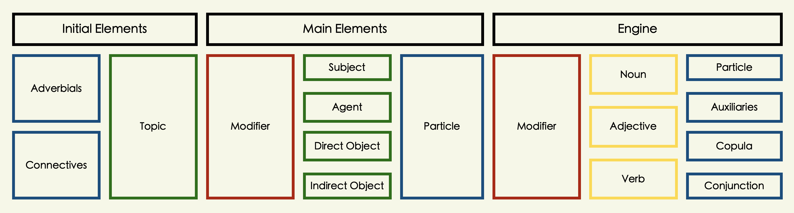

```{=html}
<style type="text/css">

body{
      font-size: 13px;
      font-family: "Roboto Condensed", "Anonymous Pro", "Roboto", "Helvetica Neue";
  }
</style>
```
<link rel="preconnect" href="https://fonts.googleapis.com"> <link rel="preconnect" href="https://fonts.gstatic.com" crossorigin> <link href="https://fonts.googleapis.com/css2?family=Hina+Mincho&family=Klee+One:wght@400;600&family=New+Tegomin&family=Sawarabi+Gothic&family=Shippori+Mincho+B1:wght@400;500&family=Yomogi&display=swap" rel="stylesheet"> <link rel="preconnect" href="https://fonts.googleapis.com"> <link rel="preconnect" href="https://fonts.gstatic.com" crossorigin> <link href="https://fonts.googleapis.com/css2?family=Noto+Sans+JP:wght@100;300;400;500;700&display=swap" rel="stylesheet"> <link rel="preconnect" href="https://fonts.gstatic.com"> <link href="https://fonts.googleapis.com/css2?family=M+PLUS+Rounded+1c:wght@100;300;400;500;700&display=swap" rel="stylesheet"> <link rel="preconnect" href="https://fonts.gstatic.com"> <link href="https://fonts.googleapis.com/css2?family=Anonymous+Pro&display=swap" rel="stylesheet"> <link href="https://fonts.googleapis.com/css2?family=Anonymous+Pro:ital,wght@0,400;1,700&display=swap" rel="stylesheet"> <link href="https://fonts.googleapis.com/css2?family=Anonymous+Pro:ital,wght@0,400;0,700;1,700&display=swap" rel="stylesheet">
<link rel="preconnect" href="https://fonts.googleapis.com">
<link rel="preconnect" href="https://fonts.gstatic.com" crossorigin>
<link href="https://fonts.googleapis.com/css2?family=Zen+Maru+Gothic:wght@300;400;500;600&display=swap" rel="stylesheet">
<link rel="preconnect" href="https://fonts.googleapis.com">
<link rel="preconnect" href="https://fonts.gstatic.com" crossorigin>
<link rel="preconnect" href="https://fonts.googleapis.com">
<link rel="preconnect" href="https://fonts.gstatic.com" crossorigin>
<link href="https://fonts.googleapis.com/css2?family=Open+Sans:ital,wght@0,300;0,400;0,500;0,600;1,300;1,400;1,500;1,600&display=swap" rel="stylesheet">

<link rel="preconnect" href="https://fonts.googleapis.com">
<link rel="preconnect" href="https://fonts.gstatic.com" crossorigin>
<link href="https://fonts.googleapis.com/css2?family=Hina+Mincho&family=IBM+Plex+Sans+JP:wght@100;200;300;400;500;600&family=Kaisei+Tokumin&family=Klee+One&family=New+Tegomin&family=RocknRoll+One&family=Shippori+Antique+B1&family=Zen+Kaku+Gothic+Antique:wght@300;400;500;700&family=Zen+Kaku+Gothic+New:wght@300;400;500;700&display=swap" rel="stylesheet">

<link rel="preconnect" href="https://fonts.googleapis.com">
<link rel="preconnect" href="https://fonts.gstatic.com" crossorigin>
<link href="https://fonts.googleapis.com/css2?family=Roboto:wght@100;300;400;500;700&display=swap" rel="stylesheet">

<link rel="preconnect" href="https://fonts.googleapis.com">
<link rel="preconnect" href="https://fonts.gstatic.com" crossorigin>
<link href="https://fonts.googleapis.com/css2?family=Roboto+Condensed:wght@300;400;700&family=Roboto+Flex:wght@100;200;300;400;500;600;700&display=swap" rel="stylesheet">

```{css, echo=FALSE}
.my-tbl {
  border: 1px solid rgba(0, 0, 0, 0.1);
}

.my-header {
  border-width: 1px;
}

.my-col {
  border-right: 1px solid rgba(0, 0, 0, 0.05);
}

.my-row:hover {
  background-color: #dee7e7;
  filter: invert(1);
}

.toc-content {
    padding-left: 10px;
    padding-right: 10px;
}

div.expressjp { outline-style: solid; outline-color: #0F2040; outline-width: 1px; border-radius: 5px; padding: 1px; padding-top: 10px;
  color: 	#404040;
  font-size: 14px;
  font-family: 'Rounded Mplus 1c', 'M PLUS Rounded 1c', sans-serif;
}

div.expresstr { outline-style: solid; outline-color: #0F2040; outline-width: 1px; border-radius: 5px; padding: 1px; padding-top: 10px; 
  color: 	#404040;
  font-size: 12.2px;
  font-family: 'Rounded Mplus 1c', 'M PLUS Rounded 1c', sans-serif;
}

div.add_info {
  padding-top: 0px; 
  padding-bottom: 0px;
  color: 	#264653;
  font-size: 12px;
  font-family: 'Roboto Condensed', 'Zen Kaku Gothic New', sans-serif;
}

div.expresstrz { outline-style: solid; outline-color: #264653; outline-width: 0.5px; border-radius: 3px; padding: 1px; padding-top: 10px; 
  color: 	#264653;
  font-size: 12.4px;
  font-weight: 400;
  font-family: 'Zen Kaku Gothic New', 'M PLUS Rounded 1c', sans-serif;
}
```

```{r setup, include=FALSE}
knitr::opts_chunk$set(echo = TRUE)
```

```{css, echo=FALSE}
@media(prefers-color-scheme: light) {
  body {
    <!-- background-color: black; -->
    filter: invert(0);
  }
}
```

```{r, echo=FALSE, message=FALSE}
library(tidyverse)
library(reactable)
library(htmltools)
library(bslib)
library(dplyr)
library(purrr)
library(readr)
library(vembedr)
options(readr.show_col_types = FALSE)
```

```{r, echo=FALSE, message=FALSE, error=FALSE}
vnstc <- read_csv("jpdb/SNTSB-SSTNC.csv")
vnstd <- read_csv("jpdb/SNTSI-SSTNC.csv")
vnste <- read_csv("jpdb/SNTSA-SSTNC.csv")
sntdly <- read_csv("jpdb/SNTSDLY-SSTNC.csv")
vnsgg <- read_csv("jpdb/VRB1-VGRM.csv")
icwrds <- read_csv("jpdb/SNTSR2-SSTNC.csv")
expw <- read_csv("jpdb/SNTSR3-SSTNC.csv")
vnstg <- read_csv("jpdb/SNTSR4-SSTNC.csv")
vnstb <- read_csv("jpdb/SNTSR5-SSTNC.csv")
sntv <- read_csv("jpdb/SNTSR6-SSTNC.csv")
cmwpg <- read_csv("jpdb/SNTSR7-SSTNC.csv")
cmwpc <- read_csv("jpdb/SNTSR8-SSTNC.csv")
sntcas <- read_csv("jpdb/SNTCASL-SSTNC.csv")
comdly <- read_csv("jpdb/COMMSTRGY-STRGY.csv")
sntmre <- read_csv("jpdb/SNTMRE-SNT.csv")
smplsnt <- read_csv("jpdb/SMPLSNT-SNT.csv")
splsnt <- read_csv("jpim/SPLSNT-SNT.csv")
rrdng <- read_csv("jpim/SNTRDG-RDG.csv")
gwrds <- read_csv("jpdb/WGRMR-LST.csv")
grmsplsnt <- read_csv("jpdb/GRMMRSNS-SNT.csv")
dlyexps <- read_csv("jpim/DLYSNTC-DLY.csv")
spcvwrds <- read_csv("jpim/SPCVRBS-WRDS.csv")
splwrds <- read_csv("jpim/SPLWRDS-WRDS.csv")
```

# <b> Structure </b> {.tabset}

## <b> Form </b> {.tabset}

<p style="font-size:11px; line-height: 1; font-family: Noto Sans JP;  color: #202020;">**Basic Pattern Structure** of a japanese sentence.</p>



<!-- <h6> </h6> -->

<!-- ------------------------------------------------------------------------ -->

## <b> Style </b> {.tabset}

### <b> Simple </b>

<p style="font-size:13px; line-height: 0.5; font-family: Noto Sans JP;  color: #1a313a; font-weight: bold">**① Nominal Sentences:**</p>

<div class = "add_info">
**・NounⒶ + NounⒷ + Copula: Ⓑ describes or identifies Ⓐ**
</div>

<div class = "expresstrz">
・ジョンさんがアメリカじんです.     
・John-san ga amerika-jin desu.     
・John is an American.    
</div>

<h6> </h6>

<p style="font-size:13px; line-height: 0.5; font-family: Noto Sans JP;  color: #1a313a; font-weight: bold">**② Adjectival Sentences: I-Adjective**</p>

<div class = "add_info">
**・AdjectiveⒶ + NounⒷ: Ⓑ describes Ⓐ**
</div>

<div class = "expresstrz">
・空が青い.     
・Sora ga aoi.       
・The sky is blue.     
</div>

<h6> </h6>

<p style="font-size:13px; line-height: 0.5; font-family: Noto Sans JP;  color: #1a313a; font-weight: bold">**③ Adjectival Sentences: Na-Adjective**</p>

<div class = "add_info">
**・AdjectiveⒶ + NounⒷ + Copula: Ⓑ describes Ⓐ**
</div>

<div class = "expresstrz">
・地下鉄が便利だ.     
・Chikatetsu ga benri da.     
・The subway is convenient.     
</div>

<h6> </h6>

<p style="font-size:13px; line-height: 0.5; font-family: Noto Sans JP;  color: #1a313a; font-weight: bold">**④ Verbal Sentences: Intransitive Verb**</p>

<div class = "add_info">
**・Topic・SubjectⒶ + VerbⒷ: Ⓑ describes the state of Ⓐ **
</div>

<div class = "expresstrz">
・桜さんが来た.       
・Sakura-san ga kita.       
・Sakura came.       
</div>

<h6> </h6>

<p style="font-size:13px; line-height: 0.5; font-family: Noto Sans JP;  color: #1a313a; font-weight: bold">**⑤ Verbal Sentences: Transitive Verb**</p>

<div class = "add_info">
**・Topic・SubjectⒶ + ObjectⒷ + VerbⒸ: Ⓐ does the action Ⓒ to Ⓑ**
</div>

<div class = "expresstrz">
・先生は授業を始めた.      
・Sensei wa jugyou o hajimeta.    
・The teacher began teaching.     
</div>

<h6> </h6>

<p style="font-size:13px; line-height: 0.5; font-family: Noto Sans JP;  color: #1a313a; font-weight: bold">**⑥ Topic-Comment Sentences:**</p>

<div class = "add_info">
**・TopicⒶ + CommentⒷ: Ⓑ describes Ⓐ**
</div>

<div class = "expresstrz">
・日本は春と秋がいい.     
・Nihon wa haru to aki ga ii.     
・As for Japan, spring and fall are good.     
</div>

<!-- <h6> </h6> -->

<!-- ------------------------------------------------------------------------ -->

### <b> Conjoined </b>

<p style="font-size:13px; line-height: 0.5; font-family: Noto Sans JP;  color: #202020; font-weight: bold">**① AND-Relation: Connective forms of verbs, adjectives and copula**</p>

<div class = "add_info">
**・Sentence(I-Adj-Ending) + kute + Sentence**
</div>

<div class = "expresstrz">
・この辞書は安くて便利だ.     
・This dictionary is cheap and convenient.    
</div>

<h6> </h6>

<div class = "add_info">
**・Sentence(Na-Adj-Ending) + de + Sentence**
</div>

<div class = "expresstrz">
・りなさんはきれいでやさしいです.     
・Rina-san is beautiful and kind.     
</div>

<h6> </h6>

<div class = "add_info">
**・Sentence(Noun-Ending) + de + Sentence**
</div>

<div class = "expresstrz">
・ウンさんは中国人でキムさんは韓国人です.    
・Mr.Wong is Chinese and Mr. Kim is Korean.   
</div>

<h6> </h6>

<div class = "add_info">
**・Sentence(Vnoun-base-Ending) + Sentence**
</div>

<div class = "expresstrz">
・私は朝六時に起き、夜十時ごろ寝る.    
・I get up at six in the morning and go to bed around ten at night.    
</div>

<h6> </h6>

<div class = "add_info">
**・Sentence(Vte-Ending) + Sentence**
</div>

<div class = "expresstrz">
・山田さんはラメンを食べてビールを飲む.     
・Yamada-san eats ramen and drinks beer.     
</div>

<h6> </h6>

<p style="font-size:13px; line-height: 0.5; font-family: Noto Sans JP;  color: #1a313a; font-weight: bold">**② AND-Relation: Conjunctive Particles**</p>

<div class = "add_info">
**・Sentence(V/I-Adj/(N/Na-Adj+Cop)-Ending) + shi + Sentence**     
・**shi** particle connects one or multiple reasons but not naming all of it.    
</div>

<div class = "expresstrz">
・この事件はほぼ終息したし二度と起こることはない.    
・This incident has more or less ended and will never happen again.   
</div>

<h6> </h6>

<div class = "add_info">
**・Sentence(V/I-Adj/N/Na-Adj) + toka + Sentence**    
・**toka** cite a thing or an instance among other things or situation.    
</div>

<div class = "expresstrz">
・じゃあ映画を字幕なしで見るとか日本の音楽を聞くとかはどう？     
・So how about watching movies without subtitles or listening to Japanese music?     
</div>

<h6> </h6>

<p style="font-size:13px; line-height: 0.5; font-family: Noto Sans JP;  color: #1a313a; font-weight: bold">**③ BUT-Relation: Conjunctive Particles**</p>

<div class = "add_info">
**・Sentence + ga + Sentence**
</div>

<div class = "expresstrz">
・家内はフランス語を話せるが私が話せない.    
・My wife can speak French but I can't.    
</div>

<h6> </h6>

<div class = "add_info">
**・Sentence + kedo + Sentence**
</div>

<div class = "expresstrz">
・入ってもいいけどしずかにしてくださいね.   
・You can come in but please be quiet.   
</div>

<h6> </h6>

<div class = "add_info">
**・Sentence + keredomo + Sentence**
</div>

<div class = "expresstrz">
・あそびたいけれども宿題はまだ終わってない.    
・I want to play but I haven't finished my homework yet.   
</div>

<h6> </h6>

<p style="font-size:13px; line-height: 0.5; font-family: Noto Sans JP;  color: #1a313a; font-weight: bold">**④ Connectives・Conjunctions**</p>

<div class = "add_info">
**・Sentence + connectives・conjunctions + Sentence**
</div>

<div class = "expresstrz">
・あの人は頭がいい. そのうえ性格してもいい.    
・僕は駅前の喫茶店に行った. そしてそこで友達を待っていた.       
・彼は新しい、いい車を持っている. でもめったに乗らない.     
・手紙を出した. しかし返事はこなかった.       
・車で行きますか. それとも飛行機で行きますか.        
・私が別れようと言った. すると彼女雨は泣き出した.            
・日本語を勉強すると役に立つ. だから日本をしている.          
・金がない. つまり、貧乏なんです.     
</div>

<h6> </h6>

<div class = "expresstrz">
・He is smart. On top of that, he has a good personality.     
・I went to a coffee shop in front of the station. And there I waited for my friend.        
・He has a new, nice car, but he rarely drives it.    
・I sent him a letter. But he never wrote back.        
・Do you want to go by car? Or do you want to go by car or by plane?         
・I said goodbye. Then she started to cry.             
・I told her that studying Japanese would be useful for her. That's why I'm doing Japan.          
・I don't have money. I mean, we are poor.      
</div>

<!-- <h6> </h6> -->

<!-- ------------------------------------------------------------------------ -->

### <b> Complex </b>

<p style="font-size:13px; line-height: 0.5; font-family: Noto Sans JP;  color: #1a313a; font-weight: bold">**① Adjectival Clause: Relative Clause**</p>

<div class = "add_info">
**・Relative Clause + Noun**
</div>

<div class = "expresstrz">
・私が昨日見た犬はかわいいだ.    
・I saw a dog yesterday that was adorable.   
</div>

<h6> </h6>

<p style="font-size:13px; line-height: 0.5; font-family: Noto Sans JP;  color: #1a313a; font-weight: bold">**② Adjectival Clause: Complementary Clause: With toiu**</p>

<div class = "add_info">
**・Complimentary Clause + toiu + Noun**
</div>

<div class = "expresstrz">
・日本語は曖昧な言葉だという考えは珍しくない.      
・The idea that Japanese is an ambiguous language is not uncommon.   
</div>

<h6> </h6>

<p style="font-size:13px; line-height: 0.5; font-family: Noto Sans JP;  color: #1a313a; font-weight: bold">**③ Adjectival Clause: Complementary Clause: Nominalized**</p>

<div class = "add_info">
**・Complementary Clause + no・koto**
</div>

<div class = "expresstrz">
・光子がピアノを弾いているのを聞いた.        
・ひかるさんが今日は来ることを知らなかった.     
</div>

<h6> </h6>

<div class = "expresstrz">
・I heard Mitsuko playing the piano.   
・I didn't know Hikaru-san was going to be here today.   
</div>

<h6> </h6>

<p style="font-size:13px; line-height: 0.5; font-family: Noto Sans JP;  color: #1a313a; font-weight: bold">**④ Adjectival Clause: Complementary Clause: Interrogative Quotation**</p>

<div class = "add_info">
**・Complementary Clause + ka・kadouka・nokadouka**
</div>

<div class = "expresstrz">
・誰がそれをするかが問題だ.    
・あの学生は真面目かどうかしていますか.     
</div>

<h6> </h6>

<div class = "expresstrz">
・It's just a question of who's going to do it.   
・Do you know whether or not that student is serious?    
</div>

<h6> </h6>

<p style="font-size:13px; line-height: 0.5; font-family: Noto Sans JP;  color: #1a313a; font-weight: bold">**⑤ Adjectival Clause: Complementary Clause: Declarative Quotation**</p>

<div class = "add_info">
**・Complementary Clause + to iu・omou・etc.**
</div>

<div class = "expresstrz">
・あそこはたぶん静かだと思います.   
・彼は漢字は難しくないと言っている.   
</div>

<h6> </h6>

<div class = "expresstrz">
・It's probably quiet over there.   
・He says Kanji is not difficult.   
</div>

<h6> </h6>

<p style="font-size:13px; line-height: 0.5; font-family: Noto Sans JP;  color: #1a313a; font-weight: bold">**⑥ Adverbial Clause: Auxiliary-Adjective**</p>

<div class = "add_info">
**・Adverbial Clause + you (ni・na)・mitai (ni・na)**
</div>

<div class = "expresstrz">
・零さないように運んでください.   
・電車に間に合うように早く行きましう.   
</div>

<h6> </h6>

<div class = "expresstrz">
・Please carry it without spilling it.   
・Let's get there early to catch the train.   
</div>

<h6> </h6>

<p style="font-size:13px; line-height: 0.5; font-family: Noto Sans JP;  color: #1a313a; font-weight: bold">**⑦ Adverbial Clause: Conjunctions・Conjunctive Particles**</p>

<div class = "add_info">
**・Adverbial Clause + conjunctions・conjunctive particles**
</div>

<div class = "expresstrz">
・私がそこにいた時には異常はなかった.       
・私は日本留学するために日本語を勉強しています.   
</div>

<h6> </h6>

<div class = "expresstrz">
・There was nothing unusual when I was there.   
・I'm studying Japanese in order to study in Japan.   
</div>

<h6> </h6>

<p style="font-size:13px; line-height: 0.5; font-family: Noto Sans JP;  color: #1a313a; font-weight: bold">**⑧ Conditional Clause:**</p>

<div class = "add_info">
**・Conditional Clause + tara・to・nara・ ba**
</div>

<div class = "expresstrz">
・コートを着たら寒くありません.     
・彼女は酒を飲むと顔が赤くなる.    
・毎日練習をすれば上手になるよ.   
・君がいやだと言うのならだれかほかの者にやらせる.   
</div>

<h6> </h6>

<div class = "expresstrz">
・If you put on a coat, it's not cold.   
・If she drinks, her face turns red.   
・If you practice every day, you'll get better.   
・If you don't want to do it, I'll get someone else to do it.   
</div>

<h6> </h6>

<p style="font-size:13px; line-height: 0.5; font-family: Noto Sans JP;  color: #1a313a; font-weight: bold">**Ⓐ Compound Particles: Pre-Nominal Form**</p>

<div class = "add_info">
**・Noun・Verb + Compound Particle + Noun**
</div>

<div class = "expresstrz">
・コンピュータに関する彼の知識は相当なものだ.   
・His knowledge of computers is quite impressive.   
</div>

<h6> </h6>

<p style="font-size:13px; line-height: 0.5; font-family: Noto Sans JP;  color: #1a313a; font-weight: bold">**Ⓑ Compound Particles: Pre-Verbal Form**</p>

<div class = "add_info">
**・Noun・Verb + Compound Particle**
</div>

<div class = "expresstrz">
・人は年を取るにつれて記憶力が衰える.     
・Memory declines as people get older.   
</div>

<!-- <h6> </h6> -->

<!-- ------------------------------------------------------------------------ -->

## <b> Level </b> {.tabset}

```{r, echo=FALSE, message=FALSE}

vnstc <- vnstc[sample(1:nrow(vnstc)),]
vnstd <- vnstd[sample(1:nrow(vnstd)),]
vnste <- vnste[sample(1:nrow(vnste)),]

vnst.all <- bind_rows(vnstc, vnstd)
vnst.all <- bind_rows(vnst.all, vnste)

# vnst.all <- vnst.all[sample(1:nrow(vnst.all)),]

reactable(
  vnst.all,
  columns = list(
    Sentence = colDef(style= list(background = '#e0e1dd'), 
      cell = function(value, index) {
        Translation <- vnst.all$Translation[index]
        Translation <- if (!is.na(Translation)) Translation else ""
        tagList(
          div(style = list(fontSize = 18, fontWeight = 400, color = '#0F2040', fontFamily = 'Open Sans'), value),
          div(style = list(fontSize = 10, fontWeight = 300, color = '#0F2040', fontFamily = 'Open Sans'), Translation),
        )
      },
      align = "left"
    ),
    # Translation = colDef(align = "left", style = list(fontSize = 10, fontWeight = 300, fontFamily = 'Open Sans', background = '#e0e1dd', color = '#0F2040'), minWidth = 400)
    Translation = colDef(show = FALSE)
  ),
  rowClass = "my-row",
  defaultPageSize = 25,
  theme = reactableTheme(
    cellStyle = list(display = "flex", flexDirection = "column", justifyContent = "center", fontSize = "11px"),
    searchInputStyle = list(
      paddingLeft = "8px",
      paddingTop = "8px",
      paddingBottom = "8px",
      width = "100%"
    )
  ),
  showPageInfo = FALSE, outlined = TRUE, borderless = FALSE, bordered = TRUE, searchable = FALSE, paginationType = "numbers", striped = TRUE, highlight = TRUE, height = 510,
  
  style = list(fontFamily = "Noto Sans JP, Hiragino Maru Gothic ProN, Anonymous Pro , Helvetica Neue", fontSize = "11px")
)

```

<!-- ------------------------------------------------------------------------ -->

## <b> Native </b> {.tabset}

```{r, echo=FALSE, message=FALSE}

sntcas.sayachi <- sntcas %>% select(Sayachi.Sentences, Sayachi.Translation) %>% rename(Sentences = Sayachi.Sentences, Translation = Sayachi.Translation)
sntcas.sayachi <- sntcas.sayachi %>% na.omit(sntcas.sayachi)
sntcas.sayachi <- sntcas.sayachi[sample(1:nrow(sntcas.sayachi)),]

sntcas.kakochin <- sntcas %>% select(Kakochin.Sentences, Kakochin.Translation) %>% rename(Sentences = Kakochin.Sentences, Translation = Kakochin.Translation)
sntcas.kakochin <- sntcas.kakochin %>% na.omit(sntcas.kakochin)
sntcas.kakochin <- sntcas.kakochin[sample(1:nrow(sntcas.kakochin)),]

sntcas.ikechan <- sntcas %>% select(Ikechan.Sentences, Ikechan.Translation) %>% rename(Sentences = Ikechan.Sentences, Translation = Ikechan.Translation)
sntcas.ikechan <- sntcas.ikechan %>% na.omit(sntcas.ikechan)
sntcas.ikechan <- sntcas.ikechan[sample(1:nrow(sntcas.ikechan)),]

sntcas.all <- bind_rows(sntcas.sayachi, sntcas.kakochin)
sntcas.all <- bind_rows(sntcas.all, sntcas.ikechan)

reactable(
  sntcas.all,
  columns = list(
    Sentences = colDef(style= list(background = '#e0e1dd'),
      cell = function(value, index) {
        Translation <- sntcas.all$Translation[index]
        Translation <- if (!is.na(Translation)) Translation else ""
        tagList(
          div(style = list(fontSize = 18, fontWeight = 400, color = '#0F2040', fontFamily = 'Open Sans'), value),
          div(style = list(fontSize = 10, fontWeight = 300, color = '#0F2040', fontFamily = 'Open Sans'), Translation),
        )
      },
      align = "left"
    ),
    # Translation = colDef(align = "left", style = list(fontSize = 10, fontWeight = 300, fontFamily = 'Open Sans', background = '#1b1e1e', color = '#f1f5f5'))
    Translation = colDef(show = FALSE)
  ),
  rowClass = "my-row",
  defaultPageSize = 25,
  theme = reactableTheme(
    cellStyle = list(display = "flex", flexDirection = "column", justifyContent = "center", fontSize = "11px"),
    searchInputStyle = list(
      paddingLeft = "8px",
      paddingTop = "8px",
      paddingBottom = "8px",
      width = "100%"
    )
  ),
  showPageInfo = FALSE, outlined = TRUE, borderless = FALSE, bordered = TRUE, searchable = FALSE, paginationType = "numbers", striped = TRUE, highlight = TRUE, height = 510,
  
  style = list(fontFamily = "Noto Sans JP, Hiragino Maru Gothic ProN, Anonymous Pro , Helvetica Neue", fontSize = "11px")
)

```

<!-- ------------------------------------------------------------------------ -->

## <b> Simple </b> {.tabset}

```{r, echo=FALSE, message=FALSE}

smplsnt.a <- smplsnt[sample(1:nrow(smplsnt)),]
sntmre.a <- sntmre %>% select(Sentences, Translation)
sntmre.a <- sntmre.a[sample(1:nrow(sntmre.a)),]
simple.a <- bind_rows(smplsnt.a, sntmre.a)

reactable(
  simple.a,
  columns = list(
    Sentences = colDef(style= list(background = '#e0e1dd'),
      cell = function(value, index) {
        Translation <- simple.a$Translation[index]
        Translation <- if (!is.na(Translation)) Translation else ""
        tagList(
          div(style = list(fontSize = 18, fontWeight = 400, color = '#0F2040', fontFamily = 'Open Sans'), value),
          div(style = list(fontSize = 10, fontWeight = 300, color = '#0F2040', fontFamily = 'Open Sans'), Translation),
        )
      },
      align = "left"
    ),
    # Translation = colDef(align = "left", style = list(fontSize = 10, fontWeight = 300, fontFamily = 'Open Sans', background = '#1b1e1e', color = '#f1f5f5'))
    Translation = colDef(show = FALSE)
  ),
  rowClass = "my-row",
  defaultPageSize = 25,
  theme = reactableTheme(
    cellStyle = list(display = "flex", flexDirection = "column", justifyContent = "center", fontSize = "11px"),
    searchInputStyle = list(
      paddingLeft = "8px",
      paddingTop = "8px",
      paddingBottom = "8px",
      width = "100%"
    )
  ),
  showPageInfo = FALSE, outlined = TRUE, borderless = FALSE, bordered = TRUE, searchable = FALSE, paginationType = "numbers", striped = TRUE, highlight = TRUE, height = 510,
  
  style = list(fontFamily = "Noto Sans JP, Hiragino Maru Gothic ProN, Anonymous Pro , Helvetica Neue", fontSize = "11px")
)

```
<!-- ------------------------------------------------------------------------ -->

## <b> Express </b> {.tabset}

```{r, echo=FALSE, message=FALSE}

dlyexps.a <- dlyexps[sample(1:nrow(dlyexps)),]

reactable(
  dlyexps.a,
  columns = list(
    Expression = colDef(style= list(background = '#e0e1dd'),
      cell = function(value, index) {
        Translation <- dlyexps.a$Translation[index]
        Translation <- if (!is.na(Translation)) Translation else ""
        tagList(
          div(style = list(fontSize = 18, fontWeight = 400, color = '#0F2040', fontFamily = 'Open Sans'), value),
          div(style = list(fontSize = 10, fontWeight = 300, color = '#0F2040', fontFamily = 'Open Sans'), Translation),
        )
      },
      align = "left"
    ),
    # Translation = colDef(align = "left", style = list(fontSize = 10, fontWeight = 300, fontFamily = 'Open Sans', background = '#1b1e1e', color = '#f1f5f5'))
    Translation = colDef(show = FALSE)
  ),
  rowClass = "my-row",
  defaultPageSize = 25,
  theme = reactableTheme(
    cellStyle = list(display = "flex", flexDirection = "column", justifyContent = "center", fontSize = "11px"),
    searchInputStyle = list(
      paddingLeft = "8px",
      paddingTop = "8px",
      paddingBottom = "8px",
      width = "100%"
    )
  ),
  showPageInfo = FALSE, outlined = TRUE, borderless = FALSE, bordered = TRUE, searchable = FALSE, paginationType = "numbers", striped = TRUE, highlight = TRUE, height = 510,
  
  style = list(fontFamily = "Noto Sans JP, Hiragino Maru Gothic ProN, Anonymous Pro , Helvetica Neue", fontSize = "11px")
)

```

<!-- ------------------------------------------------------------------------ -->

## <b> Collect </b> {.tabset}

```{r, echo=FALSE, message=FALSE}

spcvwrds.a <- spcvwrds %>% select(Sentence, Translation)
spcvwrds.a <- spcvwrds.a[sample(1:nrow(spcvwrds.a)),]

splwrds.a <- splwrds %>% select(Sentence, Translation)
splwrds.a <- splwrds.a[sample(1:nrow(splwrds.a)),]

spcvwords.a <- bind_rows(spcvwrds.a, splwrds.a)
spcvwords.a <- spcvwords.a[sample(1:nrow(spcvwords.a)),]

reactable(
  spcvwords.a,
  columns = list(
    Sentence = colDef(style= list(background = '#e0e1dd'), 
      cell = function(value, index) {
        Translation <- spcvwords.a$Translation[index]
        Translation <- if (!is.na(Translation)) Translation else ""
        tagList(
          div(style = list(fontSize = 18, fontWeight = 400, color = '#0F2040', fontFamily = 'Open Sans'), value, "。"),
          div(style = list(fontSize = 10, fontWeight = 300, color = '#0F2040', fontFamily = 'Open Sans'), Translation,"."),
        )
      },
      align = "left"
    ),
    # Reading = colDef(show = FALSE),
    # Meaning = colDef(show = FALSE),
    # Verb = colDef(show = FALSE),
    Translation = colDef(show = FALSE)
  ),
  rowClass = "my-row",
  defaultPageSize = 25,
  theme = reactableTheme(
    cellStyle = list(display = "flex", flexDirection = "column", justifyContent = "center", fontSize = "11px"),
    searchInputStyle = list(
      paddingLeft = "8px",
      paddingTop = "8px",
      paddingBottom = "8px",
      width = "100%"
    )
  ),
  showPageInfo = FALSE, outlined = TRUE, borderless = FALSE, bordered = TRUE, searchable = FALSE, paginationType = "numbers", striped = TRUE, highlight = TRUE, height = 510,
  
  style = list(fontFamily = "Noto Sans JP, Hiragino Maru Gothic ProN, Anonymous Pro , Helvetica Neue", fontSize = "11px")
)

```

<!-- ------------------------------------------------------------------------ -->

## <b> Random </b> {.tabset}

### R1

```{r, echo=FALSE, message=FALSE}

vnsgg <- vnsgg[sample(1:nrow(vnsgg)),]

reactable(
  vnsgg,
  columns = list(
    Sentences = colDef(style= list(background = '#e0e1dd'),
      cell = function(value, index) {
        Translation <- vnsgg$Translation[index]
        Translation <- if (!is.na(Translation)) Translation else ""
        Concept <- vnsgg$Concept[index]
        Concept <- if (!is.na(Concept)) Concept else ""
        Sentences <- vnsgg$Sentences[index]
        Sentences <- if (!is.na(Sentences)) Sentences else ""
        Meaning <- vnsgg$Meaning[index]
        Meaning <- if (!is.na(Meaning)) Meaning else ""
        Structure <- vnsgg$Structure[index]
        Structure <- if (!is.na(Structure)) Structure else ""
        tagList(
          div(style = list(fontSize = 18, fontWeight = 400, color = '#0F2040', fontFamily = 'Open Sans'), value),
          div(style = list(fontSize = 10, fontWeight = 300, color = '#0F2040', fontFamily = 'Open Sans'), Translation),
        )
      },
      align = "left"
    ),
    # Translation = colDef(align = "left", style = list(fontSize = 10, fontWeight = 300, fontFamily = 'Open Sans', background = '#1b1e1e', color = '#f1f5f5')),
    Translation = colDef(show = FALSE),
    Concept = colDef(show = FALSE),
    Sentences = colDef(show = FALSE),
    Meaning = colDef(show = FALSE),
    Structure = colDef(show = FALSE),
    Remarks = colDef(show = FALSE),
    S1 = colDef(show = FALSE),
    T1 = colDef(show = FALSE),
    S2 = colDef(show = FALSE),
    T2 = colDef(show = FALSE)

  ),
  rowClass = "my-row",
  defaultPageSize = 25,
  theme = reactableTheme(
    cellStyle = list(display = "flex", flexDirection = "column", justifyContent = "center", fontSize = "11px"),
    searchInputStyle = list(
      paddingLeft = "8px",
      paddingTop = "8px",
      paddingBottom = "8px",
      width = "100%"
    )
  ),
  showPageInfo = FALSE, outlined = TRUE, borderless = FALSE, bordered = TRUE, searchable = FALSE, paginationType = "numbers", striped = TRUE, highlight = TRUE, height = 510,
  
  style = list(fontFamily = "Noto Sans JP, Hiragino Maru Gothic ProN, Anonymous Pro , Helvetica Neue", fontSize = "11px")
)

```

<!-- ------------------------------------------------------------------------ -->

### R2

```{r, echo=FALSE, message=FALSE}

icwrds <- icwrds[sample(1:nrow(icwrds)),]

reactable(
  icwrds,
  columns = list(
    Script = colDef(style= list(background = '#e0e1dd'),
      cell = function(value, index) {
        Translation <- icwrds$Translation[index]
        Translation <- if (!is.na(Translation)) Translation else ""
        tagList(
          div(style = list(fontSize = 18, fontWeight = 400, color = '#0F2040', fontFamily = 'Open Sans'), value),
          div(style = list(fontSize = 10, fontWeight = 300, color = '#0F2040', fontFamily = 'Open Sans'), Translation),
        )
      },
      align = "left"
    ),
    # Translation = colDef(align = "left", style = list(fontSize = 10, fontWeight = 300, fontFamily = 'Open Sans', background = '#1b1e1e', color = '#f1f5f5'), minWidth = 500)
    Translation = colDef(show = FALSE)
  ),
  rowClass = "my-row",
  defaultPageSize = 25,
  theme = reactableTheme(
    cellStyle = list(display = "flex", flexDirection = "column", justifyContent = "center", fontSize = "11px"),
    searchInputStyle = list(
      paddingLeft = "8px",
      paddingTop = "8px",
      paddingBottom = "8px",
      width = "100%"
    )
  ),
  showPageInfo = FALSE, outlined = TRUE, borderless = FALSE, bordered = TRUE, searchable = FALSE, paginationType = "numbers", striped = TRUE, highlight = TRUE, height = 510,
  
  style = list(fontFamily = "Noto Sans JP, Hiragino Maru Gothic ProN, Anonymous Pro , Helvetica Neue", fontSize = "11px")
)

```

<!-- ------------------------------------------------------------------------ -->

### R3

```{r, echo=FALSE, message=FALSE}

expw <- expw[sample(1:nrow(expw)),]

reactable(
  expw,
  columns = list(
    Expression = colDef(style= list(background = '#e0e1dd'),
      cell = function(value, index) {
        Translation <- expw$Translation[index]
        Translation <- if (!is.na(Translation)) Translation else ""
        tagList(
          div(style = list(fontSize = 18, fontWeight = 400, color = '#0F2040', fontFamily = 'Open Sans'), value),
          div(style = list(fontSize = 10, fontWeight = 300, color = '#0F2040', fontFamily = 'Open Sans'), Translation),
        )
      },
      align = "left"
    ),
    # Translation = colDef(align = "left", style = list(fontSize = 10, fontWeight = 300, fontFamily = 'Open Sans', background = '#1b1e1e', color = '#f1f5f5'), minWidth = 500)
    Translation = colDef(show = FALSE)
  ),
  rowClass = "my-row",
  defaultPageSize = 25,
  theme = reactableTheme(
    cellStyle = list(display = "flex", flexDirection = "column", justifyContent = "center", fontSize = "11px"),
    searchInputStyle = list(
      paddingLeft = "8px",
      paddingTop = "8px",
      paddingBottom = "8px",
      width = "100%"
    )
  ),
  showPageInfo = FALSE, outlined = TRUE, borderless = FALSE, bordered = TRUE, searchable = FALSE, paginationType = "numbers", striped = TRUE, highlight = TRUE, height = 510,
  
  style = list(fontFamily = "Noto Sans JP, Hiragino Maru Gothic ProN, Anonymous Pro , Helvetica Neue", fontSize = "11px")
)

```

<!-- ------------------------------------------------------------------------ -->

### R4

```{r, echo=FALSE, message=FALSE}

vnstg <- vnstg[sample(1:nrow(vnstg)),]

reactable(
  vnstg,
  columns = list(
    Phrases = colDef(style= list(background = '#e0e1dd'),
      cell = function(value, index) {
        Translation <- vnstg$Translation[index]
        Translation <- if (!is.na(Translation)) Translation else ""
        tagList(
          div(style = list(fontSize = 18, fontWeight = 400, color = '#0F2040', fontFamily = 'Open Sans'), value),
          div(style = list(fontSize = 10, fontWeight = 300, color = '#0F2040', fontFamily = 'Open Sans'), Translation),
        )
      },
      align = "left"
    ),
    # Translation = colDef(align = "left", style = list(fontSize = 10, fontWeight = 300, fontFamily = 'Open Sans', background = '#1b1e1e', color = '#f1f5f5'), minWidth = 500)
    Translation = colDef(show = FALSE)
  ),
  rowClass = "my-row",
  defaultPageSize = 25,
  theme = reactableTheme(
    cellStyle = list(display = "flex", flexDirection = "column", justifyContent = "center", fontSize = "11px"),
    searchInputStyle = list(
      paddingLeft = "8px",
      paddingTop = "8px",
      paddingBottom = "8px",
      width = "100%"
    )
  ),
  showPageInfo = FALSE, outlined = TRUE, borderless = FALSE, bordered = TRUE, searchable = FALSE, paginationType = "numbers", striped = TRUE, highlight = TRUE, height = 510,
  
  style = list(fontFamily = "Noto Sans JP, Hiragino Maru Gothic ProN, Anonymous Pro , Helvetica Neue", fontSize = "11px")
)

```

<!-- ------------------------------------------------------------------------ -->

### R5

```{r, echo=FALSE, message=FALSE}

vnstb <- vnstb[sample(1:nrow(vnstb)),]

reactable(
  vnstb,
  columns = list(
    Phrase = colDef(style= list(background = '#e0e1dd'), 
      cell = function(value, index) {
        Translation <- vnstb$Translation[index]
        Translation <- if (!is.na(Translation)) Translation else ""
        tagList(
          div(style = list(fontSize = 18, fontWeight = 400, color = '#0F2040', fontFamily = 'Open Sans'), value),
          div(style = list(fontSize = 10, fontWeight = 300, color = '#0F2040', fontFamily = 'Open Sans'), Translation),
        )
      },
      align = "left"
    ),
    # Translation = colDef(align = "left", style = list(fontSize = 10, fontWeight = 300, fontFamily = 'Open Sans', background = '#1b1e1e', color = '#f1f5f5'), minWidth = 500)
    Translation = colDef(show = FALSE)
  ),
  rowClass = "my-row",
  defaultPageSize = 25,
  theme = reactableTheme(
    cellStyle = list(display = "flex", flexDirection = "column", justifyContent = "center", fontSize = "11px"),
    searchInputStyle = list(
      paddingLeft = "8px",
      paddingTop = "8px",
      paddingBottom = "8px",
      width = "100%"
    )
  ),
  showPageInfo = FALSE, outlined = TRUE, borderless = FALSE, bordered = TRUE, searchable = FALSE, paginationType = "numbers", striped = TRUE, highlight = TRUE, height = 510,
  
  style = list(fontFamily = "Noto Sans JP, Hiragino Maru Gothic ProN, Anonymous Pro , Helvetica Neue", fontSize = "11px")
)

```

<!-- ------------------------------------------------------------------------ -->

### R6

```{r, echo=FALSE, message=FALSE}

sntv <- sntv[sample(1:nrow(sntv)),]

reactable(
  sntv,
  columns = list(
    Sentences = colDef(style= list(background = '#e0e1dd'),
      cell = function(value, index) {
        Translation <- sntv$Translation[index]
        Translation <- if (!is.na(Translation)) Translation else ""
        tagList(
          div(style = list(fontSize = 18, fontWeight = 400, color = '#0F2040', fontFamily = 'Open Sans'), value),
          div(style = list(fontSize = 10, fontWeight = 300, color = '#0F2040', fontFamily = 'Open Sans'), Translation),
        )
      },
      align = "left"
    ),
    # Translation = colDef(align = "left", style = list(fontSize = 10, fontWeight = 300, fontFamily = 'Open Sans', background = '#1b1e1e', color = '#f1f5f5'), minWidth = 500)
    Translation = colDef(show = FALSE)
  ),
  rowClass = "my-row",
  defaultPageSize = 25,
  theme = reactableTheme(
    cellStyle = list(display = "flex", flexDirection = "column", justifyContent = "center", fontSize = "11px"),
    searchInputStyle = list(
      paddingLeft = "8px",
      paddingTop = "8px",
      paddingBottom = "8px",
      width = "100%"
    )
  ),
  showPageInfo = FALSE, outlined = TRUE, borderless = FALSE, bordered = TRUE, searchable = FALSE, paginationType = "numbers", striped = TRUE, highlight = TRUE, height = 510,
  
  style = list(fontFamily = "Noto Sans JP, Hiragino Maru Gothic ProN, Anonymous Pro , Helvetica Neue", fontSize = "11px")
)

```

<!-- ------------------------------------------------------------------------ -->

### R7

```{r, echo=FALSE, message=FALSE}

cmwpg <- cmwpg[sample(1:nrow(cmwpg)),]

reactable(
  cmwpg,
  columns = list(
    Sentences = colDef(style= list(background = '#e0e1dd'),
      cell = function(value, index) {
        Translation <- cmwpg$Translation[index]
        Translation <- if (!is.na(Translation)) Translation else ""
        tagList(
          div(style = list(fontSize = 18, fontWeight = 400, color = '#0F2040', fontFamily = 'Open Sans'), value),
          div(style = list(fontSize = 10, fontWeight = 300, color = '#0F2040', fontFamily = 'Open Sans'), Translation),
        )
      },
      align = "left"
    ),
    # Translation = colDef(align = "left", style = list(fontSize = 10, fontWeight = 300, fontFamily = 'Open Sans', background = '#1b1e1e', color = '#f1f5f5'), minWidth = 500)
    Translation = colDef(show = FALSE)
  ),
  rowClass = "my-row",
  defaultPageSize = 25,
  theme = reactableTheme(
    cellStyle = list(display = "flex", flexDirection = "column", justifyContent = "center", fontSize = "11px"),
    searchInputStyle = list(
      paddingLeft = "8px",
      paddingTop = "8px",
      paddingBottom = "8px",
      width = "100%"
    )
  ),
  showPageInfo = FALSE, outlined = TRUE, borderless = FALSE, bordered = TRUE, searchable = FALSE, paginationType = "numbers", striped = TRUE, highlight = TRUE, height = 510,
  
  style = list(fontFamily = "Noto Sans JP, Hiragino Maru Gothic ProN, Anonymous Pro , Helvetica Neue", fontSize = "11px")
)

```

<!-- ------------------------------------------------------------------------ -->

### R8

```{r, echo=FALSE, message=FALSE}

cmwpc <- cmwpc[sample(1:nrow(cmwpc)),]

reactable(
  cmwpc,
  columns = list(
    Sentences = colDef(style= list(background = '#e0e1dd'), 
      cell = function(value, index) {
        Translation <- cmwpc$Translation[index]
        Translation <- if (!is.na(Translation)) Translation else ""
        tagList(
          div(style = list(fontSize = 18, fontWeight = 400, color = '#0F2040', fontFamily = 'Open Sans'), value),
          div(style = list(fontSize = 10, fontWeight = 300, color = '#0F2040', fontFamily = 'Open Sans'), Translation),
        )
      },
      align = "left"
    ),
    # Translation = colDef(align = "left", style = list(fontSize = 10, fontWeight = 300, fontFamily = 'Open Sans', background = '#1b1e1e', color = '#f1f5f5'), minWidth = 500)
    Translation = colDef(show = FALSE)
  ),
  rowClass = "my-row",
  defaultPageSize = 25,
  theme = reactableTheme(
    cellStyle = list(display = "flex", flexDirection = "column", justifyContent = "center", fontSize = "11px"),
    searchInputStyle = list(
      paddingLeft = "8px",
      paddingTop = "8px",
      paddingBottom = "8px",
      width = "100%"
    )
  ),
  showPageInfo = FALSE, outlined = TRUE, borderless = FALSE, bordered = TRUE, searchable = FALSE, paginationType = "numbers", striped = TRUE, highlight = TRUE, height = 510,
  
  style = list(fontFamily = "Noto Sans JP, Hiragino Maru Gothic ProN, Anonymous Pro , Helvetica Neue", fontSize = "11px")
)

```

<!-- ------------------------------------------------------------------------ -->

## <b> Banner </b> {.tabset}

```{r, echo=FALSE, message=FALSE}

splsnt <- splsnt[sample(1:nrow(splsnt)),]

reactable(
  splsnt,
  columns = list(
    Sentence = colDef(style= list(background = '#e0e1dd'),
      cell = function(value, index) {
        Translation <- splsnt$Translation[index]
        Translation <- if (!is.na(Translation)) Translation else "Unknown"
        tagList(
          # div(style = list(fontSize = 24, fontWeight = 600), Translation),
          div(style = list(fontSize = 28, fontWeight = 600, fontFamily = 'Open Sans', color = '#0F2040'), value)
        )
      },
      align = "center"
    ),
    Translation = colDef(show = FALSE)
  ),
  rowClass = "my-row",
  defaultPageSize = 1,
  theme = reactableTheme(
    cellStyle = list(display = "flex", flexDirection = "column", justifyContent = "center", fontSize = "11px", height = 300),
    searchInputStyle = list(
      paddingLeft = "8px",
      paddingTop = "8px",
      paddingBottom = "8px",
      width = "100%",
      fontSize = "11px"
    )
  ),
  showPageInfo = FALSE, bordered = TRUE, searchable = FALSE, sortable = FALSE, paginationType = "numbers", highlight = TRUE,

  style = list(fontFamily = "Noto Sans JP, Heiti SC, Hiragino Maru Gothic ProN, Anonymous Pro , monospace, Helvetica Neue", fontSize = "11px")
)

```

<!-- ------------------------------------------------------------------------ -->

<!-- ## <b> Review </b> {.tabset} -->

<!-- <div class = "row"> -->
<!-- <div class = "col-sm-6"> -->

<!-- ```{r, echo=FALSE, message=FALSE} -->

<!-- sntmre.a <- sntmre %>% select(Sentences, Translation) -->
<!-- sntmre.a <- sntmre.a[sample(1:nrow(sntmre.a)),] -->

<!-- reactable( -->
<!--   sntmre.a, -->
<!--   columns = list( -->
<!--     Sentences = colDef( -->
<!--       cell = function(value, index) { -->
<!--         Translation <- sntmre.a$Translation[index] -->
<!--         Translation <- if (!is.na(Translation)) Translation else "" -->
<!--         tagList( -->
<!--           div(style = list(fontSize = 12, fontWeight = 600), Translation), -->
<!--         ) -->
<!--       }, -->
<!--       align = "center" -->
<!--     ), -->

<!--     Translation = colDef(show = FALSE) -->

<!--   ), -->
<!--   defaultPageSize = 1, -->
<!--   theme = reactableTheme( -->
<!--     # Vertically center cells -->
<!--     cellStyle = list(display = "flex", flexDirection = "column", justifyContent = "center", height = 250, fontSize = "11px"), -->
<!--     searchInputStyle = list( -->
<!--       paddingLeft = "8px", -->
<!--       paddingTop = "8px", -->
<!--       paddingBottom = "8px", -->
<!--       width = "100%" -->
<!--     ) -->
<!--   ), -->
<!--   showPageInfo = FALSE, bordered = TRUE, searchable = TRUE, paginationType = "simple", -->

<!--   style = list(fontFamily = "Noto Sans JP, Hiragino Maru Gothic ProN, Anonymous Pro , Helvetica Neue", fontSize = "11px") -->
<!-- ) -->

<!-- ``` -->

<!-- </div> -->
<!-- <div class = "col-sm-6"> -->

<!-- ```{r, echo=FALSE, message=FALSE} -->

<!-- sntmre.a <- sntmre.a[sample(1:nrow(sntmre.a)),] -->

<!-- reactable( -->
<!--   sntmre.a, -->
<!--   columns = list( -->
<!--     Translation = colDef( -->
<!--       cell = function(value, index) { -->
<!--         Sentences <- sntmre.a$Sentences[index] -->
<!--         Sentences <- if (!is.na(Sentences)) Sentences else "" -->
<!--         tagList( -->
<!--           div(style = list(fontSize = 21, fontWeight = 600, color = '#404040'), Sentences), -->
<!--         ) -->
<!--       }, -->
<!--       align = "center" -->
<!--     ), -->

<!--     Sentences = colDef(show = FALSE) -->

<!--   ), -->
<!--   defaultPageSize = 1, -->
<!--   theme = reactableTheme( -->
<!--     # Vertically center cells -->
<!--     cellStyle = list(display = "flex", flexDirection = "column", justifyContent = "center", height = 250, fontSize = "11px"), -->
<!--     searchInputStyle = list( -->
<!--       paddingLeft = "8px", -->
<!--       paddingTop = "8px", -->
<!--       paddingBottom = "8px", -->
<!--       width = "100%" -->
<!--     ) -->
<!--   ), -->
<!--   showPageInfo = FALSE, bordered = TRUE, searchable = TRUE, paginationType = "simple", -->

<!--   style = list(fontFamily = "Noto Sans JP, Hiragino Maru Gothic ProN, Anonymous Pro , Helvetica Neue", fontSize = "11px") -->
<!-- ) -->

<!-- ``` -->

<!-- </div> -->
<!-- </div> -->

<!-- ------------------------------------------------------------------------ -->

<!-- ## <b> Remember </b> {.tabset} -->

<!-- ### Level {.tabset} -->

<!-- #### Beginner -->

<!-- <div class = "row"> -->
<!-- <div class = "col-sm-6"> -->

<!-- ```{r, echo=FALSE, message=FALSE} -->

<!-- vnstc <- vnstc[sample(1:nrow(vnstc)),] -->

<!-- reactable( -->
<!--   vnstc, -->
<!--   columns = list( -->
<!--     Translation = colDef( -->
<!--       cell = function(value, index) { -->
<!--         Sentence <- vnstc$Sentence[index] -->
<!--         Sentence <- if (!is.na(Sentence)) Sentence else "Unknown" -->
<!--         tagList( -->
<!--           # div(style = list(fontSize = 24, fontWeight = 600), value), -->
<!--           div(style = list(fontSize = 21, fontWeight = 600, fontFamily = 'Open Sans'), Sentence) -->
<!--         ) -->
<!--       }, -->
<!--       align = "center" -->
<!--     ), -->
<!--     Sentence = colDef(show = FALSE) -->
<!--   ), -->
<!--   defaultPageSize = 1, -->
<!--   theme = reactableTheme( -->
<!--     cellStyle = list(display = "flex", flexDirection = "column", justifyContent = "center", fontSize = "11px", height = 250), -->
<!--     searchInputStyle = list( -->
<!--       paddingLeft = "8px", -->
<!--       paddingTop = "8px", -->
<!--       paddingBottom = "8px", -->
<!--       width = "100%", -->
<!--       fontSize = "11px" -->
<!--     ) -->
<!--   ), -->
<!--   showPageInfo = FALSE, bordered = TRUE, searchable = TRUE, sortable = FALSE, paginationType = "simple", -->

<!--   style = list(fontFamily = "Noto Sans JP, Heiti SC, Hiragino Maru Gothic ProN, Anonymous Pro , monospace, Helvetica Neue", fontSize = "11px") -->
<!-- ) -->

<!-- ``` -->

<!-- </div> -->
<!-- <div class = "col-sm-6"> -->

<!-- ```{r, echo=FALSE, message=FALSE} -->

<!-- vnstc <- vnstc[sample(1:nrow(vnstc)),] -->

<!-- reactable( -->
<!--   vnstc, -->
<!--   columns = list( -->
<!--     Sentence = colDef( -->
<!--       cell = function(value, index) { -->
<!--         Translation <- vnstc$Translation[index] -->
<!--         Translation <- if (!is.na(Translation)) Translation else "Unknown" -->
<!--         tagList( -->
<!--           # div(style = list(fontSize = 24, fontWeight = 600), value), -->
<!--           div(style = list(fontSize = 12, fontWeight = 600), Translation) -->
<!--         ) -->
<!--       }, -->
<!--       align = "center" -->
<!--     ), -->
<!--     Translation = colDef(show = FALSE) -->
<!--   ), -->
<!--   defaultPageSize = 1, -->
<!--   theme = reactableTheme( -->
<!--     cellStyle = list(display = "flex", flexDirection = "column", justifyContent = "center", fontSize = "11px", height = 250), -->
<!--     searchInputStyle = list( -->
<!--       paddingLeft = "8px", -->
<!--       paddingTop = "8px", -->
<!--       paddingBottom = "8px", -->
<!--       width = "100%", -->
<!--       fontSize = "11px" -->
<!--     ) -->
<!--   ), -->
<!--   showPageInfo = FALSE, bordered = TRUE, searchable = TRUE, sortable = FALSE, paginationType = "numbers", -->

<!--   style = list(fontFamily = "Noto Sans JP, Heiti SC, Hiragino Maru Gothic ProN, Anonymous Pro , monospace, Helvetica Neue", fontSize = "11px") -->
<!-- ) -->

<!-- ``` -->

<!-- </div> -->
<!-- </div> -->

<!-- ------------------------------------------------------------------------ -->

<!-- #### Intermediate -->

<!-- <div class = "row"> -->
<!-- <div class = "col-sm-6"> -->

<!-- ```{r, echo=FALSE, message=FALSE} -->

<!-- vnstd <- vnstd[sample(1:nrow(vnstd)),] -->

<!-- reactable( -->
<!--   vnstd, -->
<!--   columns = list( -->
<!--     Translation = colDef( -->
<!--       cell = function(value, index) { -->
<!--         Sentence <- vnstd$Sentence[index] -->
<!--         Sentence <- if (!is.na(Sentence)) Sentence else "Unknown" -->
<!--         tagList( -->
<!--           # div(style = list(fontSize = 24, fontWeight = 600), value), -->
<!--           div(style = list(fontSize = 21, fontWeight = 600, fontFamily = 'Open Sans'), Sentence) -->
<!--         ) -->
<!--       }, -->
<!--       align = "center" -->
<!--     ), -->
<!--     Sentence = colDef(show = FALSE) -->
<!--   ), -->
<!--   defaultPageSize = 1, -->
<!--   theme = reactableTheme( -->
<!--     cellStyle = list(display = "flex", flexDirection = "column", justifyContent = "center", fontSize = "11px", height = 250), -->
<!--     searchInputStyle = list( -->
<!--       paddingLeft = "8px", -->
<!--       paddingTop = "8px", -->
<!--       paddingBottom = "8px", -->
<!--       width = "100%", -->
<!--       fontSize = "11px" -->
<!--     ) -->
<!--   ), -->
<!--   showPageInfo = FALSE, bordered = TRUE, searchable = TRUE, sortable = FALSE, paginationType = "simple", -->

<!--   style = list(fontFamily = "Noto Sans JP, Heiti SC, Hiragino Maru Gothic ProN, Anonymous Pro , monospace, Helvetica Neue", fontSize = "11px") -->
<!-- ) -->

<!-- ``` -->

<!-- </div> -->
<!-- <div class = "col-sm-6"> -->

<!-- ```{r, echo=FALSE, message=FALSE} -->

<!-- vnstd <- vnstd[sample(1:nrow(vnstd)),] -->

<!-- reactable( -->
<!--   vnstd, -->
<!--   columns = list( -->
<!--     Sentence = colDef( -->
<!--       cell = function(value, index) { -->
<!--         Translation <- vnstd$Translation[index] -->
<!--         Translation <- if (!is.na(Translation)) Translation else "Unknown" -->
<!--         tagList( -->
<!--           # div(style = list(fontSize = 24, fontWeight = 600), value), -->
<!--           div(style = list(fontSize = 12, fontWeight = 600), Translation) -->
<!--         ) -->
<!--       }, -->
<!--       align = "center" -->
<!--     ), -->
<!--     Translation = colDef(show = FALSE) -->
<!--   ), -->
<!--   defaultPageSize = 1, -->
<!--   theme = reactableTheme( -->
<!--     cellStyle = list(display = "flex", flexDirection = "column", justifyContent = "center", fontSize = "11px", height = 250), -->
<!--     searchInputStyle = list( -->
<!--       paddingLeft = "8px", -->
<!--       paddingTop = "8px", -->
<!--       paddingBottom = "8px", -->
<!--       width = "100%", -->
<!--       fontSize = "11px" -->
<!--     ) -->
<!--   ), -->
<!--   showPageInfo = FALSE, bordered = TRUE, searchable = TRUE, sortable = FALSE, paginationType = "numbers", -->

<!--   style = list(fontFamily = "Noto Sans JP, Heiti SC, Hiragino Maru Gothic ProN, Anonymous Pro , monospace, Helvetica Neue", fontSize = "11px") -->
<!-- ) -->

<!-- ``` -->

<!-- </div> -->
<!-- </div> -->

<!-- ------------------------------------------------------------------------ -->

<!-- #### Advance -->

<!-- <div class = "row"> -->
<!-- <div class = "col-sm-6"> -->

<!-- ```{r, echo=FALSE, message=FALSE} -->

<!-- vnste <- vnste[sample(1:nrow(vnste)),] -->

<!-- reactable( -->
<!--   vnste, -->
<!--   columns = list( -->
<!--     Translation = colDef( -->
<!--       cell = function(value, index) { -->
<!--         Sentence <- vnste$Sentence[index] -->
<!--         Sentence <- if (!is.na(Sentence)) Sentence else "Unknown" -->
<!--         tagList( -->
<!--           # div(style = list(fontSize = 24, fontWeight = 600), value), -->
<!--           div(style = list(fontSize = 21, fontWeight = 600, fontFamily = 'Open Sans'), Sentence) -->
<!--         ) -->
<!--       }, -->
<!--       align = "center" -->
<!--     ), -->
<!--     Sentence = colDef(show = FALSE) -->
<!--   ), -->
<!--   defaultPageSize = 1, -->
<!--   theme = reactableTheme( -->
<!--     cellStyle = list(display = "flex", flexDirection = "column", justifyContent = "center", fontSize = "11px", height = 250), -->
<!--     searchInputStyle = list( -->
<!--       paddingLeft = "8px", -->
<!--       paddingTop = "8px", -->
<!--       paddingBottom = "8px", -->
<!--       width = "100%", -->
<!--       fontSize = "11px" -->
<!--     ) -->
<!--   ), -->
<!--   showPageInfo = FALSE, bordered = TRUE, searchable = TRUE, sortable = FALSE, paginationType = "simple", -->

<!--   style = list(fontFamily = "Noto Sans JP, Heiti SC, Hiragino Maru Gothic ProN, Anonymous Pro , monospace, Helvetica Neue", fontSize = "11px") -->
<!-- ) -->

<!-- ``` -->

<!-- </div> -->
<!-- <div class = "col-sm-6"> -->

<!-- ```{r, echo=FALSE, message=FALSE} -->

<!-- vnste <- vnste[sample(1:nrow(vnste)),] -->

<!-- reactable( -->
<!--   vnste, -->
<!--   columns = list( -->
<!--     Sentence = colDef( -->
<!--       cell = function(value, index) { -->
<!--         Translation <- vnste$Translation[index] -->
<!--         Translation <- if (!is.na(Translation)) Translation else "Unknown" -->
<!--         tagList( -->
<!--           # div(style = list(fontSize = 24, fontWeight = 600), value), -->
<!--           div(style = list(fontSize = 12, fontWeight = 600), Translation) -->
<!--         ) -->
<!--       }, -->
<!--       align = "center" -->
<!--     ), -->
<!--     Translation = colDef(show = FALSE) -->
<!--   ), -->
<!--   defaultPageSize = 1, -->
<!--   theme = reactableTheme( -->
<!--     cellStyle = list(display = "flex", flexDirection = "column", justifyContent = "center", fontSize = "11px", height = 250), -->
<!--     searchInputStyle = list( -->
<!--       paddingLeft = "8px", -->
<!--       paddingTop = "8px", -->
<!--       paddingBottom = "8px", -->
<!--       width = "100%", -->
<!--       fontSize = "11px" -->
<!--     ) -->
<!--   ), -->
<!--   showPageInfo = FALSE, bordered = TRUE, searchable = TRUE, sortable = FALSE, paginationType = "numbers", -->

<!--   style = list(fontFamily = "Noto Sans JP, Heiti SC, Hiragino Maru Gothic ProN, Anonymous Pro , monospace, Helvetica Neue", fontSize = "11px") -->
<!-- ) -->

<!-- ``` -->

<!-- </div> -->
<!-- </div> -->

<!-- ------------------------------------------------------------------------ -->

<!-- ### Daily {.tabset} -->

<!-- <div class = "row"> -->
<!-- <div class = "col-sm-6"> -->

<!-- ```{r, echo=FALSE, message=FALSE} -->

<!-- comdly <- comdly[sample(1:nrow(comdly)),] -->

<!-- reactable( -->
<!--   comdly, -->
<!--   columns = list( -->
<!--     Meaning = colDef( -->
<!--       cell = function(value, index) { -->
<!--         Sentence <- comdly$Sentence[index] -->
<!--         Sentence <- if (!is.na(Sentence)) Sentence else "Unknown" -->
<!--         tagList( -->
<!--           # div(style = list(fontSize = 24, fontWeight = 600), value), -->
<!--           div(style = list(fontSize = 21, fontWeight = 600, fontFamily = 'Open Sans'), Sentence) -->
<!--         ) -->
<!--       }, -->
<!--       align = "center" -->
<!--     ), -->
<!--     Sentence = colDef(show = FALSE) -->
<!--   ), -->
<!--   defaultPageSize = 1, -->
<!--   theme = reactableTheme( -->
<!--     cellStyle = list(display = "flex", flexDirection = "column", justifyContent = "center", fontSize = "11px", height = 250), -->
<!--     searchInputStyle = list( -->
<!--       paddingLeft = "8px", -->
<!--       paddingTop = "8px", -->
<!--       paddingBottom = "8px", -->
<!--       width = "100%", -->
<!--       fontSize = "11px" -->
<!--     ) -->
<!--   ), -->
<!--   showPageInfo = FALSE, bordered = TRUE, searchable = TRUE, sortable = FALSE, paginationType = "simple", -->

<!--   style = list(fontFamily = "Noto Sans JP, Heiti SC, Hiragino Maru Gothic ProN, Anonymous Pro , monospace, Helvetica Neue", fontSize = "11px") -->
<!-- ) -->

<!-- ``` -->

<!-- </div> -->
<!-- <div class = "col-sm-6"> -->

<!-- ```{r, echo=FALSE, message=FALSE} -->

<!-- comdly <- comdly[sample(1:nrow(comdly)),] -->

<!-- reactable( -->
<!--   comdly, -->
<!--   columns = list( -->
<!--     Sentence = colDef( -->
<!--       cell = function(value, index) { -->
<!--         Meaning <- comdly$Meaning[index] -->
<!--         Meaning <- if (!is.na(Meaning)) Meaning else "Unknown" -->
<!--         tagList( -->
<!--           # div(style = list(fontSize = 24, fontWeight = 600), value), -->
<!--           div(style = list(fontSize = 12, fontWeight = 600), Meaning) -->
<!--         ) -->
<!--       }, -->
<!--       align = "center" -->
<!--     ), -->
<!--     Meaning = colDef(show = FALSE) -->
<!--   ), -->
<!--   defaultPageSize = 1, -->
<!--   theme = reactableTheme( -->
<!--     cellStyle = list(display = "flex", flexDirection = "column", justifyContent = "center", fontSize = "11px", height = 250), -->
<!--     searchInputStyle = list( -->
<!--       paddingLeft = "8px", -->
<!--       paddingTop = "8px", -->
<!--       paddingBottom = "8px", -->
<!--       width = "100%", -->
<!--       fontSize = "11px" -->
<!--     ) -->
<!--   ), -->
<!--   showPageInfo = FALSE, bordered = TRUE, searchable = TRUE, sortable = FALSE, paginationType = "numbers", -->

<!--   style = list(fontFamily = "Noto Sans JP, Heiti SC, Hiragino Maru Gothic ProN, Anonymous Pro , monospace, Helvetica Neue", fontSize = "11px") -->
<!-- ) -->

<!-- ``` -->

<!-- </div> -->
<!-- </div> -->

<!-- ------------------------------------------------------------------------ -->

<!-- ### Casual {.tabset} -->

<!-- #### Sayachi -->

<!-- <div class = "row"> -->
<!-- <div class = "col-sm-6"> -->

<!-- ```{r, echo=FALSE, message=FALSE} -->

<!-- sntcas.sayachi <- sntcas.sayachi %>% rename(Translation = Sayachi.Translation) -->
<!-- sntcas.sayachi <- sntcas.sayachi[sample(1:nrow(sntcas.sayachi)),] -->

<!-- reactable( -->
<!--   sntcas.sayachi, -->
<!--   columns = list( -->
<!--     Translation = colDef( -->
<!--       cell = function(value, index) { -->
<!--         Sentences <- sntcas.sayachi$Sentences[index] -->
<!--         Sentences <- if (!is.na(Sentences)) Sentences else "Unknown" -->
<!--         tagList( -->
<!--           # div(style = list(fontSize = 24, fontWeight = 600), value), -->
<!--           div(style = list(fontSize = 21, fontWeight = 600, fontFamily = 'Open Sans'), Sentences) -->
<!--         ) -->
<!--       }, -->
<!--       align = "center" -->
<!--     ), -->
<!--     Sentences = colDef(show = FALSE) -->
<!--   ), -->
<!--   defaultPageSize = 1, -->
<!--   theme = reactableTheme( -->
<!--     cellStyle = list(display = "flex", flexDirection = "column", justifyContent = "center", fontSize = "11px", height = 250), -->
<!--     searchInputStyle = list( -->
<!--       paddingLeft = "8px", -->
<!--       paddingTop = "8px", -->
<!--       paddingBottom = "8px", -->
<!--       width = "100%", -->
<!--       fontSize = "11px" -->
<!--     ) -->
<!--   ), -->
<!--   showPageInfo = FALSE, bordered = TRUE, searchable = TRUE, sortable = FALSE, paginationType = "simple", -->

<!--   style = list(fontFamily = "Noto Sans JP, Heiti SC, Hiragino Maru Gothic ProN, Anonymous Pro , monospace, Helvetica Neue", fontSize = "11px") -->
<!-- ) -->

<!-- ``` -->

<!-- </div> -->
<!-- <div class = "col-sm-6"> -->

<!-- ```{r, echo=FALSE, message=FALSE} -->

<!-- sntcas.sayachi <- sntcas.sayachi[sample(1:nrow(sntcas.sayachi)),] -->

<!-- reactable( -->
<!--   sntcas.sayachi, -->
<!--   columns = list( -->
<!--     Sentences = colDef( -->
<!--       cell = function(value, index) { -->
<!--         Translation <- sntcas.sayachi$Translation[index] -->
<!--         Translation <- if (!is.na(Translation)) Translation else "Unknown" -->
<!--         tagList( -->
<!--           # div(style = list(fontSize = 24, fontWeight = 600), value), -->
<!--           div(style = list(fontSize = 12, fontWeight = 600), Translation) -->
<!--         ) -->
<!--       }, -->
<!--       align = "center" -->
<!--     ), -->
<!--     Translation = colDef(show = FALSE) -->
<!--   ), -->
<!--   defaultPageSize = 1, -->
<!--   theme = reactableTheme( -->
<!--     cellStyle = list(display = "flex", flexDirection = "column", justifyContent = "center", fontSize = "11px", height = 250), -->
<!--     searchInputStyle = list( -->
<!--       paddingLeft = "8px", -->
<!--       paddingTop = "8px", -->
<!--       paddingBottom = "8px", -->
<!--       width = "100%", -->
<!--       fontSize = "11px" -->
<!--     ) -->
<!--   ), -->
<!--   showPageInfo = FALSE, bordered = TRUE, searchable = TRUE, sortable = FALSE, paginationType = "numbers", -->

<!--   style = list(fontFamily = "Noto Sans JP, Heiti SC, Hiragino Maru Gothic ProN, Anonymous Pro , monospace, Helvetica Neue", fontSize = "11px") -->
<!-- ) -->

<!-- ``` -->

<!-- </div> -->
<!-- </div> -->

<!-- ------------------------------------------------------------------------ -->

<!-- #### Kakochin -->

<!-- <div class = "row"> -->
<!-- <div class = "col-sm-6"> -->

<!-- ```{r, echo=FALSE, message=FALSE} -->

<!-- sntcas.kakochin <- sntcas.kakochin %>% rename(Translation = Kakochin.Translation) -->
<!-- sntcas.kakochin <- sntcas.kakochin[sample(1:nrow(sntcas.kakochin)),] -->

<!-- reactable( -->
<!--   sntcas.kakochin, -->
<!--   columns = list( -->
<!--     Translation = colDef( -->
<!--       cell = function(value, index) { -->
<!--         Sentences <- sntcas.kakochin$Sentences[index] -->
<!--         Sentences <- if (!is.na(Sentences)) Sentences else "Unknown" -->
<!--         tagList( -->
<!--           # div(style = list(fontSize = 24, fontWeight = 600, fontFamily = 'Open Sans'), value), -->
<!--           div(style = list(fontSize = 21, fontWeight = 600, fontFamily = 'Open Sans'), Sentences) -->
<!--         ) -->
<!--       }, -->
<!--       align = "center" -->
<!--     ), -->
<!--     Sentences = colDef(show = FALSE) -->
<!--   ), -->
<!--   defaultPageSize = 1, -->
<!--   theme = reactableTheme( -->
<!--     cellStyle = list(display = "flex", flexDirection = "column", justifyContent = "center", fontSize = "11px", height = 250), -->
<!--     searchInputStyle = list( -->
<!--       paddingLeft = "8px", -->
<!--       paddingTop = "8px", -->
<!--       paddingBottom = "8px", -->
<!--       width = "100%", -->
<!--       fontSize = "11px" -->
<!--     ) -->
<!--   ), -->
<!--   showPageInfo = FALSE, bordered = TRUE, searchable = TRUE, sortable = FALSE, paginationType = "simple", -->

<!--   style = list(fontFamily = "Noto Sans JP, Heiti SC, Hiragino Maru Gothic ProN, Anonymous Pro , monospace, Helvetica Neue", fontSize = "11px") -->
<!-- ) -->

<!-- ``` -->

<!-- </div> -->
<!-- <div class = "col-sm-6"> -->

<!-- ```{r, echo=FALSE, message=FALSE} -->

<!-- sntcas.kakochin <- sntcas.kakochin[sample(1:nrow(sntcas.kakochin)),] -->

<!-- reactable( -->
<!--   sntcas.kakochin, -->
<!--   columns = list( -->
<!--     Sentences = colDef( -->
<!--       cell = function(value, index) { -->
<!--         Translation <- sntcas.kakochin$Translation[index] -->
<!--         Translation <- if (!is.na(Translation)) Translation else "Unknown" -->
<!--         tagList( -->
<!--           # div(style = list(fontSize = 24, fontWeight = 600, fontFamily = 'Open Sans'), value), -->
<!--           div(style = list(fontSize = 12, fontWeight = 600), Translation) -->
<!--         ) -->
<!--       }, -->
<!--       align = "center" -->
<!--     ), -->
<!--     Translation = colDef(show = FALSE) -->
<!--   ), -->
<!--   defaultPageSize = 1, -->
<!--   theme = reactableTheme( -->
<!--     cellStyle = list(display = "flex", flexDirection = "column", justifyContent = "center", fontSize = "11px", height = 250), -->
<!--     searchInputStyle = list( -->
<!--       paddingLeft = "8px", -->
<!--       paddingTop = "8px", -->
<!--       paddingBottom = "8px", -->
<!--       width = "100%", -->
<!--       fontSize = "11px" -->
<!--     ) -->
<!--   ), -->
<!--   showPageInfo = FALSE, bordered = TRUE, searchable = TRUE, sortable = FALSE, paginationType = "numbers", -->

<!--   style = list(fontFamily = "Noto Sans JP, Heiti SC, Hiragino Maru Gothic ProN, Anonymous Pro , monospace, Helvetica Neue", fontSize = "11px") -->
<!-- ) -->

<!-- ``` -->

<!-- </div> -->
<!-- </div> -->

<!-- ------------------------------------------------------------------------ -->

<!-- #### Ikechan -->

<!-- <div class = "row"> -->
<!-- <div class = "col-sm-6"> -->

<!-- ```{r, echo=FALSE, message=FALSE} -->

<!-- sntcas.ikechan <- sntcas.ikechan %>% rename(Translation = Ikechan.Translation) -->
<!-- sntcas.ikechan <- sntcas.ikechan[sample(1:nrow(sntcas.ikechan)),] -->

<!-- reactable( -->
<!--   sntcas.ikechan, -->
<!--   columns = list( -->
<!--     Translation = colDef( -->
<!--       cell = function(value, index) { -->
<!--         Sentences <- sntcas.ikechan$Sentences[index] -->
<!--         Sentences <- if (!is.na(Sentences)) Sentences else "Unknown" -->
<!--         tagList( -->
<!--           # div(style = list(fontSize = 24, fontWeight = 600, fontFamily = 'Open Sans'), value), -->
<!--           div(style = list(fontSize = 21, fontWeight = 600, fontFamily = 'Open Sans'), Sentences) -->
<!--         ) -->
<!--       }, -->
<!--       align = "center" -->
<!--     ), -->
<!--     Sentences = colDef(show = FALSE) -->
<!--   ), -->
<!--   defaultPageSize = 1, -->
<!--   theme = reactableTheme( -->
<!--     cellStyle = list(display = "flex", flexDirection = "column", justifyContent = "center", fontSize = "11px", height = 250), -->
<!--     searchInputStyle = list( -->
<!--       paddingLeft = "8px", -->
<!--       paddingTop = "8px", -->
<!--       paddingBottom = "8px", -->
<!--       width = "100%", -->
<!--       fontSize = "11px" -->
<!--     ) -->
<!--   ), -->
<!--   showPageInfo = FALSE, bordered = TRUE, searchable = TRUE, sortable = FALSE, paginationType = "simple", -->

<!--   style = list(fontFamily = "Noto Sans JP, Heiti SC, Hiragino Maru Gothic ProN, Anonymous Pro , monospace, Helvetica Neue", fontSize = "11px") -->
<!-- ) -->

<!-- ``` -->

<!-- </div> -->
<!-- <div class = "col-sm-6"> -->

<!-- ```{r, echo=FALSE, message=FALSE} -->

<!-- sntcas.ikechan <- sntcas.ikechan[sample(1:nrow(sntcas.ikechan)),] -->

<!-- reactable( -->
<!--   sntcas.ikechan, -->
<!--   columns = list( -->
<!--     Sentences = colDef( -->
<!--       cell = function(value, index) { -->
<!--         Translation <- sntcas.ikechan$Translation[index] -->
<!--         Translation <- if (!is.na(Translation)) Translation else "Unknown" -->
<!--         tagList( -->
<!--           # div(style = list(fontSize = 24, fontWeight = 600, fontFamily = 'Open Sans'), value), -->
<!--           div(style = list(fontSize = 12, fontWeight = 600), Translation) -->
<!--         ) -->
<!--       }, -->
<!--       align = "center" -->
<!--     ), -->
<!--     Translation = colDef(show = FALSE) -->
<!--   ), -->
<!--   defaultPageSize = 1, -->
<!--   theme = reactableTheme( -->
<!--     cellStyle = list(display = "flex", flexDirection = "column", justifyContent = "center", fontSize = "11px", height = 250), -->
<!--     searchInputStyle = list( -->
<!--       paddingLeft = "8px", -->
<!--       paddingTop = "8px", -->
<!--       paddingBottom = "8px", -->
<!--       width = "100%", -->
<!--       fontSize = "11px" -->
<!--     ) -->
<!--   ), -->
<!--   showPageInfo = FALSE, bordered = TRUE, searchable = TRUE, sortable = FALSE, paginationType = "numbers", -->

<!--   style = list(fontFamily = "Noto Sans JP, Heiti SC, Hiragino Maru Gothic ProN, Anonymous Pro , monospace, Helvetica Neue", fontSize = "11px") -->
<!-- ) -->

<!-- ``` -->

<!-- </div> -->
<!-- </div> -->

<!-- ------------------------------------------------------------------------ -->

<!-- ### Random {.tabset} -->

<!-- #### 1 -->

<!-- ```{r, echo=FALSE, message=FALSE} -->

<!-- vnsgg <- vnsgg[sample(1:nrow(vnsgg)),] -->

<!-- reactable( -->
<!--   vnsgg, -->
<!--   columns = list( -->
<!--     Concept = colDef( -->
<!--       cell = function(value, index) { -->
<!--         Sentences <- vnsgg$Sentences[index] -->
<!--         Sentences <- if (!is.na(Sentences)) Sentences else "" -->
<!--         Translation <- vnsgg$Translation[index] -->
<!--         Translation <- if (!is.na(Translation)) Translation else "" -->
<!--         Meaning <- vnsgg$Meaning[index] -->
<!--         Meaning <- if (!is.na(Meaning)) Meaning else "" -->
<!--         Structure <- vnsgg$Structure[index] -->
<!--         Structure <- if (!is.na(Structure)) Structure else "" -->
<!--         tagList( -->

<!--           # div(style = list(fontSize = 13, fontWeight = 600), value), -->
<!--           # div(style = list(fontSize = 9), Meaning), -->
<!--           # div(style = list(fontSize = 10), Structure), -->

<!--           # div(style = list(fontSize = 24, fontWeight = 600), Sentences), -->
<!--           div(style = list(fontSize = 12, fontWeight = 600), Translation), -->
<!--         ) -->
<!--       }, -->
<!--       align = "center" -->
<!--     ), -->
<!--     Sentences = colDef(show = FALSE), -->
<!--     Translation = colDef(show = FALSE), -->
<!--     Meaning = colDef(show = FALSE), -->
<!--     Structure = colDef(show = FALSE), -->
<!--     Remarks = colDef(show = FALSE), -->
<!--     S1 = colDef(show = FALSE), -->
<!--     T1 = colDef(show = FALSE), -->
<!--     S2 = colDef(show = FALSE), -->
<!--     T2 = colDef(show = FALSE) -->
<!--   ), -->
<!--   defaultPageSize = 1, -->
<!--   theme = reactableTheme( -->
<!--     cellStyle = list(display = "flex", flexDirection = "column", justifyContent = "center", fontSize = "11px", height = 250), -->
<!--     searchInputStyle = list( -->
<!--       paddingLeft = "8px", -->
<!--       paddingTop = "8px", -->
<!--       paddingBottom = "8px", -->
<!--       width = "100%", -->
<!--       fontSize = "11px" -->
<!--     ) -->
<!--   ), -->
<!--   showPageInfo = FALSE, bordered = TRUE, searchable = TRUE, sortable = FALSE, paginationType = "numbers", -->

<!--   style = list(fontFamily = "Noto Sans JP, Heiti SC, Hiragino Maru Gothic ProN, Anonymous Pro , monospace, Helvetica Neue", fontSize = "11px") -->
<!-- ) -->

<!-- ``` -->


<!-- ------------------------------------------------------------------------ -->

<!-- #### 2 -->

<!-- ```{r, echo=FALSE, message=FALSE} -->

<!-- icwrds <- icwrds[sample(1:nrow(icwrds)),] -->

<!-- reactable( -->
<!--   icwrds, -->
<!--   columns = list( -->
<!--     Script = colDef( -->
<!--       cell = function(value, index) { -->
<!--         Translation <- icwrds$Translation[index] -->
<!--         Translation <- if (!is.na(Translation)) Translation else "" -->
<!--         tagList( -->
<!--           # div(style = list(fontSize = 24, fontWeight = 600), value), -->
<!--           div(style = list(fontSize = 12, fontWeight = 600), Translation), -->
<!--         ) -->
<!--       }, -->
<!--       align = "center" -->
<!--     ), -->
<!--     Translation = colDef(show = FALSE) -->
<!--   ), -->
<!--   defaultPageSize = 1, -->
<!--   theme = reactableTheme( -->
<!--     cellStyle = list(display = "flex", flexDirection = "column", justifyContent = "center", fontSize = "11px", height = 250), -->
<!--     searchInputStyle = list( -->
<!--       paddingLeft = "8px", -->
<!--       paddingTop = "8px", -->
<!--       paddingBottom = "8px", -->
<!--       width = "100%", -->
<!--       fontSize = "11px" -->
<!--     ) -->
<!--   ), -->
<!--   showPageInfo = FALSE, bordered = TRUE, searchable = TRUE, sortable = FALSE, paginationType = "numbers", -->

<!--   style = list(fontFamily = "Noto Sans JP, Heiti SC, Hiragino Maru Gothic ProN, Anonymous Pro , monospace, Helvetica Neue", fontSize = "11px") -->
<!-- ) -->

<!-- ``` -->

<!-- ------------------------------------------------------------------------ -->

<!-- #### 3 -->

<!-- ```{r, echo=FALSE, message=FALSE} -->

<!-- expw <- expw[sample(1:nrow(expw)),] -->

<!-- reactable( -->
<!--   expw, -->
<!--   columns = list( -->
<!--     Expression = colDef( -->
<!--       cell = function(value, index) { -->
<!--         Translation <- expw$Translation[index] -->
<!--         Translation <- if (!is.na(Translation)) Translation else "" -->
<!--         tagList( -->
<!--           # div(style = list(fontSize = 24, fontWeight = 600), value), -->
<!--           div(style = list(fontSize = 12, fontWeight = 600), Translation), -->
<!--         ) -->
<!--       }, -->
<!--       align = "center" -->
<!--     ), -->
<!--     Translation = colDef(show = FALSE) -->
<!--   ), -->
<!--   defaultPageSize = 1, -->
<!--   theme = reactableTheme( -->
<!--     cellStyle = list(display = "flex", flexDirection = "column", justifyContent = "center", fontSize = "11px", height = 250), -->
<!--     searchInputStyle = list( -->
<!--       paddingLeft = "8px", -->
<!--       paddingTop = "8px", -->
<!--       paddingBottom = "8px", -->
<!--       width = "100%", -->
<!--       fontSize = "11px" -->
<!--     ) -->
<!--   ), -->
<!--   showPageInfo = FALSE, bordered = TRUE, searchable = TRUE, sortable = FALSE, paginationType = "numbers", -->

<!--   style = list(fontFamily = "Noto Sans JP, Heiti SC, Hiragino Maru Gothic ProN, Anonymous Pro , monospace, Helvetica Neue", fontSize = "11px") -->
<!-- ) -->

<!-- ``` -->

<!-- ------------------------------------------------------------------------ -->

<!-- #### 4 -->

<!-- ```{r, echo=FALSE, message=FALSE} -->

<!-- vnstg <- vnstg[sample(1:nrow(vnstg)),] -->

<!-- reactable( -->
<!--   vnstg, -->
<!--   columns = list( -->
<!--     Phrases = colDef( -->
<!--       cell = function(value, index) { -->
<!--         Translation <- vnstg$Translation[index] -->
<!--         Translation <- if (!is.na(Translation)) Translation else "Unknown" -->
<!--         tagList( -->
<!--           # div(style = list(fontSize = 24, fontWeight = 600), value), -->
<!--           div(style = list(fontSize = 12, fontWeight = 600), Translation) -->
<!--         ) -->
<!--       }, -->
<!--       align = "center" -->
<!--     ), -->
<!--     Translation = colDef(show = FALSE) -->
<!--   ), -->
<!--   defaultPageSize = 1, -->
<!--   theme = reactableTheme( -->
<!--     cellStyle = list(display = "flex", flexDirection = "column", justifyContent = "center", fontSize = "11px", height = 250), -->
<!--     searchInputStyle = list( -->
<!--       paddingLeft = "8px", -->
<!--       paddingTop = "8px", -->
<!--       paddingBottom = "8px", -->
<!--       width = "100%", -->
<!--       fontSize = "11px" -->
<!--     ) -->
<!--   ), -->
<!--   showPageInfo = FALSE, bordered = TRUE, searchable = TRUE, sortable = FALSE, paginationType = "numbers", -->

<!--   style = list(fontFamily = "Noto Sans JP, Heiti SC, Hiragino Maru Gothic ProN, Anonymous Pro , monospace, Helvetica Neue", fontSize = "11px") -->
<!-- ) -->

<!-- ``` -->

<!-- ------------------------------------------------------------------------ -->

<!-- #### 5 -->

<!-- ```{r, echo=FALSE, message=FALSE} -->

<!-- vnstb <- vnstb[sample(1:nrow(vnstb)),] -->

<!-- reactable( -->
<!--   vnstb, -->
<!--   columns = list( -->
<!--     Phrase = colDef( -->
<!--       cell = function(value, index) { -->
<!--         Translation <- vnstb$Translation[index] -->
<!--         Translation <- if (!is.na(Translation)) Translation else "Unknown" -->
<!--         tagList( -->
<!--           # div(style = list(fontSize = 24, fontWeight = 600), value), -->
<!--           div(style = list(fontSize = 12, fontWeight = 600), Translation) -->
<!--         ) -->
<!--       }, -->
<!--       align = "center" -->
<!--     ), -->
<!--     Translation = colDef(show = FALSE) -->
<!--   ), -->
<!--   defaultPageSize = 1, -->
<!--   theme = reactableTheme( -->
<!--     cellStyle = list(display = "flex", flexDirection = "column", justifyContent = "center", fontSize = "11px", height = 250), -->
<!--     searchInputStyle = list( -->
<!--       paddingLeft = "8px", -->
<!--       paddingTop = "8px", -->
<!--       paddingBottom = "8px", -->
<!--       width = "100%", -->
<!--       fontSize = "11px" -->
<!--     ) -->
<!--   ), -->
<!--   showPageInfo = FALSE, bordered = TRUE, searchable = TRUE, sortable = FALSE, paginationType = "numbers", -->

<!--   style = list(fontFamily = "Noto Sans JP, Heiti SC, Hiragino Maru Gothic ProN, Anonymous Pro , monospace, Helvetica Neue", fontSize = "11px") -->
<!-- ) -->

<!-- ``` -->

<!-- ------------------------------------------------------------------------ -->

<!-- #### 6 -->

<!-- ```{r, echo=FALSE, message=FALSE} -->

<!-- sntv <- sntv[sample(1:nrow(sntv)),] -->

<!-- reactable( -->
<!--   sntv, -->
<!--   columns = list( -->
<!--     Sentences = colDef( -->
<!--       cell = function(value, index) { -->
<!--         Translation <- sntv$Translation[index] -->
<!--         Translation <- if (!is.na(Translation)) Translation else "Unknown" -->
<!--         tagList( -->
<!--           # div(style = list(fontSize = 24, fontWeight = 600), value), -->
<!--           div(style = list(fontSize = 12, fontWeight = 600), Translation) -->
<!--         ) -->
<!--       }, -->
<!--       align = "center" -->
<!--     ), -->
<!--     Translation = colDef(show = FALSE) -->
<!--   ), -->
<!--   defaultPageSize = 1, -->
<!--   theme = reactableTheme( -->
<!--     cellStyle = list(display = "flex", flexDirection = "column", justifyContent = "center", fontSize = "11px", height = 250), -->
<!--     searchInputStyle = list( -->
<!--       paddingLeft = "8px", -->
<!--       paddingTop = "8px", -->
<!--       paddingBottom = "8px", -->
<!--       width = "100%", -->
<!--       fontSize = "11px" -->
<!--     ) -->
<!--   ), -->
<!--   showPageInfo = FALSE, bordered = TRUE, searchable = TRUE, sortable = FALSE, paginationType = "numbers", -->

<!--   style = list(fontFamily = "Noto Sans JP, Heiti SC, Hiragino Maru Gothic ProN, Anonymous Pro , monospace, Helvetica Neue", fontSize = "11px") -->
<!-- ) -->

<!-- ``` -->

<!-- ------------------------------------------------------------------------ -->

<!-- #### 7 -->

<!-- ```{r, echo=FALSE, message=FALSE} -->

<!-- cmwpg <- cmwpg[sample(1:nrow(cmwpg)),] -->

<!-- reactable( -->
<!--   cmwpg, -->
<!--   columns = list( -->
<!--     Sentences = colDef( -->
<!--       cell = function(value, index) { -->
<!--         Translation <- cmwpg$Translation[index] -->
<!--         Translation <- if (!is.na(Translation)) Translation else "Unknown" -->
<!--         tagList( -->
<!--           # div(style = list(fontSize = 24, fontWeight = 600), value), -->
<!--           div(style = list(fontSize = 12, fontWeight = 600), Translation) -->
<!--         ) -->
<!--       }, -->
<!--       align = "center" -->
<!--     ), -->
<!--     Translation = colDef(show = FALSE) -->
<!--   ), -->
<!--   defaultPageSize = 1, -->
<!--   theme = reactableTheme( -->
<!--     cellStyle = list(display = "flex", flexDirection = "column", justifyContent = "center", fontSize = "11px", height = 250), -->
<!--     searchInputStyle = list( -->
<!--       paddingLeft = "8px", -->
<!--       paddingTop = "8px", -->
<!--       paddingBottom = "8px", -->
<!--       width = "100%", -->
<!--       fontSize = "11px" -->
<!--     ) -->
<!--   ), -->
<!--   showPageInfo = FALSE, bordered = TRUE, searchable = TRUE, sortable = FALSE, paginationType = "numbers", -->

<!--   style = list(fontFamily = "Noto Sans JP, Heiti SC, Hiragino Maru Gothic ProN, Anonymous Pro , monospace, Helvetica Neue", fontSize = "11px") -->
<!-- ) -->

<!-- ``` -->

<!-- ------------------------------------------------------------------------ -->

<!-- #### 8 -->

<!-- ```{r, echo=FALSE, message=FALSE} -->

<!-- cmwpc <- cmwpc[sample(1:nrow(cmwpc)),] -->

<!-- reactable( -->
<!--   cmwpc, -->
<!--   columns = list( -->
<!--     Sentences = colDef( -->
<!--       cell = function(value, index) { -->
<!--         Translation <- cmwpc$Translation[index] -->
<!--         Translation <- if (!is.na(Translation)) Translation else "Unknown" -->
<!--         tagList( -->
<!--           # div(style = list(fontSize = 24, fontWeight = 600), value), -->
<!--           div(style = list(fontSize = 12, fontWeight = 600), Translation) -->
<!--         ) -->
<!--       }, -->
<!--       align = "center" -->
<!--     ), -->
<!--     Translation = colDef(show = FALSE) -->
<!--   ), -->
<!--   defaultPageSize = 1, -->
<!--   theme = reactableTheme( -->
<!--     cellStyle = list(display = "flex", flexDirection = "column", justifyContent = "center", fontSize = "11px", height = 250), -->
<!--     searchInputStyle = list( -->
<!--       paddingLeft = "8px", -->
<!--       paddingTop = "8px", -->
<!--       paddingBottom = "8px", -->
<!--       width = "100%", -->
<!--       fontSize = "11px" -->
<!--     ) -->
<!--   ), -->
<!--   showPageInfo = FALSE, bordered = TRUE, searchable = TRUE, sortable = FALSE, paginationType = "numbers", -->

<!--   style = list(fontFamily = "Noto Sans JP, Heiti SC, Hiragino Maru Gothic ProN, Anonymous Pro , monospace, Helvetica Neue", fontSize = "11px") -->
<!-- ) -->

<!-- ``` -->

<!-- ------------------------------------------------------------------------ -->

## <b> Grammar </b> {.tabset}

```{r, echo=FALSE, message=FALSE}

gwrds.lst <- gwrds
gwrds.lst <- gwrds.lst[sample(1:nrow(gwrds.lst)),]
gwrds.lst <- gwrds.lst[sample(1:nrow(gwrds.lst)),]

# gwrds.n5 <- gwrds %>% slice(1:42)
# gwrds.n5 <- gwrds.n5[sample(1:nrow(gwrds.n5)),]
# gwrds.n4 <- gwrds %>% slice(43:195)
# gwrds.n4 <- gwrds.n4[sample(1:nrow(gwrds.n4)),]
# gwrds.n3 <- gwrds %>% slice(196:338)
# gwrds.n3 <- gwrds.n3[sample(1:nrow(gwrds.n3)),]
# gwrds.n2 <- gwrds %>% slice(339:572)
# gwrds.n2 <- gwrds.n2[sample(1:nrow(gwrds.n2)),]
# gwrds.n1 <- gwrds %>% slice(573:640)
# gwrds.n1 <- gwrds.n1[sample(1:nrow(gwrds.n1)),]
# grmsplsnt <- grmsplsnt[sample(1:nrow(grmsplsnt)),]
# 
# gwrds.lst <- bind_rows(gwrds.n5, gwrds.n4)
# gwrds.lst <- bind_rows(gwrds.lst, gwrds.n3)
# gwrds.lst <- bind_rows(gwrds.lst, gwrds.n2)
# gwrds.lst <- bind_rows(gwrds.lst, gwrds.n1)
# gwrds.lst <- bind_rows(gwrds.lst, grmsplsnt)

reactable(
  gwrds.lst,
  columns = list(
    # Words = colDef(minWidth = 32, align = "left" , style = list(fontSize = 13.5, fontFamily = 'Noto Sans JP', background = '#dee7e7', color = '#0F2040'), sticky = "left"),
    # Meaning = colDef(minWidth = 50, align = "left", style = list(fontSize = 10, fontFamily = 'Noto Sans JP', background = '#dee7e7', color = '#0F2040')),
    Sentence = colDef(minWidth = 70, style= list(background = '#e0e1dd', color = '#0F2040'),
      cell = function(value, index) {
        Translation <- gwrds.lst$Translation[index]
        Translation <- if (!is.na(Translation)) Translation else ""
        tagList(
          div(style = list(fontSize = 17, color = '#0F2040', fontFamily = 'Open Sans' ,fontWeight = 400), value),
          div(style = list(fontSize = 10, color = '#0F2040', fontFamily = 'Zen Kaku Gothic New' ,fontWeight = 300), Translation),
        )
      },
      align = "left"
    ),
    Words = colDef(show = FALSE),
    Meaning = colDef(show = FALSE),
    Translation = colDef(show = FALSE),
    Level = colDef(show = FALSE)
  ),
  rowClass = "my-row",
  defaultPageSize = 8,
  theme = reactableTheme(
    cellStyle = list(display = "flex", flexDirection = "column", justifyContent = "center"),
    searchInputStyle = list(
      paddingLeft = "8px",
      paddingTop = "8px",
      paddingBottom = "8px",
      width = "100%"
    )
  ),
  showPageInfo = FALSE, bordered = TRUE, searchable = FALSE, sortable = FALSE, paginationType = "numbers", highlight = TRUE,

  style = list(fontFamily = "Noto Sans JP, Heiti SC, Hiragino Maru Gothic ProN, Anonymous Pro , monospace, Helvetica Neue", fontSize = "11px")
)

```

<!-- ------------------------------------------------------------------------ -->

## <b> Reading </b> {.tabset}

```{r, echo=FALSE, message=FALSE}

rrdng <- rrdng[sample(1:nrow(rrdng)),]
# rrdng.a <- rrdng  %>% slice(1:1)

reactable(
  rrdng,
  columns = list(
    Article = colDef(style= list(background = '#e0e1dd'),
      minWidth = 280, html=TRUE,
      cell = function(value, index) {
        Translation <- rrdng$Translation[index]
        Translation <- if (!is.na(Translation)) Translation else ""
        tagList(
          div(style = list(fontSize = 15, fontWeight = 300, color = '#0F2040', fontFamily = 'Helvetica Neue'), value),
          div(style = list(fontSize = 2), "."),
          div(style = list(fontSize = 2), "."),
          div(style = list(fontSize = 2), "."),
          div(style = list(fontSize = 2), "."),
          div(style = list(fontSize = 2), "."),
          div(style = list(fontSize = 2), "."),
          div(style = list(fontSize = 11, fontWeight = 300, color = '#0F2040', fontFamily = 'Klee One'), Translation),
          div(style = list(fontSize = 2), "."),
          div(style = list(fontSize = 2), "."),
          div(style = list(fontSize = 2), "."),
        )
      },
      align = "left"
    ),
    Translation = colDef(show = FALSE)

  ),
  rowClass = "my-row",
  defaultPageSize = 1,
  theme = reactableTheme(
    cellStyle = list(display = "flex", flexDirection = "column", justifyContent = "center"),
    searchInputStyle = list(
      paddingLeft = "8px",
      paddingTop = "8px",
      paddingBottom = "8px",
      width = "100%"
    )
  ),
  showPageInfo = FALSE, bordered = TRUE, searchable = FALSE, sortable = FALSE, paginationType = "simple", highlight = TRUE,
  
  style = list(fontFamily = "Noto Sans JP, Heiti SC, Hiragino Maru Gothic ProN, Anonymous Pro , monospace, Helvetica Neue", fontSize = "11px")
)

```


