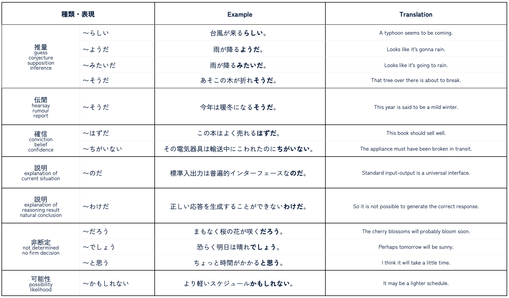
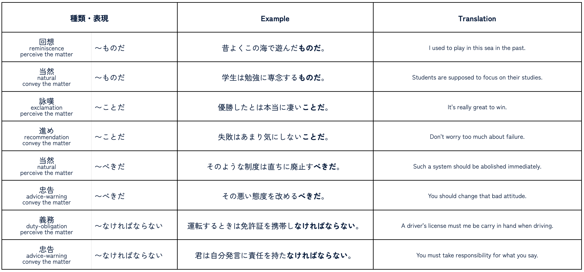

```{=html}
<style type="text/css">

body{
      font-size: 13px;
      font-family: "Roboto Condensed", "Anonymous Pro", "Roboto", "Helvetica Neue";
  }
</style>
```
<link rel="preconnect" href="https://fonts.googleapis.com"> <link rel="preconnect" href="https://fonts.gstatic.com" crossorigin> <link href="https://fonts.googleapis.com/css2?family=Hina+Mincho&family=Klee+One:wght@400;600&family=New+Tegomin&family=Sawarabi+Gothic&family=Shippori+Mincho+B1:wght@400;500&family=Yomogi&display=swap" rel="stylesheet"> <link rel="preconnect" href="https://fonts.googleapis.com"> <link rel="preconnect" href="https://fonts.gstatic.com" crossorigin> <link href="https://fonts.googleapis.com/css2?family=Noto+Sans+JP:wght@100;300;400;500;700&display=swap" rel="stylesheet"> <link rel="preconnect" href="https://fonts.gstatic.com"> <link href="https://fonts.googleapis.com/css2?family=M+PLUS+Rounded+1c:wght@100;300;400;500;700&display=swap" rel="stylesheet"> <link rel="preconnect" href="https://fonts.gstatic.com"> <link href="https://fonts.googleapis.com/css2?family=Anonymous+Pro&display=swap" rel="stylesheet"> <link href="https://fonts.googleapis.com/css2?family=Anonymous+Pro:ital,wght@0,400;1,700&display=swap" rel="stylesheet"> <link href="https://fonts.googleapis.com/css2?family=Anonymous+Pro:ital,wght@0,400;0,700;1,700&display=swap" rel="stylesheet">
<link rel="preconnect" href="https://fonts.googleapis.com">
<link rel="preconnect" href="https://fonts.gstatic.com" crossorigin>
<link href="https://fonts.googleapis.com/css2?family=Zen+Maru+Gothic:wght@300;400;500;600&display=swap" rel="stylesheet">
<link rel="preconnect" href="https://fonts.googleapis.com">
<link rel="preconnect" href="https://fonts.gstatic.com" crossorigin>
<link rel="preconnect" href="https://fonts.googleapis.com">
<link rel="preconnect" href="https://fonts.gstatic.com" crossorigin>
<link href="https://fonts.googleapis.com/css2?family=Open+Sans:ital,wght@0,300;0,400;0,500;0,600;1,300;1,400;1,500;1,600&display=swap" rel="stylesheet">

<link rel="preconnect" href="https://fonts.googleapis.com">
<link rel="preconnect" href="https://fonts.gstatic.com" crossorigin>
<link href="https://fonts.googleapis.com/css2?family=Hina+Mincho&family=IBM+Plex+Sans+JP:wght@100;200;300;400;500;600&family=Kaisei+Tokumin&family=Klee+One&family=New+Tegomin&family=RocknRoll+One&family=Shippori+Antique+B1&family=Zen+Kaku+Gothic+Antique:wght@300;400;500;700&family=Zen+Kaku+Gothic+New:wght@300;400;500;700&display=swap" rel="stylesheet">

<link rel="preconnect" href="https://fonts.googleapis.com">
<link rel="preconnect" href="https://fonts.gstatic.com" crossorigin>
<link href="https://fonts.googleapis.com/css2?family=Roboto:wght@100;300;400;500;700&display=swap" rel="stylesheet">

<link rel="preconnect" href="https://fonts.googleapis.com">
<link rel="preconnect" href="https://fonts.gstatic.com" crossorigin>
<link href="https://fonts.googleapis.com/css2?family=Roboto+Condensed:wght@300;400;700&family=Roboto+Flex:wght@100;200;300;400;500;600;700&display=swap" rel="stylesheet">

```{css, echo=FALSE}
.my-tbl {
  border: 1px solid rgba(0, 0, 0, 0.1);
}

.my-header {
  border-width: 1px;
}

.my-col {
  border-right: 1px solid rgba(0, 0, 0, 0.05);
}

.my-row:hover {
  background-color: #dee7e7;
  filter: invert(1);
}

.toc-content {
    padding-left: 10px;
    padding-right: 10px;
}

div.expressjp { outline-style: solid; outline-color: #0F2040; outline-width: 1px; border-radius: 5px; padding: 1px; padding-top: 10px;
  color: 	#404040;
  font-size: 14px;
  font-family: 'Rounded Mplus 1c', 'M PLUS Rounded 1c', sans-serif;
}

div.expresstr { outline-style: solid; outline-color: #0F2040; outline-width: 1px; border-radius: 5px; padding: 1px; padding-top: 10px; 
  color: 	#404040;
  font-size: 12.2px;
  font-family: 'Rounded Mplus 1c', 'M PLUS Rounded 1c', sans-serif;
}

div.add_info {
  padding-top: 0px; 
  padding-bottom: 0px;
  color: 	#264653;
  font-size: 12px;
  font-family: 'Roboto Condensed', 'Open Sans', 'Zen Kaku Gothic New', sans-serif;
}

div.expresstrx { outline-style: solid; outline-color: #264653; outline-width: 0.5px; border-radius: 3px; padding: 1px; padding-top: 10px; 
  color: 	#264653;
  font-size: 13px;
  font-weight: 400;
  font-family: 'Zen Kaku Gothic New', 'Rounded Mplus 1c', 'M PLUS Rounded 1c', sans-serif;
}

div.expresstrz { outline-style: solid; outline-color: #264653; outline-width: 0.5px; border-radius: 3px; padding: 1px; padding-top: 10px; 
  color: 	#264653;
  font-size: 12.4px;
  font-weight: 400;
  font-family: 'Zen Kaku Gothic New', 'M PLUS Rounded 1c', sans-serif;
}

div.ttlehigh {
  font-size: 13.2px;
  color: 	#7d1016;
}

div.ttlehighpz { background-color: #f5f8f0; padding-left: 2px; padding-top: 4px; padding-bottom: 0.01px;
  border-left: 6px solid #379fa7;
  color: 	#264653;
  font-size: 11.8px;
  font-weight: 400;
  font-family: "Roboto Condensed", "Open Sans", "Roboto";
}

div.ttlehighpn { background-color: #f5f8f0; padding-left: 2px; padding-top: 4px; padding-bottom: 0.01px;
  outline-style: solid; outline-color: #379fa7; outline-width: 0.5px; border-radius: 0px;
  border-left: 6px solid #379fa7;
  color: 	#264653;
  font-size: 11.8px;
  font-weight: 400;
  font-family: "Roboto Condensed", "Open Sans", "Roboto";
}

div.ttlehighpnn { background-color: #f5f8f0; padding-left: 2px; padding-top: 4px; padding-bottom: 0.01px;
  outline-style: solid; outline-color: #379fa7; outline-width: 0.5px; border-radius: 0px;
  border-left: 6px solid #379fa7;
  color: 	#264653;
  font-size: 11.8px;
  font-weight: 400;
  font-family: "Roboto Condensed", "Open Sans", "Roboto";
}

div.ttlehighps { background-color: #fdf8f9; padding-left: 2px; padding-top: 4px; padding-bottom: 0.01px;
  border-left: 6px solid #fd5c65;
  color: 	#264653;
  font-size: 11.8px;
  font-weight: 400;
  font-family: "Roboto Condensed", "Open Sans", "Roboto";
}

div.ttlehighpss { background-color: #f5f8f0; padding-left: 2px; padding-top: 4px; padding-bottom: 0.01px;
  outline-style: solid; outline-color: #264653; outline-width: 0.5px; border-radius: 0px;
  border-left: 6px solid #379fa7;
  color: 	#264653;
  font-size: 11.8px;
  font-weight: 400;
  font-family: 'Zen Kaku Gothic New', "Roboto Condensed", "Open Sans", "Roboto";
}

div.ttlehighpssi { background-color: #f5f8f0; padding-left: 2px; padding-top: 4px; padding-bottom: 0.01px;
  border-left: 6px solid #379fa7;
  color: 	#264653;
  font-size: 11.8px;
  font-weight: 400;
  font-family: 'Zen Kaku Gothic New', "Roboto Condensed", "Open Sans", "Roboto";
}

div.ttlehighpsi { background-color: #fbfcf9; padding-left: 0px; padding-top: 4px; padding-bottom: 0.01px;
  color: 	#264653;
  font-size: 11.8px;
  font-weight: 400;
  font-family: "Roboto Condensed", "Open Sans", "Roboto";
}

div.expresstrh { outline-style: solid; outline-color: #264653; outline-width: 0.5px; border-radius: 0px; padding: 1px; padding-top: 10px; padding-left: 2px;
  border-left: 6px solid #264653;
  color: 	#264653;
  font-size: 12.4px;
  font-weight: 400;
  font-family: 'Zen Kaku Gothic New', 'M PLUS Rounded 1c', sans-serif;
}

div.highlightpz { background-color: #fceff0; padding-left: 0px; padding-top: 4px; padding-bottom: 0.01px;
  border-left: 6px solid #fd5c65;
  color: 	#264653;
  font-size: 12.4px;
  font-weight: 400;
  font-family: "Roboto Condensed", "Open Sans", "Roboto";
}

div.expresstrl { outline-style: solid; outline-color: #264653; outline-width: 0.5px; border-radius: 0px; padding: 1px; padding-top: 6px; padding-bottom: 0.01px; 
  border-left: 6px solid #264653;
  color: 	#264653;
  font-size: 12.4px;
  line-height: 1.2;
  font-weight: 400;
  font-family: 'Zen Kaku Gothic New', 'M PLUS Rounded 1c', sans-serif;
}

div.expresstrm { outline-style: solid; outline-color: #264653; outline-width: 0.5px; border-radius: 3px; padding: 1px; padding-top: 2px; padding-bottom: 0px; 
  color: 	#264653;
  font-size: 12.4px;
  font-weight: 400;
  font-family: 'Zen Kaku Gothic New', 'M PLUS Rounded 1c', sans-serif;
}
```

```{r setup, include=FALSE}
knitr::opts_chunk$set(echo = TRUE)
```

```{css, echo=FALSE}
@media(prefers-color-scheme: light) {
  body {
    <!-- background-color: black; -->
    filter: invert(0);
  }
}
```

```{r, echo=FALSE, message=FALSE}
library(tidyverse)
library(reactable)
library(htmltools)
library(bslib)
library(dplyr)
library(purrr)
library(readr)
library(vembedr)
options(readr.show_col_types = FALSE)
```

```{r, echo=FALSE, message=FALSE, error=FALSE}
vnstc <- read_csv("jpdb/SNTSB-SSTNC.csv")
vnstd <- read_csv("jpdb/SNTSI-SSTNC.csv")
vnste <- read_csv("jpdb/SNTSA-SSTNC.csv")
sntdly <- read_csv("jpdb/SNTSDLY-SSTNC.csv")
vnsgg <- read_csv("jpdb/VRB1-VGRM.csv")
icwrds <- read_csv("jpdb/SNTSR2-SSTNC.csv")
expw <- read_csv("jpdb/SNTSR3-SSTNC.csv")
vnstg <- read_csv("jpdb/SNTSR4-SSTNC.csv")
vnstb <- read_csv("jpdb/SNTSR5-SSTNC.csv")
sntv <- read_csv("jpdb/SNTSR6-SSTNC.csv")
cmwpg <- read_csv("jpdb/SNTSR7-SSTNC.csv")
cmwpc <- read_csv("jpdb/SNTSR8-SSTNC.csv")
sntcas <- read_csv("jpdb/SNTCASL-SSTNC.csv")
comdly <- read_csv("jpdb/COMMSTRGY-STRGY.csv")
sntmre <- read_csv("jpdb/SNTMRE-SNT.csv")
smplsnt <- read_csv("jpdb/SMPLSNT-SNT.csv")
splsnt <- read_csv("jpim/SPLSNT-SNT.csv")
rrdng <- read_csv("jpim/SNTRDG-RDG.csv")
gwrds <- read_csv("jpdb/WGRMR-LST.csv")
grmsplsnt <- read_csv("jpdb/GRMMRSNS-SNT.csv")
dlyexps <- read_csv("jpim/DLYSNTC-DLY.csv")
spcvwrds <- read_csv("jpim/SPCVRBS-WRDS.csv")
splwrds <- read_csv("jpim/SPLWRDS-WRDS.csv")
spphr <- read_csv("jpdb/NHGSPKPHR-PHRS.csv")
smpsnt <- read_csv("jpdb/NHGSPKSMP-SNTS.csv")
cmnknjp <- read_csv("jpdb/SPKCSL-CSLSNT.csv")
dailycom <- read_csv("jpdb/COMMSTRGY-STRGY.csv")
sntmodes<- read_csv("jpim/SNTMDE-MDE.csv")
setwrdcmb<- read_csv("jpim/SETWRE-MDE.csv")
gessence02 <- read_csv("cpdb/GRMESSN-QNS.csv")
gessence03 <- read_csv("cpdb/GRMESSM-QNS.csv")
notesxm <- read_csv("cpdb/LSTNTS-NTS.csv")
gessence01 <- read_csv("cpdb/GESSNCES-ETB.csv")
cvnptn <- read_csv("jpdb/SPKPTNB-GRML.csv")
syntxm <- read_csv("jpim/SYNTX-SYNX.csv")
```

# <b> Composition </b> {.tabset}

### SC:01 Structure {.tabset}

#### Basic Structure
<p style="font-size:11px; line-height: 1; font-family: Noto Sans JP;  color: #1e3842;">**Basic Pattern Structure** of a japanese sentence.</p>


<h6> </h6>

------------------------------------------------------------------------

#### Basic Elements 

<div class = "ttlehighpss">
<div class = "ttlehigh">**① Initial Elements** </div>  
・**Connectives**: Provides connection to previous sentence.     
・**Adverbials**: Provides an initial gut feeling or mood of the sentence.     
・**Topic**: Introduce the topic of the sentence.     
</div>

<h6> </h6>

<div class = "ttlehighpss">
<div class = "ttlehigh">**② Main Elements** </div>  
・Describes the subject of the sentence.     
・Provides supplementary details about the engine on what action it does or the current state it is in.    
・Includes the subject, object, indirect object, time, location, modifiers such as adjectives, adverbs, noun phrases, etc.      
</div>

<h6> </h6>

<div class = "ttlehighpss">
<div class = "ttlehigh">**③ Engine** </div>  
・The driving force of the sentence.    
・It does tell the kind of sentence on whether it is a nominal, adjectival, or verbal sentence.    
・Includes either a verb, an adjective or a noun with modifiers plus copula, auxiliaries, particles, conjunction, etc.    
</div>

<h6> </h6>

------------------------------------------------------------------------

#### Sentence Classification 

<div class = "ttlehighpss">
<div class = "ttlehigh">**❖ Determined by type of word the predicate or complement consist of:** </div>  
・**Nominal**: Noun. Noun Phrase.        
・**Adjectival**: I-Adjective or Na-Adjective.    
・**Verbal**: Transitive or Intransitive. Existential. Movement. Change. Verb Phrase.            
</div>
<h6> </h6>
<div class = "ttlehighpsi">
<div class = "ttlehigh">**① Nominal Class** </div>  
・**Noun Ⓐ + Noun Ⓑ + Copula: Ⓑ describes or identifies Ⓐ**      
</div>
<div class = "expresstrz">
・ジョンさんが**アメリカじん**<u>です</u>.     
・John-san ga amerika-jin desu.     
・John is an American.  
</div>
<h6> </h6>
<div class = "expresstrz">
・名詞は 名詞**です**.・名詞は 名詞**でした**.・名詞は 名詞**じゃない**.・名詞は 名詞**ではありません**.  
</div>
<h6> </h6>

<div class = "ttlehighpsi">
<div class = "ttlehigh">**② Adjectival Class: I-Adjective** </div>  
・**Adjective Ⓐ + Noun Ⓑ: Ⓑ describes Ⓐ**      
</div>
<div class = "expresstrz">
・空が**青い**.     
・Sora ga aoi.       
・The sky is blue.    
</div>
<h6> </h6>
<div class = "expresstrz">
・名詞は イ形容詞**です**.・名詞は イ形容詞**でした**.・名詞は イ形容詞**くないです**.・名詞は イ形容詞**くなかった**.  
</div>
<h6> </h6>

<div class = "ttlehighpsi">
<div class = "ttlehigh">**③ Adjectival Class: Na-Adjective** </div>  
・**Adjective Ⓐ + Noun Ⓑ + Copula: Ⓑ describes Ⓐ**       
</div>
<div class = "expresstrz">
・地下鉄が**便利**<u>だ</u>.     
・Chikatetsu ga benri da.     
・The subway is convenient.    
</div>
<h6> </h6>
<div class = "expresstrz">
・名詞は ナ形容詞**です**.・名詞は ナ形容詞**でした**.・名詞は ナ形容詞**ではありません**.・名詞は ナ形容詞**ではありませんでした**.  
</div>
<h6> </h6>

<div class = "ttlehighpsi">
<div class = "ttlehigh">**④ Verbal Class: Intransitive** </div>  
・**Subject Ⓐ + Verb Ⓑ: Ⓑ describes the state of Ⓐ**     
</div>
<div class = "expresstrz">
・桜さん<u>が</u>**来た**.       
・Sakura-san ga kita.       
・Sakura came.      
</div>
<h6> </h6>
<div class = "expresstrz">
・名詞が 動詞(**自動詞**).         
</div>
<h6> </h6>

<div class = "ttlehighpsi">
<div class = "ttlehigh">**⑤ Verbal Class: Transitive** </div>  
・**Subject Ⓐ + Object Ⓑ + Verb Ⓒ: Ⓐ does the action Ⓒ to Ⓑ**       
</div>
<div class = "expresstrz">
・先生は授業<u>を</u>**始めた**.      
・Sensei wa jugyou o hajimeta.    
・The teacher began teaching.    
</div>
<h6> </h6>
<div class = "expresstrz">
・名詞が 名詞を 動詞(**他動詞**).         
</div>
<h6> </h6>

<div class = "ttlehighpsi">
<div class = "ttlehigh">**⑥ Verbal Class: Existential・Movement・Change** </div>  
・**Subject Ⓐ + Verb Ⓑ : Ⓑ indicates the existence・movement・changes of Ⓐ**       
</div>
<div class = "expresstrz">
・ネットワークに問題が**あります**.      
・Nettowaaku ni mondai ga arimasu.        
・There is a problem with the network.    
</div>
<h6> </h6>
<div class = "expresstrz">
・名詞に 名詞が 動詞(**存在動詞**).・名詞が 名詞に 動詞(**移動動詞**)名詞が 名詞から 名詞に 動詞**(移動動詞**).・名詞が 名詞に 名詞を 動詞(**受授動詞**).         
</div>
<h6> </h6>

------------------------------------------------------------------------

#### Sentence Construction {.tabset}

##### Sentence Style {.tabset}

###### Simple Style

<div class = "ttlehighpss">
<div class = "ttlehigh">**❖ Consist of one main clause with subject and-or just an engine** </div>  
・Example of these are simple declarative, interrogative, imperative sentences, etc.    
</div>
<h6> </h6>

<div class = "ttlehighpsi">
<div class = "ttlehigh">**① One Main Clause:** </div>  
・**Adjective + Noun + Particle + Verb + Auxiliary + Copula**     
</div>
<div class = "expresstrz">
・大事な話があるんです.      
・I have something important to tell you.    
</div>

<h6> </h6>

------------------------------------------------------------------------

###### Conjoined Style

<div class = "ttlehighpss">
<div class = "ttlehigh">**❖ Consists of two independent clauses with subject and-or just an engine** </div>  
・**AND-Relation**: The use **connective forms** to connect the two independent clauses.           
・**AND-Relation**: The use **conjunctive particles** to connect the two independent clauses.       
・**BUT-Relation**: The use **conjunctive particles** to connect the two opposite independent clauses.    
・**INTER-Relation**: The use **connectives or conjunctions** to connect the two independent clauses.       
</div>
<h6> </h6>

<div class = "ttlehighpsi">
<div class = "ttlehigh">**① AND-Relation: Connective forms of verbs, adjectives and copula** </div>  
・**Sentence(I-Adj-Ending) + kute + Sentence**     
</div>
<div class = "expresstrz">
・この辞書は安くて便利だ.     
・This dictionary is cheap and convenient.    
</div>
<h6> </h6>
<div class = "ttlehighpsi">
・**Sentence(Na-Adj-Ending) + de + Sentence**     
</div>
<div class = "expresstrz">
・りなさんはきれいでやさしいです.     
・Rina-san is beautiful and kind.      
</div>
<h6> </h6>
<div class = "ttlehighpsi">
・**Sentence(Noun-Ending) + de + Sentence**     
</div>
<div class = "expresstrz">
・ウンさんは中国人でキムさんは韓国人です.    
・Mr.Wong is Chinese and Mr. Kim is Korean.    
</div>
<h6> </h6>
<div class = "ttlehighpsi">
・**Sentence(Vnoun-base-Ending) + Sentence**     
</div>
<div class = "expresstrz">
・私は朝六時に起き、夜十時ごろ寝る.    
・I get up at six in the morning and go to bed around ten at night.   
</div>
<h6> </h6>
<div class = "ttlehighpsi">
・**Sentence(Vte-Ending) + Sentence**     
</div>
<div class = "expresstrz">
・山田さんはラメンを食べてビールを飲む.     
・Yamada-san eats ramen and drinks beer.   
</div>
<h6> </h6>

<div class = "ttlehighpsi">
<div class = "ttlehigh">**② BUT-Relation: Conjunctive Particles** </div>  
・**Sentence(V/I-Adj/(N/Na-Adj+Cop)-Ending) + shi + Sentence**     
・**shi** particle connects one or multiple reasons but not naming all of it.    
</div>

<div class = "expresstrz">
・この辞書は安くて便利だ.     
・This dictionary is cheap and convenient.    
</div>

<h6> </h6>

<div class = "expresstrz">
・この事件はほぼ終息したし二度と起こることはない.    
・This incident has more or less ended and will never happen again.   
</div>

<h6> </h6>

<div class = "ttlehighpsi">
・**Sentence(V/I-Adj/N/Na-Adj) + toka + Sentence**     
・**toka** cite a thing or an instance among other things or situation.    
</div>

<div class = "expresstrz">
・じゃあ映画を字幕なしで見るとか日本の音楽を聞くとかはどう？     
・So how about watching movies without subtitles or listening to Japanese music?     
</div>

<h6> </h6>

<div class = "ttlehighpsi">
<div class = "ttlehigh">**③ BUT-Relation: Conjunctive Particles** </div>  
・**Sentence + ga + Sentence**     
</div>

<div class = "expresstrz">
・この辞書は安くて便利だ.     
・This dictionary is cheap and convenient.    
</div>

<h6> </h6>

<div class = "expresstrz">
・家内はフランス語を話せるが私が話せない.    
・My wife can speak French but I can't.    
</div>

<h6> </h6>

<div class = "ttlehighpsi">
・**Sentence + kedo + Sentence**     
</div>

<div class = "expresstrz">
・入ってもいいけどしずかにしてくださいね.   
・You can come in but please be quiet.   
</div>

<h6> </h6>

<div class = "ttlehighpsi">
・**Sentence + keredomo + Sentence**     
</div>

<div class = "expresstrz">
・あそびたいけれども宿題はまだ終わってない.    
・I want to play but I haven't finished my homework yet.   
</div>

<h6> </h6>

<div class = "ttlehighpsi">
<div class = "ttlehigh">**④ Connectives・Conjunctions** </div>  
・**Sentence + connectives・conjunctions + Sentence**     
</div>

<div class = "expresstrz">
・あの人は頭がいい. そのうえ性格してもいい.    
・僕は駅前の喫茶店に行った. そしてそこで友達を待っていた.       
・彼は新しい、いい車を持っている. でもめったに乗らない.     
・手紙を出した. しかし返事はこなかった.       
・車で行きますか. それとも飛行機で行きますか.        
・私が別れようと言った. すると彼女雨は泣き出した.            
・日本語を勉強すると役に立つ. だから日本をしている.          
・金がない. つまり、貧乏なんです.     
</div>

<h6> </h6>

<div class = "expresstrz">
・He is smart. On top of that, he has a good personality.     
・I went to a coffee shop in front of the station. And there I waited for my friend.        
・He has a new, nice car, but he rarely drives it.    
・I sent him a letter. But he never wrote back.        
・Do you want to go by car? Or do you want to go by car or by plane?         
・I said goodbye. Then she started to cry.             
・I told her that studying Japanese would be useful for her. That's why I'm doing Japan.          
・I don't have money. I mean, we are poor.      
</div>

<h6> </h6>

------------------------------------------------------------------------

###### Complex Style

<div class = "ttlehighpss">
<div class = "ttlehigh">**❖ Consists of one main clause and at lest one subordinate clause** </div>  
・**Relative Clause**: The use **relative clause** as a subordinate clause to provide additional information.           
・**Complement Clause**: The use **complement clause** as a subordinate clause to complete the meaning of whole sentence.       
・**Conditional Clause**: The use **conditional clause** as a subordinate clause to set some conditions.    
</div>
<h6> </h6>

<div class = "ttlehighpsi">
<div class = "ttlehigh">**① Relative Clause: Direct Information** </div>  
・**Relative Clause + Noun**     
</div>

<div class = "expresstrz">
・私が昨日見た犬はかわいいだ.    
・As for the dog which I saw yesterday was adorable.   
</div>

<h6> </h6>

<div class = "ttlehighpsi">
<div class = "ttlehigh">**② Complement Clause: Naming・Calling・Defining** </div>  
・**Complement Clause + toiu + Noun**     
</div>

<div class = "expresstrz">
・日本語は曖昧な言葉だという考えは珍しくない.      
・The idea that Japanese is an ambiguous language is not uncommon.   
</div>

<h6> </h6>

<div class = "ttlehighpsi">
<div class = "ttlehigh">**③ Complement Clause: Nominalized** </div>  
・**Complement Clause + no・koto**     
</div>

<div class = "expresstrz">
・光子がピアノを弾いているのを聞いた.        
・ひかるさんが今日は来ることを知らなかった.     
</div>

<h6> </h6>

<div class = "expresstrz">
・I heard Mitsuko playing the piano.   
・I didn't know Hikaru-san was going to be here today.   
</div>

<h6> </h6>

<div class = "ttlehighpsi">
<div class = "ttlehigh">**④ Complement Clause: Interrogative Quotation** </div>  
・**Complement Clause + ka・ka dou ka・no ka dou ka**     
</div>

<div class = "expresstrz">
・誰がそれをするかが問題だ.    
・あの学生は真面目かどうかしていますか.     
</div>

<h6> </h6>

<div class = "expresstrz">
・It's just a question of who's going to do it.   
・Do you know whether or not that student is serious?    
</div>

<h6> </h6>

<div class = "ttlehighpsi">
<div class = "ttlehigh">**⑤ Complement Clause: Declarative Quotation** </div>  
・**Complement Clause + to iu・omou・kangaeru・etc.**     
</div>

<div class = "expresstrz">
・あそこはたぶん静かだと思います.   
・彼は漢字は難しくないと言っている.   
</div>

<h6> </h6>

<div class = "expresstrz">
・It's probably quiet over there.   
・He says Kanji is not difficult.   
</div>

<h6> </h6>

<div class = "ttlehighpsi">
<div class = "ttlehigh">**⑥ Complement Clause: Adverbial Nature** </div>  
・**Complement Clause + you ni・mitai ni**     
</div>

<div class = "expresstrz">
・零さないように運んでください.   
・彼は子供みたいに泣いて謝ったの.   
</div>

<h6> </h6>

<div class = "expresstrz">
・Please carry it without spilling it.   
・He cried like a little kid and apologized.   
</div>

<h6> </h6>

<div class = "ttlehighpsi">
<div class = "ttlehigh">**⑦ Complement Clause: Adjectival Nature** </div>  
・**Complement Clause + you na・mitai na**     
</div>

<div class = "expresstrz">
・どことなく修学旅行のような雰囲気です.   
・迷路みたいな小さな路地ばかり.   
</div>

<h6> </h6>

<div class = "expresstrz">
・The atmosphere is somewhat like a school trip.   
・They are all little alleys like a maze.   
</div>

<h6> </h6>

<div class = "ttlehighpsi">
<div class = "ttlehigh">**⑧ Conditional Clause: Conditional・Hypothetical** </div>  
・**Conditional Clause + tara・to・nara・ba**     
</div>

<div class = "expresstrz">
・コートを着たら寒くありません.     
・彼女は酒を飲むと顔が赤くなる.    
・毎日練習をすれば上手になるよ.   
・君がいやだと言うのならだれかほかの者にやらせる.   
</div>

<h6> </h6>

<div class = "expresstrz">
・If you put on a coat, it's not cold.   
・If she drinks, her face turns red.   
・If you practice every day, you'll get better.   
・If you don't want to do it, I'll get someone else to do it.   
</div>

<h6> </h6>

<div class = "ttlehighpsi">
<div class = "ttlehigh">**⑨ Clauses: Time・Degree・Purpose・Reason・Etc** </div>  
・**Subordinate Clause + conjunctions + Main Clause**     
</div>

<div class = "expresstrz">
・私がそこにいた時には異常はなかった.       
・私は日本留学するために日本語を勉強しています.   
</div>

<h6> </h6>

<div class = "expresstrz">
・There was nothing unusual when I was there.   
・I'm studying Japanese in order to study in Japan.   
</div>

<h6> </h6>

<div class = "ttlehighpsi">
<div class = "ttlehigh">**⑩ Phrasal Particles: Pre-Nominal-Form・Pre-Verbal-Form** </div>  
・**Noun・Noun Phrase + phrasal particles + Clause**     
</div>

<div class = "expresstrz">
・彼は妹のためのケーキを作った.   
・天気によって計画が変わるかもしれません.      
</div>

<h6> </h6>

<div class = "expresstrz">
・He made a cake for his sister.   
・The plan might change depending on the weather.   
</div>

<h6> </h6>

------------------------------------------------------------------------

##### Sentence Modes {.tabset}

<div class = "ttlehighpss">
<div class = "ttlehigh">**❖ Mode of the Sentence:** </div>  
・The mode of the sentence can be set by adding auxiliaries at the end and in effect it sets the type and function.           
・**Auxiliaries** are added in order to slightly change the meaning of the sentence or give a nuance or a function.    
・**Auxiliaries** are used as modality expressions on how to perceive a matter or how to convey it to the listener.    
</div>
<h6> </h6>





<!-- <div class = "ttlehighpsi"> -->
<!-- **❖ らしい・推量・Conjecture**       -->
<!-- </div> -->
<!-- <div class = "expresstrz"> -->
<!-- ・台風が来るらしい.          -->
<!-- ・A typhoon seems to be coming.     -->
<!-- </div> -->
<!-- <h6> </h6> -->
<!-- <div class = "ttlehighpsi"> -->
<!-- **❖ ようだ・推量・Conjecture**       -->
<!-- </div> -->
<!-- <div class = "expresstrz"> -->
<!-- ・雨が降るようだ.          -->
<!-- ・Looks like it's gonna rain.     -->
<!-- </div> -->
<!-- <h6> </h6> -->
<!-- <div class = "ttlehighpsi"> -->
<!-- **❖ みたいだ・推量・Conjecture**       -->
<!-- </div> -->
<!-- <div class = "expresstrz"> -->
<!-- ・雨が降るみたいだ.          -->
<!-- ・Looks like it's going to rain.     -->
<!-- </div> -->
<!-- <h6> </h6> -->
<!-- <div class = "ttlehighpsi"> -->
<!-- **❖ そうだ・推量・Conjecture**       -->
<!-- </div> -->
<!-- <div class = "expresstrz"> -->
<!-- ・あそこの木が折れそうだ.          -->
<!-- ・That tree over there is about to break.     -->
<!-- </div> -->
<!-- <h6> </h6> -->
<!-- <div class = "ttlehighpsi"> -->
<!-- **❖ そうだ・伝聞・Hearsay・Rumour・Report**       -->
<!-- </div> -->
<!-- <div class = "expresstrz"> -->
<!-- ・今年は暖冬になるそうだ.               -->
<!-- ・This year is said to be a mild winter.     -->
<!-- </div> -->
<!-- <h6> </h6> -->
<!-- <div class = "ttlehighpsi"> -->
<!-- **❖ だろう・非断定・Not determined・No firm decision**       -->
<!-- </div> -->
<!-- <div class = "expresstrz"> -->
<!-- ・まもなく桜の花が咲くだろう.               -->
<!-- ・The cherry blossoms will probably bloom soon.     -->
<!-- </div> -->
<!-- <h6> </h6> -->
<!-- <div class = "ttlehighpsi"> -->
<!-- **❖ はずだ・確信・Conviction・Belief・Confidence**       -->
<!-- </div> -->
<!-- <div class = "expresstrz"> -->
<!-- ・この本はよく売れるはずだ.               -->
<!-- ・This book should sell well.     -->
<!-- </div> -->
<!-- <h6> </h6> -->
<!-- <div class = "ttlehighpsi"> -->
<!-- **❖ ちがいない・確信・Conviction・Belief・Confidence**       -->
<!-- </div> -->
<!-- <div class = "expresstrz"> -->
<!-- ・その電気器具は輸送中にこわれたのにちがいない.               -->
<!-- ・The appliance must have been broken in transit.     -->
<!-- </div> -->
<!-- <h6> </h6> -->
<!-- <div class = "ttlehighpsi"> -->
<!-- **❖ のだ・説明・Explanation**       -->
<!-- </div> -->
<!-- <div class = "expresstrz"> -->
<!-- ・標準入出力は普遍的インターフェースなのだ.               -->
<!-- ・Standard input-output is a universal interface.     -->
<!-- </div> -->
<!-- <h6> </h6> -->
<!-- <div class = "ttlehighpsi"> -->
<!-- **❖ わけだ・説明・Explanation**       -->
<!-- </div> -->
<!-- <div class = "expresstrz"> -->
<!-- ・僕自身の本性を認めて欲しかったわけだ.               -->
<!-- ・I wanted him to recognize my own true nature.     -->
<!-- </div> -->
<!-- <h6> </h6> -->
<!-- <div class = "ttlehighpsi"> -->
<!-- **❖ べきだ・義務・必要・Obligation・Need**       -->
<!-- </div> -->
<!-- <div class = "expresstrz"> -->
<!-- ・この状況をすべて変えるべきだ.               -->
<!-- ・All of this should be changed.     -->
<!-- </div> -->
<!-- <h6> </h6> -->
<!-- <div class = "ttlehighpsi"> -->
<!-- **❖ なけらばならない・義務・必要・Obligation・Need**       -->
<!-- </div> -->
<!-- <div class = "expresstrz"> -->
<!-- ・効率的なアルゴリズムが確立されなけらばならない.               -->
<!-- ・An efficient algorithm must be established.     -->
<!-- </div> -->
<!-- <h6> </h6> -->
<!-- <div class = "ttlehighpsi"> -->
<!-- **❖ なくてはいけない・義務・必要・Obligation・Need**       -->
<!-- </div> -->
<!-- <div class = "expresstrz"> -->
<!-- ・新しいスキー板を買わなくてはいけない.               -->
<!-- ・I need to buy a new ski board.     -->
<!-- </div> -->
<!-- <h6> </h6> -->

------------------------------------------------------------------------

##### Sentence Types {.tabset}

<div class = "ttlehighpsi">
<div class = "ttlehigh">**① Interrogative Sentence:** </div>  
・**Clause + ka・no**     
</div>
<div class = "expresstrz">
・いつまで預けるつもりですかい.     
・How long do you plan to keep them?     
</div>

<h6> </h6>

<div class = "ttlehighpsi">
<div class = "ttlehigh">**② Imperative Sentence:** </div>  
・**Vte + kudasai**     
</div>
<div class = "expresstrz">
・お客様アカウントにログインしてください.     
・Please log in to your customer account.     
</div>

<h6> </h6>

<div class = "ttlehighpsi">
<div class = "ttlehigh">**③ Declarative Sentence:** </div>  
・**Clause + desu**     
</div>
<div class = "expresstrz">
・小さくはじめるというのは非常に大事です.     
・Starting small is very important.     
</div>

<h6> </h6>

<div class = "ttlehighpsi">
<div class = "ttlehigh">**⑥ Topic-Comment Sentence:** </div>  
・**Topic Ⓐ + Comment Ⓑ: Ⓑ describes Ⓐ**    
</div>
<div class = "expresstrz">
・日本は春と秋がいい.     
・As for Japan, spring and fall are good.     
</div>

<h6> </h6>

------------------------------------------------------------------------

##### Sentence Functions {.tabset}

<div class = "ttlehighpss">
<div class = "ttlehigh">**❖ Sentence Functions:** </div>  
・**Prohibition**: Prohibit something to do.          
・**Permission**: Give or give permission to do.    
・**Request**: Ask for something or something to do.     
</div>
<h6> </h6>

------------------------------------------------------------------------

##### Sample Sentences {.tabset}

###### Phrase {.tabset}

```{r, echo=FALSE, message=FALSE}

spphr.a <- spphr %>% select(P1, T1) %>% rename(Phrase = P1, Translation = T1)
spphr.b <- spphr %>% select(P2, T2) %>% rename(Phrase = P2, Translation = T2)
spphr.c <- spphr %>% select(P3, T3) %>% rename(Phrase = P3, Translation = T3)
spphr.x <- bind_rows(spphr.a, spphr.b)
spphr.x <- bind_rows(spphr.x, spphr.c)
spphr.x <- spphr.x[sample(1:nrow(spphr.x)),]

reactable(
  spphr.x,
  columns = list(
    Phrase = colDef(style= list(background = '#e0e1dd'),
      cell = function(value, index) {
        Translation <- spphr.x$Translation[index]
        Translation <- if (!is.na(Translation)) Translation else ""
        tagList(
          div(style = list(fontSize = 19, fontWeight = 700, color = '#0F2040', fontFamily = 'Zen Kaku Gothic New'), value, "。"),
          div(style = list(fontSize = 11, fontWeight = 300, color = '#026450', fontFamily = 'Zen Kaku Gothic New'), Translation, "."),
        )
      },
      align = "left"
    ),
    Translation = colDef(show = FALSE)
  ), 
  rowClass = "my-row",
  defaultPageSize = 7,
  theme = reactableTheme(
    # Vertically center cells
    cellStyle = list(display = "flex", flexDirection = "column", justifyContent = "center"),
    searchInputStyle = list(
      paddingLeft = "8px",
      paddingTop = "8px",
      paddingBottom = "8px",
      width = "100%"
    )
  ),
  showPageInfo = FALSE, bordered = TRUE, searchable = TRUE, sortable = FALSE, paginationType = "numbers", striped = TRUE, highlight = TRUE,
  
  style = list(fontFamily = "Noto Sans JP, Heiti SC, Hiragino Maru Gothic ProN, Anonymous Pro , monospace, Helvetica Neue", fontSize = "11px")
)

```

------------------------------------------------------------------------

###### Simple {.tabset}

```{r, echo=FALSE, message=FALSE}

smpsnt.a <- smpsnt %>% select(S1, T1) %>% rename(Sentence = S1, Translation = T1)
smpsnt.b <- smpsnt %>% select(S2, T2) %>% rename(Sentence = S2, Translation = T2)
smpsnt.c <- smpsnt %>% select(S3, T3) %>% rename(Sentence = S3, Translation = T3)
smpsnt.x <- bind_rows(smpsnt.a, smpsnt.b)
smpsnt.x <- bind_rows(smpsnt.x, smpsnt.c)
smpsnt.x <- smpsnt.x[sample(1:nrow(smpsnt.x)),]

reactable(
  smpsnt.x,
  columns = list(
    Sentence = colDef(style= list(background = '#e0e1dd'),
      cell = function(value, index) {
        Translation <- smpsnt.x$Translation[index]
        Translation <- if (!is.na(Translation)) Translation else ""
        tagList(
          div(style = list(fontSize = 19, fontWeight = 700, color = '#0F2040', fontFamily = 'Zen Kaku Gothic New'), value, "。"),
          div(style = list(fontSize = 11, fontWeight = 300, color = '#026450', fontFamily = 'Zen Kaku Gothic New'), Translation, "."),
        )
      },
      align = "left"
    ),
    Translation = colDef(show = FALSE)
  ), 
  rowClass = "my-row",
  defaultPageSize = 7,
  theme = reactableTheme(
    # Vertically center cells
    cellStyle = list(display = "flex", flexDirection = "column", justifyContent = "center"),
    searchInputStyle = list(
      paddingLeft = "8px",
      paddingTop = "8px",
      paddingBottom = "8px",
      width = "100%"
    )
  ),
  showPageInfo = FALSE, bordered = TRUE, searchable = TRUE, sortable = FALSE, paginationType = "numbers", striped = TRUE, highlight = TRUE,
  
  style = list(fontFamily = "Noto Sans JP, Heiti SC, Hiragino Maru Gothic ProN, Anonymous Pro , monospace, Helvetica Neue", fontSize = "11px")
)

```

------------------------------------------------------------------------

###### Casual {.tabset}

```{r, echo=FALSE, message=FALSE}

cmnknjp.a <- cmnknjp %>% select(W1, T1) %>% rename(Sentence = W1, Translation = T1)
cmnknjp.b <- cmnknjp %>% select(W2, T2) %>% rename(Sentence = W2, Translation = T2)
cmnknjp.c <- cmnknjp %>% select(W3, T3) %>% rename(Sentence = W3, Translation = T3)
cmnknjp.x <- bind_rows(cmnknjp.a, cmnknjp.b)
cmnknjp.x <- bind_rows(cmnknjp.x, cmnknjp.c)
cmnknjp.x <- cmnknjp.x[sample(1:nrow(cmnknjp.x)),]

reactable(
  cmnknjp.x,
  columns = list(
    Sentence = colDef(style= list(background = '#e0e1dd'),
      cell = function(value, index) {
        Translation <- cmnknjp.x$Translation[index]
        Translation <- if (!is.na(Translation)) Translation else ""
        tagList(
          div(style = list(fontSize = 19, fontWeight = 700, color = '#0F2040', fontFamily = 'Zen Kaku Gothic New'), value, "。"),
          div(style = list(fontSize = 11, fontWeight = 300, color = '#026450', fontFamily = 'Zen Kaku Gothic New'), Translation, "."),
        )
      },
      align = "left"
    ),
    Translation = colDef(show = FALSE)
  ), 
  rowClass = "my-row",
  defaultPageSize = 7,
  theme = reactableTheme(
    # Vertically center cells
    cellStyle = list(display = "flex", flexDirection = "column", justifyContent = "center"),
    searchInputStyle = list(
      paddingLeft = "8px",
      paddingTop = "8px",
      paddingBottom = "8px",
      width = "100%"
    )
  ),
  showPageInfo = FALSE, bordered = TRUE, searchable = TRUE, sortable = FALSE, paginationType = "numbers", striped = TRUE, highlight = TRUE,
  
  style = list(fontFamily = "Noto Sans JP, Heiti SC, Hiragino Maru Gothic ProN, Anonymous Pro , monospace, Helvetica Neue", fontSize = "11px")
)

```

------------------------------------------------------------------------

###### Daily {.tabset}

```{r, echo=FALSE, message=FALSE}

dailycom <- dailycom[sample(1:nrow(dailycom)),]

reactable(
  dailycom,
  columns = list(
    Sentence = colDef(style= list(background = '#e0e1dd'),
      cell = function(value, index) {
        Meaning <- dailycom$Meaning[index]
        Meaning <- if (!is.na(Meaning)) Meaning else ""
        tagList(
          div(style = list(fontSize = 19, fontWeight = 700, color = '#0F2040', fontFamily = 'Zen Kaku Gothic New'), value),
          div(style = list(fontSize = 11, fontWeight = 300, color = '#026450', fontFamily = 'Zen Kaku Gothic New'), Meaning),
        )
      },
      align = "left"
    ),
    Meaning = colDef(show = FALSE)
  ), 
  rowClass = "my-row",
  defaultPageSize = 7,
  theme = reactableTheme(
    cellStyle = list(display = "flex", flexDirection = "column", justifyContent = "center"),
    searchInputStyle = list(
      paddingLeft = "8px",
      paddingTop = "8px",
      paddingBottom = "8px",
      width = "100%"
    )
  ),
  showPageInfo = FALSE, bordered = TRUE, searchable = TRUE, sortable = FALSE, paginationType = "numbers", striped = TRUE, highlight = TRUE,
  
  style = list(fontFamily = "Noto Sans JP, Heiti SC, Hiragino Maru Gothic ProN, Anonymous Pro , monospace, Helvetica Neue", fontSize = "11px")
)

```

------------------------------------------------------------------------

###### Modes {.tabset}

```{r, echo=FALSE, message=FALSE}

sntmodes <- sntmodes[sample(1:nrow(sntmodes)),]

reactable(
  sntmodes,
  columns = list(
    Phrase = colDef(style= list(background = '#e0e1dd'),
      cell = function(value, index) {
        Translation <- sntmodes$Translation[index]
        Translation <- if (!is.na(Translation)) Translation else ""
        tagList(
          div(style = list(fontSize = 19, fontWeight = 700, color = '#0F2040', fontFamily = 'Zen Kaku Gothic New'), value),
          div(style = list(fontSize = 11, fontWeight = 300, color = '#026450', fontFamily = 'Zen Kaku Gothic New'), Translation),
        )
      },
      align = "left"
    ),
    Translation = colDef(show = FALSE)
  ), 
  rowClass = "my-row",
  defaultPageSize = 7,
  theme = reactableTheme(
    cellStyle = list(display = "flex", flexDirection = "column", justifyContent = "center"),
    searchInputStyle = list(
      paddingLeft = "8px",
      paddingTop = "8px",
      paddingBottom = "8px",
      width = "100%"
    )
  ),
  showPageInfo = FALSE, bordered = TRUE, searchable = TRUE, sortable = FALSE, paginationType = "numbers", striped = TRUE, highlight = TRUE,
  
  style = list(fontFamily = "Noto Sans JP, Heiti SC, Hiragino Maru Gothic ProN, Anonymous Pro , monospace, Helvetica Neue", fontSize = "11px")
)

```

------------------------------------------------------------------------

#### Clause Construction {.tabset}

##### Clause Formation

<div class = "ttlehighpss">
<div class = "ttlehigh">**❖ Clause Formation: Basic Elements** </div>  
・**Main**: Optional.      
・**Engine**: Required.          
</div>

<h6> </h6>

<div class = "expresstrz">
・<mark class="green underline--green">リンゴを食べる</mark>前に<mark class="green underline--red">皮をむきなさい</mark>.     
・Take the skin off before you eat the apple.  
</div>

<h6> </h6>

------------------------------------------------------------------------

##### Clause Category

<div class = "ttlehighpss">
<div class = "ttlehigh">**❖ Main Clause: Independent Clause: 主節** </div>  
A <u class="green underline--red">main clause</u> is a group of words with a subject and a verb. It is one that can stand alone and makes complete sense.      
</div>

<h6> </h6>

<div class = "ttlehighpss">
<div class = "ttlehigh">**❖ Subordinate Clause: Dependent Clause: 従属節** </div>  
A <u class="green underline--green">subordinate clause</u> is a group of words that consists of a subject, a verb and a subordinating conjunction or a relative pronoun. Unlike main clauses, subordinate clauses cannot stand alone or convey complete meaning when taken separately from the sentence it is a part of.        
</div>

<h6> </h6>

<div class = "expresstrz">
・<u class="green underline--green">日本語は難しい</u>と<u class="green underline--red">思いません</u>.      
・I don’t think Japanese is difficult.     
</div>
<h6> </h6>
<div class = "expresstrz">
・<u class="green underline--green">日本のドラマをたくさん見た</u>から<u class="green underline--red">耳が良くなりました</u>.     
・Because I watched many Japanese TV dramas, my listening comprehension improved.     
</div>

<h6> </h6>

------------------------------------------------------------------------

##### Clause Types

<div class = "ttlehighpss">
<div class = "ttlehigh">**❖ Relative Clause:** </div>  
Used to give additional information about a noun.        
Internal relative clause: Provides direct information of a noun.        
External relative clause: Provides indirect information of a noun which may be an abstract concept of thoughts or assertions. Uses to iu or tte.          
</div>

<h6> </h6>

<div class = "ttlehighpss">
<div class = "ttlehigh">**❖ Complement Clause:** </div>  
Serves to complete the meaning of a noun or verb.    
Could function as the subject or object of the verb.     
Indicated by no, koto or to.      
</div>

<h6> </h6>

<div class = "ttlehighpss">
<div class = "ttlehigh">**❖ Conditional Clause:** </div>  
States a hypothesis or condition.  
It could be real, factual, imagined or counter-factual.      
Indicated by tara, ba, nara and to.      
</div>

<h6> </h6>

------------------------------------------------------------------------

##### Clause Forms

<div class = "ttlehighpss">
<div class = "ttlehigh">**❖ Adjectival Clause:** </div>  
It is adjectival in nature if use adjectives to provide additional information about the noun.     
Indicated by na, adjectives.     
</div>

<h6> </h6>

<div class = "ttlehighpss">
<div class = "ttlehigh">**❖ Adverbial Clause:** </div>  
It is adjectival in nature if provides additional information about the verb which is verb phrase.             
Indicated by ni, te and phrasal particles in pre-verbal form.     
</div>

<h6> </h6>

<div class = "ttlehighpss">
<div class = "ttlehigh">**❖ Nominal Clause:** </div>  
It is adjectival in nature if it provides additional information about a noun which is noun phrase.     
Indicated by no, specialized nouns and phrasal particles in pre-nominal form.     
</div>

<h6> </h6>

------------------------------------------------------------------------

### SC:02 Lexicon

```{r, echo=FALSE, message=FALSE}

setwrdcmb <- setwrdcmb[sample(1:nrow(setwrdcmb)),]

reactable(
  setwrdcmb,
  columns = list(
    Words = colDef(style= list(background = '#d3dfdf'), minWidth = 120, 
      cell = function(value, index) {
        Sentence <- setwrdcmb$Sentence[index]
        Sentence <- if (!is.na(Sentence)) Sentence else ""
        Translation <- setwrdcmb$Translation[index]
        Translation <- if (!is.na(Translation)) Translation else ""
        Meaning <- setwrdcmb$Meaning[index]
        Meaning <- if (!is.na(Meaning)) Meaning else ""
        tagList(
          div(style = list(fontSize = 15, fontWeight = 500, color = '#0F2040', fontFamily = 'Zen Kaku Gothic New'), value,"。"),
          # div(style = list(fontSize = 11, fontWeight = 500, color = '#800000', fontFamily = 'Zen Kaku Gothic New'), Meaning),
          # div(style = list(fontSize = 1, color = '#dee7e7'), "."),
          # div(style = list(fontSize = 1, color = '#dee7e7'), "."),
          # div(style = list(fontSize = 16, fontWeight = 600, color = '#0F2040', fontFamily = 'Open Sans'), Sentence),
          # div(style = list(fontSize = 10, fontWeight = 400, color = '#259999', fontFamily = 'Zen Kaku Gothic New'), Translation)
        )
      },
      align = "left"
    ),
    Meaning = colDef(minWidth = 170, align = "left", style = list(fontSize = 12, fontWeight = 600, color = '#0F2040', fontFamily = 'Zen Kaku Gothic New', background = '#dee7e7')),
    Sentence = colDef(show = FALSE),
    Translation = colDef(show = FALSE),
    Meaning = colDef(show = FALSE)
  ),
  rowClass = "my-row",
  defaultPageSize = 8,
  theme = reactableTheme(
    cellStyle = list(display = "flex", flexDirection = "column", justifyContent = "center", borderColor = "#f5f5f5", height = 42),
    searchInputStyle = list(
      paddingLeft = "8px",
      paddingTop = "8px",
      paddingBottom = "8px",
      width = "100%"
    ),
    headerStyle = list(
      backgroundColor = "#dee7e7",
      color = "#dee7e7",
      fontWeight = 100,
      fontFamily = 'Open Sans',
      fontSize = "0rem",
      padding = "0px"
    ),
  ),
  showPageInfo = FALSE, outlined = TRUE, borderless = FALSE, bordered = TRUE, searchable = TRUE, sortable = FALSE, paginationType = "simple", highlight = TRUE,
  
  style = list(fontFamily = "Noto Sans JP, Heiti SC, Hiragino Maru Gothic ProN, Anonymous Pro , monospace, Helvetica Neue", fontSize = "11px")
)

```

------------------------------------------------------------------------

### SC:03 Sentences {.tabset}

#### Level {.tabset}

```{r, echo=FALSE, message=FALSE}

vnstc <- vnstc[sample(1:nrow(vnstc)),]
vnstd <- vnstd[sample(1:nrow(vnstd)),]
vnste <- vnste[sample(1:nrow(vnste)),]

vnst.all <- bind_rows(vnstc, vnstd)
vnst.all <- bind_rows(vnst.all, vnste)

# vnst.all <- vnst.all[sample(1:nrow(vnst.all)),]

reactable(
  vnst.all,
  columns = list(
    Sentence = colDef(style= list(background = '#e0e1dd'), 
      cell = function(value, index) {
        Translation <- vnst.all$Translation[index]
        Translation <- if (!is.na(Translation)) Translation else ""
        tagList(
          div(style = list(fontSize = 18, fontWeight = 400, color = '#0F2040', fontFamily = 'Open Sans'), value),
          div(style = list(fontSize = 10, fontWeight = 300, color = '#0F2040', fontFamily = 'Open Sans'), Translation),
        )
      },
      align = "left"
    ),
    # Translation = colDef(align = "left", style = list(fontSize = 10, fontWeight = 300, fontFamily = 'Open Sans', background = '#e0e1dd', color = '#0F2040'), minWidth = 400)
    Translation = colDef(show = FALSE)
  ),
  rowClass = "my-row",
  defaultPageSize = 25,
  theme = reactableTheme(
    cellStyle = list(display = "flex", flexDirection = "column", justifyContent = "center", fontSize = "11px"),
    searchInputStyle = list(
      paddingLeft = "8px",
      paddingTop = "8px",
      paddingBottom = "8px",
      width = "100%"
    )
  ),
  showPageInfo = FALSE, outlined = TRUE, borderless = FALSE, bordered = TRUE, searchable = FALSE, paginationType = "numbers", striped = TRUE, highlight = TRUE, height = 510,
  
  style = list(fontFamily = "Noto Sans JP, Hiragino Maru Gothic ProN, Anonymous Pro , Helvetica Neue", fontSize = "11px")
)

```

------------------------------------------------------------------------

#### Native {.tabset}

```{r, echo=FALSE, message=FALSE}

sntcas.sayachi <- sntcas %>% select(Sayachi.Sentences, Sayachi.Translation) %>% rename(Sentences = Sayachi.Sentences, Translation = Sayachi.Translation)
sntcas.sayachi <- sntcas.sayachi %>% na.omit(sntcas.sayachi)
sntcas.sayachi <- sntcas.sayachi[sample(1:nrow(sntcas.sayachi)),]

sntcas.kakochin <- sntcas %>% select(Kakochin.Sentences, Kakochin.Translation) %>% rename(Sentences = Kakochin.Sentences, Translation = Kakochin.Translation)
sntcas.kakochin <- sntcas.kakochin %>% na.omit(sntcas.kakochin)
sntcas.kakochin <- sntcas.kakochin[sample(1:nrow(sntcas.kakochin)),]

sntcas.ikechan <- sntcas %>% select(Ikechan.Sentences, Ikechan.Translation) %>% rename(Sentences = Ikechan.Sentences, Translation = Ikechan.Translation)
sntcas.ikechan <- sntcas.ikechan %>% na.omit(sntcas.ikechan)
sntcas.ikechan <- sntcas.ikechan[sample(1:nrow(sntcas.ikechan)),]

sntcas.all <- bind_rows(sntcas.sayachi, sntcas.kakochin)
sntcas.all <- bind_rows(sntcas.all, sntcas.ikechan)

reactable(
  sntcas.all,
  columns = list(
    Sentences = colDef(style= list(background = '#e0e1dd'),
      cell = function(value, index) {
        Translation <- sntcas.all$Translation[index]
        Translation <- if (!is.na(Translation)) Translation else ""
        tagList(
          div(style = list(fontSize = 18, fontWeight = 400, color = '#0F2040', fontFamily = 'Open Sans'), value),
          div(style = list(fontSize = 10, fontWeight = 300, color = '#0F2040', fontFamily = 'Open Sans'), Translation),
        )
      },
      align = "left"
    ),
    # Translation = colDef(align = "left", style = list(fontSize = 10, fontWeight = 300, fontFamily = 'Open Sans', background = '#1b1e1e', color = '#f1f5f5'))
    Translation = colDef(show = FALSE)
  ),
  rowClass = "my-row",
  defaultPageSize = 25,
  theme = reactableTheme(
    cellStyle = list(display = "flex", flexDirection = "column", justifyContent = "center", fontSize = "11px"),
    searchInputStyle = list(
      paddingLeft = "8px",
      paddingTop = "8px",
      paddingBottom = "8px",
      width = "100%"
    )
  ),
  showPageInfo = FALSE, outlined = TRUE, borderless = FALSE, bordered = TRUE, searchable = FALSE, paginationType = "numbers", striped = TRUE, highlight = TRUE, height = 510,
  
  style = list(fontFamily = "Noto Sans JP, Hiragino Maru Gothic ProN, Anonymous Pro , Helvetica Neue", fontSize = "11px")
)

```

------------------------------------------------------------------------

#### Simple {.tabset}

```{r, echo=FALSE, message=FALSE}

smplsnt.a <- smplsnt[sample(1:nrow(smplsnt)),]
sntmre.a <- sntmre %>% select(Sentences, Translation)
sntmre.a <- sntmre.a[sample(1:nrow(sntmre.a)),]
simple.a <- bind_rows(smplsnt.a, sntmre.a)

reactable(
  simple.a,
  columns = list(
    Sentences = colDef(style= list(background = '#e0e1dd'),
      cell = function(value, index) {
        Translation <- simple.a$Translation[index]
        Translation <- if (!is.na(Translation)) Translation else ""
        tagList(
          div(style = list(fontSize = 18, fontWeight = 400, color = '#0F2040', fontFamily = 'Open Sans'), value),
          div(style = list(fontSize = 10, fontWeight = 300, color = '#0F2040', fontFamily = 'Open Sans'), Translation),
        )
      },
      align = "left"
    ),
    # Translation = colDef(align = "left", style = list(fontSize = 10, fontWeight = 300, fontFamily = 'Open Sans', background = '#1b1e1e', color = '#f1f5f5'))
    Translation = colDef(show = FALSE)
  ),
  rowClass = "my-row",
  defaultPageSize = 25,
  theme = reactableTheme(
    cellStyle = list(display = "flex", flexDirection = "column", justifyContent = "center", fontSize = "11px"),
    searchInputStyle = list(
      paddingLeft = "8px",
      paddingTop = "8px",
      paddingBottom = "8px",
      width = "100%"
    )
  ),
  showPageInfo = FALSE, outlined = TRUE, borderless = FALSE, bordered = TRUE, searchable = FALSE, paginationType = "numbers", striped = TRUE, highlight = TRUE, height = 510,
  
  style = list(fontFamily = "Noto Sans JP, Hiragino Maru Gothic ProN, Anonymous Pro , Helvetica Neue", fontSize = "11px")
)

```

------------------------------------------------------------------------

#### Expressions {.tabset}

```{r, echo=FALSE, message=FALSE}

dlyexps.a <- dlyexps[sample(1:nrow(dlyexps)),]

reactable(
  dlyexps.a,
  columns = list(
    Expression = colDef(style= list(background = '#e0e1dd'),
      cell = function(value, index) {
        Translation <- dlyexps.a$Translation[index]
        Translation <- if (!is.na(Translation)) Translation else ""
        tagList(
          div(style = list(fontSize = 18, fontWeight = 400, color = '#0F2040', fontFamily = 'Open Sans'), value),
          div(style = list(fontSize = 10, fontWeight = 300, color = '#0F2040', fontFamily = 'Open Sans'), Translation),
        )
      },
      align = "left"
    ),
    # Translation = colDef(align = "left", style = list(fontSize = 10, fontWeight = 300, fontFamily = 'Open Sans', background = '#1b1e1e', color = '#f1f5f5'))
    Translation = colDef(show = FALSE)
  ),
  rowClass = "my-row",
  defaultPageSize = 25,
  theme = reactableTheme(
    cellStyle = list(display = "flex", flexDirection = "column", justifyContent = "center", fontSize = "11px"),
    searchInputStyle = list(
      paddingLeft = "8px",
      paddingTop = "8px",
      paddingBottom = "8px",
      width = "100%"
    )
  ),
  showPageInfo = FALSE, outlined = TRUE, borderless = FALSE, bordered = TRUE, searchable = FALSE, paginationType = "numbers", striped = TRUE, highlight = TRUE, height = 510,
  
  style = list(fontFamily = "Noto Sans JP, Hiragino Maru Gothic ProN, Anonymous Pro , Helvetica Neue", fontSize = "11px")
)

```

------------------------------------------------------------------------

#### Collections {.tabset}

##### C1

```{r, echo=FALSE, message=FALSE}

vnsgg <- vnsgg[sample(1:nrow(vnsgg)),]

reactable(
  vnsgg,
  columns = list(
    Sentences = colDef(style= list(background = '#e0e1dd'),
      cell = function(value, index) {
        Translation <- vnsgg$Translation[index]
        Translation <- if (!is.na(Translation)) Translation else ""
        Concept <- vnsgg$Concept[index]
        Concept <- if (!is.na(Concept)) Concept else ""
        Sentences <- vnsgg$Sentences[index]
        Sentences <- if (!is.na(Sentences)) Sentences else ""
        Meaning <- vnsgg$Meaning[index]
        Meaning <- if (!is.na(Meaning)) Meaning else ""
        Structure <- vnsgg$Structure[index]
        Structure <- if (!is.na(Structure)) Structure else ""
        tagList(
          div(style = list(fontSize = 18, fontWeight = 400, color = '#0F2040', fontFamily = 'Open Sans'), value),
          div(style = list(fontSize = 10, fontWeight = 300, color = '#0F2040', fontFamily = 'Open Sans'), Translation),
        )
      },
      align = "left"
    ),
    # Translation = colDef(align = "left", style = list(fontSize = 10, fontWeight = 300, fontFamily = 'Open Sans', background = '#1b1e1e', color = '#f1f5f5')),
    Translation = colDef(show = FALSE),
    Concept = colDef(show = FALSE),
    Sentences = colDef(show = FALSE),
    Meaning = colDef(show = FALSE),
    Structure = colDef(show = FALSE),
    Remarks = colDef(show = FALSE),
    S1 = colDef(show = FALSE),
    T1 = colDef(show = FALSE),
    S2 = colDef(show = FALSE),
    T2 = colDef(show = FALSE)

  ),
  rowClass = "my-row",
  defaultPageSize = 25,
  theme = reactableTheme(
    cellStyle = list(display = "flex", flexDirection = "column", justifyContent = "center", fontSize = "11px"),
    searchInputStyle = list(
      paddingLeft = "8px",
      paddingTop = "8px",
      paddingBottom = "8px",
      width = "100%"
    )
  ),
  showPageInfo = FALSE, outlined = TRUE, borderless = FALSE, bordered = TRUE, searchable = FALSE, paginationType = "numbers", striped = TRUE, highlight = TRUE, height = 510,
  
  style = list(fontFamily = "Noto Sans JP, Hiragino Maru Gothic ProN, Anonymous Pro , Helvetica Neue", fontSize = "11px")
)

```

------------------------------------------------------------------------

##### C2

```{r, echo=FALSE, message=FALSE}

icwrds <- icwrds[sample(1:nrow(icwrds)),]

reactable(
  icwrds,
  columns = list(
    Script = colDef(style= list(background = '#e0e1dd'),
      cell = function(value, index) {
        Translation <- icwrds$Translation[index]
        Translation <- if (!is.na(Translation)) Translation else ""
        tagList(
          div(style = list(fontSize = 18, fontWeight = 400, color = '#0F2040', fontFamily = 'Open Sans'), value),
          div(style = list(fontSize = 10, fontWeight = 300, color = '#0F2040', fontFamily = 'Open Sans'), Translation),
        )
      },
      align = "left"
    ),
    # Translation = colDef(align = "left", style = list(fontSize = 10, fontWeight = 300, fontFamily = 'Open Sans', background = '#1b1e1e', color = '#f1f5f5'), minWidth = 500)
    Translation = colDef(show = FALSE)
  ),
  rowClass = "my-row",
  defaultPageSize = 25,
  theme = reactableTheme(
    cellStyle = list(display = "flex", flexDirection = "column", justifyContent = "center", fontSize = "11px"),
    searchInputStyle = list(
      paddingLeft = "8px",
      paddingTop = "8px",
      paddingBottom = "8px",
      width = "100%"
    )
  ),
  showPageInfo = FALSE, outlined = TRUE, borderless = FALSE, bordered = TRUE, searchable = FALSE, paginationType = "numbers", striped = TRUE, highlight = TRUE, height = 510,
  
  style = list(fontFamily = "Noto Sans JP, Hiragino Maru Gothic ProN, Anonymous Pro , Helvetica Neue", fontSize = "11px")
)

```

------------------------------------------------------------------------

##### C3

```{r, echo=FALSE, message=FALSE}

expw <- expw[sample(1:nrow(expw)),]

reactable(
  expw,
  columns = list(
    Expression = colDef(style= list(background = '#e0e1dd'),
      cell = function(value, index) {
        Translation <- expw$Translation[index]
        Translation <- if (!is.na(Translation)) Translation else ""
        tagList(
          div(style = list(fontSize = 18, fontWeight = 400, color = '#0F2040', fontFamily = 'Open Sans'), value),
          div(style = list(fontSize = 10, fontWeight = 300, color = '#0F2040', fontFamily = 'Open Sans'), Translation),
        )
      },
      align = "left"
    ),
    # Translation = colDef(align = "left", style = list(fontSize = 10, fontWeight = 300, fontFamily = 'Open Sans', background = '#1b1e1e', color = '#f1f5f5'), minWidth = 500)
    Translation = colDef(show = FALSE)
  ),
  rowClass = "my-row",
  defaultPageSize = 25,
  theme = reactableTheme(
    cellStyle = list(display = "flex", flexDirection = "column", justifyContent = "center", fontSize = "11px"),
    searchInputStyle = list(
      paddingLeft = "8px",
      paddingTop = "8px",
      paddingBottom = "8px",
      width = "100%"
    )
  ),
  showPageInfo = FALSE, outlined = TRUE, borderless = FALSE, bordered = TRUE, searchable = FALSE, paginationType = "numbers", striped = TRUE, highlight = TRUE, height = 510,
  
  style = list(fontFamily = "Noto Sans JP, Hiragino Maru Gothic ProN, Anonymous Pro , Helvetica Neue", fontSize = "11px")
)

```

------------------------------------------------------------------------

##### C4

```{r, echo=FALSE, message=FALSE}

vnstg <- vnstg[sample(1:nrow(vnstg)),]

reactable(
  vnstg,
  columns = list(
    Phrases = colDef(style= list(background = '#e0e1dd'),
      cell = function(value, index) {
        Translation <- vnstg$Translation[index]
        Translation <- if (!is.na(Translation)) Translation else ""
        tagList(
          div(style = list(fontSize = 18, fontWeight = 400, color = '#0F2040', fontFamily = 'Open Sans'), value),
          div(style = list(fontSize = 10, fontWeight = 300, color = '#0F2040', fontFamily = 'Open Sans'), Translation),
        )
      },
      align = "left"
    ),
    # Translation = colDef(align = "left", style = list(fontSize = 10, fontWeight = 300, fontFamily = 'Open Sans', background = '#1b1e1e', color = '#f1f5f5'), minWidth = 500)
    Translation = colDef(show = FALSE)
  ),
  rowClass = "my-row",
  defaultPageSize = 25,
  theme = reactableTheme(
    cellStyle = list(display = "flex", flexDirection = "column", justifyContent = "center", fontSize = "11px"),
    searchInputStyle = list(
      paddingLeft = "8px",
      paddingTop = "8px",
      paddingBottom = "8px",
      width = "100%"
    )
  ),
  showPageInfo = FALSE, outlined = TRUE, borderless = FALSE, bordered = TRUE, searchable = FALSE, paginationType = "numbers", striped = TRUE, highlight = TRUE, height = 510,
  
  style = list(fontFamily = "Noto Sans JP, Hiragino Maru Gothic ProN, Anonymous Pro , Helvetica Neue", fontSize = "11px")
)

```

------------------------------------------------------------------------

##### C5

```{r, echo=FALSE, message=FALSE}

vnstb <- vnstb[sample(1:nrow(vnstb)),]

reactable(
  vnstb,
  columns = list(
    Phrase = colDef(style= list(background = '#e0e1dd'), 
      cell = function(value, index) {
        Translation <- vnstb$Translation[index]
        Translation <- if (!is.na(Translation)) Translation else ""
        tagList(
          div(style = list(fontSize = 18, fontWeight = 400, color = '#0F2040', fontFamily = 'Open Sans'), value),
          div(style = list(fontSize = 10, fontWeight = 300, color = '#0F2040', fontFamily = 'Open Sans'), Translation),
        )
      },
      align = "left"
    ),
    # Translation = colDef(align = "left", style = list(fontSize = 10, fontWeight = 300, fontFamily = 'Open Sans', background = '#1b1e1e', color = '#f1f5f5'), minWidth = 500)
    Translation = colDef(show = FALSE)
  ),
  rowClass = "my-row",
  defaultPageSize = 25,
  theme = reactableTheme(
    cellStyle = list(display = "flex", flexDirection = "column", justifyContent = "center", fontSize = "11px"),
    searchInputStyle = list(
      paddingLeft = "8px",
      paddingTop = "8px",
      paddingBottom = "8px",
      width = "100%"
    )
  ),
  showPageInfo = FALSE, outlined = TRUE, borderless = FALSE, bordered = TRUE, searchable = FALSE, paginationType = "numbers", striped = TRUE, highlight = TRUE, height = 510,
  
  style = list(fontFamily = "Noto Sans JP, Hiragino Maru Gothic ProN, Anonymous Pro , Helvetica Neue", fontSize = "11px")
)

```

------------------------------------------------------------------------

##### C6

```{r, echo=FALSE, message=FALSE}

sntv <- sntv[sample(1:nrow(sntv)),]

reactable(
  sntv,
  columns = list(
    Sentences = colDef(style= list(background = '#e0e1dd'),
      cell = function(value, index) {
        Translation <- sntv$Translation[index]
        Translation <- if (!is.na(Translation)) Translation else ""
        tagList(
          div(style = list(fontSize = 18, fontWeight = 400, color = '#0F2040', fontFamily = 'Open Sans'), value),
          div(style = list(fontSize = 10, fontWeight = 300, color = '#0F2040', fontFamily = 'Open Sans'), Translation),
        )
      },
      align = "left"
    ),
    # Translation = colDef(align = "left", style = list(fontSize = 10, fontWeight = 300, fontFamily = 'Open Sans', background = '#1b1e1e', color = '#f1f5f5'), minWidth = 500)
    Translation = colDef(show = FALSE)
  ),
  rowClass = "my-row",
  defaultPageSize = 25,
  theme = reactableTheme(
    cellStyle = list(display = "flex", flexDirection = "column", justifyContent = "center", fontSize = "11px"),
    searchInputStyle = list(
      paddingLeft = "8px",
      paddingTop = "8px",
      paddingBottom = "8px",
      width = "100%"
    )
  ),
  showPageInfo = FALSE, outlined = TRUE, borderless = FALSE, bordered = TRUE, searchable = FALSE, paginationType = "numbers", striped = TRUE, highlight = TRUE, height = 510,
  
  style = list(fontFamily = "Noto Sans JP, Hiragino Maru Gothic ProN, Anonymous Pro , Helvetica Neue", fontSize = "11px")
)

```

------------------------------------------------------------------------

##### C7

```{r, echo=FALSE, message=FALSE}

cmwpg <- cmwpg[sample(1:nrow(cmwpg)),]

reactable(
  cmwpg,
  columns = list(
    Sentences = colDef(style= list(background = '#e0e1dd'),
      cell = function(value, index) {
        Translation <- cmwpg$Translation[index]
        Translation <- if (!is.na(Translation)) Translation else ""
        tagList(
          div(style = list(fontSize = 18, fontWeight = 400, color = '#0F2040', fontFamily = 'Open Sans'), value),
          div(style = list(fontSize = 10, fontWeight = 300, color = '#0F2040', fontFamily = 'Open Sans'), Translation),
        )
      },
      align = "left"
    ),
    # Translation = colDef(align = "left", style = list(fontSize = 10, fontWeight = 300, fontFamily = 'Open Sans', background = '#1b1e1e', color = '#f1f5f5'), minWidth = 500)
    Translation = colDef(show = FALSE)
  ),
  rowClass = "my-row",
  defaultPageSize = 25,
  theme = reactableTheme(
    cellStyle = list(display = "flex", flexDirection = "column", justifyContent = "center", fontSize = "11px"),
    searchInputStyle = list(
      paddingLeft = "8px",
      paddingTop = "8px",
      paddingBottom = "8px",
      width = "100%"
    )
  ),
  showPageInfo = FALSE, outlined = TRUE, borderless = FALSE, bordered = TRUE, searchable = FALSE, paginationType = "numbers", striped = TRUE, highlight = TRUE, height = 510,
  
  style = list(fontFamily = "Noto Sans JP, Hiragino Maru Gothic ProN, Anonymous Pro , Helvetica Neue", fontSize = "11px")
)

```

------------------------------------------------------------------------

##### C8

```{r, echo=FALSE, message=FALSE}

cmwpc <- cmwpc[sample(1:nrow(cmwpc)),]

reactable(
  cmwpc,
  columns = list(
    Sentences = colDef(style= list(background = '#e0e1dd'), 
      cell = function(value, index) {
        Translation <- cmwpc$Translation[index]
        Translation <- if (!is.na(Translation)) Translation else ""
        tagList(
          div(style = list(fontSize = 18, fontWeight = 400, color = '#0F2040', fontFamily = 'Open Sans'), value),
          div(style = list(fontSize = 10, fontWeight = 300, color = '#0F2040', fontFamily = 'Open Sans'), Translation),
        )
      },
      align = "left"
    ),
    # Translation = colDef(align = "left", style = list(fontSize = 10, fontWeight = 300, fontFamily = 'Open Sans', background = '#1b1e1e', color = '#f1f5f5'), minWidth = 500)
    Translation = colDef(show = FALSE)
  ),
  rowClass = "my-row",
  defaultPageSize = 25,
  theme = reactableTheme(
    cellStyle = list(display = "flex", flexDirection = "column", justifyContent = "center", fontSize = "11px"),
    searchInputStyle = list(
      paddingLeft = "8px",
      paddingTop = "8px",
      paddingBottom = "8px",
      width = "100%"
    )
  ),
  showPageInfo = FALSE, outlined = TRUE, borderless = FALSE, bordered = TRUE, searchable = FALSE, paginationType = "numbers", striped = TRUE, highlight = TRUE, height = 510,
  
  style = list(fontFamily = "Noto Sans JP, Hiragino Maru Gothic ProN, Anonymous Pro , Helvetica Neue", fontSize = "11px")
)

```

------------------------------------------------------------------------

##### C9

```{r, echo=FALSE, message=FALSE}

spcvwrds.a <- spcvwrds %>% select(Sentence, Translation)
spcvwrds.a <- spcvwrds.a[sample(1:nrow(spcvwrds.a)),]

splwrds.a <- splwrds %>% select(Sentence, Translation)
splwrds.a <- splwrds.a[sample(1:nrow(splwrds.a)),]

spcvwords.a <- bind_rows(spcvwrds.a, splwrds.a)
spcvwords.a <- spcvwords.a[sample(1:nrow(spcvwords.a)),]

reactable(
  spcvwords.a,
  columns = list(
    Sentence = colDef(style= list(background = '#e0e1dd'), 
      cell = function(value, index) {
        Translation <- spcvwords.a$Translation[index]
        Translation <- if (!is.na(Translation)) Translation else ""
        tagList(
          div(style = list(fontSize = 18, fontWeight = 400, color = '#0F2040', fontFamily = 'Open Sans'), value, "。"),
          div(style = list(fontSize = 10, fontWeight = 300, color = '#0F2040', fontFamily = 'Open Sans'), Translation,"."),
        )
      },
      align = "left"
    ),
    # Reading = colDef(show = FALSE),
    # Meaning = colDef(show = FALSE),
    # Verb = colDef(show = FALSE),
    Translation = colDef(show = FALSE)
  ),
  rowClass = "my-row",
  defaultPageSize = 25,
  theme = reactableTheme(
    cellStyle = list(display = "flex", flexDirection = "column", justifyContent = "center", fontSize = "11px"),
    searchInputStyle = list(
      paddingLeft = "8px",
      paddingTop = "8px",
      paddingBottom = "8px",
      width = "100%"
    )
  ),
  showPageInfo = FALSE, outlined = TRUE, borderless = FALSE, bordered = TRUE, searchable = FALSE, paginationType = "numbers", striped = TRUE, highlight = TRUE, height = 510,
  
  style = list(fontFamily = "Noto Sans JP, Hiragino Maru Gothic ProN, Anonymous Pro , Helvetica Neue", fontSize = "11px")
)

```

------------------------------------------------------------------------

<!-- ## <b> Review </b> {.tabset} -->

<!-- <div class = "row"> -->
<!-- <div class = "col-sm-6"> -->

<!-- ```{r, echo=FALSE, message=FALSE} -->

<!-- sntmre.a <- sntmre %>% select(Sentences, Translation) -->
<!-- sntmre.a <- sntmre.a[sample(1:nrow(sntmre.a)),] -->

<!-- reactable( -->
<!--   sntmre.a, -->
<!--   columns = list( -->
<!--     Sentences = colDef( -->
<!--       cell = function(value, index) { -->
<!--         Translation <- sntmre.a$Translation[index] -->
<!--         Translation <- if (!is.na(Translation)) Translation else "" -->
<!--         tagList( -->
<!--           div(style = list(fontSize = 12, fontWeight = 600), Translation), -->
<!--         ) -->
<!--       }, -->
<!--       align = "center" -->
<!--     ), -->

<!--     Translation = colDef(show = FALSE) -->

<!--   ), -->
<!--   defaultPageSize = 1, -->
<!--   theme = reactableTheme( -->
<!--     # Vertically center cells -->
<!--     cellStyle = list(display = "flex", flexDirection = "column", justifyContent = "center", height = 250, fontSize = "11px"), -->
<!--     searchInputStyle = list( -->
<!--       paddingLeft = "8px", -->
<!--       paddingTop = "8px", -->
<!--       paddingBottom = "8px", -->
<!--       width = "100%" -->
<!--     ) -->
<!--   ), -->
<!--   showPageInfo = FALSE, bordered = TRUE, searchable = TRUE, paginationType = "simple", -->

<!--   style = list(fontFamily = "Noto Sans JP, Hiragino Maru Gothic ProN, Anonymous Pro , Helvetica Neue", fontSize = "11px") -->
<!-- ) -->

<!-- ``` -->

<!-- </div> -->
<!-- <div class = "col-sm-6"> -->

<!-- ```{r, echo=FALSE, message=FALSE} -->

<!-- sntmre.a <- sntmre.a[sample(1:nrow(sntmre.a)),] -->

<!-- reactable( -->
<!--   sntmre.a, -->
<!--   columns = list( -->
<!--     Translation = colDef( -->
<!--       cell = function(value, index) { -->
<!--         Sentences <- sntmre.a$Sentences[index] -->
<!--         Sentences <- if (!is.na(Sentences)) Sentences else "" -->
<!--         tagList( -->
<!--           div(style = list(fontSize = 21, fontWeight = 600, color = '#404040'), Sentences), -->
<!--         ) -->
<!--       }, -->
<!--       align = "center" -->
<!--     ), -->

<!--     Sentences = colDef(show = FALSE) -->

<!--   ), -->
<!--   defaultPageSize = 1, -->
<!--   theme = reactableTheme( -->
<!--     # Vertically center cells -->
<!--     cellStyle = list(display = "flex", flexDirection = "column", justifyContent = "center", height = 250, fontSize = "11px"), -->
<!--     searchInputStyle = list( -->
<!--       paddingLeft = "8px", -->
<!--       paddingTop = "8px", -->
<!--       paddingBottom = "8px", -->
<!--       width = "100%" -->
<!--     ) -->
<!--   ), -->
<!--   showPageInfo = FALSE, bordered = TRUE, searchable = TRUE, paginationType = "simple", -->

<!--   style = list(fontFamily = "Noto Sans JP, Hiragino Maru Gothic ProN, Anonymous Pro , Helvetica Neue", fontSize = "11px") -->
<!-- ) -->

<!-- ``` -->

<!-- </div> -->
<!-- </div> -->

<!-- ------------------------------------------------------------------------ -->

<!-- ## <b> Remember </b> {.tabset} -->

<!-- ### Level {.tabset} -->

<!-- #### Beginner -->

<!-- <div class = "row"> -->
<!-- <div class = "col-sm-6"> -->

<!-- ```{r, echo=FALSE, message=FALSE} -->

<!-- vnstc <- vnstc[sample(1:nrow(vnstc)),] -->

<!-- reactable( -->
<!--   vnstc, -->
<!--   columns = list( -->
<!--     Translation = colDef( -->
<!--       cell = function(value, index) { -->
<!--         Sentence <- vnstc$Sentence[index] -->
<!--         Sentence <- if (!is.na(Sentence)) Sentence else "Unknown" -->
<!--         tagList( -->
<!--           # div(style = list(fontSize = 24, fontWeight = 600), value), -->
<!--           div(style = list(fontSize = 21, fontWeight = 600, fontFamily = 'Open Sans'), Sentence) -->
<!--         ) -->
<!--       }, -->
<!--       align = "center" -->
<!--     ), -->
<!--     Sentence = colDef(show = FALSE) -->
<!--   ), -->
<!--   defaultPageSize = 1, -->
<!--   theme = reactableTheme( -->
<!--     cellStyle = list(display = "flex", flexDirection = "column", justifyContent = "center", fontSize = "11px", height = 250), -->
<!--     searchInputStyle = list( -->
<!--       paddingLeft = "8px", -->
<!--       paddingTop = "8px", -->
<!--       paddingBottom = "8px", -->
<!--       width = "100%", -->
<!--       fontSize = "11px" -->
<!--     ) -->
<!--   ), -->
<!--   showPageInfo = FALSE, bordered = TRUE, searchable = TRUE, sortable = FALSE, paginationType = "simple", -->

<!--   style = list(fontFamily = "Noto Sans JP, Heiti SC, Hiragino Maru Gothic ProN, Anonymous Pro , monospace, Helvetica Neue", fontSize = "11px") -->
<!-- ) -->

<!-- ``` -->

<!-- </div> -->
<!-- <div class = "col-sm-6"> -->

<!-- ```{r, echo=FALSE, message=FALSE} -->

<!-- vnstc <- vnstc[sample(1:nrow(vnstc)),] -->

<!-- reactable( -->
<!--   vnstc, -->
<!--   columns = list( -->
<!--     Sentence = colDef( -->
<!--       cell = function(value, index) { -->
<!--         Translation <- vnstc$Translation[index] -->
<!--         Translation <- if (!is.na(Translation)) Translation else "Unknown" -->
<!--         tagList( -->
<!--           # div(style = list(fontSize = 24, fontWeight = 600), value), -->
<!--           div(style = list(fontSize = 12, fontWeight = 600), Translation) -->
<!--         ) -->
<!--       }, -->
<!--       align = "center" -->
<!--     ), -->
<!--     Translation = colDef(show = FALSE) -->
<!--   ), -->
<!--   defaultPageSize = 1, -->
<!--   theme = reactableTheme( -->
<!--     cellStyle = list(display = "flex", flexDirection = "column", justifyContent = "center", fontSize = "11px", height = 250), -->
<!--     searchInputStyle = list( -->
<!--       paddingLeft = "8px", -->
<!--       paddingTop = "8px", -->
<!--       paddingBottom = "8px", -->
<!--       width = "100%", -->
<!--       fontSize = "11px" -->
<!--     ) -->
<!--   ), -->
<!--   showPageInfo = FALSE, bordered = TRUE, searchable = TRUE, sortable = FALSE, paginationType = "numbers", -->

<!--   style = list(fontFamily = "Noto Sans JP, Heiti SC, Hiragino Maru Gothic ProN, Anonymous Pro , monospace, Helvetica Neue", fontSize = "11px") -->
<!-- ) -->

<!-- ``` -->

<!-- </div> -->
<!-- </div> -->

<!-- ------------------------------------------------------------------------ -->

<!-- #### Intermediate -->

<!-- <div class = "row"> -->
<!-- <div class = "col-sm-6"> -->

<!-- ```{r, echo=FALSE, message=FALSE} -->

<!-- vnstd <- vnstd[sample(1:nrow(vnstd)),] -->

<!-- reactable( -->
<!--   vnstd, -->
<!--   columns = list( -->
<!--     Translation = colDef( -->
<!--       cell = function(value, index) { -->
<!--         Sentence <- vnstd$Sentence[index] -->
<!--         Sentence <- if (!is.na(Sentence)) Sentence else "Unknown" -->
<!--         tagList( -->
<!--           # div(style = list(fontSize = 24, fontWeight = 600), value), -->
<!--           div(style = list(fontSize = 21, fontWeight = 600, fontFamily = 'Open Sans'), Sentence) -->
<!--         ) -->
<!--       }, -->
<!--       align = "center" -->
<!--     ), -->
<!--     Sentence = colDef(show = FALSE) -->
<!--   ), -->
<!--   defaultPageSize = 1, -->
<!--   theme = reactableTheme( -->
<!--     cellStyle = list(display = "flex", flexDirection = "column", justifyContent = "center", fontSize = "11px", height = 250), -->
<!--     searchInputStyle = list( -->
<!--       paddingLeft = "8px", -->
<!--       paddingTop = "8px", -->
<!--       paddingBottom = "8px", -->
<!--       width = "100%", -->
<!--       fontSize = "11px" -->
<!--     ) -->
<!--   ), -->
<!--   showPageInfo = FALSE, bordered = TRUE, searchable = TRUE, sortable = FALSE, paginationType = "simple", -->

<!--   style = list(fontFamily = "Noto Sans JP, Heiti SC, Hiragino Maru Gothic ProN, Anonymous Pro , monospace, Helvetica Neue", fontSize = "11px") -->
<!-- ) -->

<!-- ``` -->

<!-- </div> -->
<!-- <div class = "col-sm-6"> -->

<!-- ```{r, echo=FALSE, message=FALSE} -->

<!-- vnstd <- vnstd[sample(1:nrow(vnstd)),] -->

<!-- reactable( -->
<!--   vnstd, -->
<!--   columns = list( -->
<!--     Sentence = colDef( -->
<!--       cell = function(value, index) { -->
<!--         Translation <- vnstd$Translation[index] -->
<!--         Translation <- if (!is.na(Translation)) Translation else "Unknown" -->
<!--         tagList( -->
<!--           # div(style = list(fontSize = 24, fontWeight = 600), value), -->
<!--           div(style = list(fontSize = 12, fontWeight = 600), Translation) -->
<!--         ) -->
<!--       }, -->
<!--       align = "center" -->
<!--     ), -->
<!--     Translation = colDef(show = FALSE) -->
<!--   ), -->
<!--   defaultPageSize = 1, -->
<!--   theme = reactableTheme( -->
<!--     cellStyle = list(display = "flex", flexDirection = "column", justifyContent = "center", fontSize = "11px", height = 250), -->
<!--     searchInputStyle = list( -->
<!--       paddingLeft = "8px", -->
<!--       paddingTop = "8px", -->
<!--       paddingBottom = "8px", -->
<!--       width = "100%", -->
<!--       fontSize = "11px" -->
<!--     ) -->
<!--   ), -->
<!--   showPageInfo = FALSE, bordered = TRUE, searchable = TRUE, sortable = FALSE, paginationType = "numbers", -->

<!--   style = list(fontFamily = "Noto Sans JP, Heiti SC, Hiragino Maru Gothic ProN, Anonymous Pro , monospace, Helvetica Neue", fontSize = "11px") -->
<!-- ) -->

<!-- ``` -->

<!-- </div> -->
<!-- </div> -->

<!-- ------------------------------------------------------------------------ -->

<!-- #### Advance -->

<!-- <div class = "row"> -->
<!-- <div class = "col-sm-6"> -->

<!-- ```{r, echo=FALSE, message=FALSE} -->

<!-- vnste <- vnste[sample(1:nrow(vnste)),] -->

<!-- reactable( -->
<!--   vnste, -->
<!--   columns = list( -->
<!--     Translation = colDef( -->
<!--       cell = function(value, index) { -->
<!--         Sentence <- vnste$Sentence[index] -->
<!--         Sentence <- if (!is.na(Sentence)) Sentence else "Unknown" -->
<!--         tagList( -->
<!--           # div(style = list(fontSize = 24, fontWeight = 600), value), -->
<!--           div(style = list(fontSize = 21, fontWeight = 600, fontFamily = 'Open Sans'), Sentence) -->
<!--         ) -->
<!--       }, -->
<!--       align = "center" -->
<!--     ), -->
<!--     Sentence = colDef(show = FALSE) -->
<!--   ), -->
<!--   defaultPageSize = 1, -->
<!--   theme = reactableTheme( -->
<!--     cellStyle = list(display = "flex", flexDirection = "column", justifyContent = "center", fontSize = "11px", height = 250), -->
<!--     searchInputStyle = list( -->
<!--       paddingLeft = "8px", -->
<!--       paddingTop = "8px", -->
<!--       paddingBottom = "8px", -->
<!--       width = "100%", -->
<!--       fontSize = "11px" -->
<!--     ) -->
<!--   ), -->
<!--   showPageInfo = FALSE, bordered = TRUE, searchable = TRUE, sortable = FALSE, paginationType = "simple", -->

<!--   style = list(fontFamily = "Noto Sans JP, Heiti SC, Hiragino Maru Gothic ProN, Anonymous Pro , monospace, Helvetica Neue", fontSize = "11px") -->
<!-- ) -->

<!-- ``` -->

<!-- </div> -->
<!-- <div class = "col-sm-6"> -->

<!-- ```{r, echo=FALSE, message=FALSE} -->

<!-- vnste <- vnste[sample(1:nrow(vnste)),] -->

<!-- reactable( -->
<!--   vnste, -->
<!--   columns = list( -->
<!--     Sentence = colDef( -->
<!--       cell = function(value, index) { -->
<!--         Translation <- vnste$Translation[index] -->
<!--         Translation <- if (!is.na(Translation)) Translation else "Unknown" -->
<!--         tagList( -->
<!--           # div(style = list(fontSize = 24, fontWeight = 600), value), -->
<!--           div(style = list(fontSize = 12, fontWeight = 600), Translation) -->
<!--         ) -->
<!--       }, -->
<!--       align = "center" -->
<!--     ), -->
<!--     Translation = colDef(show = FALSE) -->
<!--   ), -->
<!--   defaultPageSize = 1, -->
<!--   theme = reactableTheme( -->
<!--     cellStyle = list(display = "flex", flexDirection = "column", justifyContent = "center", fontSize = "11px", height = 250), -->
<!--     searchInputStyle = list( -->
<!--       paddingLeft = "8px", -->
<!--       paddingTop = "8px", -->
<!--       paddingBottom = "8px", -->
<!--       width = "100%", -->
<!--       fontSize = "11px" -->
<!--     ) -->
<!--   ), -->
<!--   showPageInfo = FALSE, bordered = TRUE, searchable = TRUE, sortable = FALSE, paginationType = "numbers", -->

<!--   style = list(fontFamily = "Noto Sans JP, Heiti SC, Hiragino Maru Gothic ProN, Anonymous Pro , monospace, Helvetica Neue", fontSize = "11px") -->
<!-- ) -->

<!-- ``` -->

<!-- </div> -->
<!-- </div> -->

<!-- ------------------------------------------------------------------------ -->

<!-- ### Daily {.tabset} -->

<!-- <div class = "row"> -->
<!-- <div class = "col-sm-6"> -->

<!-- ```{r, echo=FALSE, message=FALSE} -->

<!-- comdly <- comdly[sample(1:nrow(comdly)),] -->

<!-- reactable( -->
<!--   comdly, -->
<!--   columns = list( -->
<!--     Meaning = colDef( -->
<!--       cell = function(value, index) { -->
<!--         Sentence <- comdly$Sentence[index] -->
<!--         Sentence <- if (!is.na(Sentence)) Sentence else "Unknown" -->
<!--         tagList( -->
<!--           # div(style = list(fontSize = 24, fontWeight = 600), value), -->
<!--           div(style = list(fontSize = 21, fontWeight = 600, fontFamily = 'Open Sans'), Sentence) -->
<!--         ) -->
<!--       }, -->
<!--       align = "center" -->
<!--     ), -->
<!--     Sentence = colDef(show = FALSE) -->
<!--   ), -->
<!--   defaultPageSize = 1, -->
<!--   theme = reactableTheme( -->
<!--     cellStyle = list(display = "flex", flexDirection = "column", justifyContent = "center", fontSize = "11px", height = 250), -->
<!--     searchInputStyle = list( -->
<!--       paddingLeft = "8px", -->
<!--       paddingTop = "8px", -->
<!--       paddingBottom = "8px", -->
<!--       width = "100%", -->
<!--       fontSize = "11px" -->
<!--     ) -->
<!--   ), -->
<!--   showPageInfo = FALSE, bordered = TRUE, searchable = TRUE, sortable = FALSE, paginationType = "simple", -->

<!--   style = list(fontFamily = "Noto Sans JP, Heiti SC, Hiragino Maru Gothic ProN, Anonymous Pro , monospace, Helvetica Neue", fontSize = "11px") -->
<!-- ) -->

<!-- ``` -->

<!-- </div> -->
<!-- <div class = "col-sm-6"> -->

<!-- ```{r, echo=FALSE, message=FALSE} -->

<!-- comdly <- comdly[sample(1:nrow(comdly)),] -->

<!-- reactable( -->
<!--   comdly, -->
<!--   columns = list( -->
<!--     Sentence = colDef( -->
<!--       cell = function(value, index) { -->
<!--         Meaning <- comdly$Meaning[index] -->
<!--         Meaning <- if (!is.na(Meaning)) Meaning else "Unknown" -->
<!--         tagList( -->
<!--           # div(style = list(fontSize = 24, fontWeight = 600), value), -->
<!--           div(style = list(fontSize = 12, fontWeight = 600), Meaning) -->
<!--         ) -->
<!--       }, -->
<!--       align = "center" -->
<!--     ), -->
<!--     Meaning = colDef(show = FALSE) -->
<!--   ), -->
<!--   defaultPageSize = 1, -->
<!--   theme = reactableTheme( -->
<!--     cellStyle = list(display = "flex", flexDirection = "column", justifyContent = "center", fontSize = "11px", height = 250), -->
<!--     searchInputStyle = list( -->
<!--       paddingLeft = "8px", -->
<!--       paddingTop = "8px", -->
<!--       paddingBottom = "8px", -->
<!--       width = "100%", -->
<!--       fontSize = "11px" -->
<!--     ) -->
<!--   ), -->
<!--   showPageInfo = FALSE, bordered = TRUE, searchable = TRUE, sortable = FALSE, paginationType = "numbers", -->

<!--   style = list(fontFamily = "Noto Sans JP, Heiti SC, Hiragino Maru Gothic ProN, Anonymous Pro , monospace, Helvetica Neue", fontSize = "11px") -->
<!-- ) -->

<!-- ``` -->

<!-- </div> -->
<!-- </div> -->

<!-- ------------------------------------------------------------------------ -->

<!-- ### Casual {.tabset} -->

<!-- #### Sayachi -->

<!-- <div class = "row"> -->
<!-- <div class = "col-sm-6"> -->

<!-- ```{r, echo=FALSE, message=FALSE} -->

<!-- sntcas.sayachi <- sntcas.sayachi %>% rename(Translation = Sayachi.Translation) -->
<!-- sntcas.sayachi <- sntcas.sayachi[sample(1:nrow(sntcas.sayachi)),] -->

<!-- reactable( -->
<!--   sntcas.sayachi, -->
<!--   columns = list( -->
<!--     Translation = colDef( -->
<!--       cell = function(value, index) { -->
<!--         Sentences <- sntcas.sayachi$Sentences[index] -->
<!--         Sentences <- if (!is.na(Sentences)) Sentences else "Unknown" -->
<!--         tagList( -->
<!--           # div(style = list(fontSize = 24, fontWeight = 600), value), -->
<!--           div(style = list(fontSize = 21, fontWeight = 600, fontFamily = 'Open Sans'), Sentences) -->
<!--         ) -->
<!--       }, -->
<!--       align = "center" -->
<!--     ), -->
<!--     Sentences = colDef(show = FALSE) -->
<!--   ), -->
<!--   defaultPageSize = 1, -->
<!--   theme = reactableTheme( -->
<!--     cellStyle = list(display = "flex", flexDirection = "column", justifyContent = "center", fontSize = "11px", height = 250), -->
<!--     searchInputStyle = list( -->
<!--       paddingLeft = "8px", -->
<!--       paddingTop = "8px", -->
<!--       paddingBottom = "8px", -->
<!--       width = "100%", -->
<!--       fontSize = "11px" -->
<!--     ) -->
<!--   ), -->
<!--   showPageInfo = FALSE, bordered = TRUE, searchable = TRUE, sortable = FALSE, paginationType = "simple", -->

<!--   style = list(fontFamily = "Noto Sans JP, Heiti SC, Hiragino Maru Gothic ProN, Anonymous Pro , monospace, Helvetica Neue", fontSize = "11px") -->
<!-- ) -->

<!-- ``` -->

<!-- </div> -->
<!-- <div class = "col-sm-6"> -->

<!-- ```{r, echo=FALSE, message=FALSE} -->

<!-- sntcas.sayachi <- sntcas.sayachi[sample(1:nrow(sntcas.sayachi)),] -->

<!-- reactable( -->
<!--   sntcas.sayachi, -->
<!--   columns = list( -->
<!--     Sentences = colDef( -->
<!--       cell = function(value, index) { -->
<!--         Translation <- sntcas.sayachi$Translation[index] -->
<!--         Translation <- if (!is.na(Translation)) Translation else "Unknown" -->
<!--         tagList( -->
<!--           # div(style = list(fontSize = 24, fontWeight = 600), value), -->
<!--           div(style = list(fontSize = 12, fontWeight = 600), Translation) -->
<!--         ) -->
<!--       }, -->
<!--       align = "center" -->
<!--     ), -->
<!--     Translation = colDef(show = FALSE) -->
<!--   ), -->
<!--   defaultPageSize = 1, -->
<!--   theme = reactableTheme( -->
<!--     cellStyle = list(display = "flex", flexDirection = "column", justifyContent = "center", fontSize = "11px", height = 250), -->
<!--     searchInputStyle = list( -->
<!--       paddingLeft = "8px", -->
<!--       paddingTop = "8px", -->
<!--       paddingBottom = "8px", -->
<!--       width = "100%", -->
<!--       fontSize = "11px" -->
<!--     ) -->
<!--   ), -->
<!--   showPageInfo = FALSE, bordered = TRUE, searchable = TRUE, sortable = FALSE, paginationType = "numbers", -->

<!--   style = list(fontFamily = "Noto Sans JP, Heiti SC, Hiragino Maru Gothic ProN, Anonymous Pro , monospace, Helvetica Neue", fontSize = "11px") -->
<!-- ) -->

<!-- ``` -->

<!-- </div> -->
<!-- </div> -->

<!-- ------------------------------------------------------------------------ -->

<!-- #### Kakochin -->

<!-- <div class = "row"> -->
<!-- <div class = "col-sm-6"> -->

<!-- ```{r, echo=FALSE, message=FALSE} -->

<!-- sntcas.kakochin <- sntcas.kakochin %>% rename(Translation = Kakochin.Translation) -->
<!-- sntcas.kakochin <- sntcas.kakochin[sample(1:nrow(sntcas.kakochin)),] -->

<!-- reactable( -->
<!--   sntcas.kakochin, -->
<!--   columns = list( -->
<!--     Translation = colDef( -->
<!--       cell = function(value, index) { -->
<!--         Sentences <- sntcas.kakochin$Sentences[index] -->
<!--         Sentences <- if (!is.na(Sentences)) Sentences else "Unknown" -->
<!--         tagList( -->
<!--           # div(style = list(fontSize = 24, fontWeight = 600, fontFamily = 'Open Sans'), value), -->
<!--           div(style = list(fontSize = 21, fontWeight = 600, fontFamily = 'Open Sans'), Sentences) -->
<!--         ) -->
<!--       }, -->
<!--       align = "center" -->
<!--     ), -->
<!--     Sentences = colDef(show = FALSE) -->
<!--   ), -->
<!--   defaultPageSize = 1, -->
<!--   theme = reactableTheme( -->
<!--     cellStyle = list(display = "flex", flexDirection = "column", justifyContent = "center", fontSize = "11px", height = 250), -->
<!--     searchInputStyle = list( -->
<!--       paddingLeft = "8px", -->
<!--       paddingTop = "8px", -->
<!--       paddingBottom = "8px", -->
<!--       width = "100%", -->
<!--       fontSize = "11px" -->
<!--     ) -->
<!--   ), -->
<!--   showPageInfo = FALSE, bordered = TRUE, searchable = TRUE, sortable = FALSE, paginationType = "simple", -->

<!--   style = list(fontFamily = "Noto Sans JP, Heiti SC, Hiragino Maru Gothic ProN, Anonymous Pro , monospace, Helvetica Neue", fontSize = "11px") -->
<!-- ) -->

<!-- ``` -->

<!-- </div> -->
<!-- <div class = "col-sm-6"> -->

<!-- ```{r, echo=FALSE, message=FALSE} -->

<!-- sntcas.kakochin <- sntcas.kakochin[sample(1:nrow(sntcas.kakochin)),] -->

<!-- reactable( -->
<!--   sntcas.kakochin, -->
<!--   columns = list( -->
<!--     Sentences = colDef( -->
<!--       cell = function(value, index) { -->
<!--         Translation <- sntcas.kakochin$Translation[index] -->
<!--         Translation <- if (!is.na(Translation)) Translation else "Unknown" -->
<!--         tagList( -->
<!--           # div(style = list(fontSize = 24, fontWeight = 600, fontFamily = 'Open Sans'), value), -->
<!--           div(style = list(fontSize = 12, fontWeight = 600), Translation) -->
<!--         ) -->
<!--       }, -->
<!--       align = "center" -->
<!--     ), -->
<!--     Translation = colDef(show = FALSE) -->
<!--   ), -->
<!--   defaultPageSize = 1, -->
<!--   theme = reactableTheme( -->
<!--     cellStyle = list(display = "flex", flexDirection = "column", justifyContent = "center", fontSize = "11px", height = 250), -->
<!--     searchInputStyle = list( -->
<!--       paddingLeft = "8px", -->
<!--       paddingTop = "8px", -->
<!--       paddingBottom = "8px", -->
<!--       width = "100%", -->
<!--       fontSize = "11px" -->
<!--     ) -->
<!--   ), -->
<!--   showPageInfo = FALSE, bordered = TRUE, searchable = TRUE, sortable = FALSE, paginationType = "numbers", -->

<!--   style = list(fontFamily = "Noto Sans JP, Heiti SC, Hiragino Maru Gothic ProN, Anonymous Pro , monospace, Helvetica Neue", fontSize = "11px") -->
<!-- ) -->

<!-- ``` -->

<!-- </div> -->
<!-- </div> -->

<!-- ------------------------------------------------------------------------ -->

<!-- #### Ikechan -->

<!-- <div class = "row"> -->
<!-- <div class = "col-sm-6"> -->

<!-- ```{r, echo=FALSE, message=FALSE} -->

<!-- sntcas.ikechan <- sntcas.ikechan %>% rename(Translation = Ikechan.Translation) -->
<!-- sntcas.ikechan <- sntcas.ikechan[sample(1:nrow(sntcas.ikechan)),] -->

<!-- reactable( -->
<!--   sntcas.ikechan, -->
<!--   columns = list( -->
<!--     Translation = colDef( -->
<!--       cell = function(value, index) { -->
<!--         Sentences <- sntcas.ikechan$Sentences[index] -->
<!--         Sentences <- if (!is.na(Sentences)) Sentences else "Unknown" -->
<!--         tagList( -->
<!--           # div(style = list(fontSize = 24, fontWeight = 600, fontFamily = 'Open Sans'), value), -->
<!--           div(style = list(fontSize = 21, fontWeight = 600, fontFamily = 'Open Sans'), Sentences) -->
<!--         ) -->
<!--       }, -->
<!--       align = "center" -->
<!--     ), -->
<!--     Sentences = colDef(show = FALSE) -->
<!--   ), -->
<!--   defaultPageSize = 1, -->
<!--   theme = reactableTheme( -->
<!--     cellStyle = list(display = "flex", flexDirection = "column", justifyContent = "center", fontSize = "11px", height = 250), -->
<!--     searchInputStyle = list( -->
<!--       paddingLeft = "8px", -->
<!--       paddingTop = "8px", -->
<!--       paddingBottom = "8px", -->
<!--       width = "100%", -->
<!--       fontSize = "11px" -->
<!--     ) -->
<!--   ), -->
<!--   showPageInfo = FALSE, bordered = TRUE, searchable = TRUE, sortable = FALSE, paginationType = "simple", -->

<!--   style = list(fontFamily = "Noto Sans JP, Heiti SC, Hiragino Maru Gothic ProN, Anonymous Pro , monospace, Helvetica Neue", fontSize = "11px") -->
<!-- ) -->

<!-- ``` -->

<!-- </div> -->
<!-- <div class = "col-sm-6"> -->

<!-- ```{r, echo=FALSE, message=FALSE} -->

<!-- sntcas.ikechan <- sntcas.ikechan[sample(1:nrow(sntcas.ikechan)),] -->

<!-- reactable( -->
<!--   sntcas.ikechan, -->
<!--   columns = list( -->
<!--     Sentences = colDef( -->
<!--       cell = function(value, index) { -->
<!--         Translation <- sntcas.ikechan$Translation[index] -->
<!--         Translation <- if (!is.na(Translation)) Translation else "Unknown" -->
<!--         tagList( -->
<!--           # div(style = list(fontSize = 24, fontWeight = 600, fontFamily = 'Open Sans'), value), -->
<!--           div(style = list(fontSize = 12, fontWeight = 600), Translation) -->
<!--         ) -->
<!--       }, -->
<!--       align = "center" -->
<!--     ), -->
<!--     Translation = colDef(show = FALSE) -->
<!--   ), -->
<!--   defaultPageSize = 1, -->
<!--   theme = reactableTheme( -->
<!--     cellStyle = list(display = "flex", flexDirection = "column", justifyContent = "center", fontSize = "11px", height = 250), -->
<!--     searchInputStyle = list( -->
<!--       paddingLeft = "8px", -->
<!--       paddingTop = "8px", -->
<!--       paddingBottom = "8px", -->
<!--       width = "100%", -->
<!--       fontSize = "11px" -->
<!--     ) -->
<!--   ), -->
<!--   showPageInfo = FALSE, bordered = TRUE, searchable = TRUE, sortable = FALSE, paginationType = "numbers", -->

<!--   style = list(fontFamily = "Noto Sans JP, Heiti SC, Hiragino Maru Gothic ProN, Anonymous Pro , monospace, Helvetica Neue", fontSize = "11px") -->
<!-- ) -->

<!-- ``` -->

<!-- </div> -->
<!-- </div> -->

<!-- ------------------------------------------------------------------------ -->

<!-- ### Random {.tabset} -->

<!-- #### 1 -->

<!-- ```{r, echo=FALSE, message=FALSE} -->

<!-- vnsgg <- vnsgg[sample(1:nrow(vnsgg)),] -->

<!-- reactable( -->
<!--   vnsgg, -->
<!--   columns = list( -->
<!--     Concept = colDef( -->
<!--       cell = function(value, index) { -->
<!--         Sentences <- vnsgg$Sentences[index] -->
<!--         Sentences <- if (!is.na(Sentences)) Sentences else "" -->
<!--         Translation <- vnsgg$Translation[index] -->
<!--         Translation <- if (!is.na(Translation)) Translation else "" -->
<!--         Meaning <- vnsgg$Meaning[index] -->
<!--         Meaning <- if (!is.na(Meaning)) Meaning else "" -->
<!--         Structure <- vnsgg$Structure[index] -->
<!--         Structure <- if (!is.na(Structure)) Structure else "" -->
<!--         tagList( -->

<!--           # div(style = list(fontSize = 13, fontWeight = 600), value), -->
<!--           # div(style = list(fontSize = 9), Meaning), -->
<!--           # div(style = list(fontSize = 10), Structure), -->

<!--           # div(style = list(fontSize = 24, fontWeight = 600), Sentences), -->
<!--           div(style = list(fontSize = 12, fontWeight = 600), Translation), -->
<!--         ) -->
<!--       }, -->
<!--       align = "center" -->
<!--     ), -->
<!--     Sentences = colDef(show = FALSE), -->
<!--     Translation = colDef(show = FALSE), -->
<!--     Meaning = colDef(show = FALSE), -->
<!--     Structure = colDef(show = FALSE), -->
<!--     Remarks = colDef(show = FALSE), -->
<!--     S1 = colDef(show = FALSE), -->
<!--     T1 = colDef(show = FALSE), -->
<!--     S2 = colDef(show = FALSE), -->
<!--     T2 = colDef(show = FALSE) -->
<!--   ), -->
<!--   defaultPageSize = 1, -->
<!--   theme = reactableTheme( -->
<!--     cellStyle = list(display = "flex", flexDirection = "column", justifyContent = "center", fontSize = "11px", height = 250), -->
<!--     searchInputStyle = list( -->
<!--       paddingLeft = "8px", -->
<!--       paddingTop = "8px", -->
<!--       paddingBottom = "8px", -->
<!--       width = "100%", -->
<!--       fontSize = "11px" -->
<!--     ) -->
<!--   ), -->
<!--   showPageInfo = FALSE, bordered = TRUE, searchable = TRUE, sortable = FALSE, paginationType = "numbers", -->

<!--   style = list(fontFamily = "Noto Sans JP, Heiti SC, Hiragino Maru Gothic ProN, Anonymous Pro , monospace, Helvetica Neue", fontSize = "11px") -->
<!-- ) -->

<!-- ``` -->


<!-- ------------------------------------------------------------------------ -->

<!-- #### 2 -->

<!-- ```{r, echo=FALSE, message=FALSE} -->

<!-- icwrds <- icwrds[sample(1:nrow(icwrds)),] -->

<!-- reactable( -->
<!--   icwrds, -->
<!--   columns = list( -->
<!--     Script = colDef( -->
<!--       cell = function(value, index) { -->
<!--         Translation <- icwrds$Translation[index] -->
<!--         Translation <- if (!is.na(Translation)) Translation else "" -->
<!--         tagList( -->
<!--           # div(style = list(fontSize = 24, fontWeight = 600), value), -->
<!--           div(style = list(fontSize = 12, fontWeight = 600), Translation), -->
<!--         ) -->
<!--       }, -->
<!--       align = "center" -->
<!--     ), -->
<!--     Translation = colDef(show = FALSE) -->
<!--   ), -->
<!--   defaultPageSize = 1, -->
<!--   theme = reactableTheme( -->
<!--     cellStyle = list(display = "flex", flexDirection = "column", justifyContent = "center", fontSize = "11px", height = 250), -->
<!--     searchInputStyle = list( -->
<!--       paddingLeft = "8px", -->
<!--       paddingTop = "8px", -->
<!--       paddingBottom = "8px", -->
<!--       width = "100%", -->
<!--       fontSize = "11px" -->
<!--     ) -->
<!--   ), -->
<!--   showPageInfo = FALSE, bordered = TRUE, searchable = TRUE, sortable = FALSE, paginationType = "numbers", -->

<!--   style = list(fontFamily = "Noto Sans JP, Heiti SC, Hiragino Maru Gothic ProN, Anonymous Pro , monospace, Helvetica Neue", fontSize = "11px") -->
<!-- ) -->

<!-- ``` -->

<!-- ------------------------------------------------------------------------ -->

<!-- #### 3 -->

<!-- ```{r, echo=FALSE, message=FALSE} -->

<!-- expw <- expw[sample(1:nrow(expw)),] -->

<!-- reactable( -->
<!--   expw, -->
<!--   columns = list( -->
<!--     Expression = colDef( -->
<!--       cell = function(value, index) { -->
<!--         Translation <- expw$Translation[index] -->
<!--         Translation <- if (!is.na(Translation)) Translation else "" -->
<!--         tagList( -->
<!--           # div(style = list(fontSize = 24, fontWeight = 600), value), -->
<!--           div(style = list(fontSize = 12, fontWeight = 600), Translation), -->
<!--         ) -->
<!--       }, -->
<!--       align = "center" -->
<!--     ), -->
<!--     Translation = colDef(show = FALSE) -->
<!--   ), -->
<!--   defaultPageSize = 1, -->
<!--   theme = reactableTheme( -->
<!--     cellStyle = list(display = "flex", flexDirection = "column", justifyContent = "center", fontSize = "11px", height = 250), -->
<!--     searchInputStyle = list( -->
<!--       paddingLeft = "8px", -->
<!--       paddingTop = "8px", -->
<!--       paddingBottom = "8px", -->
<!--       width = "100%", -->
<!--       fontSize = "11px" -->
<!--     ) -->
<!--   ), -->
<!--   showPageInfo = FALSE, bordered = TRUE, searchable = TRUE, sortable = FALSE, paginationType = "numbers", -->

<!--   style = list(fontFamily = "Noto Sans JP, Heiti SC, Hiragino Maru Gothic ProN, Anonymous Pro , monospace, Helvetica Neue", fontSize = "11px") -->
<!-- ) -->

<!-- ``` -->

<!-- ------------------------------------------------------------------------ -->

<!-- #### 4 -->

<!-- ```{r, echo=FALSE, message=FALSE} -->

<!-- vnstg <- vnstg[sample(1:nrow(vnstg)),] -->

<!-- reactable( -->
<!--   vnstg, -->
<!--   columns = list( -->
<!--     Phrases = colDef( -->
<!--       cell = function(value, index) { -->
<!--         Translation <- vnstg$Translation[index] -->
<!--         Translation <- if (!is.na(Translation)) Translation else "Unknown" -->
<!--         tagList( -->
<!--           # div(style = list(fontSize = 24, fontWeight = 600), value), -->
<!--           div(style = list(fontSize = 12, fontWeight = 600), Translation) -->
<!--         ) -->
<!--       }, -->
<!--       align = "center" -->
<!--     ), -->
<!--     Translation = colDef(show = FALSE) -->
<!--   ), -->
<!--   defaultPageSize = 1, -->
<!--   theme = reactableTheme( -->
<!--     cellStyle = list(display = "flex", flexDirection = "column", justifyContent = "center", fontSize = "11px", height = 250), -->
<!--     searchInputStyle = list( -->
<!--       paddingLeft = "8px", -->
<!--       paddingTop = "8px", -->
<!--       paddingBottom = "8px", -->
<!--       width = "100%", -->
<!--       fontSize = "11px" -->
<!--     ) -->
<!--   ), -->
<!--   showPageInfo = FALSE, bordered = TRUE, searchable = TRUE, sortable = FALSE, paginationType = "numbers", -->

<!--   style = list(fontFamily = "Noto Sans JP, Heiti SC, Hiragino Maru Gothic ProN, Anonymous Pro , monospace, Helvetica Neue", fontSize = "11px") -->
<!-- ) -->

<!-- ``` -->

<!-- ------------------------------------------------------------------------ -->

<!-- #### 5 -->

<!-- ```{r, echo=FALSE, message=FALSE} -->

<!-- vnstb <- vnstb[sample(1:nrow(vnstb)),] -->

<!-- reactable( -->
<!--   vnstb, -->
<!--   columns = list( -->
<!--     Phrase = colDef( -->
<!--       cell = function(value, index) { -->
<!--         Translation <- vnstb$Translation[index] -->
<!--         Translation <- if (!is.na(Translation)) Translation else "Unknown" -->
<!--         tagList( -->
<!--           # div(style = list(fontSize = 24, fontWeight = 600), value), -->
<!--           div(style = list(fontSize = 12, fontWeight = 600), Translation) -->
<!--         ) -->
<!--       }, -->
<!--       align = "center" -->
<!--     ), -->
<!--     Translation = colDef(show = FALSE) -->
<!--   ), -->
<!--   defaultPageSize = 1, -->
<!--   theme = reactableTheme( -->
<!--     cellStyle = list(display = "flex", flexDirection = "column", justifyContent = "center", fontSize = "11px", height = 250), -->
<!--     searchInputStyle = list( -->
<!--       paddingLeft = "8px", -->
<!--       paddingTop = "8px", -->
<!--       paddingBottom = "8px", -->
<!--       width = "100%", -->
<!--       fontSize = "11px" -->
<!--     ) -->
<!--   ), -->
<!--   showPageInfo = FALSE, bordered = TRUE, searchable = TRUE, sortable = FALSE, paginationType = "numbers", -->

<!--   style = list(fontFamily = "Noto Sans JP, Heiti SC, Hiragino Maru Gothic ProN, Anonymous Pro , monospace, Helvetica Neue", fontSize = "11px") -->
<!-- ) -->

<!-- ``` -->

<!-- ------------------------------------------------------------------------ -->

<!-- #### 6 -->

<!-- ```{r, echo=FALSE, message=FALSE} -->

<!-- sntv <- sntv[sample(1:nrow(sntv)),] -->

<!-- reactable( -->
<!--   sntv, -->
<!--   columns = list( -->
<!--     Sentences = colDef( -->
<!--       cell = function(value, index) { -->
<!--         Translation <- sntv$Translation[index] -->
<!--         Translation <- if (!is.na(Translation)) Translation else "Unknown" -->
<!--         tagList( -->
<!--           # div(style = list(fontSize = 24, fontWeight = 600), value), -->
<!--           div(style = list(fontSize = 12, fontWeight = 600), Translation) -->
<!--         ) -->
<!--       }, -->
<!--       align = "center" -->
<!--     ), -->
<!--     Translation = colDef(show = FALSE) -->
<!--   ), -->
<!--   defaultPageSize = 1, -->
<!--   theme = reactableTheme( -->
<!--     cellStyle = list(display = "flex", flexDirection = "column", justifyContent = "center", fontSize = "11px", height = 250), -->
<!--     searchInputStyle = list( -->
<!--       paddingLeft = "8px", -->
<!--       paddingTop = "8px", -->
<!--       paddingBottom = "8px", -->
<!--       width = "100%", -->
<!--       fontSize = "11px" -->
<!--     ) -->
<!--   ), -->
<!--   showPageInfo = FALSE, bordered = TRUE, searchable = TRUE, sortable = FALSE, paginationType = "numbers", -->

<!--   style = list(fontFamily = "Noto Sans JP, Heiti SC, Hiragino Maru Gothic ProN, Anonymous Pro , monospace, Helvetica Neue", fontSize = "11px") -->
<!-- ) -->

<!-- ``` -->

<!-- ------------------------------------------------------------------------ -->

<!-- #### 7 -->

<!-- ```{r, echo=FALSE, message=FALSE} -->

<!-- cmwpg <- cmwpg[sample(1:nrow(cmwpg)),] -->

<!-- reactable( -->
<!--   cmwpg, -->
<!--   columns = list( -->
<!--     Sentences = colDef( -->
<!--       cell = function(value, index) { -->
<!--         Translation <- cmwpg$Translation[index] -->
<!--         Translation <- if (!is.na(Translation)) Translation else "Unknown" -->
<!--         tagList( -->
<!--           # div(style = list(fontSize = 24, fontWeight = 600), value), -->
<!--           div(style = list(fontSize = 12, fontWeight = 600), Translation) -->
<!--         ) -->
<!--       }, -->
<!--       align = "center" -->
<!--     ), -->
<!--     Translation = colDef(show = FALSE) -->
<!--   ), -->
<!--   defaultPageSize = 1, -->
<!--   theme = reactableTheme( -->
<!--     cellStyle = list(display = "flex", flexDirection = "column", justifyContent = "center", fontSize = "11px", height = 250), -->
<!--     searchInputStyle = list( -->
<!--       paddingLeft = "8px", -->
<!--       paddingTop = "8px", -->
<!--       paddingBottom = "8px", -->
<!--       width = "100%", -->
<!--       fontSize = "11px" -->
<!--     ) -->
<!--   ), -->
<!--   showPageInfo = FALSE, bordered = TRUE, searchable = TRUE, sortable = FALSE, paginationType = "numbers", -->

<!--   style = list(fontFamily = "Noto Sans JP, Heiti SC, Hiragino Maru Gothic ProN, Anonymous Pro , monospace, Helvetica Neue", fontSize = "11px") -->
<!-- ) -->

<!-- ``` -->

<!-- ------------------------------------------------------------------------ -->

<!-- #### 8 -->

<!-- ```{r, echo=FALSE, message=FALSE} -->

<!-- cmwpc <- cmwpc[sample(1:nrow(cmwpc)),] -->

<!-- reactable( -->
<!--   cmwpc, -->
<!--   columns = list( -->
<!--     Sentences = colDef( -->
<!--       cell = function(value, index) { -->
<!--         Translation <- cmwpc$Translation[index] -->
<!--         Translation <- if (!is.na(Translation)) Translation else "Unknown" -->
<!--         tagList( -->
<!--           # div(style = list(fontSize = 24, fontWeight = 600), value), -->
<!--           div(style = list(fontSize = 12, fontWeight = 600), Translation) -->
<!--         ) -->
<!--       }, -->
<!--       align = "center" -->
<!--     ), -->
<!--     Translation = colDef(show = FALSE) -->
<!--   ), -->
<!--   defaultPageSize = 1, -->
<!--   theme = reactableTheme( -->
<!--     cellStyle = list(display = "flex", flexDirection = "column", justifyContent = "center", fontSize = "11px", height = 250), -->
<!--     searchInputStyle = list( -->
<!--       paddingLeft = "8px", -->
<!--       paddingTop = "8px", -->
<!--       paddingBottom = "8px", -->
<!--       width = "100%", -->
<!--       fontSize = "11px" -->
<!--     ) -->
<!--   ), -->
<!--   showPageInfo = FALSE, bordered = TRUE, searchable = TRUE, sortable = FALSE, paginationType = "numbers", -->

<!--   style = list(fontFamily = "Noto Sans JP, Heiti SC, Hiragino Maru Gothic ProN, Anonymous Pro , monospace, Helvetica Neue", fontSize = "11px") -->
<!-- ) -->

<!-- ``` -->

------------------------------------------------------------------------

#### Grammars {.tabset}

```{r, echo=FALSE, message=FALSE}

gwrds.lst <- gwrds
gwrds.lst <- gwrds.lst[sample(1:nrow(gwrds.lst)),]
gwrds.lst <- gwrds.lst[sample(1:nrow(gwrds.lst)),]

# gwrds.n5 <- gwrds %>% slice(1:42)
# gwrds.n5 <- gwrds.n5[sample(1:nrow(gwrds.n5)),]
# gwrds.n4 <- gwrds %>% slice(43:195)
# gwrds.n4 <- gwrds.n4[sample(1:nrow(gwrds.n4)),]
# gwrds.n3 <- gwrds %>% slice(196:338)
# gwrds.n3 <- gwrds.n3[sample(1:nrow(gwrds.n3)),]
# gwrds.n2 <- gwrds %>% slice(339:572)
# gwrds.n2 <- gwrds.n2[sample(1:nrow(gwrds.n2)),]
# gwrds.n1 <- gwrds %>% slice(573:640)
# gwrds.n1 <- gwrds.n1[sample(1:nrow(gwrds.n1)),]
# grmsplsnt <- grmsplsnt[sample(1:nrow(grmsplsnt)),]
# 
# gwrds.lst <- bind_rows(gwrds.n5, gwrds.n4)
# gwrds.lst <- bind_rows(gwrds.lst, gwrds.n3)
# gwrds.lst <- bind_rows(gwrds.lst, gwrds.n2)
# gwrds.lst <- bind_rows(gwrds.lst, gwrds.n1)
# gwrds.lst <- bind_rows(gwrds.lst, grmsplsnt)

reactable(
  gwrds.lst,
  columns = list(
    # Words = colDef(minWidth = 32, align = "left" , style = list(fontSize = 13.5, fontFamily = 'Noto Sans JP', background = '#dee7e7', color = '#0F2040'), sticky = "left"),
    # Meaning = colDef(minWidth = 50, align = "left", style = list(fontSize = 10, fontFamily = 'Noto Sans JP', background = '#dee7e7', color = '#0F2040')),
    Sentence = colDef(minWidth = 70, style= list(background = '#e0e1dd', color = '#0F2040'),
      cell = function(value, index) {
        Translation <- gwrds.lst$Translation[index]
        Translation <- if (!is.na(Translation)) Translation else ""
        tagList(
          div(style = list(fontSize = 17, color = '#0F2040', fontFamily = 'Open Sans' ,fontWeight = 400), value),
          div(style = list(fontSize = 10, color = '#0F2040', fontFamily = 'Zen Kaku Gothic New' ,fontWeight = 300), Translation),
        )
      },
      align = "left"
    ),
    Words = colDef(show = FALSE),
    Meaning = colDef(show = FALSE),
    Translation = colDef(show = FALSE),
    Level = colDef(show = FALSE)
  ),
  rowClass = "my-row",
  defaultPageSize = 8,
  theme = reactableTheme(
    cellStyle = list(display = "flex", flexDirection = "column", justifyContent = "center"),
    searchInputStyle = list(
      paddingLeft = "8px",
      paddingTop = "8px",
      paddingBottom = "8px",
      width = "100%"
    )
  ),
  showPageInfo = FALSE, bordered = TRUE, searchable = FALSE, sortable = FALSE, paginationType = "numbers", highlight = TRUE,

  style = list(fontFamily = "Noto Sans JP, Heiti SC, Hiragino Maru Gothic ProN, Anonymous Pro , monospace, Helvetica Neue", fontSize = "11px")
)

```

<!-- ------------------------------------------------------------------------ -->

<!-- ## <b> Banner </b> {.tabset} -->

<!-- ```{r, echo=FALSE, message=FALSE} -->

<!-- splsnt <- splsnt[sample(1:nrow(splsnt)),] -->

<!-- reactable( -->
<!--   splsnt, -->
<!--   columns = list( -->
<!--     Sentence = colDef(style= list(background = '#e0e1dd'), -->
<!--       cell = function(value, index) { -->
<!--         Translation <- splsnt$Translation[index] -->
<!--         Translation <- if (!is.na(Translation)) Translation else "Unknown" -->
<!--         tagList( -->
<!--           # div(style = list(fontSize = 24, fontWeight = 600), Translation), -->
<!--           div(style = list(fontSize = 28, fontWeight = 600, fontFamily = 'Open Sans', color = '#0F2040'), value) -->
<!--         ) -->
<!--       }, -->
<!--       align = "center" -->
<!--     ), -->
<!--     Translation = colDef(show = FALSE) -->
<!--   ), -->
<!--   rowClass = "my-row", -->
<!--   defaultPageSize = 1, -->
<!--   theme = reactableTheme( -->
<!--     cellStyle = list(display = "flex", flexDirection = "column", justifyContent = "center", fontSize = "11px", height = 300), -->
<!--     searchInputStyle = list( -->
<!--       paddingLeft = "8px", -->
<!--       paddingTop = "8px", -->
<!--       paddingBottom = "8px", -->
<!--       width = "100%", -->
<!--       fontSize = "11px" -->
<!--     ) -->
<!--   ), -->
<!--   showPageInfo = FALSE, bordered = TRUE, searchable = FALSE, sortable = FALSE, paginationType = "numbers", highlight = TRUE, -->

<!--   style = list(fontFamily = "Noto Sans JP, Heiti SC, Hiragino Maru Gothic ProN, Anonymous Pro , monospace, Helvetica Neue", fontSize = "11px") -->
<!-- ) -->

<!-- ``` -->

------------------------------------------------------------------------

### SC:04 Readings {.tabset}

```{r, echo=FALSE, message=FALSE}

rrdng <- rrdng[sample(1:nrow(rrdng)),]
# rrdng.a <- rrdng  %>% slice(1:1)

reactable(
  rrdng,
  columns = list(
    Article = colDef(style= list(background = '#e0e1dd'),
      minWidth = 280, html=TRUE,
      cell = function(value, index) {
        Translation <- rrdng$Translation[index]
        Translation <- if (!is.na(Translation)) Translation else ""
        tagList(
          div(style = list(fontSize = 15, fontWeight = 300, color = '#0F2040', fontFamily = 'Helvetica Neue'), value),
          div(style = list(fontSize = 2), "."),
          div(style = list(fontSize = 2), "."),
          div(style = list(fontSize = 2), "."),
          div(style = list(fontSize = 2), "."),
          div(style = list(fontSize = 2), "."),
          div(style = list(fontSize = 2), "."),
          div(style = list(fontSize = 11, fontWeight = 300, color = '#0F2040', fontFamily = 'Klee One'), Translation),
          div(style = list(fontSize = 2), "."),
          div(style = list(fontSize = 2), "."),
          div(style = list(fontSize = 2), "."),
        )
      },
      align = "left"
    ),
    Translation = colDef(show = FALSE)

  ),
  rowClass = "my-row",
  defaultPageSize = 1,
  theme = reactableTheme(
    cellStyle = list(display = "flex", flexDirection = "column", justifyContent = "center"),
    searchInputStyle = list(
      paddingLeft = "8px",
      paddingTop = "8px",
      paddingBottom = "8px",
      width = "100%"
    )
  ),
  showPageInfo = FALSE, bordered = TRUE, searchable = FALSE, sortable = FALSE, paginationType = "simple", highlight = TRUE,
  
  style = list(fontFamily = "Noto Sans JP, Heiti SC, Hiragino Maru Gothic ProN, Anonymous Pro , monospace, Helvetica Neue", fontSize = "11px")
)

```

------------------------------------------------------------------------

# <b> Essence </b> {.tabset}

### ES:02 Schema.Foundation {.tabset}

#### Core {.tabset}

```{r, echo=FALSE, message=FALSE}

# cvnptn <- cvnptn[sample(1:nrow(cvnptn)),]

reactable(
  cvnptn,
  columns = list(
    Concept = colDef(style= list(background = '#edede9'), minWidth = 250,
      cell = function(value, index) {
        Meaning <- cvnptn$Meaning[index]
        Meaning <- if (!is.na(Meaning)) Meaning else ""
        Structure <- cvnptn$Structure[index]
        Structure <- if (!is.na(Structure)) Structure else ""
        Remarks <- cvnptn$Remarks[index]
        Remarks <- if (!is.na(Remarks)) Remarks else ""
        S.Remarks <- cvnptn$S.Remarks[index]
        S.Remarks <- if (!is.na(S.Remarks)) S.Remarks else ""
        R.Remarks <- cvnptn$R.Remarks[index]
        R.Remarks <- if (!is.na(R.Remarks)) R.Remarks else ""
        Info <- cvnptn$Info[index]
        Info <- if (!is.na(Info)) Info else ""
        tagList(
          div(style = list(fontSize = 15, fontWeight = 600, color = '#0F2040', fontFamily = 'Open Sans'), value),
          div(style = list(fontSize = 12, fontWeight = 500, color = '#800000', fontFamily = 'Righteous'), Meaning),
          div(style = list(fontSize = 10, fontWeight = 400, color = '#0F2040', fontFamily = 'Zen Kaku Gothic New'), Remarks),
          div(style = list(fontSize = 10, fontWeight = 400, color = '#0F2040', fontFamily = 'Zen Kaku Gothic New'), S.Remarks),
          div(style = list(fontSize = 10, fontWeight = 400, color = '#0F2040', fontFamily = 'Zen Kaku Gothic New'), R.Remarks),
          # div(style = list(fontSize = 9, color = '#8C8C8C'), Info),
          div(style = list(fontSize = 9.5, fontWeight = 600, color = '#026450'), Structure),
        )
      },
      align = "center"
    ),
    Sentences = colDef(style= list(background = '#e0e1dd'),
      minWidth = 400,
      cell = function(value, index) {
        T1 <- cvnptn$T1[index]
        T1 <- if (!is.na(T1)) T1 else ""
        S2 <- cvnptn$S2[index]
        S2 <- if (!is.na(S2)) S2 else ""
        T2 <- cvnptn$T2[index]
        T2 <- if (!is.na(T2)) T2 else ""
        S3 <- cvnptn$S3[index]
        S3 <- if (!is.na(S3)) S3 else ""
        T3 <- cvnptn$T3[index]
        T3 <- if (!is.na(T3)) T3 else ""
        S4 <- cvnptn$S4[index]
        S4 <- if (!is.na(S4)) S4 else ""
        T4 <- cvnptn$T4[index]
        T4 <- if (!is.na(T4)) T4 else ""
        S5 <- cvnptn$S5[index]
        S5 <- if (!is.na(S5)) S5 else ""
        T5 <- cvnptn$T5[index]
        T5 <- if (!is.na(T5)) T5 else ""
        tagList(
          div(style = list(fontSize = 16, fontWeight = 600, fontFamily = 'Open Sans', color = '#0F2040'), value),
          div(style = list(fontSize = 10, fontWeight = 400, fontFamily = 'Zen Kaku Gothic New', color = '#026450'), T1),
          div(style = list(fontSize = 1), "."),
          div(style = list(fontSize = 1), "."),
          div(style = list(fontSize = 1), "."),
          div(style = list(fontSize = 1), "."),
          div(style = list(fontSize = 15, fontWeight = 600, fontFamily = 'Open Sans', color = '#0F2040'), S2),
          div(style = list(fontSize = 10, fontWeight = 400, fontFamily = 'Zen Kaku Gothic New', color = '#026450'), T2),
          # div(style = list(fontSize = 1), "."),
          # div(style = list(fontSize = 1), "."),
          # div(style = list(fontSize = 1), "."),
          # div(style = list(fontSize = 1), "."),
          # div(style = list(fontSize = 15, fontWeight = 600, fontFamily = 'Open Sans', color = '#0F2040'), S3),
          # div(style = list(fontSize = 10, fontWeight = 400, fontFamily = 'Zen Kaku Gothic New', color = '#026450'), T3),
          # div(style = list(fontSize = 2), "."),
          # div(style = list(fontSize = 1), "."),
          # div(style = list(fontSize = 1), "."),
          # div(style = list(fontSize = 1), "."),
          # div(style = list(fontSize = 15, fontWeight = 600, fontFamily = 'Open Sans', color = '#0F2040'), S4),
          # div(style = list(fontSize = 10, fontWeight = 400, fontFamily = 'Zen Kaku Gothic New', color = '#026450'), T4),
          # div(style = list(fontSize = 1), "."),
          # div(style = list(fontSize = 1), "."),
          # div(style = list(fontSize = 1), "."),
          # div(style = list(fontSize = 1), "."),
          # div(style = list(fontSize = 15, fontWeight = 600, fontFamily = 'Open Sans', color = '#0F2040'), S5),
          # div(style = list(fontSize = 10, fontWeight = 400, fontFamily = 'Zen Kaku Gothic New', color = '#026450'), T5),
        )
      },
      align = "left"
    ),
    Meaning = colDef(show = FALSE),
    Structure = colDef(show = FALSE),
    Remarks = colDef(show = FALSE),
    S.Remarks = colDef(show = FALSE),
    R.Remarks = colDef(show = FALSE),
    Info = colDef(show = FALSE),
    Sentences = colDef(show = FALSE),
    T1 = colDef(show = FALSE),
    S2 = colDef(show = FALSE),
    T2 = colDef(show = FALSE),
    S3 = colDef(show = FALSE),
    T3 = colDef(show = FALSE),
    S4 = colDef(show = FALSE),
    T4 = colDef(show = FALSE),
    S5 = colDef(show = FALSE),
    T5 = colDef(show = FALSE)
  ),
  rowClass = "my-row",
  defaultPageSize = 3,
  theme = reactableTheme(
    cellStyle = list(display = "flex", flexDirection = "column", justifyContent = "center", fontSize = "11px", height = 120),
    searchInputStyle = list(
      paddingLeft = "8px",
      paddingTop = "8px",
      paddingBottom = "8px",
      width = "100%",
      fontSize = "11px"
    )
  ),
  showPageInfo = FALSE, outlined = TRUE, borderless = FALSE, bordered = FALSE, searchable = TRUE, sortable = FALSE, paginationType = "numbers", resizable = TRUE, wrap = FALSE, striped = TRUE, highlight = TRUE,
  style = list(fontFamily = "Noto Sans JP, Heiti SC, Hiragino Maru Gothic ProN, Anonymous Pro , monospace, Helvetica Neue", fontSize = "11px")
)

```

------------------------------------------------------------------------

#### Basic {.tabset}

```{r, echo=FALSE, message=FALSE}

syntxm.a <- syntxm
# syntxm.a <- syntxm.a[sample(1:nrow(syntxm.a)),]

reactable(
  syntxm.a,
  columns = list(
    Expression = colDef(style= list(background = '#edede9'), minWidth = 320, sticky = "left",
      cell = function(value, index) {
        Meaning <- syntxm.a$Meaning[index]
        Meaning <- if (!is.na(Meaning)) Meaning else ""
        Structure <- syntxm.a$Structure[index]
        Structure <- if (!is.na(Structure)) Structure else ""
        Structure.1 <- syntxm.a$Structure.1[index]
        Structure.1 <- if (!is.na(Structure.1)) Structure.1 else ""
        Sentence <- syntxm.a$Sentence[index]
        Sentence <- if (!is.na(Sentence)) Sentence else ""
        Korean <- syntxm.a$Korean[index]
        Korean <- if (!is.na(Korean)) Korean else ""
        English <- syntxm.a$English[index]
        English <- if (!is.na(English)) English else ""
        Remarks <- syntxm.a$Remarks[index]
        Remarks <- if (!is.na(Remarks)) Remarks else ""
        Remarks.1 <- syntxm.a$Remarks.1[index]
        Remarks.1 <- if (!is.na(Remarks.1)) Remarks.1 else ""
        Spanish <- syntxm.a$Spanish[index]
        Spanish <- if (!is.na(Spanish)) Spanish else ""
        tagList(
          # div(span(style = list(fontSize = 12, fontWeight = 600, color = '#1a313a'), value), " ", span(style = list(fontSize = 11, fontWeight = 500, color = '#941b0c', fontFamily = 'Righteous'), Meaning)),
          # div(style = list(fontSize = 1, color = '#edede9'), "."),
          div(style = list(fontSize = 12.5, fontWeight = 800, color = '#1a313a', fontFamily = 'Open Sans'), value),
          div(style = list(fontSize = 11, fontWeight = 500, color = '#941b0c', fontFamily = 'Righteous'),Meaning),
          div(style = list(fontSize = 1, color = '#edede9'), "."),
          div(style = list(fontSize = 10.5, fontWeight = 400, color = '#026450', fontFamily = 'Zen Kaku Gothic New'), Remarks),
          div(style = list(fontSize = 10.5, fontWeight = 400, color = '#026450', fontFamily = 'Zen Kaku Gothic New'), Remarks.1),
          div(style = list(fontSize = 1, color = '#edede9'), "."),
          div(style = list(fontSize = 1, color = '#edede9'), "."),
          div(style = list(fontSize = 10, fontWeight = 600, color = '#01161e', fontFamily = 'Roboto Condensed'), Structure),
          div(style = list(fontSize = 10, fontWeight = 600, color = '#01161e', fontFamily = 'Roboto Condensed'), Structure.1),
          # div(style = list(fontSize = 1, color = '#edede9'), "."),
          # div(style = list(fontSize = 1, color = '#edede9'), "."),
          # div(style = list(fontSize = 1, color = '#edede9'), "."),
          # div(style = list(fontSize = 1, color = '#edede9'), "."),
          # div(style = list(fontSize = 1, color = '#edede9'), "."),
          # div(style = list(fontSize = 1, color = '#edede9'), "."),
          # div(style = list(fontSize = 17, fontWeight = 600, color = '#0F2040', fontFamily = 'Open Sans'), Sentence),
          # div(style = list(fontSize = 13, fontWeight = 400, color = '#01161e'), Korean),
          # div(style = list(fontSize = 10, fontWeight = 400, color = '#026450'), English),
          # div(style = list(fontSize = 10, fontWeight = 400, color = '#259999', fontFamily = 'Zen Kaku Gothic New'), Spanish),
        )
      },
      align = "center"
    ),
    Sentence = colDef(style= list(background = '#e0e1dd'), minWidth = 450,
      cell = function(value, index) {
        Korean <- syntxm.a$Korean[index]
        Korean <- if (!is.na(Korean)) Korean else ""
        English <- syntxm.a$English[index]
        English <- if (!is.na(English)) English else ""
        Remarks <- syntxm.a$Remarks[index]
        Remarks <- if (!is.na(Remarks)) Remarks else ""
        Spanish <- syntxm.a$Spanish[index]
        Spanish <- if (!is.na(Spanish)) Spanish else ""
        tagList(
          div(style = list(fontSize = 15, fontWeight = 600, color = '#0F2040', fontFamily = 'Open Sans'), value),
          # div(style = list(fontSize = 12, fontWeight = 400, color = '#01161e'), Korean),
          div(style = list(fontSize = 10, fontWeight = 400, color = '#026450'), English),
          # div(style = list(fontSize = 10, fontWeight = 400, color = '#259999', fontFamily = 'Zen Kaku Gothic New'), Spanish),
        )
      },
      align = "left"
    ),
    Meaning = colDef(show = FALSE),
    Structure = colDef(show = FALSE),
    Structure.1 = colDef(show = FALSE),
    Sentence = colDef(show = FALSE),
    Remarks = colDef(show = FALSE),
    Remarks.1 = colDef(show = FALSE),
    Korean = colDef(show = FALSE),
    English = colDef(show = FALSE),
    Spanish = colDef(show = FALSE),
    Level = colDef(show = FALSE)
  ),
  rowClass = "my-row",
  defaultPageSize = 3,
  theme = reactableTheme(
    cellStyle = list(display = "flex", flexDirection = "column", justifyContent = "center", height = 130, borderColor = "#f5f5f5", fontSize = "11px"),
    searchInputStyle = list(
      paddingLeft = "8px",
      paddingTop = "8px",
      paddingBottom = "8px",
      width = "100%"
    )
  ),
  showPageInfo = FALSE, outlined = TRUE, borderless = FALSE, bordered = FALSE, searchable = TRUE, sortable = FALSE, resizable = TRUE, wrap = FALSE, paginationType = "numbers", highlight = TRUE,
  
  style = list(fontFamily = "Noto Sans JP, Hiragino Maru Gothic ProN, Anonymous Pro , Helvetica Neue", fontSize = "11px")
)

```

------------------------------------------------------------------------

#### Level

```{r, echo=FALSE, message=FALSE}

gwrds.n1 <- gwrds %>% slice(573:642)
gwrds.n1 <- gwrds.n1[sample(1:nrow(gwrds.n1)),]
gwrds.n2 <- gwrds %>% slice(339:572)
gwrds.n2 <- gwrds.n2[sample(1:nrow(gwrds.n2)),]
gwrds.n3 <- gwrds %>% slice(196:338)
gwrds.n3 <- gwrds.n3[sample(1:nrow(gwrds.n3)),]
gwrds.n4 <- gwrds %>% slice(43:195)
gwrds.n4 <- gwrds.n4[sample(1:nrow(gwrds.n4)),]
gwrds.n5 <- gwrds %>% slice(1:42)
gwrds.n5 <- gwrds.n5[sample(1:nrow(gwrds.n5)),]
gwrds.ex <- gwrds %>% slice(643:691)
gwrds.ex <- gwrds.ex[sample(1:nrow(gwrds.ex)),]

gwrds.na <- bind_rows(gwrds.n5, gwrds.n4)
gwrds.na <- bind_rows(gwrds.na, gwrds.n3)
gwrds.na <- bind_rows(gwrds.na, gwrds.n2)
gwrds.na <- bind_rows(gwrds.na, gwrds.n1)
gwrds.na <- bind_rows(gwrds.na, gwrds.ex)

reactable(
  gwrds.na,
  columns = list(
    Words = colDef(style= list(background = '#edede9'), minWidth = 300, sticky = "left",
      cell = function(value, index) {
        Meaning <- gwrds.na$Meaning[index]
        Meaning <- if (!is.na(Meaning)) Meaning else ""
        Sentence <- gwrds.na$Sentence[index]
        Sentence <- if (!is.na(Sentence)) Sentence else ""
        Translation <- gwrds.na$Translation[index]
        Translation <- if (!is.na(Translation)) Translation else ""
        Level <- gwrds.na$Level[index]
        Level <- if (!is.na(Level)) Level else ""
        tagList(
          div(style = list(fontSize = 13, fontWeight = 600, color = '#0F2040', fontFamily = 'Open Sans'), value),
          div(style = list(fontSize = 11, fontWeight = 500, color = '#941b0c', fontFamily = 'Righteous'), "▪ ",Meaning),
          div(style = list(fontSize = 10, fontWeight = 400, color = '#026450', fontFamily = 'Zen Kaku Gothic New'), "▸ Level: ", Level),
        )
      },
      align = "left"
    ),
    Sentence = colDef(style= list(background = '#e0e1dd'), minWidth = 450,
      cell = function(value, index) {
        Translation <- gwrds.na$Translation[index]
        Translation <- if (!is.na(Translation)) Translation else ""
        tagList(
          div(style = list(fontSize = 15, fontWeight = 600, color = '#0F2040', fontFamily = 'Open Sans'), value),
          div(style = list(fontSize = 11, fontWeight = 300, color = '#01161e', fontFamily = 'Zen Kaku Gothic New'), Translation),
        )
      },
      align = "left"
    ),    
    Meaning = colDef(show = FALSE),
    Level = colDef(show = FALSE),
    Sentence = colDef(show = FALSE),
    Translation = colDef(show = FALSE)

  ),
  rowClass = "my-row",
  defaultPageSize = 5,
  theme = reactableTheme(
    cellStyle = list(display = "flex", flexDirection = "column", justifyContent = "center", height = 70, fontSize = "11px"),
    searchInputStyle = list(
      paddingLeft = "8px",
      paddingTop = "8px",
      paddingBottom = "8px",
      width = "100%"
    )
  ),
  showPageInfo = FALSE, outlined = TRUE, borderless = FALSE, bordered = FALSE, searchable = TRUE, sortable = FALSE, resizable = TRUE, wrap = FALSE, paginationType = "numbers", highlight = TRUE,
  
  style = list(fontFamily = "Noto Sans JP, Hiragino Maru Gothic ProN, Anonymous Pro , Helvetica Neue", fontSize = "11px")
)

```

------------------------------------------------------------------------

### ES:01 Schema.Reference {.tabset}

#### Application {.tabset}

##### Time.Order

```{r, echo=FALSE, message=FALSE}

# gessence01 <- gessence01[sample(1:nrow(na.omit(gessence01))),]
# gessence01 <- gessence01[sample(1:nrow(gessence01)),]
gessence0x <- gessence01 %>% slice(1:20)

reactable(
  na.omit(gessence0x),
  columns = list(
    Expression = colDef(minWidth = 50,align = "left", html = TRUE, style = list(background = '#dee7e7', fontSize = 11.2, fontWeight = 600, fontFamily = 'Open Sans', color = '#0F2040')),
    Meaning = colDef(minWidth = 60,align = "left", html = TRUE, style = list(background = '#dee7e7', fontSize = 10.5, fontWeight = 600, fontFamily = 'Open Sans', color = '#0F2040')),
    Usage = colDef(minWidth = 130, align = "left", html = TRUE, style = list(background = '#dee7e7', fontSize = 10.5, fontWeight = 300, fontFamily = 'Open Sans', color = '#0F2040')),
    Example = colDef(minWidth = 125, align = "left", html = TRUE, style = list(background = '#dee7e7', fontSize = 10.5, fontWeight = 300, fontFamily = 'Open Sans', color = '#0F2040'))
  ),
  
  rowClass = "my-row",
  defaultPageSize = 20,
  theme = reactableTheme(
    cellStyle = list(display = "flex", flexDirection = "column", justifyContent = "center", fontSize = "11px", borderColor = "#f5f5f5"),
    searchInputStyle = list(
      paddingLeft = "8px",
      paddingTop = "8px",
      paddingBottom = "8px",
      width = "100%",
      fontSize = "11px"
    )
  ),
  showPageInfo = FALSE, borderless = FALSE, outlined = TRUE, bordered = TRUE, searchable = TRUE, sortable = FALSE, paginationType = "numbers", highlight = TRUE, wrap = TRUE, resizable = TRUE, 

  style = list(fontFamily = "Noto Sans JP, Heiti SC, Hiragino Maru Gothic ProN, Anonymous Pro , monospace, Helvetica Neue", fontSize = "11px")
)

```

------------------------------------------------------------------------

##### Time.Events

```{r, echo=FALSE, message=FALSE}

# gessence01 <- gessence01[sample(1:nrow(na.omit(gessence01))),]
# gessence01 <- gessence01[sample(1:nrow(gessence01)),]
gessence0x <- gessence01 %>% slice(40:60)

reactable(
  na.omit(gessence0x),
  columns = list(
    Expression = colDef(minWidth = 50,align = "left", html = TRUE, style = list(background = '#dee7e7', fontSize = 11.2, fontWeight = 600, fontFamily = 'Open Sans', color = '#0F2040')),
    Meaning = colDef(minWidth = 60,align = "left", html = TRUE, style = list(background = '#dee7e7', fontSize = 10.5, fontWeight = 600, fontFamily = 'Open Sans', color = '#0F2040')),
    Usage = colDef(minWidth = 130, align = "left", html = TRUE, style = list(background = '#dee7e7', fontSize = 10.5, fontWeight = 300, fontFamily = 'Open Sans', color = '#0F2040')),
    Example = colDef(minWidth = 125, align = "left", html = TRUE, style = list(background = '#dee7e7', fontSize = 10.5, fontWeight = 300, fontFamily = 'Open Sans', color = '#0F2040'))
  ),
  
  rowClass = "my-row",
  defaultPageSize = 20,
  theme = reactableTheme(
    cellStyle = list(display = "flex", flexDirection = "column", justifyContent = "center", fontSize = "11px", borderColor = "#f5f5f5"),
    searchInputStyle = list(
      paddingLeft = "8px",
      paddingTop = "8px",
      paddingBottom = "8px",
      width = "100%",
      fontSize = "11px"
    )
  ),
  showPageInfo = FALSE, borderless = FALSE, outlined = TRUE, bordered = TRUE, searchable = TRUE, sortable = FALSE, paginationType = "numbers", highlight = TRUE, wrap = TRUE, resizable = TRUE, 

  style = list(fontFamily = "Noto Sans JP, Heiti SC, Hiragino Maru Gothic ProN, Anonymous Pro , monospace, Helvetica Neue", fontSize = "11px")
)

```

------------------------------------------------------------------------

#### Function {.tabset}

------------------------------------------------------------------------

#### Inflection {.tabset}

##### Causative

```{r, echo=FALSE, message=FALSE}

# gessence01 <- gessence01[sample(1:nrow(na.omit(gessence01))),]
# gessence01 <- gessence01[sample(1:nrow(gessence01)),]
gessence0x <- gessence01 %>% slice(21:40)

reactable(
  na.omit(gessence0x),
  columns = list(
    Expression = colDef(minWidth = 50,align = "left", html = TRUE, style = list(background = '#dee7e7', fontSize = 11.2, fontWeight = 600, fontFamily = 'Open Sans', color = '#0F2040')),
    Meaning = colDef(minWidth = 60,align = "left", html = TRUE, style = list(background = '#dee7e7', fontSize = 10.5, fontWeight = 600, fontFamily = 'Open Sans', color = '#0F2040')),
    Usage = colDef(minWidth = 130, align = "left", html = TRUE, style = list(background = '#dee7e7', fontSize = 10.5, fontWeight = 300, fontFamily = 'Open Sans', color = '#0F2040')),
    Example = colDef(minWidth = 115, align = "left", html = TRUE, style = list(background = '#dee7e7', fontSize = 10.5, fontWeight = 300, fontFamily = 'Open Sans', color = '#0F2040'))
  ),
  
  rowClass = "my-row",
  defaultPageSize = 20,
  theme = reactableTheme(
    cellStyle = list(display = "flex", flexDirection = "column", justifyContent = "center", fontSize = "11px", borderColor = "#f5f5f5"),
    searchInputStyle = list(
      paddingLeft = "8px",
      paddingTop = "8px",
      paddingBottom = "8px",
      width = "100%",
      fontSize = "11px"
    )
  ),
  showPageInfo = FALSE, borderless = FALSE, outlined = TRUE, bordered = TRUE, searchable = TRUE, sortable = FALSE, paginationType = "numbers", highlight = TRUE, wrap = TRUE, resizable = TRUE, 

  style = list(fontFamily = "Noto Sans JP, Heiti SC, Hiragino Maru Gothic ProN, Anonymous Pro , monospace, Helvetica Neue", fontSize = "11px")
)

```

------------------------------------------------------------------------


### ES:03 Schema.Refinement

```{r, echo=FALSE, message=FALSE}

# gessence02 <- gessence02[sample(1:nrow(na.omit(gessence02))),]
# gessence02 <- gessence02[sample(1:nrow(gessence02)),]

reactable(
  na.omit(gessence02),
  columns = list(
    Essence = colDef(style= list(minWidth = 1900, background = '#dee7e7', fontSize = 11.2, fontWeight = 300, fontFamily = 'Open Sans', color = '#0F2040'), html = TRUE, align = "left")),
  rowClass = "my-row",
  defaultPageSize = 1,
  theme = reactableTheme(
    cellStyle = list(display = "flex", flexDirection = "column", justifyContent = "center", fontSize = "11px", borderColor = "#f5f5f5"),
    searchInputStyle = list(
      paddingLeft = "8px",
      paddingTop = "8px",
      paddingBottom = "8px",
      width = "100%",
      fontSize = "11px"
    )
  ),
  showPageInfo = FALSE, borderless = FALSE, outlined = TRUE, bordered = TRUE, searchable = TRUE, sortable = FALSE, paginationType = "numbers", highlight = TRUE, wrap = FALSE, 

  style = list(fontFamily = "Noto Sans JP, Heiti SC, Hiragino Maru Gothic ProN, Anonymous Pro , monospace, Helvetica Neue", fontSize = "11px")
)

```

------------------------------------------------------------------------

### ES:05 Schema.Acquisition {.tabset}

#### N3 {.tabset}

```{r, echo=FALSE, message=FALSE}

notesxm.a <- notesxm  %>% select(N3.Grammar)
notesxm.a <- notesxm.a %>% na.omit(notesxm.a)

reactable(
  notesxm.a,
  columns = list(
    N3.Grammar = colDef(minWidth = 600, align = "left", html = TRUE, style = list(fontSize = 11, fontWeight = 200, color = '#0F2040', fontFamily = 'Open Sans', background = '#dee7e7'))
  ),
  rowClass = "my-row",
  defaultPageSize = 1,
  theme = reactableTheme(
    cellStyle = list(display = "flex", flexDirection = "column", justifyContent = "center"),
    searchInputStyle = list(
      paddingLeft = "8px",
      paddingTop = "8px",
      paddingBottom = "8px",
      width = "100%"
    )
  ),
  showPageInfo = FALSE, bordered = TRUE, searchable = TRUE, sortable = FALSE, paginationType = "numbers", striped = TRUE, highlight = TRUE,
  
  style = list(fontFamily = "Noto Sans JP, Heiti SC, Hiragino Maru Gothic ProN, Anonymous Pro , monospace, Helvetica Neue", fontSize = "11px")
)
```

------------------------------------------------------------------------

#### N2 {.tabset}

```{r, echo=FALSE, message=FALSE}

notesxm.a <- notesxm  %>% select(N2.Grammar)
notesxm.a <- notesxm.a %>% na.omit(notesxm.a)

reactable(
  notesxm.a,
  columns = list(
    N2.Grammar = colDef(minWidth = 150, align = "left", html = TRUE, style = list(fontSize = 11, fontWeight = 200, color = '#0F2040', fontFamily = 'Open Sans', background = '#dee7e7'))
  ),
  rowClass = "my-row",
  defaultPageSize = 1,
  theme = reactableTheme(
    cellStyle = list(display = "flex", flexDirection = "column", justifyContent = "center"),
    searchInputStyle = list(
      paddingLeft = "8px",
      paddingTop = "8px",
      paddingBottom = "8px",
      width = "100%"
    )
  ),
  showPageInfo = FALSE, bordered = TRUE, searchable = TRUE, sortable = FALSE, paginationType = "numbers", striped = TRUE, highlight = TRUE,
  
  style = list(fontFamily = "Noto Sans JP, Heiti SC, Hiragino Maru Gothic ProN, Anonymous Pro , monospace, Helvetica Neue", fontSize = "11px")
)
```

------------------------------------------------------------------------

#### N1 {.tabset}

```{r, echo=FALSE, message=FALSE}

notesxm.a <- notesxm  %>% select(N1.Grammar)
notesxm.a <- notesxm.a %>% na.omit(notesxm.a)

reactable(
  notesxm.a,
  columns = list(
    N1.Grammar = colDef(minWidth = 150, align = "left", html = TRUE, style = list(fontSize = 11, fontWeight = 200, color = '#0F2040', fontFamily = 'Open Sans', background = '#dee7e7'))
  ),
  rowClass = "my-row",
  defaultPageSize = 1,
  theme = reactableTheme(
    cellStyle = list(display = "flex", flexDirection = "column", justifyContent = "center"),
    searchInputStyle = list(
      paddingLeft = "8px",
      paddingTop = "8px",
      paddingBottom = "8px",
      width = "100%"
    )
  ),
  showPageInfo = FALSE, bordered = TRUE, searchable = TRUE, sortable = FALSE, paginationType = "simple", striped = TRUE, highlight = TRUE,
  
  style = list(fontFamily = "Noto Sans JP, Heiti SC, Hiragino Maru Gothic ProN, Anonymous Pro , monospace, Helvetica Neue", fontSize = "11px")
)
```

------------------------------------------------------------------------

#### L3 {.tabset}

```{r, echo=FALSE, message=FALSE}

notesxm.a <- notesxm  %>% select(L3.Grammar)
notesxm.a <- notesxm.a %>% na.omit(notesxm.a)

reactable(
  notesxm.a,
  columns = list(
    L3.Grammar = colDef(minWidth = 150, align = "left", html = TRUE, style = list(fontSize = 11, fontWeight = 200, color = '#0F2040', fontFamily = 'Open Sans', background = '#dee7e7'))
  ),
  rowClass = "my-row",
  defaultPageSize = 1,
  theme = reactableTheme(
    cellStyle = list(display = "flex", flexDirection = "column", justifyContent = "center"),
    searchInputStyle = list(
      paddingLeft = "8px",
      paddingTop = "8px",
      paddingBottom = "8px",
      width = "100%"
    )
  ),
  showPageInfo = FALSE, bordered = TRUE, searchable = TRUE, sortable = FALSE, paginationType = "simple", striped = TRUE, highlight = TRUE,
  
  style = list(fontFamily = "Noto Sans JP, Heiti SC, Hiragino Maru Gothic ProN, Anonymous Pro , monospace, Helvetica Neue", fontSize = "11px")
)
```

------------------------------------------------------------------------

#### L2 {.tabset}

```{r, echo=FALSE, message=FALSE}

notesxm.a <- notesxm  %>% select(L2.Grammar)
notesxm.a <- notesxm.a %>% na.omit(notesxm.a)

reactable(
  notesxm.a,
  columns = list(
    L2.Grammar = colDef(minWidth = 150, align = "left", html = TRUE, style = list(fontSize = 11, fontWeight = 200, color = '#0F2040', fontFamily = 'Open Sans', background = '#dee7e7'))
  ),
  rowClass = "my-row",
  defaultPageSize = 1,
  theme = reactableTheme(
    cellStyle = list(display = "flex", flexDirection = "column", justifyContent = "center"),
    searchInputStyle = list(
      paddingLeft = "8px",
      paddingTop = "8px",
      paddingBottom = "8px",
      width = "100%"
    )
  ),
  showPageInfo = FALSE, bordered = TRUE, searchable = TRUE, sortable = FALSE, paginationType = "simple", striped = TRUE, highlight = TRUE,
  
  style = list(fontFamily = "Noto Sans JP, Heiti SC, Hiragino Maru Gothic ProN, Anonymous Pro , monospace, Helvetica Neue", fontSize = "11px")
)
```

------------------------------------------------------------------------

#### K3 {.tabset}

```{r, echo=FALSE, message=FALSE}

# gessence03 <- gessence03[sample(1:nrow(na.omit(gessence03))),]
# gessence03 <- gessence03[sample(1:nrow(gessence03)),]

reactable(
  na.omit(gessence03),
  columns = list(
    Essence = colDef(style= list(minWidth = 1900, background = '#dee7e7', fontSize = 11.2, fontWeight = 300, fontFamily = 'Open Sans', color = '#0F2040'), html = TRUE, align = "left")),
  rowClass = "my-row",
  defaultPageSize = 1,
  theme = reactableTheme(
    cellStyle = list(display = "flex", flexDirection = "column", justifyContent = "center", fontSize = "11px", borderColor = "#f5f5f5"),
    searchInputStyle = list(
      paddingLeft = "8px",
      paddingTop = "8px",
      paddingBottom = "8px",
      width = "100%",
      fontSize = "11px"
    )
  ),
  showPageInfo = FALSE, borderless = FALSE, outlined = TRUE, bordered = TRUE, searchable = TRUE, sortable = FALSE, paginationType = "numbers", highlight = TRUE, wrap = FALSE, 

  style = list(fontFamily = "Noto Sans JP, Heiti SC, Hiragino Maru Gothic ProN, Anonymous Pro , monospace, Helvetica Neue", fontSize = "11px")
)

```

------------------------------------------------------------------------

### ES:06 Schema.Consolidation

```{r, echo=FALSE, message=FALSE}

notesxm.a <- notesxm  %>% select(GRM.Notes)
notesxm.a <- notesxm.a %>% na.omit(notesxm.a)

reactable(
  notesxm.a,
  columns = list(
    GRM.Notes = colDef(minWidth = 600, align = "left", html = TRUE, style = list(fontSize = 11, fontWeight = 200, color = '#0F2040', fontFamily = 'Open Sans', background = '#dee7e7'))
  ),
  rowClass = "my-row",
  defaultPageSize = 1,
  theme = reactableTheme(
    cellStyle = list(display = "flex", flexDirection = "column", justifyContent = "center"),
    searchInputStyle = list(
      paddingLeft = "8px",
      paddingTop = "8px",
      paddingBottom = "8px",
      width = "100%"
    )
  ),
  showPageInfo = FALSE, bordered = TRUE, searchable = TRUE, sortable = FALSE, paginationType = "simple", striped = TRUE, highlight = TRUE,

  style = list(fontFamily = "Noto Sans JP, Heiti SC, Hiragino Maru Gothic ProN, Anonymous Pro , monospace, Helvetica Neue", fontSize = "11px")
)
```

------------------------------------------------------------------------

