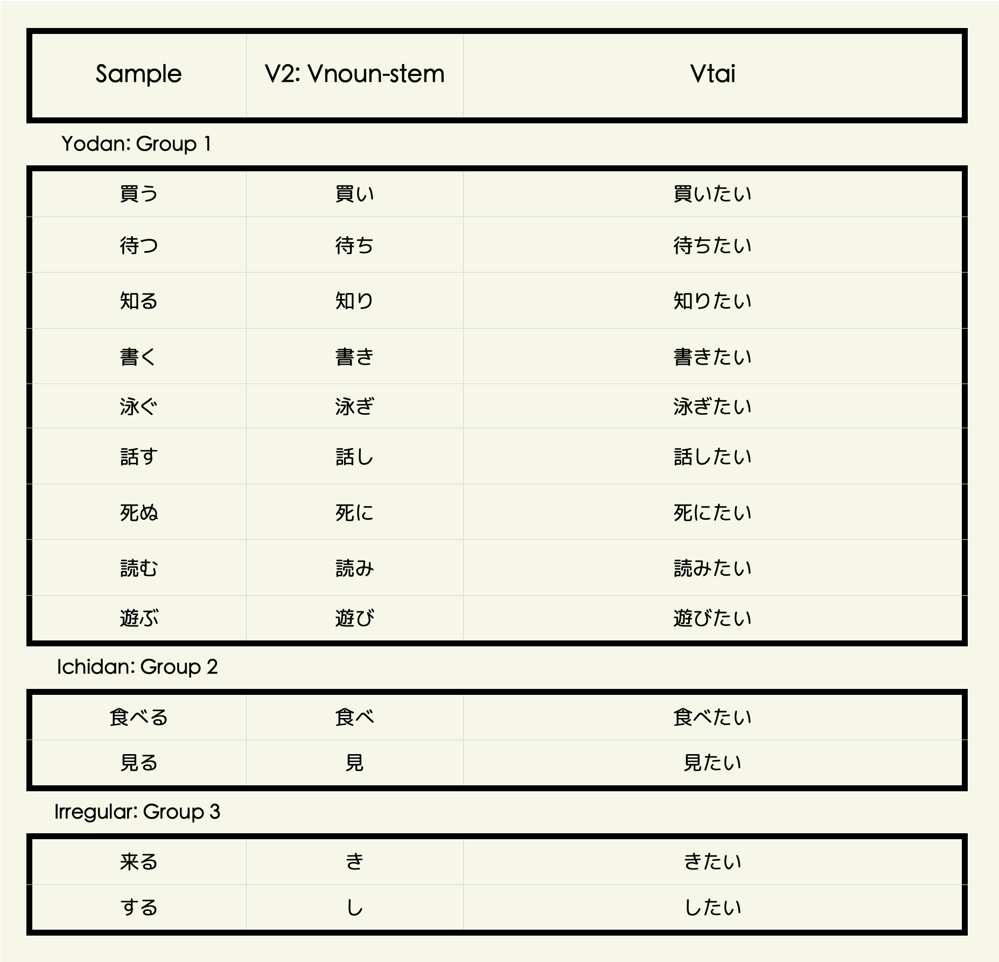

```{=html}
<style type="text/css">

body{
      font-size: 13px;
      font-family: "Anonymous Pro", "Roboto", "Helvetica Neue";
  }
</style>
```
<link rel="preconnect" href="https://fonts.googleapis.com"> <link rel="preconnect" href="https://fonts.gstatic.com" crossorigin> <link href="https://fonts.googleapis.com/css2?family=Hina+Mincho&family=Klee+One:wght@400;600&family=New+Tegomin&family=Sawarabi+Gothic&family=Shippori+Mincho+B1:wght@400;500&family=Yomogi&display=swap" rel="stylesheet"> <link rel="preconnect" href="https://fonts.googleapis.com"> <link rel="preconnect" href="https://fonts.gstatic.com" crossorigin> <link href="https://fonts.googleapis.com/css2?family=Noto+Sans+JP:wght@100;300;400;500;700&display=swap" rel="stylesheet"> <link rel="preconnect" href="https://fonts.gstatic.com"> <link href="https://fonts.googleapis.com/css2?family=M+PLUS+Rounded+1c:wght@100;300;400;500;700&display=swap" rel="stylesheet"> <link rel="preconnect" href="https://fonts.gstatic.com"> <link href="https://fonts.googleapis.com/css2?family=Anonymous+Pro&display=swap" rel="stylesheet"> <link href="https://fonts.googleapis.com/css2?family=Anonymous+Pro:ital,wght@0,400;1,700&display=swap" rel="stylesheet"> <link href="https://fonts.googleapis.com/css2?family=Anonymous+Pro:ital,wght@0,400;0,700;1,700&display=swap" rel="stylesheet">

<link rel="preconnect" href="https://fonts.googleapis.com">
<link rel="preconnect" href="https://fonts.gstatic.com" crossorigin>
<link href="https://fonts.googleapis.com/css2?family=Open+Sans:ital,wght@0,300;0,400;0,500;0,600;1,300;1,400;1,500;1,600&display=swap" rel="stylesheet">

<link rel="preconnect" href="https://fonts.googleapis.com">
<link rel="preconnect" href="https://fonts.gstatic.com" crossorigin>
<link href="https://fonts.googleapis.com/css2?family=Zen+Maru+Gothic:wght@300;400;500;600&display=swap" rel="stylesheet">
<link rel="preconnect" href="https://fonts.googleapis.com">
<link rel="preconnect" href="https://fonts.gstatic.com" crossorigin>
<link href="https://fonts.googleapis.com/css2?family=Open+Sans:ital,wght@0,300;0,400;0,500;0,600;1,300;1,400;1,500;1,600&display=swap" rel="stylesheet">
<link rel="preconnect" href="https://fonts.googleapis.com">
<link rel="preconnect" href="https://fonts.gstatic.com" crossorigin>
<link href="https://fonts.googleapis.com/css2?family=Shippori+Mincho+B1:wght@400;500;600;700&display=swap" rel="stylesheet">

<link rel="preconnect" href="https://fonts.googleapis.com">
<link rel="preconnect" href="https://fonts.gstatic.com" crossorigin>
<link href="https://fonts.googleapis.com/css2?family=Hina+Mincho&family=IBM+Plex+Sans+JP:wght@100;200;300;400;500;600&family=Kaisei+Tokumin&family=Klee+One&family=New+Tegomin&family=RocknRoll+One&family=Shippori+Antique+B1&family=Zen+Kaku+Gothic+Antique:wght@300;400;500;700&family=Zen+Kaku+Gothic+New:wght@300;400;500;700&display=swap" rel="stylesheet">

```{css, echo=FALSE}
.my-tbl {
  border: 1px solid rgba(0, 0, 0, 0.1);
}

.my-header {
  border-width: 1px;
}

.my-col {
  border-right: 1px solid rgba(0, 0, 0, 0.05);
}

.my-row:hover {
  background-color: #dee7e7;
  filter: invert(1);
}

.toc-content {
    padding-left: 10px;
    padding-right: 10px;
}

div.highlight-ur { background-color: #edede9; padding-left: 0px; padding-top: 7px; padding-bottom: 0.1px;
  border: 1px solid #264653;
  color: 	#0F2040;
  font-size: 12.5px;
  font-family: "Open Sans", "Roboto";
}

div.expressjp { outline-style: solid; outline-color: #0F2040; outline-width: 1px; border-radius: 5px; padding: 1px; padding-top: 10px;
  color: 	#404040;
  font-size: 14px;
  font-family: 'Rounded Mplus 1c', 'M PLUS Rounded 1c', sans-serif;
}
```

```{r setup, include=FALSE}
knitr::opts_chunk$set(echo = TRUE)
```

```{css, echo=FALSE}
@media(prefers-color-scheme: light) {
  body {
    <!-- background-color: black; -->
    filter: invert(0);
  }
}
```

```{r, echo=FALSE, message=FALSE}
library(tidyverse)
library(reactable)
library(htmltools)
library(bslib)
library(dplyr)
library(purrr)
library(readr)
library(vembedr)
options(readr.show_col_types = FALSE)
```

```{r, echo=FALSE, message=FALSE, error=FALSE}
cmpnd <- read_csv("jpdb/VRBCMP-CMPWD.csv")
lverbs <- read_csv("jpdb/VERBFRQ-VERBS.csv")
vnstx <- read_csv("jpdb/VERBSYL-VERBS.csv")
vnstr <- read_csv("jpdb/VERBRNDM-VERBS.csv")
vnsts <- read_csv("jpdb/VERBSRU-VERBS.csv")
verbrw <- read_csv("jpdb/VERBSNTW-VERBS.csv")
verbrev <- read_csv("jpdb/VERBSRVW-VERBS.csv")
verbphr <- read_csv("jpdb/VERBSPHR-VERBS.csv")
vrbxte <- read_csv("jpdb/VRBEXT-WRDS.csv")
vrbexpr <- read_csv("jpdb/VRBEXPR-WRDS.csv")

```

# <b> Verbs </b> {.tabset}

## <b> Forms </b> {.tabset}

### Table

{height=130%}

<!-- ```{r, echo=FALSE, message=FALSE} -->

<!-- lverbs.w <- lverbs %>% slice(1:600) -->
<!-- lverbs.w <- lverbs.w %>% rename(Sentences = S1) -->
<!-- # lverbs <- lverbs[sample(1:nrow(lverbs)),] -->

<!-- reactable( -->
<!--   lverbs.w, -->
<!--   columns = list( -->
<!--     Verbs = colDef(style= list(background = '#e0e1dd'), -->
<!--       # Show species under character names -->
<!--       cell = function(value, index) { -->
<!--         Meaning <- lverbs.w$Meaning[index] -->
<!--         Meaning <- if (!is.na(Meaning)) Meaning else "" -->
<!--         Reading <- lverbs.w$Reading[index] -->
<!--         Reading <- if (!is.na(Reading)) Reading else "" -->
<!--         Words <- lverbs.w$Words[index] -->
<!--         Words <- if (!is.na(Words)) Words else "" -->
<!--         Type <- lverbs.w$Type[index] -->
<!--         Type <- if (!is.na(Type)) Type else "" -->
<!--         tagList( -->
<!--           div(style = list(fontSize = 28, fontWeight = 600, color = '#0F2040', fontFamily = 'Open Sans'), value), -->
<!--           div(style = list(fontSize = 12, color = '#026450'), Reading), -->
<!--           div(style = list(fontSize = 9.2, fontWeight = 500, color = '#800000'), Meaning), -->
<!--           div(style = list(fontSize = 9, color = '#0F2040'), Type), -->
<!--         ) -->
<!--       }, -->
<!--       align = "center" -->
<!--     ), -->

<!--     Sentences = colDef(style= list(background = '#edede9'), -->
<!--       minWidth = 180, -->
<!--       # Show species under character names -->
<!--       cell = function(value, index) { -->
<!--         T1 <- lverbs$T1[index] -->
<!--         T1 <- if (!is.na(T1)) T1 else "" -->
<!--         S2 <- lverbs$S2[index] -->
<!--         S2 <- if (!is.na(S2)) S2 else "" -->
<!--         T2 <- lverbs$T2[index] -->
<!--         T2 <- if (!is.na(T2)) T2 else "" -->
<!--         S3 <- lverbs$S3[index] -->
<!--         S3 <- if (!is.na(S3)) S3 else "" -->
<!--         T3 <- lverbs$T3[index] -->
<!--         T3 <- if (!is.na(T3)) T3 else "" -->
<!--         tagList( -->
<!--           div(style = list(fontSize = 17, fontWeight = 600, fontFamily = 'Open Sans', color = '#0F2040'), value), -->
<!--           div(style = list(fontSize = 9, color = '#0F2040'), T1), -->
<!--           div(style = list(fontSize = 2), "."), -->
<!--           div(style = list(fontSize = 1), "."), -->
<!--           div(style = list(fontSize = 17, fontWeight = 600, fontFamily = 'Open Sans', color = '#0F2040'), S2), -->
<!--           div(style = list(fontSize = 9, color = '#0F2040'), T2), -->
<!--           div(style = list(fontSize = 2), "."), -->
<!--           div(style = list(fontSize = 1), "."), -->
<!--           div(style = list(fontSize = 17, fontWeight = 600, fontFamily = 'Open Sans', color = '#0F2040'), S3), -->
<!--           div(style = list(fontSize = 9, color = '#0F2040'), T3), -->
<!--         ) -->
<!--       }, -->
<!--       align = "left" -->
<!--     ), -->

<!--     Reading = colDef(show = FALSE), -->
<!--     Meaning = colDef(show = FALSE), -->
<!--     Type = colDef(show = FALSE), -->
<!--     Sentences = colDef(show = FALSE), -->
<!--     S2 = colDef(show = FALSE), -->
<!--     S3 = colDef(show = FALSE), -->
<!--     T1 = colDef(show = FALSE), -->
<!--     T2 = colDef(show = FALSE), -->
<!--     T3 = colDef(show = FALSE), -->
<!--     Words = colDef(show = FALSE), -->
<!--     Rank = colDef(show = FALSE) -->
<!--   ), -->
<!--   defaultPageSize = 3, -->
<!--   rowClass = "my-row", -->
<!--   theme = reactableTheme( -->
<!--     cellStyle = list(display = "flex", flexDirection = "column", justifyContent = "center", height = 150), -->
<!--     searchInputStyle = list( -->
<!--       paddingLeft = "8px", -->
<!--       paddingTop = "8px", -->
<!--       paddingBottom = "8px", -->
<!--       width = "100%" -->
<!--     ) -->
<!--   ), -->
<!--   showPageInfo = FALSE, outlined = TRUE, borderless = FALSE, bordered = TRUE, searchable = TRUE, sortable = FALSE, highlight = TRUE, paginationType = "numbers", -->

<!--   style = list(fontFamily = "Noto Sans JP, Heiti SC, Hiragino Maru Gothic ProN, Anonymous Pro , monospace, Helvetica Neue", fontSize = "11px") -->
<!-- ) -->

<!-- ``` -->


<!-- ------------------------------------------------------------------------ -->

### V1.0 {.tabset}

#### Vneg

{width=80%}

<!-- ------------------------------------------------------------------------ -->

#### Details {.tabset}

##### Vnai

<p style="font-size:13px; line-height: 1; font-family: Noto Sans JP;  color: #202020; font-weight: bold">**① Vnai: Informal Negative**</p>

###### **⚭ Vneg-stem + nai**

<div class = "expressjp">
・日本語が分からない.   
・私は遺伝子組み替え食品は買わない.   
</div>

<h6> </h6>

<div class = "expressjp">
・I don't understand Japanese.   
・I will not buy genetically modified foods.   
</div>

<h6> </h6>

<p style="font-size:13px; line-height: 1; font-family: Noto Sans JP;  color: #202020; font-weight: bold">**② Vnai hou ga ii: Better not to**</p>

###### **⚭ Vneg-stem + nai hou ga ii (desu)**

<div class = "expressjp">
・無理しないほうがいいです.  
・こんな所を歩き回らないほうがいい.   
</div>

<h6> </h6>

<div class = "expressjp">
・It’s better not to work too hard.   
・It’s better not to walk around these places.   
</div>

<!-- ------------------------------------------------------------------------ -->

##### Vnakatta

<p style="font-size:13px; line-height: 1; font-family: Noto Sans JP;  color: #202020; font-weight: bold">**① Vnakatta: Informal Past-Negative**</p>

###### **⚭ Vneg-stem + nakatta**

<div class = "expressjp">
・お金がなかった.    
・英語がわらなかった.     
・お友達は昨日来なかった.      
</div>

<h6> </h6>

<div class = "expressjp">
・I didn't have any money.  
・I didn't understand English.  
・Your friend didn't show up yesterday.  
</div>

<!-- ------------------------------------------------------------------------ -->

##### Vnaide

<p style="font-size:13px; line-height: 1; font-family: Noto Sans JP;  color: #202020; font-weight: bold">**① Vnaide: Without doing・Without having done**</p>

###### **⚭ Vneg-stem + naide**

<div class = "expressjp">
・宿題をしないで学校に出かけてしまいました.     
・メッセージをパージしないで処理します.   
・保存しないでイベントログを消去す.  
・イメージをアップロードしないでこのダイアログを閉じます.  
</div>

<h6> </h6>

<div class = "expressjp">
・I left for school without doing my homework.  
・Processes messages without purging.  
・Clear event log without saving.  
・Close this dialog without uploading the image.  
</div>

<h6> </h6>

<p style="font-size:13px; line-height: 1; font-family: Noto Sans JP;  color: #202020; font-weight: bold">**② Vnaide kudasai: Please don't・Negative Request**</p>

###### **⚭ Vneg-stem + naide kudasai**

<div class = "expressjp">
・ここでタバコを吸わないでください.   
・時間に遅れないでください.  
</div>

<h6> </h6>

<div class = "expressjp">
・Please don't smoke in here.   
・Please don’t be late.   
</div>

<h6> </h6>
   
<p style="font-size:13px; line-height: 1; font-family: Noto Sans JP;  color: #202020; font-weight: bold">**③ Vnaide sumu: Get by without doing・You don’t have to・It doesn’t matter if, You don’t have to**</p>

###### **⚭ Vneg-stem + naide sumu**

<div class = "expressjp">
・人身事故で電車が遅れたがあまり待たないで済んだ.   
</div>

<h6> </h6>
   
<div class = "expressjp">
・The train was delayed due to a personal injury, but we didn't have to wait too long.   
</div>

<!-- ------------------------------------------------------------------------ -->

##### Vnakute

<p style="font-size:13px; line-height: 1; font-family: Noto Sans JP;  color: #202020; font-weight: bold">**① Vnakute: Since not・Without doing・Without having・Not this but that**</p>

###### **⚭ Vneg-stem + nakute**

    ・お客さんが来なくてどうしますか  
    ・手紙を書かなくて電話をしました
    ・家族に会えなくて寂しいです
    ・今日は寒くなくてよかったです

<!-- <h>     -->

    ・If your guest does not come, What will you do?
    ・I didn’t write a letter, I telephoned.
    ・Since I couldn't see my see my family, I feel lonely.
    ・Since it's not cold today, I'm glad.

<!-- ------------------------------------------------------------------------ -->

##### Vnakutewaikenai

<p style="font-size:13px; line-height: 1; font-family: Noto Sans JP;  color: #202020; font-weight: bold">**① Vnakutewaikenai: Must do・Have to do**</p>

###### **⚭ Vneg-stem + nakute wa ikenai**

    ・本当にすぐ行かなくてはいけない  
    ・日本語をもっと勉強しなくてはいけない
    ・もう帰らなくてはいけません
    ・日本語力を上達させなくてはいけません

<!-- <h>     -->

    ・I really have to go now.
    ・I need to study Japanese more.
    ・I have to go home now.
    ・I must improve my Japanese language skills.

<!-- ------------------------------------------------------------------------ -->

##### Vnakerebanaranai

<p style="font-size:13px; line-height: 1; font-family: Noto Sans JP;  color: #202020; font-weight: bold">**① Vnakerebanaranai: Must do・Have to do**</p>

###### **⚭ Vneg-stem + nakereba naranai**

    ・平日は学校があるので６時に起きなければいけません
    ・日本では家に入るとき靴を脱がなければなりません
    ・この会社では朝礼の時に誰かがスピーチをしなければなりません
    ・子供はもっと外で遊ばなければなりませんよ

<!-- <h>     -->

    ・I have to get up at 6:00 a.m. on weekdays because of school.
    ・In Japan, you have to take off your shoes when you enter a house.
    ・At this company, someone has to give a speech during the morning meeting.
    ・Kids need to play outside more.

<!-- ------------------------------------------------------------------------ -->

##### Vzuniwairarenai

<p style="font-size:13px; line-height: 1; font-family: Noto Sans JP;  color: #202020; font-weight: bold">**① Vzuniwairarenai: Can’t help but feel・Can't help but do・Must do・Can't resist doing**</p>

###### **⚭ Vneg-stem + zuni wa iararenai**

    ・あの本を読まずにはいられない
    ・これは泣かずにはいられない感動の映画です
    ・人間はなにかを愛さずにはいられない動物である
    ・いらだちを覚えずにはいられなかった

<!-- <h>     -->

    ・I can't help but read that book.
    ・This is an emotional film that you can't help but cry.
    ・Humans are animals that cannot help but love something.
    ・I couldn't help but feel frustrated.

<!-- ------------------------------------------------------------------------ -->

##### Vwakeniwaikanai

<p style="font-size:13px; line-height: 1; font-family: Noto Sans JP;  color: #202020; font-weight: bold">**① Vwakeniwaikanai: Can’t afford to for some reason・Have no choice but to**</p>

###### **⚭ Vneg-stem + wake ni wa ikanai**

    ・私はいかなる危険も見逃すわけにはいきません
    ・そんなことをおこさせるわけにはいかない
    ・行くと約束したから行かないわけにはいきません
    ・あとで車を運転するので今お酒を飲むわけにはいきません

<!-- <h>     -->

    ・I cannot afford to take any chances.
    ・We can't let that happen.
    ・I promised that I’d go, so I have no choice but to go.
    ・I’ll have to drive later so I must not drink now.
<!-- ------------------------------------------------------------------------ -->

##### Vzaruoenai

<p style="font-size:13px; line-height: 1; font-family: Noto Sans JP;  color: #202020; font-weight: bold">**① Vzaruoenai: Can't help doing・Have no choice but to・Must do even though not willing to do it**</p>

###### **⚭ Vneg-stem + zaru o enai**

    ・こういう事を認めざるを得なかった
    ・同意せざるを得ないだろうね
    ・薬を飲んでも全然良くならないので病院へ行かざるを得ない
    ・新幹線の指定席は満席なので自由席を利用せざるを得ない

<!-- <h>     -->

    ・I was forced to recognize this.
    ・I have no choice but to go along with it.
    ・I have to go to the hospital because the medicine doesn't help at all.
    ・Since the reserved seats on the Shinkansen are full, we are forced to use non-reserved seats.

<!-- ------------------------------------------------------------------------ -->

### V1.1 {.tabset}

#### Vpass

{width=80%}

<!-- ------------------------------------------------------------------------ -->

#### Details

<p style="font-size:13px; line-height: 1; font-family: Noto Sans JP;  color: #202020; font-weight: bold">**① Vreru・rareru: Receptive Verb**</p>

###### **⚭ Vneg-stem + reru・rareru → Vpass**

    ・財布は泥棒に盗まれました
    ・彼はみんなに知られています
    ・先生に質問されました
    ・パンが誰かに食べられた
    ・見られた！
    ・この本は多くの人に読まれている
    ・窓は田中さんに開けられた
    ・田中さんに窓を開けられた
    ・田中さんに家を建てられた
    ・外国人に質問を聞かれた
    ・彼女に料理がまずかったって言われた
    ・お母さんに変だと言われます

<!-- <h>     -->

    ・My wallet was stolen by a thief.
    ・He is known by everyone.
    ・I was asked a question by the teacher.
    ・The bread was eaten by somebody.
    ・Someone saw me.
    ・This book is being read by a large number of people.
    ・The window was opened by Mr. Tanaka.
    ・Mr. Tanaka opened the window.
    ・Mr. Tanaka built a house.
    ・I was asked a question by a foreigner.
    ・She told me that the food was bad.
    ・I am told by my mother that I am strange.

<!-- ------------------------------------------------------------------------ -->

### V1.2 {.tabset}

#### Vcau

{width=80%}


<!-- ------------------------------------------------------------------------ -->

#### Details

<p style="font-size:13px; line-height: 1; font-family: Noto Sans JP;  color: #202020; font-weight: bold">**① Vsaseru・seru: Coercion, Instruction, Non-interference**</p>

###### **⚭ N ga N ni N o + Vneg-stem + saseru・seru (V - transitive)**

    ・教師が学生に賓を読ませた
    ・親が子供に宿題をさせた
    ・私は妹に昼ご飯を作らせた

<!-- <h>     -->

    ・The teacher made the students read the book.
    ・The parent made the child do homework.
    ・I made my sister make lunch.

<p style="font-size:13px; line-height: 1; font-family: Noto Sans JP;  color: #202020; font-weight: bold">**② Vsaseru・seru: Coercion, Instruction, Non-interference**</p>

###### **⚭ N ga N ni・o + Vneg-stem + saseru・seru (V - intransitive)**

    ・私が子供を買い物に行かせた
    ・私は仲間を死なせてしまったことを後悔している
    ・大きな契約だから新入社員に行かせるのは心配だ

<!-- <h>     -->

    ・I had the children go shopping.
    ・I regret that I let my friend die.
    ・It's a big contract, and I'm worried about letting the new guy go.

<p style="font-size:13px; line-height: 1; font-family: Noto Sans JP;  color: #202020; font-weight: bold">**③ Vsaseru・seru: Induce someone to do**</p>

###### **⚭ N ga N o + Vneg-stem + saseru・seru (V - intransitive, involuntary)**

    ・彼はいつも冗談を言ってみんなを笑わせる
    ・私は子供の頃は乱暴で、近所の子をよく泣かせれいた

<!-- <h>     -->

    ・He always telling jokes and making everyone laugh.
    ・When I was a child I was wild and unruly and often made the children in my neighbourhood cry.

<!-- ------------------------------------------------------------------------ -->

### V1.3 {.tabset}

#### Vcau-pass

{width=80%}

<!-- ------------------------------------------------------------------------ -->

#### Details

<p style="font-size:13px; line-height: 1; font-family: Noto Sans JP;  color: #202020; font-weight: bold">**① Vsaserareru・serareru: Forced to do something**</p>

###### **⚭ Vneg-stem + saserareru・serareru**

    ・昨日はお母さんに３時間も勉強させられた
    ・先輩に無理にお酒を飲ませられた
    ・私は母に部屋を掃除させられた

<!-- <h>     -->

    ・My mom made/forced me study for three hours yesterday.
    ・A senior colleague forced me to drink alcohol.
    ・I was made to clean the room by my mother.

<!-- ------------------------------------------------------------------------ -->

### V2.0 {.tabset}

#### Vnoun

{width=80%}

<!-- ------------------------------------------------------------------------ -->

#### Details {.tabset}

##### Vtai

<p style="font-size:13px; line-height: 1; font-family: Noto Sans JP;  color: #202020; font-weight: bold">**① Vtai: Desire to do something**</p>

###### **⚭ Vnoun-stem + tai**

    ・私はアイスが食べたいな
    ・私は渋谷に行きたいです
    ・僕はラーメンが食べたい  

<!-- <h>     -->

    ・I want to eat ice cream.
    ・I want to go to Shibuya.
    ・I want to eat ramen.

<!-- ------------------------------------------------------------------------ -->

##### Vnagara

<p style="font-size:13px; line-height: 1; font-family: Noto Sans JP;  color: #202020; font-weight: bold">**① Vnagara: While doing**</p>

###### **⚭ Vnoun-stem + nagara**

    ・ギターを弾きながら歌えますか
    ・お茶でも飲みながら話しませんか
    ・私はたいてい音楽を聴きながら勉強します

<!-- <h>     -->

    ・Can you sing while playing guitar?
    ・Why don't we talk over a cup of tea?
    ・I usually study while listening to music

<!-- ------------------------------------------------------------------------ -->

##### Vnikui

<p style="font-size:13px; line-height: 1; font-family: Noto Sans JP;  color: #202020; font-weight: bold">**① Vnikui: Difficult to do**</p>

###### **⚭ Vnoun-stem + nikui**

    ・この漢字は画数が多くて、覚えにくいです
    ・この魚は骨が多くて、食べにくいです
    ・東京は物価が高くて、住みにくいです

<!-- <h>     -->

    ・This kanji has many strokes and is difficult to remember!
    ・This fish has a lot of bones and is hard to eat!
    ・Tokyo is expensive and difficult to live in.

<!-- ------------------------------------------------------------------------ -->

##### Vsugiru

<p style="font-size:13px; line-height: 1; font-family: Noto Sans JP;  color: #202020; font-weight: bold">**① Vsugiru: Do too much**</p>

###### **⚭ Vnoun-stem + sugiru**

    ・ちょっと飲みすぎて頭が痛いです
    ・買い物しすぎて、お金がなくなりました
    ・ゲームしすぎて、目が痛いよ

<!-- <h>     -->

    ・I drank a little too much and my head hurts.
    ・I shopped too much and ran out of money!
    ・I play so many games, my eyes hurt.

<!-- ------------------------------------------------------------------------ -->

### V2.1 {.tabset}

#### Vmasu

<p style="font-size:13px; line-height: 1; font-family: Noto Sans JP;  color: #202020; font-weight: bold">**① Vmasu: Polite Form**</p>

###### **⚭ Vnoun-stem + masu**

    ・明日北海道に行きます
    ・日本語を勉強します
    ・今日は友達と遊びます

<!-- <h>     -->

    ・I'm going to Hokkaido tomorrow.
    ・I will study Japanese.
    ・I'm going to play with my friends today.

<!-- ------------------------------------------------------------------------ -->

#### Vmashita

<p style="font-size:13px; line-height: 1; font-family: Noto Sans JP;  color: #202020; font-weight: bold">**① Vmasu: Polite Form - Past**</p>

###### **⚭ Vnoun-stem + mashita**

    ・昨年、長野へ行きました
    ・昨日、ラーメンを食べました
    ・先週、日本語の本を読みました

<!-- <h>     -->

    ・I went to Nagano last year.
    ・Yesterday, I ate ramen.
    ・Last week, I read a book on Japanese

<!-- ------------------------------------------------------------------------ -->

#### Vnakatta

<p style="font-size:13px; line-height: 1; font-family: Noto Sans JP;  color: #202020; font-weight: bold">**① Vnakata: Polite Form - Negative**</p>

###### **⚭ Vnoun-stem + masen**

    ・私は林檎の芯を食べません
    ・美しい広告に買いません
    ・テレビやマンガのせいで学生は本を読みません

<!-- <h>     -->

    ・I don't eat the core of an apple.
    ・I don't buy into the beautiful ads.
    ・Students don't read books because of TV and comics.

<!-- ------------------------------------------------------------------------ -->

#### Vmasendeshita

<p style="font-size:13px; line-height: 1; font-family: Noto Sans JP;  color: #202020; font-weight: bold">**① Vnakata: Polite Form - Negative-Past**</p>

###### **⚭ Vnoun-stem + masen deshita**

    ・飛行機を調べませんでした
    ・まったく気付きませんでした
    ・誰も目に入りませんでした

<!-- <h>     -->

    ・I didn't check the plane.
    ・I wasn't aware of it at all.
    ・No one was in sight.

<!-- ------------------------------------------------------------------------ -->

### V3.0 {.tabset}

#### Vru

{width=80%}

<!-- ------------------------------------------------------------------------ -->

#### Details

<!-- ------------------------------------------------------------------------ -->

### V4.0 {.tabset}

#### Stem

{width=80%}

<!-- ------------------------------------------------------------------------ -->

#### Forms

<!-- ------------------------------------------------------------------------ -->

### V4.1 {.tabset}

#### Vcnd-ba

{width=80%}

<!-- ------------------------------------------------------------------------ -->

### V4.2 {.tabset}

#### Vpot

{width=80%}

<!-- ------------------------------------------------------------------------ -->

### V5.0 {.tabset}

#### Vvol

{width=80%}

<!-- ------------------------------------------------------------------------ -->

### V6.0 {.tabset}

#### Vte

{width=80%}

<!-- ------------------------------------------------------------------------ -->

### V7.0 {.tabset}

#### Vta

{width=80%}

<!-- ------------------------------------------------------------------------ -->

### More {.tabset}

#### Vcnd {.tabset}

##### to

**Conditional-Form**

**①　to**`if・when`

**⚭　Vdict + to**

(1) When the result of the condition can be predicted naturally
(2) When the result is known to happen customarily
(3) When the result occurs generally and repeatedly

<!-- <h> -->

<div class = "expressjp">
・まっすぐ行くと学校があります.   
・朝起きると顔を洗います.   
・冬になると寒くなります.  
</div>

<h6> </h6>

<div class = "expressjp">
・If you go straight, you will find a school.   
・When I wake up in the morning, I wash my face.   
・When winter comes, It gets cold.  
</div>

<h6> </h6>

(✖︎) It cannot be used if it includes speakers intention, judgment, permission, opinion, request and etc.

<!-- ------------------------------------------------------------------------ -->

##### tara

**Conditional-Form**

**②　tara**`if・when`

**⚭　Vta + ra**

(1) When the result of the condition can be predicted naturally
(2) When the condition and result occurs only once
(3) When you express volition, requests, invitations, make suggestions
(4) When you express hypothetical conditions

<!-- <h> -->

<div class = "expressjp">
・まっすぐ行ったら学校があります.   
・明日雨が降ったら家にいます.   
・暇だったら山へ行きたいです.   
・何を買ったらいいですか.  
・よかったら食べてみてください.  
・コーヒーにしたらどう.  
</div>

<h6> </h6>

<div class = "expressjp">
・If you go straight, there is a school.  
・If it rains tomorrow, I'll stay home.  
・When I'm free, I want to go to the mountains.  
・What should I buy?   
・You can try it if you want.  
・How about a cup of coffee?   
</div>

<h6> </h6>

(✖︎) It cannot be used if it is not chronological order

<!-- ------------------------------------------------------------------------ -->

##### ba

**Conditional-Form**

**③　ba**`if・when`

**⚭　Vcmd-stem + ba**

(1) When the result of the condition can be predicted naturally
(2) When the result occurs generally and repeatedly
(3) When you express universal truth and customs
(4) When you express to do something (should/wish)
(5) When you are seeking advice (how to/when to/where to/whom/what to)

<!-- <h> -->

<div class = "expressjp">
・まっすぐ行けば学校があります.   
・冬になれば寒くなります.   
・もっと勉強すれば日本語が上手なります.   
・もっと勉強すればよかった.   
・どうやって注文すればいいですか.  
・いつ申し込めばいいですか.  
・誰に聞けばいいですか.  
・いくら払えばいいですか.   
・何時に来ればいいですか.  
・新宿へどう行けばいいですか.  
</div>

<h6> </h6>

<div class = "expressjp">
・If you go straight, there is a school.  
・When winter comes, it gets cold.  
・If I study more, my Japanese will improve.  
・I should have studied harder.  
・How do I place an order?   
・When do I need to apply?   
・Who should I ask?   
・How much do I have to pay?   
・What time should I come?   
・How can I get to Shinjuku?   
</div>

<h6> </h6>

(✖︎) It cannot be used if S2 includes something negative (S2 is usually a positive outcome)

<!-- ------------------------------------------------------------------------ -->

##### nara

**Conditional-Form**

**④　nara**

**⚭　Vdict + nara**`if・if it is the case`

(1) When you express advice, requests, invitations
(2) When you express S1-\>S2, or S2-\>S1
(3) When you include what the other person said or thoughts is confirmed and used as condition

<!-- <h> -->

<div class = "expressjp">
・頭が痛いなら寝た方がいいです.   
・お酒を飲むなら運転しません.   
・田中さんが行くなら私も行きます.   
・コンビニに行くならおやつ買ってくれませんか.   
</div>

<h6> </h6>

<div class = "expressjp">
・If your head hurts, you'd better get some sleep.  
・I don't drive if I'm going to drink.  
・If Mr. Tanaka is going, I'm going too.  
・If you're going to the convenience store, could you please buy me a snack?   
</div>

<h6> </h6>

(✖︎) It cannot be used if the results mere fact which occurs naturally

<!-- ------------------------------------------------------------------------ -->

#### Vres

**① Continuous-State・Existing-Condition**`Resultative`

Describes the current state or condition of the subject due to consequence of past occurrence.

**⚭　Vte + iru**

<div class = "expressjp">
・いい天気です。空が晴れています.   
・妹は結婚しています.    
・お店が開いています.  
・ドアがしまっていて入れない.  
・水槽の魚が死んでいる.  
</div>

<h6> </h6>

<div class = "expressjp">
・It's a beautiful day. The sky is clear.  
・My sister is married.  
・The shop is open!   
・The door is locked and I can't get in.   
・The fish in the tank is dead.  
</div>

<h6> </h6>

**②　Existing-Condition**`Resultative`

Describes the current condition of the subject due to consequence of past occurrence.\
Transitive verbs are being used in this case.\
Indicates that the past occurrence was done by someone and not by you.

**Vte + aru**

<div class = "expressjp">
・戸が開けてある.   
・ビールはもう冷やしてありますよ.   
・壁にカレンダーがかけてありますよ.   
・冷蔵庫に昼ごはんは用意してあるから、チンして食べてね.  
</div>

<h6> </h6>

<div class = "expressjp">
・The door have been opened.   
・The beer is already chilled.  
・The calendar has been changed on the wall.  
・The lunch have been prepared in the fridge, so just chill and eat.  
</div>

<!-- ------------------------------------------------------------------------ -->

#### Vprog

**Continuous-Action**`Progressive`

Describes the progressive action that is taking place.

**⚭　Vte + iru**

<div class = "expressjp">
・弟は今勉強をしています.   
・私は今絵を描いています.    
・昨日9時ごろバーで酒を飲んでいました.   
・けいが本を読んでいる.  
・母は今台所で食事の仕度をしています.    
・父は貿易会社に勤めています.   
</div>

<h6> </h6>

<div class = "expressjp">
・My brother is studying now.   
・I'm painting now.  
・I was in a bar drinking yesterday around nine o'clock.  
・Kei is reading a book.  
・My mother is in the kitchen preparing a meal.  
・My father works for a trading company.  
</div>

<!-- ------------------------------------------------------------------------ -->

#### Vrep

**Habitual・Routine**`Repititive`

Describes a habitual or repeated action.

**⚭　Vte + iru**

<div class = "expressjp">
・あの店では新しい野菜を売っています.   
・弟は中学に行っています.        
・お宅ではどんな新聞を読んでいますか.  
・健康のために毎日一時間ぐらい歩いています.  
</div>

<h6> </h6>

<div class = "expressjp">
・That vegetable store sells fresh vegetables.  
・My younger brother attends junior high school.  
・Which newspaper do you read?   
・I walk for about an hour every day to keep fit.  
</div>

<!-- ------------------------------------------------------------------------ -->

## <b> Words </b> {.tabset}

### Freq {.tabset}

```{r, echo=FALSE, message=FALSE}

lverbs.w <- lverbs %>% slice(1:600)
lverbs.w <- lverbs.w %>% rename(Sentences = S1)
# lverbs <- lverbs[sample(1:nrow(lverbs)),]

reactable(
  lverbs.w,
  columns = list(
    Verbs = colDef(style= list(background = '#e0e1dd'),
      # Show species under character names
      cell = function(value, index) {
        Meaning <- lverbs.w$Meaning[index]
        Meaning <- if (!is.na(Meaning)) Meaning else ""
        Reading <- lverbs.w$Reading[index]
        Reading <- if (!is.na(Reading)) Reading else ""
        Words <- lverbs.w$Words[index]
        Words <- if (!is.na(Words)) Words else ""
        Type <- lverbs.w$Type[index]
        Type <- if (!is.na(Type)) Type else ""
        tagList(
          div(style = list(fontSize = 28, fontWeight = 600, color = '#0F2040', fontFamily = 'Open Sans'), value),
          div(style = list(fontSize = 12, color = '#026450'), Reading),
          div(style = list(fontSize = 9.2, fontWeight = 500, color = '#800000'), Meaning),
          div(style = list(fontSize = 9, color = '#0F2040'), Type),
        )
      },
      align = "center"
    ),
    
    Sentences = colDef(style= list(background = '#edede9'),
      minWidth = 180,
      # Show species under character names
      cell = function(value, index) {
        T1 <- lverbs$T1[index]
        T1 <- if (!is.na(T1)) T1 else ""
        S2 <- lverbs$S2[index]
        S2 <- if (!is.na(S2)) S2 else ""
        T2 <- lverbs$T2[index]
        T2 <- if (!is.na(T2)) T2 else ""
        S3 <- lverbs$S3[index]
        S3 <- if (!is.na(S3)) S3 else ""
        T3 <- lverbs$T3[index]
        T3 <- if (!is.na(T3)) T3 else ""
        tagList(
          div(style = list(fontSize = 17, fontWeight = 600, fontFamily = 'Open Sans', color = '#0F2040'), value),
          div(style = list(fontSize = 9, color = '#0F2040'), T1),
          div(style = list(fontSize = 2), "."),
          div(style = list(fontSize = 1), "."),
          div(style = list(fontSize = 17, fontWeight = 600, fontFamily = 'Open Sans', color = '#0F2040'), S2),
          div(style = list(fontSize = 9, color = '#0F2040'), T2),
          div(style = list(fontSize = 2), "."),
          div(style = list(fontSize = 1), "."),
          div(style = list(fontSize = 17, fontWeight = 600, fontFamily = 'Open Sans', color = '#0F2040'), S3),
          div(style = list(fontSize = 9, color = '#0F2040'), T3),
        )
      },
      align = "left"
    ),
    
    Reading = colDef(show = FALSE),
    Meaning = colDef(show = FALSE),
    Type = colDef(show = FALSE),
    Sentences = colDef(show = FALSE),
    S2 = colDef(show = FALSE),
    S3 = colDef(show = FALSE),
    T1 = colDef(show = FALSE),
    T2 = colDef(show = FALSE),
    T3 = colDef(show = FALSE),
    Words = colDef(show = FALSE),
    Rank = colDef(show = FALSE)
  ),
  defaultPageSize = 3,
  rowClass = "my-row",
  theme = reactableTheme(
    cellStyle = list(display = "flex", flexDirection = "column", justifyContent = "center", height = 150),
    searchInputStyle = list(
      paddingLeft = "8px",
      paddingTop = "8px",
      paddingBottom = "8px",
      width = "100%"
    )
  ),
  showPageInfo = FALSE, outlined = TRUE, borderless = FALSE, bordered = TRUE, searchable = TRUE, sortable = FALSE, highlight = TRUE, paginationType = "numbers",
  
  style = list(fontFamily = "Noto Sans JP, Heiti SC, Hiragino Maru Gothic ProN, Anonymous Pro , monospace, Helvetica Neue", fontSize = "11px")
)

```

<!-- ------------------------------------------------------------------------ -->

### Syll {.tabset}

```{r, echo=FALSE, message=FALSE}

vnstxp <- vnstx %>% slice(1:1071)
vnstxp <- vnstxp %>% rename(Sentences = S1)
# vnstxp <- vnstxp[sample(1:nrow(vnstxp)),]

reactable(
  vnstxp,
  columns = list(
    Words = colDef(style= list(background = '#e0e1dd'),
      # Show species under character names
      cell = function(value, index) {
        Meaning <- vnstxp$Meaning[index]
        Meaning <- if (!is.na(Meaning)) Meaning else ""
        Reading <- vnstxp$Reading[index]
        Reading <- if (!is.na(Reading)) Reading else ""
        Type <- vnstxp$Type[index]
        Type <- if (!is.na(Type)) Type else ""
        tagList(
          div(style = list(fontSize = 28, fontWeight = 600, fontFamily = 'Open Sans', color = '#0F2040'), value),
          div(style = list(fontSize = 12, color = '#026450'), Reading),
          div(style = list(fontSize = 9.2, fontWeight = 500, color = '#800000'), Meaning),
          div(style = list(fontSize = 9, color = '#0F2040'), Type),
        )
      },
      align = "center"
    ),
    
    Sentences = colDef(style= list(background = '#edede9'),
      minWidth = 180,
      # Show species under character names
      cell = function(value, index) {
        T1 <- vnstxp$T1[index]
        T1 <- if (!is.na(T1)) T1 else ""
        S2 <- vnstxp$S2[index]
        S2 <- if (!is.na(S2)) S2 else ""
        T2 <- vnstxp$T2[index]
        T2 <- if (!is.na(T2)) T2 else ""
        S3 <- vnstxp$S3[index]
        S3 <- if (!is.na(S3)) S3 else ""
        T3 <- vnstxp$T3[index]
        T3 <- if (!is.na(T3)) T3 else ""
        tagList(
          div(style = list(fontSize = 17, fontWeight = 600, fontFamily = 'Open Sans', color = '#0F2040'), value),
          div(style = list(fontSize = 9, color = '#0F2040'), T1),
          div(style = list(fontSize = 2), "."),
          div(style = list(fontSize = 1), "."),
          div(style = list(fontSize = 17, fontWeight = 600, fontFamily = 'Open Sans', color = '#0F2040'), S2),
          div(style = list(fontSize = 9, color = '#0F2040'), T2),
          div(style = list(fontSize = 2), "."),
          div(style = list(fontSize = 1), "."),
          div(style = list(fontSize = 17, fontWeight = 600, fontFamily = 'Open Sans', color = '#0F2040'), S3),
          div(style = list(fontSize = 9, color = '#0F2040'), T3),
        )
      },
      align = "left"
    ),
    
    Reading = colDef(show = FALSE),
    Meaning = colDef(show = FALSE),
    Type = colDef(show = FALSE),
    Sentences = colDef(show = FALSE),
    S2 = colDef(show = FALSE),
    S3 = colDef(show = FALSE),
    T1 = colDef(show = FALSE),
    T2 = colDef(show = FALSE),
    T3 = colDef(show = FALSE),
    W1 = colDef(show = FALSE),
    W2 = colDef(show = FALSE),
    W3 = colDef(show = FALSE)
  ),
  defaultPageSize = 3,
  rowClass = "my-row",
  theme = reactableTheme(
    cellStyle = list(display = "flex", flexDirection = "column", justifyContent = "center", height = 150),
    searchInputStyle = list(
      paddingLeft = "8px",
      paddingTop = "8px",
      paddingBottom = "8px",
      width = "100%"
    )
  ),
  showPageInfo = FALSE, outlined = TRUE, borderless = FALSE, bordered = TRUE, searchable = TRUE, sortable = FALSE, highlight = TRUE, paginationType = "numbers",
  
  style = list(fontFamily = "Noto Sans JP, Heiti SC, Hiragino Maru Gothic ProN, Anonymous Pro , monospace, Helvetica Neue", fontSize = "11px")
)

```

<!-- ------------------------------------------------------------------------ -->

### Random {.tabset}

```{r, echo=FALSE, message=FALSE}

vnstr1 <- vnstr
vnstr1 <- vnstr1 %>% rename(Sentences = S1)
# vnstr1 <- vnstr1[sample(1:nrow(vnstr1)),]

reactable(
  vnstr1,
  columns = list(
    Words = colDef(style= list(background = '#e0e1dd'),
      cell = function(value, index) {
        Meaning <- vnstr1$Meaning[index]
        Meaning <- if (!is.na(Meaning)) Meaning else ""
        Reading <- vnstr1$Reading[index]
        Reading <- if (!is.na(Reading)) Reading else ""
        Type <- vnstr1$Type[index]
        Type <- if (!is.na(Type)) Type else ""
        tagList(
          div(style = list(fontSize = 28, fontWeight = 600, color = '#0F2040', fontFamily = 'Open Sans'), value),
          div(style = list(fontSize = 12, color = '#026450'), Reading),
          div(style = list(fontSize = 9.2, fontWeight = 500, color = '#800000'), Meaning),
          div(style = list(fontSize = 9, color = '#0F2040'), Type),
        )
      },
      align = "center"
    ),

    Sentences = colDef(style= list(background = '#edede9'),
      minWidth = 180,
      cell = function(value, index) {
        T1 <- vnstr1$T1[index]
        T1 <- if (!is.na(T1)) T1 else ""
        S2 <- vnstr1$S2[index]
        S2 <- if (!is.na(S2)) S2 else ""
        T2 <- vnstr1$T2[index]
        T2 <- if (!is.na(T2)) T2 else ""
        S3 <- vnstr1$S3[index]
        S3 <- if (!is.na(S3)) S3 else ""
        T3 <- vnstr1$T3[index]
        T3 <- if (!is.na(T3)) T3 else ""
        tagList(
          div(style = list(fontSize = 17, fontWeight = 600, color = '#0F2040', fontFamily = 'Open Sans'), value),
          div(style = list(fontSize = 9, color = '#0F2040'), T1),
          div(style = list(fontSize = 2), "."),
          div(style = list(fontSize = 1), "."),
          div(style = list(fontSize = 17, fontWeight = 600, color = '#0F2040', fontFamily = 'Open Sans'), S2),
          div(style = list(fontSize = 9, color = '#0F2040'), T2),
          div(style = list(fontSize = 2), "."),
          div(style = list(fontSize = 1), "."),
          div(style = list(fontSize = 17, fontWeight = 600, color = '#0F2040', fontFamily = 'Open Sans'), S3),
          div(style = list(fontSize = 9, color = '#0F2040'), T3),
        )
      },
      align = "left"
    ),
    Reading = colDef(show = FALSE),
    Meaning = colDef(show = FALSE),
    Type = colDef(show = FALSE),
    Sentences = colDef(show = FALSE),
    S2 = colDef(show = FALSE),
    S3 = colDef(show = FALSE),
    T1 = colDef(show = FALSE),
    T2 = colDef(show = FALSE),
    T3 = colDef(show = FALSE),
    W1 = colDef(show = FALSE),
    W2 = colDef(show = FALSE),
    W3 = colDef(show = FALSE)
  ),
  defaultPageSize = 3,
  rowClass = "my-row",
  theme = reactableTheme(
    cellStyle = list(display = "flex", flexDirection = "column", justifyContent = "center", height = 150),
    searchInputStyle = list(
      paddingLeft = "8px",
      paddingTop = "8px",
      paddingBottom = "8px",
      width = "100%"
    )
  ),
  showPageInfo = FALSE, outlined = TRUE, borderless = FALSE, bordered = TRUE, searchable = TRUE, sortable = FALSE, highlight = TRUE, paginationType = "numbers",
  
  style = list(fontFamily = "Noto Sans JP, Heiti SC, Hiragino Maru Gothic ProN, Anonymous Pro , monospace, Helvetica Neue", fontSize = "11px")
)

```

<!-- ------------------------------------------------------------------------ -->

### Suru {.tabset}

```{r, echo=FALSE, message=FALSE}

vnsts1 <- vnsts %>% rename(Sentences = S3)

reactable(
  vnsts1,
  columns = list(
    Words = colDef(style= list(background = '#e0e1dd'),
      # Show species under character names
      cell = function(value, index) {
        Meaning <- vnsts1$Meaning[index]
        Meaning <- if (!is.na(Meaning)) Meaning else ""
        Reading <- vnsts1$Reading[index]
        Reading <- if (!is.na(Reading)) Reading else ""
        W1 <- vnsts1$W1[index]
        W1 <- if (!is.na(W1)) W1 else ""
        W2 <- vnsts1$W2[index]
        W2 <- if (!is.na(W2)) W2 else ""
        W3 <- vnsts1$W3[index]
        W3 <- if (!is.na(W3)) W3 else ""
        T1 <- vnsts1$T1[index]
        T1 <- if (!is.na(T1)) T1 else ""
        T2 <- vnsts1$T2[index]
        T2 <- if (!is.na(T2)) T2 else ""
        S1 <- vnsts1$S1[index]
        S1 <- if (!is.na(S1)) S1 else ""
        S2 <- vnsts1$S2[index]
        S2 <- if (!is.na(S2)) S2 else ""
        K1 <- vnsts1$K1[index]
        K1 <- if (!is.na(K1)) K1 else ""
        K2 <- vnsts1$K2[index]
        K2 <- if (!is.na(K2)) K2 else ""
        Type <- vnsts1$Type[index]
        Type <- if (!is.na(Type)) Type else ""
        tagList(
          div(style = list(fontSize = 24, fontWeight = 600, color = '#0F2040', fontFamily = 'Open Sans'), value),
          div(style = list(fontSize = 10, color = '#026450'), Reading),
          div(style = list(fontSize = 11, fontWeight = 500, color = '#800000'), Meaning),
          # div(style = list(fontSize = 14), S1),
          div(style = list(fontSize = 10, color = '#0F2040'), K1),
          # div(style = list(fontSize = 9), S2),
          div(style = list(fontSize = 10, color = '#0F2040'), K2),
          # div(style = list(fontSize = 11), Type),
        )
      },
      align = "center"
    ),
    
    Sentences = colDef(style= list(background = '#edede9'),
      minWidth = 180,
      cell = function(value, index) {
        T3 <- vnsts1$T3[index]
        T3 <- if (!is.na(T3)) T3 else ""
        tagList(
          div(style = list(fontSize = 17, fontWeight = 600, color = '#0F2040', fontFamily = 'Open Sans'), value),
          div(style = list(fontSize = 9, color = '#0F2040'), T3),
        )
      },
      align = "left"
    ),
    
    Reading = colDef(show = FALSE),
    Meaning = colDef(show = FALSE),
    Type = colDef(show = FALSE),
    S1 = colDef(show = FALSE),
    S2 = colDef(show = FALSE),
    K1 = colDef(show = FALSE),
    K2 = colDef(show = FALSE),
    Sentences = colDef(show = FALSE),
    T1 = colDef(show = FALSE),
    T2 = colDef(show = FALSE),
    T3 = colDef(show = FALSE),
    W1 = colDef(show = FALSE),
    W2 = colDef(show = FALSE),
    W3 = colDef(show = FALSE)
  ),
  defaultPageSize = 3,
  rowClass = "my-row",
  theme = reactableTheme(
    cellStyle = list(display = "flex", flexDirection = "column", justifyContent = "center", height = 150),
    searchInputStyle = list(
      paddingLeft = "8px",
      paddingTop = "8px",
      paddingBottom = "8px",
      width = "100%"
    )
  ),
  showPageInfo = FALSE, outlined = TRUE, borderless = FALSE, bordered = TRUE, searchable = TRUE, sortable = FALSE, highlight = TRUE, paginationType = "numbers",
  
  style = list(fontFamily = "Noto Sans JP, Heiti SC, Hiragino Maru Gothic ProN, Anonymous Pro , monospace, Helvetica Neue", fontSize = "11px")
)

```

<!-- ------------------------------------------------------------------------ -->

## <b> Compounds </b> {.tabset}

```{r, echo=FALSE, message=FALSE}

cmpnd <- cmpnd[sample(1:nrow(cmpnd)),]

reactable(
  cmpnd,
  columns = list(
    Words = colDef(style= list(background = '#e0e1dd'),
      cell = function(value, index) {
        Meaning <- cmpnd$Meaning[index]
        Meaning <- if (!is.na(Meaning)) Meaning else ""
        Reading <- cmpnd$Reading[index]
        Reading <- if (!is.na(Reading)) Reading else ""
        tagList(
          div(style = list(fontSize = 26, fontWeight = 600, color = '#0F2040', fontFamily = 'Open Sans'), value),
          div(style = list(fontSize = 10, fontWeight = 500, color = '#800000', fontFamily = 'Open Sans'), Reading),
          div(style = list(fontSize = 10, fontWeight = 600, color = '#0F2040', fontFamily = 'Open Sans'), Meaning)
        )
      },
      align = "center"
    ),
    
    Sentences = colDef(style= list(background = '#edede9'),
      minWidth = 180,
      cell = function(value, index) {
        Translation <- cmpnd$Translation[index]
        Translation <- if (!is.na(Translation)) Translation else ""
        tagList(
          div(style = list(fontSize = 17, fontWeight = 600, color = '#0F2040', fontFamily = 'Open Sans'), value),
          div(style = list(fontSize = 10, color = '#0F2040', fontFamily = 'Open Sans'), Translation),
        )
      },
      align = "left"
    ),
    Reading = colDef(show = FALSE),   
    Meaning = colDef(show = FALSE),
    Sentences = colDef(show = FALSE),
    Translation = colDef(show = FALSE)
  ),
  defaultPageSize = 3,
  rowClass = "my-row",
  theme = reactableTheme(
    cellStyle = list(display = "flex", flexDirection = "column", justifyContent = "center", fontSize = "11px", height = 130),
    searchInputStyle = list(
      paddingLeft = "8px",
      paddingTop = "8px",
      paddingBottom = "8px",
      width = "100%",
      fontSize = "11px"
    )
  ),
  showPageInfo = FALSE, bordered = TRUE, searchable = TRUE, sortable = FALSE, highlight = TRUE, paginationType = "numbers",

  style = list(fontFamily = "Noto Sans JP, Heiti SC, Hiragino Maru Gothic ProN, Anonymous Pro , monospace, Helvetica Neue", fontSize = "11px")
)

```

<!-- ------------------------------------------------------------------------ -->

## <b> Expressions </b> {.tabset}

```{r, echo=FALSE, message=FALSE}

vrbexpr <- vrbexpr[sample(1:nrow(vrbexpr)),]

reactable(
  vrbexpr,
  columns = list(
    Words = colDef(style= list(background = '#e0e1dd'),
      cell = function(value, index) {
        Reading <- vrbexpr$Reading[index]
        Reading <- if (!is.na(Reading)) Reading else ""
        Meaning <- vrbexpr$Meaning[index]
        Meaning <- if (!is.na(Meaning)) Meaning else ""
        Ext <- vrbexpr$Ext[index]
        Ext <- if (!is.na(Ext)) Ext else ""
        Remarks <- vrbexpr$Remarks[index]
        Remarks <- if (!is.na(Remarks)) Remarks else ""
        tagList(
          div(style = list(fontSize = 26, fontWeight = 600, color = '#0F2040', fontFamily = 'Open Sans'), value),
          div(style = list(fontSize = 9, color = '#800000', fontFamily = 'Open Sans'), Reading),
          div(style = list(fontSize = 10, fontWeight = 600, color = '#0F2040', fontFamily = 'Open Sans'), Meaning),
        )
      },
      align = "center"
    ),
    Expression = colDef(style= list(background = '#edede9'),
      minWidth = 180,
      cell = function(value, index) {
        Translation <- vrbexpr$Translation[index]
        Translation <- if (!is.na(Translation)) Translation else ""
        Ext <- vrbexpr$Ext[index]
        Ext <- if (!is.na(Ext)) Ext else ""
        Remarks <- vrbexpr$Remarks[index]
        Remarks <- if (!is.na(Remarks)) Remarks else ""
        tagList(
          div(style = list(fontSize = 18, fontWeight = 600, color = '#0F2040', fontFamily = 'Open Sans'), value),
          div(style = list(fontSize = 10, color = '#0F2040', fontFamily = 'Open Sans'), Translation),
          div(style = list(fontSize = 2, color = '#0F2040', fontFamily = 'Open Sans'), "."),
          div(style = list(fontSize = 10.5, fontWeight = 500, color = '#800000', fontFamily = 'Open Sans'), Ext),
          div(style = list(fontSize = 10.5, fontWeight = 500, color = '#0F2040', fontFamily = 'Open Sans'), Remarks),
        )
      },
      align = "center"
    ),    
    Ext = colDef(show = FALSE),
    Reading = colDef(show = FALSE),
    Meaning = colDef(show = FALSE),
    Remarks = colDef(show = FALSE),
    Translation = colDef(show = FALSE)
  ),
  defaultPageSize = 3,
  rowClass = "my-row",
  theme = reactableTheme(
    cellStyle = list(display = "flex", flexDirection = "column", justifyContent = "center", fontSize = "11px", height = 130),
    searchInputStyle = list(
      paddingLeft = "8px",
      paddingTop = "8px",
      paddingBottom = "8px",
      width = "100%",
      fontSize = "11px"
    )
  ),
  showPageInfo = FALSE, bordered = TRUE, searchable = TRUE, sortable = FALSE, highlight = TRUE, paginationType = "numbers",

  style = list(fontFamily = "Noto Sans JP, Heiti SC, Hiragino Maru Gothic ProN, Anonymous Pro , monospace, Helvetica Neue", fontSize = "11px")
)

```

<!-- ------------------------------------------------------------------------ -->

## <b> Inflections </b> {.tabset}

```{r, echo=FALSE, message=FALSE}

vrbxte <- vrbxte[sample(1:nrow(vrbxte)),]

reactable(
  vrbxte,
  columns = list(
    Words = colDef(style= list(background = '#e0e1dd'),
      cell = function(value, index) {
        Reading <- vrbxte$Reading[index]
        Reading <- if (!is.na(Reading)) Reading else ""
        Meaning <- vrbxte$Meaning[index]
        Meaning <- if (!is.na(Meaning)) Meaning else ""
        Ext <- vrbxte$Ext[index]
        Ext <- if (!is.na(Ext)) Ext else ""
        Approx <- vrbxte$Approx[index]
        Approx <- if (!is.na(Approx)) Approx else ""
        Remarks <- vrbxte$Remarks[index]
        Remarks <- if (!is.na(Remarks)) Remarks else ""
        tagList(
          div(style = list(fontSize = 26, fontWeight = 600, color = '#0F2040', fontFamily = 'Open Sans'), value),
          div(style = list(fontSize = 9, color = '#800000', fontFamily = 'Open Sans'), Reading),
          div(style = list(fontSize = 10, fontWeight = 600, color = '#0F2040', fontFamily = 'Open Sans'), Meaning),
        )
      },
      align = "center"
    ),
    Expression = colDef(style= list(background = '#edede9'),
      minWidth = 180,
      cell = function(value, index) {
        Translation <- vrbxte$Translation[index]
        Translation <- if (!is.na(Translation)) Translation else ""
        Ext <- vrbxte$Ext[index]
        Ext <- if (!is.na(Ext)) Ext else ""
        Approx <- vrbxte$Approx[index]
        Approx <- if (!is.na(Approx)) Approx else ""
        Remarks <- vrbxte$Remarks[index]
        Remarks <- if (!is.na(Remarks)) Remarks else ""
        tagList(
          div(style = list(fontSize = 18, fontWeight = 600, color = '#0F2040', fontFamily = 'Open Sans'), value),
          div(style = list(fontSize = 10, color = '#0F2040', fontFamily = 'Open Sans'), Translation),
          div(style = list(fontSize = 2, color = '#0F2040', fontFamily = 'Open Sans'), "."),
          div(style = list(fontSize = 10.5, fontWeight = 500, color = '#800000', fontFamily = 'Open Sans'), Ext, " ▫︎ " , Approx),
          div(style = list(fontSize = 10.5, fontWeight = 500, color = '#0F2040', fontFamily = 'Open Sans'), Remarks),
        )
      },
      align = "center"
    ),    
    Reading = colDef(show = FALSE),
    Meaning = colDef(show = FALSE),
    Ext = colDef(show = FALSE),
    Approx = colDef(show = FALSE),
    Remarks = colDef(show = FALSE),
    Translation = colDef(show = FALSE)
  ),
  defaultPageSize = 3,
  rowClass = "my-row",
  theme = reactableTheme(
    cellStyle = list(display = "flex", flexDirection = "column", justifyContent = "center", fontSize = "11px", height = 130),
    searchInputStyle = list(
      paddingLeft = "8px",
      paddingTop = "8px",
      paddingBottom = "8px",
      width = "100%",
      fontSize = "11px"
    )
  ),
  showPageInfo = FALSE, bordered = TRUE, searchable = TRUE, sortable = FALSE, highlight = TRUE, paginationType = "numbers",

  style = list(fontFamily = "Noto Sans JP, Heiti SC, Hiragino Maru Gothic ProN, Anonymous Pro , monospace, Helvetica Neue", fontSize = "11px")
)

```

<!-- ------------------------------------------------------------------------ -->

## <b> Sentences </b> {.tabset}

```{r, echo=FALSE, message=FALSE}

verbphr <- verbphr %>% na.omit(verbphr)
verbphr <- verbphr[sample(1:nrow(verbphr)),]
reactable(
  verbphr,
  columns = list(
    Phrases = colDef(style= list(background = '#edede9'),
      cell = function(value, index) {
        Translation <- verbphr$Translation[index]
        Translation <- if (!is.na(Translation)) Translation else ""
        tagList(
          div(style = list(fontSize = 24, fontWeight = 600, color = '#0F2040', fontFamily = 'Open Sans'), value),
          div(style = list(fontSize = 10, color = '#0F2040', fontFamily = 'Open Sans'), Translation)
        )
      },
      align = "center"
    ),
    
    Translation = colDef(show = FALSE)

  ),
  defaultPageSize = 1,
  rowClass = "my-row",
  theme = reactableTheme(
    cellStyle = list(display = "flex", flexDirection = "column", justifyContent = "center", height = 250, fontSize = "11px"),
    searchInputStyle = list(
      paddingLeft = "8px",
      paddingTop = "8px",
      paddingBottom = "8px",
      width = "100%"
    )
  ),
  showPageInfo = FALSE, bordered = TRUE, searchable = TRUE, highlight = TRUE, paginationType = "simple",
  
  style = list(fontFamily = "Noto Sans JP, Hiragino Maru Gothic ProN, Anonymous Pro , Helvetica Neue", fontSize = "11px")
)

```

<!-- ------------------------------------------------------------------------ -->

<!-- ## <b> Recognize </b> {.tabset} -->

<!-- ### Words {.tabset} -->

<!-- #### Freq {.tabset} -->

<!-- <div class = "row"> -->
<!-- <div class = "col-sm-6"> -->

<!-- ```{r, echo=FALSE, message=FALSE} -->

<!-- verbrwords.freq <- lverbs %>% slice(1:600) %>% select(Verbs, Reading, Meaning, Type) -->
<!-- verbrwords.freq <- verbrwords.freq  %>% rename(Words = Verbs) -->
<!-- verbrwords.freq <- verbrwords.freq[sample(1:nrow(verbrwords.freq)),] -->

<!-- reactable( -->
<!--   verbrwords.freq, -->
<!--   columns = list( -->
<!--     Words = colDef( -->
<!--       cell = function(value, index) { -->
<!--         Reading <- verbrwords.freq$Reading[index] -->
<!--         Reading <- if (!is.na(Reading)) Reading else "" -->
<!--         Meaning <- verbrwords.freq$Meaning[index] -->
<!--         Meaning <- if (!is.na(Meaning)) Meaning else "" -->
<!--         Type <- verbrwords.freq$Type[index] -->
<!--         Type <- if (!is.na(Type)) Type else "" -->
<!--         tagList( -->
<!--           div(style = list(fontSize = 28, fontWeight = 600, fontFamily = 'Open Sans'), value), -->
<!--           div(style = list(fontSize = 11), Reading), -->
<!--           div(style = list(fontSize = 10), Meaning), -->
<!--           div(style = list(fontSize = 10), Type) -->
<!--         ) -->
<!--       }, -->
<!--       align = "center" -->
<!--     ), -->

<!--     Meaning = colDef(show = FALSE), -->
<!--     Reading = colDef(show = FALSE), -->
<!--     Type = colDef(show = FALSE) -->

<!--   ), -->
<!--   defaultPageSize = 1, -->
<!--   theme = reactableTheme( -->
<!--     # Vertically center cells -->
<!--     cellStyle = list(display = "flex", flexDirection = "column", justifyContent = "center", height = 250, fontSize = "11px"), -->
<!--     searchInputStyle = list( -->
<!--       paddingLeft = "8px", -->
<!--       paddingTop = "8px", -->
<!--       paddingBottom = "8px", -->
<!--       width = "100%" -->
<!--     ) -->
<!--   ), -->
<!--   showPageInfo = FALSE, bordered = TRUE, searchable = TRUE, paginationType = "simple", striped = TRUE,  -->

<!--   style = list(fontFamily = "Noto Sans JP, Hiragino Maru Gothic ProN, Anonymous Pro , Helvetica Neue", fontSize = "11px") -->
<!-- ) -->

<!-- ``` -->

<!-- </div> -->
<!-- <div class = "col-sm-6"> -->

<!-- ```{r, echo=FALSE, message=FALSE} -->

<!-- verbrwords.freq <- verbrwords.freq[sample(1:nrow(verbrwords.freq)),] -->

<!-- reactable( -->
<!--   verbrwords.freq, -->
<!--   columns = list( -->
<!--     Words = colDef(style= list(background = '#dee7e7'), -->
<!--       cell = function(value, index) { -->
<!--         Reading <- verbrwords.freq$Reading[index] -->
<!--         Reading <- if (!is.na(Reading)) Reading else "" -->
<!--         Meaning <- verbrwords.freq$Meaning[index] -->
<!--         Meaning <- if (!is.na(Meaning)) Meaning else "" -->
<!--         Type <- verbrwords.freq$Type[index] -->
<!--         Type <- if (!is.na(Type)) Type else "" -->
<!--         tagList( -->
<!--           div(style = list(fontSize = 28, fontWeight = 600, fontFamily = 'Open Sans'), value), -->
<!--           # div(style = list(fontSize = 11), Reading), -->
<!--           # div(style = list(fontSize = 10), Meaning), -->
<!--           # div(style = list(fontSize = 10), Type) -->
<!--         ) -->
<!--       }, -->
<!--       align = "center" -->
<!--     ), -->

<!--     Meaning = colDef(show = FALSE), -->
<!--     Reading = colDef(show = FALSE), -->
<!--     Type = colDef(show = FALSE) -->

<!--   ), -->
<!--   defaultPageSize = 1, -->
<!--   theme = reactableTheme( -->
<!--     # Vertically center cells -->
<!--     cellStyle = list(display = "flex", flexDirection = "column", justifyContent = "center", height = 250, fontSize = "11px"), -->
<!--     searchInputStyle = list( -->
<!--       paddingLeft = "8px", -->
<!--       paddingTop = "8px", -->
<!--       paddingBottom = "8px", -->
<!--       width = "100%" -->
<!--     ) -->
<!--   ), -->
<!--   showPageInfo = FALSE, bordered = TRUE, searchable = TRUE, paginationType = "numbers", -->

<!--   style = list(fontFamily = "Noto Sans JP, Hiragino Maru Gothic ProN, Anonymous Pro , Helvetica Neue", fontSize = "11px", color = '#0F2040') -->
<!-- ) -->

<!-- ``` -->

<!-- </div> -->
<!-- </div> -->

<!-- ------------------------------------------------------------------------ -->

<!-- #### Syll {.tabset} -->

<!-- <div class = "row"> -->
<!-- <div class = "col-sm-6"> -->

<!-- ```{r, echo=FALSE, message=FALSE} -->

<!-- verbrwords.syl <- vnstx %>% slice(1:1071) %>% select(Words, Reading, Meaning, Type) -->
<!-- verbrwords.syl <- verbrwords.syl[sample(1:nrow(verbrwords.syl)),] -->

<!-- reactable( -->
<!--   verbrwords.syl, -->
<!--   columns = list( -->
<!--     Words = colDef( -->
<!--       cell = function(value, index) { -->
<!--         Reading <- verbrwords.syl$Reading[index] -->
<!--         Reading <- if (!is.na(Reading)) Reading else "" -->
<!--         Meaning <- verbrwords.syl$Meaning[index] -->
<!--         Meaning <- if (!is.na(Meaning)) Meaning else "" -->
<!--         Type <- verbrwords.syl$Type[index] -->
<!--         Type <- if (!is.na(Type)) Type else "" -->
<!--         tagList( -->
<!--           div(style = list(fontSize = 26, fontWeight = 600), value), -->
<!--           div(style = list(fontSize = 11), Reading), -->
<!--           div(style = list(fontSize = 10), Meaning), -->
<!--           div(style = list(fontSize = 10), Type) -->
<!--         ) -->
<!--       }, -->
<!--       align = "center" -->
<!--     ), -->

<!--     Meaning = colDef(show = FALSE), -->
<!--     Reading = colDef(show = FALSE), -->
<!--     Type = colDef(show = FALSE) -->

<!--   ), -->
<!--   defaultPageSize = 1, -->
<!--   theme = reactableTheme( -->
<!--     # Vertically center cells -->
<!--     cellStyle = list(display = "flex", flexDirection = "column", justifyContent = "center", height = 250, fontSize = "11px"), -->
<!--     searchInputStyle = list( -->
<!--       paddingLeft = "8px", -->
<!--       paddingTop = "8px", -->
<!--       paddingBottom = "8px", -->
<!--       width = "100%" -->
<!--     ) -->
<!--   ), -->
<!--   showPageInfo = FALSE, bordered = TRUE, searchable = TRUE, paginationType = "simple", striped = TRUE,  -->

<!--   style = list(fontFamily = "Noto Sans JP, Hiragino Maru Gothic ProN, Anonymous Pro , Helvetica Neue", fontSize = "11px") -->
<!-- ) -->

<!-- ``` -->

<!-- </div> -->
<!-- <div class = "col-sm-6"> -->

<!-- ```{r, echo=FALSE, message=FALSE} -->

<!-- verbrwords.syl <- verbrwords.syl[sample(1:nrow(verbrwords.syl)),] -->

<!-- reactable( -->
<!--   verbrwords.syl, -->
<!--   columns = list( -->
<!--     Words = colDef(style= list(background = '#dee7e7'), -->
<!--       cell = function(value, index) { -->
<!--         Reading <- verbrwords.syl$Reading[index] -->
<!--         Reading <- if (!is.na(Reading)) Reading else "" -->
<!--         Meaning <- verbrwords.syl$Meaning[index] -->
<!--         Meaning <- if (!is.na(Meaning)) Meaning else "" -->
<!--         Type <- verbrwords.syl$Type[index] -->
<!--         Type <- if (!is.na(Type)) Type else "" -->
<!--         tagList( -->
<!--           div(style = list(fontSize = 26, fontWeight = 600), value), -->
<!--           # div(style = list(fontSize = 11), Reading), -->
<!--           # div(style = list(fontSize = 10), Meaning), -->
<!--           # div(style = list(fontSize = 10), Type) -->
<!--         ) -->
<!--       }, -->
<!--       align = "center" -->
<!--     ), -->

<!--     Meaning = colDef(show = FALSE), -->
<!--     Reading = colDef(show = FALSE), -->
<!--     Type = colDef(show = FALSE) -->

<!--   ), -->
<!--   defaultPageSize = 1, -->
<!--   theme = reactableTheme( -->
<!--     # Vertically center cells -->
<!--     cellStyle = list(display = "flex", flexDirection = "column", justifyContent = "center", height = 250, fontSize = "11px"), -->
<!--     searchInputStyle = list( -->
<!--       paddingLeft = "8px", -->
<!--       paddingTop = "8px", -->
<!--       paddingBottom = "8px", -->
<!--       width = "100%" -->
<!--     ) -->
<!--   ), -->
<!--   showPageInfo = FALSE, bordered = TRUE, searchable = TRUE, paginationType = "simple", -->

<!--   style = list(fontFamily = "Noto Sans JP, Hiragino Maru Gothic ProN, Anonymous Pro , Helvetica Neue", fontSize = "11px", color = '#0F2040') -->
<!-- ) -->

<!-- ``` -->

<!-- </div> -->
<!-- </div> -->

<!-- ------------------------------------------------------------------------ -->

<!-- #### Suru {.tabset} -->

<!-- <div class = "row"> -->
<!-- <div class = "col-sm-6"> -->

<!-- ```{r, echo=FALSE, message=FALSE} -->

<!-- verbrwords.sru <- vnsts %>% select(Words, Meaning, Reading) -->
<!-- verbrwords.sru <- verbrwords.sru[sample(1:nrow(verbrwords.sru)),] -->

<!-- reactable( -->
<!--   verbrwords.sru, -->
<!--   columns = list( -->
<!--     Words = colDef( -->
<!--       cell = function(value, index) { -->
<!--         Meaning <- verbrwords.sru$Meaning[index] -->
<!--         Meaning <- if (!is.na(Meaning)) Meaning else "" -->
<!--         Reading <- verbrwords.sru$Reading[index] -->
<!--         Reading <- if (!is.na(Reading)) Reading else "" -->
<!--         tagList( -->
<!--           div(style = list(fontSize = 26, fontWeight = 600), value), -->
<!--           div(style = list(fontSize = 11), Reading), -->
<!--           div(style = list(fontSize = 10), Meaning), -->
<!--         ) -->
<!--       }, -->
<!--       align = "center" -->
<!--     ), -->

<!--     Meaning = colDef(show = FALSE), -->
<!--     Reading = colDef(show = FALSE) -->

<!--   ), -->
<!--   defaultPageSize = 1, -->
<!--   theme = reactableTheme( -->
<!--     # Vertically center cells -->
<!--     cellStyle = list(display = "flex", flexDirection = "column", justifyContent = "center", height = 250, fontSize = "11px"), -->
<!--     searchInputStyle = list( -->
<!--       paddingLeft = "8px", -->
<!--       paddingTop = "8px", -->
<!--       paddingBottom = "8px", -->
<!--       width = "100%" -->
<!--     ) -->
<!--   ), -->
<!--   showPageInfo = FALSE, bordered = TRUE, searchable = TRUE, paginationType = "simple", striped = TRUE,  -->

<!--   style = list(fontFamily = "Noto Sans JP, Hiragino Maru Gothic ProN, Anonymous Pro , Helvetica Neue", fontSize = "11px") -->
<!-- ) -->

<!-- ``` -->

<!-- </div> -->
<!-- <div class = "col-sm-6"> -->

<!-- ```{r, echo=FALSE, message=FALSE} -->

<!-- verbrwords.sru <- verbrwords.sru[sample(1:nrow(verbrwords.sru)),] -->

<!-- reactable( -->
<!--   verbrwords.sru, -->
<!--   columns = list( -->
<!--     Words = colDef(style= list(background = '#dee7e7'), -->
<!--       cell = function(value, index) { -->
<!--         Meaning <- verbrwords.sru$Meaning[index] -->
<!--         Meaning <- if (!is.na(Meaning)) Meaning else "" -->
<!--         Reading <- verbrwords.sru$Reading[index] -->
<!--         Reading <- if (!is.na(Reading)) Reading else "" -->
<!--         tagList( -->
<!--           div(style = list(fontSize = 26, fontWeight = 600), value), -->
<!--           # div(style = list(fontSize = 11), Reading), -->
<!--           # div(style = list(fontSize = 10), Meaning), -->
<!--         ) -->
<!--       }, -->
<!--       align = "center" -->
<!--     ), -->

<!--     Meaning = colDef(show = FALSE), -->
<!--     Reading = colDef(show = FALSE) -->

<!--   ), -->
<!--   defaultPageSize = 1, -->
<!--   theme = reactableTheme( -->
<!--     # Vertically center cells -->
<!--     cellStyle = list(display = "flex", flexDirection = "column", justifyContent = "center", height = 250, fontSize = "11px"), -->
<!--     searchInputStyle = list( -->
<!--       paddingLeft = "8px", -->
<!--       paddingTop = "8px", -->
<!--       paddingBottom = "8px", -->
<!--       width = "100%" -->
<!--     ) -->
<!--   ), -->
<!--   showPageInfo = FALSE, bordered = TRUE, searchable = TRUE, paginationType = "simple", -->

<!--   style = list(fontFamily = "Noto Sans JP, Hiragino Maru Gothic ProN, Anonymous Pro , Helvetica Neue", fontSize = "11px", color = '#0F2040') -->
<!-- ) -->

<!-- ``` -->

<!-- </div> -->
<!-- </div> -->

<!-- ------------------------------------------------------------------------ -->

<!-- #### All {.tabset} -->

<!-- <div class = "row"> -->
<!-- <div class = "col-sm-6"> -->

<!-- ```{r, echo=FALSE, message=FALSE} -->

<!-- verbrwords.a <- lverbs %>% slice(1:600) %>% select(Verbs, Reading, Meaning, Type) -->
<!-- verbrwords.a <- verbrwords.a  %>% rename(Words = Verbs) -->
<!-- verbrwords.b <- vnstx %>% slice(1:1071) %>% select(Words, Reading, Meaning, Type) -->
<!-- verbrwords.c <- vnstr %>% select(Words, Reading, Meaning, Type) -->
<!-- verbrwords.d <- vnsts %>% select(Words, Reading, Meaning, Type) -->

<!-- verbrwords.s <- bind_rows(verbrwords.a, verbrwords.b) -->
<!-- verbrwords.s <- bind_rows(verbrwords.s, verbrwords.c) -->
<!-- verbrwords.s <- bind_rows(verbrwords.s, verbrwords.d) -->
<!-- verbrwords.s <- verbrwords.s[sample(1:nrow(verbrwords.s)),] -->

<!-- reactable( -->
<!--   verbrwords.s, -->
<!--   columns = list( -->
<!--     Words = colDef( -->
<!--       cell = function(value, index) { -->
<!--         Reading <- verbrwords.s$Reading[index] -->
<!--         Reading <- if (!is.na(Reading)) Reading else "" -->
<!--         Meaning <- verbrwords.s$Meaning[index] -->
<!--         Meaning <- if (!is.na(Meaning)) Meaning else "" -->
<!--         Type <- verbrwords.s$Type[index] -->
<!--         Type <- if (!is.na(Type)) Type else "" -->
<!--         tagList( -->
<!--           div(style = list(fontSize = 26, fontWeight = 600), value), -->
<!--           div(style = list(fontSize = 11), Reading), -->
<!--           div(style = list(fontSize = 10), Meaning), -->
<!--           div(style = list(fontSize = 10), Type) -->
<!--         ) -->
<!--       }, -->
<!--       align = "center" -->
<!--     ), -->

<!--     Meaning = colDef(show = FALSE), -->
<!--     Reading = colDef(show = FALSE), -->
<!--     Type = colDef(show = FALSE) -->

<!--   ), -->
<!--   defaultPageSize = 1, -->
<!--   theme = reactableTheme( -->
<!--     # Vertically center cells -->
<!--     cellStyle = list(display = "flex", flexDirection = "column", justifyContent = "center", height = 250, fontSize = "11px"), -->
<!--     searchInputStyle = list( -->
<!--       paddingLeft = "8px", -->
<!--       paddingTop = "8px", -->
<!--       paddingBottom = "8px", -->
<!--       width = "100%" -->
<!--     ) -->
<!--   ), -->
<!--   showPageInfo = FALSE, bordered = TRUE, searchable = TRUE, paginationType = "simple", striped = TRUE,  -->

<!--   style = list(fontFamily = "Noto Sans JP, Hiragino Maru Gothic ProN, Anonymous Pro , Helvetica Neue", fontSize = "11px") -->
<!-- ) -->

<!-- ``` -->

<!-- </div> -->
<!-- <div class = "col-sm-6"> -->

<!-- ```{r, echo=FALSE, message=FALSE} -->

<!-- verbrwords.s <- verbrwords.s[sample(1:nrow(verbrwords.s)),] -->

<!-- reactable( -->
<!--   verbrwords.s, -->
<!--   columns = list( -->
<!--     Words = colDef(style= list(background = '#dee7e7'), -->
<!--       cell = function(value, index) { -->
<!--         Reading <- verbrwords.s$Reading[index] -->
<!--         Reading <- if (!is.na(Reading)) Reading else "" -->
<!--         Meaning <- verbrwords.s$Meaning[index] -->
<!--         Meaning <- if (!is.na(Meaning)) Meaning else "" -->
<!--         Type <- verbrwords.s$Type[index] -->
<!--         Type <- if (!is.na(Type)) Type else "" -->
<!--         tagList( -->
<!--           div(style = list(fontSize = 26, fontWeight = 600), value), -->
<!--           # div(style = list(fontSize = 11), Reading), -->
<!--           # div(style = list(fontSize = 10), Meaning), -->
<!--           # div(style = list(fontSize = 10), Type) -->
<!--         ) -->
<!--       }, -->
<!--       align = "center" -->
<!--     ), -->

<!--     Meaning = colDef(show = FALSE), -->
<!--     Reading = colDef(show = FALSE), -->
<!--     Type = colDef(show = FALSE) -->

<!--   ), -->
<!--   defaultPageSize = 1, -->
<!--   theme = reactableTheme( -->
<!--     # Vertically center cells -->
<!--     cellStyle = list(display = "flex", flexDirection = "column", justifyContent = "center", height = 250, fontSize = "11px"), -->
<!--     searchInputStyle = list( -->
<!--       paddingLeft = "8px", -->
<!--       paddingTop = "8px", -->
<!--       paddingBottom = "8px", -->
<!--       width = "100%" -->
<!--     ) -->
<!--   ), -->
<!--   showPageInfo = FALSE, bordered = TRUE, searchable = TRUE, paginationType = "simple", -->

<!--   style = list(fontFamily = "Noto Sans JP, Hiragino Maru Gothic ProN, Anonymous Pro , Helvetica Neue", fontSize = "11px", color = '#0F2040') -->
<!-- ) -->

<!-- ``` -->

<!-- </div> -->
<!-- </div> -->

<!-- ------------------------------------------------------------------------ -->

<!-- ### Sentences {.tabset} -->

<!-- #### Freq {.tabset} -->

<!-- <div class = "row"> -->
<!-- <div class = "col-sm-6"> -->

<!-- ```{r, echo=FALSE, message=FALSE} -->

<!-- verbrsent.freq <- lverbs %>% slice(1:600) %>% select(S1, T1) -->
<!-- verbrsent.freq <- verbrsent.freq[sample(1:nrow(verbrsent.freq)),] -->
<!-- verbrsent.freq <- verbrsent.freq  %>% rename(Sentences = S1) -->
<!-- verbrsent.freq <- verbrsent.freq %>% na.omit(verbrsent.freq) -->

<!-- reactable( -->
<!--   verbrsent.freq, -->
<!--   columns = list( -->
<!--     Sentences = colDef( -->
<!--       cell = function(value, index) { -->
<!--         T1 <- verbrsent.freq$T1[index] -->
<!--         T1 <- if (!is.na(T1)) T1 else "" -->
<!--         tagList( -->
<!--           # div(style = list(fontSize = 14, fontWeight = 600), value), -->
<!--           div(style = list(fontSize = 12, fontWeight = 600), T1) -->
<!--         ) -->
<!--       }, -->
<!--       align = "center" -->
<!--     ), -->

<!--     T1 = colDef(show = FALSE) -->

<!--   ), -->
<!--   defaultPageSize = 1, -->
<!--   theme = reactableTheme( -->
<!--     # Vertically center cells -->
<!--     cellStyle = list(display = "flex", flexDirection = "column", justifyContent = "center", height = 250, fontSize = "11px"), -->
<!--     searchInputStyle = list( -->
<!--       paddingLeft = "8px", -->
<!--       paddingTop = "8px", -->
<!--       paddingBottom = "8px", -->
<!--       width = "100%" -->
<!--     ) -->
<!--   ), -->
<!--   showPageInfo = FALSE, bordered = TRUE, searchable = TRUE, paginationType = "simple", -->

<!--   style = list(fontFamily = "Noto Sans JP, Hiragino Maru Gothic ProN, Anonymous Pro , Helvetica Neue", fontSize = "11px") -->
<!-- ) -->

<!-- ``` -->

<!-- </div> -->
<!-- <div class = "col-sm-6"> -->

<!-- ```{r, echo=FALSE, message=FALSE} -->

<!-- verbrsent.freq <- verbrsent.freq[sample(1:nrow(verbrsent.freq)),] -->
<!-- verbrsent.freqt <- verbrsent.freq  %>% rename(Translation = T1) -->

<!-- reactable( -->
<!--   verbrsent.freqt, -->
<!--   columns = list( -->
<!--     Translation = colDef( -->
<!--       cell = function(value, index) { -->
<!--         Sentences <- verbrsent.freqt$Sentences[index] -->
<!--         Sentences <- if (!is.na(Sentences)) Sentences else "" -->
<!--         tagList( -->
<!--           div(style = list(fontSize = 21, fontWeight = 600, fontFamily = 'Open Sans'), Sentences), -->
<!--           # div(style = list(fontSize = 9, color = '#787878'), value) -->
<!--         ) -->
<!--       }, -->
<!--       align = "center" -->
<!--     ), -->

<!--     Sentences = colDef(show = FALSE) -->

<!--   ), -->
<!--   defaultPageSize = 1, -->
<!--   theme = reactableTheme( -->
<!--     # Vertically center cells -->
<!--     cellStyle = list(display = "flex", flexDirection = "column", justifyContent = "center", height = 250, fontSize = "11px"), -->
<!--     searchInputStyle = list( -->
<!--       paddingLeft = "8px", -->
<!--       paddingTop = "8px", -->
<!--       paddingBottom = "8px", -->
<!--       width = "100%" -->
<!--     ) -->
<!--   ), -->
<!--   showPageInfo = FALSE, bordered = TRUE, searchable = TRUE, paginationType = "numbers", -->

<!--   style = list(fontFamily = "Noto Sans JP, Hiragino Maru Gothic ProN, Anonymous Pro , Helvetica Neue", fontSize = "11px") -->
<!-- ) -->

<!-- ``` -->

<!-- </div> -->
<!-- </div> -->

<!-- ------------------------------------------------------------------------ -->

<!-- #### Syll {.tabset} -->

<!-- <div class = "row"> -->
<!-- <div class = "col-sm-6"> -->

<!-- ```{r, echo=FALSE, message=FALSE} -->

<!-- verbrsent.syl <- vnstx %>% slice(1:1071) %>% select(S1, T1) -->
<!-- verbrsent.syl <- verbrsent.syl[sample(1:nrow(verbrsent.syl)),] -->
<!-- verbrsent.syl <- verbrsent.syl %>% rename(Sentences = S1) -->
<!-- verbrsent.syl <- verbrsent.syl %>% na.omit(verbrsent.syl) -->

<!-- reactable( -->
<!--   verbrsent.syl, -->
<!--   columns = list( -->
<!--     Sentences = colDef( -->
<!--       cell = function(value, index) { -->
<!--         T1 <- verbrsent.syl$T1[index] -->
<!--         T1 <- if (!is.na(T1)) T1 else "" -->
<!--         tagList( -->
<!--           # div(style = list(fontSize = 14, fontWeight = 600), value), -->
<!--           div(style = list(fontSize = 12, fontWeight = 600), T1) -->
<!--         ) -->
<!--       }, -->
<!--       align = "center" -->
<!--     ), -->

<!--     T1 = colDef(show = FALSE) -->

<!--   ), -->
<!--   defaultPageSize = 1, -->
<!--   theme = reactableTheme( -->
<!--     # Vertically center cells -->
<!--     cellStyle = list(display = "flex", flexDirection = "column", justifyContent = "center", height = 250, fontSize = "11px"), -->
<!--     searchInputStyle = list( -->
<!--       paddingLeft = "8px", -->
<!--       paddingTop = "8px", -->
<!--       paddingBottom = "8px", -->
<!--       width = "100%" -->
<!--     ) -->
<!--   ), -->
<!--   showPageInfo = FALSE, bordered = TRUE, searchable = TRUE, paginationType = "simple", -->

<!--   style = list(fontFamily = "Noto Sans JP, Hiragino Maru Gothic ProN, Anonymous Pro , Helvetica Neue", fontSize = "11px") -->
<!-- ) -->

<!-- ``` -->

<!-- </div> -->
<!-- <div class = "col-sm-6"> -->

<!-- ```{r, echo=FALSE, message=FALSE} -->

<!-- verbrsent.syl <- verbrsent.syl[sample(1:nrow(verbrsent.syl)),] -->
<!-- verbrsent.sylt <- verbrsent.syl  %>% rename(Translation = T1) -->
<!-- verbrsent.sylt <- verbrsent.sylt %>% na.omit(verbrsent.sylt) -->
<!-- reactable( -->
<!--   verbrsent.sylt, -->
<!--   columns = list( -->
<!--     Translation = colDef( -->
<!--       cell = function(value, index) { -->
<!--         Sentences <- verbrsent.sylt$Sentences[index] -->
<!--         Sentences <- if (!is.na(Sentences)) Sentences else "" -->
<!--         tagList( -->
<!--           div(style = list(fontSize = 21, fontWeight = 600), Sentences), -->
<!--           # div(style = list(fontSize = 9, color = '#787878'), value) -->
<!--         ) -->
<!--       }, -->
<!--       align = "center" -->
<!--     ), -->

<!--     Sentences = colDef(show = FALSE) -->

<!--   ), -->
<!--   defaultPageSize = 1, -->
<!--   theme = reactableTheme( -->
<!--     # Vertically center cells -->
<!--     cellStyle = list(display = "flex", flexDirection = "column", justifyContent = "center", height = 250, fontSize = "11px"), -->
<!--     searchInputStyle = list( -->
<!--       paddingLeft = "8px", -->
<!--       paddingTop = "8px", -->
<!--       paddingBottom = "8px", -->
<!--       width = "100%" -->
<!--     ) -->
<!--   ), -->
<!--   showPageInfo = FALSE, bordered = TRUE, searchable = TRUE, paginationType = "simple", -->

<!--   style = list(fontFamily = "Noto Sans JP, Hiragino Maru Gothic ProN, Anonymous Pro , Helvetica Neue", fontSize = "11px") -->
<!-- ) -->

<!-- ``` -->

<!-- </div> -->
<!-- </div> -->

<!-- ------------------------------------------------------------------------ -->

<!-- #### Suru {.tabset} -->

<!-- <div class = "row"> -->
<!-- <div class = "col-sm-6"> -->

<!-- ```{r, echo=FALSE, message=FALSE} -->

<!-- verbrsent.sru <- vnsts %>% select(Meaning, Reading, S3, T3) -->
<!-- verbrsent.sru <- verbrsent.sru %>% rename(Sentences = S3, Translation = T3) -->
<!-- verbrsent.sru <- verbrsent.sru %>% na.omit(verbrsent.sru) -->
<!-- verbrsent.sru <- verbrsent.sru[sample(1:nrow(verbrsent.sru)),] -->

<!-- reactable( -->
<!--   verbrsent.sru, -->
<!--   columns = list( -->
<!--     Sentences = colDef( -->
<!--       cell = function(value, index) { -->
<!--         Meaning <- verbrsent.sru$Meaning[index] -->
<!--         Meaning <- if (!is.na(Meaning)) Meaning else "" -->
<!--         Reading <- verbrsent.sru$Reading[index] -->
<!--         Reading <- if (!is.na(Reading)) Reading else "" -->
<!--         Translation <- verbrsent.sru$Translation[index] -->
<!--         Translation <- if (!is.na(Translation)) Translation else "" -->
<!--         tagList( -->
<!--           # div(style = list(fontSize = 26, fontWeight = 600), value), -->
<!--           # div(style = list(fontSize = 11), Reading), -->
<!--           # div(style = list(fontSize = 10), Meaning), -->
<!--           div(style = list(fontSize = 12, fontWeight = 600), Translation), -->
<!--         ) -->
<!--       }, -->
<!--       align = "center" -->
<!--     ), -->
<!--     Translation = colDef(show = FALSE), -->
<!--     Meaning = colDef(show = FALSE), -->
<!--     Reading = colDef(show = FALSE) -->

<!--   ), -->
<!--   defaultPageSize = 1, -->
<!--   theme = reactableTheme( -->
<!--     # Vertically center cells -->
<!--     cellStyle = list(display = "flex", flexDirection = "column", justifyContent = "center", height = 250, fontSize = "11px"), -->
<!--     searchInputStyle = list( -->
<!--       paddingLeft = "8px", -->
<!--       paddingTop = "8px", -->
<!--       paddingBottom = "8px", -->
<!--       width = "100%" -->
<!--     ) -->
<!--   ), -->
<!--   showPageInfo = FALSE, bordered = TRUE, searchable = TRUE, paginationType = "simple", -->

<!--   style = list(fontFamily = "Noto Sans JP, Hiragino Maru Gothic ProN, Anonymous Pro , Helvetica Neue", fontSize = "11px") -->
<!-- ) -->

<!-- ``` -->

<!-- </div> -->
<!-- <div class = "col-sm-6"> -->

<!-- ```{r, echo=FALSE, message=FALSE} -->

<!-- verbrsent.sru <- verbrsent.sru[sample(1:nrow(verbrsent.sru)),] -->

<!-- reactable( -->
<!--   verbrsent.sru, -->
<!--   columns = list( -->
<!--     Translation = colDef( -->
<!--       cell = function(value, index) { -->
<!--         Meaning <- verbrsent.sru$Meaning[index] -->
<!--         Meaning <- if (!is.na(Meaning)) Meaning else "" -->
<!--         Reading <- verbrsent.sru$Reading[index] -->
<!--         Reading <- if (!is.na(Reading)) Reading else "" -->
<!--         Sentences <- verbrsent.sru$Sentences[index] -->
<!--         Sentences <- if (!is.na(Sentences)) Sentences else "" -->
<!--         tagList( -->
<!--           # div(style = list(fontSize = 26, fontWeight = 600), value), -->
<!--           # div(style = list(fontSize = 11), Reading), -->
<!--           # div(style = list(fontSize = 10), Meaning), -->
<!--           div(style = list(fontSize = 21, fontWeight = 600), Sentences), -->
<!--         ) -->
<!--       }, -->
<!--       align = "center" -->
<!--     ), -->
<!--     Sentences = colDef(show = FALSE), -->
<!--     Meaning = colDef(show = FALSE), -->
<!--     Reading = colDef(show = FALSE) -->

<!--   ), -->
<!--   defaultPageSize = 1, -->
<!--   theme = reactableTheme( -->
<!--     # Vertically center cells -->
<!--     cellStyle = list(display = "flex", flexDirection = "column", justifyContent = "center", height = 250, fontSize = "11px"), -->
<!--     searchInputStyle = list( -->
<!--       paddingLeft = "8px", -->
<!--       paddingTop = "8px", -->
<!--       paddingBottom = "8px", -->
<!--       width = "100%" -->
<!--     ) -->
<!--   ), -->
<!--   showPageInfo = FALSE, bordered = TRUE, searchable = TRUE, paginationType = "simple", -->

<!--   style = list(fontFamily = "Noto Sans JP, Hiragino Maru Gothic ProN, Anonymous Pro , Helvetica Neue", fontSize = "11px") -->
<!-- ) -->

<!-- ``` -->

<!-- </div> -->
<!-- </div> -->

<!-- ------------------------------------------------------------------------ -->

<!-- ## <b> Recall </b> {.tabset} -->

<!-- #### All {.tabset} -->

<!-- <div class = "row"> -->
<!-- <div class = "col-sm-6"> -->

<!-- ```{r, echo=FALSE, message=FALSE} -->

<!-- verbrsent.a <- lverbs %>% slice(1:600) %>% select(S1, T1) -->
<!-- verbrsent.b <- vnstx %>% slice(1:1071) %>% select(S1, T1) -->
<!-- verbrsent.c <- vnstr %>% select(S1, T1) -->
<!-- verbrsent.d <- vnsts %>% select(S3, T3) -->
<!-- verbrsent.d <- verbrsent.d %>% rename(S1 = S3, T1 = T3) -->

<!-- verbrsent.s <- bind_rows(verbrsent.a, verbrsent.b) -->
<!-- verbrsent.s <- bind_rows(verbrsent.s, verbrsent.c) -->
<!-- verbrsent.s <- bind_rows(verbrsent.s, verbrsent.d) -->
<!-- verbrsent.s <- verbrsent.s[sample(1:nrow(verbrsent.s)),] -->
<!-- verbrsent.s <- verbrsent.s  %>% rename(Sentences = S1) -->
<!-- verbrsent.s <- verbrsent.s %>% na.omit(verbrsent.s) -->

<!-- reactable( -->
<!--   verbrsent.s, -->
<!--   columns = list( -->
<!--     Sentences = colDef( -->
<!--       cell = function(value, index) { -->
<!--         T1 <- verbrsent.s$T1[index] -->
<!--         T1 <- if (!is.na(T1)) T1 else "" -->
<!--         tagList( -->
<!--           # div(style = list(fontSize = 14, fontWeight = 600), value), -->
<!--           div(style = list(fontSize = 12, fontWeight = 600), T1) -->
<!--         ) -->
<!--       }, -->
<!--       align = "center" -->
<!--     ), -->

<!--     T1 = colDef(show = FALSE) -->

<!--   ), -->
<!--   defaultPageSize = 1, -->
<!--   theme = reactableTheme( -->
<!--     # Vertically center cells -->
<!--     cellStyle = list(display = "flex", flexDirection = "column", justifyContent = "center", height = 250, fontSize = "11px"), -->
<!--     searchInputStyle = list( -->
<!--       paddingLeft = "8px", -->
<!--       paddingTop = "8px", -->
<!--       paddingBottom = "8px", -->
<!--       width = "100%" -->
<!--     ) -->
<!--   ), -->
<!--   showPageInfo = FALSE, bordered = TRUE, searchable = TRUE, paginationType = "simple", -->

<!--   style = list(fontFamily = "Noto Sans JP, Hiragino Maru Gothic ProN, Anonymous Pro , Helvetica Neue", fontSize = "11px") -->
<!-- ) -->

<!-- ``` -->

<!-- </div> -->
<!-- <div class = "col-sm-6"> -->

<!-- ```{r, echo=FALSE, message=FALSE} -->

<!-- verbrsent.s <- verbrsent.s[sample(1:nrow(verbrsent.s)),] -->
<!-- verbrsent.t <- verbrsent.s  %>% rename(Translation = T1) -->
<!-- verbrsent.t <- verbrsent.t %>% na.omit(verbrsent.t) -->

<!-- reactable( -->
<!--   verbrsent.t, -->
<!--   columns = list( -->
<!--     Translation = colDef( -->
<!--       cell = function(value, index) { -->
<!--         Sentences <- verbrsent.t$Sentences[index] -->
<!--         Sentences <- if (!is.na(Sentences)) Sentences else "" -->
<!--         tagList( -->
<!--           div(style = list(fontSize = 21, fontWeight = 600), Sentences), -->
<!--           # div(style = list(fontSize = 9, color = '#787878'), value) -->
<!--         ) -->
<!--       }, -->
<!--       align = "center" -->
<!--     ), -->

<!--     Sentences = colDef(show = FALSE) -->

<!--   ), -->
<!--   defaultPageSize = 1, -->
<!--   theme = reactableTheme( -->
<!--     # Vertically center cells -->
<!--     cellStyle = list(display = "flex", flexDirection = "column", justifyContent = "center", height = 250, fontSize = "11px"), -->
<!--     searchInputStyle = list( -->
<!--       paddingLeft = "8px", -->
<!--       paddingTop = "8px", -->
<!--       paddingBottom = "8px", -->
<!--       width = "100%" -->
<!--     ) -->
<!--   ), -->
<!--   showPageInfo = FALSE, bordered = TRUE, searchable = TRUE, paginationType = "simple", -->

<!--   style = list(fontFamily = "Noto Sans JP, Hiragino Maru Gothic ProN, Anonymous Pro , Helvetica Neue", fontSize = "11px") -->
<!-- ) -->

<!-- ``` -->

<!-- </div> -->
<!-- </div> -->

<!-- ------------------------------------------------------------------------ -->

<!-- ## <b> Recall </b> {.tabset} -->

<!-- ### Words {.tabset} -->

<!-- #### Freq {.tabset} -->

<!-- <div class = "row"> -->
<!-- <div class = "col-sm-6"> -->

<!-- ```{r, echo=FALSE, message=FALSE} -->

<!-- verbrwords.freqrc <- lverbs %>% slice(1:600) %>% select(Verbs, Reading, Meaning, Type) -->
<!-- verbrwords.freqrc <- verbrwords.freqrc %>% rename(Words = Verbs) -->
<!-- verbrwords.freqrc <- verbrwords.freqrc[sample(1:nrow(verbrwords.freqrc)),] -->

<!-- reactable( -->
<!--   verbrwords.freqrc, -->
<!--   columns = list( -->
<!--     Meaning = colDef( -->
<!--       cell = function(value, index) { -->
<!--         Reading <- verbrwords.freqrc$Reading[index] -->
<!--         Reading <- if (!is.na(Reading)) Reading else "" -->
<!--         Words <- verbrwords.freqrc$Words[index] -->
<!--         Words <- if (!is.na(Words)) Words else "" -->
<!--         Type <- verbrwords.freqrc$Type[index] -->
<!--         Type <- if (!is.na(Type)) Type else "" -->
<!--         tagList( -->
<!--           div(style = list(fontSize = 28, fontWeight = 600, fontFamily = 'Open Sans'), Words), -->
<!--           div(style = list(fontSize = 11), Reading), -->
<!--           div(style = list(fontSize = 10), value), -->
<!--           div(style = list(fontSize = 10), Type) -->
<!--         ) -->
<!--       }, -->
<!--       align = "center" -->
<!--     ), -->

<!--     Words = colDef(show = FALSE), -->
<!--     Reading = colDef(show = FALSE), -->
<!--     Type = colDef(show = FALSE) -->

<!--   ), -->
<!--   defaultPageSize = 1, -->
<!--   theme = reactableTheme( -->
<!--     # Vertically center cells -->
<!--     cellStyle = list(display = "flex", flexDirection = "column", justifyContent = "center", height = 250, fontSize = "11px"), -->
<!--     searchInputStyle = list( -->
<!--       paddingLeft = "8px", -->
<!--       paddingTop = "8px", -->
<!--       paddingBottom = "8px", -->
<!--       width = "100%" -->
<!--     ) -->
<!--   ), -->
<!--   showPageInfo = FALSE, bordered = TRUE, searchable = TRUE, paginationType = "simple", -->

<!--   style = list(fontFamily = "Noto Sans JP, Hiragino Maru Gothic ProN, Anonymous Pro , Helvetica Neue", fontSize = "11px") -->
<!-- ) -->

<!-- ``` -->

<!-- </div> -->

<!-- <div class = "col-sm-6"> -->

<!-- ```{r, echo=FALSE, message=FALSE} -->

<!-- verbrwords.freqrc <- verbrwords.freqrc[sample(1:nrow(verbrwords.freqrc)),] -->

<!-- reactable( -->
<!--   verbrwords.freqrc, -->
<!--   columns = list( -->
<!--     Words = colDef( -->
<!--       cell = function(value, index) { -->
<!--         Reading <- verbrwords.freqrc$Reading[index] -->
<!--         Reading <- if (!is.na(Reading)) Reading else "" -->
<!--         Meaning <- verbrwords.freqrc$Meaning[index] -->
<!--         Meaning <- if (!is.na(Meaning)) Meaning else "" -->
<!--         Type <- verbrwords.freqrc$Type[index] -->
<!--         Type <- if (!is.na(Type)) Type else "" -->
<!--         tagList( -->
<!--           # div(style = list(fontSize = 26, fontWeight = 600), value), -->
<!--           # div(style = list(fontSize = 11), Reading), -->
<!--           div(style = list(fontSize = 12, fontWeight = 600), Meaning) -->
<!--           # div(style = list(fontSize = 10), Type) -->
<!--         ) -->
<!--       }, -->
<!--       align = "center" -->
<!--     ), -->

<!--     Meaning = colDef(show = FALSE), -->
<!--     Reading = colDef(show = FALSE), -->
<!--     Type = colDef(show = FALSE) -->

<!--   ), -->
<!--   defaultPageSize = 1, -->
<!--   theme = reactableTheme( -->
<!--     # Vertically center cells -->
<!--     cellStyle = list(display = "flex", flexDirection = "column", justifyContent = "center", height = 250, fontSize = "11px"), -->
<!--     searchInputStyle = list( -->
<!--       paddingLeft = "8px", -->
<!--       paddingTop = "8px", -->
<!--       paddingBottom = "8px", -->
<!--       width = "100%" -->
<!--     ) -->
<!--   ), -->
<!--   showPageInfo = FALSE, bordered = TRUE, searchable = TRUE, paginationType = "numbers", -->

<!--   style = list(fontFamily = "Noto Sans JP, Hiragino Maru Gothic ProN, Anonymous Pro , Helvetica Neue", fontSize = "11px") -->
<!-- ) -->

<!-- ``` -->

<!-- </div> -->
<!-- </div> -->

<!-- ------------------------------------------------------------------------ -->

<!-- #### Syll {.tabset} -->

<!-- <div class = "row"> -->
<!-- <div class = "col-sm-6"> -->

<!-- ```{r, echo=FALSE, message=FALSE} -->

<!-- verbrwords.sylrc <- vnstx %>% slice(1:1071) %>% select(Words, Reading, Meaning, Type) -->
<!-- verbrwords.sylrc <- verbrwords.sylrc[sample(1:nrow(verbrwords.sylrc)),] -->

<!-- reactable( -->
<!--   verbrwords.sylrc, -->
<!--   columns = list( -->
<!--     Meaning = colDef( -->
<!--       cell = function(value, index) { -->
<!--         Reading <- verbrwords.sylrc$Reading[index] -->
<!--         Reading <- if (!is.na(Reading)) Reading else "" -->
<!--         Words <- verbrwords.sylrc$Words[index] -->
<!--         Words <- if (!is.na(Words)) Words else "" -->
<!--         Type <- verbrwords.sylrc$Type[index] -->
<!--         Type <- if (!is.na(Type)) Type else "" -->
<!--         tagList( -->
<!--           div(style = list(fontSize = 26, fontWeight = 600), Words), -->
<!--           div(style = list(fontSize = 11), Reading), -->
<!--           div(style = list(fontSize = 10), value), -->
<!--           div(style = list(fontSize = 10), Type) -->
<!--         ) -->
<!--       }, -->
<!--       align = "center" -->
<!--     ), -->

<!--     Words = colDef(show = FALSE), -->
<!--     Reading = colDef(show = FALSE), -->
<!--     Type = colDef(show = FALSE) -->

<!--   ), -->
<!--   defaultPageSize = 1, -->
<!--   theme = reactableTheme( -->
<!--     # Vertically center cells -->
<!--     cellStyle = list(display = "flex", flexDirection = "column", justifyContent = "center", height = 250, fontSize = "11px"), -->
<!--     searchInputStyle = list( -->
<!--       paddingLeft = "8px", -->
<!--       paddingTop = "8px", -->
<!--       paddingBottom = "8px", -->
<!--       width = "100%" -->
<!--     ) -->
<!--   ), -->
<!--   showPageInfo = FALSE, bordered = TRUE, searchable = TRUE, paginationType = "simple", -->

<!--   style = list(fontFamily = "Noto Sans JP, Hiragino Maru Gothic ProN, Anonymous Pro , Helvetica Neue", fontSize = "11px") -->
<!-- ) -->

<!-- ``` -->

<!-- </div> -->

<!-- <div class = "col-sm-6"> -->

<!-- ```{r, echo=FALSE, message=FALSE} -->

<!-- verbrwords.sylrc <- verbrwords.sylrc[sample(1:nrow(verbrwords.sylrc)),] -->

<!-- reactable( -->
<!--   verbrwords.sylrc, -->
<!--   columns = list( -->
<!--     Words = colDef( -->
<!--       cell = function(value, index) { -->
<!--         Reading <- verbrwords.sylrc$Reading[index] -->
<!--         Reading <- if (!is.na(Reading)) Reading else "" -->
<!--         Meaning <- verbrwords.sylrc$Meaning[index] -->
<!--         Meaning <- if (!is.na(Meaning)) Meaning else "" -->
<!--         Type <- verbrwords.sylrc$Type[index] -->
<!--         Type <- if (!is.na(Type)) Type else "" -->
<!--         tagList( -->
<!--           # div(style = list(fontSize = 26, fontWeight = 600), value), -->
<!--           # div(style = list(fontSize = 11), Reading), -->
<!--           div(style = list(fontSize = 12, fontWeight = 600), Meaning) -->
<!--           # div(style = list(fontSize = 10), Type) -->
<!--         ) -->
<!--       }, -->
<!--       align = "center" -->
<!--     ), -->

<!--     Meaning = colDef(show = FALSE), -->
<!--     Reading = colDef(show = FALSE), -->
<!--     Type = colDef(show = FALSE) -->

<!--   ), -->
<!--   defaultPageSize = 1, -->
<!--   theme = reactableTheme( -->
<!--     # Vertically center cells -->
<!--     cellStyle = list(display = "flex", flexDirection = "column", justifyContent = "center", height = 250, fontSize = "11px"), -->
<!--     searchInputStyle = list( -->
<!--       paddingLeft = "8px", -->
<!--       paddingTop = "8px", -->
<!--       paddingBottom = "8px", -->
<!--       width = "100%" -->
<!--     ) -->
<!--   ), -->
<!--   showPageInfo = FALSE, bordered = TRUE, searchable = TRUE, paginationType = "simple", -->

<!--   style = list(fontFamily = "Noto Sans JP, Hiragino Maru Gothic ProN, Anonymous Pro , Helvetica Neue", fontSize = "11px") -->
<!-- ) -->

<!-- ``` -->

<!-- </div> -->
<!-- </div> -->

<!-- ------------------------------------------------------------------------ -->

<!-- #### Suru {.tabset} -->

<!-- <div class = "row"> -->
<!-- <div class = "col-sm-6"> -->

<!-- ```{r, echo=FALSE, message=FALSE} -->

<!-- verbrwords.sru <- vnsts %>% select(Words, Meaning, Reading) -->
<!-- verbrwords.sru <- verbrwords.sru[sample(1:nrow(verbrwords.sru)),] -->

<!-- reactable( -->
<!--   verbrwords.sru, -->
<!--   columns = list( -->
<!--     Meaning = colDef( -->
<!--       cell = function(value, index) { -->
<!--         Words <- verbrwords.sru$Words[index] -->
<!--         Words <- if (!is.na(Words)) Words else "" -->
<!--         Reading <- verbrwords.sru$Reading[index] -->
<!--         Reading <- if (!is.na(Reading)) Reading else "" -->
<!--         tagList( -->
<!--           div(style = list(fontSize = 26, fontWeight = 600), Words), -->
<!--           div(style = list(fontSize = 11), Reading), -->
<!--           div(style = list(fontSize = 10), value), -->
<!--         ) -->
<!--       }, -->
<!--       align = "center" -->
<!--     ), -->

<!--     Words = colDef(show = FALSE), -->
<!--     Reading = colDef(show = FALSE) -->

<!--   ), -->
<!--   defaultPageSize = 1, -->
<!--   theme = reactableTheme( -->
<!--     # Vertically center cells -->
<!--     cellStyle = list(display = "flex", flexDirection = "column", justifyContent = "center", height = 250, fontSize = "11px"), -->
<!--     searchInputStyle = list( -->
<!--       paddingLeft = "8px", -->
<!--       paddingTop = "8px", -->
<!--       paddingBottom = "8px", -->
<!--       width = "100%" -->
<!--     ) -->
<!--   ), -->
<!--   showPageInfo = FALSE, bordered = TRUE, searchable = TRUE, paginationType = "simple", -->

<!--   style = list(fontFamily = "Noto Sans JP, Hiragino Maru Gothic ProN, Anonymous Pro , Helvetica Neue", fontSize = "11px") -->
<!-- ) -->

<!-- ``` -->

<!-- </div> -->
<!-- <div class = "col-sm-6"> -->

<!-- ```{r, echo=FALSE, message=FALSE} -->

<!-- verbrwords.sru <- verbrwords.sru[sample(1:nrow(verbrwords.sru)),] -->

<!-- reactable( -->
<!--   verbrwords.sru, -->
<!--   columns = list( -->
<!--     Words = colDef( -->
<!--       cell = function(value, index) { -->
<!--         Meaning <- verbrwords.sru$Meaning[index] -->
<!--         Meaning <- if (!is.na(Meaning)) Meaning else "" -->
<!--         Reading <- verbrwords.sru$Reading[index] -->
<!--         Reading <- if (!is.na(Reading)) Reading else "" -->
<!--         tagList( -->
<!--           # div(style = list(fontSize = 26, fontWeight = 600), value), -->
<!--           # div(style = list(fontSize = 11), Reading), -->
<!--           div(style = list(fontSize = 12, fontWeight = 600), Meaning) -->
<!--         ) -->
<!--       }, -->
<!--       align = "center" -->
<!--     ), -->

<!--     Meaning = colDef(show = FALSE), -->
<!--     Reading = colDef(show = FALSE) -->

<!--   ), -->
<!--   defaultPageSize = 1, -->
<!--   theme = reactableTheme( -->
<!--     # Vertically center cells -->
<!--     cellStyle = list(display = "flex", flexDirection = "column", justifyContent = "center", height = 250, fontSize = "11px"), -->
<!--     searchInputStyle = list( -->
<!--       paddingLeft = "8px", -->
<!--       paddingTop = "8px", -->
<!--       paddingBottom = "8px", -->
<!--       width = "100%" -->
<!--     ) -->
<!--   ), -->
<!--   showPageInfo = FALSE, bordered = TRUE, searchable = TRUE, paginationType = "simple", -->

<!--   style = list(fontFamily = "Noto Sans JP, Hiragino Maru Gothic ProN, Anonymous Pro , Helvetica Neue", fontSize = "11px") -->
<!-- ) -->

<!-- ``` -->

<!-- </div> -->
<!-- </div> -->

<!-- ------------------------------------------------------------------------ -->

## <b> Remember </b> {.tabset}

<!-- #### All {.tabset} -->

<div class = "row">
<div class = "col-sm-6">

```{r, echo=FALSE, message=FALSE}

verbrwords.a <- lverbs %>% slice(1:600) %>% select(Verbs, Reading, Meaning, Type)
verbrwords.a <- verbrwords.a  %>% rename(Words = Verbs)
verbrwords.b <- vnstx %>% slice(1:1071) %>% select(Words, Reading, Meaning, Type)
verbrwords.c <- vnstr %>% select(Words, Reading, Meaning, Type)
verbrwords.d <- vnsts %>% select(Words, Reading, Meaning, Type)

verbrwords.s <- bind_rows(verbrwords.a, verbrwords.b)
verbrwords.s <- bind_rows(verbrwords.s, verbrwords.c)
verbrwords.s <- bind_rows(verbrwords.s, verbrwords.d)
verbrwords.s <- verbrwords.s[sample(1:nrow(verbrwords.s)),]

reactable(
  verbrwords.s,
  columns = list(
    Meaning = colDef(style= list(background = '#e0e1dd'),
      cell = function(value, index) {
        Reading <- verbrwords.s$Reading[index]
        Reading <- if (!is.na(Reading)) Reading else ""
        Words <- verbrwords.s$Words[index]
        Words <- if (!is.na(Words)) Words else ""
        Type <- verbrwords.s$Type[index]
        Type <- if (!is.na(Type)) Type else ""
        tagList(
          div(style = list(fontSize = 28, fontWeight = 600, color = '#0F2040', fontFamily = 'Open Sans'), Words),
          # div(style = list(fontSize = 11), Reading),
          div(style = list(fontSize = 10, color = '#0F2040'), value),
          # div(style = list(fontSize = 10), Type)
        )
      },
      align = "center"
    ),

    Words = colDef(show = FALSE),
    Reading = colDef(show = FALSE),
    Type = colDef(show = FALSE)

  ),
  defaultPageSize = 1,
  rowClass = "my-row",
  theme = reactableTheme(
    cellStyle = list(display = "flex", flexDirection = "column", justifyContent = "center", height = 250, fontSize = "11px"),
    searchInputStyle = list(
      paddingLeft = "8px",
      paddingTop = "8px",
      paddingBottom = "8px",
      width = "100%"
    )
  ),
  showPageInfo = FALSE, bordered = TRUE, searchable = TRUE, highlight = TRUE, paginationType = "simple",
  
  style = list(fontFamily = "Noto Sans JP, Hiragino Maru Gothic ProN, Anonymous Pro , Helvetica Neue", fontSize = "11px")
)

```

</div>

<div class = "col-sm-6">

```{r, echo=FALSE, message=FALSE}

verbrwords.s <- verbrwords.s[sample(1:nrow(verbrwords.s)),]

reactable(
  verbrwords.s,
  columns = list(
    Words = colDef(style= list(background = '#edede9'),
      cell = function(value, index) {
        Reading <- verbrwords.s$Reading[index]
        Reading <- if (!is.na(Reading)) Reading else ""
        Meaning <- verbrwords.s$Meaning[index]
        Meaning <- if (!is.na(Meaning)) Meaning else ""
        Type <- verbrwords.s$Type[index]
        Type <- if (!is.na(Type)) Type else ""
        tagList(
          # div(style = list(fontSize = 26, fontWeight = 600), value),
          # div(style = list(fontSize = 11), Reading),
          div(style = list(fontSize = 12, fontWeight = 600, color = '#0F2040', fontFamily = 'Open Sans'), Meaning)
          # div(style = list(fontSize = 10), Type)
        )
      },
      align = "center"
    ),

    Meaning = colDef(show = FALSE),
    Reading = colDef(show = FALSE),
    Type = colDef(show = FALSE)

  ),
  defaultPageSize = 1,
  rowClass = "my-row",
  theme = reactableTheme(
    cellStyle = list(display = "flex", flexDirection = "column", justifyContent = "center", height = 250, fontSize = "11px"),
    searchInputStyle = list(
      paddingLeft = "8px",
      paddingTop = "8px",
      paddingBottom = "8px",
      width = "100%"
    )
  ),
  showPageInfo = FALSE, bordered = TRUE, searchable = TRUE, highlight = TRUE, paginationType = "simple",
  
  style = list(fontFamily = "Noto Sans JP, Hiragino Maru Gothic ProN, Anonymous Pro , Helvetica Neue", fontSize = "11px")
)

```

</div>
</div>

<!-- ------------------------------------------------------------------------ -->

<!-- ### Sentences {.tabset} -->

<!-- #### Freq {.tabset} -->

<!-- <div class = "row"> -->
<!-- <div class = "col-sm-6"> -->

<!-- ```{r, echo=FALSE, message=FALSE} -->

<!-- verbrsent.freqrc <- lverbs %>% slice(1:600) %>% select(S1, T1) -->
<!-- verbrsent.freqrc <- verbrsent.freqrc[sample(1:nrow(verbrsent.freqrc)),] -->
<!-- verbrsent.freqrc <- verbrsent.freqrc  %>% rename(Sentences = S1) -->
<!-- verbrsent.freqrc <- verbrsent.freqrc %>% na.omit(verbrsent.freqrc) -->
<!-- verbrsent.freqrct <- verbrsent.freqrc  %>% rename(Translation = T1) -->
<!-- reactable( -->
<!--   verbrsent.freqrct, -->
<!--   columns = list( -->
<!--     Translation = colDef( -->
<!--       cell = function(value, index) { -->
<!--         Sentences <- verbrsent.freqrct$Sentences[index] -->
<!--         Sentences <- if (!is.na(Sentences)) Sentences else "" -->
<!--         tagList( -->
<!--           div(style = list(fontSize = 21, fontWeight = 600, fontFamily = 'Open Sans'), Sentences), -->
<!--           # div(style = list(fontSize = 9, color = '#787878'), T1), -->
<!--         ) -->
<!--       }, -->
<!--       align = "center" -->
<!--     ), -->

<!--     Sentences = colDef(show = FALSE) -->

<!--   ), -->
<!--   defaultPageSize = 1, -->
<!--   theme = reactableTheme( -->
<!--     # Vertically center cells -->
<!--     cellStyle = list(display = "flex", flexDirection = "column", justifyContent = "center", height = 250, fontSize = "11px"), -->
<!--     searchInputStyle = list( -->
<!--       paddingLeft = "8px", -->
<!--       paddingTop = "8px", -->
<!--       paddingBottom = "8px", -->
<!--       width = "100%" -->
<!--     ) -->
<!--   ), -->
<!--   showPageInfo = FALSE, bordered = TRUE, searchable = TRUE, paginationType = "simple", -->

<!--   style = list(fontFamily = "Noto Sans JP, Hiragino Maru Gothic ProN, Anonymous Pro , Helvetica Neue", fontSize = "11px") -->
<!-- ) -->

<!-- ``` -->

<!-- </div> -->
<!-- <div class = "col-sm-6"> -->

<!-- ```{r, echo=FALSE, message=FALSE} -->

<!-- verbrsent.freqrct <- verbrsent.freqrct[sample(1:nrow(verbrsent.freqrct)),] -->

<!-- reactable( -->
<!--   verbrsent.freqrct, -->
<!--   columns = list( -->
<!--     Sentences = colDef( -->
<!--       cell = function(value, index) { -->
<!--         Translation <- verbrsent.freqrct$Translation[index] -->
<!--         Translation <- if (!is.na(Translation)) Translation else "" -->
<!--         tagList( -->
<!--           # div(style = list(fontSize = 24, fontWeight = 600), Sentences), -->
<!--           div(style = list(fontSize = 12, fontWeight = 600), Translation) -->
<!--         ) -->
<!--       }, -->
<!--       align = "center" -->
<!--     ), -->

<!--     Translation = colDef(show = FALSE) -->

<!--   ), -->
<!--   defaultPageSize = 1, -->
<!--   theme = reactableTheme( -->
<!--     # Vertically center cells -->
<!--     cellStyle = list(display = "flex", flexDirection = "column", justifyContent = "center", height = 250, fontSize = "11px"), -->
<!--     searchInputStyle = list( -->
<!--       paddingLeft = "8px", -->
<!--       paddingTop = "8px", -->
<!--       paddingBottom = "8px", -->
<!--       width = "100%" -->
<!--     ) -->
<!--   ), -->
<!--   showPageInfo = FALSE, bordered = TRUE, searchable = TRUE, paginationType = "numbers", -->

<!--   style = list(fontFamily = "Noto Sans JP, Hiragino Maru Gothic ProN, Anonymous Pro , Helvetica Neue", fontSize = "11px") -->
<!-- ) -->

<!-- ``` -->

<!-- </div> -->
<!-- </div> -->

<!-- ------------------------------------------------------------------------ -->

<!-- #### Syll {.tabset} -->

<!-- <div class = "row"> -->
<!-- <div class = "col-sm-6"> -->

<!-- ```{r, echo=FALSE, message=FALSE} -->

<!-- verbrsent.syltc <- vnstx %>% slice(1:1071) %>% select(S1, T1) -->
<!-- verbrsent.syltc <- verbrsent.syltc[sample(1:nrow(verbrsent.syltc)),] -->
<!-- verbrsent.syltc <- verbrsent.syltc  %>% rename(Sentences = S1) -->
<!-- verbrsent.syltc <- verbrsent.syltc %>% na.omit(verbrsent.syltc) -->
<!-- verbrsent.syltct <- verbrsent.syltc  %>% rename(Translation = T1) -->

<!-- reactable( -->
<!--   verbrsent.syltct, -->
<!--   columns = list( -->
<!--     Translation = colDef( -->
<!--       cell = function(value, index) { -->
<!--         Sentences <- verbrsent.syltct$Sentences[index] -->
<!--         Sentences <- if (!is.na(Sentences)) Sentences else "" -->
<!--         tagList( -->
<!--           div(style = list(fontSize = 21, fontWeight = 600), Sentences), -->
<!--           # div(style = list(fontSize = 9, color = '#787878'), T1), -->
<!--         ) -->
<!--       }, -->
<!--       align = "center" -->
<!--     ), -->

<!--     Sentences = colDef(show = FALSE) -->

<!--   ), -->
<!--   defaultPageSize = 1, -->
<!--   theme = reactableTheme( -->
<!--     # Vertically center cells -->
<!--     cellStyle = list(display = "flex", flexDirection = "column", justifyContent = "center", height = 250, fontSize = "11px"), -->
<!--     searchInputStyle = list( -->
<!--       paddingLeft = "8px", -->
<!--       paddingTop = "8px", -->
<!--       paddingBottom = "8px", -->
<!--       width = "100%" -->
<!--     ) -->
<!--   ), -->
<!--   showPageInfo = FALSE, bordered = TRUE, searchable = TRUE, paginationType = "simple", -->

<!--   style = list(fontFamily = "Noto Sans JP, Hiragino Maru Gothic ProN, Anonymous Pro , Helvetica Neue", fontSize = "11px") -->
<!-- ) -->

<!-- ``` -->

<!-- </div> -->
<!-- <div class = "col-sm-6"> -->

<!-- ```{r, echo=FALSE, message=FALSE} -->

<!-- verbrsent.syltct <- verbrsent.syltct[sample(1:nrow(verbrsent.syltct)),] -->

<!-- reactable( -->
<!--   verbrsent.syltct, -->
<!--   columns = list( -->
<!--     Sentences = colDef( -->
<!--       cell = function(value, index) { -->
<!--         Translation <- verbrsent.syltct$Translation[index] -->
<!--         Translation <- if (!is.na(Translation)) Translation else "" -->
<!--         tagList( -->
<!--           # div(style = list(fontSize = 24, fontWeight = 600), Sentences), -->
<!--           div(style = list(fontSize = 12, fontWeight = 600), Translation) -->
<!--         ) -->
<!--       }, -->
<!--       align = "center" -->
<!--     ), -->

<!--     Translation = colDef(show = FALSE) -->

<!--   ), -->
<!--   defaultPageSize = 1, -->
<!--   theme = reactableTheme( -->
<!--     # Vertically center cells -->
<!--     cellStyle = list(display = "flex", flexDirection = "column", justifyContent = "center", height = 250, fontSize = "11px"), -->
<!--     searchInputStyle = list( -->
<!--       paddingLeft = "8px", -->
<!--       paddingTop = "8px", -->
<!--       paddingBottom = "8px", -->
<!--       width = "100%" -->
<!--     ) -->
<!--   ), -->
<!--   showPageInfo = FALSE, bordered = TRUE, searchable = TRUE, paginationType = "simple", -->

<!--   style = list(fontFamily = "Noto Sans JP, Hiragino Maru Gothic ProN, Anonymous Pro , Helvetica Neue", fontSize = "11px") -->
<!-- ) -->

<!-- ``` -->

<!-- </div> -->
<!-- </div> -->

<!-- ------------------------------------------------------------------------ -->

<!-- #### Suru {.tabset} -->

<!-- <div class = "row"> -->
<!-- <div class = "col-sm-6"> -->

<!-- ```{r, echo=FALSE, message=FALSE} -->

<!-- verbrsent.sru <- vnsts %>% select(Meaning, Reading, S3, T3) -->
<!-- verbrsent.sru <- verbrsent.sru %>% rename(Sentences = S3, Translation = T3) -->
<!-- verbrsent.sru <- verbrsent.sru %>% na.omit(verbrsent.sru) -->
<!-- verbrsent.sru <- verbrsent.sru[sample(1:nrow(verbrsent.sru)),] -->

<!-- reactable( -->
<!--   verbrsent.sru, -->
<!--   columns = list( -->
<!--     Translation = colDef( -->
<!--       cell = function(value, index) { -->
<!--         Meaning <- verbrsent.sru$Meaning[index] -->
<!--         Meaning <- if (!is.na(Meaning)) Meaning else "" -->
<!--         Reading <- verbrsent.sru$Reading[index] -->
<!--         Reading <- if (!is.na(Reading)) Reading else "" -->
<!--         Sentences <- verbrsent.sru$Sentences[index] -->
<!--         Sentences <- if (!is.na(Sentences)) Sentences else "" -->
<!--         tagList( -->
<!--           div(style = list(fontSize = 21, fontWeight = 600), Sentences), -->
<!--         ) -->
<!--       }, -->
<!--       align = "center" -->
<!--     ), -->
<!--     Sentences = colDef(show = FALSE), -->
<!--     Meaning = colDef(show = FALSE), -->
<!--     Reading = colDef(show = FALSE) -->

<!--   ), -->
<!--   defaultPageSize = 1, -->
<!--   theme = reactableTheme( -->
<!--     # Vertically center cells -->
<!--     cellStyle = list(display = "flex", flexDirection = "column", justifyContent = "center", height = 250, fontSize = "11px"), -->
<!--     searchInputStyle = list( -->
<!--       paddingLeft = "8px", -->
<!--       paddingTop = "8px", -->
<!--       paddingBottom = "8px", -->
<!--       width = "100%" -->
<!--     ) -->
<!--   ), -->
<!--   showPageInfo = FALSE, bordered = TRUE, searchable = TRUE, paginationType = "simple", -->

<!--   style = list(fontFamily = "Noto Sans JP, Hiragino Maru Gothic ProN, Anonymous Pro , Helvetica Neue", fontSize = "11px") -->
<!-- ) -->

<!-- ``` -->

<!-- </div> -->
<!-- <div class = "col-sm-6"> -->

<!-- ```{r, echo=FALSE, message=FALSE} -->

<!-- verbrsent.sru <- verbrsent.sru[sample(1:nrow(verbrsent.sru)),] -->

<!-- reactable( -->
<!--   verbrsent.sru, -->
<!--   columns = list( -->
<!--     Sentences = colDef( -->
<!--       cell = function(value, index) { -->
<!--         Meaning <- verbrsent.sru$Meaning[index] -->
<!--         Meaning <- if (!is.na(Meaning)) Meaning else "" -->
<!--         Reading <- verbrsent.sru$Reading[index] -->
<!--         Reading <- if (!is.na(Reading)) Reading else "" -->
<!--         Translation <- verbrsent.sru$Translation[index] -->
<!--         Translation <- if (!is.na(Translation)) Translation else "" -->
<!--         tagList( -->
<!--           div(style = list(fontSize = 12, fontWeight = 600), Translation), -->
<!--         ) -->
<!--       }, -->
<!--       align = "center" -->
<!--     ), -->
<!--     Translation = colDef(show = FALSE), -->
<!--     Meaning = colDef(show = FALSE), -->
<!--     Reading = colDef(show = FALSE) -->

<!--   ), -->
<!--   defaultPageSize = 1, -->
<!--   theme = reactableTheme( -->
<!--     # Vertically center cells -->
<!--     cellStyle = list(display = "flex", flexDirection = "column", justifyContent = "center", height = 250, fontSize = "11px"), -->
<!--     searchInputStyle = list( -->
<!--       paddingLeft = "8px", -->
<!--       paddingTop = "8px", -->
<!--       paddingBottom = "8px", -->
<!--       width = "100%" -->
<!--     ) -->
<!--   ), -->
<!--   showPageInfo = FALSE, bordered = TRUE, searchable = TRUE, paginationType = "simple", -->

<!--   style = list(fontFamily = "Noto Sans JP, Hiragino Maru Gothic ProN, Anonymous Pro , Helvetica Neue", fontSize = "11px") -->
<!-- ) -->

<!-- ``` -->

<!-- </div> -->
<!-- </div> -->

<!-- ------------------------------------------------------------------------ -->

<!-- #### All {.tabset} -->

<!-- <div class = "row"> -->
<!-- <div class = "col-sm-6"> -->

<!-- ```{r, echo=FALSE, message=FALSE} -->

<!-- verbrsent.a <- lverbs %>% slice(1:600) %>% select(S1, T1) -->
<!-- verbrsent.b <- vnstx %>% slice(1:1071) %>% select(S1, T1) -->
<!-- verbrsent.c <- vnstr %>% select(S1, T1) -->
<!-- verbrsent.d <- vnsts %>% select(S3, T3) -->
<!-- verbrsent.d <- verbrsent.d %>% rename(S1 = S3, T1 = T3) -->

<!-- verbrsent.s <- bind_rows(verbrsent.a, verbrsent.b) -->
<!-- verbrsent.s <- bind_rows(verbrsent.s, verbrsent.c) -->
<!-- verbrsent.s <- bind_rows(verbrsent.s, verbrsent.d) -->
<!-- verbrsent.s <- verbrsent.s[sample(1:nrow(verbrsent.s)),] -->
<!-- verbrsent.s <- verbrsent.s  %>% rename(Sentences = S1) -->
<!-- verbrsent.s <- verbrsent.s %>% na.omit(verbrsent.s) -->
<!-- verbrsent.t <- verbrsent.s  %>% rename(Translation = T1) -->

<!-- reactable( -->
<!--   verbrsent.t, -->
<!--   columns = list( -->
<!--     Translation = colDef( -->
<!--       cell = function(value, index) { -->
<!--         Sentences <- verbrsent.t$Sentences[index] -->
<!--         Sentences <- if (!is.na(Sentences)) Sentences else "" -->
<!--         tagList( -->
<!--           div(style = list(fontSize = 21, fontWeight = 600), Sentences), -->
<!--           # div(style = list(fontSize = 9, color = '#787878'), T1), -->
<!--         ) -->
<!--       }, -->
<!--       align = "center" -->
<!--     ), -->

<!--     Sentences = colDef(show = FALSE) -->

<!--   ), -->
<!--   defaultPageSize = 1, -->
<!--   theme = reactableTheme( -->
<!--     # Vertically center cells -->
<!--     cellStyle = list(display = "flex", flexDirection = "column", justifyContent = "center", height = 250, fontSize = "11px"), -->
<!--     searchInputStyle = list( -->
<!--       paddingLeft = "8px", -->
<!--       paddingTop = "8px", -->
<!--       paddingBottom = "8px", -->
<!--       width = "100%" -->
<!--     ) -->
<!--   ), -->
<!--   showPageInfo = FALSE, bordered = TRUE, searchable = TRUE, paginationType = "simple", -->

<!--   style = list(fontFamily = "Noto Sans JP, Hiragino Maru Gothic ProN, Anonymous Pro , Helvetica Neue", fontSize = "11px") -->
<!-- ) -->

<!-- ``` -->

<!-- </div> -->
<!-- <div class = "col-sm-6"> -->

<!-- ```{r, echo=FALSE, message=FALSE} -->

<!-- verbrsent.t <- verbrsent.t[sample(1:nrow(verbrsent.t)),] -->

<!-- reactable( -->
<!--   verbrsent.t, -->
<!--   columns = list( -->
<!--     Sentences = colDef( -->
<!--       cell = function(value, index) { -->
<!--         Translation <- verbrsent.t$Translation[index] -->
<!--         Translation <- if (!is.na(Translation)) Translation else "" -->
<!--         tagList( -->
<!--           # div(style = list(fontSize = 24, fontWeight = 600), Sentences), -->
<!--           div(style = list(fontSize = 12, fontWeight = 600), Translation) -->
<!--         ) -->
<!--       }, -->
<!--       align = "center" -->
<!--     ), -->

<!--     Translation = colDef(show = FALSE) -->

<!--   ), -->
<!--   defaultPageSize = 1, -->
<!--   theme = reactableTheme( -->
<!--     # Vertically center cells -->
<!--     cellStyle = list(display = "flex", flexDirection = "column", justifyContent = "center", height = 250, fontSize = "11px"), -->
<!--     searchInputStyle = list( -->
<!--       paddingLeft = "8px", -->
<!--       paddingTop = "8px", -->
<!--       paddingBottom = "8px", -->
<!--       width = "100%" -->
<!--     ) -->
<!--   ), -->
<!--   showPageInfo = FALSE, bordered = TRUE, searchable = TRUE, paginationType = "simple", -->

<!--   style = list(fontFamily = "Noto Sans JP, Hiragino Maru Gothic ProN, Anonymous Pro , Helvetica Neue", fontSize = "11px") -->
<!-- ) -->

<!-- ``` -->

<!-- </div> -->
<!-- </div> -->

<!-- ------------------------------------------------------------------------ -->

<!-- ## <b> Remember </b> {.tabset} -->

<!-- <div class = "row"> -->
<!-- <div class = "col-sm-6"> -->

<!-- ```{r, echo=FALSE, message=FALSE} -->

<!-- vrbxte.rcl <- vrbxte %>% select(Expression, Translation) -->
<!-- vrbexpr.rcl <- vrbexpr %>% select(Expression, Translation) -->
<!-- vrbext.exp <- bind_rows(vrbxte.rcl, vrbexpr.rcl) -->
<!-- vrbext.exp <- vrbext.exp[sample(1:nrow(vrbext.exp)),] -->

<!-- reactable( -->
<!--   vrbext.exp, -->
<!--   columns = list( -->
<!--     Expression = colDef( -->
<!--       cell = function(value, index) { -->
<!--         Translation <- vrbext.exp$Translation[index] -->
<!--         Translation <- if (!is.na(Translation)) Translation else "" -->
<!--         tagList( -->
<!--           div(style = list(fontSize = 12, fontWeight = 600), Translation), -->
<!--         ) -->
<!--       }, -->
<!--       align = "center" -->
<!--     ), -->

<!--     Translation = colDef(show = FALSE) -->

<!--   ), -->
<!--   defaultPageSize = 1, -->
<!--   theme = reactableTheme( -->
<!--     # Vertically center cells -->
<!--     cellStyle = list(display = "flex", flexDirection = "column", justifyContent = "center", height = 250, fontSize = "11px"), -->
<!--     searchInputStyle = list( -->
<!--       paddingLeft = "8px", -->
<!--       paddingTop = "8px", -->
<!--       paddingBottom = "8px", -->
<!--       width = "100%" -->
<!--     ) -->
<!--   ), -->
<!--   showPageInfo = FALSE, bordered = TRUE, searchable = TRUE, paginationType = "simple", -->

<!--   style = list(fontFamily = "Noto Sans JP, Hiragino Maru Gothic ProN, Anonymous Pro , Helvetica Neue", fontSize = "11px") -->
<!-- ) -->

<!-- ``` -->

<!-- </div> -->
<!-- <div class = "col-sm-6"> -->

<!-- ```{r, echo=FALSE, message=FALSE} -->

<!-- vrbext.exp <- vrbext.exp[sample(1:nrow(vrbext.exp)),] -->

<!-- reactable( -->
<!--   vrbext.exp, -->
<!--   columns = list( -->
<!--     Translation = colDef( -->
<!--       cell = function(value, index) { -->
<!--         Expression <- vrbext.exp$Expression[index] -->
<!--         Expression <- if (!is.na(Expression)) Expression else "" -->
<!--         tagList( -->
<!--           div(style = list(fontSize = 21, fontWeight = 600, color = '#404040'), Expression), -->
<!--         ) -->
<!--       }, -->
<!--       align = "center" -->
<!--     ), -->

<!--     Expression = colDef(show = FALSE) -->

<!--   ), -->
<!--   defaultPageSize = 1, -->
<!--   theme = reactableTheme( -->
<!--     # Vertically center cells -->
<!--     cellStyle = list(display = "flex", flexDirection = "column", justifyContent = "center", height = 250, fontSize = "11px"), -->
<!--     searchInputStyle = list( -->
<!--       paddingLeft = "8px", -->
<!--       paddingTop = "8px", -->
<!--       paddingBottom = "8px", -->
<!--       width = "100%" -->
<!--     ) -->
<!--   ), -->
<!--   showPageInfo = FALSE, bordered = TRUE, searchable = TRUE, paginationType = "simple", -->

<!--   style = list(fontFamily = "Noto Sans JP, Hiragino Maru Gothic ProN, Anonymous Pro , Helvetica Neue", fontSize = "11px") -->
<!-- ) -->

<!-- ``` -->

<!-- </div> -->
<!-- </div> -->

<!-- ------------------------------------------------------------------------ -->

<!-- ## <b> Current </b> {.tabset} -->

<!-- ### 01 {.tabset} -->

<!-- <div class = "row"> -->
<!-- <div class = "col-sm-6"> -->

<!-- ```{r, echo=FALSE, message=FALSE} -->

<!-- verbrwords.cur.a <- lverbs %>% slice(1:100) %>% select(Verbs, Reading, Meaning, Type) -->
<!-- verbrwords.cur.b <- lverbs %>% slice(101:200) %>% select(Verbs, Reading, Meaning, Type) -->
<!-- verbrwords.cur.c <- lverbs %>% slice(201:300) %>% select(Verbs, Reading, Meaning, Type) -->
<!-- verbrwords.cur.d <- lverbs %>% slice(301:400) %>% select(Verbs, Reading, Meaning, Type) -->
<!-- verbrwords.cur.e <- lverbs %>% slice(401:500) %>% select(Verbs, Reading, Meaning, Type) -->
<!-- verbrwords.cur.f <- lverbs %>% slice(501:600) %>% select(Verbs, Reading, Meaning, Type) -->
<!-- verbrwords.cur.a <- verbrwords.cur.a  %>% rename(Words = Verbs) -->
<!-- verbrwords.cur.a <- verbrwords.cur.a[sample(1:nrow(verbrwords.cur.a)),] -->

<!-- reactable( -->
<!--   verbrwords.cur.a, -->
<!--   columns = list( -->
<!--     Words = colDef( -->
<!--       cell = function(value, index) { -->
<!--         Reading <- verbrwords.cur.a$Reading[index] -->
<!--         Reading <- if (!is.na(Reading)) Reading else "" -->
<!--         Meaning <- verbrwords.cur.a$Meaning[index] -->
<!--         Meaning <- if (!is.na(Meaning)) Meaning else "" -->
<!--         Type <- verbrwords.cur.a$Type[index] -->
<!--         Type <- if (!is.na(Type)) Type else "" -->
<!--         tagList( -->
<!--           div(style = list(fontSize = 28, fontWeight = 600, fontFamily = 'Open Sans'), value), -->
<!--           div(style = list(fontSize = 11), Reading), -->
<!--           div(style = list(fontSize = 10), Meaning), -->
<!--           div(style = list(fontSize = 10), Type) -->
<!--         ) -->
<!--       }, -->
<!--       align = "center" -->
<!--     ), -->

<!--     Meaning = colDef(show = FALSE), -->
<!--     Reading = colDef(show = FALSE), -->
<!--     Type = colDef(show = FALSE) -->

<!--   ), -->
<!--   defaultPageSize = 1, -->
<!--   theme = reactableTheme( -->
<!--     # Vertically center cells -->
<!--     cellStyle = list(display = "flex", flexDirection = "column", justifyContent = "center", height = 250, fontSize = "11px"), -->
<!--     searchInputStyle = list( -->
<!--       paddingLeft = "8px", -->
<!--       paddingTop = "8px", -->
<!--       paddingBottom = "8px", -->
<!--       width = "100%" -->
<!--     ) -->
<!--   ), -->
<!--   showPageInfo = FALSE, bordered = TRUE, searchable = TRUE, paginationType = "simple", -->

<!--   style = list(fontFamily = "Noto Sans JP, Hiragino Maru Gothic ProN, Anonymous Pro , Helvetica Neue", fontSize = "11px") -->
<!-- ) -->

<!-- ``` -->

<!-- </div> -->
<!-- <div class = "col-sm-6"> -->

<!-- ```{r, echo=FALSE, message=FALSE} -->

<!-- verbrwords.cur.a <- verbrwords.cur.a[sample(1:nrow(verbrwords.cur.a)),] -->

<!-- reactable( -->
<!--   verbrwords.cur.a, -->
<!--   columns = list( -->
<!--     Words = colDef( -->
<!--       cell = function(value, index) { -->
<!--         Reading <- verbrwords.cur.a$Reading[index] -->
<!--         Reading <- if (!is.na(Reading)) Reading else "" -->
<!--         Meaning <- verbrwords.cur.a$Meaning[index] -->
<!--         Meaning <- if (!is.na(Meaning)) Meaning else "" -->
<!--         Type <- verbrwords.cur.a$Type[index] -->
<!--         Type <- if (!is.na(Type)) Type else "" -->
<!--         tagList( -->
<!--           div(style = list(fontSize = 28, fontWeight = 600, fontFamily = 'Open Sans'), value), -->
<!--         ) -->
<!--       }, -->
<!--       align = "center" -->
<!--     ), -->

<!--     Meaning = colDef(show = FALSE), -->
<!--     Reading = colDef(show = FALSE), -->
<!--     Type = colDef(show = FALSE) -->

<!--   ), -->
<!--   defaultPageSize = 1, -->
<!--   theme = reactableTheme( -->
<!--     # Vertically center cells -->
<!--     cellStyle = list(display = "flex", flexDirection = "column", justifyContent = "center", height = 250, fontSize = "11px"), -->
<!--     searchInputStyle = list( -->
<!--       paddingLeft = "8px", -->
<!--       paddingTop = "8px", -->
<!--       paddingBottom = "8px", -->
<!--       width = "100%" -->
<!--     ) -->
<!--   ), -->
<!--   showPageInfo = FALSE, bordered = TRUE, searchable = TRUE, paginationType = "simple", -->

<!--   style = list(fontFamily = "Noto Sans JP, Hiragino Maru Gothic ProN, Anonymous Pro , Helvetica Neue", fontSize = "11px") -->
<!-- ) -->

<!-- ``` -->

<!-- </div> -->
<!-- </div> -->

<!-- ------------------------------------------------------------------------ -->

<!-- ### 02 {.tabset} -->

<!-- <div class = "row"> -->
<!-- <div class = "col-sm-6"> -->

<!-- ```{r, echo=FALSE, message=FALSE} -->

<!-- verbrwords.cur.b <- verbrwords.cur.b[sample(1:nrow(verbrwords.cur.b)),] -->
<!-- verbrwords.cur.b <- verbrwords.cur.b  %>% rename(Words = Verbs) -->
<!-- verbrwords.cur.b <- verbrwords.cur.b[sample(1:nrow(verbrwords.cur.b)),] -->

<!-- reactable( -->
<!--   verbrwords.cur.b, -->
<!--   columns = list( -->
<!--     Words = colDef( -->
<!--       cell = function(value, index) { -->
<!--         Reading <- verbrwords.cur.b$Reading[index] -->
<!--         Reading <- if (!is.na(Reading)) Reading else "" -->
<!--         Meaning <- verbrwords.cur.b$Meaning[index] -->
<!--         Meaning <- if (!is.na(Meaning)) Meaning else "" -->
<!--         Type <- verbrwords.cur.b$Type[index] -->
<!--         Type <- if (!is.na(Type)) Type else "" -->
<!--         tagList( -->
<!--           div(style = list(fontSize = 28, fontWeight = 600, fontFamily = 'Open Sans'), value), -->
<!--           div(style = list(fontSize = 11), Reading), -->
<!--           div(style = list(fontSize = 10), Meaning), -->
<!--           div(style = list(fontSize = 10), Type) -->
<!--         ) -->
<!--       }, -->
<!--       align = "center" -->
<!--     ), -->

<!--     Meaning = colDef(show = FALSE), -->
<!--     Reading = colDef(show = FALSE), -->
<!--     Type = colDef(show = FALSE) -->

<!--   ), -->
<!--   defaultPageSize = 1, -->
<!--   theme = reactableTheme( -->
<!--     # Vertically center cells -->
<!--     cellStyle = list(display = "flex", flexDirection = "column", justifyContent = "center", height = 250, fontSize = "11px"), -->
<!--     searchInputStyle = list( -->
<!--       paddingLeft = "8px", -->
<!--       paddingTop = "8px", -->
<!--       paddingBottom = "8px", -->
<!--       width = "100%" -->
<!--     ) -->
<!--   ), -->
<!--   showPageInfo = FALSE, bordered = TRUE, searchable = TRUE, paginationType = "simple", -->

<!--   style = list(fontFamily = "Noto Sans JP, Hiragino Maru Gothic ProN, Anonymous Pro , Helvetica Neue", fontSize = "11px") -->
<!-- ) -->

<!-- ``` -->

<!-- </div> -->
<!-- <div class = "col-sm-6"> -->

<!-- ```{r, echo=FALSE, message=FALSE} -->

<!-- verbrwords.cur.b <- verbrwords.cur.b[sample(1:nrow(verbrwords.cur.b)),] -->

<!-- reactable( -->
<!--   verbrwords.cur.b, -->
<!--   columns = list( -->
<!--     Words = colDef( -->
<!--       cell = function(value, index) { -->
<!--         Reading <- verbrwords.cur.b$Reading[index] -->
<!--         Reading <- if (!is.na(Reading)) Reading else "" -->
<!--         Meaning <- verbrwords.cur.b$Meaning[index] -->
<!--         Meaning <- if (!is.na(Meaning)) Meaning else "" -->
<!--         Type <- verbrwords.cur.b$Type[index] -->
<!--         Type <- if (!is.na(Type)) Type else "" -->
<!--         tagList( -->
<!--           div(style = list(fontSize = 28, fontWeight = 600, fontFamily = 'Open Sans'), value), -->
<!--         ) -->
<!--       }, -->
<!--       align = "center" -->
<!--     ), -->

<!--     Meaning = colDef(show = FALSE), -->
<!--     Reading = colDef(show = FALSE), -->
<!--     Type = colDef(show = FALSE) -->

<!--   ), -->
<!--   defaultPageSize = 1, -->
<!--   theme = reactableTheme( -->
<!--     # Vertically center cells -->
<!--     cellStyle = list(display = "flex", flexDirection = "column", justifyContent = "center", height = 250, fontSize = "11px"), -->
<!--     searchInputStyle = list( -->
<!--       paddingLeft = "8px", -->
<!--       paddingTop = "8px", -->
<!--       paddingBottom = "8px", -->
<!--       width = "100%" -->
<!--     ) -->
<!--   ), -->
<!--   showPageInfo = FALSE, bordered = TRUE, searchable = TRUE, paginationType = "simple", -->

<!--   style = list(fontFamily = "Noto Sans JP, Hiragino Maru Gothic ProN, Anonymous Pro , Helvetica Neue", fontSize = "11px") -->
<!-- ) -->

<!-- ``` -->

<!-- </div> -->
<!-- </div> -->

<!-- ------------------------------------------------------------------------ -->

<!-- ### 03 {.tabset} -->

<!-- <div class = "row"> -->
<!-- <div class = "col-sm-6"> -->

<!-- ```{r, echo=FALSE, message=FALSE} -->

<!-- verbrwords.cur.c <- verbrwords.cur.c[sample(1:nrow(verbrwords.cur.c)),] -->
<!-- verbrwords.cur.c <- verbrwords.cur.c  %>% rename(Words = Verbs) -->
<!-- verbrwords.cur.c <- verbrwords.cur.c[sample(1:nrow(verbrwords.cur.c)),] -->

<!-- reactable( -->
<!--   verbrwords.cur.c, -->
<!--   columns = list( -->
<!--     Words = colDef( -->
<!--       cell = function(value, index) { -->
<!--         Reading <- verbrwords.cur.c$Reading[index] -->
<!--         Reading <- if (!is.na(Reading)) Reading else "" -->
<!--         Meaning <- verbrwords.cur.c$Meaning[index] -->
<!--         Meaning <- if (!is.na(Meaning)) Meaning else "" -->
<!--         Type <- verbrwords.cur.c$Type[index] -->
<!--         Type <- if (!is.na(Type)) Type else "" -->
<!--         tagList( -->
<!--           div(style = list(fontSize = 28, fontWeight = 600, fontFamily = 'Open Sans'), value), -->
<!--           div(style = list(fontSize = 11), Reading), -->
<!--           div(style = list(fontSize = 10), Meaning), -->
<!--           div(style = list(fontSize = 10), Type) -->
<!--         ) -->
<!--       }, -->
<!--       align = "center" -->
<!--     ), -->

<!--     Meaning = colDef(show = FALSE), -->
<!--     Reading = colDef(show = FALSE), -->
<!--     Type = colDef(show = FALSE) -->

<!--   ), -->
<!--   defaultPageSize = 1, -->
<!--   theme = reactableTheme( -->
<!--     # Vertically center cells -->
<!--     cellStyle = list(display = "flex", flexDirection = "column", justifyContent = "center", height = 250, fontSize = "11px"), -->
<!--     searchInputStyle = list( -->
<!--       paddingLeft = "8px", -->
<!--       paddingTop = "8px", -->
<!--       paddingBottom = "8px", -->
<!--       width = "100%" -->
<!--     ) -->
<!--   ), -->
<!--   showPageInfo = FALSE, bordered = TRUE, searchable = TRUE, paginationType = "simple", -->

<!--   style = list(fontFamily = "Noto Sans JP, Hiragino Maru Gothic ProN, Anonymous Pro , Helvetica Neue", fontSize = "11px") -->
<!-- ) -->

<!-- ``` -->

<!-- </div> -->
<!-- <div class = "col-sm-6"> -->

<!-- ```{r, echo=FALSE, message=FALSE} -->

<!-- verbrwords.cur.c <- verbrwords.cur.c[sample(1:nrow(verbrwords.cur.c)),] -->

<!-- reactable( -->
<!--   verbrwords.cur.c, -->
<!--   columns = list( -->
<!--     Words = colDef( -->
<!--       cell = function(value, index) { -->
<!--         Reading <- verbrwords.cur.c$Reading[index] -->
<!--         Reading <- if (!is.na(Reading)) Reading else "" -->
<!--         Meaning <- verbrwords.cur.c$Meaning[index] -->
<!--         Meaning <- if (!is.na(Meaning)) Meaning else "" -->
<!--         Type <- verbrwords.cur.c$Type[index] -->
<!--         Type <- if (!is.na(Type)) Type else "" -->
<!--         tagList( -->
<!--           div(style = list(fontSize = 28, fontWeight = 600, fontFamily = 'Open Sans'), value), -->
<!--         ) -->
<!--       }, -->
<!--       align = "center" -->
<!--     ), -->

<!--     Meaning = colDef(show = FALSE), -->
<!--     Reading = colDef(show = FALSE), -->
<!--     Type = colDef(show = FALSE) -->

<!--   ), -->
<!--   defaultPageSize = 1, -->
<!--   theme = reactableTheme( -->
<!--     # Vertically center cells -->
<!--     cellStyle = list(display = "flex", flexDirection = "column", justifyContent = "center", height = 250, fontSize = "11px"), -->
<!--     searchInputStyle = list( -->
<!--       paddingLeft = "8px", -->
<!--       paddingTop = "8px", -->
<!--       paddingBottom = "8px", -->
<!--       width = "100%" -->
<!--     ) -->
<!--   ), -->
<!--   showPageInfo = FALSE, bordered = TRUE, searchable = TRUE, paginationType = "simple", -->

<!--   style = list(fontFamily = "Noto Sans JP, Hiragino Maru Gothic ProN, Anonymous Pro , Helvetica Neue", fontSize = "11px") -->
<!-- ) -->

<!-- ``` -->

<!-- </div> -->
<!-- </div> -->

<!-- ------------------------------------------------------------------------ -->

<!-- ### 04 {.tabset} -->

<!-- <div class = "row"> -->
<!-- <div class = "col-sm-6"> -->

<!-- ```{r, echo=FALSE, message=FALSE} -->

<!-- verbrwords.cur.d <- verbrwords.cur.d[sample(1:nrow(verbrwords.cur.d)),] -->
<!-- verbrwords.cur.d <- verbrwords.cur.d  %>% rename(Words = Verbs) -->
<!-- verbrwords.cur.d <- verbrwords.cur.d[sample(1:nrow(verbrwords.cur.d)),] -->

<!-- reactable( -->
<!--   verbrwords.cur.d, -->
<!--   columns = list( -->
<!--     Words = colDef( -->
<!--       cell = function(value, index) { -->
<!--         Reading <- verbrwords.cur.d$Reading[index] -->
<!--         Reading <- if (!is.na(Reading)) Reading else "" -->
<!--         Meaning <- verbrwords.cur.d$Meaning[index] -->
<!--         Meaning <- if (!is.na(Meaning)) Meaning else "" -->
<!--         Type <- verbrwords.cur.d$Type[index] -->
<!--         Type <- if (!is.na(Type)) Type else "" -->
<!--         tagList( -->
<!--           div(style = list(fontSize = 28, fontWeight = 600, fontFamily = 'Open Sans'), value), -->
<!--           div(style = list(fontSize = 11), Reading), -->
<!--           div(style = list(fontSize = 10), Meaning), -->
<!--           div(style = list(fontSize = 10), Type) -->
<!--         ) -->
<!--       }, -->
<!--       align = "center" -->
<!--     ), -->

<!--     Meaning = colDef(show = FALSE), -->
<!--     Reading = colDef(show = FALSE), -->
<!--     Type = colDef(show = FALSE) -->

<!--   ), -->
<!--   defaultPageSize = 1, -->
<!--   theme = reactableTheme( -->
<!--     # Vertically center cells -->
<!--     cellStyle = list(display = "flex", flexDirection = "column", justifyContent = "center", height = 250, fontSize = "11px"), -->
<!--     searchInputStyle = list( -->
<!--       paddingLeft = "8px", -->
<!--       paddingTop = "8px", -->
<!--       paddingBottom = "8px", -->
<!--       width = "100%" -->
<!--     ) -->
<!--   ), -->
<!--   showPageInfo = FALSE, bordered = TRUE, searchable = TRUE, paginationType = "simple", -->

<!--   style = list(fontFamily = "Noto Sans JP, Hiragino Maru Gothic ProN, Anonymous Pro , Helvetica Neue", fontSize = "11px") -->
<!-- ) -->

<!-- ``` -->

<!-- </div> -->
<!-- <div class = "col-sm-6"> -->

<!-- ```{r, echo=FALSE, message=FALSE} -->

<!-- verbrwords.cur.d <- verbrwords.cur.d[sample(1:nrow(verbrwords.cur.d)),] -->

<!-- reactable( -->
<!--   verbrwords.cur.d, -->
<!--   columns = list( -->
<!--     Words = colDef( -->
<!--       cell = function(value, index) { -->
<!--         Reading <- verbrwords.cur.d$Reading[index] -->
<!--         Reading <- if (!is.na(Reading)) Reading else "" -->
<!--         Meaning <- verbrwords.cur.d$Meaning[index] -->
<!--         Meaning <- if (!is.na(Meaning)) Meaning else "" -->
<!--         Type <- verbrwords.cur.d$Type[index] -->
<!--         Type <- if (!is.na(Type)) Type else "" -->
<!--         tagList( -->
<!--           div(style = list(fontSize = 28, fontWeight = 600, fontFamily = 'Open Sans'), value), -->
<!--         ) -->
<!--       }, -->
<!--       align = "center" -->
<!--     ), -->

<!--     Meaning = colDef(show = FALSE), -->
<!--     Reading = colDef(show = FALSE), -->
<!--     Type = colDef(show = FALSE) -->

<!--   ), -->
<!--   defaultPageSize = 1, -->
<!--   theme = reactableTheme( -->
<!--     # Vertically center cells -->
<!--     cellStyle = list(display = "flex", flexDirection = "column", justifyContent = "center", height = 250, fontSize = "11px"), -->
<!--     searchInputStyle = list( -->
<!--       paddingLeft = "8px", -->
<!--       paddingTop = "8px", -->
<!--       paddingBottom = "8px", -->
<!--       width = "100%" -->
<!--     ) -->
<!--   ), -->
<!--   showPageInfo = FALSE, bordered = TRUE, searchable = TRUE, paginationType = "simple", -->

<!--   style = list(fontFamily = "Noto Sans JP, Hiragino Maru Gothic ProN, Anonymous Pro , Helvetica Neue", fontSize = "11px") -->
<!-- ) -->

<!-- ``` -->

<!-- </div> -->
<!-- </div> -->

<!-- ------------------------------------------------------------------------ -->

<!-- ### 05 {.tabset} -->

<!-- <div class = "row"> -->
<!-- <div class = "col-sm-6"> -->

<!-- ```{r, echo=FALSE, message=FALSE} -->

<!-- verbrwords.cur.e <- verbrwords.cur.e[sample(1:nrow(verbrwords.cur.e)),] -->
<!-- verbrwords.cur.e <- verbrwords.cur.e  %>% rename(Words = Verbs) -->
<!-- verbrwords.cur.e <- verbrwords.cur.e[sample(1:nrow(verbrwords.cur.e)),] -->

<!-- reactable( -->
<!--   verbrwords.cur.e, -->
<!--   columns = list( -->
<!--     Words = colDef( -->
<!--       cell = function(value, index) { -->
<!--         Reading <- verbrwords.cur.e$Reading[index] -->
<!--         Reading <- if (!is.na(Reading)) Reading else "" -->
<!--         Meaning <- verbrwords.cur.e$Meaning[index] -->
<!--         Meaning <- if (!is.na(Meaning)) Meaning else "" -->
<!--         Type <- verbrwords.cur.e$Type[index] -->
<!--         Type <- if (!is.na(Type)) Type else "" -->
<!--         tagList( -->
<!--           div(style = list(fontSize = 28, fontWeight = 600, fontFamily = 'Open Sans'), value), -->
<!--           div(style = list(fontSize = 11), Reading), -->
<!--           div(style = list(fontSize = 10), Meaning), -->
<!--           div(style = list(fontSize = 10), Type) -->
<!--         ) -->
<!--       }, -->
<!--       align = "center" -->
<!--     ), -->

<!--     Meaning = colDef(show = FALSE), -->
<!--     Reading = colDef(show = FALSE), -->
<!--     Type = colDef(show = FALSE) -->

<!--   ), -->
<!--   defaultPageSize = 1, -->
<!--   theme = reactableTheme( -->
<!--     # Vertically center cells -->
<!--     cellStyle = list(display = "flex", flexDirection = "column", justifyContent = "center", height = 250, fontSize = "11px"), -->
<!--     searchInputStyle = list( -->
<!--       paddingLeft = "8px", -->
<!--       paddingTop = "8px", -->
<!--       paddingBottom = "8px", -->
<!--       width = "100%" -->
<!--     ) -->
<!--   ), -->
<!--   showPageInfo = FALSE, bordered = TRUE, searchable = TRUE, paginationType = "simple", -->

<!--   style = list(fontFamily = "Noto Sans JP, Hiragino Maru Gothic ProN, Anonymous Pro , Helvetica Neue", fontSize = "11px") -->
<!-- ) -->

<!-- ``` -->

<!-- </div> -->
<!-- <div class = "col-sm-6"> -->

<!-- ```{r, echo=FALSE, message=FALSE} -->

<!-- verbrwords.cur.e <- verbrwords.cur.e[sample(1:nrow(verbrwords.cur.e)),] -->

<!-- reactable( -->
<!--   verbrwords.cur.e, -->
<!--   columns = list( -->
<!--     Words = colDef( -->
<!--       cell = function(value, index) { -->
<!--         Reading <- verbrwords.cur.e$Reading[index] -->
<!--         Reading <- if (!is.na(Reading)) Reading else "" -->
<!--         Meaning <- verbrwords.cur.e$Meaning[index] -->
<!--         Meaning <- if (!is.na(Meaning)) Meaning else "" -->
<!--         Type <- verbrwords.cur.e$Type[index] -->
<!--         Type <- if (!is.na(Type)) Type else "" -->
<!--         tagList( -->
<!--           div(style = list(fontSize = 28, fontWeight = 600, fontFamily = 'Open Sans'), value), -->
<!--         ) -->
<!--       }, -->
<!--       align = "center" -->
<!--     ), -->

<!--     Meaning = colDef(show = FALSE), -->
<!--     Reading = colDef(show = FALSE), -->
<!--     Type = colDef(show = FALSE) -->

<!--   ), -->
<!--   defaultPageSize = 1, -->
<!--   theme = reactableTheme( -->
<!--     # Vertically center cells -->
<!--     cellStyle = list(display = "flex", flexDirection = "column", justifyContent = "center", height = 250, fontSize = "11px"), -->
<!--     searchInputStyle = list( -->
<!--       paddingLeft = "8px", -->
<!--       paddingTop = "8px", -->
<!--       paddingBottom = "8px", -->
<!--       width = "100%" -->
<!--     ) -->
<!--   ), -->
<!--   showPageInfo = FALSE, bordered = TRUE, searchable = TRUE, paginationType = "simple", -->

<!--   style = list(fontFamily = "Noto Sans JP, Hiragino Maru Gothic ProN, Anonymous Pro , Helvetica Neue", fontSize = "11px") -->
<!-- ) -->

<!-- ``` -->

<!-- </div> -->
<!-- </div> -->

<!-- ------------------------------------------------------------------------ -->

<!-- ### 06 {.tabset} -->

<!-- <div class = "row"> -->
<!-- <div class = "col-sm-6"> -->

<!-- ```{r, echo=FALSE, message=FALSE} -->

<!-- verbrwords.cur.f <- verbrwords.cur.f[sample(1:nrow(verbrwords.cur.f)),] -->
<!-- verbrwords.cur.f <- verbrwords.cur.f  %>% rename(Words = Verbs) -->
<!-- verbrwords.cur.f <- verbrwords.cur.f[sample(1:nrow(verbrwords.cur.f)),] -->

<!-- reactable( -->
<!--   verbrwords.cur.f, -->
<!--   columns = list( -->
<!--     Words = colDef( -->
<!--       cell = function(value, index) { -->
<!--         Reading <- verbrwords.cur.f$Reading[index] -->
<!--         Reading <- if (!is.na(Reading)) Reading else "" -->
<!--         Meaning <- verbrwords.cur.f$Meaning[index] -->
<!--         Meaning <- if (!is.na(Meaning)) Meaning else "" -->
<!--         Type <- verbrwords.cur.f$Type[index] -->
<!--         Type <- if (!is.na(Type)) Type else "" -->
<!--         tagList( -->
<!--           div(style = list(fontSize = 28, fontWeight = 600, fontFamily = 'Open Sans'), value), -->
<!--           div(style = list(fontSize = 11), Reading), -->
<!--           div(style = list(fontSize = 10), Meaning), -->
<!--           div(style = list(fontSize = 10), Type) -->
<!--         ) -->
<!--       }, -->
<!--       align = "center" -->
<!--     ), -->

<!--     Meaning = colDef(show = FALSE), -->
<!--     Reading = colDef(show = FALSE), -->
<!--     Type = colDef(show = FALSE) -->

<!--   ), -->
<!--   defaultPageSize = 1, -->
<!--   theme = reactableTheme( -->
<!--     # Vertically center cells -->
<!--     cellStyle = list(display = "flex", flexDirection = "column", justifyContent = "center", height = 250, fontSize = "11px"), -->
<!--     searchInputStyle = list( -->
<!--       paddingLeft = "8px", -->
<!--       paddingTop = "8px", -->
<!--       paddingBottom = "8px", -->
<!--       width = "100%" -->
<!--     ) -->
<!--   ), -->
<!--   showPageInfo = FALSE, bordered = TRUE, searchable = TRUE, paginationType = "simple", -->

<!--   style = list(fontFamily = "Noto Sans JP, Hiragino Maru Gothic ProN, Anonymous Pro , Helvetica Neue", fontSize = "11px") -->
<!-- ) -->

<!-- ``` -->

<!-- </div> -->
<!-- <div class = "col-sm-6"> -->

<!-- ```{r, echo=FALSE, message=FALSE} -->

<!-- verbrwords.cur.f <- verbrwords.cur.f[sample(1:nrow(verbrwords.cur.f)),] -->

<!-- reactable( -->
<!--   verbrwords.cur.f, -->
<!--   columns = list( -->
<!--     Words = colDef( -->
<!--       cell = function(value, index) { -->
<!--         Reading <- verbrwords.cur.f$Reading[index] -->
<!--         Reading <- if (!is.na(Reading)) Reading else "" -->
<!--         Meaning <- verbrwords.cur.f$Meaning[index] -->
<!--         Meaning <- if (!is.na(Meaning)) Meaning else "" -->
<!--         Type <- verbrwords.cur.f$Type[index] -->
<!--         Type <- if (!is.na(Type)) Type else "" -->
<!--         tagList( -->
<!--           div(style = list(fontSize = 28, fontWeight = 600, fontFamily = 'Open Sans'), value), -->
<!--         ) -->
<!--       }, -->
<!--       align = "center" -->
<!--     ), -->

<!--     Meaning = colDef(show = FALSE), -->
<!--     Reading = colDef(show = FALSE), -->
<!--     Type = colDef(show = FALSE) -->

<!--   ), -->
<!--   defaultPageSize = 1, -->
<!--   theme = reactableTheme( -->
<!--     # Vertically center cells -->
<!--     cellStyle = list(display = "flex", flexDirection = "column", justifyContent = "center", height = 250, fontSize = "11px"), -->
<!--     searchInputStyle = list( -->
<!--       paddingLeft = "8px", -->
<!--       paddingTop = "8px", -->
<!--       paddingBottom = "8px", -->
<!--       width = "100%" -->
<!--     ) -->
<!--   ), -->
<!--   showPageInfo = FALSE, bordered = TRUE, searchable = TRUE, paginationType = "simple", -->

<!--   style = list(fontFamily = "Noto Sans JP, Hiragino Maru Gothic ProN, Anonymous Pro , Helvetica Neue", fontSize = "11px") -->
<!-- ) -->

<!-- ``` -->

<!-- </div> -->
<!-- </div> -->
