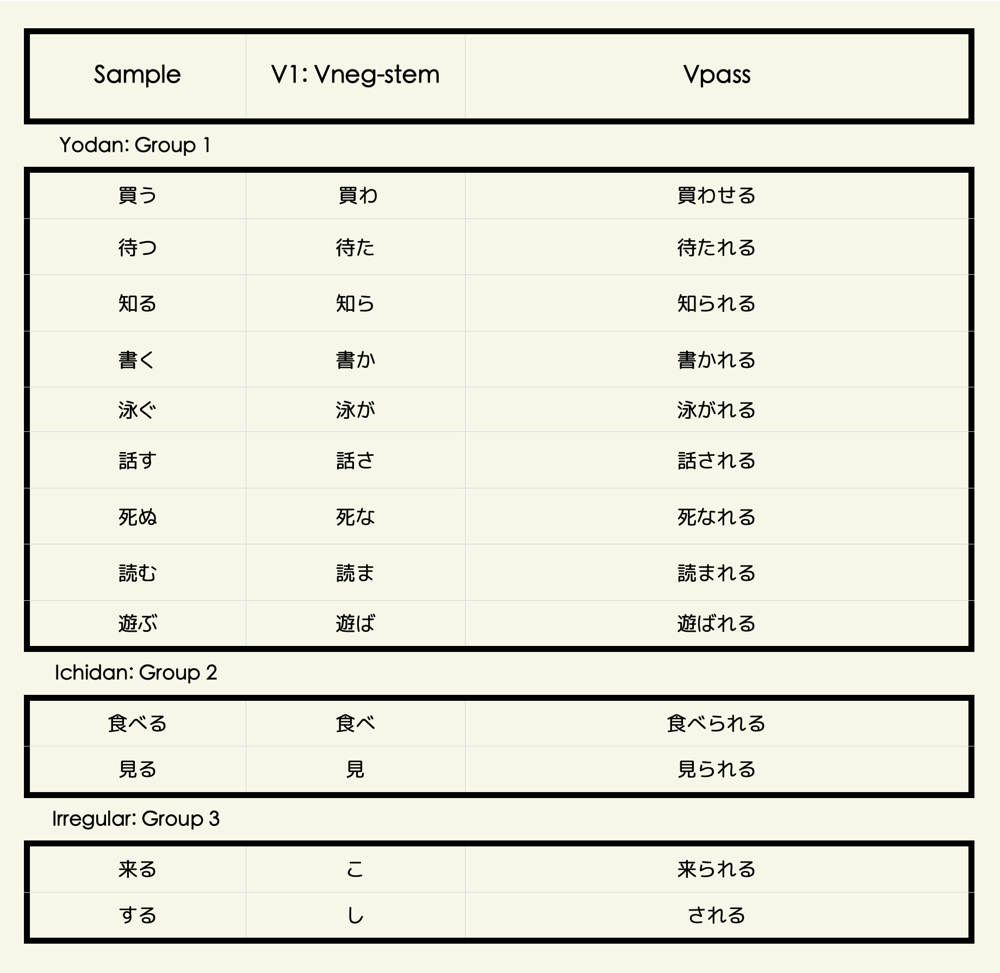
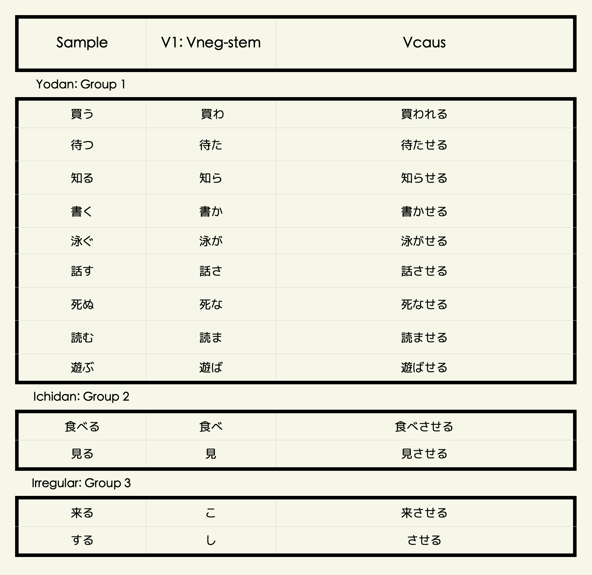

```{=html}
<style type="text/css">

body{
      font-size: 13px;
      font-family: "Anonymous Pro", "Roboto", "Helvetica Neue";
  }
</style>
```
<link rel="preconnect" href="https://fonts.googleapis.com"> <link rel="preconnect" href="https://fonts.gstatic.com" crossorigin> <link href="https://fonts.googleapis.com/css2?family=Hina+Mincho&family=Klee+One:wght@400;600&family=New+Tegomin&family=Sawarabi+Gothic&family=Shippori+Mincho+B1:wght@400;500&family=Yomogi&display=swap" rel="stylesheet"> <link rel="preconnect" href="https://fonts.googleapis.com"> <link rel="preconnect" href="https://fonts.gstatic.com" crossorigin> <link href="https://fonts.googleapis.com/css2?family=Noto+Sans+JP:wght@100;300;400;500;700&display=swap" rel="stylesheet"> <link rel="preconnect" href="https://fonts.gstatic.com"> <link href="https://fonts.googleapis.com/css2?family=M+PLUS+Rounded+1c:wght@100;300;400;500;700&display=swap" rel="stylesheet"> <link rel="preconnect" href="https://fonts.gstatic.com"> <link href="https://fonts.googleapis.com/css2?family=Anonymous+Pro&display=swap" rel="stylesheet"> <link href="https://fonts.googleapis.com/css2?family=Anonymous+Pro:ital,wght@0,400;1,700&display=swap" rel="stylesheet"> <link href="https://fonts.googleapis.com/css2?family=Anonymous+Pro:ital,wght@0,400;0,700;1,700&display=swap" rel="stylesheet">

```{css, echo=FALSE}
.my-tbl {
  border: 1px solid rgba(0, 0, 0, 0.1);
}

.my-header {
  border-width: 1px;
}

.my-col {
  border-right: 1px solid rgba(0, 0, 0, 0.05);
}

.my-row:hover {
  background-color: #f5f8ff;
}

.toc-content {
    padding-left: 10px;
    padding-right: 10px;
}
```

```{r setup, include=FALSE}
knitr::opts_chunk$set(echo = TRUE)
```

```{css, echo=FALSE}
@media(prefers-color-scheme: dark) {
  body {
    background-color: black;
    filter: invert(1);
  }
}
```

```{r, echo=FALSE, message=FALSE}
library(tidyverse)
library(reactable)
library(htmltools)
library(bslib)
library(dplyr)
library(purrr)
library(readr)
library(vembedr)
options(readr.show_col_types = FALSE)
```

```{r, echo=FALSE, message=FALSE, error=FALSE}
cmpnd <- read_csv("jpdb/VRBCMP-CMPWD.csv")
lverbs <- read_csv("jpdb/VERBFRQ-VERBS.csv")
vnstx <- read_csv("jpdb/VERBSYL-VERBS.csv")
vnstr <- read_csv("jpdb/VERBRNDM-VERBS.csv")
vnsts <- read_csv("jpdb/VERBSRU-VERBS.csv")
verbrw <- read_csv("jpdb/VERBSNTW-VERBS.csv")
verbrev <- read_csv("jpdb/VERBSRVW-VERBS.csv")
verbphr <- read_csv("jpdb/VERBSPHR-VERBS.csv")
vrbxte <- read_csv("jpdb/VRBEXT-WRDS.csv")
```

# <b> Verbs </b> {.tabset}

## <b> Forms </b> {.tabset}

### Table


<!-- ------------------------------------------------------------------------ -->

### V1 {.tabset}

#### Vneg

{width=60%}

<!-- ------------------------------------------------------------------------ -->

#### Details {.tabset}

##### Vnai

<p style="font-size:13px; line-height: 1; font-family: Noto Sans JP;  color: #202020; font-weight: bold">**① Vnai: Informal Negative**</p>

###### **⚭ Vneg-stem + nai**

    ・日本語が分からない
    ・私は遺伝子組み替え食品は買わない

<!-- <h>     -->

    ・I don't understand Japanese
    ・I will not buy genetically modified foods

<p style="font-size:13px; line-height: 1; font-family: Noto Sans JP;  color: #202020; font-weight: bold">**② Vnai hou ga ii: Better not to**</p>

###### **⚭ Vneg-stem + nai hou ga ii (desu)**

    ・無理しないほうがいいです
    ・こんな所を歩き回らないほうがいい

<!-- <h>     -->

    ・It’s better not to work too hard
    ・It’s better not to walk around these places

<!-- ------------------------------------------------------------------------ -->

##### Vnakatta

<p style="font-size:13px; line-height: 1; font-family: Noto Sans JP;  color: #202020; font-weight: bold">**① Vnakatta: Informal Past-Negative**</p>

###### **⚭ Vneg-stem + nakatta**

    ・お金がなかった  
    ・英語がわらなかった  
    ・お友達は昨日来なかった    

<!-- <h>     -->

    ・I didn't have any money.
    ・I didn't understand English.
    ・Your friend didn't show up yesterday.

<!-- ------------------------------------------------------------------------ -->

##### Vnaide

<p style="font-size:13px; line-height: 1; font-family: Noto Sans JP;  color: #202020; font-weight: bold">**① Vnaide: Without doing・Without having done**</p>

###### **⚭ Vneg-stem + naide**

    ・宿題をしないで学校に出かけてしまいました  

<!-- <h>     -->

    ・I left for school without doing my homework.

<p style="font-size:13px; line-height: 1; font-family: Noto Sans JP;  color: #202020; font-weight: bold">**② Vnaide kudasai: Please don't・Negative Request**</p>

###### **⚭ Vneg-stem + naide kudasai**

    ・ここでタバコを吸わないでください
    ・時間に遅れないでください

<!-- <h>     -->

    ・Please don't smoke in here.
    ・Please don’t be late.
    
<p style="font-size:13px; line-height: 1; font-family: Noto Sans JP;  color: #202020; font-weight: bold">**③ Vnaide sumu: Get by without doing, You don’t have to, It doesn’t matter if, You don’t have to**</p>

###### **⚭ Vneg-stem + naide sumu**

    ・人身事故で電車が遅れたがあまり待たないで済んだ

<!-- <h>     -->

    ・The train was delayed due to a personal injury, but we didn't have to wait too long

<!-- ------------------------------------------------------------------------ -->

##### Vnakute

<p style="font-size:13px; line-height: 1; font-family: Noto Sans JP;  color: #202020; font-weight: bold">**① Vnakute: Since not/without doing/having・not this but that**</p>

###### **⚭ Vneg-stem + nakute**

    ・お客さんが来なくてどうしますか  
    ・手紙を書かなくて電話をしました
    ・家族に会えなくて寂しいです
    ・今日は寒くなくてよかったです

<!-- <h>     -->

    ・If your guest does not come, What will you do?
    ・I didn’t write a letter, I telephoned.
    ・Since I couldn't see my see my family, I feel lonely.
    ・Since it's not cold today, I'm glad.

<!-- ------------------------------------------------------------------------ -->

### V1.1 {.tabset}

#### Vpass

{width=60%}

<!-- ------------------------------------------------------------------------ -->

#### Details

<p style="font-size:13px; line-height: 1; font-family: Noto Sans JP;  color: #202020; font-weight: bold">**① Vreru・rareru: Receptive Verb**</p>

###### **⚭ Vneg-stem + reru・rareru → Vpass**

    ・財布は泥棒に盗まれました
    ・彼はみんなに知られています
    ・先生に質問されました
    ・パンが誰かに食べられた
    ・見られた！
    ・この本は多くの人に読まれている
    ・窓は田中さんに開けられた
    ・田中さんに窓を開けられた
    ・田中さんに家を建てられた
    ・外国人に質問を聞かれた
    ・彼女に料理がまずかったって言われた
    ・お母さんに変だと言われます

<!-- <h>     -->

    ・My wallet was stolen by a thief.
    ・He is known by everyone.
    ・I was asked a question by the teacher.
    ・The bread was eaten by somebody.
    ・Someone saw me.
    ・This book is being read by a large number of people.
    ・The window was opened by Mr. Tanaka.
    ・Mr. Tanaka opened the window.
    ・Mr. Tanaka built a house.
    ・I was asked a question by a foreigner.
    ・She told me that the food was bad.
    ・I am told by my mother that I am strange.

<!-- ------------------------------------------------------------------------ -->

### V1.2 {.tabset}

#### Vcau

{width=60%}


<!-- ------------------------------------------------------------------------ -->

#### Details

<p style="font-size:13px; line-height: 1; font-family: Noto Sans JP;  color: #202020; font-weight: bold">**① Vsaseru・seru: Coercion, Instruction, Non-interference**</p>

###### **⚭ N ga N ni N o + Vneg-stem + saseru・seru (V - transitive)**

    ・教師が学生に賓を読ませた
    ・親が子供に宿題をさせた
    ・私は妹に昼ご飯を作らせた

<!-- <h>     -->

    ・The teacher made the students read the book.
    ・The parent made the child do homework.
    ・I made my sister make lunch.

<p style="font-size:13px; line-height: 1; font-family: Noto Sans JP;  color: #202020; font-weight: bold">**② Vsaseru・seru: Coercion, Instruction, Non-interference**</p>

###### **⚭ N ga N ni・o + Vneg-stem + saseru・seru (V - intransitive)**

    ・私が子供を買い物に行かせた
    ・私は仲間を死なせてしまったことを後悔している
    ・大きな契約だから新入社員に行かせるのは心配だ

<!-- <h>     -->

    ・I had the children go shopping.
    ・I regret that I let my friend die.
    ・It's a big contract, and I'm worried about letting the new guy go.

<p style="font-size:13px; line-height: 1; font-family: Noto Sans JP;  color: #202020; font-weight: bold">**③ Vsaseru・seru: Induce someone to do**</p>

###### **⚭ N ga N o + Vneg-stem + saseru・seru (V - intransitive, involuntary)**

    ・彼はいつも冗談を言ってみんなを笑わせる
    ・私は子供の頃は乱暴で、近所の子をよく泣かせれいた

<!-- <h>     -->

    ・He always telling jokes and making everyone laugh.
    ・When I was a child I was wild and unruly and often made the children in my neighbourhood cry.

<!-- ------------------------------------------------------------------------ -->

### V1.3 {.tabset}

#### Vcau-pass

{width=60%}

<!-- ------------------------------------------------------------------------ -->

#### Details

<p style="font-size:13px; line-height: 1; font-family: Noto Sans JP;  color: #202020; font-weight: bold">**① Vsaserareru・serareru: Forced to do something**</p>

###### **⚭ Vneg-stem + saserareru・serareru**

    ・昨日はお母さんに３時間も勉強させられた
    ・先輩に無理にお酒を飲ませられた
    ・私は母に部屋を掃除させられた

<!-- <h>     -->

    ・My mom made/forced me study for three hours yesterday.
    ・A senior colleague forced me to drink alcohol.
    ・I was made to clean the room by my mother.

<!-- ------------------------------------------------------------------------ -->

### V2 {.tabset}

#### Vnoun

{width=60%}

<!-- ------------------------------------------------------------------------ -->

#### Details {.tabset}

##### Vtai

<p style="font-size:13px; line-height: 1; font-family: Noto Sans JP;  color: #202020; font-weight: bold">**① Vtai: Desire to do something**</p>

###### **⚭ Vnoun-stem + tai**

    ・私はアイスが食べたいな
    ・私は渋谷に行きたいです
    ・僕はラーメンが食べたい  

<!-- <h>     -->

    ・I want to eat ice cream.
    ・I want to go to Shibuya.
    ・I want to eat ramen.

<!-- ------------------------------------------------------------------------ -->

##### Vnagara

<p style="font-size:13px; line-height: 1; font-family: Noto Sans JP;  color: #202020; font-weight: bold">**① Vnagara: While doing**</p>

###### **⚭ Vnoun-stem + nagara**

    ・ギターを弾きながら歌えますか
    ・お茶でも飲みながら話しませんか
    ・私はたいてい音楽を聴きながら勉強します

<!-- <h>     -->

    ・Can you sing while playing guitar?
    ・Why don't we talk over a cup of tea?
    ・I usually study while listening to music

<!-- ------------------------------------------------------------------------ -->

##### Vnikui

<p style="font-size:13px; line-height: 1; font-family: Noto Sans JP;  color: #202020; font-weight: bold">**① Vnikui: Difficult to do**</p>

###### **⚭ Vnoun-stem + nikui**

    ・この漢字は画数が多くて、覚えにくいです
    ・この魚は骨が多くて、食べにくいです
    ・東京は物価が高くて、住みにくいです

<!-- <h>     -->

    ・This kanji has many strokes and is difficult to remember!
    ・This fish has a lot of bones and is hard to eat!
    ・Tokyo is expensive and difficult to live in.

<!-- ------------------------------------------------------------------------ -->

##### Vsugiru

<p style="font-size:13px; line-height: 1; font-family: Noto Sans JP;  color: #202020; font-weight: bold">**① Vsugiru: Do too much**</p>

###### **⚭ Vnoun-stem + sugiru**

    ・ちょっと飲みすぎて頭が痛いです
    ・買い物しすぎて、お金がなくなりました
    ・ゲームしすぎて、目が痛いよ

<!-- <h>     -->

    ・I drank a little too much and my head hurts.
    ・I shopped too much and ran out of money!
    ・I play so many games, my eyes hurt.

<!-- ------------------------------------------------------------------------ -->

### V2.1 {.tabset}

#### Vmasu

<p style="font-size:13px; line-height: 1; font-family: Noto Sans JP;  color: #202020; font-weight: bold">**① Vmasu: Polite Form**</p>

###### **⚭ Vnoun-stem + masu**

    ・明日北海道に行きます
    ・日本語を勉強します
    ・今日は友達と遊びます

<!-- <h>     -->

    ・I'm going to Hokkaido tomorrow.
    ・I will study Japanese.
    ・I'm going to play with my friends today.

<!-- ------------------------------------------------------------------------ -->

#### Vmashita

<p style="font-size:13px; line-height: 1; font-family: Noto Sans JP;  color: #202020; font-weight: bold">**① Vmasu: Polite Form - Past**</p>

###### **⚭ Vnoun-stem + mashita**

    ・昨年、長野へ行きました
    ・昨日、ラーメンを食べました
    ・先週、日本語の本を読みました

<!-- <h>     -->

    ・I went to Nagano last year.
    ・Yesterday, I ate ramen.
    ・Last week, I read a book on Japanese

<!-- ------------------------------------------------------------------------ -->

#### Vnakatta

<p style="font-size:13px; line-height: 1; font-family: Noto Sans JP;  color: #202020; font-weight: bold">**① Vnakata: Polite Form - Negative**</p>

###### **⚭ Vnoun-stem + masen**

    ・私は林檎の芯を食べません
    ・美しい広告に買いません
    ・テレビやマンガのせいで学生は本を読みません

<!-- <h>     -->

    ・I don't eat the core of an apple.
    ・I don't buy into the beautiful ads.
    ・Students don't read books because of TV and comics.

<!-- ------------------------------------------------------------------------ -->

#### Vmasendeshita

<p style="font-size:13px; line-height: 1; font-family: Noto Sans JP;  color: #202020; font-weight: bold">**① Vnakata: Polite Form - Negative-Past**</p>

###### **⚭ Vnoun-stem + masen deshita**

    ・飛行機を調べませんでした
    ・まったく気付きませんでした
    ・誰も目に入りませんでした

<!-- <h>     -->

    ・I didn't check the plane.
    ・I wasn't aware of it at all.
    ・No one was in sight.

<!-- ------------------------------------------------------------------------ -->

### V3 {.tabset}

#### Vru

**Dictionary-Form**

<p style="font-size:12px;">

(❖) **Godan Verb (Dictionary Form)**

</p>

    ・買う　　⇢   買う
    ・待つ　　⇢   待つ
    ・知る　　⇢   知る
    ・書く　　⇢   書く
    ・泳ぐ　　⇢   泳ぐ
    ・話す　　⇢   話す
    ・死ぬ　　⇢   死ぬ
    ・読む　　⇢   読む
    ・遊ぶ　　⇢   遊ぶ

<p style="font-size:12px;">

(❖) **Ichidan Verb (Dictionary Form)**

</p>

    ・食べる　⇢   食べる
    ・見る　　⇢   見る

<p style="font-size:12px;">

(❖) **Irregular Verb (Dictionary Form)**

</p>

    ・来る　　⇢   来る
    ・する　　⇢   する

<p style="font-size:12px;">

(❖) **More Endings/Forms**

</p>

<!-- ------------------------------------------------------------------------ -->

#### Details

<!-- ------------------------------------------------------------------------ -->

### V4 {.tabset}

#### Stem

**Command-Stem**

<p style="font-size:12px;">

(❖) **Godan Verb (Command Stem)**

</p>

    ・買う　　⇢   買え
    ・待つ　　⇢   待て
    ・知る　　⇢   知れ
    ・書く　　⇢   書け
    ・泳ぐ　　⇢   泳げ
    ・話す　　⇢   話せ
    ・死ぬ　　⇢   死ね
    ・読む　　⇢   読め
    ・遊ぶ　　⇢   遊べ

<p style="font-size:12px;">

(❖) **Ichidan Verb (Command Stem)**

</p>

    ・食べる　⇢   食べれ
    ・見る　　⇢   見れ

<p style="font-size:12px;">

(❖) **Ichidan Verb (Command Stem)**

</p>

    ・来る　　⇢   来れ
    ・する　　⇢   すれ

<!-- ------------------------------------------------------------------------ -->

#### Forms

<!-- ------------------------------------------------------------------------ -->

### V4.1 {.tabset}

#### Vcnd-ba

**Conditional-Form-Ba**

<p style="font-size:12px;">

(❖) **Godan Verb (Volitional Form)**

</p>

    ・買う　　⇢   買えば
    ・待つ　　⇢   待てば
    ・知る　　⇢   知れば
    ・書く　　⇢   書けば
    ・泳ぐ　　⇢   泳げば
    ・話す　　⇢   話せば
    ・死ぬ　　⇢   死ねば
    ・読む　　⇢   読めば
    ・遊ぶ　　⇢   遊べば

<p style="font-size:12px;">

(❖) **Ichidan Verb (Volitional Form)**

</p>

    ・食べる　⇢   食べれば
    ・見る　　⇢   見れば

<p style="font-size:12px;">

(❖) **Irregular Verb (Volitional Form)**

</p>

    ・来る　　⇢   来れば
    ・する　　⇢   すれば

<!-- ------------------------------------------------------------------------ -->

### V4.2 {.tabset}

#### Vpot

**Potential-Form**

<p style="font-size:12px;">

(❖) **Godan Verb (Potential Form)**

</p>

    ・買う　　⇢   買える
    ・待つ　　⇢   待てる
    ・知る　　⇢   知れる
    ・書く　　⇢   書ける
    ・泳ぐ　　⇢   泳げる
    ・話す　　⇢   話せる
    ・死ぬ　　⇢   死ねる
    ・読む　　⇢   読める
    ・遊ぶ　　⇢   遊べる

<p style="font-size:12px;">

(❖) **Ichidan Verb (Potential Form)**

</p>

    ・食べる　⇢   食べられる
    ・見る　　⇢   見られる

<p style="font-size:12px;">

(❖) **Irregular Verb (Potential Form)**

</p>

    ・来る　　⇢   来られる
    ・する　　⇢   できる

<!-- ------------------------------------------------------------------------ -->

### V5 {.tabset}

#### Vvol

**Volitional-Form**

<p style="font-size:12px;">

(❖) **Godan Verb (Volitional Form)**

</p>

    ・買う　　⇢   買おう
    ・待つ　　⇢   待おう
    ・知る　　⇢   知ろう
    ・書く　　⇢   書こう
    ・泳ぐ　　⇢   泳ごう
    ・話す　　⇢   話そう
    ・死ぬ　　⇢   死のう
    ・読む　　⇢   読もう
    ・遊ぶ　　⇢   遊ぼう

<p style="font-size:12px;">

(❖) **Ichidan Verb (Volitional Form)**

</p>

    ・食べる　⇢   食べよう
    ・見る　　⇢   見よう

<p style="font-size:12px;">

(❖) **Irregular Verb (Volitional Form)**

</p>

    ・来る　　⇢   来よう
    ・する　　⇢   しよう

<!-- ------------------------------------------------------------------------ -->

### V6 {.tabset}

#### Vte

**Te-Form**

<p style="font-size:12px;">

(❖) **Godan Verb (Te Form)**

</p>

    ・買う　　⇢   買って
    ・待つ　　⇢   待って
    ・知る　　⇢   知って
    ・書く　　⇢   書いて
    ・泳ぐ　　⇢   泳いで
    ・話す　　⇢   話して
    ・死ぬ　　⇢   死んで
    ・読む　　⇢   読んで
    ・遊ぶ　　⇢   遊んで

<p style="font-size:12px;">

(❖) **Ichidan Verb (Te Form)**

</p>

    ・食べる　⇢   食べて
    ・見る　　⇢   見て

<p style="font-size:12px;">

(❖) **Irregular Verb (Te Form)**

</p>

    ・来る　　⇢   来て
    ・する　　⇢   して

<!-- ------------------------------------------------------------------------ -->

### V7 {.tabset}

#### Vta

**Ta-Form**

<p style="font-size:12px;">

(❖) **Godan Verb (Ta Form)**

</p>

    ・買う　　⇢   買った
    ・待つ　　⇢   待った
    ・知る　　⇢   知った
    ・書く　　⇢   書いた
    ・泳ぐ　　⇢   泳いだ
    ・話す　　⇢   話した
    ・死ぬ　　⇢   死んだ
    ・読む　　⇢   読んだ
    ・遊ぶ　　⇢   遊んだ

<p style="font-size:12px;">

(❖) **Ichidan Verb (Ta Form)**

</p>

    ・食べる　⇢   食べた
    ・見る　　⇢   見た

<p style="font-size:12px;">

(❖) **Irregular Verb (Ta Form)**

</p>

    ・来る　　⇢   来た
    ・する　　⇢   した

<!-- ------------------------------------------------------------------------ -->

### More {.tabset}

#### Vcnd {.tabset}

##### to

**Conditional-Form**

**①　to**`if・when`

**⚭　Vdict + to**

(1) When the result of the condition can be predicted naturally
(2) When the result is known to happen customarily
(3) When the result occurs generally and repeatedly

<!-- <h> -->

    ・まっすぐ行くと学校があります
    ・朝起きると顔を洗います
    ・冬になると寒くなります

<!-- <h> -->

    ・If you go straight, you will find a school
    ・When I wake up in the morning, I wash my face
    ・When winter comes, It gets cold

(✖︎) It cannot be used if it includes speakers intention, judgment, permission, opinion, request and etc.

<!-- ------------------------------------------------------------------------ -->

##### tara

**Conditional-Form**

**②　tara**`if・when`

**⚭　Vta + ra**

(1) When the result of the condition can be predicted naturally
(2) When the condition and result occurs only once
(3) When you express volition, requests, invitations, make suggestions
(4) When you express hypothetical conditions

<!-- <h> -->

    ・まっすぐ行ったら学校があります
    ・明日雨が降ったら家にいます
    ・暇だったら山へ行きたいです
    ・何を買ったらいいですか
    ・よかったら食べてみてください
    ・コーヒーにしたらどう

<!-- <h> -->

    ・If you go straight, there is a school
    ・If it rains tomorrow, I'll stay home
    ・When I'm free, I want to go to the mountains
    ・What should I buy?
    ・You can try it if you want
    ・How about a cup of coffee?

(✖︎) It cannot be used if it is not chronological order

<!-- ------------------------------------------------------------------------ -->

##### ba

**Conditional-Form**

**③　ba**`if・when`

**⚭　Vcmd-stem + ba**

(1) When the result of the condition can be predicted naturally
(2) When the result occurs generally and repeatedly
(3) When you express universal truth and customs
(4) When you express to do something (should/wish)
(5) When you are seeking advice (how to/when to/where to/whom/what to)

<!-- <h> -->

    ・まっすぐ行けば学校があります
    ・冬になれば寒くなります
    ・もっと勉強すれば日本語が上手なります
    ・もっと勉強すればよかった
    ・どうやって注文すればいいですか
    ・いつ申し込めばいいですか
    ・誰に聞けばいいですか
    ・いくら払えばいいですか
    ・何時に来ればいいですか
    ・新宿へどう行けばいいですか

<!-- <h> -->

    ・If you go straight, there is a school
    ・When winter comes, it gets cold
    ・If I study more, my Japanese will improve
    ・I should have studied harder
    ・How do I place an order?
    ・When do I need to apply?
    ・Who should I ask?
    ・How much do I have to pay?
    ・What time should I come?
    ・How can I get to Shinjuku?

(✖︎) It cannot be used if S2 includes something negative (S2 is usually a positive outcome)

<!-- ------------------------------------------------------------------------ -->

##### nara

**Conditional-Form**

**④　nara**

**⚭　Vdict + nara**`if・if it is the case`

(1) When you express advice, requests, invitations
(2) When you express S1-\>S2, or S2-\>S1
(3) When you include what the other person said or thoughts is confirmed and used as condition

<!-- <h> -->

    ・頭が痛いなら寝た方がいいです
    ・お酒を飲むなら運転しません
    ・田中さんが行くなら私も行きます
    ・コンビニに行くならおやつ買ってくれませんか

<!-- <h> -->

    ・If your head hurts, you'd better get some sleep
    ・I don't drive if I'm going to drink
    ・If Mr. Tanaka is going, I'm going too
    ・If you're going to the convenience store, could you please buy me a snack?

(✖︎) It cannot be used if the results mere fact which occurs naturally

<!-- ------------------------------------------------------------------------ -->

#### Vres

**① Continuous-State・Existing-Condition**`Resultative`

Describes the current state or condition of the subject due to consequence of past occurrence.

**⚭　Vte + iru**

    ・いい天気です。空が晴れています
    ・妹は結婚しています    
    ・お店が開いています
    ・ドアがしまっていて入れない
    ・水槽の魚が死んでいる

<!-- <h>  -->

    ・It's a beautiful day. The sky is clear
    ・My sister is married
    ・The shop is open!
    ・The door is locked and I can't get in
    ・The fish in the tank is dead

**②　Existing-Condition**`Resultative`

Describes the current condition of the subject due to consequence of past occurrence.\
Transitive verbs are being used in this case.\
Indicates that the past occurrence was done by someone and not by you.

**Vte + aru**

    ・戸が開けてある
    ・ビールはもう冷やしてありますよ
    ・壁にカレンダーがかけてありますよ  
    ・冷蔵庫に昼ごはんは用意してあるから、チンして食べてね

<!-- <h>  -->

    ・The door has been opened (by someone)
    ・The beer is already chilled
    ・The calendar has been changed on the wall
    ・The lunch have been prepared in the fridge, so just chill and eat

<!-- ------------------------------------------------------------------------ -->

#### Vprog

**Continuous-Action**`Progressive`

Describes the progressive action that is taking place.

**⚭　Vte + iru**

    ・弟は今勉強をしています
    ・私は今絵を描いています    
    ・昨日9時ごろバーで酒を飲んでいました
    ・けいが本を読んでいる
    ・母は今台所で食事の仕度をしています  
    ・父は貿易会社に勤めています 

<!-- <h>  -->

    ・My brother is studying now.
    ・I'm painting now
    ・I was in a bar drinking yesterday around nine o'clock
    ・Kei is reading a book
    ・My mother is in the kitchen preparing a meal
    ・My father works for a trading company

<!-- ------------------------------------------------------------------------ -->

#### Vrep

**Habitual・Routine**`Repititive`

Describes a habitual or repeated action.

**⚭　Vte + iru**

    ・あの店では新しい野菜を売っています
    ・弟は中学に行っています    
    ・お宅ではどんな新聞を読んでいますか
    ・健康のために毎日一時間ぐらい歩いています

<!-- <h>  -->

    ・That vegetable store sells fresh vegetables
    ・My younger brother attends junior high school
    ・Which newspaper do you read?
    ・I walk for about an hour every day to keep fit

<!-- ------------------------------------------------------------------------ -->

## <b> Words </b> {.tabset}

### Freq {.tabset}

```{r, echo=FALSE, message=FALSE}

lverbs.w <- lverbs %>% slice(1:234)
lverbs.w <- lverbs.w %>% rename(Sentences = S1)
# lverbs <- lverbs[sample(1:nrow(lverbs)),]

reactable(
  lverbs.w,
  columns = list(
    Verbs = colDef(
      # Show species under character names
      cell = function(value, index) {
        Meaning <- lverbs.w$Meaning[index]
        Meaning <- if (!is.na(Meaning)) Meaning else ""
        Reading <- lverbs.w$Reading[index]
        Reading <- if (!is.na(Reading)) Reading else ""
        Words <- lverbs.w$Words[index]
        Words <- if (!is.na(Words)) Words else ""
        Type <- lverbs.w$Type[index]
        Type <- if (!is.na(Type)) Type else ""
        tagList(
          div(style = list(fontSize = 28, fontWeight = 500), value),
          div(style = list(fontSize = 12), Reading),
          div(style = list(fontSize = 9.2, fontWeight = 500), Meaning),
          div(style = list(fontSize = 9), Type),
        )
      },
      align = "center"
    ),
    
    Sentences = colDef(
      minWidth = 180,
      # Show species under character names
      cell = function(value, index) {
        T1 <- lverbs$T1[index]
        T1 <- if (!is.na(T1)) T1 else ""
        S2 <- lverbs$S2[index]
        S2 <- if (!is.na(S2)) S2 else ""
        T2 <- lverbs$T2[index]
        T2 <- if (!is.na(T2)) T2 else ""
        S3 <- lverbs$S3[index]
        S3 <- if (!is.na(S3)) S3 else ""
        T3 <- lverbs$T3[index]
        T3 <- if (!is.na(T3)) T3 else ""
        tagList(
          div(style = list(fontSize = 14.5, fontWeight = 500), value),
          div(style = list(fontSize = 9), T1),
          div(style = list(fontSize = 2), "."),
          div(style = list(fontSize = 1), "."),
          div(style = list(fontSize = 14.5, fontWeight = 500), S2),
          div(style = list(fontSize = 9), T2),
          div(style = list(fontSize = 2), "."),
          div(style = list(fontSize = 1), "."),
          div(style = list(fontSize = 14.5, fontWeight = 500), S3),
          div(style = list(fontSize = 9), T3),
        )
      },
      align = "left"
    ),
    
    Reading = colDef(show = FALSE),
    Meaning = colDef(show = FALSE),
    Type = colDef(show = FALSE),
    Sentences = colDef(show = FALSE),
    S2 = colDef(show = FALSE),
    S3 = colDef(show = FALSE),
    T1 = colDef(show = FALSE),
    T2 = colDef(show = FALSE),
    T3 = colDef(show = FALSE),
    Words = colDef(show = FALSE),
    Rank = colDef(show = FALSE)
  ),
  defaultPageSize = 3,
  theme = reactableTheme(
    # Vertically center cells
    cellStyle = list(display = "flex", flexDirection = "column", justifyContent = "center", height = 150),
    searchInputStyle = list(
      paddingLeft = "8px",
      paddingTop = "8px",
      paddingBottom = "8px",
      width = "100%"
    )
  ),
  showPageInfo = FALSE, bordered = TRUE, searchable = TRUE, sortable = FALSE, paginationType = "numbers",
  
  style = list(fontFamily = "Noto Sans JP, Heiti SC, Hiragino Maru Gothic ProN, Anonymous Pro , monospace, Helvetica Neue", fontSize = "11px")
)

```

<!-- ------------------------------------------------------------------------ -->

### Syllable {.tabset}

```{r, echo=FALSE, message=FALSE}

vnstxp <- vnstx %>% slice(1:1071)
vnstxp <- vnstxp %>% rename(Sentences = S1)
# vnstxp <- vnstxp[sample(1:nrow(vnstxp)),]

reactable(
  vnstxp,
  columns = list(
    Words = colDef(
      # Show species under character names
      cell = function(value, index) {
        Meaning <- vnstxp$Meaning[index]
        Meaning <- if (!is.na(Meaning)) Meaning else ""
        Reading <- vnstxp$Reading[index]
        Reading <- if (!is.na(Reading)) Reading else ""
        Type <- vnstxp$Type[index]
        Type <- if (!is.na(Type)) Type else ""
        tagList(
          div(style = list(fontSize = 28, fontWeight = 500), value),
          div(style = list(fontSize = 12), Reading),
          div(style = list(fontSize = 9.2, fontWeight = 500), Meaning),
          div(style = list(fontSize = 9), Type),
        )
      },
      align = "center"
    ),
    
    Sentences = colDef(
      minWidth = 180,
      # Show species under character names
      cell = function(value, index) {
        T1 <- vnstxp$T1[index]
        T1 <- if (!is.na(T1)) T1 else ""
        S2 <- vnstxp$S2[index]
        S2 <- if (!is.na(S2)) S2 else ""
        T2 <- vnstxp$T2[index]
        T2 <- if (!is.na(T2)) T2 else ""
        S3 <- vnstxp$S3[index]
        S3 <- if (!is.na(S3)) S3 else ""
        T3 <- vnstxp$T3[index]
        T3 <- if (!is.na(T3)) T3 else ""
        tagList(
          div(style = list(fontSize = 14.5, fontWeight = 500), value),
          div(style = list(fontSize = 9), T1),
          div(style = list(fontSize = 2), "."),
          div(style = list(fontSize = 1), "."),
          div(style = list(fontSize = 14.5, fontWeight = 500), S2),
          div(style = list(fontSize = 9), T2),
          div(style = list(fontSize = 2), "."),
          div(style = list(fontSize = 1), "."),
          div(style = list(fontSize = 14.5, fontWeight = 500), S3),
          div(style = list(fontSize = 9), T3),
        )
      },
      align = "left"
    ),
    
    Reading = colDef(show = FALSE),
    Meaning = colDef(show = FALSE),
    Type = colDef(show = FALSE),
    Sentences = colDef(show = FALSE),
    S2 = colDef(show = FALSE),
    S3 = colDef(show = FALSE),
    T1 = colDef(show = FALSE),
    T2 = colDef(show = FALSE),
    T3 = colDef(show = FALSE),
    W1 = colDef(show = FALSE),
    W2 = colDef(show = FALSE),
    W3 = colDef(show = FALSE)
  ),
  defaultPageSize = 3,
  theme = reactableTheme(
    # Vertically center cells
    cellStyle = list(display = "flex", flexDirection = "column", justifyContent = "center", height = 150),
    searchInputStyle = list(
      paddingLeft = "8px",
      paddingTop = "8px",
      paddingBottom = "8px",
      width = "100%"
    )
  ),
  showPageInfo = FALSE, bordered = TRUE, searchable = TRUE, sortable = FALSE, paginationType = "numbers",
  
  style = list(fontFamily = "Noto Sans JP, Heiti SC, Hiragino Maru Gothic ProN, Anonymous Pro , monospace, Helvetica Neue", fontSize = "11px")
)

```

<!-- ------------------------------------------------------------------------ -->

### Random {.tabset}

```{r, echo=FALSE, message=FALSE}

vnstr1 <- vnstr
vnstr1 <- vnstr1 %>% rename(Sentences = S1)
# vnstr1 <- vnstr1[sample(1:nrow(vnstr1)),]

reactable(
  vnstr1,
  columns = list(
    Words = colDef(
      # Show species under character names
      cell = function(value, index) {
        Meaning <- vnstr1$Meaning[index]
        Meaning <- if (!is.na(Meaning)) Meaning else ""
        Reading <- vnstr1$Reading[index]
        Reading <- if (!is.na(Reading)) Reading else ""
        Type <- vnstr1$Type[index]
        Type <- if (!is.na(Type)) Type else ""
        tagList(
          div(style = list(fontSize = 28, fontWeight = 500), value),
          div(style = list(fontSize = 12), Reading),
          div(style = list(fontSize = 9.2, fontWeight = 500), Meaning),
          div(style = list(fontSize = 9), Type),
        )
      },
      align = "center"
    ),

    Sentences = colDef(
      minWidth = 180,
      # Show species under character names
      cell = function(value, index) {
        T1 <- vnstr1$T1[index]
        T1 <- if (!is.na(T1)) T1 else ""
        S2 <- vnstr1$S2[index]
        S2 <- if (!is.na(S2)) S2 else ""
        T2 <- vnstr1$T2[index]
        T2 <- if (!is.na(T2)) T2 else ""
        S3 <- vnstr1$S3[index]
        S3 <- if (!is.na(S3)) S3 else ""
        T3 <- vnstr1$T3[index]
        T3 <- if (!is.na(T3)) T3 else ""
        tagList(
          div(style = list(fontSize = 14.5, fontWeight = 500), value),
          div(style = list(fontSize = 9), T1),
          div(style = list(fontSize = 2), "."),
          div(style = list(fontSize = 1), "."),
          div(style = list(fontSize = 14.5, fontWeight = 500), S2),
          div(style = list(fontSize = 9), T2),
          div(style = list(fontSize = 2), "."),
          div(style = list(fontSize = 1), "."),
          div(style = list(fontSize = 14.5, fontWeight = 500), S3),
          div(style = list(fontSize = 9), T3),
        )
      },
      align = "left"
    ),
    Reading = colDef(show = FALSE),
    Meaning = colDef(show = FALSE),
    Type = colDef(show = FALSE),
    Sentences = colDef(show = FALSE),
    S2 = colDef(show = FALSE),
    S3 = colDef(show = FALSE),
    T1 = colDef(show = FALSE),
    T2 = colDef(show = FALSE),
    T3 = colDef(show = FALSE),
    W1 = colDef(show = FALSE),
    W2 = colDef(show = FALSE),
    W3 = colDef(show = FALSE)
  ),
  defaultPageSize = 3,
  theme = reactableTheme(
    # Vertically center cells
    cellStyle = list(display = "flex", flexDirection = "column", justifyContent = "center", height = 150),
    searchInputStyle = list(
      paddingLeft = "8px",
      paddingTop = "8px",
      paddingBottom = "8px",
      width = "100%"
    )
  ),
  showPageInfo = FALSE, bordered = TRUE, searchable = TRUE, sortable = FALSE, paginationType = "numbers",
  
  style = list(fontFamily = "Noto Sans JP, Heiti SC, Hiragino Maru Gothic ProN, Anonymous Pro , monospace, Helvetica Neue", fontSize = "11px")
)

```

<!-- ------------------------------------------------------------------------ -->

### Suru {.tabset}

```{r, echo=FALSE, message=FALSE}

vnsts1 <- vnsts
vnsts1 <- vnsts1 %>% rename(Sentences = S3)
# vnsts1 <- vnsts1[sample(1:nrow(vnsts1)),]

reactable(
  vnsts1,
  columns = list(
    Words = colDef(
      # Show species under character names
      cell = function(value, index) {
        Meaning <- vnsts1$Meaning[index]
        Meaning <- if (!is.na(Meaning)) Meaning else ""
        Reading <- vnsts1$Reading[index]
        Reading <- if (!is.na(Reading)) Reading else ""
        W1 <- vnsts1$W1[index]
        W1 <- if (!is.na(W1)) W1 else ""
        W2 <- vnsts1$W2[index]
        W2 <- if (!is.na(W2)) W2 else ""
        W3 <- vnsts1$W3[index]
        W3 <- if (!is.na(W3)) W3 else ""
        T1 <- vnsts1$T1[index]
        T1 <- if (!is.na(T1)) T1 else ""
        T2 <- vnsts1$T2[index]
        T2 <- if (!is.na(T2)) T2 else ""
        S1 <- vnsts1$S1[index]
        S1 <- if (!is.na(S1)) S1 else ""
        S2 <- vnsts1$S2[index]
        S2 <- if (!is.na(S2)) S2 else ""
        K1 <- vnsts1$K1[index]
        K1 <- if (!is.na(K1)) K1 else ""
        K2 <- vnsts1$K2[index]
        K2 <- if (!is.na(K2)) K2 else ""
        Type <- vnsts1$Type[index]
        Type <- if (!is.na(Type)) Type else ""
        tagList(
          div(style = list(fontSize = 24, fontWeight = 500), value),
          div(style = list(fontSize = 10), Reading),
          div(style = list(fontSize = 11, fontWeight = 500), Meaning),
          # div(style = list(fontSize = 14), S1),
          div(style = list(fontSize = 10), K1),
          # div(style = list(fontSize = 9), S2),
          div(style = list(fontSize = 10), K2),
          # div(style = list(fontSize = 11), Type),
          # div(style = list(fontSize = 14), W1," ", W2," ", W3),
        )
      },
      align = "center"
    ),
    
    Sentences = colDef(
      minWidth = 180,
      cell = function(value, index) {
        T3 <- vnsts1$T3[index]
        T3 <- if (!is.na(T3)) T3 else ""
        tagList(
          div(style = list(fontSize = 14.5, fontWeight = 500), value),
          div(style = list(fontSize = 9), T3),
        )
      },
      align = "left"
    ),
    
    Reading = colDef(show = FALSE),
    Meaning = colDef(show = FALSE),
    Type = colDef(show = FALSE),
    S1 = colDef(show = FALSE),
    S2 = colDef(show = FALSE),
    K1 = colDef(show = FALSE),
    K2 = colDef(show = FALSE),
    Sentences = colDef(show = FALSE),
    T1 = colDef(show = FALSE),
    T2 = colDef(show = FALSE),
    T3 = colDef(show = FALSE),
    W1 = colDef(show = FALSE),
    W2 = colDef(show = FALSE),
    W3 = colDef(show = FALSE)
  ),
  defaultPageSize = 3,
  theme = reactableTheme(
    # Vertically center cells
    cellStyle = list(display = "flex", flexDirection = "column", justifyContent = "center", height = 140),
    searchInputStyle = list(
      paddingLeft = "8px",
      paddingTop = "8px",
      paddingBottom = "8px",
      width = "100%"
    )
  ),
  showPageInfo = FALSE, bordered = TRUE, searchable = TRUE, sortable = FALSE, paginationType = "numbers",
  
  style = list(fontFamily = "Noto Sans JP, Heiti SC, Hiragino Maru Gothic ProN, Anonymous Pro , monospace, Helvetica Neue", fontSize = "11px")
)

```

<!-- ------------------------------------------------------------------------ -->

## <b> Compounds </b> {.tabset}

```{r, echo=FALSE, message=FALSE}

cmpnd <- cmpnd[sample(1:nrow(cmpnd)),]

reactable(
  cmpnd,
  columns = list(
    Words = colDef(
      cell = function(value, index) {
        Meaning <- cmpnd$Meaning[index]
        Meaning <- if (!is.na(Meaning)) Meaning else ""
        Reading <- cmpnd$Reading[index]
        Reading <- if (!is.na(Reading)) Reading else ""
        tagList(
          div(style = list(fontSize = 24, fontWeight = 600), value),
          div(style = list(fontSize = 10, fontWeight = 400), Reading),
          div(style = list(fontSize = 9), Meaning)
        )
      },
      align = "center"
    ),
    
    Sentences = colDef(
      minWidth = 180,
      cell = function(value, index) {
        Translation <- cmpnd$Translation[index]
        Translation <- if (!is.na(Translation)) Translation else ""
        tagList(
          div(style = list(fontSize = 17, fontWeight = 500), value),
          div(style = list(fontSize = 9), Translation),
        )
      },
      align = "left"
    ),
    Reading = colDef(show = FALSE),   
    Meaning = colDef(show = FALSE),
    Sentences = colDef(show = FALSE),
    Translation = colDef(show = FALSE)
  ),
  defaultPageSize = 3,
  theme = reactableTheme(
    cellStyle = list(display = "flex", flexDirection = "column", justifyContent = "center", fontSize = "11px", height = 150),
    searchInputStyle = list(
      paddingLeft = "8px",
      paddingTop = "8px",
      paddingBottom = "8px",
      width = "100%",
      fontSize = "11px"
    )
  ),
  showPageInfo = FALSE, bordered = TRUE, searchable = TRUE, sortable = FALSE, paginationType = "numbers",

  style = list(fontFamily = "Noto Sans JP, Heiti SC, Hiragino Maru Gothic ProN, Anonymous Pro , monospace, Helvetica Neue", fontSize = "11px")
)

```

<!-- ------------------------------------------------------------------------ -->

## <b> Extensions </b> {.tabset}

```{r, echo=FALSE, message=FALSE}

vrbxte <- vrbxte[sample(1:nrow(vrbxte)),]

reactable(
  vrbxte,
  columns = list(
    Words = colDef(
      cell = function(value, index) {
        Reading <- vrbxte$Reading[index]
        Reading <- if (!is.na(Reading)) Reading else ""
        Meaning <- vrbxte$Meaning[index]
        Meaning <- if (!is.na(Meaning)) Meaning else ""
        Ext <- vrbxte$Ext[index]
        Ext <- if (!is.na(Ext)) Ext else ""
        Approx <- vrbxte$Approx[index]
        Approx <- if (!is.na(Approx)) Approx else ""
        Remarks <- vrbxte$Remarks[index]
        Remarks <- if (!is.na(Remarks)) Remarks else ""
        tagList(
          div(style = list(fontSize = 24, fontWeight = 600), value),
          div(style = list(fontSize = 9), Reading),
          div(style = list(fontSize = 10, fontWeight = 500), Meaning),
        )
      },
      align = "center"
    ),
    Expression = colDef(
      minWidth = 180,
      cell = function(value, index) {
        Translation <- vrbxte$Translation[index]
        Translation <- if (!is.na(Translation)) Translation else ""
        Ext <- vrbxte$Ext[index]
        Ext <- if (!is.na(Ext)) Ext else ""
        Approx <- vrbxte$Approx[index]
        Approx <- if (!is.na(Approx)) Approx else ""
        Remarks <- vrbxte$Remarks[index]
        Remarks <- if (!is.na(Remarks)) Remarks else ""
        tagList(
          div(style = list(fontSize = 18, fontWeight = 600), value),
          div(style = list(fontSize = 9), Translation),
          div(style = list(fontSize = 2), "."),
          div(style = list(fontSize = 10.5, fontWeight = 500), Ext, "▫︎" , Approx),
          div(style = list(fontSize = 10.5), Remarks),
        )
      },
      align = "center"
    ),    
    Reading = colDef(show = FALSE),
    Meaning = colDef(show = FALSE),
    Ext = colDef(show = FALSE),
    Approx = colDef(show = FALSE),
    Remarks = colDef(show = FALSE),
    Translation = colDef(show = FALSE)
  ),
  defaultPageSize = 3,
  theme = reactableTheme(
    cellStyle = list(display = "flex", flexDirection = "column", justifyContent = "center", fontSize = "11px", height = 150),
    searchInputStyle = list(
      paddingLeft = "8px",
      paddingTop = "8px",
      paddingBottom = "8px",
      width = "100%",
      fontSize = "11px"
    )
  ),
  showPageInfo = FALSE, bordered = TRUE, searchable = TRUE, sortable = FALSE, paginationType = "numbers",

  style = list(fontFamily = "Noto Sans JP, Heiti SC, Hiragino Maru Gothic ProN, Anonymous Pro , monospace, Helvetica Neue", fontSize = "11px")
)

```

<!-- ------------------------------------------------------------------------ -->

## <b> Sentences </b> {.tabset}

```{r, echo=FALSE, message=FALSE}

verbphr <- verbphr %>% na.omit(verbphr)
verbphr <- verbphr[sample(1:nrow(verbphr)),]
reactable(
  verbphr,
  columns = list(
    Phrases = colDef(
      cell = function(value, index) {
        Translation <- verbphr$Translation[index]
        Translation <- if (!is.na(Translation)) Translation else ""
        tagList(
          div(style = list(fontSize = 24, fontWeight = 600), value),
          div(style = list(fontSize = 9, color = '#787878'), Translation)
        )
      },
      align = "center"
    ),
    
    Translation = colDef(show = FALSE)

  ),
  defaultPageSize = 1,
  theme = reactableTheme(
    # Vertically center cells
    cellStyle = list(display = "flex", flexDirection = "column", justifyContent = "center", height = 250, fontSize = "11px"),
    searchInputStyle = list(
      paddingLeft = "8px",
      paddingTop = "8px",
      paddingBottom = "8px",
      width = "100%"
    )
  ),
  showPageInfo = FALSE, bordered = TRUE, searchable = TRUE, paginationType = "simple",
  
  style = list(fontFamily = "Noto Sans JP, Hiragino Maru Gothic ProN, Anonymous Pro , Helvetica Neue", fontSize = "11px")
)

```

<!-- ------------------------------------------------------------------------ -->

## <b> Specials </b> {.tabset}

### Towards

<p style="font-size:13px; line-height: 0.5; font-family: Noto Sans JP;  color: #202020; font-weight: bold">**① 向ける:**</p>

###### to turn towards・to point

    ・窓の方に顔を向ける
    ・銃を男に向けた
    ・北海道へと足を向ける
    ・計画に背を向ける
    ・現実に目を向ける
    ・その事実に注意を向ける
    ・担当者をそちらへ向ける
    ・研究に心を向けた
    ・問題解決に向けて努力した
    ・多くの資金を事業投資に向ける

<!-- <h> -->

    ・He turned his head toward the window
    ・Pointing the gun at the man
    ・He turns his back on the plan
    ・I turn my back on the plan
    ・I turn my back on reality
    ・I turn my attention to the fact
    ・I turn my attention to the man in charge
    ・I turned my mind to research
    ・Worked hard to solve the problem
    ・Directed more money to business investment

<p style="font-size:13px; line-height: 0.5; font-family: Noto Sans JP;  color: #202020; font-weight: bold">**② 向く:**</p>

###### to turn toward・to look・to face・to point・to be suited for

    ・右を向く
    ・後ろを向く
    ・風向計が北を向いた
    ・上を向く
    ・どこを向いても美しい花ばかりだった
    ・東に向いた家
    ・庭に向いた窓
    ・若い人に向いた仕事
    ・彼はそんな役割に向いている
    ・壁のほうを向いて立つ
    ・窓は庭に向いている
    ・教師に向いている

<!-- <h> -->

    ・Turn to the right
    ・Turn to the back
    ・Anemometer pointing north
    ・Look up
    ・Everywhere I turned there were beautiful flowers
    ・The house facing east
    ・Windows facing the garden
    ・A job for a young man
    ・He's suited to such a role
    ・He stands facing the wall
    ・The window faces the garden
    ・He is suited to be a teacher

<p style="font-size:13px; line-height: 0.5; font-family: Noto Sans JP;  color: #202020; font-weight: bold">**③ 向かう:**</p>

###### to go towards・to head towards・to face

    ・鏡に向かう　
    ・壁に向かって立つ
    ・向かって左から
    ・東に向かって手を合わせた
    ・北へ向かう列車
    ・陸に向かって泳ぐ
    ・南に向かって航海する
    ・未来へ向かって歩み続ける
    ・病人は回復に向かっている
    ・京都に向かう
    ・彼は快方に向かっている
    ・事態は悪いほうに向かってきた
    ・いよいよ春に向かっている

<!-- <h> -->

    ・Facing the mirror　
    ・Stand facing the wall
    ・From left to right
    ・Hands together toward the east
    ・Train heading north
    ・Swim toward land
    ・Sailing toward the south
    ・Continuing to move toward the future
    ・The sick are on the road to recovery
    ・Heading to Kyoto
    ・He is getting better
    ・Things went from bad to worse
    ・We are finally heading into spring

<!-- ------------------------------------------------------------------------ -->

### Out

<p style="font-size:13px; line-height: 0.5; font-family: Noto Sans JP;  color: #202020; font-weight: bold">**① 出る:**</p>

###### to leave・exit・come out・get out・set out・move toward・appear・publish・attend

    ・庭に出ようか
    ・大学を出る
    ・駅を出る
    ・社会に出る
    ・都会へ出る
    ・母は買い物に出ています
    ・部屋から出て来なさい
    ・旅行に出る
    ・何時に家を出ようか
    ・今度の急行は５番ホームから出る
    ・彼女は19歳の時に東京に出て来た
    ・今夜は月が出ている
    ・彼はよくテレビに出る
    ・すいかが市場に出ている
    ・腕から血が出ている
    ・電話に出てください
    ・翌日 9 度の熱が出た
    ・今日の試合では残念ながら実力の差が出た

<!-- <h> -->

    ・Let's go out in the yard
    ・Graduate the university
    ・Leaving the station
    ・Go out into the society
    ・Move to the city
    ・My mother is out shopping
    ・Come out of your room
    ・I'm going on a trip
    ・What time shall we leave?
    ・The next express leaves from platform 5
    ・She came to Tokyo when she was 19
    ・The moon is out tonight
    ・He's on TV a lot
    ・Watermelons are in the market
    ・His arm is bleeding
    ・Please pick up the phone
    ・He had a fever of nine degrees the next day
    ・Unfortunately, today's match showed the difference in our abilities

<p style="font-size:13px; line-height: 0.5; font-family: Noto Sans JP;  color: #202020; font-weight: bold">**② 出す:**</p>

###### to take out・get out・put out・reveal・show・submit・turn in・publish・send・produce・serve

    ・ポケットから小銭を出す
    ・そろそろ夏服を出す季節だ
    ・男の子たちを外に出す
    ・馬を馬小屋から出す
    ・窓から首を出した
    ・鼻血を出した
    ・駐車場から車を出す
    ・犬を屋外へ出す　
    ・声明を出す
    ・注文を出す　
    ・強い光を出す
    ・部屋からむりやり出された
    ・彼女は喜びを顔に出した
    ・今度の試合では実力が出せた
    ・カメが首を出した
    ・報告書を出す
    ・会議に提案を出す
    ・郵便局で書留を出した
    ・新聞に広告を出す
    ・来客に飲み物を出す
    ・問題に答えを出す
    ・この一族は政治家を何人も出している

<!-- <h> -->

    ・Take the change out of your pocket
    ・It's time to get out the summer clothes
    ・Let the boys out
    ・I'm taking the horses out of the stable
    ・I stuck my head out the window
    ・I've got a bloody nose
    ・I'm taking the car out of the parking lot
    ・Taking the dogs out
    ・Making a statement
    ・Issuing an order
    ・Emit a strong light
    ・She was forced out of the room
    ・She showed her joy on her face
    ・She showed her ability in the next match
    ・The turtle poked its head out
    ・I'm going to submit a report
    ・I submitted a proposal to the meeting
    ・He sent a registered letter at the post office
    ・I put an ad in the newspaper
    ・Offering a drink to a visitor
    ・Gives answers to problems
    ・This family has produced a number of politicians

<p style="font-size:13px; line-height: 0.5; font-family: Noto Sans JP;  color: #202020; font-weight: bold">**③ 出かける:** 

###### to go out・leave・depart・set out

    ・今出かけるのは無理だ
    ・今日は出かけたい気分だ
    ・学校へ出かける
    ・今から出かけるの？
    ・出かける時間よ
    ・さあ出かけよう
    ・出かけてくるよ
    ・いつ出かけますか
    ・彼は昼食に出かけた
    ・時々散歩に出かける
    ・今出かけた方がいい
    ・早く出かけましょう

<!-- <h> -->

    ・Let's go out in the yard
    ・I can't go out now
    ・I feel like going out today
    ・I'm going to school
    ・You're leaving now?
    ・It's time to go
    ・Come on, let's go
    ・I'm going out
    ・When is he going out?
    ・He went out for lunch
    ・Sometimes he goes for a walk
    ・We'd better go now
    ・Let's go out early

<!-- ------------------------------------------------------------------------ -->

## <b> Review </b> {.tabset}

### Words {.tabset}

<div class = "row">
<div class = "col-sm-4">

```{r, echo=FALSE, message=FALSE}

verbrwords.a <- lverbs %>% slice(1:234) %>% select(Verbs, Reading, Meaning, Type)
verbrwords.a <- verbrwords.a  %>% rename(Words = Verbs)
verbrwords.b <- vnstx %>% slice(1:1071) %>% select(Words, Reading, Meaning, Type)
verbrwords.c <- vnstr %>% select(Words, Reading, Meaning, Type)
verbrwords.d <- vnsts %>% select(Words, Reading, Meaning, Type)

verbrwords.s <- bind_rows(verbrwords.a, verbrwords.b)
verbrwords.s <- bind_rows(verbrwords.s, verbrwords.c)
verbrwords.s <- bind_rows(verbrwords.s, verbrwords.d)
verbrwords.s <- verbrwords.s[sample(1:nrow(verbrwords.s)),]

reactable(
  verbrwords.s,
  columns = list(
    Words = colDef(
      cell = function(value, index) {
        Reading <- verbrwords.s$Reading[index]
        Reading <- if (!is.na(Reading)) Reading else ""
        Meaning <- verbrwords.s$Meaning[index]
        Meaning <- if (!is.na(Meaning)) Meaning else ""
        Type <- verbrwords.s$Type[index]
        Type <- if (!is.na(Type)) Type else ""
        tagList(
          div(style = list(fontSize = 26, fontWeight = 600), value),
          div(style = list(fontSize = 11), Reading),
          div(style = list(fontSize = 10), Meaning),
          div(style = list(fontSize = 10), Type)
        )
      },
      align = "center"
    ),

    Meaning = colDef(show = FALSE),
    Reading = colDef(show = FALSE),
    Type = colDef(show = FALSE)

  ),
  defaultPageSize = 1,
  theme = reactableTheme(
    # Vertically center cells
    cellStyle = list(display = "flex", flexDirection = "column", justifyContent = "center", height = 250, fontSize = "11px"),
    searchInputStyle = list(
      paddingLeft = "8px",
      paddingTop = "8px",
      paddingBottom = "8px",
      width = "100%"
    )
  ),
  showPageInfo = FALSE, bordered = TRUE, searchable = TRUE, paginationType = "simple",
  
  style = list(fontFamily = "Noto Sans JP, Hiragino Maru Gothic ProN, Anonymous Pro , Helvetica Neue", fontSize = "11px")
)

```

</div>
<div class = "col-sm-8">

```{r, echo=FALSE, message=FALSE}

verbrwords.s <- verbrwords.s[sample(1:nrow(verbrwords.s)),]

reactable(
  verbrwords.s,
  columns = list(
    Words = colDef(
      cell = function(value, index) {
        Reading <- verbrwords.s$Reading[index]
        Reading <- if (!is.na(Reading)) Reading else ""
        Meaning <- verbrwords.s$Meaning[index]
        Meaning <- if (!is.na(Meaning)) Meaning else ""
        Type <- verbrwords.s$Type[index]
        Type <- if (!is.na(Type)) Type else ""
        tagList(
          div(style = list(fontSize = 26, fontWeight = 600), value),
          # div(style = list(fontSize = 11), Reading),
          # div(style = list(fontSize = 10), Meaning),
          # div(style = list(fontSize = 10), Type)
        )
      },
      align = "center"
    ),

    Meaning = colDef(show = FALSE),
    Reading = colDef(show = FALSE),
    Type = colDef(show = FALSE)

  ),
  defaultPageSize = 1,
  theme = reactableTheme(
    # Vertically center cells
    cellStyle = list(display = "flex", flexDirection = "column", justifyContent = "center", height = 250, fontSize = "11px"),
    searchInputStyle = list(
      paddingLeft = "8px",
      paddingTop = "8px",
      paddingBottom = "8px",
      width = "100%"
    )
  ),
  showPageInfo = FALSE, bordered = TRUE, searchable = TRUE, paginationType = "simple",
  
  style = list(fontFamily = "Noto Sans JP, Hiragino Maru Gothic ProN, Anonymous Pro , Helvetica Neue", fontSize = "11px")
)

```

</div>
</div>

<!-- ------------------------------------------------------------------------ -->

### Sentences {.tabset}

<div class = "row">
<div class = "col-sm-6">

```{r, echo=FALSE, message=FALSE}

verbrsent.a <- lverbs %>% slice(1:234) %>% select(S1, T1)
verbrsent.b <- vnstx %>% slice(1:1071) %>% select(S1, T1)
verbrsent.c <- vnstr %>% select(S1, T1)
verbrsent.d <- vnsts %>% select(S3, T3)
verbrsent.d <- verbrsent.d %>% rename(S1 = S3, T1 = T3)

verbrsent.s <- bind_rows(verbrsent.a, verbrsent.b)
verbrsent.s <- bind_rows(verbrsent.s, verbrsent.c)
verbrsent.s <- bind_rows(verbrsent.s, verbrsent.d)
verbrsent.s <- verbrsent.s[sample(1:nrow(verbrsent.s)),]
verbrsent.s <- verbrsent.s  %>% rename(Sentences = S1)
verbrsent.s <- verbrsent.s %>% na.omit(verbrsent.s)

reactable(
  verbrsent.s,
  columns = list(
    Sentences = colDef(
      cell = function(value, index) {
        T1 <- verbrsent.s$T1[index]
        T1 <- if (!is.na(T1)) T1 else ""
        tagList(
          # div(style = list(fontSize = 14, fontWeight = 600), value),
          div(style = list(fontSize = 12, fontWeight = 600), T1)
        )
      },
      align = "center"
    ),
    
    T1 = colDef(show = FALSE)

  ),
  defaultPageSize = 1,
  theme = reactableTheme(
    # Vertically center cells
    cellStyle = list(display = "flex", flexDirection = "column", justifyContent = "center", height = 250, fontSize = "11px"),
    searchInputStyle = list(
      paddingLeft = "8px",
      paddingTop = "8px",
      paddingBottom = "8px",
      width = "100%"
    )
  ),
  showPageInfo = FALSE, bordered = TRUE, searchable = TRUE, paginationType = "simple",
  
  style = list(fontFamily = "Noto Sans JP, Hiragino Maru Gothic ProN, Anonymous Pro , Helvetica Neue", fontSize = "11px")
)

```

</div>
<div class = "col-sm-6">

```{r, echo=FALSE, message=FALSE}

verbrsent.s <- verbrsent.s[sample(1:nrow(verbrsent.s)),]
verbrsent.t <- verbrsent.s  %>% rename(Translation = T1)

reactable(
  verbrsent.t,
  columns = list(
    Translation = colDef(
      cell = function(value, index) {
        Sentences <- verbrsent.t$Sentences[index]
        Sentences <- if (!is.na(Sentences)) Sentences else ""
        tagList(
          div(style = list(fontSize = 21, fontWeight = 600), Sentences),
          # div(style = list(fontSize = 9, color = '#787878'), value)
        )
      },
      align = "center"
    ),
    
    Sentences = colDef(show = FALSE)

  ),
  defaultPageSize = 1,
  theme = reactableTheme(
    # Vertically center cells
    cellStyle = list(display = "flex", flexDirection = "column", justifyContent = "center", height = 250, fontSize = "11px"),
    searchInputStyle = list(
      paddingLeft = "8px",
      paddingTop = "8px",
      paddingBottom = "8px",
      width = "100%"
    )
  ),
  showPageInfo = FALSE, bordered = TRUE, searchable = TRUE, paginationType = "simple",
  
  style = list(fontFamily = "Noto Sans JP, Hiragino Maru Gothic ProN, Anonymous Pro , Helvetica Neue", fontSize = "11px")
)

```

</div>
</div>

<!-- ------------------------------------------------------------------------ -->

## <b> Recall </b> {.tabset}

### Words {.tabset}

<div class = "row">
<div class = "col-sm-4">

```{r, echo=FALSE, message=FALSE}

verbrwords.a <- lverbs %>% slice(1:234) %>% select(Verbs, Reading, Meaning, Type)
verbrwords.a <- verbrwords.a  %>% rename(Words = Verbs)
verbrwords.b <- vnstx %>% slice(1:1071) %>% select(Words, Reading, Meaning, Type)
verbrwords.c <- vnstr %>% select(Words, Reading, Meaning, Type)
verbrwords.d <- vnsts %>% select(Words, Reading, Meaning, Type)

verbrwords.s <- bind_rows(verbrwords.a, verbrwords.b)
verbrwords.s <- bind_rows(verbrwords.s, verbrwords.c)
verbrwords.s <- bind_rows(verbrwords.s, verbrwords.d)
verbrwords.s <- verbrwords.s[sample(1:nrow(verbrwords.s)),]

reactable(
  verbrwords.s,
  columns = list(
    Words = colDef(
      cell = function(value, index) {
        Reading <- verbrwords.s$Reading[index]
        Reading <- if (!is.na(Reading)) Reading else ""
        Meaning <- verbrwords.s$Meaning[index]
        Meaning <- if (!is.na(Meaning)) Meaning else ""
        Type <- verbrwords.s$Type[index]
        Type <- if (!is.na(Type)) Type else ""
        tagList(
          div(style = list(fontSize = 26, fontWeight = 600), value),
          div(style = list(fontSize = 11), Reading),
          div(style = list(fontSize = 10), Meaning),
          div(style = list(fontSize = 10), Type)
        )
      },
      align = "center"
    ),

    Meaning = colDef(show = FALSE),
    Reading = colDef(show = FALSE),
    Type = colDef(show = FALSE)

  ),
  defaultPageSize = 1,
  theme = reactableTheme(
    # Vertically center cells
    cellStyle = list(display = "flex", flexDirection = "column", justifyContent = "center", height = 250, fontSize = "11px"),
    searchInputStyle = list(
      paddingLeft = "8px",
      paddingTop = "8px",
      paddingBottom = "8px",
      width = "100%"
    )
  ),
  showPageInfo = FALSE, bordered = TRUE, searchable = TRUE, paginationType = "simple",
  
  style = list(fontFamily = "Noto Sans JP, Hiragino Maru Gothic ProN, Anonymous Pro , Helvetica Neue", fontSize = "11px")
)

```

</div>

<div class = "col-sm-8">

```{r, echo=FALSE, message=FALSE}

verbrwords.s <- verbrwords.s[sample(1:nrow(verbrwords.s)),]

reactable(
  verbrwords.s,
  columns = list(
    Words = colDef(
      cell = function(value, index) {
        Reading <- verbrwords.s$Reading[index]
        Reading <- if (!is.na(Reading)) Reading else ""
        Meaning <- verbrwords.s$Meaning[index]
        Meaning <- if (!is.na(Meaning)) Meaning else ""
        Type <- verbrwords.s$Type[index]
        Type <- if (!is.na(Type)) Type else ""
        tagList(
          # div(style = list(fontSize = 26, fontWeight = 600), value),
          # div(style = list(fontSize = 11), Reading),
          div(style = list(fontSize = 12, fontWeight = 600), Meaning)
          # div(style = list(fontSize = 10), Type)
        )
      },
      align = "center"
    ),

    Meaning = colDef(show = FALSE),
    Reading = colDef(show = FALSE),
    Type = colDef(show = FALSE)

  ),
  defaultPageSize = 1,
  theme = reactableTheme(
    # Vertically center cells
    cellStyle = list(display = "flex", flexDirection = "column", justifyContent = "center", height = 250, fontSize = "11px"),
    searchInputStyle = list(
      paddingLeft = "8px",
      paddingTop = "8px",
      paddingBottom = "8px",
      width = "100%"
    )
  ),
  showPageInfo = FALSE, bordered = TRUE, searchable = TRUE, paginationType = "simple",
  
  style = list(fontFamily = "Noto Sans JP, Hiragino Maru Gothic ProN, Anonymous Pro , Helvetica Neue", fontSize = "11px")
)

```

</div>
</div>

<!-- ------------------------------------------------------------------------ -->

### Sentences {.tabset}

<div class = "row">
<div class = "col-sm-6">

```{r, echo=FALSE, message=FALSE}

verbrsent.a <- lverbs %>% slice(1:234) %>% select(S1, T1)
verbrsent.b <- vnstx %>% slice(1:1071) %>% select(S1, T1)
verbrsent.c <- vnstr %>% select(S1, T1)
verbrsent.d <- vnsts %>% select(S3, T3)
verbrsent.d <- verbrsent.d %>% rename(S1 = S3, T1 = T3)

verbrsent.s <- bind_rows(verbrsent.a, verbrsent.b)
verbrsent.s <- bind_rows(verbrsent.s, verbrsent.c)
verbrsent.s <- bind_rows(verbrsent.s, verbrsent.d)
verbrsent.s <- verbrsent.s[sample(1:nrow(verbrsent.s)),]
verbrsent.s <- verbrsent.s  %>% rename(Sentences = S1)
verbrsent.s <- verbrsent.s %>% na.omit(verbrsent.s)
verbrsent.t <- verbrsent.s  %>% rename(Translation = T1)

reactable(
  verbrsent.t,
  columns = list(
    Translation = colDef(
      cell = function(value, index) {
        Sentences <- verbrsent.t$Sentences[index]
        Sentences <- if (!is.na(Sentences)) Sentences else ""
        tagList(
          div(style = list(fontSize = 21, fontWeight = 600), Sentences),
          # div(style = list(fontSize = 9, color = '#787878'), T1),
        )
      },
      align = "center"
    ),
    
    Sentences = colDef(show = FALSE)

  ),
  defaultPageSize = 1,
  theme = reactableTheme(
    # Vertically center cells
    cellStyle = list(display = "flex", flexDirection = "column", justifyContent = "center", height = 250, fontSize = "11px"),
    searchInputStyle = list(
      paddingLeft = "8px",
      paddingTop = "8px",
      paddingBottom = "8px",
      width = "100%"
    )
  ),
  showPageInfo = FALSE, bordered = TRUE, searchable = TRUE, paginationType = "simple",
  
  style = list(fontFamily = "Noto Sans JP, Hiragino Maru Gothic ProN, Anonymous Pro , Helvetica Neue", fontSize = "11px")
)

```

</div>
<div class = "col-sm-6">

```{r, echo=FALSE, message=FALSE}

verbrsent.t <- verbrsent.t[sample(1:nrow(verbrsent.t)),]

reactable(
  verbrsent.t,
  columns = list(
    Sentences = colDef(
      cell = function(value, index) {
        Translation <- verbrsent.t$Translation[index]
        Translation <- if (!is.na(Translation)) Translation else ""
        tagList(
          # div(style = list(fontSize = 24, fontWeight = 600), Sentences),
          div(style = list(fontSize = 12, fontWeight = 600), Translation)
        )
      },
      align = "center"
    ),
    
    Translation = colDef(show = FALSE)

  ),
  defaultPageSize = 1,
  theme = reactableTheme(
    # Vertically center cells
    cellStyle = list(display = "flex", flexDirection = "column", justifyContent = "center", height = 250, fontSize = "11px"),
    searchInputStyle = list(
      paddingLeft = "8px",
      paddingTop = "8px",
      paddingBottom = "8px",
      width = "100%"
    )
  ),
  showPageInfo = FALSE, bordered = TRUE, searchable = TRUE, paginationType = "simple",
  
  style = list(fontFamily = "Noto Sans JP, Hiragino Maru Gothic ProN, Anonymous Pro , Helvetica Neue", fontSize = "11px")
)

```

</div>
</div>
